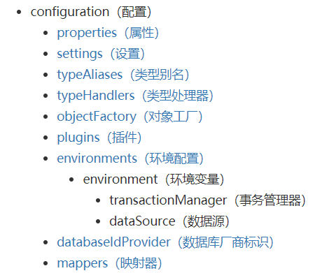
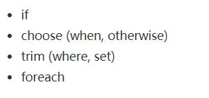

# Mybatis

[Mybatis中文网](https://mybatis.net.cn/)

[Mybatis-generator/通用Mapper/Mybatis-Plus对比](https://blog.csdn.net/m0_37524586/article/details/88351833)

##  持久层解决方案

- JDBC技术

- Spring的JdbcTemplate

- Apache的DBUtils

以上都不是框架

## Mybaits简介

- Apache开源项目，迁移到Google。从ibatis到mybatis
- 优秀的持久层框架，对jdbc操作数据库的步骤进行封装，使用java编写的
- 使开发者只需要关注 SQL 本身，而不需要花费精力去处理例如注册驱动、创建connection、创建statement、手动设置参数、结果集检索等jdbc繁杂的过程代码。

> ORM:就是把数据库表和实体类的属性对应起来

## JDBC编程问题总结

### jdbc程序

[菜鸟教程-Java class.forname 详解](https://www.runoob.com/w3cnote/java-class-forname.html)

```java
public static void main(String[] args) {
	Connection connection = null;
	PreparedStatement preparedStatement = null;
	ResultSet resultSet = null;

	try {
		// 加载数据库驱动
		Class.forName("com.mysql.jdbc.Driver");

		// 通过驱动管理类获取数据库链接
		connection = DriverManager.getConnection("jdbc:mysql://localhost:3306/mybatis?characterEncoding=utf-8", "root", "root");
		// 定义sql语句 ?表示占位符
		String sql = "select * from user where username = ?";
		// 获取预处理statement
		preparedStatement = connection.prepareStatement(sql);
		// 设置参数，第一个参数为sql语句中参数的序号（从1开始），第二个参数为设置的参数值
		preparedStatement.setString(1, "王五");
		// 向数据库发出sql执行查询，查询出结果集
		resultSet = preparedStatement.executeQuery();
		// 遍历查询结果集
		while (resultSet.next()) {
			System.out.println(resultSet.getString("id") + "  " + resultSet.getString("username"));
		}
	} catch (Exception e) {
		e.printStackTrace();
	} finally {
		// 释放资源
		if (resultSet != null) {
			try {
				resultSet.close();
			} catch (SQLException e) {
				// TODO Auto-generated catch block
				e.printStackTrace();
			}
		}
		if (preparedStatement != null) {
			try {
				preparedStatement.close();
			} catch (SQLException e) {
				// TODO Auto-generated catch block
				e.printStackTrace();
			}
		}
		if (connection != null) {
			try {
				connection.close();
			} catch (SQLException e) {
				// TODO Auto-generated catch block
				e.printStackTrace();
			}
		}
	}
}
```

### 问题总结

1. 数据库连接创建、释放频繁造成系统资源浪费，从而影响系统性能。如果使用**数据库连接池**可解决此问题。

2. Sql语句在代码中硬编码，造成代码不易维护，实际应用中sql变化的可能较大，sql变动需要改变java代码。

3. 使用preparedStatement向占有位符号传参数存在硬编码，因为sql语句的where条件不一定，可能多也可能少，修改sql还要修改代码，系统不易维护。

4. 对结果集解析存在硬编码（查询列名），sql变化导致解析代码变化，系统不易维护，如果能将数据库记录封装成**pojo对象**解析比较方便。


## Mybatis入门程序

1. 下载Mybatis的jar包

2. 业务需求

   1. 根据用户id查询一个用户
   2. 根据用户名称模糊查询用户列表、
   3. 添加用户
   4. 更新用户
   5. 删除用户

3. log4j.properties

   ```properties
   # Global logging configuration
   log4j.rootLogger=DEBUG, stdout
   # Console output...
   log4j.appender.stdout=org.apache.log4j.ConsoleAppender
   log4j.appender.stdout.layout=org.apache.log4j.PatternLayout
   log4j.appender.stdout.layout.ConversionPattern=%5p [%t] - %m%n
   ```

4. SqlMapConfig.xml(和spring整合后，<environments>消失)

```xml
<?xml version="1.0" encoding="UTF-8" ?>
<!DOCTYPE configuration
PUBLIC "-//mybatis.org//DTD Config 3.0//EN"
"http://mybatis.org/dtd/mybatis-3-config.dtd">
<configuration>
	<!-- 和spring整合后 environments配置将废除 -->
	<environments default="development">
		<environment id="development">
			<!-- 使用jdbc事务管理 -->
			<transactionManager type="JDBC" />
			<!-- 数据库连接池 -->
			<dataSource type="POOLED">
				<property name="driver" value="com.mysql.jdbc.Driver" />
				<property name="url"
					value="jdbc:mysql://localhost:3306/mybatis?characterEncoding=utf-8" />
				<property name="username" value="root" />
				<property name="password" value="root" />
			</dataSource>
		</environment>
	</environments>
    <mappers>
        <mapper resource="sqlmap/User.xml"></mapper>
    </mappers>
    
</configuration>
```

5. User.xml

```xml
<?xml version="1.0" encoding="UTF-8" ?>
<!DOCTYPE mapper
PUBLIC "-//mybatis.org//DTD Mapper 3.0//EN"
"http://mybatis.org/dtd/mybatis-3-mapper.dtd">
<!-- namespace：命名空间，用于隔离sql，还有一个很重要的作用，后面会讲 -->
<mapper namespace="test">
    <!-- id:statement的id 或者叫做sql的id-->
	<!-- parameterType:声明输入参数的类型 -->
	<!-- resultType:声明输出结果的类型，应该填写pojo的全路径 -->
	<!-- #{}：输入参数的占位符，相当于jdbc的？ -->
	<select id="queryUserById" parameterType="Integer"
		resultType="cn.itcast.mybatis.pojo.User">
		SELECT * FROM `user` WHERE id  = #{id}
	</select>
    <select id="queryUserByUsername1" parameterType="String"
		resultType="cn.itcast.mybatis.pojo.User">
		SELECT * FROM `user` WHERE username LIKE #{username}
	</select>
    
</mapper>
```

6. 测试程序

```java
public class MybatisTest {
	private SqlSessionFactory sqlSessionFactory = null;

	@Before
	public void init() throws Exception {
		// 1. 创建SqlSessionFactoryBuilder对象
		SqlSessionFactoryBuilder sqlSessionFactoryBuilder = new SqlSessionFactoryBuilder();

		// 2. 加载SqlMapConfig.xml配置文件
		InputStream inputStream = Resources.getResourceAsStream("SqlMapConfig.xml");

		// 3. 创建SqlSessionFactory对象
		this.sqlSessionFactory = sqlSessionFactoryBuilder.build(inputStream);
	}

	@Test
	public void testQueryUserById() throws Exception {
		// 4. 创建SqlSession对象
		SqlSession sqlSession = sqlSessionFactory.openSession();

		// 5. 执行SqlSession对象执行查询，获取结果User
		// 第一个参数是User.xml的statement的id，第二个参数是执行sql需要的参数；
		Object user = sqlSession.selectOne("queryUserById", 1);

		// 6. 打印结果
		System.out.println(user);

		// 7. 释放资源
		sqlSession.close();
	}
}
```

### 测试程序提取

```java
// 1. 创建SqlSessionFactoryBuilder对象
		SqlSessionFactoryBuilder sqlSessionFactoryBuilder = new SqlSessionFactoryBuilder();

		// 2. 加载SqlMapConfig.xml配置文件
		InputStream inputStream = Resources.getResourceAsStream("SqlMapConfig.xml");

		// 3. 创建SqlSessionFactory对象
		this.sqlSessionFactory = sqlSessionFactoryBuilder.build(inputStream);

		// 4. 创建SqlSession对象
		SqlSession sqlSession = sqlSessionFactory.openSession();

		// 5. 执行SqlSession对象执行查询，获取结果User
		// 第一个参数是User.xml的statement的id，第二个参数是执行sql需要的参数；
		Object user = sqlSession.selectOne("queryUserById", 1);

		// 有时需要
		sqlSession.commit();
		// 6. 打印结果
		System.out.println(user);
```

## Mybatis解决jdbc编程的问题

1、 数据库连接创建、释放频繁造成系统资源浪费从而影响系统性能，如果使用数据库连接池可解决此问题。

解决：在SqlMapConfig.xml中配置数据连接池，使用连接池管理数据库链接。

2、 Sql语句写在代码中造成代码不易维护，实际应用sql变化的可能较大，sql变动需要改变java代码。

解决：将Sql语句配置在XXXmapper.xml文件中与java代码分离。

3、 向sql语句传参数麻烦，因为sql语句的where条件不一定，可能多也可能少，占位符需要和参数一一对应。

解决：Mybatis自动将java对象映射至sql语句，通过statement中的parameterType定义输入参数的类型。

4、 对结果集解析麻烦，sql变化导致解析代码变化，且解析前需要遍历，如果能将数据库记录封装成pojo对象解析比较方便。

解决：Mybatis自动将sql执行结果映射至java对象，通过statement中的resultType定义输出结果的类型。

## Mybatis和Hibernate的区别

Mybatis和hibernate不同，它不完全是一个ORM（对象关系映射）框架，**因为MyBatis需要程序员自己编写Sql语句**。mybatis可以通过XML或注解方式灵活配置要运行的sql语句，并将java对象和sql语句映射生成最终执行的sql，最后将sql执行的结果再映射生成java对象。

 

Mybatis学习门槛低，简单易学，程序员直接编写原生态sql，可严格控制sql执行性能，灵活度高，非常适合对关系数据模型要求不高的软件开发，例如互联网软件、企业运营类软件等，因为这类软件需求变化频繁，一但需求变化要求成果输出迅速。但是灵活的前提是**mybatis无法做到数据库无关性**，如果需要实现支持多种数据库的软件则需要自定义多套sql映射文件，工作量大。

 

Hibernate对象/关系映射能力强，**数据库无关性好**，对于关系模型要求高的软件（例如需求固定的定制化软件）如果用hibernate开发可以节省很多代码，提高效率。但是Hibernate的学习门槛高，要精通门槛更高，而且怎么设计O/R映射，在性能和对象模型之间如何权衡，以及怎样用好Hibernate需要具有很强的经验和能力才行。

总之，按照用户的需求在有限的资源环境下只要能做出维护性、扩展性良好的软件架构都是好架构，所以框架只有适合才是最好。 

## Mapper动态代理方式开发

> Mapper接口开发方法**只需要程序员编写Mapper接口**（相当于Dao接口），由Mybatis框架根据接口定义创建接口的动态代理对象，代理对象的方法体同上边Dao接口实现类方法。

### Mapper接口开发遵循规则

1. Mapper.xml文件中的**namespace**与mapper接口的**类路径相同**。

2. Mapper**接口方法名**和Mapper.xml中定义的每个statement的**id相同** 

3. Mapper接口方法的**输入参数类型**和mapper.xml中定义的每个sql 的**parameterType的类型相同**

4. Mapper接口方法的**输出参数类型**和mapper.xml中定义的每个sql的**resultType的类型相同**

### sqlMapConfig.xml

[Mybatis中文网-配置](https://mybatis.net.cn/configuration.html)



### XxxMapper.xml

[Mybatis中文网-XML映射器](https://mybatis.net.cn/sqlmap-xml.html)

[Mybatis中文网-动态 SQL](https://mybatis.net.cn/dynamic-sql.html)



#### 手动映射`<resultMap>`

OrderMapper.xml

```xml
<?xml version="1.0" encoding="UTF-8" ?>
<!DOCTYPE mapper
PUBLIC "-//mybatis.org//DTD Mapper 3.0//EN"
"http://mybatis.org/dtd/mybatis-3-mapper.dtd">
<!-- namespace：命名空间，用于隔离sql，还有一个很重要的作用，Mapper动态代理开发的时候使用，需要指定Mapper的类路径 -->
<mapper namespace="cn.itcast.mybatis.mapper.OrderMapper">

	<!-- resultMap最终还是要将结果映射到pojo上，type就是指定映射到哪一个pojo -->
	<!-- id：设置ResultMap的id -->
	<resultMap type="Orders" id="orderResultMap">
		<!-- 定义主键 ,非常重要。如果是多个字段,则定义多个id -->
		<!-- property：主键在pojo中的属性名 -->
		<!-- column：主键在数据库中的列名 -->
		<id property="id" column="id" />

		<!-- 定义普通属性 -->
		<result property="userId" column="user_id" />
		<result property="number" column="number" />
		<result property="createtime" column="createtime" />
		<result property="note" column="note" />
	</resultMap>

	<!-- 查询所有的订单数据 -->
	<select id="queryOrderAll" resultMap="orderResultMap">
		SELECT id, user_id,
		number,
		createtime, note FROM `order`
	</select>

</mapper>
```

##### 一对一`<association>`

```xml
<resultMap type="order" id="orderUserResultMap">
	<id property="id" column="id" />
	<result property="userId" column="user_id" />
	<result property="number" column="number" />
	<result property="createtime" column="createtime" />
	<result property="note" column="note" />

	<!-- association ：配置一对一属性 -->
	<!-- property:order里面的User属性名 -->
	<!-- javaType:属性类型 -->
	<association property="user" javaType="User">
		<!-- id:声明主键，表示user_id是关联查询对象的唯一标识-->
		<id property="id" column="user_id" />
		<result property="username" column="username" />
		<result property="address" column="address" />
	</association>

</resultMap>

<!-- 一对一关联，查询订单，订单内部包含用户属性 -->
<select id="queryOrderUserResultMap" resultMap="orderUserResultMap">
	SELECT
	o.id,
	o.user_id,
	o.number,
	o.createtime,
	o.note,
	u.username,
	u.address
	FROM
	`order` o
	LEFT JOIN `user` u ON o.user_id = u.id
</select>
```

##### 一对多`<collection>`

> 一对一和多对多查询时，记得关联两张表

```xml
<resultMap type="user" id="userOrderResultMap">
	<id property="id" column="id" />
	<result property="username" column="username" />
	<result property="birthday" column="birthday" />
	<result property="sex" column="sex" />
	<result property="address" column="address" />

	<!-- 配置一对多的关系 -->
	<collection property="orders" javaType="list" ofType="order">
		<!-- 配置主键，是关联Order的唯一标识 -->
		<id property="id" column="oid" />
		<result property="number" column="number" />
		<result property="createtime" column="createtime" />
		<result property="note" column="note" />
	</collection>
</resultMap>

<!-- 一对多关联，查询订单同时查询该用户下的订单 -->
<select id="queryUserOrder" resultMap="userOrderResultMap">
	SELECT
	u.id,
	u.username,
	u.birthday,
	u.sex,
	u.address,
	o.id oid,
	o.number,
	o.createtime,
	o.note
	FROM
	`user` u
	LEFT JOIN `order` o ON u.id = o.user_id
</select>
```

#### 多对多

https://www.bilibili.com/video/BV1Db411s7F5?p=55

https://www.bilibili.com/video/BV1Db411s7F5?p=56

## 输入映射和输出映射

### 传递简单类型

使用`#{}`占位符，或者`${}`进行sql拼接。

> **#{}** 是预编译处理，像传进来的数据会加个" "（#将传入的数据都当成一个字符串，会对自动传入的数据加一个双引号）
>
>  
>
> **${}** 就是字符串替换。直接替换掉占位符。$方式一般用于传入数据库对象，例如传入表名.
>
> 使用 ${} 的话会导致 sql 注入。什么是 SQL 注入呢？比如 select * from user where id = ${value}
>
>  
>
> value 应该是一个数值吧。然后如果对方传过来的是 001  and name = tom。这样不就相当于多加了一个条件嘛？把SQL语句直接写进来了。如果是攻击性的语句呢？001；drop table user，直接把表给删了
>
>  
>
> 所以为了防止 SQL 注入，能用 #{} 的不要去用 ${}
>
>  
>
> 如果非要用 ${} 的话，那要注意防止 SQL 注入问题，可以手动判定传入的变量，进行过滤，一般 SQL 注入会输入很长的一条 SQL 语句。

### 传递pojo对象

Mybatis使用ognl表达式解析对象字段的值，`#{}`或者`${}`括号中的值为pojo属性名称。

### 传递pojo包装对象

- QueryVo

```java
public class QueryVo {
	// 包含其他的pojo
	private User user;

	public User getUser() {
		return user;
	}
	public void setUser(User user) {
		this.user = user;
	}
}
```


- Sql语句


## PageHelper

```xml
<bean id="sqlSessionFactoryBean" class="org.mybatis.spring.SqlSessionFactoryBean">
        <property name="dataSource" ref="dataSource"></property>
        <property name="typeAliasesPackage" value="com.binyu.domain"></property>
       
        <!--配置PageHelper-->
        <property name="plugins">
            <array>
                <bean class="com.github.pagehelper.PageInterceptor">
                    <property name="properties">
                        <props>
                            <prop key="helperDialect">mysql</prop>
                            <prop key="reasonable">true</prop>
                        </props>
                    </property>
                </bean>
            </array>
        </property>
    </bean>
```


## Mybatis的注解开发

注解	说明
@Insert	实现新增
@Delete	实现删除
@Update	实现更新
@Select	实现查询
@Result	实现结果集封装
@Results	可以与@Result 一起使用，封装多个结果集
@ResultMap	实现引用@Results 定义的封装
@One	实现一对一结果集封装
@Many	实现一对多结果集封装
@SelectProvider	实现动态 SQL 映射
@CacheNamespace	实现注解二级缓存的使用

> 简单语句用注解开发，复杂还是写xml

# 通用Mapper

[Github-MyBatis 通用 Mapper4](https://github.com/abel533/Mapper)

## 2 快速入门

[Github-通用Mapper-和Spring集成](https://github.com/abel533/Mapper/wiki/1.2-spring)

## 3 常用注解

[Github-通用Mapper-数据库映射](https://github.com/abel533/Mapper/wiki/2.2-mapping#22-%E6%95%B0%E6%8D%AE%E5%BA%93%E6%98%A0%E5%B0%84)

## 4 常用方法

[Github-通用Mapper-简单示例](https://github.com/abel533/Mapper/wiki/2.1-simple)

## 5 QBC查询

[Github-通用Mapper-Example用法](https://github.com/abel533/Mapper/wiki/6.example)

## 6 逆向工程

[Github-通用Mapper-使用 Maven 执行MBG](https://github.com/abel533/Mapper/wiki/4.1.mappergenerator)


 Maven 中的插件配置如下： 

```xml
<plugins>
  <plugin>
    <artifactId>maven-compiler-plugin</artifactId>
    <configuration>
      <source>${jdk.version}</source>
      <target>${jdk.version}</target>
    </configuration>
  </plugin>
  <plugin>
    <groupId>org.mybatis.generator</groupId>
    <artifactId>mybatis-generator-maven-plugin</artifactId>
    <version>1.3.6</version>
    <configuration>
      <configurationFile>
        ${basedir}/src/main/resources/generator/generatorConfig.xml
      </configurationFile>
      <overwrite>true</overwrite>
      <verbose>true</verbose>
    </configuration>
    <dependencies>
      <dependency>
        <groupId>mysql</groupId>
        <artifactId>mysql-connector-java</artifactId>
        <version>5.1.29</version>
      </dependency>
      <dependency>
        <groupId>tk.mybatis</groupId>
        <artifactId>mapper</artifactId>
        <version>4.0.0</version>
      </dependency>
    </dependencies>
  </plugin>
</plugins>
```

下面看配置文件[generatorConfig.xml](https://github.com/abel533/MyBatis-Spring-Boot/blob/master/src/main/resources/generator/generatorConfig.xml)：

```xml
<!DOCTYPE generatorConfiguration
        PUBLIC "-//mybatis.org//DTD MyBatis Generator Configuration 1.0//EN"
        "http://mybatis.org/dtd/mybatis-generator-config_1_0.dtd">

<generatorConfiguration>
    <!--引入外部的属性文件 -->
    <properties resource="config.properties"/>

    <context id="Mysql" targetRuntime="MyBatis3Simple" defaultModelType="flat">
        <property name="beginningDelimiter" value="`"/>
        <property name="endingDelimiter" value="`"/>
		<!--配置通用Mapper的MBG插件相关信息，可以在config.properties中提前配置-->
        <plugin type="tk.mybatis.mapper.generator.MapperPlugin">
            <property name="mappers" value="tk.mybatis.mapper.common.Mapper"/>
            <property name="caseSensitive" value="true"/>
        </plugin>
		
        <jdbcConnection driverClass="${jdbc.driverClass}"
                        connectionURL="${jdbc.url}"
                        userId="${jdbc.user}"
                        password="${jdbc.password}">
        </jdbcConnection>
		<!--配置Java实体类存放位置，可以在pom.xml中提前配置-->
        <javaModelGenerator targetPackage="com.isea533.mybatis.model" 
                            targetProject="src/main/java"/>
		<!--配置XxxMapper.xml存放位置，可以在pom.xml中提前配置-->
        <sqlMapGenerator targetPackage="mapper" 
                         targetProject="src/main/resources"/>
		<!--配置XxxMapper.java存放位置，可以在pom.xml中提前配置-->
        <javaClientGenerator targetPackage="com.isea533.mybatis.mapper" 
                             targetProject="src/main/java"
                             type="XMLMAPPER"/>
		<!--根据数据库表生成Java文件的相关规则-->
        <!--tableName="%"表示数据库中所有表都参与逆向工程，此时使用默认规则-->
        <!--默认规则：table_dept->TableDept-->
        <!--不符合默认规则时需要使用tableName和domainObjectName两个属性明确指定-->
        <table tableName="user_info" domainObjectName="userInfo">
            <!--配置主键生成策略-->
            <generatedKey column="id" sqlStatement="JDBC"/>
        </table>
    </context>
</generatorConfiguration>
```

## 7 自定义Mapper<T>接口

[Github-通用Mapper-扩展通用接口](https://github.com/abel533/Mapper/wiki/5.extend)

# Mybatis Plus

[MyBatis-Plus](https://baomidou.com/) 

> 不喜欢可以用SpringDataJPA和通用Mapper
>
> 分页插件不喜欢可以用PageHelper

SpringBoot2.0.X后使用Mysql8，引入数据库驱动选择`com.mysql.cj.jdbc.Driver`，URL加上`?useSSL=false&useUnicode=true&cahracterEncoding=utf-8&serverTimezone=GMT%2B8`