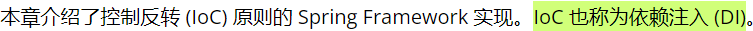

[TOC]


# Spring框架

[Spring官网](https://spring.io/)

[W3Cschool-Spring教程](https://www.w3cschool.cn/wkspring/)

[菜鸟教程-Spring基础知识汇总 Java开发必看](https://www.runoob.com/w3cnote/basic-knowledge-summary-of-spring.html)

[常用插件]()

[xml智能提示](https://blog.csdn.net/sunroyfcb/article/details/80754434)


## 服务器端框架简介

- web层
  - Structs
  - **Spring MVC**

- service层
  - **Spring**
- dao层
  - Hibernate
  - **Mybatis**
  - **jdbcTemplate**-->Spring data

## Spring概述

- 是开源框架
- 轻量级框架
  - 这是和EJB(JavaBean)对比的
  - 依赖资源少+消耗资源少=轻量级框架
- 是一站式框架
  - Web层：SpringMVC
  - Service层：Spring的bean管理，Spring声明式事务
  - Dao层（Data Access Object）：Spring的jdbc模板，Spring的ORM模块


### Spring优点


### Spring的体系结构


- Core Container（1.核心容器）
  - Beans（1.1 管理bean）
  - Core（1.2 核心）
  - Context 上下文（1.3 配置文件）
  - Expression Language （1.4 SpringEL表达式）
- AOP（2.1 切面编程）
- Aspects（2.2 AOP框架）
- Data Access/Integration（3）
  - JDBC （3.1 jdbc template 数据库开发）
  - ORM （3.2 整合Hibernate）
  - Transactions （3.3 事务管理）
- Web（4 MVC/Remoting）
  - Web（4.1 web开发）
  - Struts（4.2 整合Struts）
- Test（整合Junit）

## Spring核心

> Spring官网说IOC就是DI



### 控制反转IoC

> 需要配置 log4j.properties

控制反转之前的做法和控制反转的原理：


1. 导入Jar包4+1（4个核心beans,core,context,expression + 1个依赖 commons-logging）


- xxx.jar（需要的）
- xxx-javadoc.jar（帮助文档）
- xxx-sources.jar（源码）


2. 目标类

- 提供UserService接口和实现类
- 获得UserService实现类的实例

- 定义接口

```java
package com.itheima.a_ioc;

public interface UserService {
	public void addUser();
}
```

- 定义实现类

```java
package com.itheima.a_ioc;

public class UserServiceImpl implements UserService {

	@Override
	public void addUser() {
		// TODO Auto-generated method stub
		System.out.println(a_ico add user);
	}

}
```


3. 配置文件
> XML需要点选design来看代码，别用Open with Text Editer，那样就没有高亮了。

- 位置：任意，开发中一般在classpath下（src）
- 名称：任意，开发中常用`applicationContext.xml`
- 内容：添加`schema约束`
- 配置service

```xml
<?xml version="1.0" encoding="UTF-8"?>
<beans xmlns="http://www.springframework.org/schema/beans"
    xmlns:xsi="http://www.w3.org/2001/XMLSchema-instance"
    xsi:schemaLocation="
        http://www.springframework.org/schema/beans 
        http://www.springframework.org/schema/beans/spring-beans.xsd">

    <!-- bean definitions here -->
	<!-- 配置service
		<bean>配置需要创建的对象
		id:用于之后从Spring绒球获得实例时使用的
		class:需要创建实例的全限定类名
	 -->    

<bean id="userServiceId" class="com.itheima.a_ioc.UserServiceImpl"></bean>
</beans>
```


4. 测试

### 依赖注入（属性设置）DI

#### 属性注入的前四种方式


> 构造方法的 普通类型 属性注入用`<constructor-arg name="属性名" value="属性值">`
>
> 构造方法的 对象类型 属性注入用`<constructor-arg name="属性名"  ref="引用的对象">`
>
> set方法的 普通类型 属性注入用`<property name="属性名" value="属性值">`
>
> set方法的 对象类型 属性注入用`<property name="属性名" ref="引用的对象">`


> 前提是必须有IOC的环境

- is a :是一个，继承

- has a :有一个，成员变量，依赖

  ```java
  class B{
      private A a; //B类依赖A类
  }
  ```

- 依赖：一个对象需要使用另一个对象

- 注入：通过setter方法进行另一个对象实例设置

> 这两个图非常重要，方便理解IoC和DI，解耦与耦合


#### 属性注入的P名称空间的方式【了解】

> 要使用p名称空间，需要修改头部的xmlns   `beans`变`p`，然后前缀改成`xmlns：`
>
> 不用p空间就要把`xmlns:`那一行删去，不然会有问题

```xml
xmlns="http://www.springframework.org/schema/beans"

<!--要使用p名称空间，需要修改头部的xmlns   `beans`变`p`，然后前缀改成`xmlns：`-->
xmlns:="http://www.springframework.org/schema/p"
```

- p名称空间的 普通属性 的注入

```xml
<bean id="car2" class="com.binyu.spring.demo4.Car2" p:name="奇瑞qq" p:price="30000"></bean>
```

- p名称空间的 对象属性 的注入

```xml
<bean id="employee" class="com.binyu.spring.demo4.Employee" p:name="王东" p:car2-ref="car2"></bean>
```

#### 属性注入的SpEL的方式

[Spring官网-SpEL表达式](https://docs.spring.io/spring-framework/docs/current/reference/html/core.html#expressions)

[CSDN-SpEL表达式总结](https://blog.csdn.net/u010086122/article/details/81566515)

>  `#{SpEL}`使用前，要确认`xmlns:`已经清除

```xml
<!-- SpEL的属性注入 -->
<bean id="car2" class="com.binyu.spring.demo4.Car2">
	<property name="name" value="#{'三蹦子'}"></property>
	<property name="price" value="#{3000}"></property>
</bean>
```

```xml
<bean id="employee" class="com.binyu.spring.demo4.Employee">
    <!-- 直接注入属性 -->
	<property name="name" value="#{'赵洪'}"></property>
    <!-- 直接注入对象 -->
	<property name="car2" value="#{car2}"></property>
</bean>
```

```xml
<!-- SpEL的属性注入 -->
<bean id="carInfo" class="com.binyu.spring.demo4.CarInfo"></bean>
<bean id="car2" class="com.binyu.spring.demo4.Car2">
    <!-- 直接注入对象的属性 -->
	<property name="name" value="#{carInfo.name}"></property>
    <!-- 直接注入对象的方法 -->
	<property name="price" value="#{carInfo.calculatorPrice()}"></property>
</bean>
```

#### 复杂数据类型的SpEL注入

1. 目标类

```java
package com.binyu.spring.demo5;

import java.util.Arrays;
import java.util.List;
import java.util.Map;
import java.util.Set;

/**
 * 集合属性的注入
 * @author Dong Binyu
 *
 */
public class CollectionBean {
	private String[] arrs;
	private List<String> list;
	private Set<String> set;
	private Map<String,String> map;
	public void setArrs(String[] arrs) {
		this.arrs=arrs;
	}
	
	public void setList(List<String> list) {
		this.list = list;
	}

	public void setSet(Set<String> set) {
		this.set = set;
	}

	public void setMap(Map<String,String> map) {
		this.map = map;
	}

	@Override
	public String toString() {
		return "CollectionBean [arrs=" + Arrays.toString(arrs) + ", list=" + list + ", set=" + set + ", map=" + map
				+ "]";
	}

	
	
	
}

```

2. 配置文件

```xml
<bean id="collection"
		class="com.binyu.spring.demo5.CollectionBean">
		<property name="arrs">
			<!-- 注入数组类型和List配置一样 -->
			<list>
				<!-- 普通类型 数组 -->
				<value>董滨雨</value>
				<value>李铭霞</value>
				<value>在一起</value>
				<value>真好看</value>
			</list>
		</property>

		<property name="list">
			<!-- 注入数组类型和List配置一样 -->
			<list>
				<!-- List集合 -->
				<value>大学里</value>
				<value>谈恋爱</value>
				<value>在一起</value>
				<value>真好看</value>
			</list>
		</property>

		<property name="set">
			<set>
				<!-- Set集合 -->
				<value>set1</value>
				<value>set2</value>
				<value>set3</value>
				<value>set4</value>
			</set>
		</property>

		<property name="map">
			<!-- Map集合 -->
			<map>
				<entry key="aaa" value="111"></entry>
				<entry key="bbb" value="222"></entry>
				<entry key="ccc" value="333"></entry>
			</map>
		</property>

	</bean>
```

3. 测试类

```java
package com.binyu.spring.demo5;

import org.junit.Test;
import org.springframework.context.ApplicationContext;
import org.springframework.context.support.ClassPathXmlApplicationContext;

public class SpringDemo5 {
	@Test
	public void demo1() {
		ApplicationContext applicationContext=new ClassPathXmlApplicationContext("applicationContext.xml");
		CollectionBean collectionBean=(CollectionBean) applicationContext.getBean("collectionBean");
		System.out.println(collectionBean);
	
	}
}

```


## Spring工厂类概述

Spring的工厂类的结构图

BeanFactory：老版本的工厂类

- 在调用getBean的时候，才回生成类的实例

ApplicationContext：新版本的工厂类

- 加载配置文件的时候，就会将Spring管理的类实例化
- 功能更强大
- 有两个实现类
  - ClassPathXmlApplicationContext：加载类路径（src）下的配置文件
  - FileSystemXmlApplicationContext：加载文件系统（磁盘）下的配置文件
  - AnnotationConfigApplicationContext:加载配置类

> ApplicationContext创建对象采用立即加载方式，单例适用
>
> BeanFactory创建对象采用延迟加载方式，多例适用


## Spring的详细配置

### XML的schema提示配置

> 一个xml能被一个DTD约束，但是可以被多个schema约束的


### Bean（可重用组件）的配置

Bean标签id和name的配置

- `id`：使用了约束中的唯一约束。里面不能出现特殊字符
- `name`：没有使用唯一约束（理论上可以重复，但是实际开发中不允许）。里面可以出现特殊字符
  - Spring和Stucts1整合的时候，才会遇到
- `class`：实例的类的全路径

Bean的生命周期配置【了解】（方法写在实例的类中）

- `init-method`：Bean被初始化执行的方法
- `destroy-method`：Bean被销毁时执行的方法（Bean是单例创建，工厂关闭）

Bean的作用范围的配置【重点】

- `scope`：Bean的作用范围

  - `singleton`：默认的，spring会采用单例模式创建这个对象（当容器创建时活着，当容器销毁时死亡）

  

  - `prototype`：多例模式【Structs2和Spring整合的时候要用到】（当使用对象时活着，当对象长时间不用才会回收）

  

  - `request`：应用在web项目中，Spring创建这个类以后，将这个类存入到request范围中
  - `session`：应用在web项目中，Spring创建这个类以后，将这个类存入到session范围中
  - `globalsession`：应用在web项目中，必须在porlet环境下使用。但是如果没有这种环境，相当于session

> 单例模式：不管有多少次程序调用，只会new一次。每次用的只是一个实例
>
> 多例模式：用一次就new一次

> porlet环境：子域名免登录，比如百度中的百度云，百度百科

使用工厂方法注入bean

- `factory-bean`
- `factory-method`

参见 https://www.cnblogs.com/vickylinj/p/9474597.html

## Spring的分模块开发的配置

### 加载多个配置文件方式1

> 配置两个xml

```java
ApplicationContext applicationContext=new ClassPathXmlApplicationContext("applicationContext.xml","applicationContext2.xml");
```


### 加载多个配置文件方式2

> 在一个xml中引用另一个xml

```xml
<import resource="applicationContext2.xml"/>
```


### 加载多个配置文件方式3

`@Import("ApplicationContext2.xml")`

`@Import(ApplicationContext2.class)`

## CRM的综合案例

1. 搭建开发环境

   1. 创建数据库和表

   2. 创建一个web项目，引入jar包

      1. 引入struts2开发的jar包

      2. 引入struts2的配置文件

         1. web.xml

         

         2. struts.xml

         

         

   3. 引入页面

   4. 编写action

   5. 配置action
   6. 修改页面提交到action
   7. 编写action的save方法
   8. 引入spring的环境
      1. 引入jar包
      2. 引入配置文件
   9. 将Service交给Spring
   10. 在Action中调用Service
   11. 编写DAO并完成配置
   12. 在Service中使用DAO

   

## Spring的注解开发

1. 创建web项目，引入6+1（aop的jar包）

2. 创建`applicationContext.xml`，并引入context约束（之前引入的是bean约束）

3.  实现接口和实现类
4. 开启Spring的组件扫描

```xml
<!-- 使用IOC注解开发，配置组件扫描 -->
<context:component-scan base-package="com.binyu.demo1"/>
```


5. 在类上添加注解
6. 在属性上添加注解

```java
@Component("userDao")// 相当于<bean id="userDAO" class="com....">
public class UserDAOImpl implements UserDAO {
	@Value("注解牛逼！")
	String name;

	@Override
	public void save() {
		// TODO Auto-generated method stub
		System.out.println("UserDAO"+name);
		
		
	}

}
```

### `@Component`：组件 

- 修饰一个类，将这个类交给Spring管理
- 这个注解有三个衍生注解（功能类似），修饰类
  - `@Controller`：web层
  - `@Service`：service层
  - `@Repository`：DAO层

- `value`的值为组件id名，不写`value`默认为类名且首字母小写

- 组件注解扫描
  - ```xml
    <context:component-scan bean-pakage="com.binyu"></context:component-scan>
    ```

### 属性注入的注解

> 其实就是依赖注入

- 普通属性
  - `@Value`：设置普通属性的值
    - 如果有set方法，写在set方法上
    - 如果没有set方法，写在属性上
- 对象类型属性
  - `@Autowired`：设置对象类型的属性的值，
    - 但是按照类型进行注入的，所以不一定要名称能对的上
    - 如果要让名称对的上，`@Qualifier`和`@Autowired`一起使用
  - `@Resource`：完成对象类型的属性注入，按照名称完成属性注入，`@Resource(name="xxx")`
- 集合类型
  - 只能用xml注入


### Bean的其他的注解

- 生命周期相关的注解

  > 这两个注解目前使用不了，原因不明

  - `@PostConstruct`：初始化方法
  - `@PreDestroy`：销毁方法 

- Bean作用范围的注解

  - `@Scope`：作用范围
    - `singleton`：默认单例
    - `prototype`：多例
    - `request`
    - `session`
    - `globalsession`

### IOC和XML注解开发的比较

- XML配置
  - 任意场景都能使用
  - 结构清晰，维护方便
- 注解配置
  - 有些场景不能使用，比如这个类不是自己提供的。
  - 开发速度快，轻松又简单~
  - 注解牛逼！

### XML和注解整合开发

- 使用XML来管理Bean
- 使用注解完成属性注入

### 配置文件的几个注解

`@Configuration`:指定当前类是一个配置类

`@ComponentScan(base-package="")`:通过注解指定spring在创建容器时要扫描的包，等同于`<context:component-scan base-package="com.itheima"></context:component-scan>`

`@Bean`:用于把当前方法的返回值作为bean对象存入spring的容器中。name和value是它的两个属性，value不指定时默认是方法名。

`@Import（xxx.class）`导入子配置类

`@PropertySource（classpath:db.properties）`指定配置文件位置

## Junit集成main方法 注解方式除去重复代码

导入spring-test 的jar包

`@Runwith(SpringJunit4ClassRunner.class)`
`@ContextConfiguration(classpath:applicationcontext.xml)`


## Spring的AOP的XML开发

[Spring中基于AOP的XML架构](https://www.w3cschool.cn/wkspring/omps1mm6.html)

> AOP：面向切面编程，是OOP开发的拓展和延伸，解决OOP开发遇到的问题
>
> 底层实现是用的 JDK动态代理和Cglib动态代理的自动切换
>
> 方便了 方法增强和拓展


>  AOP可以用来：日志记录、审计、声明式事务、安全性和缓存等


### Spring的AOP的开发（AspectJ的XML的方式）

> AspectJ是一个AOP的框架，Spring后来的版本引入AspectJ作为AOP的开发


1. 引入jar包


2. 引入配置文件


3. 编写目标类并完成配置


> Spring整合单元测试的jar包是`spring-test-4.2.4.RELEASE.jar`

4. 编写测试类


```java
package com.binyu.demo1;

import org.junit.Test;
import org.junit.runner.RunWith;
import org.springframework.beans.factory.annotation.Autowired;
import org.springframework.beans.factory.annotation.Qualifier;
import org.springframework.context.ApplicationContext;
import org.springframework.context.support.ClassPathXmlApplicationContext;
import org.springframework.test.context.ContextConfiguration;
import org.springframework.test.context.junit4.SpringJUnit4ClassRunner;

@RunWith(SpringJUnit4ClassRunner.class)
@ContextConfiguration("classpath:applicationContext.xml")
public class TestDemo {

	@Autowired
	@Qualifier("productDao")
	private ProductDao productDao;
	
	@Test
	public void demo1() {
		productDao.save();
		productDao.update();
		productDao.find();
		productDao.delete();
	}
	
	@Test
	public void demo2() {
		ApplicationContext applicationContext=new ClassPathXmlApplicationContext("applicationContext.xml");
		ProductDao productDao=(ProductDao) applicationContext.getBean("productDao");
		productDao.save();
		productDao.update();
		productDao.find();
		productDao.delete();
	}
	
}
```

5. 编写切面类

```java
package com.binyu.demo1;

/**
 * 切面类
 * @author Dong Binyu
 *
 */
public class MyAspectXML {
	public void checkPri() {
		System.out.println("这是权限校验方法。。。");
	}
}
```

6. 将切面类交给Spring管理

```xml
<bean id="myAspectXML" class="com.binyu.demo1.MyAspectXML"></bean>
```

7. 通过AOP的配置完成对目标类产生代理

```xml
<aop:config>
		<!-- 表达式配置哪些类的那些方法需要增强 -->
		<aop:pointcut
			expression="execution(* com.binyu.demo1.ProductDaoImpl.save(..))"
			id="pointcut1" />
		<!-- 配置切面，三步走：通知类型、切面方法、切面位置 -->
		<aop:aspect ref="myAspectXML">
			<aop:before method="checkPri" pointcut-ref="pointcut1"/>
		</aop:aspect>
</aop:config>
```


### Spring中的通知类型

- 前置通知：在目标方法执行之前进行操作
- 后置通知：在目标方法执行之后进行操作
- 环绕通知：在目标方法执行之前和之后进行操作
- 异常抛出通知：出现异常时候，进行的操作
- 最终通知：无论代码是否有异常，都进行操作
- 引介通知（不用）

```xml
  <aop:config>
      <aop:aspect id="log" ref="logging">
         <aop:pointcut id="selectAll" 
         expression="execution(* com.tutorialspoint.*.*(..))"/>
         <aop:before pointcut-ref="selectAll" method="beforeAdvice"/>
         <aop:after pointcut-ref="selectAll" method="afterAdvice"/>
         <aop:after-returning pointcut-ref="selectAll" 
                              returning="retVal"
                              method="afterReturningAdvice"/>
         <aop:after-throwing pointcut-ref="selectAll" 
                             throwing="ex"
                             method="afterThrowingAdvice"/>
      </aop:aspect>
   </aop:config>
```


### Spring中`execution切入点表达式`的写法

- The execution of any public method:

  ```
      execution(public * *(..))
  ```

- The execution of any method with a name that begins with `set`:

  ```
      execution(* set*(..))
  ```

- The execution of any method defined by the `AccountService` interface:

  ```
      execution(* com.xyz.service.AccountService.*(..))
  ```

- The execution of any method defined in the `service` package:

  ```
      execution(* com.xyz.service.*.*(..))
  ```

- The execution of any method defined in the service package or one of its sub-packages:

  ```
      execution(* com.xyz.service..*.*(..))
  ```

## Spring的AOP的注解开发

1. 引入jar包(基本的6个+AOP4个+整合JUit单元测试1个)


2. 引入配置文件`applicationContext.xml`

```xml
<?xml version="1.0" encoding="UTF-8"?>
<beans xmlns="http://www.springframework.org/schema/beans"
	xmlns:xsi="http://www.w3.org/2001/XMLSchema-instance"
	xmlns:context="http://www.springframework.org/schema/context"
	xmlns:aop="http://www.springframework.org/schema/aop"
	xmlns:tx="http://www.springframework.org/schema/tx"
	xsi:schemaLocation="http://www.springframework.org/schema/beans 
	http://www.springframework.org/schema/beans/spring-beans.xsd
	http://www.springframework.org/schema/context
	http://www.springframework.org/schema/context/spring-context.xsd
	http://www.springframework.org/schema/aop
	http://www.springframework.org/schema/aop/spring-aop.xsd
	http://www.springframework.org/schema/tx 
	http://www.springframework.org/schema/tx/spring-tx.xsd">
	
</beans>
```

3. 编写目标类并配置
4. 编写切面类并配置

5. 使用注解的AOP对象目标类进行增强
   - 在配置文件中打开注解的AOP开发
   - 在切面类上使用注解

```xml
<!-- 在配置文件中开启注解的AOP的开发 -->
	<aop:aspectj-autoproxy></aop:aspectj-autoproxy>
```

```java
package com.binyu.demo1;

import org.aspectj.lang.annotation.Aspect;
import org.aspectj.lang.annotation.Before;

/**
 * 切面类：注解的切面类
 * 
 * @author Dong Binyu
 *
 */
@Aspect
public class MyAspectAnno {
	@Before(value="execution(* com.binyu.demo1.OrderDao.save(..))")
	public void before() {
		System.out.println("前置增强-------");
	}
}
```

6. 编写测试类

```java
package com.binyu.demo1;

import org.junit.Test;
import org.junit.runner.RunWith;
import org.springframework.beans.factory.annotation.Autowired;
import org.springframework.beans.factory.annotation.Qualifier;
import org.springframework.core.annotation.Order;
import org.springframework.test.context.ContextConfiguration;
import org.springframework.test.context.junit4.SpringJUnit4ClassRunner;

@RunWith(SpringJUnit4ClassRunner.class)
@ContextConfiguration("classpath:applicationContext.xml")
public class TestDemo {

	
	@Autowired
	@Qualifier(value = "orderDao")
	private OrderDao orderDao;
	
	@Test
	public void demo1() {
		orderDao.save();
		orderDao.update();
		orderDao.find();
		orderDao.delete();
	}
	
}
```

### Spring的AOP中的通知类型

- `@Before`前置通知：在目标方法执行之前进行操作

```java
@Before(value="execution(* com.binyu.demo1.OrderDao.save(..))")
	public void before() {
		System.out.println("前置增强-------");
	}
```

- `@After`后置通知：在目标方法执行之后进行操作

```java
@After(value="execution(* com.binyu.demo1.OrderDao.delete(..))",returning = "result")
//	用returning拿到切面目标类方法的返回值	
		public void after(Object result) {
		System.out.println("后置增强----------"+result);
	}
```


- `@Around`环绕通知：在目标方法执行之前和之后进行操作

```java
//	环绕通知
	@Around(value="execution(* com.binyu.demo1.OrderDao.update(..))")
	public Object around(ProceedingJoinPoint joinPoint) throws Throwable {
		System.out.println("环绕前通知-------");
		Object obj=joinPoint.proceed();
		System.out.println("环绕后通知-------");
		return obj;
	}
```


- `@AfterThrowing`异常抛出通知：出现异常时候，进行的操作

```java
//	异常抛出通知
	@AfterThrowing(value="execution(* com.binyu.demo1.OrderDao.find(..))",throwing = "e")
	public void afterThrowing(Throwable e) {
		System.out.println("异常抛出通知。。。"+e.getMessage());
	}
```

> 注意：如果find方法没有异常，则不会调用该切面类的方法


- `@AfterReturning`返回通知：在方法返回结果之后执行

```java
//	最终通知
	@AfterReturning(value="execution(* com.binyu.demo1.OrderDao.find(..))")
	public void afterReturning() {
		System.out.println("这是返回通知----");
	}
```

### Spring的AOP注解的切入点的配置`@Pointcut`

```java
package com.binyu.demo1;

import org.aspectj.lang.ProceedingJoinPoint;
import org.aspectj.lang.annotation.After;
import org.aspectj.lang.annotation.AfterReturning;
import org.aspectj.lang.annotation.AfterThrowing;
import org.aspectj.lang.annotation.Around;
import org.aspectj.lang.annotation.Aspect;
import org.aspectj.lang.annotation.Before;
import org.aspectj.lang.annotation.Pointcut;

/**
 * 切面类：注解的切面类
 * 
 * @author Dong Binyu
 *
 */
@Aspect
public class MyAspectAnno {
//	前置通知
//	@Before(value="execution(* com.binyu.demo1.OrderDao.save(..))")
	@Before(value="MyAspectAnno.pointcut2()")
	public void before() {
		System.out.println("前置增强-------");
	}

	@AfterReturning(value="MyAspectAnno.pointcut4()",returning = "result")
//	用returning拿到切面目标类方法的返回值
	public void afterReturning(Object result) {
		System.out.println("返回增强----------"+result);
    }
	
//	切入点注解
	@Pointcut(value="execution(* com.binyu.demo1.OrderDao.find(..))")
	private void pointcut1() {};
	@Pointcut(value="execution(* com.binyu.demo1.OrderDao.save(..))")
	private void pointcut2() {};
	@Pointcut(value="execution(* com.binyu.demo1.OrderDao.update(..))")
	private void pointcut3() {};
	@Pointcut(value="execution(* com.binyu.demo1.OrderDao.delete(..))")
	private void pointcut4() {};
	
}

```

> 如果目标类实现了接口，Spring底层使用JDK动态代理
>
> 如果目标类没有实现接口，Spring底层使用cglib动态代理

## Spring的JDBC的模板的使用

> Spring是EE开发的一站式框架，有EE开发的每层的解决方案，Spring对持久层也提供了解决方：ORM模块和JDBC模板


### JDBC模板使用的入门

1. 创建项目，引入jar包(基本6个包+数据库驱动1个包+Spring的JDBC模板和它依赖的2个包+单元测试整合1个包)


2. 创建数据库和表

```sql
create database spring_day03;
use spring_day03;
create table account(
    id int primary key auto_increment,
	name varchar(20),
	money double);
```

3. 使用Spring的JDBC模板来保存数据

```java
package com.binyu.jdbc.demo1;


import org.junit.Test;
import org.springframework.jdbc.core.JdbcTemplate;
import org.springframework.jdbc.datasource.DriverManagerDataSource;

public class JdbcDemo1 {
	@Test
	public void demo1() {
//		jdbc模板的使用类似于Dbutils
//		创建连接池
		DriverManagerDataSource dataSource=new DriverManagerDataSource();
		
		dataSource.setDriverClassName("com.mysql.jdbc.Driver");
		
		dataSource.setUrl("jdbc:mysql:///spring_day03");
		dataSource.setUsername("root");
		dataSource.setPassword("root");
		
//		创建jdbc模板
		JdbcTemplate jdbcTemplate=new JdbcTemplate(dataSource);
		
		jdbcTemplate.update("insert into account values(null,?,?)","陈冠希",100000d);
	}
}
```


3. 在数据库中查看更新的数据

```
mysql> select * from account;
+----+-----------+--------+
| id | name      | money  |
+----+-----------+--------+
|  1 | 陈冠希    | 100000 |
+----+-----------+--------+
1 row in set (0.00 sec)
```

### 将连接池和模板交给Spring管理

1. 引入Spring的配置文件
2. 配置文件中配置连接池和jdbc模板

```xml
<?xml version="1.0" encoding="UTF-8"?>
<beans xmlns="http://www.springframework.org/schema/beans"
	xmlns:xsi="http://www.w3.org/2001/XMLSchema-instance"
	xmlns:context="http://www.springframework.org/schema/context"
	xmlns:aop="http://www.springframework.org/schema/aop"
	xmlns:tx="http://www.springframework.org/schema/tx"
	xsi:schemaLocation="http://www.springframework.org/schema/beans 
	http://www.springframework.org/schema/beans/spring-beans.xsd
	http://www.springframework.org/schema/context
	http://www.springframework.org/schema/context/spring-context.xsd
	http://www.springframework.org/schema/aop
	http://www.springframework.org/schema/aop/spring-aop.xsd
	http://www.springframework.org/schema/tx 
	http://www.springframework.org/schema/tx/spring-tx.xsd">


	<!-- 配置Spring内置的连接池============== -->
	<bean id="dataSource"
		class="org.springframework.jdbc.datasource.DriverManagerDataSource">
		<!-- 属性注入 -->
		<property name="driverClassName"
			value="com.mysql.jdbc.Driver"></property>
		<property name="url" value="jdbc:mysql:///spring_day03"></property>
		<property name="username" value="root"></property>
		<property name="password" value="root"></property>
	</bean>

	<!-- 配置Spring的JDBC的模板=============== -->
	<bean id="jdbcTemplate"
		class="org.springframework.jdbc.core.JdbcTemplate">
	<property name="dataSource" ref="dataSource"></property>
	</bean>

</beans>
```

3. 编写测试类

```java
package com.binyu.jdbc.demo1;

import org.junit.Test;
import org.junit.runner.RunWith;
import org.springframework.beans.factory.annotation.Autowired;
import org.springframework.beans.factory.annotation.Qualifier;
import org.springframework.jdbc.core.JdbcTemplate;
import org.springframework.test.context.ContextConfiguration;
import org.springframework.test.context.junit4.SpringJUnit4ClassRunner;

@RunWith(SpringJUnit4ClassRunner.class)
@ContextConfiguration("classpath:applicationContext.xml")
public class JdbcDemo2 {
	
	
	@Autowired
	@Qualifier(value="jdbcTemplate")
	private JdbcTemplate jdbcTemplate;
	
	
	@Test
	public void demo2() {
		jdbcTemplate.update("insert into account values(null,?,?)","王宝强",10000d);
	}
}
```

> 因为是Spring4的缘故，此时会报错，需要引入aop的jar包！！！
>
> Spring3不报错。


4. 查看数据库

### 使用开源数据库连接池

> DBCP连接池的属性和Spring内置连接池属性相同
>
> C3P0连接池的属性和前面两个连接池**不同**

#### DBCP的使用

1. 引入两个jar包


2. 配置DBCP连接池

```xml
<!-- 配置DBCP连接池 -->
	<bean id="dataSource" class="org.apache.commons.dbcp.BasicDataSource">
		<!-- 属性注入   和Spring内置的连接池属性一样 -->
		<property name="driverClassName"
			value="com.mysql.jdbc.Driver"></property>
		<property name="url" value="jdbc:mysql:///spring_day03"></property>
		<property name="username" value="root"></property>
		<property name="password" value="root"></property>
	</bean>
```

3. 编写测试类

   略


#### C3P0的使用

1. 引入一个jar包


2. 配置C3P0连接池

```xml
<!-- 配置C3P0连接池=================== -->
	<bean id="dataSource"
		class="com.mchange.v2.c3p0.ComboPooledDataSource">
		<!-- 注意两个连接池的属性不一样 -->
		<property name="driverClass"
			value="com.mysql.jdbc.Driver"></property>
		<property name="jdbcUrl" value="jdbc:mysql:///spring_day03"></property>
		<property name="user" value="root"></property>
		<property name="password" value="root"></property>
	</bean>

```

3. 编写测试类
4. 查看数据库

```
mysql> select * from account;
+----+-----------+--------+
| id | name      | money  |
+----+-----------+--------+
|  1 | 陈冠希    | 100000 |
|  2 | 王宝强    |  10000 |
|  3 | 王宝强    |  10000 |
|  4 | 王宝强    |  10000 |
|  5 | 李如花    |  10000 |
|  6 | 邓紫棋    |  10000 |
+----+-----------+--------+
6 rows in set (0.01 sec)
```

### 抽取配置到属性文件

1. 定义一个属性文件`jdbc.properties`

```properties
jdbc.driverClass=com.mysql.jdbc.Driver
jdbc.url=jdbc:mysql:///spring_day03
jdbc.username=root
jdbc.password=root
```


2. 在Spring的配置文件中引入属性文件

```xml
<!-- 引入属性文件==================== -->
	<!-- 第一种:通过bean标签引入(很少用，很复杂) -->
	<!-- 第二种:常用 -->
	<context:property-placeholder location="classpath:jdbc.properties"/>
	
	
	<bean id="dataSource"
		class="com.mchange.v2.c3p0.ComboPooledDataSource">
		<property name="driverClass"
			value="${jdbc.driverClass}"></property>
		<property name="jdbcUrl" value="${jdbc.url}"></property>
		<property name="user" value="${jdbc.username}"></property>
		<property name="password" value="${jdbc.password}"></property>
	</bean>
```

3. 测试类
4. 查看数据库

### 使用JDBC模板完成增删改查操

[Spring官网-Using JdbcTemplate](https://docs.spring.io/spring-framework/docs/current/reference/html/data-access.html#jdbc-JdbcTemplate)

## Spring的事务管理

### 事务

#### 什么是事务？

逻辑上的一组操作，组成这组操作的各个单元，要么全都成功，要么全都失败

#### 事务的特性ACID

- 原子性：事务不可分割
- 一致性：事务执行前后数据完整行保持一致
- 隔离性：一个事务的执行不应该受到其他事务的干扰
- 持久性：一旦事务结束，数据就会持久化到数据库

#### 如果不考虑隔离性引发安全性问题

- 读问题
  - 脏读：一个事务读到另一个事务未提交的数据
  - 不可重复读：一个事务读到另一个事务已经提交的update的数据，导致一个事务中多次查询结果不一致
  - 虚读，幻读：一个事务读到另一个事务已经提交的insert的数据，导致一个事务中多次查询结果不一致
- 写问题
  - 丢失更新

#### 解决读问题

- 设置事务的隔离级别
  - `Read uncommitted`:未提交读，任何读问题解决不了（一般使用这个就够了）
  - `Read committed`：已提交读，解决脏读，但是不可重复读和虚读有可能发生。（Oracle使用）
  - `Repeatable read`：重复读，解决脏读和不可重复度，但是虚读有可能发生。（MySql使用）
  - `Serializable`：解决所有读问题，但是不允许事务并发。安全但是效率很低。

### Spring的事务管理的API

1. `PlatformTransactionManager`平台事务管理器
   - 平台事务管理器：接口，是Spring用于管理事务的真正的对象
     - DataSourceTransactionManager:底层使用JDBC管理事务
     - HibernateTransactionManager:底层使用Hibernate管理事务


2. `TransactionDefinition`事务定义信息
   - 事务定义：用于定义事务的相关的信息，隔离级别，超时信息，传播行为，是否只读
3. `TransactionStatus`事务状态
   - 事务状态：用于记录在事务管理的过程中，事务的状态的对象

> 三个API的关系如下：
>
> Spring进行事务管理的时候，首先**平台事务管理器**根据**事务定义信息**进行事务的管理，在事务管理的过程中，产生各种状态，将这些状态的信息记录到**事务状态**的对象中

### Spring事务中的传播行为

> 主要用来解决 **Service业务层方法相互调用**的问题

- Spring提供了七种事务的传播行为，一般用`PROPAGATION_REQUIRED`

  - 保证多个操作在同一个事务中

    - #### PROPAGATION_REQUIRED：默认值，如果A中有事务，使用A中的事务。如果A没有，创建一个新的事务，将操作包含进来。

    - #### PROPAGATION_SUPPORTS：支持事务，如果A中有事务，使用A中的事务。如果A没有，就不使用事务。

    - #### PROPAGATION_MANDATORY：如果A中有事务，使用A中的事务 。如果A没有，抛出异常

  - 保证多个操作不在同一个事务中

    - #### PROPAGATION_REQUIRES_NEW：默认值，如果A中有事务，将A的事务挂起（暂停），创建新事务，只包含自身的操作。

    - #### PROPAGATION_NOT_SUPPORTED：不支持事务，如果A中有事务，将A的事务挂起。不使用事务管理。

    - #### PROPAGATION_NEVER：如果A中有事务，抛出异常。

  - 嵌套式事务

    - #### PROPAGATION_NESTED：嵌套事务，如果A中有事务，按照A的事务执行，执行完成后，设置一个保存点，执行B中的操作，如果没有异常，就执行完成。如果有异常，可以回滚到最初始的位置，也可以回滚到保存点。

### 搭建Spring的事务管理的环境

> 详见 com.binyu.tx.demo1
>
> **JdbcDaoSupport类**

- 创建Service的接口和实现类
- 创建Dao的接口和实现类
- 配置Service和Dao：交给Spring管理

```xml
	<!-- 配置Service -->
	<bean id="accountService" class="com.binyu.tx.demo1.AccountServiceImpl">
		<property name="accountDao" ref="accountDao"></property>
	</bean>
	<!-- 配置DAO -->
	<bean id="accountDao" class="com.binyu.tx.demo1.AccountDaoImpl"></bean>
```


- 在Dao中编写扣钱和加钱方法

  - 配置连接池和JDBC模板

  ```xml
  	<!-- 配置连接池和JDBC模板 -->
  	
  	<!-- 引入属性文件==================== -->
  	<context:property-placeholder location="classpath:jdbc.properties"/>
  	
  	
  	<bean id="dataSource"
  		class="com.mchange.v2.c3p0.ComboPooledDataSource">
  		<property name="driverClass"
  			value="${jdbc.driverClass}"></property>
  		<property name="jdbcUrl" value="${jdbc.url}"></property>
  		<property name="user" value="${jdbc.username}"></property>
  		<property name="password" value="${jdbc.password}"></property>
  	</bean>
  	
  	
  
  
  
  	<!-- 配置Spring的JDBC的模板=============== -->
  	<bean id="jdbcTemplate"
  		class="org.springframework.jdbc.core.JdbcTemplate">
  		<property name="dataSource" ref="dataSource"></property>
  	</bean>
  ```

  

  - 在Dao中注入JDBC模板

    - 方法一

      ```java
      public class AccountDaoImpl  implements AccountDao {
      
      	
      	
      	private JdbcTemplate jdbcTemplate;
      		
      	public void setJdbcTemplate(JdbcTemplate jdbcTemplate) {
      		this.jdbcTemplate = jdbcTemplate;
      	}
      
      }
      ```

      

    - 方法二

      ```java
      public class AccountDaoImpl extends JdbcDaoSupport implements AccountDao {
          @Override
      	public void outMoney(String from, Double money) {
      		this.getJdbcTemplate().update("update account set money = money - ? where name = ?", money,from);
      	}
      
      	@Override
      	public void inMoney(String to, Double money) {
      		this.getJdbcTemplate().update("update account set money = money + ? where name = ?", money ,to);
      	}
      }
      ```

      

### Spring的事务管理

#### 编程式事务

1. 配置平台事务管理器
2. 配置事务管理的模板类
3. 在业务层注入事务管理的模板
4. 配置文件注入事务管理的模板
5. 编写事务管理的代码

```xml

<!-- 配置Service -->
	<bean id="accountService"
		class="com.binyu.tx.demo1.AccountServiceImpl">
		<property name="accountDao" ref="accountDao">
		</property>
		<!-- 注入事务管理的模板 -->
		<property name="transactionTemplate" ref="transactionTemplate">
		</property>
	</bean>


<!--配置平台事务管理器，拿到连接池 -->
	<bean id="transactionManager" class="org.springframework.jdbc.datasource.DataSourceTransactionManager">
		<property name="dataSource" ref="dataSource">
		</property>
	</bean>
<!--配置事务管理的模板，简化事务管理的代码-->
	<bean id="transactionTemplate" class="org.springframework.transaction.support.TransactionTemplate">
		<property name="transactionManager" ref="transactionManager"></property	
	</bean>
```

```java
package com.binyu.tx.demo1;


import org.springframework.transaction.TransactionStatus;
import org.springframework.transaction.support.TransactionCallbackWithoutResult;
import org.springframework.transaction.support.TransactionTemplate;

/**
 * 转账的业务层的实现类
 * @author Dong Binyu
 *
 */
public class AccountServiceImpl implements AccountService {
//	注入Dao
	private AccountDao accountDao;
	
	public void setAccountDao(AccountDao accountDao) {
		this.accountDao = accountDao;
	}

//	注入事务管理的模板
	private TransactionTemplate transactionTemplate;
	
	
	public void setTransactionTemplate(TransactionTemplate transactionTemplate) {
		this.transactionTemplate = transactionTemplate;
	}


	/**
	 *	from:转出账号
	 *	to:转入账号
	 *	money:转帐金额 
	 */
	
	@Override
	public void transfer(final String from, final String to,final Double money) {
		transactionTemplate.execute(new TransactionCallbackWithoutResult() {
			
			@Override
			protected void doInTransactionWithoutResult(TransactionStatus arg0) {
				// 这两个操作需要事务管理
				accountDao.outMoney(from, money);
				// int i=1/0;
				accountDao.inMoney(to,money);
			}
		});
		

	}

}

```

#### 声明式事务管理---AOP

##### XML式的声明式事务管理

```xml
<!-- from the file 'context.xml' -->
<?xml version="1.0" encoding="UTF-8"?>
<beans xmlns="http://www.springframework.org/schema/beans"
    xmlns:xsi="http://www.w3.org/2001/XMLSchema-instance"
    xmlns:aop="http://www.springframework.org/schema/aop"
    xmlns:tx="http://www.springframework.org/schema/tx"
    xsi:schemaLocation="
        http://www.springframework.org/schema/beans
        https://www.springframework.org/schema/beans/spring-beans.xsd
        http://www.springframework.org/schema/tx
        https://www.springframework.org/schema/tx/spring-tx.xsd
        http://www.springframework.org/schema/aop
        https://www.springframework.org/schema/aop/spring-aop.xsd">

    <!-- this is the service object that we want to make transactional -->
    <bean id="fooService" class="x.y.service.DefaultFooService"/>

    <!-- the transactional advice (what 'happens'; see the <aop:advisor/> bean below) -->
    <tx:advice id="txAdvice" transaction-manager="txManager">
        <!-- the transactional semantics... -->
        <tx:attributes>
            <!-- all methods starting with 'get' are read-only -->
            <tx:method name="get*" read-only="true"/>
            <!-- other methods use the default transaction settings (see below) -->
            <tx:method name="*"/>
        </tx:attributes>
    </tx:advice>

    <!-- ensure that the above transactional advice runs for any execution
        of an operation defined by the FooService interface -->
    <aop:config>
        <aop:pointcut id="fooServiceOperation" expression="execution(* x.y.service.FooService.*(..))"/>
        <aop:advisor advice-ref="txAdvice" pointcut-ref="fooServiceOperation"/>
    </aop:config>

    <!-- don't forget the DataSource -->
    <bean id="dataSource" class="org.apache.commons.dbcp.BasicDataSource" destroy-method="close">
        <property name="driverClassName" value="oracle.jdbc.driver.OracleDriver"/>
        <property name="url" value="jdbc:oracle:thin:@rj-t42:1521:elvis"/>
        <property name="username" value="scott"/>
        <property name="password" value="tiger"/>
    </bean>

    <!-- similarly, don't forget the TransactionManager -->
    <bean id="txManager" class="org.springframework.jdbc.datasource.DataSourceTransactionManager">
        <property name="dataSource" ref="dataSource"/>
    </bean>

    <!-- other <bean/> definitions here -->

</beans>
```


##### 注解式的声明式事务管理`@Transactional`

```xml
<!-- from the file 'context.xml' -->
<?xml version="1.0" encoding="UTF-8"?>
<beans xmlns="http://www.springframework.org/schema/beans"
    xmlns:xsi="http://www.w3.org/2001/XMLSchema-instance"
    xmlns:aop="http://www.springframework.org/schema/aop"
    xmlns:tx="http://www.springframework.org/schema/tx"
    xsi:schemaLocation="
        http://www.springframework.org/schema/beans
        https://www.springframework.org/schema/beans/spring-beans.xsd
        http://www.springframework.org/schema/tx
        https://www.springframework.org/schema/tx/spring-tx.xsd
        http://www.springframework.org/schema/aop
        https://www.springframework.org/schema/aop/spring-aop.xsd">

    <!-- this is the service object that we want to make transactional -->
    <bean id="fooService" class="x.y.service.DefaultFooService"/>

    <!-- enable the configuration of transactional behavior based on annotations -->
    <!-- a TransactionManager is still required -->
    <tx:annotation-driven transaction-manager="txManager"/> 

    <bean id="txManager" class="org.springframework.jdbc.datasource.DataSourceTransactionManager">
        <!-- (this dependency is defined somewhere else) -->
        <property name="dataSource" ref="dataSource"/>
    </bean>

    <!-- other <bean/> definitions here -->

</beans>
```


```java
@Transactional
public class DefaultFooService implements FooService {

    @Override
    public Publisher<Foo> getFoo(String fooName) {
        // ...
    }

    @Override
    public Mono<Foo> getFoo(String fooName, String barName) {
        // ...
    }

    @Override
    public Mono<Void> insertFoo(Foo foo) {
        // ...
    }

    @Override
    public Mono<Void> updateFoo(Foo foo) {
        // ...
    }
}
```


 

## 耦合

- 耦合：方法间的依赖，类间的依赖

- 解耦：降低程序间的依赖关系

> 实际开发中，应该做到编译期不依赖，运行时才依赖。
>
> 解耦的思路为：
>
> 1. 使用反射来创建对象，而避免使用new关键字
> 2. 通过读取配置位那件来获取要创建对象的全限定类名

## RestTemplate

[简书-RestTemplate](https://www.jianshu.com/p/90ec27b3b518)