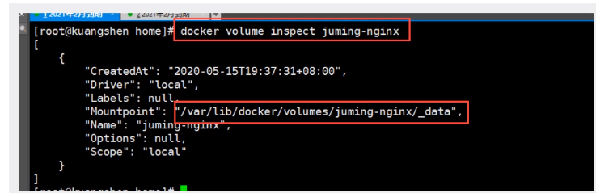

# Docker

[Docker官网](https://www.docker.com/)

[Docker官网-开发文档](https://docs.docker.com/)

[DockerHub](https://hub.docker.com/)

账号：waterplants123 密码：123456

> 进阶版https://www.bilibili.com/video/BV1kv411q7Qc/?spm_id_from=autoNext未完成，需要6台阿里云服务器

## Docker概述

### Docker为什么出现？

环境配置非常繁琐，每一个机器都要部署环境（集群Redis、ES、Hadoop）!

发布一个项目（jar+(Redis+Mysql+ES…)），项目能不能带上环境安装打包

### Docker的历史

不开源活不下去，开源火了！

### Docker能干嘛

> 虚拟机技术


**虚拟机技术缺点**：

1. 资源占用十分多
2. 冗余步骤多
3. 启动很慢


> 容器化技术

容器化技术不是一个完整的操作系统

容器是没有自己的内核的，也没有虚拟硬件


> DevOps（开发、运维）

应用更快的交付和部署

- 传统：一堆帮助文档，安装程序

- Docker：打包镜像发布测试，一键运行

**更便捷的升级和扩缩容**

**更简单的系统运维**

**更高效的计算资源利用**

## Docker安装

### Docker基本组成

镜像（image）:

容器（container）:Docker利用容器技术，独立运行一个或一组应用，通过镜像来创建

仓库（repository）:存放镜像的地方，分为公有仓库和私有仓库


### 安装Docker

参见Docker官网

### 阿里云镜像加速

参见


### 底层原理

Docker是一个client+server结构的系统，Docker的守护进程运行在主机上，通过Socket客户端访问

DockerServer接收到DockerClient的指令，就会执行这个命令

**Docker为什么比虚拟机快？**

1. Docker有比虚拟机更少的抽象层
2. Docker利用的是宿主机的内核，虚拟机时加载GuestOS


## Docker常用命令


### 帮助命令

`docker version`查看docker版本

`docker info`查看docker系统信息

`docker --help`帮助命令

### 镜像命令

`docker images -a`查看本机所有镜像

| Name, shorthand   | Default | Description                                         |
| ----------------- | ------- | --------------------------------------------------- |
| `--all` , `-a`    |         | Show all images (default hides intermediate images) |
| `--digests`       |         | Show digests                                        |
| `--filter` , `-f` |         | Filter output based on conditions provided          |
| `--format`        |         | Pretty-print images using a Go template             |
| `--no-trunc`      |         | Don't truncate output                               |
| `--quiet` , `-q`  |         | Only show image IDs                                 |

`docker search mysql`在dockerhub搜索mysql

`docker pull mysql`下载mysql镜像

`docker pull mysql:5.7`下载特定版本mysql镜像

```cmd
[root@hadoop1 bin]# docker pull mysql
Using default tag: latest
latest: Pulling from library/mysql
ffbb094f4f9e: Pull complete # 分层下载
df186527fc46: Pull complete 
fa362a6aa7bd: Pull complete 
5af7cb1a200e: Pull complete 
949da226cc6d: Pull complete 
bce007079ee9: Pull complete 
eab9f076e5a3: Pull complete 
8a57a7529e8d: Pull complete 
b1ccc6ed6fc7: Pull complete 
b4af75e64169: Pull complete 
3aed6a9cd681: Pull complete 
23390142f76f: Pull complete 
Digest: sha256:ff9a288d1ecf4397967989b5d1ec269f7d9042a46fc8bc2c3ae35458c1a26727# 签名
Status: Downloaded newer image for mysql:latest
docker.io/library/mysql:latest# 真实地址

```

`docker rmi -f $(docker images -aq)`删除所有镜像

`docker rmi -f 镜像id`删除指定容器

### 容器命令

`docker pull centos`下载centos镜像

`docker run [OPTIONS] image [COMMAND] [ARG...]`新建容器并启动

```
--name="Name" 容器名字
-d 			   后台方式运行
-it			   使用交互方式运行，进入容器查看内存
-p 			  指定容器端口
	-p ip:主机端口:容器端口
	-p 主机端口:容器端口（常用）
	-p 容器端口
	容器端口
-P			随机指定端口
```

`docker run -it centos /bin/bash`新建centos容器并进入交互模式

```
进入交互模式时：
	exit 退出并停止容器
	Ctrl+P+Q 容器不停止退出
```

`docker ps`列出所有运行的容器

```
-a	列出当前正在运行的容器+历史运行过的容器
-n=? 显示最近创建的容器
-q     只显示容器编号
```

`docker rm 容器id`删除指定的容器，不能删除正在运行的容器，如果要强制删除，加上`-f`

`docker rm -f $(docker ps -aq)`删除所有容器

`docker ps -a -q|xargs docker rm`删除所有容器

`docker start 容器id`启动容器

`docker restart 容器id`重启容器

`docker stop容器id`停止运行中的容器

`docker kill 容器id`杀掉容器

### 常用其他命令

> 后台启动docker容器，必须要有一个前台进程，docker发现没有应用，就会自动停止

`docker logs -tf -tail 10 容器id`查看docker日志

| 名称，简写            | 默认  | 描述                                                         |
| --------------------- | ----- | ------------------------------------------------------------ |
| `--details`           |       | 显示提供给日志的额外详细信息                                 |
| `--follow` , `-f`     |       | 跟踪日志输出                                                 |
| `--since`             |       | 显示自时间戳（例如 2013-01-02T13:23:37Z）或相关（例如 42m 为 42 分钟）以来的日志 |
| `--tail` , `-n`       | `all` | 从日志末尾显示的行数                                         |
| `--timestamps` , `-t` |       | 显示时间戳                                                   |
| `--until`             |       | [**API 1.35+**](https://docs.docker.com/engine/api/v1.35/) 在时间戳（例如 2013-01-02T13:23:37Z）或相关（例如 42m 为 42 分钟）之前显示日志 |

`docker top  容器id`查看容器中进程信息

`docker inspect 容器id`查看容器元数据

`docker exec -it 容器id /bin/bash`进入当前正在运行的容器

`docker attach 容器id`进入当前正在运行的容器，正在执行当前的代码

`docker cp 容器id:容器内文件路径 目的主机目录`从容器内拷贝文件到主机上

`docker stats`查看docker内存占用、CPU占用

```
CONTAINER ID   NAME            CPU %     MEM USAGE / LIMIT     MEM %     NET I/O           BLOCK I/O       PIDS
ff1c7e546a13   elasticsearch   0.35%     1.25GiB / 1.796GiB    69.61%    0B / 0B           815MB / 729kB   42
3f9f1214c060   tomcat01        0.07%     105.8MiB / 1.796GiB   5.75%     10.4kB / 138kB    327MB / 0B      28
36a75f45e488   nginx01         0.00%     1.441MiB / 1.796GiB   0.08%     17.7kB / 28.9kB   8.19kB / 0B     2
```


### 作业练习

1. 启动一个nginx01 3344

```cmd
[root@izm5e0jtfxzbf7svz8yulgz ~]# docker run -d --name nginx01 -p 3344:80 nginx
36a75f45e48815ce426a55fd3f59daa6a6de430a07317cbb6940000a7ab96d6f
[root@izm5e0jtfxzbf7svz8yulgz ~]# docker ps
CONTAINER ID   IMAGE     COMMAND                  CREATED         STATUS         PORTS                  NAMES
36a75f45e488   nginx     "/docker-entrypoint.…"   5 minutes ago   Up 5 minutes   0.0.0.0:3344->80/tcp   nginx01
[root@izm5e0jtfxzbf7svz8yulgz ~]# curl localhost:3344
<!DOCTYPE html>
<html>
<head>
<title>Welcome to nginx!</title>
<style>
html { color-scheme: light dark; }
body { width: 35em; margin: 0 auto;
font-family: Tahoma, Verdana, Arial, sans-serif; }
</style>
</head>
<body>
<h1>Welcome to nginx!</h1>
<p>If you see this page, the nginx web server is successfully installed and
working. Further configuration is required.</p>

<p>For online documentation and support please refer to
<a href="http://nginx.org/">nginx.org</a>.<br/>
Commercial support is available at
<a href="http://nginx.com/">nginx.com</a>.</p>

<p><em>Thank you for using nginx.</em></p>
</body>
</html>
[root@izm5e0jtfxzbf7svz8yulgz ~]# docker exec -it nginx01 /bin/bash
root@36a75f45e488:/# exit
exit
```

2. 启动tomcat01 3355

略

3. 启动es+kibana

限制es的内存占用

```cmd
 docker run -d --name elasticsearch01 -p 9200:9200 -p 9300:9300 -e ES_JAVA_OPTS="-Xms64m -Xmx512m" -e "discovery.type=single-node" elasticsearch:7.6.2
```

### 可视化

- portainer(先用着)
  - 密码19970522

- Rancher(CI/CD再用)

## Docker镜像讲解

### 镜像是什么

镜像是一种轻量级、可执行的独立软件包，用来打包软件运行环境和基于运行环境开发的软件，它包含运行某个软件所需的所有内容，包括代码、运行时库、环境变量和配置文件

### Docker镜像加载原理

[CSDN-Docker镜像原理](https://blog.csdn.net/pjsdsg/article/details/90445128)

> UnionFS(联合文件系统)

是一种分层轻量级并且高性能的文件系统

> Docker镜像加载原理

Docker 镜像实际上是由一层层文件系统组成的，这种层级文件系统是UnionFS

> 特点

Docker镜像都是只读的，当容器启动时，一个新的可写层被架子啊到镜像的顶部，这一层就是我们通常说的容器层，容器之下都叫镜像层

### Commit镜像

`docker commit -m="提交描述信息" -a="作者" 容器id 目标镜像名:tag`提交镜像

## 容器数据卷

### 什么是容器数据卷

数据希望存储在本地，而不是存储在容器中。即**容器的持久化和同步操作**

### 使用数据卷

`docker run -it -v 主机目录:容器内目录 镜像名 /bin/bash`使用数据卷进行双向同步，指定路径挂载

`docker inspect 容器id`查看容器详情

### 实战：mysql使用数据卷

`docker run -d -p 3310:3306 -v /home/mysql/conf:/etc/mysql/conf.d -v /home/mysql/data:/var/lib/mysql -e MYSQL_ROOT_PASSWORD=123456 --name mysql01 mysql:5.7`

### 具名和匿名挂载

` docker volume create 数据卷名 ` 创建数据卷 

` docker volume ls ` 查看所有的数据卷 

` docker volume inspect 数据卷名 ` 查看指定数据卷的信息 



` docker run -d -P --name nginx01 -v /etc/nginx nginx `匿名挂载

` docker run -d -P --name nginx02 -v 挂载名:/etc/nginx nginx`具名挂载

- ro 只读
- rw 可读可写

### 初识Dockerfile

```dockerfile
FROM centos
VOLUME ["volume01","volume02"]
CMD echo "--end---"
CMD /bin/bash
```

` docker build -f /home/docker-test-volume/dockerfile01 -t dby/centos:1.0 . ` 执行构建镜像 ，每一步是一层

假设构建镜像时候没有挂载卷，要手动镜像挂载

### 数据卷容器

多个mysql同步数据

` docker run -it --name cnetos01 dby/centos:1.0` 首先启动容器1，volume01、volume02为挂载目录。 

`  docker run -it --name centos02 --volumes-from cnetos01 dby/centos:1.0 ` 然后启动容器2，通过参数`--volumes-from`，设置容器2和容器1建立数据卷挂载关系。 


## Dockerfile

### Dockerfile介绍

> dockerfile用来构建docker镜像的文件

Docker镜像发布的步骤：
1、编写一个dockerfile文件

2、docker build 构建成为一个镜像

3、docker run 镜像

4、docker push 镜像（发布镜像到DockerHub、阿里云镜像仓库）

**镜像结构图**：


### Dockerfile指令说明


关于DockerFile文件的脚本注意点有：

1、每个保留关键字（指令）都必须是大写字母

2、文件中的指令从上到下顺序执行，第一个指令必须是FROM

3、# 号表示注释

4、每一个指令都会创建提交一个新的镜像层，并提交！

### 制作Centos镜像

下面通过编写Dockerfile文件来制作Centos镜像，并在官方镜像的基础上添加vim和net-tools工具。首先在/home/dockfile 目录下新建文件mydockerfile-centos。然后使用上述指令编写该文件。

```dockerfile
[root@iZwz99sm8v95sckz8bd2c4Z dockerfile]# cat mydockerfile-centos
FROM centos
MAINTAINER dby<1017834057@qq.com>

ENV MYPATH /usr/local
WORKDIR $MYPATH

RUN yum -y install vim
RUN yum -y install net-tools

EXPOSE 80

CMD echo $MYPATH
CMD echo "---end---"
CMD /bin/bash
```

`docker history 镜像名`查看镜像构建过程

###  RUN，CMD和ENTRYPOINT的区别

首先使用CMD指令

```cmd
[root@iZwz99sm8v95sckz8bd2c4Z dockerfile]# cat dockerfile-cmd-test
FROM centos
CMD ["ls","-a"]
[root@iZwz99sm8v95sckz8bd2c4Z dockerfile]# docker build -f dockerfile-cmd-test -t cmdtest:1.0 .
Sending build context to Docker daemon  3.072kB
Step 1/2 : FROM centos
 ---> 300e315adb2f
Step 2/2 : CMD ["ls","-a"]
 ---> Running in 6d4d0112322f
Removing intermediate container 6d4d0112322f
 ---> b6ec5224d2ac
Successfully built b6ec5224d2ac
Successfully tagged cmdtest:1.0
[root@iZwz99sm8v95sckz8bd2c4Z dockerfile]# docker run cmdtest:1.0
.
..
.dockerenv
bin
dev
etc
home
lib
lib64
lost+found
media
mnt
opt
proc
root
run
sbin
srv
sys
tmp
usr
var
#由于使用的是 CMD指令，命令无追加，-l取代了原本的ls -a，而-l命令不存在所以报错。
[root@iZwz99sm8v95sckz8bd2c4Z dockerfile]# docker run cmdtest:1.0 -l
docker: Error response from daemon: OCI runtime create failed: container_linux.go:370: starting container process caused: exec: "-l": executable file not found in $PATH: unknown.

```

 下面使用ENTRYPOINT来构建一个镜像 

```cmd
#1.修改dockerfile文件
[root@iZwz99sm8v95sckz8bd2c4Z dockerfile]# cat dockerfile-cmd-test
FROM centos
ENTRYPOINT ["ls","-a"]
#2.构建镜像
[root@iZwz99sm8v95sckz8bd2c4Z dockerfile]# docker build -f dockerfile-cmd-test -t cmdtest:2.0 .
Sending build context to Docker daemon  3.072kB
Step 1/2 : FROM centos
 ---> 300e315adb2f
Step 2/2 : ENTRYPOINT ["ls","-a"]
 ---> Running in 61389c0c1967
Removing intermediate container 61389c0c1967
 ---> ac7b7e83ff88
Successfully built ac7b7e83ff88
Successfully tagged cmdtest:2.0
#3.运行镜像
[root@iZwz99sm8v95sckz8bd2c4Z dockerfile]# docker run cmdtest:2.0
.
..
.dockerenv
bin
dev
etc
home
lib
lib64
lost+found
media
mnt
opt
proc
root
run
sbin
srv
sys
tmp
usr
var
#4.追加镜像再次运行
[root@iZwz99sm8v95sckz8bd2c4Z dockerfile]# docker run cmdtest:2.0 -l
total 56
drwxr-xr-x   1 root root 4096 Jan  1 03:55 .
drwxr-xr-x   1 root root 4096 Jan  1 03:55 ..
-rwxr-xr-x   1 root root    0 Jan  1 03:55 .dockerenv
lrwxrwxrwx   1 root root    7 Nov  3 15:22 bin -> usr/bin
drwxr-xr-x   5 root root  340 Jan  1 03:55 dev
drwxr-xr-x   1 root root 4096 Jan  1 03:55 etc
drwxr-xr-x   2 root root 4096 Nov  3 15:22 home
lrwxrwxrwx   1 root root    7 Nov  3 15:22 lib -> usr/lib
lrwxrwxrwx   1 root root    9 Nov  3 15:22 lib64 -> usr/lib64
drwx------   2 root root 4096 Dec  4 17:37 lost+found
drwxr-xr-x   2 root root 4096 Nov  3 15:22 media
drwxr-xr-x   2 root root 4096 Nov  3 15:22 mnt
drwxr-xr-x   2 root root 4096 Nov  3 15:22 opt
dr-xr-xr-x 106 root root    0 Jan  1 03:55 proc
dr-xr-x---   2 root root 4096 Dec  4 17:37 root
drwxr-xr-x  11 root root 4096 Dec  4 17:37 run
lrwxrwxrwx   1 root root    8 Nov  3 15:22 sbin -> usr/sbin
drwxr-xr-x   2 root root 4096 Nov  3 15:22 srv
dr-xr-xr-x  13 root root    0 Dec 29 15:41 sys
drwxrwxrwt   7 root root 4096 Dec  4 17:37 tmp
drwxr-xr-x  12 root root 4096 Dec  4 17:37 usr
drwxr-xr-x  20 root root 4096 Dec  4 17:37 var

```

### 实战：tomcat镜像

 1.准备镜像文件tomcat、jdk压缩包 

```
[root@iZwz99sm8v95sckz8bd2c4Z tomcat]# vi readme.txt
[root@iZwz99sm8v95sckz8bd2c4Z tomcat]# ll
total 200700
-rw-r--r-- 1 root root  10371538 Jan  1 16:11 apache-tomcat-8.5.55.tar.gz
-rw-r--r-- 1 root root 195132576 Jan  1 16:13 jdk-8u251-linux-x64.tar.gz
-rw-r--r-- 1 root root        20 Jan  1 16:14 readme.txt
```

 2.编写dockerfile文件，文件名使用官方命名：Dockerfile ，build的时候会默认寻找当前目录下的文件，不需要使用-f参数指定 

```cmd
[root@iZwz99sm8v95sckz8bd2c4Z tomcat]# vim Dockerfile
[root@iZwz99sm8v95sckz8bd2c4Z tomcat]# cat Dockerfile
FROM centos
MAINTAINER ethan<1258398543@qq.com>

COPY readme.txt /usr/local/readme.txt

ADD jdk-8u251-linux-x64.tar.gz /usr/local/
ADD apache-tomcat-8.5.55.tar.gz /usr/local/

RUN yum -y install vim

ENV MYPATH /usr/local
WORKDIR $MYPATH

ENV JAVA_HOME /usr/local/jdk1.8.0_251
ENV CLASSPATH $JAVA_HOME/lib/dt.jar:$JAVA_HOME/lib/tools.jar
ENV CATALINA_HOME /usr/local/apache-tomcat-8.5.55
ENV CATALINA_BASH /usr/local/apache-tomcat-8.5.55
ENV PATH $PATH:$JAVA_HOME/bin:$CATALINA_HOME/lib:$CATALINA_HOME/bin

EXPOSE 8080

CMD /usr/local/apache-tomcat-8.5.55/bin/startup.sh && tail -F /usr/local/apache-tomcat-8.5.55/bin/logs/catalina.out

```

 3.使用该Dockerfile构建镜像 

```
[root@iZwz99sm8v95sckz8bd2c4Z tomcat]# docker build -t diytomcat:1.0 .
```

4.启动生成的镜像，构建Tomcat容器.

这里设置了数据卷，宿主机的/home/dockerfile/tomcat/test对应该容器的/usr/local/apache-tomcat-8.5.55/webapps/test。这样关于test项目的修复只需要在宿主机上修改就可以了，不需要进入到容器中修改。

```
[root@iZwz99sm8v95sckz8bd2c4Z tomcat]# docker run -d -p 8088:8080 --name diytomcat -v /home/dockerfile/tomcat/test:/usr/local/apache-tomcat-8.5.55/webapps/test diytomcat:1.0

```

5.在/home/dockerfile/tomcat/test的目录下，新建index.html 测试Tomcat是否能正常使用。

因为设置了卷挂载所以可以直接在宿主机中进行操作。

```html
<!DOCTYPE html>
<html>
    <head>
         <meta charset="UTF-8"/>
        <title>这是个标题</title>
    </head>
    <body>
        <h1>这是一个一个简单的HTML</h1>
        <p>Hello World！</p>
    </body>
</html>

```

 6.访问测试，浏览器访问查看是否能正常访问 

如果页面显示乱码，就需要修改tomcat的server.xml文件

```xml
  <Connector port="8080" protocol="HTTP/1.1" 
               connectionTimeout="20000" 
               redirectPort="8443" URIEncoding="UTF-8" />
```

这里是添加了一个属性：URIEncoding，将该属性值设置为UTF-8，即可让Tomcat（默认ISO-8859-1编码）以UTF-8的编码处理get请求。

###发布镜像到DockerHub

  `docker login -u waterplants123`登录DockerHub

`  docker push waterplants123/diytomcat:1.0 ` 使用`docker push`命令推送镜像到DockerHub上的仓库 

### 发布镜像到阿里云容器服务

见官网


## Docker网络

### 理解docker0

每启动一个docker容器，docker就会给docker容器分配一个ip，只要安装了docker，就会有一个网卡docker0

`ip addr`

```
1: lo: <LOOPBACK,UP,LOWER_UP> mtu 65536 qdisc noqueue state UNKNOWN qlen 1
    link/loopback 00:00:00:00:00:00 brd 00:00:00:00:00:00
    inet 127.0.0.1/8 scope host lo
       valid_lft forever preferred_lft forever
2: eth0: <BROADCAST,MULTICAST,UP,LOWER_UP> mtu 1500 qdisc pfifo_fast state UP qlen 1000
    link/ether 00:16:3e:05:03:89 brd ff:ff:ff:ff:ff:ff
    inet 172.22.164.201/16 brd 172.22.255.255 scope global dynamic eth0
       valid_lft 315199446sec preferred_lft 315199446sec
3: docker0: <BROADCAST,MULTICAST,UP,LOWER_UP> mtu 1500 qdisc noqueue state UP 
    link/ether 02:42:a5:33:24:a5 brd ff:ff:ff:ff:ff:ff
    inet 172.17.0.1/16 brd 172.17.255.255 scope global docker0
       valid_lft forever preferred_lft forever
5: veth7e6b974@if4: <BROADCAST,MULTICAST,UP,LOWER_UP> mtu 1500 qdisc noqueue master docker0 state UP 
    link/ether d2:a3:06:c9:41:2e brd ff:ff:ff:ff:ff:ff link-netnsid 0
9: veth934d722@if8: <BROADCAST,MULTICAST,UP,LOWER_UP> mtu 1500 qdisc noqueue master docker0 state UP 
    link/ether da:f2:20:51:b9:c2 brd ff:ff:ff:ff:ff:ff link-netnsid 1
37: vethfbb5425@if36: <BROADCAST,MULTICAST,UP,LOWER_UP> mtu 1500 qdisc noqueue master docker0 state UP 
    link/ether 8e:51:d8:a1:3b:13 brd ff:ff:ff:ff:ff:ff link-netnsid 3
39: vethfb97408@if38: <BROADCAST,MULTICAST,UP,LOWER_UP> mtu 1500 qdisc noqueue master docker0 state UP 
    link/ether 8a:ef:ac:e5:29:03 brd ff:ff:ff:ff:ff:ff link-netnsid 2
85: veth6829b2f@if84: <BROADCAST,MULTICAST,UP,LOWER_UP> mtu 1500 qdisc noqueue master docker0 state UP 
    link/ether 86:28:ec:a5:7c:14 brd ff:ff:ff:ff:ff:ff link-netnsid 4

```

桥接veth-pair技术


tomcat01和tomcat02公用一个路由器docker0


Docker中所有网路接口都是虚拟的，虚拟的快（内网传递文件）

### --link

`docker run -d -P --name tomcat03 --link tomcat02 tomcat`解决tomcat03 能ping通tomcat02

其实这个tomcat03就是在本地配置了tomcat02


**不推荐使用**

### 自定义网络

` docker network ls`查看所有docker网络

```
NETWORK ID     NAME      DRIVER    SCOPE
6d8da7ce2a66   bridge    bridge    local
323fbfd980a4   host      host      local
8853a6af97e9   none      null      local
```

**网络模式**

- bridge：容器默认的网络是桥接模式(自己搭建的网络默认也是使用桥接模式,启动容器默认也是使用桥接模式)。此模式会为每一个容器分配、设置IP等，并将容器连接到一个docker0虚拟网桥，通过docker0网桥以及Iptables nat表配置与宿主机通信。

- none：不配置网络，容器有独立的Network namespace，但并没有对其进行任何网络设置，如分配veth pair 和网桥连接，配置IP等。

- host：容器和宿主机共享Network namespace。容器将不会虚拟出自己的网卡，配置自己的IP等，而是使用宿主机的IP和端口。

- container：创建的容器不会创建自己的网卡，配置自己的IP容器网络连通。容器和另外一个容器共享Network namespace（共享IP、端口范围）。

---

`docker run -d -P --name tomcat01 --net bridge tomcat`默认的带`--net bridge`

`docker run -d -P --name tomcat-net-01 --net mynet tomcat`使用自定义网络

`docker run -d -P --name tomcat03-net-02 --net mynet tomcat`使用自定义网络

`docker exec -it tomcat-net-01 ping tomcat03-net-02  `使用名字ping通

`docker network create --driver bridge --subnet 192.168.0.0/16 --gateway 192.168.0.1 mynet`创建自己的网络

```cmd
[root@izm5e0jtfxzbf7svz8yulgz docker-test-volume]# docker network create --driver bridge --subnet 192.168.0.0/16 --gateway 192.168.0.1 mynet
fc2652983ffcde59cc39f7a10f9323e87f62524d591064377e86bcd68f4a9479
[root@izm5e0jtfxzbf7svz8yulgz docker-test-volume]# docker network ls
NETWORK ID     NAME      DRIVER    SCOPE
6d8da7ce2a66   bridge    bridge    local
323fbfd980a4   host      host      local
fc2652983ffc   mynet     bridge    local
8853a6af97e9   none      null      local
[root@izm5e0jtfxzbf7svz8yulgz docker-test-volume]# docker network inspect mynet
[
    {
        "Name": "mynet",
        "Id": "fc2652983ffcde59cc39f7a10f9323e87f62524d591064377e86bcd68f4a9479",
        "Created": "2021-12-07T17:19:20.57776002+08:00",
        "Scope": "local",
        "Driver": "bridge",
        "EnableIPv6": false,
        "IPAM": {
            "Driver": "default",
            "Options": {},
            "Config": [
                {
                    "Subnet": "192.168.0.0/16",
                    "Gateway": "192.168.0.1"
                }
            ]
        },
        "Internal": false,
        "Attachable": false,
        "Ingress": false,
        "ConfigFrom": {
            "Network": ""
        },
        "ConfigOnly": false,
        "Containers": {},
        "Options": {},
        "Labels": {}
    }
]

```

好处：

redis和mysql不同的集群使用不同的网络，保证集群是安全和健康的

### 网络连通

`docker network connect mynet  tomcat01`将mynet网络和tomcat01容器连通，连通之后就是将tomcat01容器放到了mynet网络下。**一个容器两个ip**


### 实战：部署Redis集群


` docker network create redis --subnet 172.38.0.0/16 ` 创建网络名为redis的自定义网络 

 通过以下脚本创建六个Redis 的配置信息： 

```
for port in $(seq 1 6); \
do \
mkdir -p /mydata/redis/node-${port}/conf
touch /mydata/redis/node-${port}/conf/redis.conf
cat << EOF >/mydata/redis/node-${port}/conf/redis.conf
port 6379 
bind 0.0.0.0
cluster-enabled yes 
cluster-config-file nodes.conf
cluster-node-timeout 5000
cluster-announce-ip 172.38.0.1${port}
cluster-announce-port 6379
cluster-announce-bus-port 16379
appendonly yes
EOF
done

```

下面启动6个redis容器，设置对应的容器数据卷挂载

```
#第1个Redis容器
docker run -p 6371:6379 -p 16371:16379 --name redis-1 \
    -v /mydata/redis/node-1/data:/data \
    -v /mydata/redis/node-1/conf/redis.conf:/etc/redis/redis.conf \
    -d --net redis --ip 172.38.0.11 redis:5.0.9-alpine3.11 redis-server /etc/redis/redis.conf
#第2个Redis容器
docker run -p 6372:6379 -p 16372:16379 --name redis-2 \
    -v /mydata/redis/node-2/data:/data \
    -v /mydata/redis/node-2/conf/redis.conf:/etc/redis/redis.conf \
    -d --net redis --ip 172.38.0.12 redis:5.0.9-alpine3.11 redis-server /etc/redis/redis.conf
#第3个Redis容器
docker run -p 6373:6379 -p 16373:16379 --name redis-3 \
    -v /mydata/redis/node-3/data:/data \
    -v /mydata/redis/node-3/conf/redis.conf:/etc/redis/redis.conf \
    -d --net redis --ip 172.38.0.13 redis:5.0.9-alpine3.11 redis-server /etc/redis/redis.conf
#第4个Redis容器
docker run -p 6374:6379 -p 16374:16379 --name redis-4 \
    -v /mydata/redis/node-4/data:/data \
    -v /mydata/redis/node-4/conf/redis.conf:/etc/redis/redis.conf \
    -d --net redis --ip 172.38.0.14 redis:5.0.9-alpine3.11 redis-server /etc/redis/redis.conf
#第5个Redis容器
docker run -p 6375:6379 -p 16375:16379 --name redis-5 \
    -v /mydata/redis/node-5/data:/data \
    -v /mydata/redis/node-5/conf/redis.conf:/etc/redis/redis.conf \
    -d --net redis --ip 172.38.0.15 redis:5.0.9-alpine3.11 redis-server /etc/redis/redis.conf
#第6个Redis容器
docker run -p 6376:6379 -p 16376:16379 --name redis-6 \
    -v /mydata/redis/node-6/data:/data \
    -v /mydata/redis/node-6/conf/redis.conf:/etc/redis/redis.conf \
    -d --net redis --ip 172.38.0.16 redis:5.0.9-alpine3.11 redis-server /etc/redis/redis.conf

```

下面进入到redis-1容器中创建集群

```
redis-cli --cluster create 172.38.0.11:6379 172.38.0.12:6379 172.38.0.13:6379 172.38.0.14:6379 172.38.0.15:6379 172.38.0.16:6379 --cluster-replicas 1
```

进入redis集群

```
redis-cli -c
```

查看集群信息和节点信息

```
cluster info
cluster nodes
```

### Springboot微服务打包成Docker镜像

 **(1)构建SpringBoot项目** 

 在idea中构建一个最简单的Spring Boot项目，写一个接口，启动项目本地测试能否正常调用 

```java

/**
 * @author ethan
 * @since 2020-04-22 20:26:31
 */
@RestController
public class HelloController {

    @GetMapping("/hello")
    public String hello(){
        return "Hello World!";
    }
}

```

 **(2)打包应用** 

 使用Maven的package打包Spring Boot项目，生成jar包 

 **(3)编写Dockerfile** 

 编写Dockerfile，内容如下 

```
FROM java:8
COPY *.jar /app.jar
CMD ["--server.port=8080"]
EXPOSE 8080
ENTRYPOINT ["java","-jar","/app.jar"]

```

 **(4)构建镜像** 

 将打包生成的jar包和编写的Dockerfile文件发送到服务器上 

 使用build命令构建镜像 

```
 docker build -t demo .
```

 **(5)发布运行** 

 完成镜像的构建后，运行镜像

```
docker run -d -p 8080:8080 demo
```

测试/hello接口能否正常访问。

```
curl localhost:8080/hello
```


## Docker Compose

## Docker Swarm

## CI/CD之Jenkins