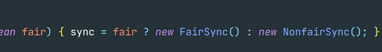
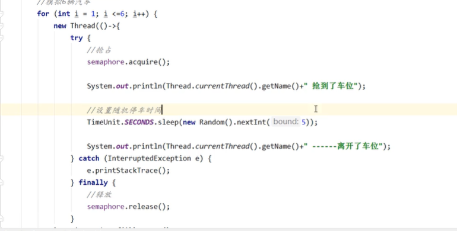

# 2021Study-JUC

## 1. 什么是JUC


## 2. 多线程回顾

> 进程与线程

**进程**：一个程序

一个进程往往包含多个线程，至少包含一个！

java默认有几个线程？2个，main、GC

**线程**：开了一个进程Typora，写字、自动保存

对于Java而言：Thread、Runable、Callable

Java可以开启线程吗？开不了，参见源码`private native void start0();`

---

> 并行与并发

**并发**（多线程操作一个资源）

**并行**（多个线程同时执行）

并发编程的本质：想充分利用CPU的资源

---

> 多线程的状态有6个，Thread.State

```java
public enum State {
        /**
         * Thread state for a thread which has not yet started.
         新生
         */
        NEW,

        /**
         * Thread state for a runnable thread.  A thread in the runnable
         * state is executing in the Java virtual machine but it may
         * be waiting for other resources from the operating system
         * such as processor.
         运行
         */
        RUNNABLE,

        /**
         * Thread state for a thread blocked waiting for a monitor lock.
         * A thread in the blocked state is waiting for a monitor lock
         * to enter a synchronized block/method or
         * reenter a synchronized block/method after calling
         * {@link Object#wait() Object.wait}.
         阻塞
         */
        BLOCKED,

        /**
         * Thread state for a waiting thread.
         * A thread is in the waiting state due to calling one of the
         * following methods:
         * <ul>
         *   <li>{@link Object#wait() Object.wait} with no timeout</li>
         *   <li>{@link #join() Thread.join} with no timeout</li>
         *   <li>{@link LockSupport#park() LockSupport.park}</li>
         * </ul>
         *
         * <p>A thread in the waiting state is waiting for another thread to
         * perform a particular action.
         *
         * For example, a thread that has called <tt>Object.wait()</tt>
         * on an object is waiting for another thread to call
         * <tt>Object.notify()</tt> or <tt>Object.notifyAll()</tt> on
         * that object. A thread that has called <tt>Thread.join()</tt>
         * is waiting for a specified thread to terminate.
         等待
         */
        WAITING,(不见不散)

        /**
         * Thread state for a waiting thread with a specified waiting time.
         * A thread is in the timed waiting state due to calling one of
         * the following methods with a specified positive waiting time:
         * <ul>
         *   <li>{@link #sleep Thread.sleep}</li>
         *   <li>{@link Object#wait(long) Object.wait} with timeout</li>
         *   <li>{@link #join(long) Thread.join} with timeout</li>
         *   <li>{@link LockSupport#parkNanos LockSupport.parkNanos}</li>
         *   <li>{@link LockSupport#parkUntil LockSupport.parkUntil}</li>
         * </ul>
         超时等待
         */
        TIMED_WAITING,(过时不候)

        /**
         * Thread state for a terminated thread.
         * The thread has completed execution.
         终止
         */
        TERMINATED;(终结)
    }
```

----

> wait和sleep的区别

1. wait=>Object，sleep=>Thread
2. wait会释放锁；sleep抱着锁睡觉，不会释放
3. wait必须在同步代码块中，sleep可以在任何地方睡
4. wait不需要捕获异常，sleep要捕获异常
5. 他们都能被interrupt()方法中断

> 管程，java中叫锁，操作系统中叫监视器

是一种同步机制，保证同一时间，只有一个线程访问被保护数据或者代码

> 用户线程和守护线程

用户线程：自定义线程。主线程结束了，用户线程还在运行，jvm存货

守护线程：GC线程。没有用户线程了，都是守护线程，jvm结束

## 3. Lock锁

> 传统synchronized

---

> interface Lock



公平锁：十分公平，可以先来后到

非公平锁：十分不公平，可以插队（Java默认）

---

> synchronized 和 lock区别

1. synchronized是内置Java关键字，Lock是一个java接口
2. synchronized无法判断获取锁的状态，Lock可以判断是否获取到了锁
3. synchronized会自动释放锁，Lock必须手动释放锁！如果不释放，**死锁**，因此适用Lock需要在finally块中释放锁
4. synchronized 线程1（获得锁，阻塞）线程2（傻傻的等），不能响应终端；Lock锁不一定会等待下去，可以让等待锁的线程响应中断
5. synchronized可重入锁，不可以终端的，非公平；Lock，可重入锁，可以判断锁（`lock.tryLock()`）,非公平（可以设置）
6. synchronized适合锁少量的代码同步问题，Lock适合锁大量的同步代码（性能上，当竞争资源非常激烈时，Lock的性能要远远优于synchronized）

----

> 虚假唤醒

wait()需要在循环中使用，否则会出现跳过if导致虚假唤醒。

wait从哪里等待就从哪里唤醒

## 4. **生产者和消费者问题**

E:\idea_workspace\2021Study-JUC\src\main\java\com\binyu\pc

面试：单例模式、排序算法、生产者消费者问题、死锁问题

> 生产者消费者问题 synchronized

```java
public class A {
    public static void main(String[] args) {
        Data data=new Data ();
        new Thread(()->{
            for(int i=0;i<10;i++) {
                try {
                    data.increment ();
                } catch (InterruptedException e) {
                    e.printStackTrace ();
                }
            } },"A").start ();
        new Thread(()->{
            for(int i=0;i<10;i++) {
                try {
                    data.decrement ();
                } catch (InterruptedException e) {
                    e.printStackTrace ();
                }
            } },"B").start ();
    }
}
// 判断等待，业务，通知
class Data{
    private int num=0;
    public synchronized void increment() throws InterruptedException {
        if(num!=0){
            // 等待
            this.wait ();
        }
        num++;
        System.out.println (Thread.currentThread ().getName ()+"=>"+num);
        // 通知其他线程，我+1完毕了
        this.notifyAll ();
    }
    public synchronized void decrement() throws InterruptedException {
        if(num==0){
            //等待
        this.wait ();
        }
        num--;
        System.out.println (Thread.currentThread ().getName ()+"=>"+num);
        // 通知其他线程，我-1完毕了
        this.notifyAll ();
    }
}
```

> 问题存在，ABCD四个线程，会出现虚假唤醒


---

> JUC版生产者消费者问题，Condition精准唤醒线程


> 生产线问题，即线程间定制化通信

```java
public class C {
    public static void main(String[] args) {
        Data3 data3=new Data3();

        new Thread(()->{
            for(int i=0;i<10;i++){
                try {
                    data3.printA ();
                } catch (InterruptedException e) {
                    e.printStackTrace ();
                }
            }
        },"A").start ();
        new Thread(()->{
            for(int i=0;i<10;i++){
                try {
                    data3.printB();
                } catch (InterruptedException e) {
                    e.printStackTrace ();
                }
            }
        },"B").start ();
        new Thread(()->{
            for(int i=0;i<10;i++){
                try {
                    data3.printC ();
                } catch (InterruptedException e) {
                    e.printStackTrace ();
                }
            }
        },"C").start ();

    }
}

// 判断等待，业务，通知
class Data3{
    private int num=0;
    Lock lock=new ReentrantLock (  );
    Condition condition1 = lock.newCondition ();
    Condition condition2 = lock.newCondition ();
    Condition condition3 = lock.newCondition ();
    private int number=1;//1A,2B,3C
    public  void printA() throws InterruptedException {
        lock.lock ();
        try {
            while(number!=1){
                condition1.await ();
            }
            System.out.println (Thread.currentThread ().getName ()+"=>A");
            number=2;
            condition2.signal ();
        } catch (Exception e) {
            e.printStackTrace ();
        } finally {
            lock.unlock ();
        }

    }
    public  void printB() throws InterruptedException {
        lock.lock ();
        try {
            while(number!=2){
                condition2.await ();
            }
            System.out.println (Thread.currentThread ().getName ()+"=>B");
            number=3;
            condition3.signal ();
        } catch (Exception e) {
            e.printStackTrace ();
        } finally {
            lock.unlock ();
        }

    }
    public  void printC() throws InterruptedException {
        lock.lock ();
        try {
            while(number!=3){
                condition3.await ();
            }
            System.out.println (Thread.currentThread ().getName ()+"=>C");
            number=1;
            condition1.signal ();
        } catch (Exception e) {
            e.printStackTrace ();
        } finally {
            lock.unlock ();
        }

    }

```


## 5. 锁的8种情况

如何判断锁是谁！永远知道什么锁，锁的是谁！

普通synchronized锁的是调用者对象；静态synchronized锁的是Class 类模板；既有普通synchronized又有静态synchronized锁的不同

## 6. 集合类不安全

> 并发修改异常ConcurrentModificationException

```java
@ThreadUnsafe
public class UnsafeListTest {
    public static void main(String[] args) {
        ArrayList<String> list=new ArrayList<> ();
        for(int i=0;i<30;i++){
            new Thread(()->{
              list.add( UUID.randomUUID ().toString ().substring ( 0,8 ));
              System.out.println ( list );
            },String.valueOf(i)).start ();
        }
    }
}
```


> List不安全

并发下ArrayList不安全

- 解决方案1：Vector
- 解决方案2：Collections.synchronizedList()
- 解决方案3：JUC CopyOnWriteArrayList 写入时复制 没有用synchronized，效率更高

> Set不安全

- 解决方案：JUC CopyOnWriteArraySet

> Map不安全

- 解决方案：JUC ConcurrentHashMap

## 7. Callable

1. 可以有返回值
2. 可以抛出异常
3. 方法不同，call()

细节：

1. 有缓存
2. 结果可能需要等待，会阻塞

---

找一个类，既和Runnable有关系，也和Callable有关系

- Runnable接口有实现类FutureTask
- FutureTask构造可以传递Callable

## 8. 常用的辅助类

E:\idea_workspace\2021Study-JUC\src\main\java\com\binyu\fuzhu

### 8.1 CountDownLatch

减法计数器


await():等待计数器归零后执行

countDown():计数器数量-1

### 8.2 CyclicBarrier

加法计数器

`new CyclicBarrier(7,()->{})`:集齐7龙珠就执行()->{}


await():等待直至barrier中所有线程执行了await()

>CountDownLatch主要用来解决一个线程等待多个线程的场景，可以类比旅游团团长要等待所有的游客到齐才能去下一个景点；而CyclicBarrier是一组线程之间互相等待 ，更像 是几个驴友之间不离不弃。除此之外CountDownLatch的计数器是不能循环利用的，也就是说一旦计数器减到0，再有线程调用await()，该线程会直接通过。但CyclicBarrier的计数器是可以循环利用的，而且具备自动重置的功能，一旦计数器减到0会自动重置到你设置的初始值。除此之外，CyclicBarrier还可以设置回调函数。


### 8.3 Semaphore

信号量

`new Semaphore(3)`:资源为3

acquire():假设如果已经满了，等待被释放为止

release():释放1个资源，唤醒等待的线程

作用：多个共享资源互斥使用，并发限流，控制最大的线程数



## 9. 读写锁ReadWriteLock

读写锁:读可以多线程读，写只能一个线程写

` ReadWriteLock rwlock=new ReadWriteLock()`

独占锁（写锁）`rwlock.writeLock()`，可能发生死锁

共享锁（读锁）`rwlock.readLock()`，可能发生死锁

读-读 可以共存

读-写 不可共存,写的时候可以读（写锁降级为读锁），读的时候不可以写

写-写 不可共存

## 10. 阻塞队列


学会使用队列：添加、移除

四组API：

1. 抛出异常
2. 不会抛出异常
3. 阻塞等待
4. 超时等待

| 方式       | 抛出异常  | 有返回值 | 阻塞等待 | 超时等待  |
| ---------- | --------- | -------- | -------- | --------- |
| 添加       | add()     | offer()  | put()    | offer(,,) |
| 移除       | remove()  | poll()   | take()   | poll(,,)  |
| 检测队列首 | element() | peek()   |          |           |

----

> SychronousQueue同步队列

没有容量，进去一个元素，必须等它出来才能再进去

## 11. 线程池（重点）

线程池：三大方法、7大参数、4种拒绝策略

> 池化技术

程序的运行本质：占用系统资源，为了优化资源的使用=>池化技术

线程池，连接池，内存池，对象池

池化技术：事先准备好一些资源，有人要用，就找我这里拿，用完之后还给我


线程池的好处：

1. 降低资源的消耗
2. 提高响应的速度
3. 方便管理

**线程复用、可以控制最大并发数、管理线程**


```java
public class Demo1 {
    public static void main(String[] args) {
//        ExecutorService threadPool = Executors.newSingleThreadExecutor ();// 单个线程
//        ExecutorService threadPool = Executors.newFixedThreadPool ( 5 );// 固定大小的线程池
        ExecutorService threadPool = Executors.newCachedThreadPool ();// 可伸缩的线程池
        try {
            for(int i=0;i<100;i++){
                threadPool.execute ( ()->{
                    System.out.println (Thread.currentThread ().getName ()+" ok");
                } );
            }
            // 关闭线程池
        } catch (Exception e) {
            e.printStackTrace ();
        } finally {
            threadPool.shutdown ();
        }

    }
}
```


> 四种拒绝策略


```
ThreadPoolExecutor.AbortPolicy:丢弃任务并抛出RejectedExecutionException异常。 
ThreadPoolExecutor.DiscardPolicy：也是丢弃任务，但是不抛出异常。 
ThreadPoolExecutor.DiscardOldestPolicy：丢弃队列最前面的任务，然后重新尝试执行任务（重复此过程）
ThreadPoolExecutor.CallerRunsPolicy：由调用线程处理该任务 
```

 ThreadPoolExecutor 的几个重要方法

- execute()方法实际上是Executor中声明的方法，在ThreadPoolExecutor进行了具体的实现，这个方法是ThreadPoolExecutor的核心方法，通过这个方法可以向线程池提交一个任务，交由线程池去执行。
- submit()方法是在ExecutorService中声明的方法，在AbstractExecutorService就已经有了具体的实现，在ThreadPoolExecutor中并没有对其进行重写，这个方法也是用来向线程池提交任务的，但是它和execute()方法不同，它能够返回任务执行的结果，去看submit()方法的实现，会发现它实际上还是调用的execute()方法，只不过它利用了Future来获取任务执行结果（Future相关内容将在下一篇讲述）。
-  shutdown()和shutdownNow()是用来关闭线程池的。 

---

最大线程池应该如何定义：

1. CPU密集型`Runtime.getRuntime().avaiableProcessors()`
2. IO密集型 大于你程序中十分耗IO的线程个数

##  12. 四大函数式接口（必须掌握）

> 函数式接口：只有一个方法的接口

```java
@FunctionalInterface
public interface Runnable{
    public abstract void run();
}
```


## 13. Stream流式计算

[菜鸟教程-Java 8 Stream](https://www.runoob.com/java/java8-streams.html)

大数据：存储+计算

集合、Mysql是存储东西的

Stream流是计算的

```
+--------------------+       +------+   +------+   +---+   +-------+
| stream of elements +-----> |filter+-> |sorted+-> |map+-> |collect|
+--------------------+       +------+   +------+   +---+   +-------+
```

## 14. ForkJoin

[CSDN-Fork/Join框架基本使用](https://blog.csdn.net/tyrroo/article/details/81390202)

[CSDN-Stream.iterate 和 LongStream.rangeClosed 并行处理](https://blog.csdn.net/CmdSmith/article/details/84139659)

> 什么是ForkJoin

ForkJoin在JDK1.7并行执行任务！提高效率，大数据量

大数据：Map Reduce(把大任务拆成小任务)

> ForkJoin特点：工作窃取

这里面维护的都是双端队列


 ```JAVA
public class TestForkJoinPool {

    private static final Integer MAX = 200;

    static class MyForkJoinTask extends RecursiveTask<Integer> {
        // 子任务开始计算的值
        private Integer startValue;

        // 子任务结束计算的值
        private Integer endValue;

        public MyForkJoinTask(Integer startValue, Integer endValue) {
            this.startValue = startValue;
            this.endValue = endValue;
        }

        @Override
        protected Integer compute() {
            // 如果条件成立，说明这个任务所需要计算的数值分为足够小了
            // 可以正式进行累加计算了
            if (endValue - startValue < MAX) {
                System.out.println ( "开始计算的部分：startValue = " + startValue + ";endValue = " + endValue );
                Integer totalValue = 0;
                for (int index = this.startValue; index <= this.endValue; index++) {
                    totalValue += index;
                }
                return totalValue;
            }
            // 否则再进行任务拆分，拆分成两个任务
            else {
                MyForkJoinTask subTask1 = new MyForkJoinTask ( startValue, (startValue + endValue) / 2 );
                subTask1.fork ();
                MyForkJoinTask subTask2 = new MyForkJoinTask ( (startValue + endValue) / 2 + 1, endValue );
                subTask2.fork ();
                return subTask1.join () + subTask2.join ();
            }
        }
    }

    public static void main(String[] args) {
        // 这是Fork/Join框架的线程池
        ForkJoinPool pool = new ForkJoinPool ();
        ForkJoinTask<Integer> taskFuture = pool.submit ( new MyForkJoinTask ( 1, 1001 ) );
        try {
            Integer result = taskFuture.get ();
            System.out.println ( "result = " + result );
        } catch (InterruptedException | ExecutionException e) {
            e.printStackTrace ( System.out );
        }
    }
}

 ```

```java
public class StreamTest {

    public static void main(String[] args) {
        int i = Runtime.getRuntime().availableProcessors();

        // for
        System.out.println(measureSumPerf(StreamTest::iterativeSum, 10_000_000) + " msecs");
        // Stream.iterate
        System.out.println(measureSumPerf(StreamTest::sequentialSum, 10_000_000) + " msecs");
        // parallel Stream.iterate
        System.out.println(measureSumPerf(StreamTest::parallelSum, 10_000_000) + " msecs");
        // LongStream.rangeClosed
        System.out.println(measureSumPerf(StreamTest::rangedSum, 10_000_000) + " msecs");
        // parallel LongStream.rangeClosed
        System.out.println(measureSumPerf(StreamTest::parallelRangedSum, 10_000_000) + " msecs");
    }

    public static long parallelRangedSum(long n) {
        return LongStream.rangeClosed(1, n)
                .parallel()
                .reduce(0L, Long::sum);
    }

    public static long rangedSum(long n) {
        return LongStream.rangeClosed(1, n)
                .reduce(0L, Long::sum);
    }


    public static long parallelSum(long n) {
        return Stream.iterate(0L, i -> i + 1)
                .limit(n)
                .parallel()
                .reduce(0L ,Long::sum);
    }


    public static long sequentialSum(long n) {
        // 生成自然数无限流
        return Stream.iterate(0L, i -> i + 1)
                // 限制到前n个数
                .limit(n)
                // 对所有数字求和来归纳流
                .reduce(0L, Long::sum);
    }

    public static long iterativeSum(long n) {
        long result = 0;
        for (long i = 1L; i <= n; i++) {
            result += i;
        }
        return result;
    }

    public static long measureSumPerf(Function<Long, Long> adder, long n) {
        long fastest = Long.MAX_VALUE;
        for (int i = 0; i < 10; i++) {
            long start = System.nanoTime();
            long sum = adder.apply(n);
            long duration = (System.nanoTime() - start) / 1_000_000;
            if (duration < fastest) {fastest = duration;}
        }
        return fastest;
    }

}

```


## 15. 异步回调CompletableFuture

[CSDN-Java8 CompletableFuture 用法全解](https://blog.csdn.net/qq_31865983/article/details/106137777)


```java
public class CompletableFutureTest {
    public static void main(String[] args) throws ExecutionException, InterruptedException {
        CompletableFuture<Integer> completableFuture=CompletableFuture.supplyAsync ( ()->{
            System.out.println (Thread.currentThread ().getName ()+"supplyAsync");
            int i=10/0;
            return 1024;
        } );
        System.out.println (completableFuture.whenComplete ( (t,u)->{
            System.out.println ("t:"+t);//正确的返回结果
            System.out.println ("u:"+u);// 错误信息
        } ).exceptionally ( e->{
            System.out.println (e.getMessage ());// 错误信息
            return 233;
        } ).get ());
    }
}
```


> handle()

谷粒商城P198


> 线程串行化

谷粒商城P199

## 16. JMM

> 什么是JMM

JMM Java内存模型，不存在的东西，概念！约定！

关于JMM的一些同步的约定：

1. 线程解锁前，必须把共享变量立刻刷回主存
2. 线程加锁前，必须读取主存中的最新值到工作内存中
3. 加锁和解锁是同一把锁

> JMM8大原子操作

```java
1. read(读取)：
   从主存中读取数据
2. load(载入)：
   将主存读取到的数据写入工作内存中
3. use(使用)：
   从工作内存读取数据做计算
4. assign(赋值)：
   将计算好的值重新赋值到工作内存中
5. store(存储)：
   将工作内存数据写入主存
6. write(写入)：
   将store过去的变量值赋值给主存中的变量(更新主存)
7. lock(锁定)：
   将主存变量加锁，标识为线程独占状态
8. unlock(解锁)：
   将主存变量解锁，解锁以后其它线程就可以锁定该变量。
```

## 17. Volatile

1. 保证可见性

```java
// 不加volatile会导致死循环
public class VolatileTest {
    private  volatile static int num=0;
    public static void main(String[] args) {
        new Thread(()->{
            while(num==0){ }
        }).start ();
        try {
            TimeUnit.SECONDS.sleep ( 2 );
        } catch (InterruptedException e) {
            e.printStackTrace ();
        }
        num=2;
    }
}
```


2. 不保证原子性

```java
public class VolatileTest2 {
    private static volatile int num=0;

    public static void add(){
        num++;
    }
    public static void main(String[] args) {
        for(int i=1;i<=20;i++){
            new Thread ( ()->{
                for(int j=0;j<1000;j++){
                    add();
                }
            } ).start ();
        }
        while(Thread.activeCount ()>2){
            Thread.yield ();
        }
        System.out.println (Thread.currentThread ().getName ()+" "+num);
    }
}
```

> 如果不用synchronized和lock，如何保证原子性？

[CSDN-Java并发编程-无锁CAS与Unsafe类及其并发包Atomic](https://blog.csdn.net/javazejian/article/details/72772470)

使用Atomic

这个类底层都直接和操作系统挂钩！直接从内存改值！Unsafe类是一个很特殊的存在


```java
public class VolatileTest3 {
    private static volatile AtomicInteger num=new AtomicInteger (  );

    public static void add(){
        num.getAndIncrement ();
    }
    public static void main(String[] args) {
        for(int i=1;i<=20;i++){
            new Thread ( ()->{
                for(int j=0;j<1000;j++){
                    add();
                }
            } ).start ();
        }
        while(Thread.activeCount ()>2){
            Thread.yield ();
        }
        System.out.println (Thread.currentThread ().getName ()+" "+num);
    }
}

```

3. 禁止指令重排

指令重排：写的程序，计算机并不是按照你写的顺序执行

编译器优化的重排、指令并行的重排、内存系统的重排

处理器在进行指令重排时，会考虑数据之间的依赖性

| 线程A | 线程B |
| ----- | ----- |
| x=a   | y=b   |
| b=1   | a=2   |

正常的结果：x=0,y=0,但是可能由于指令重排导致诡异结果：x=2，y=1

| 线程A | 线程B |
| ----- | ----- |
| b=1   | a=2   |
| x=a   | y=b   |

volatile可以避免指令重排，因为在上下加内存屏障


## 18. 彻底玩转单例模式

> 饿汉式并发下出现问题

下面代码出现问题

```java
public class LazyMan {
    private LazyMan(){
        System.out.println (Thread.currentThread ().getName ()+"ok");
    }
    private static LazyMan lazyMan;
    public static LazyMan getInstance(){
        if(lazyMan==null){
            lazyMan=new LazyMan ();
        }
        return lazyMan;
    }

    public static void main(String[] args) {
        for(int i=0;i<10;i++){
            new Thread(()->{
                LazyMan.getInstance ();
            }).start ();
        }
    }
}

```

解决方案1 DCL懒汉式

```java
public class LazyMan2 {
    private LazyMan2(){
        System.out.println (Thread.currentThread ().getName ()+"ok");
    }
    private volatile static  LazyMan2 lazyMan;
    public static LazyMan2 getInstance(){
        if(lazyMan==null){
            synchronized (LazyMan2.class){
                if(lazyMan==null){
                    lazyMan=new LazyMan2 ();
                    /*
                    * 1. 分配内存空间
                    * 2. 执行构造方法，初始化对象
                    * 3. 把对象指向这个空间
                    * 123 正常
                    * 132 A
                    *     B //此时LazyMan还没有完成构造
                    * */
                }
            }
        }
        return lazyMan;
    }

    public static void main(String[] args) {
        for(int i=0;i<10;i++){
            new Thread(()->{
                LazyMan2.getInstance ();
            }).start ();
        }
    }
}

```

解决方案2:静态内部类

```java
public class Singleton {

    private static class SingletonHolder {
        private static Singleton instance = new Singleton();
    }

    private Singleton() {
        
    }

    public static Singleton getInstance() {
        return SingletonHolder.instance;
    }
}
```

解决方案3:枚举

```java
public enum EnumSingle {
    INSTANCE;
    public EnumSingle getInstance(){
        return INSTANCE;
    }
    public void dosomething(){
        System.out.println ("dosomething");
    }
}
class Main{
    public static void main(String[] args) {
        EnumSingle.INSTANCE.dosomething ();
    }
}
```

## 19. 深入理解CAS

> 什么是CAS

CAS：比较当前工作内存中的值和主内存中的值，如果这个值是期望的，那么执行操作，如果不是就一直循环！

**缺陷**

1. 循环会耗时
2. 一次性只能保证一个共享变量的原子性
3. ABA问题


这里就是自旋锁

> CAS：ABA问题（狸猫换太子）


```java
public class CASDemo {

    public static void main(String[] args) {
        // ABA问题
        AtomicInteger atomicInteger=new AtomicInteger (2020  );
        // ====捣乱的线程====
        System.out.println ( atomicInteger.compareAndSet ( 2020, 2021 ) );
        System.out.println (atomicInteger.get ());
        System.out.println ( atomicInteger.compareAndSet ( 2021, 2020 ) );
        System.out.println (atomicInteger.get ());
        // ====期望的线程====
        System.out.println ( atomicInteger.compareAndSet ( 2020, 2021 ) );
        System.out.println (atomicInteger.get ());
    }
}

```


## 20. 原子引用


> 解决ABA问题，对应的思想：乐观锁

带版本的原子操作

```java
public class CASDemo {

    public static void main(String[] args) {
        // ABA问题
        AtomicStampedReference<Integer> atomicStampedReference = new AtomicStampedReference<> ( 123, 1 );
        new Thread(()->{
            int stamp=atomicStampedReference.getStamp ();
            System.out.println ("a1="+stamp);
            try {
                TimeUnit.SECONDS.sleep ( 1 );
            } catch (InterruptedException e) {
                e.printStackTrace ();
            }
            atomicStampedReference.compareAndSet ( 123,124 ,atomicStampedReference.getStamp (),atomicStampedReference.getStamp ()+1);
            System.out.println ("a2="+atomicStampedReference.getStamp ());
            atomicStampedReference.compareAndSet ( 124,123 ,atomicStampedReference.getStamp (),atomicStampedReference.getStamp ()+1);
            System.out.println ("a3="+atomicStampedReference.getStamp ());
        }).start ();
        new Thread(()->{
            int stamp=atomicStampedReference.getStamp ();
            System.out.println ("b1="+stamp);
            try {
                TimeUnit.SECONDS.sleep ( 2 );
            } catch (InterruptedException e) {
                e.printStackTrace ();
            }
            atomicStampedReference.compareAndSet ( 123,125 ,stamp, stamp+1);
            System.out.println ("b2="+atomicStampedReference.getStamp ());

        }).start ();
    }
}

```

## 21. 各种锁的理解

> 公平锁和非公平锁

1. 公平锁：非常公平，不能插队
2. 非公平锁：非常不公平，可以插队

---

> 可重入锁（递归锁）


```java
public class Demo1 {
    public static void main(String[] args) {
        Phone phone =new Phone ();
        new Thread(()->{
            phone.sms ();
        },"A").start ();
        new Thread(()->{
            phone.sms ();
        },"B").start ();
    }
}
class Phone{
    public synchronized void sms(){
        System.out.println (Thread.currentThread ().getName ()+"sms");
        call();
    }
    public synchronized void call(){
        System.out.println (Thread.currentThread ().getName ()+"call");
    }
}

```


```java
public class Demo2 {
    public static void main(String[] args) {
        Phone2 phone =new Phone2 ();
        new Thread(()->{
            phone.sms ();
        },"A").start ();
        new Thread(()->{
            phone.sms ();
        },"B").start ();
    }
}
class Phone2{
    Lock lock=new ReentrantLock (  );
    public  void sms(){
        lock.lock ();
        try {
            System.out.println (Thread.currentThread ().getName ()+"sms");
            call();
        } catch (Exception e) {
            e.printStackTrace ();
        } finally {
            lock.unlock ();
        }
    }
    public synchronized void call(){
        lock.lock ();
        try {
            System.out.println (Thread.currentThread ().getName ()+"call");
            
        } catch (Exception e) {
            e.printStackTrace ();
        } finally {
            lock.unlock ();
        }
    }
}


```

---

> 自旋锁spinlock

```java
// 自旋锁
public class SpinLock {
    AtomicReference<Thread> atomicReference=new AtomicReference<> (  );
    public void myLock(){
        Thread thread=Thread.currentThread ();
        System.out.println (Thread.currentThread ().getName ()+"--mylock");
         while(!atomicReference.compareAndSet ( null,thread ))   {

         }
    }
    public void myUnLock(){
        Thread thread=Thread.currentThread ();
        System.out.println (Thread.currentThread ().getName ()+"--myUnlock");
        atomicReference.compareAndSet ( thread,null );
    }

}

```

A线程拿到锁后休息，B线程在拿锁过程中不断自旋

```java
public class SpinLock {
    AtomicReference<Thread> atomicReference=new AtomicReference<> (  );
    public void myLock(){
        Thread thread=Thread.currentThread ();
        System.out.println (Thread.currentThread ().getName ()+"--mylock");
         while(!atomicReference.compareAndSet ( null,thread ))   {

         }
    }
    public void myUnLock(){
        Thread thread=Thread.currentThread ();
        System.out.println (Thread.currentThread ().getName ()+"--myUnlock");
        atomicReference.compareAndSet ( thread,null );
    }

}

```

---

> 死锁


```java
public class  DeadLockDemo{
    public static void main(String[] args) {
        String lockA="lockA";
        String lockB="lockB";
        new Thread ( new MyThread ( lockA,lockB ),"T1" ).start ();
        new Thread ( new MyThread ( lockB,lockA ),"T2" ).start ();
    }
}
 class MyThread implements Runnable {
    private String lockA;
    private String lockB;

    public MyThread(String lockA, String lockB) {
        this.lockA = lockA;
        this.lockB = lockB;
    }

    @Override
    public void run() {
        synchronized (lockA){
            System.out.println (Thread.currentThread ().getName ()+"lock:"+lockA+" get:"+lockB);
            try {
                TimeUnit.SECONDS.sleep ( 2 );
            } catch (InterruptedException e) {
                e.printStackTrace ();
            }
            synchronized (lockB){
                System.out.println (Thread.currentThread ().getName ()+"lock:"+lockA+" get:"+lockB);
            }
        }
    }
}


```

> 乐观锁和悲观锁

[JavaGuide-面试必备之乐观锁与悲观锁](https://blog.csdn.net/qq_34337272/article/details/81072874)

