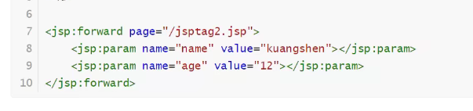

# 2021Study-JavaWeb

## 1. 基本概念

## 2. web服务器

## 3. Tomcat

## 4. Http

## 5. Maven

## 6. Servlet

E:\idea_workspace\2021Study-JavaWeb\servlet1\src\main\java\com\binyu


[CSDN-页面跳转的两种方式(转发和重定向)区别及应用场景分析](https://blog.csdn.net/liubin5620/article/details/79922692)

请求转发不加项目名，重定向要加项目名

## 7. Cookie Session

[cookie和session的详解与区别](https://www.cnblogs.com/l199616j/p/11195667.html)

**会话**：用户打开一个浏览器，点了很多超链接，关闭浏览器，过程是会话

**有状态会话**：一个同学来过教室，下次再来教室，我们会知道这个同学曾经来过，称之为有状态会话

一个网站怎么证明你来过？

1. 服务器给客户端一个信件，客户端下次访问服务端带上信件就可以了；cookie
2. 服务器登记你来过了，下次你来的时候我来匹配你；session

**Cookie**：客户端技术

1. 从请求中拿到cookie信息
2. 服务器响应给客户端cookie

**Session**：服务器技术

1.  服务器会给每一个用户（浏览器）创建一个session对象
2. 一个session独占一个浏览器，只要浏览器没关闭，这个session就存在
3. 用户登录之后，整个相关网站它都可以访问

**编码解码**

```java
URLEncoder.encode()
URLDecoder.decode()
```

## 8. JSP

jsp本质是servlet

**JSP表达式**：

```jsp
<%=new Date ()    %>
<%! %>JSP声明：会被编译到JSP生成的java类中
```

JSP注释不会在客户端中显示，HTML注释会显示

**JSP指令**

```jsp
<%@ page import="java.util.Date" %>
<%@ page contentType="text/html;charset=UTF-8" language="java" isELIgnored="false" %>
<%@ page errorPage="error/500.jsp" %>
```

定制错误页面

```xml
<error-page>
        <error-code></error-code>
        <location></location>
    </error-page>
```

**引入页面**：

会将两个页面合二为一

```jsp
<% @include file=""%>
```

拼接页面

```jsp
<jsp:include page="/"/>
```

**九大内置对象，四大作用域**：

- pageContext：存东西
- Request：存东西
- Response
- Session：存东西
- application[ServletContext]：存东西
- config[ServletConfig]
- out
- page
- exception

**JSP标签**：




**JSTL标签**：

[菜鸟教程-JSP 标准标签库（JSTL）](https://www.runoob.com/jsp/jsp-jstl.html)

功能和java代码一样

## 9. JavaBean

## 10. MVC架构

## 11. 过滤器Filter

1. 实现Filter接口
2. web.xml中编写<filter><filter-mapping>

## 12. 监听器Listener

1. 实现Listener接口
2. web.xml中编写<listener>

## 13. 过滤器、监听器应用

GUI编程中经常使用

