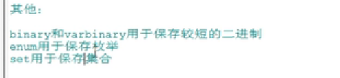
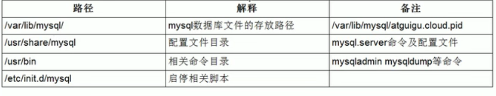
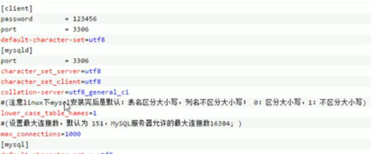
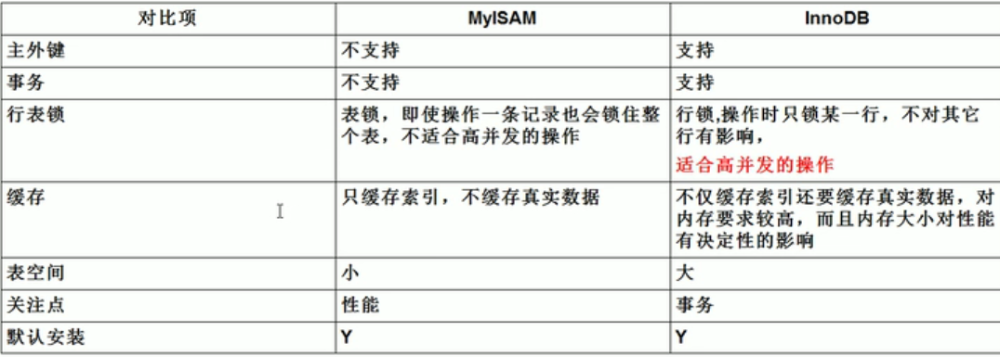
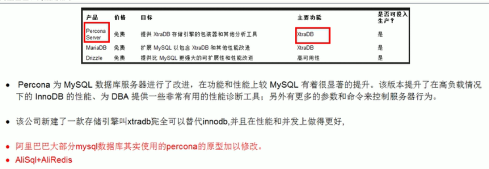
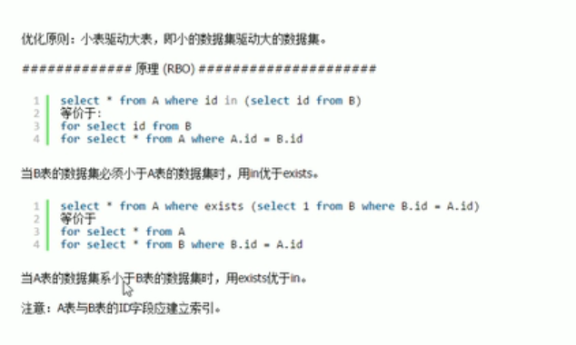
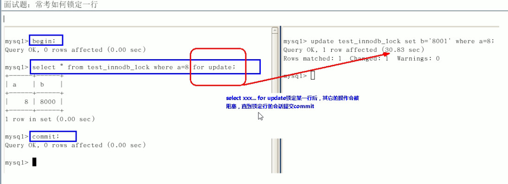

# 2021Study-MySQL基础

[菜鸟教程-MySQL 安装](https://www.runoob.com/mysql/mysql-install.html)

[CSDN-修改mysql远程访问](https://www.cnblogs.com/stronger-xsw/p/12779385.html)

基础操作：

`show databases;`显示所有数据库

`use <database>;`切换数据库

`show tables;`查看当前库的所有表

`show tables from <database>`查看其他数据库的所有表

`select version();`查看MySQL版本

三种注释：

`#注释`

`-- 注释`

`/* 注释 */`

## DQL语言、函数、连接的使用、子查询（嵌套查询）

[菜鸟教程-MySQL 函数](https://www.runoob.com/mysql/mysql-functions.html)

[菜鸟教程-MySQL 连接的使用](https://www.runoob.com/mysql/mysql-join.html)

```sql
SELECT column_name,column_name
FROM table_name
[WHERE Clause]
[LIMIT N][ OFFSET M]
```

起别名带有特殊符号：`as '别名'`

去重：`select distinct xxx from table_name`

mysql的+号只有运算符一个功能：

- `select 90+100;`190
- `select '123'+90;`213
- `select 'john'+90`90
- `select null+10`null

拼接字符串：`select CONCAT(last_name,first_name) from employees`

通配符的使用：`select * from employees where last_name like '%a%'`

- % 任意多个字符，包含0字符

- _ 任意单个字符

转义字符：

- `\\`\
- `\_`_

`in`不支持通配符

安全等于`<=>`：

- 可作为普通运算符的=
- 也可以用于判断是否是NULL 如：where salary is NULL/(is not NULL) ->where salary <=>NULL 

防止查询到的字段为null：`IFNULL(column_name,0)`

```sql
SELECT field1, field2,...fieldN FROM table_name1, table_name2...
[WHERE Clause] ORDER BY field1 [ASC [DESC][默认 ASC]], [field2...] [ASC [DESC][默认 ASC]]
```

----

IF：`IF(expr1,expr2,expr3)`

CASE-WHEN：`case sex
    when '1' then '男'
    when '2' then '女'
    else '其他' end`

----

**SQL Aggregate 函数**

SQL Aggregate 函数计算从列中取得的值，返回一个单一的值。

有用的 Aggregate 函数：

- AVG() - 返回平均值
- COUNT() - 返回行数
  - MYISAM存储引擎下，count(*)效率高
  - INNOOB存储引擎下，count(*)和count(1)效率差不多
- FIRST() - 返回第一个记录的值
- LAST() - 返回最后一个记录的值
- MAX() - 返回最大值
- MIN() - 返回最小值
- SUM() - 返回总和

------

**SQL Scalar 函数**

SQL Scalar 函数基于输入值，返回一个单一的值。

有用的 Scalar 函数：

- UCASE() - 将某个字段转换为大写
- LCASE() - 将某个字段转换为小写
- MID() - 从某个文本字段提取字符，MySql 中使用
- SubString(字段，1，end) - 从某个文本字段提取字符
- LEN() - 返回某个文本字段的长度
- ROUND() - 对某个数值字段进行指定小数位数的四舍五入
- NOW() - 返回当前的系统日期和时间
- FORMAT() - 格式化某个字段的显示方式

---

**分组查询**:

查询每个部门的平均工资`select AVG(salary),job_id from employees group by job_id;`

查询邮箱中包含a字符的，每个部门的平均工资`select AVG(salary),department_id from employees where email like '%a%' group by department_id;`

**分组后的筛选**：`having`

判断存在`exists(完整的查询语句)`

分页查询`limit start,size`

```
SELECT expression1, expression2, ... expression_n
FROM tables
[WHERE conditions]
UNION [ALL | DISTINCT]
SELECT expression1, expression2, ... expression_n
FROM tables
[WHERE conditions];
```

## DML语言

```sql
INSERT INTO table_name ( field1, field2,...fieldN )
                       VALUES
                       ( value1, value2,...valueN );
```

```sql
UPDATE table_name SET field1=new-value1, field2=new-value2
[WHERE Clause]
```

```MYsql
DELETE FROM table_name [WHERE Clause]
DELETE 别名1 FROM table_name1 别名1 INNER|LEFT|RIGHT JOIN table_name2 别名2 ON 连接条件 WHERE 筛选条件
TRUNCATE TABLE table_name
```

delete和truncate的区别：

1. delete可以加where条件，truncate不能加
2. truncate删除，效率高一些
3. 加入要删除的表中有自增长列，如果用delete删除，再插入数据，自增长列的值从断点开始；而truncate删除后，再插入数据，自增长列的值从1开始
4. truncate删除没有返回值，delete删除有返回值
5. truncate删除不能回滚，delete删除可以回滚

## DDL语言、数据类型、常见约束

**库的管理语言**：

创建create 修改alter 删除drop

`create database 库名;`创建数据库

`create datebase if not exists 库名; `如不存在则创建数据库

`alter database 库名 character set 字符集;`修改数据库字符集

`drop database if exists 库名;`如存在则删除数据库

----

**表的管理语言**：

`create table if not exists 表名(列名 类型 约束，...);`如不存在则创建表

`desc 表名;`查看表结构

`alter table 表名 change column 旧列名 新列名 新列类型与约束;`修改表的列名和列

`alter table 表名 modify column 列名 新列类型与约束; `修改表的列

`alter table 表名 add column 列名 列类型与约束;`增加表的列

`alter table 表名 drop column 列名;`删除表的列

`alter table 表名 rename to 新表名;`修改表名

`create table 表名1 like 表名2;`只复制表的结构

`create table 表名1 select * from 表名2;`复制表

`create table 表名1 select xx,yy from 表名2 where 筛选条件`只复制表的部分数据

`create table 表名1 select xx,yy from 表名2 where 1=2`只复制表的部分字段

---

**数据类型**：

`unsigned`无符号

`zerofill`零填充

- 数值型

  - 整型`tinyint` `smallint` `mediumint` `int integer` `bigint`
  - 定点数`dec(M,D)` `decimal(M,D)`M 代表整数部分位数+小数部分位数 D 代表小数部分位数
  - 浮点数`float(M,D)` `double(M,D)`

- 字符型

  - 较短的文本`char(M)` 是固定长度 ； `varchar(M)`是可变长度

  

  - 较长的文本`text` `blob`

- 日期型 `date` `datetime` `timestamp` `time` `year`

  

- 其他型

  

---

**常见约束**：

1.列级约束：

`not null`非空

`default 默认值`默认值

`primary key`主键

`unique`唯一，可以为空 比如座位号

`check`检查约束【mysql不支持】

`foreign key references 表名(列名)`外键，在从表添加

2.表级约束：

`[constraint pk] primary key(列名)`添加主键约束

`[constraint fk_stuinfo_major] foreign key(majorId) references major(id)`添加外键约束

----

标识列：`auto_increment`

- 标识列要和primary key或unique搭配

- 一个表只能有至多一个标识列
- 标识列的类型只能是数值型
- 标识列可以通过`set auto_increment_increment=3`设置步长，也可以通过手动插入值设置起始值

## TCL语言

TCL：事务控制语言

`set autocommit=0`关闭自动提交

`start transaction`开启事务

…多条命令

`commit`结束事务

`set transaction isolation level read committed`设置当前mysql连接的隔离级别

`set global transaction isolation level read committed`设置数据库系统全局的隔离级别

`savepoint 节点名` `rollback to 节点名`回滚到保存点

## 视图


使用场景：

- 多个地方用到同样的查询
- 查询的sql比较复杂

视图的插入、更新、删除一般会带动原始表的变化

## 变量

[博客园-MySQL变量的使用](https://www.cnblogs.com/Brambling/p/9259375.html)

## 存储过程和函数

存储过程的好处：

1. 提高代码的重用型
2. 简化操作
3. 减少编译次数、减少和数据库服务器连接的次数，提高效率

`create procedure 存储过程名(参数列表) BEGIN ... END$`

参数列表包括参数模式、参数名、参数类型

参数模式有`IN` `OUT` `INOUT`

`DELIMITER 结束标记`设置结束符

```MYSQL
DELIMITER $
CREATE PROCEDURE myp1()
BEGIN
...
END $
```

`call 存储过程名(参数列表) $`调用存储过程

`show create procedure 存储过程名`查看存储过程的信息

`drop procedure 存储过程名`删除存储过程

---

`create function 函数名(参数列表) returns 返回类型 BEGIN ... END￥ `创建函数

`select 函数名(参数列表)`调用函数

`show create function 函数名`查看函数的信息

`drop function 函数名`删除函数

## 流程控制结构

[博客园-SQL——流程控制](https://www.cnblogs.com/lqkStudy/p/11493749.html)

`IF(表达式1,表达式2,表达式3)` 满足表达式1返回表达式2，否则返回表达式3


# 2021Study-MySQL高级【需要复习】

## mysql的架构介绍

linux下mysql账号：root 密码：root123##ROOT

`mysqladmin --version`查看mysql安装版本

linux中mysql的安装目录：



修改字符集为UTF-8



frm文件：存放表结构

myd文件：存放表数据

myi文件：存放表索引

---

存储引擎对比：





## 索引优化分析

性能下降sql慢、执行时间长、等待时间长：

- 查询语句写的烂
- 索引失效
- 关联查询太多join
- 服务器调优及各个参数设置

B数（多路搜索树）索引：帮助mysql高效获取数据的数据结构，

索引的目的在于提高查询效率，可以类比字典，

理解为**排好序的快速查找数据结构**


修改表结构(添加索引)

```sql
CREATE INDEX indexName ON table_name (column_name)

ALTER table tableName ADD INDEX indexName(columnName)
```

创建表的时候直接指定

```sql
CREATE TABLE mytable(  
 
ID INT NOT NULL,   
 
username VARCHAR(16) NOT NULL,  
 
INDEX [indexName] (username(length))  
 
);  
```

删除索引的语法

```sql
DROP INDEX [indexName] ON mytable; 
```

----

`explain 查询语句`

explain包含信息：

- id
  - id相同，执行顺序由上至下
  - id不同，如果是子查询，id序号会递增，id越大优先级越高，越先执行
  - id相同不同，综合以上
- select_type
  - SIMPLE
  - PRIMARY
  - SUBQUERY，子查询
  - DERIVED，衍生表
  - UNION
  - UNION RESULT，从UNION表获取结果的SELECT
- table
  - 对应的表
- type
  - 从好到差排序system>const>eq_ref>ref>range>index>all
  - system，表只有一条数据
  - const，表示索引一次就找到了，用于比较primary key或者unique索引
  - eq_ref，唯一性索引扫描，表中只有一条记录与之对应
  - 【 简单地说是`const`是直接按主键或唯一键读取，`eq_ref`用于联表查询的情况，按联表的主键或唯一键联合查询。 】
  - ref，非唯一性索引扫描
  - range，出现在between and语句中
  - index，全索引扫描
  - all，全表扫描
- possible_keys
  - 显示可能应用在这个表上的索引，一个或多个，但不一定被查询实际使用
- key
  - 实际使用的索引，如果为null，则没有使用索引
  - 覆盖索引：select数据列只从索引中获取得，不必读取数据行
- key_len
  - 显示的值为索引字段的最大可能长度，长度越短越好
- ref
  - 显示索引的哪一列被使用了，可能为const
- rows
  - 大致估算找到所需记录要读取的行数
- Extra
  - using filesort：Mysql无法利用索引完成的排序操作称为 文件排序
  - using temporary：使用了临时表保存中间结果，常见于排序order by和分组查询group by
  - using index：用到了覆盖索引

---


`show index from 表`显示表的索引

`alter table 表名 add index 索引名(列名)`添加表索引

`drop index 索引名 on 表名`删除表索引

两表相连，索引加在从表

**索引失效的情况**：


## 查询截取分析




**慢查询日志**：

[CSDN-Mysql慢查询日志的使用 和 Mysql的优化](https://blog.csdn.net/m_nanle_xiaobudiu/article/details/79288257)

`set global slow_query_log=1;`开启慢查询日志

`set global long_query_time=3;`修改慢的阈值时间

---

**使用show profile分析SQL性能**：

[CSDN-使用show profiles分析SQL性能](https://blog.csdn.net/gaoshan12345678910/article/details/78840158)

`show profiling=on;`

`show profiles;`

出现性能瓶颈要查看以下是否出现：


----

**全局查询日志**：

永远不要在生产环境开启这个功能

`set global_log=1;`

`set global log_output='TABLE';`

## Mysql锁机制

### 表锁

 表级锁是mysql锁中粒度最大的一种锁，表示当前的操作对整张表加锁，**资源开销比行锁少，不会出现死锁的情况，但是发生锁冲突的概率很大**。被大部分的mysql引擎支持，MyISAM和InnoDB都支持表级锁，但是InnoDB默认的是行级锁。  

共享锁用法：

`LOCK TABLE table_name [ AS alias_name ] READ`
排它锁用法：

`LOCK TABLE table_name [AS alias_name][ LOW_PRIORITY ] WRITE`

解锁用法：

`unlock tables;`

`show status like 'table%';`表锁分析


### 行锁

`show open tables;`查看哪些表加锁了

 **共享锁用法**： 

 若事务T对数据对象A加上S锁，则事务T**可以读A但不能修改A**，其他事务只能再对A加S锁，而不能加X锁，直到T释放A上的S锁。这保证了其他事务可以读A，但在T释放A上的S锁之前不能对A做任何修改。 

 **共享锁就是允许多个线程同时获取一个锁，一个锁可以同时被多个线程拥有。** 

 `select ... lock in share mode; `

**排它锁用法**：

 若事务T对数据对象A加上X锁，事务T可以读A也可以修改A，其他事务不能再对A加任何锁，直到T释放A上的锁。这保证了其他事务在T释放A上的锁之前不能再读取和修改A。

` select ... for update `
 排它锁，也称作独占锁，一个锁在某一时刻只能被一个线程占有，其它线程必须等待锁被释放之后才可能获取到锁

`show status like 'innodb_row_lock%'`行锁分析

---


**索引失效、无索引 行锁变表锁**

**间隙锁**：间隙锁（Gap Lock）是Innodb在提交下为了解决幻读问题时引入的锁机制，（下面的所有案例没有特意强调都使用可重复读隔离级别）幻读的问题存在是因为新增或者更新操作，这时如果进行范围查询的时候（加锁查询），会出现不一致的问题，这时使用不同的行锁已经没有办法满足要求，需要对一定范围内的数据进行加锁，间隙锁就是解决这类问题的。在可重复读隔离级别下，数据库是通过行锁和间隙锁共同组成的（next-key lock），来实现的

---

### 页锁

  页级锁是MySQL中锁定粒度介于行级锁和表级锁中间的一种锁。表级锁速度快，但冲突多，行级冲突少，但速度慢。所以取了折衷的页级，一次锁定相邻的一组记录。BDB支持页级锁 

### 其他

面试题：



优化建议：


## 主从复制

[MySQL主从复制(Master-Slave)实践](https://www.cnblogs.com/gl-developer/p/6170423.html)