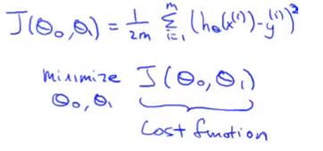
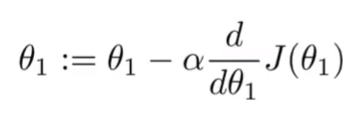
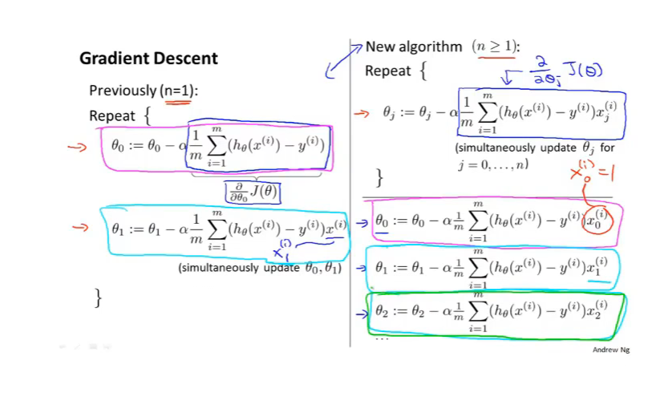
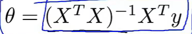
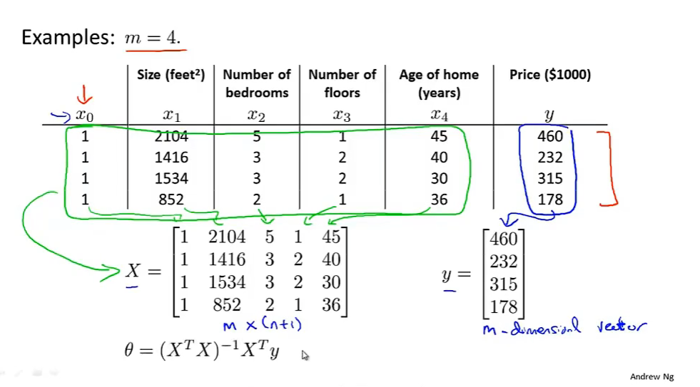
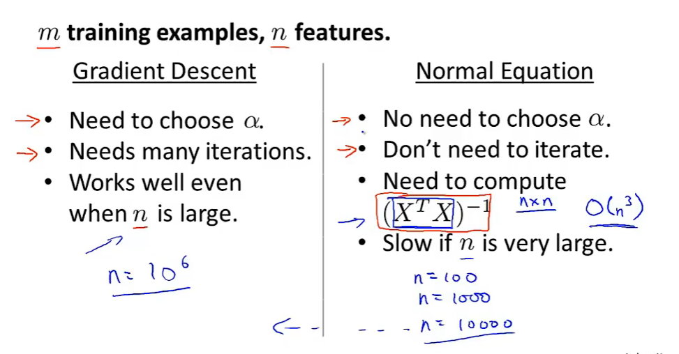
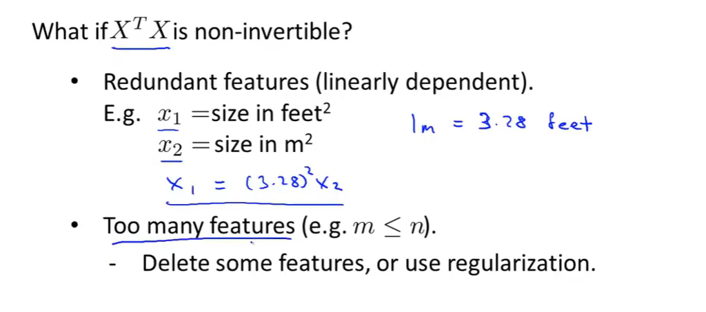
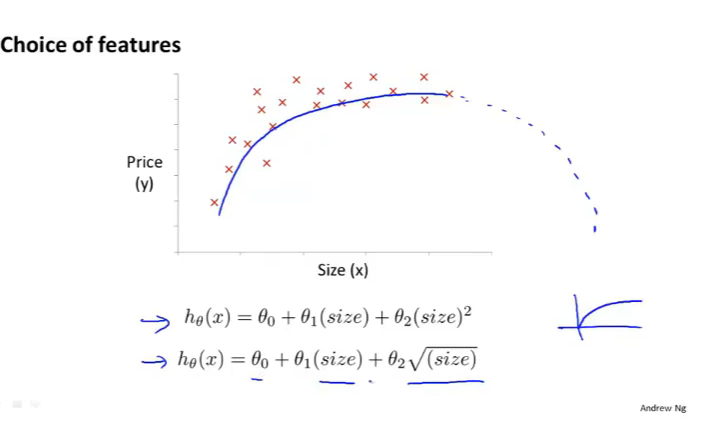
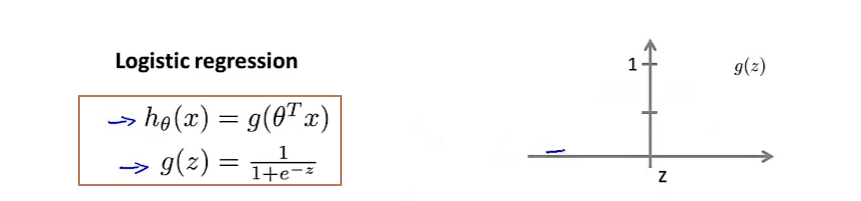

jokey
123456

 

# 机器学习

> 机器学习是人工智能的发展出来的一个领域

举例：

- 数据挖掘
  - 网站点击数据
  - 医疗记录
  - 生物基因信息
  - 工程学信息
- 不能手动编程的应用
  - 自主驾驶的直升机
  - 手写识别
  - 大多数自然语言处理
  - 计算机视觉
- 私人定制化的节目
- 理解人类大脑的学习

## 机器学习的定义

>  定义：经验E，任务，T性能量度P

## 监督学习与无监督学习

> 监督学习：给定正确答案，要给出更多的正确答案‘
>
> 无监督学习：没有给定正确答案，想要聚类分簇
>
> 回归问题：预测连续的数值输出
>
> 分类问题：预测离散的数值输出

**Octave**

## 单一变量线性回归

> 假设函数： 假设某一个函数，使其能尽可能的代表数据的分布 
>
> 代价函数： 对于回归问题，我们需要求出代价函数来求解[最优解](https://so.csdn.net/so/search?q=最优解&spm=1001.2101.3001.7020)，常用的是平方误差代价函数 
>
> 
>
> 梯度下降算法：[梯度下降算法原理讲解](https://blog.csdn.net/qq_41800366/article/details/86583789)
>
> 

## 矩阵与向量

> 不存在逆矩阵的矩阵称为奇异矩阵

Octave软件可以很方便的进行矩阵求逆运算

##  多元线性回归

多元线性回归的梯度下降算法：

特征缩放：让每个特征取到[-1,1]范围，让梯度下降收敛更快

如果代价函数的值没有随着迭代次数增多而减小，就要适当降低学习率α

----

多元线性回归的直接解法：正规方程

-----

梯度下降算法和正规方程法的优缺点：

----

正规方程在矩阵不可逆的情况下解决方案：

## 多项式回归

## Octave

[octave教程](https://blog.csdn.net/weixin_41803874/article/details/88104448)

## 分类问题

> logistic回归（事实上是一种分类算法）
>
> 

  

