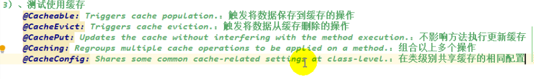

# 谷粒学院


P207 00:08:00

## 日志工具

> log4j和logback都可以

[博客园-logback日志配置](https://www.cnblogs.com/sky230/p/6420208.html)

[CSDN-logback 日志配置](https://blog.csdn.net/huofuman960209/article/details/100080794)

添加`@Slf4j`


## SpringDataRedis&SpringCache

[spring boot 2.0配置Redis缓存](https://www.jianshu.com/p/c2696661810c)

[Spring官网-Cache Abstraction](https://docs.spring.io/spring-framework/docs/current/reference/html/integration.html#cache)

> 缓存注解一般是在Service层方法加

`@Cachable`


`CachePut`

`CacheEvict`

key生成的规则：


## 登录和注册

单点登录SSO：一个模块登录后，其他模块不用再登录

[简书-使用Spring Security实现注册登录](https://www.jianshu.com/p/f01654ce01bb)

# 谷粒商城

[谷粒商城所学知识点整理总结](https://www.cnblogs.com/manmanblogs/p/15682661.html)

项目微服务架构图：


微服务划分图：


## 环境

### 使用vagrant快速创建Linux虚拟机&虚拟机网络设置

https://www.bilibili.com/video/BV1np4y1C7Yf?p=6

https://www.bilibili.com/video/BV1np4y1C7Yf?p=7

### Docker安装Mysql

1. `docker pull mysql:5.7`安装mysql5.7版本

2. `docker run -p 3306:3306 --name mysql-master -v /mydata/mysql/log:/var/log/mysql -v /mydata/mysql/data:/var/lib/mysql -v /mydata/mysql/conf:/etc/mysql -e MYSQL_ROOT_PASSWORD=root -d mysql:5.7 `新建并启动容器mysql-master并设置数据卷挂载

3. 在/mydata/mysql/conf下`vim my.cnf`

```cnf

[client]
default-character-set=utf8

[mysql]
default-character-set=utf8
[mysqld]
init_connect=SET collation_connection = utf8_unicode_ci
init_connect=SET NAMES utf8
character-set-server=utf8
collation-server=utf8_unicode_ci
skip-character-set-client-handshake
skip-name-resolve

```

4. `docker restart mysql-master`重启容器
5. `docker exec -it mysql-master /bin/bash`进入mysql-master这个容器

---

`docker update mysql --restart=always`设置自启动

### Docker安装Redis

1. `docker pull redis`安装Redis最新版本

2. ` mkdir -p /mydata/redis/conf`递归创建目录
3. `touch /mydata/redis/conf/redis.conf`新建redis配置文件
4. ` docker run -p 6379:6379 --name redis -v /mydata/redis/data:/data \
   -v/mydata/redis/conf/redis.conf:/etc/redis/redis.conf \
   -d redis redis-server /etc/redis/redis.conf `新建并启动容器redis并设置数据卷挂载
5. ` docker exec -it redis redis-cli`进入redis这个容器
6. `exit`退出容器
7. 在/mydata/redis/conf下`vim redis.conf`配置Redis持久化

```conf
appendonly yes
```

### maven配置阿里云和jdk8

略

### 安装idea插件lombok和MybatisX

略

### 安装Vscode和插件

略

### 配置git

略

### 项目结构创建和提交到github

[git push时报错解决办法](https://www.icode9.com/content-4-896064.html)

### 数据库初始化

`docker update redis --restart=always`

`docker update mysql-master --restart=always`

设置一直重新启动

### 引入人人开源

在`<parent>`下加上`<relativePath/>`

## 分布式组件

### 问题总结

> 问题主要是版本，建议参照 [版本说明 · alibaba/spring-cloud-alibaba Wiki](https://github.com/alibaba/spring-cloud-alibaba/wiki/版本说明) 


```xml
<dependency>
            <groupId>org.springframework.cloud</groupId>
            <artifactId>spring-cloud-loadbalancer</artifactId>
            <version>2.2.1.RELEASE</version>
        </dependency>
```


```xml
<dependency>
            <groupId>org.springframework.cloud</groupId>
            <artifactId>spring-cloud-starter-bootstrap</artifactId>
            <version>3.1.0</version>
        </dependency>
```


### Nacos

[Nacos Spring Cloud 快速开始](https://nacos.io/zh-cn/docs/quick-start-spring-cloud.html)

使用的配置文件是`gulimall-coupon.properties`而不是`bootstrapProperties-gulimall-coupon.properties,DEFAULT_GROUP`

并且需要在对应controller上加`@RefreshScope`

解耦配置文件

```properties
spring.cloud.nacos.config.extension-configs[0].data-id=datasource.yml
spring.cloud.nacos.config.extension-configs[0].group=dev
spring.cloud.nacos.config.extension-configs[0].refresh=true

spring.cloud.nacos.config.extension-configs[1].data-id=mybatis.yml
spring.cloud.nacos.config.extension-configs[1].group=dev
spring.cloud.nacos.config.extension-configs[1].refresh=true

spring.cloud.nacos.config.extension-configs[2].data-id=other.yml
spring.cloud.nacos.config.extension-configs[2].group=dev
spring.cloud.nacos.config.extension-configs[2].refresh=true
```


### OpenFeign


2. `@FeignClient(name = "gulimall-coupon",url ="127.0.0.1:7000" )`

### Gateway

```yml
spring:
  cloud:
    gateway:
      routes:
        - id: baidu_route
          uri: https://www.baidu.com
          predicates:
            - Query=url,baidu
              
        - id: qq_route
          uri: https://www.qq.com
          predicates:
            - Query=url,qq
    nacos:
      discovery:
        server-addr: 127.0.0.1:8848
  application:
    name: gulimall-gateway
```

#### 统一配置跨域

```java
@Configuration
public class CorsConfig {
    @Bean
    public CorsWebFilter corsWebFilter(){
        UrlBasedCorsConfigurationSource source=new UrlBasedCorsConfigurationSource ();
        CorsConfiguration corsConfiguration=new CorsConfiguration ();
        corsConfiguration.addAllowedHeader ( "*" );
        corsConfiguration.addAllowedMethod ( "*" );
        corsConfiguration.addAllowedOrigin ( "*" );
        corsConfiguration.setAllowCredentials ( true );
        source.registerCorsConfiguration ( "/**", corsConfiguration);
        return new CorsWebFilter ( source );
    }
}
```


## MyBatis-plus

### 逻辑删除

[逻辑删除](https://baomidou.com/pages/6b03c5/#%E6%AD%A5%E9%AA%A4-1-%E9%85%8D%E7%BD%AEcom-baomidou-mybatisplus-core-config-globalconfig-dbconfig)

修改日志等级：

```yml
logging:
  level:
    com.gulimall: debug
```

```
2022-05-11 11:01:01.165 DEBUG 29956 --- [io-10000-exec-1] c.g.p.dao.CategoryDao.deleteBatchIds     : ==>  Preparing: UPDATE pms_category SET show_status=0 WHERE cat_id IN ( ? ) AND show_status=1 
2022-05-11 11:01:01.211 DEBUG 29956 --- [io-10000-exec-1] c.g.p.dao.CategoryDao.deleteBatchIds     : ==> Parameters: 1431(Long)
2022-05-11 11:01:01.256 DEBUG 29956 --- [io-10000-exec-1] c.g.p.dao.CategoryDao.deleteBatchIds     : <==    Updates: 1
```


### 分页插件

## Vue组件化开发

`vue init webpack 项目名`创建一个vue项目

## 阿里云OSS

> [Spring Cloud Alibaba Cloud OSS](https://spring-cloud-alibaba-group.github.io/github-pages/hoxton/en-us/index.html#_how_to_introduce_spring_cloud_alibaba_cloud_oss)版本需要自己引入

``` xml
<dependency>
    <groupId>com.alibaba.cloud</groupId>
    <artifactId>spring-cloud-starter-alicloud-oss</artifactId>
    <version>2.2.0.RELEASE</version>
</dependency>
```

@Runwith
当一个类用@RunWith注释或继承一个用@RunWith注释的类时，JUnit将调用它所引用的类来运行该类中的测试而不是开发者去在junit内部去构建它。我们在开发过程中使用这个特性。

当测试类A用到类B的实例的时候，是直接从容器中获取，而不是去new一个B
如果没有@RunWith(SpringRunner.class)时候，会报错，空指针异常

> 注入OssClient有两种方法

1. 方法1 按类型注入，类型为Oss而不是OssClient

```java
@Autowired
Oss ossClient;
```

2. 方法2 按名称注入

```java
@Resource
OssClient ossClient;
```

> 文件上传

singleUpload.vue和mutilUpload.vue代码有问题，需要修正

> 图片显示

el-image并不能使用，原因未知

## 前后端校验

### 前端校验

### 后端校验JSR303

给实体类字段加上注解，controller方法的参数上要加`@Valid`，拿到数据校验结果BindingResult

#### 统一异常处理类

```java
@Slf4j
@RestControllerAdvice(basePackages ="com.binyu.gulimall.product.controller" )
public class GulimallExceptionControllerAdvice {
   @ExceptionHandler(value = MethodArgumentNotValidException.class)
    public R handleValidException(MethodArgumentNotValidException e){
        log.error("数据校验出现问题{}，异常类型{}",e.getMessage (),e.getClass ());
       BindingResult bindingResult = e.getBindingResult ();
       Map<String,String> errorMap=new HashMap<> ();
       bindingResult.getFieldErrors ().forEach ( (item)->{
           errorMap.put ( item.getField (),item.getDefaultMessage () );
       } );
       return R.error ( BizCodeEnume.VALID_EXCEPTION.getCode (),BizCodeEnume.VALID_EXCEPTION.getMsg () ).put("data",errorMap);
    }
    @ExceptionHandler(value = Throwable.class)
    public R handleException(Throwable e){
        return R.error();
    }
}
```


#### 状态码枚举

```java
public enum BizCodeEnume {
    UNKNOW_EXCEPTION(10000,"系统未知异常"),
    VALID_EXCEPTION(10001,"参数格式校验失败");
    private Integer code;
    private String msg;

    BizCodeEnume(Integer code, String msg) {
        this.code = code;
        this.msg = msg;
    }

    public Integer getCode() {
        return this.code;
    }

    public void setCode(Integer code) {
        this.code = code;
    }

    public String getMsg() {
        return this.msg;
    }

    public void setMsg(String msg) {
        this.msg = msg;
    }
}
```

#### 分组校验

1. groups

```java
@NotBlank(message = "品牌名必须提交",groups = {AddGroup.class,UpdateGroup.class})
```

2. @Validated

```java
public R save(@Validated({AddGroup.class}) @RequestBody BrandEntity brand) {
```

> 没分组就不加入校验

#### 自定义校验

> 乱码问题需要修改设置的文件编码，并勾选

1. 添加自定义注解

```java
@ListValue(vals={0,1},groups = {AddGroup.class})
	private Integer showStatus;
```

2. 编写注解

```java
@Documented
@Constraint(
        validatedBy = {ListValueConstraintValidator.class}
)
@Target({ElementType.METHOD, ElementType.FIELD, ElementType.ANNOTATION_TYPE, ElementType.CONSTRUCTOR, ElementType.PARAMETER, ElementType.TYPE_USE})
@Retention(RetentionPolicy.RUNTIME)
public @interface ListValue {
    String message() default "{com.binyu.common.valid.ListValue.message}";

    Class<?>[] groups() default {};

    Class<? extends Payload>[] payload() default {};
    int[] vals() default {};

}
```

3. 编写约束验证器类ConstraintValidator

```java
public class ListValueConstraintValidator implements ConstraintValidator<ListValue,Integer> {
    private Set<Integer> set= new HashSet<> ();
    @Override
    public void initialize(ListValue constraintAnnotation) {
        int[] vals = constraintAnnotation.vals ();
        for (int val : vals) {
            set.add(val);
        }
    }

    @Override
    public boolean isValid(Integer integer, ConstraintValidatorContext constraintValidatorContext) {
        return set.contains ( integer );
    }
}
```

4. 不同的数据类型对应不同的约束验证器类ConstraintValidator，可配置多个

## SPU和SKU

>  类目>*SPU*>SKU

## PO,BO,VO和POJO的区别

[PO,BO,VO和POJO的区别](https://blog.csdn.net/u011870547/article/details/81077153)

## 属性复制

> 由于数据库中存在冗余字段（冗余字段的设计是为了避免联表查询），所以逆向工程生成的service方法需要重构，更新不止一个表的数据

`BeanUtils.copyProperties(源，目标)`

## Lombok

### @Data

### @Slf4j

## 常量、状态码枚举

## ES和kibana

[谷粒商城-分布式高级笔记](https://gitee.com/opxc/gulimall-learning/blob/master/docs/%E8%B0%B7%E7%B2%92%E5%95%86%E5%9F%8E%E2%80%94%E5%88%86%E5%B8%83%E5%BC%8F%E9%AB%98%E7%BA%A7.md)


## FastJSON

> `JSON.parseObject()`字符串转java对象


## Thymeleaf

> 开发阶段需要关闭thymeleaf缓存

```
thymeleaf:
	cache: false
```

----

These substitutions must be surrounded by vertical bars (`|`), like:

```html
<span th:text="|Welcome to our application, ${user.name}!|">
```

Which is equivalent to:

```html
<span th:text="'Welcome to our application, ' + ${user.name} + '!'">
```

## 热部署SpringBootDevtools

```xml
<dependency>
        <groupId>org.springframework.boot</groupId>
        <artifactId>spring-boot-devtools</artifactId>
        <optional>true</optional>
    </dependency>
```

`ctrl+F9`热部署重新编译

## 压力测试

### 性能指标

响应时间（RT）:用户从客户端发起一个请求开始，到客户端接收到服务器放回的响应结束，整个过程所耗费的时间

HPS:每秒点击次数，单位是次/秒

TPS:系统每秒处理交易数，单位是笔/秒

QPS:系统每秒处理查询次数，单位是次/秒

最大响应时间：指用户发出请求或者指令到系统做出翻译狗的最大时间

最少响应时间：

90%响应时间：

### JMeter

[143、性能压测-压力测试-JMeter在windows下地址占用bug解决](https://blog.csdn.net/pyd1040201698/article/details/108219186)

> 监控CPU占用和内存占用：
>
> - java程序运用jconsole和jvisualvm等工具
> - 虚拟机程序或云服务器程序运用`docker status`命令

> 中间件越多，性能损失越大

## Nginx与Nginx动静分离

[Nginx配置详解](https://www.cnblogs.com/knowledgesea/p/5175711.html)


## 缓存

> 哪些数据适合放进缓存：
>
> - 即时性、数据一致性要求不高的
> - 访问量大且更新频率不高的数据

> 缓存：
>
> - 本地缓存，用Map（在分布式下存在问题）
> - 分布式缓存
>   - Redis,缓存中存的数据统一是JSON字符串


1. 引入pom

```xml
<!--dependency for redis-->
<!-- https://mvnrepository.com/artifact/org.springframework.boot/spring-boot-starter-data-redis -->
<dependency>
    <groupId>org.springframework.boot</groupId>
    <artifactId>spring-boot-starter-data-redis</artifactId>
    <version>2.1.5.RELEASE</version>
</dependency>
```

2. 配置yml

```yml
#redis
redis:
  #redis机器ip
  hostname: 127.0.0.1
  #redis端口
  port: 6379
```

3. 使用StringRedisTemplate来操作Redis

```java
ValueOperations<String,String> ops=stringRedisTemplate.opsForValue();
ops.set("hello","world");
String hello=ops.get("hello")
```


> 堆外内存溢出原因：
>
> 1. springboot2.0以后默认使用lettuce作为操作redis的客户端，它使用netty进行网络通信
> 2. lettuce的bug导致堆外内存溢出，-Xmx300m：netty如果没有指定堆外内存，默认使用-Xmx300m，可以通过-Dio.netty.maxDirectMemory进行设置
>
> 堆外内存溢出解决方案
>
> 1. 升级lettuce客户端
> 2. 切换使用jedis


```xml
<dependency>
	<groupId>org.springframework.boot</groupId>
	<artifactId>spring-boot-starter-data-redis</artifactId>
	<exclusions>
		<exclusion>
			<groupId>io.lettuce</groupId>
			<artifactId>lettuce-core</artifactId>
		</exclusion>
	</exclusions>
</dependency>
<dependency>
	<groupId>redis.clients</groupId>
	<artifactId>jedis</artifactId>
</dependency>
```

## Redisson分布式锁框架

[Github-Redisson](https://github.com/redisson/redisson)

```xml
    <dependency>
            <groupId>org.redisson</groupId>
            <artifactId>redisson</artifactId>
            <version>3.15.0</version>
        </dependency>
```


> 单Redis节点模式配置

```java
@Configuration
    public static class Application {

        @Bean(destroyMethod="shutdown")
        RedissonClient redisson() throws IOException {
            Config config = new Config();
        config.useSingleServer().setAddress("redis://47.104.135.106:6379")
            return Redisson.create(config);
        }
    }
```

[8. 分布式锁和同步器](https://github.com/redisson/redisson/wiki/8.-%E5%88%86%E5%B8%83%E5%BC%8F%E9%94%81%E5%92%8C%E5%90%8C%E6%AD%A5%E5%99%A8)

> Redisson的看门狗：
>
> 1. 锁的自动续期，如果业务超长，运行期间每隔10s自动给锁续上新的30s。不用担心业务时间长，锁自动被删除。默认加锁时间为30s。
> 2. 加锁的业务只要运行完成，就不会给当前锁续期，即使由于业务宕机不手动解锁，锁默认在30s以后自动删除
> 3. lock.lock(时间，时间单位) 自动解锁时间一定要大于业务时间

> 读写锁能保证一定能读到最新数据
>
> 

## SpringCache


1. 加入依赖

```xml
<dependency>
    <groupId>org.springframework.boot</groupId>
    <artifactId>spring-boot-starter-cache</artifactId>
</dependency>
```

> 缓存注解：
>
> 

2. 要开启缓存必须在主启动类上加上`@EnableCache`
3. 配置文件加上`spring.cache.type=redis`

4. `@Cacheable({"category"})`代表当前方法的结果需要缓存，如果缓存中有，方法不用调用，如果缓存中没有，会调用方法，最后将结果存入缓存。key默认自动生成：`缓存的名字::SimpleKey[]`，value默认使用jdk序列化机制将序列化后的数据存到redis，ttl默认时间`-1`

---

### 自定义

1. 指定生成的缓存的key `@Cacheable(value={"category"},key="#root.method.name")`
   1. [Spring官网-SpEL详细](https://docs.spring.io/spring-framework/docs/current/reference/html/integration.html#cache-spel-context)
2. 指定缓存的数据的存活时间 配置文件中修改ttl `spring.cache.redis.time-to-live=3600000`(单位是毫秒)
3. 将数据保存为json格式

```java
@EnableConfigurationProperties(CacheProperties.class)
@EnableCaching
@Configuration
public class MyCacheConfig {

    @Bean
    RedisCacheConfiguration redisCacheConfiguration(CacheProperties cacheProperties){
        RedisCacheConfiguration config = RedisCacheConfiguration.defaultCacheConfig();
        // config = config.entryTtl();
        config = config.serializeKeysWith(RedisSerializationContext.SerializationPair.fromSerializer(new StringRedisSerializer()));
        config = config.serializeValuesWith(RedisSerializationContext.SerializationPair.fromSerializer(new GenericJackson2JsonRedisSerializer()));

        CacheProperties.Redis redisProperties = cacheProperties.getRedis();
        //将配置文件中所有的配置都生效
        if (redisProperties.getTimeToLive() != null) {
            config = config.entryTtl(redisProperties.getTimeToLive());
        }
        if (redisProperties.getKeyPrefix() != null) {
            config = config.prefixKeysWith(redisProperties.getKeyPrefix());
        }
        if (!redisProperties.isCacheNullValues()) {
            config = config.disableCachingNullValues();
        }
        if (!redisProperties.isUseKeyPrefix()) {
            config = config.disableKeyPrefix();
        }

        return config;
    }
}

```

4. 使用缓存前缀

```yml
#如果指定了前缀就用我们指定的前缀，如果没有就默认使用缓存的名字作为前缀
spring.cache.redis.key-prefix=CACHE_
spring.cache.redis.use-key-prefix=true
```

5. 缓存null，防止缓存穿透

```yml
#是否缓存空值，防止缓存穿透
spring.cache.redis.cache-null-values=true
```

6. 失效模式`@CacheEvict(value={"category"},key="'getLevel1Categorys'")`

   1. 多个`@CacheEvict`

      

7. 双写模式`@CachePut()`

   1. @CachePut：这个注释可以确保方法被执行，同时方法的返回值也被记录到缓存中。

      @Cacheable：当重复使用相同参数调用方法的时候，方法本身不会被调用执行，即方法本身被略过了，取而代之的是方法的结果直接从缓存中找到并返回了。

### 不足

1. 读模式
   1. 缓存击穿：查询一个null数据。解决：缓存空数据`spring.cache.redis.cache-null-values=true`
   2. 缓存击穿：大量并发进来同时查询一个正好过期的数据。 解决：加锁？默认是无锁的`@Cacheable(sync=true)`
   3. 缓存雪崩：大量的key同时过期。解决：加随机时间。加上过期时间`spring.cache.redis.time-to-live=3600000`
2. 写模式：（缓存与数据库一制）
   1. 读写加锁
   2. 引入Canal，感知到Mysql的更新去更新数据库
   3. 读多写多，直接去数据库查询就行

总结：

常规数据（读多写少，即时性，一致性要求不搞的数据）完全可以使用Spring-Cache；写模式（只要缓存的数据有过期时间就足够了）

特殊数据：特殊设计


## 业务代码

[a标签添加onclick事件的几种方式](https://www.cnblogs.com/huang99882008/p/11157044.html)

## 定时任务


## Sentinel


调用方熔断，提供方降级