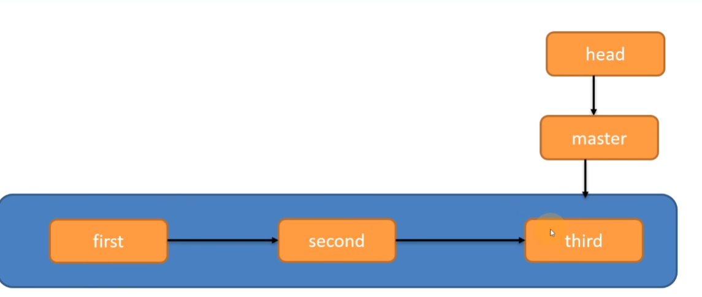
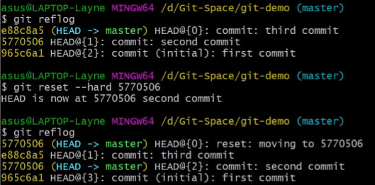

# Git

> Git是一个分布式版本控制系统

## Git常用命令

> 在git bash下，可以尽情使用linux命令
>
> `cat hello.txt`在控制台打印文件内容
>
> `vim hello.txt`编辑文件
>
> `clear`清屏

`git init`初始化本地库

`git status`查看git状态

`git add hello.txt`添加文件从工作区到暂存区

`git rm --cached hello.txt`删除暂存区的文件，但没有删除工作区文件

`git commit -m “提交信息” hello.txt`将暂存区文件提交到本地库

`git reflog`查看精简版本信息

`git log`查看完整版本信息

## Git版本穿梭

> git切换版本
>
> 

`git reset --hard 5770506`版本穿梭，可以向前也可以向后

## Git分支操作

`git branch -v`查看分支

`git checkout hot-fix`切换分支

`git merge hot-fix`合并hot-fix到当前分支

## Github操作

`git remote -v` 查看远程库别名

`git remote add ori https://github.com/xxx.git`添加远程库别名

`git push ori master`推送到ori远程库的master分支

`git pull ori master`拉取ori远程库的master分支

`git clone https://github.com/xxx.git`克隆代码：1.拉取代码 2.初始化本地仓库 3.创建远程库别名 

### Git ssh免密登录

> [简书-git ssh免密登录](https://www.jianshu.com/p/7164a52786f3)

