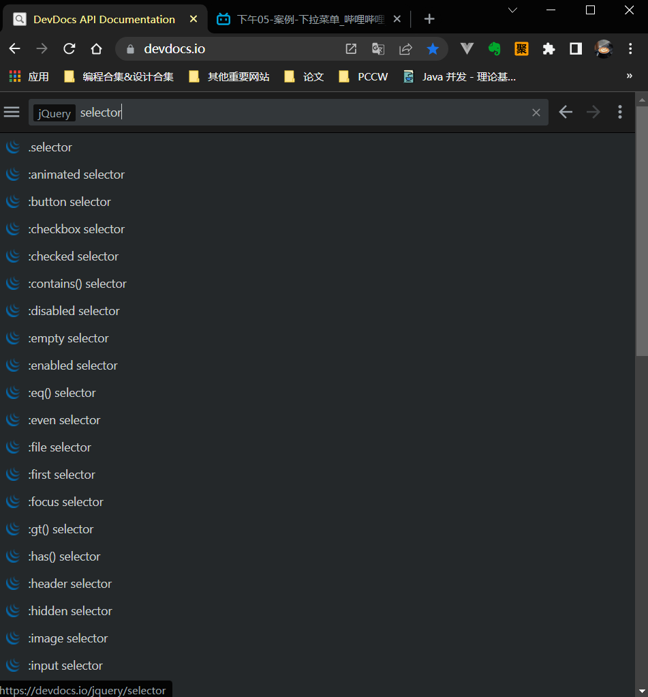

# 2022Study-Jquery

## 原生JS的缺点

> 1. 原生的JS 的API太长太难记了
> 2. 不能添加多个入口函数`window.onload=function(){}`
> 3. 原生的JS有时候有代码冗余
> 4. 原生的JS有些属性或者方法有浏览器兼容性问题
> 5. 原生的JS 容错率比较低，前面的代码出现了问题，后面的代码也会出问题

## 体验Jquery与jquery的优势

```js
// 入口函数
$(document).ready(function(){
    $('#btnOne').click(function(){
        $('div').css('border','1px solid red');
    });
      $('#btnTwo').click(function(){
        $('div').text('我是设置的文本');
    });
});
// 又是一个入口函数
$(document).ready(function(){
   console.log('我又是一个入口函数');
});
```


> Jquery的优势：
>
> 1. 是可以写多个入口函数
> 2. jquery的api都比较好记
> 3. jquery代码简洁（隐式迭代）
> 4. jquery帮我们解决了浏览器兼容问题
> 5. 容错率较高，前面的代码出了问题，后面的代码不受影响


## Jquery简介

> 一个快速、小巧的js库

```js
$(document).ready(function(){
// 链式编程
$('div').width(100).height(100).css('backgroundColor','red').text('哈哈');
});
```

## Jquery的入口函数

```js
// 入口函数 方式1
$(document).ready(function(){

});
// 入口函数 方式2
$(function(){
    
})
```

> 1. Jquery的入口函数可以写多个
> 2. Juery的入口函数 执行时机 在window.onload之前
>    - Jquery入口函数要等待页面上DOM树加载完成后执行
>    - window.onload要等到页面上所有的资源（DOM树/外部css/js连接）都加载完毕后执行

## $是什么

> jquery的结构就是一个匿名的自执行函数
>
> $是一个函数

```js
(function(){
window.jQuery=window.$=jQuery
}())
```

> `$(function(){})`
>
> 如果参数传递的是一个匿名函数---入口函数
>
> ----
>
> `$('one')`   `$('<div>拉拉我是一个div</div>')`
>
> 如果参数传递的是一个字符串---选择器/创建一个标签
>
> -----
>
> `$(dom对象)`
>
> 如果参数是一个dom对象---转换为jquery对象

```js
var $div1=$('#one');
console.log($div1.__proto__===Array.prototype)// false，jquery对象是一个伪数组,jquery对象就是dom对象的一个包装集
```

> jquery对象转换成dom对象
>
> 1. 用下标来取出来 `$div1[0]`
> 2. 使用get()方法 `$div1.get(1)`

## Jquery重要方法

### css() 

> 注意：获取样式操作只会返回第一个元素对应的样式值
>
> 设置样式是设置行内样式
>
> 

`$().css('border-top-width')` IE中获取边框要给准确值

`$().css({width:300,backgroundColor:'300px'})`

## Jquery选择器

> 和css选择器略有不同

```css
li:nth-child(even) {
    background-color: lightyellow;
}
```




## Jquery事件


