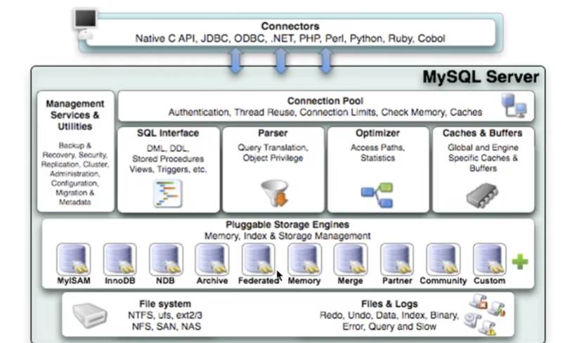

# 2022Study-MySQL笔记


[数据库排名](https://db-engines.com/en/ranking)


## MYSQL运算符

### MYSQL:NULL

> 字符串存在隐式转换,如果转换成数值不成功，则看做0

```mysql
select 1=2,1!=2,1='1',1='a',0='a' from dual; -- 0 1 1 0 1
```

> 只要有null参与预算，结果就为null

```mysql
select 1=null,null=null from dual; --null null
```

### MYSQL:安全等于

> `<=>`安全等于，可以对null进行判断 

```mysql
select 1<=>2,1<=>'1',1<=>'a',0<=>'a' from dual;-- 0 1 0 1
select 1<=>null,null<=>null from dual;-- 0 1
```

### MYSQL:Least Function/MYSQL:Greatest Function

```mysql
mysql> SELECT LEAST(2, 5, 12, 3);
Result: 2

mysql> SELECT LEAST('2', '5', '12', '3');
Result: '12'

mysql> SELECT LEAST('techonthenet.com', 'checkyourmath.com', 'bigactivities.com');
Result: 'bigactivities.com'

mysql> SELECT LEAST('techonthenet.com', 'checkyourmath.com', null);
Result: NULL

mysql> SELECT GREATEST(2, 5, 12, 3);
Result: 12

mysql> SELECT GREATEST('2', '5', '12', '3');
Result: '5'

mysql> SELECT GREATEST('techonthenet.com', 'checkyourmath.com', 'bigactivities.com');
Result: 'techonthenet.com'

mysql> SELECT GREATEST('techonthenet.com', 'checkyourmath.com', null);
Result: NULL
```

### MYSQL:转义字符

```mysql
select last_name form employees where last_name like '_\_a';-- 查询第二个字符是_，第三个字符是a的员工信息
select last_name form employees where last_name like '_$_a' escape '$';-- 定义转义字符别名
```

### MYSQL:正则表达式

[TechNet-没有正则表达式，菜鸟教程有](https://www.techonthenet.com/mysql/index.php)

查找name字段中以'st'为开头的所有数据：

```mysql
mysql> SELECT name FROM person_tbl WHERE name REGEXP '^st';
```

查找name字段中以'ok'为结尾的所有数据：

```mysql
mysql> SELECT name FROM person_tbl WHERE name REGEXP 'ok$';
```

查找name字段中包含'mar'字符串的所有数据：

```mysql
mysql> SELECT name FROM person_tbl WHERE name REGEXP 'mar';
```

查找name字段中以元音字符开头或以'ok'字符串结尾的所有数据：

```mysql
mysql> SELECT name FROM person_tbl WHERE name REGEXP '^[aeiou]|ok$';
```


## 多表连接

[菜鸟教程-一张图看懂 SQL 的各种 JOIN 用法](https://www.runoob.com/w3cnote/sql-join-image-explain.html)

### cross join笛卡尔积

> 需要where限制，不然多表会出现错误

### 等值连接和非等值连接

> 限制条件是等于号就是等值连接

### 自连接和非自连接

> 一个表连接自己，就是自连接

### 内连接和外连接

> 内连接 就是cross join
>
> 外连接
>
> - 左外连接
> - 右外连接
> - 全外连接

### UNION和UNION ALL

> UNION 效率低，会去重
>
> UNION ALL 效率高，不会去重

## MYSQL函数

> 分为内置函数和自定义函数
>
> 不同DBMS的函数差别很大，不建议死记

### MYSQL聚合函数

```mysql
-- 五大聚合函数 AVG和SUM只能处理数值类型
SELECT AVG(salary) from employees;
SELECT SUM(salary) from employees;
SELECT MAX(salary) from employees;
SELECT MIN(salary) from employees;
-- 计算指定字段出现的个数时，是不包含null值的
SELECT COUNT(salary) from employees;
-- 比较特殊，返回表有多少行
SELECT COUNT(1) FROM employees;
SELECT COUNT(2) FROM employees;
SELECT COUNT(*) FROM employees;
-- GROUP BY中使用WITH ROLLUP 除了基本查到的数据，还包括不带GROUP BY的AVG(salary)
-- 使用WITH ROLLUP时，不能使用ORDER BY
SELECT department_id,AVG(salary) from employees GROUP BY department_id WITH ROLLUP;
```

## SQL的执行顺序，WHERE和HAVING效率对比

> FROM …,….->ON->(LEFT/RIGHT JOIN)->WHERE->GROUP BY->HAVING->SELECT->DICTINCT->ORDER BY->LIMIT
>
> 在SELECT渔具执行这些步骤时，每个步骤会生成虚拟表，然后将这个虚拟表传入下一个步骤作为输入。这些隐含在SQL执行过程中，对于我们是不可见的

> WHERE效率高于HAVING

## MYSQL子查询

### 单行子查询

> 单行操作符： = != > < >= <=

### 多行子查询

> 多行操作符：IN ANY ALL SOME

```MYSQL
SELECT employee_id,last_name,job_id,salary FROM employees WHERE job_id<>'IT_PROG' AND salary < ANY (SELECT salary FROM employees WHERE job_id='IT_PROG')
SELECT employee_id,last_name,job_id,salary FROM employees WHERE job_id<>'IT_PROG' AND salary < ALL (SELECT salary FROM employees WHERE job_id='IT_PROG')

SELECT MIN(avg_sal) FROM (SELECT AVG(salary) avg_sal FROM employees GROUP BY department_id) t_dept_avg_sal
```

### 相关子查询

> 子查询引用了父查询的数据，而且父子查询不是一个表，就是相关子查询

## MYSQL表和数据库的增删改查

> 阿里巴巴开发规范：TRUNCATE TABLE 比DELETE速度快，且使用的系统和事务日志资源少，但TRUNCATE无事务且不触发TRIGGER，有可能造成事故，故不建议在开发代码中使用此语句

```mysql
-- 复制表
create table employees
as 
select * 
from mydb.`employees`;
```

## MYSQL8.0

### MYSQL8.0的原子化

> MYSQL8.0 的一条DROP操作是原子化的，要么成功，要么失败，不会成功一部分

### MYSQL8.0的计算列

```MYSQL
CREATE TABLE test1(
a int,
b int,
c int GENERATED ALWAYS AS (a+b) VIRTUAL); # 字段c即为计算列
```


## MYSQL数据类型

### 整数类型

```mysql
CREATE TABLE test_int2(
f1 int,
f2 int(5),
f3 int(5) ZEROFILL)# 1.显示宽度为5，当insert值不足5位时，用0填充 2.当使用ZEROFILL时，自动添加UNSIGNED
```

> 从MYSQL8.0.17之后，整数数据类型不推荐使用显示宽度属性

### 浮点型和定点型

> 浮点型：FLOAT DOUBLE
>
> 定点型：DECIMAL

### 位类型

> 位类型：BIT

###　日期和时间类型

### 文本字符串类型

> CHAR和VARCHAR的选择：
>
> 1. 存储很短且位数相对固定的数据，用CHAR
> 2. 十分频繁改变的column，用CHAR
> 3. 在MYISAM存储引擎中，用CHAR;在MEMORY存储引擎中都可以；在INNODB存储引擎中，主要影响性能的因素是数据行使用的数据总量，多用VARCHAR

> TEXT文本类型：可以存储比较大的文本段，由于TEXT和BLOB类型的数据删除后容易导致“空洞”，使得文件碎片比较多，所以频繁使用的表不建议包含TEXT类型字段，建议单独分出去一个表

### 枚举ENUM类型和SET类型【了解】

### 二进制字符串类型【了解】

> BLOB:实际工作中，不会用BLOB村大对象数据，会将图片、音频、视频文件存储到服务器的磁盘上，并将图片、音频和视频的访问路径存储到MYSQL中

### JSON类型【了解】

## MYSQL约束

> 为什么需要约束？ 为了保证数据的完整性
>
> 什么叫约束？对表中字段的限制

### 查询某个表的约束

```mysql
-- 查询某个表的约束
select * from information_schema.table_constraints where table_name='employees';
```

### 列级约束和表级约束

```mysql
-- 创建表时添加列级约束和表级约束
create table emp(
    name VARCHAR(15) NOT NULL,
    last_name VARCHAR(15),
    salary DECIMAL(10,2),
    constraint uk_emp_last_name unique(last_name)-- constraint uk_emp_last_name 可省略
);
```

```mysql
-- 修改约束 方式一
alter table emp
modify name VARCHAR(15) NULL;
-- 修改约束 方式二
alter table test2
add constraint uk_test2_sal unique(salary);
```

### 复合唯一性约束

> 创建复合唯一性约束

```mysql
create table `user`(
    id int,
    `name` varchar(15),
    `password` varchar(25),
    constraint uk_user_name_pwd unique(`name`,`password`)
);
```

> 要删除唯一性约束，就要删除唯一性索引

```mysql
alter table test2
drop index last_name;
```

### 主键约束

> 主键约束=唯一性约束+非空约束

### 自增列

### 外键约束

> 对于外键约束，最好采用下面的方式：
>
> on update cascade on delete set null（更新主表数据时从表数据级联更新，删除主表数据时从表数据设为null）

```mysql
-- 主表
create table dept(
    dept_id int primary key,-- 必须有主键约束，不然创建外键会失败报错
    dept_name varchar(15)
);
-- 从表
create table empl(
    emp_id int primary key auto_increment,
    emp_name varchar(15),
	department_id int,
    constraint fk_empl_dept_id foreign key (department_id) references dept(dept_id) on update cascade on delete set null
);
```


```mysql
-- 删除外键约束
alter table empl 
drop foreign key fk_empl_dept_id;
-- 查看empl的索引
show index from empl;
alter table empl
drop index fk_empl_dept_id;
```

> ==在mysql中，外键约束是有成本的，需要消耗系统资源。对于大并发的sql操作，有可能会不适合==


### 检查约束和默认值约束

> 检查约束在mysql5.7不支持

## MYSQL视图

> [数据库](https://www.huaweicloud.com/product/dbs.html)对象包括：用户（对数据库有权限访问的人）、视图（显示用户需要的数据项）、索引（给用户提供快速访问数据的途径）、触发器（用户定义的SQL事务命令集合）、序列（提供了唯一数值的顺序表）、图表（数据库表之间的一种关系示意图）。

> 视图和表之间是双向绑定的，视图就可以看做存储起来的select语句

```mysql
-- 创建视图
create view 视图名称
as 查询语句
```

## MYSQL存储过程

[菜鸟教程-MySQL 存储过程](runoob.com/w3cnote/mysql-stored-procedure.html)

> 阿里规范禁止使用存储过程，因为存储过程的移植性很差并且很难调试

``` mysql
-- 创建存储过程
delimiter $
create procedure select_all_data()
begin 
	select * from emps;
end $
delimiter ;
```

```mysql
-- 调用存储过程
call select_all_data();
```

-----

```mysql
-- 带返回值的存储过程
delimiter $
create procedure show_min_salary(out ms double)
begin 
	select min(salary) into ms 
	from employees;
end $
delimiter ;
```

```mysql
-- 调用存储过程，并将返回值存储到用户定义的@ms变量中
call show_min_salary(@ms);
```

## MYSQL存储函数

```mysql
-- 创建存储函数
delimiter //
create function email_by_name()
returns varchar(25)
deterministic -- 确定性的 
contains sql -- 包含sql的
reads sql data -- 读取sql数据的
begin
	select email from employees where last_name='Abel'；
end //
delimiter ;
```

```mysql
-- 调用存储函数
select email_by_name();
```

----

```mysql
set global log_bin_trust_function_creator=1;-- 创建函数前执行此语句，保证函数的创建会执行成功
delimiter //
create function email_by_name(emp_id int)
returns varchar(25)
begin
	return (select email from employees where employee_id=emp_id)；
end //
delimiter ;
```

```mysql
set @emp_id=102;
select email_by_name(@emp_id);
```

## 变量、流程控制和游标

### 变量

> 变量：
>
> - 系统变量
>   - 全局系统变量(global):不能跨重启
>   - 会话系统变量(session)
> - 用户自定义变量
>   - 会话用户变量
>   - 局部变量：写在存储过程或存储函数中

```mysql
show global variables；
show session variables;
show variables;-- 默认查询的是会话系统变量
```

```mysql
select @@global.max_connections;-- 查看指定的全局系统变量
select @@session.pseudo_thread_id；-- 查看指定的会话系统变量
select @@character_set_client;-- 先查询会话系统变量，再查询全局系统变量
```

```mysql
-- 修改全局系统变量
set @@global.max_connections=161;
set global max_connections=161;
```

-----

```mysql
-- set @用户变量:=表达式
set @m1=1;
select @count:=count(*) from employees;
select avg(salary) into @avg_sal from employees;
```

----

```mysql
delimiter $
create procedure test_var()
begin 
	declare a int default 0;
	declare b int;
end $
delimiter ;
```

### 定义条件与处理程序


> 错误码的说明：
>
> `MySQL_error_code`和`sqlstate_value`都可以表示MYSQL的错误
>
> - `MySQL_error_code`是数值类型错误代码
> - `sqlstate_value`是长度为5的字符串类型错误代码
>
> 例如：在ERROR 1418(HY000)中，1418是`MySQL_error_code`，HY000是`sqlstate_value`

```mysql
-- 定义条件
declare Field_Not_Be_Null condition for 1048;-- `MySQL_error_code`
declare Field_Not_Be_Null condition for sqlstate '23000';-- `sqlstate_value`
```

```mysql
-- 定义处理程序
-- declare 处理方式 handler for 错误类型 处理语句
```

MySQL 中可以使用 **DECLARE** 关键字来定义处理程序。其基本语法如下：

```mysql
DECLARE handler_type HANDLER FOR condition_value[...] sp_statement
handler_type:
CONTINUE | EXIT | UNDO
condition_value:
SQLSTATE [VALUE] sqlstate_value | condition_name | SQLWARNING | NOT FOUND | SQLEXCEPTION | mysql_error_code
```

其中，handler_type 参数指明错误的处理方式，该参数有 3 个取值。这 3 个取值分别是 CONTINUE、EXIT 和 UNDO。

- CONTINUE 表示遇到错误不进行处理，继续向下执行；
- EXIT 表示遇到错误后马上退出；
- UNDO 表示遇到错误后撤回之前的操作，MySQL 中暂时还不支持这种处理方式。


注意：通常情况下，执行过程中遇到错误应该立刻停止执行下面的语句，并且撤回前面的操作。但是，MySQL 中现在还不能支持 UNDO 操作。因此，遇到错误时最好执行 EXIT 操作。如果事先能够预测错误类型，并且进行相应的处理，那么可以执行 CONTINUE 操作。

参数指明错误类型，该参数有 6 个取值：

- sqlstate_value：包含 5 个字符的字符串错误值；
- condition_name：表示 DECLARE 定义的错误条件名称；
- SQLWARNING：匹配所有以 01 开头的 sqlstate_value 值；
- NOT FOUND：匹配所有以 02 开头的 sqlstate_value 值；
- SQLEXCEPTION：匹配所有没有被 SQLWARNING 或 NOT FOUND 捕获的 sqlstate_value 值；
- mysql_error_code：匹配数值类型错误代码。

下面是定义处理程序的几种方式，代码如下：

```mysql
//方法一：捕获 sqlstate_value
DECLARE CONTINUE HANDLER FOR SQLSTATE '42S02' SET @info='CAN NOT FIND';

//方法二：捕获 mysql_error_code
DECLARE CONTINUE HANDLER FOR 1146 SET @info='CAN NOT FIND';

//方法三：先定义条件，然后调用
DECLARE can_not_find CONDITION FOR 1146;
DECLARE CONTINUE HANDLER FOR can_not_find SET @info='CAN NOT FIND';

//方法四：使用 SQLWARNING
DECLARE EXIT HANDLER FOR SQLWARNING SET @info='ERROR';

//方法五：使用 NOT FOUND
DECLARE EXIT HANDLER FOR NOT FOUND SET @info='CAN NOT FIND';

//方法六：使用 SQLEXCEPTION
DECLARE EXIT HANDLER FOR SQLEXCEPTION SET @info='ERROR';
```

### 流程控制

> 流程控制只能在存储过程和存储函数中执行

[C语言中文网-MySQL流程控制语句详解](http://c.biancheng.net/view/7853.html)

### 游标【不用】

## 触发器

> 触发器可以保证数据的完整性

```mysql
CREATE <触发器名> < BEFORE | AFTER >
<INSERT | UPDATE | DELETE >
ON <表名> FOR EACH Row<触发器主体>
```

```mysql
delimiter $
create trigger after_insert_test_tri
after insert on test_trigger
for each row
begin
	insert into test_trigger_log(t_log)
	values('after insert...');
end $
delimiter ;
```

> 下面触发器声明过程中NEW关键字代表insert添加语句的新纪录

```mysql
delimiter $
create trigger salary_check_trigger
before insert on employees for each row
begin 
	declare mgrsalary double;
	select salary into mgrsalary from employees where employee_id=NEW.manager_id;
	if NEW.salary > mgrsalary then
		signal sqlstate 'HY000' set message_text='薪资高于领导薪资错误';
	end if
end $
delimiter ;
```

## MYSQL8新特性

> 还没普及


## SQL大小写规范和SQL_MODE

> MYSQL在Linux下数据库名、表名、列名、别名大小写规则是这样的：
>
> 1. 数据库名、表名、表的别名、变量名是严格区分大小写的
> 2. 关键字、函数名称在sql中不区分大小写
> 3. 列名（或字段名）与列的别名在所有的情况下均是忽略大小写的
>
> MYSQL在windows的环境下全部不区分大小写


> SQL_MODE：
>
> - 宽松模式
> - 严格模式

## MYSQL用户管理

[C语言中文网-MYSQL用户管理](http://c.biancheng.net/mysql/100/)

## MYSQL逻辑架构

[尚硅谷MYSQL-P109](https://www.bilibili.com/video/BV1iq4y1u7vj?p=109&vd_source=f58f2e2144be4e99a8cf800afeecbbcb)

> MYSQL是典型的C/S架构，服务端程序使用的时`mysqld`



### 第一层：连接层

> 系统（客户端）访问MYSQL服务器前，做的第一件事就是建立`TCP连接`，三次握手之后，MYSQL服务器对TCP传输过来的账号密码做身份认证、权限获取

### 第二层：服务层

### 第三层：引擎层

### 存储层

## SQL执行流程

