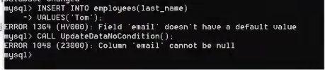
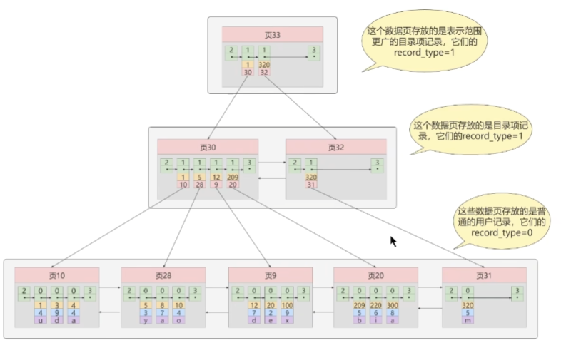
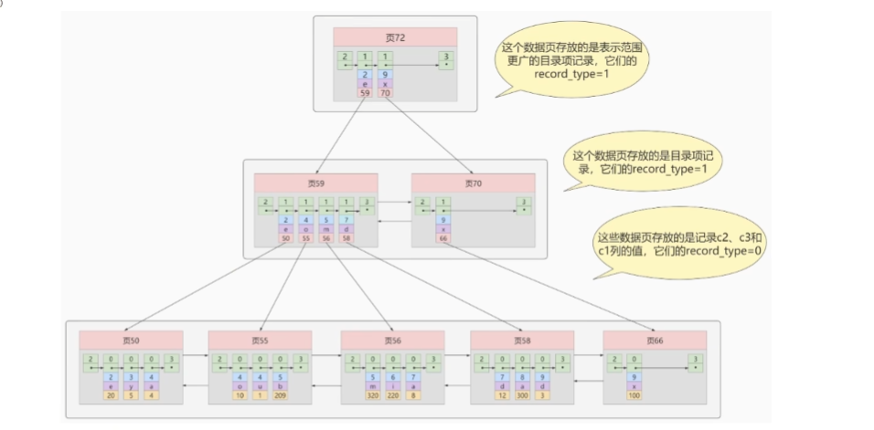
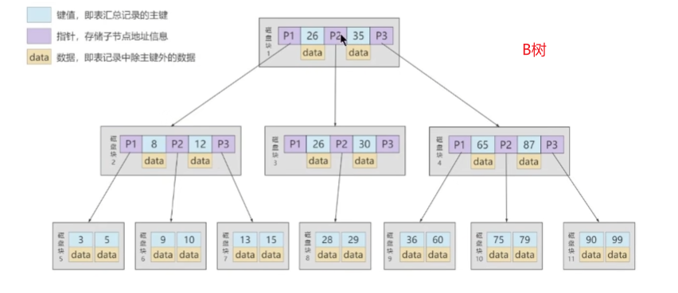
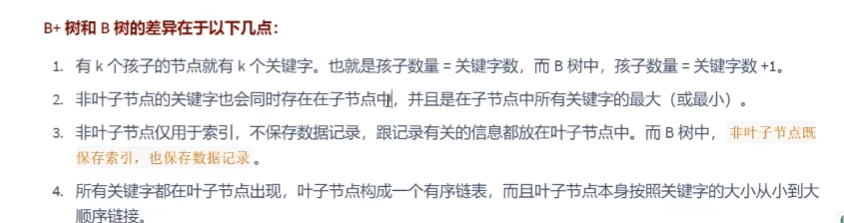
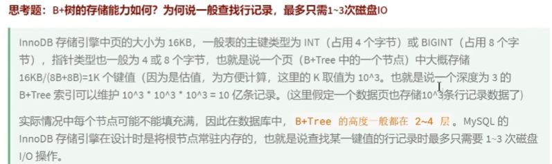
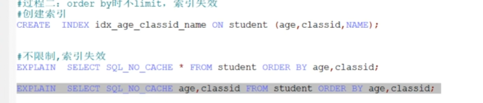
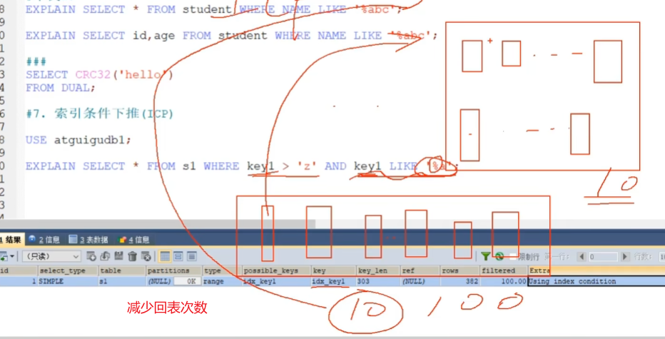

# 2022Study-MySQL笔记


[数据库排名](https://db-engines.com/en/ranking)


## MYSQL运算符

### MYSQL:NULL

> 字符串存在隐式转换,如果转换成数值不成功，则看做0

```mysql
select 1=2,1!=2,1='1',1='a',0='a' from dual; -- 0 1 1 0 1
```

> 只要有null参与预算，结果就为null

```mysql
select 1=null,null=null from dual; -- null null
```

### MYSQL:安全等于

> `<=>`安全等于，可以对null进行判断 

```mysql
select 1<=>2,1<=>'1',1<=>'a',0<=>'a' from dual;-- 0 1 0 1
select 1<=>null,null<=>null from dual;-- 0 1
```

### MYSQL:Least Function/MYSQL:Greatest Function

```mysql
mysql> SELECT LEAST(2, 5, 12, 3);
Result: 2

mysql> SELECT LEAST('2', '5', '12', '3');
Result: '12'

mysql> SELECT LEAST('techonthenet.com', 'checkyourmath.com', 'bigactivities.com');
Result: 'bigactivities.com'

mysql> SELECT LEAST('techonthenet.com', 'checkyourmath.com', null);
Result: NULL

mysql> SELECT GREATEST(2, 5, 12, 3);
Result: 12

mysql> SELECT GREATEST('2', '5', '12', '3');
Result: '5'

mysql> SELECT GREATEST('techonthenet.com', 'checkyourmath.com', 'bigactivities.com');
Result: 'techonthenet.com'

mysql> SELECT GREATEST('techonthenet.com', 'checkyourmath.com', null);
Result: NULL
```

### MYSQL:转义字符

```mysql
select last_name form employees where last_name like '_\_a';-- 查询第二个字符是_，第三个字符是a的员工信息
select last_name form employees where last_name like '_$_a' escape '$';-- 定义转义字符别名
```

### MYSQL:正则表达式

[TechNet-没有正则表达式，菜鸟教程有](https://www.techonthenet.com/mysql/index.php)

查找name字段中以'st'为开头的所有数据：

```mysql
mysql> SELECT name FROM person_tbl WHERE name REGEXP '^st';
```

查找name字段中以'ok'为结尾的所有数据：

```mysql
mysql> SELECT name FROM person_tbl WHERE name REGEXP 'ok$';
```

查找name字段中包含'mar'字符串的所有数据：

```mysql
mysql> SELECT name FROM person_tbl WHERE name REGEXP 'mar';
```

查找name字段中以元音字符开头或以'ok'字符串结尾的所有数据：

```mysql
mysql> SELECT name FROM person_tbl WHERE name REGEXP '^[aeiou]|ok$';
```


## 多表连接

[菜鸟教程-一张图看懂 SQL 的各种 JOIN 用法](https://www.runoob.com/w3cnote/sql-join-image-explain.html)

### cross join笛卡尔积

> 需要where限制，不然多表会出现错误

### 等值连接和非等值连接

> 限制条件是等于号就是等值连接

### 自连接和非自连接

> 一个表连接自己，就是自连接

### 内连接和外连接

> 内连接 就是cross join
>
> 外连接
>
> - 左外连接
> - 右外连接
> - 全外连接

### UNION和UNION ALL

> UNION 效率低，会去重
>
> UNION ALL 效率高，不会去重

## MYSQL函数

> 分为内置函数和自定义函数
>
> 不同DBMS的函数差别很大，不建议死记

### MYSQL聚合函数

```mysql
-- 五大聚合函数 AVG和SUM只能处理数值类型
SELECT AVG(salary) from employees;
SELECT SUM(salary) from employees;
SELECT MAX(salary) from employees;
SELECT MIN(salary) from employees;
-- 计算指定字段出现的个数时，是不包含null值的
SELECT COUNT(salary) from employees;
-- 比较特殊，返回表有多少行
SELECT COUNT(1) FROM employees;
SELECT COUNT(2) FROM employees;
SELECT COUNT(*) FROM employees;
-- GROUP BY中使用WITH ROLLUP 除了基本查到的数据，还包括不带GROUP BY的AVG(salary)
-- 使用WITH ROLLUP时，不能使用ORDER BY
SELECT department_id,AVG(salary) from employees GROUP BY department_id WITH ROLLUP;
```

## SQL的执行顺序，WHERE和HAVING效率对比

> FROM …,….->ON->(LEFT/RIGHT JOIN)->WHERE->GROUP BY->HAVING->SELECT->DICTINCT->ORDER BY->LIMIT
>
> 在SELECT渔具执行这些步骤时，每个步骤会生成虚拟表，然后将这个虚拟表传入下一个步骤作为输入。这些隐含在SQL执行过程中，对于我们是不可见的

> WHERE效率高于HAVING

## MYSQL子查询

### 单行子查询

> 单行操作符： = != > < >= <=

### 多行子查询

> 多行操作符：IN ANY ALL SOME

```MYSQL
SELECT employee_id,last_name,job_id,salary FROM employees WHERE job_id<>'IT_PROG' AND salary < ANY (SELECT salary FROM employees WHERE job_id='IT_PROG')
SELECT employee_id,last_name,job_id,salary FROM employees WHERE job_id<>'IT_PROG' AND salary < ALL (SELECT salary FROM employees WHERE job_id='IT_PROG')

SELECT MIN(avg_sal) FROM (SELECT AVG(salary) avg_sal FROM employees GROUP BY department_id) t_dept_avg_sal
```

### 相关子查询

> 子查询引用了父查询的数据，而且父子查询不是一个表，就是相关子查询

## MYSQL表和数据库的增删改查

> 阿里巴巴开发规范：TRUNCATE TABLE 比DELETE速度快，且使用的系统和事务日志资源少，但TRUNCATE无事务且不触发TRIGGER，有可能造成事故，故不建议在开发代码中使用此语句

```mysql
-- 复制表
create table employees
as 
select * 
from mydb.`employees`;
```

## MYSQL8.0

### MYSQL8.0的原子化

> MYSQL8.0 的一条DROP操作是原子化的，要么成功，要么失败，不会成功一部分

### MYSQL8.0的计算列

```MYSQL
CREATE TABLE test1(
a int,
b int,
c int GENERATED ALWAYS AS (a+b) VIRTUAL); # 字段c即为计算列
```


## MYSQL数据类型

### 整数类型

```mysql
CREATE TABLE test_int2(
f1 int,
f2 int(5),
f3 int(5) ZEROFILL)# 1.显示宽度为5，当insert值不足5位时，用0填充 2.当使用ZEROFILL时，自动添加UNSIGNED
```

> 从MYSQL8.0.17之后，整数数据类型不推荐使用显示宽度属性

### 浮点型和定点型

> 浮点型：FLOAT DOUBLE
>
> 定点型：DECIMAL

### 位类型

> 位类型：BIT

###　日期和时间类型

### 文本字符串类型

> CHAR和VARCHAR的选择：
>
> 1. 存储很短且位数相对固定的数据，用CHAR
> 2. 十分频繁改变的column，用CHAR
> 3. 在MYISAM存储引擎中，用CHAR;在MEMORY存储引擎中都可以；在INNODB存储引擎中，主要影响性能的因素是数据行使用的数据总量，多用VARCHAR

> TEXT文本类型：可以存储比较大的文本段，由于TEXT和BLOB类型的数据删除后容易导致“空洞”，使得文件碎片比较多，所以频繁使用的表不建议包含TEXT类型字段，建议单独分出去一个表

### 枚举ENUM类型和SET类型【了解】

### 二进制字符串类型【了解】

> BLOB:实际工作中，不会用BLOB村大对象数据，会将图片、音频、视频文件存储到服务器的磁盘上，并将图片、音频和视频的访问路径存储到MYSQL中

### JSON类型【了解】

## MYSQL约束

> 为什么需要约束？ 为了保证数据的完整性
>
> 什么叫约束？对表中字段的限制

### 查询某个表的约束

```mysql
-- 查询某个表的约束
select * from information_schema.table_constraints where table_name='employees';
```

### 列级约束和表级约束

```mysql
-- 创建表时添加列级约束和表级约束
create table emp(
    name VARCHAR(15) NOT NULL,
    last_name VARCHAR(15),
    salary DECIMAL(10,2),
    constraint uk_emp_last_name unique(last_name)-- constraint uk_emp_last_name 可省略
);
```

```mysql
-- 修改约束 方式一
alter table emp
modify name VARCHAR(15) NULL;
-- 修改约束 方式二
alter table test2
add constraint uk_test2_sal unique(salary);
```

### 复合唯一性约束

> 创建复合唯一性约束

```mysql
create table `user`(
    id int,
    `name` varchar(15),
    `password` varchar(25),
    constraint uk_user_name_pwd unique(`name`,`password`)
);
```

> 要删除唯一性约束，就要删除唯一性索引

```mysql
alter table test2
drop index last_name;
```

### 主键约束

> 主键约束=唯一性约束+非空约束

### 自增列

### 外键约束

> 对于外键约束，最好采用下面的方式：
>
> on update cascade on delete set null（更新主表数据时从表数据级联更新，删除主表数据时从表数据设为null）

```mysql
-- 主表
create table dept(
    dept_id int primary key,-- 必须有主键约束，不然创建外键会失败报错
    dept_name varchar(15)
);
-- 从表
create table empl(
    emp_id int primary key auto_increment,
    emp_name varchar(15),
	department_id int,
    constraint fk_empl_dept_id foreign key (department_id) references dept(dept_id) on update cascade on delete set null
);
```


```mysql
-- 删除外键约束
alter table empl 
drop foreign key fk_empl_dept_id;
-- 查看empl的索引
show index from empl;
alter table empl
drop index fk_empl_dept_id;
```

> ==在mysql中，外键约束是有成本的，需要消耗系统资源。对于大并发的sql操作，有可能会不适合==


### 检查约束和默认值约束

> 检查约束在mysql5.7不支持

## MYSQL视图

> [数据库](https://www.huaweicloud.com/product/dbs.html)对象包括：用户（对数据库有权限访问的人）、视图（显示用户需要的数据项）、索引（给用户提供快速访问数据的途径）、触发器（用户定义的SQL事务命令集合）、序列（提供了唯一数值的顺序表）、图表（数据库表之间的一种关系示意图）。

> 视图和表之间是双向绑定的，视图就可以看做存储起来的select语句

```mysql
-- 创建视图
create view 视图名称
as 查询语句
```

## MYSQL存储过程

[菜鸟教程-MySQL 存储过程](runoob.com/w3cnote/mysql-stored-procedure.html)

> 阿里规范禁止使用存储过程，因为存储过程的移植性很差并且很难调试

``` mysql
-- 创建存储过程
delimiter $
create procedure select_all_data()
begin 
	select * from emps;
end $
delimiter ;
```

```mysql
-- 调用存储过程
call select_all_data();
```

-----

```mysql
-- 带返回值的存储过程
delimiter $
create procedure show_min_salary(out ms double)
begin 
	select min(salary) into ms 
	from employees;
end $
delimiter ;
```

```mysql
-- 调用存储过程，并将返回值存储到用户定义的@ms变量中
call show_min_salary(@ms);
```

## MYSQL存储函数

```mysql
-- 创建存储函数
delimiter //
create function email_by_name()
returns varchar(25)
deterministic -- 确定性的 
contains sql -- 包含sql的
reads sql data -- 读取sql数据的
begin
	select email from employees where last_name='Abel'；
end //
delimiter ;
```

```mysql
-- 调用存储函数
select email_by_name();
```

----

```mysql
set global log_bin_trust_function_creator=1;-- 创建函数前执行此语句，保证函数的创建会执行成功
delimiter //
create function email_by_name(emp_id int)
returns varchar(25)
begin
	return (select email from employees where employee_id=emp_id)；
end //
delimiter ;
```

```mysql
set @emp_id=102;
select email_by_name(@emp_id);
```

## 变量、流程控制和游标

### 变量

> 变量：
>
> - 系统变量
>   - 全局系统变量(global):不能跨重启
>   - 会话系统变量(session)
> - 用户自定义变量
>   - 会话用户变量
>   - 局部变量：写在存储过程或存储函数中

```mysql
show global variables；
show session variables;
show variables;-- 默认查询的是会话系统变量
```

```mysql
select @@global.max_connections;-- 查看指定的全局系统变量
select @@session.pseudo_thread_id；-- 查看指定的会话系统变量
select @@character_set_client;-- 先查询会话系统变量，再查询全局系统变量
```

```mysql
-- 修改全局系统变量
set @@global.max_connections=161;
set global max_connections=161;
```

-----

```mysql
-- set @用户变量:=表达式
set @m1=1;
select @count:=count(*) from employees;
select avg(salary) into @avg_sal from employees;
```

----

```mysql
delimiter $
create procedure test_var()
begin 
	declare a int default 0;
	declare b int;
end $
delimiter ;
```

### 定义条件与处理程序



> 错误码的说明：
>
> `MySQL_error_code`和`sqlstate_value`都可以表示MYSQL的错误
>
> - `MySQL_error_code`是数值类型错误代码
> - `sqlstate_value`是长度为5的字符串类型错误代码
>
> 例如：在ERROR 1418(HY000)中，1418是`MySQL_error_code`，HY000是`sqlstate_value`

```mysql
-- 定义条件
declare Field_Not_Be_Null condition for 1048;-- `MySQL_error_code`
declare Field_Not_Be_Null condition for sqlstate '23000';-- `sqlstate_value`
```

```mysql
-- 定义处理程序
-- declare 处理方式 handler for 错误类型 处理语句
```

MySQL 中可以使用 **DECLARE** 关键字来定义处理程序。其基本语法如下：

```mysql
DECLARE handler_type HANDLER FOR condition_value[...] sp_statement
handler_type:
CONTINUE | EXIT | UNDO
condition_value:
SQLSTATE [VALUE] sqlstate_value | condition_name | SQLWARNING | NOT FOUND | SQLEXCEPTION | mysql_error_code
```

其中，handler_type 参数指明错误的处理方式，该参数有 3 个取值。这 3 个取值分别是 CONTINUE、EXIT 和 UNDO。

- CONTINUE 表示遇到错误不进行处理，继续向下执行；
- EXIT 表示遇到错误后马上退出；
- UNDO 表示遇到错误后撤回之前的操作，MySQL 中暂时还不支持这种处理方式。


注意：通常情况下，执行过程中遇到错误应该立刻停止执行下面的语句，并且撤回前面的操作。但是，MySQL 中现在还不能支持 UNDO 操作。因此，遇到错误时最好执行 EXIT 操作。如果事先能够预测错误类型，并且进行相应的处理，那么可以执行 CONTINUE 操作。

参数指明错误类型，该参数有 6 个取值：

- sqlstate_value：包含 5 个字符的字符串错误值；
- condition_name：表示 DECLARE 定义的错误条件名称；
- SQLWARNING：匹配所有以 01 开头的 sqlstate_value 值；
- NOT FOUND：匹配所有以 02 开头的 sqlstate_value 值；
- SQLEXCEPTION：匹配所有没有被 SQLWARNING 或 NOT FOUND 捕获的 sqlstate_value 值；
- mysql_error_code：匹配数值类型错误代码。

下面是定义处理程序的几种方式，代码如下：

```mysql
//方法一：捕获 sqlstate_value
DECLARE CONTINUE HANDLER FOR SQLSTATE '42S02' SET @info='CAN NOT FIND';

//方法二：捕获 mysql_error_code
DECLARE CONTINUE HANDLER FOR 1146 SET @info='CAN NOT FIND';

//方法三：先定义条件，然后调用
DECLARE can_not_find CONDITION FOR 1146;
DECLARE CONTINUE HANDLER FOR can_not_find SET @info='CAN NOT FIND';

//方法四：使用 SQLWARNING
DECLARE EXIT HANDLER FOR SQLWARNING SET @info='ERROR';

//方法五：使用 NOT FOUND
DECLARE EXIT HANDLER FOR NOT FOUND SET @info='CAN NOT FIND';

//方法六：使用 SQLEXCEPTION
DECLARE EXIT HANDLER FOR SQLEXCEPTION SET @info='ERROR';
```

### 流程控制

> 流程控制只能在存储过程和存储函数中执行

[C语言中文网-MySQL流程控制语句详解](http://c.biancheng.net/view/7853.html)

### 游标【不用】

## Trigger触发器

> 触发器可以保证数据的完整性

```mysql
CREATE <触发器名> < BEFORE | AFTER >
<INSERT | UPDATE | DELETE >
ON <表名> FOR EACH Row<触发器主体>
```

```mysql
delimiter $
create trigger after_insert_test_tri
after insert on test_trigger
for each row
begin
	insert into test_trigger_log(t_log)
	values('after insert...');
end $
delimiter ;
```

> 下面触发器声明过程中NEW关键字代表insert添加语句的新纪录

```mysql
delimiter $
create trigger salary_check_trigger
before insert on employees for each row
begin 
	declare mgrsalary double;
	select salary into mgrsalary from employees where employee_id=NEW.manager_id;
	if NEW.salary > mgrsalary then
		signal sqlstate 'HY000' set message_text='薪资高于领导薪资错误';
	end if
end $
delimiter ;
```

## MYSQL8新特性

> 还没普及

## 字符集的相关操作

> 在MYSQL8.0之前，默认字符集为latin1，utf8字符集指向的时utfmb3.
>
> 从MYSQL8.0开始，数据库的默认编码将改为utf8mb4,从而解决中文乱码问题
>
> Linux解决乱码可以修改它的配置文件
>
> 字符集分为四个级别：
>
> - 服务器级别
> - 数据库级别
> - 表级别
> - 列级别

```mysql
show variables like '%character%';-- 查看字符集
```


## SQL大小写规范和SQL_MODE

> MYSQL在Linux下数据库名、表名、列名、别名大小写规则是这样的：
>
> 1. 数据库名、表名、表的别名、变量名是严格区分大小写的
> 2. 关键字、函数名称在sql中不区分大小写
> 3. 列名（或字段名）与列的别名在所有的情况下均是忽略大小写的
>
> MYSQL在windows的环境下全部不区分大小写


> SQL_MODE：
>
> - 宽松模式
> - 严格模式
> 
## MYSQL数据目录


## MYSQL用户管理

[C语言中文网-MYSQL用户管理](http://c.biancheng.net/mysql/100/)


## MYSQL逻辑架构

[尚硅谷MYSQL-P109](https://www.bilibili.com/video/BV1iq4y1u7vj?p=109&vd_source=f58f2e2144be4e99a8cf800afeecbbcb)

[51CTO-一篇带给你MySQL逻辑架构](https://www.51cto.com/article/649711.html)

> MYSQL是典型的C/S架构，服务端程序使用的时`mysqld`


## MYSQL执行流程

> SQL执行流程：SQL语句->查询缓存->解析器->优化器->执行引擎


```mysql
select @@session.profiling;-- 0 默认执行过程是关闭的
set profiling=1;-- 开启执行细节


show profiles;-- 查询最近执行的SQL语句
show profile;-- 查看最近一次SQL执行细节
show profile  for query 7;-- 查询某个SQL语句的执行细节
show profile cpu,block io for query 7;-- 查看包括cpu、IO阻塞等参数的SQL执行细节
```


> 查询缓存往往弊大于利，所以在MYSQL8.0中去掉了，而在MYSQL5.7中，可以编辑`my.cnf`开启查询缓存

```properties
# query_cache_type有三个值（0代表关闭查询缓存OFF,1代表开启ON，2代表DEMAND（当sql语句中有SQL_CACHE关键词才缓存））
query_cache_type=2
```

```MYSQL
select SQL_CACHE * from test where ID=5;
select SQL_NO_CACHE * from test where ID=5;
```

```mysql
show status like '%Qcache%';-- 查询缓存相关情况
```


## BufferPool数据库缓冲池

> BufferPool就是存储引擎向操作系统申请一段连续的内存空间，是为了减少与磁盘进行IO的时间，缓存的是热点数据。
>
> 数据库缓冲池还具有预读的特性，当我们使用了某些数据页的数据，在缓冲池空间足够的情况下，会将该数据页前后的数据页加载到数据库缓冲池。
>
> 缓冲池会采用checkpoint检查点机制将更新之后缓存的数据刷盘到磁盘上。
>
> 多实例的数据库缓冲池是为了缓解多线程并发压力，当缓冲池大小小于1GB时，设置多实例是无效的。
>
> 查询缓存和数据库缓冲池不是一个东西：
>
> - 查询缓存是缓存SQL语句
> - 缓冲池缓存的时数据页数据

```mysql
show variables like 'key_buffer_size';-- 查看MYISAM缓冲池大小
show variables like 'innodb_buffer_pool_size';-- 查看INNODB的缓冲池大小
show variables like 'innodb_buffer_pool_instance'；-- 查看缓冲池实例个数
```


```properties
[server]
# 配置多实例的数据库缓冲池
innodb_buffer_pool_instances=2 
```


## Engine存储引擎

> 存储引擎（也叫表处理器）决定表和数据在底层的存储方式

```mysql
show engines;-- 查看数据库支持的存储引擎
show variables like '%storage_engine%';-- 查看当前使用的存储引擎 
```

> 下图可知：
>
> InnoDB是唯一支持事务、分布式事务(XA)、保存点（部分事务回滚）的存储引擎


### InnoDB:具备外键支持功能的事务存储引擎

> 优点：
>
> 1. 外键
> 2. 事务
> 3. 需要更新、删除操作，用InnoDB
> 4. 行级锁
>
> 缺点：
>
> 1. 处理效率差一些，会占用更多磁盘空间以保存数据和索引
> 2. 对内存要求高一些

### MyISAM：主要的非事务处理存储引擎

> 优点：
>
> 1. 访问速度快，适合对事务完整性没有要求或者以select\insert为主的应用
> 2. count(*)查询效率很高
>
> 缺点：太多啦~~

### Archive（归档）：用于数据存档

> 优点：
>
> 1. 仅仅支持select\insert两种操作，适合日志和数据采集（档案）类应用

### Blackhole：丢弃写操作，读操作会返回空内容

### CSV:存储数据时，以逗号分隔各个数据项

### Memory：置于内存的表数据，置于磁盘的表结构

> 优点：
>
> 1. 响应速度快，比MyISAM快一个数量级

## Index索引【重点】

> 索引是帮助MYSQL高效获取数据的数据结构，好比书的目录
>
> 索引在不同的存储引擎中结构不一样
>
> 索引会影响插入记录的速度，可以先删除表中索引，然后插入数据，最后创建索引

### InnoDB的索引方案


> InnoDB索引底层是B+树
>
> 索引按照物理实现方式：
>
> - 聚簇索引：并不是一种单独的索引类型，而是一种数据存储方式（所有的用户记录都存储在了叶子节点），也就是索引即数据，数据即索引。不需要显式用Index语句创建，InnoDB存储引擎会自动为我们创建聚簇索引
>   - 优点：
>     - `数据访问更快`，聚簇索引将索引和数据保存在同一个B+树中，因此比非聚簇索引快
>     - 对于`主键的排序查找范围查找速度非常快`
>     - 查询显示一定范围数据时，由于数据时紧密相连的，数据库不用从多个数据块中提取数据，所以`节省了大量IO操作`
>   - 缺点：
>     - `插入速度严重依赖于插入顺序`，按照主键的顺序插入是最快的方式，否则将会出现页分裂，严重影响性能。因此对于InnoDB表，一般会定义一个**自增的ID列为主键**
>     - `更新主键的代价很高`，因为将会导致被更新的行移动。因此对于InnoDB表，一般**定义主键不可更新**
>     - `二级索引访问需要两次索引查找`，第一次找到主键值，第二次根据主键值找到行数据
>   - 限制：
>     - MYSQL数据库目前只有InnoDB支持聚簇索引，MyISAM并不支持聚簇索引
>     - 由于数据物理存储排序方式只能有一种，所以每个MYSQL表`只能有一个聚簇索引`。一般情况下就是该表的主键
>     - 如果没有定义主键，InnoDB会选择非空的唯一索引代替。如果没有这样的索引，InnoDB会隐式的定义一个主键来作为聚簇索引
>     - 为了充分利用聚簇索引的聚簇的特性，InnoDB表的主键列尽量`选用有序的顺序ID`，而不建议用无序的ID，比如UUID、MD5、HASH、字符串列作为主键无法保证数据的顺序增长
> - 非聚簇索引(也叫二级索引、辅助索引)
> - 联合索引（可以理解为联合主键聚簇索引）
> - 回表的概念：
>   - 我们根据这个以c2列大小排序的B+树只能确定我们要查找的记录的主键值，索引我们想根据c2列的值找到到完整的用户记录的话，任然需要到聚簇索引中再查一遍，这个过程称为`回表`。也就是根据c2列的值查询一条完整的用户记录需要用到2棵B+树
>   - 直接把完整用户记录放在非聚簇索引的叶子节点是不靠谱的，因为这会造成巨大的空间冗余






> InnoDB的B+树索引的注意事项：
>
> 1. 根页面的位置万年不动
> 2. 非聚簇索引的目录页节点记录要唯一，若不唯一，添加主键来保持唯一
> 3. 一个页面最少要存储两条数据

### MyISAM的索引方案

> InnoDB、MyISAM、Memory都支持B+树索引
>
> MyISAM使用B+树作为索引结构，叶子节点的data域存放的是数据记录的地址
>
> MyISAM中只有非聚簇索引

### MyISAM和InnoDB的对比

> 1. MyISAM中的索引方式都是非聚簇的，InnoDB中必然包含一个聚簇索引
> 2. 在InnoDB中，只需要根据主键值进行一次查询就能找到对应的记录，因为InnoDB中索引即数据，而在MyISAM中却需要进行一次回表操作，意味着MyISAM中建立的索引全部都是二级索引
> 3. MyISAM中索引和数据是分离的，InnoDB中索引即数据
> 4. InnoDB的非聚簇索引data域存储的是主键的值，而MyISAM索引data域记录的是回表的地址
> 5. MyISAM回表是十分快速的，因为拿着地址偏移量直接到文件中取数据；InnoDB是通过获取主键之后再去聚簇索引中招记录。
> 6. InnoDB必须有主键，如果没有显式指定，MYSQL会自动选择一个可以非空且唯一标识的数据记录的列作为主键，如果不存在这种咧，MYSQL会为InnoDB表生成一个隐含字段作为主键；MyISAM不一定有主键，但推荐加主键


### MYSQL数据结构选择的合理性

> Hash结构效率高，为什么索引结构要设计成树型？
>
> - Hash索引仅能满足（=）（<>）和IN查询。如果进行范围查询，哈希型的索引，时间复杂度会退化成O（n）;而属性的有序特性，依然能够保持O（log2N）的高效率
> - Hash索引数据的存储是没有顺序的，在order by的情况下，使用Hash索引还需要对数据进行重新排序
> - 对于联合索引，Hash值是将联合索引键合并后一起来计算的，无法对单独的一个键或者几个索引键进行查询
> - 对于等值查询，通常Hash索引的效率更高，不过如果索引列的重复值很多，效率就会降低
>
> Redis存储到核心就是Hash表
>
> Memory的默认索引是Hash索引
>
> InnoDB本身不支持Hash索引，但是提供`自适应Hash索引`，会将热点数据的数据页地址存放到Hash表中。这样让B+树也具备了Hash索引的优点
>
> 因为同样的磁盘页大小，B+树可以存储更多的节点关键字，所以B+树通常比B树更加矮胖，查询所需要的磁盘IO会更少







### InnoDB数据存储结构

> InnoDB页的默认大小是16KB,不同的DBMS的数据页大小不同
>
> 页的结构概述：
>
> - `页`作为磁盘和内存之间交互的`基本单位`,页与页之间`不在物理结构上相连`，只需通过`双向链表`相关联即可。每个数据页中的记录是按照主键值从小到大的顺序组成一个`单向链表`，每个数据页都会为存储在它里面的记录生成一个`页目录`,通过主键查找某条记录的时候可以在页目录中使用二分法快速定位到对应的槽，然后再便利该槽对应分组中的记录即可快速找到指定的记录
>
> 页的上层结构：
>
> - 区：在InnoDB中，一个区会分配64各连续的页
> - 段：是数据库中分配的单位，不同类型的数据库对象以不同的段形式存在,常见的段有`数据段`、`索引段`、`回滚段`
> - 表空间：是一个逻辑容器，分为系统表空间、用户表空间、撤销表空间、临时表空间等，数据库由一个或多个表空间组成
>
> 页的内部结构：
>
> - 页如果按类型划分的话，常见的有`数据页`、`系统页`、`Undo页`和`事务数据页`等 
>
> InnoDB行格式row_format：
>
> - Compact
> - Dynamic
> - Compressed
> - Redundant
>
> 碎片区：有些页能用于段A，有些页能用于段B，碎片去直属于表空间


                

### 索引的创建与设计原则

> 索引的分类：
>
> - 从功能逻辑上分
>   - 普通索引
>   - 唯一索引
>   - 主键索引
>   - 全文索引
> - 从物理实现方式分
>   - 聚簇索引
>   - 非聚簇索引
> - 从作用字段个数分
>   - 单列索引
>   - 联合索引


> 创建索引的方式
>
> - 隐式创建索引：在声明有主键约束、唯一性约束、外键约束的字段上，会自动添加相关索引
>
> - 显式创建索引

[C语言中文网-MySQL创建索引（CREATE INDEX）](http://c.biancheng.net/view/2605.html)

[数据库学习摘记-mysql的索引设计原则以及常见索引的区别](https://www.kancloud.cn/hx78/sql/333932)

```mysql
-- 查看索引
show create table book;
select index from book;
```

### 性能分析工具的使用

```mysql
show status like 'slow_queries';
```


[yangh124博客-MySQL性能分析工具的使用](https://yh124.space/2022/06/06/MySQL%E6%80%A7%E8%83%BD%E5%88%86%E6%9E%90%E5%B7%A5%E5%85%B7%E7%9A%84%E4%BD%BF%E7%94%A8/index.html)

### 索引优化与查询优化

> Or并不是必然索引失效，前后都有索引时，不会失效

[51CTO-索引失效](https://www.51cto.com/article/702691.html)

### 内连接和外连接的查询优化

> 对于内连接来说，查询优化器可以决定谁作为驱动表，谁做为被驱动表；
>
> 对于内连接来说，如果表的连接条件中只能有一个字段有索引，则有索引的字段所在的表会被作为被驱动表；
>
> 对于内连接来说，在两个表的连接条件都存在索引的情况下，会选择小表作为驱动表，即小表驱动大表（准确说是小结果集驱动大结果集）
>
> 对左外连接来说，前面的表不一定是驱动表，因为查询优化器可能会将左外连接转换成内连接

[博客园-MySQL-join的实现原理、优化及NLJ算法](https://www.cnblogs.com/JohnABC/p/7150921.html)

### 子查询优化

> 可以使用JOIN查询来替代子查询，连接查询不需要建立临时表，速度快
>
> 尽量不要使用NOT IN或者NOT EXISTS,改造如下图所示


### 排序优化

> ORDER BY字段上加索引的话，可以避免FileSort排序，效率更高
>
> MySQL支持两种排序方式：
>
> - Index排序，索引可以保证数据的有序性，不需要再进行排序，效率更高
>
> - FileSort排序则一般在内存中进行排序，占用CPU较多，如果待排结果较大，会产生临时文件IO到磁盘进行排序，效率低

[阿里云社区-MySQL如何对order by优化？](https://developer.aliyun.com/article/760998)

### 覆盖索引

> 一个索引包含了满足查询结果的数据就叫做覆盖索引
>
> 简单来说，在查`索引列+主键`以内的字段时，会用到覆盖索引



###  索引下推（ICP）

> 索引下推是查询优化器的策略，回表前过滤，可以减少回表次数

```mysql
# 关闭索引下推
set optimizer_switch='index_condition_pushdown=off'
```




### 其他查询优化策略

#### Exists和In的区分

```mysql
# B表是小表选Exists
select * from A where cc in (select cc from B);
# A表时小表时选in
select * from A where exists (select cc from B where B.cc=A.cc);
```

 #### limit 1对优化的影响

> 如果可以确定结果集只有一条，那么加上limit 1时，找到一条结果就不会继续扫描了，会加快查询速度
>
> 如果数据表已经对字段建立了唯一索引，就不需要加上limit 1 了

#### 多使用commit

> Commit释放的资源：
>
> - 回滚段上用于回复数据的信息
> - 被程序语句获得的锁
> - redo/undo log buffer中的空间
> - 管理上述3种资源中的内部花费

## MYSQL事务日志

> 事务的合理性由锁机制实现
>
> 而事务的原子性、一致性和持久性由REDO日志和UNDO日志来保证：
>
> - `REDO LOG` 称为 重做日志，记录的是物理级别上页修改操作，比如页号xxx、偏移量yyy写入了zzz数据。用于保证事务的持久性
> - `UNDO LOG` 称为 回滚日志，记录的是逻辑操作日志，比如对某一行数据进行了insert语句，UNDO LOG就记录一条预支相反的DELETE操作。用于回滚行记录到特定版本，用来保证事务的原子性、一致性
>
> REDO和UNDO都可以视为一种`恢复操作`

## 锁

