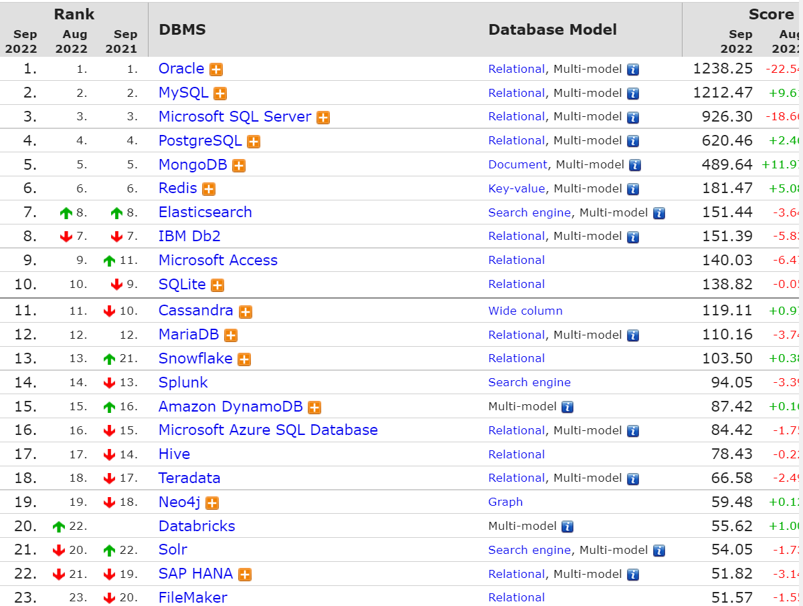

# 2022Study-MySQL笔记


[数据库排名](https://db-engines.com/en/ranking)



## MYSQL运算符

### MYSQL:NULL

> 字符串存在隐式转换,如果转换成数值不成功，则看做0

```mysql
select 1=2,1!=2,1='1',1='a',0='a' from dual; -- 0 1 1 0 1
```

> 只要有null参与预算，结果就为null

```mysql
select 1=null,null=null from dual; --null null
```

### MYSQL:安全等于

> `<=>`安全等于，可以对null进行判断 

```mysql
select 1<=>2,1<=>'1',1<=>'a',0<=>'a' from dual;-- 0 1 0 1
select 1<=>null,null<=>null from dual;-- 0 1
```

### MYSQL:Least Function/MYSQL:Greatest Function

```mysql
mysql> SELECT LEAST(2, 5, 12, 3);
Result: 2

mysql> SELECT LEAST('2', '5', '12', '3');
Result: '12'

mysql> SELECT LEAST('techonthenet.com', 'checkyourmath.com', 'bigactivities.com');
Result: 'bigactivities.com'

mysql> SELECT LEAST('techonthenet.com', 'checkyourmath.com', null);
Result: NULL

mysql> SELECT GREATEST(2, 5, 12, 3);
Result: 12

mysql> SELECT GREATEST('2', '5', '12', '3');
Result: '5'

mysql> SELECT GREATEST('techonthenet.com', 'checkyourmath.com', 'bigactivities.com');
Result: 'techonthenet.com'

mysql> SELECT GREATEST('techonthenet.com', 'checkyourmath.com', null);
Result: NULL
```

### MYSQL:转义字符

```mysql
select last_name form employees where last_name like '_\_a';-- 查询第二个字符是_，第三个字符是a的员工信息
select last_name form employees where last_name like '_$_a' escape '$';-- 定义转义字符别名
```

### MYSQL:正则表达式

[TechNet-没有正则表达式，菜鸟教程有](https://www.techonthenet.com/mysql/index.php)

查找name字段中以'st'为开头的所有数据：

```mysql
mysql> SELECT name FROM person_tbl WHERE name REGEXP '^st';
```

查找name字段中以'ok'为结尾的所有数据：

```mysql
mysql> SELECT name FROM person_tbl WHERE name REGEXP 'ok$';
```

查找name字段中包含'mar'字符串的所有数据：

```mysql
mysql> SELECT name FROM person_tbl WHERE name REGEXP 'mar';
```

查找name字段中以元音字符开头或以'ok'字符串结尾的所有数据：

```mysql
mysql> SELECT name FROM person_tbl WHERE name REGEXP '^[aeiou]|ok$';
```


## 多表连接

[菜鸟教程-一张图看懂 SQL 的各种 JOIN 用法](https://www.runoob.com/w3cnote/sql-join-image-explain.html)

### cross join笛卡尔积

> 需要where限制，不然多表会出现错误

### 等值连接和非等值连接

> 限制条件是等于号就是等值连接

### 自连接和非自连接

> 一个表连接自己，就是自连接

### 内连接和外连接

> 内连接 就是cross join
>
> 外连接
>
> - 左外连接
> - 右外连接
> - 全外连接

### UNION和UNION ALL

> UNION 效率低，会去重
>
> UNION ALL 效率高，不会去重