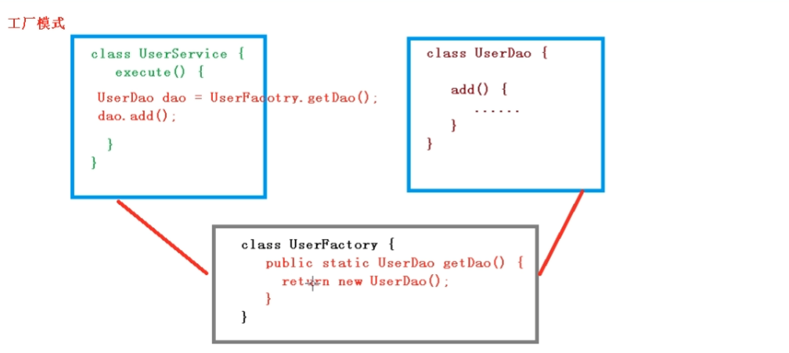
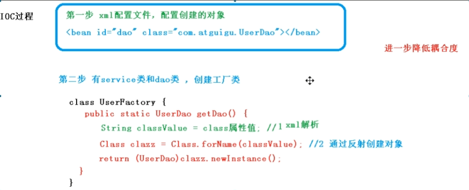
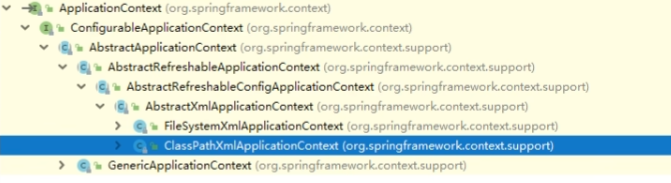

# 2022Study-Spring笔记

## IOC容器

### IOC底层原理

> IOC底层主要用到了 XML解析、工厂模式、反射

### IOC接口（BeanFactory和ApplicationContext）

> 1. IOC思想基于IOC容器完成，IOC容器底层就是对象工厂
> 2. Spring提供IOC容器实现的两种方式（两个接口）：
>    1. BeanFactory：
>       1. IOC容器基本实现，是Spring内部的使用接口，一般开发人员不使用
>       2. 加载配置文件时候不会创建对象，在获取对象时才创建对象
>    2. ApplicationContext：
>       1. BeanFactory接口的子接口，提供更多更强大的工程，一般开发人员使用
>       2. 加载配置文件时候会创建对象

## AOP切面编程

### AOP底层原理

> AOP底层使用动态代理：
>
> 1. 有接口情况，使用JDK动态代理
> 2. 没有接口情况，使用cglib动态代理

### AOP术语

> 1. 连接点：类里面哪些方法可以被增强
> 2. 切入点：实际被真正增强的方法
> 3. 通知（增强）：实际增强的逻辑部分称为通知
> 4. 切面：是动作，把通知应用到切入点过程