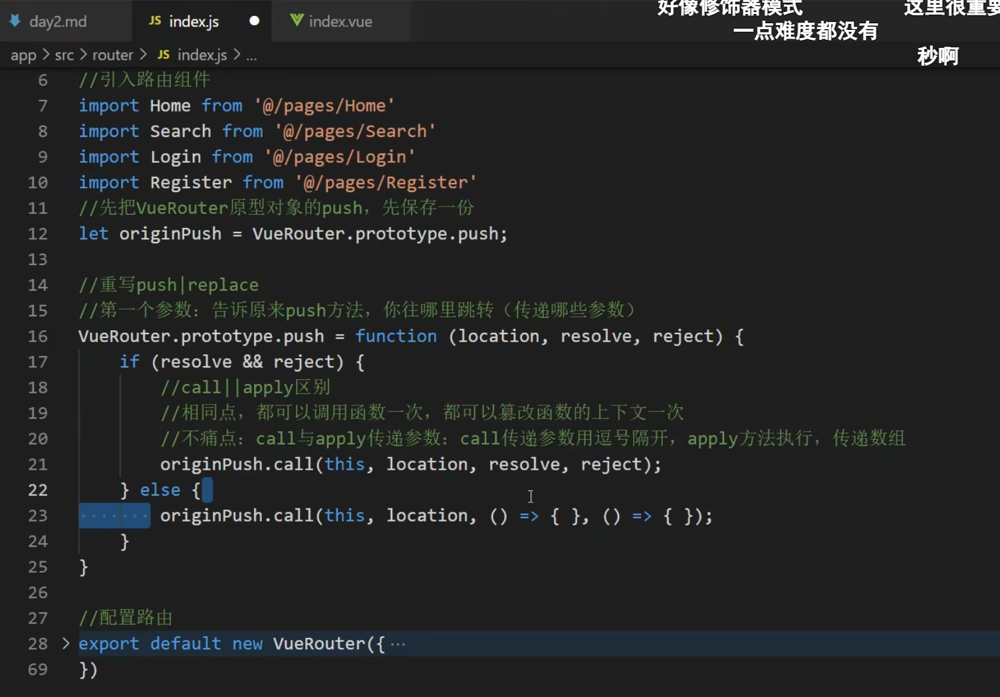
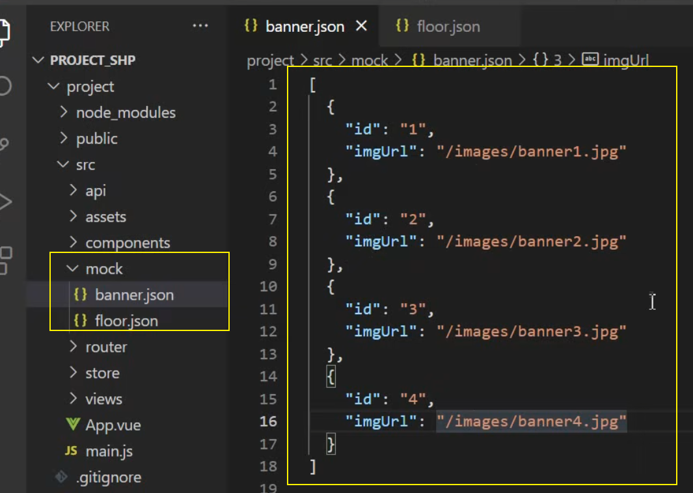
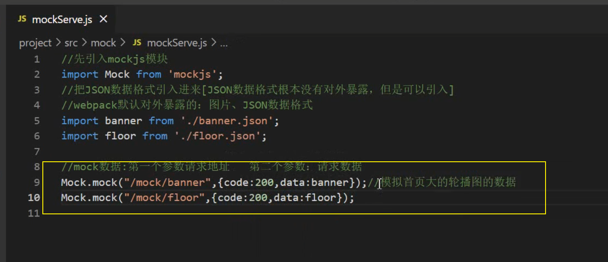
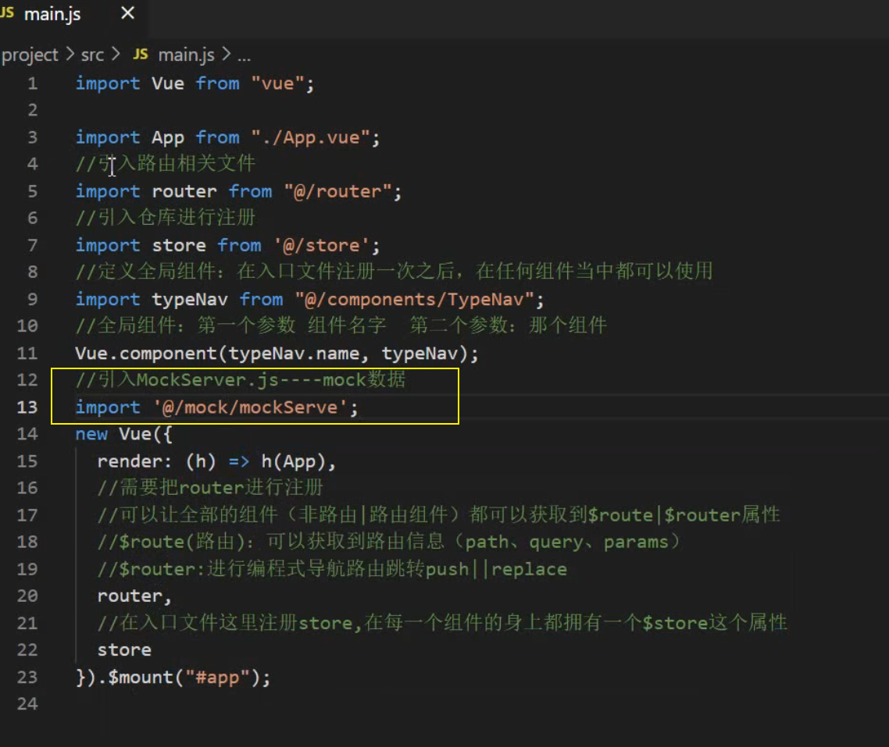
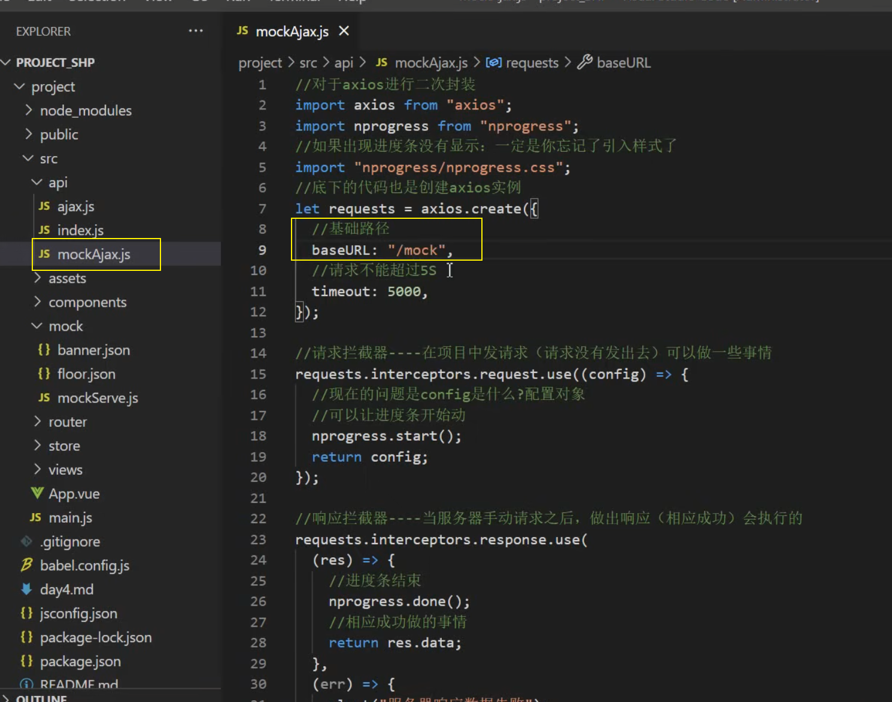

# 2022Study-Vue项目实战

## 002 用Vue-cli初始化项目

1. 本地要有node,webpack,淘宝镜像
2. 初始化vue项目

```
// 初始化vue项目的命令 默认带有babel和webpack
vue create hello-world
```

-----

- public文件夹：一般放置静态资源，webpack进行打包时会原封不动打包到dist文件夹
- src文件夹
  - assets文件夹：一般放置静态资源，webpack进行打包时会报静态资源当作一个模块打包到js文件里面
  - components文件夹：一般放置的时非路由组件（全局组件）

## 003 项目的其他配置

1. 启动项目自动打开浏览器

```json
// package.json中的scripts
scripts{
	"serve":"vue-cli-service serve --open"
}
```

2. esLint校验工具关闭

```js
// vue.config.js
module.exports{
    lintOnSave:false
}
```

3. src文件夹配置别名@

```json
// jsconfig.json
{
  "compilerOptions":{
    "baseUrl":"./",
    "paths":{
      "@/*":[
        "src/*"
      ]
    }
  },
  "exclude": [
    "node_modules",  //这个意思是@在node_modules 和dist文件夹下面是无法使用的
    "dist"
  ]
}
```

## 004 路由的分析

> 页面可以拆分成路由组件和非路由组件
>
> - 路由组件
>   - Search
>   - Home
>   - Login
>   - Register
> - 非路由组件
>   - Header[首页、搜索页有]
>   - Footer[首页、搜索页有] [登陆页、注册页没有]

## 005 less和vue-router的安装

> 在vue2项目下：
>
> - 安装less和less-loader：`cnpm install --save less less-loader@5` 
>
> - 安装vue-router：`cnpm install vue-router@3`

## 006 路由组件的搭建

> - 声明式路由导航：`<router-link to="/login">登陆</router-link>`
> - 编程式路由导航：`this.$router.push("/login");`

## 007 路由元信息的使用

- 不用路由元信息前

```html
<!-- v-show具有更小的性能损耗，所以不用v-if -->
<Footer v-show="$route.path=='/login'||$route.path=='/register'"></Footer>
```

- 使用路由元信息后

```js
const router=new VueRouter({
    routes[
    	{
    		path:'/foo',
    		component:Foo,
    		children:[
    			{
    				path:'bar',
    				component:Bar,
    				//路由元信息 就是一个对象
    				meta:{}
				}
    		]
		}
    ]
})
```

## 008 路由传递参数

- params

```js
const router=new VueRouter({
    routes[
    	{
    		//1. 在path中接收这个params
    		path:'/foo/:keyword',
    		component:Foo,
    		name:"foo"
		}
    ]
})
```

```js
goSearch(){
    //2.编程式路由导航 拼接字符串 此时 params:{keyword:this.keyword}
	this.$router.push("/foo/"+this.keyword);
}
```

- query

```js
goSearch(){
    //1.编程式路由导航 拼接字符串 此时 query:{k:this.keyword}
	this.$router.push("/foo?k="+this.keyword);
}
```

> 模板字符串写法，更爽~

```js
goSearch(){
    //1.编程式路由导航 拼接字符串 此时 query:{k:this.keyword}
	this.$router.push(`/foo?k=${this.keyword}`);
}
```

> 对象写法，最常用的，注意，==对象写法不能使用path==

```js
goSearch(){
    //1.编程式路由导航 拼接字符串 此时 query:{k:this.keyword}
	this.$router.push({name:'foo',query:{k:this.keyword},params:{keyword:this.keyword.toUpperCase()}});
}
```

## 009 路由传参相关面试题

- 如何让params可传可不传

```js
const router=new VueRouter({
    routes[
    	{
    		//1. 在path中接收这个params 占位后面加个?
    		path:'/foo/:keyword?',
    		component:Foo,
    		name:"foo"
		}
    ]
})
```

- params可传可不传，如何解决传空串跳转地址不正确的问题

```js
goSearch(){
    // 1. 使用undefined解决
	this.$router.push({name:"foo",params:{k:''||undefined}})
}
```

- 路由组件能传递props吗? 能，三种写法

```js
const router=new VueRouter({
    routes[
    	{	
    		path:'/foo/:keyword',
    		component:Foo,
    		name:"foo",
    		//1. 布尔值写法 只能传递params 
    		props:true
		}
    ]
})
```

```js
// 1. 布尔值写法 只能传递params 
props:['keyword']
```


```js
const router=new VueRouter({
    routes[
    	{	
    		path:'/foo/:keyword',
    		component:Foo,
    		name:"foo",
    		//2. 对象写法 
    		props:{a:'111',b:'qwe'}
		}
    ]
})
```

```
props:['a','b']
```


```js
const router=new VueRouter({
    routes[
    	{	
    		path:'/foo/:keyword',
    		component:Foo,
    		name:"foo",
    		//3. 箭头函数写法 
    		props:($route)=>{
    			return {keyword:$route.params.keyword,k:$route.query.k};
			}
		}
    ]
})
```

```js
props:['keyword','k']
```

## 010 重写push与replace方法



## 015 axios二次封装

[掘金-聊聊什么是CommonJs和Es Module及它们的区别](https://juejin.cn/post/6938581764432461854)

> 为什么要二次封装axios?
>
> - 请求拦截器
> - 响应拦截器
>
> api文件夹:用来放axios的封装文件

[axios官网-axios拦截器](http://www.axios-js.com/zh-cn/docs/#%E6%8B%A6%E6%88%AA%E5%99%A8)

```js
// api/request.js
import axios from 'axios'
const request=axios.create({
    // 配置对象
    baseUrl:'/api'
    timeout:5000,
})
//请求拦截器
request.interceptors.request.use((config)=>{
    return config;
}, error=> {
    // 对请求错误做些什么
    return Promise.reject(error);
});
//响应拦截器
request.interceptors.response.use(res=>{
    return res.data;
},err=>{
    return Promise.reject(new Error("fail"));
});
export default request;
```


```js
// api/index.js
import requests from './request.js';

```


- 配置代理服务器解决跨域问题

```js
// webpack.config.js vue.config.js
module.exports = {
  //...
  devServer: {
    proxy: {
      '/api': {
        // 后端服务器地址
        target: 'http://xxx.xxx.xxx',
        // 如果后台接口地址不带/api，则需要下面这句话
        pathRewrite: { '^/api': '' },
      },
    },
  },
};
```


## 017 nprogress进度条的使用

[npm-NProgress](https://www.npmjs.com/package/nprogress)

> 安装`cnpm install -S nprogress`

```js
// api/request.js
import axios from 'axios';
import nprogress from 'nprogress';
import "nprogress/nprogress.css"
const request=axios.create({
    // 配置对象
    baseUrl:'/api'
    timeout:5000,
})
//请求拦截器
request.interceptors.request.use((config)=>{
    nprogress.start();
    return config;
}, error=> {
    // 对请求错误做些什么
    return Promise.reject(error);
});
//响应拦截器
request.interceptors.response.use(res=>{
    nprogress.done();
    return res.data;
},err=>{
    return Promise.reject(new Error("fail"));
});
export default request;
```

## 018 vuex

> store文件夹
>
> - mutations可以修改state
>
> - actions不能修改state
>
> 模块化开发使用modules

## 023 函数的节流与防抖

> lodash插件
>
> [lodash插件-防抖](https://www.lodashjs.com/docs/lodash.debounce#_debouncefunc-wait0-options)
>
> [lodash插件-节流](https://www.lodashjs.com/docs/lodash.throttle)

## 032 mockjs

> 安装mockjs

1. 编写假数据



2. 写mockServe.js



3. main.js引入



4. mockAjax.js编写

