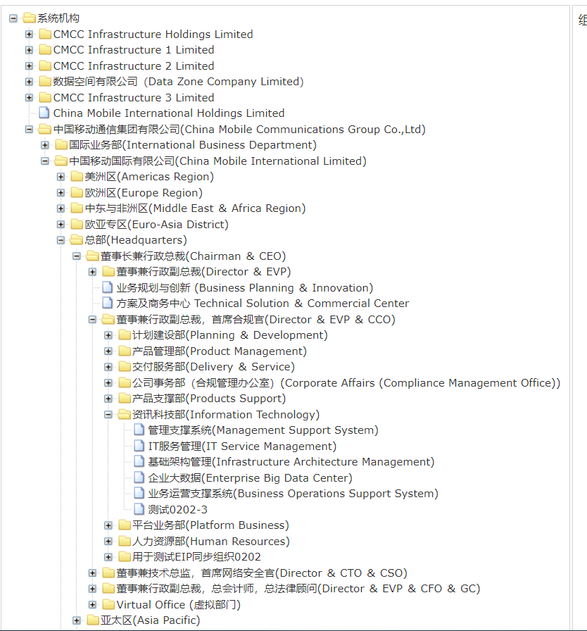
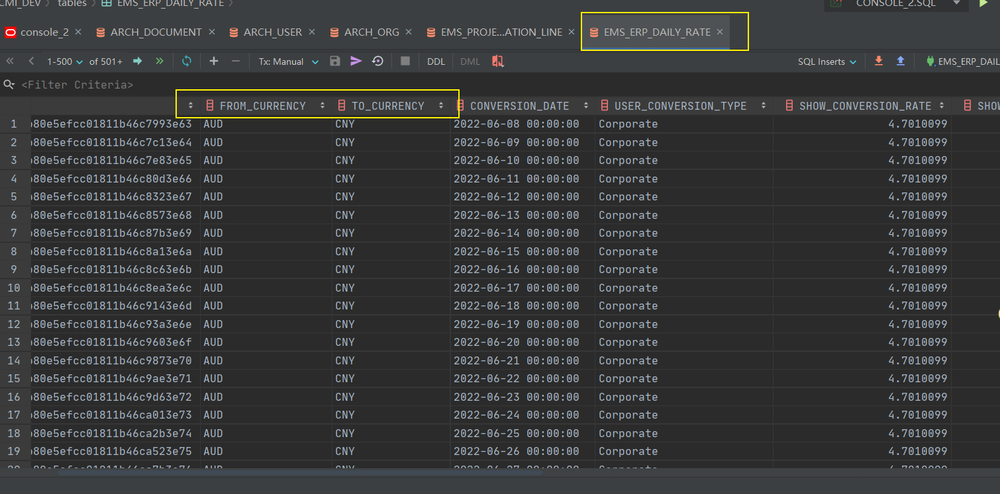
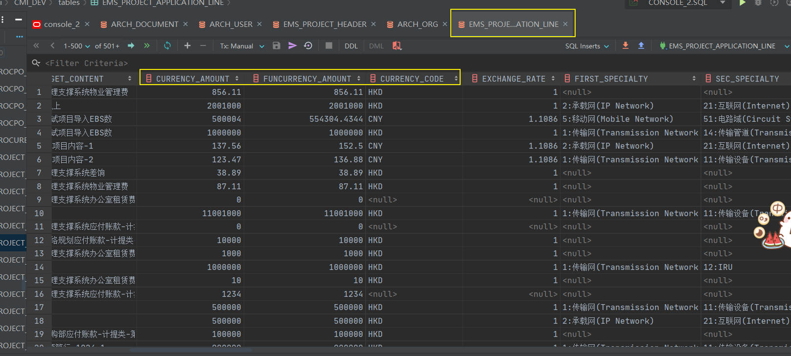
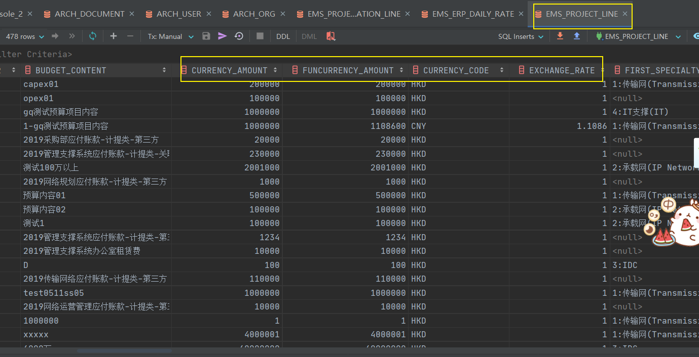

# 2022Study-CMI项目日记

## 2022.7.13项目学习

1. form表单的:model=fileParam不要改，已经在dataTable.js封装好了
2. 金额要做filters过滤
3. getApprovalStatus可以调用
4. 分页直接粘过来，不用变
5. $refs可以向子组件传值

## MyBatis

> 拼sql时，<when>里面有字符串要加单引号
>
> 发请求时，传参不加单引号

## 2022.7.13问题汇总

### 前端

1. 采购申请名称 字段过长，要省略号显示
2. 总金额要显示后两位
3. 申请人，申请部门还没显示；会议部分还没显示
4. 新增页面 部分字段只需要显示文字，不需要input
5. 新增页面 字段能查出来的需要查
6. 新增页面 申请部门显示错误
7. 新增页面 采购申请状态 起草应该是超链接
8. 新增页面 项目会议纪要信息栏 表格需显示
9. 所有页面 日期显示颜色错误【已修复】

### 后端

1. 逐行打印日志，便于开发调试
2. 方法需要更加见名知义，命名不能过长

## 2022.7.13工作汇报

### 前端

修复 表单绑定的数据名

### 后端

进行中 写查询的service和mapper,封装VO，参考老框架代码

### 明天计划

修复现有提出的问题，并继续写查询

## 2022.7.19

申请部门 调用什么借口？？

## 2022.7.21

- 组件和引入名应一致
- 重置和查询另起一行
- 注释写在国际化字段上方
- 查询审批状态字典
- 可以调用getApproveStatus
- 断点看下modeData怎么改
- get方法改delete方法
- 统一逻辑 全部是起草且申请人是登录用户 才能删除
- clacPurItemAmout(arguments[0],'amount')语法搜索
- 抽空看培训视频
- 建议采购方式数据字典
- add or create后端方法改名
- 后端方法加上注释
- Mapper调用公共的

## 2022.8.4任务描述

【项目查询与维护】新增项目关闭与重启功能（**仅对Capex项目进行改造（P开头的项目）**）

- 【项目查询与维护】页面，新增【项目关闭】与【项目重启】按钮
- 【项目关闭】：仅可对**正在启用状态的项目进行关闭**，选中项目后点击按钮弹窗提示“是否关闭已选择的项目”点击确定后则关闭成功，关闭成功后该项目**不允许发起新采购、不允许对框架合同发起新的订单，新做接收，合同，接收付款二合一，IRU付款，在途的以上单据仅支持退回，不允许继续审批**
- 【项目重启】：仅可对状态为关闭的项目进行重启，选中项目后点击按钮弹窗提示“是否重新启用已选择的项目”点击确定后则重新启用成功。**后续需要启用审批流，在审批完成后自动开启**。
  - 若订单中有多个项目预算，其中一个项目关闭后，关闭的项目不允许做接收，接收付款二合一，IRU付款，其他未关闭的项目可以正常进行接收，接收付款二合一，IRU付款。
  - 【项目关闭】【项目重启】记录在项目查询与维护的【项目状态】中，状态为以下四种：
    - EBS导入成功：代表项目可正常进行使用
    - EBS导入失败：代表项目未成功导入EBS，该项目不可使用
    - 项目冻结：冻结状态不允许使用该项目新做采购
    - 项目关闭：关闭成功后该项目不允许发起新采购、不允许对框架合同发起新的订单，新做接收，合同，接收付款二合一，IRU付款，在途的以上单据仅支持退回，不允许继续审批。

## 2022.8.4 代码问题

- 不用使用failed1这样的命名
- 
- “error”写成常量值进行调用
- 
- equals时，常量放前面
- 

## 2022.8.10日计划

- [x] 新增3个有差别的其他合同小类数据到数据字典，并保存sql文件
- [x] 编写查询其他合同小类的方法，并新增相应的国际化--其他类合同起草页面，查看页面和历史数据不变
- [x] 隐藏前端合同小类--其他类合同起草页面，查看页面 都要隐藏
- [ ] 编写方法来映射 其他合同小类 和 合同小类 的对应关系--其他类合同保存时调用
- [ ] 验证合同台账（法务用）的合同类别字段是否正常

## 2022.8.20 小bug

- [x] 活动时间查询异常
- [x] 附件在版本展示页面没有带过来
- [x] 活动参加名单 的创建时间要时间格式化
- [x] 活动参加名单 创建人 ，创建时间 空格留小
- [x] 文件名很长要显示省略号
- [x] 修改记录 有的空格留小
- [x] 查询页面 的查询条件输入框应该一样大
- [x] 项目编码 只能是O项目
- [x] 报告状态要从数据字典带过来
- [x] 查询页面有时不能输入

## 2022.8.24 **立项申请页面新增货币换算**

- [x] 1. (费用类型为市场营销TOB&TOC)Opex&Mpex立项申请 、Opex&Mpex项目查询、Opex&Mpex项目追踪
	- [x] 1.1 预算信息表格、明细信息表格前端增加三个表格列
	- [x] 1.2 币种弹框（复用别人写好的）
	- [x] 1.3 预算信息表格、明细信息表格数据库增加三个字段
	- [x] 1.4 需在预算信息旁加注释：请注意：原币及相关汇率只供参考，立项后的关联流程，包括但不限于合同、订单接收、小额报销等，将会以项目的港币预算金额为上限。（问周吉）
	- [x] 1.5 转港币汇率根据币种带出来，预算金额（港币）根据汇率和预算金额（原币）带出来	
	- [x] 1.6 项目金额（港币）根据 按币种计算的港币金额相加得来
	- [x] 1.7 增加一个按照币种统计的表格，根据下方明细信息实时计算
- [x] 2. 预备工作
	- [x] 2.1 找到数据库表 币种汇率表、立项申请相关表、项目查询相关表
	
	  - [x] 当日汇率表EMS_ERP_DAILY_RATE				
	
	    
	
	  - [x] 立项申请行表 ems_project_application_line		【什么是本位币？】
	
	    		
	
	  - [x] 项目行表 EMS_PROJECT_LINE 
	
	    
	
	- [x] 2.2 红字注释怎么显示
	
	- [x] 2.3 watch监听怎么用
	
	- [x] 2.4 币种弹框 在哪有

## 2022.8.25

- [x] 前台也要完整注释
- [x] console.log不要提交
- [x] 方法命名更规范点
- [x] 尽量少发请求，多做前端过滤
- [x] addOne多加点注释
- [x] 后端注释多写一些

## 2022.9.7

- [x] 预算金额（港币）可填写，有个星号
- [x] 预算金额（港币）总和要先加再乘
- [x] 所有位置的 币种改为 原币币种，汇率改为 转港币汇率，立项追踪 红星星不要
- [x] 立项追踪项目金额（原币）和项目金额（港币）对调位置

