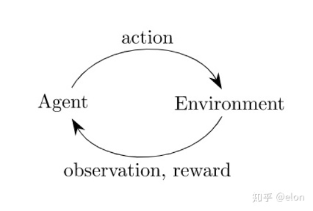
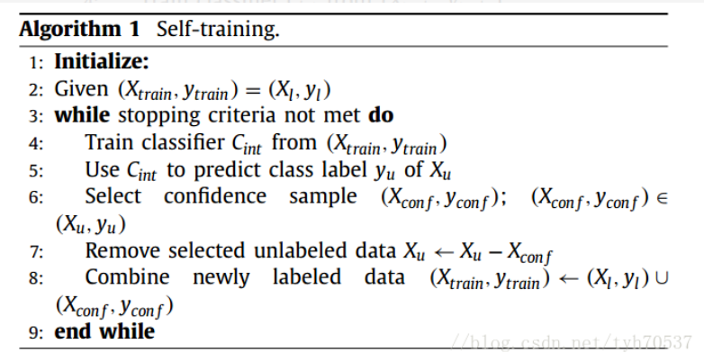
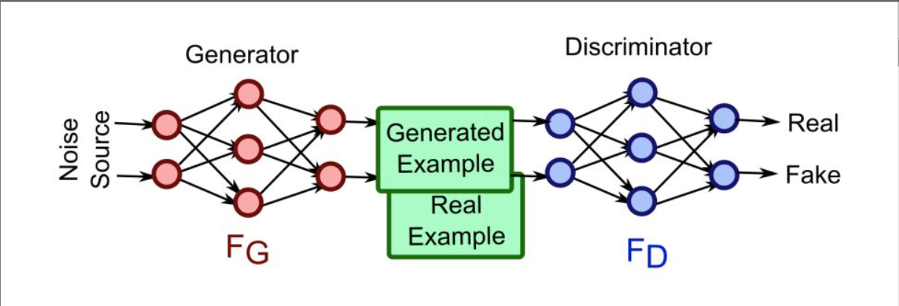
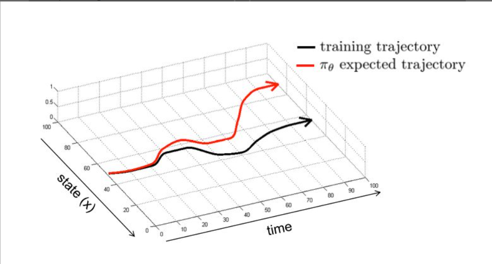

# 论文 Start

## 著名机器学习会议

ICLR：国际表示学习会议（International Conference on Learning Representations， ICLR） ：主要聚焦于深度学习。 
NIPS：神经信息处理系统年会（Annual Conference on Neural Information Processing Systems， NIPS）：交叉学科会议，但偏重于机器学习。主要包括神经信息处理，统计方法，学习理论以及应用等。
ICML：国际机器学习会议（International Conference on Machine Learning，ICML）：机器学习顶级会议，深度学习作为近年来的热点，也占据了 ICML的 很大比例。 
IJCAI：国际人工智能联合会议（International Joint Conference on Artificial Intelligence，IJCAI）：人工智能领域最顶尖的综合性会议。历史悠久，从1969年开始举办，以前每奇数年召开。从2015年开始每年召开。召开时间在七八月份。近年来和深度学习相关的论文也越来越多。 
AAAI：美国人工智能协会年会3（AAAI Conference on Artificial Intelligence，AAAI）：人工智能领域的顶级会议，每年二月份左右召开,地点一般在北美。和 IJCAI一样，近年来和深度学习相关的论文也越来越多。
CVPR：在人工智能的很好应用方向的子领域都有非常好的专业学术会议。在计算机视觉领域，有计算机视觉与模式识别大会
ICCV：国际计算机视觉会议，其中CVPR和ICCV是计算机视觉方面最好会议。
ACL：在自然语言处理领域，有计算语言学年会（Annual Meeting of the Association for Computational Linguistics， ACL）
EMNLP：在自然语言处理领域，有计算语言学年会（Annual Meeting of the Association for Computational Linguistics， ACL）和自然语言处理实证方法大会

## 论文搜索网站

 [dblp：计算机科学参考书目](https://dblp.uni-trier.de/) 

# Pytorch Start

[Pytorch官网](https://pytorch.org/)

[Awesome-pytorch-list](https://github.com/bharathgs/Awesome-pytorch-list)

# 论文 Reading

## ICLR2021会议论文

### [What Matters for On-Policy Deep Actor-Critic Methods? A Large-Scale Study ](https://openreview.net/forum?id=nIAxjsniDzg)

**强化学习**：

在强化学习里有两个基本的概念，Environment和Agent。

Environment指的是外部环境，在游戏中就是游戏的环境。Agent指的是智能体，指的就是你写的算法，在游戏中就是玩家，智能体通过一套策略输出一个行为（Action）作用到环境，环境则反馈状态值，也就是Observation，和奖励值Reward到智能体，同时环境会转移到下一个状态。如此不断循环，最终找到一个最优的策略，使得智能体可以尽可能多的获得来自环境的奖励。整个过程如下图所示：

在Gym中，Env是一个核心接口，是环境的统一接口，智能体没有接口，下面是一些基本的Env操作：

- reset(self): 复位环境的状态并返回观测值。
- step(self, action): 对环境前进一个时间步骤，并返回四个参数：observation, reward, done, info。
- render(self, mode='human'): 渲染一帧环境，默认会执行一些人性化的操作，比如弹出一个窗口。

### [Theoretical Analysis of Self-Training with Deep Networks on Unlabeled Data](https://openreview.net/forum?id=rC8sJ4i6kaH)

**半监督学习**：
　　半监督学习是一种介于监督式学习和无监督学习之间的学习范式，我们都知道，在监督式学习中，样本的类别标签都是已知的，学习的目的找到样本的特征与类别标签之间的联系。一般来讲训练样本的数量越多，训练得到的分类器的分类精度也会越高。但是在很多现实问题当中，一方面由于人工标记样本的成本十分高昂，导致了有标签的样本十分稀少。而另一方面，无标签的样本很容易被收集到，其数量往往是有标签样本的上百倍。半监督学习（这里仅针对半监督分类）就是要利用大量的无标签样本和少量的有标签样本来训练分类器，解决有标签样本不足这个难题。

**self-training**：
self-training可能是最早被提出来的半监督学习方法，最早可以追溯到Scudder(1965)。self-training相比其它的半监督学习方法的优势在于简单以及不需要任何假设。

上面是self-training的算法流程图，简单解释一下：
1，将初始的有标签数据集作为初始的训练集(Xtrain,ytrain)=(Xl,yl)(Xtrain,ytrain)=(Xl,yl)，根据训练集训练得到一个初始分类器CintCint。
2，利用CintCint对无标签数据集XuXu中的样本进行分类，选出最有把握的样本(Xconf,yconf)(Xconf,yconf)
3，从XuXu中去掉(Xconf,yconf)(Xconf,yconf)
4，将(Xconf,yconf)(Xconf,yconf)加入到有标签数据集中，(Xtrain,ytrain)←(Xl,yl)∪(Xconf,yconf)(Xtrain,ytrain)←(Xl,yl)∪(Xconf,yconf)
5，根据新的训练集训练新的分类器，重复步骤2到5直到满足停止条件（例如所有无标签样本都被标记完了）
最后得到的分类器就是最终的分类器。

### [Learning to Reach Goals via Iterated Supervised Learning](https://openreview.net/forum?id=rALA0Xo6yNJ)

**模仿学习**：

在传统的强化学习任务中，通常通过计算累积奖赏来学习最优策略（policy），这种方式简单直接，而且在可以获得较多训练数据的情况下有较好的表现。然而在多步决策（sequential decision）中，学习器不能频繁地得到奖励，且这种基于累积奖赏及学习方式存在非常巨大的搜索空间。而模仿学习（Imitation Learning）的方法经过多年的发展，已经能够很好地解决多步决策问题，在机器人、 NLP 等领域也有很多的应用。

模仿学习是指从示教者提供的范例中学习，一般提供人类专家的决策数据![[公式]](https://www.zhihu.com/equation?tex=%5Cleft%5C%7B+%5Ctau_1%2C%5Ctau_2%2C%5Cldots%2C%5Ctau_m+%5Cright%5C%7D+)，每个决策包含状态和动作序列![[公式]](https://www.zhihu.com/equation?tex=%5Ctau_i+%3D+%3Cs_1%5Ei%2Ca_1%5Ei%2Cs_2%5Ei%2Ca_2%5Ei%2C%5Cldots%2Cs_%7Bn_ni%2B1%7D%5Ei%3E)，将所有「状态-动作对」抽取出来构造新的集合 ![[公式]](https://www.zhihu.com/equation?tex=%5Cmathcal%7BD%7D%3D%5Cleft%5C%7B+%28s_1%2Ca_1%29%2C%28s_2%2Ca_2%29%2C%28s_3%2Ca_3%29%2C%5Cldots+%5Cright%5C%7D+)。

之后就可以把状态作为特征（feature），动作作为标记（label）进行分类（对于离散动作）或回归（对于连续动作）的学习从而得到最优策略模型。模型的训练目标是使模型生成的状态-动作轨迹分布和输入的轨迹分布相匹配。从某种角度说，有点像自动编码器（Autoencoder）也与目前大火的 GANs 很类似。

 在简单自动驾驶任务中（如下图），状态就是指汽车摄像头所观测到的画面![[公式]](https://www.zhihu.com/equation?tex=o_t)（很多强化学习任务中 ![[公式]](https://www.zhihu.com/equation?tex=o_t)和![[公式]](https://www.zhihu.com/equation?tex=s_t)是可以互换的），动作即转向角度。根据人类提供的状态动作对来习得驾驶策略。这个任务也叫做**行为克隆（Behavior Cloning）**，即作为监督学习的模仿学习。 

 但是不是我们完成训练后模型就能够有比较好的效果？答案是否定的，这里存在复合误差（compounding errors），训练好的策略模型![[公式]](https://www.zhihu.com/equation?tex=%5Cpi_%7B%5Ctheta%7D)执行的轨迹和训练轨迹的误差会随时间的增加而越变越大，用公式表示即![[公式]](https://www.zhihu.com/equation?tex=E%5Berrors%5D+%5Cle+%5Cvarepsilon+%28T+%2B+%28T-1%29+%2B+%28T-2%29+%2B+%5Cldots+%2B+1%29+%5Cpropto+%5Cvarepsilon+T%5E2)（![[公式]](https://www.zhihu.com/equation?tex=%5Cvarepsilon+) 代表在 t 时刻c误差的概率，在每个时刻 T ，![[公式]](https://www.zhihu.com/equation?tex=E%5Berrors%5D+%5Cle+%5Cvarepsilon+T)），具体效果见下图： 

**数据增广（Data Augmentation）**：

为了解决误差随时间越来越大的问题，可以采用**数据增广（Data Augmentation）**方法，如下图，这是一个端对端的自动驾驶解决方案（NVIDIA 2016），汽车装配了左右两侧的摄像头与中央摄像头来获取当前观测的环境，并且能够通过 Back propagation 使其从错误状态中恢复。它在训练模型前人为地调整了环境不好时汽车的运动动作，另外，摄像头图像的识别采用的是卷积神经网络。

如果我们能够获取大量的训练数据形成一个合适的状态概率分布或者说样本空间，从而得到一个很好的策略模型同样能直接地解决这个问题（如图）。但这往往不太现实，因为需要耗费的成本太大。起初大部分研究者也几乎全在研究如何优化策略减少误差，并提出了很多方法，但都不是十分有效。