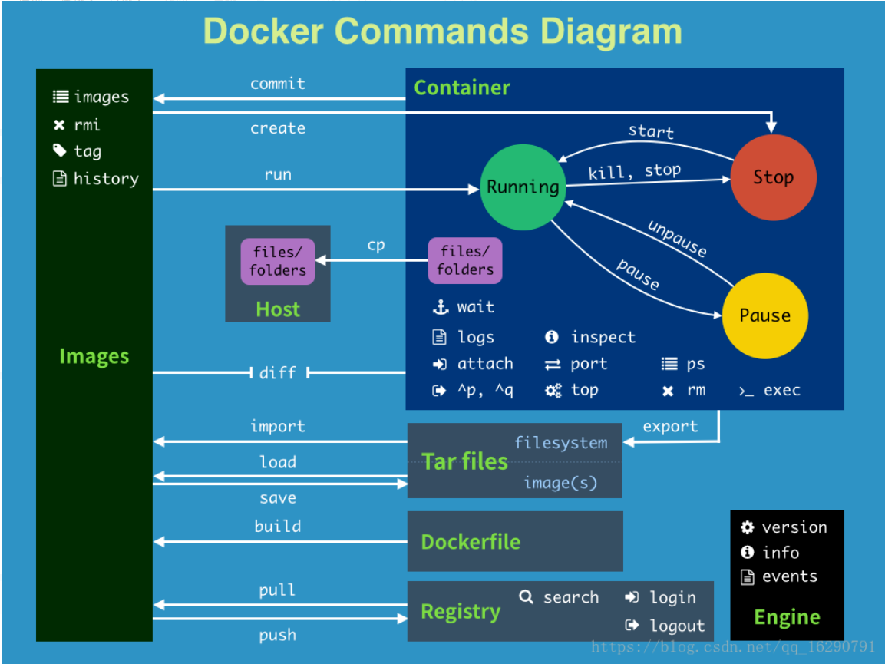
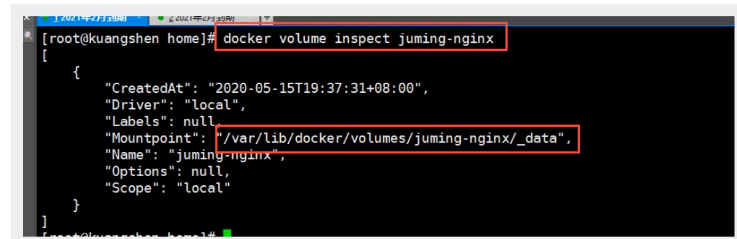

# Docker笔记

## Docker参考

[Docker官网](https://www.docker.com/)

[Docker官网-开发文档](https://docs.docker.com/)

[DockerHub](https://hub.docker.com/)

[【运维】Linux tutorials](https://dunwu.github.io/linux-tutorial/#%F0%9F%93%96-%E5%86%85%E5%AE%B9)

[Docker-CheatSheet中文](https://github.com/wsargent/docker-cheat-sheet/tree/master/zh-cn)

[Dockerfile-CheatSheet](https://devhints.io/dockerfile)

[DockerCompose-CheatSheet](https://devhints.io/docker-compose)

[掘金-Docker | 数据持久化与数据共享](https://juejin.cn/post/7153436573990813703)

[Docker可视化工具Portainer启动教程](https://earthly.dev/blog/portainer-for-docker-container-management/)



### 帮助命令

`docker version`查看docker版本

`docker info`查看docker系统信息

`docker --help`帮助命令

### 镜像命令

`docker images -a`查看本机所有镜像

| Name, shorthand   | Default | Description                                         |
| ----------------- | ------- | --------------------------------------------------- |
| `--all` , `-a`    |         | Show all images (default hides intermediate images) |
| `--digests`       |         | Show digests                                        |
| `--filter` , `-f` |         | Filter output based on conditions provided          |
| `--format`        |         | Pretty-print images using a Go template             |
| `--no-trunc`      |         | Don't truncate output                               |
| `--quiet` , `-q`  |         | Only show image IDs                                 |

`docker search mysql`在dockerhub搜索mysql

`docker pull mysql`下载mysql镜像

`docker pull mysql:5.7`下载特定版本mysql镜像

`docker rmi -f $(docker images -aq)`删除所有镜像

`docker rmi -f 镜像id`删除指定容器

### 容器命令

`docker pull centos`下载centos镜像

`docker run [OPTIONS] image [COMMAND] [ARG...]`新建容器并启动

```
--name="Name" 容器名字
-d 			   后台方式运行
-it			   使用交互方式运行，进入容器查看内存
-p 			  指定容器端口
	-p ip:主机端口:容器端口
	-p 主机端口:容器端口（常用）
	-p 容器端口
	容器端口
-P			随机指定端口
```

`docker run -it centos /bin/bash`新建centos容器并进入交互模式

```
进入交互模式时：
	exit 退出并停止容器
	Ctrl+P+Q 容器不停止退出
```

`docker ps`列出所有运行的容器

```
-a	列出当前正在运行的容器+历史运行过的容器
-n=? 显示最近创建的容器
-q     只显示容器编号
```

`docker rm 容器id`删除指定的容器，不能删除正在运行的容器，如果要强制删除，加上`-f`

`docker rm -f $(docker ps -aq)`删除所有容器

`docker ps -a -q|xargs docker rm`删除所有容器

`docker start 容器id`启动容器

`docker restart 容器id`重启容器

`docker stop容器id`停止运行中的容器

`docker kill 容器id`杀掉容器

### 常用其他命令

> 后台启动docker容器，必须要有一个前台进程，docker发现没有应用，就会自动停止

`docker logs -tf -tail 10 容器id`查看docker日志

| 名称，简写            | 默认  | 描述                                                         |
| --------------------- | ----- | ------------------------------------------------------------ |
| `--details`           |       | 显示提供给日志的额外详细信息                                 |
| `--follow` , `-f`     |       | 跟踪日志输出                                                 |
| `--since`             |       | 显示自时间戳（例如 2013-01-02T13:23:37Z）或相关（例如 42m 为 42 分钟）以来的日志 |
| `--tail` , `-n`       | `all` | 从日志末尾显示的行数                                         |
| `--timestamps` , `-t` |       | 显示时间戳                                                   |
| `--until`             |       | [**API 1.35+**](https://docs.docker.com/engine/api/v1.35/) 在时间戳（例如 2013-01-02T13:23:37Z）或相关（例如 42m 为 42 分钟）之前显示日志 |

`docker top  容器id`查看容器中进程信息

`docker inspect 容器id`查看容器元数据

`docker exec -it 容器id /bin/bash`进入当前正在运行的容器

`docker attach 容器id`进入当前正在运行的容器，正在执行当前的代码

`docker cp 容器id:容器内文件路径 目的主机目录`从容器内拷贝文件到主机上

`docker stats`查看docker内存占用、CPU占用

```
CONTAINER ID   NAME            CPU %     MEM USAGE / LIMIT     MEM %     NET I/O           BLOCK I/O       PIDS
ff1c7e546a13   elasticsearch   0.35%     1.25GiB / 1.796GiB    69.61%    0B / 0B           815MB / 729kB   42
3f9f1214c060   tomcat01        0.07%     105.8MiB / 1.796GiB   5.75%     10.4kB / 138kB    327MB / 0B      28
36a75f45e488   nginx01         0.00%     1.441MiB / 1.796GiB   0.08%     17.7kB / 28.9kB   8.19kB / 0B     2
```


## Docker镜像讲解

### 镜像是什么

镜像是一种轻量级、可执行的独立软件包，用来打包软件运行环境和基于运行环境开发的软件，它包含运行某个软件所需的所有内容，包括代码、运行时库、环境变量和配置文件

### Docker镜像加载原理

[JavaGuide-Docker镜像加载原理](https://javaguide.cn/tools/docker/docker-intro.html#_4-1-%E9%95%9C%E5%83%8F-image-%E4%B8%80%E4%B8%AA%E7%89%B9%E6%AE%8A%E7%9A%84%E6%96%87%E4%BB%B6%E7%B3%BB%E7%BB%9F)

### Commit镜像

`docker commit -m="提交描述信息" -a="作者" 容器id 目标镜像名:tag`提交镜像

## 容器数据卷

> 数据希望存储在本地，而不是存储在容器中。即**容器的持久化和同步操作**

`docker run -it -v 主机目录:容器内目录 镜像名 /bin/bash`使用数据卷进行双向同步，指定路径挂载

`docker inspect 容器id`查看容器详情

`docker run -d -p 3310:3306 -v /home/mysql/conf:/etc/mysql/conf.d -v /home/mysql/data:/var/lib/mysql -e MYSQL_ROOT_PASSWORD=123456 --name mysql01 mysql:5.7`启动mysql容器并设置配置文件和数据库文件挂载

` docker volume create 数据卷名 ` 创建数据卷 

` docker volume ls ` 查看所有的数据卷 

` docker volume inspect 数据卷名 ` 查看指定数据卷的信息 



> 具名挂载的好处是可以通过名字来管理数据卷，方便在容器之间共享和迁移数据。
> 匿名挂载则是在使用`docker run`命令时，通过`-v`选项指定容器内部的路径，而没有指定容器外部的路径。例如：`-v /path/inside/container`。在这个例子中，没有指定容器外部的路径，因此Docker会自动创建一个匿名数据卷，并将它挂载到容器内部的`/path/inside/container`路径上。匿名挂载的好处是简单易用，但需要注意的是，每次使用匿名挂载都会创建一个新的匿名数据卷，并且需要手动管理这些数据卷的生命周期。

` docker run -d -P --name nginx01 -v /etc/nginx nginx `匿名挂载

` docker run -d -P --name nginx02 -v 挂载名:/etc/nginx nginx`具名挂载

## Dockerfile

[Docker官网-Dockerfile最佳实践](https://docs.docker.com/develop/develop-images/dockerfile_best-practices/)

## Docker网络

> 保证通过服务名互相能ping通


## Docker可视化工具Portainer

[Docker可视化工具Portainer启动教程](https://earthly.dev/blog/portainer-for-docker-container-management/)

`docker system df`命令显示有关Docker守护进程使用的磁盘空间量的信息

## Docker Compose

[DockerCompose-CheatSheet](https://devhints.io/docker-compose)

> 集群的快速编排，写好一个docker-compose文件，可以一键启动所有容器
>
> 容器的统一管理思想和Spring的ApplicationContext.xml统一管理所有bean一样

## CIG容器重量级监控

[cnblogs-重量级监控工具CIG](https://cnblogs.com/jinyanshenxing/p/15860881.html)