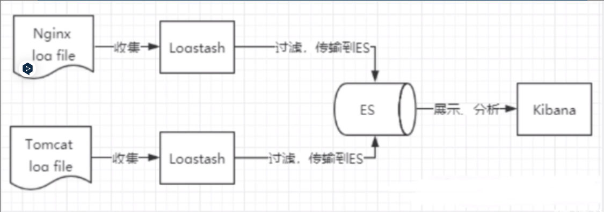
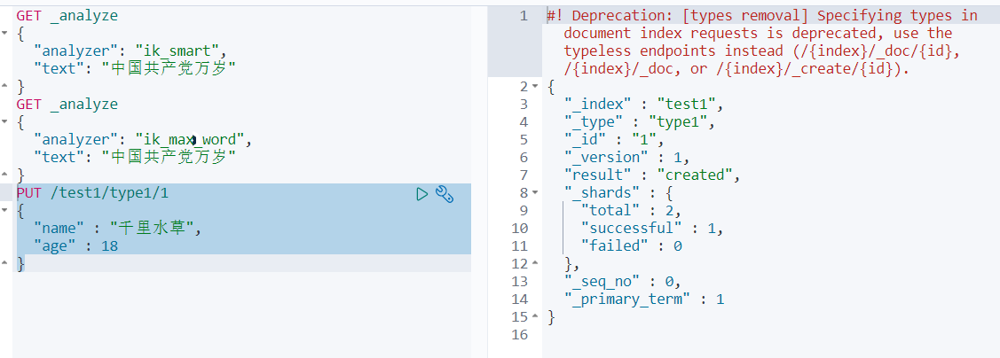

# ES和Kibana

[ES官网](https://www.elastic.co/cn/downloads/elasticsearch) 

[ES-JavaRestClient文档](https://www.elastic.co/guide/en/elasticsearch/client/java-rest/7.6/index.html)

[Elasticsearch中文文档7.3](https://learnku.com/docs/elasticsearch73/7.3)

[为什么我们要选用 Elasticsearch 而不用 Solr](https://learnku.com/articles/43880)

## ElasticSearch安装

JDK8，最低要求

使用Java开发，必须保证`ElasticSearch`的版本与Java的核心jar包版本对应！（Java环境保证没错）

### 安装

下载地址：https://www.elastic.co/cn/downloads/

历史版本下载：https://www.elastic.co/cn/downloads/past-releases/

解压即可（尽量将ElasticSearch相关工具放在统一目录下）

### 熟悉目录


```
bin 启动文件目录
config 配置文件目录
    1og4j2 日志配置文件
    jvm.options java 虚拟机相关的配置(默认启动占1g内存，内容不够需要自己调整)
    elasticsearch.ym1 elasticsearch 的配置文件! 默认9200端口!跨域!
1ib 
    相关jar包
modules 功能模块目录
plugins 插件目录
    ik分词器
```


## 可视化界面安装

```
elasticsearch-head
```

**使用前提**：需要安装nodejs

### 下载地址

https://github.com/mobz/elasticsearch-head

### 安装

解压即可（尽量将ElasticSearch相关工具放在统一目录下）

### 启动

```
cd elasticsearch-head# 安装依赖
npm install
npm run start
访问http://localhost:9100/
```

**开启跨域（在elasticsearch解压目录config下elasticsearch.yml中添加）**

注意不要写中文注释

```
# 开启跨域http.cors.enabled: true# 所有人访问http.cors.allow-origin: "*"
```

 [http://192.168.56.10:9200](http://192.168.56.10:9200/) 


## kibana安装

Kibana是一个针对ElasticSearch的开源分析及可视化平台,用来搜索、查看交互存储在Elasticsearch索引中的数据。使用Kibana ,可以通过各种图表进行高级数据分析及展示。Kibana让海量数据更容易理解。它操作简单,基于浏览器的用户界面可以快速创建仪表板( dashboard )实时显示Elasticsearch查询动态。设置Kibana非常简单。无需编码或者额外的基础架构,几分钟内就可以完成Kibana安装并启动Elasticsearch索引监测。

### 下载地址

> 下载的版本需要与ElasticSearch版本对应

https://www.elastic.co/cn/downloads/

历史版本下载：https://www.elastic.co/cn/downloads/past-releases/

### 安装


### 启动

```
localhost:5601
```

### 开发工具

（Postman、curl、head、谷歌浏览器插件）

> 可以使用 `Kibana`进行测试

### kibana汉化

编辑器打开`kibana解压目录/config/kibana.yml`，添加

```
i18n.locale: "zh-CN"
```


### 了解ELK

- ELK是

  Elasticsearch、Logstash、 Kibana三大开源框架首字母大写简称

  。市面上也被成为Elastic Stack。

  - 其中Elasticsearch是一个基于Lucene、分布式、通过Restful方式进行交互的近实时搜索平台框架。
    - 像类似百度、谷歌这种大数据全文搜索引擎的场景都可以使用Elasticsearch作为底层支持框架，可见Elasticsearch提供的搜索能力确实强大,市面上很多时候我们简称Elasticsearch为es。
  - Logstash是ELK的中央数据流引擎,用于从不同目标(文件/数据存储/MQ )收集的不同格式数据,经过过滤后支持输出到不同目的地(文件/MQ/redis/elasticsearch/kafka等)。
  - Kibana可以将elasticsearch的数据通过友好的页面展示出来 ,提供实时分析的功能。

- 市面上很多开发只要提到ELK能够一致说出它是一个日志分析架构技术栈总称 ,但实际上ELK不仅仅适用于日志分析,它还可以支持其它任何数据分析和收集的场景,日志分析和收集只是更具有代表性。并非唯一性。

> 收集清洗数据(Logstash) ==> 搜索、存储(ElasticSearch) ==> 展示(Kibana)



## ES核心概念

> ElasticSearch是面向文档，关系行数据库和ElasticSearch客观对比！一切都是JSON！

| Relational DB      | ElasticSearch          |
| ------------------ | ---------------------- |
| 数据库（database） | 索引（indices）        |
| 表（tables）       | types \<慢慢会被弃用!> |
| 行（rows）         | documents              |
| 字段（columns）    | fields                 |

 **elasticsearch（集群）**中可以包含多个**索引（数据库）** ,每个索引中可以包含多个**类型（表）** ,每个类型下又包含多个**文档（行）** ,每个文档中又包含多个**字段（列）**。 

### 物理设计

elasticsearch在后台把**每个索引划分成多个分片**，每分分片可以在集群中的不同服务器间迁移

一个人就是一个集群! ，即**启动的ElasticSearch服务，默认就是一个集群，且默认集群名为elasticsearch**


### 逻辑设计

一个索引类型中，包含多个文档，比如说文档1，文档2。当我们索引一篇文档时，可以通过这样的顺序找到它：索引 => 类型 => 文档ID ，通过这个组合我们就能索引到某个具体的文档。 注意：ID不必是整数，实际上它是个字符串。

#### 文档（”行“）

之前说elasticsearch是面向文档的，那么就意味着**索引和搜索数据的最小单位是文档**，elasticsearch中，文档有几个重要属性:

- 自我包含，一篇文档同时包含字段和对应的值，也就是同时包含key:value !
- 可以是层次型的，一个文档中包含自文档，复杂的逻辑实体就是这么来的! {就是一个json对象 ! fastjson进行自动转换 !}
- 灵活的结构，文档不依赖预先定义的模式，我们知道关系型数据库中，要提前定义字段才能使用，在elasticsearch中，对于字段是非常灵活的，有时候,我们可以忽略该字段，或者动态的添加一个新的字段。

尽管我们可以随意的新增或者忽略某个字段，但是，每个字段的类型非常重要，比如一个年龄字段类型，可以是字符串也可以是整形。因为elasticsearch会保存字段和类型之间的映射及其他的设置。这种映射具体到每个映射的每种类型，这也是为什么在elasticsearch中，类型有时候也称为映射类型。

#### 类型（“表”）

类型是文档的逻辑容器，就像关系型数据库一样，表格是行的容器。类型中对于字段的定义称为映射，比如name映射为字符串类型。我们说文档是无模式的，它们不需要拥有映射中所定义的所有字段，比如新增一个字段，那么elasticsearch是怎么做的呢?

- elasticsearch会自动的将新字段加入映射，但是这个字段的不确定它是什么类型，elasticsearch就开始猜，如果这个值是18，那么elasticsearch会认为它是整形。但是elasticsearch也可能猜不对，所以最安全的方式就是提前定义好所需要的映射，这点跟关系型数据库殊途同归了，先定义好字段，然后再使用，别整什么幺蛾子。

#### 索引（“库”）

索引是映射类型的容器， elasticsearch中的索引是一个非常大的文档集合。 索引存储了映射类型的字段和其他设置。然后它们被存储到了各个分片上了。我们来研究下分片是如何工作的。

#####  物理设计：节点和分片 如何工作 


 一个集群至少有一个节点，而一个节点就是一个elasricsearch进程，节点可以有多个索引默认的，如果你创建索引，那么索引将会有个5个分片(primary shard ,又称主分片)构成的，每一个主分片会有一个副本(replica shard，又称复制分片) 


 上图是一个有3个节点的集群，可以看到主分片和对应的复制分片都不会在同一个节点内，这样有利于某个节点挂掉了，数据也不至于失。实际上，**一个分片是一个Lucene索引（一个ElasticSearch索引包含多个Lucene索引）** ，**一个包含倒排索引的文件目录，倒排索引的结构使得elasticsearch在不扫描全部文档的情况下，就能告诉你哪些文档包含特定的关键字** 。

#####  倒排索引（Lucene索引底层）：

我们把数据存在es之后，es会将数据进行分析，然后将数据进行分词，例如红海行动分成了红海、行动，而探索红海行动被分成了探索、红海、行动，然后红海特别行动被分成了红海、特别、行动等等，之后把这些词放在表左边，包含这些词的记录放在词的右边，当我们检索某个词的时候会根据相关性得分得出数据的展示顺序，如下图：


根据上图来看，如果我们检索“红海特工行动”，这些词语可以分为红海、特工、行动三个词，可以看到这三个词中只有特工没有被匹配到，然后我们看匹配到的词，其中1号数据、2号数据、3号数据、5号数据有2个词匹配上了，而4号数据只有一个匹配上了，我们分别来计算这些数据的相关性得分，如下：

| 数据    | 相关性得分 |
| ------- | ---------- |
| 1号数据 | 2/2        |
| 2号数据 | 2/3        |
| 3号数据 | 2/3        |
| 4号数据 | 1/2        |
| 5号数据 | 2/4        |

上面的相关性得分(文档得分)是将数据中的匹配词出现的次数当做分子，而数据会划分的总词数当做分母，得出的相关性得分越大显示检索的时候越靠前

以上为了介绍倒排索引对分词说的比较简单，其实并没有这么简单，例如红海特别行动不仅仅只被分成红海、特别、行动，还有可能被分成特别行动等等，但是上面已经把分词的含义说清楚了，不过实际分词的时候更加细致而已，毕竟分词数目不好确定
## IK分词器插件

IK分词器：中文分词器

分词：即把一段中文或者别的划分成一个个的关键字，我们在搜索时候会把自己的信息进行分词，会把数据库中或者索引库中的数据进行分词，然后进行一一个匹配操作，**默认的中文分词是将每个字看成一个词**（<mark>不使用用IK分词器的情况下</mark>），比如“我爱狂神”会被分为”我”，”爱”，”狂”，”神” ，这显然是不符合要求的，所以我们需要安装中文分词器ik来解决这个问题。

**IK提供了两个分词算法**: `ik_smart`和`ik_max_word` ,其中`ik_smart`为**最少切分**, `ik_max_word`为**最细粒度划分**

### 下载

> 版本要与ElasticSearch版本对应

下载地址：https://github.com/medcl/elasticsearch-analysis-ik/releases

### 安装

> ik文件夹是自己创建的

加压即可（但是我们需要解压到ElasticSearch的plugins目录ik文件夹下）

### 使用kibana测试

`ik_smart`：最少切分


 `ik_max_word`：最细粒度划分（穷尽词库的可能） 


 从上面看，感觉分词都比较正常，但是大多数，分词都满足不了我们的想法，如下例 


 那么，我们需要手动将该词添加到分词器的词典当中 

 打开 `IKAnalyzer.cfg.xml` 文件，扩展字典 


 创建字典文件，添加字典内容 


 重启ElasticSearch，再次使用kibana测试 


## Rest风格查询

[谷粒商城—分布式高级笔记-初步检索](https://gitee.com/opxc/gulimall-learning/blob/master/docs/%E8%B0%B7%E7%B2%92%E5%95%86%E5%9F%8E%E2%80%94%E5%88%86%E5%B8%83%E5%BC%8F%E9%AB%98%E7%BA%A7.md#2%E5%88%9D%E6%AD%A5%E6%A3%80%E7%B4%A2)

如果使用Kibana进行检索：


如果使用postman进行检索：


**一种软件架构风格**,而不是标准,只是提供了一组设计原则和约束条件。它主要用于客户端和服务器交互类的软件。基于这个风格设计的软件可以**更简洁**，**更有层次**，**更易于实现缓存**等机制。

### 基本Rest命令说明

|      method      |                     url地址                     |          描述          |
| :--------------: | :---------------------------------------------: | :--------------------: |
| PUT（创建,修改） |     localhost:9200/索引名称/类型名称/文档id     | 创建文档（指定文档id） |
|   POST（创建）   |        localhost:9200/索引名称/类型名称         | 创建文档（随机文档id） |
|   POST（修改）   | localhost:9200/索引名称/类型名称/文档id/_update |        修改文档        |
|  DELETE（删除）  |     localhost:9200/索引名称/类型名称/文档id     |        删除文档        |
|   GET（查询）    |     localhost:9200/索引名称/类型名称/文档id     |   查询文档通过文档ID   |
|   POST（查询）   | localhost:9200/索引名称/类型名称/文档id/_search |      查询所有数据      |

### 测试

#### 创建一个索引，添加

```
PUT /test1/type1/1
{
  "name" : "千里水草",
  "age" : 18
}
```




#### 字段数据类型

- 字符串类型
  - text、keyword
    - text：支持分词，全文检索,支持模糊、精确查询,不支持聚合,排序操作;text类型的最大支持的字符长度无限制,适合大字段存储；
    - keyword：不进行分词，直接索引、支持模糊、支持精确匹配，支持聚合、排序操作。keyword类型的最大支持的长度为——32766个UTF-8类型的字符,可以通过设置ignore_above指定自持字符长度，超过给定长度后的数据将不被索引，无法通过term精确匹配检索返回结果。
- 数值型
  - long、Integer、short、byte、double、float、**half float**、**scaled float**
- 日期类型
  - date
- 布尔类型
  - boolean
- 二进制类型
  - binary
- 等等…

#### 指定字段的类型（使用PUT）

> 类似于建库（建立索引和字段对应类型），也可看做规则的建立 

```
PUT /test2
{
  "mappings": {
    "properties": {
      "name": {
        "type": "text"
      },
      "age":{
        "type": "long"
      },
      "birthday":{
        "type": "date"
      }
    }
  }
}
```


```
GET test2
```


> ES中存对象数组，映射mappings需要使用type:nested，否则会自动使用ES的扁平化处理

```
{
  "mappings": {
    "blog": {
      "properties": {
        "title": {
          "type": "text"

        },

        "body": {
          "type": "text"

        },

        "tags": {
          "type": "keyword"

        },

        "published_on": {
          "type": "keyword"

        },

        "comments": {
          "type": "nested",

          "properties": {
            "name": {
              "type": "text"

            },

            "comment": {
              "type": "text"

            },

            "age": {
              "type": "short"

            },

            "rating": {
              "type": "short"

            },

            "commented_on": {
              "type": "text"

            }

          }

        }

      }

    }

  }

}
```


#### 获取默认信息

> `_doc` 默认类型（default type），type 在未来的版本中会逐渐弃用，因此产生一个默认类型进行代替

```
PUT /test3/_doc/1
{
  "name": "千里水草",
  "age": 18,
  "birth": "1999-10-10"
}
GET test3
```


> 如果自己的文档字段没有被指定，那么ElasticSearch就会给我们默认配置字段类型 

 扩展：通过`get _cat/` 可以获取ElasticSearch的当前的很多信息！ 

```
GET _cat/indices
GET _cat/aliases
GET _cat/allocation
GET _cat/count
GET _cat/fielddata
GET _cat/health
GET _cat/indices
GET _cat/master
GET _cat/nodeattrs
GET _cat/nodes
GET _cat/pending_tasks
GET _cat/plugins
GET _cat/recovery
GET _cat/repositories
GET _cat/segments
GET _cat/shards
GET _cat/snapshots
GET _cat/tasks
GET _cat/templates
GET _cat/thread_pool
```

#### 修改

> 两种方案

①旧的（使用put覆盖原来的值）

- 版本+1（_version）
- 但是如果漏掉某个字段没有写，那么更新是没有写的字段 ，会消失
- 必须带id

```
PUT /test3/_doc/1
{
  "name" : "流柚是我的大哥",
  "age" : 18,
  "birth" : "1999-10-10"
}
GET /test3/_doc/1
// 修改会有字段丢失
PUT /test3/_doc/1
{
  "name" : "流柚"
}
GET /test3/_doc/1
```


②新的（使用post的update）

- version也会改变
- 需要注意doc
- 不会丢失字段
- 可以不带id

```
POST /test3/_doc/1/_update
{
  "doc":{
    "name" : "post修改，version不会加一",
    "age" : 2
  }
}
GET /test3/_doc/1
```

#### 删除

> 只能删除索引和文档，不能直接删除类型

```
GET /test1
DELETE /test1
```

#### 批量新增

```
POST /customer/external/_bulk
{"index":{"_index":"meterdata","_type":"autoData"}}
{"Mfid ":1,"TData":172170,"TMoney":209,"HTime":"2016-05-17T08:03:00"}
{"index":{"_index":"meterdata","_type":"autoData"}}
{"Mfid ":1,"TData":172170,"TMoney":209,"HTime":"2016-05-17T08:03:00"}

```


#### 简单查询

```
GET /test3/_doc/_search?q=name:流柚
```

#### 复杂查询QueryDSL

##### ①查询匹配

- `match`：匹配（会使用分词器解析（先分析文档，然后进行查询））
- `_source`：过滤字段
- `sort`：排序
- `from`、`size` 分页

```
  // 查询匹配
  GET /blog/user/_search
  {
    "query":{
      "match":{
        "name":"流"
      }
    }
    ,
    "_source": ["name","desc"]
    ,
    "sort": [
      {
        "age": {
          "order": "asc"
        }
      }
    ]
    ,
    "from": 0
    ,
    "size": 1
  }
```

##### ②多条件查询（bool）

- `must` 相当于 `and`
- `should` 相当于 `or`
- `must_not` 相当于 `not (... and ...)`
- `filter` 数据过滤(不提供相关性得分)

```
/// bool 多条件查询
//// must <==> and
//// should <==> or
//// must_not <==> not (... and ...)
//// filter数据过滤
//// boost
//// minimum_should_match
GET /blog/user/_search
{
  "query":{
    "bool": {
      "must": [
        {
          "match":{
            "age":3
          }
        },
        {
          "match": {
            "name": "流"
          }
        }
      ],
      "filter": {
        "range": {
          "age": {
            "gte": 1,
            "lte": 3
          }
        }
      }
    }
  }
}
```

##### ③匹配查询（match）

- `match` 会使用分词器解析（分词+全文检索）
- `match_phrase`需要匹配的值当成一个整体单词(短语匹配)
- `multi_match`会使用分词器解析(多字段匹配)

```
// 匹配数组 貌似不能与其它字段一起使用
// 可以多关键字查（空格隔开）
// match 会使用分词器解析（先分析文档，然后进行查询）
GET /blog/user/_search
{
  "query":{
    "match":{
      "desc":"年龄 牛 大"
    }
  }
}
```


```
GET bank/_search
{
  "query": {
    "match_phrase": {
      "address": "mill road"
    }
  }
}
```


```
GET bank/_search
{
  "query": {
    "multi_match": {
      "query": "mill",
      "fields": [
        "state",
        "address"
      ]
    }
  }
}
```


##### ④精确查询（term）

- `term` 直接通过 倒排索引 指定**词条**查询
- 适合查询 number、date、keyword ，不适合text

```
// 精确查询（必须全部都有，而且不可分，即按一个完整的词查询）
// term 直接通过 倒排索引 指定的词条 进行精确查找的
GET /blog/user/_search
{
  "query":{
    "term":{
      "desc":"年 "
    }
  }
}
```

##### ⑤text和keyword

- text：
  - **支持分词**，**全文检索**、支持模糊、精确查询,不支持聚合,排序操作;
  - text类型的最大支持的字符长度无限制,适合大字段存储；
- keyword：
  - **不进行分词**，**直接索引**、支持模糊、支持精确匹配，支持聚合、排序操作。
  - keyword类型的最大支持的长度为——32766个UTF-8类型的字符,可以通过设置ignore_above指定自持字符长度，超过给定长度后的数据将不被索引，**无法通过term精确匹配检索返回结果**。

```
// 测试keyword和text是否支持分词
// 设置索引类型
PUT /test
{
  "mappings": {
    "properties": {
      "text":{
        "type":"text"
      },
      "keyword":{
        "type":"keyword"
      }
    }
  }
}
// 设置字段数据
PUT /test/_doc/1
{
  "text":"测试keyword和text是否支持分词",
  "keyword":"测试keyword和text是否支持分词"
}
// text 支持分词
// keyword 不支持分词
GET /test/_doc/_search
{
  "query":{
   "match":{
      "text":"测试"
   }
  }
}// 查的到
GET /test/_doc/_search
{
  "query":{
   "match":{
      "keyword":"测试"
   }
  }
}// 查不到，必须是 "测试keyword和text是否支持分词" 才能查到
GET _analyze
{
  "analyzer": "keyword",
  "text": ["测试liu"]
}// 不会分词，即 测试liu
GET _analyze
{
  "analyzer": "standard",
  "text": ["测试liu"]
}// 分为 测 试 liu
GET _analyze
{
  "analyzer":"ik_max_word",
  "text": ["测试liu"]
}// 分为 测试 liu
```

##### ⑥高亮查询

```
/// 高亮查询
GET blog/user/_search
{
  "query": {
    "match": {
      "name":"流"
    }
  }
  ,
  "highlight": {
    "fields": {
      "name": {}
    }
  }
}
// 自定义前缀和后缀
GET blog/user/_search
{
  "query": {
    "match": {
      "name":"流"
    }
  }
  ,
  "highlight": {
    "pre_tags": "<p class='key' style='color:red'>",
    "post_tags": "</p>", 
    "fields": {
      "name": {}
    }
  }
}
```

##### ⑦聚合（aggregations）

> 聚合的格式

```
"aggregations" : {
    "<aggregation_name>" : {
        "<aggregation_type>" : {
            <aggregation_body>
        }
        [,"meta" : {  [<meta_data_body>] } ]?
        [,"aggregations" : { [<sub_aggregation>]+ } ]?
    }
    [,"<aggregation_name_2>" : { ... } ]*
}
```

##### ⑧映射（Mappings）

> 创建一个带有明确映射的索引

```
PUT /my-index
{
  "mappings": {
    "properties": {
      "age":    { "type": "integer" },  
      "email":  { "type": "keyword"  }, 
      "name":   { "type": "text"  }     
    }
  }
}
```

> 给已存在的映射添加一个字段
>
> 此处的index：false代表不会被检索到

```
PUT /my-index/_mapping
{
  "properties": {
    "employee-id": {
      "type": "keyword",
      "index": false
    }
  }
}
```

> 更新一个字段的映射是不行的，只能进行数据迁移(新建索引映射，并迁移数据)

```
PUT /newbank
{
  "mappings": {
    "properties": {
      "account_number": {
        "type": "long"
      },
      "address": {
        "type": "text"
      },
      "age": {
        "type": "integer"
      },
      "balance": {
        "type": "long"
      },
      "city": {
        "type": "keyword"
      },
      "email": {
        "type": "keyword"
      },
      "employer": {
        "type": "keyword"
      },
      "firstname": {
        "type": "text"
      },
      "gender": {
        "type": "keyword"
      },
      "lastname": {
        "type": "text",
        "fields": {
          "keyword": {
            "type": "keyword",
            "ignore_above": 256
          }
        }
      },
      "state": {
        "type": "keyword"
      }
    }
  }
}
```


```
POST _reindex
{
  "source": {
    "index": "twitter"
  },
  "dest": {
    "index": "new_twitter"
  }
}
```


## SpringBoot整合

- pom

```
<dependency>
    <groupId>org.elasticsearch.client</groupId>
    <artifactId>elasticsearch-rest-high-level-client</artifactId>
    <version>7.6.2</version>
</dependency>
```

- 怎么用（通过9200端口操作）


- 建项目


研究源码

```java
import org.springframework.boot.autoconfigure.elasticsearch.ElasticsearchRestClientConfigurations.RestClientBuilderConfiguration;
import org.springframework.boot.autoconfigure.elasticsearch.ElasticsearchRestClientConfigurations.RestClientSnifferConfiguration;
import org.springframework.boot.autoconfigure.elasticsearch.ElasticsearchRestClientConfigurations.RestHighLevelClientConfiguration;
```


