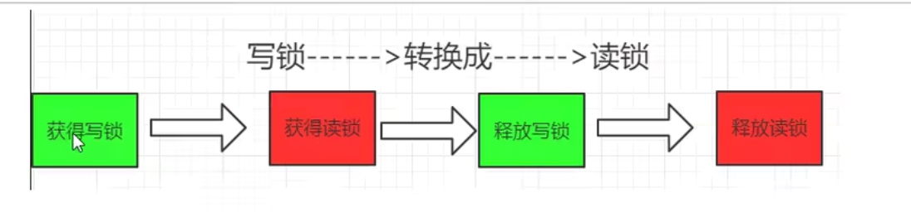

# JUC高级笔记

## 线程基础知识复习

> java底层native对应c++代码

### 多线程的弊端

1. 线程安全问题
   1. i++
   2. 不安全的集合类
2. 线程锁问题
3. 线程性能问题

### 线程启动后做了什么

java线程通过start方法启动执行的，主要内容在native方法start0中 

openjdk的写JNI一般是一一对应的，Thread.java对应的就是Thread.c

start0其实就是JVM_StartThread。此处查看源代码可以看到在jvm.h中找到了声明，jvm.cpp中有实现

是JVM配合操作系统底层分配了一个基础线程


### 守护线程和用户线程

`Thread.currentThread().isDaemon()`判断是否是守护线程

`Thread.currentThread().setDaemon(true)`设置线程为守护线程，注意这个设置要在start()前做，否则会报异常

## CompletableFuture

### Future接口理论知识复习

Future接口（FutureTask是实现类）定义了操作异步任务执行一些方法。如获取一步任务的执行结果、取消任务的执行、判断任务是否被取消、判断任务是否执行完毕。

一句话解释：Future接口可以为主线程开一个分支任务，专门为主线程处理耗时和费力的复杂业务。


当我们需要三个特点：多线程，有返回，异步任务,且线程构造器Thread(Runnable target,String name)

就需要传入FutureTask(Callable<T> callable)

```java
public class FutureTaskTest {
    public static void main(String[] args) throws ExecutionException, InterruptedException {
        FutureTask<String> futureTask=new FutureTask<>(new MyThread());
        Thread thread=new Thread(futureTask,"t1");
        thread.start();
        System.out.println(futureTask.get());
    }
}
class MyThread implements Callable<String>{

    @Override
    public String call() throws Exception {
        return "hello call()";
    }
}
```

### Future的优缺点分析-->CompletableFuture

优点： future+线程池异步多线程任务配合，能显著提高程序的执行效率

缺点：get()是阻塞的，一直等到有结果返回，与异步编程的设计理念相违背；isDone()会不断轮询，并且不能及时获取,耗费无谓的CPU资源


### CompletableFuture

CompletionStage代表异步的某个阶段

不推荐使用构造器，因为构造器没有指定线程池。默认是ForkJoinPool.commonPool(),它是守护线程。

join()和get()的区别是join()不抛出检查型异常


```java
public class CompletableFutureTest2 {
    public static void main(String[] args) throws ExecutionException, InterruptedException {
///        不推荐使用
//        CompletableFuture<String> completableFuture=new CompletableFuture<>();
        CompletableFuture<Void> voidCompletableFuture = CompletableFuture.runAsync(() -> {
            System.out.println(Thread.currentThread().getName());// ForkJoinPool.commonPool-worker-9
            try {
                TimeUnit.SECONDS.sleep(1);
            } catch (InterruptedException e) {
                throw new RuntimeException(e);
            }
        });
        System.out.println(voidCompletableFuture.get());// null
        ExecutorService threadPool = Executors.newFixedThreadPool(3);
        CompletableFuture<Void> voidCompletableFuture2= CompletableFuture.runAsync(() -> {
            System.out.println(Thread.currentThread().getName());// pool-1-thread-1
            try {
                TimeUnit.SECONDS.sleep(1);
            } catch (InterruptedException e) {
                throw new RuntimeException(e);
            }
        },threadPool);
        System.out.println(voidCompletableFuture2.get());// null

        CompletableFuture<String> completableFuture = CompletableFuture.supplyAsync(() -> {
            System.out.println(Thread.currentThread().getName());// pool-1-thread-1
            try {
                TimeUnit.SECONDS.sleep(1);
            } catch (InterruptedException e) {
                throw new RuntimeException(e);
            }
            return "hello supplyAsync";
        },threadPool);
        System.out.println(completableFuture.get());//hello supplyAsync
        threadPool.shutdown();
    }
}
```

### 链式调用

 在实体类上加`@Accessor(chain=true)`

```java
public class AccessorsTest {
    public static void main(String[] args) {
        Student student = new Student();
        student.setAge(12).setId("123").setName("dongbinyu");
    }
}
@Data
@AllArgsConstructor
@NoArgsConstructor
@Accessors(chain = true)
class Student{
    private String id;
    private String name;
    private Integer age;
}
```


### CompletableFuture多线程实战案例

```java
public class CompletableFutureTest3 {
    public static void main(String[] args) throws ExecutionException, InterruptedException {
        List<NetMall> list = new ArrayList<>();

        list.add(new NetMall("jingdong", "mysql", 12.4));
        list.add(new NetMall("dangdang", "mysql", 12.5));
        list.add(new NetMall("taobao", "mysql", 12.6));
        long startTime=System.currentTimeMillis();
        List<String> priceByCompletableFuture = getPriceByCompletableFuture(list);
        priceByCompletableFuture.forEach(one -> System.out.println(one));
        long endTime=System.currentTimeMillis();
        System.out.println(endTime-startTime);
        long startTime1=System.currentTimeMillis();
        List<String> priceList = getPrice(list);
        priceList.forEach(one-> System.out.println(one));
        long endTime1=System.currentTimeMillis();
        System.out.println(endTime1-startTime1);
    }

    private static List<String> getPrice(List<NetMall> list) {
        return list.stream().map(netMall -> String.format(netMall.getProductName() + " in %s price is %.2f", netMall.getMallName(), netMall.calPrice())
        ).collect(Collectors.toList());
    }

    private static List<String> getPriceByCompletableFuture(List<NetMall> list) {
        return list.stream().map(netMall ->
                CompletableFuture.supplyAsync(() -> String.format(netMall.getProductName() + " in %s price is %.2f", netMall.getMallName(), netMall.calPrice()))
        ).collect(Collectors.toList()).stream().map(stringCompletableFuture -> stringCompletableFuture.join()).collect(Collectors.toList());
    }
}

@Data
@AllArgsConstructor
class NetMall {
    private String mallName;
    private String productName;
    private Double price;

    public Double calPrice(){
        double v = ThreadLocalRandom.current().nextDouble();
        try {
            Thread.sleep(1000);
        } catch (InterruptedException e) {
            throw new RuntimeException(e);
        }
        return v;
    }
}

```

### CompletableFuture的API总结

- 获取结果和主动触发计算
  - get() 会抛出检查型异常 不见不散
  - get(long timeout,TimeUnit unit) 会抛出检查型异常 过时不候
  - join() 不会抛出检查型异常 不见不散
  - getNow(T valueIfAbsent)如果计算完成，返回值；如果没有计算完成，返回valueIfAbsent 
  - complete(T value) 如果计算完成，返回false;如果没有计算完成，返回true，并将任务结果设置为value

- 对计算结果进行处理
  - thenApply(Function<? super T,? extends U> fn)计算结果存在依赖关系，将前后两个线程串行化，由于存在依赖关系，当前步错，不走下一步，直接报错。
  - handle(BiFunction<? super T,Throwable,? extends U> fn)计算结果存在依赖关系，将前后两个线程串行化，当前步错，可以继续进行下一步，在最后报错。

- 对计算结果进行消费
  - thenAccept(Consumer<? super T> action)

-   不对计算结果进行处理
  
  - thenRun(Runnable runnable)
  
  
  
- 对计算速度进行选用
  - applyToEither(CompletionStage<? extends T> other, Function<? super T,U> fn)

- 对计算结果进合并
  - thenCombine(CompletionStage<? extends U> other, BiFunction<? super T,? super U,? extends V> fn)

  

  

## Java锁

### 乐观锁和悲观锁

- 悲观锁:适合写操作多的场景
  - 给同步资源加锁
  - synchronized
  - Lock的实现类
  
- 乐观锁：适合读操作多的场景
  - 不给同步资源加锁，无锁编程
  - 版本号机制Version
  - CAS算法,原子类的自增操作就是用到了CAS
  - 更新内存中的同步资源前先判断资源是否被其他线程修改，如果同步资源没有被修改就更新同步资源的值，如果同步资源被其他线程修改了，则根据实现方法执行不同的操作（报错或重试）


### Synchronized

`javap -c xxx.class`查看反编译内容，`javap -v xxx.class`查看更详细的反编译内容

synchronized同步代码块：底层是monitorenter和monitorexit

有两次monitorexit是异常释放（保证释放锁），但不是任何情况都是两个monitorexit


synchronized普通同步方法：flags处是ACC_SYNCHRONIZED

synchronized静态同步方法：flags处是ACC_STATIC和ACC_SYNCHRONIZED

### 管程Monitor

在Hotspot虚拟机中,monitor采用C语言的ObjectMonitor实现

ObjectMonitor.java-->ObjectMonitor.cpp-->objectMonitor.hpp

**每个对象天生就带着一个对象监视器**

被锁着的对象都会和monitor关联起来

这下面定义了关键属性：

- _owner 指向持有ObjectMonitor对象的线程 
- _count 表示当前锁对象是否被锁定 
- _recursions 表示同步代码块的重入次数
- _EntryList 阻塞队列，存放阻塞的线程
- _WaitSet 等待队列，存放等待的线程


### 公平锁和非公平锁

> 为什么默认是非公平锁？

1. 恢复挂起的线程到真正所的获取还是有时间差的，从开发人员看这个时间微乎其微，但是从CPU角度来看，这个时间差存在还是很明显的，所以非公平锁能更充分的利用CPU的时间片，尽量减少CPU空闲状态时间。
2. 使用多线程很重要的靠两点是线程切换的开销，当采用非公平锁时，当一个线程请求所获取同步状态，然后释放同步状态，此时刚释放锁的线程在此刻再去获取同步状态的概率变得非常大，所以减少了线程的切换开销


### 显式可重入锁和隐式可重入锁

> 可重入锁可以一定程度的避免死锁
>
> - 隐式可重入锁：synchronized
> - 显式可重入锁：ReentrantLock

### 死锁排查

- 命令方式

  1. `jps -l`查看正在运行的java进程

  2. `jstack 进程号`查看栈信息

- 图形化方式

  1. `jconsole`

### 自旋锁和适应性自旋锁

> 自旋可以减少CPU切换以及恢复现场导致的消耗，但是自旋本身也有缺点，如果自旋多次还得不到锁，自旋会占用处理器资源。所以一般自旋是有限定次数的，超过限定次数没有成功获取锁，就应当挂起线程。

## 线程中断

### 什么是中断机制与中断方法

首先，一个线程不应该由其他线程来强制中断或停止，而是应该由线程自己自行停止。所以`Thread.stop`、`Thread.suspend`、`Thread.resume`已被弃用

其次，在Java中没有办法停止一条线程，然而停止线程格外重要，因此Java提供了一种用于**停止线程的协商机制——中断**。

中断方法**interrupt()**仅仅是将中断标识位设置为true，发起一个协商而不会立即停止线程

**interrupted()**返回当前线程的中断状态，测试当前线程是否已被中断；将当前线程会给你的中断状态清零并重新设置为false。

**isinterrupted()**返回当前线程的中断状态

> 线程中断的几种方式

```java
public class InterruptDemo {
    static volatile boolean isStop =false;
    static AtomicBoolean atomicBoolean=new AtomicBoolean(false);
    public static void main(String[] args) {
        m1_volatile();
        m2_AtomicBoolean();
        m3_InterruptApi();
    }

    /**
     * volatile实现线程中断
     */
    private static void m1_volatile() {
        new Thread(()->{
            while(true){
                if(isStop){
                    System.out.println(Thread.currentThread().getName()+"\t isStop被修改为true,程序停止");
                    break;
                }
                System.out.println("t1----hello volatile");
            }
        },"t1").start();
        try {
            TimeUnit.MILLISECONDS.sleep(20);
        } catch (InterruptedException e) {
            throw new RuntimeException(e);
        }
        new Thread(()->{
            isStop=true;
        },"t2").start();
    }

    /**
     * AtomicBoolean实现线程中断
     */
    private static void m2_AtomicBoolean() {
        new Thread(()->{
            while(true){
                if(atomicBoolean.get()){
                    System.out.println(Thread.currentThread().getName()+"\t atomicBoolean被修改为true,程序停止");
                    break;
                }
                System.out.println("t1----hello atomicBoolean");
            }
        },"t1").start();
        try {
            TimeUnit.MILLISECONDS.sleep(20);
        } catch (InterruptedException e) {
            throw new RuntimeException(e);
        }
        new Thread(()->{
            atomicBoolean.set(true);
        },"t2").start();
    }

    /**
     * interrupt api实现线程中断
     */
    private static void m3_InterruptApi() {
        Thread t1 = new Thread(() -> {
            while (true) {
                if (Thread.currentThread().isInterrupted()) {
                    System.out.println(Thread.currentThread().getName() + "\t isInterrupted()被修改为true,程序停止");
                    break;
                }
                System.out.println("t1----hello interrupt api");
            }
        }, "t1");
        t1.start();
        try {
            TimeUnit.MILLISECONDS.sleep(20);
        } catch (InterruptedException e) {
            throw new RuntimeException(e);
        }
        Thread t2 = new Thread(() -> {
            t1.interrupt();
        }, "t2");
        t2.start();
    }
}

```


> 线程中断陷入死循环案例

```java
public class InterruptDemo2 {
    public static void main(String[] args) {
        Thread t1 = new Thread(() -> {
            while (true) {
                if (Thread.currentThread().isInterrupted()) {
                    System.out.println(Thread.currentThread().getName() + "\t isInterrupted()被修改为true,程序停止");
                    break;
                }
                try {
                    // 此时中断状态被清除，并抛出异常
                    Thread.sleep(200);
                } catch (InterruptedException e) {
                  //----- 重新给当前线程设置中断标志 -----
                    Thread.currentThread().interrupt();
                    e.printStackTrace();
                }
                System.out.println("t1----hello interrupt api");
            }
        }, "t1");
        t1.start();
        try {
            TimeUnit.SECONDS.sleep(1);
        } catch (InterruptedException e) {
            throw new RuntimeException(e);
        }
        Thread t2 = new Thread(() -> {
            t1.interrupt();
        }, "t2");
        t2.start();
    }
}

```

> Interrupted()测试

```java
public class InterruptDemo3 {
    public static void main(String[] args) {
        System.out.println(Thread.currentThread().getName()+"\t"+Thread.interrupted());//main	false
        System.out.println(Thread.currentThread().getName()+"\t"+Thread.interrupted());//main	false
        Thread.currentThread().interrupt();
        System.out.println(Thread.currentThread().getName()+"\t"+Thread.interrupted());//main	true
        System.out.println(Thread.currentThread().getName()+"\t"+Thread.interrupted());//main	false
    }
}
```


### LockSupport

> wait和notify需要在同步代码块中成对使用，要先wait再notify，不能换位置。
>
> await和signal也需要在lock加锁区域成对使用，要先await再signal，不能换位置。
>
> 故此，引出LockSupport:
>
> 1. 无锁块的要求
> 2. park和unpark可以换顺序调用

- park阻塞线程

- unpark解除阻塞线程,给指定线程发放唯一通行证，与Semaphore的区别是LockSupport.unpark()发放的许可证最多只有一个

## Java内存模型JMM

### JMM介绍

JMM是来屏蔽掉各种硬件和操作系统的内存访问差异的一组规范，使Java程序在各个平台下都能达到一致的内存访问效果。JMM关键技术都是围绕多线程的原子性、可见性和有序性展开的

- 可见性：当一个线程修改了某一个共享变量的值，其他线程是否能够立即知道该变更，JMM规定了所有变量都存储在主内存中
- 原子性：指一个操作使不可打断的，即多线程环境下，操作不能被其他线程干扰
- 有序性：JVM线程内部维持顺序化语义，即只要执行结果和顺序化执行结果相等，那么指令的执行顺序可以与代码顺序不一致，此过程叫指令的重排序


### happens-before

> 在JMM中，如果一个操作执行的结果需要对另一个操作可见或有序，那么这两个操作之间必须存在happens-before（先行发生）原则。即存在逻辑上的先后顺序关系
>
> happens-before是保证可见性和有序性的约束
>
> happens-before总原则：
>
> 1. 如果一个操作Hanppens-before另一个操作，那么第一个操作的执行结果将对第二个操作可见，而且第一个操作执行顺序排在第二个操作之前
> 2. 两个操作之间存在happens-before关系，并不意味着一定要按照happens-before原则制定的顺序来执行。如果重排序之后的执行结果与按照happens-before关系来执行的结果一致，那么这种重排序并不非法。
>
> happens-before八条：
>
> 1. 次序规则：一个线程内，按照代码顺序，写在前面的操作现行发生于写在后面的操作
> 2. 锁定原则：一个unlock操作happens-before对同一个锁的lock操作
> 3. volatile变量规则：对一个volatile变量的写操作happens-before于后面对这个变量的读操作，前面的写对后面的读是可见和有序的
> 4. 传递原则：如果Ahappens-beforeB，Bhappens-beforeC,则Ahappens-beforeC
> 5. 线程启动规则：Thread对象的start()happens-before于此线程的每一行代码
> 6. 线程中断原则：对线程interrupt() happens-before于被中断线程的代码检测到中断事件的发生
> 7. 线程终止规则：线程中的所有操作 happens-before于对此线程的终止检测，我们可以通过isAlive()等手段检测线程是否已经终止执行
> 8. 对象终结规则：一个对象的初始化完成（构造器执行结束）happens-before于它的finalize()


## volatile与内存屏障

### volatile

volatile特性：

- 可见性
- 有序性（禁止指令重排序）
- 没有原子性

volatile凭借什么保证可见性和有序性？靠内存屏障


什么时候使用volatile?

1. 单一赋值可以，但是复合运算赋值不可以
2. 状态标志，判断业务是否结束
3. 开销较低的读写锁策略
4. 单例模式双重检查懒汉式

### 内存屏障

内存屏障：读屏障和写屏障，细分四种，happens-before原则落地靠内存屏障

内存屏障之前的所有写操作都要写回主内存；内存屏障之后的所有读操作都能活的内存屏障之前所有写操作的最新结果

内存屏障能禁止指令重排


 


## CAS和Unsafe

### CAS

> 原子类是CAS的落地实现
>
> compareAndSwap比较并交换，是实现并发算法时常用到的一种技术，它包含三个操作数————内存位置、预期原值及更新值。
>
> 执行CAS操作时，会将内存位置的值和预期原值比较：
>
> - 如果相匹配，那么处理器会自动将该位置值更新为新值
>
> - 如果不匹配，处理器不做任何操作，多个线程同时执行CAS操作只会有一个成功
>
> CAS不成功的重来重试就是自旋
>
> CAS是JDK提供的非阻塞原子性操作，它通过硬件保证了比较-更新的原子性，Unsafe.compareAndSwapXxx底层用到的CPU原子指令是cmpxchg指令
>
> CAS缺点：
>
> 1. 循环时间开销很大
> 2. ABA问题 用AtomicStampedReference解决

### Unsafe

> 可以直接操作特定内存的类，普通程序员不要用

```java
// 自旋操作
public final int getAndAddInt(Object var1, long var2, int var4) {
        int var5;
        do {
            var5 = this.getIntVolatile(var1, var2);
        } while(!this.compareAndSwapInt(var1, var2, var5, var5 + var4));

        return var5;
    }
```

### 原子包装类AtomicReference

```java
@Data
@AllArgsConstructor
class User{
    private String id;
    private String name;
}
public class AtomicReferenceDemo {
    public static void main(String[] args) {
        AtomicReference<User> atomicReference=new AtomicReference<User>();
        User dby = new User("123", "dby");
        User other=new User("345","other");
        atomicReference.set(dby);
        System.out.println(atomicReference.compareAndSet(dby, other));
        System.out.println(atomicReference.get());
        System.out.println(atomicReference.compareAndSet(dby, other));
        System.out.println(atomicReference.get());
    }
}
```

### 自己实现自旋锁

```java
public class SpinLockDemo {
     AtomicReference<Thread> atomicReference=new AtomicReference<>();
     public void lock(){
         Thread thread=Thread.currentThread();
         System.out.println(Thread.currentThread().getName()+"\t come in");
         while(!atomicReference.compareAndSet(null,thread)){

         }
     }
     public void unlock(){
         Thread thread=Thread.currentThread();
         atomicReference.compareAndSet(thread,null);
         System.out.println(Thread.currentThread().getName()+"\t task over unlock");
     }

    public static void main(String[] args) {
        SpinLockDemo spinLockDemo=new SpinLockDemo();
        new Thread(()->{
            spinLockDemo.lock();
            try {
                Thread.sleep(4000);
            } catch (InterruptedException e) {
                throw new RuntimeException(e);
            }
            spinLockDemo.unlock();
        },"A").start();
        try {
            Thread.sleep(500);
        } catch (InterruptedException e) {
            throw new RuntimeException(e);
        }
        new Thread(()->{
            spinLockDemo.lock();
            spinLockDemo.unlock();
        },"B").start();
    }
}

```

### CAS之ABA问题解决AtomicStampedReference

> AtomicStampedReference 就是比较和版本号一起上

```java
@Data
@AllArgsConstructor
class Book{
    private int id;
    private String name;
}
public class AtomicStampedReferenceDemo {
    public static void main(String[] args) {
        Book book=new Book(123,"时间简史");
        AtomicStampedReference<Book> atomicStampedReference=new AtomicStampedReference<>(book,1);
        System.out.println(atomicStampedReference.getReference()+"\t"+atomicStampedReference.getStamp());
        Book book2=new Book(456,"mysql实战");
        boolean b = atomicStampedReference.compareAndSet(book, book2, atomicStampedReference.getStamp(), atomicStampedReference.getStamp() + 1);
        System.out.println(b);
        boolean b1 = atomicStampedReference.compareAndSet(book2, book, atomicStampedReference.getStamp(), atomicStampedReference.getStamp() + 1);
        System.out.println(b1);
        boolean b2 = atomicStampedReference.compareAndSet(book, book2, atomicStampedReference.getStamp(), atomicStampedReference.getStamp() + 1);
        System.out.println(b2);
        System.out.println(atomicStampedReference.getStamp());
    }
}
```


## 原子操作类

### 基本类型原子类

> 主线程运行过快导致得到了不正确的值

```java
class MyNumber{
    AtomicInteger atomicInteger=new AtomicInteger();
    public void addOne(){
        atomicInteger.getAndIncrement();
    }
}
public class AtomicIntegerDemo {
    public static void main(String[] args) {
        MyNumber myNumber=new MyNumber();
        for(int i=0;i<50;i++){
            new Thread(()->{
                for(int j=0;j<10000;j++){
                    myNumber.addOne();
                }
            },String.valueOf(i)).start();
        }
        System.out.println(Thread.currentThread().getName()+"\t"+myNumber.atomicInteger.get());// 得到的值接近50000,但是不准确
    }
}
```

> 正确的编码方式使用CountDownLatch

```java
class MyNumber {
    AtomicInteger atomicInteger = new AtomicInteger();

    public void addOne() {
        atomicInteger.getAndIncrement();
    }
}

public class AtomicIntegerDemo {
    public static void main(String[] args) throws InterruptedException {
        MyNumber myNumber = new MyNumber();
        CountDownLatch countDownLatch = new CountDownLatch(50);
        for (int i = 0; i < 50; i++) {
            new Thread(() -> {
                try {
                    for (int j = 0; j < 10000; j++) {
                        myNumber.addOne();
                    }
                } finally {
                    countDownLatch.countDown();
                }

            }, String.valueOf(i)).start();
        }
        countDownLatch.await();
        System.out.println(Thread.currentThread().getName() + "\t" + myNumber.atomicInteger.get());
    }
}
```

### 数组类型原子类

```java
public class AtomicIntegerArrayDemo {
    public static void main(String[] args) {
        AtomicIntegerArray atomicIntegerArray=new AtomicIntegerArray(5);
        System.out.println(atomicIntegerArray.get(0));
        System.out.println(atomicIntegerArray.getAndIncrement(0));
        System.out.println(atomicIntegerArray.get(0));
    }
}
```

### 引用类型原子类

> AtomicReference
>
> AtomicStampedReference带流水戳记的AtomicReference,可以解决ABA问题
>
> AtomicMarkableReference一次性解决是否修改过，不能解决ABA问题

```java
public class AtomicMarkableReferenceDemo {
    static AtomicMarkableReference markableReference=new AtomicMarkableReference(100,false);
    public static void main(String[] args) {
        new Thread(()->{
            boolean marked=markableReference.isMarked();
            System.out.println(Thread.currentThread().getName()+"\t"+marked);
            try {
                TimeUnit.SECONDS.sleep(1);
            } catch (InterruptedException e) {
                throw new RuntimeException(e);
            }
            boolean b = markableReference.compareAndSet(100, 1000, marked, !marked);
            System.out.println(b);
        },"A").start();
        new Thread(()->{
            boolean marked=markableReference.isMarked();
            System.out.println(Thread.currentThread().getName()+"\t"+marked);
            try {
                TimeUnit.SECONDS.sleep(2);
            } catch (InterruptedException e) {
                throw new RuntimeException(e);
            }
            boolean b = markableReference.compareAndSet(100, 2000, marked, !marked);
            System.out.println(b);
        },"B").start();
    }
}
```

###  对象的属性修改类型原子类

> 以一种线程安全的方式操作非线程安全对象内的某些字段
>
> 使用要求：
>
> 1. 更新的对象属性必须使用volatile修饰符
> 2. 因为对象的属性修改类型原子类都是抽象类，所以每次使用都必须使用静态方法newUpdater()创建一个更新器，且需要设置想要更新的类和属性

> AtomicIntegerFieldUpdater实例：

```java
@Data
class BankAccount {
    private String name = "CCB";
    private volatile int money = 0;
    private int money2 = 0;
    private AtomicIntegerFieldUpdater<BankAccount> fieldUpdater = AtomicIntegerFieldUpdater.newUpdater(BankAccount.class, "money");

    public void addM1() {
        fieldUpdater.getAndIncrement(this);
    }

    public synchronized void addM2() {
        money2++;
    }
}

public class AtomicIntegerFieldUpdaterDemo {
    public static void main(String[] args) throws InterruptedException {
      // 实测单独执行m1或m2，时间差不多
        m1();
        m2();
    }

    private static void m1() throws InterruptedException {
        long startTime = System.currentTimeMillis();
        BankAccount bankAccount = new BankAccount();
        CountDownLatch countDownLatch = new CountDownLatch(100);
        for (int i = 0; i < 100; i++) {
            new Thread(() -> {
                try {
                    for (int j = 0; j < 1000; j++) {
                        bankAccount.addM1();
                    }
                } finally {
                    countDownLatch.countDown();
                }
            }, String.valueOf(i)).start();
        }
        countDownLatch.await();
        System.out.println(bankAccount.getMoney());
        long endTime = System.currentTimeMillis();
        System.out.println("耗时毫秒数m1：" + (endTime - startTime));
    }

    private static void m2() throws InterruptedException {
        long startTime = System.currentTimeMillis();
        BankAccount bankAccount = new BankAccount();
        CountDownLatch countDownLatch = new CountDownLatch(100);
        for (int i = 0; i < 100; i++) {
            new Thread(() -> {
                try {
                    for (int j = 0; j < 1000; j++) {
                        bankAccount.addM2();
                    }
                } finally {
                    countDownLatch.countDown();
                }
            }, String.valueOf(i)).start();
        }
        countDownLatch.await();
        System.out.println(bankAccount.getMoney2());
        long endTime = System.currentTimeMillis();
        System.out.println("耗时毫秒数m2：" + (endTime - startTime));
    }
}

```

> AtomicReferenceFieldUpdater实例

```java
@Data
class MyCar{
    private volatile Boolean initOrNot=Boolean.FALSE;
    private AtomicReferenceFieldUpdater<MyCar,Boolean> fieldUpdater=AtomicReferenceFieldUpdater.newUpdater(MyCar.class,Boolean.class,"initOrNot");
    public void init(){
        if(fieldUpdater.compareAndSet(this,Boolean.FALSE,Boolean.TRUE)){
            System.out.println(Thread.currentThread().getName()+"\t start init");
            try {
                TimeUnit.SECONDS.sleep(2);
            } catch (InterruptedException e) {
                throw new RuntimeException(e);
            }
            System.out.println(Thread.currentThread().getName()+"\t end init");
        }else{
            System.out.println(Thread.currentThread().getName()+"\t 已经有线程初始化了");
        }
    }
}
public class AtomicReferenceFieldUpdaterDemo {
    public static void main(String[] args) {
        MyCar myCar = new MyCar();
        for(int i=0;i<5;i++){
            new Thread(()->{
                myCar.init();
            },String.valueOf(i)).start();
        }
        
    }
}
```

### 原子操作增强类

> 热点点赞计数器,实测是LongAccumulator最快，AtomicLong最慢，不知道为什么和老师讲的不一样？？？

```java
@Data
class ClickNumber{
    private int number=0;
    public synchronized void clickBySynchronized(){
        number++;
    }
    AtomicLong atomicLong=new AtomicLong(0);
    public void clickByAtomicLong(){
        atomicLong.getAndIncrement();
    }
    LongAdder longAdder=new LongAdder();
    public void clickByLongAdder(){
        longAdder.increment();
    }
    LongAccumulator longAccumulator=new LongAccumulator((x,y)->x+y,0);
    public void clickByLongAccumulator(){
        longAccumulator.accumulate(1);
    }
}
public class LongAdderDemo {
    public static final int _100w=1000000;
    public static final int threadNumber=50;
    public static void main(String[] args) throws InterruptedException {
        testApi();
        ClickNumber clickNumber=new ClickNumber();
        CountDownLatch countDownLatch1=new CountDownLatch(threadNumber);
        CountDownLatch countDownLatch2=new CountDownLatch(threadNumber);
        CountDownLatch countDownLatch3=new CountDownLatch(threadNumber);
        CountDownLatch countDownLatch4=new CountDownLatch(threadNumber);
        testClickBySynchronized(clickNumber, countDownLatch1);
        testClickByAtomicLong(clickNumber,countDownLatch2);
        testClickByLongAdder(clickNumber,countDownLatch3);
        testClickByLongAccumulator(clickNumber,countDownLatch4);
    }

    private static void testClickBySynchronized(ClickNumber clickNumber, CountDownLatch countDownLatch1) throws InterruptedException {
        long startTime1=System.currentTimeMillis();
        for(int i=0;i<threadNumber;i++){
            new Thread(()->{
                try {
                    for(int j=0;j<_100w;j++){
                        clickNumber.clickBySynchronized();
                    }
                } finally {
                    countDownLatch1.countDown();
                }
            },String.valueOf(i)).start();
        }
        countDownLatch1.await();
        long endTime1=System.currentTimeMillis();
        System.out.println("clickBySynchronized："+(endTime1-startTime1)+"\t"+clickNumber.getNumber());
    }
    private static void testClickByAtomicLong(ClickNumber clickNumber, CountDownLatch countDownLatch1) throws InterruptedException {
        long startTime1=System.currentTimeMillis();
        for(int i=0;i<threadNumber;i++){
            new Thread(()->{
                try {
                    for(int j=0;j<_100w;j++){
                        clickNumber.clickByAtomicLong();
                    }
                } finally {
                    countDownLatch1.countDown();
                }
            },String.valueOf(i)).start();
        }
        countDownLatch1.await();
        long endTime1=System.currentTimeMillis();
        System.out.println("clickByAtomicLong："+(endTime1-startTime1)+"\t"+clickNumber.getAtomicLong().get());
    }
    private static void testClickByLongAdder(ClickNumber clickNumber, CountDownLatch countDownLatch1) throws InterruptedException {
        long startTime1=System.currentTimeMillis();
        for(int i=0;i<threadNumber;i++){
            new Thread(()->{
                try {
                    for(int j=0;j<_100w;j++){
                        clickNumber.clickByLongAdder();
                    }
                } finally {
                    countDownLatch1.countDown();
                }
            },String.valueOf(i)).start();
        }
        countDownLatch1.await();
        long endTime1=System.currentTimeMillis();
        System.out.println("clickByLongAdder："+(endTime1-startTime1)+"\t"+clickNumber.getLongAdder().sum());
    }
    private static void testClickByLongAccumulator(ClickNumber clickNumber, CountDownLatch countDownLatch1) throws InterruptedException {
        long startTime1=System.currentTimeMillis();
        for(int i=0;i<threadNumber;i++){
            new Thread(()->{
                try {
                    for(int j=0;j<_100w;j++){
                        clickNumber.clickByLongAccumulator();
                    }
                } finally {
                    countDownLatch1.countDown();
                }
            },String.valueOf(i)).start();
        }
        countDownLatch1.await();
        long endTime1=System.currentTimeMillis();
        System.out.println("clickByLongAccumulator："+(endTime1-startTime1)+"\t"+clickNumber.getLongAccumulator().get());
    }

    private static void testApi() {
        LongAdder longAdder=new LongAdder();
        longAdder.add(1);
        longAdder.increment();
        longAdder.increment();
        System.out.println(longAdder.sum());

        LongAccumulator longAccumulator=new LongAccumulator((x,y)->{
            return x+y;
        },0);
        longAccumulator.accumulate(1);
        longAccumulator.accumulate(3);
        System.out.println(longAccumulator.get());
    }
}

```

### 其他原子操作类

> LongAdder底层思想是分散热点


## ThreadLocal线程局部变量

> 实现每一个线程都有自己专属的本地变量副本，主要解决了让每个线程绑定自己的值，通过get和set方法，获取默认值或将其值更改为当前线程所存副本的值从而**避免了线程安全问题**
>
> ThreadLocal每次使用完毕需要remove，不然会导致内存泄露和程序逻辑错误

```java
class House{
    int saleCount=0;
    public synchronized void saleHouse(){
        saleCount++;
    }
//    ThreadLocal<Integer> saleVolume=new ThreadLocal<Integer>(){
//        @Override
//        protected Integer initialValue(){
//            return 0;
//        }
//    };
    ThreadLocal<Integer> saleVolume=ThreadLocal.withInitial(()->0);
    public void saleVolumeByThreadLocal(){
        saleVolume.set(1+ saleVolume.get());
    }
}
public class ThreadLocalDemo {
    public static void main(String[] args) throws InterruptedException {
        House house = new House();
        for(int i=0;i<5;i++){
            new Thread(()->{
                int size = new Random().nextInt(5) + 1;
                System.out.println(size);
                try {
                    for(int j=1;j<=size;j++){
                        house.saleHouse();
                        house.saleVolumeByThreadLocal();
                    }
                    System.out.println(Thread.currentThread().getName()+"\t"+house.saleVolume.get());
                } finally {
                    house.saleVolume.remove();
                }
            },String.valueOf(i)).start();
        }
        TimeUnit.MILLISECONDS.sleep(1000);
        System.out.println(house.saleCount);
        System.out.println(house.saleVolume.get());
    }
}
```


### 强软弱虚

```java
class MyObject{
    @Override
    protected void finalize() throws Throwable {
        System.out.println("finalize invoke....");
    }
}
public class ReferenceDemo {
    public static void main(String[] args) {
//        strongReference();
//        softReference();
//        weakReference();
        phantomReference();
    }

    private static void phantomReference() {
        ReferenceQueue<MyObject> referenceQueue=new ReferenceQueue<>();
        PhantomReference<MyObject> myObjectPhantomReference=new PhantomReference<>(new MyObject(),referenceQueue);
        System.out.println(myObjectPhantomReference.get());//null
        List<byte[]> list=new ArrayList<>();
        new Thread(()->{
            while(true){
                list.add(new byte[1*1024*1024]);
                try {
                    TimeUnit.SECONDS.sleep(1);
                    System.out.println(myObjectPhantomReference.get()+"\t"+"list add ok");
                } catch (InterruptedException e) {
                   e.printStackTrace();
                }
            }
        },"T1").start();
        new Thread(()->{
            while(true){
                Reference<? extends MyObject> reference = referenceQueue.poll();
                if(reference!=null){
                    System.out.println("有虚对象加入了引用队列");
                    break;
                }
            }
        },"T2").start();
    }

    private static void weakReference() {
        WeakReference<MyObject> myObjectWeakReference=new WeakReference<>(new MyObject());
        System.out.println(myObjectWeakReference.get());
        System.gc();
        System.out.println(myObjectWeakReference.get());
    }

    private static void softReference() {
        SoftReference<MyObject> myObjectSoftReference = new SoftReference<>(new MyObject());
        System.gc();
        try {
            TimeUnit.SECONDS.sleep(1);
        } catch (InterruptedException e) {
            e.printStackTrace();
        }
        System.out.println("gc after内存够用 "+myObjectSoftReference.get());
        try {
            byte[] bytes = new byte[10 * 1024 * 1024];
        } catch (Exception e) {
            e.printStackTrace();
        } finally {
            System.out.println("gc after内存不够用"+myObjectSoftReference.get());
        }
    }

    private static void strongReference() {
        MyObject myObject=new MyObject();
        System.out.println("gc before"+myObject);
        myObject=null;
        System.gc();
        System.out.println("gc after"+myObject);
    }

}

```

### 弱引用就万事大吉了吗

> 需要remove保证没有内存泄露

## Java对象内存布局和对象头

> 在hotspot虚拟机中，对象在堆内存中的存储布局可以划分为三部分：对象头，实例数据，对齐填充
>
> 对象实例在堆内存中的存储布局：
>
> - 对象头：在64位系统中，Mark word占8个字节，类型指针占8个字节，运行期间Mark word里存储的数据会随着锁标志位的变化而变化
>   - 对象标记/Mark word
>     - 哈希码/hashcode
>     - GC标记 
>     - GC次数
>     - 同步锁标记
>     - 偏向锁持有者
>   - 类元信息/类型指针：存储的是指向方法区该对象类元数据的首地址，虚拟机通过这个指针来确定这个对象是哪个类的实例
> - 实例数据：存放类的属性（Field）数据信息，包括父类的属性信息
> - 对齐填充：保证对象大小是8个字节的倍数，因为虚拟机要求对象的起始地址必须是8字节的整数倍


### JOL验证对象的存储布局

> 重点看打印出来的内容

```xml
<!--引入JOL小工具-->
<dependency>
  <groupId>org.openjdk.jol</groupId>
  <artifactId>jol-core</artifactId>
  <version>0.16</version>
</dependency>
```

```java
public class JolTest {
    public static void main(String[] args) {
        System.out.println(VM.current().details());
        System.out.println(VM.current().objectAlignment());
        System.out.println("------------------");
        Object o = new Object();
        System.out.println(ClassLayout.parseInstance(o).toPrintable());
        Customer customer = new Customer();
        System.out.println(ClassLayout.parseInstance(customer).toPrintable());
    }
}
class Customer{
    int id;
    String name;
}

```

### `对象分代年龄`最大为15

> 错误设置的演示

```
// 设置虚拟机参数
// -XX:MaxTenuringThreshold 设置对象分代年龄最大值
-XX:MaxTenuringThreshold=16
```

```
// 打印结果
MaxTenuringThreshold of 16 is invalid; must be between 0 and 15
Error: Could not create the Java Virtual Machine.
Error: A fatal exception has occurred. Program will exit.
```

### 测试`压缩指针`

> 默认是开启压缩指针的

```
//设置虚拟机参数
// -XX:+PrintCommandLineFlags 打印java程序启动的所有尾巴参数
// -version 打印java环境信息
-XX:+PrintCommandLineFlags -version
```

```
//打印结果
//-XX:+UseCompressedOops 开启了压缩指针
-XX:InitialHeapSize=268435456 -XX:MaxHeapSize=4294967296 -XX:+PrintCommandLineFlags -XX:+UseCompressedClassPointers -XX:+UseCompressedOops -XX:+UseParallelGC 
java version "1.8.0_351"
Java(TM) SE Runtime Environment (build 1.8.0_351-b10)
Java HotSpot(TM) 64-Bit Server VM (build 25.351-b10, mixed mode)
```

> 测试关闭压缩指针

```
//设置虚拟机参数
// -XX:-UseCompressedOops 关闭压缩指针
-XX:-UseCompressedOops 
```

```
//打印结果
java.lang.Object object internals:
OFF  SZ   TYPE DESCRIPTION               VALUE
  0   8        (object header: mark)     0x0000000000000001 (non-biasable; age: 0)
  8   8        (object header: class)    0x0000000127e8cc00
Instance size: 16 bytes
Space losses: 0 bytes internal + 0 bytes external = 0 bytes total

```


## Synchronized和锁升级


### 偏向锁

> 偏向锁会偏向第一个访问锁的线程，如果在接下来的运行过程中，该锁没有被其他线程访问，则持有偏向锁的线程永远不需要触发同步。也即偏向锁在资源没有竞争情况下消除了同步语句，懒得连CAS操作都不做了，直接提交程序性能。
>
> 实际运行中，锁总是由一个线程持有，很少发生竞争。所以诞生了偏向锁。
>
> 除非有其他线程竞争，否则线程不会主动释放偏向锁。

```
// 设置VM参数
// -XX:+UseBiasedLocking 开启偏向锁
// -XX:BiasedLockingStartupDelay=0 设置开启偏向锁的启动延迟为0秒
-XX:+UseBiasedLocking -XX:BiasedLockingStartupDelay=0
```

> 默认设置下4秒前是轻量级锁，设置后成为偏向锁。
>
> 或可以通过延时4秒以上成为偏向锁。

```java
public class BiasedLockTest {
    public static void main(String[] args) {
        Object o = new Object();
        synchronized (o){
            System.out.println(ClassLayout.parseInstance(o).toPrintable());
        }
    }
}
```

```
// 默认设置 控制台打印如下
java.lang.Object object internals:
OFF  SZ   TYPE DESCRIPTION               VALUE
  0   8        (object header: mark)     0x0000000304be19e0 (thin lock: 0x0000000304be19e0)
  8   4        (object header: class)    0xf80001e5
 12   4        (object alignment gap)    
Instance size: 16 bytes
Space losses: 0 bytes internal + 4 bytes external = 4 bytes total
```

```
// 设置后 控制台打印如下
java.lang.Object object internals:
OFF  SZ   TYPE DESCRIPTION               VALUE
  0   8        (object header: mark)     0x00007f9fc8808805 (biased: 0x0000001fe7f22022; epoch: 0; age: 0)
  8   4        (object header: class)    0xf80001e5
 12   4        (object alignment gap)    
Instance size: 16 bytes
Space losses: 0 bytes internal + 4 bytes external = 4 bytes total
```

> 偏向锁的撤销：
>
> 需要等到全局安全点上没有字节码正在执行，同时还会检查持有偏向锁的线程是否还在执行
>
> 1. 第一个线程正在执行synchronized方法（处于同步块），它还没有执行完，其他线程来抢夺，该偏向锁会被取消并出现锁升级。此时轻量级锁由原持有偏向锁的线程持有，继续执行同步代码，而正在竞争的线程会进入自旋等待活的轻量级锁
> 2. 第一个线程执行完成sychronized方法（退出同步块），则将对象头设置成无锁状态并撤销偏向锁，重新偏向。

### 轻量级锁

> 轻量级锁是为了在线程近乎交替执行同步块时提高性能。
>
> 主要目的：在没有多线程竞争的前提下， 通过CAS减少重量级锁使用操作系统互斥量产生的性能消耗。
>
> 自旋到达一定次数和程度时会升级成重量级锁

### 重量级锁

 ### hashcode与偏向锁不共存

> 1. 当一个对象已经计算过hashcode，他就无法进入偏向锁状态，跳过偏向锁，直接升级成轻量级锁
> 2. 偏向锁过程中遇到计算hashcode，立马撤销偏向锁，膨胀为重量级锁

### 锁消除

> 其实是一种代码上的错误，JIT会当做没有加锁

```java
public class LockClearDemo {
    static Object objectLock=new Object();
    public void m1(){
        Object o=new Object();
        synchronized (o){
            System.out.println(o.hashCode()+"\t"+objectLock.hashCode());
        }
    }

    public static void main(String[] args) {
        LockClearDemo lockClearDemo = new LockClearDemo();
        for(int i=0;i<10;i++){
            new Thread(()->{
                lockClearDemo.m1();
            },String.valueOf(i)).start();
        }
    }
}
```

### 锁粗化

> JIT底层会把多个同步块进行合并

```java
public class LockBigDemo {
    static Object objectLock=new Object();

    public static void main(String[] args) {
        new Thread(()->{
            synchronized (objectLock){
                System.out.println("111");
            }
            synchronized (objectLock){
                System.out.println("222");
            }
            synchronized (objectLock){
                System.out.println("333");
            }synchronized (objectLock){
                System.out.println("444");
            }
        }).start();
    }
}
```

## AbstractQueuedSynchronizer之AQS

> AQS是什么：
>
> - 是用来实现所或者其他同步器组件的公共基础部分的抽象实现，使整个JUC的基石，解决锁分配给谁的问题。
>
> - 整体就是抽象一个FIFO队列来完成资源获取线程的排队工作，并通过一个int类变量表示持有锁的状态。
>
> AQS为什么是JUC的基石：
>
> ReentrantLock、CountDownLatch、ReentrantReadWriteLock、Semaphore的同步器Sync都继承了AQS
>
> 锁和同步器的关系：
>
> - 锁，面向锁的使用者
> - 同步器，面向锁的实现者
>
> CLH：是个单向链表
>
> AQS中的队列是CLH变体的虚拟双向队列


## StampedLock

[CSDN-尚硅谷的StampedLock 使用案例](https://blog.csdn.net/yaobo2816/article/details/126602504)

> 无锁-》独占锁-》读写锁-》邮戳锁
>
> 读写锁的特点:
>
> - 读写锁的读锁没有完成时，会造成写锁饥饿问题，可以通过公平锁来缓解锁饥饿问题，但是会导致系统吞吐量下降
> - 获取写锁后，可以继续获取读锁，可以产生锁降级。获取写锁后继续获取读锁其实是锁的重入。
> - 
>
> 邮戳锁：为了在获取读锁之后获取写锁，产生了邮戳锁
>
> - 所有获取锁的方法，都返回一个邮戳(stamp),stamp为零表示获取失败，其余表示获取成功
> - 所有释放锁的方法，都需要一个邮戳stamp，这个stamp必须是和成功获取锁时得到的stamp一致。
> - StampedLock是不可重入的，危险（如果一个线程已经持有写锁，再去获得写锁的话就会造成死锁
> - StampedLock有三种访问模式：
>   - 悲观读模式：类似ReentrantReadWriteLock的读锁
>   - 写模式：类似ReentrantReadWriteLock的写锁
>   - 乐观读模式：无锁机制，类似数据库中的乐观锁，支持读写并发，很乐观认为读取时没人修改，加入被修改再实现升级为悲观读模式  
>
> 
