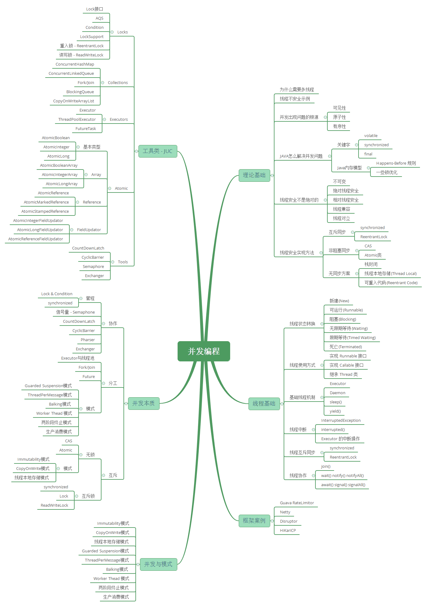
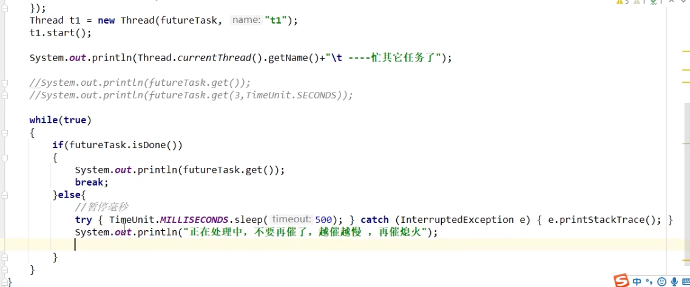
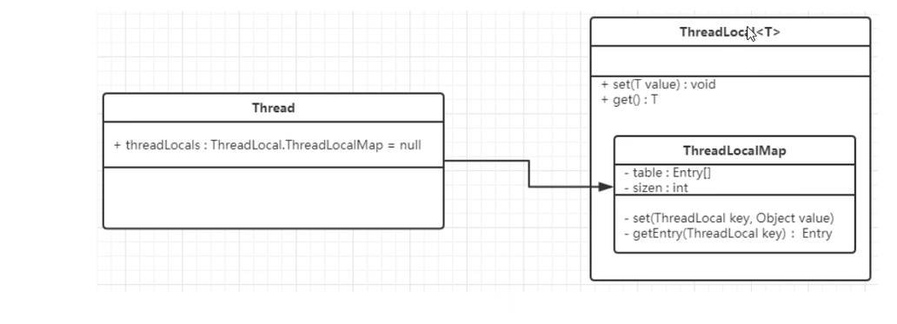

# JUC笔记



## 线程基础知识复习

### 多线程的出现是要解决什么问题的?

> 众所周知，CPU、内存、I/O 设备的速度是有极大差异的，为了合理利用 CPU 的高性能，平衡这三者的速度差异，计算机体系结构、操作系统、编译程序都做出了贡献，主要体现为:
>
> - CPU 增加了缓存，以均衡与内存的速度差异；// 导致 `可见性`问题
> - 操作系统增加了进程、线程，以分时复用 CPU，进而均衡 CPU 与 I/O 设备的速度差异；// 导致 `原子性`问题
> - 编译程序优化指令执行次序，使得缓存能够得到更加合理地利用。// 导致 `有序性`问题

### 并发三要素

> volatile的出现只解决了一部分有序性的问题

### JMM模型【考点】

> JMM本质上可以理解为，Java 内存模型规范了 JVM 如何提供按需禁用缓存和编译优化的方法。具体来说，这些方法包括：
>
> - volatile、synchronized 和 final 三个关键字
> - Happens-Before 规则


## CompletableFuture

### Future实战

```java
public class FutureTaskTest {
    public static void main(String[] args) throws ExecutionException, InterruptedException {
        FutureTask<String> futureTask=new FutureTask<>(new MyThread());
        Thread thread=new Thread(futureTask,"t1");
        thread.start();
        System.out.println(futureTask.get());
    }
}
class MyThread implements Callable<String>{

    @Override
    public String call() throws Exception {
        return "hello call()";
    }
}
```

### Future的优缺点分析

> 优点： future+线程池**异步**多线程任务配合，能显著提高程序的执行效率
>
> 缺点：**get()是阻塞的，一直等到有结果返回**，与异步编程的设计理念相违背；isDone()会不断轮询，并且不能及时获取,耗费无谓的CPU资源



### CompletableFuture实战1

> CompletableFuture不推荐使用构造器，因为构造器没有指定线程池。默认是ForkJoinPool.commonPool(),它是守护线程。
>
> ==请查看join()和get()的方法==：join不抛出异常，get抛出异常
>
> ==请查看CompletableFuture、CompletableStage的方法==


```java
public class CompletableFutureTest2 {
    public static void main(String[] args) throws ExecutionException, InterruptedException {
///        不推荐使用
//        CompletableFuture<String> completableFuture=new CompletableFuture<>();
        CompletableFuture<Void> voidCompletableFuture = CompletableFuture.runAsync(() -> {
            System.out.println(Thread.currentThread().getName());// ForkJoinPool.commonPool-worker-9
            try {
                TimeUnit.SECONDS.sleep(1);
            } catch (InterruptedException e) {
                throw new RuntimeException(e);
            }
        });
        System.out.println(voidCompletableFuture.get());// null
        ExecutorService threadPool = Executors.newFixedThreadPool(3);
        CompletableFuture<Void> voidCompletableFuture2= CompletableFuture.runAsync(() -> {
            System.out.println(Thread.currentThread().getName());// pool-1-thread-1
            try {
                TimeUnit.SECONDS.sleep(1);
            } catch (InterruptedException e) {
                throw new RuntimeException(e);
            }
        },threadPool);
        System.out.println(voidCompletableFuture2.get());// null

        CompletableFuture<String> completableFuture = CompletableFuture.supplyAsync(() -> {
            System.out.println(Thread.currentThread().getName());// pool-1-thread-1
            try {
                TimeUnit.SECONDS.sleep(1);
            } catch (InterruptedException e) {
                throw new RuntimeException(e);
            }
            return "hello supplyAsync";
        },threadPool);
        System.out.println(completableFuture.get());//hello supplyAsync
        threadPool.shutdown();
    }
}
```

### CompletableFuture实战2

```java
public class CompletableFutureTest3 {
    public static void main(String[] args) throws ExecutionException, InterruptedException {
        List<NetMall> list = new ArrayList<>();

        list.add(new NetMall("jingdong", "mysql", 12.4));
        list.add(new NetMall("dangdang", "mysql", 12.5));
        list.add(new NetMall("taobao", "mysql", 12.6));
        long startTime=System.currentTimeMillis();
        List<String> priceByCompletableFuture = getPriceByCompletableFuture(list);
        priceByCompletableFuture.forEach(one -> System.out.println(one));
        long endTime=System.currentTimeMillis();
        System.out.println(endTime-startTime);
        long startTime1=System.currentTimeMillis();
        List<String> priceList = getPrice(list);
        priceList.forEach(one-> System.out.println(one));
        long endTime1=System.currentTimeMillis();
        System.out.println(endTime1-startTime1);
    }

    private static List<String> getPrice(List<NetMall> list) {
        return list.stream().map(netMall -> String.format(netMall.getProductName() + " in %s price is %.2f", netMall.getMallName(), netMall.calPrice())
        ).collect(Collectors.toList());
    }

    private static List<String> getPriceByCompletableFuture(List<NetMall> list) {
        return list.stream().map(netMall ->
                CompletableFuture.supplyAsync(() -> String.format(netMall.getProductName() + " in %s price is %.2f", netMall.getMallName(), netMall.calPrice()))
        ).collect(Collectors.toList()).stream().map(stringCompletableFuture -> stringCompletableFuture.join()).collect(Collectors.toList());
    }
}

@Data
@AllArgsConstructor
class NetMall {
    private String mallName;
    private String productName;
    private Double price;

    public Double calPrice(){
        double v = ThreadLocalRandom.current().nextDouble();
        try {
            Thread.sleep(1000);
        } catch (InterruptedException e) {
            throw new RuntimeException(e);
        }
        return v;
    }
}

```

## 线程中断

### 实现中断的三种方式

```java
public class InterruptDemo {
    static volatile boolean isStop =false;
    static AtomicBoolean atomicBoolean=new AtomicBoolean(false);
    public static void main(String[] args) {
        m1_volatile();
        m2_AtomicBoolean();
        m3_InterruptApi();
    }

    /**
     * volatile实现线程中断
     */
    private static void m1_volatile() {
        new Thread(()->{
            while(true){
                if(isStop){
                    System.out.println(Thread.currentThread().getName()+"\t isStop被修改为true,程序停止");
                    break;
                }
                System.out.println("t1----hello volatile");
            }
        },"t1").start();
        try {
            TimeUnit.MILLISECONDS.sleep(20);
        } catch (InterruptedException e) {
            throw new RuntimeException(e);
        }
        new Thread(()->{
            isStop=true;
        },"t2").start();
    }

    /**
     * AtomicBoolean实现线程中断
     */
    private static void m2_AtomicBoolean() {
        new Thread(()->{
            while(true){
                if(atomicBoolean.get()){
                    System.out.println(Thread.currentThread().getName()+"\t atomicBoolean被修改为true,程序停止");
                    break;
                }
                System.out.println("t1----hello atomicBoolean");
            }
        },"t1").start();
        try {
            TimeUnit.MILLISECONDS.sleep(20);
        } catch (InterruptedException e) {
            throw new RuntimeException(e);
        }
        new Thread(()->{
            atomicBoolean.set(true);
        },"t2").start();
    }

    /**
     * interrupt api实现线程中断
     */
    private static void m3_InterruptApi() {
        Thread t1 = new Thread(() -> {
            while (true) {
                if (Thread.currentThread().isInterrupted()) {
                    System.out.println(Thread.currentThread().getName() + "\t isInterrupted()被修改为true,程序停止");
                    break;
                }
                System.out.println("t1----hello interrupt api");
            }
        }, "t1");
        t1.start();
        try {
            TimeUnit.MILLISECONDS.sleep(20);
        } catch (InterruptedException e) {
            throw new RuntimeException(e);
        }
        Thread t2 = new Thread(() -> {
            t1.interrupt();
        }, "t2");
        t2.start();
    }
}

```

### Executor 的中断操作

> 调用 Executor 的 shutdown() 方法会等待线程都执行完毕之后再关闭，但是如果调用的是 shutdownNow() 方法，则相当于调用每个线程的 interrupt() 方法。

```java
public static void main(String[] args) {
    ExecutorService executorService = Executors.newCachedThreadPool();
    executorService.execute(() -> {
        try {
            Thread.sleep(2000);
            System.out.println("Thread run");
        } catch (InterruptedException e) {
            e.printStackTrace();
        }
    });
    executorService.shutdownNow();
    System.out.println("Main run");
}
```

```html
Main run
java.lang.InterruptedException: sleep interrupted
    at java.lang.Thread.sleep(Native Method)
    at ExecutorInterruptExample.lambda$main$0(ExecutorInterruptExample.java:9)
    at ExecutorInterruptExample$$Lambda$1/1160460865.run(Unknown Source)
    at java.util.concurrent.ThreadPoolExecutor.runWorker(ThreadPoolExecutor.java:1142)
    at java.util.concurrent.ThreadPoolExecutor$Worker.run(ThreadPoolExecutor.java:617)
    at java.lang.Thread.run(Thread.java:745)
```

> 如果只想中断 Executor 中的一个线程，可以通过使用 submit() 方法来提交一个线程，它会返回一个 Future<?> 对象，通过调用该对象的 cancel(true) 方法就可以中断线程。

```java
Future<?> future = executorService.submit(() -> {
    // ..
});
future.cancel(true);
```

## volatile与内存屏障

### volatile

> 共享的long和double变量的为什么要用volatile?
>
> 因为long和double两种数据类型的操作可分为高32位和低32位两部分，因此普通的long或double类型读/写可能不是原子的。因此，鼓励大家将共享的long和double变量设置为volatile类型，这样能保证任何情况下对long和double的单次读/写操作都具有原子性。

### 内存屏障

> 见《Java并发编程的艺术》内存屏障

## CAS和Unsafe

### 实现自旋锁

```java
public class SpinLockDemo {
     AtomicReference<Thread> atomicReference=new AtomicReference<>();
     public void lock(){
         Thread thread=Thread.currentThread();
         System.out.println(Thread.currentThread().getName()+"\t come in");
         while(!atomicReference.compareAndSet(null,thread)){

         }
     }
     public void unlock(){
         Thread thread=Thread.currentThread();
         atomicReference.compareAndSet(thread,null);
         System.out.println(Thread.currentThread().getName()+"\t task over unlock");
     }

    public static void main(String[] args) {
        SpinLockDemo spinLockDemo=new SpinLockDemo();
        new Thread(()->{
            spinLockDemo.lock();
            try {
                Thread.sleep(4000);
            } catch (InterruptedException e) {
                throw new RuntimeException(e);
            }
            spinLockDemo.unlock();
        },"A").start();
        try {
            Thread.sleep(500);
        } catch (InterruptedException e) {
            throw new RuntimeException(e);
        }
        new Thread(()->{
            spinLockDemo.lock();
            spinLockDemo.unlock();
        },"B").start();
    }
}

```

###  AtomicXxxFieldUpdater

```java
@Data
class BankAccount {
    private String name = "CCB";
    private volatile int money = 0;
    private int money2 = 0;
    private AtomicIntegerFieldUpdater<BankAccount> fieldUpdater = AtomicIntegerFieldUpdater.newUpdater(BankAccount.class, "money");

    public void addM1() {
        fieldUpdater.getAndIncrement(this);
    }

    public synchronized void addM2() {
        money2++;
    }
}

public class AtomicIntegerFieldUpdaterDemo {
    public static void main(String[] args) throws InterruptedException {
      // 实测单独执行m1或m2，时间差不多
        m1();
        m2();
    }

    private static void m1() throws InterruptedException {
        long startTime = System.currentTimeMillis();
        BankAccount bankAccount = new BankAccount();
        CountDownLatch countDownLatch = new CountDownLatch(100);
        for (int i = 0; i < 100; i++) {
            new Thread(() -> {
                try {
                    for (int j = 0; j < 1000; j++) {
                        bankAccount.addM1();
                    }
                } finally {
                    countDownLatch.countDown();
                }
            }, String.valueOf(i)).start();
        }
        countDownLatch.await();
        System.out.println(bankAccount.getMoney());
        long endTime = System.currentTimeMillis();
        System.out.println("耗时毫秒数m1：" + (endTime - startTime));
    }

    private static void m2() throws InterruptedException {
        long startTime = System.currentTimeMillis();
        BankAccount bankAccount = new BankAccount();
        CountDownLatch countDownLatch = new CountDownLatch(100);
        for (int i = 0; i < 100; i++) {
            new Thread(() -> {
                try {
                    for (int j = 0; j < 1000; j++) {
                        bankAccount.addM2();
                    }
                } finally {
                    countDownLatch.countDown();
                }
            }, String.valueOf(i)).start();
        }
        countDownLatch.await();
        System.out.println(bankAccount.getMoney2());
        long endTime = System.currentTimeMillis();
        System.out.println("耗时毫秒数m2：" + (endTime - startTime));
    }
}

```

> AtomicReferenceFieldUpdater实例

```java
@Data
class MyCar{
    private volatile Boolean initOrNot=Boolean.FALSE;
    private AtomicReferenceFieldUpdater<MyCar,Boolean> fieldUpdater=AtomicReferenceFieldUpdater.newUpdater(MyCar.class,Boolean.class,"initOrNot");
    public void init(){
        if(fieldUpdater.compareAndSet(this,Boolean.FALSE,Boolean.TRUE)){
            System.out.println(Thread.currentThread().getName()+"\t start init");
            try {
                TimeUnit.SECONDS.sleep(2);
            } catch (InterruptedException e) {
                throw new RuntimeException(e);
            }
            System.out.println(Thread.currentThread().getName()+"\t end init");
        }else{
            System.out.println(Thread.currentThread().getName()+"\t 已经有线程初始化了");
        }
    }
}
public class AtomicReferenceFieldUpdaterDemo {
    public static void main(String[] args) {
        MyCar myCar = new MyCar();
        for(int i=0;i<5;i++){
            new Thread(()->{
                myCar.init();
            },String.valueOf(i)).start();
        }
        
    }
}
```

### 原子操作增强类

> 热点点赞计数器

```java
@Data
class ClickNumber{
    private int number=0;
    public synchronized void clickBySynchronized(){
        number++;
    }
    AtomicLong atomicLong=new AtomicLong(0);
    public void clickByAtomicLong(){
        atomicLong.getAndIncrement();
    }
    LongAdder longAdder=new LongAdder();
    public void clickByLongAdder(){
        longAdder.increment();
    }
    LongAccumulator longAccumulator=new LongAccumulator((x,y)->x+y,0);
    public void clickByLongAccumulator(){
        longAccumulator.accumulate(1);
    }
}
public class LongAdderDemo {
    public static final int _100w=1000000;
    public static final int threadNumber=50;
    public static void main(String[] args) throws InterruptedException {
        testApi();
        ClickNumber clickNumber=new ClickNumber();
        CountDownLatch countDownLatch1=new CountDownLatch(threadNumber);
        CountDownLatch countDownLatch2=new CountDownLatch(threadNumber);
        CountDownLatch countDownLatch3=new CountDownLatch(threadNumber);
        CountDownLatch countDownLatch4=new CountDownLatch(threadNumber);
        testClickBySynchronized(clickNumber, countDownLatch1);
        testClickByAtomicLong(clickNumber,countDownLatch2);
        testClickByLongAdder(clickNumber,countDownLatch3);
        testClickByLongAccumulator(clickNumber,countDownLatch4);
    }

    private static void testClickBySynchronized(ClickNumber clickNumber, CountDownLatch countDownLatch1) throws InterruptedException {
        long startTime1=System.currentTimeMillis();
        for(int i=0;i<threadNumber;i++){
            new Thread(()->{
                try {
                    for(int j=0;j<_100w;j++){
                        clickNumber.clickBySynchronized();
                    }
                } finally {
                    countDownLatch1.countDown();
                }
            },String.valueOf(i)).start();
        }
        countDownLatch1.await();
        long endTime1=System.currentTimeMillis();
        System.out.println("clickBySynchronized："+(endTime1-startTime1)+"\t"+clickNumber.getNumber());
    }
    private static void testClickByAtomicLong(ClickNumber clickNumber, CountDownLatch countDownLatch1) throws InterruptedException {
        long startTime1=System.currentTimeMillis();
        for(int i=0;i<threadNumber;i++){
            new Thread(()->{
                try {
                    for(int j=0;j<_100w;j++){
                        clickNumber.clickByAtomicLong();
                    }
                } finally {
                    countDownLatch1.countDown();
                }
            },String.valueOf(i)).start();
        }
        countDownLatch1.await();
        long endTime1=System.currentTimeMillis();
        System.out.println("clickByAtomicLong："+(endTime1-startTime1)+"\t"+clickNumber.getAtomicLong().get());
    }
    private static void testClickByLongAdder(ClickNumber clickNumber, CountDownLatch countDownLatch1) throws InterruptedException {
        long startTime1=System.currentTimeMillis();
        for(int i=0;i<threadNumber;i++){
            new Thread(()->{
                try {
                    for(int j=0;j<_100w;j++){
                        clickNumber.clickByLongAdder();
                    }
                } finally {
                    countDownLatch1.countDown();
                }
            },String.valueOf(i)).start();
        }
        countDownLatch1.await();
        long endTime1=System.currentTimeMillis();
        System.out.println("clickByLongAdder："+(endTime1-startTime1)+"\t"+clickNumber.getLongAdder().sum());
    }
    private static void testClickByLongAccumulator(ClickNumber clickNumber, CountDownLatch countDownLatch1) throws InterruptedException {
        long startTime1=System.currentTimeMillis();
        for(int i=0;i<threadNumber;i++){
            new Thread(()->{
                try {
                    for(int j=0;j<_100w;j++){
                        clickNumber.clickByLongAccumulator();
                    }
                } finally {
                    countDownLatch1.countDown();
                }
            },String.valueOf(i)).start();
        }
        countDownLatch1.await();
        long endTime1=System.currentTimeMillis();
        System.out.println("clickByLongAccumulator："+(endTime1-startTime1)+"\t"+clickNumber.getLongAccumulator().get());
    }

    private static void testApi() {
        LongAdder longAdder=new LongAdder();
        longAdder.add(1);
        longAdder.increment();
        longAdder.increment();
        System.out.println(longAdder.sum());

        LongAccumulator longAccumulator=new LongAccumulator((x,y)->{
            return x+y;
        },0);
        longAccumulator.accumulate(1);
        longAccumulator.accumulate(3);
        System.out.println(longAccumulator.get());
    }
}

```

### LongAdder

> LongAdder底层思想是分段

## ThreadLocal线程局部变量

```java
class House{
    int saleCount=0;
    public synchronized void saleHouse(){
        saleCount++;
    }
//    ThreadLocal<Integer> saleVolume=new ThreadLocal<Integer>(){
//        @Override
//        protected Integer initialValue(){
//            return 0;
//        }
//    };
    ThreadLocal<Integer> saleVolume=ThreadLocal.withInitial(()->0);
    public void saleVolumeByThreadLocal(){
        saleVolume.set(1+ saleVolume.get());
    }
}
public class ThreadLocalDemo {
    public static void main(String[] args) throws InterruptedException {
        House house = new House();
        for(int i=0;i<5;i++){
            new Thread(()->{
                int size = new Random().nextInt(5) + 1;
                System.out.println(size);
                try {
                    for(int j=1;j<=size;j++){
                        house.saleHouse();
                        house.saleVolumeByThreadLocal();
                    }
                    System.out.println(Thread.currentThread().getName()+"\t"+house.saleVolume.get());
                } finally {
                    house.saleVolume.remove();
                }
            },String.valueOf(i)).start();
        }
        TimeUnit.MILLISECONDS.sleep(1000);
        System.out.println(house.saleCount);
        System.out.println(house.saleVolume.get());
    }
}
```



### 强软弱虚

```java
class MyObject{
    @Override
    protected void finalize() throws Throwable {
        System.out.println("finalize invoke....");
    }
}
public class ReferenceDemo {
    public static void main(String[] args) {
//        strongReference();
//        softReference();
//        weakReference();
        phantomReference();
    }

    private static void phantomReference() {
        ReferenceQueue<MyObject> referenceQueue=new ReferenceQueue<>();
        PhantomReference<MyObject> myObjectPhantomReference=new PhantomReference<>(new MyObject(),referenceQueue);
        System.out.println(myObjectPhantomReference.get());//null
        List<byte[]> list=new ArrayList<>();
        new Thread(()->{
            while(true){
                list.add(new byte[1*1024*1024]);
                try {
                    TimeUnit.SECONDS.sleep(1);
                    System.out.println(myObjectPhantomReference.get()+"\t"+"list add ok");
                } catch (InterruptedException e) {
                   e.printStackTrace();
                }
            }
        },"T1").start();
        new Thread(()->{
            while(true){
                Reference<? extends MyObject> reference = referenceQueue.poll();
                if(reference!=null){
                    System.out.println("有虚对象加入了引用队列");
                    break;
                }
            }
        },"T2").start();
    }

    private static void weakReference() {
        WeakReference<MyObject> myObjectWeakReference=new WeakReference<>(new MyObject());
        System.out.println(myObjectWeakReference.get());
        System.gc();
        System.out.println(myObjectWeakReference.get());
    }

    private static void softReference() {
        SoftReference<MyObject> myObjectSoftReference = new SoftReference<>(new MyObject());
        System.gc();
        try {
            TimeUnit.SECONDS.sleep(1);
        } catch (InterruptedException e) {
            e.printStackTrace();
        }
        System.out.println("gc after内存够用 "+myObjectSoftReference.get());
        try {
            byte[] bytes = new byte[10 * 1024 * 1024];
        } catch (Exception e) {
            e.printStackTrace();
        } finally {
            System.out.println("gc after内存不够用"+myObjectSoftReference.get());
        }
    }

    private static void strongReference() {
        MyObject myObject=new MyObject();
        System.out.println("gc before"+myObject);
        myObject=null;
        System.gc();
        System.out.println("gc after"+myObject);
    }

}

```


## Synchronized和锁升级

### 偏向锁

> 偏向锁会偏向第一个访问锁的线程，如果在接下来的运行过程中，该锁没有被其他线程访问，则持有偏向锁的线程永远不需要触发同步。也即偏向锁在资源没有竞争情况下消除了同步语句，懒得连CAS操作都不做了，直接提高程序性能。
>
> 实际运行中，锁总是由一个线程持有，很少发生竞争。所以诞生了偏向锁。
>
> 除非有其他线程竞争，否则线程不会主动释放偏向锁。

```java
public class BiasedLockTest {
    public static void main(String[] args) {
        Object o = new Object();
        synchronized (o){
            System.out.println(ClassLayout.parseInstance(o).toPrintable());
        }
    }
}
```

```
// 默认设置 控制台打印如下
java.lang.Object object internals:
OFF  SZ   TYPE DESCRIPTION               VALUE
  0   8        (object header: mark)     0x0000000304be19e0 (thin lock: 0x0000000304be19e0)
  8   4        (object header: class)    0xf80001e5
 12   4        (object alignment gap)    
Instance size: 16 bytes
Space losses: 0 bytes internal + 4 bytes external = 4 bytes total
```

```
// 设置后 控制台打印如下
java.lang.Object object internals:
OFF  SZ   TYPE DESCRIPTION               VALUE
  0   8        (object header: mark)     0x00007f9fc8808805 (biased: 0x0000001fe7f22022; epoch: 0; age: 0)
  8   4        (object header: class)    0xf80001e5
 12   4        (object alignment gap)    
Instance size: 16 bytes
Space losses: 0 bytes internal + 4 bytes external = 4 bytes total
```

> 偏向锁的撤销：
>
> 需要等到全局安全点上没有字节码正在执行，同时还会检查持有偏向锁的线程是否还在执行
>
> 1. 第一个线程正在执行synchronized方法（处于同步块），它还没有执行完，其他线程来抢夺，该偏向锁会被取消并出现锁升级。此时轻量级锁由原持有偏向锁的线程持有，继续执行同步代码，而正在竞争的线程会进入自旋等待获得轻量级锁
> 2. 第一个线程执行完成sychronized方法（退出同步块），则将对象头设置成无锁状态并撤销偏向锁，重新偏向。

### 轻量级锁

> 轻量级锁是为了在线程近乎交替执行同步块时提高性能。
>
> 主要目的：在没有多线程竞争的前提下， 通过CAS减少重量级锁使用操作系统互斥量产生的性能消耗。
>
> 自旋到达一定次数和程度时会升级成重量级锁

### 重量级锁

 ### hashcode与偏向锁不共存

> 1. 当一个对象已经计算过hashcode，他就无法进入偏向锁状态，跳过偏向锁，直接升级成轻量级锁
> 2. 偏向锁过程中遇到计算hashcode，立马撤销偏向锁，膨胀为重量级锁

### 锁消除

> 其实是一种代码上的错误，JIT会当做没有加锁

```java
public class LockClearDemo {
    static Object objectLock=new Object();
    public void m1(){
        Object o=new Object();
        synchronized (o){
            System.out.println(o.hashCode()+"\t"+objectLock.hashCode());
        }
    }

    public static void main(String[] args) {
        LockClearDemo lockClearDemo = new LockClearDemo();
        for(int i=0;i<10;i++){
            new Thread(()->{
                lockClearDemo.m1();
            },String.valueOf(i)).start();
        }
    }
}
```

### 锁粗化

> JIT底层会把多个同步块进行合并

```java
public class LockBigDemo {
    static Object objectLock=new Object();

    public static void main(String[] args) {
        new Thread(()->{
            synchronized (objectLock){
                System.out.println("111");
            }
            synchronized (objectLock){
                System.out.println("222");
            }
            synchronized (objectLock){
                System.out.println("333");
            }synchronized (objectLock){
                System.out.println("444");
            }
        }).start();
    }
}
```

## AQS【重点】

## StampedLock【非重点】  


