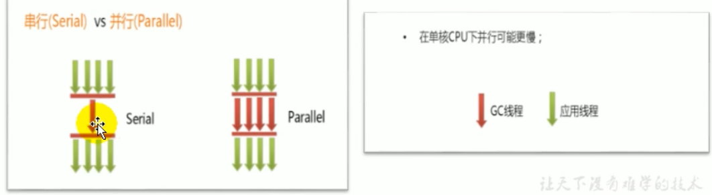

# JVM上篇

## 01. JVM与Java体系结构

### 2. 面向人群和参考书目

> 《深入理解Java虚拟机-周志明-第三版》

### 3. Java及JVM简介


> `Java虚拟机平台上可以运行非Java语言编写的程序`
>
> `Java不是最强大的语言，但JVM是最强大的虚拟机`
>
> `Java平台上的多语言混合秉承正成为主流，因为各种语言之间的交互不存在任何困难，就像使用自己语言的原生API一样方便，因为他们最终都运行在一个虚拟机上。`


### 4. Java发展的重大事件

### 5. 虚拟机和Java虚拟机

> 虚拟机的分类：
>
> - 虚拟机可以分为系统虚拟机和程序虚拟机
>
> - VMware就属于系统虚拟机，他们完全是对物理计算机的仿真
>
> - 程序虚拟机的典型代表就是Java虚拟机，它专门为执行单个计算机程序而设计
>
> Java虚拟机的作用：`Java虚拟机就是二进制字节码的运行环境`
>
> Java虚拟机的特点：`一次编译，到处运行`。`自动内存管理`。`自动垃圾回收功能`。
>
> `JVM是运行在操作系统之上的，它与硬件没有直接交互`


### 6. JVM的整体结构

> 运行时数据区哪些是线程共享的，哪些是线程独占的？
>
> - 线程共享：方法区 堆，
>
> - 线程独占：Java栈、本地方法栈、程序计数器
>
> 执行引擎包含几个部分：
>
> - 解释器
> - JIT(即时编译器/后端编译器)   ps:前端编译器是编译.java文件为.class文件的编译器
> - 垃圾回收器


### 7. Java代码执行流程


### 8. JVM的架构模型

> JVM的架构模型：
>
> - 基于`栈式架构`的特点
>   - 设计和实现更简单，适用于资源受限的系统
>   - 避开了寄存器的分配难题，使用零地址指令方式分配
>   - 指令流中的指令大部分是零地址指令，其执行过程依赖于操作栈。指令集更小，编译器容易实现
>   - 不需要硬件支持，可以执行更好，更好的跨平台
> - 基于`寄存器架构`的特点
>   - 典型的应用是x86的二进制指令集
>   - 指令集架构则完全依赖硬件，可以执行差
>   - 性能优秀和执行更高效
>   - 花费更少的指令去完成一项操作
>   - 大部分情况下，基于寄存器架构的指令集往往都以一地址指令，二地址指令和三地址指令为主
>
> - 总结：由于跨平台性的设计(不同平台的CPU架构是不同的，所以不能设计为基于寄存器的)，`Java的指令都是根据栈来设计的`
> - 


> `javap`的使用：解析字节码文件
>
> ```
> dongbinyu@dongbinyudeMacBook-Pro binyu % javap -v StackStructTest.class
> Classfile /Users/dongbinyu/IdeaProjects/JVM_Study/out/production/chapter01/com/binyu/StackStructTest.class
>   Last modified 2023-1-12; size 474 bytes
>   MD5 checksum c2762b1b18991f78848d098f0378b2cc
>   Compiled from "StackStructTest.java"
> public class com.binyu.StackStructTest
>   minor version: 0
>   major version: 52
>   flags: ACC_PUBLIC, ACC_SUPER
> Constant pool:
>    #1 = Methodref          #3.#21         // java/lang/Object."<init>":()V
>    #2 = Class              #22            // com/binyu/StackStructTest
>    #3 = Class              #23            // java/lang/Object
>    #4 = Utf8               <init>
>    #5 = Utf8               ()V
>    #6 = Utf8               Code
>    #7 = Utf8               LineNumberTable
>    #8 = Utf8               LocalVariableTable
>    #9 = Utf8               this
>   #10 = Utf8               Lcom/binyu/StackStructTest;
>   #11 = Utf8               main
>   #12 = Utf8               ([Ljava/lang/String;)V
>   #13 = Utf8               args
>   #14 = Utf8               [Ljava/lang/String;
>   #15 = Utf8               i
>   #16 = Utf8               I
>   #17 = Utf8               j
>   #18 = Utf8               k
>   #19 = Utf8               SourceFile
>   #20 = Utf8               StackStructTest.java
>   #21 = NameAndType        #4:#5          // "<init>":()V
>   #22 = Utf8               com/binyu/StackStructTest
>   #23 = Utf8               java/lang/Object
> {
>   public com.binyu.StackStructTest();
>     descriptor: ()V
>     flags: ACC_PUBLIC
>     Code:
>       stack=1, locals=1, args_size=1
>          0: aload_0
>          1: invokespecial #1                  // Method java/lang/Object."<init>":()V
>          4: return
>       LineNumberTable:
>         line 3: 0
>       LocalVariableTable:
>         Start  Length  Slot  Name   Signature
>             0       5     0  this   Lcom/binyu/StackStructTest;
> 
>   public static void main(java.lang.String[]);
>     descriptor: ([Ljava/lang/String;)V
>     flags: ACC_PUBLIC, ACC_STATIC
>     Code:
>       stack=2, locals=4, args_size=1
>          0: iconst_2
>          1: istore_1
>          2: iconst_3
>          3: istore_2
>          4: iload_1
>          5: iload_2
>          6: iadd
>          7: istore_3
>          8: return
>       LineNumberTable:
>         line 5: 0
>         line 6: 2
>         line 7: 4
>         line 8: 8
>       LocalVariableTable:
>         Start  Length  Slot  Name   Signature
>             0       9     0  args   [Ljava/lang/String;
>             2       7     1     i   I
>             4       5     2     j   I
>             8       1     3     k   I
> }
> SourceFile: "StackStructTest.java"
> 
> ```
>
> 


### 9. JVM的生命周期

> JVM的生命周期：
>
> - 虚拟机的启动：是通过引导类加载器bootstrap class loader创建一个初始类来完成的，这个类是由虚拟机的具体实现指定的
> - 虚拟机的执行：
>   - 一个运行中的Java虚拟机有着一个清晰的任务：执行Java程序
>   - 程序开始执行他才运行，程序结束他就停止
>   - 执行一个所谓的Java程序的时候，真正执行的是一个叫做Java虚拟机的进程
> - 虚拟机的退出：
>   - 程序正常执行结束
>   - 程序在执行过程中遇到了异常或错误而异常终止
>   - 由于操作系统出现错误而导致Java虚拟机进程终止
>   - 某线程调用Runtime类或System类的exit方法，或Runtime类的halt方法，并且Java安全管理器也允许这次exit或halt操作
>   - JNI规范描述了用JNI Invocation API来加载或卸载Java虚拟机时，Java虚拟机退出情况

> `JPS`的使用：JPS是JDK提供的一个可以列出正在运行的Java虚拟机的进程信息的命令行工具
>
> ```
> dongbinyu@dongbinyudeMacBook-Pro JVM_Study % jps
> 2992 
> 3251 Jps
> 3245 Launcher
> 3246 StackStructTest
> ```
>
> 


### 10. JVM发展历程

> ###### 历史上出现的JVM:
>
> - Sun Classic VM:`世界上第一款商用的java虚拟机`。虚拟机内部只提供了解释器，程序执行慢。如果外挂了JIT即时编译器，就不能使用解释器了。那么全部用JIT即时编译器好吗？不好，会导致程序运行暂停时间过长。解释器就像步行，JIT就像要等待的公交车，上了车自然是JIT快，但是两者搭配使用才最好。
> - Exact VM
> - HotSpot VM：名称中的HotSpot指的是`热点代码探测技术`：通过计数器找到最具编译价值代码，触发`即时编译`或`栈上替换`；通过`编译器与解释器协同工作`，在`最优化的程序响应时间与最佳执行性能中取得平衡`
> - BEA的JRocket：专注于服务器端的应用
> - IBM的J9：号称世界上最快的虚拟机，在IBM设备中运行快
> - KVM和CDC/CLDC HotSpot 
> - Azul VM
> - Liquid VM
> - Apache Harmony
> - Microsoft JVM
> - Taobao JVM
> - Graal VM：Oracle未来的野心

## 02. 类加载子系统

### 2. 类加载器与类的加载过程


> ##### 类加载器的角色与作用：
>
> - 类加载器子系统负责从文件系统或者网络中`加载class文件`，class文件在文件开头有特定的文件标识cafebabe魔数
> - ClassLoader`只负责class文件的加载`，至于它是否可以运行，则由ExecutionEngine决定
> - `加载的类信息存放于一块称为方法区的内存空间`，除了类的信息外，方法区中还会存放运行时常量池的信息，可能还包括字符串字面量和数字常量
> - 


> 类的加载过程：
>
> - **加载Loading->链接Linking(验证Verification->准备Preparation->解析Resolution)->初始化Initialization**
>
> - `加载Loading`：
>
>   1. 通过一个类全限定名获取定义此类的二进制字节流
>   2. 将这个字节流所代表的静态存储结构转化为方法区的运行时数据结构
>   3. 在内存中生成一个代表这个类的java.lang.Class对象，作为方法区这个类的各种数据的访问入口
>
> - `链接Linking`:
>
>   - `验证Verify`:
>     - 目的在于确保class文件的字节流中包含信息符合当前虚拟机要求，保证被加载类的正确性，不会危害虚拟机自身安全。
>     - 主要包括四种验证，文件格式验证，元数据验证，字节码验证，符号引用验证。
>
>   - `准备(Prepare)`:
>     - 为类变量分配内存并且设置该类变量的默认初始值，即零值。
>     - 这里不包含用final修饰的static,因为final在编译的时候就会分配了，准备阶段会显式初始化
>     - 这里不会为实例变量分配初始化，类变量会分配在方法区中，而实例变量是会随着对象一起分配到Java堆中。
>
>   - `解析(Resolve)`:
>     - 将常量池内的符号引用转换为直接引用的过程。
>     - 事实上，解析操作往往会伴随着M在执行完初始化之后再执行。
>     - 符号引用就是一组符号来描述所引用的目标。符号引用的字面量形式明确定义在《java虚拟机规范》的class文件格式中。直接引用就是直接指向目标的指针、相对偏移量或一个间接定位到目标的句柄。
>     - 解析动作主要针对类或接口、字段、类方法、接口方法、方法类型等。对应常量池中的CONSTANT_Class_info,CONSTANT_Fieldref info,CONSTANT Methodref info
>
> - `初始化`：
>   - 初始化阶段就是执行类构造器方法<c11n1t>()的过程。
>   - 此方法不需定义，是javac编译器自动收集类中的所有类变量的赋值动作和静
>     态代码块中的语句合并而来。
>   - 构造器方法中指令按语句在源文件中出现的顺序执行。
>   - <c1init>()不同于类的构造器。（关联：构造器是虚拟机视角下的<init>())
>   - 若该类具有父类，JVM会保证子类的<clinit>()执行前，父类的<c1init>()
>     已经执行完毕。
>   - 虚拟机必须保证一个类的<c1init>()方法在多线程下被同步加锁。
>
> 


### 3. 类加载器分类

> **JVM类加载器的分类：**
>
> - `引导类加载器`和`自定义类加载器`。JVM规范将所有派生于抽象类ClassLoader的类加载器都划分为`自定义类加载器`。也就是说BootstrapClassLoader自成一类，其余类加载器成另一类。
>
> 这里的四种类加载器之间的关系是包含关系。不是上层下层，也不是子父类的继承关系。
>
> `sun.misc.Launcher是java虚拟机的入口应用`
>
> - 
> - 


> **类加载器是怎么编写的？**
>
> - Bootstrap是用C/C++编写的。
> - 其他的自定类加载器使用Java编写的。
>
> **虚拟机自带的加载器有哪些？**
>
> - 启动类加载器（`引导类加载器`，Bootstrap ClassLoader)
>   - 这个类加载使用C/C++语言实现的，嵌套在JM内部。
>   - 它用来加载Java的核心库(JAVA HOME/jre/Iib/rt.jar、re3 ource3.jar或sun.boot.class.path路径下的内容)，用于提供JVM自身需要的类
>   - 并不继承自java.lang.ClassLoader,没有父加载器。
>   - 加载扩展类和应用程序类加载器，并指定为他们的父类加载器。
>   - 出于安全考虑，Bootstrap,启动类加载器只加载包名为java、javax、sun等开头的类
>
> - `扩展类加载器`(Extension ClassLoader)》
>
>   - Java言缄写，由sun.misc.Launcher$ExtclassLoader实现。
>   - 派生于classLoader类
>   - 父类加载器为启动类加载器
>   - 从java.ext.dirs系统属性所指定的目录中加载类库，或从JDK的安
>     装目录的jre/1ib/ext子目录（扩展目录）下加载类库。如果用户创
>     建的JAR放在此目录下，也会自动由扩展类加载器加载。
>
> - 应用程序类加载器(`系统类加载器`，AppClassLoader)
>   - java语言编写，由sun.misc.Launcher$AppClassLoader实现
>   - 派生于classLoader类
>   - 父类加载器为扩展类加载器
>   - 它负责加载环境变量classpath.或系统属性java.class,path指
>     定路径下的类库
>   - 该类加载是程序中默认的类加载器，一般来说，Java应用的类都是由
>     它来完成加载
>   - 通过classLoader#getSystemclassLoader()方法可以获取到该
>     类加载器
>
> - ```java
>   public class ClassLoaderTest {
>       public static void main(String[] args) {
>           // 系统类加载器/应用类加载器
>           ClassLoader systemClassLoader = ClassLoader.getSystemClassLoader();
>           System.out.println(systemClassLoader);//sun.misc.Launcher$AppClassLoader@18b4aac2
>           // 拓展类加载器
>           ClassLoader extClassLoader = systemClassLoader.getParent();
>           System.out.println(extClassLoader);//sun.misc.Launcher$ExtClassLoader@1540e19d
>           // 引导类加载器
>           ClassLoader bootstrapClassLoader = extClassLoader.getParent();
>           System.out.println(bootstrapClassLoader);//null
>           // 用户自定义类加载器,默认使用系统类加载器
>           ClassLoader classLoader = ClassLoaderTest.class.getClassLoader();
>           System.out.println(classLoader);//sun.misc.Launcher$AppClassLoader@18b4aac2
>           //JDK系统核心类库是使用引导类加载器加载的
>           ClassLoader classLoader1 = String.class.getClassLoader();
>           System.out.println(classLoader1);//null
>           bootstrapClassLoader();
>           extClassLoader();
>           appClassLoader();
>       }
>       /**
>        * 启动类加载器的职责
>        */
>       public static void bootstrapClassLoader() {
>           String property = System.getProperty("sun.boot.class.path");
>           List<String> list = Arrays.asList(property.split(";"));
>           list.forEach((t) -> {
>               System.out.println("启动类加载器目录:" + t);
>           });
>       }
>   
>   
>       /**
>        * 扩展类加载器
>        */
>       public static void extClassLoader() {
>           String property = System.getProperty("java.ext.dirs");
>           List<String> list = Arrays.asList(property.split(";"));
>           list.forEach((t) -> {
>               System.out.println("扩展类加载器" + t);
>           });
>       }
>                                           
>       /**
>        * app 类加载器
>        */
>       public static void appClassLoader() {
>           String property = System.getProperty("java.class.path");
>           List<String> list = Arrays.asList(property.split(";"));
>           list.forEach((t) -> {
>               System.out.println("应用类加载器" + t);
>           });
>       }
>   }
>   
>   ```
>   


> **用户自定义类加载器：**
>
> - 在Java的口常应用程序开发中，类的加载几乎是由上述3种类加载器相互
>   配合执行的，在必要时，我们还可以自定义类加载器，来定制类的加载方
>   式。
> - 为什么要自定义类加载器？
>   - 隔离加载类
>   - 修改类加载的方式
>   - 扩展加载源
>   - 防止源码泄漏
>
> **用户自定义类加载器实现步骤：**
>
> 1. 开发人员`可以通过继承抽象类java.lang.ClassLoader类`的方式，实现
>    自己的类加载器，以满足一些特殊的需求
> 2. 在JDK1.2之前，在自定义类加载器时，总会去继承ClassLoader类并重
>    写loadclass()方法，从而实现自定义的类加载类，但是在JDK1.2之后
>    已不再建议用户去覆盖loadclass()方法，而是建议把`自定义的类加载逻
>    辑写在findClass()方法中`
> 3. 在编写自定义类加载器时，`如果没有太过于复杂的需求，可以直接继承
>    URLClassLoader类`，这样就可以避免自己去编写findclass()方法及
>    其获取字节码流的方式，使自定义类加载器编写更加简洁。


> **获取ClassLoader的方式：**
>
> - 方式一：获取当前类的classLoader
>   clazz.getclassLoader()
> - 方式二：获取当前线程上下文的classLoader
>   Thread.currentThread().getContextclassLoader()
> - 方式三：获取系统的classLoader
>   ClassLoader.getsystemclassLoader()
> - 方式四：获取调用者的classLoader
>   DriverManager.getCallerclassLoader()

### 5. 双亲委派机制

> `Java虚拟机对class文件采用的是按需加载的方式`，也就是说当需要使用该类时才会将它的class文件加载到内存生成class对象。而且加载某个类的class文件时，Java虚拟机采用的是`双亲委派模式`，即`把请求交由父类处理`，它是一种任务委派模式。
>
> **双亲委派机制是什么？**
>
> 1. 如果一个类加载器收到了类加载请求，它并不会自己先去加载，而是把这个请求委托给父类的加载器去执行
> 2. 如果父类加载器还存在其父类加载器，则进一步向上委托，依次递归，请求最终将到达顶层的启动类加载器：
> 3. 如果父类加载器可以完成类加载任务，就成功返回，倘若父类加载器无法完成此加载任务，子加载器才会尝试自己去加载，这就是双亲委派模式。
>
> **双亲委派机制的优势：**
>
> - 避免类的重复加载
> - 保护程序安全，防止核心API被篡改
>
> **沙箱安全机制：**
>
> - 自定义String类，但是在加载自定义String类的时候会率先使用引导类加载器加载，而引导类加载器在加载的过程中会先加载jdk自带的文件(rt.jar包java\lang\String.class),报错信息说没有main方法就是因为加载的是rt,jar包中的String类。这样可以保证对java核心源代码的保护，这就是沙箱安全机制。


### 6. 其他

> **在JVM中表示两个class对象是否为同一个类存在两个必要条件：**
>
> - 类的完整类名必须一致，包括包名。
> - 加载这个类的c1 assLoader(指classLoader实例对象)必须相同。
>
> JVM必须知道一个类型是由启动加载器加载的还是由用户类加载器加载的。如果一个类型是由用户类加载器加载的，那么`JVM会将这个类加载器的一个引用作为类型信息的一部分保存在方法区中`。当解
> 析一个类型到另一个类型的引用的时候，JVM需要保证这两个类型的类加载器是相同的。
>
> **Java程序对类的使用方式分为：主动使用和被动使用。**
>
> - 主动使用，又分为七种情况：
>
>   - 创建类的实例
>
>   - 访问某个类或接口的静态变量，或者对该静态变量赋值
>
>   - 调用类的静态方法
>
>   - 反射（比如：Class.forName("com.atguigu.Test"))
>
>   - 初始化一个类的子类
>
>   - Java虚拟机启动时被标明为启动类的类
>
>   - JDK7开始提供的动态语言支持：
>     java.lang.invoke.MethodHandle实例的解析结果REF getstatic、REF putStatic、REF invokeStatic句柄对应的类没有初始化，则初始化
>
> - 除了以上七种情况，其他使用Java类的方式都被看作是对类的被动使用，
>   都不会导致类的初始化。

## 03. 运行时数据区概述及线程

### 1. 概述

> 每个线程：程序计数器、虚拟机栈、本地方法栈
>
> 线程间共享：堆、堆外内存/非堆（永久代或元空间：是方法区落地的实现、JIT编译出的代码缓存）
>
> 一个JVM实例对应一个Runtime实例，Runtime对象相当于运行时数据区


### 2. 线程

> - 线程是一个程序里的运行单元。VM允许一个应用有多个线程并行的
>   执行。
> - 在Hotspot JVM.里，每个线程都与操作系统的本地线程直接映射。
>   - 当一个Java线程准备好执行以后，此时一个操作系统的本地线程也同时创建。Java线程执行终止后，本地线程也会回收。
> - 操作系统负责所有线程的安排调度到任何一个可用的CPU上。一旦本地线程初始化成功，它就会调用Java线程中的run()方法。


## 04. 程序计数器/PC寄存器

### 1. 介绍

> **程序计数器：**用于存储下一条指令的地址。没有GC也没有OOM异常


### 2. 举例说明


### 3. 两个常见的问题

> 1. 使用PC寄存器存储字节码指令地址有什么用呢？为什么使用PC寄存器记录当前线程的执行地址呢?
>    - 因为CPU需要不停的切换各个线程，这时候切换回来以后，就得知道接着从哪开始继续执行。JVM的字节码解释器就需要通过改变PC寄存器的值来明确下一条应该执行什么样的字节码指令。
> 2. PC寄存器为什么会被设定为线程私有？
>    - 我们都知道所谓的多线程在一个特定的时间段内只会执行其中某一个线程的方法，CPU会不停地做任务切换，这样必然导致经常中断或恢复，如何保证分毫无差呢？为了能够准确地记录各个线程正在执行的当前字节码指令地址，最好的办法自然是为每一个线程都分配一个PC寄存器，这样一来各个线程之间便可以进行独立计算，从而不会出现相互干扰的情况。由于CPU时间片轮限制，众多线程在并发执行过程中，任何一个确定的时刻，一个处理器或者多核处理器中的一个内核，只会执行某个线程中的一条指令。这样必然导致经常中断或恢复，如何保证分毫无差呢？每个线程在创建后，都会产生自己的程序计数器和栈帧，程序计数器在各个线程之间互不影响。
>
> 简单说就是Java是多线程的，线程并发时CPU会切换线程，就需要记录现场以便切换回来时继续运行。

## 05. 虚拟机栈

### 1. 虚拟机栈概述

> **Java虚拟机栈是什么？**
>
> - Java虚拟机栈(Java Virtual Machine Stack),早期也叫Java栈。每个线程在创建时都会创建一个虚拟机栈，其内部保存一个个的`栈帧`(Stack Frame),对应着一次次的Java方法调用。
>
> - 是线程私有的
>
> - 生命周期和线程一致。
> - 主管Java程序的运行，它保存方法的局部变量、部分结果，并参与方法的调用和返回。堆管存储。
>
> **栈的特点（优点）:**
>
> - 栈是一种快速有效的分配存储方式，访问速度仅次于程序计数器。
> - JVM直接对Java栈的操作只有两个：
>   - 每个方法执行，伴随着进栈（入栈、压栈）
>   - 执行结束后的出栈工作
> - 对于栈来说不存在垃圾回收问题，存在OOM异常
>
> **虚拟机规范中的StackOverflowError和OutOfMemoryError:**
>
> - `当某次线程运行计算时，需要占用的 Java 虚拟机栈（Java Virtual Machine Stack）大小，也就是 Java 线程栈大小，**超过规定大小**时，抛出 StackOverflowError`
> - `如果 Java 虚拟机栈大小可以动态扩容，发生扩容时发现内存不足，或者新建Java 虚拟机栈时发现内存不足，抛出 OutOfMemoryError`
> - 当所需要的堆（heap）内存大小不足时，抛出 OutOfMemoryError
> - 当方法区（Method Area）大小不够分配时，抛出 OutOfMemoryError
> - 当创建一个类或者接口时，运行时常量区剩余大小不够时，抛出 OutOfMemoryError
> - 本地方法栈（Native Method Stack）大小不足时，抛出 StackOverflowError
> - 本地方法栈（Native Method Stack）扩容时发现内存不足，或者新建本地方法栈发现内存不足，抛出 OutOfMemoryError
>
> **演示一下StackOverflowError：**
>
> ```java
> public class StackErrorTest {
>     public static void main(String[] args) {
>         main(args);
>     }
> }
> ```
>
> ```
> Exception in thread "main" java.lang.StackOverflowError
> 	at com.binyu.StackErrorTest.main(StackErrorTest.java:5)
> 	at com.binyu.StackErrorTest.main(StackErrorTest.java:5)
> 	at com.binyu.StackErrorTest.main(StackErrorTest.java:5)
> 	at com.binyu.StackErrorTest.main(StackErrorTest.java:5)
> ```
>  


> -Xss*size*
>
> Sets the thread stack size (in bytes). Append the letter `k` or `K` to indicate KB, `m` or `M` to indicate MB, `g` or `G` to indicate GB. The default value depends on the platform:
>
> - Linux/ARM (32-bit): 320 KB
> - Linux/i386 (32-bit): 320 KB
> - Linux/x64 (64-bit): 1024 KB
> - OS X (64-bit): 1024 KB
> - Oracle Solaris/i386 (32-bit): 320 KB
> - Oracle Solaris/x64 (64-bit): 1024 KB
>
> The following examples set the thread stack size to 1024 KB in different units:
>
> ```
> -Xss1m
> -Xss1024k
> -Xss1048576
> ```
>
> This option is equivalent to `-XX:ThreadStackSize`.

### 2. 栈的存储单位

>在一条活动线程中，一个时间点上，只会有一个活动的栈帧。即只有当前正在执行的方法的栈帧（栈顶栈帧）是有效的，这个栈帧被称为`当前栈帧`(Current Frame),与当前栈帧相对应的方法就是`当前方法`(Current Method),定义这个方法的类就是`当前类`(Current Class)
>
>`不同线程中所包含的栈帧是不允许存在相互引用的`，即不可能在一个栈帧之中引用另外一个线程的栈帧。
>
>Java方法有两种返回函数的方式，一种是正常的函数返回，使用return指令；另外一种是抛出异常。`不管使用哪种方式，都会导致栈帧被弹出`。


### 3. 局部变量表

> **局部变量表：**
>
> - `定义为一个数字数组`，主要用于存储方法参数和定义在方法体内的局部变量这些数据类型包括各类基本数据类型、对象引用(reference),以及returnAddress类型。
> - 由于局部变量表是建立在线程的栈上，是线程的私有数据，因此`不存在线程安全问题`
> - `局部变量表所需的容量大小是在编译期确定下来的`，并保存在方法的Code属性的maximum local variables数据项中。在方法运行期间是不会改变局部变量表的大小的。
> - 局部变量表最基本的存储单元是`Slot（变量槽）`
>   - `32位以内的类型只占用一个slot（包括returnAddress类型、引用类型），64位的类型（long和double）占用两个slot`
>   - JVM会为局部变量表中的`每一个Slot都分配一个访问素引`，通过这个素引即可成功访
>     问到局部变量表中指定的局部变量值
>   - 当一个实例方法被调用的时候，它的方法参数和方法体内部定义的局部变量将会`按顺
>     序被复制`到局部变量表中的每一个S1ot上
>   - `如果需要访问局部变量表中一个64b1t的局部变量值时，只需要使用前一个素引即可`。（比
>     如：访问long或double类型变量)
>   - 如果当前帧是由构造方法或者实例方法创建的那么`该对象引用this将会存放在index为0的slot处`，其余的参数按照参数表顺序继续排列。
>   - `栈帧中的局部变量表中的槽位是可以重用的`，如果一个局部变量过了其作用域
>     那么在其作用域之后申明的新的局部变量就很有可能会复用过期局部变量的槽位，从而达到`节省资源`的目的。


> **静态变量与局部变量的对比：**
>
> - 类变量有两次初始化
>   - 链接Linking中的准备Prepare阶段：执行默认初始化，设置为零值
>   - 初始化Initialization阶段：代码定义的初始化
> - 局部变量必须要手动初始化
> 


> 补充说明：
>
> - 在栈帧中，与性能调优关系最为密切的部分就是前面提到的局部变量表。
>   在方法执行时，虚拟机使用局部变量表完成方法的传递。
> - 局部变量表中的变量也是重要的垃圾回收根节点，只要被局部变量表中直
>   接或间接引用的对象都不会被回收。

### 4. 操作数栈Operand Stack

> **操作数栈：**
>
> - `方法执行过程中，根据字节码指令，进行入栈或出栈`
>   - 某些字节码指令将值压入操作数栈，其余的字节码指令将操作数取出栈。使用它们后再把结果压入栈。
>   - 比如：执行复制、交换、求和等操作
> - 操作数栈主要`用于保存计算过程的中间结果，同时作为计算过程中变量临时存储空间`
> - 操作数栈就是JVM执行引擎的一个工作区，当一个方法刚开始执行的时候，一个新的栈帧也会随之被创建出来，这个方法的操作数栈是空的。
> - 每一个操作数栈都会拥有一个明确的`栈深度`用于存储数值，其所需的`最大深度在编译期就定义好了`，保存在方法的code属性中，为max stack的值。
> - 栈中的任何一个元素都是可以任意的Java数据类型。
>   - 32bit的类型占用一个栈单位深度
>   - 64bit的类型占用两个栈单位深度
> - 操作数栈并非采用访问索引的方式来进行数据访问的，而是只能通过标准的`入栈(push)和出栈(pop)`操作来完成一次数据访问。
> - `如果被调用的方法带有返回值的话，其返回值将会被压入当前栈帧的操作数栈中`，并更新PC寄存器中下一条需要执行的字节码指令。
> - 操作数栈中元素的数据类型必须与字节码指令的序列严格匹配，这由编译器在编译器期间进行验证，同时在类加载过程中的类检验阶段的数据流分析阶段要再次验证。
> - 另外，我们说Java虚拟机的`解释引擎是基于栈的执行引擎，其中的栈指的
>   就是操作数栈`。

### 5. 代码追踪

> byte、short、char、boolean都以int型来保存
>
> bipush是指byte的int的push 

### 6. 栈顶缓存技术


### 7. 动态链接

> **动态链接：指向运行时常量池的方法引用**
>
> - 每一个栈帧内部都包含一个指向运行时常量池中该栈帧所属方法的引用。包含这个引用的目的就是为了支持当前方法的代码能够实现`动态链接`(Dynamic Linking)。比如：invokedynamic指令
>
> - 在Java源文件被编译到字节码文件中时，所有的变量和方法引用都作为符号引用(Symbolic Reference)保存在class文件的常量池里。比如：描述一个方法调用了另外的其他方法时，就是通过常量池中指向方法的符号引用来表示的，那么`动态链接的作用就是为了将这些符号引用转换为调用方法的直接引用`。
> - 

### 8. 方法的调用：解析与分派【听不懂】

> 在JVM中，将符号引用转换为调用方法的直接引用与方法的绑定机制相关。
>
> - 静态链接：
>   当一个字节码文件被装载进JM内部时，如果`被调用的目标方法在编译期可知`，且运行期保持不变时。这种情况下将调用方法的符号引用转换为直接引用的过程称之为静态链接。
> - 动态链接：
>   如果`被调用的方法在编译期无法被确定下来`，也就是说，只能够在程序运行期将调用方法的符号引用转换为直接引用，由于这种引用转换过程具备动态性，因此也就被称之为动态链接。
>
> 对应的方法的绑定机制为：早期绑定(Early Binding)和晚期绑定(Late Binding)。`绑定是一个字段、方法或者类在符号引用被替换为直接引用的过程`，这仅仅发生一次。
>
> - 早期绑定：
>   早期绑定就是指`被调用的目标方法如果在编译期可知`，且运行期保持不变时，即可将这个方法与所属的类型进行绑定，这样一来，由于明确了被调用的目标方法究竟是哪一个，因此也就可以使用静态链接的方式将符号引用转换为直接引用。
> - 晚期绑定：
>   如果`被调用的方法在编译期无法被确定下来`，只能够在程序运行期根据实际的类型绑定相关的方法，这种绑定方式也就被称之为晚期绑定。
>
> Java既有早期绑定又有晚期绑定
>
> Java中任何一个普通的方法其实都具备虚函数的特征，它们相当于c++语言中的虚函数(c++中则需要使用关键字virtual来显式定义)。如果在Java程序中不希望某个方法拥有虚函数的特征时，则可以使用关键字final来标记这个方法。
>
> `非虚方法`：
>
> - 如果方法在编译期就确定了具体的调用版本，这个版本在运行时是不可变的。这样的方法称为非虚方法。
>
> - `静态方法、私有方法、final方法、实例构造器、父类方法都是非虚方法`。他们有一个特点：都不能实现多态
>
> - 其他方法称为虚方法。
>
>   
>
> `子类对象的多态性的使用前提：①类的继承关系②方法的重写`
>
> **虚拟机中提供了以下几条方法调用指令：**
>
> - 普通调用指令：
>   1. invokestatic:调用静态方法，解析阶段确定唯一方法版本
>   2. invokespecial:调用<init>方法、私有及父类方法，解析阶段确定唯一方法版本
>   3. invokevirtual:调用所有虚方法
>   4. invokeinterface:调用接口方法
> - 动态调用指令：
>   1. invokedynamic:动态解析出需要调用的方法，
>
> 然后执行前四条指令固化在虚拟机内部，方法的调用执行不可人为千预，而invokedynamic指令则支持由用户确定方法版本。其中`invokestatic指令和invokespecial指令调用的方法称为非虚方法，其余的(final修饰的除外)称为虚方法`。
>
> **虚方法表：**在类的方法区
>
> - 在面向对象的编程中，会很频繁的使用到动态分派(invokedynamic)，如果在每次动态分派的过程中都要重新在类的方法元数据中搜索合适的目标的话就可能影响到执行效率。因此，为了提高性能，`JVM采用在类的方法区建立一个虚方法表`(virtual method table)(非虚方法不会出现在表中)来实现。`使用索引表来代替查找`。
>
> - `每个类中都有一个虚方法表，表中存放着各个方法的实际入口`。
> - 那么虚方法表什么时候被创建？
>   - `虚方法表会在类加载的链接阶段被创建并开始初始化`，类的变量初始值准备完
>     成之后，JVM会把该类的虚方法表也初始化完毕。
> - 


> **动态类型语言和静态类型语言：**
>
> - `对类型的检查是在编译期还是在运行期，如果是编译期就是静态类型语言，如果是运行期就是动态类型语言。`
> - `静态类型语言是判断变量自身的类型信息；动态类型是判断变量值的类型信息，变量没有类型信息，变量值才有类型信息`

### 9. 方法返回地址

> **方法返回地址：**
>
> - `存放调用该方法的pc寄存器的值`。
>
> - 一个方法的结束，有两种方式：
>   - 1.正常执行完成,既正常完成出口
>     - 字节码指令有：ireturn、lreturn、freturn、dreturn 、areturn、return
>   - 2.出现未处理的异常，非正常退出
>   - 无论通过哪种方式退出，在方法退出后都返回到该方法被调用的位置。方法正常退出时，`调用者的PC寄存器的值作为返回地址`，即调用该方法的指令的下一条指令的地址。而`通过异常退出的，返回地址是要通过异常表来确定`，栈帧中一般不会保存这部分信息。
>   - 正常完成出口和异常完成出口的区别在于：`通过异常完成出口退出的不会给他的上层调用者产生任何的返回值`。

### 10. 一些附加信息

略

### 11. 栈的相关面试题

> - 虚拟机栈会产生StackOverflowError，不会产生GC
> - 分配的栈空间不是越大越好，因为内存资源是有限的，会限制线程数 
> - 内部产生，内部消亡的局部变量就是线程安全的；否则线程不安全，发生逃逸。
> - 

 

## 06. 本地方法接口

> 本地方法：
>
> - native method,即java调用非java代码（C/C++）
> - 为什么要使用native method
>   - 与java环境外交互
>   - 与操作系统交互
>   - JVM是C写的

## 07. 本地方法栈

> **本地方法栈：**
>
> - 用于管理本地方法的调用

## 08. 堆

### 1. 堆的核心概述

> **堆：**
>
> - 在启动时被创建，空间大小也就确定了
> - 物理上可以不连续，逻辑上被视为连续的
> - 所有线程共享java堆，在这里还可以划分线程私有的缓冲区（TLAB）
> - 几乎所有的对象实例以及数组都应该在运行时分配在堆上
> - 方法结束后，堆中的对象不会马上移除，仅仅在垃圾回收时才被移除
> - 堆是GC的重点区域
> - 频繁GC会影响用户线程的执行，成为性能的瓶颈
> - 


> `-XX:+PrintGCDetails`
>
> ```
> // jdk1.8内存结构中的方法区实现由永久代变为元空间
> Heap
>  PSYoungGen      total 2560K, used 1406K [0x00000007bfd00000, 0x00000007c0000000, 0x00000007c0000000)
>   eden space 2048K, 68% used [0x00000007bfd00000,0x00000007bfe5faa8,0x00000007bff00000)
>   from space 512K, 0% used [0x00000007bff80000,0x00000007bff80000,0x00000007c0000000)
>   to   space 512K, 0% used [0x00000007bff00000,0x00000007bff00000,0x00000007bff80000)
>  ParOldGen       total 7168K, used 0K [0x00000007bf600000, 0x00000007bfd00000, 0x00000007bfd00000)
>   object space 7168K, 0% used [0x00000007bf600000,0x00000007bf600000,0x00000007bfd00000)
>  Metaspace       used 3076K, capacity 4496K, committed 4864K, reserved 1056768K
>   class space    used 341K, capacity 388K, committed 512K, reserved 1048576K
> ```
>
> 

### 2. 设置堆内存大小与OOM

> - Java堆区用于存储Java对象实例，那么堆的大小在JM启动时就已经设定好了，大
>   家可以通过选项"-Xmx"和"-Xms"来进行设置。
>
>   - -Xms用于表示堆区的起始内存，等价于-XX:InitialHeapsize
>
>   - -Xmx"则用于表示堆区的最大内存，等价于-XX:MaxHeapsize
>
> - 一旦堆区中的内存大小超过“-Xmx"所指定的最大内存时，将会抛出
>   OutofMemoryError异常。
> - `通常会将-Xms和-Xmx两个参数配置相同的值，其目的是为了能够在java垃圾回
>   收机制清理完堆区后不需要重新分隔计算堆区的大小`，从而提高性能。
> - 默认情况下，初始内存大小：物理电脑内存大小/64
>   最大内存大小：物理电脑内存大小/4


> - `jps`  // 查看运行的java进程
> - `jstat -gc 进程号` // 查看某进程内存使用情况
>
> ```
> dongbinyu@dongbinyudeMacBook-Pro binyu % jps            
> 2004 
> 3751 Launcher
> 3752 HeapSpaceInitial
> 3757 Jps
> dongbinyu@dongbinyudeMacBook-Pro binyu % jstat -gc 3752
>  S0C    S1C    S0U    S1U      EC       EU        OC         OU       MC     MU    CCSC   CCSU   YGC     YGCT    FGC    FGCT     GCT   
> 25600.0 25600.0  0.0    0.0   153600.0  9216.1   409600.0     0.0     4480.0 779.8  384.0   76.0       0    0.000   0      0.000    0.000
> 
> 
> ```
>
> 由于Suriver0区和Suriver1区只有一个有数据（因为复制算法），所以计算可用堆空间时略去了一个幸存者区的大小。设置-Xms600M -Xmx600M时,代码如下：
>
> ```java
> public class HeapSpaceInitial {
>     public static void main(String[] args) {
>         long initialMemory = Runtime.getRuntime().totalMemory();
>         System.out.println(initialMemory/1024/1024+"M");//575M
>         long maxMemory = Runtime.getRuntime().maxMemory();
>         System.out.println(maxMemory/1024/1024+"M");//575M
>         try {
>             Thread.sleep(100000);
>         } catch (InterruptedException e) {
>             throw new RuntimeException(e);
>         }
>     }
> }
> ```
>
> 


> **OOM演示：**
>
> ```java
> public class OutOfMemoryTest {
>     public static void main(String[] args) {
>         ArrayList<char[]> list=new ArrayList<>();
>         while(true){
>             list.add(new char[1024*1024]);
>         }
>     }
> 
> }
> ```
>
> ```
> Exception in thread "main" java.lang.OutOfMemoryError: Java heap space
> 	at com.binyu.OutOfMemoryTest.main(OutOfMemoryTest.java:9)
> ```
>
> 


### 3. 年轻代与老年代

设置新生代与老年代的比例（默认是1:2）：`-XX:NewRatio=2`

设置伊甸园区和幸存者区比例（官方说默认是8:1:1，但是实际观察是默认6:1:1，如果显式指定的话，按指定的值为准）:`-XX:SurviverRatio=8`

关闭自适应的内存分配策略：`-XX：-UseAdaptivesSizePolicy`

设置新生代的内存大小(一般不设置)：`-Xmn`

> 几乎所有的java对象都是在伊甸园区被new出来的
>
> 绝大部分的java对象的销毁都是在新生代进行，新生代中80%的对象都是朝生夕死的


### 4. 图解对象分配过程

> 幸存者区满了不会触发YGC/MinorGC.
>
> 伊甸园区满了会触发YGC/MinorGC,附带着垃圾回收幸存者区
>
> 有的对象很大，一上来就被分配到老年代
>
> 幸存者区谁空谁是to区
>
> 垃圾回收频繁在新生代收集、很少在老年代收集、几乎不在方法区收集

幸存者区到老年区的提升阈值(默认为15,不能超过15)：`-XX：MaxTenuringThreshold=15`


### 5. Minor GC、Major GC、Full GC

> **GC分类:**
>
> - 部分收集（Partial GC）：
>
>   - 新生代收集：伊甸园区满触发YoungGC/Minor GC,进行伊甸园区和幸存者区垃圾回收
>
>   - 老年代收集：只是老年代满进行的是MajorGC/OldGC，目前只有CMS GC才有单独收集老年代的行为
>   - 混合收集：新生代和部分老年代混合的收集是MixedGC,目前只有G1 GC会有这种行为
>
> - 整堆收集（Full GC）
>
>   - 收集整个java堆和方法区的垃圾


> MajorGC和FullGC的STW(stop the world暂停时间)是MinorGC的十倍以上
>
> 开发调优中要尽量避免FullGC


### 6. 堆空间分代思想

> 大部分对象是朝生夕死的，分代可以优化GC性能


### 7. 内存分配策略

> **内存分配策略：**
>
> - 动态对象年龄判断
>   - 如果Survivor区中相同年龄的所有对象大小的总和大于Survivor空间的一半，年龄大于或等于该年龄的对象可以直接进入老年代，无须等到MaxTenuringThreshold中要求的年龄。
>     空间分配担保
> - -XX:HandlePromotionFailure

在发生**Minor GC**之前，虚拟机会检查**老年代最大可用的连续空间**是否**大于新生代所有对象的总空间**，

　　　　如果大于，则此次**Minor GC是安全的**

　　　　如果小于，则虚拟机会查看**HandlePromotionFailure**设置值是否允许担保失败。如果HandlePromotionFailure=true，那么会继续检查老年代最大可用连续空间是否大于**历次晋升到老年代的对象的平均大小**，如果大于，则尝试进行一次Minor GC，但这次Minor GC依然是有风险的；如果小于或者HandlePromotionFailure=false，则改为进行一次Full GC。

### 8. 为对象分配内存：TLAB

>**为什么有TLAB(Thread Local Allocation Buffer)?**
>
>- 堆区是线程共享区域，任何线程都可以访问到堆区中的共享数据
>- 由于对象实例的创建在JVM中非常频繁，因此在并发环境下从堆区中划分内存空间是线程不安全的
>- 为避免多个线程操作同一地址，需要使用加锁等机制，进而影响分配速度。
>
>**什么是TLAB?**
>
>- 从内存模型而不是垃圾收集的角度，对Eden区域继续进行划分，JVM为
>  每个线程分配了一个私有缓存区域，它包含在Eden空间内。
>- 多线程同时分配内存时，使用T工AB可以避免一系列的非线程安全问题，
>  同时还能够提升内存分配的吞吐量，因此我们可以将这种内存分配方式称
>   之为快速分配策略。
>- 据我所知所有OpenJDK衍生出来的JVM都提供了TLB的设计。
>
>TLAB的再说明：
>
>- 尽管不是所有的对象实例都能够在TLAB中成功分配内存，但JVM确实是将TLAB作为
>  内存分配的首选。
>- 在程序中，开发人员可以通过选项“-XX:U3eT工AB”设置是否开启TLAB空间。默认情况下，TLAB空间的内存非常小，仅占有整个Eden空间的1号，当然我们可以通过选-XX:TLABWasteTargetPercent设置TLAB空间所占用Eden空间的百分比大小。
>- 一旦对象在TLAB空间分配内存失败时，JM就会尝试着通过使用加锁机制确保数据操作的原子性，从而直接在Eden空间中分配内存。
>- 


### 9. 小结-堆空间的参数设置

> JDK7之后空间分配担保的参数就失效了，空间分配担保就是为了省一次FullGC


### 10. 堆是分配对象的唯一选择吗？

> 堆是分配对象存储的唯一选择吗？
>
> - 在《深入理解Java虚拟机》中关于Java堆内存有这样一段描述：`随着JIT编译期的发展与逃逸分析技术逐渐成熟，栈上分配、标量替换优化技术将会导致一些微妙的变化`，所有的对象都分配到堆上也渐渐变得不那么“绝对”了。
>
> - 在Java虚拟机中，对象是在Java堆中分配内存的，这是一个普遍的常识。但是，有一种特殊情况，那就是`如果经过逃逸分析(Es cape Analysis)后发现，一个对象并没有逃逸出方法的话，那么就可能被优化成栈上分配`。这样就无需在堆上分配内存，也无须进行垃圾回收了。这也是最常见的堆外存储技术。
> - 此外，前面提到的基于OpenJDK深度定制的`TaoBaoVM`,.其中创新GCIH(Gc invisible heap)技术实现off-heap,`将生命周期较长的Java对象从heap中移至heap外，并且GC不能管理GCIH内部的Java对象，以此达到降低Gc的回收频率和提升Gc的回收效率的目的`。
>
> 
>
> **逃逸分析概述:**
>
> - 如何将堆上的对象分配到栈，需要使用逃逸分析手段。
> - 这是一种可以有效减少J妇程序中同步负载和内存堆分配压力的跨函数全局数据流分析算法。
> - 通过逃逸分析，Java Hotspots编译器能够分析出一个新的对象的引用的使用范围从而决定是否要将这个对象分配到堆上。
> - 逃逸分析的基本行为就是分析对象动态作用域：
>   - 当一个对象在方法中被定义后，对象只在方法内部使用，则认为没有发生逃逸。
>   - 当一个对象在方法中被定义后，它被外部方法所引用，则认为发生逃逸。例如作为调用参数传递到其他地方中。
>
> 
>
> **逃逸分析参数设置：**
>
> - 在JDK6u23版本之后，HotSpot中默认就已经开启了逃逸分析。
>
> - 如果使用的是较早的版本，开发人员则可以通过：
>
>   - 选项`-XX:+DoEscapeAnalysis`显式开启逃逸分析
>
>   - 通过选项`-XX:+PrintEscapeAnalysis`查看逃逸分析的筛选结果。
>
> 
>
> **逃逸分析告诉我们的结论：**
>
> - 开发中能使用局部变量的，就不要使用在方法外定义，
>
> 
>
> **使用逃逸分析，编译器可以对代码做如下优化：**
>
> - `栈上分配`。将堆分配转化为栈分配。如果一个对象在子程序中被分配，要使指向该对象的指针永远不会逃逸，对象可能是栈分配的候选，而不是堆分配。
>
> - `同步省略`。如果一个对象被发现只能从一个线程被访问到，那么对于这个对象的操作可以不考虑同步。即`锁消除`,字节码中还是能看到monitorenter和monitorexit，但是运行时有锁消除。
>
> - 分离对象或`标量替换`。有的对象可能不需要作为一个连续的内存结构存在也可以被访问到，那么对象的部分（或全部）可以不存储在内存，而是存储在CPU寄存器中。
>
>   - `标量`:指无法再分解成更小的数据的数据，如java基本类型、String等
>   - `聚合量`:可以再拆分的数据，如User.class
>   - `-XX:+EliminateAllocations`：开启标量替换（默认打开），允许将对象打算分配到栈上
>
>   


## 09. 方法区

### 1. 栈、堆、方法区的交互关系


### 2. 方法区的理解

> 元空间使用本地内存，不容易出现OOM：Metaspace;永久代使用JVM内存。这是两者最主要的区别。

### 3. 设置方法区大小与OOM

> **jinfo的使用:**
>
> - `jinfo pid` . 即不加参数，jinfo后面直接跟进程id。会同时打印jvm命令行参数和java system properties
> - `jinfo -flags pid `. 只打印jvm命令行参数
> - `jinfo -sysprops pid` . 只打印java system properties


> **方法区大小的设置：方法区的大小不必是固定的，JVM可以根据应用的需要动态调整。**
>
> - JDK7及以前：
>
>   - `XX:PermSize`来设置永久代初始分配空间。默认值是20.75M
>
>   - `-XX:MaxPermsize`来设定永久代最大可分配空间。32位机器默认是4M,64位机器模式是
>     82T
>
>   - 当JM加载的类信息容量超过了这个值，会报异常`OutofMemoryError:PermGen
>     space`.
>
> - JDK8及以后
>
>   - 默认值依赖于平台。windows下，`-XX:MetaspaceSize`是2lM,
>     `XX:MaxMetaspacesize`的值是-1,即没有限制。
>   - 与永久代不同，如果不指定大小，默认情况下，虚拟机会耗尽所有的可用系统内存。
>     如果元数据区发生溢出，虚拟机一样会抛出异常`OutfMemoryError:Metaspace`
>   - -XX:MetaspaceSize:设置初始的元空间大小。对于一个64位的服务器端JVM来说，其默认的-XX:MetaspaceSize值为21MB。这就是初始的高水位线，一旦触及这个水位线，FullGC将会被触发并卸载没用的类（即这些类对应的类加载器不再存活）然后这个高水位线将会重置。新的高水位线的值取决于GC后释放了多少元空间。如果释放的空间不足，那么在不超过MaxMetaspacesize时，适当提高该值。如果释放空间过多，则适当降低该值。
>   - 如果初始化的高水位线设置过低，上述高水位线调整情况会发生很多次。通过垃圾回
>     收器的日志可以观察到F111GC多次调用。`为了避免频繁地GC,建议将
>     XX:Metaspacesize设置为一个相对较高的值`。
>
> **如何解决这些0OM?**【下篇细讲】
>
> 1. 要解决OOM异常或neap space的异常，一般的手段是首先通过内存映像分析工具(如Eclipse Memory Analyzer)对dump出来的堆转储快照进行分析，重点是确认内存中的对象是否是必要的，也就是要先分清楚到底是出现了内存泄漏(MemoryLeak)还是内存溢出(Memory Overf1low)。
> 2. 如果是内存泄漏，可进一步通过工具查看泄漏对象到GC Roots的引用链。于是就能找到泄漏对象是通过怎样的路径与GC Roots相关联并导致垃圾收集器无法自动回收它们的。掌握了泄漏对象的类型信息，以及GC Roots引用链的信息，就可以比较准确地定位出泄漏代码的位置。
> 3. 如果不存在内存泄漏，换句话说就是内存中的对象确实都还必须存活着，那就应当检查虚拟机的堆参数(-Xmx与-Xms),与机器物理内存对比看是否还可以调大，从代码上检查是否存在某些对象生命周期过长、持有状态时间过长的情况，尝试减少程序运行期的内存消耗。


### 4. 方法区的内部结构

> 方法区：
>
> - 存放类的信息（域信息和方法信息）、运行时常量池信息（不包括StringTable）、不包括静态变量、JIT代码缓存
> - `javap -v -p Xxx.class`
>
> 常量池：
>
> - 用于存放编译期生成的各种字面量和符号引用


### 6. 方法区的演进细节

> 永久代为什么要被元空间替换？
>
> - 为永久代设置空间大小很难确定
> - 为永久代进行调优很难
>
> StringTable为什么要调整？
>
> - 放在堆中更方便垃圾回收


### 7. 方法区的垃圾回收

> HotspotJVM还是有方法区的垃圾收集的，FullGC。但是费力不讨好，因为类的卸载条件是很苛刻的。


### 8. 总结


## 10. 对象的实例化内存布局与访问定位

### 1. 对象的实例化

> 【我觉得这里肯定是考点和难点，要重点突破】
>
> **创建对象的方式：**
>
> - new 
>   - 单例模式
>   - 建造者模式/工厂模式
> - Class的newInstance()：反射的方式，只能调用空参的构造器，权限必须是public
> - Constructor的newInstance(Xxx):反射的方式，可以调用无参或有参的构造器,对权限没有要求
> - 使用clone():不调用任何构造器，当前类需要实现Clonable接口，实现clone()
> - 使用反序列化：从文件中或网络中获取对象的二进制流
> - 第三方库Objenesis
>
> **创建对象的步骤：**
>
> 1. 判断对象对应的类是否被类加载器加载
>
> 2. 为对象分配内存
>    1. 如果内存规整————使用`指针碰撞`算法
>    2. 如果内存不规整————虚拟机需要维护一个`空闲列表`
>    3. 注：内存规不规整和具体垃圾收集器采用的垃圾回收算法有关
> 3. 处理并发安全问题
>    1. 采用CAS失败重试、区域加锁来保证更新的原子性
>    2. 每个线程预先分配一块TLAB————通过-XX:+UseTLAB参数来设定
> 4. 初始化分配到的空间
>    1. 默认初始化，保证对象实例字段不赋值可以直接使用
> 5. 设置对象对象头
> 6. 执行<init>进行初始化（从字节码指令来看包括显示初始化、代码块初始化、构造器初始化）

### 2. 对象的内存布局

> 对象的内存布局：
>
> - 对象头
>   - Mark word
>     - 哈希值
>     - GC分代年龄
>     - 锁状态标志
>     - 线程持有的锁
>     - 偏向线程ID
>     - 偏向时间戳
>   - Klass Pointer
>     - 指向方法区的类元数据，确定对象所属的类型
> - 对象体
>   - 对象真正有效的信息，包括代码中各种类型的字段（包括父类的字段）
> - 对齐填充


### 3. 对象的访问定位

> **对象的访问定位：**
>
> - 句柄访问：缺点是空间上有浪费，效率低，优点是当对象实例在堆中移动位置时，局部变量表的引用不会变（但是句柄池的到对象实例数据的指针引用变了啊，我不理解~）
> - 直接访问：空间节省，效率高
> - JVM规范中没有明确规定应该用哪种，Hotspot用的是直接访问


## 11. 直接内存/本地内存

> **直接内存：**
>
> - 不是虚拟机运行时数据区的一部分，也不是《Java虚拟机规范》中定义的
>   内存区域。
> - 直接内存是在Java堆外的、直接向系统申请的内存区间。
> - 来源于NIO,通过存在堆中的DirectByteBuffer操作Native内存
> - 通常，访问直接内存的速度会优于Java堆。即读写性能高。
>   - 因此出于性能考虑，读写频繁的场合可能会考虑使用直接内存。
>   - Java的NIo库允许Java程序使用直接内存，用于数据缓冲区
>   - 
> - 也可能导致OOM:Direct buffer memory异常
> - 由于直接内存在Java堆外，因此它的大小不会直接受限于-Xmx指定的最大
>   堆大小，但是系统内存是有限的，Java堆和直接内存的总和依然受限于操
>   作系统能给出的最大内存。
> - 缺点
>   - 分配回收成本较高
>   - 使用的是操作系统内存，不受JVM内存回收管理
> - 直接内存大小可以通过MaxDirectMemorysize设置
> - 如果不指定，默认与堆的最大值-Xmx参数值一致


> 演示直接内存分配
>
> ```java
> public class BufferTest {
>     private static final int SIZE=1024*1024*1024;
>     public static void main(String[] args) {
>         ByteBuffer byteBuffer=ByteBuffer.allocate(SIZE);
>         System.out.println("直接内存分配完毕，请求指示！");
>         Scanner scanner=new Scanner(System.in);
>         scanner.next();
>         System.out.println("直接内存开始释放");
>         byteBuffer=null;
>         System.gc();
>     }
> }
> ```
>
> 


> 演示OOM：Direct buffer memory
>
> ```java
> public class MaxDirectMemorySizeTest {
>     private static final long _1MB=1024*1024;
>     public static void main(String[] args) throws IllegalAccessException {
>         Field unsafeField = Unsafe.class.getDeclaredFields()[0];
>         unsafeField.setAccessible(true);
>         Unsafe unsafe = (Unsafe) unsafeField.get(null);
>         while(true){
>             unsafe.allocateMemory(_1MB);
>         }
>     }
> }
> ```
>
> 


##12. 执行引擎

### 1. 执行引擎概述

> **执行引擎：**
>
> - 是Java虚拟机核心的组成部分之一。
>
> - 将字节码指令解释/编译为对应平台上的本地机器指令

### 2. Java代码编译和执行过程


### 3. 机器码、指令、汇编语言

> - 机器码就是二进制01，不同CPU的机器码不同
> - 指令集
>   - X86指令集
>   - Arm指令集
> - 汇编语言略

### 4. 解释器


### 5. JIT编译器

> **JIT编译器：**
>
> - 热点代码用JIT编译器，Hotspot采用`基于计数器的热点探测`
>   - 方法调用计数器，阈值可以`-XX:CompileThreshold`设置
>   - 回边计数器：循环体计数
>   - 计数器有`热度衰减`，一段时间没有超过阈值就减半，类似半衰周期。
>     - `-XX:-UseCounterDecay`关闭热度衰减
>     - `-XX:CounterHalfLifeTime`设置半衰周期的时间，单位是秒
> - 解释器响应时间快，JIT编译器运行速度快
>
> 
>
> **可以设置开启/关闭 解释器/JIT编译器：**
>
> - `-Xint`:完全采用解释器模式执行程序：
> - `-Xcomp`：完全采用即时编译器模式执行程序。如果即时编译出现问题，解释器会介
>   入执行。
> - `-Xmixed`:采用解释器+即时编译器的混合模式共同执行程序。
>
> 
>
> **JIT编译器分两种：**
>
> - `client`:指定Java虚拟机运行在Client模式下，并使用`c1编译器`；C1编译器会对字节码进行简单和可靠的优化，耗时短。以达到更快的编译速度。
>   - 方法内联
>   - 去虚拟化
>   - 冗余消除
> - `server`:指定Java虚拟机运行在Server模式下，并使用`c2编译器`。`C2进行耗时较长的优化，以及激进优化。但优化的代码执行效率更高`,默认是server。`逃逸分析是优化的基础`。
>   - 标量替换:用标量值来代替聚合对象的属性值
>   - 栈上分配：对于为逃逸的对象分配对象在栈而不是堆
>   - 同步消除：清除同步操作，即锁消除
> - 不过在Java7版本之后，一旦开发人员在程序中显式指定命令`-server`时，默认将会开启`分层编译策略`，`由C1编译器和C2编译器相互协作`共同来执行编译任务。
>
> **Graal编译器**：JDK10引入，未来可期
>
> **AOT编译器**：JDK9引入，在程序运行之前，将字节码转换为机器码。（JIT编译器/解释器是在程序运行中，将字节码转换为机器码）`.java->.class->.so`。
>
> - 缺点:
>   - 破坏了跨平台性
>   - 降低了Java链接过程的动态性，加载的代码在编译期就必须全部已知
>   - 还需要喜剧优化中，最初只支持Linux x64 java base


## 13. StringTable

### 1. String的基本特性

> String:
>
> - String字符串，使用一对""引起来表示。
>   - String s1="atguigu";//字面量的定义方式
>   - String s2 new String ("hello");
> - String声明为final的，不可被继承
> - String实现了Serializable接口：表示字符串是支持序列化的。
>   实现了Comparable接口：表示String可以比较大小
> - String在jdk8及以前内部定义了final char[]value用于存储字
>   符串数据。jdk9时改为byte[]
> - String具有不可变性
> - String的String Pool是一个固定大小的Hashtable,默认值大小长度是1009。如果放进String Pool的String非常多，就会造成Hash冲突严重，从而导致链表会很长，而链表长了后直接会造成的影响就是当调用String.internl时性能会大幅下降。使用`-XX:StringTablesize`可设置StringTable的长度。不同JDK版本的StringTable长度不同。
>
>  `jinfo -flag 属性名（如StringTableSize） 进程ID` 查看某进程某属性的值


### 2. String的内存分配

> JDK6前String放在方法区
>
> JDK7后String放在堆中
>
> StringTable为什么要调整？方法区空间不好确定，垃圾回收频率低

### 4. 字符串拼接操作

> **字符串拼接的几种情况：**
>
> - `常量与常量的拼接结果在常量池，原理是编译期优化`
> - 常量池中不会存在相同内容的常量。
> - `只要其中有一个是变量，结果就在堆中`。
>   - 变量拼接的原理是`JDK5及以后是StringBuilder`、JDK5前是StringBuffer
> - 如果拼接的结果调用intern()方法，【不太懂】
>   - 判断字符串常量池中是否存在javaEEHadoop值，如果存在，则返回常量池中的地址
>   - 如果字符串常量池中不存在，则在常量池中加载一份，并返回对象的地址
>
> 
>
>   **什么时候使用StringBuilder代替String?**
>
> 1. StringBuilder的append()的方式：创建一个StringBuilder对象，基本不用垃圾回收。多次拼接时StringBuilder快
>
> 2. 为了避免StringBuilder底层char[]多次扩容，可以设置一个合适的highLevel
>           `StringBuilder s = new StringBuilder(highLevel); `
>
> **总结String的intern()的使用：**
>
> - jdk1.6中，将这个字符串对象尝试放入串池。如果串池中有，则并不会放入。返回已有的串池中的对象的地址；如果没有，会把此对象复制一份，放入串池，并返回串池中的对象地址。
> - jdk1.7开始，将这个字符串尝试放入串池。如果串池中有，则并不会放入。返回已有的串池中的对象的地址；如果没有，则会把对象的引用地址复制一份，放入串池，并返回串池中的引用地址


### 5. intern()的使用

> **什么时候使用intern():**
>
> - 对于程序中大量存在的字符串，尤其其中存在很多重复字符串时，使用intern()可以节省内存空间


[简书-Java String的intern方法 在JDK6和JDK7的不同行为](https://www.jianshu.com/p/697cc5381ba7)


### 6. StringTable的垃圾回收

`-XX:+PrintStringTableStatistics` 打印StringTable的统计信息


```java
//-Xms15M -Xmx15M -XX:+PrintStringTableStatistics -XX:+PrintGCDetails
public class StringGCTest {
    public static void main(String[] args) {
        for(int i=0;i<100000;i++){
            String.valueOf(i).intern();
        }
    }
}
```

```
[GC (Allocation Failure) [PSYoungGen: 4096K->512K(4608K)] 4096K->544K(15872K), 0.0027823 secs] [Times: user=0.01 sys=0.00, real=0.00 secs] 
Heap
 PSYoungGen      total 4608K, used 3473K [0x00000007bfb00000, 0x00000007c0000000, 0x00000007c0000000)
  eden space 4096K, 72% used [0x00000007bfb00000,0x00000007bfde4670,0x00000007bff00000)
  from space 512K, 100% used [0x00000007bff00000,0x00000007bff80000,0x00000007bff80000)
  to   space 512K, 0% used [0x00000007bff80000,0x00000007bff80000,0x00000007c0000000)
 ParOldGen       total 11264K, used 32K [0x00000007bf000000, 0x00000007bfb00000, 0x00000007bfb00000)
  object space 11264K, 0% used [0x00000007bf000000,0x00000007bf008000,0x00000007bfb00000)
 Metaspace       used 3302K, capacity 4496K, committed 4864K, reserved 1056768K
  class space    used 365K, capacity 388K, committed 512K, reserved 1048576K
SymbolTable statistics:
Number of buckets       :     20011 =    160088 bytes, avg   8.000
Number of entries       :     12848 =    308352 bytes, avg  24.000
Number of literals      :     12848 =    491800 bytes, avg  38.278
Total footprint         :           =    960240 bytes
Average bucket size     :     0.642
Variance of bucket size :     0.645
Std. dev. of bucket size:     0.803
Maximum bucket size     :         6
StringTable statistics:
Number of buckets       :     60013 =    480104 bytes, avg   8.000
Number of entries       :     53705 =   1288920 bytes, avg  24.000
Number of literals      :     53705 =   3018024 bytes, avg  56.196
Total footprint         :           =   4787048 bytes
Average bucket size     :     0.895
Variance of bucket size :     0.705
Std. dev. of bucket size:     0.840
Maximum bucket size     :         5

Process finished with exit code 0
```


### 7. G1的String去重操作


## 14. 垃圾回收概述

### 1. 什么是垃圾

> 垃圾:是指在运行程序中没有任何指针指向的对象，这个对象就是需要被回收的垃圾。

### 2. 为什么需要GC

> 不清理内存迟早被用完

### 3. 早期垃圾回收

> 内存泄露：本身对象不用了，但是还有引用指向，无法GC，产生内存泄露

### 4. Java的垃圾回收机制

> 自动内存管理/垃圾回收机制
>
> - 优点：
>   - 能降低内存泄露和内存溢出的风险
>   - 专注于业务开发
> - 缺点：
>   - 弱化了Java程序员在程序出现内存溢出时定位问题和解决问题的能力

## 15. 垃圾回收相关算法

### 1. 标记阶段

> **垃圾标记阶段：对象存活判断**
>
> - 引用计数算法
>   - 每个对象保存一个整型引用计数器属性，用于记录对象被引用的情况
>   - 优点：
>     - 实现简单，垃圾对象便于辨识；判定效率高，回收没有延迟性
>   - 缺点：
>     - 无法处理循环引用的问题，致命缺陷，java的垃圾回收器没有使用这种算法
>     - 
>   - python使用了引用计数算法
>     - 手动解除
>     - 使用弱引用
> - 可达性分析算法/根搜索算法/追踪性垃圾收集算法
>   - 解决了引用计数算法中循环引用的缺点，是Java、C#的选择。
>   - 被GC roots连接到的不是垃圾，其他的就是垃圾
>   - GC Roots包括：由于Root采用栈方式存放变量和指针，如果一个变量它保存了堆内存里面的对象，但是自己又不在堆内存中，那它就是一个Root 
>     - 虚拟机栈中引用的对象
>     - 本地方法栈内JNI（本地方法）引用的对象
>     - 方法区中静态属性引用的对象
>       - Java类中引用类型的静态变量
>     - 方法区中常量引用的对象
>       - StringTable里的引用
>     - 所有同步锁synchronized持有的对象
>     - Java虚拟机内部的引用
>       - 基本数据类型对应的Class对象，一些常驻的异常对象（如NullPointerException、OutOfMemoryError）,系统类加载器
>   - 分析工作必须在一个保证一致性的快照中进行，这是STW的原因

### 3. 对象的finalization机制

> **对象的finalization机制：**
>
> - Java语言提供了对象终止(finalization)机制来允许开发人员提供对象被销毁之前的自定义处理逻辑。
> - 当垃圾回收器发现没有引用指向一个对象，即：垃圾回收此对象之前，总会先调用这个对象的finalize()方法。
> - fina1ize()方法允许在子类中被重写，用于在对象被回收时进行资源释放通常在这个方法中进行一些资源释放和清理的工作，比如关闭文件、套接字和数据库连接等。
> - 永远不要主动调用某个对象的finalize()
>   - 可能导致对象复活
>   - 执行时间没有保障
>   - 糟糕的finalize()会严重影响GC性能
> - 类似C++中的析构函数
> - 虚拟机对象处于三种可能的状态
>   - 可触及可复活的：GCroot可达的
>   - 不可触及可复活的：对象的所有引用都被释放，但是对象可能在finalize()中复活
>   - 不可触及不可复活：对象的finalize()被调用，并且调用过程中没有复活。因为finalize()只会调用一次，所以对象不可复活了
> - 
>
> `-XX:+HeapDumpOnOutOfMemoryError`在OOM时生成Dump文件

### 4. MAT与JProfiler的GC Roots溯源

> MemoryAnalyzer:Eclipse开发的免费性能分析工具

### 5. 清除阶段【疑问：STW什么时候发生】

> 垃圾清除阶段：
>
> - 标记-清除算法：
>   - 先STW,然后标记，最后清除
>   - 标记：标记所有被引用的对象（非垃圾对象）
>   - 清除：对堆内存线性遍历，没有标记为可达对象，则回收
>   - 缺点：效率不算高；GC时要STW，用户体验差；空闲内存不连续，产生内存碎片，需要维护一个空闲列表
>   - 所谓的清除不是真的置空，而是把需要清除的对象地址保存在空闲列表中，新数据直接覆盖
>   - 
> - 复制算法：
>   - 分为两个区域，垃圾回收时把可达对象复制到另一个区域
>   - 优点：没有标记过程；不会产生内存碎片；用到指针碰撞
>   - 缺点：需要两倍的内存空间；对象的复制会让栈中局部变量表的引用发生变化
>   - 特别的：如果系统中存活对象很多，复制算法要复制很多对象，效率就差了。故在新生代适合用复制算法，老年代不适合。
>   - 复制算法不需要标记，因为标记是为了第二次遍历
>   - 
> - 标记-压缩算法/标记-整理算法：
>   - 先标记，再压缩
>   - 优点：没有内存碎片，也没有内存折半；用到了指针碰撞
>   - 缺点：效率上低于复制算法；移动式算法需要调整栈局部变量表中引用的地址
>   - 

### 8. 小结

> 垃圾收集算法各有优缺点


### 9.分代收集理论

> **Hotspot分代收集理论**：
>
> - 年轻代：复制算法
> - 老年代：标记-清除算法、标记-整理算法/标记-压缩算法混合使用
>   - 以Hotspot中的CMS回收器举例，CMS是基于标记-清除算法，效率高。而对于内存碎片问题，CMS采用基于标记-压缩算法的SerialOld回收器作为补偿措施：当内存回收不佳，将采用SerialOld执行FullGC以达到对老年代的内存整理

###10. 增量收集算法、分区算法

> 上述的三种垃圾收集算法中，都会有较长的STW状态（应用程序所有线程挂起），影响用户体验或系统稳定性。
>
> 就产生了`增量收集`的方式：
>
> - 每次垃圾收集只收集一小片区域的内存空间，接着切换到应用程序线程，依次反复，直到垃圾收集完成。
> - 优点：低延迟/响应快
> - 缺点：因为增量收集算法并发时产生线程切换和上下文转换的消耗，吞吐量下降
>
> 分区算法：
>
> - 将堆空间划分成很多小块，每个区块独立回收
> - 

## 16. 垃圾回收相关概念

### 1. System.gc()的理解

> **System.gc():**
>
> - 在默认情况下，通过System.gc()或者Runtime.getRuntime().gc()的调用，会显式触发FullGC,同时对老年代和新生代进行回收，尝试释放被丢弃对象占用的内存。
> - 然而System.gc()调用附带一个免责声明，无法保证对垃圾收集器的调用。
> - JVM实现者可以通过System.gc()调用来决定JVM的GC行为。而一般情况下，垃圾回收应该是自动进行的，无须手动触发，否则就太过于麻烦了。在一些特殊情况下，如我们正在编写一个性能基准，我们可以在运行之间调用System.gc()。
> - `局部变量表中的槽位超出作用域时，标记为可覆盖，但没有执行清除行为`
> - 

### 2. 内存溢出与内存泄漏

> **内存溢出：**没有空闲内存
>
> - 堆内存设置不够
> - 创建了大量对象，并且长时间不能被垃圾回收
>
> **内存泄露**：对象不会用到了，但是GC又不能回收
>
> - 单例模式【没完全懂】
> - 资源未关闭导致
>   - 数据库链接
>   - 网络连接
>   - IO链接
>   - ThreadLocal

### 3. Stop the world

> - 保持现场才能标记，每次GC都会出现STW，垃圾回收器可以尽量低延迟，但是只是减少STW时间。
> - 开发中不要使用System.gc()，会导致STW

### 4. 垃圾回收的并行与并发





### 5. 安全点与安全区域

> 安全点：
>
> - 程序执行时并非在所有地方都能停顿下来开始GC,只有在特定的位置才能停顿下来开始GC,这些位置称为“安全(Safepoint)Safe Point的选择很重要，如果太少可能导致Gc等待的时间太长，如果太频繁可能导致运行时的性能问题。大部分指令的执行时间都非常短暂，通常会根据“是否具有让程序长时间执行的特征”为标准。比如：选择一些执行时间较长的指令作为Safe Point,如方法调用、循环跳转和异常跳转等。
> - 如何在GC发生时，检查所有线程都跑到最近的安全点停顿下来呢？
>   - 抢先式中断：（目前没有虚拟机采用）
>     首先中断所有线程。如果还有线程不在安全点，就恢复线程，让线程跑到安全点。
>   - 主动式中断：
>     设置一个中断标志，各个线程运行到Safe Point的时候主动轮询这个标志，如果中断标志为真，则将自己进行中断挂起。
>
> 安全区域：
>
> - Safepoint机制保证了程序执行时，在不太长的时间内就会遇到可进入GC的Safepoint。但是，程序“不执行”的时候呢？例如线程处于sleep状态或Blocked状态，这时候线程无法响应JVM的中断请求，“走”到安全点去中断挂起，JM也不太可能等待线程被唤醒。对于这种情况，就需要安全区域(Safe Region)来解决。安全区域是指在一段代码片段中，对象的引用关系不会发生变化，在这个区域中的任何位置开始GC都是安全的。我们也可以把Safe Region看做是被扩展了的Safepoint。

### 6. 强软弱虚引用&终结器引用

> 虚引用用于追踪垃圾回收过程，虚引用要被垃圾回收时会加入到引用队列，可以另起一个线程取到引用队列的虚引用进行追踪，也可以重写finalize()方法进行垃圾回收追踪
>
> 终结器引用：略

## 17. 垃圾回收器

> **Java不同版本的新特性：**
>
> 1. 语法层面：Lambda表达式、switch、自动装箱、自动拆箱、enum、泛型...
> 2. API层面：Stream API、新的日期时间、Optional、.String、集合框架
> 3. 底层优化：VM的优化，GC的变化、元空间、静态域、字符串常量池等
>
> **垃圾收集器：**具体版本具体分析
>
> - 垃圾收集器没有在规范中进行过多的规定，可以由不同的厂商、不同版本的JVM来实现。
> - 由于JDK的版本处于高速迭代过程中，因此Java发展至今已经衍生了众多的GC版本。
> - 从不同角度分析垃圾收集器，可以将GC分为不同的类型。

### 1. GC分类与性能指标

> **GC分类：**
>
> - 按照工作模式分
>   - 并发式垃圾回收器
>   - 独占式垃圾收集器
>   - 
> - 按照碎片处理方式分
>   - 压缩式垃圾回收器：指针碰撞
>   - 非压缩式垃圾回收器：空闲列表
> - 按照工作的内存区间分
>   - 年轻代垃圾回收器
>   - 老年代垃圾回收器
>
> 评估GC性能指标：
>
> - `吞吐量`：运行用户代码时间占总运行时间的比例
> - `响应速度/延迟性/每次暂停时间`
> - `内存占用`：java堆所占的内存大小
> - `随着内存越来越大，响应速度变得越来越重要`

### 2. 不同的垃圾回收器概述

> 7种经典的垃圾收集器
>
> - 串行回收器：Serial、SerialI01d
>
> - 并行回收器：ParNew、Parallel Scavenge、Parallel old
> - 并发回收器：CMS、G1
>
> 7款经典收集器与垃圾分代之间的关系：
>
> - 新生代收集器：Serial、ParNew、Parallel Scavenge;
> - 老年代收集器：SerialOld、Parallel0ld、CMS;
> - 整堆收集器：G1
>
> `-XX:+PrintCommandLineFlags`:打印命令行相关参数（包含使用的垃圾收集器)
> 使用命令行指令：`jinfo -flag 相关垃圾回收器参数 进程ID`
>
> JDK8默认使用Parallel和ParallelOld垃圾收集器
>
> JDK9默认使用G1垃圾收集器


### 3. Serial回收器：串行回收

> Serial：
>
> - JDK1.3前回收新生代的唯一选择，因为当时电脑还是单核的
> - Serial回收器作为Hotspot中client模式下默认新生代收集器
>
> - `Serial回收器采用复制算法`、串行回收和STW执行内存回收
>
> - `SerialOld回收器采用标记-压缩算法`、串行回收和STW执行内存回收
>
> - Serialold是运行在client模式下默认的老年代的垃圾回收器
>
> - SerialOld在Server模式下主要有两个用途：
>
>   - 与新生代的Parallel Scavenge配合使用
>   - 作为老年代cMS收集器的后备垃圾收集方案
>
> - 优势：
>
>   - `简单而高效（与其他收集器的单线程比`，对于限定单个CPU的环境来说，Serial收集器由于没有线程交互的开销，专心做垃圾收集自然可以获得最高的单线程收集效率。
>
>   - `运行在c1ient模式下的虚拟机是个不错的选择`。在用户的桌面应用场景中，可用内存一般不大（几十MB至一两百MB)可以在较短时间内完成垃圾收集（几十ms至一百多ms),只要不频繁发生，使用串行回收器是可以接受的。
>
> - 缺点：
>
>   - 现在都是多核心CPU，用这个不能充分发挥CPU性能
>   - STW对交互多的用户程序来说不能接受，JavaWeb程序不用这个回收器
>
> - `-XX:+UseSerialGC`手动开启Serial回收器

### 4. ParNew回收器：并行回收

> ParNew回收器
>
> - 并行回收
> - Server模式下默认的`新生代垃圾收集器`


### 5. Parallel回收器：吞吐量优先

> Parallel:JDK8默认收集器
>
> - Parallel和ParNew的主要区别在于Parallel
>
>   - 可达到可控制的吞吐量
>
>   - 自适应调节策略
>
> - 优点：
>   - 高吞吐量可以高效利用CPU时间，适合后台运算而不需要太多交互的任务。
>
> `-XX:+UseParallelGC`和`-XX:+UseParallelOldGC`开启一个，另一个被自动激活
>
> `-XX:ParallelGCThread`设置并行的GC线程数量，最好和CPU核数一致 
>
> `-XX:MaxGCPauseMillis`设置最大停顿时间
>
> `-XX:GCTimeRatio`设置吞吐量
>
> `-XX:+UseAdaptiveSizePolicy`自适应停顿时间和吞吐量

### 6. CMS回收器：低延迟

> ConcurrentMarkSweep
>
> - 使用标记-清除算法
> - JDK9废弃了
> - JDK14已经被删除了
> - 
> - 缺点：
>   - 产生内存碎片
>   - 吞吐量低的缺点
>
> `-XX:+UseConcMarkSweepGC`开启CMS回收器
>
> `-XX:CMSInitiatingOccupanyFraction`设置堆内存使用率的阈值，一旦达到该阈值，便开始回收
>
> 

### 7. G1回收器：区域化分代式【看书确认一下吧】

> **G1回收器：**
>
> - 全功能、全堆收集器
> - 把堆内存氛围很多不相关的Region（物理上不连续）
> - 
> - 避免了全堆收集，跟踪每个堆价值大小，优先回收价值大的Region
> - 并行与并发兼具
> - 空间整合：Region之间是复制算法，整体上是标记压缩
> - 可预测的暂停时间模式：
> - 
> - 
> - 
> - 大于0.5Region就放到H
> - 

### 8. 垃圾回收器总结

> 互联网项目用G1


### 9. GC日志分析

[CSDN-Java GC日志查看，GC日志时间分析](https://blog.csdn.net/xiaocai9999/article/details/88368395)

> `-Xloggc:./logs/gc.log`GC日志输出路径，./代表当前项目路径
>
> 用GCViewer、GCEasy来看

###10. 垃圾回收器的新发展

> ZGC


# JVM中篇

## 01. Class文件结构

[CSDN-宋红康JVM教程-中篇-第1章Class文件结构-3-Class文件结构](https://blog.csdn.net/admin741admin/article/details/108780073?utm_medium=distribute.pc_relevant.none-task-blog-2~default~baidujs_title~default-0.no_search_link&spm=1001.2101.3001.4242)

### 1. 概述

**字节码文件的跨平台性：**


**Java的前端编译器：**


**透过字节码指令看代码细节：**


### 2. 虚拟机的基石：Class文件

 


### 3. Class文件结构


**魔数：**


**Class文件版本号：**


**常量池：**


  


**访问标识：**


**类索引、父类索引、接口索引集合：**


**字段表集合：**


**方法表集合：**


**属性表集合：**

[ **Chapter 6. The Java Virtual Machine Instruction Set** ](https://docs.oracle.com/javase/specs/jvms/se8/html/jvms-6.html#jvms-6.5.aload_n)


### 4. 使用javap指令解析Class文件


## 02. 字节码指令集与解析举例

[ **Chapter 6. The Java Virtual Machine Instruction Set** ](https://docs.oracle.com/javase/specs/jvms/se8/html/jvms-6.html#jvms-6.5.aload_n)

### 1. 概述


**执行模型：**


**字节码与数据类型：**


**指令分类：**


### 2. 加载与存储指令


**局部变量压栈指令：**


**常量入栈指令：**


**出栈装入局部变量表：**


### 3.算数指令


### 4. 类型转换指令

**宽化类型转换：**


**窄化类型转换：**


### 5. 对象的创建与访问指令

**创建指令：**


**字段访问指令：**


**数组操作指令：**


**类型检查指令：**


### 6. 方法调用与返回指令


### 7. 操作数栈管理指令


### 8. 控制转移指令

**条件跳转指令：**


**比较条件跳转指令：**


**多条件分支跳转：**


**无条件跳转：**


### 9. 异常处理指令


### 10. 同步控制指令


## 03. 类的加载过程

### 1. 概述


### 2. Loading（加载）阶段


### 3.Linking（链接）阶段


---


---


### 4. Initialization（初始化）阶段


---


---


 

----

### 5. 类的Using（使用）


### 6. 类的Unloading（卸载）


## 04. 再谈类的加载器

### 1. 概述


**类的加载分类：**


**类加载器的必要性：**


**命名空间：**


**类加载器的基本特征：**


### 2. 复习：类的加载器分类


**引导类加载器：**


**扩展类加载器：**


**应用程序类加载器：**


**用户自定义类加载器：**


### 3. 测试不同的类加载器


### 4. ClassLoader源码分析


### 5. 双亲委派模型


**破坏双亲委派机制：**


**热替换的实现：**


### 6. 沙箱安全机制


### 7. 自定义类的加载器


### 8. Java9新特性


# JVM下篇

## 01. 概述篇

### 1. 大厂面试题

### 2. 背景说明


### 3. 调优概述


### 4. 性能优化的步骤


### 5. 性能评价/测试指标


## 02. JVM监控及诊断工具-命令行篇

[CSDN-JVM监控及诊断工具（一）](https://blog.csdn.net/m0_45031497/article/details/114859568)

### 1. 概述


## 03. JVM监控及诊断工具-GUI篇

[CSDN-JVM监控及诊断工具-GUI篇](https://blog.csdn.net/qq_42185762/article/details/115324300?utm_medium=distribute.pc_relevant.none-task-blog-2~default~baidujs_title~default-0.no_search_link&spm=1001.2101.3001.4242)

[CSDN-jvisualvm安装插件](https://blog.csdn.net/shuai825644975/article/details/78970371)

 

### 04. JVM运行时参数

[CSDN-JVM运行时参数](https://blog.csdn.net/qq_42185762/article/details/115548574?ops_request_misc=%257B%2522request%255Fid%2522%253A%2522163368196116780274143332%2522%252C%2522scm%2522%253A%252220140713.130102334..%2522%257D&request_id=163368196116780274143332&biz_id=0&utm_medium=distribute.pc_search_result.none-task-blog-2~all~sobaiduend~default-1-115548574.first_rank_v2_pc_rank_v29&utm_term=jvm%E8%BF%90%E8%A1%8C%E6%97%B6%E5%8F%82%E6%95%B0&spm=1018.2226.3001.4187)