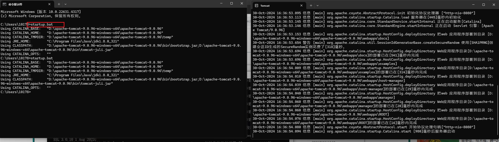

# Javaweb笔记

## 创建一个Javaweb项目

```cmd
mvn archetype:generate -DgroupId=com.binyu -DartifactId=JavawebStudy -DarchetypeArtifactId=maven-archetype-webapp -DinteractiveMode=false
```

[CSDN-idea创建javaweb项目步骤超详细（2022最新版本）](https://blog.csdn.net/m0_52861000/article/details/127914719)

https://www.bilibili.com/video/BV1UN411x7

## JSP

[tutorialspoint_jsp教程](https://www.tutorialspoint.com/jsp/index.htm)

## JWT

[JWT详细讲解(保姆级教程)](https://developer.aliyun.com/article/995894)

## Filter

[JavaWeb过滤器(Filter)详解，是时候该把过滤器彻底搞懂了(万字说明)](https://blog.csdn.net/m0_51545690/article/details/123677340)

## Inteceptor

[Spring Boot拦截器(Interceptor)详解](https://blog.csdn.net/Herishwater/article/details/103544342)

## SpringBoot 事务

[Spring Boot 各种事务操作实战(自动回滚、手动回滚、部分回滚）](https://blog.csdn.net/agonie201218/article/details/136189743)

## java8元注解详解

[Java注解解读-ElementType详解](https://blog.csdn.net/xtho62/article/details/113816008)

## [Spring Boot 配置文件优先级](https://blog.csdn.net/m0_53654272/article/details/136681464)

[1](https://blog.csdn.net/m0_53654272/article/details/136681464)[2](https://blog.csdn.net/renshengrushui/article/details/118762841)[3](https://cloud.tencent.com/developer/article/1603233)

在 Spring Boot 应用中，配置文件的优先级是根据特定的顺序来决定的。这个顺序确保了某些配置可以覆盖其他配置，从而提供了灵活性和细粒度的控制。以下是 Spring Boot 配置文件优先级的详细说明：

命令行参数

命令行参数具有最高的优先级。当使用 *java -jar* 命令启动 Spring Boot 应用时，可以通过 *--* 来指定参数，这些参数会覆盖配置文件中的相应设置。例如，使用 *java -jar myapp.jar --server.port=8081* 可以覆盖配置文件中的 *server.port* 属性。

外部配置文件

外部配置文件的优先级高于内部配置文件。可以通过 *--spring.config.location* 参数指定配置文件的路径或目录。如果指定了目录，Spring Boot 会加载该目录下的所有配置文件。

内部配置文件

内部配置文件包括位于 JAR 包内部和项目资源目录（如 *src/main/resources*）的配置文件。这些配置文件的加载顺序如下：

1. *config/* 目录下的配置文件
2. 类路径根目录下的配置文件
3. *application.properties* 或 *application.yml*
4. *application-{profile}.properties* 或 *application-{profile}.yml*

其中，*{profile}* 表示 Spring 配置文件的特定配置环境，如 *dev*、*test*、*prod* 等。

Bootstrap 配置文件

*bootstrap* 配置文件主要用于 Spring Cloud 应用，它在 *application* 配置文件之前加载。*bootstrap* 配置文件通常包含连接到配置中心的必要信息，如 *spring.application.name* 和 *spring.cloud.config.server.git.uri*。*bootstrap* 配置文件的优先级高于 *application* 配置文件，因此 *bootstrap* 中的配置不会被 *application* 中的相同配置覆盖。

配置文件优先级总结

总的来说，Spring Boot 配置文件的优先级从高到低依次为：

1. 命令行参数
2. 外部配置文件
3. 内部配置文件
4. *bootstrap* 配置文件


了解这些优先级可以帮助开发者更好地管理和组织应用的配置，确保应用按预期运行。同时，也可以利用这些优先级来进行环境特定的配置，如开发环境、测试环境和生产环境的不同设置。

## Maven私服配置

https://www.bilibili.com/video/BV1m84y1w7Tb?spm_id_from=333.788.videopod.episodes&vd_source=f58f2e2144be4e99a8cf800afeecbbcb&p=199

[从零开始：Nexus私服搭建与Maven仓库配置的完全指南](https://developer.aliyun.com/article/1328445)

## Tomcat

[【科普】Tomcat使用方法(超级详细)](https://blog.csdn.net/love_Aym/article/details/80613183)

[iDEA中使用Tomcat](https://blog.csdn.net/2301_76979886/article/details/142316604)

> 安装后需要确认JAVA_HOME和PATH配置正确
>
> `startup.bat`/`startup.sh`启动Tomcat
>
> `shutdown.bat`/`shutdown.sh`停止Tomcat


### 1. Tomcat控制台中文乱码解决

> conf/logging.properties


### 2. 配置Tomcat到环境变量后cmd窗口启动Tomcat




### 3. 修改Tomcat端口号


### 4. 项目的上下文路径和项目的部署目录

> 这两者可能不一样


### 5. webapp的标准结构

- myapp

  - static

    - js
    - css

  - WEB-INF

    - classes 字节码根路径

    - lib 项目依赖

    - web.xml 项目配置文件

  - login.html

### 6. 配置Tomcat账号密码

### 7. 创建空的MyJavaweb项目

双击shift -> 搜索 Add framework support -> 回车 -> 选中Maven


