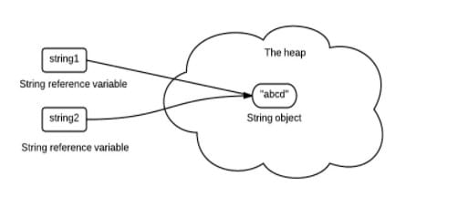
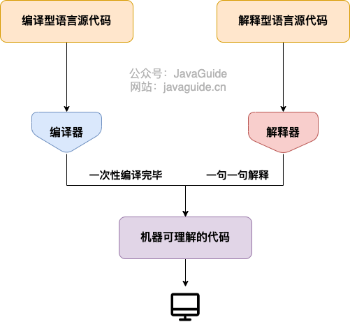

# Java笔记

## 0 学习技巧

> - 不要想立刻换岗位，而要做**技术沉淀**
> - 不要妄想通过自学学会编程，而要在**工作中实践**
> - **三分看，七分练**,**多看多练，温故知新**
> - **通过重复对抗遗忘曲线**

## 1 JavaSE基础

### 1.1 人机交互方式

> - **图形化界面（Graphical User Interface,GUI）**
> - **命令行方式（Command Line Interface,CLI）**

### 1.2 一个类中只能有一个公共类

```java
public class HelloJava{
    public static void main(String[] args){
        System.out.println("HelloWorld");
    }
}
class Person{}
class Animal{}
```

### 1.3 API和API文档

> - API:JAVA提供的类库
> - API文档：javadoc生成的类库说明文档

### 1.4 标识符的规范性

> - **所有的标识符都应该以字母（A-Z 或者 a-z）,美元符（$）、或者下划线（_）开始**

### 1.5 变量的分类

> 所有变量:
>
> - 成员变量
>   - 实例变量：不需要显示初始化
>   - 静态变量：不需要显示初始化
> - 局部变量
>   - 形参
>   - 方法局部变量：需要显示初始化
>   - 代码块局部变量：需要显示初始化

### 1.6 强制类型转换

> - 需要使用强转符`()`
> - double强转为int，数值上**截断**而不是四舍五入
> - 可能会导致**精度损失**

### 1.7 自动类型转换

> - **口诀：小+大–>大**
> - 容量小的数据类型变量和容量大的数据类型变量做运算时，结果自动提升为容量大的数据类型变量。
> - 容量大小指的是数的范围的大和小，比如float>long
> - 当byte、char、short三种类型的变量做运算时，结果为int型

### 1.8 进制

```java
public class Test {
    public static void main(String[] args) {
        int a=0123;//八进制
        int b=0x123;//十六进制
        int c=0b110;//二进制
        System.out.println(a);//83
        System.out.println(b);//291
        System.out.println(c);//6
    }
}
```

### 1.9 原码、反码、补码

> 正数：三码合一
>
> 负数：
>
> - 第一步：将原码除了符号位的数各个位取反，得到反码
> - 第二步：反码+1，得到补码

### 1.10 位运算符

*注意：无`<<<`*

| 操作符 | 描述                                                         | 例子                           |
| :----- | :----------------------------------------------------------- | :----------------------------- |
| ＆     | 如果相对应位都是1，则结果为1，否则为0                        | （A＆B），得到12，即0000 1100  |
| \|     | 如果相对应位都是 0，则结果为 0，否则为 1                     | （A \| B）得到61，即 0011 1101 |
| ^      | 如果相对应位值相同，则结果为0，否则为1                       | （A ^ B）得到49，即 0011 0001  |
| 〜     | 按位取反运算符翻转操作数的每一位，即0变成1，1变成0。         | （〜A）得到-61，即1100 0011    |
| <<     | 按位左移运算符。左操作数按位左移右操作数指定的位数。         | A << 2得到240，即 1111 0000    |
| >>     | 按位右移运算符。左操作数按位右移右操作数指定的位数。         | A >> 2得到15即 1111            |
| >>>    | 按位右移补零操作符。左操作数的值按右操作数指定的位数右移，移动得到的空位以零填充。 | A>>>2得到15即0000 1111         |

### 1.11 数组概述

> - 数组是**有序排列**的
> - 数组是**引用类型**的，数组中的元素可以是**任何数据类型（既可以是基本数据类型，也可以是引用数据类型）**
> - 创建数组对象会在内存中开辟**一整块连续**的空间
> - 数组的**长度一旦确定，就不能修改**
> - 多维数组本质还是一维数组

### 1.12 生成随机数的公式

> - 生成[0, 1)的随机数
>   ```
>   Math.random()
>   ```
>
> - 生成[0, Num)
>   ```java
>   Math.random() * Num 
>   ```
>
> - 生成[Min, Max)
>   ```
>   Min + (Math.random() * (Max - Min))
>   ```
>
> - 生成[Min, Max]
>   ```
>   Min + (int)(Math.random() * ((Max - Min) + 1))
>   ```

### 1.13 Arrays工具类的使用

| 序号 | 方法和说明                                                   |
| :--- | :----------------------------------------------------------- |
| 1    | **public static int binarySearch(Object[] a, Object key)** 用二分查找算法在给定数组中搜索给定值的对象(Byte,Int,double等)。数组在调用前必须排序好的。如果查找值包含在数组中，则返回搜索键的索引；否则返回 (-(*插入点*) - 1)。 |
| 2    | **public static boolean equals(long[] a, long[] a2)** 如果两个指定的 long 型数组彼此*相等*，则返回 true。如果两个数组包含相同数量的元素，并且两个数组中的所有相应元素对都是相等的，则认为这两个数组是相等的。换句话说，如果两个数组以相同顺序包含相同的元素，则两个数组是相等的。同样的方法适用于所有的其他基本数据类型（Byte，short，Int等）。 |
| 3    | **public static void fill(int[] a, int val)** 将指定的 int 值分配给指定 int 型数组指定范围中的每个元素。同样的方法适用于所有的其他基本数据类型（Byte，short，Int等）。 |
| 4    | **public static void sort(Object[] a)** 对指定对象数组根据其元素的自然顺序进行升序排列。同样的方法适用于所有的其他基本数据类型（Byte，short，Int等）。 |

### 1.14 面向过程和面向对象

> - **面向过程：**强调的是功能行为，以函数为最小单位，考虑怎么做
> - **面向对象：**强调具备了功能的对象，以类/对象为最小单位，考虑谁来做

### 1.15 重载和重写

> - 重载：两同一不同（同一个类，相同方法名；参数列表不同；与返回值无关），为了不让编译时出现二义性
> - 重写：两大一小
>   - 子类重写的方法的方法名和形参列表和父类被重写的相同
>   - **子类重写的方法权限修饰符大于等于父类被重写的方法权限修饰符**（特殊情况：子类不能重写父类中声明为private权限的方法）
>   - 返回值类型：
>     - 父类被重写的方法返回值是void，则子类重写的方法的返回值只能是void
>     - **父类被重写的方法返回值是A类型，则子类重写的方法的返回值类型可以是A类或A类的子类**
>     - 父类被重写的方法返回值类型时基本数据类型（比如double），则子类重写的方法的返回值类型必须是相同的基本数据类型
>   - 子类重写的方法抛出的异常类型大于等于父类被重写的方法抛出的异常类型
>
> **子类和父类中同名同参数的方法要么都声明为非static的（考虑重写），要么都声明为static的（不是重写）**
>
> ```java
> public class Person {
>     protected void test() throws FileSystemException {
>         System.out.println("protected");
>     }
> }
> public class Student extends Person {
>     public void testStudent() throws IOException {
>         super.test();
>     }
> 
>     @Override
>     protected void test() throws FileSystemException, AccessDeniedException {
>         super.test();
>     }
> }
> ```
>
> 

### 1.16 值传递

> 将实际参数值的副本传入方法内，而参数本身不受影响
>
> - 当形参是基本数据类型时，传递的是实际的值
> - 当形参是引用数据类型时，传递的是实际地址值

### 1.17 高内聚，低耦合

> - 高内聚：类的内部数据操作细节自己完成，不允许外部干涉
>
> - 低耦合：仅对外暴露少量的方法用于使用

### 1.18 外部类和内部类

> - 普通类（外部类）：只能用public、default（不写）、abstract、final修饰。
> - （成员）内部类：可理解为外部类的成员，所以修饰类成员的public、protected、default、private、static等关键字都能使用。
> - 局部内部类：出现在方法里的类，不能用上述关键词来修饰。
> - 匿名内部类：给的是直接实现，类名都没有，没有修饰符。
>
> ```java
> public class InternalClassTest {
>     public static class A{
>         public String name;
>         public String id;
>     }
>     public class B{
>         public String name;
>         public String id;
>     }
>     private class C{
>         public String name;
>         public String id;
>     }
>     @Test
>     public void testB(){
>         InternalClassTest.B b=new InternalClassTest.B();
>         System.out.println(b.id);
>         System.out.println(b.name);
>     }
>     @Test
>     public void testC(){
>         InternalClassTest.C c=new InternalClassTest.C();
>         System.out.println(c.id);
>         System.out.println(c.name);
>     }
>     public static void main(String[] args) {
>         InternalClassTest.A a=new InternalClassTest.A();
>         System.out.println(a.name);
>         System.out.println(a.id);
>     }
> }
> ```
>
> 

### 1.19 包修饰符

> - public:完全可访问
> - protected:本包和子类可访问
> - default:本包可访问
> - private:本类可访问

| 修饰符      | 当前类 | 同一包内 | 子孙类(同一包) | 子孙类(不同包) | 其他包 |
| :---------- | :----- | :------- | :------------- | :------------- | :----- |
| `public`    | Y      | Y        | Y              | Y              | Y      |
| `protected` | Y      | Y        | Y              | Y              | N      |
| `default`   | Y      | Y        | Y              | N              | N      |
| `private`   | Y      | N        | N              | N              | N      |

### 1.20 this和super

> - this修饰属性和方法
>   - this可以理解为：**当前对象**
>   - 在类的方法中，**通常都选择省略“this.”，除非成员变量名和形参名冲突**
> - this修饰构造器
>   - `this();`调用空参构造器
>   - `this(age);`调用带参构造器
>   - 构造器不能通过“this(形参列表)”方式调用自己
>   - **如果一个类中有N个构造器，则最多N-1构造器使用了“this(形参列表)”**
>   - **“this(形参列表)”必须声明在当前构造器的首行,且只能声明一个**
>
> ---
>
> super用来是调用父类的属性、方法、构造器
>
> - `super(形参列表)`必须声明在子类构造器的首行
>
> - `super(形参列表)`和`this(形参列表)`只能二选一，不能同时出现。
>
> - 在构造器首行**，没有显式的声明this和super，默认调用的是父类的空参构造器即super()。**
>
> - **在类的多个构造器中，至少有一个类的构造器使用了`super(形参列表)`调用父类中的构造器。**

### 1.21 import 

> - 声明在包的声明和类的声明之间
> - 如果使用的类或接口是本包下定义的，可以省略import
> - 在源文件中，使用了不同包下的同名类，则必须至少有一个类需要以**全类名**的方式显示
> - 如果使用的类或接口是java.lang包下定义的，则可以省略import结构
> - 使用“xxx.*”方式表名可以调用xxx包下的所有结构。但是如果使用的是xxx子包下的结构，则仍需要显式导入
> - import static：导入指定类或接口中的静态结构
>
> ```java
> import static java.lang.System.*;
> import static java.lang.Math.*;
> public class PackageImportTest {
>     public static void main(String[] args) {
>         out.println ("hello");
>         long round = round ( 3.45 );
>         out.println (round);
>     }
> }
> ```
>
> 


### 1.22 继承的好处

> - 减少代码的冗余，提高了代码的复用性
> - 便于功能的拓展
> - **为之后多态性的使用，提供了前提**

### 1.23 多态性的含义

> 父类的引用指向子类的对象
>
> 多态性**只适用于方法，不适用于属性。**属性编译运行都看左边,方法上编译看左边，运行看右边
>
> ```java
> public class Person {
>     public String name="person";
>     public void eat(){
>         System.out.println("person eat");
>     }
> }
> public class Student extends Person {
>     public String name="student";
> 
>     @Override
>     public void eat(){
>         System.out.println("student eat");
>     }
>     public static void main(String[] args) {
>         Person p=new Student();
>         System.out.println(p.name);
>         p.eat();
>     }
> }
> ```
>
> 

### 1.24 早绑定和晚绑定

> - 父类根据赋给它的不同子类对象，动态调用属于子类的该方法。这样的方法调用在编译器是无法确定的。故**多态是运行时行为，这就是晚绑定或动态绑定**。
> - 重载，它们的调用地址在编译时就绑定了，故**重载是早绑定或静态绑定**
> - **不能调用子类特有的方法、属性**，想调用要向下转型
>
> ```java
> if(p2 instanceof Woman){
>             Woman w2=(Woman)p2;
>             w2.goShopping ();
>         }
> ```
>
> 

### 1.25 Object类

| 序号 |                         方法 & 描述                          |
| :--: | :----------------------------------------------------------: |
|  1   | [protected Object clone()](https://www.runoob.com/java/java-object-clone.html)创建并返回一个对象的拷贝 |
|  2   | [boolean equals(Object obj)](https://www.runoob.com/java/java-object-equals.html)比较两个对象是否相等 |
|  3   | [protected void finalize()](https://www.runoob.com/java/java-object-finalize.html)当 GC (垃圾回收器)确定不存在对该对象的有更多引用时，由对象的垃圾回收器调用此方法。 |
|  4   | [Class getClass()](https://www.runoob.com/java/java-object-getclass.html)获取对象的运行时对象的类 |
|  5   | [int hashCode()](https://www.runoob.com/java/java-object-hashcode.html)获取对象的 hash 值 |
|  6   | [void notify()](https://www.runoob.com/java/java-object-notify.html)唤醒在该对象上等待的某个线程 |
|  7   | [void notifyAll()](https://www.runoob.com/java/java-object-notifyall.html)唤醒在该对象上等待的所有线程 |
|  8   | [String toString()](https://www.runoob.com/java/java-object-tostring.html)返回对象的字符串表示形式 |
|  9   | [void wait()](https://www.runoob.com/java/java-object-wait.html)让当前线程进入等待状态。直到其他线程调用此对象的 notify() 方法或 notifyAll() 方法。 |
|  10  | [void wait(long timeout)](https://www.runoob.com/java/java-object-wait-timeout.html)让当前线程处于等待(阻塞)状态，直到其他线程调用此对象的 notify() 方法或 notifyAll() 方法，或者超过参数设置的timeout超时时间。 |
|  11  | [void wait(long timeout, int nanos)](https://www.runoob.com/java/java-object-wait-nanos.html)与 wait(long timeout) 方法类似，多了一个 nanos 参数，这个参数表示额外时间（以纳秒为单位，范围是 0-999999）。 所以超时的时间还需要加上 nanos 纳秒。。 |

### 1.26 equals()和hashcode()

```java
		@Override
    public boolean equals(Object o) {
        if (this == o) return true;
        if (o == null || getClass() != o.getClass()) return false;
        Student student = (Student) o;
        return Objects.equals(name, student.name);
    }

    @Override
    public int hashCode() {
        return Objects.hash(name);
    }
```

#### 如何重写hash()和equals()

> 理想的散列函数应当具有均匀性，即不相等的对象应当均匀分布到所有可能的散列值上。这就要求了散列函数要把所有域的值都考虑进来，可以将每个域都当成 R 进制的某一位，然后组成一个 R 进制的整数。R 一般取 31，因为它是一个奇素数，如果是偶数的话，当出现乘法溢出，信息就会丢失，因为与 2 相乘相当于向左移一位。
>
> 一个数与 31 相乘可以转换成移位和减法: `31*x == (x<<5)-x`，编译器会自动进行这个优化。

```java
// Objects.hash()
public static int hash(Object... values) {
        return Arrays.hashCode(values);
    }
// Arrays.hashCode()
public static int hashCode(Object a[]) {
        if (a == null)
            return 0;

        int result = 1;

        for (Object element : a)
            result = 31 * result + (element == null ? 0 : element.hashCode());

        return result;
    }
```

#### 本地方法hashCode()

> `Object` 的 `hashCode()` 方法是本地方法，也就是用 C 语言或 C++ 实现的，该方法通常用来将对象的内存地址转换为整数之后返回。

#### 为什么要有hashCode()

> 在比较对象是否相等时，可以减少比较次数，越好的散列算法就能越少哈希碰撞

### 1.27 main的理解

> 由于 Java 虚拟机需要调用类的 main() 方法，所以该方法的访问权限必须是public 又 因为 Java 虚拟机在执行 main() 方法时不必创建对象，所以该方法必须是 static 的，该方法接收一个 String 类型的数组参数，该数组中 保存 执行 Java 命令
> 时传递给所运行的类的参数 。

### 1.28 非静态代码块、静态代码块、构造器的执行顺序

```java
public class HelloA {
    public HelloA(){//构造函数
        System.out.println("A的构造函数");
    }
    {//构造代码块
        System.out.println("A的构造代码块");
    }
    static {//静态代码块
        System.out.println("A的静态代码块");
    }
    public static void main(String[] args) {
        HelloA a=new HelloA();
        HelloA b=new HelloA();
    }
}
// console输出
A的静态代码块
A的构造代码块
A的构造函数
A的构造代码块
A的构造函数
```

```java
public class HelloA {
    public HelloA(){//构造函数
        System.out.println("A的构造函数");    
    }
    {//构造代码块
        System.out.println("A的构造代码块");    
    }
    static {//静态代码块
        System.out.println("A的静态代码块");        
    }
}
public class HelloB extends HelloA{
    public HelloB(){//构造函数
        System.out.println("B的构造函数");    
    }
    {//构造代码块
        System.out.println("B的构造代码块");    
    }
    static {//静态代码块
        System.out.println("B的静态代码块");        
    }
    public static void main(String[] args) {
        HelloB b=new HelloB();        
    }
}
// console输出
A的静态代码块
B的静态代码块
A的构造代码块
A的构造函数
B的构造代码块
B的构造函数
```

### 1.29 final

> - final修饰属性：可以考虑的赋值位置有：显示初始化、代码块中初始化、构造器中初始化（final的初始化不能逃逸出构造器）
> - final修饰局部变量：尤其是使用final修饰形参时，表名此形参时一个常量。当我们调用此方法时，给常量形参赋一个实参。一旦赋值以后，就只能在方法体内使用此形参，但不能重新赋值。
> - static final用来修饰属性是全局常量

### 1.30 抽象类和抽象方法

> abstract修饰一个类：**抽象类**
>
> - 此类不能实例化
> - 抽象类中一定有构造器，便于子类实例化时调用
> - 开发中，都会提供子类，让子类去实例化
>
> abstract修饰一个方法：**抽象方法**
>
> - 抽象方法只有方法的声明，没有方法体
>
> - 包含抽象方法的类一定是抽象类，反之，抽象类中可以没有抽象方法
>
> - 若子类重写了父类中所有的抽象方法后，此子类方可实例化；若子类没有重写了父类中所有的抽象方法，则子类也是抽象类
>
> **abstract不能用来修饰私有方法、静态方法、final的方法**

### 1.31 接口

> - JDK7及以前：只能定义全局变量和抽象方法
>   - 全局变量：public static final 的，书写时可以省略不写
>   - 抽象方法：public abstract的,书写时可以省略不写
> - JDK8：除了定义全局常量和抽象方法之外，还可以定义静态方法、默认方法
>
> ```java
> public interface MyInterface {
>     public static final int GLOBAL_VARIABLE=0;// public static final可省略
>     public abstract void abstractMethod();// public abstract可省略
>     static void staticMethod(){
>         System.out.println("staticMethod()");
>     }
>     default void defaultMethod(){
>         System.out.println("defaultMethod()");
>     }
> }
> public class MyInterfaceTest {
>     public static void main(String[] args) {
>         MyInterface.staticMethod();
>         System.out.println(MyInterface.GLOBAL_VARIABLE);
>         MyInterface myInterface=new MyInterface() {
>             @Override
>             public void abstractMethod() {
>                 System.out.println("abractMethod()");
>             }
>         };// 创建的匿名类实现了MyInterface接口，myInterface是非匿名对象
>         myInterface.abstractMethod();
>         myInterface.defaultMethod();
>     }
> }
> ```
>
> 

### 1.32 最常见的设计模式（带扩充）

> - 单例模式
> - 工厂模式
> - 模版模式
> - 代理模式

### 1.33 ClassName.this的使用

> 内部类要使用外部类的属性和方法时,要使用这个语法

```java
public class OuterClass {
    private String name;
    public String getName(){
        return this.name;
    }
    public class InternalClass{
        public void internalMethod(){
            System.out.println(OuterClass.this.name);
            System.out.println(OuterClass.this.getName());
        }
    }
}
```

### 1.34 静态内部类和非静态内部类

```java
public class OuterClass {
    public static class StaticInternalClass{
    }
    public class NotStaticInternalClass{
    }

    public static void main(String[] args) {
        OuterClass.StaticInternalClass staticInternalClass=new OuterClass.StaticInternalClass();
        OuterClass outerClass=new OuterClass();
        OuterClass.NotStaticInternalClass notStaticInternalClass=outerClass.new NotStaticInternalClass();
    }
}
```

### 1.35 异常的体系


### 1.36 包装类的缓存池

> new Integer(123) 与 Integer.valueOf(123) 的区别在于:
>
> - new Integer(123) 每次都会新建一个对象
> - Integer.valueOf(123) 会使用缓存池中的对象，多次调用会取得同一个对象的引用。
> - 编译器会**在缓冲池范围内的基本类型**自动装箱过程调用 valueOf() 方法，因此多个 Integer 实例使用自动装箱来创建并且值相同，那么就会引用相同的对象。
>
> `Byte`,`Short`,`Integer`,`Long` 这 4 种包装类默认创建了数值 **[-128，127]** 的相应类型的缓存数据，`Character` 创建了数值在 **[0,127]** 范围的缓存数据，`Boolean` 直接返回 `True` or `False`。

### 1.37 String的不可变性

> 内部使用 char 数组存储数据，该数组被声明为 final，这意味着 value 数组初始化之后就不能再引用其它数组。并且 String 内部没有改变 value 数组的方法，因此可以保证 String 不可变。
>
> 不可变的好处有：
>
> **1. 可以缓存 hash 值**
>
> 因为 String 的 hash 值经常被使用，例如 String 用做 HashMap 的 key。不可变的特性可以使得 hash 值也不可变，因此只需要进行一次计算。
>
> **2. String Pool 的需要**
>
> 如果一个 String 对象已经被创建过了，那么就会从 String Pool 中取得引用。只有 String 是不可变的，才可能使用 String Pool。
>
> 
>
> **3. 线程安全**
>
> String 不可变性天生具备线程安全，可以在多个线程中安全地使用。

### 1.38 String.intern()

使用 String.intern() 可以保证相同内容的字符串变量引用同一的内存对象。

下面示例中，s1 和 s2 采用 new String() 的方式新建了两个不同对象，而 s3 是通过 s1.intern() 方法取得一个对象引用。intern() 首先把 s1 引用的对象放到 String Pool(字符串常量池)中，然后返回这个对象引用。因此 s3 和 s1 引用的是同一个字符串常量池的对象。

```java
String s1 = new String("aaa");
String s2 = new String("aaa");
System.out.println(s1 == s2);           // false
String s3 = s1.intern();
System.out.println(s1.intern() == s3);  // true
```

如果是采用 "bbb" 这种使用双引号的形式创建字符串实例，会自动地将新建的对象放入 String Pool 中。

```java
String s4 = "bbb";
String s5 = "bbb";
System.out.println(s4 == s5);  // true
```

### 1.39 hotspot虚拟机中的字符串常量池在哪

> - 方法区在1.6是永久代实现；
>
> - 方法区在1.7是永久代（类型信息，字段，方法，常量）和堆区（字符串常量池，静态变量）共同实现；逐步移除永久代
> - 方法区在1.8是由本地内存的元空间（类型信息，字段，方法，常量）和堆（字符串常量池，静态变量）共同实现；完全移除永久代

### 1.40 不能隐式向下转型

```java
public class BaseTypeTest {
    public static void main(String[] args) {
        float f=1.1;// 编译报错，会认为1.1是double，不能进行隐式向下转型为float
        short s=1;
        s=s+1;// 编译报错，s+1是int型，不能进行隐式向下转型为short
        s+=1;// 编译通过，+=会进行隐式类型转换
    }
}
```

### 1.41 java7后支持switch中写String对象

```java
String s = "a";
switch (s) {
    case "a":
        System.out.println("aaa");
        break;
    case "b":
        System.out.println("bbb");
        break;
}
```

### 1.42 抽象类和接口的异同和选择

> **不同点**:
>
> - 从设计层面上看，抽象类提供了一种 IS-A 关系，那么就必须满足**里式替换原则**，即子类对象必须能够替换掉所有父类对象。而接口更像是一种 LIKE-A 关系，它只是提供一种方法实现契约，并不要求接口和实现接口的类具有 IS-A 关系。
> - 一个类可以实现多个接口，但是不能继承多个抽象类。
> - 接口的字段只能是 static 和 final 类型的，而抽象类的字段没有这种限制。
> - 接口的成员只能是 public 的，而抽象类的成员可以有多种访问权限。
> - 
>
> **相同点**：
>
> - 都不能被实例化。
> - 都可以包含抽象方法。
> - 都可以有默认实现的方法（Java 8 可以用 `default` 关键字在接口中定义默认方法）。
>
> **使用选择**:
>
> 使用接口:
>
> - 需要让不相关的类都实现一个方法，例如不相关的类都可以实现 Compareable 接口中的 compareTo() 方法；
> - 需要使用多重继承。
>
> 使用抽象类:
>
> - 需要在几个相关的类中共享代码。
> - 需要能控制继承来的成员的访问权限，而不是都为 public。
> - 需要继承非静态和非常量字段。
>
> 在很多情况下，接口优先于抽象类，因为接口没有抽象类严格的类层次结构要求，可以灵活地为一个类添加行为。并且从 Java 8 开始，接口也可以有默认的方法实现，使得修改接口的成本也变的很低。

### 1.43 clone()

> clone() 是 Object 的 protected 方法，它不是 public，一个类不显式去重写 clone()，其它类就不能直接去调用该类实例的 clone() 方法。
>
> 应该注意的是，clone() 方法并不是 Cloneable 接口的方法，而是 Object 的一个 protected 方法。Cloneable 接口只是规定，如果一个类没有实现 Cloneable 接口又调用了 clone() 方法，就会抛出 CloneNotSupportedException。
>
> ```java
> public class CloneExample implements Cloneable {
>     private int a;
>     private int b;
> 
>     @Override
>     protected Object clone() throws CloneNotSupportedException {
>         return super.clone();
>     }
> }
> ```
>
> 

#### 深拷贝

```java
public class DeepCloneExample implements Cloneable {
    private int[] arr;

    public DeepCloneExample() {
        arr = new int[10];
        for (int i = 0; i < arr.length; i++) {
            arr[i] = i;
        }
    }

    public void set(int index, int value) {
        arr[index] = value;
    }

    public int get(int index) {
        return arr[index];
    }

    @Override
    protected DeepCloneExample clone() throws CloneNotSupportedException {
        DeepCloneExample result = (DeepCloneExample) super.clone();
        result.arr = new int[arr.length];
        for (int i = 0; i < arr.length; i++) {
            result.arr[i] = arr[i];
        }
        return result;
    }
}

```

```java
DeepCloneExample e1 = new DeepCloneExample();
DeepCloneExample e2 = null;
try {
    e2 = e1.clone();
} catch (CloneNotSupportedException e) {
    e.printStackTrace();
}
e1.set(2, 222);
System.out.println(e2.get(2)); // 2

```

#### clone()的替代方案

> 使用 clone() 方法来拷贝一个对象即复杂又有风险，它会抛出异常，并且还需要类型转换。Effective Java 书上讲到，最好不要去使用 clone()，可以使用拷贝构造函数或者拷贝工厂来拷贝一个对象。

```java
public class CloneConstructorExample {
    private int[] arr;

    public CloneConstructorExample() {
        arr = new int[10];
        for (int i = 0; i < arr.length; i++) {
            arr[i] = i;
        }
    }

    public CloneConstructorExample(CloneConstructorExample original) {
        arr = new int[original.arr.length];
        for (int i = 0; i < original.arr.length; i++) {
            arr[i] = original.arr[i];
        }
    }

    public void set(int index, int value) {
        arr[index] = value;
    }

    public int get(int index) {
        return arr[index];
    }
}
```

```java
CloneConstructorExample e1 = new CloneConstructorExample();
CloneConstructorExample e2 = new CloneConstructorExample(e1);
e1.set(2, 222);
System.out.println(e2.get(2)); // 2
```

#### 引用拷贝，浅拷贝，深拷贝的图解


### 1.44 java为什么采用字节码

> 在 Java 中，JVM 可以理解的代码就叫做字节码，它不面向任何特定的处理器，只面向虚拟机。Java 语言通过字节码的方式，在一定程度上解决了传统解释型语言执行效率低的问题，同时又保留了解释型语言可移植的特点。
>
> **编译型** ：[编译型语言open in new window](https://zh.wikipedia.org/wiki/編譯語言) 会通过[编译器open in new window](https://zh.wikipedia.org/wiki/編譯器)将源代码一次性翻译成可被该平台执行的机器码。一般情况下，编译语言的执行速度比较快，开发效率比较低。常见的编译性语言有 C、C++、Go、Rust 等等。
>
> **解释型** ：[解释型语言open in new window](https://zh.wikipedia.org/wiki/直譯語言)会通过[解释器open in new window](https://zh.wikipedia.org/wiki/直譯器)一句一句的将代码解释（interpret）为机器代码后再执行。解释型语言开发效率比较快，执行速度比较慢。常见的解释性语言有 Python、JavaScript、PHP 等等
>
> 

### 1.45 java是编译与解释共存的语言，怎么理解

> java代码先经过前端编译器编译成字节码，然后交给执行引擎中的解释器逐行执行，遇到热点代码还会使用JIT编译器（后端编译器）将字节码编译成机器码并存储起来。
>
> 热点代码的选择基于二八法则，即影响性能的是20%的热点代码。

### 1.46 静态方法为什么不能调用非静态成员?

> 这个需要结合 JVM 的相关知识，主要原因如下：
>
> 1. 静态方法是属于类的，在类加载的时候就会分配内存，可以通过类名直接访问。而非静态成员属于实例对象，只有在对象实例化之后才存在，需要通过类的实例对象去访问。
> 2. 在类的非静态成员不存在的时候静态方法就已经存在了，此时调用在内存中还不存在的非静态成员，属于非法操作。

### 1.47 装箱和拆箱的实质与注意事项

> 从字节码中，我们发现装箱其实就是调用了 包装类的`valueOf()`方法，拆箱其实就是调用了 `xxxValue()`方法。
>
> 因此，
>
> - `Integer i = 10` 等价于 `Integer i = Integer.valueOf(10)`
> - `int n = i` 等价于 `int n = i.intValue()`;
>
> 注意：**如果频繁拆装箱的话，也会严重影响系统的性能。我们应该尽量避免不必要的拆装箱操作。

### 1.48 浮点数计算会有精度丢失的风险，如何解决

> 浮点数运算精度丢失代码演示：
>
> ```java
> float a = 2.0f - 1.9f;
> float b = 1.8f - 1.7f;
> System.out.println(a);// 0.100000024
> System.out.println(b);// 0.099999905
> System.out.println(a == b);// false
> ```
>
> 为什么会出现这个问题呢？
>
> 这个和计算机保存浮点数的机制有很大关系。我们知道计算机是二进制的，而且计算机在表示一个数字时，宽度是有限的，**无限循环的小数存储在计算机时，只能被截断**，所以就会导致小数精度发生损失的情况。这也就是解释了为什么浮点数没有办法用二进制精确表示。
>
> 解决方法就是使用BigDecimal
>
> ```java
> BigDecimal a = new BigDecimal("1.0");
> BigDecimal b = new BigDecimal("0.9");
> BigDecimal c = new BigDecimal("0.8");
> 
> BigDecimal x = a.subtract(b);
> BigDecimal y = b.subtract(c);
> 
> System.out.println(x); /* 0.1 */
> System.out.println(y); /* 0.1 */
> System.out.println(Objects.equals(x, y)); /* true */
> 
> ```
>
> 

### 1.49 finally语句块

#### 不要在finally语句块执行return

>  try 语句和 finally 语句中都有 return 语句时，try 语句块中的 return 语句会被忽略。这是因为 try 语句中的 return 返回值会先被暂存在一个本地变量中，当执行到 finally 语句中的 return 之后，这个本地变量的值就变为了 finally 语句中的 return 返回值。

```java
public static void main(String[] args) {
    System.out.println(f(2));
}

public static int f(int value) {
    try {
        return value * value;
    } finally {
        if (value == 2) {
            return 0;
        }
    }
}
// console输出
0
```

#### finally块的代码不一定执行

> 就比如说 finally 之前虚拟机被终止运行的话，finally 中的代码就不会被执行。

```java
try {
    System.out.println("Try to do something");
    throw new RuntimeException("RuntimeException");
} catch (Exception e) {
    System.out.println("Catch Exception -> " + e.getMessage());
    // 终止当前正在运行的Java虚拟机
    System.exit(1);
} finally {
    System.out.println("Finally");
}

```


## 2 JavaSE高级

#### 2.1 多线程的实现

##### 线程创建-继承Thread类

```java
public class MyThread extends Thread {
    @Override
    public void run() {
        for (int i = 0; i < 100 ; i++) {
            if(i%2==0){
                System.out.println (Thread.currentThread ().getName ()+":"+i);
            }
        }
    }
}
```

```java
public class ThreadTest {
    public static void main(String[] args) {
        MyThread thread=new MyThread ();
        // 1.start()启动当前线程，并调用当前线程的run()方法
        thread.start ();
        // 2.如果直接调用run()，并不会启动线程
//        thread.run ();
       // 3.不可以让已经start的线程再次执行，要多个线程，就造多个线程对象
        MyThread thread1=new MyThread ();
        thread1.start ();
        for (int i = 0; i <100 ; i++) {
            if(i%2!=0){
                System.out.println (Thread.currentThread ().getName ()+"***"+i);
            }
        }
    }
   /**
     * 匿名子类的方式实现线程
     */
    @Test
    public void test(){
        new Thread(){
            @Override
            public void run(){
                System.out.println("匿名子类的方式");
            }
        }.start();
    }

    /**
     * 线程的方法
     */
    @Test 
    public void test2(){
        MyThread myThread=new MyThread();
        // 设置线程优先级,只是从概率上讲，高优先级的线程高概率执行
        myThread.setPriority ( Thread.MAX_PRIORITY );
        myThread.setName("myThread");
        System.out.println(myThread.getName());
    }
}
```

##### 线程创建-实现Runnable接口

```java
public class PrimeRun implements Runnable {
    @Override
    public void run() {
        for (int i = 0; i <100; i++) {
            System.out.println (i);
        }
    }
}
public class ThreadTest {
    public static void main(String[] args) {
        PrimeRun primeRun=new PrimeRun ();
        Thread thread = new Thread ( primeRun );
        thread.start ();
    }
}
```

##### 线程创建-实现Callable接口

```java
class NumThread implements Callable<Integer> {
    @Override
    public Integer call() throws Exception {
        int sum = 0;
        for (int i = 0; i <= 100; i++) {
            if (i % 2 == 0) {
                System.out.println ( i );
                sum += i;
            }
        }
        return sum;
    }
}

public class ThreadNew {
    public static void main(String[] args) {
        NumThread numThread = new NumThread ();
        FutureTask<Integer> futureTask = new FutureTask<> ( numThread );
        Thread thread=new Thread ( futureTask );
        thread.start ();

//         get()返回值即为FutureTask构造器参数Callable实现类重写的call()的返回值
        Integer sum = null;
        try {
            sum = futureTask.get ();
            System.out.println ("总和为"+sum);
        } catch (InterruptedException e) {
            e.printStackTrace ();
        } catch (ExecutionException e) {
            e.printStackTrace ();
        }

    }
}
```


#### 2.2 yield()和join()

#### 2.3 synchronized使用：卖票案例

> 用synchronized保证不错票和重票

```java
public class Window1 implements Runnable {
    private int ticket = 100;
    private Object obj=new Object ();

    @Override
    public void run() {
        // 买票
        while (true) {
            synchronized(obj) {
                if (ticket >= 1) {
//                增加了出现重票和错票的概率
//                try {
//                    Thread.sleep ( 100 );
//                } catch (InterruptedException e) {
//                    e.printStackTrace ();
//                }
                    System.out.println ( Thread.currentThread ().getName () + ":" + ticket + "号票被卖出" );
                    ticket--;
                } else {
                    System.out.println ( "票卖完了" );
                    break;
                }
            }

        }
    }
}
public class WindowTest {
    public static void main(String[] args) {
        Window1 window1=new Window1 ();
        Thread t1=new Thread(window1);
        Thread t2=new Thread(window1);
        Thread t3=new Thread(window1);

        t1.setName ( "窗口1" );
        t2.setName ( "窗口2" );
        t3.setName ( "窗口3" );

        t1.start ();
        t2.start ();
        t3.start ();
    }
}
```


#### 2.4 双重检查的懒汉式

```java
public class Bank {
    private Bank(){}
    private static Bank instance=null;
    public static  Bank getInstance(){
//        方式一：效率稍差
//        synchronized (Bank.class){
//            if(instance == null){
//                instance=new Bank();
//            }
//            return instance;
//        }
//        方式二：效率稍高
        if(instance==null){
            synchronized (Bank.class){
                if(instance == null){
                    instance=new Bank();
                }

            }
        }
        return instance;

    }
}
```

#### 2.5 Executors的几个静态方法

> 待整理

#### 2.6 多线程的生命周期

> - NEW：一个尚未启动的线程的状态。也称之为初始状态、开始状态。
> - RUNNABLE：一个可以运行的线程的状态，可以运行是指这个线程已经在JVM中运行了，但是有可能正在等待其他的系统资源。也称之为就绪状态、可运行状态。
> - BLOCKED：一个线程因为等待监视锁而被阻塞的状态。也称之为阻塞状态。
> - WAITING：一个正在等待的线程的状态。也称之为等待状态。造成线程等待的原因有三种，分别是调用Object.wait()、join()以及LockSupport.park()方法。处于等待状态的线程，正在等待其他线程去执行一个特定的操作。例如：因为wait()而等待的线程正在等待另一个线程去调用notify()或notifyAll()；一个因为join()而等待的线程正在等待另一个线程结束。
> - TIMED_WAITING：一个在限定时间内等待的线程的状态。也称之为限时等待状态。造成线程限时等待状态的原因有五种，分别是：Thread.sleep(long)、Object.wait(long)、join(long)、LockSupport.parkNanos(obj,long)和LockSupport.parkUntil(obj,long)。
>   TERMINATED：一个完全运行完成的线程的状态。也称之为终止状态、结束状态。

#### 2.7 死锁的检测和处理

> 待整理

#### 2.8 线程的通信:消费者和生产者案例

```java
class Clerk{
    private int productCount=0;
    // 生产产品
    public synchronized void produceProduct() {
        if(productCount<20){
            productCount++;
            System.out.println (Thread.currentThread ().getName ()+"开始生产第"+productCount+"个产品");
            notify ();
        }else{
            // 等待
            try {
                wait ();
            } catch (InterruptedException e) {
                e.printStackTrace ();
            }
        }
    }
    // 消费产品
    public synchronized void consumeProduct() {
        if(productCount>0){
            System.out.println (Thread.currentThread ().getName ()+"开始消费第"+productCount+"个产品");
            productCount--;
            notify ();
        }else{
            // 等待
            try {
                wait ();
            } catch (InterruptedException e) {
                e.printStackTrace ();
            }
        }
    }
}
// 生产者
class Producer extends Thread{
    private Clerk clerk;
    public Producer(Clerk clerk){
        this.clerk=clerk;
    }

    @Override
    public void run() {
        System.out.println (getName ()+"开始生产产品.....");
        while(true){
            clerk.produceProduct();
        }
    }
}
// 消费者
class Consumer extends Thread{
    private Clerk clerk;
    public Consumer(Clerk clerk){
        this.clerk=clerk;
    }

    @Override
    public void run() {
        System.out.println (getName ()+"开始消费产品.....");
        while(true){
            clerk.consumeProduct();
        }
    }
}


public class ProductTest {
    public static void main(String[] args) {
        Clerk clerk=new Clerk ();
        Producer p1=new Producer ( clerk );
        p1.setName ( "生产者1" );

        Consumer c1=new Consumer ( clerk );
        c1.setName ( "消费者1" );

        p1.start ();
        c1.start ();
    }
}
```

#### 2.9 Date、SimpleDateFormat、Calendar、LocalTime、java.sql.Date的使用

> 待补充

#### 2.10 注解

> ```java
> package java.lang.annotation;
> 
> public enum ElementType {
>     TYPE,               /* 类、接口（包括注释类型）或枚举声明  */
> 
>     FIELD,              /* 字段声明（包括枚举常量）  */
> 
>     METHOD,             /* 方法声明  */
> 
>     PARAMETER,          /* 参数声明  */
> 
>     CONSTRUCTOR,        /* 构造方法声明  */
> 
>     LOCAL_VARIABLE,     /* 局部变量声明  */
> 
>     ANNOTATION_TYPE,    /* 注释类型声明  */
> 
>     PACKAGE             /* 包声明  */
> }
> ```
>
> ```java
> package java.lang.annotation;
> public enum RetentionPolicy {
>     SOURCE,            /* Annotation信息仅存在于编译器处理期间，编译器处理完之后就没有该Annotation信息了  */
> 
>     CLASS,             /* 编译器将Annotation存储于类对应的.class文件中。默认行为  */
> 
>     RUNTIME            /* 编译器将Annotation存储于class文件中，并且可由JVM读入 */
> }
> ```
>
> **(01) @interface**
>
> 使用 @interface 定义注解时，意味着它实现了 java.lang.annotation.Annotation 接口，即该注解就是一个Annotation。
>
> 定义 Annotation 时，@interface 是必须的。
>
> 注意：它和我们通常的 implemented 实现接口的方法不同。Annotation 接口的实现细节都由编译器完成。通过 @interface 定义注解后，该注解不能继承其他的注解或接口。
>
> **(02) @Documented**
>
> 类和方法的 Annotation 在缺省情况下是不出现在 javadoc 中的。如果使用 @Documented 修饰该 Annotation，则表示它可以出现在 javadoc 中。
>
> 定义 Annotation 时，@Documented 可有可无；若没有定义，则 Annotation 不会出现在 javadoc 中。
>
> **(03) @Target(ElementType.TYPE)**
>
> 前面我们说过，ElementType 是 Annotation 的类型属性。而 @Target 的作用，就是来指定 Annotation 的类型属性。
>
> @Target(ElementType.TYPE) 的意思就是指定该 Annotation 的类型是 ElementType.TYPE。这就意味着，MyAnnotation1 是来修饰"类、接口（包括注释类型）或枚举声明"的注解。
>
> 定义 Annotation 时，@Target 可有可无。若有 @Target，则该 Annotation 只能用于它所指定的地方；若没有 @Target，则该 Annotation 可以用于任何地方。
>
> **(04) @Retention(RetentionPolicy.RUNTIME)**
>
> 前面我们说过，RetentionPolicy 是 Annotation 的策略属性，而 @Retention 的作用，就是指定 Annotation 的策略属性。
>
> @Retention(RetentionPolicy.RUNTIME) 的意思就是指定该 Annotation 的策略是 RetentionPolicy.RUNTIME。这就意味着，编译器会将该 Annotation 信息保留在 .class 文件中，并且能被虚拟机读取。
>
> 定义 Annotation 时，@Retention 可有可无。若没有 @Retention，则默认是 RetentionPolicy.CLASS。

#### 2.11 Collection接口实现类大总结

##### ArrayList

##### LinkedList

##### Vector

##### CopyOnWriteArrayList

##### HashSet

##### LinkedHashSet

##### ConcurrentHashSet

#####TreeSet

##### PriorityQueue

##### ConcurrentLinkedQueue

##### ArrayBlockingQueue

##### LinkedBlockingQueue

####2.12 Map接口实现类大总结

##### HashMap

##### LinkedHashMap

##### TreeMap

##### ConcurrentHashMap

#### 2.13 Collections工具类的使用

> 待补充


#### 2.14 泛型

> 待补充

#### 2.15 IO

> 待补充

#### 2.16 网络编程

> 待补充

#### 2.17 反射

> 待补充

#### 2.18 代理模式、动态代理、静态代理

> 待补充

#### 2.19 Java8的新特性

> 待补充

#### 2.20 正则表达式

> 待补充

#### 2.21 SPI机制

> 待补充

## 3 JavaWeb

