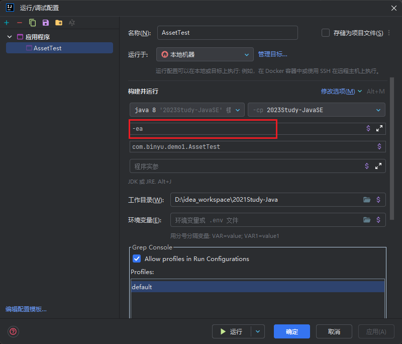

# Java 八股文笔记

## 1. Java基础-面向对象

[Java 基础 - 面向对象](#java-基础---面向对象)

- 三大特性
  - [封装](#封装)
  - [继承](#继承)
  - ==[多态](#多态)==
    - 编译时多态主要指方法的重载
    - 运行时多态指程序中定义的对象引用所指向的具体类型在运行期间才确定
- 类图
  - [泛化关系 (Generalization)](#泛化关系-generalization)
  - [实现关系 (Realization)](#实现关系-realization)
  - ==[聚合关系 (Aggregation)](#聚合关系-aggregation)== 可以拆散
  - ==[组合关系 (Composition)](#组合关系-composition)== 不可拆散
  - ==[关联关系 (Association)](#关联关系-association)== 1对N
  - [依赖关系 (Dependency)](#依赖关系-dependency)

## 2. Java基础-知识点

[Java 基础 - 知识点](#java-基础---知识点)

- 数据类型

  - [包装类型](#包装类型)
  - [缓存池](#缓存池)

- String

  - [概览](#概览)

  - ==[不可变的好处](#不可变的好处)==

    - **1. 可以缓存 hash 值**

      因为 String 的 hash 值经常被使用，例如 String 用做 HashMap 的 key。不可变的特性可以使得 hash 值也不可变，因此只需要进行一次计算。

      **2. String Pool 的需要**

      如果一个 String 对象已经被创建过了，那么就会从 String Pool 中取得引用。只有 String 是不可变的，才可能使用 String Pool。

      **3. 安全性**

      String 经常作为参数，String 不可变性可以保证参数不可变。例如在作为网络连接参数的情况下如果 String 是可变的，那么在网络连接过程中，String 被改变，改变 String 对象的那一方以为现在连接的是其它主机，而实际情况却不一定是。

      **4. 线程安全**

      String 不可变性天生具备线程安全，可以在多个线程中安全地使用。

  - [String, StringBuffer and StringBuilder](#string-stringbuffer-and-stringbuilder)

  - ==[String.intern()](#stringintern)==

    - **HotSpot中字符串常量池保存哪里？永久代？方法区还是堆区**？
      - 运行时常量池（Runtime Constant Pool）是虚拟机规范中是方法区的一部分，在加载类和结构到虚拟机后，就会创建对应的运行时常量池；而字符串常量池是这个过程中常量字符串的存放位置。所以从这个角度，字符串常量池属于虚拟机规范中的方法区，它是一个**逻辑上的概念**；而堆区，永久代以及元空间是实际的存放位置。
      - 不同的虚拟机对虚拟机的规范（比如方法区）是不一样的，只有 HotSpot 才有永久代的概念。
      - HotSpot也是发展的，由于[一些问题在新窗口打开](http://openjdk.java.net/jeps/122)的存在，HotSpot考虑逐渐去永久代，对于不同版本的JDK，**实际的存储位置**是有差异的，具体看如下表格：

    | JDK版本      | 是否有永久代，字符串常量池放在哪里？                         | 方法区逻辑上规范，由哪些实际的部分实现的？                   |
    | ------------ | ------------------------------------------------------------ | ------------------------------------------------------------ |
    | jdk1.6及之前 | 有永久代，运行时常量池（包括字符串常量池），静态变量存放在永久代上 | 这个时期方法区在HotSpot中是由永久代来实现的，以至于**这个时期说方法区就是指永久代** |
    | jdk1.7       | 有永久代，但已经逐步“去永久代”，字符串常量池、静态变量移除，保存在堆中； | 这个时期方法区在HotSpot中由**永久代**（类型信息、字段、方法、常量）和**堆**（字符串常量池、静态变量）共同实现 |
    | jdk1.8及之后 | 取消永久代，类型信息、字段、方法、常量保存在本地内存的元空间，但字符串常量池、静态变量仍在堆中 | 这个时期方法区在HotSpot中由本地内存的**元空间**（类型信息、字段、方法、常量）和**堆**（字符串常量池、静态变量）共同实现 |

    

- 运算

  - [参数传递](#参数传递)
  - [float 与 double](#float-与-double)
  - [隐式类型转换](#隐式类型转换)
  - [switch](#switch)

- 继承

  - [访问权限](#访问权限)
  - [抽象类与接口](#抽象类与接口)
  - [super](#super)
  - [重写与重载](#重写与重载)

- Object 通用方法

  - [概览](#概览-1)
  - [equals()](#equals)
  - [hashCode()](#hashcode)
  - [toString()](#tostring)
  - [clone()](#clone)

- 关键字

  - [final](#final)
  - [static](#static)

- [反射](#反射)

- [异常](#异常)

- [泛型](#泛型)

- [注解](#注解)

- 特性

  - [Java 各版本的新特性](#java-各版本的新特性)
  - [Java 与 C++ 的区别](#java-与-c-的区别)
  - [JRE or JDK](#jre-or-jdk)

## 3. Java基础-图谱 & Q/A

> 全会，略

## 4. Java 基础 - 泛型机制详解

Java泛型这个特性是从JDK 1.5才开始加入的，因此为了兼容之前的版本，Java泛型的实现采取了“**伪泛型**”的策略，即Java在语法上支持泛型，但是在编译阶段会进行所谓的“**类型擦除**”（Type Erasure），将所有的泛型表示（尖括号中的内容）都替换为具体的类型（其对应的原生态类型），就像完全没有泛型一样。

## 5. Java 基础 - 注解机制详解

- Java 基础 - 注解机制详解
  - 注解基础
    - Java内置注解
      - [内置注解 - @Override](#内置注解---override)
      - [内置注解 - @Deprecated](#内置注解---deprecated)
      - ==[内置注解 - @SuppressWarnings](#内置注解---suppresswarnings)==
    - 元注解
      - ==[元注解 - @Target](#元注解---target)==
      - ==[元注解 - @Retention & @RetentionTarget](#元注解---retention--retentiontarget)==
      - [元注解 - @Documented](#元注解---documented)
      - [元注解 - @Inherited](#元注解---inherited)
      - [元注解 - @Repeatable (Java8)](#元注解---repeatable-java8)
      - [元注解 - @Native (Java8)](#元注解---native-java8)
    - [注解与反射接口](#注解与反射接口)
    - [自定义注解](#自定义注解)
  - 深入理解注解
    - [Java8提供了哪些新的注解？](#java8提供了哪些新的注解)
    - [注解支持继承吗？](#注解支持继承吗)
    - [注解实现的原理？](#注解实现的原理)
  - 注解的应用场景
    - [配置化到注解化 - 框架的演进](#配置化到注解化---框架的演进)
    - [继承实现到注解实现 - Junit3到Junit4](#继承实现到注解实现---junit3到junit4)
    - [自定义注解和AOP - 通过切面实现解耦](#自定义注解和aop---通过切面实现解耦)

## 6. Java基础-异常机制详解

==[异常实践](#异常实践)==

- [只针对不正常的情况才使用异常](#只针对不正常的情况才使用异常)
- [在 finally 块中清理资源或者使用 try-with-resource 语句](#在-finally-块中清理资源或者使用-try-with-resource-语句)
- [尽量使用标准的异常](#尽量使用标准的异常)
- [对异常进行文档说明](#对异常进行文档说明)
- [优先捕获最具体的异常](#优先捕获最具体的异常)
- [不要捕获 Throwable 类](#不要捕获-throwable-类)
- [不要忽略异常](#不要忽略异常)
- [不要记录并抛出异常](#不要记录并抛出异常)
- [包装异常时不要抛弃原始的异常](#包装异常时不要抛弃原始的异常)
- [不要使用异常控制程序的流程](#不要使用异常控制程序的流程)
- [不要在finally块中使用return。](#不要在finally块中使用return)

## 7. Java 基础 - 反射机制详解

[反射基础](#反射基础)

- [Class类](#class类)
- [类加载](#类加载)

[反射的使用](#反射的使用)

- [Class类对象的获取](#class类对象的获取)
- [Constructor类及其用法](#constructor类及其用法)
- [Field类及其用法](#field类及其用法)
- [Method类及其用法](#method类及其用法)

[反射机制执行的流程](#反射机制执行的流程)

- [反射获取类实例](#反射获取类实例)
- [反射获取方法](#反射获取方法)
- [调用 method.invoke() 方法](#调用-methodinvoke-方法)
- [反射调用流程小结](#反射调用流程小结)

# Java 笔记

## 1. 断言

### 使用步骤

1. 配置断言



2. 编写代码

> 上一个断言会盖住下面的断言

```java
public class AssetTest {

     public static void main(String args[]) {
        String[] weekends = {"Friday", "Saturday", "Sunday"};
        assert weekends.length == 2;
        assert weekends.length == 2:"这个星期有 " + weekends.length + " 个周末";
        System.out.println("这个星期有 " + weekends.length + " 个周末");
    }

}
```

## 2. 反射

### 创建名为Class的类的对象

我们可以创建Class的对象，通过：

- **使用forName()方法**

forName()接受字符串参数（类的名称）并返回Class对象。返回的对象引用字符串指定的类。例如，

```
Class Dog {  }
Class c1 = Class.forName("Dog");
```

- **使用getClass()方法**

 getClass()方法使用特定类的对象来创建新的对象Class。例如，

```
Dog d1 = new Dog()
Class c1 = d1.getClass();
```

- **使用.class**

我们还可以使用**.class**扩展名创建Class对象。例如，

```
Class c1 = Dog.class;
```

创建Class对象后，我们可以使用这些对象执行反射。

### 获取接口

我们可以使用Class的getInterfaces()方法来收集类实现的接口的信息。此方法返回一个接口数组。

#### 示例：获取接口

```
import java.lang.Class;
import java.lang.reflect.*;

interface Animal {
   public void display();
}

interface Mammal {
   public void makeSound();
}

class Dog implements Animal, Mammal {
   public void display() {
      System.out.println("I am a dog.");
   }

   public void makeSound() {
      System.out.println("Bark bark");
   }
}

class ReflectionDemo {
  public static void main(String[] args) {
      try {
          //创建一个Dog类的对象
          Dog d1 = new Dog();

          //使用getClass()创建Class对象
          Class obj = d1.getClass();
        
          //查找由Dog实现的接口
          Class[] objInterface = obj.getInterfaces();
          for(Class c : objInterface) {

              //打印接口名称
              System.out.println("Interface Name: " + c.getName());
          }
      }

      catch(Exception e) {
          e.printStackTrace();
      }
   }
}
```

**输出结果**

```
Interface Name: Animal
Interface Name: Mammal
```

### 获取超类和访问修饰符

类Class的方法getSuperclass()可用于获取有关特定类的超类的信息。

而且，Class提供了一种getModifier()方法，该方法以整数形式返回class的修饰符。

#### 示例：获取超类和访问修饰符

```
import java.lang.Class;
import java.lang.reflect.*;

interface Animal {
   public void display();
}

public class Dog implements Animal {
   public void display() {
       System.out.println("I am a dog.");
   }
}

class ReflectionDemo {
   public static void main(String[] args) {
       try {
           //创建一个Dog类的对象
           Dog d1 = new Dog();

           //使用getClass()创建Class对象
           Class obj = d1.getClass();

           //以整数形式获取Dog的访问修饰符
           int modifier = obj.getModifiers();
           System.out.println("修饰符： " + Modifier.toString(modifier));

           //找到Dog的超类
           Class superClass = obj.getSuperclass();
           System.out.println("Superclass: " + superClass.getName());
       }

       catch(Exception e) {
           e.printStackTrace();
       }
   }
}
```

**输出结果**

```
修饰符： public
Superclass: Animal
```

### 反射字段，方法和构造函数

该软件包java.lang.reflect提供了可用于操作类成员的类。例如，

- **方法类** - 提供有关类中方法的信息
- **字段类** - 提供有关类中字段的信息
- **构造函数类** - 提供有关类中构造函数的信息

### Java 反射与字段

 我们可以使用Field类提供的各种方法检查和修改类的不同字段。

- **getFields() -** 返回该类及其超类的所有公共字段
- **getDeclaredFields()** - 返回类的所有字段
- **getModifier()** - 以整数形式返回字段的修饰符
- **set(classObject,value)** - 使用指定的值设置字段的值
- **get(classObject)** - 获取字段的值
- **setAccessible(boolean)** - 使私有字段可访问

**注意：**如果我们知道字段名称，则可以使用

- **getField("fieldName"）** - 从类返回名称为**fieldName**的公共字段。
- **getDeclaredField\**("fieldName"）\**** - 从类返回名称为**fieldName**的字段。

#### 示例：访问访问公共字段

```
import java.lang.Class;
import java.lang.reflect.*;

class Dog {
  public String type;
}

class ReflectionDemo {
  public static void main(String[] args) {
     try{
         Dog d1 = new Dog();
          //创建Class对象
         Class obj = d1.getClass();

        //操纵Dog类的公共字段type
         Field field1 = obj.getField("type");
        //设置字段的值
         field1.set(d1, "labrador");
        //通过转换成字符串来获取字段的值
         String typeValue = (String)field1.get(d1);
         System.out.println("type: " + typeValue);

         //获取类型的访问修饰符
         int mod1 = field1.getModifiers();
         String modifier1 = Modifier.toString(mod1);
         System.out.println("修饰符： " + modifier1);
         System.out.println(" ");
     }
     catch(Exception e) {
         e.printStackTrace();
     }
  }
}
```

**输出结果**

```
type: labrador
修饰符： public
```

### 示例：访问私有字段

```
import java.lang.Class;
import java.lang.reflect.*;

class Dog {
 private String color;
}

class ReflectionDemo {
public static void main(String[] args) {
   try {
      Dog d1 = new Dog();
      //创建类Class对象
      Class obj = d1.getClass();

      //访问私有字段
      Field field2 = obj.getDeclaredField("color");
     
      //使私有字段可访问
      field2.setAccessible(true);
      //设置color值
      field2.set(d1, "brown");
      // get the value of type converting in String
      String colorValue = (String)field2.get(d1);
      System.out.println("color: " + colorValue);

      //获取color的访问修饰符
      int mod2 = field2.getModifiers();
      String modifier2 = Modifier.toString(mod2);
      System.out.println("modifier: " + modifier2);
   }
   catch(Exception e) {
      e.printStackTrace();
   }
 }
}
```

**输出结果**

```
color: brown
modifier: private
```

### Java 反射与方法

像字段一样，我们可以使用Method类提供的各种方法来检查类的不同方法。

- **getMethods()** - 返回该类及其超类的所有公共方法
- **getDeclaredMethod()** - 返回该类的所有方法
- **getName()** - 返回方法的名称
- **getModifiers()** - 以整数形式返回方法的访问修饰符
- **getReturnType()** - 返回方法的返回类型

#### 示例：方法反射

```
import java.lang.Class;
import java.lang.reflect.*;

class Dog {
   public void display() {
      System.out.println("I am a dog.");
   }

   protected void eat() {
      System.out.println("I eat dog food.");
   }

   private void makeSound() {
      System.out.println("Bark Bark");
   }

}

class ReflectionDemo {
   public static void main(String[] args) {
      try {
          Dog d1 = new Dog();

          //创建一个Class对象
          Class obj = d1.getClass();
          
          //使用getDeclaredMethod()获取所有方法
          Method[] methods = obj.getDeclaredMethods();

          //获取方法的名称
          for(Method m : methods) {
               
             System.out.println("方法名称： " + m.getName());
              
             //获取方法的访问修饰符
             int modifier = m.getModifiers();
             System.out.println("修饰符： " + Modifier.toString(modifier));
              
             //获取方法的返回类型
             System.out.println("Return Types: " + m.getReturnType());
             System.out.println(" ");
          }
       }
       catch(Exception e) {
           e.printStackTrace();
       }
   }
}
```

**输出结果**

```
方法名称： display
修饰符： public
Return type: void

方法名称： eat
修饰符： protected
返回类型： void

方法名称： makeSound
修饰符： private
返回类型： void
```

### Java 反射与构造函数

我们还可以使用Constructor类提供的各种方法检查类的不同构造函数。

- **getConstructors()** - 返回该类的所有公共构造函数以及该类的超类
- **getDeclaredConstructor()** -返回所有构造函数
- **getName()** - 返回构造函数的名称
- **getModifiers()** - 以整数形式返回构造函数的访问修饰符
- **getParameterCount()** - 返回构造函数的参数数量

#### 示例：构造函数反射

```
import java.lang.Class;
import java.lang.reflect.*;

class Dog {

   public Dog() {
      
   }
   public Dog(int age) {
      
   }

   private Dog(String sound, String type) {
      
   }
}

class ReflectionDemo {
   public static void main(String[] args) {
      try {
           Dog d1 = new Dog();
           Class obj = d1.getClass();

           //使用getDeclaredConstructor()获取一个类中的所有构造函数
           Constructor[] constructors = obj.getDeclaredConstructors();

           for(Constructor c : constructors) {
               //获取构造函数的名称
               System.out.println("构造函数名称： " + c.getName());

               //获取构造函数的访问修饰符
               int modifier = c.getModifiers();
               System.out.println("修饰符： " + Modifier.toString(modifier));

               //获取构造函数中的参数数量
               System.out.println("参数个数： " + c.getParameterCount());
          }
       }
       catch(Exception e) {
           e.printStackTrace();
       }
    }
}
```

**输出结果**

```
构造函数名称： Dog
修饰符： public
参数个数： 0

构造函数名称： Dog
修饰符： public
参数个数： 1

构造函数名称： Dog
修饰符： private
参数个数： 2
```

