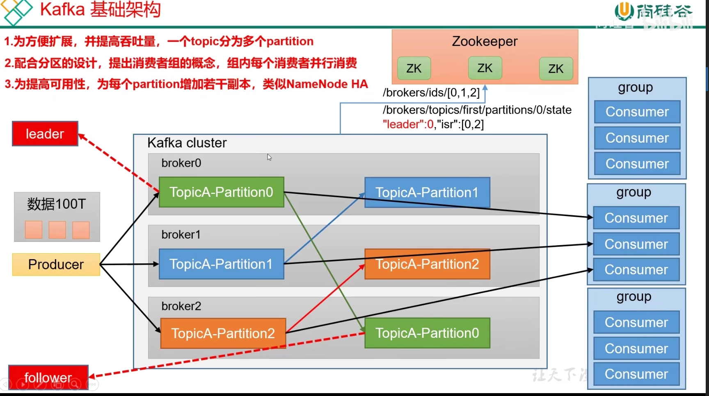

# Kafka

### Kafka概念

> 大数据的消息队列

#### 消息队列好处

- 流量削峰
- 解耦
- 异步通信

#### 消息队列的两种模式

- 点对点模式：消费者主动拉去数据，消息接收到后清除消息
- 发布/订阅模式：可以有多个Topic；消费者消费数据后，不删除数据；每个消费者相互独立，都可以消费到数据

#### Kafka基础架构

> kafka的broker是用scala写的

### 消息队列的流派

## Kafka生产者

