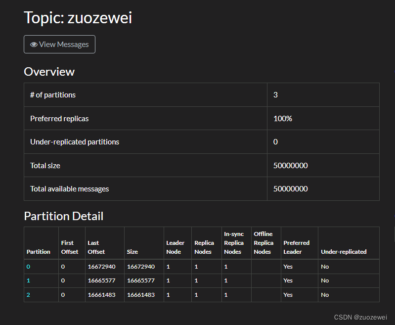

# Kafka笔记

https://www.bilibili.com/video/BV19y4y1b7Uo/

https://www.baeldung.com/spring-kafka

## 1. Kafka简介

### 1.1 Kafka定义

传统定义：Kafka是一个分布式的基于发布订阅模型的消息队列，主要应用于大数据实时处理领域。

最新定义：Kafka是一个开源的分布式事件流平台，被数千家公司用于高性能数据管道、流分析、数据集成和关键任务应用。

### 1.2 消息队列技术选型

| 维度           | [ActiveMQ](https://github.com/apache/activemq) | [RabbitMQ](https://github.com/rabbitmq/rabbitmq-server) | [RocketMQ](https://github.com/apache/rocketmq) | [Kafka](https://github.com/apache/kafka)                | [Pulsar](https://github.com/apache/pulsar)                   |
| :------------- | :--------------------------------------------- | :------------------------------------------------------ | :--------------------------------------------- | :------------------------------------------------------ | :----------------------------------------------------------- |
| 单机吞吐量     | 较低(万级)                                     | 一般（万级）                                            | 高（十万级）                                   | 高（十万级）                                            | 高（十万级）                                                 |
| 开发语言       | Java                                           | Erlang                                                  | Java                                           | Java/Scala                                              | Java                                                         |
| 维护者         | Apache                                         | Spring                                                  | Apache（Alibaba）                              | Apache（Confluent）                                     | Apache（StreamNative）                                       |
| Star 数量      | 2.3K                                           | 12K                                                     | 21K                                            | 28.2K                                                   | 14.1K                                                        |
| Contributor    | 139                                            | 264                                                     | 527                                            | 1189                                                    | 661                                                          |
| 社区活跃度     | 低                                             | 高                                                      | 较高                                           | 高                                                      | 高                                                           |
| 消费模式       | P2P、Pub-Sub                                   | direct、topic、Headers、fanout                          | 基于 Topic 和 MessageTag 的的 Pub-Sub          | 基于 Topic 的 Pub-Sub                                   | 基于 Topic 的 Pub-Sub，支持独占（exclusive）、共享（shared）、灾备（failover）、key 共享（key_shared）4 种模式 |
| 持久化         | 支持（小）                                     | 支持（小）                                              | 支持（大）                                     | 支持（大）                                              | 支持（大）                                                   |
| 顺序消息       | 不支持                                         | 不支持                                                  | 支持                                           | 支持                                                    | 支持                                                         |
| 性能稳定性     | 好                                             | 好                                                      | 一般                                           | 较差                                                    | 一般                                                         |
| 集群支持       | 主备模式                                       | 复制模式                                                | 主备模式                                       | Leader-Slave 每台既是 master 也是 slave，集群可扩展性强 | 集群模式，broker 无状态，易迁移，支持跨数据中心              |
| 管理界面       | 一般                                           | 较好                                                    | 一般                                           | 无                                                      | 无                                                           |
| 计算和存储分离 | 不支持                                         | 不支持                                                  | 不支持                                         | 不支持                                                  | 支持                                                         |
| AMQP 支持      | 支持                                           | 支持                                                    | 支持                                           | 不完全支持                                              | 不完全支持                                                   |

### 1.3 消息队列的作用

- 流量削峰
- 解耦

- 异步通信

### 1.4 Kafka的发布订阅模式

- 点对点模式
  - 消费者主动拉取数据，消息收到后删除信息
- 发布订阅模式（Kafka）
  - 可以有多个主题（topic）
  - 消息可回溯
  - 消费者相互独立，都可以消费到数据

## 2. 简单实战

### 2.1 简单集成

#### 引入依赖

```xml
<dependency>
<groupId>org.springframework.kafka</groupId>
<artifactId>spring-kafka</artifactId>
<version>2.2.6.RELEASE</version>
</dependency>
```

#### 添加配置

```
spring.kafka.producer.bootstrap-servers=192.168.31.16:9092
```

#### 测试发送和接收

```java
/**
*@author:kl@kailing.pub
*@date:2019/5/30
*/
@SpringBootApplication
@RestController
publicclassApplication{

	privatefinalLoggerlogger=LoggerFactory.getLogger(Application.class);

	publicstaticvoidmain(String[]args){
		SpringApplication.run(Application.class,args);
	}

	@Autowired
	privateKafkaTemplate<Object,Object>template;

	@GetMapping("/send/{input}")
	publicvoidsendFoo(@PathVariableStringinput){
		this.template.send("topic_input",input);
	}
	@KafkaListener(id="webGroup",topics="topic_input")
	publicvoidlisten(Stringinput){
		logger.info("inputvalue:{}",input);
	}
}
```

启动应用后，在浏览器中输入：http://localhost:8080/send/kl。就可以在控制台看到有日志输出了：input value: "kl"。基础的使用就这么简单。发送消息时注入一个 KafkaTemplate，接收消息时添加一个 @KafkaListener 注解即可。


#### Spring-kafka-test 嵌入式 Kafka Server

不过上面的代码能够启动成功，前提是你已经有了 Kafka Server 的服务环境，我们知道 Kafka 是由 Scala + Zookeeper 构建的，可以从官网下载部署包在本地部署。但是，我想告诉你，为了简化开发环节验证 Kafka 相关功能，Spring-Kafka-Test 已经封装了 Kafka-test 提供了注解式的一键开启 Kafka Server 的功能，使用起来也是超级简单。本文后面的所有测试用例的 Kafka 都是使用这种嵌入式服务提供的。


#### 引入依赖

```xml
<dependency>
   <groupId>org.springframework.kafka</groupId>
   <artifactId>spring-kafka-test</artifactId>
   <version>2.2.6.RELEASE</version>
   <scope>test</scope>
</dependency>
```


#### 启动服务

下面使用 Junit 测试用例，直接启动一个 Kafka Server 服务，包含四个 Broker 节点。

```java
@RunWith(SpringRunner.class)
@SpringBootTest(classes = ApplicationTests.class)
@EmbeddedKafka(count = 4,ports = {9092,9093,9094,9095})
public class ApplicationTests {
	@Test
	public void contextLoads()throws IOException {
		System.in.read();
	}
}
```

如上：只需要一个注解 @EmbeddedKafka 即可，就可以启动一个功能完整的 Kafka 服务，是不是很酷。默认只写注解不加参数的情况下，是创建一个随机端口的 Broker，在启动的日志中会输出具体的端口以及默认的一些配置项。不过这些我们在 Kafka 安装包配置文件中的配置项，在注解参数中都可以配置，下面详解下 @EmbeddedKafka 注解中的可设置参数 ：

- value：broker 节点数量
- count：同 value 作用一样，也是配置的 broker 的节点数量
- controlledShutdown：控制关闭开关，主要用来在 Broker 意外关闭时减少此 Broker 上 Partition 的不可用时间

   Kafka 是多 Broker 架构的高可用服务，一个 Topic 对应多个 partition，一个 Partition 可以有多个副本 Replication，这些 Replication 副本保存在多个 Broker，用于高可用。但是，虽然存在多个分区副本集，当前工作副本集却只有一个，默认就是首次分配的副本集【首选副本】为 Leader，负责写入和读取数据。当我们升级 Broker 或者更新 Broker 配置时需要重启服务，这个时候需要将 partition 转移到可用的 Broker。下面涉及到三种情况

1.   直接关闭 Broker：当 Broker 关闭时，Broker 集群会重新进行选主操作，选出一个新的 Broker 来作为 Partition Leader，选举时此 Broker 上的 Partition 会短时不可用
2.  开启 controlledShutdown：当 Broker 关闭时，Broker 本身会先尝试将 Leader 角色转移到其他可用的 Broker 上
3.  使用命令行工具：使用 bin/kafka-preferred-replica-election.sh，手动触发 PartitionLeader 角色转移

- ports：端口列表，是一个数组。对应了 count 参数，有几个 Broker，就要对应几个端口号
- brokerProperties：Broker 参数设置，是一个数组结构，支持如下方式进行 Broker 参数设置：

```java
@EmbeddedKafka(brokerProperties = {"log.index.interval.bytes = 4096","num.io.threads = 8"})
```

- okerPropertiesLocation：Broker 参数文件设置

 功能同上面的 brokerProperties，只是 Kafka Broker 的可设置参数达 182 个之多，都像上面这样配置肯定不是最优方案，所以提供了加载本地配置文件的功能，如：

```java
@EmbeddedKafka(brokerPropertiesLocation = "classpath:application.properties")
```


### 2.2 创建新的 Topic

默认情况下，如果在使用 KafkaTemplate 发送消息时，Topic 不存在，会创建一个新的 Topic，默认的分区数和副本数为如下 Broker 参数来设定

```
num.partitions = 1 #默认Topic分区数
num.replica.fetchers = 1 #默认副本数
```


#### 程序启动时创建 Topic

```java
/**
 * @author: kl @kailing.pub
 * @date: 2019/5/31
 */
@Configuration
public class KafkaConfig {
	@Bean
	public KafkaAdmin admin(KafkaProperties properties){
		KafkaAdmin admin = new KafkaAdmin(properties.buildAdminProperties());
		admin.setFatalIfBrokerNotAvailable(true);
		return admin;
	}
	@Bean
	public NewTopic topic2() {
		return new NewTopic("topic-kl", 1, (short) 1);
	}
}
```

如果 Kafka Broker 支持（1.0.0 或更高版本），则如果发现现有 Topic 的 Partition 数少于设置的 Partition 数，则会新增新的 Partition 分区。关于 KafkaAdmin 有几个常用的用法如下：

setFatalIfBrokerNotAvailable (true)：默认这个值是 False 的，在 Broker 不可用时，不影响 Spring 上下文的初始化。如果你觉得 Broker 不可用影响正常业务需要显示的将这个值设置为 True

setAutoCreate (false) : 默认值为 True，也就是 Kafka 实例化后会自动创建已经实例化的 NewTopic 对象

initialize ()：当 setAutoCreate 为 false 时，需要我们程序显示的调用 admin 的 initialize () 方法来初始化 NewTopic 对象


#### 代码逻辑中创建

有时候我们在程序启动时并不知道某个 Topic 需要多少 Partition 数合适，但是又不能一股脑的直接使用 Broker 的默认设置，这个时候就需要使用 Kafka-Client 自带的 AdminClient 来进行处理。上面的 Spring 封装的 KafkaAdmin 也是使用的 AdminClient 来处理的。如：

```java
	@Autowired
	private KafkaProperties properties;
	@Test
	public void testCreateToipc(){
		AdminClient client = AdminClient.create(properties.buildAdminProperties());
		if(client !=null){
			try {
				Collection<NewTopic> newTopics = new ArrayList<>(1);
				newTopics.add(new NewTopic("topic-kl",1,(short) 1));
				client.createTopics(newTopics);
			}catch (Throwable e){
				e.printStackTrace();
			}finally {
				client.close();
			}
		}
	}
```


#### ps: 其他的方式创建 Topic

上面的这些创建 Topic 方式前提是你的 spring boot 版本到 2.x 以上了，因为 spring-kafka2.x 版本只支持 spring boot2.x 的版本。在 1.x 的版本中还没有这些 api。下面补充一种在程序中通过 Kafka_2.10 创建 Topic 的方式


##### 引入依赖

```xml
        <dependency>
            <groupId>org.apache.kafka</groupId>
            <artifactId>kafka_2.10</artifactId>
            <version>0.8.2.2</version>
        </dependency>
```


##### api 方式创建

```java
	@Test
	public void testCreateTopic()throws Exception{
		ZkClient zkClient =new ZkClient("192.168.31.16:2181", 3000, 3000, ZKStringSerializer$.MODULE$)
		String topicName = "topic-kl";
		int partitions = 1;
		int replication = 1;
		AdminUtils.createTopic(zkClient,topicName,partitions,replication,new Properties());
	}
```

注意下 ZkClient 最后一个构造入参，是一个序列化反序列化的接口实现，博主测试如果不填的话，创建的 Topic 在 ZK 上的数据是有问题的，默认的 Kafka 实现也很简单，就是做了字符串 UTF-8 编码处理。ZKStringSerializer$ 是 Kafka 中已经实现好的一个接口实例，是一个 Scala 的伴生对象，在 Java 中直接调用点 MODULE$ 就可以得到一个实例


##### 命令方式创建

```java
	@Test
	public void testCreateTopic(){
		String [] options= new String[]{
				"--create",
				"--zookeeper","192.168.31.16:2181",
				"--replication-factor", "3",
				"--partitions", "3",
				"--topic", "topic-kl"
		};
		TopicCommand.main(options);
	}
```


### 2.3 消息发送之 KafkaTemplate 探秘


#### 异步获取

```java
		template.send("","").addCallback(new ListenableFutureCallback<SendResult<Object, Object>>() {
			@Override
			public void onFailure(Throwable throwable) {
				......
			}

			@Override
			public void onSuccess(SendResult<Object, Object> objectObjectSendResult) {
				....
			}
		});
```


#### 同步获取

```java
		ListenableFuture<SendResult<Object,Object>> future = template.send("topic-kl","kl");
		try {
			SendResult<Object,Object> result = future.get();
		}catch (Throwable e){
			e.printStackTrace();
		}
```


#### kafka 事务消息

默认情况下，Spring-kafka 自动生成的 KafkaTemplate 实例，是不具有事务消息发送能力的。需要使用如下配置激活事务特性。事务激活后，所有的消息发送只能在发生事务的方法内执行了，不然就会抛一个没有事务交易的异常

```java
spring.kafka.producer.transaction-id-prefix=kafka_tx.
```

当发送消息有事务要求时，比如，当所有消息发送成功才算成功，如下面的例子：假设第一条消费发送后，在发第二条消息前出现了异常，那么第一条已经发送的消息也会回滚。而且正常情况下，假设在消息一发送后休眠一段时间，在发送第二条消息，消费端也只有在事务方法执行完成后才会接收到消息

```java
	@GetMapping("/send/{input}")
	public void sendFoo(@PathVariable String input) {
		template.executeInTransaction(t ->{
			t.send("topic_input","kl");
			if("error".equals(input)){
				throw new RuntimeException("failed");
			}
			t.send("topic_input","ckl");
			return true;
		});
	}
```

当事务特性激活时，同样，在方法上面加 @Transactional 注解也会生效

```java
	@GetMapping("/send/{input}")
	@Transactional(rollbackFor = RuntimeException.class)
	public void sendFoo(@PathVariable String input) {
		template.send("topic_input", "kl");
		if ("error".equals(input)) {
			throw new RuntimeException("failed");
		}
		template.send("topic_input", "ckl");
	}
```

Spring-Kafka 的事务消息是基于 Kafka 提供的事务消息功能的。而 Kafka Broker 默认的配置针对的三个或以上 Broker 高可用服务而设置的。这边在测试的时候为了简单方便，使用了嵌入式服务新建了一个单 Broker 的 Kafka 服务，出现了一些问题：如

1、事务日志副本集大于 Broker 数量，会抛如下异常：

```
Number of alive brokers '1' does not meet the required replication factor '3' 
for the transactions state topic (configured via 'transaction.state.log.replication.factor').
This error can be ignored if the cluster is starting up and not all brokers are up yet.
```

默认 Broker 的配置 transaction.state.log.replication.factor=3，单节点只能调整为 1

2、副本数小于副本同步队列数目，会抛如下异常

```java
Number of insync replicas for partition __transaction_state-13 is [1], below required minimum [2]
```

默认 Broker 的配置 transaction.state.log.min.isr=2，单节点只能调整为 1


#### ReplyingKafkaTemplate 获得消息回复

ReplyingKafkaTemplate 是 KafkaTemplate 的一个子类，除了继承父类的方法，新增了一个方法 sendAndReceive，实现了消息发送 \ 回复语义

```
RequestReplyFuture<K, V, R> sendAndReceive(ProducerRecord<K, V> record);
```

也就是我发送一条消息，能够拿到消费者给我返回的结果。就像传统的 RPC 交互那样。当消息的发送者需要知道消息消费者的具体的消费情况，非常适合这个 api。如，一条消息中发送一批数据，需要知道消费者成功处理了哪些数据。下面代码演示了怎么集成以及使用 ReplyingKafkaTemplate

```java
/**
 * @author: kl @kailing.pub
 * @date: 2019/5/30
 */
@SpringBootApplication
@RestController
public class Application {
	private final Logger logger = LoggerFactory.getLogger(Application.class);
	public static void main(String[] args) {
		SpringApplication.run(Application.class, args);
	}
	@Bean
	public ConcurrentMessageListenerContainer<String, String> repliesContainer(ConcurrentKafkaListenerContainerFactory<String, String> containerFactory) {
		ConcurrentMessageListenerContainer<String, String> repliesContainer = containerFactory.createContainer("replies");
		repliesContainer.getContainerProperties().setGroupId("repliesGroup");
		repliesContainer.setAutoStartup(false);
		return repliesContainer;
	}

	@Bean
	public ReplyingKafkaTemplate<String, String, String> replyingTemplate(ProducerFactory<String, String> pf, ConcurrentMessageListenerContainer<String, String> repliesContainer) {
		return new ReplyingKafkaTemplate(pf, repliesContainer);
	}

	@Bean
	public KafkaTemplate kafkaTemplate(ProducerFactory<String, String> pf) {
		return new KafkaTemplate(pf);
	}

	@Autowired
	private ReplyingKafkaTemplate template;

	@GetMapping("/send/{input}")
	@Transactional(rollbackFor = RuntimeException.class)
	public void sendFoo(@PathVariable String input) throws Exception {
		ProducerRecord<String, String> record = new ProducerRecord<>("topic-kl", input);
		RequestReplyFuture<String, String, String> replyFuture = template.sendAndReceive(record);
		ConsumerRecord<String, String> consumerRecord = replyFuture.get();
		System.err.println("Return value: " + consumerRecord.value());
	}

	@KafkaListener(id = "webGroup", topics = "topic-kl")
	@SendTo
	public String listen(String input) {
		logger.info("input value: {}", input);
		return "successful";
	}
}
```


### 2.4 Spring-kafka 消息消费用法探秘


#### @KafkaListener 的使用

前面在简单集成中已经演示过了 @KafkaListener 接收消息的能力，但是 @KafkaListener 的功能不止如此，其他的比较常见的，使用场景比较多的功能点如下：

- 显示的指定消费哪些 Topic 和分区的消息，
- 设置每个 Topic 以及分区初始化的偏移量，
- 设置消费线程并发度
- 设置消息异常处理器

```java
	@KafkaListener(id = "webGroup", topicPartitions = {
			@TopicPartition(topic = "topic1", partitions = {"0", "1"}),
					@TopicPartition(topic = "topic2", partitions = "0",
							partitionOffsets = @PartitionOffset(partition = "1", initialOffset = "100"))
			},concurrency = "6",errorHandler = "myErrorHandler")
	public String listen(String input) {
		logger.info("input value: {}", input);
		return "successful";
	}
```

其他的注解参数都很好理解，errorHandler 需要说明下，设置这个参数需要实现一个接口 KafkaListenerErrorHandler。而且注解里的配置，是你自定义实现实例在 spring 上下文中的 Name。比如，上面配置为 errorHandler = "myErrorHandler"。则在 spring 上线中应该存在这样一个实例：

```java
/**
 * @author: kl @kailing.pub
 * @date: 2019/5/31
 */
@Service("myErrorHandler")
public class MyKafkaListenerErrorHandler implements KafkaListenerErrorHandler {
	Logger logger =LoggerFactory.getLogger(getClass());
	@Override
	public Object handleError(Message<?> message, ListenerExecutionFailedException exception) {
		logger.info(message.getPayload().toString());
		return null;
	}
	@Override
	public Object handleError(Message<?> message, ListenerExecutionFailedException exception, Consumer<?, ?> consumer) {
		logger.info(message.getPayload().toString());
		return null;
	}
}
```


#### 手动 Ack 模式

手动 ACK 模式，由业务逻辑控制提交偏移量。比如程序在消费时，有这种语义，特别异常情况下不确认 ack，也就是不提交偏移量，那么你只能使用手动 Ack 模式来做了。开启手动首先需要关闭自动提交，然后设置下 consumer 的消费模式

```
spring.kafka.consumer.enable-auto-commit=false
spring.kafka.listener.ack-mode=manual
```

上面的设置好后，在消费时，只需要在 @KafkaListener 监听方法的入参加入 Acknowledgment 即可，执行到 ack.acknowledge () 代表提交了偏移量

```java
	@KafkaListener(id = "webGroup", topics = "topic-kl")
	public String listen(String input, Acknowledgment ack) {
		logger.info("input value: {}", input);
		if ("kl".equals(input)) {
			ack.acknowledge();
		}
		return "successful";
	}
```


#### @KafkaListener 注解监听器生命周期

@KafkaListener 注解的监听器的生命周期是可以控制的，默认情况下，@KafkaListener 的参数 autoStartup = "true"。也就是自动启动消费，但是也可以同过 KafkaListenerEndpointRegistry 来干预他的生命周期。KafkaListenerEndpointRegistry 有三个动作方法分别如：start (),pause (),resume ()/ 启动，停止，继续。如下代码详细演示了这种功能。

```java
/**
 * @author: kl @kailing.pub
 * @date: 2019/5/30
 */
@SpringBootApplication
@RestController
public class Application {
	private final Logger logger = LoggerFactory.getLogger(Application.class);

	public static void main(String[] args) {
		SpringApplication.run(Application.class, args);
	}

	@Autowired
	private KafkaTemplate template;

	@GetMapping("/send/{input}")
	@Transactional(rollbackFor = RuntimeException.class)
	public void sendFoo(@PathVariable String input) throws Exception {
		ProducerRecord<String, String> record = new ProducerRecord<>("topic-kl", input);
		template.send(record);
	}

	@Autowired
	private KafkaListenerEndpointRegistry registry;

	@GetMapping("/stop/{listenerID}")
	public void stop(@PathVariable String listenerID){
		registry.getListenerContainer(listenerID).pause();
	}
	@GetMapping("/resume/{listenerID}")
	public void resume(@PathVariable String listenerID){
		registry.getListenerContainer(listenerID).resume();
	}
	@GetMapping("/start/{listenerID}")
	public void start(@PathVariable String listenerID){
		registry.getListenerContainer(listenerID).start();
	}
	@KafkaListener(id = "webGroup", topics = "topic-kl",autoStartup = "false")
	public String listen(String input) {
		logger.info("input value: {}", input);
		return "successful";
	}
}
```

在上面的代码中，listenerID 就是 @KafkaListener 中的 id 值 “webGroup”。项目启动好后，分别执行如下 url，就可以看到效果了。

先发送一条消息：http://localhost:8081/send/ckl。因为 autoStartup = "false"，所以并不会看到有消息进入监听器。

接着启动监听器：http://localhost:8081/start/webGroup。可以看到有一条消息进来了。

暂停和继续消费的效果使用类似方法就可以测试出来了。


#### SendTo 消息转发

前面的消息发送响应应用里面已经见过 @SendTo, 其实除了做发送响应语义外，@SendTo 注解还可以带一个参数，指定转发的 Topic 队列。常见的场景如，一个消息需要做多重加工，不同的加工耗费的 cup 等资源不一致，那么就可以通过跨不同 Topic 和部署在不同主机上的 consumer 来解决了。如：

```java
	@KafkaListener(id = "webGroup", topics = "topic-kl")
	@SendTo("topic-ckl")
	public String listen(String input) {
		logger.info("input value: {}", input);
		return input + "hello!";
	}

	@KafkaListener(id = "webGroup1", topics = "topic-ckl")
	public void listen2(String input) {
		logger.info("input value: {}", input);
	}
```


#### 消息重试和死信队列的应用

除了上面谈到的通过手动 Ack 模式来控制消息偏移量外，其实 Spring-kafka 内部还封装了可重试消费消息的语义，也就是可以设置为当消费数据出现异常时，重试这个消息。而且可以设置重试达到多少次后，让消息进入预定好的 Topic。也就是死信队列里。下面代码演示了这种效果：

```java
	@Autowired
	private KafkaTemplate template;

	@Bean
	public ConcurrentKafkaListenerContainerFactory<?, ?> kafkaListenerContainerFactory(
			ConcurrentKafkaListenerContainerFactoryConfigurer configurer,
			ConsumerFactory<Object, Object> kafkaConsumerFactory,
			KafkaTemplate<Object, Object> template) {
		ConcurrentKafkaListenerContainerFactory<Object, Object> factory = new ConcurrentKafkaListenerContainerFactory<>();
		configurer.configure(factory, kafkaConsumerFactory);
		//最大重试三次
		factory.setErrorHandler(new SeekToCurrentErrorHandler(new DeadLetterPublishingRecoverer(template), 3));
		return factory;
	}

	@GetMapping("/send/{input}")
	public void sendFoo(@PathVariable String input) {
		template.send("topic-kl", input);
	}

	@KafkaListener(id = "webGroup", topics = "topic-kl")
	public String listen(String input) {
		logger.info("input value: {}", input);
		throw new RuntimeException("dlt");
	}

	@KafkaListener(id = "dltGroup", topics = "topic-kl.DLT")
	public void dltListen(String input) {
		logger.info("Received from DLT: " + input);
	}
```

上面应用，在 topic-kl 监听到消息会，会触发运行时异常，然后监听器会尝试三次调用，当到达最大的重试次数后。消息就会被丢掉重试死信队列里面去。死信队列的 Topic 的规则是，业务 Topic 名字 +“.DLT”。如上面业务 Topic 的 name 为 “topic-kl”，那么对应的死信队列的 Topic 就是 “topic-kl.DLT”

## 3. Kafka集群docker部署

1. 运行zookeeper

```cmd
docker run -d --name zookeeper -p 2181:2181 -t wurstmeister/zookeeper
```

2. 分别创建3个Kafka节点，并注册到ZK上,不同Kafka节点只需要更改端口号即可。

   - Kafka0：

   ```cobol
   docker run -d --name kafka0 -p 9092:9092 -e KAFKA_BROKER_ID=0 -e KAFKA_ZOOKEEPER_CONNECT=192.168.31.16:2181 -e KAFKA_ADVERTISED_LISTENERS=PLAINTEXT://192.168.31.16:9092 -e KAFKA_LISTENERS=PLAINTEXT://0.0.0.0:9092 -t wurstmeister/kafka
   ```

   - Kafka1：

   ```cobol
   docker run -d --name kafka1 -p 9093:9093 -e KAFKA_BROKER_ID=1 -e KAFKA_ZOOKEEPER_CONNECT=192.168.31.16:2181 -e KAFKA_ADVERTISED_LISTENERS=PLAINTEXT://192.168.31.16:9093 -e KAFKA_LISTENERS=PLAINTEXT://0.0.0.0:9093 -t wurstmeister/kafka
   ```

   - Kafka2：

   ```cobol
   docker run -d --name kafka2 -p 9094:9094 -e KAFKA_BROKER_ID=2 -e KAFKA_ZOOKEEPER_CONNECT=192.168.31.16:2181 -e KAFKA_ADVERTISED_LISTENERS=PLAINTEXT://192.168.31.16:9094 -e KAFKA_LISTENERS=PLAINTEXT://0.0.0.0:9094 -t wurstmeister/kafka
   ```

3. 进入kafka执行命令

```
docker exec -it kafka1 /bin/bash
```

创建主题

```
kafka-topics.sh --create --bootstrap-server 192.168.31.16:9092 --topic test
```

查看主题

```
kafka-topics.sh --describe  --zookeeper 192.168.31.16:2181 --topic test
```

## 4. Offset Explorer3 (图形化Kafka操作KafkaTool)

[KafkaTool官网](https://www.kafkatool.com/)

## 5. Kafka性能测试

[CSDN-Kafka性能测试（控制不同的参数变量对比）](https://blog.csdn.net/weixin_42641909/article/details/89320999)

### 5.1 Kafka性能测试命令介绍

在 Kafka 安装目录 `$KAFKA_HOME/bin/` 有以下跟性能相关的测试脚本：

```bash
#生产者和消费者的性能测试工具
kafka-producer-perf-test.sh
kafka-consumer-perf-test.sh

#用来测试生产者和消费者功能的，现使用率很低。
kafka-verifiable-consumer.sh
kafka-verifiable-producer.sh

# Kafka 的测试框架，用于执行各种基准测试和负载测试。一般的 Kafka 用户应该用不到这个脚本。
trogdor.sh
windows
```

本次我们测试主要使用以下两个脚本：
1、kafka-producer-perf-test.sh：用于测试Kafka Producer的性能，主要输出4项指标，总共发送消息量（以MB为单位），每秒发送消息量（MB/second），发送消息总数，每秒发送消息数（records/second）。

主要参数如下：

```bash
[root@data-server bin]# ./kafka-producer-perf-test.sh 
usage: producer-performance [-h] --topic TOPIC --num-records NUM-RECORDS [--payload-delimiter PAYLOAD-DELIMITER] --throughput THROUGHPUT
                            [--producer-props PROP-NAME=PROP-VALUE [PROP-NAME=PROP-VALUE ...]] [--producer.config CONFIG-FILE] [--print-metrics]
                            [--transactional-id TRANSACTIONAL-ID] [--transaction-duration-ms TRANSACTION-DURATION] (--record-size RECORD-SIZE |
                            --payload-file PAYLOAD-FILE)

This tool is used to verify the producer performance.

optional arguments:
  -h, --help             show this help message and exit
  --topic TOPIC          produce messages to this topic
  --num-records NUM-RECORDS
                         number of messages to produce
  --payload-delimiter PAYLOAD-DELIMITER
                         provides delimiter to be used when --payload-file is provided. Defaults  to  new  line. Note that this parameter will be ignored if --
                         payload-file is not provided. (default: \n)
  --throughput THROUGHPUT
                         throttle maximum message throughput to *approximately* THROUGHPUT messages/sec. Set this to -1 to disable throttling.
  --producer-props PROP-NAME=PROP-VALUE [PROP-NAME=PROP-VALUE ...]
                         kafka producer related configuration properties like bootstrap.servers,client.id etc.  These configs take precedence over those passed
                         via --producer.config.
  --producer.config CONFIG-FILE
                         producer config properties file.
  --print-metrics        print out metrics at the end of the test. (default: false)
  --transactional-id TRANSACTIONAL-ID
                         The transactionalId to use if  transaction-duration-ms  is  >  0.  Useful  when  testing  the  performance of concurrent transactions.
                         (default: performance-producer-default-transactional-id)
  --transaction-duration-ms TRANSACTION-DURATION
                         The max age of each transaction. The commitTransaction will be  called  after  this time has elapsed. Transactions are only enabled if
                         this value is positive. (default: 0)

  either --record-size or --payload-file must be specified but not both.

  --record-size RECORD-SIZE
                         message size in bytes. Note that you must provide exactly one of --record-size or --payload-file.
  --payload-file PAYLOAD-FILE
                         file to read the message payloads from. This works only  for  UTF-8  encoded  text  files.  Payloads will be read from this file and a
                         payload will be randomly selected when sending messages. Note that you must provide exactly one of --record-size or --payload-file.
```

2、kafka-consumer-perf-test.sh：用于测试Kafka Consumer的性能，测试指标与Producer性能测试脚本一样

主要参数如下：

```bash
[root@data-server bin]# ./kafka-consumer-perf-test.sh
Missing required option(s) [bootstrap-server]
Option                                   Description                            
------                                   -----------                            
--bootstrap-server <String: server to    REQUIRED unless --broker-list          
  connect to>                              (deprecated) is specified. The server
                                           (s) to connect to.                   
--broker-list <String: broker-list>      DEPRECATED, use --bootstrap-server     
                                           instead; ignored if --bootstrap-     
                                           server is specified. The broker list 
                                           string in the form HOST1:PORT1,HOST2:
                                           PORT2.                               
--consumer.config <String: config file>  Consumer config properties file.       
--date-format <String: date format>      The date format to use for formatting  
                                           the time field. See java.text.       
                                           SimpleDateFormat for options.        
                                           (default: yyyy-MM-dd HH:mm:ss:SSS)   
--fetch-size <Integer: size>             The amount of data to fetch in a       
                                           single request. (default: 1048576)   
--from-latest                            If the consumer does not already have  
                                           an established offset to consume     
                                           from, start with the latest message  
                                           present in the log rather than the   
                                           earliest message.                    
--group <String: gid>                    The group id to consume on. (default:  
                                           perf-consumer-20126)                 
--help                                   Print usage information.               
--hide-header                            If set, skips printing the header for  
                                           the stats                            
--messages <Long: count>                 REQUIRED: The number of messages to    
                                           send or consume                      
--num-fetch-threads <Integer: count>     DEPRECATED AND IGNORED: Number of      
                                           fetcher threads. (default: 1)        
--print-metrics                          Print out the metrics.                 
--reporting-interval <Long:              Interval in milliseconds at which to   
  interval_ms>                             print progress info. (default: 5000) 
--show-detailed-stats                    If set, stats are reported for each    
                                           reporting interval as configured by  
                                           reporting-interval                   
--socket-buffer-size <Integer: size>     The size of the tcp RECV size.         
                                           (default: 2097152)                   
--threads <Integer: count>               DEPRECATED AND IGNORED: Number of      
                                           processing threads. (default: 10)    
--timeout [Long: milliseconds]           The maximum allowed time in            
                                           milliseconds between returned        
                                           records. (default: 10000)            
--topic <String: topic>                  REQUIRED: The topic to consume from.   
--version                                Display Kafka version.                 
```

测试环境说明：

- 前置条件：1个Broker（节点），1个Topic（主题），3个Partition（分区），无Replication（副本），异步模式，消息Payload为300字节，消息数量5000万（Kafka设置保持与生产环境一致）
- 被测版本：bitnami/kafka:2.8.1 被测服务器：通用计算型 | 8vCPUs | 16GiB | s3.2xlarge.2 | 通用型SSD | 300 GiB IOPS上限5,400，IOPS突发上限8,000 ，最大吞吐量 250 MB/s
- 测试客户端：通用计算型 | 8vCPUs | 16GiB | s3.2xlarge.2 | 通用型SSD | 500 GiB IOPS上限7,800，IOPS突发上限8,000，最大吞吐量 250 MB/s
- 测试工具：Kafka自带的基准工具


（简要测试拓扑）

### 5.2 生产者基准测试

测试项目：Kafka Producer 性能基准测试
测试目标：测试设置测试参数：acks=1，消息Payload为300字节，消息数量5000万时Producer时的吞吐量

```bash
./kafka-producer-perf-test.sh --topic zuozewei --num-records 50000000 --throughput -1 --record-size 300 --producer-props bootstrap.servers=192.168.1.213:9092 acks=1
```

相关参数解释如下：

```bash
--topic 指定topic
--num-records	指定生产数据量
--throughput	指定吞吐量(-1表示无限制)
--record-size   record数据大小
--producer-props key=value	指定producer服务地址配置，该命令允许你在后面指定要设置的生产者参数，比如压缩算法、延时时间等。
--acks  指定发送出去的消息的持久化机制
```

补充下 acks 的几种参数的解释：

- acks=0：不管写入broker的消息到底成功与否，发送一条消息出去，立马就可以发送下一条消息，吞吐量最高的方式，会发生消息丢失；
- acks=all/acks=-1：leader写入成功以后，必须等待其他ISR中的副本都写入成功，才可以返回响应说这条消息写入成功了，此时会收到一个回调通知；
- acks=1：只要leader写入成功，就认为消息成功了，默认值，会发生消息丢失。

测试结果如下：

```bash
[root@data-server bin]# ./kafka-producer-perf-test.sh --topic zuozewei --num-records 50000000 --throughput -1 --record-size 300 --producer-props bootstrap.servers=192.168.1.213:9092 acks=1
1823612 records sent, 364722.4 records/sec (104.35 MB/sec), 2.0 ms avg latency, 412.0 ms max latency.
2289024 records sent, 457804.8 records/sec (130.98 MB/sec), 1.4 ms avg latency, 52.0 ms max latency.
2300541 records sent, 460108.2 records/sec (131.64 MB/sec), 1.2 ms avg latency, 30.0 ms max latency.
2306616 records sent, 461323.2 records/sec (131.99 MB/sec), 1.1 ms avg latency, 18.0 ms max latency.
2242778 records sent, 448555.6 records/sec (128.33 MB/sec), 1.1 ms avg latency, 16.0 ms max latency.
2140578 records sent, 428115.6 records/sec (122.48 MB/sec), 1.2 ms avg latency, 19.0 ms max latency.
2222668 records sent, 444533.6 records/sec (127.18 MB/sec), 1.2 ms avg latency, 28.0 ms max latency.
2205768 records sent, 441153.6 records/sec (126.22 MB/sec), 1.2 ms avg latency, 18.0 ms max latency.
2181274 records sent, 436254.8 records/sec (124.81 MB/sec), 1.4 ms avg latency, 52.0 ms max latency.
2094473 records sent, 418894.6 records/sec (119.85 MB/sec), 1.4 ms avg latency, 17.0 ms max latency.
2024219 records sent, 404843.8 records/sec (115.83 MB/sec), 1.4 ms avg latency, 14.0 ms max latency.
2000186 records sent, 400037.2 records/sec (114.45 MB/sec), 1.7 ms avg latency, 29.0 ms max latency.
1913048 records sent, 382609.6 records/sec (109.47 MB/sec), 2.4 ms avg latency, 71.0 ms max latency.
2125272 records sent, 425054.4 records/sec (121.61 MB/sec), 1.4 ms avg latency, 19.0 ms max latency.
2191209 records sent, 438241.8 records/sec (125.38 MB/sec), 1.2 ms avg latency, 15.0 ms max latency.
2243998 records sent, 448799.6 records/sec (128.40 MB/sec), 1.2 ms avg latency, 22.0 ms max latency.
2165062 records sent, 433012.4 records/sec (123.89 MB/sec), 1.1 ms avg latency, 17.0 ms max latency.
2059370 records sent, 411874.0 records/sec (117.84 MB/sec), 1.2 ms avg latency, 18.0 ms max latency.
2182918 records sent, 436583.6 records/sec (124.91 MB/sec), 1.3 ms avg latency, 26.0 ms max latency.
2169204 records sent, 433840.8 records/sec (124.12 MB/sec), 1.4 ms avg latency, 26.0 ms max latency.
2100874 records sent, 420174.8 records/sec (120.21 MB/sec), 1.2 ms avg latency, 12.0 ms max latency.
2056641 records sent, 411328.2 records/sec (117.68 MB/sec), 1.5 ms avg latency, 21.0 ms max latency.
2059852 records sent, 411970.4 records/sec (117.87 MB/sec), 1.6 ms avg latency, 26.0 ms max latency.
50000000 records sent, 426686.692495 records/sec (122.08 MB/sec), 1.37 ms avg latency, 412.00 ms max latency, 1 ms 50th, 2 ms 95th, 9 ms 99th, 24 ms 99.9th.
[root@data-server bin]# 
```

测试结果会打印出测试生产者的吞吐量 (MB/s)、消息发送延时以及各种分位数下的延时。一般情况下，消息延时不是一个简单的数字，而是一组分布，而我们应该关心延时的概率分布情况，仅仅知道一个平均值是没有意义的，这里我们关注到99th 分位就可以了。比如在上面的输出中，99th 值是 9 ms，这表明测试生产者生产的消息中，有 99% 消息的延时都在 9 ms 以内。我们完全可以把这个数据当作这个生产者对外承诺的 SLA。

简要解析以上结果：**数据：5000万，平均吞吐量（TPS）：约 42 万条/秒，99.9th（百分位）延时：9 毫秒，平均速率：122 MB/s**

Kafdrop 服务端监控截图：

我们可以看到5000万条数据全部被 Broker 接收。

消息服务器资源监控截图：

我们可以一个 Broker 的 CPU 使用量约为 44 %，内存使用率为 90%，磁盘写入速率为149 MB/s。

### 5.3 消费者基准测试

测试命令如下：

```bash
./kafka-consumer-perf-test.sh --topic zuozewei --threads 1 --messages 50000000  --broker-list 192.168.1.213:9092
```

相关参数解释如下：

```bash
--topic 指定topic
--threads 指定线程数
--messages 指定消费数据条数
--broker-list kafka broker列表地址
[root@data-server bin]# ./kafka-consumer-perf-test.sh --topic zuozewei --threads 1 --messages 50000000  --broker-list 192.168.1.213:9092
WARNING: option [threads] and [num-fetch-threads] have been deprecated and will be ignored by the test
start.time, end.time, data.consumed.in.MB, MB.sec, data.consumed.in.nMsg, nMsg.sec, rebalance.time.ms, fetch.time.ms, fetch.MB.sec, fetch.nMsg.sec
2024-04-18 16:17:58:373, 2024-04-18 16:19:03:556, 14305.1147, 219.4608, 50000000, 767071.1689, 452, 64731, 220.9933, 772427.4304
```

消费者测试结果输出格式与生产者有所差别，但该脚本也会打印出消费者的吞吐量数据。比如本例中的 1723MB/s。有点令人遗憾的是，它没有计算不同分位数下的分布情况。

把以上结果整理成表格如下：

简要解析以上结果：**数据：5000万，平均吞吐量（TPS）：约 77 万条/秒，平均速率：221 MB/s**

Kafdrop 服务端监控截图：

毫无疑问，kafka消费者进度监控的最重要的监控指标为消费者 lag，即所谓滞后程度，就是指消费者当前落后于生产者的程度，比方说，Kafka 生产者向某主题成功生产了 100 万条消息，你的消费者当前消费了 80 万条消息，那么我们就说你的消费者滞后了 20 万条消息，即 Lag 等于 20 万。

目前我们看到 lag 该列所有值都是 0，因为这表明我们的消费者**完全没有任何滞后**。

消息服务器资源监控截图：

我们可以一个 Broker 的 CPU 使用量约为 33 %，内存使用率为 90%，磁盘写入速率为160 MB/s。

## 6. 生产者

### 6.1 生产者幂等性

**为什么需要幂等性:**

Producer在生产发送消息时，难免会重复发送消息。Producer进行retry时会产生重试机制，发生消息重复发送。而引入幂等性后，重复发送只会生成一条有效的消息。Kafka作为分布式消息系统，它的使用场景常见与分布式系统中，比如消息推送系统、业务平台系统（如物流平台、银行结算平台等）。以银行结算平台来说，业务方作为上游把数据上报到银行结算平台，如果一份数据被计算、处理多次，那么产生的影响会很严重。

**Kafka生产者通过ProducerId和SequenceNumber来实现幂等性：**

- ProducerId:每个Producer在初始化时，都会分配唯一的PID，这个PID对用户来说是透明的

- SequenceNumber：针对每个生产者（ProducerId）发送到指定主题分区的消息都对应一个从0开始递增的SequenceNumber

**开启生产者幂等性：**

```java
props.put("enable.idempotence", "true"); // 开启幂等性
props.put(ProducerConfig.ENABLE_IDEMPOTENCE_CONFIG,true);// 开启幂等性
```


### 6.2 Kafka生产者客户端架构

​                       

###  6.3 Kafka消息生产发送代码示例

```java
public class KafkaProducerAnalysis {
    public static final String brokerList = "localhost:9092";
    public static final String topic = "topic-demo";
    public static Properties initConfig() (
         Properties props = new Properties();
         props.put("bootstrap.servers", brokerList);
    　　  props.put("key.serializer","org.apache.kafka.common.serialization.StringSerializer");
 　　 　  props.put("value.serializer","org.apache.kafka.common.serialization.StringSerializer");
　　　　  properties.put ("client.id", "producer.client.id.demo");
         return props;
    }
    public static void main(String[] args) {
        Properties props = initConfig();
        KafkaProducer<String, String> producer = new KafkaProducer<>(props);
        ProducerRecord<String,String> record = new ProducerRecord<> (topic, "hello, Kafka1 ");
        try {
            producer.send(record);
        } catch (Exception e) {
            e.printStackTrace();
        }
    }
 }
```

　构建的消息对象ProducerRecord, 它并不是单纯意义上的消息，它包含了多个属性，原本需要发送的与业务相关的消息体只是其中的一个value属性，比如"Hello, Kafka!"只是ProducerRecord对象中的一个属性。 ProducerRecord类的定义如下:

```java
public class ProducerRecord<K, V> {
        private final String topic; //主题
        private final Integer partition; //分区号
        private final Headers headers; //消息头部
        private final K key; //键
        private final V value; //值
        private final Long timestamp; //消息的时间戳
　　//省略其他成员方法和构造方法
}
```

　　　　其中topic和 partition字段分别代表消息要发往的主题和分区号。headers字段是消息的头部，它大多用来设定 一些与应用相关的信息，如无需要也可以不用设置。key是用来指定消息的键， 它不仅是消息的附加信息，还可以用来计算分区号进而可以让消息发往特定的分区。

　　　　key可以让消息再进行二次归类， 同一个key的消息会被划分到同一个分区中， 有key的消息还可以支持日志压缩的功能，value是指消息体，一般不为空，如果为空则表示特定的消息一墓碑消息;timestamp是指消息的时间戳，它有 CreateTime 和 LogAppendTime 两种类型，前者表示消息创建的时间，后者表示消息追加到日志文件的时间.

　　　　KafkaProducer是线程安全的，可以在多个线程中共享单个KafkaProducer实例，也可以将KafkaProducer实例进行池化来供其他线程调用。

### 6.4 发送消息的三种模式

> 讲道理，我觉得总的来说只分为同步和异步，而发后即忘是异步的一种。

发送消息主要有三种模式： 

- 发后即忘(fire-and-forget)：它只管往Kafka中发送消息而并不关心消息是否正确到达。 在大多数情况下，这种发送方式没有什么问题，不过在某些时候（比如发生不可重试异常时）会造成消息的丢失。 这种发送方式的性能最高， 可靠性也最差。
- 同步(sync)
- 异步（async)

```java
import org.apache.kafka.clients.producer.Callback;
import org.apache.kafka.clients.producer.KafkaProducer;
import org.apache.kafka.clients.producer.ProducerRecord;
import org.apache.kafka.clients.producer.RecordMetadata;
import org.quartz.*;
import org.quartz.impl.StdSchedulerFactory;
 
import java.util.Properties;
 
/**
 * @Auther: le
 * @Date: 2019/4/23 22:05
 * @Description:
 */
public class MyProducer implements Job {
    private static KafkaProducer<String,String> producer;
 
    static {
        Properties properties = new Properties();
        properties.put("bootstrap.servers","127.0.0.1:9092");
        properties.put("key.serializer",
                "org.apache.kafka.common.serialization.StringSerializer");
        properties.put("value.serializer",
                "org.apache.kafka.common.serialization.StringSerializer");
        producer = new KafkaProducer<String, String>(properties);
    }
 
    /**
     * 第一种直接发送，不管结果 有些异常捕捉不到 异步发送
     */
    private static void sendMessageForgetResult(){
        ProducerRecord<String,String> record = new ProducerRecord<String,String>(
                "kafka-study","name","Forget_result"
        );
        producer.send(record);
        producer.close();
    }
 
    /**
     * 第二种同步发送，等待执行结果 同步发送
     * @return
     * @throws Exception
     */
    private static RecordMetadata sendMessageSync() throws Exception{
        ProducerRecord<String,String> record = new ProducerRecord<String,String>(
                "kafka-study","name","sync"
        );
        RecordMetadata result = producer.send(record).get();
        System.out.println(result.topic());
        System.out.println(result.partition());
        System.out.println(result.offset());
        return result;
    }
 
    /**
     * 第三种执行回调函数 异步发送
     */
    private static void sendMessageCallback(){
        ProducerRecord<String,String> record = new ProducerRecord<String,String>(
                "kafka-study","name","callback"
        );
        producer.send(record, new Callback() {
                @Override
                public void onCompletion(RecordMetadata recordMetadata, Exception e) {
                    System.out.println("回调信息：消息发送成功");
                }
        });
    }
```

### 6.5 生产者序列化

　　生产者需要用序列化器(Serializer)把对象转换成字节数组才能通过网络发送给Kafka。 而在对侧，消费者需要用反序列化器(Deserializer)把从Kafka中收到的字节数组转换成相应的对象。

　　为了方便，消息的key和value都使用了字符串，对应程序中的序列化器也使用了客户端自带的org.apache.kafka. common. serialization. StringSerializer, 除了用于String类型的序列化器，还有ByteArray、ByteBuffer、 Bytes、 Double、Integer、 Long这几种类型， 它们都实现了org.apache.kafka. common. serialization. Serializer接口

### 6.6 分区器

　　消息在通过send()方法发往broker的过程中，有可能需要经过拦截器(Interceptor)、 序列化器(Serializer)和分区器(Parttitioner)的一列作用之后才能被真正地发往broker。拦截器一般不是必需的， 而序列化器是必需的。 消息 经过 序列化 之后就需要确定它发往的分区 ，如果消息ProducerRecord中指定了 partitition字段， 那么就不需要分区器的作用， 因为partition代表的就是所要发往的分区号。

　　 如果消息ProducerRecord中没有指定partition字段，那么就需要依赖分区器，根据key这个字段来计算partition的值。 **分区器的作用 就是为消息分配分区**。

　　Kafka中提供的默认分区器是org.apache.kafka.clients.producer.intemals.DefaultPartitioner, 它实现了org.apache.kafka.clients.producer.Partitioner接口，这个接口中定义了2个方法， 具体如下所示。

```java
public int partition(String topic, Object key, byte[] keyBytes, Object value, byte[] valueBytes, Cluster cluster);
public void close();
```

　　其中 partition()方法用来计算分区号，返回值为 int 类型。partition()方法中的参数分别表示主题 、键、序列化后的键、值、序列化后的值，以及集群的元数据信息，通过这些信息可以实现功能丰富的分区器。 close()方法在关闭分区器的时候用来回收一些资源 。

　　**默认的分区器会对key进行哈希（采用MurmurHash2算法，具备高运算性能及低碰撞率），最终根据得到的哈希值来计算分区号，拥有相同 key 的消息会被写入同一个分区。如果 key为null，那么消息将会以轮询的方式发往主题内的各个可用分区。**

### 6.7 生产者分区写入策略与乱序问题

**生产者分区写入策略：**

- 轮询策略：没有指定key时的策略
- 随机策略（不用）
- 按key分配策略：可能会出现数据倾斜
- 自定义分区策略：自己实现分区器

**乱序问题：**

Kafka中的消息是全局乱序的，局部partition是有序的，如果要实现消息总是有序，可以讲连续的消息放到一个partition，但kafka就失去了分布式的意义。


### 6.8 拦截器（视频没讲）

　　生产者拦截器既可以用来在消息发送前做一些准备工作，比如按照某个规则过滤不符合要求的消 息、修改消息的内容等，也可以用来在发送回调逻辑前做一些定制化的需求，比如统计类工作。

　　生产者拦截器的使用也很方便，主要是自定义实现org.apache.kafka.clients.producer.Producerlnterceptor接口。ProducerInterceptor 接 口中包含 3 个方法 ：s

```java
public ProducerRecord<K, V> onSend (ProducerRecord<K, V> record);
public void onAcknowledgement(RecordMetadata metadata, Excepti on exception );
public void close() ;
```

　　KafkaProducer在将消息序列化和计算分区之前会调用生产者拦截器的 onSend()方法来对消息进行相应的定制化操作。KafkaProducer会在消息被应答（Acknowledgement）之前或消息发送失败时调用生产者拦截器的onAcknowledgement()方法，优先于用户设定的Callback之前执行。

### 6.9 消息累加器（视频没讲）

　　整个生产者客户端由两个线程协调运行，这两个线程分别为主线程和 Sender 线程 （发送线程）。在主线程中由 KafkaProducer 创建消息，然后通过可能的拦截器、序列化器和分区器的作用之后缓存到消息累加器（ RecordAccumulator，也称为消息收集器〉中。Sender 线程负责从RecordAccumulator 中 获取消息并将其发送到Kafka 中 。

　　**RecordAccumulator主要用来缓存消息 以便Sender 线程可以批量发送，进而减少网络传输的资源消耗以提升性能 。**RecordAccumulator 缓存的大 小可以通过生产者客户端参数buffer. memory 配置，默认值为 33554432B ，即32MB 。 如果生产者发送消息的速度超过发送到服务器的速度 ，则会导致生产者空间不足，这个时候 KafkaProducer 的 send（）方法调用要么被阻塞，要么抛出异常，这个取决于参数 max. block . ms 的配置，此参数的默认值为 60000,即60秒 。

 　Sender 从RecordAccumulator 中 获取缓存的消息之后，会进一 步将原本＜分区，Deque<Producer Batch＞＞的保存形式转变成＜Node , List< ProducerBatch＞的形式，其中 Node 表示 Kafka集群的 broker 节点 。对于网络连接来说，生产者客户端是与具体 的 broker 节点建立的连接，也就是 向具体的broker 节点发送消息，而并不关心消息属于哪一个分区；而对于KafkaProducer的应用逻辑而言 ，我们只 关注向哪个分区中发送哪些消息，所 以在这里需要做一个应用逻辑层面到网络 1/0 层面的转换。

　　元数据是指 Kafka 集群的元数据，这些元数据具体记录了集群中有哪些主题，这些主题有哪些分区，每个分区的 leader 副本分配在哪个节点上，follower 副本分配在哪些节点上，哪些副本在 AR 、ISR 等集合中，集群中有哪些节点，控制器节点又是哪一个等信息。

 

### 6.10 生产者 重要参数

1. **acks**

producer是不断地往Kafka中写入数据，写入数据会有一个返回结果，表示是否写入成功。这里对应有一个ACKs的配置.

- 简易比较：

  - acks=0:生产者只管写入，不管是否写入成功，可能会数据丢失，性能是最好的。

  - acks=1:生产者会等到leader副本写入成功后，返回成功，接着发送下一条。

  - acks=-1/all:确保消息写入到leader副本、还确保消息写入到对应副本都成功后，接着发送下条，性能是最差的。

  - 根据业务情况来选择ack机制，是要求性能最高，一部分数据丢失影响不大，可以选挥0/1。如果要求数据一定不能丢失，就得配置为-1/all。

- 细致比较：

  - acks =1 : 默认值即为1 。生产者发送消息之后，只要分区的leader 副本成功写入消息，那么它就会收到来自服务端的成功响应。如果消息无法写入leader副本，比如在leader 副本崩溃、重新选举新的leader 副本的过程中，那么生产者就会收到一个错误的响应，为了避免消息丢失，生产者可以选择重发消息。如果消息写入 leader 副本并返回成功响应给生产者，且在被其他 follower副本拉取之前 leader副本崩溃，那么此时消息还是会丢失，因为新选举的 leader 副本中并没有这条对应的消息。acks 设置为1，是消息可靠性和吞吐量之间的折中方案。

  - acks = 0 :生产者发送消 息之后不需要等待任何服务端的响应。如果在消息从发送到写入 Kafka 的过程中出现某些异常，导致 Kafka 并没有收到这条消息，那么生产者也无从得知，消息也就丢失了。在其他配置环境相同的情况下，acks 设置为 0 可以达到最大的吞吐量。

  - acks ＝- 1 或 acks =all:生产者在消息发送之后，需要等待ISR中的所有副本都成功写入消息之后才能够收到来自服务端的成功响应。在其他配置环境相同的情况下，acks 设置为-1(all）可以达到最强的可靠性。但这并不意味着消息就一定可靠，因为 ISR 中可能只有 leader副本，这样就退化成了acks= 1的情况。

2. **max.request.size**

这个参数用来限制生产者客户端能发送的消息的最大值，默认值为1048576B，即1MB 。一般情况下，这个默认值就可以满足大多数的应用场景了。

3. **retries 和 retry.backoff.ms**

retries 参数用来配置生产者重试的次数，默认值为 0，即在发生异常的时候不进行任何重试动作。消息在从生产者发出到成功写入服务器之前可能发生一些临时性的异常，比如网络抖动、leader 副本的选举等，这种异常往往是可以自行恢复的，生产者可以通过配置 retries大于 0 的值，以此通过 内部重试来恢复而不是一昧地将异常抛给生产者的应用程序。如果重试达到设定的次数，那么生产者就会放弃重试并返回异常。

 不过并不是所有的异常都是可以通过重试来解决的，比如消息太大，超过max.request.size 参数配置的值时，这种方式就不可行了。重试还和另一个参数 retry.backoff.ms有关，这个参数的默认值为100，它用来设定两次重试之间的时间间隔，避免无效的频繁重试。在配置 retries和retry.backoff.ms之前，最好先估算一下可能的异常恢复时间，这样可以设定总的重试时间大于这个异常恢复时间，以此来避免生产者过早地放弃重试 。

4. **compression.type**

这个参数用来指定消息的压缩方式，默认值为“ none ”，即默认情况下，消息不会被压缩。该参数还可以配置为“ gzip ”,“ snappy ” 和“ lz4 ”。 对消息进行压缩可以极大地减少网络传输量 、降低网络 IO ，从而提高整体的性能 。**消息压缩是一种使用时间换空间的优化方式**，如果对时延有一定的要求，则不推荐对消息进行压缩 。

5. **request.timeout.ms**

这个参数用来配置 Producer 等待请求响应的最长时间，默认值为 3 0000( ms ）。请求超时之后可以选择进行重试。注意这个参数需要 比 broker 端参数 replica.lag.time.max.ms 的值要大 ，这样可以减少因客户端重试而引起的消息重复的概率。


### 6.11 事务（视频没讲）

- 如果需要更细粒度的控制，可以使用Kafka的事务API。这涉及到开启一个事务，执行一系列操作，然后提交或回滚事务。
- 在使用事务API之前，确保Kafka集群配置了适当的事务支持（例如，启用`transactional.id`属性在broker端）。

> 参见上文Kafka事务消息

## 7. 消费者

### 7.1 消费者与消费组

> **一个topic中如果只有一个分区，那么这个分区只能被某个组中的一个消费者消费**

　　消费者(Consumer)负责订阅Kafka 中的主题(Topic), 并且从订阅的主题上拉取消息。与其他一些消息中间件不同的是： 在Kafka 的消费理念中还有一层消费组(Consumer Group)的概念， 每个消费者都有一个对应的消费组。 当消息发布到主题后， 只会被投递给订阅它的每个消费组中的一个消费者。

　　每一个分区只能被一个消费组中的一个消费者所消费。

　　对于消息中间件而言，一般有两种消息投递模式：点对点(P2P, Point-to-Point)模式和发布／订阅(Pub/Sub)模式。点对点模式是基于队列的，消息生产者发送消息到队列，消息消费者从队列中接收消息。发布订阅模式定义了如何向 一个内容节点发布和订阅消息，这个内容节点称为主题(Topic) , 主题可以认为是消息传递的中介，消息发布者将消息发布到某个主题，而消息订阅者从主题中订阅消息。主题使得消息的订阅者和发布者互相保持独立，不需要进行接触即可保证消息的传递，发布／订阅模式在消息的一对多广播时采用。Kafka 同时支待两种消息投递模式，而这正是得益于消费者与消费组模型的契合：

- 如果所有的消费者都隶属于同一个消费组，那么所有的消息都会被均衡地投递给每一个消费者，即每条消息只会被一个消费者处理，这就相当于点对点模式的应用。

- 如果所有的消费者都隶属于不同的消费组，那么所有的消息都会被广播给所有的消费者，即每条消息会被所有的消费者处理，这就相当于发布／订阅模式的应用。

　　消费组是一个逻辑上的概念，它将旗下的消费者归为 一类，每一个消费者只隶属于一个消费组。每一个消费组都会有一个固定的名称，消费者在进行消费前需要指定其所属消费组的名称，这个可以通过消费者客户端参数group.id来配置，默认值为空字符串。

### 7.2 Kafka消息消费过程代码示例

　　一个正常的消费逻辑需要具备以下几个步骤：

　　　　(1) 配置消费者客户端参数及创建相应的消费者实例。

　　　　(2) 订阅主题。

　　　　(3) 拉取消息并消费。

　　　　(4) 提交消费位移。

　　　　(5) 关闭消费者实例。

```java
public class KafkaConsumerAnalysis {
    public static final String brokerList = "localhost:9092";
    public static final String topic = "topic-demo";
    public static final String groupid = "group.demo";
    public static final AtomicBoolean isRunning = new AtomicBoolean(true);
    public static Properties initConfig () {
        Properties props= new Properties();
        props.put(ConsumerConfig.KEY_DESERIALIZER_CLASS—CONFIG,StringDeserializer.class.getName());
        props.put(ConsumerConfig.VALUE_DESERIALIZER_CLASS_CONFIG,StringDeserializer.class.getName());
        props.put(ConsumerConfig.BOOTSTRAP_SERVERS_CONFIG, brokerList);
        props.put(ConsumerConfig.GROUP—ID_CONFIG, groupid);
        // 自动提交offset
        props.put("enable.auto.commit","true");
        // 自动提交offset的时间间隔
        props.put("auto.commit.interval.ms","1000");
        props.put(ConsumerConfig.CLIENT_ID_CONFIG, "client.id.demo");
        return props;
    }

    public static void main(String[] args) (
        Properties props= initConfig();
        KafkaConsumer<String, String> consumer= new KafkaConsumer<>(props);
        consumer.subscribe(Arrays.asList(topic));
        try {
        while (isRunning. get()) {
            ConsumerRecords<String, String> records=
                consumer.poll(Duration.ofMillis(lOOO));
            for (ConsumerRecord<String, String> record : records) {
                System.out.println("topic="+record.topic()+ ", partition = "+         record.partition()+ ", offset="+ record.offset());
                System.out.println("key ="+record.key()+ ", value="+ record.value());
            //do something to process record.
        } catch(Exception e) {
            log.error("occur exception", e);
        } finally {
            consumer.close();
        }
    }
}
```

　　　　**通过subscribe()方法订阅主题具有 消费者自动再均衡的功能，在多个消费者的情况下可以根据分区分配策略来自动分配各个消费者与分区的关系。当消费组内的消费者增加或减少时，分区分配关系会自动调整，以实现消费负载均衡及故障自动转移。**

　　　　如果我们事先并不知道主题中有多少个分区怎么办?KafkaConsumer中的partitionsFor()方法可以用来查询指定主题的元数据信息，partitionsFor()方法的具体定义如下：

```
public List<Partitioninfo> partitionsFor(String topic)
```

　　　　其中Partitionlnfo类型即为主题的分区元数据信息，此类的主要结构如下：

```java
public class Partitioninfo {
    private final String topic;
    private final int partition;
    private final Node leader;
    private final Node[] replicas;
    private final Node[] inSyncReplicas;
    private final Node[] offlineReplicas;
    ／／这里省略了构造函数、属性提取、toString等方法
}
```

　　　　Partitioninfo类中的属性topic表示主题名称，partition代表分区编号，leader代表分区的leader副本所在的位置，replicas代表分区的AR集合，inSyncReplicas代表分区的ISR集合，offlineReplicas代表分区的OSR集合。

### 7.3 消息消费模式

　　　　Kafka中的消费是基于 拉模式的。消息的消费一般有两种模式：推模式和 拉模式。推模式是服务端主动将消息推送给消费者， 而 拉模式是消费者主动向服务端发起请求来拉取消息。Kafka中的消息消费是一个不断轮询的过程，消费者所要做的就是重复地调用poll()方法，而poll()方法返回的是所订阅的主题（分区）上的一组消息。 对于poll()方法而言，如果某些分区中没有可供消费的消息，那么此分区对应 的消息拉取的结果就为空；如果订阅的所有分区中都没有可供消费的消息， 那么poll()方法返回为空的消息集合

　　　　消费者消费到的每条消息的类型为ConsumerRecord(注意与ConsumerRecords 的区别，ConsumerRecords为一次获取到的消息集，这个和生产者发送的消息类型ProducerRecord相对应，不过ConsumerRecord中的内容更加丰富，具体的结构参考如下代码：

```java

public class ConsumerRecord<K, V> {
    private final Stringtopic;
    private final int partition;
    private final long offset;
    private final long timestamp;
    private final TimestampType timestampType;
    private final int serializedKeySize;
    private final int serializedValueSize;
    private final Headers headers;
    private final K key;
    private final V value;
    private volatile Long checksum;
//省略若干方法
}
```

　　　　timestarnpType 有两种类型：CreateTime 和LogAppendTime, 分别代表消息创建的时间戳和消息追加到日志的时间戳。

### 7.4 消费者分区分配策略

#### Range(默认策略)


> 2.3.x版本API介绍：http://kafka.apache.org/23/javadoc/org/apache/kafka/clients/consumer/RangeAssignor.html
>
> 0.10版本API介绍： http://kafka.apache.org/0102/javadoc/org/apache/kafka/clients/consumer/RangeAssignor.html

Range是**对每个Topic而言**的（即一个Topic一个Topic分），首先对同一个Topic里面的分区按照序号进行排序，并对消费者按照字母顺序进行排序。然后用Partitions分区的个数除以消费者线程的总数来决定每个消费者线程消费几个分区。如果除不尽，那么前面几个消费者线程将会多消费一个分区。

假设n=分区数/消费者数量，m=分区数%消费者数量，那么前m个消费者每个分配n+1个分区，后面的（消费者数量-m）个消费者每个分配n个分区。

假如有10个分区，3个消费者线程，把分区按照序号排列0，1，2，3，4，5，6，7，8，9；消费者线程为C1-0，C2-0，C2-1，那么用partition数除以消费者线程的总数来决定每个消费者线程消费几个partition，如果除不尽，前面几个消费者将会多消费一个分区。在我们的例子里面，我们有10个分区，3个消费者线程，10/3 = 3，而且除除不尽，那么消费者线程C1-0将会多消费一个分区，所以最后分区分配的结果看起来是这样的：

```undefined
C1-0：0，1，2，3
C2-0：4，5，6
C2-1：7，8，9
```

如果有11个分区将会是：

```undefined
C1-0：0，1，2，3
C2-0：4，5，6，7
C2-1：8，9，10
```

假如我们有两个主题T1,T2，分别有10个分区，最后的分配结果将会是这样：

```mipsasm
C1-0：T1（0，1，2，3） T2（0，1，2，3）
C2-0：T1（4，5，6） T2（4，5，6）
C2-1：T1（7，8，9） T2（7，8，9）
```

可以看出， C1-0消费者线程比其他消费者线程多消费了2个分区

如上，只是针对 1 个 topic 而言，C1-0消费者多消费1个分区影响不是很大。如果有 N 多个 topic，那么针对每个 topic，消费者 C1-0 都将多消费 1 个分区，topic越多，C1-0 消费的分区会比其他消费者明显多消费 N 个分区。这就是 Range 范围分区的一个很明显的弊端了

#### RoundRobin

> 0.10版本API：http://kafka.apache.org/0102/javadoc/allclasses-noframe.html
>
> 2.3.x版本API：http://kafka.apache.org/23/javadoc/org/apache/kafka/clients/consumer/RoundRobinAssignor.html

##### RoundRobin介绍

RoundRobinAssignor策略的原理是将消费组内所有消费者以及消费者所订阅的所有topic的partition按照字典序排序，然后通过轮询方式逐个将分区以此分配给每个消费者。RoundRobinAssignor策略对应的partition.assignment.strategy参数值为：org.apache.kafka.clients.consumer.RoundRobinAssignor。

使用RoundRobin策略有两个前提条件必须满足：

1. 同一个消费者组里面的所有消费者的num.streams（消费者消费线程数）必须相等；
2. 每个消费者订阅的主题必须相同。

所以这里假设前面提到的2个消费者的num.streams = 2。RoundRobin策略的工作原理：将所有主题的分区组成 TopicAndPartition 列表，然后对 TopicAndPartition 列表按照 hashCode 进行排序，这里文字可能说不清，看下面的代码应该会明白：

```scala
val allTopicPartitions = ctx.partitionsForTopic.flatMap { case(topic, partitions) =>
  info("Consumer %s rebalancing the following partitions for topic %s: %s"
       .format(ctx.consumerId, topic, partitions))
  partitions.map(partition => {
    TopicAndPartition(topic, partition)
  })
}.toSeq.sortWith((topicPartition1, topicPartition2) => {
  /*
   * Randomize the order by taking the hashcode to reduce the likelihood of all partitions of a given topic ending
   * up on one consumer (if it has a high enough stream count).
   */
  topicPartition1.toString.hashCode < topicPartition2.toString.hashCode
})
```

最后按照round-robin风格将分区分别分配给不同的消费者线程。

在我们的例子里面，加入按照 hashCode 排序完的topic-partitions组依次为T1-5, T1-3, T1-0, T1-8, T1-2, T1-1, T1-4, T1-7, T1-6, T1-9，我们的消费者线程排序为C1-0, C1-1, C2-0, C2-1，最后分区分配的结果为：

```mipsasm
C1-0 将消费 T1-5, T1-2, T1-6 分区；
C1-1 将消费 T1-3, T1-1, T1-9 分区；
C2-0 将消费 T1-0, T1-4 分区；
C2-1 将消费 T1-8, T1-7 分区；
```

##### RoundRobin的两种情况

1. 如果同一个消费组内所有的消费者的订阅信息都是相同的，那么RoundRobinAssignor策略的分区分配会是均匀的。

   举例，假设消费组中有2个消费者C0和C1，都订阅了主题t0和t1，并且每个主题都有3个分区，那么所订阅的所有分区可以标识为：t0p0、t0p1、t0p2、t1p0、t1p1、t1p2。最终的分配结果为：

   ```armasm
   消费者C0：t0p0、t0p2、t1p1
   消费者C1：t0p1、t1p0、t1p2
   ```

2. 如果同一个消费组内的消费者所订阅的信息是不相同的，那么在执行分区分配的时候就不是完全的轮询分配，有可能会导致分区分配的不均匀。如果某个消费者**没有订阅**消费组内的某个topic，那么在分配分区的时候此消费者将分配不到这个topic的任何分区。

   举例，假设消费组内有3个消费者C0、C1和C2，它们共订阅了3个主题：t0、t1、t2，这3个主题分别有1、2、3个分区，即整个消费组订阅了t0p0、t1p0、t1p1、t2p0、t2p1、t2p2这6个分区。具体而言，消费者C0订阅的是主题t0，消费者C1订阅的是主题t0和t1，消费者C2订阅的是主题t0、t1和t2，那么最终的分配结果为：

   ```armasm
   消费者C0：t0p0
   消费者C1：t1p0
   消费者C2：t1p1、t2p0、t2p1、t2p2
   ```

可以看到RoundRobinAssignor策略也不是十分完美，这样分配其实并不是最优解，因为完全可以将分区t1p1分配给消费者C1。

#### StickyAssignor

我们再来看一下StickyAssignor策略，“sticky”这个单词可以翻译为“粘性的”，Kafka从0.11.x版本开始引入这种分配策略，它主要有两个目的：

1. 分区的分配要尽可能的均匀，分配给消费者者的主题分区数最多相差一个；
2. 分区的分配尽可能的与上次分配的保持相同。

当两者发生冲突时，第一个目标优先于第二个目标。鉴于这两个目标，StickyAssignor策略的具体实现要比RangeAssignor和RoundRobinAssignor这两种分配策略要复杂很多。我们举例来看一下StickyAssignor策略的实际效果。

假设消费组内有3个消费者：C0、C1和C2，它们都订阅了4个主题：t0、t1、t2、t3，并且每个主题有2个分区，也就是说整个消费组订阅了t0p0、t0p1、t1p0、t1p1、t2p0、t2p1、t3p0、t3p1这8个分区。最终的分配结果如下：

```armasm
消费者C0：t0p0、t1p1、t3p0
消费者C1：t0p1、t2p0、t3p1
消费者C2：t1p0、t2p1
```

这样初看上去似乎与采用RoundRobinAssignor策略所分配的结果相同，但事实是否真的如此呢？

此时假设消费者C1脱离了消费组，那么消费组就会执行再平衡操作，进而消费分区会重新分配。如果采用RoundRobinAssignor策略，那么此时的分配结果如下：

```armasm
消费者C0：t0p0、t1p0、t2p0、t3p0
消费者C2：t0p1、t1p1、t2p1、t3p1
```

如分配结果所示，RoundRobinAssignor策略会按照消费者C0和C2进行重新轮询分配。而如果此时使用的是StickyAssignor策略，那么分配结果为：

```armasm
消费者C0：t0p0、t1p1、t3p0、t2p0
消费者C2：t1p0、t2p1、t0p1、t3p1
```

可以看到分配结果中**保留了上一次分配中对于消费者C0和C2的所有分配结果**，并将原来消费者C1的“负担”分配给了剩余的两个消费者C0和C2，最终C0和C2的分配还保持了均衡。

如果发生分区重分配，那么对于同一个分区而言有可能之前的消费者和新指派的消费者不是同一个，对于之前消费者进行到一半的处理还要在新指派的消费者中再次复现一遍，这显然很浪费系统资源。StickyAssignor策略如同其名称中的“sticky”一样，**让分配策略具备一定的“粘性”，尽可能地让前后两次分配相同，进而减少系统资源的损耗以及其它异常情况的发生。**

到目前为止所分析的都是消费者的订阅信息都是相同的情况，我们来看一下**订阅信息不同**的情况下的处理。

举例，同样消费组内有3个消费者：C0、C1和C2，集群中有3个主题：t0、t1和t2，这3个主题分别有1、2、3个分区，也就是说集群中有t0p0、t1p0、t1p1、t2p0、t2p1、t2p2这6个分区。消费者C0订阅了主题t0，消费者C1订阅了主题t0和t1，消费者C2订阅了主题t0、t1和t2。

如果此时采用RoundRobinAssignor策略，那么最终的分配结果如下所示（和讲述RoundRobinAssignor策略时的一样，这样不妨赘述一下）：

```armasm
消费者C0：t0p0
消费者C1：t1p0
消费者C2：t1p1、t2p0、t2p1、t2p2
```

如果此时采用的是StickyAssignor策略，那么最终的分配结果为：

```armasm
消费者C0：t0p0
消费者C1：t1p0、t1p1
消费者C2：t2p0、t2p1、t2p2
```

可以看到这是一个最优解（消费者C0没有订阅主题t1和t2，所以不能分配主题t1和t2中的任何分区给它，对于消费者C1也可同理推断）。

假如此时消费者C0脱离了消费组，那么RoundRobinAssignor策略的分配结果为：

```armasm
消费者C1：t0p0、t1p1
消费者C2：t1p0、t2p0、t2p1、t2p2
```

可以看到RoundRobinAssignor策略保留了消费者C1和C2中原有的3个分区的分配：t2p0、t2p1和t2p2（针对结果集1）。而如果采用的是StickyAssignor策略，那么分配结果为：

```armasm
消费者C1：t1p0、t1p1、t0p0
消费者C2：t2p0、t2p1、t2p2
```

可以看到StickyAssignor策略保留了消费者C1和C2中原有的5个分区的分配：t1p0、t1p1、t2p0、t2p1、t2p2。

从结果上看StickyAssignor策略比另外两者分配策略而言显得更加的优异，这个策略的代码实现也是异常复杂。

#### Range策略演示

```java
package com.cw.kafka.consumer;

import org.apache.kafka.clients.consumer.*;
import org.apache.kafka.common.TopicPartition;
import org.apache.kafka.common.serialization.StringDeserializer;

import java.util.Arrays;
import java.util.Collection;
import java.util.Properties;

/**
 *
 * @author 陈小哥cw
 * @date 2020/6/19 17:07
 */
public class CustomOffsetConsumer {
    public static void main(String[] args) {
        Properties properties = new Properties();
        // kafka集群，broker-list
        properties.put(ConsumerConfig.BOOTSTRAP_SERVERS_CONFIG, "cm1:9092,cm2:9092,cm3:9092");

        properties.put(ConsumerConfig.KEY_DESERIALIZER_CLASS_CONFIG, StringDeserializer.class.getName());
        properties.put(ConsumerConfig.VALUE_DESERIALIZER_CLASS_CONFIG, StringDeserializer.class.getName());
        // 消费者组，只要group.id相同，就属于同一个消费者组
        properties.put(ConsumerConfig.GROUP_ID_CONFIG, "test");
        // 关闭自动提交offset
        properties.put(ConsumerConfig.ENABLE_AUTO_COMMIT_CONFIG, "false");

        // 1.创建一个消费者
        KafkaConsumer<String, String> consumer = new KafkaConsumer<>(properties);
        // 消费者订阅topic
        consumer.subscribe(Arrays.asList("first"), new ConsumerRebalanceListener() {
            // 重新分配完分区之前调用
            @Override
            public void onPartitionsRevoked(Collection<TopicPartition> partitions) {
                System.out.println("==============回收的分区=============");
                for (TopicPartition partition : partitions) {
                    System.out.println("partition = " + partition);
                }
            }

            // 重新分配完分区后调用
            @Override
            public void onPartitionsAssigned(Collection<TopicPartition> partitions) {
                System.out.println("==============重新得到的分区==========");
                for (TopicPartition partition : partitions) {
                    System.out.println("partition = " + partition);
                }
            }
        });

        while (true) {
            ConsumerRecords<String, String> records = consumer.poll(100);
            for (ConsumerRecord<String, String> record : records) {

                System.out.printf("offset = %d, key = %s, value = %s%n", record.offset(), record.key(), record.value());
                TopicPartition topicPartition = new TopicPartition(record.topic(), record.partition());
                commitOffset(topicPartition, record.offset() + 1);
            }
        }

    }

    private static void commitOffset(TopicPartition topicPartition, long l) {

    }

    private static Long getPartitionOffset(TopicPartition partition) {
        return null;
    }
}
```

此时先启动一次程序，此时结果为

```sql
==============回收的分区=============
==============重新得到的分区==========
partition = first-2
partition = first-1
partition = first-0
```

此时在不关闭已开启的程序的情况下，再启动一次程序

第一次运行的程序结果

```sql
==============回收的分区=============
partition = first-2
partition = first-1
partition = first-0
==============重新得到的分区==========
partition = first-2
```

第二次运行的程序结果

```sql
==============回收的分区=============
==============重新得到的分区==========
partition = first-1
partition = first-0
```

这是因为两次运行的程序的消费者组id都是test，为同一个消费者组，当第二次运行程序时，对原来的分区进行回收，进行了分区的rebalance重新分配(默认range分配)。

### 7.5 位移提交（视频没讲）

　　　　对于 Kafka 中的分区而言，它的每条消息都有唯一 的 offset，用来表示消息在分区中对应 的位置 。 对于消费者而言 ， 它也有一个 offset 的概念，消费者使用 offset 来表示消费到分区中某个消息所在的位置。

　　　　在每次调用 poll （）方法时，它返回的是还没有被消费过的消息集（当然这个前提是消息己经存储在 Kafka 中 了，并且暂不考虑异常情况的发生），要做到这一点，就需要记录上一 次消费时的消费位移 。 并且这个消费位移必须做持久化保存，而不是单单保存在内存中，否则消费者重启之后就无法知晓之前的消费位移 。

　　　　在旧消费者客户端中，消费位移是存储在 ZooKeeper 中的 。 而**在新消费者客户端中，消费位移存储在 Kafka内部的主题consumer offsets中。这里把将消费位移存储起来（持久化）的动作称为“提交’，消费者在消费完消息之后需要执行消费位移的提交。**

　　　　在Kafka 中默认的消费位移的提交方式是自动提交，这个由消费者客户端参数enable. auto. commit 配置，默认值为 true。当然这个默认的自动提交不是每消费一条消息就提交一次，而是定期提交，这个定期的周期时间由客户端参数 auto. commit. interval. ms配置，默认值为 5 秒，此参数生效的前提是 enable. auto.commit 参数为 true 。

　　　　在默认的方式下，消费者每隔 5 秒会将拉取到的每个分区中最大的消息位移进行提交 。自动位移提交的动作是在 poll（）方法的逻辑里完成的，在每次真正向服务端发起拉取请求之前会检查是否可以进行位移提交，如果可以，那么就会提交上一次轮询的位移。

### 7.6 位移提交过程导致重复消费的现象（视频没讲）

　　　　如果在业务逻辑处理完之后，并且在同步位移提交前，程序出现了崩渍 ，那么待恢复之后又只能从上一次位移提交的地方拉取消息，由此在两次位移提交的窗口中出现了重复消费的现象。

 　　　KafkaConsumer 中的 seek（）方法提供了追前消费或回溯消费。

```java
public void seek(TopicPartition partition ,long offset)
```

 　　　seek（）方法中的参数 partition 表示分区，而 offset 参数用来指定从分区的哪个位置开始消费。seek（）方法只能重置消费者分配到的分区的消费位置，而分区的分配是在poll（）方法的调用过程中实现的 。也就是说，在执行seek（）方法之前需要先执行一次poll（）方法 ，等到分配到分区之后才可以重置消费位置 。

```java
KafkaConsumer <String ,String> consumer= new KafkaConsumer<> (props);
consumer.subscribe(Arrays.asList(topic));
consumer.poll(Duration.ofMillis(lOOOO)）；
Set<TopicPartition> assignment = consumer.assignment（）；
for(TopicPartition tp : assignment) {
    consumer.seek(tp , 10) ;
    while(true) {
    ConsumerRecords<String , String> records = consumer.poll(Duration.ofMillis (1000)) ;
    //consume the record .
}
```

　　　　timeout参数用来设置等待获取的超时时间。如果没有指 定timeout参数的值， 那么endOffsets() 方 法 的 等 待时 间由客户端参 数request.timeout.ms来设置，默认值为30000。

　　　　seek()方法为我们提供了从特定位置读取消息的能力，我们可以通过这个方法来向前跳过若干消息， 也可以通过这个方法来向后回溯若干消息， 这样为消息的消费提供了很大的灵活性。seek()方法也为我们提供了将消费位移保存在外部存储介质中的能力，还可以配合再均衡监听器来提供更加精准的消费能力。

### 7.7 消费者组再均衡

>  我理解rebalance类似于rehash,都会影响性能。
>
> 触发时机：
>
> - 消费者数量发生变化
> - topic数量发生变化
> - partition数量发生变化
>
> 不良影响：
>
> - 发生再均衡时，所有消费者不在工作，共同来参与再均衡，知道每个消费者都已经成功分配所需要消费的分区为止。

再均衡是指分区的所属权从一个消费者转移到另一消费者的行为，它为消费组具备高可用性和伸缩性提供保障， 使我们可以既方便又安全地删除消费组内的消费者或往消费组内添加消费者。不过在再均衡发生期间，消费组内的消费者是无法读取消息的。 也就是说，在再均衡发生期间的这一小段时间内， 消费组会变得不可用。 另外，当一个分区被重新分配给另一个消费者时， 消费者当前的状态也会丢失。 比如消费者消费完某个分区中的一部分消息时还没有来得及提交消费位移就发生了再均衡操作， 之后这个分区又被分配给了消费组内的另 一个消费者，原来被消费完的那部分消息又被重新消费一遍，也就是发生了重复消费。一般情况下，应尽量避免不必要的再均衡的发生。

subscribe()方法中有再均衡监听器ConsumerRebalanceListener, 在subscribe(Collection<String> topics, ConsumerRebalanceListener listener)和subscribe(Pattem pattern, ConsumerRebalanceListener listener)方法中都有它的身影。再均衡监听器用来设定发生再均衡动作前后的一些准备或收尾的动作。 ConsumerRebalanceListener是 一个接口.

### 7.7 消费端 重要参数

| 参数名称                       | 默认值            | 参数释义                                                     |
| ------------------------------ | ----------------- | ------------------------------------------------------------ |
| bootstrap.servers              | “”                | 指定连接 Kafka 集群所需的 broker 地址清单                    |
| key.deserializer               |                   | 消息key对应的反序列化类，需要实现org.apache.kafka.common.serialization.Deserializer接口 |
| value.deserializer             |                   | 消息key 所对应的反序列化类，需要实现org.apache.kafka.common.serialization.Deserializer接口 |
| group.id                       | ""                | 消费者所隶属的消费组的唯一标识，即消费组的名称               |
| session. timeout.ms            | 10000             | 组管理协议中用来检测消费者是否失效的超时时间                 |
| max.poll.interval.ms           | 300000            | 消费组管理消费者时，该配置指定拉取消息线程最长空闲时间，若超过这个时 间间 隔还没有发起 poll 操作，则消费组认为该消费者己离开了消费组 ，将进行再均衡操作 |
| auto.offset.reset              | latest            | 有效值为“ earliest ”＂ latest ” “ none”                      |
| enable.auto.commit             | true              | 是否开启自动提交消费位移的功能，默认开启                     |
| auto.commit.interval.ms        | 5000              | 当 enable.auto.commit 参数设置为 true 时才生效 ，表示开启自动提交消费位移功能 时自 动提交消费位移的时间间 隔 |
| partition.assignment. strategy |                   | 消费者的分区分配策略                                         |
| fetch.min.bytes                | 1( B ）           | Consumer 在一次拉取中从 Kafka 中拉取的最小数据量             |
| fetch.max.bytes                | 50MB              | Consumer 在一次拉取中从 Kafka 中拉取的最大数据量             |
| max.poll.records               | 500条             | Consumer 在一次拉取请求中拉取的最大消息数                    |
| connections.max.idle.ms        | 9分钟             | 用来指定在多久之后关闭限制的连接                             |
| isolation.level                | read_ uncommitted | 事务隔离级别。字符串类型，有效值为“ read_uncommitted ，和“ read committed ＂，表示消费者所消费到的位置,可以消费到 HW (High Watermark ）处的位置 |

## 8. Kafka-Eagle监控工具

[Kafka-Eagle监控工具官网](https://www.kafka-eagle.org/)

### 8.1 docker kafka开启JMX

接下来，你需要修改Kafka的配置文件，使其开启JMX端口。你可以通过以下步骤来实现：

- 进入Kafka容器内部：

```
docker exec -it <kafka_container_id> /bin/bash
```

- 编辑Kafka配置文件server.properties：

```
vi /opt/kafka/config/server.properties
```

- 在配置文件中添加以下内容：

```
# Enable JMX
export JMX_PORT=9999
```

- 启动Kafka容器并开启JMX端口

```docker restart <kafka_container_id>
docker restart <kafka_container_id>
```

现在，你已经成功在Docker中开启了Kafka的JMX端口。你可以通过JMX工具来监控和管理Kafka服务了。

### 8.2 docker安装启动Kafka-Eagle镜像

- 使用下述命令拉取最新的nickzurich/efak镜像

```
docker pull nickzurich/efak:latest
```

- 使用下述命令启动容器,EFAK_CLUSTER_ZK_LIST：配置的是zookeeper服务的地址

```
docker run -d --name kafka-eagle -p 8048:8048 -e EFAK_CLUSTER_ZK_LIST="192.168.1.75:2181" nickzurich/efak:latest 
```

- 浏览器中访问下述地址，其默认账号/密码为admin/123456 

```
http://127.0.0.1:8048/topic/list
```

## 9. Kafka原理

### 9.1 leader和follower

- Kafka中的leade和follower是相对分区有意义，不是相对broker
- Kafka在创建topic的时候，会尽量分配分区的leader在不同的broker中，其实就是负载均衡
- leader职责：读写数据
- follower职责：同步数据、参与选举,leader crash之后，会选举一个follower重新成为分区的leader
- 注意和zookeeper的区别：zookeeper的leader负责读写，follower可以读取

### 9.2 AR、ISR（In Sync Replicas）、OSR

- AR：分区中所有副本
- ISR:所有与leader副本保持一定同步的副本（包括leader副本本身）
- OSR：同步滞后的副本
- AR=ISR+OSR
- 正常情况下，所有follower副本都应该与leader副本保持同步，应该AR=ISR，OSR为空

### 9.3 leader选举

- Controller是kafka集群的老大，是针对broker的角色，

- Controller是高可用的，通过ZK来进行选举

- Leader针对ISR快速选举

- leader的负载均衡

  - 如果某个broker crash之后，就可能会导致partition的leader副本分布不均匀

  - ```
    bin/kafka-leader-election.sh --bootstrap-server node1.itcast.cn:9092 --topic test --partition=2 --election-type preferred
    ```

    

### 9.4 Kafka 生产、消费数据的工作流程

#### 生产者写入数据流程


1. 生产者先从 zookeeper 的 "/brokers/topics/主题名/partitions/分区名/state"节点找到该 partition 的 leader
2. 生产者将消息发送给作为 leader 的 partition
3. leader 收到消息后，将消息写入到本地 log 中
4. follower 从 leader 上拉取消息，写入到本地 log，并向 leader 发送 ACK
5. leader 接收到所有的 ISR 中的 Replica 的 ACK 后，并向生产者返回 ACK
6. 生产者收到 leader 的 ACK，证明生产的数据已被 kafka 成功写入

#### 消费者消费数据流程


- kafka 采用拉取模型，由消费者自己记录消费状态，每个消费者互相独立地顺序拉取每个分区的消息
- 消费者可以按照任意的顺序消费消息。比如，消费者可以重置到旧的偏移量，重新处理之前已经消费过的消息；或者直接跳到最近的位置，从当前的时刻开始消费。


1. 每个 consumer 都可以根据分配策略（默认RangeAssignor），获得要消费的分区
2. 获取到 consumer 对应的 offset（默认从 ZK 中获取上一次消费的offset）
3. 找到该分区的 leader，拉取数据
4. 消费者提交 offset

### 9.5 Kafka的数据存储形式


### 9.6 Kafka消息不丢失

- brokeri消息不丢失：因为有本relicasf的存在，会不断地从leader中同步副本，所以，一个broker crash,不会导致数据丢失，除非是只有一个副本。
- 生产者消息不丢失：ACK机制（配置成AL1)、配置0或者1有可能会存在丢失
- 消费者消费不丢失：
  - 重点控制offset oAt-least once:一种数据可能会重复消费 
  - Exactly-Once:仅被一次消费

### 9.7 数据积压（以后再学）

### 9.8 日志清理（以后再学）


