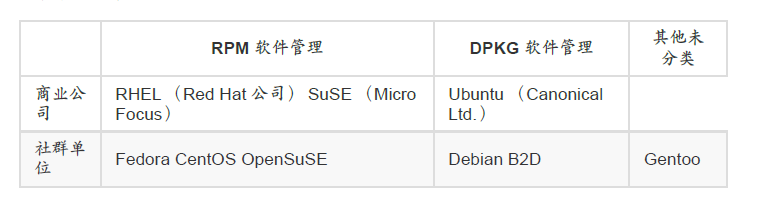
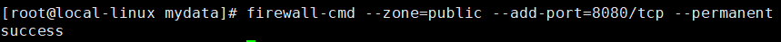
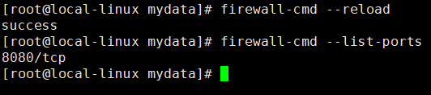
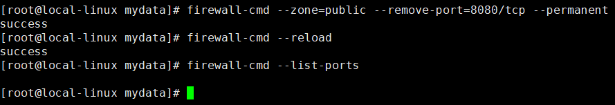
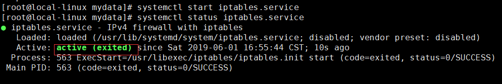
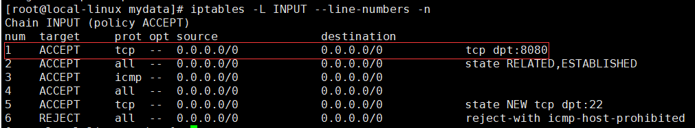
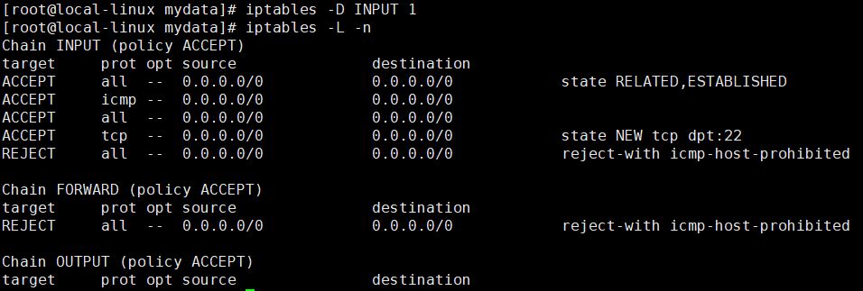

[TOC]

[韩顺平-一周学会Linux+Shell](https://www.bilibili.com/video/BV1Sv411r7vd/)

# Shell教程

Shell 是一个用 C 语言编写的程序，它是用户使用 Linux 的桥梁。Shell 既是一种命令语言，又是一种程序设计语言。

Shell 是指一种应用程序，这个应用程序提供了一个界面，用户通过这个界面访问操作系统内核的服务。（ 在计算机科学中，Shell俗称壳（用来区别于核），是指“为使用者提供操作界面”的[软件](https://baike.baidu.com/item/软件/12053)（command interpreter，命令解析器）。它类似于[DOS](https://baike.baidu.com/item/DOS/32025)下的[COMMAND.COM](https://baike.baidu.com/item/COMMAND.COM/8063418)和后来的[cmd.exe](https://baike.baidu.com/item/cmd.exe/8192925)。它接收用户命令，然后调用相应的[应用程序](https://baike.baidu.com/item/应用程序/5985445)。 ）

Ken Thompson 的 sh 是第一种 Unix Shell，Windows Explorer 是一个典型的图形界面 Shell。

## 第一个shell脚本

```
#!/bin/bash
echo "Hello World !"
```

1、作为可执行程序

将上面的代码保存为 test.sh，并 cd 到相应目录：

```
chmod +x ./test.sh  #使脚本具有执行权限
./test.sh  #执行脚本
```

注意，一定要写成 ./test.sh，而不是 test.sh，运行其它二进制的程序也一样，直接写 test.sh，linux 系统会去 PATH 里寻找有没有叫 test.sh 的，而只有 /bin, /sbin, /usr/bin，/usr/sbin 等在 PATH 里，你的当前目录通常不在 PATH 里，所以写成 test.sh 是会找不到命令的，要用 ./test.sh 告诉系统说，就在当前目录找。

2、作为解释器参数

这种运行方式是，直接运行解释器，其参数就是 shell 脚本的文件名，如：

```
/bin/sh test.sh
/bin/php test.php
```

这种方式运行的脚本，不需要在第一行指定解释器信息，写了也没用。

## Shell变量

> 注意，变量名和等号之间不能有空格，这可能和你熟悉的所有编程语言都不一样

使用变量

```
your_name="qinjx"
echo $your_name
echo ${your_name}
```

只读变量:只读变量不能unset

```
myUrl="http://www.google.com"
readonly myUrl
```

删除变量

```
unset variable_name
```

### ``与$()

```
A=`date` # 将指令执行的结果赋给A
A=$(date) # 将指令执行的结果赋给A
```


## Shell 字符串

### 单引号

> 不好用，除非定义变量

### 双引号 

```
your_name='runoob'
str="Hello, I know you are \"$your_name\"! \n"
echo -e $str
```

输出结果为：

```
Hello, I know you are "runoob"! 
```

###  拼接字符串 

> 最好不要用单引号拼接字符串

```
your_name="runoob"
# 使用双引号拼接
greeting="hello, "$your_name" !"
greeting_1="hello, ${your_name} !"
echo $greeting  $greeting_1
# 使用单引号拼接
greeting_2='hello, '$your_name' !'
greeting_3='hello, ${your_name} !'
echo $greeting_2  $greeting_3
```

输出结果为：

```
hello, runoob ! hello, runoob !
hello, runoob ! hello, ${your_name} !
```

### 获取字符串长度

> ${#string}

```
string="abcd"
echo ${#string} #输出 4
```

###  提取子字符串 

以下实例从字符串第 2 个字符开始截取 4 个字符：

```
string="runoob is a great site"
echo ${string:1:4} # 输出 unoo
```

###  查找子字符串 

查找字符 i 或 o 的位置(哪个字母先出现就计算哪个)：

```
string="runoob is a great site"
echo `expr index "$string" io`  # 输出 4
```

## Shell 数组

### 读取数组 

```
array_name=(
value0
value1
value2
value3
)
```

```
array_name[0]=value0
array_name[1]=value1
array_name[n]=valuen
```

```
valuen=${array_name[n]}
```

###  获取数组的长度 

 获取数组长度的方法与获取字符串长度的方法相同，例如： 

```
# 取得数组元素的个数
length=${#array_name[@]}
# 或者
length=${#array_name[*]}


# 取得数组单个元素的长度
lengthn=${#array_name[n]}
```

## Shell 传递参数

```
#!/bin/bash
# author:菜鸟教程
# url:www.runoob.com

echo "Shell 传递参数实例！";
echo "执行的文件名：$0";
echo "第一个参数为：$1";
echo "第二个参数为：$2";
echo "第三个参数为：$3";
```

```shell
# 增加执行权限
$ chmod +x test.sh
# 给.sh传参数1,2,3
$ ./test.sh 1 2 3
Shell 传递参数实例！
执行的文件名：./test.sh
第一个参数为：1
第二个参数为：2
第三个参数为：3
```

| 参数处理 | 说明                                                         |
| -------- | ------------------------------------------------------------ |
| $#       | 传递到脚本的参数个数                                         |
| $*       | 以一个单字符串显示所有向脚本传递的参数。  如"$*"用「"」括起来的情况、以"$1 $2 … $n"的形式输出所有参数。 |
| $$       | 脚本运行的当前进程ID号                                       |
| $!       | 后台运行的最后一个进程的ID号                                 |
| $@       | 与$*相同，但是使用时加引号，并在引号中返回每个参数。   如"$@"用「"」括起来的情况、以"$1" "$2" … "$n" 的形式输出所有参数。 |
| $-       | 显示Shell使用的当前选项，与[set命令](https://www.runoob.com/linux/linux-comm-set.html)功能相同。 |
| $?       | 显示最后命令的退出状态。0表示没有错误，其他任何值表明有错误。 |

```
#!/bin/bash
# author:菜鸟教程
# url:www.runoob.com

echo "Shell 传递参数实例！";
echo "第一个参数为：$1";

echo "参数个数为：$#";
echo "传递的参数作为一个字符串显示：$*";
```

执行脚本，输出结果如下所示：

```
$ chmod +x test.sh 
$ ./test.sh 1 2 3
Shell 传递参数实例！
第一个参数为：1
参数个数为：3
传递的参数作为一个字符串显示：1 2 3
```

## Shell 运算符

### 算数运算符

下表列出了常用的算术运算符，假定变量 a 为 10，变量 b 为 20：

| 运算符 | 说明                                          | 举例                          |
| :----- | :-------------------------------------------- | :---------------------------- |
| +      | 加法                                          | `expr $a + $b` 结果为 30。    |
| -      | 减法                                          | `expr $a - $b` 结果为 -10。   |
| *      | 乘法                                          | `expr $a \* $b` 结果为  200。 |
| /      | 除法                                          | `expr $b / $a` 结果为 2。     |
| %      | 取余                                          | `expr $b % $a` 结果为 0。     |
| =      | 赋值                                          | a=$b 把变量 b 的值赋给 a。    |
| ==     | 相等。用于比较两个数字，相同则返回 true。     | [ $a == $b ] 返回 false。     |
| !=     | 不相等。用于比较两个数字，不相同则返回 true。 | [ $a != $b ] 返回 true。      |

```
#!/bin/bash
# author:菜鸟教程
# url:www.runoob.com

a=10
b=20

val=`expr $a + $b`
echo "a + b : $val"

val=`expr $a - $b`
echo "a - b : $val"

val=`expr $a \* $b`
echo "a * b : $val"

val=`expr $b / $a`
echo "b / a : $val"

val=`expr $b % $a`
echo "b % a : $val"

if [ $a == $b ]
then
   echo "a 等于 b"
fi
if [ $a != $b ]
then
   echo "a 不等于 b"
fi
```

### 关系运算符

关系运算符只支持数字，不支持字符串，除非字符串的值是数字。

下表列出了常用的关系运算符，假定变量 a 为 10，变量 b 为 20：

| 运算符 | 说明                                                  | 举例                       |
| :----- | :---------------------------------------------------- | :------------------------- |
| -eq    | 检测两个数是否相等，相等返回 true。                   | [ $a -eq $b ] 返回 false。 |
| -ne    | 检测两个数是否不相等，不相等返回 true。               | [ $a -ne $b ] 返回 true。  |
| -gt    | 检测左边的数是否大于右边的，如果是，则返回 true。     | [ $a -gt $b ] 返回 false。 |
| -lt    | 检测左边的数是否小于右边的，如果是，则返回 true。     | [ $a -lt $b ] 返回 true。  |
| -ge    | 检测左边的数是否大于等于右边的，如果是，则返回 true。 | [ $a -ge $b ] 返回 false。 |
| -le    | 检测左边的数是否小于等于右边的，如果是，则返回 true。 | [ $a -le $b ] 返回 true。  |

### 布尔运算符

下表列出了常用的布尔运算符，假定变量 a 为 10，变量 b 为 20：

| 运算符 | 说明                                                | 举例                                     |
| :----- | :-------------------------------------------------- | :--------------------------------------- |
| !      | 非运算，表达式为 true 则返回 false，否则返回 true。 | [ ! false ] 返回 true。                  |
| -o     | 或运算，有一个表达式为 true 则返回 true。           | [ $a -lt 20 -o $b -gt 100 ] 返回 true。  |
| -a     | 与运算，两个表达式都为 true 才返回 true。           | [ $a -lt 20 -a $b -gt 100 ] 返回 false。 |

### 逻辑运算符

以下介绍 Shell 的逻辑运算符，假定变量 a 为 10，变量 b 为 20:

| 运算符 | 说明       | 举例                                       |
| :----- | :--------- | :----------------------------------------- |
| &&     | 逻辑的 AND | [[ $a -lt 100 && $b -gt 100 ]] 返回 false  |
| \|\|   | 逻辑的 OR  | [[ $a -lt 100 \|\| $b -gt 100 ]] 返回 true |

### 字符串运算符

下表列出了常用的字符串运算符，假定变量 a 为 "abc"，变量 b 为 "efg"：

| 运算符 | 说明                                         | 举例                     |
| :----- | :------------------------------------------- | :----------------------- |
| =      | 检测两个字符串是否相等，相等返回 true。      | [ $a = $b ] 返回 false。 |
| !=     | 检测两个字符串是否不相等，不相等返回 true。  | [ $a != $b ] 返回 true。 |
| -z     | 检测字符串长度是否为0，为0返回 true。        | [ -z $a ] 返回 false。   |
| -n     | 检测字符串长度是否不为 0，不为 0 返回 true。 | [ -n "$a" ] 返回 true。  |
| $      | 检测字符串是否不为空，不为空返回 true。      | [ $a ] 返回 true。       |

### 文件测试运算符

文件测试运算符用于检测 Unix 文件的各种属性。

属性检测描述如下：

| 操作符  | 说明                                                         | 举例                      |
| :------ | :----------------------------------------------------------- | :------------------------ |
| -b file | 检测文件是否是块设备文件，如果是，则返回 true。              | [ -b $file ] 返回 false。 |
| -c file | 检测文件是否是字符设备文件，如果是，则返回 true。            | [ -c $file ] 返回 false。 |
| -d file | 检测文件是否是目录，如果是，则返回 true。                    | [ -d $file ] 返回 false。 |
| -f file | 检测文件是否是普通文件（既不是目录，也不是设备文件），如果是，则返回 true。 | [ -f $file ] 返回 true。  |
| -g file | 检测文件是否设置了 SGID 位，如果是，则返回 true。            | [ -g $file ] 返回 false。 |
| -k file | 检测文件是否设置了粘着位(Sticky Bit)，如果是，则返回 true。  | [ -k $file ] 返回 false。 |
| -p file | 检测文件是否是有名管道，如果是，则返回 true。                | [ -p $file ] 返回 false。 |
| -u file | 检测文件是否设置了 SUID 位，如果是，则返回 true。            | [ -u $file ] 返回 false。 |
| -r file | 检测文件是否可读，如果是，则返回 true。                      | [ -r $file ] 返回 true。  |
| -w file | 检测文件是否可写，如果是，则返回 true。                      | [ -w $file ] 返回 true。  |
| -x file | 检测文件是否可执行，如果是，则返回 true。                    | [ -x $file ] 返回 true。  |
| -s file | 检测文件是否为空（文件大小是否大于0），不为空返回 true。     | [ -s $file ] 返回 true。  |
| -e file | 检测文件（包括目录）是否存在，如果是，则返回 true。          | [ -e $file ] 返回 true。  |

```
#!/bin/bash
# author:菜鸟教程
# url:www.runoob.com

file="/var/www/runoob/test.sh"
if [ -r $file ]
then
   echo "文件可读"
else
   echo "文件不可读"
fi
if [ -w $file ]
then
   echo "文件可写"
else
   echo "文件不可写"
fi
if [ -x $file ]
then
   echo "文件可执行"
else
   echo "文件不可执行"
fi
if [ -f $file ]
then
   echo "文件为普通文件"
else
   echo "文件为特殊文件"
fi
if [ -d $file ]
then
   echo "文件是个目录"
else
   echo "文件不是个目录"
fi
if [ -s $file ]
then
   echo "文件不为空"
else
   echo "文件为空"
fi
if [ -e $file ]
then
   echo "文件存在"
else
   echo "文件不存在"
fi
```

执行脚本，输出结果如下所示：

```
文件可读
文件可写
文件可执行
文件为普通文件
文件不是个目录
文件不为空
文件存在
```

### 使用 $(( )) 进行算术运算

$(( )) 语法也是进行算术运算的一种方式。

```
*#!/bin/bash*

*# 初始化变量*
num=5

*# 自增*
num=$((num + 1))

*# 自减*
num=$((num - 1))

echo $num
```

### 使用 expr 命令

expr 命令可以用于算术运算，但在现代脚本中不如 let 和 $(( )) 常用。

```
*#!/bin/bash*

*# 初始化变量*
num=5

*# 自增*
num=$(expr $num + 1)

*# 自减*
num=$(expr $num - 1)

echo $num
```

### 使用 (( )) 进行算术运算

与 $(( )) 类似，(( )) 语法也可以用于算术运算。

```
*#!/bin/bash*

*# 初始化变量*
num=5

*# 自增*
((num++))

*# 自减*
((num--))

echo $num
```

### 使用 $[ ] 进行算术运算

类似上面

## Shell echo命令

### 5.显示不换行 

```
#!/bin/sh
echo -e "OK! \c" # -e 开启转义 \c 不换行
echo "It is a test"
```

输出结果：

```
OK! It is a test
```

###  6.显示结果定向至文件

```
echo "It is a test" > myfile
```

###  8.显示命令执行结果

```
echo `date`
```

注意： 这里使用的是反引号 `, 而不是单引号 '。

 结果将显示当前日期

```
Thu Jul 24 10:08:46 CST 2014
```

## Shell printf 命令

接下来,我来用一个脚本来体现printf的强大功能：

```bash
#!/bin/bash
# author:菜鸟教程
# url:www.runoob.com
 
printf "%-10s %-8s %-4s\n" 姓名 性别 体重kg  
printf "%-10s %-8s %-4.2f\n" 郭靖 男 66.1234 
printf "%-10s %-8s %-4.2f\n" 杨过 男 48.6543 
printf "%-10s %-8s %-4.2f\n" 郭芙 女 47.9876 
```

执行脚本，输出结果如下所示：

```
姓名     性别   体重kg
郭靖     男      66.12
杨过     男      48.65
郭芙     女      47.99
```

```bash
#!/bin/bash
# author:菜鸟教程
# url:www.runoob.com
 
# format-string为双引号
printf "%d %s\n" 1 "abc"

# 单引号与双引号效果一样 
printf '%d %s\n' 1 "abc" 

# 没有引号也可以输出
printf %s abcdef

# 格式只指定了一个参数，但多出的参数仍然会按照该格式输出，format-string 被重用
printf %s abc def

printf "%s\n" abc def

printf "%s %s %s\n" a b c d e f g h i j

# 如果没有 arguments，那么 %s 用NULL代替，%d 用 0 代替
printf "%s and %d \n"
```

执行脚本，输出结果如下所示：

```
1 abc
1 abc
abcdefabcdefabc
def
a b c
d e f
g h i
j  
 and 0
```

### printf的转义序列

| 序列  | 说明                                                         |
| :---- | :----------------------------------------------------------- |
| \a    | 警告字符，通常为ASCII的BEL字符                               |
| \b    | 后退                                                         |
| \c    | 抑制（不显示）输出结果中任何结尾的换行字符（只在%b格式指示符控制下的参数字符串中有效），而且，任何留在参数里的字符、任何接下来的参数以及任何留在格式字符串中的字符，都被忽略 |
| \f    | 换页（formfeed）                                             |
| \n    | 换行                                                         |
| \r    | 回车（Carriage return）                                      |
| \t    | 水平制表符                                                   |
| \v    | 垂直制表符                                                   |
| \\    | 一个字面上的反斜杠字符                                       |
| \ddd  | 表示1到3位数八进制值的字符。仅在格式字符串中有效             |
| \0ddd | 表示1到3位的八进制值字符                                     |

```bash
$ printf "a string, no processing:<%s>\n" "A\nB"
a string, no processing:<A\nB>

$ printf "a string, no processing:<%b>\n" "A\nB"
a string, no processing:<A
B>

$ printf "www.runoob.com \a"
www.runoob.com $                  #不换行
```


## Shell test 命令

### 数值测试

| 参数 | 说明           |
| :--- | :------------- |
| -eq  | 等于则为真     |
| -ne  | 不等于则为真   |
| -gt  | 大于则为真     |
| -ge  | 大于等于则为真 |
| -lt  | 小于则为真     |
| -le  | 小于等于则为真 |

```bash
num1=100
num2=100
if test $[num1] -eq $[num2]
then
    echo '两个数相等！'
else
    echo '两个数不相等！'
fi
```

### 字符串测试

| 参数      | 说明                     |
| :-------- | :----------------------- |
| =         | 等于则为真               |
| !=        | 不相等则为真             |
| -z 字符串 | 字符串的长度为零则为真   |
| -n 字符串 | 字符串的长度不为零则为真 |

```bash
num1="ru1noob"
num2="runoob"
if test $num1 = $num2
then
    echo '两个字符串相等!'
else
    echo '两个字符串不相等!'
fi
```


### 文件测试

| 参数      | 说明                                 |
| :-------- | :----------------------------------- |
| -e 文件名 | 如果文件存在则为真                   |
| -r 文件名 | 如果文件存在且可读则为真             |
| -w 文件名 | 如果文件存在且可写则为真             |
| -x 文件名 | 如果文件存在且可执行则为真           |
| -s 文件名 | 如果文件存在且至少有一个字符则为真   |
| -d 文件名 | 如果文件存在且为目录则为真           |
| -f 文件名 | 如果文件存在且为普通文件则为真       |
| -c 文件名 | 如果文件存在且为字符型特殊文件则为真 |
| -b 文件名 | 如果文件存在且为块特殊文件则为真     |

```bash
cd /bin
if test -e ./bash
then
    echo '文件已存在!'
else
    echo '文件不存在!'
fi
```


## Shell 流程控制 

### if else-if else 

```bash
if condition1
then
    command1
elif condition2 
then 
    command2
else
    commandN
fi
```

### for 循环 

```bash
for var in item1 item2 ... itemN
do
    command1
    command2
    ...
    commandN
done
```

### while 语句

```bash
while condition
do
    command
done
```

### until 循环

> ntil 循环执行一系列命令直至条件为 true 时停止

```bash
until condition
do
    command
done
```

### case 

```bash
case 值 in
模式1)
    command1
    command2
    ...
    commandN
    ;;
模式2）
    command1
    command2
    ...
    commandN
    ;;
esac
```

## Shell read命令

1、简单读取

```
#!/bin/bash

#这里默认会换行  
echo "输入网站名: "  
#读取从键盘的输入  
read website  
echo "你输入的网站名是 $website"  
exit 0  #退出
```

测试结果为：

```
输入网站名: 
www.runoob.com
你输入的网站名是 www.runoob.com
```

2、-p 参数，允许在 read 命令行中直接指定一个提示。

```
#!/bin/bash

read -p "输入网站名:" website
echo "你输入的网站名是 $website" 
exit 0
```

测试结果为：

```
输入网站名:www.runoob.com
你输入的网站名是 www.runoob.com
```

3、-t 参数指定 read 命令等待输入的秒数，当计时满时，read命令返回一个非零退出状态。

```
#!/bin/bash

if read -t 5 -p "输入网站名:" website
then
    echo "你输入的网站名是 $website"
else
    echo "\n抱歉，你输入超时了。"
fi
exit 0
```

执行程序不输入，等待 5 秒后：

```
输入网站名:
抱歉，你输入超时了
```

4、除了输入时间计时，还可以使用 -n 参数设置 read 命令计数输入的字符。当输入的字符数目达到预定数目时，自动退出，并将输入的数据赋值给变量。

```
#!/bin/bash

read -n1 -p "Do you want to continue [Y/N]?" answer
case $answer in
Y | y)
      echo "fine ,continue";;
N | n)
      echo "ok,good bye";;
*)
     echo "error choice";;

esac
exit 0
```

该例子使用了-n 选项，后接数值 1，指示 read 命令只要接受到一个字符就退出。只要按下一个字符进行回答，read 命令立即接受输入并将其传给变量，无需按回车键。

只接收 2 个输入就退出：

```
#!/bin/bash

read -n2 -p "请随便输入两个字符: " any
echo "\n您输入的两个字符是:$any"
exit 0
```

执行程序输入两个字符：

```
请随便输入两个字符: 12
您输入的两个字符是:12
```

5、-s 选项能够使 read 命令中输入的数据不显示在命令终端上（实际上，数据是显示的，只是 read 命令将文本颜色设置成与背景相同的颜色）。输入密码常用这个选项。

```
#!/bin/bash

read  -s  -p "请输入您的密码:" pass
echo "\n您输入的密码是 $pass"
exit 0
```

执行程序输入密码后是不显示的：

```
请输入您的密码:
您输入的密码是 runoob
```

6.读取文件

每次调用 read 命令都会读取文件中的 "一行" 文本。当文件没有可读的行时，read 命令将以非零状态退出。

通过什么样的方法将文件中的数据传给 read 呢？使用 cat 命令并通过管道将结果直接传送给包含 read 命令的 while 命令。

测试文件 test.txt 内容如下：

```
123
456
runoob
```

测试代码：

```
#!/bin/bash
  
count=1    # 赋值语句，不加空格
cat test.txt | while read line      # cat 命令的输出作为read命令的输入,read读到>的值放在line中
do
   echo "Line $count:$line"
   count=$[ $count + 1 ]          # 注意中括号中的空格。
done
echo "finish"
exit 0
```

执行结果为：

```
Line 1:123
Line 2:456
Line 3:runoob
finish
```

使用 -e 参数，以下实例输入字符 a 后按下 Tab 键就会输出相关的文件名(该目录存在的)：

```
$ read -e -p "输入文件名:" str 
输入文件名:a
a.out    a.py     a.pyc    abc.txt  
输入文件名:a
```

## Shell date命令

Linux date 命令可以用来显示或设定系统的日期与时间。

### 语法

```
date [OPTION]... [+FORMAT]
date [-u] [-d datestr] [-s datestr] [--utc] [--universal] [--date=datestr] [--set=datestr] [--help] [--version] [+FORMAT] [MMDDhhmm[[CC]YY][.ss]]
```

#### 可选参数

- -d, --date=STRING：通过字符串显示时间格式，字符串不能是'now'。
- -f, --file=DATEFILE：类似于--date; 一次从DATEFILE处理一行。
- -I[FMT], --iso-8601[=FMT]：按照 ISO 8601 格式输出时间，FMT 可以为'date'(默认)，'hours'，'minutes'，'seconds'，'ns'。 可用于设置日期和时间的精度，例如：2006-08-14T02:34:56-0600。
- -R, --rfc-2822 ： 按照 RFC 5322 格式输出时间和日期，例如: Mon, 14 Aug 2006 02:34:56 -0600。
- --rfc-3339=FMT：按照 RFC 3339 格式输出，FMT 可以为'date', 'seconds','ns'中的一个，可用于设置日期和时间的精度， 例如：2006-08-14 02:34:56-06:00。
- -r, --reference=FILE：显示文件的上次修改时间。
- -s, --set=STRING：根据字符串设置系统时间。
- -u, --utc, --universal：显示或设置协调世界时(UTC)。
- --help：显示帮助信息。
- --version：输出版本信息。

#### FORMAT 参数

在显示方面，使用者可以设定欲显示的格式 ，格式设定为一个加号后接数个标记，其中可用的标记列表如下：

```
%%   输出字符 %
%a   星期几的缩写 (Sun..Sat)
%A   星期的完整名称(Sunday..Saturday)。 
%b   缩写的月份名称（例如，Jan）
%B   完整的月份名称（例如，January）
%c   本地日期和时间（例如，Thu Mar  3 23:05:25 2005）
%C   世纪，和%Y类似，但是省略后两位（例如，20）
%d   日 (01..31)
%D   日期，等价于%m/%d/%y
%e   一月中的一天，格式使用空格填充，等价于%_d
%F   完整的日期；等价于 %Y-%m-%d
%g   ISO 标准计数周的年份的最后两位数字
%G   ISO 标准计数周的年份，通常只对%V有用
%h   等价于 %b
%H   小时 (00..23)
%I   小时 (01..12)
%j   一年中的第几天 (001..366)
%k   小时，使用空格填充 ( 0..23); 等价于 %_H
%l   小时, 使用空格填充 ( 1..12); 等价于 %_I
%m   月份 (01..12)
%M   分钟 (00..59)
%n   新的一行，换行符
%N   纳秒 (000000000..999999999)
%p   用于表示当地的AM或PM，如果未知则为空白
%P   类似 %p, 但是是小写的
%r   本地的 12 小时制时间(例如 11:11:04 PM)
%R   24 小时制 的小时与分钟; 等价于 %H:%M
%s   自 1970-01-01 00:00:00 UTC 到现在的秒数
%S   秒 (00..60)
%t   插入水平制表符 tab
%T   时间; 等价于 %H:%M:%S
%u   一周中的一天 (1..7); 1 表示星期一
%U   一年中的第几周，周日作为一周的起始 (00..53)
%V   ISO 标准计数周，该方法将周一作为一周的起始 (01..53)
%w   一周中的一天（0..6），0代表星期天
%W   一年中的第几周，周一作为一周的起始（00..53）
%x   本地的日期格式（例如，12/31/99）
%X   本地的日期格式（例如，23:13:48）
%y   年份后两位数字 (00..99)
%Y   年
%z   +hhmm 格式的数值化时区格式（例如，-0400）
%:z  +hh:mm 格式的数值化时区格式（例如，-04:00）
%::z  +hh:mm:ss格式的数值化时区格式（例如，-04:00:00）
%:::z  数值化时区格式，相比上一个格式增加':'以显示必要的精度（例如，-04，+05:30）
%Z  时区缩写 （如 EDT）
```

若是不以加号作为开头，则表示要设定时间，而时间格式为 MMDDhhmm[[CC]YY][.ss]，其中 MM 为月份，DD 为日，hh 为小时，mm 为分钟，CC 为年份前两位数字，YY 为年份后两位数字，ss 为秒数。

使用权限：所有使用者。

当您不希望出现无意义的 0 时(比如说 1999/03/07)，则可以在标记中插入 - 符号，比如说 date '+%-H:%-M:%-S' 会把时分秒中无意义的 0 给去掉，像是原本的 08:09:04 会变为 8:9:4。另外，只有取得权限者(比如说 root)才能设定系统时间。

当您以 root 身分更改了系统时间之后，请记得以 clock -w 来将系统时间写入 CMOS 中，这样下次重新开机时系统时间才会持续保持最新的正确值。

### 实例

显示当前时间

```
# date
Tue May 24 09:29:43 CST 2022
# date '+%c' 
Tue 24 May 2022 09:30:03 AM CST
# date '+%D' //显示完整的时间
05/24/22
# date '+%x' //显示数字日期
05/24/2022
# date '+%T' //显示日期，年份用四位数表示
14:09:31
# date '+%X' //显示24小时的格式
09:31:31 AM
```

格式化输出：

```
# date +"%Y-%m-%d"
2009-12-07
```

输出昨天日期：

```
# date -d "1 day ago" +"%Y-%m-%d"
2012-11-19
```

输出 2 秒后的时间：

```
# date -d "2 second" +"%Y-%m-%d %H:%M.%S"
2012-11-20 14:21.31
```

传说中的 1234567890 秒：

```
# date -d "1970-01-01 1234567890 seconds" +"%Y-%m-%d %H:%M:%S"
2009-02-13 23:02:30
```

或者:

```
# date -d@1234567890 +"%F %T"
2009-02-13 23:02:30
```

时间格式转换：

```
# date -d "2009-12-12" +"%Y/%m/%d %H:%M.%S"
2009/12/12 00:00.00
```

apache 格式转换：

```
# date -d "Dec 5, 2009 12:00:37 AM" +"%Y-%m-%d %H:%M.%S"
2009-12-05 00:00.37
```

格式转换后时间游走：

```
# date -d "Dec 5, 2009 12:00:37 AM 2 year ago" +"%Y-%m-%d %H:%M.%S"
2007-12-05 00:00.37
```

按自己的格式输出

```
# date '+usr_time: $1:%M %P -hey'
usr_time: $1:16 下午 -hey
```

显示时间后跳行，再显示目前日期

```
date '+%T%n%D'
```

显示月份与日数

```
date '+%B %d'
```

显示日期与设定时间(12:34:56)

```
date --date '12:34:56'
```

时间加减操作：

```
date +%Y%m%d                   # 显示年月日
date -d "+1 day" +%Y%m%d       # 显示后一天的日期
date -d "-1 day" +%Y%m%d       # 显示前一天的日期
date -d "-1 month" +%Y%m%d     # 显示上一月的日期
date -d "+1 month" +%Y%m%d     # 显示下一月的日期
date -d "-1 year" +%Y%m%d      # 显示前一年的日期
date -d "+1 year" +%Y%m%d      # 显示下一年的日期
```

设定时间：

```
date -s                         # 设置当前时间，只有root权限才能设置，其他只能查看
date -s 20120523                # 设置成20120523，这样会把具体时间设置成00:00:00
date -s 01:01:01                # 设置具体时间，不会对日期做更改
date -s "01:01:01 2012-05-23"   # 这样可以设置全部时间
date -s "01:01:01 20120523"     # 这样可以设置全部时间
date -s "2012-05-23 01:01:01"   # 这样可以设置全部时间
date -s "20120523 01:01:01"     # 这样可以设置全部时间
```

## Shell 函数

> 在Shell中，调用函数时可以向其传递参数

###  带参数的函数示例 

>  注意，$10 不能获取第十个参数，获取第十个参数需要${10}。当n>=10时，需要使用${n}来获取参数。 

```
#!/bin/bash
# author:菜鸟教程
# url:www.runoob.com

funWithParam(){
    echo "第一个参数为 $1 !"
    echo "第二个参数为 $2 !"
    echo "第十个参数为 $10 !"
    echo "第十个参数为 ${10} !"
    echo "第十一个参数为 ${11} !"
    echo "参数总数有 $# 个!"
    echo "作为一个字符串输出所有参数 $* !"
}
funWithParam 1 2 3 4 5 6 7 8 9 34 73
```

 输出结果： 

```
第一个参数为 1 !
第二个参数为 2 !
第十个参数为 10 !
第十个参数为 34 !
第十一个参数为 73 !
参数总数有 11 个!
作为一个字符串输出所有参数 1 2 3 4 5 6 7 8 9 34 73 !
```

### 常见系统函数

1. basename 基本语法

功能：返回路径中最后一个'/'后的部分内容，常用于获取文件名。

basename NAME \[SUFFIX\]

如果指定 SUFFIX 参数，且它和字符串中所有字符都不相同，但和字符串的后缀相同，则除去指定后缀。

可用的参数：

\-z  ： 使用NUL而不是换行符来分隔输出

\-s,--suffix=SUFFIX  ： 效果和指定SUFFIX参数相同

\-a  ： 支持多个参数并将每个参数视为一个NAME，如：

```
[root@study ~]# basename -a any/str1 any/str2
str1
str2
```

2. dirname 基本语法

功能：返回完整路径最后，常用于返回文件路径。

实例1：返回 /root/fileName.txt 的 fileName.txt  ；返回 /root/fileName.txt 的 fileName。

```
#返回fileName.txt
basename /root/fileName.txt

#返回fileName
basename /root/fileName.txt .txt
```

实例2：返回 /root/fileName.txt的路径（不包含文件名），即/root

```
dirname /root/fileName.txt
```

## Shell 脚本实战分析-数据库定时备份

```
#！/bin/bash
#完成数据库的定时备份
#备份的路径
BACKUP=/mnt/backup/db
#当前的时间作为文件名
DATETIME=$(date +%Y_%m_%d_%H%M%S)
#可以输出变量调试
#echo ${DATETIME}
echo "==========开始备份==========="
echo "备份的路径是 $BACKUP/$DATETIME.tar.gz"

#主机
HOST=localhost
#用户名
DB_USER=root
#密码
DB_PWD=root
#备份数据库名
DATABASE=yuanchangliang
#创建备份的路径
#如果备份的路径文件夹存在就使用，否则创建
[ ! -d "$BACKUP/$DATETIME"  ]  && mkdir -p "$BACKUP/$DATETIME" 
#执行mysql的备份数据库的指令
mysqldump -u${DB_USER} -p${DB_PWD} --host=$HOST  $DATABASE | gzip  > $BACKUP/$DATETIME/$DATETIME.sql.gz
#打包备份文件
cd $BACKUP
tar -zcvf  $DATETIME.tar.gz  $DATETIME
#删除临时目录
rm -rf  $BACKUP/$DATETIME

#删除10天前的备份文件(-exec rm -rf {} \是固定写法，删除查询出来的数据)
find $BACKUP -mtime +10 -name  "*.tar.gz" -exec rm -rf {} \;
echo "==========备份完成==========="
```

使用Crontab添加定时任务，确保脚本在指定时间自动执行。编辑Crontab任务列表`crontab -e`

添加以下行，设置每天凌晨1点执行备份任务：

```
0 1 * * * sh /app/mysql_backup.sh
```


通过以上几步，就可以实现在Linux中定时备份mysql数据库中的数据

如果想要立刻执行数据备份，可以直接执行以下命令：

```bash
[root@localhost mnt]# ./mysql_backup.sh 
```

## Shell 输入/输出重定向

| 命令            | 说明                                               |
| :-------------- | :------------------------------------------------- |
| command > file  | 将输出重定向到 file。                              |
| command < file  | 将输入重定向到 file。                              |
| command >> file | 将输出以追加的方式重定向到 file。                  |
| n > file        | 将文件描述符为 n 的文件重定向到 file。             |
| n >> file       | 将文件描述符为 n 的文件以追加的方式重定向到 file。 |
| n >& m          | 将输出文件 m 和 n 合并。                           |
| n <& m          | 将输入文件 m 和 n 合并。                           |
| << tag          | 将开始标记 tag 和结束标记 tag 之间的内容作为输入。 |

> 需要注意的是文件描述符 0 通常是标准输入（STDIN），1 是标准输出（STDOUT），2 是标准错误输出（STDERR）。

------

### 输出重定向

重定向一般通过在命令间插入特定的符号来实现。特别的，这些符号的语法如下所示:

```
command1 > file1
```

上面这个命令执行command1然后将输出的内容存入file1。

注意任何file1内的已经存在的内容将被新内容替代。如果要将新内容添加在文件末尾，请使用>>操作符。

#### 实例

执行下面的 who 命令，它将命令的完整的输出重定向在用户文件中(users):

```
$ who > users
```

执行后，并没有在终端输出信息，这是因为输出已被从默认的标准输出设备（终端）重定向到指定的文件。

你可以使用 cat 命令查看文件内容：

```
$ cat users
_mbsetupuser console  Oct 31 17:35 
tianqixin    console  Oct 31 17:35 
tianqixin    ttys000  Dec  1 11:33 
```

输出重定向会覆盖文件内容，请看下面的例子：

```
$ echo "菜鸟教程：www.runoob.com" > users
$ cat users
菜鸟教程：www.runoob.com
$
```

如果不希望文件内容被覆盖，可以使用 >> 追加到文件末尾，例如：

```
$ echo "菜鸟教程：www.runoob.com" >> users
$ cat users
菜鸟教程：www.runoob.com
菜鸟教程：www.runoob.com
$
```

------

### 输入重定向

和输出重定向一样，Unix 命令也可以从文件获取输入，语法为：

```
command1 < file1
```

这样，本来需要从键盘获取输入的命令会转移到文件读取内容。

注意：输出重定向是大于号(>)，输入重定向是小于号(<)。

#### 实例

接着以上实例，我们需要统计 users 文件的行数,执行以下命令：

```
$ wc -l users
       2 users
```

也可以将输入重定向到 users 文件：

```
$  wc -l < users
       2 
```

注意：上面两个例子的结果不同：第一个例子，会输出文件名；第二个不会，因为它仅仅知道从标准输入读取内容。

```
command1 < infile > outfile
```

同时替换输入和输出，执行command1，从文件infile读取内容，然后将输出写入到outfile中。

### 重定向深入讲解

一般情况下，每个 Unix/Linux 命令运行时都会打开三个文件：

- 标准输入文件(stdin)：stdin的文件描述符为0，Unix程序默认从stdin读取数据。
- 标准输出文件(stdout)：stdout 的文件描述符为1，Unix程序默认向stdout输出数据。
- 标准错误文件(stderr)：stderr的文件描述符为2，Unix程序会向stderr流中写入错误信息。

默认情况下，command > file 将 stdout 重定向到 file，command < file 将stdin 重定向到 file。

如果希望 stderr 重定向到 file，可以这样写：

```
$ command 2>file
```

如果希望 stderr 追加到 file 文件末尾，可以这样写：

```
$ command 2>>file
```

2 表示标准错误文件(stderr)。

如果希望将 stdout 和 stderr 合并后重定向到 file，可以这样写：

```
$ command > file 2>&1

或者

$ command >> file 2>&1
```

如果希望对 stdin 和 stdout 都重定向，可以这样写：

```
$ command < file1 >file2
```

command 命令将 stdin 重定向到 file1，将 stdout 重定向到 file2。

------

### Here Document

Here Document 是 Shell 中的一种特殊的重定向方式，用来将输入重定向到一个交互式 Shell 脚本或程序。

它的基本的形式如下：

```
command << delimiter
    document
delimiter
```

它的作用是将两个 delimiter 之间的内容(document) 作为输入传递给 command。

> 注意：
>
> - 结尾的delimiter 一定要顶格写，前面不能有任何字符，后面也不能有任何字符，包括空格和 tab 缩进。
> - 开始的delimiter前后的空格会被忽略掉。

#### 实例

在命令行中通过 wc -l 命令计算 Here Document 的行数：

```
(base) dongbinyu@dongbinyudeMacBook-Pro ~ % wc -l <<EOF
欢迎来到
菜鸟教程
heredoc> 欢迎来到
heredoc> 菜鸟教程
heredoc> www.runoob.com
heredoc> EOF
       5
```

我们也可以将 Here Document 用在脚本中，例如：

```
#!/bin/bash
# author:菜鸟教程
# url:www.runoob.com

cat << EOF
欢迎来到
菜鸟教程
www.runoob.com
EOF
```

执行以上脚本，输出结果：

```
欢迎来到
菜鸟教程
www.runoob.com
```

------

### /dev/null 文件

如果希望执行某个命令，但又不希望在屏幕上显示输出结果，那么可以将输出重定向到 /dev/null：

```
$ command > /dev/null
```

/dev/null 是一个特殊的文件，写入到它的内容都会被丢弃；如果尝试从该文件读取内容，那么什么也读不到。但是 /dev/null 文件非常有用，将命令的输出重定向到它，会起到"禁止输出"的效果。

如果希望屏蔽 stdout 和 stderr，可以这样写：

```
$ command > /dev/null 2>&1
```

> 注意：0 是标准输入（STDIN），1 是标准输出（STDOUT），2 是标准错误输出（STDERR）。
>
> 这里的 2 和 > 之间不可以有空格，2> 是一体的时候才表示错误输出。

## Shell 文件包含

```bash
. filename   # 注意点号(.)和文件名中间有一空格

或

source filename
```


# Linux笔记

[菜鸟教程-Linux命令](https://www.runoob.com/linux/linux-command-manual.html)

[freeCodeCamp-Linux 命令完全手册](https://www.freecodecamp.org/chinese/news/the-linux-commands-handbook/)

[macrozheng- 还在百度Linux命令？推荐一套我用起来特顺手的命令](https://gitee.com/macrozheng/mall-learning/blob/master/docs/reference/linux_command.md)


Red Hat: http://www.redhat.com
SuSE: https://www.suse.com
Fedora: https://getfedora.org/
CentOS: http://www.centos.org/
Debian: http://www.debian.org/
Ubuntu: http://www.ubuntu.com/
Gentoo: http://www.gentoo.org/

## 1.Linux基础

### 1.1.前言

### 1.2.CentOS安装和说明

#### 1.2.1.虚拟机网络连接的三种方式

[CSDN-VMware虚拟机三种网络模式：桥接模式，NAT模式，仅主机模式](https://blog.csdn.net/qq_39192827/article/details/85872025)


#### 1.2.2.CentOS终端使用和联网

[CSDN-CentOS7联网](https://blog.csdn.net/lsc476782158/article/details/51721909)

> 为了能够在centOS和windows共享文件夹，
>
> 为了能够在centOS中粘贴windows下的复制.
>
> 需要安装VMtools

[CSDN-VMtools重新安装 灰色问题](https://blog.csdn.net/l979951191/article/details/50596986/)

### 1.3.Linux目录结构 

以下是对这些目录的解释：

- /bin：
   bin 是 Binaries (二进制文件) 的缩写, 这个目录存放着最经常使用的命令。

- /boot：
  这里存放的是启动 Linux 时使用的一些核心文件，包括一些连接文件以及镜像文件。

- /dev ：
  dev 是 Device(设备) 的缩写, 该目录下存放的是 Linux 的外部设备，在 Linux 中访问设备的方式和访问文件的方式是相同的。

- /etc：
  etc 是 Etcetera(等等) 的缩写,这个目录用来存放所有的系统管理所需要的配置文件和子目录。

- /home：
  用户的主目录，在 Linux 中，每个用户都有一个自己的目录，一般该目录名是以用户的账号命名的。

- /lib：
  lib 是 Library(库) 的缩写这个目录里存放着系统最基本的动态连接共享库，其作用类似于 Windows 里的 DLL 文件。几乎所有的应用程序都需要用到这些共享库。

- /lost+found：
  这个目录一般情况下是空的，当系统非法关机后，这里就存放了一些文件。

- /media：
   linux 系统会自动识别一些设备，例如U盘、光驱等等，当识别后，Linux 会把识别的设备挂载到这个目录下。

- /mnt：
  系统提供该目录是为了让用户临时挂载别的文件系统的，我们可以将光驱挂载在 /mnt/ 上，然后进入该目录就可以查看光驱里的内容了。

- /opt：
  opt 是 optional(可选) 的缩写，这是给主机额外安装软件所摆放的目录。比如你安装一个ORACLE数据库则就可以放到这个目录下。默认是空的。

- /proc：
  proc 是 Processes(进程) 的缩写，/proc 是一种伪文件系统（也即虚拟文件系统），存储的是当前内核运行状态的一系列特殊文件，这个目录是一个虚拟的目录，它是系统内存的映射，我们可以通过直接访问这个目录来获取系统信息。
  这个目录的内容不在硬盘上而是在内存里，我们也可以直接修改里面的某些文件，比如可以通过下面的命令来屏蔽主机的ping命令，使别人无法ping你的机器：

  ```
  echo 1 > /proc/sys/net/ipv4/icmp_echo_ignore_all
  ```

- /root：
  该目录为系统管理员，也称作超级权限者的用户主目录。

- /sbin：
   s 就是 Super User 的意思，是 Superuser Binaries (超级用户的二进制文件) 的缩写，这里存放的是系统管理员使用的系统管理程序。

- /selinux：
   这个目录是 Redhat/CentOS 所特有的目录，Selinux 是一个安全机制，类似于 windows 的防火墙，但是这套机制比较复杂，这个目录就是存放selinux相关的文件的。

- /srv：
   该目录存放一些服务启动之后需要提取的数据。

- /sys：

  这是 Linux2.6 内核的一个很大的变化。该目录下安装了 2.6 内核中新出现的一个文件系统 sysfs 。

  sysfs 文件系统集成了下面3种文件系统的信息：针对进程信息的 proc 文件系统、针对设备的 devfs 文件系统以及针对伪终端的 devpts 文件系统。

  该文件系统是内核设备树的一个直观反映。

  当一个内核对象被创建的时候，对应的文件和目录也在内核对象子系统中被创建。

- /tmp：
   tmp 是 temporary(临时) 的缩写这个目录是用来存放一些临时文件的。

- /usr：
   usr 是 unix shared resources(共享资源) 的缩写，这是一个非常重要的目录，用户的很多应用程序和文件都放在这个目录下，类似于 windows 下的 program files 目录。

- /usr/bin：
  系统用户使用的应用程序。

- /usr/sbin：
  超级用户使用的比较高级的管理程序和系统守护程序。

- /usr/src：
  内核源代码默认的放置目录。

- /var：
   var 是 variable(变量) 的缩写，这个目录中存放着在不断扩充着的东西，我们习惯将那些经常被修改的目录放在这个目录下。包括各种日志文件。

- /run：
  是一个临时文件系统，存储系统启动以来的信息。当系统重启时，这个目录下的文件应该被删掉或清除。如果你的系统上有 /var/run 目录，应该让它指向 run。

在 Linux 系统中，有几个目录是比较重要的，平时需要注意不要误删除或者随意更改内部文件。

/etc： 上边也提到了，这个是系统中的配置文件，如果你更改了该目录下的某个文件可能会导致系统不能启动。

/bin, /sbin, /usr/bin, /usr/sbin: 这是系统预设的执行文件的放置目录，比如 ls 就是在 /bin/ls 目录下的。

值得提出的是，/bin, /usr/bin 是给系统用户使用的指令（除root外的通用户），而/sbin, /usr/sbin 则是给 root 使用的指令。 

/var： 这是一个非常重要的目录，系统上跑了很多程序，那么每个程序都会有相应的日志产生，而这些日志就被记录到这个目录下，具体在 /var/log 目录下，另外 mail 的预设放置也是在这里。

### 1.4 CPU架构

| 类别               | 架构/技术                    | 主要代表厂商             | 典型应用                                                | 备注                                                         |
| ------------------ | ---------------------------- | ------------------------ | ------------------------------------------------------- | ------------------------------------------------------------ |
| 精简指令集（RISC） | SPARC                        | 甲骨文（Oracle）         | 学术领域的大型工作站、银行金融体系的主要服务器          | 常用于高性能计算环境                                         |
|                    | Power Architecture (PowerPC) | IBM                      | 索尼PlayStation 3等游戏主机                             | 例如索尼PS3使用的是基于PowerPC架构的Cell处理器               |
|                    | ARM                          | 安谋公司（ARM Holdings） | 各厂牌手机、PDA、导航系统、网络设备（交换器、路由器等） | 使用范围最广，适用于多种嵌入式系统及移动设备                 |
| 复杂指令集（CISC） | x86架构                      | AMD、Intel、VIA          | 个人电脑（Personal Computer）                           | 最初从8086开始，逐步发展到80286, 80386等，称为x86架构        |
|                    |                              |                          |                                                         | 64位架构被称为`x86_64`，由AMD首先推出，随后Intel也采用了类似的EM64T技术 |
| 多媒体微指令集     | MMX, SSE, SSE2, SSE3, SSE4   | Intel                    | 提升图像和视频处理能力                                  | 随着时间的发展，SSE系列不断扩展以支持更复杂的多媒体操作      |
|                    | AMD-3DNow!                   | AMD                      | 类似于SSE，但由AMD开发                                  | 已逐渐被SSE取代                                              |
| 虚拟化微指令集     | Intel-VT                     | Intel                    | 支持硬件级别的虚拟化功能                                | 允许多个操作系统在同一物理机上运行而无需修改操作系统内核     |
|                    | AMD-SVM                      | AMD                      | 类似于Intel-VT                                          | Secure Virtual Machine模式，提供类似的功能                   |
| 省电功能           | Intel-SpeedStep              | Intel                    | 动态调整CPU的工作频率和电压以节省电力                   | 根据负载自动调整性能                                         |
|                    | AMD-PowerNow!                | AMD                      | 类似于Intel-SpeedStep                                   | 动态管理功耗，提高笔记本电脑电池寿命                         |
| 64/32位兼容技术    | AMD64                        | AMD                      | 允许在64位平台上运行32位应用程序                        | 首先提出的64位扩展技术，为现代64位计算铺平了道路             |
|                    | EM64T                        | Intel                    | 类似于AMD64，但由Intel开发                              | Intel的64位扩展技术，与AMD64兼容                             |

## 2.Linux实操

### 2.1.远程登录Xshell5

### 2.2.远程上传下载Xftp5

### 2.3.Vi和Vim编辑器

#### 2.3.1.常见的三种模式

#### 2.3.2.常见快捷键

[菜鸟教程-vi/vim 按键说明](https://www.runoob.com/linux/linux-vim.html)

### 2.4.开机，重启，用户登录注销

- `shutdown`
  - `shutdown -h now `立即关机
  - `shutdown -h 1 `一分钟后关机
  - `shutdown -r now`立即重启
- `halt` 关闭电源
- `poweroff` 关闭电源
- `reboot`重启 
- `sync`把内存的数据保存到磁盘,关机和重启前为了安全需要使用这个指令，防止数据丢失

- `logout`注销用户

### 2.5.用户管理

#### 2.5.1.添加用户

- `useradd [选项] 用户名` :用于创建新用户，并可指定用户的主目录、登录Shell、所属组等信息。

  - 选项：

    - `-d <目录>`：指定用户的主目录。

    - `-m`：如果主目录不存在，则自动创建。

    - `-s <Shell>`：指定用户的登录Shell。

    - `-g <组名>`：指定用户的主组（必须已存在）。

    - `-G <组名列表>`：指定用户所属的附加组（多个组用逗号分隔）。

  - 例子：
    - `useradd –d  /home/sam -m sam` 
    - `useradd -s /bin/sh -g group –G adm,root gem`

- `passwd 用户名` 给用户指定或修改密码

#### 2.5.2.删除用户

- `userdel 用户名`:删除用户，保存该用户的家目录 
- `userdel -r 用户名`:删除用户，以及用户的的家目录

#### 2.5.3.查询用户信息

`id 用户名`：`id` 命令用于显示指定用户或当前用户的 UID（用户 ID）、GID（主组 ID）以及所属的附加组信息。

```
uid=1001(alice) gid=1001(alice) groups=1001(alice),27(sudo),30(docker)
```

- `uid=1000(alice)`：

  - `uid`：用户 ID（User ID），唯一标识系统中的每个用户。

  - `waterplants`：用户名，括号内显示与 UID 对应的用户名。

- `gid=1000(alice)`：

  - `gid`：主组 ID（Group ID），表示用户所属的主组。

  - `waterplants`：主组名，括号内显示与 GID 对应的组名。

- `groups=1001(alice),27(sudo),30(docker)`：

  - 列出用户所属的所有组（包括主组和附加组）。

  - 每个组以 `组ID(组名)` 的形式显示。

#### 2.5.4.切换用户

`su 用户名` 切换用户

`exit` 回退到原先的用户

`whoami`查看当前用户

#### 2.5.5.用户组

`groupadd 组名` 创建用户组

`groupdel 组名`删除用户组

`useradd -g 用户组 用户名` 创建用户时指定用户组

`usermod -g 用户组 用户名`修改用户对应的用户组

#### 2.5.6.用户和组相关的文件

> 所有的系统上的帐号与一般身份使用者，还有那个root的相关信息， 都是记录在/etc/passwd这个文件内的。至于个人的密码则是记录在/etc/shadow这个文件下。 此外，Linux所有的群组名称都纪录在/etc/group内！这三个文件可以说是Linux系统里面帐号、密码、群组信息的集中地啰！ 不要随便删除这三个文件啊！

`/etc/passwd`用户的配置文件，记录用户的各种信息。

每行的含义： `用户名:口令:用户表示号:组标识号:注释性描述:主目录:登录shell`

`/etc/shadow`口令的配置文件。

每行的含义： `登录名:加密口令:最后一次修改时间:最小时间间隔:最大时间间隔:警告时间:不活动时间:失效时间:标志`

`/etc/group`用户组的配置文件。

每行的含义： `组名:口令:组标识号:组内用户列表`

### 2.6.实用指令

#### 2.6.1.系统运行级别介绍

| 运行级别 | 描述                |
| -------- | ------------------- |
| 0        | 关机                |
| 1        | 单用户模式          |
| 2        | 多用户模式，没有NFS |
| 3        | 完全多用户模式      |
| 4        | 没有使用            |
| 5        | 图形化多用户模式    |
| 6        | 重启                |

*   运行级别 0：关机。在此级别下，系统进程被关闭，所有文件系统都被卸载并且电源被关闭。
*   运行级别 1：单用户模式。在此级别下，只有一个root用户可以登录，所有本地文件系统都将以只读模式挂载，网络服务不会启动。
*   运行级别 2-5：多用户模式。这些级别下，系统中的各项服务和用户界面都可用，通常情况下我们会将系统设置在运行级别3或5中。
*   运行级别 6：重启。在此级别下，系统会重新启动。

#### 2.6.2.系统运行级别查看与切换

##### 如何查看当前系统运行级别

- `runlevel`:查看当前系统的运行级别

  - 该命令将会输出当前和上一次的运行级别。

  - 这个输出表示当前运行级别为5，上一个运行级别为未知（“N”）。

##### 如何切换到其他运行级别

- `telinit <运行级别>`:切换到系统的其他运行级别
  - `telinit 1`:系统切换到单用户模式

##### 切换运行级别时需要注意的事项

在切换运行级别时，我们需要注意以下几个事项：

*   切勿在正在进行的任务中切换运行级别。
*   切勿直接使用kill命令杀死进程，这可能会导致数据丢失或破坏文件系统。
*   在进入单用户模式之前，请确保您知道root用户的密码。

#### 2.6.3.系统运行级别相关的服务和进程

##### 每个运行级别默认启动哪些服务和进程

不同的运行级别下会启动不同的服务和进程。以下是每个运行级别默认启动的服务和进程：

| 运行级别 | 启动的服务和进程                                             |
| -------- | ------------------------------------------------------------ |
| 0        | 停止所有服务和进程                                           |
| 1        | 只启动了基本系统服务和进程，如内核、bash shell，网络服务未启动 |
| 2-5      | 系统中的各项服务和用户界面都可用                             |
| 6        | 重启系统                                                     |

##### 常见服务和进程的作用和介绍

以下是一些常见的Linux服务和进程及其作用和介绍：

*   `sshd`：远程登录服务，允许用户通过SSH协议远程登录到系统上。
*   `httpd（Apache）`：Web服务器，提供HTTP服务，可以将网页文件发送到浏览器上。
*   `mysqld`：MySQL数据库服务器，提供关系型数据库服务，用于存储和管理数据。
*   `crond`：计划任务服务，可以让用户在指定时间自动运行某些命令或脚本。
*   `udevd`：设备管理服务，可以在系统启动时自动检测硬件设备并加载相应的驱动程序。

#### 2.6.2.帮助相关指令

`man 指令名` 如`man ls` 显示指令的帮助文档

`help 指令名` 如`help cd` 显示指令的帮助文档

#### 2.6.3.文件目录类

`pwd` 显示当前目录的绝对路径

- `pwd -P`显示出确实的路径，而非使用链接 (link) 路径

`ls` 显示当前目录下所有内容（包括文件和目录）

- `ls -l`或`ll` 以列表的方式显示信息
- `ls -a` 显示当前目录所有内容（包括文件和目录），包括隐藏的
- `ls -la`或`ls -al` 等效于同时使用上面两句

`cd 路径` 切换目录

- `cd ../`或`cd ..`回到上级目录
- `cd ~`回到家目录

`mkdir 目录名` 创建目录

- `mkdir -p 多级目录名` 创建多级目录
- `mkdir -m 711 test2` 创建权限为 rwx--x--x 的目录

`rmdir 目录名` 只能删除空目录

`touch 文件名称` 创建空文件

`cp 来源地文件 目的地目录`复制来源地文件到目的地目录

- `cp -r 来源地目录 目的地目录` 递归复制整个文件夹
- `cp -r 来源地目录 目的地目录` 递归复制整个文件夹,并强制覆盖
- `cp -s bashrc bashrc_slink` 复制出软链接
- `cp -l bashrc bashrc_hlink` 复制出硬链接
- `cp bashrc_slink bashrc_slink_1` 从链接文件复制原文件
  `cp -d bashrc_slink bashrc_slink_2` 从链接文件复制链接文件

`rm 文件名`删除文件

- `rm -f 文件名` 强制删除文件，不提示
- `rm -rf 目录名` 删除目录

`mv` 移动文件与目录或重命名

- `mv 旧文件名 新文件名` 文件重命名
- `mv 文件名 目录名` 文件移动

`cat 文件名` 查看文件内容

- `cat -n 文件名` 查看文件内容，并显示行号
- `cat 文件名 | more`查看文件内容，分页显示【按空格切换下一页 按回车切换下一行】

`more 文件名`分页查看文件内容【按空格切换下一页 按回车切换下一行 ctrl+b切换上一页】

`less 文件名` 分页查看文件内容【会根据显示需要加载内容，对于显示大型文件有较高效率】

`nl` 显示的时候，顺道输出行号！

`>`输出重定向，即覆盖写

- `ls -a > 文件`列表的内容覆盖写入到文件中

`>>`输出追加，即追加写

`echo `输出

- `echo $path`输出环境变量
- `echo helloworld`输出helloworld

`head 文件名`查看文件头10行内容

- `head -n 5 文件名` 查看文件头5行内容

`tail 文件名`查看文件尾10行内容

- `tail -n 5 文件名` 查看文件尾5行内容
- `tail -f 文件名`实时追踪文档所有更新

`ln -s 原文件或目录 软连接名` 创建软连接，即快捷方式【当使用`pwd`查看目录时，仍然看到的是软连接所在目录】

- `rm- rf 软连接名` 删除软连接【软连接名后不要带`/`】

`history`查看已经执行过的指令

- `history 10` 显示最近执行过的10条指令
- `!178`执行编号为178的指令

#### 2.6.4.时间日期类

`date`显示时间

- `date +%Y`显示年
- `date “+%Y-%m-%d %H:%M:%S”`显示年月日时分秒，2020-09-30 15:41:39
- `date -s 字符串时间` 设置时间

`cal` 显示当前月日历

- `cal 2020`显示2020整年日历

#### 2.6.5.搜索查找类

`find 搜索范围 选项`查找

- `find /home -name hello.txt `：在`/home`下按文件名查找`hello.txt`文件
- `find /opt -user root`：在`/opt`下按文件拥有者查找文件
- `find / -size +[-,=]20M`：在`/`下查找大于20M的文件
- `find / -name *.txt`：在`/home`下按文件名查找`txt`后缀的文件

`locate`快速定位文件

- `updatedb`：使用`locate`前先要初始化locate数据库
- `locate hello.txt `定位`hello.txt`的位置

`grep`文件内查找，通常和`|`管道符结合使用

- `cat hello.txt |grep -n yes`查看`hello.txt`然后文件内查找所有`yes`并显示它的行号
- `cat hello.txt |grep -ni yes`查看`hello.txt`然后文件内不区分大小写的查找所有`yes`并显示它的行号

```shell
[root@hadoop1 home]# cat hello.txt |grep -n yes
4:yes
[root@hadoop1 home]# vim hello.txt 
[root@hadoop1 home]# cat hello.txt |grep -ni yes
4:yes
7:YES111
8:YES
```

#### 2.6.6.压缩解压类

- 压缩：`gzip 文件名` 将对应的文件压缩为`文件名.gz`文件

- 解压：`gunzip 文件名.gz` 解压文件

注意：`gzip`和`gunzip`不会保留原文件


- 压缩:`zip -r mypackage.zip /home`压缩整个`/home`目录下的文件到`mypackage.zip`

- 解压：`unzip -d /opt/tmp/ mypackage.zip`解压`mypackage.zip`到`/opt/tmp`


- 压缩：`tar -zvcf a.tar.gz hello.txt`打包并压缩文件到`a.tar.gz`
- 解压：`tar -zxvf a.tar.gz `解压`a.tar.gz`到当前目录
- 解压到指定目录：`tar -zxvf a.tar.gz -C /opt/tmp `解压`a.tar.gz`到`/opt/tmp`【指定解压的目录必须存在】

### 2.7.群组管理和权限管理

#### 2.7.1.群组管理

> -R 代表递归操作

- `chown [–R] 所有者 文件名`更改文件所有者（owner），也可以同时更改文件所属组。
  `chown [-R] 所有者:属组名 文件名`更改文件所有者（owner），也可以同时更改文件所属组。
- `chgrp [-R] 群组名 文件名`更改文件群组
- `usermod`修改用户所在组
  - `usermod -g 组名 用户名`改变用户所在组
  - `usermod -d 目录名 用户名`改变该用户登录的初始目录

#### 2.7.2.权限管理

```
-rw------- (600)    只有拥有者有读写权限。
-rw-r--r-- (644)    只有拥有者有读写权限；而属组用户和其他用户只有读权限。
-rwx------ (700)    只有拥有者有读、写、执行权限。
-rwxr-xr-x (755)    拥有者有读、写、执行权限；而属组用户和其他用户只有读、执行权限。
-rwx--x--x (711)    拥有者有读、写、执行权限；而属组用户和其他用户只有执行权限。
-rw-rw-rw- (666)    所有用户都有文件读、写权限。
-rwxrwxrwx (777)    所有用户都有读、写、执行权限。
```

Linux文件属性有两种设置方法，一种是数字，一种是符号。

Linux 文件的基本权限就有九个，分别是 owner/group/others(拥有者/组/其他) 三种身份各有自己的 read/write/execute 权限。

先复习一下刚刚上面提到的数据：文件的权限字符为： -rwxrwxrwx ， 这九个权限是三个三个一组的！其中，我们可以使用数字来代表各个权限，各权限的分数对照表如下：

- r:4
- w:2
- x:1

每种身份(owner/group/others)各自的三个权限(r/w/x)分数是需要累加的，例如当权限为： -rwxrwx--- 分数则是：

- owner = rwx = 4+2+1 = 7
- group = rwx = 4+2+1 = 7
- others= --- = 0+0+0 = 0

第0位代表文件的类型，它可以是：

- [ d ]则是目录；
- [ - ]则是普通文件；
- [ s ]则是套接字文件；
- [ p ]则是管道文件
- [ l ]则表示为软连接；
- [ b ]则表示为装置文件里面的可供储存的接口设备(可随机存取装置)；在dev目录下能看到
- [ c ]则表示为装置文件里面的串行端口设备，例如键盘、鼠标(一次性读取装置)；在dev目录下能看到

`chmod | u g o a | +（加入） -（除去） =（设置） | r w x | 文件或目录`

- `chmod a-x .bashrc`
- `chmod 777 文件名` 赋予最高权限

### 2.8.定时任务

#### cron定时任务

- `crontab -e`进入定时任务编辑
- `*/1 * * * * ls -l /etc >> /tmp/to.txt`每隔一分钟执行`ls -l /etc`并将结果追加输出到`/tmp/to.txt`

cron相关指令

- `crontab -r` 终止任务调度
- `crontab -l` 列出当前有哪些任务调度
- `service crond restart` 重启任务调度
- `crontab -e`时删除某行，来去除某个定时任务

#### at定时任务

[Linux at命令教程：如何在指定时间执行一次任务（附实例详解和注意事项）](https://bashcommandnotfound.cn/article/linux-at-command)

`at` 是一个用来在指定时间执行一次任务的命令

### 2.9.磁盘分区和挂载

[CSDN-Linux磁盘分区详解（新建分区，现有分区扩容，分区减容）](https://blog.csdn.net/zhanhjxxx/article/details/123232402)

[CSDN-Linux基础篇——Linux磁盘操作（磁盘基础知识、分类、分区、挂载、卸载、扩容）详解](https://blog.csdn.net/LXWalaz1s1s/article/details/115841831)

[CSDN-Linux磁盘扩容三种方式](https://blog.csdn.net/Hlroliu/article/details/109764269)

#### 2.9.1.分区的方式

> GTP分区代表了未来

- MBR分区
  - 最多支持四个主分区
  - 系统只能安装在主分区
  - 拓展分区要占一个主分区
  - MBR最大只支持2TB，但拥有最好的兼容性
- GTP分区
  - 支持无限多个主分区（但操作系统可能限制，比如windows下最多128个分区）
  - 最大支持18EB的大容量（1EB=1024PB,1PB=1024TB）
  - windows7 64位 以后支持GTP

#### 2.9.2.Linux分区

- `lsblk -f`老师不离开 查看当前系统分区情况

#### 2.9.3.给Linux增加一个硬盘

Linux在使用过程中由于数据量不断增大，导致磁盘空间不足，需要增加磁盘空间，主要有以下三种方式
1、直接给 / 分区（或者某一分区）扩容，直接在原有磁盘上增大空间
2、给虚拟机新增一块磁盘，为这块磁盘新建一个分区
3、给虚拟机新增一块磁盘，并把磁盘空间扩容到原有分区

#### 2.9.4.磁盘查询指令

[CSDN-磁盘情况查询与磁盘实用指令](https://blog.csdn.net/wish_you_luck/article/details/125502718)

- `df` 查询系统整体磁盘使用情况
- `df -h /目录` 查询指定目录的磁盘占用情况，将容量结果以易读的容量格式显示出来
- `df -aT` 将系统内的所有特殊文件格式及名称都列出来
- `du -hac --max-depth=1 /opt` :查询 /opt 目录下的文件情况，深度为1
- `tree`树形展示目录结构
- `tree /opt`:以树状显示目录结构 /opt 目录

- `ls -l /opt | grep "^-" | wc -l`:统计/opt 文件夹下文件的个数

- `ls -l /opt | grep "^d" | wc -l`:统计/opt 文件夹下目录的个数

- `ls -lR /opt | grep "^-" |wc -l`:统计/opt文件夹下文件的个数，包括子文件夹里的

- `ls -lR /opt | grep "^d" | wc -l`:统计/opt文件夹下目录的个数，包括子文件夹里的
- `fdisk -l`列出所有分区信息
- `mkfs -t ext3 /dev/hdc6`: 将分区 /dev/hdc6（可指定你自己的分区） 格式化为 ext3 文件系统
- `fsck -C -f -t ext3 /dev/hdc6 `:强制检测 /dev/hdc6 分区

### 2.10.网络配置

目前网络配置采用的是NAT模式

[CSDN-CentOS7虚拟机上网](https://blog.csdn.net/a785975139/article/details/53023590?utm_medium=distribute.pc_relevant.none-task-blog-BlogCommendFromBaidu-2&depth_1-utm_source=distribute.pc_relevant.none-task-blog-BlogCommendFromBaidu-2)

[博客园-Linux修改IP、主机名、DNS ](https://www.cnblogs.com/ataoxz/p/18606532)

[CSDN-linux添加或修改hosts的方法](https://blog.csdn.net/sqlquan/article/details/99974553)

`netstat -anp` 查看系统网络情况

主机名解析过程的分析：

1. 当用户在浏览器中输入百度的域名（www.baidu.com），浏览器会首先检查本地hosts文件中是否存在对应的映射关系。
2. 如果在hosts文件中找到了对应的映射关系，浏览器会将主机名解析为对应的IP地址，并直接向该IP地址发送请求。
3. 如果在hosts文件中未找到对应的映射关系，则浏览器会向本地DNS缓存发送查询请求。
4. 如果在本地DNS缓存中找到了对应的IP地址，浏览器会将主机名解析为对应的IP地址，并直接向该IP地址发送请求。
5. 如果在本地DNS缓存中未找到对应的IP地址，则本地DNS缓存会向本地DNS服务器发送查询请求。
6. 本地DNS服务器会检查自己的缓存，如果找到了对应的IP地址，它会将结果返回给本地DNS缓存。
7. 如果本地DNS服务器未找到对应的IP地址，它会根据域名的层次结构，从根域名服务器开始逐级查询。
8. 本地DNS服务器会向根域名服务器发送查询请求，根域名服务器会返回顶级域名服务器的IP地址。
9. 本地DNS服务器会向顶级域名服务器发送查询请求，顶级域名服务器会返回二级域名服务器的IP地址。
10. 本地DNS服务器会继续向二级域名服务器发送查询请求，直到找到与主机名对应的IP地址。
11. 一旦本地DNS服务器找到了对应的IP地址，它会将结果返回给本地DNS缓存。
12. 本地DNS缓存将结果返回给浏览器，浏览器将主机名解析为IP地址，并向该IP地址发送请求。
13. 百度服务器接收到请求后，会返回相应的网页内容给浏览器，浏览器将网页内容显示给用户。

### 2.11.进程管理

#### 2.11.1进程的基本介绍

#### 2.11.2.查看进程

- `ps -aux`

- `ps -ef`

- `pstree -p`以树状展示进程ID

- `pstree -u`以树状展示进程的用户ID

#### 2.11.3.终止进程

#####  `kill` 命令
- 功能：通过进程号（PID）终止指定进程。
- 语法：
  ```bash
  kill [选项] 进程号
  ```
- 常用选项：
  - `-9` 或 `-KILL`：强制终止进程。
  - `-15` 或 `-TERM`（默认）：正常终止进程，允许进程进行清理操作。
  - `-l`：列出所有信号及其编号。
- 示例：
  ```bash
  kill 1234          # 正常终止 PID 为 1234 的进程
  kill -9 1234       # 强制终止 PID 为 1234 的进程
  ```

> 注意：强制终止（`-9`）可能会导致数据丢失或资源未释放，建议优先使用默认信号（`-15`）。

---

##### `killall` 命令
- 功能：通过进程名称终止所有匹配的进程，支持通配符。
- 语法：
  ```bash
  killall [选项] 进程名称
  ```
- 常用选项：
  - `-i`：交互模式，提示用户确认。
  - `-u 用户名`：仅终止指定用户的进程。
  - `-o 时间`：仅终止运行时间超过指定时间的进程（如 `-o 5m` 表示超过 5 分钟）。
  - `-y 时间`：仅终止运行时间少于指定时间的进程。
- 示例：
  ```bash
  killall nginx      # 终止所有名为 "nginx" 的进程
  killall -9 nginx   # 强制终止所有名为 "nginx" 的进程
  killall -u root    # 终止所有属于 root 用户的进程
  ```

> 场景应用：当系统因负载过高而变慢时，可以通过 `killall` 快速批量终止特定服务的所有实例。

##### `pkill` 命令
- 功能：通过进程名称中的关键字或条件终止进程，支持更灵活的匹配方式。
- 语法：
  ```bash
  pkill [选项] 关键字
  ```
- 常用选项：
  - `-f`：匹配完整的命令行，而不仅仅是进程名称。
  - `-u 用户名`：仅匹配指定用户的进程。
  - `-x`：精确匹配进程名称。
  - `-t 终端号`：仅匹配指定终端上的进程。
- 示例：
  ```bash
  pkill nginx        # 终止所有包含 "nginx" 的进程
  pkill -f "config.conf" # 终止命令行中包含 "config.conf" 的进程
  pkill -u root      # 终止所有属于 root 用户的进程
  ```

> 灵活性：相比 `killall`，`pkill` 支持更复杂的匹配条件，适合处理复杂的进程管理需求。

---

##### 对比总结

| 命令      | 特点                                                         | 适用场景                                                     |
| --------- | ------------------------------------------------------------ | ------------------------------------------------------------ |
| `kill`    | 通过 PID 精确控制单个进程的终止。                            | 需要精确杀死某个特定进程时使用。                             |
| `killall` | 通过进程名称批量终止所有匹配的进程，支持通配符和部分高级选项。 | 需要快速终止某个服务的所有实例，或按用户/运行时间筛选时使用。 |
| `pkill`   | 通过关键字或条件匹配进程，支持命令行匹配和复杂筛选条件。     | 需要根据命令行参数、用户、终端等条件灵活终止进程时使用。     |

| 命令      | 特点                                                         | 适用场景                                                     |
| --------- | ------------------------------------------------------------ | ------------------------------------------------------------ |
| `kill`    | 通过 PID 精确控制单个进程的终止。                            | 需要精确杀死某个特定进程时使用。                             |
| `killall` | 通过进程名称批量终止所有匹配的进程，支持通配符和部分高级选项。 | 需要快速终止某个服务的所有实例，或按用户/运行时间筛选时使用。 |
| `pkill`   | 通过关键字或条件匹配进程，支持命令行匹配和复杂筛选条件。     | 需要根据命令行参数、用户、终端等条件灵活终止进程时使用。     |

---

##### 注意事项
1. 谨慎操作：终止关键系统进程可能导致系统不稳定或崩溃，请务必确认目标进程后再执行。
2. 权限要求：终止其他用户的进程通常需要管理员权限（使用 `sudo`）。
3. 信号选择：
   - 默认信号（`-15`）允许进程进行清理操作，推荐优先使用。
   - 强制信号（`-9`）会立即终止进程，但可能导致资源未释放或文件损坏。

---

##### 扩展知识
- 查看进程信息：
  
  - 使用 `ps aux` 查看所有进程及其 PID。
  - 使用 `top` 或 `htop` 动态监控系统进程。
- 查找特定进程：
  - 使用 `pgrep` 查找匹配的进程并返回其 PID：
    ```bash
    pgrep nginx
    ```
  - 结合 `pkill` 和 `pgrep` 可以实现更精准的进程管理。

---

优化后的笔记结构清晰，内容简洁且实用，同时补充了常见用法和注意事项，方便日常运维参考。

#### 2.11.4.服务管理

> 服务本质就是进程，但是是运行在后台的，通常会监听某个端口，等待其他进程的请求，比如（mysql,sshd,防火墙等），因此我们又称为守护进程

##### CentOS 服务管理命令对比

`service 服务名 [start|stop|restart|reload|status]` :CentOS7之前,使用 `service` 命令管理服务

`systemctl [start|stop|restart|reload|status] 服务名`:CentOS7之后,使用 `systemctl` 命令管理服务

##### 常用 `systemctl` 命令

- `systemctl list-units` # 列出正在运行的 Unit 

- `systemctl list-units --all` # 列出所有Unit，包括没有找到配置文件的或者启动失败的 

- `systemctl list-units --all` --state=inactive # 列出所有没有运行的 Unit 

- `systemctl list-units --failed` # 列出所有加载失败的 Unit 

- `systemctl list-units --type=service` # 列出所有正在运行的、类型为 service 的 Unit
- `systemctl list-dependencies [unit]` #列出unit依赖 
- `systemctl list-dependencies --all [unit]` #展开显示依赖关系 
- `systemctl list-dependencies [unit] [--reverse]` #反向查询依赖，unit被谁依赖

> 注意：这种方式只是临时生效，重启系统后，回归以前对服务的配置。

##### 查看服务名称的方法

- 图形化界面
  - 使用 `setup` 图形化工具查看服务列表。

- 命令行方式
  - `ls /etc/init.d`:查看 `/etc/init.d` 目录下的脚本文件
  - `systemctl list-unit-files --type=service`:通过 `systemctl` 列出所有服务

##### `chkconfig` 命令详解

`chkconfig` 是 CentOS 7 之前用于管理系统服务在不同运行级别下是否自启动的工具。

---

###### 1. 查看服务状态

- 查看所有服务的状态：
  ```bash
  chkconfig --list
  ```
- 过滤查看某个服务的状态：
  ```bash
  chkconfig --list | grep 服务名
  ```
- 查看某个服务的具体运行级别配置：
  ```bash
  chkconfig 服务名 --list
  ```

> 输出示例：
```
服务名      0:off   1:off   2:on    3:on    4:on    5:on    6:off
```
- 数字 `0-6` 表示运行级别。
- `on` 表示该运行级别下服务会自动启动，`off` 表示不会自动启动。

---

###### 2. 设置服务自启动/关闭

- 设置某个服务在指定运行级别下的自启动状态：
  ```bash
  chkconfig --level 运行级别 服务名 on/off
  ```
  - 示例：设置服务在运行级别 5 下自启动：
    ```bash
    chkconfig --level 5 服务名 on
    ```
  - 示例：设置服务在运行级别 3 和 5 下不自启动：
    ```bash
    chkconfig --level 35 服务名 off
    ```

---

###### 3. 添加/删除服务

- 将新服务添加到 `chkconfig` 管理：
  
  ```bash
  chkconfig --add 服务名
  ```
  > 注意：服务脚本必须存放在 `/etc/init.d/` 目录下，且符合 `chkconfig` 的规范。
  
- 从 `chkconfig` 管理中移除服务：
  ```bash
  chkconfig --del 服务名
  ```

---

###### 注意事项
1. 运行级别说明：
   - `0`：关机。
   - `1`：单用户模式（无网络）。
   - `2`：多用户模式（无网络）。
   - `3`：多用户模式（有网络，文本界面）。
   - `4`：保留未使用。
   - `5`：图形化界面模式。
   - `6`：重启。

2. 服务脚本要求：
   - 被管理的服务脚本需位于 `/etc/init.d/` 目录下。
   - 脚本文件头部需要包含类似以下内容的注释块，定义服务的运行级别和启动顺序：
     ```bash
     # chkconfig: 2345 90 10
     # description: This is a sample service script.
     ```
     - `2345`：表示服务默认启用的运行级别。
     - `90`：启动优先级。
     - `10`：关闭优先级。

3. CentOS 7 及之后：
   - `chkconfig` 已被 `systemctl` 替代。如果需要管理服务自启动，建议使用以下命令：
     ```bash
     systemctl enable/disable 服务名
     ```

#### 2.11.5 top命令详解

##### 基本介绍

- 功能：`top` 提供了一个动态更新的交互式界面，显示了系统的整体状态以及各个进程的资源消耗情况。
- 默认排序：按 CPU 使用率降序排列。

##### 输出解释

当执行 `top` 命令后，你会看到类似以下的输出：

```
top - 15:31:02 up  2 days,  4:17,  1 user,  load average: 0.15, 0.05, 0.01
Tasks: 120 total,   1 running, 119 sleeping,   0 stopped,   0 zombie
%Cpu(s):  1.2 us,  0.7 sy,  0.0 ni, 98.1 id,  0.0 wa,  0.0 hi,  0.0 si,  0.0 st
MiB Mem :   3926.4 total,    324.2 free,   1548.7 used,   2053.5 buff/cache
MiB Swap:   2048.0 total,   2048.0 free,      0.0 used.   2132.4 avail Mem

    PID USER      PR  NI    VIRT    RES    SHR S  %CPU  %MEM     TIME+ COMMAND
    1234 root      20   0  456789  23456  12345 S   5.0   0.6   0:01.23 process_name
    ...
```

###### 第一行（系统时间与负载）

- `15:31:02`: 当前时间。
- `up  2 days,  4:17`: 系统已运行的时间。
- `1 user`: 当前登录用户的数量。
- `load average: 0.15, 0.05, 0.01`: 过去 1 分钟、5 分钟和 15 分钟的平均负载。

###### 第二行（任务摘要）

- `Tasks: 120 total`: 总共的任务数。
- `1 running`: 正在运行的任务数。
- `119 sleeping`: 处于睡眠状态的任务数。
- `0 stopped`: 已停止的任务数。
- `0 zombie`: 僵尸进程的数量。

###### 第三行（CPU使用情况）

- `%Cpu(s):  1.2 us`: 用户空间占用 CPU 的百分比。
- `0.7 sy`: 内核空间占用 CPU 的百分比。
- `0.0 ni`: 改变过优先级的进程占用 CPU 的百分比。
- `98.1 id`: 空闲 CPU 百分比。
- `0.0 wa`: 等待 I/O 完成操作所花费的时间百分比。
- 其他字段包括硬件中断 (`hi`)、软件中断 (`si`) 和虚拟化偷取时间 (`st`)。

###### 第四行和第五行（内存使用情况）

- 显示物理内存(`Mem`)和交换空间(`Swap`)的总量、已用、空闲及缓冲/缓存的内存大小。

###### 进程列表

- `PID`: 进程ID。
- `USER`: 进程所有者的用户名。
- `PR`: 进程的优先级。
- `NI`: nice值，负值表示高优先级，正值表示低优先级。
- `VIRT`, `RES`, `SHR`: 虚拟内存、常驻内存、共享内存大小。
- `S`: 进程状态（如 R=运行, S=睡眠, T=停止, Z=僵尸）。
- `%CPU`, `%MEM`: 占用的CPU和内存百分比。
- `TIME+`: 进程启动以来占用的总CPU时间。
- `COMMAND`: 启动该进程的命令名称或路径。

##### 交互式命令

在 `top` 运行时，你可以输入不同的按键来调整显示内容或进行特定操作：

- h: 显示帮助屏幕。
- k: 杀死一个进程（会提示输入PID）。
- r: 更改进程优先级（nice值）。
- s: 修改刷新间隔时间。
- f: 添加或移除显示字段。
- o: 对进程列表进行排序。
- P: 按CPU使用率排序。
- M: 按内存使用量排序。
- T: 按累计时间排序。

### 2.12.RPM、YUM、APT



| 特性/功能          | RPM (Red Hat Package Manager)                                | YUM (Yellowdog Updater Modified)                             | APT (Advanced Package Tool)                                  |
| ------------------ | ------------------------------------------------------------ | ------------------------------------------------------------ | ------------------------------------------------------------ |
| 作用               | 用于安装、卸载、查询和验证 `.rpm` 软件包的基础工具。         | 基于 RPM 的高级包管理器，提供依赖关系解决、在线更新等功能。  | 适用于 Debian 及其衍生发行版的高级包管理器，提供依赖管理和更丰富的功能。 |
| 软件包格式         | `.rpm` 文件格式。                                            | 使用 `.rpm` 文件格式，但通过仓库进行管理。                   | `.deb` 文件格式。                                            |
| 依赖关系处理       | 不直接支持自动解决依赖关系，需要手动解决。                   | 自动解决并安装所需的依赖项。                                 | 自动解决并安装所需的依赖项。                                 |
| 更新软件包         | 不直接支持从互联网资源获取软件包更新。                       | 支持从配置好的仓库中搜索、安装和更新软件包。                 | 支持从配置好的仓库中搜索、安装和更新软件包。                 |
| 适用操作系统       | Red Hat Enterprise Linux (RHEL), CentOS, Fedora, SUSE 等基于 Red Hat 的 Linux 发行版。 | 主要用于 RHEL, CentOS, Fedora 等基于 Red Hat 的 Linux 发行版。 | Debian, Ubuntu, Linux Mint 等基于 Debian 的 Linux 发行版。   |
| 常用命令示例       | - 安装: `rpm -ivh package.rpm`<br>- 卸载: `rpm -e package`<br>- 查询已安装: `rpm -qa` | - 安装: `yum install package`<br>- 卸载: `yum remove package`<br>- 更新: `yum update` | - 安装: `apt-get install package` 或 `apt install package`<br>- 卸载: `apt-get remove package`<br>- 更新: `apt-get update && apt-get upgrade` |
| 用户友好性         | 较低，更适合有经验的用户或脚本使用。                         | 提供了更好的用户体验，自动化了许多常见的包管理任务。         | 提供了良好的用户体验，尤其是 `apt` 比 `apt-get` 更直观。     |
| 网络资源访问       | 不直接支持从互联网资源获取软件包。                           | 直接支持通过配置好的仓库在线获取最新版本的软件包。           | 直接支持通过配置好的仓库在线获取最新版本的软件包。           |
| 脚本兼容性和稳定性 | 广泛使用于各种脚本中，非常稳定。                             | 适合编写脚本进行批量软件包管理，但不如 `apt-get` 在脚本中的流行度高。 | 广泛应用于各种脚本中，尤其适合服务器环境下的自动化任务。     |
| 替代工具           | 在较新的 Fedora 版本中被 DNF 所取代。                        | -                                                            | 在某些情况下，可以使用 `aptitude` 作为图形化前端或其他高级操作。 |
| 社区和支持         | 由 Red Hat 维护，拥有强大的企业级支持。                      | 同上，广泛支持于 Red Hat 生态圈。                            | 由 Debian 社区维护，广泛应用于开源项目和个人开发者中。       |

#### 2.12.1.RPM

> RPM是`Red-Hat Package Manager`的缩写，一种Linux下通用的软件包管理方式，可用于安装和管理`.rpm`结尾的软件包。

- `rpm -ivh nginx-1.12.2-2.el7.x86_64.rpm`:安装软件包

- `rpm -qa | grep nginx`:模糊搜索软件包

- `rpm -qa nginx`:精确查找软件包
- `rpm -ql nginx-1.12.2-2.el7.x86_64`:查询软件包的安装路径

- `rpm -qi nginx-1.12.2-2.el7.x86_64`:查看软件包的概要信息

- `rpm -V nginx-1.12.2-2.el7.x86_64`:验证软件包内容和安装文件是否一致

- `rpm -Uvh nginx-1.12.2-2.el7.x86_64`:更新软件包

- `rpm -e nginx-1.12.2-2.el7.x86_64`:删除软件包

#### 2.12.2.YUM

> Yum是`Yellow dog Updater, Modified`的缩写，能够在线自动下载RPM包并安装，可以自动处理依赖性关系，并且一次安装所有依赖的软件包，非常方便！

- `yum install nginx`:安装软件包

- `yum check-update`:检查可以更新的软件包

- `yum update nginx`:更新指定的软件包

- `yum info nginx*`:在资源库中查找软件包信息

- `yum info installed`:列出已经安装的所有软件包

- `yum list nginx*`:列出软件包名称

- `yum search nginx`:模糊搜索软件包

#### 2.12.3.apt

> apt`Advanced Package Tool`是 Debian 及其衍生发行版（如 Ubuntu）中用于管理软件包的工具。它简化了软件包的安装、更新、删除等操作，类似于 Red Hat 系列发行版中的 yum

- `apt-get install nginx`/`apt install nginx`:安装软件包
- `apt-get update`后`apt list --upgradable`:检查可以更新的软件包
- ` apt-get upgrade nginx`/`apt upgrade nginx`:更新指定的软件包
- `apt show nginx`:在资源库中查找软件包信息
- `dpkg -l`/`apt list --installed`:列出已经安装的所有软件包
- `apt list nginx*`:列出软件包名称
- `apt-cache search nginx`:根据关键词搜索相关软件包

| 功能/特性            | `apt`                                                        | `apt-get`                                                    |
| -------------------- | ------------------------------------------------------------ | ------------------------------------------------------------ |
| 用户友好性           | 更加用户友好，输出简洁、易读，支持彩色输出和进度条。         | 面向脚本和自动化任务，输出较为技术化，没有彩色输出或进度条。 |
| 命令集简化           | 包含了最常用的包管理命令，适合日常使用。                     | 提供更多底层命令，适合高级用户和脚本编写。                   |
| 常用命令示例         | `apt install <package>``apt remove <package>``apt update``apt upgrade``apt full-upgrade` | `apt-get install <package>``apt-get remove <package>``apt-get update``apt-get upgrade``apt-get dist-upgrade` |
| 新增命令             | 提供了一些新的便捷命令，如：`apt list`：列出软件包。`apt search`：搜索软件包。`apt edit-sources`：编辑源列表文件。 | 没有这些新命令，需要使用其他工具（如 `apt-cache`）来完成类似功能。 |
| 输出格式             | 支持彩色输出和进度条，信息更直观。                           | 输出为纯文本，没有颜色或进度条，适合脚本解析。               |
| 错误处理             | 提供更清晰的错误消息，并给出可能的解决方案建议。             | 错误信息较技术化，适合熟悉系统的技术用户。                   |
| 适用场景             | 适合普通用户和桌面环境，用于日常软件包管理任务。             | 适合高级用户、服务器管理员以及需要编写脚本进行自动化的场景。 |
| 稳定性与兼容性       | 较新工具，虽然功能强大，但在某些旧系统上可能不够稳定。       | 存在时间较长，非常稳定且广泛测试过，兼容性更好。             |
| 是否推荐作为默认工具 | 推荐作为默认工具，因为它更现代且易于使用。                   | 不再推荐作为默认工具，但仍可用于特定场景或脚本中。           |

### 2.13.防火墙

> Linux中有两种防火墙软件，ConterOS7.0以上使用的是firewall，ConterOS7.0以下使用的是iptables

#### Firewall

- `systemctl start/stop/status/enable/disable firewalld`:防火墙启动/停止/状态/开机自启/禁用开机自启
- `firewall-cmd --reload`:重启防火墙

- `firewall-cmd --zone=public --add-port=8080/tcp --permanent`:开放端口（修改后需要重启防火墙方可生效）



- `firewall-cmd --list-ports`:查看开放的端口



- `firewall-cmd --zone=public --remove-port=8080/tcp --permanent`:关闭端口



#### Iptables

##### 安装

> 由于CenterOS7.0以上版本并没有预装Iptables,我们需要自行装。

- 安装前先关闭firewall防火墙 
- `yum install iptables`:安装iptables

- `yum install iptables-services`:安装iptables-services

##### 使用

- `systemctl start/stop/status/enable/disable iptables.service`:防火墙启动/停止/状态/开机自启/禁用开机自启



- `iptables -L -n`:查看filter表的几条链规则(INPUT链可以看出开放了哪些端口)


- `iptables -t nat -L -n`:查看NAT表的链规则


- 清除防火墙所有规则：

```
iptables -F
iptables -X
iptables -Z
```

- `iptables -I INPUT -p tcp --dport 8080 -j ACCEPT`:给INPUT链添加规则（开放8080端口）


- `iptables -L INPUT --line-numbers -n`:查找规则所在行号：



- `iptables -D INPUT 1`:根据行号删除过滤规则（关闭8080端口）



### 2.14.Linux 日志

日志文件是Linux系统中极为重要的一部分，它们记录了系统和应用程序的各种活动信息。通过日志文件，系统管理员可以监控系统的运行状态、发现潜在的问题，并进行故障排除。

####  2.14.1.日志类型

下面是常见的日志类型，但并不是所有的Linux发行版都包含这些类型：

| 类型          | 说明                                                         |
| ------------- | ------------------------------------------------------------ |
| auth          | 用户认证时产生的日志，如login命令、su命令。                  |
| authpriv      | 与 auth 类似，但是只能被特定用户查看。                       |
| console       | 针对系统控制台的消息。                                       |
| cron          | 系统定期执行计划任务时产生的日志。                           |
| daemon        | 某些守护进程产生的日志。                                     |
| ftp           | FTP服务。                                                    |
| kern          | 系统内核消息。                                               |
| local0.local7 | 由自定义程序使用。                                           |
| lpr           | 与打印机活动有关。                                           |
| mail          | 邮件日志。                                                   |
| mark          | 产生时间戳。系统每隔一段时间向日志文件中输出当前时间，每行的格式类似于 May 26 11:17:09 rs2 -- MARK --，可以由此推断系统发生故障的大概时间。 |
| news          | 网络新闻传输协议(nntp)产生的消息。                           |
| ntp           | 网络时间协议(ntp)产生的消息。                                |
| user          | 用户进程。                                                   |
| uucp          | UUCP子系统。                                                 |

#### 2.14.2.日志优先级

常见的日志优先级请见下标：

| 优先级  | 说明                                                       |
| ------- | ---------------------------------------------------------- |
| emerg   | 紧急情况，系统不可用（例如系统崩溃），一般会通知所有用户。 |
| alert   | 需要立即修复，例如系统数据库损坏。                         |
| crit    | 危险情况，例如硬盘错误，可能会阻碍程序的部分功能。         |
| err     | 一般错误消息。                                             |
| warning | 警告。                                                     |
| notice  | 不是错误，但是可能需要处理。                               |
| info    | 通用性消息，一般用来提供有用信息。                         |
| debug   | 调试程序产生的信息。                                       |
| none    | 没有优先级，不记录任何日志消息。                           |

#### 2.14.3.常见的日志文件

[博客园-【Linux日志】系统日志及分析](https://www.cnblogs.com/yingsong/p/6022181.html)

在介绍具体的日志分析命令之前，首先了解一下Linux系统中常见的日志文件。它们通常位于`/var/log`目录下，包括：

*   `/var/log/syslog`：记录系统的通用日志信息，适用于大多数Linux发行版。
    
*   `/var/log/messages`：记录系统的通用日志信息，通常在Red Hat系的发行版中使用。
    
*   `/var/log/auth.log`：记录身份验证相关的日志信息，如登录尝试、sudo命令使用等。
    
*   `/var/log/kern.log`：记录内核相关的日志信息。
    
*   `/var/log/dmesg`：记录系统启动时的内核消息。
    
*   `/var/log/boot.log`：记录系统启动过程中的消息。
    
*   `/var/log/cron.log`：记录定时任务相关的日志信息。
    
*   `/var/log/mail.log`：记录邮件系统相关的日志信息。
    
*   `/var/log/apache2/access.log`和`/var/log/apache2/error.log`：记录Apache服务器的访问日志和错误日志。
    
*   `/var/log/nginx/access.log`和`/var/log/nginx/error.log`：记录Nginx服务器的访问日志和错误日志。
    

#### 2.14.4.查看日志文件的命令

1\. cat

cat命令用于查看文件的内容，适用于查看较短的日志文件。

`cat /var/log/syslog`

2\. less

less命令用于分页查看文件内容，可以方便地向上或向下滚动，适用于查看较长的日志文件。

`less /var/log/syslog`

3\. tail

tail命令用于查看文件的末尾部分，默认显示最后10行。常用选项包括-n指定行数和-f用于实时跟踪日志文件的更新。

- `tail -n 20 /var/log/syslog`

- `tail -f /var/log/syslog`
  - `-f`表示“follow”（跟踪）模式,在跟踪模式下，`tail` 不会退出，而是持续监控文件的变化，并实时输出新增加的内容。

4\. head

head命令用于查看文件的开头部分，默认显示前10行。

`head -n 20 /var/log/syslog`

5\. grep

grep命令用于在文件中搜索匹配特定模式的行，适用于从日志文件中提取特定信息。

示例：

- `grep "error" /var/log/syslog`

- `grep -i "fail" /var/log/auth.log`
  - `-i`忽略大小写。例如，`fail`、`Fail` 和 `FAIL` 都会被匹配。

6\. awk

awk是一种强大的文本处理工具，适用于从日志文件中提取和处理结构化信息。

- `awk '{print $1, $2, $3}' /var/log/syslog`:上述命令提取并显示日志文件的前三列。

7.sed

sed是一种流编辑器，适用于对日志文件进行搜索、替换和过滤。

- `sed -n ''/error/p' /var/log/syslog`:匹配包含error的行
- `sed -n -e '/error/p' -e '/fail/p' /var/log/syslog`:匹配包含error 或fail的行
- `sed -n '/error/Ip' /var/log/syslog`:上述命令显示包含“error”的行,不区分大小写
- `sed -n '/error/p' /var/log/syslog | awk '{print $1, $2, $3}'`:可以将 `sed` 与其他工具（如 `grep` 或 `awk`）结合使用。例如，先用 `grep` 过滤出包含 `"error"` 的行，再用 `awk` 提取字段
- `tail -f /var/log/syslog | sed -n '/error/p'`:结合 `tail -f` 实时监控日志并过滤特定内容

- `sed 's/error/WARNING/g' /var/log/syslog`:如果需要替换匹配的内容，可以使用 `s` 命令。例如，将 `"error"` 替换为 `"WARNING"`

#### 2.14.5 分析日志文件的工具

1. `logrotate`：用于管理和轮转日志文件，防止日志文件过大。配置文件通常位于/etc/logrotate.conf和/etc/logrotate.d/目录下。

[C语言中文网-Linux日志轮替（日志转储）及logrotate配置文件分析](https://c.biancheng.net/view/1106.html)

2. `journalctl`

journalctl命令用于查看和分析systemd的日志信息。

示例：

```
journalctl -xe``journalctl -u nginx.service

```

选项-xe用于显示最近的日志并详细解释错误，-u用于查看特定服务的日志。

3. `logwatch`

logwatch是一款日志分析工具，可以生成易读的日志报告。

安装并使用示例：

```
sudo apt-get install logwatch``sudo logwatch --detail High --mailto admin@example.com --service all --range today

```

上述命令生成详细的日志报告，并通过邮件发送给管理员

4. `goaccess`

goaccess是一款实时的Web日志分析工具，适用于分析Apache和Nginx日志。

#### 2.14.6.Rsyslog 详解

[华为云-日志系统详解：配置与使用rsyslog和journald](https://bbs.huaweicloud.com/blogs/440051)

### 2.15.定制自己的linux系统

[CSDN-Linux操作系统——定制自己的 Linux 系统](https://blog.csdn.net/m0_61163395/article/details/126044857)

### 2.16.Linux内核阅读

[腾讯云开发者社区-好多网友都不知道怎么阅读Linux内核源码，这篇让你快速理解](https://cloud.tencent.com/developer/article/2137779)

### 2.17.Linux内核升级

[CSDN-centos内核升级](https://blog.csdn.net/MssGuo/article/details/127184206)

[CSDN-ubuntu内核升级](https://blog.csdn.net/Long_xu/article/details/126710992)

### 2.18.Linux备份与恢复

[博客园-linux数据备份、复原 | dump restore指令](https://www.cnblogs.com/CrispyCandy/p/17586360.html)

### 2.19.可视化管理Linux

[CSDN-Linux 可视化管理（webmin 和 bt(宝塔)运维工具的详细安装教程：webmin 安装配置和使用，bt 宝塔 的安装配置和使用）](https://blog.csdn.net/weixin_57558097/article/details/127730188)

#### Webmin

[Webmin官网](https://webmin.com/)

Webmin是一个基于Web的管理工具，可以使用它在服务器上执行几乎所有系统管理任务，包括创建用户帐户和数据库，以及配置和管理磁盘配额，PHP，MySQL和其他开源应用。它的功能也可以使用在线提供的众多第三方模块中的任何一个进行扩展。

#### Cockpit

[Cockpit官网](https://cockpit-project.org/)

Cockpit是一个开源的，易于使用的基于Web的服务器管理器，由红帽开发，可以在不受任何干扰的情况下有效监控和管理多台服务器。

#### 宝塔工具

[宝塔官网](https://www.bt.cn/new/index.html)

bt 宝塔 Linux 面板是提升运维效率的服务器管理软件，支持一键 [LAMP](https://so.csdn.net/so/search?q=LAMP&spm=1001.2101.3001.7020)/LNMP/集群/监控/网站/FTP/数据库/JAVA 等多项服务器管理功能。

### 2.20.Linux面试题

P142后面，哥们学不下去了，太长了

https://www.bilibili.com/video/BV1Sv411r7vd?vd_source=f58f2e2144be4e99a8cf800afeecbbcb&spm_id_from=333.788.videopod.episodes&p=142


### 

### 

