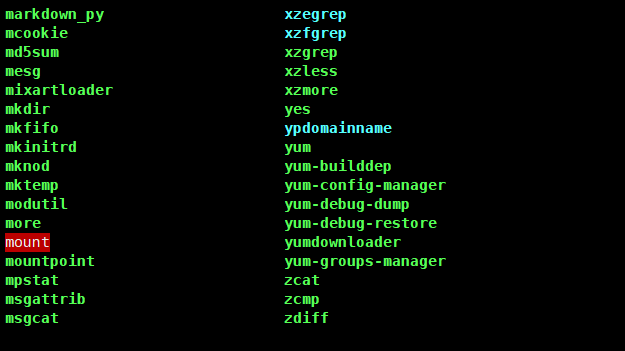

[TOC]

# Shell教程

**Shell 是一个用 C 语言编写的程序**，它是用户使用 Linux 的桥梁。Shell 既是一种命令语言，又是一种程序设计语言。

**Shell 是指一种应用程序，这个应用程序提供了一个界面，用户通过这个界面访问操作系统内核的服务**。（ 在计算机科学中，Shell俗称壳（用来区别于核），是指“为使用者提供操作界面”的[软件](https://baike.baidu.com/item/软件/12053)（command interpreter，命令解析器）。它类似于[DOS](https://baike.baidu.com/item/DOS/32025)下的[COMMAND.COM](https://baike.baidu.com/item/COMMAND.COM/8063418)和后来的[cmd.exe](https://baike.baidu.com/item/cmd.exe/8192925)。它接收用户命令，然后调用相应的[应用程序](https://baike.baidu.com/item/应用程序/5985445)。 ）

Ken Thompson 的 sh 是第一种 Unix Shell，Windows Explorer 是一个典型的图形界面 Shell。

## 第一个shell脚本

> `\#! `是一个约定的标记，它告诉系统这个脚本需要什么解释器来执行，即使用哪一种 Shell。
>
> `echo `命令用于向窗口输出文本。 

> 注意，**一定要写成 ./test.sh**，而不是 **test.sh**，运行其它二进制的程序也一样，直接写
> test.sh，linux 系统会去 PATH 里寻找有没有叫 test.sh 的，而只有 /bin, /sbin, 
> /usr/bin，/usr/sbin 等在 PATH 里，你的当前目录通常不在 PATH 里，所以写成 test.sh 是会找不到命令的，要用 
> ./test.sh 告诉系统说，就在当前目录找。

## Shell变量

> 注意，变量名和等号之间不能有空格，这可能和你熟悉的所有编程语言都不一样

使用变量

```
your_name="qinjx"
echo $your_name
echo ${your_name}
```

只读变量

```
myUrl="http://www.google.com"
readonly myUrl
```

删除变量

```
unset variable_name
```

## Shell字符串

### 单引号

> 不好用，除非定义变量

### 双引号 

```
your_name='runoob'
str="Hello, I know you are \"$your_name\"! \n"
echo -e $str
```

输出结果为：

```
Hello, I know you are "runoob"! 
```

###  拼接字符串 

> 最好不要用单引号拼接字符串

```
your_name="runoob"
# 使用双引号拼接
greeting="hello, "$your_name" !"
greeting_1="hello, ${your_name} !"
echo $greeting  $greeting_1
# 使用单引号拼接
greeting_2='hello, '$your_name' !'
greeting_3='hello, ${your_name} !'
echo $greeting_2  $greeting_3
```

输出结果为：

```
hello, runoob ! hello, runoob !
hello, runoob ! hello, ${your_name} !
```

### 获取字符串长度

> ${#string}

```
string="abcd"
echo ${#string} #输出 4
```

###  提取子字符串 

以下实例从字符串第 **2** 个字符开始截取 **4** 个字符：

```
string="runoob is a great site"
echo ${string:1:4} # 输出 unoo
```

###  查找子字符串 

查找字符 **i** 或 **o** 的位置(哪个字母先出现就计算哪个)：

```
string="runoob is a great site"
echo `expr index "$string" io`  # 输出 4
```

## Shell数组

### 读取数组 

```
array_name=(
value0
value1
value2
value3
)
```

```
array_name[0]=value0
array_name[1]=value1
array_name[n]=valuen
```

```
valuen=${array_name[n]}
```

###  获取数组的长度 

 获取数组长度的方法与获取字符串长度的方法相同，例如： 

```
# 取得数组元素的个数
length=${#array_name[@]}
# 或者
length=${#array_name[*]}


# 取得数组单个元素的长度
lengthn=${#array_name[n]}
```

## Shell 传递参数

```
#!/bin/bash
# author:菜鸟教程
# url:www.runoob.com

echo "Shell 传递参数实例！";
echo "执行的文件名：$0";
echo "第一个参数为：$1";
echo "第二个参数为：$2";
echo "第三个参数为：$3";
```

```shell
# 增加执行权限
$ chmod +x test.sh
# 给.sh传参数1,2,3
$ ./test.sh 1 2 3
Shell 传递参数实例！
执行的文件名：./test.sh
第一个参数为：1
第二个参数为：2
第三个参数为：3
```

| 参数处理 | 说明                                                         |
| -------- | ------------------------------------------------------------ |
| $#       | 传递到脚本的参数个数                                         |
| $*       | 以一个单字符串显示所有向脚本传递的参数。  如"$*"用「"」括起来的情况、以"$1 $2 … $n"的形式输出所有参数。 |
| $$       | 脚本运行的当前进程ID号                                       |
| $!       | 后台运行的最后一个进程的ID号                                 |
| $@       | 与$*相同，但是使用时加引号，并在引号中返回每个参数。   如"$@"用「"」括起来的情况、以"$1" "$2" … "$n" 的形式输出所有参数。 |
| $-       | 显示Shell使用的当前选项，与[set命令](https://www.runoob.com/linux/linux-comm-set.html)功能相同。 |
| $?       | 显示最后命令的退出状态。0表示没有错误，其他任何值表明有错误。 |

```
#!/bin/bash
# author:菜鸟教程
# url:www.runoob.com

echo "Shell 传递参数实例！";
echo "第一个参数为：$1";

echo "参数个数为：$#";
echo "传递的参数作为一个字符串显示：$*";
```

执行脚本，输出结果如下所示：

```
$ chmod +x test.sh 
$ ./test.sh 1 2 3
Shell 传递参数实例！
第一个参数为：1
参数个数为：3
传递的参数作为一个字符串显示：1 2 3
```

## Shell 运算符

### 算数运算符

> val=`expr $a \* $b`
> echo "a*b:$val"
>
> 乘法运算需要特别注意


### 关系运算符

> gt可以理解成greater than，le可以理解成less  equal


### 布尔运算符


### 逻辑运算符


### 字符串运算符


### 文件测试运算符


## Shell echo命令

### 5.显示不换行 

```
#!/bin/sh
echo -e "OK! \c" # -e 开启转义 \c 不换行
echo "It is a test"
```

输出结果：

```
OK! It is a test
```

###  6.显示结果定向至文件

```
echo "It is a test" > myfile
```

###  8.显示命令执行结果

```
echo `date`
```

**注意：** 这里使用的是反引号 `, 而不是单引号 '。

 结果将显示当前日期

```
Thu Jul 24 10:08:46 CST 2014
```

## Shell printf 命令

接下来,我来用一个脚本来体现printf的强大功能：

```
#!/bin/bash
# author:菜鸟教程
# url:www.runoob.com
 
printf "%-10s %-8s %-4s\n" 姓名 性别 体重kg  
printf "%-10s %-8s %-4.2f\n" 郭靖 男 66.1234 
printf "%-10s %-8s %-4.2f\n" 杨过 男 48.6543 
printf "%-10s %-8s %-4.2f\n" 郭芙 女 47.9876 
```

执行脚本，输出结果如下所示：

```
姓名     性别   体重kg
郭靖     男      66.12
杨过     男      48.65
郭芙     女      47.99
```

### printf的转义序列


## Shell test 命令

### 数值测试


```bash
num1=100
num2=100
if test $[num1] -eq $[num2]
then
    echo '两个数相等！'
else
    echo '两个数不相等！'
fi
```

### 字符串测试


```bash
num1="ru1noob"
num2="runoob"
if test $num1 = $num2
then
    echo '两个字符串相等!'
else
    echo '两个字符串不相等!'
fi
```


### 文件测试


```bash
cd /bin
if test -e ./bash
then
    echo '文件已存在!'
else
    echo '文件不存在!'
fi
```


## Shell 流程控制 

#### if else-if else 

```bash
if condition1
then
    command1
elif condition2 
then 
    command2
else
    commandN
fi
```

### for 循环 

```bash
for var in item1 item2 ... itemN
do
    command1
    command2
    ...
    commandN
done
```

### while 语句

```bash
while condition
do
    command
done
```

### until 循环

> ntil 循环执行一系列命令直至条件为 true 时停止

```bash
until condition
do
    command
done
```

### case 

```bash
case 值 in
模式1)
    command1
    command2
    ...
    commandN
    ;;
模式2）
    command1
    command2
    ...
    commandN
    ;;
esac
```

## Shell 函数

> 在Shell中，调用函数时可以向其传递参数

###  带参数的函数示例 

>  注意，$10 不能获取第十个参数，获取第十个参数需要${10}。当n>=10时，需要使用${n}来获取参数。 

```
#!/bin/bash
# author:菜鸟教程
# url:www.runoob.com

funWithParam(){
    echo "第一个参数为 $1 !"
    echo "第二个参数为 $2 !"
    echo "第十个参数为 $10 !"
    echo "第十个参数为 ${10} !"
    echo "第十一个参数为 ${11} !"
    echo "参数总数有 $# 个!"
    echo "作为一个字符串输出所有参数 $* !"
}
funWithParam 1 2 3 4 5 6 7 8 9 34 73
```

 输出结果： 

```
第一个参数为 1 !
第二个参数为 2 !
第十个参数为 10 !
第十个参数为 34 !
第十一个参数为 73 !
参数总数有 11 个!
作为一个字符串输出所有参数 1 2 3 4 5 6 7 8 9 34 73 !
```

### 有几个特殊字符用来处理参数


## Shell 输入/输出重定向

> https://www.runoob.com/linux/linux-shell-io-redirections.html


一般情况下，每个 Unix/Linux 命令运行时都会打开三个文件：

- 标准输入文件(stdin)：stdin的文件描述符为0，Unix程序默认从stdin读取数据。
- 标准输出文件(stdout)：stdout 的文件描述符为1，Unix程序默认向stdout输出数据。
- 标准错误文件(stderr)：stderr的文件描述符为2，Unix程序会向stderr流中写入错误信息。

默认情况下，command > file 将 stdout 重定向到 file，command < file 将stdin 重定向到 file。

如果希望 stderr 重定向到 file，可以这样写：

```
$ command 2>file
```

如果希望 stderr 追加到 file 文件末尾，可以这样写：

```
$ command 2>>file
```

**2** 表示标准错误文件(stderr)。

如果希望将 stdout 和 stderr 合并后重定向到 file，可以这样写：

```
$ command > file 2>&1

或者

$ command >> file 2>&1
```

如果希望对 stdin 和 stdout 都重定向，可以这样写：

```
$ command < file1 >file2
```

command 命令将 stdin 重定向到 file1，将 stdout 重定向到 file2。

## Shell 文件包含 	

> 类似vue的mixin

```bash
. filename   # 注意点号(.)和文件名中间有一空格

或

source filename
```


# Linux笔记

[菜鸟教程-Linux命令](https://www.runoob.com/linux/linux-command-manual.html)

## 1.Linux基础

### 1.1.前言

### 1.2.CentOS安装和说明

#### 1.2.1.虚拟机网络连接的三种方式


#### 1.2.2.CentOS终端使用和联网

[CSDN-CentOS7联网](https://blog.csdn.net/lsc476782158/article/details/51721909)

> 为了能够在centOS和windows共享文件夹，
>
> 为了能够在centOS中粘贴windows下的复制.
>
> 需要安装**VMtools**

[CSDN-VMtools重新安装 灰色问题](https://blog.csdn.net/l979951191/article/details/50596986/)

### 1.3.Linux目录结构 

[菜鸟教程-Linux  系统目录结构](https://www.runoob.com/linux/linux-system-contents.html)

以下是对这些目录的解释：

- **/bin**：
   bin 是 Binaries (二进制文件) 的缩写, 这个目录存放着最经常使用的命令。



- **/boot：**
  这里存放的是启动 Linux 时使用的一些核心文件，包括一些连接文件以及镜像文件。


- **/dev ：**
  dev 是 Device(设备) 的缩写, 该目录下存放的是 Linux 的外部设备，在 Linux 中访问设备的方式和访问文件的方式是相同的。

  
  
- **/etc：**
  etc 是 Etcetera(等等) 的缩写,这个目录用来存放所有的系统管理所需要的配置文件和子目录。

  
  
- **/home**：
  用户的主目录，在 Linux 中，每个用户都有一个自己的目录，一般该目录名是以用户的账号命名的。

- **/lib**：
  lib 是 Library(库) 的缩写这个目录里存放着系统最基本的动态连接共享库，其作用类似于 Windows 里的 DLL 文件。几乎所有的应用程序都需要用到这些共享库。


- **/lost+found**：
  这个目录一般情况下是空的，当系统非法关机后，这里就存放了一些文件。

- **/media**：
   linux 系统会自动识别一些设备，例如U盘、光驱等等，当识别后，Linux 会把识别的设备挂载到这个目录下。

- **/mnt**：
  系统提供该目录是为了让用户临时挂载别的文件系统的，我们可以将光驱挂载在 /mnt/ 上，然后进入该目录就可以查看光驱里的内容了。

- **/opt**：
  opt 是 optional(可选) 的缩写，这是给主机额外安装软件所摆放的目录。比如你安装一个ORACLE数据库则就可以放到这个目录下。默认是空的。

- **/proc**：
  proc 是 Processes(进程) 的缩写，/proc 是一种伪文件系统（也即虚拟文件系统），存储的是当前内核运行状态的一系列特殊文件，这个目录是一个虚拟的目录，它是系统内存的映射，我们可以通过直接访问这个目录来获取系统信息。
  这个目录的内容不在硬盘上而是在内存里，我们也可以直接修改里面的某些文件，比如可以通过下面的命令来屏蔽主机的ping命令，使别人无法ping你的机器：

  ```
  echo 1 > /proc/sys/net/ipv4/icmp_echo_ignore_all
  ```

- **/root**：
  该目录为系统管理员，也称作超级权限者的用户主目录。

- **/sbin**：
   s 就是 Super User 的意思，是 Superuser Binaries (超级用户的二进制文件) 的缩写，这里存放的是系统管理员使用的系统管理程序。

- **/selinux**：
   这个目录是 Redhat/CentOS 所特有的目录，Selinux 是一个安全机制，类似于 windows 的防火墙，但是这套机制比较复杂，这个目录就是存放selinux相关的文件的。

- **/srv**：
   该目录存放一些服务启动之后需要提取的数据。

- **/sys**：

  这是 Linux2.6 内核的一个很大的变化。该目录下安装了 2.6 内核中新出现的一个文件系统 sysfs 。

  sysfs 文件系统集成了下面3种文件系统的信息：针对进程信息的 proc 文件系统、针对设备的 devfs 文件系统以及针对伪终端的 devpts 文件系统。

  该文件系统是内核设备树的一个直观反映。

  当一个内核对象被创建的时候，对应的文件和目录也在内核对象子系统中被创建。

- **/tmp**：
   tmp 是 temporary(临时) 的缩写这个目录是用来存放一些临时文件的。

- **/usr**：
   usr 是 unix shared resources(共享资源) 的缩写，这是一个非常重要的目录，用户的很多应用程序和文件都放在这个目录下，类似于 windows 下的 program files 目录。

- **/usr/bin：**
  系统用户使用的应用程序。

- **/usr/sbin：**
  超级用户使用的比较高级的管理程序和系统守护程序。

- **/usr/src：**
  内核源代码默认的放置目录。

- **/var**：
   var 是 variable(变量) 的缩写，这个目录中存放着在不断扩充着的东西，我们习惯将那些经常被修改的目录放在这个目录下。包括各种日志文件。

- **/run**：
  是一个临时文件系统，存储系统启动以来的信息。当系统重启时，这个目录下的文件应该被删掉或清除。如果你的系统上有 /var/run 目录，应该让它指向 run。

在 Linux 系统中，有几个目录是比较重要的，平时需要注意不要误删除或者随意更改内部文件。

**/etc**： 上边也提到了，这个是系统中的配置文件，如果你更改了该目录下的某个文件可能会导致系统不能启动。

**/bin, /sbin, /usr/bin, /usr/sbin**: 这是系统预设的执行文件的放置目录，比如 ls 就是在 /bin/ls 目录下的。

值得提出的是，/bin, /usr/bin 是给系统用户使用的指令（除root外的通用户），而/sbin, /usr/sbin 则是给 root 使用的指令。 

**/var**： 这是一个非常重要的目录，系统上跑了很多程序，那么每个程序都会有相应的日志产生，而这些日志就被记录到这个目录下，具体在 /var/log 目录下，另外 mail 的预设放置也是在这里。

## 2.Linux实操

### 2.1.远程登录Xshell5

### 2.2.远程上传下载Xftp5

### 2.3.Vi和Vim编辑器

#### 2.3.1.常见的三种模式

#### 2.3.2.常见快捷键

[菜鸟教程-vi/vim 按键说明](https://www.runoob.com/linux/linux-vim.html)

### 2.4.开机，重启，用户登录注销

- shutdown
  - `shutdown -h now `立即关机
  - `shutdown -h 1 `一分钟后关机
  - `shutdown -r now`立即重启
- `halt` 停止使用，等效于关机
- `reboot`重启 
- `sync`把内存的数据保存到磁盘【关机和重启前为了安全需要使用这个指令，防止数据丢失】

- `logout`注销用户

### 2.5.用户管理

#### 2.5.1.添加用户

[Could not chdir to home directory /home/tom: No such file or directory](https://blog.csdn.net/qq_42479695/article/details/120545317)

[Linux下用户的创建与删除](https://blog.csdn.net/yychuyu/article/details/84190390)

`useradd 用户名` 创建用户

1. 当创建用户成功后，会自动创建和用户同名的家目录
2. 也可以通过`useradd -d 指定目录 新的用户名`给新创建的用户指定家目录
3. `useradd -g 组名 用户名`新增用户到指定用户组

`passwd 用户名` 给用户指定或修改密码

#### 2.5.2.删除用户

> 一般删除用户，不会删除该用户的家目录

- 删除用户，保存该用户的家目录 `userdel 用户名`
- 删除用户，以及用户的的家目录 `userdel -r 用户名`

> 报错：userdel: user xm is currently used by process 62520
>
> 解决：第一次使用ctrl+d退出root用户，回到user1用户；第二次使用ctrl+d退出user1用户，此时会返回到root用户（再按ctrl+d退出登陆连接），此时使用userdel user1正常删除。

#### 2.5.3.查询用户信息

`id 用户名`

```
uid=1000(waterplants) gid=1000(waterplants) 组=1000(waterplants),10(wheel)
```

- uid 组名
- gid 所在组ID号
- 组 组名

#### 2.5.4.切换用户

`su 用户名` 切换用户

`exit` 回退到原先的用户

> 从权限高的用户切换到权限低的用户不需要输入密码

`whoami`查看当前用户

#### 2.5.5.用户组

`groupadd 组名` 创建用户组

`groupdel 组名`删除用户组

`useradd -g 用户组 用户名` 创建用户时指定用户组

`usermod -g 用户组 用户名`修改用户对应的用户组

#### 2.5.6.用户和组相关的文件

`/etc/passwd`用户的配置文件，记录用户的各种信息。

每行的含义： `用户名:口令:用户表示号:组标识号:注释性描述:主目录:登录shell`

`/etc/shadow`口令的配置文件。

每行的含义： `登录名:加密口令:最后一次修改时间:最小时间间隔:最大时间间隔:警告时间:不活动时间:失效时间:标志`

`/etc/group`用户组的配置文件。

每行的含义： `组名:口令:组标识号:组内用户列表`

### 2.6.实用指令

#### 2.6.1.指定运行级别


`init [0123456]`切换运行级别

> 通过`init 1`进入单用户模式，可以不输入密码登录root。
>
> 可以用来修改root密码


#### 2.6.2.帮助相关指令

`man 指令名` 如`man ls` 显示指令的帮助文档

`help 指令名` 如`help cd` 显示指令的帮助文档

#### 2.6.3.文件目录类

`pwd` 显示当前目录的绝对路径

`ls` 显示当前目录下所有内容（包括文件和目录）

- `ls -l`或`ll` 以列表的方式显示信息
- `ls -a` 显示当前目录所有内容（包括文件和目录），包括隐藏的
- `ls -la`或`ls -al` 等效于同时使用上面两句

`cd 路径` 切换目录

- `cd ../`或`cd ..`回到上级目录
- `cd ~`回到家目录

`mkdir 目录名` 创建目录

- `mkdir -p 多级目录名` 创建多级目录

`rmdir 目录名` 只能删除空目录

`touch 文件名称` 创建空文件

`cp 来源地文件 目的地目录`复制来源地文件到目的地目录

- `cp -r 来源地目录 目的地目录` 递归复制整个文件夹
- `\cp -r 来源地目录 目的地目录` 递归复制整个文件夹,并强制覆盖

`rm 文件名`删除文件

- `rm -f 文件名` 强制删除文件，不提示
- `rm -rf 目录名` 删除目录

`mv` 移动文件与目录或重命名

- `mv 旧文件名 新文件名` 文件重命名
- `mv 文件名 目录名` 文件移动

`cat 文件名` 查看文件内容

- `cat -n 文件名` 查看文件内容，并显示行号
- `cat 文件名 | more`查看文件内容，分页显示【按空格切换下一页 按回车切换下一行】

`more 文件名`分页查看文件内容【按空格切换下一页 按回车切换下一行 ctrl+b切换上一页】

`less 文件名` 分页查看文件内容【会根据显示需要加载内容，对于显示大型文件有较高效率】

`>`输出重定向，即覆盖写

- `ls -a > 文件`列表的内容覆盖写入到文件中

`>>`输出追加，即追加写

`echo `输出

- `echo $path`输出环境变量
- `echo helloworld`输出helloworld

`head 文件名`查看文件头10行内容

- `head -n 5 文件名` 查看文件头5行内容

`tail 文件名`查看文件尾10行内容

- `tail -n 5 文件名` 查看文件尾5行内容
- `tail -f 文件名`实时追踪文档所有更新

`ln -s 原文件或目录 软连接名` 创建软连接，即快捷方式【当使用`pwd`查看目录时，仍然看到的是软连接所在目录】

- `rm- rf 软连接名` 删除软连接【软连接名后不要带`/`】

`history`查看已经执行过的指令

- `history 10` 显示最近执行过的10条指令
- `!178`执行编号为178的指令

#### 2.6.4.时间日期类

`date`显示时间

- `date +%Y`显示年
- `date “+%Y-%m-%d %H:%M:%S”`显示年月日时分秒【2020-09-30 15:41:39】
- `date -s 字符串时间` 设置时间

`cal` 显示当前月日历

- `cal 2020`显示2020整年日历

#### 2.6.5.搜索查找类

`find 搜索范围 选项`查找

- `find /home -name hello.txt `【在`/home`下按文件名查找`hello.txt`文件】
- `find /opt -user root`【在`/opt`下按文件拥有者查找文件】
- `find / -size +[-,=]20M`【在`/`下查找大于20M的文件】
- `find / -name *.txt`【在`/home`下按文件名查找`txt`后缀的文件】

`locate`快速定位文件

- `updatedb`【使用`locate`前先要初始化locate数据库】
- `locate hello.txt `定位`hello.txt`的位置

`grep`文件内查找【通常和`|`管道符结合使用】

- `cat hello.txt |grep -n yes`查看`hello.txt`然后文件内查找所有`yes`并显示它的行号
- `cat hello.txt |grep -ni yes`查看`hello.txt`然后文件内不区分大小写的查找所有`yes`并显示它的行号

```shell
[root@hadoop1 home]# cat hello.txt |grep -n yes
4:yes
[root@hadoop1 home]# vim hello.txt 
[root@hadoop1 home]# cat hello.txt |grep -ni yes
4:yes
7:YES111
8:YES
```

#### 2.6.6.压缩解压类

- 压缩：`gzip 文件名` 将对应的文件压缩为`文件名.gz`文件

- 解压：`gunzip 文件名.gz` 解压文件

**注意：`gzip`和`gunzip`不会保留原文件**


- 压缩:`zip -r mypackage.zip /home`压缩整个`/home`目录下的文件到`mypackage.zip`

- 解压：`unzip -d /opt/tmp/ mypackage.zip`解压`mypackage.zip`到`/opt/tmp`


- 压缩：`tar -zvcf a.tar.gz hello.txt`打包并压缩文件到`a.tar.gz`
- 解压：`tar -zxvf a.tar.gz `解压`a.tar.gz`到当前目录
- 解压到指定目录：`tar -zxvf a.tar.gz -C /opt/tmp `解压`a.tar.gz`到`/opt/tmp`【指定解压的目录必须存在】

### 2.7.组管理和权限管理

[菜鸟教程-Linux 文件基本属性](https://www.runoob.com/linux/linux-file-attr-permission.html)

#### 2.7.1.组管理

- `chown [–R] 所有者 文件名`更改文件所有者（owner），也可以同时更改文件所属组。
  `chown [-R] 所有者:属组名 文件名`更改文件所有者（owner），也可以同时更改文件所属组。
- `chgrp [-R] 属组名 文件名`更改文件属组
- `usermod`修改用户所在组
  - `usermod -g 组名 用户名`改变用户所在组
  - `usermod -d 目录名 用户名`改变该用户登录的初始目录
-  `chmod [-R] xyz 文件或目录`

#### 2.7.2.权限详情


Linux文件属性有两种设置方法，一种是数字，一种是符号。

Linux 文件的基本权限就有九个，分别是 **owner/group/others(拥有者/组/其他)** 三种身份各有自己的 **read/write/execute** 权限。

先复习一下刚刚上面提到的数据：文件的权限字符为： **-rwxrwxrwx** ， 这九个权限是三个三个一组的！其中，我们可以使用数字来代表各个权限，各权限的分数对照表如下：

- r:4
- w:2
- x:1

每种身份(owner/group/others)各自的三个权限(r/w/x)分数是需要累加的，例如当权限为： **-rwxrwx---** 分数则是：

- owner = rwx = 4+2+1 = 7
- group = rwx = 4+2+1 = 7
- others= --- = 0+0+0 = 0

**第0位代表文件的类型**，它可以是：

- 当为[ d ]则是目录；
- 当为[ - ]则是普通文件；
- 若是[ l ]则表示为软连接；
- 若是[ b ]则表示为装置文件里面的可供储存的接口设备(可随机存取装置)；在dev目录下能看到
- 若是[ c ]则表示为装置文件里面的串行端口设备，例如键盘、鼠标(一次性读取装置)；在dev目录下能看到


### 2.8.任务调度


#### 2.8.1.定时任务详解

**cron定时任务**

- `crontab -e`进入定时任务编辑
- `*/1 * * * * ls -l /etc >> /tmp/to.txt`每隔一分钟执行`ls -l /etc`并将结果追加输出到`/tmp/to.txt`

**cron相关指令**

- `crontab -r` 终止任务调度
- `crontab -l` 列出当前有哪些任务调度
- `service crond restart` 重启任务调度
- `crontab -e`时删除某行，来去除某个定时任务

**at定时任务**

使用 `at` 命令，你可以在特定时间自动完成你所设定的任务，也可以实现自动化，非常方便快捷！

[博客园-at命令详解](https://www.cnblogs.com/yychuyu/p/15483186.html)

### 2.9.磁盘分区和挂载

[CSDN-Linux磁盘分区详解（新建分区，现有分区扩容，分区减容）](https://blog.csdn.net/zhanhjxxx/article/details/123232402)

#### 2.9.1.分区的方式

> GTP分区代表了未来

- MBR分区
  - 最多支持四个主分区
  - 系统只能安装在主分区
  - 拓展分区要站一个主分区
  - MBR最大只支持2TB，但拥有最好的兼容性
- GTP分区
  - 支持无限多个主分区（但操作系统可能限制，比如windows下最多128个分区）
  - 最大支持18EB的大容量（1EB=1024PB,1PB=1024TB）
  - windows7 64位 以后支持GTP

#### 2.9.2.Linux分区


- `lsblk -f`老师不离开 查看当前系统分区情况

  

  

#### 2.9.3.给Linux增加一个硬盘

[CSDN-Linux磁盘扩容三种方式](https://blog.csdn.net/Hlroliu/article/details/109764269)

Linux在使用过程中由于数据量不断增大，导致磁盘空间不足，需要增加磁盘空间，主要有以下三种方式
1、直接给 / 分区（或者某一分区）扩容，直接在原有磁盘上增大空间
2、给虚拟机新增一块磁盘，为这块磁盘新建一个分区
3、给虚拟机新增一块磁盘，并把磁盘空间扩容到原有分区

#### 2.9.4.磁盘查询指令

[菜鸟教程-du命令](https://www.runoob.com/linux/linux-comm-du.html)

[CSDN-磁盘情况查询与磁盘实用指令](https://blog.csdn.net/wish_you_luck/article/details/125502718)

- `df -l` 查询系统整体磁盘使用情况
- `du -h /目录` 查询指定目录的磁盘占用情况
- `tree`树形展示目录结构

### 2.10.网络配置

目前网络配置采用的是NAT模式

[CSDN-CentOS7虚拟机上网](https://blog.csdn.net/a785975139/article/details/53023590?utm_medium=distribute.pc_relevant.none-task-blog-BlogCommendFromBaidu-2&depth_1-utm_source=distribute.pc_relevant.none-task-blog-BlogCommendFromBaidu-2)

[博客园-Linux修改IP、主机名、DNS ](https://www.cnblogs.com/ataoxz/p/18606532)

[CSDN-linux添加或修改hosts的方法](https://blog.csdn.net/sqlquan/article/details/99974553)

`netstat -anp` 查看系统网络情况


**主机名解析过程的分析**：

1. 当用户在浏览器中输入百度的域名（www.baidu.com），浏览器会首先检查本地hosts文件中是否存在对应的映射关系。
2. 如果在hosts文件中找到了对应的映射关系，浏览器会将主机名解析为对应的IP地址，并直接向该IP地址发送请求。
3. 如果在hosts文件中未找到对应的映射关系，则浏览器会向本地DNS缓存发送查询请求。
4. 如果在本地DNS缓存中找到了对应的IP地址，浏览器会将主机名解析为对应的IP地址，并直接向该IP地址发送请求。
5. 如果在本地DNS缓存中未找到对应的IP地址，则本地DNS缓存会向本地DNS服务器发送查询请求。
6. 本地DNS服务器会检查自己的缓存，如果找到了对应的IP地址，它会将结果返回给本地DNS缓存。
7. 如果本地DNS服务器未找到对应的IP地址，它会根据域名的层次结构，从根域名服务器开始逐级查询。
8. 本地DNS服务器会向根域名服务器发送查询请求，根域名服务器会返回顶级域名服务器的IP地址。
9. 本地DNS服务器会向顶级域名服务器发送查询请求，顶级域名服务器会返回二级域名服务器的IP地址。
10. 本地DNS服务器会继续向二级域名服务器发送查询请求，直到找到与主机名对应的IP地址。
11. 一旦本地DNS服务器找到了对应的IP地址，它会将结果返回给本地DNS缓存。
12. 本地DNS缓存将结果返回给浏览器，浏览器将主机名解析为IP地址，并向该IP地址发送请求。
13. 百度服务器接收到请求后，会返回相应的网页内容给浏览器，浏览器将网页内容显示给用户。

### 2.11.进程管理

#### 2.11.1进程的基本介绍

#### 2.11.2.查看进程

`ps -aux`

`ps -ef`

`pstree -p`以树状展示进程ID

`pstree -u`以树状展示进程的用户ID


#### 2.11.3.终止进程

`kill [选项] 进程号`通过进程号杀死进程

`killall 进程名称` 通过进程名杀死进程，也支持通配符，这在系统因负载过大而变慢时很有用

1. 踢掉某个非法登录的用户
2. 终止远程登录服务sshd，在适当时候再重启sshd服务
3. 终止多个gedit编辑器【killall】
4. 强制杀掉一个终端【甚至可以自杀！！！】

#### 2.11.4.服务管理

[博客园-CentOS7服务管理（一）](https://www.cnblogs.com/tkqasn/p/9379242.html)

> 服务本质就是进程，但是是运行在后台的，通常会监听某个端口，等待其他进程的请求，比如（mysql,sshd,防火墙等），因此我们又称为**守护进程**

CentOS7之前：`service 服务名 [start|stop|restart|reload|status]` 

CentOS7之后:`systemctl [start|stop|restart|reload|status] 服务名`

> 注意：这种方式只是**临时生效**，重启系统后，回归以前对服务的配置。

------

> 在windows启动Telnet功能后，
>
> 使用`telnet 10.0.0.102 22 `可以连接上虚拟机上的CentOS7系统的sshd服务

------

查看服务名几种方式：

- `setup`图形化界面查看服务
- 到`/etc/init.d`下查看
- `systemctl list-unit-files`列出所有服务
- `systemctl list-dependencies`查看所有服务 

服务的运行级别：见 **2.6.1.指定运行级别**

`chkconfig`给某个服务的某个运行级别设置自启动/不自启动

- `chkconfig --list|grep xxx`查看某个服务
- `chkconfig 服务名 --list`查看某个服务
- `chkconfig --level 5 服务名 on/off`设置某个服务在运行级别5情况下自启动/不自启动

`top`显示正在执行的进程

[CSDN-linux top命令详解（看这一篇就够了）](https://blog.csdn.net/weixin_45465395/article/details/115728520)


### 2.12.RPM和YUM

#### 2.12.1.RPM

> RPM 是RedHat Package Manager(红帽软件包管理工具)，它生成`.rpm`拓展名的文件，类似于windows的`setup.exe`。

`rpm -qa|grep xx`查询已安装的RPM软件列表


`rpm -e RPM软件包名称`卸载某个软件

`rpm -e -nodeps RPM软件包名称 `强制卸载某个软件，不管有没有依赖

`rpm -ivh RPM软件包名称`

#### 2.12.2.YUM

> YUM是一个Shell前端软件包管理器。基于RPM包管理，能够从指定服务器自动下载RPM包并安装。而且自动处理依赖性关系，并以此安装所有依赖的软件包。

`yum list|grep xxx`查看软件列表

`yum install xxx`下载安装某软件，默认安装最新版本


> Ubuntu使用apt来安装软件。
>
> APT是Advance Packaging Tool（高级包装工具）的缩写，APT可以自动下载，配置，安装二进制或者源代码格式的软件包。

### 2.13.防火墙

[CSDN-Linux 防火墙配置（iptables和firewalld）](https://blog.csdn.net/m0_49864110/article/details/129150960)

