# 2021Study-MySQL基础

[菜鸟教程-MySQL 安装](https://www.runoob.com/mysql/mysql-install.html)

[CSDN-修改mysql远程访问](https://www.cnblogs.com/stronger-xsw/p/12779385.html)

基础操作：

`show databases;`显示所有数据库

`use <database>;`切换数据库

`show tables;`查看当前库的所有表

`show tables from <database>`查看其他数据库的所有表

`select version();`查看MySQL版本

三种注释： 

`#注释`

`-- 注释`

`/* 注释 */`

## DQL语言、函数、连接的使用、子查询（嵌套查询）

[菜鸟教程-MySQL 函数](https://www.runoob.com/mysql/mysql-functions.html)

[菜鸟教程-MySQL 连接的使用](https://www.runoob.com/mysql/mysql-join.html)

```sql
SELECT column_name,column_name
FROM table_name
[WHERE Clause]
[LIMIT N][ OFFSET M]
```

起别名带有特殊符号：`as '别名'`

去重：`select distinct xxx from table_name`

mysql的+号只有运算符一个功能：

- `select 90+100;`190
- `select '123'+90;`213
- `select 'john'+90`90
- `select null+10`null

拼接字符串：`select CONCAT(last_name,first_name) from employees`

通配符的使用：`select * from employees where last_name like '%a%'`

- % 任意多个字符，包含0字符

- _ 任意单个字符

转义字符：

- `\\`\
- `\_`_

`in`不支持通配符

安全等于`<=>`：

- 可作为普通运算符的=
- 也可以用于判断是否是NULL 如：where salary is NULL/(is not NULL) ->where salary <=>NULL 

防止查询到的字段为null：`IFNULL(column_name,0)`

```sql
SELECT field1, field2,...fieldN FROM table_name1, table_name2...
[WHERE Clause] ORDER BY field1 [ASC [DESC][默认 ASC]], [field2...] [ASC [DESC][默认 ASC]]
```

----

IF：`IF(expr1,expr2,expr3)`

CASE-WHEN：`case sex
    when '1' then '男'
    when '2' then '女'
    else '其他' end`

----

**SQL Aggregate 函数**

SQL Aggregate 函数计算从列中取得的值，返回一个单一的值。

有用的 Aggregate 函数：

- AVG() - 返回平均值
- COUNT() - 返回行数
  - MYISAM存储引擎下，count(*)效率高
  - INNOOB存储引擎下，count(*)和count(1)效率差不多
- FIRST() - 返回第一个记录的值
- LAST() - 返回最后一个记录的值
- MAX() - 返回最大值
- MIN() - 返回最小值
- SUM() - 返回总和

------

**SQL Scalar 函数**

SQL Scalar 函数基于输入值，返回一个单一的值。

有用的 Scalar 函数：

- UCASE() - 将某个字段转换为大写
- LCASE() - 将某个字段转换为小写
- MID() - 从某个文本字段提取字符，MySql 中使用
- SubString(字段，1，end) - 从某个文本字段提取字符
- LEN() - 返回某个文本字段的长度
- ROUND() - 对某个数值字段进行指定小数位数的四舍五入
- NOW() - 返回当前的系统日期和时间
- FORMAT() - 格式化某个字段的显示方式

---

**分组查询**:

查询每个部门的平均工资`select AVG(salary),job_id from employees group by job_id;`

查询邮箱中包含a字符的，每个部门的平均工资`select AVG(salary),department_id from employees where email like '%a%' group by department_id;`

**分组后的筛选**：`having`

判断存在`exists(完整的查询语句)`

分页查询`limit start,size`

```
SELECT expression1, expression2, ... expression_n
FROM tables
[WHERE conditions]
UNION [ALL | DISTINCT]
SELECT expression1, expression2, ... expression_n
FROM tables
[WHERE conditions];
```

## DML语言

```sql
INSERT INTO table_name ( field1, field2,...fieldN )
                       VALUES
                       ( value1, value2,...valueN );
```

```sql
UPDATE table_name SET field1=new-value1, field2=new-value2
[WHERE Clause]
```

```MYsql
DELETE FROM table_name [WHERE Clause]
DELETE 别名1 FROM table_name1 别名1 INNER|LEFT|RIGHT JOIN table_name2 别名2 ON 连接条件 WHERE 筛选条件
TRUNCATE TABLE table_name
```

delete和truncate的区别：

1. delete可以加where条件，truncate不能加
2. truncate删除，效率高一些
3. 加入要删除的表中有自增长列，如果用delete删除，再插入数据，自增长列的值从断点开始；而truncate删除后，再插入数据，自增长列的值从1开始
4. truncate删除没有返回值，delete删除有返回值
5. truncate删除不能回滚，delete删除可以回滚

## DDL语言、数据类型、常见约束

**库的管理语言**：

创建create 修改alter 删除drop

`create database 库名;`创建数据库

`create datebase if not exists 库名; `如不存在则创建数据库

`alter database 库名 character set 字符集;`修改数据库字符集

`drop database if exists 库名;`如存在则删除数据库

----

**表的管理语言**：

`create table if not exists 表名(列名 类型 约束，...);`如不存在则创建表

`desc 表名;`查看表结构

`alter table 表名 change column 旧列名 新列名 新列类型与约束;`修改表的列名和列

`alter table 表名 modify column 列名 新列类型与约束; `修改表的列

`alter table 表名 add column 列名 列类型与约束;`增加表的列

`alter table 表名 drop column 列名;`删除表的列

`alter table 表名 rename to 新表名;`修改表名

`create table 表名1 like 表名2;`只复制表的结构

`create table 表名1 select * from 表名2;`复制表

`create table 表名1 select xx,yy from 表名2 where 筛选条件`只复制表的部分数据

`create table 表名1 select xx,yy from 表名2 where 1=2`只复制表的部分字段

---

**数据类型**：

`unsigned`无符号

`zerofill`零填充

- 数值型

  - 整型`tinyint` `smallint` `mediumint` `int integer` `bigint`
  - 定点数`dec(M,D)` `decimal(M,D)`M 代表整数部分位数+小数部分位数 D 代表小数部分位数
  - 浮点数`float(M,D)` `double(M,D)`

- 字符型

  - 较短的文本`char(M)` 是固定长度 ； `varchar(M)`是可变长度

  

  - 较长的文本`text` `blob`

- 日期型 `date` `datetime` `timestamp` `time` `year`

  

- 其他型

  

---

**常见约束**：

1.列级约束：

`not null`非空

`default 默认值`默认值

`primary key`主键

`unique`唯一，可以为空 比如座位号

`check`检查约束【mysql不支持】

`foreign key references 表名(列名)`外键，在从表添加

2.表级约束：

`[constraint pk] primary key(列名)`添加主键约束

`[constraint fk_stuinfo_major] foreign key(majorId) references major(id)`添加外键约束

----

标识列：`auto_increment`

- 标识列要和primary key或unique搭配

- 一个表只能有至多一个标识列
- 标识列的类型只能是数值型
- 标识列可以通过`set auto_increment_increment=3`设置步长，也可以通过手动插入值设置起始值

## TCL语言

TCL：事务控制语言

`set autocommit=0`关闭自动提交

`start transaction`开启事务

…多条命令

`commit`结束事务

`set transaction isolation level read committed`设置当前mysql连接的隔离级别

`set global transaction isolation level read committed`设置数据库系统全局的隔离级别

`savepoint 节点名` `rollback to 节点名`回滚到保存点

## 视图

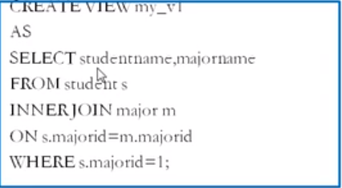

使用场景：

- 多个地方用到同样的查询
- 查询的sql比较复杂

视图的插入、更新、删除一般会带动原始表的变化

## 变量

[博客园-MySQL变量的使用](https://www.cnblogs.com/Brambling/p/9259375.html)

## 存储过程和函数

存储过程的好处：

1. 提高代码的重用型
2. 简化操作
3. 减少编译次数、减少和数据库服务器连接的次数，提高效率

`create procedure 存储过程名(参数列表) BEGIN ... END$`

参数列表包括参数模式、参数名、参数类型

参数模式有`IN` `OUT` `INOUT`

`DELIMITER 结束标记`设置结束符

```MYSQL
DELIMITER $
CREATE PROCEDURE myp1()
BEGIN
...
END $
```

`call 存储过程名(参数列表) $`调用存储过程

`show create procedure 存储过程名`查看存储过程的信息

`drop procedure 存储过程名`删除存储过程

---

`create function 函数名(参数列表) returns 返回类型 BEGIN ... END￥ `创建函数

`select 函数名(参数列表)`调用函数

`show create function 函数名`查看函数的信息

`drop function 函数名`删除函数

## 流程控制结构

[博客园-SQL——流程控制](https://www.cnblogs.com/lqkStudy/p/11493749.html)

`IF(表达式1,表达式2,表达式3)` 满足表达式1返回表达式2，否则返回表达式3


# 2021Study-MySQL高级

## mysql的架构介绍

linux下mysql账号：root 密码：root123##ROOT

`mysqladmin --version`查看mysql安装版本

linux中mysql的安装目录：

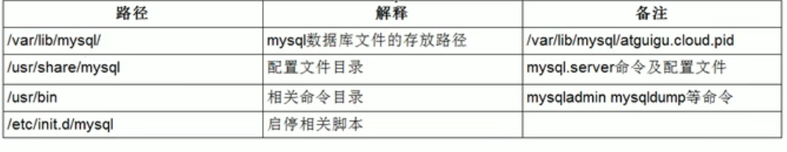

修改字符集为UTF-8

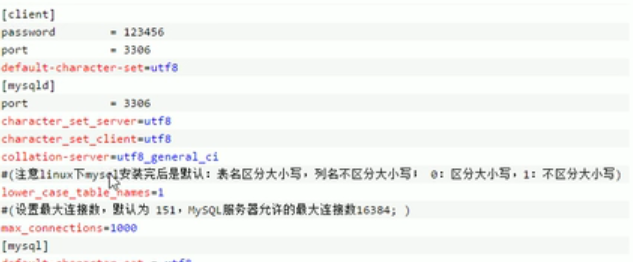

frm文件：存放表结构

myd文件：存放表数据

myi文件：存放表索引

---

存储引擎对比：

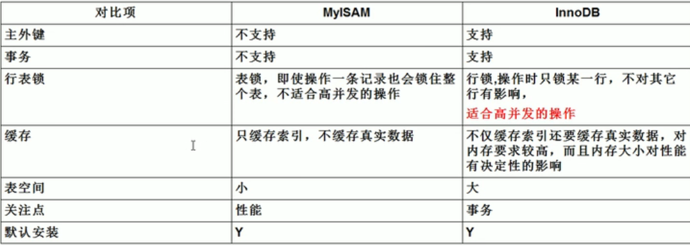


## 索引优化分析

性能下降sql慢、执行时间长、等待时间长：

- 查询语句写的烂
- 索引失效
- 关联查询太多join
- 服务器调优及各个参数设置

B数（多路搜索树）索引：帮助mysql高效获取数据的数据结构，

索引的目的在于提高查询效率，可以类比字典，

理解为**排好序的快速查找数据结构**


修改表结构(添加索引)

```sql
CREATE INDEX indexName ON table_name (column_name)

ALTER table tableName ADD INDEX indexName(columnName)
```

创建表的时候直接指定

```sql
CREATE TABLE mytable(  
 
ID INT NOT NULL,   
 
username VARCHAR(16) NOT NULL,  
 
INDEX [indexName] (username(length))  
 
);  
```

删除索引的语法

```sql
DROP INDEX [indexName] ON mytable; 
```

----

`explain 查询语句`

explain包含信息：

- id
  - id相同，执行顺序由上至下
  - id不同，如果是子查询，id序号会递增，id越大优先级越高，越先执行
  - id相同不同，综合以上
- select_type
  - SIMPLE
  - PRIMARY
  - SUBQUERY，子查询
  - DERIVED，衍生表
  - UNION
  - UNION RESULT，从UNION表获取结果的SELECT
- table
  - 对应的表
- type
  - 从好到差排序system>const>eq_ref>ref>range>index>all
  - system，表只有一条数据
  - const，表示索引一次就找到了，用于比较primary key或者unique索引
  - eq_ref，唯一性索引扫描，表中只有一条记录与之对应
  - 【 简单地说是`const`是直接按主键或唯一键读取，`eq_ref`用于联表查询的情况，按联表的主键或唯一键联合查询。 】
  - ref，非唯一性索引扫描
  - range，出现在between and语句中
  - index，全索引扫描
  - all，全表扫描
- possible_keys
  - 显示可能应用在这个表上的索引，一个或多个，但不一定被查询实际使用
- key
  - 实际使用的索引，如果为null，则没有使用索引
  - 覆盖索引：select数据列只从索引中获取得，不必读取数据行
- key_len
  - 显示的值为索引字段的最大可能长度，长度越短越好
- ref
  - 显示索引的哪一列被使用了，可能为const
- rows
  - 大致估算找到所需记录要读取的行数
- Extra
  - using filesort：Mysql无法利用索引完成的排序操作称为 文件排序
  - using temporary：使用了临时表保存中间结果，常见于排序order by和分组查询group by
  - using index：用到了覆盖索引

---


`show index from 表`显示表的索引

`alter table 表名 add index 索引名(列名)`添加表索引

`drop index 索引名 on 表名`删除表索引

两表相连，索引加在从表

**索引失效的情况**：


## 查询截取分析

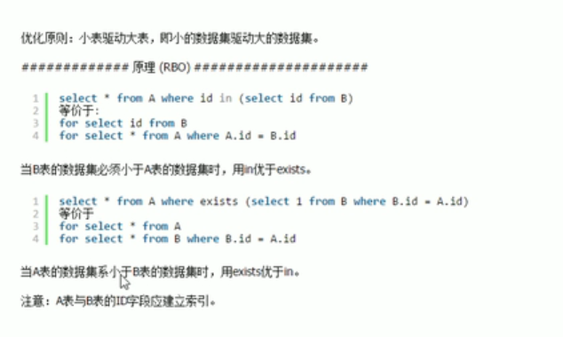

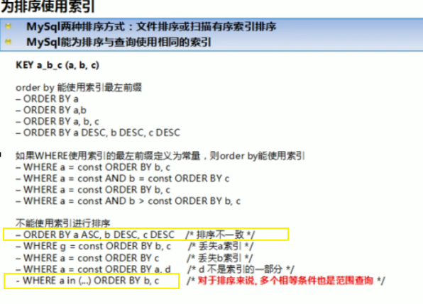

**慢查询日志**：

[CSDN-Mysql慢查询日志的使用 和 Mysql的优化](https://blog.csdn.net/m_nanle_xiaobudiu/article/details/79288257)

`set global slow_query_log=1;`开启慢查询日志

`set global long_query_time=3;`修改慢的阈值时间

---

**使用show profile分析SQL性能**：

[CSDN-使用show profiles分析SQL性能](https://blog.csdn.net/gaoshan12345678910/article/details/78840158)

`show profiling=on;`

`show profiles;`

出现性能瓶颈要查看以下是否出现：


----

**全局查询日志**：

永远不要在生产环境开启这个功能

`set global_log=1;`

`set global log_output='TABLE';`

## Mysql锁机制

### 表锁

 表级锁是mysql锁中粒度最大的一种锁，表示当前的操作对整张表加锁，**资源开销比行锁少，不会出现死锁的情况，但是发生锁冲突的概率很大**。被大部分的mysql引擎支持，MyISAM和InnoDB都支持表级锁，但是InnoDB默认的是行级锁。  

共享锁用法：

`LOCK TABLE table_name [ AS alias_name ] READ`
排它锁用法：

`LOCK TABLE table_name [AS alias_name][ LOW_PRIORITY ] WRITE`

解锁用法：

`unlock tables;`

`show status like 'table%';`表锁分析


### 行锁

`show open tables;`查看哪些表加锁了

 **共享锁用法**： 

 若事务T对数据对象A加上S锁，则事务T**可以读A但不能修改A**，其他事务只能再对A加S锁，而不能加X锁，直到T释放A上的S锁。这保证了其他事务可以读A，但在T释放A上的S锁之前不能对A做任何修改。 

 **共享锁就是允许多个线程同时获取一个锁，一个锁可以同时被多个线程拥有。** 

 `select ... lock in share mode; `

**排它锁用法**：

 若事务T对数据对象A加上X锁，事务T可以读A也可以修改A，其他事务不能再对A加任何锁，直到T释放A上的锁。这保证了其他事务在T释放A上的锁之前不能再读取和修改A。

` select ... for update `
 排它锁，也称作独占锁，一个锁在某一时刻只能被一个线程占有，其它线程必须等待锁被释放之后才可能获取到锁

`show status like 'innodb_row_lock%'`行锁分析

---


**索引失效、无索引 行锁变表锁**

**间隙锁**：间隙锁（Gap Lock）是Innodb在提交下为了解决幻读问题时引入的锁机制，（下面的所有案例没有特意强调都使用可重复读隔离级别）幻读的问题存在是因为新增或者更新操作，这时如果进行范围查询的时候（加锁查询），会出现不一致的问题，这时使用不同的行锁已经没有办法满足要求，需要对一定范围内的数据进行加锁，间隙锁就是解决这类问题的。在可重复读隔离级别下，数据库是通过行锁和间隙锁共同组成的（next-key lock），来实现的

---

### 页锁

  页级锁是MySQL中锁定粒度介于行级锁和表级锁中间的一种锁。表级锁速度快，但冲突多，行级冲突少，但速度慢。所以取了折衷的页级，一次锁定相邻的一组记录。BDB支持页级锁 

### 其他

面试题：

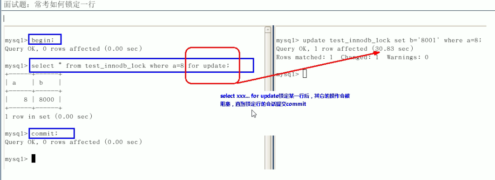

优化建议：


## 主从复制

[MySQL主从复制(Master-Slave)实践](https://www.cnblogs.com/gl-developer/p/6170423.html)

# 2022Study-MySQL笔记

## 前言与参考书目网站

> MYSQL官方参考手册
>
> 《高性能MYSQL第4版》
>
> TechNet
>
> 菜鸟教程-MYSQL
>
> InfoQ文章
>
> C语言中文网
>
> docs4dev
>
> [数据库排名](https://db-engines.com/en/ranking)
>
> 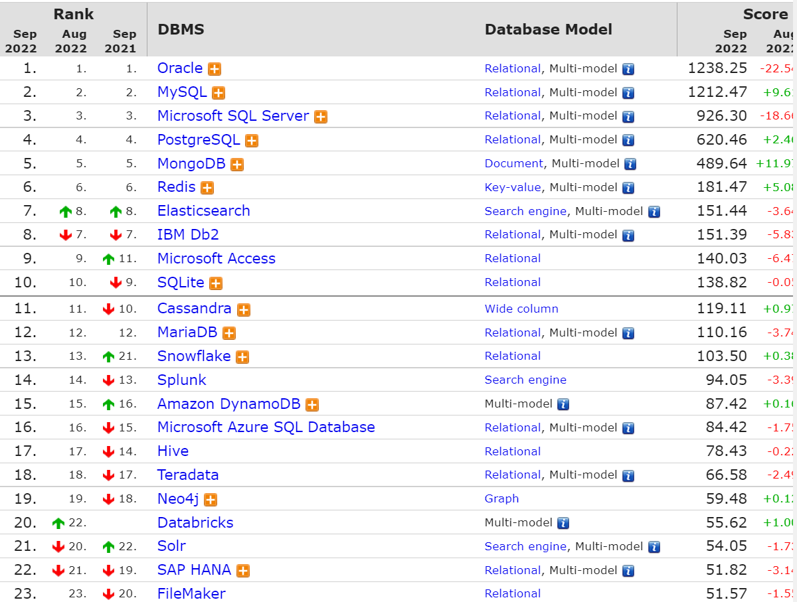

```bash
# 设置可以在终端使用mysql
sudo source .bash_profile
# 访问本不能访问的文件夹
sudo chmod -R a+rwx /usr/local/mysql/data 
```


## MYSQL运算符Comparison Operators

### MYSQL:NULL

> 字符串存在隐式转换,如果转换成数值不成功，则看做0

```mysql
select 1=2,1!=2,1='1',1='a',0='a' from dual; -- 0 1 1 0 1
```

> 只要有null参与预算，结果就为null

```mysql
select 1=null,null=null from dual; -- null null
```

### MYSQL:安全等于

> `<=>`安全等于，可以对null进行判断 

```mysql
select 1<=>2,1<=>'1',1<=>'a',0<=>'a' from dual;-- 0 1 0 1
select 1<=>null,null<=>null from dual;-- 0 1
```

### MYSQL:Least Function/MYSQL:Greatest Function

```mysql
mysql> SELECT LEAST(2, 5, 12, 3);
Result: 2

mysql> SELECT LEAST('2', '5', '12', '3');
Result: '12'

mysql> SELECT LEAST('techonthenet.com', 'checkyourmath.com', 'bigactivities.com');
Result: 'bigactivities.com'

mysql> SELECT LEAST('techonthenet.com', 'checkyourmath.com', null);
Result: NULL

mysql> SELECT GREATEST(2, 5, 12, 3);
Result: 12

mysql> SELECT GREATEST('2', '5', '12', '3');
Result: '5'

mysql> SELECT GREATEST('techonthenet.com', 'checkyourmath.com', 'bigactivities.com');
Result: 'techonthenet.com'

mysql> SELECT GREATEST('techonthenet.com', 'checkyourmath.com', null);
Result: NULL
```

### MYSQL:转义字符

```mysql
select last_name form employees where last_name like '_\_a';-- 查询第二个字符是_，第三个字符是a的员工信息
select last_name form employees where last_name like '_$_a' escape '$';-- 定义转义字符别名
```

### MYSQL:正则表达式

[TechNet-没有正则表达式，菜鸟教程有](https://www.techonthenet.com/mysql/index.php)

查找name字段中以'st'为开头的所有数据：

```mysql
mysql> SELECT name FROM person_tbl WHERE name REGEXP '^st';
```

查找name字段中以'ok'为结尾的所有数据：

```mysql
mysql> SELECT name FROM person_tbl WHERE name REGEXP 'ok$';
```

查找name字段中包含'mar'字符串的所有数据：

```mysql
mysql> SELECT name FROM person_tbl WHERE name REGEXP 'mar';
```

查找name字段中以元音字符开头或以'ok'字符串结尾的所有数据：

```mysql
mysql> SELECT name FROM person_tbl WHERE name REGEXP '^[aeiou]|ok$';
```


## 多表连接Joins

[菜鸟教程-一张图看懂 SQL 的各种 JOIN 用法](https://www.runoob.com/w3cnote/sql-join-image-explain.html)

### cross join笛卡尔积

> 需要where限制，不然多表会出现错误

### 等值连接和非等值连接

> 限制条件是等于号就是等值连接

### 自连接和非自连接

> 一个表连接自己，就是自连接

### 内连接和外连接

> 内连接 就是cross join
>
> 外连接
>
> - 左外连接
> - 右外连接
> - 全外连接

### UNION和UNION ALL

> UNION 效率低，会去重
>
> UNION ALL 效率高，不会去重

## MYSQL函数Functions

| [Functions - Alphabetical](https://www.techonthenet.com/mysql/functions/index_alpha.php) | MySQL Functions listed alphabetically |
| ------------------------------------------------------------ | ------------------------------------- |
| [Functions - Category](https://www.techonthenet.com/mysql/functions/index.php) | MySQL Functions listed by category    |

> 分为内置函数和自定义函数
>
> 不同DBMS的函数差别很大，不建议死记

### MYSQL聚合函数

```mysql
-- 五大聚合函数 AVG和SUM只能处理数值类型
SELECT AVG(salary) from employees;
SELECT SUM(salary) from employees;
SELECT MAX(salary) from employees;
SELECT MIN(salary) from employees;
-- 计算指定字段出现的个数时，是不包含null值的
SELECT COUNT(salary) from employees;
-- 比较特殊，返回表有多少行
SELECT COUNT(1) FROM employees;
SELECT COUNT(2) FROM employees;
SELECT COUNT(*) FROM employees;
-- GROUP BY中使用WITH ROLLUP 除了基本查到的数据，还包括不带GROUP BY的AVG(salary)
-- 使用WITH ROLLUP时，不能使用ORDER BY
SELECT department_id,AVG(salary) from employees GROUP BY department_id WITH ROLLUP;
```

## SQL的执行顺序，WHERE和HAVING效率对比

> FROM …,….->ON->(LEFT/RIGHT JOIN)->WHERE->GROUP BY->HAVING->SELECT->DICTINCT->ORDER BY->LIMIT
>
> 在SELECT渔具执行这些步骤时，每个步骤会生成虚拟表，然后将这个虚拟表传入下一个步骤作为输入。这些隐含在SQL执行过程中，对于我们是不可见的

> WHERE效率高于HAVING

## MYSQL子查询

### 单行子查询

> 单行操作符： = != > < >= <=

### 多行子查询

> 多行操作符：IN ANY ALL SOME

```MYSQL
SELECT employee_id,last_name,job_id,salary FROM employees WHERE job_id<>'IT_PROG' AND salary < ANY (SELECT salary FROM employees WHERE job_id='IT_PROG');
SELECT employee_id,last_name,job_id,salary FROM employees WHERE job_id<>'IT_PROG' AND salary < SOME (SELECT salary FROM employees WHERE job_id='IT_PROG');
SELECT employee_id,last_name,job_id,salary FROM employees WHERE job_id<>'IT_PROG' AND salary < ALL (SELECT salary FROM employees WHERE job_id='IT_PROG');

SELECT MIN(avg_sal) FROM (SELECT AVG(salary) avg_sal FROM employees GROUP BY department_id) t_dept_avg_sal
```

### 相关子查询

> 子查询引用了父查询的数据，而且父子查询不是一个表，就是相关子查询

## MYSQL表和数据库的增删改查

> 阿里巴巴开发规范：TRUNCATE TABLE 比DELETE速度快，且使用的系统和事务日志资源少，但TRUNCATE无事务且不触发TRIGGER，有可能造成事故，故不建议在开发代码中使用此语句

```mysql
-- 复制表
create table employees
as 
select * 
from mydb.`employees`;
```

## MYSQL8.0

### MYSQL8.0的原子化

> MYSQL8.0 的一条DROP操作是原子化的，要么成功，要么失败，不会成功一部分

### MYSQL8.0的计算列

```MYSQL
CREATE TABLE test1(
a int,
b int,
c int GENERATED ALWAYS AS (a+b) VIRTUAL); # 字段c即为计算列
```


## MYSQL数据类型Data type

### 整数类型

```mysql
CREATE TABLE test_int2(
f1 int,
f2 int(5),
f3 int(5) ZEROFILL)# 1.显示宽度为5，当insert值不足5位时，用0填充 2.当使用ZEROFILL时，自动添加UNSIGNED
```

> 从MYSQL8.0.17之后，整数数据类型不推荐使用显示宽度属性

### 浮点型和定点型

> 浮点型：FLOAT DOUBLE
>
> 定点型：DECIMAL

### 位类型

> 位类型：BIT

###　日期和时间类型

### 文本字符串类型

> CHAR和VARCHAR的选择：
>
> 1. 存储很短且位数相对固定的数据，用CHAR
> 2. 十分频繁改变的column，用CHAR
> 3. 在MYISAM存储引擎中，用CHAR;在MEMORY存储引擎中都可以；在INNODB存储引擎中，主要影响性能的因素是数据行使用的数据总量，多用VARCHAR

> TEXT文本类型：可以存储比较大的文本段，由于TEXT和BLOB类型的数据删除后容易导致“空洞”，使得文件碎片比较多，所以频繁使用的表不建议包含TEXT类型字段，建议单独分出去一个表

### 枚举ENUM类型和SET类型【了解】

### 二进制字符串类型【了解】

> BLOB:实际工作中，不会用BLOB村大对象数据，会将图片、音频、视频文件存储到服务器的磁盘上，并将图片、音频和视频的访问路径存储到MYSQL中

### JSON类型【了解】

## MYSQL约束Conditions

> 为什么需要约束？ 为了保证数据的完整性
>
> 什么叫约束？对表中字段的限制

### 查询某个表的约束

```mysql
-- 查询某个表的约束
select * from information_schema.table_constraints where table_name='employees';
```

### 列级约束和表级约束

```mysql
-- 创建表时添加列级约束和表级约束
create table emp(
    name VARCHAR(15) NOT NULL,
    last_name VARCHAR(15),
    salary DECIMAL(10,2),
    constraint uk_emp_last_name unique(last_name)-- constraint uk_emp_last_name 可省略
);
```

```mysql
-- 修改约束 方式一
alter table emp
modify name VARCHAR(15) NULL;
-- 修改约束 方式二
alter table test2
add constraint uk_test2_sal unique(salary);
```

### 复合唯一性约束

> 创建复合唯一性约束

```mysql
create table `user`(
    id int,
    `name` varchar(15),
    `password` varchar(25),
    constraint uk_user_name_pwd unique(`name`,`password`)
);
```

> 要删除唯一性约束，就要删除唯一性索引

```mysql
alter table test2
drop index last_name;
```

### 主键约束

> 主键约束=唯一性约束+非空约束

### 自增列

### 外键约束

> 对于外键约束，最好采用下面的方式：
>
> `on update cascade on delete set null`（更新主表数据时从表数据级联更新，删除主表数据时从表数据设为null）

```mysql
-- 主表
create table dept(
    dept_id int primary key,-- 必须有主键约束，不然创建外键会失败报错
    dept_name varchar(15)
);
-- 从表
create table empl(
    emp_id int primary key auto_increment,
    emp_name varchar(15),
	department_id int,
    constraint fk_empl_dept_id foreign key (department_id) references dept(dept_id) on update cascade on delete set null
);
```


```mysql
-- 删除外键约束
alter table empl 
drop foreign key fk_empl_dept_id;
-- 查看empl的索引
show index from empl;
alter table empl
drop index fk_empl_dept_id;
```

> ==在mysql中，外键约束是有成本的，需要消耗系统资源。对于大并发的sql操作，有可能会不适合==


### 检查约束和默认值约束

> 检查约束在mysql5.7不支持

## MYSQL视图View

> [数据库](https://www.huaweicloud.com/product/dbs.html)对象包括：用户（对数据库有权限访问的人）、视图（显示用户需要的数据项）、索引（给用户提供快速访问数据的途径）、触发器（用户定义的SQL事务命令集合）、序列（提供了唯一数值的顺序表）、图表（数据库表之间的一种关系示意图）。

> 视图和表之间是双向绑定的，视图就可以看做存储起来的select语句

```mysql
-- 创建视图
create view 视图名称
as 查询语句
```

## MYSQL存储过程Procedures

[菜鸟教程-MySQL 存储过程](runoob.com/w3cnote/mysql-stored-procedure.html)

> 阿里规范禁止使用存储过程，因为存储过程的移植性很差并且很难调试

``` mysql
-- 创建存储过程
delimiter $
create procedure select_all_data()
begin 
	select * from emps;
end $
delimiter ;
```

```mysql
-- 调用存储过程
call select_all_data();
```

-----

```mysql
-- 带返回值的存储过程
delimiter $
create procedure show_min_salary(out ms double)
begin 
	select min(salary) into ms 
	from employees;
end $
delimiter ;
```

```mysql
-- 调用存储过程，并将返回值存储到用户定义的@ms变量中
call show_min_salary(@ms);
```

## MYSQL存储函数Functions

```mysql
-- 创建存储函数
delimiter //
create function email_by_name()
returns varchar(25)
deterministic -- 确定性的 
contains sql -- 包含sql的
reads sql data -- 读取sql数据的
begin
	select email from employees where last_name='Abel'；
end //
delimiter ;
```

```mysql
-- 调用存储函数
select email_by_name();
```

----

```mysql
set global log_bin_trust_function_creator=1;-- 创建函数前执行此语句，保证函数的创建会执行成功
delimiter //
create function email_by_name(emp_id int)
returns varchar(25)
begin
	return (select email from employees where employee_id=emp_id)；
end //
delimiter ;
```

```mysql
set @emp_id=102;
select email_by_name(@emp_id);
```

## MYSQL变量、流程控制和游标

### 变量Declaring Variables

> 变量：
>
> - 系统变量
>   - 全局系统变量(global):不能跨重启
>   - 会话系统变量(session)
> - 用户自定义变量
>   - 会话用户变量
>   - 局部变量：写在存储过程或存储函数中

```mysql
show global variables；
show session variables;
show variables;-- 默认查询的是会话系统变量
```

```mysql
select @@global.max_connections;-- 查看指定的全局系统变量
select @@session.pseudo_thread_id；-- 查看指定的会话系统变量
select @@character_set_client;-- 先查询会话系统变量，再查询全局系统变量
```

```mysql
-- 修改全局系统变量
set @@global.max_connections=161;
set global max_connections=161;
```

-----

```mysql
-- set @用户变量:=表达式
set @m1=1;
select @count:=count(*) from employees;-- 不能省略冒号
select avg(salary) into @avg_sal from employees;
```

----

```mysql
delimiter $
create procedure test_var()
begin 
	declare a int default 0;
	declare b int;
end $
delimiter ;
```

### 定义条件与处理程序

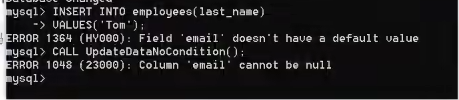

> 错误码的说明：
>
> `MySQL_error_code`和`sqlstate_value`都可以表示MYSQL的错误
>
> - `MySQL_error_code`是数值类型错误代码
> - `sqlstate_value`是长度为5的字符串类型错误代码
>
> 例如：在ERROR 1418(HY000)中，1418是`MySQL_error_code`，HY000是`sqlstate_value`

```mysql
-- 定义条件
declare Field_Not_Be_Null condition for 1048;-- `MySQL_error_code`
declare Field_Not_Be_Null condition for sqlstate '23000';-- `sqlstate_value`
```

MySQL 中可以使用 **DECLARE** 关键字来定义处理程序。其基本语法如下：

```mysql
-- 定义处理程序
-- declare 处理方式 handler for 错误类型 处理语句
DECLARE handler_type HANDLER FOR condition_value[...] sp_statement
```

其中，`handler_type` 参数指明错误的处理方式，该参数有 3 个取值。这 3 个取值分别是 CONTINUE、EXIT 和 UNDO。

- `CONTINUE` 表示遇到错误不进行处理，继续向下执行；
- `EXIT`表示遇到错误后马上退出；
- `UNDO` 表示遇到错误后撤回之前的操作，MySQL 中暂时还不支持这种处理方式。


注意：通常情况下，执行过程中遇到错误应该立刻停止执行下面的语句，并且撤回前面的操作。但是，MySQL 中现在还不能支持 UNDO 操作。因此，遇到错误时最好执行 EXIT 操作。如果事先能够预测错误类型，并且进行相应的处理，那么可以执行 CONTINUE 操作。

`condition_value`参数指明错误类型，该参数有 6 个取值：

- `SQLSTATE sqlstate_value`：包含 5 个字符的字符串错误值；
- `condition_name`：表示 DECLARE 定义的错误条件名称；
- `SQLWARNING`：匹配所有以 01 开头的 sqlstate_value 值；
- `NOT FOUND`：匹配所有以 02 开头的 sqlstate_value 值；
- `SQLEXCEPTION`：匹配所有没有被 SQLWARNING 或 NOT FOUND 捕获的 sqlstate_value 值；
- `MySQL_error_code`：匹配数值类型错误代码。

下面是定义处理程序的几种方式，代码如下：

```mysql
-- 方法一：捕获 sqlstate_value
DECLARE CONTINUE HANDLER FOR SQLSTATE '42S02' SET @info='CAN NOT FIND';

-- 方法二：捕获 mysql_error_code
DECLARE CONTINUE HANDLER FOR 1146 SET @info='CAN NOT FIND';

-- 方法三：先定义条件，然后调用
DECLARE can_not_find CONDITION FOR 1146;
DECLARE CONTINUE HANDLER FOR can_not_find SET @info='CAN NOT FIND';

-- 方法四：使用 SQLWARNING
DECLARE EXIT HANDLER FOR SQLWARNING SET @info='ERROR';

-- 方法五：使用 NOT FOUND
DECLARE EXIT HANDLER FOR NOT FOUND SET @info='CAN NOT FIND';

-- 方法六：使用 SQLEXCEPTION
DECLARE EXIT HANDLER FOR SQLEXCEPTION SET @info='ERROR';
```

### 流程控制Loops and Conditional Statements

> 流程控制只能在存储过程和存储函数中执行

[C语言中文网-MySQL流程控制语句详解](http://c.biancheng.net/view/7853.html)

### 游标cursor

> 游标在存储过程和存储函数中的使用步骤：
>
> 1. declare游标
> 2. open游标
> 3. fetch游标
>
> 4. close游标

```mysql
DELIMITER //

CREATE FUNCTION FindSiteID ( name_in VARCHAR(50) )
RETURNS INT

BEGIN

   DECLARE done INT DEFAULT FALSE;
   DECLARE siteID INT DEFAULT 0;

   DECLARE c1 CURSOR FOR
     SELECT site_id
     FROM sites
     WHERE site_name = name_in;

   DECLARE CONTINUE HANDLER FOR NOT FOUND SET done = TRUE;

   OPEN c1;
   FETCH c1 INTO siteID;

   CLOSE c1;

   RETURN siteID;

END; //

DELIMITER ;
```

```mysql
DELIMITER //

CREATE PROCEDURE get_count_by_limit_total_salary(IN limit_total_salary DOUBLE,OUT total_count INT)

BEGIN
	DECLARE sum_salary DOUBLE DEFAULT 0;  #记录累加的总工资
	DECLARE cursor_salary DOUBLE DEFAULT 0; #记录某一个工资值
	DECLARE emp_count INT DEFAULT 0; #记录循环个数
	#定义游标
	DECLARE emp_cursor CURSOR FOR SELECT salary FROM employees ORDER BY salary DESC;
	#打开游标
	OPEN emp_cursor;
	
	REPEAT
		#使用游标（从游标中获取数据）
		FETCH emp_cursor INTO cursor_salary;
		
		SET sum_salary = sum_salary + cursor_salary;
		SET emp_count = emp_count + 1;
		
		UNTIL sum_salary >= limit_total_salary
	END REPEAT;
	
	SET total_count = emp_count;
	#关闭游标
	CLOSE emp_cursor;
	
END //

DELIMITER ;
```


## MYSQL触发器Triggers

```mysql
DELIMITER //

CREATE TRIGGER contacts_before_insert
BEFORE INSERT
   ON contacts FOR EACH ROW

BEGIN

   DECLARE vUser varchar(50);

   -- Find username of person performing INSERT into table
   SELECT USER() INTO vUser;

   -- Update create_date field to current system date
   SET NEW.created_date = SYSDATE();

   -- Update created_by field to the username of the person performing the INSERT
   SET NEW.created_by = vUser;

END; //

DELIMITER ;
```


## MYSQL8.0新特性

[MySQL官网-MYSQL8.0新特性](https://dev.mysql.com/doc/refman/8.0/en/mysql-nutshell.html)

> 可能需要专门新看视频


## 字符集、归类、Unicode

> [MYSQL8.0参考手册-字符集、归类、Unicode](https://dev.mysql.com/doc/refman/8.0/en/charset.html)
>
> 在MYSQL8.0之前，默认字符集为latin1，utf8字符集指向的时utfmb3.
>
> 从MYSQL8.0开始，数据库的默认编码将改为utf8mb4,从而解决中文乱码问题
>
> Linux解决乱码可以修改它的配置文件
>
> 字符集分为四个级别：
>
> - 服务器级别
> - 数据库级别
> - 表级别
> - 列级别
>
> **字符集与比较规则：**
>
> `UTF8mb4`是`UTF8mb3`的超集，用于存储`emoji`

```mysql
show variables like '%character%';-- 查看字符集变量
show charset;-- 显示所有字符集
```


## SQL大小写规范和SQL_MODE

> [MYSQL8.0参考手册-标识符区分大小写](https://dev.mysql.com/doc/refman/8.0/en/identifier-case-sensitivity.html)
>
> [MYSQL8.0参考手册-服务器 SQL 模式](https://dev.mysql.com/doc/refman/8.0/en/sql-mode.html)
>
> [MYSQL8.0参考手册-sql_mode](https://dev.mysql.com/doc/refman/5.7/en/server-system-variables.html#sysvar_sql_mode)
>
> **SQL编写建议：**
>
> 1. 关键字和函数名称全部大写
> 2. 数据库名、表名、表别名、字段名、字段别名等全部小写
>
> ```mysql
> select @@sql_mode;-- 查询全局sql_mode
> ```


## MYSQL数据目录

[MYSQL8.0参考手册-MySQL 数据目录](https://dev.mysql.com/doc/refman/8.0/en/data-directory.html)

```mysql 
show variables like 'datadir';-- 查看mysql数据库和表存放位置
```

### InnoDB的磁盘结构

#### 表空间

> [MYSQL8.0参考手册-系统表空间](https://dev.mysql.com/doc/refman/8.0/en/innodb-system-tablespace.html)
>
> The system tablespace can have one or more data files. By default, a single system tablespace data file, named `ibdata1`, is created in the data directory. The size and number of system tablespace data files is defined by the [`innodb_data_file_path`](https://dev.mysql.com/doc/refman/8.0/en/innodb-parameters.html#sysvar_innodb_data_file_path) startup option. For configuration information, see [System Tablespace Data File Configuration](https://dev.mysql.com/doc/refman/8.0/en/innodb-init-startup-configuration.html#innodb-startup-data-file-configuration).

> [MYSQL8.0参考手册-File-Per-Table 表空间](https://dev.mysql.com/doc/refman/8.0/en/innodb-file-per-table-tablespaces.html)
>
> `InnoDB` creates tables in file-per-table tablespaces by default. This behavior is controlled by the [`innodb_file_per_table`](https://dev.mysql.com/doc/refman/8.0/en/innodb-parameters.html#sysvar_innodb_file_per_table) variable. Disabling [`innodb_file_per_table`](https://dev.mysql.com/doc/refman/8.0/en/innodb-parameters.html#sysvar_innodb_file_per_table) causes `InnoDB` to create tables in the system tablespace.
>
> A file-per-table tablespace is created in an `.ibd` data file in a schema directory under the MySQL data directory. The `.ibd` file is named for the table (`*`table_name`*.ibd`). For example, the data file for table `test.t1` is created in the `test` directory under the MySQL data directory:
>
> 索引和数据在一起存储


### MyISAM的磁盘结构

#### 表空间

> [MYSQL8.0参考手册-MyISAM 存储引擎](https://dev.mysql.com/doc/refman/8.0/en/myisam-storage-engine.html)
>
> Each `MyISAM` table is stored on disk in two files. The files have names that begin with the table name and have an extension to indicate the file type. The data file has an `.MYD` (`MYData`) extension. The index file has an `.MYI` (`MYIndex`) extension. The table definition is stored in the MySQL data dictionary.
>
> 索引和数据分开存储

## MYSQL用户与权限管理

[MYSQL8.0参考手册-数据库管理语句](https://dev.mysql.com/doc/refman/8.0/en/sql-server-administration-statements.html)

### 配置文件

[MYSQL8.0参考手册-MySQL服务器](https://dev.mysql.com/doc/refman/8.0/en/mysqld-server.html)

## MYSQL逻辑架构

[尚硅谷MYSQL-P109](https://www.bilibili.com/video/BV1iq4y1u7vj?p=109&vd_source=f58f2e2144be4e99a8cf800afeecbbcb)

[51CTO-一篇带给你MySQL逻辑架构](https://www.51cto.com/article/649711.html)

> MYSQL是典型的C/S架构，服务端程序使用的时`mysqld`
>
> 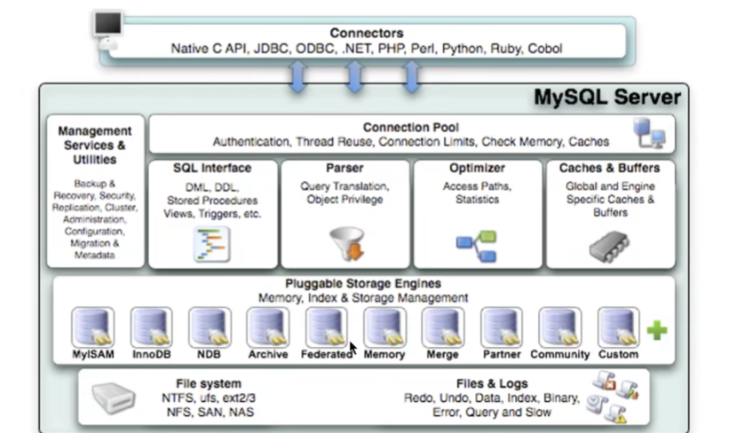
>
> 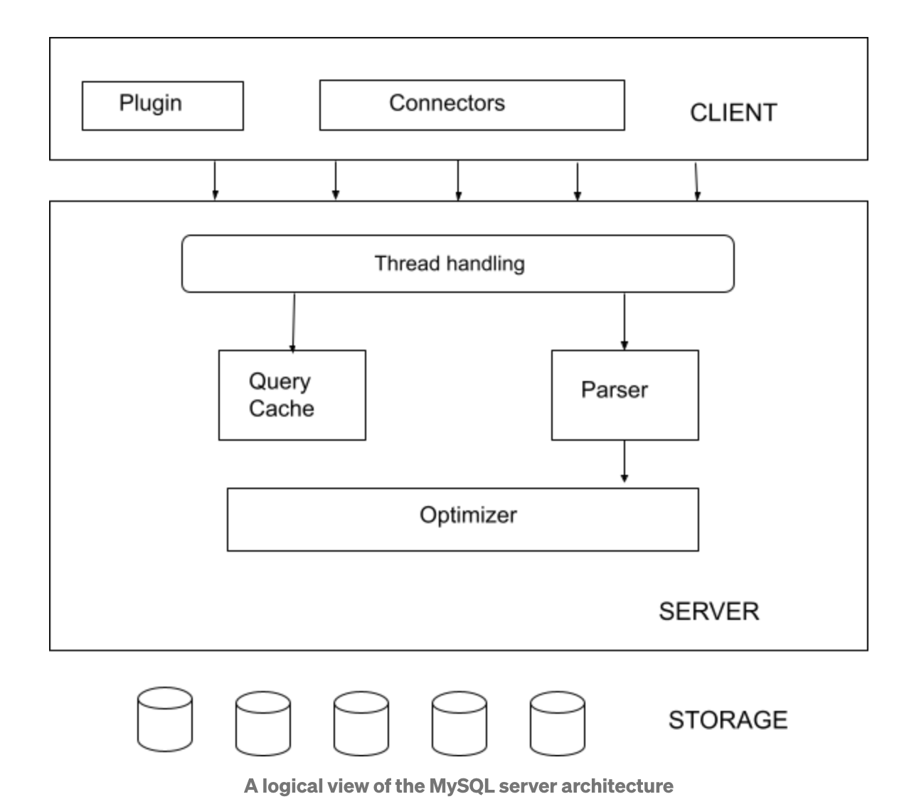
>
> 


## MYSQL执行流程

> SQL执行流程：SQL语句->查询缓存->解析器->优化器->执行引擎
>
> 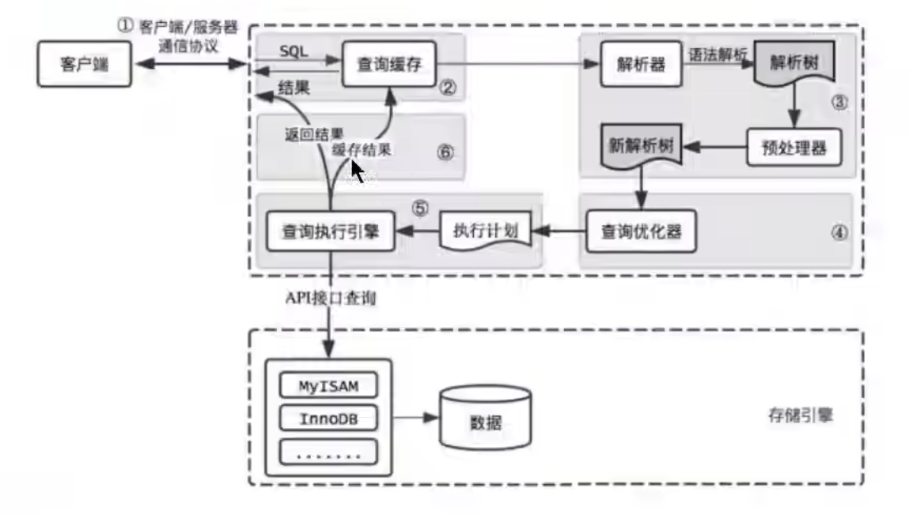

> [MYSQL8.0用户手册-SHOW PROFILE Statement](https://dev.mysql.com/doc/refman/8.0/en/show-profile.html)
>
> [MYSQL8.0用户手册-SHOW PROFILES Statement](https://dev.mysql.com/doc/refman/8.0/en/show-profiles.html)
>
> ```mysql
> select @@session.profiling;-- 0 默认执行过程是关闭的
> set profiling=1;-- 开启执行细节
> 
> 
> show profiles;-- 查询最近执行的SQL语句
> show profile;-- 查看最近一次SQL执行细节
> show profile  for query 7;-- 查询某个SQL语句的执行细节
> show profile cpu,block io for query 7;-- 查看包括cpu、IO阻塞等参数的SQL执行细节
> ```
>
> 

> 查询缓存往往弊大于利，所以在MYSQL8.0中去掉了，而在MYSQL5.7中，可以编辑`my.cnf`开启查询缓存
>
> ```ini
> # query_cache_type有三个值（0代表关闭查询缓存OFF,1代表开启ON，2代表DEMAND（当sql语句中有SQL_CACHE关键词才缓存））
> query_cache_type=2
> ```
>
> ```MYSQL
> select SQL_CACHE * from test where ID=5;-- 要去查询缓存确认
> select SQL_NO_CACHE * from test where ID=5;-- 不去查询缓存确认
> ```
>
> ```mysql
> show status like '%Qcache%';-- 显示 查询缓存 相关情况
> ```
>
> 

## 数据库缓冲池BufferPool

> BufferPool就是存储引擎向操作系统申请一段连续的内存空间，是为了减少与磁盘进行IO的时间，缓存的是热点数据。
>
> 数据库缓冲池还具有预读的特性，当我们使用了某些数据页的数据，在缓冲池空间足够的情况下，会将该数据页前后的数据页加载到数据库缓冲池。
>
> 缓冲池会采用checkpoint检查点机制将更新之后缓存的数据刷盘到磁盘上。
>
> 多实例的数据库缓冲池是为了缓解多线程并发压力，当缓冲池大小小于1GB时，设置多实例是无效的。
>
> 查询缓存和数据库缓冲池不是一个东西：
>
> - 查询缓存是缓存SQL语句
> - 缓冲池缓存的时数据页数据

```mysql
show variables like 'key_buffer_size';-- 查看MYISAM缓冲池大小
show variables like 'innodb_buffer_pool_size';-- 查看INNODB的缓冲池大小
show variables like 'innodb_buffer_pool_instance'；-- 查看缓冲池实例个数
```


```properties
[server]
# 配置多实例的数据库缓冲池
innodb_buffer_pool_instances=2 
```


## 存储引擎Engine

> `存储引擎（也叫表处理器）决定表和数据在底层的存储方式`

```mysql
show engines;-- 查看数据库支持的存储引擎
show variables like '%storage_engine%';-- 查看当前使用的存储引擎 
```

> 下图可知：
>
> InnoDB是唯一支持事务、分布式事务(XA)、保存点（部分事务回滚）的存储引擎

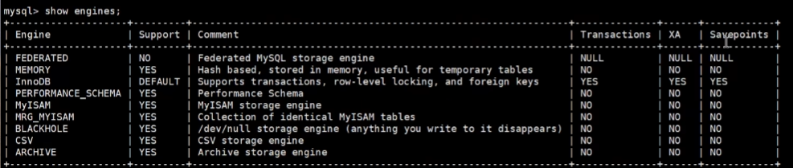

### InnoDB:具备外键支持功能的事务存储引擎

> 优点：
>
> 1. 外键
> 2. 事务
> 4. 行级锁
> 
>缺点：
> 
>1. 处理效率差一些，会占用更多磁盘空间以保存数据和索引
> 2. 对内存要求高一些

> [MYSQL8.0参考手册-Introduction to InnoDB](https://dev.mysql.com/doc/refman/8.0/en/innodb-introduction.html)
>
> InnoDB的核心优点：
>
> - DML操作遵循ACID模型，即带有`事务`特征的提交、回滚和崩溃恢复能力来保护用户数据
>
> - `行级别锁定`和Oracle风格的一致性读增加了多用户的并发性和性能表现。
>
> - InnoDB表在磁盘上组织你的数据来基于主键优化查询。每个InnoDB表都有一个主键索引，它被称之为`聚集索引`，该索引组织你的数据来最小化主键查找的IO。
>
> - 为了保持数据完整性，InnoDB支持`外键约束`。有了外键，插入、更新、删除会被检查来保证这些操作不会导致夸关联表的不一致性。
>
> - | Feature                                                      | Support                                                      |
>   | :----------------------------------------------------------- | :----------------------------------------------------------- |
>   | **B-tree indexes**                                           | Yes                                                          |
>   | **Backup/point-in-time recovery** (Implemented in the server, rather than in the storage engine.) | Yes                                                          |
>   | **Cluster database support**                                 | No                                                           |
>   | **Clustered indexes**                                        | Yes                                                          |
>   | **Compressed data**                                          | Yes                                                          |
>   | **Data caches**                                              | Yes                                                          |
>   | **Encrypted data**                                           | Yes (Implemented in the server via encryption functions; In MySQL 5.7 and later, data-at-rest encryption is supported.) |
>   | **Foreign key support**                                      | Yes                                                          |
>   | **Full-text search indexes**                                 | Yes (Support for FULLTEXT indexes is available in MySQL 5.6 and later.) |
>   | **Geospatial data type support**                             | Yes                                                          |
>   | **Geospatial indexing support**                              | Yes (Support for geospatial indexing is available in MySQL 5.7 and later.) |
>   | **Hash indexes**                                             | No (InnoDB utilizes hash indexes internally for its Adaptive Hash Index feature.) |
>   | **Index caches**                                             | Yes                                                          |
>   | **Locking granularity**                                      | Row                                                          |
>   | **MVCC**                                                     | Yes                                                          |
>   | **Replication support** (Implemented in the server, rather than in the storage engine.) | Yes                                                          |
>   | **Storage limits**                                           | 64TB                                                         |
>   | **T-tree indexes**                                           | No                                                           |
>   | **Transactions**                                             | Yes                                                          |
>   | **Update statistics for data dictionary**                    | Yes                                                          |

### MyISAM：主要的非事务处理存储引擎

> 优点：
>
> 1. 访问速度快，适合对事务完整性没有要求或者以select\insert为主的应用
> 2. count(*)查询效率很高
>
> 缺点：太多啦~~

### Archive（归档）：用于数据存档

> 优点：
>
> 1. 仅仅支持select\insert两种操作，适合日志和数据采集（档案）类应用

### Blackhole：丢弃写操作，读操作会返回空内容

### CSV:存储数据时，以逗号分隔各个数据项

### Memory：置于内存的表数据，置于磁盘的表结构

> 优点：
>
> 1. 响应速度快，比MyISAM快一个数量级

## 索引Index

> 索引是帮助MYSQL高效获取数据的数据结构，好比书的目录
>
> 索引在不同的存储引擎中结构不一样
>
> 索引会影响插入记录的速度，可以先删除表中索引，然后插入数据，最后创建索引

### InnoDB的索引方案


> `InnoDB索引底层是B+树`
>
> 索引按照物理实现方式：
>
> - 聚簇索引：并不是一种单独的索引类型，而是一种数据存储方式（所有的用户记录都存储在了叶子节点），也就是索引即数据，数据即索引。不需要显式用Index语句创建，InnoDB存储引擎会自动为我们创建聚簇索引
>   - 优点：
>     - `数据访问更快`，聚簇索引将索引和数据保存在同一个B+树中，因此比非聚簇索引快
>     - 对于`主键的排序查找和范围查找速度非常快`
>     - 查询显示一定范围数据时，由于数据时紧密相连的，数据库不用从多个数据块中提取数据，所以`节省了大量IO操作`
>   - 缺点：
>     - `插入速度严重依赖于插入顺序`，按照主键的顺序插入是最快的方式，否则将会出现页分裂，严重影响性能。因此对于InnoDB表，一般会定义一个**自增的ID列为主键**
>     - `更新主键的代价很高`，因为将会导致被更新的行移动。因此对于InnoDB表，一般**定义主键不可更新**
>     - `二级索引访问需要两次索引查找`，第一次找到主键值，第二次根据主键值找到行数据
>   - 限制：
>     - MYSQL数据库目前只有InnoDB支持聚簇索引，MyISAM并不支持聚簇索引
>     - 由于数据物理存储排序方式只能有一种，所以每个MYSQL表`只能有一个聚簇索引`。一般情况下就是该表的主键
>     - 如果没有定义主键，InnoDB会选择非空的唯一索引代替。如果没有这样的索引，InnoDB会隐式的定义一个主键来作为聚簇索引
>     - 为了充分利用聚簇索引的聚簇的特性，InnoDB表的主键列尽量`选用有序的顺序ID`，而不建议用无序的ID，比如UUID、MD5、HASH、字符串列作为主键无法保证数据的顺序增长
> - 二级索引
> - 联合索引
> - 联合索引（可以理解为联合主键聚簇索引）
> - 回表的概念：
>   - 我们根据这个以c2列大小排序的B+树只能确定我们要查找的记录的主键值，索引我们想根据c2列的值找到到完整的用户记录的话，仍然需要到聚簇索引中再查一遍，这个过程称为`回表`。也就是根据c2列的值查询一条完整的用户记录`需要用到2棵B+树`
>   - `直接把完整用户记录放在非聚簇索引的叶子节点是不靠谱的，因为这会造成巨大的空间冗余`

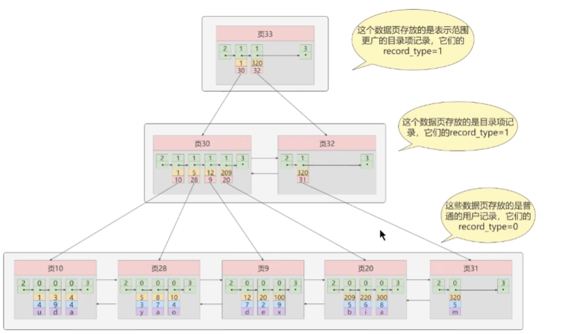

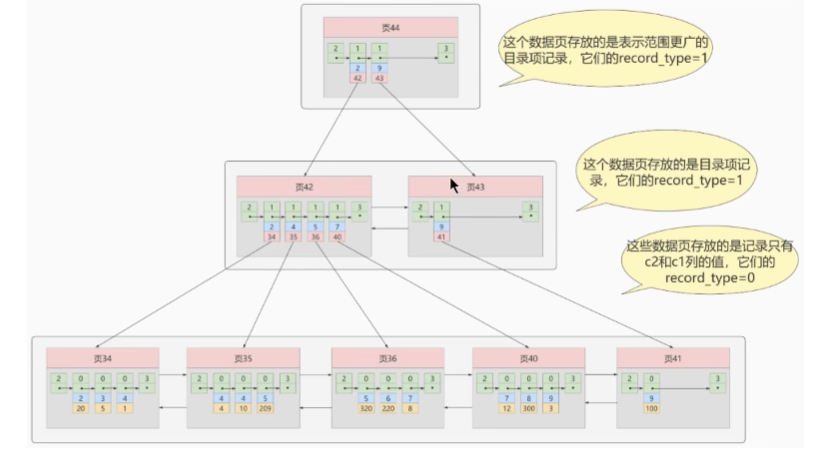

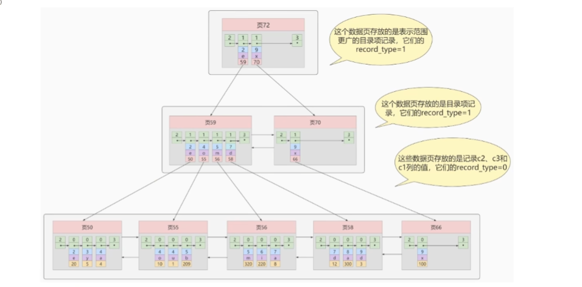

> InnoDB的B+树索引的注意事项：
>
> 1. `根页面的位置万年不动`
> 2. `非聚簇索引的目录页节点记录要唯一，若不唯一，添加主键来保持唯一`
> 3. `一个页面最少要存储两条数据`

### MyISAM的索引方案

> `InnoDB、MyISAM、Memory都支持B+树索引`
>
> `MyISAM使用B+树作为索引结构，叶子节点的data域存放的是数据记录的地址,所以MyISAM索引和数据是分开的`
>
> `MyISAM中只有非聚簇索引,因为数据和索引是分离的`

### MyISAM和InnoDB的对比

> 1. MyISAM中的索引方式都是非聚簇的，InnoDB中必然包含一个聚簇索引
> 2. 在InnoDB中，只需要根据主键值进行一次查询就能找到对应的记录，因为InnoDB中索引即数据，而在MyISAM中却需要进行一次回表操作(通过B+数中地址去取数据)，意味着MyISAM中建立的索引全部都是二级索引
> 3. MyISAM中索引和数据是分离的，InnoDB中索引即数据
> 4. InnoDB的非聚簇索引data域存储的是主键的值，而MyISAM索引data域记录的是回表的地址
> 5. MyISAM回表是十分快速的，因为拿着地址偏移量直接到文件中取数据；InnoDB是通过获取主键之后再去聚簇索引中招记录。
> 6. InnoDB必须有主键，如果没有显式指定，MYSQL会自动选择一个可以非空且唯一标识的数据记录的列作为主键，如果不存在这种咧，MYSQL会为InnoDB表生成一个隐含字段作为主键；MyISAM不一定有主键，但推荐加主键

### 索引的代价

> 就如同字典的目录的代价，每添加或删除一个字都需要目录页发生变化，在索引中就是页分裂。然后空间上就是目录本身也占用字典空间嘛，虽然占用不多。

### MYSQL数据结构选择的合理性

> Hash结构效率高，为什么索引结构要设计成树型？
>
> - Hash索引仅能满足（=）（<>）和IN查询。如果进行范围查询，哈希型的索引，时间复杂度会退化成O（n）;而树形的有序特性，依然能够保持O（log2N）的高效率。`即范围查找时树形更有优势`
> - `Hash索引数据的存储是没有顺序的`，在order by的情况下，使用Hash索引还需要对数据进行重新排序。
> - 对于联合索引，Hash值是将联合索引键合并后一起来计算的，无法对单独的一个键或者几个索引键进行查询
> - 对于等值查询，通常Hash索引的效率更高，不过如果索引列的重复值很多，效率就会降低
>
> `Redis存储到核心就是Hash表`
>
> `Memory的默认索引是Hash索引`
>
> InnoDB本身不支持Hash索引，但是提供`自适应Hash索引`，会将热点数据的数据页地址存放到Hash表中。这样让B+树也具备了Hash索引的优点
>
> 因为同样的磁盘页大小，B+树可以存储更多的节点关键字，所以B+树通常比B树更加矮胖，查询所需要的磁盘IO会更少
>
> R树是高维空间的B树，用于存储地理空间数据

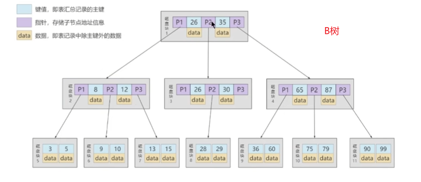


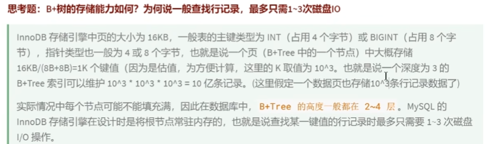

### InnoDB数据存储结构

[InfoQ-【Mysql-InnoDB 系列】InnoDB 架构](https://xie.infoq.cn/article/48544a3041634ca9ce62eaff4)

> InnoDB页的默认大小是16KB,不同的DBMS的数据页大小不同
>
> 页的结构概述：
>
> - `页`作为磁盘和内存之间交互的`基本单位`,页与页之间`不在物理结构上相连`，只需通过`双向链表`相关联即可。每个数据页中的记录是按照主键值从小到大的顺序组成一个`单向链表`，每个数据页都会为存储在它里面的记录生成一个`页目录`,通过主键查找某条记录的时候可以在页目录中使用二分法快速定位到对应的槽，然后再便利该槽对应分组中的记录即可快速找到指定的记录
>
> 页的上层结构：
>
> - 区：在InnoDB中，一个区会分配64各连续的页
> - 段：是数据库中分配的单位，不同类型的数据库对象以不同的段形式存在,常见的段有`数据段`、`索引段`、`回滚段`
> - 表空间：是一个逻辑容器，分为系统表空间、用户表空间、撤销表空间、临时表空间等，数据库由一个或多个表空间组成
> - 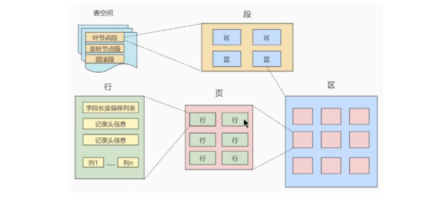
>
> 页的内部结构：
>
> - 页如果按类型划分的话，常见的有`数据页`、`系统页`、`Undo页`和`事务数据页`等 
> - 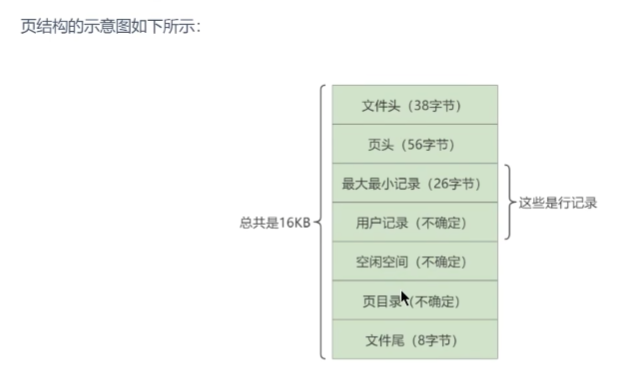
>
> InnoDB行格式row_format：
>
> - `Compact`
> - `Dynamic`
> - `Compressed`
> - `Redundant`
>
> 碎片区：有些页能用于段A，有些页能用于段B，碎片去直属于表空间
>
> 


​                

### 索引的创建与设计原则

> [TechNet-MySQL-Indexes](https://www.techonthenet.com/mysql/indexes.php)
>
> [MYSQL8.0参考手册-创建索引语句](https://dev.mysql.com/doc/refman/8.0/en/create-index.html)
>
> [数据库学习摘记-mysql的索引设计原则以及常见索引的区别](https://www.kancloud.cn/hx78/sql/333932)
>
> [MYSQL8.0参考手册-fulltext全文搜索](https://dev.mysql.com/doc/refman/8.0/en/fulltext-natural-language.html)
>
> 索引的分类：
>
> - 从功能逻辑上分
>   - 普通索引
>   - 唯一索引
>   - 主键索引
>   - 全文索引
> - 从物理实现方式分（一般说这个）
>   - 聚簇索引
>   - 非聚簇索引
> - 从作用字段个数分
>   - 单列索引
>   - 联合索引 `最左前缀原则`
> - 从创建方式分
>   - 隐式创建索引：在声明有主键约束、唯一性约束、外键约束的字段上，会自动添加相关索引
>   - 显式创建索引
>
> 

```mysql
-- 通过命令查看索引
show create table book;
show index from book;
```

#### MYSQL8.0新特性：降序索引和隐形索引

[MYSQL8.0参考手册-隐形索引](https://dev.mysql.com/doc/refman/8.0/en/invisible-indexes.html)

[MYSQL8.0参考手册-隐形索引](https://dev.mysql.com/doc/refman/8.0/en/invisible-indexes.html)

## MYSQL性能优化

### MYSQL性能优化步骤

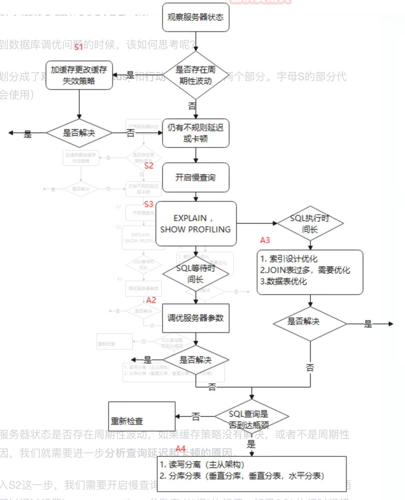

### 性能分析工具的使用

[MYSQL8.0参考手册-EXPLAIN/DESCRIBE Statement](https://dev.mysql.com/doc/refman/8.0/en/explain.html)

[MYSQL8.0参考手册-EXPLAIN Output Format](https://dev.mysql.com/doc/refman/8.0/en/explain-output.html)

[MYSQL8.0参考手册-SHOW STATUS Statement](https://dev.mysql.com/doc/refman/8.0/en/show-status.html)

[MYSQL8.0参考手册-mysqldumpslow — Summarize Slow Query Log Files](https://dev.mysql.com/doc/refman/8.0/en/mysqldumpslow.html)

[MySQL 性能优化神器 Explain 使用分析](https://segmentfault.com/a/1190000008131735)

[MYSQL8.0参考手册-SHOW WARNINGS Statement](https://dev.mysql.com/doc/refman/8.0/en/show-warnings.html)

[MYSQL8.0源码手册-The Optimizer Trace](https://dev.mysql.com/doc/dev/mysql-server/latest/PAGE_OPT_TRACE.html)

[The Unofficial MySQL 8.0 Optimizer Guide](http://www.unofficialmysqlguide.com/index.html)

[InfoQ-sys库常用命令，用于汇总performanceschema](https://xie.infoq.cn/article/ad4e74338b5272fae90d867c5)

```mysql
mysql> SHOW STATUS;
+--------------------------+------------+
| Variable_name            | Value      |
+--------------------------+------------+
| Aborted_clients          | 0          |
| Aborted_connects         | 0          |
| Bytes_received           | 155372598  |
| Bytes_sent               | 1176560426 |
| Connections              | 30023      |
| Created_tmp_disk_tables  | 0          |
| Created_tmp_tables       | 8340       |
| Created_tmp_files        | 60         |
...
| Open_tables              | 1          |
| Open_files               | 2          |
| Open_streams             | 0          |
| Opened_tables            | 44600      |
| Questions                | 2026873    |
...
| Table_locks_immediate    | 1920382    |
| Table_locks_waited       | 0          |
| Threads_cached           | 0          |
| Threads_created          | 30022      |
| Threads_connected        | 1          |
| Threads_running          | 1          |
| Uptime                   | 80380      |
+--------------------------+------------+
-- 比较不同查询开销的依据
mysql> SHOW STATUS like 'last_query_cost';
-- 记录为慢查询SQL最短时间
mysql> SHOW variables like 'long_query_time';
Variable_name  |Value    |
---------------+---------+
long_query_time|10.000000|
mysql> SHOW variables like 'slow_query_log';
Variable_name |Value|
--------------+-----+
slow_query_log|OFF  |
-- 开启慢查询日志
mysql> set global slow_query_log='ON';
-- 设置慢查询SQL最短时间
mysql> set global long_query_time=1;
mysql> set long_query_time=1;
mysql> SHOW variables like 'slow_query_log_file';
Variable_name      |Value                                                |
-------------------+-----------------------------------------------------+
slow_query_log_file|/usr/local/mysql/data/dongbinyudeMacBook-Pro-slow.log|
mysql> SHOW global status like '%slow_queries%';
Variable_name|Value|
-------------+-----+
Slow_queries |0    |
-- 可以查看并打开执行成本分析
mysql> SHOW variables like 'profiling';
mysql> set profiling='ON';
-- 打开后可以查看最近的查询执行成本
mysql> show profiles;
mysql> show profile;
mysql> show profile for query query_id;
```

----

```mysql
-- 查询冗余索引
select * from sys.schema_redundant_indexes;
-- 查询未使用过的索引
select * from sys.schema_unused_indexes;
```


## 索引优化与查询优化

> 都有哪些维度可以进行数据库调优？简言之：
>
> - 索引失效、没有充分利用到索引一一索引建立
> - 关联查询太多JOIN(设计缺陷或不得已的需求)一一SQL优化
> - 服务器调优及各个参数设置（缓冲、线程数等）--调整my.cnf
> - 数据过多一一分库分表
>
> 关于数据库调优的知识点非常分散。不同的DBMS,不同的公司，不同的职位，不同的项目遇到的问题都不尽相同。这里我们分为三个章节进行细致讲解。
> 虽然SQL查询优化的技术有很多，但是大方向上完全可以分成`物理查询优化`和`逻辑查询优化`两大块。
>
> - 物理查询优化是通过`索引`和`表连接方式`等技术来进行优化，这里重点需要掌握索引的使用。
> - 逻辑查询优化就是通过`SQL等价变换`提升查询效率，直白一点就是说，换一种查询写法执行效率可能更高。

### 索引失效案例

> - 全值匹配我最爱,即等值匹配我最爱
> - 最佳左前缀法则
> - 主键插入顺序依次递增，可以减少性能损耗（页分裂）
> - 计算、函数、类型转换（自动或手动）会导致索引失效
> - 范围条件右侧的列失效（> < between）
> - 不等于(!=或<>)索引失效
> - is null可以使用索引，is not null不能使用索引。最好在设计数据表时将字段设置为NOT NULL约束，比如可以将int默认值设置为0，字符串默认值设置为""
> - like以通配符%开头失效。页面搜索严禁左模糊或者全模糊，如果需要请走搜索引擎来解决
> - OR前后存在非索引的列，索引失效
> - 数据库和表的字符集必须统一

### 内连接和外连接的查询优化

> `对于内连接来说，查询优化器可以决定谁作为驱动表，谁做为被驱动表`；
>
> `对于内连接来说，如果表的连接条件中只能有一个字段有索引，则有索引的字段所在的表会被作为被驱动表`；
>
> `对于内连接来说，在两个表的连接条件都存在索引的情况下，会选择小表作为驱动表，即小表驱动大表(准确说是小结果集驱动大结果集,join buffer每一次放的内容越多越好)`
>
> `对左外连接来说，前面的表不一定是驱动表，因为查询优化器可能会将左外连接转换成内连接`
>
> MYSQL5.7还用的是BNLJ算法，MYSQL8.0换为了HashJoin

[博客园-MySQL-join的实现原理、优化及NLJ和BLJ算法](https://www.cnblogs.com/JohnABC/p/7150921.html)

[ServerFault-join_buffer_size >= 4 M is not advised?](https://serverfault.com/questions/399518/join-buffer-size-4-m-is-not-advised)

### 子查询优化

> `可以使用JOIN查询来替代子查询，连接查询不需要建立临时表，速度快`
>
> 尽量不要使用NOT IN或者NOT EXISTS,改造如下图所示

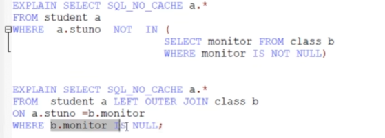

### 排序优化

> `ORDER BY字段上加索引的话，可以避免FileSort排序，效率更高`
>
> MySQL支持两种排序方式：
>
> - `Index排序`,索引可以保证数据的有序性，不需要再进行排序，效率更高
>
> - `FileSort排序`,则一般在内存中进行排序，占用CPU较多，如果待排结果较大，会产生临时文件IO到磁盘进行排序，效率低
>   - 使用的算法是`单路排序`，比双路排序快,也占用更多的内存
>

[阿里云社区-MySQL如何对order by优化？](https://developer.aliyun.com/article/760998)

[掘金-ＭySQL 中 Using filesort 问题的优化方法](https://juejin.cn/post/6844903439760097294)

### GROUP BY优化

> 使用索引的原则和Order by一致

### 分页查询优化

[腾讯云社区-分页查询优化](https://cloud.tencent.com/developer/article/1639177)

### 覆盖索引

> 一个索引包含了满足查询结果的数据就叫做覆盖索引
>
> 简单来说，在查`索引列+主键`以内的字段时，会用到覆盖索引
>
> 

###  索引条件下推（ICP）

> 索引下推是查询优化器的策略，回表前过滤，可以减少回表次数
>
> 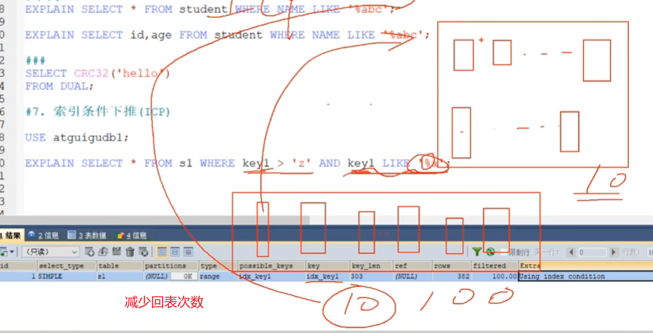

```mysql
# 关闭索引下推
set optimizer_switch='index_condition_pushdown=off'
```

### 其他查询优化策略

#### Exists和In的区分

> A表小就用EXISTS,B表小就用IN

```mysql
# B表是小表选Exists
select * from A where cc in (select cc from B);
# A表时小表时选in
select * from A where exists (select cc from B where B.cc=A.cc);
```

#### Count(*)和Count(1)和Count(具体字段)效率

> - Count(*)和Count(1)可以看成效率是相等的
>
> - MyISAM的Count是O(1)复杂度
> - Count(具体字段)，要尽量采用二级索引，因为聚簇索引信息多，性能就差些；如果有多个二级索引，会使用key_len小的二级索引扫描；当没有二级索引时，才会采用主键索引来进行统计

#### 关于Select(*)

> - MySQL在解析过程中，会通过查询数据字段将*按序转换成所有列明，这会大大耗费资源和时间
>
> - 无法使用到覆盖索引

 #### limit 1对优化的影响

> - 如果可以确定结果集只有一条，那么加上limit 1时，找到一条结果就不会继续扫描了，会加快查询速度
>
> - 如果数据表已经对字段建立了唯一索引，就不需要加上limit 1 了

#### 多使用commit

> Commit释放的资源：
>
> - 回滚段上用于回复数据的信息
> - 被程序语句获得的锁
> - redo/undo log buffer中的空间
> - 管理上述3种资源中的内部花费

### 淘宝数据库主键如何设计的

> 使用有序UUID
>
> - 全局唯一
> - 尽量有序

## 数据库设计规范

### 键的相关概念


> 键的相关概念：
>
> 学生信息（学号 身份证号 性别 年龄 身高 体重 宿舍号）和 宿舍信息（宿舍号 楼号）
>
> - `超键`：只要含有“学号”或者“身份证号”两个属性的集合就叫超键，例如R1（学号 性别）、R2（身份证号 身高）、R3（学号 身份证号）等等都可以称为超键！
>
> - `候选键`：不含有多余的属性的超键，比如（学号）、（身份证号）都是候选键，又比如R1中学号这一个属性就可以唯一标识元组了，而有没有性别这一属性对是否唯一标识元组没有任何的影响！
>
> - `主键`：就是用户从很多候选键选出来的一个键就是主键，比如你要求学号是主键，那么身份证号就不可以是主键了！
>
> - `外键`：宿舍号就是学生信息表的外键

### 范式

> 范式：
>
> - 第一范式：字段不可再分
> - 第二范式：满足数据表里的每一条数据记录都是可唯一标识的，而且所有非主键字段，都必须完全依赖主键，不能只依赖主键的一部分（一个表一个对象）
> - 第三范式：要求数据表中的所有非主键字段不能依赖于其他非主键字段
>
> 可以适当反范式化

### E-R模型

> [DBeaver Documention-ER Diagrams](https://dbeaver.com/docs/wiki/ER-Diagrams/#:~:text=Entity%20Relation%20Diagrams%20(ERD)%20are,custom%20diagrams%2C%20see%20Custom%20Diagrams.)

### 阿里巴巴数据库规范

> [阿里云社区-阿里巴巴数据库规范](https://developer.aliyun.com/article/709387)

### PowerDesigner

> mac没有这个软件耶,算了反正工作用不到

## 数据库结构优化

> [MYSQL8.0参考手册-Optimizing Database Structure](https://dev.mysql.com/doc/refman/8.0/en/optimizing-database-structure.html)


## MYSQL事务基础

> [MYSQL8.0参考手册-事务四大原则ACID](https://dev.mysql.com/doc/refman/8.0/en/glossary.html#glos_acid)
>
> [MYSQL8.0参考手册-事务隔离级别Transaction Isolation Levels](https://dev.mysql.com/doc/refman/8.0/en/innodb-transaction-isolation-levels.html)
>
> [MYSQL8.0参考手册-事务START TRANSACTION, COMMIT, and ROLLBACK Statements](https://dev.mysql.com/doc/refman/8.0/en/commit.html)
>
> [MYSQL8.0参考手册-保存点SAVEPOINT, ROLLBACK TO SAVEPOINT, and RELEASE SAVEPOINT Statements](https://dev.mysql.com/doc/refman/8.0/en/savepoint.html)
>
> [MYSQL8.0参考手册-隐式提交Statements That Cause an Implicit Commit](https://dev.mysql.com/doc/refman/8.0/en/implicit-commit.html)
>
> [MYSQL8.0参考手册-设置事务隔离级别SET TRANSACTION Statement](https://dev.mysql.com/doc/refman/8.0/en/set-transaction.html)


## MYSQL事务日志

> [MYSQL8.0参考手册-Redo Log](https://dev.mysql.com/doc/refman/8.0/en/innodb-redo-log.html)
>
> [MYSQL8.0参考手册-Undo Logs](https://dev.mysql.com/doc/refman/8.0/en/innodb-undo-logs.html)
>
> [MYSQL8.0参考手册-`innodb_flush_log_at_trx_commit`](https://dev.mysql.com/doc/refman/8.0/en/innodb-parameters.html#sysvar_innodb_flush_log_at_trx_commit)
>
> [MYSQL8.0参考手册-数据备份InnoDB Backup](https://dev.mysql.com/doc/refman/8.0/en/innodb-backup.html)
>
> [MYSQL8.0参考手册-崩溃恢复InnoDB Recovery](https://dev.mysql.com/doc/refman/8.0/en/innodb-recovery.html)
>
> 
>
> 事务的合理性由锁机制实现
>
> 而事务的原子性、一致性和持久性由REDO日志和UNDO日志来保证：
>
> - `REDO LOG` 称为 重做日志，`记录的是物理级别上页修改操作`，比如页号xxx、偏移量yyy写入了zzz数据。`用于保证事务的持久性`
> - `UNDO LOG` 称为 回滚日志，记录的是逻辑操作日志，比如对某一行数据进行了insert语句，`UNDO LOG就记录一条预支相反的DELETE操作`。用于回滚行记录到特定版本，`用来保证事务的原子性、一致性`
>
> REDO和UNDO都可以视为一种`恢复操作`

## 锁

### MYSQL并发概述

> 锁是计算机协调多个进程或线程并发访问某一资源的机制
>
> MYSQL并发事务访问相同记录：
>
> - 读读情况：不会产生并发问题
> - 写写情况：锁机制可以解决，任何一种隔离级别都不允许这种情况的发生
> - 读写情况：会产生脏读、不可重复读、幻读的问题，通过事务隔离级别解决
>
> 各个数据库厂商对SQL标准的支持不一样，比如MYSQL在`REPEATABLE READ`隔离级别上就已经解决了`幻读`问题
>
> ----
>
> MYSQL并发问题的解决有两种思路：
>
> 1. 读操作利用`多版本并发控制MVCC`,写操作进行`加锁`
>
> - MVCC:就是生成一个`READVIEW`，通过READVIEW找到符合条件的记录版本（历史记录由`UNDO日志`构建）。查询语句只能读到READVIEW之前`已提交事务所做的更改`,在生成READVIEW之前未提交的事务过着之后才开启的事务所做的更改是看不到的。而写操作肯定针对的是最新版本的记录，读记录的历史版本和改动记录的最新版本身并不冲突，也就是采用MVCC时，读写操作并不冲突
>
> > 普通的SELECT语句在`READ COMMITED`和`REPEATABLE READ`隔离级别下会使用到MVCC读取记录:
> >
> > - `READ COMMITED`级别下：一个事务在执行过程中每次执行SELECT操作都会生成一个READVIEW，READVIEW的存在本身就保证了不会出现脏读现象
> > - `REPEATABLE READ`级别下：一个事务在执行过程中只有第一次执行SELECT操作才会生成一个READVIEW,之后的SELECT操作都是`复用`这个READVIEW,这样就避免了不可重复读和幻读的现象
>
> 2. 读写操作都加锁
>
> - 有些场景下，比如银行存款的事务中，读操作也需要加锁
>
> 一般情况下，我们愿意`采用MVCC来解决读写问题，因为性能更高`

### 共享锁和排他锁（独占锁）

> - 读锁可以是共享锁或排他锁
>
> - 写锁必须是排他锁
>
> [MYSQL5.7参考手册-InnoDB Locking](https://dev.mysql.com/doc/refman/5.7/en/innodb-locking.html)

```mysql
SELECT ... LOCK IN SHARE MODE;-- 共享锁 MYSQL5.7写法
select ... for share;-- 共享锁 MYSQL8.0写法
select ... for update;-- 独占锁 MYSQL5.7和8.0写法
select ... for update nowait;-- MYSQL8.0写法 获取不到锁，立即报错返回
select ... for update skip locked;-- MYSQL8.0写法 获取不到锁，返回没有被锁定的数据
```


### 表锁、页锁、行锁

> - 表锁：开销最小，锁粒度大， 并发性差
>   1. 表级别的S锁、X锁：InnoDB一般不用表锁，而用粒度更小的行锁
>   2. `意向锁`（intention lock）：如果我们给某一行加上了排他锁，数据库会自动给更大一级的空间，比如数据页或数据表加上意向锁，告诉其他人这个数据页或者数据表已经有人加上排他行锁了，不能再加表级锁。理解为加锁标记。不需要我们手动设置
>   3. `自增锁`（AUTO-INC lock）：自增列的表自动加上自增锁
>   4. `元数据锁`（MDL lock）：当对一个表做增删改查操作时，加MDL读锁；当要对表做结构变更操作时，加MDL写锁。不需要我们手动设置

```mysql
lock tables mylock read;-- 表级别读锁
show open tables where in_use>0;-- 查看有哪些表被加锁了
unlock tables;
lock tables mylock write;-- 表级别写锁
show open tables where in_use>0;
unlock tables;


SHOW [FULL] PROCESSLIST;-- MySQL 进程列表指示当前由服务器内执行的一组线程执行的操作
```


----

> - 行锁：锁力度小，并发性好；锁开销大，加锁比较慢，容易出现死锁
>   1. `记录锁`（Record lock）:分记录S锁和记录X锁
>   2. `间隙锁`（Gap lock）：MVCC方案在加锁时，事务在第一次执行读取操作时，那些幻影记录尚不存在，无法给幻影记录加上记录锁，就为区间内加上间隙锁；但是间隙锁可能会造成死锁
>   3. `临键锁`（Next key lock）:本质是`记录锁和间隙锁的合体`
>   4. `插入意向锁`（Insert intention lock）:InnoDB规定事务在等待的时候也需要一个内存结构，插入一条记录时要判断插入位置是不是被别的事务加了gap锁。`插入意向锁也是一种间隙锁（Gap锁）`，插入意向锁之间不会有冲突

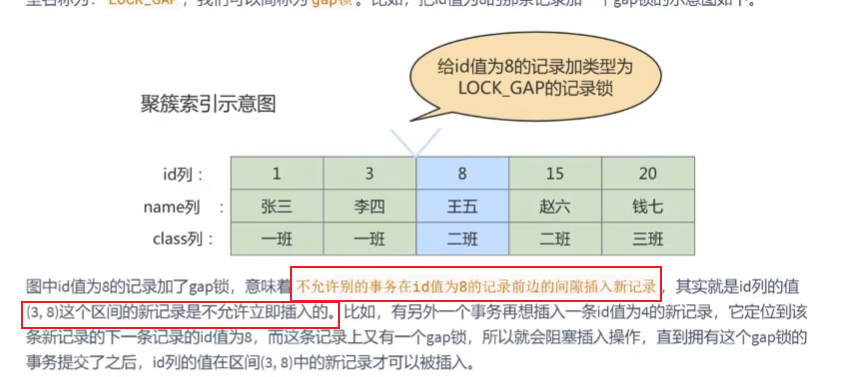


----

> 页锁：介于行锁和表锁之间
>
> 锁空间的大小是优先的，当某个层级的锁数量超过了这个层级的阈值时，就会进行`锁升级`,比如InnoDB行锁升级为表锁

### 乐观锁和悲观锁

> - 悲观锁：比如行锁、表锁等，读锁、写锁等，都是在操作之前先上锁。java中`syschronized`和`ReentrantLock`等独占锁都是悲观锁思想的实现。长事务，这样的开销往往无法承受
> - 乐观锁：不采用数据库自身的锁机制，而是通过程序来实现，在程序上，我们可以采用`版本号机制`和`CAS机制`实现。乐观锁适用于多读的应用类型，这样可以提高吞吐量，在`java中java.util.concurrent.atomic`包下的`原子变量`类就是使用了乐观锁的一种实现方式：CAS实现
>   - 乐观锁的版本号机制或时间戳机制：
>     - 在表中设计一个版本字段[CSDN-乐观锁-版本号机制](https://blog.csdn.net/weixin_43250623/article/details/96191901)
>     - 类似GIT、SVN版本控制工具，当我们修改了代码进行提交是，首先会检查当前版本号与服务器上的版本号是否一致，如果一致就可以直接提交，如果不一致就需要更新服务器上最新代码，然后再进行提交
>
> **注意**：`select ... for update`语句执行过程中所有扫描的行都会被锁上，因此`MYSQL中用悲观锁必须确定使用了索引，而不是全表扫描，否则会把整个表锁住`

### 显式锁、隐式锁

> 一般情况下，新插入一条记录的操作并不加锁，通过一种称为`隐式锁`的结构来保护这条新插入的记录在本事务提交前不被别的事务访问

### 全局锁

> 让整个数据库实例处于只读状态，场景是：全库逻辑备份

```mysql
flush tables with read lock
```

### 死锁【要复习】

> 死锁的四种条件？
>
> 如何避免死锁？

### 锁结构

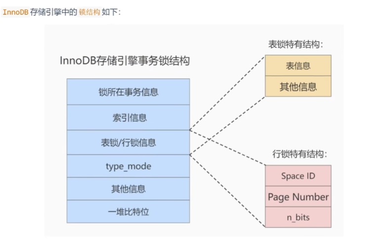

### 锁监控

```mysql
show status like 'innodb_row_lock';
```

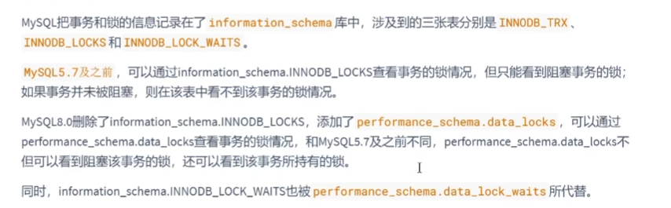

## MVCC多版本并发控制【要复习】

> MVCC是通过数据行的多个版本管理来实现数据库的并发控制,更好的处理并发冲突
>
> MVCC的实现依赖于：隐藏字段、undo log、READVIEW

## 其他数据库日志

[MYSQL8.0参考手册-MySQL Server Logs](https://dev.mysql.com/doc/refman/8.0/en/server-logs.html)

## 数据备份与数据库迁移

[MYSQL8.0参考手册-Backup and Recovery](https://dev.mysql.com/doc/refman/8.0/en/backup-and-recovery.html)


