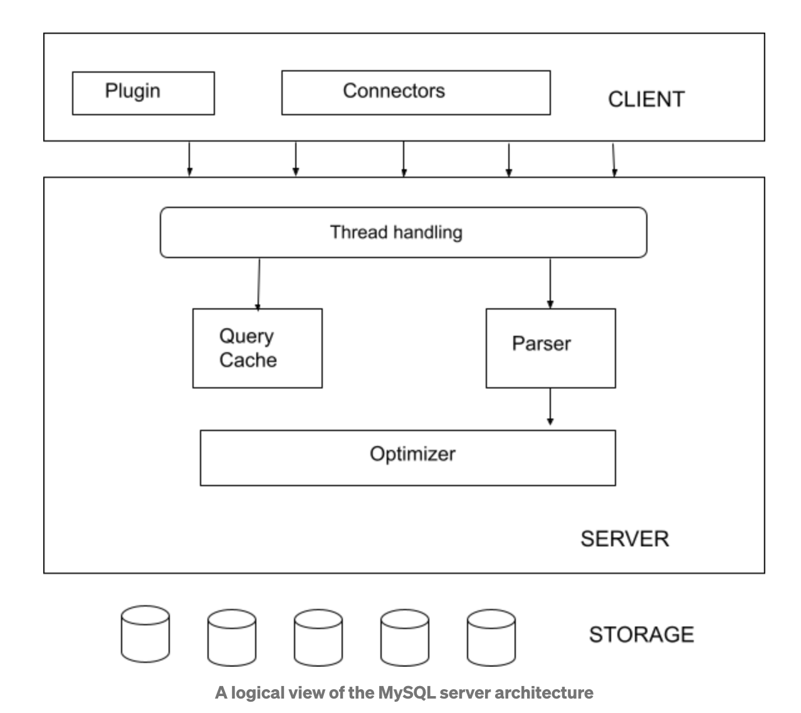
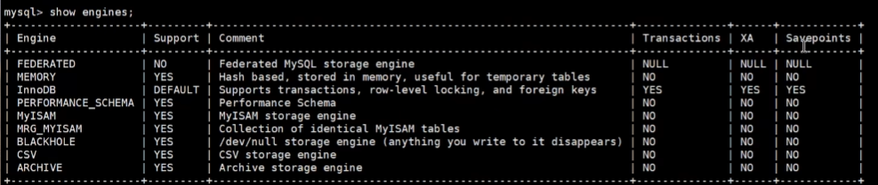
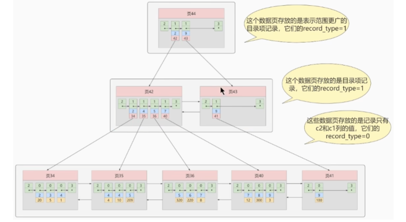
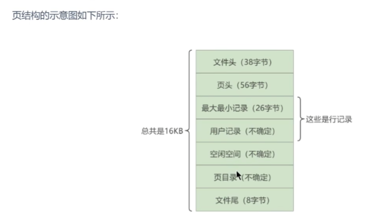
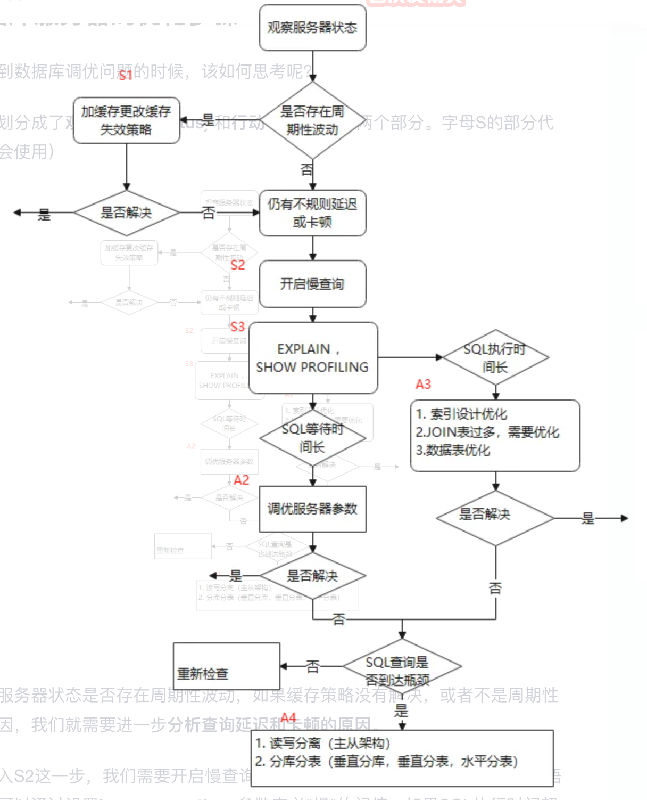
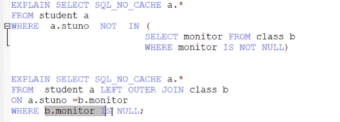
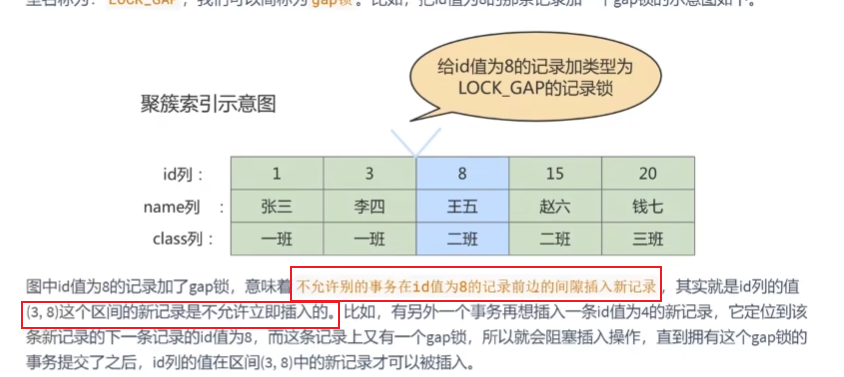
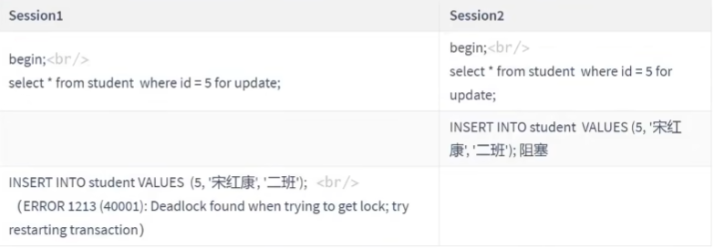
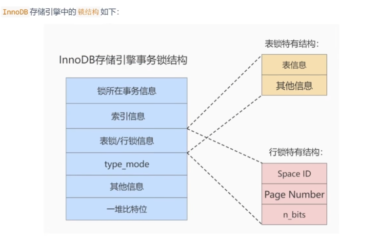
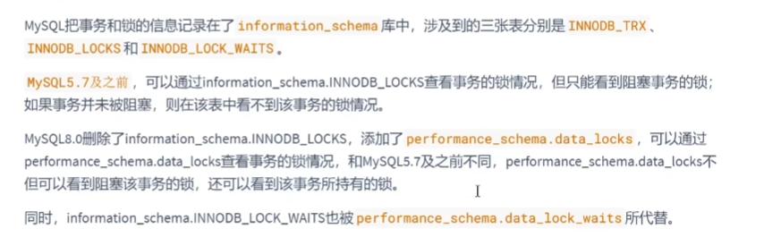

# MySQL笔记

[MySQL官网-MYSQL8.0新特性](https://dev.mysql.com/doc/refman/8.0/en/mysql-nutshell.html)

## [重新认识MySQL](https://relph1119.github.io/mysql-learning-notes/#/mysql/01-装作自己是个小白-重新认识MySQL?id=第1章-装作自己是个小白-重新认识mysql)

>  类UNIX操作系统非常多，比如FreeBSD、Linux、macOS、Solaris等都属于UNIX操作系统的范畴

### [启动MySQL服务器程序](https://relph1119.github.io/mysql-learning-notes/#/mysql/01-装作自己是个小白-重新认识MySQL?id=启动mysql服务器程序)

#### [UNIX里启动服务器程序](https://relph1119.github.io/mysql-learning-notes/#/mysql/01-装作自己是个小白-重新认识MySQL?id=unix里启动服务器程序)

  在类`UNIX`系统中用来启动`MySQL`服务器程序的可执行文件有很多，大多在`MySQL`安装目录的`bin`目录下，我们一起来看看。

#### [mysqld](https://relph1119.github.io/mysql-learning-notes/#/mysql/01-装作自己是个小白-重新认识MySQL?id=mysqld)

  `mysqld`这个可执行文件就代表着`MySQL`服务器程序，运行这个可执行文件就可以直接启动一个服务器进程。但这个命令不常用，我们继续往下看更牛逼的启动命令。

#### [mysqld_safe](https://relph1119.github.io/mysql-learning-notes/#/mysql/01-装作自己是个小白-重新认识MySQL?id=mysqld_safe)

  `mysqld_safe`是一个启动脚本，它会间接的调用`mysqld`，而且还顺便启动了另外一个监控进程，这个监控进程在服务器进程挂了的时候，可以帮助重启它。另外，使用`mysqld_safe`启动服务器程序时，它会将服务器程序的出错信息和其他诊断信息重定向到某个文件中，产生出错日志，这样可以方便我们找出发生错误的原因。

#### [mysql.server](https://relph1119.github.io/mysql-learning-notes/#/mysql/01-装作自己是个小白-重新认识MySQL?id=mysqlserver)

  `mysql.server`也是一个启动脚本，它会间接的调用`mysqld_safe`，在调用`mysql.server`时在后边指定`start`参数就可以启动服务器程序了，就像这样：

```
mysql.server start
```

  需要注意的是，这个 ***mysql.server\*** 文件其实是一个链接文件，它的实际文件是 ***../support-files/mysql.server\***。我使用的`macOS`操作系统会在`bin`目录下自动创建一个指向实际文件的链接文件，如果你的操作系统没有帮你自动创建这个链接文件，那就自己创建一个呗～ 别告诉我你不会创建链接文件，上网搜搜呗～

  另外，我们还可以使用`mysql.server`命令来关闭正在运行的服务器程序，只要把`start`参数换成`stop`就好了：

```
mysql.server stop
```

#### [mysqld_multi](https://relph1119.github.io/mysql-learning-notes/#/mysql/01-装作自己是个小白-重新认识MySQL?id=mysqld_multi)

  其实我们一台计算机上也可以运行多个服务器实例，也就是运行多个`MySQL`服务器进程。`mysql_multi`可执行文件可以对每一个服务器进程的启动或停止进行监控。这个命令的使用比较复杂，本书主要是为了讲清楚`MySQL`服务器和客户端运行的过程，不会对启动多个服务器程序进行过多介绍。

#### [Windows里启动服务器程序](https://relph1119.github.io/mysql-learning-notes/#/mysql/01-装作自己是个小白-重新认识MySQL?id=windows里启动服务器程序)

  `Windows`里没有像类`UNIX`系统中那么多的启动脚本，但是也提供了手动启动和以服务的形式启动这两种方式，下面我们详细看。

#### [mysqld](https://relph1119.github.io/mysql-learning-notes/#/mysql/01-装作自己是个小白-重新认识MySQL?id=mysqld-1)

  同样的，在`MySQL`安装目录下的`bin`目录下有一个`mysqld`可执行文件，在命令行里输入`mysqld`，或者直接双击运行它就算启动了`MySQL`服务器程序了。

#### [以服务的方式运行服务器程序](https://relph1119.github.io/mysql-learning-notes/#/mysql/01-装作自己是个小白-重新认识MySQL?id=以服务的方式运行服务器程序)

  首先看看什么是个`Windows` 服务？如果无论是谁正在使用这台计算机，我们都需要长时间的运行某个程序，而且需要在计算机启动的时候便启动它，一般我们都会把它注册为一个`Windows 服务`，操作系统会帮我们管理它。把某个程序注册为`Windows`服务的方式挺简单，如下：

```
"完整的可执行文件路径" --install [-manual] [服务名]
```

  其中的`-manual`可以省略，加上它的话，表示在`Windows`系统启动的时候不自动启动该服务，否则会自动启动。`服务名`也可以省略，默认的服务名就是`MySQL`。比如我的`Windows`计算机上`mysqld`的完整路径是：

```
C:\Program Files\MySQL\MySQL Server 5.7\bin\mysqld
```

  所以如果我们想把它注册为服务的话可以在命令行里这么写：

```
"C:\Program Files\MySQL\MySQL Server 5.7\bin\mysqld" --install
```

  在把`mysqld`注册为`Windows`服务之后，我们就可以通过下面这个命令来启动`MySQL`服务器程序了：

```
net start MySQL
```

  当然，如果你喜欢图形界面的话，你可以通过`Windows`的服务管理器通过用鼠标点点点的方式来启动和停止服务（作为一个程序猿，还是用黑框框吧～）。

  关闭这个服务也非常简单，只要把上面的`start`换成`stop`就行了，就像这样：

```
net stop MySQL
```

### [客户端与服务器连接的过程](https://relph1119.github.io/mysql-learning-notes/#/mysql/01-装作自己是个小白-重新认识MySQL?id=客户端与服务器连接的过程)

- TCP/IP:`mysql -h127.0.0.1 -uroot -P3307 -p`

- windows系统

  - 命名管道：需要在启动服务器程序的命令中加上`--enable-named-pipe`参数，然后在启动客户端程序的命令中加入`--pipe`或者`--protocol=pipe`参数。
  - 共享内存：需要在启动服务器程序的命令中加上`--shared-memory`参数，在成功启动服务器后，`共享内存`便成为本地客户端程序的默认连接方式，不过我们也可以在启动客户端程序的命令中加入`--protocol=memory`参数来显式的指定使用共享内存进行通信。不过需要注意的是，使用`共享内存`的方式进行通信的服务器进程和客户端进程必须在同一台`Windows`主机中。

- 类UNIX系统

  - UNIX套接字：如果我们在启动客户端程序的时候指定的主机名为`localhost`，或者指定了`--protocol=socket`的启动参数，那服务器程序和客户端程序之间就可以通过`Unix`域套接字文件来进行通信了。`MySQL`服务器程序默认监听的`Unix`域套接字文件路径为`/tmp/mysql.sock`，客户端程序也默认连接到这个`Unix`域套接字文件。如果我们想改变这个默认路径，可以在启动服务器程序时指定`socket`参数，就像这样：

    ```
    mysqld --socket=/tmp/a.txt
    ```

      这样服务器启动后便会监听`/tmp/a.txt`。在服务器改变了默认的`UNIX`域套接字文件后，如果客户端程序想通过`UNIX`域套接字文件进行通信的话，也需要显式的指定连接到的`UNIX`域套接字文件路径，就像这样：

    ```
    mysql -hlocalhost -uroot --socket=/tmp/a.txt -p
    ```

      这样该客户端进程和服务器进程就可以通过路径为`/tmp/a.txt`的`Unix`域套接字文件进行通信了。

### [服务器处理客户端请求](https://relph1119.github.io/mysql-learning-notes/#/mysql/01-装作自己是个小白-重新认识MySQL?id=服务器处理客户端请求)


从图中我们可以看出，服务器程序处理来自客户端的查询请求大致需要经过三个部分，分别是`连接管理`、`解析与优化`、`存储引擎`

#### [连接管理](https://relph1119.github.io/mysql-learning-notes/#/mysql/01-装作自己是个小白-重新认识MySQL?id=连接管理)

  - 客户端进程可以采用我们上面介绍的`TCP/IP`、`命名管道或共享内存`、`Unix域套接字`这几种方式之一来与服务器进程建立连接
  - 每当有一个客户端进程连接到服务器进程时，服务器进程都会创建一个线程来专门处理与这个客户端的交互，当该客户端退出时会与服务器断开连接，服务器并不会立即把与该客户端交互的线程销毁掉，而是把它缓存起来，在另一个新的客户端再进行连接时，把这个缓存的线程分配给该新客户端。这样就起到了不频繁创建和销毁线程的效果，从而节省开销。

- 在客户端程序发起连接的时候，需要携带主机信息、用户名、密码，服务器程序会对客户端程序提供的这些信息进行认证，如果认证失败，服务器程序会拒绝连接。另外，如果客户端程序和服务器程序不运行在一台计算机上，我们还可以采用使用了`SSL`（安全套接字）的网络连接进行通信，来保证数据传输的安全性。

- 当连接建立后，与该客户端关联的服务器线程会一直等待客户端发送过来的请求，`MySQL`服务器接收到的请求只是一个文本消息，该文本消息还要经过各种处理

##### [查询缓存](https://relph1119.github.io/mysql-learning-notes/#/mysql/01-装作自己是个小白-重新认识MySQL?id=查询缓存)

- `MySQL`服务器并没有人聪明，如果两个查询请求在任何字符上的不同（例如：空格、注释、大小写），都会导致缓存不会命中。另外，如果查询请求中包含某些系统函数、用户自定义变量和函数、一些系统表，如 mysql 、information_schema、 performance_schema 数据库中的表，那这个请求就不会被缓存。
- MySQL的缓存系统会监测涉及到的每张表，只要该表的结构或者数据被修改，如对该表使用了`INSERT`、 `UPDATE`、`DELETE`、`TRUNCATE TABLE`、`ALTER TABLE`、`DROP TABLE`或 `DROP DATABASE`语句，那使用该表的所有高速缓存查询都将变为无效并从高速缓存中删除！

- 虽然查询缓存有时可以提升系统性能，但也不得不因维护这块缓存而造成一些开销，比如每次都要去查询缓存中检索，查询请求处理完需要更新查询缓存，维护该查询缓存对应的内存区域。从MySQL 5.7.20开始，不推荐使用查询缓存，并在MySQL 8.0中删除。

##### [语法解析](https://relph1119.github.io/mysql-learning-notes/#/mysql/01-装作自己是个小白-重新认识MySQL?id=语法解析)

- 如果查询缓存没有命中，接下来就需要进入正式的查询阶段了。因为客户端程序发送过来的请求只是一段文本而已，所以`MySQL`服务器程序首先要对这段文本做分析，判断请求的语法是否正确，然后从文本中将要查询的表、各种查询条件都提取出来放到`MySQL`服务器内部使用的一些数据结构上来。
- 这个从指定的文本中提取出我们需要的信息本质上算是一个编译过程，涉及词法解析、语法分析、语义分析等阶段

##### [查询优化](https://relph1119.github.io/mysql-learning-notes/#/mysql/01-装作自己是个小白-重新认识MySQL?id=查询优化)

- 语法解析之后，服务器程序获得到了需要的信息，比如要查询的列是哪些，表是哪个，搜索条件是什么等等，但光有这些是不够的，因为我们写的`MySQL`语句执行起来效率可能并不是很高，`MySQL`的优化程序会对我们的语句做一些优化，如外连接转换为内连接、表达式简化、子查询转为连接等等的一堆东西。
- 优化的结果就是生成一个执行计划，这个执行计划表明了应该使用哪些索引进行查询，表之间的连接顺序是什么样的。我们可以使用`EXPLAIN`语句来查看某个语句的执行计划，关于查询优化这部分的详细内容我们后边会仔细介绍，现在你只需要知道在`MySQL`服务器程序处理请求的过程中有这么一个步骤就好了。

#### [存储引擎](https://relph1119.github.io/mysql-learning-notes/#/mysql/01-装作自己是个小白-重新认识MySQL?id=存储引擎)

- 截止到服务器程序完成了查询优化为止，还没有真正的去访问真实的数据表，`MySQL`服务器把数据的存储和提取操作都封装到了一个叫`存储引擎`（`表处理器`）的模块里。我们知道`表`是由一行一行的记录组成的，但这只是一个逻辑上的概念，物理上如何表示记录，怎么从表中读取数据，怎么把数据写入具体的物理存储器上，这都是`存储引擎`负责的事情。为了实现不同的功能，`MySQL`提供了各式各样的`存储引擎`，不同`存储引擎`管理的表具体的存储结构可能不同，采用的存取算法也可能不同。

- 为了管理方便，人们把`连接管理`、`查询缓存`、`语法解析`、`查询优化`这些并不涉及真实数据存储的功能划分为`MySQL server`的功能，把真实存取数据的功能划分为`存储引擎`的功能。各种不同的存储引擎向上面的`MySQL server`层提供统一的调用接口（也就是存储引擎API），包含了几十个底层函数，像"读取索引第一条内容"、"读取索引下一条内容"、"插入记录"等等。

### [常用存储引擎](https://relph1119.github.io/mysql-learning-notes/#/mysql/01-装作自己是个小白-重新认识MySQL?id=常用存储引擎)

  `MySQL`支持非常多种存储引擎，我这先列举一些：

| 存储引擎    | 描述                                 |
| ----------- | ------------------------------------ |
| `ARCHIVE`   | 用于数据存档（行被插入后不能再修改） |
| `BLACKHOLE` | 丢弃写操作，读操作会返回空内容       |
| `CSV`       | 在存储数据时，以逗号分隔各个数据项   |
| `FEDERATED` | 用来访问远程表                       |
| `InnoDB`    | 具备外键支持功能的事务存储引擎       |
| `MEMORY`    | 置于内存的表                         |
| `MERGE`     | 用来管理多个MyISAM表构成的表集合     |
| `MyISAM`    | 主要的非事务处理存储引擎             |
| `NDB`       | MySQL集群专用存储引擎                |

| Feature                               | MyISAM | Memory  | InnoDB | Archive | NDB   |
| ------------------------------------- | ------ | ------- | ------ | ------- | ----- |
| B-tree indexes                        | yes    | yes     | yes    | no      | no    |
| Backup/point-in-time recovery         | yes    | yes     | yes    | yes     | yes   |
| Cluster database support              | no     | no      | no     | no      | yes   |
| Clustered indexes                     | no     | no      | yes    | no      | no    |
| Compressed data                       | yes    | no      | yes    | yes     | no    |
| Data caches                           | no     | N/A     | yes    | no      | yes   |
| Encrypted data                        | yes    | yes     | yes    | yes     | yes   |
| Foreign key support                   | no     | no      | yes    | no      | yes   |
| Full-text search indexes              | yes    | no      | yes    | no      | no    |
| Geospatial data type support          | yes    | no      | yes    | yes     | yes   |
| Geospatial indexing support           | yes    | no      | yes    | no      | no    |
| Hash indexes                          | no     | yes     | no     | no      | yes   |
| Index caches                          | yes    | N/A     | yes    | no      | yes   |
| Locking granularity                   | Table  | Table   | Row    | Row     | Row   |
| MVCC                                  | no     | no      | yes    | no      | no    |
| Query cache support                   | yes    | yes     | yes    | yes     | yes   |
| Replication support                   | yes    | Limited | yes    | yes     | yes   |
| Storage limits                        | 256TB  | RAM     | 64TB   | None    | 384EB |
| T-tree indexes                        | no     | no      | no     | no      | yes   |
| Transactions                          | no     | no      | yes    | no      | yes   |
| Update statistics for data dictionary | yes    | yes     | yes    | yes     | yes   |


## MYSQL重新设置密码

### 1. 停止MySQL服务

首先，你需要停止MySQL服务。打开终端并执行以下命令：

```
sudo /usr/local/mysql/support-files/mysql.server stop
```

或者，如果你使用的是Homebrew安装的MySQL，可以使用：

```
brew services stop mysql
```

### 2. 安全模式启动MySQL

接下来，以安全模式启动MySQL服务，这样可以不需要密码即可访问：

```
sudo /usr/local/mysql/bin/mysqld_safe --skip-grant-tables &
```

或者，对于Homebrew安装的MySQL：

```
mysqld_safe --skip-grant-tables &
```

### 3. 登录MySQL

由于我们跳过了权限表，现在可以无需密码登录MySQL：

```
mysql -u root
```

### 4. 选择MySQL数据库

在MySQL提示符下，选择`mysql`数据库：

```
USE mysql;
```

### 5. 更新root用户的密码

现在可以更新root用户的密码了。执行以下命令来设置新密码（将`your_new_password`替换为你想要设置的新密码）：

```
UPDATE user SET authentication_string=PASSWORD('your_new_password') WHERE User='root';
```

或者，对于MySQL 5.7.6及以上版本，使用：

```
ALTER USER 'root'@'localhost' IDENTIFIED BY 'your_new_password';
```

### 6. 刷新权限并退出

刷新权限表，然后退出MySQL：

```
FLUSH PRIVILEGES;EXIT;
```

### 7. 正常停止MySQL服务并重启

现在，停止之前以跳过权限表启动的MySQL服务，并正常重启它：

```
sudo /usr/local/mysql/support-files/mysql.server stopsudo /usr/local/mysql/support-files/mysql.server start
```

或者，对于Homebrew安装的MySQL：

```
brew services stop mysqlbrew services start mysql
```

### 8. 使用新密码登录

最后，使用新设置的密码登录MySQL：

```
mysql -u root -p
```

然后输入你的新密码。

以上步骤应该可以帮助你重新设置MySQL的root密码。如果你使用的是MariaDB而不是MySQL，步骤大致相同，只是路径和命令可能会稍有不同。例如，MariaDB通常位于`/usr/local/mariadb`目录下。

## SQL分类

DQL语言：SELECT

DML语言：INSERT/UPDATE/DELETE/SELECT

DDL语言：CREATE\ALTER\DROP\RENAME\TRUNCATE

TCL语言/DCL语言：COMMIT/ROLLBACK/SAVEPOINT/GRANT

## MYSQL和ORACLE支持语法的区别

> MYSQL不支持SQL92语法，Oracle支持.
>
> SQL99语法支持性较好！即`LEFT JOIN ... ON`/`RIGHT JOIN...ON`
>
> 下面这句外连接，MYSQL执行错误，不支持该语法。

```SQL
SELECT employee_id,department_name FROM employees e,departments d WHERE e.`department_id`=d.`department_id`;
```

## MYSQL大小写规范和SQL MODE支持

> [MYSQL8.0参考手册-标识符区分大小写](https://dev.mysql.com/doc/refman/8.0/en/identifier-case-sensitivity.html)
>
> [MYSQL8.0参考手册-服务器 SQL 模式](https://dev.mysql.com/doc/refman/8.0/en/sql-mode.html)
>
> [MYSQL8.0参考手册-sql_mode](https://dev.mysql.com/doc/refman/5.7/en/server-system-variables.html#sysvar_sql_mode)
>
> **SQL编写建议：**
>
> 1. 关键字和函数名称全部大写
> 2. 数据库名、表名、表别名、字段名、字段别名等全部小写
>
> ```mysql
> select @@sql_mode;-- 查询全局sql_mode
> ```


## MYSQL运算符Comparison Operators

### MYSQL:NULL

> 字符串存在隐式转换,如果转换成数值不成功，则看做0

```mysql
select 1=2,1!=2,1='1',1='a',0='a' from dual; -- 0 1 1 0 1
```

> 只要有null参与预算，结果就为null

```mysql
select 1=null,null=null from dual; -- null null
```

### MYSQL:安全等于

> `<=>`安全等于，可以对null进行判断 

```mysql
select 1<=>2,1<=>'1',1<=>'a',0<=>'a' from dual;-- 0 1 0 1
select 1<=>null,null<=>null from dual;-- 0 1
```

### MYSQL:Least Function/MYSQL:Greatest Function

```mysql
mysql> SELECT LEAST(2, 5, 12, 3);
Result: 2

mysql> SELECT LEAST('2', '5', '12', '3');
Result: '12'

mysql> SELECT LEAST('techonthenet.com', 'checkyourmath.com', 'bigactivities.com');
Result: 'bigactivities.com'

mysql> SELECT LEAST('techonthenet.com', 'checkyourmath.com', null);
Result: NULL

mysql> SELECT GREATEST(2, 5, 12, 3);
Result: 12

mysql> SELECT GREATEST('2', '5', '12', '3');
Result: '5'

mysql> SELECT GREATEST('techonthenet.com', 'checkyourmath.com', 'bigactivities.com');
Result: 'techonthenet.com'

mysql> SELECT GREATEST('techonthenet.com', 'checkyourmath.com', null);
Result: NULL
```

### MYSQL:转义字符

```mysql
select last_name form employees where last_name like '_\_a';-- 查询第二个字符是_，第三个字符是a的员工信息
select last_name form employees where last_name like '_$_a' escape '$';-- 定义转义字符别名
```

### MYSQL:正则表达式

[TechNet-没有正则表达式，菜鸟教程有](https://www.techonthenet.com/mysql/index.php)

查找name字段中以'st'为开头的所有数据：

```mysql
mysql> SELECT name FROM person_tbl WHERE name REGEXP '^st';
```

查找name字段中以'ok'为结尾的所有数据：

```mysql
mysql> SELECT name FROM person_tbl WHERE name REGEXP 'ok$';
```

查找name字段中包含'mar'字符串的所有数据：

```mysql
mysql> SELECT name FROM person_tbl WHERE name REGEXP 'mar';
```

查找name字段中以元音字符开头或以'ok'字符串结尾的所有数据：

```mysql
mysql> SELECT name FROM person_tbl WHERE name REGEXP '^[aeiou]|ok$';
```


## 多表连接Joins

[菜鸟教程-一张图看懂 SQL 的各种 JOIN 用法](https://www.runoob.com/w3cnote/sql-join-image-explain.html)

### cross join笛卡尔积

> 需要where限制，不然多表会出现错误

```sql
SELECT * FROM t1
CROSS JOIN t2
WHERE t1.id = t2.id;
```

### 等值连接和非等值连接

> 限制条件是等于号就是等值连接

### 自连接和非自连接

> 一个表连接自己，就是自连接

### 内连接和外连接

> - 内连接
>
> - 外连接
>
>   - 左外连接
>
>   - 右外连接
>
>   - 全外连接

### UNION和UNION ALL

> UNION 效率低，会去重
>
> UNION ALL 效率高，不会去重

## MYSQL函数Functions

| [Functions - Alphabetical](https://www.techonthenet.com/mysql/functions/index_alpha.php) | MySQL Functions listed alphabetically |
| ------------------------------------------------------------ | ------------------------------------- |
| [Functions - Category](https://www.techonthenet.com/mysql/functions/index.php) | MySQL Functions listed by category    |

### MYSQL聚合函数

```mysql
-- 五大聚合函数 AVG和SUM只能处理数值类型
SELECT AVG(salary) from employees;
SELECT SUM(salary) from employees;
SELECT MAX(salary) from employees;
SELECT MIN(salary) from employees;
-- 计算指定字段出现的个数时，是不包含null值的
SELECT COUNT(salary) from employees;
-- 比较特殊，返回表有多少行
SELECT COUNT(1) FROM employees;
SELECT COUNT(2) FROM employees;
SELECT COUNT(*) FROM employees;
-- GROUP BY中使用WITH ROLLUP 除了基本查到的数据，还包括不带GROUP BY的AVG(salary)
-- 使用WITH ROLLUP时，不能使用ORDER BY
SELECT department_id,AVG(salary) from employees GROUP BY department_id WITH ROLLUP;
```

### MYSQL常用字符串函数

```sql
CONCAT(S1,S2)
LOWER(str)
UPPER(str)
LPAD( string, length, pad_string )# 填充

# substring
mysql> SELECT SUBSTRING('Techonthenet.com', 5);
Result: 'onthenet.com'

mysql> SELECT SUBSTRING('Techonthenet.com' FROM 5);
Result: 'onthenet.com'

mysql> SELECT SUBSTRING('Techonthenet.com', 1, 4);
Result: 'Tech'

mysql> SELECT SUBSTRING('Techonthenet.com' FROM 1 FOR 4);
Result: 'Tech'

mysql> SELECT SUBSTRING('Techonthenet.com', -3, 3);
Result: 'com'

mysql> SELECT SUBSTRING('Techonthenet.com' FROM -3 FOR 3);
Result: 'com'

# trim
mysql> SELECT TRIM(LEADING ' ' FROM '  techonthenet.com  ');
Result: 'techonthenet.com  '

mysql> SELECT TRIM(TRAILING ' ' FROM '  techonthenet.com  ');
Result: '  techonthenet.com'

mysql> SELECT TRIM(BOTH ' ' FROM '  techonthenet.com  ');
Result: 'techonthenet.com'

mysql> SELECT TRIM(' ' FROM '  techonthenet.com  ');
Result: 'techonthenet.com'

mysql> SELECT TRIM('   techonthenet.com   ');
Result: 'techonthenet.com'

mysql> SELECT TRIM(LEADING '0' FROM '000123');
Result: '123'

mysql> SELECT TRIM(TRAILING '1' FROM 'Tech1');
Result: 'Tech'

mysql> SELECT TRIM(BOTH '123' FROM '123Tech123');
Result: 'Tech'
```

### MYSQL常用数值函数

```sql
select ceil(1.5);
select floor(1.9);
select mod(3,4);
select rand();
select round(2.34,2);
```

### MYSQL常用日期函数

```sql
select curdate()
select curtime()
select now()
select year(date)
select month(date)
select day(date)
```


## SQL的执行顺序，WHERE和HAVING效率对比

正确的标准SQL查询逻辑处理顺序大致如下：

1. **FROM**：确定查询的数据来源表。
2. **ON**：对连接的表应用ON条件（如果存在JOIN语句）。
3. **JOIN**：根据指定的连接类型（LEFT, RIGHT, INNER等）进行表的连接。
4. **WHERE**：过滤从FROM和JOIN操作得到的数据行。
5. **GROUP BY**：将结果集按指定列分组，通常用于与聚合函数一起使用。
6. **HAVING**：过滤由GROUP BY生成的分组，类似于WHERE但作用于分组。
7. **SELECT**：选择需要显示的列或表达式。
8. **DISTINCT**：去除重复的行（如果指定了DISTINCT关键字）。
9. **ORDER BY**：排序最终的结果集。
10. **LIMIT/OFFSET**：限制返回的行数或跳过指定数量的行（如果指定了的话）。

关于优化方面，确实**WHERE**子句在大多数情况下比**HAVING**更高效。这是因为WHERE在分组和聚合之前就过滤掉了不符合条件的数据行，从而减少了后续需要处理的数据量。而HAVING子句则是在数据经过GROUP BY之后才开始过滤，这意味着它可能需要处理更多的数据行。因此，在能够使用WHERE过滤的情况下，优先考虑使用WHERE可以提高查询性能。不过，HAVING对于基于聚合结果的过滤是必不可少的，因为它允许我们基于计算出的汇总值来筛选分组。

## MYSQL子查询

### 单行子查询

> 单行操作符： = != > < >= <=

### 多行子查询

> 多行操作符：IN ANY ALL SOME

```MYSQL
SELECT employee_id,last_name,job_id,salary FROM employees WHERE job_id<>'IT_PROG' AND salary < ANY (SELECT salary FROM employees WHERE job_id='IT_PROG');
SELECT employee_id,last_name,job_id,salary FROM employees WHERE job_id<>'IT_PROG' AND salary < SOME (SELECT salary FROM employees WHERE job_id='IT_PROG');
SELECT employee_id,last_name,job_id,salary FROM employees WHERE job_id<>'IT_PROG' AND salary < ALL (SELECT salary FROM employees WHERE job_id='IT_PROG');

SELECT MIN(avg_sal) FROM (SELECT AVG(salary) avg_sal FROM employees GROUP BY department_id) t_dept_avg_sal
```

### 相关子查询

相关子查询（Correlated Subquery），也称为关联子查询，是一种在外部查询中引用了外部表的列的子查询。这意味着子查询不是独立的——它依赖于外部查询提供的值。因此，对于外部查询返回的每一行，相关子查询都会执行一次。

相关子查询通常用于WHERE或HAVING子句中，用来过滤数据。它们也可以出现在SELECT或FROM子句中，但是这种情况比较少见。相关子查询的一个典型用途是当你需要基于某一行的数据来计算或者判断另一行的数据时。

以下是使用相关子查询的一些示例：

1. **查找每个部门工资最高的员工：**

```sql
SELECT e.name, e.salary, e.department_id 
FROM employees e 
WHERE e.salary = (
    SELECT MAX(sub.salary) 
    FROM employees sub 
    WHERE sub.department_id = e.department_id
);
```

2. **查找选修了所有课程的学生：**

```sql
SELECT s.name 
FROM students s 
WHERE NOT EXISTS (
    SELECT c.course_id 
    FROM courses c 
    WHERE NOT EXISTS (
        SELECT 1 
        FROM enrollments e 
        WHERE e.student_id = s.student_id AND e.course_id = c.course_id
    )
);
```

3. **找出销售额超过该销售员平均销售额的记录：**

```sql
SELECT s.salesperson_id, s.sale_amount 
FROM sales s 
WHERE s.sale_amount > (
    SELECT AVG(sub.sale_amount) 
    FROM sales sub 
    WHERE sub.salesperson_id = s.salesperson_id
);
```

尽管相关子查询非常有用，但需要注意的是，由于每次外部查询迭代时都需要重新执行一次子查询，所以它们可能会导致性能问题，特别是在处理大数据集时。为了提高效率，可以考虑以下几种方法：

- 使用JOIN替代。
- 尝试使用窗口函数(Window Functions)，比如`ROW_NUMBER()`、`RANK()`等。
- 确保子查询能够有效地利用索引。
- 对于某些数据库系统，可能还可以使用其他优化技术，如物化视图(Materialized Views)等。

总之，在编写SQL查询时，应根据具体情况评估是否使用相关子查询，并且考虑到潜在的性能影响。

## MYSQL表和数据库的增删改查

> 阿里巴巴开发规范：TRUNCATE TABLE 比DELETE速度快，且使用的系统和事务日志资源少，但TRUNCATE无事务且不触发TRIGGER，有可能造成事故，故不建议在开发代码中使用此语句
>

| 操作             | 是否可回滚          | 是否删除结构 | 是否记录日志 | 是否重置自增 | 推荐开发环境使用 |
| ---------------- | ------------------- | ------------ | ------------ | ------------ | ---------------- |
| `DROP TABLE`     | ❌                   | ✅            | ❌            | -            | ❌（慎用）        |
| `TRUNCATE TABLE` | ❌（MySQL）✅（PG等） | ❌            | ❌            | ✅            | ❌（慎用）        |
| `DELETE FROM`    | ✅（事务内）         | ❌            | ✅            | ❌            | ✅（推荐）        |

## MYSQL8.0新特性

### MYSQL8.0的计算列

```MYSQL
CREATE TABLE test1(
a int,
b int,
c int GENERATED ALWAYS AS (a+b) VIRTUAL); # 字段c即为计算列
```

- `GENERATED ALWAYS AS (...)`
   表示这是一个 **计算列**，其值由括号内的表达式自动生成。
- `VIRTUAL`
   表示该列是一个 **虚拟列（Virtual Generated Column）**，即它的值不会实际存储在磁盘上，而是在查询时动态计算出来。


| 特性         | `VIRTUAL`            | `STORED`             |
| ------------ | -------------------- | -------------------- |
| 是否物理存储 | ❌ 不存储             | ✅ 存储               |
| 占用空间     | ❌ 几乎不占空间       | ✅ 占用磁盘空间       |
| 查询性能     | ⬇ 动态计算           | ⬆ 直接读取           |
| 更新开销     | ⬆ 小（无需更新）     | ⬇ 需要重新计算并写入 |
| 是否可被索引 | ✅（隐式转为 STORED） | ✅                    |

## MYSQL数据类型Data type

### 整数类型

```mysql
CREATE TABLE test_int2(
f1 int,
f2 int(5),
f3 int(5) ZEROFILL)# 1.显示宽度为5，当insert值不足5位时，用0填充 2.当使用ZEROFILL时，自动添加UNSIGNED
```

| 场景                                 | 建议                                                         |
| ------------------------------------ | ------------------------------------------------------------ |
| 需要格式化输出（如发票号、订单号等） | 不推荐用 `ZEROFILL`，建议在应用层格式化（如 Python 的 `.zfill()`） |
| 存储正整数（如 ID、计数器）          | 推荐使用 `UNSIGNED`                                          |
| 需要控制数据显示格式                 | 在应用层处理更灵活                                           |
| 简单了解数据长度（用于文档目的）     | 可以保留 `INT(5)` 这类写法，但不要依赖其行为                 |

### 浮点型和定点型

> 浮点型：FLOAT DOUBLE
>
> 定点型：DECIMAL

### 位类型

> 位类型：BIT

###　日期和时间类型

### 文本字符串类型

> CHAR和VARCHAR的选择：
>
> 1. 存储很短且位数相对固定的数据，用CHAR
> 2. 十分频繁改变的column，用VARCHAR
> 3. 在MYISAM存储引擎中，用CHAR;在MEMORY存储引擎中都可以；在INNODB存储引擎中，主要影响性能的因素是数据行使用的数据总量，多用VARCHAR

> TEXT文本类型：可以存储比较大的文本段，由于TEXT和BLOB类型的数据删除后容易导致“空洞”，使得文件碎片比较多，所以频繁使用的表不建议包含TEXT类型字段，建议单独分出去一个表

### 枚举ENUM类型和SET类型【了解】

### 二进制字符串类型【了解】

> BLOB:实际工作中，不会用BLOB村大对象数据，会将图片、音频、视频文件存储到服务器的磁盘上，并将图片、音频和视频的访问路径存储到MYSQL中

### JSON类型【了解】

## MYSQL约束Conditions

### 查询某个表的约束

```mysql
-- 查询某个表的约束
select * from information_schema.table_constraints where table_name='employees';
```

### 列级约束和表级约束

```mysql
-- 创建表时添加列级约束和表级约束
create table emp(
    name VARCHAR(15) NOT NULL,
    last_name VARCHAR(15),
    salary DECIMAL(10,2),
    constraint uk_emp_last_name unique(last_name)-- constraint uk_emp_last_name 可省略
);
```

```mysql
-- 修改约束 方式一
alter table emp
modify name VARCHAR(15) NULL;
-- 修改约束 方式二
alter table test2
add constraint uk_test2_sal unique(salary);
```

### 复合唯一性约束

> 创建复合唯一性约束

```mysql
create table `user`(
    id int,
    `name` varchar(15),
    `password` varchar(25),
    constraint uk_user_name_pwd unique(`name`,`password`)
);
```

> 要删除唯一性约束，就要删除唯一性索引

```mysql
alter table test2
drop index last_name;
```

### 主键约束

> 主键约束=唯一性约束+非空约束

### 自增列

### 外键约束

> 对于外键约束，最好采用下面的方式：
>
> `on update cascade on delete set null`（更新主表数据时从表数据级联更新，删除主表数据时从表数据设为null）

```mysql
-- 主表
create table dept(
    dept_id int primary key,-- 必须有主键约束，不然创建外键会失败报错
    dept_name varchar(15)
);
-- 从表
create table empl(
    emp_id int primary key auto_increment,
    emp_name varchar(15),
	department_id int,
    constraint fk_empl_dept_id foreign key (department_id) references dept(dept_id) on update cascade on delete set null
);
```


```mysql
-- 删除外键约束
alter table empl 
drop foreign key fk_empl_dept_id;
-- 查看empl的索引
show index from empl;
alter table empl
drop index fk_empl_dept_id;
```

> 在mysql中，外键约束是有成本的，需要消耗系统资源。对于大并发的sql操作，有可能会不适合
>
> 阿里巴巴规范强制不能使用外键

### 检查约束和默认值约束

>  在 MySQL 8.0 及以上版本中使用 `CHECK` 约束,MYSQL 5.7虽然支持`CHECK`语法，但它并不会实际执行这些约束

```sql
CREATE TABLE employees (
    id INT AUTO_INCREMENT PRIMARY KEY,
    name VARCHAR(100),
    salary DECIMAL(10,2),
    CHECK (salary > 0)
);
```

在这个例子中，`CHECK (salary > 0)` 确保了任何试图插入或更新 `salary` 字段使其值小于等于 0 的操作都会失败。


如果你需要更复杂的约束条件，可以结合多个字段进行检查。例如，假设我们希望确保员工的入职日期不能晚于当前日期：

```sql
CREATE TABLE employees (
    id INT AUTO_INCREMENT PRIMARY KEY,
    name VARCHAR(100),
    hire_date DATE,
    CHECK (hire_date <= CURDATE())
);
```

不过需要注意的是，`CURDATE()` 函数在这种情况下可能不会按照预期工作（因为它是动态计算的），所以更好的做法是让应用程序层处理这种类型的验证或者使用触发器来实现类似的功能。


你也可以在一个表上定义多个 `CHECK` 约束：

```sql
CREATE TABLE employees (
    id INT AUTO_INCREMENT PRIMARY KEY,
    name VARCHAR(100),
    age INT,
    salary DECIMAL(10,2),
    CHECK (age >= 18 AND age <= 65),
    CHECK (salary > 0)
);
```

## MYSQL视图View

> [数据库](https://www.huaweicloud.com/product/dbs.html)对象包括：
>
> - 用户（对数据库有权限访问的人）
> - 视图（显示用户需要的数据项）
> - 索引（给用户提供快速访问数据的途径）
> - 触发器（用户定义的SQL事务命令集合）
> - 序列（提供了唯一数值的顺序表）
> - 图表（数据库表之间的一种关系示意图）。

> 视图和表之间是双向绑定的，视图就可以看做存储起来的select语句

```mysql
-- 创建视图
create view 视图名称
as 查询语句
```

## MYSQL存储过程Procedures

[菜鸟教程-MySQL 存储过程](runoob.com/w3cnote/mysql-stored-procedure.html)

> 阿里规范禁止使用存储过程，因为存储过程的移植性很差并且很难调试

``` mysql
-- 创建存储过程
delimiter $
create procedure select_all_data()
begin 
	select * from emps;
end $
delimiter ;
```

```mysql
-- 调用存储过程
call select_all_data();
```

-----

```mysql
-- 带返回值的存储过程
delimiter $
create procedure show_min_salary(out ms double)
begin 
	select min(salary) into ms 
	from employees;
end $
delimiter ;
```

```mysql
-- 调用存储过程，并将返回值存储到用户定义的@ms变量中
call show_min_salary(@ms);
```

## MYSQL存储函数Functions

```mysql
-- 创建存储函数
delimiter //
create function email_by_name()
returns varchar(25)
deterministic -- 确定性的 
contains sql -- 包含sql的
reads sql data -- 读取sql数据的
begin
	select email from employees where last_name='Abel'；
end //
delimiter ;
```

```mysql
-- 调用存储函数
select email_by_name();
```

----

```mysql
set global log_bin_trust_function_creator=1;-- 创建函数前执行此语句，保证函数的创建会执行成功
delimiter //
create function email_by_name(emp_id int)
returns varchar(25)
begin
	return (select email from employees where employee_id=emp_id)；
end //
delimiter ;
```

```mysql
set @emp_id=102;
select email_by_name(@emp_id);
```

## MYSQL变量、流程控制和游标

### 变量Declaring Variables

> 变量：
>
> - 系统变量
>   - 全局系统变量(global):不能跨重启
>   - 会话系统变量(session)
> - 用户自定义变量
>   - 会话用户变量
>   - 局部变量：写在存储过程或存储函数中

```mysql
show global variables；
show session variables;
show variables;-- 默认查询的是会话系统变量
```

```mysql
select @@global.max_connections;-- 查看指定的全局系统变量
select @@session.pseudo_thread_id；-- 查看指定的会话系统变量
select @@character_set_client;-- 先查询会话系统变量，再查询全局系统变量
```

```mysql
-- 修改全局系统变量
set @@global.max_connections=161;
set global max_connections=161;
```

-----

```mysql
-- set @用户变量:=表达式
set @m1=1;
select @count:=count(*) from employees;-- 不能省略冒号
select avg(salary) into @avg_sal from employees;
```

----

```mysql
delimiter $
create procedure test_var()
begin 
	declare a int default 0;
	declare b int;
end $
delimiter ;
```

### 定义条件与处理程序


> 错误码的说明：
>
> `MySQL_error_code`和`sqlstate_value`都可以表示MYSQL的错误
>
> - `MySQL_error_code`是数值类型错误代码
> - `sqlstate_value`是长度为5的字符串类型错误代码
>
> 例如：在ERROR 1418(HY000)中，1418是`MySQL_error_code`，HY000是`sqlstate_value`

```mysql
-- 定义条件
declare Field_Not_Be_Null condition for 1048;-- `MySQL_error_code`
declare Field_Not_Be_Null condition for sqlstate '23000';-- `sqlstate_value`
```

MySQL 中可以使用 **DECLARE** 关键字来定义处理程序。其基本语法如下：

```mysql
-- 定义处理程序
-- declare 处理方式 handler for 错误类型 处理语句
DECLARE handler_type HANDLER FOR condition_value[...] sp_statement
```

其中，`handler_type` 参数指明错误的处理方式，该参数有 3 个取值。这 3 个取值分别是 CONTINUE、EXIT 和 UNDO。

- `CONTINUE` 表示遇到错误不进行处理，继续向下执行；
- `EXIT`表示遇到错误后马上退出；
- `UNDO` 表示遇到错误后撤回之前的操作，MySQL 中暂时还不支持这种处理方式。


注意：通常情况下，执行过程中遇到错误应该立刻停止执行下面的语句，并且撤回前面的操作。但是，MySQL 中现在还不能支持 UNDO 操作。因此，遇到错误时最好执行 EXIT 操作。如果事先能够预测错误类型，并且进行相应的处理，那么可以执行 CONTINUE 操作。

`condition_value`参数指明错误类型，该参数有 6 个取值：

- `SQLSTATE sqlstate_value`：包含 5 个字符的字符串错误值；
- `condition_name`：表示 DECLARE 定义的错误条件名称；
- `SQLWARNING`：匹配所有以 01 开头的 sqlstate_value 值；
- `NOT FOUND`：匹配所有以 02 开头的 sqlstate_value 值；
- `SQLEXCEPTION`：匹配所有没有被 SQLWARNING 或 NOT FOUND 捕获的 sqlstate_value 值；
- `MySQL_error_code`：匹配数值类型错误代码。

下面是定义处理程序的几种方式，代码如下：

```mysql
-- 方法一：捕获 sqlstate_value
DECLARE CONTINUE HANDLER FOR SQLSTATE '42S02' SET @info='CAN NOT FIND';

-- 方法二：捕获 mysql_error_code
DECLARE CONTINUE HANDLER FOR 1146 SET @info='CAN NOT FIND';

-- 方法三：先定义条件，然后调用
DECLARE can_not_find CONDITION FOR 1146;
DECLARE CONTINUE HANDLER FOR can_not_find SET @info='CAN NOT FIND';

-- 方法四：使用 SQLWARNING
DECLARE EXIT HANDLER FOR SQLWARNING SET @info='ERROR';

-- 方法五：使用 NOT FOUND
DECLARE EXIT HANDLER FOR NOT FOUND SET @info='CAN NOT FIND';

-- 方法六：使用 SQLEXCEPTION
DECLARE EXIT HANDLER FOR SQLEXCEPTION SET @info='ERROR';
```

### 流程控制Loops and Conditional Statements

> 流程控制只能在存储过程和存储函数中执行

[C语言中文网-MySQL流程控制语句详解](http://c.biancheng.net/view/7853.html)

### 游标cursor

> 游标在存储过程和存储函数中的使用步骤：
>
> 1. declare游标
> 2. open游标
> 3. fetch游标
>
> 4. close游标

```mysql
DELIMITER //

CREATE FUNCTION FindSiteID ( name_in VARCHAR(50) )
RETURNS INT

BEGIN

   DECLARE done INT DEFAULT FALSE;
   DECLARE siteID INT DEFAULT 0;

   DECLARE c1 CURSOR FOR
     SELECT site_id
     FROM sites
     WHERE site_name = name_in;

   DECLARE CONTINUE HANDLER FOR NOT FOUND SET done = TRUE;

   OPEN c1;
   FETCH c1 INTO siteID;

   CLOSE c1;

   RETURN siteID;

END; //

DELIMITER ;
```

```mysql
DELIMITER //

CREATE PROCEDURE get_count_by_limit_total_salary(IN limit_total_salary DOUBLE,OUT total_count INT)

BEGIN
	DECLARE sum_salary DOUBLE DEFAULT 0;  #记录累加的总工资
	DECLARE cursor_salary DOUBLE DEFAULT 0; #记录某一个工资值
	DECLARE emp_count INT DEFAULT 0; #记录循环个数
	#定义游标
	DECLARE emp_cursor CURSOR FOR SELECT salary FROM employees ORDER BY salary DESC;
	#打开游标
	OPEN emp_cursor;
	
	REPEAT
		#使用游标（从游标中获取数据）
		FETCH emp_cursor INTO cursor_salary;
		
		SET sum_salary = sum_salary + cursor_salary;
		SET emp_count = emp_count + 1;
		
		UNTIL sum_salary >= limit_total_salary
	END REPEAT;
	
	SET total_count = emp_count;
	#关闭游标
	CLOSE emp_cursor;
	
END //

DELIMITER ;
```


## MYSQL触发器Triggers

```mysql
DELIMITER //

CREATE TRIGGER contacts_before_insert
BEFORE INSERT
   ON contacts FOR EACH ROW

BEGIN

   DECLARE vUser varchar(50);

   -- Find username of person performing INSERT into table
   SELECT USER() INTO vUser;

   -- Update create_date field to current system date
   SET NEW.created_date = SYSDATE();

   -- Update created_by field to the username of the person performing the INSERT
   SET NEW.created_by = vUser;

END; //

DELIMITER ;
```

## MYSQL表的复制

> `CREATE TABLE copyDbName AS SELECT * FROM dbName`复制表
>
> `CREATE TABLE copyDbName AS SELECT * FROM dbName WHERE 1=2`复制表结构

## 字符集、归类、Unicode

[MYSQL8.0参考手册-字符集、归类、Unicode](https://dev.mysql.com/doc/refman/8.0/en/charset.html)

1. `字符集`指的是某个字符范围的编码规则，`UTF8mb4`是`UTF8mb3`的超集，用于存储`emoji`

   1. 在MYSQL8.0之前，默认字符集为latin1，utf8字符集指向的时utfmb3

   2. 从MYSQL8.0开始，数据库的默认编码将改为utf8mb4,从而解决中文乱码问题

2. `比较规则`是针对某个字符集中的字符比较大小的一种规则。

3. 在`MySQL`中，一个字符集可以有若干种比较规则，其中有一个默认的比较规则，一个比较规则必须对应一个字符集。

4. 查看`MySQL`中查看支持的字符集和比较规则的语句如下：

   ```SQL
   SHOW (CHARACTER SET|CHARSET) [LIKE 匹配的模式];
   SHOW COLLATION [LIKE 匹配的模式];
   ```

5. MySQL有四个级别的字符集和比较规则

- 服务器级别

  `character_set_server`表示服务器级别的字符集，`collation_server`表示服务器级别的比较规则。

- 数据库级别

  创建和修改数据库时可以指定字符集和比较规则：

  ```SQL
  CREATE DATABASE 数据库名
      [[DEFAULT] CHARACTER SET 字符集名称]
      [[DEFAULT] COLLATE 比较规则名称];
  
  ALTER DATABASE 数据库名
      [[DEFAULT] CHARACTER SET 字符集名称]
      [[DEFAULT] COLLATE 比较规则名称];
  ```

    `character_set_database`表示当前数据库的字符集，`collation_database`表示当前默认数据库的比较规则，这两个系统变量是只读的，不能修改。如果没有指定当前默认数据库，则变量与相应的服务器级系统变量具有相同的值。

- 表级别

  创建和修改表的时候指定表的字符集和比较规则：

  ```SQL
  CREATE TABLE 表名 (列的信息)
      [[DEFAULT] CHARACTER SET 字符集名称]
      [COLLATE 比较规则名称]];
  
  ALTER TABLE 表名
      [[DEFAULT] CHARACTER SET 字符集名称]
      [COLLATE 比较规则名称];
  ```

- 列级别

  创建和修改列定义的时候可以指定该列的字符集和比较规则：

  ```SQL
  CREATE TABLE 表名(
      列名 字符串类型 [CHARACTER SET 字符集名称] [COLLATE 比较规则名称],
      其他列...
  );
  
  ALTER TABLE 表名 MODIFY 列名 字符串类型 [CHARACTER SET 字符集名称] [COLLATE 比较规则名称];
  ```

6. 从发送请求到接收结果过程中发生的字符集转换：

- 客户端使用操作系统的字符集编码请求字符串，向服务器发送的是经过编码的一个字节串。
- 服务器将客户端发送来的字节串采用`character_set_client`代表的字符集进行解码，将解码后的字符串再按照`character_set_connection`代表的字符集进行编码。
- 如果`character_set_connection`代表的字符集和具体操作的列使用的字符集一致，则直接进行相应操作，否则的话需要将请求中的字符串从`character_set_connection`代表的字符集转换为具体操作的列使用的字符集之后再进行操作。
- 将从某个列获取到的字节串从该列使用的字符集转换为`character_set_results`代表的字符集后发送到客户端。
- 客户端使用操作系统的字符集解析收到的结果集字节串。

  在这个过程中各个系统变量的含义如下：

| 系统变量                   | 描述                                                         |
| -------------------------- | ------------------------------------------------------------ |
| `character_set_client`     | 服务器解码请求时使用的字符集                                 |
| `character_set_connection` | 服务器处理请求时会把请求字符串从`character_set_client`转为`character_set_connection` |
| `character_set_results`    | 服务器向客户端返回数据时使用的字符集                         |

  一般情况下要使用保持这三个变量的值和客户端使用的字符集相同。


## MYSQL数据目录

[MYSQL8.0参考手册-MySQL 数据目录](https://dev.mysql.com/doc/refman/8.0/en/data-directory.html)

```mysql 
show variables like 'datadir';-- 查看mysql数据库和表存放位置
```

### InnoDB的磁盘结构

#### 表空间

[MYSQL8.0参考手册-系统表空间](https://dev.mysql.com/doc/refman/8.0/en/innodb-system-tablespace.html)

[MYSQL8.0参考手册-File-Per-Table 表空间](https://dev.mysql.com/doc/refman/8.0/en/innodb-file-per-table-tablespaces.html)

### MyISAM的磁盘结构

#### 表空间

[MYSQL8.0参考手册-MyISAM 存储引擎](https://dev.mysql.com/doc/refman/8.0/en/myisam-storage-engine.html)

## MYSQL用户与权限管理

[MYSQL8.0参考手册-数据库管理语句](https://dev.mysql.com/doc/refman/8.0/en/sql-server-administration-statements.html)

```sql
-- 创建用户只能在本机访问
create user 'itcast'@'localhost' identified by '123456';
-- 创建用户可以远程访问
create user 'heima'@'%' identified by '123456';
-- 修改用户密码
alter user 'heima'@'%' identified with mysql_native_password by '1234';
-- 删除用户
drop user 'heima'@'%';
-- 查询权限
show grants for 'heima'@'%'
-- 授予权限
GRANT ALL ON db1.* TO 'jeffrey'@'localhost';
GRANT 'role1', 'role2' TO 'user1'@'localhost', 'user2'@'localhost';
GRANT SELECT ON world.* TO 'role3';
-- 撤销权限
REVOKE INSERT ON *.* FROM 'jeffrey'@'localhost';
REVOKE 'role1', 'role2' FROM 'user1'@'localhost', 'user2'@'localhost';
REVOKE SELECT ON world.* FROM 'role3';
```


### 配置文件

[MYSQL8.0参考手册-MySQL服务器](https://dev.mysql.com/doc/refman/8.0/en/mysqld-server.html)

## MYSQL逻辑架构

[尚硅谷MYSQL-P109](https://www.bilibili.com/video/BV1iq4y1u7vj?p=109&vd_source=f58f2e2144be4e99a8cf800afeecbbcb)

[51CTO-一篇带给你MySQL逻辑架构](https://www.51cto.com/article/649711.html)

> MYSQL是典型的C/S架构，服务端程序使用的时`mysqld`
>
> 
>
> 
>
> 


## MYSQL执行流程

> SQL执行流程：SQL语句->查询缓存->解析器->优化器->执行引擎
>
> 

> [MYSQL8.0用户手册-SHOW PROFILE Statement](https://dev.mysql.com/doc/refman/8.0/en/show-profile.html)
>
> [MYSQL8.0用户手册-SHOW PROFILES Statement](https://dev.mysql.com/doc/refman/8.0/en/show-profiles.html)
>
> ```mysql
> select @@session.profiling;-- 0 默认执行过程是关闭的
> set profiling=1;-- 开启执行细节
> 
> 
> show profiles;-- 查询最近执行的SQL语句
> show profile;-- 查看最近一次SQL执行细节
> show profile  for query 7;-- 查询某个SQL语句的执行细节
> show profile cpu,block io for query 7;-- 查看包括cpu、IO阻塞等参数的SQL执行细节
> ```
>
> 

> 查询缓存往往弊大于利，所以在MYSQL8.0中去掉了，而在MYSQL5.7中，可以编辑`my.cnf`开启查询缓存
>
> ```ini
> # query_cache_type有三个值（0代表关闭查询缓存OFF,1代表开启ON，2代表DEMAND（当sql语句中有SQL_CACHE关键词才缓存））
> query_cache_type=2
> ```
>
> ```MYSQL
> select SQL_CACHE * from test where ID=5;-- 要去查询缓存确认
> select SQL_NO_CACHE * from test where ID=5;-- 不去查询缓存确认
> ```
>
> ```mysql
> show status like '%Qcache%';-- 显示 查询缓存 相关情况
> ```
>
> 

## 数据库缓冲池BufferPool

> BufferPool就是存储引擎向操作系统申请一段连续的内存空间，是为了减少与磁盘进行IO的时间，缓存的是热点数据。
>
> 数据库缓冲池还具有预读的特性，当我们使用了某些数据页的数据，在缓冲池空间足够的情况下，会将该数据页前后的数据页加载到数据库缓冲池。
>
> 缓冲池会采用checkpoint检查点机制将更新之后缓存的数据刷盘到磁盘上。
>
> 多实例的数据库缓冲池是为了缓解多线程并发压力，当缓冲池大小小于1GB时，设置多实例是无效的。
>
> 查询缓存和数据库缓冲池不是一个东西：
>
> - 查询缓存是缓存SQL语句
> - 缓冲池缓存的时数据页数据

```mysql
show variables like 'key_buffer_size';-- 查看MYISAM缓冲池大小
show variables like 'innodb_buffer_pool_size';-- 查看INNODB的缓冲池大小
show variables like 'innodb_buffer_pool_instance'；-- 查看缓冲池实例个数
```


```properties
[server]
# 配置多实例的数据库缓冲池
innodb_buffer_pool_instances=2 
```


## 存储引擎Engine

> `存储引擎（也叫表处理器）决定表和数据在底层的存储方式`

```mysql
show engines;-- 查看数据库支持的存储引擎
show variables like '%storage_engine%';-- 查看当前使用的存储引擎 
```

> 下图可知：
>
> InnoDB是唯一支持事务、分布式事务(XA)、保存点（部分事务回滚）的存储引擎



### InnoDB:具备外键支持功能的事务存储引擎

> [MYSQL8.0参考手册-Introduction to InnoDB](https://dev.mysql.com/doc/refman/8.0/en/innodb-introduction.html)
>
> - 优点：
>   - 外键
>   - 事务
>   - 行级锁
>
> - 缺点：
>   - 处理效率差一些，会占用更多磁盘空间以保存数据和索引
>   - 对内存要求高一些

### MyISAM：主要的非事务处理存储引擎

> - 优点：
>   - 访问速度快，适合对事务完整性没有要求或者以select\insert为主的应用
>   - count(*)查询效率很高
> 
>- 缺点：
>   - 太多啦~~

### Archive（归档）：用于数据存档

> - 优点：
>   - 仅仅支持select\insert两种操作，适合日志和数据采集（档案）类应用

### Blackhole：丢弃写操作，读操作会返回空内容

### CSV:存储数据时，以逗号分隔各个数据项

### Memory：置于内存的表数据，置于磁盘的表结构

> - 优点：
>   - 响应速度快，比MyISAM快一个数量级

## 索引Index

### InnoDB的索引方案


> `InnoDB索引底层是B+树`
>
> 索引按照物理实现方式：
>
> - 聚簇索引：并不是一种单独的索引类型，而是一种数据存储方式（所有的用户记录都存储在了叶子节点），也就是索引即数据，数据即索引。不需要显式用Index语句创建，InnoDB存储引擎会自动创建聚簇索引
>   - 优点：
>     - `数据访问更快`，聚簇索引将索引和数据保存在同一个B+树中，因此比非聚簇索引快
>     - 对于`主键的排序查找和范围查找速度非常快`
>     - 查询显示一定范围数据时，由于数据时紧密相连的，数据库不用从多个数据块中提取数据，所以`节省了大量IO操作`
>   - 缺点：
>     - `插入速度严重依赖于插入顺序`，按照主键的顺序插入是最快的方式，否则将会出现页分裂，严重影响性能。因此对于InnoDB表，一般会定义一个**自增的ID列为主键**
>     - `更新主键的代价很高`，因为将会导致被更新的行移动。因此对于InnoDB表，一般**定义主键不可更新**
>     - `二级索引访问需要两次索引查找`，第一次找到主键值，第二次根据主键值找到行数据
>   - 限制：
>     - MYSQL数据库目前只有InnoDB支持聚簇索引，MyISAM并不支持聚簇索引
>     - 由于数据物理存储排序方式只能有一种，所以每个MYSQL表`只能有一个聚簇索引`。一般情况下就是该表的主键
>     - 如果没有定义主键，InnoDB会选择非空的唯一索引代替。如果没有这样的索引，InnoDB会隐式的定义一个主键来作为聚簇索引
>     - 为了充分利用聚簇索引的聚簇的特性，InnoDB表的主键列尽量`选用有序的顺序ID`，而不建议用无序的ID，比如UUID、MD5、HASH、字符串列作为主键无法保证数据的顺序增长
> - 二级索引
> - 联合索引（可以理解为联合主键聚簇索引）
> - 回表的概念：
>   - 我们根据这个以c2列大小排序的B+树只能确定我们要查找的记录的主键值，索引我们想根据c2列的值找到到完整的用户记录的话，仍然需要到聚簇索引中再查一遍，这个过程称为`回表`。也就是根据c2列的值查询一条完整的用户记录`需要用到2棵B+树`
>   - `直接把完整用户记录放在非聚簇索引的叶子节点是不靠谱的，因为这会造成巨大的空间冗余`





> InnoDB的B+树索引的注意事项：
>
> 1. `根页面的位置万年不动`
> 2. `非聚簇索引的目录页节点记录要唯一，若不唯一，添加主键来保持唯一`
> 3. `一个页面最少要存储两条数据`

### MyISAM的索引方案

> `InnoDB、MyISAM、Memory都支持B+树索引`
>
> `MyISAM使用B+树作为索引结构，叶子节点的data域存放的是数据记录的地址,所以MyISAM索引和数据是分开的`
>
> `MyISAM中只有非聚簇索引,因为数据和索引是分离的`

### MyISAM和InnoDB的对比

> 1. MyISAM中的索引方式都是非聚簇的，InnoDB中必然包含一个聚簇索引
> 2. 在InnoDB中，只需要根据主键值进行一次查询就能找到对应的记录，因为InnoDB中索引即数据，而在MyISAM中却需要进行一次回表操作(通过B+数中地址去取数据)，意味着MyISAM中建立的索引全部都是二级索引
> 3. MyISAM中索引和数据是分离的，InnoDB中索引即数据
> 4. InnoDB的非聚簇索引data域存储的是主键的值，而MyISAM索引data域记录的是回表的地址
> 5. MyISAM回表是十分快速的，因为拿着地址偏移量直接到文件中取数据；InnoDB是通过获取主键之后再去聚簇索引中招记录。
> 6. InnoDB必须有主键，如果没有显式指定，MYSQL会自动选择一个可以非空且唯一标识的数据记录的列作为主键，如果不存在这种咧，MYSQL会为InnoDB表生成一个隐含字段作为主键；MyISAM不一定有主键，但推荐加主键

### 索引的代价

> 就如同字典的目录的代价，每添加或删除一个字都需要目录页发生变化，在索引中就是页分裂。然后空间上就是目录本身也占用字典空间嘛，虽然占用不多。

### MYSQL数据结构选择的合理性

> Hash结构效率高，为什么索引结构要设计成树型？
>
> - Hash索引仅能满足（=）（<>）和IN查询。如果进行范围查询，哈希型的索引，时间复杂度会退化成O（n）;而树形的有序特性，依然能够保持O（log2N）的高效率。`即范围查找时树形更有优势`
> - `Hash索引数据的存储是没有顺序的`，在order by的情况下，使用Hash索引还需要对数据进行重新排序。
> - 对于联合索引，Hash值是将联合索引键合并后一起来计算的，无法对单独的一个键或者几个索引键进行查询
> - 对于等值查询，通常Hash索引的效率更高，不过如果索引列的重复值很多，效率就会降低
>
> `Redis存储到核心就是Hash表`
>
> `Memory的默认索引是Hash索引`
>
> InnoDB本身不支持Hash索引，但是提供`自适应Hash索引`，会将热点数据的数据页地址存放到Hash表中。这样让B+树也具备了Hash索引的优点
>
> 因为同样的磁盘页大小，B+树可以存储更多的节点关键字，所以B+树通常比B树更加矮胖，查询所需要的磁盘IO会更少
>
> R树是高维空间的B树，用于存储地理空间数据
>
> `B+树只在最底层保存数据，B树在非叶子结点和叶子结点都保存数据`
>
> `B+树的高度通常是2~4层，由于根节点常驻内存，所以最多只需1~3次磁盘IO便可查询一次`

### InnoDB数据存储结构

[InfoQ-【Mysql-InnoDB 系列】InnoDB 架构](https://xie.infoq.cn/article/48544a3041634ca9ce62eaff4)

> InnoDB页的默认大小是16KB,不同的DBMS的数据页大小不同
>
> 页的结构概述：
>
> - `页`作为磁盘和内存之间交互的`基本单位`,页与页之间`不在物理结构上相连`，只需通过`双向链表`相关联即可。每个数据页中的记录是按照主键值从小到大的顺序组成一个`单向链表`，每个数据页都会为存储在它里面的记录生成一个`页目录`,通过主键查找某条记录的时候可以在页目录中使用二分法快速定位到对应的槽，然后再便利该槽对应分组中的记录即可快速找到指定的记录
>
> 页的上层结构：
>
> - 区：在InnoDB中，一个区会分配64各连续的页
> - 段：是数据库中分配的单位，不同类型的数据库对象以不同的段形式存在,常见的段有`数据段`、`索引段`、`回滚段`
> - 表空间：是一个逻辑容器，分为系统表空间、用户表空间、撤销表空间、临时表空间等，数据库由一个或多个表空间组成
> - 
>
> 页的内部结构：
>
> - 页如果按类型划分的话，常见的有`数据页`、`系统页`、`Undo页`和`事务数据页`等 
> - 
>
> InnoDB行格式row_format：
>
> - COMPACT行格式
>
>   具体组成如图： 
>
> - Redundant行格式
>
>   具体组成如图： 
>
> - Dynamic和Compressed行格式
>
>     这两种行格式类似于`COMPACT行格式`，只不过在处理行溢出数据时有点儿分歧，它们不会在记录的真实数据处存储字符串的前768个字节，而是把所有的字节都存储到其他页面中，只在记录的真实数据处存储其他页面的地址。
>
>     另外，`Compressed`行格式会采用压缩算法对页面进行压缩。
>
> - 一个页一般是`16KB`，当记录中的数据太多，当前页放不下的时候，会把多余的数据存储到其他页中，这种现象称为`行溢出`。
>
> 碎片区：有些页能用于段A，有些页能用于段B，碎片去直属于表空间
>


​                

### 索引的创建与设计原则

> [TechNet-MySQL-Indexes](https://www.techonthenet.com/mysql/indexes.php)
>
> [MYSQL8.0参考手册-创建索引语句](https://dev.mysql.com/doc/refman/8.0/en/create-index.html)
>
> [数据库学习摘记-mysql的索引设计原则以及常见索引的区别](https://www.kancloud.cn/hx78/sql/333932)
>
> 索引的分类：
>
> - 从功能逻辑上分
>   - 普通索引
>   - 唯一索引
>   - 主键索引
>   - 全文索引
> - 从物理实现方式分（一般说这个）
>   - 聚簇索引
>   - 非聚簇索引
> - 从作用字段个数分
>   - 单列索引
>   - 联合索引 `最左前缀原则`
> - 从创建方式分
>   - 隐式创建索引：在声明有主键约束、唯一性约束、外键约束的字段上，会自动添加相关索引
>   - 显式创建索引
>
> ---
>
> 不同存储引擎支持的索引类型不同
>
> 

```mysql
-- 通过命令查看索引
show create table book;
show index from book;
```

#### MYSQL8.0新特性：降序索引和隐形索引

[MYSQL8.0参考手册-隐形索引](https://dev.mysql.com/doc/refman/8.0/en/invisible-indexes.html)

[MYSQL8.0参考手册-隐形索引](https://dev.mysql.com/doc/refman/8.0/en/invisible-indexes.html)

## MYSQL性能优化

### MYSQL性能优化步骤



### 性能分析工具的使用

[MYSQL8.0参考手册-EXPLAIN/DESCRIBE Statement](https://dev.mysql.com/doc/refman/8.0/en/explain.html)

[MYSQL8.0参考手册-EXPLAIN Output Format](https://dev.mysql.com/doc/refman/8.0/en/explain-output.html)

[MYSQL8.0参考手册-SHOW STATUS Statement](https://dev.mysql.com/doc/refman/8.0/en/show-status.html)

[MYSQL8.0参考手册-mysqldumpslow — Summarize Slow Query Log Files](https://dev.mysql.com/doc/refman/8.0/en/mysqldumpslow.html)

[MySQL 性能优化神器 Explain 使用分析](https://segmentfault.com/a/1190000008131735)

[MYSQL8.0参考手册-SHOW WARNINGS Statement](https://dev.mysql.com/doc/refman/8.0/en/show-warnings.html)

[MYSQL8.0源码手册-The Optimizer Trace](https://dev.mysql.com/doc/dev/mysql-server/latest/PAGE_OPT_TRACE.html)

[The Unofficial MySQL 8.0 Optimizer Guide](http://www.unofficialmysqlguide.com/index.html)

[InfoQ-sys库常用命令，用于汇总performanceschema](https://xie.infoq.cn/article/ad4e74338b5272fae90d867c5)

```mysql
mysql> SHOW STATUS;
+--------------------------+------------+
| Variable_name            | Value      |
+--------------------------+------------+
| Aborted_clients          | 0          |
| Aborted_connects         | 0          |
| Bytes_received           | 155372598  |
| Bytes_sent               | 1176560426 |
| Connections              | 30023      |
| Created_tmp_disk_tables  | 0          |
| Created_tmp_tables       | 8340       |
| Created_tmp_files        | 60         |
...
| Open_tables              | 1          |
| Open_files               | 2          |
| Open_streams             | 0          |
| Opened_tables            | 44600      |
| Questions                | 2026873    |
...
| Table_locks_immediate    | 1920382    |
| Table_locks_waited       | 0          |
| Threads_cached           | 0          |
| Threads_created          | 30022      |
| Threads_connected        | 1          |
| Threads_running          | 1          |
| Uptime                   | 80380      |
+--------------------------+------------+
-- 比较不同查询开销的依据
mysql> SHOW STATUS like 'last_query_cost';
-- 记录为慢查询SQL最短时间
mysql> SHOW variables like 'long_query_time';
Variable_name  |Value    |
---------------+---------+
long_query_time|10.000000|
mysql> SHOW variables like 'slow_query_log';
Variable_name |Value|
--------------+-----+
slow_query_log|OFF  |
-- 开启慢查询日志
mysql> set global slow_query_log='ON';
-- 设置慢查询SQL最短时间
mysql> set global long_query_time=1;
mysql> set long_query_time=1;
mysql> SHOW variables like 'slow_query_log_file';
Variable_name      |Value                                                |
-------------------+-----------------------------------------------------+
slow_query_log_file|/usr/local/mysql/data/dongbinyudeMacBook-Pro-slow.log|
mysql> SHOW global status like '%slow_queries%';
Variable_name|Value|
-------------+-----+
Slow_queries |0    |
-- 可以查看并打开执行成本分析
mysql> SHOW variables like 'profiling';
mysql> set profiling='ON';
-- 打开后可以查看最近的查询执行成本
mysql> show profiles;
mysql> show profile;
mysql> show profile for query query_id;
```

----

```mysql
-- 查询冗余索引
select * from sys.schema_redundant_indexes;
-- 查询未使用过的索引
select * from sys.schema_unused_indexes;
```


## 索引优化与查询优化

> 都有哪些维度可以进行数据库调优？简言之：
>
> - 索引失效、没有充分利用到索引一一索引建立
> - 关联查询太多JOIN(设计缺陷或不得已的需求)一一SQL优化
> - 服务器调优及各个参数设置（缓冲、线程数等）--调整my.cnf
> - 数据过多一一分库分表
>
> 关于数据库调优的知识点非常分散。不同的DBMS,不同的公司，不同的职位，不同的项目遇到的问题都不尽相同。这里我们分为三个章节进行细致讲解。
> 虽然SQL查询优化的技术有很多，但是大方向上完全可以分成`物理查询优化`和`逻辑查询优化`两大块。
>
> - 物理查询优化是通过`索引`和`表连接方式`等技术来进行优化，这里重点需要掌握索引的使用。
> - 逻辑查询优化就是通过`SQL等价变换`提升查询效率，直白一点就是说，换一种查询写法执行效率可能更高。

### 索引失效案例

> - 全值匹配我最爱,即等值匹配我最爱
> - 最佳左前缀法则
> - 主键插入顺序依次递增，可以减少性能损耗（页分裂）
> - 计算、函数、类型转换（自动或手动）会导致索引失效
> - 范围条件右侧的列失效（> < between）
> - 不等于(!=或<>)索引失效
> - `is null可以使用索引，is not null不能使用索引`。最好在设计数据表时将字段设置为NOT NULL约束，比如可以将int默认值设置为0，字符串默认值设置为""
> - like以通配符%开头失效。页面搜索严禁左模糊或者全模糊，如果需要请走搜索引擎(ES)来解决
> - OR前后存在非索引的列，索引失效
> - 数据库和表的字符集必须统一

### 内连接和外连接的查询优化(需要复习)

> `对于内连接来说，查询优化器可以决定谁作为驱动表，谁做为被驱动表`；
>
> `对于内连接来说，如果表的连接条件中只能有一个字段有索引，则有索引的字段所在的表会被作为被驱动表`；
>
> `对于内连接来说，在两个表的连接条件都存在索引的情况下，会选择小表作为驱动表，即小表驱动大表(准确说是小结果集驱动大结果集,join buffer每一次放的内容越多越好)`
>
> `对左外连接来说，前面的表不一定是驱动表，因为查询优化器可能会将左外连接转换成内连接`
>
> MYSQL5.7还用的是BNLJ算法，MYSQL8.0换为了HashJoin

[博客园-MySQL-join的实现原理、优化及NLJ和BLJ算法](https://www.cnblogs.com/JohnABC/p/7150921.html)

[ServerFault-join_buffer_size >= 4 M is not advised?](https://serverfault.com/questions/399518/join-buffer-size-4-m-is-not-advised)

### 子查询优化

> `可以使用JOIN查询来替代子查询，连接查询不需要建立临时表，速度快`
>
> 尽量不要使用NOT IN或者NOT EXISTS,改造如下图所示



### 排序优化

> `ORDER BY字段上加索引的话，可以避免FileSort排序，效率更高`
>
> MySQL支持两种排序方式：
>
> - `Index排序`,索引可以保证数据的有序性，不需要再进行排序，效率更高
>
> - `FileSort排序`,则一般在内存中进行排序，占用CPU较多，如果待排结果较大，会产生临时文件IO到磁盘进行排序，效率低
>   - 使用的算法是`单路排序`，比双路排序快,也占用更多的内存
>

[阿里云社区-MySQL如何对order by优化？](https://developer.aliyun.com/article/760998)

[掘金-ＭySQL 中 Using filesort 问题的优化方法](https://juejin.cn/post/6844903439760097294)

### GROUP BY优化

> 使用索引的原则和Order by一致

### 分页查询优化（复习）

[腾讯云社区-分页查询优化](https://cloud.tencent.com/developer/article/1639177)

### 覆盖索引

> 一个索引包含了满足查询结果的数据就叫做覆盖索引
>
> 简单来说，在查`索引列+主键`以内的字段时，会用到覆盖索引
>

###  索引条件下推（ICP）(复习)

> 索引下推是查询优化器的策略，回表前过滤，可以减少回表次数

```mysql
# 关闭索引下推
set optimizer_switch='index_condition_pushdown=off'
```

### 其他查询优化策略

#### Exists和In的区分

> A表小就用EXISTS,B表小就用IN

```mysql
# B表是小表选Exists
select * from A where cc in (select cc from B);
# A表时小表时选in
select * from A where exists (select cc from B where B.cc=A.cc);
```

#### Count(*)和Count(1)和Count(具体字段)效率

> - Count(*)和Count(1)可以看成效率是相等的
>
> - MyISAM的Count是O(1)复杂度
> - Count(具体字段)，要尽量采用二级索引，因为聚簇索引信息多，性能就差些；如果有多个二级索引，会使用key_len小的二级索引扫描；当没有二级索引时，才会采用主键索引来进行统计

#### 关于Select(*)

> - MySQL在解析过程中，会通过查询数据字段将*按序转换成所有列明，这会大大耗费资源和时间
>
> - 无法使用到覆盖索引

 #### limit 1对优化的影响

> - 如果可以确定结果集只有一条，那么加上limit 1时，找到一条结果就不会继续扫描了，会加快查询速度
>
> - 如果数据表已经对字段建立了唯一索引，就不需要加上limit 1 了

#### 多使用commit

> Commit释放的资源：
>
> - 回滚段上用于回复数据的信息
> - 被程序语句获得的锁
> - redo/undo log buffer中的空间
> - 管理上述3种资源中的内部花费

### 淘宝数据库主键如何设计的

> 使用有序UUID
>
> - 全局唯一
> - 尽量有序

## 数据库设计规范

### 键的相关概念


> 键的相关概念：
>
> 学生信息（学号 身份证号 性别 年龄 身高 体重 宿舍号）和 宿舍信息（宿舍号 楼号）
>
> - `超键`：只要含有“学号”或者“身份证号”两个属性的集合就叫超键，例如R1（学号 性别）、R2（身份证号 身高）、R3（学号 身份证号）等等都可以称为超键！
>
> - `候选键`：不含有多余的属性的超键，比如（学号）、（身份证号）都是候选键，又比如R1中学号这一个属性就可以唯一标识元组了，而有没有性别这一属性对是否唯一标识元组没有任何的影响！
>
> - `主键`：就是用户从很多候选键选出来的一个键就是主键，比如你要求学号是主键，那么身份证号就不可以是主键了！
>
> - `外键`：宿舍号就是学生信息表的外键

### 范式

> 范式：
>
> - 第一范式：字段不可再分
> - 第二范式：满足数据表里的每一条数据记录都是可唯一标识的，而且所有非主键字段，都必须完全依赖主键，不能只依赖主键的一部分（一个表一个对象）
> - 第三范式：要求数据表中的所有非主键字段不能依赖于其他非主键字段
>
> 可以适当反范式化

### E-R模型

> [DBeaver Documention-ER Diagrams](https://dbeaver.com/docs/wiki/ER-Diagrams/#:~:text=Entity%20Relation%20Diagrams%20(ERD)%20are,custom%20diagrams%2C%20see%20Custom%20Diagrams.)

### 阿里巴巴数据库规范

> [阿里云社区-阿里巴巴数据库规范](https://developer.aliyun.com/article/709387)

### PowerDesigner

> mac没有这个软件耶,算了反正工作用不到

## 数据库结构优化

> [MYSQL8.0参考手册-Optimizing Database Structure](https://dev.mysql.com/doc/refman/8.0/en/optimizing-database-structure.html)


## JOIN的原理

> - 对于`内连接`的两个表，驱动表中的记录在被驱动表中找不到匹配的记录，该记录不会加入到最后的结果集，我们上面提到的连接都是所谓的`内连接`。
>
> - 对于`外连接`的两个表，驱动表中的记录即使在被驱动表中没有匹配的记录，也仍然需要加入到结果集。
>
> - 下面这四种写法是等价的：
>
> - ```sql
>   SELECT * FROM t1 JOIN t2;
>   SELECT * FROM t1 INNER JOIN t2;
>   SELECT * FROM t1 CROSS JOIN t2;
>   SELECT * FROM t1, t2;
>   ```
>
> - 连接的原理：
>
>   - 嵌套循环连接
>   - 使用索引加快连接速度
>   - 使用join buffer减少IO次数，实现基于块的嵌套循环连接


## MYSQL事务基础

> [MYSQL8.0参考手册-事务四大原则ACID](https://dev.mysql.com/doc/refman/8.0/en/glossary.html#glos_acid)
>
> [MYSQL8.0参考手册-事务隔离级别Transaction Isolation Levels](https://dev.mysql.com/doc/refman/8.0/en/innodb-transaction-isolation-levels.html)
>
> [MYSQL8.0参考手册-事务START TRANSACTION, COMMIT, and ROLLBACK Statements](https://dev.mysql.com/doc/refman/8.0/en/commit.html)
>
> [MYSQL8.0参考手册-保存点SAVEPOINT, ROLLBACK TO SAVEPOINT, and RELEASE SAVEPOINT Statements](https://dev.mysql.com/doc/refman/8.0/en/savepoint.html)
>
> [MYSQL8.0参考手册-隐式提交Statements That Cause an Implicit Commit](https://dev.mysql.com/doc/refman/8.0/en/implicit-commit.html)
>
> [MYSQL8.0参考手册-设置事务隔离级别SET TRANSACTION Statement](https://dev.mysql.com/doc/refman/8.0/en/set-transaction.html)


## MYSQL事务日志

> [MYSQL8.0参考手册-Redo Log](https://dev.mysql.com/doc/refman/8.0/en/innodb-redo-log.html)
>
> [MYSQL8.0参考手册-Undo Logs](https://dev.mysql.com/doc/refman/8.0/en/innodb-undo-logs.html)
>
> [MYSQL8.0参考手册-`innodb_flush_log_at_trx_commit`](https://dev.mysql.com/doc/refman/8.0/en/innodb-parameters.html#sysvar_innodb_flush_log_at_trx_commit)
>
> [MYSQL8.0参考手册-数据备份InnoDB Backup](https://dev.mysql.com/doc/refman/8.0/en/innodb-backup.html)
>
> [MYSQL8.0参考手册-崩溃恢复InnoDB Recovery](https://dev.mysql.com/doc/refman/8.0/en/innodb-recovery.html)
>
> 
>
> 事务的合理性由锁机制实现
>
> 而事务的原子性、一致性和持久性由REDO日志和UNDO日志来保证：
>
> - `REDO LOG` 称为 重做日志，`记录的是物理级别上页修改操作`，比如页号xxx、偏移量yyy写入了zzz数据。`用于保证事务的持久性`
> - `UNDO LOG` 称为 回滚日志，记录的是逻辑操作日志，比如对某一行数据进行了insert语句，`UNDO LOG就记录一条预支相反的DELETE操作`。用于回滚行记录到特定版本，`用来保证事务的原子性、一致性`
>
> REDO和UNDO都可以视为一种`恢复操作`

## 锁

[JavaGuide-常见锁的面试题](https://segmentfault.com/a/1190000042050754)

### MYSQL并发概述

> 锁是计算机协调多个进程或线程并发访问某一资源的机制
>
> MYSQL并发事务访问相同记录：
>
> - 读读情况：不会产生并发问题
> - 写写情况：锁机制可以解决，任何一种隔离级别都不允许这种情况的发生
> - 读写情况：会产生脏读、不可重复读、幻读的问题，通过事务隔离级别解决
>
> 各个数据库厂商对SQL标准的支持不一样，比如MYSQL在`REPEATABLE READ`隔离级别上就已经解决了`幻读`问题
>
> ----
>
> MYSQL并发问题的解决有两种思路：
>
> 1. 读操作利用`多版本并发控制MVCC`,写操作进行`加锁`
>
> - MVCC:就是生成一个`READVIEW`，通过READVIEW找到符合条件的记录版本（历史记录由`UNDO日志`构建）。查询语句只能读到READVIEW之前`已提交事务所做的更改`,在生成READVIEW之前未提交的事务过着之后才开启的事务所做的更改是看不到的。而写操作肯定针对的是最新版本的记录，读记录的历史版本和改动记录的最新版本身并不冲突，也就是采用MVCC时，读写操作并不冲突
>
> > 普通的SELECT语句在`READ COMMITED`和`REPEATABLE READ`隔离级别下会使用到MVCC读取记录:
> >
> > - `READ COMMITED`级别下：一个事务在执行过程中每次执行SELECT操作都会生成一个READVIEW，READVIEW的存在本身就保证了不会出现脏读现象
> > - `REPEATABLE READ`级别下：一个事务在执行过程中只有第一次执行SELECT操作才会生成一个READVIEW,之后的SELECT操作都是`复用`这个READVIEW,这样就避免了不可重复读和幻读的现象
>
> 2. 读写操作都加锁
>
> - 有些场景下，比如银行存款的事务中，读操作也需要加锁
>
> 一般情况下，我们愿意`采用MVCC来解决读写问题，因为性能更高`

### 共享锁和排他锁（独占锁）

> - 读锁可以是共享锁或排他锁
>
> - 写锁必须是排他锁
>
> [MYSQL5.7参考手册-InnoDB Locking](https://dev.mysql.com/doc/refman/5.7/en/innodb-locking.html)

```mysql
SELECT ... LOCK IN SHARE MODE;-- 共享锁 MYSQL5.7写法
select ... for share;-- 共享锁 MYSQL8.0写法
select ... for update;-- 独占锁 MYSQL5.7和8.0写法
select ... for update nowait;-- MYSQL8.0写法 获取不到锁，立即报错返回
select ... for update skip locked;-- MYSQL8.0写法 获取不到锁，返回没有被锁定的数据
```


### 表锁、页锁、行锁

> - 表锁：开销最小，锁粒度大， 并发性差
>   1. 表级别的S锁、X锁：InnoDB一般不用表锁，而用粒度更小的行锁
>   2. `意向锁`（intention lock）：如果我们给某一行加上了排他锁，数据库会自动给更大一级的空间，比如数据页或数据表加上意向锁，告诉其他人这个数据页或者数据表已经有人加上排他行锁了，不能再加表级锁。理解为加锁标记。不需要我们手动设置
>   3. `自增锁`（AUTO-INC lock）：自增列的表自动加上自增锁
>   4. `元数据锁`（MDL lock）：当对一个表做增删改查操作时，加MDL读锁；当要对表做结构变更操作时，加MDL写锁。不需要我们手动设置

```mysql
lock tables mylock read;-- 表级别读锁
show open tables where in_use>0;-- 查看有哪些表被加锁了
unlock tables;
lock tables mylock write;-- 表级别写锁
show open tables where in_use>0;
unlock tables;


SHOW [FULL] PROCESSLIST;-- MySQL 进程列表指示当前由服务器内执行的一组线程执行的操作
```


----

> - 行锁：锁力度小，并发性好；锁开销大，加锁比较慢，容易出现死锁
>   1. `记录锁`（Record lock）:分记录S锁和记录X锁
>   2. `间隙锁`（Gap lock）：MVCC方案在加锁时，事务在第一次执行读取操作时，那些幻影记录尚不存在，无法给幻影记录加上记录锁，就为区间内加上间隙锁；但是间隙锁可能会造成死锁
>   3. `临键锁`（Next key lock）:本质是`记录锁和间隙锁的合体`
>   4. `插入意向锁`（Insert intention lock）:InnoDB规定事务在等待的时候也需要一个内存结构，插入一条记录时要判断插入位置是不是被别的事务加了gap锁。`插入意向锁也是一种间隙锁（Gap锁）`，插入意向锁之间不会有冲突






----

> 页锁：介于行锁和表锁之间
>
> 锁空间的大小是优先的，当某个层级的锁数量超过了这个层级的阈值时，就会进行`锁升级`,比如InnoDB行锁升级为表锁

### 乐观锁和悲观锁

> - 悲观锁：比如行锁、表锁等，读锁、写锁等，都是在操作之前先上锁。java中`syschronized`和`ReentrantLock`等独占锁都是悲观锁思想的实现。长事务，这样的开销往往无法承受
> - 乐观锁：不采用数据库自身的锁机制，而是通过程序来实现，在程序上，我们可以采用`版本号机制`和`CAS机制`实现。乐观锁适用于多读的应用类型，这样可以提高吞吐量，在`java中java.util.concurrent.atomic`包下的`原子变量`类就是使用了乐观锁的一种实现方式：CAS实现
>   - 乐观锁的版本号机制或时间戳机制：
>     - 在表中设计一个版本字段[CSDN-乐观锁-版本号机制](https://blog.csdn.net/weixin_43250623/article/details/96191901)
>     - 类似GIT、SVN版本控制工具，当我们修改了代码进行提交是，首先会检查当前版本号与服务器上的版本号是否一致，如果一致就可以直接提交，如果不一致就需要更新服务器上最新代码，然后再进行提交
>
> **注意**：`select ... for update`语句执行过程中所有扫描的行都会被锁上，因此`MYSQL中用悲观锁必须确定使用了索引，而不是全表扫描，否则会把整个表锁住`

### 显式锁、隐式锁

> 一般情况下，新插入一条记录的操作并不加锁，通过一种称为`隐式锁`的结构来保护这条新插入的记录在本事务提交前不被别的事务访问

### 全局锁

> 让整个数据库实例处于只读状态，场景是：全库逻辑备份

```mysql
flush tables with read lock
```

### 死锁

### 锁结构



### 锁监控

```mysql
show status like 'innodb_row_lock';
```



## 数据库事务隔离级别

- MySQL中支持**四种隔离级别**，**隔离级别越高，并发性能开销通常越大**——
  1. **Read Uncommitted** : 该隔离级别下的事务可以读到其他事务**未提交**和**已提交**的操作所改变的数据。
  2. **Read Committed** : 该隔离级别下的事务可以读到其他事务**已提交**的修改，删除，增加操作所改变的数据。
  3. **Repeatable Read** : 这是**MySQL默认的隔离级别**（一般不做修改）。该隔离级别下的事务可以读到**启动事务时刻**数据库中的数据，并且**不会被其他事务所进行的DML操作所影响**。
  4. **Seralizable** : 该隔离级别隔离程度最高，事务要对某数据库中的指定表进行访问时，会**先判断当前表有没有其他事务正在操作**，如果有，当前事务就会**一直等待，直到没有其他事务操作**该表时，才能访问成功，该隔离级别下读取到的数据是其他事务修改后的数据，但是由于最后已经没有其他事务操作要访问的数据，所以不会出现返回的查询结果不一致的情况。

------

### ***详细回答\**

数据库的事务隔离级别用来控制多个**并发事务**之间相互影响程度。SQL 标准定义了四种隔离级别，从低到高依次是：

1. **Read Uncommitted (读未提交):**
   - 这是**最低的隔离级别**。在该级别下，一个事务可以读取到其他事务**尚未提交**的数据。
   - 会导致严重的并发问题——**脏读 (Dirty Read)**。即如果一个事务读取了另一个事务未提交的数据，而后者最终回滚，那么前一个事务读取的数据就是无效的“脏”数据。
   - 并且，由于没有进行任何锁定或版本控制，**Read Uncommitted** 隔离级别同样也会发生**不可重复读 和 幻读**问题。
2. **Read Committed (读已提交):**
   - 在该级别下，一个事务只能读取到其他事务**已经提交**的数据，从而解决了“脏读”问题。
   - 然而，在该级别下，仍然可能出现**不可重复读 (Non-repeatable Read)** 问题。这是指在一个事务内，多次读取**同一行**数据时，可能会得到不同的结果，因为其他事务在两次读取之间修改并提交了该行数据。
   - 同时，Read Committed 隔离级别也**会发生幻读 (Phantom Read)** 问题。
3. **Repeatable Read (可重复读):**
   - 这是 **MySQL InnoDB 存储引擎的默认隔离级别**。
   - 在该级别下，一个事务在整个执行过程中，多次读取**同一行**数据时，**结果始终保持一致**。这主要通过 **MVCC (多版本并发控制)** 机制来实现，事务在开始时会创建一个数据快照，后续的读取操作都基于这个快照。这有效地解决了**不可重复读**问题。
   - 根据 SQL 标准，Repeatable Read 隔离级别是允许**幻读**的。然而，**MySQL 的 InnoDB 存储引擎通过 Next-Key Lock（行锁和间隙锁的组合）机制，在 Repeatable Read 级别下，在一定程度上避免了幻读问题。** 当执行范围查询时，InnoDB 会对查询范围内的记录及其之间的间隙加锁，阻止其他事务在该范围内插入新的记录。
   - 因此，在 MySQL 中，Repeatable Read 隔离级别基本上可以避免脏读、不可重复读和幻读。
4. **Serializable (串行化):**
   - 它是**最高的隔离级别**。在该级别下，事务是**完全隔离**的，就像它们串行执行一样。
   - Serializable 隔离级别通过**对所有读写操作加锁**来实现。当一个事务访问某个数据时，会对该数据加锁，阻止其他事务同时访问。
   - 在该隔离级别下，**不会出现脏读、不可重复读和幻读问题**。
   - 然而，由于需要进行严格的锁定，Serializable 隔离级别会**显著降低数据库的并发性能**，因此在实际应用中很少使用，除非对数据一致性有极高的要求。

------

### ***知识拓展\**

1. **MySQL四种隔离级别的分类**，如下表所示：

   

   

2. **脏读（Dirty Read）** 示意图如下：

   

   

3. **面试官可能的追问1：** “你能简要解释一下脏读、不可重复读和幻读这三种并发问题吗？”

   - **简答：**
     ① **脏读**是指一个事务读取到另一个事务**未提交**的数据；
     ② **不可重复读**是指在一个事务内，多次读取**同一行**数据，结果不一致（由于其他事务的修改或删除）；
     ③ **幻读**是指在一个事务内，多次执行**同一个查询**，返回的**行数**不一致（由于其他事务的插入或删除）。

4. **面试官可能的追问2：** “MySQL 的 Repeatable Read 隔离级别是如何在一定程度上避免幻读的？”

   - **简答：** MySQL 的 InnoDB 存储引擎在 Repeatable Read 级别下，通过 **Next-Key Lock** 机制来解决幻读。Next-Key Lock 是行锁和间隙锁的组合，它不仅锁定查询到的记录，还会锁定记录之间的间隙，从而阻止其他事务在这些间隙中插入新的记录，避免了幻读的发生。

5. **面试官可能的追问3：** “你提到了 MVCC，它在 Repeatable Read 级别下有什么作用？”

   - **简答：****MVCC (多版本并发控制)** 是 InnoDB 在 Repeatable Read 级别下实现可重复读的关键机制。它通过保存数据的多个版本，使得事务在读取数据时可以读取到事务开始时的版本，从而保证了在事务执行期间多次读取同一行数据时结果的一致性，解决了不可重复读问题。

## 其他数据库日志

[MYSQL8.0参考手册-MySQL Server Logs](https://dev.mysql.com/doc/refman/8.0/en/server-logs.html)

## 数据备份与数据库迁移

[MYSQL8.0参考手册-Backup and Recovery](https://dev.mysql.com/doc/refman/8.0/en/backup-and-recovery.html)


## 
