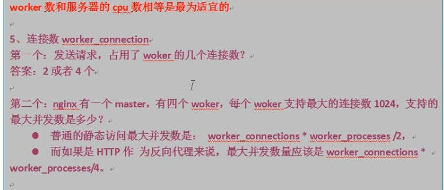

`taskkill /f /t /im nginx.exe`结束Windows所有nginx进程

# Nginx笔记

## Nginx简介

> Nginx是一个高性能的HTTP和反向代理Web服务器。
>
> 占有内存少，并发能力强。

**反向代理**：客户端**对代理是无感知的**，只需要将请求发送到反向代理服务器，由反向代理服务器去选择目标服务器获取数据后，再返回给客户端。隐藏了真实的服务器。

**正向代理**：在客户端配置代理服务器，通过代理服务器进行互联网访问

**负载均衡**：增加服务器数量，将请求尽量平均的分发到各个服务器上。

**动静分离**：将静态资源（html,css,js）和动态资源（jsp,servlet）由不同服务器来解析。降低单个服务器压力。

## Nginx安装

略

## Nginx常用命令

`nginx -v`查看版本号

`nginx -s stop`关闭Nginx

`nginx` 启动Nginx

`nginx -s reload`Nginx重新加载

## Nginx配置文件

**全局块**：设置一些影响nginx服务器整体运行的配置指令

`worker_processes  1;` 该值越大，可以支持的并发处理量也越多

**events块**：主要影响nginx服务器与用户的网络连接
`worker_connections  1024;` 支持的最大连接数

**http块**：配置中最频繁的

- **http全局块**：包括文件引入，mime-type定义，日志自定义，连接超时时间，单链接请求数上限等
- **server块**：配置中最频繁的

## Nginx配置实例-反向代理

## Nginx配置实例-负载均衡

### Nginx分配服务器的策略。

>  随着互联网信息的爆炸式增长，负载均衡已经不再是一个陌生的话题，顾名思义，负载均衡即是将负载分摊到不同服务单元，既能保证服务的可用性，又保证相应足够块，给用户很好的体验。快速增长的访问量和服务流量催生了各式各样的负债均衡产品，很多专业的负债均衡硬件提供了很好的功能，但却价格不菲，这使得负均衡软件大受欢迎，nginx即时其中一个，在linux下有nginx，LVS，Haproxy等等服务可以提供负载均衡服务，而且nginx提供了几种分配方式。

1、轮询（默认）
每个请求按时间顺序逐一分配到不同的服务器，如果后端服务器down掉，能自动剔除。
2、weight
Weight代表权重，默认为1，权重越高被分配的客户端而也就越多。
指定轮询几率，weight和访问比率成正比，用于后端服务器性能不均衡的情况。

server 192.168.2.133:8080 weight=5;
server 192.168.2.133:8081 weight=10;

3.ip_hash
每个请求按访问的ip的hash 结果分配，这样每个访客固定访问一个后端服务器，可以解决session共享问题。例如：

Ip_hash
server 192.168.2.133:8080 ;
server 192.168.2.133:8081;

4.fair（第三方）
按照后端服务器的响应时间来分配请求，相应时间短的的有限分配。

server 192.168.2.133:8080 ;
server 192.168.2.133:8081;
fair

## Nginx配置实例-动静分离

## Nginx配置实例-高可用

[Nginx 配置实例-配置高可用](https://www.cnblogs.com/xiao-xue-di/p/12834730.html)

## Nginx原理

1.在nginx启动后，会有一个master进程和多个worker进程，master进程主要用来管理worker进程，包括：接受信号，将信号分发给worker进程，监听worker进程工作状态，当worker进程退出时(非正常)，启动新的worker进程。基本的网络事件会交给worker进程处理。多个worker进程之间是对等的，他们同等竞争来自客户端的请求，各进程互相之间是独立的 。一个请求，只可能在一个worker进程中处理，一个worker进程，不可能处理其它进程的请求。 worker进程的个数是可以设置的，一般我们会设置与机器cpu核数一致，这里面的原因与nginx的进程模型以及事件处理模型是分不开的 。

2.当master接收到重新加载的信号会怎么处理(./nginx -s reload)?，master会重新加载配置文件，然后启动新的进程，使用的新的worker进程来接受请求，并告诉老的worker进程他们可以退休了，老的worker进程将不会接受新的，老的worker进程处理完手中正在处理的请求就会退出。

3.worker进程是如何处理用户的请求呢？首先master会根据配置文件生成一个监听相应端口的socket，然后再faster出多个worker进程，这样每个worker就可以接受从socket过来的消息（其实这个时候应该是每一个worker都有一个socket，只是这些socket监听的地址是一样的）。当一个连接过来的时候，每一个worker都能接收到通知，但是只有一个worker能和这个连接建立关系，其他的worker都会连接失败，这就是所谓的惊群现在，为了解决这个问题，nginx提供一个共享锁accept_mutex，有了这个共享锁后，就会只有一个worker去接收这个连接。当一个worker进程在accept这个连接之后，就开始读取请求，解析请求，处理请求，产生数据后，再返回给客户端，最后才断开连接，这样一个完整的请求就是这样的了

