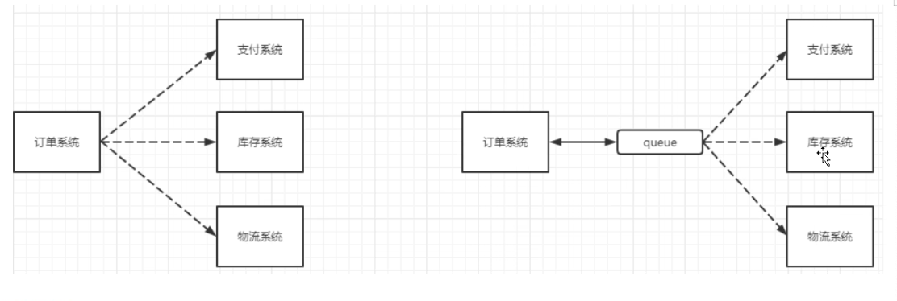
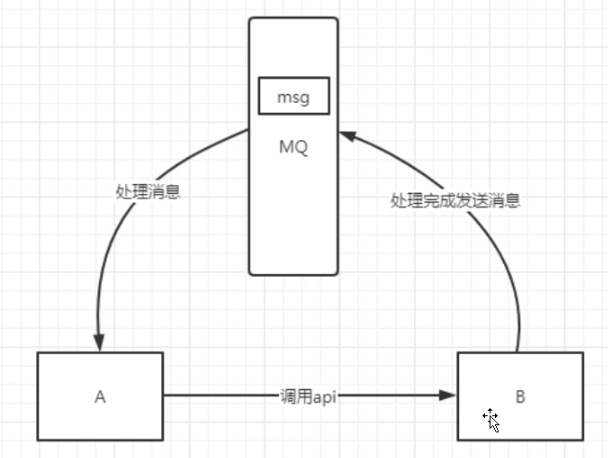
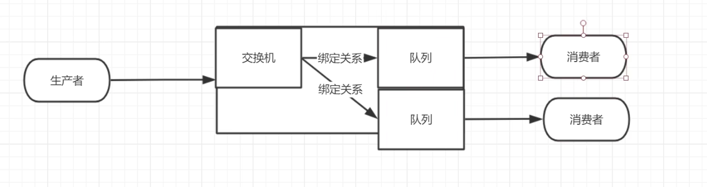
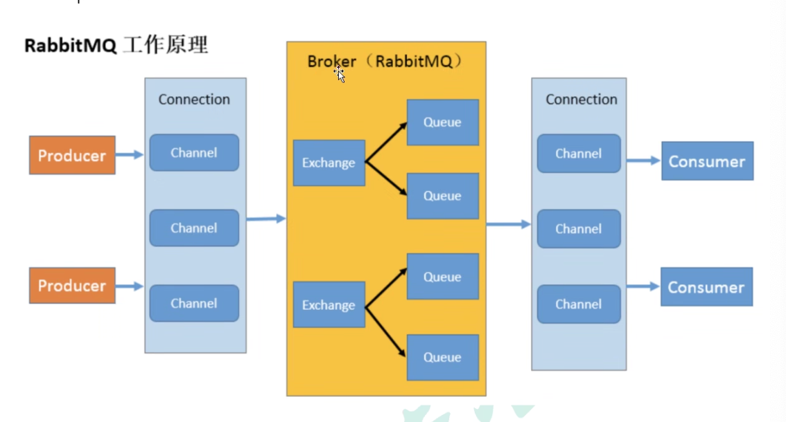
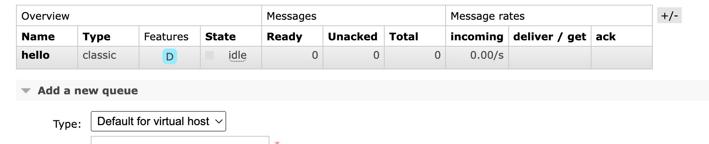
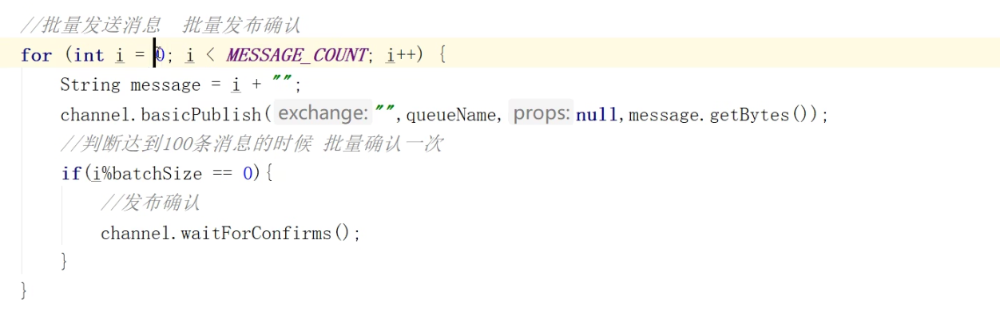
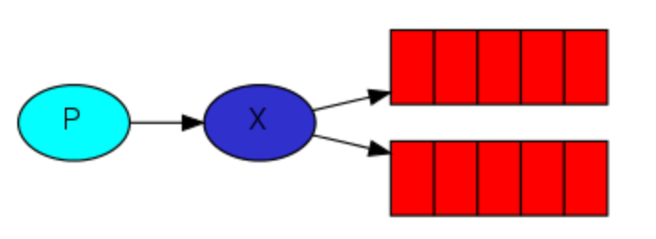
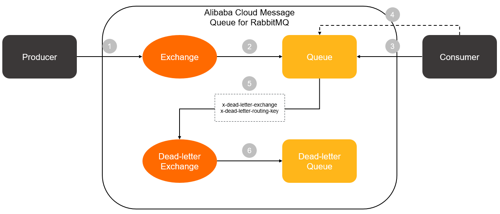
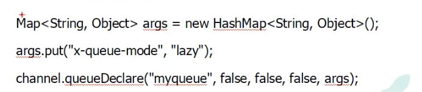

# RabbitMQ

## MQ的相关概念

### 什么是MQ

> 本质上是队列，队列中存放的是message，用于上下游传递消息。

### 为什么要使用MQ

> - 流量削峰:对访问请求进行排队，避免了系统宕机的风险，但是缺点是增加了请求完成的时间
> - 应用解耦：主系统不会因为子系统的错误而宕机，主系统的任务交给消息队列，由消息队列监督子系统完成
> - 
> - 异步处理：如果A调用B需要很长时间，以前有两种方式解决：A过一段时间调用B的查询API查询，或者A提供一个callback API，B执行完之后调用API通知A。使用消息总线可以很优雅的解决这个问题
> - 

### MQ的分类

> 1. ActiveMQ,Apache的消息队列，现在已经没人维护了
> 2. Kafka，大数据领域的消息中间件
> 3. RocketMQ,阿里巴巴开源的消息队列，支持的客户端语言不多
> 4. RabbitMQ,社区活跃，支持多种语言

### MQ的选择

> 1. Kafka,适合大数据的互联网数据收集业务，大型公司可选用
> 2. RocketMQ,适合金融互联网
> 3. RabbitMQ,数据量没有那么大，中小型公司首选RabbitMQ

## RabbitMQ

> MQ相当于邮局和快递员





### 安装

[RabbitMQ官网-安装](https://www.rabbitmq.com/download.html)

Management Plugin enabled by default at http://localhost:15672

## RabbitMQ文档阅读

### HelloWorld

[RabbitMQ官网-HelloWorld](https://www.rabbitmq.com/tutorials/tutorial-one-java.html)

```java
public class Send {
    private final static String QUEUE_NAME = "hello";
    public static void main(String[] argv) throws Exception {
        ConnectionFactory factory = new ConnectionFactory();
        factory.setHost("localhost");
        try (Connection connection = factory.newConnection();
             Channel channel = connection.createChannel()) {
            channel.queueDeclare(QUEUE_NAME, false, false, false, null);
            String message = "Hello World!";
            channel.basicPublish("", QUEUE_NAME, null, message.getBytes());
            System.out.println(" [x] Sent '" + message + "'");
        }
    }
}
```

```java
public class Recv {

    private final static String QUEUE_NAME = "hello";

    public static void main(String[] argv) throws Exception {
        ConnectionFactory factory = new ConnectionFactory();
        factory.setHost("localhost");
        Connection connection = factory.newConnection();
        Channel channel = connection.createChannel();

        channel.queueDeclare(QUEUE_NAME, false, false, false, null);
        System.out.println(" [*] Waiting for messages. To exit press CTRL+C");
        DeliverCallback deliverCallback = (consumerTag, delivery) -> {
            String message = new String(delivery.getBody(), "UTF-8");
            System.out.println(" [x] Received '" + message + "'");
            System.out.println(consumerTag);//amq.ctag-8vW6XFTOSR5s1msOobpmzA
        };
        channel.basicConsume(QUEUE_NAME, true, deliverCallback, consumerTag -> { });
    }
}
```

### 工作队列

> 有两个消费者默认使用轮询策略,消费者线程是竞争关系
>
> 一个消息只能被消费一次。
>
> **消息应答**：消费者在收到小心并且处理消息之后，告诉rabbitmq它已经处理了，rabbitmq可以把该消息删除了
>
> - 自动应答：不是很靠谱，接收到消息就应答了
> - 手动应答：靠谱
>   - 肯定确认
>   - 否定确认
>     - 批量应答
>     - 非批量应答
>
> **消息自动重新入队**：如果消费者由于某些原因失去连接（其通道已关闭，链接已关闭或TCP链接丢失），导致消息未发送ACK确认，RabbitMQ了解到消息未完全处理，将对其重新排队

```java
public class Worker {

    private final static String QUEUE_NAME = "hello";

    public static void main(String[] argv) throws Exception {
        ConnectionFactory factory = new ConnectionFactory();
        factory.setHost("localhost");
        Connection connection = factory.newConnection();
        Channel channel = connection.createChannel();

        channel.queueDeclare(QUEUE_NAME, false, false, false, null);
        System.out.println(" [*] Waiting for messages. To exit press CTRL+C");
        DeliverCallback deliverCallback = (consumerTag, delivery) -> {
            String message = new String(delivery.getBody(), "UTF-8");

            System.out.println(" [x] Received '" + message + "'");
            try {
                doWork(message);
            } catch (InterruptedException e) {
                throw new RuntimeException(e);
            } finally {
                System.out.println(" [x] Done");
            }
        };
        boolean autoAck = true; // acknowledgment is covered below
        channel.basicConsume(QUEUE_NAME, autoAck, deliverCallback, consumerTag -> { });
    }
    private static void doWork(String task) throws InterruptedException {
        for (char ch: task.toCharArray()) {
            if (ch == '.') {
                Thread.sleep(1000);
            }
        }
    }
}
```

```java
public class NewTask {
    private final static String QUEUE_NAME = "hello";
    public static void main(String[] argv) throws Exception {
        ConnectionFactory factory = new ConnectionFactory();
        factory.setHost("localhost");
        try (Connection connection = factory.newConnection();
             Channel channel = connection.createChannel()) {
            channel.queueDeclare(QUEUE_NAME, false, false, false, null);
            String message = String.join(" ", argv);

            channel.basicPublish("", "hello", null, message.getBytes());
            System.out.println(" [x] Sent '" + message + "'");
        }
    }
}
```

---

#### 为了防止消费者宕机导致消息丢失：手动应答+非批量处理

```java
public class Worker {

    private final static String QUEUE_NAME = "hello";

    public static void main(String[] argv) throws Exception {
        ConnectionFactory factory = new ConnectionFactory();
        factory.setHost("localhost");
        Connection connection = factory.newConnection();
        Channel channel = connection.createChannel();

        channel.queueDeclare(QUEUE_NAME, false, false, false, null);
        System.out.println(" [*] Waiting for messages. To exit press CTRL+C");
        DeliverCallback deliverCallback = (consumerTag, delivery) -> {
            String message = new String(delivery.getBody(), "UTF-8");

            System.out.println(" [x] Received '" + message + "'");
            try {
                doWork(message);
            } catch (InterruptedException e) {
                throw new RuntimeException(e);
            } finally {
                System.out.println(" [x] Done");
                channel.basicAck(delivery.getEnvelope().getDeliveryTag(),false);
            }
        };
        boolean autoAck = false; // acknowledgment is covered below
        channel.basicConsume(QUEUE_NAME, autoAck, deliverCallback, consumerTag -> { });
    }
    private static void doWork(String task) throws InterruptedException {
        for (char ch: task.toCharArray()) {
            if (ch == '.') {
                Thread.sleep(1000);
            }
        }
    }
}
```

#### 为了防止RabbitMQ宕机导致队列丢失：队列持久化

> 在队列持久化是false时，直接该成true，会报错。
>
> 解决办法是删除队列

```java
Caused by: com.rabbitmq.client.ShutdownSignalException: channel error; protocol method: #method<channel.close>(reply-code=406, reply-text=PRECONDITION_FAILED - inequivalent arg 'durable' for queue 'hello' in vhost '/': received 'true' but current is 'false', class-id=50, method-id=10)
```



```java
boolean durable = true;
channel.queueDeclare("task_queue", durable, false, false, null);
```

####  为了防止RabbitMQ宕机导致消息丢失：消息持久化

```java
import com.rabbitmq.client.MessageProperties;

channel.basicPublish("", "task_queue",
            MessageProperties.PERSISTENT_TEXT_PLAIN,
            message.getBytes());
```

#### 不公平分发

> 类似非公平锁,更改消费者代码
>
> 1是不公平分发
>
> 0是公平分发

```java
int prefetchCount = 1;
channel.basicQos(prefetchCount);
```

#### 预取值

```java
int prefetchCount = 2;
channel.basicQos(prefetchCount);
```

### 发布订阅

#### 为了避免生产者发消息到MQ，MQ没来得及保存到磁盘就宕机了，导致的消息丢失：发布确认

[RabbitMQ -06 发布确认](https://zhuanlan.zhihu.com/p/383358045)

> - 单个确认发布：发布速度很慢，确认发布了才能发下一个
> - 批量确认发布：折中的办法
> - 
> - 异步确认发布：效率最高

### 交换机

> 为了实现类似微信公众号的功能，就要使用到发布订阅



##### 无名交换机

AMQP-default

##### 扇出交换机（发布订阅）

[RabbitMQ-Publish/Subscribe-Java](https://www.rabbitmq.com/tutorials/tutorial-three-java.html)

com/binyu/$03publishsubscribe

> 定义两个消费者，具有不同的queue，但绑定同一个扇出交换机并设置一样的routingKey，就能实现发布订阅的效果。或者用官网的方法，每次启动获取一个临时队列，也能达到效果。

```java
 channel.exchangeDeclare(EXCHANGE_NAME, BuiltinExchangeType.FANOUT);
        channel.queueDeclare(QUEUE_NAME, true, false, false, null);
        channel.queueBind(QUEUE_NAME,EXCHANGE_NAME,"");
```

##### 直接交换机（路由模式）

[RabbitMQ-Routing-Java](https://www.rabbitmq.com/tutorials/tutorial-four-java.html)

> 绑定同一个交换机，routingKey不一样，效果和路由一样。你想给谁发，就写谁的routingKey

##### 主题交换机（发布订阅+路由模式+模糊匹配）

[RabbitMQ-Topics-Java](https://www.rabbitmq.com/tutorials/tutorial-five-java.html)

[RabbitMQ-Topics-Patterns](https://www.rabbitmq.com/tutorials/tutorial-five-java.html)

### 死信队列

[RabbitMQ-DeadLetter](https://www.rabbitmq.com/dlx.html)

[RabbitMQ-ttl](https://www.rabbitmq.com/ttl.html)

[alibabaCloud-DeadLetterExchange](https://www.alibabacloud.com/help/en/message-queue-for-rabbitmq/latest/dead-letter-exchange)

[CSDN-RabbitMQ 之 死信队列的介绍及实战](https://blog.csdn.net/qq_52567278/article/details/124372854)



```java
// 声明普通交换机
channel.exchangeDeclare("some.exchange.name", "direct");
Map<String, Object> args = new HashMap<String, Object>();
arguments.put("x-dead-letter-exchange", "some.exchange.name");
arguments.put("x-dead-letter-routing-key", "demo-routing-key");
// 声明普通队列
channel.queueDeclare("MyQueue", false, false, false, arguments);
```

### 延迟队列(死信队列中的一种：消息TTL过期)

[CSDN-RabbitMQ 之 延迟队列 详解&实战](https://blog.csdn.net/qq_52567278/article/details/124427476)

#### 应用场景

> 1. 订单在十分钟之内未支付则自动取消
> 2. 新创建的店铺，如果在十天内都没有上传过商品，则自动发送消息提醒。
> 3. 用户注册成功后，如果三天内没有登陆则进行短信提醒。
> 4. 用户发起退款，如果三天内没有得到处理则通知相关运营人员。
> 5. 预定会议后，需要在预定的时间点前十分钟通知各个与会人员参加会议


## 发布确认高级与备份交换机

[CSDN-RabbitMQ 之 发布高级确认 详解](https://blog.csdn.net/qq_52567278/article/details/124464110)

## RabbitMQ其他知识点

[CSDN-RabbitMQ 之 幂等性、优先级队列、惰性队列](https://blog.csdn.net/qq_52567278/article/details/124484551)



## RabbitMQ集群

[How to Set Up the RabbitMQ Cluster on Ubuntu/Debian Linux](https://adamtheautomator.com/rabbitmq-cluster/)

[RabbitMQ官网-经典队列镜像](https://www.rabbitmq.com/ha.html)【3.10之前的队列复制用这个】

[RabbitMQ官网-仲裁队列](https://www.rabbitmq.com/quorum-queues.html)【3.10及之后的队列复制用这个】

## Federation Plugin

> 在不需要建立集群下，在两个MQ间传送消息

[RabbitMQ官网-Federation](https://www.rabbitmq.com/federation.html)

[RabbitMQ官网-Federation Exchange](https://www.rabbitmq.com/federated-exchanges.html)

[RabbitMQ官网-Federated queues](https://www.rabbitmq.com/federated-queues.html)

## Shovel Plugin

> 将消息单向从源端启动到目的端

[RabbitMQ官网-Shovel](https://www.rabbitmq.com/shovel.html)

