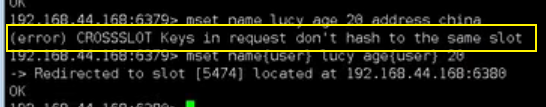
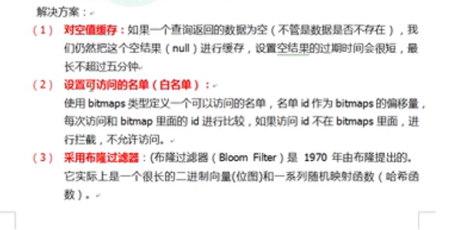
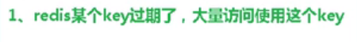

# 2021Study-Redis

## 1. NoSql数据库简介


- 对数据高并发的读写
- 海量数据的读写
- 对数据可扩展性

## 2. Redis的安装和概述

[Redis参考手册-About](https://redis.io/docs/about/)

[Redis参考手册-Install](https://redis.io/docs/getting-started/installation/)

[Redis参考手册-图形化工具Tools](https://redis.io/resources/tools/)

## 3. Redis常用五种数据类型

[Redis参考手册-Data types](https://redis.io/docs/data-types/)

[菜鸟教程-Redis 键(key)](https://www.runoob.com/redis/redis-keys.html)

[菜鸟教程-Redis 字符串(String)](https://www.runoob.com/redis/redis-strings.html)

[菜鸟教程-Redis 哈希(Hash)](https://www.runoob.com/redis/redis-hashes.html)

[菜鸟教程-Redis 列表(List)](https://www.runoob.com/redis/redis-lists.html)

[菜鸟教程-Redis 集合(Set)](https://www.runoob.com/redis/redis-sets.html)

[菜鸟教程-Redis 有序集合(sorted set)](https://www.runoob.com/redis/redis-sorted-sets.html)

> Redis `List`底层是一个quick list，数据量少时是一个数组，数据量达到一定量级成为多个数组用链表指针连接
>
> Redis `Set`底层是一个value为null的HashMap

## 4. Redis配置文件

[CSDN-redis配置文件中常用配置详解](https://blog.csdn.net/suprezheng/article/details/90679790)


bind注释掉

protected-mode 改为no

## 5. Redis的发布和订阅

发布订阅是一种消息通信模式，类似微信公众号


`subscribe channel1`订阅频道1

`publish channel1 hello`向频道1发送hello信息

## 6. Redis6新数据类型

### Bitmaps

并不是数据类型，只是字符串

类似于数组，偏移量类似于数组索引

`setbit key offset value`设置key[offset]=value

`bitcount key [start stop]`统计1的个数，其中start stop是指byte位置

`bitop and(or/not/xor) destkey [key...]`多个Bitmaps的交集幷集非和异或

### HyperLogLog

用于基数计算，基数就是一个集合去重后剩的数

`pfadd  key value`添加元素，如果基数发生变化则返回1，否则返回0

`pfcount key`统计基数的数量

`pfmerge destkey sourcekey1 [sourcekey2...]`合并到destkey

### Geospatial

经纬度的支持

`geadd key 经度1 纬度1 名称1 [经度2 纬度2 名称2...]`添加地理位置

`geopos key 名称`获取地理位置

`geodist key 名称1 名称2 [m/km]`获取两地直线距离

`georadius key 经度 纬度 半径 [m/km]`获取特定位置半径以内的元素

## 7. Jedis操作Redis

[菜鸟教程-Java 使用 Redis](https://www.runoob.com/redis/redis-java.html)

操作和命令行完全一致

```java
public class JedisDemo {
    public static void main(String[] args) {
        Jedis jedis=new Jedis ( "192.168.10.128",6379 );
        System.out.println ( jedis.ping () );
         Set<String> keys = jedis.keys ( "*" );
        for(String key:keys){
            System.out.println (key);
        }
        jedis.mset ( "k3","v4","k3","v4" );
        
    }
}
```

## 8. SpringBoot整合Redis


```xml
 <dependency>
           <groupId>org.springframework.boot</groupId>
           <artifactId>spring-boot-starter-data-redis</artifactId>
       </dependency>

```

```yml
spring:
    redis:
      host: 127.0.0.1 
      port: 6379
      password: 123456
      jedis:
        pool:
          max-active: 8
          max-wait: -1
          max-idle: 500
          min-idle: 0
      lettuce:
        shutdown-timeout: 0

```

```java
@RunWith(SpringRunner.class)
@SpringBootTest
public class Test_1{
    @Autowired
    private RedisTemplate<String,String>redisTemplate;

    @Test
    public void set(){
        redisTemplate.opsForValue().set("myKey","myValue");
        System.out.println(redisTemplate.opsForValue().get("myKey"));
    }
}

```

## 9. Redis事务操作

**Redis事务概述**：

 Redis 事务的本质是一组命令的集合。事务支持一次执行多个命令，一个事务中所有命令都会被序列化。在事务执行过程，会按照顺序串行化执行队列中的命令，其他客户端提交的命令请求不会插入到事务执行命令序列中。


**Redis事务错误**：


**悲观锁和乐观锁**：

传统的关系型数据库用到了很多这种锁机制，比如行锁、表锁等，读锁、写锁等，都是在操作前上锁


适用于多读的应用类型，可以提高吞吐量


`watch key [key…]`：在执行multi之前，先执行该命令可以多个key，相当于添加乐观锁

[Redis watch命令——监控事务](http://c.biancheng.net/view/4544.html)

**Redis事务三特性**：

- 单独的隔离操作
  - 事务中所有命令都会序列化、按顺序地执行。执行过程中不会被其他客户端发送来的命令请求打断
- 没有隔离级别的概念
  - 队列中的命令没有提交之前都不会被实际执行，因为redis事务提交前任何指令都不会被实际执行
- 不保证原子性
  - 事务中如果有一条命令执行失败，其后的命令仍然会被执行，没有回滚

## 10. 秒杀

**安装模拟并发**

`yum install httpd-tools`

**秒杀**：

连接超时要用redis连接池

秒杀就必须加事务

lua脚本解决库存问题

## 11. Redis持久化之RDB

[CSDN-Redis的持久化（rdb,aof,混合模式）,持久化文件的修复](https://blog.csdn.net/weixin_43172997/article/details/104225041?utm_medium=distribute.pc_relevant.none-task-blog-2~default~baidujs_title~default-0.highlightwordscore&spm=1001.2101.3001.4242.1)

 RDB持久化是指在指定的时间间隔内将内存中的数据集快照写入磁盘。也是默认的持久化方式，这种方式是就是将内存中数据以快照的方式写入到二进制文件中,默认的文件名为dump.rdb。 

RDB最后一次持久化后的数据可能丢失


**RDB 的优势和劣势**

①、优势

（1）RDB文件紧凑，全量备份，非常适合用于进行备份和灾难恢复。

（2）生成RDB文件的时候，redis主进程会fork()一个子进程来处理所有保存工作，主进程不需要进行任何磁盘IO操作。

（3）RDB 在恢复大数据集时的速度比 AOF 的恢复速度要快。

②、劣势

RDB快照是一次全量备份，存储的是内存数据的二进制序列化形式，存储上非常紧凑。当进行快照持久化时，会开启一个子进程专门负责快照持久化，子进程会拥有父进程的内存数据，父进程修改内存子进程不会反应出来，所以在快照持久化期间修改的数据不会被保存，可能丢失数据。

## 12. Redis持久化之AOF

以日志的形式来记录每个写操作，将Redis执行过的所有写操作记录下来，只许追加文件不可以改写文件。

AOF默认不开启

可以在redis.conf中配置文件名称，默认为appendonly.aof


如果AOF和RDB同时开启，redis听AOF的

**同步的策略**：

- 每修改同步：appendfsync always 同步持久化 每次发生数据变更会被立即记录到磁盘 性能较差但数据完整性比较好
- 每秒同步：appendfsync everysec 异步操作，每秒记录 如果一秒内宕机，有数据丢失，默认出厂设置
- 不同步：appendfsync no 从不同步

**重写（rewrite）**: AOF采用文件追加方式，文件会越来越大为避免出现此种情况，新增了重写机制,
当AOF文件的大小超过所设定的阈值时，Redis就会启动AOF文件的内容压缩，只保留可以恢复数据的最小指令集（比如将10000个incr key转换为incyby 10000）.可以使用命令bgrewriteaof。

重写原理： AOF文件持续增长而过大时，会fork出一条新进程来将文件重写(也是先写临时文件最后再rename)，遍历新进程的内存中数据，每条记录有一条的Set语句。重写aof文件的操作，并没有读取旧的aof文件，而是将整个内存中的数据库内容用命令的方式重写了一个新的aof文件，这点和快照有点类似

重写触发的机制： Redis会记录上次重写时的AOF大小，默认配置是当AOF文件大小是上次rewrite后大小的一倍且文件大于64M时触发，redis.conf配置文件中有写着


**优点**

（1）AOF可以更好的保护数据不丢失，一般AOF会每隔1秒，通过一个后台线程执行一次fsync操作，最多丢失1秒钟的数据。

（2）AOF日志文件没有任何磁盘寻址的开销，写入性能非常高，文件不容易破损。

（3）AOF日志文件即使过大的时候，出现后台重写操作，也不会影响客户端的读写。

（4）AOF日志文件的命令通过非常可读的方式进行记录，这个特性非常适合做灾难性的误删除的紧急恢复。比如某人不小心用flushall命令清空了所有数据，只要这个时候后台rewrite还没有发生，那么就可以立即拷贝AOF文件，将最后一条flushall命令给删了，然后再将该AOF文件放回去，就可以通过恢复机制，自动恢复所有数据

**缺点**

（1）对于同一份数据来说，AOF日志文件通常比RDB数据快照文件更大

（2）AOF开启后，支持的写QPS会比RDB支持的写QPS低，因为AOF一般会配置成每秒fsync一次日志文件，当然，每秒一次fsync，性能也还是很高的

（3）以前AOF发生过bug，就是通过AOF记录的日志，进行数据恢复的时候，没有恢复一模一样的数据出来。

 **持久化文件有错误的修复：**
dump.rdb: /usr/local/bin/redis-check-dump --fix rdb文件的路径和名字
appendonly-aof: /usr/local/bin/redis-check-aof --fix aof文件的路径和名字 

## 13. Redis主从复制

主机数据更新后根据配置和策略，自动同步到备机的master/slaver机制，master以写为主，slaver以读为主


1. 读写分离
2. 容灾快速恢复

----

**具体操作**：

[CSDN-Redis实现主从复制（Master&Slave）](https://blog.csdn.net/zhangguanghui002/article/details/78524533)


`info replication`查看当前主机运行状态

`slaveof 127.0.0.1 6379`添加从机

## 14. Redis集群

Redis3.0提供了无中心化集群


先删除所有rdb文件

`:%s/6379/6380`全部替换

启动六个服务

`cd /opt/redis-6.2.4/src`切换目录

`redis-cli --cluster create --cluster-replicas 192.168.10.128:6379 192.168.10.128:6380 192.168.10.128:6381 192.168.10.128:6389 192.168.10.128:6390 192.168.10.128:6391 `把六个合体成为集群

`redis-cli -c -p 6379`集群连接redis

slots插槽类似于hashcode的作用



集群的操作：


**集群的好处**：

- 实现扩容
- 分摊压力
- 务中心配置相对简单

**集群的缺点**：

- 多键操作不被支持
- 多键Redis事务不被支持，lua脚本不被支持
- 集群方案出现较晚，很多公司已经采用了其他的集群方案，而迁移难度大

## 15. Redis应用问题解决

**缓存穿透**：





----


**缓存击穿**：





---


**缓存雪崩**：


----


----


**分布式锁**：


----


`setnx key value nx ex time`上锁并设置过期时间

`del key`解锁


优化防锁误删：


删除操作缺乏原子性：


使用lua脚本实现原子性


----

**最终形态**：


## Redis6新功能

**ACL**:

[CSDN-Redis 6.0 权限控制命令 ACLs 详解](https://blog.csdn.net/sl285720967/article/details/106440838/)

**IO多线程**：

[CSDN-Redis系列(十六)、Redis6新特性之IO多线程](https://blog.csdn.net/wsdc0521/article/details/106766587)

执行命令依然是单线程


