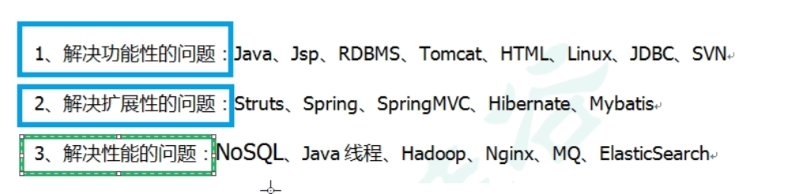
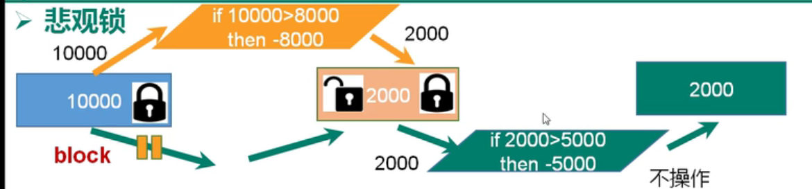
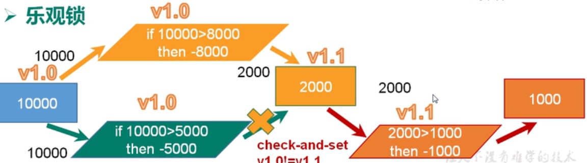
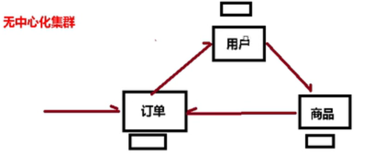
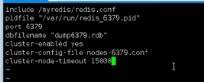

# 2021Study-Redis-尚硅谷版

## 1. NoSql数据库简介




- 对数据高并发的读写
- 海量数据的读写
- 对数据可扩展性

## 2. Redis的安装和概述

[Redis参考手册-About](https://redis.io/docs/about/)

[Redis参考手册-Install](https://redis.io/docs/getting-started/installation/)

[Redis参考手册-图形化工具Tools](https://redis.io/resources/tools/)

## 3. Redis常用五种数据类型

[Redis参考手册-Data types](https://redis.io/docs/data-types/)

[菜鸟教程-Redis 键(key)](https://www.runoob.com/redis/redis-keys.html)

[菜鸟教程-Redis 字符串(String)](https://www.runoob.com/redis/redis-strings.html)

[菜鸟教程-Redis 哈希(Hash)](https://www.runoob.com/redis/redis-hashes.html)

[菜鸟教程-Redis 列表(List)](https://www.runoob.com/redis/redis-lists.html)

[菜鸟教程-Redis 集合(Set)](https://www.runoob.com/redis/redis-sets.html)

[菜鸟教程-Redis 有序集合(sorted set)](https://www.runoob.com/redis/redis-sorted-sets.html)

> Redis `List`底层是一个quick list，数据量少时是一个数组，数据量达到一定量级成为多个数组用链表指针连接
>
> Redis `Set`底层是一个value为null的HashMap

## 4. Redis配置文件

> [Redis参考手册-配置文件](https://redis.io/docs/management/config-file/)
>
> [菜鸟教程-Redis配置](https://www.runoob.com/redis/redis-conf.html)
>
> bind注释掉
>
> protected-mode 改为no,允许远程访问


## 5. Redis的发布和订阅

> 发布订阅是一种消息通信模式，类似微信公众号


`subscribe channel1`订阅频道1

`publish channel1 hello`向频道1发送hello信息

## 6. Redis6新数据类型

[Redis参考手册-Bitmaps](https://redis.io/docs/data-types/bitmaps/)

[Redis参考手册-HyperLogLog](https://redis.io/docs/data-types/hyperloglogs/)

[Redis参考手册-Geospatial](https://redis.io/docs/data-types/geospatial/)

### Bitmaps

并不是数据类型，只是字符串

类似于数组，偏移量类似于数组索引

### HyperLogLog

用于基数计算，基数就是一个集合去重后剩的数

### Geospatial

经纬度的支持

## 7. Jedis操作Redis

[菜鸟教程-Java 使用 Redis](https://www.runoob.com/redis/redis-java.html)

[Jedis javadoc](https://www.javadoc.io/doc/redis.clients/jedis/latest/redis/clients/jedis/Jedis.html)

[Github-Jedis](https://github.com/redis/jedis)

```java
public class JedisDemo {
    public static void main(String[] args) {
        Jedis jedis=new Jedis ( "192.168.10.128",6379 );
        System.out.println ( jedis.ping () );
         Set<String> keys = jedis.keys ( "*" );
        for(String key:keys){
            System.out.println (key);
        }
        jedis.mset ( "k3","v4","k3","v4" );
        
    }
}
```

## 8. SpringBoot整合Redis

[Baeldung-Springboot整合Redis](https://www.baeldung.com/spring-data-redis-tutorial)

[Spring官网-10. Redis support](https://docs.spring.io/spring-data/data-redis/docs/current/reference/html/#redis)

```xml
 <dependency>
           <groupId>org.springframework.boot</groupId>
           <artifactId>spring-boot-starter-data-redis</artifactId>
       </dependency>

```

```yml
spring:
    redis:
      host: 127.0.0.1 
      port: 6379
      password: 123456
      jedis:
        pool:
          max-active: 8
          max-wait: -1
          max-idle: 500
          min-idle: 0
      lettuce:
        shutdown-timeout: 0

```

```java
@Configuration
class MyConfig {

  @Bean
  LettuceConnectionFactory redisConnectionFactory() {
    return new LettuceConnectionFactory();
  }

  @Bean
  StringRedisTemplate stringRedisTemplate(RedisConnectionFactory redisConnectionFactory) {

    StringRedisTemplate template = new StringRedisTemplate();
    template.setConnectionFactory(redisConnectionFactory);
    return template;
  }
}
```

```java
public class Example {

  @Autowired
  private StringRedisTemplate redisTemplate;

  public void addLink(String userId, URL url) {
    redisTemplate.opsForList().leftPush(userId, url.toExternalForm());
  }
}
```

## 9. Redis事务操作

[Redis参考手册-事务Transactions](https://redis.io/docs/manual/transactions/#:~:text=Redis%20Transactions%20allow%20the%20execution,are%20serialized%20and%20executed%20sequentially.)

> Multi类似mysql中的begin;
>
> Exec类似mysql中的commit;

**Redis事务错误**：


**悲观锁和乐观锁**：

传统的关系型数据库用到了很多这种锁机制，比如行锁、表锁等，读锁、写锁等，都是在操作前上锁



适用于多读的应用类型，可以提高吞吐量



`watch key [key…]`：在执行multi之前，先执行该命令可以多个key，相当于添加乐观锁

> Take the example below:
>
> ```
> var = GET mykey
> 
> var = var + 1
> 
> SET mykey $var
> ```
>
> In the example above, we have an operation that increases the value of a key by 1. Of course, this is not an issue if only a single client performs the said operation.
>
> However, if multiple clients attempt to execute the above operation simultaneously, a race condition occurs and returns an invalid value.
>
> We can solve this by watching the key as shown:
>
> ```
> WATCH mykey
> 
> var = GET mykey
> 
> var = var + 1
> 
> MULTI
> 
> SET mykey $var
> 
> EXEC
> ```
>
> Here, if a client operates and the value of the key is changed before executing the transaction, the execution fails.

**Redis事务三特性**：

- 单独的隔离操作
  - 事务中所有命令都会序列化、按顺序地执行。执行过程中不会被其他客户端发送来的命令请求打断
- 没有隔离级别的概念
  - 队列中的命令没有提交之前都不会被实际执行，因为redis事务提交前任何指令都不会被实际执行
- 不保证原子性
  - 事务中如果有一条命令执行失败，其后的命令仍然会被执行，没有回滚

## 10. 秒杀

**安装模拟并发**

`yum install httpd-tools`

**秒杀**：

连接超时要用redis连接池工具类

秒杀就必须加事务，但是乐观锁会造成库存遗留问题


lua脚本解决原子性，解决库存问题


## 11. Redis持久化之RDB

[Redis参考手册-持久化Persistence](https://redis.io/docs/management/persistence/)

## 12. Redis持久化之AOF

[Redis参考手册-持久化Persistence](https://redis.io/docs/management/persistence/)

## 13. Redis主从复制

[Redis参考手册-主从复制Replication](https://redis.io/docs/management/replication/)

## 14. Redis集群

[Redis参考手册-集群Cluster](https://redis.io/docs/reference/cluster-spec/)

Redis3.0提供了无中心化集群





先删除所有rdb文件

`:%s/6379/6380`全部替换

启动六个服务

`cd /opt/redis-6.2.4/src`切换目录

`redis-cli --cluster create --cluster-replicas 192.168.10.128:6379 192.168.10.128:6380 192.168.10.128:6381 192.168.10.128:6389 192.168.10.128:6390 192.168.10.128:6391 `把六个合体成为集群

`redis-cli -c -p 6379`集群连接redis

slots插槽类似于hashcode的作用


集群的操作：


**集群的好处**：

- 实现扩容
- 分摊压力
- 务中心配置相对简单

**集群的缺点**：

- 多键操作不被支持
- 多键Redis事务不被支持，lua脚本不被支持
- 集群方案出现较晚，很多公司已经采用了其他的集群方案，而迁移难度大

## 15. Redis应用问题解决

[小林coding-什么是缓存雪崩、击穿、穿透？](https://xiaolincoding.com/redis/cluster/cache_problem.html#%E7%BC%93%E5%AD%98%E9%9B%AA%E5%B4%A9)


# 2023Study-Redis-黑马版

[CSDN-Redis 笔记（黑马点评 —— 基础篇 + 实战篇）](https://blog.csdn.net/weixin_45033015/article/details/127545710)


## SpringDataRedis的序列化方式

> 默认是JDK序列化，需要修改redisTemplate的序列化方式为Key为*StringRedisSerializer*，value为jsonRedisSerializer。但是使用jsonRedisSerializer会在每次存数据时多存一个数据类型从而占用空间，为了节省空间占用，我们使用StringRedisTemplate。当然这两种方式都可以的。

> 序列化可以使用springMVC提供的ObjectMapper来操作，也可以用Gson或FastJson

## 为什么选择黑马点评

> 社交应用对redis的应用很丰富

## 短信登录


