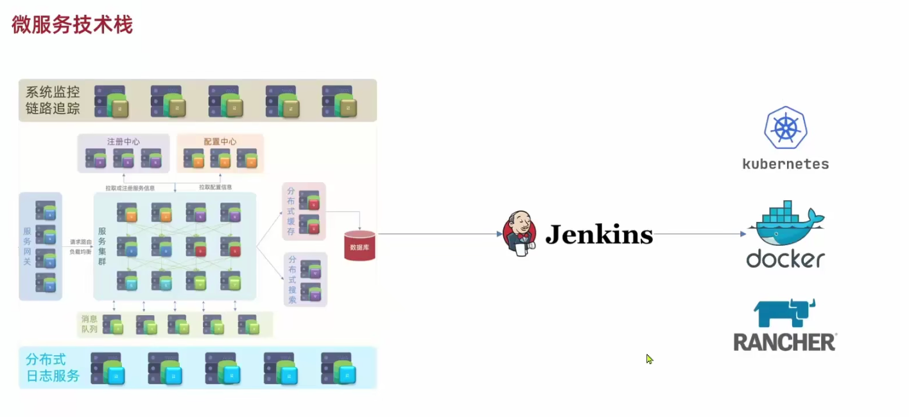
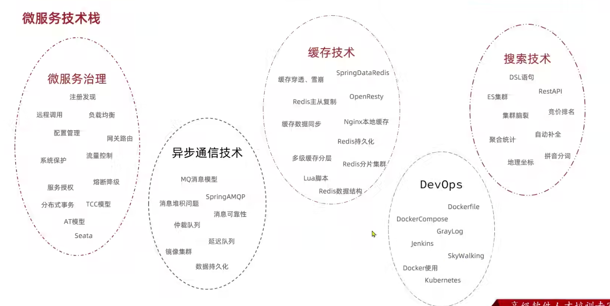
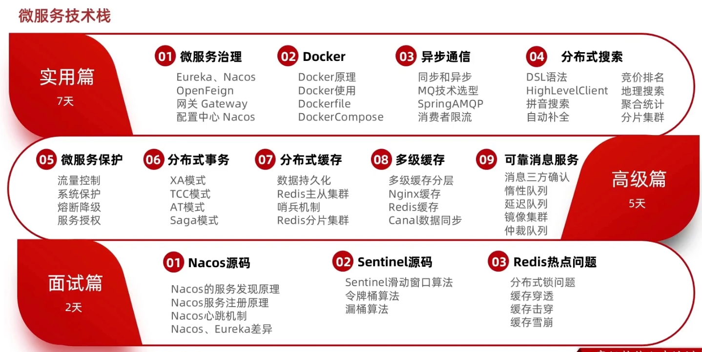

# SpringCloud笔记

> SpringCloud不代表微服务的全部，它只解决了微服务治理的问题。







## 踩坑实录

### nacos集群踩坑-cluster.conf配置localhost不起作用，要配置本机IP

[nacos集群踩坑-cluster.conf配置本机IP](https://blog.csdn.net/xujunming668/article/details/122518073)

```
server:
  port: 8088
spring:
  datasource:
    url: jdbc:mysql://localhost:3306/cloud-order?useSSL=false
    username: root
    password: root
    driver-class-name: com.mysql.jdbc.Driver
  application:
    name: order-service
  cloud:
    nacos:
      server-addr: localhost:80 # nacos服务地址
#      discovery:
#        namespace: 4d6ce343-9e1b-44df-a90f-2cf2b6b3d177 # dev环境
#        ephemeral: false # 是否是临时实例
mybatis:
  type-aliases-package: cn.itcast.user.pojo
  configuration:
    map-underscore-to-camel-case: true
logging:
  level:
    cn.itcast: debug
  pattern:
    dateformat: MM-dd HH:mm:ss:SSS
#eureka:
#  client:
#    service-url:  # eureka的地址信息
#      defaultZone: http://127.0.0.1:10086/eureka
user-service:
  ribbon:
    NFLoadBalancerRuleClassName: com.alibaba.cloud.nacos.ribbon.NacosRule  # 负载均衡规则
ribbon:
  eager-load:
    enabled: true # 开启饥饿加载
    clients: # 指定饥饿加载的服务名称
      - user-service
feign:
  httpclient:
    enabled: true # 支持HttpClient的开关
    max-connections: 200 # 最大连接数
    max-connections-per-route: 50 # 单个路径的最大连接数
```

### mac不能直接进入数据卷挂载目录，运行下面的命令就行了

mac docker 数据卷不能直接进入，需要使用debian镜像连接进入

直接进入会提示文件夹不存在

```
cd /var/lib/docker/volumes/html/_data
-bash: cd: /var/lib/docker/volumes/html/_data: No such file or directory
```

解决方法：

```
$ docker run -it --privileged --pid=host debian nsenter -t 1 -m -u -n -i sh
$ cd /var/lib/docker/volumes
```

### 切换到root用户

```bash
sudo su -
```

### mysql docker

```
sudo docker run --name mysql -e MYSQL_ROOT_PASSWORD=ROOT1234 \
-p 3306:3306 \
-v /tmp/mysql/conf/hmy.cnf:/etc/mysql/conf.d/hmy.cnf \
-v /tmp/mysql/data:/var/lib/mysql \
-d mysql
```
