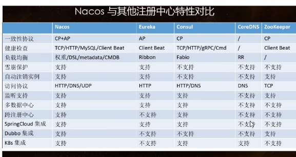
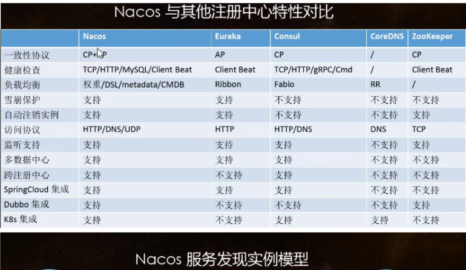
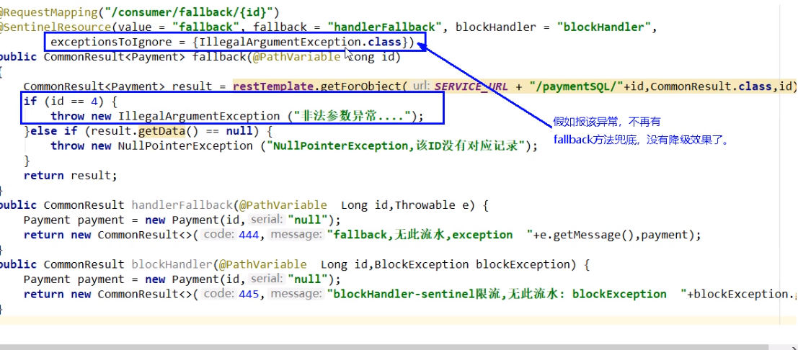
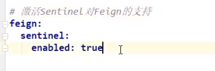
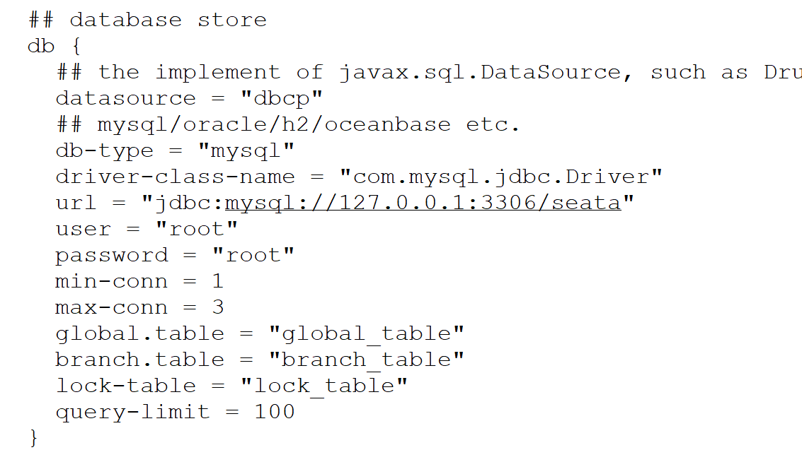
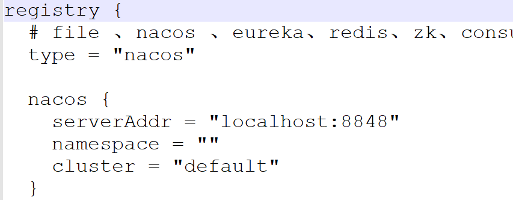

# SpringCloud

## 参考资料

[W3CSchool-SpringCloud教程](https://www.w3cschool.cn/scchinese/)

## 鱼皮的建议

随着互联网的发展，项目越来越复杂，单机且庞大的巨石项目已无法满足开发、运维、并发、可靠性等需求。

因此，后台架构不断演进，可以将庞大的项目拆分成一个个职责明确、功能独立的细小模块，模块可以部署在多台服务器上，相互配合协作，提供完整的系统能力。

换言之，想做大型项目，这块儿一定要好好学！

#### [#](https://www.codefather.cn/java学习路线-by-程序员鱼皮/#知识-18)知识

##### [#](https://www.codefather.cn/java学习路线-by-程序员鱼皮/#dubbo)Dubbo

- 架构演进
- RPC
- Zookeeper
- 服务提供者
- 服务消费者
- 项目搭建
- 相关技术：DubboX（对 Dubbo 的扩展）

##### [#](https://www.codefather.cn/java学习路线-by-程序员鱼皮/#🌖-微服务)🌖 微服务

- 微服务概念
- Spring Cloud 框架
  - 子父工程
  - 服务注册与发现
  - 注册中心 Eureka、Zookeeper、Consul
  - Ribbon 负载均衡
  - Feign 服务调用
  - Hystrix 服务限流、降级、熔断
  - Resilience4j 服务容错
  - Gateway（Zuul）微服务网关
  - Config 分布式配置中心
  - 分布式服务总线
  - Sleuth + Zipkin 分布式链路追踪
- Spring Cloud Alibaba
  - Nacos 注册、配置中心
  - OpenFeign 服务调用
  - Sentinel 流控
  - Seata 分布式事务

##### [#](https://www.codefather.cn/java学习路线-by-程序员鱼皮/#接口管理)接口管理

- Swagger 接口文档
- Postman 接口测试
- 相关技术：YApi、ShowDoc

#### [#](https://www.codefather.cn/java学习路线-by-程序员鱼皮/#学习建议-19)学习建议

时间不急的话，建议先从 Dubbo 学起，对分布式、RPC、微服务有些基本的了解，再去食用 Spring Cloud 全家桶会更香。学完 Spring Cloud 全家桶后，再去学 Spring Cloud Alibaba 就很简单了。

这部分内容的学习，原理 + 实践都很重要，也不要被各种高大上的词汇唬住了，都是上层（应用层）的东西，基本没有什么算法，跟着视频教程学，其实还是很好理解的。

分布式相关知识非常多，但这里不用刻意去背，先通过视频教程实战使用一些微服务框架，也能对其中的概念有基本的了解。

大厂面试的时候很少问 Spring Cloud 框架的细节，更多的是微服务以及各组件的一些思想，比如网关的好处、消息总线的好处等。

#### [#](https://www.codefather.cn/java学习路线-by-程序员鱼皮/#经典面试题-14)经典面试题

1. 什么是微服务，有哪些优缺点？
2. 什么是注册中心，能解决什么问题？

#### [#](https://www.codefather.cn/java学习路线-by-程序员鱼皮/#资源-18)资源

- 项目实战
  - [项目实战 - 鱼皮原创项目教程系列 (opens new window)](https://yuyuanweb.feishu.cn/wiki/SePYwTc9tipQiCktw7Uc7kujnCd)中的 API 开放平台、在线判题系统都运用了微服务，推荐学习
- 视频
  - ⭐️ 黑马 Spring Cloud 视频教程：[https://www.bilibili.com/video/BV1kH4y1S7wz (opens new window)](https://www.bilibili.com/video/BV1kH4y1S7wz)（11 小时，非常凝练，适合快速入门）
  - ⭐️ 尚硅谷 Dubbo 教程：[https://www.bilibili.com/video/BV1ns411c7jV(opens new window)](https://www.bilibili.com/video/BV1ns411c7jV)
  - 尚硅谷 SpringCloud（H版&alibaba）框架开发教程（微服务分布式架构）：[https://www.bilibili.com/video/BV18E411x7eT (opens new window)](https://www.bilibili.com/video/BV18E411x7eT)（把国外的 Spring Cloud 和国内的 Spring Cloud Alibaba 结合在一起对比着去讲，主流技术栈、知识点都讲到了，内容更全面）
- 文档
  - Apache Dubbo 官方文档：[https://dubbo.apache.org/zh/(opens new window)](https://dubbo.apache.org/zh/)
  - Spring Cloud Alibaba 官方文档：[https://github.com/alibaba/spring-cloud-alibaba/blob/master/README-zh.md(opens new window)](https://github.com/alibaba/spring-cloud-alibaba/blob/master/README-zh.md)
  - ⭐ Swagger 教学文档：[https://doc.xiaominfo.com/ (opens new window)](https://doc.xiaominfo.com/)（跟着快速开始直接用就好了）

## RestTemplate

https://www.baeldung-cn.com/rest-template

https://www.baeldung-cn.com/java-lombok-constructor-annotation

## 5. Eureka服务注册与发现

### Eureka基础知识

#### 什么是服务治理

在传统的RPC远程调用框架中，管理每个服务与服务之间依赖关系比较复杂，管理比较复杂，所以需要使用服务治理，管理服务与服务之间的依赖关系，可以实现服务调用、负载均衡、容错等，实现服务注册与发现

#### 什么是服务注册

Eureka采用了CS的设计架构，Eureka Server作为服务注册功能的服务器，他是服务注册中心。而系统中其他微服务，使用Eureka的客户端连接到Eureka Server并维持**心跳连接**。这样系统的维护人员就可以通过Eureka Server来监控系统中各个微服务是否正常运行。

在服务注册与发现中，有一个注册中心，当服务器启动的时候，会把当前自己服务器的信息，比如服务地址、通讯地址等以别名方法注册到注册中心上。另一方（消费者|服务提供者），以该别名的方法区注册中心获取到实际的服务通讯地址，然后再实现本地RPC调用。RPC远程调用框架的核心设计思想：在于注册中心，因为使用注册中心管理每个服务与服务之间的依赖关系（服务治理）。在任何RPC远程框架中，都会有一个注册中心（存放服务地址相关信息（接口地址））


#### Eureka两组件

Eureka Server 提供服务注册功能

各个微服务节点通过配置启动后，会在Eureka Server中进行注册，这样，Eureka Server中的服务注册表中将会储存所有可用服务节点的信息，服务节点的信息可以在界面中直观看到。

Eureka Client通过注册中心进行访问

是一个JAVA客户端，用于简化Eureka Server的交互，客户端同时也具备一个内置的、使用轮询（round-robin）负载算法的负载均衡器。在应用启动后，将会向Eureka Server发送心跳（默认周期为30秒）。如果Eureka Server在多个心跳周期内没有接收到某个节点的心跳，Eureka Server将会从服务注册表中把这个服务节点移除（默认90秒）

### 单机Eureka构建步骤

**EurekaServer端**

- 改Pom.xml
```xml
<dependency>
    <groupId>org.springframework.cloud</groupId>
    <artifactId>spring-cloud-starter-netflix-eureka-server</artifactId>
</dependency>
```


- 改appplication.yml
```yml
server:
  port: 7002
eureka:
  instance:
    hostname: eureka7002.com # eureka服务端的实例名称
    appname: eureka-server
  client:
    # 不向注册中心注册自己
    register-with-eureka: false
    # 不去检索服务
    fetch-registry: false
    service-url:
      # 设置与EurekaServer交互的地址查询服务和注册服务都需要依赖这个地址
      defaultZone: http://eureka7002.com:7002/eureka/
```
- 主启动加配置

```java
@SpringBootApplication
@EnableEurekaServer
public class EurekaMain7002 {
    public static void main(String[] args) {
        SpringApplication.run ( EurekaMain7002.class );
    }
}
```

**EurekaClient 服务提供端**

- 改Pom.xml

```xml
<dependency>
  <groupId>org.springframework.cloud</groupId>
  <artifactId>spring-cloud-starter-netflix-eureka-client</artifactId>
</dependency>
```

- 改appplication.yml

```yml
server:
  port: 8001

spring:
  application:
    name: cloud-payment-service
  datasource:
    # 当前数据源操作类型
    type: com.alibaba.druid.pool.DruidDataSource
    # mysql驱动类
    driver-class-name: com.mysql.cj.jdbc.Driver
    url: jdbc:mysql://localhost:3306/2021study-springcloud?useUnicode=true&characterEncoding=UTF-8&useSSL=false&serverTimezone=GMT%2B8
    username: root
    password: root
mybatis:
  mapper-locations: classpath*:mapper/*.xml
#  type-aliases-package:

eureka:
  client:
    register-with-eureka: true
    service-url:
      defaultZone: http://eureka7002.com:7002/eureka/
    fetch-registry: true
  instance:
    instance-id: payment8001
    prefer-ip-address: true
    lease-expiration-duration-in-seconds: 1
    lease-renewal-interval-in-seconds: 2
```


- 主启动加配置

```java
@SpringBootApplication
@EnableEurekaClient
public class PaymentMain8001 {
    public static void main(String[] args) {
        SpringApplication.run ( PaymentMain8001.class,args );
    }
}
```


> 也可以使用`@EnableDiscoveryClient`
>
> 访问http://localhost:7001查看Eureka

### 集群Eureka构建步骤

**EurekaServer端**

- 要在hosts文件里添加

```
127.0.0.1 eureka7001.com 
127.0.0.1 eureka7002.com 
```

- 改两个微服务的pom.xml
```xml
<dependency>
    <groupId>org.springframework.cloud</groupId>
    <artifactId>spring-cloud-starter-netflix-eureka-server</artifactId>
</dependency>
```


- 改appplication.yml
```yml
server:
  port: 7002
eureka:
  instance:
    hostname: eureka7002.com 
    appname: eureka-server # eureka服务端的实例名称
  client:
    # 不向注册中心注册自己
    register-with-eureka: false
    # 不去检索服务
    fetch-registry: false
    service-url:
      # 设置与EurekaServer交互的地址查询服务和注册服务都需要依赖这个地址
      defaultZone: http://eureka7001.com:7001/eureka/
```
- 改appplication.yml

```yaml
server:
  port: 7001
eureka:
  instance:
    hostname: eureka7001.com 
    appname: eureka-server # eureka服务端的实例名称
  client:
    # 不向注册中心注册自己
    register-with-eureka: false
    # 不去检索服务
    fetch-registry: false
    service-url:
      # 设置与EurekaServer交互的地址查询服务和注册服务都需要依赖这个地址
      defaultZone: http://eureka7002.com:7002/eureka/
```


- 主启动加配置

```java
@SpringBootApplication
@EnableEurekaServer
public class EurekaMain7001 {
    public static void main(String[] args) {
        SpringApplication.run ( EurekaMain7001.class );
    }
}
```
- 主启动加配置
```java
@SpringBootApplication
@EnableEurekaServer
public class EurekaMain7002 {
    public static void main(String[] args) {
        SpringApplication.run ( EurekaMain7002.class );
    }
}
```

**EurekaClient端**

- 改Pom.xml

```xml
<dependency>
  <groupId>org.springframework.cloud</groupId>
  <artifactId>spring-cloud-starter-netflix-eureka-client</artifactId>
</dependency>
```

- 改appplication.yml

```yml
server:
  port: 8001

spring:
  application:
    name: cloud-payment-service
  datasource:
    # 当前数据源操作类型
    type: com.alibaba.druid.pool.DruidDataSource
    # mysql驱动类
    driver-class-name: com.mysql.cj.jdbc.Driver
    url: jdbc:mysql://localhost:3306/2021study-springcloud?useUnicode=true&characterEncoding=UTF-8&useSSL=false&serverTimezone=GMT%2B8
    username: root
    password: root
mybatis:
  mapper-locations: classpath*:mapper/*.xml
#  type-aliases-package:

eureka:
  client:
    register-with-eureka: true
    service-url:
      defaultZone: http://eureka7002.com:7002/eureka/,http://eureka7001.com:7001/eureka/
    fetch-registry: true
  instance:
    instance-id: payment8001
    prefer-ip-address: true
    lease-expiration-duration-in-seconds: 1
    lease-renewal-interval-in-seconds: 2
```

- 主启动加配置

```java
@SpringBootApplication
@EnableEurekaClient
public class PaymentMain8001 {
    public static void main(String[] args) {
        SpringApplication.run ( PaymentMain8001.class,args );
    }
}
```

> 解决RestTemplate根据服务名调用

```java
@Configuration
public class ApplicationContextConfig {
    @Bean
   	@LoadBalanced
    public RestTemplate getTemplate(){
        return new RestTemplate ();
    }
}
```

### Actuator微服务信息完善

> - 去掉微服务名称中的主机名
> - 显示微服务的ip地址
>
> > 要集成Actuator，使用health和info进行健康检查
> >
> > Actuator 2.x 中的默认端点增加了`/actuator`前缀。默认暴露的两个端点为`/actuator/health`和 `/actuator/info`

- 引入pom依赖

```xml
<dependency>
    <groupId>org.springframework.boot</groupId>
    <artifactId>spring-boot-starter-actuator</artifactId>
</dependency>
```

- 添加配置

```yml
eureka:
	instance:
		instance-id: payment8002 # 去掉微服务名称中的主机名
    prefer-ip-address: true # 显示微服务的ip地址
```

### 服务发现DiscoveryClient

> 主启动类上加`@DiscoveryClient`

```java
@Resource
private DiscoveryClient discoveryClient;

@GetMapping(value = "/payment/discovery")
public Object discovery() {
  List<String> services = discoveryClient.getServices ();
  for (String element : services) {
    log.info ( "element:" + element );
  }
  List<ServiceInstance> instances = discoveryClient.getInstances ( "CLOUD-PAYMENT-SERVICE" );
  for (ServiceInstance instance : instances) {
    log.info ( instance.getServiceId () + "\t" + instance.getHost () + "\t" + instance.getPort () + "\t" + instance.getUri () );
  }
  return this.discoveryClient;
}
```
> 控制台打印出的日志

```log
2021-12-01 15:59:38.882  INFO [cloud-payment-service,99a120605f86f9ec,99a120605f86f9ec,true] 17076 --- [nio-8001-exec-9] com.binyu.controller.PaymentController   : element:eureka-server
2021-12-01 15:59:38.882  INFO [cloud-payment-service,99a120605f86f9ec,99a120605f86f9ec,true] 17076 --- [nio-8001-exec-9] com.binyu.controller.PaymentController   : element:cloud-payment-service
2021-12-01 15:59:38.882  INFO [cloud-payment-service,99a120605f86f9ec,99a120605f86f9ec,true] 17076 --- [nio-8001-exec-9] com.binyu.controller.PaymentController   : element:cloud-order-service
2021-12-01 15:59:38.892  INFO [cloud-payment-service,99a120605f86f9ec,99a120605f86f9ec,true] 17076 --- [nio-8001-exec-9] com.binyu.controller.PaymentController   : CLOUD-PAYMENT-SERVICE	192.168.1.9	8002	http://192.168.1.9:8002
2021-12-01 15:59:38.892  INFO [cloud-payment-service,99a120605f86f9ec,99a120605f86f9ec,true] 17076 --- [nio-8001-exec-9] com.binyu.controller.PaymentController   : CLOUD-PAYMENT-SERVICE	192.168.1.9	8001	http://192.168.1.9:8001
```

### Eureka自我保护

> 宁可保留错误的服务注册信息，也**不盲目注销任何可能健康的服务实例**,满足CAP理论的AP

**自定义自我保护**：

eureka-server：

```yml
eureka:
  server:
     # 禁用自我保护
     enable-self-preservation: false
     # 清理无效节点的时间间隔
     eviction-interval-timer-in-ms: 2000
```

eureka-client

> 类似Redission中的看门狗续期机制，看门狗默认是30秒超时，10秒续期

```yml
eureka:  
  instance:
    # Eureka客户端向服务器发送心跳的时间间隔，单位为秒（默认30秒）
    lease-expiration-duration-in-seconds: 1
    # Eureka服务端在收到最后一次心跳后等待时间上线，单位为秒（默认90秒），超时将剔除服务
    lease-renewal-interval-in-seconds: 2
```

## 6 Zookeeper服务注册与发现

> - 下载与安装
> - 启动服务端和客户端
>   - `./zkServer.sh start`启动zookeeper
>   - `./zkCli.sh`连接zookeeper
>     -  `ls /`查看zookeeper根路径
> - 服务节点是临时节点（不是持久节点），满足CAP理论中的CP，Eureka是持久节点


- 改pom

```xml
<dependency>
  <groupId>org.springframework.cloud</groupId>
  <artifactId>spring-cloud-starter-zookeeper-discovery</artifactId>
</dependency>
```

- 改yml

```yml
spring:
  cloud:
    zookeeper:
      connect-string: 192.168.10.128:2181
```

- 主启动 

```java
@SpringBootApplication
@EnableDiscoveryClient // 该注解用于向使用consul或zookeeper作为注册中心时注册服务
public class PaymentMain8004 {
    public static void main(String[] args) {
        SpringApplication.run ( PaymentMain8004.class );
    }
}
```

## 7 Consul服务注册与发现

> Consul是一套开源的分布式服务发现和配置管理系统，由HashiCorp用Go语言开发
>
> Consul功能：
>
> - 服务发现：提供HTTP和DNS两种发现方式
> - 健康监测：支持多种方式，http，tcp，docker，shell脚本定制化
> - KV存储：Key Value的存储方式
> - 多数据中心：Consul支持多数据中心
> - 可视化web界面
>
> [Consul下载](https://www.consul.io/downloads)

```
consul agent -dev // 运行
```

- 改pom

```xml
<dependency>
  <groupId>org.springframework.cloud</groupId>
  <artifactId>spring-cloud-starter-consul-discovery</artifactId>
</dependency>
```

- 改yml

```yml
spring:
  cloud:
    consul:
      host: localhost
      port: 8500
      discovery:
        service-name: ${spring.application.name}
```

- 主启动

```java
@SpringBootApplication
@EnableDiscoveryClient// 该注解用于向使用consul或zookeeper作为注册中心时注册服务
public class PaymentMain8006 {
    public static void main(String[] args) {
        SpringApplication.run ( PaymentMain8006.class );
    }
}
```


### 三个注册中心异同点

> C：强一致性
>
> A：可用性
>
> P：分区容错性


## 8 Ribbon负载均衡服务调用

> 未来可能被LoadBlancer代替

### Ribbon本地负载均衡客户端VS Nginx服务端负载均衡区别

> Nginx是服务器负载均衡，客户端所有请求都会交给Nginx，然后由Nginx实现转发请求。即负载均衡是由服务端实现的
>
> Ribbon本地负载均衡，在调用为服务接口时候，会在注册中心上获取注册信息服务列表之后缓存到JVM本地，从而在本地实现RPC远程服务调用技术
>

> 引入spring-cloud-starter-netflix-eureka-client就引入了spring-cloud-starter-netflix-ribbon

### IRule


7种负载均衡算法：


> Ribbon配置要在`@SpringBootApplication`扫描包之外,另起一个包

```java
@RibbonClient(name = "CLOUD-PAYMENT-SERVICE",configuration = MySelfRule.class)
public class OrderMain80 {
```


### 手写一个轮询负载均衡算法

```java
public interface LoadBalancer {
    ServiceInstance instances(List<ServiceInstance> serviceInstances);
}
```

```java
package com.binyu.lb;

import org.springframework.cloud.client.ServiceInstance;
import org.springframework.cloud.client.loadbalancer.LoadBalanced;
import org.springframework.stereotype.Component;

import java.util.List;
import java.util.concurrent.atomic.AtomicInteger;

/**
 * @BelongsProject: 2021Study-SpringCloud
 * @BelongsPackage: com.binyu.lb
 * @Author: Dong Binyu
 * @CreateTime: 2021-05-29 16:20
 * @Description:
 */
@Component
public class MyLB implements LoadBalancer {
    private AtomicInteger atomicInteger=new AtomicInteger ( 0 );
    public final int getAndIncrement(){
        int current;
        int next;
        do{
            current=this.atomicInteger.get ();
            next=current>=Integer.MAX_VALUE?0:(current+1);
        }while(!this.atomicInteger.compareAndSet ( current,next ));
        System.out.println ("----第几次访问，次数next:"+next);
        return next;

    }
    @Override
    public ServiceInstance instances(List<ServiceInstance> serviceInstances) {
        int index=getAndIncrement ()%serviceInstances.size ();
        return serviceInstances.get ( index );
    }

}

```

```java
@GetMapping("/consumer/payment/lb")
public String getPaymentLB() {
  List<ServiceInstance> instances = discoveryClient.getInstances ( "CLOUD-PAYMENT-SERVICE" );
  if(instances==null||instances.size ()<0){
    return null;
  }
  ServiceInstance serviceInstance=loadBalancer.instances ( instances );
  URI uri = serviceInstance.getUri ();
  return template.getForObject ( uri+"/payment/lb",String.class );
}
```

## 9 OpenFeign远程过程调用

Feign和HttpClient / OkHttp集成：提高API调用效率的最佳实践：https://ryanchan.top/archives/springboot-feign-okhttp-httpclient-best-practices

> Feign可以和Eureka和Ribbon组合使用以支持负载均衡

### OpenFeign的使用

cloud-consumer-feign-order80消费端

```java
@Component
@FeignClient("cloud-payment-service")
public interface PaymentFeignService {
    @GetMapping("/payment/get/{id}")
    public CommonResult<Payment> getPaymentById(@PathVariable("id")Long id);
    @GetMapping("/payment/feign/timeout")
    public String paymentFeignTimeout();

}
```

```java
@SpringBootApplication
@EnableFeignClients
public class OrderFeignMain80 {
    public static void main(String[] args) {
        SpringApplication.run ( OrderFeignMain80.class );
    }
}
```

```java
@RestController
@Slf4j
public class OrderFeignController {
    @Resource
    private PaymentFeignService paymentFeignService;   
    @GetMapping("/consumer/payment/feign/timeout")
    public String paymentFeignTimeout() {
        return paymentFeignService.paymentFeignTimeout ();
    }
}
```


### OpenFeign超时控制

OpenFeign默认等待1秒钟，如果服务端处理需要超过1秒钟，导致报错

```yml

# 设置Feign客户端超时时间（OpenFeign默认支持Ribbon）
    ribbon:
      # 指定是建立连接所用的时间，使用于网络状况正常的情况下，两端连接所用的时间
      ReadTimeout: 5000
      # 指的是建立连接后从服务器读取到可用资源所用的时间
      ConnectTimeout: 5000
```

### OpenFeign日志打印功能

对Feign接口的调用情况进行监控和输出

```java
public enum Level {
  //默认，不显示任何日志
  NONE,
  //仅记录请求方法、url、响应状态码及执行时间
  BASIC,
  //除记录BASIC信息外，还记录请求头和响应头
  HEADERS,
  // 除了HEADERS信息外，还有请求和响应正文以及元数据
  FULL
}
```


```yml
logging:
  level:
  #feign日志以什么级别监控哪个接口
    com.binyu.service.PaymentFeignService: debug
```

```java
@Configuration
public class FeignConfig {
    @Bean
    Logger.Level feignLoggerLevel(){
        return Logger.Level.FULL;
    }
}
```

## 10 Hystrix断路器

### 概述

#### 分布式系统面临的问题

**服务雪崩**：多个微服务之间调用的时候，假设微服务A调用微服务B和微服务C，微服务B和微服务C又调用其他的微服务，这就是所谓的“扇出”。如果扇出的链路上某个微服务调用响应时间过长或者不可用，对微服务A 的调用就会占用越来越多的系统资源，进而引起系统崩溃，所谓的雪崩效应。

单一的后端依赖可能会导致所有服务器上所有资源在几秒钟内饱和。比失败更糟糕的是，这些应用程序还可能导致服务之间的延迟增加，备份队列，线程和其他的资源紧张，导致整个系统发生更多的级联故障。

这些都表示需要对故障和延迟进行隔离和管理，以便单个依赖关系的失败，不能取消整个应用程序或系统

#### Hystrix是什么

Hystrix是一个用于处理分布式系统的延迟和容错的开源库，在分布式系统里，许多依赖不可避免的会调用失败，比如超时、异常等，Hytrix能够保证在一个依赖出问题的情况 下，不会导致整个服务失败，避免级联故障，以提高分布式系统的弹性。

“断路器”本身是一种开关装置，当某个服务单元发生故障之后，通过断路器的监控故障（类似熔断保险丝），这样就保证了服务调用方的线程不会被长时间不必要地占用，从而避免了故障在分布式系统中的蔓延，乃至雪崩。

#### Hystrix的功能

服务降级，服务熔断，接近实时的监控，限流，隔离

### Hystrix重要概念

服务降级fallback：服务器忙，请稍后再试，不让客户端等待并立即返回一个友好提示，Fallback。

​						哪些情况会发出降级：程序运行异常，超时，服务熔断触发服务降级，线城池/信号量打满

服务熔断break：类比保险丝达到最大服务访问后，直接拒绝访问，拉闸限电

​					就是保险丝：服务的降级->进而熔断->恢复调用链路

服务限流flowlimit:秒杀高并发操作，严禁拥挤，排队有序

### Hystrix案例

[Jmeter压力测试](https://www.cnblogs.com/monjeo/p/9330464.html)

开启Jmeter，来20000个并发压死8001，20000个请求都去访问paymentInfo_Timeout

结果访问http://localhost:8001/payment/hystrix/ok/31和http://localhost:8001/payment/hystrix/timeout/31都会转圈圈。因为tomcat的默认工作线程数被打满了，没有多余的线程来分解压力和处理

如何解决？

- 超时不再等待
- 出错要有兜底

```java
@HystrixCommand(fallbackMethod = "paymentInfo_TimeoutHandler",commandProperties = {@HystrixProperty ( name="execution.isolation.thread.timeoutInMilliseconds",value = "3000"
    )})
    public String paymentInfo_Timeout(Integer id){
        try{
            TimeUnit.SECONDS.sleep ( 3 );
        } catch (InterruptedException e) {
            e.printStackTrace ();
        }
        return "线城池"+Thread.currentThread ().getName ()+"paymentInfo_OK,id"+id+"耗时3秒";
    }
    public String paymentInfo_TimeoutHandler(Integer id){
        return "线城池"+Thread.currentThread ().getName ()+"paymentInfo_TimeoutHandler,id"+id+"哭哭";
    }
```

```java
@SpringBootApplication
@EnableEurekaClient
@EnableCircuitBreaker
public class PaymentHystrix8001 {
    public static void main(String[] args) {
        SpringApplication.run ( PaymentHystrix8001.class );
    }
}
```

```java
@GetMapping("/consumer/payment/hystrix/timeout/{id}")
    @HystrixCommand(fallbackMethod = "paymentTimeoutFallbackMethod",commandProperties = {@HystrixProperty ( name = "execution.isolation.thread.timeoutInMilliseconds",value = "1500")})
    public String paymentInfo_Timeout(@PathVariable("id") Integer id){
        return paymentHystrixService.paymentInfo_Timeout ( id );
    }
    public String paymentTimeoutFallbackMethod(@PathVariable("id") Integer id){
        return "我是消费者80，对方支付系统繁忙o(╥﹏╥)o";
    }
```

```java
@SpringBootApplication
@EnableFeignClients
@EnableHystrix
public class OrderHystrixMain80 {
    public static void main(String[] args) {
        SpringApplication.run ( OrderHystrixMain80.class );
    }
}
```

```yml
feign:
  hystrix:
    enabled: true
```

----


>@EnableHystrix与@EnableCircuitBreaker的区别:
>@EnableCircuitBreaker // 开启熔断器
>@EnableHystrix //开启 Hystrix
>@EnableHystrix继承了@EnableCricuitBreaker

```java
// 全局兜底方法
@DefaultProperties(defaultFallback = "paymentTimeoutFallbackMethod")
public class OrderHystrixController {
```

```java
// 启用全局兜底方法
@HystrixCommand
```

----

解决服务降级 fallback方法耦合高的问题

```java
@Component
public class PaymentFallbackService implements PaymentHystrixService {
    @Override
    public String paymentInfo_OK(Integer id) {
        return "fallback paymentInfo_OK o(╥﹏╥)o";
    }

    @Override
    public String paymentInfo_Timeout(Integer id) {
        return "fallback paymentInfo_Timeout o(╥﹏╥)o";
    }
}

```

```java
@Component
@FeignClient(value = "CLOUD-PROVIDER-HYSTRIX-PAYMENT" ,fallback = PaymentFallbackService.class)
public interface PaymentHystrixService {
```

----

[CSDN-Hystrix 用法,@HystrixProperty参数说明](https://blog.csdn.net/weixin_45498999/article/details/108982100)

服务降级->熔断后->会尝试半开，如果可以就恢复链路

```java
// 服务熔断
    @HystrixCommand(fallbackMethod = "paymentCircuitBreaker_fallback",commandProperties = {
            @HystrixProperty (name = "circuitBreaker.enabled",value = "true"),// 是否开启断路器
            @HystrixProperty (name = "circuitBreaker.requestVolumeThreshold",value = "10"),// 请求次数
            @HystrixProperty (name = "circuitBreaker.sleepWindowInMilliseconds",value = "10000"),// 时间窗口期，统计时间范围就是快照时间窗
            @HystrixProperty ( name = "circuitBreaker.errorThresholdPercentage",value = "60")// 失败率达到多少后跳闸
    })
    public String paymentCircuitBreaker(@PathVariable("id")Integer id){
        if(id<0){
            throw new RuntimeException ( "id不能为负数" );
        }
        String servialNumber= IdUtil.simpleUUID ();
        return Thread.currentThread ().getName ()+"\t"+"调用成功，流水号："+servialNumber;
    }
    public String paymentCircuitBreaker_fallback(@PathVariable("id")Integer id){
        return "id不能为负数，请稍后再试,id:"+id;
    }
```

### Hystrix Dashboard

Hystrix Dashboard监控的主启动类：

```JAVA
@SpringBootApplication
@EnableHystrixDashboard
public class HystrixDashboardMain9001 {
    public static void main(String[] args) {
        SpringApplication.run ( HystrixDashboardMain9001.class );
    }
}
```

被监控的服务主启动类：

```java
@SpringBootApplication
@EnableEurekaClient
@EnableCircuitBreaker
public class PaymentHystrixMain8001 {
    public static void main(String[] args) {
        SpringApplication.run ( PaymentHystrixMain8001.class );
    }

    /**
     * 此配置是为服务监控而配置，与服务容错本身无关
     * @return
     */
    @Bean
    public ServletRegistrationBean getServlet(){
        HystrixMetricsStreamServlet hystrixMetricsStreamServlet = new HystrixMetricsStreamServlet ();
        ServletRegistrationBean servletRegistrationBean = new ServletRegistrationBean ( hystrixMetricsStreamServlet );
        servletRegistrationBean.setLoadOnStartup ( 1 );
        servletRegistrationBean.addUrlMappings ( "/hystrix.stream" );
        servletRegistrationBean.setName ( "HystrixMetricsStreamServlet" );
        return servletRegistrationBean;
    }
}
```

访问http://localhost9001/hystrix监控http://localhost:8001/hystrix.stream


## 12 Gateway路由网关

[Spring Cloud Gateway Cors跨域问题的解决](https://www.cnblogs.com/duniqb/p/12702542.html)

https://segmentfault.com/a/1190000045200059

- **GlobalFilter**：适用于全局性的操作，易于实现但缺乏细粒度控制。
- **GatewayFilter**：提供细粒度控制，可以针对特定路由应用，通过 `@Component` 注解自动扫描。
- **AbstractGatewayFilterFactory**：提供更高级别的定制性和灵活性，适用于复杂的场景，并且可以通过 YAML 文件来配置，同样通过 `@Component` 注解自动扫描

> 什么是websocket，什么是netty，什么是非阻塞IO？

| 阶段                  | 组件                               | 功能                                                         |
| --------------------- | ---------------------------------- | ------------------------------------------------------------ |
| **1. 客户端请求**     | 浏览器/APP                         | 发起请求，携带 Token（如 JWT）                               |
| **2. 网关层**         | `GlobalFilter`                     | - 登录校验 - 将用户信息提取并放入请求头（如 `X-User-ID`） - 转发请求到下游微服务 |
| **3. 微服务 A**       | `HandlerInterceptor`               | - 从请求头获取用户信息 - 存入 `ThreadLocal`，供业务逻辑使用  |
| **4. 调用其他微服务** | `OpenFeign` + `RequestInterceptor` | - 在 Feign 请求前拦截 - 将当前线程中的用户信息重新写入请求头 - 保证调用链中用户上下文不丢失 |

### 概述

#### Gateway是什么

是Zuul 1.x的替代。而为了提升网关的性能，Spring Cloud Gateway 是基于WebFlux框架实现的，而WebFlux框架底层则使用了高性能的Reactor模式通信框架Netty。

Zuul1.x是阻塞式Servlet模型，Gateway是异步非阻塞的

#### Gateway的功能

反向代理、鉴权、流量控制、熔断、日志监控。。。

 #### 三大核心概念

**路由Route：**

路由是构建网关的基本模块，它由ID、目标URI，一系列的断言和过滤器组成，如果断言为true则匹配该路由

**Predicate断言：**

参考JAVA8的Predicate，开发人员可以匹配HTTP请求中所有内容（例如请求头和请求参数），如果请求与断言相匹配则进行路由

**Filter过滤器：**

指Spring框架中GatewayFilter的实例，使用过滤器可以在请求被路由前或者后对请求进行修改

gateway工作流程核心逻辑：

路由转发+执行过滤器链

### Gateway案例

- yml配置方式：

```yml
 spring:
     cloud:
        gateway:
          routes:
            - id: payment_routh # 路由的ID，没有固定规则但要求唯一，建议配合服务名
              uri: http://localhost:8001 # 匹配后提供服务的路由地址
              predicates:
                - Path=/payment/get/** # 断言，路径相匹配的进行路由
            - id: payment_routh2
              uri: http://localhost:8001
              predicates:
                - Path=/payment/lb/**
```

- JAVA配置类编码方式：

  > 看到这你应该会查怎么写了

### Gateway动态路由

```yml
 cloud:
    gateway:
      discovery:
        locator:
          enabled: true # 开启动态路由
      routes:
        - id: payment_routh # 路由的ID，没有固定规则但要求唯一，建议配合服务名
#          uri: http://localhost:8001 # 匹配后提供服务的路由地址
          uri: lb://cloud-payment-service
          predicates:
            - Path=/payment/get/** # 断言，路径相匹配的进行路由
        - id: payment_routh2
#          uri: http://localhost:8001
          uri: lb://cloud-payment-service
          predicates:
            - Path=/payment/lb/**
```

### Predicate的使用

[Spring官网-5. Route Predicate Factories](https://docs.spring.io/spring-cloud-gateway/docs/current/reference/html/#gateway-request-predicates-factories)

### Filter的使用

[Spring官网-6. `GatewayFilter` Factories](https://docs.spring.io/spring-cloud-gateway/docs/current/reference/html/#gatewayfilter-factories)

Spring提供的过滤器：

```yml
spring:
  cloud:
    gateway:
      routes:
      - id: add_request_header_route
        uri: https://example.org
        filters:
        - AddRequestHeader=X-Request-red, blue
```


### 自定义全局过滤器

 主要是实现 GlobalFilter, Ordered

```java
@Component
@Slf4j
public class MyLogGatewayFilter implements GlobalFilter, Ordered {
    // 过滤器方法
    @Override
    public Mono<Void> filter(ServerWebExchange exchange, GatewayFilterChain chain) {
        log.info("come in "+new Date() );
        String uname = exchange.getRequest ().getQueryParams ().getFirst ( "uname" );
        if(uname==null){
            log.info ( "用户名为Null,非法用户o(╥﹏╥)o" );
            exchange.getResponse ().setStatusCode ( HttpStatus.NOT_ACCEPTABLE );
            return exchange.getResponse ().setComplete ();
        }

        return chain.filter ( exchange );
    }
// 加载过滤器的优先级
    @Override
    public int getOrder() {
        return 0;
    }
}

```

## 13 Spring Cloud Config服务配置

### 概述

> 集中管理配置文件。
>
> 不同环境不同配置，动态化的配置更新，分环境部署比如dev/test/prod/beta/release
>
> 不需要在每个服务部署的机器上编写配置文件，服务会向配置中心统一拉取配置自己的信息
>
> 当配置发生改变时，服务不需要重启即可感知到配置的变化并应用新的配置
>
> 将配置信息以Rest接口的形式暴露

### Config服务端配置与测试

- github建立springcloud-config

- 改pom

```xml
<dependency>
  <groupId>org.springframework.cloud</groupId>
  <artifactId>spring-cloud-config-server</artifactId>
</dependency>
```

- 改yml

```yml
server:
  port: 3344

spring:
  application:
    name: cloud-config-center
  datasource:
    # 当前数据源操作类型
    type: com.alibaba.druid.pool.DruidDataSource
    # mysql驱动类
    driver-class-name: com.mysql.cj.jdbc.Driver
    url: jdbc:mysql://localhost:3306/2021study-springcloud?useUnicode=true&characterEncoding=UTF-8&useSSL=false&serverTimezone=GMT%2B8
    username: root
    password: root
  cloud:
    config:
      server:
        git:
          uri: https://github.com/dby321/springcloud-config.git
          search-paths:
            - springcloud-config
          default-label: main
      label: main
eureka:
  client:
    register-with-eureka: true
    service-url:
      defaultZone: http://eureka7001.com:7001/eureka/,http://eureka7002.com:7002/eureka
    fetch-registry: true
```

- 主启动类

```java
@SpringBootApplication
@EnableConfigServer
public class ConfigCenterMain3344 {
    public static void main(String[] args) {
        SpringApplication.run ( ConfigCenterMain3344.class );
    }
}
```

读取配置文件:

`/{label}/{application}-{profile}.yml`【用这个】

`/{application}-{profile}.yml`

`/{application}/{profile}/{label}.yml`

### Config客户端配置与测试

**分布式配置的动态刷新问题**：

- linux运维修改Gituhb上配置文件内容
- 刷新3344，ConfigServer立刻响应
- 刷新3355，ConfigClient客户端没有任何响应
- **3355没有变化除非自己重启或者重新加载**

```yml
spring:
  cloud:
    config:
      label: main
      name: config
      profile: dev
      uri: http://localhost:3344
```


### Config客户端动态刷新

#### 方式一

- 改yml

```yml
management:
  endpoints:
    web:
      exposure:
        include: "*"
```

- 主启动类

```java
@RestController
@RefreshScope
public class ConfigClientController {
```

#### 方式二

发送post刷新3355

```cmd
curl -X POST "http://localhost:3355/actuator/refresh"
```

## 14 SpringCloud Bus消息总线

### 概述

> Bus配合Config使用可以实现配置的动态刷新
>
> Bus支持两种消息代理：RabbitMQ和Kafka 
>
> SpringCloud Bus是用来将分布式系统的节点与轻量级消息系统链接起来的框架，它整合了Java的事件处理机制和消息中间件功能
>
> 在微服务架构的系统中，通常会使用轻量级的消息代理来构建一个共用的消息主题，并让系统中所有的微服务实例都连接上来。由于该主题中产生的消息会被所有实例监听和消费，所以称它为消息总线。在总线上的各个实例，都可以方便地广播一些需要让其他连接在该主题上的实例都知道的消息
>
> ConfigClient实例都监听MQ中同一个topic（默认是SpringCloudBus）。当一个服务刷新数据的时候，它会把这个消息放入topic中，这样其他监听同一topic的服务就能得到通知，然后去更新自身的配置。
>
> > 类似前端vue有总线和pubsub，后端也有总线和MQ

### RabbitMQ环境配置

> 安装ERlang，安装RabbitMQ

```
D:\RabbitMQ\rabbitmq_server-3.8.16\sbin>rabbitmq-plugins.bat enable rabbitmq_management
```

使用start启动RabbitMQ，然后访问http://localhost:15672，账号密码guest登录

> 如果RabbitMQ启动时端口被占用，需要利用 `netstat -ano `查看进程端口号，并酌情结束进程

###  SpringCloud Bus动态刷新全局广播

cloud-config-center3344修改

- 改pom

```xml
<dependency>
  <groupId>org.springframework.cloud</groupId>
  <artifactId>spring-cloud-starter-bus-amqp</artifactId>
</dependency>
```

- 改yml

```yml
spring:
  cloud:
    config:
      server:
        git:
          uri: https://github.com/dby321/springcloud-config.git
          search-paths:
            - springcloud-config
          default-label: main
      label: main
  rabbitmq:
    host: localhost
    port: 5672
    username: guest
    password: guest

management:
  endpoints: # 暴露bus刷新配置的端点,固定写法
    web:
      exposure:
        include: "bus-refresh"
```

[ no queue 'springCloudBus.anonymous.6Xa99MDZTJyHKdPqMyoVEA' BUG解决](https://www.cnblogs.com/gqymy/p/11257861.html)

运维一次发送，处处生效

```cmd
curl -X POST http://localhost:3344/actuator/bus-refresh
```

### SpringCloud Bus动态刷新定点通知

> 只更新了3355，没有更新3366

```cmd
curl -X POST http://localhost:3344/actuator/bus-refresh/{destination}
curl -X POST http://localhost:3344/actuator/bus-refresh/config-client:3355
```

## 15 SpringCloud Stream消息驱动

### 概述

屏蔽底层消息中间件的差异，降低切换成本，统一消息的编程模型

Stream消息通信方式是发布-订阅模式


Binder：很方便的连接中间件，屏蔽差异

Channel：通道，是队列Queue的一种抽象，在消息通讯系统中就是实现了存储和转发的媒介，通过Channel对队列进行配置

Source和Sink：消息的输入输出

### 案例说明

新建cloud-stream-rabbitmq-provider8801、cloud-stream-rabbitmq-consumer8803、cloud-stream-rabbitmq-consumer8802

### 消息驱动之生产者

- 改pom

```xml
<dependency>
  <groupId>org.springframework.cloud</groupId>
  <artifactId>spring-cloud-starter-stream-rabbit</artifactId>
</dependency>
```

- 改yml

```yml
spring:
  cloud:
    stream:
      binders: # 在此处配置要绑定的RabbitMQ的服务信息
        defaultRabbit: # 表示定义的名称，用于binding整合
          type: rabbit # 消息组件类型
          environment: # 设置rabbitmq相关环境配置
            spring:
              rabbitmq:
                host: localhost
                port: 5672
                username: guest
                password: guest
      bindings: # 服务的整合处理
        output: # 这个名字是一个通道的名称
          destination: studyExchange # 表示要使用的Exchange名称定义
          content-type: application/json # 设置消息类型，本次为json,文本则设置“text/json”
          binder: {defaultRabbit} # 设置要绑定的消息服务的具体设置
          group: consumerA
```

- 定义生产者发送消息，Source.class是stream提供的

```java
@EnableBinding(Source.class)// 定义消息的推送管道
public class MessageProviderImpl implements IMessageProvider {

    @Resource
    private MessageChannel output;
    @Override
    public String send() {
        String serial= UUID.randomUUID ().toString ();
        output.send ( MessageBuilder.withPayload ( serial ).build () );
        System.out.println ("***serial"+serial);
        return null;
    }
}
```

```java
@RestController
public class SendMessageController {
    @Resource
    private IMessageProvider messageProvider;
    @GetMapping("/sendMessage")
    public String sendMessage(){
        return messageProvider.send ();
    }
}
```


### 消息驱动之消费者

```yml
spring:
  cloud:
    stream:
      binders: # 在此处配置要绑定的RabbitMQ的服务信息
        defaultRabbit: # 表示定义的名称，用于binding整合
          type: rabbit # 消息组件类型
          environment: # 设置rabbitmq相关环境配置
            spring:
              rabbitmq:
                host: localhost
                port: 5672
                username: guest
                password: guest
      bindings: # 服务的整合处理
        input: # 这个名字是一个通道的名称
          destination: studyExchange # 表示要使用的Exchange名称定义
          content-type: application/json # 设置消息类型，本次为json,文本则设置“text/json”
          binder: {defaultRabbit} # 设置要绑定的消息服务的具体设置
          group: consumerA

```


```java
@Component
@EnableBinding(Sink.class)
public class ReceiveMessageController {
    @Value("${server.port}")
    private String serverPort;
    @StreamListener(Sink.INPUT)
    public void input(Message<String> message){
        System.out.println ("消费者1号"+message.getPayload ()+"\t"+serverPort);
    }

}
```

### 分组消费与持久化

> 分组group
>
> - 可以避免重复消费
>
> - 可以实现持久化，防止消息丢失

```yml
group: consumerA
```

## 16 SpringCloud Sleuth分布式请求链路跟踪

### 概述

> 每一个前端请求都会形成一条复杂的分布式服务调用链路，链路中任何一环出现高延时或者错误都会引起整个请求最后的失败

### 搭建链路监控步骤

下载https://repo1.maven.org/maven2/io/zipkin/java/zipkin-server/2.12.9/zipkin-server-2.12.9-exec.jar

启动java -jar zipkin…

打开http://localhost:9411/zipkin

Trace：类似于树结构的Span集合，表示一条调用链路，存在唯一表示

Span：表示调用链路来源，通俗的理解span就是一次请求信息

> 要开启链路监控的要加pom和yml配置

```yml
 zipkin:
    base-url: http://localhost:9411
  sleuth:
    sampler:
      probability: 1
```

80调用8001（Controller方法略），通过http://localhost:9411/zipkin查看

## 17 SpringCloud Alibaba入门简介

### 主要功能

- **服务限流降级**：默认支持 WebServlet、WebFlux, OpenFeign、RestTemplate、Spring Cloud Gateway, Zuul, Dubbo 和 RocketMQ 限流降级功能的接入，可以在运行时通过控制台实时修改限流降级规则，还支持查看限流降级 Metrics 监控。
- **服务注册与发现**：适配 Spring Cloud 服务注册与发现标准，默认集成了 Ribbon 的支持。
- **分布式配置管理**：支持分布式系统中的外部化配置，配置更改时自动刷新。
- **消息驱动能力**：基于 Spring Cloud Stream 为微服务应用构建消息驱动能力。
- **分布式事务**：使用 @GlobalTransactional 注解， 高效并且对业务零侵入地解决分布式事务问题。
- **阿里云对象存储**：阿里云提供的海量、安全、低成本、高可靠的云存储服务。支持在任何应用、任何时间、任何地点存储和访问任意类型的数据。
- **分布式任务调度**：提供秒级、精准、高可靠、高可用的定时（基于 Cron 表达式）任务调度服务。同时提供分布式的任务执行模型，如网格任务。网格任务支持海量子任务均匀分配到所有 Worker（schedulerx-client）上执行。
- **阿里云短信服务**：覆盖全球的短信服务，友好、高效、智能的互联化通讯能力，帮助企业迅速搭建客户触达通道。

### 组件

**[Sentinel](https://github.com/alibaba/Sentinel)**：把流量作为切入点，从流量控制、熔断降级、系统负载保护等多个维度保护服务的稳定性。

**[Nacos](https://github.com/alibaba/Nacos)**：一个更易于构建云原生应用的动态服务发现、配置管理和服务管理平台。

**[RocketMQ](https://rocketmq.apache.org/)**：一款开源的分布式消息系统，基于高可用分布式集群技术，提供低延时的、高可靠的消息发布与订阅服务。

**[Dubbo](https://github.com/apache/dubbo)**：Apache Dubbo™ 是一款高性能 Java RPC 框架。

**[Seata](https://github.com/seata/seata)**：阿里巴巴开源产品，一个易于使用的高性能微服务分布式事务解决方案。

**[Alibaba Cloud OSS](https://www.aliyun.com/product/oss)**: 阿里云对象存储服务（Object Storage Service，简称 OSS），是阿里云提供的海量、安全、低成本、高可靠的云存储服务。您可以在任何应用、任何时间、任何地点存储和访问任意类型的数据。

**[Alibaba Cloud SchedulerX](https://help.aliyun.com/document_detail/43136.html)**: 阿里中间件团队开发的一款分布式任务调度产品，提供秒级、精准、高可靠、高可用的定时（基于 Cron 表达式）任务调度服务。

**[Alibaba Cloud SMS](https://www.aliyun.com/product/sms)**: 覆盖全球的短信服务，友好、高效、智能的互联化通讯能力，帮助企业迅速搭建客户触达通道。

## 18 SpringCloud Alibaba Nacos服务注册和配置中心

### 简介

Nacos=Eureka+Config+Bus

替代Eureka做服务注册中心

替代Config做服务配置中心

### 安装并运行

需要将conf/nacos-mysql.sql文件在Mysql中运行

启动nacos-server.cmd

### Nacos作为服务注册中心演示

```xml
<dependency>
  <groupId>com.alibaba.cloud</groupId>
  <artifactId>spring-cloud-starter-alibaba-nacos-discovery</artifactId>
</dependency>
```

Nacos作为服务提供者

```yml
server:
  port: 9001
spring:
  application:
    name: nacos-payment-provider
  cloud:
    nacos:
      discovery:
        server-addr: localhost:8848
management:
  endpoints:
    web:
      exposure:
        include: "*"
```

拷贝负载均衡的cloudalibaba-provider-payment9001 

> nacosAP和CP切换：`curl -X PUT '$NACOS_SERVER:8848/nacos/v1/ns/operator/switches?entry=serverMode&value=CP'`



### Nacos作为服务配置中心演示

```yml
server:
  port: 3377
spring:
  cloud:
    nacos:
      discovery:
        server-addr: localhost:8848
      config:
        server-addr: localhost:8848
        file-extension: yaml
```


设置DataId:{spring.application.name}-{spring.profiles.active}.{spring.cloud.nacos.config.file-extension}


```java
@RestController
@RefreshScope //支持nacos的动态刷新功能
public class ConfigClientController {
    @Value("${config.info}")
    private String configInfo;

    @GetMapping("/config/info")
    public String getConfigInfo(){
        return configInfo;
       
    }
}
```

服务配置中心-分类配置


分组Group


命名空间Namespace


> 命名空间用来区分微服务，分组用来区分环境

配置多配置文件

```properties
spring.cloud.nacos.config.extension-configs[0].data-id=datasource.yml
spring.cloud.nacos.config.extension-configs[0].group=dev
spring.cloud.nacos.config.extension-configs[0].refresh=true

spring.cloud.nacos.config.extension-configs[1].data-id=mybatis.yml
spring.cloud.nacos.config.extension-configs[1].group=dev
spring.cloud.nacos.config.extension-configs[1].refresh=true

spring.cloud.nacos.config.extension-configs[2].data-id=other.yml
spring.cloud.nacos.config.extension-configs[2].group=dev
spring.cloud.nacos.config.extension-configs[2].refresh=true
```


### Nacos集群和持久化配置

集群配置：https://nacos.io/zh-cn/docs/deployment.html


### Nacos与其他注册中心特性对比



## 19 Sentinel熔断降级

### 简介

功能同hystrix

### 安装并启动Sentinel控制台

下载sentinel dashboard.jar 并java -jar运行

浏览器http://localhost:8080访问，账号密码sentinel

### 初始化演示工程

```xml
<dependency>
  <groupId>com.alibaba.cloud</groupId>
  <artifactId>spring-cloud-starter-alibaba-nacos-discovery</artifactId>
</dependency>

<dependency>
  <groupId>com.alibaba.csp</groupId>
  <artifactId>sentinel-datasource-nacos</artifactId>
</dependency>
<dependency>
  <groupId>com.alibaba.cloud</groupId>
  <artifactId>spring-cloud-starter-alibaba-sentinel</artifactId>
</dependency>

<!-- https://mvnrepository.com/artifact/org.springframework.cloud/spring-cloud-starter-openfeign -->
<dependency>
  <groupId>org.springframework.cloud</groupId>
  <artifactId>spring-cloud-starter-openfeign</artifactId>
  <version>2.2.6.RELEASE</version>
</dependency>
<dependency>
  <groupId>com.binyu </groupId>
  <artifactId>cloud-api-commons</artifactId>
  <version>${project.version}</version>
</dependency>
<dependency>
  <groupId>org.springframework.boot</groupId>
  <artifactId>spring-boot-starter-web</artifactId>
</dependency>
```


```yml
server:
  port: 8401
spring:
  application:
    name: cloudalibaba-sentinel-service
  datasource:
    # 当前数据源操作类型
    type: com.alibaba.druid.pool.DruidDataSource
    # mysql驱动类
    driver-class-name: com.mysql.cj.jdbc.Driver
    url: jdbc:mysql://localhost:3306/2021study-springcloud?useUnicode=true&characterEncoding=UTF-8&useSSL=false&serverTimezone=GMT%2B8
    username: root
    password: root
  cloud:
    nacos:
      discovery:
        server-addr: localhost:8848
    sentinel:
      transport:
        # 配置sentinel dashboard地址
        dashboard: localhost:8080
        # 默认8719端口，加入被占用自动从8719开始依次+1扫描
        port: 8719

management:
  endpoints:
    web:
      exposure:
        include: "*"
```

### 流控规则

流控:流量控制


流控模式：

- 直接
- 关联（大批量访问B，结果A挂了）
- 链路

流控效果：

- 直接失败
- 预热（即请求从threshold/3开始预热）
- 排队等待（匀速通过）

### 降级规则

- RT（平均响应时间超出阈值且时间窗口内通过的请求>=5，两个条件同时满足后触发降级）


- 异常比例（秒级 QPS>=5且异常比例（秒级统计）超过阈值时，触发降级）

> Ramp-up Period（in seconds）
>
> 【1】决定多长时间启动所有线程。如果使用10个线程，ramp-up period是100秒，那么JMeter用100秒使所有10个线程启动并运行。

- 异常数（分钟统计，超过阈值后，触发降级）

Sentinel没有半开状态

### 热点Key限流

@SentinelResource(value=“testHotKey”,blockHandler=“dealHandler_testHotKey”)

用我们自己定义的降级方法

> @SentinelResource处理的是Sentinel控制台配置的违规情况，有blockHandler方法配置的兜底处理
>
> RuntimeException int age=10/0;这个是java运行时爆出的运行时异常，@SentinelResource不管

### 系统规则

入口级别


### @SentinelResource


### 服务熔断功能

fallback管运行异常

blockHandler管配置违规

两个都配，都发生，就只blockHandler



激活Sentinel对feign的支持，此时@FeignClient的fallback底层实现是sentinel




### 规则持久化


## 20 Seata分布式事务

### 分布式事务问题

跨多个数据库，全局数据一致性问题没法保证

### 简介

分布式事务解决方案

[SEATA官网](https://seata.io/zh-cn/)

分布式事务处理过程的1ID+3组件模型：

Transaction ID XID 全局唯一的事务ID

Transaction Coordinator TC-事务协调器，维护全局事务的运行状态，负责协调并驱动全局事务的提交

Transaction Manager TM-控制全局事务的边界，负责开启一个全局事务，并最终发起全局提交或者全局回滚的决议

Resource Manager RM-控制分支事务，负责分支注册、状态汇报，并接收事务协调器的指令，驱动分支（本地）事务的提交和回滚


### 三个微服务数据库搭建

每个数据库都要建立各自的回滚日志表


修改file.conf 确定组，并修改数据库配置。并修改register.conf 。并复制这两个文件到项目的resources下







config配置


```java
@Configuration
public class DataSourceProxyConfig {
@Value("${mybatis.mapper-locations}")
private String mapperLocations;
@Bean
@ConfigurationProperties(prefix = "spring.datasource")
public DataSource druidDataSource(){
    return new DruidDataSource();
}
@Bean
public DataSourceProxy dataSourceProxy(DataSource dataSource) {
    return new DataSourceProxy(dataSource);
}
@Bean
public SqlSessionFactory sqlSessionFactoryBean(DataSourceProxy dataSourceProxy) throws Exception {
    SqlSessionFactoryBean sqlSessionFactoryBean = new SqlSessionFactoryBean();
    sqlSessionFactoryBean.setDataSource(dataSourceProxy);
    sqlSessionFactoryBean.setMapperLocations(new PathMatchingResourcePatternResolver().getResources(mapperLocations));
    sqlSessionFactoryBean.setTransactionFactory(new SpringManagedTransactionFactory());
    return sqlSessionFactoryBean.getObject();
}
} 
```

 不要忘记在主启动类添加(exclude = DataSourceAutoConfiguration.class)取消数据源的自动配置 


`@GlobalTransactional(name=“fsp-create-order”,rollbackFor=Exception.class)`

rollbackFor哪些异常出现需要回滚


### Seata原理


## 踩坑实录

### nacos集群踩坑-cluster.conf配置localhost不起作用，要配置本机IP

[nacos集群踩坑-cluster.conf配置本机IP](https://blog.csdn.net/xujunming668/article/details/122518073)

```
server:
  port: 8088
spring:
  datasource:
    url: jdbc:mysql://localhost:3306/cloud-order?useSSL=false
    username: root
    password: root
    driver-class-name: com.mysql.jdbc.Driver
  application:
    name: order-service
  cloud:
    nacos:
      server-addr: localhost:80 # nacos服务地址
#      discovery:
#        namespace: 4d6ce343-9e1b-44df-a90f-2cf2b6b3d177 # dev环境
#        ephemeral: false # 是否是临时实例
mybatis:
  type-aliases-package: cn.itcast.user.pojo
  configuration:
    map-underscore-to-camel-case: true
logging:
  level:
    cn.itcast: debug
  pattern:
    dateformat: MM-dd HH:mm:ss:SSS
#eureka:
#  client:
#    service-url:  # eureka的地址信息
#      defaultZone: http://127.0.0.1:10086/eureka
user-service:
  ribbon:
    NFLoadBalancerRuleClassName: com.alibaba.cloud.nacos.ribbon.NacosRule  # 负载均衡规则
ribbon:
  eager-load:
    enabled: true # 开启饥饿加载
    clients: # 指定饥饿加载的服务名称
      - user-service
feign:
  httpclient:
    enabled: true # 支持HttpClient的开关
    max-connections: 200 # 最大连接数
    max-connections-per-route: 50 # 单个路径的最大连接数
```

### mac不能直接进入数据卷挂载目录，运行下面的命令就行了

mac docker 数据卷不能直接进入，需要使用debian镜像连接进入

直接进入会提示文件夹不存在

```
cd /var/lib/docker/volumes/html/_data
-bash: cd: /var/lib/docker/volumes/html/_data: No such file or directory
```

解决方法：

```
$ docker run -it --privileged --pid=host debian nsenter -t 1 -m -u -n -i sh
$ cd /var/lib/docker/volumes
```

### 切换到root用户

```bash
sudo su -
```

### mysql docker

```
sudo docker run --name mysql -e MYSQL_ROOT_PASSWORD=ROOT1234 \
-p 3306:3306 \
-v /tmp/mysql/conf/hmy.cnf:/etc/mysql/conf.d/hmy.cnf \
-v /tmp/mysql/data:/var/lib/mysql \
-d mysql
```

