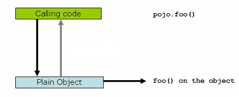
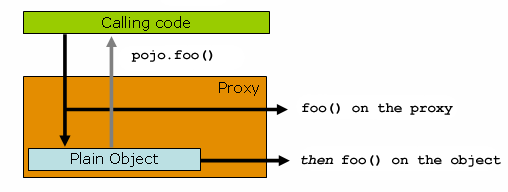

# 核心技术

version 6.0.8-SNAPSHOT

[Back to index](https://springdoc.cn/spring/index.html)

- [1. IoC 容器](https://springdoc.cn/spring/core.html#beans)
- [2. 资源（Resources）](https://springdoc.cn/spring/core.html#resources)
- [3. 验证、数据绑定和类型转换](https://springdoc.cn/spring/core.html#validation)
- [4. Spring 表达式语言（SpEL）](https://springdoc.cn/spring/core.html#expressions)
- [5. 用Spring进行面向切面的编程](https://springdoc.cn/spring/core.html#aop)
- [6. Spring AOP API](https://springdoc.cn/spring/core.html#aop-api)
- [7. Null安全（Null-safety）](https://springdoc.cn/spring/core.html#null-safety)
- [8. Data Buffer 和编解码器](https://springdoc.cn/spring/core.html#databuffers)
- [9. 日志（Logging）](https://springdoc.cn/spring/core.html#spring-jcl)
- [10. AOT 编译优化](https://springdoc.cn/spring/core.html#core.aot)
- [11. 附录](https://springdoc.cn/spring/core.html#core.appendix)

|      | 本站([springdoc.cn](https://springdoc.cn/))中的内容来源于 [spring.io](https://spring.io/) ，原始版权归属于 [spring.io](https://spring.io/)。由 [springdoc.cn](https://springdoc.cn/) 进行翻译，整理。可供个人学习、研究，未经许可，不得进行任何转载、商用或与之相关的行为。 商标声明：Spring 是 Pivotal Software, Inc. 在美国以及其他国家的商标。 |
| ---- | ------------------------------------------------------------ |
|      |                                                              |

这一部分的参考文档涵盖了所有与Spring框架绝对相关的技术。

其中最重要的是Spring框架的反转控制（IoC）容器。在对Spring框架的IoC容器进行彻底处理后，紧接着是对Spring面向切面编程（AOP）技术的全面介绍。Spring框架有自己的AOP框架，在概念上很容易理解，它成功地解决了Java企业编程中 AOP 要求的 80% 的最佳需求点。

此外，还介绍了Spring与AspectJ（目前Java企业领域中功能最丰富、最成熟的AOP实现）的集成情况。

AOT处理可以用来提前（ahead-of-time）优化你的应用程序。它通常用于使用GraalVM的原生镜像部署。

## 1. IoC 容器

本章介绍了Spring的反转控制（IoC）容器。

### 1.1. Spring IoC容器和Bean简介

本章介绍了Spring框架对反转控制（IoC）原则的实现。IoC也被称为依赖注入（DI）。它是一个过程，对象仅通过构造参数、工厂方法的参数或在对象实例被构造或从工厂方法返回后在其上设置的属性来定义其依赖关系（即它们与之合作的其他对象）。然后容器在创建 bean 时注入这些依赖关系。这个过程从根本上说是Bean本身通过使用直接构建类或诸如服务定位模式的机制来控制其依赖关系的实例化或位置的逆过程（因此被称为控制反转）。

`org.springframework.beans` 和 `org.springframework.context` 包是Spring Framework的IoC容器的基础。 [`BeanFactory`](https://docs.spring.io/spring-framework/docs/6.0.8-SNAPSHOT/javadoc-api/org/springframework/beans/factory/BeanFactory.html) 接口提供了一种高级配置机制，能够管理任何类型的对象。 [`ApplicationContext`](https://docs.spring.io/spring-framework/docs/6.0.8-SNAPSHOT/javadoc-api/org/springframework/context/ApplicationContext.html) 是 `BeanFactory` 的一个子接口。它增加了：

- 更容易与Spring的AOP功能集成
- Message resource 处理（用于国际化）
- 事件发布
- 应用层的特定上下文，如 `WebApplicationContext`，用于 web 应用

简而言之，`BeanFactory` 提供了配置框架和基本功能，而 `ApplicationContext` 则增加了更多的企业特定功能。`ApplicationContext` 是 `BeanFactory` 的一个完整的超集，在本章对Spring的IoC容器的描述中专门使用。关于使用 `BeanFactory` 而不是 `ApplicationContext` 的更多信息，请参见涵盖 [`BeanFactory` API](https://springdoc.cn/spring/core.html#beans-beanfactory) 的章节。

在Spring中，构成你的应用程序的骨干并由Spring IoC容器管理的对象被称为Bean。Bean是一个由Spring IoC容器实例化、组装和管理的对象。否则，Bean只是你的应用程序中众多对象中的一个。Bean以及它们之间的依赖关系都反映在容器使用的配置元数据中。

### 1.2. 容器概述

`org.springframework.context.ApplicationContext` 接口代表Spring IoC容器，负责实例化、配置和组装bean。容器通过读取配置元数据来获得关于要实例化、配置和组装哪些对象的指示。配置元数据以XML、Java注解或Java代码表示。它可以让你表达构成你的应用程序的对象以及这些对象之间丰富的相互依赖关系。

Spring提供了几个 `ApplicationContext` 接口的实现。在独立的应用程序中，创建 [`ClassPathXmlApplicationContext`](https://docs.spring.io/spring-framework/docs/6.0.8-SNAPSHOT/javadoc-api/org/springframework/context/support/ClassPathXmlApplicationContext.html) 或 [`FileSystemXmlApplicationContext`](https://docs.spring.io/spring-framework/docs/6.0.8-SNAPSHOT/javadoc-api/org/springframework/context/support/FileSystemXmlApplicationContext.html) 的实例很常见。虽然 XML 一直是定义配置元数据的传统格式，但你可以通过提供少量的 XML 配置来指示容器使用 Java 注解或代码作为元数据格式，以声明性地启用对这些额外元数据格式的支持。

在大多数应用场景中，不需要明确的用户代码来实例化Spring IoC容器的一个或多个实例。例如，在Web应用场景中，通常只需在应用程序的 `web.xml` 文件中编写8行（或更多）模板式的Web描述符就足够了（参见 [为web应用程序提供方便的 `ApplicationContext` 实例化](https://springdoc.cn/spring/core.html#context-create)）。如果你使用 [Spring Tools for Eclipse](https://spring.io/tools)（一个由Eclipse驱动的开发环境），你只需点击几下鼠标或按键就可以轻松创建这种模板配置。

下图显示了Spring工作方式的高层视图。你的应用程序类与配置元数据相结合，这样，在 `ApplicationContext` 被创建和初始化后，你就有了一个完全配置好的可执行系统或应用程序。


Figure 1. Spring IoC容器

#### 1.2.1. 配置元数据

如上图所示，Spring IoC容器消费一种配置元数据。这种配置元数据代表了你，作为一个应用开发者，如何告诉Spring容器在你的应用中实例化、配置和组装对象。

配置元数据传统上是以简单直观的XML格式提供的，这也是本章大部分内容用来传达Spring IoC容器的关键概念和特性。

|      | 基于XML的元数据并不是配置元数据的唯一允许形式。Spring IoC容器本身与这种配置元数据的实际编写格式是完全解耦的。如今，许多开发者为他们的Spring应用程序选择 [基于Java的配置](https://springdoc.cn/spring/core.html#beans-java)。 |
| ---- | ------------------------------------------------------------ |
|      |                                                              |

关于在Spring容器中使用其他形式的元数据的信息，请参见。

- [基于注解的配置](https://springdoc.cn/spring/core.html#beans-annotation-config): 使用基于注解的配置元数据定义Bean。
- [Java-based configuration](https://springdoc.cn/spring/core.html#beans-java): 通过使用Java而不是XML文件来定义你的应用类外部的Bean。要使用这些特性，请参阅 [`@Configuration`](https://docs.spring.io/spring-framework/docs/6.0.8-SNAPSHOT/javadoc-api/org/springframework/context/annotation/Configuration.html), [`@Bean`](https://docs.spring.io/spring-framework/docs/6.0.8-SNAPSHOT/javadoc-api/org/springframework/context/annotation/Bean.html), [`@Import`](https://docs.spring.io/spring-framework/docs/6.0.8-SNAPSHOT/javadoc-api/org/springframework/context/annotation/Import.html), 和 [`@DependsOn`](https://docs.spring.io/spring-framework/docs/6.0.8-SNAPSHOT/javadoc-api/org/springframework/context/annotation/DependsOn.html) 注解。

Spring的配置包括至少一个，通常是一个以上的Bean定义，容器必须管理这些定义。基于XML的配置元数据将这些Bean配置为顶层 `<beans/>` 元素内的 `<bean/>` 元素。Java配置通常使用 `@Configuration` 类中的 `@Bean` 注解的方法。

这些Bean的定义对应于构成你的应用程序的实际对象。通常，你会定义服务层对象、持久层对象（如存储库或数据访问对象（DAO））、表现对象（如Web控制器）、基础设施对象（如JPA `EntityManagerFactory`）、JMS队列等等。通常，人们不会在容器中配置细粒度的domain对象，因为创建和加载domain对象通常是 repository 和业务逻辑的责任。

下面的例子显示了基于XML的配置元数据的基本结构。

```xml
<?xml version="1.0" encoding="UTF-8"?>
<beans xmlns="http://www.springframework.org/schema/beans"
    xmlns:xsi="http://www.w3.org/2001/XMLSchema-instance"
    xsi:schemaLocation="http://www.springframework.org/schema/beans
        https://www.springframework.org/schema/beans/spring-beans.xsd">

    <bean id="..." class="...">  
        <!-- 这个bean的合作者和配置在这里 -->
    </bean>

    <bean id="..." class="...">
        <!-- c这个bean的合作者和配置在这里 -->
    </bean>

    <!-- 更多bean 定义在这里 -->

</beans>
```

|      | `id` 属性是一个字符串，用于识别单个Bean定义。        |
| ---- | ---------------------------------------------------- |
|      | `class` 属性定义了 Bean 的类型，并使用类的全路径名。 |

`id` 属性的值可以用来指代协作对象。本例中没有显示用于引用协作对象的XML。更多信息请参见 [依赖](https://springdoc.cn/spring/core.html#beans-dependencies)。

#### 1.2.2. 实例化一个容器

提供给 `ApplicationContext` 构造函数的一条或多条路径是资源字符串，它让容器从各种外部资源（如本地文件系统、Java `CLASSPATH` 等）加载配置元数据。

Java

```java
ApplicationContext context = new ClassPathXmlApplicationContext("services.xml", "daos.xml");
```

Kotlin

```kotlin
val context = ClassPathXmlApplicationContext("services.xml", "daos.xml")
```

|      | 在了解了Spring的IoC容器后，你可能想了解更多关于Spring的 `Resource` 抽象（如 [资源（Resources）](https://springdoc.cn/spring/core.html#resources) 中所述），它为从URI语法中定义的位置读取 InputStream 提供了方便的机制。特别是，`Resource` 路径被用来构建应用上下文，如 [Application Context 和资源路径](https://springdoc.cn/spring/core.html#resources-app-ctx) 中所述。 |
| ---- | ------------------------------------------------------------ |
|      |                                                              |

下面的例子显示了 service 对象（`services.xml`）配置文件。

```xml
<?xml version="1.0" encoding="UTF-8"?>
<beans xmlns="http://www.springframework.org/schema/beans"
    xmlns:xsi="http://www.w3.org/2001/XMLSchema-instance"
    xsi:schemaLocation="http://www.springframework.org/schema/beans
        https://www.springframework.org/schema/beans/spring-beans.xsd">

    <!-- services -->

    <bean id="petStore" class="org.springframework.samples.jpetstore.services.PetStoreServiceImpl">
        <property name="accountDao" ref="accountDao"/>
        <property name="itemDao" ref="itemDao"/>
        <!-- additional collaborators and configuration for this bean go here -->
    </bean>

    <!-- more bean definitions for services go here -->

</beans>
```

下面的例子显示了数据访问对象（data access object） `daos.xml` 文件。

```xml
<?xml version="1.0" encoding="UTF-8"?>
<beans xmlns="http://www.springframework.org/schema/beans"
    xmlns:xsi="http://www.w3.org/2001/XMLSchema-instance"
    xsi:schemaLocation="http://www.springframework.org/schema/beans
        https://www.springframework.org/schema/beans/spring-beans.xsd">

    <bean id="accountDao"
        class="org.springframework.samples.jpetstore.dao.jpa.JpaAccountDao">
        <!-- additional collaborators and configuration for this bean go here -->
    </bean>

    <bean id="itemDao" class="org.springframework.samples.jpetstore.dao.jpa.JpaItemDao">
        <!-- additional collaborators and configuration for this bean go here -->
    </bean>

    <!-- more bean definitions for data access objects go here -->

</beans>
```

在前面的例子中，服务层由 `PetStoreServiceImpl` 类和两个类型为 `JpaAccountDao` 和 `JpaItemDao` 的数据访问对象组成（基于JPA对象-关系映射标准）。`property name` 元素指的是 JavaBean 属性的名称，而 `ref` 元素指的是另一个Bean定义的名称。`id` 和 `ref` 元素之间的这种联系表达了协作对象之间的依赖关系。关于配置一个对象的依赖关系的细节，请看 [依赖](https://springdoc.cn/spring/core.html#beans-dependencies)。

##### 构建基于XML的配置元数据

让Bean的定义跨越多个XML文件可能很有用。通常情况下，每个单独的XML配置文件代表了你架构中的一个逻辑层或模块。

你可以使用 application context 构造函数从所有这些XML片段中加载Bean定义。这个构造函数需要多个 `Resource` 位置，如 [上一节](https://springdoc.cn/spring/core.html#beans-factory-instantiation) 所示。或者，使用一个或多个 `<import/>` 元素的出现来从另一个或多个文件中加载Bean定义。下面的例子展示了如何做到这一点。

```xml
<beans>
    <import resource="services.xml"/>
    <import resource="resources/messageSource.xml"/>
    <import resource="/resources/themeSource.xml"/>

    <bean id="bean1" class="..."/>
    <bean id="bean2" class="..."/>
</beans>
```

在前面的例子中，外部Bean定义从三个文件中加载：`services.xml`、`messageSource.xml` 和 `themeSource.xml`。所有的位置路径都是相对于进行导入的定义文件而言的，所以 `services.xml` 必须与进行导入的文件在同一目录或 classpath 位置，而 `messageSource.xml` 和 `themeSource.xml` 必须在导入文件的位置以下的 `resources` 位置。正如你所看到的，前导斜线会被忽略。然而，鉴于这些路径是相对的，最好不要使用斜线。被导入文件的内容，包括顶层的 `<beans/>` 元素，必须是有效的XML Bean定义，根据Spring Schema。

|      | 使用相对的 "../" 路径来引用父目录中的文件是可能的，但不推荐这样做。这样做会造成对当前应用程序之外的文件的依赖。特别是，这种引用不推荐用于 `classpath:` URL（例如， `classpath:../services.xml`），其中运行时解析过程选择 "最近的" classpath root，然后查找其父目录。Classpath配置的变化可能导致选择不同的、不正确的目录。你总是可以使用完全限定的资源位置而不是相对路径：例如，`file:C:/config/services.xml` 或 `classpath:/config/services.xml`。然而，请注意，你正在将你的应用程序的配置与特定的绝对位置相耦合。一般来说，最好是为这种绝对位置保留一个指示 - 例如，通过 "${…}" 占位符，在运行时针对JVM系统属性（system properties）进行解析。 |
| ---- | ------------------------------------------------------------ |
|      |                                                              |

命名空间本身提供了导入指令的功能。除了普通的Bean定义之外，更多的配置功能可以在Spring提供的一些XML命名空间中获得，例如，`context` 和 `util` 命名空间。

##### Groovy Bean Definition DSL

作为外部化配置元数据的另一个例子，Bean定义也可以用Spring的Groovy Bean Definition DSL来表达，正如Grails框架所知道的。通常情况下，这种配置存在于 ".groovy" 文件中，其结构如下例所示。

```groovy
beans {
    dataSource(BasicDataSource) {
        driverClassName = "org.hsqldb.jdbcDriver"
        url = "jdbc:hsqldb:mem:grailsDB"
        username = "sa"
        password = ""
        settings = [mynew:"setting"]
    }
    sessionFactory(SessionFactory) {
        dataSource = dataSource
    }
    myService(MyService) {
        nestedBean = { AnotherBean bean ->
            dataSource = dataSource
        }
    }
}
```

这种配置风格基本上等同于XML Bean定义，甚至支持Spring的XML配置命名空间。它还允许通过 `importBeans` 指令导入XML Bean定义文件。

#### 1.2.3. 使用容器

`ApplicationContext` 是一个高级工厂的接口，能够维护不同Bean及其依赖关系的注册表。通过使用方法 `T getBean(String name, Class<T> requiredType)`，你可以检索到Bean的实例。

`ApplicationContext` 可以让你读取Bean定义（definition）并访问它们，如下例所示。

Java

```java
// 创建和配置bean
ApplicationContext context = new ClassPathXmlApplicationContext("services.xml", "daos.xml");

// 检索配置的实例
PetStoreService service = context.getBean("petStore", PetStoreService.class);

// 使用配置的实例
List<String> userList = service.getUsernameList();
```

Kotlin

```kotlin
// 创建和配置bean
val context = ClassPathXmlApplicationContext("services.xml", "daos.xml")

// 检索配置的实例
val service = context.getBean<PetStoreService>("petStore")

// 使用配置的实例
var userList = service.getUsernameList()
```

通过Groovy配置，引导看起来非常相似。它有一个不同的 context 实现类，它能识别Groovy（但也能理解XML bean定义）。下面的例子显示了 Groovy 配置。

Java

```java
ApplicationContext context = new GenericGroovyApplicationContext("services.groovy", "daos.groovy");
```

Kotlin

```kotlin
val context = GenericGroovyApplicationContext("services.groovy", "daos.groovy")
```

最灵活的变体是 `GenericApplicationContext` 与 reader delegate 的结合—例如，与 `XmlBeanDefinitionReader` 一起用于XML文件，如下例所示。

Java

```java
GenericApplicationContext context = new GenericApplicationContext();
new XmlBeanDefinitionReader(context).loadBeanDefinitions("services.xml", "daos.xml");
context.refresh();
```

Kotlin

```kotlin
val context = GenericApplicationContext()
XmlBeanDefinitionReader(context).loadBeanDefinitions("services.xml", "daos.xml")
context.refresh()
```

你也可以将 `GroovyBeanDefinitionReader` 用于Groovy文件，如下例所示。

Java

```java
GenericApplicationContext context = new GenericApplicationContext();
new GroovyBeanDefinitionReader(context).loadBeanDefinitions("services.groovy", "daos.groovy");
context.refresh();
```

Kotlin

```kotlin
val context = GenericApplicationContext()
GroovyBeanDefinitionReader(context).loadBeanDefinitions("services.groovy", "daos.groovy")
context.refresh()
```

你可以在同一个 `ApplicationContext` 上混合和匹配这样的 reader delegate，从不同的配置源读取bean定义。

然后你可以使用 `getBean` 来检索Bean的实例。`ApplicationContext` 接口还有其他一些检索Bean的方法，但理想情况下，你的应用代码不应该使用这些方法。事实上，你的应用程序代码根本就不应该调用 `getBean()` 方法，因此对Spring的API根本就没有依赖性。例如，Spring与Web框架的集成为各种Web框架组件（如 controller 和JSF管理的Bean）提供了依赖注入，让你通过元数据（如autowiring注解）声明对特定Bean的依赖。

### 1.3. Bean 概览

一个Spring IoC容器管理着一个或多个Bean。这些Bean是用你提供给容器的配置元数据创建的（例如，以XML `<bean/>` 定义的形式）。

在容器本身中，这些Bean定义被表示为 `BeanDefinition` 对象，它包含（除其他信息外）以下元数据。

- 一个全路径类名：通常，被定义的Bean的实际实现类。
- Bean的行为配置元素，它说明了Bean在容器中的行为方式（scope、生命周期回调，等等）。
- 对其他Bean的引用，这些Bean需要做它的工作。这些引用也被称为合作者或依赖。
- 要在新创建的对象中设置的其他配置设置—例如，pool的大小限制或在管理连接池的Bean中使用的连接数。

这个元数据转化为构成每个Bean定义的一组属性。下表描述了这些属性。

| 属性                     | 解释…                                                        |
| :----------------------- | :----------------------------------------------------------- |
| Class                    | [实例化 Bean](https://springdoc.cn/spring/core.html#beans-factory-class) |
| Name                     | [Bean 命名](https://springdoc.cn/spring/core.html#beans-beanname) |
| Scope                    | [Bean Scope](https://springdoc.cn/spring/core.html#beans-factory-scopes) |
| Constructor arguments    | [依赖注入](https://springdoc.cn/spring/core.html#beans-factory-collaborators) |
| Properties               | [依赖注入](https://springdoc.cn/spring/core.html#beans-factory-collaborators) |
| Autowiring mode          | [注入协作者（Autowiring Collaborators）](https://springdoc.cn/spring/core.html#beans-factory-autowire) |
| Lazy initialization mode | [懒加载的Bean](https://springdoc.cn/spring/core.html#beans-factory-lazy-init) |
| Initialization method    | [初始化回调](https://springdoc.cn/spring/core.html#beans-factory-lifecycle-initializingbean) |
| Destruction method       | [销毁回调](https://springdoc.cn/spring/core.html#beans-factory-lifecycle-disposablebean) |

除了包含如何创建特定 Bean 的信息的 Bean 定义外，`ApplicationContext` 实现还允许注册在容器外（由用户）创建的现有对象。这是通过 `getBeanFactory()` 方法访问 `ApplicationContext` 的 `BeanFactory` 来实现的，该方法返回 `DefaultListableBeanFactory` 实现。`DefaultListableBeanFactory` 通过 `registerSingleton(..)` 和 `registerBeanDefinition(..)` 方法支持这种注册。然而，典型的应用程序只与通过常规Bean定义元数据定义的Bean一起工作。

|      | Bean 元数据和手动提供的单体实例需要尽早注册，以便容器在自动注入和其它内省步骤中正确推导它们。虽然在某种程度上支持覆盖现有的元数据和现有的单体实例，但 **官方不支持在运行时注册新的Bean**（与对工厂的实时访问同时进行），这可能会导致并发访问异常、Bean容器中的不一致状态，或者两者都有。 |
| ---- | ------------------------------------------------------------ |
|      |                                                              |

#### 1.3.1. Bean 命名

每个Bean都有一个或多个标识符（identifier）。这些标识符在承载Bean的容器中必须是唯一的。一个Bean通常只有一个标识符。然而，如果它需要一个以上的标识符，多余的标识符可以被视为别名。

在基于XML的配置元数据中，你可以使用 `id` 属性、`name` 属性或两者来指定Bean标识符。`id` 属性允许你精确地指定一个 `id`。传统上，这些名字是字母数字（'myBean'、'someService’等），但它们也可以包含特殊字符。如果你想为Bean引入其他别名，你也可以在 `name` 属性中指定它们，用逗号（`,`）、分号（`;`）或空格分隔。尽管 `id` 属性被定义为 `xsd:string` 类型，但 bean id 的唯一性是由容器强制执行的，尽管不是由 XML 解析器执行。

你不需要为Bean提供一个 `name` 或 `id`。如果你不明确地提供 `name` 或 `id`，容器将为该 Bean 生成一个唯一的名称。然而，如果你想通过使用 `ref` 元素或服务定位器风格的查找来引用该 bean 的名称，你必须提供一个名称。不提供名字的动机与使用 [内部Bean](https://springdoc.cn/spring/core.html#beans-inner-beans) 和 [注入协作者（Autowiring Collaborators）](https://springdoc.cn/spring/core.html#beans-factory-autowire) 有关。

Bean的命名规则

惯例是在命名Bean时使用标准的Java惯例来命名实例字段名。也就是说，Bean的名字以小写字母开始，然后以驼峰字母开头。这种名称的例子包括 `accountManager`、`accountService`、`userDao`、`loginController` 等等。

统一命名Bean使你的配置更容易阅读和理解。另外，如果你使用Spring AOP，在对一组按名称相关的Bean应用 advice 时，也有很大的帮助。

|      | 在classpath中的组件扫描（component scanning），Spring为未命名的组件生成Bean名称，遵循前面描述的规则：基本上，取简单的类名并将其初始字符变成小写。然而，在（不寻常的）特殊情况下，当有一个以上的字符，并且第一个和第二个字符都是大写时，原来的大小写会被保留下来。这些规则与 `java.beans.Introspector.decapitalize`（Spring在此使用）所定义的规则相同。 |
| ---- | ------------------------------------------------------------ |
|      |                                                              |

##### 在 Bean Definition 之外对Bean进行别名

在 Bean 定义中，你可以为Bean提供一个以上的名字，通过使用由 `id` 属性指定的最多一个名字和 `name` 属性中任意数量的其他名字的组合。这些名字可以是同一个Bean的等效别名，在某些情况下很有用，比如让应用程序中的每个组件通过使用一个特定于该组件本身的Bean名字来引用一个共同的依赖关系。

然而，在实际定义Bean的地方指定所有别名并不总是足够的。有时，为一个在其他地方定义的Bean引入别名是可取的。这种情况通常发生在大型系统中，配置被分割到每个子系统中，每个子系统都有自己的对象定义集。在基于XML的配置元数据中，你可以使用 `<alias/>` 元素来实现这一点。下面的例子展示了如何做到这一点。

```xml
<alias name="fromName" alias="toName"/>
```

在这种情况下，一个名为 `fromName` 的bean（在同一个容器中）在使用这个别名定义后，也可以被称为 `toName`。

例如，子系统A的配置元数据可以引用一个名为 `subsystemA-dataSource` 的数据源。子系统B的配置元数据可以引用一个名为 `subsystemB-dataSource` 的数据源。当组成使用这两个子系统的主应用程序时，主应用程序以 `myApp-dataSource` 的名字来引用数据源。为了让这三个名字都指代同一个对象，你可以在配置元数据中添加以下别名定义。

```xml
<alias name="myApp-dataSource" alias="subsystemA-dataSource"/>
<alias name="myApp-dataSource" alias="subsystemB-dataSource"/>
```

现在，每个组件和主应用程序都可以通过一个独特的名称来引用dataSource，并保证不与任何其他定义冲突（有效地创建了一个命名空间），但它们引用的是同一个bean。

Java 配置

如果你使用Java配置，`@Bean` 注解可以被用来提供别名。详情请参见 [使用 `@Bean` 注解](https://springdoc.cn/spring/core.html#beans-java-bean-annotation)。

#### 1.3.2. 实例化 Bean

bean 定义（definition）本质上是创建一个或多个对象的“配方”。容器在被要求时查看命名的Bean的“配方”，并使用该Bean定义所封装的配置元数据来创建（或获取）一个实际的对象。

如果你使用基于XML的配置元数据，你要在 `<bean/>` 元素的 `class` 属性中指定要实例化的对象的类型（或class）。这个 `class` 属性（在内部是 `BeanDefinition` 实例的 `Class` 属性）通常是强制性的。（关于例外情况，请看 [用实例工厂方法进行实例化](https://springdoc.cn/spring/core.html#beans-factory-class-instance-factory-method) 和 [Bean 定义（Definition）的继承](https://springdoc.cn/spring/core.html#beans-child-bean-definitions)）。你可以以两种方式之一使用 `Class` 属性。

- 通常，在容器本身通过反射式地调用构造函数直接创建Bean的情况下，指定要构造的Bean类，有点相当于Java代码中的 `new` 操作符。
- 在不太常见的情况下，即容器在一个类上调用 `static` 工厂方法来创建 bean 时，要指定包含被调用的 `static` 工厂方法的实际类。从 `static` 工厂方法的调用中返回的对象类型可能是同一个类或完全是另一个类。

嵌套类名

如果你想为一个嵌套类配置一个Bean定义（definition），你可以使用嵌套类的二进制名称或源（source）名称。

例如，如果你在 `com.example` 包中有一个叫做 `SomeThing` 的类，而这个 `SomeThing` 类有一个叫做 `OtherThing` 的静态嵌套类，它们可以用美元符号（`$`）或点（`.`）分开。所以在Bean定义中的 `class` 属性的值将是 `com.example.SomeThing$OtherThing` 或 `com.example.SomeThing.OtherThing`。

##### 用构造函数进行实例化

当你用构造函数的方法创建一个Bean时，所有普通的类都可以被Spring使用并与之兼容。也就是说，被开发的类不需要实现任何特定的接口，也不需要以特定的方式进行编码。只需指定Bean类就足够了。然而，根据你对该特定Bean使用的IoC类型，你可能需要一个默认（空）构造函数。

Spring IoC容器几乎可以管理任何你希望它管理的类。它并不局限于管理真正的JavaBean。大多数Spring用户更喜欢真正的JavaBean，它只有一个默认的（无参数）构造函数，以及按照容器中的属性建模的适当的setter和getter。你也可以在你的容器中拥有更多奇特的非bean风格的类。例如，如果你需要使用一个绝对不遵守JavaBean规范的传统连接池，Spring也可以管理它。

通过基于XML的配置元数据，你可以按以下方式指定你的bean类。

```xml
<bean id="exampleBean" class="examples.ExampleBean"/>

<bean name="anotherExample" class="examples.ExampleBeanTwo"/>
```

关于向构造函数提供参数（如果需要）和在对象被构造后设置对象实例属性的机制的详细信息，请参见 [依赖注入](https://springdoc.cn/spring/core.html#beans-factory-collaborators)。

##### 用静态工厂方法进行实例化

在定义一个用静态工厂方法创建的Bean时，使用 `class` 属性来指定包含 `static` 工厂方法的类，并使用名为 `factory-method` 的属性来指定工厂方法本身的名称。你应该能够调用这个方法（有可选的参数，如后文所述）并返回一个活的对象，随后该对象被视为通过构造函数创建的。这种Bean定义的一个用途是在遗留代码中调用 `static` 工厂。

下面的Bean定义规定，Bean将通过调用工厂方法来创建。该定义并没有指定返回对象的类型（class），而是指定了包含工厂方法的类。在这个例子中，`createInstance()` 方法必须是一个 `static` 方法。下面的例子显示了如何指定一个工厂方法。

```xml
<bean id="clientService"
    class="examples.ClientService"
    factory-method="createInstance"/>
```

下面的例子显示了一个可以与前面的Bean定义（definition）一起工作的类。

Java

```java
public class ClientService {
    private static ClientService clientService = new ClientService();
    private ClientService() {}

    public static ClientService createInstance() {
        return clientService;
    }
}
```

Kotlin

```kotlin
class ClientService private constructor() {
    companion object {
        private val clientService = ClientService()
        @JvmStatic
        fun createInstance() = clientService
    }
}
```

关于向工厂方法提供（可选）参数以及在对象从工厂返回后设置对象实例属性的机制，详见 [依赖和配置详解](https://springdoc.cn/spring/core.html#beans-factory-properties-detailed)。

##### 用实例工厂方法进行实例化

与 [通过静态工厂方法进行的实例化](https://springdoc.cn/spring/core.html#beans-factory-class-static-factory-method) 类似，用实例工厂方法进行的实例化从容器中调用现有 bean 的非静态方法来创建一个新的 bean。要使用这种机制，请将 `class` 属性留空，并在 `factory-bean` 属性中指定当前（或父代或祖代）容器中的一个 Bean 的名称，该容器包含要被调用来创建对象的实例方法。用 `factory-method` 属性设置工厂方法本身的名称。下面的例子显示了如何配置这样一个Bean。

```xml
<!-- the factory bean, which contains a method called createInstance() -->
<bean id="serviceLocator" class="examples.DefaultServiceLocator">
    <!-- inject any dependencies required by this locator bean -->
</bean>

<!-- the bean to be created via the factory bean -->
<bean id="clientService"
    factory-bean="serviceLocator"
    factory-method="createClientServiceInstance"/>
```

下面的例子显示了相应的类。

Java

```java
public class DefaultServiceLocator {

    private static ClientService clientService = new ClientServiceImpl();

    public ClientService createClientServiceInstance() {
        return clientService;
    }
}
```

Kotlin

```kotlin
class DefaultServiceLocator {
    companion object {
        private val clientService = ClientServiceImpl()
    }
    fun createClientServiceInstance(): ClientService {
        return clientService
    }
}
```

一个工厂类也可以容纳一个以上的工厂方法，如下例所示。

```xml
<bean id="serviceLocator" class="examples.DefaultServiceLocator">
    <!-- inject any dependencies required by this locator bean -->
</bean>

<bean id="clientService"
    factory-bean="serviceLocator"
    factory-method="createClientServiceInstance"/>

<bean id="accountService"
    factory-bean="serviceLocator"
    factory-method="createAccountServiceInstance"/>
```

下面的例子显示了相应的类。

Java

```java
public class DefaultServiceLocator {

    private static ClientService clientService = new ClientServiceImpl();

    private static AccountService accountService = new AccountServiceImpl();

    public ClientService createClientServiceInstance() {
        return clientService;
    }

    public AccountService createAccountServiceInstance() {
        return accountService;
    }
}
```

Kotlin

```kotlin
class DefaultServiceLocator {
    companion object {
        private val clientService = ClientServiceImpl()
        private val accountService = AccountServiceImpl()
    }

    fun createClientServiceInstance(): ClientService {
        return clientService
    }

    fun createAccountServiceInstance(): AccountService {
        return accountService
    }
}
```

这种方法表明，工厂Bean本身可以通过依赖注入（DI）进行管理和配置。请看详细的 [依赖和配置](https://springdoc.cn/spring/core.html#beans-factory-properties-detailed)。

|      | 在Spring文档中，“factory bean” 是指在Spring容器中配置的Bean，它通过 [实例](https://springdoc.cn/spring/core.html#beans-factory-class-instance-factory-method) 或 [静态](https://springdoc.cn/spring/core.html#beans-factory-class-static-factory-method)工厂方法创建对象。相比之下，`FactoryBean`（注意大写字母）是指Spring特定的[`FactoryBean`](https://springdoc.cn/spring/core.html#beans-factory-extension-factorybean) 实现类。 |
| ---- | ------------------------------------------------------------ |
|      |                                                              |

##### 确定Bean的运行时类型

要确定一个特定Bean的运行时类型是不容易的。在Bean元数据定义中指定的类只是一个初始的类引用，可能与已声明的工厂方法相结合，或者是一个 `FactoryBean` 类，这可能导致Bean的运行时类型不同，或者在实例级工厂方法的情况下根本没有被设置（而是通过指定的 `factory-bean` 名称来解决）。此外，AOP代理可能会用基于接口的代理来包装Bean实例，对目标Bean的实际类型（只是其实现的接口）的暴露有限。

要了解某个特定Bean的实际运行时类型，推荐的方法是对指定的Bean名称进行 `BeanFactory.getType` 调用。这将考虑到上述所有情况，并返回 `BeanFactory.getBean` 调用将为同一Bean名称返回的对象类型。

### 1.4. 依赖

一个典型的企业应用程序并不是由单一的对象（或Spring术语中的bean）组成的。即使是最简单的应用也有一些对象，它们一起工作，呈现出最终用户所看到的连贯的应用。下一节将解释你如何从定义一些单独的Bean定义到一个完全实现的应用，在这个应用中，各对象相互协作以实现一个目标。

#### 1.4.1. 依赖注入

依赖注入（DI）是一个过程，对象仅通过构造参数、工厂方法的参数或在对象实例被构造或从工厂方法返回后在其上设置的属性来定义它们的依赖（即与它们一起工作的其它对象）。然后，容器在创建 bean 时注入这些依赖。这个过程从根本上说是Bean本身通过使用类的直接构造或服务定位模式来控制其依赖的实例化或位置的逆过程（因此被称为控制反转）。

采用DI原则，代码会更干净，当对象被提供其依赖时，解耦会更有效。对象不会查找其依赖，也不知道依赖的位置或类别。因此，你的类变得更容易测试，特别是当依赖是在接口或抽象基类上时，这允许在单元测试中使用stub或mock实现。

DI有两个主要的变体。 [基于构造器的依赖注入](https://springdoc.cn/spring/core.html#beans-constructor-injection) 和 [基于setter的依赖注入](https://springdoc.cn/spring/core.html#beans-setter-injection)。

##### 基于构造器的依赖注入

基于构造函数的 DI 是通过容器调用带有许多参数的构造函数来完成的，每个参数代表一个依赖。调用带有特定参数的 `static` 工厂方法来构造 bean 几乎是等价的，本讨论对构造函数的参数和 `static` 工厂方法的参数进行类似处理。下面的例子显示了一个只能用构造函数注入的依赖注入的类。

Java

```java
public class SimpleMovieLister {

    // the SimpleMovieLister has a dependency on a MovieFinder
    private final MovieFinder movieFinder;

    // a constructor so that the Spring container can inject a MovieFinder
    public SimpleMovieLister(MovieFinder movieFinder) {
        this.movieFinder = movieFinder;
    }

    // business logic that actually uses the injected MovieFinder is omitted...
}
```

Kotlin

```kotlin
// a constructor so that the Spring container can inject a MovieFinder
class SimpleMovieLister(private val movieFinder: MovieFinder) {
    // business logic that actually uses the injected MovieFinder is omitted...
}
```

请注意，这个类并没有什么特别之处。它是一个POJO，对容器的特定接口、基类或注解没有依赖。

###### 构造函数参数解析

构造函数参数解析匹配是通过使用参数的类型进行的。如果 bean 定义中的构造器参数不存在潜在的歧义，那么构造器参数在 bean 定义中的定义顺序就是这些参数在 bean 被实例化时被提供给适当的构造器的顺序。考虑一下下面这个类。

Java

```java
package x.y;

public class ThingOne {

    public ThingOne(ThingTwo thingTwo, ThingThree thingThree) {
        // ...
    }
}
```

Kotlin

```kotlin
package x.y

class ThingOne(thingTwo: ThingTwo, thingThree: ThingThree)
```

假设 `ThingTwo` 和 `ThingThree` 类没有继承关系，就不存在潜在的歧义。因此，下面的配置可以正常工作，你不需要在 `<constructor-arg/>` 元素中明确指定构造函数参数的索引或类型。

```xml
<beans>
    <bean id="beanOne" class="x.y.ThingOne">
        <constructor-arg ref="beanTwo"/>
        <constructor-arg ref="beanThree"/>
    </bean>

    <bean id="beanTwo" class="x.y.ThingTwo"/>

    <bean id="beanThree" class="x.y.ThingThree"/>
</beans>
```

当引用另一个Bean时，类型是已知的，并且可以进行匹配（就像前面的例子那样）。当使用一个简单的类型时，比如 `<value>true</value>`，Spring不能确定值的类型，所以在没有帮助的情况下不能通过类型进行匹配。考虑一下下面这个类。

Java

```java
package examples;

public class ExampleBean {

    // Number of years to calculate the Ultimate Answer
    private final int years;

    // The Answer to Life, the Universe, and Everything
    private final String ultimateAnswer;

    public ExampleBean(int years, String ultimateAnswer) {
        this.years = years;
        this.ultimateAnswer = ultimateAnswer;
    }
}
```

Kotlin

```kotlin
package examples

class ExampleBean(
    private val years: Int, // Number of years to calculate the Ultimate Answer
    private val ultimateAnswer: String // The Answer to Life, the Universe, and Everything
)
```

构造函数参数类型匹配

在前面的情况下，如果你通过使用 `type` 属性显式地指定构造函数参数的类型，容器就可以使用简单类型的类型匹配，如下例所示。

```xml
<bean id="exampleBean" class="examples.ExampleBean">
    <constructor-arg type="int" value="7500000"/>
    <constructor-arg type="java.lang.String" value="42"/>
</bean>
```

构造函数参数索引

你可以使用 `index` 属性来明确指定构造函数参数的索引，如下例所示。

```xml
<bean id="exampleBean" class="examples.ExampleBean">
    <constructor-arg index="0" value="7500000"/>
    <constructor-arg index="1" value="42"/>
</bean>
```

除了解决多个简单值的歧义外，指定一个索引还可以解决构造函数有两个相同类型的参数的歧义。

|      | 索引（下标）从0开始。 |
| ---- | --------------------- |
|      |                       |

构造函数参数名

你也可以使用构造函数的参数名称来进行消歧，如下面的例子所示。

```xml
<bean id="exampleBean" class="examples.ExampleBean">
    <constructor-arg name="years" value="7500000"/>
    <constructor-arg name="ultimateAnswer" value="42"/>
</bean>
```

请记住，要使这一方法开箱即用，你的代码在编译时必须启用debug标志，以便Spring能够从构造函数中查找参数名称。如果你不能或不想用debug标志编译你的代码，你可以使用 [@ConstructorProperties](https://download.oracle.com/javase/8/docs/api/java/beans/ConstructorProperties.html) JDK注解来明确命名你的构造函数参数。这样一来，示例类就得如下。

Java

```java
package examples;

public class ExampleBean {

    // Fields omitted

    @ConstructorProperties({"years", "ultimateAnswer"})
    public ExampleBean(int years, String ultimateAnswer) {
        this.years = years;
        this.ultimateAnswer = ultimateAnswer;
    }
}
```

Kotlin

```kotlin
package examples

class ExampleBean
@ConstructorProperties("years", "ultimateAnswer")
constructor(val years: Int, val ultimateAnswer: String)
```

##### 基于Setter的依赖注入

基于 Setter 的 DI 是通过容器在调用无参数的构造函数或无参数的 `static` 工厂方法来实例化你的 bean 之后调用 Setter 方法来实现的。

下面的例子显示了一个只能通过使用纯 setter 注入的类的依赖注入。这个类是传统的Java。它是一个POJO，对容器的特定接口、基类（base class）或注解没有依赖。

Java

```java
public class SimpleMovieLister {

    // the SimpleMovieLister has a dependency on the MovieFinder
    private MovieFinder movieFinder;

    // a setter method so that the Spring container can inject a MovieFinder
    public void setMovieFinder(MovieFinder movieFinder) {
        this.movieFinder = movieFinder;
    }

    // business logic that actually uses the injected MovieFinder is omitted...
}
```

Kotlin

```kotlin
class SimpleMovieLister {

    // a late-initialized property so that the Spring container can inject a MovieFinder
    lateinit var movieFinder: MovieFinder

    // business logic that actually uses the injected MovieFinder is omitted...
}
```

`ApplicationContext` 支持它所管理的Bean的基于构造器和基于setter的DI。它还支持在一些依赖已经通过构造器方法注入后的基于setter的DI。你以 `BeanDefinition` 的形式配置依赖关系，你将其与 `PropertyEditor` 实例一起使用，将属性从一种格式转换为另一种。然而，大多数Spring用户并不直接使用这些类（即以编程方式），而是使用XML Bean定义、注解组件（即用 `@Component`、 `@Controller` 等注解的类），或基于Java的 `@Configuration` 类中的 `@Bean` 方法。然后这些来源在内部被转换为 `BeanDefinition` 的实例，并用于加载整个Spring IoC容器实例。

基于构造器的DI还是基于setter的DI？

由于你可以混合使用基于构造函数的DI和基于setter的DI，一个好的经验法则是对强制依赖使用构造函数，对可选依赖使用setter方法或配置方法。请注意，在setter方法上使用 [@Autowired](https://springdoc.cn/spring/core.html#beans-autowired-annotation) 注解可以使属性成为必须的依赖；然而，带有参数程序化验证的构造器注入是更好的。

Spring团队通常提倡构造函数注入，因为它可以让你将应用组件实现为不可变的对象，并确保所需的依赖不为 `null`。此外，构造函数注入的组件总是以完全初始化的状态返回给客户端（调用）代码。顺便提一下，大量的构造函数参数是一种不好的代码气味，意味着该类可能有太多的责任，应该重构以更好地解决适当的分离问题。

Setter注入主要应该只用于在类中可以分配合理默认值的可选依赖。否则，必须在代码使用依赖的所有地方进行非null值检查。Setter注入的一个好处是，Setter方法使该类的对象可以在以后重新配置或重新注入。因此，通过 [JMX MBean](https://springdoc.cn/spring/integration.html#jmx) 进行管理是setter注入的一个引人注目的用例。

对于一个特定的类，使用最合理的DI风格。有时，在处理你没有源代码的第三方类时，你会做出选择。例如，如果一个第三方类没有暴露任何setter方法，那么构造函数注入可能是唯一可用的DI形式。

##### 依赖的解析过程

容器按如下方式执行 bean 依赖解析。

- `ApplicationContext` 是用描述所有bean的配置元数据创建和初始化的。配置元数据可以由XML、Java代码或注解来指定。
- 对于每个Bean来说，它的依赖是以属性、构造函数参数或静态工厂方法的参数（如果你用它代替正常的构造函数）的形式表达的。在实际创建Bean时，这些依赖被提供给Bean。
- 每个属性或构造函数参数都是要设置的值的实际定义，或对容器中另一个Bean的引用。
- 每个作为值的属性或构造函数参数都会从其指定格式转换为该属性或构造函数参数的实际类型。默认情况下，Spring 可以将以字符串格式提供的值转换为所有内置类型，如 `int`、`long`、`String`、`boolean` 等等。

当容器被创建时，Spring容器会验证每个Bean的配置。然而，在实际创建Bean之前，Bean的属性本身不会被设置。当容器被创建时，那些具有单例作用域并被设置为预实例化的Bean（默认）被创建。作用域在 [Bean Scope](https://springdoc.cn/spring/core.html#beans-factory-scopes) 中定义。否则，Bean只有在被请求时才会被创建。创建 bean 有可能导致创建 bean 图（graph），因为 bean 的依赖关系和它的依赖关系（等等）被创建和分配。请注意，这些依赖关系之间的解析不匹配可能会出现得很晚—也就是说，在第一次创建受影响的Bean时。

循环依赖

如果你使用主要的构造函数注入，就有可能产生一个无法解决的循环依赖情况。

比如说。类A通过构造函数注入需要类B的一个实例，而类B通过构造函数注入需要类A的一个实例。如果你将A类和B类的Bean配置为相互注入，Spring IoC容器会在运行时检测到这种循环引用，并抛出一个 `BeanCurrentlyInCreationException`。

一个可能的解决方案是编辑一些类的源代码，使其通过setter而不是构造器进行配置。或者，避免构造器注入，只使用setter注入。换句话说，虽然不推荐这样做，但你可以用setter注入来配置循环依赖关系。

与典型的情况（没有循环依赖关系）不同，Bean A和Bean B之间的循环依赖关系迫使其中一个Bean在被完全初始化之前被注入到另一个Bean中（一个典型的鸡生蛋蛋生鸡的场景）。

一般来说，你可以相信Spring会做正确的事情。它在容器加载时检测配置问题，例如对不存在的bean的引用和循环依赖。在实际创建Bean时，Spring尽可能晚地设置属性和解析依赖关系。这意味着，当你请求一个对象时，如果在创建该对象或其某个依赖关系时出现问题，已经正确加载的Spring容器就会产生一个异常—例如，Bean由于缺少或无效的属性而抛出一个异常。这种对某些配置问题的潜在延迟可见性是 `ApplicationContext` 实现默认预置单例Bean的原因。在实际需要之前创建这些Bean需要付出一些前期时间和内存的代价，当 `ApplicationContext` 被创建时，你会发现配置问题，而不是后来。你仍然可以覆盖这个默认行为，这样单例Bean就会懒加载地初始化，而不是急切地预实例化。

如果不存在循环依赖关系，当一个或多个协作（Collaborate） Bean被注入到依赖Bean中时，每个协作Bean在被注入到依赖Bean中之前被完全配置。这意味着，如果Bean A对Bean B有依赖，Spring IoC容器会在调用Bean A的setter方法之前完全配置Bean B。换句话说，Bean被实例化（如果它不是预先实例化的单例），其依赖被设置，相关的生命周期方法（如 [配置的 init 方法](https://springdoc.cn/spring/core.html#beans-factory-lifecycle-initializingbean) 或 [InitializingBean 回调方法](https://springdoc.cn/spring/core.html#beans-factory-lifecycle-initializingbean)）被调用。

##### 依赖注入的例子

下面的例子将基于XML的配置元数据用于基于setter的DI。一个Spring XML配置文件的一小部分指定了一些Bean的定义，如下所示。

```xml
<bean id="exampleBean" class="examples.ExampleBean">
    <!-- setter injection using the nested ref element -->
    <property name="beanOne">
        <ref bean="anotherExampleBean"/>
    </property>

    <!-- setter injection using the neater ref attribute -->
    <property name="beanTwo" ref="yetAnotherBean"/>
    <property name="integerProperty" value="1"/>
</bean>

<bean id="anotherExampleBean" class="examples.AnotherBean"/>
<bean id="yetAnotherBean" class="examples.YetAnotherBean"/>
```

下面的例子显示了相应的 `ExampleBean` 类。

Java

```java
public class ExampleBean {

    private AnotherBean beanOne;

    private YetAnotherBean beanTwo;

    private int i;

    public void setBeanOne(AnotherBean beanOne) {
        this.beanOne = beanOne;
    }

    public void setBeanTwo(YetAnotherBean beanTwo) {
        this.beanTwo = beanTwo;
    }

    public void setIntegerProperty(int i) {
        this.i = i;
    }
}
```

Kotlin

```kotlin
class ExampleBean {
    lateinit var beanOne: AnotherBean
    lateinit var beanTwo: YetAnotherBean
    var i: Int = 0
}
```

在前面的例子中，setter被声明为与XML文件中指定的属性相匹配。下面的例子使用基于构造函数的DI。

```xml
<bean id="exampleBean" class="examples.ExampleBean">
    <!-- constructor injection using the nested ref element -->
    <constructor-arg>
        <ref bean="anotherExampleBean"/>
    </constructor-arg>

    <!-- constructor injection using the neater ref attribute -->
    <constructor-arg ref="yetAnotherBean"/>

    <constructor-arg type="int" value="1"/>
</bean>

<bean id="anotherExampleBean" class="examples.AnotherBean"/>
<bean id="yetAnotherBean" class="examples.YetAnotherBean"/>
```

下面的例子显示了相应的 `ExampleBean` 类。

Java

```java
public class ExampleBean {

    private AnotherBean beanOne;

    private YetAnotherBean beanTwo;

    private int i;

    public ExampleBean(
        AnotherBean anotherBean, YetAnotherBean yetAnotherBean, int i) {
        this.beanOne = anotherBean;
        this.beanTwo = yetAnotherBean;
        this.i = i;
    }
}
```

Kotlin

```kotlin
class ExampleBean(
        private val beanOne: AnotherBean,
        private val beanTwo: YetAnotherBean,
        private val i: Int)
```

在 bean 定义中指定的构造器参数被用作 `ExampleBean` 的构造器参数。

现在考虑这个例子的一个变体，即不使用构造函数，而是让Spring调用一个 `static` 工厂方法来返回对象的实例。

```xml
<bean id="exampleBean" class="examples.ExampleBean" factory-method="createInstance">
    <constructor-arg ref="anotherExampleBean"/>
    <constructor-arg ref="yetAnotherBean"/>
    <constructor-arg value="1"/>
</bean>

<bean id="anotherExampleBean" class="examples.AnotherBean"/>
<bean id="yetAnotherBean" class="examples.YetAnotherBean"/>
```

下面的例子显示了相应的 `ExampleBean` 类。

Java

```java
public class ExampleBean {

    // a private constructor
    private ExampleBean(...) {
        ...
    }

    // a static factory method; the arguments to this method can be
    // considered the dependencies of the bean that is returned,
    // regardless of how those arguments are actually used.
    public static ExampleBean createInstance (
        AnotherBean anotherBean, YetAnotherBean yetAnotherBean, int i) {

        ExampleBean eb = new ExampleBean (...);
        // some other operations...
        return eb;
    }
}
```

Kotlin

```kotlin
class ExampleBean private constructor() {
    companion object {
        // a static factory method; the arguments to this method can be
        // considered the dependencies of the bean that is returned,
        // regardless of how those arguments are actually used.
        @JvmStatic
        fun createInstance(anotherBean: AnotherBean, yetAnotherBean: YetAnotherBean, i: Int): ExampleBean {
            val eb = ExampleBean (...)
            // some other operations...
            return eb
        }
    }
}
```

`static` 工厂方法的参数由 `<constructor-arg/>` 元素提供，与实际使用的构造函数完全相同。被工厂方法返回的类的类型不一定与包含 `static` 工厂方法的类的类型相同（尽管在这个例子中，它是相同的）。实例（非静态）工厂方法可以以基本相同的方式使用（除了使用 `factory-bean` 属性而不是 `class` 属性），所以我们在此不讨论这些细节。

#### 1.4.2. 依赖和配置的细节

正如 [上一节](https://springdoc.cn/spring/core.html#beans-factory-collaborators) 所述，你可以将Bean属性和构造函数参数定义为对其他托管Bean（协作者）的引用，或者定义为内联的值。Spring的基于XML的配置元数据支持 `<property/>` 和 `<constructor-arg/>` 元素中的子元素类型，以达到这个目的。

##### 字面值 (基本类型、 String 等)

`<property/>` 元素的 `value` 属性将属性或构造函数参数指定为人类可读的字符串表示。Spring 的 [转换服务](https://springdoc.cn/spring/core.html#core-convert-ConversionService-API) 被用来将这些值从 `String` 转换成属性或参数的实际类型。下面的例子显示了各种值的设置。

```xml
<bean id="myDataSource" class="org.apache.commons.dbcp.BasicDataSource" destroy-method="close">
    <!-- results in a setDriverClassName(String) call -->
    <property name="driverClassName" value="com.mysql.jdbc.Driver"/>
    <property name="url" value="jdbc:mysql://localhost:3306/mydb"/>
    <property name="username" value="root"/>
    <property name="password" value="misterkaoli"/>
</bean>
```

下面的例子使用 [p-namespace](https://springdoc.cn/spring/core.html#beans-p-namespace) 来实现更简洁的XML配置。

```xml
<beans xmlns="http://www.springframework.org/schema/beans"
    xmlns:xsi="http://www.w3.org/2001/XMLSchema-instance"
    xmlns:p="http://www.springframework.org/schema/p"
    xsi:schemaLocation="http://www.springframework.org/schema/beans
    https://www.springframework.org/schema/beans/spring-beans.xsd">

    <bean id="myDataSource" class="org.apache.commons.dbcp.BasicDataSource"
        destroy-method="close"
        p:driverClassName="com.mysql.jdbc.Driver"
        p:url="jdbc:mysql://localhost:3306/mydb"
        p:username="root"
        p:password="misterkaoli"/>

</beans>
```

前面的XML更简洁。然而，除非你使用的IDE（如 [IntelliJ IDEA](https://www.jetbrains.com/idea/) 或 [Spring Tools for Eclipse](https://spring.io/tools)）支持在你创建Bean定义时自动补全属性，否则错别字会在运行时而非设计时发现。强烈建议使用这样的IDE帮助。

你也可以配置一个 `java.util.Properties` 实例，如下所示。

```xml
<bean id="mappings"
    class="org.springframework.context.support.PropertySourcesPlaceholderConfigurer">

    <!-- typed as a java.util.Properties -->
    <property name="properties">
        <value>
            jdbc.driver.className=com.mysql.jdbc.Driver
            jdbc.url=jdbc:mysql://localhost:3306/mydb
        </value>
    </property>
</bean>
```

Spring容器通过使用 JavaBean 的 `PropertyEditor` 机制将 `<value/>` 元素中的文本转换为 `java.util.Properties` 实例。这是一个很好的捷径，也是Spring团队倾向于使用嵌套的 `<value/>` 元素而不是 `value` 属性风格的几个地方之一。

###### `idref` 元素

`idref` 元素仅仅是将容器中另一个 bean 的 `id`（一个字符串值—不是引用）传递给 `<constructor-arg/>` 或 `<property/>` 元素的一种防错方式。下面的例子展示了如何使用它。

```xml
<bean id="theTargetBean" class="..."/>

<bean id="theClientBean" class="...">
    <property name="targetName">
        <idref bean="theTargetBean"/>
    </property>
</bean>
```

前面的Bean定义片段完全等同于（在运行时）下面的片段。

```xml
<bean id="theTargetBean" class="..." />

<bean id="client" class="...">
    <property name="targetName" value="theTargetBean"/>
</bean>
```

第一种形式比第二种形式好，因为使用 `idref` 标签可以让容器在部署时验证被引用的、命名的 bean 是否真的存在。在第二种变体中，没有对传递给 `client` Bean 的 `targetName` 属性的值进行验证。只有在 `client` Bean实际被实例化时，才会发现错误（很可能是致命的结果）。如果 `client` Bean是一个 [prototype](https://springdoc.cn/spring/core.html#beans-factory-scopes) Bean，那么这个错别字和由此产生的异常可能只有在容器被部署后很久才能被发现。

|      | 4.0 版Bean XSD中不再支持 `idref` 元素上的 `local` 属性，因为它不再提供比普通 `bean` 引用更多的价值。在升级到4.0 schema时，将你现有的 `idref local` 引用改为 `idref bean`。 |
| ---- | ------------------------------------------------------------ |
|      |                                                              |

`<idref/>` 元素带来价值的一个常见地方（至少在早于Spring 2.0的版本中）是在 `ProxyFactoryBean` Bean定义中配置 [AOP interceptor（拦截器）](https://springdoc.cn/spring/core.html#aop-pfb-1)。当你指定拦截器名称时，使用 `<idref/>` 元素可以防止你把拦截器的ID拼错。

##### 对其他Bean的引用（合作者）

`ref` 元素是 `<constructor-arg/>` 或 `<property/>` 定义元素中的最后一个元素。在这里，你把一个 bean 的指定属性的值设置为对容器所管理的另一个 bean（协作者）的引用。被引用的 bean 是其属性要被设置的 bean 的依赖关系，它在属性被设置之前根据需要被初始化。（如果协作者是一个单例bean，它可能已经被容器初始化了）。所有的引用最终都是对另一个对象的引用。scope和验证取决于你是否通过 `bean` 或 `parent` 属性来指定其他对象的ID或名称。

通过 `<ref/>` 标签的 `bean` 属性指定目标 bean 是最一般的形式，它允许创建对同一容器或父容器中的任何 bean 的引用，不管它是否在同一个 XML 文件中。`bean` 属性的值可以与目标bean的 `id` 属性相同，或者与目标bean的 `name` 属性中的一个值相同。下面的例子显示了如何使用一个 `ref` 元素。

```xml
<ref bean="someBean"/>
```

通过 `parent` 属性指定目标Bean，可以创建对当前容器的父容器中的Bean的引用。 `parent` 属性的值可以与目标Bean的 `id` 属性或目标Bean的 `name` 属性中的一个值相同。目标Bean必须在当前容器的一个父容器中。当你有一个分层的容器，你想用一个与父级Bean同名的代理来包装父级容器中的现有Bean时，你应该使用这种Bean引用变体。下面的一对列表展示了如何使用 `parent` 属性。

```xml
<!-- in the parent context -->
<bean id="accountService" class="com.something.SimpleAccountService">
    <!-- insert dependencies as required here -->
</bean>
<!-- in the child (descendant) context -->
<bean id="accountService" <!-- bean name is the same as the parent bean -->
    class="org.springframework.aop.framework.ProxyFactoryBean">
    <property name="target">
        <ref parent="accountService"/> <!-- notice how we refer to the parent bean -->
    </property>
    <!-- insert other configuration and dependencies as required here -->
</bean>
```

|      | 在4.0 beans XSD中不再支持 `ref` 元素上的 `local` 属性，因为它不再提供比普通 `bean` 引用更多的价值。在升级到4.0 schema时，将你现有的 `ref local` 引用改为 `ref bean`。 |
| ---- | ------------------------------------------------------------ |
|      |                                                              |

##### 内部 Bean

在 `<property/>` 或 `<constructor-arg/`> 元素内的 `<bean/>` 元素定义了一个内部Bean，如下例所示。

```xml
<bean id="outer" class="...">
    <!-- 而不是使用对目标Bean的引用，只需在行内定义目标Bean即可 -->
    <property name="target">
        <bean class="com.example.Person"> <!-- 这是内部Bean -->
            <property name="name" value="Fiona Apple"/>
            <property name="age" value="25"/>
        </bean>
    </property>
</bean>
```

内部 bean 定义不需要定义 ID 或名称。如果指定了，容器不会使用这样的值作为标识符。容器也会忽略创建时的 `scope` 标志，因为内层 bean 总是匿名的，并且总是与外层 bean 一起创建。不可能独立地访问内层 bean，也不可能将它们注入到除包裹 bean 之外的协作 bean 中。

作为一个转折点，可以从自定义scope中接收销毁回调—例如，对于包含在单例 bean 中的请求scope的内层 bean。内层 bean 实例的创建与它所包含的 bean 相联系，但是销毁回调让它参与到请求作用域的生命周期中。这并不是一种常见的情况。内层Bean通常只是共享其包含Bean的scope。

##### 集合（Collection）

`<list/>`、`<set/>`、`<map/>` 和 `<props/>` 元素分别设置Java `Collection` 类型 `List`、`Set`、`Map` 和 `Properties` 的属性和参数。下面的例子展示了如何使用它们。

```xml
<bean id="moreComplexObject" class="example.ComplexObject">
    <!-- results in a setAdminEmails(java.util.Properties) call -->
    <property name="adminEmails">
        <props>
            <prop key="administrator">administrator@example.org</prop>
            <prop key="support">support@example.org</prop>
            <prop key="development">development@example.org</prop>
        </props>
    </property>
    <!-- results in a setSomeList(java.util.List) call -->
    <property name="someList">
        <list>
            <value>a list element followed by a reference</value>
            <ref bean="myDataSource" />
        </list>
    </property>
    <!-- results in a setSomeMap(java.util.Map) call -->
    <property name="someMap">
        <map>
            <entry key="an entry" value="just some string"/>
            <entry key="a ref" value-ref="myDataSource"/>
        </map>
    </property>
    <!-- results in a setSomeSet(java.util.Set) call -->
    <property name="someSet">
        <set>
            <value>just some string</value>
            <ref bean="myDataSource" />
        </set>
    </property>
</bean>
```

map 的 key 值或 value 值，或 set 值，也可以是以下任何元素。

```xml
bean | ref | idref | list | set | map | props | value | null
```

###### 集合合并

Spring容器也支持合并集合。开发者可以定义一个父 <list/>、<map/>、<set/> 或 <props/> 元素，让子 <list/>、<map/>、<set/> 或 <props/> 元素继承和覆盖父集合的值。也就是说，子集合的值是合并父集合和子集合的元素的结果，子集合的元素覆盖父集合中指定的值。

关于合并的这一节讨论了父子bean机制。不熟悉父子Bean定义的读者可能希望在继续阅读 [相关章节](https://springdoc.cn/spring/core.html#beans-child-bean-definitions)。

下面的例子演示了集合的合并。

```xml
<beans>
    <bean id="parent" abstract="true" class="example.ComplexObject">
        <property name="adminEmails">
            <props>
                <prop key="administrator">administrator@example.com</prop>
                <prop key="support">support@example.com</prop>
            </props>
        </property>
    </bean>
    <bean id="child" parent="parent">
        <property name="adminEmails">
            <!-- the merge is specified on the child collection definition -->
            <props merge="true">
                <prop key="sales">sales@example.com</prop>
                <prop key="support">support@example.co.uk</prop>
            </props>
        </property>
    </bean>
<beans>
```

注意在子Bean定义的 `adminEmails` 属性的 `<props/>` 元素上使用了 `merge=true` 属性。当 `child` Bean被容器解析并实例化时，产生的实例有一个 `adminEmails` `Properties` 集合，它包含了将 `child` Bean的 `adminEmails` 集合与父Bean的 `adminEmails` 集合合并的结果。下面的列表显示了这个结果。

```
administrator=administrator@example.com
sales=sales@example.com
support=support@example.co.uk
```

子代 `Properties` 集合的值继承了父代 `<props/>` 中的所有属性元素，子代的 `support` 值会覆盖父代集合中的值。

这种合并行为类似于适用于 `<list/>`、`<map/>` 和 `<set/>` 集合类型。在 `<list/>` 元素的特殊情况下，与 `List` 集合类型相关的语义（也就是值的有序集合的概念）被保持。父列表的值在所有子列表的值之前。在 `Map`、`Set` 和 `Properties` 集合类型的情况下，不存在排序。因此，对于容器在内部使用的相关的 `Map`、`Set` 和 `Properties` 实现类型的基础上的集合类型，没有排序语义。

###### 集合合并的限制

你不能合并不同的集合类型（例如 `Map` 和 `List`）。如果你试图这样做，会抛出一个适当的 `Exception`。`merge` 属性必须被指定在较低的、继承的、子定义上。在父级集合定义上指定 `merge` 属性是多余的，并且不会导致期望的合并。

###### 强类型的集合

由于Java对泛型的支持，你可以使用强类型的 `Collection`。也就是说，我们可以声明一个 `Collection` 类型，使其只能包含（例如）`String` 元素。如果你使用Spring将一个强类型的 `Collection` 依赖性注入到Bean中，你可以利用Spring的类型转换支持，这样你的强类型 `Collection` 实例的元素在被添加到集合中之前就被转换为适当的类型。下面的Java类和Bean定义展示了如何做到这一点。

Java

```java
public class SomeClass {

    private Map<String, Float> accounts;

    public void setAccounts(Map<String, Float> accounts) {
        this.accounts = accounts;
    }
}
```

Kotlin

```kotlin
class SomeClass {
    lateinit var accounts: Map<String, Float>
}
<beans>
    <bean id="something" class="x.y.SomeClass">
        <property name="accounts">
            <map>
                <entry key="one" value="9.99"/>
                <entry key="two" value="2.75"/>
                <entry key="six" value="3.99"/>
            </map>
        </property>
    </bean>
</beans>
```

当 `something` bean 的 `account` 属性准备注入时，关于强类型的 `Map<String, Float>` 的元素类型的泛型信息可以通过反射获得。因此，Spring的类型转换基础设施将各种值元素识别为 `Float` 类型，而字符串值（`9.99`、`2.75` 和 `3.99`）被转换为实际的 `Float` 类型。

##### Null and Empty String Values

Spring将属性等的空参数视为空字符串。下面这个基于XML的配置元数据片段将 `email` 属性设置为空字符串值（""）。

```xml
<bean class="ExampleBean">
    <property name="email" value=""/>
</bean>
```

前面的例子相当于下面的Java代码。

Java

```java
exampleBean.setEmail("");
```

Kotlin

```kotlin
exampleBean.email = ""
```

`<null/>` 元素处理 `null` 值。下面的列表显示了一个例子。

```xml
<bean class="ExampleBean">
    <property name="email">
        <null/>
    </property>
</bean>
```

前面的配置等同于以下Java代码。

Java

```java
exampleBean.setEmail(null);
```

Kotlin

```kotlin
exampleBean.email = null
```

##### 使用p命名空间的XML快捷方式

p-namespace（命名空间） 让你使用 `bean` 元素的属性（而不是嵌套的 `<property/>` 元素）来描述你的属性值合作Bean，或者两者都是。

Spring支持具有 [命名空间](https://springdoc.cn/spring/core.html#core.appendix.xsd-schemas) 的可扩展配置格式，这些命名空间是基于XML Schema定义的。本章讨论的 `beans` 配置格式是在 XML Schema 文件中定义的。然而，p-namespace 没有在XSD文件中定义，只存在于Spring的核心（core）中。

下面的例子显示了两个XML片段（第一个使用标准的XML格式，第二个使用p-namespace），它们的解析结果相同。

```xml
<beans xmlns="http://www.springframework.org/schema/beans"
    xmlns:xsi="http://www.w3.org/2001/XMLSchema-instance"
    xmlns:p="http://www.springframework.org/schema/p"
    xsi:schemaLocation="http://www.springframework.org/schema/beans
        https://www.springframework.org/schema/beans/spring-beans.xsd">

    <bean name="classic" class="com.example.ExampleBean">
        <property name="email" value="someone@somewhere.com"/>
    </bean>

    <bean name="p-namespace" class="com.example.ExampleBean"
        p:email="someone@somewhere.com"/>
</beans>
```

这个例子显示了在bean定义中，p-namespace中有一个名为 `email` 的属性。这告诉Spring包括一个属性声明。如前所述，p-namespace没有schema定义，所以你可以将attribute的名称设置为property名称。

接下来的例子包括了另外两个Bean定义，它们都有对另一个Bean的引用。

```xml
<beans xmlns="http://www.springframework.org/schema/beans"
    xmlns:xsi="http://www.w3.org/2001/XMLSchema-instance"
    xmlns:p="http://www.springframework.org/schema/p"
    xsi:schemaLocation="http://www.springframework.org/schema/beans
        https://www.springframework.org/schema/beans/spring-beans.xsd">

    <bean name="john-classic" class="com.example.Person">
        <property name="name" value="John Doe"/>
        <property name="spouse" ref="jane"/>
    </bean>

    <bean name="john-modern"
        class="com.example.Person"
        p:name="John Doe"
        p:spouse-ref="jane"/>

    <bean name="jane" class="com.example.Person">
        <property name="name" value="Jane Doe"/>
    </bean>
</beans>
```

这个例子不仅包括使用p命名空间的属性值，而且还使用了一种特殊的格式来声明属性引用。第一个Bean定义使用 `<property name="spouse" ref="jane"/>` 来创建一个从Bean `john` 到Bean `jane` 的引用，而第二个Bean定义使用 `p:spouse-ref="jane"` 作为属性来做完全相同的事情。在这种情况下，`spouse` 是属性名称，而 `-ref` 部分表明这不是一个直接的值，而是对另一个bean的引用。

|      | p命名空间不像标准的XML格式那样灵活。例如，声明属性引用的格式与以 `Ref` 结尾的属性发生冲突，而标准的XML格式则不会。我们建议你仔细选择你的方法，并将其传达给你的团队成员，以避免产生同时使用三种方法的XML文档。 |
| ---- | ------------------------------------------------------------ |
|      |                                                              |

##### 使用c命名空间的XML快捷方式

与 [使用p命名空间的XML快捷方式](https://springdoc.cn/spring/core.html#beans-p-namespace) 类似，Spring 3.1中引入的c命名空间允许配置构造器参数的内联属性，而不是嵌套的 `constructor-arg` 元素。

下面的例子使用 `c:` 命名空间来做与 [基于构造器的依赖注入](https://springdoc.cn/spring/core.html#beans-constructor-injection) 相同的事情。

```xml
<beans xmlns="http://www.springframework.org/schema/beans"
    xmlns:xsi="http://www.w3.org/2001/XMLSchema-instance"
    xmlns:c="http://www.springframework.org/schema/c"
    xsi:schemaLocation="http://www.springframework.org/schema/beans
        https://www.springframework.org/schema/beans/spring-beans.xsd">

    <bean id="beanTwo" class="x.y.ThingTwo"/>
    <bean id="beanThree" class="x.y.ThingThree"/>

    <!-- traditional declaration with optional argument names -->
    <bean id="beanOne" class="x.y.ThingOne">
        <constructor-arg name="thingTwo" ref="beanTwo"/>
        <constructor-arg name="thingThree" ref="beanThree"/>
        <constructor-arg name="email" value="something@somewhere.com"/>
    </bean>

    <!-- c-namespace declaration with argument names -->
    <bean id="beanOne" class="x.y.ThingOne" c:thingTwo-ref="beanTwo"
        c:thingThree-ref="beanThree" c:email="something@somewhere.com"/>

</beans>
```

`c:` 命名空间使用了与 `p:` 命名空间相同的约定（Bean引用的尾部 `-ref`），用于按名称设置构造函数参数。同样，它也需要在XML文件中声明，尽管它没有在XSD schema中定义（它存在于Spring 核心（core）中）。

对于构造函数参数名称不可用的罕见情况（通常是字节码编译时没有debug信息），你可以使用回退到参数索引（下标），如下所示。

```xml
<!-- c-namespace index declaration -->
<bean id="beanOne" class="x.y.ThingOne" c:_0-ref="beanTwo" c:_1-ref="beanThree"
    c:_2="something@somewhere.com"/>
```

|      | 由于XML语法的原因，索引符号需要有前面的 `_`，因为XML属性名不能以数字开头（尽管有些IDE允许这样做）。相应的索引符号也可用于 `<constructor-arg>` 元素，但并不常用，因为通常情况下，普通的声明顺序已经足够了。 |
| ---- | ------------------------------------------------------------ |
|      |                                                              |

在实践中，构造函数解析 [机制](https://springdoc.cn/spring/core.html#beans-factory-ctor-arguments-resolution) 在匹配参数方面相当有效，所以除非你真的需要，否则我们建议在整个配置中使用名称符号。

##### 复合属性名

当你设置Bean属性时，你可以使用复合或嵌套的属性名，只要路径中除最终属性名外的所有组件不为 `null`。考虑一下下面的Bean定义。

```xml
<bean id="something" class="things.ThingOne">
    <property name="fred.bob.sammy" value="123" />
</bean>
```

`something` Bean有一个 `fred` 属性，它有一个 `bob` 属性，它有一个 `sammy` 属性，最后的 `sammy` 属性被设置为 `123` 的值。为了使这个方法奏效，`something` 的 `fred` 属性和 `fred` 的 `bob` 属性在构建 bean 后不能为 `null`。否则就会抛出一个 `NullPointerException`。

#### 1.4.3. 使用 `depends-on`

如果一个Bean是另一个Bean的依赖，这通常意味着一个Bean被设置为另一个Bean的一个属性。通常，你可以通过基于XML的配置元数据中的 [`` 元素](https://springdoc.cn/spring/core.html#beans-ref-element) 来实现这一点。然而，有时Bean之间的依赖关系并不那么直接。一个例子是当一个类中的静态初始化器需要被触发时，比如数据库驱动程序的注册。`depends-on` 属性可以明确地强制一个或多个Bean在使用此元素的Bean被初始化之前被初始化。下面的例子使用 `depends-on` 属性来表达对单个 bean 的依赖性。 s

```xml
<bean id="beanOne" class="ExampleBean" depends-on="manager"/>
<bean id="manager" class="ManagerBean" />
```

要表达对多个Bean的依赖，请提供一个Bean名称的列表作为 `depends-on` 属性的值（逗号、空格和分号是有效的分隔符）。

```xml
<bean id="beanOne" class="ExampleBean" depends-on="manager,accountDao">
    <property name="manager" ref="manager" />
</bean>

<bean id="manager" class="ManagerBean" />
<bean id="accountDao" class="x.y.jdbc.JdbcAccountDao" />
```

|      | `depends-on` 属性可以指定初始化时间的依赖关系，而在 [单例](https://springdoc.cn/spring/core.html#beans-factory-scopes-singleton) Bean的情况下，也可以指定相应的销毁时间的依赖关系。与给定Bean定义了 `depends-on` 的依赖Bean会在给定Bean本身被销毁之前被首先销毁。因此，`depends-on` 也可以控制关闭的顺序。 |
| ---- | ------------------------------------------------------------ |
|      |                                                              |

#### 1.4.4. 懒加载的Bean

默认情况下，`ApplicationContext` 的实现会急切地创建和配置所有的 [单例](https://springdoc.cn/spring/core.html#beans-factory-scopes-singleton) Bean，作为初始化过程的一部分。一般来说，这种预实例化是可取的，因为配置或周围环境中的错误会立即被发现，而不是几小时甚至几天之后。当这种行为不可取时，你可以通过将Bean定义标记为懒加载来阻止单例Bean的预实例化。懒加载的 bean 告诉IoC容器在第一次被请求时创建一个bean实例，而不是在启动时。

在XML中，这种行为是由 `<bean/>` 元素上的 `lazy-init` 属性控制的，如下例所示。

```xml
<bean id="lazy" class="com.something.ExpensiveToCreateBean" lazy-init="true"/>
<bean name="not.lazy" class="com.something.AnotherBean"/>
```

当前面的配置被 `ApplicationContext` 消耗时，当 `ApplicationContext` 启动时，`lazy` Bean不会被急切地预实化，而 `not.lazy` Bean则被急切地预实化了。

然而，当懒加载Bean是未被懒加载的单例Bean的依赖关系时，`ApplicationContext` 会在启动时创建懒加载 Bean，因为它必须满足单例的依赖关系。懒加载的 Bean 被注入到其他没有被懒加载的单例 Bean中。

你也可以通过使用 `<beans/>` 元素上的 `default-lazy-init` 属性来控制容器级的懒加载，如下例所示。

```xml
<beans default-lazy-init="true">
    <!-- no beans will be pre-instantiated... -->
</beans>
```

#### 1.4.5. 注入协作者（Autowiring Collaborators）

Spring容器可以自动连接协作Bean之间的关系。你可以让Spring通过检查 `ApplicationContext` 的内容为你的Bean自动解决协作者（其他Bean）。自动注入有以下优点。 * 自动注入可以大大减少对指定属性或构造函数参数的需要。（其他机制，如 [本章其他地方](https://springdoc.cn/spring/core.html#beans-child-bean-definitions) 讨论的 bean template，在这方面也很有价值）。 * 自动注入可以随着你的对象的发展而更新配置。例如，如果你需要给一个类添加一个依赖，这个依赖可以自动满足，而不需要你修改配置。因此，自动在开发过程中可能特别有用，而不会否定在代码库变得更加稳定时切换到显式注入的选择。

当使用基于XML的配置元数据时（见 [依赖注入](https://springdoc.cn/spring/core.html#beans-factory-collaborators)），你可以用 `<bean/>` 元素的 `autowire` 属性来指定bean定义的自动注入模式。自动注入功能有四种模式。你可以为每个Bean指定自动注入，从而选择哪些要自动注入。下表描述了四种自动注入模式。

| 模式          | 解释                                                         |
| :------------ | :----------------------------------------------------------- |
| `no`          | （默认）没有自动注入。Bean引用必须由 `ref` 元素来定义。对于大型部署来说，不建议改变默认设置，因为明确指定协作者会带来更大的控制力和清晰度。在某种程度上，它记录了一个系统的结构。 |
| `byName`      | 通过属性名称进行自动注入。Spring寻找一个与需要自动注入的属性同名的Bean。例如，如果一个Bean定义被设置为按名称自动注入，并且它包含一个 `master` 属性（也就是说，它有一个 `setMaster(..)` 方法），Spring会寻找一个名为 `master` 的Bean定义并使用它来设置该属性。 |
| `byType`      | 如果容器中正好有一个 property 类型的 bean 存在，就可以自动注入该属性。如果存在一个以上的bean，就会抛出一个致命的 exception，这表明你不能对该bean使用 `byType` 自动注入。如果没有匹配的 bean，就不会发生任何事情（该属性没有被设置）。 |
| `constructor` | 类似于 `byType`，但适用于构造函数参数。如果容器中没有一个构造函数参数类型的bean，就会产生一个致命的错误。 |

通过 `byType` 或 `constructor` 自动注入模式，你可以给数组（array）和泛型集合（collection）注入。在这种情况下，容器中所有符合预期类型的自动注入候选者都被提供来满足依赖。如果预期的key类型是 `String`，你可以自动注入强类型的 `Map` 实例。自动注入的 `Map` 实例的值由符合预期类型的所有 bean 实例组成，而 `Map` 实例的key包含相应的 bean 名称。

##### 自动注入的限制和缺点

当自动注入在整个项目中被一致使用时，它的效果最好。如果自动注入没有被普遍使用，那么只用它来注入一个或两个Bean定义可能会让开发者感到困惑。

考虑自动注入的限制和弊端。

- `property` 和 `constructor-arg` 设置中的明确依赖关系总是覆盖自动注入。你不能自动注入简单的属性，如基本数据、`String` 和 `Class`（以及此类简单属性的数组）。这个限制是设计上的。
- 自动注入不如显式注入精确。尽管正如前面的表格中所指出的，Spring很小心地避免在模糊不清的情况下进行猜测，这可能会产生意想不到的结果。你的Spring管理的对象之间的关系不再被明确地记录下来。
- 对于可能从Spring容器中生成文档的工具来说，注入信息可能无法使用。
- 容器中的多个Bean定义可以与setter方法或构造参数指定的类型相匹配，以实现自动注入。对于数组、集合或 `Map` 实例，这不一定是个问题。然而，对于期待单一值的依赖关系，这种模糊性不会被任意地解决。如果没有唯一的Bean定义，就会抛出一个异常。

在后一种情况下，你有几种选择。

- 放弃自动注入，改用明确注入。
- 通过将bean定义的 `autowire-candidate` 属性设置为 `false` 来避免bean定义的自动注入，如 [下一节](https://springdoc.cn/spring/core.html#beans-factory-autowire-candidate) 所述。
- 通过将 `<bean/>` 元素的 `primary` 属性设置为 `true`，将单个Bean定义指定为主要候选者。
- 实现基于注解的配置所提供的更精细的控制，如 [基于注解的容器配置](https://springdoc.cn/spring/core.html#beans-annotation-config) 中所述。

##### 从自动注入中排除一个Bean

在每个bean的基础上，你可以将一个bean排除在自动注入之外。在Spring的XML格式中，将 `<bean/>` 元素的 `autowire-candidate` 属性设置为 `false`。容器使特定的Bean定义对自动注入基础设施不可用（包括注解式配置，如 `@Autowired`）。

|      | `autowire-candidate` 属性被设计为只影响基于类型的自动注入。它不影响通过名称的显式引用，即使指定的 bean 没有被标记为 autowire 候选者，它也会被解析。因此，如果名称匹配，通过名称进行的自动注入还是会注入一个Bean。 |
| ---- | ------------------------------------------------------------ |
|      |                                                              |

你也可以根据对Bean名称的模式匹配来限制autowire候选人。顶层的 `<beans/>` 元素在其 `default-autowire-candidates` 属性中接受一个或多个模式。例如，要将自动注入候选状态限制在名称以 `Repository` 结尾的任何 bean，请提供 `*Repository` 的值。要提供多个模式，请用逗号分隔的列表定义它们。Bean定义的 `autowire-candidate` 属性的明确值为 `true` 或 `false`，总是优先考虑。对于这样的Bean，模式匹配规则并不适用。

这些技术对于那些你永远不想通过自动注入注入到其他 Bean 中的 Bean 是很有用的。这并不意味着排除在外的 Bean 本身不能通过使用 autowiring 进行配置。相反，Bean本身不是自动注入其他 Bean 的候选人。

#### 1.4.6. 方法注入

在大多数应用场景中，容器中的大多数Bean是 [单例](https://springdoc.cn/spring/core.html#beans-factory-scopes-singleton)。当一个单例Bean需要与另一个单例Bean协作或一个非单例Bean需要与另一个非单例Bean协作时，你通常通过将一个Bean定义为另一个Bean的一个属性来处理这种依赖关系。当Bean的生命周期不同时，问题就出现了。假设单例Bean A需要使用非单例（prototype）Bean B，也许是在A的每个方法调用上。容器只创建一次单例Bean A，因此只有一次机会来设置属性。容器不能在每次需要Bean B的时候为Bean A提供一个新的实例。

一个解决方案是放弃一些控制的反转。你可以通过实现 `ApplicationContextAware` 接口 [给 bean A 注入容器](https://springdoc.cn/spring/core.html#beans-factory-aware)，并在 bean A 需要时让 [容器的 `getBean("B")` 调用](https://springdoc.cn/spring/core.html#beans-factory-client) 询问（一个典型的 new）bean B 实例。下面的例子展示了这种方法。

Java

```java
package fiona.apple;

// Spring-API imports
import org.springframework.beans.BeansException;
import org.springframework.context.ApplicationContext;
import org.springframework.context.ApplicationContextAware;

/**
 * A class that uses a stateful Command-style class to perform
 * some processing.
 */
public class CommandManager implements ApplicationContextAware {

    private ApplicationContext applicationContext;

    public Object process(Map commandState) {
        // grab a new instance of the appropriate Command
        Command command = createCommand();
        // set the state on the (hopefully brand new) Command instance
        command.setState(commandState);
        return command.execute();
    }

    protected Command createCommand() {
        // notice the Spring API dependency!
        return this.applicationContext.getBean("command", Command.class);
    }

    public void setApplicationContext(
            ApplicationContext applicationContext) throws BeansException {
        this.applicationContext = applicationContext;
    }
}
```

Kotlin

```kotlin
package fiona.apple

// Spring-API imports
import org.springframework.context.ApplicationContext
import org.springframework.context.ApplicationContextAware

// A class that uses a stateful Command-style class to perform
// some processing.
class CommandManager : ApplicationContextAware {

    private lateinit var applicationContext: ApplicationContext

    fun process(commandState: Map<*, *>): Any {
        // grab a new instance of the appropriate Command
        val command = createCommand()
        // set the state on the (hopefully brand new) Command instance
        command.state = commandState
        return command.execute()
    }

    // notice the Spring API dependency!
    protected fun createCommand() =
            applicationContext.getBean("command", Command::class.java)

    override fun setApplicationContext(applicationContext: ApplicationContext) {
        this.applicationContext = applicationContext
    }
}
```

前面的情况是不可取的，因为业务代码知道并耦合到Spring框架。方法注入（Method Injection）是Spring IoC容器的一个高级功能，可以让你干净地处理这种用例。

你可以在 [这篇博客文章](https://spring.io/blog/2004/08/06/method-injection/) 中阅读更多关于方法注入的动机。

##### 查找方法依赖注入

查询方法注入是指容器能够覆盖容器管理的 bean 上的方法并返回容器中另一个命名的 bean 的查询结果。这种查找通常涉及到一个原型（prototype）Bean，就像 [上一节](https://springdoc.cn/spring/core.html#beans-factory-method-injection)中描述的情景。Spring框架通过使用CGLIB库的字节码生成来实现这种方法注入，动态地生成一个覆盖该方法的子类。

|      | 为了实现此动态子类化功能，被 Spring bean 容器子类化的类不能为 `final`，要被复写的方法也不能为 `final`。对一个包含 `abstract` 方法的类进行单元测试，需要你自己对这个类进行子类化，并提供一个 `abstract` 方法的 stub 实现。体的方法对于组件扫描也是必要的，这需要具体的类来接续。另一个关键的限制是，查找方法对工厂方法不起作用，特别是对配置类中的 `@Bean` 方法不起作用，因为在这种情况下，容器不负责创建实例，因此不能即时创建运行时生成的子类。 |
| ---- | ------------------------------------------------------------ |
|      |                                                              |

在前面代码片段中的 `CommandManager` 类的情况下，Spring容器动态地覆写了 `createCommand()` 方法的实现。`CommandManager` 类没有任何Spring的依赖，正如重写的例子所示。

Java

```java
package fiona.apple;

// no more Spring imports!

public abstract class CommandManager {

    public Object process(Object commandState) {
        // grab a new instance of the appropriate Command interface
        Command command = createCommand();
        // set the state on the (hopefully brand new) Command instance
        command.setState(commandState);
        return command.execute();
    }

    // okay... but where is the implementation of this method?
    protected abstract Command createCommand();
}
```

Kotlin

```kotlin
package fiona.apple

// no more Spring imports!

abstract class CommandManager {

    fun process(commandState: Any): Any {
        // grab a new instance of the appropriate Command interface
        val command = createCommand()
        // set the state on the (hopefully brand new) Command instance
        command.state = commandState
        return command.execute()
    }

    // okay... but where is the implementation of this method?
    protected abstract fun createCommand(): Command
}
```

在包含要注入的方法的客户端类中（本例中是 `CommandManager`），要注入的方法需要一个如下形式的签名。

```xml
<public|protected> [abstract] <return-type> theMethodName(no-arguments);
```

如果这个方法是 `abstract` 的，动态生成的子类实现这个方法。否则，动态生成的子类将覆盖原始类中定义的具体方法。考虑一下下面的例子。

```xml
<!-- a stateful bean deployed as a prototype (non-singleton) -->
<bean id="myCommand" class="fiona.apple.AsyncCommand" scope="prototype">
    <!-- inject dependencies here as required -->
</bean>

<!-- commandProcessor uses statefulCommandHelper -->
<bean id="commandManager" class="fiona.apple.CommandManager">
    <lookup-method name="createCommand" bean="myCommand"/>
</bean>
```

每当需要一个新的 `myCommand` Bean的实例时，被识别为 `commandManager` 的bean就会调用它自己的 `createCommand()` 方法。你必须注意将 `myCommand` Bean部署为一个原型（prototype），如果这确实是需要的。如果它是一个 [单例](https://springdoc.cn/spring/core.html#beans-factory-scopes-singleton)，每次都会返回同一个 `myCommand` Bean实例。

另外，在基于注解的组件模型中，你可以通过 `@Lookup` 注解来声明一个查找方法，如下例所示。

Java

```java
public abstract class CommandManager {

    public Object process(Object commandState) {
        Command command = createCommand();
        command.setState(commandState);
        return command.execute();
    }

    @Lookup("myCommand")
    protected abstract Command createCommand();
}
```

Kotlin

```kotlin
abstract class CommandManager {

    fun process(commandState: Any): Any {
        val command = createCommand()
        command.state = commandState
        return command.execute()
    }

    @Lookup("myCommand")
    protected abstract fun createCommand(): Command
}
```

或者，更习惯性的是，你可以依靠目标Bean对查找方法的声明返回类型进行解析。

Java

```java
public abstract class CommandManager {

    public Object process(Object commandState) {
        Command command = createCommand();
        command.setState(commandState);
        return command.execute();
    }

    @Lookup
    protected abstract Command createCommand();
}
```

Kotlin

```kotlin
abstract class CommandManager {

    fun process(commandState: Any): Any {
        val command = createCommand()
        command.state = commandState
        return command.execute()
    }

    @Lookup
    protected abstract fun createCommand(): Command
}
```

请注意，你通常应该用具体的 stub 实现来声明这种注解的查找方法，以使它们与Spring的组件扫描规则兼容，因为抽象类会被默认忽略。这一限制并不适用于明确注册或明确导入的Bean类。

|      | 访问不同 scope 的目标Bean的另一种方式是 `ObjectFactory`/`Provider` 注入点。请看 [作为依赖的 Scope Bean](https://springdoc.cn/spring/core.html#beans-factory-scopes-other-injection)。你可能还会发现 `ServiceLocatorFactoryBean`（在 `org.springframework.beans.factory.config` 包中）很有用。 |
| ---- | ------------------------------------------------------------ |
|      |                                                              |

##### 任意方法替换

与查找方法注入相比，方法注入的一个不太有用的形式是用另一个方法实现替换托管Bean中的任意方法的能力。你可以安全地跳过本节的其余部分，直到你真正需要这个功能。

通过基于XML的配置元数据，你可以使用 `replaced-method` 元素来替换现有的方法实现，为已部署的Bean提供另一种方法。考虑一下下面这个类，它有一个我们想要覆盖的名为 `computeValue` 的方法。

Java

```java
public class MyValueCalculator {

    public String computeValue(String input) {
        // some real code...
    }

    // some other methods...
}
```

Kotlin

```kotlin
class MyValueCalculator {

    fun computeValue(input: String): String {
        // some real code...
    }

    // some other methods...
}
```

实现 `org.springframework.beans.factory.support.MethodReplacer` 接口的类提供了新的方法定义，如下例所示。

Java

```java
/**
 * meant to be used to override the existing computeValue(String)
 * implementation in MyValueCalculator
 */
public class ReplacementComputeValue implements MethodReplacer {

    public Object reimplement(Object o, Method m, Object[] args) throws Throwable {
        // get the input value, work with it, and return a computed result
        String input = (String) args[0];
        ...
        return ...;
    }
}
```

Kotlin

```kotlin
/**
 * meant to be used to override the existing computeValue(String)
 * implementation in MyValueCalculator
 */
class ReplacementComputeValue : MethodReplacer {

    override fun reimplement(obj: Any, method: Method, args: Array<out Any>): Any {
        // get the input value, work with it, and return a computed result
        val input = args[0] as String;
        ...
        return ...;
    }
}
```

部署原始类并指定方法覆写的bean定义将类似于下面的例子。

```xml
<bean id="myValueCalculator" class="x.y.z.MyValueCalculator">
    <!-- arbitrary method replacement -->
    <replaced-method name="computeValue" replacer="replacementComputeValue">
        <arg-type>String</arg-type>
    </replaced-method>
</bean>

<bean id="replacementComputeValue" class="a.b.c.ReplacementComputeValue"/>
```

你可以在 `<replaced-method/>` 元素中使用一个或多个 `<arg-type/>` 元素来表示被重载方法的方法签名。只有当方法被重载并且在类中存在多个变体时，参数的签名才是必要的。为了方便起见，参数的类型字符串可以是全路径类型名称的子串。例如，下面这些都符合 `java.lang.String`。

```java
java.lang.String
String
Str
```

因为参数的数量往往足以区分每个可能的选择，这个快捷方式可以节省大量的输入，让你只输入符合参数类型的最短字符串。

### 1.5. Bean Scope

当你创建一个Bean定义时，你创建了一个“配方”，用于创建该Bean定义（definition）是所定义的类的实际实例。Bean定义（definition）是一个“配方”的想法很重要，因为它意味着，就像一个类一样，你可以从一个“配方”中创建许多对象实例。

你不仅可以控制各种依赖和配置值，将其插入到从特定Bean定义创建的对象中，还可以控制从特定Bean定义创建的对象的scope。这种方法是强大而灵活的，因为你可以通过配置来选择你所创建的对象的scope，而不是在Java类级别上烘托出一个对象的scope。Bean可以被定义为部署在若干scope中的一个。Spring框架支持六个scope，其中四个只有在你使用Web感知（aware）的 `ApplicationContext` 时才可用。你也可以创建 [一个自定义 scope](https://springdoc.cn/spring/core.html#beans-factory-scopes-custom)。

下表描述了支持的 scope。

| Scope                                                        | 说明                                                         |
| :----------------------------------------------------------- | :----------------------------------------------------------- |
| [singleton](https://springdoc.cn/spring/core.html#beans-factory-scopes-singleton) | （默认情况下）为每个Spring IoC容器将单个Bean定义的Scope扩大到单个对象实例。 |
| [prototype](https://springdoc.cn/spring/core.html#beans-factory-scopes-prototype) | 将单个Bean定义的Scope扩大到任何数量的对象实例。              |
| [request](https://springdoc.cn/spring/core.html#beans-factory-scopes-request) | 将单个Bean定义的Scope扩大到单个HTTP请求的生命周期。也就是说，每个HTTP请求都有自己的Bean实例，该实例是在单个Bean定义的基础上创建的。只在Web感知的Spring `ApplicationContext` 的上下文中有效。 |
| [session](https://springdoc.cn/spring/core.html#beans-factory-scopes-session) | 将单个Bean定义的Scope扩大到一个HTTP `Session` 的生命周期。只在Web感知的Spring `ApplicationContext` 的上下文中有效。 |
| [application](https://springdoc.cn/spring/core.html#beans-factory-scopes-application) | 将单个Bean定义的 Scope 扩大到 `ServletContext` 的生命周期中。只在Web感知的Spring `ApplicationContext` 的上下文中有效。 |
| [websocket](https://springdoc.cn/spring/web.html#websocket-stomp-websocket-scope) | 将单个Bean定义的 Scope 扩大到 `WebSocket` 的生命周期。仅在具有Web感知的 Spring `ApplicationContext` 的上下文中有效。 |

|      | 一个 thread scope 是可用的，但默认情况下没有注册。欲了解更多信息，请参阅 [`SimpleThreadScope`](https://docs.spring.io/spring-framework/docs/6.0.8-SNAPSHOT/javadoc-api/org/springframework/context/support/SimpleThreadScope.html) 的文档。关于如何注册这个或任何其他自定义 scope 的说明，请参见 [使用自定义 Scope](https://springdoc.cn/spring/core.html#beans-factory-scopes-custom-using)。 |
| ---- | ------------------------------------------------------------ |
|      |                                                              |

#### 1.5.1. Singleton Scope

只有一个单例 Bean 的共享实例被管理，所有对具有符合该Bean定义的ID的Bean的请求都会被Spring容器返回该特定的Bean实例。

换句话说，当你定义了一个Bean定义（define），并且它被定义为 singleton，Spring IoC容器就会为该Bean定义的对象创建一个确切的实例。这个单一的实例被存储在这种单体Bean的缓存中，所有后续的请求和对该命名Bean的引用都会返回缓存的对象。下面的图片显示了 singleton scope 是如何工作的。


Spring 的 singleton Bean概念与Gang of Four（GoF）模式书中定义的singleton模式不同。GoF singleton模式对对象的范围进行了硬编码，即每个ClassLoader创建一个且仅有一个特定类的实例。Spring单例的范围最好被描述为每个容器和每个bean。这意味着，如果你在一个Spring容器中为一个特定的类定义了一个Bean，Spring容器就会为该Bean定义的类创建一个且只有一个实例。Singleton scope 是Spring的默认 scope。要在XML中把一个Bean定义为singleton，你可以像下面的例子那样定义一个Bean。

```xml
<bean id="accountService" class="com.something.DefaultAccountService"/>

<!-- the following is equivalent, though redundant (singleton scope is the default) -->
<bean id="accountService" class="com.something.DefaultAccountService" scope="singleton"/>
```

#### 1.5.2. Prototype Scope

Bean 部署的非 singleton prototype scope 导致每次对该特定Bean的请求都会创建一个新的Bean实例。也就是说，该 bean 被注入到另一个 bean 中，或者你通过容器上的 `getBean()` 方法调用来请求它。作为一项规则，你应该对所有有状态的 bean 使用 prototype scope，对无状态的 bean 使用 singleton scope。

下图说明了Spring prototype scope。


（数据访问对象(DAO)通常不被配置为 prototype，因为典型的DAO并不持有任何对话状态。对我们来说，重用 singleton 图的核心是比较容易的）。

下面的例子在XML中定义了一个 prototype bean。

```xml
<bean id="accountService" class="com.something.DefaultAccountService" scope="prototype"/>
```

与其他scope相比，Spring并不管理 prototype Bean的完整生命周期。容器对prototype对象进行实例化、配置和其他方面的组装，并将其交给客户端，而对该prototype实例没有进一步的记录。因此，尽管初始化生命周期回调方法在所有对象上被调用，而不考虑scope，但在prototype的情况下，配置的销毁生命周期回调不会被调用。客户端代码必须清理prototype scope 内的对象，并释放原prototype Bean持有的昂贵资源。为了让Spring容器释放由 prototype scopeBean 持有的资源，可以尝试使用自定义 [Bean后处理器](https://springdoc.cn/spring/core.html#beans-factory-extension-bpp)，它持有对需要清理的Bean的引用。

在某些方面，Spring容器在 prototype scope Bean 方面的作用是替代Java的 `new` 操作。所有超过该点的生命周期管理必须由客户端处理。（关于Spring容器中Bean的生命周期的详细信息，请参见 [生命周期回调](https://springdoc.cn/spring/core.html#beans-factory-lifecycle)）。

#### 1.5.3. singleton Bean 和 prototype bean 依赖

当你使用对 prototype Bean 有依赖的 singleton scope Bean时，请注意依赖关系是在实例化时解析的。因此，如果你将一个 prototype scope 的Bean依赖性注入到一个 singleton scope 的Bean中，一个新的 prototype Bean 被实例化，然后被依赖注入到 singleton Bean中。prototype 实例是唯一提供给 singleton scope Bean的实例。

然而，假设你想让 singleton scope 的Bean在运行时反复获得 prototype scope 的Bean的新实例。你不能将 prototype scope 的Bean 依赖注入到你的 singleton Bean中，因为这种注入只发生一次，当Spring容器实例化 singleton Bean 并解析和注入其依赖关系时。如果你在运行时需要一个新的 prototype Bean 实例不止一次，请参阅 [方法注入](https://springdoc.cn/spring/core.html#beans-factory-method-injection)。

#### 1.5.4. Request、 Session、 Application 和 WebSocket Scope

`request`、`session`、`application` 和 `websocket` scope只有在你使用Web感知的Spring `ApplicationContext` 实现（如 `XmlWebApplicationContext`）时才可用。如果你将这些scope与常规的Spring IoC容器（如 `ClassPathXmlApplicationContext`）一起使用，就会抛出一个 `IllegalStateException`，抱怨有未知的Bean scope。

##### 初始 Web 配置

为了支持Bean在 `request`、 `session`、`application` 和 `Websocket` 级别的scope（Web scope 的Bean），在你定义Bean之前，需要一些小的初始配置。（对于标准作用域（`singleton` 和 `prototype`）来说，这种初始设置是不需要的）。

你如何完成这个初始设置取决于你的特定Servlet环境。

如果你在Spring Web MVC中访问 scope 内的Bean，实际上是在一个由Spring `DispatcherServlet` 处理的请求（request）中，就不需要进行特别的设置。 `DispatcherServlet` 已经暴露了所有相关的状态。

如果你使用Servlet Web容器，在Spring的 `DispatcherServlet` 之外处理请求（例如，在使用JSF时），你需要注册 `org.springframework.web.context.request.RequestContextListener` `ServletRequestListener`。这可以通过使用 `WebApplicationInitializer` 接口以编程方式完成。或者，在你的Web应用程序的 `web.xml` 文件中添加以下声明。

```xml
<web-app>
    ...
    <listener>
        <listener-class>
            org.springframework.web.context.request.RequestContextListener
        </listener-class>
    </listener>
    ...
</web-app>
```

另外，如果你的监听器（listener）设置有问题，可以考虑使用Spring的 `RequestContextFilter`。过滤器（filter）的映射取决于周围的Web应用配置，所以你必须适当地改变它。下面的列表显示了一个Web应用程序的过滤器部分。

```xml
<web-app>
    ...
    <filter>
        <filter-name>requestContextFilter</filter-name>
        <filter-class>org.springframework.web.filter.RequestContextFilter</filter-class>
    </filter>
    <filter-mapping>
        <filter-name>requestContextFilter</filter-name>
        <url-pattern>/*</url-pattern>
    </filter-mapping>
    ...
</web-app>
```

`DispatcherServlet`、`RequestContextListener` 和 `RequestContextFilter` 都做了完全相同的事情，即把HTTP请求对象绑定到为该请求服务的 `Thread`。这使得 request scope 和 session scope 的Bean可以在调用链的更远处使用。列表显示了Web应用程序的过滤器部分。

##### Request scope

考虑以下用于Bean定义的XML配置。

```xml
<bean id="loginAction" class="com.something.LoginAction" scope="request"/>
```

Spring容器通过为每一个HTTP请求使用 `loginAction` Bean定义来创建 `LoginAction` Bean的新实例。也就是说，`loginAction` Bean在HTTP请求层面上是有 scope 的。你可以随心所欲地改变被创建的实例的内部状态，因为从同一个 `loginAction` Bean定义中创建的其他实例不会看到这些状态的变化。它们是针对单个请求的。当请求完成处理时，该请求所涉及的Bean会被丢弃。

当使用注解驱动（annotation-driven）的组件或Java配置时，`@RequestScope` 注解可以用来将一个组件分配到 `request` scope。下面的例子展示了如何做到这一点。

Java

```java
@RequestScope
@Component
public class LoginAction {
    // ...
}
```

Kotlin

```kotlin
@RequestScope
@Component
class LoginAction {
    // ...
}
```

##### Session Scope

考虑以下用于Bean定义的XML配置。

```xml
<bean id="userPreferences" class="com.something.UserPreferences" scope="session"/>
```

Spring容器通过使用 `userPreferences` Bean定义，在单个HTTP `Session` 的生命周期内创建一个新的 `UserPreferences` Bean实例。换句话说，`userPreferences` Bean在HTTP `Session` 级别上是有效的scope。与 request scope 的Bean一样，你可以随心所欲地改变被创建的实例的内部状态，要知道其他HTTP `Session` 实例也在使用从同一个 `userPreferences` Bean定义中创建的实例，它们不会看到这些状态的变化，因为它们是特定于单个HTTP `Session`。当HTTP `Session` 最终被丢弃时，作用于该特定HTTP `Session` 的bean也被丢弃。

当使用注解驱动（annotation-driven）的组件或Java配置时，你可以使用 `@SessionScope` 注解来将一个组件分配到 `session` scope。

Java

```java
@SessionScope
@Component
public class UserPreferences {
    // ...
}
```

Kotlin

```kotlin
@SessionScope
@Component
class UserPreferences {
    // ...
}
```

##### Application Scope

考虑以下用于Bean定义的XML配置。

```xml
<bean id="appPreferences" class="com.something.AppPreferences" scope="application"/>
```

Spring容器通过为整个Web应用程序使用一次 `appPreferences` Bean定义来创建 `AppPreferences` Bean的新实例。也就是说，`appPreferences` Bean是在 `ServletContext` 级别上的scope，并作为常规的 `ServletContext` 属性存储。这有点类似于Spring的 singleton Bean，但在两个重要方面有所不同。它是每个 `ServletContext` 的单例，而不是每个Spring `ApplicationContext`（在任何给定的Web应用程序中可能有几个），而且它实际上是暴露的，因此作为 `ServletContext` 属性可见。

当使用注解驱动（annotation-driven）的组件或Java配置时，你可以使用 `@ApplicationScope` 注解来将一个组件分配到 `application` scope。下面的例子显示了如何做到这一点。

Java

```java
@ApplicationScope
@Component
public class AppPreferences {
    // ...
}
```

Kotlin

```kotlin
@ApplicationScope
@Component
class AppPreferences {
    // ...
}
```

##### WebSocket Scope

WebSocket scope 与WebSocket会话的生命周期相关，适用于通过 WebSocket 实现的 STOMP 应用程序，详情请参见 [WebSocket scope](https://springdoc.cn/spring/web.html#websocket-stomp-websocket-scope)。

##### 作为依赖的 Scope Bean

Spring IoC容器不仅管理对象（Bean）的实例化，而且还管理协作者（或依赖）的连接。如果你想把（例如）一个HTTP request scope 的Bean注入到另一个时间较长的scope的Bean中，你可以选择注入一个AOP代理来代替这个 scope 的Bean。也就是说，你需要注入一个代理对象，它暴露了与 scope 对象相同的公共接口，但它也可以从相关的scope（如HTTP request）中检索到真正的目标对象，并将方法调用委托给真正的对象。

|      | 你也可以在 scope 为 `singleton` 的Bean之间使用 `<aop:scoped-proxy/>`，引用会经过一个可序列化的中间代理，因此能够在反序列化时重新获得目标 singleton Bean。当针对scope 为 `prototype` 的Bean声明 `<aop:scoped-proxy/>` 时，对共享代理的每个方法调用都会导致创建一个新的目标实例，然后调用被转发到该实例。另外，scope代理并不是以生命周期安全的方式从较短的scope访问Bean的唯一方法。你也可以将你的注入点（也就是构造器或设置器参数或自动注入的字段）声明为 `ObjectFactory<MyTargetBean>`，允许在每次需要时通过 `getObject()` 调用来检索当前的实例—而不需要保留实例或单独存储它。作为一个扩展变量，你可以声明 `ObjectProvider<MyTargetBean>`，它提供了几个额外的访问变体，包括 `getIfAvailable` 和 `getIfUnique`。JSR-330 的变体被称为 `Provider`，并在每次检索时使用 `Provider<MyTargetBean>` 声明和相应的 `get()` 调用。关于JSR-330整体的更多细节，请看 [这里](https://springdoc.cn/spring/core.html#beans-standard-annotations)。 |
| ---- | ------------------------------------------------------------ |
|      |                                                              |

下面的例子中的配置只有一行，但理解其背后的 "为什么" 以及 "如何" 是很重要的。

```xml
<?xml version="1.0" encoding="UTF-8"?>
<beans xmlns="http://www.springframework.org/schema/beans"
    xmlns:xsi="http://www.w3.org/2001/XMLSchema-instance"
    xmlns:aop="http://www.springframework.org/schema/aop"
    xsi:schemaLocation="http://www.springframework.org/schema/beans
        https://www.springframework.org/schema/beans/spring-beans.xsd
        http://www.springframework.org/schema/aop
        https://www.springframework.org/schema/aop/spring-aop.xsd">

    <!-- an HTTP Session-scoped bean exposed as a proxy -->
    <bean id="userPreferences" class="com.something.UserPreferences" scope="session">
        <!-- instructs the container to proxy the surrounding bean -->
        <aop:scoped-proxy/> 
    </bean>

    <!-- a singleton-scoped bean injected with a proxy to the above bean -->
    <bean id="userService" class="com.something.SimpleUserService">
        <!-- a reference to the proxied userPreferences bean -->
        <property name="userPreferences" ref="userPreferences"/>
    </bean>
</beans>
```

|      | 定义代理的那一行。 |
| ---- | ------------------ |
|      |                    |

要创建这样的代理，你需要在一个 scope Bean定义中插入一个子 `<aop:scoped-proxy/>` 元素（参见 [选择要创建的代理类型](https://springdoc.cn/spring/core.html#beans-factory-scopes-other-injection-proxies) 和 [基于 XML Schema 的配置](https://springdoc.cn/spring/core.html#core.appendix.xsd-schemas)）。为什么在 `request`、`session` 和自定义 scope 层次上的Bean定义需要 `<aop:scoped-proxy/>` 元素？请考虑下面的 singleton Bean 定义，并与你需要为上述 scope 定义的内容进行对比（注意，下面的 `userPreferences` Bean定义是不完整的）。

```xml
<bean id="userPreferences" class="com.something.UserPreferences" scope="session"/>

<bean id="userManager" class="com.something.UserManager">
    <property name="userPreferences" ref="userPreferences"/>
</bean>
```

在前面的例子中，singleton Bean（`userManager`）被注入了对HTTP `Session` scope Bean（`userPreferences`）的引用。这里突出的一点是 `userManager` Bean是一个 singleton：它在每个容器中只被实例化一次，它的依赖关系（在这种情况下只有一个，即 `userPreferences` Bean）也只被注入一次。这意味着 `userManager` Bean只对完全相同的 `userPreferences` 对象（也就是它最初被注入的对象）进行操作。

当把一个生命周期较短的 scope Bean 注入一个生命周期较长的 scope Bean时，这不是你想要的行为（例如，把一个HTTP `Session` scope的协作Bean作为依赖关系注入 singleton Bean）。相反，你需要一个单例的 `userManager` 对象，而且，在 HTTP `Session` 的生命周期内，你需要一个特定于 HTTP `Session` 的 `userPreferences` 对象。因此，容器创建一个与 `UserPreferences` 类完全相同的公共接口的对象（最好是一个 `UserPreferences` 实例的对象），它可以从 scope 机制（HTTP request、`Session` 等）中获取真正的 `UserPreferences` 对象。容器将这个代理对象注入到 `userManager` Bean中，而 `userManager` Bean并不知道这个 `UserPreferences` 引用是一个代理。在这个例子中，当 `UserManager` 实例调用依赖注入的 `UserPreferences` 对象上的方法时，它实际上是调用了代理上的方法。然后，代理从（在这种情况下）HTTP `Session` 中获取真正的 `UserPreferences` 对象，并将方法调用委托给检索到的真正 `UserPreferences` 对象。

因此，在将 `request` scope 和 `session` scope 的Bean注入协作对象时，你需要以下（正确和完整的）配置，正如下面的例子所示。

```xml
<bean id="userPreferences" class="com.something.UserPreferences" scope="session">
    <aop:scoped-proxy/>
</bean>

<bean id="userManager" class="com.something.UserManager">
    <property name="userPreferences" ref="userPreferences"/>
</bean>
```

###### 选择要创建的代理类型

默认情况下，当Spring容器为一个用 `<aop:scoped-proxy/>` 元素标记的bean创建代理时，会创建一个基于CGLIB的类代理。

|      | CGLIB代理只拦截public方法的调用! 不要在这样的代理上调用非public的方法。它们不会被委托给实际scope内的目标对象。 |
| ---- | ------------------------------------------------------------ |
|      |                                                              |

另外，你也可以通过为 `<aop:scoped-proxy/>` 元素的 `proxy-target-class` 属性的值指定 `false` 来配置Spring容器，使其为这种 scope 内的Bean创建基于JDK接口的标准代理。使用基于JDK接口的代理意味着你不需要在你的应用程序 classpath 中使用额外的库来影响这种代理。然而，这也意味着scope Bean的类必须至少实现一个接口，并且scope Bean被注入的所有合作者必须通过它的一个接口引用该Bean。下面的例子显示了一个基于接口的代理。

```xml
<!-- DefaultUserPreferences implements the UserPreferences interface -->
<bean id="userPreferences" class="com.stuff.DefaultUserPreferences" scope="session">
    <aop:scoped-proxy proxy-target-class="false"/>
</bean>

<bean id="userManager" class="com.stuff.UserManager">
    <property name="userPreferences" ref="userPreferences"/>
</bean>
```

关于选择基于类或基于接口的代理的更多详细信息，请参阅 [代理机制](https://springdoc.cn/spring/core.html#aop-proxying)。

#### 1.5.5. 自定义 Scope

Bean的Scope机制是可扩展的。你可以定义你自己的Scope，甚至重新定义现有的Scope，尽管后者被认为是不好的做法，你不能覆盖内置的 `singleton` 和 `prototype` scope。

##### 创建自定义 Scope

为了将你的自定义scope集成到 Spring 容器中，你需要实现 `org.springframework.beans.factory.config.Scope` 接口，本节将介绍该接口。要了解如何实现你自己的scope，请参阅 Spring 框架本身提供的 `Scope` 实现，以及 [`Scope`](https://docs.spring.io/spring-framework/docs/6.0.8-SNAPSHOT/javadoc-api/org/springframework/beans/factory/config/Scope.html) javadoc，其中更详细地解释了你需要实现的方法。

`Scope` 接口有四个方法来从scope中获取对象，从scope中移除对象，以及让对象被销毁。

例如，session scope的实现会返回 session scope 的 bean（如果它不存在，该方法会返回一个新的 bean 实例，在把它绑定到 session 上供将来引用）。下面的方法从底层scope返回对象。

Java

```java
Object get(String name, ObjectFactory<?> objectFactory)
```

Kotlin

```kotlin
fun get(name: String, objectFactory: ObjectFactory<*>): Any
```

例如，session scope的实现是将session scope的Bean从底层session中移除。该对象应该被返回，但是如果没有找到指定名称的对象，你可以返回 `null`。下面的方法将对象从底层scope中删除。

Java

```java
Object remove(String name)
```

Kotlin

```kotlin
fun remove(name: String): Any
```

下面的方法注册了一个callback，当scope被销毁或scope中的指定对象被销毁时，该callback应该被调用。

Java

```java
void registerDestructionCallback(String name, Runnable destructionCallback)
```

Kotlin

```kotlin
fun registerDestructionCallback(name: String, destructionCallback: Runnable)
```

请参阅 [javadoc](https://docs.spring.io/spring-framework/docs/6.0.8-SNAPSHOT/javadoc-api/org/springframework/beans/factory/config/Scope.html#registerDestructionCallback) 或Spring scope 的实现，以了解更多关于销毁callback的信息。

下面的方法获得底层scope的conversation id。

Java

```java
String getConversationId()
```

Kotlin

```kotlin
fun getConversationId(): String
```

这个 id 对每个 scope 都是不同的。对于一个 session scope 的实现，这个 id 可以是 session id。

##### 使用自定义 Scope

在你编写并测试了一个或多个自定义 `Scope` 实现之后，你需要让 Spring 容器知道你的新 Scope。下面的方法是向Spring容器注册新 `Scope` 的核心方法。

Java

```java
void registerScope(String scopeName, Scope scope);
```

Kotlin

```kotlin
fun registerScope(scopeName: String, scope: Scope)
```

这个方法是在 `ConfigurableBeanFactory` 接口上声明的，它可以通过Spring的大多数具体 `ApplicationContext` 实现上的 `BeanFactory` 属性获得。

`registerScope(..)` 方法的第一个参数是与一个 scope 相关的唯一的名称。在 Spring 容器本身中这种名称的例子是 `singleton` 和 `prototype`。`registerScope(..)` 方法的第二个参数是你希望注册和使用的自定义 `Scope` 实现的实际实例。

假设你写了你的自定义 `Scope` 的实现，然后按下一个例子所示注册它。

|      | 下一个例子使用了 `SimpleThreadScope`，它包含在Spring中，但默认没有注册。对于你自己的自定义 `Scope` 实现，其说明是一样的。 |
| ---- | ------------------------------------------------------------ |
|      |                                                              |

Java

```java
Scope threadScope = new SimpleThreadScope();
beanFactory.registerScope("thread", threadScope);
```

Kotlin

```kotlin
val threadScope = SimpleThreadScope()
beanFactory.registerScope("thread", threadScope)
```

然后你可以创建符合你的自定义 `Scope` 的 scope 规则的bean定义，如下所示。

```xml
<bean id="..." class="..." scope="thread">
```

有了自定义的 `Scope` 实现，你就不局限于以编程方式注册该scope了。你也可以通过使用 `CustomScopeConfigurer` 类，以声明的方式进行 `Scope` 注册，如下例所示。

```xml
<?xml version="1.0" encoding="UTF-8"?>
<beans xmlns="http://www.springframework.org/schema/beans"
    xmlns:xsi="http://www.w3.org/2001/XMLSchema-instance"
    xmlns:aop="http://www.springframework.org/schema/aop"
    xsi:schemaLocation="http://www.springframework.org/schema/beans
        https://www.springframework.org/schema/beans/spring-beans.xsd
        http://www.springframework.org/schema/aop
        https://www.springframework.org/schema/aop/spring-aop.xsd">

    <bean class="org.springframework.beans.factory.config.CustomScopeConfigurer">
        <property name="scopes">
            <map>
                <entry key="thread">
                    <bean class="org.springframework.context.support.SimpleThreadScope"/>
                </entry>
            </map>
        </property>
    </bean>

    <bean id="thing2" class="x.y.Thing2" scope="thread">
        <property name="name" value="Rick"/>
        <aop:scoped-proxy/>
    </bean>

    <bean id="thing1" class="x.y.Thing1">
        <property name="thing2" ref="thing2"/>
    </bean>

</beans>
```

|      | 当你把 `<aop:scoped-proxy/>` 放在 `FactoryBean` 实现的 `<bean>` 声明中时，是 factory bean 本身被限定了scope，而不是从 `getObject()` 返回的对象。 |
| ---- | ------------------------------------------------------------ |
|      |                                                              |

### 1.6. 自定义Bean的性质（Nature）

Spring框架提供了许多接口，你可以用它们来定制Bean的性质。本节将它们分组如下。

- [生命周期回调](https://springdoc.cn/spring/core.html#beans-factory-lifecycle)
- [`ApplicationContextAware` 和 `BeanNameAware`](https://springdoc.cn/spring/core.html#beans-factory-aware)
- [其他 `Aware` 接口](https://springdoc.cn/spring/core.html#aware-list)

#### 1.6.1. 生命周期回调

为了与容器对Bean生命周期的管理进行交互，你可以实现Spring `InitializingBean` 和 `DisposableBean` 接口。容器为前者调用 `afterPropertiesSet()`，为后者调用 `destroy()`，让Bean在初始化和销毁你的Bean时执行某些动作。

|      | JSR-250的 `@PostConstruct` 和 `@PreDestroy` 注解通常被认为是在现代Spring应用程序中接收生命周期回调的最佳实践。使用这些注解意味着你的Bean不会被耦合到Spring特定的接口。详情请参见 使用 [使用 `@PostConstruct` 和 `@PreDestroy`](https://springdoc.cn/spring/core.html#beans-postconstruct-and-predestroy-annotations)。如果你不想使用JSR-250注解，但你仍然想消除耦合，可以考虑用 `init-method` 和 `destroy-method` bean 定义元数据。 |
| ---- | ------------------------------------------------------------ |
|      |                                                              |

在内部，Spring框架使用 `BeanPostProcessor` 实现来处理它能找到的任何回调接口并调用相应的方法。如果你需要自定义功能或其他Spring默认不提供的生命周期行为，你可以自己实现一个 `BeanPostProcessor`。欲了解更多信息，请参见 [容器扩展点](https://springdoc.cn/spring/core.html#beans-factory-extension)。

除了初始化和销毁回调外，Spring管理的对象还可以实现 `Lifecycle` 接口，以便这些对象能够参与启动和关闭过程，这是由容器自己的生命周期驱动的。

生命周期回调接口在本节中描述。

##### 初始化回调

`org.springframework.beans.factory.InitializingBean` 接口让Bean在容器对Bean设置了所有必要的属性后执行初始化工作。`InitializingBean` 接口指定了一个方法。

```java
void afterPropertiesSet() throws Exception;
```

我们建议你不要使用 `InitializingBean` 接口，因为它不必要地将代码与Spring耦合。另外，我们建议使用 `@PostConstruct` 注解或指定一个POJO初始化方法。在基于XML的配置元数据中，你可以使用 `init-method` 属性来指定具有 void 无参数签名的方法的名称。对于Java配置，你可以使用 `@Bean` 的 `initMethod` 属性。参见 [接收生命周期的回调](https://springdoc.cn/spring/core.html#beans-java-lifecycle-callbacks)。考虑一下下面的例子。

```xml
<bean id="exampleInitBean" class="examples.ExampleBean" init-method="init"/>
```

Java

```java
public class ExampleBean {

    public void init() {
        // do some initialization work
    }
}
```

Kotlin

```kotlin
class ExampleBean {

    fun init() {
        // do some initialization work
    }
}
```

前面的例子与下面的例子（由两个列表组成）的效果几乎完全相同。

```xml
<bean id="exampleInitBean" class="examples.AnotherExampleBean"/>
```

Java

```java
public class AnotherExampleBean implements InitializingBean {

    @Override
    public void afterPropertiesSet() {
        // do some initialization work
    }
}
```

Kotlin

```kotlin
class AnotherExampleBean : InitializingBean {

    override fun afterPropertiesSet() {
        // do some initialization work
    }
}
```

然而，前面两个例子中的第一个并没有将代码与Spring耦合。

##### 销毁回调

实现 `org.springframework.beans.factory.DisposableBean` 接口可以让Bean在包含它的容器被销毁时获得一个回调。`DisposableBean` 接口指定了一个方法。

```java
void destroy() throws Exception;
```

我们建议你不要使用 `DisposableBean` 回调接口，因为它不必要地将代码耦合到Spring。另外，我们建议使用 [`@PreDestroy`](https://springdoc.cn/spring/core.html#beans-postconstruct-and-predestroy-annotations) 注解或指定一个bean定义所支持的通用方法。对于基于XML的配置元数据，你可以使用 `<bean/>` 上的 `destroy-method` 属性。使用Java配置，你可以使用 `@Bean` 的 `destroyMethod` 属性。参见[接收生命周期的回调](https://springdoc.cn/spring/core.html#beans-java-lifecycle-callbacks)。考虑一下下面的定义。

```xml
<bean id="exampleInitBean" class="examples.ExampleBean" destroy-method="cleanup"/>
```

Java

```java
public class ExampleBean {

    public void cleanup() {
        // do some destruction work (like releasing pooled connections)
    }
}
```

Kotlin

```kotlin
class ExampleBean {

    fun cleanup() {
        // do some destruction work (like releasing pooled connections)
    }
}
```

前面的定义与下面的定义几乎有完全相同的效果。

```xml
<bean id="exampleInitBean" class="examples.AnotherExampleBean"/>
```

Java

```java
public class AnotherExampleBean implements DisposableBean {

    @Override
    public void destroy() {
        // do some destruction work (like releasing pooled connections)
    }
}
```

Kotlin

```kotlin
class AnotherExampleBean : DisposableBean {

    override fun destroy() {
        // do some destruction work (like releasing pooled connections)
    }
}
```

然而，前面两个定义中的第一个并没有将代码与Spring耦合。

|      | 你可以给 `<bean>` 元素的 `destroy-method` 属性分配一个特殊的 `(inferred)` 值，它指示Spring自动检测特定bean类上的public `close` 或 `shutdown` 方法。（任何实现了 `java.lang.AutoCloseable` 或 `java.io.Closeable` 的类都可以匹配）。你也可以在 `<beans>` 元素的 `default-destroy-method` 属性上设置这个特殊的 `(inferred)` 值，将这个行为应用于整个Bean集合（参见 [默认的初始化和销毁方法](https://springdoc.cn/spring/core.html#beans-factory-lifecycle-default-init-destroy-methods)）。请注意，这是用Java配置的默认行为。 |
| ---- | ------------------------------------------------------------ |
|      |                                                              |

##### 默认的初始化和销毁方法

当你写初始化和销毁方法回调时，如果不使用Spring特定的 `InitializingBean` 和 `DisposableBean` 回调接口，你通常会写一些名称为 `init()`、`initialize()`、`dispose()` 等的方法。理想情况下，这种生命周期回调方法的名称在整个项目中是标准化的，这样所有的开发者都会使用相同的方法名称，确保一致性。

你可以将Spring容器配置为在每个Bean上 "寻找" 命名的初始化和销毁回调方法名称。这意味着你，作为应用开发者，可以编写你的应用类并使用名为 `init()` 的初始化回调，而不必为每个Bean定义配置 `init-method="init"` 属性。当Bean被创建时，Spring IoC容器会调用该方法（并且符合 [之前描述](https://springdoc.cn/spring/core.html#beans-factory-lifecycle) 的标准生命周期回调约定）。这一特性也为初始化和销毁方法的回调执行了一致的命名规则。

假设你的初始化回调方法被命名为 `init()`，你的销毁回调方法被命名为 `destroy()`。那么你的类就类似于下面这个例子中的类。

Java

```java
public class DefaultBlogService implements BlogService {

    private BlogDao blogDao;

    public void setBlogDao(BlogDao blogDao) {
        this.blogDao = blogDao;
    }

    // this is (unsurprisingly) the initialization callback method
    public void init() {
        if (this.blogDao == null) {
            throw new IllegalStateException("The [blogDao] property must be set.");
        }
    }
}
```

Kotlin

```kotlin
class DefaultBlogService : BlogService {

    private var blogDao: BlogDao? = null

    // this is (unsurprisingly) the initialization callback method
    fun init() {
        if (blogDao == null) {
            throw IllegalStateException("The [blogDao] property must be set.")
        }
    }
}
```

然后你可以在一个类似于以下的bean中使用该类。

```xml
<beans default-init-method="init">

    <bean id="blogService" class="com.something.DefaultBlogService">
        <property name="blogDao" ref="blogDao" />
    </bean>

</beans>
```

顶层 `<beans/>` 元素属性中 `default-init-method` 属性的存在会使Spring IoC容器识别出Bean类中名为 `init` 的方法作为初始化方法的回调。当一个Bean被创建和装配时，如果Bean类有这样的方法，它就会在适当的时候被调用。

你可以通过使用顶层 `<beans/>` 元素上的 `default-destroy-method` 属性，类似地配置 `destroy` 方法回调（在XML中，也就是）。

如果现有的Bean类已经有了与惯例不同的回调方法，你可以通过使用 `<bean/`> 本身的 `init-method` 和 `destroy-method` 属性来指定（在XML中）方法的名称，从而覆盖默认值。

Spring容器保证在Bean被提供了所有的依赖关系后立即调用配置的初始化回调。因此，初始化回调是在原始Bean引用上调用的，这意味着AOP拦截器等还没有应用到Bean上。首先完全创建一个目标Bean，然后应用一个带有拦截器链的AOP代理（比如说）。如果目标Bean和代理是分开定义的，你的代码甚至可以绕过代理，与原始的目标Bean进行交互。因此，将拦截器应用于 `init` 方法是不一致的，因为这样做会将目标Bean的生命周期与它的代理或拦截器联系起来，当你的代码直接与原始目标Bean交互时，会留下奇怪的语义。

##### 结合生命周期机制

从Spring 2.5开始，你有三个选项来控制Bean的生命周期行为。

- [`InitializingBean`](https://springdoc.cn/spring/core.html#beans-factory-lifecycle-initializingbean) 和 [`DisposableBean`](https://springdoc.cn/spring/core.html#beans-factory-lifecycle-disposablebean) callback 接口。
- 自定义 `init()` and `destroy()` 方法。
- [`@PostConstruct` 和 `@PreDestroy` 注解](https://springdoc.cn/spring/core.html#beans-postconstruct-and-predestroy-annotations)。你可以结合这些机制来控制一个特定的Bean。

|      | 如果为一个bean配置了多个生命周期机制，并且每个机制都配置了不同的方法名称，那么每个配置的方法都会按照本说明后面列出的顺序运行。然而，如果同一方法名称被配置—例如，`init()` 为一个初始化方法—用于多个这些生命周期机制，则该方法将被运行一次，如 [上一节](https://springdoc.cn/spring/core.html#beans-factory-lifecycle-default-init-destroy-methods) 所解释的。 |
| ---- | ------------------------------------------------------------ |
|      |                                                              |

为同一个Bean配置的多个生命周期机制，具有不同的初始化方法，其调用方式如下。

1. 注解了 `@PostConstruct` 的方法。
2. `afterPropertiesSet()`，如 `InitializingBean` 回调接口所定义。
3. 一个自定义配置的 `init()` 方法。

销毁方法的调用顺序是一样的。

1. 注解了 `@PreDestroy` 的方法。
2. `destroy()`，正如 `DisposableBean` 回调接口所定义的那样。
3. 一个自定义配置的 `destroy()` 方法。

##### 启动和关闭的回调

`Lifecycle` 接口定义了任何有自己的生命周期要求的对象的基本方法（如启动和停止一些后台进程）。

```java
public interface Lifecycle {

    void start();

    void stop();

    boolean isRunning();
}
```

任何Spring管理的对象都可以实现 `Lifecycle` 接口。然后，当 `ApplicationContext` 本身收到启动和停止信号时（例如，在运行时的停止/重启场景），它将这些调用级联到定义在该上下文中的所有 `Lifecycle` 实现。它通过委托给一个 `LifecycleProcessor` 来实现，如下表所示。

```java
public interface LifecycleProcessor extends Lifecycle {

    void onRefresh();

    void onClose();
}
```

请注意，`LifecycleProcessor` 本身就实现了 `Lifecycle` 接口。它还添加了另外两个方法来对 context 的刷新和关闭做出反应。

|      | 请注意，常规的 `org.springframework.context.Lifecycle` 接口是一个明确的start和stop通知的普通约定，并不意味着在上下文刷新时自动启动。如果要对特定Bean的自动启动进行细粒度控制（包括启动阶段），可以考虑实现 `org.springframework.context.SmartLifecycle` 来代替。另外，请注意，stop通知并不保证在销毁之前出现。在定期关机时，所有的 `Lifecycle` Bean都会在一般的销毁回调被传播之前首先收到stop通知。然而，在上下文生命周期中的热刷新或stop刷新尝试时，只有销毁方法被调用。 |
| ---- | ------------------------------------------------------------ |
|      |                                                              |

启动和关闭调用的顺序可能很重要。如果任何两个对象之间存在 "依赖" 关系，被依赖方在其依赖方之后启动，在其依赖方之前停止。然而，有时候，直接的依赖关系是未知的。你可能只知道某种类型的对象应该在另一种类型的对象之前启动。在这些情况下， `SmartLifecycle` 接口定义了另一个选项，即其超接口 `Phased` 上定义的 `getPhase()` 方法。下面的列表显示了 `Phased` 接口的定义。

```java
public interface Phased {

    int getPhase();
}
```

下面列出了 `SmartLifecycle` 接口的定义。

```java
public interface SmartLifecycle extends Lifecycle, Phased {

    boolean isAutoStartup();

    void stop(Runnable callback);
}
```

启动时，phase最低的对象先启动。当停止时，遵循相反的顺序。因此，一个实现了 `SmartLifecycle` 并且其 `getPhase()` 方法返回 `Integer.MIN_VALUE` 的对象将是最先启动和最后停止的对象。在 spectrum 的另一端，一个 `Integer.MAX_VALUE` 的 phase 值将表明该对象应该最后启动并首先停止（可能是因为它依赖于其他进程的运行）。在考虑 phase 值时，同样重要的是要知道，任何没有实现 `SmartLifecycle` 的 "正常" `Lifecycle` 对象的默认 phase 是 `0`。 因此，任何负的 phase 值表示一个对象应该在那些标准组件之前开始（并在它们之后停止）。反之，任何正的 phase 值也是如此。

由 `SmartLifecycle` 定义的 stop 方法接受一个回调。任何实现都必须在该实现的关闭过程完成后调用该回调的 `run()` 方法。这在必要时可以实现异步关机，因为 `LifecycleProcessor` 接口的默认实现 `DefaultLifecycleProcessor` 会等待每个阶段内的对象组调用该回调，直到其超时值。每个阶段的默认超时是 30 秒。你可以通过在上下文中定义一个名为 `lifecycleProcessor` 的bean来覆盖默认的生命周期处理器实例。如果你只想修改超时时间，定义以下内容就足够了。

```xml
<bean id="lifecycleProcessor" class="org.springframework.context.support.DefaultLifecycleProcessor">
    <!-- timeout value in milliseconds -->
    <property name="timeoutPerShutdownPhase" value="10000"/>
</bean>
```

如前所述，`LifecycleProcessor` 接口也定义了用于刷新和关闭上下文（context ）的回调方法。后者驱动关闭过程，就像明确调用 `stop()` 一样，但它发生在上下文关闭的时候。另一方面，"refresh" 回调方法实现了 `SmartLifecycle` Bean的另一个特性。当上下文被刷新时（在所有对象都被实例化和初始化后），该回调被调用。这时，默认的生命周期处理器会检查每个 `SmartLifecycle` 对象的 `isAutoStartup()` 方法所返回的布尔值。如果为 `true`，该对象将在此时启动，而不是等待上下文或其自身 `start()` 方法的显式调用（与上下文刷新不同，上下文的启动不会自动发生在标准的上下文实现中）。如前所述，`phase` 值和任何 "依赖" 关系决定了启动的顺序。

##### 在非Web应用中优雅地关闭Spring IoC容器

|      | 本节仅适用于非Web应用。Spring的基于Web的 `ApplicationContext` 实现已经有代码可以在相关Web应用关闭时优雅地关闭Spring IoC容器。 |
| ---- | ------------------------------------------------------------ |
|      |                                                              |

如果你在非web应用环境中使用Spring的IoC容器（例如，在客户端桌面环境中），请向JVM注册一个shutdown hook。这样做可以确保优雅地关闭，并在你的singleton Bean上调用相关的 destroy 方法，从而释放所有资源。你仍然必须正确配置和实现这些 destroy 回调。

要注册一个 shutdown hook，请调用 `registerShutdownHook()` 方法，该方法在 `ConfigurableApplicationContext` 接口上声明，如下例所示。

Java

```java
public final class Boot {

    public static void main(final String[] args) throws Exception {
        ConfigurableApplicationContext ctx = new ClassPathXmlApplicationContext("beans.xml");

        // add a shutdown hook for the above context...
        ctx.registerShutdownHook();

        // app runs here...

        // main method exits, hook is called prior to the app shutting down...
    }
}
```

Kotlin

```kotlin
fun main() {
    val ctx = ClassPathXmlApplicationContext("beans.xml")

    // add a shutdown hook for the above context...
    ctx.registerShutdownHook()

    // app runs here...

    // main method exits, hook is called prior to the app shutting down...
}
```

#### 1.6.2. `ApplicationContextAware` 和 `BeanNameAware`

当 `ApplicationContext` 创建一个实现 `org.springframework.context.ApplicationContextAware` 接口的对象实例时，该实例被提供给该 `ApplicationContext` 的引用。下面的列表显示了 `ApplicationContextAware` 接口的定义。

```java
public interface ApplicationContextAware {

    void setApplicationContext(ApplicationContext applicationContext) throws BeansException;
}
```

因此，Bean可以通过 `ApplicationContext` 接口或通过将引用转换为该接口的已知子类（如 `ConfigurableApplicationContext`，它暴露了额外的功能），以编程方式操作创建它们的 `ApplicationContext`。一个用途是对其他Bean进行编程式检索。有时这种能力是很有用的。然而，一般来说，你应该避免这样做，因为它将代码与Spring耦合在一起，并且不遵循控制反转（Inversion of Control）的风格，即合作者作为属性提供给Bean。`ApplicationContext` 的其他方法提供了对文件资源的访问，发布应用程序事件，以及访问 `MessageSource`。这些额外的功能将在 [`ApplicationContext` 的附加功能](https://springdoc.cn/spring/core.html#context-introduction) 中描述。

Autowire 是获得对 `ApplicationContext` 引用的另一种选择。传统的 `constructor` 和 `byType` 自动注入模式（如 [注入协作者（Autowiring Collaborators）](https://springdoc.cn/spring/core.html#beans-factory-autowire) 中所述）可以分别为构造器参数或设 setter 方法参数提供 `ApplicationContext` 类型的依赖。为了获得更多的灵活性，包括自动注入字段和多个参数方法的能力，请使用基于注解的自动注入功能。如果你这样做，`ApplicationContext` 将被自动注入到字段、构造函数参数或方法参数中，如果有关字段、构造函数或方法带有 `@Autowired` 注解，则期望 `ApplicationContext` 类型。更多信息请参见 [使用 `@Autowired`](https://springdoc.cn/spring/core.html#beans-autowired-annotation)。

当 `ApplicationContext` 创建一个实现 `org.springframework.beans.factory.BeanNameAware` 接口的类时，该类被提供给其相关对象定义中定义的名称的引用。下面的列表显示了 `BeanNameAware` 接口的定义。

```java
public interface BeanNameAware {

    void setBeanName(String name) throws BeansException;
}
```

这个回调是在正常的Bean属性之后，但在 `InitializingBean.afterPropertiesSet()` 或自定义 `init-method` 等初始化回调之前调用的。

#### 1.6.3. 其他 `Aware` 接口

除了 `ApplicationContextAware` 和 `BeanNameAware` （[前面](https://springdoc.cn/spring/core.html#beans-factory-aware)讨论过），Spring还提供了一系列的 `Aware` 回调接口，让Bean向容器表明它们需要某种基础设施的依赖性。一般来说，名称表示依赖关系的类型。下表总结了最重要的 `Aware` 接口。

| 接口名称                         | 注入的依赖性                                                 | 解释                                                         |
| :------------------------------- | :----------------------------------------------------------- | :----------------------------------------------------------- |
| `ApplicationContextAware`        | 声明 `ApplicationContext`。                                  | [`ApplicationContextAware` 和 `BeanNameAware`](https://springdoc.cn/spring/core.html#beans-factory-aware) |
| `ApplicationEventPublisherAware` | 封装了 `ApplicationContext` 的 Event publisher 。            | [`ApplicationContext` 的附加功能](https://springdoc.cn/spring/core.html#context-introduction) |
| `BeanClassLoaderAware`           | 用来加载Bean类的类加载器（Class loader）。                   | [实例化 Bean](https://springdoc.cn/spring/core.html#beans-factory-class) |
| `BeanFactoryAware`               | 声明 `BeanFactory`。                                         | [`BeanFactory` API](https://springdoc.cn/spring/core.html#beans-beanfactory) |
| `BeanNameAware`                  | 声明Bean的名称。                                             | [`ApplicationContextAware` 和 `BeanNameAware`](https://springdoc.cn/spring/core.html#beans-factory-aware) |
| `LoadTimeWeaverAware`            | 定义了用于在加载时处理类定义的织入点。                       | [在Spring框架中用AspectJ进行加载时织入（Load-time Weaving）](https://springdoc.cn/spring/core.html#aop-aj-ltw) |
| `MessageSourceAware`             | 配置解析消息的策略（支持参数化和国际化）。                   | [`ApplicationContext` 的附加功能](https://springdoc.cn/spring/core.html#context-introduction) |
| `NotificationPublisherAware`     | Spring JMX notification publisher。                          | [Notifications](https://springdoc.cn/spring/integration.html#jmx-notifications) |
| `ResourceLoaderAware`            | 配置的加载器用于低级别的资源访问。                           | [资源（Resources）](https://springdoc.cn/spring/core.html#resources) |
| `ServletConfigAware`             | 容器所运行的当前 `ServletConfig`。仅在 Web 感知的 Spring `ApplicationContext` 中有效。 | [Spring MVC](https://springdoc.cn/spring/web.html#mvc)       |

请再次注意，使用这些接口会将你的代码与Spring API捆绑在一起，并且不遵循反转控制的风格。因此，我们建议那些需要对容器进行编程访问的基础设施Bean使用这些接口。

### 1.7. Bean 定义（Definition）的继承

一个Bean定义可以包含很多配置信息，包括构造函数参数、属性值和容器特有的信息，如初始化方法、静态工厂方法名称等等。一个子Bean定义从父定义继承配置数据。子定义可以覆盖一些值或根据需要添加其他值。使用父Bean定义和子Bean定义可以节省大量的打字工作。有效地，这是一种模板化的形式。

如果你以编程方式处理 `ApplicationContext` 接口，子bean定义由 `ChildBeanDefinition` 类表示。大多数用户不会在这个层面上与他们一起工作。相反，他们在 `ClassPathXmlApplicationContext` 这样的类中声明性地配置Bean定义。当你使用基于XML的配置元数据时，你可以通过使用 `parent` 属性来指示子Bean定义，将父Bean指定为这个属性的值。下面的例子显示了如何做到这一点。

```xml
<bean id="inheritedTestBean" abstract="true"
        class="org.springframework.beans.TestBean">
    <property name="name" value="parent"/>
    <property name="age" value="1"/>
</bean>

<bean id="inheritsWithDifferentClass"
        class="org.springframework.beans.DerivedTestBean"
        parent="inheritedTestBean" init-method="initialize">  
    <property name="name" value="override"/>
    <!-- the age property value of 1 will be inherited from parent -->
</bean>
```

|      | 注意 `parent` 属性。 |
| ---- | -------------------- |
|      |                      |

如果没有指定，子Bean定义会使用父定义中的Bean类，但也可以覆盖它。在后一种情况下，子Bean类必须与父类兼容（也就是说，它必须接受父类的属性值）。

子Bean定义从父级继承scope、构造函数参数值、属性值和方法重写，并可以选择添加新的值。你指定的任何scope、初始化方法、销毁（destroy）方法或 `static` 工厂方法设置都会覆盖相应的父类设置。

其余的设置总是来自于子定义：依赖、自动注入模式、依赖检查、singleton和懒加载。

前面的例子通过使用 `abstract` 属性明确地将父类Bean定义标记为抽象的。如果父定义没有指定一个类，就需要明确地将父Bean定义标记为抽象的，如下例所示。

```xml
<bean id="inheritedTestBeanWithoutClass" abstract="true">
    <property name="name" value="parent"/>
    <property name="age" value="1"/>
</bean>

<bean id="inheritsWithClass" class="org.springframework.beans.DerivedTestBean"
        parent="inheritedTestBeanWithoutClass" init-method="initialize">
    <property name="name" value="override"/>
    <!-- age will inherit the value of 1 from the parent bean definition-->
</bean>
```

父类Bean不能被单独实例化，因为它是不完整的，而且它也被明确标记为 `abstract` 的。当一个定义是 `abstract` 的，它只能作为一个纯模板Bean定义使用，作为子定义的父定义。试图单独使用这样的 `abstract` 父类 bean，通过将其作为另一个 bean 的 `ref` 属性来引用，或者用父类 bean 的 ID 进行显式 `getBean()` 调用，会返回一个错误。同样地，容器内部的 `preInstantiateSingletons()` 方法也会忽略被定义为抽象的 bean 定义。

|      | `ApplicationContext` 默认预设了所有的singleton。因此，重要的是（至少对于singleton Bean来说），如果你有一个（父）Bean定义，你打算只作为模板使用，并且这个定义指定了一个类，你必须确保将 *abstract* 属性设置为 `true`，否则应用上下文将实际（试图）预实化 `abstract` Bean。 |
| ---- | ------------------------------------------------------------ |
|      |                                                              |

### 1.8. 容器扩展点

通常情况下，应用程序开发人员不需要对 `ApplicationContext` 实现类进行子类化。相反，Spring IoC容器可以通过插入特殊集成接口的实现来进行扩展。接下来的几节将描述这些集成接口。

#### 1.8.1. 使用 `BeanPostProcessor` 自定义 Bean

`BeanPostProcessor` 接口定义了回调方法，你可以实现这些方法来提供你自己的（或覆盖容器的默认）实例化逻辑、依赖性解析逻辑等。如果你想在Spring容器完成实例化、配置和初始化Bean之后实现一些自定义逻辑，你可以插入一个或多个自定义 `BeanPostProcessor` 实现。

你可以配置多个 `BeanPostProcessor` 实例，你可以通过设置 `order` 属性控制这些 `BeanPostProcessor` 实例的运行顺序。只有当 `BeanPostProcessor` 实现了 `Ordered` 接口时，你才能设置这个属性。如果你编写自己的 `BeanPostProcessor`，你也应该考虑实现 `Ordered` 接口。关于进一步的细节，请参阅 [`BeanPostProcessor`](https://docs.spring.io/spring-framework/docs/6.0.8-SNAPSHOT/javadoc-api/org/springframework/beans/factory/config/BeanPostProcessor.html) 和 [`Ordered`](https://docs.spring.io/spring-framework/docs/6.0.8-SNAPSHOT/javadoc-api/org/springframework/core/Ordered.html) 接口的 javadoc。也请参见关于 [`BeanPostProcessor` 实例的程序化注册](https://springdoc.cn/spring/core.html#beans-factory-programmatically-registering-beanpostprocessors) 的说明。

|      | `BeanPostProcessor` 实例对Bean（或对象）实例进行操作。也就是说，Spring IoC容器实例化一个Bean实例，然后由 `BeanPostProcessor` 实例来完成其工作。`BeanPostProcessor` 实例是按容器范围的。这只有在你使用容器层次结构时才有意义。如果你在一个容器中定义了一个 `BeanPostProcessor`，它只对该容器中的Bean进行后处理。换句话说，在一个容器中定义的 `BeanPostProcessor` 不会对另一个容器中定义的 `BeanPostProcessor` 进行后处理，即使两个容器都是同一层次结构的一部分。要改变实际的Bean定义（即定义Bean的蓝图），你需要使用 `BeanFactoryPostProcessor`，如 [用 `BeanFactoryPostProcessor` 定制配置元数据](https://springdoc.cn/spring/core.html#beans-factory-extension-factory-postprocessors) 中所述。 |
| ---- | ------------------------------------------------------------ |
|      |                                                              |

`org.springframework.beans.factory.config.BeanPostProcessor` 接口正好由两个回调方法组成。当这样的类被注册为容器的后处理器时，对于容器创建的每个 bean 实例，后处理器在容器初始化方法（如 `InitializingBean.afterPropertiesSet()` 或任何已声明的 `init` 方法）被调用之前和任何 bean 初始化回调之后都会从容器获得一个回调。后处理程序可以对Bean实例采取任何行动，包括完全忽略回调。bean类后处理器通常会检查回调接口，或者用代理来包装bean类。一些Spring AOP基础设施类被实现为Bean后处理器，以提供代理封装逻辑。

`ApplicationContext` 会自动检测在配置元数据中定义的实现 `BeanPostProcessor` 接口的任何Bean。`ApplicationContext` 将这些 bean 注册为后处理器，以便以后在 bean 创建时可以调用它们。Bean后处理器可以像其他Bean一样被部署在容器中。

请注意，通过在配置类上使用 `@Bean` 工厂方法来声明 `BeanPostProcessor` 时，工厂方法的返回类型应该是实现类本身，或者至少是 `org.springframework.beans.factory.config.BeanPostProcessor` 接口，明确表示该 Bean 的后处理性质。否则，`ApplicationContext` 无法在完全创建它之前按类型自动检测它。由于 `BeanPostProcessor` 需要尽早被实例化，以便应用于上下文中其他Bean的初始化，所以这种早期的类型检测是至关重要的。

|      | 以编程方式注册 `BeanPostProcessor` 实例虽然推荐的 `BeanPostProcessor` 注册方法是通过 `ApplicationContext` 自动检测（如前所述），但你可以通过使用 `addBeanPostProcessor` 方法，针对 `ConfigurableBeanFactory` 以编程方式注册它们。当你需要在注册前评估条件逻辑或甚至在一个层次结构中跨上下文复制Bean Post处理器时，这可能很有用。然而，请注意，以编程方式添加的 `BeanPostProcessor` 实例并不尊重 `Ordered` 接口。这里，是注册的顺序决定了执行的顺序。还要注意的是，以编程方式注册的 `BeanPostProcessor` 实例总是在通过自动检测注册的实例之前被处理，而不考虑任何明确的顺序。 |
| ---- | ------------------------------------------------------------ |
|      |                                                              |

|      | `BeanPostProcessor` 实例和AOP自动代理实现了 `BeanPostProcessor` 接口的类是特殊的，会被容器区别对待。所有 `BeanPostProcessor` 实例和它们直接引用的Bean在启动时被实例化，作为 `ApplicationContext` 特殊启动阶段的一部分。接下来，所有的 `BeanPostProcessor` 实例被分类注册，并应用于容器中的所有其他Bean。因为AOP的自动代理是作为 `BeanPostProcessor` 本身实现的，所以 `BeanPostProcessor` 实例和它们直接引用的Bean都不符合自动代理的条件，因此，没有切面被织入进去。对于任何这样的Bean，你应该看到一个信息性的日志消息：`Bean someBean is not eligible for getting processed by all BeanPostProcessor interfaces (for example: not eligible for auto-proxying)`。如果你通过使用自动注入或 `@Resource`（可能会退回到自动注入）将 `BeanPostProcessor` 连接起来，Spring在搜索类型匹配的依赖候选者时可能会访问意想不到的Bean，因此，使它们没有资格进行自动代理或其他种类的Bean后处理。例如，如果你有一个用 `@Resource` 注解的依赖，其中字段或setter的名称不直接对应于Bean的声明名称，并且没有使用name属性，Spring会访问其他Bean以通过类型匹配它们。 |
| ---- | ------------------------------------------------------------ |
|      |                                                              |

下面的例子展示了如何在 `ApplicationContext` 中编写、注册和使用 `BeanPostProcessor` 实例。

##### 示例： Hello World, `BeanPostProcessor`

这第一个例子说明了基本用法。这个例子展示了一个自定义的 `BeanPostProcessor` 实现，它在容器创建每个Bean时调用 `toString()` 方法，并将结果字符串打印到系统控制台。

下面的列表显示了自定义 `BeanPostProcessor` 实现类的定义。

Java

```java
package scripting;

public class InstantiationTracingBeanPostProcessor implements BeanPostProcessor {

    // simply return the instantiated bean as-is
    public Object postProcessBeforeInitialization(Object bean, String beanName) {
        return bean; // we could potentially return any object reference here...
    }

    public Object postProcessAfterInitialization(Object bean, String beanName) {
        System.out.println("Bean '" + beanName + "' created : " + bean.toString());
        return bean;
    }
}
```

Kotlin

```kotlin
package scripting

class InstantiationTracingBeanPostProcessor : BeanPostProcessor {

    // simply return the instantiated bean as-is
    override fun postProcessBeforeInitialization(bean: Any, beanName: String): Any? {
        return bean // we could potentially return any object reference here...
    }

    override fun postProcessAfterInitialization(bean: Any, beanName: String): Any? {
        println("Bean '$beanName' created : $bean")
        return bean
    }
}
```

下面的bean元素使用了 `InstantiationTracingBeanPostProcessor`。

```xml
<?xml version="1.0" encoding="UTF-8"?>
<beans xmlns="http://www.springframework.org/schema/beans"
    xmlns:xsi="http://www.w3.org/2001/XMLSchema-instance"
    xmlns:lang="http://www.springframework.org/schema/lang"
    xsi:schemaLocation="http://www.springframework.org/schema/beans
        https://www.springframework.org/schema/beans/spring-beans.xsd
        http://www.springframework.org/schema/lang
        https://www.springframework.org/schema/lang/spring-lang.xsd">

    <lang:groovy id="messenger"
            script-source="classpath:org/springframework/scripting/groovy/Messenger.groovy">
        <lang:property name="message" value="Fiona Apple Is Just So Dreamy."/>
    </lang:groovy>

    <!--
    when the above bean (messenger) is instantiated, this custom
    BeanPostProcessor implementation will output the fact to the system console
    -->
    <bean class="scripting.InstantiationTracingBeanPostProcessor"/>

</beans>
```

注意 `InstantiationTracingBeanPostProcessor` 是如何被定义的。它甚至没有名字，而且因为它是一个Bean，它可以像其他Bean一样被依赖注入。（前面的配置还定义了一个由Groovy脚本支持的Bean。Spring的动态语言支持详见 [动态语言支持](https://springdoc.cn/spring/languages.html#dynamic-language) 一章）。

下面的Java应用程序运行前面的代码和配置。

Java

```java
public final class Boot {

    public static void main(final String[] args) throws Exception {
        ApplicationContext ctx = new ClassPathXmlApplicationContext("scripting/beans.xml");
        Messenger messenger = ctx.getBean("messenger", Messenger.class);
        System.out.println(messenger);
    }

}
```

Kotlin

```kotlin
fun main() {
    val ctx = ClassPathXmlApplicationContext("scripting/beans.xml")
    val messenger = ctx.getBean<Messenger>("messenger")
    println(messenger)
}
```

前面的应用程序的输出类似于以下内容。

```
Bean 'messenger' created : org.springframework.scripting.groovy.GroovyMessenger@272961
org.springframework.scripting.groovy.GroovyMessenger@272961
```

##### 示例： `AutowiredAnnotationBeanPostProcessor`

将回调接口或注解与自定义 `BeanPostProcessor` 实现结合起来使用，是扩展Spring IoC容器的一种常见手段。一个例子是Spring的 `AutowiredAnnotationBeanPostProcessor` — 一个 `BeanPostProcessor` 实现，它与 Spring distribution 一起，自动注入注解字段、setter方法和任意的配置方法。

#### 1.8.2. 用 `BeanFactoryPostProcessor` 定制配置元数据

我们看的下一个扩展点是 `org.springframework.beans.factory.config.BeanFactoryPostProcessor`。这个接口的语义与 `BeanPostProcessor` 的语义相似，但有一个主要区别。`BeanFactoryPostProcessor` 对Bean配置元数据进行操作。也就是说，Spring IoC容器让 `BeanFactoryPostProcessor` 读取配置元数据，并在容器实例化 `BeanFactoryPostProcessor` 实例以外的任何Bean之前对其进行潜在的修改。

你可以配置多个 `BeanFactoryPostProcessor` 实例，你可以通过设置 `order` 属性控制这些 `BeanFactoryPostProcessor` 实例的运行顺序。然而，只有当 `BeanFactoryPostProcessor` 实现了 `Ordered` 接口时，你才能设置这个属性。如果你编写自己的 `BeanFactoryPostProcessor`，你也应该考虑实现 `Ordered` 接口。请参阅 [`BeanFactoryPostProcessor`](https://docs.spring.io/spring-framework/docs/6.0.8-SNAPSHOT/javadoc-api/org/springframework/beans/factory/config/BeanFactoryPostProcessor.html) 和 [`Ordered`](https://docs.spring.io/spring-framework/docs/6.0.8-SNAPSHOT/javadoc-api/org/springframework/core/Ordered.html) 接口的 javadoc，了解更多细节。

|      | 如果你想改变实际的Bean实例（即从配置元数据中创建的对象），那么你需要使用 `BeanPostProcessor`（如前面 [使用 `BeanPostProcessor` 自定义 Bean](https://springdoc.cn/spring/core.html#beans-factory-extension-bpp) 中的描述）。虽然在技术上可以在 `BeanFactoryPostProcessor` 中处理Bean实例（例如，通过使用 `BeanFactory.getBean()`），但这样做会导致过早的Bean实例化，违反了标准容器的生命周期。这可能会导致负面的副作用，比如绕过Bean的后期处理。另外，`BeanFactoryPostProcessor` 实例是按容器范围的。这只有在你使用容器层次结构时才有意义。如果你在一个容器中定义了一个 `BeanFactoryPostProcessor`，它将只应用于该容器中的Bean定义。一个容器中的 Bean 定义不会被另一个容器中的 `BeanFactoryPostProcessor` 实例进行后处理，即使两个容器都是同一层次结构的一部分。 |
| ---- | ------------------------------------------------------------ |
|      |                                                              |

当Bean工厂在 `ApplicationContext` 内声明时，会自动运行Bean工厂后处理器，以便对定义容器的配置元数据进行修改。Spring包括一些预定义的Bean Factory后处理器，如 `PropertyOverrideConfigurer` 和 `PropertySourcesPlaceholderConfigurer`。你也可以使用一个自定义的 `BeanFactoryPostProcessor`--例如，注册自定义的属性编辑器（property editor）。

`ApplicationContext` 会自动检测被部署到其中的实现了 `BeanFactoryPostProcessor` 接口的任何Bean。它在适当的时候将这些Bean用作Bean Factory后处理器。你可以像部署其他Bean一样部署这些后处理器Bean。

|      | 与 `BeanPostProcessor` 一样，你通常不希望将 `BeanFactoryPostProcessor` 配置为懒加载。如果没有其他bean引用 `Bean(Factory)PostProcessor`，该 `PostProcessor` 将根本不会被实例化。因此，将其标记为懒加载将被忽略，即使你在 `<beans />` 元素的声明中把 `default-lazy-init` 属性设置为 `true`，`Bean(Factory)PostProcessor` 也会被急切地实例化。 |
| ---- | ------------------------------------------------------------ |
|      |                                                              |

##### 示例: 类名替换 `PropertySourcesPlaceholderConfigurer`

你可以使用 `PropertySourcesPlaceholderConfigurer`，通过使用标准的Java `Properties` 格式，将Bean定义中的属性值外化到一个单独的文件中。这样做使部署应用程序的人能够定制特定环境的属性，如数据库URL和密码，而不需要修改容器的主要XML定义文件或文件的复杂性或风险。

考虑以下基于XML的配置元数据片段，其中定义了一个具有占位值的 `DataSource`。

```xml
<bean class="org.springframework.context.support.PropertySourcesPlaceholderConfigurer">
    <property name="locations" value="classpath:com/something/jdbc.properties"/>
</bean>

<bean id="dataSource" destroy-method="close"
        class="org.apache.commons.dbcp.BasicDataSource">
    <property name="driverClassName" value="${jdbc.driverClassName}"/>
    <property name="url" value="${jdbc.url}"/>
    <property name="username" value="${jdbc.username}"/>
    <property name="password" value="${jdbc.password}"/>
</bean>
```

这个例子显示了从外部 `Properties` 文件配置的属性。在运行时， `PropertySourcesPlaceholderConfigurer` 被应用到元数据中，取代了 `DataSource` 的一些属性。要替换的值被指定为 `${property-name}` 形式的占位符，它遵循Ant和log4j以及JSP EL的风格。

实际的数值来自另一个文件，是标准的Java `Properties` 格式。

```
jdbc.driverClassName=org.hsqldb.jdbcDriver
jdbc.url=jdbc:hsqldb:hsql://production:9002
jdbc.username=sa
jdbc.password=root
```

因此，`${jdbc.username}` 字符串在运行时被替换为值 'sa'，这同样适用于其他与properties文件中的key相匹配的占位符值。 `PropertySourcesPlaceholderConfigurer` 会检查Bean定义的大多数属性中的占位符。此外，你可以自定义占位符的前缀（prefix）和后缀（suffix）。

通过Spring 2.5中引入的 `context` 命名空间，你可以用一个专门的配置元素来配置属性占位符。你可以在 `location` 属性中提供一个或多个位置作为逗号分隔的列表，如下例所示。

```xml
<context:property-placeholder location="classpath:com/something/jdbc.properties"/>
```

`PropertySourcesPlaceholderConfigurer` 不仅会在你指定的 `Properties` 文件中寻找属性。默认情况下，如果它不能在指定的 properties 文件中找到一个属性，它会检查 Spring `Environment` properties 和常规Java `System` properties。

|      | 你可以使用 `PropertySourcesPlaceholderConfigurer` 来替换类名，当你必须在运行时挑选一个特定的实现类时，这有时很有用。下面的例子显示了如何做到这一点。`<bean class="org.springframework.beans.factory.config.PropertySourcesPlaceholderConfigurer">    <property name="locations">        <value>classpath:com/something/strategy.properties</value>    </property>    <property name="properties">        <value>custom.strategy.class=com.something.DefaultStrategy</value>    </property> </bean> <bean id="serviceStrategy" class="${custom.strategy.class}"/>`如果该类在运行时不能被解析为一个有效的类，那么在即将创建Bean时，也就是在非 lazy-init Bean 的 `ApplicationContext` 的 `preInstantiateSingletons()` 阶段，Bean的解析会失败。 |
| ---- | ------------------------------------------------------------ |
|      |                                                              |

##### 示例：`PropertyOverrideConfigurer`

`PropertyOverrideConfigurer` 是另一个 Bean factory 的后处理器，与 `PropertySourcesPlaceholderConfigurer` 相似，但与后者不同的是，原始定义可以为Bean属性设置默认值或根本没有值。如果覆盖的 `Properties` 文件中没有某个Bean属性的条目，就会使用默认的上下文定义。

请注意，Bean定义并不知道被覆盖，所以从XML定义文件中并不能立即看出正在使用覆盖的配置器（override configurer）。如果有多个 `PropertyOverrideConfigurer` 实例为同一个Bean属性定义不同的值，由于覆盖机制的存在，最后一个实例获胜。

Properties 文件配置行的格式如下。

```
beanName.property=value
```

下面的列表显示了一个格式的例子。

```
dataSource.driverClassName=com.mysql.jdbc.Driver
dataSource.url=jdbc:mysql:mydb
```

这个示例文件可用于包含一个名为 `dataSource` 的Bean的容器定义，该Bean具有 `driver` 和 `url` 属性。

也支持复合属性名，只要路径中的每个组件，除了被重载的最终属性外，都已经是非null的（大概是被构造函数初始化了）。在下面的例子中，`tom` Bean的 `fred` 属性的 `bob` 属性的 `sammy` 属性被设置为标量值 `123`。

```
tom.fred.bob.sammy=123
```

|      | 指定的覆盖值总是字面值。它们不被翻译成 bean 引用。当 XML Bean 定义中的原始值指定了一个 bean 引用时，这一约定也适用。 |
| ---- | ------------------------------------------------------------ |
|      |                                                              |

通过Spring 2.5中引入的 `context` 命名空间，可以用一个专门的配置元素来配置属性重写，如下例所示。

```xml
<context:property-override location="classpath:override.properties"/>
```

#### 1.8.3. 用 `FactoryBean` 自定义实例化逻辑

你可以为那些本身就是工厂的对象实现 `org.springframework.beans.factory.FactoryBean` 接口。

`FactoryBean` 接口是Spring IoC容器实例化逻辑的一个可插入点。如果你有复杂的初始化代码，最好用Java来表达，而不是用（潜在的）冗长的XML来表达，你可以创建自己的 `FactoryBean`，将复杂的初始化写入该类中，然后将你的自定义 `FactoryBean` 插入容器中。

`FactoryBean<T>` 接口提供三个方法。

- `T getObject()`: 返回本工厂创建的对象的一个实例。该实例可能会被共享，这取决于该工厂是返回singleton还是prototype。
- `boolean isSingleton()`: 如果这个 `FactoryBean` 返回 singleton，则返回 `true`，否则返回 `false`。这个方法的默认实现会返回 `true`。
- `Class<?> getObjectType()`: 返回由 `getObject()` 方法返回的对象类型，如果事先不知道类型，则返回 `null`。

在Spring框架中，`FactoryBean` 的概念和接口在很多地方都有使用。Spring本身就有50多个 `FactoryBean` 接口的实现。

当你需要向容器索取一个实际的 `FactoryBean` 实例而不是它产生的Bean时，在调用 `ApplicationContext` 的 `getBean()` 方法时，在Bean的 `id` 前加上安培符号（`&`）。因此，对于一个 `id` 为 `myBean` 的 `FactoryBean`，在容器上调用 `getBean("myBean")` 会返回 `FactoryBean` 的产物，而调用 `getBean("&myBean")` 会返回 `FactoryBean` 实例本身。

### 1.9. 基于注解的容器配置

在配置Spring时，注解是否比XML更好？

基于注解的配置的引入提出了这样一个问题：这种方法是否比XML "更好"。简短的回答是 "视情况而定"。长的答案是，每种方法都有它的优点和缺点，而且，通常是由开发者来决定哪种策略更适合他们。由于它们的定义方式，注解在其声明中提供了大量的上下文，导致了更短、更简洁的配置。然而，XML擅长于在不触及源代码或重新编译的情况下对组件进行注入。一些开发者更喜欢在源码附近注入，而另一些人则认为带注解的类不再是POJO，此外，配置变得分散，更难控制。

不管是哪种选择，Spring都能适应这两种风格，甚至将它们混合在一起。值得指出的是，通过其 [JavaConfig](https://springdoc.cn/spring/core.html#beans-java) 选项，Spring允许以非侵入性的方式使用注解，而不触及目标组件的源代码，在工具方面，所有的配置风格都被 [Spring Tools](https://spring.io/tools) for Eclipse、Visual Studio Code 和 Theia 所支持。

基于注解的配置提供了XML设置的替代方案，它依靠字节码元数据来注入组件而不是XML声明。开发者通过在相关的类、方法或字段声明上使用注解，将配置移入组件类本身，而不是使用XML来描述bean的装配。正如 [示例： `AutowiredAnnotationBeanPostProcessor`](https://springdoc.cn/spring/core.html#beans-factory-extension-bpp-examples-aabpp) 中提到的，将 `BeanPostProcessor` 与注解结合使用是扩展Spring IoC容器的常见手段。例如，[`@Autowired`](https://springdoc.cn/spring/core.html#beans-autowired-annotation) 注解提供了与 [注入协作者（Autowiring Collaborators）](https://springdoc.cn/spring/core.html#beans-factory-autowire) 中所描述的相同的功能，但控制范围更细，适用性更广。此外，Spring还提供了对JSR-250注解的支持，如 `@PostConstruct` 和 `@PreDestroy`，以及对JSR-330（Java的依赖注入）注解的支持，该注解包含在 `jakarta.inject` 包中，如 `@Inject` 和 `@Named`。关于这些注解的细节可以在 [相关章节](https://springdoc.cn/spring/core.html#beans-standard-annotations) 中找到。

|      | 注解注入是在XML注入之前进行的。因此，XML配置覆盖了通过这两种方法注入的属性的注解。 |
| ---- | ------------------------------------------------------------ |
|      |                                                              |

一如既往，你可以将后处理器注册为单独的Bean定义，但也可以通过在基于XML的Spring配置中包含以下标签来隐式注册（注意包含 `context` 命名空间）。

```xml
<?xml version="1.0" encoding="UTF-8"?>
<beans xmlns="http://www.springframework.org/schema/beans"
    xmlns:xsi="http://www.w3.org/2001/XMLSchema-instance"
    xmlns:context="http://www.springframework.org/schema/context"
    xsi:schemaLocation="http://www.springframework.org/schema/beans
        https://www.springframework.org/schema/beans/spring-beans.xsd
        http://www.springframework.org/schema/context
        https://www.springframework.org/schema/context/spring-context.xsd">

    <context:annotation-config/>

</beans>
```

`<context:annotation-config/>` 元素隐含地注册了下列后处理器（ post-processor）。

- [`ConfigurationClassPostProcessor`](https://docs.spring.io/spring-framework/docs/6.0.8-SNAPSHOT/javadoc-api/org/springframework/context/annotation/ConfigurationClassPostProcessor.html)
- [`AutowiredAnnotationBeanPostProcessor`](https://docs.spring.io/spring-framework/docs/6.0.8-SNAPSHOT/javadoc-api/org/springframework/beans/factory/annotation/AutowiredAnnotationBeanPostProcessor.html)
- [`CommonAnnotationBeanPostProcessor`](https://docs.spring.io/spring-framework/docs/6.0.8-SNAPSHOT/javadoc-api/org/springframework/context/annotation/CommonAnnotationBeanPostProcessor.html)
- [`PersistenceAnnotationBeanPostProcessor`](https://docs.spring.io/spring-framework/docs/6.0.8-SNAPSHOT/javadoc-api/org/springframework/orm/jpa/support/PersistenceAnnotationBeanPostProcessor.html)
- [`EventListenerMethodProcessor`](https://docs.spring.io/spring-framework/docs/6.0.8-SNAPSHOT/javadoc-api/org/springframework/context/event/EventListenerMethodProcessor.html)

|      | `<context:annotation-config/>` 只在定义它的同一应用上下文（application context）中寻找对Bean的注解。这意味着，如果你把 `<context:annotation-config/>` 放在 `DispatcherServlet` 的 `WebApplicationContext` 中，它只检查 controller 中的 `@Autowired` Bean，而不是 service。参见 [DispatcherServlet](https://springdoc.cn/spring/web.html#mvc-servlet) 以了解更多信息。 |
| ---- | ------------------------------------------------------------ |
|      |                                                              |

#### 1.9.1. 使用 `@Autowired`

|      | JSR 330的 `@Inject` 注解可以代替Spring的 `@Autowired` 注解在本节包含的例子中使用。更多细节请看 [这里](https://springdoc.cn/spring/core.html#beans-standard-annotations)。 |
| ---- | ------------------------------------------------------------ |
|      |                                                              |

你可以将 `@Autowired` 注解应用于构造函数，如下例所示。

Java

```java
public class MovieRecommender {

    private final CustomerPreferenceDao customerPreferenceDao;

    @Autowired
    public MovieRecommender(CustomerPreferenceDao customerPreferenceDao) {
        this.customerPreferenceDao = customerPreferenceDao;
    }

    // ...
}
```

Kotlin

```kotlin
class MovieRecommender @Autowired constructor(
    private val customerPreferenceDao: CustomerPreferenceDao)
```

|      | 从Spring Framework 4.3开始，如果目标Bean一开始就只定义了一个构造函数，那么在这样的构造函数上就不再需要 `@Autowired` 注解。然而，如果有几个构造函数，而且没有主要/默认构造函数，那么至少有一个构造函数必须用 `@Autowired` 注解，以便指示容器使用哪一个。详情请参见关于 [构造函数解析](https://springdoc.cn/spring/core.html#beans-autowired-annotation-constructor-resolution) 的讨论。 |
| ---- | ------------------------------------------------------------ |
|      |                                                              |

你也可以将 `@Autowired` 注解应用于传统的setter方法，如下例所示。

Java

```java
public class SimpleMovieLister {

    private MovieFinder movieFinder;

    @Autowired
    public void setMovieFinder(MovieFinder movieFinder) {
        this.movieFinder = movieFinder;
    }

    // ...
}
```

Kotlin

```kotlin
class SimpleMovieLister {

    @set:Autowired
    lateinit var movieFinder: MovieFinder

    // ...

}
```

你也可以将注解应用于具有任意名称和多个参数的方法，如下例所示。

Java

```java
public class MovieRecommender {

    private MovieCatalog movieCatalog;

    private CustomerPreferenceDao customerPreferenceDao;

    @Autowired
    public void prepare(MovieCatalog movieCatalog,
            CustomerPreferenceDao customerPreferenceDao) {
        this.movieCatalog = movieCatalog;
        this.customerPreferenceDao = customerPreferenceDao;
    }

    // ...
}
```

Kotlin

```kotlin
class MovieRecommender {

    private lateinit var movieCatalog: MovieCatalog

    private lateinit var customerPreferenceDao: CustomerPreferenceDao

    @Autowired
    fun prepare(movieCatalog: MovieCatalog,
                customerPreferenceDao: CustomerPreferenceDao) {
        this.movieCatalog = movieCatalog
        this.customerPreferenceDao = customerPreferenceDao
    }

    // ...
}
```

你也可以将 `@Autowired` 应用于字段，甚至将其与构造函数混合，如下例所示。

Java

```java
public class MovieRecommender {

    private final CustomerPreferenceDao customerPreferenceDao;

    @Autowired
    private MovieCatalog movieCatalog;

    @Autowired
    public MovieRecommender(CustomerPreferenceDao customerPreferenceDao) {
        this.customerPreferenceDao = customerPreferenceDao;
    }

    // ...
}
```

Kotlin

```kotlin
class MovieRecommender @Autowired constructor(
    private val customerPreferenceDao: CustomerPreferenceDao) {

    @Autowired
    private lateinit var movieCatalog: MovieCatalog

    // ...
}
```

|      | 确保你的目标组件（例如 `MovieCatalog` 或 `CustomerPreferenceDao`）由你用于 `@Autowired` 注解的注入点的类型统一声明。否则，注入可能会在运行时由于 "no type match found" 的错误而失败。对于通过classpath扫描找到的XML定义的Bean或组件类，容器通常预先知道具体类型。然而，对于 `@Bean` 工厂方法，你需要确保声明的返回类型有足够的表现力。对于实现了多个接口的组件或可能被其实现类型引用的组件，考虑在你的工厂方法上声明最具体的返回类型（至少要与引用你的 bean 的注入点所要求的具体类型一样）。 |
| ---- | ------------------------------------------------------------ |
|      |                                                              |

你也可以指示Spring从 `ApplicationContext` 中提供所有特定类型的Bean，方法是将 `@Autowired` 注解添加到期望有该类型数组的字段或方法中，如下例所示。

Java

```java
public class MovieRecommender {

    @Autowired
    private MovieCatalog[] movieCatalogs;

    // ...
}
```

Kotlin

```kotlin
class MovieRecommender {

    @Autowired
    private lateinit var movieCatalogs: Array<MovieCatalog>

    // ...
}
```

这同样适用于类型化的（泛型）集合，正如下面的例子所示。

Java

```java
public class MovieRecommender {

    private Set<MovieCatalog> movieCatalogs;

    @Autowired
    public void setMovieCatalogs(Set<MovieCatalog> movieCatalogs) {
        this.movieCatalogs = movieCatalogs;
    }

    // ...
}
```

Kotlin

```kotlin
class MovieRecommender {

    @Autowired
    lateinit var movieCatalogs: Set<MovieCatalog>

    // ...
}
```

|      | 你的目标Bean可以实现 `org.springframework.core.Ordered` 接口，如果你想让数组或列表中的项目以特定的顺序排序，可以使用 `@Order` 或标准的 `@Priority` 注解。否则，它们的顺序将遵循容器中相应目标Bean定义的注册顺序。你可以在目标类层面和 `@Bean` 方法上声明 `@Order` 注解，可能是针对单个Bean定义（在使用相同Bean类的多个定义的情况下）。`@Order` 值可以影响注入点的优先级，但要注意它们不会影响singleton的启动顺序，这是一个由依赖关系和 `@DependsOn` 声明决定的正交问题。请注意，标准的 `jakarta.annotation.Priority` 注解在 `@Bean` 级别上是不可用的，因为它不能被声明在方法上。它的语义可以通过 `@Order` 值与 `@Primary` 在每个类型的单例Bean上的组合来建模。 |
| ---- | ------------------------------------------------------------ |
|      |                                                              |

即使是类型化的 `Map` 实例也可以被自动注入，只要预期的key类型是 `String`。map的值包含所有预期类型的Bean，而key则包含相应的Bean名称，正如下面的例子所示。

Java

```java
public class MovieRecommender {

    private Map<String, MovieCatalog> movieCatalogs;

    @Autowired
    public void setMovieCatalogs(Map<String, MovieCatalog> movieCatalogs) {
        this.movieCatalogs = movieCatalogs;
    }

    // ...
}
```

Kotlin

```kotlin
class MovieRecommender {

    @Autowired
    lateinit var movieCatalogs: Map<String, MovieCatalog>

    // ...
}
```

默认情况下，当一个给定的注入点没有匹配的候选Bean可用时，自动注入就会失败。在声明的数组、collection或map的情况下，预计至少有一个匹配的元素。

默认行为是将注解的方法和字段视为表示必须的依赖关系。你可以改变这种行为，就像下面的例子所展示的那样，通过将其标记为非必需（即通过将 `@Autowired` 中的 `required` 属性设置为 `false`），使框架能够跳过一个不可满足的注入点。

Java

```java
public class SimpleMovieLister {

    private MovieFinder movieFinder;

    @Autowired(required = false)
    public void setMovieFinder(MovieFinder movieFinder) {
        this.movieFinder = movieFinder;
    }

    // ...
}
```

Kotlin

```kotlin
class SimpleMovieLister {

    @Autowired(required = false)
    var movieFinder: MovieFinder? = null

    // ...
}
```

|      | 如果一个非必须（required）的方法（或者在有多个参数的情况下，它的一个依赖关系）不可用，那么它将根本不会被调用。在这种情况下，一个非必须（required）字段将根本不会被填充，而是将其默认值留在原地。换句话说，将 `required` 属性设置为 `false` 表示相应的属性对于自动注入来说是可选的，如果该属性不能被自动注入，它将被忽略。这使得属性可以被分配默认值，这些默认值可以通过依赖注入选择性地被重写。 |
| ---- | ------------------------------------------------------------ |
|      |                                                              |

注入的构造函数和工厂方法参数是一种特殊情况，因为由于Spring的构造函数解析算法有可能处理多个构造函数，所以 `@Autowired` 中的 `required` 属性有一些不同的含义。构造函数和工厂方法参数实际上是默认需要的，但在单构造函数的情况下有一些特殊的规则，比如多元素注入点（数组、collection、map）如果没有匹配的Bean，则解析为空实例。这允许一种常见的实现模式，即所有的依赖关系都可以在一个独特的多参数构造函数中声明—例如，声明为一个没有 `@Autowired` 注解的单一公共构造函数。

|      | 任何给定的Bean类中只有一个构造函数可以声明 `@Autowired`，并将 `required` 属性设置为 `true`，表示该构造函数在用作Spring Bean时要自动注入。因此，如果 `required` 属性的默认值为 `true`，则只有一个构造函数可以使用 `@Autowired` 注解。如果有多个构造函数声明该注解，它们都必须声明 `required=false`，才能被视为自动注入的候选者（类似于XML中的 `autowire=constructor`）。具有最大数量的依赖关系的构造函数将被选中，这些依赖关系可以通过Spring容器中的匹配Bean来满足。如果没有一个候选者可以被满足，那么将使用一个主要的/默认的构造函数（如果存在的话）。同样地，如果一个类声明了多个构造函数，但没有一个是用 `@Autowired` 注解的，那么将使用一个主要/默认构造函数（如果存在的话）。如果一个类一开始只声明了一个构造函数，那么即使没有注解，它也会被使用。请注意，被注解的构造函数不一定是公共的（public）。 |
| ---- | ------------------------------------------------------------ |
|      |                                                              |

另外，你可以通过Java 8的 `java.util.Optional` 来表达特定依赖的非必须性质，正如下面的例子所示。

```java
public class SimpleMovieLister {

    @Autowired
    public void setMovieFinder(Optional<MovieFinder> movieFinder) {
        ...
    }
}
```

从Spring Framework 5.0开始，你也可以使用 `@Nullable` 注解（任何包中的任何类型—例如JSR-305中的 `javax.annotation.Nullable`），或者直接利用Kotlin内置的 null-safety 支持。

Java

```java
public class SimpleMovieLister {

    @Autowired
    public void setMovieFinder(@Nullable MovieFinder movieFinder) {
        ...
    }
}
```

Kotlin

```kotlin
class SimpleMovieLister {

    @Autowired
    var movieFinder: MovieFinder? = null

    // ...
}
```

你也可以对那些众所周知的可解析依赖的接口使用 `@Autowired`。`BeanFactory`、`ApplicationContext`、`Environment`、`ResourceLoader`、`ApplicationEventPublisher` 和 `MessageSource`。这些接口和它们的扩展接口，如 `ConfigurableApplicationContext` 或 `ResourcePatternResolver`，将被自动解析，不需要特别的设置。下面的例子是自动注入一个 `ApplicationContext` 对象。

Java

```java
public class MovieRecommender {

    @Autowired
    private ApplicationContext context;

    public MovieRecommender() {
    }

    // ...
}
```

Kotlin

```kotlin
class MovieRecommender {

    @Autowired
    lateinit var context: ApplicationContext

    // ...
}
```

|      | `@Autowired`、`@Inject`、`@Value` 和 `@Resource` 注解是由Spring `BeanPostProcessor` 实现处理的。这意味着你不能在你自己的 `BeanPostProcessor` 或 `BeanFactoryPostProcessor` 类型（如果有的话）中应用这些注解。这些类型必须通过使用XML或Spring `@Bean` 方法明确地 "注入"。 |
| ---- | ------------------------------------------------------------ |
|      |                                                              |

#### 1.9.2. 用 `@Primary` 对基于注解的自动注入进行微调

因为按类型自动注入可能会导致多个候选者，所以经常需要对选择过程进行更多的控制。实现这一目标的方法之一是使用Spring的 `@Primary` 注解。`@Primary` 表示，当多个Bean是自动注入到一个单值（single value）依赖的候选者时，应该优先考虑一个特定的Bean。如果在候选者中正好有一个主要（primary）Bean存在，它就会成为自动注入的值。

考虑以下配置，它将 `firstMovieCatalog` 定义为主 `MovieCatalog`。

Java

```java
@Configuration
public class MovieConfiguration {

    @Bean
    @Primary
    public MovieCatalog firstMovieCatalog() { ... }

    @Bean
    public MovieCatalog secondMovieCatalog() { ... }

    // ...
}
```

Kotlin

```kotlin
@Configuration
class MovieConfiguration {

    @Bean
    @Primary
    fun firstMovieCatalog(): MovieCatalog { ... }

    @Bean
    fun secondMovieCatalog(): MovieCatalog { ... }

    // ...
}
```

通过前面的配置，下面的 `MovieRecommender` 被自动注入到 `firstMovieCatalog`。

Java

```java
public class MovieRecommender {

    @Autowired
    private MovieCatalog movieCatalog;

    // ...
}
```

Kotlin

```kotlin
class MovieRecommender {

    @Autowired
    private lateinit var movieCatalog: MovieCatalog

    // ...
}
```

相应的bean类定义如下。

```xml
<?xml version="1.0" encoding="UTF-8"?>
<beans xmlns="http://www.springframework.org/schema/beans"
    xmlns:xsi="http://www.w3.org/2001/XMLSchema-instance"
    xmlns:context="http://www.springframework.org/schema/context"
    xsi:schemaLocation="http://www.springframework.org/schema/beans
        https://www.springframework.org/schema/beans/spring-beans.xsd
        http://www.springframework.org/schema/context
        https://www.springframework.org/schema/context/spring-context.xsd">

    <context:annotation-config/>

    <bean class="example.SimpleMovieCatalog" primary="true">
        <!-- inject any dependencies required by this bean -->
    </bean>

    <bean class="example.SimpleMovieCatalog">
        <!-- inject any dependencies required by this bean -->
    </bean>

    <bean id="movieRecommender" class="example.MovieRecommender"/>

</beans>
```

#### 1.9.3. 用 Qualifiers 微调基于注解的自动注入

当可以确定一个主要的候选者时，`@Primary` 是按类型使用自动装配的一种有效方式，有几个实例。当你需要对选择过程进行更多控制时，你可以使用Spring的 `@Qualifier` 注解。你可以将限定符的值与特定的参数联系起来，缩小类型匹配的范围，从而为每个参数选择一个特定的bean。在最简单的情况下，这可以是一个普通的描述性值，如下面的例子所示。

Java

```java
public class MovieRecommender {

    @Autowired
    @Qualifier("main")
    private MovieCatalog movieCatalog;

    // ...
}
```

Kotlin

```kotlin
class MovieRecommender {

    @Autowired
    @Qualifier("main")
    private lateinit var movieCatalog: MovieCatalog

    // ...
}
```

你也可以在单个构造函数参数或方法参数上指定 `@Qualifier` 注解，如以下例子所示。

Java

```java
public class MovieRecommender {

    private final MovieCatalog movieCatalog;

    private final CustomerPreferenceDao customerPreferenceDao;

    @Autowired
    public void prepare(@Qualifier("main") MovieCatalog movieCatalog,
            CustomerPreferenceDao customerPreferenceDao) {
        this.movieCatalog = movieCatalog;
        this.customerPreferenceDao = customerPreferenceDao;
    }

    // ...
}
```

Kotlin

```kotlin
class MovieRecommender {

    private lateinit var movieCatalog: MovieCatalog

    private lateinit var customerPreferenceDao: CustomerPreferenceDao

    @Autowired
    fun prepare(@Qualifier("main") movieCatalog: MovieCatalog,
                customerPreferenceDao: CustomerPreferenceDao) {
        this.movieCatalog = movieCatalog
        this.customerPreferenceDao = customerPreferenceDao
    }

    // ...
}
```

下面的例子显示了相应的bean定义。

```xml
<?xml version="1.0" encoding="UTF-8"?>
<beans xmlns="http://www.springframework.org/schema/beans"
    xmlns:xsi="http://www.w3.org/2001/XMLSchema-instance"
    xmlns:context="http://www.springframework.org/schema/context"
    xsi:schemaLocation="http://www.springframework.org/schema/beans
        https://www.springframework.org/schema/beans/spring-beans.xsd
        http://www.springframework.org/schema/context
        https://www.springframework.org/schema/context/spring-context.xsd">

    <context:annotation-config/>

    <bean class="example.SimpleMovieCatalog">
        <qualifier value="main"/> 

        <!-- inject any dependencies required by this bean -->
    </bean>

    <bean class="example.SimpleMovieCatalog">
        <qualifier value="action"/> 

        <!-- inject any dependencies required by this bean -->
    </bean>

    <bean id="movieRecommender" class="example.MovieRecommender"/>

</beans>
```

|      | 具有 `main` qualifier 值的bean与具有相同 qualifier 值的构造函数参数相注入 |
| ---- | ------------------------------------------------------------ |
|      | 具有 `action` qualifier 值的bean与具有相同 qualifier 值的构造器参数相注入。 |

对于回退匹配（fallback match），Bean的名字被认为是默认的限定符值。因此，你可以用 `main` 的 `id` 来定义Bean，而不是嵌套的限定符元素，导致同样的匹配结果。然而，尽管你可以使用这个约定来引用特定的Bean的名字，但 `@Autowired` 从根本上说是关于类型驱动的注入，并带有可选的语义限定词。这意味着限定符的值，即使有Bean名称的回退，也总是在类型匹配的集合中具有缩小的语义。它们在语义上并不表达对唯一Bean `id` 的引用。好的限定符值是 `main` 或 `EMEA` 或 `persistent`，表达了独立于Bean `id` 的特定组件的特征，在匿名Bean定义的情况下，如前面的例子中，它可能是自动生成的。

如前所述，qualifier 也适用于类型化（泛型）的集合—例如，适用于 `Set<MovieCatalog>`。在这种情况下，所有匹配的bean，根据声明的限定词，被作为一个集合注入。这意味着限定词不一定是唯一的。相反，它们构成过滤标准。例如，你可以用相同的限定词值 "action" 来定义多个 `MovieCatalog` Bean，所有这些都被注入到一个用 `@Qualifier("action")` 注解的 `Set<MovieCatalog>` 中。

|      | 在类型匹配候选者中，让 qualifier 值针对目标Bean名称进行选择，不需要在注入点上进行 `@Qualifier` 注解。如果没有其他解析指标（如qualifier或primary标记），对于非唯一的依赖情况，Spring会将注入点名称（即字段名或参数名）与目标Bean名称进行匹配，并选择同名的候选者（如果有）。 |
| ---- | ------------------------------------------------------------ |
|      |                                                              |

也就是说，如果你打算通过名字来表达注解驱动的注入，请不要主要使用 `@Autowired`，即使它能够在类型匹配的候选者中通过bean的名字来选择。相反，使用JSR-250的 `@Resource` 注解，它在语义上被定义为通过其唯一的名称来识别特定的目标组件，而声明的类型与匹配过程无关。`@Autowired` 具有相当不同的语义。在通过类型选择候选Bean后，指定的 `String` qualifier 值只在这些类型选择的候选中被考虑（例如，将 `account` qualifier 与标有相同 qualifier 标签的Bean匹配）。

对于那些本身被定义为集合、`Map` 或数组类型的Bean，`@Resource` 是一个很好的解决方案，它通过唯一的名称来引用特定的集合或数组Bean。也就是说，从4.3版本开始，你也可以通过Spring的 `@Autowired` 类型匹配算法来匹配集合、`Map` 和数组类型，只要在 `@Bean` 返回类型签名或集合继承层次中保留元素类型信息。在这种情况下，你可以使用 qualifier 值在相同类型的集合中进行选择，如上一段所述。

从4.3版开始，`@Autowired` 也考虑到了用于注入的自我引用（也就是对当前注入的Bean的引用）。请注意，自我注入是一种回退（fallback）。对其他组件的常规依赖总是具有优先权。在这个意义上，自我引用不参与常规的候选选择，因此特别是永远不会是主要的（primary）。相反，他们总是以最低的优先级结束。在实践中，你应该把自引用作为最后的手段（例如，通过Bean的事务代理调用同一实例上的其他方法）。在这种情况下，可以考虑将受影响的方法分解到一个单独的委托Bean中。另外，你也可以使用 `@Resource`，它可以通过唯一的名字获得一个回到当前Bean的代理。

|      | 试图在同一个配置类上注入 `@Bean` 方法的结果，实际上也是一种自我引用的情况。要么在实际需要的地方（相对于配置类中的自动注入字段）的方法签名中延迟地解析这种引用，要么将受影响的 `@Bean` 方法声明为 `static`，将它们与包含的配置类实例及其生命周期解耦。否则，这些Bean只在 fallback 阶段被考虑，其他配置类上的匹配Bean将被选为主要（primary）候选者（如果有的话）。 |
| ---- | ------------------------------------------------------------ |
|      |                                                              |

`@Autowired` 适用于字段、构造函数和多参数方法，允许在参数级别上通过 qualifier 注解来缩小范围。相比之下，`@Resource` 只支持字段和只有一个参数的bean属性setter方法。因此，如果你的注入目标是构造函数或多参数方法，你应该坚持使用 qualifier。

你可以创建你自己的自定义 qualifier 注解。要做到这一点，请定义一个注解，并在你的定义中提供 `@Qualifier` 注解，如下面的例子所示。

Java

```java
@Target({ElementType.FIELD, ElementType.PARAMETER})
@Retention(RetentionPolicy.RUNTIME)
@Qualifier
public @interface Genre {

    String value();
}
```

Kotlin

```kotlin
@Target(AnnotationTarget.FIELD, AnnotationTarget.VALUE_PARAMETER)
@Retention(AnnotationRetention.RUNTIME)
@Qualifier
annotation class Genre(val value: String)
```

然后你可以在自动注入的字段和参数上提供自定义 qualifier，如下例所示。

Java

```java
public class MovieRecommender {

    @Autowired
    @Genre("Action")
    private MovieCatalog actionCatalog;

    private MovieCatalog comedyCatalog;

    @Autowired
    public void setComedyCatalog(@Genre("Comedy") MovieCatalog comedyCatalog) {
        this.comedyCatalog = comedyCatalog;
    }

    // ...
}
```

Kotlin

```kotlin
class MovieRecommender {

    @Autowired
    @Genre("Action")
    private lateinit var actionCatalog: MovieCatalog

    private lateinit var comedyCatalog: MovieCatalog

    @Autowired
    fun setComedyCatalog(@Genre("Comedy") comedyCatalog: MovieCatalog) {
        this.comedyCatalog = comedyCatalog
    }

    // ...
}
```

接下来，你可以提供候选Bean定义的信息。你可以添加 `<qualifier/>` 标签作为 `<bean/>` 标签的子元素，然后指定 `type` 和 `value` 来匹配你的自定义qualifier注解。type是与注解的全限定类名相匹配的。另外，如果不存在名称冲突的风险，作为一种方便，你可以使用简短的类名。下面的例子演示了这两种方法。

```xml
<?xml version="1.0" encoding="UTF-8"?>
<beans xmlns="http://www.springframework.org/schema/beans"
    xmlns:xsi="http://www.w3.org/2001/XMLSchema-instance"
    xmlns:context="http://www.springframework.org/schema/context"
    xsi:schemaLocation="http://www.springframework.org/schema/beans
        https://www.springframework.org/schema/beans/spring-beans.xsd
        http://www.springframework.org/schema/context
        https://www.springframework.org/schema/context/spring-context.xsd">

    <context:annotation-config/>

    <bean class="example.SimpleMovieCatalog">
        <qualifier type="Genre" value="Action"/>
        <!-- inject any dependencies required by this bean -->
    </bean>

    <bean class="example.SimpleMovieCatalog">
        <qualifier type="example.Genre" value="Comedy"/>
        <!-- inject any dependencies required by this bean -->
    </bean>

    <bean id="movieRecommender" class="example.MovieRecommender"/>

</beans>
```

在 [Classpath扫描和管理的组件](https://springdoc.cn/spring/core.html#beans-classpath-scanning) 中，你可以看到一个基于注解的替代方案，以XML提供限定符元数据。具体来说，请看 [用注解提供 Qualifier 元数据](https://springdoc.cn/spring/core.html#beans-scanning-qualifiers)。

在某些情况下，使用没有值的注解可能就足够了。当注解服务于一个更通用的目的并且可以应用于几个不同类型的依赖关系时，这可能是有用的。例如，你可以提供一个 offline 目录，在没有互联网连接的情况下可以进行搜索。首先，定义简单的注解，如下面的例子所示。

Java

```java
@Target({ElementType.FIELD, ElementType.PARAMETER})
@Retention(RetentionPolicy.RUNTIME)
@Qualifier
public @interface Offline {
}
```

Kotlin

```kotlin
@Target(AnnotationTarget.FIELD, AnnotationTarget.VALUE_PARAMETER)
@Retention(AnnotationRetention.RUNTIME)
@Qualifier
annotation class Offline
```

然后将注解添加到要自动注入的字段或属性中，如下面的例子所示。

Java

```java
public class MovieRecommender {

    @Autowired
    @Offline 
    private MovieCatalog offlineCatalog;

    // ...
}
```

|      | 这一行添加了 `@Offline` 注解。 |
| ---- | ------------------------------ |
|      |                                |

Kotlin

```kotlin
class MovieRecommender {

    @Autowired
    @Offline 
    private lateinit var offlineCatalog: MovieCatalog

    // ...
}
```

|      | 这一行添加了 `@Offline` 注解。 |
| ---- | ------------------------------ |
|      |                                |

现在，Bean定义只需要一个 qualifier `type`，如下面的例子所示。

```xml
<bean class="example.SimpleMovieCatalog">
    <qualifier type="Offline"/> 
    <!-- inject any dependencies required by this bean -->
</bean>
```

|      | 这个元素指定了 qualifier。 |
| ---- | -------------------------- |
|      |                            |

你也可以定义自定义的 qualifier 注解，除了简单的 `value` 属性之外，还接受命名的（named）属性，或者代替简单的值属性。如果在要自动注入的字段或参数上指定了多个属性值，那么Bean定义必须与所有这些属性值相匹配才能被认为是自动注入的候选者。作为一个例子，考虑下面的注解定义。

Java

```java
@Target({ElementType.FIELD, ElementType.PARAMETER})
@Retention(RetentionPolicy.RUNTIME)
@Qualifier
public @interface MovieQualifier {

    String genre();

    Format format();
}
```

Kotlin

```kotlin
@Target(AnnotationTarget.FIELD, AnnotationTarget.VALUE_PARAMETER)
@Retention(AnnotationRetention.RUNTIME)
@Qualifier
annotation class MovieQualifier(val genre: String, val format: Format)
```

在这种情况下，`Format` 是一个枚举，定义如下。

Java

```java
public enum Format {
    VHS, DVD, BLURAY
}
```

Kotlin

```kotlin
enum class Format {
    VHS, DVD, BLURAY
}
```

要自动注入的字段用自定义 qualifier 注解，并包括两个属性的值：`genre` 和 `format`，如下面的例子所示。

Java

```java
public class MovieRecommender {

    @Autowired
    @MovieQualifier(format=Format.VHS, genre="Action")
    private MovieCatalog actionVhsCatalog;

    @Autowired
    @MovieQualifier(format=Format.VHS, genre="Comedy")
    private MovieCatalog comedyVhsCatalog;

    @Autowired
    @MovieQualifier(format=Format.DVD, genre="Action")
    private MovieCatalog actionDvdCatalog;

    @Autowired
    @MovieQualifier(format=Format.BLURAY, genre="Comedy")
    private MovieCatalog comedyBluRayCatalog;

    // ...
}
```

Kotlin

```kotlin
class MovieRecommender {

    @Autowired
    @MovieQualifier(format = Format.VHS, genre = "Action")
    private lateinit var actionVhsCatalog: MovieCatalog

    @Autowired
    @MovieQualifier(format = Format.VHS, genre = "Comedy")
    private lateinit var comedyVhsCatalog: MovieCatalog

    @Autowired
    @MovieQualifier(format = Format.DVD, genre = "Action")
    private lateinit var actionDvdCatalog: MovieCatalog

    @Autowired
    @MovieQualifier(format = Format.BLURAY, genre = "Comedy")
    private lateinit var comedyBluRayCatalog: MovieCatalog

    // ...
}
```

最后，Bean的定义应该包含匹配的 qualifier 值。这个例子还展示了你可以使用Bean元属性来代替 `<qualifier/>` 元素。如果有的话，`<qualifier/>` 元素及其属性优先，但如果没有这样的qualifier，自动注入机制就会回到 `<meta/>` 标签中提供的值，就像下面例子中的最后两个Bean定义。

```xml
<?xml version="1.0" encoding="UTF-8"?>
<beans xmlns="http://www.springframework.org/schema/beans"
    xmlns:xsi="http://www.w3.org/2001/XMLSchema-instance"
    xmlns:context="http://www.springframework.org/schema/context"
    xsi:schemaLocation="http://www.springframework.org/schema/beans
        https://www.springframework.org/schema/beans/spring-beans.xsd
        http://www.springframework.org/schema/context
        https://www.springframework.org/schema/context/spring-context.xsd">

    <context:annotation-config/>

    <bean class="example.SimpleMovieCatalog">
        <qualifier type="MovieQualifier">
            <attribute key="format" value="VHS"/>
            <attribute key="genre" value="Action"/>
        </qualifier>
        <!-- inject any dependencies required by this bean -->
    </bean>

    <bean class="example.SimpleMovieCatalog">
        <qualifier type="MovieQualifier">
            <attribute key="format" value="VHS"/>
            <attribute key="genre" value="Comedy"/>
        </qualifier>
        <!-- inject any dependencies required by this bean -->
    </bean>

    <bean class="example.SimpleMovieCatalog">
        <meta key="format" value="DVD"/>
        <meta key="genre" value="Action"/>
        <!-- inject any dependencies required by this bean -->
    </bean>

    <bean class="example.SimpleMovieCatalog">
        <meta key="format" value="BLURAY"/>
        <meta key="genre" value="Comedy"/>
        <!-- inject any dependencies required by this bean -->
    </bean>

</beans>
```

#### 1.9.4. 使用泛型作为自动注入 Qualifier

除了 `@Qualifier` 注解外，你还可以使用Java泛型作为隐含的限定形式。例如，假设你有下面的配置。

Java

```java
@Configuration
public class MyConfiguration {

    @Bean
    public StringStore stringStore() {
        return new StringStore();
    }

    @Bean
    public IntegerStore integerStore() {
        return new IntegerStore();
    }
}
```

Kotlin

```kotlin
@Configuration
class MyConfiguration {

    @Bean
    fun stringStore() = StringStore()

    @Bean
    fun integerStore() = IntegerStore()
}
```

假设前面的Bean实现了一个泛型接口，（即 `Store<String>` 和 `Store<Integer>`），你可以 `@Autowire` `Store` 接口，泛型被用作qualifier，如下例所示。

Java

```java
@Autowired
private Store<String> s1; // <String> qualifier, injects the stringStore bean

@Autowired
private Store<Integer> s2; // <Integer> qualifier, injects the integerStore bean
```

Kotlin

```kotlin
@Autowired
private lateinit var s1: Store<String> // <String> qualifier, injects the stringStore bean

@Autowired
private lateinit var s2: Store<Integer> // <Integer> qualifier, injects the integerStore bean
```

泛型 qualifier 也适用于自动注入list、`Map` 实例和数组。下面的例子是自动注入一个泛型 `List`。

Java

```java
// Inject all Store beans as long as they have an <Integer> generic
// Store<String> beans will not appear in this list
@Autowired
private List<Store<Integer>> s;
```

Kotlin

```kotlin
// Inject all Store beans as long as they have an <Integer> generic
// Store<String> beans will not appear in this list
@Autowired
private lateinit var s: List<Store<Integer>>
```

#### 1.9.5. 使用 `CustomAutowireConfigurer`

[`CustomAutowireConfigurer`](https://docs.spring.io/spring-framework/docs/6.0.8-SNAPSHOT/javadoc-api/org/springframework/beans/factory/annotation/CustomAutowireConfigurer.html) 是一个 `BeanFactoryPostProcessor`，可以让你注册自己的自定义 qualifier 注解类型，即使它们没有用Spring的 `@Qualifier` 注解来注解。下面的例子展示了如何使用 `CustomAutowireConfigurer`。

```xml
<bean id="customAutowireConfigurer"
        class="org.springframework.beans.factory.annotation.CustomAutowireConfigurer">
    <property name="customQualifierTypes">
        <set>
            <value>example.CustomQualifier</value>
        </set>
    </property>
</bean>
```

`AutowireCandidateResolver` 通过以下方式确定自动注入的候选人。

- 每个Bean定义的 `autowire-candidate` 值。
- 在 `<beans/>` 元素上可用的任何默认的 `autowire-candidates` pattern。
- 存在 `@Qualifier` 注解和任何用 `CustomAutowireConfigurer` 注册的自定义注解。

当多个Bean有资格成为自动注入的候选者时，“primary” 的确定方法如下。如果候选Bean定义中正好有一个 `Primary` 属性被设置为 `true`，它就被选中。

#### 1.9.6. 用 `@Resource` 注入

Spring还支持通过在字段或Bean属性设置方法上使用JSR-250 `@Resource` 注解（`jakarta.annotation.Resource`）进行注入。这是Jakarta EE中的一种常见模式：例如，在JSF管理的Bean和JAX-WS端点。对于Spring管理的对象，Spring也支持这种模式。

`@Resource` 需要一个 `name` 属性。默认情况下，Spring将该值解释为要注入的Bean名称。换句话说，它遵循按名称的语义，正如下面的例子所展示的。

Java

```java
public class SimpleMovieLister {

    private MovieFinder movieFinder;

    @Resource(name="myMovieFinder") 
    public void setMovieFinder(MovieFinder movieFinder) {
        this.movieFinder = movieFinder;
    }
}
```

|      | 这一行注入了一个 `@Resource`。 |
| ---- | ------------------------------ |
|      |                                |

Kotlin

```kotlin
class SimpleMovieLister {

    @Resource(name="myMovieFinder") 
    private lateinit var movieFinder:MovieFinder
}
```

|      | 这一行注入了一个 `@Resource`。 |
| ---- | ------------------------------ |
|      |                                |

如果没有明确指定名字，默认的名字来自于字段名或setter方法。如果是一个字段，它采用字段名。如果是setter方法，则采用Bean的属性名。下面的例子将把名为 `movieFinder` 的bean注入它的setter方法中。

Java

```java
public class SimpleMovieLister {

    private MovieFinder movieFinder;

    @Resource
    public void setMovieFinder(MovieFinder movieFinder) {
        this.movieFinder = movieFinder;
    }
}
```

Kotlin

```kotlin
class SimpleMovieLister {

    @set:Resource
    private lateinit var movieFinder: MovieFinder

}
```

|      | 与注解一起提供的名称被 `CommonAnnotationBeanPostProcessor` 所知道的 `ApplicationContext` 解析为一个Bean名称。如果你明确地配置Spring的 [`SimpleJndiBeanFactory`](https://docs.spring.io/spring-framework/docs/6.0.8-SNAPSHOT/javadoc-api/org/springframework/jndi/support/SimpleJndiBeanFactory.html)，这些名字可以通过JNDI解析。然而，我们建议你依靠默认行为，并使用Spring的JNDI查询功能来保留代理的级别。 |
| ---- | ------------------------------------------------------------ |
|      |                                                              |

在没有明确指定名称的 `@Resource` 使用的特殊情况下，与 `@Autowired` 类似，`@Resource` 找到一个主要的类型匹配，而不是一个特定的命名的 bean，并解析众所周知的可解析的依赖：`BeanFactory`、`ApplicationContext`、 `ResourceLoader`、`ApplicationEventPublisher` 和 `MessageSource` 接口。

因此，在下面的例子中，`customerPreferenceDao` 字段首先寻找名为 "customerPreferenceDao" 的Bean，然后回退到 `CustomerPreferenceDao` 类型的 primary 类型匹配。

Java

```java
public class MovieRecommender {

    @Resource
    private CustomerPreferenceDao customerPreferenceDao;

    @Resource
    private ApplicationContext context; 

    public MovieRecommender() {
    }

    // ...
}
```

|      | `context` 字段是根据已知的可解析依赖类型注入的：`ApplicationContext`。 |
| ---- | ------------------------------------------------------------ |
|      |                                                              |

Kotlin

```kotlin
class MovieRecommender {

    @Resource
    private lateinit var customerPreferenceDao: CustomerPreferenceDao


    @Resource
    private lateinit var context: ApplicationContext 

    // ...
}
```

|      | `context` 字段是根据已知的可解析依赖类型注入的：`ApplicationContext`。 |
| ---- | ------------------------------------------------------------ |
|      |                                                              |

#### 1.9.7. 使用 `@Value`

`@Value` 通常用于注入外部化properties。

Java

```java
@Component
public class MovieRecommender {

    private final String catalog;

    public MovieRecommender(@Value("${catalog.name}") String catalog) {
        this.catalog = catalog;
    }
}
```

Kotlin

```kotlin
@Component
class MovieRecommender(@Value("\${catalog.name}") private val catalog: String)
```

采用以下配置。

Java

```java
@Configuration
@PropertySource("classpath:application.properties")
public class AppConfig { }
```

Kotlin

```kotlin
@Configuration
@PropertySource("classpath:application.properties")
class AppConfig
```

以及以下 `application.properties` 文件。

```java
catalog.name=MovieCatalog
```

在这种情况下，`catalog` 参数和字段将等于 `MovieCatalog` 值。

Spring提供了一个默认的宽松的嵌入式值解析器（value resolver）。它将尝试解析属性值，如果无法解析，属性名称（例如 `${catalog.name}`）将被注入作为值。如果你想对不存在的值保持严格的控制，你应该声明一个 `PropertySourcesPlaceholderConfigurer` Bean，如下面的例子所示。

Java

```java
@Configuration
public class AppConfig {

    @Bean
    public static PropertySourcesPlaceholderConfigurer propertyPlaceholderConfigurer() {
        return new PropertySourcesPlaceholderConfigurer();
    }
}
```

Kotlin

```kotlin
@Configuration
class AppConfig {

    @Bean
    fun propertyPlaceholderConfigurer() = PropertySourcesPlaceholderConfigurer()
}
```

|      | 当使用 JavaConfig 配置 `PropertySourcesPlaceholderConfigurer` 时，`@Bean` 方法必须是 `static` 的。 |
| ---- | ------------------------------------------------------------ |
|      |                                                              |

使用上述配置可以确保在任何 `${}` 占位符无法解析的情况下Spring初始化失败。也可以使用 `setPlaceholderPrefix`、`setPlaceholderSuffix` 或 `setValueSeparator` 等方法来定制占位符。

|      | Spring Boot默认配置了一个 `PropertySourcesPlaceholderConfigurer` Bean，它将从 `application.properties` 和 `application.yml` 文件中获取属性。 |
| ---- | ------------------------------------------------------------ |
|      |                                                              |

Spring提供的内置转换器支持允许自动处理简单的类型转换（例如转换为 `Integer` 或 `int`）。多个逗号分隔的值可以自动转换为 `String` 数组，无需额外的操作。

可以提供一个默认值，如下所示。

Java

```java
@Component
public class MovieRecommender {

    private final String catalog;

    public MovieRecommender(@Value("${catalog.name:defaultCatalog}") String catalog) {
        this.catalog = catalog;
    }
}
```

Kotlin

```kotlin
@Component
class MovieRecommender(@Value("\${catalog.name:defaultCatalog}") private val catalog: String)
```

Spring `BeanPostProcessor` 在幕后使用一个 `ConversionService` 来处理将 `@Value` 中的 `String` 值转换为目标类型的过程。如果你想为你自己的自定义类型提供转换支持，你可以提供你自己的 `ConversionService` Bean实例，如下例所示。

Java

```java
@Configuration
public class AppConfig {

    @Bean
    public ConversionService conversionService() {
        DefaultFormattingConversionService conversionService = new DefaultFormattingConversionService();
        conversionService.addConverter(new MyCustomConverter());
        return conversionService;
    }
}
```

Kotlin

```kotlin
@Configuration
class AppConfig {

    @Bean
    fun conversionService(): ConversionService {
        return DefaultFormattingConversionService().apply {
            addConverter(MyCustomConverter())
        }
    }
}
```

当 `@Value` 包含一个 [`SpEL` 表达式](https://springdoc.cn/spring/core.html#expressions) 时，该值将在运行时被动态计算出来，如下例所示。

Java

```java
@Component
public class MovieRecommender {

    private final String catalog;

    public MovieRecommender(@Value("#{systemProperties['user.catalog'] + 'Catalog' }") String catalog) {
        this.catalog = catalog;
    }
}
```

Kotlin

```kotlin
@Component
class MovieRecommender(
    @Value("#{systemProperties['user.catalog'] + 'Catalog' }") private val catalog: String)
```

SpEL还能够使用更复杂的数据结构。

Java

```java
@Component
public class MovieRecommender {

    private final Map<String, Integer> countOfMoviesPerCatalog;

    public MovieRecommender(
            @Value("#{{'Thriller': 100, 'Comedy': 300}}") Map<String, Integer> countOfMoviesPerCatalog) {
        this.countOfMoviesPerCatalog = countOfMoviesPerCatalog;
    }
}
```

Kotlin

```kotlin
@Component
class MovieRecommender(
    @Value("#{{'Thriller': 100, 'Comedy': 300}}") private val countOfMoviesPerCatalog: Map<String, Int>)
```

#### 1.9.8. 使用 `@PostConstruct` 和 `@PreDestroy`

`CommonAnnotationBeanPostProcessor` 不仅可以识别 `@Resource` 注解，还可以识别JSR-250生命周期注解：`jakarta.annotation.PostConstruct` 和 `jakarta.annotation.PreDestroy`。在Spring 2.5中引入，对这些注解的支持为 [初始化回调](https://springdoc.cn/spring/core.html#beans-factory-lifecycle-initializingbean)和[销毁回调](https://springdoc.cn/spring/core.html#beans-factory-lifecycle-disposablebean)中描述的生命周期回调机制提供了一个替代方案。只要在Spring `ApplicationContext` 中注册了 `CommonAnnotationBeanPostProcessor`，携带这些注解之一的方法就会在生命周期中与相应的Spring生命周期接口方法或明确声明的回调方法在同一时间被调用。在下面的例子中，缓存在初始化时被预先填充，在销毁时被清除。

Java

```java
public class CachingMovieLister {

    @PostConstruct
    public void populateMovieCache() {
        // populates the movie cache upon initialization...
    }

    @PreDestroy
    public void clearMovieCache() {
        // clears the movie cache upon destruction...
    }
}
```

Kotlin

```kotlin
class CachingMovieLister {

    @PostConstruct
    fun populateMovieCache() {
        // populates the movie cache upon initialization...
    }

    @PreDestroy
    fun clearMovieCache() {
        // clears the movie cache upon destruction...
    }
}
```

关于结合各种生命周期机制的效果，详见 [结合生命周期机制](https://springdoc.cn/spring/core.html#beans-factory-lifecycle-combined-effects)。

|      | 与 `@Resource` 一样，`@PostConstruct` 和 `@PreDestroy` 注解类型在JDK 6到8中是标准Java库的一部分。然而，整个 `javax.annotation` 包在JDK 9中从核心Java模块中分离出来，最终在JDK 11中被删除。从Jakarta EE 9开始，该包现在住在 `jakarta.annotation` 中。如果需要，现在需要通过Maven中心获得 `jakarta.annotation-api` 工件，只需像其他库一样添加到应用程序的classpath中即可。 |
| ---- | ------------------------------------------------------------ |
|      |                                                              |

### 1.10. Classpath扫描和管理的组件

本章中的大多数例子都使用XML来指定配置元数据，在Spring容器中产生每个 `BeanDefinition`。上一节（[基于注解的容器配置](https://springdoc.cn/spring/core.html#beans-annotation-config)）演示了如何通过源级注解提供大量的配置元数据。然而，即使在这些例子中，"基础" Bean定义也是在XML文件中明确定义的，而注解只驱动依赖性注入。本节描述了一个通过扫描classpath来隐式检测候选组件的选项。候选组件是与过滤器标准相匹配的类，并且有一个在容器中注册的相应的bean定义。这样就不需要使用 XML 来执行 bean 注册了。相反，你可以使用注解（例如 `@Component`）、AspectJ类型表达式或你自己的自定义过滤标准来选择哪些类在容器中注册了Bean定义。

|      | 你可以使用Java来定义 Bean，而不是使用XML文件。看看 `@Configuration`、`@Bean`、`@Import` 和 `@DependsOn` 注解，看看如何使用这些功能的例子。 |
| ---- | ------------------------------------------------------------ |
|      |                                                              |

#### 1.10.1. `@Component` 和进一步的 Stereotype 注解

`@Repository` 注解是任何满足 repository（也被称为数据访问对象或 DAO）角色或 stereotype 的类的标记。这个标记的用途包括异常的自动翻译，如 [异常翻译](https://springdoc.cn/spring/data-access.html#orm-exception-translation) 中所述。

Spring提供了更多的 stereotype 注解。`@Component`, `@Service`, 和 `@Controller`。 `@Component` 是一个通用的stereotype，适用于任何Spring管理的组件。`@Repository`、 `@Service` 和 `@Controller` 是 `@Component` 的特殊化，用于更具体的使用情况（分别在持久层、服务层和表现层）。因此，你可以用 `@Component` 来注解你的组件类，但是，通过用 `@Repository`、`@Service` 或 `@Controller` 来注解它们，你的类更适合于被工具处理或与切面关联。例如，这些stereotype注解是指向性的理想目标。在Spring框架的未来版本中，`@Repository`、`@Service` 和 `@Controller` 还可以携带额外的语义。因此，如果你要在服务层使用 `@Component` 或 `@Service` 之间进行选择，`@Service` 显然是更好的选择。同样地，如前所述，`@Repository` 已经被支持作为持久层中自动异常翻译的标记。

#### 1.10.2. 使用元注解和组合注解

Spring提供的许多注解都可以在你自己的代码中作为元注解使用。元注解是一个可以应用于另一个注解的注解。例如，[前面](https://springdoc.cn/spring/core.html#beans-stereotype-annotations) 提到的 `@Service` 注解是用 `@Component` 进行元注解的，如下例所示。

Java

```java
@Target(ElementType.TYPE)
@Retention(RetentionPolicy.RUNTIME)
@Documented
@Component 
public @interface Service {

    // ...
}
```

|      | `@Component` 使 `@Service` 与 `@Component` 的处理方式相同。 |
| ---- | ----------------------------------------------------------- |
|      |                                                             |

Kotlin

```kotlin
@Target(AnnotationTarget.TYPE)
@Retention(AnnotationRetention.RUNTIME)
@MustBeDocumented
@Component 
annotation class Service {

    // ...
}
```

|      | `@Component` 使 `@Service` 与 `@Component` 的处理方式相同。 |
| ---- | ----------------------------------------------------------- |
|      |                                                             |

你也可以结合元注解来创建 “composed annotations”（组合注解）。例如，Spring MVC的 `@RestController` 注解是由 `@Controller` 和 `@ResponseBody` 组成。

此外，组合注解可以选择性地重新声明来自元注解的属性以允许定制。当你想只暴露元注解的一个子集的属性时，这可能特别有用。例如，Spring的 `@SessionScope` 注解将 scope 名称硬编码为 `session`，但仍然允许自定义 `proxyMode`。下面的列表显示了 `SessionScope` 注解的定义。

Java

```java
@Target({ElementType.TYPE, ElementType.METHOD})
@Retention(RetentionPolicy.RUNTIME)
@Documented
@Scope(WebApplicationContext.SCOPE_SESSION)
public @interface SessionScope {

    /**
     * Alias for {@link Scope#proxyMode}.
     * <p>Defaults to {@link ScopedProxyMode#TARGET_CLASS}.
     */
    @AliasFor(annotation = Scope.class)
    ScopedProxyMode proxyMode() default ScopedProxyMode.TARGET_CLASS;

}
```

Kotlin

```kotlin
@Target(AnnotationTarget.TYPE, AnnotationTarget.FUNCTION)
@Retention(AnnotationRetention.RUNTIME)
@MustBeDocumented
@Scope(WebApplicationContext.SCOPE_SESSION)
annotation class SessionScope(
        @get:AliasFor(annotation = Scope::class)
        val proxyMode: ScopedProxyMode = ScopedProxyMode.TARGET_CLASS
)
```

然后，你可以使用 `@SessionScope`，而不用声明 `proxyMode`，如下所示。

Java

```java
@Service
@SessionScope
public class SessionScopedService {
    // ...
}
```

Kotlin

```kotlin
@Service
@SessionScope
class SessionScopedService {
    // ...
}
```

你也可以覆盖 `proxyMode` 的值，如下例所示。

Java

```java
@Service
@SessionScope(proxyMode = ScopedProxyMode.INTERFACES)
public class SessionScopedUserService implements UserService {
    // ...
}
```

Kotlin

```kotlin
@Service
@SessionScope(proxyMode = ScopedProxyMode.INTERFACES)
class SessionScopedUserService : UserService {
    // ...
}
```

更多细节，请参见 [Spring 注解编程模型](https://github.com/spring-projects/spring-framework/wiki/Spring-Annotation-Programming-Model) 维基页面。

#### 1.10.3. 自动检测类和注册Bean定义

Spring可以自动检测 stereotype 的类，并在 `ApplicationContext` 中注册相应的 `BeanDefinition` 实例。例如，以下两个类符合这种自动检测的条件。

Java

```java
@Service
public class SimpleMovieLister {

    private MovieFinder movieFinder;

    public SimpleMovieLister(MovieFinder movieFinder) {
        this.movieFinder = movieFinder;
    }
}
```

Kotlin

```kotlin
@Service
class SimpleMovieLister(private val movieFinder: MovieFinder)
```

Java

```java
@Repository
public class JpaMovieFinder implements MovieFinder {
    // implementation elided for clarity
}
```

Kotlin

```kotlin
@Repository
class JpaMovieFinder : MovieFinder {
    // implementation elided for clarity
}
```

为了自动检测这些类并注册相应的Bean，你需要在你的 `@Configuration` 类中添加 `@ComponentScan`，其中 `basePackages` 属性是这两个类的共同父包。(或者，你可以指定一个用逗号或分号或空格分隔的列表，其中包括每个类的父包。)

Java

```java
@Configuration
@ComponentScan(basePackages = "org.example")
public class AppConfig  {
    // ...
}
```

Kotlin

```kotlin
@Configuration
@ComponentScan(basePackages = ["org.example"])
class AppConfig  {
    // ...
}
```

|      | 为了简洁起见，前面的例子可以使用注解的 `value` 属性（即 `@ComponentScan("org.example")`）。 |
| ---- | ------------------------------------------------------------ |
|      |                                                              |

以下是使用XML的替代方案。

```xml
<?xml version="1.0" encoding="UTF-8"?>
<beans xmlns="http://www.springframework.org/schema/beans"
    xmlns:xsi="http://www.w3.org/2001/XMLSchema-instance"
    xmlns:context="http://www.springframework.org/schema/context"
    xsi:schemaLocation="http://www.springframework.org/schema/beans
        https://www.springframework.org/schema/beans/spring-beans.xsd
        http://www.springframework.org/schema/context
        https://www.springframework.org/schema/context/spring-context.xsd">

    <context:component-scan base-package="org.example"/>

</beans>
```

|      | 使用 `<context:component-scan>` 就隐含地实现了 `<context:annotation-config>` 的功能。在使用 `<context:component-scan>` 时，通常不需要包括 `<context:annotation-config>` 元素。 |
| ---- | ------------------------------------------------------------ |
|      |                                                              |

|      | 扫描classpath包需要classpath中存在相应的目录项。当你用Ant构建JAR时，确保你没有激活JAR任务的 files-only 开关。另外，在某些环境中，根据安全策略，classpath目录可能不会被暴露—例如，JDK 1.7.0_45及以上版本的独立应用程序（这需要在清单中设置 'Trusted-Library'，见 https://stackoverflow.com/questions/19394570/java-jre-7u45-breaks-classloader-getresources）。在JDK 9的模块路径（Jigsaw）上，Spring的classpath扫描一般都能按预期工作。但是，请确保你的组件类在你的 `module-info` 描述符中被导出。如果你希望Spring调用你的类中的非public成员，请确保它们是 "开放的"（也就是说，它们在你的 `module-info` 描述符中使用 `opens` 声明而不是 `exports` 声明）。 |
| ---- | ------------------------------------------------------------ |
|      |                                                              |

此外，当你使用组件扫描元素时，`AutowiredAnnotationBeanPostProcessor` 和 `CommonAnnotationBeanPostProcessor` 都被隐含地包括在内。这意味着这两个组件被自动检测并连接在一起—所有这些都不需要在XML中提供任何bean配置元数据。

|      | 你可以通过包含值为 `false` 的 `annotation-config` 属性来禁用 `AutowiredAnnotationBeanPostProcessor` 和 `CommonAnnotationBeanPostProcessor` 的注册。 |
| ---- | ------------------------------------------------------------ |
|      |                                                              |

#### 1.10.4. 使用Filter来自定义扫描

默认情况下，用 `@Component`、`@Repository`、`@Service`、`@Controller`、 `@Configuration` 注解的类，或者本身用 `@Component` 注解的自定义注解是唯一被检测到的候选组件。然而，你可以通过应用自定义 filter 来修改和扩展这种行为。将它们作为 `@ComponentScan` 注解的 `includeFilters` 或 `excludeFilters` 属性（或作为XML配置中 `<context:component-scan>` 元素的 `<context:include-filter />` 或 `<context:exclud-filter />` 子元素）。每个 filter 元素都需要 `type` 和 `expression` 属性。下表描述了过滤选项。

| Filter Type | 示例表达式                   | 说明                                                         |
| :---------- | :--------------------------- | :----------------------------------------------------------- |
| 注解 (默认) | `org.example.SomeAnnotation` | 一个注解在目标组件中的类型级别是 *present* 或 *meta-present*。 |
| 可指定      | `org.example.SomeClass`      | 目标组件可分配给（继承或实现）的一个类（或接口）。           |
| aspectj     | `org.example..*Service+`     | 要被目标组件匹配的 AspectJ type 表达式。                     |
| regex       | `org\.example\.Default.*`    | 一个与目标组件的类名相匹配的 regex expression。              |
| 自定义      | `org.example.MyTypeFilter`   | `org.springframework.core.type.TypeFilter` 接口的自定义实现。 |

下面的例子显示了配置忽略了所有 `@Repository` 注解，而使用 “stub” repository。

Java

```java
@Configuration
@ComponentScan(basePackages = "org.example",
        includeFilters = @Filter(type = FilterType.REGEX, pattern = ".*Stub.*Repository"),
        excludeFilters = @Filter(Repository.class))
public class AppConfig {
    // ...
}
```

Kotlin

```kotlin
@Configuration
@ComponentScan(basePackages = ["org.example"],
        includeFilters = [Filter(type = FilterType.REGEX, pattern = [".*Stub.*Repository"])],
        excludeFilters = [Filter(Repository::class)])
class AppConfig {
    // ...
}
```

下面的列表显示了等效的XML。

```xml
<beans>
    <context:component-scan base-package="org.example">
        <context:include-filter type="regex"
                expression=".*Stub.*Repository"/>
        <context:exclude-filter type="annotation"
                expression="org.springframework.stereotype.Repository"/>
    </context:component-scan>
</beans>
```

|      | 你也可以通过在注解上设置 `useDefaultFilters=false` 或者提供 `use-default-filters="false"` 作为 `<component-scan/>` 元素的属性来禁用默认过滤器。这将有效地禁止对用 `@Component`、`@Repository`、`@Service`、`@Controller`、 `@RestController` 或 `@Configuration` 注解或元注解的类进行自动检测。 |
| ---- | ------------------------------------------------------------ |
|      |                                                              |

#### 1.10.5. 在组件中定义Bean元数据

Spring组件也可以向容器贡献Bean定义元数据。你可以用用于在 `@Configuration` 注解的类中定义Bean元数据的相同的 `@Bean` 注解来做到这一点。下面的例子展示了如何做到这一点。

Java

```java
@Component
public class FactoryMethodComponent {

    @Bean
    @Qualifier("public")
    public TestBean publicInstance() {
        return new TestBean("publicInstance");
    }

    public void doWork() {
        // Component method implementation omitted
    }
}
```

Kotlin

```kotlin
@Component
class FactoryMethodComponent {

    @Bean
    @Qualifier("public")
    fun publicInstance() = TestBean("publicInstance")

    fun doWork() {
        // Component method implementation omitted
    }
}
```

前面的类是一个Spring组件，在它的 `doWork()` 方法里有特定的应用代码。然而，它也贡献了一个Bean定义，它有一个工厂方法，引用了 `publicInstance()` 方法。`@Bean` 注解标识了工厂方法和其他Bean定义属性，例如通过 `@Qualifier` 注解标识了 qualifier 值。其他可以指定的方法级注解有 `@Scope`、`@Lazy` 和自定义 qualifier 注解。

|      | 除了对组件初始化的作用，你还可以将 `@Lazy` 注解放在标有 `@Autowired` 或 `@Inject` 的注入点上。在这种情况下，它导致了一个延迟解析的代理的注入。然而，这种代理方法是相当有限的。对于复杂的懒加载交互，特别是与可选的依赖关系相结合，我们推荐使用 `ObjectProvider<MyTargetBean>` 来代替。 |
| ---- | ------------------------------------------------------------ |
|      |                                                              |

如前所述，支持自动注入的字段和方法，并额外支持 `@Bean` 方法的自动注入。下面的例子展示了如何做到这一点。

Java

```java
@Component
public class FactoryMethodComponent {

    private static int i;

    @Bean
    @Qualifier("public")
    public TestBean publicInstance() {
        return new TestBean("publicInstance");
    }

    // use of a custom qualifier and autowiring of method parameters
    @Bean
    protected TestBean protectedInstance(
            @Qualifier("public") TestBean spouse,
            @Value("#{privateInstance.age}") String country) {
        TestBean tb = new TestBean("protectedInstance", 1);
        tb.setSpouse(spouse);
        tb.setCountry(country);
        return tb;
    }

    @Bean
    private TestBean privateInstance() {
        return new TestBean("privateInstance", i++);
    }

    @Bean
    @RequestScope
    public TestBean requestScopedInstance() {
        return new TestBean("requestScopedInstance", 3);
    }
}
```

Kotlin

```kotlin
@Component
class FactoryMethodComponent {

    companion object {
        private var i: Int = 0
    }

    @Bean
    @Qualifier("public")
    fun publicInstance() = TestBean("publicInstance")

    // use of a custom qualifier and autowiring of method parameters
    @Bean
    protected fun protectedInstance(
            @Qualifier("public") spouse: TestBean,
            @Value("#{privateInstance.age}") country: String) = TestBean("protectedInstance", 1).apply {
        this.spouse = spouse
        this.country = country
    }

    @Bean
    private fun privateInstance() = TestBean("privateInstance", i++)

    @Bean
    @RequestScope
    fun requestScopedInstance() = TestBean("requestScopedInstance", 3)
}
```

这个例子将 `String` 方法的参数 `country` 自动注入到另一个名为 `privateInstance` 的bean上的 `age` 属性值。一个Spring表达式语言元素通过符号 `#{ <expression> }` 定义了该属性的值。对于 `@Value` 注解，表达式解析器被预设为在解析表达式文本时寻找Bean名称。

从Spring Framework 4.3开始，你也可以声明一个 `InjectionPoint`（或其更具体的子类： `DependencyDescriptor`）类型的工厂方法参数来访问触发创建当前Bean的请求注入点。请注意，这只适用于Bean实例的实际创建，而不适用于现有实例的注入。因此，这个功能对 prototype scope 的Bean最有意义。对于其它scope，工厂方法只看到在给定scope中触发创建新 bean 实例的注入点（例如，触发创建 lazy singleton bean 的依赖关系）。在这种情况下，你可以在语义上注意使用所提供的注入点元数据。下面的例子显示了如何使用 `InjectionPoint`。

Java

```java
@Component
public class FactoryMethodComponent {

    @Bean @Scope("prototype")
    public TestBean prototypeInstance(InjectionPoint injectionPoint) {
        return new TestBean("prototypeInstance for " + injectionPoint.getMember());
    }
}
```

Kotlin

```kotlin
@Component
class FactoryMethodComponent {

    @Bean
    @Scope("prototype")
    fun prototypeInstance(injectionPoint: InjectionPoint) =
            TestBean("prototypeInstance for ${injectionPoint.member}")
}
```

普通Spring组件中的 `@Bean` 方法与Spring `@Configuration` 类中的对应方法的处理方式不同。区别在于，`@Component` 类没有用CGLIB来拦截方法和字段的调用。CGLIB代理是调用 `@Configuration` 类中 `@Bean` 方法中的方法或字段的方式，它创建了对协作对象的Bean元数据引用。这种方法不是用正常的Java语义来调用的，而是通过容器，以便提供Spring Bean通常的生命周期管理和代理，即使在通过编程调用 `@Bean` 方法来引用其他Bean时也是如此。相比之下，在普通的 `@Component` 类中调用 `@Bean` 方法中的方法或字段具有标准的Java语义，没有特殊的CGLIB处理或其他约束条件适用。

|      | 你可以将 `@Bean` 方法声明为 `static` 的，这样就可以在不创建其包含的配置类实例的情况下调用它们。在定义后处理bean（例如，`BeanFactoryPostProcessor` 或 `BeanPostProcessor` 类型）时，这一点特别有意义，因为这种bean在容器生命周期的早期被初始化，并且应该避免在这一点上触发配置的其它部分。由于技术上的限制，对静态 `@Bean` 方法的调用永远不会被容器拦截，甚至在 `@Configuration` 类中也不会（如本节前面所述）。CGLIB子类只能覆盖非静态方法。因此，对另一个 `@Bean` 方法的直接调用具有标准的Java语义，结果是直接从工厂方法本身返回一个独立实例。`@Bean` 方法的Java语言可见性对Spring容器中产生的Bean定义没有直接影响。你可以在非 `@Configuration` 类中自由地声明你的工厂方法，也可以在任何地方为静态方法声明。然而， `@Configuration` 类中的常规 `@Bean` 方法需要是可重写的—也就是说，它们不能被声明为 `private` 或 `final`。`@Bean` 方法也可以在特定组件或配置类的基类上发现，也可以在组件或配置类实现的接口中声明的Java 8默认方法上发现。这使得组成复杂的配置安排有了很大的灵活性，从Spring 4.2开始，甚至可以通过Java 8默认方法进行多重继承。最后，一个类可以为同一个Bean持有多个 `@Bean` 方法，作为对多个工厂方法的安排，根据运行时的可用依赖关系来使用。这与在其他配置情况下选择 "最环保" 的构造函数或工厂方法的算法相同。在构造时选择具有最大数量的可满足的依赖关系的变量，类似于容器在多个 `@Autowired` 构造函数之间进行选择。 |
| ---- | ------------------------------------------------------------ |
|      |                                                              |

#### 1.10.6. 命名自动检测的组件

当一个组件作为扫描过程的一部分被自动检测到时，它的Bean名称由该扫描器已知的 `BeanNameGenerator` 策略生成。默认情况下，任何包含 name `value` 的Spring stereotype 注解（`@Component`、`@Repository`、`@Service` 和 `@Controller`）都会向相应的Bean定义提供该名称。

如果这样的注解不包含 name `value`，或者对于任何其他检测到的组件（比如那些由自定义过滤器发现的组件），默认的bean类名称生成器会返回未加大写的非限定类名称。例如，如果检测到以下组件类，其名称将是 `myMovieLister` 和 `movieFinderImpl`。

Java

```java
@Service("myMovieLister")
public class SimpleMovieLister {
    // ...
}
```

Kotlin

```kotlin
@Service("myMovieLister")
class SimpleMovieLister {
    // ...
}
```

Java

```java
@Repository
public class MovieFinderImpl implements MovieFinder {
    // ...
}
```

Kotlin

```kotlin
@Repository
class MovieFinderImpl : MovieFinder {
    // ...
}
```

如果你不想依赖默认的 Bean 命名策略，你可以提供一个自定义的 Bean 命名策略。首先，实现 [`BeanNameGenerator`](https://docs.spring.io/spring-framework/docs/6.0.8-SNAPSHOT/javadoc-api/org/springframework/beans/factory/support/BeanNameGenerator.html) 接口，并确保包含一个默认的无参数构造函数。然后，在配置扫描器时提供全路径类名，正如下面的注解和 Bean 定义示例所示。

|      | 如果你由于多个自动检测的组件具有相同的非限定类名称（即具有相同名称的类，但驻留在不同的包中）而遇到命名冲突，你可能需要配置一个 `BeanNameGenerator`，它默认为生成的Bean名称的完全限定类名称。从Spring Framework 5.2.3开始，位于包 `org.springframework.context.annotation` 中的 `FullyQualifiedAnnotationBeanNameGenerator` 可以用于此类目的。 |
| ---- | ------------------------------------------------------------ |
|      |                                                              |

Java

```java
@Configuration
@ComponentScan(basePackages = "org.example", nameGenerator = MyNameGenerator.class)
public class AppConfig {
    // ...
}
```

Kotlin

```kotlin
@Configuration
@ComponentScan(basePackages = ["org.example"], nameGenerator = MyNameGenerator::class)
class AppConfig {
    // ...
}
<beans>
    <context:component-scan base-package="org.example"
        name-generator="org.example.MyNameGenerator" />
</beans>
```

一般来说，只要其他组件可能对它进行显式引用，就要考虑用注解来指定名称。另一方面，只要容器负责注入，自动生成的名字就足够了。

#### 1.10.7. 为自动检测的组件提供一个Scope

与一般的Spring管理的组件一样，自动检测的组件的默认和最常见的scope是 `singleton`。然而，有时你需要一个不同的scope，可以通过 `@Scope` 注解来指定。你可以在注解中提供scope的名称，如下面的例子所示。

Java

```java
@Scope("prototype")
@Repository
public class MovieFinderImpl implements MovieFinder {
    // ...
}
```

Kotlin

```kotlin
@Scope("prototype")
@Repository
class MovieFinderImpl : MovieFinder {
    // ...
}
```

|      | `@Scope` 注解只对具体的Bean类（对于注解的组件）或工厂方法（对于 `@Bean` 方法）进行内省。与XML bean定义相比，没有bean定义继承的概念，而且类级别的继承层次与元数据的目的无关。 |
| ---- | ------------------------------------------------------------ |
|      |                                                              |

有关Spring context 中 “request” 或 “session” 等Web特定 scope 的详细信息，请参阅 [Request、 Session、 Application 和 WebSocket Scope](https://springdoc.cn/spring/core.html#beans-factory-scopes-other)。与这些 scope 的预制注解一样，你也可以通过使用Spring的元注解方法来组成你自己的 scope 注解：例如，用 `@Scope("prototype")` 元注解的自定义注解，可能还会声明一个自定义 scope 代理（scoped-proxy）模式。

|      | 为了给 scope 解析提供一个自定义的策略，而不是依赖基于注解的方法，你可以实现 [`ScopeMetadataResolver`](https://docs.spring.io/spring-framework/docs/6.0.8-SNAPSHOT/javadoc-api/org/springframework/context/annotation/ScopeMetadataResolver.html) 接口。请确保包含一个默认的无参数构造函数。然后你可以在配置扫描器时提供全路径的类名，正如下面这个注解和 bean 定义的例子所示。 |
| ---- | ------------------------------------------------------------ |
|      |                                                              |

Java

```java
@Configuration
@ComponentScan(basePackages = "org.example", scopeResolver = MyScopeResolver.class)
public class AppConfig {
    // ...
}
```

Kotlin

```kotlin
@Configuration
@ComponentScan(basePackages = ["org.example"], scopeResolver = MyScopeResolver::class)
class AppConfig {
    // ...
}
<beans>
    <context:component-scan base-package="org.example" scope-resolver="org.example.MyScopeResolver"/>
</beans>
```

当使用某些非 singleton scope 时，可能需要为 scope 对象生成代理。这在 “[作为依赖的 Scope Bean](https://springdoc.cn/spring/core.html#beans-factory-scopes-other-injection)”中有所描述。为了这个目的，在组件扫描元素上有一个 `scoped-proxy` 属性。三个可能的值是：`no`、`interfaces` 和 `targetClass`。例如，以下配置的结果是标准的JDK动态代理。

Java

```java
@Configuration
@ComponentScan(basePackages = "org.example", scopedProxy = ScopedProxyMode.INTERFACES)
public class AppConfig {
    // ...
}
```

Kotlin

```kotlin
@Configuration
@ComponentScan(basePackages = ["org.example"], scopedProxy = ScopedProxyMode.INTERFACES)
class AppConfig {
    // ...
}
<beans>
    <context:component-scan base-package="org.example" scoped-proxy="interfaces"/>
</beans>
```

#### 1.10.8. 用注解提供 Qualifier 元数据

`@Qualifier` 注解在 “[用 Qualifiers 微调基于注解的自动注入](https://springdoc.cn/spring/core.html#beans-autowired-annotation-qualifiers)” 中讨论过。那一节中的例子演示了如何使用 `@Qualifier` 注解和自定义 qualifier 注解来提供细粒度的控制，当你解决自动注入候选对象时。因为这些例子是基于XML Bean定义的，qualifier 元数据是通过使用XML中 `bean` 元素的 `qualifier` 或 `meta` 子元素提供给候选Bean定义的。当依靠classpath扫描来自动检测组件时，你可以在候选类上用类型级注解来提供 qualifier 元数据。下面的三个例子演示了这种技术。

Java

```java
@Component
@Qualifier("Action")
public class ActionMovieCatalog implements MovieCatalog {
    // ...
}
```

Kotlin

```kotlin
@Component
@Qualifier("Action")
class ActionMovieCatalog : MovieCatalog
```

Java

```java
@Component
@Genre("Action")
public class ActionMovieCatalog implements MovieCatalog {
    // ...
}
```

Kotlin

```kotlin
@Component
@Genre("Action")
class ActionMovieCatalog : MovieCatalog {
    // ...
}
```

Java

```java
@Component
@Offline
public class CachingMovieCatalog implements MovieCatalog {
    // ...
}
```

Kotlin

```kotlin
@Component
@Offline
class CachingMovieCatalog : MovieCatalog {
    // ...
}
```

|      | 与大多数基于注解的替代方案一样，请记住，注解元数据是与类定义本身绑定的，而XML的使用允许同一类型的多个Bean在其限定符元数据中提供变化，因为该元数据是按实例而不是按类提供的。 |
| ---- | ------------------------------------------------------------ |
|      |                                                              |

#### 1.10.9. 生成一个候选组件的索引

虽然classpath扫描非常快，但通过在编译时创建一个静态的候选列表，可以提高大型应用程序的启动性能。在这种模式下，所有作为组件扫描目标的模块都必须使用这种机制。

|      | 你现有的 `@ComponentScan` 或 `<context:component-scan/>` 指令必须保持不变，以请求上下文扫描某些包中的候选者。当 `ApplicationContext` 检测到这样的索引时，它会自动使用它而不是扫描classpath。 |
| ---- | ------------------------------------------------------------ |
|      |                                                              |

要生成索引，请为每个包含组件的模块添加一个额外的依赖，这些组件是组件扫描指令的目标。下面的例子说明了如何用Maven做到这一点。

```xml
<dependencies>
    <dependency>
        <groupId>org.springframework</groupId>
        <artifactId>spring-context-indexer</artifactId>
        <version>6.0.8-SNAPSHOT</version>
        <optional>true</optional>
    </dependency>
</dependencies>
```

对于Gradle 4.5和更早的版本，应该在 `compileOnly` 配置中声明该依赖关系，如下面的例子所示。

```groovy
dependencies {
    compileOnly "org.springframework:spring-context-indexer:6.0.8-SNAPSHOT"
}
```

在Gradle 4.6及以后的版本中，应该在 `annotationProcessor` 配置中声明该依赖，如以下例子所示。

```groovy
dependencies {
    annotationProcessor "org.springframework:spring-context-indexer:6.0.8-SNAPSHOT"
}
```

`spring-context-indexer` 工件会生成一个 `META-INF/spring.component` 文件，并包含在jar文件中。

|      | 当在你的IDE中使用这种模式时，`spring-context-indexer` 必须被注册为注解处理器，以确保候选组件更新时索引是最新的。 |
| ---- | ------------------------------------------------------------ |
|      |                                                              |

|      | 当在classpath上发现 `META-INF/spring.component` 文件时，索引会自动启用。如果索引对某些库（或用例）是部分可用的，但不能为整个应用程序建立索引，你可以通过将 `spring.index.ignore` 设置为 `true`，或者通过 [`SpringProperties`](https://springdoc.cn/spring/appendix.html#appendix-spring-properties) 机制，退回到常规的 classpath 安排（就像根本没有索引存在一样）。 |
| ---- | ------------------------------------------------------------ |
|      |                                                              |

### 1.11. 使用JSR 330标准注解

Spring提供对JSR-330标准注解的支持（依赖注入）。这些注解的扫描方式与Spring注解的扫描方式相同。要使用它们，你需要在你的classpath中拥有相关的jar。

|      | 如果你使用Maven，`jakarta.inject` 工件在标准的Maven资源库（ https://repo.maven.apache.org/maven2/jakarta/inject/jakarta.inject-api/2.0.0/ ）中可以找到。你可以在你的pom.xml文件中添加以下依赖。`<dependency>    <groupId>jakarta.inject</groupId>    <artifactId>jakarta.inject-api</artifactId>    <version>2.0.0</version> </dependency>` |
| ---- | ------------------------------------------------------------ |
|      |                                                              |

#### 1.11.1. 用 `@Inject` 和 `@Named` 进行依赖注入

你可以使用 `@Jakarta.inject.Inject` 来代替 `@Autowired`，如下所示。

Java

```java
public class SimpleMovieLister {

    private MovieFinder movieFinder;

    @Inject
    public void setMovieFinder(MovieFinder movieFinder) {
        this.movieFinder = movieFinder;
    }

    public void listMovies() {
        this.movieFinder.findMovies(...);
        // ...
    }
}
```

Kotlin

```kotlin
class SimpleMovieLister {

    @Inject
    lateinit var movieFinder: MovieFinder


    fun listMovies() {
        movieFinder.findMovies(...)
        // ...
    }
}
```

和 `@Autowired` 一样，你可以在字段级、方法级和构造函数-参数级使用 `@Inject`。此外，你可以将你的注入点声明为一个 `Provider`，允许按需访问较短scope的Bean，或通过 `Provider.get()` 调用懒加载地访问其他Bean。下面的例子提供了前述例子的一个变体。

Java

```java
public class SimpleMovieLister {

    private Provider<MovieFinder> movieFinder;

    @Inject
    public void setMovieFinder(Provider<MovieFinder> movieFinder) {
        this.movieFinder = movieFinder;
    }

    public void listMovies() {
        this.movieFinder.get().findMovies(...);
        // ...
    }
}
```

Kotlin

```kotlin
class SimpleMovieLister {

    @Inject
    lateinit var movieFinder: Provider<MovieFinder>


    fun listMovies() {
        movieFinder.get().findMovies(...)
        // ...
    }
}
```

如果你想为应该被注入的依赖使用一个 qualifier 的名字，你应该使用 `@Named` 注解，正如下面的例子所示。

Java

```java
public class SimpleMovieLister {

    private MovieFinder movieFinder;

    @Inject
    public void setMovieFinder(@Named("main") MovieFinder movieFinder) {
        this.movieFinder = movieFinder;
    }

    // ...
}
```

Kotlin

```kotlin
class SimpleMovieLister {

    private lateinit var movieFinder: MovieFinder

    @Inject
    fun setMovieFinder(@Named("main") movieFinder: MovieFinder) {
        this.movieFinder = movieFinder
    }

    // ...
}
```

与 `@Autowired` 一样，`@Inject` 也可以与 `java.util.Optional` 或 `@Nullable` 一起使用。这在这里更加适用，因为 `@Inject` 没有 `required` 属性。下面的一对例子展示了如何使用 `@Inject` 和 `@Nullable`。

```java
public class SimpleMovieLister {

    @Inject
    public void setMovieFinder(Optional<MovieFinder> movieFinder) {
        // ...
    }
}
```

Java

```java
public class SimpleMovieLister {

    @Inject
    public void setMovieFinder(@Nullable MovieFinder movieFinder) {
        // ...
    }
}
```

Kotlin

```kotlin
class SimpleMovieLister {

    @Inject
    var movieFinder: MovieFinder? = null
}
```

#### 1.11.2. `@Named` 和 `@ManagedBean`：与 `@Component` 注解的标准对等物

你可以使用 `@jakarta.inject.Named` 或 `jakarta.annotation.ManagedBean` 来代替 `@Component`，如下例所示。

Java

```java
@Named("movieListener")  // @ManagedBean("movieListener") could be used as well
public class SimpleMovieLister {

    private MovieFinder movieFinder;

    @Inject
    public void setMovieFinder(MovieFinder movieFinder) {
        this.movieFinder = movieFinder;
    }

    // ...
}
```

Kotlin

```kotlin
@Named("movieListener")  // @ManagedBean("movieListener") could be used as well
class SimpleMovieLister {

    @Inject
    lateinit var movieFinder: MovieFinder

    // ...
}
```

使用 `@Component` 而不指定组件的名称是很常见的。`@Named` 可以以类似的方式使用，如下面的例子所示。

Java

```java
@Named
public class SimpleMovieLister {

    private MovieFinder movieFinder;

    @Inject
    public void setMovieFinder(MovieFinder movieFinder) {
        this.movieFinder = movieFinder;
    }

    // ...
}
```

Kotlin

```kotlin
@Named
class SimpleMovieLister {

    @Inject
    lateinit var movieFinder: MovieFinder

    // ...
}
```

当你使用 `@Named` 或 `@ManagedBean` 时，你可以以与使用Spring注解完全相同的方式使用组件扫描，正如下面的例子所示。

Java

```java
@Configuration
@ComponentScan(basePackages = "org.example")
public class AppConfig  {
    // ...
}
```

Kotlin

```kotlin
@Configuration
@ComponentScan(basePackages = ["org.example"])
class AppConfig  {
    // ...
}
```

|      | 与 `@Component` 相比，JSR-330的 `@Named` 和JSR-250的 `@ManagedBean` 注解是不可组合的。你应该使用Spring 的 stereotype 模型来构建自定义组件注解。 |
| ---- | ------------------------------------------------------------ |
|      |                                                              |

#### 1.11.3. JSR-330 标准注解的局限性

当你使用标准注解工作时，你应该知道一些重要的功能是不可用的，如下表所示。

| Spring              | jakarta.inject.*      | jakarta.inject 限制 / 说明                                   |
| :------------------ | :-------------------- | :----------------------------------------------------------- |
| @Autowired          | @Inject               | `@Inject` 没有 'required' 属性。可以用 Java 8的 `Optional` 来代替。 |
| @Component          | @Named / @ManagedBean | JSR-330并没有提供一个可组合的模型，只是提供了一种识别命名组件的方法。 |
| @Scope("singleton") | @Singleton            | JSR-330的默认scope就像Spring的 `prototype`。然而，为了与Spring的一般默认值保持一致，在Spring容器中声明的JSR-330 Bean默认是一个 `singleton`。为了使用 `singleton` 以外的scope，你应该使用Spring的 `@Scope` 注解。`jakarta.inject` 也提供了一个 `jakarta.inject.Scope` 注解：不过，这个注解只用于创建自定义注解。 |
| @Qualifier          | @Qualifier / @Named   | `jakarta.inject.Qualifier` 只是一个用于构建自定义 qualifier 的元注解。具体的 `String` qualifier（像Spring的 `@Qualifier` 一样有一个值）可以通过 `jakarta.inject.Named` 来关联。 |
| @Value              | -                     | 没有对应的                                                   |
| @Lazy               | -                     | 没有对应的                                                   |
| ObjectFactory       | Provider              | `jakarta.inject.Provider` 是Spring的 `ObjectFactory` 的直接替代品，只是 `get()` 方法的名字比较短。它也可以与Spring的 `@Autowired` 结合使用，或者与非注解的构造器和setter方法结合使用。 |

### 1.12. 基于Java的容器配置

本节介绍了如何在你的Java代码中使用注解来配置Spring容器。它包括以下主题。

- [基本概念：`@Bean` 和 `@Configuration`](https://springdoc.cn/spring/core.html#beans-java-basic-concepts)
- [通过使用 `AnnotationConfigApplicationContext` 实例化Spring容器](https://springdoc.cn/spring/core.html#beans-java-instantiating-container)
- [使用 `@Bean` 注解](https://springdoc.cn/spring/core.html#beans-java-bean-annotation)
- [使用 `@Configuration` 注解](https://springdoc.cn/spring/core.html#beans-java-configuration-annotation)
- [构建基于Java的配置](https://springdoc.cn/spring/core.html#beans-java-composing-configuration-classes)
- [Bean定义配置](https://springdoc.cn/spring/core.html#beans-definition-profiles)
- [`PropertySource` 抽象](https://springdoc.cn/spring/core.html#beans-property-source-abstraction)
- [使用 `@PropertySource`](https://springdoc.cn/spring/core.html#beans-using-propertysource)
- [声明中的占位符解析](https://springdoc.cn/spring/core.html#beans-placeholder-resolution-in-statements)

#### 1.12.1. 基本概念：`@Bean` 和 `@Configuration`

Spring的Java配置支持的核心工件是 `@Configuration` 注解的类和 `@Bean` 注解的方法。

`@Bean` 注解用来表示一个方法实例化、配置和初始化了一个新的对象，由Spring IoC容器管理。对于那些熟悉Spring的 `<beans/>` XML配置的人来说，`@Bean` 注解的作用与 `<bean/>` 元素的作用相同。你可以在任何Spring `@Component` 中使用 `@Bean` 注解的方法。然而，它们最常被用于 `@Configuration` Bean。

用 `@Configuration` 来注解一个类，表明它的主要目的是作为Bean定义的来源。此外， `@Configuration` 类允许通过调用同一个类中的其他 `@Bean` 方法来定义bean间的依赖关系。最简单的 `@Configuration` 类如下。

Java

```java
@Configuration
public class AppConfig {

    @Bean
    public MyServiceImpl myService() {
        return new MyServiceImpl();
    }
}
```

Kotlin

```kotlin
@Configuration
class AppConfig {

    @Bean
    fun myService(): MyServiceImpl {
        return MyServiceImpl()
    }
}
```

前面的 `AppConfig` 类等同于下面的 Spring `<beans/>` XML。

```xml
<beans>
    <bean id="myService" class="com.acme.services.MyServiceImpl"/>
</beans>
```

完整的 @Configuration 与 "精简的" @Bean 模式？

当 `@Bean` 方法被声明在没有 `@Configuration` 注解的类中时，它们被称为以 "精简" 模式处理。在 `@Component` 或甚至在一个普通的类中声明的Bean方法被认为是 "精简" 的，包含类的主要目的不同，而 `@Bean` 方法是那里的一种奖励。例如，服务组件可以通过每个适用的组件类上的一个额外的 `@Bean` 方法向容器暴露管理视图。在这种情况下，`@Bean` 方法是一种通用的工厂方法机制。

与完整的 `@Configuration` 不同，精简的 `@Bean` 方法不能声明bean间的依赖关系。相反，它们对其包含的组件的内部状态进行操作，也可以选择对其可能声明的参数进行操作。因此，这样的 `@Bean` 方法不应该调用其他的 `@Bean` 方法。每个这样的方法从字面上看只是一个特定的Bean引用的工厂方法，没有任何特殊的运行时语义。这里的正面效果是，在运行时不需要应用CGLIB子类，所以在类的设计方面没有任何限制（也就是说，包含的类可以是 `final` 的等等）。

在常见的情况下，`@Bean` 方法要在 `@Configuration` 类中声明，确保始终使用 "完整" 模式，因此跨方法引用会被重定向到容器的生命周期管理。这可以防止同一个 `@Bean` 方法被意外地通过普通的Java调用来调用，这有助于减少在 "精简" 模式下操作时很难追踪的细微Bug。

下面几节将深入讨论 `@Bean` 和 `@Configuration` 注解。然而，首先，我们将介绍通过使用基于Java的配置来创建spring容器的各种方法。

#### 1.12.2. 通过使用 `AnnotationConfigApplicationContext` 实例化Spring容器

下面的章节记录了Spring的 `AnnotationConfigApplicationContext`，它在Spring 3.0中引入。这个多功能的 `ApplicationContext` 实现不仅能够接受 `@Configuration` 类作为输入，还能够接受普通的 `@Component` 类和用JSR-330元数据注解的类。

当 `@Configuration` 类被提供为输入时，`@Configuration` 类本身被注册为Bean定义，该类中所有声明的 `@Bean` 方法也被注册为Bean定义。

当 `@Component` 和JSR-330类被提供时，它们被注册为bean定义，并且假定DI元数据如 `@Autowired` 或 `@Inject` 在必要时被用于这些类。

##### 简单构造

与实例化 `ClassPathXmlApplicationContext` 时使用Spring XML文件作为输入一样，你可以在实例化 `AnnotationConfigApplicationContext` 时使用 `@Configuration` 类作为输入。这使得Spring容器的使用完全不需要XML，正如下面的例子所示。

Java

```java
public static void main(String[] args) {
    ApplicationContext ctx = new AnnotationConfigApplicationContext(AppConfig.class);
    MyService myService = ctx.getBean(MyService.class);
    myService.doStuff();
}
```

Kotlin

```kotlin
fun main() {
    val ctx = AnnotationConfigApplicationContext(AppConfig::class.java)
    val myService = ctx.getBean<MyService>()
    myService.doStuff()
}
```

如前所述，`AnnotationConfigApplicationContext` 不限于只与 `@Configuration` 类一起工作。任何 `@Component` 或JSR-330注解的类都可以作为输入提供给构造函数，正如下面的例子所示。

Java

```java
public static void main(String[] args) {
    ApplicationContext ctx = new AnnotationConfigApplicationContext(MyServiceImpl.class, Dependency1.class, Dependency2.class);
    MyService myService = ctx.getBean(MyService.class);
    myService.doStuff();
}
```

Kotlin

```kotlin
fun main() {
    val ctx = AnnotationConfigApplicationContext(MyServiceImpl::class.java, Dependency1::class.java, Dependency2::class.java)
    val myService = ctx.getBean<MyService>()
    myService.doStuff()
}
```

前面的例子假设 `MyServiceImpl`、`Dependency1` 和 `Dependency2` 使用Spring的依赖注入注解，如 `@Autowired`。

##### 通过使用 `register(Class<?>…)` 以编程方式构建容器。

你可以通过使用无参数构造函数来实例化 `AnnotationConfigApplicationContext`，然后通过 `register()` 方法来配置它。这种方法在以编程方式构建 `AnnotationConfigApplicationContext` 时特别有用。下面的例子展示了如何做到这一点。

Java

```java
public static void main(String[] args) {
    AnnotationConfigApplicationContext ctx = new AnnotationConfigApplicationContext();
    ctx.register(AppConfig.class, OtherConfig.class);
    ctx.register(AdditionalConfig.class);
    ctx.refresh();
    MyService myService = ctx.getBean(MyService.class);
    myService.doStuff();
}
```

Kotlin

```kotlin
fun main() {
    val ctx = AnnotationConfigApplicationContext()
    ctx.register(AppConfig::class.java, OtherConfig::class.java)
    ctx.register(AdditionalConfig::class.java)
    ctx.refresh()
    val myService = ctx.getBean<MyService>()
    myService.doStuff()
}
```

##### 用 `scan(String…)` 启用组件扫描。

为了启用组件扫描，你可以对你的 `@Configuration` 类添加如下注解。

Java

```java
@Configuration
@ComponentScan(basePackages = "com.acme") 
public class AppConfig  {
    // ...
}
```

|      | 这个注解可以实现组件扫描。 |
| ---- | -------------------------- |
|      |                            |

Kotlin

```kotlin
@Configuration
@ComponentScan(basePackages = ["com.acme"]) 
class AppConfig  {
    // ...
}
```

|      | 这个注解可以实现组件扫描。 |
| ---- | -------------------------- |
|      |                            |

|      | 有经验的Spring用户可能熟悉来自Spring的 `context:` namespace的XML声明等价物，如下例所示。`<beans>    <context:component-scan base-package="com.acme"/> </beans>` |
| ---- | ------------------------------------------------------------ |
|      |                                                              |

在前面的例子中，`com.acme` 包被扫描以寻找任何 `@Component` 注解的类，这些类被注册为容器中的Spring Bean定义。`AnnotationConfigApplicationContext` 暴露了 `scan(String…)` 方法，以实现同样的组件扫描功能，如下例所示。

Java

```java
public static void main(String[] args) {
    AnnotationConfigApplicationContext ctx = new AnnotationConfigApplicationContext();
    ctx.scan("com.acme");
    ctx.refresh();
    MyService myService = ctx.getBean(MyService.class);
}
```

Kotlin

```kotlin
fun main() {
    val ctx = AnnotationConfigApplicationContext()
    ctx.scan("com.acme")
    ctx.refresh()
    val myService = ctx.getBean<MyService>()
}
```

|      | 请记住，`@Configuration` 类是用 `@Component` [元注解的](https://springdoc.cn/spring/core.html#beans-meta-annotations)，所以它们是组件扫描的候选者。在前面的例子中，假设 `AppConfig` 是在 `com.acme` 包（或下面的任何包）中声明的，它在调用 `scan()` 时被选中。在 `refresh()` 时，它的所有 `@Bean` 方法都被处理并注册为容器中的 bean 定义。 |
| ---- | ------------------------------------------------------------ |
|      |                                                              |

##### 用 `AnnotationConfigWebApplicationContext` 支持Web应用程序

`AnnotationConfigApplicationContext` 的一个 `WebApplicationContext` 变体可以用 `AnnotationConfigWebApplicationContext`。你可以在配置Spring `ContextLoaderListener` servlet listener、Spring MVC `DispatcherServlet` 等时使用这个实现。下面的 `web.xml` 片段配置了一个典型的Spring MVC Web应用（注意使用 `contextClass` 的 `context-param` 和 `init-param`）。

```xml
<web-app>
    <!-- Configure ContextLoaderListener to use AnnotationConfigWebApplicationContext
        instead of the default XmlWebApplicationContext -->
    <context-param>
        <param-name>contextClass</param-name>
        <param-value>
            org.springframework.web.context.support.AnnotationConfigWebApplicationContext
        </param-value>
    </context-param>

    <!-- Configuration locations must consist of one or more comma- or space-delimited
        fully-qualified @Configuration classes. Fully-qualified packages may also be
        specified for component-scanning -->
    <context-param>
        <param-name>contextConfigLocation</param-name>
        <param-value>com.acme.AppConfig</param-value>
    </context-param>

    <!-- Bootstrap the root application context as usual using ContextLoaderListener -->
    <listener>
        <listener-class>org.springframework.web.context.ContextLoaderListener</listener-class>
    </listener>

    <!-- Declare a Spring MVC DispatcherServlet as usual -->
    <servlet>
        <servlet-name>dispatcher</servlet-name>
        <servlet-class>org.springframework.web.servlet.DispatcherServlet</servlet-class>
        <!-- Configure DispatcherServlet to use AnnotationConfigWebApplicationContext
            instead of the default XmlWebApplicationContext -->
        <init-param>
            <param-name>contextClass</param-name>
            <param-value>
                org.springframework.web.context.support.AnnotationConfigWebApplicationContext
            </param-value>
        </init-param>
        <!-- Again, config locations must consist of one or more comma- or space-delimited
            and fully-qualified @Configuration classes -->
        <init-param>
            <param-name>contextConfigLocation</param-name>
            <param-value>com.acme.web.MvcConfig</param-value>
        </init-param>
    </servlet>

    <!-- map all requests for /app/* to the dispatcher servlet -->
    <servlet-mapping>
        <servlet-name>dispatcher</servlet-name>
        <url-pattern>/app/*</url-pattern>
    </servlet-mapping>
</web-app>
```

|      | 对于编程用例，`GenericWebApplicationContext` 可以作为 `AnnotationConfigWebApplicationContext` 的替代。请参阅 [`GenericWebApplicationContext`](https://docs.spring.io/spring-framework/docs/6.0.8-SNAPSHOT/javadoc-api/org/springframework/web/context/support/GenericWebApplicationContext.html) javadoc 了解详情。 |
| ---- | ------------------------------------------------------------ |
|      |                                                              |

#### 1.12.3. 使用 `@Bean` 注解

`@Bean` 是一个方法级注解，是XML `<bean/>` 元素的直接类似物。该注解支持 `<bean/>` 所提供的一些属性，例如。

- [init-method](https://springdoc.cn/spring/core.html#beans-factory-lifecycle-initializingbean)
- [destroy-method](https://springdoc.cn/spring/core.html#beans-factory-lifecycle-disposablebean)
- [autowiring](https://springdoc.cn/spring/core.html#beans-factory-autowire)
- `name`.

你可以在 `@Configuration` 或 `@Component` 注解的类中使用 `@Bean` 注解。

##### 声明一个 Bean

为了声明一个Bean，你可以用 `@Bean` 注解来注解一个方法。你可以用这个方法在 `ApplicationContext` 中注册一个Bean定义，该类型被指定为该方法的返回值。默认情况下，Bean的名字和方法的名字是一样的。下面的例子显示了一个 `@Bean` 方法声明。

Java

```java
@Configuration
public class AppConfig {

    @Bean
    public TransferServiceImpl transferService() {
        return new TransferServiceImpl();
    }
}
```

Kotlin

```kotlin
@Configuration
class AppConfig {

    @Bean
    fun transferService() = TransferServiceImpl()
}
```

前面的配置完全等同于下面的Spring XML。

```xml
<beans>
    <bean id="transferService" class="com.acme.TransferServiceImpl"/>
</beans>
```

这两个声明使 `ApplicationContext` 中一个名为 `transferService` 的Bean可用，并与 `TransferServiceImpl` 类型的对象实例绑定，正如下面的文字图片所示。

```
transferService -> com.acme.TransferServiceImpl
```

你也可以使用 default 方法来定义Bean。这允许通过在默认方法上实现带有Bean定义的接口来组成Bean配置。

Java

```java
public interface BaseConfig {

    @Bean
    default TransferServiceImpl transferService() {
        return new TransferServiceImpl();
    }
}

@Configuration
public class AppConfig implements BaseConfig {

}
```

你也可以用一个接口（或基类）的返回类型来声明你的 `@Bean` 方法，如下例所示。

Java

```java
@Configuration
public class AppConfig {

    @Bean
    public TransferService transferService() {
        return new TransferServiceImpl();
    }
}
```

Kotlin

```kotlin
@Configuration
class AppConfig {

    @Bean
    fun transferService(): TransferService {
        return TransferServiceImpl()
    }
}
```

然而，这将提前类型预测的可见性限制在指定的接口类型（`TransferService`）。然后，只有在受影响的 singleton Bean被实例化后，容器才知道完整的类型（`TransferServiceImpl`）。非lazy单体Bean根据它们的声明顺序被实例化，所以你可能会看到不同的类型匹配结果，这取决于另一个组件何时试图通过非声明的类型进行匹配（比如 `@Autowired TransferServiceImpl`，它只在 `transferService` Bean被实例化后才会解析）。

|      | 如果你一直通过声明的服务接口来引用你的类型，你的 `@Bean` 返回类型可以安全地加入这个设计决定。然而，对于实现了多个接口的组件或可能被其实现类型引用的组件来说，声明最具体的返回类型是比较安全的（至少要与引用你的Bean的注入点要求的具体类型一样）。 |
| ---- | ------------------------------------------------------------ |
|      |                                                              |

##### Bean 依赖

一个 `@Bean` 注解的方法可以有任意数量的参数，描述构建该Bean所需的依赖关系。例如，如果我们的 `TransferService` 需要一个 `AccountRepository`，我们可以用一个方法参数将这种依赖关系具体化，如下例所示。

Java

```java
@Configuration
public class AppConfig {

    @Bean
    public TransferService transferService(AccountRepository accountRepository) {
        return new TransferServiceImpl(accountRepository);
    }
}
```

Kotlin

```kotlin
@Configuration
class AppConfig {

    @Bean
    fun transferService(accountRepository: AccountRepository): TransferService {
        return TransferServiceImpl(accountRepository)
    }
}
```

解析机制与基于构造函数的依赖注入基本相同。更多细节见 [相关章节](https://springdoc.cn/spring/core.html#beans-constructor-injection)。

##### 接收生命周期的回调

任何用 `@Bean` 注解定义的类都支持常规的生命周期回调，并且可以使用JSR-250的 `@PostConstruct` 和 `@PreDestroy` 注解。更多细节请参见 [JSR-250注解](https://springdoc.cn/spring/core.html#beans-postconstruct-and-predestroy-annotations)。

常规的Spring [生命周期](https://springdoc.cn/spring/core.html#beans-factory-nature) 回调也被完全支持。如果一个bean实现了 `InitializingBean`、`DisposableBean` 或 `Lifecycle`，它们各自的方法就会被容器调用。

标准的 `*Aware` 接口集（如 [BeanFactoryAware](https://springdoc.cn/spring/core.html#beans-beanfactory)、[BeanNameAware](https://springdoc.cn/spring/core.html#beans-factory-aware)、[MessageSourceAware](https://springdoc.cn/spring/core.html#context-functionality-messagesource)、[ApplicationContextAware](https://springdoc.cn/spring/core.html#beans-factory-aware) 等）也被完全支持。

`@Bean` 注解支持指定任意的初始化和销毁回调方法，就像Spring XML在 `bean` 元素上的 `init-method` 和 `destroy-method` 属性一样，如下例所示。

Java

```java
public class BeanOne {

    public void init() {
        // initialization logic
    }
}

public class BeanTwo {

    public void cleanup() {
        // destruction logic
    }
}

@Configuration
public class AppConfig {

    @Bean(initMethod = "init")
    public BeanOne beanOne() {
        return new BeanOne();
    }

    @Bean(destroyMethod = "cleanup")
    public BeanTwo beanTwo() {
        return new BeanTwo();
    }
}
```

Kotlin

```kotlin
class BeanOne {

    fun init() {
        // initialization logic
    }
}

class BeanTwo {

    fun cleanup() {
        // destruction logic
    }
}

@Configuration
class AppConfig {

    @Bean(initMethod = "init")
    fun beanOne() = BeanOne()

    @Bean(destroyMethod = "cleanup")
    fun beanTwo() = BeanTwo()
}
```

|      | 默认情况下，用Java配置定义的具有 public 的 `close` 或 `shutdown` 方法的Bean会自动被列入销毁回调。如果你有一个 public 的 `close` 或 `shutdown` 方法，并且你不希望它在容器关闭时被调用，你可以在你的Bean定义中添加 `@Bean(destroyMethod = "")` 来禁用默认 `(inferred)` 模式。你可能想对你用JNDI获取的资源默认这样做，因为它的生命周期是在应用程序之外管理的。特别是，要确保总是对 `DataSource` 这样做，因为它在Jakarta EE应用服务器上已知是有问题的。下面的例子显示了如何阻止一个 `DataSource` 的自动销毁回调。Java`@Bean(destroyMethod = "") public DataSource dataSource() throws NamingException {    return (DataSource) jndiTemplate.lookup("MyDS"); } `Kotlin`@Bean(destroyMethod = "") fun dataSource(): DataSource {    return jndiTemplate.lookup("MyDS") as DataSource } `另外，对于 `@Bean` 方法，你通常使用程序化的JNDI查找，要么使用Spring的 `JndiTemplate` 或 `JndiLocatorDelegate` helper，要么直接使用JNDI `InitialContext`，但不使用 `JndiObjectFactoryBean` 变体（这将迫使你将返回类型声明为 `FactoryBean` 类型，而不是实际的目标类型，使得它难以用于其他 `@Bean` 方法中的交叉引用调用，这些方法打算引用这里提供的资源）。 |
| ---- | ------------------------------------------------------------ |
|      |                                                              |

就前文例子中的 `BeanOne` 而言，在构造过程中直接调用 `init()` 方法同样有效，正如下面的例子所示。

Java

```java
@Configuration
public class AppConfig {

    @Bean
    public BeanOne beanOne() {
        BeanOne beanOne = new BeanOne();
        beanOne.init();
        return beanOne;
    }

    // ...
}
```

Kotlin

```kotlin
@Configuration
class AppConfig {

    @Bean
    fun beanOne() = BeanOne().apply {
        init()
    }

    // ...
}
```

|      | 当你直接在Java中工作时，你可以对你的对象做任何你喜欢的事情，而不一定需要依赖容器的生命周期。 |
| ---- | ------------------------------------------------------------ |
|      |                                                              |

##### 指定 Bean 的 Scope

Spring包括 `@Scope` 注解，这样你就可以指定Bean的 scope。

###### 使用 `@Scope` 注解

你可以指定你用 `@Bean` 注解定义的 Bean 应该有一个特定的 scope。你可以使用 [Bean Scopes](https://springdoc.cn/spring/core.html#beans-factory-scopes) 部分中指定的任何一个标准 scope。

默认的scope是 `singleton`，但你可以用 `@Scope` 注解来覆盖它，如下例所示。

Java

```java
@Configuration
public class MyConfiguration {

    @Bean
    @Scope("prototype")
    public Encryptor encryptor() {
        // ...
    }
}
```

Kotlin

```kotlin
@Configuration
class MyConfiguration {

    @Bean
    @Scope("prototype")
    fun encryptor(): Encryptor {
        // ...
    }
}
```

###### `@Scope` 和 `scoped-proxy`

Spring提供了一种通过 [scope 代理](https://springdoc.cn/spring/core.html#beans-factory-scopes-other-injection) 来处理scope 依赖的便捷方式。使用XML配置时，创建这种代理的最简单方法是 `<aop:scoped-proxy/>` 元素。在Java中用 `@Scope` 注解配置你的Bean，提供了与 `proxyMode` 属性相当的支持。默认是 `ScopedProxyMode.DEFAULT`，这通常表示不应该创建任何 scope 代理，除非在组件扫描指令级别配置了不同的默认值。你可以指定 `ScopedProxyMode.TARGET_CLASS`、`ScopedProxyMode.INTERFACES` 或 `ScopedProxyMode.NO`。

如果你把XML参考文档中的 scope 代理例子（见 [scope 代理](https://springdoc.cn/spring/core.html#beans-factory-scopes-other-injection)）移植到我们使用Java的 `@Bean` 上，它类似于以下内容。

Java

```java
// an HTTP Session-scoped bean exposed as a proxy
@Bean
@SessionScope
public UserPreferences userPreferences() {
    return new UserPreferences();
}

@Bean
public Service userService() {
    UserService service = new SimpleUserService();
    // a reference to the proxied userPreferences bean
    service.setUserPreferences(userPreferences());
    return service;
}
```

Kotlin

```kotlin
// an HTTP Session-scoped bean exposed as a proxy
@Bean
@SessionScope
fun userPreferences() = UserPreferences()

@Bean
fun userService(): Service {
    return SimpleUserService().apply {
        // a reference to the proxied userPreferences bean
        setUserPreferences(userPreferences())
    }
}
```

##### 自定义Bean的命名

默认情况下，配置类使用 `@Bean` 方法的名称作为结果Bean的名称。然而，这个功能可以通过 `name` 属性来重写，正如下面的例子所示。

Java

```java
@Configuration
public class AppConfig {

    @Bean("myThing")
    public Thing thing() {
        return new Thing();
    }
}
```

Kotlin

```kotlin
@Configuration
class AppConfig {

    @Bean("myThing")
    fun thing() = Thing()
}
```

##### Bean 别名

正如在 [Bean 命名](https://springdoc.cn/spring/core.html#beans-beanname) 中所讨论的，有时最好给一个Bean起多个名字，也就是所谓的Bean别名。`@Bean` 注解的 `name` 属性接受一个 String 数组来实现这一目的。下面的例子展示了如何为一个Bean设置若干别名。

Java

```java
@Configuration
public class AppConfig {

    @Bean({"dataSource", "subsystemA-dataSource", "subsystemB-dataSource"})
    public DataSource dataSource() {
        // instantiate, configure and return DataSource bean...
    }
}
```

Kotlin

```kotlin
@Configuration
class AppConfig {

    @Bean("dataSource", "subsystemA-dataSource", "subsystemB-dataSource")
    fun dataSource(): DataSource {
        // instantiate, configure and return DataSource bean...
    }
}
```

##### Bean 描述（Description）

有时，为 Bean 提供更详细的文本描述是有帮助的。当Bean被暴露（也许是通过JMX）用于监控目的时，这可能特别有用。

为了给 `@Bean` 添加描述，你可以使用 [`@Description`](https://docs.spring.io/spring-framework/docs/6.0.8-SNAPSHOT/javadoc-api/org/springframework/context/annotation/Description.html) 注解，如下图所示。

Java

```java
@Configuration
public class AppConfig {

    @Bean
    @Description("Provides a basic example of a bean")
    public Thing thing() {
        return new Thing();
    }
}
```

Kotlin

```kotlin
@Configuration
class AppConfig {

    @Bean
    @Description("Provides a basic example of a bean")
    fun thing() = Thing()
}
```

#### 1.12.4. 使用 `@Configuration` 注解

`@Configuration` 是一个类级注解，表示一个对象是Bean定义的来源。`@Configuration` 类通过 `@Bean` 注解的方法声明bean。对 `@Configuration` 类上的 `@Bean` 方法的调用也可以用来定义bean间的依赖关系。参见 “[基本概念：`@Bean` 和 `@Configuration`](https://springdoc.cn/spring/core.html#beans-java-basic-concepts)” 的一般介绍。

##### 注入bean间的依赖

当Bean相互之间有依赖关系时，表达这种依赖关系就像让一个Bean方法调用另一个一样简单，正如下面的例子所示。

Java

```java
@Configuration
public class AppConfig {

    @Bean
    public BeanOne beanOne() {
        return new BeanOne(beanTwo());
    }

    @Bean
    public BeanTwo beanTwo() {
        return new BeanTwo();
    }
}
```

Kotlin

```kotlin
@Configuration
class AppConfig {

    @Bean
    fun beanOne() = BeanOne(beanTwo())

    @Bean
    fun beanTwo() = BeanTwo()
}
```

在前面的例子中，`beanOne` 通过构造函数注入收到了对 `beanTwo` 的引用。

|      | 这种声明bean间依赖关系的方法只有在 `@Configuration` 类中声明了 `@Bean` 方法时才有效。你不能通过使用普通的 `@Component` 类来声明bean间的依赖关系。 |
| ---- | ------------------------------------------------------------ |
|      |                                                              |

##### 查询方法注入

如前所述，[查找方法注入](https://springdoc.cn/spring/core.html#beans-factory-method-injection) 是一个高级功能，你应该很少使用。在 singleton scope 的Bean对 prototype scope 的Bean有依赖性的情况下，它是很有用的。为这种类型的配置使用Java提供了实现这种模式的自然手段。下面的例子展示了如何使用查找方法注入。

Java

```java
public abstract class CommandManager {
    public Object process(Object commandState) {
        // grab a new instance of the appropriate Command interface
        Command command = createCommand();
        // set the state on the (hopefully brand new) Command instance
        command.setState(commandState);
        return command.execute();
    }

    // okay... but where is the implementation of this method?
    protected abstract Command createCommand();
}
```

Kotlin

```kotlin
abstract class CommandManager {
    fun process(commandState: Any): Any {
        // grab a new instance of the appropriate Command interface
        val command = createCommand()
        // set the state on the (hopefully brand new) Command instance
        command.setState(commandState)
        return command.execute()
    }

    // okay... but where is the implementation of this method?
    protected abstract fun createCommand(): Command
}
```

通过使用Java配置，你可以创建一个 `CommandManager` 的子类，其中抽象的 `createCommand()` 方法被重载，这样它就可以查找到一个新的（prototype） command 对象。下面的例子显示了如何做到这一点。

Java

```java
@Bean
@Scope("prototype")
public AsyncCommand asyncCommand() {
    AsyncCommand command = new AsyncCommand();
    // inject dependencies here as required
    return command;
}

@Bean
public CommandManager commandManager() {
    // return new anonymous implementation of CommandManager with createCommand()
    // overridden to return a new prototype Command object
    return new CommandManager() {
        protected Command createCommand() {
            return asyncCommand();
        }
    }
}
```

Kotlin

```kotlin
@Bean
@Scope("prototype")
fun asyncCommand(): AsyncCommand {
    val command = AsyncCommand()
    // inject dependencies here as required
    return command
}

@Bean
fun commandManager(): CommandManager {
    // return new anonymous implementation of CommandManager with createCommand()
    // overridden to return a new prototype Command object
    return object : CommandManager() {
        override fun createCommand(): Command {
            return asyncCommand()
        }
    }
}
```

##### 关于基于Java的配置如何在内部工作的进一步信息

考虑一下下面的例子，它显示了一个 `@Bean` 注解的方法被调用了两次。

Java

```java
@Configuration
public class AppConfig {

    @Bean
    public ClientService clientService1() {
        ClientServiceImpl clientService = new ClientServiceImpl();
        clientService.setClientDao(clientDao());
        return clientService;
    }

    @Bean
    public ClientService clientService2() {
        ClientServiceImpl clientService = new ClientServiceImpl();
        clientService.setClientDao(clientDao());
        return clientService;
    }

    @Bean
    public ClientDao clientDao() {
        return new ClientDaoImpl();
    }
}
```

Kotlin

```kotlin
@Configuration
class AppConfig {

    @Bean
    fun clientService1(): ClientService {
        return ClientServiceImpl().apply {
            clientDao = clientDao()
        }
    }

    @Bean
    fun clientService2(): ClientService {
        return ClientServiceImpl().apply {
            clientDao = clientDao()
        }
    }

    @Bean
    fun clientDao(): ClientDao {
        return ClientDaoImpl()
    }
}
```

`clientDao()` 在 `clientService1()` 和 `clientService2()` 中被调用了一次。由于该方法创建了一个新的 `ClientDaoImpl` 实例并将其返回，你通常会期望有两个实例（每个服务都有一个）。这肯定是有问题的：在Spring中，实例化的Bean默认有一个 `singleton` scope。这就是神奇之处。所有的 `@Configuration` 类都是在启动时用 `CGLIB` 子类化的。在子类中，子方法首先检查容器中是否有任何缓存（scope）的Bean，然后再调用父方法并创建一个新实例。

|      | 根据你的Bean的scope，其行为可能是不同的。我们在这里讨论的是singleton（单例）。 |
| ---- | ------------------------------------------------------------ |
|      |                                                              |

|      | 没有必要将CGLIB添加到你的classpath中，因为CGLIB类被重新打包到 `org.springframework.cglib` 包中，并直接包含在 `spring-core` JAR中。 |
| ---- | ------------------------------------------------------------ |
|      |                                                              |

|      | 由于CGLIB在启动时动态地添加功能，所以有一些限制。特别是，配置类不能是 `final` 的。然而，配置类的任何构造函数都是允许的，包括使用 `@Autowired` 或单一的非默认构造函数声明进行默认注入。如果你想避免任何CGLIB施加的限制，可以考虑在非 `@Configuration` 类中声明你的 `@Bean` 方法（例如，在普通的 `@Component` 类中声明），或者用 `@Configuration(proxyBeanMethods = false)` 来注释你的配置类。这样，`@Bean` 方法之间的跨方法调用就不会被拦截，所以你必须完全依赖构造函数或方法级别的依赖注入。 |
| ---- | ------------------------------------------------------------ |
|      |                                                              |

#### 1.12.5. 构建基于Java的配置

Spring基于Java的配置功能让你可以编写注解，这可以降低配置的复杂性。

##### 使用 `@Import` 注解

就像 `<import/>` 元素在Spring XML文件中被用来帮助模块化配置一样，`@Import` 注解允许从另一个配置类中加载 `@Bean` 定义，如下例所示。

Java

```java
@Configuration
public class ConfigA {

    @Bean
    public A a() {
        return new A();
    }
}

@Configuration
@Import(ConfigA.class)
public class ConfigB {

    @Bean
    public B b() {
        return new B();
    }
}
```

Kotlin

```kotlin
@Configuration
class ConfigA {

    @Bean
    fun a() = A()
}

@Configuration
@Import(ConfigA::class)
class ConfigB {

    @Bean
    fun b() = B()
}
```

现在，在实例化上下文时不需要同时指定 `ConfigA.class` 和 `ConfigB.class`，而只需要明确提供 `ConfigB`，正如下面的例子所示。

Java

```java
public static void main(String[] args) {
    ApplicationContext ctx = new AnnotationConfigApplicationContext(ConfigB.class);

    // now both beans A and B will be available...
    A a = ctx.getBean(A.class);
    B b = ctx.getBean(B.class);
}
```

Kotlin

```kotlin
fun main() {
    val ctx = AnnotationConfigApplicationContext(ConfigB::class.java)

    // now both beans A and B will be available...
    val a = ctx.getBean<A>()
    val b = ctx.getBean<B>()
}
```

这种方法简化了容器的实例化，因为只需要处理一个类，而不是要求你在构建过程中记住潜在的大量 `@Configuration` 类。

|      | 从Spring框架4.2开始，`@Import` 也支持对常规组件类的引用，类似于 `AnnotationConfigApplicationContext.register` 方法。如果你想避免组件扫描，通过使用一些配置类作为入口点来明确定义你的所有组件，这就特别有用。 |
| ---- | ------------------------------------------------------------ |
|      |                                                              |

###### 在导入的 `@Bean` 定义上注入依赖

前面的例子是可行的，但也是简单的。在大多数实际情况下，Bean在配置类之间有相互依赖的关系。当使用XML时，这不是一个问题，因为不涉及编译器，你可以声明 `ref="someBean"` 并相信Spring会在容器初始化过程中解决这个问题。当使用 `@Configuration` 类时，Java编译器会对配置模型进行约束，即对其他Bean的引用必须是有效的Java语法。

幸运的是，解决这个问题很简单。正如我们 [已经讨论过](https://springdoc.cn/spring/core.html#beans-java-dependencies) 的，一个 `@Bean` 方法可以有任意数量的参数来描述Bean的依赖关系。考虑下面这个更真实的场景，有几个 `@Configuration` 类，每个类都依赖于其他类中声明的bean。

Java

```java
@Configuration
public class ServiceConfig {

    @Bean
    public TransferService transferService(AccountRepository accountRepository) {
        return new TransferServiceImpl(accountRepository);
    }
}

@Configuration
public class RepositoryConfig {

    @Bean
    public AccountRepository accountRepository(DataSource dataSource) {
        return new JdbcAccountRepository(dataSource);
    }
}

@Configuration
@Import({ServiceConfig.class, RepositoryConfig.class})
public class SystemTestConfig {

    @Bean
    public DataSource dataSource() {
        // return new DataSource
    }
}

public static void main(String[] args) {
    ApplicationContext ctx = new AnnotationConfigApplicationContext(SystemTestConfig.class);
    // everything wires up across configuration classes...
    TransferService transferService = ctx.getBean(TransferService.class);
    transferService.transfer(100.00, "A123", "C456");
}
```

Kotlin

```kotlin
@Configuration
class ServiceConfig {

    @Bean
    fun transferService(accountRepository: AccountRepository): TransferService {
        return TransferServiceImpl(accountRepository)
    }
}

@Configuration
class RepositoryConfig {

    @Bean
    fun accountRepository(dataSource: DataSource): AccountRepository {
        return JdbcAccountRepository(dataSource)
    }
}

@Configuration
@Import(ServiceConfig::class, RepositoryConfig::class)
class SystemTestConfig {

    @Bean
    fun dataSource(): DataSource {
        // return new DataSource
    }
}


fun main() {
    val ctx = AnnotationConfigApplicationContext(SystemTestConfig::class.java)
    // everything wires up across configuration classes...
    val transferService = ctx.getBean<TransferService>()
    transferService.transfer(100.00, "A123", "C456")
}
```

还有一种方法可以达到同样的效果。记住，`@Configuration` 类最终只是容器中的另一个Bean。这意味着它们可以像其他Bean一样利用 `@Autowired` 和 `@Value` 注入以及其他功能。

|      | 请确保你用这种方式注入的依赖关系是最简单的那种。`@Configuration` 类在上下文的初始化过程中会被很早地处理，强行以这种方式注入依赖关系可能会导致意外的早期初始化。只要有可能，就采用基于参数的注入方式，如前面的例子。另外，对于通过 `@Bean` 定义的 `BeanPostProcessor` 和 `BeanFactoryPostProcessor` 要特别小心。那些通常应该被声明为 `static @Bean` 方法，而不是触发其包含的配置类的实例化。否则，`@Autowired` 和 `@Value` 可能对配置类本身不起作用，因为它有可能在 [`AutowiredAnnotationBeanPostProcessor`](https://docs.spring.io/spring-framework/docs/6.0.8-SNAPSHOT/javadoc-api/org/springframework/beans/factory/annotation/AutowiredAnnotationBeanPostProcessor.html) 之前作为一个bean实例创建它。 |
| ---- | ------------------------------------------------------------ |
|      |                                                              |

下面的例子显示了一个Bean是如何被自动注入到另一个Bean的。

Java

```java
@Configuration
public class ServiceConfig {

    @Autowired
    private AccountRepository accountRepository;

    @Bean
    public TransferService transferService() {
        return new TransferServiceImpl(accountRepository);
    }
}

@Configuration
public class RepositoryConfig {

    private final DataSource dataSource;

    public RepositoryConfig(DataSource dataSource) {
        this.dataSource = dataSource;
    }

    @Bean
    public AccountRepository accountRepository() {
        return new JdbcAccountRepository(dataSource);
    }
}

@Configuration
@Import({ServiceConfig.class, RepositoryConfig.class})
public class SystemTestConfig {

    @Bean
    public DataSource dataSource() {
        // return new DataSource
    }
}

public static void main(String[] args) {
    ApplicationContext ctx = new AnnotationConfigApplicationContext(SystemTestConfig.class);
    // everything wires up across configuration classes...
    TransferService transferService = ctx.getBean(TransferService.class);
    transferService.transfer(100.00, "A123", "C456");
}
```

Kotlin

```kotlin
@Configuration
class ServiceConfig {

    @Autowired
    lateinit var accountRepository: AccountRepository

    @Bean
    fun transferService(): TransferService {
        return TransferServiceImpl(accountRepository)
    }
}

@Configuration
class RepositoryConfig(private val dataSource: DataSource) {

    @Bean
    fun accountRepository(): AccountRepository {
        return JdbcAccountRepository(dataSource)
    }
}

@Configuration
@Import(ServiceConfig::class, RepositoryConfig::class)
class SystemTestConfig {

    @Bean
    fun dataSource(): DataSource {
        // return new DataSource
    }
}

fun main() {
    val ctx = AnnotationConfigApplicationContext(SystemTestConfig::class.java)
    // everything wires up across configuration classes...
    val transferService = ctx.getBean<TransferService>()
    transferService.transfer(100.00, "A123", "C456")
}
```

|      | 从Spring Framework 4.3开始，`@Configuration` 类中的构造函数注入才被支持。还要注意的是，如果目标Bean只定义了一个构造函数，就不需要指定 `@Autowired`。 |
| ---- | ------------------------------------------------------------ |
|      |                                                              |

便于浏览的全限定名称的 import bean

在前面的场景中，使用 `@Autowired` 效果很好，并提供了所需的模块化，但确定自动注入的Bean定义到底在哪里声明，还是有些模糊。例如，作为一个查看 `ServiceConfig` 的开发者，你怎么知道 `@Autowired AccountRepository` Bean到底是在哪里声明的？它在代码中并不明确，而这可能就很好。请记住， [Spring Tools for Eclipse](https://spring.io/tools) 提供的工具可以呈现图形，显示一切是如何注入的，这可能就是你所需要的。另外，你的Java IDE可以很容易地找到 `AccountRepository` 类型的所有声明和使用，并快速显示返回该类型的 `@Bean` 方法的位置。

在不能接受这种模糊性的情况下，你希望在你的IDE中从一个 `@Configuration` 类直接导航到另一个，可以考虑自动注入配置类本身。下面的例子展示了如何做到这一点。

Java

```java
@Configuration
public class ServiceConfig {

    @Autowired
    private RepositoryConfig repositoryConfig;

    @Bean
    public TransferService transferService() {
        // navigate 'through' the config class to the @Bean method!
        return new TransferServiceImpl(repositoryConfig.accountRepository());
    }
}
```

Kotlin

```kotlin
@Configuration
class ServiceConfig {

    @Autowired
    private lateinit var repositoryConfig: RepositoryConfig

    @Bean
    fun transferService(): TransferService {
        // navigate 'through' the config class to the @Bean method!
        return TransferServiceImpl(repositoryConfig.accountRepository())
    }
}
```

在前面的情况下，`AccountRepository` 的定义是完全明确的。然而，`ServiceConfig` 现在与 `RepositoryConfig` 紧密耦合了。这就是权衡的结果。通过使用基于接口或基于抽象类的 `@Configuration` 类，这种紧密耦合可以得到一定程度的缓解。考虑一下下面的例子。

Java

```java
@Configuration
public class ServiceConfig {

    @Autowired
    private RepositoryConfig repositoryConfig;

    @Bean
    public TransferService transferService() {
        return new TransferServiceImpl(repositoryConfig.accountRepository());
    }
}

@Configuration
public interface RepositoryConfig {

    @Bean
    AccountRepository accountRepository();
}

@Configuration
public class DefaultRepositoryConfig implements RepositoryConfig {

    @Bean
    public AccountRepository accountRepository() {
        return new JdbcAccountRepository(...);
    }
}

@Configuration
@Import({ServiceConfig.class, DefaultRepositoryConfig.class})  // import the concrete config!
public class SystemTestConfig {

    @Bean
    public DataSource dataSource() {
        // return DataSource
    }

}

public static void main(String[] args) {
    ApplicationContext ctx = new AnnotationConfigApplicationContext(SystemTestConfig.class);
    TransferService transferService = ctx.getBean(TransferService.class);
    transferService.transfer(100.00, "A123", "C456");
}
```

Kotlin

```kotlin
@Configuration
class ServiceConfig {

    @Autowired
    private lateinit var repositoryConfig: RepositoryConfig

    @Bean
    fun transferService(): TransferService {
        return TransferServiceImpl(repositoryConfig.accountRepository())
    }
}

@Configuration
interface RepositoryConfig {

    @Bean
    fun accountRepository(): AccountRepository
}

@Configuration
class DefaultRepositoryConfig : RepositoryConfig {

    @Bean
    fun accountRepository(): AccountRepository {
        return JdbcAccountRepository(...)
    }
}

@Configuration
@Import(ServiceConfig::class, DefaultRepositoryConfig::class)  // import the concrete config!
class SystemTestConfig {

    @Bean
    fun dataSource(): DataSource {
        // return DataSource
    }

}

fun main() {
    val ctx = AnnotationConfigApplicationContext(SystemTestConfig::class.java)
    val transferService = ctx.getBean<TransferService>()
    transferService.transfer(100.00, "A123", "C456")
}
```

现在，`ServiceConfig` 与具体的 `DefaultRepositoryConfig` 是松散耦合的，内置的IDE工具仍然有用。你可以轻松获得 `RepositoryConfig` 实现的类型层次。这样一来，浏览 `@Configuration` 类和它们的依赖关系就变得与浏览基于接口的代码的通常过程没有什么不同。

|      | 如果你想影响某些Bean的启动创建顺序，可以考虑将其中一些Bean声明为 `@Lazy`（在第一次访问时创建，而不是在启动时创建）或者声明为 `@DependsOn` 某些其他Bean（确保特定的其他Bean在当前Bean之前创建，超出后者的直接依赖关系）。 |
| ---- | ------------------------------------------------------------ |
|      |                                                              |

##### 有条件地包括 `@Configuration` 类或 `@Bean` 方法

根据一些任意的系统状态，有条件地启用或禁用一个完整的 `@Configuration` 类，甚至是单个的 `@Bean` 方法，往往是很有用的。一个常见的例子是使用 `@Profile` 注解来激活Bean，只有在Spring `Environment` 中启用了特定的配置文件时（详见 [Bean定义配置](https://springdoc.cn/spring/core.html#beans-definition-profiles)）。

`@Profile` 注解实际上是通过使用一个更灵活的注解来实现的，这个注解叫做 [`@Conditional`](https://docs.spring.io/spring-framework/docs/6.0.8-SNAPSHOT/javadoc-api/org/springframework/context/annotation/Conditional.html)。`@Conditional` 注解指出了特定的 `org.springframework.context.annotation.Condition` 实现，在注册 `@Bean` 之前应该参考这些实现。

`Condition` 接口的实现提供了一个 `matches(…)` 方法，它返回 `true` 或 `false`。例如，下面的列表显示了用于 `@Profile` 的实际 `Condition` 实现。

Java

```java
@Override
public boolean matches(ConditionContext context, AnnotatedTypeMetadata metadata) {
    // Read the @Profile annotation attributes
    MultiValueMap<String, Object> attrs = metadata.getAllAnnotationAttributes(Profile.class.getName());
    if (attrs != null) {
        for (Object value : attrs.get("value")) {
            if (context.getEnvironment().acceptsProfiles(((String[]) value))) {
                return true;
            }
        }
        return false;
    }
    return true;
}
```

Kotlin

```kotlin
override fun matches(context: ConditionContext, metadata: AnnotatedTypeMetadata): Boolean {
    // Read the @Profile annotation attributes
    val attrs = metadata.getAllAnnotationAttributes(Profile::class.java.name)
    if (attrs != null) {
        for (value in attrs["value"]!!) {
            if (context.environment.acceptsProfiles(Profiles.of(*value as Array<String>))) {
                return true
            }
        }
        return false
    }
    return true
}
```

更多细节请参见 [`@Conditional`](https://docs.spring.io/spring-framework/docs/6.0.8-SNAPSHOT/javadoc-api/org/springframework/context/annotation/Conditional.html) javadoc。

##### 将Java和XML配置相结合

Spring的 `@Configuration` 类支持的目的并不是要100%完全取代Spring XML。一些设施，如Spring XML命名空间，仍然是配置容器的理想方式。在XML方便或必要的情况下，你有一个选择：要么通过使用例如 `ClassPathXmlApplicationContext` 以 "以XML为中心" 的方式实例化容器，要么通过使用 `AnnotationConfigApplicationContext` 和 `@ImportResource` 注解来根据需要导入XML，以 "以Java为中心" 的方式实例化它。

###### 以XML为中心使用 `@Configuration` 类

从XML引导Spring容器并以临时的方式包含 `@Configuration` 类可能是更好的做法。例如，在一个使用Spring XML的大型现有代码库中，根据需要创建 `@Configuration` 类并从现有的XML文件中包含它们是比较容易的。在本节后面，我们将介绍在这种 "以XML为中心" 的情况下使用 `@Configuration` 类的选项。

将 `@Configuration` 类声明为普通的 Spring `<bean/>` 元素

记住，`@Configuration` 类最终是容器中的Bean定义。在这个系列的例子中，我们创建了一个名为 `AppConfig` 的 `@Configuration` 类，并将其作为 `<bean/>` 定义包含在 `system-test-config.xml` 中。因为 `<context:annotation-config/>` 被打开了，所以容器会识别 `@Configuration` 注解并正确处理 `AppConfig` 中声明的 `@Bean` 方法。

下面的例子显示了Java中的一个普通配置类。

Java

```java
@Configuration
public class AppConfig {

    @Autowired
    private DataSource dataSource;

    @Bean
    public AccountRepository accountRepository() {
        return new JdbcAccountRepository(dataSource);
    }

    @Bean
    public TransferService transferService() {
        return new TransferService(accountRepository());
    }
}
```

Kotlin

```kotlin
@Configuration
class AppConfig {

    @Autowired
    private lateinit var dataSource: DataSource

    @Bean
    fun accountRepository(): AccountRepository {
        return JdbcAccountRepository(dataSource)
    }

    @Bean
    fun transferService() = TransferService(accountRepository())
}
```

下面的例子显示了 `system-test-config.xml` 文件样本的一部分。

```xml
<beans>
    <!-- enable processing of annotations such as @Autowired and @Configuration -->
    <context:annotation-config/>
    <context:property-placeholder location="classpath:/com/acme/jdbc.properties"/>

    <bean class="com.acme.AppConfig"/>

    <bean class="org.springframework.jdbc.datasource.DriverManagerDataSource">
        <property name="url" value="${jdbc.url}"/>
        <property name="username" value="${jdbc.username}"/>
        <property name="password" value="${jdbc.password}"/>
    </bean>
</beans>
```

下面的例子显示了一个可能的 `jdbc.properties` 文件。

```
jdbc.url=jdbc:hsqldb:hsql://localhost/xdb
jdbc.username=sa
jdbc.password=
```

Java

```java
public static void main(String[] args) {
    ApplicationContext ctx = new ClassPathXmlApplicationContext("classpath:/com/acme/system-test-config.xml");
    TransferService transferService = ctx.getBean(TransferService.class);
    // ...
}
```

Kotlin

```kotlin
fun main() {
    val ctx = ClassPathXmlApplicationContext("classpath:/com/acme/system-test-config.xml")
    val transferService = ctx.getBean<TransferService>()
    // ...
}
```

|      | 在 `system-test-config.xml` 文件中，`AppConfig` `<bean/>` 并没有声明一个 `id` 元素。虽然这样做是可以接受的，但考虑到没有其他Bean会引用它，而且它也不可能被明确地从容器中获取名字，所以这样做是不必要的。同样地，`DataSource` Bean只按类型自动注入，所以严格来说不需要明确的bean `id`。 |
| ---- | ------------------------------------------------------------ |
|      |                                                              |

使用 `<context:component-scan/>` 来拾取 `@Configuration` 类

因为 `@Configuration` 是用 `@Component` 元注解的，所以 `@Configuration` 注解的类自动成为组件扫描的候选对象。使用与前面例子中描述的相同场景，我们可以重新定义 `system-test-config.xml` 以利用组件扫描。注意，在这种情况下，我们不需要明确声明 `<context:annotation-config/>`，因为 `<context:component-scan/>` 可以实现同样的功能。

下面的例子显示了修改后的 `system-test-config.xml` 文件。

```xml
<beans>
    <!-- picks up and registers AppConfig as a bean definition -->
    <context:component-scan base-package="com.acme"/>
    <context:property-placeholder location="classpath:/com/acme/jdbc.properties"/>

    <bean class="org.springframework.jdbc.datasource.DriverManagerDataSource">
        <property name="url" value="${jdbc.url}"/>
        <property name="username" value="${jdbc.username}"/>
        <property name="password" value="${jdbc.password}"/>
    </bean>
</beans>
```

###### `@Configuration` 以类为中心使用XML与 `@ImportResource`

在 `@Configuration` 类是配置容器的主要机制的应用中，仍然可能需要至少使用一些 XML。在这些情况下，你可以使用 `@ImportResource` 并只定义你需要的 XML。这样做实现了 "以 Java 为中心" 的配置容器的方法，并使 XML 保持在最低限度。下面的例子（包括一个配置类、一个定义 bean 的 XML 文件、一个 properties 文件和 `main` 类）显示了如何使用 `@ImportResource` 注解来实现 "以 Java 为中心" 的配置，并根据需要使用 XML。

Java

```java
@Configuration
@ImportResource("classpath:/com/acme/properties-config.xml")
public class AppConfig {

    @Value("${jdbc.url}")
    private String url;

    @Value("${jdbc.username}")
    private String username;

    @Value("${jdbc.password}")
    private String password;

    @Bean
    public DataSource dataSource() {
        return new DriverManagerDataSource(url, username, password);
    }
}
```

Kotlin

```kotlin
@Configuration
@ImportResource("classpath:/com/acme/properties-config.xml")
class AppConfig {

    @Value("\${jdbc.url}")
    private lateinit var url: String

    @Value("\${jdbc.username}")
    private lateinit var username: String

    @Value("\${jdbc.password}")
    private lateinit var password: String

    @Bean
    fun dataSource(): DataSource {
        return DriverManagerDataSource(url, username, password)
    }
}
properties-config.xml
<beans>
    <context:property-placeholder location="classpath:/com/acme/jdbc.properties"/>
</beans>
jdbc.properties
jdbc.url=jdbc:hsqldb:hsql://localhost/xdb
jdbc.username=sa
jdbc.password=
```

Java

```java
public static void main(String[] args) {
    ApplicationContext ctx = new AnnotationConfigApplicationContext(AppConfig.class);
    TransferService transferService = ctx.getBean(TransferService.class);
    // ...
}
```

Kotlin

```kotlin
fun main() {
    val ctx = AnnotationConfigApplicationContext(AppConfig::class.java)
    val transferService = ctx.getBean<TransferService>()
    // ...
}
```

### 1.13. Environment 抽象

[`Environment`](https://docs.spring.io/spring-framework/docs/6.0.8-SNAPSHOT/javadoc-api/org/springframework/core/env/Environment.html) 接口是一个集成在容器中的抽象，它对 application environment 的两个关键方面进行建模：[配置文件（profiles）](https://springdoc.cn/spring/core.html#beans-definition-profiles) 和 [属性（properties）](https://springdoc.cn/spring/core.html#beans-property-source-abstraction)。

profile是一个命名的、逻辑上的bean定义组，只有在给定的profile处于活动状态时才会在容器中注册。无论是用 XML 定义的还是用注解定义的，Bean 都可以被分配给一个profile。`Environment` 对象在profile方面的作用是确定哪些profile（如果有的话）是当前活动（active）的，以及哪些profile（如果有的话）应该是默认活动的。

属性（Properties）在几乎所有的应用程序中都扮演着重要的角色，它可能来自各种来源：properties 文件、JVM系统属性、系统环境变量、JNDI、Servlet上下文参数、特设的 `Properties` 对象、`Map` 对象等等。与属性有关的 `Environment` 对象的作用是为用户提供一个方便的服务接口，用于配置属性源并从它们那里解析属性。

#### 1.13.1. Bean定义配置

Bean定义配置（Bean definition profiles） 在核心容器中提供了一种机制，允许在不同的环境中注册不同的bean。“环境”这个词对不同的用户来说意味着不同的东西，而这个功能可以帮助许多用例，包括。

- 在开发中针对内存中的数据源工作，而在QA或生产中从JNDI查找相同的数据源。
- 仅在将应用程序部署到 performance 环境中时才注册监控基础设施。
- 为 customer A 与 customer B 的部署注册定制的bean实现。

考虑一下实际应用中的第一个用例，它需要一个 `DataSource`。在一个测试环境中，配置可能类似于以下。

Java

```java
@Bean
public DataSource dataSource() {
    return new EmbeddedDatabaseBuilder()
        .setType(EmbeddedDatabaseType.HSQL)
        .addScript("my-schema.sql")
        .addScript("my-test-data.sql")
        .build();
}
```

Kotlin

```kotlin
@Bean
fun dataSource(): DataSource {
    return EmbeddedDatabaseBuilder()
            .setType(EmbeddedDatabaseType.HSQL)
            .addScript("my-schema.sql")
            .addScript("my-test-data.sql")
            .build()
}
```

现在考虑如何将这个应用程序部署到QA或production环境中，假设该应用程序的数据源是在生产应用服务器的JNDI目录下注册的。我们的 `dataSource` bean现在看起来如下。

Java

```java
@Bean(destroyMethod = "")
public DataSource dataSource() throws Exception {
    Context ctx = new InitialContext();
    return (DataSource) ctx.lookup("java:comp/env/jdbc/datasource");
}
```

Kotlin

```kotlin
@Bean(destroyMethod = "")
fun dataSource(): DataSource {
    val ctx = InitialContext()
    return ctx.lookup("java:comp/env/jdbc/datasource") as DataSource
}
```

问题是如何根据当前环境在使用这两种变化之间切换。随着时间的推移，Spring用户已经设计出了许多方法来完成这一工作，通常是依靠系统环境变量和包含 `${placeholder}` 标记的XML `<import/>` 语句的组合，根据环境变量的值解析到正确的配置文件路径。Bean定义配置是一个核心的容器功能，为这个问题提供了一个解决方案。

如果我们把前面的例子中显示的环境特定的Bean定义的用例进行概括，我们最终需要在某些情况下注册某些Bean定义，但在其他情况下不需要。你可以说，你想在情况A中注册某种类型的bean定义，而在情况B中注册另一种类型。

##### 使用 `@Profile`

[`@Profile`](https://docs.spring.io/spring-framework/docs/6.0.8-SNAPSHOT/javadoc-api/org/springframework/context/annotation/Profile.html) 注解让你表明当一个或多个指定的配置文件处于活动状态时，一个组件就有资格注册。使用我们前面的例子，我们可以重写 `dataSource` 配置如下。

Java

```java
@Configuration
@Profile("development")
public class StandaloneDataConfig {

    @Bean
    public DataSource dataSource() {
        return new EmbeddedDatabaseBuilder()
            .setType(EmbeddedDatabaseType.HSQL)
            .addScript("classpath:com/bank/config/sql/schema.sql")
            .addScript("classpath:com/bank/config/sql/test-data.sql")
            .build();
    }
}
```

Kotlin

```kotlin
@Configuration
@Profile("development")
class StandaloneDataConfig {

    @Bean
    fun dataSource(): DataSource {
        return EmbeddedDatabaseBuilder()
                .setType(EmbeddedDatabaseType.HSQL)
                .addScript("classpath:com/bank/config/sql/schema.sql")
                .addScript("classpath:com/bank/config/sql/test-data.sql")
                .build()
    }
}
```

Java

```java
@Configuration
@Profile("production")
public class JndiDataConfig {

    @Bean(destroyMethod = "") 
    public DataSource dataSource() throws Exception {
        Context ctx = new InitialContext();
        return (DataSource) ctx.lookup("java:comp/env/jdbc/datasource");
    }
}
```

|      | `@Bean(destroyMethod = "")` 禁用默认的销毁方法推理。 |
| ---- | ---------------------------------------------------- |
|      |                                                      |

Kotlin

```kotlin
@Configuration
@Profile("production")
class JndiDataConfig {

    @Bean(destroyMethod = "") 
    fun dataSource(): DataSource {
        val ctx = InitialContext()
        return ctx.lookup("java:comp/env/jdbc/datasource") as DataSource
    }
}
```

|      | `@Bean(destroyMethod = "")` 禁用默认的销毁方法推理。 |
| ---- | ---------------------------------------------------- |
|      |                                                      |

|      | 如前所述，对于 `@Bean` 方法，你通常会选择使用程序化的JNDI查找，通过使用Spring的 `JndiTemplate`/`JndiLocatorDelegat` helper 或前面显示的直接使用JNDI `InitialContext`，但不使用 `JndiObjectFactoryBean` 的变体，这将迫使你将返回类型声明为 `FactoryBean` 类型。 |
| ---- | ------------------------------------------------------------ |
|      |                                                              |

profile 字符串可以包含一个简单的 profile 名称（例如，`production`）或一个 profile 表达式。profile 表达式允许表达更复杂的 profile 逻辑（例如，`production & us-east`）。profile 表达式中支持以下运算符。

- `!`: profile的 `NOT` 逻辑
- `&`: profile的 `AND` 的逻辑
- `|`: profile的 `OR` 的逻辑

|      | 你不能在不使用括号的情况下混合使用 `&` 和 `|` 运算符。例如，`production & us-east | eu-central` 不是一个有效的表达。它必须表示为 `production & (us-east | eu-central)`。 |
| ---- | ------------------------------------------------------------ |
|      |                                                              |

你可以使用 `@Profile` 作为 [元注解](https://springdoc.cn/spring/core.html#beans-meta-annotations)，以创建一个自定义的组成注解。下面的例子定义了一个自定义的 `@Production` 注解，你可以把它作为 `@Profile("production")` 的直接替换。

Java

```java
@Target(ElementType.TYPE)
@Retention(RetentionPolicy.RUNTIME)
@Profile("production")
public @interface Production {
}
```

Kotlin

```kotlin
@Target(AnnotationTarget.CLASS)
@Retention(AnnotationRetention.RUNTIME)
@Profile("production")
annotation class Production
```

|      | 如果一个 `@Configuration` 类被标记为 `@Profile`，所有与该类相关的 `@Bean` 方法和 `@Import` 注解都会被绕过，除非一个或多个指定的 profiles 处于激活状态。如果一个 `@Component` 或 `@Configuration` 类被标记为 `@Profile({"p1", "p2"})`，该类不会被注册或处理，除非 profiles "p1" 或 "p2" 已经被激活。如果一个给定的profiles前缀为NOT操作符（`!`），那么只有在该profiles没有激活的情况下，才会注册被注解的元素。例如，给定 `@Profile({"p1", "!p2"})`，如果profile 'p1' 被激活或 profile 'p2' 未被激活，注册将发生。 |
| ---- | ------------------------------------------------------------ |
|      |                                                              |

`@Profile` 也可以在方法层面上声明，以便只包括一个配置类的一个特定Bean（例如，对于一个特定Bean的备选变体），正如下面的例子所示。

Java

```java
@Configuration
public class AppConfig {

    @Bean("dataSource")
    @Profile("development") 
    public DataSource standaloneDataSource() {
        return new EmbeddedDatabaseBuilder()
            .setType(EmbeddedDatabaseType.HSQL)
            .addScript("classpath:com/bank/config/sql/schema.sql")
            .addScript("classpath:com/bank/config/sql/test-data.sql")
            .build();
    }

    @Bean("dataSource")
    @Profile("production") 
    public DataSource jndiDataSource() throws Exception {
        Context ctx = new InitialContext();
        return (DataSource) ctx.lookup("java:comp/env/jdbc/datasource");
    }
}
```

|      | `StandaloneDataSource` 方法只在 `development` profile 中可用。 |
| ---- | ------------------------------------------------------------ |
|      | `jndiDataSource` 方法只在 `production` profile 中可用。      |

Kotlin

```kotlin
@Configuration
class AppConfig {

    @Bean("dataSource")
    @Profile("development") 
    fun standaloneDataSource(): DataSource {
        return EmbeddedDatabaseBuilder()
                .setType(EmbeddedDatabaseType.HSQL)
                .addScript("classpath:com/bank/config/sql/schema.sql")
                .addScript("classpath:com/bank/config/sql/test-data.sql")
                .build()
    }

    @Bean("dataSource")
    @Profile("production") 
    fun jndiDataSource() =
        InitialContext().lookup("java:comp/env/jdbc/datasource") as DataSource
}
```

|      | `StandaloneDataSource` 方法只在 `development` profile 中可用。 |
| ---- | ------------------------------------------------------------ |
|      | `jndiDataSource` 方法只在 `production` profile 中可用。      |

|      | 对于 `@Bean` 方法的 `@Profile`，一个特殊的情况可能适用。在同一Java方法名的重载 `@Bean` 方法的情况下（类似于构造函数重载），`@Profile` 条件需要在所有重载的方法上一致声明。如果条件不一致，那么在重载的方法中，只有第一个声明的条件才是重要的。因此，`@Profile` 不能被用来选择具有特定参数签名的重载方法而不是另一个。同一个Bean的所有工厂方法之间的解析遵循Spring在创建时的构造函数解析算法。如果你想定义具有不同概况条件的备选Bean，请使用不同的Java方法名，通过使用 `@Bean` name 属性指向同一个Bean名称，如前面的例子所示。如果参数签名都是一样的（例如，所有的变体都有无参数的工厂方法），这是首先在一个有效的Java类中表示这种安排的唯一方法（因为一个特定名称和参数签名的方法只能有一个）。 |
| ---- | ------------------------------------------------------------ |
|      |                                                              |

##### XML Bean 定义配置

XML的对应部分是 `<beans>` 元素的 `profile` 属性。我们前面的配置样本可以用两个XML文件重写，如下。

```xml
<beans profile="development"
    xmlns="http://www.springframework.org/schema/beans"
    xmlns:xsi="http://www.w3.org/2001/XMLSchema-instance"
    xmlns:jdbc="http://www.springframework.org/schema/jdbc"
    xsi:schemaLocation="...">

    <jdbc:embedded-database id="dataSource">
        <jdbc:script location="classpath:com/bank/config/sql/schema.sql"/>
        <jdbc:script location="classpath:com/bank/config/sql/test-data.sql"/>
    </jdbc:embedded-database>
</beans>
<beans profile="production"
    xmlns="http://www.springframework.org/schema/beans"
    xmlns:xsi="http://www.w3.org/2001/XMLSchema-instance"
    xmlns:jee="http://www.springframework.org/schema/jee"
    xsi:schemaLocation="...">

    <jee:jndi-lookup id="dataSource" jndi-name="java:comp/env/jdbc/datasource"/>
</beans>
```

也可以避免这种分割，在同一个文件中嵌套 `<beans/>` 元素，如下例所示。

```xml
<beans xmlns="http://www.springframework.org/schema/beans"
    xmlns:xsi="http://www.w3.org/2001/XMLSchema-instance"
    xmlns:jdbc="http://www.springframework.org/schema/jdbc"
    xmlns:jee="http://www.springframework.org/schema/jee"
    xsi:schemaLocation="...">

    <!-- other bean definitions -->

    <beans profile="development">
        <jdbc:embedded-database id="dataSource">
            <jdbc:script location="classpath:com/bank/config/sql/schema.sql"/>
            <jdbc:script location="classpath:com/bank/config/sql/test-data.sql"/>
        </jdbc:embedded-database>
    </beans>

    <beans profile="production">
        <jee:jndi-lookup id="dataSource" jndi-name="java:comp/env/jdbc/datasource"/>
    </beans>
</beans>
```

`spring-bean.xsd` 已经被限制了，只允许在文件中最后出现这样的元素。这应该有助于提供灵活性，而不会在XML文件中产生混乱。

|      | 对应的XML不支持前面描述的 profile 表达式。然而，可以通过使用 `!` 操作符来否定一个 profile。也可以通过嵌套 profile 来应用逻辑 “and”，如下面的例子所示。`<beans xmlns="http://www.springframework.org/schema/beans"    xmlns:xsi="http://www.w3.org/2001/XMLSchema-instance"    xmlns:jdbc="http://www.springframework.org/schema/jdbc"    xmlns:jee="http://www.springframework.org/schema/jee"    xsi:schemaLocation="...">     <!-- other bean definitions -->     <beans profile="production">        <beans profile="us-east">            <jee:jndi-lookup id="dataSource" jndi-name="java:comp/env/jdbc/datasource"/>        </beans>    </beans> </beans>`在前面的例子中，如果 `production` 和 `us-east` profiles都处于活动状态，那么 `dataSource` Bean就会被暴露。 |
| ---- | ------------------------------------------------------------ |
|      |                                                              |

##### 激活一个 Profile

现在我们已经更新了我们的配置，我们仍然需要指示Spring哪个profile是激活的。如果我们现在启动我们的示例应用程序，我们会看到一个 `NoSuchBeanDefinitionException` 被抛出，因为容器找不到名为 `dataSource` 的Spring Bean。

激活一个 profile 可以通过几种方式进行，但最直接的是以编程方式对环境API进行激活，该API可以通过 `ApplicationContext` 获得。下面的例子显示了如何做到这一点。

Java

```java
AnnotationConfigApplicationContext ctx = new AnnotationConfigApplicationContext();
ctx.getEnvironment().setActiveProfiles("development");
ctx.register(SomeConfig.class, StandaloneDataConfig.class, JndiDataConfig.class);
ctx.refresh();
```

Kotlin

```kotlin
val ctx = AnnotationConfigApplicationContext().apply {
    environment.setActiveProfiles("development")
    register(SomeConfig::class.java, StandaloneDataConfig::class.java, JndiDataConfig::class.java)
    refresh()
}
```

此外，你还可以通过 `spring.profiles.active` 属性声明性地激活profiles，它可以通过系统环境变量、JVM系统属性、`web.xml` 中的servlet上下文参数，甚至作为JNDI中的一个条目来指定（参见 [`PropertySource` 抽象](https://springdoc.cn/spring/core.html#beans-property-source-abstraction)）。在集成测试中，可以通过使用 `spring-test` 模块中的 `@ActiveProfiles` 注解来声明活动profiles（见 [environment profiles 的 context 配置](https://springdoc.cn/spring/testing.html#testcontext-ctx-management-env-profiles)）。

请注意，profiles 不是一个 "非此即彼" 的命题。你可以同时激活多个profiles。在程序上，你可以向 `setActiveProfiles()` 方法提供多个profiles名称，该方法接受 `String…` 可变参数。下面的例子激活了多个profiles。

Java

```java
ctx.getEnvironment().setActiveProfiles("profile1", "profile2");
```

Kotlin

```kotlin
ctx.getEnvironment().setActiveProfiles("profile1", "profile2")
```

在声明上，`spring.profiles.active` 可以接受一个用逗号分隔的 profile 名称列表，正如下面的例子所示。

```
-Dspring.profiles.active="profile1,profile2"
```

##### 默认 Profile

默认 profile 代表默认启用的 profile。考虑一下下面的例子。

Java

```java
@Configuration
@Profile("default")
public class DefaultDataConfig {

    @Bean
    public DataSource dataSource() {
        return new EmbeddedDatabaseBuilder()
            .setType(EmbeddedDatabaseType.HSQL)
            .addScript("classpath:com/bank/config/sql/schema.sql")
            .build();
    }
}
```

Kotlin

```kotlin
@Configuration
@Profile("default")
class DefaultDataConfig {

    @Bean
    fun dataSource(): DataSource {
        return EmbeddedDatabaseBuilder()
                .setType(EmbeddedDatabaseType.HSQL)
                .addScript("classpath:com/bank/config/sql/schema.sql")
                .build()
    }
}
```

如果没有激活profile，就会创建 `dataSource`。你可以把它看作是为一个或多个Bean提供默认定义的一种方式。如果任何profile被启用，默认的profile就不应用。

你可以通过在环境中使用 `setDefaultProfiles()` 来改变默认配置文件的名称，或者通过声明性地使用 `spring.profiles.default` 属性。

#### 1.13.2. `PropertySource` 抽象

Spring的 `Environment` 抽象提供了对可配置的属性源层次结构的搜索操作。考虑一下下面的列表。

Java

```java
ApplicationContext ctx = new GenericApplicationContext();
Environment env = ctx.getEnvironment();
boolean containsMyProperty = env.containsProperty("my-property");
System.out.println("Does my environment contain the 'my-property' property? " + containsMyProperty);
```

Kotlin

```kotlin
val ctx = GenericApplicationContext()
val env = ctx.environment
val containsMyProperty = env.containsProperty("my-property")
println("Does my environment contain the 'my-property' property? $containsMyProperty")
```

在前面的片段中，我们看到了一种询问Spring的高级方式，即询问 `my-property` 属性是否为当前环境所定义。为了回答这个问题，`Environment` 对象在一组 [`PropertySource`](https://docs.spring.io/spring-framework/docs/6.0.8-SNAPSHOT/javadoc-api/org/springframework/core/env/PropertySource.html) 对象上执行搜索。`PropertySource` 是对任何key值对来源的简单抽象，Spring的 [`StandardEnvironment`](https://docs.spring.io/spring-framework/docs/6.0.8-SNAPSHOT/javadoc-api/org/springframework/core/env/StandardEnvironment.html) 配置了两个 `PropertySource` 对象—一个代表JVM系统属性集合（`System.getProperties()`），一个代表系统环境变量集合（`System.getenv()`）。

|      | 这些默认的属性源存在于 `StandardEnvironment` 中，用于独立的应用程序中。 [`StandardServletEnvironment`](https://docs.spring.io/spring-framework/docs/6.0.8-SNAPSHOT/javadoc-api/org/springframework/web/context/support/StandardServletEnvironment.html) 被填充了额外的默认属性源，包括servlet config、servlet context参数，以及 [`JndiPropertySource`](https://docs.spring.io/spring-framework/docs/6.0.8-SNAPSHOT/javadoc-api/org/springframework/jndi/JndiPropertySource.html)（如果JNDI可用）。 |
| ---- | ------------------------------------------------------------ |
|      |                                                              |

具体来说，当你使用 `StandardEnvironment` 时，如果运行时存在 `my-property` 系统属性或 `my-property` 环境变量，调用 `env.containsProperty("my-property"`) 会返回 `true`。

|      | 执行的搜索是分层次的。默认情况下，系统属性（system properties）比环境变量有优先权。因此，如果在调用 `env.getProperty("my-property")` 时，`my-property` 属性恰好在两个地方都被设置了，那么系统属性值 "胜出" 并被返回。请注意，属性值不会被合并，而是被前面的条目完全覆盖。对于一个普通的 `StandardServletEnvironment` 来说，完整的层次结构如下，最高优先级的条目在顶部。`ServletConfig` 参数（如果适用 - 例如，在 `DispatcherServlet` 上下文的情况下）。`ServletContext` 参数（web.xml的context-param条目）.JNDI环境变量（`java:comp/env/` 条目）。JVM系统属性（`-D` 命令行参数）。JVM系统环境（操作系统环境变量）. |
| ---- | ------------------------------------------------------------ |
|      |                                                              |

最重要的是，整个机制是可配置的。也许你有一个自定义的属性源，你想集成到这个搜索中。要做到这一点，实现并实例化你自己的 `PropertySource`，并将其添加到当前环境的 `PropertySources` 集合中。下面的例子展示了如何做到这一点。

Java

```java
ConfigurableApplicationContext ctx = new GenericApplicationContext();
MutablePropertySources sources = ctx.getEnvironment().getPropertySources();
sources.addFirst(new MyPropertySource());
```

Kotlin

```kotlin
val ctx = GenericApplicationContext()
val sources = ctx.environment.propertySources
sources.addFirst(MyPropertySource())
```

在前面的代码中，`MyPropertySource` 在搜索中被加入了最高优先级。如果它包含 `my-property` 属性，该属性将被检测并返回，而不是任何其他 `PropertySource` 中的任何 `my-property` 属性。 [`MutablePropertySources`](https://docs.spring.io/spring-framework/docs/6.0.8-SNAPSHOT/javadoc-api/org/springframework/core/env/MutablePropertySources.html) API暴露了许多方法，允许精确地操作属性源（property sources）的集合。

#### 1.13.3. 使用 `@PropertySource`

[`@PropertySource`](https://docs.spring.io/spring-framework/docs/6.0.8-SNAPSHOT/javadoc-api/org/springframework/context/annotation/PropertySource.html) 注解为向Spring的 `Environment` 添加 `PropertySource` 提供了一种方便的声明性机制。

给定一个包含键值对 `testbean.name=myTestBean` 的名为 `app.properties` 的文件，下面的 `@Configuration` 类以这样一种方式使用 `@PropertySource`，即调用 `testBean.getName()` 返回 `myTestBean`。

Java

```java
@Configuration
@PropertySource("classpath:/com/myco/app.properties")
public class AppConfig {

    @Autowired
    Environment env;

    @Bean
    public TestBean testBean() {
        TestBean testBean = new TestBean();
        testBean.setName(env.getProperty("testbean.name"));
        return testBean;
    }
}
```

Kotlin

```kotlin
@Configuration
@PropertySource("classpath:/com/myco/app.properties")
class AppConfig {

    @Autowired
    private lateinit var env: Environment

    @Bean
    fun testBean() = TestBean().apply {
        name = env.getProperty("testbean.name")!!
    }
}
```

任何存在于 `@PropertySource` 资源位置的 `${…}` 占位符都会根据已经针对环境（environment）注册的属性源集合进行解析，如下例所示。

Java

```java
@Configuration
@PropertySource("classpath:/com/${my.placeholder:default/path}/app.properties")
public class AppConfig {

    @Autowired
    Environment env;

    @Bean
    public TestBean testBean() {
        TestBean testBean = new TestBean();
        testBean.setName(env.getProperty("testbean.name"));
        return testBean;
    }
}
```

Kotlin

```kotlin
@Configuration
@PropertySource("classpath:/com/\${my.placeholder:default/path}/app.properties")
class AppConfig {

    @Autowired
    private lateinit var env: Environment

    @Bean
    fun testBean() = TestBean().apply {
        name = env.getProperty("testbean.name")!!
    }
}
```

假设 `my.placeholder` 存在于一个已经注册的属性源中（例如，系统属性或环境变量），那么该占位符将被解析为相应的值。如果没有，那么就使用 `default/path` 作为默认值。如果没有指定默认值，并且一个属性不能被解析，就会抛出一个 `IllegalArgumentException`。

|      | 根据Java 8惯例，`@PropertySource` 注解是可重复的。然而，所有这些 `@PropertySource` 注解都需要在同一级别上声明，要么直接在配置类上声明，要么作为同一自定义注解中的元注解。不建议混合使用直接注解和元注解，因为直接注解会有效地覆盖元注解。 |
| ---- | ------------------------------------------------------------ |
|      |                                                              |

#### 1.13.4. 声明中的占位符解析

历史上，元素中占位符的值只能通过JVM系统属性或环境变量来解析。现在的情况不再是这样了。因为 `Environment` 抽象被集成到整个容器中，所以很容易通过它来解决占位符的问题。这意味着你可以以任何你喜欢的方式配置解析过程。你可以改变通过系统属性和环境变量搜索的优先级，或者完全删除它们。你也可以酌情将你自己的属性源添加到组合中。

具体来说，无论 `customer` 属性在哪里定义，只要它在 `Environment` 中是可用的，下面的语句就能发挥作用。

```xml
<beans>
    <import resource="com/bank/service/${customer}-config.xml"/>
</beans>
```

### 1.14. 注册 `LoadTimeWeaver`

`LoadTimeWeaver` 被Spring用来在类被加载到Java虚拟机（JVM）时进行动态转换。

要启用 load-time 织入，你可以把 `@EnableLoadTimeWeaving` 添加到你的一个 `@Configuration` 类中，如下例所示。

Java

```java
@Configuration
@EnableLoadTimeWeaving
public class AppConfig {
}
```

Kotlin

```kotlin
@Configuration
@EnableLoadTimeWeaving
class AppConfig
```

另外，对于XML配置，你可以使用 `context:load-time-weaver` 元素。

```xml
<beans>
    <context:load-time-weaver/>
</beans>
```

一旦为 `ApplicationContext` 配置，该 `ApplicationContext` 中的任何Bean都可以实现 `LoadTimeWeaverAware`，从而接收对 load-time 织入实例的引用。这在与 [Spring的JPA支持](https://springdoc.cn/spring/data-access.html#orm-jpa) 相结合时特别有用，因为JPA类的转换可能需要 load-time 织入。请参考 [`LocalContainerEntityManagerFactoryBean`](https://docs.spring.io/spring-framework/docs/6.0.8-SNAPSHOT/javadoc-api/org/springframework/orm/jpa/LocalContainerEntityManagerFactoryBean.html) javadoc以了解更多细节。关于AspectJ load-time 织入的更多信息，请参见 [在Spring框架中用AspectJ进行加载时织入（Load-time Weaving）](https://springdoc.cn/spring/core.html#aop-aj-ltw)。

### 1.15. `ApplicationContext` 的附加功能

正如[本章介绍](https://springdoc.cn/spring/core.html#beans)中所讨论的，`org.springframework.beans.factory` 包提供了管理和操纵Bean的基本功能，包括以编程的方式。`org.springframework.context` 包增加了 [`ApplicationContext`](https://docs.spring.io/spring-framework/docs/6.0.8-SNAPSHOT/javadoc-api/org/springframework/context/ApplicationContext.html) 接口，它扩展了 `BeanFactory` 接口，此外还扩展了其他接口，以更加面向应用框架的方式提供额外功能。许多人以完全声明的方式使用 `ApplicationContext`，甚至不以编程方式创建它，而是依靠诸如 `ContextLoader` 这样的支持类来自动实例化 `ApplicationContext`，作为Jakarta EE Web应用正常启动过程的一部分。

为了以更加面向框架的风格增强 `BeanFactory` 的功能，context包还提供了以下功能。

- 通过 `MessageSource` 接口，以i18n风格访问消息。
- 通过 `ResourceLoader` 接口访问资源，如URL和文件。
- 事件发布，即通过使用 `ApplicationEventPublisher` 接口，向实现 `ApplicationListener` 接口的bean发布。
- 通过 `HierarchicalBeanFactory` 接口，加载多个（分层的）上下文，让每个上下文都集中在一个特定的层上，例如一个应用程序的Web层。

#### 1.15.1. 使用 `MessageSource` 进行国际化

`ApplicationContext` 接口扩展了一个名为 `MessageSource` 的接口，因此，它提供了国际化（"i18n"）功能。Spring还提供了 `HierarchicalMessageSource` 接口，它可以分层次地解析消息。这些接口共同提供了Spring实现消息解析的基础。在这些接口上定义的方法包括。

- `String getMessage(String code, Object[] args, String default, Locale loc)`: 用于从 `MessageSource` 检索消息的基本方法。当没有找到指定地区（locale）的消息时，将使用默认的消息。任何传入的参数都成为替换值，使用标准库提供的 `MessageFormat` 功能。
- `String getMessage(String code, Object[] args, Locale loc)`: 基本上与前一个方法相同，但有一点不同。不能指定默认消息。如果找不到消息，会抛出一个 `NoSuchMessageException`。
- `String getMessage(MessageSourceResolvable resolvable, Locale locale)`: 在前面的方法中使用的所有属性（properties）也被包裹在一个名为 `MessageSourceResolvable` 的类中，你可以使用这个方法。

当 `ApplicationContext` 被加载时，它会自动搜索定义在上下文中的 `MessageSource` bean。这个Bean必须有 `messageSource` 这个名字。如果找到了这样的Bean，所有对前面的方法的调用都被委托给消息源。如果没有找到消息源，`ApplicationContext` 会尝试找到一个包含有相同名称的Bean的父类。如果找到了，它就使用该 bean 作为 `MessageSource`。如果 `ApplicationContext` 不能找到任何消息源，那么就会实例化一个空的 `DelegatingMessageSource`，以便能够接受对上面定义的方法的调用。

Spring提供了三种 `MessageSource` 实现：`ResourceBundleMessageSource`、 `ReloadableResourceBundleMessageSource` 和 `StaticMessageSource`。它们都实现了 `HierarchicalMessageSource`，以便进行嵌套消息传递。`StaticMessageSource` 很少被使用，但它提供了向消息源添加消息的程序化方法。下面的例子显示了 `ResourceBundleMessageSource`。

```xml
<beans>
    <bean id="messageSource"
            class="org.springframework.context.support.ResourceBundleMessageSource">
        <property name="basenames">
            <list>
                <value>format</value>
                <value>exceptions</value>
                <value>windows</value>
            </list>
        </property>
    </bean>
</beans>
```

这个例子假设你在classpath中定义了三个资源包，分别是 `format`、`exceptions` 和 `windows`。任何解析消息的请求都以 JDK 标准的方式处理，即通过 `ResourceBundle` 对象解析消息。就本例而言，假设上述两个资源包文件的内容如下。

```properties
# in format.properties
message=Alligators rock!
# in exceptions.properties
argument.required=The {0} argument is required.
```

下一个例子显示了一个运行 `MessageSource` 功能的程序。请记住，所有 `ApplicationContext` 的实现也是 `MessageSource` 的实现，所以可以强制转换为 `MessageSource` 接口。

Java

```java
public static void main(String[] args) {
    MessageSource resources = new ClassPathXmlApplicationContext("beans.xml");
    String message = resources.getMessage("message", null, "Default", Locale.ENGLISH);
    System.out.println(message);
}
```

Kotlin

```kotlin
fun main() {
    val resources = ClassPathXmlApplicationContext("beans.xml")
    val message = resources.getMessage("message", null, "Default", Locale.ENGLISH)
    println(message)
}
```

上述程序的结果输出如下。

```
Alligators rock!
```

简而言之，`MessageSource` 被定义在一个叫做 `beans.xml` 的文件中，它存在于你的classpath的根部。`messageSource` Bean定义通过它的 `basenames` 属性引用了一些资源包。在列表中传递给 `basenames` 属性的三个文件作为文件存在于你的 classpath 根部，分别被称为 `format.properties`、`exceptions.properties` 和 `windows.properties`。

下一个例子显示了传递给消息查询的参数。这些参数被转换为 `String` 对象，并被插入到查找消息的占位符中。

```xml
<beans>

    <!-- this MessageSource is being used in a web application -->
    <bean id="messageSource" class="org.springframework.context.support.ResourceBundleMessageSource">
        <property name="basename" value="exceptions"/>
    </bean>

    <!-- lets inject the above MessageSource into this POJO -->
    <bean id="example" class="com.something.Example">
        <property name="messages" ref="messageSource"/>
    </bean>

</beans>
```

Java

```java
public class Example {

    private MessageSource messages;

    public void setMessages(MessageSource messages) {
        this.messages = messages;
    }

    public void execute() {
        String message = this.messages.getMessage("argument.required",
            new Object [] {"userDao"}, "Required", Locale.ENGLISH);
        System.out.println(message);
    }
}
```

Kotlin

```kotlin
    class Example {

    lateinit var messages: MessageSource

    fun execute() {
        val message = messages.getMessage("argument.required",
                arrayOf("userDao"), "Required", Locale.ENGLISH)
        println(message)
    }
}
```

调用 `execute()` 方法的结果输出如下。

```
The userDao argument is required.
```

关于国际化（"i18n"），Spring的各种 `MessageSource` 实现遵循与标准JDK `ResourceBundle` 相同的区域划分和回退规则。简而言之，继续使用之前定义的 `messageSource` 示例，如果你想根据英国（`en-GB`）地区设置来解析消息，你将创建名为 `format_en_GB.properties`、`exceptions_en_GB.properties` 和 `windows_en_GB.properties` 的文件。

通常情况下，地区的解析（locale resolution）是由应用程序的周围环境管理的。在下面的例子中，（英国）信息所依据的地方语言是手动指定的。

```
# in exceptions_en_GB.properties
argument.required=Ebagum lad, the ''{0}'' argument is required, I say, required.
```

Java

```java
public static void main(final String[] args) {
    MessageSource resources = new ClassPathXmlApplicationContext("beans.xml");
    String message = resources.getMessage("argument.required",
        new Object [] {"userDao"}, "Required", Locale.UK);
    System.out.println(message);
}
```

Kotlin

```kotlin
fun main() {
    val resources = ClassPathXmlApplicationContext("beans.xml")
    val message = resources.getMessage("argument.required",
            arrayOf("userDao"), "Required", Locale.UK)
    println(message)
}
```

运行上述程序的结果输出如下。

```
Ebagum lad, the 'userDao' argument is required, I say, required.
```

你也可以使用 `MessageSourceAware` 接口来获取对任何已定义的 `MessageSource` 的引用。任何定义在实现 `MessageSourceAware` 接口的 `ApplicationContext` 中的Bean，在Bean被创建和配置时都会被注入 `ApplicationContext` 的 `MessageSource`。

|      | 因为Spring的 `MessageSource` 是基于Java的 `ResourceBundle`，它不会合并具有相同基名的bundle，而是只使用找到的第一个bundle。随后的具有相同基名的消息包会被忽略。 |
| ---- | ------------------------------------------------------------ |
|      |                                                              |

|      | 作为 `ResourceBundleMessageSource` 的替代品，Spring提供了一个 `ReloadableResourceBundleMessageSource` 类。这个变体支持相同的bundle文件格式，但比基于JDK的标准 `ResourceBundleMessageSource` 实现更灵活。特别是，它允许从任何Spring资源位置（不仅仅是classpath）读取文件，并支持bundle属性文件的热重载（同时在两者之间有效地缓存它们）。详情请参见 [`ReloadableResourceBundleMessageSource`](https://docs.spring.io/spring-framework/docs/6.0.8-SNAPSHOT/javadoc-api/org/springframework/context/support/ReloadableResourceBundleMessageSource.html) javadoc。 |
| ---- | ------------------------------------------------------------ |
|      |                                                              |

#### 1.15.2. 标准和自定义事件

`ApplicationContext` 中的事件处理是通过 `ApplicationEvent` 类和 `ApplicationListener` 接口提供的。如果一个实现 `ApplicationListener` 接口的Bean被部署到上下文中，每当 `ApplicationEvent` 被发布到 `ApplicationContext` 时，该Bean就会被通知。本质上，这是标准的观察者设计模式。

|      | 从Spring 4.2开始，事件基础架构得到了极大的改进，它提供了基于 [注解的模型](https://springdoc.cn/spring/core.html#context-functionality-events-annotation) 以及发布任何任意事件的能力（也就是不一定从 `ApplicationEvent` 继承出来的对象）。当这样的对象被发布时，我们会为你把它包装成一个事件。 |
| ---- | ------------------------------------------------------------ |
|      |                                                              |

下表描述了Spring提供的标准事件。

| 事件                         | 说明                                                         |
| :--------------------------- | :----------------------------------------------------------- |
| `ContextRefreshedEvent`      | 当 `ApplicationContext` 被初始化或刷新时发布（例如，通过使用 `ConfigurableApplicationContext` 接口上的 `refresh()` 方法）。这里，"初始化" 意味着所有的Bean都被加载，后处理器Bean被检测和激活，单例被预先实例化，并且 `ApplicationContext` 对象可以使用。只要上下文没有被关闭，就可以多次触发刷新，前提是所选的 `ApplicationContext` 实际上支持这种 "热" 刷新。例如， `XmlWebApplicationContext` 支持热刷新，但 `GenericApplicationContext` 不支持。 |
| `ContextStartedEvent`        | 当 `ApplicationContext` 通过使用 `ConfigurableApplicationContext` 接口上的 `start()` 方法启动时发布。在这里，"开始" 意味着所有的 `Lifecycle` Bean都收到一个显式的启动信号。通常，这个信号被用来在显式停止后重新启动Bean，但它也可能被用来启动那些没有被配置为自动启动的组件（例如，在初始化时还没有启动的组件）。 |
| `ContextStoppedEvent`        | 当 `ApplicationContext` 通过使用 `ConfigurableApplicationContext` 接口上的 `stop()` 方法而停止时发布。在这里，"停止" 意味着所有的 `Lifecycle` Bean收到一个明确的停止信号。停止的上下文可以通过调用 `start()` 重新启动。 |
| `ContextClosedEvent`         | 当 `ApplicationContext` 通过使用 `ConfigurableApplicationContext` 接口上的 `close()` 方法或通过 JVM shutdown hook 被关闭时发布。这里，"关闭" 意味着所有的单例Bean将被销毁。一旦上下文被关闭，它的生命就结束了，不能被刷新或重新启动。 |
| `RequestHandledEvent`        | 一个针对Web的事件，告诉所有Bean一个HTTP请求已经被处理。该事件在请求完成后被发布。这个事件只适用于使用Spring的 `DispatcherServlet` 的Web应用程序。 |
| `ServletRequestHandledEvent` | `RequestHandledEvent` 的一个子类，增加了 Servlet 特定的上下文信息。 |

你也可以创建和发布你自己的自定义事件。下面的例子展示了一个简单的类，它扩展了Spring的 `ApplicationEvent` 基类。

Java

```java
public class BlockedListEvent extends ApplicationEvent {

    private final String address;
    private final String content;

    public BlockedListEvent(Object source, String address, String content) {
        super(source);
        this.address = address;
        this.content = content;
    }

    // accessor and other methods...
}
```

Kotlin

```kotlin
class BlockedListEvent(source: Any,
                    val address: String,
                    val content: String) : ApplicationEvent(source)
```

要发布一个自定义的 `ApplicationEvent`，请在 `ApplicationEventPublisher` 上调用 `publishEvent()` 方法。通常情况下，这是通过创建一个实现 `ApplicationEventPublisherAware` 的类并将其注册为Spring Bean来实现的。下面的例子展示了这样一个类。

Java

```java
public class EmailService implements ApplicationEventPublisherAware {

    private List<String> blockedList;
    private ApplicationEventPublisher publisher;

    public void setBlockedList(List<String> blockedList) {
        this.blockedList = blockedList;
    }

    public void setApplicationEventPublisher(ApplicationEventPublisher publisher) {
        this.publisher = publisher;
    }

    public void sendEmail(String address, String content) {
        if (blockedList.contains(address)) {
            publisher.publishEvent(new BlockedListEvent(this, address, content));
            return;
        }
        // send email...
    }
}
```

Kotlin

```kotlin
class EmailService : ApplicationEventPublisherAware {

    private lateinit var blockedList: List<String>
    private lateinit var publisher: ApplicationEventPublisher

    fun setBlockedList(blockedList: List<String>) {
        this.blockedList = blockedList
    }

    override fun setApplicationEventPublisher(publisher: ApplicationEventPublisher) {
        this.publisher = publisher
    }

    fun sendEmail(address: String, content: String) {
        if (blockedList!!.contains(address)) {
            publisher!!.publishEvent(BlockedListEvent(this, address, content))
            return
        }
        // send email...
    }
}
```

在配置时，Spring容器检测到 `EmailService` 实现了 `ApplicationEventPublisherAware` 并自动调用 `setApplicationEventPublisher()`。实际上，传入的参数是Spring容器本身。你正在通过它的 `ApplicationEventPublisher` 接口与 application context 进行交互。

为了接收自定义的 `ApplicationEvent`，你可以创建一个实现 `ApplicationListener` 的类并将其注册为Spring Bean。下面的例子展示了这样一个类。

Java

```java
public class BlockedListNotifier implements ApplicationListener<BlockedListEvent> {

    private String notificationAddress;

    public void setNotificationAddress(String notificationAddress) {
        this.notificationAddress = notificationAddress;
    }

    public void onApplicationEvent(BlockedListEvent event) {
        // notify appropriate parties via notificationAddress...
    }
}
```

Kotlin

```kotlin
class BlockedListNotifier : ApplicationListener<BlockedListEvent> {

    lateinit var notificationAddress: String

    override fun onApplicationEvent(event: BlockedListEvent) {
        // notify appropriate parties via notificationAddress...
    }
}
```

请注意，`ApplicationListener` 是用你的自定义事件的类型（前面的例子中是 `BlockedListEvent`）作为泛型参数。这意味着 `onApplicationEvent()` 方法可以保持类型安全，避免了任何强制向下转型的需要。你可以根据你的需要注册任意多的事件监听器，但是请注意，在默认情况下，事件监听器是同步接收事件的。这意味着 `publishEvent()` 方法会阻塞，直到所有的监听器都完成对事件的处理。这种同步和单线程的方法的一个好处是，当一个监听器收到一个事件时，如果有一个事务上下文的话，它就在发布者的事务上下文中操作。如果需要使用另一种事件发布策略，请参阅 Spring 的 [`ApplicationEventMulticaster`](https://docs.spring.io/spring-framework/docs/6.0.8-SNAPSHOT/javadoc-api/org/springframework/context/event/ApplicationEventMulticaster.html) 接口和 [`SimpleApplicationEventMulticaster`](https://docs.spring.io/spring-framework/docs/6.0.8-SNAPSHOT/javadoc-api/org/springframework/context/event/SimpleApplicationEventMulticaster.html) 实现的 javadoc 配置选项。

下面的例子显示了用于注册和配置上述每个类的bean定义。

```xml
<bean id="emailService" class="example.EmailService">
    <property name="blockedList">
        <list>
            <value>known.spammer@example.org</value>
            <value>known.hacker@example.org</value>
            <value>john.doe@example.org</value>
        </list>
    </property>
</bean>

<bean id="blockedListNotifier" class="example.BlockedListNotifier">
    <property name="notificationAddress" value="blockedlist@example.org"/>
</bean>
```

把它放在一起，当调用 `emailService` bean的 `sendEmail()` 方法时，如果有任何应该被阻止的电子邮件，就会发布一个 `BlockedListEvent` 类型的自定义事件。 `blockedListNotifier` Bean被注册为 `ApplicationListener`，并接收 `BlockedListEvent`，这时它可以通知相关方。

|      | Spring的事件机制是为同一应用环境下的Spring Bean之间的简单通信而设计的。然而，对于更复杂的企业集成需求，单独维护的 [Spring Integration](https://projects.spring.io/spring-integration/) 项目为构建轻量级、 [面向模式](https://www.enterpriseintegrationpatterns.com/)、事件驱动的架构提供了完整的支持，这些架构建立在众所周知的Spring编程模型之上。 |
| ---- | ------------------------------------------------------------ |
|      |                                                              |

##### 基于注解的事件监听器

你可以通过使用 `@EventListener` 注解在管理型Bean的任何方法上注册一个事件监听器。 `BlockedListNotifier` 可以被重写如下。

Java

```java
public class BlockedListNotifier {

    private String notificationAddress;

    public void setNotificationAddress(String notificationAddress) {
        this.notificationAddress = notificationAddress;
    }

    @EventListener
    public void processBlockedListEvent(BlockedListEvent event) {
        // notify appropriate parties via notificationAddress...
    }
}
```

Kotlin

```kotlin
class BlockedListNotifier {

    lateinit var notificationAddress: String

    @EventListener
    fun processBlockedListEvent(event: BlockedListEvent) {
        // notify appropriate parties via notificationAddress...
    }
}
```

方法签名再次声明了它所监听的事件类型，但是，这一次，有了一个灵活的名字，并且没有实现一个特定的监听接口。事件类型也可以通过泛型来缩小，只要实际的事件类型在其实现层次中解析你的泛型参数。

如果你的方法应该监听几个事件，或者你想在没有参数的情况下定义它，事件类型也可以在注解本身中指定。下面的例子展示了如何做到这一点。

Java

```java
@EventListener({ContextStartedEvent.class, ContextRefreshedEvent.class})
public void handleContextStart() {
    // ...
}
```

Kotlin

```kotlin
@EventListener(ContextStartedEvent::class, ContextRefreshedEvent::class)
fun handleContextStart() {
    // ...
}
```

也可以通过使用定义 [SpEL表达式](https://springdoc.cn/spring/core.html#expressions) 的注解的 `condition` 属性来添加额外的运行时过滤，该表达式应该匹配以实际调用特定事件的方法。

下面的例子显示了我们的 notifier 如何被改写成只有在事件的 `content` 属性等于 `my-event` 时才会被调用。

Java

```java
@EventListener(condition = "#blEvent.content == 'my-event'")
public void processBlockedListEvent(BlockedListEvent blEvent) {
    // notify appropriate parties via notificationAddress...
}
```

Kotlin

```kotlin
@EventListener(condition = "#blEvent.content == 'my-event'")
fun processBlockedListEvent(blEvent: BlockedListEvent) {
    // notify appropriate parties via notificationAddress...
}
```

每个 `SpEL` 表达式都针对一个专门的上下文进行评估。下表列出了提供给上下文的项目，以便你可以使用它们进行条件性事件处理。

| 名称       | 位置               | 说明                                                         | 示例                                                         |
| :--------- | :----------------- | :----------------------------------------------------------- | :----------------------------------------------------------- |
| 事件       | root 对象          | 实际的 `ApplicationEvent`。                                  | `#root.event` or `event`                                     |
| 参数数组   | root 对象          | 用于调用方法的参数（作为一个对象数组）。                     | `#root.args` 或 `args`; `args[0]` 用于访问第一个参数，等等。 |
| *参数名称* | evaluation context | 任何一个方法参数的名称。如果由于某种原因，这些名称无法使用（例如，因为在编译的字节码中没有debug信息），单个参数也可以使用 `#a<#arg>` 语法，其中 `<#arg>` 代表参数索引（从0开始）。 | `#blEvent` 或 `#a0`（你也可以使用 `#p0` 或 `#p<#arg>` 参数符号作为别名）。 |

请注意，`#root.event` 让你可以访问底层事件，即使你的方法签名实际上指的是一个被发布的任意对象。

如果你需要发布一个事件作为处理另一个事件的结果，你可以改变方法签名以返回应该被发布的事件，如下例所示。

Java

```java
@EventListener
public ListUpdateEvent handleBlockedListEvent(BlockedListEvent event) {
    // notify appropriate parties via notificationAddress and
    // then publish a ListUpdateEvent...
}
```

Kotlin

```kotlin
@EventListener
fun handleBlockedListEvent(event: BlockedListEvent): ListUpdateEvent {
    // notify appropriate parties via notificationAddress and
    // then publish a ListUpdateEvent...
}
```

|      | [异步监听器](https://springdoc.cn/spring/core.html#context-functionality-events-async) 不支持此功能。 |
| ---- | ------------------------------------------------------------ |
|      |                                                              |

`handleBlockedListEvent()` 方法为其处理的每个 `BlockedListEvent` 发布一个新的 `ListUpdateEvent`。如果你需要发布几个事件，你可以返回一个 `Collection` 或者一个事件数组来代替。

##### 异步监听器

如果你想让一个特定的监听器异步处理事件，你可以重新使用 [常规的 `@Async` 支持](https://springdoc.cn/spring/integration.html#scheduling-annotation-support-async)。下面的例子展示了如何做到这一点。

Java

```java
@EventListener
@Async
public void processBlockedListEvent(BlockedListEvent event) {
    // BlockedListEvent is processed in a separate thread
}
```

Kotlin

```kotlin
@EventListener
@Async
fun processBlockedListEvent(event: BlockedListEvent) {
    // BlockedListEvent is processed in a separate thread
}
```

使用异步事件时要注意以下限制。

- 如果一个异步事件监听器抛出一个异常，它不会被传播给调用者。参见 [`AsyncUncaughtExceptionHandler`](https://docs.spring.io/spring-framework/docs/6.0.8-SNAPSHOT/javadoc-api/org/springframework/aop/interceptor/AsyncUncaughtExceptionHandler.html) 获取更多细节。
- 异步事件监听器方法不能通过返回一个值来发布后续的事件。如果你需要发布另一个事件作为处理的结果，请注入一个 [`ApplicationEventPublisher`](https://docs.spring.io/spring-framework/docs/6.0.8-SNAPSHOT/javadoc-api/org/springframework/context/ApplicationEventPublisher.html) 来手动发布该事件。

##### 监听顺序

如果你需要一个监听器在另一个之前被调用，你可以在方法声明中添加 `@Order` 注解，如下例所示。

Java

```java
@EventListener
@Order(42)
public void processBlockedListEvent(BlockedListEvent event) {
    // notify appropriate parties via notificationAddress...
}
```

Kotlin

```kotlin
@EventListener
@Order(42)
fun processBlockedListEvent(event: BlockedListEvent) {
    // notify appropriate parties via notificationAddress...
}
```

##### 一般性事件

你也可以使用泛型来进一步定义你的事件的结构。考虑使用 `EntityCreatedEvent<T>`，其中 `T` 是被创建的实际实体的类型。例如，你可以创建下面的监听器定义，只接收一个 `Person` 的 `EntityCreatedEvent`。

Java

```java
@EventListener
public void onPersonCreated(EntityCreatedEvent<Person> event) {
    // ...
}
```

Kotlin

```kotlin
@EventListener
fun onPersonCreated(event: EntityCreatedEvent<Person>) {
    // ...
}
```

由于泛型擦除，只有当被触发的事件解析了事件监听器过滤的泛型参数时，这才起作用（也就是说，像 `class PersonCreatedEvent extends EntityCreatedEvent<Person> { … }`）。

在某些情况下，如果所有的事件都遵循相同的结构，这可能会变得相当乏味（前面的例子中的事件应该就是这样）。在这种情况下，你可以实现 `ResolvableTypeProvider`，以引导框架超越运行时环境提供的内容。下面的事件展示了如何做到这一点。

Java

```java
public class EntityCreatedEvent<T> extends ApplicationEvent implements ResolvableTypeProvider {

    public EntityCreatedEvent(T entity) {
        super(entity);
    }

    @Override
    public ResolvableType getResolvableType() {
        return ResolvableType.forClassWithGenerics(getClass(), ResolvableType.forInstance(getSource()));
    }
}
```

Kotlin

```kotlin
class EntityCreatedEvent<T>(entity: T) : ApplicationEvent(entity), ResolvableTypeProvider {

    override fun getResolvableType(): ResolvableType? {
        return ResolvableType.forClassWithGenerics(javaClass, ResolvableType.forInstance(getSource()))
    }
}
```

这不仅适用于 `ApplicationEvent`，而且适用于任何你作为事件发送的任意对象。

#### 1.15.3. 方便地获取低级别的资源

为了获得最佳的使用效果和对应用上下文的理解，你应该熟悉Spring的 `Resource` 抽象，如 [资源（Resources）](https://springdoc.cn/spring/core.html#resources) 所述。

一个 application context 是一个 `ResourceLoader`，它可以用来加载 `Resource` 对象。`Resource` 本质上是JDK `java.net.URL` 类的一个功能更丰富的版本。事实上，在适当的时候，`Resource` 的实现会包裹 `java.net.URL` 的实例。`Resource` 可以以透明的方式从几乎任何位置获取底层资源，包括从 classpath、文件系统位置、任何可以用标准URL描述的地方，以及其他一些变化。如果资源位置字符串是一个没有任何特殊前缀的简单路径，那么这些资源的来源是特定的，适合于实际的 application context 类型。

你可以配置部署在 application context 中的Bean，使其实现特殊的回调接口 `ResourceLoaderAware`，以便在初始化时自动回调，并将应用 application contex t本身作为 `ResourceLoader` 传递进来。你也可以公开 `Resource` 类型的属性，用于访问静态资源。它们像其他属性一样被注入其中。你可以将这些 `Resource` 属性指定为简单的 `String` 路径，并在Bean部署时依赖从这些文本字符串到实际 `Resource` 对象的自动转换。

提供给 `ApplicationContext` 构造函数的一个或多个位置路径实际上是资源字符串，以简单的形式，根据具体的上下文实现被适当地处理。例如，`ClassPathXmlApplicationContext` 将一个简单的位置路径视为 classpath 位置。你也可以使用带有特殊前缀的位置路径（资源字符串）来强制从 classpath 或URL加载定义，而不考虑实际的上下文类型。

#### 1.15.4. 应用程序启动跟踪

`ApplicationContext` 管理Spring应用程序的生命周期，并围绕组件提供丰富的编程模型。因此，复杂的应用程序可以有同样复杂的组件图和启动阶段。

用具体的指标来跟踪应用程序的启动步骤，可以帮助了解在启动阶段花费的时间，但它也可以作为一种方式来更好地了解整个上下文生命周期。

`AbstractApplicationContext`（及其子类）被一个 `ApplicationStartup` 工具化，它收集关于各种启动阶段的 `StartupStep` 数据。

- application context 生命周期（基础包扫描、配置类管理）。
- bean生命周期（实例化、智能初始化、后处理）。
- application 事件处理。

下面是一个在 `AnnotationConfigApplicationContext` 中的工具化的例子。

Java

```java
// create a startup step and start recording
StartupStep scanPackages = this.getApplicationStartup().start("spring.context.base-packages.scan");
// add tagging information to the current step
scanPackages.tag("packages", () -> Arrays.toString(basePackages));
// perform the actual phase we're instrumenting
this.scanner.scan(basePackages);
// end the current step
scanPackages.end();
```

Kotlin

```kotlin
// create a startup step and start recording
val scanPackages = this.getApplicationStartup().start("spring.context.base-packages.scan")
// add tagging information to the current step
scanPackages.tag("packages", () -> Arrays.toString(basePackages))
// perform the actual phase we're instrumenting
this.scanner.scan(basePackages)
// end the current step
scanPackages.end()
```

application context 已经有了多个步骤的工具。一旦被记录下来，这些启动步骤就可以用特定的工具进行收集、显示和分析。关于现有启动步骤的完整列表，你可以查看 [专门的附录部分](https://springdoc.cn/spring/core.html#core.appendix.application-startup-steps)。

默认的 `ApplicationStartup` 实现是一个无操作的变体，以最小的开销。这意味着在应用启动过程中，默认不会收集任何指标。Spring Framework 提供了一个实现，用于跟踪 Java Flight Recorder （飞行记录）的启动步骤：`FlightRecorderApplicationStartup`。要使用这个变体，你必须在 `ApplicationContext` 创建后立即将它的一个实例配置到 `ApplicationContext` 中。

如果开发者提供自己的 `AbstractApplicationContext` 子类，或者希望收集更精确的数据，也可以使用 `ApplicationStartup` 基础设施。

|      | `ApplicationStartup` 只用于应用程序的启动和核心容器；它绝不是 Java profilers 或 [Micrometer](https://micrometer.io/) 等指标库的替代。 |
| ---- | ------------------------------------------------------------ |
|      |                                                              |

为了开始收集自定义的 `StartupStep`，组件可以直接从 application context 中获得 `ApplicationStartup` 实例，使他们的组件实现 `ApplicationStartupAware`，或者在任何注入点上请求 `ApplicationStartup` 类型。

|      | 开发人员在创建自定义启动步骤时不应使用 `"spring.*"` 命名空间。这个命名空间是为Spring内部使用而保留的，并且会有变化。 |
| ---- | ------------------------------------------------------------ |
|      |                                                              |

#### 1.15.5. 为web应用程序提供方便的 `ApplicationContext` 实例化

你可以通过使用例如 `ContextLoader` 来声明性地创建 `ApplicationContext` 实例。当然，你也可以通过使用 `ApplicationContext` 实现之一，以编程方式创建 `ApplicationContext` 实例。

你可以通过使用 `ContextLoaderListener` 来注册一个 `ApplicationContext`，如下例所示。

```xml
<context-param>
    <param-name>contextConfigLocation</param-name>
    <param-value>/WEB-INF/daoContext.xml /WEB-INF/applicationContext.xml</param-value>
</context-param>

<listener>
    <listener-class>org.springframework.web.context.ContextLoaderListener</listener-class>
</listener>
```

监听器检查 `contextConfigLocation` 参数。如果该参数不存在，监听器会使用 `/WEB-INF/applicationContext.xml` 作为默认值。如果参数存在，监听器会使用预定义的分隔符（逗号、分号和空格）来分离 `String`，并将这些值作为搜索 application context 的位置。Ant风格的路径模式也被支持。例如，`/WEB-INF/*Context.xml`（搜索所有名称以 `Context.xml` 结尾且位于 `WEB-INF` 目录中的文件）和 `/WEB-INF/**/*Context.xml`（搜索 `WEB-INF` 任何子目录中的所有此类文件）。

#### 1.15.6. 将 Spring `ApplicationContext` 部署为Jakarta EE RAR文件

可以将Spring `ApplicationContext` 部署为RAR文件，在Jakarta EE RAR部署单元中封装上下文及其所有需要的Bean类和库JARs。这相当于启动一个独立的 `ApplicationContext`（只在Jakarta EE环境中托管），能够访问Jakarta EE服务器设施。RAR部署是部署无头WAR文件的一个更自然的选择—实际上，一个没有任何HTTP入口点的WAR文件，只用于在Jakarta EE环境中引导Spring `ApplicationContext`。

RAR部署对于那些不需要HTTP入口，而只由消息端点和预定作业组成的应用环境来说是理想的。这种情况下的Bean可以使用应用服务器资源，如JTA事务管理器和JNDI绑定的JDBC `DataSource` 实例和JMS `ConnectionFactory` 实例，也可以向平台的JMX服务器注册—所有这些都是通过Spring的标准事务管理和JNDI以及JMX支持设施实现的。应用组件还可以通过Spring的 `TaskExecutor` 抽象与应用服务器的JCA `WorkManager` 互动。

参见 [`SpringContextResourceAdapter`](https://docs.spring.io/spring-framework/docs/6.0.8-SNAPSHOT/javadoc-api/org/springframework/jca/context/SpringContextResourceAdapter.html) 类的javadoc，了解RAR部署中涉及的配置细节。

对于将Spring `ApplicationContext` 作为Jakarta EE RAR文件的简单部署：

1. 将所有应用类打包成一个RAR文件（这是一个标准的JAR文件，有不同的文件扩展名）。
2. 将所有需要的库JARs添加到RAR归档的根部。
3. 添加一个 `META-INF/ra.xml` 部署描述符（如 [`SpringContextResourceAdapter` 的javadoc](https://docs.spring.io/spring-framework/docs/6.0.8-SNAPSHOT/javadoc-api/org/springframework/jca/context/SpringContextResourceAdapter.html)所示）和相应的Spring XML Bean定义文件（通常是 `META-INF/applicationContext.xml`）。
4. 将生成的RAR文件放入你的应用服务器的部署目录。

|      | 这种RAR部署单元通常是独立的。它们不向外部世界暴露组件，甚至不向同一应用程序的其他模块暴露。与基于RAR的 `ApplicationContext` 的交互通常是通过它与其他模块共享的JMS目的地进行的。一个基于RAR的 `ApplicationContext` 也可以，例如，安排一些工作或对文件系统中的新文件做出反应（或类似的）。如果它需要允许来自外部的同步访问，它可以（例如）导出RMI端点，这些端点可能被同一台机器上的其他应用模块使用。 |
| ---- | ------------------------------------------------------------ |
|      |                                                              |

### 1.16. `BeanFactory` API

`BeanFactory` API为Spring的IoC功能提供了底层基础。它的具体约定主要用于与Spring的其他部分和相关的第三方框架的集成，它的 `DefaultListableBeanFactory` 实现是高层 `GenericApplicationContext` 容器中的一个关键委托。

`BeanFactory` 和相关接口（如 `BeanFactoryAware`、`InitializingBean`、`DisposableBean`）是其他框架组件的重要集成点。由于不需要任何注解，甚至不需要反射，它们允许容器和它的组件之间进行非常有效的交互。应用级Bean可以使用相同的回调接口，但通常更倾向于声明性的依赖注入，而不是通过注解或通过程序化配置。

请注意，核心的 `BeanFactory` API级别及其 `DefaultListableBeanFactory` 实现不对配置格式或任何要使用的组件注解进行假设。所有这些味道都是通过扩展（如 `XmlBeanDefinitionReader` 和 `AutowiredAnnotationBeanPostProcessor`）进来的，并以共享的 `BeanDefinition` 对象作为核心元数据表示进行操作。这就是Spring的容器之所以如此灵活和可扩展的本质。

#### 1.16.1. `BeanFactory` 还是 `ApplicationContext`?

本节解释了 `BeanFactory` 和 `ApplicationContext` 容器级别之间的差异以及对引导（bootstrap）的影响。

你应该使用 `ApplicationContext`，除非你有充分的理由不这样做， `GenericApplicationContext` 及其子类 `AnnotationConfigApplicationContext` 是自定义引导（bootstrap）的常见实现。这些是Spring核心容器的主要入口，用于所有常见的目的：加载配置文件、触发classpath扫描、以编程方式注册Bean定义和注解类，以及（从5.0开始）注册功能性Bean定义。

因为 `ApplicationContext` 包括 `BeanFactory` 的所有功能，所以通常推荐使用它而不是普通的 `BeanFactory`，除非是需要完全控制 Bean 处理的情况。在 `ApplicationContext` 中（如 `GenericApplicationContext` 的实现），通过惯例（即通过 bean 名称或 bean 类型—特别是后处理器）来检测几种 bean，而普通的 `DefaultListableBeanFactory` 对任何特殊的 bean 都不了解。

对于许多扩展的容器功能，如注解处理和AOP代理，[`BeanPostProcessor` 扩展点](https://springdoc.cn/spring/core.html#beans-factory-extension-bpp) 是必不可少的。如果你只使用普通的 `DefaultListableBeanFactory`，这样的后处理器就不会被检测到并默认激活。这种情况可能会让人困惑，因为你的bean配置实际上没有任何问题。相反，在这种情况下，容器需要通过额外的设置来完全引导（bootstrap）。

下表列出了 `BeanFactory` 和 `ApplicationContext` 接口和实现所提供的功能。

| 功能                                      | `BeanFactory` | `ApplicationContext` |
| :---------------------------------------- | :------------ | :------------------- |
| Bean的实例化/注入                         | Yes           | Yes                  |
| 集成的生命周期管理                        | No            | Yes                  |
| 自动注册 `BeanPostProcessor`              | No            | Yes                  |
| 自动注册 `BeanFactoryPostProcessor`       | No            | Yes                  |
| 方便的 `MessageSource` 访问（用于国际化） | No            | Yes                  |
| 内置的 `ApplicationEvent` 发布机制        | No            | Yes                  |

要在 `DefaultListableBeanFactory` 中显式地注册一个bean后处理器，你需要以编程方式调用 `addBeanPostProcessor`，如下例所示。

Java

```java
DefaultListableBeanFactory factory = new DefaultListableBeanFactory();
// populate the factory with bean definitions

// now register any needed BeanPostProcessor instances
factory.addBeanPostProcessor(new AutowiredAnnotationBeanPostProcessor());
factory.addBeanPostProcessor(new MyBeanPostProcessor());

// now start using the factory
```

Kotlin

```kotlin
val factory = DefaultListableBeanFactory()
// populate the factory with bean definitions

// now register any needed BeanPostProcessor instances
factory.addBeanPostProcessor(AutowiredAnnotationBeanPostProcessor())
factory.addBeanPostProcessor(MyBeanPostProcessor())

// now start using the factory
```

要将 `BeanFactoryPostProcessor` 应用于普通的 `DefaultListableBeanFactory`，你需要调用其 `postProcessBeanFactory` 方法，如下例所示。

Java

```java
DefaultListableBeanFactory factory = new DefaultListableBeanFactory();
XmlBeanDefinitionReader reader = new XmlBeanDefinitionReader(factory);
reader.loadBeanDefinitions(new FileSystemResource("beans.xml"));

// bring in some property values from a Properties file
PropertySourcesPlaceholderConfigurer cfg = new PropertySourcesPlaceholderConfigurer();
cfg.setLocation(new FileSystemResource("jdbc.properties"));

// now actually do the replacement
cfg.postProcessBeanFactory(factory);
```

Kotlin

```kotlin
val factory = DefaultListableBeanFactory()
val reader = XmlBeanDefinitionReader(factory)
reader.loadBeanDefinitions(FileSystemResource("beans.xml"))

// bring in some property values from a Properties file
val cfg = PropertySourcesPlaceholderConfigurer()
cfg.setLocation(FileSystemResource("jdbc.properties"))

// now actually do the replacement
cfg.postProcessBeanFactory(factory)
```

在这两种情况下，显式注册步骤都很不方便，这就是为什么在Spring支持的应用程序中，各种 `ApplicationContext` 变体比普通的 `DefaultListableBeanFactory` 更受欢迎，特别是在典型的企业设置中依靠 `BeanFactoryPostProcessor` 和 `BeanPostProcessor` 实例来扩展容器功能。

|      | `AnnotationConfigApplicationContext` 注册了所有常见的注解后处理器，并且可以通过配置注解引入额外的处理器，例如 `@EnableTransactionManagement`。在Spring基于注解的配置模型的抽象层面上，bean后处理器的概念仅仅是一个内部容器的细节。 |
| ---- | ------------------------------------------------------------ |
|      |                                                              |

## 2. 资源（Resources）

本章涉及Spring如何处理资源以及如何在Spring中使用资源。它包括以下主题。

- [简介](https://springdoc.cn/spring/core.html#resources-introduction)
- [`Resource` 接口](https://springdoc.cn/spring/core.html#resources-resource)
- [内置的 `Resource` 实现](https://springdoc.cn/spring/core.html#resources-implementations)
- [`ResourceLoader` 接口](https://springdoc.cn/spring/core.html#resources-resourceloader)
- [`ResourcePatternResolver` 接口](https://springdoc.cn/spring/core.html#resources-resourcepatternresolver)
- [`ResourceLoaderAware` 接口](https://springdoc.cn/spring/core.html#resources-resourceloaderaware)
- [作为依赖的 Resources](https://springdoc.cn/spring/core.html#resources-as-dependencies)
- [Application Context 和资源路径](https://springdoc.cn/spring/core.html#resources-app-ctx)

### 2.1. 简介

Java的标准 `java.net.URL` 类和各种URL前缀的标准处理程序，不幸的是，还不足以满足对低级资源的所有访问。例如，没有标准化的 `URL` 实现可用于访问需要从classpath或相对于 `ServletContext` 获得的资源。虽然有可能为专门的 `URL` 前缀注册新的处理程序（类似于现有的 `http:` 等前缀的处理程序），但这通常是相当复杂的，而且 `URL` 接口仍然缺乏一些理想的功能，例如检查被指向的资源是否存在的方法。

### 2.2. `Resource` 接口

位于 `org.springframework.core.io.` 包中的Spring `Resource` 接口，旨在成为一个更有能力的接口，用于抽象访问低级资源。下面的列表提供了 `Resource` 接口的概述。请参阅 [`Resource`](https://docs.spring.io/spring-framework/docs/6.0.8-SNAPSHOT/javadoc-api/org/springframework/core/io/Resource.html) javadoc以了解更多细节。

```java
public interface Resource extends InputStreamSource {

    boolean exists();

    boolean isReadable();

    boolean isOpen();

    boolean isFile();

    URL getURL() throws IOException;

    URI getURI() throws IOException;

    File getFile() throws IOException;

    ReadableByteChannel readableChannel() throws IOException;

    long contentLength() throws IOException;

    long lastModified() throws IOException;

    Resource createRelative(String relativePath) throws IOException;

    String getFilename();

    String getDescription();
}
```

正如 `Resource` 接口的定义所示，它扩展了 `InputStreamSource` 接口。下面的列表显示了 `InputStreamSource` 接口的定义。

```java
public interface InputStreamSource {

    InputStream getInputStream() throws IOException;
}
```

`Resource` 接口中最重要的一些方法是。

- `getInputStream()`: 定位并打开资源，返回一个用于读取资源的 `InputStream`。我们期望每次调用都能返回一个新的 `InputStream`。关闭该流是调用者的责任。
- `exists()`: 返回一个 `boolean` 值，表示该资源是否以物理形式实际存在。
- `isOpen()`: 返回一个 `boolean`，表示该资源是否代表一个具有开放流的句柄。如果为 `true`，`InputStream` 不能被多次读取，必须只读一次，然后关闭以避免资源泄漏。对于所有通常的资源实现，除了 `InputStreamResource` 之外，返回 `false`。
- `getDescription()`: 返回该资源的描述，用于处理该资源时的错误输出。这通常是全路径的文件名或资源的实际URL。

其他方法让你获得代表资源的实际 `URL` 或 `File` 对象（如果底层实现兼容并支持该功能）。

`Resource` 接口的一些实现也实现了扩展的 [`WritableResource`](https://docs.spring.io/spring-framework/docs/6.0.8-SNAPSHOT/javadoc-api/org/springframework/core/io/WritableResource.html) 接口，用于支持向其写入的资源。

Spring本身也广泛地使用了 `Resource` 抽象，在许多方法签名中，当需要资源时，它是一个参数类型。一些Spring API中的其他方法（例如各种 `ApplicationContext` 实现的构造器）接受一个 `String`，该字符串以未经修饰或简单的形式被用来创建适合该上下文实现的 `Resource`，或者通过 `String` 路径上的特殊前缀，让调用者指定必须创建和使用一个特定的 `Resource` 实现。

虽然 `Resource` 接口在Spring中被大量使用，但在你自己的代码中，它作为一个普通的实用类，用于访问资源，即使你的代码不知道或不关心Spring的任何其他部分，它实际上也非常方便。虽然这将你的代码与Spring联系在一起，但它实际上只是与这一小部分实用类联系在一起，作为 `URL` 的一个更有能力的替代品，可以被认为等同于你用于此目的的任何其他库。

|      | `Resource` 抽象并不取代功能。它尽可能地包装它。例如，`UrlResource` 包装了一个 `URL`，并使用被包装的 `URL` 来完成其工作。 |
| ---- | ------------------------------------------------------------ |
|      |                                                              |

### 2.3. 内置的 `Resource` 实现

Spring包括几个内置的 `Resource` 实现。

- [`UrlResource`](https://springdoc.cn/spring/core.html#resources-implementations-urlresource)
- [`ClassPathResource`](https://springdoc.cn/spring/core.html#resources-implementations-classpathresource)
- [`FileSystemResource`](https://springdoc.cn/spring/core.html#resources-implementations-filesystemresource)
- [`PathResource`](https://springdoc.cn/spring/core.html#resources-implementations-pathresource)
- [`ServletContextResource`](https://springdoc.cn/spring/core.html#resources-implementations-servletcontextresource)
- [`InputStreamResource`](https://springdoc.cn/spring/core.html#resources-implementations-inputstreamresource)
- [`ByteArrayResource`](https://springdoc.cn/spring/core.html#resources-implementations-bytearrayresource)

关于Spring中可用的 `Resource` 实现的完整列表，请查阅 [`Resource`](https://docs.spring.io/spring-framework/docs/6.0.8-SNAPSHOT/javadoc-api/org/springframework/core/io/Resource.html) avadoc中的 "所有已知的实现类" 部分。

#### 2.3.1. `UrlResource`

`UrlResource` 包装了一个 `java.net.URL`，可以用来访问任何通常可以用URL访问的对象，如文件、HTTPS目标、FTP目标等。所有的URL都有一个标准化的 `String` 表示，这样，适当的标准化前缀被用来表示一个URL类型与另一个URL类型。这包括 `file:` 用于访问文件系统路径，`https:` 用于通过HTTPS协议访问资源，`ftp:` 用于通过FTP访问资源，以及其他。

`UrlResource` 是由Java代码通过明确使用 `UrlResource` 构造函数来创建的，但当你调用一个API方法时，往往是隐式创建的，该方法需要一个代表路径的 `String` 参数。对于后一种情况，JavaBeans 的 `PropertyEditor` 最终决定创建哪种类型的 `Resource`。如果路径字符串包含一个众所周知的（对属性编辑器来说）前缀（如 `classpath:`），它将为该前缀创建一个适当的专用 `Resource`。然而，如果它不认识这个前缀，它就假定这个字符串是一个标准的URL字符串，并创建一个 `UrlResource`。

#### 2.3.2. `ClassPathResource`

该类表示应从 classpath 获得的资源。它使用线程上下文的类加载器、一个给定的类加载器或一个给定的类来加载资源。

如果 class path 资源驻留在文件系统中，该 `Resource` 实现支持作为 `java.io.File` 的解析，但对于驻留在 jar 中且未被扩展（由 servlet 引擎或任何环境）到文件系统中的 class path 资源，则不支持。为了解决这个问题，各种 `Resource` 实现总是支持解析为 `java.net.URL`。

Java代码通过明确使用 `ClassPathResource` 构造函数来创建 `ClassPathResource`，但当你调用一个API方法时，往往会隐含地创建，该方法需要一个代表路径的 `String` 参数。对于后一种情况，JavaBeans `PropertyEditor` 会识别字符串路径上的特殊前缀 `classpath:`，并在这种情况下创建一个 `ClassPathResource`。

#### 2.3.3. `FileSystemResource`

这是一个用于 `java.io.File` 句柄 的 `Resource` 实现。它也支持 `java.nio.file.Path` 句柄，应用Spring标准的基于String的路径转换，但通过 `java.nio.file.Files` API执行所有操作。对于纯粹的基于 `java.nio.path.Path` 的支持，请使用 `PathResource` 代替。`FileSystemResource` 支持以`File` 和 `URL` 的形式解析。

#### 2.3.4. `PathResource`

这是一个用于 `java.nio.file.Path` 处理的 `Resource` 实现，通过 `Path` API执行所有操作和转换。它支持作为 `File` 和 `URL` 的解析，也实现了扩展的 `WritableResource` 接口。`PathResource` 实际上是一个纯粹的基于 `java.nio.path.Path` 的、具有不同 `createRelative` 行为的 `FileSystemResource` 替代品。

#### 2.3.5. `ServletContextResource`

这是一个用于ServletContext资源的 `Resource` 实现，它解释了相对于Web应用根目录中的相对路径。

它总是支持流访问和URL访问，但只有当Web应用程序归档文件被扩展并且资源在文件系统上时才允许 `java.io.File` 访问。无论它是否被扩展并在文件系统上，还是直接从JAR或其他地方（如数据库）访问（这是可以想象的），实际上都取决于Servlet容器。

#### 2.3.6. `InputStreamResource`

`InputStreamResource` 是给定的 `InputStream` 的一个 `Resource` 实现。只有在没有特定的 `Resource` 实现的情况下才应该使用它。特别是在可能的情况下，最好选择 `ByteArrayResource` 或任何基于文件的 `Resource` 实现。

与其他 `Resource` 实现不同，这是一个已经打开的资源的描述符。因此，它从 `isOpen()` 返回 `true`。如果你需要把资源描述符保存在某个地方，或者需要多次读取一个流，请不要使用它。

#### 2.3.7. `ByteArrayResource`

这是一个给定字节数组的 `Resource` 实现。它为给定的字节数组创建一个 `ByteArrayInputStream`。

它对于从任何给定的字节数组中加载内容是很有用的，而不必求助于单一用途的 `InputStreamResource`。

### 2.4. `ResourceLoader` 接口

`ResourceLoader` 接口的目的是由可以返回（也就是加载）资源实例的对象来实现。下面的列表显示了 `ResourceLoader` 接口的定义。

```java
public interface ResourceLoader {

    Resource getResource(String location);

    ClassLoader getClassLoader();
}
```

所有的应用 application context 都实现了 `ResourceLoader` 接口。因此，所有的 application context 都可以被用来获取 `Resource` 实例。

当你在一个特定的 application context 上调用 `getResource()`，并且指定的位置路径没有特定的前缀，你会得到一个适合该特定 application context 的 `Resource` 类型。例如，假设下面这段代码是针对 `ClassPathXmlApplicationContext` 实例运行的。

Java

```java
Resource template = ctx.getResource("some/resource/path/myTemplate.txt");
```

Kotlin

```kotlin
val template = ctx.getResource("some/resource/path/myTemplate.txt")
```

针对 `ClassPathXmlApplicationContext`，该代码返回 `ClassPathResource`。如果针对 `FileSystemXmlApplicationContext` 实例运行相同的方法，则会返回 `FileSystemResource`。对于 `WebApplicationContext`，它将返回一个 `ServletContextResource`。同样地，它将为每个 context 返回适当的对象。

因此，你可以以适合于特定 application context 的方式加载资源。

另一方面，你也可以通过指定特殊的 `classpath:` 前缀来强制使用 `ClassPathResource`，而不管 application context 类型如何，正如下面的例子所示。

Java

```java
Resource template = ctx.getResource("classpath:some/resource/path/myTemplate.txt");
```

Kotlin

```kotlin
val template = ctx.getResource("classpath:some/resource/path/myTemplate.txt")
```

同样地，你可以通过指定任何一个标准的 `java.net.URL` 前缀来强制使用 `UrlResource`。下面的例子使用了 `file` 和 `https` 的前缀。

Java

```java
Resource template = ctx.getResource("file:///some/resource/path/myTemplate.txt");
```

Kotlin

```kotlin
val template = ctx.getResource("file:///some/resource/path/myTemplate.txt")
```

Java

```java
Resource template = ctx.getResource("https://myhost.com/resource/path/myTemplate.txt");
```

Kotlin

```kotlin
val template = ctx.getResource("https://myhost.com/resource/path/myTemplate.txt")
```

下表总结了将 `String` 对象转换为 `Resource` 对象的策略。

| 前缀       | 示例                             | 说明                                                         |
| :--------- | :------------------------------- | :----------------------------------------------------------- |
| classpath: | `classpath:com/myapp/config.xml` | 从classpath加载。                                            |
| file:      | `file:///data/config.xml`        | 作为 `URL` 从文件系统加载。另请参见[`FileSystemResource` 注意事项](https://springdoc.cn/spring/core.html#resources-filesystemresource-caveats). |
| https:     | `https://myserver/logo.png`      | 以 `URL` 形式加载。                                          |
| (none)     | `/data/config.xml`               | 取决于底层的 `ApplicationContext'。                          |

### 2.5. `ResourcePatternResolver` 接口

`ResourcePatternResolver` 接口是对 `ResourceLoader` 接口的扩展，它定义了将位置模式（例如，Ant风格的路径模式）解析为 `Resource` 对象的策略。

```java
public interface ResourcePatternResolver extends ResourceLoader {

    String CLASSPATH_ALL_URL_PREFIX = "classpath*:";

    Resource[] getResources(String locationPattern) throws IOException;
}
```

从上面可以看出，这个接口还定义了一个特殊的 `classpath*:` 资源前缀，用于所有来自类路径的匹配资源。注意，在这种情况下，资源位置应该是一个没有占位符的路径—例如 `classpath*:/config/beans.xml`。JAR文件或类路径中的不同目录可以包含具有相同路径和相同名称的多个文件。关于 `classpath*:` 资源前缀的通配符支持的进一步详情，请参见 [Application Context 构造器资源路径中的通配符](https://springdoc.cn/spring/core.html#resources-app-ctx-wildcards-in-resource-paths) 及其子章节。

传入的 `ResourceLoader`（例如，通过 [`ResourceLoaderAware`](https://springdoc.cn/spring/core.html#resources-resourceloaderaware) 语义提供的资源加载器）可以被检查它是否也实现了这个扩展接口。

`PathMatchingResourcePatternResolver` 是一个独立的实现，可以在 `ApplicationContext` 之外使用，也可以被 `ResourceArrayPropertyEditor` 用于填充 `Resource[]` bean属性。`PathMatchingResourcePatternResolver` 能够将指定的资源位置路径解析为一个或多个匹配的 `Resource` 对象。源路径可以是一个简单的路径，它与目标 `Resource` 有一对一的映射，或者可以包含特殊的 `classpath*:` 前缀和/或内部Ant风格的正则表达式（使用 Spring 的 `org.springframework.util.AntPathMatcher` 工具匹配）。后者都是有效的通配符。

|      | 任何标准 `ApplicationContext` 中的默认 `ResourceLoader` 实际上是 `PathMatchingResourcePatternResolver` 的一个实例，它实现了 `ResourcePatternResolver` 接口。`ApplicationContext` 实例本身也是如此，它也实现了 `ResourcePatternResolver` 接口并委托给默认的 `PathMatchingResourcePatternResolver`。 |
| ---- | ------------------------------------------------------------ |
|      |                                                              |

### 2.6. `ResourceLoaderAware` 接口

`ResourceLoaderAware` 接口是一个特殊的回调接口，用于识别期望被提供 `ResourceLoader` 引用的组件。下面的列表显示了 `ResourceLoaderAware` 接口的定义。

```java
public interface ResourceLoaderAware {

    void setResourceLoader(ResourceLoader resourceLoader);
}
```

当一个类实现了 `ResourceLoaderAware` 并被部署到 application context 中时（作为Spring管理的Bean），它被 application context 识别为 `ResourceLoaderAware`。应用application context然后调用 `setResourceLoader(ResourceLoader)`，将自己作为参数（请记住，Spring的所有application context都实现了 `ResourceLoader` 接口）。

由于 `ApplicationContext` 是一个 `ResourceLoader`，Bean也可以实现 `ApplicationContextAware` 接口并直接使用所提供的application context来加载资源。然而，一般来说，如果你只需要使用专门的 `ResourceLoader` 接口，那会更好。代码将只与资源加载接口（可被视为一个实用接口）耦合，而不是与整个Spring `ApplicationContext` 接口耦合。

在应用程序组件中，你也可以依赖 `ResourceLoader` 的自动装配，作为实现 `ResourceLoaderAware` 接口的替代方案。传统的 `constructor` 和 `byType` 自动装配模式（如 [注入协作者（Autowiring Collaborators）](https://springdoc.cn/spring/core.html#beans-factory-autowire) 中所述）能够分别为构造器参数或设置器方法参数提供一个 `ResourceLoader`。为了获得更多的灵活性（包括自动装配字段和多个参数方法的能力），可以考虑使用基于注解的自动装配功能。在这种情况下，只要字段、构造函数或方法带有 `@Autowired` 注解，`ResourceLoader` 就会被自动装配到期望有 `ResourceLoader` 类型的字段、构造函数参数或方法参数中。更多信息请参见 [使用 `@Autowired`](https://springdoc.cn/spring/core.html#beans-autowired-annotation)。

|      | 要为包含通配符或使用特殊 `classpath*:` 资源前缀的资源路径加载一个或多个 `Resource` 对象，请考虑将 [`ResourcePatternResolver`](https://springdoc.cn/spring/core.html#resources-resourcepatternresolver) 的实例自动装配到你的应用程序组件中，而不是 `ResourceLoader`。 |
| ---- | ------------------------------------------------------------ |
|      |                                                              |

### 2.7. 作为依赖的 Resources

如果Bean本身要通过某种动态过程来确定和提供资源路径，那么Bean使用 `ResourceLoader` 或 `ResourcePatternResolver` 接口来加载资源可能是有意义的。例如，考虑加载某种模板，其中需要的特定资源取决于用户的角色。如果资源是静态的，完全不使用 `ResourceLoader` 接口（或 `ResourcePatternResolver` 接口）是有意义的，让Bean暴露它所需要的 `Resource` 属性，并期望它们被注入其中。

然后注入这些属性的琐碎之处在于，所有的应用 application context 都注册并使用一个特殊的JavaBeans `PropertyEditor`，它可以将 `String` 路径转换为 `Resource` 对象。例如，下面的 `MyBean` 类有一个 `Resource` 类型的 `template` 属性。

Java

```java
public class MyBean {

    private Resource template;

    public setTemplate(Resource template) {
        this.template = template;
    }

    // ...
}
```

Kotlin

```kotlin
class MyBean(var template: Resource)
```

在XML配置文件中，`template` 属性可以用该资源的一个简单字符串来配置，如下例所示。

```xml
<bean id="myBean" class="example.MyBean">
    <property name="template" value="some/resource/path/myTemplate.txt"/>
</bean>
```

请注意，资源路径没有前缀。因此，由于application context本身将被用作 `ResourceLoader`，所以资源将通过 `ClassPathResource`、 `FileSystemResource` 或 `ServletContextResource` 加载，这取决于 application context 的具体类型。

如果你需要强制使用一个特定的 `Resource` 类型，你可以使用一个前缀。下面两个例子显示了如何强制使用 `ClassPathResource` 和 `UrlResource`（后者用于访问文件系统中的一个文件）。

```xml
<property name="template" value="classpath:some/resource/path/myTemplate.txt">
<property name="template" value="file:///some/resource/path/myTemplate.txt"/>
```

如果 `MyBean` 类被重构以用于注解驱动的配置，`myTemplate.txt` 的路径可以存储在一个名为 `template.path` 的key下—例如，在一个提供给Spring `Environment` 的属性文件中（见 [Environment 抽象](https://springdoc.cn/spring/core.html#beans-environment)）。然后，模板路径可以通过 `@Value` 注解用属性占位符来引用（见 [使用 `@Value`](https://springdoc.cn/spring/core.html#beans-value-annotations)）。Spring将以字符串的形式检索模板路径的值，一个特殊的 `PropertyEditor` 将把字符串转换为 `Resource` 对象，并注入 `MyBean` 构造函数中。下面的例子演示了如何实现这一点。

Java

```java
@Component
public class MyBean {

    private final Resource template;

    public MyBean(@Value("${template.path}") Resource template) {
        this.template = template;
    }

    // ...
}
```

Kotlin

```kotlin
@Component
class MyBean(@Value("\${template.path}") private val template: Resource)
```

如果我们想支持在 classpath 的多个位置—例如在classpath的多个jars中—的同一路径下发现的多个template，我们可以使用特殊的 `classpath*:` 前缀和通配符来定义 `templates.path` key 为 `classpath*:/config/templates/*.txt`。如果我们重新定义 `MyBean` 类如下，Spring将把 template path pattern 转换为一个 `Resource` 对象数组，可以注入 `MyBean` 构造函数中。

Java

```java
@Component
public class MyBean {

    private final Resource[] templates;

    public MyBean(@Value("${templates.path}") Resource[] templates) {
        this.templates = templates;
    }

    // ...
}
```

Kotlin

```kotlin
@Component
class MyBean(@Value("\${templates.path}") private val templates: Resource[])
```

### 2.8. Application Context 和资源路径

本节介绍了如何用资源创建应用 application context，包括与XML一起使用的快捷方式，如何使用通配符，以及其他细节。

#### 2.8.1. 构建 Application Context

application context 构造函数（对于一个特定的 application context 类型）通常需要一个字符串或字符串数组作为资源的位置路径，例如构成 context 定义的XML文件。

当这样的位置路径没有前缀时，从该路径建立并用于加载Bean定义的特定 `Resource` 类型取决于并适合于特定的应用环境。例如，考虑下面的例子，它创建了一个 `ClassPathXmlApplicationContext`。

Java

```java
ApplicationContext ctx = new ClassPathXmlApplicationContext("conf/appContext.xml");
```

Kotlin

```kotlin
val ctx = ClassPathXmlApplicationContext("conf/appContext.xml")
```

由于使用了 `ClassPathResource`，所以 bean 定义是从 classpath 中加载的。但是，请看下面这个例子，它创建了一个 `FileSystemXmlApplicationContext`。

Java

```java
ApplicationContext ctx =
    new FileSystemXmlApplicationContext("conf/appContext.xml");
```

Kotlin

```kotlin
val ctx = FileSystemXmlApplicationContext("conf/appContext.xml")
```

现在，Bean的定义是从文件系统的一个位置（在这种情况下，相对于当前工作目录）加载的。

请注意，在位置路径上使用特殊的 `classpath` 前缀或标准的URL前缀会覆盖为加载Bean定义而创建的 `Resource` 的默认类型。考虑一下下面的例子。

Java

```java
ApplicationContext ctx =
    new FileSystemXmlApplicationContext("classpath:conf/appContext.xml");
```

Kotlin

```kotlin
val ctx = FileSystemXmlApplicationContext("classpath:conf/appContext.xml")
```

使用 `FileSystemXmlApplicationContext` 会从 classpath 中加载 Bean 定义。但是，它仍然是一个 `FileSystemXmlApplicationContext`。如果它随后被用作 `ResourceLoader`，任何未加前缀的路径仍被视为文件系统路径。

##### 构建 `ClassPathXmlApplicationContext` 实例 - 快捷方式

`ClassPathXmlApplicationContext` 公开了一些构造函数，以方便实例化。基本的想法是，你可以只提供一个字符串数组，其中只包含XML文件本身的文件名（没有领先的路径信息），同时提供一个 `Class`。然后 `ClassPathXmlApplicationContext` 从提供的类中导出路径信息。

考虑以下目录布局。

```
com/
  example/
    services.xml
    repositories.xml
    MessengerService.class
```

下面的例子显示了如何实例化一个 `ClassPathXmlApplicationContext` 实例，该实例由名为 `services.xml` 和 `repositories.xml` 的文件（在classpath上）中定义的bean组成。

Java

```java
ApplicationContext ctx = new ClassPathXmlApplicationContext(
    new String[] {"services.xml", "repositories.xml"}, MessengerService.class);
```

Kotlin

```kotlin
val ctx = ClassPathXmlApplicationContext(arrayOf("services.xml", "repositories.xml"), MessengerService::class.java)
```

有关各种构造函数的详细信息，请参见 [`ClassPathXmlApplicationContext`](https://docs.spring.io/spring-framework/docs/6.0.8-SNAPSHOT/javadoc-api/org/springframework/context/support/ClassPathXmlApplicationContext.html) javadoc。

#### 2.8.2. Application Context 构造器资源路径中的通配符

application context 构造函数值中的资源路径可以是简单的路径（如前所示），每个路径都有一个与目标 `Resource` 的一对一映射，或者，可以包含特殊的 `classpath*`: 前缀或内部Ant风格的模式（通过使用Spring的 `PathMatcher` 工具进行匹配）。后者都是有效的通配符。

这种机制的一个用途是当你需要进行组件式的应用组装时。所有的组件都可以将上下文定义片段发布到一个众所周知的位置路径上，并且，当最终的应用程序上下文使用相同的路径创建时，前缀为 `classpath*:`，所有的组件片段都会被自动接收。

请注意，这种通配符是专门针对在application context构造器中使用资源路径的（或者当你直接使用 `PathMatcher` 实用类层次结构时），并在构造时解析。它与 `Resource` 类型本身没有关系。你不能使用 `classpath*:` 前缀来构造一个实际的 `Resource`，一个 `Resources` 对象一次只指向一个资源。

##### Ant 风格的 Pattern

路径（Path ）位置可以包含Ant风格的pattern，如下面的例子所示。

```
/WEB-INF/*-context.xml
com/mycompany/**/applicationContext.xml
file:C:/some/path/*-context.xml
classpath:com/mycompany/**/applicationContext.xml
```

当路径位置包含一个Ant风格的pattern时，解析器遵循一个更复杂的程序来尝试解析通配符。它为路径产生一个 `Resource`，直到最后一个非通配符段，并从中获得一个URL。如果这个URL不是一个 `jar:` URL 或容器特定的变体（如 WebLogic 中的 `zip:` WebSphere 中的 `wsjar`，等等），则从中获取 `java.io.File` 并通过遍历文件系统来解析通配符。在 jar URL 的情况下，解析器要么从中获得 `java.net.JarURLConnection`，要么手动解析 jar URL，然后遍历 jar 文件的内容以解析通配符。

###### 对可移植性的影响

如果指定的路径已经是一个 `file` URL（隐含的，因为基本的 `ResourceLoader` 是一个文件系统，或者显式的），通配符被保证以完全可移植的方式工作。

如果指定的路径是 `classpath` 位置，解析器必须通过调用 `Classloader.getResource()` 获得最后的非通配符路径段 URL。由于这只是路径的一个节点（而不是最后的文件），实际上没有定义（在 `ClassLoader` 的 javadoc 中）在这种情况下到底会返回什么样的 URL。在实践中，它总是一个代表目录的 `java.io.File`（在classpath资源解析到文件系统位置的情况下）或某种jar URL（在classpath资源解析到jar位置的情况下）。不过，在这个操作上还是有一个可移植性问题。

如果为最后一个非通配符段获得了一个 jar URL，解析器必须能够从中获得 `java.net.JarURLConnection` 或手动解析 jar URL，以便能够浏览 jar 的内容并解析通配符。这在大多数环境中确实有效，但在其他环境中却失败了，我们强烈建议在你依赖它之前，在你的特定环境中对来自jar的资源的通配符解析进行彻底测试。

##### `classpath*:` 前缀

在构建基于XML的应用程序上下文时，位置字符串可以使用特殊的 `classpath*:` 前缀，如下例所示。

Java

```java
ApplicationContext ctx =
    new ClassPathXmlApplicationContext("classpath*:conf/appContext.xml");
```

Kotlin

```kotlin
val ctx = ClassPathXmlApplicationContext("classpath*:conf/appContext.xml")
```

这个特殊的前缀指定了所有符合给定名称的classpath资源必须被获取（在内部，这基本上是通过调用 `ClassLoader.getResources(…)` 发生的），然后合并以形成最终的 application context 定义。

|      | 通配符classpath依赖于底层 `ClassLoader` 的 `getResources()` 方法。由于现在大多数应用服务器都提供自己的 `ClassLoader` 实现，行为可能会有所不同，特别是在处理jar文件时。检查 `classpath*` 是否有效的一个简单测试是使用 `ClassLoader` 从 classpath 上的jar中加载一个文件：`getClass().getClassLoader().getResources("<someFileInsideTheJar>")`。试着用具有相同名称但位于两个不同位置的文件进行这个测试—例如，具有相同名称和相同路径但位于classpath上不同jar中的文件。如果返回的结果不合适，请检查应用服务器文档中可能影响 `ClassLoader` 行为的设置。 |
| ---- | ------------------------------------------------------------ |
|      |                                                              |

你也可以将 `classpath*:` 前缀与位置路径其余部分的 `PathMatcher` pattern相结合（例如，`classpath*:META-INF/*-beans.xml`）。在这种情况下，解析策略是相当简单的。在最后一个非通配符路径段上使用 `ClassLoader.getResources()` 调用，以获得类加载器层次结构中的所有匹配资源，然后在每个资源上，使用前面描述的通配符子路径的相同 `PathMatcher` 解析策略。

##### 与通配符有关的其他说明

注意，`classpath*:`，当与Ant风格的pattern相结合时，只有在pattern开始前至少有一个根目录时才能可靠地工作，除非实际的目标文件位于文件系统中。这意味着像 `classpath*:*.xml` 这样的pattern可能不会从jar文件的根目录中检索文件，而只能从扩展目录的根目录中检索。

Spring 检索 classpath 条目的能力源于JDK的 `ClassLoader.getResources()` 方法，它只返回空字符串的文件系统位置（表示要搜索的潜在root）。Spring也会评估 `URLClassLoader` 的运行时配置和 `java.class.path` 清单，但这并不能保证导致可移植行为。

|      | 扫描classpath包需要classpath中存在相应的目录条目。当你用Ant构建JAR时，不要激活JAR任务的 `files-only` 开关。另外，在某些环境中，classpath目录可能不会根据安全策略被暴露出来—例如，JDK 1.7.0_45及以上版本的独立应用程序（这需要在清单中设置 'Trusted-Library'。见 https://stackoverflow.com/questions/19394570/java-jre-7u45-breaks-classloader-getresources ）。在JDK 9的模块路径（Jigsaw）上，Spring的classpath扫描一般都能如期进行。这里也强烈建议将资源放到一个专门的目录中，以避免前面提到的搜索jar文件根层的可移植性问题。 |
| ---- | ------------------------------------------------------------ |
|      |                                                              |

含有 `classpath:` 资源的Ant风格的pattern不保证能找到匹配的的资源，如果要搜索的root包在多个classpath位置上可用。考虑到下面这个资源位置的例子。

```
com/mycompany/package1/service-context.xml
```

现在考虑一个Ant风格的path，有人可能会用它来试图找到这个文件。

```
classpath:com/mycompany/**/service-context.xml
```

这样的资源可能只存在于classpath中的一个位置，但是当像前面的例子那样的路径被用来试图解析它时，解析器根据 `getResource("com/mycompany");` 返回的（第一个）URL来工作。如果这个基础包节点存在于多个 `ClassLoader` 位置，所需的资源可能不存在于找到的第一个位置。因此，在这种情况下，你应该更倾向于使用 `classpath*:` 与Ant风格相同的pattern，它可以搜索所有包含 `com.mycompany` 基础包的 classpath 位置：`classpath*:com/mycompany/**/service-context.xml`。

#### 2.8.3. `FileSystemResource` 注意事项

未附加到 `FileSystemApplicationContext` 的 `FileSystemResource`（也就是说，当 `FileSystemApplicationContext` 不是实际的 `ResourceLoader` 时）会按照您的预期处理绝对和相对路径。相对路径是指相对于当前工作目录，而绝对路径是指相对于文件系统的root。

然而，出于向后兼容（历史）的原因，当 `FileSystemApplicationContext` 为 `ResourceLoader` 时，情况会发生变化。`FileSystemApplicationContext` 强制所有附加的 `FileSystemResource` 实例将所有位置路径视为相对路径，无论它们是否以前导斜线开始。在实践中，这意味着以下例子是等同的。

Java

```java
ApplicationContext ctx =
    new FileSystemXmlApplicationContext("conf/context.xml");
```

Kotlin

```kotlin
val ctx = FileSystemXmlApplicationContext("conf/context.xml")
```

Java

```java
ApplicationContext ctx =
    new FileSystemXmlApplicationContext("/conf/context.xml");
```

Kotlin

```kotlin
val ctx = FileSystemXmlApplicationContext("/conf/context.xml")
```

下面的例子也是等价的（尽管它们的不同是有道理的，因为一种情况是相对的，另一种是绝对的）。

Java

```java
FileSystemXmlApplicationContext ctx = ...;
ctx.getResource("some/resource/path/myTemplate.txt");
```

Kotlin

```kotlin
val ctx: FileSystemXmlApplicationContext = ...
ctx.getResource("some/resource/path/myTemplate.txt")
```

Java

```java
FileSystemXmlApplicationContext ctx = ...;
ctx.getResource("/some/resource/path/myTemplate.txt");
```

Kotlin

```kotlin
val ctx: FileSystemXmlApplicationContext = ...
ctx.getResource("/some/resource/path/myTemplate.txt")
```

在实践中，如果需要真正的绝对文件系统路径，应避免使用 `FileSystemResource` 或 `FileSystemXmlApplicationContext` 的绝对路径，而是通过使用 `file:` URL 前缀强制使用 `UrlResource`。下面的例子展示了如何做到这一点。

Java

```java
// actual context type doesn't matter, the Resource will always be UrlResource
ctx.getResource("file:///some/resource/path/myTemplate.txt");
```

Kotlin

```kotlin
// actual context type doesn't matter, the Resource will always be UrlResource
ctx.getResource("file:///some/resource/path/myTemplate.txt")
```

Java

```java
// force this FileSystemXmlApplicationContext to load its definition via a UrlResource
ApplicationContext ctx =
    new FileSystemXmlApplicationContext("file:///conf/context.xml");
```

Kotlin

```kotlin
// force this FileSystemXmlApplicationContext to load its definition via a UrlResource
val ctx = FileSystemXmlApplicationContext("file:///conf/context.xml")
```

## 3. 验证、数据绑定和类型转换

将验证视为业务逻辑有利有弊，Spring为验证和数据绑定提供了一种设计，并不排斥其中任何一种。具体来说，验证不应该与Web层捆绑在一起，应该易于本地化，而且应该可以插入任何可用的验证器（validator）。考虑到这些问题，Spring提供了一个 `Validator` 约定，它既是基本的，又可以在应用程序的每个层中使用。

数据绑定对于让用户输入动态地绑定到应用程序的domain模型（或你用来处理用户输入的任何对象）非常有用。Spring提供了一个被恰当地命名为 `DataBinder` 的工具来实现这一目的。`Validator` 和 `DataBinder` 组成了 `validation` 包，它主要用于但不限于Web层。

`BeanWrapper` 是Spring框架的一个基本概念，在很多地方都会用到。然而，你可能不需要直接使用 `BeanWrapper`。然而，由于这是参考文档，我们觉得可能需要做一些解释。我们在本章中解释了 `BeanWrapper`，因为如果你要使用它，你很可能是在试图将数据绑定到对象上的时候。

Spring的 `DataBinder` 和低级别的 `BeanWrapper` 都使用 `PropertyEditorSupport` 实现来解析和格式化属性值。`PropertyEditor` 和 `PropertyEditorSupport` 类型是JavaBeans规范的一部分，在本章也有解释。Spring的 `core.convert` 包提供了一个通用的类型转换工具，以及一个用于格式化UI字段值的更高层次的 `format` 包。你可以使用这些包作为 `PropertyEditorSupport` 实现的更简单的替代品。本章也会讨论它们。

Spring通过设置基础设施和Spring自己的 `Validator` 适配器来支持Java Bean验证。应用程序可以在全局范围内启用一次Bean Validation，如 [Java Bean 校验](https://springdoc.cn/spring/core.html#validation-beanvalidation) 中所述，并专门使用它来满足所有验证需求。在Web层，应用程序可以进一步为每个 `DataBinder` 注册 controller 本地的Spring `Validator` 实例，如配置 [配置 `DataBinder`](https://springdoc.cn/spring/core.html#validation-binder) 中所述，这对于插入自定义验证逻辑非常有用。

### 3.1. 使用 Spring 的 Validator 接口进行验证

Spring有一个 `Validator` 接口，你可以用它来验证对象。`Validator` 接口通过使用一个 `Errors` 对象来工作，这样，在验证时，验证器可以向 `Errors` 对象报告验证失败。

考虑下面这个小数据对象的例子。

Java

```java
public class Person {

    private String name;
    private int age;

    // the usual getters and setters...
}
```

Kotlin

```kotlin
class Person(val name: String, val age: Int)
```

下一个例子通过实现 `org.springframework.validation.Validator` 接口的以下两个方法为 `Person` 类提供验证行为。

- `supports(Class)`: 这个 `Validator` 可以验证提供的 `Class` 的实例吗？
- `validate(Object, org.springframework.validation.Errors)`: 验证给定的对象，如果出现验证错误，则用给定的 `Errors` 对象登记这些错误。

实现一个 `Validator` 是相当简单的，特别是当你知道Spring框架也提供的 `ValidationUtils` 帮助类时。下面的例子为 `Person` 实例实现了 `Validator`。

Java

```java
public class PersonValidator implements Validator {

    /**
     * This Validator validates only Person instances
     */
    public boolean supports(Class clazz) {
        return Person.class.equals(clazz);
    }

    public void validate(Object obj, Errors e) {
        ValidationUtils.rejectIfEmpty(e, "name", "name.empty");
        Person p = (Person) obj;
        if (p.getAge() < 0) {
            e.rejectValue("age", "negativevalue");
        } else if (p.getAge() > 110) {
            e.rejectValue("age", "too.darn.old");
        }
    }
}
```

Kotlin

```kotlin
class PersonValidator : Validator {

    /**
     * This Validator validates only Person instances
     */
    override fun supports(clazz: Class<*>): Boolean {
        return Person::class.java == clazz
    }

    override fun validate(obj: Any, e: Errors) {
        ValidationUtils.rejectIfEmpty(e, "name", "name.empty")
        val p = obj as Person
        if (p.age < 0) {
            e.rejectValue("age", "negativevalue")
        } else if (p.age > 110) {
            e.rejectValue("age", "too.darn.old")
        }
    }
}
```

`ValidationUtils` 类的 `static` `rejectIfEmpty(..)` 方法用于拒绝 `name` 属性，如果它是 `null` 或空字符串。请看 [`ValidationUtils`](https://docs.spring.io/spring-framework/docs/6.0.8-SNAPSHOT/javadoc-api/org/springframework/validation/ValidationUtils.html) javadoc，看看除了前面显示的例子外，它还提供了哪些功能。

当然，实现一个单一的 `Validator` 类来验证富对象中的每个嵌套对象是可能的，但最好是将每个嵌套类对象的验证逻辑封装在自己的 `Validator` 实现中。一个简单的 "丰富" 对象的例子是一个 `Customer`，它由两个 `String` 属性（一个first name 和一个second name）和一个复杂的 `Address` 对象组成。`Address` 对象可以独立于 `Customer` 对象使用，所以一个独立的 `AddressValidator` 已经被实现了。如果你想让你的 `CustomerValidator` 重用 `AddressValidator` 类中所包含的逻辑，而不采用复制和粘贴的方式，你可以在 `CustomerValidator` 中依赖注入或实例化一个 `AddressValidator`，正如下面的例子所示。

Java

```java
public class CustomerValidator implements Validator {

    private final Validator addressValidator;

    public CustomerValidator(Validator addressValidator) {
        if (addressValidator == null) {
            throw new IllegalArgumentException("The supplied [Validator] is " +
                "required and must not be null.");
        }
        if (!addressValidator.supports(Address.class)) {
            throw new IllegalArgumentException("The supplied [Validator] must " +
                "support the validation of [Address] instances.");
        }
        this.addressValidator = addressValidator;
    }

    /**
     * This Validator validates Customer instances, and any subclasses of Customer too
     */
    public boolean supports(Class clazz) {
        return Customer.class.isAssignableFrom(clazz);
    }

    public void validate(Object target, Errors errors) {
        ValidationUtils.rejectIfEmptyOrWhitespace(errors, "firstName", "field.required");
        ValidationUtils.rejectIfEmptyOrWhitespace(errors, "surname", "field.required");
        Customer customer = (Customer) target;
        try {
            errors.pushNestedPath("address");
            ValidationUtils.invokeValidator(this.addressValidator, customer.getAddress(), errors);
        } finally {
            errors.popNestedPath();
        }
    }
}
```

Kotlin

```kotlin
class CustomerValidator(private val addressValidator: Validator) : Validator {

    init {
        if (addressValidator == null) {
            throw IllegalArgumentException("The supplied [Validator] is required and must not be null.")
        }
        if (!addressValidator.supports(Address::class.java)) {
            throw IllegalArgumentException("The supplied [Validator] must support the validation of [Address] instances.")
        }
    }

    /*
    * This Validator validates Customer instances, and any subclasses of Customer too
    */
    override fun supports(clazz: Class<>): Boolean {
        return Customer::class.java.isAssignableFrom(clazz)
    }

    override fun validate(target: Any, errors: Errors) {
        ValidationUtils.rejectIfEmptyOrWhitespace(errors, "firstName", "field.required")
        ValidationUtils.rejectIfEmptyOrWhitespace(errors, "surname", "field.required")
        val customer = target as Customer
        try {
            errors.pushNestedPath("address")
            ValidationUtils.invokeValidator(this.addressValidator, customer.address, errors)
        } finally {
            errors.popNestedPath()
        }
    }
}
```

验证错误被报告给传递给验证器的 `Errors` 对象。在Spring Web MVC中，你可以使用 `<spring:bind/>` 标签来检查错误信息，但你也可以自己检查 `Errors` 对象。关于它提供的方法的更多信息可以在 [javadoc](https://docs.spring.io/spring-framework/docs/6.0.8-SNAPSHOT/javadoc-api/org/springframework/validation/Errors.html) 中找到。

### 3.2. 将code解析为错误信息

我们涵盖了数据绑定和验证。本节涵盖了输出与验证错误相对应的信息。在[上一节](https://springdoc.cn/spring/core.html#validator) 所示的例子中，我们拒绝了 `name` 和 `age` 字段。如果我们想通过使用 `MessageSource` 来输出错误信息，我们可以使用拒绝字段时提供的错误代码（本例中为’name’和’age'）来实现。当你调用（无论是直接调用，还是间接调用，例如使用 `ValidationUtils` 类）`rejectValue` 或 `Errors` 接口的其他 `reject` 方法之一时，底层实现不仅会注册你传入的代码，还会注册一些额外的错误代码。 `MessageCodesResolver` 决定了 `Errors` 接口注册哪些错误代码。默认情况下，使用 `DefaultMessageCodesResolver`，它（例如）不仅用你给的代码注册了一条消息，而且还注册了包括你传递给拒绝方法的字段名的消息。因此，如果你使用 `rejectValue("age", "too.darn.old")` 拒绝一个字段，除了 `too.darn.old` 代码外，Spring 还注册了 `too.darn.old.age` 和 `too.darn.old.age.int`（第一个包括字段名，第二个包括字段的类型）。这样做是为了方便开发者针对错误信息进行处理。

关于 `MessageCodesResolver` 和默认策略的更多信息可以分别在 [`MessageCodesResolver`](https://docs.spring.io/spring-framework/docs/6.0.8-SNAPSHOT/javadoc-api/org/springframework/validation/MessageCodesResolver.html) 和 [`DefaultMessageCodesResolver`](https://docs.spring.io/spring-framework/docs/6.0.8-SNAPSHOT/javadoc-api/org/springframework/validation/DefaultMessageCodesResolver.html) 的javadoc 中找到。

### 3.3. Bean 操作和 `BeanWrapper`

`org.springframework.beans` 包遵守 JavaBeans 标准。JavaBean是一个具有默认无参数构造函数的类，它遵循一个命名惯例，（例如）一个名为 `bingoMadness` 的属性将有一个setter方法 `setBingoMadness(..)` 和一个getter方法 `getBingoMadness()`。关于JavaBeans和规范的更多信息，请参见 [javabeans](https://docs.oracle.com/javase/8/docs/api/java/beans/package-summary.html)。

beans包中一个相当重要的类是 `BeanWrapper` 接口及其相应的实现（`BeanWrapperImpl`）。正如在javadoc中引用的那样，`BeanWrapper` 提供了设置和获取属性值（单独或批量）、获取属性描述符以及查询属性以确定它们是否可读或可写的功能。此外，`BeanWrapper` 还提供了对嵌套属性的支持，使得对子属性的属性设置可以达到无限的深度。`BeanWrapper` 还支持添加标准的JavaBeans `PropertyChangeListeners` 和 `VetoableChangeListeners` 的能力，而不需要在目标类中添加支持代码。最后但同样重要的是，`BeanWrapper` 提供了对设置索引属性的支持。`BeanWrapper` 通常不被应用程序代码直接使用，而是被 `DataBinder` 和 `BeanFactory` 使用。

`BeanWrapper` 的工作方式在一定程度上可以从它的名字中看出：它包装一个Bean来对该Bean进行操作，例如设置和检索属性。

#### 3.3.1. 设置和获取基本属性和嵌套属性

设置和获取属性是通过 `BeanWrapper` 的 `setPropertyValue` 和 `getPropertyValue` 重载方法变体完成的。详情请参见它们的Javadoc。下表显示了这些约定的一些例子。

| 表达式                 | 说明                                                         |
| :--------------------- | :----------------------------------------------------------- |
| `name`                 | 表示与 `getName()` 或 `isName()` 和 `setName(..)` 方法相对应的属性 `name`。 |
| `account.name`         | 表示与（例如）`getAccount().setName()` 或 `getAccount().getName()` 方法相对应的属性 `account` 的嵌套属性 `name`。 |
| `account[2]`           | 表示索引属性 `account` 的第三个元素。索引属性可以是 `array`、`list` 或其他自然有序的集合类型。 |
| `account[COMPANYNAME]` | 表示由 `account` `Map` 属性的 `COMPANYNAME` key 索引的 map 条目的值。 |

（如果你不打算直接使用 `BeanWrapper`，那么接下来的一节对你来说并不重要。如果你只使用 `DataBinder` 和 `BeanFactory` 以及它们的默认实现，你应该跳到关于 [`PropertyEditors` 的部分](https://springdoc.cn/spring/core.html#beans-beans-conversion)）。

下面两个示例类使用 `BeanWrapper` 来获取和设置属性。

Java

```java
public class Company {

    private String name;
    private Employee managingDirector;

    public String getName() {
        return this.name;
    }

    public void setName(String name) {
        this.name = name;
    }

    public Employee getManagingDirector() {
        return this.managingDirector;
    }

    public void setManagingDirector(Employee managingDirector) {
        this.managingDirector = managingDirector;
    }
}
```

Kotlin

```kotlin
class Company {
    var name: String? = null
    var managingDirector: Employee? = null
}
```

Java

```java
public class Employee {

    private String name;

    private float salary;

    public String getName() {
        return this.name;
    }

    public void setName(String name) {
        this.name = name;
    }

    public float getSalary() {
        return salary;
    }

    public void setSalary(float salary) {
        this.salary = salary;
    }
}
```

Kotlin

```kotlin
class Employee {
    var name: String? = null
    var salary: Float? = null
}
```

下面的代码片断显示了一些如何检索和操作实例化的 `Company` 和 `Employee` 的一些属性的例子。

Java

```java
BeanWrapper company = new BeanWrapperImpl(new Company());
// setting the company name..
company.setPropertyValue("name", "Some Company Inc.");
// ... can also be done like this:
PropertyValue value = new PropertyValue("name", "Some Company Inc.");
company.setPropertyValue(value);

// ok, let's create the director and tie it to the company:
BeanWrapper jim = new BeanWrapperImpl(new Employee());
jim.setPropertyValue("name", "Jim Stravinsky");
company.setPropertyValue("managingDirector", jim.getWrappedInstance());

// retrieving the salary of the managingDirector through the company
Float salary = (Float) company.getPropertyValue("managingDirector.salary");
```

Kotlin

```kotlin
val company = BeanWrapperImpl(Company())
// setting the company name..
company.setPropertyValue("name", "Some Company Inc.")
// ... can also be done like this:
val value = PropertyValue("name", "Some Company Inc.")
company.setPropertyValue(value)

// ok, let's create the director and tie it to the company:
val jim = BeanWrapperImpl(Employee())
jim.setPropertyValue("name", "Jim Stravinsky")
company.setPropertyValue("managingDirector", jim.wrappedInstance)

// retrieving the salary of the managingDirector through the company
val salary = company.getPropertyValue("managingDirector.salary") as Float?
```

#### 3.3.2. 内置的 PropertyEditor 实现

Spring使用 `PropertyEditor` 的概念来实现 `Object` 和 `String` 之间的转换。用不同于对象本身的方式来表示属性是很方便的。例如，一个 `Date` 可以用人类可读的方式表示（如 `String`: `'2007-14-09'`），而我们仍然可以将人类可读的形式转换回原始日期（或者，甚至更好，将任何以人类可读形式输入的日期转换回 `Date` 对象）。这种行为可以通过注册 `java.beans.PropertyEditor` 类型的自定义编辑器来实现。在 `BeanWrapper` 上注册自定义编辑器，或者在特定的IoC容器中注册（如前一章中提到的），使其了解如何将属性转换为所需类型。关于 `PropertyEditor` 的更多信息，请参阅 [Oracle的 `java.beans` 包的javadoc](https://docs.oracle.com/javase/8/docs/api/java/beans/package-summary.html)。

有几个在Spring中使用属性（property）编辑的例子。

- 在Bean上设置属性是通过使用 `PropertyEditor` 实现完成的。当你使用 `String` 作为你在XML文件中声明的某个Bean的属性的值时，Spring（如果相应属性的setter有一个 `Class` 参数）会使用 `ClassEditor` 来尝试将该参数解析为一个 `Class` 对象。
- 在Spring的MVC框架中，解析HTTP请求参数是通过使用各种 `PropertyEditor` 实现完成的，你可以在 `CommandController` 的所有子类中手动绑定。

Spring有许多内置的 `PropertyEditor` 实现，使生活变得简单。它们都位于 `org.springframework.beans.propertyeditors` 包中。大多数（但不是全部，如下表所示）默认由 `BeanWrapperImpl` 注册。如果属性编辑器可以以某种方式配置，你仍然可以注册你自己的变体来覆盖默认的。下表描述了Spring提供的各种 `PropertyEditor` 实现。

| 类                        | 说明                                                         |
| :------------------------ | :----------------------------------------------------------- |
| `ByteArrayPropertyEditor` | 字节数组的编辑器。将字符串转换为其相应的字节表示。默认由 `BeanWrapperImpl` 注册。 |
| `ClassEditor`             | 将代表类的字符串解析为实际的类，反之亦然。当没有找到一个类时，会抛出一个 `IllegalArgumentException`。默认情况下，通过 `BeanWrapperImpl` 注册。 |
| `CustomBooleanEditor`     | 用于 `Boolean` 属性的可定制的属性编辑器。默认情况下，由 `BeanWrapperImpl` 注册，但可以通过注册它的一个自定义实例作为自定义编辑器来重写。 |
| `CustomCollectionEditor`  | 集合的属性编辑器，将任何源 `Collection` 转换为一个给定的目标 `Collection` 类型。 |
| `CustomDateEditor`        | `java.util.Date` 的可定制属性编辑器，支持自定义 `DateFormat`。默认情况下没有注册。必须根据需要由用户注册适当的格式（format）。 |
| `CustomNumberEditor`      | 可定制的属性编辑器，用于任何 `Number` 子类，如 `Integer`、`Long`、`Float` 或 `Double`。默认情况下，由 `BeanWrapperImpl` 注册，但可以通过注册它的一个自定义实例作为自定义编辑器来重写。 |
| `FileEditor`              | 将字符串解析为 `java.io.File` 对象。默认情况下，由 `BeanWrapperImpl` 注册。 |
| `InputStreamEditor`       | 单向属性编辑器，可以接受一个字符串并产生（通过中间的 `ResourceEditor` 和 `Resource`）一个 `InputStream`，这样 `InputStream` 属性可以直接设置为字符串。注意，默认用法不会为你关闭 `InputStream`。默认情况下，由 `BeanWrapperImpl` 注册。 |
| `LocaleEditor`            | 可以将字符串解析为 `Locale` 对象，反之亦然（字符串格式为 `[language]_[country]_[variant]`，与 `Locale` 的 `toString()` 方法相同）。也接受空格作为分隔符，作为下划线的替代。默认情况下，由 `BeanWrapperImpl` 注册。 |
| `PatternEditor`           | 可以将字符串解析为 `java.util.regex.Pattern` 对象，反之亦然。 |
| `PropertiesEditor`        | 可以将字符串（格式为 `java.util.Properties` 类的javadoc中定义的格式）转换为 `Properties` 对象。默认情况下，由 `BeanWrapperImpl` 注册。 |
| `StringTrimmerEditor`     | trim 字符串的属性编辑器。可选择允许将空字符串转换为 `null` 值。默认情况下没有注册 - 必须由用户注册。 |
| `URLEditor`               | 可以将一个 URL 的字符串表示解析为一个实际的 `URL` 对象。默认情况下，由 `BeanWrapperImpl` 注册。 |

Spring使用 `java.beans.PropertyEditorManager` 来设置可能需要的属性编辑器的搜索路径。搜索路径还包括 `sun.bean.editors`，其中包括 `Font`、`Color` 等类型的 `PropertyEditor` 实现，以及大多数的原始类型。还要注意的是，如果 `PropertyEditor` 类与它们所处理的类在同一个包中，并且与该类的名称相同，并附加了 `Editor`，那么标准的JavaBeans基础设施就会自动发现这些类（无需你明确注册它们）。例如，我们可以有以下的类和包结构，这足以让 `SomethingEditor` 类被识别并作为 `Something` 类型属性的 `PropertyEditor` 使用。

```
com
  chank
    pop
      Something
      SomethingEditor // the PropertyEditor for the Something class
```

注意，你也可以在这里使用标准的 `BeanInfo` JavaBeans机制（ [这里](https://docs.oracle.com/javase/tutorial/javabeans/advanced/customization.html) 有一些介绍）。下面的例子使用 `BeanInfo` 机制，将一个或多个 `PropertyEditor` 实例与关联类的属性显式注册。

```
com
  chank
    pop
      Something
      SomethingBeanInfo // the BeanInfo for the Something class
```

下面是引用的 `SomethingBeanInfo` 类的Java源代码，它将一个 `CustomNumberEditor` 与 `Something` 类的 `age` 属性联系起来。

Java

```java
public class SomethingBeanInfo extends SimpleBeanInfo {

    public PropertyDescriptor[] getPropertyDescriptors() {
        try {
            final PropertyEditor numberPE = new CustomNumberEditor(Integer.class, true);
            PropertyDescriptor ageDescriptor = new PropertyDescriptor("age", Something.class) {
                @Override
                public PropertyEditor createPropertyEditor(Object bean) {
                    return numberPE;
                }
            };
            return new PropertyDescriptor[] { ageDescriptor };
        }
        catch (IntrospectionException ex) {
            throw new Error(ex.toString());
        }
    }
}
```

Kotlin

```kotlin
class SomethingBeanInfo : SimpleBeanInfo() {

    override fun getPropertyDescriptors(): Array<PropertyDescriptor> {
        try {
            val numberPE = CustomNumberEditor(Int::class.java, true)
            val ageDescriptor = object : PropertyDescriptor("age", Something::class.java) {
                override fun createPropertyEditor(bean: Any): PropertyEditor {
                    return numberPE
                }
            }
            return arrayOf(ageDescriptor)
        } catch (ex: IntrospectionException) {
            throw Error(ex.toString())
        }

    }
}
```

##### 注册额外的自定义 `PropertyEditor` 实现

当把Bean属性设置为字符串值时，Spring IoC容器最终会使用标准的JavaBeans `PropertyEditor` 实现来把这些字符串转换成属性的复杂类型。Spring预先注册了一些自定义的 `PropertyEditor` 实现（例如，将表示为字符串的类名转换为 `Class` 对象）。此外，Java的标准JavaBeans `PropertyEditor` 查询机制让一个类的 `PropertyEditor` 被适当地命名，并与它提供支持的类放在同一个包里，这样它就能被自动找到。

如果需要注册其他的自定义 `PropertyEditors`，有几种机制可用。最手动的方法是使用 `ConfigurableBeanFactory` 接口的 `registerCustomEditor()` 方法，假设你有一个 `BeanFactory` 引用，这种方法通常并不方便，也不推荐。另一种（略微更方便）的机制是使用一个特殊的Bean工厂后处理器，叫做 `CustomEditorConfigurer`。尽管你可以使用 `BeanFactory` 实现的Bean工厂后处理器，但 `CustomEditorConfigurer` 有一个嵌套的属性设置，所以我们强烈建议你在 `ApplicationContext` 中使用它，在那里你可以以类似于任何其他bean的方式部署它，并且它可以被自动检测和应用。

请注意，所有的 Bean 工厂和 application context 都会通过使用 `BeanWrapper` 来处理属性转换，自动使用一些内置的属性编辑器（PropertyEditor）。`BeanWrapper` 注册的标准属性编辑器在 [上一节](https://springdoc.cn/spring/core.html#beans-beans-conversion) 中列出。此外， `ApplicationContext` 还覆盖或添加额外的编辑器，以适合特定 application context 类型的方式处理资源查找。

标准JavaBeans的 `PropertyEditor` 实例被用来将以字符串表示的属性值转换为属性的实际复杂类型。你可以使用 `CustomEditorConfigurer`，一个bean工厂的后处理程序，方便地在 `ApplicationContext` 中添加对额外的 `PropertyEditor` 实例的支持。

考虑下面的例子，它定义了一个叫 `ExoticType` 的 user 类和另一个叫 `DependsOnExoticType` 的类，它需要把 `ExoticType` 设置为一个属性。

Java

```java
package example;

public class ExoticType {

    private String name;

    public ExoticType(String name) {
        this.name = name;
    }
}

public class DependsOnExoticType {

    private ExoticType type;

    public void setType(ExoticType type) {
        this.type = type;
    }
}
```

Kotlin

```kotlin
package example

class ExoticType(val name: String)

class DependsOnExoticType {

    var type: ExoticType? = null
}
```

当事情被正确设置后，我们希望能够将类型属性分配为一个字符串，由 `PropertyEditor` 将其转换为一个实际的 `ExoticType` 实例。下面的Bean定义显示了如何设置这种关系。

```xml
<bean id="sample" class="example.DependsOnExoticType">
    <property name="type" value="aNameForExoticType"/>
</bean>
```

`PropertyEditor` 的实现可以类似于以下内容。

Java

```java
package example;

// converts string representation to ExoticType object
public class ExoticTypeEditor extends PropertyEditorSupport {

    public void setAsText(String text) {
        setValue(new ExoticType(text.toUpperCase()));
    }
}
```

Kotlin

```kotlin
package example

// converts string representation to ExoticType object
class ExoticTypeEditor : PropertyEditorSupport() {

    override fun setAsText(text: String) {
        value = ExoticType(text.toUpperCase())
    }
}
```

最后，下面的例子显示了如何使用 `CustomEditorConfigurer` 向 `ApplicationContext` 注册新的 `PropertyEditor`，然后 `ApplicationContext` 将能够根据需要使用它。

```xml
<bean class="org.springframework.beans.factory.config.CustomEditorConfigurer">
    <property name="customEditors">
        <map>
            <entry key="example.ExoticType" value="example.ExoticTypeEditor"/>
        </map>
    </property>
</bean>
```

###### 使用 `PropertyEditorRegistrar`

另一种在Spring容器中注册属性编辑器的机制是创建和使用 `PropertyEditorRegistrar`。当你需要在几种不同情况下使用同一组属性编辑器时，这个接口特别有用。你可以编写一个相应的注册器，并在每种情况下重复使用它。`PropertyEditorRegistrar` 实例与一个名为 `PropertyEditorRegistry` 的接口协同工作，这个接口由Spring `BeanWrapper`（和 `DataBinder`）实现。`PropertyEditorRegistrar` 实例在与 `CustomEditorConfigurer`（此处有 [描述](https://springdoc.cn/spring/core.html#beans-beans-conversion-customeditor-registration)）一起使用时特别方便，后者暴露了一个名为 `setPropertyEditorRegistrars(..)` 的属性。以这种方式添加到 `CustomEditorConfigurer` 的 `PropertyEditorRegistrar` 实例可以很容易地与 `DataBinder` 和Spring MVC控制器共享。此外，它避免了对自定义编辑器的同步需求。 `PropertyEditorRegistrar` 被期望为每个bean创建尝试创建新的 `PropertyEditor` 实例。

下面的例子展示了如何创建你自己的 `PropertyEditorRegistrar` 实现。

Java

```java
package com.foo.editors.spring;

public final class CustomPropertyEditorRegistrar implements PropertyEditorRegistrar {

    public void registerCustomEditors(PropertyEditorRegistry registry) {

        // it is expected that new PropertyEditor instances are created
        registry.registerCustomEditor(ExoticType.class, new ExoticTypeEditor());

        // you could register as many custom property editors as are required here...
    }
}
```

Kotlin

```kotlin
package com.foo.editors.spring

class CustomPropertyEditorRegistrar : PropertyEditorRegistrar {

    override fun registerCustomEditors(registry: PropertyEditorRegistry) {

        // it is expected that new PropertyEditor instances are created
        registry.registerCustomEditor(ExoticType::class.java, ExoticTypeEditor())

        // you could register as many custom property editors as are required here...
    }
}
```

请参阅 `org.springframework.beans.support.ResourceEditorRegistrar`，了解一个 `PropertyEditorRegistrar` 的实现示例。注意在它实 现 `registerCustomEditors(..)` 方法时，它为每个属性编辑器创建新的实例。

下一个例子显示了如何配置一个 `CustomEditorConfigurer`，并将我们的 `CustomPropertyEditorRegistrar` 的实例注入其中。

```xml
<bean class="org.springframework.beans.factory.config.CustomEditorConfigurer">
    <property name="propertyEditorRegistrars">
        <list>
            <ref bean="customPropertyEditorRegistrar"/>
        </list>
    </property>
</bean>

<bean id="customPropertyEditorRegistrar"
    class="com.foo.editors.spring.CustomPropertyEditorRegistrar"/>
```

最后，对于那些使用 [Spring的MVC Web框架](https://springdoc.cn/spring/web.html#mvc) 的人来说，将 `PropertyEditorRegistrar` 与数据绑定的Web controller 结合起来使用是非常方便的（这与本章的重点有点不同）。下面的例子在 `@InitBinder` 方法的实现中使用了 `PropertyEditorRegistrar`。

Java

```java
@Controller
public class RegisterUserController {

    private final PropertyEditorRegistrar customPropertyEditorRegistrar;

    RegisterUserController(PropertyEditorRegistrar propertyEditorRegistrar) {
        this.customPropertyEditorRegistrar = propertyEditorRegistrar;
    }

    @InitBinder
    void initBinder(WebDataBinder binder) {
        this.customPropertyEditorRegistrar.registerCustomEditors(binder);
    }

    // other methods related to registering a User
}
```

Kotlin

```kotlin
@Controller
class RegisterUserController(
    private val customPropertyEditorRegistrar: PropertyEditorRegistrar) {

    @InitBinder
    fun initBinder(binder: WebDataBinder) {
        this.customPropertyEditorRegistrar.registerCustomEditors(binder)
    }

    // other methods related to registering a User
}
```

这种 `PropertyEditor` 注册方式可以带来简洁的代码（`@InitBinder` 方法的实现只有一行），并且可以将常见的 `PropertyEditor` 注册代码封装在一个类中，然后根据需要在众多controller中共享。

### 3.4. Spring 类型转换

`core.convert` 包提供了一个通用的类型转换系统。该系统定义了一个用于实现类型转换逻辑的SPI和一个用于在运行时执行类型转换的API。在Spring容器中，你可以使用这个系统作为 `PropertyEditor` 实现的替代品，将外化的Bean属性值字符串转换为所需的属性类型。你也可以在你的应用程序中任何需要类型转换的地方使用public API。

#### 3.4.1. 转换器（Converter） SPI

实现类型转换逻辑的SPI很简单，而且是强类型的，正如下面的接口定义所示。

```java
package org.springframework.core.convert.converter;

public interface Converter<S, T> {

    T convert(S source);
}
```

要创建你自己的转换器，请实现 `Converter` 接口并将 `S` 作为你要转换的类型，`T` 作为你要转换的类型。如果需要将 `S` 的集合或数组转换为 `T` 的数组或集合，你也可以透明地应用这样一个转换器，前提是已经注册了一个委托数组或集合转换器（`DefaultConversionService` 默认如此）。

对于每个对 `convert(S)` 的调用，源参数被保证不为空。如果转换失败，你的 `Converter` 可以抛出任何未经检查的异常。特别是，它应该抛出一个 `IllegalArgumentException` 来报告一个无效的源值。请注意确保你的 `Converter` 实现是线程安全的。

`core.convert.support` 包中提供了几个converter的实现，作为一种便利。这些包括从字符串到数字和其他常见类型的转换器。下面的列表显示了 `StringToInteger` 类，它是一个典型的 `Converter` 实现。

```java
package org.springframework.core.convert.support;

final class StringToInteger implements Converter<String, Integer> {

    public Integer convert(String source) {
        return Integer.valueOf(source);
    }
}
```

#### 3.4.2. 使用 `ConverterFactory`

当你需要集中整个类层次结构的转换逻辑时（例如，当从 `String` 转换到 `Enum` 对象时），你可以实现 `ConverterFactory`，如下例所示。

```java
package org.springframework.core.convert.converter;

public interface ConverterFactory<S, R> {

    <T extends R> Converter<S, T> getConverter(Class<T> targetType);
}
```

泛型 `S` 是你要转换的类型，`R` 是定义你可以转换的类的范围的基类型。然后实现 `getConverter(Class<T>)`，其中T是R的一个子类。

考虑以 `StringToEnumConverterFactory` 为例。

```java
package org.springframework.core.convert.support;

final class StringToEnumConverterFactory implements ConverterFactory<String, Enum> {

    public <T extends Enum> Converter<String, T> getConverter(Class<T> targetType) {
        return new StringToEnumConverter(targetType);
    }

    private final class StringToEnumConverter<T extends Enum> implements Converter<String, T> {

        private Class<T> enumType;

        public StringToEnumConverter(Class<T> enumType) {
            this.enumType = enumType;
        }

        public T convert(String source) {
            return (T) Enum.valueOf(this.enumType, source.trim());
        }
    }
}
```

#### 3.4.3. 使用 `GenericConverter`

当你需要一个复杂的 `Converter` 实现时，考虑使用 `GenericConverter` 接口。 `GenericConverter` 具有比 `Converter` 更灵活但不那么强类型的签名，支持在多种源和目标类型之间进行转换。此外，`GenericConverter` 提供了可用的源和目标字段上下文，你可以在实现转换逻辑时使用。这样的上下文让类型转换由字段注解或字段签名上声明的通用信息驱动。下面的列表显示了 `GenericConverter` 的接口定义。

```java
package org.springframework.core.convert.converter;

public interface GenericConverter {

    public Set<ConvertiblePair> getConvertibleTypes();

    Object convert(Object source, TypeDescriptor sourceType, TypeDescriptor targetType);
}
```

为了实现一个 `GenericConverter`，让 `getConvertibleTypes()` 返回支持的源类型 → 目标类型对。然后实现 `convert(Object, TypeDescriptor, TypeDescriptor)` 来包含你的转换逻辑。源 `TypeDescriptor` 提供对持有被转换值的源字段的访问。目标 `TypeDescriptor` 提供对目标字段的访问，转换后的值将被设置。

`GenericConverter` 的一个好例子是在Java数组和集合之间进行转换的转换器。这样一个 `ArrayToCollectionConverter` 会对声明目标集合类型的字段进行内省，以解决集合的元素类型。这让源数组中的每个元素在集合被设置在目标字段上之前被转换为集合元素类型。

|      | 因为 `GenericConverter` 是一个更复杂的SPI接口，你应该只在需要时使用它。对于基本的类型转换需求，请青睐 `Converter` 或 `ConverterFactory`。 |
| ---- | ------------------------------------------------------------ |
|      |                                                              |

##### 使用 `ConditionalGenericConverter`

有时，你想让一个 `Converter` 只在一个特定的条件成立的情况下运行。例如，你可能想只在目标字段上存在特定注解的情况下运行一个 `Converter`，或者你可能想只在目标类上定义了特定的方法（比如 `static valueOf` 方法）的情况下运行一个 `Converter`。 `ConditionalGenericConverter` 是 `GenericConverter` 和 `ConditionalConverter` 接口的联合体，可以让你定义这样的自定义匹配标准。

```java
public interface ConditionalConverter {

    boolean matches(TypeDescriptor sourceType, TypeDescriptor targetType);
}

public interface ConditionalGenericConverter extends GenericConverter, ConditionalConverter {
}
```

`ConditionalGenericConverter` 的一个好例子是 `IdToEntityConverter`，它在持久性实体标识符和实体引用之间进行转换。这样的 `IdToEntityConverter` 可能只在目标实体类型声明了静态查找方法（例如，`findAccount(Long)`）时才匹配。你可以在 `matches(TypeDescriptor, TypeDescriptor)` 的实现中执行这样的查找方法检查。

#### 3.4.4. `ConversionService` API

`ConversionService` 定义了一个统一的API，用于在运行时执行类型转换逻辑。Converter 通常在下面的门面接口后面运行。

```java
package org.springframework.core.convert;

public interface ConversionService {

    boolean canConvert(Class<?> sourceType, Class<?> targetType);

    <T> T convert(Object source, Class<T> targetType);

    boolean canConvert(TypeDescriptor sourceType, TypeDescriptor targetType);

    Object convert(Object source, TypeDescriptor sourceType, TypeDescriptor targetType);
}
```

大多数 `ConversionService` 实现也实现了 `ConverterRegistry`，它提供了一个用于注册转换器的SPI。在内部，`ConversionService` 的实现会委托其注册的转换器来执行类型转换逻辑。

`core.convert.support` 包中提供了一个强大的 `ConversionService` 实现。 `GenericConversionService` 是一个通用的实现，适合在大多数环境中使用。 `ConversionServiceFactory` 提供了一个方便的工厂来创建常见的 `ConversionService` 配置。

#### 3.4.5. 配置 `ConversionService`

`ConversionService` 是一个无状态的对象，旨在应用启动时被实例化，然后在多个线程之间共享。在Spring应用程序中，你通常为每个Spring容器（或 `ApplicationContext`）配置一个 `ConversionService` 实例。当框架需要进行类型转换时，Spring会拾取该 `ConversionService` 并使用它。你也可以将这个 `ConversionService` 注入到你的任何Bean中并直接调用它。

|      | 如果没有向Spring注册 `ConversionService`，就会使用基于 `PropertyEditor` 的原始系统。 |
| ---- | ------------------------------------------------------------ |
|      |                                                              |

要向Spring注册一个默认的 `ConversionService`，请添加以下bean定义，其 `id` 为 `conversionService`。

```xml
<bean id="conversionService"
    class="org.springframework.context.support.ConversionServiceFactoryBean"/>
```

一个默认的 `ConversionService` 可以在字符串、数字、枚举、集合、map和其他常见类型之间进行转换。要用你自己的自定义转换器来补充或覆盖默认的转换器，请设置 `converters` 属性。属性值可以实现 `Converter`、`ConverterFactory` 或 `GenericConverter` 的任何接口。

```xml
<bean id="conversionService"
        class="org.springframework.context.support.ConversionServiceFactoryBean">
    <property name="converters">
        <set>
            <bean class="example.MyCustomConverter"/>
        </set>
    </property>
</bean>
```

在Spring MVC应用程序中使用 `ConversionService` 也很常见。参见Spring MVC章节中的 [转换和格式化](https://springdoc.cn/spring/web.html#mvc-config-conversion)。

在某些情况下，你可能希望在转换过程中应用格式化。关于使用 `FormattingConversionServiceFactoryBean` 的细节，请参见 [`FormatterRegistry` SPI](https://springdoc.cn/spring/core.html#format-FormatterRegistry-SPI)。

#### 3.4.6. 以编程方式使用 `ConversionService`

要以编程方式处理 `ConversionService` 实例，你可以像处理其他Bean一样注入对它的引用。下面的例子展示了如何做到这一点。

Java

```java
@Service
public class MyService {

    public MyService(ConversionService conversionService) {
        this.conversionService = conversionService;
    }

    public void doIt() {
        this.conversionService.convert(...)
    }
}
```

Kotlin

```kotlin
@Service
class MyService(private val conversionService: ConversionService) {

    fun doIt() {
        conversionService.convert(...)
    }
}
```

对于大多数用例，你可以使用指定 `targetType` 的 `convert` 方法，但对于更复杂的类型，如一个泛型的集合，它是不起作用的。例如，如果你想以编程方式将 `List<Integer>` 转换成 `List<String>`，你需要提供源和目标类型的正式定义。

幸运的是，`TypeDescriptor` 提供了各种选项，使得这样做很直接，正如下面的例子所示。

Java

```java
DefaultConversionService cs = new DefaultConversionService();

List<Integer> input = ...
cs.convert(input,
    TypeDescriptor.forObject(input), // List<Integer> type descriptor
    TypeDescriptor.collection(List.class, TypeDescriptor.valueOf(String.class)));
```

Kotlin

```kotlin
val cs = DefaultConversionService()

val input: List<Integer> = ...
cs.convert(input,
        TypeDescriptor.forObject(input), // List<Integer> type descriptor
        TypeDescriptor.collection(List::class.java, TypeDescriptor.valueOf(String::class.java)))
```

注意，`DefaultConversionService` 会自动注册适合大多数环境的转换器。这包括集合转换器、标量转换器和基本的 `Object` 到 `String` 的转换器。你可以通过使用 `DefaultConversionService` 类的静态 `addDefaultConverters` 方法在任何 `ConverterRegistry` 中注册相同的转换器。

值类型的转换器被重复用于数组和集合，所以不需要创建一个特定的转换器来将 `S` 的 `Collection` 转换为 `T` 的 `Collection`，假设标准的集合处理是合适的。

### 3.5. Spring 字段格式化

正如上一节所讨论的， [`core.convert`](https://springdoc.cn/spring/core.html#core-convert) 是一个通用的类型转换系统。它提供了一个统一的 `ConversionService` API以及一个强类型的 `Converter` SPI，用于实现从一种类型到另一种类型的转换逻辑。Spring容器使用这个系统来绑定Bean的属性值。此外，Spring表达式语言（SpEL）和 `DataBinder` 都使用这个系统来绑定字段值。例如，当SpEL需要将 `Short` 强制转换为 `Long` 以完成 `expression.setValue(Object bean, Object value)` 的尝试时，`core.convert` 系统会执行强制转换的操作。

现在考虑一下典型的客户端环境的类型转换要求，比如说web或桌面应用程序。在这样的环境中，你通常要从 `String` 转换，以支持客户端的postback过程，以及回到 `String` 以支持视图的渲染过程。此外，你经常需要对 `String` 值进行本地化。更加通用的 `core.convert` `Converter` SPI并没有直接解决这样的格式化要求。为了直接解决这些问题，Spring提供了一个方便的 `Formatter` SPI，为客户端环境的 `PropertyEditor` 实现提供了一个简单而强大的选择。

一般来说，当你需要实现通用的类型转换逻辑时，你可以使用 `Converter` SPI - 例如，在 `java.util.Date` 和 `Long` 之间进行转换。当你在客户端环境中工作（如Web应用程序）并需要解析和打印本地化的字段值时，你可以使用 `Formatter` SPI。`ConversionService` 为这两个SPI提供了一个统一的类型转换API。

#### 3.5.1. `Formatter` SPI

用于实现字段格式化逻辑的 `Formatter` SPI是简单的、强类型的。下面的列表显示了 `Formatter` 接口的定义。

```java
package org.springframework.format;

public interface Formatter<T> extends Printer<T>, Parser<T> {
}
```

`Formatter` 扩展自 `Printer` 和 `Parser` 构件接口。下面的列表显示了这两个接口的定义。

```java
public interface Printer<T> {

    String print(T fieldValue, Locale locale);
}
public interface Parser<T> {

    T parse(String clientValue, Locale locale) throws ParseException;
}
```

要创建你自己的 `Formatter`，实现前面所示的 `Formatter` 接口。将 `T` 参数化为你希望格式化的对象的类型—例如，`java.util.Date`。实现 `print()` 操作，打印一个 `T` 的实例，以便在客户机上显示。实现 `parse()` 操作，从客户端 locale 返回的格式化表示中解析 `T` 的一个实例。如果解析尝试失败，你的 `Formatter` 应该抛出一个 `ParseException` 或 `IllegalArgumentException`。请注意确保你的 `Formatter` 的实现是线程安全的。

`format` 子包提供了几个 `Formatter` 的实现，作为一种方便。`Number` 包提供 `NumberStyleFormatter`、`CurrencyStyleFormatter` 和 `PercentStyleFormatter`，用于格式化使用 `java.text.NumberFormat` 的 `Number` 对象。`datetime` 包提供了一个 `DateFormatter` 来格式化使用 `java.text.DateFormat` 的 `java.util.Date` 对象。

下面的 `DateFormatter` 是一个 `Formatter` 实现的例子。

Java

```java
package org.springframework.format.datetime;

public final class DateFormatter implements Formatter<Date> {

    private String pattern;

    public DateFormatter(String pattern) {
        this.pattern = pattern;
    }

    public String print(Date date, Locale locale) {
        if (date == null) {
            return "";
        }
        return getDateFormat(locale).format(date);
    }

    public Date parse(String formatted, Locale locale) throws ParseException {
        if (formatted.length() == 0) {
            return null;
        }
        return getDateFormat(locale).parse(formatted);
    }

    protected DateFormat getDateFormat(Locale locale) {
        DateFormat dateFormat = new SimpleDateFormat(this.pattern, locale);
        dateFormat.setLenient(false);
        return dateFormat;
    }
}
```

Kotlin

```kotlin
class DateFormatter(private val pattern: String) : Formatter<Date> {

    override fun print(date: Date, locale: Locale)
            = getDateFormat(locale).format(date)

    @Throws(ParseException::class)
    override fun parse(formatted: String, locale: Locale)
            = getDateFormat(locale).parse(formatted)

    protected fun getDateFormat(locale: Locale): DateFormat {
        val dateFormat = SimpleDateFormat(this.pattern, locale)
        dateFormat.isLenient = false
        return dateFormat
    }
}
```

Spring团队欢迎社区驱动的 `Formatter` 贡献。请参阅 [GitHub Issues](https://github.com/spring-projects/spring-framework/issues) 来贡献。

#### 3.5.2. 注解驱动的格式化

字段格式化可以通过字段类型或注解来配置。为了将注解绑定到 `Formatter`，需要实现 `AnnotationFormatterFactory`。下面的列表显示了 `AnnotationFormatterFactory` 接口的定义。

```java
package org.springframework.format;

public interface AnnotationFormatterFactory<A extends Annotation> {

    Set<Class<?>> getFieldTypes();

    Printer<?> getPrinter(A annotation, Class<?> fieldType);

    Parser<?> getParser(A annotation, Class<?> fieldType);
}
```

要创建一个实现。

1. 将 `A` 参数化为你希望与之关联格式化逻辑的字段 `annotationType`--例如 `org.springframework.format.annotation.DateTimeFormat`。
2. 让 `getFieldTypes()` 返回注解可以使用的字段类型。
3. 让 `getPrinter()` 返回一个 `Printer` 来打印一个注解字段的值。
4. 让 `getParser()` 返回一个 `Parser` 来解析一个注解字段的 `clientValue`。

下面的例子 `AnnotationFormatterFactory` 的实现将 `@NumberFormat` 注解绑定到一个 formatter 上，让数字样式或pattern被指定。

Java

```java
public final class NumberFormatAnnotationFormatterFactory
        implements AnnotationFormatterFactory<NumberFormat> {

    private static final Set<Class<?>> FIELD_TYPES = Set.of(Short.class,
            Integer.class, Long.class, Float.class, Double.class,
            BigDecimal.class, BigInteger.class);

    public Set<Class<?>> getFieldTypes() {
        return FIELD_TYPES;
    }

    public Printer<Number> getPrinter(NumberFormat annotation, Class<?> fieldType) {
        return configureFormatterFrom(annotation, fieldType);
    }

    public Parser<Number> getParser(NumberFormat annotation, Class<?> fieldType) {
        return configureFormatterFrom(annotation, fieldType);
    }

    private Formatter<Number> configureFormatterFrom(NumberFormat annotation, Class<?> fieldType) {
        if (!annotation.pattern().isEmpty()) {
            return new NumberStyleFormatter(annotation.pattern());
        }
        // else
        return switch(annotation.style()) {
            case Style.PERCENT -> new PercentStyleFormatter();
            case Style.CURRENCY -> new CurrencyStyleFormatter();
            default -> new NumberStyleFormatter();
        };
    }
}
```

Kotlin

```kotlin
class NumberFormatAnnotationFormatterFactory : AnnotationFormatterFactory<NumberFormat> {

    override fun getFieldTypes(): Set<Class<*>> {
        return setOf(Short::class.java, Int::class.java, Long::class.java, Float::class.java, Double::class.java, BigDecimal::class.java, BigInteger::class.java)
    }

    override fun getPrinter(annotation: NumberFormat, fieldType: Class<*>): Printer<Number> {
        return configureFormatterFrom(annotation, fieldType)
    }

    override fun getParser(annotation: NumberFormat, fieldType: Class<*>): Parser<Number> {
        return configureFormatterFrom(annotation, fieldType)
    }

    private fun configureFormatterFrom(annotation: NumberFormat, fieldType: Class<*>): Formatter<Number> {
        return if (annotation.pattern.isNotEmpty()) {
            NumberStyleFormatter(annotation.pattern)
        } else {
            val style = annotation.style
            when {
                style === NumberFormat.Style.PERCENT -> PercentStyleFormatter()
                style === NumberFormat.Style.CURRENCY -> CurrencyStyleFormatter()
                else -> NumberStyleFormatter()
            }
        }
    }
}
```

为了触发格式化，你可以用 `@NumberFormat` 来注解字段，如下例所示。

Java

```java
public class MyModel {

    @NumberFormat(style=Style.CURRENCY)
    private BigDecimal decimal;
}
```

Kotlin

```kotlin
class MyModel(
    @field:NumberFormat(style = Style.CURRENCY) private val decimal: BigDecimal
)
```

##### 格式化注解API

`org.springframework.format.annotation` 包中存在一个可移植的format 注解 API。你可以使用 `@NumberFormat` 来格式化 `Double` 和 `Long` 等 `Number` 字段，使用 `@DateTimeFormat` 来格式化 `java.util.Date`、`java.util.Calendar`、`Long`（用于毫秒级时间戳）以及 JSR-310 `java.time`。

下面的例子使用 `@DateTimeFormat` 将一个 `java.util.Date` 格式化为ISO日期（yyyy-MM-dd）。

Java

```java
public class MyModel {

    @DateTimeFormat(iso=ISO.DATE)
    private Date date;
}
```

Kotlin

```kotlin
class MyModel(
    @DateTimeFormat(iso=ISO.DATE) private val date: Date
)
```

#### 3.5.3. `FormatterRegistry` SPI

`FormatterRegistry` 是一个用于注册formatter和converter的SPI。 `FormattingConversionService` 是 `FormatterRegistry` 的一个实现，适用于大多数环境。你可以通过编程或声明的方式将这个变体配置为Spring Bean，例如，通过使用 `FormattingConversionServiceFactoryBean`。因为这个实现也实现了 `ConversionService`，所以你可以直接配置它与 Spring 的 `DataBinder` 和Spring表达式语言（SpEL）一起使用。

下面的列表显示了 `FormatterRegistry` SPI。

```java
package org.springframework.format;

public interface FormatterRegistry extends ConverterRegistry {

    void addPrinter(Printer<?> printer);

    void addParser(Parser<?> parser);

    void addFormatter(Formatter<?> formatter);

    void addFormatterForFieldType(Class<?> fieldType, Formatter<?> formatter);

    void addFormatterForFieldType(Class<?> fieldType, Printer<?> printer, Parser<?> parser);

    void addFormatterForFieldAnnotation(AnnotationFormatterFactory<? extends Annotation> annotationFormatterFactory);
}
```

如前面的列表所示，你可以通过字段类型或注解来 formatter。

`FormatterRegistry` SPI让你集中配置格式化规则，而不是在你的controller中重复这种配置。例如，你可能想强制要求所有的date字段以某种方式格式化，或者要求具有特定注解的字段以某种方式格式化。通过一个共享的 `FormatterRegistry`，你只需定义一次这些规则，并且在需要格式化的时候就可以应用这些规则。

#### 3.5.4. `FormatterRegistrar` SPI

`FormatterRegistrar` 是一个SPI，用于通过 `FormatterRegistry` 来注册formatter和converter。下面的列表显示了它的接口定义。

```java
package org.springframework.format;

public interface FormatterRegistrar {

    void registerFormatters(FormatterRegistry registry);
}
```

当为一个给定的format类别（如日期格式化）注册多个相关的converter和format时， `FormatterRegistrar` 很有用。在声明式注册不充分的情况下，它也是有用的—例如，当一个format需要在与它自己的 `<T>` 不同的特定字段类型下被索引，或者注册一个 `Printer`/`Parser` 对时。下一节将提供更多关于converter和format注册的信息。

#### 3.5.5. 在Spring MVC中配置格式化

参见Spring MVC章节中的 [转换和格式化](https://springdoc.cn/spring/web.html#mvc-config-conversion)。

### 3.6. 配置全局的 Date 和 Time 的格式

默认情况下，没有用 `@DateTimeFormat` 注解的date和time字段通过使用 `DateFormat.SHORT` 样式从字符串转换。如果你愿意，你可以通过定义你自己的全局格式来改变这一点。

要做到这一点，请确保Spring不注册默认的formatter。相反，在以下工具的帮助下手动注册formatter。

- `org.springframework.format.datetime.standard.DateTimeFormatterRegistrar`
- `org.springframework.format.datetime.DateFormatterRegistrar`

例如，下面的 Java 配置注册了一个全局 `YYYMMDD` 格式。

Java

```java
@Configuration
public class AppConfig {

    @Bean
    public FormattingConversionService conversionService() {

        // Use the DefaultFormattingConversionService but do not register defaults
        DefaultFormattingConversionService conversionService =
            new DefaultFormattingConversionService(false);

        // Ensure @NumberFormat is still supported
        conversionService.addFormatterForFieldAnnotation(
            new NumberFormatAnnotationFormatterFactory());

        // Register JSR-310 date conversion with a specific global format
        DateTimeFormatterRegistrar dateTimeRegistrar = new DateTimeFormatterRegistrar();
        dateTimeRegistrar.setDateFormatter(DateTimeFormatter.ofPattern("yyyyMMdd"));
        dateTimeRegistrar.registerFormatters(conversionService);

        // Register date conversion with a specific global format
        DateFormatterRegistrar dateRegistrar = new DateFormatterRegistrar();
        dateRegistrar.setFormatter(new DateFormatter("yyyyMMdd"));
        dateRegistrar.registerFormatters(conversionService);

        return conversionService;
    }
}
```

Kotlin

```kotlin
@Configuration
class AppConfig {

    @Bean
    fun conversionService(): FormattingConversionService {
        // Use the DefaultFormattingConversionService but do not register defaults
        return DefaultFormattingConversionService(false).apply {

            // Ensure @NumberFormat is still supported
            addFormatterForFieldAnnotation(NumberFormatAnnotationFormatterFactory())

            // Register JSR-310 date conversion with a specific global format
            val dateTimeRegistrar = DateTimeFormatterRegistrar()
            dateTimeRegistrar.setDateFormatter(DateTimeFormatter.ofPattern("yyyyMMdd"))
            dateTimeRegistrar.registerFormatters(this)

            // Register date conversion with a specific global format
            val dateRegistrar = DateFormatterRegistrar()
            dateRegistrar.setFormatter(DateFormatter("yyyyMMdd"))
            dateRegistrar.registerFormatters(this)
        }
    }
}
```

如果你喜欢基于XML的配置，你可以使用一个 `FormattingConversionServiceFactoryBean`。下面的例子显示了如何做到这一点。

```xml
<?xml version="1.0" encoding="UTF-8"?>
<beans xmlns="http://www.springframework.org/schema/beans"
    xmlns:xsi="http://www.w3.org/2001/XMLSchema-instance"
    xsi:schemaLocation="
        http://www.springframework.org/schema/beans
        https://www.springframework.org/schema/beans/spring-beans.xsd">

    <bean id="conversionService" class="org.springframework.format.support.FormattingConversionServiceFactoryBean">
        <property name="registerDefaultFormatters" value="false" />
        <property name="formatters">
            <set>
                <bean class="org.springframework.format.number.NumberFormatAnnotationFormatterFactory" />
            </set>
        </property>
        <property name="formatterRegistrars">
            <set>
                <bean class="org.springframework.format.datetime.standard.DateTimeFormatterRegistrar">
                    <property name="dateFormatter">
                        <bean class="org.springframework.format.datetime.standard.DateTimeFormatterFactoryBean">
                            <property name="pattern" value="yyyyMMdd"/>
                        </bean>
                    </property>
                </bean>
            </set>
        </property>
    </bean>
</beans>
```

注意在Web应用程序中配置date和time格式时有额外的注意事项。请参阅 [WebMVC转换和格式化](https://springdoc.cn/spring/web.html#mvc-config-conversion) 或 [WebFlux转换和格式化](https://springdoc.cn/spring/web-reactive.html#webflux-config-conversion)。

### 3.7. Java Bean 校验

Spring 框架提供了对 [Java Bean Validation](https://beanvalidation.org/) API 的支持。

#### 3.7.1. Bean 校验（Validation）的概述

Bean Validation为Java应用程序提供了一种通过约束声明和元数据进行验证的通用方法。为了使用它，你用声明性的验证约束（constraint）来注解domain模型属性，然后由运行时强制执行。有内置的约束，你也可以定义你自己的自定义约束。

考虑下面的例子，它显示了一个有两个属性的简单 `PersonForm` 模型。

Java

```java
public class PersonForm {
    private String name;
    private int age;
}
```

Kotlin

```kotlin
class PersonForm(
        private val name: String,
        private val age: Int
)
```

Bean Validation可以让你声明约束，如下例所示。

Java

```java
public class PersonForm {

    @NotNull
    @Size(max=64)
    private String name;

    @Min(0)
    private int age;
}
```

Kotlin

```kotlin
class PersonForm(
    @get:NotNull @get:Size(max=64)
    private val name: String,
    @get:Min(0)
    private val age: Int
)
```

然后，Bean Validation 验证器根据声明的约束条件来验证该类的实例。关于API的一般信息，见 [Bean Validation](https://beanvalidation.org/)。关于具体的约束条件，见 [Hibernate Validator](https://hibernate.org/validator/)文档。要了解如何将Bean验证提供者设置为Spring Bean，请继续阅读。

#### 3.7.2. 配置一个Bean Validation Provider

Spring提供了对Bean Validation API的全面支持，包括将Bean Validation提供者作为Spring Bean的引导。这让你可以在应用中需要验证的地方注入一个 `jakarta.validation.ValidatorFactory` 或 `jakarta.validation.Validator`。

你可以使用 `LocalValidatorFactoryBean` 来配置一个默认的 `Validator` 作为Spring Bean，如下例所示。

Java

```java
@Configuration
public class AppConfig {

    @Bean
    public LocalValidatorFactoryBean validator() {
        return new LocalValidatorFactoryBean();
    }
}
```

XML

```xml
<bean id="validator"
    class="org.springframework.validation.beanvalidation.LocalValidatorFactoryBean"/>
```

前面例子中的基本配置通过使用其默认的引导机制来触发Bean `Validation` 的初始化。一个Bean `Validation` provider，例如 Hibernate `Validator`，应该存在于classpath中并被自动检测到。

##### 注入一个 Validator

`LocalValidatorFactoryBean` 同时实现了 `jakarta.validation.ValidatorFactory` 和 `jakarta.validation.Validator`，以及Spring的 `org.springframework.validation.Validator`。你可以将这些接口的引用注入到需要调用验证逻辑的Bean中。

如果你喜欢直接使用Bean Validation API，你可以注入对 `jakarta.validation.Validator` 的引用，如下例所示。

Java

```java
@Service
public class MyService {

    @Autowired
    private Validator validator;
}
```

Kotlin

```kotlin
@Service
class MyService(@Autowired private val validator: Validator)
```

如果你的Bean需要Spring Validation API，你可以注入对 `org.springframework.validation.Validator` 的引用，如下例所示。

Java

```java
@Service
public class MyService {

    @Autowired
    private Validator validator;
}
```

Kotlin

```kotlin
@Service
class MyService(@Autowired private val validator: Validator)
```

##### 配置自定义约束

每个bean验证约束由两部分组成。

- 一个 `@Constraint` 注解，声明了约束及其可配置的属性。
- `jakarta.validation.ConstraintValidator` 接口的一个实现，实现约束的行为。

为了将声明与实现联系起来，每个 `@Constraint` 注解都会引用一个相应的 `ConstraintValidator` 实现类。在运行时，当你的domain模型中遇到约束注解时， `ConstraintValidatorFactory` 会实例化所引用的实现。

默认情况下，`LocalValidatorFactoryBean` 配置了一个 `SpringConstraintValidatorFactory`，使用Spring来创建 `ConstraintValidator` 实例。这让你的自定义 `ConstraintValidators` 像其他 Spring Bean 一样受益于依赖性注入。

下面的例子显示了一个自定义的 `@Constraint` 声明和一个相关的 `ConstraintValidator` 实现，它使用Spring进行依赖注入。

Java

```java
@Target({ElementType.METHOD, ElementType.FIELD})
@Retention(RetentionPolicy.RUNTIME)
@Constraint(validatedBy=MyConstraintValidator.class)
public @interface MyConstraint {
}
```

Kotlin

```kotlin
@Target(AnnotationTarget.FUNCTION, AnnotationTarget.FIELD)
@Retention(AnnotationRetention.RUNTIME)
@Constraint(validatedBy = MyConstraintValidator::class)
annotation class MyConstraint
```

Java

```java
public class MyConstraintValidator implements ConstraintValidator {

    @Autowired;
    private Foo aDependency;

    // ...
}
```

Kotlin

```kotlin
class MyConstraintValidator(private val aDependency: Foo) : ConstraintValidator {

    // ...
}
```

正如前面的例子所示，`ConstraintValidator` 的实现可以像其他Spring Bean一样将其依赖 `@Autowired`。

##### Spring驱动的方法验证

你可以通过 `MethodValidationPostProcessor` Bean定义将Bean Validation 1.1支持的方法验证功能（作为自定义扩展，Hibernate Validator 4.3也支持）集成到Spring context中。

Java

```java
@Configuration
public class AppConfig {

    @Bean
    public MethodValidationPostProcessor validationPostProcessor() {
        return new MethodValidationPostProcessor();
    }
}
```

XML

```xml
<bean class="org.springframework.validation.beanvalidation.MethodValidationPostProcessor"/>
```

为了获得Spring驱动的方法验证的资格，所有目标类都需要用Spring的 `@Validated` 注解来注解，也可以选择声明要使用的验证组。参见 [`MethodValidationPostProcessor`](https://docs.spring.io/spring-framework/docs/6.0.8-SNAPSHOT/javadoc-api/org/springframework/validation/beanvalidation/MethodValidationPostProcessor.html)，了解与Hibernate Validator和Bean Validation 1.1 provider 的设置细节。

|      | 方法验证依赖于目标类的 [AOP 代理](https://springdoc.cn/spring/core.html#aop-introduction-proxies)（around），无论是JDK动态代理还是CGLIB代理的接口上的方法。使用代理有一些限制，其中一些在 [理解AOP代理](https://springdoc.cn/spring/core.html#aop-understanding-aop-proxies) 中有所描述。此外，请记住一定要在代理的类上使用方法和访问器（accessor）；直接的字段访问是不行的。 |
| ---- | ------------------------------------------------------------ |
|      |                                                              |

##### 其他配置选项

默认的 `LocalValidatorFactoryBean` 配置足以满足大多数情况。对于各种Bean Validation构造有许多配置选项，从消息插值到遍历解析。请参阅 [`LocalValidatorFactoryBean`](https://docs.spring.io/spring-framework/docs/6.0.8-SNAPSHOT/javadoc-api/org/springframework/validation/beanvalidation/LocalValidatorFactoryBean.html) javadoc，了解有关这些选项的更多信息。

#### 3.7.3. 配置 `DataBinder`

你可以用一个 `Validator` 来配置一个 `DataBinder` 实例。一旦配置好，你可以通过调用 `binder.validate()` 来调用 `Validator` 。任 validation `Errors` 都会自动添加到 binder 的 `BindingResult` 中。

下面的例子显示了如何以编程方式使用 `DataBinder`，在绑定到目标对象后调用验证逻辑。

Java

```java
Foo target = new Foo();
DataBinder binder = new DataBinder(target);
binder.setValidator(new FooValidator());

// bind to the target object
binder.bind(propertyValues);

// validate the target object
binder.validate();

// get BindingResult that includes any validation errors
BindingResult results = binder.getBindingResult();
```

Kotlin

```kotlin
val target = Foo()
val binder = DataBinder(target)
binder.validator = FooValidator()

// bind to the target object
binder.bind(propertyValues)

// validate the target object
binder.validate()

// get BindingResult that includes any validation errors
val results = binder.bindingResult
```

你也可以通过 `dataBinder.addValidators` 和 `dataBinder.replaceValidators` 将一个 `DataBinder` 配置成多个 `Validator` 实例。当把全局配置的Bean validation 与 DataBinder 实例上本地配置的Spring `Validator` 相结合时，这很有用。参见 [Spring MVC Validation 配置](https://springdoc.cn/spring/web.html#mvc-config-validation)。

#### 3.7.4. Spring MVC 3 Validation

参见Spring MVC章节中的 [Validation](https://springdoc.cn/spring/web.html#mvc-config-validation)。

## 4. Spring 表达式语言（SpEL）

Spring表达式语言（简称 "SpEL"）是一种强大的表达式语言，支持在运行时查询和操作对象图。该语言的语法与统一EL相似，但提供了额外的功能，最显著的是方法调用和基本的字符串模板功能。

虽然还有其他几种Java表达式语言—OGNL、MVEL和JBoss EL等等—但Spring表达式语言的创建是为了给Spring社区提供一种支持良好的表达式语言，可以在Spring组合的所有产品中使用。它的语言功能是由Spring组合中的项目要求驱动的，包括在 [Spring Tools for Eclipse](https://spring.io/tools) 中支持代码补全的工具要求。也就是说，SpEL是基于一个技术无关的API，如果有需要的话，可以集成其他表达式语言的实现。

虽然 SpEL 是 Spring 组合中表达式评估的基础，但它并不直接与 Spring 联系在一起，可以独立使用。为了自成一体，本章中的许多例子都把SpEL当作一种独立的表达式语言来使用。这需要创建一些引导性的基础设施类，如解析器。大多数Spring用户不需要处理这些基础结构，而是可以只编写表达式字符串进行评估。这种典型用途的一个例子是将SpEL集成到创建XML或基于注解的bean定义中，如 [定义bean definition 的表达式支持](https://springdoc.cn/spring/core.html#expressions-beandef)中所示。

本章介绍了表达式语言的特点、其 API 以及语言语法。在一些地方，`Inventor` 和 `Society` 类被用来作为表达式评估的目标对象。这些类的声明和用于填充它们的数据在本章末尾列出。

表达式语言支持以下功能。

- 字面表达
- 布尔和关系运算符
- 正则表达式
- Class 表达方式
- 访问 properties, array, list 和 map
- 方法执行
- 关系运算符
- 赋值
- 调用构造函数
- Bean 引用
- Array 构造
- 内联 list
- 内联 map
- 三元运算符
- 变量
- 用户自定义的方法
- Collection 投影
- Collection 选择
- 模板化的表达方式

### 4.1. 评估（Evaluation）

|      | 译者注：所谓评估，就是指对SpEL表达式进行计算（评估），得到结果的过程。 |
| ---- | ------------------------------------------------------------ |
|      |                                                              |

本节介绍了SpEL接口的简单使用和它的表达语言。完整的语言参考可以在 [语言参考](https://springdoc.cn/spring/core.html#expressions-language-ref) 中找到。

下面的代码引入了SpEL API来评估字面字符串表达式 `Hello World`。

Java

```java
ExpressionParser parser = new SpelExpressionParser();
Expression exp = parser.parseExpression("'Hello World'"); 
String message = (String) exp.getValue();
```

|      | message 变量的值是 `'Hello World'`. |
| ---- | ----------------------------------- |
|      |                                     |

Kotlin

```kotlin
val parser = SpelExpressionParser()
val exp = parser.parseExpression("'Hello World'") 
val message = exp.value as String
```

|      | message 变量的值是 `'Hello World'`. |
| ---- | ----------------------------------- |
|      |                                     |

你最可能使用的SpEL类和接口位于 `org.springframework.expression` 包及其子包中，如 `spel.support`。

`ExpressionParser` 接口负责解析一个表达式字符串。在前面的例子中，表达式字符串是一个由周围的单引号表示的字符串字面量。`Expression` 接口负责评估先前定义的表达式字符串。在调用 `parser.parseExpression` 和 `exp.getValue` 时，可以分别抛出两个异常，即 `ParseException` 和 `EvaluationException`。

SpEL支持广泛的功能，如调用方法、访问属性和调用构造函数。

在下面这个方法调用的例子中，我们对字符串字面调用 `concat` 方法。

Java

```java
ExpressionParser parser = new SpelExpressionParser();
Expression exp = parser.parseExpression("'Hello World'.concat('!')"); 
String message = (String) exp.getValue();
```

|      | `message` 的值现在是 'Hello World!'。 |
| ---- | ------------------------------------- |
|      |                                       |

Kotlin

```kotlin
val parser = SpelExpressionParser()
val exp = parser.parseExpression("'Hello World'.concat('!')") 
val message = exp.value as String
```

|      | `message` 的值现在是 'Hello World!'。 |
| ---- | ------------------------------------- |
|      |                                       |

下面是调用JavaBean属性的例子，调用 `String` 属性 `Bytes`。

Java

```java
ExpressionParser parser = new SpelExpressionParser();

// invokes 'getBytes()'
Expression exp = parser.parseExpression("'Hello World'.bytes"); 
byte[] bytes = (byte[]) exp.getValue();
```

|      | 这一行将字面量转换为字节数组。 |
| ---- | ------------------------------ |
|      |                                |

Kotlin

```kotlin
val parser = SpelExpressionParser()

// invokes 'getBytes()'
val exp = parser.parseExpression("'Hello World'.bytes") 
val bytes = exp.value as ByteArray
```

|      | 这一行将字面量转换为字节数组。 |
| ---- | ------------------------------ |
|      |                                |

SpEL还支持通过使用标准的点符号（如 `prop1.prop2.prop3`）来嵌套属性，也支持相应的属性值的设置。公共字段也可以被访问。

下面的例子显示了如何使用点符号来获得一个字面量的 length。

Java

```java
ExpressionParser parser = new SpelExpressionParser();

// invokes 'getBytes().length'
Expression exp = parser.parseExpression("'Hello World'.bytes.length"); 
int length = (Integer) exp.getValue();
```

|      | `'Hello World'.bytes.length` 给出了字面量的长度。 |
| ---- | ------------------------------------------------- |
|      |                                                   |

Kotlin

```kotlin
val parser = SpelExpressionParser()

// invokes 'getBytes().length'
val exp = parser.parseExpression("'Hello World'.bytes.length") 
val length = exp.value as Int
```

|      | `'Hello World'.bytes.length` 给出了字面量的长度。 |
| ---- | ------------------------------------------------- |
|      |                                                   |

可以调用String的构造函数，而不是使用字符串字面量，如下例所示。

Java

```java
ExpressionParser parser = new SpelExpressionParser();
Expression exp = parser.parseExpression("new String('hello world').toUpperCase()"); 
String message = exp.getValue(String.class);
```

|      | 从字面量构造一个新的 `String`，并使其成为大写字母。 |
| ---- | --------------------------------------------------- |
|      |                                                     |

Kotlin

```kotlin
val parser = SpelExpressionParser()
val exp = parser.parseExpression("new String('hello world').toUpperCase()")  
val message = exp.getValue(String::class.java)
```

|      | 从字面量构造一个新的 `String`，并使其成为大写字母。 |
| ---- | --------------------------------------------------- |
|      |                                                     |

注意通用方法的使用： `public <T> T getValue(Class<T> desiredResultType)`。使用这个方法就不需要将表达式的值转换为期望的结果类型。如果值不能被强制转换成 `T` 类型或不能通过使用注册的类型转换器进行转换，就会抛出一个 `EvaluationException`。

SpEL 更常见的用法是提供一个表达式字符串，该字符串将针对特定的对象实例（称为根对象）进行评估。下面的例子显示了如何从 `Inventor` 类的一个实例中检索 `name` 属性或创建一个布尔条件。

Java

```java
// Create and set a calendar
GregorianCalendar c = new GregorianCalendar();
c.set(1856, 7, 9);

// The constructor arguments are name, birthday, and nationality.
Inventor tesla = new Inventor("Nikola Tesla", c.getTime(), "Serbian");

ExpressionParser parser = new SpelExpressionParser();

Expression exp = parser.parseExpression("name"); // Parse name as an expression
String name = (String) exp.getValue(tesla);
// name == "Nikola Tesla"

exp = parser.parseExpression("name == 'Nikola Tesla'");
boolean result = exp.getValue(tesla, Boolean.class);
// result == true
```

Kotlin

```kotlin
// Create and set a calendar
val c = GregorianCalendar()
c.set(1856, 7, 9)

// The constructor arguments are name, birthday, and nationality.
val tesla = Inventor("Nikola Tesla", c.time, "Serbian")

val parser = SpelExpressionParser()

var exp = parser.parseExpression("name") // Parse name as an expression
val name = exp.getValue(tesla) as String
// name == "Nikola Tesla"

exp = parser.parseExpression("name == 'Nikola Tesla'")
val result = exp.getValue(tesla, Boolean::class.java)
// result == true
```

#### 4.1.1. 理解 `EvaluationContext`

`EvaluationContext` 接口在评估表达式以解析属性、方法或字段时使用，并帮助执行类型转换。Spring提供了两种实现。

- `SimpleEvaluationContext`: 暴露了SpEL语言的基本特征和配置选项的一个子集，适用于不需要SpEL语言语法的全部范围，并且应该被有意义地限制的表达类别。例如，包括但不限于数据绑定表达式和基于属性的过滤器。
- `StandardEvaluationContext`: 暴露了全套的SpEL语言功能和配置选项。你可以用它来指定一个默认的根对象，并配置每个可用的评估相关策略。

`SimpleEvaluationContext` 被设计为只支持SpEL语言语法的一个子集。它排除了Java类型引用、构造函数和Bean引用。它还要求你明确选择对表达式中的属性和方法的支持程度。默认情况下， `create()` 静态工厂方法只允许对属性进行读取访问。你也可以获得一个 builder 来配置所需的确切支持级别，目标是以下的一个或一些组合。

- 仅限自定义 `PropertyAccessor`（无反射）。
- 用于只读访问的数据绑定属性
- 读和写的数据绑定属性

##### 类型转换

默认情况下，SpEL使用Spring core中提供的转换服务（`org.springframework.core.convert.ConversionService`）。这个转换服务为常见的转换提供了许多内置的转换器，但也是完全可扩展的，因此你可以添加类型之间的自定义转换。此外，它是泛型感知的。这意味着，当你在表达式中使用泛型时，SpEL会尝试进行转换以保持它所遇到的任何对象的类型正确性。

这在实践中是什么意思？假设赋值，使用 `setValue()`，被用来设置一个 `List` 属性。该属性的类型实际上是 `List<Boolean>`。SpEL认识到，列表中的元素在被放入之前需要被转换为 `Boolean`。下面的例子显示了如何做到这一点。

Java

```java
class Simple {
    public List<Boolean> booleanList = new ArrayList<>();
}

Simple simple = new Simple();
simple.booleanList.add(true);

EvaluationContext context = SimpleEvaluationContext.forReadOnlyDataBinding().build();

// "false" is passed in here as a String. SpEL and the conversion service
// will recognize that it needs to be a Boolean and convert it accordingly.
parser.parseExpression("booleanList[0]").setValue(context, simple, "false");

// b is false
Boolean b = simple.booleanList.get(0);
```

Kotlin

```kotlin
class Simple {
    var booleanList: MutableList<Boolean> = ArrayList()
}

val simple = Simple()
simple.booleanList.add(true)

val context = SimpleEvaluationContext.forReadOnlyDataBinding().build()

// "false" is passed in here as a String. SpEL and the conversion service
// will recognize that it needs to be a Boolean and convert it accordingly.
parser.parseExpression("booleanList[0]").setValue(context, simple, "false")

// b is false
val b = simple.booleanList[0]
```

#### 4.1.2. 解析器（Parser ）配置

可以通过使用解析器配置对象（`org.springframework.expression.spel.SpelParserConfiguration`）来配置SpEL表达式解析器。该配置对象控制一些表达式组件的行为。例如，如果你索引到一个数组或集合，而指定索引处的元素是 `null` 的，SpEL 可以自动创建该元素。当使用由一连串的属性引用组成的表达式时，这很有用。如果你索引到一个数组或列表，并且指定的索引超过了数组或列表当前大小的末端，SpEL可以自动增长数组或列表以适应该索引。为了在指定的索引处添加一个元素，SpEL将尝试使用元素类型的默认构造函数来创建该元素，然后再设置指定的值。如果元素类型没有默认构造函数，`null` 将被添加到数组或列表中。如果没有内置或自定义的转换器知道如何设置该值，`null` 将保留在数组或列表的指定索引处。下面的例子演示了如何自动增长列表。

Java

```java
class Demo {
    public List<String> list;
}

// Turn on:
// - auto null reference initialization
// - auto collection growing
SpelParserConfiguration config = new SpelParserConfiguration(true, true);

ExpressionParser parser = new SpelExpressionParser(config);

Expression expression = parser.parseExpression("list[3]");

Demo demo = new Demo();

Object o = expression.getValue(demo);

// demo.list will now be a real collection of 4 entries
// Each entry is a new empty String
```

Kotlin

```kotlin
class Demo {
    var list: List<String>? = null
}

// Turn on:
// - auto null reference initialization
// - auto collection growing
val config = SpelParserConfiguration(true, true)

val parser = SpelExpressionParser(config)

val expression = parser.parseExpression("list[3]")

val demo = Demo()

val o = expression.getValue(demo)

// demo.list will now be a real collection of 4 entries
// Each entry is a new empty String
```

#### 4.1.3. SpEL 编译

Spring Framework 4.1包括一个基本的表达式编译器。表达式通常是被解释的，这在评估过程中提供了很多动态的灵活性，但并没有提供最佳的性能。对于偶尔使用表达式来说，这很好，但是，当被其他组件（如Spring Integration）使用时，性能可能非常重要，而且对动态性没有实际需要。

SpEL编译器就是为了满足这一需求。在评估过程中，编译器会生成一个Java类，在运行时体现表达式的行为，并使用该类来实现更快的表达式评估。由于缺乏围绕表达式的类型，编译器在执行编译时使用在表达式的解释评估中收集的信息。例如，它并不纯粹从表达式中知道属性引用的类型，但在第一次解释评估期间，它发现了它是什么。当然，如果各种表达式元素的类型随着时间的推移而改变，那么基于这种派生信息的编译会在以后引起麻烦。由于这个原因，编译最适合于那些类型信息不会在重复求值时改变的表达式。

考虑以下基本表达式。

```
someArray[0].someProperty.someOtherProperty < 0.1
```

因为前面的表达式涉及到数组访问、一些属性去引用和数字操作，所以性能的提升是非常明显的。在一个50000次迭代的微观基准运行的例子中，使用解释器评估需要75ms，而使用表达式的编译版本只需要3ms。

##### 编译器（Compiler ）配置

编译器默认是不开启的，但你可以通过两种不同的方式开启它。你可以通过使用解析器配置过程（[前面讨论过](https://springdoc.cn/spring/core.html#expressions-parser-configuration)）来打开它，或者当SpEL的使用被嵌入到其他组件中时，通过使用Spring属性来打开它。本节将讨论这两个选项。

编译器可以在三种模式中的一种运行，这些模式在 `org.springframework.expression.spel.SpelCompilerMode` 枚举中定义。这些模式如下。

- `OFF` (默认)：编译器被关闭。
- `IMMEDIATE`: 在即时模式下，表达式被尽快编译。这通常是在第一次解释的评估之后。如果编译的表达式失败（通常是由于类型改变，如前所述），表达式评估的调用者会收到一个异常。
- `MIXED`: 在混合模式下，表达式随着时间的推移在解释模式和编译模式之间默默地切换。在经过一定数量的解释运行后，它们会切换到编译形式，如果编译形式出了问题（比如类型改变，如前所述），表达式会自动再次切换回解释形式。稍后的某个时候，它可能会生成另一个编译形式并切换到它。基本上，用户在 `IMMEDIATE` 模式下得到的异常反而被内部处理。

`IMMEDIATE` 模式的存在是因为 `MIXED` 模式可能会给有副作用的表达式带来问题。如果一个已编译的表达式在部分成功后被销毁，它可能已经做了一些影响系统状态的事情。如果发生了这种情况，调用者可能不希望它在解释模式下默默地重新运行，因为表达式的一部分可能会运行两次。

选择模式后，使用 `SpelParserConfiguration` 来配置解析器。下面的例子显示了如何做到这一点。

Java

```java
SpelParserConfiguration config = new SpelParserConfiguration(SpelCompilerMode.IMMEDIATE,
        this.getClass().getClassLoader());

SpelExpressionParser parser = new SpelExpressionParser(config);

Expression expr = parser.parseExpression("payload");

MyMessage message = new MyMessage();

Object payload = expr.getValue(message);
```

Kotlin

```kotlin
val config = SpelParserConfiguration(SpelCompilerMode.IMMEDIATE,
        this.javaClass.classLoader)

val parser = SpelExpressionParser(config)

val expr = parser.parseExpression("payload")

val message = MyMessage()

val payload = expr.getValue(message)
```

当你指定编译器模式时，你也可以指定一个 classloader（允许传空）。被编译的表达式被定义在任何提供的子类加载器下创建的子类加载器中。重要的是要确保，如果指定了一个classloader，它可以看到参与表达式评估过程的所有类型。如果你没有指定类加载器，就会使用默认的类加载器（通常是表达式评估过程中运行的线程的上下文类加载器）。

配置编译器的第二种方式是用于SpEL被嵌入到其他组件中，可能无法通过配置对象进行配置。在这些情况下，可以通过JVM系统属性（或通过 [`SpringProperties`](https://springdoc.cn/spring/appendix.html#appendix-spring-properties) 机制）将 `spring.expression.compiler.mode` 属性设置为 `SpelCompilerMode` 枚举值之一（`off`、 `immediate` 或 `mixed`）。

##### 编译器的局限性

从Spring Framework 4.1开始，基本的编译框架已经到位。然而，该框架还不支持编译所有类型的表达式。最初的重点是那些可能在性能关键环境下使用的常见表达式。以下种类的表达式目前还不能被编译。

- 涉及赋值的表达式
- 依赖于转换服务的表达式
- 使用自定义解析器或访问器的表达式
- 使用选择或投影的表达方式

未来将有更多类型的表达式可以被编译。

### 4.2. Bean定义中的表达式

你可以使用SpEL表达式与基于XML或基于注解的配置元数据来定义 `BeanDefinition` 实例。在这两种情况下，定义表达式的语法都是 `#{ <expression string> }` 的形式。

#### 4.2.1. XML 配置

一个属性或构造函数参数值可以通过使用表达式来设置，如下例所示。

```xml
<bean id="numberGuess" class="org.spring.samples.NumberGuess">
    <property name="randomNumber" value="#{ T(java.lang.Math).random() * 100.0 }"/>

    <!-- other properties -->
</bean>
```

application context 中的所有Bean都可以作为预定义的变量，以其共同的Bean名称来使用。这包括标准的上下文Bean，如 `environment`（类型为 `org.springframework.core.env.Environment`），以及用于访问运行时环境的 `systemProperties` 和 `systemEnvironment`（类型为 `Map<String, Object>`）。

下面的例子显示了对作为SpEL变量的 `systemProperties` bean的访问。

```xml
<bean id="taxCalculator" class="org.spring.samples.TaxCalculator">
    <property name="defaultLocale" value="#{ systemProperties['user.region'] }"/>

    <!-- other properties -->
</bean>
```

请注意，你不必在这里给预定义的变量加上 `#` 符号的前缀。

你也可以通过名字来引用其他的Bean属性，就像下面的例子所示。

```xml
<bean id="numberGuess" class="org.spring.samples.NumberGuess">
    <property name="randomNumber" value="#{ T(java.lang.Math).random() * 100.0 }"/>

    <!-- other properties -->
</bean>

<bean id="shapeGuess" class="org.spring.samples.ShapeGuess">
    <property name="initialShapeSeed" value="#{ numberGuess.randomNumber }"/>

    <!-- other properties -->
</bean>
```

#### 4.2.2. 注解配置

为了指定一个默认值，你可以在字段、方法和方法或构造函数参数上放置 `@Value` 注解。

下面的例子设置了一个字段的默认值。

Java

```java
public class FieldValueTestBean {

    @Value("#{ systemProperties['user.region'] }")
    private String defaultLocale;

    public void setDefaultLocale(String defaultLocale) {
        this.defaultLocale = defaultLocale;
    }

    public String getDefaultLocale() {
        return this.defaultLocale;
    }
}
```

Kotlin

```kotlin
class FieldValueTestBean {

    @Value("#{ systemProperties['user.region'] }")
    var defaultLocale: String? = null
}
```

下面的例子显示了等价物，但在一个属性setter方法上。

Java

```java
public class PropertyValueTestBean {

    private String defaultLocale;

    @Value("#{ systemProperties['user.region'] }")
    public void setDefaultLocale(String defaultLocale) {
        this.defaultLocale = defaultLocale;
    }

    public String getDefaultLocale() {
        return this.defaultLocale;
    }
}
```

Kotlin

```kotlin
class PropertyValueTestBean {

    @Value("#{ systemProperties['user.region'] }")
    var defaultLocale: String? = null
}
```

自动装配的方法和构造函数也可以使用 `@Value` 注解，正如下面的例子所示。

Java

```java
public class SimpleMovieLister {

    private MovieFinder movieFinder;
    private String defaultLocale;

    @Autowired
    public void configure(MovieFinder movieFinder,
            @Value("#{ systemProperties['user.region'] }") String defaultLocale) {
        this.movieFinder = movieFinder;
        this.defaultLocale = defaultLocale;
    }

    // ...
}
```

Kotlin

```kotlin
class SimpleMovieLister {

    private lateinit var movieFinder: MovieFinder
    private lateinit var defaultLocale: String

    @Autowired
    fun configure(movieFinder: MovieFinder,
                @Value("#{ systemProperties['user.region'] }") defaultLocale: String) {
        this.movieFinder = movieFinder
        this.defaultLocale = defaultLocale
    }

    // ...
}
```

Java

```java
public class MovieRecommender {

    private String defaultLocale;

    private CustomerPreferenceDao customerPreferenceDao;

    public MovieRecommender(CustomerPreferenceDao customerPreferenceDao,
            @Value("#{systemProperties['user.country']}") String defaultLocale) {
        this.customerPreferenceDao = customerPreferenceDao;
        this.defaultLocale = defaultLocale;
    }

    // ...
}
```

Kotlin

```kotlin
class MovieRecommender(private val customerPreferenceDao: CustomerPreferenceDao,
            @Value("#{systemProperties['user.country']}") private val defaultLocale: String) {
    // ...
}
```

### 4.3. 语言参考

本节描述了Spring表达式语言的工作方式。它包括以下主题。

- [字面值上的表达](https://springdoc.cn/spring/core.html#expressions-ref-literal)
- [Properties、Array、List、Map 和索引](https://springdoc.cn/spring/core.html#expressions-properties-arrays)
- [内联列表](https://springdoc.cn/spring/core.html#expressions-inline-lists)
- [内联Map](https://springdoc.cn/spring/core.html#expressions-inline-maps)
- [Array 构造](https://springdoc.cn/spring/core.html#expressions-array-construction)
- [方法](https://springdoc.cn/spring/core.html#expressions-methods)
- [操作](https://springdoc.cn/spring/core.html#expressions-operators)
- [类型](https://springdoc.cn/spring/core.html#expressions-types)
- [构造器](https://springdoc.cn/spring/core.html#expressions-constructors)
- [变量](https://springdoc.cn/spring/core.html#expressions-ref-variables)
- [函数](https://springdoc.cn/spring/core.html#expressions-ref-functions)
- [Bean 引用](https://springdoc.cn/spring/core.html#expressions-bean-references)
- [三元运算符（If-Then-Else）](https://springdoc.cn/spring/core.html#expressions-operator-ternary)
- [埃尔维斯（Elvis）运算符](https://springdoc.cn/spring/core.html#expressions-operator-elvis)
- [安全的导航操作](https://springdoc.cn/spring/core.html#expressions-operator-safe-navigation)

#### 4.3.1. 字面值上的表达

SpEL支持以下类型的字面量表达。

- string
- 数值: integer (`int` 或 `long`), 十六进制 (`int` 或 `long`), real (`float` 或 `double`)
- boolean 值: `true` 或 `false`
- null

字符串可以用单引号（`'`）或双引号（`"`）来限定。要在一个用单引号括起来的字符串字头中包含一个单引号，请使用两个相邻的单引号字符。同样，要在一个用双引号括起来的字符串字面中包含一个双引号，请使用两个相邻的双引号字符。

数字支持使用负号、指数符号和小数点。默认情况下，实数是通过使用 `Double.parseDouble()` 来解析的。

下面的列表显示了字面量的简单用法。通常情况下，它们不会像这样单独使用，而是作为更复杂的表达式的一部分—例如，在逻辑比较运算符的一侧使用一个字面量，或者作为方法的参数。

Java

```java
ExpressionParser parser = new SpelExpressionParser();

// evaluates to "Hello World"
String helloWorld = (String) parser.parseExpression("'Hello World'").getValue();

// evaluates to "Tony's Pizza"
String pizzaParlor = (String) parser.parseExpression("'Tony''s Pizza'").getValue();

double avogadrosNumber = (Double) parser.parseExpression("6.0221415E+23").getValue();

// evaluates to 2147483647
int maxValue = (Integer) parser.parseExpression("0x7FFFFFFF").getValue();

boolean trueValue = (Boolean) parser.parseExpression("true").getValue();

Object nullValue = parser.parseExpression("null").getValue();
```

Kotlin

```kotlin
val parser = SpelExpressionParser()

// evaluates to "Hello World"
val helloWorld = parser.parseExpression("'Hello World'").value as String

// evaluates to "Tony's Pizza"
val pizzaParlor = parser.parseExpression("'Tony''s Pizza'").value as String

val avogadrosNumber = parser.parseExpression("6.0221415E+23").value as Double

// evaluates to 2147483647
val maxValue = parser.parseExpression("0x7FFFFFFF").value as Int

val trueValue = parser.parseExpression("true").value as Boolean

val nullValue = parser.parseExpression("null").value
```

#### 4.3.2. Properties、Array、List、Map 和索引

用属性引用进行导航很容易。要做到这一点，使用一个句号来表示一个嵌套的属性值。`Inventor` 类的实例，`pupin` 和 `tesla`，是用 [例子中使用的类](https://springdoc.cn/spring/core.html#expressions-example-classes)中列出的数据填充的。为了 "向下" 浏览对象图并获得Tesla的出生年份和Pupin的出生城市，我们使用以下表达式。

Java

```java
// evaluates to 1856
int year = (Integer) parser.parseExpression("birthdate.year + 1900").getValue(context);

String city = (String) parser.parseExpression("placeOfBirth.city").getValue(context);
```

Kotlin

```kotlin
// evaluates to 1856
val year = parser.parseExpression("birthdate.year + 1900").getValue(context) as Int

val city = parser.parseExpression("placeOfBirth.city").getValue(context) as String
```

|      | 对于属性名称的第一个字母，允许不区分大小写。因此，上例中的表达式可以分别写成 `Birthdate.Year + 1900` 和 `PlaceOfBirth.City`。此外，属性可以选择通过方法调用来访问—例如，`getPlaceOfBirth().getCity()` 而不是 `placeOfBirth.city`。 |
| ---- | ------------------------------------------------------------ |
|      |                                                              |

数组和list的内容是通过使用方括号符号获得的，如下例所示。

Java

```java
ExpressionParser parser = new SpelExpressionParser();
EvaluationContext context = SimpleEvaluationContext.forReadOnlyDataBinding().build();

// Inventions Array

// evaluates to "Induction motor"
String invention = parser.parseExpression("inventions[3]").getValue(
        context, tesla, String.class);

// Members List

// evaluates to "Nikola Tesla"
String name = parser.parseExpression("members[0].name").getValue(
        context, ieee, String.class);

// List and Array navigation
// evaluates to "Wireless communication"
String invention = parser.parseExpression("members[0].inventions[6]").getValue(
        context, ieee, String.class);
```

Kotlin

```kotlin
val parser = SpelExpressionParser()
val context = SimpleEvaluationContext.forReadOnlyDataBinding().build()

// Inventions Array

// evaluates to "Induction motor"
val invention = parser.parseExpression("inventions[3]").getValue(
        context, tesla, String::class.java)

// Members List

// evaluates to "Nikola Tesla"
val name = parser.parseExpression("members[0].name").getValue(
        context, ieee, String::class.java)

// List and Array navigation
// evaluates to "Wireless communication"
val invention = parser.parseExpression("members[0].inventions[6]").getValue(
        context, ieee, String::class.java)
```

map的内容是通过在括号内指定字面的key值来获得的。在下面的例子中，因为 `officers` map的key是字符串，我们可以指定字符串字面量。

Java

```java
// Officer's Dictionary

Inventor pupin = parser.parseExpression("officers['president']").getValue(
        societyContext, Inventor.class);

// evaluates to "Idvor"
String city = parser.parseExpression("officers['president'].placeOfBirth.city").getValue(
        societyContext, String.class);

// setting values
parser.parseExpression("officers['advisors'][0].placeOfBirth.country").setValue(
        societyContext, "Croatia");
```

Kotlin

```kotlin
// Officer's Dictionary

val pupin = parser.parseExpression("officers['president']").getValue(
        societyContext, Inventor::class.java)

// evaluates to "Idvor"
val city = parser.parseExpression("officers['president'].placeOfBirth.city").getValue(
        societyContext, String::class.java)

// setting values
parser.parseExpression("officers['advisors'][0].placeOfBirth.country").setValue(
        societyContext, "Croatia")
```

#### 4.3.3. 内联列表

你可以通过使用 `{}` 符号直接在表达式中表达列表。

Java

```java
// evaluates to a Java list containing the four numbers
List numbers = (List) parser.parseExpression("{1,2,3,4}").getValue(context);

List listOfLists = (List) parser.parseExpression("{{'a','b'},{'x','y'}}").getValue(context);
```

Kotlin

```kotlin
// evaluates to a Java list containing the four numbers
val numbers = parser.parseExpression("{1,2,3,4}").getValue(context) as List<*>

val listOfLists = parser.parseExpression("{{'a','b'},{'x','y'}}").getValue(context) as List<*>
```

`{}` 本身意味着一个空列表。出于性能方面的考虑，如果列表本身完全由固定字词组成，就会创建一个常量列表来表示该表达式（而不是在每次评估时建立一个新的列表）。

#### 4.3.4. 内联Map

你也可以通过使用 `{key:value}` 符号在表达式中直接表达map。下面的例子展示了如何做到这一点。

Java

```java
// evaluates to a Java map containing the two entries
Map inventorInfo = (Map) parser.parseExpression("{name:'Nikola',dob:'10-July-1856'}").getValue(context);

Map mapOfMaps = (Map) parser.parseExpression("{name:{first:'Nikola',last:'Tesla'},dob:{day:10,month:'July',year:1856}}").getValue(context);
```

Kotlin

```kotlin
// evaluates to a Java map containing the two entries
val inventorInfo = parser.parseExpression("{name:'Nikola',dob:'10-July-1856'}").getValue(context) as Map<*, *>

val mapOfMaps = parser.parseExpression("{name:{first:'Nikola',last:'Tesla'},dob:{day:10,month:'July',year:1856}}").getValue(context) as Map<*, *>
```

`{:}` 本身意味着一个空map。出于性能方面的考虑，如果map本身是由固定字面量或其他嵌套的常量结构（list或map）组成的，那么将创建一个常量map来表示该表达式（而不是在每次评估时建立一个新的map）。map键的引号是可选的（除非key包含一个句号（`.`））。上面的例子没有使用带引号的key。

#### 4.3.5. Array 构造

你可以使用熟悉的Java语法来建立数组，可以选择提供一个初始化器，以便在构造时填充数组。下面的例子显示了如何做到这一点。

Java

```java
int[] numbers1 = (int[]) parser.parseExpression("new int[4]").getValue(context);

// Array with initializer
int[] numbers2 = (int[]) parser.parseExpression("new int[]{1,2,3}").getValue(context);

// Multi dimensional array
int[][] numbers3 = (int[][]) parser.parseExpression("new int[4][5]").getValue(context);
```

Kotlin

```kotlin
val numbers1 = parser.parseExpression("new int[4]").getValue(context) as IntArray

// Array with initializer
val numbers2 = parser.parseExpression("new int[]{1,2,3}").getValue(context) as IntArray

// Multi dimensional array
val numbers3 = parser.parseExpression("new int[4][5]").getValue(context) as Array<IntArray>
```

目前，当你构造一个多维数组时，你不能提供一个初始化器。

#### 4.3.6. 方法

你可以通过使用典型的Java编程语法来调用方法。你也可以在字面量上调用方法。也支持变量参数。下面的例子展示了如何调用方法。

Java

```java
// string literal, evaluates to "bc"
String bc = parser.parseExpression("'abc'.substring(1, 3)").getValue(String.class);

// evaluates to true
boolean isMember = parser.parseExpression("isMember('Mihajlo Pupin')").getValue(
        societyContext, Boolean.class);
```

Kotlin

```kotlin
// string literal, evaluates to "bc"
val bc = parser.parseExpression("'abc'.substring(1, 3)").getValue(String::class.java)

// evaluates to true
val isMember = parser.parseExpression("isMember('Mihajlo Pupin')").getValue(
        societyContext, Boolean::class.java)
```

#### 4.3.7. 操作

Spring表达式语言支持以下种类的操作符。

- [关系操作符](https://springdoc.cn/spring/core.html#expressions-operators-relational)
- [逻辑运算符](https://springdoc.cn/spring/core.html#expressions-operators-logical)
- [数学操作符](https://springdoc.cn/spring/core.html#expressions-operators-mathematical)
- [赋值运算符](https://springdoc.cn/spring/core.html#expressions-assignment)

##### 关系操作符

关系运算符（等于、不等于、小于、小于或等于、大于、大于或等于）通过使用标准运算符符号来支持。这些运算符在 `Number` 类型和实现 `Comparable` 的类型上工作。下面列出了一些运算符的例子。

Java

```java
// evaluates to true
boolean trueValue = parser.parseExpression("2 == 2").getValue(Boolean.class);

// evaluates to false
boolean falseValue = parser.parseExpression("2 < -5.0").getValue(Boolean.class);

// evaluates to true
boolean trueValue = parser.parseExpression("'black' < 'block'").getValue(Boolean.class);

// uses CustomValue:::compareTo
boolean trueValue = parser.parseExpression("new CustomValue(1) < new CustomValue(2)").getValue(Boolean.class);
```

Kotlin

```kotlin
// evaluates to true
val trueValue = parser.parseExpression("2 == 2").getValue(Boolean::class.java)

// evaluates to false
val falseValue = parser.parseExpression("2 < -5.0").getValue(Boolean::class.java)

// evaluates to true
val trueValue = parser.parseExpression("'black' < 'block'").getValue(Boolean::class.java)

// uses CustomValue:::compareTo
val trueValue = parser.parseExpression("new CustomValue(1) < new CustomValue(2)").getValue(Boolean::class.java);
```

|      | 针对 `null` 的大于和小于比较遵循一个简单的规则：`null` 被视为无（即不是零）。因此，任何其他的值总是大于 `null`（ `X > null` 总是 `true`），没有其他的值会小于无（ `X < null` 总是 `false`）。如果你更喜欢数字比较，请避免基于数字的 `null` 比较，而选择与零的比较（例如，`X > 0` 或 `X < 0`）。 |
| ---- | ------------------------------------------------------------ |
|      |                                                              |

除了标准的关系运算符之外，SpEL还支持 `instanceof` 和基于正则表达式的 `matches` 运算符。下面的列表显示了这两者的例子。

Java

```java
// evaluates to false
boolean falseValue = parser.parseExpression(
        "'xyz' instanceof T(Integer)").getValue(Boolean.class);

// evaluates to true
boolean trueValue = parser.parseExpression(
        "'5.00' matches '^-?\\d+(\\.\\d{2})?$'").getValue(Boolean.class);

// evaluates to false
boolean falseValue = parser.parseExpression(
        "'5.0067' matches '^-?\\d+(\\.\\d{2})?$'").getValue(Boolean.class);
```

Kotlin

```kotlin
// evaluates to false
val falseValue = parser.parseExpression(
        "'xyz' instanceof T(Integer)").getValue(Boolean::class.java)

// evaluates to true
val trueValue = parser.parseExpression(
        "'5.00' matches '^-?\\d+(\\.\\d{2})?$'").getValue(Boolean::class.java)

// evaluates to false
val falseValue = parser.parseExpression(
        "'5.0067' matches '^-?\\d+(\\.\\d{2})?$'").getValue(Boolean::class.java)
```

|      | 对原始类型要小心，因为它们会立即被包装在它们的封装类型上。例如，`1 instanceof T(int)` 的值为 `false`，而 `1 instanceof T(Integer)` 的值为 `true`，正如预期的那样。 |
| ---- | ------------------------------------------------------------ |
|      |                                                              |

每个符号运算符也可以被指定为纯字母的等价物。这就避免了所使用的符号对于表达式所嵌入的文档类型具有特殊意义的问题（比如在XML文档中）。文本等价物是：

- `lt` (`<`)
- `gt` (`>`)
- `le` (`<=`)
- `ge` (`>=`)
- `eq` (`==`)
- `ne` (`!=`)
- `div` (`/`)
- `mod` (`%`)
- `not` (`!`).

所有的文本操作符都是不区分大小写的。

##### 逻辑运算符

SpEL支持以下逻辑运算符。

- `and` (`&&`)
- `or` (`||`)
- `not` (`!`)

下面的例子显示了如何使用逻辑运算符。

Java

```java
// -- AND --

// evaluates to false
boolean falseValue = parser.parseExpression("true and false").getValue(Boolean.class);

// evaluates to true
String expression = "isMember('Nikola Tesla') and isMember('Mihajlo Pupin')";
boolean trueValue = parser.parseExpression(expression).getValue(societyContext, Boolean.class);

// -- OR --

// evaluates to true
boolean trueValue = parser.parseExpression("true or false").getValue(Boolean.class);

// evaluates to true
String expression = "isMember('Nikola Tesla') or isMember('Albert Einstein')";
boolean trueValue = parser.parseExpression(expression).getValue(societyContext, Boolean.class);

// -- NOT --

// evaluates to false
boolean falseValue = parser.parseExpression("!true").getValue(Boolean.class);

// -- AND and NOT --
String expression = "isMember('Nikola Tesla') and !isMember('Mihajlo Pupin')";
boolean falseValue = parser.parseExpression(expression).getValue(societyContext, Boolean.class);
```

Kotlin

```kotlin
// -- AND --

// evaluates to false
val falseValue = parser.parseExpression("true and false").getValue(Boolean::class.java)

// evaluates to true
val expression = "isMember('Nikola Tesla') and isMember('Mihajlo Pupin')"
val trueValue = parser.parseExpression(expression).getValue(societyContext, Boolean::class.java)

// -- OR --

// evaluates to true
val trueValue = parser.parseExpression("true or false").getValue(Boolean::class.java)

// evaluates to true
val expression = "isMember('Nikola Tesla') or isMember('Albert Einstein')"
val trueValue = parser.parseExpression(expression).getValue(societyContext, Boolean::class.java)

// -- NOT --

// evaluates to false
val falseValue = parser.parseExpression("!true").getValue(Boolean::class.java)

// -- AND and NOT --
val expression = "isMember('Nikola Tesla') and !isMember('Mihajlo Pupin')"
val falseValue = parser.parseExpression(expression).getValue(societyContext, Boolean::class.java)
```

##### 数学操作符

你可以在数字和字符串上使用加法运算符（`+`）。你只能在数字上使用减法（`-`），乘法（`*`），和除法（`/`）运算符。你也可以在数字上使用模数（`%`）和指数幂（`^`）运算符。标准的运算符优先级是强制执行的。下面的例子显示了正在使用的数学运算符。

Java

```java
// Addition
int two = parser.parseExpression("1 + 1").getValue(Integer.class);  // 2

String testString = parser.parseExpression(
        "'test' + ' ' + 'string'").getValue(String.class);  // 'test string'

// Subtraction
int four = parser.parseExpression("1 - -3").getValue(Integer.class);  // 4

double d = parser.parseExpression("1000.00 - 1e4").getValue(Double.class);  // -9000

// Multiplication
int six = parser.parseExpression("-2 * -3").getValue(Integer.class);  // 6

double twentyFour = parser.parseExpression("2.0 * 3e0 * 4").getValue(Double.class);  // 24.0

// Division
int minusTwo = parser.parseExpression("6 / -3").getValue(Integer.class);  // -2

double one = parser.parseExpression("8.0 / 4e0 / 2").getValue(Double.class);  // 1.0

// Modulus
int three = parser.parseExpression("7 % 4").getValue(Integer.class);  // 3

int one = parser.parseExpression("8 / 5 % 2").getValue(Integer.class);  // 1

// Operator precedence
int minusTwentyOne = parser.parseExpression("1+2-3*8").getValue(Integer.class);  // -21
```

Kotlin

```kotlin
// Addition
val two = parser.parseExpression("1 + 1").getValue(Int::class.java)  // 2

val testString = parser.parseExpression(
        "'test' + ' ' + 'string'").getValue(String::class.java)  // 'test string'

// Subtraction
val four = parser.parseExpression("1 - -3").getValue(Int::class.java)  // 4

val d = parser.parseExpression("1000.00 - 1e4").getValue(Double::class.java)  // -9000

// Multiplication
val six = parser.parseExpression("-2 * -3").getValue(Int::class.java)  // 6

val twentyFour = parser.parseExpression("2.0 * 3e0 * 4").getValue(Double::class.java)  // 24.0

// Division
val minusTwo = parser.parseExpression("6 / -3").getValue(Int::class.java)  // -2

val one = parser.parseExpression("8.0 / 4e0 / 2").getValue(Double::class.java)  // 1.0

// Modulus
val three = parser.parseExpression("7 % 4").getValue(Int::class.java)  // 3

val one = parser.parseExpression("8 / 5 % 2").getValue(Int::class.java)  // 1

// Operator precedence
val minusTwentyOne = parser.parseExpression("1+2-3*8").getValue(Int::class.java)  // -21
```

##### 赋值运算符

要设置一个属性，使用赋值运算符（`=`）。这通常是在调用 `setValue` 时进行，但也可以在调用 `getValue` 时进行。下面的列表显示了使用赋值运算符的两种方式。

Java

```java
Inventor inventor = new Inventor();
EvaluationContext context = SimpleEvaluationContext.forReadWriteDataBinding().build();

parser.parseExpression("name").setValue(context, inventor, "Aleksandar Seovic");

// alternatively
String aleks = parser.parseExpression(
        "name = 'Aleksandar Seovic'").getValue(context, inventor, String.class);
```

Kotlin

```kotlin
val inventor = Inventor()
val context = SimpleEvaluationContext.forReadWriteDataBinding().build()

parser.parseExpression("name").setValue(context, inventor, "Aleksandar Seovic")

// alternatively
val aleks = parser.parseExpression(
        "name = 'Aleksandar Seovic'").getValue(context, inventor, String::class.java)
```

#### 4.3.8. 类型

你可以使用特殊的 `T` 操作符来指定一个 `java.lang.Class`（类型）的实例。静态方法也是通过使用这个操作符来调用的。`StandardEvaluationContext` 使用 `TypeLocator` 来寻找类型，而 `StandardTypeLocator`（可以被替换）是在了解 `java.lang` 包的情况下建立的。这意味着对 `java.lang` 包内类型的 `T()` 引用不需要完全限定，但所有其他类型的引用必须限定。下面的例子显示了如何使用 `T` 操作符。

Java

```java
Class dateClass = parser.parseExpression("T(java.util.Date)").getValue(Class.class);

Class stringClass = parser.parseExpression("T(String)").getValue(Class.class);

boolean trueValue = parser.parseExpression(
        "T(java.math.RoundingMode).CEILING < T(java.math.RoundingMode).FLOOR")
        .getValue(Boolean.class);
```

Kotlin

```kotlin
val dateClass = parser.parseExpression("T(java.util.Date)").getValue(Class::class.java)

val stringClass = parser.parseExpression("T(String)").getValue(Class::class.java)

val trueValue = parser.parseExpression(
        "T(java.math.RoundingMode).CEILING < T(java.math.RoundingMode).FLOOR")
        .getValue(Boolean::class.java)
```

#### 4.3.9. 构造器

你可以通过使用 `new` 操作符来调用构造函数。除了位于 `java.lang` 包中的类型（`Integer`、`Float`、`String` 等），你应该对所有类型使用全路径的类名。下面的例子展示了如何使用 `new` 操作符来调用构造函数。

Java

```java
Inventor einstein = p.parseExpression(
        "new org.spring.samples.spel.inventor.Inventor('Albert Einstein', 'German')")
        .getValue(Inventor.class);

// create new Inventor instance within the add() method of List
p.parseExpression(
        "Members.add(new org.spring.samples.spel.inventor.Inventor(
            'Albert Einstein', 'German'))").getValue(societyContext);
```

Kotlin

```kotlin
val einstein = p.parseExpression(
        "new org.spring.samples.spel.inventor.Inventor('Albert Einstein', 'German')")
        .getValue(Inventor::class.java)

// create new Inventor instance within the add() method of List
p.parseExpression(
        "Members.add(new org.spring.samples.spel.inventor.Inventor('Albert Einstein', 'German'))")
        .getValue(societyContext)
```

#### 4.3.10. 变量

你可以通过使用 `#variableName` 语法来引用表达式中的变量。变量是通过使用 `EvaluationContext` 实现上的 `setVariable` 方法来设置的。

|      | 有效的变量名称必须由以下一个或多个支持的字符组成。字母: `A` 到 `Z` 和 `a` 到 `z`数字: `0` to `9`下划线: `_`美元符号: `$` |
| ---- | ------------------------------------------------------------ |
|      |                                                              |

下面的例子显示了如何使用变量。

Java

```java
Inventor tesla = new Inventor("Nikola Tesla", "Serbian");

EvaluationContext context = SimpleEvaluationContext.forReadWriteDataBinding().build();
context.setVariable("newName", "Mike Tesla");

parser.parseExpression("name = #newName").getValue(context, tesla);
System.out.println(tesla.getName())  // "Mike Tesla"
```

Kotlin

```kotlin
val tesla = Inventor("Nikola Tesla", "Serbian")

val context = SimpleEvaluationContext.forReadWriteDataBinding().build()
context.setVariable("newName", "Mike Tesla")

parser.parseExpression("name = #newName").getValue(context, tesla)
println(tesla.name)  // "Mike Tesla"
```

##### `#this` 和 `#root` 变量

`#this` 变量总是被定义的，它指的是当前的评估对象（对照解决不合格的引用）。`#root` 变量总是被定义的，它指的是根context对象。尽管 `#this` 可能会随着表达式的组成部分被评估而变化，但是 `#root` 总是指的是root。下面的例子展示了如何使用 `#this` 和 `#root` 变量。

Java

```java
// create an array of integers
List<Integer> primes = new ArrayList<>();
primes.addAll(Arrays.asList(2,3,5,7,11,13,17));

// create parser and set variable 'primes' as the array of integers
ExpressionParser parser = new SpelExpressionParser();
EvaluationContext context = SimpleEvaluationContext.forReadOnlyDataAccess();
context.setVariable("primes", primes);

// all prime numbers > 10 from the list (using selection ?{...})
// evaluates to [11, 13, 17]
List<Integer> primesGreaterThanTen = (List<Integer>) parser.parseExpression(
        "#primes.?[#this>10]").getValue(context);
```

Kotlin

```kotlin
// create an array of integers
val primes = ArrayList<Int>()
primes.addAll(listOf(2, 3, 5, 7, 11, 13, 17))

// create parser and set variable 'primes' as the array of integers
val parser = SpelExpressionParser()
val context = SimpleEvaluationContext.forReadOnlyDataAccess()
context.setVariable("primes", primes)

// all prime numbers > 10 from the list (using selection ?{...})
// evaluates to [11, 13, 17]
val primesGreaterThanTen = parser.parseExpression(
        "#primes.?[#this>10]").getValue(context) as List<Int>
```

#### 4.3.11. 函数

你可以通过注册可在表达式字符串中调用的用户定义的函数来扩展SpEL。该函数是通过 `EvaluationContext` 注册的。下面的例子显示了如何注册一个用户定义的函数。

Java

```java
Method method = ...;

EvaluationContext context = SimpleEvaluationContext.forReadOnlyDataBinding().build();
context.setVariable("myFunction", method);
```

Kotlin

```kotlin
val method: Method = ...

val context = SimpleEvaluationContext.forReadOnlyDataBinding().build()
context.setVariable("myFunction", method)
```

例如，考虑下面的实用方法，它可以反转一个字符串。

Java

```java
public abstract class StringUtils {

    public static String reverseString(String input) {
        StringBuilder backwards = new StringBuilder(input.length());
        for (int i = 0; i < input.length(); i++) {
            backwards.append(input.charAt(input.length() - 1 - i));
        }
        return backwards.toString();
    }
}
```

Kotlin

```kotlin
fun reverseString(input: String): String {
    val backwards = StringBuilder(input.length)
    for (i in 0 until input.length) {
        backwards.append(input[input.length - 1 - i])
    }
    return backwards.toString()
}
```

然后你可以注册并使用前面的方法，如下例所示。

Java

```java
ExpressionParser parser = new SpelExpressionParser();

EvaluationContext context = SimpleEvaluationContext.forReadOnlyDataBinding().build();
context.setVariable("reverseString",
        StringUtils.class.getDeclaredMethod("reverseString", String.class));

String helloWorldReversed = parser.parseExpression(
        "#reverseString('hello')").getValue(context, String.class);
```

Kotlin

```kotlin
val parser = SpelExpressionParser()

val context = SimpleEvaluationContext.forReadOnlyDataBinding().build()
context.setVariable("reverseString", ::reverseString::javaMethod)

val helloWorldReversed = parser.parseExpression(
        "#reverseString('hello')").getValue(context, String::class.java)
```

#### 4.3.12. Bean 引用

如 果evaluation context 已经被配置了Bean解析器，你可以通过使用 `@` 符号从表达式中查找Bean。下面的例子展示了如何做到这一点。

Java

```java
ExpressionParser parser = new SpelExpressionParser();
StandardEvaluationContext context = new StandardEvaluationContext();
context.setBeanResolver(new MyBeanResolver());

// This will end up calling resolve(context,"something") on MyBeanResolver during evaluation
Object bean = parser.parseExpression("@something").getValue(context);
```

Kotlin

```kotlin
val parser = SpelExpressionParser()
val context = StandardEvaluationContext()
context.setBeanResolver(MyBeanResolver())

// This will end up calling resolve(context,"something") on MyBeanResolver during evaluation
val bean = parser.parseExpression("@something").getValue(context)
```

要访问 factory Bean 本身，你应该在Bean的名字前加上一个 `&` 符号。下面的例子展示了如何做到这一点。

Java

```java
ExpressionParser parser = new SpelExpressionParser();
StandardEvaluationContext context = new StandardEvaluationContext();
context.setBeanResolver(new MyBeanResolver());

// This will end up calling resolve(context,"&foo") on MyBeanResolver during evaluation
Object bean = parser.parseExpression("&foo").getValue(context);
```

Kotlin

```kotlin
val parser = SpelExpressionParser()
val context = StandardEvaluationContext()
context.setBeanResolver(MyBeanResolver())

// This will end up calling resolve(context,"&foo") on MyBeanResolver during evaluation
val bean = parser.parseExpression("&foo").getValue(context)
```

#### 4.3.13. 三元运算符（If-Then-Else）

你可以使用三元操作符在表达式内部执行if-then-else条件逻辑。下面的列表显示了一个最小的例子。

Java

```java
String falseString = parser.parseExpression(
        "false ? 'trueExp' : 'falseExp'").getValue(String.class);
```

Kotlin

```kotlin
val falseString = parser.parseExpression(
        "false ? 'trueExp' : 'falseExp'").getValue(String::class.java)
```

在这种情况下，布尔值 `false` 的结果是返回字符串值 `'falseExp'`。下面是一个更现实的例子。

Java

```java
parser.parseExpression("name").setValue(societyContext, "IEEE");
societyContext.setVariable("queryName", "Nikola Tesla");

expression = "isMember(#queryName)? #queryName + ' is a member of the ' " +
        "+ Name + ' Society' : #queryName + ' is not a member of the ' + Name + ' Society'";

String queryResultString = parser.parseExpression(expression)
        .getValue(societyContext, String.class);
// queryResultString = "Nikola Tesla is a member of the IEEE Society"
```

Kotlin

```kotlin
parser.parseExpression("name").setValue(societyContext, "IEEE")
societyContext.setVariable("queryName", "Nikola Tesla")

expression = "isMember(#queryName)? #queryName + ' is a member of the ' " + "+ Name + ' Society' : #queryName + ' is not a member of the ' + Name + ' Society'"

val queryResultString = parser.parseExpression(expression)
        .getValue(societyContext, String::class.java)
// queryResultString = "Nikola Tesla is a member of the IEEE Society"
```

关于三元运算符的更简短的语法，请看下一节关于埃尔维斯（Elvis）运算符的内容。

#### 4.3.14. 埃尔维斯（Elvis）运算符

Elvis 运算符是三元运算符语法的缩短版，在 [Groovy](https://www.groovy-lang.org/operators.html#_elvis_operator) 语言中使用。在三元运算符语法中，你通常要将一个变量重复两次，正如下面的例子所示。

```groovy
String name = "Elvis Presley";
String displayName = (name != null ? name : "Unknown");
```

相反，你可以使用 Elvis 运算符（因与 Elvis 的发型相似而命名）。下面的例子显示了如何使用 Elvis 操作符。

Java

```java
ExpressionParser parser = new SpelExpressionParser();

String name = parser.parseExpression("name?:'Unknown'").getValue(new Inventor(), String.class);
System.out.println(name);  // 'Unknown'
```

Kotlin

```kotlin
val parser = SpelExpressionParser()

val name = parser.parseExpression("name?:'Unknown'").getValue(Inventor(), String::class.java)
println(name)  // 'Unknown'
```

下面的列表显示了一个更复杂的例子。

Java

```java
ExpressionParser parser = new SpelExpressionParser();
EvaluationContext context = SimpleEvaluationContext.forReadOnlyDataBinding().build();

Inventor tesla = new Inventor("Nikola Tesla", "Serbian");
String name = parser.parseExpression("name?:'Elvis Presley'").getValue(context, tesla, String.class);
System.out.println(name);  // Nikola Tesla

tesla.setName(null);
name = parser.parseExpression("name?:'Elvis Presley'").getValue(context, tesla, String.class);
System.out.println(name);  // Elvis Presley
```

Kotlin

```kotlin
val parser = SpelExpressionParser()
val context = SimpleEvaluationContext.forReadOnlyDataBinding().build()

val tesla = Inventor("Nikola Tesla", "Serbian")
var name = parser.parseExpression("name?:'Elvis Presley'").getValue(context, tesla, String::class.java)
println(name)  // Nikola Tesla

tesla.setName(null)
name = parser.parseExpression("name?:'Elvis Presley'").getValue(context, tesla, String::class.java)
println(name)  // Elvis Presley
```

|      | 你可以使用 Elvis 运算符来在表达式中应用默认值。下面的例子显示了如何在 `@Value` 表达式中使用 Elvis 运算符。`@Value("#{systemProperties['pop3.port'] ?: 25}") `这将注入一个系统属性 `pop3.port`（如果它被定义了），如果没有则注入25。 |
| ---- | ------------------------------------------------------------ |
|      |                                                              |

#### 4.3.15. 安全的导航操作

安全导航操作符是用来避免 `NullPointerException` 的，来自 [Groovy](https://www.groovy-lang.org/operators.html#_safe_navigation_operator) 语言。通常情况下，当你有一个对象的引用时，你可能需要在访问该对象的方法或属性之前验证它是否为空。为了避免这种情况，安全导航操作符返回null，而不是抛出一个异常。下面的例子显示了如何使用安全导航操作符。

Java

```java
ExpressionParser parser = new SpelExpressionParser();
EvaluationContext context = SimpleEvaluationContext.forReadOnlyDataBinding().build();

Inventor tesla = new Inventor("Nikola Tesla", "Serbian");
tesla.setPlaceOfBirth(new PlaceOfBirth("Smiljan"));

String city = parser.parseExpression("placeOfBirth?.city").getValue(context, tesla, String.class);
System.out.println(city);  // Smiljan

tesla.setPlaceOfBirth(null);
city = parser.parseExpression("placeOfBirth?.city").getValue(context, tesla, String.class);
System.out.println(city);  // null - does not throw NullPointerException!!!
```

Kotlin

```kotlin
val parser = SpelExpressionParser()
val context = SimpleEvaluationContext.forReadOnlyDataBinding().build()

val tesla = Inventor("Nikola Tesla", "Serbian")
tesla.setPlaceOfBirth(PlaceOfBirth("Smiljan"))

var city = parser.parseExpression("placeOfBirth?.city").getValue(context, tesla, String::class.java)
println(city)  // Smiljan

tesla.setPlaceOfBirth(null)
city = parser.parseExpression("placeOfBirth?.city").getValue(context, tesla, String::class.java)
println(city)  // null - does not throw NullPointerException!!!
```

#### 4.3.16. Collection Selection（选择）

Selection 是一个强大的表达式语言功能，它让你通过从一个源集合的条目中进行选择，将其转化为另一个集合。

选择使用的语法是 `.?[selectionExpression]`。它对集合进行过滤，并返回一个新的集合，其中包含原始元素的一个子集。例如，选择让我们很容易得到一个塞尔维亚发明家（Serbian inventors）的列表，如下例所示。

Java

```java
List<Inventor> list = (List<Inventor>) parser.parseExpression(
        "members.?[nationality == 'Serbian']").getValue(societyContext);
```

Kotlin

```kotlin
val list = parser.parseExpression(
        "members.?[nationality == 'Serbian']").getValue(societyContext) as List<Inventor>
```

对于数组和任何实现 `java.lang.Iterable` 或 `java.util.Map` 的东西，都支持选择。对于一个列表或数组，选择标准是针对每个单独的元素进行评估的。对于一个Map，选择标准是针对每个Map entry（Java类型 `Map.Entry` 的对象）进行评估的。每个map entry都有它的 `key` 和 `value`，可以作为属性在选择中使用。

下面的表达式返回一个新的map，该map由原map中那些entry value 小于27的元素组成。

Java

```java
Map newMap = parser.parseExpression("map.?[value<27]").getValue();
```

Kotlin

```kotlin
val newMap = parser.parseExpression("map.?[value<27]").getValue()
```

除了返回所有选择的元素外，你还可以只检索第一个或最后一个元素。要获得与选择匹配的第一个元素，语法是 `.^[selectionExpression]`。要获得最后一个匹配的选择，其语法是 `.$[selectionExpression]`。

#### 4.3.17. Collection 投影

投影让一个集合驱动一个子表达式的评估，其结果是一个新的集合。投射的语法是 `.![projectionExpression]`。例如，假设我们有一个发明家（inventors）的列表，但想要他们出生地的城市（city）列表。实际上，我们想对发明家列表中的每一个条目评估 "placeOfBirth.city"。下面的例子使用了投影来实现这个目的。

Java

```java
// returns ['Smiljan', 'Idvor' ]
List placesOfBirth = (List)parser.parseExpression("members.![placeOfBirth.city]");
```

Kotlin

```kotlin
// returns ['Smiljan', 'Idvor' ]
val placesOfBirth = parser.parseExpression("members.![placeOfBirth.city]") as List<*>
```

投影支持数组和任何实现 `java.lang.Iterable` 或 `java.util.Map` 的东西。当使用map来驱动投影时，投影表达式会针对map中的每个entry（以 Java `Map.Entry` 表示）进行评估。在map上进行投影的结果是一个列表，该列表由针对每个 map entry 的投影表达式的评估组成。

#### 4.3.18. 表达式模板化

表达式模板允许将字面量文本与一个或多个评估块混合。每个评估块都有前缀和后缀，你可以定义这些字符。一个常见的选择是使用 `#{ }` 作为分隔符，如下面的例子所示。

Java

```java
String randomPhrase = parser.parseExpression(
        "random number is #{T(java.lang.Math).random()}",
        new TemplateParserContext()).getValue(String.class);

// evaluates to "random number is 0.7038186818312008"
```

Kotlin

```kotlin
val randomPhrase = parser.parseExpression(
        "random number is #{T(java.lang.Math).random()}",
        TemplateParserContext()).getValue(String::class.java)

// evaluates to "random number is 0.7038186818312008"
```

该字符串的评估方法是将字面文本 `'random number is '` 与 `#{ }` 分隔符内的表达式的评估结果（在本例中是调用 `random()` 方法的结果）连接起来。 `parseExpression()` 方法的第二个参数是 `ParserContext` 类型。 `ParserContext` 接口被用来影响表达式的解析方式，以支持表达式模板化功能。 `TemplateParserContext` 的定义如下。

Java

```java
public class TemplateParserContext implements ParserContext {

    public String getExpressionPrefix() {
        return "#{";
    }

    public String getExpressionSuffix() {
        return "}";
    }

    public boolean isTemplate() {
        return true;
    }
}
```

Kotlin

```kotlin
class TemplateParserContext : ParserContext {

    override fun getExpressionPrefix(): String {
        return "#{"
    }

    override fun getExpressionSuffix(): String {
        return "}"
    }

    override fun isTemplate(): Boolean {
        return true
    }
}
```

### 4.4. 实例中使用的Class

本节列出了本章中的例子所使用的类。

Inventor.Java

```java
package org.spring.samples.spel.inventor;

public class Inventor {

    private String name;
    private String nationality;
    private String[] inventions;
    private Date birthdate;
    private PlaceOfBirth placeOfBirth;

    public Inventor(String name, String nationality) {
        GregorianCalendar c= new GregorianCalendar();
        this.name = name;
        this.nationality = nationality;
        this.birthdate = c.getTime();
    }

    public Inventor(String name, Date birthdate, String nationality) {
        this.name = name;
        this.nationality = nationality;
        this.birthdate = birthdate;
    }

    public Inventor() {
    }

    public String getName() {
        return name;
    }

    public void setName(String name) {
        this.name = name;
    }

    public String getNationality() {
        return nationality;
    }

    public void setNationality(String nationality) {
        this.nationality = nationality;
    }

    public Date getBirthdate() {
        return birthdate;
    }

    public void setBirthdate(Date birthdate) {
        this.birthdate = birthdate;
    }

    public PlaceOfBirth getPlaceOfBirth() {
        return placeOfBirth;
    }

    public void setPlaceOfBirth(PlaceOfBirth placeOfBirth) {
        this.placeOfBirth = placeOfBirth;
    }

    public void setInventions(String[] inventions) {
        this.inventions = inventions;
    }

    public String[] getInventions() {
        return inventions;
    }
}
```

Inventor.kt

```kotlin
package org.spring.samples.spel.inventor

class Inventor(
    var name: String,
    var nationality: String,
    var inventions: Array<String>? = null,
    var birthdate: Date =  GregorianCalendar().time,
    var placeOfBirth: PlaceOfBirth? = null)
```

PlaceOfBirth.java

```java
package org.spring.samples.spel.inventor;

public class PlaceOfBirth {

    private String city;
    private String country;

    public PlaceOfBirth(String city) {
        this.city=city;
    }

    public PlaceOfBirth(String city, String country) {
        this(city);
        this.country = country;
    }

    public String getCity() {
        return city;
    }

    public void setCity(String s) {
        this.city = s;
    }

    public String getCountry() {
        return country;
    }

    public void setCountry(String country) {
        this.country = country;
    }
}
```

PlaceOfBirth.kt

```kotlin
package org.spring.samples.spel.inventor

class PlaceOfBirth(var city: String, var country: String? = null) {
```

Society.java

```java
package org.spring.samples.spel.inventor;

public class Society {

    private String name;

    public static String Advisors = "advisors";
    public static String President = "president";

    private List<Inventor> members = new ArrayList<>();
    private Map officers = new HashMap();

    public List getMembers() {
        return members;
    }

    public Map getOfficers() {
        return officers;
    }

    public String getName() {
        return name;
    }

    public void setName(String name) {
        this.name = name;
    }

    public boolean isMember(String name) {
        for (Inventor inventor : members) {
            if (inventor.getName().equals(name)) {
                return true;
            }
        }
        return false;
    }
}
```

Society.kt

```kotlin
package org.spring.samples.spel.inventor

class Society {

    val Advisors = "advisors"
    val President = "president"

    var name: String? = null

    val members = ArrayList<Inventor>()
    val officers = mapOf<Any, Any>()

    fun isMember(name: String): Boolean {
        for (inventor in members) {
            if (inventor.name == name) {
                return true
            }
        }
        return false
    }
}
```

## 5. 用Spring进行面向切面的编程

面向切面的编程（AOP）通过提供另一种思考程序结构的方式来补充面向对象的编程（OOP）。OOP中模块化的关键单位是类，而AOP中模块化的单位是切面。切面使跨越多种类型和对象的关注点（如事务管理）模块化。（这样的关注点在AOP文献中通常被称为 "交叉（crosscutting）" 关注点）。

Spring的关键组件之一是AOP框架。虽然Spring IoC容器并不依赖于AOP（意味着如果你不想使用AOP，就不需要使用），但AOP补充了Spring IoC，提供了一个非常有能力的中间件解决方案。

Spring AOP 和 AspectJ pointcuts

Spring通过使用 [基于schema的方法](https://springdoc.cn/spring/core.html#aop-schema) 或 [`@AspectJ` 注解风格](https://springdoc.cn/spring/core.html#aop-ataspectj)，提供了简单而强大的编写自定义切面的方法。这两种风格都提供了完全类型化的advice，并使用 AspectJ 的 pointcut 语言，同时仍然使用Spring AOP进行织入。

本章讨论了基于 schema 和 `@AspectJ` 的AOP支持。[下一章](https://springdoc.cn/spring/core.html#aop-api) 将讨论低级别的AOP支持。

AOP在Spring框架中被用于：

- 提供声明式的企业服务。最重要的此类服务是 [声明式事务管理](https://springdoc.cn/spring/data-access.html#transaction-declarative)。
- 让用户实现自定义切面，用AOP补充他们对OOP的使用。

|      | 如果你只对通用声明式服务或其他预先包装好的声明式中间件服务（如池 - pool）感兴趣，你就不需要直接使用Spring AOP，可以跳过本章的大部分内容。 |
| ---- | ------------------------------------------------------------ |
|      |                                                              |

### 5.1. AOP 概念

让我们首先定义一些核心的AOP概念和术语。这些术语并不是针对Spring的。不幸的是，AOP的术语并不是特别直观。然而，如果Spring使用自己的术语，那就更令人困惑了。

- Aspect（切面）: 一个跨越多个类的关注点的模块化。事务管理是企业级Java应用中横切关注点的一个很好的例子。在Spring AOP中，切面是通过使用常规类（基于 [schema 的方法](https://springdoc.cn/spring/core.html#aop-schema)）或使用 `@Aspect` 注解的常规类（[@AspectJ](https://springdoc.cn/spring/core.html#aop-ataspectj) 风格）实现的。
- Join point: 程序执行过程中的一个点，例如一个方法的执行或一个异常的处理。在Spring AOP中，一个连接点总是代表一个方法的执行。
- Advice: 一个切面在一个特定的连接点采取的行动。不同类型的advice包括 "around"、"before" 和 "after" 的advice（Advice 类型将在后面讨论）。许多AOP框架，包括Spring，都将advice建模为一个拦截器，并在连接点（Join point）周围维护一个拦截器链。
- Pointcut: 一个匹配连接点的谓词（predicate）。advice与一个切点表达式相关联，并在切点匹配的任何连接点上运行（例如，执行一个具有特定名称的方法）。由切点表达式匹配的连接点概念是AOP的核心，Spring默认使用AspectJ的切点表达式语言。
- Introduction: 代表一个类型声明额外的方法或字段。Spring AOP允许你为任何 advice 的对象引入新的接口（以及相应的实现）。例如，你可以使用引入来使一个bean实现 `IsModified` 接口，以简化缓存。（介绍在AspectJ社区中被称为类型间声明）。
- Target object: 被一个或多个切面所 advice 的对象。也被称为 "advised object"。由于Spring AOP是通过使用运行时代理来实现的，这个对象总是一个被代理的对象。
- AOP proxy: 一个由AOP框架创建的对象，以实现切面契约（advice 方法执行等）。在Spring框架中，AOP代理是一个JDK动态代理或CGLIB代理。
- Weaving（织入）: 将aspect与其他应用程序类型或对象连接起来，以创建一个 advice 对象。这可以在编译时（例如，使用AspectJ编译器）、加载时或运行时完成。Spring AOP和其他纯Java AOP框架一样，在运行时进行织入。

Spring AOP包括以下类型的advice。

- Before advice: 在连接点之前运行的Advice ，但它不具备以下能力 阻止执行流进行到 join point 的能力（除非它抛出一个异常）。
- After returning advice: 在一个连接点正常完成后运行的Advice （例如，如果一个方法返回时没有抛出一个异常）。
- After (finally) advice: 无论连接点以何种方式退出（正常或特殊返回），都要运行该advice。
- Around advice: 围绕一个连接点的advice，如方法调用。这是最强大的一种advice。Around advice可以在方法调用之前和之后执行自定义行为。它还负责选择是否继续进行连接点或通过返回自己的返回值或抛出一个异常来缩短advice方法的执行。

Around advice 是最通用的一种advice。由于Spring AOP和AspectJ一样，提供了完整的advice类型，我们建议你使用功能最少的advice类型来实现所需的行为。例如，如果你只需要用一个方法的返回值来更新缓存，那么你最好实现一个 after returning advice，而不是一个 around advice，尽管 around advice 可以完成同样的事情。使用最具体的 advice 类型可以提供一个更简单的编程模型，减少错误的可能性。例如，你不需要在用于 around advice 的 `JoinPoint` 上调用 `proceed()` 方法，因此，你不能失败地调用它。

所有的advice参数都是静态类型的，因此你可以使用适当类型的advice参数（例如，方法执行的返回值的类型）而不是 `Object` 数组。

由 `pointcuts` 匹配的连接点的概念是AOP的关键，它区别于只提供拦截的旧技术。点切使advice能够独立于面向对象的层次结构而成为目标。例如，你可以将提供声明性事务管理的 around advice 应用于跨越多个对象的一组方法（如 service 层的所有业务操作）。

### 5.2. Spring AOP 的能力和目标

Spring AOP是用纯Java实现的。不需要特殊的编译过程。Spring AOP不需要控制类加载器的层次结构，因此适合在Servlet容器或应用服务器中使用。

Spring AOP目前只支持方法执行连接点（advice 在Spring Bean上执行方法）。字段拦截没有实现，尽管可以在不破坏Spring AOP核心API的情况下增加对字段拦截的支持。如果你需要advice字段访问和更新连接点，可以考虑使用AspectJ这样的语言。

Spring AOP的AOP方法与其他大多数AOP框架不同。其目的不是提供最完整的AOP实现（尽管Spring AOP的能力很强）。相反，其目的是在AOP实现和Spring IoC之间提供一个紧密的整合，以帮助解决企业应用中的常见问题。

因此，例如，Spring框架的AOP功能通常是与Spring IoC容器一起使用的。切面是通过使用正常的Bean定义语法来配置的（尽管这允许强大的 "自动代理" 功能）。这是与其他AOP实现的一个重要区别。你不能用Spring AOP轻松或有效地做一些事情，比如advice非常细粒度的对象（通常是domain对象）。在这种情况下，AspectJ是最好的选择。然而，我们的经验是，Spring AOP为企业级Java应用中的大多数问题提供了一个很好的解决方案，这些问题是可以用AOP来解决的。

Spring AOP从未努力与AspectJ竞争，以提供一个全面的AOP解决方案。我们认为，Spring AOP等基于代理的框架和AspectJ等完整的框架都很有价值，它们是互补的，而不是竞争的。Spring将Spring AOP和IoC与AspectJ无缝集成，以便在基于Spring的应用架构中实现AOP的所有用途。这种整合并不影响Spring AOP API或AOP联盟的API。Spring AOP仍然是向后兼容的。关于Spring AOP API的讨论，请参见 [下一章](https://springdoc.cn/spring/core.html#aop-api)。

|      | Spring框架的核心原则之一是非侵入性。这是一个想法，即你不应该被迫在你的业务或domain模型中引入框架特定的类和接口。然而，在某些地方，Spring框架确实让你选择将Spring框架特定的依赖关系引入你的代码库。给你这样的选项的理由是，在某些情况下，用这样的方式来阅读或编码一些特定的功能可能会更容易。然而，Spring框架（几乎）总是为你提供选择：你可以自由地做出明智的决定，哪种选择最适合你的特定用例或情景。与本章相关的一个选择是，选择哪种AOP框架（以及哪种AOP风格）。你可以选择AspectJ、Spring AOP或两者。你还可以选择 `@AspectJ` 注解式方法或Spring XML配置式方法。本章选择首先介绍 `@AspectJ` 风格的方法，这不应该被认为是Spring团队倾向于 `@AspectJ` 注解风格的方法，而不是Spring XML配置风格。参见 “[选择使用哪种AOP声明风格](https://springdoc.cn/spring/core.html#aop-choosing)”，以了解对每种风格的优缺点的更完整讨论。 |
| ---- | ------------------------------------------------------------ |
|      |                                                              |

### 5.3. AOP 代理

Spring AOP默认使用标准的JDK动态代理进行AOP代理。这使得任何接口（或一组接口）都可以被代理。

Spring AOP也可以使用CGLIB代理。这对于代理类而不是接口来说是必要的。默认情况下，如果一个业务对象没有实现一个接口，就会使用CGLIB。由于对接口而不是类进行编程是很好的做法，业务类通常实现一个或多个业务接口。在那些（希望是罕见的）需要向没有在接口上声明的方法提供advice的情况下，或者在需要将代理对象作为具体类型传递给方法的情况下，可以 [强制使用 CGLIB](https://springdoc.cn/spring/core.html#aop-proxying)。

掌握Spring AOP是基于代理的事实是很重要的。请参阅 “[了解AOP代理](https://springdoc.cn/spring/core.html#aop-understanding-aop-proxies)”，以深入研究这一实现细节的实际含义。

### 5.4. @AspectJ 的支持

`@AspectJ` 指的是将aspect作为带有注解的普通Java类来声明的一种风格。`@AspectJ` 风格是由 [AspectJ项目](https://www.eclipse.org/aspectj) 引入的，作为AspectJ 5版本的一部分。Spring解释了与AspectJ 5相同的注解，使用AspectJ提供的库进行 pointcut 解析和匹配。不过，AOP运行时仍然是纯粹的Spring AOP，而且不依赖AspectJ编译器或织入器（weaver）。

|      | 使用AspectJ编译器和weaver可以使用完整的AspectJ语言，这一点在 “[在Spring应用程序中使用AspectJ](https://springdoc.cn/spring/core.html#aop-using-aspectj)” 中讨论。 |
| ---- | ------------------------------------------------------------ |
|      |                                                              |

#### 5.4.1. 启用 @AspectJ 的支持

要在Spring配置中使用 `@AspectJ` 切面，你需要启用Spring支持，以根据 `@AspectJ` 切面配置Spring AOP，并根据Bean是否被这些切面advice而自动代理。通过自动代理，我们的意思是，如果Spring确定一个Bean被一个或多个切面所advice，它就会自动为该Bean生成一个代理来拦截方法调用，并确保 advice 在需要时被运行。

`@AspectJ` 支持可以通过XML或Java风格的配置来启用。在这两种情况下，您还需要确保AspectJ的 `aspectjweaver.jar` 库在你应用程序的classpath上（1.9或更高版本）。该库可在AspectJ发行版的 `lib` 目录中找到，也可从Maven Central仓库中找到。

##### 用Java配置启用 @AspectJ 的支持

要用Java `@Configuration` 启用 `@AspectJ` 支持，请添加 `@EnableAspectJAutoProxy` 注解，如下例所示。

Java

```java
@Configuration
@EnableAspectJAutoProxy
public class AppConfig {
}
```

Kotlin

```kotlin
@Configuration
@EnableAspectJAutoProxy
class AppConfig
```

##### 用XML配置启用 @AspectJ 的支持

要用基于XML的配置启用 `@AspectJ` 支持，请使用 `aop:aspectj-autoproxy` 元素，如下例所示。

```xml
<aop:aspectj-autoproxy/>
```

这假定你使用了 [基于XML Schema的配置](https://springdoc.cn/spring/core.html#core.appendix.xsd-schemas)中描述的模式支持。关于如何导入 `aop` 命名空间中的标签，请参见 [AOP schema](https://springdoc.cn/spring/core.html#core.appendix.xsd-schemas-aop)。

#### 5.4.2. 声明一个 Aspect

启用 `@AspectJ` 支持后，任何在你的 application context 中定义的bean，其类是 `@AspectJ` 切面（有 `@Aspect` 注解），会被Spring自动检测到，并用于配置Spring AOP。接下来的两个例子展示了一个不怎么有用的切面所需的最小步骤。

两个例子中的第一个显示了 application context 中的一个普通Bean定义，它指向一个用 `@Aspect` 注解的Bean类。

```xml
<bean id="myAspect" class="com.xyz.NotVeryUsefulAspect">
    <!-- configure properties of the aspect here -->
</bean>
```

两个例子中的第二个展示了 `NotVeryUsefulAspect` 类的定义，它被 `@Aspect` 注解了。

Java

```java
package com.xyz;

import org.aspectj.lang.annotation.Aspect;

@Aspect
public class NotVeryUsefulAspect {
}
```

Kotlin

```kotlin
package com.xyz

import org.aspectj.lang.annotation.Aspect

@Aspect
class NotVeryUsefulAspect
```

Aspects（用 `@Aspect` 注解的类）可以有方法和字段，和其他类一样。它们也可以包含pointcut、advice和引入（间型的）声明。

|      | 通过组件扫描自动检测切面你可以通过 `@Configuration` 类中的 `@Bean` 方法，将aspect类注册为Spring XML配置中的普通Bean，或者让Spring通过classpath扫描来自动检测它们—与任何其他Spring管理的Bean一样。然而，请注意，`@Aspect` 注解并不足以实现classpath中的自动检测。为此，你需要添加一个单独的 `@Component` 注解（或者，根据Spring组件扫描器的规则，添加一个符合条件的自定义 stereotype 注解）。 |
| ---- | ------------------------------------------------------------ |
|      |                                                              |

|      | advice切面与其他切面？在Spring AOP中，切面本身不能成为其他切面的advice的目标。类上的 `@Aspect` 注解将其标记为一个切面，因此，将其排除在自动代理之外。 |
| ---- | ------------------------------------------------------------ |
|      |                                                              |

#### 5.4.3. 声明一个切点（Pointcut）

Pointcuts确定感兴趣的连接点（join points），从而使我们能够控制 advice 的运行时间。Spring AOP只支持Spring Bean的方法执行连接点，所以你可以把pointcut看作是对Spring Bean上的方法执行的匹配。一个切点声明有两个部分：一个由名称和任何参数组成的签名，以及一个切点表达式，它决定了我们到底对哪些方法的执行感兴趣。在AOP的 `@AspectJ` 注解式中，一个pointcut签名是由一个常规的方法定义提供的，而pointcut表达式是通过使用 `@Pointcut` 注解来表示的（作为pointcut签名的方法必须是一个 `void` 返回类型）。

一个例子可以帮助我们清楚地了解切点签名和切点表达式之间的区别。下面的例子定义了一个名为 `anyOldTransfer` 的切点，它匹配任何名为 `transfer` 的方法的执行。

Java

```java
@Pointcut("execution(* transfer(..))") // the pointcut expression
private void anyOldTransfer() {} // the pointcut signature
```

Kotlin

```kotlin
@Pointcut("execution(* transfer(..))") // the pointcut expression
private fun anyOldTransfer() {} // the pointcut signature
```

构成 `@Pointcut` 注解的值的 pointcut 表达式是一个常规的AspectJ pointcut表达式。关于AspectJ的 pointcut 语言的全面讨论，请参见 [《AspectJ编程指南》](https://www.eclipse.org/aspectj/doc/released/progguide/index.html)（以及 [AspectJ 5开发者笔记](https://www.eclipse.org/aspectj/doc/released/adk15notebook/index.html) 的扩展）或关于AspectJ的书籍之一（如Colyer等人的《Eclipse AspectJ》，或Ramnivas Laddad的《AspectJ in Action》）。

##### 支持的 `Pointcut` 指定器

Spring AOP支持以下AspectJ的切点指定器（PCD），用于切点表达式中。

- `execution`: 用于匹配方法执行的连接点。这是在使用Spring AOP时要使用的主要切点指定器。
- `within`: 将匹配限制在某些类型内的连接点（使用Spring AOP时，执行在匹配类型内声明的方法）。
- `this`: 将匹配限制在连接点（使用Spring AOP时方法的执行），其中bean引用（Spring AOP代理）是给定类型的实例。
- `target`: 将匹配限制在连接点（使用Spring AOP时方法的执行），其中目标对象（被代理的应用程序对象）是给定类型的实例。
- `args`: 将匹配限制在连接点（使用Spring AOP时方法的执行），其中参数是给定类型的实例。
- `@target`: 限制匹配到连接点（使用Spring AOP时方法的执行），其中执行对象的类有一个给定类型的注解。
- `@args`: 将匹配限制在连接点（使用Spring AOP时方法的执行），其中实际传递的参数的运行时类型有给定类型的注解。
- `@within`: 将匹配限制在具有给定注解的类型中的连接点（使用Spring AOP时，执行在具有给定注解的类型中声明的方法）。
- `@annotation`: 将匹配限制在连接点的主体（Spring AOP中正在运行的方法）具有给定注解的连接点上。

其他的 pointcut 类型

完整的AspectJ点式语言支持Spring不支持的其他点式指定符：`call`、`get`、`set`、`preinitialization`、`staticinitialization`、`initialization`、`handler`、`adviceexecution`、`withincode`、`cflow`、`cflowbelow`、`if`、`@this` 和 `@withincode`。在由Spring AOP解释的pointcut表达式中使用这些 pointcut 指定器会导致抛出 `IllegalArgumentException`。

Spring AOP支持的切点指定器集合可能会在未来的版本中扩展，以支持更多的AspectJ切点指定器。

因为Spring AOP将匹配限制在方法的执行连接点上，所以前面对切点（pointcut）指定器的讨论给出的定义比你在AspectJ编程指南中找到的要窄。此外，AspectJ本身有基于类型的语义，在执行连接点，`this` 和 `target` 都是指同一个对象：执行方法的对象。Spring AOP是一个基于代理的系统，区分了代理对象本身（与 `this` 绑定）和代理背后的目标对象（与 `target` 绑定）。

|      | 由于Spring的AOP框架是基于代理的，根据定义，目标对象内部的调用是不会被拦截的。对于JDK代理，只有代理上的public接口方法调用可以被拦截。使用CGLIB，代理上的public和protected的方法调用都可以被拦截（如果有必要，甚至可以拦截包中的可见方法）。然而，通过代理的普通交互应该始终通过public签名来设计。请注意，切点（pointcut）定义通常与任何拦截的方法相匹配。如果一个切点是严格意义上的只对public开放的，即使是在CGLIB代理场景下，通过代理进行潜在的非public交互，它也需要被相应地定义。如果你的拦截需求包括目标类中的方法调用甚至构造函数，可以考虑使用Spring驱动的 [原生 AspectJ 织入](https://springdoc.cn/spring/core.html#aop-aj-ltw)，而不是Spring的基于代理的AOP框架。这构成了不同的AOP使用模式，具有不同的特点，所以在做决定之前，一定要让自己熟悉织入。 |
| ---- | ------------------------------------------------------------ |
|      |                                                              |

Spring AOP还支持一个额外的名为 `bean` 的PCD。这个PCD可以让你把连接点的匹配限制在一个特定的命名的Spring Bean或命名的Spring Bean的集合（当使用通配符时）。`bean` PCD有以下形式。

```
bean(idOrNameOfBean)
```

`idOrNameOfBean` 标记可以是任何Spring Bean的名称。我们提供了使用 `*` 字符的有限通配符支持，因此，如果你为你的Spring Bean建立了一些命名惯例，你可以写一个 `bean` PCD表达式来选择它们。就像其他的pointcut 指定器一样，Bean PCD也可以和 `&&`（和）、`||`（或）、以及 `!` （否定） 操作符一起使用。

|      | 在Spring AOP中支持 `bean` PCD，而在原生的AspectJ织入中不支持。它是AspectJ定义的标准PCD的Spring特定扩展，因此不适用于 `@Aspect` 模型中声明的切面。`bean` PCD在实例级（建立在Spring Bean名称概念的基础上）而不是仅在类型级（基于织入的AOP仅限于此）进行操作。基于实例的指向指定器是Spring基于代理的AOP框架的特殊能力，它与Spring Bean Factory紧密结合，通过名称来识别特定的bean是很自然和直接的。 |
| ---- | ------------------------------------------------------------ |
|      |                                                              |

##### 组合切点（Pointcut）表达式

你可以通过使用 `&&`、`||` 和 `!` 来组合 pointcut 表达式。你也可以通过名称来引用pointcut表达式。下面的例子显示了三个pointcut表达式。

Java

```java
package com.xyz;

@Aspect
public class Pointcuts {

    @Pointcut("execution(public * *(..))")
    public void publicMethod() {} 

    @Pointcut("within(com.xyz.trading..*)")
    public void inTrading() {} 

    @Pointcut("publicMethod() && inTrading()")
    public void tradingOperation() {} 
}
```

|      | 如果一个方法执行连接点代表任何public方法的执行，则 `publicMethod` 匹配。 |
| ---- | ------------------------------------------------------------ |
|      | `inTrading` 匹配一个方法的执行是否在trading模块中。          |
|      | 如果一个方法的执行代表了trading模块中的任何public方法，则 `tradingOperation` 匹配 |

Kotlin

```kotlin
package com.xyz

@Aspect
class Pointcuts {

    @Pointcut("execution(public * *(..))")
    fun publicMethod() {} 

    @Pointcut("within(com.xyz.trading..*)")
    fun inTrading() {} 

    @Pointcut("publicMethod() && inTrading()")
    fun tradingOperation() {} 
}
```

|      | 如果一个方法执行连接点代表任何public方法的执行，则 `publicMethod` 匹配。 |
| ---- | ------------------------------------------------------------ |
|      | `inTrading` 匹配一个方法的执行是否在trading模块中。          |
|      | 如果一个方法的执行代表了trading模块中的任何public方法，则 `tradingOperation` 匹配 |

如上所示，从较小的命名的切点程序中建立更复杂的切点程序表达式是一种最佳做法。当通过名称来引用点切时，正常的Java可见性规则适用（你可以看到同一类型中的 `private` 切点、层次结构中的 `protected` 切点、任何地方的 `public` 切点，等等）。可见性并不影响切点的匹配。

##### 共享命名切点的定义

在处理企业应用程序时，开发人员经常需要从几个切面来引用应用程序的模块和特定的操作集。我们建议定义一个专门的切面，为这个目的捕获常用的命名的切点表达式。这样的切面通常类似于下面的 `CommonPointcuts` 例子（尽管你可以自行决定切面的名称）。

Java

```java
package com.xyz;

import org.aspectj.lang.annotation.Aspect;
import org.aspectj.lang.annotation.Pointcut;

@Aspect
public class CommonPointcuts {

    /**
     * A join point is in the web layer if the method is defined
     * in a type in the com.xyz.web package or any sub-package
     * under that.
     */
    @Pointcut("within(com.xyz.web..*)")
    public void inWebLayer() {}

    /**
     * A join point is in the service layer if the method is defined
     * in a type in the com.xyz.service package or any sub-package
     * under that.
     */
    @Pointcut("within(com.xyz.service..*)")
    public void inServiceLayer() {}

    /**
     * A join point is in the data access layer if the method is defined
     * in a type in the com.xyz.dao package or any sub-package
     * under that.
     */
    @Pointcut("within(com.xyz.dao..*)")
    public void inDataAccessLayer() {}

    /**
     * A business service is the execution of any method defined on a service
     * interface. This definition assumes that interfaces are placed in the
     * "service" package, and that implementation types are in sub-packages.
     *
     * If you group service interfaces by functional area (for example,
     * in packages com.xyz.abc.service and com.xyz.def.service) then
     * the pointcut expression "execution(* com.xyz..service.*.*(..))"
     * could be used instead.
     *
     * Alternatively, you can write the expression using the 'bean'
     * PCD, like so "bean(*Service)". (This assumes that you have
     * named your Spring service beans in a consistent fashion.)
     */
    @Pointcut("execution(* com.xyz..service.*.*(..))")
    public void businessService() {}

    /**
     * A data access operation is the execution of any method defined on a
     * DAO interface. This definition assumes that interfaces are placed in the
     * "dao" package, and that implementation types are in sub-packages.
     */
    @Pointcut("execution(* com.xyz.dao.*.*(..))")
    public void dataAccessOperation() {}

}
```

Kotlin

```kotlin
package com.xyz

import org.aspectj.lang.annotation.Aspect
import org.aspectj.lang.annotation.Pointcut

@Aspect
class CommonPointcuts {

    /**
     * A join point is in the web layer if the method is defined
     * in a type in the com.xyz.web package or any sub-package
     * under that.
     */
    @Pointcut("within(com.xyz.web..*)")
    fun inWebLayer() {}

    /**
     * A join point is in the service layer if the method is defined
     * in a type in the com.xyz.service package or any sub-package
     * under that.
     */
    @Pointcut("within(com.xyz.service..*)")
    fun inServiceLayer() {}

    /**
     * A join point is in the data access layer if the method is defined
     * in a type in the com.xyz.dao package or any sub-package
     * under that.
     */
    @Pointcut("within(com.xyz.dao..*)")
    fun inDataAccessLayer() {}

    /**
     * A business service is the execution of any method defined on a service
     * interface. This definition assumes that interfaces are placed in the
     * "service" package, and that implementation types are in sub-packages.
     *
     * If you group service interfaces by functional area (for example,
     * in packages com.xyz.abc.service and com.xyz.def.service) then
     * the pointcut expression "execution(* com.xyz..service.*.*(..))"
     * could be used instead.
     *
     * Alternatively, you can write the expression using the 'bean'
     * PCD, like so "bean(*Service)". (This assumes that you have
     * named your Spring service beans in a consistent fashion.)
     */
    @Pointcut("execution(* com.xyz..service.*.*(..))")
    fun businessService() {}

    /**
     * A data access operation is the execution of any method defined on a
     * DAO interface. This definition assumes that interfaces are placed in the
     * "dao" package, and that implementation types are in sub-packages.
     */
    @Pointcut("execution(* com.xyz.dao.*.*(..))")
    fun dataAccessOperation() {}

}
```

你可以通过引用 `@Aspect` 类的全称名称和 `@Pointcut` 方法的名称，在任何你需要切面表达式的地方引用在这样的切面定义。例如，为了使服务层成为事务性的，你可以写下面的内容，引用 `com.xyz.CommonPointcuts.businessService()` 命名的pointcut。

```xml
<aop:config>
    <aop:advisor
        pointcut="com.xyz.CommonPointcuts.businessService()"
        advice-ref="tx-advice"/>
</aop:config>

<tx:advice id="tx-advice">
    <tx:attributes>
        <tx:method name="*" propagation="REQUIRED"/>
    </tx:attributes>
</tx:advice>
```

`<aop:config>` 和 `<aop:advisor>` 元素在 [基于Schema的AOP支持](https://springdoc.cn/spring/core.html#aop-schema). 中讨论。transaction 元素在 [事务管理](https://springdoc.cn/spring/data-access.html#transaction) 中讨论。

##### 示例

Spring AOP用户可能最常使用的是 `execution` pointcut 指定器。执行表达式的格式如下。

```
execution(modifiers-pattern?
            ret-type-pattern
            declaring-type-pattern?name-pattern(param-pattern)
            throws-pattern?)
```

除了返回类型模式（前面片段中的 `ret-type-pattern`）、名称模式和参数模式之外的所有部分都是可选的。返回类型模式决定了方法的返回类型必须是什么，以使连接点被匹配。`*` 是最常被用作返回类型模式的。它匹配任何返回类型。全路径的类型名称只在方法返回给定类型时匹配。名称模式匹配方法名称。你可以使用 `*` 通配符作为名称模式的全部或部分。如果你指定了一个声明类型模式，包括一个尾部的 `.` 来连接它和名称模式组件。参数模式稍微复杂一些：`()` 匹配一个不需要参数的方法，而 `(..)` 匹配任何数量（零或更多）的参数。 `(*)` 模式匹配一个需要任何类型的参数的方法。`(*,String)` 匹配一个需要两个参数的方法。第一个参数可以是任何类型，而第二个参数必须是一个 `String`。更多信息请参考 [《AspectJ编程指南》](https://www.eclipse.org/aspectj/doc/released/progguide/semantics-pointcuts.html) 的语言语义部分。

下面的例子显示了一些常见的 pointcut 表达式。

- 任何 public 方法的 execution

  ```
  execution(public * *(..))
  ```

- 任何名称以 `set` 开头的方法的 execution。

  ```
  execution(* set*(..))
  ```

- `AccountService` 接口所定义的任何方法的 execution:

  ```
  execution(* com.xyz.service.AccountService.*(..))
  ```

- 在 `service` 包中定义的任何方法的 execution:

  ```
  execution(* com.xyz.service.*.*(..))
  ```

- 在 `service` 包或其子包中定义的任何方法的 execution。

  ```
  execution(* com.xyz.service..*.*(..))
  ```

- service 包内的任何连接点（仅在Spring AOP中的method execution）。

  ```
  within(com.xyz.service.*)
  ```

- 在 service 包或其一个子包中的任何连接点（仅在Spring AOP中的method execution）。

  ```
  within(com.xyz.service..*)
  ```

- 任何代理实现了 `AccountService` 接口的连接点（仅在Spring AOP中的method execution）。

  ```
  this(com.xyz.service.AccountService)
  ```

  |      | `this` 在 binding form 中更常用。关于如何使代理对象在 advice body 中可用，请参见 [声明 Advice](https://springdoc.cn/spring/core.html#aop-advice) 部分。 |
  | ---- | ------------------------------------------------------------ |
  |      |                                                              |

- 目标对象实现了 `AccountService` 接口的任何连接点仅在Spring AOP中的method execution）。

  ```
  target(com.xyz.service.AccountService)
  ```

  |      | `target` 更常用于 binding form 。关于如何使目标对象在 advice body 中可用，请参见 [声明 Advice](https://springdoc.cn/spring/core.html#aop-advice) 部分。 |
  | ---- | ------------------------------------------------------------ |
  |      |                                                              |

- 任何连接点（仅在Spring AOP中的method execution）都需要一个参数，并且在运行时传递的参数是 `Serializable` 的。

  ```
  args(java.io.Serializable)
  ```

  |      | `args` 更常用于 binding form 。关于如何使方法参数在 advice body 中可用，请参见 [声明 Advice](https://springdoc.cn/spring/core.html#aop-advice) 部分。 |
  | ---- | ------------------------------------------------------------ |
  |      |                                                              |

  请注意，本例中给出的指向性语句与 `execution(* *(java.io.Serializable))` 不同。如果运行时传递的参数是 `Serializable`，则 args 版本匹配，如果方法签名声明了一个 `Serializable` 类型的单一参数，则 execution 版本匹配。

- 任何连接点（仅在Spring AOP中的method execution），其中目标对象有 `@Transactional` 注解。

  ```
  @target(org.springframework.transaction.annotation.Transactional)
  ```

  你也可以在 binding form 中使用 `@target`。关于如何使注解对象在 advice body 中可用，请参见 [声明 Advice](https://springdoc.cn/spring/core.html#aop-advice) 一节。

- 任何连接点（仅在Spring AOP中的method execution），其中目标对象的声明类型有一个 `@Transactional` 注解。

  ```
  @within(org.springframework.transaction.annotation.Transactional)
  ```

  |      | 你也可以在 binding form 中使用 `@within`。关于如何使注解对象在 advice body 中可用，请参见 [声明 Advice](https://springdoc.cn/spring/core.html#aop-advice) 部分。 |
  | ---- | ------------------------------------------------------------ |
  |      |                                                              |

- 任何连接点（仅在Spring AOP中的method execution），其中执行的方法有一个 `@Transactional` 注解。

  ```
  @annotation(org.springframework.transaction.annotation.Transactional)
  ```

  |      | 你也可以在 binding form 中使用 `@annotation`。关于如何使注解对象在advice body中可用，请参见 [声明 Advice](https://springdoc.cn/spring/core.html#aop-advice) 部分。 |
  | ---- | ------------------------------------------------------------ |
  |      |                                                              |

- 任何连接点（仅在Spring AOP中的method execution），它需要一个参数，并且所传递的参数的运行时类型具有 `@Classified` 注解。

  ```
  @args(com.xyz.security.Classified)
  ```

  |      | 你也可以在 binding form 中使用 `@args`。参见 [声明 Advice](https://springdoc.cn/spring/core.html#aop-advice) 一节，如何使注解对象在advice body中可用。 |
  | ---- | ------------------------------------------------------------ |
  |      |                                                              |

- 在一个名为 `tradeService` 的Spring Bean上的任何连接点（仅在Spring AOP中的method execution）。

  ```
  bean(tradeService)
  ```

- 在Spring Bean上的任何连接点（仅在Spring AOP中的method execution），其名称与通配符表达式 `*Service` 相匹配。

  ```
  bean(*Service)
  ```

##### 写出好的切点（Pointcuts）

在编译过程中，AspectJ处理pointcuts，以优化匹配性能。检查代码并确定每个连接点是否匹配（静态或动态）一个给定的 pointcut 是一个昂贵的过程。（动态匹配意味着无法从静态分析中完全确定匹配，并且在代码中放置一个测试，以确定在代码运行时是否存在实际的匹配）。在第一次遇到一个 pointcut 声明时，AspectJ会将其改写成匹配过程的最佳形式。这是什么意思？基本上，pointcut 被重写成DNF（Disjunctive Normal Form），并且 pointcut 的组件被排序，使那些评估起来比较便宜的组件被首先检查。这意味着你不必担心了解各种 pointcut 指定器的性能，可以在 pointcut 声明中以任何顺序提供它们。

然而，AspectJ只能用它被告知的东西来工作。为了获得最佳的匹配性能，你应该考虑你要实现的目标，并在定义中尽可能地缩小匹配的搜索空间。现有的指定器自然分为三组之一：种类、范围（scope）和上下文。

- 种类指定器选择了一个特定种类的连接点：`execution`、`get`、`set`、`call` 和 `handler`。
- Scope 指定器选择了一组感兴趣的连接点（可能有许多种）：`within` 和 `withincode`。
- 上下文指定器根据上下文进行匹配（并可选择绑定）：`this`、`target` 和 `@annotation`。

一个写得好的pointcut应该至少包括前两种类型（种类和范围）。你可以包括上下文指定符，以便根据pointcut的上下文进行匹配，或者将该上下文绑定在advice中使用。只提供种类指定符或只提供上下文指定符是可行的，但由于额外的处理和分析，可能会影响织入性能（所用时间和内存）。范围指定符的匹配速度非常快，使用它们意味着AspectJ可以非常迅速地排除那些不应该被进一步处理的连接点组。如果可能的话，一个好的pointcut应该总是包括一个。

#### 5.4.4. 声明 Advice

Advice 与一个切点表达式相关联，在切点匹配的方法执行之前、之后或周围（around）运行。切点表达式可以是一个内联切点，也可以是对一个 [命名切点](https://springdoc.cn/spring/core.html#aop-common-pointcuts) 的引用。

##### Before Advice

你可以通过使用 `@Before` 注解在一个切面中声明 before advice。

下面的例子使用了一个内联的切点表达式。

Java

```java
@Aspect
public class BeforeExample {

    @Before("execution(* com.xyz.dao.*.*(..))")
    public void doAccessCheck() {
        // ...
    }
}
```

Kotlin

```kotlin
@Aspect
class BeforeExample {

    @Before("execution(* com.xyz.dao.*.*(..))")
    fun doAccessCheck() {
        // ...
    }
}
```

如果我们使用一个 [命名的切点](https://springdoc.cn/spring/core.html#aop-common-pointcuts)，我们可以把前面的例子改写成如下。

Java

```java
@Aspect
public class BeforeExample {

    @Before("com.xyz.CommonPointcuts.dataAccessOperation()")
    public void doAccessCheck() {
        // ...
    }
}
```

Kotlin

```kotlin
@Aspect
class BeforeExample {

    @Before("com.xyz.CommonPointcuts.dataAccessOperation()")
    fun doAccessCheck() {
        // ...
    }
}
```

##### After Returning Advice

当一个匹配的方法执行正常返回时，After returning advice 运行。你可以通过使用 `@AfterReturning` 注解来声明它。

Java

```java
@Aspect
public class AfterReturningExample {

    @AfterReturning("execution(* com.xyz.dao.*.*(..))")
    public void doAccessCheck() {
        // ...
    }
}
```

Kotlin

```kotlin
@Aspect
class AfterReturningExample {

    @AfterReturning("execution(* com.xyz.dao.*.*(..))")
    fun doAccessCheck() {
        // ...
    }
}
```

|      | 你可以有多个 advice 声明（也可以有其他成员），都在同一个切面。我们在这些例子中只展示了一个 advice 声明，以集中展示每个 advice 的效果。 |
| ---- | ------------------------------------------------------------ |
|      |                                                              |

有时，你需要在 advice body 中访问被返回的实际值。你可以使用绑定返回值的 `@AfterReturning` 的形式来获得这种访问权，正如下面的例子所示。

Java

```java
@Aspect
public class AfterReturningExample {

    @AfterReturning(
        pointcut="execution(* com.xyz.dao.*.*(..))",
        returning="retVal")
    public void doAccessCheck(Object retVal) {
        // ...
    }
}
```

Kotlin

```kotlin
@Aspect
class AfterReturningExample {

    @AfterReturning(
        pointcut = "execution(* com.xyz.dao.*.*(..))",
        returning = "retVal")
    fun doAccessCheck(retVal: Any) {
        // ...
    }
}
```

`returning` 属性中使用的名称必须与advice方法中的参数名称相对应。当一个方法执行返回时，返回值会作为相应的参数值传递给advice方法。`returning` 子句也限制了匹配，只匹配那些返回指定类型的值的方法执行（在这种情况下是 `Object`，它匹配任何返回值）。

##### After Throwing Advice

当一个匹配的方法执行通过抛出异常退出时，After throwing advice 运行。你可以通过使用 `@AfterThrowing` 注解来声明它，如下例所示。

Java

```java
@Aspect
public class AfterThrowingExample {

    @AfterThrowing("execution(* com.xyz.dao.*.*(..))")
    public void doRecoveryActions() {
        // ...
    }
}
```

Kotlin

```kotlin
@Aspect
class AfterThrowingExample {

    @AfterThrowing("execution(* com.xyz.dao.*.*(..))")
    fun doRecoveryActions() {
        // ...
    }
}
```

通常情况下，你希望advice只在给定类型的异常被抛出时运行，而且你也经常需要在advice body中访问被抛出的异常。你可以使用 `throwing` 属性来限制匹配（如果需要的话—否则使用 `Throwable` 作为异常类型），并将抛出的异常绑定到 advice 参数上。下面的例子展示了如何做到这一点。

Java

```java
@Aspect
public class AfterThrowingExample {

    @AfterThrowing(
        pointcut="execution(* com.xyz.dao.*.*(..))",
        throwing="ex")
    public void doRecoveryActions(DataAccessException ex) {
        // ...
    }
}
```

Kotlin

```kotlin
@Aspect
class AfterThrowingExample {

    @AfterThrowing(
        pointcut = "execution(* com.xyz.dao.*.*(..))",
        throwing = "ex")
    fun doRecoveryActions(ex: DataAccessException) {
        // ...
    }
}
```

在 `throwing` 属性中使用的名称必须与advice方法中的参数名称相对应。当一个方法的执行通过抛出一个异常退出时，该异常将作为相应的参数值传递给advice方法。`throwing` 子句也限制了匹配，只能匹配那些抛出指定类型的异常的方法执行（本例中是 `DataAccessException`）。

|      | 注意，`@AfterThrowing` 并不表示一般的异常处理回调。具体来说，`@AfterThrowing` advice方法只应该接收来自连接点（用户声明的目标方法）本身的异常，而不是来自附带的 `@After`/`@AfterReturning` 方法。 |
| ---- | ------------------------------------------------------------ |
|      |                                                              |

##### After (Finally) Advice

当一个匹配的方法执行退出时，After (finally) advice 会运行。它是通过使用 `@After` 注解来声明的。After advice必须准备好处理正常和异常的返回条件。它通常被用于释放资源和类似的目的。下面的例子展示了如何使用 After finally advice。

Java

```java
@Aspect
public class AfterFinallyExample {

    @After("execution(* com.xyz.dao.*.*(..))")
    public void doReleaseLock() {
        // ...
    }
}
```

Kotlin

```kotlin
@Aspect
class AfterFinallyExample {

    @After("execution(* com.xyz.dao.*.*(..))")
    fun doReleaseLock() {
        // ...
    }
}
```

|      | 请注意，AspectJ中的 `@After` advice 被定义为 "after finally advice"，类似于try-catch语句中的finally块。它将对任何结果、正常返回或从连接点（用户声明的目标方法）抛出的异常进行调用，这与 `@AfterReturning` 不同，后者只适用于成功的正常返回。 |
| ---- | ------------------------------------------------------------ |
|      |                                                              |

##### Around Advice

最后一种 Advice 是Around Advice。 "围绕" 一个匹配的方法的执行而运行。它有机会在方法运行之前和之后进行工作，并决定何时、如何、甚至是否真正运行该方法。如果你需要以线程安全的方式分享方法执行前后的状态，例如启动和停止一个定时器，那么 Around advice 经常被使用。

|      | 始终使用符合你要求的最不强大的 advice 形式。例如，如果 before advice 足以满足你的需要，就不要使用 around advice。 |
| ---- | ------------------------------------------------------------ |
|      |                                                              |

Around advice 是通过用 `@Around` 注解来声明一个方法的。该方法应该声明 `Object` 为其返回类型，并且该方法的第一个参数必须是 `ProceedingJoinPoint` 类型。在 advice 方法的body中，你必须在 `ProceedingJoinPoint` 上调用 `proceed()`，以使底层方法运行。在没有参数的情况下调用 `proceed()` 将导致调用者的原始参数在底层方法被调用时被提供给它。对于高级用例，有一个重载的 `proceed()` 方法，它接受一个参数数组（`Object[]`）。当底层方法被调用时，数组中的值将被用作该方法的参数。

|      | 当用 `Object[]` 调用时， `proceed` 的行为与 AspectJ 编译器编译的around advice的行为有些不同。对于使用传统AspectJ语言编写的around advice，传递给 `Proceed` 的参数数必须与传递给 around advice 的参数数相匹配（而不是底层连接点的参数数），并且在给定的参数位置传递给 `Proceed` 的值将取代该值所绑定的实体在连接点的原始值（如果现在这没有意义，请不要担心）。Spring所采取的方法更简单，也更符合其基于代理、只执行的语义。只有当你编译为Spring编写的 `@AspectJ` 切面并使用AspectJ编译器和织入器的参数进行 `proceed` 时，你才需要意识到这种差异。有一种方法可以在Spring AOP和AspectJ之间100%兼容地编写这些切面，这将在 [下面关于 advice 参数的章节](https://springdoc.cn/spring/core.html#aop-ataspectj-advice-proceeding-with-the-call) 中讨论。 |
| ---- | ------------------------------------------------------------ |
|      |                                                              |

around advice 返回的值是方法的调用者看到的返回值。例如，一个简单的缓存切面可以从缓存中返回一个值（如果有的话），或者调用 `proceed()` （并返回该值），如果没有的话。请注意， `proceed` 可以被调用一次，多次，或者根本就不在 around advice 的 body 中调用。所有这些都是合法的。

|      | 如果你将 around advice 方法的返回类型声明为 `void`，那么将总是返回给调用者 `null`，有效地忽略了任何调用 `proceed()` 的结果。因此，我们建议 around advice 方法声明一个 `Object` 的返回类型。该advice方法通常应该返回调用 `proceed()` 所返回的值，即使底层方法的返回类型为 `void`。然而，advice可以根据使用情况选择性地返回一个缓存的值、一个封装的值或一些其他的值。 |
| ---- | ------------------------------------------------------------ |
|      |                                                              |

下面的例子显示了如何使用 around advice。

Java

```java
@Aspect
public class AroundExample {

    @Around("execution(* com.xyz..service.*.*(..))")
    public Object doBasicProfiling(ProceedingJoinPoint pjp) throws Throwable {
        // start stopwatch
        Object retVal = pjp.proceed();
        // stop stopwatch
        return retVal;
    }
}
```

Kotlin

```kotlin
@Aspect
class AroundExample {

    @Around("execution(* com.xyz..service.*.*(..))")
    fun doBasicProfiling(pjp: ProceedingJoinPoint): Any {
        // start stopwatch
        val retVal = pjp.proceed()
        // stop stopwatch
        return retVal
    }
}
```

##### Advice 参数

Spring提供了完全类型化的advice，这意味着你可以在advice签名中声明你需要的参数（就像我们在前面看到的返回和抛出的例子一样），而不是一直用 `Object[]` 数组工作。我们将在本节后面看到如何使参数和其他上下文值对advice主体可用。首先，我们看一下如何编写通用advice，它可以找出advice当前所advice的方法。

###### 访问当前的 `JoinPoint`

任何 advice method 都可以声明一个 `org.aspectj.lang.JoinPoint` 类型的参数作为其第一个参数。请注意，around advice 方法需要声明一个 `ProceedingJoinPoint` 类型的第一个参数，它是 `JoinPoint` 的一个子类。

`JoinPoint` 接口提供了许多有用的方法。

- `getArgs()`: 返回方法的参数。
- `getThis()`: 返回代理对象。
- `getTarget()`: 返回目标对象。
- `getSignature()`: 返回正在被 advice 的方法的描述。
- `toString()`: 打印对所 advice 的方法的有用描述。

更多细节见 [javadoc](https://www.eclipse.org/aspectj/doc/released/runtime-api/org/aspectj/lang/JoinPoint.html) 。

###### 向 Advice 传递参数

我们已经看到了如何绑定返回值或异常值（使用after returning 和after throwing advice）。为了使参数值对 advice body 可用，你可以使用 `args` 的绑定形式。如果你在 `args` 表达式中使用参数名来代替类型名，那么当 advice 被调用时，相应参数的值将作为参数值被传递。一个例子可以让我们更清楚地了解这一点。假设你想 advice 执行以一个 `Account` 对象为第一参数的DAO操作，并且你需要在 advice body 中访问该account。你可以写如下内容。

Java

```java
@Before("execution(* com.xyz.dao.*.*(..)) && args(account,..)")
public void validateAccount(Account account) {
    // ...
}
```

Kotlin

```kotlin
@Before("execution(* com.xyz.dao.*.*(..)) && args(account,..)")
fun validateAccount(account: Account) {
    // ...
}
```

pointcut 表达式的 `args(account,..)` 部分有两个作用。首先，它将匹配限制在方法的执行上，即方法至少需要一个参数，并且传递给该参数的参数是一个 `Account` 的实例。其次，它使实际的 `Account` 对象通过 `account` 参数对 advice 可用。

另一种写法是声明一个pointcut，当它与一个连接点匹配时 "提供" `Account` 对象的值，然后从 advice 中引用命名的pointcut。这看起来就像这样。

Java

```java
@Pointcut("execution(* com.xyz.dao.*.*(..)) && args(account,..)")
private void accountDataAccessOperation(Account account) {}

@Before("accountDataAccessOperation(account)")
public void validateAccount(Account account) {
    // ...
}
```

Kotlin

```kotlin
@Pointcut("execution(* com.xyz.dao.*.*(..)) && args(account,..)")
private fun accountDataAccessOperation(account: Account) {
}

@Before("accountDataAccessOperation(account)")
fun validateAccount(account: Account) {
    // ...
}
```

更多细节请参见AspectJ编程指南。

代理对象（`this`）、目标对象（`target`）和注解（`@within`、`@target`、`@annotation` 和 `@args`）都可以用类似的方式绑定。接下来的一组例子展示了如何匹配执行带有 `@Auditable` 注解的方法，并提取审计代码。

下面是 `@Auditable` 注解的定义。

Java

```java
@Retention(RetentionPolicy.RUNTIME)
@Target(ElementType.METHOD)
public @interface Auditable {
    AuditCode value();
}
```

Kotlin

```kotlin
@Retention(AnnotationRetention.RUNTIME)
@Target(AnnotationTarget.FUNCTION)
annotation class Auditable(val value: AuditCode)
```

下面显示了与 `@Auditable` 方法的执行相匹配的 advice。

Java

```java
@Before("com.xyz.Pointcuts.publicMethod() && @annotation(auditable)") 
public void audit(Auditable auditable) {
    AuditCode code = auditable.value();
    // ...
}
```

|      | 引用 “[组合切点（Pointcut）表达式](https://springdoc.cn/spring/core.html#aop-pointcuts-combining)” 中定义的 `publicMethod` 命名的 pointcut。 |
| ---- | ------------------------------------------------------------ |
|      |                                                              |

Kotlin

```kotlin
@Before("com.xyz.Pointcuts.publicMethod() && @annotation(auditable)") 
fun audit(auditable: Auditable) {
    val code = auditable.value()
    // ...
}
```

|      | 引用 “[组合切点（Pointcut）表达式](https://springdoc.cn/spring/core.html#aop-pointcuts-combining)” 中定义的 `publicMethod` 命名的 pointcut。 |
| ---- | ------------------------------------------------------------ |
|      |                                                              |

###### Advice 参数和泛型

Spring AOP可以处理类声明和方法参数中使用的泛型。假设你有一个像下面这样的泛型。

Java

```java
public interface Sample<T> {
    void sampleGenericMethod(T param);
    void sampleGenericCollectionMethod(Collection<T> param);
}
```

Kotlin

```kotlin
interface Sample<T> {
    fun sampleGenericMethod(param: T)
    fun sampleGenericCollectionMethod(param: Collection<T>)
}
```

你可以将方法类型的拦截限制在某些参数类型上，办法是将 advice 参数与你想拦截方法的参数类型联系起来。

Java

```java
@Before("execution(* ..Sample+.sampleGenericMethod(*)) && args(param)")
public void beforeSampleMethod(MyType param) {
    // Advice implementation
}
```

Kotlin

```kotlin
@Before("execution(* ..Sample+.sampleGenericMethod(*)) && args(param)")
fun beforeSampleMethod(param: MyType) {
    // Advice implementation
}
```

这种方法对泛型集合不起作用。所以你不能像下面这样定义一个pointcut。

Java

```java
@Before("execution(* ..Sample+.sampleGenericCollectionMethod(*)) && args(param)")
public void beforeSampleMethod(Collection<MyType> param) {
    // Advice implementation
}
```

Kotlin

```kotlin
@Before("execution(* ..Sample+.sampleGenericCollectionMethod(*)) && args(param)")
fun beforeSampleMethod(param: Collection<MyType>) {
    // Advice implementation
}
```

为了实现这一点，我们必须检查集合中的每一个元素，这是不太合理的，因为我们也无法决定如何处理一般的 `null`。为了实现与此类似的东西，你必须将参数输入到 `Collection<?>` 中，并手动检查元素的类型。

###### 确定参数名称

advice 调用中的参数绑定依赖于将在切点表达式中使用的名称与 advice 和切点方法签名中声明的参数名称相匹配。

|      | 本节交替使用了 argument 和 parameter，因为AspectJ API将parameter name为argument name。（都叫参数名） |
| ---- | ------------------------------------------------------------ |
|      |                                                              |

Spring AOP使用以下 `ParameterNameDiscoverer` 实现来确定参数名称。每个 discoverers 将有机会发现参数名称，第一个成功的发现者获胜。如果没有一个注册的 discoverers 能确定参数名称，那么将抛出一个异常。

- `AspectJAnnotationParameterNameDiscoverer`

  使用用户通过相应的advice或指向性注解中的 `argNames` 属性明确指定的参数名称。详见 [明确的参数名称](https://springdoc.cn/spring/core.html#aop-ataspectj-advice-params-names-explicit)。

- `KotlinReflectionParameterNameDiscoverer`

  使用Kotlin反射API来确定参数名称。只有在classpath上存在这种API时，才会使用这个discoverer。

- `StandardReflectionParameterNameDiscoverer`

  使用标准的 `java.lang.reflect.Parameter` API来确定参数名称。需要用 `javac` 的 `-parameters` 标志来编译代码。建议在Java 8+上采用这种方法。

- `LocalVariableTableParameterNameDiscoverer`

  分析advice类的字节码中可用的局部变量表，从debug信息中确定参数名称。需要用debug参数（至少是 `-g:vars`）编译代码。从Spring Framework 6.0开始被弃用，在 Spring Framework 6.1中被移除，以支持用 `-parameters` 编译代码。在GraalVM原生镜像中不支持。

- `AspectJAdviceParameterNameDiscoverer`

  从 pointcut 表达式、`returning`, 和 `throwing` 子句中推导出参数名称。关于所用算法的细节，请参见 [javadoc](https://docs.spring.io/spring-framework/docs/6.0.8-SNAPSHOT/javadoc-api/org/springframework/aop/aspectj/AspectJAdviceParameterNameDiscoverer.html)。

###### 明确的参数名称

`@AspectJ` advice 和 pointcut 注解有一个可选的 `argNames` 属性，你可以用它来指定被注解方法的参数名称。

|      | 如果一个 @AspectJ 切面已经被AspectJ编译器（`ajc`）编译，即使没有debug信息，你也不需要添加 `argNames` 属性，因为编译器会保留需要的信息。同样地，如果一个 @AspectJ 切面已经用 `javac` 的 `-parameters` 标志进行了编译，你就不需要添加 `argNames` 属性，因为编译器会保留所需的信息。 |
| ---- | ------------------------------------------------------------ |
|      |                                                              |

下面的例子显示了如何使用 `argNames` 属性。

Java

```java
@Before(
    value = "com.xyz.Pointcuts.publicMethod() && target(bean) && @annotation(auditable)", 
    argNames = "bean,auditable") 
public void audit(Object bean, Auditable auditable) {
    AuditCode code = auditable.value();
    // ... use code and bean
}
```

|      | 引用 “[组合切点（Pointcut）表达式](https://springdoc.cn/spring/core.html#aop-pointcuts-combining)” 中定义的 `publicMethod` 命名的pointcut。 |
| ---- | ------------------------------------------------------------ |
|      | 声明 `bean` 和 `auditable` 为参数名。                        |

Kotlin

```kotlin
@Before(
    value = "com.xyz.Pointcuts.publicMethod() && target(bean) && @annotation(auditable)", 
    argNames = "bean,auditable") 
fun audit(bean: Any, auditable: Auditable) {
    val code = auditable.value()
    // ... use code and bean
}
```

|      | 引用 “[组合切点（Pointcut）表达式](https://springdoc.cn/spring/core.html#aop-pointcuts-combining)” 中定义的 `publicMethod` 命名的pointcut。 |
| ---- | ------------------------------------------------------------ |
|      | 声明 `bean` 和 `auditable` 为参数名。                        |

如果第一个参数是 `JoinPoint`、`ProceedingJoinPoint` 或 `JoinPoint.StaticPart` 类型，你可以在 `argNames` 属性的值中省略参数的名称。例如，如果你修改前面的advice来接收连接点（join point）对象，`argNames` 属性不需要包括它。

Java

```java
@Before(
    value = "com.xyz.Pointcuts.publicMethod() && target(bean) && @annotation(auditable)", 
    argNames = "bean,auditable") 
public void audit(JoinPoint jp, Object bean, Auditable auditable) {
    AuditCode code = auditable.value();
    // ... use code, bean, and jp
}
```

|      | 引用“[组合切点（Pointcut）表达式](https://springdoc.cn/spring/core.html#aop-pointcuts-combining)”中定义的 `publicMethod` 命名的pointcut。 |
| ---- | ------------------------------------------------------------ |
|      | 声明 `bean` 和 `auditable` 为参数名。                        |

Kotlin

```kotlin
@Before(
    value = "com.xyz.Pointcuts.publicMethod() && target(bean) && @annotation(auditable)", 
    argNames = "bean,auditable") 
fun audit(jp: JoinPoint, bean: Any, auditable: Auditable) {
    val code = auditable.value()
    // ... use code, bean, and jp
}
```

|      | 引用“[组合切点（Pointcut）表达式](https://springdoc.cn/spring/core.html#aop-pointcuts-combining)”中定义的 `publicMethod` 命名的pointcut。 |
| ---- | ------------------------------------------------------------ |
|      | 声明 `bean` 和 `auditable` 为参数名。                        |

给予 `JoinPoint`、`ProceedingJoinPoint` 或 `JoinPoint.StaticPart` 类型的第一个参数的特殊处理，对于不收集任何其他连接点上下文的advice方法特别方便。在这种情况下，你可以省略 `argNames` 属性。例如，下面的advice不需要声明 `argNames` 属性。

Java

```java
@Before("com.xyz.Pointcuts.publicMethod()") 
public void audit(JoinPoint jp) {
    // ... use jp
}
```

|      | 引用 “[组合切点（Pointcut）表达式](https://springdoc.cn/spring/core.html#aop-pointcuts-combining)” 中定义的 `publicMethod` 命名的pointcut。 |
| ---- | ------------------------------------------------------------ |
|      |                                                              |

Kotlin

```kotlin
@Before("com.xyz.Pointcuts.publicMethod()") 
fun audit(jp: JoinPoint) {
    // ... use jp
}
```

|      | 引用 “[组合切点（Pointcut）表达式](https://springdoc.cn/spring/core.html#aop-pointcuts-combining)” 中定义的 `publicMethod` 命名的pointcut。 |
| ---- | ------------------------------------------------------------ |
|      |                                                              |

###### 使用参数进行调用

我们在前面说过，我们将描述如何编写一个带参数的 `proceed` 调用，并在Spring AOP和AspectJ中一致运行。解决方案是确保advice签名按顺序绑定每个方法参数。下面的例子展示了如何做到这一点。

Java

```java
@Around("execution(List<Account> find*(..)) && " +
        "com.xyz.CommonPointcuts.inDataAccessLayer() && " +
        "args(accountHolderNamePattern)") 
public Object preProcessQueryPattern(ProceedingJoinPoint pjp,
        String accountHolderNamePattern) throws Throwable {
    String newPattern = preProcess(accountHolderNamePattern);
    return pjp.proceed(new Object[] {newPattern});
}
```

|      | 引用 “[共享命名切点的定义](https://springdoc.cn/spring/core.html#aop-common-pointcuts)” 中定义的 `inDataAccessLayer` 命名的切点。 |
| ---- | ------------------------------------------------------------ |
|      |                                                              |

Kotlin

```kotlin
@Around("execution(List<Account> find*(..)) && " +
        "com.xyz.CommonPointcuts.inDataAccessLayer() && " +
        "args(accountHolderNamePattern)") 
fun preProcessQueryPattern(pjp: ProceedingJoinPoint,
                        accountHolderNamePattern: String): Any {
    val newPattern = preProcess(accountHolderNamePattern)
    return pjp.proceed(arrayOf<Any>(newPattern))
}
```

|      | 引用 “[共享命名切点的定义](https://springdoc.cn/spring/core.html#aop-common-pointcuts)” 中定义的 `inDataAccessLayer` 命名的切点。 |
| ---- | ------------------------------------------------------------ |
|      |                                                              |

在许多情况下，你还是会做这种绑定（如前面的例子）。

##### Advice 顺序

当多个advice都想在同一个连接点上运行时会发生什么？Spring AOP遵循与AspectJ相同的优先级规则来决定advice的执行顺序。优先级最高的advice在 "进入" 时首先运行（因此，给定两个 before advice，优先级最高的那个先运行）。从一个连接点 "出去" 时，优先级最高的advice最后运行（所以，给定两个 after advice，优先级最高的advice将第二运行）。

当两个定义在不同切面的advice都需要在同一个连接点运行时，除非你另外指定，否则执行的顺序是不确定的。你可以通过指定优先级来控制执行的顺序。这可以通过在切面类中实现 `org.springframework.core.Ordered` 接口或用 `@Order` 注解来完成，这是正常的Spring方式。给定两个切面，从 `Ordered.getOrder()` 返回较低值的切面（或注解值）具有较高的优先权。

|      | 一个特定切面的每个不同的advice类型在概念上都是为了直接适用于连接点。因此， `@AfterThrowing` 建议方法不应该从伴随的 `@After` / `@AfterReturning` 方法中接收一个异常。从Spring Framework 5.2.7开始，在同一 `@Aspect` 类中定义的、需要在同一连接点运行的advice方法会根据其advice类型被分配优先权，优先权从高到低的顺序如下。`@Around`, `@Before`, `@After`, `@AfterReturning`, `@AfterThrowing`。然而，请注意，`@After` advice 方法将在同一切面的任何 `@AfterReturning` 或 `@AfterThrowing` advice方法之后有效地被调用，遵循AspectJ对 `@After` 的 "after finally advice" 语义。当在同一个 `@Aspect` 类中定义的两块相同类型的advice（例如，两个 `@After` advice方法）都需要在同一个连接点运行时，排序是未定义的（因为对于 javac 编译的类，没有办法通过反射检索源代码声明顺序）。考虑将这种advice方法折叠成每个 `@Aspect` 类中每个连接点的一个advice方法，或者将advice的片段重构为单独的 `@Aspect` 类，你可以通过 `Ordered` 或 `@Order` 在切面级别上排序。 |
| ---- | ------------------------------------------------------------ |
|      |                                                              |

#### 5.4.5. Introduction

Introduction（在AspectJ中被称为类型间声明）使一个切面能够声明advice对象实现一个给定的接口，并代表这些对象提供该接口的实现。

你可以通过使用 `@DeclareParents` 注解来做一个introduction。这个注解被用来声明匹配的类型有一个新的父类（因此而得名）。例如，给定一个名为 `UsageTracked` 的接口和一个名为 `DefaultUsageTracked` 的接口的实现，下面这个切面声明所有服务接口的实现者也实现 `UsageTracked` 接口（例如，通过JMX进行统计）。

Java

```java
@Aspect
public class UsageTracking {

    @DeclareParents(value="com.xyz.service.*+", defaultImpl=DefaultUsageTracked.class)
    public static UsageTracked mixin;

    @Before("execution(* com.xyz..service.*.*(..)) && this(usageTracked)")
    public void recordUsage(UsageTracked usageTracked) {
        usageTracked.incrementUseCount();
    }

}
```

Kotlin

```kotlin
@Aspect
class UsageTracking {

    companion object {
        @DeclareParents(value = "com.xyz.service.*+",
            defaultImpl = DefaultUsageTracked::class)
        lateinit var mixin: UsageTracked
    }

    @Before("execution(* com.xyz..service.*.*(..)) && this(usageTracked)")
    fun recordUsage(usageTracked: UsageTracked) {
        usageTracked.incrementUseCount()
    }
}
```

要实现的接口由被注解字段的类型决定。`@DeclareParents` 注解的 `value` 属性是AspectJ类型模式。任何匹配类型的bean都会实现 `UsageTracked` 接口。注意，在前面例子的 before advice，service Bean可以直接作为 `UsageTracked` 接口的实现。如果以编程方式访问一个Bean，你会写下以下内容。

Java

```java
UsageTracked usageTracked = context.getBean("myService", UsageTracked.class);
```

Kotlin

```kotlin
val usageTracked = context.getBean("myService", UsageTracked.class)
```

#### 5.4.6. Aspect 实例化模式

|      | 这是一个高级话题。如果你刚开始接触AOP，可以安全地将其略过，稍后再学习。 |
| ---- | ------------------------------------------------------------ |
|      |                                                              |

默认情况下，每个切面在application context中都有一个实例。AspectJ把这称为单例模型。我们可以用其他的生命周期来定义切面。Spring支持AspectJ的 `perthis` 和 `pertarget` 实例化模型；目前不支持 `percflow`、`percflowbelow` 和 `pertypewithin`。

你可以通过在 `@Aspect` 注解中指定一个 `perthis` 子句来声明一个 `perthis` 切面。请看下面的例子。

Java

```java
@Aspect("perthis(execution(* com.xyz..service.*.*(..)))")
public class MyAspect {

    private int someState;

    @Before("execution(* com.xyz..service.*.*(..))")
    public void recordServiceUsage() {
        // ...
    }
}
```

Kotlin

```kotlin
@Aspect("perthis(execution(* com.xyz..service.*.*(..)))")
class MyAspect {

    private val someState: Int = 0

    @Before("execution(* com.xyz..service.*.*(..))")
    fun recordServiceUsage() {
        // ...
    }
}
```

在前面的例子中，`perthis` 子句的作用是为执行业务服务的每个独特的服务对象（在由 pointcut 表达式匹配的连接点上绑定到 `this` 的每个独特对象）创建一个切面实例。当服务对象上的方法第一次被调用时，该切面实例被创建。当服务对象超出范围时，该切面就超出了范围。在切面实例被创建之前，它里面的任何 advice 都不会运行。一旦切面实例被创建，其中声明的advice就会在匹配的连接点上运行，但只有当服务对象是与该切面相关联的对象时才会运行。关于 `per` 条款的更多信息，请参见《AspectJ编程指南》。

`pertarget` 实例化模型的工作方式与 `perthis` 完全相同，但它在匹配的连接点为每个独特的目标对象创建一个切面的实例。

#### 5.4.7. 一个AOP实例

现在你已经看到了所有构成部分是如何工作的，我们可以把它们放在一起做一些有用的事情。

业务服务的执行有时会因为并发问题而失败（例如，死锁失败）。如果操作被重试，它很可能在下一次尝试中成功。对于在这种情况下适合重试的业务服务（不需要回到用户那里解决冲突的idempotent操作），我们希望透明地重试操作，以避免客户端看到 `PessimisticLockingFailureException`。这是一个明显跨越服务层中多个服务的需求，因此，非常适合通过一个切面来实现。

因为我们想重试操作，所以我们需要使用around advice，以便我们可以多次调用 `proceed`。下面的列表显示了基本切面的实现。

Java

```java
@Aspect
public class ConcurrentOperationExecutor implements Ordered {

    private static final int DEFAULT_MAX_RETRIES = 2;

    private int maxRetries = DEFAULT_MAX_RETRIES;
    private int order = 1;

    public void setMaxRetries(int maxRetries) {
        this.maxRetries = maxRetries;
    }

    public int getOrder() {
        return this.order;
    }

    public void setOrder(int order) {
        this.order = order;
    }

    @Around("com.xyz.CommonPointcuts.businessService()") 
    public Object doConcurrentOperation(ProceedingJoinPoint pjp) throws Throwable {
        int numAttempts = 0;
        PessimisticLockingFailureException lockFailureException;
        do {
            numAttempts++;
            try {
                return pjp.proceed();
            }
            catch(PessimisticLockingFailureException ex) {
                lockFailureException = ex;
            }
        } while(numAttempts <= this.maxRetries);
        throw lockFailureException;
    }
}
```

|      | 引用在 “[共享命名切点的定义](https://springdoc.cn/spring/core.html#aop-common-pointcuts)” 中定义的名为 `businessService` 的切点。 |
| ---- | ------------------------------------------------------------ |
|      |                                                              |

Kotlin

```kotlin
@Aspect
class ConcurrentOperationExecutor : Ordered {

    private val DEFAULT_MAX_RETRIES = 2
    private var maxRetries = DEFAULT_MAX_RETRIES
    private var order = 1

    fun setMaxRetries(maxRetries: Int) {
        this.maxRetries = maxRetries
    }

    override fun getOrder(): Int {
        return this.order
    }

    fun setOrder(order: Int) {
        this.order = order
    }

    @Around("com.xyz.CommonPointcuts.businessService()") 
    fun doConcurrentOperation(pjp: ProceedingJoinPoint): Any {
        var numAttempts = 0
        var lockFailureException: PessimisticLockingFailureException
        do {
            numAttempts++
            try {
                return pjp.proceed()
            } catch (ex: PessimisticLockingFailureException) {
                lockFailureException = ex
            }

        } while (numAttempts <= this.maxRetries)
        throw lockFailureException
    }
}
```

|      | 引用在 “[共享命名切点的定义](https://springdoc.cn/spring/core.html#aop-common-pointcuts)” 中定义的名为 `businessService` 的切点。 |
| ---- | ------------------------------------------------------------ |
|      |                                                              |

注意，这个切面实现了 `Ordered` 接口，这样我们就可以把切面的优先级设置得比事务advice高（我们希望每次重试都是一个新的事务）。`maxRetries` 和 `order` 属性都是由Spring配置的。主要的动作发生在 `doConcurrentOperation` around advice中。请注意，目前，我们将重试逻辑应用于每个 `businessService`。我们尝试进行，如果我们以 `PessimisticLockingFailureException` 失败，我们就再试一次，除非我们已经用尽了所有的重试尝试。

相应的Spring配置如下。

```xml
<aop:aspectj-autoproxy/>

<bean id="concurrentOperationExecutor"
        class="com.xyz.service.impl.ConcurrentOperationExecutor">
    <property name="maxRetries" value="3"/>
    <property name="order" value="100"/>
</bean>
```

为了细化这个切面，使它只重试idempotent操作，我们可以定义下面的 `Idempotent` 注解。

Java

```java
@Retention(RetentionPolicy.RUNTIME)
// marker annotation
public @interface Idempotent {
}
```

Kotlin

```kotlin
@Retention(AnnotationRetention.RUNTIME)
// marker annotation
annotation class Idempotent
```

然后我们可以使用注解来注解 service 操作的实现。改变只重试idempotent操作的切面涉及到细化pointcut表达式，以便只有 `@Idempotent` 的操作可以匹配，如下所示。

Java

```java
@Around("execution(* com.xyz..service.*.*(..)) && " +
        "@annotation(com.xyz.service.Idempotent)")
public Object doConcurrentOperation(ProceedingJoinPoint pjp) throws Throwable {
    // ...
}
```

Kotlin

```kotlin
@Around("execution(* com.xyz..service.*.*(..)) && " +
        "@annotation(com.xyz.service.Idempotent)")
fun doConcurrentOperation(pjp: ProceedingJoinPoint): Any {
    // ...
}
```

### 5.5. 基于Schema的AOP支持

如果你喜欢基于XML的格式，Spring也提供了对使用 `aop` 命名空间标签定义切面的支持。它支持与使用 `@AspectJ` 风格时完全相同的 pointcut 表达式和advice种类。因此，在这一节中，我们将重点讨论这种语法，并请读者参考上一节的讨论（[@AspectJ 的支持](https://springdoc.cn/spring/core.html#aop-ataspectj)），以了解编写切点（pointcut）表达式和advice参数的绑定。

要使用本节描述的 `aop` 命名空间标签，你需要导入 `spring-aop` schema，如 [基于XML schema的配置](https://springdoc.cn/spring/core.html#core.appendix.xsd-schemas) 中所述。关于如何导入 `aop` 命名空间的标签，请参见 [AOP schema](https://springdoc.cn/spring/core.html#core.appendix.xsd-schemas-aop)。

在你的Spring配置中，所有的aspect和 advisor元素都必须放在一个 `<aop:config>` 元素中（你可以在一个应用上下文配置中拥有多个 `<aop:config>` 元素）。一个 `<aop:config>` 元素可以包含 pointcut、 advisor 和 aspect 元素（注意这些必须按顺序声明）。

|      | `<aop:config>` 式的配置大量使用了 Spring 的 [自动代理](https://springdoc.cn/spring/core.html#aop-autoproxy) 机制。如果你已经通过使用 `BeanNameAutoProxyCreator` 或类似的东西来使用显式自动代理，这可能会导致问题（比如advice不被织入）。推荐的使用模式是只使用 `<aop:config>` 样式或只使用 `AutoProxyCreator` 样式，不要将它们混合使用。 |
| ---- | ------------------------------------------------------------ |
|      |                                                              |

#### 5.5.1. 声明一个 Aspect

当你使用schema支持时，一个切面是一个普通的Java对象，在你的Spring应用上下文中被定义为一个Bean。状态和行为被捕获在对象的字段和方法中，而pointcut和advice信息被捕获在XML中。

你可以通过使用 `<aop:aspect>` 元素来声明一个切面，并通过使用 `ref` 属性来引用支持 Bean，如下例所示。

```xml
<aop:config>
    <aop:aspect id="myAspect" ref="aBean">
        ...
    </aop:aspect>
</aop:config>

<bean id="aBean" class="...">
    ...
</bean>
```

支持切面的Bean（本例中的 `aBean`）当然可以像其他Spring Bean一样被配置和依赖注入。

#### 5.5.2. 声明一个 Pointcut

你可以在一个 `<aop:config>` 元素中声明一个命名的 pointcut，让 pointcut 的定义在几个切面和advice之间共享。

代表服务层中任何业务服务的执行的 pointcut 可以被定义如下。

```xml
<aop:config>

    <aop:pointcut id="businessService"
        expression="execution(* com.xyz.service.*.*(..))" />

</aop:config>
```

请注意，pointcut 表达式本身使用与 [@AspectJ 的支持](https://springdoc.cn/spring/core.html#aop-ataspectj) 中描述的AspectJ pointcut 表达式语言。如果你使用基于schema的声明风格，你也可以在pointcut表达式中引用 `@Aspect` 类型中定义的命名pointcut。因此，另一种定义上述pointcut的方式是：

```xml
<aop:config>

    <aop:pointcut id="businessService"
        expression="com.xyz.CommonPointcuts.businessService()" /> 

</aop:config>
```

|      | 引用 [共享命名切点的定义](https://springdoc.cn/spring/core.html#aop-common-pointcuts) 中定义的 `businessService` 命名的 pointcut。 |
| ---- | ------------------------------------------------------------ |
|      |                                                              |

正如下面的例子所示，在一个切面内声明一个 pointcut 与声明一个顶层 pointcut 非常相似。

```xml
<aop:config>

    <aop:aspect id="myAspect" ref="aBean">

        <aop:pointcut id="businessService"
            expression="execution(* com.xyz.service.*.*(..))"/>

        ...
    </aop:aspect>

</aop:config>
```

与 `@AspectJ` 切面的方式相同，通过使用基于schema的定义风格来声明的 pointcuts 可以收集连接点上下文。例如，下面这个 pointcut 收集了 `this` 对 象作为连接点上下文并将其传递给advice。

```xml
<aop:config>

    <aop:aspect id="myAspect" ref="aBean">

        <aop:pointcut id="businessService"
            expression="execution(* com.xyz.service.*.*(..)) &amp;&amp; this(service)"/>

        <aop:before pointcut-ref="businessService" method="monitor"/>

        ...
    </aop:aspect>

</aop:config>
```

必须通过包括匹配名称的参数来声明该 advice 以接收收集的连接点上下文，如下所示。

Java

```java
public void monitor(Object service) {
    // ...
}
```

Kotlin

```kotlin
fun monitor(service: Any) {
    // ...
}
```

当组合 pointcut 的子表达式时，`&&` 在XML文档中是很尴尬的，所以你可以使用 `and`、`or` 和 `not` 关键字来代替 `&&`、`||` 和 `!`，分别。例如，前面的pointcut可以更好地写成如下。

```xml
<aop:config>

    <aop:aspect id="myAspect" ref="aBean">

        <aop:pointcut id="businessService"
            expression="execution(* com.xyz.service.*.*(..)) and this(service)"/>

        <aop:before pointcut-ref="businessService" method="monitor"/>

        ...
    </aop:aspect>

</aop:config>
```

请注意，以这种方式定义的 pointcuts 是通过其XML `id` 来引用的，并且不能被用作命名的 pointcuts 来形成复合 pointcuts。因此，基于 schema 的定义风格中的命名的 pointcuts 支持比@AspectJ风格所提供的支持更加有限。

#### 5.5.3. 声明 Advice

基于schema的AOP支持使用了与 @AspectJ 风格相同的五种advice，而且它们的语义完全相同。

##### Before Advice

Before advice 在一个匹配的方法执行之前运行。它是通过使用 `<aop:aspect>` 元素在 `<aop:before>` 内声明的，如下面的例子所示。

```xml
<aop:aspect id="beforeExample" ref="aBean">

    <aop:before
        pointcut-ref="dataAccessOperation"
        method="doAccessCheck"/>

    ...

</aop:aspect>
```

在上面的例子中，`dataAccessOperation` 是在顶层（`<aop:config>`）定义的一个命名的 pointcut 的 `id`（见 [声明一个 Pointcut](https://springdoc.cn/spring/core.html#aop-schema-pointcuts)）。

|      | 正如我们在讨论@AspectJ风格时指出的，使用命名pointcuts可以显著提高代码的可读性。详见 [共享命名切点的定义](https://springdoc.cn/spring/core.html#aop-common-pointcuts)。 |
| ---- | ------------------------------------------------------------ |
|      |                                                              |

要代替定义内联的pointcut，请用 `pointcut` 性属性替换 `pointcut-ref` 属性，如下所示。

```xml
<aop:aspect id="beforeExample" ref="aBean">

    <aop:before
        pointcut="execution(* com.xyz.dao.*.*(..))"
        method="doAccessCheck"/>

    ...

</aop:aspect>
```

`method` 属性标识了一个提供 advice body 的方法（`doAccessCheck`）。这个方法必须为包含advice的切面元素所引用的bean定义。在执行数据访问操作（由切点表达式匹配的方法执行连接点）之前，aspect bean上的 `doAccessCheck` 方法被调用。

##### After Returning Advice

After returning advice，当一个匹配的方法执行正常完成时，会运行advice。它被声明在一个 `<aop:aspect>` 内，方法与 before advice 相同。下面的例子展示了如何声明它。

```xml
<aop:aspect id="afterReturningExample" ref="aBean">

    <aop:after-returning
        pointcut="execution(* com.xyz.dao.*.*(..))"
        method="doAccessCheck"/>

    ...
</aop:aspect>
```

和@AspectJ风格一样，你可以在 advice body 中获得返回值。要做到这一点，请使用 `returning` 属性来指定返回值应该被传递的参数名称，如下例所示。

```xml
<aop:aspect id="afterReturningExample" ref="aBean">

    <aop:after-returning
        pointcut="execution(* com.xyz.dao.*.*(..))"
        returning="retVal"
        method="doAccessCheck"/>

    ...
</aop:aspect>
```

`doAccessCheck` 方法必须声明一个名为 `retVal` 的参数。这个参数的类型以与 `@AfterReturning` 相同的方式约束匹配。例如，你可以这样声明方法的签名。

Java

```java
public void doAccessCheck(Object retVal) {...
```

Kotlin

```kotlin
fun doAccessCheck(retVal: Any) {...
```

##### After Throwing Advice

当一个匹配的方法的执行通过抛出一个异常而退出时，After throwing advice 就会运行。它是通过使用 `after-throwing` 元素在 `<aop:aspect>` 内声明的，如下面的例子所示。

```xml
<aop:aspect id="afterThrowingExample" ref="aBean">

    <aop:after-throwing
        pointcut="execution(* com.xyz.dao.*.*(..))"
        method="doRecoveryActions"/>

    ...
</aop:aspect>
```

与@AspectJ风格一样，你可以在 advice body 中获得被抛出的异常。要做到这一点，请使用 `throwing` 属性来指定应该被传递的异常的参数名称，如下例所示。

```xml
<aop:aspect id="afterThrowingExample" ref="aBean">

    <aop:after-throwing
        pointcut="execution(* com.xyz.dao.*.*(..))"
        throwing="dataAccessEx"
        method="doRecoveryActions"/>

    ...
</aop:aspect>
```

`doRecoveryActions` 方法必须声明一个名为 `dataAccessEx` 的参数。这个参数的类型与 `@AfterThrowing` 的描述方式相同，制约着匹配。例如，该方法的签名可以被声明如下。

Java

```java
public void doRecoveryActions(DataAccessException dataAccessEx) {...
```

Kotlin

```kotlin
fun doRecoveryActions(dataAccessEx: DataAccessException) {...
```

##### After (Finally) Advice

After (finally) advice 无论匹配的方法执行如何退出都会运行。你可以通过使用 `after` 元素来声明它，如下面的例子所示。

```xml
<aop:aspect id="afterFinallyExample" ref="aBean">

    <aop:after
        pointcut="execution(* com.xyz.dao.*.*(..))"
        method="doReleaseLock"/>

    ...
</aop:aspect>
```

##### Around Advice

最后一种建议是Around advice。Around advice "围绕" 一个匹配的方法的执行而运行。它有机会在方法运行之前和之后进行工作，并决定何时、如何、甚至是否真正运行该方法。如果你需要以线程安全的方式分享方法执行前后的状态，例如启动和停止一个定时器，那么 Around advice 经常被使用。

|      | 始终使用符合你要求的最不强大的advice形式。例如，如果before advice足以满足你的需要，就不要使用 around advice。 |
| ---- | ------------------------------------------------------------ |
|      |                                                              |

你可以通过使用 `aop:around` 元素来声明around advice。advice 方法应该声明 `Object` 作为它的返回类型，并且该方法的第一个参数必须是 `ProceedingJoinPoint` 类型。在advice方法的主体中，你必须在 `ProceedingJoinPoint` 上调用 `proceed()`，以使底层方法运行。在没有参数的情况下调用 `proceed()` 将导致调用者的原始参数被提供给底层方法。对于高级用例，有一个重载的 `proceed()` 方法，它接受一个参数数组（`Object[]`）。当底层方法被调用时，数组中的值将被用作该方法的参数。关于使用 `Object[]` 调用 `Proceed` 的注意事项，请参见 [Around Advice](https://springdoc.cn/spring/core.html#aop-ataspectj-around-advice)。

下面的例子显示了如何在XML中声明 around advice。

```xml
<aop:aspect id="aroundExample" ref="aBean">

    <aop:around
        pointcut="execution(* com.xyz.service.*.*(..))"
        method="doBasicProfiling"/>

    ...
</aop:aspect>
```

`doBasicProfiling` advice 的实现可以和@AspectJ的例子完全一样（当然，除去注解），正如下面的例子所示。

Java

```java
public Object doBasicProfiling(ProceedingJoinPoint pjp) throws Throwable {
    // start stopwatch
    Object retVal = pjp.proceed();
    // stop stopwatch
    return retVal;
}
```

Kotlin

```kotlin
fun doBasicProfiling(pjp: ProceedingJoinPoint): Any {
    // start stopwatch
    val retVal = pjp.proceed()
    // stop stopwatch
    return pjp.proceed()
}
```

##### Advice 参数

基于schema的声明风格支持完全类型化的advice，其方式与@AspectJ支持的方式相同—通过将pointcut参数与 advice 方法参数进行名称匹配。详情请参见 [Advice 参数](https://springdoc.cn/spring/core.html#aop-ataspectj-advice-params)。如果你想明确地指定advice方法的参数名称（不依赖于前面描述的检测策略），你可以通过使用建议元素的 `arg-names` 属性来实现，它的处理方式与advice注解中的 `argNames` 属性相同（如 [确定参数名称](https://springdoc.cn/spring/core.html#aop-ataspectj-advice-params-names)）。下面的例子显示了如何在XML中指定一个参数名称。

```xml
<aop:before
    pointcut="com.xyz.Pointcuts.publicMethod() and @annotation(auditable)" 
    method="audit"
    arg-names="auditable" />
```

|      | 引用 “[组合切点（Pointcut）表达式](https://springdoc.cn/spring/core.html#aop-pointcuts-combining)” 中定义的 `publicMethod` 命名的 pointcut。 |
| ---- | ------------------------------------------------------------ |
|      |                                                              |

`arg-names` 属性接受一个以逗号分隔的参数名称列表。

下面这个基于XSD的方法的例子稍微有点复杂，显示了一些与一些强类型参数一起使用的around advice。

Java

```java
package com.xyz.service;

public interface PersonService {

    Person getPerson(String personName, int age);
}

public class DefaultPersonService implements PersonService {

    public Person getPerson(String name, int age) {
        return new Person(name, age);
    }
}
```

Kotlin

```kotlin
package com.xyz.service

interface PersonService {

    fun getPerson(personName: String, age: Int): Person
}

class DefaultPersonService : PersonService {

    fun getPerson(name: String, age: Int): Person {
        return Person(name, age)
    }
}
```

接下来是切面的问题。请注意，`profile(…)` 方法接受一些强类型的参数，其中第一个恰好是用于继续进行方法调用的连接点。这个参数的存在表明 `profile(…)` 将被用作 `around` advice，正如下面的例子所示。

Java

```java
package com.xyz;

public class SimpleProfiler {

    public Object profile(ProceedingJoinPoint call, String name, int age) throws Throwable {
        StopWatch clock = new StopWatch("Profiling for '" + name + "' and '" + age + "'");
        try {
            clock.start(call.toShortString());
            return call.proceed();
        } finally {
            clock.stop();
            System.out.println(clock.prettyPrint());
        }
    }
}
```

Kotlin

```kotlin
package com.xyz

class SimpleProfiler {

    fun profile(call: ProceedingJoinPoint, name: String, age: Int): Any {
        val clock = StopWatch("Profiling for '$name' and '$age'")
        try {
            clock.start(call.toShortString())
            return call.proceed()
        } finally {
            clock.stop()
            println(clock.prettyPrint())
        }
    }
}
```

最后，下面这个XML配置的例子对一个特定的连接点执行 preceding advice 产生影响。

```xml
<beans xmlns="http://www.springframework.org/schema/beans"
    xmlns:xsi="http://www.w3.org/2001/XMLSchema-instance"
    xmlns:aop="http://www.springframework.org/schema/aop"
    xsi:schemaLocation="
        http://www.springframework.org/schema/beans
        https://www.springframework.org/schema/beans/spring-beans.xsd
        http://www.springframework.org/schema/aop
        https://www.springframework.org/schema/aop/spring-aop.xsd">

    <!-- this is the object that will be proxied by Spring's AOP infrastructure -->
    <bean id="personService" class="com.xyz.service.DefaultPersonService"/>

    <!-- this is the actual advice itself -->
    <bean id="profiler" class="com.xyz.SimpleProfiler"/>

    <aop:config>
        <aop:aspect ref="profiler">

            <aop:pointcut id="theExecutionOfSomePersonServiceMethod"
                expression="execution(* com.xyz.service.PersonService.getPerson(String,int))
                and args(name, age)"/>

            <aop:around pointcut-ref="theExecutionOfSomePersonServiceMethod"
                method="profile"/>

        </aop:aspect>
    </aop:config>

</beans>
```

考虑一下下面的driver脚本。

Java

```java
public class Boot {

    public static void main(String[] args) {
        ApplicationContext ctx = new ClassPathXmlApplicationContext("beans.xml");
        PersonService person = ctx.getBean(PersonService.class);
        person.getPerson("Pengo", 12);
    }
}
```

Kotlin

```kotlin
fun main() {
    val ctx = ClassPathXmlApplicationContext("beans.xml")
    val person = ctx.getBean(PersonService.class)
    person.getPerson("Pengo", 12)
}
```

有了这样一个 `Boot` 类，我们会在标准输出上得到类似以下的输出。

```
StopWatch 'Profiling for 'Pengo' and '12': running time (millis) = 0
-----------------------------------------
ms     %     Task name
-----------------------------------------
00000  ?  execution(getFoo)
```

##### Advice 顺序

当多个advice需要在同一个连接点（执行方法）运行时，排序规则如 [Advice 顺序](https://springdoc.cn/spring/core.html#aop-ataspectj-advice-ordering) 中所述。切面之间的优先级通过 `<aop:aspect>` 元素中的 `order` 属性来确定，或者通过向支持该切面的 bean 添加 `@Order` 注解，或者通过让 bean 实现 `Ordered` 接口。

|      | 与定义在同一个 `@Aspect` 类中的advice方法的优先规则不同，当定义在同一个 `<aop:aspect>` 元素中的两个advice都需要在同一个连接点运行时，优先顺序由advice元素在包围的 `<aop:aspect>` 元素中的声明顺序决定，从高到低的顺序。例如，在同一个 `<aop:aspect>` 元素中定义了一个 `around` advice和一个 `before` advice，适用于同一个连接点，为了确保 `around` advice比 `before` advice有更高的优先权，`<aop:around>` 元素必须在 `<aop:before>` 元素之前声明。作为一般的经验法则，如果你发现你在同一个 `<aop:aspect>` 元素中定义了多个advice，并且适用于同一个连接点，请考虑将这些advice方法折叠成每个 `<aop:aspect>` 元素中每个连接点的一个advice方法，或者将这些advice重构为单独的 `<aop:aspect>` 元素，你可以在切面层次上排序。 |
| ---- | ------------------------------------------------------------ |
|      |                                                              |

#### 5.5.4. Introduction

Introduction（在AspectJ中被称为类型间声明）让一个切面声明 advice 对象实现一个给定的接口，并代表这些对象提供该接口的实现。

你可以通过在 `aop:aspect` 里面使用 `aop:declaration-parents` 元素来做一个introduction。你可以使用 `aop:declaration-parents` 元素来声明匹配的类型有一个新的父类（因此得名）。例如，给定一个名为 `UsageTracked` 的接口和一个名为 `DefaultUsageTracked` 的接口的实现，下面这个切面声明服务接口的所有实现者也实现 `UsageTracked` 接口。（例如，为了通过JMX公开统计数据）。

```xml
<aop:aspect id="usageTrackerAspect" ref="usageTracking">

    <aop:declare-parents
        types-matching="com.xyz.service.*+"
        implement-interface="com.xyz.service.tracking.UsageTracked"
        default-impl="com.xyz.service.tracking.DefaultUsageTracked"/>

    <aop:before
        pointcut="execution(* com.xyz..service.*.*(..))
            and this(usageTracked)"
            method="recordUsage"/>

</aop:aspect>
```

支持 `usageTracking` bean的类将包含以下方法。

Java

```java
public void recordUsage(UsageTracked usageTracked) {
    usageTracked.incrementUseCount();
}
```

Kotlin

```kotlin
fun recordUsage(usageTracked: UsageTracked) {
    usageTracked.incrementUseCount()
}
```

要实现的接口是由 `implement-interface` 属性决定的。`types-matching` 属性的值是一个AspectJ类型pattern。任何匹配类型的Bean都会实现 `UsageTracked` 接口。请注意，在前面例子的advice前，服务Bean可以直接作为 `UsageTracked` 接口的实现。要以编程方式访问一个Bean，你可以写如下。

Java

```java
UsageTracked usageTracked = context.getBean("myService", UsageTracked.class);
```

Kotlin

```kotlin
val usageTracked = context.getBean("myService", UsageTracked.class)
```

#### 5.5.5. 切面实例化模型

对于schema定义的切面，唯一支持的实例化模型是单例模型。在未来的版本中可能会支持其它实例化模型。

#### 5.5.6. Advisor

"advisor" 的概念来自于Spring中定义的AOP支持，在AspectJ中并没有直接的对应。advisor就像一个小的独立的切面，它有一个单一的advice。advice本身由一个bean表示，并且必须实现 [Spring 的 Advice Type](https://springdoc.cn/spring/core.html#aop-api-advice-types) 中描述的advice接口之一。advisor可以利用AspectJ的pointcut表达式。

Spring通过 `<aop:advisor>` 元素支持advisor的概念。你最常看到它与 transactional advice 一起使用，transactional advice 在Spring中也有自己的命名空间支持。下面的例子显示了一个advisor。

```xml
<aop:config>

    <aop:pointcut id="businessService"
        expression="execution(* com.xyz.service.*.*(..))"/>

    <aop:advisor
        pointcut-ref="businessService"
        advice-ref="tx-advice" />

</aop:config>

<tx:advice id="tx-advice">
    <tx:attributes>
        <tx:method name="*" propagation="REQUIRED"/>
    </tx:attributes>
</tx:advice>
```

除了前面的例子中使用的 `pointcut-ref` 属性，你也可以使用 `pointcut` 属性来定义一个内联的pointcut表达式。

要定义advisor的优先权，以便advice可以参与排序，使用 `order` 属性来定义advisor的 `Ordered` 值。

#### 5.5.7. 一个 AOP Schema 的例子

本节展示了 [一个AOP实例](https://springdoc.cn/spring/core.html#aop-ataspectj-example) 中的并发加锁失败重试的例子在用schema支持重写后的样子。

业务服务的执行有时会因为并发问题而失败（例如，死锁失败）。如果操作被重试，它很可能在下一次尝试中成功。对于在这种情况下适合重试的业务服务（不需要回到用户那里解决冲突的idempotent操作），我们希望透明地重试操作，以避免客户端看到 `PessimisticLockingFailureException`。这是一个明显跨越服务层中多个服务的需求，因此，非常适合通过一个切面来实现。

因为我们想重试操作，所以我们需要使用around advice，以便我们可以多次调用 `proceed`。下面的列表显示了基本的切面实现（这是一个使用schema支持的普通Java类）。

Java

```java
public class ConcurrentOperationExecutor implements Ordered {

    private static final int DEFAULT_MAX_RETRIES = 2;

    private int maxRetries = DEFAULT_MAX_RETRIES;
    private int order = 1;

    public void setMaxRetries(int maxRetries) {
        this.maxRetries = maxRetries;
    }

    public int getOrder() {
        return this.order;
    }

    public void setOrder(int order) {
        this.order = order;
    }

    public Object doConcurrentOperation(ProceedingJoinPoint pjp) throws Throwable {
        int numAttempts = 0;
        PessimisticLockingFailureException lockFailureException;
        do {
            numAttempts++;
            try {
                return pjp.proceed();
            }
            catch(PessimisticLockingFailureException ex) {
                lockFailureException = ex;
            }
        } while(numAttempts <= this.maxRetries);
        throw lockFailureException;
    }
}
```

Kotlin

```kotlin
class ConcurrentOperationExecutor : Ordered {

    private val DEFAULT_MAX_RETRIES = 2

    private var maxRetries = DEFAULT_MAX_RETRIES
    private var order = 1

    fun setMaxRetries(maxRetries: Int) {
        this.maxRetries = maxRetries
    }

    override fun getOrder(): Int {
        return this.order
    }

    fun setOrder(order: Int) {
        this.order = order
    }

    fun doConcurrentOperation(pjp: ProceedingJoinPoint): Any {
        var numAttempts = 0
        var lockFailureException: PessimisticLockingFailureException
        do {
            numAttempts++
            try {
                return pjp.proceed()
            } catch (ex: PessimisticLockingFailureException) {
                lockFailureException = ex
            }

        } while (numAttempts <= this.maxRetries)
        throw lockFailureException
    }
}
```

注意，这个切面实现了 `Ordered` 接口，这样我们就可以把切面的优先级设置得比事务advice高（我们希望每次重试都是一个新的事务）。`maxRetries` 和 `order` 属性都是由Spring配置的。主要动作发生在around advice 方法的 `doConcurrentOperation` 中。我们尝试进行。如果我们失败了，出现了 `PessimisticLockingFailureException`，我们再试一次，除非我们已经用尽了所有的重试尝试。

|      | 这个类与 @AspectJ 例子中使用的类相同，但删除了注解。 |
| ---- | ---------------------------------------------------- |
|      |                                                      |

相应的Spring配置如下。

```xml
<aop:config>

    <aop:aspect id="concurrentOperationRetry" ref="concurrentOperationExecutor">

        <aop:pointcut id="idempotentOperation"
            expression="execution(* com.xyz.service.*.*(..))"/>

        <aop:around
            pointcut-ref="idempotentOperation"
            method="doConcurrentOperation"/>

    </aop:aspect>

</aop:config>

<bean id="concurrentOperationExecutor"
    class="com.xyz.service.impl.ConcurrentOperationExecutor">
        <property name="maxRetries" value="3"/>
        <property name="order" value="100"/>
</bean>
```

请注意，我们暂时假设所有的业务服务都是idempotent的。如果情况不是这样，我们可以通过引入 `Idempotent` 注解并使用该注解来注解服务操作的实现，来完善该切面，使其只重试真正的 `idempotent` 操作，如下例所示。

Java

```java
@Retention(RetentionPolicy.RUNTIME)
// marker annotation
public @interface Idempotent {
}
```

Kotlin

```kotlin
@Retention(AnnotationRetention.RUNTIME)
// marker annotation
annotation class Idempotent
```

对只重试 idempotent 操作的切面的改变涉及到细化pointcut表达式，以便只匹配 `@Idempotent` 素操作，如下所示。

```xml
<aop:pointcut id="idempotentOperation"
        expression="execution(* com.xyz.service.*.*(..)) and
        @annotation(com.xyz.service.Idempotent)"/>
```

### 5.6. 选择使用哪种AOP声明风格

一旦你决定切面是实现特定需求的最佳方法，你如何决定使用Spring AOP或AspectJ，以及Aspect语言（代码）风格、@AspectJ注解风格或Spring XML风格？这些决定受到很多因素的影响，包括应用需求、开发工具和团队对AOP的熟悉程度。

#### 5.6.1. Spring AOP 还是完全的 AspectJ?

使用最简单的东西就可以了。Spring AOP比使用完整的AspectJ更简单，因为不需要在开发和构建过程中引入AspectJ编译器/织入器。如果你只需要advise在Spring Bean上执行操作，Spring AOP是正确的选择。如果你需要advise不由Spring容器管理的对象（比如典型的domain对象），你就需要使用AspectJ。如果你希望为简单的方法执行以外的连接点提供advise（例如，字段获取或设置连接点等），你也需要使用AspectJ。

当你使用AspectJ时，你可以选择AspectJ语言语法（也被称为 "代码风格"）或@AspectJ注解风格。如果切面在你的设计中发挥了很大的作用，并且你能够使用Eclipse的 [AspectJ开发工具（AJDT）插件](https://www.eclipse.org/ajdt/)，那么AspectJ语言语法是首选。它更干净、更简单，因为该语言是专门为编写切面而设计的。如果你不使用Eclipse，或者只有几个在你的应用程序中不起作用的切面，你可能要考虑使用@AspectJ风格，坚持在你的IDE中使用常规的Java编译，并在你的构建脚本中添加一个切面织入阶段。

#### 5.6.2. @AspectJ或XML用于Spring AOP？

如果你选择了使用Spring AOP，你可以选择@AspectJ或XML风格。有各种权衡因素需要考虑。

对于现有的Spring用户来说，XML风格可能是最熟悉的，而且它有真正的POJOs支持。当使用AOP作为配置企业服务的工具时，XML可以是一个很好的选择（一个很好的测试是，你是否认为pointcut表达式是你的配置的一部分，你可能想独立改变）。通过XML风格，可以说从你的配置中可以更清楚地看到系统中存在哪些切面。

XML风格有两个缺点。首先，它没有把它所涉及的需求的实现完全封装在一个地方。DRY原则说，在一个系统中应该有一个单一的、明确的、权威的知识表示。当使用XML风格时，关于如何实现需求的知识被分割成支持Bean类的声明和配置文件中的XML。当你使用@AspectJ风格时，这些信息被封装在一个单一的模块中：切面。其次，XML风格比@AspectJ风格所能表达的内容稍有限制。只支持 "singleton" 切面的实例化模型，而且不可能将XML中声明的命名的pointcuts结合起来。例如，在 @AspectJ 风格中，你可以写成下面这样的东西。

Java

```java
@Pointcut("execution(* get*())")
public void propertyAccess() {}

@Pointcut("execution(com.xyz.Account+ *(..))")
public void operationReturningAnAccount() {}

@Pointcut("propertyAccess() && operationReturningAnAccount()")
public void accountPropertyAccess() {}
```

Kotlin

```kotlin
@Pointcut("execution(* get*())")
fun propertyAccess() {}

@Pointcut("execution(com.xyz.Account+ *(..))")
fun operationReturningAnAccount() {}

@Pointcut("propertyAccess() && operationReturningAnAccount()")
fun accountPropertyAccess() {}
```

在XML样式中，你可以声明前两个pointcuts。

```xml
<aop:pointcut id="propertyAccess"
        expression="execution(* get*())"/>

<aop:pointcut id="operationReturningAnAccount"
        expression="execution(com.xyz.Account+ *(..))"/>
```

XML方法的缺点是，你不能通过组合这些定义来定义 `accountPropertyAccess` pointcut。

@AspectJ 风格支持额外的实例化模型和更丰富的pointcut组合。它的优点是将切面作为一个模块化单元。它还有一个优点，就是@AspectJ切面可以被Spring AOP和AspectJ理解（并因此被消费）。因此，如果你后来决定需要AspectJ的能力来实现额外的需求，你可以轻松地迁移到经典的AspectJ设置。一般来说，Spring团队更倾向于采用@AspectJ风格来实现超出企业服务简单配置的自定义切面。

### 5.7. 混合切面类型

通过使用自动代理支持、schema定义的 `<aop:aspect>` 切面、`<aop:advisor>` 声明的advisor、甚至其他风格的代理和拦截器，完全可以在同一配置中混合@AspectJ风格的切面。所有这些都是通过使用相同的底层支持机制实现的，可以毫无困难地共存。

### 5.8. 代理机制

Spring AOP使用JDK动态代理或CGLIB来为特定的目标对象创建代理。JDK动态代理是内置于JDK中的，而CGLIB是一个普通的开源类定义库（重新打包到 `spring-core` 中）。

如果要代理的目标对象至少实现了一个接口，就会使用JDK动态代理。目标类型实现的所有接口都被代理了。如果目标对象没有实现任何接口，就会创建一个CGLIB代理。

如果你想强制使用CGLIB代理（例如，代理为目标对象定义的每个方法，而不仅仅是其接口实现的方法），你可以这样做。然而，你应该考虑以下问题。

- 使用CGLIB，`final` 方法不能被advice，因为它们不能在运行时生成的子类中被重写。
- 从Spring 4.0开始，代理对象的构造器不再被调用两次，因为CGLIB代理实例是通过 `Objenesis` 创建的。只有当你的JVM不允许绕过构造器时，你才可能看到双重调用和Spring的AOP支持的相应debug日志条目。

要强制使用 CGLIB 代理，请将 `<aop:config>` 元素的 `proxy-target-class` 属性的值设为 `true`，如下所示。

```xml
<aop:config proxy-target-class="true">
    <!-- other beans defined here... -->
</aop:config>
```

当你使用@AspectJ自动代理支持时，要强制CGLIB代理，请将 `<aop:aspectj-autoproxy>` 元素的 `proxy-target-class` 属性设置为 `true`，如下所示。

```xml
<aop:aspectj-autoproxy proxy-target-class="true"/>
```

|      | 多个 `<aop:config/>` 部分在运行时被折叠成一个统一的自动代理创建者，它应用任何 `<aop:config/>` 部分（通常来自不同的 XML Bean 定义文件）指定的最强代理设置。这也适用于 `<tx:annotation-driven/>` 和 `<aop:aspectj-autoproxy/>` 元素。明确地说，在 `<tx:annotation-driven/>`, `<aop:aspectj-autoproxy/>`, 或 `<aop:config/>` 元素上使用 `proxy-target-class="true"` 将强制使用 CGLIB 的代理。 |
| ---- | ------------------------------------------------------------ |
|      |                                                              |

#### 5.8.1. 了解AOP代理

Spring AOP是基于代理的。在你编写自己的切面或使用Spring框架提供的任何基于Spring AOP的切面之前，你必须掌握最后一句话的语义，这一点至关重要。

首先考虑这样一种情况：你有一个普通的、没有代理的、没什么特别的、直接的对象引用，正如下面的代码片段所示。

Java

```java
public class SimplePojo implements Pojo {

    public void foo() {
        // this next method invocation is a direct call on the 'this' reference
        this.bar();
    }

    public void bar() {
        // some logic...
    }
}
```

Kotlin

```kotlin
class SimplePojo : Pojo {

    fun foo() {
        // this next method invocation is a direct call on the 'this' reference
        this.bar()
    }

    fun bar() {
        // some logic...
    }
}
```

如果你在一个对象引用上调用一个方法，该方法就会直接在该对象引用上被调用，正如下面的图片和列表所示。



Java

```java
public class Main {

    public static void main(String[] args) {
        Pojo pojo = new SimplePojo();
        // this is a direct method call on the 'pojo' reference
        pojo.foo();
    }
}
```

Kotlin

```kotlin
fun main() {
    val pojo = SimplePojo()
    // this is a direct method call on the 'pojo' reference
    pojo.foo()
}
```

当客户端代码拥有的引用是一个代理时，情况会略有变化。请看下面的图和代码片段。



Java

```java
public class Main {

    public static void main(String[] args) {
        ProxyFactory factory = new ProxyFactory(new SimplePojo());
        factory.addInterface(Pojo.class);
        factory.addAdvice(new RetryAdvice());

        Pojo pojo = (Pojo) factory.getProxy();
        // this is a method call on the proxy!
        pojo.foo();
    }
}
```

Kotlin

```kotlin
fun main() {
    val factory = ProxyFactory(SimplePojo())
    factory.addInterface(Pojo::class.java)
    factory.addAdvice(RetryAdvice())

    val pojo = factory.proxy as Pojo
    // this is a method call on the proxy!
    pojo.foo()
}
```

这里需要理解的关键是，在 `Main` 类的 `main(..)` 方法里面的客户代码有一个对代理的引用。这意味着，对该对象引用的方法调用就是对代理的调用。因此，代理可以委托给与该特定方法调用相关的所有拦截器（advice）。然而，一旦调用最终到达目标对象（本例中的 `SimplePojo` 引用），它可能对自身进行的任何方法调用，如 `this.bar()` 或 `this.foo()`，都将被调用到 `this` 引用，而不是代理。这有很重要的意义。这意味着自我调用不会导致与方法调用相关的advice得到运行的机会。

好吧，那么对此该怎么做呢？最好的方法（这里的 "最好" 一词用得很宽泛）是重构你的代码，使自我调用不会发生。这确实需要你做一些工作，但这是最好的、最不具侵入性的方法。下一个方法绝对是可怕的，我们不愿意指出它，正是因为它是如此可怕。你可以（对我们来说很痛苦）将你的类中的逻辑完全与Spring AOP联系起来，正如下面的例子所示。

Java

```java
public class SimplePojo implements Pojo {

    public void foo() {
        // this works, but... gah!
        ((Pojo) AopContext.currentProxy()).bar();
    }

    public void bar() {
        // some logic...
    }
}
```

Kotlin

```kotlin
class SimplePojo : Pojo {

    fun foo() {
        // this works, but... gah!
        (AopContext.currentProxy() as Pojo).bar()
    }

    fun bar() {
        // some logic...
    }
}
```

这完全将你的代码与Spring AOP联系在一起，而且它使类本身意识到它是在AOP上下文中使用的，这与AOP背道而驰。它还需要在创建代理时进行一些额外的配置，正如下面的例子所示。

Java

```java
public class Main {

    public static void main(String[] args) {
        ProxyFactory factory = new ProxyFactory(new SimplePojo());
        factory.addInterface(Pojo.class);
        factory.addAdvice(new RetryAdvice());
        factory.setExposeProxy(true);

        Pojo pojo = (Pojo) factory.getProxy();
        // this is a method call on the proxy!
        pojo.foo();
    }
}
```

Kotlin

```kotlin
fun main() {
    val factory = ProxyFactory(SimplePojo())
    factory.addInterface(Pojo::class.java)
    factory.addAdvice(RetryAdvice())
    factory.isExposeProxy = true

    val pojo = factory.proxy as Pojo
    // this is a method call on the proxy!
    pojo.foo()
}
```

最后，必须指出的是，AspectJ不存在这种自我调用的问题，因为它不是一个基于代理的AOP框架。

### 5.9. 程序化创建@AspectJ代理

除了通过使用 `<aop:config>` 或 `<aop:aspectj-autoproxy>` 在你的配置中声明切面之外，还可以以编程方式创建代理，为目标对象提供advice。关于Spring的AOP API的全部细节，请看[下一章](https://springdoc.cn/spring/core.html#aop-api)。在这里，我们想着重介绍一下通过使用@AspectJ切面来自动创建代理的能力。

你可以使用 `org.springframework.aop.aspectj.annotation.AspectJProxyFactory` 类来为一个目标对象创建代理，该对象由一个或多个@AspectJ切面advice。这个类的基本用法非常简单，如下面的例子所示。

Java

```java
// create a factory that can generate a proxy for the given target object
AspectJProxyFactory factory = new AspectJProxyFactory(targetObject);

// add an aspect, the class must be an @AspectJ aspect
// you can call this as many times as you need with different aspects
factory.addAspect(SecurityManager.class);

// you can also add existing aspect instances, the type of the object supplied
// must be an @AspectJ aspect
factory.addAspect(usageTracker);

// now get the proxy object...
MyInterfaceType proxy = factory.getProxy();
```

Kotlin

```kotlin
// create a factory that can generate a proxy for the given target object
val factory = AspectJProxyFactory(targetObject)

// add an aspect, the class must be an @AspectJ aspect
// you can call this as many times as you need with different aspects
factory.addAspect(SecurityManager::class.java)

// you can also add existing aspect instances, the type of the object supplied
// must be an @AspectJ aspect
factory.addAspect(usageTracker)

// now get the proxy object...
val proxy = factory.getProxy<Any>()
```

更多信息请参见 [javadoc](https://docs.spring.io/spring-framework/docs/6.0.8-SNAPSHOT/javadoc-api/org/springframework/aop/aspectj/annotation/AspectJProxyFactory.html) 。

### 5.10. 在Spring应用程序中使用AspectJ

到目前为止，我们在本章中所涉及的都是纯Spring AOP。在这一节中，我们将看看如果你的需求超出了Spring AOP所提供的设施，你可以使用AspectJ编译器或织入器来代替或补充Spring AOP。

Spring附带了一个小型的AspectJ切面库，它在你的发行版中以 `spring-aspects.jar` 的形式独立提供。你需要把它添加到你的classpath中，以便使用其中的切面。在[使用AspectJ对Spring的domain对象进行依赖注入](https://springdoc.cn/spring/core.html#aop-atconfigurable) 和 [用于 AspectJ 的其他 Spring 切面](https://springdoc.cn/spring/core.html#aop-ajlib-other) 中讨论了这个库的内容以及如何使用它。[使用 Spring IoC 配置 AspectJ Aspects](https://springdoc.cn/spring/core.html#aop-aj-configure)，讨论了如何对使用AspectJ编译器织入的AspectJ切面进行依赖注入。最后，[在Spring框架中用AspectJ进行加载时织入（Load-time Weaving）](https://springdoc.cn/spring/core.html#aop-aj-ltw)，介绍了使用AspectJ的Spring应用程序的加载时织入（load-time weaving）。

#### 5.10.1. 使用AspectJ对Spring的domain对象进行依赖注入

Spring容器实例化并配置应用环境中定义的Bean。也可以要求Bean工厂配置一个预先存在的对象，给定一个包含要应用的配置的Bean定义的名称。`spring-aspects.jar` 包含一个注解驱动的切面，利用这种能力允许对任何对象进行依赖注入。该支持旨在用于在任何容器控制之外创建的对象。domain对象通常属于这个类别，因为它们通常是用 `new` 操作符以编程方式创建的，或者是由ORM工具作为数据库查询的结果而创建的。

`@Configurable` 注解标志着一个类有资格进行Spring驱动的配置。在最简单的情况下，你可以纯粹使用它作为一个标记注解，正如下面的例子所示。

Java

```java
package com.xyz.domain;

@Configurable
public class Account {
    // ...
}
```

Kotlin

```kotlin
package com.xyz.domain

@Configurable
class Account {
    // ...
}
```

当以这种方式用作标记接口时，Spring通过使用与全称类型名称（`com.xyz.domain.Account`）相同的bean定义（通常是prototype范围）来配置被注解类型（本例中为 `Account`）的新实例。由于Bean的默认名称是其类型的全称，所以声明prototype定义的一个方便方法是省略 `id` 属性，如下例所示。

```xml
<bean class="com.xyz.domain.Account" scope="prototype">
    <property name="fundsTransferService" ref="fundsTransferService"/>
</bean>
```

如果你想明确地指定要使用的prototype Bean定义的名称，你可以直接在注解中这样做，如下例所示。

Java

```java
package com.xyz.domain;

@Configurable("account")
public class Account {
    // ...
}
```

Kotlin

```kotlin
package com.xyz.domain

@Configurable("account")
class Account {
    // ...
}
```

Spring现在寻找一个名为 `account` 的bean定义，并将其作为配置新 `Account` 实例的定义。

你也可以使用自动装配来避免指定一个专门的Bean定义。要让Spring应用自动装配，请使用 `@Configurable` 注解的 `autowire` 属性。你可以指定 `@Configurable(autowire=Autowire.BY_TYPE)` 或 `@Configurable(autowire=Autowire.BY_NAME)` 来分别按类型或按名称进行自动装配。作为一种选择，最好是通过 `@Autowired` 或 `@Inject` 在字段或方法级别为你的 `@Configurable` Bean指定显式的、注解驱动的依赖注入（更多细节见 [基于注解的容器配置](https://springdoc.cn/spring/core.html#beans-annotation-config)）。

最后，你可以通过使用 `dependencyCheck` 属性（例如，`@Configurable(autowire=Autowire.BY_NAME,dependencyCheck=true)`）来启用Spring对新创建和配置的对象中的对象引用的依赖性检查。如果这个属性被设置为 `true`，Spring会在配置后验证所有的属性（不是基本类型或集合）是否已经被设置。

请注意，单独使用注解是没有用的。`spring-aspects.jar` 中的 `AnnotationBeanConfigurerAspect` 对注解的存在起作用。本质上，这个方面说："在从一个用 `@Configurable` 注解的类型的新对象的初始化返回后，根据注解的属性使用Spring配置新创建的对象"。在这里，"初始化" 指的是新实例化的对象（例如，用 `new` 操作符实例化的对象），以及正在进行反序列化的 `Serializable` 对象（例如，通过 [readResolve()](https://docs.oracle.com/javase/8/docs/api/java/io/Serializable.html)）。

|      | 上面这段话中的一个关键短语是 "本质上"。对于大多数情况，"从新对象的初始化返回后 "的确切语义是没有问题的。在这种情况下，"初始化之后 "意味着依赖关系是在对象被构造之后注入的。这意味着依赖关系不能在类的构造函数体中使用。如果你想让依赖关系在构造函数体运行之前被注入，从而可以在构造函数体中使用，你需要在 `@Configurable` 声明中定义这一点，如下所示。Java`@Configurable(preConstruction = true) `Kotlin`@Configurable(preConstruction = true) `你可以在 [《AspectJ编程指南》](https://www.eclipse.org/aspectj/doc/next/progguide/index.html) 的这个 [附录](https://www.eclipse.org/aspectj/doc/next/progguide/semantics-joinPoints.html) 中找到更多关于AspectJ中各种 pointcut 类型的语言语义的信息。 |
| ---- | ------------------------------------------------------------ |
|      |                                                              |

要做到这一点，必须用AspectJ织入器织入注解的类型。你可以使用构建时的Ant或Maven task 来做到这一点（例如，见 [AspectJ开发环境指南](https://www.eclipse.org/aspectj/doc/released/devguide/antTasks.html)），也可以使用加载时织入（见 [在Spring框架中用AspectJ进行加载时织入（Load-time Weaving）](https://springdoc.cn/spring/core.html#aop-aj-ltw)）。`AnnotationBeanConfigurerAspect` 本身需要由Spring进行配置（以便获得对用于配置新对象的Bean工厂的引用）。如果你使用基于Java的配置，你可以在任何 `@Configuration` 类中添加 `@EnableSpringConfigured`，如下所示。

Java

```java
@Configuration
@EnableSpringConfigured
public class AppConfig {
}
```

Kotlin

```kotlin
@Configuration
@EnableSpringConfigured
class AppConfig {
}
```

如果你喜欢基于XML的配置，Spring [`context` 命名空间](https://springdoc.cn/spring/core.html#core.appendix.xsd-schemas-context) 定义了一个方便的 `context:spring-configured` 元素，你可以按以下方式使用。

```xml
<context:spring-configured/>
```

在切面被配置之前创建的 `@Configurable` 对象的实例会导致向debug日志发出一条消息，并且不会对该对象进行配置。一个例子可能是Spring配置中的一个Bean，它在被Spring初始化时创建了domain对象。在这种情况下，你可以使用 `depends-on` bean 属性来手动指定 bean 依赖于配置切面。下面的例子展示了如何使用 `depends-on` 属性。

```xml
<bean id="myService"
        class="com.xyz.service.MyService"
        depends-on="org.springframework.beans.factory.aspectj.AnnotationBeanConfigurerAspect">

    <!-- ... -->

</bean>
```

|      | 不要通过bean configurer 切面激活 `@Configurable` 处理，除非你真的想在运行时依赖它的语义。特别是，请确保不要在容器中作为普通Spring Bean注册的bean类上使用 `@Configurable`。这样做会导致双重初始化，一次通过容器，一次通过切面。 |
| ---- | ------------------------------------------------------------ |
|      |                                                              |

##### 单元测试 `@Configurable` 对象

支持 `@Configurable` 的目标之一是实现domain对象的独立单元测试，而不存在硬编码查找的困难。如果 `@Configurable` 类型没有被AspectJ织入，该注解在单元测试中没有影响。你可以在被测对象中设置mock或stub属性引用，并正常进行。如果AspectJ织入了 `@Configurable` 类型，你仍然可以在容器外正常地进行单元测试，但每次构建 `@Configurable` 对象时都会看到一条警告信息，表明它没有被Spring配置过。

##### 与多个 Application Context 一起工作

用于实现 `@Configurable` 支持的 `AnnotationBeanConfigurerAspect` 是一个AspectJ singleton 切面。singleton 切面的scope与 `static` 成员的scope相同。每个定义该类型的 `ClassLoader` 都有一个aspect实例。这意味着，如果你在同一个 `ClassLoader` 层次结构中定义了多个应用上下文，你需要考虑在哪里定义 `@EnableSpringConfigured` Bean，以及在classpath上放置 `spring-aspects.jar`。

考虑一个典型的Spring Web应用程序配置，它有一个共享的父应用程序上下文，该上下文定义了常见的业务服务、支持这些服务所需的一切，以及每个Servlet的一个子应用程序上下文（包含该Servlet的特定定义）。所有这些上下文都在同一个 `ClassLoader` 层次结构中共存，因此 `AnnotationBeanConfigurerAspect` 只能持有对其中一个的引用。在这种情况下，我们建议在共享（父）应用程序上下文中定义 `@EnableSpringConfigured` bean。这定义了你可能想要注入到domain对象中的服务。一个后果是，你不能通过使用 `@Configurable` 机制（这可能不是你想做的事情）来配置domain对象，并引用定义在子（特定服务）上下文中的bean。

当在同一个容器中部署多个Web应用程序时，确保每个Web应用程序通过使用自己的 `ClassLoader` 来加载 `spring-aspects.jar` 中的类型（例如，通过将 `spring-aspects.jar` 放在 `WEB-INF/lib` 中）。如果 `spring-aspects.jar` 只被添加到容器范围内的 classpath（因此由共享的父类 `ClassLoader` 加载），那么所有 Web 应用程序都会共享同一个切面的实例（这可能不是你想要的）。

#### 5.10.2. 用于 AspectJ 的其他 Spring 切面

除了 `@Configurable` 切面，`spring-aspects.jar` 还包含一个AspectJ切面，你可以用它来驱动Spring的事务管理，用于注解有 `@Transactional` 注解的类型和方法。这主要是为那些想在Spring容器之外使用Spring框架的事务支持的用户准备的。

解释 `@Transactional` 注解的切面是 `AnnotationTransactionAspect`。当你使用这个切面时，你必须注解实现类（或该类中的方法或两者），而不是该类实现的接口（如果有的话）。AspectJ遵循Java的规则，即接口上的注解不被继承。

一个类上的 `@Transactional` 注解指定了执行该类中任何 public 操作的默认事务语义。

在类中的方法上的 `@Transactional` 注解覆盖了由类注解给出的默认事务语义（如果存在的话）。任何可见性的方法都可以被注解，包括private方法。直接注解非public方法是获得执行此类方法的事务划分的唯一方法。

|      | 从Spring Framework 4.2开始，`spring-aspects` 提供了一个类似的切面，为标准的 `jakarta.transaction.Transactional` 注解提供了完全相同的功能。查看 `JtaAnnotationTransactionAspect` 了解更多细节。 |
| ---- | ------------------------------------------------------------ |
|      |                                                              |

对于想使用Spring配置和事务管理支持但不想（或不能）使用注解的AspectJ程序员来说， `spring-aspects.jar` 也包含了 `abstract` 切面，你可以通过扩展来提供你自己的pointcut定义。更多信息请参见 `AbstractBeanConfigurerAspect` 和 `AbstractTransactionAspect` 切面的源代码。作为一个例子，下面的摘录显示了你如何编写一个切面，通过使用与全路径的类名相匹配的prototype Bean定义来配置domain模型中定义的对象的所有实例。

```java
public aspect DomainObjectConfiguration extends AbstractBeanConfigurerAspect {

    public DomainObjectConfiguration() {
        setBeanWiringInfoResolver(new ClassNameBeanWiringInfoResolver());
    }

    // the creation of a new bean (any object in the domain model)
    protected pointcut beanCreation(Object beanInstance) :
        initialization(new(..)) &&
        CommonPointcuts.inDomainModel() &&
        this(beanInstance);
}
```

#### 5.10.3. 使用 Spring IoC 配置 AspectJ Aspects

当你在Spring应用程序中使用AspectJ切面时，自然希望并期望能够用Spring配置这些方面。AspectJ运行时本身负责切面的创建，而通过Spring配置AspectJ创建的切面的方法取决于切面所使用的AspectJ实例化模型（`per-xxx` 条款）。

AspectJ的大部分切面都是单例切面。这些切面的配置很简单。你可以创建一个Bean定义，像平常一样引用aspect类型，并包括 `factory-method="aspectOf"` Bean属性。这可以确保Spring通过询问AspectJ来获得切面的实例，而不是试图自己创建一个实例。下面的例子展示了如何使用 `factory-method="aspectOf"` 属性。

```xml
<bean id="profiler" class="com.xyz.profiler.Profiler"
        factory-method="aspectOf"> 

    <property name="profilingStrategy" ref="jamonProfilingStrategy"/>
</bean>
```

|      | 注意 `factory-method="aspectOf"` 属性 |
| ---- | ------------------------------------- |
|      |                                       |

非单例切面更难配置。然而，通过创建 prototype Bean定义并使用 `spring-aspects.jar` 的 `@Configurable` 支持来配置AspectJ运行时创建的aspectJ实例，是可以做到的。

如果你有一些想与AspectJ织入的@AspectJ切面（例如，对domain模型类型使用加载时织入）和其他想与Spring AOP使用的@AspectJ切面，并且这些切面都在Spring中配置了，你需要告诉Spring AOP的@AspectJ自动代理支持，在配置中定义的@AspectJ切面的哪个确切子集应被用于自动代理。你可以通过在 `<aop:aspectj-autoproxy/>` 声明中使用一个或多个 `<include/>` 元素来做到这一点。每个 `<include/>` 元素都指定了一个名称模式，只有名称与至少一个模式相匹配的bean才会被用于Spring AOP的自动代理配置。下面的例子展示了如何使用 `<include/>` 元素。

```xml
<aop:aspectj-autoproxy>
    <aop:include name="thisBean"/>
    <aop:include name="thatBean"/>
</aop:aspectj-autoproxy>
```

|      | 不要被 `<aop:aspectj-autoproxy/>` 元素的名称所误导。使用它将导致Spring AOP代理的创建。这里使用的是@AspectJ风格的切面声明，但AspectJ运行时并不参与。 |
| ---- | ------------------------------------------------------------ |
|      |                                                              |

#### 5.10.4. 在Spring框架中用AspectJ进行加载时织入（Load-time Weaving）

加载时织入（LTW）是指在应用程序的类文件加载到Java虚拟机（JVM）时，将AspectJ切面织入到这些文件的过程。本节的重点是在Spring框架的特定背景下配置和使用LTW。本节不是对LTW的一般性介绍。关于LTW的具体细节以及只用AspectJ配置LTW（完全不涉及Spring）的完整细节，请参见 [《AspectJ开发环境指南》](https://www.eclipse.org/aspectj/doc/released/devguide/ltw.html) 中的LTW部分。

Spring框架为AspectJ LTW带来的价值在于能够对织入过程进行更精细的控制。'Vanilla' AspectJ LTW是通过使用Java（5+）代理来实现的，在启动JVM时，通过指定一个VM参数来开启。因此，它是一个JVM范围内的设置，在某些情况下可能是好的，但往往有点太粗糙了。支持Spring的LTW让你在每个 `ClassLoader` 的基础上开启LTW，这更精细，在 "单JVM-多应用" 的环境中（比如在典型的应用服务器环境中）更有意义。

此外，在 [某些环境](https://springdoc.cn/spring/core.html#aop-aj-ltw-environments) 下，这种支持可以实现加载时织入，而不需要对应用服务器的启动脚本进行任何修改，因为需要添加 `-javaagent:path/to/aspectjweaver.jar` 或（正如我们在本节后面所描述的） `-javaagent:path/to/spring-instrument.jar`。开发人员配置应用程序上下文以启用加载时织入，而不是依赖通常负责部署配置的管理员，如启动脚本。

现在推销已经结束了，让我们先走过一个使用Spring的AspectJ LTW的快速例子，然后是关于例子中介绍的元素的详细具体内容。关于一个完整的例子，请看 [Petclinic示例应用程序](https://github.com/spring-projects/spring-petclinic)。

##### 第一个例子

假设你是一个应用程序的开发者，他的任务是诊断一个系统中一些性能问题的原因。与其拿出一个剖析工具，我们不如打开一个简单的 profiling（剖析）切面，让我们快速获得一些性能指标。之后，我们可以立即对该特定区域应用更精细的剖析工具。

|      | 这里介绍的例子使用了XML配置。你也可以用 [Java配置](https://springdoc.cn/spring/core.html#beans-java) 来配置和使用 @AspectJ。具体来说，你可以使用 `@EnableLoadTimeWeaving` 注解来替代 `<context:load-Time-weaver/>` （详见下文）。 |
| ---- | ------------------------------------------------------------ |
|      |                                                              |

下面的例子展示了 profiling 切面，它并不花哨。它是一个基于时间的剖析器，使用@AspectJ风格的切面声明。

Java

```java
package com.xyz;

@Aspect
public class ProfilingAspect {

    @Around("methodsToBeProfiled()")
    public Object profile(ProceedingJoinPoint pjp) throws Throwable {
        StopWatch sw = new StopWatch(getClass().getSimpleName());
        try {
            sw.start(pjp.getSignature().getName());
            return pjp.proceed();
        } finally {
            sw.stop();
            System.out.println(sw.prettyPrint());
        }
    }

    @Pointcut("execution(public * com.xyz..*.*(..))")
    public void methodsToBeProfiled(){}
}
```

Kotlin

```kotlin
package com.xyz

@Aspect
class ProfilingAspect {

    @Around("methodsToBeProfiled()")
    fun profile(pjp: ProceedingJoinPoint): Any {
        val sw = StopWatch(javaClass.simpleName)
        try {
            sw.start(pjp.getSignature().getName())
            return pjp.proceed()
        } finally {
            sw.stop()
            println(sw.prettyPrint())
        }
    }

    @Pointcut("execution(public * com.xyz..*.*(..))")
    fun methodsToBeProfiled() {
    }
}
```

我们还需要创建一个 `META-INF/aop.xml` 文件，以告知AspectJ织入器我们想把 `ProfilingAspect` 织入到我们的类中。这个文件惯例，即在Java classpath上存在一个（或多个）名为 `META-INF/aop.xml` 的文件是标准的AspectJ。下面的例子显示了 `aop.xml` 文件。

```xml
<!DOCTYPE aspectj PUBLIC "-//AspectJ//DTD//EN" "https://www.eclipse.org/aspectj/dtd/aspectj.dtd">
<aspectj>

    <weaver>
        <!-- only weave classes in our application-specific packages -->
        <include within="com.xyz.*"/>
    </weaver>

    <aspects>
        <!-- weave in just this aspect -->
        <aspect name="com.xyz.ProfilingAspect"/>
    </aspects>

</aspectj>
```

现在我们可以进入配置的Spring特定部分。我们需要配置一个 `LoadTimeWeaver`（稍后解释）。这个load-time weaver是负责将一个或多个 `META-INF/aop.xml` 文件中的切面配置织入到你的应用程序中的类的重要组件。好在它不需要很多配置（还有一些你可以指定的选项，但这些将在后面详述），从下面的例子中可以看出。

```xml
<?xml version="1.0" encoding="UTF-8"?>
<beans xmlns="http://www.springframework.org/schema/beans"
    xmlns:xsi="http://www.w3.org/2001/XMLSchema-instance"
    xmlns:context="http://www.springframework.org/schema/context"
    xsi:schemaLocation="
        http://www.springframework.org/schema/beans
        https://www.springframework.org/schema/beans/spring-beans.xsd
        http://www.springframework.org/schema/context
        https://www.springframework.org/schema/context/spring-context.xsd">

    <!-- a service object; we will be profiling its methods -->
    <bean id="entitlementCalculationService"
            class="com.xyz.StubEntitlementCalculationService"/>

    <!-- this switches on the load-time weaving -->
    <context:load-time-weaver/>
</beans>
```

现在，所有需要的工件（切面、`META-INF/aop.xml` 文件和Spring配置）都已到位，我们可以创建以下带有 `main(..)` 方法的驱动类来演示LTW的运行。

Java

```java
package com.xyz;

// imports

public class Main {

    public static void main(String[] args) {
        ApplicationContext ctx = new ClassPathXmlApplicationContext("beans.xml");

        EntitlementCalculationService service =
                ctx.getBean(EntitlementCalculationService.class);

        // the profiling aspect is 'woven' around this method execution
        service.calculateEntitlement();
    }
}
```

Kotlin

```kotlin
package com.xyz

// imports

fun main() {
    val ctx = ClassPathXmlApplicationContext("beans.xml")

    val service = ctx.getBean(EntitlementCalculationService.class)

    // the profiling aspect is 'woven' around this method execution
    service.calculateEntitlement()
}
```

我们还有最后一件事要做。本节的介绍确实说过，人们可以用Spring在每个 `ClassLoader` 的基础上有选择地打开LTW，这是真的。然而，在这个例子中，我们使用一个Java代理（Spring提供的）来开启LTW。我们使用下面的命令来运行前面显示的 `Main` 类。

```
java -javaagent:C:/projects/xyz/lib/spring-instrument.jar com.xyz.Main
```

`-javaagent` 是一个标志，用于指定和启用 [代理来检测运行在JVM上的程序](https://docs.oracle.com/javase/8/docs/api/java/lang/instrument/package-summary.html)。Spring框架提供了这样一个代理，即 `InstrumentationSavingAgent`，它被打包在 `spring-instrument.jar` 中，在前面的例子中，它被作为 `-javaagent` 参数的值提供。

执行 `Main` 程序的输出看起来像下一个例子。（我在 `calculateEntitlement()` 的实现中引入了 `Thread.sleep(..)` 语句，以便剖析器实际捕捉到0毫秒以外的东西，`01234` 毫秒不是AOP引入的开销）。下面的列表显示了我们在运行剖析器时得到的输出。

```
Calculating entitlement

StopWatch 'ProfilingAspect': running time (millis) = 1234
------ ----- ----------------------------
ms     %     Task name
------ ----- ----------------------------
01234  100%  calculateEntitlement
```

由于这个LTW是通过使用完整的AspectJ来实现的，所以我们并不仅仅局限于 advice Spring Bean。以下对 `Main` 程序的轻微变化也会产生同样的结果。

Java

```java
package com.xyz;

// imports

public class Main {

    public static void main(String[] args) {
        new ClassPathXmlApplicationContext("beans.xml");

        EntitlementCalculationService service =
                new StubEntitlementCalculationService();

        // the profiling aspect will be 'woven' around this method execution
        service.calculateEntitlement();
    }
}
```

Kotlin

```kotlin
package com.xyz

// imports

fun main(args: Array<String>) {
    ClassPathXmlApplicationContext("beans.xml")

    val service = StubEntitlementCalculationService()

    // the profiling aspect will be 'woven' around this method execution
    service.calculateEntitlement()
}
```

请注意，在前面的程序中，我们启动了Spring容器，然后完全在Spring的上下文之外创建了 `StubEntitlementCalculationService` 的新实例。profiling advice仍然被织入其中。

无可否认，这个例子很简单。然而，在前面的例子中已经介绍了Spring中LTW支持的基本原理，本节的其余部分将详细解释每一点配置和使用背后的 "原因"。

|      | 这个例子中使用的 `ProfilingAspect` 可能是基本的，但它是相当有用的。这是一个很好的例子，开发者可以在开发时使用，然后很容易地从部署到UAT或生产的应用程序的构建中排除。 |
| ---- | ------------------------------------------------------------ |
|      |                                                              |

##### 切面

你在LTW中使用的切面必须是AspectJ切面。你可以用AspectJ语言本身来写，也可以用@AspectJ风格来写你的切面。这样，你的切面就同时是有效的AspectJ和Spring AOP切面。此外，编译后的切面类需要在classpath上可用。

##### 'META-INF/aop.xml'

AspectJ LTW基础设施是通过使用一个或多个 `META-INF/aop.xml` 文件来配置的，这些文件在Java classpath上（直接或更典型的是在jar文件中）。

这个文件的结构和内容在 [AspectJ参考文档](https://www.eclipse.org/aspectj/doc/released/devguide/ltw-configuration.html) 的LTW部分有详细说明。因为 `aop.xml` 文件是100%的AspectJ文件，我们在此不做进一步描述。

##### 所需的库（JAR）。

要使用Spring框架对AspectJ LTW的支持，你至少需要以下库。

- `spring-aop.jar`
- `aspectjweaver.jar`

如果你使用 [Spring提供的代理来启用instrumentation](https://springdoc.cn/spring/core.html#aop-aj-ltw-environments-generic)，你还需要。

- `spring-instrument.jar`

##### Spring 配置

Spring支持LTW的关键组件是 `LoadTimeWeaver` 接口（在 `org.springframework.instrument.classloading` 包中），以及随Spring发布的众多实现。`LoadTimeWeaver` 负责在运行时向 `ClassLoader` 添加一个或多个 `java.lang.instrument.ClassFileTransformers`，这为各种有趣的应用打开了大门，其中之一恰好是LTW的切面。

|      | 如果你不熟悉运行时类文件转换的概念，在继续阅读之前，请看 `java.lang.instrument` 包的javadoc API文档。虽然该文档并不全面，但至少你可以看到关键的接口和类（供你阅读本节时参考）。 |
| ---- | ------------------------------------------------------------ |
|      |                                                              |

为一个特定的 `ApplicationContext` 配置一个 `LoadTimeWeaver` 可以像添加一行那样简单。（注意，你几乎肯定需要使用一个 `ApplicationContext` 作为你的Spring容器—通常，一个 `BeanFactory` 是不够的，因为LTW支持使用 `BeanFactoryPostProcessors`）。

要启用Spring框架的LTW支持，你需要配置一个 `LoadTimeWeaver`，这通常是通过使用 `@EnableLoadTimeWeaving` 注解来实现的，如下所示。

Java

```java
@Configuration
@EnableLoadTimeWeaving
public class AppConfig {
}
```

Kotlin

```kotlin
@Configuration
@EnableLoadTimeWeaving
class AppConfig {
}
```

另外，如果你喜欢基于XML的配置，可以使用 `<context:load-Time-weaver/>` 元素。请注意，该元素是在 `context` 命名空间中定义的。下面的例子展示了如何使用 `<context:load-Time-weaver/>`。

```xml
<?xml version="1.0" encoding="UTF-8"?>
<beans xmlns="http://www.springframework.org/schema/beans"
    xmlns:xsi="http://www.w3.org/2001/XMLSchema-instance"
    xmlns:context="http://www.springframework.org/schema/context"
    xsi:schemaLocation="
        http://www.springframework.org/schema/beans
        https://www.springframework.org/schema/beans/spring-beans.xsd
        http://www.springframework.org/schema/context
        https://www.springframework.org/schema/context/spring-context.xsd">

    <context:load-time-weaver/>

</beans>
```

前面的配置为你自动定义并注册了一些LTW特有的基础设施Bean，如 `LoadTimeWeaver` 和 `AspectJWeavingEnabler`。默认的 `LoadTimeWeaver` 是 `DefaultContextLoadTimeWeaver` 类，它试图装饰一个自动检测的 `LoadTimeWeaver`。被 "自动检测" 的 `LoadTimeWeaver` 的确切类型取决于你的运行时环境。下表总结了各种 `LoadTimeWeaver` 的实现。

| 运行时环境                                                   | `LoadTimeWeaver` 实现           |
| :----------------------------------------------------------- | :------------------------------ |
| 在 [Apache Tomcat](https://tomcat.apache.org/) 中运行        | `TomcatLoadTimeWeaver`          |
| 在 [GlassFish](https://eclipse-ee4j.github.io/glassfish/) 中运行 (仅限于EAR部署) | `GlassFishLoadTimeWeaver`       |
| 在 Red Hat 的 [JBoss AS](https://www.jboss.org/jbossas/) 或 [WildFly](https://www.wildfly.org/) 中运行 | `JBossLoadTimeWeaver`           |
| 在 IBM 的 [WebSphere](https://www-01.ibm.com/software/webservers/appserv/was/) 中运行 | `WebSphereLoadTimeWeaver`       |
| 在 Oracle 的 [WebLogic](https://www.oracle.com/technetwork/middleware/weblogic/overview/index-085209.html) 中运行 | `WebLogicLoadTimeWeaver`        |
| JVM 以 Spring `InstrumentationSavingAgent` 启动 (`java -javaagent:path/to/spring-instrument.jar`) | `InstrumentationLoadTimeWeaver` |
| Fallback，期望底层的ClassLoader遵循常见的惯例（即 `addTransformer` 和可选的 `getThrowawayClassLoader` 方法）。 | `ReflectiveLoadTimeWeaver`      |

请注意，该表只列出了当你使用 `DefaultContextLoadTimeWeaver` 时自动检测到的 `LoadTimeWeaver`。你可以准确地指定使用哪个 `LoadTimeWeaver` 实现。

要用Java配置指定一个特定的 `LoadTimeWeaver`，请实现 `LoadTimeWeavingConfigurer` 接口并重写 `getLoadTimeWeaver()` 方法。下面的例子指定了一个反射型 `LoadTimeWeaver`。

Java

```java
@Configuration
@EnableLoadTimeWeaving
public class AppConfig implements LoadTimeWeavingConfigurer {

    @Override
    public LoadTimeWeaver getLoadTimeWeaver() {
        return new ReflectiveLoadTimeWeaver();
    }
}
```

Kotlin

```kotlin
@Configuration
@EnableLoadTimeWeaving
class AppConfig : LoadTimeWeavingConfigurer {

    override fun getLoadTimeWeaver(): LoadTimeWeaver {
        return ReflectiveLoadTimeWeaver()
    }
}
```

如果你使用基于XML的配置，你可以在 `<context:load-Time-weaver/>` 元素上指定全路径的类名作为 `weaver-class` 属性的值。同样，下面的例子指定了一个 `ReflectiveLoadTimeWeaver`。

```xml
<?xml version="1.0" encoding="UTF-8"?>
<beans xmlns="http://www.springframework.org/schema/beans"
    xmlns:xsi="http://www.w3.org/2001/XMLSchema-instance"
    xmlns:context="http://www.springframework.org/schema/context"
    xsi:schemaLocation="
        http://www.springframework.org/schema/beans
        https://www.springframework.org/schema/beans/spring-beans.xsd
        http://www.springframework.org/schema/context
        https://www.springframework.org/schema/context/spring-context.xsd">

    <context:load-time-weaver
            weaver-class="org.springframework.instrument.classloading.ReflectiveLoadTimeWeaver"/>

</beans>
```

通过配置定义和注册的 `LoadTimeWeaver`，以后可以通过众所周知的名字 `loadTimeWeaver` 从Spring容器中检索出来。请记住，`LoadTimeWeaver` 只是作为Spring的LTW基础设施添加一个或多个 `ClassFileTransformers` 的机制而存在。实际进行LTW的 `ClassFileTransformer` 是 `ClassPreProcessorAgentAdapter`（来自 `org.aspectj.weaver.loadtime` 包）类。请参阅 `ClassPreProcessorAgentAdapter` 类的类级javadoc以了解更多细节，因为织入的实际效果的具体细节超出了本文档的范围。

配置中还有最后一个属性需要讨论：`aspectjWeaving` 属性（如果你使用XML，则是 `aspectj-weaving`）。这个属性控制LTW是否被启用。它接受三种可能的值之一，如果该属性不存在，默认值是 `autodetect`。下表总结了这三个可能的值。

| 注解值       | XML 值       | 说明                                                         |
| :----------- | :----------- | :----------------------------------------------------------- |
| `ENABLED`    | `on`         | AspectJ织入功能已经开启，并在加载时适当地织入了一些切面。    |
| `DISABLED`   | `off`        | LTW是关闭的。在加载时，没有任何切面是织入的。                |
| `AUTODETECT` | `autodetect` | 如果Spring LTW基础架构能找到至少一个 `META-INF/aop.xml` 文件，那么AspectJ织入就会打开。否则，它就关闭。这是默认值。 |

##### 特定环境的配置

这最后一节包含了你在应用服务器和Web容器等环境中使用Spring的LTW支持时需要的任何额外设置和配置。

###### Tomcat、JBoss、WebSphere、WebLogic

Tomcat、JBoss/WildFly、IBM WebSphere Application Server和Oracle WebLogic Server都提供了一个通用的应用 `ClassLoader`，能够进行本地检测。Spring的本地LTW可以利用这些 `ClassLoader` 的实现来提供AspectJ织入。你可以简单地启用加载时织入，如 [前](https://springdoc.cn/spring/core.html#aop-using-aspectj) 面所述。具体来说，你不需要修改JVM启动脚本来添加 `-javaagent:path/to/spring-instrument.jar`。

注意，在JBoss上，你可能需要禁用应用服务器扫描（server scanning），以防止它在应用程序实际启动前加载类。一个快速的解决方法是在你的工件中添加一个名为 `WEB-INF/jboss-scanning.xml` 的文件，内容如下。

```xml
<scanning xmlns="urn:jboss:scanning:1.0"/>
```

###### 通用的Java应用程序

当需要在特定的 `LoadTimeWeaver` 实现不支持的环境中进行类分析时，JVM代理是一般的解决方案。对于这种情况，Spring提供了 `InstrumentationLoadTimeWeaver`，它需要一个Spring特定的（但非常通用的）JVM代理，`spring-instrument.jar`，通过常见的 `@EnableLoadTimeWeaving` 和 `<context:load-Time-weaver/>` 设置自动检测。

要使用它，你必须通过提供以下JVM选项来启动带有Spring代理的虚拟机。

```
-javaagent:/path/to/spring-instrument.jar
```

请注意，这需要修改JVM启动脚本，这可能会妨碍你在应用服务器环境中使用这个方法（取决于你的服务器和你的操作策略）。也就是说，对于每个JVM一个应用的部署，如独立的Spring Boot应用，你通常会在任何情况下控制整个JVM的设置。

### 5.11. 更多资源

关于AspectJ的更多信息可以在 [AspectJ网站](https://www.eclipse.org/aspectj) 上找到。

Adrian Colyer等人的Eclipse AspectJ（Addison-Wesley，2005）为AspectJ语言提供了全面的介绍和参考。

Ramnivas Laddad的《AspectJ in Action, Second Edition》（Manning, 2009）值得推荐。该书的重点是AspectJ，但也探讨了很多一般的AOP主题（比较深入）。

## 6. Spring AOP API

上一章介绍了Spring对AOP的支持，包括@AspectJ和基于schema的切面定义。在这一章中，我们将讨论低级别的Spring AOP API。对于普通的应用，我们推荐使用前一章中描述的带有AspectJ pointcuts 的Spring AOP。

### 6.1. Spring 中的 Pointcut API

这一节描述了Spring如何处理关键的 pointcut 概念。

#### 6.1.1. 概念

Spring的pointcut模型使pointcut重用与advice类型无关。你可以用相同的pointcut来针对不同的advice。

`org.springframework.aop.Pointcut` 接口是中心接口，用于为特定的类和方法提供advice。完整的接口如下。

```java
public interface Pointcut {

    ClassFilter getClassFilter();

    MethodMatcher getMethodMatcher();
}
```

将 `Pointcut` 接口分成两部分，允许重用类和方法匹配部分以及细粒度的组合操作（比如与另一个方法匹配器进行 "联合"）。

`ClassFilter` 接口被用来将该pointcut限制在一组给定的目标类中。如果 `matches()` 方法总是返回 `true`，所有的目标类都被匹配。下面的列表显示了 `ClassFilter` 接口的定义。

```java
public interface ClassFilter {

    boolean matches(Class clazz);
}
```

`MethodMatcher` 接口通常更为重要。完整的接口：

```java
public interface MethodMatcher {

    boolean matches(Method m, Class<?> targetClass);

    boolean isRuntime();

    boolean matches(Method m, Class<?> targetClass, Object... args);
}
```

`matches(Method, Class)` 方法用来测试这个pointcut是否曾经匹配过目标类上的一个给定的方法。这个评估可以在创建AOP代理时进行，以避免在每个方法调用时进行测试。如果双参数 `matches` 方法对一个给定的方法返回 `true`，并且 `MethodMatcher` 的 `isRuntime()` 方法返回 `true`，那么三参数 `matches` 方法将在每个方法调用中被调用。这让一个pointcut在目标 advice 开始之前立即查看传递给方法调用的参数。

大多数 `MethodMatcher` 实现是静态的，这意味着它们的 `isRuntime()` 方法返回 `false`。在这种情况下，三参数 `matches` 方法从未被调用。

|      | 如果可能的话，尽量使 pointcuts 成为静态的，允许AOP框架在创建AOP代理时缓存 pointcuts 评估的结果。 |
| ---- | ------------------------------------------------------------ |
|      |                                                              |

#### 6.1.2. 对 Pointcut 的操作

Spring支持对 pointcut 的操作（尤其是 union 和 intersection）。

Union指的是任何一个pointcut匹配的方法。Intersection指的是两个pointcut都匹配的方法。Union通常更有用。你可以通过使用 `org.springframework.aop.support.Pointcuts` 类中的静态方法或通过使用同一包中的 `ComposablePointcut` 类来组合pointcuts。然而，使用AspectJ的pointcut表达式通常是一种更简单的方法。

#### 6.1.3. AspectJ 表达式的 Pointcuts

从2.0开始，Spring使用的最重要的pointcut类型是 `org.springframework.aop.aspectj.AspectJExpressionPointcut`。这是一个使用AspectJ提供的库来解析AspectJ pointcut表达式字符串的pointcut。

关于支持的 AspectJ pointcut primitives 的讨论见 [前一章](https://springdoc.cn/spring/core.html#aop)。

#### 6.1.4. 方便的 Pointcut 实现

Spring提供了几种方便的pointcut实现。你可以直接使用其中的一些；其他的则打算在特定于应用的 pointcut 进行子类化。

##### 静态 Pointcut

静态pointcut是基于方法和目标类的，不能考虑到方法的参数。对于大多数的使用来说，静态的pointcut已经足够了，而且是最好的。Spring只能在一个方法第一次被调用时评估一次静态的pointcut。在那之后，就不需要在每次调用方法时再次评估该pointcut了。

本节的其余部分描述了Spring中包含的一些静态pointcut实现。

###### 正则表达式 Pointcut

一个明显的指定静态pointcut的方法是正则表达式。`org.springframework.aop.support.JdkRegexpMethodPointcut` 是一个通用的正则表达式 pointcut，它使用JDK中的正则表达式支持。

通过 `JdkRegexpMethodPointcut` 类，你可以提供一个pattern字符串的列表。如果其中任何一个是匹配的，那么这个pointcut就会被评估为 `true`。（因此，产生的 pointcut 实际上是指定 pattern 的 union。）

下面的例子显示了如何使用 `JdkRegexpMethodPointcut`。

```xml
<bean id="settersAndAbsquatulatePointcut"
        class="org.springframework.aop.support.JdkRegexpMethodPointcut">
    <property name="patterns">
        <list>
            <value>.*set.*</value>
            <value>.*absquatulate</value>
        </list>
    </property>
</bean>
```

Spring提供了一个名为 `RegexpMethodPointcutAdvisor` 的方便类，它让我们也可以引用一个 `Advice`（记住，一个 `Advice` 可以是一个拦截器、before advice、throws advice以及其他）。在幕后，Spring使用 `JdkRegexpMethodPointcut`。使用 `RegexpMethodPointcutAdvisor` 可以简化装配，因为这个bean同时封装了 Pointcut 和 Advice，正如下面的例子所示。

```xml
<bean id="settersAndAbsquatulateAdvisor"
        class="org.springframework.aop.support.RegexpMethodPointcutAdvisor">
    <property name="advice">
        <ref bean="beanNameOfAopAllianceInterceptor"/>
    </property>
    <property name="patterns">
        <list>
            <value>.*set.*</value>
            <value>.*absquatulate</value>
        </list>
    </property>
</bean>
```

你可以将 `RegexpMethodPointcutAdvisor` 用于任何 `Advice` 类型。

###### 属性驱动 Pointcuts

静态pointcut的一个重要类型是元数据驱动的pointcut。它使用元数据属性的值（通常是源级元数据）。

##### 动态 pointcuts

动态 pointcut 比静态 pointcut 的评估成本更高。它们考虑到了方法的参数以及静态信息。这意味着它们必须在每次调用方法时被评估，而且结果不能被缓存，因为参数会变化。

主要的例子是 `control flow` pointcut。

###### Control Flow Pointcut

Spring control flow pointcut 在概念上与AspectJ的 `cflow` pointcut相似，但功能较弱。（目前还没有办法指定一个pointcut在另一个pointcut所匹配的连接点下面运行）。一个 control flow pointcut 与当前的调用栈相匹配。例如，如果连接点被 `com.mycompany.web` 包中的方法或 `SomeCaller` 类所调用，它就会启动。Control flow pointcut 是通过使用 `org.springframework.aop.support.ControlFlowPointcut` 类指定的。

|      | Control flow pointcut 在运行时的评估成本甚至比其他动态pointcut高得多。在Java 1.4中，其成本大约是其他动态pointcut的五倍。 |
| ---- | ------------------------------------------------------------ |
|      |                                                              |

#### 6.1.5. Pointcut 超类

Spring提供了有用的 pointcut 超类来帮助你实现你自己的pointcut。

因为静态pointcut是最有用的，所以你可能应该子类化 `StaticMethodMatcherPointcut`。这只需要实现一个抽象方法（尽管你可以覆盖其他方法来定制行为）。下面的例子展示了如何子类化 `StaticMethodMatcherPointcut`。

Java

```java
class TestStaticPointcut extends StaticMethodMatcherPointcut {

    public boolean matches(Method m, Class targetClass) {
        // return true if custom criteria match
    }
}
```

Kotlin

```kotlin
class TestStaticPointcut : StaticMethodMatcherPointcut() {

    override fun matches(method: Method, targetClass: Class<*>): Boolean {
        // return true if custom criteria match
    }
}
```

也有一些超类用于动态的 pointcut。你可以在任何 advice 类型中使用自定义的 pointcut。

#### 6.1.6. 自定义 Pointcut

因为Spring AOP中的 pointcut 是Java类，而不是语言特性（如AspectJ），所以你可以声明自定义pointcut，无论是静态还是动态。在Spring中，自定义的pointcut可以是任意复杂的。然而，如果可以的话，我们建议使用AspectJ的pointcut表达语言。

|      | 后来的Spring版本可能会提供对JAC所提供的 "语义 pointcut" 的支持—例如，"所有改变目标对象中实例变量的方法"。 |
| ---- | ------------------------------------------------------------ |
|      |                                                              |

### 6.2. Spring 的 Advice API

现在我们可以研究Spring AOP如何处理advice。

#### 6.2.1. Advice 生命周期

每个 advice 都是一个Spring Bean。一个 advice 实例可以在所有 advice 对象中共享，也可以对每个 advice 对象是唯一的。这对应于每类或每实例的 advice。

按类 advice 是最常使用的。它适合于通用advice，如事务advice。这些advice不依赖于被代理对象的状态或添加新的状态。他们只是对方法和参数采取行动。

每个实例的advice适合于introduction，以支持混搭。在这种情况下，advice将状态添加到被代理的对象中。

你可以在同一个AOP代理中混合使用共享和每实例advice。

#### 6.2.2. Spring 的 Advice Type

Spring提供了几种 advice 类型，并可扩展到支持任意的 advice 类型。本节介绍了基本概念和标准advice类型。

##### Interception Around Advice

Spring中最基本的advice type 是 interception around advice。

Spring 符合 AOP `Alliance` 对使用方法拦截的 around advice 的接口。实现 `MethodInterceptor` 和实现 around advice 的类也应该实现以下接口。

```java
public interface MethodInterceptor extends Interceptor {

    Object invoke(MethodInvocation invocation) throws Throwable;
}
```

`invoke()` 方法的 `MethodInvocation` 参数暴露了被调用的方法、目标连接点、AOP 代理以及方法的参数。`invoke()` 方法应该返回调用的结果：连接点的返回值。

下面的例子显示了一个简单的 `MethodInterceptor` 实现。

Java

```java
public class DebugInterceptor implements MethodInterceptor {

    public Object invoke(MethodInvocation invocation) throws Throwable {
        System.out.println("Before: invocation=[" + invocation + "]");
        Object rval = invocation.proceed();
        System.out.println("Invocation returned");
        return rval;
    }
}
```

Kotlin

```kotlin
class DebugInterceptor : MethodInterceptor {

    override fun invoke(invocation: MethodInvocation): Any {
        println("Before: invocation=[$invocation]")
        val rval = invocation.proceed()
        println("Invocation returned")
        return rval
    }
}
```

注意对 `MethodInvocation` 的 `proceed()` 方法的调用。这在拦截器链中向连接点进行。大多数拦截器调用这个方法并返回其返回值。然而，`MethodInterceptor` 和任何 around advice 一样，可以返回一个不同的值或抛出一个异常，而不是调用 proceed 方法。然而，如果没有充分的理由，你不希望这样做。

|      | `MethodInterceptor` 的实现提供了与其他符合AOP联盟的AOP实现的互操作性。本节其余部分讨论的其他advice类型实现了常见的AOP概念，但以Spring特有的方式实现。虽然使用最具体的advice类型有好处，但如果你可能想在另一个AOP框架中运行该切面，请坚持使 around advice 的 `MethodInterceptor`。请注意，目前 pointcut 在各框架之间是不能互通的，AOP联盟目前也没有定义 pointcut 接口。 |
| ---- | ------------------------------------------------------------ |
|      |                                                              |

##### Before Advice

一个更简单的advice类型是 before advice。这不需要一个 `MethodInvocation` 对象，因为它只在进入方法之前被调用。

Before advice 的主要优点是不需要调用 `proceed()` 方法，因此也就不可能在不经意的情况下无法顺着拦截器链进行。

下面的列表显示了 `MethodBeforeAdvice` 接口。

```java
public interface MethodBeforeAdvice extends BeforeAdvice {

    void before(Method m, Object[] args, Object target) throws Throwable;
}
```

（Spring的API设计将允许字段 before advice，尽管通常的对象适用于字段拦截，Spring不太可能实现它）。

注意，`void` 类型是无效的。Before advice 可以在连接点运行前插入自定义行为，但不能改变返回值。如果一个 before advice 抛出一个异常，它就会停止拦截器链的进一步执行。异常会在拦截器链上向后传播。如果它没有被选中或在被调用方法的签名上，它将直接传递给客户端。否则，它将被AOP代理包裹在一个未检查的异常中。

下面的例子显示了Spring中的before建议，它计算了所有方法的调用。

Java

```java
public class CountingBeforeAdvice implements MethodBeforeAdvice {

    private int count;

    public void before(Method m, Object[] args, Object target) throws Throwable {
        ++count;
    }

    public int getCount() {
        return count;
    }
}
```

Kotlin

```kotlin
class CountingBeforeAdvice : MethodBeforeAdvice {

    var count: Int = 0

    override fun before(m: Method, args: Array<Any>, target: Any?) {
        ++count
    }
}
```

|      | Before advice，可以与任何pointcut一起使用。 |
| ---- | ------------------------------------------- |
|      |                                             |

##### Throws Advice

如果连接点抛出了一个异常，Throws advice 会在连接点返回后被调用。Spring提供了类型化的throws advice。注意，这意味着 `org.springframework.aop.ThrowsAdvice` 接口不包含任何方法。它是一个标签接口，标识给定对象实现了一个或多个类型化的 throws advice 方法。这些方法应该是以下形式。

```java
afterThrowing([Method, args, target], subclassOfThrowable)
```

只有最后一个参数是必须的。方法签名可以有一个或四个参数，这取决于advice方法是否对方法和参数感兴趣。接下来的两个列表显示了作为 throws advice 的例子的类。

如果抛出了 `RemoteException`（包括来自子类的），将调用以下 advice。

Java

```java
public class RemoteThrowsAdvice implements ThrowsAdvice {

    public void afterThrowing(RemoteException ex) throws Throwable {
        // Do something with remote exception
    }
}
```

Kotlin

```kotlin
class RemoteThrowsAdvice : ThrowsAdvice {

    fun afterThrowing(ex: RemoteException) {
        // Do something with remote exception
    }
}
```

与前面的advice不同，下一个例子声明了四个参数，这样它就可以访问被调用的方法、方法参数和目标对象。如果抛出一个 `ServletException`，下面的advice会被调用。

Java

```java
public class ServletThrowsAdviceWithArguments implements ThrowsAdvice {

    public void afterThrowing(Method m, Object[] args, Object target, ServletException ex) {
        // Do something with all arguments
    }
}
```

Kotlin

```kotlin
class ServletThrowsAdviceWithArguments : ThrowsAdvice {

    fun afterThrowing(m: Method, args: Array<Any>, target: Any, ex: ServletException) {
        // Do something with all arguments
    }
}
```

最后一个例子说明了如何在一个同时处理 `RemoteException` 和 `ServletException` 的单一类中使用这两种方法。任何数量的 throws advice 方法都可以在一个类中结合使用。下面的列表显示了最后的例子。

Java

```java
public static class CombinedThrowsAdvice implements ThrowsAdvice {

    public void afterThrowing(RemoteException ex) throws Throwable {
        // Do something with remote exception
    }

    public void afterThrowing(Method m, Object[] args, Object target, ServletException ex) {
        // Do something with all arguments
    }
}
```

Kotlin

```kotlin
class CombinedThrowsAdvice : ThrowsAdvice {

    fun afterThrowing(ex: RemoteException) {
        // Do something with remote exception
    }

    fun afterThrowing(m: Method, args: Array<Any>, target: Any, ex: ServletException) {
        // Do something with all arguments
    }
}
```

|      | 如果一个 throws-advice 方法自己抛出了一个异常，它就会覆盖原来的异常（也就是说，它改变了抛给用户的异常）。覆盖的异常通常是一个 `RuntimeException`，它与任何方法的签名兼容。然而，如果一个throws-advice方法抛出一个被检查的异常，它必须与目标方法的声明异常相匹配，因此，在某种程度上与特定的目标方法签名相耦合。不要抛出一个与目标方法签名不兼容的未声明的检查性异常! |
| ---- | ------------------------------------------------------------ |
|      |                                                              |

|      | Throws advice 可以与任何 pointcut 一起使用。 |
| ---- | -------------------------------------------- |
|      |                                              |

##### After Returning Advice

Spring 中的 after returning advice 必须实现 `org.springframework.aop.AfterReturningAdvice` 接口，如下列表所示。

```java
public interface AfterReturningAdvice extends Advice {

    void afterReturning(Object returnValue, Method m, Object[] args, Object target)
            throws Throwable;
}
```

一个 after returning advice 可以访问返回值（它不能修改）、被调用的方法、方法的参数和目标。

以下是 after returning advice 对所有没有抛出异常的成功方法调用进行统计。

Java

```java
public class CountingAfterReturningAdvice implements AfterReturningAdvice {

    private int count;

    public void afterReturning(Object returnValue, Method m, Object[] args, Object target)
            throws Throwable {
        ++count;
    }

    public int getCount() {
        return count;
    }
}
```

Kotlin

```kotlin
class CountingAfterReturningAdvice : AfterReturningAdvice {

    var count: Int = 0
        private set

    override fun afterReturning(returnValue: Any?, m: Method, args: Array<Any>, target: Any?) {
        ++count
    }
}
```

这个advice不会改变执行路径。如果它抛出一个异常，它将被抛向拦截器链，而不是返回值。

|      | After returning advice 可以与任何 pointcut 一起使用。 |
| ---- | ----------------------------------------------------- |
|      |                                                       |

##### Introduction Advice

Spring 把 interception advice 当作一种特殊的 introduction advice。

Introduction 需要一个 `IntroductionAdvisor` 和一个 `IntroductionInterceptor` 来实现以下接口。

```java
public interface IntroductionInterceptor extends MethodInterceptor {

    boolean implementsInterface(Class intf);
}
```

从AOP联盟 `MethodInterceptor` 接口继承的 `invoke()` 方法必须实现引入。也就是说，如果被调用的方法在一个引入接口上，引入拦截器负责处理方法调用—它不能调用 `proceed()`。

Introduction advice 能被用于任何 pointcut，因为它只适用于类，而不是方法层面。你只能在 `IntroductionAdvisor` 中使用 introduction advice，它有以下方法。

```java
public interface IntroductionAdvisor extends Advisor, IntroductionInfo {

    ClassFilter getClassFilter();

    void validateInterfaces() throws IllegalArgumentException;
}

public interface IntroductionInfo {

    Class<?>[] getInterfaces();
}
```

没有 `MethodMatcher`，因此也没有与 introduction advice 相关的 `Pointcut`。只有类的过滤是合乎逻辑的。

`getInterfaces()` 方法返回该 advice 所引入的接口。

`validateInterfaces()` 方法在内部使用，以查看引入的接口是否能被配置的 `IntroductionInterceptor` 实现。

考虑一下Spring测试套件中的一个例子，假设我们想为一个或多个对象引入以下接口。

Java

```java
public interface Lockable {
    void lock();
    void unlock();
    boolean locked();
}
```

Kotlin

```kotlin
interface Lockable {
    fun lock()
    fun unlock()
    fun locked(): Boolean
}
```

这说明了一个混合器。我们希望能够将advice 的对象转为 `Lockable`，无论其类型如何，并调用 lock 和 unlock 方法。如果我们调用 `lock()` 方法，我们希望所有的 setter 方法都抛出一个 `LockedException`。因此，我们可以添加一个切面，提供使对象不可变的能力，而他们对此一无所知：这是AOP的一个好例子。

首先，我们需要一个 `IntroductionInterceptor` 来完成繁重的工作。在这种情况下，我们扩展 `org.springframework.aop.support.DelegatingIntroductionInterceptor` 便利类。我们可以直接实现 `IntroductionInterceptor`，但在大多数情况下，使用 `DelegatingIntroductionInterceptor` 是最好的。

`DelegatingIntroductionInterceptor` 被设计成将介绍委托给所介绍的（introduced）接口的实际实现，隐蔽地使用拦截来做到这一点。你可以使用构造函数参数将委托设置为任何对象。默认的委托（当使用无参数构造函数时）是 `this`。因此，在下一个例子中，委托是 `DelegatingIntroductionInterceptor` 的 `LockMixin` 子类。给定一个委托（默认情况下是它自己），`DelegatingIntroductionInterceptor` 实例寻找由委托实现的所有接口（除 `IntroductionInterceptor` 外），并支持针对其中任何接口的引入。像 `LockMixin` 这样的子类可以调用 `suppressInterface(Class intf)` 方法来抑制那些不应该被暴露的接口。然而，不管一个 `IntroductionInterceptor` 准备支持多少个接口，所使用的 `IntroductionAdvisor` 控制着哪些接口被实际暴露。一个引入的接口隐藏了目标对同一接口的任何实现。

因此，`LockMixin` 扩展了 `DelegatingIntroductionInterceptor` 并实现了 `Lockable` 本身。超类会自动捕捉到 `Lockable` 可以被支持用于引入，所以我们不需要指定。我们可以用这种方式引入（introduce）任何数量的接口。

注意 `locked` 实例变量的使用。这有效地增加了目标对象中持有的额外状态。

下面的例子显示了 `LockMixin` 类的例子。

Java

```java
public class LockMixin extends DelegatingIntroductionInterceptor implements Lockable {

    private boolean locked;

    public void lock() {
        this.locked = true;
    }

    public void unlock() {
        this.locked = false;
    }

    public boolean locked() {
        return this.locked;
    }

    public Object invoke(MethodInvocation invocation) throws Throwable {
        if (locked() && invocation.getMethod().getName().indexOf("set") == 0) {
            throw new LockedException();
        }
        return super.invoke(invocation);
    }

}
```

Kotlin

```kotlin
class LockMixin : DelegatingIntroductionInterceptor(), Lockable {

    private var locked: Boolean = false

    fun lock() {
        this.locked = true
    }

    fun unlock() {
        this.locked = false
    }

    fun locked(): Boolean {
        return this.locked
    }

    override fun invoke(invocation: MethodInvocation): Any? {
        if (locked() && invocation.method.name.indexOf("set") == 0) {
            throw LockedException()
        }
        return super.invoke(invocation)
    }

}
```

通常，你不需要覆盖 `invoke()` 方法。通常，`DelegatingIntroductionInterceptor` 实现（如果方法被引入，它就调用 `delegate` 方法，否则就向连接点前进）就足够了。在本例中，我们需要添加一个检查：如果处于锁定模式，则不能调用任何setter方法。

所需的引入（introduction）只需要持有一个独特的 `LockMixin` 实例并指定引入的接口（在本例中，只有 `Lockable`）。一个更复杂的例子可能需要一个对引入拦截器的引用（它将被定义为一个prototype）。在这种情况下，没有与 `LockMixin` 相关的配置，所以我们用 `new` 来创建它。下面的例子展示了我们的 `LockMixinAdvisor` 类。

Java

```java
public class LockMixinAdvisor extends DefaultIntroductionAdvisor {

    public LockMixinAdvisor() {
        super(new LockMixin(), Lockable.class);
    }
}
```

Kotlin

```kotlin
class LockMixinAdvisor : DefaultIntroductionAdvisor(LockMixin(), Lockable::class.java)
```

我们可以非常简单地应用这个advice，因为它不需要配置。(然而，没有 `IntroductionAdvisor` 就不可能使用 `IntroductionInterceptor`)。像通常的介绍（introduction）一样，顾问必须是按实例的，因为它是有状态的。我们需要一个不同的 `LockMixinAdvisor` 实例，从而为每个被advice的对象提供 `LockMixin`。advisor包括被advice对象的部分状态。

我们可以通过使用 `Advised.addAdvisor()` 方法或（推荐的方式）在 XML 配置中，像任何其他 advice 一样，以编程方式应用这个advice。下面讨论的所有代理创建选择，包括 "自动代理创建者"，都能正确处理introduction和有状态的混合（mixin）。

### 6.3. Spring 中的 Advisor API

在Spring中，Advisor 是一个切面，它只包含一个与 pointcut 表达式相关联的单个advice对象。

除了introduction的特殊情况外，任何 advisor 都可以与任何advice一起使用。`org.springframework.aop.support.DefaultPointcutAdvisor` 是最常用的advisor类。它可以与 `MethodInterceptor`、`BeforeAdvice` 或 `ThrowsAdvice` 一起使用。

在同一个AOP代理中，有可能混合advisor和advice类型。例如，你可以在一个代理配置中使用interception around advice，throws advice 以及 before advice。Spring会自动创建必要的拦截器链。

### 6.4. 使用 `ProxyFactoryBean` 创建AOP代理

如果你为你的业务对象使用Spring IoC容器（`ApplicationContext` 或 `BeanFactory`）（你应该这样做！），你想使用Spring的AOP `FactoryBean` 实现之一。（记住，factory Bean引入了一层中介，让它创建不同类型的对象）。

|      | Spring的AOP支持也使用了 factory bean。 |
| ---- | -------------------------------------- |
|      |                                        |

在Spring中创建AOP代理的基本方法是使用 `org.springframework.aop.framework.ProxyFactoryBean`。这样就可以完全控制pointcut、任何适用的advice以及它们的排序。然而，如果你不需要这样的控制，也有一些更简单的选项是更好的。

#### 6.4.1. 基础知识

`ProxyFactoryBean` 和其他Spring `FactoryBean` 的实现一样，引入了一定程度的间接性。如果你定义了一个名为 `foo` 的 `ProxyFactoryBean`，那么引用 `foo` 的对象看到的不是 `ProxyFactoryBean` 实例本身，而是一个由 `ProxyFactoryBean` 中 `getObject()` 方法的实现所创建的对象。这个方法创建了一个AOP代理，包裹了一个目标对象。

使用 `ProxyFactoryBean` 或其他IoC感知（aware）类来创建AOP代理的一个最重要的好处是，advice和pointcuts也可以由IoC管理。这是一个强大的功能，可以实现其他AOP框架难以实现的某些方法。例如，advice本身可以引用应用对象（除了目标，任何AOP框架都应该有），受益于依赖注入提供的所有可插拔性。

#### 6.4.2. JavaBean Properties

与Spring提供的大多数 `FactoryBean` 实现一样，`ProxyFactoryBean` 类本身就是一个JavaBean。它的属性被用来：

- 指定你要代理的目标。
- 指定是否使用CGLIB（稍后描述，另见 [基于 JDK 和 CGLIB 的代理](https://springdoc.cn/spring/core.html#aop-pfb-proxy-types)）。

一些关键属性是从 `org.springframework.aop.framework.ProxyConfig`（Spring中所有AOP代理工厂的超类）继承的。这些关键属性包括以下内容。

- `proxyTargetClass`: 如果目标类要被代理，而不是目标类的接口，则为 `true`。如果这个属性值被设置为 `true`，那么就会创建CGLIB代理（但也请看 [基于 JDK 和 CGLIB 的代理](https://springdoc.cn/spring/core.html#aop-pfb-proxy-types)）。
- `optimize`: 控制是否将积极的优化应用于通过CGLIB创建的代理。你不应该轻率地使用这个设置，除非你完全了解相关的AOP代理如何处理优化。目前这只用于CGLIB代理。它对JDK动态代理没有影响。
- `frozen`: 如果一个proxy configuration 冻结（`frozen`），就不再允许对配置进行更改。这既是一种轻微的优化，也适用于那些不希望调用者在代理创建后能够操作代理（通过 `Advised` 接口）的情况。这个属性的默认值是 `false`，所以允许改变（比如添加额外的 advice）。
- `exposeProxy`: 确定当前代理是否应在 `ThreadLocal` 中暴露，以便它可以被目标访问。如果目标需要获得代理，并且 `exposeProxy` 属性被设置为 `true`，那么目标可以使用 `AopContext.currentProxy()` 方法。

`ProxyFactoryBean` 的其他特定属性包括如下。

- `proxyInterfaces`: 一个 `String` 接口名称的数组。如果不提供这个，就会使用目标类的CGLIB代理（但也请看 [基于 JDK 和 CGLIB 的代理](https://springdoc.cn/spring/core.html#aop-pfb-proxy-types)）。

- `interceptorNames`: 一个由 `Advisor`、拦截器或其他advice名称组成的 `String` 数组，以便应用。排序是很重要的，以先来后到为原则。也就是说，列表中的第一个拦截器是第一个能够拦截调用的。

  这些名字是当前工厂的Bean名称，包括来自祖先工厂的Bean名称。你不能在这里提到Bean引用，因为这样做会导致 `ProxyFactoryBean` 忽略advice的singleton设置。

  你可以在拦截器的名字后面加上星号（`*`）。这样做的结果是应用所有advisor bean，其名称以星号前的部分开始，将被应用。你可以在 [使用 “全局” （Global）Advisor](https://springdoc.cn/spring/core.html#aop-global-advisors) 中找到使用这一功能的例子。

- singleton: 无论 `getObject()` 方法被调用多少次，工厂是否应该返回一个单一对象。一些 `FactoryBean` 的实现提供了这样的方法。默认值是 `true`。如果你想使用有状态的advice—例如，对于有状态的混合器（mixin）--请使用 prototype advice和 `false` 的 singleton 值。

#### 6.4.3. 基于 JDK 和 CGLIB 的代理

本节是关于 `ProxyFactoryBean` 如何选择为特定目标对象（要代理的对象）创建基于JDK的代理或基于CGLIB的代理的权威文档。

|      | `ProxyFactoryBean` 在创建基于JDK或CGLIB的代理方面的行为在Spring的1.2.x和2.0版本之间有所改变。现在 `ProxyFactoryBean` 在自动检测接口方面表现出与 `TransactionProxyFactoryBean` 类相似的语义。 |
| ---- | ------------------------------------------------------------ |
|      |                                                              |

如果要代理的目标对象的类（以下简称目标类）没有实现任何接口，就会创建一个基于 CGLIB 的代理。这是最简单的情况，因为JDK代理是基于接口的，而没有接口意味着JDK代理甚至不可能。你可以插入目标Bean，并通过设置 `interceptorNames` 属性指定拦截器列表。注意，即使 `ProxyFactoryBean` 的 `proxyTargetClass` 属性被设置为 `false`，也会创建基于CGLIB的代理。（这样做没有意义，最好从Bean 定义（definition）中删除，因为它最好是多余的，最坏的情况是令人困惑。）

如果目标类实现了一个（或多个）接口，创建的代理类型取决于 `ProxyFactoryBean` 的配置。

如果 `ProxyFactoryBean` 的 `proxyTargetClass` 属性被设置为 `true`，就会创建一个基于CGLIB的代理。这是有道理的，并且符合最小惊喜的原则。即使 `ProxyFactoryBean` 的 `proxyInterfaces` 属性被设置为一个或多个全路径的接口名称，`proxyTargetClass` 属性被设置为 `true` 这一事实也会导致基于CGLIB的代理的生效。

如果 `ProxyFactoryBean` 的 `proxyInterfaces` 属性被设置为一个或多个全路径的接口名称，就会创建一个基于 JDK 的代理。创建的代理实现了在 `proxyInterfaces` 属性中指定的所有接口。如果目标类恰好实现了比 `proxyInterfaces` 属性中指定的更多的接口，那就好办了，但这些额外的接口不会被返回的代理所实现。

如果 `ProxyFactoryBean` 的 `proxyInterfaces` 属性没有被设置，但目标类确实实现了一个（或多个）接口，`ProxyFactoryBean` 会自动检测目标类确实实现了至少一个接口这一事实，并创建一个基于JDK的代理。实际上被代理的接口是目标类实现的所有接口。实际上，这与向 `proxyInterfaces` 属性提供目标类实现的每一个接口的列表是一样的。然而，这明显减少了工作量，也不容易出现排版错误。

#### 6.4.4. 代理接口

考虑一下 `ProxyFactoryBean` 在 action 中的一个简单例子。这个例子涉及到：

- 一个被代理的目标Bean。这就是例子中的 `personTarget` Bean定义。
- 一个 `Advisor` 和一个 `Interceptor` 用来提供 advice。
- 一个AOP代理Bean的定义，用来指定目标对象（`personTarget` Bean），代理的接口，以及应用的advice。

下面的列表显示了这个例子。

```xml
<bean id="personTarget" class="com.mycompany.PersonImpl">
    <property name="name" value="Tony"/>
    <property name="age" value="51"/>
</bean>

<bean id="myAdvisor" class="com.mycompany.MyAdvisor">
    <property name="someProperty" value="Custom string property value"/>
</bean>

<bean id="debugInterceptor" class="org.springframework.aop.interceptor.DebugInterceptor">
</bean>

<bean id="person"
    class="org.springframework.aop.framework.ProxyFactoryBean">
    <property name="proxyInterfaces" value="com.mycompany.Person"/>

    <property name="target" ref="personTarget"/>
    <property name="interceptorNames">
        <list>
            <value>myAdvisor</value>
            <value>debugInterceptor</value>
        </list>
    </property>
</bean>
```

请注意，`interceptorNames` 属性接收一个 `String` 列表，其中保存了当前工厂中的拦截器或advisor的bean名称。你可以使用advisor、拦截器、before、after returning 和 throws 的advice对象。advisor 的排序是很重要的。

|      | 你可能想知道为什么列表中没有保留Bean的引用。原因是，如果 `ProxyFactoryBean` 的 `singleton` 属性被设置为 `false`，它必须能够返回独立的代理实例。如果任何一个 advisor 本身是一个prototype，就需要返回一个独立的实例，所以必须能够从工厂获得一个 prototype 的实例。持有一个引用是不够的。 |
| ---- | ------------------------------------------------------------ |
|      |                                                              |

前面显示的 `person` bean定义可以用来代替 `Person` 的实现，如下所示。

Java

```java
Person person = (Person) factory.getBean("person");
```

Kotlin

```kotlin
val person = factory.getBean("person") as Person;
```

同一IoC上下文中的其他Bean可以表达对它的强类型依赖，就像对普通Java对象一样。下面的例子展示了如何做到这一点。

```xml
<bean id="personUser" class="com.mycompany.PersonUser">
    <property name="person"><ref bean="person"/></property>
</bean>
```

本例中的 `PersonUser` 类暴露了一个 `Person` 类型的属性。就它而言，AOP代理可以透明地用来代替 "真正的" person 的实现。然而，它的类将是一个动态代理类。有可能把它强制转换为 `Advised` 接口（后面讨论）。

你可以通过使用一个匿名的内部Bean来掩盖目标和代理之间的区别。只有 `ProxyFactoryBean` 的定义是不同的。包括这个建议只是为了完整。下面的例子展示了如何使用一个匿名的内部Bean。

```xml
<bean id="myAdvisor" class="com.mycompany.MyAdvisor">
    <property name="someProperty" value="Custom string property value"/>
</bean>

<bean id="debugInterceptor" class="org.springframework.aop.interceptor.DebugInterceptor"/>

<bean id="person" class="org.springframework.aop.framework.ProxyFactoryBean">
    <property name="proxyInterfaces" value="com.mycompany.Person"/>
    <!-- Use inner bean, not local reference to target -->
    <property name="target">
        <bean class="com.mycompany.PersonImpl">
            <property name="name" value="Tony"/>
            <property name="age" value="51"/>
        </bean>
    </property>
    <property name="interceptorNames">
        <list>
            <value>myAdvisor</value>
            <value>debugInterceptor</value>
        </list>
    </property>
</bean>
```

使用匿名内部Bean的好处是只有一个 `Person` 类型的对象。如果我们想防止应用程序上下文的用户获得对未被 advice 的对象的引用，或者需要避免与Spring IoC autowiring 的任何歧义，这就很有用。可以说，还有一个好处是 `ProxyFactoryBean` 的定义是自成一体的。然而，有时能够从工厂中获得未被 advice 的目标实际上是一种优势（例如，在某些测试场景中）。

#### 6.4.5. 代理类

如果你需要代理一个类，而不是一个或多个接口怎么办？

想象一下，在我们之前的例子中，并没有 `Person` 接口。我们需要建议一个名为 `Person` 的类，它没有实现任何业务接口。在这种情况下，你可以将Spring配置为使用CGLIB代理而不是动态代理。要做到这一点，将前面所示的 `ProxyFactoryBean` 上的 `proxyTargetClass` 属性设置为 `true`。虽然最好是对接口而不是类进行编程，但在处理遗留代码时，为没有实现接口的类提供 advice 的能力还是很有用的。（一般来说，Spring不是规定性的。虽然它使应用良好的实践变得容易，但它避免了强迫一种特定的方法）。

如果你愿意，你可以在任何情况下强制使用CGLIB，即使你确实有接口。

CGLIB代理的工作方式是在运行时生成一个目标类的子类。Spring对这个生成的子类进行配置，将方法调用委托给原始目标。这个子类被用来实现Decorator模式，在其中advice中织入。

CGLIB 代理通常对用户来说应该是透明的。然而，有一些问题需要考虑。

- `final` 类不能被代理，因为它们不能被继承。
- `final` 方法不能被adivce，因为它们不能被覆写。
- `private` 方法不能被adivce，因为它们不能被覆写。

|      | 不需要将CGLIB添加到你的classpath中。CGLIB被重新打包并包含在 `spring-core` JAR中。换句话说，基于CGLIB的AOP "开箱即用"，正如JDK动态代理一样。 |
| ---- | ------------------------------------------------------------ |
|      |                                                              |

CGLIB代理和动态代理之间的性能差异很小。在这种情况下，性能不应该是一个决定性的考虑。

#### 6.4.6. 使用 “全局” （Global）Advisor

通过在拦截器名称上附加星号，所有bean名称与星号前的部分相匹配的 advisor 都会被添加到 advisor 链中。如果你需要添加一套标准的 "全局" advisor，这就很方便了。下面的例子定义了两个全局 advisor。

```xml
<bean id="proxy" class="org.springframework.aop.framework.ProxyFactoryBean">
    <property name="target" ref="service"/>
    <property name="interceptorNames">
        <list>
            <value>global*</value>
        </list>
    </property>
</bean>

<bean id="global_debug" class="org.springframework.aop.interceptor.DebugInterceptor"/>
<bean id="global_performance" class="org.springframework.aop.interceptor.PerformanceMonitorInterceptor"/>
```

### 6.5. 简明的代理定义

特别是在定义事务代理时，你可能最终会有许多类似的代理定义。使用父bean和子bean的定义，以及内部bean的定义，可以使代理定义更干净、更简洁。

首先，我们为代理创建一个父类、模板、bean类定义，如下所示。

```xml
<bean id="txProxyTemplate" abstract="true"
        class="org.springframework.transaction.interceptor.TransactionProxyFactoryBean">
    <property name="transactionManager" ref="transactionManager"/>
    <property name="transactionAttributes">
        <props>
            <prop key="*">PROPAGATION_REQUIRED</prop>
        </props>
    </property>
</bean>
```

这本身永远不会被实例化，所以它实际上可以是不完整的。然后，每个需要创建的代理都是一个子Bean定义，它将代理的目标包裹成一个内部Bean定义，因为无论如何目标都不会单独使用。下面的例子展示了这样一个子Bean。

```xml
<bean id="myService" parent="txProxyTemplate">
    <property name="target">
        <bean class="org.springframework.samples.MyServiceImpl">
        </bean>
    </property>
</bean>
```

你可以覆写来自父模板的属性。在下面的例子中，我们覆盖了事务传播的设置。

```xml
<bean id="mySpecialService" parent="txProxyTemplate">
    <property name="target">
        <bean class="org.springframework.samples.MySpecialServiceImpl">
        </bean>
    </property>
    <property name="transactionAttributes">
        <props>
            <prop key="get*">PROPAGATION_REQUIRED,readOnly</prop>
            <prop key="find*">PROPAGATION_REQUIRED,readOnly</prop>
            <prop key="load*">PROPAGATION_REQUIRED,readOnly</prop>
            <prop key="store*">PROPAGATION_REQUIRED</prop>
        </props>
    </property>
</bean>
```

请注意，在父类Bean的例子中，我们通过将 `abstract` 属性设置为 `true`，明确地将父类Bean的定义标记为抽象，如 [前](https://springdoc.cn/spring/core.html#beans-child-bean-definitions) 所述，因此它实际上可能永远不会被实例化。应用程序上下文（但不是简单的Bean工厂），默认情况下，会预先实例化所有的singletons。因此，重要的是（至少对于单子Bean），如果你有一个（父）Bean定义，你打算只作为模板使用，并且这个定义指定了一个类，你必须确保将 `abstract` 属性设置为 `true`。否则，应用程序上下文实际上会试图预先将其实体化。

### 6.6. 用 `ProxyFactory` 以编程方式创建AOP代理

用Spring以编程方式创建AOP代理很容易。这让你可以在不依赖Spring IoC的情况下使用Spring AOP。

目标对象实现的接口会自动被代理。下面的列表显示了为一个目标对象创建一个代理，有一个拦截器和一个advisor。

Java

```java
ProxyFactory factory = new ProxyFactory(myBusinessInterfaceImpl);
factory.addAdvice(myMethodInterceptor);
factory.addAdvisor(myAdvisor);
MyBusinessInterface tb = (MyBusinessInterface) factory.getProxy();
```

Kotlin

```kotlin
val factory = ProxyFactory(myBusinessInterfaceImpl)
factory.addAdvice(myMethodInterceptor)
factory.addAdvisor(myAdvisor)
val tb = factory.proxy as MyBusinessInterface
```

第一步是构造一个 `org.springframework.aop.framework.ProxyFactory` 类型的对象。你可以像前面的例子那样用一个目标对象来创建它，或者在另一个构造函数中指定要代理的接口。

你可以添加advice（用拦截器作为一种专门的advice）、advisor或两者，并在 `ProxyFactory` 的生命中操纵它们。如果你添加一个 `IntroductionInterceptionAroundAdvisor`，你可以使代理实现额外的接口。

在 `ProxyFactory` 上还有一些方便的方法（继承自 `AdvisedSupport`），可以让你添加其他的建议类型，比如 before 和 throws advice。`AdvisedSupport` 是 `ProxyFactory` 和 `ProxyFactoryBean` 的超类。

|      | 在大多数应用中，将AOP代理的创建与IoC框架相结合是最佳实践。我们建议你用AOP将配置从Java代码中外部化，一般来说，你应该这样做。 |
| ---- | ------------------------------------------------------------ |
|      |                                                              |

### 6.7. 操作 advice 的对象

无论你如何创建AOP代理，你都可以通过使用 `org.springframework.aop.framework.Advised` 接口来操作它们。任何AOP代理都可以被强制转换为个接口，不管它实现了哪些其他接口。这个接口包括以下方法。

Java

```java
Advisor[] getAdvisors();

void addAdvice(Advice advice) throws AopConfigException;

void addAdvice(int pos, Advice advice) throws AopConfigException;

void addAdvisor(Advisor advisor) throws AopConfigException;

void addAdvisor(int pos, Advisor advisor) throws AopConfigException;

int indexOf(Advisor advisor);

boolean removeAdvisor(Advisor advisor) throws AopConfigException;

void removeAdvisor(int index) throws AopConfigException;

boolean replaceAdvisor(Advisor a, Advisor b) throws AopConfigException;

boolean isFrozen();
```

Kotlin

```kotlin
fun getAdvisors(): Array<Advisor>

@Throws(AopConfigException::class)
fun addAdvice(advice: Advice)

@Throws(AopConfigException::class)
fun addAdvice(pos: Int, advice: Advice)

@Throws(AopConfigException::class)
fun addAdvisor(advisor: Advisor)

@Throws(AopConfigException::class)
fun addAdvisor(pos: Int, advisor: Advisor)

fun indexOf(advisor: Advisor): Int

@Throws(AopConfigException::class)
fun removeAdvisor(advisor: Advisor): Boolean

@Throws(AopConfigException::class)
fun removeAdvisor(index: Int)

@Throws(AopConfigException::class)
fun replaceAdvisor(a: Advisor, b: Advisor): Boolean

fun isFrozen(): Boolean
```

`getAdvisors()` 方法为每个advisor、拦截器或其他已添加到工厂的advisor类型返回一个 `Advisor`。如果你添加了一个 `Advisor`，在这个索引处返回的advisor就是你添加的对象。如果你添加了一个拦截器或其他advice类型，Spring将其包装在一个advisor中，并有一个总是返回 `true` 值的指针。因此，如果你添加了一个 `MethodInterceptor`，这个索引返回的顾问是一个 `DefaultPointcutAdvisor`，它返回你的 `MethodInterceptor` 和一个匹配所有类和方法的 pointcut。

`addAdvisor()` 方法可以用来添加任何 `Advisor`。通常，持有pointcut和advice的advisor是通用的 `DefaultPointcutAdvisor`，你可以将其用于任何advice或pointcut（但不用于introduction）。

默认情况下，即使代理被创建后，也可以添加或删除advisor或拦截器。唯一的限制是不可能添加或删除引入advisor，因为现有的来自工厂的代理不显示接口的变化。（你可以从工厂获得一个新的代理来避免这个问题）。

下面的例子显示了将一个AOP代理强制转换为 `Advised` 接口，并检查和操作其advice。

Java

```java
Advised advised = (Advised) myObject;
Advisor[] advisors = advised.getAdvisors();
int oldAdvisorCount = advisors.length;
System.out.println(oldAdvisorCount + " advisors");

// Add an advice like an interceptor without a pointcut
// Will match all proxied methods
// Can use for interceptors, before, after returning or throws advice
advised.addAdvice(new DebugInterceptor());

// Add selective advice using a pointcut
advised.addAdvisor(new DefaultPointcutAdvisor(mySpecialPointcut, myAdvice));

assertEquals("Added two advisors", oldAdvisorCount + 2, advised.getAdvisors().length);
```

Kotlin

```kotlin
val advised = myObject as Advised
val advisors = advised.advisors
val oldAdvisorCount = advisors.size
println("$oldAdvisorCount advisors")

// Add an advice like an interceptor without a pointcut
// Will match all proxied methods
// Can use for interceptors, before, after returning or throws advice
advised.addAdvice(DebugInterceptor())

// Add selective advice using a pointcut
advised.addAdvisor(DefaultPointcutAdvisor(mySpecialPointcut, myAdvice))

assertEquals("Added two advisors", oldAdvisorCount + 2, advised.advisors.size)
```

|      | 在生产中修改业务对象的advice是否可取（无双关之意）是值得怀疑的，尽管毫无疑问有合法的使用案例。然而，它在开发中可能非常有用（例如，在测试中）。我们有时发现，能够以拦截器或其他advice的形式添加测试代码，进入我们想要测试的方法调用中，是非常有用的。（例如，advice可以进入为该方法创建的事务中，也许是运行SQL来检查数据库是否被正确更新，然后再标记事务进行回滚）。 |
| ---- | ------------------------------------------------------------ |
|      |                                                              |

根据你创建代理的方式，你通常可以设置一个 `frozen` 标志。在这种情况下，`Advised` `isFrozen()` 方法返回 `true`，任何试图通过添加或删除来修改 advice 的行为都会导致 `AopConfigException`。freeze advice 对象的状态的能力在某些情况下是有用的（例如，防止调用代码删除安全拦截器）。

### 6.8. 使用 "auto-proxy" （自动代理）设施

到目前为止，我们已经考虑了通过使用 `ProxyFactoryBean` 或类似的工厂Bean显式创建AOP代理。

Spring还让我们使用 "自动代理" 的Bean定义，它可以自动代理选定的Bean定义。这是建立在Spring的 "Bean Post Processor" 基础设施上的，它可以在容器加载时修改任何Bean定义。

在这种模式下，你在你的XML Bean定义文件中设置了一些特殊的Bean定义来配置自动代理的基础设施。这让你可以声明符合自动代理的目标。你不需要使用 `ProxyFactoryBean`。

有两种方法可以做到这一点。

- 通过使用一个自动代理创建者（auto-proxy creator），在当前上下文中引用特定的bean。
- 值得单独考虑的自动代理创建的一个特殊情况：由源级元数据属性驱动的自动代理创建。

#### 6.8.1. Auto-proxy Bean 定义

本节涉及 `org.springframework.aop.framework.autoproxy` 包提供的自动代理创建者。

##### `BeanNameAutoProxyCreator`

`BeanNameAutoProxyCreator` 类是一个 `BeanPostProcessor`，它为名称与字面值或通配符相匹配的Bean自动创建AOP代理。下面的例子展示了如何创建一个 `BeanNameAutoProxyCreator` Bean。

```xml
<bean class="org.springframework.aop.framework.autoproxy.BeanNameAutoProxyCreator">
    <property name="beanNames" value="jdk*,onlyJdk"/>
    <property name="interceptorNames">
        <list>
            <value>myInterceptor</value>
        </list>
    </property>
</bean>
```

与 `ProxyFactoryBean` 一样，有一个 `interceptorNames` 属性，而不是一个 `interceptors` 的列表，以允许prototype advisor 的正确行为。被命名的 “interceptors” 可以是advisor或任何advice类型。

与一般的自动代理一样，使用 `BeanNameAutoProxyCreator` 的主要意义在于将相同的配置一致地应用于多个对象，而配置量最小。它是将声明性事务应用于多个对象的一个流行选择。

名字匹配的Bean定义，比如前面例子中的 `jdkMyBean` 和 `onlyJdk`，都是目标类的普通Bean定义。一个AOP代理是由 `BeanNameAutoProxyCreator` 自动创建的。同样的advice被应用于所有匹配的Bean。请注意，如果使用advisor（而不是前面例子中的拦截器），那么对不同的Bean适用的 pointcuts 可能不同。

##### `DefaultAdvisorAutoProxyCreator`

一个更普遍和极其强大的自动代理创建者是 `DefaultAdvisorAutoProxyCreator`。它可以自动应用当前上下文中符合条件的advisor，而不需要在自动代理advisor的Bean定义中包含特定的Bean名称。它提供了与 `BeanNameAutoProxyCreator` 一样的一致配置和避免重复的优点。

使用这一机制涉及到：

- 指定一个 `DefaultAdvisorAutoProxyCreator` bean 类定义。
- 在相同或相关的 context 下指定任何数量的advisor。注意，这些必须是advisor，而不是拦截器或其他advice。这是必要的，因为必须有一个 pointcut 来评估，以检查每个 advice 对候选bean定义的资格。

`DefaultAdvisorAutoProxyCreator` 会自动评估每个advisor中包含的 pointcut，以查看它应该对每个业务对象（例如例子中的 `businessObject1` 和 `businessObject2`）应用什么（如果有的话）advice。

这意味着任何数量的advisor可以被自动应用到每个业务对象。如果任何advisor中的任何点都不匹配业务对象中的任何方法，那么该对象就不会被代理。当Bean定义被添加到新的业务对象时，如果有必要，它们会被自动代理。

一般来说，自动代理的好处是使调用者或依赖者不可能获得一个不被advice的对象。在这个 `ApplicationContext` 上调用 `getBean("businessObject1")` 会返回一个 AOP 代理，而不是目标业务对象。(前面显示的 “inner bean” 成语也提供了这个好处)。

下面的例子创建了一个 `DefaultAdvisorAutoProxyCreator` Bean和本节讨论的其他元素。

```xml
<bean class="org.springframework.aop.framework.autoproxy.DefaultAdvisorAutoProxyCreator"/>

<bean class="org.springframework.transaction.interceptor.TransactionAttributeSourceAdvisor">
    <property name="transactionInterceptor" ref="transactionInterceptor"/>
</bean>

<bean id="customAdvisor" class="com.mycompany.MyAdvisor"/>

<bean id="businessObject1" class="com.mycompany.BusinessObject1">
    <!-- Properties omitted -->
</bean>

<bean id="businessObject2" class="com.mycompany.BusinessObject2"/>
```

如果你想对许多业务对象一致地应用相同的advice，`DefaultAdvisorAutoProxyCreator` 就非常有用。一旦基础设施定义到位，你可以添加新的业务对象而不包括具体的代理配置。你也可以轻松地加入额外的切面（例如，跟踪或性能监控切面），只需对配置进行最小的改变。

`DefaultAdvisorAutoProxyCreator` 提供了对过滤（通过使用命名惯例，以便只对某些顾问进行评估，这允许在同一工厂中使用多个不同配置的 `AdvisorAutoProxyCreator`）和排序的支持。顾问可以实现 `org.springframework.core.Ordered` 接口，以确保正确的排序，如果这是一个问题。前面例子中使用的 `TransactionAttributeSourceAdvisor` 有一个可配置的顺序值。默认设置是无序的。

### 6.9. 使用 `TargetSource` 实现

Spring提供了 `TargetSource` 的概念，用 `org.springframework.aop.TargetSource` 接口表示。这个接口负责返回实现连接点的 “target object”。每次AOP代理处理方法调用时，都会要求 `TargetSource` 实现提供一个目标实例。

使用Spring AOP的开发者通常不需要直接使用 `TargetSource` 实现，但这提供了支持池、热插拔和其他复杂目标的强大手段。例如，通过使用一个池来管理实例，一个池化的 `TargetSource` 可以为每次调用返回不同的目标实例。

如果你没有指定 `TargetSource`，就会使用一个默认的实现来包装一个本地对象。每次调用都会返回同一个目标（正如你所期望的）。

本节的其余部分描述了Spring提供的标准目标源（arget source）以及你如何使用它们。

|      | 当使用自定义目标源时，你的目标通常需要是一个prototype，而不是一个singleton bean定义。这允许Spring在需要时创建一个新的目标实例。 |
| ---- | ------------------------------------------------------------ |
|      |                                                              |

#### 6.9.1. 可热插拔的目标源

`org.springframework.aop.target.HotSwappableTargetSource` 的存在是为了让AOP代理的目标被切换，同时让调用者保留他们对它的引用。

改变目标源的目标会立即生效。`HotSwappableTargetSource` 是线程安全的。

你可以通过使用 `HotSwappableTargetSource` 的 `swap()` 方法来改变目标，如下面的例子所示。

Java

```java
HotSwappableTargetSource swapper = (HotSwappableTargetSource) beanFactory.getBean("swapper");
Object oldTarget = swapper.swap(newTarget);
```

Kotlin

```kotlin
val swapper = beanFactory.getBean("swapper") as HotSwappableTargetSource
val oldTarget = swapper.swap(newTarget)
```

下面的例子显示了所需的XML定义。

```xml
<bean id="initialTarget" class="mycompany.OldTarget"/>

<bean id="swapper" class="org.springframework.aop.target.HotSwappableTargetSource">
    <constructor-arg ref="initialTarget"/>
</bean>

<bean id="swappable" class="org.springframework.aop.framework.ProxyFactoryBean">
    <property name="targetSource" ref="swapper"/>
</bean>
```

前面的 `swap()` 调用改变了可交换Bean的目标。持有对该Bean的引用的客户端并不知道这一变化，而是立即开始命中新的目标。

虽然这个例子没有添加任何advice（使用 `TargetSource` 不一定要添加advice），但任何 `TargetSource` 都可以与任意advice一起使用。

#### 6.9.2. 池化目标源

使用池化目标源提供了一个类似于无状态会话EJB的编程模型，在这个模型中，一个相同的实例池被维护，方法的调用会被送到池中的自由对象。

Spring池和SLSB池的一个重要区别是，Spring池可以应用于任何POJO。正如Spring一般，这种服务可以以非侵入性的方式应用。

Spring提供了对Commons Pool 2.2的支持，它提供了一个相当高效的池化实现。你需要在你的应用程序的classpath上安装 `commons-poo`l Jar来使用这个功能。你也可以子类化 `org.springframework.aop.target.AbstractPoolingTargetSource`，以支持任何其他池化API。

|      | Commons Pool 1.5+也被支持，但从Spring Framework 4.2开始被废弃。 |
| ---- | ------------------------------------------------------------ |
|      |                                                              |

下面的列表显示了一个配置的例子。

```xml
<bean id="businessObjectTarget" class="com.mycompany.MyBusinessObject"
        scope="prototype">
    ... properties omitted
</bean>

<bean id="poolTargetSource" class="org.springframework.aop.target.CommonsPool2TargetSource">
    <property name="targetBeanName" value="businessObjectTarget"/>
    <property name="maxSize" value="25"/>
</bean>

<bean id="businessObject" class="org.springframework.aop.framework.ProxyFactoryBean">
    <property name="targetSource" ref="poolTargetSource"/>
    <property name="interceptorNames" value="myInterceptor"/>
</bean>
```

注意，目标对象（前面例子中的 `businessObjectTarget`）必须是一个prototype。这让 `PoolingTargetSource` 的实现可以在必要时创建新的目标实例以增长池。参见 [`AbstractPoolingTargetSource` 的 javadoc](https://docs.spring.io/spring-framework/docs/6.0.8-SNAPSHOT/javadoc-api/org/springframework/aop/target/AbstractPoolingTargetSource.html) 和你希望使用的具体子类，以了解其属性信息。`maxSize` 是最基本的，并且总是被保证存在。

在这种情况下，`myInterceptor` 是一个拦截器的名字，需要在同一个IoC上下文中定义。然而，你不需要指定拦截器来使用池化。如果你只想使用池，而没有其他建议，就根本不要设置 `interceptorNames` 属性。

你可以将Spring配置为能够将任何池的对象强制转换 `org.springframework.aop.target.PoolingConfig` 接口，该接口通过一个介绍暴露了池的配置和当前大小的信息。你需要定义一个类似于以下的advisor。

```xml
<bean id="poolConfigAdvisor" class="org.springframework.beans.factory.config.MethodInvokingFactoryBean">
    <property name="targetObject" ref="poolTargetSource"/>
    <property name="targetMethod" value="getPoolingConfigMixin"/>
</bean>
```

这个advisor是通过调用 `AbstractPoolingTargetSource` 类上的一个方便方法获得的，因此要使用 `MethodInvokingFactoryBean`。这个advisor的名字（这里是 `poolConfigAdvisor`）必须在暴露池对象的 `ProxyFactoryBean` 中的拦截器名称列表中。

cast 的定义如下。

Java

```java
PoolingConfig conf = (PoolingConfig) beanFactory.getBean("businessObject");
System.out.println("Max pool size is " + conf.getMaxSize());
```

Kotlin

```kotlin
val conf = beanFactory.getBean("businessObject") as PoolingConfig
println("Max pool size is " + conf.maxSize)
```

|      | 通常没有必要对无状态服务对象进行池化。我们认为这不应该是默认的选择，因为大多数无状态对象自然是线程安全的，而且如果资源被缓存，实例池就会出现问题。 |
| ---- | ------------------------------------------------------------ |
|      |                                                              |

通过使用自动代理，可以获得更简单的池。你可以设置任何自动代理创建者所使用的 `TargetSource` 实现。

#### 6.9.3. Prototype 目标源

设置一个 “prototype” 目标源类似于设置一个池化的 `TargetSource`。在这种情况下，每个方法调用时都会创建一个新的目标实例。尽管在现代JVM中创建一个新对象的成本并不高，但为新对象装配（满足其IoC依赖性）的成本可能更高。因此，如果没有很好的理由，你不应该使用这种方法。

要做到这一点，你可以将前面显示的 `poolTargetSource` 定义修改如下（为了清楚起见，我们还改变了名称）。

```xml
<bean id="prototypeTargetSource" class="org.springframework.aop.target.PrototypeTargetSource">
    <property name="targetBeanName" ref="businessObjectTarget"/>
</bean>
```

唯一的属性是目标Bean的名字。继承在 `TargetSource` 的实现中使用，以确保命名的一致性。与池化目标源一样，目标Bean必须是一个 prototype Bean定义。

#### 6.9.4. `ThreadLocal` 目标源

如果你需要为每个传入的请求（即每个线程）创建一个对象，那么 `ThreadLocal` 目标源就很有用。`ThreadLocal` 的概念提供了一个JDK范围内的设施，可以透明地将资源与线程一起存储。设置 `ThreadLocalTargetSource` 的方法与其他类型的目标源的方法基本相同，正如下面的例子所示。

```xml
<bean id="threadlocalTargetSource" class="org.springframework.aop.target.ThreadLocalTargetSource">
    <property name="targetBeanName" value="businessObjectTarget"/>
</bean>
```

|      | 当在多线程和多类加载器环境中不正确地使用 `ThreadLocal` 实例时，会带来严重的问题（可能会导致内存泄露）。你应该总是考虑将一个 `ThreadLocal` 包装在其他类中，而不是直接使用 `ThreadLocal` 本身（除了在包装类中）。此外，你应该始终记得正确地设置和取消设置（后者只需要调用 `ThreadLocal.set(null)`）线程的本地资源。在任何情况下都应该取消设置，因为不取消设置可能会导致有问题的行为。Spring的 `ThreadLocal` 支持为你做到了这一点，在使用 `ThreadLocal` 实例时，应始终考虑到没有其他适当的处理代码。 |
| ---- | ------------------------------------------------------------ |
|      |                                                              |

### 6.10. 定义新的 Advice Type

Spring AOP被设计为可扩展的。虽然目前内部使用的是拦截实现策略，但除了around advice、before、throws advice 和 after returning advice 的拦截（interception）之外，还可以支持任意的 advice 类型。

`org.springframework.aop.framework.adapter` 包是一个SPI包，可以在不改变核心框架的情况下增加对新的自定义 advice 类型的支持。对自定义 `Advice` 类型的唯一限制是它必须实现 `org.aopalliance.aop.Advice` 标记接口。

更多信息请参见 [`org.springframework.aop.framework.adapter`](https://docs.spring.io/spring-framework/docs/6.0.8-SNAPSHOT/javadoc-api/org/springframework/aop/framework/adapter/package-summary.html) javadoc。

## 7. Null安全（Null-safety）

尽管Java不允许你用它的类型系统来表达null-safety，但Spring框架现在在 `org.springframework.lang` 包中提供了以下注解，让你声明API和字段的nullability。

- [`@Nullable`](https://docs.spring.io/spring-framework/docs/6.0.8-SNAPSHOT/javadoc-api/org/springframework/lang/Nullable.html): 注解，表明一个特定的参数、返回值或字段可以是 `null` 的。
- [`@NonNull`](https://docs.spring.io/spring-framework/docs/6.0.8-SNAPSHOT/javadoc-api/org/springframework/lang/NonNull.html): 注解表明特定的参数、返回值或字段不能为 `null`（在参数/返回值和字段上不需要，因为 `@NonNullApi` 和 `@NonNullFields` 分别适用）。
- [`@NonNullApi`](https://docs.spring.io/spring-framework/docs/6.0.8-SNAPSHOT/javadoc-api/org/springframework/lang/NonNullApi.html): 包级的注解，声明非null为参数和返回值的默认语义。
- [`@NonNullFields`](https://docs.spring.io/spring-framework/docs/6.0.8-SNAPSHOT/javadoc-api/org/springframework/lang/NonNullFields.html): 在包一级的注解，声明非null为字段的默认语义。

Spring框架本身就利用了这些注解，但它们也可以在任何基于Spring的Java项目中用来声明null-safe的API和可选null-safe字段。目前还不支持通用类型参数、varargs和数组元素的无效性（nullability），但在即将发布的版本中应该会支持，最新的信息请参见 [SPR-15942](https://jira.spring.io/browse/SPR-15942)。nullability 声明有望在Spring Framework的各个版本之间进行微调，包括小版本。方法体内部使用的类型的 nullability 不在此功能范围内。

|      | 其他常见的库，如Reactor和Spring Data，提供了使用类似nullability安排的null-safe API，为Spring应用开发者提供了一致的整体体验。 |
| ---- | ------------------------------------------------------------ |
|      |                                                              |

### 7.1. 使用案例

除了提供Spring Framework API nullability 的明确声明外，这些注解还可以被IDE（如IDEA或Eclipse）用来提供与null-safety相关的有用警告，以避免在运行时出现 `NullPointerException`。

它们也被用来在Kotlin项目中实现Spring API的 null-safety，因为Kotlin本身就支持 [null-safety](https://kotlinlang.org/docs/reference/null-safety.html)。更多细节可在 [Kotlin支持文档中](https://springdoc.cn/spring/languages.html#kotlin-null-safety) 找到。

### 7.2. JSR-305元注解

Spring注解是用 [JSR 305](https://jcp.org/en/jsr/detail?id=305) 注解（一个休眠但广泛传播的JSR）进行元注解的。JSR-305元注解让IDEA或Kotlin等工具供应商以通用方式提供 null-safety 支持，而无需对Spring注解进行硬编码支持。

没有必要也不建议在项目classpath中添加JSR-305的依赖关系来利用Spring的 null-safe API。只有基于Spring的库等项目在其代码库中使用null-safety注解时，应在Gradle配置中添加 `com.google.code.findbugs:jsr305:3.0.2` 的 `compileOnly` 或 Maven `provided` scope，以免出现编译警告。

## 8. Data Buffer 和编解码器

Java NIO提供了 `ByteBuffer`，但许多库在上面建立了自己的字节缓冲区API，特别是对于重复使用缓冲区和/或使用直接缓冲区对性能有利的网络操作。例如，Netty有 `ByteBuf` 层次结构，Undertow使用XNIO，Jetty使用带有回调的池化字节缓冲区来释放，等等。`spring-core` 模块提供了一组抽象，以便与各种字节缓冲区API协同工作，如下所示。

- [`DataBufferFactory`](https://springdoc.cn/spring/core.html#databuffers-factory) 对数据缓冲区的创建进行了抽象。
- [`DataBuffer`](https://springdoc.cn/spring/core.html#databuffers-buffer) 代表一个字节缓冲区，它可以被 [池化 （pooled）](https://springdoc.cn/spring/core.html#databuffers-buffer-pooled)。
- [`DataBufferUtils`](https://springdoc.cn/spring/core.html#databuffers-utils) 为数据缓冲区提供实用方法。
- [编解码器（Codecs）](https://springdoc.cn/spring/core.html#codecs) 将数据缓冲流解码或编码为更高层次的对象。

### 8.1. `DataBufferFactory`

`DataBufferFactory` 用于以两种方式之一创建数据缓冲区。

1. 分配一个新的数据缓冲区（data buffer），如果知道的话，可以选择预先指定容量（capacity），这更有效率，即使 `DataBuffer` 的实现可以按需增长和收缩。
2. 包裹一个现有的 `byte[]` 或 `java.nio.ByteBuffer`，它用 `DataBuffer` 的实现来装饰给定的数据，并且不涉及分配（allocation）。

请注意，WebFlux应用程序不会直接创建 `DataBufferFactory`，而是通过客户端的 `ServerHttpResponse` 或 `ClientHttpRequest` 访问它。工厂的类型取决于底层的客户端或服务器，例如，Reactor Netty的 `NettyDataBufferFactory`，其他的 `DefaultDataBufferFactory`。

### 8.2. `DataBuffer`

`DataBuffer` 接口提供了与 `java.nio.ByteBuffer` 类似的操作，但也带来了一些额外的好处，其中一些是受到Netty `ByteBuf` 的启发。下面是部分好处的列表。

- Read和write具有独立的position，即不需要调用 `flip()` 来交替读取和写入。
- 与 `java.lang.StringBuilder` 一样按需扩展容量。
- 通过 [`PooledDataBuffer`](https://springdoc.cn/spring/core.html#databuffers-buffer-pooled) 的池化缓冲区（Pooled buffers）和引用计数。
- 把缓冲区（buffer）看成 `java.nio.ByteBuffer`、`InputStream` 或 `OutputStream`。
- 确定一个给定字节的索引（index），或最后的索引。

### 8.3. `PooledDataBuffer`

正如 [ByteBuffer](https://docs.oracle.com/javase/8/docs/api/java/nio/ByteBuffer.html) 的Javadoc中所解释的，字节缓冲区可以是直接的（direct）或非直接的。直接缓冲区可以驻留在Java堆之外，这样就不需要为本地I/O操作进行复制了。这使得直接缓冲区在通过套接字接收和发送数据时特别有用，但它们在创建和释放时也更昂贵，这导致了缓冲区池化的想法。

`PooledDataBuffer` 是 `DataBuffer` 的一个扩展，它有助于引用计数，这对字节缓冲区的池化至关重要。它是如何工作的？当 `PooledDataBuffer` 被分配时，引用计数为 1。对 `retain()` 的调用会增加计数，而对 `release()` 的调用会减少计数。只要计数在0以上，缓冲区就保证不会被释放。当计数减少到0时，池中的缓冲区可以被释放，这在实践中可能意味着为缓冲区保留的内存被返回到内存池中。

注意，与其直接对 `PooledDataBuffer` 进行操作，在大多数情况下，最好使用 `DataBufferUtils` 中的便利方法，只有当 `DataBuffer` 是 `PooledDataBuffer` 的实例时，才对它应用释放（release）或保留（retain）。

### 8.4. `DataBufferUtils`

`DataBufferUtils` 提供了许多实用的方法来对数据缓冲区（buffer）进行操作。

- 如果底层字节缓冲区API支持的话，可以通过复合缓冲区（composite buffers）等方式，将数据缓冲区流加入一个零拷贝的缓冲区。
- 将 `InputStream` 或NIO `Channel` 变成 `Flux<DataBuffer>`，反之，将 `Publisher<DataBuffer>` 变成 `OutputStream` 或NIO `Channel`。
- 如果缓冲区是 `PooledDataBuffer` 的一个实例，释放（release）或保留（retain） `DataBuffer` 的方法。
- 从一个字节流中跳过或取出，直到一个特定的字节数。

### 8.5. 编解码器（Codecs）

`org.springframework.core.codec` 包提供了以下策略接口。

- `Encoder`，将 `Publisher<T>` 编码为数据缓冲流。
- `Decoder`，将 `Publisher<DataBuffer>` 解码为更高层次的对象流。

`spring-core` 模块提供 `byte[]`、`ByteBuffer`、`DataBuffer`、`Resource` 和 `String` 编码器和解码器的实现。`spring-web` 模块增加了Jackson JSON、Jackson Smile、JAXB2、Protocol Buffers和其他编码和解码器。参见WebFlux部分的 [编解码器](https://springdoc.cn/spring/web-reactive.html#webflux-codecs)。

### 8.6. 使用 `DataBuffer`

在处理数据缓冲区时，必须特别注意确保缓冲区被释放，因为它们可能被 [池化](https://springdoc.cn/spring/core.html#databuffers-buffer-pooled)了。我们将使用编解码器来说明它是如何工作的，但这些概念更普遍地适用。让我们看看编解码器在内部必须做什么来管理数据缓冲区。

`Decoder` 是最后一个读取输入数据缓冲区的，在创建更高层次的对象之前，因此它必须按以下方式释放它们。

1. 如果一个 `Decoder` 只是简单地读取每个输入缓冲区并准备立即释放它，它可以通过 `DataBufferUtils.release(dataBuffer)` 这样做。
2. 如果一个 `Decoder` 正在使用 `Flux` 或 `Mono` 操作符，如 `flatMap`、`reduce` 和其他内部预取和缓存数据项的操作符，或者正在使用 `filter`、`skip` 和其他遗漏项的操作符，那么 `doOnDiscard(DataBuffer.class, DataBufferUtils::release)` 必须被添加到组成链（composition chain）中，以确保这些缓冲区在被丢弃前被释放，也可能是由于错误或取消信号的结果。
3. 如果一个 `Decoder` 以任何其他方式保留一个或多个数据缓冲区，它必须确保在完全读取时释放它们，或者在错误或取消信号发生时，在缓存的数据缓冲区被读取和释放之前释放。

请注意，`DataBufferUtils#join` 提供了一个安全有效的方法，将数据缓冲区流聚集到一个单一的数据缓冲区。同样，`skipUntilByteCount` 和 `takeUntilByteCount` 是供解码器使用的额外安全方法。

`Encoder` 分配数据缓冲区，其他人必须读取（和释放）。所以 `Encoder` 没有什么可做的。然而，如果在用数据填充缓冲区时发生序列化错误，`Encoder` 必须注意释放数据缓冲区。比如说。

Java

```java
DataBuffer buffer = factory.allocateBuffer();
boolean release = true;
try {
    // serialize and populate buffer..
    release = false;
}
finally {
    if (release) {
        DataBufferUtils.release(buffer);
    }
}
return buffer;
```

Kotlin

```kotlin
val buffer = factory.allocateBuffer()
var release = true
try {
    // serialize and populate buffer..
    release = false
} finally {
    if (release) {
        DataBufferUtils.release(buffer)
    }
}
return buffer
```

`Encoder` 的消费者负责释放它收到的数据缓冲区。在WebFlux应用程序中，`Encoder` 的输出被用来写入HTTP服务器响应或客户端的HTTP请求，在这种情况下，释放数据缓冲区是写入服务器响应或客户端请求的代码的责任。

注意，当在Netty上运行时，有 debugging 选项用于 [排除缓冲区泄漏](https://github.com/netty/netty/wiki/Reference-counted-objects#troubleshooting-buffer-leaks) 的故障。

## 9. 日志（Logging）

自Spring Framework 5.0以来，Spring在 `spring-jcl` 模块中实现了自己的Commons Logging bridge。该实现会检查classpath中是否存在Log4j 2.x API和SLF4J 1.7 API，并使用其中第一个发现的API作为日志实现，如果Log4j 2.x和SLF4J都不可用，则退回到Java平台的核心日志设施（也被称为JUL或 `java.util.logging`）。

把Log4j 2.x或Logback（或其他SLF4J提供者）放在你的classpath中，没有任何额外的bridge，让框架自动适应你的选择。更多信息见 [Spring Boot日志参考文档](https://springdoc.cn/spring-boot/features.html#features.logging)。

|      | Spring的Commons Logging变体只用于核心框架和扩展中的基础设施日志。对于应用程序代码内的日志需求，最好直接使用Log4j 2.x、SLF4J或JUL。 |
| ---- | ------------------------------------------------------------ |
|      |                                                              |

可以通过 `org.apache.commons.logging.LogFactory` 检索一个Log实现，如下例所示。

Java

```java
public class MyBean {
    private final Log log = LogFactory.getLog(getClass());
    // ...
}
```

Kotlin

```kotlin
class MyBean {
  private val log = LogFactory.getLog(javaClass)
  // ...
}
```

## 10. AOT 编译优化

本章介绍了Spring的 AOT 编译优化。

关于对集成测试的 AOT 编译支持，请看 [AOT 对测试的支持](https://springdoc.cn/spring/testing.html#testcontext-aot)。

### 10.1. AOT 编译优化简介

Spring对AOT优化的支持是为了在构建时检查 `ApplicationContext` 并应用通常在运行时发生的决策和发现逻辑。这样做可以构建一个应用程序的启动安排，该安排更加直接，并专注于主要基于classpath和 `Environment` 的固定功能集。

提前应用这种优化意味着有以下限制。

- classpath是固定的，在构建时完全定义。
- 你的应用程序中定义的Bean不能在运行时改变，也就是说。
  - `@Profile`，特别是配置文件的特定配置需要在构建时选择。
  - 影响Bean存在的 `Environment` properties（`@Conditional`）只在构建时被考虑。
- 带有实例 Supplier（lambdas或方法引用）的Bean定义不能被提前转换（见相关的 [spring-framework#29555](https://github.com/spring-projects/spring-framework/issues/29555) issue）。
- 用 `@Bean` 注解的方法的返回类型应该是最具体的类型（通常是具体的类，而不是接口），以便支持正确的类型推导，而不需要在构建时调用相应的 `@Bean` 方法。

当这些限制到位后，就有可能在构建时进行提前处理，并生成额外的资源（assets）。一个经过Spring AOT处理的应用程序通常会生成：

- Java源代码
- 字节码（通常用于动态代理）。
- [`RuntimeHints`](https://docs.spring.io/spring-framework/docs/6.0.8-SNAPSHOT/javadoc-api/org/springframework/aot/hint/RuntimeHints.html)，用于反射、资源加载、序列化和JDK代理的使用。

|      | 目前，AOT的重点是允许Spring应用程序作为原生镜像使用GraalVM部署。我们打算在未来几代中支持更多基于JVM的用例。 |
| ---- | ------------------------------------------------------------ |
|      |                                                              |

### 10.2. AOT引擎概述

处理 `ApplicationContext` 安排的 AOT 引擎的入口点是 `ApplicationContextAotGenerator`。它根据代表要优化的应用程序的 `GenericApplicationContext` 和 [`GenerationContext`](https://docs.spring.io/spring-framework/docs/6.0.8-SNAPSHOT/javadoc-api/org/springframework/aot/generate/GenerationContext.html)，处理以下步骤。

- 为AOT处理刷新 `ApplicationContext`。与传统的refresh相反，这个版本只创建Bean定义，而不是Bean实例。
- 调用可用的 `BeanFactoryInitializationAotProcessor` 实现，并针对 `GenerationContext` 应用其贡献。例如，一个核心实现会遍历所有候选Bean定义，并生成必要的代码来恢复 `BeanFactory` 的状态。

一旦这个过程完成，`GenerationContext` 将被更新为生成的代码、资源和应用程序运行所需的类。`RuntimeHints` 实例也可以用来生成相关的GraalVM原生地镜像配置文件。

`ApplicationContextAotGenerator#processAheadOfTime` 返回 `ApplicationContextInitializer` 入口点的类名，该入口点允许用 AOT 优化启动 context。

这些步骤将在以下章节中详细介绍。

### 10.3. AOT处理的刷新

所有 `GenericApplicationContext` 的实现都支持AOT处理的刷新。一个application context是以任何数量的入口点创建的，通常以 `@Configuration` 注解的类的形式。

我们来看看一个基本的例子。

```java
@Configuration(proxyBeanMethods=false)
@ComponentScan
@Import({DataSourceConfiguration.class, ContainerConfiguration.class})
public class MyApplication {
}
```

用常规运行时启动这个应用程序涉及到许多步骤，包括classpath扫描、配置类解析、bean实例化和生命周期回调处理。AOT处理的刷新只适用于 [常规刷新（`refresh`）](https://springdoc.cn/spring/core.html#beans-introduction) 所发生的一个子集。AOT处理可以按以下方式触发。

```java
RuntimeHints hints = new RuntimeHints();
AnnotationConfigApplicationContext context = new AnnotationConfigApplicationContext();
context.register(MyApplication.class);
context.refreshForAotProcessing(hints);
// ...
context.close();
```

在这种模式下，[`BeanFactoryPostProcessor` 的实现](https://springdoc.cn/spring/core.html#beans-factory-extension-factory-postprocessors) 被照常调用。这包括配置类解析、导入选择器（import selector）、classpath扫描等。这样的步骤可以确保 `BeanRegistry` 包含应用程序的相关Bean定义。如果Bean定义被条件所保护（比如 `@Profile`），这些条件在这个阶段会被丢弃。

因为这种模式实际上并不创建Bean实例，所以不调用 `BeanPostProcessor` 的实现，除了与AOT处理有关的特定变体。这些是。

- `MergedBeanDefinitionPostProcessor` 实现对Bean定义进行后处理，以提取额外的设置，如 `init` 和 `destroy` 方法。
- 如果有必要，`SmartInstantiationAwareBeanPostProcessor` 的实现会确定一个更精确的Bean类型。这确保了在运行时创建任何需要的代理。

一旦这部分完成，`BeanFactory` 就包含了应用程序运行所需的Bean定义。它不会触发Bean实例化，但允许AOT引擎检查将在运行时创建的Bean。

### 10.4. Bean Factory 初始化AOT的贡献（Contributions）

想要参与这个步骤的组件可以实现 [`BeanFactoryInitializationAotProcessor`](https://docs.spring.io/spring-framework/docs/6.0.8-SNAPSHOT/javadoc-api/org/springframework/beans/factory/aot/BeanFactoryInitializationAotProcessor.html)接口。每个实现都可以根据Bean Factory的状态返回一个AOT贡献（contribution）。

AOT贡献是一个组件，它贡献了再现特定行为的生成代码。它也可以贡献 `RuntimeHints` 来表明对反射、资源加载、序列化或JDK代理的需要。

一个 `BeanFactoryInitializationAotProcessor` 的实现可以在 `META-INF/spring/aot.factories` 中注册，key 值等于接口的全路径名称。

一个 `BeanFactoryInitializationAotProcessor` 也可以由Bean直接实现。在这种模式下，Bean提供的AOT贡献等同于它与常规运行时提供的功能。因此，这样的Bean被自动排除在AOT优化的环境之外。

|      | 如果一个Bean实现了 `BeanFactoryInitializationAotProcessor` 接口，该Bean及其所有的依赖关系将在AOT处理过程中被初始化。我们通常建议这个接口只由基础设施 `BeanFactoryPostProcessor` 等实现，这些 `BeanFactoryPostProcessor` 具有有限的依赖关系，并且在Bean Factory生命周期的早期就已经被初始化。如果这样的Bean是使用 `@Bean` 工厂方法注册的，请确保该方法是 `static` 的，这样它所包围的 `@Configuration` 类就不需要被初始化了。 |
| ---- | ------------------------------------------------------------ |
|      |                                                              |

#### 10.4.1. Bean注册AOT贡献（Contributions）

一个核心的 `BeanFactoryInitializationAotProcessor` 实现负责为每个候选 `BeanDefinition` 收集必要的贡献。它使用一个专门的 `BeanRegistrationAotProcessor` 来完成这项工作。

该接口的使用方法如下。

- 由 `BeanPostProcessor` Bean实现，以取代其运行时行为。例如， [`AutowiredAnnotationBeanPostProcessor`](https://springdoc.cn/spring/core.html#beans-factory-extension-bpp-examples-aabpp) 实现了这个接口，以生成注入带有 `@Autowired` 注解的成员的代码。
- 由 `META-INF/spring/aot.factories` 中注册的类型实现，其key值等于接口的完全限定名称。通常在Bean定义需要针对核心框架的特定功能进行调整时使用。

|      | 如果一个Bean实现了 `BeanRegistrationAotProcessor` 接口，该Bean及其所有的依赖关系将在AOT处理过程中被初始化。我们通常建议这个接口只由基础设施Bean实现，比如 `BeanFactoryPostProcessor`，它的依赖性有限，而且在Bean工厂生命周期的早期就已经被初始化了。如果这样的Bean是使用 `@Bean` 工厂方法注册的，请确保该方法是 `static` 的，这样它所包围的 `@Configuration` 类就不需要被初始化了。 |
| ---- | ------------------------------------------------------------ |
|      |                                                              |

如果没有 `BeanRegistrationAotProcessor` 处理一个特定的注册Bean，则由默认实现来处理。这是默认的行为，因为调整Bean定义的生成代码应该仅限于角落的情况。

以我们之前的例子为例，我们假设 `DataSourceConfiguration` 是这样的：

Java

```java
@Configuration(proxyBeanMethods = false)
public class DataSourceConfiguration {

    @Bean
    public SimpleDataSource dataSource() {
        return new SimpleDataSource();
    }

}
```

由于这个类上没有任何特殊的条件，所以 `dataSourceConfiguration` 和 `dataSource` 被确定为候选。AOT引擎将把上面的配置类转换为类似以下的代码。

Java

```java
/**
 * Bean definitions for {@link DataSourceConfiguration}
 */
public class DataSourceConfiguration__BeanDefinitions {
    /**
     * Get the bean definition for 'dataSourceConfiguration'
     */
    public static BeanDefinition getDataSourceConfigurationBeanDefinition() {
        Class<?> beanType = DataSourceConfiguration.class;
        RootBeanDefinition beanDefinition = new RootBeanDefinition(beanType);
        beanDefinition.setInstanceSupplier(DataSourceConfiguration::new);
        return beanDefinition;
    }

    /**
     * Get the bean instance supplier for 'dataSource'.
     */
    private static BeanInstanceSupplier<SimpleDataSource> getDataSourceInstanceSupplier() {
        return BeanInstanceSupplier.<SimpleDataSource>forFactoryMethod(DataSourceConfiguration.class, "dataSource")
                .withGenerator((registeredBean) -> registeredBean.getBeanFactory().getBean(DataSourceConfiguration.class).dataSource());
    }

    /**
     * Get the bean definition for 'dataSource'
     */
    public static BeanDefinition getDataSourceBeanDefinition() {
        Class<?> beanType = SimpleDataSource.class;
        RootBeanDefinition beanDefinition = new RootBeanDefinition(beanType);
        beanDefinition.setInstanceSupplier(getDataSourceInstanceSupplier());
        return beanDefinition;
    }
}
```

|      | 生成的确切代码可能会有所不同，这取决于你的bean定义的确切性质。 |
| ---- | ------------------------------------------------------------ |
|      |                                                              |

上面生成的代码创建了等同于 `@Configuration` 类的Bean定义，但是以直接的方式，如果可能的话，不使用反射。有一个用于 `dataSourceConfiguration` 的bean定义和一个用于 `dataSourceBean` 的定义。当需要一个 `datasource` 实例时，会调用一个 `BeanInstanceSupplier`。这个 supplier 调用 `dataSourceConfiguration` Bean上的 `dataSource()` 方法。

### 10.5. 运行时提示（Runtime Hints）

与普通的JVM运行时相比，以原生镜像的方式运行应用程序需要额外的信息。例如，GraalVM需要提前知道一个组件是否使用反射。同样，除非明确指定，否则原生镜像中的classpath资源不会被运出。因此，如果应用程序需要加载一个资源，必须从相应的GraalVM原生镜像配置文件中引用。

[`RuntimeHints`](https://docs.spring.io/spring-framework/docs/6.0.8-SNAPSHOT/javadoc-api/org/springframework/aot/hint/RuntimeHints.html) API收集了在运行时对反射、资源加载、序列化和JDK代理的需求。下面的例子确保 `config/app.properties` 可以在运行时从本地镜像中的classpath加载。

Java

```java
runtimeHints.resources().registerPattern("config/app.properties");
```

在AOT处理过程中，有许多contract是自动处理的。例如，检查 `@Controller` 方法的返回类型，如果Spring检测到该类型应该被序列化（通常为JSON），就会添加相关的反射提示（hint）。

对于核心容器无法推断的情况，你可以通过编程注册这种提示（hint）。我们还为常见的使用情况提供了一些方便的注解。

#### 10.5.1. `@ImportRuntimeHints`

`RuntimeHintsRegistrar` 的实现允许你获得AOT引擎所管理的 `RuntimeHints` 实例的回调。这个接口的实现可以使用 `@ImportRuntimeHints` 在任何Spring Bean或 `@Bean` 工厂方法上注册。`RuntimeHintsRegistrar` 的实现在构建时被检测和调用。

```java
@Component
@ImportRuntimeHints(SpellCheckService.SpellCheckServiceRuntimeHints.class)
public class SpellCheckService {

    public void loadDictionary(Locale locale) {
        ClassPathResource resource = new ClassPathResource("dicts/" + locale.getLanguage() + ".txt");
        //...
    }

    static class SpellCheckServiceRuntimeHints implements RuntimeHintsRegistrar {

        @Override
        public void registerHints(RuntimeHints hints, ClassLoader classLoader) {
            hints.resources().registerPattern("dicts/*");
        }
    }

}
```

如果可能的话，`@ImportRuntimeHints` 应该尽可能地靠近需要提示（hint）的组件来使用。这样，如果该组件没有被贡献给 `BeanFactory`，提示（hint）也不会被贡献。

也可以通过在 `META-INF/spring/aot.factories` 中添加一个key值等于 `RuntimeHintsRegistrar` 接口的完全限定名称的条目来静态注册一个实现。

#### 10.5.2. `@Reflective`

[`@Reflective`](https://docs.spring.io/spring-framework/docs/6.0.8-SNAPSHOT/javadoc-api/org/springframework/aot/hint/annotation/Reflective.html) 提供了一种习惯性的方式来标记对被注解元素的反射需求。例如， `@EventListener` 是用 `@Reflective` 进行元注解的，因为底层实现使用反射来调用注解的方法。

默认情况下，只考虑Spring Bean，并为注解的元素注册一个调用提示（hint）。这可以通过 `@Reflective` 注解来指定一个自定义的 `ReflectiveProcessor` 实现来调整。

库作者可以为自己的目的重用这个注解。如果需要处理Spring Bean以外的组件， `BeanFactoryInitializationAotProcessor` 可以检测相关类型并使用 `ReflectiveRuntimeHintsRegistrar` 来处理它们。

#### 10.5.3. `@RegisterReflectionForBinding`

[`@RegisterReflectionForBinding`](https://docs.spring.io/spring-framework/docs/6.0.8-SNAPSHOT/javadoc-api/org/springframework/aot/hint/annotation/RegisterReflectionForBinding.html) 是 `@Reflective` 的一个特殊化，它注册了对任意类型进行序列化的需求。一个典型的用例是使用容器无法推断的DTO，例如在方法体中使用web client。

`@RegisterReflectionForBinding` 可以在类的层面上应用于任何Spring Bean，但它也可以直接应用于方法、字段或构造函数，以更好地指出提示的实际需要。下面的例子为序列化注册了 `Account`。

Java

```java
@Component
public class OrderService {

    @RegisterReflectionForBinding(Account.class)
    public void process(Order order) {
        // ...
    }

}
```

#### 10.5.4. 测试运行时提示（Runtime Hints）

Spring Core还提供了 `RuntimeHintsPredicates`，这是一个用于检查现有提示是否符合特定用例的工具。这可以在你自己的测试中使用，以验证 `RuntimeHintsRegistrar` 是否包含预期的结果。我们可以为我们的 `SpellCheckService` 写一个测试，确保我们能够在运行时加载一个字典（dictionary）。

```java
@Test
void shouldRegisterResourceHints() {
    RuntimeHints hints = new RuntimeHints();
    new SpellCheckServiceRuntimeHints().registerHints(hints, getClass().getClassLoader());
    assertThat(RuntimeHintsPredicates.resource().forResource("dicts/en.txt"))
            .accepts(hints);
}
```

通过 `RuntimeHintsPredicates`，我们可以检查反射、资源、序列化或代理生成提示（hint）。这种方法对单元测试很有效，但意味着一个组件的运行时行为是众所周知的。

你可以通过使用 [GraalVM tracing agent](https://www.graalvm.org/22.3/reference-manual/native-image/metadata/AutomaticMetadataCollection/) 运行应用程序的测试套件（或应用程序本身）来了解更多关于应用程序的全局运行行为。该代理将在运行时记录所有需要GraalVM提示（hint）的相关调用，并将其作为JSON配置文件写出来。

为了更有针对性地进行发现和测试，Spring Framework提供了一个包含核心AOT测试工具的专用模块 `"org.springframework:spring-core-test"`。该模块包含 `RuntimeHints` 代理，这是一个Java代理，可以记录所有与运行时提示（hint）有关的方法调用，并帮助你断言一个给定的 `RuntimeHints` 实例涵盖所有记录的调用。让我们考虑一个基础设施，我们想测试一下我们在AOT处理阶段贡献的提示（hint）。

```java
public class SampleReflection {

    private final Log logger = LogFactory.getLog(SampleReflection.class);

    public void performReflection() {
        try {
            Class<?> springVersion = ClassUtils.forName("org.springframework.core.SpringVersion", null);
            Method getVersion = ClassUtils.getMethod(springVersion, "getVersion");
            String version = (String) getVersion.invoke(null);
            logger.info("Spring version:" + version);
        }
        catch (Exception exc) {
            logger.error("reflection failed", exc);
        }
    }

}
```

然后我们可以写一个单元测试（不需要本地编译）来检查我们的贡献提示（hint）。

```java
// @EnabledIfRuntimeHintsAgent signals that the annotated test class or test
// method is only enabled if the RuntimeHintsAgent is loaded on the current JVM.
// It also tags tests with the "RuntimeHints" JUnit tag.
@EnabledIfRuntimeHintsAgent
class SampleReflectionRuntimeHintsTests {

    @Test
    void shouldRegisterReflectionHints() {
        RuntimeHints runtimeHints = new RuntimeHints();
        // Call a RuntimeHintsRegistrar that contributes hints like:
        runtimeHints.reflection().registerType(SpringVersion.class, typeHint ->
                typeHint.withMethod("getVersion", List.of(), ExecutableMode.INVOKE));

        // Invoke the relevant piece of code we want to test within a recording lambda
        RuntimeHintsInvocations invocations = RuntimeHintsRecorder.record(() -> {
            SampleReflection sample = new SampleReflection();
            sample.performReflection();
        });
        // assert that the recorded invocations are covered by the contributed hints
        assertThat(invocations).match(runtimeHints);
    }

}
```

如果你忘记贡献提示（hint），测试将失败，并提供一些关于调用的细节。

```txt
org.springframework.docs.core.aot.hints.testing.SampleReflection performReflection
INFO: Spring version:6.0.0-SNAPSHOT

Missing <"ReflectionHints"> for invocation <java.lang.Class#forName>
with arguments ["org.springframework.core.SpringVersion",
    false,
    jdk.internal.loader.ClassLoaders$AppClassLoader@251a69d7].
Stacktrace:
<"org.springframework.util.ClassUtils#forName, Line 284
io.spring.runtimehintstesting.SampleReflection#performReflection, Line 19
io.spring.runtimehintstesting.SampleReflectionRuntimeHintsTests#lambda$shouldRegisterReflectionHints$0, Line 25
```

在你的构建中，有多种方法来配置这个Java代理，所以请参考你的构建工具和测试执行插件的文档。代理本身可以被配置为检测特定的包（默认情况下，只有 `org.springframework` 被检测）。你可以在 [Spring Framework `buildSrc` README](https://github.com/spring-projects/spring-framework/tree/main/buildSrc/README.md) 文件中找到更多细节。

## 11. 附录

### 11.1. XML Schema

附录的这一部分列出了与核心容器有关的XML schema。

#### 11.1.1. `util` Schema

顾名思义，`util` 标签处理的是常见的、实用的配置问题，比如配置集合、引用常量，等等。要使用 `util` schema中的标签，你需要在你的Spring XML配置文件的顶部有以下序言（片段中的文字引用了正确的schema，这样 `util` 命名空间中的标签就可以为你所用）。

```xml
<?xml version="1.0" encoding="UTF-8"?>
<beans xmlns="http://www.springframework.org/schema/beans"
    xmlns:xsi="http://www.w3.org/2001/XMLSchema-instance"
    xmlns:util="http://www.springframework.org/schema/util"
    xsi:schemaLocation="
        http://www.springframework.org/schema/beans https://www.springframework.org/schema/beans/spring-beans.xsd
        http://www.springframework.org/schema/util https://www.springframework.org/schema/util/spring-util.xsd">

        <!-- bean definitions here -->

</beans>
```

##### 使用 `<util:constant/>`

考虑以下bean的定义。

```xml
<bean id="..." class="...">
    <property name="isolation">
        <bean id="java.sql.Connection.TRANSACTION_SERIALIZABLE"
                class="org.springframework.beans.factory.config.FieldRetrievingFactoryBean" />
    </property>
</bean>
```

前面的配置使用Spring `FactoryBean` 实现（`FieldRetrievingFactoryBean`），将Bean上的 `isolation` 属性值设置为 `java.sql.Connection.TRANSACTION_SERIALIZABLE` 常数的值。这一切都很好，但它很啰嗦，而且（不必要地）将Spring的内部管道（plumbing）暴露给最终用户。

下面这个基于XML Schema的版本更加简洁，清楚地表达了开发者的意图（"注入这个常量值"），而且读起来更顺口。

```xml
<bean id="..." class="...">
    <property name="isolation">
        <util:constant static-field="java.sql.Connection.TRANSACTION_SERIALIZABLE"/>
    </property>
</bean>
```

###### 从字段值中设置一个bean属性或构造函数参数

[`FieldRetrievingFactoryBean`](https://docs.spring.io/spring-framework/docs/6.0.8-SNAPSHOT/javadoc-api/org/springframework/beans/factory/config/FieldRetrievingFactoryBean.html) 是一个可以检索 `static` 或非 `static` 字段值的 `FactoryBean`。它通常用于检索 `public` `static` `final` 常量，然后可用于为另一个Bean设置属性值或构造函数参数。

下面的例子展示了如何通过使用 [`staticField`](https://docs.spring.io/spring-framework/docs/6.0.8-SNAPSHOT/javadoc-api/org/springframework/beans/factory/config/FieldRetrievingFactoryBean.html#setStaticField(java.lang.String)) 属性来暴露一个 `static` 字段。

```xml
<bean id="myField"
        class="org.springframework.beans.factory.config.FieldRetrievingFactoryBean">
    <property name="staticField" value="java.sql.Connection.TRANSACTION_SERIALIZABLE"/>
</bean>
```

还有一种方便的使用形式，`static` 字段被指定为Bean名称，如下例所示。

```xml
<bean id="java.sql.Connection.TRANSACTION_SERIALIZABLE"
        class="org.springframework.beans.factory.config.FieldRetrievingFactoryBean"/>
```

这确实意味着在Bean `id` 是什么方面不再有任何选择（所以任何其他引用它的Bean也必须使用这个较长的名字），但是这种形式的定义非常简洁，作为内部Bean使用也非常方便，因为不必为Bean引用指定 `id`，正如下面的例子所示。

```xml
<bean id="..." class="...">
    <property name="isolation">
        <bean id="java.sql.Connection.TRANSACTION_SERIALIZABLE"
                class="org.springframework.beans.factory.config.FieldRetrievingFactoryBean" />
    </property>
</bean>
```

你也可以访问另一个Bean的非静态（实例）字段，正如 [`FieldRetrievingFactoryBean`](https://docs.spring.io/spring-framework/docs/6.0.8-SNAPSHOT/javadoc-api/org/springframework/beans/factory/config/FieldRetrievingFactoryBean.html) 类的API文档中所述。

在Spring中，将枚举值作为属性或构造参数注入Bean是很容易做到的。你实际上不需要做任何事情，也不需要了解Spring的内部结构（甚至不需要了解诸如 `FieldRetrievingFactoryBean` 这样的类）。下面的枚举例子显示了注入枚举值是多么容易。

Java

```java
package jakarta.persistence;

public enum PersistenceContextType {

    TRANSACTION,
    EXTENDED
}
```

Kotlin

```kotlin
package jakarta.persistence

enum class PersistenceContextType {

    TRANSACTION,
    EXTENDED
}
```

现在考虑以下 `PersistenceContextType` 类型的setter和相应的Bean定义。

Java

```java
package example;

public class Client {

    private PersistenceContextType persistenceContextType;

    public void setPersistenceContextType(PersistenceContextType type) {
        this.persistenceContextType = type;
    }
}
```

Kotlin

```kotlin
package example

class Client {

    lateinit var persistenceContextType: PersistenceContextType
}
<bean class="example.Client">
    <property name="persistenceContextType" value="TRANSACTION"/>
</bean>
```

##### 使用 `<util:property-path/>`

请考虑以下例子。

```xml
<!-- target bean to be referenced by name -->
<bean id="testBean" class="org.springframework.beans.TestBean" scope="prototype">
    <property name="age" value="10"/>
    <property name="spouse">
        <bean class="org.springframework.beans.TestBean">
            <property name="age" value="11"/>
        </bean>
    </property>
</bean>

<!-- results in 10, which is the value of property 'age' of bean 'testBean' -->
<bean id="testBean.age" class="org.springframework.beans.factory.config.PropertyPathFactoryBean"/>
```

前面的配置使用Spring `FactoryBean` 实现（`PropertyPathFactoryBean`）来创建一个名为 `testBean.age` 的bean（`int` 类型），其值等于 `testBean` Bean的 `age` 属性。

现在考虑下面的例子，它添加了一个 `<util:property-path/>` 元素。

```xml
<!-- target bean to be referenced by name -->
<bean id="testBean" class="org.springframework.beans.TestBean" scope="prototype">
    <property name="age" value="10"/>
    <property name="spouse">
        <bean class="org.springframework.beans.TestBean">
            <property name="age" value="11"/>
        </bean>
    </property>
</bean>

<!-- results in 10, which is the value of property 'age' of bean 'testBean' -->
<util:property-path id="name" path="testBean.age"/>
```

`<property-path/>` 元素的 `path` 属性值遵循 `beanName.beanProperty` 的形式。在本例中，它拾取了名为 `testBean` 的 bean 的 `age` 属性。该属性的值是 `10`。

###### 使用 `<util:property-path/>` 来设置一个Bean属性或构造函数参数

`PropertyPathFactoryBean` 是一个 `FactoryBean`，它在一个给定的目标对象上评估一个属性path。目标对象可以直接指定，也可以通过Bean名称指定。然后你可以在另一个Bean定义中使用这个值作为属性值或构造函数参数。

下面的例子显示了一个path被用来针对另一个Bean，通过名称。

```xml
<!-- target bean to be referenced by name -->
<bean id="person" class="org.springframework.beans.TestBean" scope="prototype">
    <property name="age" value="10"/>
    <property name="spouse">
        <bean class="org.springframework.beans.TestBean">
            <property name="age" value="11"/>
        </bean>
    </property>
</bean>

<!-- results in 11, which is the value of property 'spouse.age' of bean 'person' -->
<bean id="theAge"
        class="org.springframework.beans.factory.config.PropertyPathFactoryBean">
    <property name="targetBeanName" value="person"/>
    <property name="propertyPath" value="spouse.age"/>
</bean>
```

在下面的例子中，一个路径是针对一个内部Bean进行评估的。

```xml
<!-- results in 12, which is the value of property 'age' of the inner bean -->
<bean id="theAge"
        class="org.springframework.beans.factory.config.PropertyPathFactoryBean">
    <property name="targetObject">
        <bean class="org.springframework.beans.TestBean">
            <property name="age" value="12"/>
        </bean>
    </property>
    <property name="propertyPath" value="age"/>
</bean>
```

还有一个快捷形式，其中Bean的名字就是属性path。下面的例子显示了快捷方式的形式。

```xml
<!-- results in 10, which is the value of property 'age' of bean 'person' -->
<bean id="person.age"
        class="org.springframework.beans.factory.config.PropertyPathFactoryBean"/>
```

这种形式确实意味着在bean的名称上没有选择。对它的任何引用也必须使用相同的 `id`，也就是path。如果作为一个内部Bean使用，根本不需要引用它，正如下面的例子所示。

```xml
<bean id="..." class="...">
    <property name="age">
        <bean id="person.age"
                class="org.springframework.beans.factory.config.PropertyPathFactoryBean"/>
    </property>
</bean>
```

你可以在实际定义中具体设置结果类型。这对大多数用例来说是没有必要的，但有时会很有用。关于这个功能的更多信息，请参见javadoc。

##### 使用 `<util:properties/>`

请考虑以下例子。

```xml
<!-- creates a java.util.Properties instance with values loaded from the supplied location -->
<bean id="jdbcConfiguration" class="org.springframework.beans.factory.config.PropertiesFactoryBean">
    <property name="location" value="classpath:com/foo/jdbc-production.properties"/>
</bean>
```

前面的配置使用一个Spring `FactoryBean` 实现（`PropertiesFactoryBean`）来实例化一个 `java.util.Properties` 实例，其值从提供的 [`Resource`](https://springdoc.cn/spring/core.html#resources) 位置加载。

下面的例子使用 `util:properties` 元素来做一个更简洁的表述。

```xml
<!-- creates a java.util.Properties instance with values loaded from the supplied location -->
<util:properties id="jdbcConfiguration" location="classpath:com/foo/jdbc-production.properties"/>
```

##### 使用 `<util:list/>`

请考虑以下例子。

```xml
<!-- creates a java.util.List instance with values loaded from the supplied 'sourceList' -->
<bean id="emails" class="org.springframework.beans.factory.config.ListFactoryBean">
    <property name="sourceList">
        <list>
            <value>pechorin@hero.org</value>
            <value>raskolnikov@slums.org</value>
            <value>stavrogin@gov.org</value>
            <value>porfiry@gov.org</value>
        </list>
    </property>
</bean>
```

前面的配置使用一个Spring `FactoryBean` 实现（`ListFactoryBean`）来创建一个 `java.util.List` 实例，并用从提供的 `sourceList` 中获取的值来初始化它。

下面的例子使用 `<util:list/>` 元素来做一个更简洁的表述。

```xml
<!-- creates a java.util.List instance with the supplied values -->
<util:list id="emails">
    <value>pechorin@hero.org</value>
    <value>raskolnikov@slums.org</value>
    <value>stavrogin@gov.org</value>
    <value>porfiry@gov.org</value>
</util:list>
```

你也可以通过使用 `<util:list/>` 元素上的 `list-class` 属性来明确地控制被实例化和填充的 `List` 的确切类型。例如，如果我们真的需要实例化一个 `java.util.LinkedList`，我们可以使用以下配置。

```xml
<util:list id="emails" list-class="java.util.LinkedList">
    <value>jackshaftoe@vagabond.org</value>
    <value>eliza@thinkingmanscrumpet.org</value>
    <value>vanhoek@pirate.org</value>
    <value>d'Arcachon@nemesis.org</value>
</util:list>
```

如果没有提供 `list-class` 属性，容器会选择一个 `List` 实现。

##### 使用 `<util:map/>`

请考虑以下例子。

```xml
<!-- creates a java.util.Map instance with values loaded from the supplied 'sourceMap' -->
<bean id="emails" class="org.springframework.beans.factory.config.MapFactoryBean">
    <property name="sourceMap">
        <map>
            <entry key="pechorin" value="pechorin@hero.org"/>
            <entry key="raskolnikov" value="raskolnikov@slums.org"/>
            <entry key="stavrogin" value="stavrogin@gov.org"/>
            <entry key="porfiry" value="porfiry@gov.org"/>
        </map>
    </property>
</bean>
```

前面的配置使用一个Spring `FactoryBean` 实现（`MapFactoryBean`）来创建一个 `java.util.Map` 实例，该实例用从提供的 `'sourceMap'` 中获取的key值对进行初始化。

下面的例子使用 `<util:map/>` 元素来做一个更简洁的表述。

```xml
<!-- creates a java.util.Map instance with the supplied key-value pairs -->
<util:map id="emails">
    <entry key="pechorin" value="pechorin@hero.org"/>
    <entry key="raskolnikov" value="raskolnikov@slums.org"/>
    <entry key="stavrogin" value="stavrogin@gov.org"/>
    <entry key="porfiry" value="porfiry@gov.org"/>
</util:map>
```

你也可以通过使用 `<util:map/>` 元素上的 `'map-class'` 属性来明确控制被实例化和填充的 `Map` 的确切类型。例如，如果我们真的需要实例化一个 `java.util.TreeMap`，我们可以使用以下配置。

```xml
<util:map id="emails" map-class="java.util.TreeMap">
    <entry key="pechorin" value="pechorin@hero.org"/>
    <entry key="raskolnikov" value="raskolnikov@slums.org"/>
    <entry key="stavrogin" value="stavrogin@gov.org"/>
    <entry key="porfiry" value="porfiry@gov.org"/>
</util:map>
```

如果没有提供 `'map-class'` 属性，容器会选择一个 `Map` 实现。

##### 使用 `<util:set/>`

请考虑以下例子。

```xml
<!-- creates a java.util.Set instance with values loaded from the supplied 'sourceSet' -->
<bean id="emails" class="org.springframework.beans.factory.config.SetFactoryBean">
    <property name="sourceSet">
        <set>
            <value>pechorin@hero.org</value>
            <value>raskolnikov@slums.org</value>
            <value>stavrogin@gov.org</value>
            <value>porfiry@gov.org</value>
        </set>
    </property>
</bean>
```

前面的配置使用一个Spring `FactoryBean` 实现（`SetFactoryBean`）来创建一个 `java.util.Set` 实例，该实例的初始化值来自于提供的 `sourceSet`。

下面的例子使用 `<util:set/>` 元素来做一个更简洁的表述。

```xml
<!-- creates a java.util.Set instance with the supplied values -->
<util:set id="emails">
    <value>pechorin@hero.org</value>
    <value>raskolnikov@slums.org</value>
    <value>stavrogin@gov.org</value>
    <value>porfiry@gov.org</value>
</util:set>
```

你也可以通过使用 `<util:set/>` 元素上的 `set-class` 属性来明确地控制被实例化和填充的 `Set` 的确切类型。例如，如果我们真的需要实例化一个 `java.util.TreeSet`，我们可以使用以下配置。

```xml
<util:set id="emails" set-class="java.util.TreeSet">
    <value>pechorin@hero.org</value>
    <value>raskolnikov@slums.org</value>
    <value>stavrogin@gov.org</value>
    <value>porfiry@gov.org</value>
</util:set>
```

如果没有提供 `set-class` 属性，容器会选择一个 `Set` 的实现。

#### 11.1.2. `aop` Schema

`aop` 标签用于配置Spring中所有的AOP，包括Spring自己的基于代理的AOP框架和Spring与AspectJ AOP框架的集成。这些标签在题为 “[用Spring进行面向切面的编程](https://springdoc.cn/spring/core.html#aop)” 的章节中有全面的介绍。

为了完整起见，为了使用 `aop` schema 中的标签，你需要在你的Spring XML配置文件的顶部有以下序言（片段中的文本引用了正确的schema，这样 `aop` 命名空间中的标签就可以为你所用）。

```xml
<?xml version="1.0" encoding="UTF-8"?>
<beans xmlns="http://www.springframework.org/schema/beans"
    xmlns:xsi="http://www.w3.org/2001/XMLSchema-instance"
    xmlns:aop="http://www.springframework.org/schema/aop"
    xsi:schemaLocation="
        http://www.springframework.org/schema/beans https://www.springframework.org/schema/beans/spring-beans.xsd
        http://www.springframework.org/schema/aop https://www.springframework.org/schema/aop/spring-aop.xsd">

    <!-- bean definitions here -->

</beans>
```

#### 11.1.3. `context` Schema

`context` 标签处理与管道有关的 `ApplicationContext` 配置—也就是说，通常不是对终端用户很重要的Bean，而是在Spring中做大量 "艰苦" 工作的Bean，如 `BeanfactoryPostProcessors`。下面的片段引用了正确的schema，这样 `context` 命名空间中的元素就可以为你所用。

```xml
<?xml version="1.0" encoding="UTF-8"?>
<beans xmlns="http://www.springframework.org/schema/beans"
    xmlns:xsi="http://www.w3.org/2001/XMLSchema-instance"
    xmlns:context="http://www.springframework.org/schema/context"
    xsi:schemaLocation="
        http://www.springframework.org/schema/beans https://www.springframework.org/schema/beans/spring-beans.xsd
        http://www.springframework.org/schema/context https://www.springframework.org/schema/context/spring-context.xsd">

    <!-- bean definitions here -->

</beans>
```

##### 使用 `<property-placeholder/>`

这个元素激活了 `${…}` 占位符的替换，它是针对指定的属性文件（作为 [Spring resource location](https://springdoc.cn/spring/core.html#resources)）进行解析的。这个元素是一种便利机制，它为你设置了一个 `PropertySourcesPlaceholderConfigurer`。如果你需要对特定的 [`PropertySourcesPlaceholderConfigurer`](https://springdoc.cn/spring/core.html#beans-factory-placeholderconfigurer) 设置进行更多的控制，你可以自己明确地将其定义为一个bean。

##### 使用 `<annotation-config/>`

这个元素激活了Spring的基础设施，以检测Bean类中的注解。

- Spring 的 [`@Configuration`](https://springdoc.cn/spring/core.html#beans-factory-metadata) 模型。
- [`@Autowired`/`@Inject`](https://springdoc.cn/spring/core.html#beans-annotation-config), `@Value` 和 `@Lookup`。
- JSR-250 的 `@Resource`, `@PostConstruct`, and `@PreDestroy` （如果有）。
- JAX-WS 的 `@WebServiceRef` 和 EJB 3 的 `@EJB` （如果有）。
- JPA的 `@PersistenceContext` 和 `@PersistenceUnit` （如果有）。
- Spring 的 [`@EventListener`](https://springdoc.cn/spring/core.html#context-functionality-events-annotation)。

或者，你可以选择显式激活这些注解的各个 `BeanPostProcessors`。

|      | 这个元素不会激活对Spring的 [`@Transactional`](https://springdoc.cn/spring/data-access.html#transaction-declarative-annotations) 注解的处理；你可以使用 [``](https://springdoc.cn/spring/data-access.html#tx-decl-explained) 元素来实现这一目的。同样地，[Spring的缓存注解](https://springdoc.cn/spring/integration.html#cache-annotations) 也需要明确 [启用（enabled）](https://springdoc.cn/spring/integration.html#cache-annotation-enable)。 |
| ---- | ------------------------------------------------------------ |
|      |                                                              |

##### 使用 `<component-scan/>`

这个元素在 [基于注解的容器配置](https://springdoc.cn/spring/core.html#beans-annotation-config) 部分有详细说明。

##### 使用 `<load-time-weaver/>`

这个元素在 [Spring框架中使用AspectJ的加载时织入](https://springdoc.cn/spring/core.html#aop-aj-ltw) 部分有详细介绍。

##### 使用 `<spring-configured/>`

这个元素在 [使用AspectJ向Spring依赖注入domain对象](https://springdoc.cn/spring/core.html#aop-atconfigurable) 的章节中详细介绍。

##### 使用 `<mbean-export/>`

这个元素在 [配置基于注解的MBean导出](https://springdoc.cn/spring/integration.html#jmx-context-mbeanexport) 一节中有详细介绍。

#### 11.1.4. Beans Schema

最后但并非最不重要的是，我们有 `beans` schema中的元素。这些元素在Spring框架诞生之初就已经存在了。这里没有展示 `beans` schema中各种元素的例子，因为它们在 [依赖和配置](https://springdoc.cn/spring/core.html#beans-factory-properties-detailed) 中已经有了相当全面的详细介绍（事实上，在那一 [章](https://springdoc.cn/spring/core.html#beans) 中也有）。

注意，你可以在 `<bean/>` XML定义中添加零个或多个键值对。用这个额外的元数据做什么，如果有的话，完全取决于你自己的自定义逻辑（所以通常只有在你写自己的自定义元素时才有用，如附录《[XML Schema 编写](https://springdoc.cn/spring/core.html#core.appendix.xml-custom)》中所述）。

下面的例子显示了 `<meta/>` 元素在周围 `<bean/>` 的 context 中的情况（注意，如果没有任何逻辑来解释它，元数据实际上是无用的，因为它的存在）。

```xml
<?xml version="1.0" encoding="UTF-8"?>
<beans xmlns="http://www.springframework.org/schema/beans"
    xmlns:xsi="http://www.w3.org/2001/XMLSchema-instance"
    xsi:schemaLocation="
        http://www.springframework.org/schema/beans https://www.springframework.org/schema/beans/spring-beans.xsd">

    <bean id="foo" class="x.y.Foo">
        <meta key="cacheName" value="foo"/> 
        <property name="name" value="Rick"/>
    </bean>

</beans>
```

|      | 这是一个 `meta` 元素的例子 |
| ---- | -------------------------- |
|      |                            |

在前面的例子中，你可以假设有一些逻辑会消耗Bean的定义，并设置一些使用所提供的元数据的缓存基础设施。

### 11.2. XML Schema 编写

从2.0版本开始，Spring就有了一种机制，可以为定义和配置Bean的基本Spring XML格式添加基于schema的扩展。本节介绍了如何编写自己的自定义XML Bean定义解析器并将这种解析器集成到Spring IoC容器中。

为了方便编写使用schema感知的XML编辑器的配置文件，Spring的可扩展XML配置机制是基于XML Schema的。如果你不熟悉Spring当前的XML配置扩展，即标准的Spring发行版，你应该首先阅读前面关于 [XML Schema](https://springdoc.cn/spring/core.html#core.appendix.xsd-schemas) 的部分。

创建新的XML配置扩展：

1. [编写](https://springdoc.cn/spring/core.html#core.appendix.xsd-custom-schema) 一个XMLschema 来描述你的自定义元素。
2. [编写](https://springdoc.cn/spring/core.html#core.appendix.xsd-custom-namespacehandler) 一个自定义的 `NamespaceHandler` 实现。
3. 对一个或多个 `BeanDefinitionParser` 实现进行 [编码](https://springdoc.cn/spring/core.html#core.appendix.xsd-custom-parser)（这是真正工作的地方）。
4. 在Spring [注册](https://springdoc.cn/spring/core.html#core.appendix.xsd-custom-registration) 你的新工件。

对于一个统一的例子，我们创建一个XML扩展（一个自定义的XML元素），让我们配置 `SimpleDateFormat` 类型的对象（来自 `java.text` 包）。当我们完成后，我们将能够定义 `SimpleDateFormat` 类型的bean定义，如下所示。

```xml
<myns:dateformat id="dateFormat"
    pattern="yyyy-MM-dd HH:mm"
    lenient="true"/>
```

（我们在本附录的后面会有更详细的例子。这第一个简单的例子的目的是引导你完成制作一个自定义扩展的基本步骤）。

#### 11.2.1. 编写 Schema

创建一个XML配置扩展以用于Spring的IoC容器，首先要编写一个XML Schema 来描述该扩展。对于我们的例子，我们使用以下 schema 来配置 `SimpleDateFormat` 对象。

```xml
<!-- myns.xsd (inside package org/springframework/samples/xml) -->

<?xml version="1.0" encoding="UTF-8"?>
<xsd:schema xmlns="http://www.mycompany.example/schema/myns"
        xmlns:xsd="http://www.w3.org/2001/XMLSchema"
        xmlns:beans="http://www.springframework.org/schema/beans"
        targetNamespace="http://www.mycompany.example/schema/myns"
        elementFormDefault="qualified"
        attributeFormDefault="unqualified">

    <xsd:import namespace="http://www.springframework.org/schema/beans"/>

    <xsd:element name="dateformat">
        <xsd:complexType>
            <xsd:complexContent>
                <xsd:extension base="beans:identifiedType"> 
                    <xsd:attribute name="lenient" type="xsd:boolean"/>
                    <xsd:attribute name="pattern" type="xsd:string" use="required"/>
                </xsd:extension>
            </xsd:complexContent>
        </xsd:complexType>
    </xsd:element>
</xsd:schema>
```

|      | 表示的一行包含了所有可识别标记的扩展基数（意味着它们有一个 `id` 属性，我们可以在容器中作为bean的标识符使用）。我们可以使用这个属性，因为我们导入了Spring提供的 `beans` 命名空间。 |
| ---- | ------------------------------------------------------------ |
|      |                                                              |

前面的 schema 让我们通过使用 `<myns:dateformat/>` 元素直接在XML应用程序上下文文件中配置 `SimpleDateFormat` 对象，如下例所示。

```xml
<myns:dateformat id="dateFormat"
    pattern="yyyy-MM-dd HH:mm"
    lenient="true"/>
```

请注意，在我们创建了基础设施类之后，前面的XML片段与下面的XML片段基本相同。

```xml
<bean id="dateFormat" class="java.text.SimpleDateFormat">
    <constructor-arg value="yyyy-MM-dd HH:mm"/>
    <property name="lenient" value="true"/>
</bean>
```

前面两个片段中的第二个片段在容器中创建了一个Bean（以 `SimpleDateFormat` 类型的 `dateFormat` 为标识），并设置了几个属性。

|      | 基于schema的方法来创建配置格式，可以与具有schema识别的XML编辑器的IDE紧密结合。通过使用正确编写的schema，你可以使用自动完成，让用户在枚举中定义的几个配置选项中选择。 |
| ---- | ------------------------------------------------------------ |
|      |                                                              |

#### 11.2.2. 编写 `NamespaceHandler`

除了schema之外，我们还需要一个 `NamespaceHandler` 来解析 Spring 在解析配置文件时遇到的这个特定命名空间的所有元素。对于这个例子，`NamespaceHandler` 应该负责解析 `myns:dateformat` 元素。

`NamespaceHandler` 接口有三个方法。

- `init()`: 允许初始化 `NamespaceHandler`，并在处理程序被使用之前由 Spring 调用。
- `BeanDefinition parse(Element, ParserContext)`: 当Spring遇到一个顶层元素（不嵌套在Bean定义或不同的命名空间内）时被调用。这个方法本身可以注册Bean定义，也可以返回Bean定义，或者两者兼有。
- `BeanDefinitionHolder decorate(Node, BeanDefinitionHolder, ParserContext)`: 当Spring遇到不同命名空间的属性或嵌套元素时被调用。一个或多个Bean定义的装饰被用于（例如） [Spring支持的作用域（scope）](https://springdoc.cn/spring/core.html#beans-factory-scopes)。我们首先强调一个简单的例子，不使用装饰，之后我们在一个更高级的例子中展示装饰。

尽管你可以为整个命名空间编码你自己的 `NamespaceHandler`（并因此提供解析命名空间中每一个元素的代码），但通常的情况是，Spring XML配置文件中的每个顶级XML元素都会导致一个单一的Bean定义（就像在我们的案例中，一个 `<myns:dateformat/>` 元素导致一个单一的 `SimpleDateFormat` bean定义）。Spring有许多支持这种情况的便利类。在下面的例子中，我们使用 `NamespaceHandlerSupport` 类。

Java

```java
package org.springframework.samples.xml;

public class MyNamespaceHandler extends NamespaceHandlerSupport {

    public void init() {
        registerBeanDefinitionParser("dateformat", new SimpleDateFormatBeanDefinitionParser());
    }
}
```

Kotlin

```kotlin
package org.springframework.samples.xml

class MyNamespaceHandler : NamespaceHandlerSupport {

    override fun init() {
        registerBeanDefinitionParser("dateformat", SimpleDateFormatBeanDefinitionParser())
    }
}
```

你可能会注意到，这个类中实际上没有大量的解析逻辑。事实上，`NamespaceHandlerSupport` 类有一个内置的委托概念。它支持注册任意数量的 `BeanDefinitionParser` 实例，当它需要解析其命名空间中的元素时，它将委托给这些实例。这种干净的分离让 `NamespaceHandler` 处理其命名空间中所有自定义元素的解析，同时委托 `BeanDefinitionParsers` 完成XML解析的粗重工作。这意味着每个 `BeanDefinitionParser` 只包含解析单个自定义元素的逻辑，我们可以在下一步看到。

#### 11.2.3. 使用 `BeanDefinitionParser`

如果 `NamespaceHandler` 遇到一个 XML 元素，其类型已被映射到特定的 bean 定义解析器（本例中为 `dateformat`），则使用 `BeanDefinitionParser`。换句话说，`BeanDefinitionParser` 负责解析schema中定义的一个独特的顶级XML元素。在解析器中，我们’可以访问XML元素（因此也可以访问它的子元素），这样我们就可以解析我们自定义的XML内容，正如你在下面的例子中看到的那样。

Java

```java
package org.springframework.samples.xml;

public class SimpleDateFormatBeanDefinitionParser extends AbstractSingleBeanDefinitionParser { 

    protected Class getBeanClass(Element element) {
        return SimpleDateFormat.class; 
    }

    protected void doParse(Element element, BeanDefinitionBuilder bean) {
        // this will never be null since the schema explicitly requires that a value be supplied
        String pattern = element.getAttribute("pattern");
        bean.addConstructorArgValue(pattern);

        // this however is an optional property
        String lenient = element.getAttribute("lenient");
        if (StringUtils.hasText(lenient)) {
            bean.addPropertyValue("lenient", Boolean.valueOf(lenient));
        }
    }

}
```

|      | 我们使用Spring提供的 `AbstractSingleBeanDefinitionParser` 来处理创建单一 `BeanDefinition` 的大量基本工作。 |
| ---- | ------------------------------------------------------------ |
|      | 我们向 `AbstractSingleBeanDefinitionParser` 超类提供我们的单一 `BeanDefinition` 所代表的类型。 |

Kotlin

```kotlin
package org.springframework.samples.xml

class SimpleDateFormatBeanDefinitionParser : AbstractSingleBeanDefinitionParser() { 

    override fun getBeanClass(element: Element): Class<*>? { 
        return SimpleDateFormat::class.java
    }

    override fun doParse(element: Element, bean: BeanDefinitionBuilder) {
        // this will never be null since the schema explicitly requires that a value be supplied
        val pattern = element.getAttribute("pattern")
        bean.addConstructorArgValue(pattern)

        // this however is an optional property
        val lenient = element.getAttribute("lenient")
        if (StringUtils.hasText(lenient)) {
            bean.addPropertyValue("lenient", java.lang.Boolean.valueOf(lenient))
        }
    }
}
```

|      | 我们使用Spring提供的 `AbstractSingleBeanDefinitionParser` 来处理创建单一 `BeanDefinition` 的大量基本工作。 |
| ---- | ------------------------------------------------------------ |
|      | 我们向 `AbstractSingleBeanDefinitionParser` 超类提供我们的单一 `BeanDefinition` 所代表的类型。 |

在这个简单的案例中，这就是我们需要做的所有事情。创建我们的单个 `BeanDefinition` 是由 `AbstractSingleBeanDefinitionParser` 超类处理的，提取和设置Bean定义的唯一标识符也是如此。

#### 11.2.4. 注册 Handler 和 Schema

编码已经完成。剩下要做的就是让Spring的XML解析基础设施知道我们的自定义元素。我们通过在两个特殊用途的properties文件中注册我们的自定义 `namespaceHandler` 和自定义XSD文件来做到这一点。这些properties文件都放在应用程序的 `META-INF` 目录中，例如，可以在JAR文件中与你的二进制类一起发布。Spring的XML解析基础设施通过消费这些特殊的properties文件来自动获取你的新扩展，其格式将在接下来的两节中详细介绍。

##### 编写 `META-INF/spring.handlers`

名为 `spring.handlers` 的properties文件包含XML Schema URIs到命名空间处理类的映射。对于我们的例子，我们需要写如下。

```
http\://www.mycompany.example/schema/myns=org.springframework.samples.xml.MyNamespaceHandler
```

（在Java属性格式中，`:` 字符是一个有效的分隔符，所以URI中的 `:` 字符需要用反斜杠转义。）

键值对的第一部分（key）是与你的自定义命名空间扩展相关的URI，需要与你的自定义XSD schema 中指定的 `targetNamespace` 属性的值完全一致。

##### 编写 'META-INF/spring.schemas'

名为 `spring.schemas` 的属性文件包含了XML schema位置（在使用schema作为 `xsi:schemaLocation` 属性的一部分的XML文件中，与schema声明一起被提及）与classpath资源的映射。需要这个文件来防止Spring绝对要使用一个默认的 `EntityResolver`，它需要互联网访问来检索schema文件。如果你在这个属性文件中指定了映射，Spring就会在classpath上搜索schema（本例中是 `org.springframework.samples.xml` 包中的 `myns.xsd`）。下面的片段显示了我们需要为自定义schema添加的行。

```
http\://www.mycompany.example/schema/myns/myns.xsd=org/springframework/samples/xml/myns.xsd
```

（记住 `:` 字符必须被转义。）

我们鼓励你在 classpath 上的 `NamespaceHandler` 和 `BeanDefinitionParser` 类旁边部署你的XSD文件。

#### 11.2.5. 在你的Spring XML配置中使用一个自定义扩展

使用你自己实现的自定义扩展与使用Spring提供的某个 "自定义" 扩展没有什么不同。下面的例子在Spring的XML配置文件中使用了前面步骤中开发的自定义 `<dateformat/>` 元素。

```xml
<?xml version="1.0" encoding="UTF-8"?>
<beans xmlns="http://www.springframework.org/schema/beans"
    xmlns:xsi="http://www.w3.org/2001/XMLSchema-instance"
    xmlns:myns="http://www.mycompany.example/schema/myns"
    xsi:schemaLocation="
        http://www.springframework.org/schema/beans https://www.springframework.org/schema/beans/spring-beans.xsd
        http://www.mycompany.example/schema/myns http://www.mycompany.com/schema/myns/myns.xsd">

    <!-- as a top-level bean -->
    <myns:dateformat id="defaultDateFormat" pattern="yyyy-MM-dd HH:mm" lenient="true"/> 

    <bean id="jobDetailTemplate" abstract="true">
        <property name="dateFormat">
            <!-- as an inner bean -->
            <myns:dateformat pattern="HH:mm MM-dd-yyyy"/>
        </property>
    </bean>

</beans>
```

|      | 我们的自定义 bean。 |
| ---- | ------------------- |
|      |                     |

#### 11.2.6. 更详细的例子

本节介绍一些更详细的自定义XML扩展的例子。

##### 在自定义元素中嵌套自定义元素

本节介绍的例子显示了你如何编写满足以下配置的目标所需的各种工件。

```xml
<?xml version="1.0" encoding="UTF-8"?>
<beans xmlns="http://www.springframework.org/schema/beans"
    xmlns:xsi="http://www.w3.org/2001/XMLSchema-instance"
    xmlns:foo="http://www.foo.example/schema/component"
    xsi:schemaLocation="
        http://www.springframework.org/schema/beans https://www.springframework.org/schema/beans/spring-beans.xsd
        http://www.foo.example/schema/component http://www.foo.example/schema/component/component.xsd">

    <foo:component id="bionic-family" name="Bionic-1">
        <foo:component name="Mother-1">
            <foo:component name="Karate-1"/>
            <foo:component name="Sport-1"/>
        </foo:component>
        <foo:component name="Rock-1"/>
    </foo:component>

</beans>
```

前面的配置将自定义扩展嵌套在彼此之间。实际上被 `<foo:component/>` 元素配置的类是 `Component` 类（在下一个例子中显示）。请注意，`Component` 类并没有为 `component` 属性暴露一个setter方法。这使得我们很难（或者说不可能）通过使用setter注入为 `Component` 类配置一个bean定义。下面的列表显示了 `Component` 类。

Java

```java
package com.foo;

public class Component {

    private String name;
    private List<Component> components = new ArrayList<Component> ();

    // there is no setter method for the 'components'
    public void addComponent(Component component) {
        this.components.add(component);
    }

    public List<Component> getComponents() {
        return components;
    }

    public String getName() {
        return name;
    }

    public void setName(String name) {
        this.name = name;
    }
}
```

Kotlin

```kotlin
package com.foo

class Component {

    var name: String? = null
    private val components = ArrayList<Component>()

    // there is no setter method for the 'components'
    fun addComponent(component: Component) {
        this.components.add(component)
    }

    fun getComponents(): List<Component> {
        return components
    }
}
```

解决这个问题的典型方法是创建一个自定义的 `FactoryBean`，为组件属性公开一个setter属性。下面的列表显示了这样一个自定义 `FactoryBean`。

Java

```java
package com.foo;

public class ComponentFactoryBean implements FactoryBean<Component> {

    private Component parent;
    private List<Component> children;

    public void setParent(Component parent) {
        this.parent = parent;
    }

    public void setChildren(List<Component> children) {
        this.children = children;
    }

    public Component getObject() throws Exception {
        if (this.children != null && this.children.size() > 0) {
            for (Component child : children) {
                this.parent.addComponent(child);
            }
        }
        return this.parent;
    }

    public Class<Component> getObjectType() {
        return Component.class;
    }

    public boolean isSingleton() {
        return true;
    }
}
```

Kotlin

```kotlin
package com.foo

class ComponentFactoryBean : FactoryBean<Component> {

    private var parent: Component? = null
    private var children: List<Component>? = null

    fun setParent(parent: Component) {
        this.parent = parent
    }

    fun setChildren(children: List<Component>) {
        this.children = children
    }

    override fun getObject(): Component? {
        if (this.children != null && this.children!!.isNotEmpty()) {
            for (child in children!!) {
                this.parent!!.addComponent(child)
            }
        }
        return this.parent
    }

    override fun getObjectType(): Class<Component>? {
        return Component::class.java
    }

    override fun isSingleton(): Boolean {
        return true
    }
}
```

这很好，但它向终端用户暴露了很多Spring的管道（plumbing）。我们要做的是写一个自定义扩展，把所有这些Spring的管道隐藏起来。如果我们坚持 [前面描述的步骤](https://springdoc.cn/spring/core.html#core.appendix.xsd-custom-introduction)，我们首先要创建 XSD schema 来定义我们的自定义标签的结构，如下面的列表所示。

```xml
<?xml version="1.0" encoding="UTF-8" standalone="no"?>

<xsd:schema xmlns="http://www.foo.example/schema/component"
        xmlns:xsd="http://www.w3.org/2001/XMLSchema"
        targetNamespace="http://www.foo.example/schema/component"
        elementFormDefault="qualified"
        attributeFormDefault="unqualified">

    <xsd:element name="component">
        <xsd:complexType>
            <xsd:choice minOccurs="0" maxOccurs="unbounded">
                <xsd:element ref="component"/>
            </xsd:choice>
            <xsd:attribute name="id" type="xsd:ID"/>
            <xsd:attribute name="name" use="required" type="xsd:string"/>
        </xsd:complexType>
    </xsd:element>

</xsd:schema>
```

同样按照 [前面描述的过程](https://springdoc.cn/spring/core.html#core.appendix.xsd-custom-introduction)，我们然后创建一个自定义的 `NamespaceHandler`。

Java

```java
package com.foo;

public class ComponentNamespaceHandler extends NamespaceHandlerSupport {

    public void init() {
        registerBeanDefinitionParser("component", new ComponentBeanDefinitionParser());
    }
}
```

Kotlin

```kotlin
package com.foo

class ComponentNamespaceHandler : NamespaceHandlerSupport() {

    override fun init() {
        registerBeanDefinitionParser("component", ComponentBeanDefinitionParser())
    }
}
```

接下来是自定义 `BeanDefinitionParser`。记住，我们正在创建一个描述 `ComponentFactoryBean` 的 `BeanDefinition`。下面的列表显示了我们的自定义 `BeanDefinitionParser` 实现。

Java

```java
package com.foo;

public class ComponentBeanDefinitionParser extends AbstractBeanDefinitionParser {

    protected AbstractBeanDefinition parseInternal(Element element, ParserContext parserContext) {
        return parseComponentElement(element);
    }

    private static AbstractBeanDefinition parseComponentElement(Element element) {
        BeanDefinitionBuilder factory = BeanDefinitionBuilder.rootBeanDefinition(ComponentFactoryBean.class);
        factory.addPropertyValue("parent", parseComponent(element));

        List<Element> childElements = DomUtils.getChildElementsByTagName(element, "component");
        if (childElements != null && childElements.size() > 0) {
            parseChildComponents(childElements, factory);
        }

        return factory.getBeanDefinition();
    }

    private static BeanDefinition parseComponent(Element element) {
        BeanDefinitionBuilder component = BeanDefinitionBuilder.rootBeanDefinition(Component.class);
        component.addPropertyValue("name", element.getAttribute("name"));
        return component.getBeanDefinition();
    }

    private static void parseChildComponents(List<Element> childElements, BeanDefinitionBuilder factory) {
        ManagedList<BeanDefinition> children = new ManagedList<>(childElements.size());
        for (Element element : childElements) {
            children.add(parseComponentElement(element));
        }
        factory.addPropertyValue("children", children);
    }
}
```

Kotlin

```kotlin
package com.foo

class ComponentBeanDefinitionParser : AbstractBeanDefinitionParser() {

    override fun parseInternal(element: Element, parserContext: ParserContext): AbstractBeanDefinition? {
        return parseComponentElement(element)
    }

    private fun parseComponentElement(element: Element): AbstractBeanDefinition {
        val factory = BeanDefinitionBuilder.rootBeanDefinition(ComponentFactoryBean::class.java)
        factory.addPropertyValue("parent", parseComponent(element))

        val childElements = DomUtils.getChildElementsByTagName(element, "component")
        if (childElements != null && childElements.size > 0) {
            parseChildComponents(childElements, factory)
        }

        return factory.getBeanDefinition()
    }

    private fun parseComponent(element: Element): BeanDefinition {
        val component = BeanDefinitionBuilder.rootBeanDefinition(Component::class.java)
        component.addPropertyValue("name", element.getAttribute("name"))
        return component.beanDefinition
    }

    private fun parseChildComponents(childElements: List<Element>, factory: BeanDefinitionBuilder) {
        val children = ManagedList<BeanDefinition>(childElements.size)
        for (element in childElements) {
            children.add(parseComponentElement(element))
        }
        factory.addPropertyValue("children", children)
    }
}
```

最后，需要通过修改 `META-INF/spring.handlers` 和 `META-INF/spring.schemas` 文件，将各种工件注册到Spring XML基础架构中，如下所示。

```
# 在 'META-INF/spring.handlers' 中
http\://www.foo.example/schema/component=com.foo.ComponentNamespaceHandler
# 在 'META-INF/spring.schemas' 中
http\://www.foo.example/schema/component/component.xsd=com/foo/component.xsd
```

##### 在 “Normal” 元素上的自定义属性

编写你自己的自定义分析器和相关的工件并不难。然而，有时这并不是正确的做法。考虑一下这样的场景：你需要将元数据添加到已经存在的bean定义中。在这种情况下，你当然不希望必须编写你自己的整个自定义扩展。相反，你只是想给现有的Bean定义元素添加一个额外的属性。

通过另一个例子，假设你为一个service对象定义了一个Bean定义，该service对象（不知道）访问了一个集群的JCache，而且你想确保命名的 [JCache](https://jcp.org/en/jsr/detail?id=107) 实例在周围的集群中被急切地启动。下面的列表显示了这样一个定义。

```xml
<bean id="checkingAccountService" class="com.foo.DefaultCheckingAccountService"
        jcache:cache-name="checking.account">
    <!-- other dependencies here... -->
</bean>
```

然后我们可以在解析 `'jcache:cache-name'` 属性时创建另一个 `BeanDefinition`。这个 `BeanDefinition` 就会为我们初始化命名的 JCache。我们还可以修改现有的 `'checkingAccountService'` 的 `BeanDefinition`，使其与这个新的初始化JCache的 `BeanDefinition` 有依赖关系。下面的列表显示了我们的 `JCacheInitializer`。

Java

```java
package com.foo;

public class JCacheInitializer {

    private final String name;

    public JCacheInitializer(String name) {
        this.name = name;
    }

    public void initialize() {
        // lots of JCache API calls to initialize the named cache...
    }
}
```

Kotlin

```kotlin
package com.foo

class JCacheInitializer(private val name: String) {

    fun initialize() {
        // lots of JCache API calls to initialize the named cache...
    }
}
```

现在我们可以转向自定义扩展。首先，我们需要编写描述自定义属性的 XSD schema，如下所示。

```xml
<?xml version="1.0" encoding="UTF-8" standalone="no"?>

<xsd:schema xmlns="http://www.foo.example/schema/jcache"
        xmlns:xsd="http://www.w3.org/2001/XMLSchema"
        targetNamespace="http://www.foo.example/schema/jcache"
        elementFormDefault="qualified">

    <xsd:attribute name="cache-name" type="xsd:string"/>

</xsd:schema>
```

接下来，我们需要创建相关的 `NamespaceHandler`，如下所示。

Java

```java
package com.foo;

public class JCacheNamespaceHandler extends NamespaceHandlerSupport {

    public void init() {
        super.registerBeanDefinitionDecoratorForAttribute("cache-name",
            new JCacheInitializingBeanDefinitionDecorator());
    }

}
```

Kotlin

```kotlin
package com.foo

class JCacheNamespaceHandler : NamespaceHandlerSupport() {

    override fun init() {
        super.registerBeanDefinitionDecoratorForAttribute("cache-name",
                JCacheInitializingBeanDefinitionDecorator())
    }

}
```

接下来，我们需要创建解析器。注意，在这种情况下，因为我们要解析一个XML属性，所以我们写一个 `BeanDefinitionDecorator` 而不是 `BeanDefinitionParser`。下面的列表显示了我们的 `BeanDefinitionDecorator` 实现。

Java

```java
package com.foo;

public class JCacheInitializingBeanDefinitionDecorator implements BeanDefinitionDecorator {

    private static final String[] EMPTY_STRING_ARRAY = new String[0];

    public BeanDefinitionHolder decorate(Node source, BeanDefinitionHolder holder,
            ParserContext ctx) {
        String initializerBeanName = registerJCacheInitializer(source, ctx);
        createDependencyOnJCacheInitializer(holder, initializerBeanName);
        return holder;
    }

    private void createDependencyOnJCacheInitializer(BeanDefinitionHolder holder,
            String initializerBeanName) {
        AbstractBeanDefinition definition = ((AbstractBeanDefinition) holder.getBeanDefinition());
        String[] dependsOn = definition.getDependsOn();
        if (dependsOn == null) {
            dependsOn = new String[]{initializerBeanName};
        } else {
            List dependencies = new ArrayList(Arrays.asList(dependsOn));
            dependencies.add(initializerBeanName);
            dependsOn = (String[]) dependencies.toArray(EMPTY_STRING_ARRAY);
        }
        definition.setDependsOn(dependsOn);
    }

    private String registerJCacheInitializer(Node source, ParserContext ctx) {
        String cacheName = ((Attr) source).getValue();
        String beanName = cacheName + "-initializer";
        if (!ctx.getRegistry().containsBeanDefinition(beanName)) {
            BeanDefinitionBuilder initializer = BeanDefinitionBuilder.rootBeanDefinition(JCacheInitializer.class);
            initializer.addConstructorArg(cacheName);
            ctx.getRegistry().registerBeanDefinition(beanName, initializer.getBeanDefinition());
        }
        return beanName;
    }
}
```

Kotlin

```kotlin
package com.foo

class JCacheInitializingBeanDefinitionDecorator : BeanDefinitionDecorator {

    override fun decorate(source: Node, holder: BeanDefinitionHolder,
                        ctx: ParserContext): BeanDefinitionHolder {
        val initializerBeanName = registerJCacheInitializer(source, ctx)
        createDependencyOnJCacheInitializer(holder, initializerBeanName)
        return holder
    }

    private fun createDependencyOnJCacheInitializer(holder: BeanDefinitionHolder,
                                                    initializerBeanName: String) {
        val definition = holder.beanDefinition as AbstractBeanDefinition
        var dependsOn = definition.dependsOn
        dependsOn = if (dependsOn == null) {
            arrayOf(initializerBeanName)
        } else {
            val dependencies = ArrayList(listOf(*dependsOn))
            dependencies.add(initializerBeanName)
            dependencies.toTypedArray()
        }
        definition.setDependsOn(*dependsOn)
    }

    private fun registerJCacheInitializer(source: Node, ctx: ParserContext): String {
        val cacheName = (source as Attr).value
        val beanName = "$cacheName-initializer"
        if (!ctx.registry.containsBeanDefinition(beanName)) {
            val initializer = BeanDefinitionBuilder.rootBeanDefinition(JCacheInitializer::class.java)
            initializer.addConstructorArg(cacheName)
            ctx.registry.registerBeanDefinition(beanName, initializer.getBeanDefinition())
        }
        return beanName
    }
}
```

最后，我们需要通过修改 `META-INF/spring.handlers` 和 `META-INF/spring.schemas` 文件，将各种工件注册到Spring XML基础架构中，如下所示。

```
# in 'META-INF/spring.handlers'
http\://www.foo.example/schema/jcache=com.foo.JCacheNamespaceHandler
# in 'META-INF/spring.schemas'
http\://www.foo.example/schema/jcache/jcache.xsd=com/foo/jcache.xsd
```

### 11.3. 应用程序的启动步骤

附录中的这一部分列出了核心容器所使用的现有的StartupSteps。

|      | 每个启动步骤的名称和详细信息并不是公共合同（contract）的一部分，可能会发生变化；这被认为是核心容器的实施细节，将跟随其行为变化。 |
| ---- | ------------------------------------------------------------ |
|      |                                                              |

| 名称核心技术                                                 | 说明                                                         | 标签                                                     |
| :----------------------------------------------------------- | :----------------------------------------------------------- | :------------------------------------------------------- |
| version 6.0.8-SNAPSHOT`spring.beans.instantiate`             | 本站([springdoc.cn](https://springdoc.cn/))中的内容来源于 [spring.io](https://spring.io/) ，原始版权归属于 [spring.io](https://spring.io/)。由 [springdoc.cn](https://springdoc.cn/) 进行翻译，整理。可供个人学习、研究，未经许可，不得进行任何转载、商用或与之相关的行为。 商标声明：Spring 是 Pivotal Software, Inc. 在美国以及其他国家的商标。实例化一个Bean及其依赖关系。 | `beanName` 是Bean的名字，`beanType` 是注入点需要的类型。 |
| [Back to index](https://springdoc.cn/spring/index.html)`spring.beans.smart-initialize` | `SmartInitializingSingleton` Bean的初始化。                  | `beanName` 是bean的名称。                                |
| IoC 容器  [1.1. Spring IoC容器和Bean简介](https://springdoc.cn/spring/core.html#beans-introduction) [1.2. 容器概述](https://springdoc.cn/spring/core.html#beans-basics) [1.3. Bean 概览](https://springdoc.cn/spring/core.html#beans-definition) [1.4. 依赖](https://springdoc.cn/spring/core.html#beans-dependencies) [1.5. Bean Scope](https://springdoc.cn/spring/core.html#beans-factory-scopes) [1.6. 自定义Bean的性质（Nature）](https://springdoc.cn/spring/core.html#beans-factory-nature) [1.7. Bean 定义（Definition）的继承](https://springdoc.cn/spring/core.html#beans-child-bean-definitions) [1.8. 容器扩展点](https://springdoc.cn/spring/core.html#beans-factory-extension) [1.9. 基于注解的容器配置](https://springdoc.cn/spring/core.html#beans-annotation-config) [1.10. Classpath扫描和管理的组件](https://springdoc.cn/spring/core.html#beans-classpath-scanning) [1.11. 使用JSR 330标准注解](https://springdoc.cn/spring/core.html#beans-standard-annotations) [1.12. 基于Java的容器配置](https://springdoc.cn/spring/core.html#beans-java) [1.13. Environment 抽象](https://springdoc.cn/spring/core.html#beans-environment) [1.14. 注册 `LoadTimeWeaver`](https://springdoc.cn/spring/core.html#context-load-time-weaver) [1.15. `ApplicationContext` 的附加功能](https://springdoc.cn/spring/core.html#context-introduction) [1.16. `BeanFactory` API](https://springdoc.cn/spring/core.html#beans-beanfactory) [2. 资源（Resources）](https://springdoc.cn/spring/core.html#resources) [3. 验证、数据绑定和类型转换](https://springdoc.cn/spring/core.html#validation) [4. Spring 表达式语言（SpEL）](https://springdoc.cn/spring/core.html#expressions) [5. 用Spring进行面向切面的编程](https://springdoc.cn/spring/core.html#aop) [6. Spring AOP API](https://springdoc.cn/spring/core.html#aop-api) [7. Null安全（Null-safety）](https://springdoc.cn/spring/core.html#null-safety) [8. Data Buffer 和编解码器](https://springdoc.cn/spring/core.html#databuffers) [9. 日志（Logging）](https://springdoc.cn/spring/core.html#spring-jcl) [10. AOT 编译优化](https://springdoc.cn/spring/core.html#core.aot) [11. 附录](https://springdoc.cn/spring/core.html#core.appendix)`spring.context.annotated-bean-reader.create` | 基于XML的元数据并不是配置元数据的唯一允许形式。Spring IoC容器本身与这种配置元数据的实际编写格式是完全解耦的。如今，许多开发者为他们的Spring应用程序选择 [基于Java的配置](https://springdoc.cn/spring/core.html#beans-java)。创建 `AnnotatedBeanDefinitionReader`. |                                                          |
| `spring.context.base-packages.scan`                          | 扫描 base package。                                          | `packages` 是用于扫描的 base package 数组。              |
| `spring.context.beans.post-process`                          | `id` 属性是一个字符串，用于识别单个Bean定义。Bean 后处理阶段。 |                                                          |
| `spring.context.bean-factory.post-process`                   | `class` 属性定义了 Bean 的类型，并使用类的全路径名。调用 `BeanFactoryPostProcessor` bean。 | `postProcessor` 当前后处理阶段。                         |
| `spring.context.beandef-registry.post-process`               | 在了解了Spring的IoC容器后，你可能想了解更多关于Spring的 `Resource` 抽象（如 [资源（Resources）](https://springdoc.cn/spring/core.html#resources) 中所述），它为从URI语法中定义的位置读取 InputStream 提供了方便的机制。特别是，`Resource` 路径被用来构建应用上下文，如 [Application Context 和资源路径](https://springdoc.cn/spring/core.html#resources-app-ctx) 中所述。调用 `BeanDefinitionRegistryPostProcessor` bean. | `postProcessor` 当前后处理阶段。                         |
| `spring.context.component-classes.register`                  | 通过 `AnnotationConfigApplicationContext#register` 进行组件类（component class）的注册。 | `classes` 数组，用于注册给定的类。                       |
| `spring.context.config-classes.enhance`                      | 使用相对的 "../" 路径来引用父目录中的文件是可能的，但不推荐这样做。这样做会造成对当前应用程序之外的文件的依赖。特别是，这种引用不推荐用于 `classpath:` URL（例如， `classpath:../services.xml`），其中运行时解析过程选择 "最近的" classpath root，然后查找其父目录。Classpath配置的变化可能导致选择不同的、不正确的目录。你总是可以使用完全限定的资源位置而不是相对路径：例如，`file:C:/config/services.xml` 或 `classpath:/config/services.xml`。然而，请注意，你正在将你的应用程序的配置与特定的绝对位置相耦合。一般来说，最好是为这种绝对位置保留一个指示 - 例如，通过 "${…}" 占位符，在运行时针对JVM系统属性（system properties）进行解析。用CGLIB代理增强配置类。 | `classCount` 增强类的数量。                              |
| `spring.context.config-classes.parse`                        | 用 `ConfigurationClassPostProcessor` 进行配置类的解析阶段。  | `classCount` 已处理的类的数量。                          |
| 属性`spring.context.refresh`                                 | 解释…Application context 刷新阶段。                          |                                                          |

Version 6.0.8-SNAPSHOT
Last updated 2023-04-06 08:35:56 +0800

[主页](https://springdoc.cn/docs/)