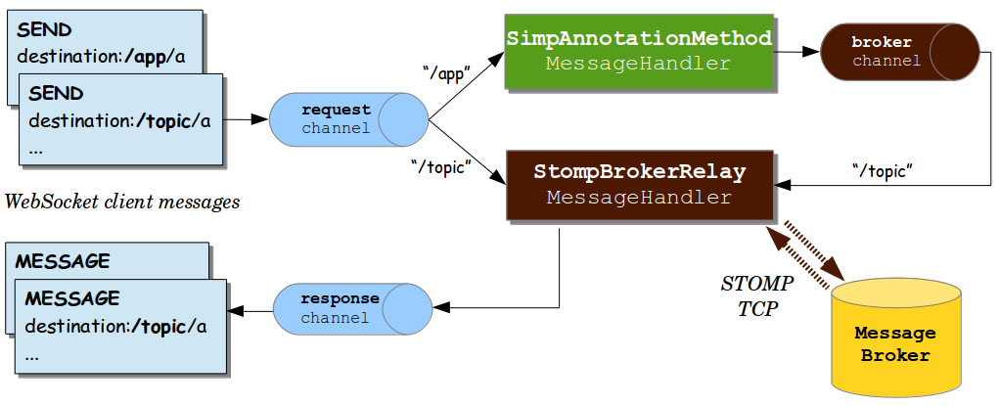

# Servlet 栈的 Web 应用

version 6.0.8-SNAPSHOT

[Back to index](https://springdoc.cn/spring/index.html)

- [1. Spring Web MVC](https://springdoc.cn/spring/web.html#mvc)
- [2. REST 客户端](https://springdoc.cn/spring/web.html#webmvc-client)
- [3. 测试](https://springdoc.cn/spring/web.html#webmvc.test)
- [4. WebSockets](https://springdoc.cn/spring/web.html#websocket)
- [5. Servlet栈的Web应用 其他Web框架](https://springdoc.cn/spring/web.html#web-integration)

|      | 本站([springdoc.cn](https://springdoc.cn/))中的内容来源于 [spring.io](https://spring.io/) ，原始版权归属于 [spring.io](https://spring.io/)。由 [springdoc.cn](https://springdoc.cn/) 进行翻译，整理。可供个人学习、研究，未经许可，不得进行任何转载、商用或与之相关的行为。 商标声明：Spring 是 Pivotal Software, Inc. 在美国以及其他国家的商标。 |
| ---- | ------------------------------------------------------------ |
|      |                                                              |

这一部分文档涵盖了对建立在Servlet API上并部署在Servlet容器上的 Servlet 栈 Web 应用的支持。个别章节包括 [Spring MVC](https://springdoc.cn/spring/web.html#mvc)、[视图技术](https://springdoc.cn/spring/web.html#mvc-view)、[CORS支持](https://springdoc.cn/spring/web.html#mvc-cors) 和 [WebSocket支持](https://springdoc.cn/spring/web.html#websocket)。对于响应式技术栈的Web应用，请参见 [响应式技术栈的Web应用](https://springdoc.cn/spring/web-reactive.html#spring-web-reactive)。

## 1. Spring Web MVC

Spring Web MVC是建立在Servlet API上的原始Web框架，从一开始就包含在Spring框架中。正式名称 "Spring Web MVC" 来自其源模块的名称（ [`spring-webmvc`](https://github.com/spring-projects/spring-framework/tree/main/spring-webmvc)），但它更常被称为 "Spring MVC"。

与Spring Web MVC并行，Spring Framework 5.Servlet栈的Web应用0引入了一个 reactive 技术栈的 Web框架，其名称 "Spring WebFlux" 也是基于其源模块（ [`spring-webflux`](https://github.com/spring-projects/spring-framework/tree/main/spring-webflux)）。本章介绍了Spring Web MVC。[下一章](https://springdoc.cn/spring/web-reactive.html#spring-web-reactive) 将介绍Spring WebFlux。

关于基线信息以及与Servlet容器和Jakarta EE版本范围的兼容性，请参见Spring Framework [Wiki](https://github.com/spring-projects/spring-framework/wiki/Spring-Framework-Versions)。

### 1.1. DispatcherServlet

[见 Reactive 技术栈中的等效内容](https://springdoc.cn/spring/web-reactive.html#webflux-dispatcher-handler)

Spring MVC和其他许多Web框架一样，是围绕前端控制器模式设计的，其中一个中央 `Servlet`，即 `DispatcherServlet`，为请求处理提供了一个共享算法，而实际工作则由可配置的委托组件执行。这种模式很灵活，支持多样化的工作流程。

`DispatcherServlet` 和其他Servlet一样，需要根据 `Servlet` 规范，使用Java配置或在 `web.xml` 中进行声明和映射。反过来，`DispatcherServlet` 使用Spring配置来发现它在请求映射、视图解析、异常处理 [等](https://springdoc.cn/spring/web.html#mvc-servlet-special-bean-types) 方面需要的委托组件。

下面这个Java配置的例子注册并初始化了 `DispatcherServlet`，它是由Servlet容器自动检测到的（见 [Servlet 配置](https://springdoc.cn/spring/web.html#mvc-container-config)）：

Java

```java
public class MyWebApplicationInitializer implements WebApplicationInitializer {

    @Override
    public void onStartup(ServletContext servletContext) {

        // Load Spring web application configuration
        AnnotationConfigWebApplicationContext context = new AnnotationConfigWebApplicationContext();
        context.register(AppConfig.class);

        // Create and register the DispatcherServlet
        DispatcherServlet servlet = new DispatcherServlet(context);
        ServletRegistration.Dynamic registration = servletContext.addServlet("app", servlet);
        registration.setLoadOnStartup(1);
        registration.addMapping("/app/*");
    }
}
```

Kotlin

```kotlin
class MyWebApplicationInitializer : WebApplicationInitializer {

    override fun onStartup(servletContext: ServletContext) {

        // Load Spring web application configuration
        val context = AnnotationConfigWebApplicationContext()
        context.register(AppConfig::class.java)

        // Create and register the DispatcherServlet
        val servlet = DispatcherServlet(context)
        val registration = servletContext.addServlet("app", servlet)
        registration.setLoadOnStartup(1)
        registration.addMapping("/app/*")
    }
}
```

|      | 除了直接使用 `ServletContext` API外，你还可以扩展 `AbstractAnnotationConfigDispatcherServletInitializer` 并覆写特定的方法（见 [上下文（Context）层次结构](https://springdoc.cn/spring/web.html#mvc-servlet-context-hierarchy) 下的例子）。 |
| ---- | ------------------------------------------------------------ |
|      |                                                              |

|      | 对于编程式用例，`GenericWebApplicationContext` 可以作为 `AnnotationConfigWebApplicationContext` 的替代。请参阅 [`GenericWebApplicationContext`](https://docs.spring.io/spring-framework/docs/6.0.8-SNAPSHOT/javadoc-api/org/springframework/web/context/support/GenericWebApplicationContext.html) javadoc 了解详情。 |
| ---- | ------------------------------------------------------------ |
|      |                                                              |

以下是 `web.xml` 配置的例子，它注册并初始化了 `DispatcherServlet`：

```xml
<web-app>

    <listener>
        <listener-class>org.springframework.web.context.ContextLoaderListener</listener-class>
    </listener>

    <context-param>
        <param-name>contextConfigLocation</param-name>
        <param-value>/WEB-INF/app-context.xml</param-value>
    </context-param>

    <servlet>
        <servlet-name>app</servlet-name>
        <servlet-class>org.springframework.web.servlet.DispatcherServlet</servlet-class>
        <init-param>
            <param-name>contextConfigLocation</param-name>
            <param-value></param-value>
        </init-param>
        <load-on-startup>1</load-on-startup>
    </servlet>

    <servlet-mapping>
        <servlet-name>app</servlet-name>
        <url-pattern>/app/*</url-pattern>
    </servlet-mapping>

</web-app>
```

|      | Spring Boot遵循不同的初始化顺序。Spring Boot不是挂入Servlet容器的生命周期，而是使用Spring配置来启动自己和嵌入式Servlet容器。`Filter` 和 `Servlet` 声明在Spring配置中被检测到，并在Servlet容器中注册。更多细节请参见 [Spring Boot文档](https://springdoc.cn/spring-boot/web.html#web.servlet.embedded-container)。 |
| ---- | ------------------------------------------------------------ |
|      |                                                              |

#### 1.1.1. 上下文（Context）层次结构

`DispatcherServlet` 期望有一个 `WebApplicationContext`（普通 `ApplicationContext` 的扩展）用于自己的配置。`WebApplicationContext` 有一个与 `ServletContext` 和与之相关的 `Servlet` 的链接。它也被绑定到 `ServletContext`，这样应用程序就可以使用 `RequestContextUtils` 上的静态方法来查询 `WebApplicationContext`，如果他们需要访问它的话。

对于许多应用程序，有一个单一的 `WebApplicationContext` 是简单的，也是足够的。也可以有一个上下文层次结构，一个根 `WebApplicationContext` 被多个 `DispatcherServlet`（或其他 `Servlet`）实例共享，每个实例都有自己的子 `WebApplicationContext` 配置。参见 [`ApplicationContext` 的附加功能](https://springdoc.cn/spring/core.html#context-introduction) ，以了解更多关于上下文层次结构的特性。

根（root） `WebApplicationContext` 通常包含基础设施Bean，例如需要在多个 `Servlet` 实例中共享的数据存储库和业务服务。这些Bean有效地被继承，并且可以在 `Servlet` 特定的子 `WebApplicationContext` 中被重写（也就是重新声明），该 `WebApplicationContext` 通常包含给定 `Servlet` 的本地Bean。下面的图片显示了这种关系：


下面的例子配置了一个 `WebApplicationContext` 的层次结构：

Java

```java
public class MyWebAppInitializer extends AbstractAnnotationConfigDispatcherServletInitializer {

    @Override
    protected Class<?>[] getRootConfigClasses() {
        return new Class<?>[] { RootConfig.class };
    }

    @Override
    protected Class<?>[] getServletConfigClasses() {
        return new Class<?>[] { App1Config.class };
    }

    @Override
    protected String[] getServletMappings() {
        return new String[] { "/app1/*" };
    }
}
```

Kotlin

```kotlin
class MyWebAppInitializer : AbstractAnnotationConfigDispatcherServletInitializer() {

    override fun getRootConfigClasses(): Array<Class<*>> {
        return arrayOf(RootConfig::class.java)
    }

    override fun getServletConfigClasses(): Array<Class<*>> {
        return arrayOf(App1Config::class.java)
    }

    override fun getServletMappings(): Array<String> {
        return arrayOf("/app1/*")
    }
}
```

|      | 如果不需要应用上下文层次结构，应用程序可以通过 `getRootConfigClasses()` 返回所有配置，并从 `getServletConfigClasses()` 返回 `null` 配置。 |
| ---- | ------------------------------------------------------------ |
|      |                                                              |

下面的例子显示了 `web.xml` 的等价物：

```xml
<web-app>

    <listener>
        <listener-class>org.springframework.web.context.ContextLoaderListener</listener-class>
    </listener>

    <context-param>
        <param-name>contextConfigLocation</param-name>
        <param-value>/WEB-INF/root-context.xml</param-value>
    </context-param>

    <servlet>
        <servlet-name>app1</servlet-name>
        <servlet-class>org.springframework.web.servlet.DispatcherServlet</servlet-class>
        <init-param>
            <param-name>contextConfigLocation</param-name>
            <param-value>/WEB-INF/app1-context.xml</param-value>
        </init-param>
        <load-on-startup>1</load-on-startup>
    </servlet>

    <servlet-mapping>
        <servlet-name>app1</servlet-name>
        <url-pattern>/app1/*</url-pattern>
    </servlet-mapping>

</web-app>
```

|      | 如果不需要 application context 层次结构，应用程序可以只配置一个 “root” context，并将 `contextConfigLocation` Servlet参数留空。 |
| ---- | ------------------------------------------------------------ |
|      |                                                              |

#### 1.1.2. 特殊的 Bean 类型

[见 Reactive 技术栈中的等效内容](https://springdoc.cn/spring/web-reactive.html#webflux-special-bean-types)

`DispatcherServlet` 委托给特殊的Bean来处理请求并呈现适当的响应。我们所说的 "特殊Bean" 是指实现框架契约的Spring管理的 `Object` 实例。这些实例通常有内置的约定，但你可以自定义它们的属性，并扩展或替换它们。

下表列出了由 `DispatcherServlet` 检测到的特殊Bean类：

| Bean 类型                                                    | 说明                                                         |
| :----------------------------------------------------------- | :----------------------------------------------------------- |
| `HandlerMapping`                                             | 将一个请求和一个用于前后处理的[拦截器](https://springdoc.cn/spring/web.html#mvc-handlermapping-interceptor) 列表一起映射到一个处理程序（handler）。该映射基于一些标准，其细节因 `HandlerMapping` 的实现而异。两个主要的 `HandlerMappin` 实现是 `RequestMappingHandlerMapping`（支持 `@RequestMapping` 注解的方法）和 `SimpleUrlHandlerMapping`（维护 URI path pattern 到处理程序（handler）的明确注册）。 |
| `HandlerAdapter`                                             | 帮助 `DispatcherServlet` 调用映射到请求的处理程序（handler），不管处理程序实际上是如何被调用的。例如，调用一个有注解的controller需要解析注解的问题。`HandlerAdapter` 的主要目的是将 `DispatcherServlet` 从这些细节中屏蔽掉。 |
| [`HandlerExceptionResolver`](https://springdoc.cn/spring/web.html#mvc-exceptionhandlers) | 解决异常的策略，可能将它们映射到处理程序、HTML error 视图或其他目标。请参阅 [Exceptions](https://springdoc.cn/spring/web.html#mvc-exceptionhandlers)。 |
| [`ViewResolver`](https://springdoc.cn/spring/web.html#mvc-viewresolver) | 将处理程序返回的基于 `String` 的逻辑视图名称解析为实际的 `View`（视图），并将其渲染到响应。参见 [视图（View）解析](https://springdoc.cn/spring/web.html#mvc-viewresolver) 和 [视图技术](https://springdoc.cn/spring/web.html#mvc-view)。 |
| [`LocaleResolver`](https://springdoc.cn/spring/web.html#mvc-localeresolver), [LocaleContextResolver](https://springdoc.cn/spring/web.html#mvc-timezone) | 解析客户端使用的 `Locale`，可能还有他们的时区，以便能够提供国际化的视图。参见 [Locale](https://springdoc.cn/spring/web.html#mvc-localeresolver)。 |
| [`ThemeResolver`](https://springdoc.cn/spring/web.html#mvc-themeresolver) | 解析你的web应用可以使用的主题（theme）--例如，提供个性化的布局。见 [主题（Theme）](https://springdoc.cn/spring/web.html#mvc-themeresolver)。 |
| [`MultipartResolver`](https://springdoc.cn/spring/web.html#mvc-multipart) | 在一些 multipart 解析库的帮助下，解析一个 multipart 请求（例如，浏览器表单文件上传）的抽象。参见 [Multipart 解析器](https://springdoc.cn/spring/web.html#mvc-multipart)。 |
| [`FlashMapManager`](https://springdoc.cn/spring/web.html#mvc-flash-attributes) | 存储和检索 "输入" 和 "输出" `FlashMap`，可用于将属性从一个请求传递到另一个请求，通常跨越重定向。见 [Flash Attributes](https://springdoc.cn/spring/web.html#mvc-flash-attributes)。 |

#### 1.1.3. Web MVC 配置

[见 Reactive 技术栈中的等效内容](https://springdoc.cn/spring/web-reactive.html#webflux-framework-config)

应用程序可以声明在 [特殊的 Bean 类型](https://springdoc.cn/spring/web.html#mvc-servlet-special-bean-types) 中列出的处理请求所需的基础设施 Bean。 `DispatcherServlet` 检查 `WebApplicationContext` 中的每个特殊Bean。如果没有匹配的Bean类型，它将回到 [`DispatcherServlet.properties`](https://github.com/spring-projects/spring-framework/tree/main/spring-webmvc/src/main/resources/org/springframework/web/servlet/DispatcherServlet.properties) 中所列的默认类型。

在大多数情况下，[MVC 配置](https://springdoc.cn/spring/web.html#mvc-config) 是最好的起点。它用Java或XML声明所需的Bean，并提供一个更高级别的配置回调（callback）API来定制它。

|      | Spring Boot依靠MVC Java配置来配置Spring MVC，并提供许多额外的便利选项。 |
| ---- | ------------------------------------------------------------ |
|      |                                                              |

#### 1.1.4. Servlet 配置

在Servlet环境中，你可以选择以编程方式配置Servlet容器，作为一种选择，或者与 `web.xml` 文件相结合。下面的例子注册了一个 `DispatcherServlet`：

Java

```java
public class MyWebApplicationInitializer implements WebApplicationInitializer {

    @Override
    public void onStartup(ServletContext container) {
        XmlWebApplicationContext appContext = new XmlWebApplicationContext();
        appContext.setConfigLocation("/WEB-INF/spring/dispatcher-config.xml");

        ServletRegistration.Dynamic registration = container.addServlet("dispatcher", new DispatcherServlet(appContext));
        registration.setLoadOnStartup(1);
        registration.addMapping("/");
    }
}
```

Kotlin

```kotlin
class MyWebApplicationInitializer : WebApplicationInitializer {

    override fun onStartup(container: ServletContext) {
        val appContext = XmlWebApplicationContext()
        appContext.setConfigLocation("/WEB-INF/spring/dispatcher-config.xml")

        val registration = container.addServlet("dispatcher", DispatcherServlet(appContext))
        registration.setLoadOnStartup(1)
        registration.addMapping("/")
    }
}
```

`WebApplicationInitializer` 是Spring MVC提供的一个接口，它可以确保你的实现被检测到并自动用于初始化任何Servlet 3容器。`WebApplicationInitializer` 的一个抽象基类实现名为 `AbstractDispatcherServletInitializer`，通过覆盖指定 `Servlet` 映射（mapping）和 `DispatcherServlet` 配置位置的方法，使得注册 `DispatcherServlet` 更加容易。

对于使用基于Java的Spring配置的应用程序，建议这样做，如下例所示：

Java

```java
public class MyWebAppInitializer extends AbstractAnnotationConfigDispatcherServletInitializer {

    @Override
    protected Class<?>[] getRootConfigClasses() {
        return null;
    }

    @Override
    protected Class<?>[] getServletConfigClasses() {
        return new Class<?>[] { MyWebConfig.class };
    }

    @Override
    protected String[] getServletMappings() {
        return new String[] { "/" };
    }
}
```

Kotlin

```kotlin
class MyWebAppInitializer : AbstractAnnotationConfigDispatcherServletInitializer() {

    override fun getRootConfigClasses(): Array<Class<*>>? {
        return null
    }

    override fun getServletConfigClasses(): Array<Class<*>>? {
        return arrayOf(MyWebConfig::class.java)
    }

    override fun getServletMappings(): Array<String> {
        return arrayOf("/")
    }
}
```

如果你使用基于XML的Spring配置，你应该直接从 `AbstractDispatcherServletInitializer` 扩展，如下例所示：

Java

```java
public class MyWebAppInitializer extends AbstractDispatcherServletInitializer {

    @Override
    protected WebApplicationContext createRootApplicationContext() {
        return null;
    }

    @Override
    protected WebApplicationContext createServletApplicationContext() {
        XmlWebApplicationContext cxt = new XmlWebApplicationContext();
        cxt.setConfigLocation("/WEB-INF/spring/dispatcher-config.xml");
        return cxt;
    }

    @Override
    protected String[] getServletMappings() {
        return new String[] { "/" };
    }
}
```

Kotlin

```kotlin
class MyWebAppInitializer : AbstractDispatcherServletInitializer() {

    override fun createRootApplicationContext(): WebApplicationContext? {
        return null
    }

    override fun createServletApplicationContext(): WebApplicationContext {
        return XmlWebApplicationContext().apply {
            setConfigLocation("/WEB-INF/spring/dispatcher-config.xml")
        }
    }

    override fun getServletMappings(): Array<String> {
        return arrayOf("/")
    }
}
```

`AbstractDispatcherServletInitializer` 还提供了一种方便的方法来添加 `Filter` 实例，并让它们自动映射到 `DispatcherServlet`，正如下面的例子所示：

Java

```java
public class MyWebAppInitializer extends AbstractDispatcherServletInitializer {

    // ...

    @Override
    protected Filter[] getServletFilters() {
        return new Filter[] {
            new HiddenHttpMethodFilter(), new CharacterEncodingFilter() };
    }
}
```

Kotlin

```kotlin
class MyWebAppInitializer : AbstractDispatcherServletInitializer() {

    // ...

    override fun getServletFilters(): Array<Filter> {
        return arrayOf(HiddenHttpMethodFilter(), CharacterEncodingFilter())
    }
}
```

每个 filter 都根据其具体类型添加了一个默认名称（name），并自动映射到 `DispatcherServlet`。

`AbstractDispatcherServletInitializer` 的 `isAsyncSupported` protected 方法提供了一个单一的地方来启用对 `DispatcherServlet` 和所有映射到它的 filter 的异步支持。默认情况下，这个标志被设置为 `true`。

最后，如果你需要进一步定制 `DispatcherServlet` 本身，你可以复写 `createDispatcherServlet` 方法。

#### 1.1.5.Servlet栈的Web应用 流程（Processing）

[见 Reactive 技术栈中的等效内容](https://springdoc.cn/spring/web-reactive.html#webflux-dispatcher-handler-sequence)

`DispatcherServlet` 处理请求的方式如下：

- `WebApplicationContext` 被搜索并作为一个属性（attribute）绑定在请求（request）中，controller和进程中的其他元素可以使用。它默认被绑定在 `DispatcherServlet.WEB_APPLICATION_CONTEXT_ATTRIBUTE` key 下。
- locale 解析器被绑定到请求上，以便让流程中的元素在处理请求（渲染视图、准备数据等）时解析要使用的 locale。如果你不需要locale解析，你就不需要 locale 解析器（resolver）。
- theme 解析器被绑定在请求上，以让诸如视图等元素决定使用哪个主题。如果你不使用主题，你可以忽略它。
- 如果你指定了一个 multipart file 解析器，请求将被检查为 multipart file。如果发现了multipart，该请求将被包裹在一个 `MultipartHttpServletRequest` 中，以便由流程中的其他元素进一步处理。关于 multipart 处理的进一步信息，请参见 [Multipart 解析器](https://springdoc.cn/spring/web.html#mvc-multipart) 。
- 一个适当的处理程序（handler）被搜索到。如果找到一个处理程序，与该处理程序相关的执行链（预处理程序、后处理程序和 controller）被运行，以准备渲染的模型（model）。另外，对于有注解的 controller，响应可以被渲染（在 `HandlerAdapter` 中）而不是返回一个视图。
- 如果有 model 返回，视图就会被渲染。如果没有返回 model（也许是由于预处理器或后处理器拦截了请求，也许是出于安全原因），就不会渲染视图，因为该请求可能已经被满足了。

在 `WebApplicationContext` 中声明的 `HandlerExceptionResolver` Bean被用来解决请求处理过程中抛出的异常。这些异常解析器允许自定义处理异常的逻辑。更多的细节请看 [Exceptions](https://springdoc.cn/spring/web.html#mvc-exceptionhandlers)。

对于HTTP缓存支持，处理程序可以使用 `WebRequest` 的 `checkNotModified` 方法，以及《[Controller 的HTTP缓存](https://springdoc.cn/spring/web.html#mvc-caching-etag-lastmodified)》中描述的注解 controller 的进一步选项。

你可以通过在 `web.xml` 文件的 Servlet 声明中添加 Servlet 初始化参数（`init-param` 元素）来定制单个 `DispatcherServlet` 实例。下表列出了支持的参数：

| 参数                             | 说明                                                         |
| :------------------------------- | :----------------------------------------------------------- |
| `contextClass`                   | 实现 `ConfigurableWebApplicationContext` 的类，将由该Servlet实例化和本地配置。默认情况下，使用 `XmlWebApplicationContext`。 |
| `contextConfigLocation`          | 传递给上下文实例（由 `contextClass` 指定）的字符串，表示可以在哪里找到上下文。该字符串可能由多个字符串组成（使用逗号作为分隔符）以支持多个上下文。如果多个上下文位置的bean被定义了两次，那么最新的位置优先。 |
| `namespace`                      | `WebApplicationContext` 的命名空间。默认为 `[servlet-name]-servlet`。 |
| `throwExceptionIfNoHandlerFound` | 当一个请求没有找到处理程序（handler）时，是否会抛出 `NoHandlerFoundException`。然后可以用 `HandlerExceptionResolver`（例如，通过使用 `@ExceptionHandler` controller 方法）来捕获该异常，并像其他一样处理。默认情况下，这被设置为 `false`，在这种情况下，`DispatcherServlet` 将响应状态设置为404（`NOT_FOUND`）而不引发异常。请注意，如果 [default servlet handling](https://springdoc.cn/spring/web.html#mvc-default-servlet-handler) 也被配置了，未解析的请求总是被转发到 default servlet，并且永远不会出现404。 |

#### 1.1.6. 路径匹配（Path Matching）

Servlet API将完整的请求路径作为 `requestURI` 公开，并进一步将其细分为 `contextPath`、`servletPath` 和 `pathInfo`，其值因Servlet的映射方式而异。从这些输入中，Spring MVC 需要确定用于映射处理程序（handler）的查找路径，如果适用的话，应该排除 `contextPath` 和任何 `servletMapping` 前缀。

`servletPath` 和 `pathInfo` 是经过解码的，这使得它们不可能直接与完整的 `requestURI` 进行比较以得出 `lookupPath`，这使得有必要对 `requestURI` 进行解码。然而，这也引入了自己的问题，因为路径可能包含编码的保留字符，如 `"/"` 或 `";"`，在它们被解码后又会改变路径的结构，这也会导致安全问题。此外，Servlet容器可能会在不同程度上对 `servletPath` 进行规范化处理，这使得它进一步无法对 `requestURI` 进行 `startsWith` 比较。

这就是为什么最好避免依赖基于前缀的 `servletPath` 映射类型所带来的 `servletPath`。如果 `DispatcherServlet` 被映射为带有 `"/"` 的默认 Servlet，或者没有 `"/*"` 的前缀，并且Servlet容器是4.0以上的，那么Spring MVC就能够检测到Servlet映射类型，并完全避免使用 `servletPath` 和 `pathInfo`。在3.1的Servlet容器上，假设有相同的Servlet映射类型，可以通过MVC配置中的 [路径（Path）匹配](https://springdoc.cn/spring/web.html#mvc-config-path-matching)，提供一个 `alwaysUseFullPath=true` 的 `UrlPathHelper` 来实现。

幸运的是，默认的Servlet映射 `"/"` 是一个不错的选择。然而，仍然有一个问题，即 `requestURI` 需要被解码，以便能够与 controller 映射（mapping）进行比较。这也是不可取的，因为有可能对改变路径结构的保留字符进行解码。如果这些字符不被期望，那么你可以拒绝它们（就像Spring Security HTTP 防火墙），或者你可以将 `UrlPathHelper` 配置为 `urlDecode=false`，但 controller 映射需要与编码后的路径相匹配，这可能并不总是很好。此外，有时 `DispatcherServlet` 需要与另一个Servlet共享URL空间，可能需要按前缀进行映射。

在使用 `PathPatternParser` 和解析的pattern时，上述问题得到了解决，因为它可以替代 `AntPathMatcher` 的字符串路径匹配。`PathPatternParser` 从5.Servlet栈的Web应用3版本开始就可以在Spring MVC中使用，并且从6.0版本开始默认启用。`AntPathMatcher` 需要对查找路径进行解码或对 controller 映射进行编码，与此不同的是，经过解析的 `PathPattern` 与称为 `RequestPath` 的路径的解析表示相匹配，一次一个路径段。这允许对路径段的值进行单独解码和消毒，而不存在改变路径结构的风险。Parsed `PathPattern` 还支持使用 `servletPath` 前缀映射，只要使用Servlet路径映射，并且前缀保持简单，即没有编码的字符。关于pattern语法的细节和比较，见 [Pattern 比较](https://springdoc.cn/spring/web.html#mvc-ann-requestmapping-pattern-comparison)。

#### 1.1.7. 拦截

所有 `HandlerMapping` 的实现都支持 handler 拦截器，当你想对某些请求应用特定的功能时，这些拦截器是非常有用的—例如，检查一个 principal。拦截器必须实现 `org.springframework.web.servlet` 包中的 `HandlerInterceptor`，它有三个方法，应该可以提供足够的灵活性来进行各种预处理和后处理：

- `preHandle(..)`: 在实际 handler 运行之前
- `postHandle(..)`: handler 运行后
- `afterCompletion(..)`: 在整个请求完成后

`preHandle(..)` 方法返回一个boolean值。你可以使用这个方法来中断或继续执行链的处理。当这个方法返回 `true` 时，handler 执行链继续进行。当它返回 `false` 时， `DispatcherServlet` 认为拦截器本身已经处理了请求（例如，渲染了一个适当的视图），并且不继续执行其他拦截器和执行链中的实际 handler。

关于如何配置拦截器的例子，请参见MVC配置部分的 [拦截器](https://springdoc.cn/spring/web.html#mvc-config-interceptors)。你也可以通过使用个别 `HandlerMapping` 实现的setters来直接注册它们。

`postHandle` 方法在 `@ResponseBody` 和 `ResponseEntity` 方法中用处不大，因为这些方法的响应是在 `HandlerAdapter` 中和 `postHandle` 之前写入和提交的。这意味着对响应进行任何修改都太晚了，比如添加一个额外的 header。对于这种情况，你可以实现 `ResponseBodyAdvice`，并把它声明为一个 [Controller Advice](https://springdoc.cn/spring/web.html#mvc-ann-controller-advice) Bean，或者直接在 `RequestMappingHandlerAdapter` 上配置它。

#### 1.1.8. Exceptions

[见 Reactive 技术栈中的等效内容](https://springdoc.cn/spring/web-reactive.html#webflux-dispatcher-exceptions)

如果在请求映射过程中发生异常或从请求处理程序（如 `@Controller`）抛出异常， `DispatcherServlet` 会委托给处理程序异常解析器（`HandlerExceptionResolver`）Bean链来解析异常并提供替代处理，这通常是一个错误响应。

下表列出了可用的 `HandlerExceptionResolver` 实现：

| `HandlerExceptionResolver`                                   | 说明                                                         |
| :----------------------------------------------------------- | :----------------------------------------------------------- |
| `SimpleMappingExceptionResolver`                             | 异常类名称和错误视图名称之间的映射。对于在浏览器应用程序中渲染错误页面非常有用。 |
| [`DefaultHandlerExceptionResolver`](https://docs.spring.io/spring-framework/docs/6.0.8-SNAPSHOT/javadoc-api/org/springframework/web/servlet/mvc/support/DefaultHandlerExceptionResolver.html) | 解析由Spring MVC引发的异常，并将其映射到HTTP状态码。也请参见替代的 `ResponseEntityExceptionHandler` 和 [Error 响应（Response）](https://springdoc.cn/spring/web.html#mvc-ann-rest-exceptions)。 |
| `ResponseStatusExceptionResolver`                            | 解析带有 `@ResponseStatus` 注解的异常，并根据注解中的值将其映射到HTTP状态码。 |
| `ExceptionHandlerExceptionResolver`                          | 通过调用 `@Controller` 或 `@ControllerAdvice` 类中的 `@ExceptionHandler` 方法来解析异常。参见 [@ExceptionHandler methods](https://springdoc.cn/spring/web.html#mvc-ann-exceptionhandler)。 |

##### 解析器（Resolver）链

你可以通过在Spring配置中声明多个 `HandlerExceptionResolver` Bean并根据需要设置它们的 `order` 属性来形成一个异常解析器链。`order` 属性越高，异常解析器的定位就越靠后。

`HandlerExceptionResolver` 的约定，它可以返回：

- 一个指向错误视图的 `ModelAndView`。
- 如果异常在解析器中被处理，则是一个空（empty）的 `ModelAndView`。
- 如果异常仍未被解决，则为 `null`，供后续的解析器尝试，如果异常仍在最后，则允许冒泡到Servlet容器中。

[MVC 配置](https://springdoc.cn/spring/web.html#mvc-config) 自动为默认的Spring MVC异常、`@ResponseStatus` 注解的异常以及 `@ExceptionHandler` 方法的支持声明了内置解析器。你可以自定义该列表或替换它。

##### 容器错误页面（Error Page）

如果一个异常仍然没有被任何 `HandlerExceptionResolver` 解析，因此，任其传播，或者如果响应状态被设置为错误状态（即4xx，5xx），Servlet容器可以在HTML中渲染一个默认的错误页面。为了定制容器的默认错误页面，你可以在 `web.xml` 中声明一个错误页面映射。下面的例子显示了如何做到这一点：

```xml
<error-page>
    <location>/error</location>
</error-page>
```

鉴于前面的例子，当一个异常冒出来或者响应有错误状态时，Servlet容器在容器内向配置的URL（例如，`/error`）进行 ERROR 调度。然后由 `DispatcherServlet` 进行处理，可能会将其映射到一个 `@Controller`，它可以被实现为返回一个带有model的错误视图名称或渲染一个JSON响应，如下例所示：

Java

```java
@RestController
public class ErrorController {

    @RequestMapping(path = "/error")
    public Map<String, Object> handle(HttpServletRequest request) {
        Map<String, Object> map = new HashMap<>();
        map.put("status", request.getAttribute("jakarta.servlet.error.status_code"));
        map.put("reason", request.getAttribute("jakarta.servlet.error.message"));
        return map;
    }
}
```

Kotlin

```kotlin
@RestController
class ErrorController {

    @RequestMapping(path = ["/error"])
    fun handle(request: HttpServletRequest): Map<String, Any> {
        val map = HashMap<String, Any>()
        map["status"] = request.getAttribute("jakarta.servlet.error.status_code")
        map["reason"] = request.getAttribute("jakarta.servlet.error.message")
        return map
    }
}
```

|      | Servlet API并没有提供在Java中创建错误页面映射的方法。然而，你可以同时使用 `WebApplicationInitializer` 和一个最小的 `web.xml`。 |
| ---- | ------------------------------------------------------------ |
|      |                                                              |

#### 1.1.9. 视图（View）解析

[见 Reactive 技术栈中的等效内容](https://springdoc.cn/spring/web-reactive.html#webflux-viewresolution)

Spring MVC定义了 `ViewResolver` 和 `View` 接口，让你在浏览器中渲染模型，而不需要绑定到特定的视图技术。`ViewResolver` 提供了视图名称和实际视图之间的映射。`View` 解决了在移交给特定视图技术之前的数据准备问题。

下表提供了关于 `ViewResolver` 层次结构的更多细节：

| ViewResolver                     | 说明                                                         |
| :------------------------------- | :----------------------------------------------------------- |
| `AbstractCachingViewResolver`    | `AbstractCachingViewResolver` 的子类会缓存它们所解析的视图实例。缓存可以提高某些视图技术的性能。你可以通过将 `cache` 属性设置为 `false` 来关闭缓存。此外，如果你必须在运行时刷新某个视图（例如，当 `FreeMarker` 模板被修改时），你可以使用 `removeFromCache(String viewName, Locale loc)` 方法。 |
| `UrlBasedViewResolver`           | `ViewResolver` 接口的简单实现，无需明确的映射定义就能实现逻辑视图名称与URL的直接解析。如果你的逻辑名称与你的视图资源的名称直接匹配，而不需要任意的映射，这就很合适。 |
| `InternalResourceViewResolver`   | `UrlBasedViewResolver` 的方便子类，支持 `InternalResourceView`（实际上是Servlets和JSP）和子类，如 `JstlView`。你可以通过使用 `setViewClass(..)` 为这个解析器生成的所有视图指定视图类。请参阅 [`UrlBasedViewResolver`](https://docs.spring.io/spring-framework/docs/6.0.8-SNAPSHOT/javadoc-api/org/springframework/web/reactive/result/view/UrlBasedViewResolver.html) javadoc 了解详情。 |
| `FreeMarkerViewResolver`         | `UrlBasedViewResolver` 的方便子类，支持 `FreeMarkerView` 和它们的自定义子类。 |
| `ContentNegotiatingViewResolver` | `ViewResolver` 接口的实现，根据请求文件名或 `Accept` 头来解析视图。参见 [内容协商](https://springdoc.cn/spring/web.html#mvc-multiple-representations)。 |
| `BeanNameViewResolver`           | `ViewResolver` 接口的实现，它将视图名称解释为当前应用程序上下文中的bean名称。这是一个非常灵活的变体，可以根据不同的视图名称混合和匹配不同的视图类型。每个这样的 `View` 都可以被定义为Bean，例如在XML或配置类中。 |

##### 处理（Handling）

[见 Reactive 技术栈中的等效内容](https://springdoc.cn/spring/web-reactive.html#webflux-viewresolution-handling)

你可以通过声明一个以上的解析器Bean来实现视图解析器链，如果有必要，还可以通过设置 `order` 属性来指定排序。记住，顺序属性越高，视图解析器在链中的位置就越靠后。

`ViewResolver` 的约定，它可以返回 `null` 以表示找不到视图。然而，在JSP和 `InternalResourceViewResolver` 的情况下，弄清JSP是否存在的唯一方法是通过 `RequestDispatcher` 进行调度。因此，你必须始终将 `InternalResourceViewResolver` 配置为视图解析器整体顺序中的最后一个。

配置视图解析就像在Spring配置中添加 `ViewResolver` Bean一样简单。[MVC 配置](https://springdoc.cn/spring/web.html#mvc-config) 为 [视图（View）解析器](https://springdoc.cn/spring/web.html#mvc-config-view-resolvers) 和添加无逻辑的 [视图控制器（View Controller）](https://springdoc.cn/spring/web.html#mvc-config-view-controller) 提供了专门的配置API，这对于没有控制器逻辑的HTML模板渲染非常有用。

##### 重定向

[见 Reactive 技术栈中的等效内容](https://springdoc.cn/spring/web-reactive.html#webflux-redirecting-redirect-prefix)

视图名称中特殊的 `redirect:` 前缀可以让你执行重定向。 `UrlBasedViewResolver`（和它的子类）将其识别为一个需要重定向的指令。视图名称的其余部分是重定向的URL。

净效果与controller返回 `RedirectView` 的效果相同，但现在controller本身可以在逻辑视图名称方面操作。逻辑视图名称（如 `redirect:/myapp/some/resource`）是相对于当前 Servlet context 重定向的，而 `redirect:https://myhost.com/some/arbitrary/path` 则是重定向到一个绝对URL。

请注意，如果一个 controller 方法被 `@ResponseStatus` 注解，该注解值优先于 `RedirectView` 设置的响应状态。

##### 转发

你也可以对最终由 `UrlBasedViewResolver` 和子类解析的视图名称使用一个特殊的 `forward:` 前缀。这将创建一个 `InternalResourceView`，它做一个 `RequestDispatcher.forward()`。因此，这个前缀对 `InternalResourceViewResolver` 和 `InternalResourceView`（用于JSP）没有用处，但如果你使用另一种视图技术，但仍然想强制转发一个资源，由Servlet/JSP引擎处理，那么它就会有帮助。请注意，你也可以用链式的多个视图解析器来代替。

##### 内容协商

[见 Reactive 技术栈中的等效内容](https://springdoc.cn/spring/web-reactive.html#webflux-multiple-representations)

[`ContentNegotiatingViewResolver`](https://docs.spring.io/spring-framework/docs/6.0.8-SNAPSHOT/javadoc-api/org/springframework/web/servlet/view/ContentNegotiatingViewResolver.html) 本身并不解析视图，而是委托给其他视图解析器，并选择与客户端请求的表示相近的视图。表示法可以从 `Accept` 头或查询参数（例如，`"/path?format=pdf"`）确定。

`ContentNegotiatingViewResolver` 通过比较请求的 `Content-Type` 和与其每个 `ViewResolvers` 相关的 `View` 所支持的媒体类型（也称为 `Content-Type`）来选择一个合适的 `View` 来处理请求。列表中第一个具有兼容的内容类型的视图将表示返回给客户端。如果 `ViewResolver` 链不能提供兼容的视图，就会查询通过 `DefaultViews` 属性指定的视图列表。后面这个选项适用于 singleton `Views`，它可以渲染当前资源的适当表示，而不考虑逻辑视图的名称。`Accept` 头可以包括通配符（例如 `text/*`），在这种情况下，`Content-Type` 为 `text/xml` 的 `View` 是一个兼容的匹配。

有关配置细节，请参见 [MVC 配置](https://springdoc.cn/spring/web.html#mvc-config) 下的 [视图（View）解析器](https://springdoc.cn/spring/web.html#mvc-config-view-resolvers) 。

#### 1.1.10. Locale

Spring架构的大多数部分都支持国际化，正如Spring Web MVC框架一样。 `DispatcherServlet` 让你通过使用客户端的 locale 自动解析消息（message）。这是由 `LocaleResolver` 对象完成的。

当一个请求进来时，`DispatcherServlet` 会寻找一个 locale 解析器，如果它找到一个，它就会尝试用它来设置locale。通过使用 `RequestContext.getLocale()` 方法，你总是可以检索到由locale解析器解析的locale。

除了自动解析 locale，你还可以在处理程序（handler）映射中附加一个拦截器（关于处理程序映射拦截器的更多信息，见 [拦截](https://springdoc.cn/spring/web.html#mvc-handlermapping-interceptor)），以便在特定情况下（例如，基于请求中的参数）改变语言。

Locale 解析器和拦截器定义在 `org.springframework.web.servlet.i18n` 包中，并以正常方式在 application context 中进行配置。以下是Spring 中 locale 解析器。

- [时区（Time Zone）](https://springdoc.cn/spring/web.html#mvc-timezone)
- [Header 解析器](https://springdoc.cn/spring/web.html#mvc-localeresolver-acceptheader)
- [Cookie 解析器](https://springdoc.cn/spring/web.html#mvc-localeresolver-cookie)
- [Session 解析器](https://springdoc.cn/spring/web.html#mvc-localeresolver-session)
- [Locale 拦截器](https://springdoc.cn/spring/web.html#mvc-localeresolver-interceptor)

##### 时区（Time Zone）

除了获得客户端的locale之外，知道它的时区也常常是有用的。 `LocaleContextResolver` 接口提供了对 `LocaleResolver` 的扩展，让解析器提供一个更丰富的 `LocaleContext`，其中可能包括时区信息。

当可用时，用户的 `TimeZone` 可以通过使用 `RequestContext.getTimeZone()` 方法获得。时区信息会被任何与Spring的 `ConversionService` 注册的 Date/Time `Converter` 和格 `Formatter` 对象自动使用。

##### Header 解析器

这个 locale resolver 检查由客户端（例如，一个Web浏览器）发送的请求中的 `accept-language` 头。通常，这个头字段包含了客户的操作系统的 locale。请注意，这个解析器不支持时区信息。

##### Cookie 解析器

这个locale解析器检查客户端上可能存在的 `Cookie`，看是否指定了 `Locale` 或 `TimeZone`。如果有，它就会使用指定的细节。通过使用这个locale 解析器的属性，你可以指定 cookie name 以及 maximum age。下面的例子定义了一个 `CookieLocaleResolver`：

```xml
<bean id="localeResolver" class="org.springframework.web.servlet.i18n.CookieLocaleResolver">

    <property name="cookieName" value="clientlanguage"/>

    <!-- in seconds. If set to -1, the cookie is not persisted (deleted when browser shuts down) -->
    <property name="cookieMaxAge" value="100000"/>

</bean>
```

下表描述了 `CookieLocaleResolver` 的属性：

| 属性           | 默认                 | 说明                                                         |
| :------------- | :------------------- | :----------------------------------------------------------- |
| `cookieName`   | 类名 + LOCALE        | cookie 名                                                    |
| `cookieMaxAge` | Servlet 容器的默认值 | 一个cookie在客户端上持续存在的最长时间。如果指定为 `-1`，cookie将不会被持久化。它只在客户端关闭浏览器之前可用。 |
| `cookiePath`   | /                    | 将cookie的可见性限制在你网站的某个部分。当 `cookiePath` 被指定时，cookie只对该路径和它下面的路径可见。 |

##### Session 解析器

`SessionLocaleResolver` 让你从可能与用户请求有关的会话中检索 `Locale` 和 `TimeZone`。与 `CookieLocaleResolver` 不同的是，这个策略将本地选择的 locale 设置存储在 Servlet 容器的 `HttpSession` 中。因此，这些设置在每个会话中都是临时的，因此在每个会话结束时都会丢失。

注意，与外部会话管理机制（如Spring Session 项目）没有直接关系。这个 `SessionLocaleResolver` 针对当前的 `HttpServletRequest` 评估并修改相应的 `HttpSession` 属性。

##### Locale 拦截器

你可以通过将 `LocaleChangeInterceptor` 添加到 `HandlerMapping` 定义中的一个来启用更改 locale。它检测请求中的一个参数，并相应地改变locale，在调度器的应用上下文中调用 `LocaleResolver` 的 `setLocale` 方法。下一个例子显示，对所有包含名为 `siteLanguage` 的参数的 `*.view` 资源的调用现在会改变 locale。因此，例如，对URL的请求， `https://www.sf.net/home.view?siteLanguage=nl`，将网站语言改为荷兰语。下面的例子显示了如何拦截 locale：

```xml
<bean id="localeChangeInterceptor"
        class="org.springframework.web.servlet.i18n.LocaleChangeInterceptor">
    <property name="paramName" value="siteLanguage"/>
</bean>

<bean id="localeResolver"
        class="org.springframework.web.servlet.i18n.CookieLocaleResolver"/>

<bean id="urlMapping"
        class="org.springframework.web.servlet.handler.SimpleUrlHandlerMapping">
    <property name="interceptors">
        <list>
            <ref bean="localeChangeInterceptor"/>
        </list>
    </property>
    <property name="mappings">
        <value>/**/*.view=someController</value>
    </property>
</bean>
```

#### 1.1.11. 主题（Theme）

你可以应用Spring Web MVC框架的主题来设置你的应用程序的整体外观和感觉，从而增强用户体验。主题是一个静态资源的集合，通常是样式表和图片，它影响应用程序的视觉风格。

|      | 从6.0版本开始，对主题的支持已经被废弃，转而使用CSS，并且在服务器端没有任何特殊支持。 |
| ---- | ------------------------------------------------------------ |
|      |                                                              |

##### 定义一个主题

要在你的Web应用程序中使用主题，你必须设置一个 `org.springframework.ui.context.ThemeSource` 接口的实现。`WebApplicationContext` 接口扩展了 `ThemeSource`，但将其职责委托给一个专门的实现。默认情况下，该委托是一个 `org.springframework.ui.context.support.ResourceBundleThemeSource` 实现，它从 classpath 的根部加载properties文件。要使用自定义的 `ThemeSource` 实现或配置 `ResourceBundleThemeSource` 的 base name 前缀，你可以在 application context 中用保留名称 `themeSource` 注册一个bean。Web application context 会自动检测到具有该名称的Bean并使用它。

当你使用 `ResourceBundleThemeSource` 时，一个主题被定义在一个简单的 properties 文件中。该 properties 文件列出了构成主题的资源，如下例所示：

```
styleSheet=/themes/cool/style.css
background=/themes/cool/img/coolBg.jpg
```

属性的key是指视图代码中的主题元素的名称。对于JSP，你通常使用 `spring:theme` 自定义标签来完成，它与 `spring:message` 标签非常相似。下面的JSP片段使用前面例子中定义的主题来定制外观和感觉：

```xml
<%@ taglib prefix="spring" uri="http://www.springframework.org/tags"%>
<html>
    <head>
        <link rel="stylesheet" href="<spring:theme code='styleSheet'/>" type="text/css"/>
    </head>
    <body style="background=<spring:theme code='background'/>">
        ...
    </body>
</html>
```

默认情况下，`ResourceBundleThemeSource` 使用一个空的 base name 前缀。结果是，属性文件从 classpath 的根部加载。因此，你要把 `cool.properties` 主题定义放在 classpath 根部的一个目录中（例如，放在 `/WEB-INF/classes` 中）。`ResourceBundleThemeSource` 使用标准的Java资源包加载机制，允许主题的完全国际化。例如，我们可以有一个 `/WEB-INF/classes/cool_nl.properties`，引用一个特殊的背景图片，上面有荷兰文。

##### 解析主题

如 [上一节](https://springdoc.cn/spring/web.html#mvc-themeresolver-defining) 所述，在你定义了主题之后，你决定使用哪个主题。`DispatcherServlet` 会寻找一个名为 `themeResolver` 的bean来找出要使用的 `ThemeResolver` 实现。主题解析器的工作方式与 `LocaleResolver` 基本相同。它检测要用于特定请求的主题，也可以改变请求的主题。下表描述了由Spring提供的主题解析器：

| Class                  | 说明                                                         |
| :--------------------- | :----------------------------------------------------------- |
| `FixedThemeResolver`   | 选择一个固定的主题，通过使用 `defaultThemeName` 属性设置。   |
| `SessionThemeResolver` | 该主题在用户的 HTTP 会话中被维护。它只需要为每个会话设置一次，但在不同的会话之间不会被持久化。 |
| `CookieThemeResolver`  | 所选择的主题被储存在客户端的一个cookie中。                   |

Spring还提供了一个 `ThemeChangeInterceptor`，可以通过一个简单的请求参数让主题在每个请求中发生变化。

#### 1.1.12. Multipart 解析器

[见 Reactive 技术栈中的等效内容](https://springdoc.cn/spring/web-reactive.html#webflux-multipart)

来自 `org.springframework.web.multipart` 包的 `MultipartResolver` 是一个解析包括文件上传在内的 multipart 请求的策略。有一个基于容器的 `StandardServletMultipartResolver` 实现，用于Servlet multipart 请求解析。请注意，基于Apache Commons FileUpload的过时的 `CommonsMultipartResolver` 已经不可用了，因为Spring Framework 6.0有新的Servlet 5.Servlet栈的Web应用0+基线。

为了启用 multipart 处理，你需要在 `DispatcherServlet` 的Spring配置中声明一个 `MultipartResolver` Bean，名称为 `multipartResolver`。 `DispatcherServlet` 会检测到它并将其应用于传入的请求。当收到一个内容类型为 `multipart/form-data` 的POST时，解析器会将内容包裹在当前的 `HttpServletRequest` 中，作为一个 `MultipartHttpServletRequest` 来提供对解析文件的访问，此外还将 part 作为 request parameter 公开。

##### Servlet Multipart 解析

Servlet multipart 解析需要通过Servlet容器配置来启用。要做到这一点：

- 在Java中，在Servlet注册上设置一个 `MultipartConfigElement`。
- 在 `web.xml` 中，在servlet声明中添加一个 `"<multipart-config>"` 部分。

下面的例子显示了如何在Servlet注册上设置一个 `MultipartConfigElement`：

Java

```java
public class AppInitializer extends AbstractAnnotationConfigDispatcherServletInitializer {

    // ...

    @Override
    protected void customizeRegistration(ServletRegistration.Dynamic registration) {

        // Optionally also set maxFileSize, maxRequestSize, fileSizeThreshold
        registration.setMultipartConfig(new MultipartConfigElement("/tmp"));
    }

}
```

Kotlin

```kotlin
class AppInitializer : AbstractAnnotationConfigDispatcherServletInitializer() {

    // ...

    override fun customizeRegistration(registration: ServletRegistration.Dynamic) {

        // Optionally also set maxFileSize, maxRequestSize, fileSizeThreshold
        registration.setMultipartConfig(MultipartConfigElement("/tmp"))
    }

}
```

一旦Servlet的 multipart configuration 到位，你可以添加一个名为 `multipartResolver` 的 `StandardServletMultipartResolver` 类型的bean。

|      | 这个解析器变体按原样使用你的Servlet容器的 multipart 解析器，可能会使应用程序暴露在容器实现的差异中。默认情况下，它将尝试用任何 HTTP 方法解析任何 `multipart/` content type，但这可能不受所有 Servlet 容器的支持。请参阅 [`StandardServletMultipartResolver`](https://docs.spring.io/spring-framework/docs/6.0.8-SNAPSHOT/javadoc-api/org/springframework/web/multipart/support/StandardServletMultipartResolver.html) javadoc 了解详情和配置选项。 |
| ---- | ------------------------------------------------------------ |
|      |                                                              |

#### 1.1.13. 日志

[见 Reactive 技术栈中的等效内容](https://springdoc.cn/spring/web-reactive.html#webflux-logging)

Spring MVC的DEBUG级日志被设计成紧凑、简约和人性化的。它专注于反复有用的高价值信息，而不是只有在调试特定问题时才有用的其他信息。

TRACE级别的日志通常遵循与DEBUG相同的原则（例如，也不应该是火烧眉毛），但可以用于调试任何问题。此外，一些日志信息在TRACE与DEBUG下可能会显示不同的细节水平。

好的日志来自于使用日志的经验。如果你发现任何不符合既定目标的地方，请让我们知道。

##### 敏感数据

[见 Reactive 技术栈中的等效内容](https://springdoc.cn/spring/web-reactive.html#webflux-logging-sensitive-data)

DEBUG 和 TRACE 日志可能会记录敏感信息。这就是为什么请求参数和header信息在默认情况下是被屏蔽的，它们的完整记录必须通过 `DispatcherServlet` 上的 `enableLoggingRequestDetails` 属性明确启用。

下面的例子显示了如何通过使用Java配置来做到这一点：

Java

```java
public class MyInitializer
        extends AbstractAnnotationConfigDispatcherServletInitializer {

    @Override
    protected Class<?>[] getRootConfigClasses() {
        return ... ;
    }

    @Override
    protected Class<?>[] getServletConfigClasses() {
        return ... ;
    }

    @Override
    protected String[] getServletMappings() {
        return ... ;
    }

    @Override
    protected void customizeRegistration(ServletRegistration.Dynamic registration) {
        registration.setInitParameter("enableLoggingRequestDetails", "true");
    }

}
```

Kotlin

```kotlin
class MyInitializer : AbstractAnnotationConfigDispatcherServletInitializer() {

    override fun getRootConfigClasses(): Array<Class<*>>? {
        return ...
    }

    override fun getServletConfigClasses(): Array<Class<*>>? {
        return ...
    }

    override fun getServletMappings(): Array<String> {
        return ...
    }

    override fun customizeRegistration(registration: ServletRegistration.Dynamic) {
        registration.setInitParameter("enableLoggingRequestDetails", "true")
    }
}
```

### 1.2. 过滤器（Filter）

[见 Reactive 技术栈中的等效内容](https://springdoc.cn/spring/web-reactive.html#webflux-filters)

`spring-web` 模块提供了一些有用的过滤器（Filter）：

- [Form Data](https://springdoc.cn/spring/web.html#filters-http-put)
- [Forwarded Header](https://springdoc.cn/spring/web.html#filters-forwarded-headers)
- [Shallow ETag](https://springdoc.cn/spring/web.html#filters-shallow-etag)
- [CORS](https://springdoc.cn/spring/web.html#filters-cors)

#### 1.2.1. Form Data

浏览器只能通过 HTTP GET 或 HTTP POST 提交表单数据（form data），但非浏览器客户端也可以使用HTTP PUT、PATCH和DELETE。Servlet API要求 `ServletRequest.getParameter*()` 方法只支持HTTP POST的表单字段访问。

`spring-web` 模块提供了 `FormContentFilter` 来拦截内容类型为 `application/x-www-form-urlencoded` 的 HTTP PUT、PATCH 和 DELETE 请求，从 request body 中读取 form data，并包裹 `ServletRequest`，使 form data 通过 `ServletRequest.getParameter*()` 系列方法可用。

#### 1.2.2. Forwarded Header

[见 Reactive 技术栈中的等效内容](https://springdoc.cn/spring/web-reactive.html#webflux-forwarded-headers)

当请求通过代理（如负载均衡器）时，host、port和scheme可能会发生变化，这使得从客户角度创建指向正确host、port和scheme的链接成为一种挑战。

[RFC 7239](https://tools.ietf.org/html/rfc7239) 定义了 `Forwarded` HTTP头，代理可以用它来提供关于原始请求的信息。还有其他非标准的头，包括 `X-Forwarded-Host`、`X-Forwarded-Port`、`X-Forwarded-Proto`、`X-Forwarded-SSL` 和 `X-Forwarded-Prefix`。

`ForwardedHeaderFilter` 是一个Servlet过滤器，它修改了请求，以便a）根据 `Forwarded` 头信息改变host、port和scheme，以及b）删除这些头信息以消除进一步的影响。这个过滤器依赖于对请求的包装，因此它必须排在其他过滤器的前面，比如 `RequestContextFilter`，它应该与修改后的请求而不是原始请求一起工作。

对 forwarded 头有安全方面的考虑，因为应用程序无法知道这些头是由代理添加的，还是由恶意的客户端添加的。这就是为什么在信任边界的代理应该被配置为删除来自外部的不被信任的 `Forwarded` 头信息。你也可以将 `ForwardedHeaderFilter` 配置为 `removeOnly=true`，在这种情况下，它将删除但不使用这些头信息。

为了支持 [异步请求](https://springdoc.cn/spring/web.html#mvc-ann-async) 和 error dispatch（调度），这个过滤器应该与 `DispatcherType.ASYNC` 和 `DispatcherType.ERROR` 进行映射。如果使用Spring框架的 `AbstractAnnotationConfigDispatcherServletInitializer`（见 [Servlet 配置](https://springdoc.cn/spring/web.html#mvc-container-config)），所有过滤器都会自动注册为所有的 dispatch 类型。然而，如果通过 `web.xml` 或在Spring Boot中通过 `FilterRegistrationBean` 注册过滤器，请确保除了 `DispatcherType.ASYNC` 和 `DispatcherType.ERROR` 之外，还要包括 `DispatcherType.REQUEST`。

#### 1.2.3. Shallow ETag

`ShallowEtagHeaderFilter` 通过缓存写入响应的内容并计算出MD5哈希值来创建一个 “shallow” ETag。客户端下次发送时，它做同样的事情，但它也将计算的值与 `If-None-Match` 请求头进行比较，如果两者相等，则返回304（NOT_MODIFIED）。

这种策略可以节省网络带宽，但不能节省CPU，因为必须为每个请求计算出完整的响应。前面描述的控制器层面的其他策略，可以避免计算的发生。参见 [HTTP 缓存](https://springdoc.cn/spring/web.html#mvc-caching)。

这个过滤器有一个 `writeWeakETag` 参数，可以配置该过滤器写入类似以下的 weak ETag： `W/"02a2d595e6ed9a0b24f027f2b63b134d6"`（如 [RFC 7232 Section 2.3](https://tools.ietf.org/html/rfc7232#section-2.3) 中所定义）。

为了支持 [异步请求](https://springdoc.cn/spring/web.html#mvc-ann-async)，这个过滤器必须用 `DispatcherType.ASYNC` 来映射，这样过滤器就可以延迟并成功地生成ETag到最后一个异步dispatch的结束。如果使用Spring框架的 `AbstractAnnotationConfigDispatcherServletInitializer`（见 [Servlet 配置](https://springdoc.cn/spring/web.html#mvc-container-config)），所有过滤器都会自动注册为所有的dispatch类型。然而，如果通过 `web.xml` 或Spring Boot中的 `FilterRegistrationBean` 注册过滤器，请确保包含 `DispatcherType.ASYNC`。

#### 1.2.4. CORS

[见 Reactive 技术栈中的等效内容](https://springdoc.cn/spring/web-reactive.html#webflux-filters-cors)

Spring MVC通过控制器（controller）上的注解为CORS配置提供了细粒度的支持。然而，当与Spring Security一起使用时，我们建议依靠内置的 `CorsFilter`，它的 order 必须在 Spring Security 的过滤器链之前。

更多细节请参见 [CORS](https://springdoc.cn/spring/web.html#mvc-cors) 和 [CORS Filter](https://springdoc.cn/spring/web.html#mvc-cors-filter) 部分。

### 1.3. 注解式 Controller

[见 Reactive 技术栈中的等效内容](https://springdoc.cn/spring/web-reactive.html#webflux-controller)

Spring MVC提供了一个基于注解的编程模型，其中 `@Controller` 和 `@RestController` 组件使用注解来表达请求映射、请求输入、异常处理等内容。注解的控制器具有灵活的方法签名，不需要继承基类，也不需要实现特定的接口。下面的例子显示了一个由注解定义的控制器（Controller）：

Java

```java
@Controller
public class HelloController {

    @GetMapping("/hello")
    public String handle(Model model) {
        model.addAttribute("message", "Hello World!");
        return "index";
    }
}
```

Kotlin

```kotlin
@Controller
class HelloController {

    @GetMapping("/hello")
    fun handle(model: Model): String {
        model["message"] = "Hello World!"
        return "index"
    }
}
```

在前面的例子中，该方法接受一个 `Model`，并返回一个 `String` 的视图名称，但也存在许多其他选项，在本章后面会有解释。

|      | [spring.io](https://spring.io/guides) 上的指南和教程使用本节中描述的基于注解的编程模型。 |
| ---- | ------------------------------------------------------------ |
|      |                                                              |

#### 1.3.1. 声明

[见 Reactive 技术栈中的等效内容](https://springdoc.cn/spring/web-reactive.html#webflux-ann-controller)

你可以通过在Servlet的 `WebApplicationContext` 中使用标准的Spring Bean定义来定义 controller Bean。`@Controller` stereotype 允许自动检测，与Spring对检测 classpath 中的 `@Component` 类并为其自动注册bean定义的一般支持一致。它也是注解类的一个 stereotype，表明它是一个 web 组件。

为了实现对这种 `@Controller` Bean的自动检测，你可以在你的Java配置中添加组件扫描，如下例所示：

Java

```java
@Configuration
@ComponentScan("org.example.web")
public class WebConfig {

    // ...
}
```

Kotlin

```kotlin
@Configuration
@ComponentScan("org.example.web")
class WebConfig {

    // ...
}
```

下面的例子显示了前述例子的XML配置等效：

```xml
<?xml version="1.0" encoding="UTF-8"?>
<beans xmlns="http://www.springframework.org/schema/beans"
    xmlns:xsi="http://www.w3.org/2001/XMLSchema-instance"
    xmlns:p="http://www.springframework.org/schema/p"
    xmlns:context="http://www.springframework.org/schema/context"
    xsi:schemaLocation="
        http://www.springframework.org/schema/beans
        https://www.springframework.org/schema/beans/spring-beans.xsd
        http://www.springframework.org/schema/context
        https://www.springframework.org/schema/context/spring-context.xsd">

    <context:component-scan base-package="org.example.web"/>

    <!-- ... -->

</beans>
```

`@RestController` 是一个 [组成的注解](https://springdoc.cn/spring/core.html#beans-meta-annotations)，它本身是由 `@Controller` 和 `@ResponseBody` 组成的元注解，表示一个controller的每个方法都继承了类型级的 `@ResponseBody` 注解，因此，直接写入响应体，而不是用HTML模板进行视图解析和渲染。

##### AOP 代理

[见 Reactive 技术栈中的等效内容](https://springdoc.cn/spring/web-reactive.html#webflux-ann-requestmapping-proxying)

在某些情况下，你可能需要在运行时用AOP代理来装饰一个controller。一个例子是，如果你选择在 controller 上直接使用 `@Transactional` 注解。在这种情况下，特别是对于controller，我们建议使用基于类的代理，这种注解会自动出现在直接出现在 controller 上。

如果 controller 实现了一个接口，并且需要AOP代理，你可能需要明确配置基于类的代理。例如，对于 `@EnableTransactionManagement`，你可以改为 `@EnableTransactionManagement(proxyTargetClass = true)`，而对于 `<tx:annotation-driven/>`，你可以改为 `<tx:annotation-driven proxy-target-class="true"/>`。

|      | 请记住，从6.0版本开始，通过接口代理，Spring MVC不再仅仅基于接口上的类型级 `@RequestMapping` 注解来检测 controller。请启用基于类的代理，否则接口也必须有一个 `@Controller` 注解。 |
| ---- | ------------------------------------------------------------ |
|      |                                                              |

#### 1.3.2. 请求映射（Request Mapping）

[见 Reactive 技术栈中的等效内容](https://springdoc.cn/spring/web-reactive.html#webflux-ann-requestmapping)

你可以使用 `@RequestMapping` 注解来映射请求到controller方法。它有各种属性，可以通过URL、HTTP方法、请求参数、header和媒体类型（meida type）进行匹配。你可以在类的层面上使用它来表达共享映射，也可以在方法的层面上使用它来缩小到一个特定的端点映射。

还有HTTP方法特定的 `@RequestMapping` 的快捷方式变体：

- `@GetMapping`
- `@PostMapping`
- `@PutMapping`
- `@DeleteMapping`
- `@PatchMapping`

捷径是 [自定义注解](https://springdoc.cn/spring/web.html#mvc-ann-requestmapping-composed)，因为可以说，大多数 controller 方法应该被映射到一个特定的HTTP方法，而不是使用 `@RequestMapping`，默认情况下，它匹配所有的HTTP方法。在类的层面上仍然需要一个 `@RequestMapping` 来表达共享映射。

下面的例子有类和方法层面的映射：

Java

```java
@RestController
@RequestMapping("/persons")
class PersonController {

    @GetMapping("/{id}")
    public Person getPerson(@PathVariable Long id) {
        // ...
    }

    @PostMapping
    @ResponseStatus(HttpStatus.CREATED)
    public void add(@RequestBody Person person) {
        // ...
    }
}
```

Kotlin

```kotlin
@RestController
@RequestMapping("/persons")
class PersonController {

    @GetMapping("/{id}")
    fun getPerson(@PathVariable id: Long): Person {
        // ...
    }

    @PostMapping
    @ResponseStatus(HttpStatus.CREATED)
    fun add(@RequestBody person: Person) {
        // ...
    }
}
```

##### URI pattern

[见 Reactive 技术栈中的等效内容](https://springdoc.cn/spring/web-reactive.html#webflux-ann-requestmapping-uri-templates)

`@RequestMapping` 方法可以使用 URL pattern 进行映射。有两种选择：

- `PathPattern` — 一个与URL路径相匹配的预解析pattern，也被预解析为 `PathContainer`。这个解析方案是为web使用而设计的，它有效地处理了编码和路径参数，并有效地进行了匹配。
- `AntPathMatcher` — 匹配字符串 pattern 和字符串路径。这也是Spring配置中用来选择classpath、文件系统和其他位置资源的原始解析方案。它的效率较低，而且字符串路径输入对于有效处理URL的编码和其他问题是一个挑战。

`PathPattern` 是Web应用程序的推荐解析方案，也是Spring WebFlux的唯一选择。它从5.Servlet栈的Web应用3版本开始在Spring MVC中启用，从6.0版本开始默认启用。有关路径匹配选项的定制，请参见 [MVC config](https://springdoc.cn/spring/web.html#mvc-config-path-matching)。

`PathPattern` 支持与 `AntPathMatcher` 相同的 pattern 语法。此外，它还支持捕获 pattern，例如 `{*spring}`，用于匹配路径末端的0个或多个路径段。`PathPattern` 还限制了 `**` 在匹配多个路径段时的使用，即只允许在 pattern 的末端使用。这就消除了在为一个给定的请求选择最佳匹配 pattern 时的许多模糊情况。完整的 pattern 语法请参考 [`PathPattern`](https://docs.spring.io/spring-framework/docs/6.0.8-SNAPSHOT/javadoc-api/org/springframework/web/util/pattern/PathPattern.html) 和 [`AntPathMatcher`](https://docs.spring.io/spring-framework/docs/6.0.8-SNAPSHOT/javadoc-api/org/springframework/util/AntPathMatcher.html)。

一些示例 pattern：

- `"/resources/ima?e.png"` - 匹配路径段中的一个字符
- `"/resources/*.png"` - 匹配一个路径段中的零个或多个字符
- `"/resources/**"` - 匹配多个路径段
- `"/projects/{project}/versions"` - 匹配一个路径段并将其作为一个变量捕获
- `"/projects/{project:[a-z]+}/versions"` - 匹配并捕获一个带有正则的变量

捕获的URI变量可以用 `@PathVariable` 访问。比如说：

Java

```java
@GetMapping("/owners/{ownerId}/pets/{petId}")
public Pet findPet(@PathVariable Long ownerId, @PathVariable Long petId) {
    // ...
}
```

Kotlin

```kotlin
@GetMapping("/owners/{ownerId}/pets/{petId}")
fun findPet(@PathVariable ownerId: Long, @PathVariable petId: Long): Pet {
    // ...
}
```

你可以在类和方法层面上声明URI变量，如下例所示：

Java

```java
@Controller
@RequestMapping("/owners/{ownerId}")
public class OwnerController {

    @GetMapping("/pets/{petId}")
    public Pet findPet(@PathVariable Long ownerId, @PathVariable Long petId) {
        // ...
    }
}
```

Kotlin

```kotlin
@Controller
@RequestMapping("/owners/{ownerId}")
class OwnerController {

    @GetMapping("/pets/{petId}")
    fun findPet(@PathVariable ownerId: Long, @PathVariable petId: Long): Pet {
        // ...
    }
}
```

URI变量会自动转换为适当的类型，否则会引发 `TypeMismatchException`。简单的类型（`int`、`long`、`Date` 等）是默认支持的，你可以注册对任何其他数据类型的支持。参见 [类型转换](https://springdoc.cn/spring/web.html#mvc-ann-typeconversion) 和 [`DataBinder`](https://springdoc.cn/spring/web.html#mvc-ann-initbinder)。

你可以明确地命名URI变量（例如，`@PathVariable("customId")`），但是如果名称相同，并且你的代码是用 `-parameters` 编译器标志编译的，你可以不考虑这个细节。

语法 `{varName:regex}` 用正则表达式声明一个URI变量，其语法为 `{varName:regex}`。例如，给定 URL `"/spring-web-3.0.5.Servlet栈的Web应用jar"`，以下方法可以提取名称、版本和文件扩展名：

Java

```java
@GetMapping("/{name:[a-z-]+}-{version:\\d\\.\\d\\.\\d}{ext:\\.[a-z]+}")
public void handle(@PathVariable String name, @PathVariable String version, @PathVariable String ext) {
    // ...
}
```

Kotlin

```kotlin
@GetMapping("/{name:[a-z-]+}-{version:\\d\\.\\d\\.\\d}{ext:\\.[a-z]+}")
fun handle(@PathVariable name: String, @PathVariable version: String, @PathVariable ext: String) {
    // ...
}
```

URI路径模式也可以有嵌入的 `${…}` 占位符，在启动时通过使用 `PropertySourcesPlaceholderConfigurer` 针对本地、系统、环境和其他属性源进行解析。例如，你可以使用它来根据一些外部配置对基本URL进行参数化。

##### Pattern 比较

[见 Reactive 技术栈中的等效内容](https://springdoc.cn/spring/web-reactive.html#webflux-ann-requestmapping-pattern-comparison)

当多个 pattern 匹配一个URL时，必须选择最佳匹配。这是根据是否启用使用解析的 `PathPattern` 来完成的，取决于是否启用使用：

- [`PathPattern.SPECIFICITY_COMPARATOR`](https://docs.spring.io/spring-framework/docs/6.0.8-SNAPSHOT/javadoc-api/org/springframework/web/util/pattern/PathPattern.html#SPECIFICITY_COMPARATOR)
- [`AntPathMatcher.getPatternComparator(String path)`](https://docs.spring.io/spring-framework/docs/6.0.8-SNAPSHOT/javadoc-api/org/springframework/util/AntPathMatcher.html#getPatternComparator-java.lang.String-)

两者都有助于对 pattern 进行分类，更具体的 pattern 在上面。如果一个 pattern 的URI变量（计为1）、单通配符（计为1）和双通配符（计为2）的数量较少，那么它的具体内容就较少。在得分相同的情况下，选择较长的 pattern 。在分数和长度相同的情况下，选择URI变量多于通配符的 pattern。

默认的映射模式（`/**`）被排除在评分之外，并且总是排在最后。另外，前缀模式（如 `/public/**`）被认为比其他没有双通配符的模式更不具体。

如需了解全部细节，请按照上述链接查看 pattern 比较器（Comparators）。

##### 后缀匹配

从5.Servlet栈的Web应用3版本开始，默认情况下Spring MVC不再执行 `.*` 后缀模式匹配，即映射到 `/person` 的 controller 也隐含地映射到 `/person.*`。因此，路径扩展不再用于解释响应所要求的内容类型—例如，`/person.pdf`，`/person.xml` 等等。

当浏览器曾经发送难以一致解释的 `Accept` 头时，以这种方式使用文件扩展名是必要的。目前，这已不再是必要的，使用 `Accept` 头应该是首选。

随着时间的推移，文件名扩展名的使用已被证明在很多方面存在问题。当与URI变量、路径参数和URI编码的使用相叠加时，它可能会引起歧义。推理基于URL的授权和安全（详见下一节）也变得更加困难。

要在5.Servlet栈的Web应用3之前的版本中完全禁止使用路径扩展，请设置如下：

- `useSuffixPatternMatching(false)`, 见 [PathMatchConfigurer](https://springdoc.cn/spring/web.html#mvc-config-path-matching)
- `favorPathExtension(false)`, 见 [ContentNegotiationConfigurer](https://springdoc.cn/spring/web.html#mvc-config-content-negotiation)

除了通过 `"Accept"` 头之外，有一种方法可以请求内容类型，仍然是有用的，例如在浏览器中输入URL的时候。路径扩展的一个安全选择是使用查询参数策略。如果你必须使用文件扩展，考虑通过 [ContentNegotiationConfigurer](https://springdoc.cn/spring/web.html#mvc-config-content-negotiation) 的 `mediaTypes` 属性将它们限制在明确注册的扩展列表中。

##### 后缀匹配和RFD

反射式文件下载（RFD）攻击与XSS类似，它依赖于请求输入（例如，查询参数和URI变量）被反射到响应中。然而，RFD攻击不是在HTML中插入JavaScript，而是依靠浏览器切换到执行下载，并在以后双击时将响应视为可执行脚本。

在Spring MVC中，`@ResponseBody` 和 `ResponseEntity` 方法存在风险，因为它们可以呈现不同的内容类型，客户可以通过URL路径扩展请求这些内容。禁用后缀模式匹配和使用路径扩展进行内容协商降低了风险，但并不足以防止RFD攻击。

为了防止RFD攻击，在渲染响应体之前，Spring MVC添加了 `Content-Disposition:inline;filename=f.txt` 头，以建议一个固定的安全下载文件。只有当URL路径包含一个既不允许安全也没有明确注册的内容协商的文件扩展时，才会这样做。然而，当URL被直接输入到浏览器时，它有可能产生副作用。

许多常见的路径扩展被默认允许为安全的。具有自定义 `HttpMessageConverter` 实现的应用程序可以为内容协商明确地注册文件扩展名，以避免为这些扩展名添加 `Content-Disposition` 头。参见 [Content Type](https://springdoc.cn/spring/web.html#mvc-config-content-negotiation)。

参见 [CVE-2015-5211](https://pivotal.io/security/cve-2015-5211) ，了解与RFD相关的其他建议。

##### 消费的媒体类型（Media Type）

[见 Reactive 技术栈中的等效内容](https://springdoc.cn/spring/web-reactive.html#webflux-ann-requestmapping-consumes)

你可以根据请求的 `Content-Type` 来缩小请求映射的范围，如下例所示：

Java

```java
@PostMapping(path = "/pets", consumes = "application/json") 
public void addPet(@RequestBody Pet pet) {
    // ...
}
```

|      | 使用 `consumes` 属性来缩小 content type 的映射。 |
| ---- | ------------------------------------------------ |
|      |                                                  |

Kotlin

```kotlin
@PostMapping("/pets", consumes = ["application/json"]) 
fun addPet(@RequestBody pet: Pet) {
    // ...
}
```

|      | 使用 `consumes` 属性来缩小 content type 的映射。 |
| ---- | ------------------------------------------------ |
|      |                                                  |

`consumes` 属性也支持否定表达式—例如，`!text/plain` 意味着除 `text/plain` 以外的任何 content type。

你可以在类的层次上声明一个共享的 `consumes` 属性。然而，与其他大多数请求映射属性不同的是，当在类级别使用时，方法级别的 `consumes` 属性会覆盖而不是扩展类级别的声明。

|      | `MediaType` 为常用的媒体类型提供常量，例如 `APPLICATION_JSON_VALUE` 和 `APPLICATION_XML_VALUE`。 |
| ---- | ------------------------------------------------------------ |
|      |                                                              |

##### 生产的媒体类型（Media Type）

[见 Reactive 技术栈中的等效内容](https://springdoc.cn/spring/web-reactive.html#webflux-ann-requestmapping-produces)

你可以根据 `Accept` 请求头和 controller 方法产生的 content type 列表来缩小请求映射的范围，如下例所示：

Java

```java
@GetMapping(path = "/pets/{petId}", produces = "application/json") 
@ResponseBody
public Pet getPet(@PathVariable String petId) {
    // ...
}
```

|      | 使用 `produces` 属性，通过 content type 缩小映射范围。 |
| ---- | ------------------------------------------------------ |
|      |                                                        |

Kotlin

```kotlin
@GetMapping("/pets/{petId}", produces = ["application/json"]) 
@ResponseBody
fun getPet(@PathVariable petId: String): Pet {
    // ...
}
```

|      | 使用 `produces` 属性，通过 content type 缩小映射范围。 |
| ---- | ------------------------------------------------------ |
|      |                                                        |

media type 可以指定一个字符集。支持否定的表达式—例如，`!text/plain` 意味着除 "text/plain" 之外的任何 content type。

你可以在类的层次上声明一个共享的 `produces` 属性。然而，与其他大多数请求映射属性不同的是，当在类级使用时，方法级 `produces` 属性覆盖而不是扩展类级声明。

|      | `MediaType` 为常用的 media type 提供常量，例如 `APPLICATION_JSON_VALUE` 和 `APPLICATION_XML_VALUE`。 |
| ---- | ------------------------------------------------------------ |
|      |                                                              |

##### 参数（Paramete）、header

[见 Reactive 技术栈中的等效内容](https://springdoc.cn/spring/web-reactive.html#webflux-ann-requestmapping-params-and-headers)

你可以根据请求参数（request parameter）的条件来缩小请求映射的范围。你可以测试是否存在一个请求参数（`myParam`），是否没有一个（`!myParam`），或者一个特定的值（`myParam=myValue`）。下面的例子显示了如何测试一个特定的值：

Java

```java
@GetMapping(path = "/pets/{petId}", params = "myParam=myValue") 
public void findPet(@PathVariable String petId) {
    // ...
}
```

|      | 测试 `myParam` 是否等于 `myValue`。 |
| ---- | ----------------------------------- |
|      |                                     |

Kotlin

```kotlin
@GetMapping("/pets/{petId}", params = ["myParam=myValue"]) 
fun findPet(@PathVariable petId: String) {
    // ...
}
```

|      | 测试 `myParam` 是否等于 `myValue`。 |
| ---- | ----------------------------------- |
|      |                                     |

你也可以对请求头条件使用同样的方法，如下例所示：

Java

```java
@GetMapping(path = "/pets/{petId}", headers = "myHeader=myValue") 
public void findPet(@PathVariable String petId) {
    // ...
}
```

|      | 测试 `myHeader` 是否等于 `myValue`。 |
| ---- | ------------------------------------ |
|      |                                      |

Kotlin

```kotlin
@GetMapping("/pets/{petId}", headers = ["myHeader=myValue"]) 
fun findPet(@PathVariable petId: String) {
    // ...
}
```

|      | 测试 `myHeader` 是否等于 `myValue`。 |
| ---- | ------------------------------------ |
|      |                                      |

|      | 你可以用 `headers` 条件匹配 `Content-Type` 和 `Accept`，但最好使用 [consumes](https://springdoc.cn/spring/web.html#mvc-ann-requestmapping-consumes) 和 [produces](https://springdoc.cn/spring/web.html#mvc-ann-requestmapping-produces)。 |
| ---- | ------------------------------------------------------------ |
|      |                                                              |

##### HTTP HEAD, OPTIONS

[见 Reactive 技术栈中的等效内容](https://springdoc.cn/spring/web-reactive.html#webflux-ann-requestmapping-head-options)

`@GetMapping`（和 `@RequestMapping(method=HttpMethod.GET)`）支持HTTP HEAD 透明地进行请求映射。controller 方法不需要改变。在 `jakarta.servlet.http.HttpServlet` 中应用了一个响应包装器（response wrapper），确保 `Content-Length` 头被设置为写入的字节数（不需要实际写入到响应中）。

`@GetMapping`（和 `@RequestMapping(method=HttpMethod.GET)`）被隐含地映射到并支持HTTP HEAD。一个HTTP HEAD请求的处理就像HTTP GET一样，除了不写正文，而是计算字节数并设置 `Content-Length` 头。

默认情况下，HTTP OPTIONS 是通过将 `Allow` 响应头设置为所有 `@RequestMapping` 方法中列出的具有匹配 URL pattern 的HTTP方法列表来处理。

对于没有HTTP方法声明的 `@RequestMapping`，`Allow` 头被设置为 `GET,HEAD,POST,PUT,PATCH,DELETE,OPTIONS`。controller 方法应该总是声明支持的HTTP方法（例如，通过使用HTTP方法的特定变体： `@GetMapping`, `@PostMapping`, 和其他）。

你可以显式地将 `@RequestMapping` 方法映射到 HTTP HEAD 和 HTTP OPTIONS，但在普通情况下没有必要这样做。

##### 自定义注解

[见 Reactive 技术栈中的等效内容](https://springdoc.cn/spring/web-reactive.html#mvc-ann-requestmapping-head-options)

Spring MVC支持在请求映射中使用 [组合注解](https://springdoc.cn/spring/core.html#beans-meta-annotations)。这些注解本身是用 `@RequestMapping` 进行元注解的，并组成了一个子集（或全部）`@RequestMapping` 属性的重新声明，其目的更加狭窄，更加具体。

`@GetMapping`, `@PostMapping`, `@PutMapping`, `@DeleteMapping`, 和 `@PatchMapping` 是组成注解的例子。之所以提供这些注解是因为，大多数 controller 方法应该被映射到特定的HTTP方法，而不是使用 `@RequestMapping`，因为默认情况下，它与所有的HTTP方法相匹配。如果你需要一个组成注解的例子，看看这些注解是如何声明的。

Spring MVC 还支持带有自定义请求匹配逻辑的自定义请求映射（request mapping）属性。这是一个更高级的选项，需要子类化 `RequestMappingHandlerMapping` 并重写 `getCustomMethodCondition` 方法，你可以检查自定义属性并返回你自己的 `RequestCondition`。

##### 明确的注册

[见 Reactive 技术栈中的等效内容](https://springdoc.cn/spring/web-reactive.html#webflux-ann-requestmapping-registration)

你可以以编程方式注册 handler method，你可以将其用于动态注册或用于高级情况，例如在不同的URL下同一 handler 的不同实例。下面的例子注册了一个 handler method：

Java

```java
@Configuration
public class MyConfig {

    @Autowired
    public void setHandlerMapping(RequestMappingHandlerMapping mapping, UserHandler handler) 
            throws NoSuchMethodException {

        RequestMappingInfo info = RequestMappingInfo
                .paths("/user/{id}").methods(RequestMethod.GET).build(); 

        Method method = UserHandler.class.getMethod("getUser", Long.class); 

        mapping.registerMapping(info, handler, method); 
    }
}
```

|      | 注入目标 handler 和 controller 的 handler 映射（mapping）。 |
| ---- | ----------------------------------------------------------- |
|      | 准备请求映射的元数据。                                      |
|      | 获取 handler method。                                       |
|      | 添加注册。                                                  |

Kotlin

```kotlin
@Configuration
class MyConfig {

    @Autowired
    fun setHandlerMapping(mapping: RequestMappingHandlerMapping, handler: UserHandler) { 
        val info = RequestMappingInfo.paths("/user/{id}").methods(RequestMethod.GET).build() 
        val method = UserHandler::class.java.getMethod("getUser", Long::class.java) 
        mapping.registerMapping(info, handler, method) 
    }
}
```

|      | 注入目标 handler 和 controller 的 handler 映射（mapping）。 |
| ---- | ----------------------------------------------------------- |
|      | 准备请求映射的元数据。                                      |
|      | 获取 handler method。                                       |
|      | 添加注册。                                                  |

#### 1.3.3. 处理器方法（Handler Method）

[见 Reactive 技术栈中的等效内容](https://springdoc.cn/spring/web-reactive.html#webflux-ann-methods)

`@RequestMapping` 处理器方法有一个灵活的签名，可以从一系列支持的 controller 方法参数和返回值中选择。

##### 方法参数

[见 Reactive 技术栈中的等效内容](https://springdoc.cn/spring/web-reactive.html#webflux-ann-arguments)

下表描述了支持的 controller 方法参数。任何参数都不支持 Reactive 类型。

JDK 8的 `java.util.Optional` 支持作为方法参数与具有 `required` 属性的注解（例如，`@RequestParam`、`@RequestHeader` 和其他）结合使用，并等同于 `required=false`。

| Controller 方法参数                                          | 说明                                                         |
| :----------------------------------------------------------- | :----------------------------------------------------------- |
| `WebRequest`, `NativeWebRequest`                             | 对 request parameter 以及 request 和 session 属性的通用访问，无需直接使用Servlet API。 |
| `jakarta.servlet.ServletRequest`, `jakarta.servlet.ServletResponse` | 选择任何特定的 request 或 response 类型—例如 `ServletRequest`、`HttpServletRequest`，或 Spring 的 `MultipartRequest`、`MultipartHttpServletRequest`。 |
| `jakarta.servlet.http.HttpSession`                           | 执行一个 session 的存在。因此，这样的参数永远不会是 `null` 的。请注意， session 访问不是线程安全的。如果允许多个请求同时访问一个 session，请考虑将 `RequestMappingHandlerAdapter` 实例的 `synchronizeOnSession` 标志设置为 `true`。 |
| `jakarta.servlet.http.PushBuilder`                           | Servlet 4.0 push builder API，用于编程式 HTTP/2 资源推送。请注意，根据Servlet规范，如果客户端不支持该HTTP/2功能，则注入的 `PushBuilder` 实例可以为空。 |
| `java.security.Principal`                                    | 目前认证的用户—如果知道的话，可能是一个特定的 `Principal` 实现类。请注意，这个参数不会被急切地解析，如果它被注解了，以便允许自定义解析器在通过 `HttpServletRequest#getUserPrincipal` 的默认解析之前将其解析。例如，Spring Security `Authentication` 实现了 `Principal`，并将通过 `HttpServletRequest#getUserPrincipal` 被注入，除非它也被 `@AuthenticationPrincipal` 注解，在这种情况下，它被自定义的Spring Security resolver 通过 `Authentication#getPrincipal` 解析。 |
| `HttpMethod`                                                 | 请求的HTTP方法。                                             |
| `java.util.Locale`                                           | 当前的请求 locale，由最具体的 `LocaleResolver` 决定（实际上是配置的 `LocaleResolver` 或 `LocaleContextResolver`）。 |
| `java.util.TimeZone` + `java.time.ZoneId`                    | 与当前请求相关的时区，由 `LocaleContextResolver` 决定。      |
| `java.io.InputStream`, `java.io.Reader`                      | 用于访问Servlet API所暴露的原始请求体。                      |
| `java.io.OutputStream`, `java.io.Writer`                     | 用于访问Servlet API所暴露的原始响应体。                      |
| `@PathVariable`                                              | 用于访问URI模板变量。见 [URI pattern](https://springdoc.cn/spring/web.html#mvc-ann-requestmapping-uri-templates)。 |
| `@MatrixVariable`                                            | 用于访问URI路径段中的name-value对。参见 [Matrix Variables](https://springdoc.cn/spring/web.html#mvc-ann-matrix-variables)。 |
| `@RequestParam`                                              | 用于访问Servlet请求参数，包括 multipart 文件。参数值被转换为声明的方法参数类型。参见 [`@RequestParam`](https://springdoc.cn/spring/web.html#mvc-ann-requestparam) 以及 [Multipart](https://springdoc.cn/spring/web.html#mvc-multipart-forms)。注意，对于简单的参数值，使用 `@RequestParam` 是可选的。参见本表末尾的 "任何其他参数"。 |
| `@RequestHeader`                                             | 用于访问请求 header。header 值被转换为声明的方法参数类型。参见 [`@RequestHeader`](https://springdoc.cn/spring/web.html#mvc-ann-requestheader)。 |
| `@CookieValue`                                               | 用于访问cookie。Cookie值被转换为声明的方法参数类型。参见 [`@CookieValue`](https://springdoc.cn/spring/web.html#mvc-ann-cookievalue)。 |
| `@RequestBody`                                               | 用于访问 HTTP request body。通过使用 `HttpMessageConverter` 实现， Body 内容被转换为声明的方法参数类型。参见 [`@RequestBody`](https://springdoc.cn/spring/web.html#mvc-ann-requestbody)。 |
| `HttpEntity<B>`                                              | 用于访问请求header和body。body 用一个 `HttpMessageConverter` 来转换。参见 [HttpEntity](https://springdoc.cn/spring/web.html#mvc-ann-httpentity)。 |
| `@RequestPart`                                               | 对于访问 `multipart/form-data` 请求中的一个part，用 `HttpMessageConverter` 来转换该 part 的 body。参见 [Multipart](https://springdoc.cn/spring/web.html#mvc-multipart-forms)。 |
| `java.util.Map`, `org.springframework.ui.Model`, `org.springframework.ui.ModelMap` | 用于访问HTML controller 中使用的model，并作为视图渲染的一部分暴露给模板。 |
| `RedirectAttributes`                                         | 指定在重定向情况下使用的属性（即追加到查询字符串中），以及临时存储到重定向后的请求中的 Flash 属性。参见 [Redirect Attributes](https://springdoc.cn/spring/web.html#mvc-redirecting-passing-data) 和 [Flash Attributes](https://springdoc.cn/spring/web.html#mvc-flash-attributes)。 |
| `@ModelAttribute`                                            | 用于访问模型中的一个现有属性（如果不存在则实例化），并应用数据绑定和验证。参见 [`@ModelAttribute`](https://springdoc.cn/spring/web.html#mvc-ann-modelattrib-method-args) 以及 [Model](https://springdoc.cn/spring/web.html#mvc-ann-modelattrib-methods) 和[`DataBinder`](https://springdoc.cn/spring/web.html#mvc-ann-initbinder)。注意，使用 `@ModelAttribute` 是可选的（例如，设置其属性）。参见本表末尾的 "任何其他参数"。 |
| `Errors`, `BindingResult`                                    | 用于访问来自命令对象（即 `@ModelAttribute` 参数）的验证和数据绑定的错误或来自 `@RequestBody` 或 `@RequestPart` 参数的验证的错误。你必须在验证过的方法参数之后立即声明一个 `Errors`，或 `BindingResult` 参数。 |
| `SessionStatus` + class-level `@SessionAttributes`           | 用于标记表单处理完成，这将触发对通过类级 `@SessionAttributes` 注解声明的 session attributes 的清理。更多细节见 [`@SessionAttributes`](https://springdoc.cn/spring/web.html#mvc-ann-sessionattributes) 。 |
| `UriComponentsBuilder`                                       | 用于准备一个相对于当前请求的host、port、scheme、context path 和Servlet 映射的字面部分的URL。参见 [URI 链接](https://springdoc.cn/spring/web.html#mvc-uri-building)。 |
| `@SessionAttribute`                                          | 用于访问任何 session attribute，与因类级 `@SessionAttributes` 声明而存储在 session 中的模型属性不同。更多细节见 [`@SessionAttribute`](https://springdoc.cn/spring/web.html#mvc-ann-sessionattribute)。 |
| `@RequestAttribute`                                          | 用于访问 request attribute。更多细节见 [`@RequestAttribute`](https://springdoc.cn/spring/web.html#mvc-ann-requestattrib)。 |
| 任何其他参数                                                 | 如果一个方法参数没有与本表中的任何先前值相匹配，并且它是一个简单的类型（由 [BeanUtils#isSimpleProperty](https://docs.spring.io/spring-framework/docs/6.0.8-SNAPSHOT/javadoc-api/org/springframework/beans/BeanUtils.html#isSimpleProperty-java.lang.Class-) 决定），它被解析为 `@RequestParam` 。否则，它将被解析为 `@ModelAttribute`。 |

##### 返回值

[见 Reactive 技术栈中的等效内容](https://springdoc.cn/spring/web-reactive.html#webflux-ann-return-types)

下表描述了支持的 controller 方法返回值。所有的返回值都支持响应式类型。

| Controller 方法返回值                                        | 说明                                                         |
| :----------------------------------------------------------- | :----------------------------------------------------------- |
| `@ResponseBody`                                              | 返回值通过 `HttpMessageConverter` 实现进行转换并写入响应。参见 [`@ResponseBody`](https://springdoc.cn/spring/web.html#mvc-ann-responsebody)。 |
| `HttpEntity<B>`, `ResponseEntity<B>`                         | 指定完整的响应（包括HTTP header 和 body）的返回值要通过 `HttpMessageConverter` 实现转换并写入响应。参见 [ResponseEntity](https://springdoc.cn/spring/web.html#mvc-ann-responseentity)。 |
| `HttpHeaders`                                                | 用于返回一个有 header 件而无 body 的响应。                   |
| `ErrorResponse`                                              | 要呈现一个 RFC 7807 错误响应，并在 body 中提供详细信息，请参见 [Error 响应（Response）](https://springdoc.cn/spring/web.html#mvc-ann-rest-exceptions)。 |
| `ProblemDetail`                                              | 要呈现一个RFC 7807错误响应，并在 body 中提供详细信息，请参见 [Error 响应（Response）](https://springdoc.cn/spring/web.html#mvc-ann-rest-exceptions)。 |
| `String`                                                     | 用 `ViewResolver` 实现解析的视图名称，并与隐式 model 一起使用—通过命令对象和 `@ModelAttribute` 方法确定。handler method 也可以通过声明一个 `Model` 参数来以编程方式丰富模型（见 [明确的注册](https://springdoc.cn/spring/web.html#mvc-ann-requestmapping-registration)）。 |
| `View`                                                       | 一个与隐式 model 一起用于渲染的 `View` 实例 - 通过命令对象和 `@ModelAttribute` 方法确定。handler method 也可以通过声明一个 `Model` 参数来以编程方式丰富模型（见 [明确的注册](https://springdoc.cn/spring/web.html#mvc-ann-requestmapping-registration)）。 |
| `java.util.Map`, `org.springframework.ui.Model`              | 要添加到隐式 model 的属性，视图名称通过 `RequestToViewNameTranslator` 隐式确定。 |
| `@ModelAttribute`                                            | 一个要添加到 model 中的属性，视图名称通过 `RequestToViewNameTranslator` 隐式确定。注意，`@ModelAttribute` 是可选的。参见本表末尾的 "任何其他返回值"。 |
| `ModelAndView` 对象                                          | 要使用的 view 和 model attribute ，以及可选的响应状态（response status）。 |
| `void`                                                       | 如果一个方法有一个 `ServletResponse`，一个 `OutputStream` 参数，或者一个 `@ResponseStatus` 注解，那么这个方法的返回类型为 `void` （或者返回值为 `null` ），被认为是完全处理了响应。如果 controller 进行了积极的 `ETag` 或 `lastModified` 时间戳检查，也是如此（详见 [Controller](https://springdoc.cn/spring/web.html#mvc-caching-etag-lastmodified)）。如果以上都不是 true， `void` 返回类型也可以表示 REST controller 的 “no response body” 或 HTML controller 的默认视图名称选择。 |
| `DeferredResult<V>`                                          | 从任何线程异步产生前述的任何返回值—例如，作为一些事件或回调的结果。参见 [异步请求](https://springdoc.cn/spring/web.html#mvc-ann-async) 和 [`DeferredResult`](https://springdoc.cn/spring/web.html#mvc-ann-async-deferredresult)。 |
| `Callable<V>`                                                | 在Spring MVC管理的线程中异步产生上述任何返回值。参见 [异步请求](https://springdoc.cn/spring/web.html#mvc-ann-async) 和 [`Callable`](https://springdoc.cn/spring/web.html#mvc-ann-async-callable)。 |
| `ListenableFuture<V>`, `java.util.concurrent.CompletionStage<V>`, `java.util.concurrent.CompletableFuture<V>` | 替代 `DeferredResult`，作为一种便利（例如，当一个底层服务返回其中之一）。 |
| `ResponseBodyEmitter`, `SseEmitter`                          | 用 `HttpMessageConverter` 实现异步发射一个对象流（stream），以写入响应中。也支持作为 `ResponseEntity` 的 body。参见 [异步请求](https://springdoc.cn/spring/web.html#mvc-ann-async) 和 [HTTP Streaming](https://springdoc.cn/spring/web.html#mvc-ann-async-http-streaming)。 |
| `StreamingResponseBody`                                      | 异步写到响应的 `OutputStream` 中。也支持作为 `ResponseEntity` 的 body。参见 [异步请求](https://springdoc.cn/spring/web.html#mvc-ann-async) 和 [HTTP Streaming](https://springdoc.cn/spring/web.html#mvc-ann-async-http-streaming)。 |
| 通过 `ReactiveAdapterRegistry` 注册的 Reactor 和其他 reactive 类型 | 一个单值类型，例如 `Mono`，相当于返回 `DeferredResult`。一个多值类型，例如 `Flux`，可以根据请求的 media type 被视为一个流，例如 "text/event-stream"，"application/json+stream"，或者以其他方式被收集到一个 List 并作为一个单一值呈现。参见 [异步请求](https://springdoc.cn/spring/web.html#mvc-ann-async) 和 [响应式（Reactive）类型](https://springdoc.cn/spring/web.html#mvc-ann-async-reactive-types).。 |
| 任何其他返回值                                               | 如果一个返回值以任何其他方式保持未被解析，它将被视为一个 model attribute ，除非它是 [BeanUtils#isSimpleProperty](https://docs.spring.io/spring-framework/docs/6.0.8-SNAPSHOT/javadoc-api/org/springframework/beans/BeanUtils.html#isSimpleProperty-java.lang.Class-) 确定的简单类型，在这种情况下，它保持未被解析。 |

##### 类型转换

[见 Reactive 技术栈中的等效内容](https://springdoc.cn/spring/web-reactive.html#webflux-ann-typeconversion)

一些注解的 controller 方法参数表示基于 `String` 的请求输入（如 `@RequestParam`、`@RequestHeader`、`@PathVariable`、`@MatrixVariable` 和 `@CookieValue`），如果参数被声明为 `String` 以外的东西，可能需要类型转换。

对于这种情况，类型转换会根据配置的 converter 自动应用。默认情况下，支持简单类型（`int`、`long`、`Date` 和其他）。你可以通过 `WebDataBinder`（见 [`DataBinder`](https://springdoc.cn/spring/web.html#mvc-ann-initbinder)）或通过向 `FormattingConversionService` 注册 `Formatters` 来定制类型转换。参见 [Spring字段格式化](https://springdoc.cn/spring/core.html#format)。

类型转换中的一个实际问题是如何处理一个空（empty）的String源值。如果类型转换的结果是 `null` 的，这样的值会被视为缺失。对于 `Long`、`UUID` 和其他目标类型，也可能是这种情况。如果你想允许 `null` 被注入，要么在参数注解上使用 `required` 标志，要么将参数声明为 `@Nullable`。

|      | 从5.Servlet栈的Web应用3开始，即使在类型转换之后，非null参数也会被强制执行。如果你的handler method也打算接受一个null值，要么将你的参数声明为 `@Nullable`，要么在相应的 `@RequestParam` 等注解中将其标记为 `required=false`。这是一个最佳实践，也是在5.Servlet栈的Web应用3升级中遇到的回归问题的推荐解决方案。另外，你可以特别处理例如在需要 `@PathVariable` 的情况下产生的 `MissingPathVariableException`。转换后的null值将被视为空（empty）的原始值，所以相应的 `Missing…Exception` 变体将被抛出。 |
| ---- | ------------------------------------------------------------ |
|      |                                                              |

##### Matrix Variables

[见 Reactive 技术栈中的等效内容](https://springdoc.cn/spring/web-reactive.html#webflux-ann-matrix-variables)

[RFC 3986](https://tools.ietf.org/html/rfc3986#section-3.3) 讨论了路径段中的名-值对。在Spring MVC中，根据 Tim Berners-Lee 的一篇 [“old post”](https://www.w3.org/DesignIssues/MatrixURIs.html)，我们把这些称为 “matrix variables”，但它们也可以被称为URI路径参数。

Matrix variables 可以出现在任何路径段中，每个变量用分号隔开，多个值用逗号隔开（例如，`/cars;color=red,green;year=2012`）。也可以通过重复的变量名称指定多个值（例如，`color=red;color=green;color=blue`）。

如果一个URL预计包含 matrix variables，controller 方法的请求映射必须使用URI变量来掩盖该变量内容，并确保请求可以被成功匹配，不受 matrix variables 顺序和存在的影响。下面的例子使用了一个 matrix variables：

Java

```java
// GET /pets/42;q=11;r=22

@GetMapping("/pets/{petId}")
public void findPet(@PathVariable String petId, @MatrixVariable int q) {

    // petId == 42
    // q == 11
}
```

Kotlin

```kotlin
// GET /pets/42;q=11;r=22

@GetMapping("/pets/{petId}")
fun findPet(@PathVariable petId: String, @MatrixVariable q: Int) {

    // petId == 42
    // q == 11
}
```

鉴于所有的路径段都可能包含 matrix variables，有时你可能需要区分 matrix variables 应该在哪个路径变量中。下面的例子说明了如何做到这一点：

Java

```java
// GET /owners/42;q=11/pets/21;q=22

@GetMapping("/owners/{ownerId}/pets/{petId}")
public void findPet(
        @MatrixVariable(name="q", pathVar="ownerId") int q1,
        @MatrixVariable(name="q", pathVar="petId") int q2) {

    // q1 == 11
    // q2 == 22
}
```

Kotlin

```kotlin
// GET /owners/42;q=11/pets/21;q=22

@GetMapping("/owners/{ownerId}/pets/{petId}")
fun findPet(
        @MatrixVariable(name = "q", pathVar = "ownerId") q1: Int,
        @MatrixVariable(name = "q", pathVar = "petId") q2: Int) {

    // q1 == 11
    // q2 == 22
}
```

一个 matrix variable 可以被定义为 optional 的，并指定一个默认值，如下面的例子所示：

Java

```java
// GET /pets/42

@GetMapping("/pets/{petId}")
public void findPet(@MatrixVariable(required=false, defaultValue="1") int q) {

    // q == 1
}
```

Kotlin

```kotlin
// GET /pets/42

@GetMapping("/pets/{petId}")
fun findPet(@MatrixVariable(required = false, defaultValue = "1") q: Int) {

    // q == 1
}
```

为了获得所有的 matrix variables，你可以使用 `MultiValueMap`，如下例所示：

Java

```java
// GET /owners/42;q=11;r=12/pets/21;q=22;s=23

@GetMapping("/owners/{ownerId}/pets/{petId}")
public void findPet(
        @MatrixVariable MultiValueMap<String, String> matrixVars,
        @MatrixVariable(pathVar="petId") MultiValueMap<String, String> petMatrixVars) {

    // matrixVars: ["q" : [11,22], "r" : 12, "s" : 23]
    // petMatrixVars: ["q" : 22, "s" : 23]
}
```

Kotlin

```kotlin
// GET /owners/42;q=11;r=12/pets/21;q=22;s=23

@GetMapping("/owners/{ownerId}/pets/{petId}")
fun findPet(
        @MatrixVariable matrixVars: MultiValueMap<String, String>,
        @MatrixVariable(pathVar="petId") petMatrixVars: MultiValueMap<String, String>) {

    // matrixVars: ["q" : [11,22], "r" : 12, "s" : 23]
    // petMatrixVars: ["q" : 22, "s" : 23]
}
```

注意，你需要启用 matrix variables 的使用。在MVC的Java配置中，你需要通过 [路径（Path）匹配](https://springdoc.cn/spring/web.html#mvc-config-path-matching) 设置一个 `UrlPathHelper`，并将其删除 `SemicolonContent=false`。在MVC的XML命名空间中，你可以设置 `<mvc:annotation-driven enable-matrix-variables="true"/>`。

##### `@RequestParam`

[见 Reactive 技术栈中的等效内容](https://springdoc.cn/spring/web-reactive.html#webflux-ann-requestparam)

你可以使用 `@RequestParam` 注解将 Servlet 请求参数（即查询参数或表单数据）绑定到 controller 中的方法参数。

下面的例子显示了如何做到这一点：

Java

```java
@Controller
@RequestMapping("/pets")
public class EditPetForm {

    // ...

    @GetMapping
    public String setupForm(@RequestParam("petId") int petId, Model model) { 
        Pet pet = this.clinic.loadPet(petId);
        model.addAttribute("pet", pet);
        return "petForm";
    }

    // ...

}
```

|      | 使用 `@RequestParam` 来绑定 `petId`。 |
| ---- | ------------------------------------- |
|      |                                       |

Kotlin

```kotlin
@Controller
@RequestMapping("/pets")
class EditPetForm {

    // ...

    @GetMapping
    fun setupForm(@RequestParam("petId") petId: Int, model: Model): String { 
        val pet = this.clinic.loadPet(petId);
        model["pet"] = pet
        return "petForm"
    }

    // ...

}
```

|      | 使用 `@RequestParam` 来绑定 `petId`。 |
| ---- | ------------------------------------- |
|      |                                       |

默认情况下，使用该注解的方法参数是必须的，但是你可以通过将 `@RequestParam` 注解的 `required` 标志设置为 `false` 或者用 `java.util.Optional` 包装器声明该参数来指定方法参数是可选的。

如果目标方法参数类型不是 `String`，类型转换将自动应用。参见 [类型转换](https://springdoc.cn/spring/web.html#mvc-ann-typeconversion)。

将参数类型声明为数组或列表，可以为同一个参数名解析多个参数值。

当 `@RequestParam` 注解被声明为 `Map<String, String`> 或 `MultiValueMap<String, String>` 时，如果没有在注解中指定参数名称，那么该Map将被填充为每个给定参数名称的请求参数值。

请注意，对 `@RequestParam` 的使用是可选的（例如，设置其属性）。默认情况下，任何属于简单值类型（由 [BeanUtils#isSimpleProperty](https://docs.spring.io/spring-framework/docs/6.0.8-SNAPSHOT/javadoc-api/org/springframework/beans/BeanUtils.html#isSimpleProperty-java.lang.Class-) 确定）且未被任何其他参数解析器解析的参数，将被视为用 `@RequestParam` 注解的。

##### `@RequestHeader`

[见 Reactive 技术栈中的等效内容](https://springdoc.cn/spring/web-reactive.html#webflux-ann-requestheader)

你可以使用 `@RequestHeader` 注解将请求头与 controller 中的方法参数绑定。

考虑下面的请求，其中有 header：

```
Host                    localhost:8080
Accept                  text/html,application/xhtml+xml,application/xml;q=0.9
Accept-Language         fr,en-gb;q=0.7,en;q=0.3
Accept-Encoding         gzip,deflate
Accept-Charset          ISO-8859-1,utf-8;q=0.7,*;q=0.7
Keep-Alive              300
```

下面的例子获取 `Accept-Encoding` 和 `Keep-Alive` header 的值：

Java

```java
@GetMapping("/demo")
public void handle(
        @RequestHeader("Accept-Encoding") String encoding, 
        @RequestHeader("Keep-Alive") long keepAlive) { 
    //...
}
```

|      | 获取 `Accept-Encoding` 头的值。 |
| ---- | ------------------------------- |
|      | 获取 `Keep-Alive` 头的值。      |

Kotlin

```kotlin
@GetMapping("/demo")
fun handle(
        @RequestHeader("Accept-Encoding") encoding: String, 
        @RequestHeader("Keep-Alive") keepAlive: Long) { 
    //...
}
```

|      | 获取 `Accept-Encoding` 头的值。 |
| ---- | ------------------------------- |
|      | 获取 `Keep-Alive` 头的值。      |

如果目标方法的参数类型不是 `String`，则会自动进行类型转换。参见 [类型转换](https://springdoc.cn/spring/web.html#mvc-ann-typeconversion)。

当 `@RequestHeader` 注解被用于 `Map<String, String>`, `MultiValueMap<String, String>`, 或 `HttpHeaders` 参数时，Map被填充了所有的 header 值。

|      | 内置支持将逗号分隔的字符串转换为数组或字符串的集合或类型转换系统已知的其他类型。例如，用 `@RequestHeader("Accept")` 注解的方法参数可以是 `String` 类型，也可以是 `String[]` 或 `List<String>`。 |
| ---- | ------------------------------------------------------------ |
|      |                                                              |

##### `@CookieValue`

[见 Reactive 技术栈中的等效内容](https://springdoc.cn/spring/web-reactive.html#webflux-ann-cookievalue)

你可以使用 `@CookieValue` 注解，将HTTP cookie 的值绑定到 controller 的方法参数上。

考虑一个带有以下cookie的请求：

```
JSESSIONID=415A4AC178C59DACE0B2C9CA727CDD84
```

下面的例子显示了如何获得cookie的值：

Java

```java
@GetMapping("/demo")
public void handle(@CookieValue("JSESSIONID") String cookie) { 
    //...
}
```

|      | 获取 `JESSIONID` cookie 的值。 |
| ---- | ------------------------------ |
|      |                                |

Kotlin

```kotlin
@GetMapping("/demo")
fun handle(@CookieValue("JSESSIONID") cookie: String) { 
    //...
}
```

|      | 获取 `JESSIONID` cookie 的值。 |
| ---- | ------------------------------ |
|      |                                |

如果目标方法参数类型不是 `String`，类型转换会自动应用。参见 [类型转换](https://springdoc.cn/spring/web.html#mvc-ann-typeconversion)。

##### `@ModelAttribute`

[见 Reactive 技术栈中的等效内容](https://springdoc.cn/spring/web-reactive.html#webflux-ann-modelattrib-method-args)

你可以在方法参数上使用 `@ModelAttribute` 注解来访问 model 中的一个属性，或者在不存在时让它被实例化。model attribute 也会被HTTP Servlet请求参数的值所覆盖，这些参数的名称与字段名称相匹配。这被称为数据绑定，它使你不必处理解析和转换单个查询参数和表单字段。下面的例子显示了如何做到这一点：

Java

```java
@PostMapping("/owners/{ownerId}/pets/{petId}/edit")
public String processSubmit(@ModelAttribute Pet pet) { 
    // method logic...
}
```

|      | 绑定一个 `Pet` 的实例。 |
| ---- | ----------------------- |
|      |                         |

Kotlin

```kotlin
@PostMapping("/owners/{ownerId}/pets/{petId}/edit")
fun processSubmit(@ModelAttribute pet: Pet): String { 
    // method logic...
}
```

|      | 绑定一个 `Pet` 的实例。 |
| ---- | ----------------------- |
|      |                         |

上面的 `Pet` 实例是以下列方式之一获得的：

- 从可能被 [@ModelAttribute 方法](https://springdoc.cn/spring/web.html#mvc-ann-modelattrib-methods) 添加的 model 中取回。
- 如果 model attribute 被列在类级的 [`@SessionAttributes`](https://springdoc.cn/spring/web.html#mvc-ann-sessionattributes) 注解中，则从HTTP session 中检索。
- 通过一个 `Converter` 获得，其中 model attribute 名称与请求值的名称相匹配，如路径变量或请求参数（见下例）。
- 使用其默认构造函数进行实例化。
- 通过 “primary constructor” 进行实例化，参数与Servlet请求参数相匹配。参数名称是通过JavaBeans的 `@ConstructorProperties` 或通过字节码中的运行时参数名称确定的。

除了使用 [@ModelAttribute 方法](https://springdoc.cn/spring/web.html#mvc-ann-modelattrib-methods) 来提供它或依靠框架来创建 model attribute 外，还有一种方法是用 `Converter<String, T>` 来提供实例。当 model attribute 名称与请求值的名称相匹配时，如路径变量或请求参数，并且有一个从 `String` 到 model attribute 类型的 `Converter` 时，就可以应用这个方法。在下面的例子中，model attribute 名是 `account`，与URI路径变量 `account` 相匹配，并且有一个注册的 `Converter<String, Account>` 可以从数据存储中加载 `Account`：

Java

```java
@PutMapping("/accounts/{account}")
public String save(@ModelAttribute("account") Account account) { 
    // ...
}
```

|      | 使用一个明确的属性名称绑定一个 `Account` 实例。 |
| ---- | ----------------------------------------------- |
|      |                                                 |

Kotlin

```kotlin
@PutMapping("/accounts/{account}")
fun save(@ModelAttribute("account") account: Account): String { 
    // ...
}
```

|      | 使用一个明确的属性名称绑定一个 `Account` 实例。 |
| ---- | ----------------------------------------------- |
|      |                                                 |

在获得 model attribute 实例后，数据绑定被应用。`WebDataBinder` 类将Servlet请求参数名（查询参数和表单字段）与目标 `Object` 上的字段名相匹配。必要时，在应用类型转换后，匹配的字段被填充。关于数据绑定（和验证）的更多信息，请参阅 [验证](https://springdoc.cn/spring/core.html#validation)。更多关于自定义数据绑定的信息，请参见 [`DataBinder`](https://springdoc.cn/spring/web.html#mvc-ann-initbinder)。

数据绑定可能导致错误。默认情况下，会引发一个 `BindException`。然而，为了在 controller 方法中检查这种错误，你可以在 `@ModelAttribute` 旁边添加一个 `BindingResult` 参数，如下例所示：

Java

```java
@PostMapping("/owners/{ownerId}/pets/{petId}/edit")
public String processSubmit(@ModelAttribute("pet") Pet pet, BindingResult result) { 
    if (result.hasErrors()) {
        return "petForm";
    }
    // ...
}
```

|      | 在 `@ModelAttribute` 旁边添加一个 `BindingResult` 。 |
| ---- | ---------------------------------------------------- |
|      |                                                      |

Kotlin

```kotlin
@PostMapping("/owners/{ownerId}/pets/{petId}/edit")
fun processSubmit(@ModelAttribute("pet") pet: Pet, result: BindingResult): String { 
    if (result.hasErrors()) {
        return "petForm"
    }
    // ...
}
```

|      | 在 `@ModelAttribute` 旁边添加一个 `BindingResult` 。 |
| ---- | ---------------------------------------------------- |
|      |                                                      |

在某些情况下，你可能想在没有数据绑定的情况下访问一个 model attribute。对于这种情况，你可以将 `Model` 注入 controller 并直接访问它，或者，设置 `@ModelAttribute(binding=false)`，如下例所示：

Java

```java
@ModelAttribute
public AccountForm setUpForm() {
    return new AccountForm();
}

@ModelAttribute
public Account findAccount(@PathVariable String accountId) {
    return accountRepository.findOne(accountId);
}

@PostMapping("update")
public String update(@Valid AccountForm form, BindingResult result,
        @ModelAttribute(binding=false) Account account) { 
    // ...
}
```

|      | 设置 `@ModelAttribute(binding=false)`。 |
| ---- | --------------------------------------- |
|      |                                         |

Kotlin

```kotlin
@ModelAttribute
fun setUpForm(): AccountForm {
    return AccountForm()
}

@ModelAttribute
fun findAccount(@PathVariable accountId: String): Account {
    return accountRepository.findOne(accountId)
}

@PostMapping("update")
fun update(@Valid form: AccountForm, result: BindingResult,
           @ModelAttribute(binding = false) account: Account): String { 
    // ...
}
```

|      | 设置 `@ModelAttribute(binding=false)`。 |
| ---- | --------------------------------------- |
|      |                                         |

你可以通过添加 `jakarta.validation.Valid` 注解或Spring的 `@Validated` 注解（[Bean Validation](https://springdoc.cn/spring/core.html#validation-beanvalidation) 和 [Spring validation](https://springdoc.cn/spring/core.html#validation)）在数据绑定后自动应用验证。下面的例子展示了如何做到这一点：

Java

```java
@PostMapping("/owners/{ownerId}/pets/{petId}/edit")
public String processSubmit(@Valid @ModelAttribute("pet") Pet pet, BindingResult result) { 
    if (result.hasErrors()) {
        return "petForm";
    }
    // ...
}
```

|      | 验证 `Pet` 实例。 |
| ---- | ----------------- |
|      |                   |

Kotlin

```kotlin
@PostMapping("/owners/{ownerId}/pets/{petId}/edit")
fun processSubmit(@Valid @ModelAttribute("pet") pet: Pet, result: BindingResult): String { 
    if (result.hasErrors()) {
        return "petForm"
    }
    // ...
}
```

|      | 验证 `Pet` 实例。 |
| ---- | ----------------- |
|      |                   |

注意，使用 `@ModelAttribute` 是可选的（例如，设置其属性）。默认情况下，任何不是简单值类型（由 [BeanUtils#isSimpleProperty](https://docs.spring.io/spring-framework/docs/6.0.8-SNAPSHOT/javadoc-api/org/springframework/beans/BeanUtils.html#isSimpleProperty-java.lang.Class-) 确定）且未被任何其他参数解析器解析的参数都被当作是用 `@ModelAttribute` 注解的。

##### `@SessionAttributes`

[见 Reactive 技术栈中的等效内容](https://springdoc.cn/spring/web-reactive.html#webflux-ann-sessionattributes)

`@SessionAttributes` 是用来在请求之间的HTTP Servlet 会话（Session） 中存储 model attributes。它是一个类型级别的注解，声明了特定 controller 所使用的会话属性。这通常列出了 model attributes 的名称或 model attributes 的类型，应该透明地存储在会话中，供后续请求访问。

下面的例子使用了 `@SessionAttributes` 注解：

Java

```java
@Controller
@SessionAttributes("pet") 
public class EditPetForm {
    // ...
}
```

|      | 使用 `@SessionAttributes` 注解。 |
| ---- | -------------------------------- |
|      |                                  |

Kotlin

```kotlin
@Controller
@SessionAttributes("pet") 
class EditPetForm {
    // ...
}
```

|      | 使用 `@SessionAttributes` 注解。 |
| ---- | -------------------------------- |
|      |                                  |

在第一次请求中，当一个名称为 `pet` 的 model attribute 被添加到 model 中时，它被自动提升并保存在HTTP Servlet 会话中。它一直在那里，直到另一个 controller 方法使用 `SessionStatus` 方法参数来清除存储，如下面的例子所示：

Java

```java
@Controller
@SessionAttributes("pet") 
public class EditPetForm {

    // ...

    @PostMapping("/pets/{id}")
    public String handle(Pet pet, BindingResult errors, SessionStatus status) {
        if (errors.hasErrors) {
            // ...
        }
        status.setComplete(); 
        // ...
    }
}
```

|      | 在Servlet会话中存储 `Pet` 值。 |
| ---- | ------------------------------ |
|      | 清除Servlet会话中的 `Pet` 值。 |

Kotlin

```kotlin
@Controller
@SessionAttributes("pet") 
class EditPetForm {

    // ...

    @PostMapping("/pets/{id}")
    fun handle(pet: Pet, errors: BindingResult, status: SessionStatus): String {
        if (errors.hasErrors()) {
            // ...
        }
        status.setComplete() 
        // ...
    }
}
```

|      | 在Servlet会话中存储 `Pet` 值。 |
| ---- | ------------------------------ |
|      | 清除Servlet会话中的 `Pet` 值。 |

##### `@SessionAttribute`

[见 Reactive 技术栈中的等效内容](https://springdoc.cn/spring/web-reactive.html#webflux-ann-sessionattribute)

如果你需要访问预先存在的会话属性（session attributes），这些属性是全局管理的（也就是说，在 controller 之外—例如，通过过滤器），可能存在也可能不存在，你可以在一个方法参数上使用 `@SessionAttribute` 注解，如下例所示：

Java

```java
@RequestMapping("/")
public String handle(@SessionAttribute User user) { 
    // ...
}
```

|      | 使用 `@SessionAttribute` 注解。 |
| ---- | ------------------------------- |
|      |                                 |

Kotlin

```kotlin
@RequestMapping("/")
fun handle(@SessionAttribute user: User): String { 
    // ...
}
```

|      | 使用 `@SessionAttribute` 注解。 |
| ---- | ------------------------------- |
|      |                                 |

对于需要添加或删除会话属性（session attributes）的用例，可以考虑将 `org.springframework.web.context.request.WebRequest` 或 `jakarta.servlet.http.HttpSession` 注入 controller 方法中。

对于在会话中临时存储 model attributes 作为 controller 工作流的一部分，可以考虑使用 [`@SessionAttributes`](https://springdoc.cn/spring/web.html#mvc-ann-sessionattributes) 中描述的 `@SessionAttributes`。

##### `@RequestAttribute`

[见 Reactive 技术栈中的等效内容](https://springdoc.cn/spring/web-reactive.html#webflux-ann-requestattrib)

与 `@SessionAttribute` 类似，你可以使用 `@RequestAttribute` 注解来访问先前创建的 request attributes （例如，由 Servlet `Filter` 或 `HandlerInterceptor`）：

Java

```java
@GetMapping("/")
public String handle(@RequestAttribute Client client) { 
    // ...
}
```

|      | 使用 `@RequestAttribute` 注解。 |
| ---- | ------------------------------- |
|      |                                 |

Kotlin

```kotlin
@GetMapping("/")
fun handle(@RequestAttribute client: Client): String { 
    // ...
}
```

|      | 使用 `@RequestAttribute` 注解。 |
| ---- | ------------------------------- |
|      |                                 |

##### Redirect Attributes

默认情况下，所有 model attributes 都被认为是作为URI模板变量暴露在重定向URL中。在其余的属性中，那些原始类型或原始类型的集合或数组被自动附加为查询参数。

如果 model 实例是专门为重定向准备的，那么将原始类型属性附加为查询参数可能是理想的结果。然而，在有注解的 controller 中，model 可以包含为渲染目的而添加的额外属性（例如，下拉字段值）。为了避免这种属性出现在URL中的可能性， `@RequestMapping` 方法可以声明一个 `RedirectAttributes` 类型的参数，并使用它来指定确切的属性以使 `RedirectView` 可用。如果该方法做了重定向，`RedirectAttributes` 的内容就被使用。否则，将使用 model 的内容。

`RequestMappingHandlerAdapter` 提供了一个名为 `ignoreDefaultModelOnRedirect` 的标志，你可以用它来表示，如果一个 controller 方法重定向，就不应该使用默认 `Model` 的内容。相反，controller 方法应该声明一个 `RedirectAttributes` 类型的属性，或者，如果它不这样做，就不应该有任何属性被传递给 `RedirectView`。MVC命名空间和MVC Java配置都将这个标志设置为 `false`，以保持向后兼容。然而，对于新的应用程序，我们建议将其设置为 `true`。

请注意，在扩展重定向URL时，来自当前请求的URI模板变量会自动提供，你不需要通过 `Model` 或 `RedirectAttributes` 明确添加它们。下面的例子显示了如何定义一个重定向：

Java

```java
@PostMapping("/files/{path}")
public String upload(...) {
    // ...
    return "redirect:files/{path}";
}
```

Kotlin

```kotlin
@PostMapping("/files/{path}")
fun upload(...): String {
    // ...
    return "redirect:files/{path}"
}
```

另一种向重定向目标传递数据的方式是使用 flash attributes。与其他重定向属性不同，flash attributes 被保存在 HTTP Session 中（因此不会出现在URL中）。更多信息请参见 [Flash Attributes](https://springdoc.cn/spring/web.html#mvc-flash-attributes)。

##### Flash Attributes

Flash attributes 为一个请求提供了一种方法，以存储打算在另一个请求中使用的属性。这是在重定向时最常见的需要 - 例如，Post 重定向到 Get 的模式。 Flash attributes 在重定向前被暂时保存（通常在会话中），以便在重定向后提供给请求，并立即被删除。

Spring MVC在支持 Flash attributes 方面有两个主要的抽象。`FlashMap` 用于保存 flash attributes，而 `FlashMapManager` 则用于存储、检索和管理 `FlashMap` 实例。

Flash attribute 支持总是 “on” 的，不需要明确启用。然而，如果不使用，它永远不会导致HTTP会话的创建。在每个请求中，都有一个 "输入" `FlashMap`，其中包含了从先前请求中传递的属性（如果有的话），还有一个 "输出" `FlashMap`，其中包含了为后续请求保存的属性。这两个 `FlashMap` 实例都可以通过 `RequestContextUtils` 的静态方法从Spring MVC的任何地方访问。

注解的 controller 通常不需要直接与 `FlashMap` 一起工作。相反， `@RequestMapping` 方法可以接受一个 `RedirectAttributes` 类型的参数，并使用它来为重定向场景添加 Flash attributes。通过 `RedirectAttributes` 添加的 Flash attributes 会自动传播到 "输出" 的 `FlashMap` 中。同样地，在重定向后，"输入" `FlashMap` 的属性会自动添加到为目标URL服务的 controller 的 `Model` 中。

将请求与 flash attributes 相匹配

flash attributes 的概念存在于许多其他的Web框架中，并被证明有时会暴露在并发性问题中。这是因为，根据定义，flash attributes 将被存储到下一个请求中。然而，"下一个" 请求可能不是预期的接收者，而是另一个异步请求（例如，轮询或资源请求），在这种情况下，flash attributes 被过早删除。

为了减少发生此类问题的可能性，`RedirectView` 会自动在 `FlashMap` 实例上 "盖章"，标明目标重定向URL的路径和查询参数。反过来，默认的 `FlashMapManager` 在查找 "输入" `FlashMap` 时，将该信息与传入的请求相匹配。

这并不能完全消除并发问题的可能性，但利用重定向URL中已经有的信息，可以大大减少并发问题。因此，我们建议你主要在重定向情况下使用 flash attributes。

##### Multipart

[见 Reactive 技术栈中的等效内容](https://springdoc.cn/spring/web-reactive.html#webflux-multipart-forms)

在 [启用](https://springdoc.cn/spring/web.html#mvc-multipart) `MultipartResolver` 后，带有 `multipart/form-data` 的POST请求的内容被解析并作为常规请求参数访问。下面的例子访问了一个普通的表单字段和一个上传的文件：

Java

```java
@Controller
public class FileUploadController {

    @PostMapping("/form")
    public String handleFormUpload(@RequestParam("name") String name,
            @RequestParam("file") MultipartFile file) {

        if (!file.isEmpty()) {
            byte[] bytes = file.getBytes();
            // store the bytes somewhere
            return "redirect:uploadSuccess";
        }
        return "redirect:uploadFailure";
    }
}
```

Kotlin

```kotlin
@Controller
class FileUploadController {

    @PostMapping("/form")
    fun handleFormUpload(@RequestParam("name") name: String,
                        @RequestParam("file") file: MultipartFile): String {

        if (!file.isEmpty) {
            val bytes = file.bytes
            // store the bytes somewhere
            return "redirect:uploadSuccess"
        }
        return "redirect:uploadFailure"
    }
}
```

将参数类型声明为 `List<MultipartFile>` 可以为同一个参数名称解析多个文件。

当 `@RequestParam` 注解被声明为 `Map<String, MultipartFile>` 或 `MultiValueMap<String, MultipartFile>` 时，如果没有在注解中指定参数名称，那么该 Map 将用每个给定参数名称的 multipart 文件来填充。

|      | 在Servlet multipart 解析中，你也可以声明 `jakarta.servlet.http.Part` 而不是 Spring 的 `MultipartFile`，作为方法参数或集合值类型。 |
| ---- | ------------------------------------------------------------ |
|      |                                                              |

你也可以使用 multipart 内容作为数据绑定到 [命令对象](https://springdoc.cn/spring/web.html#mvc-ann-modelattrib-method-args) 的一部分。例如，前面的例子中的表单字段和文件可以是表单对象上的字段，如下例所示：

Java

```java
class MyForm {

    private String name;

    private MultipartFile file;

    // ...
}

@Controller
public class FileUploadController {

    @PostMapping("/form")
    public String handleFormUpload(MyForm form, BindingResult errors) {
        if (!form.getFile().isEmpty()) {
            byte[] bytes = form.getFile().getBytes();
            // store the bytes somewhere
            return "redirect:uploadSuccess";
        }
        return "redirect:uploadFailure";
    }
}
```

Kotlin

```kotlin
class MyForm(val name: String, val file: MultipartFile, ...)

@Controller
class FileUploadController {

    @PostMapping("/form")
    fun handleFormUpload(form: MyForm, errors: BindingResult): String {
        if (!form.file.isEmpty) {
            val bytes = form.file.bytes
            // store the bytes somewhere
            return "redirect:uploadSuccess"
        }
        return "redirect:uploadFailure"
    }
}
```

在 RESTful 服务场景中，multipart 请求也可以从非浏览器客户端提交。下面的例子显示了一个带有JSON的文件：

```
POST /someUrl
Content-Type: multipart/mixed

--edt7Tfrdusa7r3lNQc79vXuhIIMlatb7PQg7Vp
Content-Disposition: form-data; name="meta-data"
Content-Type: application/json; charset=UTF-8
Content-Transfer-Encoding: 8bit

{
    "name": "value"
}
--edt7Tfrdusa7r3lNQc79vXuhIIMlatb7PQg7Vp
Content-Disposition: form-data; name="file-data"; filename="file.properties"
Content-Type: text/xml
Content-Transfer-Encoding: 8bit
... File Data ...
```

你可以用 `@RequestParam` 作为 `String` 访问 "元数据" 部分，但你可能希望它从 JSON 中反序列化（与 `@RequestBody` 类似）。使用 `@RequestPart` 注解，在用 [HttpMessageConverter](https://springdoc.cn/spring/integration.html#rest-message-conversion) 进行转换后访问一个 multipart：

Java

```java
@PostMapping("/")
public String handle(@RequestPart("meta-data") MetaData metadata,
        @RequestPart("file-data") MultipartFile file) {
    // ...
}
```

Kotlin

```kotlin
@PostMapping("/")
fun handle(@RequestPart("meta-data") metadata: MetaData,
        @RequestPart("file-data") file: MultipartFile): String {
    // ...
}
```

你可以将 `@RequestPart` 与 `jakarta.validation.Valid` 结合起来使用，或者使用 Spring 的 `@Validated` 注解，这两种方法都会导致标准Bean验证被应用。默认情况下，验证错误会导致 `MethodArgumentNotValidException`，它被转化为400（BAD_REQUEST）响应。另外，你可以通过 `Errors` 或 `BindingResult` 参数在 controller 中本地处理验证错误，如下面的例子所示：

Java

```java
@PostMapping("/")
public String handle(@Valid @RequestPart("meta-data") MetaData metadata,
        BindingResult result) {
    // ...
}
```

Kotlin

```kotlin
@PostMapping("/")
fun handle(@Valid @RequestPart("meta-data") metadata: MetaData,
        result: BindingResult): String {
    // ...
}
```

##### `@RequestBody`

[见 Reactive 技术栈中的等效内容](https://springdoc.cn/spring/web-reactive.html#webflux-ann-requestbody)

你可以使用 `@RequestBody` 注解来让请求 body 通过 [`HttpMessageConverter`](https://springdoc.cn/spring/integration.html#rest-message-conversion) 读取并反序列化为一个 `Object`。下面的例子使用了一个 `@RequestBody` 参数：

Java

```java
@PostMapping("/accounts")
public void handle(@RequestBody Account account) {
    // ...
}
```

Kotlin

```kotlin
@PostMapping("/accounts")
fun handle(@RequestBody account: Account) {
    // ...
}
```

你可以使用 [MVC 配置](https://springdoc.cn/spring/web.html#mvc-config) 的 [Message 转换器（Converter）](https://springdoc.cn/spring/web.html#mvc-config-message-converters) 选项来配置或定制消息转换。

你可以将 `@RequestBody` 与 `jakarta.validation.Valid` 或Spring的 `@Validated` 注解结合使用，这两者都会导致标准Bean验证的应用。默认情况下，验证错误会导致 `MethodArgumentNotValidException`，它被转化为400（BAD_REQUEST）响应。另外，你可以通过 `Errors` 或 `BindingResult` 参数在 controller 中本地处理验证错误，如下面的例子所示：

Java

```java
@PostMapping("/accounts")
public void handle(@Valid @RequestBody Account account, BindingResult result) {
    // ...
}
```

Kotlin

```kotlin
@PostMapping("/accounts")
fun handle(@Valid @RequestBody account: Account, result: BindingResult) {
    // ...
}
```

##### HttpEntity

[见 Reactive 技术栈中的等效内容](https://springdoc.cn/spring/web-reactive.html#webflux-ann-httpentity)

`HttpEntity` 与使用 [`@RequestBody`](https://springdoc.cn/spring/web.html#mvc-ann-requestbody) 大致相同，但它是基于一个暴露请求头和 body 的容器对象。下面的列表显示了一个例子：

Java

```java
@PostMapping("/accounts")
public void handle(HttpEntity<Account> entity) {
    // ...
}
```

Kotlin

```kotlin
@PostMapping("/accounts")
fun handle(entity: HttpEntity<Account>) {
    // ...
}
```

##### `@ResponseBody`

[见 Reactive 技术栈中的等效内容](https://springdoc.cn/spring/web-reactive.html#webflux-ann-responsebody)

你可以在一个方法上使用 `@ResponseBody` 注解，通过 [HttpMessageConverter](https://springdoc.cn/spring/integration.html#rest-message-conversion) 将返回序列化为响应体。下面的列表显示了一个例子：

Java

```java
@GetMapping("/accounts/{id}")
@ResponseBody
public Account handle() {
    // ...
}
```

Kotlin

```kotlin
@GetMapping("/accounts/{id}")
@ResponseBody
fun handle(): Account {
    // ...
}
```

在类的层面上也支持 `@ResponseBody`，在这种情况下，它被所有 controller 方法继承。这就是 `@RestController` 的效果，它只不过是一个标有 `@Controller` 和 `@ResponseBody` 的元注解。

你可以使用 `@ResponseBody` 与 reactive 类型。更多细节请参 [异步请求](https://springdoc.cn/spring/web.html#mvc-ann-async) 和 [响应式（Reactive）类型](https://springdoc.cn/spring/web.html#mvc-ann-async-reactive-types)。

你可以使用 [MVC 配置](https://springdoc.cn/spring/web.html#mvc-config) 的 [Message 转换器（Converter）](https://springdoc.cn/spring/web.html#mvc-config-message-converters) 选项来配置或定制消息转换。

你可以将 `@ResponseBody` 方法与JSON序列化视图（serialization view）相结合。详见 [Jackson JSON](https://springdoc.cn/spring/web.html#mvc-ann-jackson) 。

##### ResponseEntity

[见 Reactive 技术栈中的等效内容](https://springdoc.cn/spring/web-reactive.html#webflux-ann-responseentity)

`ResponseEntity` 就像 [`@ResponseBody`](https://springdoc.cn/spring/web.html#mvc-ann-responsebody)，但有 status 和 header 信息。比如说：

Java

```java
@GetMapping("/something")
public ResponseEntity<String> handle() {
    String body = ... ;
    String etag = ... ;
    return ResponseEntity.ok().eTag(etag).body(body);
}
```

Kotlin

```kotlin
@GetMapping("/something")
fun handle(): ResponseEntity<String> {
    val body = ...
    val etag = ...
    return ResponseEntity.ok().eTag(etag).build(body)
}
```

Spring MVC支持使用单值 [reactive 类型](https://springdoc.cn/spring/web.html#mvc-ann-async-reactive-types) 来异步产生 `ResponseEntity`，和/或为body使用单值和多值 reactive 类型。这允许以下类型的异步响应：

- `ResponseEntity<Mono<T>>` 或 `ResponseEntity<Flux<T>>` 可以立即知道响应 status 和 header，而 body 则在以后异步提供。如果主体由 0…1 个值组成，则使用 `Mono`，如果可以产生多个值，则使用 `Flux`。
- `Mono<ResponseEntity<T>>` 在稍后的时间里异步地提供所有三者—响应 status、header 和 body。这使得响应 status 和 header 可以根据异步请求处理的结果而变化。

##### Jackson JSON

Spring offers support for the Jackson JSON library.

###### JSON Views

[见 Reactive 技术栈中的等效内容](https://springdoc.cn/spring/web-reactive.html#webflux-ann-jsonview)

Spring MVC为 [Jackson 的序列化视图](https://www.baeldung.com/jackson-json-view-annotation) 提供了内置支持，它只允许渲染一个 `Object` 中所有字段的子集。为了与 `@ResponseBody` 或 `ResponseEntity` controller 方法一起使用，你可以使用Jackson的 `@JsonView` 注解来激活一个序列化视图类，如下例所示：

Java

```java
@RestController
public class UserController {

    @GetMapping("/user")
    @JsonView(User.WithoutPasswordView.class)
    public User getUser() {
        return new User("eric", "7!jd#h23");
    }
}

public class User {

    public interface WithoutPasswordView {};
    public interface WithPasswordView extends WithoutPasswordView {};

    private String username;
    private String password;

    public User() {
    }

    public User(String username, String password) {
        this.username = username;
        this.password = password;
    }

    @JsonView(WithoutPasswordView.class)
    public String getUsername() {
        return this.username;
    }

    @JsonView(WithPasswordView.class)
    public String getPassword() {
        return this.password;
    }
}
```

Kotlin

```kotlin
@RestController
class UserController {

    @GetMapping("/user")
    @JsonView(User.WithoutPasswordView::class)
    fun getUser() = User("eric", "7!jd#h23")
}

class User(
        @JsonView(WithoutPasswordView::class) val username: String,
        @JsonView(WithPasswordView::class) val password: String) {

    interface WithoutPasswordView
    interface WithPasswordView : WithoutPasswordView
}
```

|      | `@JsonView` 允许一个视图类的数组，但每个 controller 方法只能指定一个。如果你需要激活多个视图，你可以使用一个复合接口。 |
| ---- | ------------------------------------------------------------ |
|      |                                                              |

如果你想以编程方式进行上述操作，而不是声明一个 `@JsonView` 注解，用 `MappingJacksonValue` 包装返回值，并使用它来提供序列化视图：

Java

```java
@RestController
public class UserController {

    @GetMapping("/user")
    public MappingJacksonValue getUser() {
        User user = new User("eric", "7!jd#h23");
        MappingJacksonValue value = new MappingJacksonValue(user);
        value.setSerializationView(User.WithoutPasswordView.class);
        return value;
    }
}
```

Kotlin

```kotlin
@RestController
class UserController {

    @GetMapping("/user")
    fun getUser(): MappingJacksonValue {
        val value = MappingJacksonValue(User("eric", "7!jd#h23"))
        value.serializationView = User.WithoutPasswordView::class.java
        return value
    }
}
```

对于依赖视图解析的 controller，你可以将序列化的视图类添加到 model 中，如下例所示：

Java

```java
@Controller
public class UserController extends AbstractController {

    @GetMapping("/user")
    public String getUser(Model model) {
        model.addAttribute("user", new User("eric", "7!jd#h23"));
        model.addAttribute(JsonView.class.getName(), User.WithoutPasswordView.class);
        return "userView";
    }
}
```

Kotlin

```kotlin
@Controller
class UserController : AbstractController() {

    @GetMapping("/user")
    fun getUser(model: Model): String {
        model["user"] = User("eric", "7!jd#h23")
        model[JsonView::class.qualifiedName] = User.WithoutPasswordView::class.java
        return "userView"
    }
}
```

#### 1.3.4. Model

[见 Reactive 技术栈中的等效内容](https://springdoc.cn/spring/web-reactive.html#webflux-ann-modelattrib-methods)

你可以使用 `@ModelAttribute` 注解：

- 在 `@RequestMapping` 方法中的一个 [方法参数](https://springdoc.cn/spring/web.html#mvc-ann-modelattrib-method-args) 上，从 model 中创建或访问一个对象，并通过 `WebDataBinder` 将其绑定到请求中。
- 作为 `@Controller` 或 `@ControllerAdvice` 类中的方法级注解，有助于在任何 `@RequestMapping` 方法调用之前初始化 model。
- 在一个 `@RequestMapping` 方法上，标记其返回值是一个 model attribute。

本节讨论 `@ModelAttribute` 方法 - 前面列表中的第二项。一个 controller 可以有任意数量的 `@ModelAttribute` 方法。所有这些方法都在同一个 controller 的 `@RequestMapping` 方法之前被调用。一个 `@ModelAttribute` 方法也可以通过 `@ControllerAdvice` 在各个 controller 之间共享。更多细节请看 [Controller Advice](https://springdoc.cn/spring/web.html#mvc-ann-controller-advice) 部分。

`@ModelAttribute` 方法有灵活的方法签名。它们支持许多与 `@RequestMapping` 方法相同的参数，除了 `@ModelAttribute` 本身或与请求体（request body）有关的任何东西。

下面的例子显示了一个 `@ModelAttribute` 方法：

Java

```java
@ModelAttribute
public void populateModel(@RequestParam String number, Model model) {
    model.addAttribute(accountRepository.findAccount(number));
    // add more ...
}
```

Kotlin

```kotlin
@ModelAttribute
fun populateModel(@RequestParam number: String, model: Model) {
    model.addAttribute(accountRepository.findAccount(number))
    // add more ...
}
```

下面的例子只增加了一个属性：

Java

```java
@ModelAttribute
public Account addAccount(@RequestParam String number) {
    return accountRepository.findAccount(number);
}
```

Kotlin

```kotlin
@ModelAttribute
fun addAccount(@RequestParam number: String): Account {
    return accountRepository.findAccount(number)
}
```

|      | 当没有明确指定名称时，会根据 `Object` 类型选择一个默认的名称，正如 [`Conventions`](https://docs.spring.io/spring-framework/docs/6.0.8-SNAPSHOT/javadoc-api/org/springframework/core/Conventions.html) 的javadoc所解释的那样。你总是可以通过使用重载的 `addAttribute` 方法或通过 `@ModelAttribute` 上的 `name` 属性（用于返回值）来指定一个明确的名字。 |
| ---- | ------------------------------------------------------------ |
|      |                                                              |

你也可以使用 `@ModelAttribute` 作为 `@RequestMapping` 方法的方法级注解，在这种情况下，`@RequestMapping` 方法的返回值被解释为 model attribute。这通常是不需要的，因为它是HTML controller 中的默认行为，除非返回值是一个 `String`，否则会被解释为视图名称。`@ModelAttribute` 也可以自定义 model attribute 名称，正如下面的例子所示：

Java

```java
@GetMapping("/accounts/{id}")
@ModelAttribute("myAccount")
public Account handle() {
    // ...
    return account;
}
```

Kotlin

```kotlin
@GetMapping("/accounts/{id}")
@ModelAttribute("myAccount")
fun handle(): Account {
    // ...
    return account
}
```

#### 1.3.5.Servlet栈的Web应用 `DataBinder`

[见 Reactive 技术栈中的等效内容](https://springdoc.cn/spring/web-reactive.html#webflux-ann-initbinder)

`@Controller` 或 `@ControllerAdvice` 类可以有 `@InitBinder` 方法来初始化 `WebDataBinder` 的实例，而这些实例又可以：

- 将请求参数（即表单或查询数据）绑定到一个 model 对象。
- 将基于字符串的请求值（如请求参数、路径变量、header、cookies等）转换为 controller 方法参数的目标类型。
- 在渲染HTML表单时，将 model 对象值格式化为 `String` 值。

`@InitBinder` 方法可以注册 controller 特定的 `java.beans.PropertyEditor` 或Spring `Converter` 和 `Formatter` 组件。此外，你可以使用 [MVC配置](https://springdoc.cn/spring/web.html#mvc-config-conversion) 在全局共享的 `FormattingConversionService` 中注册 `Converter` 和 `Formatter` 类型。

`@InitBinder` 方法支持许多与 `@RequestMapping` 方法相同的参数，除了 `@ModelAttribute`（命令对象）参数。通常，它们被声明时有一个 `WebDataBinder` 参数（用于注册）和一个 `void` 返回值。下面的列表显示了一个例子：

Java

```java
@Controller
public class FormController {

    @InitBinder 
    public void initBinder(WebDataBinder binder) {
        SimpleDateFormat dateFormat = new SimpleDateFormat("yyyy-MM-dd");
        dateFormat.setLenient(false);
        binder.registerCustomEditor(Date.class, new CustomDateEditor(dateFormat, false));
    }

    // ...
}
```

|      | 定义一个 `@InitBinder` 方法。 |
| ---- | ----------------------------- |
|      |                               |

Kotlin

```kotlin
@Controller
class FormController {

    @InitBinder 
    fun initBinder(binder: WebDataBinder) {
        val dateFormat = SimpleDateFormat("yyyy-MM-dd")
        dateFormat.isLenient = false
        binder.registerCustomEditor(Date::class.java, CustomDateEditor(dateFormat, false))
    }

    // ...
}
```

|      | 定义一个 `@InitBinder` 方法。 |
| ---- | ----------------------------- |
|      |                               |

另外，当你通过共享的 `FormattingConversionService` 使用基于 `Formatter` 的设置时，你可以重新使用同样的方法并注册 controller 特定的 `Formatter` 实现，正如下面的例子所示：

Java

```java
@Controller
public class FormController {

    @InitBinder 
    protected void initBinder(WebDataBinder binder) {
        binder.addCustomFormatter(new DateFormatter("yyyy-MM-dd"));
    }

    // ...
}
```

|      | 在自定义 formatter 上定义一个 `@InitBinder` 方法。 |
| ---- | -------------------------------------------------- |
|      |                                                    |

Kotlin

```kotlin
@Controller
class FormController {

    @InitBinder 
    protected fun initBinder(binder: WebDataBinder) {
        binder.addCustomFormatter(DateFormatter("yyyy-MM-dd"))
    }

    // ...
}
```

|      | 在自定义 formatter 上定义一个 `@InitBinder` 方法。 |
| ---- | -------------------------------------------------- |
|      |                                                    |

##### Model 设计

[见 Reactive 技术栈中的等效内容](https://springdoc.cn/spring/web-reactive.html#webflux-ann-initbinder-model-design)

在Web应用程序的上下文（context）中，数据绑定涉及HTTP请求参数（即表单数据或查询参数）与模型对象及其嵌套对象中的属性的绑定。

只有遵循 [JavaBeans命名约定](https://www.oracle.com/java/technologies/javase/javabeans-spec.html) 的 `public` 属性才会被暴露出来用于数据绑定—例如， `firstName` 属性的 `public String getFirstName()` 和 `public void setFirstName(String)` 方法。

|      | 模型（model）对象及其嵌套对象图，有时也被称为命令对象、表单支持对象或POJO（Plain Old Java Object）。 |
| ---- | ------------------------------------------------------------ |
|      |                                                              |

默认情况下，Spring允许绑定到模型对象图中的所有 public 属性。这意味着你需要仔细考虑模型有哪些 public 属性，因为客户端可以针对任何 public 属性路径，甚至是一些在特定用例中不被期望的目标。

例如，给定一个HTTP表单数据端点，一个恶意的客户端可以为模型对象图中存在的属性提供数值，但不是浏览器中呈现的HTML表单的一部分。这可能导致模型对象及其任何嵌套对象上的数据被设置，而这些数据并不期望被更新。

推荐的方法是使用一个专门的模型对象，只公开与表单提交相关的属性。例如，在一个改变用户电子邮件地址的表单中，模型对象应该声明一组最小的属性，如下面的 `ChangeEmailForm`。

```java
public class ChangeEmailForm {

    private String oldEmailAddress;
    private String newEmailAddress;

    public void setOldEmailAddress(String oldEmailAddress) {
        this.oldEmailAddress = oldEmailAddress;
    }

    public String getOldEmailAddress() {
        return this.oldEmailAddress;
    }

    public void setNewEmailAddress(String newEmailAddress) {
        this.newEmailAddress = newEmailAddress;
    }

    public String getNewEmailAddress() {
        return this.newEmailAddress;
    }

}
```

如果你不能或不想为每个数据绑定用例使用一个专门的模型对象，你必须限制允许数据绑定的属性。理想情况下，你可以通过 `WebDataBinder` 的 `setAllowedFields()` 方法注册允许的字段 pattern 来实现这一点。

例如，为了在你的应用程序中注册允许的字段 pattern ，你可以在 `@Controller` 或 `@ControllerAdvice` 组件中实现一个 `@InitBinder` 方法，如下所示：

```java
@Controller
public class ChangeEmailController {

    @InitBinder
    void initBinder(WebDataBinder binder) {
        binder.setAllowedFields("oldEmailAddress", "newEmailAddress");
    }

    // @RequestMapping methods, etc.

}
```

除了注册允许的 pattern 外，还可以通过 `DataBinder` 及其子类中的 `setDisallowedFields()` 方法注册不允许的字段 pattern 。然而，请注意，"allow list" 比 "deny list" 更安全。因此，`setAllowedFields()` 应该比 `setDisallowedFields()` 更受欢迎。

请注意，与允许的字段 pattern 匹配是区分大小写的；而与不允许的字段 pattern 匹配是不区分大小写的。此外，与不允许的 pattern 相匹配的字段将不被接受，即使它也恰好与允许列表中的 pattern 相匹配。

|      | 在为数据绑定目的直接暴露你的 domain 模型时，正确配置允许和不允许的字段模式是极其重要的。否则，这将是一个很大的安全风险。此外，强烈建议你不要使用你的 domain 模型的类型，如JPA或Hibernate实体作为数据绑定场景的 model 对象。 |
| ---- | ------------------------------------------------------------ |
|      |                                                              |

#### 1.3.6. 异常（Exceptions）

[见 Reactive 技术栈中的等效内容](https://springdoc.cn/spring/web-reactive.html#webflux-ann-controller-exceptions)

`@Controller` 和 [@ControllerAdvice](https://springdoc.cn/spring/web.html#mvc-ann-controller-advice) 类可以有 `@ExceptionHandler` 方法来处理来自 controller 方法的异常，如下例所示：

Java

```java
@Controller
public class SimpleController {

    // ...

    @ExceptionHandler
    public ResponseEntity<String> handle(IOException ex) {
        // ...
    }
}
```

Kotlin

```kotlin
@Controller
class SimpleController {

    // ...

    @ExceptionHandler
    fun handle(ex: IOException): ResponseEntity<String> {
        // ...
    }
}
```

异常可以与正在传播的顶级异常相匹配（例如，直接抛出的 `IOException`），也可以与包装异常中的嵌套原因相匹配（例如，在 `IllegalStateException` 中包装的 `IOException`）。从5.Servlet栈的Web应用3开始，这可以在任意的原因层次上进行匹配，而以前只考虑直接 cause。

对于匹配的异常类型，最好将目标异常作为方法参数来声明，如前面的例子所示。当多个异常方法匹配时，一般来说，根异常匹配比原因异常匹配更有优势。更具体地说，`ExceptionDepthComparator` 是用来根据异常与被抛出的异常类型的深度来排序的。

另外，注解声明可以缩小要匹配的异常类型，就像下面的例子所示：

Java

```java
@ExceptionHandler({FileSystemException.class, RemoteException.class})
public ResponseEntity<String> handle(IOException ex) {
    // ...
}
```

Kotlin

```kotlin
@ExceptionHandler(FileSystemException::class, RemoteException::class)
fun handle(ex: IOException): ResponseEntity<String> {
    // ...
}
```

你甚至可以使用一个特定的异常类型的列表，并使用一个非常通用的参数签名，正如下面的例子所示：

Java

```java
@ExceptionHandler({FileSystemException.class, RemoteException.class})
public ResponseEntity<String> handle(Exception ex) {
    // ...
}
```

Kotlin

```kotlin
@ExceptionHandler(FileSystemException::class, RemoteException::class)
fun handle(ex: Exception): ResponseEntity<String> {
    // ...
}
```

|      | root 和 cause 异常匹配之间的区别可能令人惊讶。在前面显示的 `IOException` 变体中，该方法通常是以实际的 `FileSystemException` 或 `RemoteException` 实例作为参数来调用的，因为它们都是从 `IOException` 扩展而来。然而，如果任何这样的匹配异常是在一个本身是 `IOException` 的包装异常中传播的，那么传入的异常实例就是那个包装异常。在 `handle(Exception)` 变体中，行为更加简单。在封装的情况下，这总是和封装的异常一起被调用，在这种情况下，实际匹配的异常要通过 `ex.getCause()` 找到。只有当 `FileSystemException` 或 `RemoteException` 作为顶层异常被抛出时，传入的异常才是实际的 `FileSystemException` 或 `RemoteException` 实例。 |
| ---- | ------------------------------------------------------------ |
|      |                                                              |

我们通常建议你在参数签名中尽可能地具体化，以减少root和cause异常类型之间不匹配的可能性。可以考虑将一个多匹配方法分解成单独的 `@ExceptionHandler` 方法，每个方法通过其签名匹配一个特定的异常类型。

在一个多 `@ControllerAdvice` 的安排中，我们建议在一个 `@ControllerAdvice` 上声明你的主要 root 异常映射，并以相应的顺序进行优先排序。虽然 root 异常匹配比 cause 更重要，但这是在特定的 controller 或 `@ControllerAdvice` 类的方法中定义的。这意味着优先级较高的 `@ControllerAdvice` Bean上的原因匹配比优先级较低的 `@ControllerAdvice` Bean上的任何匹配（例如 root）都要优先。

最后但并非最不重要的是，`@ExceptionHandler` 方法的实现可以选择退出处理一个给定的异常实例，以其原始形式重新抛出它。这在你只对 root 级别的匹配感兴趣或者对不能静态确定的特定上下文的匹配感兴趣的情况下是很有用的。重新抛出的异常会在剩余的解析链中传播，就像给定的 `@ExceptionHandler` 方法在一开始就没有匹配一样。

在 Spring MVC 中对 `@ExceptionHandler` 方法的支持是建立在 `DispatcherServlet` 级别的 [HandlerExceptionResolver](https://springdoc.cn/spring/web.html#mvc-exceptionhandlers) 机制上。

##### 方法参数

[见 Reactive 技术栈中的等效内容](https://springdoc.cn/spring/webflux.html#webflux-ann-exceptionhandler-args)

`@ExceptionHandler` 方法支持以下参数：

| Method 参数                                                  | 说明                                                         |
| :----------------------------------------------------------- | :----------------------------------------------------------- |
| 异常类型                                                     | 用于访问抛出的异常。                                         |
| `HandlerMethod`                                              | 用于访问引发异常的 controller 方法。                         |
| `WebRequest`, `NativeWebRequest`                             | 对 request parameter 以及 request 和 session 属性的通用访问，无需直接使用Servlet API。 |
| `jakarta.servlet.ServletRequest`, `jakarta.servlet.ServletResponse` | 选择任何特定的请求或响应类型（例如，`ServletRequest` 或 `HttpServletRequest` 或 Spring 的 `MultipartRequest` 或 `MultipartHttpServletRequest`）。 |
| `jakarta.servlet.http.HttpSession`                           | 执行一个 session 的存在。因此，这样的参数永远不会是 `null` 的。 请注意，session 访问不是线程安全的。如果允许多个请求同时访问一个session，请考虑将 `RequestMappingHandlerAdapter` 实例的 `synchronizeOnSession` 标志设置为 `true`。 |
| `java.security.Principal`                                    | 目前认证的用户—如果知道的话，可能是一个特定的 `Principal` 实现类。 |
| `HttpMethod`                                                 | 请求的HTTP方法。                                             |
| `java.util.Locale`                                           | 当前的请求 locale，由最具体的 `LocaleResolver` 决定—实际上就是配置的 `LocaleResolver` 或 `LocaleContextResolver`。 |
| `java.util.TimeZone`, `java.time.ZoneId`                     | 与当前请求相关的时区，由 `LocaleContextResolver` 决定。      |
| `java.io.OutputStream`, `java.io.Writer`                     | 用于访问原始 response body，如Servlet API所暴露的。          |
| `java.util.Map`, `org.springframework.ui.Model`, `org.springframework.ui.ModelMap` | 用于访问 model 的错误响应。总是空的。                        |
| `RedirectAttributes`                                         | 指定在重定向情况下使用的属性--（即附加到查询字符串中），以及临时存储到重定向后的请求中的Flash attributes。参见 [Redirect Attributes](https://springdoc.cn/spring/web.html#mvc-redirecting-passing-data) 和 [Flash Attributes](https://springdoc.cn/spring/web.html#mvc-flash-attributes)。 |
| `@SessionAttribute`                                          | 用于访问任何 session attribute，与由于类级 `@SessionAttributes` 声明而存储在 session 中的 model attributes 不同。更多细节见 [`@SessionAttribute`](https://springdoc.cn/spring/web.html#mvc-ann-sessionattribute)。 |
| `@RequestAttribute`                                          | 用于访问 request attributes。更多细节见 [`@RequestAttribute`](https://springdoc.cn/spring/web.html#mvc-ann-requestattrib)。 |

##### 返回值

[见 Reactive 技术栈中的等效内容](https://springdoc.cn/spring/webflux.html#webflux-ann-exceptionhandler-return-values)

`@ExceptionHandler` 方法支持以下返回值：

| 返回值                                          | 说明                                                         |
| :---------------------------------------------- | :----------------------------------------------------------- |
| `@ResponseBody`                                 | 返回值通过 `HttpMessageConverter` 实例进行转换并写入响应中。参见 [`@ResponseBody`](https://springdoc.cn/spring/web.html#mvc-ann-responsebody)。 |
| `HttpEntity<B>`, `ResponseEntity<B>`            | 返回值指定通过 `HttpMessageConverter` 实例转换完整的响应（包括HTTP header 和 body）并写入响应中。参见 [ResponseEntity](https://springdoc.cn/spring/web.html#mvc-ann-responseentity)。 |
| `ErrorResponse`                                 | 要渲染一个RFC 7807错误响应，并在 body 中提供详细信息，请参见 [Error 响应（Response）](https://springdoc.cn/spring/web.html#mvc-ann-rest-exceptions)。 |
| `ProblemDetail`                                 | 要渲染一个RFC 7807错误响应，并在 body 中提供详细信息，请参见 [Error 响应（Response）](https://springdoc.cn/spring/web.html#mvc-ann-rest-exceptions)。 |
| `String`                                        | 用 `ViewResolver` 实现解析的视图名称，并与隐式 model 一起使用—通过命令对象和 `@ModelAttribute` 方法确定。handler method 也可以通过声明一个 `Model` 参数（如前所述）以编程方式丰富 model。 |
| `View`                                          | 一个与隐含 model 一起用于渲染的 `View` 实例—通过命令对象和 `@ModelAttribute` 方法确定。handler method 也可以通过声明一个 `Model` 参数（前面已经描述过），以编程方式丰富 model。 |
| `java.util.Map`, `org.springframework.ui.Model` | 要添加到隐式 model 中的属性，视图名称通过 `RequestToViewNameTranslator` 隐式确定。 |
| `@ModelAttribute`                               | 一个将被添加到 model 中的属性，其视图名称通过 `RequestToViewNameTranslator` 隐式确定。注意，`@ModelAttribute` 是可选的。见本表末尾的 "任何其他返回值"。 |
| `ModelAndView` object                           | 要使用的 view 和 model attributes，以及可选的响应状态。      |
| `void`                                          | 如果一个方法有一个 `ServletResponse` 或者 `OutputStream` 参数，或者 `@ResponseStatus` 注解，那么这个方法的返回类型为 `void` （或者返回值为 `null`），被认为是完全处理了响应。如果 controller 进行了积极的 `ETag` 或 `lastModified` 时间戳检查，也是如此（详见 [Controller](https://springdoc.cn/spring/web.html#mvc-caching-etag-lastmodified)）。如果以上都不是 true， `void` 的返回类型也可以表示REST控制器的 “no response body” 或HTML controller 的默认视图名称选择。 |
| 任何其他返回值                                  | 如果一个返回值没有与上述任何一个匹配，并且不是一个简单的类型（由 [BeanUtils#isSimpleProperty](https://docs.spring.io/spring-framework/docs/6.0.8-SNAPSHOT/javadoc-api/org/springframework/beans/BeanUtils.html#isSimpleProperty-java.lang.Class-) 确定），默认情况下，它被当作一个要添加到模型中的 model attribute。如果它是一个简单的类型，它仍然是未解析的。 |

#### 1.3.7. Controller Advice

[见 Reactive 技术栈中的等效内容](https://springdoc.cn/spring/web-reactive.html#webflux-ann-controller-advice)

`@ExceptionHandler`, `@InitBinder`, 和 `@ModelAttribute` 方法只适用于它们被声明的 `@Controller` 类，或类的层次结构。如果它们被声明在 `@ControllerAdvice` 或 `@RestControllerAdvice` 类中，那么它们就适用于任何controller。此外，从5.Servlet栈的Web应用3版本开始，`@ControllerAdvice` 中的 `@ExceptionHandler` 方法可以用来处理来自任何 `@Controller` 或任何其他 controller 的异常。

`@ControllerAdvice` 与 `@Component` 进行了元注解，因此可以通过 [组件扫描](https://springdoc.cn/spring/core.html#beans-java-instantiating-container-scan) 注册为Spring Bean。`@RestControllerAdvice` 与 `@ControllerAdvice` 和 `@ResponseBody` 进行了元标注，这意味着 `@ExceptionHandler` 方法的返回值将通过响应体 message 转换呈现，而不是通过HTML视图。

在启动时，`RequestMappingHandlerMapping` 和 `ExceptionHandlerExceptionResolver` 检测 controller advice bean，并在运行时应用它们。来自 `@ControllerAdvice` 的全局 `@ExceptionHandler` 方法，会在来自 `@Controller` 的局部方法之后被应用。相比之下，全局的 `@ModelAttribute` 和 `@InitBinder` 方法会在本地方法之前应用。

`@ControllerAdvice` 注解有一些属性，可以让你缩小它们适用的 controller 和 handler 的范围。比如说：

Java

```java
// Target all Controllers annotated with @RestController
@ControllerAdvice(annotations = RestController.class)
public class ExampleAdvice1 {}

// Target all Controllers within specific packages
@ControllerAdvice("org.example.controllers")
public class ExampleAdvice2 {}

// Target all Controllers assignable to specific classes
@ControllerAdvice(assignableTypes = {ControllerInterface.class, AbstractController.class})
public class ExampleAdvice3 {}
```

Kotlin

```kotlin
// Target all Controllers annotated with @RestController
@ControllerAdvice(annotations = [RestController::class])
class ExampleAdvice1

// Target all Controllers within specific packages
@ControllerAdvice("org.example.controllers")
class ExampleAdvice2

// Target all Controllers assignable to specific classes
@ControllerAdvice(assignableTypes = [ControllerInterface::class, AbstractController::class])
class ExampleAdvice3
```

前面例子中的选择器（selector）是在运行时评估的，如果大量使用可能会对性能产生负面影响。更多细节请参见 [`@ControllerAdvice`](https://docs.spring.io/spring-framework/docs/6.0.8-SNAPSHOT/javadoc-api/org/springframework/web/bind/annotation/ControllerAdvice.html) javadoc。

### 1.4. 函数式端点

[见 Reactive 技术栈中的等效内容](https://springdoc.cn/spring/web-reactive.html#webflux-fn)

Spring Web MVC包括 WebMvc.fn，这是一个轻量级的函数式编程模型，其中函数被用来路由和处理请求，约定被设计为不可更改的。它是基于注解的编程模型的一个替代方案，但以其他方式运行在相同的 [DispatcherServlet](https://springdoc.cn/spring/web.html#mvc-servlet) 上。

#### 1.4.1. 概览

[见 Reactive 技术栈中的等效内容](https://springdoc.cn/spring/web-reactive.html#webflux-fn-overview)

在 WebMvc.fn 中，HTTP请求是通过 `HandlerFunction` 处理的：一个接收 `ServerRequest` 并返回 `ServerResponse` 的函数。请求和响应对象都有不可变的契约，提供JDK 8对HTTP请求和响应的友好访问。`HandlerFunction` 相当于基于注解的编程模型中的 `@RequestMapping` 方法的主体。

传入的请求被路由到一个带有 `RouterFunction` 的处理函数（handler function）：一个接受 `ServerRequest` 并返回一个可选的 `HandlerFunction`（即 `Optional<HandlerFunction>`）的函数。当 router 函数匹配时，将返回一个处理函数；否则将返回一个空的 `Optional`。`RouterFunction` 相当于 `@RequestMapping` 注解，但主要区别在于，router 函数不仅提供数据，还提供行为。

`RouterFunctions.route()` 提供了一个 router builder，便于创建 router，如下例所示：

Java

```java
PersonRepository repository = ...
PersonHandler handler = new PersonHandler(repository);

RouterFunction<ServerResponse> route = route() 
    .GET("/person/{id}", accept(APPLICATION_JSON), handler::getPerson)
    .GET("/person", accept(APPLICATION_JSON), handler::listPeople)
    .POST("/person", handler::createPerson)
    .build();


public class PersonHandler {

    // ...

    public ServerResponse listPeople(ServerRequest request) {
        // ...
    }

    public ServerResponse createPerson(ServerRequest request) {
        // ...
    }

    public ServerResponse getPerson(ServerRequest request) {
        // ...
    }
}
```

|      | 使用 `route()` 创建 router 。 |
| ---- | ----------------------------- |
|      |                               |

Kotlin

```kotlin
val repository: PersonRepository = ...
val handler = PersonHandler(repository)

val route = router { 
    accept(APPLICATION_JSON).nest {
        GET("/person/{id}", handler::getPerson)
        GET("/person", handler::listPeople)
    }
    POST("/person", handler::createPerson)
}


class PersonHandler(private val repository: PersonRepository) {

    // ...

    fun listPeople(request: ServerRequest): ServerResponse {
        // ...
    }

    fun createPerson(request: ServerRequest): ServerResponse {
        // ...
    }

    fun getPerson(request: ServerRequest): ServerResponse {
        // ...
    }
}
```

|      | 使用 router DSL创建 router 。 |
| ---- | ----------------------------- |
|      |                               |

如果你把 `RouterFunction` 注册为Bean，例如通过在 `@Configuration` 类中公开它，它将被servlet自动检测到，正如在 [运行一个服务器](https://springdoc.cn/spring/web.html#webmvc-fn-running) 中解释的那样。

#### 1.4.2. HandlerFunction

[见 Reactive 技术栈中的等效内容](https://springdoc.cn/spring/web-reactive.html#webflux-fn-handler-functions)

`ServerRequest` 和 `ServerResponse` 是不可变的接口，它们为JDK 8提供了对HTTP请求和响应的友好访问，包括header、body、method 和 status code。

##### ServerRequest

`ServerRequest` 提供了对HTTP方法、URI、header 和查询参数的访问，而对 body 的访问则通过 `body` 方法提供。

下面的例子将请求 body 提取为一个 `String`：

Java

```java
String string = request.body(String.class);
```

Kotlin

```kotlin
val string = request.body<String>()
```

下面的例子将 body 提取为 `List<Person>`，其中 `Person` 对象是从序列化的形式（如JSON或XML）中解码的：

Java

```java
List<Person> people = request.body(new ParameterizedTypeReference<List<Person>>() {});
```

Kotlin

```kotlin
val people = request.body<Person>()
```

下面的例子显示了如何访问参数：

Java

```java
MultiValueMap<String, String> params = request.params();
```

Kotlin

```kotlin
val map = request.params()
```

##### ServerResponse

`ServerResponse` 提供了对HTTP响应的访问，由于它是不可变的，你可以使用 `build` 方法来创建它。你可以使用 builder 来设置响应 status，添加响应头，或提供一个 body。下面的例子创建了一个带有JSON内容的200（OK）响应：

Java

```java
Person person = ...
ServerResponse.ok().contentType(MediaType.APPLICATION_JSON).body(person);
```

Kotlin

```kotlin
val person: Person = ...
ServerResponse.ok().contentType(MediaType.APPLICATION_JSON).body(person)
```

下面的例子显示了如何建立一个带有 `Location` 头和无正文的201（CREATED）响应：

Java

```java
URI location = ...
ServerResponse.created(location).build();
```

Kotlin

```kotlin
val location: URI = ...
ServerResponse.created(location).build()
```

你也可以使用一个异步的结果作为 body，形式为 `CompletableFuture`、`Publisher` 或 `ReactiveAdapterRegistry` 支持的任何其他类型。比如说：

Java

```java
Mono<Person> person = webClient.get().retrieve().bodyToMono(Person.class);
ServerResponse.ok().contentType(MediaType.APPLICATION_JSON).body(person);
```

Kotlin

```kotlin
val person = webClient.get().retrieve().awaitBody<Person>()
ServerResponse.ok().contentType(MediaType.APPLICATION_JSON).body(person)
```

如果不仅仅是 body，还有 status 或 header 都是基于异步类型，你可以使用 `ServerResponse` 上的静态 `async` 方法，它接受 `CompletableFuture<ServerResponse>`、`Publisher<ServerResponse>` 或 `ReactiveAdapterRegistry` 支持的任何其他异步类型。比如说：

Java

```java
Mono<ServerResponse> asyncResponse = webClient.get().retrieve().bodyToMono(Person.class)
  .map(p -> ServerResponse.ok().header("Name", p.name()).body(p));
ServerResponse.async(asyncResponse);
```

[Server-Sent Events](https://www.w3.org/TR/eventsource/) 可以通过 `ServerResponse` 的静态 `sse` 方法提供。该方法提供的 builder 允许你发送字符串，或其他对象作为JSON。比如说：

Java

```java
public RouterFunction<ServerResponse> sse() {
    return route(GET("/sse"), request -> ServerResponse.sse(sseBuilder -> {
                // Save the sseBuilder object somewhere..
            }));
}

// In some other thread, sending a String
sseBuilder.send("Hello world");

// Or an object, which will be transformed into JSON
Person person = ...
sseBuilder.send(person);

// Customize the event by using the other methods
sseBuilder.id("42")
        .event("sse event")
        .data(person);

// and done at some point
sseBuilder.complete();
```

Kotlin

```kotlin
fun sse(): RouterFunction<ServerResponse> = router {
    GET("/sse") { request -> ServerResponse.sse { sseBuilder ->
        // Save the sseBuilder object somewhere..
    }
}

// In some other thread, sending a String
sseBuilder.send("Hello world")

// Or an object, which will be transformed into JSON
val person = ...
sseBuilder.send(person)

// Customize the event by using the other methods
sseBuilder.id("42")
        .event("sse event")
        .data(person)

// and done at some point
sseBuilder.complete()
```

##### Handler 类

我们可以把 handler 函数写成一个 lambda，如下例所示：

Java

```java
HandlerFunction<ServerResponse> helloWorld =
  request -> ServerResponse.ok().body("Hello World");
```

Kotlin

```kotlin
val helloWorld: (ServerRequest) -> ServerResponse =
  { ServerResponse.ok().body("Hello World") }
```

这很方便，但在一个应用程序中，我们需要多个函数，而多个内联的lambda会变得很混乱。因此，将相关的处理函数组合到一个处理类中是很有用的，它的作用类似于基于注解的应用程序中的 `@Controller`。例如，下面这个类暴露了一个响应式 `Person` repository：

Java

```java
public class PersonHandler {

    private final PersonRepository repository;

    public PersonHandler(PersonRepository repository) {
        this.repository = repository;
    }

    public ServerResponse listPeople(ServerRequest request) { 
        List<Person> people = repository.allPeople();
        return ok().contentType(APPLICATION_JSON).body(people);
    }

    public ServerResponse createPerson(ServerRequest request) throws Exception { 
        Person person = request.body(Person.class);
        repository.savePerson(person);
        return ok().build();
    }

    public ServerResponse getPerson(ServerRequest request) { 
        int personId = Integer.parseInt(request.pathVariable("id"));
        Person person = repository.getPerson(personId);
        if (person != null) {
            return ok().contentType(APPLICATION_JSON).body(person);
        }
        else {
            return ServerResponse.notFound().build();
        }
    }

}
```

|      | `listPeople` 是一个处理函数，以JSON格式返回在 repository 中发现的所有 `Person` 对象。 |
| ---- | ------------------------------------------------------------ |
|      | `createPerson` 是一个 handler 函数，用于存储一个包含在请求体中的新的 `Person`。 |
|      | `getPerson` 是一个 handler 函数，返回一个 person，由 `id` 路径变量识别。我们从 repository 中检索该 `Person` ，并创建一个JSON响应，如果它被发现。如果没有找到，我们返回一个 404 Not Found 响应。 |

Kotlin

```kotlin
class PersonHandler(private val repository: PersonRepository) {

    fun listPeople(request: ServerRequest): ServerResponse { 
        val people: List<Person> = repository.allPeople()
        return ok().contentType(APPLICATION_JSON).body(people);
    }

    fun createPerson(request: ServerRequest): ServerResponse { 
        val person = request.body<Person>()
        repository.savePerson(person)
        return ok().build()
    }

    fun getPerson(request: ServerRequest): ServerResponse { 
        val personId = request.pathVariable("id").toInt()
        return repository.getPerson(personId)?.let { ok().contentType(APPLICATION_JSON).body(it) }
                ?: ServerResponse.notFound().build()

    }
}
```

|      | `listPeople` 是一个 handler 函数，以JSON格式返回在 repository 中发现的所有 `Person` 对象。 |
| ---- | ------------------------------------------------------------ |
|      | `createPerson` 是一个 handler 函数，用于存储一个包含在请求体中的新的 `Person`。 |
|      | `getPerson` 是一个 handler 函数，返回一个 person，由 `id` 路径变量识别。我们从 repository 中检索 `Person`，并创建一个JSON响应，如果它被发现。如果没有找到，我们返回一个404 Not Found响应。 |

##### 校验

一个功能端点可以使用 Spring 的 [验证设施](https://springdoc.cn/spring/core.html#validation) 来对请求体进行验证。例如，给定一个自定义的 Spring [Validator](https://springdoc.cn/spring/core.html#validation) 的实现，用于 `Person` 的验证：

Java

```java
public class PersonHandler {

    private final Validator validator = new PersonValidator(); 

    // ...

    public ServerResponse createPerson(ServerRequest request) {
        Person person = request.body(Person.class);
        validate(person); 
        repository.savePerson(person);
        return ok().build();
    }

    private void validate(Person person) {
        Errors errors = new BeanPropertyBindingResult(person, "person");
        validator.validate(person, errors);
        if (errors.hasErrors()) {
            throw new ServerWebInputException(errors.toString()); 
        }
    }
}
```

|      | 创建 `Validator` 实例。 |
| ---- | ----------------------- |
|      | 应用验证。              |
|      | 抛出异常，响应 400。    |

Kotlin

```kotlin
class PersonHandler(private val repository: PersonRepository) {

    private val validator = PersonValidator() 

    // ...

    fun createPerson(request: ServerRequest): ServerResponse {
        val person = request.body<Person>()
        validate(person) 
        repository.savePerson(person)
        return ok().build()
    }

    private fun validate(person: Person) {
        val errors: Errors = BeanPropertyBindingResult(person, "person")
        validator.validate(person, errors)
        if (errors.hasErrors()) {
            throw ServerWebInputException(errors.toString()) 
        }
    }
}
```

|      | 创建 `Validator` 实例。 |
| ---- | ----------------------- |
|      | 应用验证。              |
|      | 抛出异常，响应 400。    |

Handler 也可以通过创建和注入一个基于 `LocalValidatorFactoryBean` 的全局 `Validator` 实例来使用标准的 bean 验证API（JSR-303）。参见 [Spring Validation](https://springdoc.cn/spring/core.html#validation-beanvalidation)。

#### 1.4.3. `RouterFunction`

[见 Reactive 技术栈中的等效内容](https://springdoc.cn/spring/web-reactive.html#webflux-fn-router-functions)

Router 函数被用来将请求路由到相应的 `HandlerFunction`。通常情况下，你不会自己编写 router 函数，而是使用 `RouterFunctions` 工具类的方法来创建一个。`RouterFunctions.route()` （没有参数） 为你提供了一个创建 router 函数的 fluent builder ，而 `RouterFunctions.route(RequestPredicate, HandlerFunction)` 提供了一个创建 router 的直接方法。

一般来说，建议使用 `route()` builder，因为它为典型的映射场景提供了方便的捷径，而不需要难以发现的静态导入。例如，router 函数生成器提供了 `GET(String, HandlerFunction)` 方法，用于创建 GET 请求的映射；`POST(String, HandlerFunction)` 用于POST。

除了基于HTTP方法的映射，route builder 还提供了一种方法，在映射到请求时引入额外的 predicate。每个HTTP方法都有一个重载的变体，它以 `RequestPredicate` 为参数，通过它可以表达额外的约束。

##### Predicate

你可以编写你自己的 `RequestPredicate`，但 `RequestPredicates` 实用类提供了常用的实现，基于请求路径、HTTP方法、content-type 等等。下面的例子使用一个请求 predicate 来创建一个基于 `Accept` 头的约束：

Java

```java
RouterFunction<ServerResponse> route = RouterFunctions.route()
    .GET("/hello-world", accept(MediaType.TEXT_PLAIN),
        request -> ServerResponse.ok().body("Hello World")).build();
```

Kotlin

```kotlin
val route = router {
    GET("/hello-world", accept(TEXT_PLAIN)) {
        ServerResponse.ok().body("Hello World")
    }
}
```

你可以通过使用以下方法将多个请求 predicate 组成在一起：

- `RequestPredicate.and(RequestPredicate)` — 两者必须匹配。
- `RequestPredicate.or(RequestPredicate)` — 两者都可以匹配。

许多来自 `RequestPredicates` 的 predicate 都是组成的。例如，`RequestPredicates.GET(String)` 是由 `RequestPredicates.method(HttpMethod)` 和 `RequestPredicates.path(String)` 组成。上面的例子也使用了两个请求 predicate，因为 builder 在内部使用了 `RequestPredicates.GET`，并将其与 `accept` 谓词组合。

##### Routes

Router 函数是按 order 评估的：如果第一个路由不匹配，就评估第二个，以此类推。因此，在一般路由之前声明更具体的路由是有意义的。在将 router 函数注册为 Spring Bean 时，这一点也很重要，后面会介绍。请注意，这种行为与基于注解的编程模型不同，在后者中，"最具体的" controller 方法会被自动选中。

当使用 router function builder 时，所有定义的路由被组成一个 `RouterFunction`，从 `build()` 返回。也有其他方法可以将多个 router 函数组成在一起：

- 在 `RouterFunctions.route()` builder 上的 `add(RouterFunction)` 。
- `RouterFunction.and(RouterFunction)`
- `RouterFunction.andRoute(RequestPredicate, HandlerFunction)` — 是 `RouterFunction.and()` 与嵌套 `RouterFunctions.route()` 的快捷方式。

下面的例子显示了四个路由组成：

Java

```java
PersonRepository repository = ...
PersonHandler handler = new PersonHandler(repository);

RouterFunction<ServerResponse> otherRoute = ...

RouterFunction<ServerResponse> route = route()
    .GET("/person/{id}", accept(APPLICATION_JSON), handler::getPerson) 
    .GET("/person", accept(APPLICATION_JSON), handler::listPeople) 
    .POST("/person", handler::createPerson) 
    .add(otherRoute) 
    .build();
```

|      | 带有匹配 JSON 的 `Accept` 头的 `GET /person/{id}` 被路由到 `PersonHandler.getPerson`。 |
| ---- | ------------------------------------------------------------ |
|      | 带有与JSON匹配的 `Accept` 的 `GET /person` 被路由到 `PersonHandler.listPeople`。 |
|      | 没有附加 predicate 的 `POST /person` 被映射到 `PersonHandler.createPerson`。 |
|      | `otherRoute` 是一个 router 函数，在其他地方创建，并添加到所建的路由中。 |

Kotlin

```kotlin
val repository: PersonRepository = ...
val handler = PersonHandler(repository);

val otherRoute = router {  }

val route = router {
    GET("/person/{id}", accept(APPLICATION_JSON), handler::getPerson) 
    GET("/person", accept(APPLICATION_JSON), handler::listPeople) 
    POST("/person", handler::createPerson) 
}.and(otherRoute) 
```

|      | 带有匹配 JSON 的 `Accept` 头的 `GET /person/{id}` 被路由到 `PersonHandler.getPerson`。 |
| ---- | ------------------------------------------------------------ |
|      | 带有与JSON匹配的 `Accept` 的 `GET /person` 被路由到 `PersonHandler.listPeople`。 |
|      | 没有附加 predicate 的 `POST /person` 被映射到 `PersonHandler.createPerson`。 |
|      | `otherRoute` 是一个 router 函数，在其他地方创建，并添加到所建的路由中。 |

##### 嵌套路由

一组 router 函数有一个共享 predicate 是很常见的，例如共享路径。在上面的例子中，共享 predicate 是一个匹配 `/person` 的路径 predicate，被三个路由使用。当使用注解时，你可以通过使用一个类型级别的 `@RequestMapping` 注解来消除这种重复，该注解映射到 `/person`。在 WebMvc.fn 中，路径 predicate 可以通过路由器函数生成器的 `path` 方法来共享。例如，上面例子的最后几行可以通过使用嵌套的路由而得到如下改进：

Java

```java
RouterFunction<ServerResponse> route = route()
    .path("/person", builder -> builder 
        .GET("/{id}", accept(APPLICATION_JSON), handler::getPerson)
        .GET(accept(APPLICATION_JSON), handler::listPeople)
        .POST(handler::createPerson))
    .build();
```

|      | 请注意，`path` 的第二个参数是一个 consumer，采取 router builder。 |
| ---- | ------------------------------------------------------------ |
|      |                                                              |

Kotlin

```kotlin
val route = router {
    "/person".nest { 
        GET("/{id}", accept(APPLICATION_JSON), handler::getPerson)
        GET(accept(APPLICATION_JSON), handler::listPeople)
        POST(handler::createPerson)
    }
}
```

|      | 使用 `nest` DSL。 |
| ---- | ----------------- |
|      |                   |

尽管基于路径的嵌套是最常见的，但你可以通过使用 builder 上的 `nest` 方法在任何种类的 predicate 上嵌套。上面的内容仍然包含了一些共享的 `Accept` header predicate 形式的重复。我们可以通过与 `accept` 一起使用 `nest` 方法来进一步改进：

Java

```java
RouterFunction<ServerResponse> route = route()
    .path("/person", b1 -> b1
        .nest(accept(APPLICATION_JSON), b2 -> b2
            .GET("/{id}", handler::getPerson)
            .GET(handler::listPeople))
        .POST(handler::createPerson))
    .build();
```

Kotlin

```kotlin
val route = router {
    "/person".nest {
        accept(APPLICATION_JSON).nest {
            GET("/{id}", handler::getPerson)
            GET("", handler::listPeople)
            POST(handler::createPerson)
        }
    }
}
```

#### 1.4.4. 运行一个服务器

[见 Reactive 技术栈中的等效内容](https://springdoc.cn/spring/web-reactive.html#webflux-fn-running)

你通常通过 [MVC 配置](https://springdoc.cn/spring/web.html#mvc-config) 在基于 [`DispatcherHandler`](https://springdoc.cn/spring/web.html#mvc-servlet) 的设置中运行 router function，它使用Spring配置来声明处理请求所需的组件。MVC Java配置声明了以下基础设施组件以支持功能端点：

- `RouterFunctionMapping`: 检测Spring配置中的一个或多个 `RouterFunction<?>` Bean，[对它们进行排序](https://springdoc.cn/spring/core.html#beans-factory-ordered)，通过 `RouterFunction.andOther` 将它们结合起来，并将请求路由到所组成的 `RouterFunction`。
- `HandlerFunctionAdapter`: 简单的适配器，让 `DispatcherHandler` 调用一个被映射到请求的 `HandlerFunction`。

前面的组件让功能端点适应 `DispatcherServlet` 的请求处理生命周期，并且（有可能）与注解的 controller 并排运行，如果有的话。这也是 Spring Boot Web starter 启用功能端点的方式。

下面的例子显示了一个WebFlux Java配置：

Java

```java
@Configuration
@EnableMvc
public class WebConfig implements WebMvcConfigurer {

    @Bean
    public RouterFunction<?> routerFunctionA() {
        // ...
    }

    @Bean
    public RouterFunction<?> routerFunctionB() {
        // ...
    }

    // ...

    @Override
    public void configureMessageConverters(List<HttpMessageConverter<?>> converters) {
        // configure message conversion...
    }

    @Override
    public void addCorsMappings(CorsRegistry registry) {
        // configure CORS...
    }

    @Override
    public void configureViewResolvers(ViewResolverRegistry registry) {
        // configure view resolution for HTML rendering...
    }
}
```

Kotlin

```kotlin
@Configuration
@EnableMvc
class WebConfig : WebMvcConfigurer {

    @Bean
    fun routerFunctionA(): RouterFunction<*> {
        // ...
    }

    @Bean
    fun routerFunctionB(): RouterFunction<*> {
        // ...
    }

    // ...

    override fun configureMessageConverters(converters: List<HttpMessageConverter<*>>) {
        // configure message conversion...
    }

    override fun addCorsMappings(registry: CorsRegistry) {
        // configure CORS...
    }

    override fun configureViewResolvers(registry: ViewResolverRegistry) {
        // configure view resolution for HTML rendering...
    }
}
```

#### 1.4.5.Servlet栈的Web应用 过滤 Handler Function

[见 Reactive 技术栈中的等效内容](https://springdoc.cn/spring/web-reactive.html#webflux-fn-handler-filter-function)

你可以通过使用路由函数 builder 上的 `before`、`after` 或 `filter` 方法来过滤 handler 函数。通过注解，你可以通过使用 `@ControllerAdvice`、`ServletFilter` 或两者实现类似的功能。该过滤器将应用于由 builder 构建的所有路由。这意味着在嵌套路由中定义的过滤器（filter）并不适用于 "顶层" 路由。例如，考虑下面的例子：

Java

```java
RouterFunction<ServerResponse> route = route()
    .path("/person", b1 -> b1
        .nest(accept(APPLICATION_JSON), b2 -> b2
            .GET("/{id}", handler::getPerson)
            .GET(handler::listPeople)
            .before(request -> ServerRequest.from(request) 
                .header("X-RequestHeader", "Value")
                .build()))
        .POST(handler::createPerson))
    .after((request, response) -> logResponse(response)) 
    .build();
```

|      | 添加自定义请求 header 的 `before` 过滤器只适用于两个 GET 路由。 |
| ---- | ------------------------------------------------------------ |
|      | 记录响应的 `after` 过滤器被应用于所有路由，包括嵌套的路由。  |

Kotlin

```kotlin
val route = router {
    "/person".nest {
        GET("/{id}", handler::getPerson)
        GET(handler::listPeople)
        before { 
            ServerRequest.from(it)
                    .header("X-RequestHeader", "Value").build()
        }
    }
    POST(handler::createPerson)
    after { _, response -> 
        logResponse(response)
    }
}
```

|      | 添加自定义请求 header 的 `before` 过滤器只适用于两个 GET 路由。 |
| ---- | ------------------------------------------------------------ |
|      | 记录响应的 `after` 过滤器被应用于所有路由，包括嵌套的路由。  |

router builder 上的 `filter` 方法接受一个 `HandlerFilterFunction`：一个接受 `ServerRequest` 和 `HandlerFunction` 并返回 `ServerResponse` 的函数。handler function 参数代表链中的下一个元素。这通常是被路由到的 handler，但如果应用多个过滤器，它也可以是另一个过滤器。

现在我们可以给我们的路由添加一个简单的 security filter，假设我们有一个 `SecurityManager`，可以决定是否允许某个特定路径。下面的例子显示了如何做到这一点：

Java

```java
SecurityManager securityManager = ...

RouterFunction<ServerResponse> route = route()
    .path("/person", b1 -> b1
        .nest(accept(APPLICATION_JSON), b2 -> b2
            .GET("/{id}", handler::getPerson)
            .GET(handler::listPeople))
        .POST(handler::createPerson))
    .filter((request, next) -> {
        if (securityManager.allowAccessTo(request.path())) {
            return next.handle(request);
        }
        else {
            return ServerResponse.status(UNAUTHORIZED).build();
        }
    })
    .build();
```

Kotlin

```kotlin
val securityManager: SecurityManager = ...

val route = router {
    ("/person" and accept(APPLICATION_JSON)).nest {
        GET("/{id}", handler::getPerson)
        GET("", handler::listPeople)
        POST(handler::createPerson)
        filter { request, next ->
            if (securityManager.allowAccessTo(request.path())) {
                next(request)
            }
            else {
                status(UNAUTHORIZED).build();
            }
        }
    }
}
```

前面的例子表明，调用 `next.handle(ServerRequest)` 是可选的。我们只让 handler function 在访问被允许时运行。

除了在 router function builder 上使用 `filter` 方法，还可以通过 `RouterFunction.filter(HandlerFilterFunction)` 将过滤器应用于现有的 router function。

|      | 对功能端点的CORS支持是通过一个专门的 [`CorsFilter`](https://springdoc.cn/spring/webmvc-cors.html#mvc-cors-filter) 提供的。 |
| ---- | ------------------------------------------------------------ |
|      |                                                              |

### 1.5.Servlet栈的Web应用 URI 链接

[见 Reactive 技术栈中的等效内容](https://springdoc.cn/spring/web-reactive.html#webflux-uri-building)

本节描述了Spring框架中可用的各种选项，以处理URI的问题。

#### 1.5.Servlet栈的Web应用1. UriComponents

Spring MVC 和 Spring WebFlux

`UriComponentsBuilder` 有助于从带有变量的URI模板中建立URI，如下例所示：

Java

```java
UriComponents uriComponents = UriComponentsBuilder
        .fromUriString("https://example.com/hotels/{hotel}") 
        .queryParam("q", "{q}") 
        .encode() 
        .build(); 

URI uri = uriComponents.expand("Westin", "123").toUri(); 
```

|      | 具有URI模板的静态工厂方法。      |
| ---- | -------------------------------- |
|      | 添加或替换URI组件。              |
|      | 要求对URI模板和URI变量进行编码。 |
|      | 构建一个 `UriComponents`。       |
|      | 展开变量并获得 `URI'。           |

Kotlin

```kotlin
val uriComponents = UriComponentsBuilder
        .fromUriString("https://example.com/hotels/{hotel}") 
        .queryParam("q", "{q}") 
        .encode() 
        .build() 

val uri = uriComponents.expand("Westin", "123").toUri() 
```

|      | 具有URI模板的静态工厂方法。                                 |
| ---- | ----------------------------------------------------------- |
|      | 添加或替换URI组件。                                         |
|      | Request to have the URI template and URI variables encoded. |
|      | 构建一个 `UriComponents`。                                  |
|      | 展开变量并获得 `URI`。                                      |

前面的例子可以合并成链式调用，并用 `buildAndExpand` 来缩短，如下图所示：

Java

```java
URI uri = UriComponentsBuilder
        .fromUriString("https://example.com/hotels/{hotel}")
        .queryParam("q", "{q}")
        .encode()
        .buildAndExpand("Westin", "123")
        .toUri();
```

Kotlin

```kotlin
val uri = UriComponentsBuilder
        .fromUriString("https://example.com/hotels/{hotel}")
        .queryParam("q", "{q}")
        .encode()
        .buildAndExpand("Westin", "123")
        .toUri()
```

你可以通过直接进入URI（这意味着编码）来进一步缩短它，如下例所示：

Java

```java
URI uri = UriComponentsBuilder
        .fromUriString("https://example.com/hotels/{hotel}")
        .queryParam("q", "{q}")
        .build("Westin", "123");
```

Kotlin

```kotlin
val uri = UriComponentsBuilder
        .fromUriString("https://example.com/hotels/{hotel}")
        .queryParam("q", "{q}")
        .build("Westin", "123")
```

你还可以用一个完整的URI模板进一步缩短它，如下例所示：

Java

```java
URI uri = UriComponentsBuilder
        .fromUriString("https://example.com/hotels/{hotel}?q={q}")
        .build("Westin", "123");
```

Kotlin

```kotlin
val uri = UriComponentsBuilder
        .fromUriString("https://example.com/hotels/{hotel}?q={q}")
        .build("Westin", "123")
```

#### 1.5.Servlet栈的Web应用2. UriBuilder

Spring MVC 和 Spring WebFlux

[`UriComponentsBuilder`](https://springdoc.cn/spring/web.html#mvc.web-uricomponents) 实现了 `UriBuilder`。你可以反过来用 `UriBuilderFactory` 创建一个 `UriBuilder`。`UriBuilderFactory` 和 `UriBuilder` 一起提供了一个可插拔的机制，根据共享的配置，如 base URL、编码偏好和其他细节，从URI模板中构建URI。

你可以用一个 `UriBuilderFactory` 来配置 `RestTemplate` 和 `WebClient`，以定制URI的准备。 `DefaultUriBuilderFactory` 是 `UriBuilderFactory` 的默认实现，它在内部使用 `UriComponentsBuilder` 并公开共享配置选项。

下面的例子显示了如何配置一个 `RestTemplate`：

Java

```java
// import org.springframework.web.util.DefaultUriBuilderFactory.EncodingMode;

String baseUrl = "https://example.org";
DefaultUriBuilderFactory factory = new DefaultUriBuilderFactory(baseUrl);
factory.setEncodingMode(EncodingMode.TEMPLATE_AND_VALUES);

RestTemplate restTemplate = new RestTemplate();
restTemplate.setUriTemplateHandler(factory);
```

Kotlin

```kotlin
// import org.springframework.web.util.DefaultUriBuilderFactory.EncodingMode

val baseUrl = "https://example.org"
val factory = DefaultUriBuilderFactory(baseUrl)
factory.encodingMode = EncodingMode.TEMPLATE_AND_VALUES

val restTemplate = RestTemplate()
restTemplate.uriTemplateHandler = factory
```

下面的例子配置了一个 `WebClient`：

Java

```java
// import org.springframework.web.util.DefaultUriBuilderFactory.EncodingMode;

String baseUrl = "https://example.org";
DefaultUriBuilderFactory factory = new DefaultUriBuilderFactory(baseUrl);
factory.setEncodingMode(EncodingMode.TEMPLATE_AND_VALUES);

WebClient client = WebClient.builder().uriBuilderFactory(factory).build();
```

Kotlin

```kotlin
// import org.springframework.web.util.DefaultUriBuilderFactory.EncodingMode

val baseUrl = "https://example.org"
val factory = DefaultUriBuilderFactory(baseUrl)
factory.encodingMode = EncodingMode.TEMPLATE_AND_VALUES

val client = WebClient.builder().uriBuilderFactory(factory).build()
```

此外，你也可以直接使用 `DefaultUriBuilderFactory`。它类似于使用 `UriComponentsBuilder`，但是，它不是静态的工厂方法，而是一个实际的实例，持有配置和偏好，如下例所示：

Java

```java
String baseUrl = "https://example.com";
DefaultUriBuilderFactory uriBuilderFactory = new DefaultUriBuilderFactory(baseUrl);

URI uri = uriBuilderFactory.uriString("/hotels/{hotel}")
        .queryParam("q", "{q}")
        .build("Westin", "123");
```

Kotlin

```kotlin
val baseUrl = "https://example.com"
val uriBuilderFactory = DefaultUriBuilderFactory(baseUrl)

val uri = uriBuilderFactory.uriString("/hotels/{hotel}")
        .queryParam("q", "{q}")
        .build("Westin", "123")
```

#### 1.5.Servlet栈的Web应用3. URI 编码

Spring MVC 和 Spring WebFlux

`UriComponentsBuilder` 在两个层面上暴露了编码（encoding）选项：

- [UriComponentsBuilder#encode()](https://docs.spring.io/spring-framework/docs/6.0.8-SNAPSHOT/javadoc-api/org/springframework/web/util/UriComponentsBuilder.html#encode--): 首先对URI模板进行预编码，然后在展开时对URI变量进行严格编码。
- [UriComponents#encode()](https://docs.spring.io/spring-framework/docs/6.0.8-SNAPSHOT/javadoc-api/org/springframework/web/util/UriComponents.html#encode--): 在URI变量被展开后，对URI组件进行编码。

这两个选项都是用转义的八进制替换非ASCII和非法字符。然而，第一个选项也替换了URI变量中出现的具有保留意义的字符。

|      | 考虑到 ";"，它在路径中是合法的，但有保留意义。第一个选项在URI变量中用 "%3B" 替换了 ";"，但在URI模板中没有。相比之下，第二个选项从不替换 ";"，因为它在路径中是一个合法的字符。 |
| ---- | ------------------------------------------------------------ |
|      |                                                              |

在大多数情况下，第一个选项可能会得到预期的结果，因为它将URI变量作为不透明的数据进行完全编码，而第二个选项在URI变量有意包含保留字符时非常有用。第二个选项在完全不展开URI变量时也很有用，因为这也会对任何偶然看起来像URI变量的东西进行编码。

下面的例子使用了第一个选项：

Java

```java
URI uri = UriComponentsBuilder.fromPath("/hotel list/{city}")
        .queryParam("q", "{q}")
        .encode()
        .buildAndExpand("New York", "foo+bar")
        .toUri();

// Result is "/hotel%20list/New%20York?q=foo%2Bbar"
```

Kotlin

```kotlin
val uri = UriComponentsBuilder.fromPath("/hotel list/{city}")
        .queryParam("q", "{q}")
        .encode()
        .buildAndExpand("New York", "foo+bar")
        .toUri()

// Result is "/hotel%20list/New%20York?q=foo%2Bbar"
```

你可以通过直接进入URI（这意味着编码）来缩短前面的例子，如下例所示：

Java

```java
URI uri = UriComponentsBuilder.fromPath("/hotel list/{city}")
        .queryParam("q", "{q}")
        .build("New York", "foo+bar");
```

Kotlin

```kotlin
val uri = UriComponentsBuilder.fromPath("/hotel list/{city}")
        .queryParam("q", "{q}")
        .build("New York", "foo+bar")
```

你还可以用一个完整的URI模板进一步缩短它，如下例所示：

Java

```java
URI uri = UriComponentsBuilder.fromUriString("/hotel list/{city}?q={q}")
        .build("New York", "foo+bar");
```

Kotlin

```kotlin
val uri = UriComponentsBuilder.fromUriString("/hotel list/{city}?q={q}")
        .build("New York", "foo+bar")
```

`WebClient` 和 `RestTemplate` 通过 `UriBuilderFactory` 策略在内部展开和编码URI模板。两者都可以用自定义策略进行配置，如下例所示：

Java

```java
String baseUrl = "https://example.com";
DefaultUriBuilderFactory factory = new DefaultUriBuilderFactory(baseUrl)
factory.setEncodingMode(EncodingMode.TEMPLATE_AND_VALUES);

// Customize the RestTemplate..
RestTemplate restTemplate = new RestTemplate();
restTemplate.setUriTemplateHandler(factory);

// Customize the WebClient..
WebClient client = WebClient.builder().uriBuilderFactory(factory).build();
```

Kotlin

```kotlin
val baseUrl = "https://example.com"
val factory = DefaultUriBuilderFactory(baseUrl).apply {
    encodingMode = EncodingMode.TEMPLATE_AND_VALUES
}

// Customize the RestTemplate..
val restTemplate = RestTemplate().apply {
    uriTemplateHandler = factory
}

// Customize the WebClient..
val client = WebClient.builder().uriBuilderFactory(factory).build()
```

`DefaultUriBuilderFactory` 实现在内部使用 `UriComponentsBuilder` 来展开和编码URI模板。作为一个工厂，它提供了一个单一的地方来配置编码的方法，基于以下的编码模式之一：

- `TEMPLATE_AND_VALUES`: 使用 `UriComponentsBuilder#encode()`，对应于前面列表中的第一个选项，对URI模板进行预编码，并在展开时对URI变量进行严格编码。
- `VALUES_ONLY`: 不对URI模板进行编码，而是通过 `UriUtils#encodeUriVariables` 对URI变量进行严格编码，然后再将其扩展到模板。
- `URI_COMPONENT`: 使用 `UriComponents#encode()`，对应于前面列表中的第二个选项，在URI变量被展开后对URI组件值进行编码。
- `NONE`: 不应用编码。

`RestTemplate` 被设置为 `EncodingMode.URI_COMPONENT` 是为了历史原因和向后兼容。`WebClient` 依赖于 `DefaultUriBuilderFactory` 的默认值，该默认值在5.Servlet栈的Web应用0.x中从 `EncodingMode.URI_COMPONENT` 改为5.Servlet栈的Web应用1中的 `EncodingMode.TEMPLATE_AND_VALUES`。

#### 1.5.Servlet栈的Web应用4. 相对的Servlet请求

你可以使用 `ServletUriComponentsBuilder` 来创建相对于当前请求的URI，如下例所示：

Java

```java
HttpServletRequest request = ...

// Re-uses scheme, host, port, path, and query string...

URI uri = ServletUriComponentsBuilder.fromRequest(request)
        .replaceQueryParam("accountId", "{id}")
        .build("123");
```

Kotlin

```kotlin
val request: HttpServletRequest = ...

// Re-uses scheme, host, port, path, and query string...

val uri = ServletUriComponentsBuilder.fromRequest(request)
        .replaceQueryParam("accountId", "{id}")
        .build("123")
```

你可以创建相对于上下文（context path）路径的URI，如下例所示：

Java

```java
HttpServletRequest request = ...

// Re-uses scheme, host, port, and context path...

URI uri = ServletUriComponentsBuilder.fromContextPath(request)
        .path("/accounts")
        .build()
        .toUri();
```

Kotlin

```kotlin
val request: HttpServletRequest = ...

// Re-uses scheme, host, port, and context path...

val uri = ServletUriComponentsBuilder.fromContextPath(request)
        .path("/accounts")
        .build()
        .toUri()
```

你可以创建相对于Servlet的URI（例如，`/main/*`），如下例所示：

Java

```java
HttpServletRequest request = ...

// Re-uses scheme, host, port, context path, and Servlet mapping prefix...

URI uri = ServletUriComponentsBuilder.fromServletMapping(request)
        .path("/accounts")
        .build()
        .toUri();
```

Kotlin

```kotlin
val request: HttpServletRequest = ...

// Re-uses scheme, host, port, context path, and Servlet mapping prefix...

val uri = ServletUriComponentsBuilder.fromServletMapping(request)
        .path("/accounts")
        .build()
        .toUri()
```

|      | 从5.Servlet栈的Web应用1开始，`ServletUriComponentsBuilder` 忽略了来自 `Forwarded` 和 `X-Forwarded-*` header 的信息，这些 header 指定了客户端来源的地址。考虑使用 [`ForwardedHeaderFilter`](https://springdoc.cn/spring/web.html#filters-forwarded-headers) 来提取和使用或丢弃这些 header 信息。 |
| ---- | ------------------------------------------------------------ |
|      |                                                              |

#### 1.5.Servlet栈的Web应用5.Servlet栈的Web应用 链接到 Controller

Spring MVC提供了一种机制来准备 controller 方法的链接。例如，下面的MVC controller 允许创建链接：

Java

```java
@Controller
@RequestMapping("/hotels/{hotel}")
public class BookingController {

    @GetMapping("/bookings/{booking}")
    public ModelAndView getBooking(@PathVariable Long booking) {
        // ...
    }
}
```

Kotlin

```kotlin
@Controller
@RequestMapping("/hotels/{hotel}")
class BookingController {

    @GetMapping("/bookings/{booking}")
    fun getBooking(@PathVariable booking: Long): ModelAndView {
        // ...
    }
}
```

你可以通过引用方法的名称来准备一个链接，如下面的例子所示

Java

```java
UriComponents uriComponents = MvcUriComponentsBuilder
    .fromMethodName(BookingController.class, "getBooking", 21).buildAndExpand(42);

URI uri = uriComponents.encode().toUri();
```

Kotlin

```kotlin
val uriComponents = MvcUriComponentsBuilder
    .fromMethodName(BookingController::class.java, "getBooking", 21).buildAndExpand(42)

val uri = uriComponents.encode().toUri()
```

在前面的例子中，我们提供了实际的方法参数值（在这种情况下，long 值：`21`），以作为路径变量并插入到URL中。此外，我们还提供了一个值，`42`，以填补任何剩余的URI变量，例如从类型级请求映射中继承的 `hotel` 变量。如果该方法有更多的参数，我们可以为URL中不需要的参数提供 null。一般来说，只有 `@PathVariable` 和 `@RequestParam` 参数与构建URL有关。

还有其他方法可以使用 `MvcUriComponentsBuilder`。例如，你可以使用一种类似于通过代理进行 mock 测试的技术来避免通过名字来引用 controller 方法，正如下面的例子所示（该例子假设静态导入 `MvcUriComponentsBuilder.on`）：

Java

```java
UriComponents uriComponents = MvcUriComponentsBuilder
    .fromMethodCall(on(BookingController.class).getBooking(21)).buildAndExpand(42);

URI uri = uriComponents.encode().toUri();
```

Kotlin

```kotlin
val uriComponents = MvcUriComponentsBuilder
    .fromMethodCall(on(BookingController::class.java).getBooking(21)).buildAndExpand(42)

val uri = uriComponents.encode().toUri()
```

|      | 当 controller 方法签名被认为可用于 `fromMethodCall` 的链接创建时，其设计是有限的。除了需要一个合适的参数签名外，对返回类型也有技术限制（即为 link builder 的调用生成一个运行时代理），所以返回类型必须不是 `final` 的。特别是，常见的视图名称的 `String` 返回类型在这里不起作用。你应该使用 `ModelAndView`，甚至是普通的 `Object`（有一个 `String` 返回值）来代替。 |
| ---- | ------------------------------------------------------------ |
|      |                                                              |

先前的例子使用了 `MvcUriComponentsBuilder` 的静态方法。在内部，它们依靠 `ServletUriComponentsBuilder` 从当前请求的 scheme、host、port、context path 和 Servlet path 中准备一个基础URL。这在大多数情况下效果很好。然而，有时，这可能是不够的。例如，你可能在一个请求的 context 之外（比如一个准备链接的批处理过程），或者也许你需要插入一个路径前缀（比如一个从请求路径中删除的 locale 前缀，需要重新插入到链接中）。

对于这种情况，你可以使用静态的 `fromXxx` 重载方法，接受一个 `UriComponentsBuilder` 来使用一个 base URL。或者，你可以用一个base URL创建一个 `MvcUriComponentsBuilder` 的实例，然后使用基于实例的 `withXxx` 方法。例如，下面的列表使用了 `withMethodCall`：

Java

```java
UriComponentsBuilder base = ServletUriComponentsBuilder.fromCurrentContextPath().path("/en");
MvcUriComponentsBuilder builder = MvcUriComponentsBuilder.relativeTo(base);
builder.withMethodCall(on(BookingController.class).getBooking(21)).buildAndExpand(42);

URI uri = uriComponents.encode().toUri();
```

Kotlin

```kotlin
val base = ServletUriComponentsBuilder.fromCurrentContextPath().path("/en")
val builder = MvcUriComponentsBuilder.relativeTo(base)
builder.withMethodCall(on(BookingController::class.java).getBooking(21)).buildAndExpand(42)

val uri = uriComponents.encode().toUri()
```

|      | 从5.Servlet栈的Web应用1开始，`MvcUriComponentsBuilder` 忽略了来自 `Forwarded` 和 `X-Forwarded-*` header 的信息，这些 header 指定了客户端的来源地址。考虑使用 [ForwardedHeaderFilter](https://springdoc.cn/spring/web.html#filters-forwarded-headers) 来提取和使用或丢弃这些 header 信息。 |
| ---- | ------------------------------------------------------------ |
|      |                                                              |

#### 1.5.Servlet栈的Web应用6. 视图中的链接

在诸如 `Thymeleaf`、`FreeMarker` 或 JSP 等视图中，你可以通过参考每个 request mapping 的隐式或显式分配的名称来建立对注解控制器的链接。

请考虑以下例子：

Java

```java
@RequestMapping("/people/{id}/addresses")
public class PersonAddressController {

    @RequestMapping("/{country}")
    public HttpEntity<PersonAddress> getAddress(@PathVariable String country) { ... }
}
```

Kotlin

```kotlin
@RequestMapping("/people/{id}/addresses")
class PersonAddressController {

    @RequestMapping("/{country}")
    fun getAddress(@PathVariable country: String): HttpEntity<PersonAddress> { ... }
}
```

鉴于前面的控制器，你可以从JSP中准备一个链接，如下所示：

```jsp
<%@ taglib uri="http://www.springframework.org/tags" prefix="s" %>
...
<a href="${s:mvcUrl('PAC#getAddress').arg(0,'US').buildAndExpand('123')}">Get Address</a>
```

前面的例子依赖于 Spring 标签库（即 `META-INF/spring.tld`）中声明的 `mvcUrl` 函数，但定义你自己的函数或为其他模板技术准备一个类似的函数也很容易。

以下是其工作原理。在启动时，每个 `@RequestMapping` 都会通过 `HandlerMethodMappingNamingStrategy` 分配一个默认名称，其默认实现使用类的大写字母和方法名称（例如，`ThingController` 中的 `getThing` 方法变成 "TC#getThing"）。如果有名称冲突，你可以使用 `@RequestMapping(name="..")` 来指定一个明确的名称或实现你自己的 `HandlerMethodMappingNamingStrategy`。

### 1.6. 异步请求

Spring MVC与Servlet异步请求 [处理](https://springdoc.cn/spring/web.html#mvc-ann-async-processing) 有广泛的集成：

- controller 方法中的 [`DeferredResult`](https://springdoc.cn/spring/web.html#mvc-ann-async-deferredresult) 和 [`Callable`](https://springdoc.cn/spring/web.html#mvc-ann-async-callable) 返回值为单个异步返回值提供了基本支持。
- controller 可以 [流转（stream）](https://springdoc.cn/spring/web.html#mvc-ann-async-http-streaming) 多个数值，包括 [SSE](https://springdoc.cn/spring/web.html#mvc-ann-async-sse) 和 [原始数据](https://springdoc.cn/spring/web.html#mvc-ann-async-output-stream)。
- controller 可以使用 reactive 客户端并返回 [reactive 类型](https://springdoc.cn/spring/web.html#mvc-ann-async-reactive-types) 来处理响应。

关于这与Spring WebFlux的不同之处，请参见下面的 [异步 Spring MVC 与 WebFlux 的比较](https://springdoc.cn/spring/web.html#mvc-ann-async-vs-webflux) 部分。

#### 1.6.1. `DeferredResult`

一旦在Servlet容器中 [启用](https://springdoc.cn/spring/web.html#mvc-ann-async-configuration) 异步请求处理功能，controller 方法可以用 `DeferredResult` 包裹任何支持的 controller 方法的返回值，如下例所示：

Java

```java
@GetMapping("/quotes")
@ResponseBody
public DeferredResult<String> quotes() {
    DeferredResult<String> deferredResult = new DeferredResult<>();
    // Save the deferredResult somewhere..
    return deferredResult;
}

// From some other thread...
deferredResult.setResult(result);
```

Kotlin

```kotlin
@GetMapping("/quotes")
@ResponseBody
fun quotes(): DeferredResult<String> {
    val deferredResult = DeferredResult<String>()
    // Save the deferredResult somewhere..
    return deferredResult
}

// From some other thread...
deferredResult.setResult(result)
```

controller 可以从不同的线程异步地产生返回值—例如，响应外部事件（JMS消息）、计划任务（scheduled task）或其他事件。

#### 1.6.2. `Callable`

一个控制器可以用 `java.util.concurrent.Callable` 来包装任何支持的返回值，正如下面的例子所示：

Java

```java
@PostMapping
public Callable<String> processUpload(final MultipartFile file) {
    return () -> "someView";
}
```

Kotlin

```kotlin
@PostMapping
fun processUpload(file: MultipartFile) = Callable<String> {
    // ...
    "someView"
}
```

然后可以通过 [配置的](https://springdoc.cn/spring/web.html#mvc-ann-async-configuration-spring-mvc) `TaskExecutor` 运行给定的任务来获得返回值。

#### 1.6.3. 处理

这里是对Servlet异步请求处理的一个非常简洁的概述：

- `ServletRequest` 可以通过调用 `request.startAsync()` 进入异步模式。这样做的主要效果是，Servlet（以及任何 filter）可以退出，但响应仍然是开放的，以便以后完成处理。
- 对 `request.startAsync()` 的调用返回 `AsyncContext`，你可以用它来进一步控制异步处理。例如，它提供了 `dispatch` 方法，它类似于 Servlet API中的forward，只是它允许应用程序在 Servlet 容器线程上恢复请求处理。
- `ServletRequest` 提供了对当前 `DispatcherType` 的访问，你可以用它来区分处理初始请求、异步调度、转发和其他调度器类型。

`DeferredResult` 的处理工作如下：

- 控制器返回 `DeferredResult`，并将其保存在一些可以访问的内存队列或列表中。
- Spring MVC 调用 `request.startAsync()`。
- 同时，`DispatcherServlet` 和所有配置的 filter 退出请求处理线程，但响应仍然开放。
- 应用程序从某个线程设置 `DeferredResult`，Spring MVC将请求调度回Servlet容器。
- `DispatcherServlet` 被再次调用，并以异步产生的返回值恢复处理。

`Callable` 处理的工作方式如下：

- 控制器返回一个 `Callable`。
- Spring MVC 调用 `request.startAsync()`，并将 `Callable` 提交给 `TaskExecutor`，在一个单独的线程中进行处理。
- 同时，`DispatcherServlet` 和所有的 filter 退出 Servlet 容器线程，但响应仍然开放。
- 最终，`Callable` 产生了一个结果，Spring MVC将请求调度回Servlet容器以完成处理。
- `DispatcherServlet` 被再次调用，并以来自 `Callable` 的异步产生的返回值继续进行处理。

要了解更多的背景和情况，你也可以阅读介绍Spring MVC 3.2中异步请求处理支持的 [博文](https://spring.io/blog/2012/05/07/spring-mvc-3-2-preview-introducing-servlet-3-async-support)。

##### 异常处理

当你使用 `DeferredResult` 时，你可以选择是否调用 `setResult` 或 `setErrorResult` 与一个异常。在这两种情况下，Spring MVC 都会将请求调度回Servlet容器以完成处理。然后，它被当作 controller 方法返回给定值或产生给定的异常来处理。然后，该异常将通过常规的异常处理机制（例如，调用 `@ExceptionHandler` 方法）。

当你使用 `Callable` 时，会发生类似的处理逻辑，主要区别在于结果是由 `Callable` 返回，还是由它引发异常。

##### 拦截

`HandlerInterceptor` 实例可以是 `AsyncHandlerInterceptor` 类型，以便在开始异步处理的初始请求上接收 `afterConcurrentHandlingStarted` 回调（而不是 `postHandle` 和 `afterCompletion`）。

`HandlerInterceptor` 的实现还可以注册一个 `CallableProcessingInterceptor` 或 `DeferredResultProcessingInterceptor`，以便更深入地与异步请求的生命周期相结合（例如，处理一个超时事件）。参见 [`AsyncHandlerInterceptor`](https://docs.spring.io/spring-framework/docs/6.0.8-SNAPSHOT/javadoc-api/org/springframework/web/servlet/AsyncHandlerInterceptor.html) 获取更多细节。

`DeferredResult` 提供 `onTimeout(Runnable)` 和 `onCompletion(Runnable)` 回调。参见 [`DeferredResult` 的 javadoc](https://docs.spring.io/spring-framework/docs/6.0.8-SNAPSHOT/javadoc-api/org/springframework/web/context/request/async/DeferredResult.html) 了解更多细节。 `Callable` 可以被替换为 `WebAsyncTask`，它为超时和完成回调暴露了额外的方法。

##### 异步 Spring MVC 与 WebFlux 的比较

Servlet API最初是为在 Filter-Servlet 链中进行单次传递而构建的。异步请求处理让应用程序退出Filter-Servlet链，但为进一步处理留下了 response。Spring MVC的异步支持是围绕这一机制建立的。当控制器返回一个 `DeferredResult` 时，Filter-Servlet链被退出，Servlet容器线程被释放。后来，当 `DeferredResult` 被设置，一个 `ASYNC` 调度（到相同的URL），在此期间，controller 再次被映射，但不是调用它，`DeferredResult` 值被使用（就像 controller 返回它一样），以恢复处理。

相比之下，Spring WebFlux 既没有建立在 Servlet API 上，也不需要这样的异步请求处理功能，因为它在设计上就是异步的。异步处理是建立在所有框架契约中的，并且通过请求处理的所有阶段得到内在支持。

从编程模型的角度来看，Spring MVC 和 Spring WebFlux 都支持异步和 [响应式（Reactive）类型](https://springdoc.cn/spring/web.html#mvc-ann-async-reactive-types) 作为 controller 方法的返回值。Spring MVC 甚至支持 stream，包括响应式背压。然而，对响应的单独写入仍然是阻塞的（并且在一个单独的线程上执行），这与 WebFlux 不同，WebFlux 依赖于非阻塞的I/O，并且不需要为每次写入增加一个线程。

另一个根本区别是，Spring MVC 不支持 controller 方法参数中的异步或响应式类型（例如，`@RequestBody`、`@RequestPart` 等），也没有明确支持异步和响应式类型作为 model attributes。Spring WebFlux 确实支持所有这些。

最后，从配置的角度来看，异步请求处理功能必须 [在Servlet容器级别启用](https://springdoc.cn/spring/web.html#mvc-ann-async-configuration)。

#### 1.6.4. HTTP Streaming

[见 Reactive 技术栈中的等效内容](https://springdoc.cn/spring/web-reactive.html#webflux-codecs-streaming)

你可以使用 `DeferredResult` 和 `Callable` 来实现一个单一的异步返回值。如果你想产生多个异步值，并让这些值写入响应中，该怎么办？本节描述了如何做到这一点。

##### Objects

你可以使用 `ResponseBodyEmitter` 的返回值来产生一个对象流，其中每个对象都被 [`HttpMessageConverter`](https://springdoc.cn/spring/integration.html#rest-message-conversion) 序列化并写入响应中，如下例所示：

Java

```java
@GetMapping("/events")
public ResponseBodyEmitter handle() {
    ResponseBodyEmitter emitter = new ResponseBodyEmitter();
    // Save the emitter somewhere..
    return emitter;
}

// In some other thread
emitter.send("Hello once");

// and again later on
emitter.send("Hello again");

// and done at some point
emitter.complete();
```

Kotlin

```kotlin
@GetMapping("/events")
fun handle() = ResponseBodyEmitter().apply {
    // Save the emitter somewhere..
}

// In some other thread
emitter.send("Hello once")

// and again later on
emitter.send("Hello again")

// and done at some point
emitter.complete()
```

你也可以使用 `ResponseBodyEmitter` 作为 `ResponseEntity` 中的 body，让你自定义响应的 status 和 header。

当 `emitter` 抛出一个 `IOException` 时（例如，如果远程客户端消失了），应用程序不负责清理连接，也不应该调用 `emitter.complete` 或 `emitter.completeWithError`。相反，servlet容器会自动发起一个 `AsyncListener` 错误通知，Spring MVC 在其中进行 `completeWithError` 调用。这个调用反过来又向应用程序执行最后的 `ASYNC` 调度，在此期间，Spring MVC 会调用配置的异常解析器并完成请求。

##### SSE

`SseEmitter`（`ResponseBodyEmitter` 的一个子类）提供了 [Server-Sent Events](https://www.w3.org/TR/eventsource/) 支持，从服务器发送的事件是按照W3C SSE规范格式化的。为了从 controller 中产生一个SSE流，返回 `SseEmitter`，如下面的例子所示：

Java

```java
@GetMapping(path="/events", produces=MediaType.TEXT_EVENT_STREAM_VALUE)
public SseEmitter handle() {
    SseEmitter emitter = new SseEmitter();
    // Save the emitter somewhere..
    return emitter;
}

// In some other thread
emitter.send("Hello once");

// and again later on
emitter.send("Hello again");

// and done at some point
emitter.complete();
```

Kotlin

```kotlin
@GetMapping("/events", produces = [MediaType.TEXT_EVENT_STREAM_VALUE])
fun handle() = SseEmitter().apply {
    // Save the emitter somewhere..
}

// In some other thread
emitter.send("Hello once")

// and again later on
emitter.send("Hello again")

// and done at some point
emitter.complete()
```

虽然 SSE stream 是浏览器的主要选择，但请注意，Internet Explorer不支持 Server-Sent Events。可以考虑使用 Spring 的 [WebSocket messaging](https://springdoc.cn/spring/web.html#websocket) 与 [SockJS fallback](https://springdoc.cn/spring/web.html#websocket-fallback) transports（包括SSE），其目标是广泛的浏览器。

关于异常处理的说明，也见 [上一节](https://springdoc.cn/spring/web.html#mvc-ann-async-objects)。

##### 原始数据（Raw Data）

有时，绕过消息转换，直接流向响应的 `OutputStream` 是很有用的（例如，对于文件下载）。你可以使用 `StreamingResponseBody` 返回值类型来做到这一点，正如下面的例子所示：

Java

```java
@GetMapping("/download")
public StreamingResponseBody handle() {
    return new StreamingResponseBody() {
        @Override
        public void writeTo(OutputStream outputStream) throws IOException {
            // write...
        }
    };
}
```

Kotlin

```kotlin
@GetMapping("/download")
fun handle() = StreamingResponseBody {
    // write...
}
```

你可以在 `ResponseEntity` 中使用 `StreamingResponseBody` 作为 body，以定制响应的 status 和 header 信息。

#### 1.6.5.Servlet栈的Web应用 响应式（Reactive）类型

[见 Reactive 技术栈中的等效内容](https://springdoc.cn/spring/web-reactive.html#webflux-codecs-streaming)

Spring MVC支持在 controller 中使用响应式客户端库（请阅读WebFlux部分的 [响应式库](https://springdoc.cn/spring/web-reactive.html#webflux-reactive-libraries)）。这包括来自 `spring-webflux` 的 `WebClient` 和其他，如Spring Data的响应式 data repository。在这种情况下，能够从 controller 方法中返回响应式类型是很方便的。

响应式返回值的处理方法如下：

- 一个单值 promise 被适配，类似于使用 `DeferredResult`。例子包括 `Mono`（Reactor）或 `Single`（RxJava）。
- 一个具有流媒体类型（如 `application/x-ndjson` 或 `text/event-stream`）的多值流被适配，类似于使用 `ResponseBodyEmitter` 或 `SseEmitter`。例子包括 `Flux`（Reactor）或 `Observable`（RxJava）。应用程序也可以返回 `Flux<ServerSentEvent>` 或 `Observable<ServerSentEvent>`。

|      | Spring MVC通过 `spring-core` 的 [`ReactiveAdapterRegistry`](https://docs.spring.io/spring-framework/docs/6.0.8-SNAPSHOT/javadoc-api/org/springframework/core/ReactiveAdapterRegistry.html) 支持Reactor和RxJava，这让它可以从多个响应式库中适配。 |
| ---- | ------------------------------------------------------------ |
|      |                                                              |

对于 stream 响应，支持响应式背压，但对响应的写入仍然是阻塞的，并通过 [配置的](https://springdoc.cn/spring/web.html#mvc-ann-async-configuration-spring-mvc) `TaskExecutor` 在一个单独的线程上运行，以避免阻塞上游（upstream）源（如从 `WebClient` 返回的 `Flux`）。默认情况下，`SimpleAsyncTaskExecutor` 被用于阻塞性写入，但这在负载（load）下并不合适。如果你打算用一个响应式的流，你应该使用 [MVC配置](https://springdoc.cn/spring/web.html#mvc-ann-async-configuration-spring-mvc) 来配置一个任务执行器（task executor）。

#### 1.6.6. 上下文（Context）的传播

通过 `java.lang.ThreadLocal` 来传播上下文是很常见的。这对于在同一线程上的处理来说是透明的，但对于跨多线程的异步处理来说需要额外的工作。 Micrometer [上下文传播](https://github.com/micrometer-metrics/context-propagation#context-propagation-library) 库简化了跨线程和跨上下文机制（如 `ThreadLocal` 值、Reactor [context](https://projectreactor.io/docs/core/release/reference/#context)、GraphQL Java [context](https://www.graphql-java.com/documentation/concerns/#context-objects)和其他）的上下文传播。

如果classpath上存在 Micrometer Context Propagation，当一个控制器方法返回一个 [响应式类型](https://springdoc.cn/spring/web.html#mvc-ann-async-reactive-types)，如 `Flux` 或 `Mono`，所有的 `ThreadLocal` 值，对于有注册的 `io.micrometer.ThreadLocalAccessor`，将作为 key-value 对写入 Reactor `Context`，使用 `ThreadLocalAccessor` 分配的key。

对于其他异步处理场景，你可以直接使用 Context Propagation 库。比如说：

Java

```java
// Capture ThreadLocal values from the main thread ...
ContextSnapshot snapshot = ContextSnapshot.captureAll();

// On a different thread: restore ThreadLocal values
try (ContextSnapshot.Scope scope = snapshot.setThreadLocals()) {
    // ...
}
```

更多的细节，请参见Micrometer Context Propagation库的 [文档](https://micrometer.io/docs/contextPropagation)。

#### 1.6.7. Disconnects

[见 Reactive 技术栈中的等效内容](https://springdoc.cn/spring/web-reactive.html#webflux-codecs-streaming)

当一个远程客户端消失时，Servlet API不提供任何通知。因此，在 stream 响应的时候，无论是通过 [SseEmitter](https://springdoc.cn/spring/web.html#mvc-ann-async-sse) 还是 [响应式类型](https://springdoc.cn/spring/web.html#mvc-ann-async-reactive-types)，定期发送数据是很重要的，因为如果客户端已经断开了连接，写入就会失败。发送的形式可以是一个空的（只有comment的）SSE事件或其他任何数据，另一方必须解释为心跳而忽略。

另外，可以考虑使用具有内置心跳机制的 web 消息解决方案（如 [基于 WebSocket 的 STOMP](https://springdoc.cn/spring/web.html#websocket-stomp) 或 WebSocket 和 [SockJS](https://springdoc.cn/spring/web.html#websocket-fallback)）。

#### 1.6.8. 配置

异步请求处理功能必须在Servlet容器级别启用。MVC配置也为异步请求暴露了几个选项。

##### Servlet 容器

Filter 和 Servlet 的声明有一个 `asyncSupported` 标志，需要设置为 `true` 以启用异步请求处理。此外，`Filter` 映射（mappings）应被声明为处理 `ASYNC` `jakarta.servlet.DispatchType`。

在Java配置中，当你使用 `AbstractAnnotationConfigDispatcherServletInitializer` 来初始化Servlet容器时，这将自动完成。

在 `web.xml` 配置中，你可以在 `DispatcherServlet` 和 `Filter` 声明中添加 `<async-supported>true</async-supported>`，在Filter映射（mappings）中添加 `<dispatcher>ASYNC</dispatcher>`。

##### Spring MVC

MVC配置暴露了以下与异步请求处理有关的选项：

- Java 配置：在 `WebMvcConfigurer` 上使用 configureAsyncSupport 回调。
- XML 命名空间: 使用 `<mvc:annotation-driven>` 下的 `<async-support>` 元素。

你可以配置以下内容：

- 异步请求的默认超时值，如果没有设置，则取决于底层Servlet容器。
- `AsyncTaskExecutor`，用于 [响应式（Reactive）类型](https://springdoc.cn/spring/web.html#mvc-ann-async-reactive-types) 类型流时的阻塞写入，以及执行从 controller 方法返回的 `Callable` 实例。如果你使用响应式（Reactive）类型的流媒体或有返回 `Callable` 的 controller 方法，我们强烈建议你配置这个属性，因为在默认情况下，它是一个 `SimpleAsyncTaskExecutor`。
- `DeferredResultProcessingInterceptor` 的实现和 `CallableProcessingInterceptor` 的实现。

注意，你也可以在 `DeferredResult`、`ResponseBodyEmitter` 和 `SseEmitter` 上设置默认超时值。对于一个 `Callable`，你可以使用 `WebAsyncTask` 来提供一个超时值。

### 1.7. CORS

[见 Reactive 技术栈中的等效内容](https://springdoc.cn/spring/web-reactive.html#webflux-cors)

Spring MVC允许你处理CORS（跨域资源共享）。本节介绍了如何做到这一点。

#### 1.7.1. 简介

[见 Reactive 技术栈中的等效内容](https://springdoc.cn/spring/web-reactive.html#webflux-cors-intro)

出于安全考虑，浏览器禁止AJAX调用当前来源以外的资源。例如，你可以将你的银行账户放在一个 tab 中，而将 evil.com 放在另一个 tab 中。evil.com 的脚本不应该能够用你的凭证向你的银行API发出AJAX请求—例如从你的账户中取钱!

跨域资源共享（CORS）是由 [大多数浏览器](https://caniuse.com/#feat=cors) 实施的 [W3C规范](https://www.w3.org/TR/cors/)，它让你指定哪种跨域请求被授权，而不是使用基于IFRAME或JSONP的不太安全和不太强大的变通方法。

#### 1.7.2. 处理

[见 Reactive 技术栈中的等效内容](https://springdoc.cn/spring/web-reactive.html#webflux-cors-processing)

CORS规范区分了预检、简单和实际请求。要了解CORS是如何工作的，你可以阅读 [这篇文章](https://developer.mozilla.org/en-US/docs/Web/HTTP/CORS)，以及其他许多文章，或者查看规范以了解更多细节。

Spring MVC `HandlerMapping` 实现提供了对CORS的内置支持。在成功地将一个请求映射到一个 handler 后， `HandlerMapping` 实现会检查给定请求和 handler 的CORS配置并采取进一步的行动。预检请求被直接处理，而简单和实际的CORS请求被拦截、验证，并设置必要的CORS响应头。

为了启用跨域请求（即 `Origin` 头存在，并且与请求的主机不同），你需要有一些明确声明的CORS配置。如果没有找到匹配的 CORS 配置，预检请求将被拒绝。在简单和实际的CORS请求的响应中没有添加CORS头，因此，浏览器会拒绝它们。

每个 `HandlerMapping` 都可以 [配置](https://docs.spring.io/spring-framework/docs/6.0.8-SNAPSHOT/javadoc-api/org/springframework/web/servlet/handler/AbstractHandlerMapping.html#setCorsConfigurations-java.util.Map-) 单独使用基于 URL pattern 的 `CorsConfiguration` 映射。在大多数情况下，应用程序使用MVC Java配置或XML命名空间来声明这种映射，这导致一个单一的全局映射被传递给所有 `HandlerMapping` 实例。

你可以将 `HandlerMapping` 级别的全局 CORS 配置与更精细的、handler 级别的 CORS 配置相结合。例如，有注解的 controller 可以使用类或方法级的 `@CrossOrigin` 注解（其他 handler 可以实现 `CorsConfigurationSource`）。

结合全局和本地配置的规则通常是相加的—例如，所有全局和所有本地的origin。对于那些只能接受一个值的属性，例如 `allowCredentials` 和 `maxAge`，本地的要优先于全局的值。参见 [`CorsConfiguration#combine(CorsConfiguration)`](https://docs.spring.io/spring-framework/docs/6.0.8-SNAPSHOT/javadoc-api/org/springframework/web/cors/CorsConfiguration.html#combine-org.springframework.web.cors.CorsConfiguration-) 了解更多细节。

|      | 要从源头上了解更多信息或进行高级定制，请查看后面的代码：`CorsConfiguration``CorsProcessor`, `DefaultCorsProcessor``AbstractHandlerMapping` |
| ---- | ------------------------------------------------------------ |
|      |                                                              |

#### 1.7.3. `@CrossOrigin`

[见 Reactive 技术栈中的等效内容](https://springdoc.cn/spring/web-reactive.html#webflux-cors-controller)

[`@CrossOrigin`](https://docs.spring.io/spring-framework/docs/6.0.8-SNAPSHOT/javadoc-api/org/springframework/web/bind/annotation/CrossOrigin.html) 注解可以对注解的 controller 方法进行跨域请求，如下图所示：

Java

```java
@RestController
@RequestMapping("/account")
public class AccountController {

    @CrossOrigin
    @GetMapping("/{id}")
    public Account retrieve(@PathVariable Long id) {
        // ...
    }

    @DeleteMapping("/{id}")
    public void remove(@PathVariable Long id) {
        // ...
    }
}
```

Kotlin

```kotlin
@RestController
@RequestMapping("/account")
class AccountController {

    @CrossOrigin
    @GetMapping("/{id}")
    fun retrieve(@PathVariable id: Long): Account {
        // ...
    }

    @DeleteMapping("/{id}")
    fun remove(@PathVariable id: Long) {
        // ...
    }
}
```

默认情况下，`@CrossOrigin` 允许：

- 所有 origin。
- 所有 headers。
- controller 方法所映射的所有HTTP方法。

`allowCredentials` 默认不启用，因为这建立了一个信任级别，暴露了敏感的用户特定信息（如 cookies 和CSRF令牌），应该只在适当的地方使用。当它被启用时，必须将 `allowOrigins` 设置为一个或多个特定的域（但不是特殊值 `"*"`），或者可以使用 `allowOriginPatterns` 属性来匹配一组动态的来源。

`maxAge` 被设置为30分钟。

`@CrossOrigin` 在类的层面上也被支持，并且被所有的方法所继承，正如下面的例子所示：

Java

```java
@CrossOrigin(origins = "https://domain2.com", maxAge = 3600)
@RestController
@RequestMapping("/account")
public class AccountController {

    @GetMapping("/{id}")
    public Account retrieve(@PathVariable Long id) {
        // ...
    }

    @DeleteMapping("/{id}")
    public void remove(@PathVariable Long id) {
        // ...
    }
}
```

Kotlin

```kotlin
@CrossOrigin(origins = ["https://domain2.com"], maxAge = 3600)
@RestController
@RequestMapping("/account")
class AccountController {

    @GetMapping("/{id}")
    fun retrieve(@PathVariable id: Long): Account {
        // ...
    }

    @DeleteMapping("/{id}")
    fun remove(@PathVariable id: Long) {
        // ...
    }
```

你可以在类的层次和方法的层次上使用 `@CrossOrigin`，如下例所示：

Java

```java
@CrossOrigin(maxAge = 3600)
@RestController
@RequestMapping("/account")
public class AccountController {

    @CrossOrigin("https://domain2.com")
    @GetMapping("/{id}")
    public Account retrieve(@PathVariable Long id) {
        // ...
    }

    @DeleteMapping("/{id}")
    public void remove(@PathVariable Long id) {
        // ...
    }
}
```

Kotlin

```kotlin
@CrossOrigin(maxAge = 3600)
@RestController
@RequestMapping("/account")
class AccountController {

    @CrossOrigin("https://domain2.com")
    @GetMapping("/{id}")
    fun retrieve(@PathVariable id: Long): Account {
        // ...
    }

    @DeleteMapping("/{id}")
    fun remove(@PathVariable id: Long) {
        // ...
    }
}
```

#### 1.7.4. 全局配置

[见 Reactive 技术栈中的等效内容](https://springdoc.cn/spring/web-reactive.html#webflux-cors-global)

除了细粒度的、controller 方法级别的配置，你可能也想定义一些全局的 CORS 配置。你可以在任何 `HandlerMapping` 上单独设置基于URL的 `CorsConfiguration` 映射。然而，大多数应用程序使用MVC的Java配置或MVC的XML命名空间来做到这一点。

默认情况下，全局配置会启用以下功能：

- 所有 origins。
- 所有 headers。
- `GET`， `HEAD` 和 `POST` 方法。

`allowCredentials` 默认不启用，因为这建立了一个信任级别，暴露了敏感的用户特定信息（如cookies和CSRF令牌），应该只在适当的地方使用。当它被启用时，必须将 `allowOrigins` 设置为一个或多个特定的域（但不是特殊值 `"*"`），或者可以使用 `allowOriginPatterns` 属性来匹配一组动态的来源。

`maxAge` 被设置为30分钟。

##### Java 配置

[见 Reactive 技术栈中的等效内容](https://springdoc.cn/spring/web-reactive.html#webflux-cors-global)

要在 MVC Java 配置中启用 CORS，你可以使用 `CorsRegistry` 回调，如下例所示：

Java

```java
@Configuration
@EnableWebMvc
public class WebConfig implements WebMvcConfigurer {

    @Override
    public void addCorsMappings(CorsRegistry registry) {

        registry.addMapping("/api/**")
            .allowedOrigins("https://domain2.com")
            .allowedMethods("PUT", "DELETE")
            .allowedHeaders("header1", "header2", "header3")
            .exposedHeaders("header1", "header2")
            .allowCredentials(true).maxAge(3600);

        // Add more mappings...
    }
}
```

Kotlin

```kotlin
@Configuration
@EnableWebMvc
class WebConfig : WebMvcConfigurer {

    override fun addCorsMappings(registry: CorsRegistry) {

        registry.addMapping("/api/**")
                .allowedOrigins("https://domain2.com")
                .allowedMethods("PUT", "DELETE")
                .allowedHeaders("header1", "header2", "header3")
                .exposedHeaders("header1", "header2")
                .allowCredentials(true).maxAge(3600)

        // Add more mappings...
    }
}
```

##### XML 配置

为了在 XML 命名空间中启用 CORS，你可以使用 `<mvc:cors>` 元素，如下例所示：

```xml
<mvc:cors>

    <mvc:mapping path="/api/**"
        allowed-origins="https://domain1.com, https://domain2.com"
        allowed-methods="GET, PUT"
        allowed-headers="header1, header2, header3"
        exposed-headers="header1, header2" allow-credentials="true"
        max-age="123" />

    <mvc:mapping path="/resources/**"
        allowed-origins="https://domain1.com" />

</mvc:cors>
```

#### 1.7.5.Servlet栈的Web应用 CORS Filter

[见 Reactive 技术栈中的等效内容](https://springdoc.cn/spring/webflux-cors.html#webflux-cors-webfilter)

你可以通过内置的 [`CorsFilter`](https://docs.spring.io/spring-framework/docs/6.0.8-SNAPSHOT/javadoc-api/org/springframework/web/filter/CorsFilter.html) 应用 CORS 支持。

|      | 如果你试图在 Spring Security 中使用 `CorsFilter`，请记住，Spring Security 有 [内置支持](https://springdoc.cn/spring-security/servlet/integrations/cors.html) 的CORS。 |
| ---- | ------------------------------------------------------------ |
|      |                                                              |

要配置 filter，请向其构造函数传递一个 `CorsConfigurationSource`，如下例所示：

Java

```java
CorsConfiguration config = new CorsConfiguration();

// Possibly...
// config.applyPermitDefaultValues()

config.setAllowCredentials(true);
config.addAllowedOrigin("https://domain1.com");
config.addAllowedHeader("*");
config.addAllowedMethod("*");

UrlBasedCorsConfigurationSource source = new UrlBasedCorsConfigurationSource();
source.registerCorsConfiguration("/**", config);

CorsFilter filter = new CorsFilter(source);
```

Kotlin

```kotlin
val config = CorsConfiguration()

// Possibly...
// config.applyPermitDefaultValues()

config.allowCredentials = true
config.addAllowedOrigin("https://domain1.com")
config.addAllowedHeader("*")
config.addAllowedMethod("*")

val source = UrlBasedCorsConfigurationSource()
source.registerCorsConfiguration("/**", config)

val filter = CorsFilter(source)
```

### 1.8. Error 响应（Response）

[见 Reactive 技术栈中的等效内容](https://springdoc.cn/spring/web-reactive.html#webflux-ann-rest-exceptions)

REST服务的一个常见要求是在错误响应的正文中包含细节。Spring框架支持 "Problem Details for HTTP APIs" 规范， [RFC 7807](https://www.rfc-editor.org/rfc/rfc7807.html)。

以下是这种支持的主要抽象：

- `ProblemDetail` — RFC 7807 problem detail 的表示方法；一个简单的容器，既可用于规范中定义的标准字段，也可用于非标准的字段。
- `ErrorResponse` — 约定暴露了HTTP错误响应的细节，包括 HTTP 状态、响应头和RFC 7807格式的body；这使得异常可以封装并暴露它们如何映射到HTTP响应的细节。所有Spring MVC的异常都实现了这一点。
- `ErrorResponseException` — 基本的 `ErrorResponse` 实现，其他人可以作为一个方便的基类使用。
- `ResponseEntityExceptionHandler` — 一个 `@ControllerAdvice` 的方便基类，可以处理所有Spring MVC的异常，以及任何 `ErrorResponseException`，并渲染一个带有 body 的错误响应。

#### 1.8.1. Render

[见 Reactive 技术栈中的等效内容](https://springdoc.cn/spring/web-reactive.html#webflux-ann-rest-exceptions-render)

你可以从任何 `@ExceptionHandler` 或任何 `@RequestMapping` 方法中返回 `ProblemDetail` 或 `ErrorResponse`，以呈现RFC 7807响应。这将被处理如下：

- `ProblemDetail` 的 `status` 属性决定了HTTP status。
- `ProblemDetail` 的 `instance` 属性是根据当前的URL路径设置的，如果尚未设置的话。
- 对于内容协商，Jackson `HttpMessageConverter` 在渲染 `ProblemDetail` 时更倾向于 "application/problem+json"，而不是 "application/json"，如果没有找到兼容的媒体类型，也会退回到它。

要启用 RFC 7807 对Spring WebFlux 异常和任何 `ErrorResponseException` 的响应，请扩展 `ResponseEntityExceptionHandler`，并在 Spring 配置中把它声明为[@ControllerAdvice](https://springdoc.cn/spring/web.html#mvc-ann-controller-advice) 。该处理程序有一个 `@ExceptionHandler` 方法，可以处理任何 `ErrorResponse` 异常，其中包括所有内置的Web异常。你可以添加更多的异常处理方法，并使用一个 protected 方法将任何异常映射到 `ProblemDetail`。

#### 1.8.2. 非标准字段

[见 Reactive 技术栈中的等效内容](https://springdoc.cn/spring/web-reactive.html#webflux-ann-rest-exceptions-non-standard)

你可以通过两种方式之一用非标准字段扩展 RFC 7807 响应。

其一，插入到 `ProblemDetail` 的 "properties" `Map` 中。当使用Jackson库时，Spring框架注册了 `ProblemDetailJacksonMixin`，确保这个 "properties" `Map` 被解包并在响应中呈现为顶级的JSON属性，同样，在反序列化过程中任何未知的属性都会被插入这个 `Map` 中。

你也可以继承 `ProblemDetail` 来添加专用的非标准属性。`ProblemDetail` 中的复制构造函数允许子类使其很容易从现有的 `ProblemDetail` 中创建。这可以集中进行，例如从一个 `@ControllerAdvice`，如 `ResponseEntityExceptionHandler`，它将一个异常的 `ProblemDetail` 重新创建为一个具有额外非标准字段的子类。

#### 1.8.3. 国际化

[见 Reactive 技术栈中的等效内容](https://springdoc.cn/spring/web-reactive.html#webflux-ann-rest-exceptions-i18n)

将错误响应细节国际化是一个常见的需求，为Spring MVC异常定制问题细节也是一个好的做法。这方面的支持情况如下：

- 每个 `ErrorResponse` 暴露了一个 message code 和参数，以通过 [MessageSource](https://springdoc.cn/spring/core.html#context-functionality-messagesource) 解析 "detail" 字段。实际的 message code 值是用占位符参数化的，例如，`"不支持的 HTTP方法 {0} "` 要从参数中展开。
- 每个 `ErrorResponse` 也暴露了一个 message code 来解析 "title" 字段。
- `ResponseEntityExceptionHandler` 使用 message code 和参数来解析 "detail" 和 "title" 字段。

默认情况下，"detail" 字段的 message code 是 "problemDetail" + 全路径的异常类名称。有些异常可能会暴露出额外的message code，在这种情况下，会在默认的 message code 上添加一个后缀。下表列出了Spring MVC异常的消息参数和代码：

| 异常                                          | Message Code           | Message Code 参数                                            |
| :-------------------------------------------- | :--------------------- | :----------------------------------------------------------- |
| `AsyncRequestTimeoutException`                | (默认)                 |                                                              |
| `ConversionNotSupportedException`             | (默认)                 | `{0}` 属性名称, `{1}` 属性值                                 |
| `HttpMediaTypeNotAcceptableException`         | (默认)                 | `{0}` 支持的 media type 列表                                 |
| `HttpMediaTypeNotAcceptableException`         | (默认) + ".parseError" |                                                              |
| `HttpMediaTypeNotSupportedException`          | (默认)                 | `{0}` 不支持的媒体类型， `{1}` 支持的媒体类型列表。          |
| `HttpMediaTypeNotSupportedException`          | (默认) + ".parseError" |                                                              |
| `HttpMessageNotReadableException`             | (默认)                 |                                                              |
| `HttpMessageNotWritableException`             | (默认)                 |                                                              |
| `HttpRequestMethodNotSupportedException`      | (默认)                 | `{0}` 当前的HTTP方法， `{1}` 支持的HTTP方法列表              |
| `MethodArgumentNotValidException`             | (默认)                 | `{0}` 全局错误列表，`{1}` 字段错误列表。`BindingResult` 中每个 errors message code 和参数也通过 `MessageSource` 解析。 |
| `MissingRequestHeaderException`               | (默认)                 | `{0}` header 名称                                            |
| `MissingServletRequestParameterException`     | (默认)                 | `{0}` 请求参数名称                                           |
| `MissingMatrixVariableException`              | (默认)                 | `{0}` matrix variable 名称                                   |
| `MissingPathVariableException`                | (默认)                 | `{0}` path 变量名称                                          |
| `MissingRequestCookieException`               | (默认)                 | `{0}` cookie 名称                                            |
| `MissingServletRequestPartException`          | (默认)                 | `{0}` part 名称                                              |
| `NoHandlerFoundException`                     | (默认)                 |                                                              |
| `TypeMismatchException`                       | (默认)                 | `{0}` 属性名， `{1}` 属性值                                  |
| `UnsatisfiedServletRequestParameterException` | (默认)                 | `{0}` 参数条件列表                                           |

默认情况下，"title" 字段的 message code 是 "problemDetail.title."+ 全路径的异常类名称。

#### 1.8.4. 客户端处理

[见 Reactive 技术栈中的等效内容](https://springdoc.cn/spring/web-reactive.html#webflux-ann-rest-exceptions-client)

客户端应用程序可以在使用 `WebClient` 时捕获 `WebClientResponseException`，或在使用 `RestTemplate` 时捕获 `RestClientResponseException`，并使用它们的 `getResponseBodyAs` 方法将 error response body 解码为任何目标类型，如 `ProblemDetail`，或 `ProblemDetail` 的子类。

### 1.9. Web Security

[见 Reactive 技术栈中的等效内容](https://springdoc.cn/spring/web-reactive.html#webflux-web-security)

[Spring Security](https://spring.io/projects/spring-security) 项目提供了对保护Web应用免受恶意攻击的支持。参见 [Spring Security参考文档](https://springdoc.cn/spring-security/)，包括：

- [Spring MVC Security](https://springdoc.cn/spring-security/servlet/integrations/mvc.html)
- [Spring MVC 测试的支持](https://springdoc.cn/spring-security/servlet/test/mockmvc/setup.html)
- [CSRF 保护](https://springdoc.cn/spring-security/features/exploits/csrf.html#csrf-protection)
- [Security Response Header](https://springdoc.cn/spring-security/features/exploits/headers.html)

[HDIV](https://hdiv.org/) 是另一个与Spring MVC整合的 Web 安全框架。

### 1.10. HTTP 缓存

[见 Reactive 技术栈中的等效内容](https://springdoc.cn/spring/web-reactive.html#webflux-caching)

HTTP缓存可以大大改善web应用的性能。HTTP缓存围绕着 `Cache-Control` 响应头以及随后的条件请求头（如 `Last-Modified` 和 `ETag`）。`Cache-Control` 建议私人（如浏览器）和公共（如代理）缓存如何缓存和重新使用响应。`ETag` 头被用来做一个有条件的请求，如果内容没有改变，可能会产生一个没有正文的 304（NOT_MODIFIED）。`ETag` 可以被看作是 `Last-Modified` 头的一个更复杂的继承者。

本节介绍了Spring Web MVC中可用的HTTP缓存相关选项。

#### 1.10.1. `CacheControl`

[见 Reactive 技术栈中的等效内容](https://springdoc.cn/spring/web-reactive.html#webflux-caching-cachecontrol)

[`CacheControl`](https://docs.spring.io/spring-framework/docs/6.0.8-SNAPSHOT/javadoc-api/org/springframework/http/CacheControl.html) 提供了对配置与 `Cache-Control` 头相关的设置的支持，并在很多地方被作为参数接受：

- [`WebContentInterceptor`](https://docs.spring.io/spring-framework/docs/6.0.8-SNAPSHOT/javadoc-api/org/springframework/web/servlet/mvc/WebContentInterceptor.html)
- [`WebContentGenerator`](https://docs.spring.io/spring-framework/docs/6.0.8-SNAPSHOT/javadoc-api/org/springframework/web/servlet/support/WebContentGenerator.html)
- [Controller](https://springdoc.cn/spring/web.html#mvc-caching-etag-lastmodified)
- [静态资源](https://springdoc.cn/spring/web.html#mvc-caching-static-resources)

虽然 [RFC 7234](https://tools.ietf.org/html/rfc7234#section-5.Servlet栈的Web应用2.2) 描述了 `Cache-Control` 响应头的所有可能的指令，但 `CacheControl` 类型采用了面向使用情况的方法，重点关注常见的情况：

Java

```java
// Cache for an hour - "Cache-Control: max-age=3600"
CacheControl ccCacheOneHour = CacheControl.maxAge(1, TimeUnit.HOURS);

// Prevent caching - "Cache-Control: no-store"
CacheControl ccNoStore = CacheControl.noStore();

// Cache for ten days in public and private caches,
// public caches should not transform the response
// "Cache-Control: max-age=864000, public, no-transform"
CacheControl ccCustom = CacheControl.maxAge(10, TimeUnit.DAYS).noTransform().cachePublic();
```

Kotlin

```kotlin
// Cache for an hour - "Cache-Control: max-age=3600"
val ccCacheOneHour = CacheControl.maxAge(1, TimeUnit.HOURS)

// Prevent caching - "Cache-Control: no-store"
val ccNoStore = CacheControl.noStore()

// Cache for ten days in public and private caches,
// public caches should not transform the response
// "Cache-Control: max-age=864000, public, no-transform"
val ccCustom = CacheControl.maxAge(10, TimeUnit.DAYS).noTransform().cachePublic()
```

`WebContentGenerator` 还接受一个更简单的 `cachePeriod` 属性（以秒为单位定义），其作用如下：

- 一个 `-1` 的值不会产生 `Cache-Control` 响应头。
- `0` 值可以防止通过使用 `'Cache-Control: no-store'` 指令进行缓存。
- `n > 0` 的值通过使用 `'Cache-Control: max-age=n'` 指令将给定的响应缓存 `n` 秒。

#### 1.10.2. Controller

[见 Reactive 技术栈中的等效内容](https://springdoc.cn/spring/web-reactive.html#webflux-caching-etag-lastmodified)

Controller 可以增加对HTTP缓存的明确支持。我们推荐这样做，因为资源的 `lastModified` 或 `ETag` 值需要在与条件请求头进行比较之前进行计算。Controller 可以为 `ResponseEntity` 添加 `ETag` 头和 `Cache-Control` 设置，如下例所示：

Java

```java
@GetMapping("/book/{id}")
public ResponseEntity<Book> showBook(@PathVariable Long id) {

    Book book = findBook(id);
    String version = book.getVersion();

    return ResponseEntity
            .ok()
            .cacheControl(CacheControl.maxAge(30, TimeUnit.DAYS))
            .eTag(version) // lastModified is also available
            .body(book);
}
```

Kotlin

```kotlin
@GetMapping("/book/{id}")
fun showBook(@PathVariable id: Long): ResponseEntity<Book> {

    val book = findBook(id);
    val version = book.getVersion()

    return ResponseEntity
            .ok()
            .cacheControl(CacheControl.maxAge(30, TimeUnit.DAYS))
            .eTag(version) // lastModified is also available
            .body(book)
}
```

如果与条件请求头的比较表明内容没有改变，前面的例子会发送一个304（NOT_MODIFIED）响应，并带有一个空的 body。否则，`ETag` 和 `Cache-Control` 头信息将被添加到响应中。

你也可以根据 controller 中的条件请求头进行检查，如下例所示：

Java

```java
@RequestMapping
public String myHandleMethod(WebRequest request, Model model) {

    long eTag = ... 

    if (request.checkNotModified(eTag)) {
        return null; 
    }

    model.addAttribute(...); 
    return "myViewName";
}
```

|      | 具体应用的计算。                                  |
| ---- | ------------------------------------------------- |
|      | 响应被设置为304（NOT_MODIFIED）--没有进一步处理。 |
|      | 继续进行请求处理。                                |

Kotlin

```kotlin
@RequestMapping
fun myHandleMethod(request: WebRequest, model: Model): String? {

    val eTag: Long = ... 

    if (request.checkNotModified(eTag)) {
        return null 
    }

    model[...] = ... 
    return "myViewName"
}
```

|      | 特定应用的计算。                                  |
| ---- | ------------------------------------------------- |
|      | 响应被设置为304（NOT_MODIFIED）--没有进一步处理。 |
|      | 继续进行请求处理。                                |

有三种变体用于根据 `eTag` 值、`lastModified` 值或两者检查条件性请求。对于有条件的 `GET` 和 `HEAD` 请求，你可以将响应设置为 304（NOT_MODIFIED）。对于有条件的 `POST`、`PUT` 和 `DELETE` 请求，你可以将响应设置为412（PRECONDITION_FAILED），以防止并发的修改。

#### 1.10.3. 静态资源

[见 Reactive 技术栈中的等效内容](https://springdoc.cn/spring/web-reactive.html#webflux-caching-static-resources)

你应该用 `Cache-Control` 和有条件的响应头来提供静态资源以获得最佳性能。请参阅配置 [静态资源](https://springdoc.cn/spring/web.html#mvc-config-static-resources) 的章节。

#### 1.10.4. `ETag` Filter

你可以使用 `ShallowEtagHeaderFilter` 来添加 “shallow” `eTag` 值，这些值是从响应内容中计算出来的，因此可以节省带宽，但不能节省CPU时间。见 [Shallow ETag](https://springdoc.cn/spring/web.html#filters-shallow-etag).。

### 1.11. 视图技术

[见 Reactive 技术栈中的等效内容](https://springdoc.cn/spring/web-reactive.html#webflux-view)

在Spring MVC中使用视图技术是可插拔的。无论你决定使用Thymeleaf、Groovy Markup Templates、JSP，还是其他技术，主要都是配置的改变。本章涉及与Spring MVC 整合的视图技术。我们假设你已经熟悉了[视图（View）解析](https://springdoc.cn/spring/web.html#mvc-viewresolver)。

|      | Spring MVC应用程序的视图生活在该应用程序的内部信任边界内。视图可以访问 application context 中的所有Bean。因此，不建议在模板可由外部来源编辑的应用程序中使用Spring MVC的模板支持，因为这可能会产生安全问题。 |
| ---- | ------------------------------------------------------------ |
|      |                                                              |

#### 1.11.1. Thymeleaf

[见 Reactive 技术栈中的等效内容](https://springdoc.cn/spring/web-reactive.html#webflux-view-thymeleaf)

Thymeleaf是一个现代的服务器端Java模板引擎，它强调自然的HTML模板，可以通过双击在浏览器中预览，这对于独立的UI模板工作非常有帮助（例如，由设计师），不需要运行服务器。如果你想取代JSP，Thymeleaf提供了最广泛的功能集之一，使这种转变更容易。Thymeleaf正在积极开发和维护。如需更完整的介绍，请参阅 [Thymeleaf](https://www.thymeleaf.org/) 项目主页。

Thymeleaf与Spring MVC的集成是由 Thymeleaf 项目管理的。配置涉及一些bean声明，如 `ServletContextTemplateResolver`、`SpringTemplateEngine` 和 `ThymeleafViewResolver`。更多细节请参见 [Thymeleaf+Spring](https://www.thymeleaf.org/documentation.html)。

#### 1.11.2. FreeMarker

[见 Reactive 技术栈中的等效内容](https://springdoc.cn/spring/web-reactive.html#webflux-view-freemarker)

[Apache FreeMarker](https://freemarker.apache.org/) 是一个模板引擎，用于生成从HTML到电子邮件和其他任何类型的文本输出。Spring框架有内置的集成，可以使用Spring MVC和FreeMarker模板。

##### 视图配置

[见 Reactive 技术栈中的等效内容](https://springdoc.cn/spring/web-reactive.html#webflux-view-freemarker-contextconfig)

下面的例子显示了如何将FreeMarker配置为一种视图技术：

Java

```java
@Configuration
@EnableWebMvc
public class WebConfig implements WebMvcConfigurer {

    @Override
    public void configureViewResolvers(ViewResolverRegistry registry) {
        registry.freeMarker();
    }

    // Configure FreeMarker...

    @Bean
    public FreeMarkerConfigurer freeMarkerConfigurer() {
        FreeMarkerConfigurer configurer = new FreeMarkerConfigurer();
        configurer.setTemplateLoaderPath("/WEB-INF/freemarker");
        return configurer;
    }
}
```

Kotlin

```kotlin
@Configuration
@EnableWebMvc
class WebConfig : WebMvcConfigurer {

    override fun configureViewResolvers(registry: ViewResolverRegistry) {
        registry.freeMarker()
    }

    // Configure FreeMarker...

    @Bean
    fun freeMarkerConfigurer() = FreeMarkerConfigurer().apply {
        setTemplateLoaderPath("/WEB-INF/freemarker")
    }
}
```

下面的例子显示了如何在XML中进行同样的配置：

```xml
<mvc:annotation-driven/>

<mvc:view-resolvers>
    <mvc:freemarker/>
</mvc:view-resolvers>

<!-- Configure FreeMarker... -->
<mvc:freemarker-configurer>
    <mvc:template-loader-path location="/WEB-INF/freemarker"/>
</mvc:freemarker-configurer>
```

另外，你也可以声明 `FreeMarkerConfigurer` bean来完全控制所有的属性，如下例所示：

```xml
<bean id="freemarkerConfig" class="org.springframework.web.servlet.view.freemarker.FreeMarkerConfigurer">
    <property name="templateLoaderPath" value="/WEB-INF/freemarker/"/>
</bean>
```

你的模板需要存储在前面的例子中所示的 `FreeMarkerConfigurer` 指定的目录中。鉴于前面的配置，如果你的 controller 返回的视图名称是 `welcome`，解析器会寻找 `/WEB-INF/freemarker/welcome.ftl` 模板。

##### FreeMarker 配置

[见 Reactive 技术栈中的等效内容](https://springdoc.cn/spring/web-reactive.html#webflux-views-freemarker)

你可以通过在 `FreeMarkerConfigurer` Bean上设置适当的bean属性，将FreeMarker "Settings" 和 "SharedVariables" 直接传递给FreeMarker `Configuration` 对象（它由Spring管理）。`freemarkerSettings` 属性需要一个 `java.util.Properties` 对象，而 `freemarkerVariables` 属性需要一个 `java.util.Map`。下面的例子显示了如何使用 `FreeMarkerConfigurer`：

```xml
<bean id="freemarkerConfig" class="org.springframework.web.servlet.view.freemarker.FreeMarkerConfigurer">
    <property name="templateLoaderPath" value="/WEB-INF/freemarker/"/>
    <property name="freemarkerVariables">
        <map>
            <entry key="xml_escape" value-ref="fmXmlEscape"/>
        </map>
    </property>
</bean>

<bean id="fmXmlEscape" class="freemarker.template.utility.XmlEscape"/>
```

关于适用于 `Configuration` 对象的设置和变量的细节，请参见FreeMarker文档。

##### 表单（Form）处理

Spring提供了一个标签库供JSP使用，其中包含 `<spring:bind/>` 元素。这个元素主要让表单显示来自表单支持对象的值，并显示来自Web或业务层中 `Validator` 的失败验证结果。Spring在FreeMarker中也支持同样的功能，还有额外的方便宏用于生成表单 input 元素本身。

###### Bind 宏

[见 Reactive 技术栈中的等效内容](https://springdoc.cn/spring/web-reactive.html#webflux-view-bind-macros)

在 `spring-webmvc.jar` 文件中为FreeMarker维护了一套标准的宏，所以它们总是可以被适当配置的应用程序使用。

在Spring模板库中定义的一些宏被认为是内部的（私有的），但在宏定义中不存在这样的范围，使所有的宏对调用代码和用户模板都是可见的。下面的章节只集中讨论你需要从模板中直接调用的宏。如果你想直接查看宏代码，文件名为 `spring.ftl`，位于 `org.springframework.web.servlet.view.freemarker` 包中。

###### 简单的绑定

在你基于 FreeMarker 模板的HTML表单中，作为Spring MVC controller 的表单视图，你可以使用类似于下一个例子的代码来绑定字段的值，并以类似于JSP的方式为每个 input 字段显示错误信息。下面的例子显示了一个 `personForm` 视图：

```xml
<!-- FreeMarker macros have to be imported into a namespace.
    We strongly recommend sticking to 'spring'. -->
<#import "/spring.ftl" as spring/>
<html>
    ...
    <form action="" method="POST">
        Name:
        <@spring.bind "personForm.name"/>
        <input type="text"
            name="${spring.status.expression}"
            value="${spring.status.value?html}"/><br />
        <#list spring.status.errorMessages as error> <b>${error}</b> <br /> </#list>
        <br />
        ...
        <input type="submit" value="submit"/>
    </form>
    ...
</html>
```

`<@spring.bind>` 需要一个 'path' 参数，它由你的命令对象的名字组成（它是 'command'，除非你在 controller 配置中改变了它），后面是一个句号和你希望绑定的命令对象上的字段名。你也可以使用嵌套字段，如 `command.address.street`。`bind` 宏假定默认的HTML转义行为由 `web.xml` 中的 `ServletContext` 参数 `defaultHtmlEscape` 指定。

该宏的另一种形式叫做 `<@spring.bindEscaped>`，它需要第二个参数，明确指定在状态错误信息或值中是否应该使用HTML转义。你可以根据需要将其设置为 `true` 或 `false`。附加的表单处理宏简化了HTML转义的使用，你应该尽可能地使用这些宏。它们将在下一节中解释。

###### Input 宏

FreeMarker的额外便利宏简化了绑定和表单生成（包括验证错误显示）。从来没有必要使用这些宏来生成表单 input 字段，你可以将它们与简单的HTML或直接调用我们之前强调的Spring bind 宏进行混合和匹配。

下面的可用宏表显示了FreeMarker模板（FTL）的定义，以及每一个所需的参数列表：

| 宏                                                           | FTL 定义                                                     |
| :----------------------------------------------------------- | :----------------------------------------------------------- |
| `message` (根据 code 参数从 resource bundle 中输出一个字符串) | <@spring.message code/>                                      |
| `messageText` (根据 code 参数从 resource bundle 中输出一个字符串, 回退到默认参数的值) | <@spring.messageText code, text/>                            |
| `url` (用应用程序的上下文root给相对的URL加上前缀)            | <@spring.url relativeUrl/>                                   |
| `formInput` (用于收集用户输入的标准 input 字段)              | <@spring.formInput path, attributes, fieldType/>             |
| `formHiddenInput` (用于提交非用户输入的隐藏 input 字段)      | <@spring.formHiddenInput path, attributes/>                  |
| `formPasswordInput` (用于收集密码的标准 input 字段。请注意，在这种类型的字段中，永远不会有任何值被填充) | <@spring.formPasswordInput path, attributes/>                |
| `formTextarea` (大型文本字段，用于收集长的、自由格式的文本输入) | <@spring.formTextarea path, attributes/>                     |
| `formSingleSelect` (允许选择单一所需值的选项的下拉框)        | <@spring.formSingleSelect path, options, attributes/>        |
| `formMultiSelect` (让用户选择0或更多值的选项列表框)          | <@spring.formMultiSelect path, options, attributes/>         |
| `formRadioButtons` (一组单选按钮，允许从可用的选择中做出单一选择。) | <@spring.formRadioButtons path, options separator, attributes/> |
| `formCheckboxes` (一组复选框，可以选择0个或更多的值)         | <@spring.formCheckboxes path, options, separator, attributes/> |
| `formCheckbox` (单个复选框)                                  | <@spring.formCheckbox path, attributes/>                     |
| `showErrors` (简化显示绑定字段的验证错误)                    | <@spring.showErrors separator, classOrStyle/>                |

|      | 在FreeMarker模板中，`formHiddenInput` 和 `formPasswordInput` 实际上不是必需的，因为你可以使用正常的 `formInput` 宏，指定 `hidden` 或 `password` 作为 `fieldType` 参数的值。 |
| ---- | ------------------------------------------------------------ |
|      |                                                              |

上述任何一个宏的参数的含义都是一致的：

- `path`: 要绑定的字段的名称（例如，"command.name"）。
- `options`: 一个可在输入框中选择的所有可用值的 `Map`。map 的 key 代表了从表单中传回并绑定到命令对象的值。存储在key上的map对象是在表单上显示给用户的标签，可能与表单发回的相应值不同。通常情况下，这样的map是由controller提供的参考数据。你可以使用任何 `Map` 实现，这取决于所需的行为。对于严格意义上的有序map，你可以使用带有合适的 `Comparator` 的 `SortedMap`（如 `TreeMap`），对于应该按照插入顺序返回值的任意map，可以使用 `LinkedHashMap` 或来自 `commons-collections` 的 `LinkedMap`。
- `separator`: 当多个选项作为独立的元素（单选按钮或复选框）可用时，用于分隔列表中每个选项的字符序列（如 `<br>`）。
- `attributes`: 一个额外的任意标签或文本的字符串，要包含在HTML标签本身。这个字符串会被宏按字面意思 echo。例如，在一个 `textarea` 中，你可以提供属性（如 'rows="5" cols="60"），或者你可以传递样式信息，如 'style="border:1px solid silver"'
- `classOrStyle`: 对于 `showErrors` 宏，包裹每个错误的 `span` 元素使用的CSS类的名称。如果没有提供信息（或值为空），错误将被包裹在 `<b></b>` 标签中。

以下各节概述了宏的例子。

Input 字段

`formInput` 宏接受 `path` 参数（`command.name`）和一个额外的 `attributes` 参数（在接下来的例子中为空）。这个宏和其他所有的表单生成宏一样，对 path 参数执行隐式的Spring绑定。绑定一直有效，直到发生新的绑定，所以 `showErrors` 宏不需要再次传递 path 参数—它操作的是上次创建绑定的字段。

`showErrors` 宏需要一个 separator 参数（用来分隔一个给定字段上的多个错误的字符），同时也接受第二个参数—这次是一个类名或样式属性。注意，FreeMarker可以为 attributes 参数指定默认值。下面的例子显示了如何使用 `formInput` 和 `showErrors` 宏：

```xml
<@spring.formInput "command.name"/>
<@spring.showErrors "<br>"/>
```

下一个例子显示了表单片段的输出，生成了name字段，并在表单提交后显示了一个验证错误，该字段中没有任何值。验证是通过Spring的 Validation 框架进行的。

生成的HTML类似于下面的例子：

```jsp
Name:
<input type="text" name="name" value="">
<br>
    <b>required</b>
<br>
<br>
```

`formTextarea` 宏的工作方式与 `formInput` 宏相同，接受相同的参数列表。通常，第二个参数（`attributes`）用于传递样式信息或 `textarea` 的 `rows` 和 `cols` 属性。

Selection 字段

你可以使用四个 select 字段宏来在你的HTML表单中生成常见的UI值 select 输入：

- `formSingleSelect`
- `formMultiSelect`
- `formRadioButtons`
- `formCheckboxes`

四个宏中的每一个都接受一个选项 `Map`，其中包含表单字段的值和与该值相对应的标签。该值和标签可以是相同的。

下一个例子是关于FTL中的单选按钮。表单支持对象为这个字段指定了一个默认值 'London'，所以不需要验证。当表单被渲染时，整个可供选择的城市列表在模型中以 'cityMap' 的名义作为参考数据提供。下面的列表显示了这个例子：

```jsp
...
Town:
<@spring.formRadioButtons "command.address.town", cityMap, ""/><br><br>
```

前面的列表显示了一行单选按钮，`cityMap` 中的每个值都有一个，并使用 `""` 作为分隔符。没有提供额外的属性（宏的最后一个参数丢失）。`cityMap` 对 map 中的每个键值对使用相同的 `String`。map 的 key 是表单作为 `POST` 请求参数实际提交的内容。map 的值是用户看到的标签。在前面的例子中，给定一个三个知名城市的列表和表单支持对象中的默认值，HTML类似于以下内容：

```jsp
Town:
<input type="radio" name="address.town" value="London">London</input>
<input type="radio" name="address.town" value="Paris" checked="checked">Paris</input>
<input type="radio" name="address.town" value="New York">New York</input>
```

如果你的应用程序期望通过内部 code 来处理城市（例如），你可以用合适的 key 来创建 code map，如下例所示：

Java

```java
protected Map<String, ?> referenceData(HttpServletRequest request) throws Exception {
    Map<String, String> cityMap = new LinkedHashMap<>();
    cityMap.put("LDN", "London");
    cityMap.put("PRS", "Paris");
    cityMap.put("NYC", "New York");

    Map<String, Object> model = new HashMap<>();
    model.put("cityMap", cityMap);
    return model;
}
```

Kotlin

```kotlin
protected fun referenceData(request: HttpServletRequest): Map<String, *> {
    val cityMap = linkedMapOf(
            "LDN" to "London",
            "PRS" to "Paris",
            "NYC" to "New York"
    )
    return hashMapOf("cityMap" to cityMap)
}
```

现在代码产生的输出，单选值是相关的代码，但用户仍然看到更方便的城市名称，如下所示：

```jsp
Town:
<input type="radio" name="address.town" value="LDN">London</input>
<input type="radio" name="address.town" value="PRS" checked="checked">Paris</input>
<input type="radio" name="address.town" value="NYC">New York</input>
```

###### HTML 转义

默认使用前面描述的表单宏的结果是HTML元素符合HTML 4.01标准，并且使用在你的 `web.xml` 文件中定义的HTML转义的默认值，正如Spring的 bind 支持所使用的。为了使元素符合XHTML标准或覆盖默认的HTML转义值，你可以在你的模板中指定两个变量（或在你的 model 中，在你的模板中它们是可见的）。在模板中指定它们的好处是，它们可以在以后的模板处理中被改变成不同的值，以便为表单中的不同字段提供不同的行为。

要为你的标签切换到XHTML标准，请为名为 `xhtmlCompliant` 的 model 或上下文变量指定一个值为 `true`，如下例所示：

```jsp
<#-- for FreeMarker -->
<#assign xhtmlCompliant = true>
```

在处理这个指令后，由Spring宏生成的任何元素现在都是XHTML兼容的。

以类似的方式，你可以指定每个字段的HTML转义，如下例所示：

```jsp
<#-- until this point, default HTML escaping is used -->

<#assign htmlEscape = true>
<#-- next field will use HTML escaping -->
<@spring.formInput "command.name"/>

<#assign htmlEscape = false in spring>
<#-- all future fields will be bound with HTML escaping off -->
```

#### 1.11.3. Groovy Markup

[Groovy Markup模板引擎](https://groovy-lang.org/templating.html#_the_markuptemplateengine) 主要是针对生成类似XML的标记（XML、XHTML、HTML5等），但你也可以用它来生成任何基于文本的内容。Spring框架有一个内置的集成，用于将Spring MVC与Groovy Markup一起使用。

|      | Groovy Markup 模板引擎需要Groovy 2.3.1以上。 |
| ---- | -------------------------------------------- |
|      |                                              |

##### 配置

下面的例子显示了如何配置 Groovy Markup 模板引擎：

Java

```java
@Configuration
@EnableWebMvc
public class WebConfig implements WebMvcConfigurer {

    @Override
    public void configureViewResolvers(ViewResolverRegistry registry) {
        registry.groovy();
    }

    // Configure the Groovy Markup Template Engine...

    @Bean
    public GroovyMarkupConfigurer groovyMarkupConfigurer() {
        GroovyMarkupConfigurer configurer = new GroovyMarkupConfigurer();
        configurer.setResourceLoaderPath("/WEB-INF/");
        return configurer;
    }
}
```

Kotlin

```kotlin
@Configuration
@EnableWebMvc
class WebConfig : WebMvcConfigurer {

    override fun configureViewResolvers(registry: ViewResolverRegistry) {
        registry.groovy()
    }

    // Configure the Groovy Markup Template Engine...

    @Bean
    fun groovyMarkupConfigurer() = GroovyMarkupConfigurer().apply {
        resourceLoaderPath = "/WEB-INF/"
    }
}
```

下面的例子显示了如何在XML中进行同样的配置：

```xml
<mvc:annotation-driven/>

<mvc:view-resolvers>
    <mvc:groovy/>
</mvc:view-resolvers>

<!-- Configure the Groovy Markup Template Engine... -->
<mvc:groovy-configurer resource-loader-path="/WEB-INF/"/>
```

##### 示例

与传统的模板引擎不同，Groovy Markup依靠的是一个使用 builder 语法的DSL。下面的例子显示了一个HTML页面的模板样本：

```groovy
yieldUnescaped '<!DOCTYPE html>'
html(lang:'en') {
    head {
        meta('http-equiv':'"Content-Type" content="text/html; charset=utf-8"')
        title('My page')
    }
    body {
        p('This is an example of HTML contents')
    }
}
```

#### 1.11.4. 脚本视图

[见 Reactive 技术栈中的等效内容](https://springdoc.cn/spring/web-reactive.html#webflux-view-script)

Spring框架有一个内置的集成，可以将Spring MVC与任何可以在 [JSR-223](https://www.jcp.org/en/jsr/detail?id=223) Java脚本引擎之上运行的模板库进行集成。我们已经在不同的脚本引擎上测试了以下模板库：

| 脚本库                                                       | 脚本引擎                                              |
| :----------------------------------------------------------- | :---------------------------------------------------- |
| [Handlebars](https://handlebarsjs.com/)                      | [Nashorn](https://openjdk.java.net/projects/nashorn/) |
| [Mustache](https://mustache.github.io/)                      | [Nashorn](https://openjdk.java.net/projects/nashorn/) |
| [React](https://facebook.github.io/react/)                   | [Nashorn](https://openjdk.java.net/projects/nashorn/) |
| [EJS](https://www.embeddedjs.com/)                           | [Nashorn](https://openjdk.java.net/projects/nashorn/) |
| [ERB](https://www.stuartellis.name/articles/erb/)            | [JRuby](https://www.jruby.org/)                       |
| [String templates](https://docs.python.org/2/library/string.html#template-strings) | [Jython](https://www.jython.org/)                     |
| [Kotlin Script templating](https://github.com/sdeleuze/kotlin-script-templating) | [Kotlin](https://kotlinlang.org/)                     |

|      | 集成任何其他脚本引擎的基本规则是，它必须实现 `ScriptEngine` 和 `Invocable` 接口。 |
| ---- | ------------------------------------------------------------ |
|      |                                                              |

##### 要求

[见 Reactive 技术栈中的等效内容](https://springdoc.cn/spring/web-reactive.html#webflux-view-script-dependencies)

你需要把脚本引擎放在你的classpath上，其细节因脚本引擎而异：

- [Nashorn](https://openjdk.java.net/projects/nashorn/) JavaScript引擎是由Java 8+提供的。强烈建议使用现有的最新更新版本。
- 为了支持Ruby，应该把 [JRuby](https://www.jruby.org/) 作为一个依赖项加入。
- 为了支持Python，应该把 [Jython](https://www.jython.org/) 作为一个依赖项加入。
- `org.jetbrains.kotlin:kotlin-script-util` 依赖和一个 `META-INF/services/javax.script.ScriptEngineFactory` 文件，其中包含一个 `org.jetbrains.kotlin.script.jsr223.KotlinJsr223JvmLocalScriptEngineFactory` 行，用于支持Kotlin脚本。更多细节请看 [这个例子](https://github.com/sdeleuze/kotlin-script-templating)。

你需要拥有脚本模板库。对于JavaScript来说，一种方法是通过 [WebJars](https://www.webjars.org/)。

##### 脚本模板

[见 Reactive 技术栈中的等效内容](https://springdoc.cn/spring/web-reactive.html#webflux-view-script)

你可以声明一个 `ScriptTemplateConfigurer` Bean来指定要使用的脚本引擎、要加载的脚本文件、要调用什么函数来渲染模板，等等。下面的例子使用 Mustache 模板和 Nashorn JavaScript 引擎：

Java

```java
@Configuration
@EnableWebMvc
public class WebConfig implements WebMvcConfigurer {

    @Override
    public void configureViewResolvers(ViewResolverRegistry registry) {
        registry.scriptTemplate();
    }

    @Bean
    public ScriptTemplateConfigurer configurer() {
        ScriptTemplateConfigurer configurer = new ScriptTemplateConfigurer();
        configurer.setEngineName("nashorn");
        configurer.setScripts("mustache.js");
        configurer.setRenderObject("Mustache");
        configurer.setRenderFunction("render");
        return configurer;
    }
}
```

Kotlin

```kotlin
@Configuration
@EnableWebMvc
class WebConfig : WebMvcConfigurer {

    override fun configureViewResolvers(registry: ViewResolverRegistry) {
        registry.scriptTemplate()
    }

    @Bean
    fun configurer() = ScriptTemplateConfigurer().apply {
        engineName = "nashorn"
        setScripts("mustache.js")
        renderObject = "Mustache"
        renderFunction = "render"
    }
}
```

下面的例子显示了XML中的相同安排：

```xml
<mvc:annotation-driven/>

<mvc:view-resolvers>
    <mvc:script-template/>
</mvc:view-resolvers>

<mvc:script-template-configurer engine-name="nashorn" render-object="Mustache" render-function="render">
    <mvc:script location="mustache.js"/>
</mvc:script-template-configurer>
```

如下面的例子所示，controller在Java和XML配置中看起来没有什么不同：

Java

```java
@Controller
public class SampleController {

    @GetMapping("/sample")
    public String test(Model model) {
        model.addAttribute("title", "Sample title");
        model.addAttribute("body", "Sample body");
        return "template";
    }
}
```

Kotlin

```kotlin
@Controller
class SampleController {

    @GetMapping("/sample")
    fun test(model: Model): String {
        model["title"] = "Sample title"
        model["body"] = "Sample body"
        return "template"
    }
}
```

下面的例子显示了 Mustache 模板：

```html
<html>
    <head>
        <title>{{title}}</title>
    </head>
    <body>
        <p>{{body}}</p>
    </body>
</html>
render 函数被调用，其参数如下：
```

- `String template`: 模板内容。
- `Map model`: 视图模型（view model）。
- `RenderingContext renderingContext`: [`RenderingContext`](https://docs.spring.io/spring-framework/docs/6.0.8-SNAPSHOT/javadoc-api/org/springframework/web/servlet/view/script/RenderingContext.html)，它可以访问 application context、locale、模板加载器和URL（自5.Servlet栈的Web应用0开始）。

`Mustache.render()` 与这个签名原生兼容，所以你可以直接调用它。

如果你的模板技术需要一些定制，你可以提供一个脚本，实现一个定制的渲染功能。例如， [Handlerbars](https://handlebarsjs.com/) 需要在使用模板之前对其进行编译，并且需要一个 [polyfill](https://en.wikipedia.org/wiki/Polyfill) 来模拟一些服务器端脚本引擎中没有的浏览器设施。

下面的例子显示了如何做到这一点：

Java

```java
@Configuration
@EnableWebMvc
public class WebConfig implements WebMvcConfigurer {

    @Override
    public void configureViewResolvers(ViewResolverRegistry registry) {
        registry.scriptTemplate();
    }

    @Bean
    public ScriptTemplateConfigurer configurer() {
        ScriptTemplateConfigurer configurer = new ScriptTemplateConfigurer();
        configurer.setEngineName("nashorn");
        configurer.setScripts("polyfill.js", "handlebars.js", "render.js");
        configurer.setRenderFunction("render");
        configurer.setSharedEngine(false);
        return configurer;
    }
}
```

Kotlin

```kotlin
@Configuration
@EnableWebMvc
class WebConfig : WebMvcConfigurer {

    override fun configureViewResolvers(registry: ViewResolverRegistry) {
        registry.scriptTemplate()
    }

    @Bean
    fun configurer() = ScriptTemplateConfigurer().apply {
        engineName = "nashorn"
        setScripts("polyfill.js", "handlebars.js", "render.js")
        renderFunction = "render"
        isSharedEngine = false
    }
}
```

|      | 当使用非线程安全的脚本引擎与非为并发设计的模板库时，例如在 Nashorn 上运行的 Handlebars 或 React，需要将 `sharedEngine` 属性设置为 `false`。在这种情况下，由于 [这个bug](https://bugs.openjdk.java.net/browse/JDK-8076099)，需要使用Java SE 8 update 60，但一般建议在任何情况下使用最近的Java SE补丁版本。 |
| ---- | ------------------------------------------------------------ |
|      |                                                              |

`polyfill.js` 只定义了 `Handlebars` 正常运行所需的 `window` 对象，如下所示：

```javascript
var window = {};
```

这个基本的 `render.js` 实现在使用模板之前对其进行编译。一个生产就绪的实现还应该存储任何重复使用的缓存模板或预编译的模板。你可以在脚本端这样做（并处理你需要的任何定制—例如管理模板引擎配置）。下面的例子展示了如何做到这一点：

```javascript
function render(template, model) {
    var compiledTemplate = Handlebars.compile(template);
    return compiledTemplate(model);
}
```

请查看Spring框架的单元测试， [Java](https://github.com/spring-projects/spring-framework/tree/main/spring-webmvc/src/test/java/org/springframework/web/servlet/view/script)，以及 [resources](https://github.com/spring-projects/spring-framework/tree/main/spring-webmvc/src/test/resources/org/springframework/web/servlet/view/script)，以获得更多配置示例。

#### 1.11.5.Servlet栈的Web应用 JSP 和 JSTL

Spring框架有一个内置的集成，用于使用Spring MVC与JSP和JSTL。

##### 视图解析器

当使用JSP开发时，你通常会声明一个 `InternalResourceViewResolver` bean。

`InternalResourceViewResolver` 可用于调度任何Servlet资源，尤其是JSP。作为一个最佳实践，我们强烈建议将你的JSP文件放在 `'WEB-INF'` 目录下的一个目录中，这样就不会被客户端直接访问。

```xml
<bean id="viewResolver" class="org.springframework.web.servlet.view.InternalResourceViewResolver">
    <property name="viewClass" value="org.springframework.web.servlet.view.JstlView"/>
    <property name="prefix" value="/WEB-INF/jsp/"/>
    <property name="suffix" value=".jsp"/>
</bean>
```

##### JSP与JSTL的对比

当使用JSP标准标签库（JSTL）时，你必须使用一个特殊的视图类，即 `JstlView`，因为JSTL需要在诸如I18N功能工作之前进行一些准备。

##### Spring的JSP标签库

Spring提供了请求参数与命令对象的数据绑定，正如前面几章所描述的那样。为了方便结合这些数据绑定功能来开发JSP页面，Spring提供了一些标签，使事情变得更加简单。所有的Spring标签都有HTML转义功能，可以启用或禁用字符的转义。

`spring.tld` 标签库描述符（TLD）包含在 `spring-webmvc.jar` 中。关于单个标签的全面参考，请浏览 [API参考](https://docs.spring.io/spring-framework/docs/6.0.8-SNAPSHOT/javadoc-api/org/springframework/web/servlet/tags/package-summary.html#package.description) 或查看标签库描述。

##### Spring的表单（Form）标签库

从2.0版本开始，Spring为使用JSP和Spring Web MVC时处理表单元素提供了一套全面的数据绑定感知标签。每个标签都提供了对其对应的HTML标签的属性集的支持，使标签的使用变得熟悉和直观。标签生成的HTML符合HTML 4.01/XHTML 1.0。

与其他表单/输入标签库不同，Spring的表单标签库与Spring Web MVC集成，使标签可以访问你的 controller 所处理的命令对象和参考数据。正如我们在下面的例子中所展示的，表单标签使JSP更容易开发、阅读和维护。

我们浏览了表单标签，并看了每个标签如何使用的例子。在某些标签需要进一步注释的地方，我们还包括生成的HTML片段。

###### 配置

表单标签库捆绑在 `spring-webmvc.jar` 中。库的描述符被称为 `spring-form.tld`。

要使用这个库的标签，请在你的JSP页面的顶部添加以下指令：

```xml
<%@ taglib prefix="form" uri="http://www.springframework.org/tags/form" %>
```

其中 `form` 是你想为这个库的标签使用的标签名称前缀。

###### Form 标签

这个标签渲染了一个HTML 'form' 元素，并向内部标签暴露了一个绑定路径以进行绑定。它把命令对象放在 `PageContext` 中，这样命令对象就可以被内部标签访问。本库中的所有其它标签都是 `form` 标签的嵌套标签。

假设我们有一个叫做 `User` 的 domain 对象。它是一个具有诸如 `firstName` 和 `lastName` 等属性的JavaBean。我们可以用它作为我们的表单 controller 的表单支持对象，它返回 `form.jsp`。下面的例子显示了 `form.jsp` 的模样：

```xml
<form:form>
    <table>
        <tr>
            <td>First Name:</td>
            <td><form:input path="firstName"/></td>
        </tr>
        <tr>
            <td>Last Name:</td>
            <td><form:input path="lastName"/></td>
        </tr>
        <tr>
            <td colspan="2">
                <input type="submit" value="Save Changes"/>
            </td>
        </tr>
    </table>
</form:form>
```

`firstName` 和 `lastName` 的值是由页面 controller 从放置在 `PageContext` 的命令对象中获取的。继续阅读，看更多关于内部标签如何与 `form` 标签一起使用的复杂例子。

下面的列表显示了生成的HTML，它看起来像一个标准的 form：

```xml
<form method="POST">
    <table>
        <tr>
            <td>First Name:</td>
            <td><input name="firstName" type="text" value="Harry"/></td>
        </tr>
        <tr>
            <td>Last Name:</td>
            <td><input name="lastName" type="text" value="Potter"/></td>
        </tr>
        <tr>
            <td colspan="2">
                <input type="submit" value="Save Changes"/>
            </td>
        </tr>
    </table>
</form>
```

前面的 JSP 假设表单支持对象的变量名是 `command`。如果你把表单支持对象放在模型中的另一个名字下（绝对是最佳做法），你可以把表单绑定到命名的变量上，就像下面的例子所示：

```xml
<form:form modelAttribute="user">
    <table>
        <tr>
            <td>First Name:</td>
            <td><form:input path="firstName"/></td>
        </tr>
        <tr>
            <td>Last Name:</td>
            <td><form:input path="lastName"/></td>
        </tr>
        <tr>
            <td colspan="2">
                <input type="submit" value="Save Changes"/>
            </td>
        </tr>
    </table>
</form:form>
```

###### `input` 标签

这个标签渲染了一个HTML `input` 元素，默认为绑定值和 `type='text'`。关于这个标签的例子，见 [Form 标签](https://springdoc.cn/spring/web.html#mvc-view-jsp-formtaglib-formtag)。你也可以使用HTML5的特定类型，如 `email`、`tel`、`date` 和其他。

###### `checkbox` 标签

这个标签渲染了一个HTML `input` 标签，`type` 设置为 `checkbox`。

假设我们的 `User` 有一些偏好，如订阅通讯和爱好列表。下面的例子显示了 `Preferences` 类：

Java

```java
public class Preferences {

    private boolean receiveNewsletter;
    private String[] interests;
    private String favouriteWord;

    public boolean isReceiveNewsletter() {
        return receiveNewsletter;
    }

    public void setReceiveNewsletter(boolean receiveNewsletter) {
        this.receiveNewsletter = receiveNewsletter;
    }

    public String[] getInterests() {
        return interests;
    }

    public void setInterests(String[] interests) {
        this.interests = interests;
    }

    public String getFavouriteWord() {
        return favouriteWord;
    }

    public void setFavouriteWord(String favouriteWord) {
        this.favouriteWord = favouriteWord;
    }
}
```

Kotlin

```kotlin
class Preferences(
        var receiveNewsletter: Boolean,
        var interests: StringArray,
        var favouriteWord: String
)
```

然后，相应的 `form.jsp` 可以类似于以下内容：

```xml
<form:form>
    <table>
        <tr>
            <td>Subscribe to newsletter?:</td>
            <%-- Approach 1: Property is of type java.lang.Boolean --%>
            <td><form:checkbox path="preferences.receiveNewsletter"/></td>
        </tr>

        <tr>
            <td>Interests:</td>
            <%-- Approach 2: Property is of an array or of type java.util.Collection --%>
            <td>
                Quidditch: <form:checkbox path="preferences.interests" value="Quidditch"/>
                Herbology: <form:checkbox path="preferences.interests" value="Herbology"/>
                Defence Against the Dark Arts: <form:checkbox path="preferences.interests" value="Defence Against the Dark Arts"/>
            </td>
        </tr>

        <tr>
            <td>Favourite Word:</td>
            <%-- Approach 3: Property is of type java.lang.Object --%>
            <td>
                Magic: <form:checkbox path="preferences.favouriteWord" value="Magic"/>
            </td>
        </tr>
    </table>
</form:form>
```

`checkbox` 标签有三种方法，应该可以满足你所有的复选框需求

- 方法一：当绑定的值是 `java.lang.Boolean` 类型时，如果绑定的值为 `true`，则 `input(checkbox)` 被标记为 `checked` 。`value` 属性与 `setValue(Object)` 值属性的解析值相对应。
- 方法二：当绑定的值是 `array` 或 `java.util.Collection` 类型时，如果配置的 `setValue(Object)` 值存在于绑定的 `Collection` 中，则 `input(checkbox)` 被标记为 `checked`。
- 方法三： 对于任何其他的绑定值类型，如果配置的 `setValue(Object)` 等于绑定值，则 `input(checkbox)` 被标记为 `checked`。

请注意，无论采用哪种方法，都会生成相同的HTML结构。下面的HTML片段定义了一些复选框：

```xml
<tr>
    <td>Interests:</td>
    <td>
        Quidditch: <input name="preferences.interests" type="checkbox" value="Quidditch"/>
        <input type="hidden" value="1" name="_preferences.interests"/>
        Herbology: <input name="preferences.interests" type="checkbox" value="Herbology"/>
        <input type="hidden" value="1" name="_preferences.interests"/>
        Defence Against the Dark Arts: <input name="preferences.interests" type="checkbox" value="Defence Against the Dark Arts"/>
        <input type="hidden" value="1" name="_preferences.interests"/>
    </td>
</tr>
```

你可能没想到会在每个复选框后面看到额外的隐藏字段。当HTML页面中的复选框没有被选中时，一旦表单被提交，它的值就不会作为HTTP请求参数的一部分被发送到服务器，所以我们需要对HTML中的这个怪癖进行变通，以使Spring表单数据绑定工作。`checkbox` 标签遵循现有的Spring惯例，为每个复选框包含一个以下划线（`_`）为前缀的隐藏参数。通过这样做，你实际上是在告诉Spring："该复选框在表单中是可见的，我希望表单数据绑定的对象无论如何都要反映复选框的状态。"

###### `checkboxes` 标签

这个标签渲染了多个HTML `input` 标签，`type` 设置为 `checkbox`。

本节建立在前一个 `checkbox` 标签部分的例子上。有时，你不希望在你的JSP页面中列出所有可能的爱好。你宁愿在运行时提供一个可用选项的列表，并将其传递给标签。这就是 `checkboxes` 标签的目的。你可以传入一个 `Array`、一个 `List` 或一个 `Map`，其中包含 `items` 属性中的可用选项。通常情况下，绑定的属性是一个集合，这样它就可以容纳用户选择的多个值。下面的例子显示了一个使用该标签的JSP：

```xml
<form:form>
    <table>
        <tr>
            <td>Interests:</td>
            <td>
                <%-- Property is of an array or of type java.util.Collection --%>
                <form:checkboxes path="preferences.interests" items="${interestList}"/>
            </td>
        </tr>
    </table>
</form:form>
```

这个例子假设 `interestList` 是一个可作为模型属性的 `List`，它包含要选择的值的字符串。如果你使用一个 `Map`，map 条目的key被用作value，而 map 条目的 value 被用作要显示的标签。你也可以使用一个自定义对象，你可以通过使用 `itemValue` 提供值的属性名称，通过使用 `itemLabel` 提供标签。

###### `radiobutton` 标签

这个标签渲染了一个 HTML `input` 元素，`type` 设置为 `radio`。

一个典型的使用模式是将多个标签实例绑定到同一属性，但有不同的值，如下例所示：

```xml
<tr>
    <td>Sex:</td>
    <td>
        Male: <form:radiobutton path="sex" value="M"/> <br/>
        Female: <form:radiobutton path="sex" value="F"/>
    </td>
</tr>
```

###### `radiobuttons` 标签

这个标签渲染了多个HTML `input` 元素，`type` 设置为 `radio`。 与 [`checkboxes` 标签](https://springdoc.cn/spring/web.html#mvc-view-jsp-formtaglib-checkboxestag) 一样，你可能想把可用的选项作为运行时变量传入。对于这种用法，你可以使用 `radiobuttons` 标签。你可以传入一个 `Array`、一个 `List` 或一个 `Map`，该数组在 `items` 属性中包含可用的选项。如果你使用 `Map`，map 条目的key被用作值，map 条目的value被用作要显示的标签。你也可以使用一个自定义对象，你可以通过使用 `itemValue` 提供值的属性名称，通过使用 `itemLabel` 提供标签，如下例所示：

```xml
<tr>
    <td>Sex:</td>
    <td><form:radiobuttons path="sex" items="${sexOptions}"/></td>
</tr>
```

###### `password` 标签

这个标签渲染了一个HTML `input` 标签，其 `type` 被设置为 `password`，并带有绑定值。

```xml
<tr>
    <td>Password:</td>
    <td>
        <form:password path="password"/>
    </td>
</tr>
```

注意，默认情况下，密码值是不显示的。如果你确实想显示密码值，你可以把 `showPassword` 属性的值设置为 `true`，如下例所示：

```xml
<tr>
    <td>Password:</td>
    <td>
        <form:password path="password" value="^76525bvHGq" showPassword="true"/>
    </td>
</tr>
```

###### `select` 标签

这个标签渲染了一个HTML 'select' 元素。它支持对所选选项的数据绑定，以及对嵌套 `option` 和 `options` 标签的使用。

假设一个 `User` 有一个 skills List。相应的HTML可以是这样的：

```xml
<tr>
    <td>Skills:</td>
    <td><form:select path="skills" items="${skills}"/></td>
</tr>
```

如果 `User` 的 skill 是 Herbology，'Skills' 行的 HTML 源码可以是这样的：

```xml
<tr>
    <td>Skills:</td>
    <td>
        <select name="skills" multiple="true">
            <option value="Potions">Potions</option>
            <option value="Herbology" selected="selected">Herbology</option>
            <option value="Quidditch">Quidditch</option>
        </select>
    </td>
</tr>
```

###### `option` 标签

这个标签渲染了一个HTML `option` 元素。它根据绑定的值来设置 `selected`。下面的HTML显示了它的典型输出：

```xml
<tr>
    <td>House:</td>
    <td>
        <form:select path="house">
            <form:option value="Gryffindor"/>
            <form:option value="Hufflepuff"/>
            <form:option value="Ravenclaw"/>
            <form:option value="Slytherin"/>
        </form:select>
    </td>
</tr>
```

如果 `User` 的 house 是 Gryffindor，'House' 行的HTML源代码将如下所示：

```xml
<tr>
    <td>House:</td>
    <td>
        <select name="house">
            <option value="Gryffindor" selected="selected">Gryffindor</option> 
            <option value="Hufflepuff">Hufflepuff</option>
            <option value="Ravenclaw">Ravenclaw</option>
            <option value="Slytherin">Slytherin</option>
        </select>
    </td>
</tr>
```

|      | 请注意增加了一个 `selected` 的属性。 |
| ---- | ------------------------------------ |
|      |                                      |

###### `options` 标签

这个标签渲染了一个HTML `option` 元素的列表。它根据绑定的值来设置 `selected` 属性。下面的HTML显示了它的典型输出：

```xml
<tr>
    <td>Country:</td>
    <td>
        <form:select path="country">
            <form:option value="-" label="--Please Select"/>
            <form:options items="${countryList}" itemValue="code" itemLabel="name"/>
        </form:select>
    </td>
</tr>
```

如果 `User` 住在 UK，'Country' 行的HTML源码将如下：

```xml
<tr>
    <td>Country:</td>
    <td>
        <select name="country">
            <option value="-">--Please Select</option>
            <option value="AT">Austria</option>
            <option value="UK" selected="selected">United Kingdom</option> 
            <option value="US">United States</option>
        </select>
    </td>
</tr>
```

|      | 注意添加了一个 `selected` 属性。 |
| ---- | -------------------------------- |
|      |                                  |

正如前面的例子所示， `option` 标签与 `options` 标签的结合使用产生了相同的标准HTML，但让你在JSP中明确指定一个只用于显示的值（它属于哪里），例如例子中的默认字符串： "-- Please Select（请选择）"。

`items` 属性通常由一个 item 对象的集合或数组填充。 `itemValue` 和 `itemLabel` 指的是这些item对象的bean属性，如果指定的话。否则，item对象本身将被转化为字符串。或者，你可以指定一个item `Map`，在这种情况下，map的key被解释为 option 值，map的value对应于 option 标签。如果 `itemValue` 或 `itemLabel`（或两者）恰好也被指定，则 item 值属性适用于 map key，而 item 标签属性适用于map value。

###### `textarea` 标签

这个标签渲染了一个HTML `textarea` 元素。下面的HTML显示了它的典型输出：

```xml
<tr>
    <td>Notes:</td>
    <td><form:textarea path="notes" rows="3" cols="20"/></td>
    <td><form:errors path="notes"/></td>
</tr>
```

###### `hidden` 标签

这个标签用绑定的值渲染了一个 `type` 设置为 `hidden` 的 HTML `input` 标签。要提交一个非绑定的隐藏值，请使用 `type` 设置为 `hidden` 的 HTML `input` 标签。下面的HTML显示了它的典型输出：

```xml
<form:hidden path="house"/>
```

如果我们选择将 `house` 值作为一个隐藏的提交，HTML将如下：

```xml
<input name="house" type="hidden" value="Gryffindor"/>
```

###### `errors` 标签

这个标签在一个HTML `span` 元素中显示字段错误。它提供了访问在你的 controller 中创建的错误或那些与你的 controller 相关的验证器（validator）所创建的错误。

假设我们想在提交表单后显示 `firstName` 和 `lastName` 字段的所有错误信息。我们有一个针对 `User` 类实例的验证器，叫做 `UserValidator`，如下例所示：

Java

```java
public class UserValidator implements Validator {

    public boolean supports(Class candidate) {
        return User.class.isAssignableFrom(candidate);
    }

    public void validate(Object obj, Errors errors) {
        ValidationUtils.rejectIfEmptyOrWhitespace(errors, "firstName", "required", "Field is required.");
        ValidationUtils.rejectIfEmptyOrWhitespace(errors, "lastName", "required", "Field is required.");
    }
}
```

Kotlin

```kotlin
class UserValidator : Validator {

    override fun supports(candidate: Class<*>): Boolean {
        return User::class.java.isAssignableFrom(candidate)
    }

    override fun validate(obj: Any, errors: Errors) {
        ValidationUtils.rejectIfEmptyOrWhitespace(errors, "firstName", "required", "Field is required.")
        ValidationUtils.rejectIfEmptyOrWhitespace(errors, "lastName", "required", "Field is required.")
    }
}
```

`form.jsp` 的内容可以是这样的：

```xml
<form:form>
    <table>
        <tr>
            <td>First Name:</td>
            <td><form:input path="firstName"/></td>
            <%-- Show errors for firstName field --%>
            <td><form:errors path="firstName"/></td>
        </tr>

        <tr>
            <td>Last Name:</td>
            <td><form:input path="lastName"/></td>
            <%-- Show errors for lastName field --%>
            <td><form:errors path="lastName"/></td>
        </tr>
        <tr>
            <td colspan="3">
                <input type="submit" value="Save Changes"/>
            </td>
        </tr>
    </table>
</form:form>
```

如果我们提交的表单中的 `firstName` 和 `lastName` 字段为空值，那么HTML将如下所示：

```xml
<form method="POST">
    <table>
        <tr>
            <td>First Name:</td>
            <td><input name="firstName" type="text" value=""/></td>
            <%-- Associated errors to firstName field displayed --%>
            <td><span name="firstName.errors">Field is required.</span></td>
        </tr>

        <tr>
            <td>Last Name:</td>
            <td><input name="lastName" type="text" value=""/></td>
            <%-- Associated errors to lastName field displayed --%>
            <td><span name="lastName.errors">Field is required.</span></td>
        </tr>
        <tr>
            <td colspan="3">
                <input type="submit" value="Save Changes"/>
            </td>
        </tr>
    </table>
</form>
```

如果我们想显示一个给定页面的整个错误列表，该怎么办？下一个例子显示，`errors` 标签也支持一些基本的通配符功能。

- `path="*"`: 显示所有错误。
- `path="lastName"`: 显示与`lastName`字段相关的所有错误。
- 如果省略了 `path` ，只显示对象错误（object error）。

下面的例子在页面顶部显示一个错误列表，然后在字段旁边显示字段的具体错误：

```xml
<form:form>
    <form:errors path="*" cssClass="errorBox"/>
    <table>
        <tr>
            <td>First Name:</td>
            <td><form:input path="firstName"/></td>
            <td><form:errors path="firstName"/></td>
        </tr>
        <tr>
            <td>Last Name:</td>
            <td><form:input path="lastName"/></td>
            <td><form:errors path="lastName"/></td>
        </tr>
        <tr>
            <td colspan="3">
                <input type="submit" value="Save Changes"/>
            </td>
        </tr>
    </table>
</form:form>
```

HTML将如下所示：

```xml
<form method="POST">
    <span name="*.errors" class="errorBox">Field is required.<br/>Field is required.</span>
    <table>
        <tr>
            <td>First Name:</td>
            <td><input name="firstName" type="text" value=""/></td>
            <td><span name="firstName.errors">Field is required.</span></td>
        </tr>

        <tr>
            <td>Last Name:</td>
            <td><input name="lastName" type="text" value=""/></td>
            <td><span name="lastName.errors">Field is required.</span></td>
        </tr>
        <tr>
            <td colspan="3">
                <input type="submit" value="Save Changes"/>
            </td>
        </tr>
    </table>
</form>
```

`spring-form.tld` 标签库描述符（TLD）包含在 `spring-webmvc.jar` 中。关于单个标签的全面参考，请浏览 [API参考](https://docs.spring.io/spring-framework/docs/6.0.8-SNAPSHOT/javadoc-api/org/springframework/web/servlet/tags/form/package-summary.html#package.description) 或查看标签库说明。

###### HTTP方法转换

REST的一个关键原则是使用 "统一的接口"。这意味着所有的资源（URLs）都可以通过使用相同的四种HTTP方法进行操作： GET、PUT、POST和DELETE。对于每一种方法，HTTP规范都定义了确切的语义。例如，GET应该始终是一个安全的操作，这意味着它没有副作用，而PUT或DELETE应该是无状态的，这意味着你可以重复这些操作，但最终的结果应该是相同的。虽然HTTP定义了这四种方法，但HTML只支持两种： GET和POST。幸运的是，有两种可能的变通方法：你可以用JavaScript来做PUT或DELETE，或者你可以用 "真正的" 方法做POST，作为一个额外的参数（就像HTML表单中的一个隐藏输入字段）。Spring的 `HiddenHttpMethodFilter` 使用的就是后一种技巧。这个过滤器是一个普通的Servlet过滤器，因此，它可以与任何Web框架结合使用（不仅仅是Spring MVC）。把这个过滤器添加到你的 `web.xml` 中，一个带有隐藏 `method` 参数的POST就会被转换成相应的HTTP方法请求。

为了支持HTTP方法的转换，Spring MVC表单标签被更新以支持设置HTTP方法。例如，下面的片段来自于 “Pet Clinic” 的样本：

```xml
<form:form method="delete">
    <p class="submit"><input type="submit" value="Delete Pet"/></p>
</form:form>
```

前面的例子执行了一个 HTTP POST，"真正的" DELETE 方法隐藏在一个请求参数后面。它被定义在 `web.xml` 中的 `HiddenHttpMethodFilter` 选中，如下例所示：

```xml
<filter>
    <filter-name>httpMethodFilter</filter-name>
    <filter-class>org.springframework.web.filter.HiddenHttpMethodFilter</filter-class>
</filter>

<filter-mapping>
    <filter-name>httpMethodFilter</filter-name>
    <servlet-name>petclinic</servlet-name>
</filter-mapping>
```

下面的例子显示了相应的 `@Controller` 方法：

Java

```java
@RequestMapping(method = RequestMethod.DELETE)
public String deletePet(@PathVariable int ownerId, @PathVariable int petId) {
    this.clinic.deletePet(petId);
    return "redirect:/owners/" + ownerId;
}
```

Kotlin

```kotlin
@RequestMapping(method = [RequestMethod.DELETE])
fun deletePet(@PathVariable ownerId: Int, @PathVariable petId: Int): String {
    clinic.deletePet(petId)
    return "redirect:/owners/$ownerId"
}
```

###### HTML5 标签

Spring form 标签库允许输入动态属性，这意味着你可以输入任何HTML5特定属性。

表单 `input` 标签支持输入 `text` 以外的类型属性。这旨在允许渲染新的 HTML5 特定输入类型，如 `email`、`date`、`range` 和其他。请注意，输入 `type='text'` 不是必须的，因为 `text` 是默认类型。

#### 1.11.6. RSS 和 Atom

`AbstractAtomFeedView` 和 `AbstractRssFeedView` 都继承自 `AbstractFeedView` 基类，分别用于提供 Atom 和 RSS Feed 视图。它们都是基于 [ROME](https://rometools.github.io/rome/) 项目，位于 `org.springframework.web.servlet.view.feed` 的包中。

`AbstractAtomFeedView` 要求你实现 `buildFeedEntries()` 方法，并且可以选择覆盖 `buildFeedMetadata()` 方法（默认实现为空）。下面的例子展示了如何做到这一点：

Java

```java
public class SampleContentAtomView extends AbstractAtomFeedView {

    @Override
    protected void buildFeedMetadata(Map<String, Object> model,
            Feed feed, HttpServletRequest request) {
        // implementation omitted
    }

    @Override
    protected List<Entry> buildFeedEntries(Map<String, Object> model,
            HttpServletRequest request, HttpServletResponse response) throws Exception {
        // implementation omitted
    }
}
```

Kotlin

```kotlin
class SampleContentAtomView : AbstractAtomFeedView() {

    override fun buildFeedMetadata(model: Map<String, Any>,
            feed: Feed, request: HttpServletRequest) {
        // implementation omitted
    }

    override fun buildFeedEntries(model: Map<String, Any>,
            request: HttpServletRequest, response: HttpServletResponse): List<Entry> {
        // implementation omitted
    }
}
```

类似的要求也适用于实现 `AbstractRssFeedView`，正如下面的例子所示：

Java

```java
public class SampleContentRssView extends AbstractRssFeedView {

    @Override
    protected void buildFeedMetadata(Map<String, Object> model,
            Channel feed, HttpServletRequest request) {
        // implementation omitted
    }

    @Override
    protected List<Item> buildFeedItems(Map<String, Object> model,
            HttpServletRequest request, HttpServletResponse response) throws Exception {
        // implementation omitted
    }
}
```

Kotlin

```kotlin
class SampleContentRssView : AbstractRssFeedView() {

    override fun buildFeedMetadata(model: Map<String, Any>,
                                feed: Channel, request: HttpServletRequest) {
        // implementation omitted
    }

    override fun buildFeedItems(model: Map<String, Any>,
            request: HttpServletRequest, response: HttpServletResponse): List<Item> {
        // implementation omitted
    }
}
```

`buildFeedItems()` 和 `buildFeedEntries()` 方法传入HTTP request，以备你需要访问 `Locale`。HTTP response 仅在设置 cookies 或其他HTTP头时传入。在方法返回后，feed 会自动写入 response 对象中。

关于创建Atom视图的例子，见Alef Arendsen的Spring团队博客 [文章](https://spring.io/blog/2009/03/16/adding-an-atom-view-to-an-application-using-spring-s-rest-support)。

#### 1.11.7. PDF 和 Excel

Spring提供了返回HTML以外的输出的方法，包括PDF和Excel电子表格。本节介绍如何使用这些功能。

##### 文档视图介绍

一个HTML页面并不总是用户查看模型输出的最佳方式，Spring使得从模型数据动态生成一个PDF文档或Excel电子表格变得简单。该文档是视图，以正确的内容类型从服务器上“stream”出来，（希望）能让客户端PC运行他们的电子表格或PDF查看器应用程序作为回应。

为了使用Excel视图，你需要在你的classpath中添加Apache POI库。为了生成PDF，你需要添加（最好是）OpenPDF库。

|      | 如果可能的话，你应该使用最新版本的底层文档生成库。特别是，我们强烈推荐OpenPDF（例如，OpenPDF 1.2.12），而不是过时的原始iText 2.1.7，因为OpenPDF是积极维护的，并且修复了一个针对不受信任的PDF内容的重要漏洞。 |
| ---- | ------------------------------------------------------------ |
|      |                                                              |

##### PDF 视图

一个简单的单词列表的PDF视图可以继承 `org.springframework.web.servlet.view.document.AbstractPdfView` 并实现 `buildPdfDocument()` 方法，如下例所示：

Java

```java
public class PdfWordList extends AbstractPdfView {

    protected void buildPdfDocument(Map<String, Object> model, Document doc, PdfWriter writer,
            HttpServletRequest request, HttpServletResponse response) throws Exception {

        List<String> words = (List<String>) model.get("wordList");
        for (String word : words) {
            doc.add(new Paragraph(word));
        }
    }
}
```

Kotlin

```kotlin
class PdfWordList : AbstractPdfView() {

    override fun buildPdfDocument(model: Map<String, Any>, doc: Document, writer: PdfWriter,
            request: HttpServletRequest, response: HttpServletResponse) {

        val words = model["wordList"] as List<String>
        for (word in words) {
            doc.add(Paragraph(word))
        }
    }
}
```

controller 可以从外部视图定义中返回这样的视图（通过名称引用它），也可以从 handler 方法中返回一个 `View` 实例。

##### Excel 视图

从Spring Framework 4.2开始，`org.springframework.web.servlet.view.document.AbstractXlsView` 被作为 Excel 视图的基类提供。它基于Apache POI，有专门的子类（`AbstractXlsxView` 和 `AbstractXlsxStreamingView`），取代了过时的 `AbstractExcelView` 类。

编程模型与 `AbstractPdfView` 相似，`buildExcelDocument()` 是中心模板方法， controller 能够从外部定义（通过名称）返回这样的视图，或者从处理方法返回一个 `View` 实例。

#### 1.11.8. Jackson

[见 Reactive 技术栈中的等效内容](https://springdoc.cn/spring/web-reactive.html#webflux-view-httpmessagewriter)

Spring提供对Jackson JSON库的支持。

##### 基于Jackson的JSON MVC视图

[见 Reactive 技术栈中的等效内容](https://springdoc.cn/spring/web-reactive.html#webflux-view-httpmessagewriter)

`MappingJackson2JsonView` 使用 Jackson 库的 `ObjectMapper` 来渲染响应内容为JSON。默认情况下，model 图的全部内容（除了框架特定的类之外）都被编码为JSON。对于需要过滤map内容的情况，你可以通过使用 `modelKeys` 属性来指定一组特定的模型属性进行编码。你也可以使用 `extractValueFromSingleKeyModel` 属性来让单 key model 中的值直接被提取和序列化，而不是作为 model 属性的映射。

你可以通过使用Jackson提供的注解根据需要定制JSON映射。当你需要进一步控制时，你可以通过 `ObjectMapper` 属性注入一个自定义的 `ObjectMapper`，用于需要为特定类型提供自定义JSON序列化器和反序列化器的情况。

##### 基于Jackson的XML视图

[见 Reactive 技术栈中的等效内容](https://springdoc.cn/spring/web-reactive.html#webflux-view-httpmessagewriter)

`MappingJackson2XmlView` 使用 [Jackson XML扩展](https://github.com/FasterXML/jackson-dataformat-xml) 的 `XmlMapper` 来将响应内容渲染成XML。如果模型（model）包含多个条目，你应该通过使用 `modelKey` bean属性明确地设置要被序列化的对象。如果模型包含一个条目，它会被自动序列化。

你可以根据需要通过使用JAXB或Jackson提供的注解来定制XML映射。当你需要进一步控制时，你可以通过 `ObjectMapper` 属性注入一个自定义的 `XmlMapper`，对于自定义的XML你需要为特定类型提供序列化器和反序列化器。

#### 1.11.9. XML 装载

`MarshallingView` 使用XML `Marshaller`（定义在 `org.springframework.oxm` 包中）来将响应内容渲染成XML。你可以通过使用 `MarshallingView` 实例的 `modelKey` bean属性来显式地设置要装载的对象。或者，该视图遍历所有的模型属性，并对 `Marshaller` 支持的第一个类型进行装载。关于 `org.springframework.oxm` 包中的功能的更多信息，请参见 [使用 O/X Mapper 装载 XML](https://springdoc.cn/spring/data-access.html#oxm)。

#### 1.11.10. XSLT 视图

XSLT是一种XML的转换语言，在web应用中作为一种视图技术很受欢迎。如果你的应用程序自然地处理XML，或者你的模型可以很容易地转换为XML，那么XSLT可以作为视图技术的一个好选择。下面的部分展示了如何在Spring Web MVC应用程序中产生一个XML文档作为模型数据并通过XSLT进行转换。

这个例子是一个微不足道的Spring应用，它在 `Controller` 中创建了一个单词列表，并将其添加到 模model map 中。该 map 会被返回，同时返回我们的XSLT视图的视图名称。关于Spring Web MVC的 controller 接口的细节，请参见 [注解式 Controller](https://springdoc.cn/spring/web.html#mvc-controller)。XSLT控制器将单词列表变成一个简单的XML文档，准备进行转换。

##### Bean

配置是一个简单的Spring Web应用程序的标准配置： MVC配置必须定义一个 `XsltViewResolver` Bean和常规的 MVC 注解配置。下面的例子展示了如何做到这一点：

Java

```java
@EnableWebMvc
@ComponentScan
@Configuration
public class WebConfig implements WebMvcConfigurer {

    @Bean
    public XsltViewResolver xsltViewResolver() {
        XsltViewResolver viewResolver = new XsltViewResolver();
        viewResolver.setPrefix("/WEB-INF/xsl/");
        viewResolver.setSuffix(".xslt");
        return viewResolver;
    }
}
```

Kotlin

```kotlin
@EnableWebMvc
@ComponentScan
@Configuration
class WebConfig : WebMvcConfigurer {

    @Bean
    fun xsltViewResolver() = XsltViewResolver().apply {
        setPrefix("/WEB-INF/xsl/")
        setSuffix(".xslt")
    }
}
```

##### Controller

我们还需要一个 Controller 来封装我们的单词生成逻辑。

Controller 的逻辑被封装在一个 `@Controller` 类中，处理方法被定义如下：

Java

```java
@Controller
public class XsltController {

    @RequestMapping("/")
    public String home(Model model) throws Exception {
        Document document = DocumentBuilderFactory.newInstance().newDocumentBuilder().newDocument();
        Element root = document.createElement("wordList");

        List<String> words = Arrays.asList("Hello", "Spring", "Framework");
        for (String word : words) {
            Element wordNode = document.createElement("word");
            Text textNode = document.createTextNode(word);
            wordNode.appendChild(textNode);
            root.appendChild(wordNode);
        }

        model.addAttribute("wordList", root);
        return "home";
    }
}
```

Kotlin

```kotlin
@Controller
class XsltController {

    @RequestMapping("/")
    fun home(model: Model): String {
        val document = DocumentBuilderFactory.newInstance().newDocumentBuilder().newDocument()
        val root = document.createElement("wordList")

        val words = listOf("Hello", "Spring", "Framework")
        for (word in words) {
            val wordNode = document.createElement("word")
            val textNode = document.createTextNode(word)
            wordNode.appendChild(textNode)
            root.appendChild(wordNode)
        }

        model["wordList"] = root
        return "home"
    }
}
```

到目前为止，我们只创建了一个DOM文档，并将其添加到 Model map 中。请注意，你也可以将一个XML文件作为 `Resource` 加载，并使用它来代替一个自定义的DOM文档。

有一些软件包可以自动 'domify' 对象图，但在Spring中，你可以完全灵活地以你选择的任何方式从你的模型中创建DOM。这就防止了XML的转换在你的模型数据结构中扮演太重要的角色，这在使用工具来管理DOM化过程时是很危险的。

##### 转换

最后，`XsltViewResolver` 解析了 “home” 的XSLT模板文件，并将DOM文档合并到其中，生成我们的视图。如 `XsltViewResolver` 配置所示，XSLT模板住在 `WEB-INF/xsl` 目录下的 `war` 文件中，以 `xslt` 文件扩展名结尾。

下面的例子显示了一个XSLT转换：

```xml
<?xml version="1.0" encoding="utf-8"?>
<xsl:stylesheet version="1.0" xmlns:xsl="http://www.w3.org/1999/XSL/Transform">

    <xsl:output method="html" omit-xml-declaration="yes"/>

    <xsl:template match="/">
        <html>
            <head><title>Hello!</title></head>
            <body>
                <h1>My First Words</h1>
                <ul>
                    <xsl:apply-templates/>
                </ul>
            </body>
        </html>
    </xsl:template>

    <xsl:template match="word">
        <li><xsl:value-of select="."/></li>
    </xsl:template>

</xsl:stylesheet>
```

前面的转换被呈现为以下HTML：

```html
<html>
    <head>
        <META http-equiv="Content-Type" content="text/html; charset=UTF-8">
        <title>Hello!</title>
    </head>
    <body>
        <h1>My First Words</h1>
        <ul>
            <li>Hello</li>
            <li>Spring</li>
            <li>Framework</li>
        </ul>
    </body>
</html>
```

### 1.12. MVC 配置

[见 Reactive 技术栈中的等效内容](https://springdoc.cn/spring/web-reactive.html#webflux-config)

MVC Java配置和MVC XML命名空间提供了适合大多数应用程序的默认配置，并提供了一个配置API来定制它。

关于配置API中没有的更多高级定制，请看 [高级Java配置](https://springdoc.cn/spring/web.html#mvc-config-advanced-java) 和 [高级 XML 配置](https://springdoc.cn/spring/web.html#mvc-config-advanced-xml)。

你不需要了解由MVC Java配置和MVC命名空间创建的底层Bean。如果你想了解更多，请看 [特殊的 Bean 类型](https://springdoc.cn/spring/web.html#mvc-servlet-special-bean-types) 和 [Web MVC 配置](https://springdoc.cn/spring/web.html#mvc-servlet-config)。

#### 1.12.1. 启用 MVC 配置

[见 Reactive 技术栈中的等效内容](https://springdoc.cn/spring/web-reactive.html#webflux-config-enable)

在Java配置中，你可以使用 `@EnableWebMvc` 注解来启用MVC配置，如下例所示：

Java

```java
@Configuration
@EnableWebMvc
public class WebConfig {
}
```

Kotlin

```kotlin
@Configuration
@EnableWebMvc
class WebConfig
```

在XML配置中，你可以使用 `<mvc:annotation-driven>` 元素来启用MVC配置，如下例所示：

```xml
<?xml version="1.0" encoding="UTF-8"?>
<beans xmlns="http://www.springframework.org/schema/beans"
    xmlns:mvc="http://www.springframework.org/schema/mvc"
    xmlns:xsi="http://www.w3.org/2001/XMLSchema-instance"
    xsi:schemaLocation="
        http://www.springframework.org/schema/beans
        https://www.springframework.org/schema/beans/spring-beans.xsd
        http://www.springframework.org/schema/mvc
        https://www.springframework.org/schema/mvc/spring-mvc.xsd">

    <mvc:annotation-driven/>

</beans>
```

前面的例子注册了一些Spring MVC [基础设施Bean](https://springdoc.cn/spring/web.html#mvc-servlet-special-bean-types)，并适应classpath上可用的依赖关系（例如，JSON、XML 等的 payload converter）。

#### 1.12.2. MVC 配置 API

[见 Reactive 技术栈中的等效内容](https://springdoc.cn/spring/web-reactive.html#webflux-config-customize)

在Java配置中，你可以实现 `WebMvcConfigurer` 接口，如下例所示：

Java

```java
@Configuration
@EnableWebMvc
public class WebConfig implements WebMvcConfigurer {

    // Implement configuration methods...
}
```

Kotlin

```kotlin
@Configuration
@EnableWebMvc
class WebConfig : WebMvcConfigurer {

    // Implement configuration methods...
}
```

在XML中，你可以检查 `<mvc:annotation-driven/>` 的属性和子元素。你可以查看 [Spring MVC XML schema](https://schema.spring.io/mvc/spring-mvc.xsd) 或使用IDE的代码补全功能来发现有哪些属性和子元素。

#### 1.12.3. 类型转换

[见 Reactive 技术栈中的等效内容](https://springdoc.cn/spring/web-reactive.html#webflux-config-conversion)

默认情况下，各种数字和日期类型的 formatter 已被安装，同时还支持通过字段上的 `@NumberFormat` 和 `@DateTimeFormat` 进行定制。

要在 Java config 中注册自定义 formatter 和 converter，请使用以下方法：

Java

```java
@Configuration
@EnableWebMvc
public class WebConfig implements WebMvcConfigurer {

    @Override
    public void addFormatters(FormatterRegistry registry) {
        // ...
    }
}
```

Kotlin

```kotlin
@Configuration
@EnableWebMvc
class WebConfig : WebMvcConfigurer {

    override fun addFormatters(registry: FormatterRegistry) {
        // ...
    }
}
```

要在XML配置中做同样的事情，请使用以下方法：

```xml
<?xml version="1.0" encoding="UTF-8"?>
<beans xmlns="http://www.springframework.org/schema/beans"
    xmlns:mvc="http://www.springframework.org/schema/mvc"
    xmlns:xsi="http://www.w3.org/2001/XMLSchema-instance"
    xsi:schemaLocation="
        http://www.springframework.org/schema/beans
        https://www.springframework.org/schema/beans/spring-beans.xsd
        http://www.springframework.org/schema/mvc
        https://www.springframework.org/schema/mvc/spring-mvc.xsd">

    <mvc:annotation-driven conversion-service="conversionService"/>

    <bean id="conversionService"
            class="org.springframework.format.support.FormattingConversionServiceFactoryBean">
        <property name="converters">
            <set>
                <bean class="org.example.MyConverter"/>
            </set>
        </property>
        <property name="formatters">
            <set>
                <bean class="org.example.MyFormatter"/>
                <bean class="org.example.MyAnnotationFormatterFactory"/>
            </set>
        </property>
        <property name="formatterRegistrars">
            <set>
                <bean class="org.example.MyFormatterRegistrar"/>
            </set>
        </property>
    </bean>

</beans>
```

默认情况下，Spring MVC 在解析和格式化日期值时考虑了请求的 Locale。这适用于日期被表示为字符串的 "input" 表单字段。然而，对于 "date" 和 "time" 表单字段，浏览器使用HTML规范中定义的固定格式。在这种情况下，日期和时间的格式化可以按以下方式定制：

Java

```java
@Configuration
@EnableWebMvc
public class WebConfig implements WebMvcConfigurer {

    @Override
    public void addFormatters(FormatterRegistry registry) {
        DateTimeFormatterRegistrar registrar = new DateTimeFormatterRegistrar();
        registrar.setUseIsoFormat(true);
        registrar.registerFormatters(registry);
    }
}
```

Kotlin

```kotlin
@Configuration
@EnableWebMvc
class WebConfig : WebMvcConfigurer {

    override fun addFormatters(registry: FormatterRegistry) {
        val registrar = DateTimeFormatterRegistrar()
        registrar.setUseIsoFormat(true)
        registrar.registerFormatters(registry)
    }
}
```

|      | 参见 [the `FormatterRegistrar` SPI](https://springdoc.cn/spring/core.html#format-FormatterRegistrar-SPI) 和 `FormattingConversionServiceFactoryBean`，以了解更多关于何时使用 `FormatterRegistrar` 实现的信息。 |
| ---- | ------------------------------------------------------------ |
|      |                                                              |

#### 1.12.4. 校验

[见 Reactive 技术栈中的等效内容](https://springdoc.cn/spring/web-reactive.html#webflux-config-validation)

默认情况下，如果 [Bean Validation](https://springdoc.cn/spring/core.html#validation-beanvalidation-overview)` 在classpath上存在（例如Hibernate Validator），`LocalValidatorFactoryBean` 会被注册为全局 [Validator](https://springdoc.cn/spring/core.html#validator)，用于 `@Valid` 和 `Validated` 的 controller 方法参数。

在 Java 配置中，你可以自定义全局 `Validator` 实例，如下例所示：

Java

```java
@Configuration
@EnableWebMvc
public class WebConfig implements WebMvcConfigurer {

    @Override
    public Validator getValidator() {
        // ...
    }
}
```

Kotlin

```kotlin
@Configuration
@EnableWebMvc
class WebConfig : WebMvcConfigurer {

    override fun getValidator(): Validator {
        // ...
    }
}
```

下面的例子显示了如何在XML中实现同样的配置：

```xml
<?xml version="1.0" encoding="UTF-8"?>
<beans xmlns="http://www.springframework.org/schema/beans"
    xmlns:mvc="http://www.springframework.org/schema/mvc"
    xmlns:xsi="http://www.w3.org/2001/XMLSchema-instance"
    xsi:schemaLocation="
        http://www.springframework.org/schema/beans
        https://www.springframework.org/schema/beans/spring-beans.xsd
        http://www.springframework.org/schema/mvc
        https://www.springframework.org/schema/mvc/spring-mvc.xsd">

    <mvc:annotation-driven validator="globalValidator"/>

</beans>
```

注意，你也可以在本地注册 `Validator` 实现，如下例所示：

Java

```java
@Controller
public class MyController {

    @InitBinder
    protected void initBinder(WebDataBinder binder) {
        binder.addValidators(new FooValidator());
    }
}
```

Kotlin

```kotlin
@Controller
class MyController {

    @InitBinder
    protected fun initBinder(binder: WebDataBinder) {
        binder.addValidators(FooValidator())
    }
}
```

|      | 如果你需要在某个地方注入一个 `LocalValidatorFactoryBean`，创建一个Bean，并用 `@Primary` 标记，以避免与MVC配置中声明的Bean发生冲突。 |
| ---- | ------------------------------------------------------------ |
|      |                                                              |

#### 1.12.5.Servlet栈的Web应用 拦截器

在Java配置中，你可以注册拦截器来应用于传入的请求，如下例所示：

Java

```java
@Configuration
@EnableWebMvc
public class WebConfig implements WebMvcConfigurer {

    @Override
    public void addInterceptors(InterceptorRegistry registry) {
        registry.addInterceptor(new LocaleChangeInterceptor());
        registry.addInterceptor(new ThemeChangeInterceptor()).addPathPatterns("/**").excludePathPatterns("/admin/**");
    }
}
```

Kotlin

```kotlin
@Configuration
@EnableWebMvc
class WebConfig : WebMvcConfigurer {

    override fun addInterceptors(registry: InterceptorRegistry) {
        registry.addInterceptor(LocaleChangeInterceptor())
        registry.addInterceptor(ThemeChangeInterceptor()).addPathPatterns("/**").excludePathPatterns("/admin/**")
    }
}
```

下面的例子显示了如何在XML中实现同样的配置：

```xml
<mvc:interceptors>
    <bean class="org.springframework.web.servlet.i18n.LocaleChangeInterceptor"/>
    <mvc:interceptor>
        <mvc:mapping path="/**"/>
        <mvc:exclude-mapping path="/admin/**"/>
        <bean class="org.springframework.web.servlet.theme.ThemeChangeInterceptor"/>
    </mvc:interceptor>
</mvc:interceptors>
```

|      | 映射的拦截器并不适合作为安全层，因为它有可能与注解的控制器路径匹配不匹配，它也可以透明地匹配尾部斜线和路径扩展，以及其他路径匹配选项。这些选项中的许多已经被废弃，但错配的可能性仍然存在。一般来说，我们推荐使用Spring Security，它包括一个专门的 [MvcRequestMatcher](https://springdoc.cn/spring-security/servlet/integrations/mvc.html#mvc-requestmatcher)，与Spring MVC的路径匹配保持一致，同时还有一个安全防火墙（security firewall），可以阻止URL路径中许多不需要的字符。 |
| ---- | ------------------------------------------------------------ |
|      |                                                              |

#### 1.12.6. Content Type

[见 Reactive 技术栈中的等效内容](https://springdoc.cn/spring/web-reactive.html#webflux-config-content-negotiation)

你可以配置Spring MVC如何从请求中确定所请求的媒体类型（例如，`Accept` 头、URL路径扩展、查询参数，以及其他）。

默认情况下，只有`Accept` 头被检查。

如果你必须使用基于URL的内容类型解析，考虑使用查询参数策略而不是路径扩展。参见 [后缀匹配](https://springdoc.cn/spring/web.html#mvc-ann-requestmapping-suffix-pattern-match) 和 [后缀匹配和RFD](https://springdoc.cn/spring/web.html#mvc-ann-requestmapping-rfd) 以了解更多细节。

在Java配置中，你可以自定义请求的 content type 解析，如下例所示：

Java

```java
@Configuration
@EnableWebMvc
public class WebConfig implements WebMvcConfigurer {

    @Override
    public void configureContentNegotiation(ContentNegotiationConfigurer configurer) {
        configurer.mediaType("json", MediaType.APPLICATION_JSON);
        configurer.mediaType("xml", MediaType.APPLICATION_XML);
    }
}
```

Kotlin

```kotlin
@Configuration
@EnableWebMvc
class WebConfig : WebMvcConfigurer {

    override fun configureContentNegotiation(configurer: ContentNegotiationConfigurer) {
        configurer.mediaType("json", MediaType.APPLICATION_JSON)
        configurer.mediaType("xml", MediaType.APPLICATION_XML)
    }
}
```

下面的例子显示了如何在XML中实现同样的配置：

```xml
<mvc:annotation-driven content-negotiation-manager="contentNegotiationManager"/>

<bean id="contentNegotiationManager" class="org.springframework.web.accept.ContentNegotiationManagerFactoryBean">
    <property name="mediaTypes">
        <value>
            json=application/json
            xml=application/xml
        </value>
    </property>
</bean>
```

#### 1.12.7. Message 转换器（Converter）

[见 Reactive 技术栈中的等效内容](https://springdoc.cn/spring/web-reactive.html#webflux-config-message-codecs)

你可以通过写 [`configureMessageConverters()`](https://docs.spring.io/spring-framework/docs/6.0.8-SNAPSHOT/javadoc-api/org/springframework/web/servlet/config/annotation/WebMvcConfigurer.html#configureMessageConverters-java.util.List-)（替换Spring MVC创建的默认转换器）或覆写 [`extendMessageConverters()`](https://docs.spring.io/spring-framework/docs/6.0.8-SNAPSHOT/javadoc-api/org/springframework/web/servlet/config/annotation/WebMvcConfigurer.html#extendMessageConverters-java.util.List-)（自定义默认转换器或为默认转换器添加额外的转换器）在Java配置中定制 `HttpMessageConverter`。

下面的例子添加了XML和Jackson JSON转换器，用一个定制的 `ObjectMapper` 代替默认的：

Java

```java
@Configuration
@EnableWebMvc
public class WebConfiguration implements WebMvcConfigurer {

    @Override
    public void configureMessageConverters(List<HttpMessageConverter<?>> converters) {
        Jackson2ObjectMapperBuilder builder = new Jackson2ObjectMapperBuilder()
                .indentOutput(true)
                .dateFormat(new SimpleDateFormat("yyyy-MM-dd"))
                .modulesToInstall(new ParameterNamesModule());
        converters.add(new MappingJackson2HttpMessageConverter(builder.build()));
        converters.add(new MappingJackson2XmlHttpMessageConverter(builder.createXmlMapper(true).build()));
    }
}
```

Kotlin

```kotlin
@Configuration
@EnableWebMvc
class WebConfiguration : WebMvcConfigurer {

    override fun configureMessageConverters(converters: MutableList<HttpMessageConverter<*>>) {
        val builder = Jackson2ObjectMapperBuilder()
                .indentOutput(true)
                .dateFormat(SimpleDateFormat("yyyy-MM-dd"))
                .modulesToInstall(ParameterNamesModule())
        converters.add(MappingJackson2HttpMessageConverter(builder.build()))
        converters.add(MappingJackson2XmlHttpMessageConverter(builder.createXmlMapper(true).build()))
```

在前面的例子中， [`Jackson2ObjectMapperBuilder`](https://docs.spring.io/spring-framework/docs/6.0.8-SNAPSHOT/javadoc-api/org/springframework/http/converter/json/Jackson2ObjectMapperBuilder.html) 被用来为 `MappingJackson2HttpMessageConverter` 和 `MappingJackson2XmlHttpMessageConverter` 创建一个共同的配置，其中启用了缩进，自定义了日期格式，并注册了 [`jackson-module-parameter-names`](https://github.com/FasterXML/jackson-module-parameter-names)，这增加了对访问参数名称的支持（Java 8中增加的一个功能）。

这个 builder 定制了 Jackson 的默认属性，如下所示：

- [`DeserializationFeature.FAIL_ON_UNKNOWN_PROPERTIES`](https://fasterxml.github.io/jackson-databind/javadoc/2.6/com/fasterxml/jackson/databind/DeserializationFeature.html#FAIL_ON_UNKNOWN_PROPERTIES) 被禁用。
- [`MapperFeature.DEFAULT_VIEW_INCLUSION`](https://fasterxml.github.io/jackson-databind/javadoc/2.6/com/fasterxml/jackson/databind/MapperFeature.html#DEFAULT_VIEW_INCLUSION) 被禁用。

如果在classpath上检测到以下知名模块，它也会自动注册这些模块：

- [jackson-datatype-joda](https://github.com/FasterXML/jackson-datatype-joda): 对Joda-Time类型的支持。
- [jackson-datatype-jsr310](https://github.com/FasterXML/jackson-datatype-jsr310): 支持Java 8 Date 和 Time API类型。
- [jackson-datatype-jdk8](https://github.com/FasterXML/jackson-datatype-jdk8): 支持其他Java 8类型，如 `Optional`。
- [`jackson-module-kotlin`](https://github.com/FasterXML/jackson-module-kotlin): 支持Kotlin类和数据类（data classe）。

|      | 启用Jackson XML支持的缩进，除了 [`jackson-dataformat-xml`](https://search.maven.org/#search|ga|1|a%3A"jackson-dataformat-xml") 之外，还需要 [`woodstox-core-asl`](https://search.maven.org/#search\|gav\|1\|g%3A"org.codehaus.woodstox" AND a%3A"woodstox-core-asl") 的依赖。 |
| ---- | ------------------------------------------------------------ |
|      |                                                              |

还有其他有趣的 Jackson 模块可用：

- [jackson-datatype-money](https://github.com/zalando/jackson-datatype-money)： 支持 `javax.money` 类型（非官方模块）。
- [jackson-datatype-hibernate](https://github.com/FasterXML/jackson-datatype-hibernate): 支持Hibernate特有的类型和属性（包括懒加载切面）。

下面的例子显示了如何在XML中实现同样的配置：

```xml
<mvc:annotation-driven>
    <mvc:message-converters>
        <bean class="org.springframework.http.converter.json.MappingJackson2HttpMessageConverter">
            <property name="objectMapper" ref="objectMapper"/>
        </bean>
        <bean class="org.springframework.http.converter.xml.MappingJackson2XmlHttpMessageConverter">
            <property name="objectMapper" ref="xmlMapper"/>
        </bean>
    </mvc:message-converters>
</mvc:annotation-driven>

<bean id="objectMapper" class="org.springframework.http.converter.json.Jackson2ObjectMapperFactoryBean"
      p:indentOutput="true"
      p:simpleDateFormat="yyyy-MM-dd"
      p:modulesToInstall="com.fasterxml.jackson.module.paramnames.ParameterNamesModule"/>

<bean id="xmlMapper" parent="objectMapper" p:createXmlMapper="true"/>
```

#### 1.12.8. View Controller

这是一个定义 `ParameterizableViewController` 的快捷方式，当调用时立即转发到视图。你可以在静态情况下使用它，在视图生成响应之前没有Java controller 逻辑需要运行。

下面这个Java配置的例子将一个对 `/` 的请求转发给一个叫做 `home` 的视图：

Java

```java
@Configuration
@EnableWebMvc
public class WebConfig implements WebMvcConfigurer {

    @Override
    public void addViewControllers(ViewControllerRegistry registry) {
        registry.addViewController("/").setViewName("home");
    }
}
```

Kotlin

```kotlin
@Configuration
@EnableWebMvc
class WebConfig : WebMvcConfigurer {

    override fun addViewControllers(registry: ViewControllerRegistry) {
        registry.addViewController("/").setViewName("home")
    }
}
```

下面的例子通过使用 `<mvc:view-controller>` 元素，实现了与前面的例子相同的事情，但使用了XML：

```xml
<mvc:view-controller path="/" view-name="home"/>
```

如果一个 `@RequestMapping` 方法被映射到任何HTTP方法的URL上，那么视图控制器就不能被用来处理同一个URL。这是因为通过URL与注解控制器的匹配被认为是一个足够强大的端点所有权的指示，所以405（METHOD_NOT_ALLOWED），415（UNSUPPORTED_MEDIA_TYPE），或类似的响应可以被发送到客户端以帮助调试。出于这个原因，我们建议避免将URL处理分割到一个注解控制器和一个视图控制器。

#### 1.12.9. 视图（View）解析器

[见 Reactive 技术栈中的等效内容](https://springdoc.cn/spring/web-reactive.html#webflux-config-view-resolvers)

MVC配置简化了视图解析器的注册。

下面的Java配置例子通过使用JSP和Jackson作为JSON渲染的默认 `View` 来配置内容协商的视图解析：

Java

```java
@Configuration
@EnableWebMvc
public class WebConfig implements WebMvcConfigurer {

    @Override
    public void configureViewResolvers(ViewResolverRegistry registry) {
        registry.enableContentNegotiation(new MappingJackson2JsonView());
        registry.jsp();
    }
}
```

Kotlin

```kotlin
@Configuration
@EnableWebMvc
class WebConfig : WebMvcConfigurer {

    override fun configureViewResolvers(registry: ViewResolverRegistry) {
        registry.enableContentNegotiation(MappingJackson2JsonView())
        registry.jsp()
    }
}
```

下面的例子显示了如何在XML中实现同样的配置：

```xml
<mvc:view-resolvers>
    <mvc:content-negotiation>
        <mvc:default-views>
            <bean class="org.springframework.web.servlet.view.json.MappingJackson2JsonView"/>
        </mvc:default-views>
    </mvc:content-negotiation>
    <mvc:jsp/>
</mvc:view-resolvers>
```

然而，请注意，FreeMarker、Groovy Markup 和 script 模板也需要配置底层视图技术。

MVC命名空间提供了专用元素。下面的例子适用于FreeMarker：

```xml
<mvc:view-resolvers>
    <mvc:content-negotiation>
        <mvc:default-views>
            <bean class="org.springframework.web.servlet.view.json.MappingJackson2JsonView"/>
        </mvc:default-views>
    </mvc:content-negotiation>
    <mvc:freemarker cache="false"/>
</mvc:view-resolvers>

<mvc:freemarker-configurer>
    <mvc:template-loader-path location="/freemarker"/>
</mvc:freemarker-configurer>
```

在Java配置中，你可以添加相应的 `Configurer` bean，如下例所示：

Java

```java
@Configuration
@EnableWebMvc
public class WebConfig implements WebMvcConfigurer {

    @Override
    public void configureViewResolvers(ViewResolverRegistry registry) {
        registry.enableContentNegotiation(new MappingJackson2JsonView());
        registry.freeMarker().cache(false);
    }

    @Bean
    public FreeMarkerConfigurer freeMarkerConfigurer() {
        FreeMarkerConfigurer configurer = new FreeMarkerConfigurer();
        configurer.setTemplateLoaderPath("/freemarker");
        return configurer;
    }
}
```

Kotlin

```kotlin
@Configuration
@EnableWebMvc
class WebConfig : WebMvcConfigurer {

    override fun configureViewResolvers(registry: ViewResolverRegistry) {
        registry.enableContentNegotiation(MappingJackson2JsonView())
        registry.freeMarker().cache(false)
    }

    @Bean
    fun freeMarkerConfigurer() = FreeMarkerConfigurer().apply {
        setTemplateLoaderPath("/freemarker")
    }
}
```

#### 1.12.10. 静态资源

[见 Reactive 技术栈中的等效内容](https://springdoc.cn/spring/web-reactive.html#webflux-config-static-resources)

这个选项提供了一个方便的方法，从基于 [`Resource`](https://docs.spring.io/spring-framework/docs/6.0.8-SNAPSHOT/javadoc-api/org/springframework/core/io/Resource.html) 的位置列表中提供静态资源。

在下一个例子中，给定一个以 `/resources` 开头的请求，相对路径被用来寻找和提供相对于Web应用root下的 `/public` 或 `/static` 下classpath的静态资源。这些资源在未来一年内到期，以确保最大限度地利用浏览器的缓存，减少浏览器的HTTP请求。`Last-Modified` 信息是从 `Resource#lastModified` 中推导出来的，因此HTTP条件请求支持 `"Last-Modified"` header。

下面的列表显示了如何用Java配置来实现：

Java

```java
@Configuration
@EnableWebMvc
public class WebConfig implements WebMvcConfigurer {

    @Override
    public void addResourceHandlers(ResourceHandlerRegistry registry) {
        registry.addResourceHandler("/resources/**")
                .addResourceLocations("/public", "classpath:/static/")
                .setCacheControl(CacheControl.maxAge(Duration.ofDays(365)));
    }
}
```

Kotlin

```kotlin
@Configuration
@EnableWebMvc
class WebConfig : WebMvcConfigurer {

    override fun addResourceHandlers(registry: ResourceHandlerRegistry) {
        registry.addResourceHandler("/resources/**")
                .addResourceLocations("/public", "classpath:/static/")
                .setCacheControl(CacheControl.maxAge(Duration.ofDays(365)))
    }
}
```

下面的例子显示了如何在XML中实现同样的配置：

```xml
<mvc:resources mapping="/resources/**"
    location="/public, classpath:/static/"
    cache-period="31556926" />
```

另见 [HTTP 缓存对静态资源的支持](https://springdoc.cn/spring/web.html#mvc-caching-static-resources)。

resource handler 还支持 [`ResourceResolver`](https://docs.spring.io/spring-framework/docs/6.0.8-SNAPSHOT/javadoc-api/org/springframework/web/servlet/resource/ResourceResolver.html) 实现和 [`ResourceTransformer`](https://docs.spring.io/spring-framework/docs/6.0.8-SNAPSHOT/javadoc-api/org/springframework/web/servlet/resource/ResourceTransformer.html) 实现的链，你可以用它们来创建一个处理优化资源的工具链。

你可以使用 `VersionResourceResolver` 来获取基于从内容计算的MD5哈希值、固定的应用程序版本或其他的版本资源URL。`ContentVersionStrategy`（MD5哈希值）是一个不错的选择—但也有一些明显的例外，比如与模块加载器一起使用的JavaScript资源。

下面的例子显示了如何在Java配置中使用 `VersionResourceResolver`：

Java

```java
@Configuration
@EnableWebMvc
public class WebConfig implements WebMvcConfigurer {

    @Override
    public void addResourceHandlers(ResourceHandlerRegistry registry) {
        registry.addResourceHandler("/resources/**")
                .addResourceLocations("/public/")
                .resourceChain(true)
                .addResolver(new VersionResourceResolver().addContentVersionStrategy("/**"));
    }
}
```

Kotlin

```kotlin
@Configuration
@EnableWebMvc
class WebConfig : WebMvcConfigurer {

    override fun addResourceHandlers(registry: ResourceHandlerRegistry) {
        registry.addResourceHandler("/resources/**")
                .addResourceLocations("/public/")
                .resourceChain(true)
                .addResolver(VersionResourceResolver().addContentVersionStrategy("/**"))
    }
}
```

下面的例子显示了如何在XML中实现同样的配置：

```xml
<mvc:resources mapping="/resources/**" location="/public/">
    <mvc:resource-chain resource-cache="true">
        <mvc:resolvers>
            <mvc:version-resolver>
                <mvc:content-version-strategy patterns="/**"/>
            </mvc:version-resolver>
        </mvc:resolvers>
    </mvc:resource-chain>
</mvc:resources>
```

然后你可以使用 `ResourceUrlProvider` 重写URL，并应用完整的解析器（resolver）和转换器链—例如，插入版本。MVC配置提供了一个 `ResourceUrlProvider` bean，这样它就可以被注入到其他地方。你也可以用 `ResourceUrlEncodingFilter` 使重写透明化，用于 Thymeleaf、JSP、FreeMarker 和其他有依赖 `HttpServletResponse#encodeURL` 的URL标签。

注意，当同时使用 `EncodedResourceResolver`（例如，用于 serving gzipped 或 brotli 编码的资源）和 `VersionResourceResolver` 时，你必须按照这个顺序注册它们。这可以确保基于内容的版本总是在未编码文件的基础上被可靠地计算出来。

对于 [WebJars](https://www.webjars.org/documentation) 来说，像 `/webjars/jquery/1.2.0/jquery.min.js` 这样的版本化URL是推荐的、最有效的使用方式。相关的资源位置在Spring Boot中是开箱即配置的（也可以通过 `ResourceHandlerRegistry` 手动配置），不需要添加 `org.webjars:webjars-locator-core` 依赖。

像 `/webjars/jquery/jquery.min.js` 这样无版本的URL是通过 `WebJarsResourceResolver` 支持的，当 `org.webjars:webjars-locator-core` 库出现在classpath上时，它就会自动注册，代价是classpath扫描会减慢应用程序的启动。该解析器可以重写URL以包括jar的版本，也可以与传入的没有版本的URL相匹配—例如，从 `/webjars/jquery/jquery.min.js` 到 `/webjars/jquery/1.2.0/jquery.min.js`。

|      | 基于 `ResourceHandlerRegistry` 的Java配置为细粒度控制提供了进一步的选项，例如 `last-modified` 的行为和优化的资源解析。 |
| ---- | ------------------------------------------------------------ |
|      |                                                              |

#### 1.12.11. Default Servlet

Spring MVC允许将 `DispatcherServlet` 映射到 `/`（从而覆盖容器的默认Servlet的映射），同时仍然允许静态资源请求由容器的默认Servlet处理。它配置了一个 `DefaultServletHttpRequestHandler`，其URL映射为 `/**`，相对于其他URL映射，其优先级最低。

这个 handler 将所有请求转发到默认的Servlet。因此，它必须在所有其他URL `HandlerMappings` 的顺序中保持最后。如果你使用 `<mvc:annotation-driven>`，情况就是这样。另外，如果你设置了你自己的自定义 `HandlerMapping` 实例，请确保将其 `order` 属性设置为低于 `DefaultServletHttpRequestHandler` 的值，即 `Integer.MAX_VALUE`。

下面的例子显示了如何通过使用默认设置来启用该功能：

Java

```java
@Configuration
@EnableWebMvc
public class WebConfig implements WebMvcConfigurer {

    @Override
    public void configureDefaultServletHandling(DefaultServletHandlerConfigurer configurer) {
        configurer.enable();
    }
}
```

Kotlin

```kotlin
@Configuration
@EnableWebMvc
class WebConfig : WebMvcConfigurer {

    override fun configureDefaultServletHandling(configurer: DefaultServletHandlerConfigurer) {
        configurer.enable()
    }
}
```

下面的例子显示了如何在XML中实现同样的配置：

```xml
<mvc:default-servlet-handler/>
```

重写 `/` Servlet映射的注意事项是，默认Servlet的 `RequestDispatcher` 必须通过名称而不是路径来检索。 `DefaultServletHttpRequestHandler` 试图在启动时自动检测容器的默认Servlet，使用大多数主要Servlet容器（包括Tomcat、Jetty、GlassFish、JBoss、Resin、WebLogic和WebSphere）的已知名称列表。如果默认的Servlet被定制配置了不同的名字，或者如果使用的是不同的Servlet容器，而默认的Servlet名字未知，那么你必须明确地提供默认Servlet的名字，如下例所示：

Java

```java
@Configuration
@EnableWebMvc
public class WebConfig implements WebMvcConfigurer {

    @Override
    public void configureDefaultServletHandling(DefaultServletHandlerConfigurer configurer) {
        configurer.enable("myCustomDefaultServlet");
    }
}
```

Kotlin

```kotlin
@Configuration
@EnableWebMvc
class WebConfig : WebMvcConfigurer {

    override fun configureDefaultServletHandling(configurer: DefaultServletHandlerConfigurer) {
        configurer.enable("myCustomDefaultServlet")
    }
}
```

下面的例子显示了如何在XML中实现同样的配置：

```xml
<mvc:default-servlet-handler default-servlet-name="myCustomDefaultServlet"/>
```

#### 1.12.12. 路径（Path）匹配

[见 Reactive 技术栈中的等效内容](https://springdoc.cn/spring/web-reactive.html#webflux-config-path-matching)

你可以自定义与路径匹配和处理URL有关的选项。关于各个选项的详细信息，请参见 [`PathMatchConfigurer`](https://docs.spring.io/spring-framework/docs/6.0.8-SNAPSHOT/javadoc-api/org/springframework/web/servlet/config/annotation/PathMatchConfigurer.html) javadoc。

下面的例子显示了如何在Java配置中自定义路径匹配：

Java

```java
@Configuration
@EnableWebMvc
public class WebConfig implements WebMvcConfigurer {

    @Override
    public void configurePathMatch(PathMatchConfigurer configurer) {
        configurer.addPathPrefix("/api", HandlerTypePredicate.forAnnotation(RestController.class));
    }

    private PathPatternParser patternParser() {
        // ...
    }
}
```

Kotlin

```kotlin
@Configuration
@EnableWebMvc
class WebConfig : WebMvcConfigurer {

    override fun configurePathMatch(configurer: PathMatchConfigurer) {
        configurer.addPathPrefix("/api", HandlerTypePredicate.forAnnotation(RestController::class.java))
    }

    fun patternParser(): PathPatternParser {
        //...
    }
}
```

下面的例子显示了如何在XML配置中自定义路径匹配：

```xml
<mvc:annotation-driven>
    <mvc:path-matching
        path-helper="pathHelper"
        path-matcher="pathMatcher"/>
</mvc:annotation-driven>

<bean id="pathHelper" class="org.example.app.MyPathHelper"/>
<bean id="pathMatcher" class="org.example.app.MyPathMatcher"/>
```

#### 1.12.13. 高级Java配置

[见 Reactive 技术栈中的等效内容](https://springdoc.cn/spring/web-reactive.html#webflux-config-advanced-java)

`@EnableWebMvc` 导入 `DelegatingWebMvcConfiguration`，它：

- 为Spring MVC应用程序提供默认的Spring配置。
- 检测并委托给 `WebMvcConfigurer` 实现来定制该配置。

对于高级模式，你可以去掉 `@EnableWebMvc`，直接从 `DelegatingWebMvcConfiguration` 扩展，而不是实现 `WebMvcConfigurer`，如下例所示：

Java

```java
@Configuration
public class WebConfig extends DelegatingWebMvcConfiguration {

    // ...
}
```

Kotlin

```kotlin
@Configuration
class WebConfig : DelegatingWebMvcConfiguration() {

    // ...
}
```

你可以保留 `WebConfig` 中现有的方法，但你现在也可以覆盖基类中的bean声明，而且你仍然可以在classpath上拥有任何数量的其他 `WebMvcConfigurer` 实现。

#### 1.12.14. 高级 XML 配置

MVC命名空间没有高级模式。如果你需要在Bean上定制一个你无法以其他方式改变的属性，你可以使用Spring `ApplicationContext` 的 `BeanPostProcessor` 生命周期钩子，如下例所示：

Java

```java
@Component
public class MyPostProcessor implements BeanPostProcessor {

    public Object postProcessBeforeInitialization(Object bean, String name) throws BeansException {
        // ...
    }
}
```

Kotlin

```kotlin
@Component
class MyPostProcessor : BeanPostProcessor {

    override fun postProcessBeforeInitialization(bean: Any, name: String): Any {
        // ...
    }
}
```

请注意，你需要将 `MyPostProcessor` 声明为一个Bean，可以在XML中明确声明，也可以通过 `<component-scan/>` 声明让它被检测到。

### 1.13. HTTP/2

[见 Reactive 技术栈中的等效内容](https://springdoc.cn/spring/web-reactive.html#webflux-http2)

Servlet 4容器需要支持HTTP/2，而Spring Framework 5与Servlet API 4兼容。从编程模型的角度来看，应用程序没有什么特别需要做的。然而，有一些与服务器配置有关的考虑。更多细节，请参见 [HTTP/2 wiki 页面](https://github.com/spring-projects/spring-framework/wiki/HTTP-2-support)。

Servlet API确实暴露了一个与HTTP/2相关的构造。你可以使用 `jakarta.servlet.http.PushBuilder` 来主动推送资源给客户端，并且它可以作为 `@RequestMapping` 方法的一个 [方法参数](https://springdoc.cn/spring/web.html#mvc-ann-arguments)。

## 2. REST 客户端

本节介绍了客户端访问REST端点的选项。

### 2.1. `RestTemplate`

`RestTemplate` 是一个执行HTTP请求的同步客户端。它是原始的Spring REST客户端，在底层的HTTP客户端库上暴露了一个简单的、模板式的API。

|      | 从5.Servlet栈的Web应用0开始，`RestTemplate` 处于维护模式，只接受小的修改和错误的请求。请考虑使用 [WebClient](https://springdoc.cn/spring/web-reactive.html#webflux-client)，它提供了一个更现代的API，并支持同步、异步和流媒体方案。 |
| ---- | ------------------------------------------------------------ |
|      |                                                              |

详见 [REST端点](https://springdoc.cn/spring/integration.html#rest-client-access)。

### 2.2. `WebClient`

`WebClient` 是一个非阻塞的、响应式的客户端，用于执行HTTP请求。它在5.Servlet栈的Web应用0中被引入，提供了 `RestTemplate` 的现代替代方案，对同步和异步以及流式场景都有有效的支持。

与 `RestTemplate` 相比，`WebClient` 支持以下内容：

- 非阻塞式I/O。
- Reactive 流的背压。
- 用较少的硬件资源实现高并发。
- 函数式、fluent API，利用了Java 8 lambdas的优势。
- 同步和异步的交互。
- 流失请求和流式下载。

详情见 [WebClient](https://springdoc.cn/spring/web-reactive.html#webflux-client)。

### 2.3. HTTP 接口

Spring框架允许你将HTTP服务定义为一个具有HTTP exchange 方法的Java接口。然后你可以生成一个实现该接口并执行 exchange 的代理。这有助于简化HTTP远程访问，并为选择API风格（如同步或响应式）提供额外的灵活性。

详见 [REST端点](https://springdoc.cn/spring/integration.html#rest-http-interface)。

## 3. 测试

[见 Reactive 技术栈中的等效内容](https://springdoc.cn/spring/web-reactive.html#webflux-test)

本节总结了 `spring-test` 中用于Spring MVC应用程序的选项。

- Servlet API Mocks: Servlet API 约定的模拟实现，用于单元测试 controller、filter和其他Web组件。参见[Servlet API](https://springdoc.cn/spring/testing.html#mock-objects-servlet) mock 对象以了解更多细节。
- TestContext Framework: 支持在JUnit和TestNG测试中加载Spring配置，包括跨测试方法高效缓存加载的配置，并支持用 `MockServletContext` 加载 `WebApplicationContext`。更多细节见 [TestContext 框架](https://springdoc.cn/spring/testing.html#testcontext-framework)。
- Spring MVC Test: 一个框架，也被称为 `MockMvc`，用于通过 `DispatcherServlet`（即支持注解）测试注解controller，完整的Spring MVC基础设施，但没有HTTP服务器。参见 [Spring MVC 测试](https://springdoc.cn/spring/testing.html#spring-mvc-test-framework)，了解更多细节。
- Client-side REST: `spring-test` 提供了一个 `MockRestServiceServer`，你可以将其作为一个 mock 服务器，用于测试内部使用 `RestTemplate` 的客户端代码。参见 [客户端REST测试](https://springdoc.cn/spring/testing.html#spring-mvc-test-client) 以了解更多细节。
- `WebTestClient`: 为测试WebFlux应用程序而构建，但它也可用于端到端集成测试，通过HTTP连接到任何服务器。它是一个非阻塞的、响应式的客户端，很适合测试异步和流式场景。参见 [`WebTestClient`](https://springdoc.cn/spring/testing.html#webtestclient) 以了解更多细节。

## 4. WebSockets

[见 Reactive 技术栈中的等效内容](https://springdoc.cn/spring/web-reactive.html#webflux-websocket)

参考文档的这一部分涵盖了对Servlet 技术栈、包括原始WebSocket交互的WebSocket消息传递、通过SockJS进行的WebSocket模拟以及通过STOMP作为WebSocket的子协议进行的发布/订阅消息传递的支持。

### 4.1. WebSocket简介

WebSocket协议（ [RFC 6455](https://tools.ietf.org/html/rfc6455)）提供了一种标准化的方式，在客户和服务器之间通过单一的TCP连接建立全双工、双向的通信通道。它是一个不同于HTTP的TCP协议，但被设计为在HTTP上工作，使用80和443端口，允许重新使用现有的防火墙规则。

WebSocket 互动始于一个HTTP请求，该请求使用HTTP `Upgrade` 头来升级，或者在本例中，切换到 WebSocket 协议。下面的例子显示了这样一种交互：

```yaml
GET /spring-websocket-portfolio/portfolio HTTP/1.1
Host: localhost:8080
Upgrade: websocket 
Connection: Upgrade 
Sec-WebSocket-Key: Uc9l9TMkWGbHFD2qnFHltg==
Sec-WebSocket-Protocol: v10.stomp, v11.stomp
Sec-WebSocket-Version: 13
Origin: http://localhost:8080
```

|      | `Upgrade` header。    |
| ---- | --------------------- |
|      | 使用 `Upgrade` 连接。 |

支持WebSocket的服务器不会出现通常的200状态代码，而是返回类似于以下的输出：

```yaml
HTTP/1.1 101 Switching Protocols 
Upgrade: websocket
Connection: Upgrade
Sec-WebSocket-Accept: 1qVdfYHU9hPOl4JYYNXF623Gzn0=
Sec-WebSocket-Protocol: v10.stomp
```

|      | 协议切换。 |
| ---- | ---------- |
|      |            |

握手成功后，HTTP升级请求所依据的TCP套接字保持开放，以便客户和服务器继续发送和接收信息。

关于WebSockets如何工作的完整介绍超出了本文的范围。请参阅 RFC 6455、HTML5 的 WebSocket 章节，或网上的许多介绍和教程。

请注意，如果 WebSocket 服务器在Web服务器（例如nginx）后面运行，你可能需要对其进行配置，以便将 WebSocket upgrade 请求传递给WebSocket服务器。同样，如果应用程序在云环境中运行，请检查云服务商与WebSocket支持有关的说明。

#### 4.1.1. HTTP 与 WebSocket的对比

尽管WebSocket被设计为与HTTP兼容，并以HTTP请求开始，但必须了解这两种协议导致了非常不同的架构和应用编程模型。

在HTTP和REST中，一个应用程序被建模为许多URLs。为了与应用程序进行交互，客户端以请求-响应的方式访问这些URLs。服务器根据HTTP的URL、方法和 header 信息将请求路由到适当的处理程序（handler）。

相比之下，在WebSockets中，通常只有一个URL用于初始连接。随后，所有的应用程序消息都在同一个TCP连接上流动。这指出了一个完全不同的异步的、事件驱动的消息传递架构。

WebSocket也是一种低级别的传输协议，与HTTP不同，它没有对消息内容规定任何语义。这意味着，除非客户端和服务器就消息语义达成一致，否则没有办法路由或处理消息。

WebSocket客户端和服务器可以通过HTTP握手请求上的 `Sec-WebSocket-Protocol` 头，协商使用更高级别的消息传递协议（例如 STOMP）。如果没有，他们需要想出自己的约定。

#### 4.1.2. 何时使用 WebSockets

WebSockets可以使网页变得动态和互动。然而，在许多情况下，AJAX和HTTP流或长轮询的组合可以提供一个简单而有效的解决方案。

例如，新闻、邮件和社交信息需要动态更新，但每隔几分钟更新一次可能是完全可以的。另一方面，合作、游戏和金融应用则需要更接近于实时。

延迟本身并不是决定性的因素。如果消息量相对较低（例如，监测网络故障），HTTP流或轮询可以提供有效的解决方案。正是低延迟、高频率和高容量的组合使WebSocket的使用成为最佳案例。

还请记住，在互联网上，你无法控制的限制性代理可能会排除WebSocket的互动，因为它们没有被配置为传递 `Upgrade` 头，或者因为它们关闭了看起来闲置的长期连接。这意味着，在防火墙内为内部应用使用WebSocket是一个比面向公众的应用更直接的决定。

### 4.2. WebSocket API

[见 Reactive 技术栈中的等效内容](https://springdoc.cn/spring/web-reactive.html#webflux-websocket-server)

Spring框架提供了一个 WebSocket API，你可以用它来编写处理 WebSocket 消息的客户端和服务器端应用程序。

#### 4.2.1. `WebSocketHandler`

[见 Reactive 技术栈中的等效内容](https://springdoc.cn/spring/web-reactive.html#webflux-websocket-server-handler)

创建 WebSocket 服务器就像实现 `WebSocketHandler` 一样简单，或者更可能的是扩展 `TextWebSocketHandler` 或 `BinaryWebSocketHandler`。下面的例子使用了 `TextWebSocketHandler`：

```java
public class MyHandler extends TextWebSocketHandler {

    @Override
    public void handleTextMessage(WebSocketSession session, TextMessage message) {
        // ...
    }

}
```

有专门的WebSocket Java配置和XML命名空间支持，用于将前面的WebSocket处理程序映射到一个特定的URL，如下例所示：

```java
@Configuration
@EnableWebSocket
public class WebSocketConfig implements WebSocketConfigurer {

    @Override
    public void registerWebSocketHandlers(WebSocketHandlerRegistry registry) {
        registry.addHandler(myHandler(), "/myHandler");
    }

    @Bean
    public WebSocketHandler myHandler() {
        return new MyHandler();
    }

}
```

下面的例子显示了与前面的例子相当的XML配置。

```xml
<beans xmlns="http://www.springframework.org/schema/beans"
    xmlns:xsi="http://www.w3.org/2001/XMLSchema-instance"
    xmlns:websocket="http://www.springframework.org/schema/websocket"
    xsi:schemaLocation="
        http://www.springframework.org/schema/beans
        https://www.springframework.org/schema/beans/spring-beans.xsd
        http://www.springframework.org/schema/websocket
        https://www.springframework.org/schema/websocket/spring-websocket.xsd">

    <websocket:handlers>
        <websocket:mapping path="/myHandler" handler="myHandler"/>
    </websocket:handlers>

    <bean id="myHandler" class="org.springframework.samples.MyHandler"/>

</beans>
```

前面的例子是用于Spring MVC应用的，应该包含在 [`DispatcherServlet`](https://springdoc.cn/spring/web.html#mvc-servlet) 的配置中。然而，Spring的WebSocket支持并不依赖于Spring MVC。在 [`WebSocketHttpRequestHandler`](https://docs.spring.io/spring-framework/docs/6.0.8-SNAPSHOT/javadoc-api/org/springframework/web/socket/server/support/WebSocketHttpRequestHandler.html) 的帮助下，将 `WebSocketHandler` 集成到其他HTTP服务环境中相对简单。

当直接或间接使用 `WebSocketHandler` API时，例如通过 [STOMP](https://springdoc.cn/spring/web.html#websocket-stomp) 消息传递，应用程序必须同步发送消息，因为底层标准 WebSocket session（JSR-356）不允许并发发送。一种选择是用 [`ConcurrentWebSocketSessionDecorator`](https://docs.spring.io/spring-framework/docs/6.0.8-SNAPSHOT/javadoc-api/org/springframework/web/socket/handler/ConcurrentWebSocketSessionDecorator.html)来 包装 `WebSocketSession`。

#### 4.2.2. WebSocket 握手

[见 Reactive 技术栈中的等效内容](https://springdoc.cn/spring/web-reactive.html#webflux-websocket-server-handshake)

定制初始 HTTP WebSocket 握手请求的最简单方法是通过 `HandshakeInterceptor`，它为握手的 "前" 和 "后" 暴露了方法。你可以使用这样的拦截器来排除握手，或使任何属性对 `WebSocketSession` 可用。下面的示例使用内置拦截器将 HTTP session 属性传递给 WebSocket session：

```java
@Configuration
@EnableWebSocket
public class WebSocketConfig implements WebSocketConfigurer {

    @Override
    public void registerWebSocketHandlers(WebSocketHandlerRegistry registry) {
        registry.addHandler(new MyHandler(), "/myHandler")
            .addInterceptors(new HttpSessionHandshakeInterceptor());
    }

}
```

下面的例子显示了前述例子的XML配置等效：

```xml
<beans xmlns="http://www.springframework.org/schema/beans"
    xmlns:xsi="http://www.w3.org/2001/XMLSchema-instance"
    xmlns:websocket="http://www.springframework.org/schema/websocket"
    xsi:schemaLocation="
        http://www.springframework.org/schema/beans
        https://www.springframework.org/schema/beans/spring-beans.xsd
        http://www.springframework.org/schema/websocket
        https://www.springframework.org/schema/websocket/spring-websocket.xsd">

    <websocket:handlers>
        <websocket:mapping path="/myHandler" handler="myHandler"/>
        <websocket:handshake-interceptors>
            <bean class="org.springframework.web.socket.server.support.HttpSessionHandshakeInterceptor"/>
        </websocket:handshake-interceptors>
    </websocket:handlers>

    <bean id="myHandler" class="org.springframework.samples.MyHandler"/>

</beans>
```

一个更高级的选项是扩展 `DefaultHandshakeHandler`，它执行 WebSocket 握手的步骤，包括验证客户端来源、协商子协议和其他细节。如果应用程序需要配置自定义的 `RequestUpgradeStrategy` 以适应尚不支持的 WebSocket 服务器引擎和版本，也可能需要使用该选项（关于这个问题的更多内容，请参见 [部署](https://springdoc.cn/spring/web.html#websocket-server-deployment)）。Java配置和XML命名空间都可以配置自定义 `HandshakeHandler`。

|      | Spring 提供了一个 `WebSocketHandlerDecorator` 基类，你可以用它来为 `WebSocketHandler` 装饰附加行为。在使用 WebSocket Java 配置或XML命名空间时，默认会提供并添加日志和异常处理实现。`ExceptionWebSocketHandlerDecorator` 捕获任何 `WebSocketHandler` 方法产生的所有未捕获的异常，并以状态 `1011` 关闭 WebSocket Session，该状态表示一个服务器错误。 |
| ---- | ------------------------------------------------------------ |
|      |                                                              |

#### 4.2.3. 部署

Spring WebSocket API很容易集成到Spring MVC应用程序中，其中 `DispatcherServlet` 同时服务于 HTTP WebSocket 握手和其他HTTP请求。通过调用 `WebSocketHttpRequestHandler`，它也很容易集成到其他HTTP处理场景中。这很方便，也很容易理解。然而，对于JSR-356运行时来说，有一些特殊的考虑。

Jakarta WebSocket API（JSR-356）提供了两种部署机制。第一个机制涉及启动时的Servlet容器classpath扫描（Servlet 3功能）。另一个是在Servlet容器初始化时使用的注册API。这两种机制都无法使所有的HTTP处理—包括WebSocket握手和所有其他HTTP请求—使用单一的 “front controller” 成为可能，比如Spring MVC的 `DispatcherServlet`。

这是JSR-356的一个重要限制，Spring的WebSocket支持通过服务器特定的 `RequestUpgradeStrategy` 实现来解决这个问题，即使在JSR-356运行时中运行。目前Tomcat、Jetty、GlassFish、WebLogic、WebSphere和Undertow（以及WildFly）都存在这样的策略。从Jakarta WebSocket 2.1开始，有一个标准的请求升级策略，Spring在基于Jakarta EE 10的Web容器（如Tomcat 10.1和Jetty 12）上选择了这个策略。

次要的考虑是，支持JSR-356的Servlet容器预计将执行 `ServletContainerInitializer`（SCI）扫描，这可能会降低应用程序的启动速度—在某些情况下，会大大降低。如果在升级到支持JSR-356的Servlet容器版本后观察到明显的影响，应该可以通过使用 `web.xml` 中的 `<absolute-ordering />` 元素有选择地启用或禁用Web片段（和SCI扫描），正如下面的例子所示：

```xml
<web-app xmlns="https://jakarta.ee/xml/ns/jakartaee"
    xmlns:xsi="http://www.w3.org/2001/XMLSchema-instance"
    xsi:schemaLocation="
        https://jakarta.ee/xml/ns/jakartaee
        https://jakarta.ee/xml/ns/jakartaee/web-app_5_0.xsd"
    version="5.Servlet栈的Web应用0">

    <absolute-ordering/>

</web-app>
```

然后你可以按名称有选择地启用web片段，比如Spring自己的 `SpringServletContainerInitializer`，它提供了对Servlet 3 Java初始化API的支持。下面的例子显示了如何做到这一点：

```xml
<web-app xmlns="https://jakarta.ee/xml/ns/jakartaee"
    xmlns:xsi="http://www.w3.org/2001/XMLSchema-instance"
    xsi:schemaLocation="
        https://jakarta.ee/xml/ns/jakartaee
        https://jakarta.ee/xml/ns/jakartaee/web-app_5_0.xsd"
    version="5.Servlet栈的Web应用0">

    <absolute-ordering>
        <name>spring_web</name>
    </absolute-ordering>

</web-app>
```

#### 4.2.4. Server 配置

[见 Reactive 技术栈中的等效内容](https://springdoc.cn/spring/web-reactive.html#webflux-websocket-server-config)

每个底层WebSocket引擎都公开了控制运行时特性的配置属性，如消息缓冲区大小、空闲超时等。

对于Tomcat、WildFly和GlassFish，你可以将 `ServletServerContainerFactoryBean` 添加到你的 WebSocket Java 配置中，如下例所示：

```java
@Configuration
@EnableWebSocket
public class WebSocketConfig implements WebSocketConfigurer {

    @Bean
    public ServletServerContainerFactoryBean createWebSocketContainer() {
        ServletServerContainerFactoryBean container = new ServletServerContainerFactoryBean();
        container.setMaxTextMessageBufferSize(8192);
        container.setMaxBinaryMessageBufferSize(8192);
        return container;
    }

}
```

下面的例子显示了前述例子的XML配置等效：

```xml
<beans xmlns="http://www.springframework.org/schema/beans"
    xmlns:xsi="http://www.w3.org/2001/XMLSchema-instance"
    xmlns:websocket="http://www.springframework.org/schema/websocket"
    xsi:schemaLocation="
        http://www.springframework.org/schema/beans
        https://www.springframework.org/schema/beans/spring-beans.xsd
        http://www.springframework.org/schema/websocket
        https://www.springframework.org/schema/websocket/spring-websocket.xsd">

    <bean class="org.springframework...ServletServerContainerFactoryBean">
        <property name="maxTextMessageBufferSize" value="8192"/>
        <property name="maxBinaryMessageBufferSize" value="8192"/>
    </bean>

</beans>
```

|      | 对于客户端的WebSocket配置，你应该使用 `WebSocketContainerFactoryBean`（XML）或 `ContainerProvider.getWebSocketContainer()`（Java配置）。 |
| ---- | ------------------------------------------------------------ |
|      |                                                              |

对于Jetty，你需要提供一个预配置的Jetty `WebSocketServerFactory`，并通过WebSocket Java配置将其插入 Spring 的 `DefaultHandshakeHandler`。下面的例子展示了如何做到这一点：

```java
@Configuration
@EnableWebSocket
public class WebSocketConfig implements WebSocketConfigurer {

    @Override
    public void registerWebSocketHandlers(WebSocketHandlerRegistry registry) {
        registry.addHandler(echoWebSocketHandler(),
            "/echo").setHandshakeHandler(handshakeHandler());
    }

    @Bean
    public DefaultHandshakeHandler handshakeHandler() {

        WebSocketPolicy policy = new WebSocketPolicy(WebSocketBehavior.SERVER);
        policy.setInputBufferSize(8192);
        policy.setIdleTimeout(600000);

        return new DefaultHandshakeHandler(
                new JettyRequestUpgradeStrategy(new WebSocketServerFactory(policy)));
    }

}
```

下面的例子显示了前述例子的XML配置等效：

```xml
<beans xmlns="http://www.springframework.org/schema/beans"
    xmlns:xsi="http://www.w3.org/2001/XMLSchema-instance"
    xmlns:websocket="http://www.springframework.org/schema/websocket"
    xsi:schemaLocation="
        http://www.springframework.org/schema/beans
        https://www.springframework.org/schema/beans/spring-beans.xsd
        http://www.springframework.org/schema/websocket
        https://www.springframework.org/schema/websocket/spring-websocket.xsd">

    <websocket:handlers>
        <websocket:mapping path="/echo" handler="echoHandler"/>
        <websocket:handshake-handler ref="handshakeHandler"/>
    </websocket:handlers>

    <bean id="handshakeHandler" class="org.springframework...DefaultHandshakeHandler">
        <constructor-arg ref="upgradeStrategy"/>
    </bean>

    <bean id="upgradeStrategy" class="org.springframework...JettyRequestUpgradeStrategy">
        <constructor-arg ref="serverFactory"/>
    </bean>

    <bean id="serverFactory" class="org.eclipse.jetty...WebSocketServerFactory">
        <constructor-arg>
            <bean class="org.eclipse.jetty...WebSocketPolicy">
                <constructor-arg value="SERVER"/>
                <property name="inputBufferSize" value="8092"/>
                <property name="idleTimeout" value="600000"/>
            </bean>
        </constructor-arg>
    </bean>

</beans>
```

#### 4.2.5.Servlet栈的Web应用 Allowed Origins

[见 Reactive 技术栈中的等效内容](https://springdoc.cn/spring/web-reactive.html#webflux-websocket-server-cors)

从Spring Framework 4.1.5开始，WebSocket和SockJS的默认行为是只接受相同来源的请求。也可以允许所有或指定的来源列表。这种检查主要是为浏览器客户端设计的。没有什么能阻止其他类型的客户端修改 `Origin` 头的值（更多细节见 [RFC 6454：Web Origin概念](https://tools.ietf.org/html/rfc6454)）。

这三种可能的行为是：

- 只允许相同来源的请求（默认）： 在这种模式下，当SockJS被启用时，Iframe HTTP响应头 `X-Frame-Options` 被设置为 `SAMEORIGIN`，并且JSONP传输被禁用，因为它不允许检查请求的来源。因此，启用该模式时，不支持IE6和IE7。
- 允许一个指定的来源列表： 每个允许的来源必须以 `http://` 或 `https://` 开始。在这种模式下，当SockJS被启用时，IFrame传输被禁用。因此，启用该模式时，不支持IE6到IE9。
- 允许所有来源： 要启用这种模式，你应该提供 `*` 作为允许的 origin 值。在这种模式下，所有传输都是可用的。

你可以配置 WebSocket 和 SockJS 的允许 origins，如下例所示：

```java
@Configuration
@EnableWebSocket
public class WebSocketConfig implements WebSocketConfigurer {

    @Override
    public void registerWebSocketHandlers(WebSocketHandlerRegistry registry) {
        registry.addHandler(myHandler(), "/myHandler").setAllowedOrigins("https://mydomain.com");
    }

    @Bean
    public WebSocketHandler myHandler() {
        return new MyHandler();
    }

}
```

下面的例子显示了前述例子的XML配置等效：

```xml
<beans xmlns="http://www.springframework.org/schema/beans"
    xmlns:xsi="http://www.w3.org/2001/XMLSchema-instance"
    xmlns:websocket="http://www.springframework.org/schema/websocket"
    xsi:schemaLocation="
        http://www.springframework.org/schema/beans
        https://www.springframework.org/schema/beans/spring-beans.xsd
        http://www.springframework.org/schema/websocket
        https://www.springframework.org/schema/websocket/spring-websocket.xsd">

    <websocket:handlers allowed-origins="https://mydomain.com">
        <websocket:mapping path="/myHandler" handler="myHandler" />
    </websocket:handlers>

    <bean id="myHandler" class="org.springframework.samples.MyHandler"/>

</beans>
```

### 4.3. SockJS Fallback

在公共互联网上，你控制之外的限制性代理可能会排除WebSocket互动，因为它们没有被配置为传递 `Upgrade` 头，或者因为它们关闭了看起来是闲置的长期连接。

这个问题的解决方案是WebSocket模拟—即首先尝试使用WebSocket，然后再回退到基于HTTP的技术，模拟WebSocket的互动，并暴露相同的应用级API。

在Servlet栈中，Spring框架为SockJS协议提供了服务器（也包括客户端）支持。

#### 4.3.1. 概览

SockJS的目标是让应用程序使用WebSocket API，但在运行时必要时可退回到非WebSocket替代方案，而不需要改变应用程序代码。

SockJS由以下部分组成：

- [SockJS协议](https://github.com/sockjs/sockjs-protocol) 以可执行的 [叙述式测试](https://sockjs.github.io/sockjs-protocol/sockjs-protocol-0.3.3.html) 形式定义。
- [SockJS的JavaScript客户端](https://github.com/sockjs/sockjs-client/) — 一个用于浏览器的客户端库。
- SockJS服务器的实现，包括Spring框架 `spring-websocket` 模块中的一个。
- `spring-websocket` 模块中的SockJS Java客户端（自4.1版）。

SockJS是为在浏览器中使用而设计的。它使用各种技术来支持各种浏览器版本。关于SockJS传输类型和浏览器的完整列表，请参阅 [SockJS client](https://github.com/sockjs/sockjs-client/) 页面。传输分为三个大类： WebSocket、HTTP Streaming 和 HTTP Long Polling。关于这些类别的概述，请参阅 [这篇博文](https://spring.io/blog/2012/05/08/spring-mvc-3-2-preview-techniques-for-real-time-updates/)。

SockJS客户端开始发送 `GET /info`，以从服务器获得基本信息。之后，它必须决定使用何种传输方式。如果可能的话，会使用 WebSocket。如果没有，在大多数浏览器中，至少有一个HTTP streaming 选项。如果没有，那么就使用 HTTP（长）轮询。

所有传输请求都有以下URL结构：

```
https://host:port/myApp/myEndpoint/{server-id}/{session-id}/{transport}
```

其中：

- `{server-id}` 对集群中的路由请求很有用，但在其他方面不使用。
- `{session-id}` 将属于一个SockJS会话的HTTP请求关联起来。
- `{transport}` 表示传输类型（例如，`websocket`、`xhr-streaming` 和其他）。

WebSocket传输只需要一个HTTP请求来完成WebSocket握手。此后的所有消息都在该套接字上进行交换。

HTTP传输需要更多的请求。例如，Ajax/XHR 流依赖于一个长期运行的请求，用于服务器到客户端的消息，以及额外的HTTP POST请求，用于客户端到服务器的消息。长轮询也是类似的，只是它在每次服务器到客户端的发送之后都会结束当前的请求。

SockJS增加了最小的消息帧。例如，服务器最初发送字母 `o`（“open” 帧），消息以 `a["message1","message2"]`（JSON编码的数组）的形式发送，如果25秒内没有消息流动（默认），则发送字母 `h`（“heartbeat” 帧），并发送字母 `c`（“close” 帧）以关闭会话。

要了解更多，请在浏览器中运行一个例子，并观察HTTP请求。SockJS客户端允许固定传输列表，因此有可能一次看到每个传输。SockJS客户端还提供了一个 debug 标志，它可以在浏览器控制台中启用有用的信息。在服务器端，你可以为 `org.springframework.web.socket` 启用 `TRACE` 日志。欲了解更多细节，请参阅SockJS协议的 [narrated test](https://sockjs.github.io/sockjs-protocol/sockjs-protocol-0.3.3.html)。

#### 4.3.2. 启用SockJS

你可以通过Java配置启用SockJS，如下例所示：

```java
@Configuration
@EnableWebSocket
public class WebSocketConfig implements WebSocketConfigurer {

    @Override
    public void registerWebSocketHandlers(WebSocketHandlerRegistry registry) {
        registry.addHandler(myHandler(), "/myHandler").withSockJS();
    }

    @Bean
    public WebSocketHandler myHandler() {
        return new MyHandler();
    }

}
```

下面的例子显示了前述例子的XML配置等效：

```xml
<beans xmlns="http://www.springframework.org/schema/beans"
    xmlns:xsi="http://www.w3.org/2001/XMLSchema-instance"
    xmlns:websocket="http://www.springframework.org/schema/websocket"
    xsi:schemaLocation="
        http://www.springframework.org/schema/beans
        https://www.springframework.org/schema/beans/spring-beans.xsd
        http://www.springframework.org/schema/websocket
        https://www.springframework.org/schema/websocket/spring-websocket.xsd">

    <websocket:handlers>
        <websocket:mapping path="/myHandler" handler="myHandler"/>
        <websocket:sockjs/>
    </websocket:handlers>

    <bean id="myHandler" class="org.springframework.samples.MyHandler"/>

</beans>
```

前面的例子是用于Spring MVC应用的，应该包含在 [`DispatcherServlet`](https://springdoc.cn/spring/web.html#mvc-servlet) 的配置中。然而，Spring的WebSocket和SockJS支持并不依赖于Spring MVC。在 [`SockJsHttpRequestHandler`](https://docs.spring.io/spring-framework/docs/6.0.8-SNAPSHOT/javadoc-api/org/springframework/web/socket/sockjs/support/SockJsHttpRequestHandler.html) 的帮助下，集成到其他HTTP服务环境中相对简单。

在浏览器方面，应用程序可以使用 [`sockjs-client`](https://github.com/sockjs/sockjs-client/)（版本1.0.x）。它模拟W3C WebSocket API，并与服务器进行通信，以根据其运行的浏览器选择最佳传输选项。参见 [sockjs-client](https://github.com/sockjs/sockjs-client/) 页面和浏览器支持的传输（transports）类型列表。该客户端还提供了几个配置选项—例如，指定要包括哪些传输（transports）。

#### 4.3.3. IE 8 和 9

Internet Explorer 8和9仍然在使用。它们是拥有SockJS的一个重要原因。本节涵盖了在这些浏览器中运行的重要注意事项。

SockJS客户端通过使用微软的 [`XDomainRequest`](https://web.archive.org/web/20160219230343/https://blogs.msdn.com/b/ieinternals/archive/2010/05/13/xdomainrequest-restrictions-limitations-and-workarounds.aspx) 在IE 8和9中支持Ajax/XHR流。这可以跨域工作，但不支持发送cookies。对于Java应用程序来说，Cookies通常是必不可少的。然而，由于SockJS客户端可以与许多服务器类型（不仅仅是Java的）一起使用，它需要知道cookies是否重要。如果是的话，SockJS客户端更倾向于使用Ajax/XHR进行流式传输。否则，它依赖于基于iframe的技术。

来自SockJS客户端的第一个 `/info` 请求是对信息的请求，可以影响客户端对传输的选择。其中一个细节是服务器应用程序是否依赖 cookie（例如，为了验证目的或用粘性会话进行集群）。Spring的SockJS支持包括一个叫做 `sessionCookieNeeded` 的属性。它默认是启用的，因为大多数Java应用都依赖于 `JSESSIONID` cookie。如果你的应用程序不需要它，你可以关闭这个选项，然后SockJS客户端应该在IE 8和9中选择 `xdr-streaming`。

如果你确实使用了基于iframe的传输，请记住，浏览器可以通过将HTTP响应头 `X-Frame-Options` 设置为 `DENY`、`SAMEORIGIN` 或 `ALLOW-FROM <origin>` 来阻止在特定页面上使用IFrame。这是用来防止 [clickjacking](https://www.owasp.org/index.php/Clickjacking) 的。

|      | Spring Security 3.2+提供了对每个响应设置 `X-Frame-Options` 的支持。默认情况下，Spring Security的Java配置将其设置为 `DENY`。在3.2中，Spring Security的XML命名空间默认不设置该头，但可以配置为这样做。在未来，它可能会默认设置。关于如何配置 `X-Frame-Options` 头的设置，请参阅 Spring Security 文档的 [默认 Security Header](https://springdoc.cn/spring-security/features/exploits/headers.html#headers-default)。你也可以参阅 [gh-2718](https://github.com/spring-projects/spring-security/issues/2718) 了解更多的背景。 |
| ---- | ------------------------------------------------------------ |
|      |                                                              |

如果你的应用程序添加了 `X-Frame-Options` 响应头（应该如此！）并依赖于基于iframe的传输，你需要将头的值设置为 `SAMEORIGIN` 或 `ALLOW-FROM <origin>`。Spring SockJS支持也需要知道SockJS客户端的位置，因为它是从iframe中加载的。默认情况下，iframe被设置为从CDN位置下载SockJS客户端。将此选项配置为使用与应用程序相同 origin 的URL是一个好主意。

下面的例子显示了如何在Java配置中这样做：

```java
@Configuration
@EnableWebSocketMessageBroker
public class WebSocketConfig implements WebSocketMessageBrokerConfigurer {

    @Override
    public void registerStompEndpoints(StompEndpointRegistry registry) {
        registry.addEndpoint("/portfolio").withSockJS()
                .setClientLibraryUrl("http://localhost:8080/myapp/js/sockjs-client.js");
    }

    // ...

}
```

XML命名空间通过 `<websocket:sockjs>` 元素提供了一个类似的选项。

|      | 在最初的开发过程中，请务必启用SockJS客户端 `devel` 模式，以防止浏览器缓存SockJS请求（如iframe），否则会被缓存。关于如何启用它的细节，请参见 [SockJS client](https://github.com/sockjs/sockjs-client/) 页面。 |
| ---- | ------------------------------------------------------------ |
|      |                                                              |

#### 4.3.4. 心跳

SockJS协议要求服务器发送心跳信息，以排除代理设施得出连接已挂起的结论。Spring SockJS配置中有一个名为 `heartbeatTime` 的属性，你可以用它来定制这个频率。默认情况下，假设该连接上没有发送其他消息，那么心跳会在25秒后发送。这个25秒的值与以下 [IETF](https://tools.ietf.org/html/rfc6202) 对公共互联网应用的建议相一致。

|      | 当通过WebSocket和SockJS使用STOMP时，如果STOMP客户端和服务器协商交换心跳，SockJS的心跳将被禁用。 |
| ---- | ------------------------------------------------------------ |
|      |                                                              |

Spring SockJS支持还可以让你配置 `TaskScheduler` 来调度心跳任务。任务调度器由一个线程池支持，默认设置基于可用的处理器数量。你应该考虑根据你的具体需求来定制设置。

#### 4.3.5.Servlet栈的Web应用 客户端断开连接

HTTP流和HTTP长轮询的SockJS传输需要一个连接保持比平时更长的时间开放。关于这些技术的概述，请看 [这篇博文](https://spring.io/blog/2012/05/08/spring-mvc-3-2-preview-techniques-for-real-time-updates/)。

在Servlet容器中，这是通过Servlet 3异步支持完成的，它允许退出Servlet容器线程，处理一个请求，并继续从另一个线程写入响应。

一个具体的问题是，Servlet API并没有为已经离开的客户端提供通知。参见 [eclipse-ee4j/servlet-api#44](https://github.com/eclipse-ee4j/servlet-api/issues/44)。然而，Servlet容器在随后试图写入响应时引发了一个异常。由于Spring的SockJS服务支持服务器发送的心跳（默认每25秒一次），这意味着客户端的断开连接通常会在这个时间段内被检测到（如果消息发送得更频繁，则会更早）。

|      | 因此，网络I/O故障可能会因为客户端断开连接而发生，这可能会使日志中充满不必要的stack trace。Spring尽力识别这种代表客户端断开连接的网络故障（具体到每台服务器），并通过使用专用的日志类别 `DISCONNECTED_CLIENT_LOG_CATEGORY`（在 `AbstractSockJsSession` 中定义）来记录一个最小的消息。如果你需要看到 stack trace，你可以将该日志类别设置为 `TRACE`。 |
| ---- | ------------------------------------------------------------ |
|      |                                                              |

#### 4.3.6. SockJS 和 CORS

如果你允许跨域请求（见允许的 [Allowed Origins](https://springdoc.cn/spring/web.html#websocket-server-allowed-origins)），SockJS协议在XHR流和轮询传输中使用CORS进行跨域支持。因此，除非检测到响应中存在CORS头，否则会自动添加CORS头。因此，如果一个应用程序已经被配置为提供CORS支持（例如，通过Servlet Filter），Spring的 `SockJsService` 会跳过这一部分。

也可以通过在Spring的 `SockJsService` 中设置 `suppressCors` 属性来禁止添加这些CORS头信息。

SockJS希望得到以下 header 和 value：

- `Access-Control-Allow-Origin`: 从 `Origin` 请求头的值中初始化。
- `Access-Control-Allow-Credentials`: 永远设置为 `true`。
- `Access-Control-Request-Headers`: 从相等的请求头的值中初始化。
- `Access-Control-Allow-Methods`: 一个传输支持的HTTP方法（见 `TransportType` 枚举）。
- `Access-Control-Max-Age`: 设置为 31536000 （1 年）.

关于确切的实现，见 `AbstractSockJsService` 中的 `addCorsHeaders` 和源代码中的 `TransportType` 枚举。

另外，如果CORS配置允许，可以考虑排除带有SockJS端点前缀的URL，从而让Spring的 `SockJsService` 处理。

#### 4.3.7. `SockJsClient`

Spring提供了一个SockJS Java客户端，无需使用浏览器即可连接到远程SockJS端点。当需要在公共网络上的两个服务器之间进行双向通信时，这可能特别有用（也就是说，在网络代理可能排除使用WebSocket协议的地方）。SockJS Java客户端对于测试目的也非常有用（例如，模拟大量的并发用户）。

SockJS的Java客户端支持 `websocket`、`xhr-streaming` 和 `xhr-polling` 传输（transports）。其余的只有在浏览器中使用才有意义。

你可以通过以下方式配置 `WebSocketTransport`：

- JSR-356运行时中的 `StandardWebSocketClient`。
- `JettyWebSocketClient` 通过使用Jetty 9+ 原生 WebSocket API。
- Spring `WebSocketClient` 的任何实现。

根据定义，`XhrTransport` 同时支持 `xhr-streaming` 和 `xhr-polling`，因为从客户端的角度来看，除了用于连接到服务器的URL外，没有任何区别。目前有两种实现方式：

- `RestTemplateXhrTransport` 使用Spring的 `RestTemplate` 进行HTTP请求。
- `JettyXhrTransport` 使用Jetty的 `HttpClient` 进行HTTP请求。

下面的例子显示了如何创建一个SockJS客户端并连接到一个SockJS端点：

```java
List<Transport> transports = new ArrayList<>(2);
transports.add(new WebSocketTransport(new StandardWebSocketClient()));
transports.add(new RestTemplateXhrTransport());

SockJsClient sockJsClient = new SockJsClient(transports);
sockJsClient.doHandshake(new MyWebSocketHandler(), "ws://example.com:8080/sockjs");
```

|      | SockJS使用JSON格式的数组来传递信息。默认情况下，Jackson 2被使用，并且需要在classpath中出现。另外，你可以配置一个 `SockJsMessageCodec` 的自定义实现，并在 `SockJsClient` 上配置它。 |
| ---- | ------------------------------------------------------------ |
|      |                                                              |

为了使用 `SockJsClient` 来模拟大量的并发用户，你需要配置底层的HTTP客户端（对于XHR传输）以允许足够数量的连接和线程。下面的例子展示了如何用Jetty做到这一点：

```java
HttpClient jettyHttpClient = new HttpClient();
jettyHttpClient.setMaxConnectionsPerDestination(1000);
jettyHttpClient.setExecutor(new QueuedThreadPool(1000));
```

下面的例子显示了服务器端SockJS相关的属性（详见javadoc），你也应该考虑定制这些属性：

```java
@Configuration
public class WebSocketConfig extends WebSocketMessageBrokerConfigurationSupport {

    @Override
    public void registerStompEndpoints(StompEndpointRegistry registry) {
        registry.addEndpoint("/sockjs").withSockJS()
            .setStreamBytesLimit(512 * 1024) 
            .setHttpMessageCacheSize(1000) 
            .setDisconnectDelay(30 * 1000); 
    }

    // ...
}
```

|      | 将 `streamBytesLimit` 属性设为 512KB（默认为128KB- `128 * 1024`）。 |
| ---- | ------------------------------------------------------------ |
|      | 将 `httpMessageCacheSize` 属性设置为1,000（默认为 `100`）。  |
|      | 将 `disconnectDelay` 属性设置为 30 秒（默认为5秒 - `5 * 1000`）。 |

### 4.4. STOMP

WebSocket协议定义了两种类型的消息（文本和二进制），但其内容未作定义。该协议定义了一种机制，供客户端和服务器协商在WebSocket之上使用的子协议（即更高级别的消息传递协议），以定义各自可以发送何种消息、格式是什么、每个消息的内容等等。子协议的使用是可选的，但无论如何，客户端和服务器都需要就定义消息内容的一些协议达成一致。

#### 4.4.1. 概览

[STOMP](https://stomp.github.io/stomp-specification-1.2.html#Abstract)（Simple Text Oriented Messaging Protocol）最初是为脚本语言（如Ruby、Python和Perl）创建的，用于连接到企业 message broker。它被设计用来解决常用信息传递模式的一个最小子集。STOMP可以通过任何可靠的双向流媒体网络协议使用，如TCP和WebSocket。尽管STOMP是一个面向文本的协议，但消息的 payload 可以是文本或二进制。

STOMP是一个基于框架的协议，其框架是以HTTP为模型的。下面列出了STOMP框架的结构：

```
COMMAND
header1:value1
header2:value2

Body^@
```

客户端可以使用 `SEND` 或 `SUBSCRIBE` 命令来发送或订阅消息，以及描述消息内容和谁应该收到它的 `destination` header。这就实现了一个简单的发布-订阅机制，你可以用它来通过 broker 向其他连接的客户端发送消息，或者向服务器发送消息以请求执行某些工作。

当你使用Spring的STOMP支持时，Spring WebSocket 应用程序充当客户的STOMP broker。消息被路由到 `@Controller` 消息处理方法或简单的内存中 broker，该 broker 跟踪订阅并将消息广播给订阅用户。你也可以将Spring配置为与专门的STOMP broker（如RabbitMQ、ActiveMQ等）合作，进行消息的实际广播。在这种情况下，Spring维护与 broker 的TCP连接，向其转发消息，并将消息从它那里传递给连接的WebSocket客户端。因此，Spring web 应用可以依靠统一的基于HTTP的 security、通用验证和熟悉的编程模型来处理消息。

下面的例子显示了一个客户端订阅接收股票报价，服务器可能会定期发布这些报价（例如，通过一个预定任务，通过 `SimpMessagingTemplate` 向 broker 发送消息）：

```
SUBSCRIBE
id:sub-1
destination:/topic/price.stock.*

^@
```

下面的例子显示了一个客户端发送了一个交易请求，服务器可以通过 `@MessageMapping` 方法来处理：

```
SEND
destination:/queue/trade
content-type:application/json
content-length:44

{"action":"BUY","ticker":"MMM","shares",44}^@
```

执行后，服务器可以向客户广播交易确认信息和细节。

在STOMP规范中，destination 的含义是故意不透明的。它可以是任何字符串，而且完全由STOMP服务器来定义它们所支持的 destination 的语义和语法。然而，destination 是非常常见的，它是类似路径的字符串，其中 `/topic/..` 意味着发布-订阅（一对多），`/queue/` 意味着点对点（一对一）的消息交换。

STOMP服务器可以使用 `MESSAGE` 命令向所有订阅者广播信息。下面的例子显示了一个服务器向一个订阅的客户发送一个股票报价：

```
MESSAGE
message-id:nxahklf6-1
subscription:sub-1
destination:/topic/price.stock.MMM

{"ticker":"MMM","price":129.45}^@
```

一个服务器不能发送未经请求的消息。所有来自服务器的消息必须是对特定客户订阅的回应，而且服务器消息的 `subscription` header 必须与客户端 `subscription` 的 `id` header 相匹配。

前面的概述是为了提供对STOMP协议最基本的理解。我们建议阅读协议的全部 [规范](https://stomp.github.io/stomp-specification-1.2.html)。

#### 4.4.2. 好处

使用STOMP作为子协议可以让Spring框架和Spring Security提供更丰富的编程模型，而不是使用原始WebSockets。关于HTTP与原始TCP的对比，以及它如何让Spring MVC和其他Web框架提供丰富的功能，也可以提出同样的观点。以下是一个好处清单：

- 不需要发明一个自定义的消息传输协议和消息格式。
- STOMP客户端，包括Spring框架中的一个 [Java客户端](https://springdoc.cn/spring/web.html#websocket-stomp-client)，都是可用的。
- 你可以（选择性地）使用消息代理（如RabbitMQ、ActiveMQ和其他）来管理订阅和广播消息。
- 应用逻辑可以组织在任何数量的 `@Controller` 实例中，消息可以根据STOMP destination header 被路由到它们，而不是用一个给定连接的单一 `WebSocketHandler` 来处理原始WebSocket消息。
- 你可以使用 Spring Security 来保护基于 STOMP destination 和消息类型的消息。

#### 4.4.3. 启用 STOMP

`spring-messaging` 和 `spring-websocket` 模块中提供了基于WebSocket的STOMP的支持。一旦你有了这些依赖，你就可以通过 [SockJS Fallback](https://springdoc.cn/spring/web.html#websocket-fallback) 在WebSocket上暴露一个STOMP端点，如下面的例子所示：

```java
@Configuration
@EnableWebSocketMessageBroker
public class WebSocketConfig implements WebSocketMessageBrokerConfigurer {

    @Override
    public void registerStompEndpoints(StompEndpointRegistry registry) {
        registry.addEndpoint("/portfolio").withSockJS(); 
    }

    @Override
    public void configureMessageBroker(MessageBrokerRegistry config) {
        config.setApplicationDestinationPrefixes("/app"); 
        config.enableSimpleBroker("/topic", "/queue"); 
    }
}
```

|      | `/portfolio` 是WebSocket（或SockJS）客户端需要连接以进行WebSocket握手的端点的HTTP URL。 |
| ---- | ------------------------------------------------------------ |
|      | destination header 以 `/app` 开头的STOMP消息被路由到 `@Controller` 类中的 `@MessageMapping` 方法。 |
|      | 使用内置的消息 broker 进行订阅和广播，将 destination header 以 `/topic` 或 `/queue` 开头的消息路由到 broker。 |

下面的例子显示了前述例子的XML等效配置：

```xml
<beans xmlns="http://www.springframework.org/schema/beans"
    xmlns:xsi="http://www.w3.org/2001/XMLSchema-instance"
    xmlns:websocket="http://www.springframework.org/schema/websocket"
    xsi:schemaLocation="
        http://www.springframework.org/schema/beans
        https://www.springframework.org/schema/beans/spring-beans.xsd
        http://www.springframework.org/schema/websocket
        https://www.springframework.org/schema/websocket/spring-websocket.xsd">

    <websocket:message-broker application-destination-prefix="/app">
        <websocket:stomp-endpoint path="/portfolio">
            <websocket:sockjs/>
        </websocket:stomp-endpoint>
        <websocket:simple-broker prefix="/topic, /queue"/>
    </websocket:message-broker>

</beans>
```

|      | 对于内置的简单 broker，`/topic` 和 `/queue` 前缀没有任何特殊含义。它们只是一个惯例，用来区分发布/订阅和点对点的消息传递（即许多订阅者和一个消费者）。当你使用外部 broker 时，请检查该 broker 的STOMP页面，以了解它支持什么样的STOMP destination 和前缀。 |
| ---- | ------------------------------------------------------------ |
|      |                                                              |

要从浏览器连接，对于SockJS，你可以使用 [`sockjs-client`](https://github.com/sockjs/sockjs-client)。对于STOMP，许多应用程序都使用了 [jmesnil/stomp-websocket](https://github.com/jmesnil/stomp-websocket) 库（也称为stomp.js），该库功能完整，已在生产中使用多年，但已不再维护。目前， [JSteunou/webstomp-client](https://github.com/JSteunou/webstomp-client) 是该库的最积极的维护和发展的继承者。下面的示例代码是基于它的：

```javascript
var socket = new SockJS("/spring-websocket-portfolio/portfolio");
var stompClient = webstomp.over(socket);

stompClient.connect({}, function(frame) {
}
```

另外，如果你通过WebSocket（没有SockJS）连接，你可以使用以下代码：

```javascript
var socket = new WebSocket("/spring-websocket-portfolio/portfolio");
var stompClient = Stomp.over(socket);

stompClient.connect({}, function(frame) {
}
```

请注意，前面的例子中的 `stompClient` 不需要指定 `login` 和 `passcode` header。即使它这样做了，它们在服务器端也会被忽略（或者说，被覆盖）。关于认证的更多信息，请参见 [连接到 Broker](https://springdoc.cn/spring/web.html#websocket-stomp-handle-broker-relay-configure) 和 [认证](https://springdoc.cn/spring/web.html#websocket-stomp-authentication)。

更多示例代码见：

- [使用WebSocket构建交互式wen应用程序](https://spring.io/guides/gs/messaging-stomp-websocket/) — 入门指南。
- [股票证券交易](https://github.com/rstoyanchev/spring-websocket-portfolio) — 示例应用。

#### 4.4.4. WebSocket 服务器

要配置底层的WebSocket服务器，[Server 配置](https://springdoc.cn/spring/web.html#websocket-server-runtime-configuration) 中的信息适用。然而，对于Jetty，你需要通过 `StompEndpointRegistry` 设置 `HandshakeHandler` 和 `WebSocketPolicy`：

```java
@Configuration
@EnableWebSocketMessageBroker
public class WebSocketConfig implements WebSocketMessageBrokerConfigurer {

    @Override
    public void registerStompEndpoints(StompEndpointRegistry registry) {
        registry.addEndpoint("/portfolio").setHandshakeHandler(handshakeHandler());
    }

    @Bean
    public DefaultHandshakeHandler handshakeHandler() {

        WebSocketPolicy policy = new WebSocketPolicy(WebSocketBehavior.SERVER);
        policy.setInputBufferSize(8192);
        policy.setIdleTimeout(600000);

        return new DefaultHandshakeHandler(
                new JettyRequestUpgradeStrategy(new WebSocketServerFactory(policy)));
    }
}
```

#### 4.4.5.Servlet栈的Web应用 消息流

一旦STOMP端点被暴露，Spring应用程序就成为连接客户端的STOMP broker。本节描述了服务器端的消息流。

`spring-messaging` 模块包含了对消息传递应用的基础支持，这些支持源于 [Spring Integration](https://spring.io/spring-integration)，后来被提取并整合到Spring框架中，以便在许多 [Spring projects](https://spring.io/projects) 和应用场景中更广泛地使用。下面的列表简要地描述了一些可用的消息传递（messaging）抽象：

- [Message](https://docs.spring.io/spring-framework/docs/6.0.8-SNAPSHOT/javadoc-api/org/springframework/messaging/Message.html): 一个消息的简单表示，包括 header 和 payload。
- [MessageHandler](https://docs.spring.io/spring-framework/docs/6.0.8-SNAPSHOT/javadoc-api/org/springframework/messaging/MessageHandler.html): 处理消息。
- [MessageChannel](https://docs.spring.io/spring-framework/docs/6.0.8-SNAPSHOT/javadoc-api/org/springframework/messaging/MessageChannel.html): 发送消息，使生产者和消费者之间实现松散耦合。
- [SubscribableChannel](https://docs.spring.io/spring-framework/docs/6.0.8-SNAPSHOT/javadoc-api/org/springframework/messaging/SubscribableChannel.html): 带有 `MessageHandler` 订阅者的 `MessageChannel`。
- [ExecutorSubscribableChannel](https://docs.spring.io/spring-framework/docs/6.0.8-SNAPSHOT/javadoc-api/org/springframework/messaging/support/ExecutorSubscribableChannel.html): `SubscribableChannel`，使用一个 `Executor` 来传递消息。

Java 配置（即 `@EnableWebSocketMessageBroker`）和 XML 命名空间配置（即 `<websocket:message-broker>`）都使用前面的组件来组装一个消息工作流。下图显示了启用简单内置消息 broker 时使用的组件：


前面的图显示了三个信息通道（message channel）：

- `clientInboundChannel`: 用于传递从WebSocket客户端收到的消息。
- `clientOutboundChannel`: 用于向WebSocket客户端发送服务器信息。
- `brokerChannel`: 用于从服务器端的应用程序代码中向消息 broker 发送消息。

下图显示了当外部 broker（如 RabbitMQ）被配置为管理订阅和广播消息时使用的组件：



前面两张图的主要区别是使用 “broker relay （中继）”，通过TCP将消息向上传递到外部STOMP broker，并从 broker 向下传递消息到订阅的客户。

当从WebSocket连接中接收到消息时，它们会被解码为STOMP帧，变成Spring `Message` 表示，并被发送到 `clientInboundChannel` 进行进一步处理。例如，destination header 以 `/app` 开头的 STOMP 消息可以被路由到注解 controller 中的 `@MessageMapping` 方法，而 `/topic` 和 `/queue` 消息可以直接被路由到消息 broker。

一个处理来自客户端的STOMP消息的注解的 `@Controller` 可以通过 `brokerChannel` 向消息代理发送消息，而代理则通过 `clientOutboundChannel` 将消息广播给匹配的订阅者。同样的 controller 也可以在响应HTTP请求时做同样的事情，所以客户端可以执行一个HTTP POST，然后一个 `@PostMapping` 方法可以发送一个消息给消息 broker，以广播给订阅的客户端。

我们可以通过一个简单的例子来追踪这个流程。考虑下面这个例子，它设置了一个服务器：

```java
@Configuration
@EnableWebSocketMessageBroker
public class WebSocketConfig implements WebSocketMessageBrokerConfigurer {

    @Override
    public void registerStompEndpoints(StompEndpointRegistry registry) {
        registry.addEndpoint("/portfolio");
    }

    @Override
    public void configureMessageBroker(MessageBrokerRegistry registry) {
        registry.setApplicationDestinationPrefixes("/app");
        registry.enableSimpleBroker("/topic");
    }
}

@Controller
public class GreetingController {

    @MessageMapping("/greeting")
    public String handle(String greeting) {
        return "[" + getTimestamp() + ": " + greeting;
    }
}
```

前面的例子支持以下流程：

1. 客户端连接到 `http://localhost:8080/portfolio`，一旦建立WebSocket连接，STOMP帧就开始在上面流动。
2. 客户端发送一个 `SUBSCRIBE` 帧，destination header 为 `/topic/greeting`。一旦收到并解码，该消息被发送到 `clientInboundChannel`，然后被路由到消息 broker，该 broker 存储客户端的订阅。
3. 客户端发送一个 `SEND` 帧到 `/app/greeting`。`/app` 前缀有助于将其路由到有注解的 controller 。在 `/app` 前缀被剥离后，剩余的 `/greeting` 部分的 destination 被映射到 `GreetingController` 的 `@MessageMapping` 方法。
4. 从 `GreetingController` 返回的值被转化为Spring `Message`，其 payload 基于返回值和默认的 destination header `/topic/greeting`（从输入 destination 派生，用 `/topic` 代替 `/app`）。产生的消息被发送到 `brokerChannel` 并由消息 broker 处理。
5. 消息 broker 找到所有匹配的订阅者，并通过客户端 `OutboundChannel` 向每个订阅者发送一个 `MESSAGE` 帧，从那里消息被编码为STOMP帧并在WebSocket连接上发送。

下一节将提供关于注解方法的更多细节，包括支持的参数和返回值的种类。

#### 4.4.6. 注解式Controller

应用程序可以使用注解的 `@Controller` 类来处理来自客户端的消息。这样的类可以声明 `@MessageMapping`、`@SubscribeMapping` 和 `@ExceptionHandler` 方法，如以下主题所述：

- [`@MessageMapping`](https://springdoc.cn/spring/web.html#websocket-stomp-message-mapping)
- [`@SubscribeMapping`](https://springdoc.cn/spring/web.html#websocket-stomp-subscribe-mapping)
- [`@MessageExceptionHandler`](https://springdoc.cn/spring/web.html#websocket-stomp-exception-handler)

##### `@MessageMapping`

你可以使用 `@MessageMapping` 来注解那些根据 destination 路由消息的方法。它在方法层面和类型层面都被支持。在类型层面上，`@MessageMapping` 被用来表达 controller 中所有方法的共享映射。

默认情况下，映射值是Ant风格的路径模式（例如 `/thing*`，`/thing/**`），包括对模板变量的支持（例如，`/thing/{id}`）。这些值可以通过 `@DestinationVariable` 方法参数进行引用。应用程序也可以切换到点状分隔的目标约定来进行映射，正如在 [使用点作为分隔符](https://springdoc.cn/spring/web.html#websocket-stomp-destination-separator) 中解释的那样。

###### 支持的方法参数

下表描述了方法的参数：

| 方法参数                                                     | 说明                                                         |
| :----------------------------------------------------------- | :----------------------------------------------------------- |
| `Message`                                                    | 为了获得完整的信息。                                         |
| `MessageHeaders`                                             | 用于访问 `Message` 中的 header。                             |
| `MessageHeaderAccessor`, `SimpMessageHeaderAccessor`, and `StompHeaderAccessor` | 用于通过类型化的访问器方法访问 header。                      |
| `@Payload`                                                   | 用于访问消息的 payload，由配置的 `MessageConverter` 转换（例如，从JSON）。这个注解的存在不是必须的，因为默认情况下，如果没有其他参数被匹配，它就会被假定。你可以用 `@jakarta.validation.Valid` 或Spring的 `@Validated` 来注解 payload 参数，以使 payload 参数被自动验证。 |
| `@Header`                                                    | 用于访问一个特定的 header 值—如果有必要，同时使用 `org.springframework.core.convert.Converter.Converter` 进行类型转换。 |
| `@Headers`                                                   | 用于访问消息中的所有 header。这个参数必须是可以分配给 `java.util.Map`。 |
| `@DestinationVariable`                                       | 用于访问从消息 destination 提取的模板变量。必要时，值被转换为声明的方法参数类型。 |
| `java.security.Principal`                                    | 反映在WebSocket HTTP握手时登录的用户。                       |

###### 返回值

默认情况下，`@MessageMapping` 方法的返回值通过匹配的 `MessageConverter` 被序列化为一个 payload，并作为一个 `Message` 发送到 `brokerChannel`，从那里被广播给订阅者。出站消息的 destination 与入站消息的 destination 相同，但前缀为 `/topic`。

你可以使用 `@SendTo` 和 `@SendToUser` 注解来定制输出消息的 destination。`@SendTo` 是用来定制目标 destination 或指定多个 destination 的。 `@SendToUser` 用来指导输出消息只给与输入消息相关的用户。参见 [User Destination](https://springdoc.cn/spring/web.html#websocket-stomp-user-destination)。

你可以在同一个方法上同时使用 `@SendTo` 和 `@SendToUser`，而且在类的层面上也支持这两种注解，在这种情况下，它们作为类中方法的默认值。然而，请记住，任何方法级的 `@SendTo` 或 `@SendToUser` 注解都会覆盖类级的任何此类注解。

消息可以被异步处理，`@MessageMapping` 方法可以返回 `ListenableFuture`、 `CompletableFuture` 或 `CompletionStage`。

请注意，`@SendTo` 和 `@SendToUser` 只是一种便利，相当于使用 `SimpMessagingTemplate` 来发送消息。如果有必要，对于更高级的场景， `@MessageMapping` 方法可以直接使用 `SimpMessagingTemplate`。这可以代替返回值，也可以在返回值之外进行。参见 [发送消息](https://springdoc.cn/spring/web.html#websocket-stomp-handle-send)。

##### `@SubscribeMapping`

`@SubscribeMapping` 与 `@MessageMapping` 类似，但只将映射范围缩小到订阅信息。它支持与 `@MessageMapping` 相同的 [方法参数](https://springdoc.cn/spring/web.html#websocket-stomp-message-mapping)。然而对于返回值，默认情况下，消息被直接发送到客户端（通过 `clientOutboundChannel`，对订阅的响应），而不是发送到 broker（通过 `brokerChannel`，作为广播给匹配的订阅）。添加 `@SendTo` 或 `@SendToUser` 会重写这一行为，并代替发送至 broker。

这在什么时候是有用的？假设 broker 被映射到 `/topic` 和 `/queue`，而应用 controller 被映射到 `/app`。在这种设置下，broker 存储了所有对 `/topic` 和 `/queue` 的订阅，这些订阅是为了重复广播，而应用程序不需要参与。客户端也可以订阅一些 `/app` 的 destination，controller 可以在不涉及 broker 的情况下返回一个值，而不需要再次存储或使用该订阅（实际上是一个一次性的请求-回复 exchange）。这方面的一个用例是在启动时用初始数据填充一个用户界面。

这在什么时候没有用？不要试图将 broker 和 controller 映射到同一个目标前缀，除非你想让两者独立处理消息，包括订阅，因为某些原因。入站消息是平行处理的。不能保证一个 broker 或一个 controller 先处理一个给定的消息。如果目标是在订阅被存储并准备好进行广播时得到通知，如果服务器支持的话，客户端应该要求得到一个 receipt （简单的 broker 不支持）。例如，使用Java [STOMP client](https://springdoc.cn/spring/web.html#websocket-stomp-client)，你可以做以下事情来添加一个 receipt：

```java
@Autowired
private TaskScheduler messageBrokerTaskScheduler;

// During initialization..
stompClient.setTaskScheduler(this.messageBrokerTaskScheduler);

// When subscribing..
StompHeaders headers = new StompHeaders();
headers.setDestination("/topic/...");
headers.setReceipt("r1");
FrameHandler handler = ...;
stompSession.subscribe(headers, handler).addReceiptTask(receiptHeaders -> {
    // Subscription ready...
});
```

一个服务器端的选择是在 `brokerChannel` 上 [注册](https://springdoc.cn/spring/web.html#websocket-stomp-interceptors) 一个 `ExecutorChannelInterceptor`，并实现 `afterMessageHandled` 方法，该方法在消息（包括订阅）被处理后被调用。

##### `@MessageExceptionHandler`

一个应用程序可以使用 `@MessageExceptionHandler` 方法来处理来自 `@MessageMapping` 方法的异常。你可以在注解本身中声明异常，如果你想获得对异常实例的访问，也可以通过方法参数来声明。下面的例子通过一个方法参数声明了一个异常：

```java
@Controller
public class MyController {

    // ...

    @MessageExceptionHandler
    public ApplicationError handleException(MyException exception) {
        // ...
        return appError;
    }
}
```

`@MessageExceptionHandler` 方法支持灵活的方法签名，支持与 [`@MessageMapping`](https://springdoc.cn/spring/web.html#websocket-stomp-message-mapping) 方法相同的方法参数类型和返回值。

通常情况下，`@MessageExceptionHandler` 方法适用于它们所声明的 `@Controller` 类（或类层次结构）。如果你想让这些方法在全局范围内应用（跨控制器），你可以在一个标有 `@ControllerAdvice` 的类中声明它们。这与Spring MVC中的类似 [支持相当](https://springdoc.cn/spring/web.html#mvc-ann-controller-advice)。

#### 4.4.7. 发送消息

如果你想从应用程序的任何部分向连接的客户端发送消息，怎么办？任何应用程序组件都可以向 `brokerChannel` 发送消息。最简单的方法是注入一个 `SimpMessagingTemplate` 并使用它来发送消息。通常情况下，你会按类型注入它，如下例所示：

```java
@Controller
public class GreetingController {

    private SimpMessagingTemplate template;

    @Autowired
    public GreetingController(SimpMessagingTemplate template) {
        this.template = template;
    }

    @RequestMapping(path="/greetings", method=POST)
    public void greet(String greeting) {
        String text = "[" + getTimestamp() + "]:" + greeting;
        this.template.convertAndSend("/topic/greetings", text);
    }

}
```

然而，你也可以通过它的名字（`brokerMessagingTemplate`）来限定它，如果存在另一个相同类型的bean。

#### 4.4.8. Simple Broker

内置的简单 message broker 处理来自客户端的订阅请求，将其存储在内存中，并将消息广播给有匹配目的地的连接客户端。broker 支持类似路径的 destination，包括对 Ant 风格的 destination 模式的订阅。

|      | 应用程序也可以使用点分割的（而不是斜线分割的）destination。参见 [使用点作为分隔符](https://springdoc.cn/spring/web.html#websocket-stomp-destination-separator)。 |
| ---- | ------------------------------------------------------------ |
|      |                                                              |

如果配置了一个任务调度器（task scheduler），simple broker 就支持 [STOMP 心跳](https://stomp.github.io/stomp-specification-1.2.html#Heart-beating)。要配置一个调度器，你可以声明你自己的 `TaskScheduler` Bean，并通过 `MessageBrokerRegistry` 来设置它。或者，你可以使用在内置 WebSocket 配置中自动声明的那个，但是，你将’需要 `@Lazy` 以避免内置 WebSocket 配置和你的 `WebSocketMessageBrokerConfigurer` 之间的循环。例如：

```java
@Configuration
@EnableWebSocketMessageBroker
public class WebSocketConfig implements WebSocketMessageBrokerConfigurer {

    private TaskScheduler messageBrokerTaskScheduler;

    @Autowired
    public void setMessageBrokerTaskScheduler(@Lazy TaskScheduler taskScheduler) {
        this.messageBrokerTaskScheduler = taskScheduler;
    }

    @Override
    public void configureMessageBroker(MessageBrokerRegistry registry) {
        registry.enableSimpleBroker("/queue/", "/topic/")
                .setHeartbeatValue(new long[] {10000, 20000})
                .setTaskScheduler(this.messageBrokerTaskScheduler);

        // ...
    }
}
```

#### 4.4.9. 外部 Broker

简单的 broker 很适合入门，但它只支持STOMP命令的一个子集（它不支持acks、receipts和其他一些功能），依赖于一个简单的消息发送循环，并且不适合集群化。作为一种选择，你可以升级你的应用程序，以使用全功能的消息代理。

请参阅你所选择的消息代理（如 [RabbitMQ](https://www.rabbitmq.com/stomp.html)、 [ActiveMQ](https://activemq.apache.org/stomp.html) 等）的 STOMP 文档，安装该代理，并在启用 STOMP 支持的情况下运行它。然后你可以在Spring配置中启用STOMP broker 中继（而不是简单的 broker）。

下面的配置示例启用了一个全功能的 broker：

```java
@Configuration
@EnableWebSocketMessageBroker
public class WebSocketConfig implements WebSocketMessageBrokerConfigurer {

    @Override
    public void registerStompEndpoints(StompEndpointRegistry registry) {
        registry.addEndpoint("/portfolio").withSockJS();
    }

    @Override
    public void configureMessageBroker(MessageBrokerRegistry registry) {
        registry.enableStompBrokerRelay("/topic", "/queue");
        registry.setApplicationDestinationPrefixes("/app");
    }

}
```

下面的例子显示了前述例子的XML配置等效：

```xml
<beans xmlns="http://www.springframework.org/schema/beans"
    xmlns:xsi="http://www.w3.org/2001/XMLSchema-instance"
    xmlns:websocket="http://www.springframework.org/schema/websocket"
    xsi:schemaLocation="
        http://www.springframework.org/schema/beans
        https://www.springframework.org/schema/beans/spring-beans.xsd
        http://www.springframework.org/schema/websocket
        https://www.springframework.org/schema/websocket/spring-websocket.xsd">

    <websocket:message-broker application-destination-prefix="/app">
        <websocket:stomp-endpoint path="/portfolio" />
            <websocket:sockjs/>
        </websocket:stomp-endpoint>
        <websocket:stomp-broker-relay prefix="/topic,/queue" />
    </websocket:message-broker>

</beans>
```

前面配置中的STOMP broker 中继器是一个Spring [`MessageHandler`](https://docs.spring.io/spring-framework/docs/6.0.8-SNAPSHOT/javadoc-api/org/springframework/messaging/MessageHandler.html)，它通过将消息转发给外部 message broker 来处理消息。为此，它建立了与 broker 的TCP连接，将所有消息转发给 broker ，然后将从 broker 那里收到的所有消息通过WebSocket会话转发给客户。从本质上讲，它充当了一个 "中转站"，在两个方向上转发消息。

|      | 将 `io.projectreactor.netty:reactor-netty` 和 `io.netty:netty-all` 依赖项添加到你的项目中，用于 TCP 连接管理。 |
| ---- | ------------------------------------------------------------ |
|      |                                                              |

此外，应用组件（如HTTP请求处理方法、业务服务等）也可以向 broker 中继发送消息，如 [发送消息](https://springdoc.cn/spring/web.html#websocket-stomp-handle-send) 中所述，以向订阅的WebSocket客户端广播消息。

实际上，broker 中继实现了稳健和可扩展的消息广播。

#### 4.4.10. 连接到 Broker

STOMP broker 中转站保持着一个与 broker 的单一 "系统" TCP连接。这个连接只用于从服务器端应用程序发出的消息，不用于接收消息。你可以为这个连接配置STOMP凭证（即STOMP框架 `login` 和 `passcode` header）。这在XML命名空间和Java配置中都被暴露为 `systemLogin` 和 `systemPasscode` 属性，默认值为 `guest` 和 `guest`。

STOMP broker 中继器还为每个连接的 WebSocket 客户端创建一个单独的TCP连接。你可以配置 STOMP 凭证，这些凭证用于代表客户创建的所有TCP连接。这在XML命名空间和Java配置中都被暴露为 `clientLogin` 和 `clientPasscode` 属性，默认值为 `guest` 和 `guest`。

|      | STOMP broker 中继总是在它代表客户转发给 broker 的每个 `CONNECT` 帧上设置 `login` 和 `passcode` header。因此，WebSocket客户端不需要设置这些 header 信息。它们会被忽略。正如 [认证](https://springdoc.cn/spring/web.html#websocket-stomp-authentication) 部分所解释的，WebSocket客户端应依靠HTTP认证来保护WebSocket端点并建立客户端身份。 |
| ---- | ------------------------------------------------------------ |
|      |                                                              |

STOMP broker 中继也通过 "系统" TCP连接向 message broker 发送和接收心跳。你可以配置发送和接收心跳的时间间隔（默认为10秒）。如果与 broker 的连接丢失，broker 中继会继续尝试重新连接，每5秒一次，直到成功。

任何Spring Bean都可以实现 `ApplicationListener<BrokerAvailabilityEvent>` 来接收与 broker 的 "系统" 连接丢失和重新建立时的通知。例如，当没有活跃的 "系统" 连接时，一个广播股票报价的股票报价服务可以停止尝试发送消息。

默认情况下，STOMP broker 中继器总是连接到同一主机和端口，并在失去连接时根据需要重新连接。如果你希望提供多个地址，在每次尝试连接时，你可以配置一个地址 supplier，而不是一个固定的主机和端口。下面的例子显示了如何做到这一点：

```java
@Configuration
@EnableWebSocketMessageBroker
public class WebSocketConfig extends AbstractWebSocketMessageBrokerConfigurer {

    // ...

    @Override
    public void configureMessageBroker(MessageBrokerRegistry registry) {
        registry.enableStompBrokerRelay("/queue/", "/topic/").setTcpClient(createTcpClient());
        registry.setApplicationDestinationPrefixes("/app");
    }

    private ReactorNettyTcpClient<byte[]> createTcpClient() {
        return new ReactorNettyTcpClient<>(
                client -> client.addressSupplier(() -> ... ),
                new StompReactorNettyCodec());
    }
}
```

你也可以用 `virtualHost` 属性来配置STOMP broker 中继。这个属性的值被设置为每个 `CONNECT` 帧的 `host` header，可能很有用（例如，在云环境中，建立TCP连接的实际主机与提供基于云的STOMP服务的主机不同）。

#### 4.4.11. 使用点作为分隔符

当消息被路由到 `@MessageMapping` 方法时，它们会与 `AntPathMatcher` 匹配。默认情况下，pattern 被期望使用斜线（`/`）作为分隔符。这在web应用中是一个很好的惯例，与HTTP URLs类似。然而，如果你更习惯于信息传递的惯例，你可以切换到使用点（`.`）作为分隔符。

下面的例子显示了如何在Java配置中这样做：

```java
@Configuration
@EnableWebSocketMessageBroker
public class WebSocketConfig implements WebSocketMessageBrokerConfigurer {

    // ...

    @Override
    public void configureMessageBroker(MessageBrokerRegistry registry) {
        registry.setPathMatcher(new AntPathMatcher("."));
        registry.enableStompBrokerRelay("/queue", "/topic");
        registry.setApplicationDestinationPrefixes("/app");
    }
}
```

下面的例子显示了前述例子的XML等效配置：

```xml
<beans xmlns="http://www.springframework.org/schema/beans"
        xmlns:xsi="http://www.w3.org/2001/XMLSchema-instance"
        xmlns:websocket="http://www.springframework.org/schema/websocket"
        xsi:schemaLocation="
                http://www.springframework.org/schema/beans
                https://www.springframework.org/schema/beans/spring-beans.xsd
                http://www.springframework.org/schema/websocket
                https://www.springframework.org/schema/websocket/spring-websocket.xsd">

    <websocket:message-broker application-destination-prefix="/app" path-matcher="pathMatcher">
        <websocket:stomp-endpoint path="/stomp"/>
        <websocket:stomp-broker-relay prefix="/topic,/queue" />
    </websocket:message-broker>

    <bean id="pathMatcher" class="org.springframework.util.AntPathMatcher">
        <constructor-arg index="0" value="."/>
    </bean>

</beans>
```

之后，controller 可以在 `@MessageMapping` 方法中使用点（`.`）作为分隔符，如下图所示：

```java
@Controller
@MessageMapping("red")
public class RedController {

    @MessageMapping("blue.{green}")
    public void handleGreen(@DestinationVariable String green) {
        // ...
    }
}
```

客户端现在可以向 `/app/red.blue.green123` 发送消息。

在前面的例子中，我们没有改变 “broker relay” 上的前缀，因为这些完全取决于外部 message broker。请看你使用的 broker 的STOMP文档页面，看看它对 destination header 支持什么约定。

另一方面，“simple broker” 确实依赖于配置的 `PathMatcher`，所以，如果你切换分隔符，这种变化也适用于 broker 和 broker 将消息中的 destination 与订阅中的 pattern 相匹配的方式。

#### 4.4.12. 认证

每个基于WebSocket的STOMP 消息会话都从一个HTTP请求开始。这可以是一个升级到WebSocket的请求（即WebSocket握手），或者在SockJS回退的情况下，是一系列的SockJS HTTP传输请求。

许多Web应用程序已经有了认证和授权，以确保HTTP请求的安全。通常情况下，用户通过Spring Security使用某种机制进行认证，如登录页面、HTTP基本认证或其他方式。认证用户的 security context 被保存在HTTP会话中，并与同一基于cookie的会话中的后续请求相关。

因此，对于WebSocket握手或SockJS的HTTP传输请求，通常已经有一个可通过 `HttpServletRequest#getUserPrincipal()` 访问的认证用户。Spring会自动将该用户与为其创建的WebSocket或SockJS会话联系起来，随后通过 user header 通过该会话传输的所有STOMP消息联系起来。

简而言之，一个典型的web应用程序除了已经做的安全工作外，不需要做任何其他事情。用户在HTTP请求层面通过 security context 进行认证，该 security context 通过基于cookie的HTTP会话（然后与为该用户创建的WebSocket或SockJS会话相关联）进行维护，并导致在流经应用程序的每个 `Message` 上印上一个 user header。

STOMP协议在 `CONNECT` 帧上确实有 `login` 和 `passcode` header。这些头信息最初是为通过TCP的STOMP而设计的，并且是需要的。然而，对于通过WebSocket的STOMP，默认情况下，Spring忽略了STOMP协议级别的 authentication header，并假定用户已经在HTTP传输级别进行了认证。我们期望WebSocket或SockJS会话包含认证的用户。

#### 4.4.13. Token 认证

[Spring Security OAuth](https://github.com/spring-projects/spring-security-oauth) 提供了对基于令牌的安全支持，包括 JSON Web Token（JWT）。你可以在Web应用程序中使用它作为认证机制，包括上一节所述的基于WebSocket的STOMP交互（也就是通过基于cookie的会话来维护身份）。

同时，基于cookie的会话并不总是最合适的（例如，在不维护服务器端会话的应用中，或者在移动应用中，通常使用 header 信息进行认证）。

[WebSocket协议，RFC 6455](https://tools.ietf.org/html/rfc6455#section-10.5) "没有规定服务器在WebSocket握手过程中对客户端进行认证的任何特定方式"。然而，在实践中，浏览器客户端只能使用标准 authentication header（即 basic HTTP authentication）或cookies，不能（例如）提供自定义 header。同样地，SockJS的JavaScript客户端也没有提供与SockJS传输请求一起发送HTTP header 的方法。见 [sockjs-client issue 196](https://github.com/sockjs/sockjs-client/issues/196)。相反，它确实允许发送查询参数，你可以用它来发送 token，但这也有自己的缺点（例如，token 可能会无意中与服务器日志中的URL一起被记录）。

|      | 前面的限制是针对基于浏览器的客户端，不适用于基于Spring Java 的 STOMP client，该客户端确实支持通过WebSocket和SockJS请求发送 header 信息。 |
| ---- | ------------------------------------------------------------ |
|      |                                                              |

因此，希望避免使用cookies的应用程序在HTTP协议层面上可能没有任何好的替代认证。与其使用cookies，他们可能更喜欢在STOMP消息协议层面用 header 进行认证。这样做需要两个简单的步骤：

1. 在连接时使用STOMP客户端来传递 authentication header 信息。
2. 用一个 `ChannelInterceptor` 来处理 authentication header。

下一个例子使用服务器端配置来注册一个自定义认证拦截器。请注意，拦截器只需要在 CONNECT `Message` 上进行认证和设置 user header。Spring 会记录并保存认证的用户，并将其与同一会话中的后续STOMP消息相关联。下面的例子展示了如何注册一个自定义认证拦截器：

```java
@Configuration
@EnableWebSocketMessageBroker
public class MyConfig implements WebSocketMessageBrokerConfigurer {

    @Override
    public void configureClientInboundChannel(ChannelRegistration registration) {
        registration.interceptors(new ChannelInterceptor() {
            @Override
            public Message<?> preSend(Message<?> message, MessageChannel channel) {
                StompHeaderAccessor accessor =
                        MessageHeaderAccessor.getAccessor(message, StompHeaderAccessor.class);
                if (StompCommand.CONNECT.equals(accessor.getCommand())) {
                    Authentication user = ... ; // access authentication header(s)
                    accessor.setUser(user);
                }
                return message;
            }
        });
    }
}
```

此外，请注意，当你使用Spring Security的消息授权时，目前你需要确保认证 `ChannelInterceptor` 配置的顺序在Spring Security的前面。要做到这一点，最好是在自己的 `WebSocketMessageBrokerConfigurer` 实现中声明自定义拦截器，并标明 `@Order(Ordered.HIGHEST_PRECEDENCE + 99)`。

#### 4.4.14. 授权

Spring Security提供了 [WebSocket 子协议授权](https://springdoc.cn/spring-security/servlet/integrations/websocket.html#websocket-authorization)，它使用 `ChannelInterceptor` 来根据消息中的 user header 授权。此外，Spring Session还提供了 [WebSocket integration](https://docs.spring.io/spring-session/reference/web-socket.html)，确保用户的HTTP会话不会过期，而WebSocket会话仍在活动。

#### 4.4.15.Servlet栈的Web应用 User Destination

应用程序可以发送针对特定用户的消息，Spring的STOMP支持为此 destination 识别以 `/user/` 为前缀的 destination。例如，一个客户端可能会订阅 `/user/queue/position-updates` destination。`UserDestinationMessageHandler` 处理这个 destination，并将其转换为用户会话的唯一 destination（如 `/queue/position-updates-user123`）。这为订阅一个通用命名的 destination 提供了便利，同时，确保不会与订阅同一 destination 的其他用户发生冲突，以便每个用户都能收到独特的股票位置更新。

|      | 当使用用户 destination 时，重要的是要配置 broker 和应用程序的 destination 前缀，如 [启用 STOMP](https://springdoc.cn/spring/web.html#websocket-stomp-enable), 所示，否则 broker 将处理 "/user" 前缀的消息，而这些消息只应该由 `UserDestinationMessageHandler` 处理。 |
| ---- | ------------------------------------------------------------ |
|      |                                                              |

在发送方面，消息可以被发送到一个 destination，如 `/user/{username}/queue/position-updates`，这又被 `UserDestinationMessageHandler` 翻译成一个或多个destination，每个与用户相关的会话都有一个。这让应用程序中的任何组件都可以发送针对特定用户的消息，而不一定要知道他们的名字和通用destination。这也是通过一个注解和一个消息模板来支持的。

一个消息处理方法可以通过 `@SendToUser` 注解将消息发送给与被处理的消息相关的用户（在类级上也支持共享一个共同的 destination），如下例所示：

```java
@Controller
public class PortfolioController {

    @MessageMapping("/trade")
    @SendToUser("/queue/position-updates")
    public TradeResult executeTrade(Trade trade, Principal principal) {
        // ...
        return tradeResult;
    }
}
```

如果用户有一个以上的会话，默认情况下，所有订阅给定 destination 的会话都是目标。然而，有时可能需要只针对发送被处理消息的会话。你可以通过将 `broadcast` 属性设置为 `false` 来做到这一点，正如下面的例子所示：

```java
@Controller
public class MyController {

    @MessageMapping("/action")
    public void handleAction() throws Exception{
        // raise MyBusinessException here
    }

    @MessageExceptionHandler
    @SendToUser(destinations="/queue/errors", broadcast=false)
    public ApplicationError handleException(MyBusinessException exception) {
        // ...
        return appError;
    }
}
```

|      | 虽然用户 destination 通常意味着有一个经过认证的用户，但这并不是严格的要求。不与认证用户相关联的WebSocket会话可以订阅用户 destination。在这种情况下， `@SendToUser` 注解的行为与 `broadcast=false` 时完全相同（即只针对发送被处理消息的会话）。 |
| ---- | ------------------------------------------------------------ |
|      |                                                              |

你可以从任何应用组件向用户 destination 发送消息，例如，通过注入由Java配置或XML命名空间创建的 `SimpMessagingTemplate`。(如果需要用 `@Qualifier` 来限定，bean的名字是 `brokerMessagingTemplate`)。下面的例子显示了如何做到这一点：

```java
@Service
public class TradeServiceImpl implements TradeService {

    private final SimpMessagingTemplate messagingTemplate;

    @Autowired
    public TradeServiceImpl(SimpMessagingTemplate messagingTemplate) {
        this.messagingTemplate = messagingTemplate;
    }

    // ...

    public void afterTradeExecuted(Trade trade) {
        this.messagingTemplate.convertAndSendToUser(
                trade.getUserName(), "/queue/position-updates", trade.getResult());
    }
}
```

|      | 当你将用户 destination 与外部消息 broker 一起使用时，你应该查看关于如何管理非活动队列的 broker 文档，以便在用户会话结束时，所有独特的用户队列都被删除。例如，当你使用诸如 `/exchange/amq.direct/position-updates` 等 destination 时，RabbitMQ 会创建自动删除队列。因此，在这种情况下，客户端可以订阅到 `/user/exchange/amq.direct/position-updates`。同样地，ActiveMQ也有清除非活动 destination 的 [配置选项](https://activemq.apache.org/delete-inactive-destinations.html)。 |
| ---- | ------------------------------------------------------------ |
|      |                                                              |

在一个多应用服务器的情况下，一个用户 destination 可能会因为用户连接到一个不同的服务器而保持未解析。在这种情况下，你可以配置一个 destination 来广播未解析的消息，以便其他服务器有机会尝试。这可以通过Java配置中 `MessageBrokerRegistry` 的 `userDestinationBroadcast` 属性和XML中 `message-broker` 元素的 `user-destination-broadcast` 属性完成。

#### 4.4.16. 消息的顺序

来自 broker 的消息被发布到客户端 `OutboundChannel`，从那里被写入WebSocket会话。由于该通道由 `ThreadPoolExecutor` 支持，消息在不同的线程中被处理，而客户端收到的结果序列可能与发布的确切顺序不一致。

如果这是一个问题，请启用 `setPreservePublishOrder` 标志，如下例所示：

```java
@Configuration
@EnableWebSocketMessageBroker
public class MyConfig implements WebSocketMessageBrokerConfigurer {

    @Override
    protected void configureMessageBroker(MessageBrokerRegistry registry) {
        // ...
        registry.setPreservePublishOrder(true);
    }

}
```

下面的例子显示了前述例子的XML等效配置：

```xml
<beans xmlns="http://www.springframework.org/schema/beans"
    xmlns:xsi="http://www.w3.org/2001/XMLSchema-instance"
    xmlns:websocket="http://www.springframework.org/schema/websocket"
    xsi:schemaLocation="
        http://www.springframework.org/schema/beans
        https://www.springframework.org/schema/beans/spring-beans.xsd
        http://www.springframework.org/schema/websocket
        https://www.springframework.org/schema/websocket/spring-websocket.xsd">

    <websocket:message-broker preserve-publish-order="true">
        <!-- ... -->
    </websocket:message-broker>

</beans>
```

当该标志被设置时，同一客户端会话中的消息会被一个一个地发布到 `clientOutboundChannel` 上，这样就保证了发布的顺序。请注意，这将产生一个小的性能开销，所以你应该只在需要时才启用它。

#### 4.4.17. 事件

几个 `ApplicationContext` 事件（event）被发布，并可以通过实现Spring的 `ApplicationListener` 接口来接收：

- `BrokerAvailabilityEvent`: 指示 broker 何时可用或不可用。虽然 “simple” broker 在启动时立即可用，并在应用程序运行时保持可用，但STOMP “broker relay” 可能会失去与全功能 broker 的连接（例如，如果 broker 被重新启动）。broker 中继有重新连接的逻辑，当它回来时重新建立与 broker 的 "系统" 连接。因此，只要状态从连接变为断开，反之亦然，就会发布这个事件。使用 `SimpMessagingTemplate` 的组件应该订阅这个事件，并避免在 broker 不可用时发送消息。在任何情况下，他们应该准备好在发送消息时处理 `MessageDeliveryException`。
- `SessionConnectEvent`: 当收到一个新的 STOMP CONNECT 时发布，表示一个新的客户端会话的开始。该事件包含代表连接的消息，包括会话ID、用户信息（如果有的话），以及客户端发送的任何自定义头信息。这对于跟踪客户端会话是很有用的。订阅此事件的组件可以用 `SimpMessageHeaderAccessor` 或 `StompMessageHeaderAccessor` 来包装所包含的消息。
- `SessionConnectedEvent`: 在 `SessionConnectEvent` 发生后不久，当 broker 发送一个 STOMP CONNECTED 帧作为对 CONNECT 的响应时发布。在这一点上，STOMP会话可被视为完全建立。
- `SessionSubscribeEvent`: 当收到一个新的 STOMP SUBSCRIBE 时发布。
- `SessionUnsubscribeEvent`: 当收到一个新的 STOMP UNSUBSCRIBE 时发布。
- `SessionDisconnectEvent`: 在STOMP会话结束时发布。DISCONNECT 可能是由客户端发送的，也可能是在WebSocket会话关闭时自动生成的。在某些情况下，该事件会在每个会话中发布一次以上。对于多个断开事件，组件应该是幂等的。

|      | 当你使用一个全功能的 broker 时，如果 broker 暂时不可用，STOMP 的 “broker relay” 会自动重新连接 "系统" 的连接。然而，客户端连接不会自动重新连接。假设心跳被启用，客户端通常会在10秒内注意到 broker 没有回应。客户端需要实现他们自己的重新连接逻辑。 |
| ---- | ------------------------------------------------------------ |
|      |                                                              |

#### 4.4.18. 拦截

[事件](https://springdoc.cn/spring/web.html#websocket-stomp-application-context-events) 为STOMP连接的生命周期提供通知，但不是为每个客户端消息提供通知。应用程序也可以注册一个 `ChannelInterceptor` 来拦截任何消息和处理链中的任何部分。下面的例子显示了如何拦截来自客户端的入站消息：

```java
@Configuration
@EnableWebSocketMessageBroker
public class WebSocketConfig implements WebSocketMessageBrokerConfigurer {

    @Override
    public void configureClientInboundChannel(ChannelRegistration registration) {
        registration.interceptors(new MyChannelInterceptor());
    }
}
```

自定义 `ChannelInterceptor` 可以使用 `StompHeaderAccessor` 或 `SimpMessageHeaderAccessor` 来访问消息的信息，如下图所示：

```java
public class MyChannelInterceptor implements ChannelInterceptor {

    @Override
    public Message<?> preSend(Message<?> message, MessageChannel channel) {
        StompHeaderAccessor accessor = StompHeaderAccessor.wrap(message);
        StompCommand command = accessor.getStompCommand();
        // ...
        return message;
    }
}
```

应用程序也可以实现 `ExecutorChannelInterceptor`，它是 `ChannelInterceptor` 的一个子接口，在处理消息的线程中具有回调功能。 `ChannelInterceptor` 对于发送到 channel 的每个消息都会被调用一次，而 `ExecutorChannelInterceptor` 则在订阅通道消息的每个 `MessageHandler` 的线程中提供钩子（hook）。

注意，与前面描述的 `SessionDisconnectEvent` 一样，DISCONNECT 消息可以来自客户端，也可以在WebSocket会话关闭时自动生成。在某些情况下，拦截器可以为每个会话拦截该消息一次以上。对于多个断开连接事件，组件应该是幂等的。

#### 4.4.19. STOMP 客户端

Spring提供了一个基于 WebSocket 的 STOMP 客户端和一个基于 TCP 的 STOMP 客户端。

首先，你可以创建并配置 `WebSocketStompClient`，如下例所示：

```java
WebSocketClient webSocketClient = new StandardWebSocketClient();
WebSocketStompClient stompClient = new WebSocketStompClient(webSocketClient);
stompClient.setMessageConverter(new StringMessageConverter());
stompClient.setTaskScheduler(taskScheduler); // for heartbeats
```

在前面的例子中，你可以用 `SockJsClient` 取代 `StandardWebSocketClient`，因为它也是 `WebSocketClient` 的一个实现。`SockJsClient` 可以使用WebSocket或基于HTTP的传输作为后退。更多详情，请参见 [`SockJsClient`](https://springdoc.cn/spring/web.html#websocket-fallback-sockjs-client)。

接下来，你可以建立一个连接并为 STOMP 会话提供一个 handler，如下例所示：

```java
String url = "ws://127.0.0.1:8080/endpoint";
StompSessionHandler sessionHandler = new MyStompSessionHandler();
stompClient.connect(url, sessionHandler);
```

当会话可以使用时，handler 会被通知，如下例所示：

```java
public class MyStompSessionHandler extends StompSessionHandlerAdapter {

    @Override
    public void afterConnected(StompSession session, StompHeaders connectedHeaders) {
        // ...
    }
}
```

一旦会话建立，任何 payload 都可以被发送，并通过配置的 `MessageConverter` 进行序列化，如下例所示：

```java
session.send("/topic/something", "payload");
```

你也可以对 destination 进行订阅。`subscribe` 方法需要一个 handler 来处理订阅上的消息，并返回一个 `Subscription` handle，你可以用它来取消订阅。对于每个收到的消息，handler 可以指定 payload 应该被反序列化的目标 `Object` 类型，如下面的例子所示：

```java
session.subscribe("/topic/something", new StompFrameHandler() {

    @Override
    public Type getPayloadType(StompHeaders headers) {
        return String.class;
    }

    @Override
    public void handleFrame(StompHeaders headers, Object payload) {
        // ...
    }

});
```

为了启用STOMP心跳，你可以用一个 `TaskScheduler` 来配置 `WebSocketStompClient`，并可选择自定义心跳间隔（10 秒写不活动，会导致发送心跳，10 秒读不活动，会关闭连接）。

`WebSocketStompClient` 只在不活动的情况下发送心跳，即没有其他消息被发送时。当使用外部 broker时，这可能是一个挑战，因为具有非 broker destination 的消息代表活动，但实际上并没有转发给 broker。在这种情况下，你可以在初始化 [外部 Broker](https://springdoc.cn/spring/web.html#websocket-stomp-handle-broker-relay) 时配置一个 `TaskScheduler`，以确保在只有非 broker destination 的消息被发送时，心跳也被转发到 broker。

|      | 当你使用 `WebSocketStompClient` 进行性能测试以模拟来自同一台机器的数千个客户端时，请考虑关闭心跳，因为每个连接都会安排自己的心跳任务，而这对于在同一台机器上运行的大量客户端来说并不优化。 |
| ---- | ------------------------------------------------------------ |
|      |                                                              |

STOMP协议还支持 receipt，客户端必须添加一个 `receipt` 头，服务器在处理完发送或订阅后会用一个 RECEIPT 帧来回应。为了支持这一点，`StompSession` 提供了 `setAutoReceipt(boolean)` 功能，使每一个后续的发送或订阅事件都会添加一个 `receipt` 头。另外，你也可以手动添加一个 `receipt` 头到 `StompHeaders` 中。发送和订阅都会返回一个 `Receiptable` 的实例，你可以用它来注册接收成功和失败的回调。对于这个功能，你必须用一个 `TaskScheduler` 和 `receipt` 过期前的时间量（默认为15秒）来配置客户端。

请注意，`StompSessionHandler` 本身就是一个 `StompFrameHandler`，这让它除了处理信息处理中的异常的 `handleException` 回调和处理包括 `ConnectionLostException` 在内的传输级错误的 `handleTransportError` 之外，还可以处理ERROR帧。

#### 4.4.20. WebSocket Scope

每个WebSocket会话都有一个 attributes map。该 map 作为 header 附在入站的客户端消息上，可以从 controller 方法中访问，如下例所示：

```java
@Controller
public class MyController {

    @MessageMapping("/action")
    public void handle(SimpMessageHeaderAccessor headerAccessor) {
        Map<String, Object> attrs = headerAccessor.getSessionAttributes();
        // ...
    }
}
```

你可以在 `websocket` scope 内声明一个Spring管理的Bean。你可以将 WebSocket scope 的 Bean 注入 controller 和在 `clientInboundChannel` 上注册的任何通道拦截器中。这些通常是 singleton，生命周期比任何单独的 WebSocket 会话长。因此，你需要为 WebSocket scope 的 Bean 使用 scope proxy 模式，如下例所示：

```java
@Component
@Scope(scopeName = "websocket", proxyMode = ScopedProxyMode.TARGET_CLASS)
public class MyBean {

    @PostConstruct
    public void init() {
        // Invoked after dependencies injected
    }

    // ...

    @PreDestroy
    public void destroy() {
        // Invoked when the WebSocket session ends
    }
}

@Controller
public class MyController {

    private final MyBean myBean;

    @Autowired
    public MyController(MyBean myBean) {
        this.myBean = myBean;
    }

    @MessageMapping("/action")
    public void handle() {
        // this.myBean from the current WebSocket session
    }
}
```

与任何自定义 scope 一样，Spring在第一次从 controller 访问 MyBean 时初始化一个新的 `MyBean` 实例，并将该实例存储在WebSocket会话属性中。随后会返回相同的实例，直到会话结束。如前面的例子所示，WebSocket scope 的Bean有所有Spring生命周期方法被调用。

#### 4.4.21. 性能

谈到性能，没有银弹。许多因素都会影响它，包括消息的大小和数量，应用程序方法是否执行需要阻塞的工作，以及外部因素（如网络速度和其他问题）。本节的目的是提供一个可用配置选项的概述，以及关于如何推理扩展的一些想法。

在一个消息传递的应用程序中，消息是通过通道传递的，用于由线程池支持的异步执行。配置这样一个应用程序需要对通道和消息流有很好的了解。因此，我们建议回顾一下 [消息流](https://springdoc.cn/spring/web.html#websocket-stomp-message-flow)。

最明显的地方是配置支持 `clientInboundChannel` 和 `clientOutboundChannel` 的线程池。默认情况下，两者都被配置为可用处理器数量的两倍。

如果注解方法中的消息处理主要是由CPU约束的，那么 `clientInboundChannel` 的线程数量应该保持与处理器的数量接近。如果它们所做的工作更多的是IO-bound，需要在数据库或其他外部系统上阻塞或等待，那么线程池的大小可能需要增加。

|      | `ThreadPoolExecutor` 有三个重要的属性：核心线程池大小，最大线程池大小，以及用于存储没有可用线程的任务的队列容量。一个常见的混淆点是，配置核心池大小（例如，10）和最大池大小（例如，20）的结果是线程池有10到20个线程。事实上，如果容量保持在 `Integer.MAX_VALUE` 的默认值，线程池的增加永远不会超过核心池的大小，因为所有额外的任务都是排队的。请参阅 `ThreadPoolExecutor` 的javadoc，了解这些属性如何工作，并理解各种队列策略。 |
| ---- | ------------------------------------------------------------ |
|      |                                                              |

在 `clientOutboundChannel` 方面，它是向WebSocket客户端发送消息的全部内容。如果客户处于告速网络上，线程数应保持接近可用处理器的数量。如果他们速度慢或带宽低，他们需要更长的时间来消费消息，给线程池带来负担。因此，增加线程池的大小成为必要。

虽然 `clientInboundChannel` 的工作量是可以预测的—毕竟它是基于应用程序所做的事情—但如何配置 "clientOutboundChannel" 则比较困难，因为它是基于应用程序无法控制的因素。出于这个原因，有两个额外的属性与消息的发送有关：`sendTimeLimit` 和 `sendBufferSizeLimit`。你可以使用这些方法来配置在向客户端发送消息时允许发送多长时间以及可以缓冲多少数据。

一般的想法是，在任何时候，只有一个线程可以用来向客户端发送。同时，所有额外的消息都会被缓冲，你可以使用这些属性来决定允许发送一个消息需要多长时间，以及在此期间有多少数据可以被缓冲。关于其他重要的细节，请参见javadoc和XML schema 的文档。

下面的例子显示了一个可能的配置：

```java
@Configuration
@EnableWebSocketMessageBroker
public class WebSocketConfig implements WebSocketMessageBrokerConfigurer {

    @Override
    public void configureWebSocketTransport(WebSocketTransportRegistration registration) {
        registration.setSendTimeLimit(15 * 1000).setSendBufferSizeLimit(512 * 1024);
    }

    // ...

}
```

下面的例子显示了前述例子的XML等效配置：

```xml
<beans xmlns="http://www.springframework.org/schema/beans"
    xmlns:xsi="http://www.w3.org/2001/XMLSchema-instance"
    xmlns:websocket="http://www.springframework.org/schema/websocket"
    xsi:schemaLocation="
        http://www.springframework.org/schema/beans
        https://www.springframework.org/schema/beans/spring-beans.xsd
        http://www.springframework.org/schema/websocket
        https://www.springframework.org/schema/websocket/spring-websocket.xsd">

    <websocket:message-broker>
        <websocket:transport send-timeout="15000" send-buffer-size="524288" />
        <!-- ... -->
    </websocket:message-broker>

</beans>
```

你也可以使用前面显示的WebSocket传输配置来配置传入STOMP消息的最大允许大小。理论上，WebSocket消息的大小几乎没有限制。在实践中，WebSocket服务器会施加限制—例如，Tomcat上的8K和Jetty上的64K。出于这个原因，STOMP客户端（如JavaScript [webstomp-client](https://github.com/JSteunou/webstomp-client) 和其他客户端）将较大的STOMP消息以16K的边界分割，并作为多个WebSocket消息发送，这需要服务器进行缓冲和重新组合。

Spring的基于 WebSocket 的 STOMP 支持做到了这一点，因此应用程序可以配置STOMP消息的最大尺寸，而不考虑WebSocket服务器特定的消息尺寸。请记住，如果有必要，WebSocket消息的大小会被自动调整，以确保它们至少可以承载16K的WebSocket消息。

下面的例子显示了一种可能的配置：

```java
@Configuration
@EnableWebSocketMessageBroker
public class WebSocketConfig implements WebSocketMessageBrokerConfigurer {

    @Override
    public void configureWebSocketTransport(WebSocketTransportRegistration registration) {
        registration.setMessageSizeLimit(128 * 1024);
    }

    // ...

}
```

下面的例子显示了前述例子的XML等效配置：

```xml
<beans xmlns="http://www.springframework.org/schema/beans"
    xmlns:xsi="http://www.w3.org/2001/XMLSchema-instance"
    xmlns:websocket="http://www.springframework.org/schema/websocket"
    xsi:schemaLocation="
        http://www.springframework.org/schema/beans
        https://www.springframework.org/schema/beans/spring-beans.xsd
        http://www.springframework.org/schema/websocket
        https://www.springframework.org/schema/websocket/spring-websocket.xsd">

    <websocket:message-broker>
        <websocket:transport message-size="131072" />
        <!-- ... -->
    </websocket:message-broker>

</beans>
```

关于扩展的一个重要观点涉及到使用多个应用程序实例。目前，你不能用 simple broker 做到这一点。但是，当你使用全功能 broker（如 RabbitMQ）时，每个应用程序实例都会连接到 broker，并且从一个应用程序实例广播的消息可以通过 broker 广播给通过任何其他应用程序实例连接的 WebSocket 客户端。

#### 4.4.22. 监控

当你使用 `@EnableWebSocketMessageBroker` 或 `<websocket:message-broker>` 时，关键的基础设施组件会自动收集统计信息和计数器，从而提供对应用程序内部状态的重要洞察力。该配置还声明了一个 `WebSocketMessageBrokerStats` 类型的Bean，它在一个地方收集所有可用的信息，并默认每30分钟在 `INFO` 级别记录一次。这个Bean可以通过Spring的 `MBeanExporter` 导出到JMX，以便在运行时查看（例如，通过JDK的 `jconsole`）。下面的列表总结了可用的信息：

- Client WebSocket Sessions

  Current表示当前有多少个客户端会话，该计数按WebSocket与HTTP流和轮询SockJS会话进一步细分。Total表示已经建立的总会话数量。Abnormally ClosedConnect Failures已建立的会话，但在60秒内没有收到任何信息后被关闭。这通常是代理或网络问题的一个迹象。Send Limit Exceeded会话在超过配置的发送超时或发送缓冲区限制后关闭，这可能发生在慢速客户端上（见前一节）。Transport Errors在发生传输错误后关闭的会话，例如未能读取或写入WebSocket连接或HTTP请求或响应。STOMP Frames处理的CONNECT、CONNECTED和DISCONNECT帧的总数，表示有多少客户端在STOMP层连接。请注意，当会话被异常关闭或客户端关闭而没有发送DISCONNECT帧时，DISCONNECT计数可能较低。

- STOMP Broker Relay

  TCP Connections表示有多少代表客户WebSocket会话的TCP连接被建立到代理。这应该等于客户WebSocket会话的数量+1个额外的共享 "系统" 连接，用于从应用程序内发送消息。STOMP Frames代表客户端转发到 broker 处或从 broker 处接收的 CONNECT、CONNECTED 和 DISCONNECT 帧的总数。请注意，无论客户WebSocket会话是如何关闭的，DISCONNECT 帧都会被发送给 broker。因此，较低的 DISCONNECT 帧计数表明 broker 正在主动关闭连接（可能是因为心跳没有及时到达，无效的输入帧，或其他问题）。

- Client Inbound Channel

  来自支持 `clientInboundChannel` 的线程池的统计数据，提供了对传入消息处理的健康状况的洞察力。任务在这里排队是一个迹象，表明应用程序可能太慢，无法处理消息。如果有I/O绑定的任务（例如，缓慢的数据库查询，对第三方REST API的HTTP请求，等等），考虑增加线程池大小。

- Client Outbound Channel

  来自支持 `clientOutboundChannel` 的线程池的统计数据，提供了对向客户广播消息的健康状况的洞察力。任务在这里排队是一个迹象，表明客户对消息的消费太慢了。解决这个问题的方法之一是增加线程池的大小，以适应预期的并发慢速客户端的数量。另一个办法是减少发送超时和发送缓冲区大小的限制（见上一节）。

- SockJS Task Scheduler

  来自SockJS任务调度器的线程池的统计数据，用于发送心跳。注意，当心跳在STOMP级别上协商时，SockJS的心跳被禁用。

#### 4.4.23. 测试

当你使用Spring的基于 WebSocket 的 STOMP 支持时，有两种主要方法来测试应用程序。第一种是编写服务器端测试，以验证 controller 的功能和它们注解的消息处理方法。第二种是编写完整的端到端测试，包括运行一个客户端和一个服务器。

这两种方法并不相互排斥。相反，每种方法在整个测试策略中都有其位置。服务器端的测试更有针对性，更容易编写和维护。另一方面，端到端的集成测试更完整，测试的内容更多，但它们也更需要编写和维护。

服务器端测试的最简单形式是编写 controller 单元测试。然而，这还不够有用，因为 controller 所做的很多事情都取决于它的注解。纯粹的单元测试根本无法测试这些。

理想情况下，被测试的 controller 应该在运行时被调用，就像使用Spring MVC测试框架测试处理HTTP请求的 controller 的方法一样—也就是说，不运行Servlet容器，而是依靠Spring框架来调用注解的 controller。与Spring MVC测试一样，你在这里有两种可能的选择，要么使用 "基于 context"，要么使用 "独立 "设置：

- 在Spring TestContext框架的帮助下加载实际的Spring配置，注入 `clientInboundChannel` 作为测试字段，并使用它来发送 controller 方法所要处理的消息。
- 手动设置调用 controller 所需的最小Spring框架基础设施（即 `SimpAnnotationMethodMessageHandler`），并将 controller 的消息直接传递给它。

这两种设置情况在 [股票投资组合](https://github.com/rstoyanchev/spring-websocket-portfolio/tree/master/src/test/java/org/springframework/samples/portfolio/web) 样本应用程序的测试中都有展示。

第二种方法是创建端到端的集成测试。为此，你需要在嵌入式模式下运行WebSocket服务器，并作为WebSocket客户端连接到它，发送包含STOMP框架的WebSocket消息。 [股票投资组合示例应用程序的测试](https://github.com/rstoyanchev/spring-websocket-portfolio/tree/master/src/test/java/org/springframework/samples/portfolio/web) 也展示了这种方法，它使用Tomcat作为嵌入式WebSocket服务器和一个简单的STOMP客户端进行测试。

## 5.Servlet栈的Web应用 其他Web框架

本章详细介绍了Spring与第三方Web框架的集成。

Spring框架的核心价值主张之一是支持选择。在一般意义上，Spring并不强迫你使用或购买任何特定的架构、技术或方法（尽管它肯定推荐一些而不是其他）。这种自由选择与开发者及其开发团队最相关的架构、技术或方法的权利可以说在Web领域最为明显，Spring提供了自己的Web框架（[Spring MVC](https://springdoc.cn/spring/web.html#mvc) 和 [Spring WebFlux](https://springdoc.cn/spring/web-reactive.html#webflux)），同时也支持与许多流行的第三方Web框架的集成。

### 5.Servlet栈的Web应用1. 通用配置

在深入了解每个支持的Web框架的集成细节之前，让我们先看看不针对任何一个Web框架的普通Spring配置。（本节同样适用于Spring自己的Web框架变体）。

Spring的轻量级应用模型所推崇的概念之一（为了更好地表达）是分层架构。请记住，在一个 "经典" 的分层架构中，Web层只是许多层中的一个。它是进入服务器端应用程序的入口之一，它委托给服务层中定义的服务对象（facades），以满足特定业务（与表现技术无关）的用例。在Spring中，这些服务对象、任何其他特定业务对象、数据访问对象和其他对象都存在于一个独特的 "业务上下文" 中，其中不包含Web或表现层对象（表现对象，如Spring MVC controller，通常被配置在一个独特的 "表现上下文" 中）。本节详细介绍了如何配置一个Spring容器（`WebApplicationContext`），它包含了应用程序中所有的 "业务Bean"。

接着说说具体内容，你需要做的就是在你的Web应用的标准Jakarta EE servlet `web.xml` 文件中声明一个 [`ContextLoaderListener`](https://docs.spring.io/spring-framework/docs/6.0.8-SNAPSHOT/javadoc-api/org/springframework/web/context/ContextLoaderListener.html)，并添加一个 `contextConfigLocation` `<context-param/>` 部分（在同一个文件中），定义要加载哪一组Spring XML配置文件。

考虑以下 `<listener/>` 配置：

```xml
<listener>
    <listener-class>org.springframework.web.context.ContextLoaderListener</listener-class>
</listener>
```

进一步考虑以下 `<context-param/>` 配置：

```xml
<context-param>
    <param-name>contextConfigLocation</param-name>
    <param-value>/WEB-INF/applicationContext*.xml</param-value>
</context-param>
```

如果你没有指定 `contextConfigLocation` 上下文参数，`ContextLoaderListener` 将寻找一个名为 `/WEB-INF/applicationContext.xml` 的文件来加载。一旦上下文文件被加载，Spring就会根据Bean定义创建一个 [`WebApplicationContext`](https://docs.spring.io/spring-framework/docs/6.0.8-SNAPSHOT/javadoc-api/org/springframework/web/context/WebApplicationContext.html) 对象，并将其存储在Web应用程序的 `ServletContext` 中。

所有的Java web 框架都建立在Servlet API之上，所以你可以使用下面的代码片段来访问这个由 `ContextLoaderListener` 创建的 "business context" `ApplicationContext`。

下面的例子显示了如何获得 `WebApplicationContext`：

```java
WebApplicationContext ctx = WebApplicationContextUtils.getWebApplicationContext(servletContext);
```

[`WebApplicationContextUtils`](https://docs.spring.io/spring-framework/docs/6.0.8-SNAPSHOT/javadoc-api/org/springframework/web/context/support/WebApplicationContextUtils.html) 类是为了方便，所以你不需要记住 `ServletContext` 属性的名字。它的 `getWebApplicationContext()` 方法在 `WebApplicationContext.ROOT_WEB_APPLICATION_CONTEXT_ATTRIBUTE` key 下不存在对象时返回 `null`。与其冒险在你的应用程序中得到 `NullPointerExceptions`，不如使用 `getRequiredWebApplicationContext()` 方法。当 `ApplicationContext` 丢失时，该方法会抛出一个异常。

一旦你有了对 `WebApplicationContext` 的引用，你就可以通过它们的名字或类型来检索Bean。大多数开发者通过名字来检索Bean，然后将它们强制转换到它们实现的接口中。

幸运的是，本节中的大多数框架都有更简单的方法来查找Bean。它们不仅能让你轻松地从Spring容器中获取Bean，而且还能让你在控制器上使用依赖注入。每个Web框架部分都有关于其特定集成策略的更多细节。

### 5.Servlet栈的Web应用2. JSF

JavaServer Faces（JSF）是JCP的标准的基于组件的、事件驱动的Web用户接口框架。它是Jakarta EE的正式组成部分，但也可以单独使用，例如通过在Tomcat中嵌入Mojarra或MyFaces。

请注意，最近版本的JSF与应用服务器中的CDI基础设施紧密相连，一些新的JSF功能只能在这样的环境中运行。Spring对JSF的支持不再积极发展，主要存在于对旧的基于JSF的应用程序进行现代化改造时的迁移目的。

Spring的JSF集成的关键元素是JSF的 `ELResolver` 机制。

#### 5.Servlet栈的Web应用2.1. Spring Bean 解析器

`SpringBeanFacesELResolver` 是一个符合JSF标准的 `ELResolver` 实现，与JSF和JSP使用的标准统一EL集成。它首先委托给Spring的 "business context" `WebApplicationContext`，然后委托给底层JSF实现的默认解析器（resolver）。

从配置上来说，你可以在JSF `faces-context.xml` 文件中定义 `SpringBeanFacesELResolver`，如下例所示：

```xml
<faces-config>
    <application>
        <el-resolver>org.springframework.web.jsf.el.SpringBeanFacesELResolver</el-resolver>
        ...
    </application>
</faces-config>
```

#### 5.Servlet栈的Web应用2.2. 使用 `FacesContextUtils`

当在 `faces-config.xml` 中把你的属性映射到 bean 时，自定义的 `ELResolver` 效果很好，但是，有时你可能需要明确地抓取一个 bean。 [`FacesContextUtils`](https://docs.spring.io/spring-framework/docs/6.0.8-SNAPSHOT/javadoc-api/org/springframework/web/jsf/FacesContextUtils.html) 类使这变得简单。它与 `WebApplicationContextUtils` 类似，只是它接受一个 `FacesContext` 参数而不是 `ServletContext` 参数。

下面的例子展示了如何使用 `FacesContextUtils`：

```java
ApplicationContext ctx = FacesContextUtils.getWebApplicationContext(FacesContext.getCurrentInstance());
```

### 5.Servlet栈的Web应用3. Apache Struts

[Struts](https://struts.apache.org/) 是由 Craig McClanahan 发明的，是一个由Apache软件基金会主持的开源项目。Struts 1.x极大地简化了JSP/Servlet的编程模式，赢得了许多使用专有框架的开发者的青睐。它简化了编程模型；它是开源的；它有一个庞大的社区，这使得该项目得以发展并在Java Web开发者中流行。

作为原始Struts 1.x的继承者，请查看Struts 2.x或更多的最新版本，以及Struts提供的 [Spring Plugin](https://struts.apache.org/plugins/spring/)，以实现内置的Spring集成。

### 5.Servlet栈的Web应用4. Apache Tapestry

[Tapestry](https://tapestry.apache.org/) 是一个 "面向组件的框架，用于在Java中创建动态、健壮、高度可扩展的Web应用"。

虽然Spring有自己 [强大的Web层](https://springdoc.cn/spring/web.html#mvc)，但通过将Tapestry用于Web用户接口，将Spring容器用于底层，构建企业级Java应用有许多独特的优势。

欲了解更多信息，请参见Tapestry的 [Spring专用集成模块](https://tapestry.apache.org/integrating-with-spring-framework.html)。

### 5.Servlet栈的Web应用5.Servlet栈的Web应用 更多资源

下面的链接是关于本章中描述的各种Web框架的进一步资源。

- [JSF](https://www.oracle.com/java/technologies/javaserverfaces.html) 主页。
- [Struts](https://struts.apache.org/) 主页。
- [Tapestry](https://tapestry.apache.org/) 主页。

Version 6.0.8-SNAPSHOT
Last updated 2023-03-30 09:54:10 +0800

[主页](https://springdoc.cn/docs/)