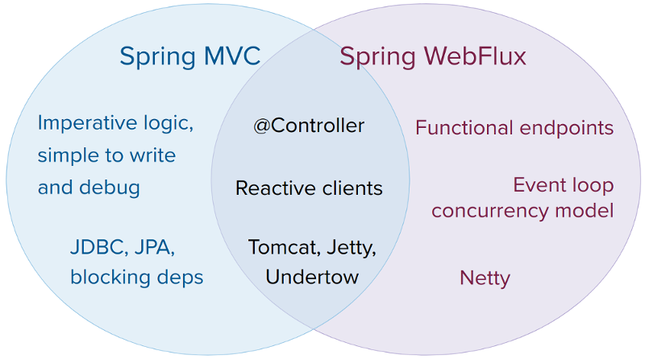

# Reactive 栈的 Web 应用

version 6.0.8-SNAPSHOT

[Back to index](https://springdoc.cn/spring/index.html)

- 1. Spring WebFlux

  - [1.1. 概览](https://springdoc.cn/spring/web-reactive.html#webflux-new-framework)
  - [1.2. Reactive 核心](https://springdoc.cn/spring/web-reactive.html#webflux-reactive-spring-web)
  - [1.3. `DispatcherHandler`](https://springdoc.cn/spring/web-reactive.html#webflux-dispatcher-handler)
  - [1.4. 注解式 Controller](https://springdoc.cn/spring/web-reactive.html#webflux-controller)
  - [1.5. 函数式端点](https://springdoc.cn/spring/web-reactive.html#webflux-fn)
  - [1.6. URI 链接](https://springdoc.cn/spring/web-reactive.html#webflux-uri-building)
  - [1.7. CORS](https://springdoc.cn/spring/web-reactive.html#webflux-cors)
  - [1.8. Error 响应](https://springdoc.cn/spring/web-reactive.html#webflux-ann-rest-exceptions)
  - [1.9. Web Security](https://springdoc.cn/spring/web-reactive.html#webflux-web-security)
  - [1.10. HTTP 缓存](https://springdoc.cn/spring/web-reactive.html#webflux-caching)
  - [1.11. 视图技术](https://springdoc.cn/spring/web-reactive.html#webflux-view)
  - [1.12. WebFlux 配置](https://springdoc.cn/spring/web-reactive.html#webflux-config)
  - [1.13. HTTP/2](https://springdoc.cn/spring/web-reactive.html#webflux-http2)

- [2. WebClient](https://springdoc.cn/spring/web-reactive.html#webflux-client)

- [3. HTTP接口客户端](https://springdoc.cn/spring/web-reactive.html#webflux-http-interface-client)

- [4. WebSockets](https://springdoc.cn/spring/web-reactive.html#webflux-websocket)

- [5. 测试](https://springdoc.cn/spring/web-reactive.html#webflux-test)

- [6. RSocket](https://springdoc.cn/spring/web-reactive.html#rsocket)

- [7. 响应式库](https://springdoc.cn/spring/web-reactive.html#webflux-reactive-libraries)

|      | 本站([springdoc.cn](https://springdoc.cn/))中的内容来源于 [spring.io](https://spring.io/) ，原始版权归属于 [spring.io](https://spring.io/)。由 [springdoc.cn](https://springdoc.cn/) 进行翻译，整理。可供个人学习、研究，未经许可，不得进行任何转载、商用或与之相关的行为。 商标声明：Spring 是 Pivotal Software, Inc. 在美国以及其他国家的商标。 |
| ---- | ------------------------------------------------------------ |
|      |                                                              |

这部分文档涵盖了对建立在 [Reactive Streams](https://www.reactive-streams.org/) API上的 reactive 栈的 Web应用的支持，这些应用可以在非阻塞服务器上运行，如Netty、Undertow和Servlet容器。个别章节涵盖了 [Spring WebFlux](https://springdoc.cn/spring/web-reactive.html#webflux) 框架、响应式 [`WebClient`](https://springdoc.cn/spring/web-reactive.html#webflux-client)、对 [测试](https://springdoc.cn/spring/web-reactive.html#webflux-test) 的支持以及 [响应式库](https://springdoc.cn/spring/web-reactive.html#webflux-reactive-libraries)。对于 Servlet 栈的Web应用，请看 [Servlet 栈的Web应用](https://springdoc.cn/spring/web.html#spring-web)。

## 1. Spring WebFlux

Spring 框架中包含的原始 Web 框架 Spring Web MVC 是专门为 Servlet API 和 Servlet 容器而设计的。后来在 5.0 版本中加入了 reactive 栈的 Web 框架 Spring WebFlux。它是完全非阻塞的，支持 [Reactive Streams](https://www.reactive-streams.org/) 背压，并在 Netty、Undertow 和 Servlet 容器等服务器上运行。

这两个Web框架都反映了其源模块的名称（ [spring-webmvc](https://github.com/spring-projects/spring-framework/tree/main/spring-webmvc) 和 [spring-webflux](https://github.com/spring-projects/spring-framework/tree/main/spring-webflux)）并在Spring框架中并存。每个模块都是可选的。应用程序可以使用一个或另一个模块，或者在某些情况下同时使用—例如，Spring MVC Controller 与响应式 `WebClient`。

### 1.1. 概览

为什么要创建 Spring WebFlux？

部分答案是需要一个非阻塞的Web栈来处理少量线程的并发，并以较少的硬件资源进行扩展。Servlet 的非阻塞I/O引出了Servlet API的其他部分，其中的约定是同步的（`Filter`，`Servlet`）或阻塞的（`getParameter`，`getPart`）。这是一个新的通用API的动机，作为跨越任何非阻塞运行时的基础。这一点很重要，因为服务器（如Netty）在异步、非阻塞领域已经很成熟了。

答案的另一部分是函数式编程。就像Java 5中增加的注解创造了机会（如注解的REST controller 或单元测试）一样，Java 8中增加的lambda表达式为Java中的函数式 API 创造了机会。这对非阻塞式应用和 continuation 式API（如 `CompletableFuture` 和 [ReactiveX](https://reactivex.io/) 所推广的）来说是个福音，它们允许异步逻辑的声明式组合。在编程模型层面，Java 8 使 Spring WebFlux 能够在注解的 controller 的同时提供函数式的 Web 端点。

#### 1.1.1. 定义 “Reactive” （响应式）

我们谈到了 "非阻塞" 和 "函数式"，但响应式是什么意思？

术语 “reactive”（响应式）， 指的是围绕对变化做出反应的编程模型—对I/O事件做出反应的网络组件，对鼠标事件做出反应的UI controller，以及其他。从这个意义上说，非阻塞就是响应式，因为，我们现在不是被阻塞，而是在操作完成或数据可用时对通知做出反（响）应。

还有一个重要的机制，我们Spring团队将其与 "响应式" 联系在一起，那就是非阻塞式背压。在同步的、命令式的代码中，阻塞式调用是一种自然的背压形式，迫使调用者等待。在非阻塞代码中，控制事件的速度变得很重要，这样快速的生产者就不会压倒其“消费者”。

Reactive Streams是一个 [小型规范](https://github.com/reactive-streams/reactive-streams-jvm/blob/master/README.md#specification)（也在Java 9中 [采用](https://docs.oracle.com/javase/9/docs/api/java/util/concurrent/Flow.html)），它定义了异步组件之间的互动，具有背压。例如，一个 data repository（作为 [Publisher](https://www.reactive-streams.org/reactive-streams-1.0.1-javadoc/org/reactivestreams/Publisher.html)）可以产生数据，然后由一个HTTP服务器（作为 [Subscriber](https://www.reactive-streams.org/reactive-streams-1.0.1-javadoc/org/reactivestreams/Subscriber.html)）写入响应。Reactive Streams 的主要目的是让订阅者控制发布者产生数据的快慢。

|      | **常见的问题：如果 publisher 不能放慢速度怎么办？** Reactive Stream 的目的只是为了建立机制和一个边界。如果一个 publisher 不能放慢速度，它必须决定是缓冲、放弃还是失败。 |
| ---- | ------------------------------------------------------------ |
|      |                                                              |

#### 1.1.2. Reactive API

Reactive Streams 对互操作性起着重要作用。它对库和基础设施组件很有意义，但作为应用程序的API却不太有用，因为它太低级了。应用程序需要一个更高级别的、更丰富的、功能性的API来组成异步逻辑—类似于Java 8的 `Stream` API，但不只是用于集合。这就是响应式库所扮演的角色。

[Reactor](https://github.com/reactor/reactor) 是Spring WebFlux 的首选响应式库。它提供了 [`Mono`](https://projectreactor.io/docs/core/release/api/reactor/core/publisher/Mono.html) 和 [`Flux`](https://projectreactor.io/docs/core/release/api/reactor/core/publisher/Flux.html) API类型，通过与 ReactiveX [运算符词汇](https://reactivex.io/documentation/operators.html) 相一致的丰富运算符集，对 0..1（`Mono`）和 0..N（`Flux`）的数据序列进行操作。Reactor是一个Reactive Streams库，因此，它的所有操作符都支持非阻塞的背压。Reactor非常关注服务器端的Java。它是与Spring紧密合作开发的。

WebFlux需要Reactor作为核心依赖，但它可以通过Reactive Streams与其他响应式库互操作。一般来说，WebFlux API接受一个普通的 `Publisher` 作为输入，在内部将其调整为Reactor类型，使用该类型，并返回 `Flux` 或 `Mono` 作为输出。因此，你可以传递任何 `Publisher` 作为输入，你可以在输出上应用操作，但你需要调整输出，以便与另一个响应式库一起使用。在可行的情况下（例如，注解 controller），WebFlux会透明地适应RxJava或其他响应式库的使用。更多细节请参见 [响应式库](https://springdoc.cn/spring/web-reactive.html#webflux-reactive-libraries)。

|      | 除了Reactive APIs，WebFlux还可以与Kotlin中的 [Coroutines](https://springdoc.cn/spring/languages.html#coroutines) APIs一起使用，它提供了一种更多的命令式编程风格。下面的Kotlin代码样本将提供Coroutines APIs。 |
| ---- | ------------------------------------------------------------ |
|      |                                                              |

#### 1.1.3. 编程模型

`spring-web` 模块包含了支撑Spring WebFlux的响应式基础，包括HTTP抽象、支持服务器的Reactive Streams [适配器](https://springdoc.cn/spring/web-reactive.html#webflux-httphandler)、[编解码器](https://springdoc.cn/spring/web-reactive.html#webflux-codecs)，以及与Servlet API相当但具有非阻塞约定的核心 [`WebHandler` API](https://springdoc.cn/spring/web-reactive.html#webflux-web-handler-api)。

在此基础上，Spring WebFlux提供了两种编程模型的选择：

- [注解式 Controller](https://springdoc.cn/spring/web-reactive.html#webflux-controller): 与Spring MVC一致，基于 `spring-web` 模块的相同注解。Spring MVC 和 WebFlux Controller 都支持响应式（Reactor和RxJava）返回类型，因此，要区分它们并不容易。一个明显的区别是，WebFlux也支持响应式的 `@RequestBody` 参数。
- [函数式端点](https://springdoc.cn/spring/web-reactive.html#webflux-fn): 基于Lambda的、轻量级的、函数式的编程模型。你可以把它看成是一个小型的库或一组实用程序，应用程序可以用它来路由和处理请求。和注解式 controller 的最大区别是，应用程序从头到尾负责处理请求，而不是通过注解声明意图并被回调。

#### 1.1.4. 适用性

Spring MVC 还是 WebFlux？

这是一个很自然的问题，但它却设置了一个不健全的二分法。实际上，两者都是为了扩大可用选项的范围而共同工作。两者的设计都是为了彼此的连续性和一致性，它们可以并排使用，每一方的反馈都对双方有利。下图显示了这两者的关系，它们的共同点，以及各自支持的独特之处：



我们建议你考虑以下具体要点：

- 如果你有一个运行良好的Spring MVC应用程序，就没有必要改变。命令式编程是编写、理解和调试代码的最简单方式。你可以最大限度地选择库，因为从历史上看，大多数库都是阻塞的。
- 如果你已经在“选购”非阻塞式 web stack，Spring WebFlux 提供了与该领域其他公司相同的执行模式优势，还提供了服务器（Netty、Tomcat、Jetty、Undertow和Servlet容器）的选择、编程模式（注解式 controller 和函数式 web 端点）的选择，以及响应式库（Reactor、RxJava或其他）的选择。
- 如果你对用于Java 8 lambdas或Kotlin的轻量级功能性Web框架感兴趣，你可以使用Spring WebFlux 函数式 Web端点。对于需求不那么复杂的小型应用或微服务来说，这也是一个不错的选择，可以从更大的透明度和控制力中受益。
- 在微服务架构中，你可以将应用与 Spring MVC 或 Spring WebFlux controller 或与 Spring WebFlux 函数式端点混合在一起。在这两个框架中支持相同的基于注解的编程模型，可以更容易地重复使用知识，同时也可以为正确的工作选择正确的工具。
- 评估一个应用程序的简单方法是检查其依赖。如果你有阻塞的持久化API（JPA、JDBC）或网络API需要使用，Spring MVC 至少是普通架构的最佳选择。用 Reactor 和 RxJava 在单独的线程上执行阻塞调用在技术上是可行的，但你不会充分利用非阻塞的 Web stack。
- 如果你有一个调用远程服务的 Spring MVC 应用，可以试试响应式 `WebClient`。你可以直接从Spring MVC Controller 方法中返回响应式类型（Reactor、RxJava或 [其他](https://springdoc.cn/spring/web-reactive.html#webflux-reactive-libraries)）。每次调用的延迟越大或调用之间的相互依赖性越大，好处就越明显。Spring MVC Controller 也可以调用其他响应式组件。
- 如果你有一个大的团队，请记住在转向非阻塞、函数式和声明式编程时的陡峭学习曲线。在没有完全转换的情况下，一个实用的方法是使用响应式的 `WebClient`。除此之外，从小处着手，并衡量其好处。我们预计，对于广泛的应用，这种转变是不必要的。如果你不确定要寻找什么好处，可以从了解非阻塞I/O的工作原理（例如，单线程Node.js的并发性）及其影响开始。

#### 1.1.5. 服务器

Spring WebFlux支持Tomcat、Jetty、Servlet容器，以及Netty和Undertow等非Servlet运行时。所有的服务器都适应于低级别的 [通用API](https://springdoc.cn/spring/web-reactive.html#webflux-httphandler)，这样就可以跨服务器支持更高级别的 [编程模型](https://springdoc.cn/spring/web-reactive.html#webflux-programming-models)。

Spring WebFlux没有内置的支持来启动或停止服务器。然而，通过Spring配置和 [WebFlux基础架构](https://springdoc.cn/spring/web-reactive.html#webflux-config) [组装](https://springdoc.cn/spring/web-reactive.html#webflux-web-handler-api) 一个应用程序，并通过几行代码来 [运行它](https://springdoc.cn/spring/web-reactive.html#webflux-httphandler) 是很容易的。

Spring Boot 有一个 WebFlux starter，可以自动完成这些步骤。默认情况下，starter 使用Netty，但通过改变Maven或Gradle的依赖，可以轻松切换到Tomcat、Jetty或Undertow。Spring Boot默认使用Netty，因为它在异步、非阻塞空间中使用得更广泛，可以让客户端和服务器共享资源。

Tomcat和Jetty都可以与Spring MVC和WebFlux一起使用。然而，请记住，它们的使用方式是非常不同的。Spring MVC依赖于Servlet阻塞式I/O，并让应用程序在需要时直接使用Servlet API。Spring WebFlux依赖于Servlet的非阻塞I/O，并在一个低级别的适配器后面使用Servlet API。它没有被暴露出来以供直接使用。

对于 Undertow，Spring WebFlux 直接使用 Undertow 的API，而不使用 Servlet API。

#### 1.1.6. 性能

性能有很多特点和含义。响应式和非阻塞式通常不会使应用程序运行得更快。在某些情况下，它们可以（例如，如果使用 `WebClient` 来并行运行远程调用）。总的来说，用非阻塞的方式做事需要更多的工作，这可能会稍微增加所需的处理时间。

响应式和非阻塞式的关键预期好处是能够用少量的、固定的线程和较少的内存来扩展。这使得应用程序在负载下更有弹性，因为它们以一种更可预测的方式扩展。然而，为了观察这些好处，你需要有一些延迟（包括缓慢和不可预测的网络I/O的混合）。这就是 reactive stack 开始显示其优势的地方，其差异可能是巨大的。

#### 1.1.7. 并发模型

Spring MVC和Spring WebFlux都支持注解 Controller ，但在并发模型以及阻塞和线程的默认假设方面有一个关键区别。

在Spring MVC（以及一般的servlet应用程序）中，假定应用程序可以阻塞当前线程，（例如，用于远程调用）。出于这个原因，servlet容器使用一个大的线程池来吸收请求处理过程中可能出现的阻塞。

在Spring WebFlux（以及一般的非阻塞服务器）中，假定应用程序不会阻塞。因此，非阻塞服务器使用一个小的、固定大小的线程池（event loop worke）来处理请求。

|      | "扩展"和 "少量的线程" 听起来可能是矛盾的，但永远不阻塞当前线程（而依靠回调）意味着你不需要额外的线程，因为没有阻塞的调用需要吸收。 |
| ---- | ------------------------------------------------------------ |
|      |                                                              |

##### 调用阻塞 API

如果你确实需要使用一个阻塞库呢？Reactor和RxJava都提供了 `publishOn` 操作符，可以在不同的线程上继续处理。这意味着有一个简单的救命稻草。然而，请记住，阻塞式API并不适合这种并发模型。

##### 可变的状态

在Reactor和RxJava中，你通过操作符声明逻辑。在运行时，会形成一个响应式 pipeline，在这个 pipeline 中，数据被按顺序、分阶段地处理。这样做的一个主要好处是，它使应用程序不必保护易变的状态，因为该 pipeline 中的应用程序代码不会被并发调用。

##### 线程模型

在使用Spring WebFlux运行的服务器上，你应该看到哪些线程？

- 在 "vanilla" Spring WebFlux 服务器上（例如，没有数据访问，也没有其他可选依赖），你可以期待服务器有一个线程，其他几个线程用于请求处理（通常与CPU核的数量一样多）。然而，Servlet容器开始时可能有更多的线程（例如Tomcat上的10个），以支持Servlet（阻塞）I/O和Servlet 3.1（非阻塞）I/O的使用。
- 响应式 `WebClient` 以事件循环（event loop）方式运行。所以你可以看到与之相关的少量固定的处理线程（例如，`reactor-http-nio-` 与 Reactor Netty connector）。然而，如果 Reactor Netty 同时用于客户端和服务器，两者默认共享事件循环资源。
- Reactor 和 RxJava 提供了线程池抽象，称为调度器（scheduler），与用于将处理切换到不同线程池的 `publishOn` 操作符一起使用。调度器的名字暗示了特定的并发策略—例如，“parallel”（用于有限数量线程的CPU绑定工作）或 “elastic”（用于有大量线程的I/O绑定工作）。如果你看到这样的线程，这意味着一些代码正在使用特定的线程池 `Scheduler` 策略。
- 数据访问库和其他第三方依赖也可以创建和使用它们自己的线程。

##### 配置

Spring框架不提供对启动和停止 [服务器](https://springdoc.cn/spring/web-reactive.html#webflux-server-choice) 的支持。要配置服务器的线程模型，你需要使用服务器特定的配置API，或者，如果你使用Spring Boot，请检查每个服务器的Spring Boot配置选项。你可以直接 [配置](https://springdoc.cn/spring/web-reactive.html#webflux-client-builder) `WebClient`。对于所有其他的库，请看它们各自的文档。

### 1.2. Reactive 核心

`spring-web` 模块包含以下对响应式Web应用的基础支持：

- 对于服务器请求处理，有两个级别的支持。
  - [HttpHandler](https://springdoc.cn/spring/web-reactive.html#webflux-httphandler): 用于HTTP请求处理的基本约定，具有非阻塞I/O和Reactive Streams背压，以及Reactor Netty、Undertow、Tomcat、Jetty和任何Servlet容器的适配器。
  - [`WebHandler` API](https://springdoc.cn/spring/web-reactive.html#webflux-web-handler-api): 稍微高一点的，用于处理请求的通用 web API，在此基础上建立具体的编程模型，如注解controller和函数式端点。
- 对于客户端来说，有一个基本的 `ClientHttpConnector` 约定来执行具有非阻塞I/O和Reactive Streams背压的HTTP请求，同时还有 [Reactor Netty](https://github.com/reactor/reactor-netty)、reactive [Jetty HttpClient](https://github.com/jetty-project/jetty-reactive-httpclient) 和 [Apache HttpComponents](https://hc.apache.org/) 的适配器。应用中使用的更高层次的 [WebClient](https://springdoc.cn/spring/web-reactive.html#webflux-client) 是建立在这个基本约定之上的。

#### 1.2.1. `HttpHandler`

[HttpHandler](https://docs.spring.io/spring-framework/docs/6.0.8-SNAPSHOT/javadoc-api/org/springframework/http/server/reactive/HttpHandler.html) 是一个简单的契约，有一个处理请求和响应的单一方法。它有意做到最小，它的主要和唯一的目的是成为不同的HTTP服务器API的最小抽象。

下表描述了支持的服务器API：

| 服务器       | 使用的服务器API                                            | Reactive Streams 的支持                                   |
| :----------- | :--------------------------------------------------------- | :-------------------------------------------------------- |
| Netty        | Netty API                                                  | [Reactor Netty](https://github.com/reactor/reactor-netty) |
| Undertow     | Undertow API                                               | spring-web: Undertow 到 Reactive Streams 的 bridge        |
| Tomcat       | Servlet非阻塞式I/O；Tomcat API读和写 ByteBuffers vs byte[] | spring-web: Servlet非阻塞I/O到Reactive Streams的bridge    |
| Jetty        | Servlet非阻塞式I/O；Jetty API写ByteBuffers vs byte[]       | spring-web: Servlet非阻塞I/O到Reactive Streams的bridge    |
| Servlet 容器 | Servlet 非阻塞 I/O                                         | spring-web:Servlet非阻塞I/O到Reactive Streams的bridge     |

下表描述了服务器的依赖（也见 [支持的版本](https://github.com/spring-projects/spring-framework/wiki/What's-New-in-the-Spring-Framework)）：

| 服务器        | Group id                | Artifact name               |
| :------------ | :---------------------- | :-------------------------- |
| Reactor Netty | io.projectreactor.netty | reactor-netty               |
| Undertow      | io.undertow             | undertow-core               |
| Tomcat        | org.apache.tomcat.embed | tomcat-embed-core           |
| Jetty         | org.eclipse.jetty       | jetty-server, jetty-servlet |

下面的代码片段显示了在每个服务器API中使用 `HttpHandler` 适配器（adapter）：

**Reactor Netty**

Java

Kotlin

```java
HttpHandler handler = ...
ReactorHttpHandlerAdapter adapter = new ReactorHttpHandlerAdapter(handler);
HttpServer.create().host(host).port(port).handle(adapter).bindNow();
```

**Undertow**

Java

Kotlin

```java
HttpHandler handler = ...
UndertowHttpHandlerAdapter adapter = new UndertowHttpHandlerAdapter(handler);
Undertow server = Undertow.builder().addHttpListener(port, host).setHandler(adapter).build();
server.start();
```

**Tomcat**

Java

Kotlin

```java
HttpHandler handler = ...
Servlet servlet = new TomcatHttpHandlerAdapter(handler);

Tomcat server = new Tomcat();
File base = new File(System.getProperty("java.io.tmpdir"));
Context rootContext = server.addContext("", base.getAbsolutePath());
Tomcat.addServlet(rootContext, "main", servlet);
rootContext.addServletMappingDecoded("/", "main");
server.setHost(host);
server.setPort(port);
server.start();
```

**Jetty**

Java

Kotlin

```java
HttpHandler handler = ...
Servlet servlet = new JettyHttpHandlerAdapter(handler);

Server server = new Server();
ServletContextHandler contextHandler = new ServletContextHandler(server, "");
contextHandler.addServlet(new ServletHolder(servlet), "/");
contextHandler.start();

ServerConnector connector = new ServerConnector(server);
connector.setHost(host);
connector.setPort(port);
server.addConnector(connector);
server.start();
```

**Servlet 容器**

要以WAR的形式部署到任何Servlet容器，你可以继承并在WAR中包含 [`AbstractReactiveWebInitializer`](https://docs.spring.io/spring-framework/docs/6.0.8-SNAPSHOT/javadoc-api/org/springframework/web/server/adapter/AbstractReactiveWebInitializer.html)。该类用 `ServletHttpHandlerAdapter` 包装了一个 `HttpHandler`，并将其注册为一个 `Servlet`。

#### 1.2.2. `WebHandler` API

`org.springframework.web.server` 包建立在 [`HttpHandler`](https://springdoc.cn/spring/web-reactive.html#webflux-httphandler) 契约的基础上，提供了一个通用的Web API，通过多个 [`WebExceptionHandler`](https://docs.spring.io/spring-framework/docs/6.0.8-SNAPSHOT/javadoc-api/org/springframework/web/server/WebExceptionHandler.html)、多个 [`WebFilter`](https://docs.spring.io/spring-framework/docs/6.0.8-SNAPSHOT/javadoc-api/org/springframework/web/server/WebFilter.html) 以及单个 [`WebHandler`](https://docs.spring.io/spring-framework/docs/6.0.8-SNAPSHOT/javadoc-api/org/springframework/web/server/WebHandler.html)组件的链来处理请求。该链可以通过简单地指向 [自动检测](https://springdoc.cn/spring/web-reactive.html#webflux-web-handler-api-special-beans) 组件的 Spring `ApplicationContext`，和/或通过向 builder 注册组件来与 `WebHttpHandlerBuilder` 组合。

虽然 `HttpHandler` 有一个简单的目标，即抽象出不同的HTTP服务器的使用，但 `WebHandler` API的目标是提供一套更广泛的在Web应用程序中常用的功能，如：

- User session 和 attributes。
- Request attributes。
- 为 Request 解析 `Locale` 或 `Principal`。
- 访问已解析和缓存的表单数据。
- multipart data 的抽象。
- 等 。。。

##### 特殊的 Bean 类型

下表列出了 `WebHttpHandlerBuilder` 可以在Spring `ApplicationContext` 中自动检测的组件，或者可以直接用它来注册：

| Bean                         | Bean 类型                    | 说明 | 说明                                                         |
| :--------------------------- | :--------------------------- | :--- | :----------------------------------------------------------- |
| <any>                        | `WebExceptionHandler`        | 0..N | 提供对来自 `WebFilter` 实例链和目标 `WebHandler` 的异常的处理。更多的细节，请看 [异常（Exception）](https://springdoc.cn/spring/web-reactive.html#webflux-exception-handler)。 |
| <any>                        | `WebFilter`                  | 0..N | 在过滤器链（filter chain）的其他部分和目标 `WebHandler` 之前和之后应用拦截式逻辑。更多细节，见 [过滤器（Filter）](https://springdoc.cn/spring/web-reactive.html#webflux-filters)。 |
| `webHandler`                 | `WebHandler`                 | 1    | 请求的处理程序（handler）。                                  |
| `webSessionManager`          | `WebSessionManager`          | 0..1 | `WebSession` 实例的管理器，通过 `ServerWebExchange` 的一个方法暴露出来。默认情况下是 `DefaultWebSessionManager`。 |
| `serverCodecConfigurer`      | `ServerCodecConfigurer`      | 0..1 | 用于访问 `HttpMessageReader` 实例，以解析 form data 和 multipart data，然后通过 `ServerWebExchange` 上的方法公开。默认情况下，使用 `ServerCodecConfigurer.create()`。 |
| `localeContextResolver`      | `LocaleContextResolver`      | 0..1 | `LocaleContext` 的解析器，通过 `ServerWebExchange` 的一个方法暴露出来。默认情况下是 `AcceptHeaderLocaleContextResolver`。 |
| `forwardedHeaderTransformer` | `ForwardedHeaderTransformer` | 0..1 | 用于处理转 forwarded type 的 header，可以提取和删除它们，也可以只删除它们。默认情况下不使用。 |

##### 表单（Form）数据

`ServerWebExchange` 暴露了以下访问表单数据的方法：

Java

Kotlin

```java
Mono<MultiValueMap<String, String>> getFormData();
```

`DefaultServerWebExchange` 使用配置的 `HttpMessageReader` 来解析表单数据（`application/x-www-form-urlencoded`）到 `MultiValueMap`。默认情况下，`FormHttpMessageReader` 被配置为由 `ServerCodecConfigurer` bean 使用（见 [Web Handler API](https://springdoc.cn/spring/web-reactive.html#webflux-web-handler-api)）。

##### Multipart Data

[参见 Servlet 技术栈中的相应内容](https://springdoc.cn/spring/web.html#mvc-multipart)

`ServerWebExchange` 为访问 multipart data 暴露了以下方法：

Java

Kotlin

```java
Mono<MultiValueMap<String, Part>> getMultipartData();
```

`DefaultServerWebExchange` 使用配置的 `HttpMessageReader<MultiValueMap<String, Part>>` 来解析 `multipart/form-data`、`multipart/mixed` 和 `multipart/related` 内容到 `MultiValueMap`。默认情况下，这是 `DefaultPartHttpMessageReader`，它没有任何第三方的依赖。另外，也可以使用 `SynchronossPartHttpMessageReader`，它是基于 [Synchronoss NIO Multipart](https://github.com/synchronoss/nio-multipart) 库的。两者都是通过 `ServerCodecConfigurer` Bean来配置的（见 [Web Handler API](https://springdoc.cn/spring/web-reactive.html#webflux-web-handler-api)）。

为了以流的方式解析 multipart data，你可以使用从 `PartEventHttpMessageReader` 返回的 `Flux<PartEvent>`，而不是使用 `@RequestPart`，因为这意味着通过名称对单个 part 进行类似 `Map` 的访问，因此，需要完整地解析 multipart data。相比之下，你可以使用 `@RequestBody` 将内容解码为 `Flux<PartEvent>`，而无需收集到 `MultiValueMap`。

##### Forwarded Header

[参见 Servlet 技术栈中的相应内容](https://springdoc.cn/spring/web.html#filters-forwarded-headers)

当一个请求通过代理（如负载均衡器）时，host、port 和 scheme 可能会改变。这使得从客户的角度来看，创建指向正确的 host、port 和 scheme 的链接成为一种挑战。

[RFC 7239](https://tools.ietf.org/html/rfc7239) 定义了 `Forwarded` HTTP头，代理可以用它来提供关于原始请求的信息。还有其他非标准的 header，包括 `X-Forwarded-Host`、`X-Forwarded-Port`、`X-Forwarded-Proto`、`X-Forwarded-SSL` 和 `X-Forwarded-Prefix`。

`ForwardedHeaderTransformer` 是一个组件，它根据 forwarded header 修改请求的host、port 和 scheme，然后删除这些header。如果你以 `forwardedHeaderTransformer` 为名将其声明为一个Bean，它将被 [检测](https://springdoc.cn/spring/web-reactive.html#webflux-web-handler-api-special-beans) 并使用。

对 forwarded header 有安全方面的考虑，因为应用程序无法知道这些头信息是由代理按计划添加的，还是由恶意的客户添加的。这就是为什么在信任边界的代理应该被配置为删除来自外部的不被信任的转发流量。你也可以将 `ForwardedHeaderTransformer` 配置为 `removeOnly=true`，在这种情况下，它将删除但不使用这些 header。

|      | 在5.1版本中，`ForwardedHeaderFilter` 被弃用，并被 `ForwardedHeaderTransformer` 所取代，因此 forwarded header 可以在创建 exchange 之前被提前处理。如果过滤器（filter）被配置了，它就会从过滤器的列表中取出来，而使用 `ForwardedHeaderTransformer`。 |
| ---- | ------------------------------------------------------------ |
|      |                                                              |

#### 1.2.3. 过滤器（Filter）

[参见 Servlet 技术栈中的相应内容](https://springdoc.cn/spring/web.html#filters)

在 [`WebHandler` API](https://springdoc.cn/spring/web-reactive.html#webflux-web-handler-api), 中，你可以使用 `WebFilter` 在过滤器和目标 `WebHandler` 的其他处理链之前和之后应用拦截式逻辑。当使用 [WebFlux 配置](https://springdoc.cn/spring/web-reactive.html#webflux-config) 时，注册一个 `WebFilter` 就像把它声明为一个Spring Bean一样简单，并（可选择）通过在bean声明中使用 `@Order` 或实现 `Ordered` 来表达优先级。

##### CORS

[参见 Servlet 技术栈中的相应内容](https://springdoc.cn/spring/web.html#filters-cors)

Spring WebFlux 通过 controller 上的注解为 CORS 配置提供了细粒度的支持。然而，当你将其与Spring Security一起使用时，我们建议依靠内置的 `CorsFilter`，它的顺序必须在 Spring Security 的过滤器链之前。

更多细节请参见 [CORS](https://springdoc.cn/spring/web-reactive.html#webflux-cors) 和 [CORS `WebFilter`](https://springdoc.cn/spring/web-reactive.html#webflux-cors-webfilter) 部分。

#### 1.2.4. 异常（Exception）

[参见 Servlet 技术栈中的相应内容](https://springdoc.cn/spring/web.html#mvc-ann-customer-servlet-container-error-page)

在 [`WebHandler` API](https://springdoc.cn/spring/web-reactive.html#webflux-web-handler-api) 中，你可以使用一个 `WebExceptionHandler` 来处理来自 `WebFilter` 实例链和目标 `WebHandler` 的异常。当使用 [WebFlux 配置](https://springdoc.cn/spring/web-reactive.html#webflux-config) 时，注册一个 `WebExceptionHandler` 就像把它声明为 Spring Bean 一样简单，并（可选择）通过在bean声明中使用 `@Order` 或实现 `Ordered` 来表达优先级。

下表描述了可用的 `WebExceptionHandler` 实现：

| Exception Handler                       | 说明                                                         |
| :-------------------------------------- | :----------------------------------------------------------- |
| `ResponseStatusExceptionHandler`        | 为 [`ResponseStatusException`](https://docs.spring.io/spring-framework/docs/6.0.8-SNAPSHOT/javadoc-api/org/springframework/web/server/ResponseStatusException.html) 类型的异常提供处理，将响应设为异常的HTTP状态代码。 |
| `WebFluxResponseStatusExceptionHandler` | `ResponseStatusExceptionHandler` 的扩展，也可以确定任何异常的 `@ResponseStatus` 注解的HTTP状态代码。这个处理程序是在 [WebFlux 配置](https://springdoc.cn/spring/web-reactive.html#webflux-config) 中声明的。 |

#### 1.2.5. 编解码器（Codecs）

[参见 Servlet 技术栈中的相应内容](https://springdoc.cn/spring/integration.html#rest-message-conversion)

`spring-web` 和 `spring-core` 模块通过非阻塞I/O与Reactive Streams背压，提供了对高层对象的字节内容序列化和反序列化的支持。下面描述了这种支持：

- [`Encoder`](https://docs.spring.io/spring-framework/docs/6.0.8-SNAPSHOT/javadoc-api/org/springframework/core/codec/Encoder.html) 和 [`Decoder`](https://docs.spring.io/spring-framework/docs/6.0.8-SNAPSHOT/javadoc-api/org/springframework/core/codec/Decoder.html) 是独立于HTTP的编码和解码内容的低级别契约。
- [`HttpMessageReader`](https://docs.spring.io/spring-framework/docs/6.0.8-SNAPSHOT/javadoc-api/org/springframework/http/codec/HttpMessageReader.html) 和https://docs.spring.io/spring-framework/docs/6.0.8-SNAPSHOT/javadoc-api/org/springframework/http/codec/HttpMessageWriter.html[`HttpMessageWriter`] 是对HTTP消息内容进行编码和解码的契约。
- 一个 `Encoder` 可以用 `EncoderHttpMessageWriter` 来包装，以使其适用于 Web 应用程序中，而一个 `Decoder` 可以用 `DecoderHttpMessageReader` 来包装。
- [`DataBuffer`](https://docs.spring.io/spring-framework/docs/6.0.8-SNAPSHOT/javadoc-api/org/springframework/core/io/buffer/DataBuffer.html) 抽象了不同的字节缓冲区表示法（例如 Netty `ByteBuf`、`java.nio.ByteBuffer` 等），是所有编解码器的工作对象。请参阅 "Spring Core" 部分中的 [Data Buffer 和 Codec](https://springdoc.cn/spring/core.html#databuffers)，以了解更多关于这一主题的信息。

`spring-core` 模块提供 `byte[]`、`ByteBuffer`、`DataBuffer`、`Resource` 和 `String` 编码器和解码器的实现。`spring-web` 模块提供了 Jackson JSON、Jackson Smile、JAXB2、Protocol Buffers 和其他编码器和解码器，以及针对表单数据、multipart 内容、server-sent event 和其他的web专用HTTP消息读写器实现。

`ClientCodecConfigurer` and `ServerCodecConfigurer` are typically used to configure and customize the codecs to use in an application. See the section on configuring [HTTP消息编解码器](https://springdoc.cn/spring/web-reactive.html#webflux-config-message-codecs).

`ClientCodecConfigurer` 和 `ServerCodecConfigurer` 通常被用来配置和定制应用中使用的编解码器。参见配置 [HTTP消息编解码器](https://springdoc.cn/spring/web-reactive.html#webflux-config-message-codecs) 的章节。

##### Jackson JSON

当Jackson库存在时，JSON和二进制JSON（ [Smile](https://github.com/FasterXML/smile-format-specification)）都被支持。

`Jackson2Decoder` 的工作原理如下：

- Jackson的异步、非阻塞解析器被用来将字节块流聚集到 `TokenBuffer` 中，每个字节块代表一个JSON对象。
- 每个 `TokenBuffer` 被传递给 Jackson 的 `ObjectMapper`，以创建一个更高层次的对象。
- 当解码到一个单值 publisher（例如 `Mono`）时，有一个 `TokenBuffer`。
- 当解码到一个多值 publisher（如 `Flux`）时，每个 `TokenBuffer` 在收到足够的字节时就被传递给 `ObjectMapper`，以形成一个完整的对象。输入的内容可以是一个JSON数组，或任何 [以行为单位的JSON](https://en.wikipedia.org/wiki/JSON_streaming) 格式，如NDJSON，JSON行，或JSON文本序列。

`Jackson2Encoder` 的工作原理如下：

- 对于一个单一的值 publisher（例如 `Mono`），只需通过 `ObjectMapper` 将其序列化。
- 对于一个有 `application/json` 的多值 publisher，默认情况下用 `Flux#collectToList()` 来收集值，然后将得到的集合序列化。
- 对于具有流媒体类型（如 `application/x-ndjson` 或 `application/stream+x-jackson-smile`）的多值 publisher，使用 [以行为单位的JSON](https://en.wikipedia.org/wiki/JSON_streaming) 格式对每个值进行编码、写入和刷出。其他流媒体类型可以在 encoder 上注册。
- 对于SSE来说，`Jackson2Encoder` 在每个事件中被调用，output被刷出，以确保无延迟的交付。

|      | 默认情况下，`Jackson2Encoder` 和 `Jackson2Decoder` 都不支持 `String` 类型的元素。相反，默认的假设是一个字符串或一个字符串序列代表序列化的JSON内容，由 `CharSequenceEncoder` 来渲染。如果你需要的是从 `Flux<String>` 渲染一个JSON数组，使用 `Flux#collectToList()` 并编码一个 `Mono<List<String>`。 |
| ---- | ------------------------------------------------------------ |
|      |                                                              |

##### Form Data

`FormHttpMessageReader` 和 `FormHttpMessageWriter` 支持对 `application/x-www-form-urlencoded` 内容进行解码和编码。

在服务器端，表单内容经常需要从多个地方访问，`ServerWebExchange` 提供了一个专门的 `getFormData()` 方法，它通过 `FormHttpMessageReader` 解析内容，然后缓存结果以便重复访问。见 [`WebHandler` API](https://springdoc.cn/spring/web-reactive.html#webflux-web-handler-api) 部分的 [表单（Form）数据](https://springdoc.cn/spring/web-reactive.html#webflux-form-data) 。

一旦使用 `getFormData()`，就不能再从请求体中读取原始的内容。由于这个原因，应用程序应该始终通过 `ServerWebExchange` 来访问缓存的表单数据，而不是从原始请求体中读取。

##### Multipart

`MultipartHttpMessageReader` 和 `MultipartHttpMessageWriter` 支持对 "multipart/form-data"、"multipart/mixed" 和 "multipart/related" 内容进行解码和编码。反过来， `MultipartHttpMessageReader` 委托给另一个 `HttpMessageReader` 来进行实际的解析到 `Flux<Part>`，然后简单地将这些 part 收集到一个 `MultiValueMap` 中。默认情况下，使用 `DefaultPartHttpMessageReader`，但这可以通过 `ServerCodecConfigurer` 改变。关于 `DefaultPartHttpMessageReader` 的更多信息，请参阅 [`DefaultPartHttpMessageReader` 的javadoc](https://docs.spring.io/spring-framework/docs/6.0.8-SNAPSHOT/javadoc-api/org/springframework/http/codec/multipart/DefaultPartHttpMessageReader.html)。

在服务器端，如果 multipart 表单内容可能需要从多个地方访问，`ServerWebExchange` 提供了一个专门的 `getMultipartData()` 方法，该方法通过 `MultipartHttpMessageReader` 解析内容，然后缓存结果以便重复访问。参见 [`WebHandler` API](https://springdoc.cn/spring/web-reactive.html#webflux-web-handler-api) 部分的 [Multipart Data](https://springdoc.cn/spring/web-reactive.html#webflux-multipart)。

一旦使用了 `getMultipartData()`，就不能再从请求体中读取原始的内容。由于这个原因，应用程序必须坚持使用 `getMultipartData()` 来重复、类似 map 的访问 part，或者依靠 `SynchronossPartHttpMessageReader` 来一次性访问 `Flux<Part>`。

##### 限制

缓存部分或全部 input stream 的 `Decoder` 和 `HttpMessageReader` 实现可以被配置为在内存中缓冲的最大字节数的限制。在某些情况下，缓冲的发生是因为输入被聚合并表示为一个单一的对象—例如，一个带有 `@RequestBody byte[]` 的 controller 方法，`x-www-form-urlencoded` 数据，等等。缓冲也可能发生在流媒体中，当分割输入流时—例如，限定的文本，JSON对象的流，等等。对于这些流的情况，限制适用于与流中一个对象相关的字节数。

为了配置缓冲区的大小，你可以检查一个给定的 `Decoder` 或 `HttpMessageReader` 是否暴露了一个 `maxInMemorySize` 属性，如果是的话，Javadoc 会有关于默认值的细节。在服务器端， `ServerCodecConfigurer` 提供了一个设置所有编解码器的单一位置，参见 [HTTP消息编解码器](https://springdoc.cn/spring/web-reactive.html#webflux-config-message-codecs)。在客户端，所有编解码器的限制可以在 [WebClient.Builder](https://springdoc.cn/spring/web-reactive.html#webflux-client-builder-maxinmemorysize) 中改变。

对于 [Multipart 解析](https://springdoc.cn/spring/web-reactive.html#webflux-codecs-multipart)，`maxInMemorySize` 属性限制了非文件部分（part）的大小。对于文件 part，它决定了该 part 被写入磁盘的阈值。对于写入磁盘的文件 part，有一个额外的 `maxDiskUsagePerPart` 属性来限制每个 part 的磁盘空间量。还有一个 `maxParts` 属性，用于限制 multipart 请求中的总 part 数量。要在 WebFlux 中配置这三个属性，你需要向 `ServerCodecConfigurer` 提供一个预先配置的 `MultipartHttpMessageReader` 实例。

##### 流（Stream）

[参见 Servlet 技术栈中的相应内容](https://springdoc.cn/spring/web.html#mvc-ann-async-http-streaming)

当流式HTTP响应（例如，`text/event-stream`，`application/x-ndjson`）时，定期发送数据是很重要的，以便可靠地尽早检测到一个断开连接的客户端，而不是更晚。这样的发送可以是一个仅有 comment 的、空的SSE事件或任何其他 "无操作" 的数据，这将有效地作为一个心跳。

##### `DataBuffer`

`DataBuffer` 是 WebFlux 中字节缓冲区的代表。本参考文献的Spring Core部分在 [Data Buffer 和 Codec](https://springdoc.cn/spring/core.html#databuffers) 部分有更多的介绍。需要理解的关键点是，在一些服务器上，如Netty，字节缓冲区是池化和引用计数的，在消耗时必须释放以避免内存泄漏。

WebFlux应用程序一般不需要关注这些问题，除非它们直接消费或生产数据缓冲区（data buffer），而不是依靠编解码器来转换为更高级别的对象，或者它们选择创建自定义编解码器。对于这种情况，请查看 [Data Buffer 和 Codec](https://springdoc.cn/spring/core.html#databuffers) 中的信息，特别是 [使用 DataBuffer](https://springdoc.cn/spring/core.html#databuffers-using) 的部分。

#### 1.2.6. 日志

[参见 Servlet 技术栈中的相应内容](https://springdoc.cn/spring/web.html#mvc-logging)

Spring WebFlux中的 `DEBUG` 级别日志被设计成紧凑、简约和人性化的。它专注于高价值的信息，这些信息可以反复使用，而其他信息只有在调试某个特定问题时才会有用。

`TRACE` 级别的日志通常遵循与 `DEBUG` 相同的原则（例如也不应该是火线），但可以用于调试任何问题。此外，一些日志信息在 `TRACE` 与 `DEBUG` 下可能显示不同的细节。

好的日志来自于使用日志的经验。如果你发现任何不符合既定目标的地方，请让我们知道。

##### 日志 ID

在WebFlux中，一个请求可以在多个线程上运行，线程ID对于关联属于特定请求的日志消息没有用。这就是为什么WebFlux的日志消息默认以特定请求的ID为前缀。

在服务器端，日志ID存储在 `ServerWebExchange` 属性中（ [`LOG_ID_ATTRIBUTE`](https://docs.spring.io/spring-framework/docs/6.0.8-SNAPSHOT/javadoc-api/org/springframework/web/server/ServerWebExchange.html#LOG_ID_ATTRIBUTE)），而基于该ID的完全格式化的前缀可以从 `ServerWebExchange#getLogPrefix()` 获得。在 `WebClient` 端，日志ID存储在 `ClientRequest` attribute 中（ [`LOG_ID_ATTRIBUTE`](https://docs.spring.io/spring-framework/docs/6.0.8-SNAPSHOT/javadoc-api/org/springframework/web/reactive/function/client/ClientRequest.html#LOG_ID_ATTRIBUTE)），而完全格式化的前缀可以从 `ClientRequest#logPrefix()` 中获得。

##### 敏感数据

[参见 Servlet 技术栈中的相应内容](https://springdoc.cn/spring/web.html#mvc-logging-sensitive-data)

`DEBUG` 和 `TRACE` 日志可以记录敏感信息。这就是为什么表单参数和 header 在默认情况下是被屏蔽的，你必须明确地完全启用它们的日志。

下面的例子显示了如何对服务器端的请求进行处理：

Java

Kotlin

```java
@Configuration
@EnableWebFlux
class MyConfig implements WebFluxConfigurer {

    @Override
    public void configureHttpMessageCodecs(ServerCodecConfigurer configurer) {
        configurer.defaultCodecs().enableLoggingRequestDetails(true);
    }
}
```

下面的例子显示了如何对客户端的请求进行处理：

Java

Kotlin

```java
Consumer<ClientCodecConfigurer> consumer = configurer ->
        configurer.defaultCodecs().enableLoggingRequestDetails(true);

WebClient webClient = WebClient.builder()
        .exchangeStrategies(strategies -> strategies.codecs(consumer))
        .build();
```

##### Appender

SLF4J 和 Log4J 2 等日志库提供了避免阻塞的异步 logger。虽然这些都有自己的缺点，比如可能会丢弃无法排队记录的消息，但它们是目前在响应式、非阻塞式应用中使用的最佳可用选项。

##### 自定义编解码器

应用程序可以注册自定义编解码器，以支持额外的媒体类型，或默认编解码器不支持的特定行为。

开发者表达的一些配置选项在默认的编解码器上被强制执行。自定义编解码器可能希望得到一个与这些偏好相一致的机会，比如 [强制执行缓冲限制](https://springdoc.cn/spring/web-reactive.html#webflux-codecs-limits) 或 [记录敏感数据](https://springdoc.cn/spring/web-reactive.html#webflux-logging-sensitive-data)。

下面的例子显示了如何对客户端的请求进行处理：

Java

Kotlin

```java
WebClient webClient = WebClient.builder()
        .codecs(configurer -> {
                CustomDecoder decoder = new CustomDecoder();
                configurer.customCodecs().registerWithDefaultConfig(decoder);
        })
        .build();
```

### 1.3. `DispatcherHandler`

[参见 Servlet 技术栈中的相应内容](https://springdoc.cn/spring/web.html#mvc-servlet)

与Spring MVC类似，Spring WebFlux 也是围绕 front controller 模式设计的，其中一个中央 `WebHandler`，即 `DispatcherHandler`，为请求处理提供一个共享算法，而实际工作则由可配置的委托组件执行。这种模式很灵活，支持不同的工作流程。

`DispatcherHandler` 从 Spring 配置中发现了它所需要的委托组件。它也被设计成Spring Bean本身，并实现了 `ApplicationContextAware` 以访问它所运行的 context。如果 `DispatcherHandler` 以 `webHandler` 的bean名称声明，那么它又会被 [`WebHttpHandlerBuilder`](https://docs.spring.io/spring-framework/docs/6.0.8-SNAPSHOT/javadoc-api/org/springframework/web/server/adapter/WebHttpHandlerBuilder.html) 发现，它将请求处理链放在一起，如 [`WebHandler` API](https://springdoc.cn/spring/web-reactive.html#webflux-web-handler-api) 中所述。

WebFlux应用程序中的Spring配置通常包含：

- bean name 为 `webHandler` 的 `DispatcherHandler` 。
- `WebFilter` 和 `WebExceptionHandler` bean。
- [`DispatcherHandler` 特殊 bean](https://springdoc.cn/spring/web-reactive.html#webflux-special-bean-types)。
- 其他。

该配置被赋予 `WebHttpHandlerBuilder` 以建立处理链，如下例所示：

Java

Kotlin

```java
ApplicationContext context = ...
HttpHandler handler = WebHttpHandlerBuilder.applicationContext(context).build();
```

产生的 `HttpHandler` 已经准备好与一个 [服务器适配器](https://springdoc.cn/spring/web-reactive.html#webflux-httphandler) 一起使用。

#### 1.3.1. 特殊的 Bean 类型

[参见 Servlet 技术栈中的相应内容](https://springdoc.cn/spring/web.html#mvc-servlet-special-bean-types)

`DispatcherHandler` 委托给特殊的Bean来处理请求并呈现适当的响应。我们所说的 "特殊bean" 是指实现WebFlux框架契约的Spring管理的 `Object` 实例。这些实例通常有内置的契约，但你可以定制它们的属性，扩展它们，或替换它们。

下表列出了由 `DispatcherHandler` 检测的特殊 Bean。请注意，还有一些在较低级别检测到的 bean（见 [特殊的 Bean 类型](https://springdoc.cn/spring/web-reactive.html#webflux-web-handler-api-special-beans) 中的特殊的 bean 类型）。

| Bean 类型              | 说明                                                         |
| :--------------------- | :----------------------------------------------------------- |
| `HandlerMapping`       | 将一个请求映射到一个 handler。该映射基于一些标准，其细节因 `HandlerMapping` 的实现而异—注解的 controller、简单的 URL pattern 映射，以及其他。主要的 `HandlerMapping` 实现是 `RequestMappingHandlerMapping` 用于 `@RequestMapping` 注解的方法，`RouterFunctionMapping` 用于函数式端点的路由，以及 `SimpleUrlHandlerMapping` 用于URI path pattern的明确注册 和 `WebHandler` 实例。 |
| `HandlerAdapter`       | 帮助 `DispatcherHandler` 调用映射到请求的 handler，而不管 handler 实际上是如何被调用的。例如，调用一个有注解的 controller 需解析决注解的问题。`HandlerAdapter` 的主要目的是将 `DispatcherHandler` 从这些细节中屏蔽掉。 |
| `HandlerResultHandler` | 处理来自 handler 调用的结果并最终确定响应。参见 [结果处理](https://springdoc.cn/spring/web-reactive.html#webflux-resulthandling)。 |

#### 1.3.2. WebFlux 配置

[参见 Servlet 技术栈中的相应内容](https://springdoc.cn/spring/web.html#mvc-servlet-config)

应用程序可以声明处理请求所需的基础设施Bean（列在 [Web Handler API](https://springdoc.cn/spring/web-reactive.html#webflux-web-handler-api-special-beans) 和 [`DispatcherHandler`](https://springdoc.cn/spring/web-reactive.html#webflux-special-bean-types) 下）。然而，在大多数情况下， [WebFlux 配置](https://springdoc.cn/spring/web-reactive.html#webflux-config) 是最好的起点。它声明了所需的 Bean，并提供了一个更高层次的配置回调API来定制它。

|      | SSpring Boot依靠 WebFlux 配置来配置 Spring WebFlux，还提供了许多额外的便利选项。 |
| ---- | ------------------------------------------------------------ |
|      |                                                              |

#### 1.3.3. 处理

[参见 Servlet 技术栈中的相应内容](https://springdoc.cn/spring/web.html#mvc-servlet-sequence)

`DispatcherHandler` 处理请求的情况如下：

- 每个 `HandlerMapping` 被要求找到一个匹配的 handler，并使用第一个匹配的 handler。
- 如果找到一个 handler，它将通过一个适当的 `HandlerAdapter` 运行，该适配器将执行的返回值作为 `HandlerResult` 公开。
- `HandlerResult` 被交给一个适当的 `HandlerResultHandler`，通过直接写入响应或使用视图渲染来完成处理。

#### 1.3.4. 结果处理

通过 `HandlerAdapter` 调用 handler 的返回值被包装成 `HandlerResult`，连同一些额外的 context，并传递给声称支持它的第一个 `HandlerResultHandler`。下表显示了可用的 `HandlerResultHandler` 实现，所有这些都在 [WebFlux 配置](https://springdoc.cn/spring/web-reactive.html#webflux-config) 中声明：

| Result Handler 类型           | 返回值                                                       | 默认 Order          |
| :---------------------------- | :----------------------------------------------------------- | :------------------ |
| `ResponseEntityResultHandler` | `ResponseEntity`，通常来自 `@Controller` 实例。              | 0                   |
| `ServerResponseResultHandler` | `ServerResponse`， 通常来自函数式端点。                      | 0                   |
| `ResponseBodyResultHandler`   | 处理来自 `@ResponseBody` 方法或 `@RestController` 类的返回值。 | 100                 |
| `ViewResolutionResultHandler` | `CharSequence`、 [`View`](https://docs.spring.io/spring-framework/docs/6.0.8-SNAPSHOT/javadoc-api/org/springframework/web/reactive/result/view/View.html)、 [`Model`](https://docs.spring.io/spring-framework/docs/6.0.8-SNAPSHOT/javadoc-api/org/springframework/ui/Model.html)、`Map`、 [`Rendering`](https://docs.spring.io/spring-framework/docs/6.0.8-SNAPSHOT/javadoc-api/org/springframework/web/reactive/result/view/Rendering.html) 或任何其他 `Object` 被当作 model 属性。另见 [View Resolution](https://springdoc.cn/spring/web-reactive.html#webflux-viewresolution)。 | `Integer.MAX_VALUE` |

#### 1.3.5. 异常（Exception）

[参见 Servlet 技术栈中的相应内容](https://springdoc.cn/spring/web.html#mvc-exceptionhandlers)

`HandlerAdapter` 的实现可以在内部处理调用 request handler 的异常，例如 controller 方法。然而，如果 request handler 返回一个异步值，那么异常可以被推迟。

`HandlerAdapter` 可以把它的异常处理机制公开为它返回的 `HandlerResult` 上设置的 `DispatchExceptionHandler`。当它被设置后，`DispatcherHandler` 也将把它应用于对结果的处理。

`HandlerAdapter` 也可以选择实现 `DispatchExceptionHandler`。在这种情况下， `DispatcherHandler` 将把它应用于 handler 被映射之前出现的异常，例如在 handler 映射过程中，或者更早，例如在一个 `WebFilter` 中。

请参阅 "注解 controller" 部分的 [异常（Exception）](https://springdoc.cn/spring/web-reactive.html#webflux-ann-controller-exceptions) 或 WebHandler API 部分的 [异常（Exception）](https://springdoc.cn/spring/web-reactive.html#webflux-exception-handler) 。

#### 1.3.6. View Resolution

[参见 Servlet 技术栈中的相应内容](https://springdoc.cn/spring/web.html#mvc-viewresolver)

视图解析能够通过HTML模板和模型向浏览器进行渲染，而不需要将你束缚在特定的视图技术上。在Spring WebFlux 中，视图解析是通过一个专门的 [HandlerResultHandler](https://springdoc.cn/spring/web-reactive.html#webflux-resulthandling) 来支持的，该 Handler 使用 `ViewResolver` 实例将一个字符串（代表逻辑视图名称）映射到一个 `View` 实例。然后，该 `View` 被用来渲染响应。

##### 处理

[参见 Servlet 技术栈中的相应内容](https://springdoc.cn/spring/web.html#mvc-viewresolver-handling)

传递到 `ViewResolutionResultHandler` 中的 `HandlerResult` 包含来自 handler 的返回值和包含在请求处理期间添加的属性的 model。返回值被处理为以下之一：

- `String`, `CharSequence`: 通过配置的 `ViewResolver` 实现的列表将逻辑视图名称解析为一个 `View`。
- `void`: 根据请求路径选择一个默认的视图名称，减去前面和后面的斜线，并将其解析为一个 `View`。同样的情况也发生在没有提供视图名称（例如，model attributes 被返回）或异步返回值（例如，`Mono` completed empty）的情况下。
- [Rendering](https://docs.spring.io/spring-framework/docs/6.0.8-SNAPSHOT/javadoc-api/org/springframework/web/reactive/result/view/Rendering.html): 用于视图解析方案的API。在你的IDE中用代码补全功能探索各种选项。
- `Model`, `Map`: 额外的 model attributes 性将被添加到该请求的 model 中。
- 任何其他的: 任何其他的返回值（除了简单类型，由 [BeanUtils#isSimpleProperty](https://docs.spring.io/spring-framework/docs/6.0.8-SNAPSHOT/javadoc-api/org/springframework/beans/BeanUtils.html#isSimpleProperty-java.lang.Class-) 决定）被视为要添加到 model 的 model attribute。除非处理方法有 `@ModelAttribute` 注解，否则属性名称是通过 [conventions](https://docs.spring.io/spring-framework/docs/6.0.8-SNAPSHOT/javadoc-api/org/springframework/core/Conventions.html) 从类的名称中推导出的。

模型可以包含异步的、响应式的类型（例如，来自 Reactor 或 RxJava）。在渲染之前， `AbstractView` 将这些 model attributes 解析为具体的值并更新 model。单值响应式类型被解析为单值或无值（如果是空的），而多值响应式类型（例如，`Flux<T>`）被收集并解析为 `List<T>`。

配置视图解析就像在Spring配置中添加一个 `ViewResolutionResultHandler` Bean一样简单。 [WebFlux 配置](https://springdoc.cn/spring/web-reactive.html#webflux-config-view-resolvers) 为视图解析提供了一个专门的配置 API。

关于与 Spring WebFlux 集成的视图技术的更多信息，请参阅 [视图技术](https://springdoc.cn/spring/web-reactive.html#webflux-view) 。

##### 重定向

[参见 Servlet 技术栈中的相应内容](https://springdoc.cn/spring/web.html#mvc-redirecting-redirect-prefix)

视图名称中特殊的 `redirect:` 前缀可以让你执行重定向。`UrlBasedViewResolver`（和子类）将其识别为一个需要重定向的指令。视图名称的其余部分是重定向的URL。

净效果与 controller 返回 `RedirectView` 或 `Rendering.redirectTo("abc").build()` 相同，但现在 controller 本身可以用逻辑视图名称来操作。像 `redirect:/some/resource` 这样的视图名称是相对于当前应用程序的，而像 `redirect:https://example.com/arbitrary/path` 这样的视图名称则是重定向到一个绝对URL。

##### 内容协商

[参见 Servlet 技术栈中的相应内容](https://springdoc.cn/spring/web.html#mvc-multiple-representations)

`ViewResolutionResultHandler` 支持内容协商。它将请求的媒体类型（media type）与每个选定的 `View` 所支持的媒体类型进行比较。使用第一个支持所请求的媒体类型的 `View`。

为了支持 JSON 和 XML 等媒体类型，Spring WebFlux 提供了 `HttpMessageWriterView`，它是一个特殊的 `View`，通过 [HttpMessageWriter](https://springdoc.cn/spring/web-reactive.html#webflux-codecs). 进行渲染。通常情况下，你会通过 [WebFlux 配置](https://springdoc.cn/spring/web-reactive.html#webflux-config-view-resolvers) 将这些配置为默认视图。如果默认视图与请求的媒体类型相匹配，则总是被选中并使用。

### 1.4. 注解式 Controller

[参见 Servlet 技术栈中的相应内容](https://springdoc.cn/spring/web.html#mvc-controller)

Spring WebFlux 提供了一个基于注解的编程模型，其中 `@Controller` 和 `@RestController` 组件使用注解来表达请求映射、请求输入、处理异常等内容。注解的 controller 具有灵活的方法签名，不必继承基类，也不必实现特定的接口。

下面的列表显示了一个基本的例子：

Java

Kotlin

```java
@RestController
public class HelloController {

    @GetMapping("/hello")
    public String handle() {
        return "Hello WebFlux";
    }
}
```

在前面的例子中，该方法返回一个将被写入响应体的 `String`。

#### 1.4.1. `@Controller`

[参见 Servlet 技术栈中的相应内容](https://springdoc.cn/spring/web.html#mvc-ann-controller)

你可以通过使用标准的 Spring Bean 定义来定义 Controller Bean。`@Controller` stereotype 允许自动检测，并与 Spring 对检测 classpath 中的 `@Component` 类和为其自动注册Bean定义的一般支持保持一致。它也是注解类的一个 stereotype，表明它是一个 web 组件。

为了实现对这种 `@Controller` Bean的自动检测，你可以在你的Java配置中添加组件扫描，如下例所示：

Java

Kotlin

```java
@Configuration
@ComponentScan("org.example.web") 
public class WebConfig {

    // ...
}
```

|      | 扫描 `org.example.web` 包。 |
| ---- | --------------------------- |
|      |                             |

`@RestController` 是一个 [组成的注解](https://springdoc.cn/spring/core.html#beans-meta-annotations)，它本身是由 `@Controller` 和 `@ResponseBody` 组成的元注解，表示一个 controller 的每个方法都继承了类型级的 `@ResponseBody` 注解，因此，直接写到响应体，而不是用HTML模板进行视图解析和渲染。

##### AOP 代理

[参见 Servlet 技术栈中的相应内容](https://springdoc.cn/spring/web.html#mvc-ann-requestmapping-proxying)

在某些情况下，你可能需要在运行时用AOP代理来装饰一个 controller。一个例子是，如果你选择在 controller 上直接使用 `@Transactional` 注解。在这种情况下，特别是对于 controller，我们建议使用基于类的代理。直接在 controller 上进行这样的注解，就会自动出现这种情况。

如果 controller 实现了一个接口，并且需要AOP代理，你可能需要明确配置基于类的代理。例如，对于 `@EnableTransactionManagement`，你可以改为 `@EnableTransactionManagement(proxyTargetClass = true)`，而对于 `<tx:annotation-driven/>`，你可以改为 `<tx:annotation-driven proxy-target-class="true"/>`。

|      | 请记住，从6.0开始，通过接口代理，Spring WebFlux不 再仅仅基于接口上的类型级 `@RequestMapping` 注解来检测 controller。请启用基于类的代理，否则接口也必须有一个 `@Controller` 注解。 |
| ---- | ------------------------------------------------------------ |
|      |                                                              |

#### 1.4.2. 请求映射

[参见 Servlet 技术栈中的相应内容](https://springdoc.cn/spring/web.html#mvc-ann-requestmapping)

`@RequestMapping` 注解用于将请求映射到 controller 方法。它有各种属性，可以通过URL、HTTP方法、请求参数、header 和媒体类型进行匹配。你可以在类的层面上使用它来表达共享映射，也可以在方法的层面上使用它来缩小到一个特定的端点映射。

还有 HTTP 方法特定的 `@RequestMapping` 的快捷方式变体：

- `@GetMapping`
- `@PostMapping`
- `@PutMapping`
- `@DeleteMapping`
- `@PatchMapping`

前面的注解是 [自定义注解](https://springdoc.cn/spring/web-reactive.html#webflux-ann-requestmapping-composed)，因为可以说，大多数 controller 方法应该被映射到特定的HTTP方法，而不是使用 `@RequestMapping`，默认情况下，它与所有HTTP方法相匹配。同时，在类的层面上仍然需要一个 `@RequestMapping` 来表达共享映射。

下面的例子使用了类型和方法级别的映射：

Java

Kotlin

```java
@RestController
@RequestMapping("/persons")
class PersonController {

    @GetMapping("/{id}")
    public Person getPerson(@PathVariable Long id) {
        // ...
    }

    @PostMapping
    @ResponseStatus(HttpStatus.CREATED)
    public void add(@RequestBody Person person) {
        // ...
    }
}
```

##### URI Pattern

[参见 Servlet 技术栈中的相应内容](https://springdoc.cn/spring/web.html#mvc-ann-requestmapping-uri-templates)

你可以通过使用 glob pattern 和通配符来映射请求：

| Pattern         | 说明                                                         | 示例                                                         |
| :-------------- | :----------------------------------------------------------- | :----------------------------------------------------------- |
| `?`             | 匹配一个字符                                                 | `"/pages/t?st.html"` 匹配 `"/pages/test.html"` 和 `"/pages/t3st.html"` |
| `*`             | 在一个路径段中匹配零个或多个字符                             | `"/resources/*.png"` 匹配 `"/resources/file.png"``"/projects/*/versions"` 匹配 `"/projects/spring/versions"` 但不匹配 `"/projects/spring/boot/versions"` |
| `**`            | 匹配零个或多个路径段，直到路径的末端                         | `"/resources/**"` 匹配 `"/resources/file.png"` 和 `"/resources/images/file.png"``"/resources/**/file.png"` 是无效的， 因为 `**` 只允许在路径的末端。 |
| `{name}`        | 匹配一个路径段，并将其捕获为一个名为 "name" 的变量           | `"/projects/{project}/versions"` 匹配 `"/projects/spring/versions"` 并且捕获 `project=spring` |
| `{name:[a-z]+}` | 匹配正则 `"[a-z]+"` 作为路径变量， 名为 "name"。             | `"/projects/{project:[a-z]+}/versions"` 匹配 `"/projects/spring/versions"` 但是不匹配 `"/projects/spring1/versions"` |
| `{*path}`       | 匹配零个或多个路径段，直到路径的末端，并将其捕获为一个名为 "path" 的变量 | `"/resources/{*file}"` 匹配 `"/resources/images/file.png"` 并且捕获 `file=/images/file.png` |

捕获的URI变量可以用 `@PathVariable` 来访问，如下例所示：

Java

Kotlin

```java
@GetMapping("/owners/{ownerId}/pets/{petId}")
public Pet findPet(@PathVariable Long ownerId, @PathVariable Long petId) {
    // ...
}
```

你可以在类和方法层面上声明URI变量，如下例所示：

Java

Kotlin

```java
@Controller
@RequestMapping("/owners/{ownerId}") 
public class OwnerController {

    @GetMapping("/pets/{petId}") 
    public Pet findPet(@PathVariable Long ownerId, @PathVariable Long petId) {
        // ...
    }
}
```

|      | 类级 URI 映射。   |
| ---- | ----------------- |
|      | 方法级 URI 映射。 |

URI变量会自动转换为适当的类型，否则会导致 `TypeMismatchException`。简单的类型（`int`、`long`、`Date` 等）是默认支持的，你可以注册对任何其他数据类型的支持。参见 [类型转换](https://springdoc.cn/spring/web-reactive.html#webflux-ann-typeconversion) 和 [`DataBinder`](https://springdoc.cn/spring/web-reactive.html#webflux-ann-initbinder)。

URI变量可以明确命名（例如，`@PathVariable("customId")`），但如果名称相同，并且你用 `-parameters` 编译器标志编译你的代码，你可以不考虑这个细节。

语法 `{*varName}` 声明了一个URI变量，可以匹配零个或多个剩余路径段。例如，`/resources/{*path}` 匹配 `/resources/` 下的所有文件，而 `"path"` 变量捕捉到 `/resources` 下的完整路径。

语法 `{varName:regex}` 用正则表达式声明一个URI变量，其语法为： `{varName:regex}`。例如，给定一个 `/spring-web-3.0.5.jar` 的URL，下面的方法可以提取名称、版本和文件扩展：

Java

Kotlin

```java
@GetMapping("/{name:[a-z-]+}-{version:\\d\\.\\d\\.\\d}{ext:\\.[a-z]+}")
public void handle(@PathVariable String version, @PathVariable String ext) {
    // ...
}
```

URI路径模式也可以有嵌入的 `${…}` 占位符，在启动时通过 `PropertySourcesPlaceholderConfigurer` 针对本地、系统、环境和其他属性源进行解析。你可以用它来，例如，根据一些外部配置对基本URL进行参数化。

|      | Spring WebFlux使用 `PathPattern` 和 `PathPatternParser` 来支持URI路径匹配。这两个类都位于 `spring-web` 中，是专门为在运行时匹配大量URI path pattern 的 Web 应用中使用HTTP URL 路径而设计的。 |
| ---- | ------------------------------------------------------------ |
|      |                                                              |

Spring WebFlux 不支持后缀模式匹配—与Spring MVC不同，在Spring MVC中，`/person` 这样的映射也会匹配到 `/person.*`。对于基于URL的内容协商，如果需要的话，我们建议使用查询参数，它更简单、更明确，而且不容易被基于URL路径的攻击所破坏。

##### Pattern 比较

[参见 Servlet 技术栈中的相应内容](https://springdoc.cn/spring/web.html#mvc-ann-requestmapping-pattern-comparison)

当多个 pattern 匹配一个URL时，必须对它们进行比较以找到最佳匹配。这是通过 `PathPattern.SPECIFICITY_COMPARATOR` 完成的，它寻找的是更具体的 pattern。

对于每个 pattern，根据URI变量和通配符的数量计算出一个分数，其中URI变量的分数低于通配符。总分较低的 pattern 获胜。如果两个 pattern 有相同的分数，则选择较长的 pattern。

所有 pattern（例如，`**`， `{*varName}`）被排除在评分之外，并且总是被排在最后。如果两个 pattern 都是万能的，则选择较长的 pattern。

##### 消费的媒体类型

[参见 Servlet 技术栈中的相应内容](https://springdoc.cn/spring/web.html#mvc-ann-requestmapping-consumes)

你可以根据请求的 `Content-Type` 来缩小请求映射的范围，如下例所示：

Java

Kotlin

```java
@PostMapping(path = "/pets", consumes = "application/json")
public void addPet(@RequestBody Pet pet) {
    // ...
}
```

consumes 属性也支持否定表达式—例如，`!text/plain` 意味着除 `text/plain` 以外的任何 content type。

你可以在类的层次上声明一个共享的 `consumes` 属性。然而，与其他大多数请求映射属性不同的是，当在类级别使用时，方法级别的 `consumes` 属性会覆盖而不是扩展类级别的声明。

|      | `MediaType` 为常用的媒体类型提供常量—例如，`APPLICATION_JSON_VALUE` 和 `APPLICATION_XML_VALUE`。 |
| ---- | ------------------------------------------------------------ |
|      |                                                              |

##### 生产的媒体类型

[参见 Servlet 技术栈中的相应内容](https://springdoc.cn/spring/web.html#mvc-ann-requestmapping-produces)

你可以根据 `Accept` 请求头和 controller 方法产生的 content type 列表来缩小请求映射的范围，如下例所示：

Java

Kotlin

```java
@GetMapping(path = "/pets/{petId}", produces = "application/json")
@ResponseBody
public Pet getPet(@PathVariable String petId) {
    // ...
}
```

media type 可以指定一个字符集。支持否定的表达式—例如，`!text/plain` 意味着除 `text/plain` 以外的任何 content type。

你可以在类级别声明一个共享的 `produces` 属性。然而，与其他大多数请求映射属性不同的是，当在类级使用时，方法级的 `produces` 属性会覆盖而不是扩展类级的声明。

|      | `MediaType` 为常用的 media type 提供常量，例如 `APPLICATION_JSON_VALUE`、`APPLICATION_XML_VALUE`。 |
| ---- | ------------------------------------------------------------ |
|      |                                                              |

##### 参数和 Header

[参见 Servlet 技术栈中的相应内容](https://springdoc.cn/spring/web.html#mvc-ann-requestmapping-params-and-headers)

你可以根据查询参数的条件缩小请求映射的范围。你可以测试一个查询参数（`myParam`）的存在，不存在（`!myParam`），或一个特定的值（`myParam=myValue`）。下面的例子测试的是一个带值的参数：

Java

Kotlin

```java
@GetMapping(path = "/pets/{petId}", params = "myParam=myValue") 
public void findPet(@PathVariable String petId) {
    // ...
}
```

|      | 检查 `myParam` 是否等于 `myValue`。 |
| ---- | ----------------------------------- |
|      |                                     |

你也可以对请求头条件使用同样的方法，如下例所示：

Java

Kotlin

```java
@GetMapping(path = "/pets/{petId}", headers = "myHeader=myValue") 
public void findPet(@PathVariable String petId) {
    // ...
}
```

|      | 检查 `myHeader` 是否等于 `myValue`。 |
| ---- | ------------------------------------ |
|      |                                      |

##### HTTP HEAD, OPTIONS

[参见 Servlet 技术栈中的相应内容](https://springdoc.cn/spring/web.html#mvc-ann-requestmapping-head-options)

`@GetMapping` 和 `@RequestMapping(method=HttpMethod.GET)` 支持HTTP HEAD透明地用于请求映射的目的。 controller 方法不需要改变。在 `HttpHandler` server adapter 中应用的响应包装器，确保 `Content-Length` 头被设置为写入的字节数，而不需要实际写入到响应中。

默认情况下，HTTP OPTIONS 是通过将 `Allow` 响应头设置为所有 `@RequestMapping` 方法中列出的具有匹配 URL pattern 的 HTTP 方法列表来处理。

对于没有 HTTP 方法声明的 `@RequestMapping`，`Allow` 头被设置为 `GET,HEAD,POST,PUT,PATCH,DELETE,OPTIONS`。 controller 方法应该始终声明支持的HTTP方法（例如，通过使用HTTP方法的特定变体--`@GetMapping`、`@PostMapping` 和其他）。

你可以显式地将 `@RequestMapping` 方法映射到 HTTP HEA 和 HTTP OPTIONS，但在普通情况下没有必要这样做。

##### 自定义注解

[参见 Servlet 技术栈中的相应内容](https://springdoc.cn/spring/web.html#mvc-ann-requestmapping-composed)

Spring WebFlux 支持在请求映射中使用 [组成注解](https://springdoc.cn/spring/core.html#beans-meta-annotations)。这些注解本身是用 `@RequestMapping` 进行元注解的，并组成了一个子集（或全部） `@RequestMapping` 属性的重新声明，其目的更加狭窄，更加具体。

`@GetMapping`, `@PostMapping`, `@PutMapping`, `@DeleteMapping`, 和 `@PatchMapping` 是组成注解的例子。之所以提供这些注解，是因为大多数 controller 方法应该被映射到特定的HTTP方法，而不是使用 `@RequestMapping`，默认情况下，它与所有的HTTP方法相匹配。如果你需要一个组成注解的例子，看看这些注解是如何声明的。

Spring WebFlux 还支持带有自定义请求匹配逻辑的自定义请求映射属性。这是一个更高级的选项，需要对 `RequestMappingHandlerMapping` 进行子类化，并重写 `getCustomMethodCondition` 方法，你可以检查自定义属性并返回你自己的 `RequestCondition`。

##### 明确的注册

[参见 Servlet 技术栈中的相应内容](https://springdoc.cn/spring/web.html#mvc-ann-requestmapping-registration)

你可以以编程方式注册 Handler method，这可用于动态注册或高级情况，如不同URL下同一 handler 的不同实例。下面的例子展示了如何做到这一点：

Java

Kotlin

```java
@Configuration
public class MyConfig {

    @Autowired
    public void setHandlerMapping(RequestMappingHandlerMapping mapping, UserHandler handler) 
            throws NoSuchMethodException {

        RequestMappingInfo info = RequestMappingInfo
                .paths("/user/{id}").methods(RequestMethod.GET).build(); 

        Method method = UserHandler.class.getMethod("getUser", Long.class); 

        mapping.registerMapping(info, handler, method); 
    }

}
```

|      | 注入目标 handler 和 controller 的 handler 映射。 |
| ---- | ------------------------------------------------ |
|      | 准备请求映射的元数据。                           |
|      | 获取 handler method。                            |
|      | 添加注册。                                       |

#### 1.4.3. Handler 方法

[参见 Servlet 技术栈中的相应内容](https://springdoc.cn/spring/web.html#mvc-ann-methods)

`@RequestMapping` handler method 有一个灵活的签名，可以从一系列支持的 controller 方法参数和返回值中选择。

##### 方法参数

[参见 Servlet 技术栈中的相应内容](https://springdoc.cn/spring/web.html#mvc-ann-arguments)

下表显示了支持的 controller 方法参数。

响应式类型（Reactor、RxJava或 [其他](https://springdoc.cn/spring/web-reactive.html#webflux-reactive-libraries)）在需要阻塞I/O（例如，读取请求正文）的参数上得到支持，以便解析。这在描述栏中被标记出来。在不需要阻塞的参数上，不希望有响应式类型。

JDK 1.8的 `java.util.Optional` 支持作为方法参数与具有 `required` 属性的注解（例如，`@RequestParam`、`@RequestHeader` 和其他）结合使用，并等同于 `required=false`。

| Controller 方法参数                                          | 说明                                                         |
| :----------------------------------------------------------- | :----------------------------------------------------------- |
| `ServerWebExchange`                                          | 访问完整的 `ServerWebExchange` --HTTP request 和 response 的 container， request 和 session attributes，`checkNotModified` 方法，以及其他。 |
| `ServerHttpRequest`, `ServerHttpResponse`                    | 访问 HTTP request 或 response。                              |
| `WebSession`                                                 | 对 session 的访问。这不会强制开始一个新的 session，除非添加了 attributes。支持响应式类型。 |
| `java.security.Principal`                                    | 当前认证的用户—如果知道的话，可能是一个特定的 `Principal` 实现类。支持响应式类型。 |
| `org.springframework.http.HttpMethod`                        | 请求的HTTP方法。                                             |
| `java.util.Locale`                                           | 当前的 request locale，由最具体的 `LocaleResolver` 决定—实际上就是配置的 `LocaleResolver`/`LocaleContextResolver`。 |
| `java.util.TimeZone` + `java.time.ZoneId`                    | 与当前请求相关的时区，由 `LocaleContextResolver` 决定。      |
| `@PathVariable`                                              | 用于访问URI模板变量。见 [URI Pattern](https://springdoc.cn/spring/web-reactive.html#webflux-ann-requestmapping-uri-templates)。 |
| `@MatrixVariable`                                            | 用于访问URI路径段中的 name-value 对。参见 [Matrix Variable](https://springdoc.cn/spring/web-reactive.html#webflux-ann-matrix-variables)。 |
| `@RequestParam`                                              | 用于访问查询参数。参数值被转换为声明的方法参数类型。参见 [`@RequestParam`](https://springdoc.cn/spring/web-reactive.html#webflux-ann-requestparam)。注意，`@RequestParam` 的使用是可选的—例如，设置其属性。见本表后面的 "任何其他参数"。 |
| `@RequestHeader`                                             | 用于访问请求头。header 值被转换为声明的方法参数类型。参见 [`@RequestHeader`](https://springdoc.cn/spring/web-reactive.html#webflux-ann-requestheader)。 |
| `@CookieValue`                                               | 用于访问 Cookie。Cookie 值被转换为声明的方法参数类型。参见 [`@CookieValue`](https://springdoc.cn/spring/web-reactive.html#webflux-ann-cookievalue)。 |
| `@RequestBody`                                               | 用于访问 HTTP request body。通过使用 `HttpMessageReader` 实例，body 内容被转换为声明的方法参数类型。支持响应式类型。参见 [`@RequestBody`](https://springdoc.cn/spring/web-reactive.html#webflux-ann-requestbody)。 |
| `HttpEntity<B>`                                              | 用于访问请求头和body。body 是用 `HttpMessageReader` 实例转换的。支持响应式类型。参见 [`HttpEntity`](https://springdoc.cn/spring/web-reactive.html#webflux-ann-httpentity)。 |
| `@RequestPart`                                               | 用于访问 `multipart/form-data` 请求中的一个 part。支持响应式类型。参见 [Multipart 内容](https://springdoc.cn/spring/web-reactive.html#webflux-multipart-forms) 和 [Multipart Data](https://springdoc.cn/spring/web-reactive.html#webflux-multipart)。 |
| `java.util.Map`, `org.springframework.ui.Model`, and `org.springframework.ui.ModelMap`. | 用于访问 HTML controller 中使用的 model，并作为视图渲染的一部分暴露给模板。 |
| `@ModelAttribute`                                            | For access to an existing attribute in the model (instantiated if not present) with data binding and validation applied. See [`@ModelAttribute`](https://springdoc.cn/spring/web-reactive.html#webflux-ann-modelattrib-method-args) as well as [`Model`](https://springdoc.cn/spring/web-reactive.html#webflux-ann-modelattrib-methods) and [`DataBinder`](https://springdoc.cn/spring/web-reactive.html#webflux-ann-initbinder).用于访问模型中的一个现有属性（如果不存在则实例化），并应用数据绑定和验证。参见 [`@ModelAttribute`](https://springdoc.cn/spring/web-reactive.html#webflux-ann-modelattrib-method-args) 以及 [`Model`](https://springdoc.cn/spring/web-reactive.html#webflux-ann-modelattrib-methods) 和 [`DataBinder`](https://springdoc.cn/spring/web-reactive.html#webflux-ann-initbinder)。注意，`@ModelAttribute` 的使用是可选的—例如，设置其属性。见本表后面的 "任何其他参数"。 |
| `Errors`, `BindingResult`                                    | 用于访问来自验证和数据绑定的命令对象的错误，即一个 `@ModelAttribute` 参数。一个 `Errors` 或 `BindingResult` 参数必须在验证的方法参数之后立即声明。 |
| `SessionStatus` + class-level `@SessionAttributes`           | 用于标记表单处理完成，这将触发对通过类级 `@SessionAttributes` 注解声明的 session attributes 的清理。更多细节见 [`@SessionAttributes`](https://springdoc.cn/spring/web-reactive.html#webflux-ann-sessionattributes)。 |
| `UriComponentsBuilder`                                       | 用于准备一个相对于当前请求的 host、port、scheme 和 context path 的 URL。见 [URI 链接](https://springdoc.cn/spring/web-reactive.html#webflux-uri-building)。 |
| `@SessionAttribute`                                          | 用于访问任何 session attribute — 与存储在会话中 的model attributes 相反，因为它是类级 `@SessionAttributes` 声明的结果。更多细节见 [`@SessionAttribute`](https://springdoc.cn/spring/web-reactive.html#webflux-ann-sessionattribute)。 |
| `@RequestAttribute`                                          | 用于访问 request attributes。更多细节见 [`@RequestAttribute`](https://springdoc.cn/spring/web-reactive.html#webflux-ann-requestattrib)。 |
| 任何其他参数                                                 | 如果一个方法参数没有与上述任何一个相匹配，那么默认情况下，如果它是一个简单的类型，如 [BeanUtils#isSimpleProperty](https://docs.spring.io/spring-framework/docs/6.0.8-SNAPSHOT/javadoc-api/org/springframework/beans/BeanUtils.html#isSimpleProperty-java.lang.Class-) 所决定的，它将被解析为 `@RequestParam`，否则，将被解析为 `@ModelAttribute`。 |

##### 返回值

[参见 Servlet 技术栈中的相应内容](https://springdoc.cn/spring/web.html#mvc-ann-return-types)

下表显示了支持的 controller 方法返回值。请注意，来自 Reactor、RxJava 或 [其他库](https://springdoc.cn/spring/web-reactive.html#webflux-reactive-libraries)的响应式类型通常支持所有返回值。

| controller 方法返回值                                        | 说明                                                         |
| :----------------------------------------------------------- | :----------------------------------------------------------- |
| `@ResponseBody`                                              | 返回值通过 `HttpMessageWriter` 实例进行编码并写入响应中。参见 [`@ResponseBody`](https://springdoc.cn/spring/web-reactive.html#webflux-ann-responsebody)。 |
| `HttpEntity<B>`, `ResponseEntity<B>`                         | 返回值指定完整的响应，包括 HTTP header 信息，body 通过 `HttpMessageWriter` 实例进行编码并写入响应。参见 [`ResponseEntity`](https://springdoc.cn/spring/web-reactive.html#webflux-ann-responseentity)。 |
| `HttpHeaders`                                                | 用于返回一个有 header 而无 body 的响应。                     |
| `ErrorResponse`                                              | 要渲染一个RFC 7807错误响应，并在 body 中提供细节，请参见 [Error 响应](https://springdoc.cn/spring/web-reactive.html#webflux-ann-rest-exceptions)。 |
| `ProblemDetail`                                              | 要渲染一个RFC 7807错误响应，并在 body 中提供详细信息，请参 [Error 响应](https://springdoc.cn/spring/web-reactive.html#webflux-ann-rest-exceptions)。 |
| `String`                                                     | 要用 `ViewResolver` 实例解析的视图名称，并与隐式 model 一起使用—通过命令对象和 `@ModelAttribute` 方法确定。handler 方法也可以通过声明一个 `Model` 参数（如 [前](https://springdoc.cn/spring/web-reactive.html#webflux-viewresolution-handling) 所述）以编程方式丰富 model。 |
| `View`                                                       | 一个用于与隐式 model 一起渲染的 `View` 实例 — 通过命令对象和 `@ModelAttribute` 方法确定。handler method 也可以通过声明一个 `Model` 参数（如 [前](https://springdoc.cn/spring/web-reactive.html#webflux-viewresolution-handling) 所述）以编程方式丰富 model。 |
| `java.util.Map`, `org.springframework.ui.Model`              | 要添加到隐式 model 的属性，视图名称根据请求路径隐式确定。    |
| `@ModelAttribute`                                            | 一个将被添加到 model 中的属性，视图名称根据请求路径隐式确定。注意，`@ModelAttribute` 是可选的。见本表后面的 "任何其他返回值"。 |
| `Rendering`                                                  | 一个用于 model 和视图渲染场景的API。                         |
| `void`                                                       | 如果一个方法的返回类型是 `void`，可能是异步的（例如 `Mono<Void>`）（或者返回值是 `null` 的），如果它也有 `ServerHttpResponse`、`ServerWebExchange` 参数或者 `@ResponseStatus` 注解，则被认为是完全处理了该响应。如果 Controller 进行了积极的 `ETag` 或 `lastModified` 时间戳检查，也是如此。详见 [Controller](https://springdoc.cn/spring/web-reactive.html#webflux-caching-etag-lastmodified)。如果以上都不是 true，`void` 返回类型也可以表示 REST controller 的 “no response body” 或HTML controller 的默认视图名称选择。 |
| `Flux<ServerSentEvent>`, `Observable<ServerSentEvent>` 或其他响应式类型 | 发送 server-sent events。当只有数据需要被写入时，`ServerSentEvent` wrapper 可以被省略（然而，`text/event-stream` 必须被请求或通过 `produces` 属性在 mapping 中声明）。 |
| 其他返回值                                                   | 如果一个返回值以任何其他方式保持未被解析，它将被视为一个 model attribute，除非它是 [BeanUtils#isSimpleProperty](https://docs.spring.io/spring-framework/docs/6.0.8-SNAPSHOT/javadoc-api/org/springframework/beans/BeanUtils.html#isSimpleProperty-java.lang.Class-) 确定的简单类型，在这种情况下，它保持未被解析。 |

##### 类型转换

[参见 Servlet 技术栈中的相应内容](https://springdoc.cn/spring/web.html#mvc-ann-typeconversion)

一些注解的 controller 方法参数表示基于字符串的请求输入（例如，`@RequestParam`、`@RequestHeader`、`@PathVariable`、`@MatrixVariable` 和 `@CookieValue`），如果参数被声明为 `String` 以外的东西，可能需要类型转换。

对于这种情况，类型转换会根据配置的转换器（converter）自动应用。默认情况下，支持简单类型（如 `int`、`long`、`Date` 和其他）。类型转换可以通过 `WebDataBinder`（见 [`DataBinder`](https://springdoc.cn/spring/web-reactive.html#webflux-ann-initbinder)）或通过向 `FormattingConversionService` 注册 `Formatters`（见 [Spring Field Formatting](https://springdoc.cn/spring/core.html#format)）来定制。

类型转换中的一个实际问题是如何处理一个空（empty）的 `String` 源值。如果类型转换的结果是 `null` 的，这样的值会被视为缺失。对于 `Long`、`UUID` 和其他目标类型，也可能是这种情况。如果你想允许 `null` 被注入，要么在参数注解上使用 `required` 标志，要么将参数声明为 `@Nullable`。

##### Matrix Variable

[参见 Servlet 技术栈中的相应内容](https://springdoc.cn/spring/web.html#mvc-ann-matrix-variables)

[RFC 3986](https://tools.ietf.org/html/rfc3986#section-3.3) 讨论了路径段中的 name-value 对。在Spring WebFlux中，根据 Tim Berners-Lee 的一篇 [“old post”](https://www.w3.org/DesignIssues/MatrixURIs.html)，我们把这些称为 “matrix variables”，但它们也可以被称为URI路径参数。

Matrix variables 可以出现在任何路径段中，每个变量用分号隔开，多个值用逗号隔开—例如，`"/cars;color=red,green;year=2012"`。也可以通过重复的变量名来指定多个值—例如，`"color=red;color=green;color=blue"`。

与Spring MVC不同，在WebFlux中，URL中是否存在 matrix variables 并不影响请求映射。换句话说，你不需要使用URI变量来屏蔽变量内容。也就是说，如果你想从 controller 方法中访问 matrix variables，你需要在期望 matrix variables 的路径段中添加一个URI变量。下面的例子展示了如何做到这一点：

Java

Kotlin

```java
// GET /pets/42;q=11;r=22

@GetMapping("/pets/{petId}")
public void findPet(@PathVariable String petId, @MatrixVariable int q) {

    // petId == 42
    // q == 11
}
```

鉴于所有的路径段都可以包含 matrix variables，有时你可能需要区分 matrix variables 应该在哪个路径上，如下例所示：

Java

Kotlin

```java
// GET /owners/42;q=11/pets/21;q=22

@GetMapping("/owners/{ownerId}/pets/{petId}")
public void findPet(
        @MatrixVariable(name="q", pathVar="ownerId") int q1,
        @MatrixVariable(name="q", pathVar="petId") int q2) {

    // q1 == 11
    // q2 == 22
}
```

你可以定义一个 matrix variable 可以定义为可选的，并指定一个默认值，如下例所示：

Java

Kotlin

```java
// GET /pets/42

@GetMapping("/pets/{petId}")
public void findPet(@MatrixVariable(required=false, defaultValue="1") int q) {

    // q == 1
}
```

要获得所有的 matrix variables，请使用 `MultiValueMap`，如下例所示：

Java

Kotlin

```java
// GET /owners/42;q=11;r=12/pets/21;q=22;s=23

@GetMapping("/owners/{ownerId}/pets/{petId}")
public void findPet(
        @MatrixVariable MultiValueMap<String, String> matrixVars,
        @MatrixVariable(pathVar="petId") MultiValueMap<String, String> petMatrixVars) {

    // matrixVars: ["q" : [11,22], "r" : 12, "s" : 23]
    // petMatrixVars: ["q" : 22, "s" : 23]
}
```

##### `@RequestParam`

[参见 Servlet 技术栈中的相应内容](https://springdoc.cn/spring/web.html#mvc-ann-requestparam)

你可以使用 `@RequestParam` 注解来绑定查询参数到 controller 中的方法参数。下面的代码片断显示了用法：

Java

Kotlin

```java
@Controller
@RequestMapping("/pets")
public class EditPetForm {

    // ...

    @GetMapping
    public String setupForm(@RequestParam("petId") int petId, Model model) { 
        Pet pet = this.clinic.loadPet(petId);
        model.addAttribute("pet", pet);
        return "petForm";
    }

    // ...
}
```

|      | 使用 `@RequestParam`。 |
| ---- | ---------------------- |
|      |                        |

|      | Servlet API的 “request parameter” 概念将查询参数、表单数据和 multipart 内容混为一体。然而，在 WebFlux 中，每一个都是通过 `ServerWebExchange` 单独访问的。虽然 `@RequestParam` 只绑定了查询参数，但你可以使用数据绑定来将查询参数、表单数据和 multipart 内容应用于 [命令对象](https://springdoc.cn/spring/web-reactive.html#webflux-ann-modelattrib-method-args)。 |
| ---- | ------------------------------------------------------------ |
|      |                                                              |

使用 `@RequestParam` 注解的方法参数默认是必须的，但是你可以通过将 `@RequestParam` 的 `required` 标志设置为 `false` 或者用 `java.util.Optional` 包装器声明该参数来指定一个方法参数是可选的。

如果目标方法参数类型不是 `String`，类型转换将自动应用。参见 [类型转换](https://springdoc.cn/spring/web-reactive.html#webflux-ann-typeconversion)。

当在 `Map<String, String>` 或 `MultiValueMap<String, String>` 参数上声明了 `@RequestParam` 注解时，该 Map 将被填充所有查询参数。

请注意，对 `@RequestParam` 的使用是可选的 - 例如，设置其属性。默认情况下，任何属于简单值类型（由 [BeanUtils#isSimpleProperty](https://docs.spring.io/spring-framework/docs/6.0.8-SNAPSHOT/javadoc-api/org/springframework/beans/BeanUtils.html#isSimpleProperty-java.lang.Class-) 确定）且未被任何其他参数解析器（argument resolver）解析的参数都被当作 `@RequestParam` 注解的参数。

##### `@RequestHeader`

[参见 Servlet 技术栈中的相应内容](https://springdoc.cn/spring/web.html#mvc-ann-requestheader)

你可以使用 `@RequestHeader` 注解将请求头与 controller 中的方法参数绑定。

下面的例子显示了一个带 headers 的请求：

```
Host                    localhost:8080
Accept                  text/html,application/xhtml+xml,application/xml;q=0.9
Accept-Language         fr,en-gb;q=0.7,en;q=0.3
Accept-Encoding         gzip,deflate
Accept-Charset          ISO-8859-1,utf-8;q=0.7,*;q=0.7
Keep-Alive              300
```

下面的例子获取 `Accept-Encoding` 和 `Keep-Alive` header 的值：

Java

Kotlin

```java
@GetMapping("/demo")
public void handle(
        @RequestHeader("Accept-Encoding") String encoding, 
        @RequestHeader("Keep-Alive") long keepAlive) { 
    //...
}
```

|      | 获取 `Accept-Encoding` header 的值。 |
| ---- | ------------------------------------ |
|      | 获取 `Keep-Alive` header 的值。      |

如果目标方法参数类型不是 `String`，类型转换将自动应用。参见 [类型转换](https://springdoc.cn/spring/web-reactive.html#webflux-ann-typeconversion)。

当 `@RequestHeader` 注解被用于 `Map<String, String>`, `MultiValueMap<String, String>`, 或 `HttpHeaders` 参数时，map 被填充了所有的头值。

|      | 内置支持将逗号分隔的字符串转换为字符串或其他类型的数组或集合，这也是类型转换系统已知的。例如，用 `@RequestHeader("Accept")` 注解的方法参数可能是 `String` 类型，但也可能是 `String[]` 或 `List<String>`。 |
| ---- | ------------------------------------------------------------ |
|      |                                                              |

##### `@CookieValue`

[参见 Servlet 技术栈中的相应内容](https://springdoc.cn/spring/web.html#mvc-ann-cookievalue)

你可以使用 `@CookieValue` 注解，将 HTTP cookie 的值绑定到 controller 的方法参数上。

下面的例子显示了一个带有cookie的请求：

```
JSESSIONID=415A4AC178C59DACE0B2C9CA727CDD84
```

下面的代码示例演示了如何获得cookie值：

Java

Kotlin

```java
@GetMapping("/demo")
public void handle(@CookieValue("JSESSIONID") String cookie) { 
    //...
}
```

|      | 获取 cookie 值。 |
| ---- | ---------------- |
|      |                  |

Type conversion is applied automatically if the target method parameter type is not `String`. See [类型转换](https://springdoc.cn/spring/web-reactive.html#webflux-ann-typeconversion).

如果目标方法参数类型不是String，类型转换将自动应用。参见类型转换。

##### `@ModelAttribute`

[参见 Servlet 技术栈中的相应内容](https://springdoc.cn/spring/web.html#mvc-ann-modelattrib-method-args)

你可以在方法参数上使用 `@ModelAttribute` 注解来访问 mode 中的一个属性（attribute），如果不存在，则让它实例化。model attribute 也会与查询参数和表单字段的值重叠，这些参数的名称与字段名称相匹配。这被称为数据绑定，它使你不必处理解析和转换单个查询参数和表单字段。下面的例子绑定了一个 `Pet` 的实例：

Java

Kotlin

```java
@PostMapping("/owners/{ownerId}/pets/{petId}/edit")
public String processSubmit(@ModelAttribute Pet pet) { } 
```

|      | 绑定一个 `Pet` 的实例。 |
| ---- | ----------------------- |
|      |                         |

前面例子中的 `Pet` 实例的解析方式如下：

- 如果已经通过 [`Model`](https://springdoc.cn/spring/web-reactive.html#webflux-ann-modelattrib-methods) 添加，则从模型中。
- 从 HTTP session 通过 [`@SessionAttributes`](https://springdoc.cn/spring/web-reactive.html#webflux-ann-sessionattributes)。
- 从默认构造函数的调用。
- 来自 “primary constructor” 的调用，其参数与查询参数或表单字段相匹配。参数名称通过JavaBeans的 `@ConstructorProperties` 或字节码中运行时保留的参数名称确定。

在获得 model attribute 实例后，数据绑定被应用。`WebExchangeDataBinder` 类将查询参数和表单字段的名称与目标 `Object` 上的字段名称相匹配。匹配的字段在必要时应用类型转换后被填充。关于数据绑定（和验证）的更多信息，请参阅 [验证](https://springdoc.cn/spring/core.html#validation)。更多关于自定义数据绑定的信息，请参见 [`DataBinder`](https://springdoc.cn/spring/web-reactive.html#webflux-ann-initbinder)。

数据绑定可能会导致错误。默认情况下，会引发 `WebExchangeBindException`，但是，为了在 controller 方法中检查这类错误，你可以在 `@ModelAttribute` 旁边添加一个 `BindingResult` 参数，如下例所示：

Java

Kotlin

```java
@PostMapping("/owners/{ownerId}/pets/{petId}/edit")
public String processSubmit(@ModelAttribute("pet") Pet pet, BindingResult result) { 
    if (result.hasErrors()) {
        return "petForm";
    }
    // ...
}
```

|      | 添加一个 `BindingResult`。 |
| ---- | -------------------------- |
|      |                            |

你可以通过添加 `jakarta.validation.Valid` 注解或 Spring 的 `@Validated` 注解在数据绑定后自动应用验证（参见 [Bean 验证](https://springdoc.cn/spring/core.html#validation-beanvalidation) 和 [Spring 验证](https://springdoc.cn/spring/core.html#validation)）。下面的例子使用了 `@Valid` 注解：

Java

Kotlin

```java
@PostMapping("/owners/{ownerId}/pets/{petId}/edit")
public String processSubmit(@Valid @ModelAttribute("pet") Pet pet, BindingResult result) { 
    if (result.hasErrors()) {
        return "petForm";
    }
    // ...
}
```

|      | 在一个 model attribute 参数上使用 `@Valid`。 |
| ---- | -------------------------------------------- |
|      |                                              |

与Spring MVC不同，Spring WebFlux 支持模型中的响应式类型—例如，`Mono<Account>` 或 `io.reactivex.Single<Account>`。你可以声明一个 `@ModelAttribute` 参数，无论是否有响应式类型 wrapper，它都会被相应地解析，如果有必要，会被解析为实际值。然而，请注意，要使用 `BindingResult` 参数，你必须在它之前声明 `@ModelAttribute` 参数，没有响应式类型 wrapper，如前面所示。另外，你可以通过响应式类型来处理任何错误，正如下面的例子所示：

Java

Kotlin

```java
@PostMapping("/owners/{ownerId}/pets/{petId}/edit")
public Mono<String> processSubmit(@Valid @ModelAttribute("pet") Mono<Pet> petMono) {
    return petMono
        .flatMap(pet -> {
            // ...
        })
        .onErrorResume(ex -> {
            // ...
        });
}
```

注意，`@ModelAttribute` 的使用是可选的—例如，设置其属性。默认情况下，任何不是简单值类型（由 [BeanUtils#isSimpleProperty](https://docs.spring.io/spring-framework/docs/6.0.8-SNAPSHOT/javadoc-api/org/springframework/beans/BeanUtils.html#isSimpleProperty-java.lang.Class-) 确定）且未被任何其他参数解析器（argument resolver）解析的参数都被当作是用 `@ModelAttribute` 注解的。

##### `@SessionAttributes`

[参见 Servlet 技术栈中的相应内容](https://springdoc.cn/spring/web.html#mvc-ann-sessionattributes)

`@SessionAttributes` 是用来在请求之间的 `WebSession` 中存储 model attributes。它是一个类型级别的注解，声明了特定 controller 所使用的 session attributes。这通常列出了 model attributes 的名称或 model attributes 的类型，应该透明地存储在会话中，供后续请求访问。

考虑一下下面的例子：

Java

Kotlin

```java
@Controller
@SessionAttributes("pet") 
public class EditPetForm {
    // ...
}
```

|      | 使用 `@SessionAttributes` 注解。 |
| ---- | -------------------------------- |
|      |                                  |

在第一个请求中，当一个名称为 `pet` 的 model attribute 被添加到 model 中时，它被自动提升到 `WebSession` 中并保存。它一直保持在那里，直到另一个 controller 方法使用 `SessionStatus` 方法参数来清除存储，正如下面的例子所示：

Java

Kotlin

```java
@Controller
@SessionAttributes("pet") 
public class EditPetForm {

    // ...

    @PostMapping("/pets/{id}")
    public String handle(Pet pet, BindingResult errors, SessionStatus status) { 
        if (errors.hasErrors()) {
            // ...
        }
            status.setComplete();
            // ...
        }
    }
}
```

|      | 使用 `@SessionAttributes` 注解。 |
| ---- | -------------------------------- |
|      | 使用 `SessionStatus` 变量。      |

##### `@SessionAttribute`

[参见 Servlet 技术栈中的相应内容](https://springdoc.cn/spring/web.html#mvc-ann-sessionattribute)

如果你需要访问预先存在的 session attributes，这些属性是全局管理的（也就是说，在 controller 之外—例如，通过 filter），可能存在也可能不存在，你可以在一个方法参数上使用 `@SessionAttribute` 注解，如下例所示：

Java

Kotlin

```java
@GetMapping("/")
public String handle(@SessionAttribute User user) { 
    // ...
}
```

|      | 使用 `@SessionAttribute`。 |
| ---- | -------------------------- |
|      |                            |

对于需要添加或删除 session attributes 的用例，考虑将 `WebSession` 注入到 controller 方法中。

对于在 session 中临时存储 model attributes 作为 controller 工作流的一部分，可以考虑使用 `SessionAttributes`，如 [`@SessionAttributes`](https://springdoc.cn/spring/web-reactive.html#webflux-ann-sessionattributes) 中所述。

##### `@RequestAttribute`

[参见 Servlet 技术栈中的相应内容](https://springdoc.cn/spring/web.html#mvc-ann-requestattrib)

与 `@SessionAttribute` 类似，你可以使用 `@RequestAttribute` 注解来访问先前创建的 request attributes（例如，由 `WebFilter` 创建），正如下面的例子所示：

Java

Kotlin

```java
@GetMapping("/")
public String handle(@RequestAttribute Client client) { 
    // ...
}
```

|      | 使用 `@RequestAttribute`。 |
| ---- | -------------------------- |
|      |                            |

##### Multipart 内容

[参见 Servlet 技术栈中的相应内容](https://springdoc.cn/spring/web.html#mvc-multipart-forms)

正如在 [Multipart Data](https://springdoc.cn/spring/web-reactive.html#webflux-multipart) 中解释的那样，`ServerWebExchange` 提供了对 multipart 内容的访问。在 controller 中处理文件上传表单（例如，来自浏览器）的最佳方式是通过与 [命令对象](https://springdoc.cn/spring/web-reactive.html#webflux-ann-modelattrib-method-args) 的数据绑定，如下例所示：

Java

Kotlin

```java
class MyForm {

    private String name;

    private MultipartFile file;

    // ...

}

@Controller
public class FileUploadController {

    @PostMapping("/form")
    public String handleFormUpload(MyForm form, BindingResult errors) {
        // ...
    }

}
```

你也可以在 RESTful 服务场景中从非浏览器客户端提交 multipart 请求。下面的例子使用了一个文件以及 JSON：

```
POST /someUrl
Content-Type: multipart/mixed

--edt7Tfrdusa7r3lNQc79vXuhIIMlatb7PQg7Vp
Content-Disposition: form-data; name="meta-data"
Content-Type: application/json; charset=UTF-8
Content-Transfer-Encoding: 8bit

{
    "name": "value"
}
--edt7Tfrdusa7r3lNQc79vXuhIIMlatb7PQg7Vp
Content-Disposition: form-data; name="file-data"; filename="file.properties"
Content-Type: text/xml
Content-Transfer-Encoding: 8bit
... File Data ...
```

你可以用 `@RequestPart` 来访问各个 part，如下例所示：

Java

Kotlin

```java
@PostMapping("/")
public String handle(@RequestPart("meta-data") Part metadata, 
        @RequestPart("file-data") FilePart file) { 
    // ...
}
```

|      | 使用 `@RequestPart` 来获取元数据。 |
| ---- | ---------------------------------- |
|      | 使用 `@RequestPart` 来获取文件。   |

为了反序列化原始部分的内容（例如，反序列化为JSON—类似于 `@RequestBody`），你可以声明一个具体的目标 `Object`，而不是 `Part`，如下例所示：

Java

Kotlin

```java
@PostMapping("/")
public String handle(@RequestPart("meta-data") MetaData metadata) { 
    // ...
}
```

|      | 使用 `@RequestPart` 来获取元数据。 |
| ---- | ---------------------------------- |
|      |                                    |

你可以将 `@RequestPart` 与 `jakarta.validation.Valid` 或 Spring 的 `@Validated` 注解结合起来使用，这将导致标准 Bean 验证被应用。验证错误会导致一个 `WebExchangeBindException`，导致 400（BAD_REQUEST）响应。该异常包含一个包含错误细节的 `BindingResult`，也可以在 controller 方法中通过用 async wrapper 声明参数，然后使用错误相关的操作符来处理：

Java

Kotlin

```java
@PostMapping("/")
public String handle(@Valid @RequestPart("meta-data") Mono<MetaData> metadata) {
    // use one of the onError* operators...
}
```

要访问作为 `MultiValueMap` 的所有 multipart data ，你可以使用 `@RequestBody`，如下例所示：

Java

Kotlin

```java
@PostMapping("/")
public String handle(@RequestBody Mono<MultiValueMap<String, Part>> parts) { 
    // ...
}
```

|      | 使用 `@RequestBody`。 |
| ---- | --------------------- |
|      |                       |

###### `PartEvent`

为了以流的方式连续访问 multipart data，你可以使用 `@RequestBody` 与 `Flux<PartEvent>`（或Kotlin的 `Flow<PartEvent>`）。multipart HTTP消息中的每个 part 都会产生至少一个 `PartEvent`，其中包含 header 和 part 内容的 buffer。

- 表单字段将产生一个单一的 `FormPartEvent`，包含字段的值
- 文件上传将产生一个或多个 `FilePartEvent` 对象，包含上传时使用的文件名。如果文件大到可以在多个 buffer 中分割，第一个 `FilePartEvent` 后面会有后续事件。

例如：

Java

Kotlin

```java
@PostMapping("/")
public void handle(@RequestBody Flux<PartEvent> allPartsEvents) { 
    allPartsEvents.windowUntil(PartEvent::isLast) 
            .concatMap(p -> p.switchOnFirst((signal, partEvents) -> { 
                if (signal.hasValue()) {
                    PartEvent event = signal.get();
                    if (event instanceof FormPartEvent formEvent) { 
                        String value = formEvent.value();
                        // handle form field
                    }
                    else if (event instanceof FilePartEvent fileEvent) { 
                        String filename = fileEvent.filename();
                        Flux<DataBuffer> contents = partEvents.map(PartEvent::content); 
                        // handle file upload
                    }
                    else {
                        return Mono.error(new RuntimeException("Unexpected event: " + event));
                    }
                }
                else {
                    return partEvents; // either complete or error signal
                }
            }));
}
```

|      | 使用 `@RequestBody`。                                        |
| ---- | ------------------------------------------------------------ |
|      | 一个特定 part 的最后一个 `PartEvent` 将有 `isLast()` 设置为 `true`，并且可以有属于后续 part 的额外事件。这使得 `isLast` 属性适合作为 `Flux::windowUntil` 操作符的 predicate，以将来自所有 part 的事件分割成各自属于一个 part 的窗口。 |
|      | `Flux::switchOnFirst` 操作符可以让你看到你是在处理一个表单字段还是文件上传。 |
|      | 处理表单字段。                                               |
|      | 处理文件上传。                                               |
|      | body 内容必须被完全消耗、转发或释放，以避免内存泄漏。        |

收到的 part 事件也可以通过使用 `WebClient` 转发到另一个服务。参见 [Multipart Data](https://springdoc.cn/spring/web-reactive.html#webflux-client-body-multipart)。

##### `@RequestBody`

[参见 Servlet 技术栈中的相应内容](https://springdoc.cn/spring/web.html#mvc-ann-requestbody)

你可以使用 `@RequestBody` 注解来让请求 body 通过 [HttpMessageReader](https://springdoc.cn/spring/web-reactive.html#webflux-codecs). 读取并反序列化为一个 `Object`。下面的例子使用了一个 `@RequestBody` 参数：

Java

Kotlin

```java
@PostMapping("/accounts")
public void handle(@RequestBody Account account) {
    // ...
}
```

与 Spring MVC 不同，在WebFlux中，`@RequestBody` 方法参数支持响应式类型和完全无阻塞的读取和（客户端到服务器）流。

Java

Kotlin

```java
@PostMapping("/accounts")
public void handle(@RequestBody Mono<Account> account) {
    // ...
}
```

你可以使用 [WebFlux 配置](https://springdoc.cn/spring/web-reactive.html#webflux-config) 的 [HTTP消息编解码器](https://springdoc.cn/spring/web-reactive.html#webflux-config-message-codecs) 选项来配置或定制 message reader。

你可以将 `@RequestBody` 与 `jakarta.validation.Valid` 或 Spring 的 `@Validated` 注解结合起来使用，这将导致标准 Bean 验证被应用。验证错误会导致 `WebExchangeBindException`，它导致400（BAD_REQUEST）响应。该异常包含一个带有错误细节的 `BindingResult`，可以在 controller 方法中通过用 async wrapper 声明参数，然后使用与错误相关的操作符来处理：

Java

Kotlin

```java
@PostMapping("/accounts")
public void handle(@Valid @RequestBody Mono<Account> account) {
    // use one of the onError* operators...
}
```

##### `HttpEntity`

[参见 Servlet 技术栈中的相应内容](https://springdoc.cn/spring/web.html#mvc-ann-httpentity)

`HttpEntity` 与使用 [`@RequestBody`](https://springdoc.cn/spring/web-reactive.html#webflux-ann-requestbody) 大致相同，但它是基于一个暴露请求头和 body 的容器对象。下面的例子使用了一个 `HttpEntity`：

Java

Kotlin

```java
@PostMapping("/accounts")
public void handle(HttpEntity<Account> entity) {
    // ...
}
```

##### `@ResponseBody`

[参见 Servlet 技术栈中的相应内容](https://springdoc.cn/spring/web.html#mvc-ann-responsebody)

你可以在一个方法上使用 `@ResponseBody` 注解，通过 [HttpMessageWriter](https://springdoc.cn/spring/web-reactive.html#webflux-codecs) 将返回序列化为响应体。下面的例子展示了如何做到这一点：

Java

Kotlin

```java
@GetMapping("/accounts/{id}")
@ResponseBody
public Account handle() {
    // ...
}
```

在类的层面上也支持 `@ResponseBody`，在这种情况下，它被所有 controller 方法继承。这就是 `@RestController` 的效果，它只不过是一个标有 `@Controller` 和 `@ResponseBody` 的元注解。

`@ResponseBody` 支持响应式类型，这意味着你可以返回 Reactor 或 RxJava 类型，并将它们产生的异步值渲染到响应中。更多细节，请参见 [流（Stream）](https://springdoc.cn/spring/web-reactive.html#webflux-codecs-streaming) 和 [JSON渲染](https://springdoc.cn/spring/web-reactive.html#webflux-codecs-jackson)。

你可以将 `@ResponseBody` 方法与JSON序列化视图相结合。详见 [Jackson JSON](https://springdoc.cn/spring/web-reactive.html#webflux-ann-jackson) 。

你可以使用 [WebFlux 配置](https://springdoc.cn/spring/web-reactive.html#webflux-config) 的 [HTTP消息编解码器](https://springdoc.cn/spring/web-reactive.html#webflux-config-message-codecs) 选项来配置或定制消息的写入。

##### `ResponseEntity`

[参见 Servlet 技术栈中的相应内容](https://springdoc.cn/spring/web.html#mvc-ann-responseentity)

`ResponseEntity` 就像 [`@ResponseBody`](https://springdoc.cn/spring/web-reactive.html#webflux-ann-responsebody)，但有 status 和 headers。比如说：

Java

Kotlin

```java
@GetMapping("/something")
public ResponseEntity<String> handle() {
    String body = ... ;
    String etag = ... ;
    return ResponseEntity.ok().eTag(etag).body(body);
}
```

WebFlux 支持使用单值 [reactive type](https://springdoc.cn/spring/web-reactive.html#webflux-reactive-libraries) 来异步产生 `ResponseEntity`，和/或为 body 使用单值和多值响应式。这允许使用 `ResponseEntity` 的各种异步响应，如下所示：

- `ResponseEntity<Mono<T>>` 或 `ResponseEntity<Flux<T>>` 可以立即知道响应状态和header，而 body 则在以后异步提供。如果 body 由0…1个值组成，则使用 `Mono`，如果可以产生多个值，则使用 `Flux`。
- `Mono<ResponseEntity<T>>` 在稍后的时间里异步地提供所有三者—响应状态、header 和 body。这使得响应状态和header 可以根据异步请求处理的结果而变化。
- `Mono<ResponseEntity<Mono<T>>` 或 `Mono<ResponseEntity<Flux<T>>` 是另一种可能的选择，尽管不太常见。它们首先异步地提供响应状态和 header，然后再异步地提供响应 body。

##### Jackson JSON

Spring提供对Jackson JSON库的支持。

###### JSON 视图

[参见 Servlet 技术栈中的相应内容](https://springdoc.cn/spring/web.html#mvc-ann-jackson)

Spring WebFlux 为 [Jackson的序列化视图](https://www.baeldung.com/jackson-json-view-annotation) 提供了内置支持，它只允许渲染 `Object` 中所有字段的一个子集。为了与 `@ResponseBody` 或 `ResponseEntity` controller 方法一起使用，你可以使用 Jackson 的 `@JsonView` 注解来激活一个序列化视图类，如下例所示：

Java

Kotlin

```java
@RestController
public class UserController {

    @GetMapping("/user")
    @JsonView(User.WithoutPasswordView.class)
    public User getUser() {
        return new User("eric", "7!jd#h23");
    }
}

public class User {

    public interface WithoutPasswordView {};
    public interface WithPasswordView extends WithoutPasswordView {};

    private String username;
    private String password;

    public User() {
    }

    public User(String username, String password) {
        this.username = username;
        this.password = password;
    }

    @JsonView(WithoutPasswordView.class)
    public String getUsername() {
        return this.username;
    }

    @JsonView(WithPasswordView.class)
    public String getPassword() {
        return this.password;
    }
}
```

|      | `@JsonView` 允许一个视图类的数组，但每个 controller 方法只能指定一个。如果你需要激活多个视图，请使用一个复合接口。 |
| ---- | ------------------------------------------------------------ |
|      |                                                              |

#### 1.4.4. `Model`

[参见 Servlet 技术栈中的相应内容](https://springdoc.cn/spring/web.html#mvc-ann-modelattrib-methods)

你可以使用 `@ModelAttribute` 注解：

- 在 `@RequestMapping` 方法中的一个 [方法参数](https://springdoc.cn/spring/web-reactive.html#webflux-ann-modelattrib-method-args) 上，从模型中创建或访问一个对象，并通过 `WebDataBinder` 将其绑定到请求中。
- 作为 `@Controller` 或 `@ControllerAdvice` 类中的方法级注解，有助于在任何 `@RequestMapping` 方法调用之前初始化模型。
- 在一个 `@RequestMapping` 方法上，将其返回值标记为一个 model attribute。

本节讨论 `@ModelAttribute` 方法，即前面列表中的第二项。一个 controller 可以有任意数量的 `@ModelAttribute` 方法。所有这些方法都在同一个 controller 的 `@RequestMapping` 方法之前被调用。一个 `@ModelAttribute` 方法也可以通过 `@ControllerAdvice` 在各个 controller 之间共享。更多细节请看 [Controller Advice](https://springdoc.cn/spring/web-reactive.html#webflux-ann-controller-advice) 部分。

`@ModelAttribute` 方法有灵活的方法签名。它们支持许多与 `@RequestMapping` 方法相同的参数（除了 `@ModelAttribute` 本身和与请求体有关的任何东西）。

下面的例子使用了一个 `@ModelAttribute` 方法：

Java

Kotlin

```java
@ModelAttribute
public void populateModel(@RequestParam String number, Model model) {
    model.addAttribute(accountRepository.findAccount(number));
    // add more ...
}
```

下面的例子只添加了一个属性：

Java

Kotlin

```java
@ModelAttribute
public Account addAccount(@RequestParam String number) {
    return accountRepository.findAccount(number);
}
```

|      | 当没有明确指定名称时，会根据类型选择一个默认的名称，正如 [`Conventions`](https://docs.spring.io/spring-framework/docs/6.0.8-SNAPSHOT/javadoc-api/org/springframework/core/Conventions.html) 的javadoc中解释的那样。你总是可以通过使用重载的 `addAttribute` 方法或通过 `@ModelAttribute` 上的 `name` 属性（用于返回值）来指定一个明确的名称。 |
| ---- | ------------------------------------------------------------ |
|      |                                                              |

与Spring MVC不同，Spring WebFlux 明确支持模型中的响应式类型（例如，`Mono<Account>` 或 `io.reactivex.Single<Account>`）。这样的异步模型属性可以在 `@RequestMapping` 调用时被透明地解析（并更新模型）为它们的实际值，只要 `@ModelAttribute` 参数是在没有 wrapper 的情况下声明的，如下面的例子所示：

Java

Kotlin

```java
@ModelAttribute
public void addAccount(@RequestParam String number) {
    Mono<Account> accountMono = accountRepository.findAccount(number);
    model.addAttribute("account", accountMono);
}

@PostMapping("/accounts")
public String handle(@ModelAttribute Account account, BindingResult errors) {
    // ...
}
```

此外，任何具有响应式类型包装器（wrapper）的 model attributes 都会在视图渲染之前被解析为它们的实际值（并且模型被更新）。

你也可以使用 `@ModelAttribute` 作为 `@RequestMapping` 方法的方法级注解，在这种情况下，`@RequestMapping` 方法的返回值被解释为 model attribute。这通常是不需要的，因为它是HTML controller 中的默认行为，除非返回值是一个 `String`，否则会被解释为视图名称。`@ModelAttribute` 也可以帮助定制 model attribute 名称，正如下面的例子所示：

Java

Kotlin

```java
@GetMapping("/accounts/{id}")
@ModelAttribute("myAccount")
public Account handle() {
    // ...
    return account;
}
```

#### 1.4.5. `DataBinder`

[参见 Servlet 技术栈中的相应内容](https://springdoc.cn/spring/web.html#mvc-ann-initbinder)

`@Controller` 或 `@ControllerAdvice` 类可以有 `@InitBinder` 方法，用来初始化 `WebDataBinder` 的实例。这些方法反过来又被用来：

- 将请求参数（即表单数据或查询参数）绑定到一个模型对象。
- 将基于 `String` 的请求值（如请求参数、路径变量、header、cookies等）转换为 controller 方法参数的目标类型。
- 在渲染HTML表单时，将模型对象值格式化为 `String` 值。

`@InitBinder` 方法可以注册 controller 特定的 `java.beans.PropertyEditor` 或 Spring `Converter` 和 `Formatter` 组件。此外，你可以使用 [WebFlux Java 配置](https://springdoc.cn/spring/web-reactive.html#webflux-config-conversion)，在全局共享的 `FormattingConversionService` 中注册 `Converter` 和 `Formatter` 类型。

`@InitBinder` 方法支持许多与 `@RequestMapping` 方法相同的参数，除了 `@ModelAttribute`（命令对象）参数。通常情况下，它们被声明为有一个 `WebDataBinder` 参数，用于注册，以及一个 `void` 返回值。下面的例子使用了 `@InitBinder` 注解：

Java

Kotlin

```java
@Controller
public class FormController {

    @InitBinder 
    public void initBinder(WebDataBinder binder) {
        SimpleDateFormat dateFormat = new SimpleDateFormat("yyyy-MM-dd");
        dateFormat.setLenient(false);
        binder.registerCustomEditor(Date.class, new CustomDateEditor(dateFormat, false));
    }

    // ...
}
```

|      | 使用 `@InitBinder` 注解。 |
| ---- | ------------------------- |
|      |                           |

另外，当通过共享的 `FormattingConversionService` 使用基于 `Formatter` 的设置时，你可以重新使用相同的方法，并注册 controller 特定的 `Formatter` 实例，如下例所示：

Java

Kotlin

```java
@Controller
public class FormController {

    @InitBinder
    protected void initBinder(WebDataBinder binder) {
        binder.addCustomFormatter(new DateFormatter("yyyy-MM-dd")); 
    }

    // ...
}
```

|      | 添加一个自定义 formatter（在本例中为 `DateFormatter`）。 |
| ---- | -------------------------------------------------------- |
|      |                                                          |

##### 模型（Model）设计

[参见 Servlet 技术栈中的相应内容](https://springdoc.cn/spring/web.html#mvc-ann-initbinder-model-design)

在Web应用程序的上下文（context）中，数据绑定涉及HTTP请求参数（即表单数据或查询参数）与模型对象及其嵌套对象中的属性的绑定。

只有遵循 [JavaBeans命名约定](https://www.oracle.com/java/technologies/javase/javabeans-spec.html) 的 `public` 属性才会被暴露出来用于数据绑定—例如， `firstName` 属性的 `public String getFirstName()` 和 `public void setFirstName(String)` 方法。

|      | 模型（model）对象及其嵌套对象图，有时也被称为命令对象、表单支持对象或POJO（Plain Old Java Object）。 |
| ---- | ------------------------------------------------------------ |
|      |                                                              |

默认情况下，Spring允许绑定到模型对象图中的所有 public 属性。这意味着你需要仔细考虑模型有哪些 public 属性，因为客户端可以针对任何 public 属性路径，甚至是一些在特定用例中不被期望的目标。

例如，给定一个HTTP表单数据端点，一个恶意的客户端可以为模型对象图中存在的属性提供数值，但不是浏览器中呈现的HTML表单的一部分。这可能导致模型对象及其任何嵌套对象上的数据被设置，而这些数据并不期望被更新。

推荐的方法是使用一个专门的模型对象，只公开与表单提交相关的属性。例如，在一个改变用户电子邮件地址的表单中，模型对象应该声明一组最小的属性，如下面的 `ChangeEmailForm`。

```java
public class ChangeEmailForm {

    private String oldEmailAddress;
    private String newEmailAddress;

    public void setOldEmailAddress(String oldEmailAddress) {
        this.oldEmailAddress = oldEmailAddress;
    }

    public String getOldEmailAddress() {
        return this.oldEmailAddress;
    }

    public void setNewEmailAddress(String newEmailAddress) {
        this.newEmailAddress = newEmailAddress;
    }

    public String getNewEmailAddress() {
        return this.newEmailAddress;
    }

}
```

如果你不能或不想为每个数据绑定用例使用一个专门的模型对象，你必须限制允许数据绑定的属性。理想情况下，你可以通过 `WebDataBinder` 的 `setAllowedFields()` 方法注册允许的字段 pattern 来实现这一点。

例如，为了在你的应用程序中注册允许的字段 pattern ，你可以在 `@Controller` 或 `@ControllerAdvice` 组件中实现一个 `@InitBinder` 方法，如下所示：

```java
@Controller
public class ChangeEmailController {

    @InitBinder
    void initBinder(WebDataBinder binder) {
        binder.setAllowedFields("oldEmailAddress", "newEmailAddress");
    }

    // @RequestMapping methods, etc.

}
```

除了注册允许的 pattern 外，还可以通过 `DataBinder` 及其子类中的 `setDisallowedFields()` 方法注册不允许的字段 pattern 。然而，请注意，"allow list" 比 "deny list" 更安全。因此，`setAllowedFields()` 应该比 `setDisallowedFields()` 更受欢迎。

请注意，与允许的字段 pattern 匹配是区分大小写的；而与不允许的字段 pattern 匹配是不区分大小写的。此外，与不允许的 pattern 相匹配的字段将不被接受，即使它也恰好与允许列表中的 pattern 相匹配。

|      | 在为数据绑定目的直接暴露你的 domain 模型时，正确配置允许和不允许的字段模式是极其重要的。否则，这将是一个很大的安全风险。此外，强烈建议你不要使用你的 domain 模型的类型，如JPA或Hibernate实体作为数据绑定场景的 model 对象。 |
| ---- | ------------------------------------------------------------ |
|      |                                                              |

#### 1.4.6. 异常（Exception）

[参见 Servlet 技术栈中的相应内容](https://springdoc.cn/spring/web.html#mvc-ann-exceptionhandler)

`@Controller` 和 [@ControllerAdvice](https://springdoc.cn/spring/web-reactive.html#webflux-ann-controller-advice) 类可以有 `@ExceptionHandler` 方法来处理 controller 方法的异常。下面的例子包含了这样一个处理方法：

Java

Kotlin

```java
@Controller
public class SimpleController {

    // ...

    @ExceptionHandler 
    public ResponseEntity<String> handle(IOException ex) {
        // ...
    }
}
```

|      | 声明 `@ExceptionHandler`。 |
| ---- | -------------------------- |
|      |                            |

异常可以与正在传播的顶层异常（即直接抛出的 `IOException`）相匹配，也可以与顶层封装异常中的直接原因（cause）相匹配（例如，在 `IllegalStateException` 中封装的 `IOException`）。

对于匹配的异常类型，最好将目标异常作为方法参数来声明，如前面的例子所示。另外，注解声明可以缩小要匹配的异常类型。我们一般建议在参数签名中尽可能具体，并在 `@ControllerAdvice` 上声明你的主要根异常映射，并以相应的顺序进行优先排序。详情见 [MVC 部分](https://springdoc.cn/spring/web.html#mvc-ann-exceptionhandler)。

|      | WebFlux 中的 `@ExceptionHandler` 方法支持与 `@RequestMapping` 方法相同的方法参数和返回值，但请求 body 和 `@ModelAttribution` 相关的方法参数除外。 |
| ---- | ------------------------------------------------------------ |
|      |                                                              |

Spring WebFlux 中对 `@ExceptionHandler` 方法的支持是由 `@RequestMapping` 方法的 `HandlerAdapter` 提供。更多细节请参见 [`DispatcherHandler`](https://springdoc.cn/spring/web-reactive.html#webflux-dispatcher-handler)。

##### 方法参数

[参见 Servlet 技术栈中的相应内容](https://springdoc.cn/spring/web.html#mvc-ann-exceptionhandler-args)

`@ExceptionHandler` 方法支持与 `@RequestMapping` 方法相同的 [方法参数](https://springdoc.cn/spring/web-reactive.html#webflux-ann-arguments)，只是请求 body 可能已经被消耗了。

##### 返回值

[参见 Servlet 技术栈中的相应内容](https://springdoc.cn/spring/web.html#mvc-ann-exceptionhandler-return-values)

`@ExceptionHandler` 方法支持与 `@RequestMapping` 方法相同的 [返回值](https://springdoc.cn/spring/web-reactive.html#webflux-ann-return-types)。

#### 1.4.7. Controller Advice

[参见 Servlet 技术栈中的相应内容](https://springdoc.cn/spring/web.html#mvc-ann-controller-advice)

通常情况下，`@ExceptionHandler`、`@InitBinder` 和 `@ModelAttribute` 方法适用于它们所声明的 `@Controller` 类（或类的层次结构）中。如果你想让这些方法在更大范围内应用（跨 controller），你可以在一个用 `@ControllerAdvice` 或 `@RestControllerAdvice` 注解的类中声明它们。

`@ControllerAdvice` 是用 `@Component` 来注解的，这意味着这样的类可以通过 [组件扫描](https://springdoc.cn/spring/core.html#beans-java-instantiating-container-scan) 被注册为Spring Bean。`@RestControllerAdvice` 是一个由 `@ControllerAdvice` 和 `@ResponseBody` 组成的注解，这基本上意味着 `@ExceptionHandler` 方法会通过消息转换（相对于视图解析或模板渲染）渲染到响应体。

在启动时，`@RequestMapping` 和 `@ExceptionHandler` 方法的基础架构类会检测到用 `@ControllerAdvice` 注解的Spring Bean，然后在运行时应用其方法。全局性的 `@ExceptionHandler` 方法（来自 `@ControllerAdvice`）会在本地方法（来自 `@Controller`）之后应用。相比之下，全局的 `@ModelAttribute` 和 `@InitBinder` 方法会在本地方法之前应用。

默认情况下，`@ControllerAdvice` 方法适用于每一个请求（也就是所有的 controller），但你可以通过在注解上使用属性，将范围缩小到 controller 的一个子集，如下例所示：

Java

Kotlin

```java
// Target all Controllers annotated with @RestController
@ControllerAdvice(annotations = RestController.class)
public class ExampleAdvice1 {}

// Target all Controllers within specific packages
@ControllerAdvice("org.example.controllers")
public class ExampleAdvice2 {}

// Target all Controllers assignable to specific classes
@ControllerAdvice(assignableTypes = {ControllerInterface.class, AbstractController.class})
public class ExampleAdvice3 {}
```

前面例子中的选择器（selectors）是在运行时评估的，如果大量使用可能会对性能产生负面影响。更多细节请参见 [`@ControllerAdvice`](https://docs.spring.io/spring-framework/docs/6.0.8-SNAPSHOT/javadoc-api/org/springframework/web/bind/annotation/ControllerAdvice.html) javadoc。

### 1.5. 函数式端点

[参见 Servlet 栈中的相应内容](https://springdoc.cn/spring/web.html#webmvc-fn)

Spring WebFlux 包括 WebFlux.fn，这是一种轻量级的函数式编程模型，其中函数被用来路由和处理请求，被设计为不可改变。它是基于注解的编程模型的替代方案，但除此之外，它还在相同的 [Reactive 核心](https://springdoc.cn/spring/web-reactive.html#webflux-reactive-spring-web) 基础上运行。

#### 1.5.1. 概览

[参见 Servlet 栈中的相应内容](https://springdoc.cn/spring/web.html#webmvc-fn-overview)

在 WebFlux.fn中，HTTP 请求是用 `HandlerFunction` 来处理的：一个接收 `ServerRequest` 并返回延迟的 `ServerResponse`（即 `Mono<ServerResponse>`）的函数。请求和响应对象都是不可变的，提供JDK 8友好的对HTTP request 和 response 的访问。`HandlerFunction` 等同于基于注解的编程模型中的 `@RequestMapping` 方法的主体。

传入的请求被路由到一个带有 `RouterFunction` 的处理函数：一个接受 `ServerRequest` 并返回一个延迟的 `HandlerFunction`（即 `Mono<HandlerFunction>`）的函数。当 router 函数匹配时，将返回一个 handler 函数；否则将返回一个空的 `Mono`。RouterFunction。`RouterFunction` 相当于 `@RequestMapping` 注解，但主要区别在于，router 函数不仅提供数据，还提供行为。

`RouterFunctions.route()` 提供了一个 router builder，便于创建 router，如下例所示：

Java

Kotlin

```java
PersonRepository repository = ...
PersonHandler handler = new PersonHandler(repository);

RouterFunction<ServerResponse> route = route() 
    .GET("/person/{id}", accept(APPLICATION_JSON), handler::getPerson)
    .GET("/person", accept(APPLICATION_JSON), handler::listPeople)
    .POST("/person", handler::createPerson)
    .build();


public class PersonHandler {

    // ...

    public Mono<ServerResponse> listPeople(ServerRequest request) {
        // ...
    }

    public Mono<ServerResponse> createPerson(ServerRequest request) {
        // ...
    }

    public Mono<ServerResponse> getPerson(ServerRequest request) {
        // ...
    }
}
```

|      | 使用 `route()` 创建 router 。 |
| ---- | ----------------------------- |
|      |                               |

运行 `RouterFunction` 的一个方法是把它变成一个 `HttpHandler`，并通过一个内置的 [server adapter](https://springdoc.cn/spring/web-reactive.html#webflux-httphandler) 来安装它：

- `RouterFunctions.toHttpHandler(RouterFunction)`
- `RouterFunctions.toHttpHandler(RouterFunction, HandlerStrategies)`

大多数应用程序可以通过 WebFlux Java 配置运行，见 [运行一个服务器](https://springdoc.cn/spring/web-reactive.html#webflux-fn-running)。

#### 1.5.2. HandlerFunction

[参见 Servlet 栈中的相应内容](https://springdoc.cn/spring/web.html#webmvc-fn-handler-functions)

`ServerRequest` 和 `ServerResponse` 是不可变的接口，提供了JDK 8对HTTP请求（request）和响应（response）的友好访问。请求和响应都提供了 [Reactive Streams](https://www.reactive-streams.org/) 对 body 流的背压。请求 body 用Reactor `Flux` 或 `Mono` 表示。响应体用任何 Reactive Streams `Publisher` 表示，包括 `Flux` 和 `Mono`。关于这一点，请看 [Reactive Libraries](https://springdoc.cn/spring/web-reactive.html#webflux-reactive-libraries)。

##### ServerRequest

`ServerRequest` 提供了对HTTP方法、URI、header 和 查询参数的访问，而对 body 的访问则通过 `body` 方法提供。

下面的例子将请求 body 提取为一个 `Mono<String>`：

Java

Kotlin

```java
Mono<String> string = request.bodyToMono(String.class);
```

下面的例子将主体提取为 `Flux<Person>`（或 Kotlin 中的 `Flow<Person>`），其中 `Person` 对象是从一些序列化的形式（如JSON或XML）中解码的：

Java

Kotlin

```java
Flux<Person> people = request.bodyToFlux(Person.class);
```

前面的例子是使用更通用的 `ServerRequest.body(BodyExtractor)` 的快捷方式，它接受 `BodyExtractor` 策略接口。实用类 `BodyExtractors` 提供了对一些实例的访问。例如，前面的例子也可以写成下面的样子：

Java

Kotlin

```java
Mono<String> string = request.body(BodyExtractors.toMono(String.class));
Flux<Person> people = request.body(BodyExtractors.toFlux(Person.class));
```

下面的例子显示了如何访问表单数据：

Java

Kotlin

```java
Mono<MultiValueMap<String, String>> map = request.formData();
```

下面的例子显示了如何以 map 形式访问 multipart data：

Java

Kotlin

```java
Mono<MultiValueMap<String, Part>> map = request.multipartData();
```

下面的例子显示了如何以流的方式一次访问 multipart data：

Java

Kotlin

```java
Flux<PartEvent> allPartEvents = request.bodyToFlux(PartEvent.class);
allPartsEvents.windowUntil(PartEvent::isLast)
      .concatMap(p -> p.switchOnFirst((signal, partEvents) -> {
          if (signal.hasValue()) {
              PartEvent event = signal.get();
              if (event instanceof FormPartEvent formEvent) {
                  String value = formEvent.value();
                  // handle form field
              }
              else if (event instanceof FilePartEvent fileEvent) {
                  String filename = fileEvent.filename();
                  Flux<DataBuffer> contents = partEvents.map(PartEvent::content);
                  // handle file upload
              }
              else {
                  return Mono.error(new RuntimeException("Unexpected event: " + event));
              }
          }
          else {
              return partEvents; // either complete or error signal
          }
      }));
```

注意，`PartEvent` 对象的 body 内容必须被完全消耗、转发或释放，以避免内存泄漏。

##### ServerResponse

`ServerResponse` 提供了对 HTTP response 的访问，由于它是不可变的，你可以使用 `build` 方法来创建它。你可以使用 builder 来设置响应状态，添加响应头，或提供一个 body。下面的例子创建了一个带有JSON内容的200（OK）响应：

Java

Kotlin

```java
Mono<Person> person = ...
ServerResponse.ok().contentType(MediaType.APPLICATION_JSON).body(person, Person.class);
```

下面的例子显示了如何建立一个带有 `Location` header 和无 body 的201（CREATED）响应：

Java

Kotlin

```java
URI location = ...
ServerResponse.created(location).build();
```

根据所使用的编解码器，有可能通过提示参数来定制 body 的序列化或反序列化方式。例如，指定一个 [Jackson JSON视图](https://www.baeldung.com/jackson-json-view-annotation)：

Java

Kotlin

```java
ServerResponse.ok().hint(Jackson2CodecSupport.JSON_VIEW_HINT, MyJacksonView.class).body(...);
```

##### Handler 类

我们可以把 handler 函数写成一个 lambda，如下例所示：

Java

Kotlin

```java
HandlerFunction<ServerResponse> helloWorld =
  request -> ServerResponse.ok().bodyValue("Hello World");
```

这很方便，但在一个应用程序中，我们需要多个函数，而多个内联的 lambda 会变得很混乱。因此，将相关的处理函数组合到一个处理类中是很有用的，它的作用类似于基于注解的应用程序中的 `@Controller`。例如，下面这个类暴露了一个响应式的 `Person` repository：

Java

Kotlin

```java
public class PersonHandler {

    private final PersonRepository repository;

    public PersonHandler(PersonRepository repository) {
        this.repository = repository;
    }

    public Mono<ServerResponse> listPeople(ServerRequest request) { 
        Flux<Person> people = repository.allPeople();
        return ok().contentType(APPLICATION_JSON).body(people, Person.class);
    }

    public Mono<ServerResponse> createPerson(ServerRequest request) { 
        Mono<Person> person = request.bodyToMono(Person.class);
        return ok().build(repository.savePerson(person));
    }

    public Mono<ServerResponse> getPerson(ServerRequest request) { 
        int personId = Integer.valueOf(request.pathVariable("id"));
        return repository.getPerson(personId)
            .flatMap(person -> ok().contentType(APPLICATION_JSON).bodyValue(person))
            .switchIfEmpty(ServerResponse.notFound().build());
    }
}
```

|      | `listPeople` 是一个 handler 函数，以JSON格式返回在 repository 中发现的所有 `Person` 对象。 |
| ---- | ------------------------------------------------------------ |
|      | `createPerson` 是一个处理函数，用于存储请求体中包含的新 `Person`。请注意，`PersonRepository.savePerson(Person)` 返回 `Mono<Void>`：一个空的 `Mono`，当 person 被从请求中读取并存储时，会发出一个完成信号。所以我们使用 `build(Publisher<Void>`) 方法在收到该完成信号时发送一个响应（也就是说，当 `Person` 被保存时）。 |
|      | `getPerson` 是一个 handler 函数，返回一个 person，由 `id` 路径变量识别。我们从 repository 中检索该 `Person`，并创建一个JSON响应，如果它被发现。如果没有找到，我们使用 `switchIfEmpty(Mono<T>)` 来返回404 Not Found响应。 |

##### 验证

一个函数式端点可以使用 Spring 的 [验证设施](https://springdoc.cn/spring/core.html#validation) 来对请求体进行验证。例如，给定一个自定义的 Spring [Validator](https://springdoc.cn/spring/core.html#validation) 的实现，用于 `Person` 的验证：

Java

Kotlin

```java
public class PersonHandler {

    private final Validator validator = new PersonValidator(); 

    // ...

    public Mono<ServerResponse> createPerson(ServerRequest request) {
        Mono<Person> person = request.bodyToMono(Person.class).doOnNext(this::validate); 
        return ok().build(repository.savePerson(person));
    }

    private void validate(Person person) {
        Errors errors = new BeanPropertyBindingResult(person, "person");
        validator.validate(person, errors);
        if (errors.hasErrors()) {
            throw new ServerWebInputException(errors.toString()); 
        }
    }
}
```

|      | 创建 `Validator` 实例。 |
| ---- | ----------------------- |
|      | 应用验证。              |
|      | 抛出异常，响应 400。    |

Handler 也可以通过创建和注入一个基于 `LocalValidatorFactoryBean` 的全局 `Validator` 实例来使用标准的bean验证API（JSR-303）。参见 [Spring 验证](https://springdoc.cn/spring/core.html#validation-beanvalidation)。

#### 1.5.3. `RouterFunction`

[参见 Servlet 栈中的相应内容](https://springdoc.cn/spring/web.html#webmvc-fn-router-functions)

Router 函数被用来将请求路由到相应的 `HandlerFunction`。通常情况下，你不会自己编写 router 函数，而是使用 `RouterFunctions` 工具类的方法来创建一个。`RouterFunctions.route()` （无参数） 为你提供了一个创建 router 函数的 fluent builder，而 `RouterFunctions.route(RequestPredicate, HandlerFunction)` 提供了一个创建 router 的直接方法。

一般来说，建议使用 `route()` builder，因为它为典型的映射场景提供了方便的捷径，而不需要难以发现的静态导入。例如，路由函数生成器提供了 `GET(String, HandlerFunction)` 方法，用于创建 GET 请求的映射；`POST(String, HandlerFunction)` 用于POST。

除了基于HTTP方法的映射，route builder 还提供了一种方法，在映射到请求时引入额外的 predicate。每个HTTP方法都有一个重载的变体，它以 `RequestPredicate` 为参数，尽管它可以表达额外的约束。

##### Predicate

你可以编写你自己的 `RequestPredicate`，但 `RequestPredicates` 实用类提供了常用的实现，基于请求路径、HTTP方法、content-type 等等。下面的例子使用一个 request predicate 来创建一个基于 `Accept` 头的约束：

Java

Kotlin

```java
RouterFunction<ServerResponse> route = RouterFunctions.route()
    .GET("/hello-world", accept(MediaType.TEXT_PLAIN),
        request -> ServerResponse.ok().bodyValue("Hello World")).build();
```

你可以通过使用以下方法将多个 request predicate 组成在一起：

- `RequestPredicate.and(RequestPredicate)` — 两者必须匹配。
- `RequestPredicate.or(RequestPredicate)` — 两者都可以匹配。

许多来自 `RequestPredicates` 的 predicate 都是组成的。例如，`RequestPredicates.GET(String)` 是由 `RequestPredicates.method(HttpMethod)` 和 `RequestPredicates.path(String)` 组成。上面的例子也使用了两个 request predicate，因为 builder 在内部使用了 `RequestPredicates.GET`，并将其与 `accept` predicate 组合。

##### Route（路由）

Router 函数是按顺序评估的：如果第一个路由不匹配，就评估第二个，以此类推。因此，在一般路由之前声明更具体的路由是有意义的。在将 Router 函数注册为Spring Bean时，这一点也很重要，后面会介绍。请注意，这种行为与基于注解的编程模型不同，在后者中，"最具体的" controller 方法会被自动选中。

当使用 router 函数 builder 时，所有定义的路由被组成一个 `RouterFunction`，从 `build()` 返回。也有其他方法可以将多个 router 函数组成在一起：

- `RouterFunctions.route()` builder 上的 `add(RouterFunction)`
- `RouterFunction.and(RouterFunction)`
- `RouterFunction.andRoute(RequestPredicate, HandlerFunction)` — 是 `RouterFunction.and()` 与嵌套 `RouterFunctions.route()` 的快捷方式。

下面的例子显示了四个 route 的组成：

Java

Kotlin

```java
PersonRepository repository = ...
PersonHandler handler = new PersonHandler(repository);

RouterFunction<ServerResponse> otherRoute = ...

RouterFunction<ServerResponse> route = route()
    .GET("/person/{id}", accept(APPLICATION_JSON), handler::getPerson) 
    .GET("/person", accept(APPLICATION_JSON), handler::listPeople) 
    .POST("/person", handler::createPerson) 
    .add(otherRoute) 
    .build();
```

|      | 带有匹配JSON的 `Accept` 头的 `GET /person/{id}` 被路由到 `PersonHandler.getPerson`。 |
| ---- | ------------------------------------------------------------ |
|      | 带有与 JSON 匹配的 `Accept` 头的 `GET /person` 被路由到 `PersonHandler.listPeople`。 |
|      | 没有附加 predicate 的 `POST /person` 被映射到 `PersonHandler.createPerson`。 |
|      | `otherRoute` 是一个 router 函数，在其他地方创建，并添加到所建的路由中。 |

##### 嵌套路由

一组 router 函数有一个共享 predicate 是很常见的，例如共享路径。在上面的例子中，共享 predicate 是一个匹配 `/person` 的路径 predicate，被三个路由使用。当使用注解时，你可以通过使用一个类型级别的 `@RequestMapping` 注解来消除这种重复，该注解映射到 `/person`。在 WebFlux.fn 中，路径 predicate 可以通过 router 函数 builder 的 `path` 方法来共享。例如，上面例子的最后几行可以通过使用嵌套的路由来进行如下改进：

Java

Kotlin

```java
RouterFunction<ServerResponse> route = route()
    .path("/person", builder -> builder 
        .GET("/{id}", accept(APPLICATION_JSON), handler::getPerson)
        .GET(accept(APPLICATION_JSON), handler::listPeople)
        .POST(handler::createPerson))
    .build();
```

|      | 请注意，`path` 的第二个参数是一个 consumer，消费 router builder。 |
| ---- | ------------------------------------------------------------ |
|      |                                                              |

使用 Coroutines router DSL 创建 router；通过 `router { }`，也可以使用 Reactive 替代方案。

尽管基于路径的嵌套是最常见的，但你可以通过使用 builder 上的 `nest` 方法在任何种类的 predicate 上嵌套。上面的内容仍然包含了一些共享的 `Accept` 头 predicate 形式的重复。我们可以通过与 `accept` 一起使用 `nest` 方法来进一步改进：

Java

Kotlin

```java
RouterFunction<ServerResponse> route = route()
    .path("/person", b1 -> b1
        .nest(accept(APPLICATION_JSON), b2 -> b2
            .GET("/{id}", handler::getPerson)
            .GET(handler::listPeople))
        .POST(handler::createPerson))
    .build();
```

#### 1.5.4. 运行一个服务器

[参见 Servlet 栈中的相应内容](https://springdoc.cn/spring/web.html#webmvc-fn-running)

如何在一个HTTP服务器中运行一个 router 函数？一个简单的选择是通过使用以下方法将一个 router 函数转换为一个 `HttpHandler`：

- `RouterFunctions.toHttpHandler(RouterFunction)`
- `RouterFunctions.toHttpHandler(RouterFunction, HandlerStrategies)`

然后，你可以通过遵循 [HttpHandler](https://springdoc.cn/spring/web-reactive.html#webflux-httphandler) 对服务器的特定说明，将返回的 `HttpHandler` 用于一些 server adapter。

一个更典型的选择是通过 [WebFlux 配置](https://springdoc.cn/spring/web-reactive.html#webflux-config) 运行基于 [`DispatcherHandler`](https://springdoc.cn/spring/web-reactive.html#webflux-dispatcher-handler) 的设置，它使用Spring配置来声明处理请求所需的组件，这也是Spring Boot使用的。WebFlux 的 Java 配置声明了以下基础设施组件以支持函数式端点：

- `RouterFunctionMapping`: 检测Spring配置中的一个或多个 `RouterFunction<?>` Bean，对它们进行 [排序](https://springdoc.cn/spring/core.html#beans-factory-ordered)，通过 `RouterFunction.andOther` 将它们结合起来，并将请求路由到所组成的 `RouterFunction`。
- `HandlerFunctionAdapter`: 简单的适配器，让 `DispatcherHandler` 调用一个被映射到请求的 `HandlerFunction`。
- `ServerResponseResultHandler`: 通过调用 `ServerResponse` 的 `writeTo` 方法来处理来自 `HandlerFunction` 调用的结果。

前面的组件让函数式端点适配 `DispatcherHandler` 请求处理的生命周期，并且与注解的 controller（如果有的话）并排运行。这也是Spring Boot WebFlux starter 启用函数式端点的方式。

下面的例子显示了一个 WebFlux 的 Java 配置（关于如何运行它，请看 [DispatcherHandler](https://springdoc.cn/spring/web-reactive.html#webflux-dispatcher-handler)）：

Java

Kotlin

```java
@Configuration
@EnableWebFlux
public class WebConfig implements WebFluxConfigurer {

    @Bean
    public RouterFunction<?> routerFunctionA() {
        // ...
    }

    @Bean
    public RouterFunction<?> routerFunctionB() {
        // ...
    }

    // ...

    @Override
    public void configureHttpMessageCodecs(ServerCodecConfigurer configurer) {
        // configure message conversion...
    }

    @Override
    public void addCorsMappings(CorsRegistry registry) {
        // configure CORS...
    }

    @Override
    public void configureViewResolvers(ViewResolverRegistry registry) {
        // configure view resolution for HTML rendering...
    }
}
```

#### 1.5.5. 过滤 Handler Function

[参见 Servlet 栈中的相应内容](https://springdoc.cn/spring/web.html#webmvc-fn-handler-filter-function)

你可以通过使用 router function builder 上的 `before`、`after` 或 `filter` 方法来过滤 handler 函数。通过注解，你可以通过使用 `@ControllerAdvice`、`ServletFilter` 或两者实现类似的功能。该过滤器将应用于由 builder 构建的所有路由。这意味着在嵌套路由中定义的过滤器并不适用于 "顶层" 路由。例如，考虑下面的例子：

Java

Kotlin

```java
RouterFunction<ServerResponse> route = route()
    .path("/person", b1 -> b1
        .nest(accept(APPLICATION_JSON), b2 -> b2
            .GET("/{id}", handler::getPerson)
            .GET(handler::listPeople)
            .before(request -> ServerRequest.from(request) 
                .header("X-RequestHeader", "Value")
                .build()))
        .POST(handler::createPerson))
    .after((request, response) -> logResponse(response)) 
    .build();
```

|      | 添加自定义请求头的 `before` 过滤器只适用于两个GET路由。     |
| ---- | ----------------------------------------------------------- |
|      | 记录响应的 `after` 过滤器被应用于所有路由，包括嵌套的路由。 |

router builder 上的 `filter` 方法接受一个 `HandlerFilterFunction`：一个接受 `ServerRequest` 和 `HandlerFunction` 并返回 `ServerResponse` 的函数。handler 函数参数代表链中的下一个元素。这通常是被路由到的 handler，但如果应用多个过滤器，它也可以是另一个过滤器。

现在我们可以给我们的路由添加一个简单的 security 过滤器（filter），假设我们有一个 `SecurityManager`，可以决定是否允许某个特定路径。下面的例子显示了如何做到这一点：

Java

Kotlin

```java
SecurityManager securityManager = ...

RouterFunction<ServerResponse> route = route()
    .path("/person", b1 -> b1
        .nest(accept(APPLICATION_JSON), b2 -> b2
            .GET("/{id}", handler::getPerson)
            .GET(handler::listPeople))
        .POST(handler::createPerson))
    .filter((request, next) -> {
        if (securityManager.allowAccessTo(request.path())) {
            return next.handle(request);
        }
        else {
            return ServerResponse.status(UNAUTHORIZED).build();
        }
    })
    .build();
```

前面的例子表明，调用 `next.handle(ServerRequest)` 是可选的。我们只让 handler 函数在访问被允许时运行。

除了在 router function builder 上使用 `filter` 方法，还可以通过 `RouterFunction.filter(HandlerFilterFunction)` 将过滤器应用于现有的 router 函数。

|      | 对函数式端点的 CORS 支持是通过一个专门的 [`CorsWebFilter`](https://springdoc.cn/spring/webflux-cors.html#webflux-cors-webfilter) 提供的。 |
| ---- | ------------------------------------------------------------ |
|      |                                                              |

### 1.6. URI 链接

[参见 Servlet 技术栈中的相应内容](https://springdoc.cn/spring/web.html#mvc-uri-building)

本节描述了Spring框架中可用来准备URI的各种选项。

#### 1.6.1. UriComponents

Spring MVC 和 Spring WebFlux

`UriComponentsBuilder` 有助于从带有变量的URI模板中建立URI，如下例所示：

Java

Kotlin

```java
UriComponents uriComponents = UriComponentsBuilder
        .fromUriString("https://example.com/hotels/{hotel}") 
        .queryParam("q", "{q}") 
        .encode() 
        .build(); 

URI uri = uriComponents.expand("Westin", "123").toUri(); 
```

|      | 具有URI模板的静态工厂方法。      |
| ---- | -------------------------------- |
|      | 添加或替换URI组件。              |
|      | 要求对URI模板和URI变量进行编码。 |
|      | 构建一个 `UriComponents`。       |
|      | 展开变量并获得 `URI'。           |

前面的例子可以合并成链式调用，并用 `buildAndExpand` 来缩短，如下图所示：

Java

Kotlin

```java
URI uri = UriComponentsBuilder
        .fromUriString("https://example.com/hotels/{hotel}")
        .queryParam("q", "{q}")
        .encode()
        .buildAndExpand("Westin", "123")
        .toUri();
```

你可以通过直接进入URI（这意味着编码）来进一步缩短它，如下例所示：

Java

Kotlin

```java
URI uri = UriComponentsBuilder
        .fromUriString("https://example.com/hotels/{hotel}")
        .queryParam("q", "{q}")
        .build("Westin", "123");
```

你还可以用一个完整的URI模板进一步缩短它，如下例所示：

Java

Kotlin

```java
URI uri = UriComponentsBuilder
        .fromUriString("https://example.com/hotels/{hotel}?q={q}")
        .build("Westin", "123");
```

#### 1.6.2. UriBuilder

Spring MVC 和 Spring WebFlux

[`UriComponentsBuilder`](https://springdoc.cn/spring/web-reactive.html#webflux.web-uricomponents) 实现了 `UriBuilder`。你可以反过来用 `UriBuilderFactory` 创建一个 `UriBuilder`。`UriBuilderFactory` 和 `UriBuilder` 一起提供了一个可插拔的机制，根据共享的配置，如 base URL、编码偏好和其他细节，从URI模板中构建URI。

你可以用一个 `UriBuilderFactory` 来配置 `RestTemplate` 和 `WebClient`，以定制URI的准备。 `DefaultUriBuilderFactory` 是 `UriBuilderFactory` 的默认实现，它在内部使用 `UriComponentsBuilder` 并公开共享配置选项。

下面的例子显示了如何配置一个 `RestTemplate`：

Java

Kotlin

```java
// import org.springframework.web.util.DefaultUriBuilderFactory.EncodingMode;

String baseUrl = "https://example.org";
DefaultUriBuilderFactory factory = new DefaultUriBuilderFactory(baseUrl);
factory.setEncodingMode(EncodingMode.TEMPLATE_AND_VALUES);

RestTemplate restTemplate = new RestTemplate();
restTemplate.setUriTemplateHandler(factory);
```

下面的例子配置了一个 `WebClient`：

Java

Kotlin

```java
// import org.springframework.web.util.DefaultUriBuilderFactory.EncodingMode;

String baseUrl = "https://example.org";
DefaultUriBuilderFactory factory = new DefaultUriBuilderFactory(baseUrl);
factory.setEncodingMode(EncodingMode.TEMPLATE_AND_VALUES);

WebClient client = WebClient.builder().uriBuilderFactory(factory).build();
```

此外，你也可以直接使用 `DefaultUriBuilderFactory`。它类似于使用 `UriComponentsBuilder`，但是，它不是静态的工厂方法，而是一个实际的实例，持有配置和偏好，如下例所示：

Java

Kotlin

```java
String baseUrl = "https://example.com";
DefaultUriBuilderFactory uriBuilderFactory = new DefaultUriBuilderFactory(baseUrl);

URI uri = uriBuilderFactory.uriString("/hotels/{hotel}")
        .queryParam("q", "{q}")
        .build("Westin", "123");
```

#### 1.6.3. URI 编码

Spring MVC 和 Spring WebFlux

`UriComponentsBuilder` 在两个层面上暴露了编码（encoding）选项：

- [UriComponentsBuilder#encode()](https://docs.spring.io/spring-framework/docs/6.0.8-SNAPSHOT/javadoc-api/org/springframework/web/util/UriComponentsBuilder.html#encode--): 首先对URI模板进行预编码，然后在展开时对URI变量进行严格编码。
- [UriComponents#encode()](https://docs.spring.io/spring-framework/docs/6.0.8-SNAPSHOT/javadoc-api/org/springframework/web/util/UriComponents.html#encode--): 在URI变量被展开后，对URI组件进行编码。

这两个选项都是用转义的八进制替换非ASCII和非法字符。然而，第一个选项也替换了URI变量中出现的具有保留意义的字符。

|      | 考虑到 ";"，它在路径中是合法的，但有保留意义。第一个选项在URI变量中用 "%3B" 替换了 ";"，但在URI模板中没有。相比之下，第二个选项从不替换 ";"，因为它在路径中是一个合法的字符。 |
| ---- | ------------------------------------------------------------ |
|      |                                                              |

在大多数情况下，第一个选项可能会得到预期的结果，因为它将URI变量作为不透明的数据进行完全编码，而第二个选项在URI变量有意包含保留字符时非常有用。第二个选项在完全不展开URI变量时也很有用，因为这也会对任何偶然看起来像URI变量的东西进行编码。

下面的例子使用了第一个选项：

Java

Kotlin

```java
URI uri = UriComponentsBuilder.fromPath("/hotel list/{city}")
        .queryParam("q", "{q}")
        .encode()
        .buildAndExpand("New York", "foo+bar")
        .toUri();

// Result is "/hotel%20list/New%20York?q=foo%2Bbar"
```

你可以通过直接进入URI（这意味着编码）来缩短前面的例子，如下例所示：

Java

Kotlin

```java
URI uri = UriComponentsBuilder.fromPath("/hotel list/{city}")
        .queryParam("q", "{q}")
        .build("New York", "foo+bar");
```

你还可以用一个完整的URI模板进一步缩短它，如下例所示：

Java

Kotlin

```java
URI uri = UriComponentsBuilder.fromUriString("/hotel list/{city}?q={q}")
        .build("New York", "foo+bar");
```

`WebClient` 和 `RestTemplate` 通过 `UriBuilderFactory` 策略在内部展开和编码URI模板。两者都可以用自定义策略进行配置，如下例所示：

Java

Kotlin

```java
String baseUrl = "https://example.com";
DefaultUriBuilderFactory factory = new DefaultUriBuilderFactory(baseUrl)
factory.setEncodingMode(EncodingMode.TEMPLATE_AND_VALUES);

// Customize the RestTemplate..
RestTemplate restTemplate = new RestTemplate();
restTemplate.setUriTemplateHandler(factory);

// Customize the WebClient..
WebClient client = WebClient.builder().uriBuilderFactory(factory).build();
```

`DefaultUriBuilderFactory` 实现在内部使用 `UriComponentsBuilder` 来展开和编码URI模板。作为一个工厂，它提供了一个单一的地方来配置编码的方法，基于以下的编码模式之一：

- `TEMPLATE_AND_VALUES`: 使用 `UriComponentsBuilder#encode()`，对应于前面列表中的第一个选项，对URI模板进行预编码，并在展开时对URI变量进行严格编码。
- `VALUES_ONLY`: 不对URI模板进行编码，而是通过 `UriUtils#encodeUriVariables` 对URI变量进行严格编码，然后再将其扩展到模板。
- `URI_COMPONENT`: 使用 `UriComponents#encode()`，对应于前面列表中的第二个选项，在URI变量被展开后对URI组件值进行编码。
- `NONE`: 不应用编码。

`RestTemplate` 被设置为 `EncodingMode.URI_COMPONENT` 是为了历史原因和向后兼容。`WebClient` 依赖于 `DefaultUriBuilderFactory` 的默认值，该默认值在5.0.x中从 `EncodingMode.URI_COMPONENT` 改为5.1中的 `EncodingMode.TEMPLATE_AND_VALUES`。

### 1.7. CORS

[参见 Servlet 栈中的相应内容](https://springdoc.cn/spring/web.html#mvc-cors)

Spring WebFlux允许你处理CORS（跨域资源共享）。本节介绍了如何做到这一点。

#### 1.7.1. 简介

[参见 Servlet 栈中的相应内容](https://springdoc.cn/spring/web.html#mvc-cors-intro)

出于安全考虑，浏览器禁止AJAX调用当前来源以外的资源。例如，你可以将你的银行账户放在一个 tab 中，而将 evil.com 放在另一个 tab 中。evil.com 的脚本不应该能够用你的凭证向您的银行API发出AJAX请求—例如，从你的账户中取钱

跨域资源共享（CORS）是由 [大多数浏览器](https://caniuse.com/#feat=cors) 实施的 [W3C规范](https://www.w3.org/TR/cors/)，它让你指定哪种跨域请求被授权，而不是使用基于IFRAME或JSONP的不太安全和不太强大的变通方法。

#### 1.7.2. 处理

[参见 Servlet 栈中的相应内容](https://springdoc.cn/spring/web.html#mvc-cors-processing)

CORS规范区分了预检、简单和实际请求。要了解CORS是如何工作的，你可以阅读 [这篇文章](https://developer.mozilla.org/en-US/docs/Web/HTTP/CORS)，以及其他许多文章，或者查看规范以了解更多细节。

Spring WebFlux `HandlerMapping` 的实现提供了对CORS的内置支持。在成功地将一个请求映射到一个 handler 后，`HandlerMapping` 会检查给定请求和 handler 的CORS配置，并采取进一步行动。预检请求被直接处理，而简单和实际的CORS请求被拦截、验证，并设置所需的CORS响应头。

为了启用跨域请求（即 `Origin` 头存在，并且与请求的主机不同），你需要有一些明确声明的CORS配置。如果没有找到匹配的 CORS 配置，预检请求将被拒绝。在简单和实际的 CORS 请求的响应中没有添加 CORS 头，因此，浏览器会拒绝它们。

每个 `HandlerMapping` 都可以 [配置](https://docs.spring.io/spring-framework/docs/6.0.8-SNAPSHOT/javadoc-api/org/springframework/web/reactive/handler/AbstractHandlerMapping.html#setCorsConfigurations-java.util.Map-) 单独使用基于 URL pattern 的 `CorsConfiguration` 映射。在大多数情况下，应用程序使用 WebFlux 的 Java 配置来声明这种映射，这导致一个单一的、全局的映射传递给所有 `HandlerMapping` 实现。

你可以将 `HandlerMapping` 级别的全局 CORS 配置与更精细的、handler 级别的 CORS 配置相结合。例如，有注解的 controller 可以使用类或方法级的 `@CrossOrigin` 注解（其他 handler 可以实现 `CorsConfigurationSource`）。

结合全局和本地配置的规则通常是相加的—例如，所有全局和所有本地的 origin。对于那些只能接受一个值的属性，例如 `allowCredentials` 和 `maxAge`，本地的要优先于全局的值。参见 [`CorsConfiguration#combine(CorsConfiguration)`](https://docs.spring.io/spring-framework/docs/6.0.8-SNAPSHOT/javadoc-api/org/springframework/web/cors/CorsConfiguration.html#combine-org.springframework.web.cors.CorsConfiguration-) 了解更多细节。

|      | 要从源头上了解更多信息或进行高级定制，请参阅：`CorsConfiguration``CorsProcessor` and `DefaultCorsProcessor``AbstractHandlerMapping` |
| ---- | ------------------------------------------------------------ |
|      |                                                              |

#### 1.7.3. `@CrossOrigin`

[参见 Servlet 栈中的相应内容](https://springdoc.cn/spring/web.html#mvc-cors-controller)

[`@CrossOrigin`](https://docs.spring.io/spring-framework/docs/6.0.8-SNAPSHOT/javadoc-api/org/springframework/web/bind/annotation/CrossOrigin.html) 注解可以对注解的 controller 方法进行跨域请求，如下图所示：

Java

Kotlin

```java
@RestController
@RequestMapping("/account")
public class AccountController {

    @CrossOrigin
    @GetMapping("/{id}")
    public Mono<Account> retrieve(@PathVariable Long id) {
        // ...
    }

    @DeleteMapping("/{id}")
    public Mono<Void> remove(@PathVariable Long id) {
        // ...
    }
}
```

默认情况下，`@CrossOrigin` 允许：

- 所有 origin。
- 所有 header。
- controller 方法被映射到的所有HTTP方法。

`allowCredentials` 默认不启用，因为这建立了一个信任级别，暴露了敏感的用户特定信息（如cookies和CSRF令牌），应该只在适当的时候使用。当它被启用时，必须将 `allowOrigins` 设置为一个或多个特定的域（但不是特殊值 `"*"`），或者可以使用 `allowOriginPatterns` 属性来匹配一组动态的 origin。

`maxAge` 被设置为30分钟。

`@CrossOrigin` 在类的层面上也被支持，并被所有方法继承。下面的例子指定了一个特定的域，并将 `maxAge` 设置为一个小时：

Java

Kotlin

```java
@CrossOrigin(origins = "https://domain2.com", maxAge = 3600)
@RestController
@RequestMapping("/account")
public class AccountController {

    @GetMapping("/{id}")
    public Mono<Account> retrieve(@PathVariable Long id) {
        // ...
    }

    @DeleteMapping("/{id}")
    public Mono<Void> remove(@PathVariable Long id) {
        // ...
    }
}
```

你可以在类和方法层面上使用 `@CrossOrigin`，如下例所示：

Java

Kotlin

```java
@CrossOrigin(maxAge = 3600) 
@RestController
@RequestMapping("/account")
public class AccountController {

    @CrossOrigin("https://domain2.com") 
    @GetMapping("/{id}")
    public Mono<Account> retrieve(@PathVariable Long id) {
        // ...
    }

    @DeleteMapping("/{id}")
    public Mono<Void> remove(@PathVariable Long id) {
        // ...
    }
}
```

|      | 在类上使用 `@CrossOrigin`。   |
| ---- | ----------------------------- |
|      | 在方法上使用 `@CrossOrigin`。 |

#### 1.7.4. 全局配置

[参见 Servlet 栈中的相应内容](https://springdoc.cn/spring/web.html#mvc-cors-global)

除了细粒度的 controller 方法级配置外，你可能也想定义一些全局的 CORS 配置。你可以在任何 `HandlerMapping` 上单独设置基于 URL 的 `CorsConfiguration` 映射。然而，大多数应用程序使用 WebFlux 的 Java 配置来做到这一点。

在默认情况下，全局配置会启用以下功能：

- 所有 origin。
- 所有 header。
- `GET`、`HEAD` 和 `POST` 方法。

`allowedCredentials` 默认不启用，因为它建立了一个信任级别，暴露了敏感的用户特定信息（如cookies和CSRF令牌），应该只在适当的地方使用。当它被启用时，`allowOrigins` 必须被设置为一个或多个特定的域（但不是特殊值 `"*"`），或者可以使用 `allowOriginPatterns` 属性来匹配一组动态的 origin。

`maxAge` 被设置为30分钟。

要在 WebFlux Java 配置中启用 CORS，你可以使用 `CorsRegistry` 回调，如下例所示：

Java

Kotlin

```java
@Configuration
@EnableWebFlux
public class WebConfig implements WebFluxConfigurer {

    @Override
    public void addCorsMappings(CorsRegistry registry) {

        registry.addMapping("/api/**")
            .allowedOrigins("https://domain2.com")
            .allowedMethods("PUT", "DELETE")
            .allowedHeaders("header1", "header2", "header3")
            .exposedHeaders("header1", "header2")
            .allowCredentials(true).maxAge(3600);

        // Add more mappings...
    }
}
```

#### 1.7.5. CORS `WebFilter`

[参见 Servlet 栈中的相应内容](https://springdoc.cn/spring/web.html#mvc-cors-filter)

你可以通过内置的 [`CorsWebFilter`](https://docs.spring.io/spring-framework/docs/6.0.8-SNAPSHOT/javadoc-api/org/springframework/web/cors/reactive/CorsWebFilter.html) 来应用CORS支持，这与 [函数式端点](https://springdoc.cn/spring/web-reactive.html#webflux-fn) 很契合。

|      | 如果你试图在 Spring Security 中使用 `CorsFilter`，请记住，Spring Security 有 [内置支持](https://springdoc.cn/spring-security/servlet/integrations/cors.html)的CORS。 |
| ---- | ------------------------------------------------------------ |
|      |                                                              |

为了配置过滤器（filter），你可以声明一个 `CorsWebFilter` Bean，并将一个 `CorsConfigurationSource` 传递给它的构造函数，如下例所示：

Java

Kotlin

```java
@Bean
CorsWebFilter corsFilter() {

    CorsConfiguration config = new CorsConfiguration();

    // Possibly...
    // config.applyPermitDefaultValues()

    config.setAllowCredentials(true);
    config.addAllowedOrigin("https://domain1.com");
    config.addAllowedHeader("*");
    config.addAllowedMethod("*");

    UrlBasedCorsConfigurationSource source = new UrlBasedCorsConfigurationSource();
    source.registerCorsConfiguration("/**", config);

    return new CorsWebFilter(source);
}
```

### 1.8. Error 响应

[参见 Servlet 技术栈中的相应内容](https://springdoc.cn/spring/webmvc.html#mvc-ann-rest-exceptions)

REST服务的一个常见要求是在错误响应的 body 中包含细节。Spring框架支持 "Problem Details for HTTP APIs" 规范， [RFC 7807](https://www.rfc-editor.org/rfc/rfc7807.html)。

以下是这种支持的主要抽象：

- `ProblemDetail` — FC 7807 问题细节（problem detail）的表示方法；一个简单的容器，既可用于规范中定义的标准字段，也可用于非标准的字段。
- `ErrorResponse` — 暴露HTTP错误响应的细节，包括HTTP状态、响应头和RFC 7807格式的 body；这允许异常封装并暴露它们如何映射到HTTP响应的细节。所有Spring WebFlux异常都实现了这一点。
- `ErrorResponseException` — 基本的 `ErrorResponse` 实现，其他人可以作为一个方便的基类使用。
- `ResponseEntityExceptionHandler` — 一个 [@ControllerAdvice](https://springdoc.cn/spring/web-reactive.html#webflux-ann-controller-advice) 的方便基类，它可以处理所有Spring WebFlux的异常，以及任何 `ErrorResponseException`，并渲染一个带有 body 的error 响应。

#### 1.8.1. Render

[参见 Servlet 技术栈中的相应内容](https://springdoc.cn/spring/webmvc.html#mvc-ann-rest-exceptions-render)

你可以从任何 `@ExceptionHandler` 或任何 `@RequestMapping` 方法中返回 `ProblemDetail` 或 `ErrorResponse`，以呈现 RFC 7807 响应。这将被处理如下：

- ProblemDetail的 `status` 属性决定了HTTP status。
- `ProblemDetail` 的 `instance` 属性是根据当前的URL路径设置的，如果尚未设置的话。
- 对于内容协商，Jackson `HttpMessageConverter` 在渲染 `ProblemDetail` 时更倾向于 "application/problem+json"，而不是 "application/json"，如果没有找到兼容的媒体类型（media type），也会退回到它。

要启用RFC7807对Spring WebFlux异常和任何 `ErrorResponseException` 的响应，请继承 `ResponseEntityExceptionHandler`，并在Spring配置中把它声明为 [@ControllerAdvice](https://springdoc.cn/spring/web-reactive.html#webflux-ann-controller-advice) 。该 handler 有一个 `@ExceptionHandler` 方法，可以处理任何 `ErrorResponse` 异常，其中包括所有内置的Web异常。你可以添加更多的异常处理方法，并使用一个 protected 方法将任何异常映射到 `ProblemDetail`。

#### 1.8.2. 非标准字段

[参见 Servlet 技术栈中的相应内容](https://springdoc.cn/spring/webmvc.html#mvc-ann-rest-exceptions-non-standard)

你可以通过以下两种方式之一用非标准字段扩展RFC 7807响应。

其一，插入到 `ProblemDetail` 的 "properties" `Map` 中。当使用Jackson库时，Spring框架注册了 `ProblemDetailJacksonMixin`，确保这个 "properties" `Map` 被解包并在响应中呈现为顶级的JSON属性，同样，在反序列化过程中任何未知的属性都会被插入这个 `Map` 中。

你也可以继承 `ProblemDetail` 来添加专用的非标准属性。`ProblemDetail` 中的 copy constructor 允许子类使其很容易从现有的 `ProblemDetail` 中创建。这可以集中进行，例如从一个 `@ControllerAdvice`，如 `ResponseEntityExceptionHandler`，它将一个异常的 `ProblemDetail` 重新创建为一个具有额外非标准字段的子类。

#### 1.8.3. 国际化

[参见 Servlet 技术栈中的相应内容](https://springdoc.cn/spring/webmvc.html#mvc-ann-rest-exceptions-i18n)

将错误响应细节国际化是一个常见的要求，为Spring WebFlux异常定制问题细节也是一个好的做法。这方面的支持情况如下：

- 每个 `ErrorResponse` 暴露了一个 message code 和 arguments（参数），以通过 [MessageSource](https://springdoc.cn/spring/core.html#context-functionality-messagesource) 解析 "detail" 字段。实际的 message code 值是用占位符参数化的，例如，`"HTTP method {0} not supported"` 要从参数中展开。
- 每个 `ErrorResponse` 也暴露了一个 message code 来解析 "title" 字段。
- `ResponseEntityExceptionHandler` 使用 message code 和参数来解析每个 `ErrorResponse` 也暴露了一个 message code 来解决 "title" 字段。

默认情况下，"detail" 字段的消息代码（message code）是 "problemDetail" + 全路径的的异常类名称。有些异常可能会暴露出额外的消息代码，在这种情况下，会在默认的消息代码上添加一个后缀。下表列出了Spring WebFlux异常的消息参数和代码：

| 异常                                   | Message Code             | Message Code 参数                                            |
| :------------------------------------- | :----------------------- | :----------------------------------------------------------- |
| `UnsupportedMediaTypeStatusException`  | （默认）                 | `{0}` 不支持的媒体类型，`{1}` 支持的媒体类型列表             |
| `UnsupportedMediaTypeStatusException`  | （默认） + ".parseError" |                                                              |
| `MissingRequestValueException`         | （默认）                 | `{0}` 值的标签（例如 "request header"、"cookie value"，…），`{1}` 值的名称 |
| `UnsatisfiedRequestParameterException` | （默认）                 | `{0}` 参数条件的列表                                         |
| `WebExchangeBindException`             | （默认）                 | `{0}` 全局错误列表，`{1}` 字段错误列表。`BindingResult` 中每个错误的消息代码和参数也通过 `MessageSource` 解析。 |
| `NotAcceptableStatusException`         | （默认）                 | `{0}` 支持的媒体类型列表                                     |
| `NotAcceptableStatusException`         | （默认） + ".parseError" |                                                              |
| `ServerErrorException`                 | （默认）                 | `{0}` 提供给类构造函数的失败原因                             |
| `MethodNotAllowedException`            | （默认）                 | `{0}` 当前的HTTP方法，`{1}` 支持的HTTP方法列表               |

默认情况下，"title" 字段的信息代码是 "problemDetail.title." + 全路径的异常类名称。

#### 1.8.4. 客户端处理

[参见 Servlet 技术栈中的相应内容](https://springdoc.cn/spring/webmvc.html#mvc-ann-rest-exceptions-client)

客户端应用程序可以在使用 `WebClient` 时捕获 `WebClientResponseException`，或在使用 `RestTemplate` 时捕获 `RestClientResponseException`，并使用它们的 `getResponseBodyAs` 方法将错误响应体解码为任何目标类型，如 `ProblemDetail`，或 `ProblemDetail` 的子类。

### 1.9. Web Security

[参见 Servlet 技术栈中的相应内容](https://springdoc.cn/spring/web.html#mvc-web-security)

[Spring Security](https://spring.io/projects/spring-security) 项目提供了对保护Web应用免受恶意攻击的支持。参见 [Spring Security 参考文档](https://springdoc.cn/spring-security)，包括：

- [WebFlux Security](https://springdoc.cn/spring-security/reactive/configuration/webflux.html)
- [WebFlux 测试的支持](https://springdoc.cn/spring-security/reactive/test/index.html)
- [CSRF 保护](https://springdoc.cn/spring-security/features/exploits/csrf.html#csrf-protection)
- [Security Response Header](https://springdoc.cn/spring-security/features/exploits/headers.html)

### 1.10. HTTP 缓存

[参见 Servlet 技术栈中的相应内容](https://springdoc.cn/spring/web.html#mvc-caching)

HTTP缓存可以大大改善 web 应用的性能。HTTP缓存围绕着 `Cache-Control` 响应头和后续的条件请求头，如 `Last-Modified` 和 `ETag`。`Cache-Control` 建议私人（如浏览器）和公共（如代理）缓存如何缓存和重新使用响应。`ETag` 头被用来做一个有条件的请求，如果内容没有改变，可能会产生一个没有正文的 304（NOT_MODIFIED）。`ETag` 可以被看作是 `Last-Modified` 头的一个更复杂的继承者。

本节介绍了Spring WebFlux中可用的HTTP缓存相关选项。

#### 1.10.1. `CacheControl`

[参见 Servlet 技术栈中的相应内容](https://springdoc.cn/spring/web.html#mvc-caching-cachecontrol)

[`CacheControl`](https://docs.spring.io/spring-framework/docs/6.0.8-SNAPSHOT/javadoc-api/org/springframework/http/CacheControl.html) 提供了对配置与 `Cache-Control` 头相关的设置的支持，并在很多地方被作为参数接受：

- [Controller](https://springdoc.cn/spring/web-reactive.html#webflux-caching-etag-lastmodified)
- [静态资源](https://springdoc.cn/spring/web-reactive.html#webflux-caching-static-resources)

虽然 While [RFC 7234](https://tools.ietf.org/html/rfc7234#section-5.2.2) 描述了 `Cache-Control` 响应头的所有可能的指令，但 `CacheControl` 类型采取了面向使用情况的方法，着重于常见的情况，如下例所示：

Java

Kotlin

```java
// Cache for an hour - "Cache-Control: max-age=3600"
CacheControl ccCacheOneHour = CacheControl.maxAge(1, TimeUnit.HOURS);

// Prevent caching - "Cache-Control: no-store"
CacheControl ccNoStore = CacheControl.noStore();

// Cache for ten days in public and private caches,
// public caches should not transform the response
// "Cache-Control: max-age=864000, public, no-transform"
CacheControl ccCustom = CacheControl.maxAge(10, TimeUnit.DAYS).noTransform().cachePublic();
```

#### 1.10.2. Controller

[参见 Servlet 技术栈中的相应内容](https://springdoc.cn/spring/web.html#mvc-caching-etag-lastmodified)

Controller 可以增加对HTTP缓存的明确支持。我们推荐这样做，因为资源的 `lastModified` 或 `ETag` 值在与条件请求头进行比较之前需要计算。controller 可以为 `ResponseEntity` 添加 `ETag` 和 `Cache-Control` 设置，如下例所示：

Java

Kotlin

```java
@GetMapping("/book/{id}")
public ResponseEntity<Book> showBook(@PathVariable Long id) {

    Book book = findBook(id);
    String version = book.getVersion();

    return ResponseEntity
            .ok()
            .cacheControl(CacheControl.maxAge(30, TimeUnit.DAYS))
            .eTag(version) // lastModified is also available
            .body(book);
}
```

如果与条件请求头的比较表明内容没有改变，前面的例子会发送一个304（NOT_MODIFIED）响应，并带有一个空的 body。否则，`ETag` 和 `Cache-Control` 头信息将被添加到响应中。

你也可以根据 controller 中的条件请求头进行检查，如下例所示：

Java

Kotlin

```java
@RequestMapping
public String myHandleMethod(ServerWebExchange exchange, Model model) {

    long eTag = ... 

    if (exchange.checkNotModified(eTag)) {
        return null; 
    }

    model.addAttribute(...); 
    return "myViewName";
}
```

|      | 具体应用的计算。                                   |
| ---- | -------------------------------------------------- |
|      | 响应已被设置为 304（NOT_MODIFIED）没有进一步处理。 |
|      | 继续进行请求处理。                                 |

有三种变体用于根据 `eTag` 值、`lastModified` 值或两者检查条件性请求。对于有条件的 `GET` 和 `HEAD` 请求，你可以将响应设置为304（NOT_MODIFIED）。对于有条件的 `POST`、`PUT` 和 `DELETE` 请求，你可以将响应设置为412（PRECONDITION_FAILED）以防止并发修改。

#### 1.10.3. 静态资源

[参见 Servlet 技术栈中的相应内容](https://springdoc.cn/spring/web.html#mvc-caching-static-resources)

你应该用 `Cache-Control` 和有条件的响应头来服务静态资源，以获得最佳性能。请参阅配置 [静态资源](https://springdoc.cn/spring/web-reactive.html#webflux-config-static-resources) 的章节。

### 1.11. 视图技术

[参见 Servlet 栈中的相应内容](https://springdoc.cn/spring/web.html#mvc-view)

在 Spring WebFlux 中使用的视图技术是可插拔的。无论你决定使用 Thymeleaf、FreeMarker，还是其他的视图技术，主要都是配置上的改变。本章介绍了与 Spring WebFlux 集成的视图技术。我们假设你已经熟悉了[View Resolution](https://springdoc.cn/spring/web-reactive.html#webflux-viewresolution)。

#### 1.11.1. Thymeleaf

[参见 Servlet 栈中的相应内容](https://springdoc.cn/spring/web.html#mvc-view-thymeleaf)

Thymeleaf 是一个现代的服务器端Java模板引擎，它强调自然的HTML模板，可以通过双击在浏览器中预览，这对于独立的UI模板工作非常有帮助（例如，由设计师来完成），而不需要运行服务器。Thymeleaf提供了一套广泛的功能，而且它正在积极开发和维护。如需更完整的介绍，请参阅 [Thymeleaf](https://www.thymeleaf.org/) 项目主页。

Thymeleaf与Spring WebFlux的集成是由Thymeleaf项目管理的。该配置涉及一些bean声明，如 `SpringResourceTemplateResolver`、`SpringWebFluxTemplateEngine` 和 `ThymeleafReactiveViewResolver`。更多细节请参见 [Thymeleaf+Spring](https://www.thymeleaf.org/documentation.html) 和WebFlux集成 [公告](https://web.archive.org/web/20210623051330/http%3A//forum.thymeleaf.org/Thymeleaf-3-0-8-JUST-PUBLISHED-td4030687.html)。

#### 1.11.2. FreeMarker

[参见 Servlet 栈中的相应内容](https://springdoc.cn/spring/web.html#mvc-view-freemarker)

[Apache FreeMarker](https://freemarker.apache.org/) 是一个模板引擎，用于生成从HTML到电子邮件和其他任何类型的文本输出。Spring框架有内置的集成，可以将Spring WebFlux与FreeMarker模板一起使用。

##### 视图配置

[参见 Servlet 栈中的相应内容](https://springdoc.cn/spring/web.html#mvc-view-freemarker-contextconfig)

下面的例子显示了如何将FreeMarker配置为一种视图技术：

Java

Kotlin

```java
@Configuration
@EnableWebFlux
public class WebConfig implements WebFluxConfigurer {

    @Override
    public void configureViewResolvers(ViewResolverRegistry registry) {
        registry.freeMarker();
    }

    // Configure FreeMarker...

    @Bean
    public FreeMarkerConfigurer freeMarkerConfigurer() {
        FreeMarkerConfigurer configurer = new FreeMarkerConfigurer();
        configurer.setTemplateLoaderPath("classpath:/templates/freemarker");
        return configurer;
    }
}
```

你的模板需要存储在 `FreeMarkerConfigurer` 指定的目录中，如前面的例子所示。鉴于前面的配置，如果你的 controller 返回视图名称 `welcome`，解析器会寻找 `classpath:/templates/freemarker/welcome.ftl` 模板。

##### FreeMarker 配置

[参见 Servlet 栈中的相应内容](https://springdoc.cn/spring/web.html#mvc-views-freemarker)

你可以通过在 `FreeMarkerConfigurer` Bean上设置适当的bean属性，将FreeMarker 'Settings' 和 'SharedVariables' 直接传递给 FreeMarker `Configuration` 对象（它由Spring管理）。 `freemarkerSettings` 属性需要一个 `java.util.Properties` 对象，而 `freemarkerVariables` 属性需要一个 `java.util.Map`。下面的例子显示了如何使用 `FreeMarkerConfigurer`：

Java

Kotlin

```java
@Configuration
@EnableWebFlux
public class WebConfig implements WebFluxConfigurer {

    // ...

    @Bean
    public FreeMarkerConfigurer freeMarkerConfigurer() {
        Map<String, Object> variables = new HashMap<>();
        variables.put("xml_escape", new XmlEscape());

        FreeMarkerConfigurer configurer = new FreeMarkerConfigurer();
        configurer.setTemplateLoaderPath("classpath:/templates");
        configurer.setFreemarkerVariables(variables);
        return configurer;
    }
}
```

关于适用于 `Configuration` 对象的设置和变量的细节，请参见 FreeMarker 文档。

##### 表格处理

[参见 Servlet 栈中的相应内容](https://springdoc.cn/spring/web.html#mvc-view-freemarker-forms)

Spring 提供了一个标签库供JSP使用，其中包含 `<spring:bind/>` 元素。这个元素主要让表单显示来自表单支持对象的值，并显示来自Web或业务层中 `Validator` 的失败验证结果。Spring在FreeMarker中也支持同样的功能，还有额外的方便宏用于生成表单 input 元素本身。

###### Bind 宏

[参见 Servlet 栈中的相应内容](https://springdoc.cn/spring/web.html#mvc-view-bind-macros)

在FreeMarker的 `spring-webflux.jar` 文件中维护了一套标准的宏，所以它们总是可以被适当配置的应用程序使用。

在 Spring 模板库中定义的一些宏被认为是内部的（私有的），但在宏定义中不存在这样的范围，使所有的宏对调用代码和用户模板都是可见的。下面的章节只集中讨论你需要从模板中直接调用的宏。如果你想直接查看宏代码，文件名为 `spring.ftl`，位于 `org.springframework.web.reactive.result.view.freemarker` 包中。

关于绑定支持的更多细节，请参见 Spring MVC 的 [简单绑定](https://springdoc.cn/spring/web.html#mvc-view-simple-binding)

###### Form 宏

关于 Spring 对 FreeMarker 模板的表单（Form）宏支持的细节，请参考Spring MVC文档的以下部分。

- [Input 宏](https://springdoc.cn/spring/web.html#mvc-views-form-macros)
- [Input 字段](https://springdoc.cn/spring/web.html#mvc-views-form-macros-input)
- [Selection 字段](https://springdoc.cn/spring/web.html#mvc-views-form-macros-select)
- [HTML 转义](https://springdoc.cn/spring/web.html#mvc-views-form-macros-html-escaping)

#### 1.11.3. 脚本（Script） 视图

[参见 Servlet 栈中的相应内容](https://springdoc.cn/spring/web.html#mvc-view-script)

Spring框架有一个内置的集成，可以将Spring WebFlux与任何可以在 [JSR-223](https://www.jcp.org/en/jsr/detail?id=223) Java脚本引擎之上运行的模板库进行集成。下表显示了我们在不同脚本引擎上测试的模板库：

| 脚本库                                                       | 脚本引擎                                              |
| :----------------------------------------------------------- | :---------------------------------------------------- |
| [Handlebars](https://handlebarsjs.com/)                      | [Nashorn](https://openjdk.java.net/projects/nashorn/) |
| [Mustache](https://mustache.github.io/)                      | [Nashorn](https://openjdk.java.net/projects/nashorn/) |
| [React](https://facebook.github.io/react/)                   | [Nashorn](https://openjdk.java.net/projects/nashorn/) |
| [EJS](https://www.embeddedjs.com/)                           | [Nashorn](https://openjdk.java.net/projects/nashorn/) |
| [ERB](https://www.stuartellis.name/articles/erb/)            | [JRuby](https://www.jruby.org/)                       |
| [String templates](https://docs.python.org/2/library/string.html#template-strings) | [Jython](https://www.jython.org/)                     |
| [Kotlin Script templating](https://github.com/sdeleuze/kotlin-script-templating) | [Kotlin](https://kotlinlang.org/)                     |

|      | 集成任何其他脚本引擎的基本规则是，它必须实现 `ScriptEngine` 和 `Invocable` 接口。 |
| ---- | ------------------------------------------------------------ |
|      |                                                              |

##### 要求

[参见 Servlet 栈中的相应内容](https://springdoc.cn/spring/web.html#mvc-view-script-dependencies)

你需要把脚本引擎放在你的classpath上，其细节因脚本引擎而异：

- [Nashorn](https://openjdk.java.net/projects/nashorn/) JavaScript引擎是由Java 8+提供的。强烈建议使用现有的最新更新版本。
- 为了支持Ruby，应该把 [JRuby](https://www.jruby.org/) 作为一个依赖项加入。
- 为了支持Python，应该把 [Jython](https://www.jython.org/) 作为一个依赖项加入。
- `org.jetbrains.kotlin:kotlin-script-util` 依赖和 `META-INF/services/javax.script.ScriptEngineFactory` 文件，其中包含一个 `org.jetbrains.kotlin.script.jsr223.KotlinJsr223JvmLocalScriptEngineFactory` 行，用于支持Kotlin脚本。更多细节请看 [这个例子](https://github.com/sdeleuze/kotlin-script-templating)。

你需要拥有脚本模板库。对于JavaScript来说，一种方法是通过 [WebJars](https://www.webjars.org/)。

##### 脚本（Script）模板

[参见 Servlet 栈中的相应内容](https://springdoc.cn/spring/web.html#mvc-view-script-integrate)

你可以声明一个 `ScriptTemplateConfigurer` Bean 来指定要使用的脚本引擎、要加载的脚本文件、要调用什么函数来渲染模板，等等。下面的例子使用 Mustache 模板和 Nashorn JavaScript 引擎：

Java

Kotlin

```java
@Configuration
@EnableWebFlux
public class WebConfig implements WebFluxConfigurer {

    @Override
    public void configureViewResolvers(ViewResolverRegistry registry) {
        registry.scriptTemplate();
    }

    @Bean
    public ScriptTemplateConfigurer configurer() {
        ScriptTemplateConfigurer configurer = new ScriptTemplateConfigurer();
        configurer.setEngineName("nashorn");
        configurer.setScripts("mustache.js");
        configurer.setRenderObject("Mustache");
        configurer.setRenderFunction("render");
        return configurer;
    }
}
```

`render` 函数被调用，其参数如下：

- `String template`: 模板内容。
- `Map model`: 视图模型。
- `RenderingContext renderingContext`: [`RenderingContext`](https://docs.spring.io/spring-framework/docs/6.0.8-SNAPSHOT/javadoc-api/org/springframework/web/servlet/view/script/RenderingContext.html)，它可以访问应用程序上下文、locale、模板加载器和URL（自5.0开始）。

`Mustache.render()` 与这个签名原生兼容，所以你可以直接调用它。

如果你的模板技术需要一些定制，你可以提供一个脚本，实现一个定制的渲染功能。例如， [Handlerbars](https://handlebarsjs.com/) 需要在使用模板之前对其进行编译，并且需要一个 [polyfill](https://en.wikipedia.org/wiki/Polyfill)，以模拟服务器端脚本引擎中没有的一些浏览器设施。下面的例子展示了如何设置一个自定义的渲染函数：

Java

Kotlin

```java
@Configuration
@EnableWebFlux
public class WebConfig implements WebFluxConfigurer {

    @Override
    public void configureViewResolvers(ViewResolverRegistry registry) {
        registry.scriptTemplate();
    }

    @Bean
    public ScriptTemplateConfigurer configurer() {
        ScriptTemplateConfigurer configurer = new ScriptTemplateConfigurer();
        configurer.setEngineName("nashorn");
        configurer.setScripts("polyfill.js", "handlebars.js", "render.js");
        configurer.setRenderFunction("render");
        configurer.setSharedEngine(false);
        return configurer;
    }
}
```

|      | 当使用非线程安全的脚本引擎与非为并发设计的模板库时，例如在 Nashorn 上运行的 Handlebars 或 React，需要将 `sharedEngine` 属性设置为 `false`。在这种情况下，由于 [这个bug](https://bugs.openjdk.java.net/browse/JDK-8076099)，需要使用Java SE 8 update 60，但一般建议在任何情况下使用最近的Java SE补丁版本。 |
| ---- | ------------------------------------------------------------ |
|      |                                                              |

`polyfill.js` 只定义了 Handlebars 正常运行所需的 `window` 对象，如下面的片段所示：

```javascript
var window = {};
```

这个基本的 `render.js` 实现在使用模板之前对其进行编译。一个生产就绪的实现还应该存储和重用缓存的模板或预编译的模板。这可以在脚本端完成，以及任何你需要的定制（例如，管理模板引擎配置）。下面的例子显示了如何编译一个模板：

```javascript
function render(template, model) {
    var compiledTemplate = Handlebars.compile(template);
    return compiledTemplate(model);
}
```

查看Spring框架的单元测试， [Java](https://github.com/spring-projects/spring-framework/tree/main/spring-webflux/src/test/java/org/springframework/web/reactive/result/view/script)，以及 [resources](https://github.com/spring-projects/spring-framework/tree/main/spring-webflux/src/test/resources/org/springframework/web/reactive/result/view/script)，了解更多配置实例。

#### 1.11.4. JSON 和 XML

[参见 Servlet 栈中的相应内容](https://springdoc.cn/spring/web.html#mvc-view-jackson)

s对 [内容协商](https://springdoc.cn/spring/web-reactive.html#webflux-multiple-representations) 的目的，能够根据客户端请求的 content type，交替以HTML模板或其他格式（如JSON或XML）呈现模型是非常有用的。为了支持这样做，Spring WebFlux 提供了 `HttpMessageWriterView`，你可以用它来插入 `spring-web` 的任何可用的 [编解码器（Codecs）](https://springdoc.cn/spring/web-reactive.html#webflux-codecs)，例如 `Jackson2JsonEncoder`、`Jackson2SmileEncoder` 或 `Jaxb2XmlEncoder`。

与其他视图技术不同，`HttpMessageWriterView` 不需要 `ViewResolver`，而是被 [配置](https://springdoc.cn/spring/web-reactive.html#webflux-config-view-resolvers) 为一个默认视图。你可以配置一个或多个这样的默认视图，包裹不同的 `HttpMessageWriter` 实例或 `Encoder` 实例。在运行时使用与请求的 content type 相匹配的那个。

在大多数情况下，一个 model 包含多个属性。为了确定哪一个要被序列化，你可以用 model attribute 的名称来配置 `HttpMessageWriterView`，以便用于渲染。如果 model 只包含一个属性，则使用该属性。

### 1.12. WebFlux 配置

[参见 Servlet 技术栈中的相应内容](https://springdoc.cn/spring/web.html#mvc-config)

WebFlux的Java配置声明了处理带有注解的 controller 或函数式端点的请求所需的组件，它还提供了一个API来定制配置。这意味着你不需要了解由Java配置创建的底层Bean。然而，如果你想了解它们，你可以在 `WebFluxConfigurationSupport` 中看到它们，或者在 [特殊的 Bean 类型](https://springdoc.cn/spring/web-reactive.html#webflux-special-bean-types) 中阅读更多关于它们的内容。

对于配置API中没有的更高级的定制，你可以通过 [高级配置模式](https://springdoc.cn/spring/web-reactive.html#webflux-config-advanced-java) 获得对配置的完全控制。

#### 1.12.1. 启用 WebFlux 配置

[参见 Servlet 技术栈中的相应内容](https://springdoc.cn/spring/web.html#mvc-config-enable)

你可以在你的Java配置中使用 `@EnableWebFlux` 注解，如下例所示：

Java

Kotlin

```java
@Configuration
@EnableWebFlux
public class WebConfig {
}
```

前面的例子注册了一些 Spring WebFlux [基础设施 Bean](https://springdoc.cn/spring/web-reactive.html#webflux-special-bean-types)，并适配classpath上可用的依赖—用于JSON、XML和其他。

#### 1.12.2. WebFlux 配置 API

[参见 Servlet 技术栈中的相应内容](https://springdoc.cn/spring/web.html#mvc-config-customize)

在你的Java配置中，你可以实现 `WebFluxConfigurer` 接口，如下例所示：

Java

Kotlin

```java
@Configuration
@EnableWebFlux
public class WebConfig implements WebFluxConfigurer {

    // Implement configuration methods...
}
```

#### 1.12.3. 转换、格式化

[参见 Servlet 技术栈中的相应内容](https://springdoc.cn/spring/web.html#mvc-config-conversion)

默认情况下，各种 number 和 date 类型的 formatter 已被安装，同时还支持通过字段上的 `@NumberFormat` 和 `@DateTimeFormat` 进行定制。

要在 Java config 中注册自定义 formatter 和 converter，请使用以下方法：

Java

Kotlin

```java
@Configuration
@EnableWebFlux
public class WebConfig implements WebFluxConfigurer {

    @Override
    public void addFormatters(FormatterRegistry registry) {
        // ...
    }

}
```

默认情况下，Spring WebFlux 在解析和格式化 date 值时考虑请求的 Locale。这适用于日期被表示为字符串的 "input" 表单字段。然而，对于 "date" 和 "time" 表单字段，浏览器使用HTML规范中定义的固定格式。在这种情况下，date 和 time 的格式化可以按以下方式定制：

Java

Kotlin

```java
@Configuration
@EnableWebFlux
public class WebConfig implements WebFluxConfigurer {

    @Override
    public void addFormatters(FormatterRegistry registry) {
        DateTimeFormatterRegistrar registrar = new DateTimeFormatterRegistrar();
        registrar.setUseIsoFormat(true);
        registrar.registerFormatters(registry);
    }
}
```

|      | 参见 [`FormatterRegistrar` SPI](https://springdoc.cn/spring/core.html#format-FormatterRegistrar-SPI) 和 `FormattingConversionServiceFactoryBean`，以了解更多关于何时使用 `FormatterRegistrar` 实现的信息。 |
| ---- | ------------------------------------------------------------ |
|      |                                                              |

#### 1.12.4. 验证

[参见 Servlet 技术栈中的相应内容](https://springdoc.cn/spring/web.html#mvc-config-validation)

默认情况下，如果在 classpath 上存在 [Bean Validation](https://springdoc.cn/spring/core.html#validation-beanvalidation-overview)（例如 Hibernate Validator），`LocalValidatorFactoryBean` 就会被注册为全局验证器，以便在 `@Controller` 方法参数上使用 `@Valid` 和 `@Validated`。

在你的 Java 配置中，你可以自定义全局 `Validator` 实例，如下例所示：

Java

Kotlin

```java
@Configuration
@EnableWebFlux
public class WebConfig implements WebFluxConfigurer {

    @Override
    public Validator getValidator() {
        // ...
    }

}
```

注意，你也可以在本地注册 `Validator` 实现，如下例所示：

Java

Kotlin

```java
@Controller
public class MyController {

    @InitBinder
    protected void initBinder(WebDataBinder binder) {
        binder.addValidators(new FooValidator());
    }

}
```

|      | 如果你需要在某个地方注入一个 `LocalValidatorFactoryBean`，创建一个Bean，并用 `@Primary` 标记，以避免与MVC配置中声明的Bean发生冲突。 |
| ---- | ------------------------------------------------------------ |
|      |                                                              |

#### 1.12.5. Content Type 解析

[参见 Servlet 技术栈中的相应内容](https://springdoc.cn/spring/web.html#mvc-config-content-negotiation)

你可以配置 Spring WebFlux 如何从请求中确定 `@Controller` 实例的请求媒体类型。默认情况下，只检查 `Accept` 头，但你也可以启用基于查询参数的策略。

下面的例子显示了如何定制所请求的 content type 解析：

Java

Kotlin

```java
@Configuration
@EnableWebFlux
public class WebConfig implements WebFluxConfigurer {

    @Override
    public void configureContentTypeResolver(RequestedContentTypeResolverBuilder builder) {
        // ...
    }
}
```

#### 1.12.6. HTTP消息编解码器

[参见 Servlet 技术栈中的相应内容](https://springdoc.cn/spring/web.html#mvc-config-message-converters)

下面的例子显示了如何定制请求和响应体的读写方式：

Java

Kotlin

```java
@Configuration
@EnableWebFlux
public class WebConfig implements WebFluxConfigurer {

    @Override
    public void configureHttpMessageCodecs(ServerCodecConfigurer configurer) {
        configurer.defaultCodecs().maxInMemorySize(512 * 1024);
    }
}
```

`ServerCodecConfigurer` 提供了一套默认的 reader 和 writer。你可以用它来添加更多的 reader 和 writer，自定义默认的 reader 和 writer，或者完全替换默认的 reader 和 writer。

对于 Jackson 的 JSON 和 XML，可以考虑使用 [`Jackson2ObjectMapperBuilder`](https://docs.spring.io/spring-framework/docs/6.0.8-SNAPSHOT/javadoc-api/org/springframework/http/converter/json/Jackson2ObjectMapperBuilder.html)，它用以下属性定制了Jackson的默认属性：

- [`DeserializationFeature.FAIL_ON_UNKNOWN_PROPERTIES`](https://fasterxml.github.io/jackson-databind/javadoc/2.6/com/fasterxml/jackson/databind/DeserializationFeature.html#FAIL_ON_UNKNOWN_PROPERTIES) 被禁用。
- [`MapperFeature.DEFAULT_VIEW_INCLUSION`](https://fasterxml.github.io/jackson-databind/javadoc/2.6/com/fasterxml/jackson/databind/MapperFeature.html#DEFAULT_VIEW_INCLUSION) 被禁用。

如果在 classpath 上检测到以下知名模块，它也会自动注册这些模块：

- [`jackson-datatype-joda`](https://github.com/FasterXML/jackson-datatype-joda): 对Joda-Time类型的支持。
- [`jackson-datatype-jsr310`](https://github.com/FasterXML/jackson-datatype-jsr310): 支持Java 8 date 和 time API类型。
- [`jackson-datatype-jdk8`](https://github.com/FasterXML/jackson-datatype-jdk8): 支持其他Java 8类型，如 `Optional`
- [`jackson-module-kotlin`](https://github.com/FasterXML/jackson-module-kotlin): 支持Kotlin类和数据类。

#### 1.12.7. 视图解析

[参见 Servlet 技术栈中的相应内容](https://springdoc.cn/spring/web.html#mvc-config-view-resolvers)

下面的例子显示了如何配置视图解析：

Java

Kotlin

```java
@Configuration
@EnableWebFlux
public class WebConfig implements WebFluxConfigurer {

    @Override
    public void configureViewResolvers(ViewResolverRegistry registry) {
        // ...
    }
}
```

`ViewResolverRegistry` 有与Spring框架集成的视图技术的快捷方式。下面的例子使用了FreeMarker（这也需要配置基础的FreeMarker视图技术）：

Java

Kotlin

```java
@Configuration
@EnableWebFlux
public class WebConfig implements WebFluxConfigurer {


    @Override
    public void configureViewResolvers(ViewResolverRegistry registry) {
        registry.freeMarker();
    }

    // Configure Freemarker...

    @Bean
    public FreeMarkerConfigurer freeMarkerConfigurer() {
        FreeMarkerConfigurer configurer = new FreeMarkerConfigurer();
        configurer.setTemplateLoaderPath("classpath:/templates");
        return configurer;
    }
}
```

你也可以插入任何 `ViewResolver` 实现，如下例所示：

Java

Kotlin

```java
@Configuration
@EnableWebFlux
public class WebConfig implements WebFluxConfigurer {


    @Override
    public void configureViewResolvers(ViewResolverRegistry registry) {
        ViewResolver resolver = ... ;
        registry.viewResolver(resolver);
    }
}
```

为了支持 [内容协商](https://springdoc.cn/spring/web-reactive.html#webflux-multiple-representations) 和通过视图解析渲染其他格式（除了HTML），你可以在 `HttpMessageWriterView` 实现的基础上配置一个或多个默认视图，它接受 `spring-web` 中任何可用的 [编解码器（Codecs）](https://springdoc.cn/spring/web-reactive.html#webflux-codecs)。下面的例子展示了如何做到这一点：

Java

Kotlin

```java
@Configuration
@EnableWebFlux
public class WebConfig implements WebFluxConfigurer {


    @Override
    public void configureViewResolvers(ViewResolverRegistry registry) {
        registry.freeMarker();

        Jackson2JsonEncoder encoder = new Jackson2JsonEncoder();
        registry.defaultViews(new HttpMessageWriterView(encoder));
    }

    // ...
}
```

关于与Spring WebFlux集成的视图技术的更多信息，请参阅 [视图技术](https://springdoc.cn/spring/web-reactive.html#webflux-view) 。

#### 1.12.8. 静态资源

[参见 Servlet 技术栈中的相应内容](https://springdoc.cn/spring/web.html#mvc-config-static-resources)

这个选项提供了一个方便的方法，从基于 [`Resource`](https://docs.spring.io/spring-framework/docs/6.0.8-SNAPSHOT/javadoc-api/org/springframework/core/io/Resource.html) 的位置列表中提供静态资源。

在下一个例子中，给定一个以 `/resources` 开头的请求，相对路径被用来寻找和提供相对于 classpath 上的 `/static` 的静态资源。提供的资源将在未来一年内到期，以确保最大限度地利用浏览器的缓存，并减少浏览器的HTTP请求。`Last-Modified` 头也会被评估，如果存在，会返回 `304` 状态代码。下面的列表显示了这个例子：

Java

Kotlin

```java
@Configuration
@EnableWebFlux
public class WebConfig implements WebFluxConfigurer {

    @Override
    public void addResourceHandlers(ResourceHandlerRegistry registry) {
        registry.addResourceHandler("/resources/**")
                .addResourceLocations("/public", "classpath:/static/")
                .setCacheControl(CacheControl.maxAge(365, TimeUnit.DAYS));
    }

}
```

另见 [HTTP 对静态资源的缓存支持](https://springdoc.cn/spring/web-reactive.html#webflux-caching-static-resources)。

资源处理程序还支持 [`ResourceResolver`](https://docs.spring.io/spring-framework/docs/6.0.8-SNAPSHOT/javadoc-api/org/springframework/web/reactive/resource/ResourceResolver.html) 实现和 [`ResourceTransformer`](https://docs.spring.io/spring-framework/docs/6.0.8-SNAPSHOT/javadoc-api/org/springframework/web/reactive/resource/ResourceTransformer.html) 实现的链，它们可以被用来创建一个处理优化资源的工具链。

你可以使用 `VersionResourceResolver` 来获取基于从内容计算的MD5哈希值、固定的应用程序版本或其他信息的版本资源URL。`ContentVersionStrategy`（MD5哈希值）是一个很好的选择，但有一些明显的例外（如与模块加载器一起使用的JavaScript资源）。

下面的例子显示了如何在你的Java配置中使用 `VersionResourceResolver`：

Java

Kotlin

```java
@Configuration
@EnableWebFlux
public class WebConfig implements WebFluxConfigurer {

    @Override
    public void addResourceHandlers(ResourceHandlerRegistry registry) {
        registry.addResourceHandler("/resources/**")
                .addResourceLocations("/public/")
                .resourceChain(true)
                .addResolver(new VersionResourceResolver().addContentVersionStrategy("/**"));
    }

}
```

你可以使用 `ResourceUrlProvider` 重写 URL 并应用完整的解析器和转换器链（例如，插入版本）。WebFlux配置提供了一个 `ResourceUrlProvider`，这样它就可以被注入到其他的配置中。

与Spring MVC不同，目前在 WebFlux 中，没有办法透明地重写静态资源URL，因为没有视图技术可以利用解析器和转换器的非阻塞链。当只提供本地资源时，解决方法是直接使用 `ResourceUrlProvider`（例如，通过一个自定义元素）和阻塞。

注意，当同时使用 `EncodedResourceResolver`（例如Gzip、Brotli编码）和 `VersionedResourceResolver` 时，它们必须按顺序注册，以确保基于内容的版本总是基于未编码的文件可靠地计算。

对于 [WebJars](https://www.webjars.org/documentation) 来说，像 `/webjars/jquery/1.2.0/jquery.min.js` 这样的版本化URL是推荐的、最有效的使用方式。相关的资源位置在 Spring Boot 中是开箱即配置的（也可以通过 `ResourceHandlerRegistry` 手动配置），不需要添加 `org.webjars:webjars-locator-core` 依赖。

像 `/webjars/jquery/jquery.min.js` 这样无版本的URL是通过 `WebJarsResourceResolver` 支持的，当 `org.webjars:webjars-locator-core` 库出现在classpath上时，它就会自动注册，代价是classpath扫描会减慢应用程序的启动。该解析器可以重写URL以包括jar的版本，也可以与传入的没有版本的URL相匹配—例如，从 `/webjars/jquery/jquery.min.js` 到 `/webjars/jquery/1.2.0/jquery.min.js`。

|      | 基于 `ResourceHandlerRegistry` 的 Java 配置为细粒度控制提供了进一步的选项，例如 `last-modified` 的行为和优化的资源解析。 |
| ---- | ------------------------------------------------------------ |
|      |                                                              |

#### 1.12.9. 路径匹配

[参见 Servlet 技术栈中的相应内容](https://springdoc.cn/spring/web.html#mvc-config-path-matching)

你可以自定义与路径匹配有关的选项。关于各个选项的细节，请参见 [`PathMatchConfigurer`](https://docs.spring.io/spring-framework/docs/6.0.8-SNAPSHOT/javadoc-api/org/springframework/web/reactive/config/PathMatchConfigurer.html) javadoc。下面的例子展示了如何使用 `PathMatchConfigurer`：

Java

Kotlin

```java
@Configuration
@EnableWebFlux
public class WebConfig implements WebFluxConfigurer {

    @Override
    public void configurePathMatch(PathMatchConfigurer configurer) {
        configurer
            .setUseCaseSensitiveMatch(true)
            .addPathPrefix("/api", HandlerTypePredicate.forAnnotation(RestController.class));
    }
}
```

|      | Spring WebFlux依赖于请求路径的解析表示，称为 `RequestPath`，用于访问解码后的路径段值，并去除分号内容（即路径或 matrix variables）。这意味着，与Spring MVC不同，你不需要说明是否对请求路径进行解码，也不需要为路径匹配的目的去除分号内容。Spring WebFlux也不支持后缀模式匹配，这与Spring MVC不同，我们也 [建议](https://springdoc.cn/spring/web.html#mvc-ann-requestmapping-suffix-pattern-match) 不再依赖它。 |
| ---- | ------------------------------------------------------------ |
|      |                                                              |

#### 1.12.10. WebSocketService

WebFlux的Java配置声明了一个 `WebSocketHandlerAdapter` Bean，它为 WebSocket handler 的调用提供支持。这意味着为了处理 WebSocket 握手请求，所要做的就是通过 `SimpleUrlHandlerMapping` 将 `WebSocketHandler` 映射到一个URL。

在某些情况下，可能需要通过提供的 `WebSocketService` 服务来创建 `WebSocketHandlerAdapter` Bean，该 service 允许配置 WebSocket 服务器属性。例如：

Java

Kotlin

```java
@Configuration
@EnableWebFlux
public class WebConfig implements WebFluxConfigurer {

    @Override
    public WebSocketService getWebSocketService() {
        TomcatRequestUpgradeStrategy strategy = new TomcatRequestUpgradeStrategy();
        strategy.setMaxSessionIdleTimeout(0L);
        return new HandshakeWebSocketService(strategy);
    }
}
```

#### 1.12.11. 高级配置模式

[参见 Servlet 技术栈中的相应内容](https://springdoc.cn/spring/web.html#mvc-config-advanced-java)

`@EnableWebFlux` 导入 `DelegatingWebFluxConfiguration`：

- 为WebFlux应用程序提供默认的Spring配置。
- 检测并委托给 `WebFluxConfigurer` 实现来定制该配置。

对于高级模式，你可以删除 `@EnableWebFlux`，直接从 `DelegatingWebFluxConfiguration` 中继承，而不是实现 `WebFluxConfigurer`，如下图所示：

Java

Kotlin

```java
@Configuration
public class WebConfig extends DelegatingWebFluxConfiguration {

    // ...
}
```

你可以保留 `WebConfig` 中现有的方法，但你现在也可以覆盖基类中的bean声明，并且在classpath上仍然有任何数量的其他 `WebMvcConfigurer` 实现。

### 1.13. HTTP/2

[参见 Servlet 技术栈中的相应内容](https://springdoc.cn/spring/web.html#mvc-http2)

HTTP/2支持Reactor Netty、Tomcat、Jetty和Undertow。然而，有一些与服务器配置有关的注意事项。更多细节，请参见 [HTTP/2 wiki 页面](https://github.com/spring-projects/spring-framework/wiki/HTTP-2-support)。

## 2. WebClient

Spring WebFlux 包括一个用于执行HTTP请求的客户端。`WebClient` 有一个基于 Reactor 的函数式、fluent API，见 [响应式库](https://springdoc.cn/spring/web-reactive.html#webflux-reactive-libraries)，它可以实现异步逻辑的声明式组合，而不需要处理线程或并发问题。它是完全非阻塞的，它支持流媒体，并依赖于同样的 [编解码器](https://springdoc.cn/spring/web-reactive.html#webflux-codecs)，这些编解码器也被用于在服务器端对请求和响应内容进行编码和解码。

`WebClient` 需要一个HTTP客户端库来执行请求。以下是内置的支持：

- [Reactor Netty](https://github.com/reactor/reactor-netty)
- [JDK HttpClient](https://docs.oracle.com/en/java/javase/11/docs/api/java.net.http/java/net/http/HttpClient.html)
- [Jetty Reactive HttpClient](https://github.com/jetty-project/jetty-reactive-httpclient)
- [Apache HttpComponents](https://hc.apache.org/index.html)
- Others can be plugged via `ClientHttpConnector`.

### 2.1. 配置

创建 `WebClient` 的最简单方法是通过一个静态工厂方法：

- `WebClient.create()`
- `WebClient.create(String baseUrl)`

你也可以使用 `WebClient.builder()` 来进一步选择：

- `uriBuilderFactory`: 自定义 `UriBuilderFactory` 作为 base URL。
- `defaultUriVariables`: 展开 URI 模板时使用的默认值。
- `defaultHeader`: 每个请求的 header。
- `defaultCookie`: 每个请求的 cookie。
- `defaultRequest`: `Consumer` 定制每个请求。
- `filter`: 每一个请求的客户端过滤器。
- `exchangeStrategies`: HTTP消息 reader/writer 的定制。
- `clientConnector`: HTTP客户端库设置。
- `observationRegistry`: 启用 [Observability 支持](https://springdoc.cn/spring/integration.html#integration.observability.http-client.webclient) 时使用的 registry。
- `observationConvention`: 一个可选的、[自定义的 convention](https://springdoc.cn/spring/integration.html#integration.observability.config)，用于提取记录的观测数据的元数据。

比如说：

Java

Kotlin

```java
WebClient client = WebClient.builder()
        .codecs(configurer -> ... )
        .build();
```

一旦创建，`WebClient` 是不可改变的。不过，你可以克隆它，并按以下方式建立一个修改过的副本：

Java

Kotlin

```java
WebClient client1 = WebClient.builder()
        .filter(filterA).filter(filterB).build();

WebClient client2 = client1.mutate()
        .filter(filterC).filter(filterD).build();

// client1 has filterA, filterB

// client2 has filterA, filterB, filterC, filterD
```

#### 2.1.1. MaxInMemorySize

编解码器有在内存中缓冲数据的 [限制](https://springdoc.cn/spring/web-reactive.html#webflux-codecs-limits)，以避免应用程序的内存问题。默认情况下，这些限制被设置为256KB。如果这还不够，你会得到以下错误：

```
org.springframework.core.io.buffer.DataBufferLimitException: Exceeded limit on max bytes to buffer
```

要改变默认编解码器的限制，使用以下方法：

Java

Kotlin

```java
WebClient webClient = WebClient.builder()
        .codecs(configurer -> configurer.defaultCodecs().maxInMemorySize(2 * 1024 * 1024))
        .build();
```

#### 2.1.2. Reactor Netty

为了定制Reactor Netty设置，提供一个预配置的 `HttpClient`：

Java

Kotlin

```java
HttpClient httpClient = HttpClient.create().secure(sslSpec -> ...);

WebClient webClient = WebClient.builder()
        .clientConnector(new ReactorClientHttpConnector(httpClient))
        .build();
```

##### 资源（Resources）

默认情况下，`HttpClient` 参与了 `reactor.netty.http.HttpResources` 中持有的全局Reactor Netty资源，包括事件循环线程和一个连接池。这是推荐的模式，因为固定的、共享的资源是 event loop 并发的首选。在这种模式下，全局资源保持活跃，直到进程退出。

如果服务器与进程同步，通常不需要显式 shutdown。然而，如果服务器可以在进程中启动或停止（例如，以WAR部署的Spring MVC应用程序），你可以声明一个Spring管理的 `ReactorResourceFactory` 类型的Bean，其 `globalResources=true`（默认），以确保 Reactor Netty 全局资源在 Spring `ApplicationContext` 关闭时被关闭，如下例所示：

Java

Kotlin

```java
@Bean
public ReactorResourceFactory reactorResourceFactory() {
    return new ReactorResourceFactory();
}
```

你也可以选择不参与全局Reactor Netty资源。然而，在这种模式下，你有责任确保所有 Reactor Netty 客户端和服务器实例使用共享资源，如下例所示：

Java

Kotlin

```java
@Bean
public ReactorResourceFactory resourceFactory() {
    ReactorResourceFactory factory = new ReactorResourceFactory();
    factory.setUseGlobalResources(false); 
    return factory;
}

@Bean
public WebClient webClient() {

    Function<HttpClient, HttpClient> mapper = client -> {
        // Further customizations...
    };

    ClientHttpConnector connector =
            new ReactorClientHttpConnector(resourceFactory(), mapper); 

    return WebClient.builder().clientConnector(connector).build(); 
}
```

|      | 创造独立于全局的资源。                                       |
| ---- | ------------------------------------------------------------ |
|      | 使用 `ReactorClientHttpConnector` 构造器与 resource factory。 |
|      | 将 connector 插入 `WebClient.Builder` 中。                   |

##### 超时（Timeouts）

配置连接超时：

Java

Kotlin

```java
HttpClient httpClient = HttpClient.create()
        .option(ChannelOption.CONNECT_TIMEOUT_MILLIS, 10000);

WebClient webClient = WebClient.builder()
        .clientConnector(new ReactorClientHttpConnector(httpClient))
        .build();
```

配置读或写的超时：

Java

Kotlin

```java
HttpClient httpClient = HttpClient.create()
        .doOnConnected(conn -> conn
                .addHandlerLast(new ReadTimeoutHandler(10))
                .addHandlerLast(new WriteTimeoutHandler(10)));

// Create WebClient...
```

要为所有请求配置响应超时：

Java

Kotlin

```java
HttpClient httpClient = HttpClient.create()
        .responseTimeout(Duration.ofSeconds(2));

// Create WebClient...
```

为一个特定的请求配置响应超时：

Java

Kotlin

```java
WebClient.create().get()
        .uri("https://example.org/path")
        .httpRequest(httpRequest -> {
            HttpClientRequest reactorRequest = httpRequest.getNativeRequest();
            reactorRequest.responseTimeout(Duration.ofSeconds(2));
        })
        .retrieve()
        .bodyToMono(String.class);
```

#### 2.1.3. JDK HttpClient

下面的例子显示了如何定制 JDK `HttpClient`：

Java

Kotlin

```java
HttpClient httpClient = HttpClient.newBuilder()
    .followRedirects(Redirect.NORMAL)
    .connectTimeout(Duration.ofSeconds(20))
    .build();

ClientHttpConnector connector =
        new JdkClientHttpConnector(httpClient, new DefaultDataBufferFactory());

WebClient webClient = WebClient.builder().clientConnector(connector).build();
```

#### 2.1.4. Jetty

下面的例子显示了如何定制 Jetty `HttpClient` 设置：

Java

Kotlin

```java
HttpClient httpClient = new HttpClient();
httpClient.setCookieStore(...);

WebClient webClient = WebClient.builder()
        .clientConnector(new JettyClientHttpConnector(httpClient))
        .build();
```

默认情况下，`HttpClient` 创建了它自己的资源（`Executor`、`ByteBufferPool`、`Scheduler`），这些资源一直处于活动状态，直到进程退出或 `stop()` 被调用。

你可以在多个Jetty客户端（和服务器）实例之间共享资源，并通过声明一个 `JettyResourceFactory` 类型的Spring管理的Bean来确保资源在Spring `ApplicationContext` 关闭时被关闭，如下图所示：

Java

Kotlin

```java
@Bean
public JettyResourceFactory resourceFactory() {
    return new JettyResourceFactory();
}

@Bean
public WebClient webClient() {

    HttpClient httpClient = new HttpClient();
    // Further customizations...

    ClientHttpConnector connector =
            new JettyClientHttpConnector(httpClient, resourceFactory()); 

    return WebClient.builder().clientConnector(connector).build(); 
}
```

|      | 使用 `JettyClientHttpConnector` 构造函数与 resource factory。 |
| ---- | ------------------------------------------------------------ |
|      | 将 connector 插入 `WebClient.Builder` 中。                   |

#### 2.1.5. HttpComponents

下面的例子显示了如何定制Apache HttpComponents `HttpClient` 设置：

Java

Kotlin

```java
HttpAsyncClientBuilder clientBuilder = HttpAsyncClients.custom();
clientBuilder.setDefaultRequestConfig(...);
CloseableHttpAsyncClient client = clientBuilder.build();

ClientHttpConnector connector = new HttpComponentsClientHttpConnector(client);

WebClient webClient = WebClient.builder().clientConnector(connector).build();
```

### 2.2. `retrieve()`

`retrieve()` 方法可以用来声明如何提取响应。比如说：

Java

Kotlin

```java
WebClient client = WebClient.create("https://example.org");

Mono<ResponseEntity<Person>> result = client.get()
        .uri("/persons/{id}", id).accept(MediaType.APPLICATION_JSON)
        .retrieve()
        .toEntity(Person.class);
```

或者只得到 body：

Java

Kotlin

```java
WebClient client = WebClient.create("https://example.org");

Mono<Person> result = client.get()
        .uri("/persons/{id}", id).accept(MediaType.APPLICATION_JSON)
        .retrieve()
        .bodyToMono(Person.class);
```

获得解码对象的流：

Java

Kotlin

```java
Flux<Quote> result = client.get()
        .uri("/quotes").accept(MediaType.TEXT_EVENT_STREAM)
        .retrieve()
        .bodyToFlux(Quote.class);
```

默认情况下，4xx或5xx响应会导致 `WebClientResponseException`，包括特定HTTP状态代码的子类。要自定义错误响应的处理，请使用 `onStatus` 处理程序，如下所示：

Java

Kotlin

```java
Mono<Person> result = client.get()
        .uri("/persons/{id}", id).accept(MediaType.APPLICATION_JSON)
        .retrieve()
        .onStatus(HttpStatus::is4xxClientError, response -> ...)
        .onStatus(HttpStatus::is5xxServerError, response -> ...)
        .bodyToMono(Person.class);
```

### 2.3. Exchange

`exchangeToMono()` 和 `exchangeToFlux()` 方法（或 Kotlin 中的 `awaitExchange { }` 和 `exchangeToFlow { }`）对于需要更多控制的高级情况很有用，例如根据响应状态对响应进行不同的解码：

Java

Kotlin

```java
Mono<Person> entityMono = client.get()
        .uri("/persons/1")
        .accept(MediaType.APPLICATION_JSON)
        .exchangeToMono(response -> {
            if (response.statusCode().equals(HttpStatus.OK)) {
                return response.bodyToMono(Person.class);
            }
            else {
                // Turn to error
                return response.createError();
            }
        });
```

当使用上述方法时，在返回的 `Mono` 或 `Flux` 完成后，响应体被检查，如果没有被消耗，则被释放，以防止内存和连接泄漏。因此，该响应不能被进一步解码到下游。如果需要的话，由所提供的函数来声明如何对响应进行解码。

### 2.4. Request Body

请求体可以由 `ReactiveAdapterRegistry` 处理的任何异步类型编码，比如 `Mono` 或Kotlin Coroutines `Deferred`，如下例所示：

Java

Kotlin

```java
Mono<Person> personMono = ... ;

Mono<Void> result = client.post()
        .uri("/persons/{id}", id)
        .contentType(MediaType.APPLICATION_JSON)
        .body(personMono, Person.class)
        .retrieve()
        .bodyToMono(Void.class);
```

你也可以让一个对象流被编码，如下例所示：

Java

Kotlin

```java
Flux<Person> personFlux = ... ;

Mono<Void> result = client.post()
        .uri("/persons/{id}", id)
        .contentType(MediaType.APPLICATION_STREAM_JSON)
        .body(personFlux, Person.class)
        .retrieve()
        .bodyToMono(Void.class);
```

另外，如果你有实际值，你可以使用 `bodyValue` 快捷方法，如下例所示：

Java

Kotlin

```java
Person person = ... ;

Mono<Void> result = client.post()
        .uri("/persons/{id}", id)
        .contentType(MediaType.APPLICATION_JSON)
        .bodyValue(person)
        .retrieve()
        .bodyToMono(Void.class);
```

#### 2.4.1. Form Data

为了发送表单数据，你可以提供一个 `MultiValueMap<String, String>` 作为 body。注意，内容被 `FormHttpMessageWriter` 自动设置为 `application/x-www-form-urlencoded`。下面的例子显示了如何使用 `MultiValueMap<String, String>`：

Java

Kotlin

```java
MultiValueMap<String, String> formData = ... ;

Mono<Void> result = client.post()
        .uri("/path", id)
        .bodyValue(formData)
        .retrieve()
        .bodyToMono(Void.class);
```

你也可以通过使用 `BodyInserters` 内联提供表单数据，如下例所示：

Java

Kotlin

```java
Mono<Void> result = client.post()
        .uri("/path", id)
        .body(fromFormData("k1", "v1").with("k2", "v2"))
        .retrieve()
        .bodyToMono(Void.class);
```

#### 2.4.2. Multipart Data

为了发送 multipart data，你需要提供一个 `MultiValueMap<String, ?>`，其值要么是代表 part 内容的 `Object` 实例，要么是代表一个 part 的 content 和 header 的 `HttpEntity` 实例。`MultipartBodyBuilder` 提供了一个方便的API来准备一个 multipart 请求。下面的例子显示了如何创建一个 `MultiValueMap<String, ?>`：

Java

Kotlin

```java
MultipartBodyBuilder builder = new MultipartBodyBuilder();
builder.part("fieldPart", "fieldValue");
builder.part("filePart1", new FileSystemResource("...logo.png"));
builder.part("jsonPart", new Person("Jason"));
builder.part("myPart", part); // Part from a server request

MultiValueMap<String, HttpEntity<?>> parts = builder.build();
```

在大多数情况下，你不需要为每个 part 指定 `Content-Type`。content type 是根据为序列化它而选择的 `HttpMessageWriter` 自动确定的，或者在 `Resource` 的情况下，根据文件扩展名确定。如果有必要，你可以通过重载的 builder `part` 方法之一明确地提供用于每个 part 的 `MediaType` 。

一旦准备好 `MultiValueMap`，将其传递给 `WebClient` 的最简单的方法是通过 `body` 方法，正如下面的例子所示：

Java

Kotlin

```java
MultipartBodyBuilder builder = ...;

Mono<Void> result = client.post()
        .uri("/path", id)
        .body(builder.build())
        .retrieve()
        .bodyToMono(Void.class);
```

如果 `MultiValueMap` 至少包含一个非 `String` 值，它也可以代表常规的表单数据（即 `application/x-www-form-urlencoded`），你不需要将内容类型设置为 `multipart/form-data`。在使用 `MultipartBodyBuilder` 时总是这样，它确保了一个 `HttpEntity` wrapper。

作为 `MultipartBodyBuilder` 的替代方案，你也可以通过内置的 `BodyInserters` 提供 multipart content，以内联方式进行，如下例所示：

Java

Kotlin

```java
Mono<Void> result = client.post()
        .uri("/path", id)
        .body(fromMultipartData("fieldPart", "value").with("filePart", resource))
        .retrieve()
        .bodyToMono(Void.class);
```

##### `PartEvent`

为了按顺序 stream multipart data，你可以通过 `PartEvent` 对象提供 multipart content。

- 表单字段可以通过 `FormPartEvent::create` 来创建。
- 文件上传可以通过 `FilePartEvent::create` 来创建。

你可以通过 `Flux::concat` 将方法返回的 stream 连接起来，并为 `WebClient` 创建一个请求。

例如，这个例子将发送一个包含一个表单字段和一个文件的 multipart 表单。

Java

Kotlin

```java
Resource resource = ...
Mono<String> result = webClient
    .post()
    .uri("https://example.com")
    .body(Flux.concat(
            FormPartEvent.create("field", "field value"),
            FilePartEvent.create("file", resource)
    ), PartEvent.class)
    .retrieve()
    .bodyToMono(String.class);
```

在服务器端，通过 `@RequestBody` 或 `ServerRequest::bodyToFlux(PartEvent.class)` 接收的 `PartEvent` 对象可以通过 `WebClient` 转发给另一个服务。

### 2.5. 过滤器（Filter）

你可以通过 `WebClient.Builder` 注册一个客户端过滤器（`ExchangeFilterFunction`），以便拦截和修改请求，如下例所示：

Java

Kotlin

```java
WebClient client = WebClient.builder()
        .filter((request, next) -> {

            ClientRequest filtered = ClientRequest.from(request)
                    .header("foo", "bar")
                    .build();

            return next.exchange(filtered);
        })
        .build();
```

这可以用于跨领域的关注，比如认证。下面的例子通过一个静态工厂方法为基本认证（basic authentication）使用一个过滤器：

Java

Kotlin

```java
WebClient client = WebClient.builder()
        .filter(basicAuthentication("user", "password"))
        .build();
```

过滤器可以通过 mutate 现有的 `WebClient` 实例来添加或删除，从而产生一个新的 `WebClient` 实例，但不影响原来的实例。举例来说：

Java

Kotlin

```java
WebClient client = webClient.mutate()
        .filters(filterList -> {
            filterList.add(0, basicAuthentication("user", "password"));
        })
        .build();
```

`WebClient` 是围绕过滤器链的一个 thin facade，后面是 `ExchangeFunction`。它提供了一个工作流程来提出请求，对更高层次的对象进行编码，并帮助确保响应内容总是被消费。当过滤器以某种方式处理响应时，必须格外注意始终消费其内容，或以其他方式将其传播到下游的 `WebClient`，这将确保同样的内容。下面是一个处理 `UNAUTHORIZED` 状态代码的过滤器，但确保任何响应内容，无论是否预期，都被释放：

Java

Kotlin

```java
public ExchangeFilterFunction renewTokenFilter() {
    return (request, next) -> next.exchange(request).flatMap(response -> {
        if (response.statusCode().value() == HttpStatus.UNAUTHORIZED.value()) {
            return response.releaseBody()
                    .then(renewToken())
                    .flatMap(token -> {
                        ClientRequest newRequest = ClientRequest.from(request).build();
                        return next.exchange(newRequest);
                    });
        } else {
            return Mono.just(response);
        }
    });
}
```

### 2.6. 属性（Attributes）

你可以向一个请求添加属性。如果你想通过过滤器链传递信息并影响过滤器对特定请求的行为，这是很方便的。比如说：

Java

Kotlin

```java
WebClient client = WebClient.builder()
        .filter((request, next) -> {
            Optional<Object> usr = request.attribute("myAttribute");
            // ...
        })
        .build();

client.get().uri("https://example.org/")
        .attribute("myAttribute", "...")
        .retrieve()
        .bodyToMono(Void.class);

    }
```

注意，你可以在 `WebClient.Builder` 级别全局配置 `defaultRequest` 回调，这让你可以在所有请求中插入属性，例如可以在 Spring MVC 应用程序中使用，根据 `ThreadLocal` 数据填充请求属性。

### 2.7. Context

[属性（Attributes）](https://springdoc.cn/spring/web-reactive.html#webflux-client-attributes) 提供了一种方便的方式来传递信息给过滤器链，但它们只影响当前的请求。如果你想把信息传递给嵌套的其他请求，例如通过 `flatMap`，或者在之后执行，例如通过 `concatMap`，那么你需要使用 Reactor `Context`。

Reactor `Context` 需要在 reactive 链的末端被填充，以便适用于所有的操作。比如说：

Java

```java
WebClient client = WebClient.builder()
        .filter((request, next) ->
                Mono.deferContextual(contextView -> {
                    String value = contextView.get("foo");
                    // ...
                }))
        .build();

client.get().uri("https://example.org/")
        .retrieve()
        .bodyToMono(String.class)
        .flatMap(body -> {
                // perform nested request (context propagates automatically)...
        })
        .contextWrite(context -> context.put("foo", ...));
```

### 2.8. 同步使用

`WebClient` 可以通过在结尾处进行阻塞以获得结果，从而以同步方式使用：

Java

Kotlin

```java
Person person = client.get().uri("/person/{id}", i).retrieve()
    .bodyToMono(Person.class)
    .block();

List<Person> persons = client.get().uri("/persons").retrieve()
    .bodyToFlux(Person.class)
    .collectList()
    .block();
```

然而，如果需要进行多次调用，避免单独对每个响应进行阻塞，而是等待综合结果，会更有效率：

Java

Kotlin

```java
Mono<Person> personMono = client.get().uri("/person/{id}", personId)
        .retrieve().bodyToMono(Person.class);

Mono<List<Hobby>> hobbiesMono = client.get().uri("/person/{id}/hobbies", personId)
        .retrieve().bodyToFlux(Hobby.class).collectList();

Map<String, Object> data = Mono.zip(personMono, hobbiesMono, (person, hobbies) -> {
            Map<String, String> map = new LinkedHashMap<>();
            map.put("person", person);
            map.put("hobbies", hobbies);
            return map;
        })
        .block();
```

以上只是一个例子。还有很多其他的模式和操作，可以把一个响应式管道放在一起，进行许多远程调用，可能是一些嵌套的、相互依赖的，直到最后都没有阻塞。

|      | 有了 `Flux` 或 `Mono`，你不应该在 Spring MVC 或 Spring WebFlux controller 中进行阻塞。只需从 controller 方法中返回所产生的响应式类型。同样的原则也适用于 Kotlin Coroutines 和 Spring WebFlux，只需在 controller 方法中使用 suspending 函数或返回 `Flow` 即可。 |
| ---- | ------------------------------------------------------------ |
|      |                                                              |

### 2.9. 测试

为了测试使用 `WebClient` 的代码，你可以使用一个 mock Web server，比如 [OkHttp MockWebServer](https://github.com/square/okhttp#mockwebserver)。要看到它的使用实例，请查看Spring框架测试套件中的 [`WebClientIntegrationTests`](https://github.com/spring-projects/spring-framework/tree/main/spring-webflux/src/test/java/org/springframework/web/reactive/function/client/WebClientIntegrationTests.java) 或 OkHttp repository 的 [`static-server`](https://github.com/square/okhttp/tree/master/samples/static-server) 样本。

## 3. HTTP接口客户端

Spring框架允许你将HTTP服务定义为一个具有 HTTP exchange 方法的Java接口。然后你可以生成一个实现该接口并执行 exchange 的代理。这有助于简化HTTP远程访问，并为选择API风格（如同步或响应式）提供额外的灵活性。

详见 [REST端点](https://springdoc.cn/spring/integration.html#rest-http-interface)。

## 4. WebSockets

[参见 Servlet 栈中的相应内容](https://springdoc.cn/spring/web.html#websocket)

参考文档的这一部分涵盖了对 reactive-stack WebSocket 消息传递的支持。

### 4.1. WebSocket简介

WebSocket协议（ [RFC 6455](https://tools.ietf.org/html/rfc6455)）提供了一种标准化的方式，在客户和服务器之间通过单一的TCP连接建立全双工、双向的通信通道。它是一个不同于HTTP的TCP协议，但被设计为在HTTP上工作，使用80和443端口，允许重新使用现有的防火墙规则。

WebSocket 互动始于一个HTTP请求，该请求使用HTTP `Upgrade` 头来升级，或者在本例中，切换到 WebSocket 协议。下面的例子显示了这样一种交互：

```yaml
GET /spring-websocket-portfolio/portfolio HTTP/1.1
Host: localhost:8080
Upgrade: websocket 
Connection: Upgrade 
Sec-WebSocket-Key: Uc9l9TMkWGbHFD2qnFHltg==
Sec-WebSocket-Protocol: v10.stomp, v11.stomp
Sec-WebSocket-Version: 13
Origin: http://localhost:8080
```

|      | `Upgrade` header。    |
| ---- | --------------------- |
|      | 使用 `Upgrade` 连接。 |

支持WebSocket的服务器不会出现通常的200状态代码，而是返回类似于以下的输出：

```yaml
HTTP/1.1 101 Switching Protocols 
Upgrade: websocket
Connection: Upgrade
Sec-WebSocket-Accept: 1qVdfYHU9hPOl4JYYNXF623Gzn0=
Sec-WebSocket-Protocol: v10.stomp
```

|      | 协议切换。 |
| ---- | ---------- |
|      |            |

握手成功后，HTTP升级请求所依据的TCP套接字保持开放，以便客户和服务器继续发送和接收信息。

关于WebSockets如何工作的完整介绍超出了本文的范围。请参阅 RFC 6455、HTML5 的 WebSocket 章节，或网上的许多介绍和教程。

请注意，如果 WebSocket 服务器在Web服务器（例如nginx）后面运行，你可能需要对其进行配置，以便将 WebSocket upgrade 请求传递给WebSocket服务器。同样，如果应用程序在云环境中运行，请检查云服务商与WebSocket支持有关的说明。

#### 4.1.1. HTTP 与 WebSocket的对比

尽管WebSocket被设计为与HTTP兼容，并以HTTP请求开始，但必须了解这两种协议导致了非常不同的架构和应用编程模型。

在HTTP和REST中，一个应用程序被建模为许多URLs。为了与应用程序进行交互，客户端以请求-响应的方式访问这些URLs。服务器根据HTTP的URL、方法和 header 信息将请求路由到适当的处理程序（handler）。

相比之下，在WebSockets中，通常只有一个URL用于初始连接。随后，所有的应用程序消息都在同一个TCP连接上流动。这指出了一个完全不同的异步的、事件驱动的消息传递架构。

WebSocket也是一种低级别的传输协议，与HTTP不同，它没有对消息内容规定任何语义。这意味着，除非客户端和服务器就消息语义达成一致，否则没有办法路由或处理消息。

WebSocket客户端和服务器可以通过HTTP握手请求上的 `Sec-WebSocket-Protocol` 头，协商使用更高级别的消息传递协议（例如 STOMP）。如果没有，他们需要想出自己的约定。

#### 4.1.2. 何时使用 WebSockets

WebSockets可以使网页变得动态和互动。然而，在许多情况下，AJAX和HTTP流或长轮询的组合可以提供一个简单而有效的解决方案。

例如，新闻、邮件和社交信息需要动态更新，但每隔几分钟更新一次可能是完全可以的。另一方面，合作、游戏和金融应用则需要更接近于实时。

延迟本身并不是决定性的因素。如果消息量相对较低（例如，监测网络故障），HTTP流或轮询可以提供有效的解决方案。正是低延迟、高频率和高容量的组合使WebSocket的使用成为最佳案例。

还请记住，在互联网上，你无法控制的限制性代理可能会排除WebSocket的互动，因为它们没有被配置为传递 `Upgrade` 头，或者因为它们关闭了看起来闲置的长期连接。这意味着，在防火墙内为内部应用使用WebSocket是一个比面向公众的应用更直接的决定。

### 4.2. WebSocket API

[参见 Servlet 栈中的相应内容](https://springdoc.cn/spring/web.html#websocket-server)

Spring框架提供了一个WebSocket API，你可以用它来编写处理 WebSocket 消息的客户端和服务器端应用程序。

#### 4.2.1. Server

[参见 Servlet 栈中的相应内容](https://springdoc.cn/spring/web.html#websocket-server-handler)

要创建 WebSocket 服务器，你可以先创建一个 `WebSocketHandle`r。下面的例子展示了如何做到这一点：

Java

Kotlin

```java
public class MyWebSocketHandler implements WebSocketHandler {

    @Override
    public Mono<Void> handle(WebSocketSession session) {
        // ...
    }
}
```

然后你可以把它映射到一个URL：

Java

Kotlin

```java
@Configuration
class WebConfig {

    @Bean
    public HandlerMapping handlerMapping() {
        Map<String, WebSocketHandler> map = new HashMap<>();
        map.put("/path", new MyWebSocketHandler());
        int order = -1; // before annotated controllers

        return new SimpleUrlHandlerMapping(map, order);
    }
}
```

如果使用 [WebFlux 配置](https://springdoc.cn/spring/web-reactive.html#webflux-config)，则无需进一步操作，否则，如果不使用 WebFlux 配置，则需要声明一个 `WebSocketHandlerAdapter`，如下所示：

Java

Kotlin

```java
@Configuration
class WebConfig {

    // ...

    @Bean
    public WebSocketHandlerAdapter handlerAdapter() {
        return new WebSocketHandlerAdapter();
    }
}
```

#### 4.2.2. `WebSocketHandler`

`WebSocketHandler` 的 `handle` 方法接收 `WebSocketSession` 并返回 `Mono<Void>`，以指示应用程序对 session 的处理何时完成。session 是通过两个流来处理的，一个用于入站，一个用于出站消息。下表描述了处理流的两个方法：

| `WebSocketSession` 方法                        | 说明                                                         |
| :--------------------------------------------- | :----------------------------------------------------------- |
| `Flux<WebSocketMessage> receive()`             | 提供对入站消息流的访问，并在连接关闭时完成。                 |
| `Mono<Void> send(Publisher<WebSocketMessage>)` | 接受一个外发消息的源，写下消息，并返回一个 `Mono<Void>`，当源完成和写完后，就完成了。 |

`WebSocketHandler` 必须将入站和出站流组成一个统一的流，并返回一个反映该流完成情况的 `Mono<Void>`。根据应用要求，统一流在以下情况下完成：

- 入站或出站的信息流都完成了。
- 入站流完成（即连接关闭），而出站流是无限的。
- 在选定的地点，通过 `WebSocketSession` 的 `close` 方法。

当入站和出站的消息流组成在一起时，不需要检查连接是否开放，因为Reactive Streams会发出结束活动的信号。入站流收到一个完成或错误信号，而出站流收到一个取消信号。

处理程序的最基本实现是处理入站流。下面的例子显示了这样一个实现：

Java

Kotlin

```java
class ExampleHandler implements WebSocketHandler {

    @Override
    public Mono<Void> handle(WebSocketSession session) {
        return session.receive()            
                .doOnNext(message -> {
                    // ...                  
                })
                .concatMap(message -> {
                    // ...                  
                })
                .then();                    
    }
}
```

|      | 访问入站信息流。                          |
| ---- | ----------------------------------------- |
|      | 对每条信息做一些事情。                    |
|      | 执行使用消息内容的嵌套异步操作。          |
|      | 返回一个在接收完成时完成的 `Mono<Void>`。 |

|      | 对于嵌套的异步操作，你可能需要在使用池化数据缓冲区的底层服务器（例如Netty）上调用 `message.retain()`。否则，在你有机会读取数据之前，数据缓冲区可能会被释放。更多背景信息，请参见 [Data Buffer 和 编解码器](https://springdoc.cn/spring/core.html#databuffers)。 |
| ---- | ------------------------------------------------------------ |
|      |                                                              |

下面的实现结合了入站和出站流：

Java

Kotlin

```java
class ExampleHandler implements WebSocketHandler {

    @Override
    public Mono<Void> handle(WebSocketSession session) {

        Flux<WebSocketMessage> output = session.receive()               
                .doOnNext(message -> {
                    // ...
                })
                .concatMap(message -> {
                    // ...
                })
                .map(value -> session.textMessage("Echo " + value));    

        return session.send(output);                                    
    }
}
```

|      | 处理入站的消息流。                                |
| ---- | ------------------------------------------------- |
|      | 创建出站信息，产生一个组合流。                    |
|      | 返回一个在我们继续接收时没有完成的 `Mono<Void>`。 |

入站和出站流可以是独立的，只为完成而加入，如下例所示：

Java

Kotlin

```java
class ExampleHandler implements WebSocketHandler {

    @Override
    public Mono<Void> handle(WebSocketSession session) {

        Mono<Void> input = session.receive()                                
                .doOnNext(message -> {
                    // ...
                })
                .concatMap(message -> {
                    // ...
                })
                .then();

        Flux<String> source = ... ;
        Mono<Void> output = session.send(source.map(session::textMessage)); 

        return Mono.zip(input, output).then();                              
    }
}
```

|      | 处理入站信息流。                                             |
| ---- | ------------------------------------------------------------ |
|      | 发送外发信息。                                               |
|      | 连接流，并返回一个 `Mono<Void>`，当任何一个流结束时都会完成。 |

#### 4.2.3. `DataBuffer`

`DataBuffer` 是 WebFlux 中字节缓冲区的代表。在Spring核心部分的参考资料中，关于 [Data Buffer 和编解码器](https://springdoc.cn/spring/core.html#databuffers) 的部分有更多内容。需要理解的关键点是，在一些服务器上，如Netty，字节缓冲区是池化和引用计数的，在消耗时必须释放以避免内存泄漏。

在 Netty 上运行时，如果应用程序想保留输入的 data buffer，必须使用 `DataBufferUtils.retain(dataBuffer)`，以确保它们不被释放，随后在缓冲区被消耗时使用 `DataBufferUtils.release(dataBuffer)`。

#### 4.2.4. 握手

[参见 Servlet 栈中的相应内容](https://springdoc.cn/spring/web.html#websocket-server-handshake)

`WebSocketHandlerAdapter` 委托给一个 `WebSocketService`。默认情况下，这是 `HandshakeWebSocketService` 的一个实例，它对 WebSocket 请求进行基本检查，然后对使用中的服务器使用 `RequestUpgradeStrategy`。目前，对 Reactor Netty、Tomcat、Jetty 和 Undertow 有内置支持。

`HandshakeWebSocketService` 公开了一个 `sessionAttributePredicate` 属性，允许设置一个 `Predicate<String>` 来从 `WebSession` 中提取属性并将其插入 `WebSocketSession` 的属性中。

#### 4.2.5. Server 配置

[参见 Servlet 栈中的相应内容](https://springdoc.cn/spring/web.html#websocket-server-runtime-configuration)

每个服务器的 `RequestUpgradeStrategy` 都暴露了底层 WebSocket 服务器引擎的特定配置。当使用 WebFlux Java 配置时，你可以自定义 [WebFlux 配置](https://springdoc.cn/spring/web-reactive.html#webflux-config-websocket-service) 的相应部分所示的此类属性，否则，如果不使用 WebFlux 配置，则使用以下内容：

Java

Kotlin

```java
@Configuration
class WebConfig {

    @Bean
    public WebSocketHandlerAdapter handlerAdapter() {
        return new WebSocketHandlerAdapter(webSocketService());
    }

    @Bean
    public WebSocketService webSocketService() {
        TomcatRequestUpgradeStrategy strategy = new TomcatRequestUpgradeStrategy();
        strategy.setMaxSessionIdleTimeout(0L);
        return new HandshakeWebSocketService(strategy);
    }
}
```

检查你的服务器的 upgrade 策略，看看有哪些选项。目前，只有Tomcat和Jetty暴露了这种选项。

#### 4.2.6. CORS

[参见 Servlet 栈中的相应内容](https://springdoc.cn/spring/web.html#websocket-server-allowed-origins)

配置 CORS 并限制对 WebSocket 端点的访问的最简单方法是让你的 `WebSocketHandler` 实现 `CorsConfigurationSource` 并返回一个带有允许的 origin、header 件和其他细节的 `CorsConfiguration`。如果你不能这样做，你也可以在 `SimpleUrlHandler` 上设置 `corsConfigurations` 属性，以按 URL pattern 指定 CORS 设置。如果两者都被指定，则通过使用 `CorsConfiguration` 上的 `combine` 方法将它们合并。

#### 4.2.7. 客户端

Spring WebFlux 提供了一个 `WebSocketClient` 抽象，并为 Reactor Netty、Tomcat、Jetty、Undertow 和标准Java（即JSR-356）提供实现。

|      | Tomcat客户端实际上是标准Java客户端的扩展，在 `WebSocketSession` 处理中具有一些额外的功能，以利用Tomcat特定的API来暂停接收消息，以获得背压。 |
| ---- | ------------------------------------------------------------ |
|      |                                                              |

要启动 WebSocket session ，你可以创建一个客户端的实例并使用其 `execute` 方法：

Java

Kotlin

```java
WebSocketClient client = new ReactorNettyWebSocketClient();

URI url = new URI("ws://localhost:8080/path");
client.execute(url, session ->
        session.receive()
                .doOnNext(System.out::println)
                .then());
```

有些客户端，如Jetty，实现了 `Lifecycle`，需要在使用前停止和启动。所有客户端都有与底层WebSocket客户端的配置有关的 constructor 选项。

## 5. 测试

[在Spring MVC中也一样](https://springdoc.cn/spring/web.html#webmvc.test)

`spring-test` 模块提供了 `ServerHttpRequest`、`ServerHttpResponse` 和 `ServerWebExchange` 的 mock 实现。参见 [Spring Web Reactive](https://springdoc.cn/spring/testing.html#mock-objects-web-reactive) 关于 mock 对象的讨论。

[`WebTestClient`](https://springdoc.cn/spring/testing.html#webtestclient) 建立在这些 mock request 和 response 对象之上，为测试没有HTTP服务器的WebFlux应用程序提供支持。你也可以使用 `WebTestClient` 进行端到端的集成测试。

## 6. RSocket

本节介绍Spring Framework对RSocket协议的支持。

### 6.1. 概览

RSocket是一个应用协议，用于通过TCP、WebSocket和其他字节流传输进行多路复用、双工通信，使用下列交互模型之一：

- `Request-Response` — 发送一条信息，接收一条信息。
- `Request-Stream` — 发送一个信息并接收一个信息流的反馈。
- `Channel` — 在两个方向上发送信息流。
- `Fire-and-Forget` — 发送一个单向的信息。

一旦建立了初始连接，"客户端" 与 "服务器" 的区别就消失了，因为双方都变成了对称的，每一方都可以发起上述的互动。这就是为什么在协议中称参与双方为 "请求者" 和 "响应者"，而上述互动被称为 "请求流" 或简单的 "请求"。

这些是RSocket协议的主要特点和优点：

- 跨网络边界的 [Reactive Streams](https://www.reactive-streams.org/) 语义 - 对于 `Request-Stream` 和 `Channel` 等流式请求，背压信号在请求者和响应者之间传播，允许请求者在源头减缓响应者的速度，从而减少对网络层拥拥塞制的依赖，以及对网络层或任何层的缓冲的需求。
- 请求节流 - 这一功能被命名为 "Leasing"（租赁），因为每端可以发送 `LEASE` 帧，以限制其他端在特定时间内允许的请求总数。Leasing 是定期更新的。
- 会话恢复 - 这是为失去连接而设计的，需要保持一些状态。状态管理对应用程序来说是透明的，与背压结合使用效果很好，背压可以在可能的时候停止生产者，减少所需的状态量。
- 分片和重新组装大型信息。
- Keepalive（心跳）。

RSocket有多种语言的 [实现](https://github.com/rsocket)。 [Java库](https://github.com/rsocket/rsocket-java) 建立在 [Project Reactor](https://projectreactor.io/) 上， [Reactor Netty](https://github.com/reactor/reactor-netty) 用于传输。这意味着你的应用程序中来自 Reactive Streams 发布者的信号通过RSocket透明地传播到网络上。

#### 6.1.1. 协议

RSocket的好处之一是，它在线路上有很好的定义行为，并且有易于阅读的规范和一些协议扩展。因此，阅读 [规范](https://rsocket.io/about/protocol) 是一个好主意，不受语言实现和高层框架API的影响。本节提供了一个简洁的概述，以建立一些背景。

**Connecting**

最初，客户端通过一些低级别的流媒体传输（如TCP或WebSocket）连接到服务器，并向服务器发送一个 `SETUP` 帧以设置连接的参数。

服务器可能会拒绝 `SETUP` 帧，但通常在它被发送（对客户来说）和接收（对服务器来说）后，双方都可以开始发起请求，除非 `SETUP` 表明使用 leasing 语义来限制请求的数量，在这种情况下，双方必须等待来自另一端的 `LEASE` 帧来允许发起请求。

**Making Requests**

一旦建立了连接，双方可以通过 `REQUEST_RESPONSE`、`REQUEST_STREAM`、`REQUEST_CHANNEL` 或 `REQUEST_FNF` 中的一个帧发起请求。这些帧中的每一个都携带一个从请求者到响应者的消息。

然后响应者可以用响应信息返回 `PAYLOAD` 帧，在 `REQUEST_CHANNEL` 的情况下，请求者也可以用更多的请求信息发送 `PAYLOAD` 帧。

当一个请求涉及一个消息流，如 `Request-Stream` 和 `Channel`，响应者必须尊重来自请求者的需求信号。需求是以消息的数量来表示的。最初的需求在 `REQUEST_STREAM` 和 `REQUEST_CHANNEL` 帧中指定。随后的需求通过 `REQUEST_N` 帧发出信号。

每一方也可以通过 `METADATA_PUSH` 帧发送元数据通知，这些通知不涉及任何单独的请求，而是涉及整个连接。

**Message Format**

RSocket消息包含数据和元数据。元数据可用于发送路由、安全令牌等。数据和元数据的格式可以不同。各自的 MIME type 在 `SETUP` 帧中声明，并适用于一个给定连接上的所有请求。

虽然所有的消息都可以有元数据，但典型的元数据如路由是按请求计算的，因此只包括在请求的第一个消息中，即与 `REQUEST_RESPONSE`、`REQUEST_STREAM`、`REQUEST_CHANNEL` 或 `REQUEST_FNF` 其中的一个帧。

协议扩展定义了应用中使用的通用元数据格式：

- [复合元数据](https://github.com/rsocket/rsocket/blob/master/Extensions/CompositeMetadata.md)-- 多个独立格式的元数据条目。
- [路由](https://github.com/rsocket/rsocket/blob/master/Extensions/Routing.md) — 请求的路由。

#### 6.1.2. Java 实现

RSocket的Java [实现](https://github.com/rsocket/rsocket-java) 是建立在 [Project Reactor](https://projectreactor.io/). 上的。TCP 和 WebSocket 的传输是建立在 [Reactor Netty](https://github.com/reactor/reactor-netty)上的。作为一个Reactive Streams库，Reactor简化了实现该协议的工作。对于应用程序来说，使用 `Flux` 和 `Mono` 的声明式操作符和透明的背压支持是很自然的。

RSocket Java中的API是有意的最小化和基本化。它专注于协议功能，并将应用编程模型（如RPC编码与其他）作为一个更高层次的独立问题。

main contract [io.rsocket.RSocket](https://github.com/rsocket/rsocket-java/blob/master/rsocket-core/src/main/java/io/rsocket/RSocket.java) 对四种请求交互类型进行建模，`Mono` 代表单个消息的承诺，`Flux` 代表消息流，而 `io.rsocket.Payload` 则是实际的消息，可作为字节缓冲区访问数据和元数据。`RSocket` contract 的使用是对称的。对于请求，应用程序被赋予一个 `RSocket` 来执行请求。对于响应，应用程序实现 `RSocket` 以处理请求。

这并不意味着是一个彻底的介绍。在大多数情况下，Spring 应用程序将不必直接使用其API。然而，查看或试验独立于 Spring 的 RSocket 可能很重要。RSocket Java资源库包含了一些演示其API和协议功能的 [示例应用程序](https://github.com/rsocket/rsocket-java/tree/master/rsocket-examples)。

#### 6.1.3. Spring 的支持

`spring-messaging` 模块包含以下内容：

- [RSocketRequester](https://springdoc.cn/spring/web-reactive.html#rsocket-requester) — fluent API，通过 `io.rsocket.RSocket` 进行数据和元数据编码/解码的请求。
- [注解式 Responder](https://springdoc.cn/spring/web-reactive.html#rsocket-annot-responders) — `@MessageMapping` 注解的 handler 方法，用于响应。

`spring-web` 模块包含 `Encoder` 和 `Decoder` 的实现，如 Jackson CBOR/JSON，以及RSocket应用可能需要的 Protobuf。它还包含 `PathPatternParser`，可以插入其中以实现高效的路由匹配。

Spring Boot 2.2 支持通过 TCP 或 WebSocket 建立 RSocket 服务器，包括在 WebFlux 服务器中通过WebSocket公开RSocket的选项。还为 `RSocketRequester.Builder` 和 `RSocketStrategies` 提供了客户端支持和自动配置。详情见Spring Boot参考资料中的 [RSocket部分](https://springdoc.cn/spring-boot/messaging.html#messaging.rsocket)。

Spring Security 5.2提供了RSocket支持。

Spring Integration 5.2 提供了入站和出站网关，以与RSocket客户端和服务器互动。更多细节请参见《Spring Integration 参考手册》。

Spring Cloud Gateway支持RSocket连接。

### 6.2. RSocketRequester

`RSocketRequester` 提供了一个 fluent API 来执行 RSocket 请求，接受并返回数据和元数据的对象，而不是低级别的 data buffer。它可以对称地使用，从客户端发出请求，也可以从服务器发出请求。

#### 6.2.1. Client Requester

在客户端获得一个 `RSocketRequester` 是为了连接到一个服务器，这涉及到发送一个带有连接设置的 RSocket `SETUP` 帧。`RSocketRequester` 提供了一个 builder，帮助准备一个 `io.rsocket.core.RSocketConnector`，包括 `SETUP` 帧的连接设置。

这是用默认设置连接的最基本方式：

Java

Kotlin

```java
RSocketRequester requester = RSocketRequester.builder().tcp("localhost", 7000);

URI url = URI.create("https://example.org:8080/rsocket");
RSocketRequester requester = RSocketRequester.builder().webSocket(url);
```

上述情况不会立即连接。当发出请求时，会透明地建立一个共享连接并使用。

##### 连接设置

`RSocketRequester.Builder` 提供以下内容来定制初始 `SETUP` 帧：

- `dataMimeType(MimeType)` — 设置连接上的数据的 mime type。
- `metadataMimeType(MimeType)` — 设置连接上的元数据的mime type。
- `setupData(Object)` — 要包括在 `SETUP` 中的数据。
- `setupRoute(String, Object…)` — 元数据中的路由，以包括在 `SETUP` 中。
- `setupMetadata(Object, MimeType)` — 包括在 `SETUP` 中的其他元数据。

对于数据，默认的 mime type 来自第一个配置的 `Decoder`。对于元数据，默认的 mime type 是 [复合元数据](https://github.com/rsocket/rsocket/blob/master/Extensions/CompositeMetadata.md)，允许每个请求有多个元数据值和 mime type 对。通常情况下，两者都不需要改变。

`SETUP` 帧中的数据和元数据是可选的。在服务器端，[@ConnectMapping](https://springdoc.cn/spring/web-reactive.html#rsocket-annot-connectmapping) 方法可用于处理连接的开始和 `SETUP` 帧的内容。元数据可用于连接级别的 security。

##### 策略（Strategies）

`RSocketRequester.Builder` 接受 `RSocketStrategies` 来配置请求器（requester）。你需要使用它来为数据和元数据值的序列化/反序列化提供编码器和解码器。默认情况下，只有来自 `spring-core` 的 `String`、 `byte[]` 和 `ByteBuffer` 的基本编解码器被注册。添加 `spring-web` 后，可以访问更多可以注册的编解码器，如下所示：

Java

Kotlin

```java
RSocketStrategies strategies = RSocketStrategies.builder()
    .encoders(encoders -> encoders.add(new Jackson2CborEncoder()))
    .decoders(decoders -> decoders.add(new Jackson2CborDecoder()))
    .build();

RSocketRequester requester = RSocketRequester.builder()
    .rsocketStrategies(strategies)
    .tcp("localhost", 7000);
```

`RSocketStrategies` 是为重复使用而设计的。在某些情况下，例如在同一个应用程序中的客户端和服务器，在Spring配置中声明它可能是更好的。

##### Client Responders

`RSocketRequester.Builder` 可用于配置来自服务器请求的响应者（responders）。

你可以使用注解的 handler 进行客户端响应，它基于在服务器上使用的相同的基础设施，但以编程方式注册，如下所示：

Java

Kotlin

```java
RSocketStrategies strategies = RSocketStrategies.builder()
    .routeMatcher(new PathPatternRouteMatcher())  
    .build();

SocketAcceptor responder =
    RSocketMessageHandler.responder(strategies, new ClientHandler()); 

RSocketRequester requester = RSocketRequester.builder()
    .rsocketConnector(connector -> connector.acceptor(responder)) 
    .tcp("localhost", 7000);
```

|      | 如果 `spring-web` 存在，则使用 `PathPatternRouteMatcher`，以实现高效的路由匹配。 |
| ---- | ------------------------------------------------------------ |
|      | 从一个具有 `@MessageMapping` 和 `/` 或 `@ConnectMapping` 方法的类中创建一个 responder。 |
|      | 注册 responder。                                             |

请注意，上述内容只是为客户端 responder 的编程注册而设计的快捷方式。对于替代方案，即客户端 responder 在Spring配置中，你仍然可以将 `RSocketMessageHandler` 声明为一个Spring Bean，然后按如下方式应用：

Java

Kotlin

```java
ApplicationContext context = ... ;
RSocketMessageHandler handler = context.getBean(RSocketMessageHandler.class);

RSocketRequester requester = RSocketRequester.builder()
    .rsocketConnector(connector -> connector.acceptor(handler.responder()))
    .tcp("localhost", 7000);
```

对于上述情况，你可能还需要使用 `RSocketMessageHandler` 中的 `setHandlerPredicate` 来切换到检测客户端 responder 的不同策略，例如基于 `@RSocketClientResponder` 等自定义注解与默认的 `@Controller`。这在有客户端和服务器，或同一应用程序中有多个客户端的情况下是必要的。

关于编程模型的更多信息，请参见 [注解式 Responder](https://springdoc.cn/spring/web-reactive.html#rsocket-annot-responders)。

##### 进阶

`RSocketRequesterBuilder` 提供了一个回调，以公开底层的 `io.rsocket.core.RSocketConnector`，用于进一步配置保持时间间隔（keepalive interval）、会话恢复、拦截器等选项。你可以在该级别上配置选项，如下所示：

Java

Kotlin

```java
RSocketRequester requester = RSocketRequester.builder()
    .rsocketConnector(connector -> {
        // ...
    })
    .tcp("localhost", 7000);
```

#### 6.2.2. Server Requester

从服务器向连接的客户发出请求，是一个从服务器获得连接的客户端的 requester 的问题。

在 [注解式 Responder](https://springdoc.cn/spring/web-reactive.html#rsocket-annot-responders) 中，`@ConnectMapping` 和 `@MessageMapping` 方法支持一个 `RSocketRequester` 参数。使用它来访问连接的 requester。请记住，`@ConnectMapping` 方法本质上是 `SETUP` 帧的 handler，必须在请求开始之前处理。因此，在最开始的请求必须与处理脱钩。比如说：

Java

Kotlin

```java
@ConnectMapping
Mono<Void> handle(RSocketRequester requester) {
    requester.route("status").data("5")
        .retrieveFlux(StatusReport.class)
        .subscribe(bar -> { 
            // ...
        });
    return ... 
}
```

|      | 异步启动请求，与处理无关。          |
| ---- | ----------------------------------- |
|      | 进行处理并返回完成的 `Mono<Void>`。 |

#### 6.2.3. Requests

一旦你有了一个 [client](https://springdoc.cn/spring/web-reactive.html#rsocket-requester-client) 或 [server](https://springdoc.cn/spring/web-reactive.html#rsocket-requester-server) requester，你就可以按以下方式发起请求：

Java

Kotlin

```java
ViewBox viewBox = ... ;

Flux<AirportLocation> locations = requester.route("locate.radars.within") 
        .data(viewBox) 
        .retrieveFlux(AirportLocation.class); 
```

|      | 指定在请求信息的元数据中包含的路由。 |
| ---- | ------------------------------------ |
|      | 为请求消息提供数据。                 |
|      | 声明期望的响应。                     |

交互类型是由输入和输出的 cardinality 隐式确定的。上面的例子是一个 `Request-Stream`，因为发送的是一个值，接收的是一个值流。在大多数情况下，只要输入和输出的选择与 RSocket 交互类型和 responder 期望的输入和输出类型相匹配，你就不需要考虑这个问题。无效组合的唯一例子是多对一。

`data(Object)` 方法也接受任何 Reactive Streams `Publisher`，包括 `Flux` 和 `Mono`，以及任何其他在 `ReactiveAdapterRegistry` 中注册的值生产者。对于像 `Flux` 这样产生相同类型值的多值 `Publisher`，可以考虑使用其中一个重载 `data` 方法，以避免对每个元素进行类型检查和 `Encoder` 查询：

```java
data(Object producer, Class<?> elementClass);
data(Object producer, ParameterizedTypeReference<?> elementTypeRef);
```

`data(Object)` 这一步是可选的。对于不发送数据的请求，跳过它：

Java

Kotlin

```java
Mono<AirportLocation> location = requester.route("find.radar.EWR"))
    .retrieveMono(AirportLocation.class);
```

如果使用 [复合元数据](https://github.com/rsocket/rsocket/blob/master/Extensions/CompositeMetadata.md)（默认），并且如果注册的 `Encoder` 支持这些值，可以添加额外的元数据值。比如说：

Java

Kotlin

```java
String securityToken = ... ;
ViewBox viewBox = ... ;
MimeType mimeType = MimeType.valueOf("message/x.rsocket.authentication.bearer.v0");

Flux<AirportLocation> locations = requester.route("locate.radars.within")
        .metadata(securityToken, mimeType)
        .data(viewBox)
        .retrieveFlux(AirportLocation.class);
```

对于 `Fire-and-Forget`，使用 `send()` 方法，它返回 `Mono<Void>`。注意，`Mono` 只表示消息被成功发送，而不是表示它被处理。

对于 `Metadata-Push`，使用 `sendMetadata()` 方法，其返回值为 `Mono<Void>`。

### 6.3. 注解式 Responder

RSocket的 responder 可以实现为 `@MessageMapping` 和 `@ConnectMapping` 方法。`@MessageMapping` 方法处理单个请求，而 `@ConnectMapping` 方法处理连接级事件（设置和元数据推送）。注解式响应器被对称地支持，用于从服务器端进行响应和从客户端进行响应。

#### 6.3.1. Server Responder

要在服务器端使用注解的 responder，请在Spring配置中添加 `RSocketMessageHandler`，以检测具有 `@MessageMapping` 和 `@ConnectMapping` 方法的 `@Controller` Bean：

Java

Kotlin

```java
@Configuration
static class ServerConfig {

    @Bean
    public RSocketMessageHandler rsocketMessageHandler() {
        RSocketMessageHandler handler = new RSocketMessageHandler();
        handler.routeMatcher(new PathPatternRouteMatcher());
        return handler;
    }
}
```

然后通过 Java RSocket API 启动一个 RSocket 服务器，并为 responder 插入 `RSocketMessageHandler`，如下所示：

Java

Kotlin

```java
ApplicationContext context = ... ;
RSocketMessageHandler handler = context.getBean(RSocketMessageHandler.class);

CloseableChannel server =
    RSocketServer.create(handler.responder())
        .bind(TcpServerTransport.create("localhost", 7000))
        .block();
```

`RSocketMessageHandler` 默认支持 [复合](https://github.com/rsocket/rsocket/blob/master/Extensions/CompositeMetadata.md) 和 [路由](https://github.com/rsocket/rsocket/blob/master/Extensions/Routing.md) 元数据。如果你需要切换到不同的元数据类型或注册额外的元数据 mime type，你可以设置其 [MetadataExtractor](https://springdoc.cn/spring/web-reactive.html#rsocket-metadata-extractor) 。

你需要设置元数据和数据格式所需的 `Encoder` 和 `Decoder` 实例来支持。你可能需要 `spring-web` 模块来实现编解码器。

默认情况下，`SimpleRouteMatcher` 被用于通过 `AntPathMatcher` 进行路由匹配。我们建议插入 `spring-web` 中的 `PathPatternRouteMatcher` 以实现高效的路由匹配。RSocket 路由可以是分层的，但不是URL路径。两个路由匹配器都被配置为默认使用 "." 作为分隔符，并且没有像 HTTP URL 那样的 URL 解码。

`RSocketMessageHandler` 可以通过 `RSocketStrategies` 进行配置，如果你需要在同一进程中的客户端和服务器之间共享配置，这可能很有用：

Java

Kotlin

```java
@Configuration
static class ServerConfig {

    @Bean
    public RSocketMessageHandler rsocketMessageHandler() {
        RSocketMessageHandler handler = new RSocketMessageHandler();
        handler.setRSocketStrategies(rsocketStrategies());
        return handler;
    }

    @Bean
    public RSocketStrategies rsocketStrategies() {
        return RSocketStrategies.builder()
            .encoders(encoders -> encoders.add(new Jackson2CborEncoder()))
            .decoders(decoders -> decoders.add(new Jackson2CborDecoder()))
            .routeMatcher(new PathPatternRouteMatcher())
            .build();
    }
}
```

#### 6.3.2. Client Responder

客户端的注解式 responder 需要在 `RSocketRequester.Builder` 中配置。详情请见 [Client Responders](https://springdoc.cn/spring/web-reactive.html#rsocket-requester-client-responder)。

#### 6.3.3. @MessageMapping

一旦 [server](https://springdoc.cn/spring/web-reactive.html#rsocket-annot-responders-server) 或 [client](https://springdoc.cn/spring/web-reactive.html#rsocket-annot-responders-client) responder 配置到位，`@MessageMapping` 方法就可以按如下方式使用：

Java

Kotlin

```java
@Controller
public class RadarsController {

    @MessageMapping("locate.radars.within")
    public Flux<AirportLocation> radars(MapRequest request) {
        // ...
    }
}
```

上面的 `@MessageMapping` 方法对具有 "locate.radars.within" 路由的 `Request-Stream` 交互做出响应。它支持一个灵活的方法签名，可以选择使用以下方法参数：

| 方法参数                       | 说明                                                         |
| :----------------------------- | :----------------------------------------------------------- |
| `@Payload`                     | 请求的 payload。这可以是一个异步类型的具体值，如 `Mono` 或 `Flux`。**注意：** 注解的使用是可选的。一个方法参数如果不是一个简单的类型，也不是任何其他支持的参数，则被认为是期望的 payload。 |
| `RSocketRequester`             | 用于向远端发出请求的 Requester。                             |
| `@DestinationVariable`         | 根据映射 pattern 中的变量从路由中提取的值，例如，`@MessageMapping("find.radar.{id}")`。 |
| `@Header`                      | 如 [MetadataExtractor](https://springdoc.cn/spring/web-reactive.html#rsocket-metadata-extractor) 中所述，为提取而注册的元数据值。 |
| `@Headers Map<String, Object>` | 如 [MetadataExtractor](https://springdoc.cn/spring/web-reactive.html#rsocket-metadata-extractor) 中所述，为提取而注册的所有元数据值。 |

返回值预计是一个或多个 Object，将被序列化为响应的 payloads。这可以是异步类型，如 `Mono` 或 `Flux`，一个具体的值，或者是 `void` 或一个无值的异步类型，如 `Mono<Void>`。

一个 `@MessageMapping` 方法所支持的 RSocket 交互类型是由输入（即 `@Payload` 参数）和输出的 cardinality 决定的，其中 cardinality 意味着以下几点：

| Cardinality | 说明                                                         |
| :---------- | :----------------------------------------------------------- |
| 1           | 要么是一个显式的值，要么是一个单值的异步类型，如 `Mono<T>`。 |
| Many        | 一个多值异步类型，如 `Flux<T>`。                             |
| 0           | 对于输入来说，这意味着该方法没有一个 `@Payload` 参数。对于输出来说，这是一个 `void` 或一个无值的异步类型，如 `Mono<Void>`。 |

下表显示了所有的输入和输出的 cardinality 组合以及相应的交互类型：

| 输入 Cardinality | 输出 Cardinality | 交互类型                          |
| :--------------- | :--------------- | :-------------------------------- |
| 0, 1             | 0                | Fire-and-Forget, Request-Response |
| 0, 1             | 1                | Request-Response                  |
| 0, 1             | Many             | Request-Stream                    |
| Many             | 0, 1, Many       | Request-Channel                   |

#### 6.3.4. @ConnectMapping

`@ConnectMapping` 处理 RSocket 连接开始时的 `SETUP` 帧，以及通过 `METADATA_PUSH` 帧的任何后续元数据推送通知，即 `io.rsocket.RSocket` 中的 `metadataPush(Payload)`。

`@ConnectMapping` 方法支持与 [@MessageMapping](https://springdoc.cn/spring/web-reactive.html#rsocket-annot-messagemapping) 相同的参数，但基于元数据和 `SETUP` 和 `METADATA_PUSH` 框架的数据。`@ConnectMapping` 可以有一个 pattern，将处理范围缩小到元数据中具有路由的特定连接，或者如果没有声明 pattern，则所有连接都匹配。

`@ConnectMapping` 方法不能返回数据，必须用 `void` 或 `Mono<Void>` 作为返回值来声明。如果处理为一个新的连接返回一个错误，那么该连接被拒绝。处理不能被挂起，以向连接的 `RSocketRequester` 发出请求。详见 [Server Requester](https://springdoc.cn/spring/web-reactive.html#rsocket-requester-server) 。

### 6.4. MetadataExtractor

Responder 必须解释元数据。 [复合元数据](https://github.com/rsocket/rsocket/blob/master/Extensions/CompositeMetadata.md) 允许独立格式化的元数据值（例如用于路由、安全、追踪），每个都有自己的 mime type，应用程序需要一种方法来配置支持的元数据 mime type，并需要一种方法来访问提取的值。

`MetadataExtractor` 是一个 contract，用于获取序列化的元数据并返回解码的 name-value 对，然后可以像 header 一样通过 name 进行访问，例如通过注解处理方法中的 `@Header`。

`DefaultMetadataExtractor` 可以被赋予 `Decoder` 实例来解码元数据。开箱即用，它内置了对 ["message/x.rsocket.routing.v0"](https://github.com/rsocket/rsocket/blob/master/Extensions/Routing.md) 的支持，并将其解码为 `String`，保存在 "route" key 下。对于任何其他的 mime type，你需要提供一个 `Decoder` 并注册 mime type，如下所示：

Java

Kotlin

```java
DefaultMetadataExtractor extractor = new DefaultMetadataExtractor(metadataDecoders);
extractor.metadataToExtract(fooMimeType, Foo.class, "foo");
```

复合元数据可以很好地结合独立的元数据值。然而，requester 可能不支持复合元数据，或者可能选择不使用它。为此， `DefaultMetadataExtractor` 可能需要自定义逻辑来将解码后的值映射到输出映射上。下面是一个将JSON用于元数据的例子：

Java

Kotlin

```java
DefaultMetadataExtractor extractor = new DefaultMetadataExtractor(metadataDecoders);
extractor.metadataToExtract(
    MimeType.valueOf("application/vnd.myapp.metadata+json"),
    new ParameterizedTypeReference<Map<String,String>>() {},
    (jsonMap, outputMap) -> {
        outputMap.putAll(jsonMap);
    });
```

当通过 `RSocketStrategies` 配置 `MetadataExtractor` 时，你可以让 `RSocketStrategies.Builder` 用配置的解码器创建提取器，并简单地使用回调来定制注册，如下所示：

Java

Kotlin

```java
RSocketStrategies strategies = RSocketStrategies.builder()
    .metadataExtractorRegistry(registry -> {
        registry.metadataToExtract(fooMimeType, Foo.class, "foo");
        // ...
    })
    .build();
```

### 6.5. RSocket 接口

Spring框架允许你将RSocket服务定义为具有 RSocket exchange 注解方法的Java接口。然后你可以生成一个实现该接口并执行 exchange 的代理。这有助于通过包装底层 [RSocketRequester](https://springdoc.cn/spring/web-reactive.html#rsocket-requester) 的使用来简化RSocket远程访问。

一，声明一个带有 `@RSocketExchange` 方法的接口：

```java
interface RadarService {

    @RSocketExchange("radars")
    Flux<AirportLocation> getRadars(@Payload MapRequest request);

    // more RSocket exchange methods...

}
```

二，创建一个代理，执行所声明的 RSocket exchange：

```java
RSocketRequester requester = ... ;
RSocketServiceProxyFactory factory = RSocketServiceProxyFactory.builder(requester).build();

RepositoryService service = factory.createClient(RadarService.class);
```

#### 6.5.1. 方法参数

注解式的 RSocket exchange 方法支持灵活的方法签名，有以下方法参数：

| 方法参数                            | 说明                                                         |
| :---------------------------------- | :----------------------------------------------------------- |
| `@DestinationVariable`              | 添加一个路由变量，与来自 `@RSocketExchange` 注解的路由一起传递给 `RSocketRequester`，以便在路由中扩展模板占位符。这个变量可以是一个字符串或任何对象，然后通过 `toString()` 进行格式化。 |
| `@Payload`                          | 设置请求的输入 payload。这可以是一个具体的值，或者是可以通过 `ReactiveAdapterRegistry` 适配 Reactive Streams `Publisher` 的任何值的 producer。 |
| `Object`, if followed by `MimeType` | 输入 payload 中的元数据项的值。只要下一个参数是元数据条目的 `MimeType`，它就可以是任何 `Object`。该值可以是一个具体的值，也可以是单个值的任何 producer，可以通过 `ReactiveAdapterRegistry` 来适配Reactive Streams `Publisher`。 |
| `MimeType`                          | 元数据条目的 `MimeType`。前面的方法参数被认为是元数据值。    |

#### 6.5.2. 返回值

Annotated, RSocket exchange methods support return values that are concrete value(s), or any producer of value(s) that can be adapted to a Reactive Streams `Publisher` via `ReactiveAdapterRegistry`.

注解式 RSocket exchange 方法支持的返回值是具体的值，或者可以通过 `ReactiveAdapterRegistry` 适配Reactive Streams `Publisher` 的任何值的 producer。

## 7. 响应式库

`spring-webflux` 依赖于 `reactor-core`，并在内部使用它来组成异步逻辑并提供 Reactive Streams 支持。一般来说，WebFlux APIs会返回 `Flux` 或 `Mono`（因为内部使用这些），并宽松地接受任何 Reactive Streams `Publisher` 实现作为输入。使用 `Flux` 与 `Mono` 是很重要的，因为它有助于表达cardinality—例如，是否期望有一个或多个异步值，这对于做出决定是至关重要的（例如，在对HTTP消息进行编码或解码时）。

对于注解的 controller，WebFlux 会透明地适应应用程序选择的响应式库。这是在 [`ReactiveAdapterRegistry`](https://docs.spring.io/spring-framework/docs/6.0.8-SNAPSHOT/javadoc-api/org/springframework/core/ReactiveAdapterRegistry.html) 的帮助下完成的，它为响应式库和其他异步类型提供了可插拔的支持。该注册表内置了对RxJava 3、Kotlin coroutines和SmallRye Mutiny的支持，但你也可以注册其他的。

对于函数式 API（如 [函数式端点](https://springdoc.cn/spring/web-reactive.html#webflux-fn)、`WebClient` 等），WebFlux API的一般规则适用 - `Flux` 和 `Mono` 作为返回值，Reactive Streams `Publisher` 作为输入。当提供一个 `Publisher`（无论是自定义的还是来自其他响应式库的）时，它只能被当作一个具有未知语义的流（0…N）。然而，如果语义是已知的，你可以用 `Flux` 或 `Mono.from(Publisher)` 来包装它，而不是传递原始 `Publisher`。

例如，给定一个不是 `Mono` 的 `Publisher`，Jackson 的 JSON 消息写入器期望得到多个值。如果媒体类型（media type）意味着一个无限的流（例如，`application/json+stream`），值将被单独写入和刷新。否则，值会被缓冲到一个列表中，并被渲染成一个JSON数组。

Version 6.0.8-SNAPSHOT
Last updated 2023-04-03 08:57:33 +0800

[主页](https://springdoc.cn/docs/)