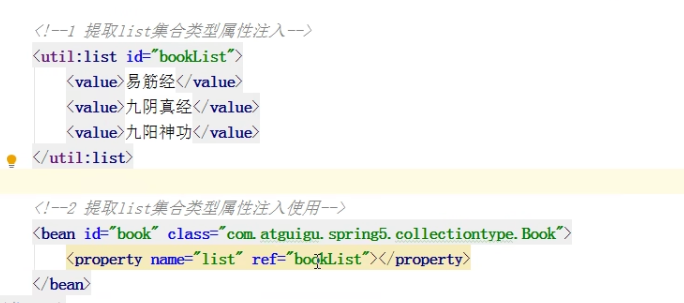

# SpringFramework文档阅读

> Version 5.3.24

## Spring Framework Overview

*Update cycle 升级周期*

*Batch 批处理*

*Integration workloads 继承工作负载*

### 1. What We Mean by "Spring"

*Over time 随着时间变化*

*Foundation 基础，地基*

> *Spring Framework*被分割成了多个模块，应用可以按需选择自己需要的模块。模块的心脏是*core container(核心容器)*，包括一个*configuration model (配置模型)*和一个*dependency injection(依赖注入)*。不止这样，SpringFramework提供了针对不同应用架构的基础性支持，包括*messaging(消息发送)*,*transactional data and persistence(事务数据及持久化)*，和*web(网络支持)*。它还包括基于servlet的*Spring MVC web framework*和 *Spring WebFlux reactive web framework*。

### 2. History of Spring and the Spring Framework

> Spring从2003年建立作为对早期J2EE规范复杂性的回应。尽管有些人认为JavaEE和Spring是竞争关系，但事实上Spring是对JavaEE的补充。Spring的编程模型没有拥抱JavaEE平台规范；相反的，它小心的从JavaEE平台规范中选择了*individual specification(个别规范)*：
>
> - Servlet API ([JSR 340](https://jcp.org/en/jsr/detail?id=340))
> - WebSocket API ([JSR 356](https://www.jcp.org/en/jsr/detail?id=356))
> - Concurrency Utilities ([JSR 236](https://www.jcp.org/en/jsr/detail?id=236))
> - JSON Binding API ([JSR 367](https://jcp.org/en/jsr/detail?id=367))
> - Bean Validation ([JSR 303](https://jcp.org/en/jsr/detail?id=303))
> - JPA ([JSR 338](https://jcp.org/en/jsr/detail?id=338))
> - JMS ([JSR 914](https://jcp.org/en/jsr/detail?id=914))
> - as well as JTA/JCA setups for transaction coordination, if necessary.
>
> Spring Framework也支持如the Dependency Injection ([JSR 330](https://www.jcp.org/en/jsr/detail?id=330)) and Common Annotations ([JSR 250](https://jcp.org/en/jsr/detail?id=250)) specifications，应用开发者可以选择用这些代替Spring Framework提供的*Spring-specific mechanisms(特定于Spring的机制)*。
>
> Spring Framework5.0需要Java EE 7 level (e.g. Servlet 3.1+, JPA 2.1+) 作为最低支持版本，同时提供开箱即用的对Java EE 8 level (e.g. Servlet 4.0, JSON Binding API)的新API在运行时的支持。这持续了Spring对e.g. Tomcat 8 and 9, WebSphere 9, and JBoss EAP 7等服务器的完全兼容支持。
>
> 随着时间流逝，JavaEE在应用开发中的角色升级了，在早期的JavaEE和Spring,应用被创建用来在应用服务器上部署。今天，在Spring Boot的帮助下，应用被开发友好且云友好的方式创建，带着嵌入式的*Servlet container(应用服务器)*和微不足道的修改。对于Spring Framework5来说，WebFlux应用不仅仅直接用了ServletAPI并且能在没有应用服务器的服务器上(比如Netty)上运行。
>
> Spring保持创新和进步。在Spring Framework之外，还有其他的项目，如Spring Boot, Spring Security, Spring Data, Spring Cloud, Spring Batch，在这其他框架之中，要记住每个项目都有它自己的代码库，问题追踪和版本发布节奏。查看Spring家族完整项目列表[spring.io/projects](https://spring.io/projects) 

### 3. Design Philosophy

> Spring的设计哲学有：
>
> - 在每一层提供定制化选择。
> - *Accommodate(容纳)*不同的观点
> - 保持强向后兼容性
> - 关心API设计
> - 对代码质量有高标准

### 4. Feedback and Contributions

> 有问题找Stack Overflow，有问题和建议： [GitHub Issues](https://github.com/spring-projects/spring-framework/issues).
>
> 你有解决问题的版本，请提交Pull request在 [Github](https://github.com/spring-projects/spring-framework)。
>
> 代码贡献指南： [CONTRIBUTING](https://github.com/spring-projects/spring-framework/tree/main/CONTRIBUTING.md)

### 5. Getting Started

> 开始吧，推荐创建Spring Boot项目，因为好上手...
>
> 用 [start.spring.io](https://start.spring.io/) 创建一个基本项目，或者跟随 ["Getting Started" guides](https://spring.io/guides),比如[Getting Started Building a RESTful Web Service](https://spring.io/guides/gs/rest-service/)。跟随手册容易学习消化，手册是针对某个任务的、大多数基于Spring Boot的。手册也包含了Spring *portfolio(文件夹)*的其他项目，你可能想从中解决某个特定问题。

## Core Technologies

> 这部分包含所有被完全整合进Spring Framework的技术。
>
> 首当其冲的是Spring Framework的*Inversion of Control (IoC) container(控制反转容器/IOC容器)*.*thorough treatment(完全叙述)*了Spring Framework的IOC容器之后*closely followed by(紧跟着...)的是AOP技术的* *comprehensive coverage(全面覆盖介绍)*。Spring Framework有自己的AOP框架，它在概念上很好理解并且能成功处理80%Java编程中需要AOP的场景。
>
> 也在下文中提供了对于Spring对AsPectJ的整合的叙述（Aspect是目前在某些特性上最丰富且毫无疑问是最成熟的Java企业级AOP实现框架）。

### 1. The IoC Container

> 这章包含 IOC容器

#### 1.1. Introduction to the Spring IoC Container and Beans

> 这章包含了Spring框架对于IOC原则的实现。IOC也被称作*dependency injection (依赖注入/DI)*。它是对象仅仅通过构造器参数、给工厂方法的参数、给对象的实例设置属性在它被构造后或从一个工厂方法返回 的一个过程。容器在这些bean被创建后注入这些依赖。这个过程*fundamentally(根本上)*反转了bean来控制实例化或 通过直接构建classes或像Service Locator pattern的模式来控制它依赖的位置。
>
> `org.springframework.beans` 和 `org.springframework.context`是Spring框架IOC容器的基础包。 [`BeanFactory`](https://docs.spring.io/spring-framework/docs/5.3.24/javadoc-api/org/springframework/beans/factory/BeanFactory.html)接口提供了先进的配置机制来管理任何类型的*object(对象)*。[`ApplicationContext`](https://docs.spring.io/spring-framework/docs/5.3.24/javadoc-api/org/springframework/context/ApplicationContext.html)是BeanFactory的子接口，它增加了：
>
> - 简单的整合了Spring AOP特性
> - *message resource handling(消息资源处理)*（为了用于国际化）
> - *Event publication(事件发布)*
> - *Application-layer specific contexts (应用层特定上下文)*比如`WebApplicationContext`用于web项目程序。
>
> 简言之，`BeanFactory`提供了配置的框架和基本的功能性，`ApplicationContext`增加了针对企业开发的功能性。`ApplicationContext`是`BeanFactory`的完全超集，它在本章中被单独阐述。
>
> 在Spring中，组成你项目的object对象被SpringIOC容器管理的称作bean。bean是被SpringIOC容器实例化、装配、管理的一个对象。除此之外，bean是你项目程序中众多对象的其中一个。bean和它中的依赖被反映在容器使用的*configuration metadata(配置元数据)*中。

#### 1.2. Container Overview

>  `org.springframework.context.ApplicationContext` 接口代表了Spring IOC容器，这个容器负责实例化、配置、装配bean。容器得到了什么对象需要实例化、配置和通过解析配置元数据来装配的指令。配置元数据通过XML、Java注解或Java代码来呈现。这让你来表达组成你应用程序的对象和对象之间的丰富的相互依赖。
>
> `ApplicationContext`接口在Spring中有几种实现。在*stand-alone(单机/独立运行的)*程序中，通常创建 [`ClassPathXmlApplicationContext`](https://docs.spring.io/spring-framework/docs/5.3.24/javadoc-api/org/springframework/context/support/ClassPathXmlApplicationContext.html) 或者[`FileSystemXmlApplicationContext`](https://docs.spring.io/spring-framework/docs/5.3.24/javadoc-api/org/springframework/context/support/FileSystemXmlApplicationContext.html)的实例。当XML被定义成传统格式的配置元数据时，你可以命令容器用Java注解或Java代码来作为元数据格式仅仅通过提供一小段XML配置，这段XML配置用来声明支持额外的几种元数据格式。
>
> 在多数程序场景下，要清楚的明白用户代码不需要实例化一个或多个SpringIOC容器。举例来说，在web程序场景下，在`web.xml`中一个简单的8行网络描述XML文件对程序就*typically suffices(往往够用了)* （具体参见 [Convenient ApplicationContext Instantiation for Web Applications](https://docs.spring.io/spring-framework/docs/5.3.24/reference/html/core.html#context-create)）。如果你用Eclipse中的SpringTools，你可以很简单的创建 *boilerplate(模版)*配置仅仅通过几个鼠标点击和按键敲击。
>
> 下图显示了高层视角下Spring是如何工作的。你应用的类被配置元数据合并起来，以至于在ApplicationContext被创建和实例化之后，你拥有了一个完全配置好的且可执行的系统或程序。


##### 1.2.1. Configuration Metadata

> 如上图所示，SpringIOC容器消费了一系列的配置元数据。
>
> 下文讲讲如何用 **基于XML配置元数据**，其他 配置元数据的方式参见：
>
> - [Annotation-based configuration](https://docs.spring.io/spring-framework/docs/5.3.24/reference/html/core.html#beans-annotation-config):Spring2.5后支持基于注解的配置元数据。
> - [Java-based configuration](https://docs.spring.io/spring-framework/docs/5.3.24/reference/html/core.html#beans-java): Spring3.0后支持，为了用这些特性，请看 [`@Configuration`](https://docs.spring.io/spring-framework/docs/current/javadoc-api/org/springframework/context/annotation/Configuration.html), [`@Bean`](https://docs.spring.io/spring-framework/docs/current/javadoc-api/org/springframework/context/annotation/Bean.html), [`@Import`](https://docs.spring.io/spring-framework/docs/current/javadoc-api/org/springframework/context/annotation/Import.html),  [`@DependsOn`](https://docs.spring.io/spring-framework/docs/current/javadoc-api/org/springframework/context/annotation/DependsOn.html) 
>
> 基于XML配置元数据使用`<bean/>`，基于Java配置元数据通常使用`@Bean`注解在`@Configuration`类中。
>
> 这些bean的定义和组成你项目的实际对象息息相关。通常来说，你定义服务层对象，对象访问层对象，表现层对象比如Structs的`Action`实例，基础结构对象比如Hiberate的`SessionFactories`，JMS的`Queues`等等。通常来说，不会在容器中配置 *fine-grained domain objects(细粒度的域对象)*，因为这通常是DAO层和*business logic(业务逻辑)*层的职责。然而，你可以使用Spring整合AspectJ来配置那些已经在IOC容器之外创建的对象。详见 [Using AspectJ to dependency-inject domain objects with Spring](https://docs.spring.io/spring-framework/docs/5.3.24/reference/html/core.html#aop-atconfigurable).
>
> 下面是 基于XML配置元数据 的一个例子：

```xml
<?xml version="1.0" encoding="UTF-8"?>
<beans xmlns="http://www.springframework.org/schema/beans"
    xmlns:xsi="http://www.w3.org/2001/XMLSchema-instance"
    xsi:schemaLocation="http://www.springframework.org/schema/beans
        https://www.springframework.org/schema/beans/spring-beans.xsd">

    <bean id="..." class="...">  
        <!-- collaborators and configuration for this bean go here -->
    </bean>

    <bean id="..." class="...">
        <!-- collaborators and configuration for this bean go here -->
    </bean>

    <!-- more bean definitions go here -->

</beans>
```

> 1. `id`属性是一个标识单个bean定义的字符串
>
> 2. `class`睡醒定义bean类型且使用了类的全路径
>
> `id`属性的值引用协作对象，这部分没有在例子中显示，详见 [Dependencies](https://docs.spring.io/spring-framework/docs/5.3.24/reference/html/core.html#beans-dependencies) 

##### 1.2.2. Instantiating a Container

> 被提供给ApplicationContext构造器的位置路径或者多个位置路径是资源字符串，这些资源字符串让容器加载配置元数据通过一系列的外部配置文件，比如来自本地文件系统的配置文件或是来自java类路径的配置文件

```java
ApplicationContext context = new ClassPathXmlApplicationContext("services.xml", "daos.xml");
```

> 更多关于Spring的`Resource`抽象，这个抽象提供了方便的机制来从定义的URI语法路径中读取InputStream。具体来说，`Resource`路径被用来构建*appication contexts（应用上下文）*，详见 [Application Contexts and Resource Paths](https://docs.spring.io/spring-framework/docs/5.3.24/reference/html/core.html#resources-app-ctx).
>
> 下面例子展示了服务层对象的配置文件和数据访问层的配置文件：

```xml
<?xml version="1.0" encoding="UTF-8"?>
<beans xmlns="http://www.springframework.org/schema/beans"
    xmlns:xsi="http://www.w3.org/2001/XMLSchema-instance"
    xsi:schemaLocation="http://www.springframework.org/schema/beans
        https://www.springframework.org/schema/beans/spring-beans.xsd">

    <!-- services -->

    <bean id="petStore" class="org.springframework.samples.jpetstore.services.PetStoreServiceImpl">
        <property name="accountDao" ref="accountDao"/>
        <property name="itemDao" ref="itemDao"/>
        <!-- additional collaborators and configuration for this bean go here -->
    </bean>

    <!-- more bean definitions for services go here -->

</beans>
```


```xml
<?xml version="1.0" encoding="UTF-8"?>
<beans xmlns="http://www.springframework.org/schema/beans"
    xmlns:xsi="http://www.w3.org/2001/XMLSchema-instance"
    xsi:schemaLocation="http://www.springframework.org/schema/beans
        https://www.springframework.org/schema/beans/spring-beans.xsd">

    <bean id="accountDao"
        class="org.springframework.samples.jpetstore.dao.jpa.JpaAccountDao">
        <!-- additional collaborators and configuration for this bean go here -->
    </bean>

    <bean id="itemDao" class="org.springframework.samples.jpetstore.dao.jpa.JpaItemDao">
        <!-- additional collaborators and configuration for this bean go here -->
    </bean>

    <!-- more bean definitions for data access objects go here -->

</beans>
```

> 在之前的例子中，服务层由一个PetStoreServiceImpl类和两个DAO层类JpaAccountDao和JpaItemDao组成（基于JPA对象关联映射标准）。property标签的name属性是指JavaBean的名字，而ref属性是指另一个bean的定义。id属性和ref属性之间的联系代表了相关对象的依赖。想看更多配置一个对象的依赖，见 [Dependencies](https://docs.spring.io/spring-framework/docs/5.3.24/reference/html/core.html#beans-dependencies)。

###### Composing XML-based Configuration Metadata

> 跨越多个XML文件的bean定义很有意义。通常来说，每个单独的XML配置文件代表你项目架构的一个逻辑层或一个模块。
>
> 你可以利用appplicationContext的构造器来从这些XML文件中加载bean定义。这个构造器可接受多个Resource路径，这在前面章节已经展示过了。另外一种方式加载多个bean定义是使用一个至多个<import/>标签。下面的例子展示了怎么做到这些：

```xml
<beans>
    <import resource="services.xml"/>
    <import resource="resources/messageSource.xml"/>
    <import resource="/resources/themeSource.xml"/>

    <bean id="bean1" class="..."/>
    <bean id="bean2" class="..."/>
</beans>
```

> 在前面的例子中，外部的bean定义被三个文件加载： `services.xml`, `messageSource.xml`, 和 `themeSource.xml`。所有的路径都是相对于做引入的文件本身，所以`services.xml`必须和做引入的文件在同一个目录或同一个类路径，同时`messageSource.xml` 和 `themeSource.xml`必须在做引入文件的下级路径中。如你所见，前置的斜杠被省略了。然而，上面这些路径是相对路径，总的来说更适合不用斜杠。文件的内容被引入了，这包括顶层的<beans/>元素，当然这些元素比如是符合Spring规范约束的有效的XMLbean定义。
>
> > 可以但不推荐使用"../"来引用父目录。这样在文件中创造了一个当前应用之外的依赖。具体来说，引用的路径不推荐使用`classpath:../services.xml`，运行时解析进程会选择最近的类路径根作为他的父级目录。类路径配置改变可能会导致选择一个不同且错误的路径。
> >
> > 你可以使用全路径来替代相对路径：举例来说，`file:C:/config/services.xml` 或 `classpath:/config/services.xml`。然而注意你将你应用的配置和具体的绝对路径进行了*coupling(耦合)*。通常来说对这些绝对路径使用一个间接层会更合适——举例来说，通过"${...}"*placeholder(占位符)*来解决JVM系统运行时配置产生的问题。
>
> 命名空间本身提供了导入*directive(指令)*的特性。更多的配置特性见Spring提供的XML命名空间部分————比如`context`和`util`命名空间


##### 1.2.3. Using the Container

> ApplicationContext是一个针对管理多个bean和其依赖的先进工厂的接口。通过使用方法`T getBean(String name, Class<T> requiredType)`，你可以*retrieve(取回)*你的bean。
>
> ApplicationContext让你读取这些bean的定义并可以访问它们，下面是展示的例子：

```java
// create and configure beans
ApplicationContext context = new ClassPathXmlApplicationContext("services.xml", "daos.xml");

// retrieve configured instance
PetStoreService service = context.getBean("petStore", PetStoreService.class);

// use configured instance
List<String> userList = service.getUsernameList();
```

> 【下面有一堆针对Groovy的使用介绍，懒得翻译了】

#### 1.3. Bean Overview

> Spring的IOC容器管理一个至多个bean。这些bean被你提供给容器的配置元数据创建出来。
>
> 在容器*within(内部)*,这些bean代表着`BeanDefinition`的对象，这些对象包含了下面的元数据：
>
> - 一个包明确的类名：往往，是一个定义的bean的实现类
> - Bean的行为配置标签，这些标签*state(陈述/说明)*了bean在容器中是如何表现的（这些标签包括作用域，生命周期回调函数等等）
> - 关联了其他的与这个bean工作的bean,这些关联被称作协作者或依赖。
> - 其他的配置在新创建对象时设置————举例来说，管理一个连接池的池的大小限制或bean的使用连接数
>
> 这个元数据翻译了装饰bean定义的一系列属性。下面这个表格展示了这些属性：


| Property                 | Explained in…                                                |
| :----------------------- | :----------------------------------------------------------- |
| Class                    | [Instantiating Beans](https://docs.spring.io/spring-framework/docs/5.3.24/reference/html/core.html#beans-factory-class) |
| Name                     | [Naming Beans](https://docs.spring.io/spring-framework/docs/5.3.24/reference/html/core.html#beans-beanname) |
| Scope                    | [Bean Scopes](https://docs.spring.io/spring-framework/docs/5.3.24/reference/html/core.html#beans-factory-scopes) |
| Constructor arguments    | [Dependency Injection](https://docs.spring.io/spring-framework/docs/5.3.24/reference/html/core.html#beans-factory-collaborators) |
| Properties               | [Dependency Injection](https://docs.spring.io/spring-framework/docs/5.3.24/reference/html/core.html#beans-factory-collaborators) |
| Autowiring mode          | [Autowiring Collaborators](https://docs.spring.io/spring-framework/docs/5.3.24/reference/html/core.html#beans-factory-autowire) |
| Lazy initialization mode | [Lazy-initialized Beans](https://docs.spring.io/spring-framework/docs/5.3.24/reference/html/core.html#beans-factory-lazy-init) |
| Initialization method    | [Initialization Callbacks](https://docs.spring.io/spring-framework/docs/5.3.24/reference/html/core.html#beans-factory-lifecycle-initializingbean) |
| Destruction method       | [Destruction Callbacks](https://docs.spring.io/spring-framework/docs/5.3.24/reference/html/core.html#beans-factory-lifecycle-disposablebean) |


> 除了bean定义包含如何创建一个具体的bean的信息外，ApplicationContext的实现类也允许注册创建在容器之外的对象。这可以通过使用ApplicationContext’s `BeanFactory`的`getBeanFactory()`来做到，这个方法返回`DefaultListableBeanFactory`实现类。`DefaultListableBeanFactory`支持通过`registerSingleton(..)` 和 `registerBeanDefinition(..)`来注册bean。然而典型的通过bean定义元数据定义bean的应用，是单独的工作的。 
>
> > bean元数据和手动提供的单例实例需要尽量早的被注册，这是为了容器正确地在自动装配和其他*introspection(内省)*  步骤时追踪它们。虽然修改已经存在的元数和已经存在的单例实例在某些情况下是支持的，在运行时注册新的bean是不被正规支持的并且这可能导致并发访问异常和容器内的*inconsistent(不一致的)*状态，或两者问题都产生。


##### 1.3.1. Naming Beans

> 每个bean有一个至多个标识符。这些标识符必须在注册bean的容器中唯一。一个bean通常只有一个标识符，如果需要一个以上的标识符，可以考虑使用别名。
>
> 基于XML的配置元数据，你可以使用`id`，`name`或同时使用这两者来制定一个bean的标识符。`id`代表唯一的ID。为了方便起见，这些名字是*alphanumeric (数字和字母并用的)*，但它们也能包含特殊字符。如果你想要为bean*introduce(使用)*别名，你也可以指定`name`给它们，通过`，`或`;`或空格分隔。在Spring3.1之前的文档中，`id`被定义成`xsd:ID`类型，这种方式限制了可能的字符。*as of(至于)*Spring3.1,它被定义成一个`xsd:string`类型。请注意`id`属性任然在容器中是强制唯一的，尽管没有再通过XML类型限制。
>
> 你不需要为一个bean提供`name`或`id`。如果你明确的提供了这些，容器会为这个bean产生一个唯一的名字。如果你想要通过名字引用这个bean，可以使用`ref`或使用*Service Locator style lookup(服务定位器风格查询)*，这时候你必须提供一个名字。不指定名字和使用 [inner beans](https://docs.spring.io/spring-framework/docs/5.3.24/reference/html/core.html#beans-inner-beans) 和 [autowiring collaborators](https://docs.spring.io/spring-framework/docs/5.3.24/reference/html/core.html#beans-factory-autowire)有关。
>
> Bean的名字规则遵循驼峰命名法，名字是为了更好理解和阅读的。
>
> > 当类路径的组件扫描时，Spring为没有起名的组件产生一个名字，遵循 *described earlier(前面描述过的)*规则：首先，取简单的类名字并将首字母小写。然而不常见的情况是有首字符和第二个字符都大写了，那原本的大小写被保持不变。和`java.beans.Introspector.decapitalize`中使用的规则一样（Spring也用的是这个规则）

###### Aliasing a Bean outside the Bean Definition

> 一个bean自身的定义时，你可以提供一个至多个名字，通过结合使用一个明确的`id`属性和多个其他`name`属性。这些名字是相同bean的等同效力的别名并可以用在其他位置，比如通过特指某个组件的bean`name`让每个应用内的组件引用同一个依赖。
>
> 然而明确bean真正被定义的所有别名通常不切实际。有时希望在任意地方为bean指定别名。这在配置文件分散在各个子系统的大型系统中很常见，每个子系统都有一套对象定义。在XML配置元数据中，你可以使用`<alias/>`完成在bean定义之外起别名的需求。下面是如何做的例子：

```xml
<alias name="fromName" alias="toName"/>
```

> 在这个例子中，一个名字叫做`fromName`的bean也能使用`toName`这个别名。
>
> 举例来说，子系统A的数据源的配置元数据`subsystemA-dataSource`,子系统B的数据源的配置元数据`subsystemB-dataSource`,当主程序使用这两个子系统时，主程序可以使用`myApp-dataSource`。为了把三个名字指向同一个对象，你可以这样写：


```xml
<alias name="myApp-dataSource" alias="subsystemA-dataSource"/>
<alias name="myApp-dataSource" alias="subsystemB-dataSource"/>
```


> 如果你使用Java类配置，使用`@Bean`吧！详见 [Using the @Bean Annotation](https://docs.spring.io/spring-framework/docs/5.3.24/reference/html/core.html#beans-java-bean-annotation)


##### 1.3.2. Instantiating Beans

> bean的定义过程本质上是创建一个至多个对象的*recipe(菜谱)*。通过询问和使用bean定义*encapsulated(封装)*的配置元数容器查看菜谱找一个有名字的bean来创建一个真实的对象。
>
> 如果你使用基于XML配置元数据，你要明确对象的类类型是由`<bean/>`的`class`属性来具象化的。class属性（在内部是`BeanDefinition`实例的一个`Class`成员变量）通常是*mandatory(强制性的)*。（查看异常，见 [Instantiation by Using an Instance Factory Method](https://docs.spring.io/spring-framework/docs/5.3.24/reference/html/core.html#beans-factory-class-instance-factory-method) 和 [Bean Definition Inheritance](https://docs.spring.io/spring-framework/docs/5.3.24/reference/html/core.html#beans-child-bean-definitions)）。你可以通过两种方式使用`Class`成员变量：
>
> - 典型地，指定bean创建的类(容器直接通过反射地调用bean的构造器来创造bean)某种程度上等同于Java代码的new。
>
> - 为了指明包含用于创建对象的静态工厂方法的实际类，容器在一个类中调用静态工厂方法来创建bean不太常见。对象类型从创新的静态工厂方法返回可能是相同的类或另一个完全不同的类。
>
> > 如果你想为一个内部类配置bean，你可能使用二进制名字或内部类的源名字
> >
> > 举例来说，如果你有一个`SomeThing`类在`com.example`包，并且`SomeThing`有一个静态内部类`OtherThing`，他们可以用`$`或`.`来分隔。所以定义会是`com.example.SomeThing$OtherThing` 或 `com.example.SomeThing.OtherThing`


###### Instantiation with a Constructor


> 当你通过*constructor(构造器)*方式创建一个bean时，所有的常见类都被Spring可用和兼容。那就是说被开发的类不需要实现任何特定的接口或以特定的风格编写。简单地指明bean的类就足够了。然而，对于特定的bean你依赖哪种类型的IOC，你可能需要一个默认空构造器。
>
> Spring IOC容器能虚拟地管理任何你想要它去管理的类。没有限制说要管理真实的JavaBean。在容器中配置后，大多数Spring用户倾向于管理真实的带有一个默认构造器和恰当的getter与setter方法的Javabean。你也能在你容器中有更多外来非bean风格的类。举例来说，如果你需要使用绝对不遵循JavaBean规范的合法连接池，Spring也能将其管理。
>
> 下面是例子：


```java
<bean id="exampleBean" class="examples.ExampleBean"/>

<bean name="anotherExample" class="examples.ExampleBeanTwo"/>
```

> 关于更多给构造器提供参数和在对象被创建后设置对象实例属性的技巧，详见[Injecting Dependencies](https://docs.spring.io/spring-framework/docs/5.3.24/reference/html/core.html#beans-factory-collaborators)。


###### Instantiation with a Static Factory Method

> 当你用一个静态工厂方法定义一个bean时，使用`class`属性指明包含静态工厂方法的类并使用`factory-method`属性指明静态工厂方法本身的名字。你应该能调用这个方法（方法带有可选的参数，这在之后阐述）返回一个存在的对象，这随后被处理的过程好似它被通过一个构造器创建。有人使用这个bean定义就是在合法代码里调用了静态方法。
>
> 夏明的bean定义指明了bean会通过工厂方法被创建。定义没有指明，定义没有指明返回的对象类型，*but rather(而是)*指明了包含工厂方法的类。在这个例子中，`createInstance()`必须是一个静态方法。下面的例子显示了如何制定一个工厂方法：

```xml
<bean id="clientService"
    class="examples.ClientService"
    factory-method="createInstance"/>
```

> 下面的例子显示了一个会和前面的bean定义一起工作的类。

```java
public class ClientService {
    private static ClientService clientService = new ClientService();
    private ClientService() {}

    public static ClientService createInstance() {
        return clientService;
    }
}
```

> 想了解更多给工厂方法提供参数和在对象从工厂返回后设置对象实例属性的技巧，详见 [Dependencies and Configuration in Detail](https://docs.spring.io/spring-framework/docs/5.3.24/reference/html/core.html#beans-factory-properties-detailed)。


###### Instantiation by Using an Instance Factory Method

> 和通过一个静态工厂方法实例化相似，通过实例工厂方法实例化调用了一个来自容器中已存在的bean中的非静态方法来创建一个新的bean。为了使用这个机制，让`class`属性空出，并且在`factory-bean`属性指明在当前容器中bean的名字，这个bean包含创建这个对象被调用的实例方法。用`factory-method`属性给自身设置工厂方法名。下面的例子显示了如何配置这样一个bean：

```xml
<!-- the factory bean, which contains a method called createInstance() -->
<bean id="serviceLocator" class="examples.DefaultServiceLocator">
    <!-- inject any dependencies required by this locator bean -->
</bean>

<!-- the bean to be created via the factory bean -->
<bean id="clientService"
    factory-bean="serviceLocator"
    factory-method="createClientServiceInstance"/>
```

> 在下面的例子展示了相关类：

```java
public class DefaultServiceLocator {

    private static ClientService clientService = new ClientServiceImpl();

    public ClientService createClientServiceInstance() {
        return clientService;
    }
}
```

> 一个工厂类也可以包含多于一个的工厂方法，下面是示例：

```xml
<bean id="serviceLocator" class="examples.DefaultServiceLocator">
    <!-- inject any dependencies required by this locator bean -->
</bean>

<bean id="clientService"
    factory-bean="serviceLocator"
    factory-method="createClientServiceInstance"/>

<bean id="accountService"
    factory-bean="serviceLocator"
    factory-method="createAccountServiceInstance"/>
```

> 下面是相关类的示例：

```java
public class DefaultServiceLocator {

    private static ClientService clientService = new ClientServiceImpl();

    private static AccountService accountService = new AccountServiceImpl();

    public ClientService createClientServiceInstance() {
        return clientService;
    }

    public AccountService createAccountServiceInstance() {
        return accountService;
    }
}
```

> 这种方式展示了工厂bean本身能通过依赖注入被管理和配置。详见[Dependencies and Configuration in Detail](https://docs.spring.io/spring-framework/docs/5.3.24/reference/html/core.html#beans-factory-properties-detailed)。
>
> > 在Spring文档中，工厂bean指的是一个在Spring容器中配置并通过实力或静态工厂方法创建对象的bean。相反地，`FactoryBean`指的是Spring特有的一个实现类。


###### Determining a Bean’s Runtime Type

> 运行时类型的特定bean是有*non-trivial(意义的)*。在bean元数据定义中的一个特定类仅仅是初始类引用，这个初始类引用潜在地与以生命工厂方法结合或成为一个可能导致不同运行时bean类型的`FactoryBean`类，或根本没有被设置在实例工厂方法情况下（这种情况通过是定`factory-bean`作为替代）。另外，AOP代理可能用一个基于接口的代理的限制目标bean真正类型暴露的方式包装一个bean实例（就是它实现接口）。
>
> 找到一个特定bean真正的运行时类型的推荐方式是调用`BeanFactory.getType`方法来确定特定bean名字。这个方式把上面的所有情况都纳入了考虑并返回的对象类型和调用`BeanFactory.getBean`会返回bean的名字一样。

#### 1.4. Dependencies

> 典型的企业级应用不会有一个简单对象组成（或在Spring *parlance(语境/语法)*中的bean）。即使最简单的应用也有少量共同工作的对象来呈现一个所谓*end-user(终端用户)*视为*conherent(连贯)*的程序。下个章节解释了你如何从单独定义大量bean到对象合作完成目标的一个完整现实的程序。

##### 1.4.1. Dependency Injection

> 依赖注入是一个仅仅凭借构造器参数，工厂方法参数和成员变量（这是在对象实例被创建或被从工厂方法返回后设置的）来定义对象的依赖（和其它对象一起工作）的过程。容器之后在创建bean之后注入这些依赖。这个过程从根本上说是Bean本身通过使用直接构建类或服务定位模式来控制其依赖关系的实例化或位置的逆过程（*hence(因此)*被称作反转控制）
>
> 在DI准则下代码变得更干净了，并且当对象被提供给它们依赖时解耦更高效了。对象不会寻找它的依赖和不知道依赖的位置与类。结果是，你的类变得更容易特使，特别是当依赖在接口或抽象的基础类中时，允许你的类在单元测试中使用存根或模拟实现。
>
> DI在两个主要变种中存在： [Constructor-based dependency injection](https://docs.spring.io/spring-framework/docs/5.3.24/reference/html/core.html#beans-constructor-injection) 和 [Setter-based dependency injection](https://docs.spring.io/spring-framework/docs/5.3.24/reference/html/core.html#beans-setter-injection)。

###### Constructor-based Dependency Injection

> 基于构造器的DI是用容器调用 一系列代表一个依赖的参数的变量组成的构造器 完成的。与用特定参数调用一个静态工厂方法来构造一个bean几乎是等同的，并且关于处理一个构造器或一个静态工厂方法的参数的讨论也是几乎等同的。下面的例子展示了一个只能用构造器注入依赖注入的类

```java
public class SimpleMovieLister {

    // the SimpleMovieLister has a dependency on a MovieFinder
    private final MovieFinder movieFinder;

    // a constructor so that the Spring container can inject a MovieFinder
    public SimpleMovieLister(MovieFinder movieFinder) {
        this.movieFinder = movieFinder;
    }

    // business logic that actually uses the injected MovieFinder is omitted...
}
```


> 注意这个类没有什么特殊的。它是一个在容器中没有依赖指定接口、基类或注解的POJO。

**Constructor Argument Resolution**

> 构造器参数解决方案通过使用参数类型匹配能出现。如果在构造器参数的一个bean定义中没有潜在的混淆存在的话，在bean定义中定义构造器参数的顺序就是当bean被实例化时这些参数被提供给适当构造器的顺序。考虑下面这个类：

```java
package x.y;

public class ThingOne {

    public ThingOne(ThingTwo thingTwo, ThingThree thingThree) {
        // ...
    }
}
```

> 假设`ThingTwo`和`ThingThree`类之间没有继承关系，没有潜在的混淆存在。因此下面的配置能正常工作，并且你也不用在`<constructor-arg/>`中明确指定构造器参数的索引或类型。

```xml
<beans>
    <bean id="beanOne" class="x.y.ThingOne">
        <constructor-arg ref="beanTwo"/>
        <constructor-arg ref="beanThree"/>
    </bean>

    <bean id="beanTwo" class="x.y.ThingTwo"/>

    <bean id="beanThree" class="x.y.ThingThree"/>
</beans>
```

> 当另一个bean被引用，类型是不知道的情况下匹配能产生。当一个简单的类型被运用时，比如`<value>true</value>`，Spring不能决定这个值的类型，所以他不能再没有帮助下匹配类型。这两种情况可以考虑下面的解决方案：

```java
package examples;

public class ExampleBean {

    // Number of years to calculate the Ultimate Answer
    private final int years;

    // The Answer to Life, the Universe, and Everything
    private final String ultimateAnswer;

    public ExampleBean(int years, String ultimateAnswer) {
        this.years = years;
        this.ultimateAnswer = ultimateAnswer;
    }
}
```

> **Constructor argument type matching**
>
> 在前面的场景中，可以通过明确构造器参数的`type`属性来完成匹配，下面是展示的例子:

```xml
<bean id="exampleBean" class="examples.ExampleBean">
    <constructor-arg type="int" value="7500000"/>
    <constructor-arg type="java.lang.String" value="42"/>
</bean>
```

> **Constructor argument index**
>
> 你能用`index`属性明确指定构造器参数的索引，如下面的例子展示：

```xml
<bean id="exampleBean" class="examples.ExampleBean">
    <constructor-arg index="0" value="7500000"/>
    <constructor-arg index="1" value="42"/>
</bean>
```

> *in addition to(除了...之外)*解决多个简单值的模糊性外，指定索引也能解决构造器有两个相同类型参数的模糊性。
>
> 索引是从0开始的。
>
> **Constructor argument name**
>
> 你也能为消除值模糊性使用参数名，就像下面例子展示的那样：

```xml
<bean id="exampleBean" class="examples.ExampleBean">
    <constructor-arg name="years" value="7500000"/>
    <constructor-arg name="ultimateAnswer" value="42"/>
</bean>
```

> 请时刻记住，为了让这项工作开箱即用，你的代码必须在调试状态启用时编译，这样Spring能从构造器寻找参数。如果你不想让你的代码带有调试标记编译，你可以使用 [@ConstructorProperties](https://download.oracle.com/javase/8/docs/api/java/beans/ConstructorProperties.html)JDK注解明确你构造器的参数，如下例所示：

```java
package examples;

public class ExampleBean {

    // Fields omitted

    @ConstructorProperties({"years", "ultimateAnswer"})
    public ExampleBean(int years, String ultimateAnswer) {
        this.years = years;
        this.ultimateAnswer = ultimateAnswer;
    }
}
```


###### Setter-based Dependency Injection


amenable(经得起...检验)

Compelling(令人信服的)

Therefore(因此)

> 基于setter的DI是在调用一个无参构造器或一个无参静态工厂方法来实例化bean之后，通过容器在bean上调用setter方法被完成的。
>
> 下面的例子显示了一个能仅仅通过使用纯setter注入完成依赖注入的类。这个类是传统的Java风格，是一个在容器上没有任何依赖接口、基类或注解的POJO。

```java
public class SimpleMovieLister {

    // the SimpleMovieLister has a dependency on the MovieFinder
    private MovieFinder movieFinder;

    // a setter method so that the Spring container can inject a MovieFinder
    public void setMovieFinder(MovieFinder movieFinder) {
        this.movieFinder = movieFinder;
    }

    // business logic that actually uses the injected MovieFinder is omitted...
}
```

> `ApplicationContext`支持对他管理的bean支持基于构造器和基于setter的DI。它也支持在一些依赖已经通过构造器方式注入后使用setterDI.你以`BeanDefinition`的形式配置依赖，`BeanDefinition`是你联合`PropertyEditer`使用来将属性从一种格式转换到另一种。然而， 大多数Spring使用者不直接和这些类工作，而是和XMLbean定义、注解组件、在`@Configuration`类中`@Bean`方法一起工作。这些原料之后会在内部被转换成`BeanDefinition`实例，并且被使用来加载一生个SpringIOC容器实例。
>
> > Constructor-based or setter-based DI?
> >
> > 由于你能混合使用构造器注入和setter注入，一个首要准则是为*mandatory(强制的)*依赖使用构造器注入，为可选依赖使用setter方式和配置方法。请注意在setter方法上使用`@Required`注解能使属性称为必须的依赖；然而带有参数编程验证的的构造函数注入更可取。
> >
> > Spring团队更提倡构造器注入，因为这让你实现应用组件为*immutable(不可变的)*对象，并确保需要的依赖关系不是`null`。更进一步来说，构造器注入的组件总能以一个完全初始化的状态返回给客户端代码。旁注：大量的构造器参数是一种代码的坏味道，意味着这个类可能有太多职责且应该被*refactored(重构)*来更好地处理。
> >
> > setter注入应该只在为选择性依赖使用时作为首选，这可以在类中合理地分配默认值。另一方面，非空检查必须在代码使用依赖的任何地方执行。setter注入的一个好处是可以让类的对象在之后经得起重新配置或容器注入。因此通过 [JMX MBeans](https://docs.spring.io/spring-framework/docs/5.3.24/reference/html/integration.html#jmx) 管理就是setter注入的一个令人信服的使用案例。


###### Dependency Resolution Process

> 容器*perform(履行/执行)*bean依赖*resolution(解析)*的职责：
>
> - `ApplicationContext`被用描述所有bean的配置元数据创建和初始化。配置元数据可以被通过XML，java代码或注解进行指明。
> - 对每个bean来说，它的依赖以属性、构造器参数或静态工厂方法（如果你用它来取代常规构造器）的形式被表达。当这些bean真正被创建时，这些依赖被提供给bean。
> - 每个属性或构造器参数是一个真实的要去设置的值的定义，或在容器中引用另一个bean。
> - 每个属性或构造器参数就是一个值被从它的特定格式转换到属性或构造器参数的确定类型。默认情况下，Spring能以string格式转换到内置类型，比如`int`,`long`，`String`等等。
>
> Spring容器在容器被创建时检验每个bean的配置。然而，bean属性本身没有设置直到bean真正被创建。单例和设置为提前实例化的bean在容器被创建时被创建。生命周期被定义在[Bean Scopes](https://docs.spring.io/spring-framework/docs/5.3.24/reference/html/core.html#beans-factory-scopes)。否则，bean只会在它被使用时被创建。创建一个bean潜在导致一系列的bean被创建，当bean的依赖和它依赖的依赖被创建和*assign(分配)*。请注意，*resolution(决议)*在这些依赖中的不匹配可能会较晚出现————那是，在第一次创建受影响的bean时。
>
> > Circular dependencies
> >
> > 如果你优先使用构造器注入，可能残生无法解决的循环依赖场景。
> >
> > 举例来说，类A在构造器注入是依赖类B，类B也同时依赖类A。如果你为类A和B配置相互注入，SpringIOC容器在运行时检测到循环依赖，会抛出`BeanCurrentlyInCreationException`
> >
> > 一个可行的解决方案是编辑一些类的源代码使之被用setter而不是构造器方式配置。可以选择的话，避免使用构造器注入而仅仅使用setter注入。换句话来说，虽然不推荐，但你能通过setter注入配置循环依赖。
> >
> > 不像典型案例(没有循环依赖)，beanA和beanB之间的循环依赖促使bean被注入到另一个bean里要先于bean完全初始化自己（典型的先有鸡还是先有蛋的问题）
>
> 你能渐渐信任Spring来做正确的事。Spring检测配置问题，比如引用不存在的bean或循环依赖，在容器加载阶段。Spring尽可能晚的设置属性和解析依赖，当bean完全被创建时。这意味着当你获取对象如果哪里有创建对象极其依赖的问题产生时Spring容器已经被正确加载之后能产生异常————举例来说，bean抛出一个异常作为缺失或无效属性的结果。这潜在地延迟了一些配置问题的可见性，这时为什么`ApplicationContext`通过默认预实例化单例bean来实现的原因。以在他们真正被需要被创建这些bean的*upfront(预付)*时间和内存为代价，你可以在`ApplicationContext`被创建时发现配置问题，而不是之后发现。你也能重写默认行为一直单例bean实现懒实例加载，而不是提前实例化。
>
> 如果没有循环依赖，当你一个或多个依赖bean被注入到一个有依赖bean，每个注入进去的bean都要早于有依赖bean的配置。


# 2019Study-Spring框架

[Spring官网](https://spring.io/)

[W3Cschool-Spring教程](https://www.w3cschool.cn/wkspring/)

[菜鸟教程-Spring基础知识汇总 Java开发必看](https://www.runoob.com/w3cnote/basic-knowledge-summary-of-spring.html)

[常用插件]()

[xml智能提示](https://blog.csdn.net/sunroyfcb/article/details/80754434)


## 服务器端框架简介

- web层
  - Structs
  - **Spring MVC**

- service层
  - **Spring**
- dao层
  - Hibernate
  - **Mybatis**
  - **jdbcTemplate**-->Spring data

## Spring概述

- 是开源框架
- 轻量级框架
  - 这是和EJB(JavaBean)对比的
  - 依赖资源少+消耗资源少=轻量级框架
- 是一站式框架
  - Web层：SpringMVC
  - Service层：Spring的bean管理，Spring声明式事务
  - Dao层（Data Access Object）：Spring的jdbc模板，Spring的ORM模块

IOC和AOP：

- IOC:控制反转，把创建对象的过程交给Spring进行管理
- AOP:面向切面编程，不修改源代码进行功能增强


### Spring优点


### Spring的体系结构


- Core Container（1.核心容器）
  - Beans（1.1 管理bean）
  - Core（1.2 核心）
  - Context 上下文（1.3 配置文件）
  - Expression Language （1.4 SpringEL表达式）
- AOP（2.1 切面编程）
- Aspects（2.2 AOP框架）
- Data Access/Integration（3）
  - JDBC （3.1 jdbc template 数据库开发）
  - ORM （3.2 整合Hibernate）
  - Transactions （3.3 事务管理）
- Web（4 MVC/Remoting）
  - Web（4.1 web开发）
  - Struts（4.2 整合Struts）
- Test（整合Junit）

## Spring核心

> Spring官网说IOC就是DI


### 控制反转IoC

> 需要配置 log4j.properties

控制反转之前的做法和控制反转的原理：


1. 导入Jar包4+1（4个核心beans,core,context,expression + 1个依赖 commons-logging）


- xxx.jar（需要的）
- xxx-javadoc.jar（帮助文档）
- xxx-sources.jar（源码）


2. 目标类

- 提供UserService接口和实现类
- 获得UserService实现类的实例

- 定义接口

```java
package com.itheima.a_ioc;

public interface UserService {
	public void addUser();
}
```

- 定义实现类

```java
package com.itheima.a_ioc;

public class UserServiceImpl implements UserService {

	@Override
	public void addUser() {
		// TODO Auto-generated method stub
		System.out.println(a_ico add user);
	}

}
```


3. 配置文件
> XML需要点选design来看代码，别用Open with Text Editer，那样就没有高亮了。

- 位置：任意，开发中一般在classpath下（src）
- 名称：任意，开发中常用`applicationContext.xml`
- 内容：添加`schema约束`
- 配置service

```xml
<?xml version="1.0" encoding="UTF-8"?>
<beans xmlns="http://www.springframework.org/schema/beans"
    xmlns:xsi="http://www.w3.org/2001/XMLSchema-instance"
    xsi:schemaLocation="
        http://www.springframework.org/schema/beans 
        http://www.springframework.org/schema/beans/spring-beans.xsd">

    <!-- bean definitions here -->
	<!-- 配置service
		<bean>配置需要创建的对象
		id:用于之后从Spring绒球获得实例时使用的
		class:需要创建实例的全限定类名
	 -->    

<bean id="userServiceId" class="com.itheima.a_ioc.UserServiceImpl"></bean>
</beans>
```


4. 测试

### 依赖注入（属性设置）DI

#### 属性注入的前四种方式


> 构造方法的 普通类型 属性注入用`<constructor-arg name="属性名" value="属性值">`
>
> 构造方法的 对象类型 属性注入用`<constructor-arg name="属性名"  ref="引用的对象">`
>
> set方法的 普通类型 属性注入用`<property name="属性名" value="属性值">`
>
> set方法的 对象类型 属性注入用`<property name="属性名" ref="引用的对象">`


> 前提是必须有IOC的环境

- is a :是一个，继承

- has a :有一个，成员变量，依赖

  ```java
  class B{
      private A a; //B类依赖A类
  }
  ```

- 依赖：一个对象需要使用另一个对象

- 注入：通过setter方法进行另一个对象实例设置

> 这两个图非常重要，方便理解IoC和DI，解耦与耦合


#### 属性注入空值

```xml
<bean id="car2" class="com.binyu.spring.demo4.Car2">
	<property name="name" >
  	<null/>
  </property>
</bean>
```

#### 属性注入包含特殊符号

1. 使用转义字符

```xml
<bean id="car2" class="com.binyu.spring.demo4.Car2">
	<property name="name" value="&lt;&lt;南京&gt;&gt;"></property>
</bean>
```

2. cdata

```xml
<bean id="car2" class="com.binyu.spring.demo4.Car2">
	<property name="name" >
  	<value><![CDATA[<<南京>>]]></value>
  </property>
</bean>
```

#### 属性注入内部bean


#### 属性注入集合或数组类型


#### 把集合注入部分提取出来

1. 在Spring配置文件中引入名称空间


2.提取的代码



#### 属性注入的P名称空间的方式【了解】

> 要使用p名称空间，需要修改头部的xmlns   `beans`变`p`，然后前缀改成`xmlns：`
>
> 不用p空间就要把`xmlns:`那一行删去，不然会有问题

```xml
xmlns="http://www.springframework.org/schema/beans"

<!--要使用p名称空间，需要修改头部的xmlns   `beans`变`p`，然后前缀改成`xmlns：`-->
xmlns:="http://www.springframework.org/schema/p"
```

- p名称空间的 普通属性 的注入

```xml
<bean id="car2" class="com.binyu.spring.demo4.Car2" p:name="奇瑞qq" p:price="30000"></bean>
```

- p名称空间的 对象属性 的注入

```xml
<bean id="employee" class="com.binyu.spring.demo4.Employee" p:name="王东" p:car2-ref="car2"></bean>
```

#### 属性注入的SpEL的方式

[Spring官网-SpEL表达式](https://docs.spring.io/spring-framework/docs/current/reference/html/core.html#expressions)

[CSDN-SpEL表达式总结](https://blog.csdn.net/u010086122/article/details/81566515)

>  `#{SpEL}`使用前，要确认`xmlns:`已经清除

```xml
<!-- SpEL的属性注入 -->
<bean id="car2" class="com.binyu.spring.demo4.Car2">
	<property name="name" value="#{'三蹦子'}"></property>
	<property name="price" value="#{3000}"></property>
</bean>
```

```xml
<bean id="employee" class="com.binyu.spring.demo4.Employee">
    <!-- 直接注入属性 -->
	<property name="name" value="#{'赵洪'}"></property>
    <!-- 直接注入对象 -->
	<property name="car2" value="#{car2}"></property>
</bean>
```

```xml
<!-- SpEL的属性注入 -->
<bean id="carInfo" class="com.binyu.spring.demo4.CarInfo"></bean>
<bean id="car2" class="com.binyu.spring.demo4.Car2">
    <!-- 直接注入对象的属性 -->
	<property name="name" value="#{carInfo.name}"></property>
    <!-- 直接注入对象的方法 -->
	<property name="price" value="#{carInfo.calculatorPrice()}"></property>
</bean>
```

#### 复杂数据类型的SpEL注入

1. 目标类

```java
package com.binyu.spring.demo5;

import java.util.Arrays;
import java.util.List;
import java.util.Map;
import java.util.Set;

/**
 * 集合属性的注入
 * @author Dong Binyu
 *
 */
public class CollectionBean {
	private String[] arrs;
	private List<String> list;
	private Set<String> set;
	private Map<String,String> map;
	public void setArrs(String[] arrs) {
		this.arrs=arrs;
	}
	
	public void setList(List<String> list) {
		this.list = list;
	}

	public void setSet(Set<String> set) {
		this.set = set;
	}

	public void setMap(Map<String,String> map) {
		this.map = map;
	}

	@Override
	public String toString() {
		return "CollectionBean [arrs=" + Arrays.toString(arrs) + ", list=" + list + ", set=" + set + ", map=" + map
				+ "]";
	}

	
	
	
}

```

2. 配置文件

```xml
<bean id="collection"
		class="com.binyu.spring.demo5.CollectionBean">
		<property name="arrs">
			<!-- 注入数组类型和List配置一样 -->
			<list>
				<!-- 普通类型 数组 -->
				<value>董滨雨</value>
				<value>李铭霞</value>
				<value>在一起</value>
				<value>真好看</value>
			</list>
		</property>

		<property name="list">
			<!-- 注入数组类型和List配置一样 -->
			<list>
				<!-- List集合 -->
				<value>大学里</value>
				<value>谈恋爱</value>
				<value>在一起</value>
				<value>真好看</value>
			</list>
		</property>

		<property name="set">
			<set>
				<!-- Set集合 -->
				<value>set1</value>
				<value>set2</value>
				<value>set3</value>
				<value>set4</value>
			</set>
		</property>

		<property name="map">
			<!-- Map集合 -->
			<map>
				<entry key="aaa" value="111"></entry>
				<entry key="bbb" value="222"></entry>
				<entry key="ccc" value="333"></entry>
			</map>
		</property>

	</bean>
```

3. 测试类

```java
package com.binyu.spring.demo5;

import org.junit.Test;
import org.springframework.context.ApplicationContext;
import org.springframework.context.support.ClassPathXmlApplicationContext;

public class SpringDemo5 {
	@Test
	public void demo1() {
		ApplicationContext applicationContext=new ClassPathXmlApplicationContext("applicationContext.xml");
		CollectionBean collectionBean=(CollectionBean) applicationContext.getBean("collectionBean");
		System.out.println(collectionBean);
	
	}
}

```


## Spring工厂类概述

Spring的工厂类的结构图

BeanFactory：老版本的工厂类

- 在调用getBean的时候，才回生成类的实例
- spring内部使用，不提供给开发人员使用

ApplicationContext：新版本的工厂类

- BeanFactory子接口，提供更多更强大的功能，供开发人员使用
- 加载配置文件的时候，就会将Spring管理的类实例化
- 有两个实现类
  - ClassPathXmlApplicationContext：加载类路径（src）下的配置文件
  - FileSystemXmlApplicationContext：加载文件系统（磁盘）下的配置文件
  - AnnotationConfigApplicationContext:加载配置类

> ApplicationContext创建对象采用立即加载方式，单例适用
>
> BeanFactory创建对象采用延迟加载方式，多例适用


## Spring的详细配置

### XML的schema提示配置

> 一个xml能被一个DTD约束，但是可以被多个schema约束的


### Bean（可重用组件）的配置

Bean标签id和name的配置

- `id`：使用了约束中的唯一约束。里面不能出现特殊字符
- `name`：没有使用唯一约束（理论上可以重复，但是实际开发中不允许）。里面可以出现特殊字符
  - Spring和Stucts1整合的时候，才会遇到
- `class`：实例的类的全路径

Bean的生命周期配置【了解】（方法写在实例的类中）

- `init-method`：Bean被初始化执行的方法
- `destroy-method`：Bean被销毁时执行的方法（Bean是单例创建，工厂关闭）

Bean的作用范围的配置【重点】

- `scope`：Bean的作用范围

  - `singleton`：默认的，spring会采用单例模式创建这个对象（当容器创建时活着，当容器销毁时死亡）

  

  - `prototype`：多例模式【Structs2和Spring整合的时候要用到】（当使用对象时活着，当对象长时间不用才会回收）

  

  - `request`：应用在web项目中，Spring创建这个类以后，将这个类存入到request范围中
  - `session`：应用在web项目中，Spring创建这个类以后，将这个类存入到session范围中
  - `globalsession`：应用在web项目中，必须在porlet环境下使用。但是如果没有这种环境，相当于session

> 单例模式：不管有多少次程序调用，只会new一次。每次用的只是一个实例
>
> 多例模式：用一次就new一次

> porlet环境：子域名免登录，比如百度中的百度云，百度百科

使用工厂方法注入bean

- `factory-bean`
- `factory-method`

参见 https://www.cnblogs.com/vickylinj/p/9474597.html

## Spring的分模块开发的配置

### 加载多个配置文件方式1

> 配置两个xml

```java
ApplicationContext applicationContext=new ClassPathXmlApplicationContext("applicationContext.xml","applicationContext2.xml");
```


### 加载多个配置文件方式2

> 在一个xml中引用另一个xml

```xml
<import resource="applicationContext2.xml"/>
```


### 加载多个配置文件方式3

`@Import("ApplicationContext2.xml")`

`@Import(ApplicationContext2.class)`

## CRM的综合案例

1. 搭建开发环境

   1. 创建数据库和表

   2. 创建一个web项目，引入jar包

      1. 引入struts2开发的jar包

      2. 引入struts2的配置文件

         1. web.xml

         

         2. struts.xml

         

         

   3. 引入页面

   4. 编写action

   5. 配置action
   6. 修改页面提交到action
   7. 编写action的save方法
   8. 引入spring的环境
      1. 引入jar包
      2. 引入配置文件
   9. 将Service交给Spring
   10. 在Action中调用Service
   11. 编写DAO并完成配置
   12. 在Service中使用DAO

   

## Spring的注解开发

1. 创建web项目，引入6+1（aop的jar包）

2. 创建`applicationContext.xml`，并引入context约束（之前引入的是bean约束）

3.  实现接口和实现类
4. 开启Spring的组件扫描

```xml
<!-- 使用IOC注解开发，配置组件扫描 -->
<context:component-scan base-package="com.binyu.demo1"/>
```


5. 在类上添加注解
6. 在属性上添加注解

```java
@Component("userDao")// 相当于<bean id="userDAO" class="com....">
public class UserDAOImpl implements UserDAO {
	@Value("注解牛逼！")
	String name;

	@Override
	public void save() {
		// TODO Auto-generated method stub
		System.out.println("UserDAO"+name);
		
		
	}

}
```

### `@Component`：组件 

- 修饰一个类，将这个类交给Spring管理
- 这个注解有三个衍生注解（功能类似），修饰类
  - `@Controller`：web层
  - `@Service`：service层
  - `@Repository`：DAO层

- `value`的值为组件id名，不写`value`默认为类名且首字母小写

- 组件注解扫描
  - ```xml
    <context:component-scan bean-pakage="com.binyu"></context:component-scan>
    ```

### 属性注入的注解

> 其实就是依赖注入

- 普通属性
  - `@Value`：设置普通属性的值
    - 如果有set方法，写在set方法上
    - 如果没有set方法，写在属性上
- 对象类型属性
  - `@Autowired`：设置对象类型的属性的值，
    - 但是按照类型进行注入的，所以不一定要名称能对的上
    - 如果要让名称对的上，`@Qualifier`和`@Autowired`一起使用
  - `@Resource`：完成对象类型的属性注入，按照名称完成属性注入，`@Resource(name="xxx")`
- 集合类型
  - 只能用xml注入


### Bean的其他的注解

- 生命周期相关的注解

  > 这两个注解目前使用不了，原因不明

  - `@PostConstruct`：初始化方法
  - `@PreDestroy`：销毁方法 

- Bean作用范围的注解

  - `@Scope`：作用范围
    - `singleton`：默认单例
    - `prototype`：多例
    - `request`
    - `session`
    - `globalsession`

### IOC和XML注解开发的比较

- XML配置
  - 任意场景都能使用
  - 结构清晰，维护方便
- 注解配置
  - 有些场景不能使用，比如这个类不是自己提供的。
  - 开发速度快，轻松又简单~
  - 注解牛逼！

### XML和注解整合开发

- 使用XML来管理Bean
- 使用注解完成属性注入

### 配置文件的几个注解

`@Configuration`:指定当前类是一个配置类

`@ComponentScan(base-package="")`:通过注解指定spring在创建容器时要扫描的包，等同于`<context:component-scan base-package="com.itheima"></context:component-scan>`

`@Bean`:用于把当前方法的返回值作为bean对象存入spring的容器中。name和value是它的两个属性，value不指定时默认是方法名。

`@Import（xxx.class）`导入子配置类

`@PropertySource（classpath:db.properties）`指定配置文件位置

## Junit集成main方法 注解方式除去重复代码

导入spring-test 的jar包

`@Runwith(SpringJunit4ClassRunner.class)`
`@ContextConfiguration(classpath:applicationcontext.xml)`


## Spring的AOP的XML开发

[Spring中基于AOP的XML架构](https://www.w3cschool.cn/wkspring/omps1mm6.html)

> AOP：面向切面编程，是OOP开发的拓展和延伸，解决OOP开发遇到的问题
>
> 底层实现是用的 JDK动态代理和Cglib动态代理的自动切换
>
> 方便了 方法增强和拓展


>  AOP可以用来：日志记录、审计、声明式事务、安全性和缓存等


### Spring的AOP的开发（AspectJ的XML的方式）

> AspectJ是一个AOP的框架，Spring后来的版本引入AspectJ作为AOP的开发


1. 引入jar包


2. 引入配置文件


3. 编写目标类并完成配置


> Spring整合单元测试的jar包是`spring-test-4.2.4.RELEASE.jar`

4. 编写测试类


```java
package com.binyu.demo1;

import org.junit.Test;
import org.junit.runner.RunWith;
import org.springframework.beans.factory.annotation.Autowired;
import org.springframework.beans.factory.annotation.Qualifier;
import org.springframework.context.ApplicationContext;
import org.springframework.context.support.ClassPathXmlApplicationContext;
import org.springframework.test.context.ContextConfiguration;
import org.springframework.test.context.junit4.SpringJUnit4ClassRunner;

@RunWith(SpringJUnit4ClassRunner.class)
@ContextConfiguration("classpath:applicationContext.xml")
public class TestDemo {

	@Autowired
	@Qualifier("productDao")
	private ProductDao productDao;
	
	@Test
	public void demo1() {
		productDao.save();
		productDao.update();
		productDao.find();
		productDao.delete();
	}
	
	@Test
	public void demo2() {
		ApplicationContext applicationContext=new ClassPathXmlApplicationContext("applicationContext.xml");
		ProductDao productDao=(ProductDao) applicationContext.getBean("productDao");
		productDao.save();
		productDao.update();
		productDao.find();
		productDao.delete();
	}
	
}
```

5. 编写切面类

```java
package com.binyu.demo1;

/**
 * 切面类
 * @author Dong Binyu
 *
 */
public class MyAspectXML {
	public void checkPri() {
		System.out.println("这是权限校验方法。。。");
	}
}
```

6. 将切面类交给Spring管理

```xml
<bean id="myAspectXML" class="com.binyu.demo1.MyAspectXML"></bean>
```

7. 通过AOP的配置完成对目标类产生代理

```xml
<aop:config>
		<!-- 表达式配置哪些类的那些方法需要增强 -->
		<aop:pointcut
			expression="execution(* com.binyu.demo1.ProductDaoImpl.save(..))"
			id="pointcut1" />
		<!-- 配置切面，三步走：通知类型、切面方法、切面位置 -->
		<aop:aspect ref="myAspectXML">
			<aop:before method="checkPri" pointcut-ref="pointcut1"/>
		</aop:aspect>
</aop:config>
```


### Spring中的通知类型

- 前置通知：在目标方法执行之前进行操作
- 后置通知：在目标方法执行之后进行操作
- 环绕通知：在目标方法执行之前和之后进行操作
- 异常抛出通知：出现异常时候，进行的操作
- 最终通知：无论代码是否有异常，都进行操作
- 引介通知（不用）

```xml
  <aop:config>
      <aop:aspect id="log" ref="logging">
         <aop:pointcut id="selectAll" 
         expression="execution(* com.tutorialspoint.*.*(..))"/>
         <aop:before pointcut-ref="selectAll" method="beforeAdvice"/>
         <aop:after pointcut-ref="selectAll" method="afterAdvice"/>
         <aop:after-returning pointcut-ref="selectAll" 
                              returning="retVal"
                              method="afterReturningAdvice"/>
         <aop:after-throwing pointcut-ref="selectAll" 
                             throwing="ex"
                             method="afterThrowingAdvice"/>
      </aop:aspect>
   </aop:config>
```


### Spring中`execution切入点表达式`的写法

- The execution of any public method:

  ```
      execution(public * *(..))
  ```

- The execution of any method with a name that begins with `set`:

  ```
      execution(* set*(..))
  ```

- The execution of any method defined by the `AccountService` interface:

  ```
      execution(* com.xyz.service.AccountService.*(..))
  ```

- The execution of any method defined in the `service` package:

  ```
      execution(* com.xyz.service.*.*(..))
  ```

- The execution of any method defined in the service package or one of its sub-packages:

  ```
      execution(* com.xyz.service..*.*(..))
  ```

## Spring的AOP的注解开发

1. 引入jar包(基本的6个+AOP4个+整合JUit单元测试1个)


2. 引入配置文件`applicationContext.xml`

```xml
<?xml version="1.0" encoding="UTF-8"?>
<beans xmlns="http://www.springframework.org/schema/beans"
	xmlns:xsi="http://www.w3.org/2001/XMLSchema-instance"
	xmlns:context="http://www.springframework.org/schema/context"
	xmlns:aop="http://www.springframework.org/schema/aop"
	xmlns:tx="http://www.springframework.org/schema/tx"
	xsi:schemaLocation="http://www.springframework.org/schema/beans 
	http://www.springframework.org/schema/beans/spring-beans.xsd
	http://www.springframework.org/schema/context
	http://www.springframework.org/schema/context/spring-context.xsd
	http://www.springframework.org/schema/aop
	http://www.springframework.org/schema/aop/spring-aop.xsd
	http://www.springframework.org/schema/tx 
	http://www.springframework.org/schema/tx/spring-tx.xsd">
	
</beans>
```

3. 编写目标类并配置
4. 编写切面类并配置

5. 使用注解的AOP对象目标类进行增强
   - 在配置文件中打开注解的AOP开发
   - 在切面类上使用注解

```xml
<!-- 在配置文件中开启注解的AOP的开发 -->
	<aop:aspectj-autoproxy></aop:aspectj-autoproxy>
```

```java
package com.binyu.demo1;

import org.aspectj.lang.annotation.Aspect;
import org.aspectj.lang.annotation.Before;

/**
 * 切面类：注解的切面类
 * 
 * @author Dong Binyu
 *
 */
@Aspect
public class MyAspectAnno {
	@Before(value="execution(* com.binyu.demo1.OrderDao.save(..))")
	public void before() {
		System.out.println("前置增强-------");
	}
}
```

6. 编写测试类

```java
package com.binyu.demo1;

import org.junit.Test;
import org.junit.runner.RunWith;
import org.springframework.beans.factory.annotation.Autowired;
import org.springframework.beans.factory.annotation.Qualifier;
import org.springframework.core.annotation.Order;
import org.springframework.test.context.ContextConfiguration;
import org.springframework.test.context.junit4.SpringJUnit4ClassRunner;

@RunWith(SpringJUnit4ClassRunner.class)
@ContextConfiguration("classpath:applicationContext.xml")
public class TestDemo {

	
	@Autowired
	@Qualifier(value = "orderDao")
	private OrderDao orderDao;
	
	@Test
	public void demo1() {
		orderDao.save();
		orderDao.update();
		orderDao.find();
		orderDao.delete();
	}
	
}
```

### Spring的AOP中的通知类型

- `@Before`前置通知：在目标方法执行之前进行操作

```java
@Before(value="execution(* com.binyu.demo1.OrderDao.save(..))")
	public void before() {
		System.out.println("前置增强-------");
	}
```

- `@After`后置通知：在目标方法执行之后进行操作

```java
@After(value="execution(* com.binyu.demo1.OrderDao.delete(..))",returning = "result")
//	用returning拿到切面目标类方法的返回值	
		public void after(Object result) {
		System.out.println("后置增强----------"+result);
	}
```


- `@Around`环绕通知：在目标方法执行之前和之后进行操作

```java
//	环绕通知
	@Around(value="execution(* com.binyu.demo1.OrderDao.update(..))")
	public Object around(ProceedingJoinPoint joinPoint) throws Throwable {
		System.out.println("环绕前通知-------");
		Object obj=joinPoint.proceed();
		System.out.println("环绕后通知-------");
		return obj;
	}
```


- `@AfterThrowing`异常抛出通知：出现异常时候，进行的操作

```java
//	异常抛出通知
	@AfterThrowing(value="execution(* com.binyu.demo1.OrderDao.find(..))",throwing = "e")
	public void afterThrowing(Throwable e) {
		System.out.println("异常抛出通知。。。"+e.getMessage());
	}
```

> 注意：如果find方法没有异常，则不会调用该切面类的方法


- `@AfterReturning`返回通知：在方法返回结果之后执行

```java
//	最终通知
	@AfterReturning(value="execution(* com.binyu.demo1.OrderDao.find(..))")
	public void afterReturning() {
		System.out.println("这是返回通知----");
	}
```

### Spring的AOP注解的切入点的配置`@Pointcut`

```java
package com.binyu.demo1;

import org.aspectj.lang.ProceedingJoinPoint;
import org.aspectj.lang.annotation.After;
import org.aspectj.lang.annotation.AfterReturning;
import org.aspectj.lang.annotation.AfterThrowing;
import org.aspectj.lang.annotation.Around;
import org.aspectj.lang.annotation.Aspect;
import org.aspectj.lang.annotation.Before;
import org.aspectj.lang.annotation.Pointcut;

/**
 * 切面类：注解的切面类
 * 
 * @author Dong Binyu
 *
 */
@Aspect
public class MyAspectAnno {
//	前置通知
//	@Before(value="execution(* com.binyu.demo1.OrderDao.save(..))")
	@Before(value="MyAspectAnno.pointcut2()")
	public void before() {
		System.out.println("前置增强-------");
	}

	@AfterReturning(value="MyAspectAnno.pointcut4()",returning = "result")
//	用returning拿到切面目标类方法的返回值
	public void afterReturning(Object result) {
		System.out.println("返回增强----------"+result);
    }
	
//	切入点注解
	@Pointcut(value="execution(* com.binyu.demo1.OrderDao.find(..))")
	private void pointcut1() {};
	@Pointcut(value="execution(* com.binyu.demo1.OrderDao.save(..))")
	private void pointcut2() {};
	@Pointcut(value="execution(* com.binyu.demo1.OrderDao.update(..))")
	private void pointcut3() {};
	@Pointcut(value="execution(* com.binyu.demo1.OrderDao.delete(..))")
	private void pointcut4() {};
	
}

```

> 如果目标类实现了接口，Spring底层使用JDK动态代理
>
> 如果目标类没有实现接口，Spring底层使用cglib动态代理

## Spring的JDBC的模板的使用

> Spring是EE开发的一站式框架，有EE开发的每层的解决方案，Spring对持久层也提供了解决方：ORM模块和JDBC模板


### JDBC模板使用的入门

1. 创建项目，引入jar包(基本6个包+数据库驱动1个包+Spring的JDBC模板和它依赖的2个包+单元测试整合1个包)


2. 创建数据库和表

```sql
create database spring_day03;
use spring_day03;
create table account(
    id int primary key auto_increment,
	name varchar(20),
	money double);
```

3. 使用Spring的JDBC模板来保存数据

```java
package com.binyu.jdbc.demo1;


import org.junit.Test;
import org.springframework.jdbc.core.JdbcTemplate;
import org.springframework.jdbc.datasource.DriverManagerDataSource;

public class JdbcDemo1 {
	@Test
	public void demo1() {
//		jdbc模板的使用类似于Dbutils
//		创建连接池
		DriverManagerDataSource dataSource=new DriverManagerDataSource();
		
		dataSource.setDriverClassName("com.mysql.jdbc.Driver");
		
		dataSource.setUrl("jdbc:mysql:///spring_day03");
		dataSource.setUsername("root");
		dataSource.setPassword("root");
		
//		创建jdbc模板
		JdbcTemplate jdbcTemplate=new JdbcTemplate(dataSource);
		
		jdbcTemplate.update("insert into account values(null,?,?)","陈冠希",100000d);
	}
}
```


3. 在数据库中查看更新的数据

```
mysql> select * from account;
+----+-----------+--------+
| id | name      | money  |
+----+-----------+--------+
|  1 | 陈冠希    | 100000 |
+----+-----------+--------+
1 row in set (0.00 sec)
```

### 将连接池和模板交给Spring管理

1. 引入Spring的配置文件
2. 配置文件中配置连接池和jdbc模板

```xml
<?xml version="1.0" encoding="UTF-8"?>
<beans xmlns="http://www.springframework.org/schema/beans"
	xmlns:xsi="http://www.w3.org/2001/XMLSchema-instance"
	xmlns:context="http://www.springframework.org/schema/context"
	xmlns:aop="http://www.springframework.org/schema/aop"
	xmlns:tx="http://www.springframework.org/schema/tx"
	xsi:schemaLocation="http://www.springframework.org/schema/beans 
	http://www.springframework.org/schema/beans/spring-beans.xsd
	http://www.springframework.org/schema/context
	http://www.springframework.org/schema/context/spring-context.xsd
	http://www.springframework.org/schema/aop
	http://www.springframework.org/schema/aop/spring-aop.xsd
	http://www.springframework.org/schema/tx 
	http://www.springframework.org/schema/tx/spring-tx.xsd">


	<!-- 配置Spring内置的连接池============== -->
	<bean id="dataSource"
		class="org.springframework.jdbc.datasource.DriverManagerDataSource">
		<!-- 属性注入 -->
		<property name="driverClassName"
			value="com.mysql.jdbc.Driver"></property>
		<property name="url" value="jdbc:mysql:///spring_day03"></property>
		<property name="username" value="root"></property>
		<property name="password" value="root"></property>
	</bean>

	<!-- 配置Spring的JDBC的模板=============== -->
	<bean id="jdbcTemplate"
		class="org.springframework.jdbc.core.JdbcTemplate">
	<property name="dataSource" ref="dataSource"></property>
	</bean>

</beans>
```

3. 编写测试类

```java
package com.binyu.jdbc.demo1;

import org.junit.Test;
import org.junit.runner.RunWith;
import org.springframework.beans.factory.annotation.Autowired;
import org.springframework.beans.factory.annotation.Qualifier;
import org.springframework.jdbc.core.JdbcTemplate;
import org.springframework.test.context.ContextConfiguration;
import org.springframework.test.context.junit4.SpringJUnit4ClassRunner;

@RunWith(SpringJUnit4ClassRunner.class)
@ContextConfiguration("classpath:applicationContext.xml")
public class JdbcDemo2 {
	
	
	@Autowired
	@Qualifier(value="jdbcTemplate")
	private JdbcTemplate jdbcTemplate;
	
	
	@Test
	public void demo2() {
		jdbcTemplate.update("insert into account values(null,?,?)","王宝强",10000d);
	}
}
```

> 因为是Spring4的缘故，此时会报错，需要引入aop的jar包！！！
>
> Spring3不报错。


4. 查看数据库

### 使用开源数据库连接池

> DBCP连接池的属性和Spring内置连接池属性相同
>
> C3P0连接池的属性和前面两个连接池**不同**

#### DBCP的使用

1. 引入两个jar包


2. 配置DBCP连接池

```xml
<!-- 配置DBCP连接池 -->
	<bean id="dataSource" class="org.apache.commons.dbcp.BasicDataSource">
		<!-- 属性注入   和Spring内置的连接池属性一样 -->
		<property name="driverClassName"
			value="com.mysql.jdbc.Driver"></property>
		<property name="url" value="jdbc:mysql:///spring_day03"></property>
		<property name="username" value="root"></property>
		<property name="password" value="root"></property>
	</bean>
```

3. 编写测试类

   略


#### C3P0的使用

1. 引入一个jar包


2. 配置C3P0连接池

```xml
<!-- 配置C3P0连接池=================== -->
	<bean id="dataSource"
		class="com.mchange.v2.c3p0.ComboPooledDataSource">
		<!-- 注意两个连接池的属性不一样 -->
		<property name="driverClass"
			value="com.mysql.jdbc.Driver"></property>
		<property name="jdbcUrl" value="jdbc:mysql:///spring_day03"></property>
		<property name="user" value="root"></property>
		<property name="password" value="root"></property>
	</bean>

```

3. 编写测试类
4. 查看数据库

```
mysql> select * from account;
+----+-----------+--------+
| id | name      | money  |
+----+-----------+--------+
|  1 | 陈冠希    | 100000 |
|  2 | 王宝强    |  10000 |
|  3 | 王宝强    |  10000 |
|  4 | 王宝强    |  10000 |
|  5 | 李如花    |  10000 |
|  6 | 邓紫棋    |  10000 |
+----+-----------+--------+
6 rows in set (0.01 sec)
```

### 抽取配置到属性文件

1. 定义一个属性文件`jdbc.properties`

```properties
jdbc.driverClass=com.mysql.jdbc.Driver
jdbc.url=jdbc:mysql:///spring_day03
jdbc.username=root
jdbc.password=root
```


2. 在Spring的配置文件中引入属性文件

```xml
<!-- 引入属性文件==================== -->
	<!-- 第一种:通过bean标签引入(很少用，很复杂) -->
	<!-- 第二种:常用 -->
	<context:property-placeholder location="classpath:jdbc.properties"/>
	
	
	<bean id="dataSource"
		class="com.mchange.v2.c3p0.ComboPooledDataSource">
		<property name="driverClass"
			value="${jdbc.driverClass}"></property>
		<property name="jdbcUrl" value="${jdbc.url}"></property>
		<property name="user" value="${jdbc.username}"></property>
		<property name="password" value="${jdbc.password}"></property>
	</bean>
```

3. 测试类
4. 查看数据库

### 使用JDBC模板完成增删改查操

[Spring官网-Using JdbcTemplate](https://docs.spring.io/spring-framework/docs/current/reference/html/data-access.html#jdbc-JdbcTemplate)

## Spring的事务管理

### 事务

#### 什么是事务？

逻辑上的一组操作，组成这组操作的各个单元，要么全都成功，要么全都失败

#### 事务的特性ACID

- 原子性：事务不可分割
- 一致性：事务执行前后数据完整行保持一致
- 隔离性：一个事务的执行不应该受到其他事务的干扰
- 持久性：一旦事务结束，数据就会持久化到数据库

#### 如果不考虑隔离性引发安全性问题

- 读问题
  - 脏读：一个事务读到另一个事务未提交的数据
  - 不可重复读：一个事务读到另一个事务已经提交的update的数据，导致一个事务中多次查询结果不一致
  - 虚读，幻读：一个事务读到另一个事务已经提交的insert的数据，导致一个事务中多次查询结果不一致
- 写问题
  - 丢失更新

#### 解决读问题

- 设置事务的隔离级别
  - `Read uncommitted`:未提交读，任何读问题解决不了（一般使用这个就够了）
  - `Read committed`：已提交读，解决脏读，但是不可重复读和虚读有可能发生。（Oracle使用）
  - `Repeatable read`：重复读，解决脏读和不可重复度，但是虚读有可能发生。（MySql使用）
  - `Serializable`：解决所有读问题，但是不允许事务并发。安全但是效率很低。

### Spring的事务管理的API

1. `PlatformTransactionManager`平台事务管理器
   - 平台事务管理器：接口，是Spring用于管理事务的真正的对象
     - DataSourceTransactionManager:底层使用JDBC管理事务
     - HibernateTransactionManager:底层使用Hibernate管理事务


2. `TransactionDefinition`事务定义信息
   - 事务定义：用于定义事务的相关的信息，隔离级别，超时信息，传播行为，是否只读
3. `TransactionStatus`事务状态
   - 事务状态：用于记录在事务管理的过程中，事务的状态的对象

> 三个API的关系如下：
>
> Spring进行事务管理的时候，首先**平台事务管理器**根据**事务定义信息**进行事务的管理，在事务管理的过程中，产生各种状态，将这些状态的信息记录到**事务状态**的对象中

### Spring事务中的传播行为

> 主要用来解决 **Service业务层方法相互调用**的问题

- Spring提供了七种事务的传播行为，一般用`PROPAGATION_REQUIRED`

  - 保证多个操作在同一个事务中

    - #### PROPAGATION_REQUIRED：默认值，如果A中有事务，使用A中的事务。如果A没有，创建一个新的事务，将操作包含进来。

    - #### PROPAGATION_SUPPORTS：支持事务，如果A中有事务，使用A中的事务。如果A没有，就不使用事务。

    - #### PROPAGATION_MANDATORY：如果A中有事务，使用A中的事务 。如果A没有，抛出异常

  - 保证多个操作不在同一个事务中

    - #### PROPAGATION_REQUIRES_NEW：默认值，如果A中有事务，将A的事务挂起（暂停），创建新事务，只包含自身的操作。

    - #### PROPAGATION_NOT_SUPPORTED：不支持事务，如果A中有事务，将A的事务挂起。不使用事务管理。

    - #### PROPAGATION_NEVER：如果A中有事务，抛出异常。

  - 嵌套式事务

    - #### PROPAGATION_NESTED：嵌套事务，如果A中有事务，按照A的事务执行，执行完成后，设置一个保存点，执行B中的操作，如果没有异常，就执行完成。如果有异常，可以回滚到最初始的位置，也可以回滚到保存点。

### 搭建Spring的事务管理的环境

> 详见 com.binyu.tx.demo1
>
> **JdbcDaoSupport类**

- 创建Service的接口和实现类
- 创建Dao的接口和实现类
- 配置Service和Dao：交给Spring管理

```xml
	<!-- 配置Service -->
	<bean id="accountService" class="com.binyu.tx.demo1.AccountServiceImpl">
		<property name="accountDao" ref="accountDao"></property>
	</bean>
	<!-- 配置DAO -->
	<bean id="accountDao" class="com.binyu.tx.demo1.AccountDaoImpl"></bean>
```


- 在Dao中编写扣钱和加钱方法

  - 配置连接池和JDBC模板

  ```xml
  	<!-- 配置连接池和JDBC模板 -->
  	
  	<!-- 引入属性文件==================== -->
  	<context:property-placeholder location="classpath:jdbc.properties"/>
  	
  	
  	<bean id="dataSource"
  		class="com.mchange.v2.c3p0.ComboPooledDataSource">
  		<property name="driverClass"
  			value="${jdbc.driverClass}"></property>
  		<property name="jdbcUrl" value="${jdbc.url}"></property>
  		<property name="user" value="${jdbc.username}"></property>
  		<property name="password" value="${jdbc.password}"></property>
  	</bean>
  	
  	
  
  
  
  	<!-- 配置Spring的JDBC的模板=============== -->
  	<bean id="jdbcTemplate"
  		class="org.springframework.jdbc.core.JdbcTemplate">
  		<property name="dataSource" ref="dataSource"></property>
  	</bean>
  ```

  

  - 在Dao中注入JDBC模板

    - 方法一

      ```java
      public class AccountDaoImpl  implements AccountDao {
      
      	
      	
      	private JdbcTemplate jdbcTemplate;
      		
      	public void setJdbcTemplate(JdbcTemplate jdbcTemplate) {
      		this.jdbcTemplate = jdbcTemplate;
      	}
      
      }
      ```

      

    - 方法二

      ```java
      public class AccountDaoImpl extends JdbcDaoSupport implements AccountDao {
          @Override
      	public void outMoney(String from, Double money) {
      		this.getJdbcTemplate().update("update account set money = money - ? where name = ?", money,from);
      	}
      
      	@Override
      	public void inMoney(String to, Double money) {
      		this.getJdbcTemplate().update("update account set money = money + ? where name = ?", money ,to);
      	}
      }
      ```

      

### Spring的事务管理

#### 编程式事务

1. 配置平台事务管理器
2. 配置事务管理的模板类
3. 在业务层注入事务管理的模板
4. 配置文件注入事务管理的模板
5. 编写事务管理的代码

```xml

<!-- 配置Service -->
	<bean id="accountService"
		class="com.binyu.tx.demo1.AccountServiceImpl">
		<property name="accountDao" ref="accountDao">
		</property>
		<!-- 注入事务管理的模板 -->
		<property name="transactionTemplate" ref="transactionTemplate">
		</property>
	</bean>


<!--配置平台事务管理器，拿到连接池 -->
	<bean id="transactionManager" class="org.springframework.jdbc.datasource.DataSourceTransactionManager">
		<property name="dataSource" ref="dataSource">
		</property>
	</bean>
<!--配置事务管理的模板，简化事务管理的代码-->
	<bean id="transactionTemplate" class="org.springframework.transaction.support.TransactionTemplate">
		<property name="transactionManager" ref="transactionManager"></property	
	</bean>
```

```java
package com.binyu.tx.demo1;


import org.springframework.transaction.TransactionStatus;
import org.springframework.transaction.support.TransactionCallbackWithoutResult;
import org.springframework.transaction.support.TransactionTemplate;

/**
 * 转账的业务层的实现类
 * @author Dong Binyu
 *
 */
public class AccountServiceImpl implements AccountService {
//	注入Dao
	private AccountDao accountDao;
	
	public void setAccountDao(AccountDao accountDao) {
		this.accountDao = accountDao;
	}

//	注入事务管理的模板
	private TransactionTemplate transactionTemplate;
	
	
	public void setTransactionTemplate(TransactionTemplate transactionTemplate) {
		this.transactionTemplate = transactionTemplate;
	}


	/**
	 *	from:转出账号
	 *	to:转入账号
	 *	money:转帐金额 
	 */
	
	@Override
	public void transfer(final String from, final String to,final Double money) {
		transactionTemplate.execute(new TransactionCallbackWithoutResult() {
			
			@Override
			protected void doInTransactionWithoutResult(TransactionStatus arg0) {
				// 这两个操作需要事务管理
				accountDao.outMoney(from, money);
				// int i=1/0;
				accountDao.inMoney(to,money);
			}
		});
		

	}

}

```

#### 声明式事务管理---AOP

##### XML式的声明式事务管理

```xml
<!-- from the file 'context.xml' -->
<?xml version="1.0" encoding="UTF-8"?>
<beans xmlns="http://www.springframework.org/schema/beans"
    xmlns:xsi="http://www.w3.org/2001/XMLSchema-instance"
    xmlns:aop="http://www.springframework.org/schema/aop"
    xmlns:tx="http://www.springframework.org/schema/tx"
    xsi:schemaLocation="
        http://www.springframework.org/schema/beans
        https://www.springframework.org/schema/beans/spring-beans.xsd
        http://www.springframework.org/schema/tx
        https://www.springframework.org/schema/tx/spring-tx.xsd
        http://www.springframework.org/schema/aop
        https://www.springframework.org/schema/aop/spring-aop.xsd">

    <!-- this is the service object that we want to make transactional -->
    <bean id="fooService" class="x.y.service.DefaultFooService"/>

    <!-- the transactional advice (what 'happens'; see the <aop:advisor/> bean below) -->
    <tx:advice id="txAdvice" transaction-manager="txManager">
        <!-- the transactional semantics... -->
        <tx:attributes>
            <!-- all methods starting with 'get' are read-only -->
            <tx:method name="get*" read-only="true"/>
            <!-- other methods use the default transaction settings (see below) -->
            <tx:method name="*"/>
        </tx:attributes>
    </tx:advice>

    <!-- ensure that the above transactional advice runs for any execution
        of an operation defined by the FooService interface -->
    <aop:config>
        <aop:pointcut id="fooServiceOperation" expression="execution(* x.y.service.FooService.*(..))"/>
        <aop:advisor advice-ref="txAdvice" pointcut-ref="fooServiceOperation"/>
    </aop:config>

    <!-- don't forget the DataSource -->
    <bean id="dataSource" class="org.apache.commons.dbcp.BasicDataSource" destroy-method="close">
        <property name="driverClassName" value="oracle.jdbc.driver.OracleDriver"/>
        <property name="url" value="jdbc:oracle:thin:@rj-t42:1521:elvis"/>
        <property name="username" value="scott"/>
        <property name="password" value="tiger"/>
    </bean>

    <!-- similarly, don't forget the TransactionManager -->
    <bean id="txManager" class="org.springframework.jdbc.datasource.DataSourceTransactionManager">
        <property name="dataSource" ref="dataSource"/>
    </bean>

    <!-- other <bean/> definitions here -->

</beans>
```


##### 注解式的声明式事务管理`@Transactional`

```xml
<!-- from the file 'context.xml' -->
<?xml version="1.0" encoding="UTF-8"?>
<beans xmlns="http://www.springframework.org/schema/beans"
    xmlns:xsi="http://www.w3.org/2001/XMLSchema-instance"
    xmlns:aop="http://www.springframework.org/schema/aop"
    xmlns:tx="http://www.springframework.org/schema/tx"
    xsi:schemaLocation="
        http://www.springframework.org/schema/beans
        https://www.springframework.org/schema/beans/spring-beans.xsd
        http://www.springframework.org/schema/tx
        https://www.springframework.org/schema/tx/spring-tx.xsd
        http://www.springframework.org/schema/aop
        https://www.springframework.org/schema/aop/spring-aop.xsd">

    <!-- this is the service object that we want to make transactional -->
    <bean id="fooService" class="x.y.service.DefaultFooService"/>

    <!-- enable the configuration of transactional behavior based on annotations -->
    <!-- a TransactionManager is still required -->
    <tx:annotation-driven transaction-manager="txManager"/> 

    <bean id="txManager" class="org.springframework.jdbc.datasource.DataSourceTransactionManager">
        <!-- (this dependency is defined somewhere else) -->
        <property name="dataSource" ref="dataSource"/>
    </bean>

    <!-- other <bean/> definitions here -->

</beans>
```


```java
@Transactional
public class DefaultFooService implements FooService {

    @Override
    public Publisher<Foo> getFoo(String fooName) {
        // ...
    }

    @Override
    public Mono<Foo> getFoo(String fooName, String barName) {
        // ...
    }

    @Override
    public Mono<Void> insertFoo(Foo foo) {
        // ...
    }

    @Override
    public Mono<Void> updateFoo(Foo foo) {
        // ...
    }
}
```


 

## 耦合

- 耦合：方法间的依赖，类间的依赖

- 解耦：降低程序间的依赖关系

> 实际开发中，应该做到编译期不依赖，运行时才依赖。
>
> 解耦的思路为：
>
> 1. 使用反射来创建对象，而避免使用new关键字
> 2. 通过读取配置位那件来获取要创建对象的全限定类名

## RestTemplate

[简书-RestTemplate](https://www.jianshu.com/p/90ec27b3b518) 


# 


