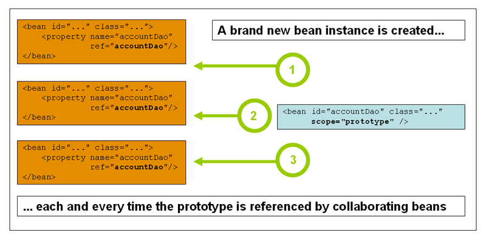
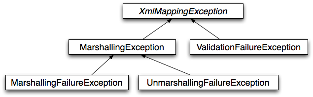
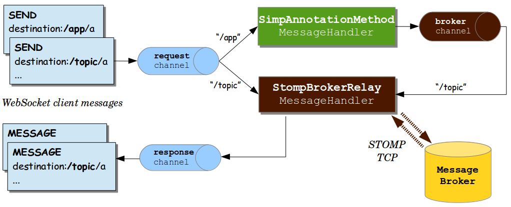

# Spring Framework 概览

version 6.0.8-SNAPSHOT

[Back to index](https://springdoc.cn/spring/index.html)

- [1. 我们对"Spring"的理解](https://springdoc.cn/spring/overview.html#overview-spring)
- [2. Spring和Spring框架的历史](https://springdoc.cn/spring/overview.html#overview-history)
- [3. 设计理念](https://springdoc.cn/spring/overview.html#overview-philosophy)
- [4. 反馈和贡献](https://springdoc.cn/spring/overview.html#overview-feedback)
- [5. 入门](https://springdoc.cn/spring/overview.html#overview-getting-started)

|      | 本站([springdoc.cn](https://springdoc.cn/))中的内容来源于 [spring.io](https://spring.io/) ，原始版权归属于 [spring.io](https://spring.io/)。由 [springdoc.cn](https://springdoc.cn/) 进行翻译，整理。可供个人学习、研究，未经许可，不得进行任何转载、商用或与之相关的行为。 商标声明：Spring 是 Pivotal Software, Inc. 在美国以及其他国家的商标。 |
| ---- | ------------------------------------------------------------ |
|      |                                                              |

Spring使创建Java企业应用程序变得容易。它提供了你在企业环境中拥抱Java语言所需的一切，支持Groovy和Kotlin作为JVM上的替代语言，并根据应用的需要灵活地创建多种架构。从Spring Framework 6.0开始，Spring需要Java 17+。

Spring支持广泛的应用场景。在大型企业中，应用程序通常会存在很长时间，而且必须运行在JDK和应用服务器上，其升级周期是开发者无法控制的。还有一些应用可能以嵌入服务器的单一jar形式运行，可能在云环境中。还有一些可能是独立的应用程序（如批处理或集成工作负载），不需要服务器。

Spring是开源的。它有一个庞大而活跃的社区，根据不同的现实世界的使用案例提供持续的反馈。这有助于Spring在很长一段时间内成功发展。

## 1. 我们对"Spring"的理解

术语 "Spring" 在不同的语境中意味着不同的东西。它可以用来指代Spring框架项目本身，它是一切的开始。随着时间的推移，其他Spring项目也被建立在Spring框架之上。大多数时候，当人们说 "Spring" 时，他们指的是整个项目家族（全家桶）。这个参考文档的重点是基础：Spring框架本身。

Spring 框架被划分为多个模块。应用程序可以选择他们需要的模块。core 是核心容器的模块，包括一个配置模型和一个依赖注入机制。除此之外，Spring框架还为不同的应用架构提供了基础支持，包括消息传递、事务性数据和持久性以及Web。它还包括基于Servlet的 Spring MVC Web 框架，以及并行的Spring WebFlux 响应式 web 框架。

关于模块的说明。Spring框架的jar允许部署到JDK 9的模块路径（"Jigsaw"）。为了在支持Jigsaw的应用程序中使用，Spring Framework 5的jar带有 "Automatic-Module-Name" 清单项，它定义了独立于jar artifact 名称的稳定的语言级模块名称（"spring.core"、"spring.context" 等）（jar遵循相同的命名模式，以"-"代替"."，例如 "spring-core" 和 "spring-context"）。当然，Spring框架的jar在JDK 8和9+的classpath上都保持正常工作。

## 2. Spring和Spring框架的历史

作为对早期 [J2EE](https://en.wikipedia.org/wiki/Java_Platform,_Enterprise_Edition) 规范的复杂性的回应，Spring于2003年诞生了。虽然有些人认为Java EE及其现代的继任者Jakarta EE与Spring有竞争关系，但事实上它们是互补的。Spring编程模型并不拥抱Jakarta EE平台规范；相反，它与从传统的EE伞中精心挑选的个别规范进行整合。

- Servlet API ([JSR 340](https://jcp.org/en/jsr/detail?id=340))
- WebSocket API ([JSR 356](https://www.jcp.org/en/jsr/detail?id=356))
- Concurrency Utilities ([JSR 236](https://www.jcp.org/en/jsr/detail?id=236))
- JSON Binding API ([JSR 367](https://jcp.org/en/jsr/detail?id=367))
- Bean Validation ([JSR 303](https://jcp.org/en/jsr/detail?id=303))
- JPA ([JSR 338](https://jcp.org/en/jsr/detail?id=338))
- JMS ([JSR 914](https://jcp.org/en/jsr/detail?id=914))
- 以及JTA/JCA的设置，以便在必要时进行事务协调。

Spring框架还支持依赖注入（ [JSR 330](https://www.jcp.org/en/jsr/detail?id=330)）和通用注解（ [JSR 250](https://jcp.org/en/jsr/detail?id=250)）规范，应用程序开发人员可以选择使用这些规范来代替Spring框架提供的Spring专用机制。最初，这些都是基于常见的 `javax` 包。

从Spring框架6.0开始，Spring已经升级到Jakarta EE 9级别（例如Servlet 5.0+，JPA 3.0+），基于 `jakarta` 命名空间而不是传统的 `javax` 包。由于EE 9是最低标准，并且已经支持EE 10，Spring准备为Jakarta EE API的进一步发展提供开箱即用的支持。Spring Framework 6.0与Tomcat 10.1、Jetty 11和Undertow 2.3作为Web服务器完全兼容，同时也与Hibernate ORM 6.1兼容。

随着时间的推移，Java/Jakarta EE在应用程序开发中的作用已经发生了变化。在J2EE和Spring的早期，应用程序是为了部署到应用服务器上而创建的。今天，在Spring Boot的帮助下，应用程序是以一种对开发者和云计算友好的方式创建的，Servlet容器是嵌入式的，并且易于改变。从Spring框架5开始，WebFlux应用程序甚至不直接使用Servlet API，可以在非Servlet容器的服务器（如Netty）上运行。

Spring不断创新，不断发展。除了Spring框架，还有其他项目，如Spring Boot、Spring Security、Spring Data、Spring Cloud、Spring Batch等。重要的是要记住，每个项目都有自己的源代码库、issue tracker 和发布节奏。参见 [spring.io/projects](https://spring.io/projects)，了解Spring项目的完整列表。

## 3. 设计理念

当你了解一个框架时，重要的是不仅要知道它做什么，还要知道它遵循什么原则。下面是Spring框架的指导原则。

- 在每个层面上提供选择。Spring让你尽可能晚地推迟设计决策。例如，你可以通过配置来切换持久化供应商，而不需要改变你的代码。对于许多其他基础设施问题和与第三方API的集成也是如此。
- 适应不同的观点。Spring拥抱灵活性，对事情应该如何做不持意见。它支持具有不同视角的广泛的应用需求。
- 保持强大的后向兼容性。Spring的演进是经过精心管理的，在不同的版本之间几乎不存在破坏性的变化。Spring支持一系列精心选择的JDK版本和第三方库，以方便维护依赖Spring的应用程序和库。
- 关心API的设计。Spring团队花了很多心思和时间来制作直观的API，并且在很多版本和很多年中都能保持良好的效果。
- 为代码质量设定高标准。Spring框架非常强调有意义的、最新的和准确的javadoc。它是为数不多的可以宣称代码结构干净、包与包之间没有循环依赖关系的项目之一。

## 4. 反馈和贡献

对于如何处理问题或诊断或调试问题，我们建议使用Stack Overflow。点击 [这里](https://stackoverflow.com/questions/tagged/spring+or+spring-mvc+or+spring-aop+or+spring-jdbc+or+spring-r2dbc+or+spring-transactions+or+spring-annotations+or+spring-jms+or+spring-el+or+spring-test+or+spring+or+spring-orm+or+spring-jmx+or+spring-cache+or+spring-webflux+or+spring-rsocket?tab=Newest) 查看Stack Overflow上建议使用的标签列表。如果你相当确定Spring框架中存在问题，或者想建议一个功能，请使用 [GitHub Issues](https://github.com/spring-projects/spring-framework/issues)。

如果你有一个解决方案或建议的修复，你可以在 [Github](https://github.com/spring-projects/spring-framework) 上提交一个 pull request。然而，请记住，除了最微不足道的问题，我们希望在 issue tracker 中提交一个 ticket，在那里进行讨论并留下记录供将来参考。

更多的细节，请参见 [CONTRIBUTING](https://github.com/spring-projects/spring-framework/tree/main/CONTRIBUTING.md)，顶层项目页面上的指南。

## 5. 入门

如果你刚刚开始使用Spring，你可能想通过创建一个基于 [Spring Boot](https://projects.spring.io/spring-boot/) 的应用程序开始使用Spring框架。Spring Boot提供了一种快速（和有主见）的方式来创建一个生产就绪的基于Spring的应用程序。它以Spring框架为基础，更倾向于约定俗成的配置，旨在让你尽快启动和运行。

你可以使用 [start.spring.io](https://start.spring.io/) 来生成一个基本项目，或者按照 ["入门"指南](https://spring.io/guides) 来做，比如 [《开始构建RESTful Web服务》](https://spring.io/guides/gs/rest-service/)。这些指南除了更容易消化之外，还非常注重任务，而且大部分都是基于Spring Boot的。它们也涵盖了Spring组合中的其他项目，在解决特定问题时，你可能要考虑这些项目。

|      | 官方的 [start.spring.io](https://start.spring.io/) 服务在国外，在国内经常不能访问。推荐使用 [SpringBoot中文社区](https://springboot.io/) 提供的 [https://start.springboot.io](https://start.springboot.io/) 镜像服务。 |
| ---- | ------------------------------------------------------------ |
|      |                                                              |

Version 6.0.8-SNAPSHOT
Last updated 2023-03-03 12:44:32 +0800

[主页](https://springdoc.cn/docs/)

# 核心技术

version 6.0.8-SNAPSHOT

[Back to index](https://springdoc.cn/spring/index.html)

- [1. IoC 容器](https://springdoc.cn/spring/core.html#beans)
- [2. 资源（Resources）](https://springdoc.cn/spring/core.html#resources)
- [3. 验证、数据绑定和类型转换](https://springdoc.cn/spring/core.html#validation)
- [4. Spring 表达式语言（SpEL）](https://springdoc.cn/spring/core.html#expressions)
- [5. 用Spring进行面向切面的编程](https://springdoc.cn/spring/core.html#aop)
- [6. Spring AOP API](https://springdoc.cn/spring/core.html#aop-api)
- [7. Null安全（Null-safety）](https://springdoc.cn/spring/core.html#null-safety)
- [8. Data Buffer 和编解码器](https://springdoc.cn/spring/core.html#databuffers)
- [9. 日志（Logging）](https://springdoc.cn/spring/core.html#spring-jcl)
- [10. AOT 编译优化](https://springdoc.cn/spring/core.html#core.aot)
- [11. 附录](https://springdoc.cn/spring/core.html#core.appendix)

|      | 本站([springdoc.cn](https://springdoc.cn/))中的内容来源于 [spring.io](https://spring.io/) ，原始版权归属于 [spring.io](https://spring.io/)。由 [springdoc.cn](https://springdoc.cn/) 进行翻译，整理。可供个人学习、研究，未经许可，不得进行任何转载、商用或与之相关的行为。 商标声明：Spring 是 Pivotal Software, Inc. 在美国以及其他国家的商标。 |
| ---- | ------------------------------------------------------------ |
|      |                                                              |

这一部分的参考文档涵盖了所有与Spring框架绝对相关的技术。

其中最重要的是Spring框架的反转控制（IoC）容器。在对Spring框架的IoC容器进行彻底处理后，紧接着是对Spring面向切面编程（AOP）技术的全面介绍。Spring框架有自己的AOP框架，在概念上很容易理解，它成功地解决了Java企业编程中 AOP 要求的 80% 的最佳需求点。

此外，还介绍了Spring与AspectJ（目前Java企业领域中功能最丰富、最成熟的AOP实现）的集成情况。

AOT处理可以用来提前（ahead-of-time）优化你的应用程序。它通常用于使用GraalVM的原生镜像部署。

## 1. IoC 容器

本章介绍了Spring的反转控制（IoC）容器。

### 1.1. Spring IoC容器和Bean简介

本章介绍了Spring框架对反转控制（IoC）原则的实现。IoC也被称为依赖注入（DI）。它是一个过程，对象仅通过构造参数、工厂方法的参数或在对象实例被构造或从工厂方法返回后在其上设置的属性来定义其依赖关系（即它们与之合作的其他对象）。然后容器在创建 bean 时注入这些依赖关系。这个过程从根本上说是Bean本身通过使用直接构建类或诸如服务定位模式的机制来控制其依赖关系的实例化或位置的逆过程（因此被称为控制反转）。

`org.springframework.beans` 和 `org.springframework.context` 包是Spring Framework的IoC容器的基础。 [`BeanFactory`](https://docs.spring.io/spring-framework/docs/6.0.8-SNAPSHOT/javadoc-api/org/springframework/beans/factory/BeanFactory.html) 接口提供了一种高级配置机制，能够管理任何类型的对象。 [`ApplicationContext`](https://docs.spring.io/spring-framework/docs/6.0.8-SNAPSHOT/javadoc-api/org/springframework/context/ApplicationContext.html) 是 `BeanFactory` 的一个子接口。它增加了：

- 更容易与Spring的AOP功能集成
- Message resource 处理（用于国际化）
- 事件发布
- 应用层的特定上下文，如 `WebApplicationContext`，用于 web 应用

简而言之，`BeanFactory` 提供了配置框架和基本功能，而 `ApplicationContext` 则增加了更多的企业特定功能。`ApplicationContext` 是 `BeanFactory` 的一个完整的超集，在本章对Spring的IoC容器的描述中专门使用。关于使用 `BeanFactory` 而不是 `ApplicationContext` 的更多信息，请参见涵盖 [`BeanFactory` API](https://springdoc.cn/spring/core.html#beans-beanfactory) 的章节。

在Spring中，构成你的应用程序的骨干并由Spring IoC容器管理的对象被称为Bean。Bean是一个由Spring IoC容器实例化、组装和管理的对象。否则，Bean只是你的应用程序中众多对象中的一个。Bean以及它们之间的依赖关系都反映在容器使用的配置元数据中。

### 1.2. 容器概述

`org.springframework.context.ApplicationContext` 接口代表Spring IoC容器，负责实例化、配置和组装bean。容器通过读取配置元数据来获得关于要实例化、配置和组装哪些对象的指示。配置元数据以XML、Java注解或Java代码表示。它可以让你表达构成你的应用程序的对象以及这些对象之间丰富的相互依赖关系。

Spring提供了几个 `ApplicationContext` 接口的实现。在独立的应用程序中，创建 [`ClassPathXmlApplicationContext`](https://docs.spring.io/spring-framework/docs/6.0.8-SNAPSHOT/javadoc-api/org/springframework/context/support/ClassPathXmlApplicationContext.html) 或 [`FileSystemXmlApplicationContext`](https://docs.spring.io/spring-framework/docs/6.0.8-SNAPSHOT/javadoc-api/org/springframework/context/support/FileSystemXmlApplicationContext.html) 的实例很常见。虽然 XML 一直是定义配置元数据的传统格式，但你可以通过提供少量的 XML 配置来指示容器使用 Java 注解或代码作为元数据格式，以声明性地启用对这些额外元数据格式的支持。

在大多数应用场景中，不需要明确的用户代码来实例化Spring IoC容器的一个或多个实例。例如，在Web应用场景中，通常只需在应用程序的 `web.xml` 文件中编写8行（或更多）模板式的Web描述符就足够了（参见 [为web应用程序提供方便的 `ApplicationContext` 实例化](https://springdoc.cn/spring/core.html#context-create)）。如果你使用 [Spring Tools for Eclipse](https://spring.io/tools)（一个由Eclipse驱动的开发环境），你只需点击几下鼠标或按键就可以轻松创建这种模板配置。

下图显示了Spring工作方式的高层视图。你的应用程序类与配置元数据相结合，这样，在 `ApplicationContext` 被创建和初始化后，你就有了一个完全配置好的可执行系统或应用程序。


Figure 1. Spring IoC容器

#### 1.2.1. 配置元数据

如上图所示，Spring IoC容器消费一种配置元数据。这种配置元数据代表了你，作为一个应用开发者，如何告诉Spring容器在你的应用中实例化、配置和组装对象。

配置元数据传统上是以简单直观的XML格式提供的，这也是本章大部分内容用来传达Spring IoC容器的关键概念和特性。

|      | 基于XML的元数据并不是配置元数据的唯一允许形式。Spring IoC容器本身与这种配置元数据的实际编写格式是完全解耦的。如今，许多开发者为他们的Spring应用程序选择 [基于Java的配置](https://springdoc.cn/spring/core.html#beans-java)。 |
| ---- | ------------------------------------------------------------ |
|      |                                                              |

关于在Spring容器中使用其他形式的元数据的信息，请参见。

- [基于注解的配置](https://springdoc.cn/spring/core.html#beans-annotation-config): 使用基于注解的配置元数据定义Bean。
- [Java-based configuration](https://springdoc.cn/spring/core.html#beans-java): 通过使用Java而不是XML文件来定义你的应用类外部的Bean。要使用这些特性，请参阅 [`@Configuration`](https://docs.spring.io/spring-framework/docs/6.0.8-SNAPSHOT/javadoc-api/org/springframework/context/annotation/Configuration.html), [`@Bean`](https://docs.spring.io/spring-framework/docs/6.0.8-SNAPSHOT/javadoc-api/org/springframework/context/annotation/Bean.html), [`@Import`](https://docs.spring.io/spring-framework/docs/6.0.8-SNAPSHOT/javadoc-api/org/springframework/context/annotation/Import.html), 和 [`@DependsOn`](https://docs.spring.io/spring-framework/docs/6.0.8-SNAPSHOT/javadoc-api/org/springframework/context/annotation/DependsOn.html) 注解。

Spring的配置包括至少一个，通常是一个以上的Bean定义，容器必须管理这些定义。基于XML的配置元数据将这些Bean配置为顶层 `<beans/>` 元素内的 `<bean/>` 元素。Java配置通常使用 `@Configuration` 类中的 `@Bean` 注解的方法。

这些Bean的定义对应于构成你的应用程序的实际对象。通常，你会定义服务层对象、持久层对象（如存储库或数据访问对象（DAO））、表现对象（如Web控制器）、基础设施对象（如JPA `EntityManagerFactory`）、JMS队列等等。通常，人们不会在容器中配置细粒度的domain对象，因为创建和加载domain对象通常是 repository 和业务逻辑的责任。

下面的例子显示了基于XML的配置元数据的基本结构。

```xml
<?xml version="1.0" encoding="UTF-8"?>
<beans xmlns="http://www.springframework.org/schema/beans"
    xmlns:xsi="http://www.w3.org/2001/XMLSchema-instance"
    xsi:schemaLocation="http://www.springframework.org/schema/beans
        https://www.springframework.org/schema/beans/spring-beans.xsd">

    <bean id="..." class="...">  
        <!-- 这个bean的合作者和配置在这里 -->
    </bean>

    <bean id="..." class="...">
        <!-- c这个bean的合作者和配置在这里 -->
    </bean>

    <!-- 更多bean 定义在这里 -->

</beans>
```

|      | `id` 属性是一个字符串，用于识别单个Bean定义。        |
| ---- | ---------------------------------------------------- |
|      | `class` 属性定义了 Bean 的类型，并使用类的全路径名。 |

`id` 属性的值可以用来指代协作对象。本例中没有显示用于引用协作对象的XML。更多信息请参见 [依赖](https://springdoc.cn/spring/core.html#beans-dependencies)。

#### 1.2.2. 实例化一个容器

提供给 `ApplicationContext` 构造函数的一条或多条路径是资源字符串，它让容器从各种外部资源（如本地文件系统、Java `CLASSPATH` 等）加载配置元数据。

Java

```java
ApplicationContext context = new ClassPathXmlApplicationContext("services.xml", "daos.xml");
```

Kotlin

```kotlin
val context = ClassPathXmlApplicationContext("services.xml", "daos.xml")
```

|      | 在了解了Spring的IoC容器后，你可能想了解更多关于Spring的 `Resource` 抽象（如 [资源（Resources）](https://springdoc.cn/spring/core.html#resources) 中所述），它为从URI语法中定义的位置读取 InputStream 提供了方便的机制。特别是，`Resource` 路径被用来构建应用上下文，如 [Application Context 和资源路径](https://springdoc.cn/spring/core.html#resources-app-ctx) 中所述。 |
| ---- | ------------------------------------------------------------ |
|      |                                                              |

下面的例子显示了 service 对象（`services.xml`）配置文件。

```xml
<?xml version="1.0" encoding="UTF-8"?>
<beans xmlns="http://www.springframework.org/schema/beans"
    xmlns:xsi="http://www.w3.org/2001/XMLSchema-instance"
    xsi:schemaLocation="http://www.springframework.org/schema/beans
        https://www.springframework.org/schema/beans/spring-beans.xsd">

    <!-- services -->

    <bean id="petStore" class="org.springframework.samples.jpetstore.services.PetStoreServiceImpl">
        <property name="accountDao" ref="accountDao"/>
        <property name="itemDao" ref="itemDao"/>
        <!-- additional collaborators and configuration for this bean go here -->
    </bean>

    <!-- more bean definitions for services go here -->

</beans>
```

下面的例子显示了数据访问对象（data access object） `daos.xml` 文件。

```xml
<?xml version="1.0" encoding="UTF-8"?>
<beans xmlns="http://www.springframework.org/schema/beans"
    xmlns:xsi="http://www.w3.org/2001/XMLSchema-instance"
    xsi:schemaLocation="http://www.springframework.org/schema/beans
        https://www.springframework.org/schema/beans/spring-beans.xsd">

    <bean id="accountDao"
        class="org.springframework.samples.jpetstore.dao.jpa.JpaAccountDao">
        <!-- additional collaborators and configuration for this bean go here -->
    </bean>

    <bean id="itemDao" class="org.springframework.samples.jpetstore.dao.jpa.JpaItemDao">
        <!-- additional collaborators and configuration for this bean go here -->
    </bean>

    <!-- more bean definitions for data access objects go here -->

</beans>
```

在前面的例子中，服务层由 `PetStoreServiceImpl` 类和两个类型为 `JpaAccountDao` 和 `JpaItemDao` 的数据访问对象组成（基于JPA对象-关系映射标准）。`property name` 元素指的是 JavaBean 属性的名称，而 `ref` 元素指的是另一个Bean定义的名称。`id` 和 `ref` 元素之间的这种联系表达了协作对象之间的依赖关系。关于配置一个对象的依赖关系的细节，请看 [依赖](https://springdoc.cn/spring/core.html#beans-dependencies)。

##### 构建基于XML的配置元数据

让Bean的定义跨越多个XML文件可能很有用。通常情况下，每个单独的XML配置文件代表了你架构中的一个逻辑层或模块。

你可以使用 application context 构造函数从所有这些XML片段中加载Bean定义。这个构造函数需要多个 `Resource` 位置，如 [上一节](https://springdoc.cn/spring/core.html#beans-factory-instantiation) 所示。或者，使用一个或多个 `<import/>` 元素的出现来从另一个或多个文件中加载Bean定义。下面的例子展示了如何做到这一点。

```xml
<beans>
    <import resource="services.xml"/>
    <import resource="resources/messageSource.xml"/>
    <import resource="/resources/themeSource.xml"/>

    <bean id="bean1" class="..."/>
    <bean id="bean2" class="..."/>
</beans>
```

在前面的例子中，外部Bean定义从三个文件中加载：`services.xml`、`messageSource.xml` 和 `themeSource.xml`。所有的位置路径都是相对于进行导入的定义文件而言的，所以 `services.xml` 必须与进行导入的文件在同一目录或 classpath 位置，而 `messageSource.xml` 和 `themeSource.xml` 必须在导入文件的位置以下的 `resources` 位置。正如你所看到的，前导斜线会被忽略。然而，鉴于这些路径是相对的，最好不要使用斜线。被导入文件的内容，包括顶层的 `<beans/>` 元素，必须是有效的XML Bean定义，根据Spring Schema。

|      | 使用相对的 "../" 路径来引用父目录中的文件是可能的，但不推荐这样做。这样做会造成对当前应用程序之外的文件的依赖。特别是，这种引用不推荐用于 `classpath:` URL（例如， `classpath:../services.xml`），其中运行时解析过程选择 "最近的" classpath root，然后查找其父目录。Classpath配置的变化可能导致选择不同的、不正确的目录。你总是可以使用完全限定的资源位置而不是相对路径：例如，`file:C:/config/services.xml` 或 `classpath:/config/services.xml`。然而，请注意，你正在将你的应用程序的配置与特定的绝对位置相耦合。一般来说，最好是为这种绝对位置保留一个指示 - 例如，通过 "${…}" 占位符，在运行时针对JVM系统属性（system properties）进行解析。 |
| ---- | ------------------------------------------------------------ |
|      |                                                              |

命名空间本身提供了导入指令的功能。除了普通的Bean定义之外，更多的配置功能可以在Spring提供的一些XML命名空间中获得，例如，`context` 和 `util` 命名空间。

##### Groovy Bean Definition DSL

作为外部化配置元数据的另一个例子，Bean定义也可以用Spring的Groovy Bean Definition DSL来表达，正如Grails框架所知道的。通常情况下，这种配置存在于 ".groovy" 文件中，其结构如下例所示。

```groovy
beans {
    dataSource(BasicDataSource) {
        driverClassName = "org.hsqldb.jdbcDriver"
        url = "jdbc:hsqldb:mem:grailsDB"
        username = "sa"
        password = ""
        settings = [mynew:"setting"]
    }
    sessionFactory(SessionFactory) {
        dataSource = dataSource
    }
    myService(MyService) {
        nestedBean = { AnotherBean bean ->
            dataSource = dataSource
        }
    }
}
```

这种配置风格基本上等同于XML Bean定义，甚至支持Spring的XML配置命名空间。它还允许通过 `importBeans` 指令导入XML Bean定义文件。

#### 1.2.3. 使用容器

`ApplicationContext` 是一个高级工厂的接口，能够维护不同Bean及其依赖关系的注册表。通过使用方法 `T getBean(String name, Class<T> requiredType)`，你可以检索到Bean的实例。

`ApplicationContext` 可以让你读取Bean定义（definition）并访问它们，如下例所示。

Java

```java
// 创建和配置bean
ApplicationContext context = new ClassPathXmlApplicationContext("services.xml", "daos.xml");

// 检索配置的实例
PetStoreService service = context.getBean("petStore", PetStoreService.class);

// 使用配置的实例
List<String> userList = service.getUsernameList();
```

Kotlin

```kotlin
// 创建和配置bean
val context = ClassPathXmlApplicationContext("services.xml", "daos.xml")

// 检索配置的实例
val service = context.getBean<PetStoreService>("petStore")

// 使用配置的实例
var userList = service.getUsernameList()
```

通过Groovy配置，引导看起来非常相似。它有一个不同的 context 实现类，它能识别Groovy（但也能理解XML bean定义）。下面的例子显示了 Groovy 配置。

Java

```java
ApplicationContext context = new GenericGroovyApplicationContext("services.groovy", "daos.groovy");
```

Kotlin

```kotlin
val context = GenericGroovyApplicationContext("services.groovy", "daos.groovy")
```

最灵活的变体是 `GenericApplicationContext` 与 reader delegate 的结合—例如，与 `XmlBeanDefinitionReader` 一起用于XML文件，如下例所示。

Java

```java
GenericApplicationContext context = new GenericApplicationContext();
new XmlBeanDefinitionReader(context).loadBeanDefinitions("services.xml", "daos.xml");
context.refresh();
```

Kotlin

```kotlin
val context = GenericApplicationContext()
XmlBeanDefinitionReader(context).loadBeanDefinitions("services.xml", "daos.xml")
context.refresh()
```

你也可以将 `GroovyBeanDefinitionReader` 用于Groovy文件，如下例所示。

Java

```java
GenericApplicationContext context = new GenericApplicationContext();
new GroovyBeanDefinitionReader(context).loadBeanDefinitions("services.groovy", "daos.groovy");
context.refresh();
```

Kotlin

```kotlin
val context = GenericApplicationContext()
GroovyBeanDefinitionReader(context).loadBeanDefinitions("services.groovy", "daos.groovy")
context.refresh()
```

你可以在同一个 `ApplicationContext` 上混合和匹配这样的 reader delegate，从不同的配置源读取bean定义。

然后你可以使用 `getBean` 来检索Bean的实例。`ApplicationContext` 接口还有其他一些检索Bean的方法，但理想情况下，你的应用代码不应该使用这些方法。事实上，你的应用程序代码根本就不应该调用 `getBean()` 方法，因此对Spring的API根本就没有依赖性。例如，Spring与Web框架的集成为各种Web框架组件（如 controller 和JSF管理的Bean）提供了依赖注入，让你通过元数据（如autowiring注解）声明对特定Bean的依赖。

### 1.3. Bean 概览

一个Spring IoC容器管理着一个或多个Bean。这些Bean是用你提供给容器的配置元数据创建的（例如，以XML `<bean/>` 定义的形式）。

在容器本身中，这些Bean定义被表示为 `BeanDefinition` 对象，它包含（除其他信息外）以下元数据。

- 一个全路径类名：通常，被定义的Bean的实际实现类。
- Bean的行为配置元素，它说明了Bean在容器中的行为方式（scope、生命周期回调，等等）。
- 对其他Bean的引用，这些Bean需要做它的工作。这些引用也被称为合作者或依赖。
- 要在新创建的对象中设置的其他配置设置—例如，pool的大小限制或在管理连接池的Bean中使用的连接数。

这个元数据转化为构成每个Bean定义的一组属性。下表描述了这些属性。

| 属性                     | 解释…                                                        |
| :----------------------- | :----------------------------------------------------------- |
| Class                    | [实例化 Bean](https://springdoc.cn/spring/core.html#beans-factory-class) |
| Name                     | [Bean 命名](https://springdoc.cn/spring/core.html#beans-beanname) |
| Scope                    | [Bean Scope](https://springdoc.cn/spring/core.html#beans-factory-scopes) |
| Constructor arguments    | [依赖注入](https://springdoc.cn/spring/core.html#beans-factory-collaborators) |
| Properties               | [依赖注入](https://springdoc.cn/spring/core.html#beans-factory-collaborators) |
| Autowiring mode          | [注入协作者（Autowiring Collaborators）](https://springdoc.cn/spring/core.html#beans-factory-autowire) |
| Lazy initialization mode | [懒加载的Bean](https://springdoc.cn/spring/core.html#beans-factory-lazy-init) |
| Initialization method    | [初始化回调](https://springdoc.cn/spring/core.html#beans-factory-lifecycle-initializingbean) |
| Destruction method       | [销毁回调](https://springdoc.cn/spring/core.html#beans-factory-lifecycle-disposablebean) |

除了包含如何创建特定 Bean 的信息的 Bean 定义外，`ApplicationContext` 实现还允许注册在容器外（由用户）创建的现有对象。这是通过 `getBeanFactory()` 方法访问 `ApplicationContext` 的 `BeanFactory` 来实现的，该方法返回 `DefaultListableBeanFactory` 实现。`DefaultListableBeanFactory` 通过 `registerSingleton(..)` 和 `registerBeanDefinition(..)` 方法支持这种注册。然而，典型的应用程序只与通过常规Bean定义元数据定义的Bean一起工作。

|      | Bean 元数据和手动提供的单体实例需要尽早注册，以便容器在自动注入和其它内省步骤中正确推导它们。虽然在某种程度上支持覆盖现有的元数据和现有的单体实例，但 **官方不支持在运行时注册新的Bean**（与对工厂的实时访问同时进行），这可能会导致并发访问异常、Bean容器中的不一致状态，或者两者都有。 |
| ---- | ------------------------------------------------------------ |
|      |                                                              |

#### 1.3.1. Bean 命名

每个Bean都有一个或多个标识符（identifier）。这些标识符在承载Bean的容器中必须是唯一的。一个Bean通常只有一个标识符。然而，如果它需要一个以上的标识符，多余的标识符可以被视为别名。

在基于XML的配置元数据中，你可以使用 `id` 属性、`name` 属性或两者来指定Bean标识符。`id` 属性允许你精确地指定一个 `id`。传统上，这些名字是字母数字（'myBean'、'someService’等），但它们也可以包含特殊字符。如果你想为Bean引入其他别名，你也可以在 `name` 属性中指定它们，用逗号（`,`）、分号（`;`）或空格分隔。尽管 `id` 属性被定义为 `xsd:string` 类型，但 bean id 的唯一性是由容器强制执行的，尽管不是由 XML 解析器执行。

你不需要为Bean提供一个 `name` 或 `id`。如果你不明确地提供 `name` 或 `id`，容器将为该 Bean 生成一个唯一的名称。然而，如果你想通过使用 `ref` 元素或服务定位器风格的查找来引用该 bean 的名称，你必须提供一个名称。不提供名字的动机与使用 [内部Bean](https://springdoc.cn/spring/core.html#beans-inner-beans) 和 [注入协作者（Autowiring Collaborators）](https://springdoc.cn/spring/core.html#beans-factory-autowire) 有关。

Bean的命名规则

惯例是在命名Bean时使用标准的Java惯例来命名实例字段名。也就是说，Bean的名字以小写字母开始，然后以驼峰字母开头。这种名称的例子包括 `accountManager`、`accountService`、`userDao`、`loginController` 等等。

统一命名Bean使你的配置更容易阅读和理解。另外，如果你使用Spring AOP，在对一组按名称相关的Bean应用 advice 时，也有很大的帮助。

|      | 在classpath中的组件扫描（component scanning），Spring为未命名的组件生成Bean名称，遵循前面描述的规则：基本上，取简单的类名并将其初始字符变成小写。然而，在（不寻常的）特殊情况下，当有一个以上的字符，并且第一个和第二个字符都是大写时，原来的大小写会被保留下来。这些规则与 `java.beans.Introspector.decapitalize`（Spring在此使用）所定义的规则相同。 |
| ---- | ------------------------------------------------------------ |
|      |                                                              |

##### 在 Bean Definition 之外对Bean进行别名

在 Bean 定义中，你可以为Bean提供一个以上的名字，通过使用由 `id` 属性指定的最多一个名字和 `name` 属性中任意数量的其他名字的组合。这些名字可以是同一个Bean的等效别名，在某些情况下很有用，比如让应用程序中的每个组件通过使用一个特定于该组件本身的Bean名字来引用一个共同的依赖关系。

然而，在实际定义Bean的地方指定所有别名并不总是足够的。有时，为一个在其他地方定义的Bean引入别名是可取的。这种情况通常发生在大型系统中，配置被分割到每个子系统中，每个子系统都有自己的对象定义集。在基于XML的配置元数据中，你可以使用 `<alias/>` 元素来实现这一点。下面的例子展示了如何做到这一点。

```xml
<alias name="fromName" alias="toName"/>
```

在这种情况下，一个名为 `fromName` 的bean（在同一个容器中）在使用这个别名定义后，也可以被称为 `toName`。

例如，子系统A的配置元数据可以引用一个名为 `subsystemA-dataSource` 的数据源。子系统B的配置元数据可以引用一个名为 `subsystemB-dataSource` 的数据源。当组成使用这两个子系统的主应用程序时，主应用程序以 `myApp-dataSource` 的名字来引用数据源。为了让这三个名字都指代同一个对象，你可以在配置元数据中添加以下别名定义。

```xml
<alias name="myApp-dataSource" alias="subsystemA-dataSource"/>
<alias name="myApp-dataSource" alias="subsystemB-dataSource"/>
```

现在，每个组件和主应用程序都可以通过一个独特的名称来引用dataSource，并保证不与任何其他定义冲突（有效地创建了一个命名空间），但它们引用的是同一个bean。

Java 配置

如果你使用Java配置，`@Bean` 注解可以被用来提供别名。详情请参见 [使用 `@Bean` 注解](https://springdoc.cn/spring/core.html#beans-java-bean-annotation)。

#### 1.3.2. 实例化 Bean

bean 定义（definition）本质上是创建一个或多个对象的“配方”。容器在被要求时查看命名的Bean的“配方”，并使用该Bean定义所封装的配置元数据来创建（或获取）一个实际的对象。

如果你使用基于XML的配置元数据，你要在 `<bean/>` 元素的 `class` 属性中指定要实例化的对象的类型（或class）。这个 `class` 属性（在内部是 `BeanDefinition` 实例的 `Class` 属性）通常是强制性的。（关于例外情况，请看 [用实例工厂方法进行实例化](https://springdoc.cn/spring/core.html#beans-factory-class-instance-factory-method) 和 [Bean 定义（Definition）的继承](https://springdoc.cn/spring/core.html#beans-child-bean-definitions)）。你可以以两种方式之一使用 `Class` 属性。

- 通常，在容器本身通过反射式地调用构造函数直接创建Bean的情况下，指定要构造的Bean类，有点相当于Java代码中的 `new` 操作符。
- 在不太常见的情况下，即容器在一个类上调用 `static` 工厂方法来创建 bean 时，要指定包含被调用的 `static` 工厂方法的实际类。从 `static` 工厂方法的调用中返回的对象类型可能是同一个类或完全是另一个类。

嵌套类名

如果你想为一个嵌套类配置一个Bean定义（definition），你可以使用嵌套类的二进制名称或源（source）名称。

例如，如果你在 `com.example` 包中有一个叫做 `SomeThing` 的类，而这个 `SomeThing` 类有一个叫做 `OtherThing` 的静态嵌套类，它们可以用美元符号（`$`）或点（`.`）分开。所以在Bean定义中的 `class` 属性的值将是 `com.example.SomeThing$OtherThing` 或 `com.example.SomeThing.OtherThing`。

##### 用构造函数进行实例化

当你用构造函数的方法创建一个Bean时，所有普通的类都可以被Spring使用并与之兼容。也就是说，被开发的类不需要实现任何特定的接口，也不需要以特定的方式进行编码。只需指定Bean类就足够了。然而，根据你对该特定Bean使用的IoC类型，你可能需要一个默认（空）构造函数。

Spring IoC容器几乎可以管理任何你希望它管理的类。它并不局限于管理真正的JavaBean。大多数Spring用户更喜欢真正的JavaBean，它只有一个默认的（无参数）构造函数，以及按照容器中的属性建模的适当的setter和getter。你也可以在你的容器中拥有更多奇特的非bean风格的类。例如，如果你需要使用一个绝对不遵守JavaBean规范的传统连接池，Spring也可以管理它。

通过基于XML的配置元数据，你可以按以下方式指定你的bean类。

```xml
<bean id="exampleBean" class="examples.ExampleBean"/>

<bean name="anotherExample" class="examples.ExampleBeanTwo"/>
```

关于向构造函数提供参数（如果需要）和在对象被构造后设置对象实例属性的机制的详细信息，请参见 [依赖注入](https://springdoc.cn/spring/core.html#beans-factory-collaborators)。

##### 用静态工厂方法进行实例化

在定义一个用静态工厂方法创建的Bean时，使用 `class` 属性来指定包含 `static` 工厂方法的类，并使用名为 `factory-method` 的属性来指定工厂方法本身的名称。你应该能够调用这个方法（有可选的参数，如后文所述）并返回一个活的对象，随后该对象被视为通过构造函数创建的。这种Bean定义的一个用途是在遗留代码中调用 `static` 工厂。

下面的Bean定义规定，Bean将通过调用工厂方法来创建。该定义并没有指定返回对象的类型（class），而是指定了包含工厂方法的类。在这个例子中，`createInstance()` 方法必须是一个 `static` 方法。下面的例子显示了如何指定一个工厂方法。

```xml
<bean id="clientService"
    class="examples.ClientService"
    factory-method="createInstance"/>
```

下面的例子显示了一个可以与前面的Bean定义（definition）一起工作的类。

Java

```java
public class ClientService {
    private static ClientService clientService = new ClientService();
    private ClientService() {}

    public static ClientService createInstance() {
        return clientService;
    }
}
```

Kotlin

```kotlin
class ClientService private constructor() {
    companion object {
        private val clientService = ClientService()
        @JvmStatic
        fun createInstance() = clientService
    }
}
```

关于向工厂方法提供（可选）参数以及在对象从工厂返回后设置对象实例属性的机制，详见 [依赖和配置详解](https://springdoc.cn/spring/core.html#beans-factory-properties-detailed)。

##### 用实例工厂方法进行实例化

与 [通过静态工厂方法进行的实例化](https://springdoc.cn/spring/core.html#beans-factory-class-static-factory-method) 类似，用实例工厂方法进行的实例化从容器中调用现有 bean 的非静态方法来创建一个新的 bean。要使用这种机制，请将 `class` 属性留空，并在 `factory-bean` 属性中指定当前（或父代或祖代）容器中的一个 Bean 的名称，该容器包含要被调用来创建对象的实例方法。用 `factory-method` 属性设置工厂方法本身的名称。下面的例子显示了如何配置这样一个Bean。

```xml
<!-- the factory bean, which contains a method called createInstance() -->
<bean id="serviceLocator" class="examples.DefaultServiceLocator">
    <!-- inject any dependencies required by this locator bean -->
</bean>

<!-- the bean to be created via the factory bean -->
<bean id="clientService"
    factory-bean="serviceLocator"
    factory-method="createClientServiceInstance"/>
```

下面的例子显示了相应的类。

Java

```java
public class DefaultServiceLocator {

    private static ClientService clientService = new ClientServiceImpl();

    public ClientService createClientServiceInstance() {
        return clientService;
    }
}
```

Kotlin

```kotlin
class DefaultServiceLocator {
    companion object {
        private val clientService = ClientServiceImpl()
    }
    fun createClientServiceInstance(): ClientService {
        return clientService
    }
}
```

一个工厂类也可以容纳一个以上的工厂方法，如下例所示。

```xml
<bean id="serviceLocator" class="examples.DefaultServiceLocator">
    <!-- inject any dependencies required by this locator bean -->
</bean>

<bean id="clientService"
    factory-bean="serviceLocator"
    factory-method="createClientServiceInstance"/>

<bean id="accountService"
    factory-bean="serviceLocator"
    factory-method="createAccountServiceInstance"/>
```

下面的例子显示了相应的类。

Java

```java
public class DefaultServiceLocator {

    private static ClientService clientService = new ClientServiceImpl();

    private static AccountService accountService = new AccountServiceImpl();

    public ClientService createClientServiceInstance() {
        return clientService;
    }

    public AccountService createAccountServiceInstance() {
        return accountService;
    }
}
```

Kotlin

```kotlin
class DefaultServiceLocator {
    companion object {
        private val clientService = ClientServiceImpl()
        private val accountService = AccountServiceImpl()
    }

    fun createClientServiceInstance(): ClientService {
        return clientService
    }

    fun createAccountServiceInstance(): AccountService {
        return accountService
    }
}
```

这种方法表明，工厂Bean本身可以通过依赖注入（DI）进行管理和配置。请看详细的 [依赖和配置](https://springdoc.cn/spring/core.html#beans-factory-properties-detailed)。

|      | 在Spring文档中，“factory bean” 是指在Spring容器中配置的Bean，它通过 [实例](https://springdoc.cn/spring/core.html#beans-factory-class-instance-factory-method) 或 [静态](https://springdoc.cn/spring/core.html#beans-factory-class-static-factory-method)工厂方法创建对象。相比之下，`FactoryBean`（注意大写字母）是指Spring特定的[`FactoryBean`](https://springdoc.cn/spring/core.html#beans-factory-extension-factorybean) 实现类。 |
| ---- | ------------------------------------------------------------ |
|      |                                                              |

##### 确定Bean的运行时类型

要确定一个特定Bean的运行时类型是不容易的。在Bean元数据定义中指定的类只是一个初始的类引用，可能与已声明的工厂方法相结合，或者是一个 `FactoryBean` 类，这可能导致Bean的运行时类型不同，或者在实例级工厂方法的情况下根本没有被设置（而是通过指定的 `factory-bean` 名称来解决）。此外，AOP代理可能会用基于接口的代理来包装Bean实例，对目标Bean的实际类型（只是其实现的接口）的暴露有限。

要了解某个特定Bean的实际运行时类型，推荐的方法是对指定的Bean名称进行 `BeanFactory.getType` 调用。这将考虑到上述所有情况，并返回 `BeanFactory.getBean` 调用将为同一Bean名称返回的对象类型。

### 1.4. 依赖

一个典型的企业应用程序并不是由单一的对象（或Spring术语中的bean）组成的。即使是最简单的应用也有一些对象，它们一起工作，呈现出最终用户所看到的连贯的应用。下一节将解释你如何从定义一些单独的Bean定义到一个完全实现的应用，在这个应用中，各对象相互协作以实现一个目标。

#### 1.4.1. 依赖注入

依赖注入（DI）是一个过程，对象仅通过构造参数、工厂方法的参数或在对象实例被构造或从工厂方法返回后在其上设置的属性来定义它们的依赖（即与它们一起工作的其它对象）。然后，容器在创建 bean 时注入这些依赖。这个过程从根本上说是Bean本身通过使用类的直接构造或服务定位模式来控制其依赖的实例化或位置的逆过程（因此被称为控制反转）。

采用DI原则，代码会更干净，当对象被提供其依赖时，解耦会更有效。对象不会查找其依赖，也不知道依赖的位置或类别。因此，你的类变得更容易测试，特别是当依赖是在接口或抽象基类上时，这允许在单元测试中使用stub或mock实现。

DI有两个主要的变体。 [基于构造器的依赖注入](https://springdoc.cn/spring/core.html#beans-constructor-injection) 和 [基于setter的依赖注入](https://springdoc.cn/spring/core.html#beans-setter-injection)。

##### 基于构造器的依赖注入

基于构造函数的 DI 是通过容器调用带有许多参数的构造函数来完成的，每个参数代表一个依赖。调用带有特定参数的 `static` 工厂方法来构造 bean 几乎是等价的，本讨论对构造函数的参数和 `static` 工厂方法的参数进行类似处理。下面的例子显示了一个只能用构造函数注入的依赖注入的类。

Java

```java
public class SimpleMovieLister {

    // the SimpleMovieLister has a dependency on a MovieFinder
    private final MovieFinder movieFinder;

    // a constructor so that the Spring container can inject a MovieFinder
    public SimpleMovieLister(MovieFinder movieFinder) {
        this.movieFinder = movieFinder;
    }

    // business logic that actually uses the injected MovieFinder is omitted...
}
```

Kotlin

```kotlin
// a constructor so that the Spring container can inject a MovieFinder
class SimpleMovieLister(private val movieFinder: MovieFinder) {
    // business logic that actually uses the injected MovieFinder is omitted...
}
```

请注意，这个类并没有什么特别之处。它是一个POJO，对容器的特定接口、基类或注解没有依赖。

###### 构造函数参数解析

构造函数参数解析匹配是通过使用参数的类型进行的。如果 bean 定义中的构造器参数不存在潜在的歧义，那么构造器参数在 bean 定义中的定义顺序就是这些参数在 bean 被实例化时被提供给适当的构造器的顺序。考虑一下下面这个类。

Java

```java
package x.y;

public class ThingOne {

    public ThingOne(ThingTwo thingTwo, ThingThree thingThree) {
        // ...
    }
}
```

Kotlin

```kotlin
package x.y

class ThingOne(thingTwo: ThingTwo, thingThree: ThingThree)
```

假设 `ThingTwo` 和 `ThingThree` 类没有继承关系，就不存在潜在的歧义。因此，下面的配置可以正常工作，你不需要在 `<constructor-arg/>` 元素中明确指定构造函数参数的索引或类型。

```xml
<beans>
    <bean id="beanOne" class="x.y.ThingOne">
        <constructor-arg ref="beanTwo"/>
        <constructor-arg ref="beanThree"/>
    </bean>

    <bean id="beanTwo" class="x.y.ThingTwo"/>

    <bean id="beanThree" class="x.y.ThingThree"/>
</beans>
```

当引用另一个Bean时，类型是已知的，并且可以进行匹配（就像前面的例子那样）。当使用一个简单的类型时，比如 `<value>true</value>`，Spring不能确定值的类型，所以在没有帮助的情况下不能通过类型进行匹配。考虑一下下面这个类。

Java

```java
package examples;

public class ExampleBean {

    // Number of years to calculate the Ultimate Answer
    private final int years;

    // The Answer to Life, the Universe, and Everything
    private final String ultimateAnswer;

    public ExampleBean(int years, String ultimateAnswer) {
        this.years = years;
        this.ultimateAnswer = ultimateAnswer;
    }
}
```

Kotlin

```kotlin
package examples

class ExampleBean(
    private val years: Int, // Number of years to calculate the Ultimate Answer
    private val ultimateAnswer: String // The Answer to Life, the Universe, and Everything
)
```

构造函数参数类型匹配

在前面的情况下，如果你通过使用 `type` 属性显式地指定构造函数参数的类型，容器就可以使用简单类型的类型匹配，如下例所示。

```xml
<bean id="exampleBean" class="examples.ExampleBean">
    <constructor-arg type="int" value="7500000"/>
    <constructor-arg type="java.lang.String" value="42"/>
</bean>
```

构造函数参数索引

你可以使用 `index` 属性来明确指定构造函数参数的索引，如下例所示。

```xml
<bean id="exampleBean" class="examples.ExampleBean">
    <constructor-arg index="0" value="7500000"/>
    <constructor-arg index="1" value="42"/>
</bean>
```

除了解决多个简单值的歧义外，指定一个索引还可以解决构造函数有两个相同类型的参数的歧义。

|      | 索引（下标）从0开始。 |
| ---- | --------------------- |
|      |                       |

构造函数参数名

你也可以使用构造函数的参数名称来进行消歧，如下面的例子所示。

```xml
<bean id="exampleBean" class="examples.ExampleBean">
    <constructor-arg name="years" value="7500000"/>
    <constructor-arg name="ultimateAnswer" value="42"/>
</bean>
```

请记住，要使这一方法开箱即用，你的代码在编译时必须启用debug标志，以便Spring能够从构造函数中查找参数名称。如果你不能或不想用debug标志编译你的代码，你可以使用 [@ConstructorProperties](https://download.oracle.com/javase/8/docs/api/java/beans/ConstructorProperties.html) JDK注解来明确命名你的构造函数参数。这样一来，示例类就得如下。

Java

```java
package examples;

public class ExampleBean {

    // Fields omitted

    @ConstructorProperties({"years", "ultimateAnswer"})
    public ExampleBean(int years, String ultimateAnswer) {
        this.years = years;
        this.ultimateAnswer = ultimateAnswer;
    }
}
```

Kotlin

```kotlin
package examples

class ExampleBean
@ConstructorProperties("years", "ultimateAnswer")
constructor(val years: Int, val ultimateAnswer: String)
```

##### 基于Setter的依赖注入

基于 Setter 的 DI 是通过容器在调用无参数的构造函数或无参数的 `static` 工厂方法来实例化你的 bean 之后调用 Setter 方法来实现的。

下面的例子显示了一个只能通过使用纯 setter 注入的类的依赖注入。这个类是传统的Java。它是一个POJO，对容器的特定接口、基类（base class）或注解没有依赖。

Java

```java
public class SimpleMovieLister {

    // the SimpleMovieLister has a dependency on the MovieFinder
    private MovieFinder movieFinder;

    // a setter method so that the Spring container can inject a MovieFinder
    public void setMovieFinder(MovieFinder movieFinder) {
        this.movieFinder = movieFinder;
    }

    // business logic that actually uses the injected MovieFinder is omitted...
}
```

Kotlin

```kotlin
class SimpleMovieLister {

    // a late-initialized property so that the Spring container can inject a MovieFinder
    lateinit var movieFinder: MovieFinder

    // business logic that actually uses the injected MovieFinder is omitted...
}
```

`ApplicationContext` 支持它所管理的Bean的基于构造器和基于setter的DI。它还支持在一些依赖已经通过构造器方法注入后的基于setter的DI。你以 `BeanDefinition` 的形式配置依赖关系，你将其与 `PropertyEditor` 实例一起使用，将属性从一种格式转换为另一种。然而，大多数Spring用户并不直接使用这些类（即以编程方式），而是使用XML Bean定义、注解组件（即用 `@Component`、 `@Controller` 等注解的类），或基于Java的 `@Configuration` 类中的 `@Bean` 方法。然后这些来源在内部被转换为 `BeanDefinition` 的实例，并用于加载整个Spring IoC容器实例。

基于构造器的DI还是基于setter的DI？

由于你可以混合使用基于构造函数的DI和基于setter的DI，一个好的经验法则是对强制依赖使用构造函数，对可选依赖使用setter方法或配置方法。请注意，在setter方法上使用 [@Autowired](https://springdoc.cn/spring/core.html#beans-autowired-annotation) 注解可以使属性成为必须的依赖；然而，带有参数程序化验证的构造器注入是更好的。

Spring团队通常提倡构造函数注入，因为它可以让你将应用组件实现为不可变的对象，并确保所需的依赖不为 `null`。此外，构造函数注入的组件总是以完全初始化的状态返回给客户端（调用）代码。顺便提一下，大量的构造函数参数是一种不好的代码气味，意味着该类可能有太多的责任，应该重构以更好地解决适当的分离问题。

Setter注入主要应该只用于在类中可以分配合理默认值的可选依赖。否则，必须在代码使用依赖的所有地方进行非null值检查。Setter注入的一个好处是，Setter方法使该类的对象可以在以后重新配置或重新注入。因此，通过 [JMX MBean](https://springdoc.cn/spring/integration.html#jmx) 进行管理是setter注入的一个引人注目的用例。

对于一个特定的类，使用最合理的DI风格。有时，在处理你没有源代码的第三方类时，你会做出选择。例如，如果一个第三方类没有暴露任何setter方法，那么构造函数注入可能是唯一可用的DI形式。

##### 依赖的解析过程

容器按如下方式执行 bean 依赖解析。

- `ApplicationContext` 是用描述所有bean的配置元数据创建和初始化的。配置元数据可以由XML、Java代码或注解来指定。
- 对于每个Bean来说，它的依赖是以属性、构造函数参数或静态工厂方法的参数（如果你用它代替正常的构造函数）的形式表达的。在实际创建Bean时，这些依赖被提供给Bean。
- 每个属性或构造函数参数都是要设置的值的实际定义，或对容器中另一个Bean的引用。
- 每个作为值的属性或构造函数参数都会从其指定格式转换为该属性或构造函数参数的实际类型。默认情况下，Spring 可以将以字符串格式提供的值转换为所有内置类型，如 `int`、`long`、`String`、`boolean` 等等。

当容器被创建时，Spring容器会验证每个Bean的配置。然而，在实际创建Bean之前，Bean的属性本身不会被设置。当容器被创建时，那些具有单例作用域并被设置为预实例化的Bean（默认）被创建。作用域在 [Bean Scope](https://springdoc.cn/spring/core.html#beans-factory-scopes) 中定义。否则，Bean只有在被请求时才会被创建。创建 bean 有可能导致创建 bean 图（graph），因为 bean 的依赖关系和它的依赖关系（等等）被创建和分配。请注意，这些依赖关系之间的解析不匹配可能会出现得很晚—也就是说，在第一次创建受影响的Bean时。

循环依赖

如果你使用主要的构造函数注入，就有可能产生一个无法解决的循环依赖情况。

比如说。类A通过构造函数注入需要类B的一个实例，而类B通过构造函数注入需要类A的一个实例。如果你将A类和B类的Bean配置为相互注入，Spring IoC容器会在运行时检测到这种循环引用，并抛出一个 `BeanCurrentlyInCreationException`。

一个可能的解决方案是编辑一些类的源代码，使其通过setter而不是构造器进行配置。或者，避免构造器注入，只使用setter注入。换句话说，虽然不推荐这样做，但你可以用setter注入来配置循环依赖关系。

与典型的情况（没有循环依赖关系）不同，Bean A和Bean B之间的循环依赖关系迫使其中一个Bean在被完全初始化之前被注入到另一个Bean中（一个典型的鸡生蛋蛋生鸡的场景）。

一般来说，你可以相信Spring会做正确的事情。它在容器加载时检测配置问题，例如对不存在的bean的引用和循环依赖。在实际创建Bean时，Spring尽可能晚地设置属性和解析依赖关系。这意味着，当你请求一个对象时，如果在创建该对象或其某个依赖关系时出现问题，已经正确加载的Spring容器就会产生一个异常—例如，Bean由于缺少或无效的属性而抛出一个异常。这种对某些配置问题的潜在延迟可见性是 `ApplicationContext` 实现默认预置单例Bean的原因。在实际需要之前创建这些Bean需要付出一些前期时间和内存的代价，当 `ApplicationContext` 被创建时，你会发现配置问题，而不是后来。你仍然可以覆盖这个默认行为，这样单例Bean就会懒加载地初始化，而不是急切地预实例化。

如果不存在循环依赖关系，当一个或多个协作（Collaborate） Bean被注入到依赖Bean中时，每个协作Bean在被注入到依赖Bean中之前被完全配置。这意味着，如果Bean A对Bean B有依赖，Spring IoC容器会在调用Bean A的setter方法之前完全配置Bean B。换句话说，Bean被实例化（如果它不是预先实例化的单例），其依赖被设置，相关的生命周期方法（如 [配置的 init 方法](https://springdoc.cn/spring/core.html#beans-factory-lifecycle-initializingbean) 或 [InitializingBean 回调方法](https://springdoc.cn/spring/core.html#beans-factory-lifecycle-initializingbean)）被调用。

##### 依赖注入的例子

下面的例子将基于XML的配置元数据用于基于setter的DI。一个Spring XML配置文件的一小部分指定了一些Bean的定义，如下所示。

```xml
<bean id="exampleBean" class="examples.ExampleBean">
    <!-- setter injection using the nested ref element -->
    <property name="beanOne">
        <ref bean="anotherExampleBean"/>
    </property>

    <!-- setter injection using the neater ref attribute -->
    <property name="beanTwo" ref="yetAnotherBean"/>
    <property name="integerProperty" value="1"/>
</bean>

<bean id="anotherExampleBean" class="examples.AnotherBean"/>
<bean id="yetAnotherBean" class="examples.YetAnotherBean"/>
```

下面的例子显示了相应的 `ExampleBean` 类。

Java

```java
public class ExampleBean {

    private AnotherBean beanOne;

    private YetAnotherBean beanTwo;

    private int i;

    public void setBeanOne(AnotherBean beanOne) {
        this.beanOne = beanOne;
    }

    public void setBeanTwo(YetAnotherBean beanTwo) {
        this.beanTwo = beanTwo;
    }

    public void setIntegerProperty(int i) {
        this.i = i;
    }
}
```

Kotlin

```kotlin
class ExampleBean {
    lateinit var beanOne: AnotherBean
    lateinit var beanTwo: YetAnotherBean
    var i: Int = 0
}
```

在前面的例子中，setter被声明为与XML文件中指定的属性相匹配。下面的例子使用基于构造函数的DI。

```xml
<bean id="exampleBean" class="examples.ExampleBean">
    <!-- constructor injection using the nested ref element -->
    <constructor-arg>
        <ref bean="anotherExampleBean"/>
    </constructor-arg>

    <!-- constructor injection using the neater ref attribute -->
    <constructor-arg ref="yetAnotherBean"/>

    <constructor-arg type="int" value="1"/>
</bean>

<bean id="anotherExampleBean" class="examples.AnotherBean"/>
<bean id="yetAnotherBean" class="examples.YetAnotherBean"/>
```

下面的例子显示了相应的 `ExampleBean` 类。

Java

```java
public class ExampleBean {

    private AnotherBean beanOne;

    private YetAnotherBean beanTwo;

    private int i;

    public ExampleBean(
        AnotherBean anotherBean, YetAnotherBean yetAnotherBean, int i) {
        this.beanOne = anotherBean;
        this.beanTwo = yetAnotherBean;
        this.i = i;
    }
}
```

Kotlin

```kotlin
class ExampleBean(
        private val beanOne: AnotherBean,
        private val beanTwo: YetAnotherBean,
        private val i: Int)
```

在 bean 定义中指定的构造器参数被用作 `ExampleBean` 的构造器参数。

现在考虑这个例子的一个变体，即不使用构造函数，而是让Spring调用一个 `static` 工厂方法来返回对象的实例。

```xml
<bean id="exampleBean" class="examples.ExampleBean" factory-method="createInstance">
    <constructor-arg ref="anotherExampleBean"/>
    <constructor-arg ref="yetAnotherBean"/>
    <constructor-arg value="1"/>
</bean>

<bean id="anotherExampleBean" class="examples.AnotherBean"/>
<bean id="yetAnotherBean" class="examples.YetAnotherBean"/>
```

下面的例子显示了相应的 `ExampleBean` 类。

Java

```java
public class ExampleBean {

    // a private constructor
    private ExampleBean(...) {
        ...
    }

    // a static factory method; the arguments to this method can be
    // considered the dependencies of the bean that is returned,
    // regardless of how those arguments are actually used.
    public static ExampleBean createInstance (
        AnotherBean anotherBean, YetAnotherBean yetAnotherBean, int i) {

        ExampleBean eb = new ExampleBean (...);
        // some other operations...
        return eb;
    }
}
```

Kotlin

```kotlin
class ExampleBean private constructor() {
    companion object {
        // a static factory method; the arguments to this method can be
        // considered the dependencies of the bean that is returned,
        // regardless of how those arguments are actually used.
        @JvmStatic
        fun createInstance(anotherBean: AnotherBean, yetAnotherBean: YetAnotherBean, i: Int): ExampleBean {
            val eb = ExampleBean (...)
            // some other operations...
            return eb
        }
    }
}
```

`static` 工厂方法的参数由 `<constructor-arg/>` 元素提供，与实际使用的构造函数完全相同。被工厂方法返回的类的类型不一定与包含 `static` 工厂方法的类的类型相同（尽管在这个例子中，它是相同的）。实例（非静态）工厂方法可以以基本相同的方式使用（除了使用 `factory-bean` 属性而不是 `class` 属性），所以我们在此不讨论这些细节。

#### 1.4.2. 依赖和配置的细节

正如 [上一节](https://springdoc.cn/spring/core.html#beans-factory-collaborators) 所述，你可以将Bean属性和构造函数参数定义为对其他托管Bean（协作者）的引用，或者定义为内联的值。Spring的基于XML的配置元数据支持 `<property/>` 和 `<constructor-arg/>` 元素中的子元素类型，以达到这个目的。

##### 字面值 (基本类型、 String 等)

`<property/>` 元素的 `value` 属性将属性或构造函数参数指定为人类可读的字符串表示。Spring 的 [转换服务](https://springdoc.cn/spring/core.html#core-convert-ConversionService-API) 被用来将这些值从 `String` 转换成属性或参数的实际类型。下面的例子显示了各种值的设置。

```xml
<bean id="myDataSource" class="org.apache.commons.dbcp.BasicDataSource" destroy-method="close">
    <!-- results in a setDriverClassName(String) call -->
    <property name="driverClassName" value="com.mysql.jdbc.Driver"/>
    <property name="url" value="jdbc:mysql://localhost:3306/mydb"/>
    <property name="username" value="root"/>
    <property name="password" value="misterkaoli"/>
</bean>
```

下面的例子使用 [p-namespace](https://springdoc.cn/spring/core.html#beans-p-namespace) 来实现更简洁的XML配置。

```xml
<beans xmlns="http://www.springframework.org/schema/beans"
    xmlns:xsi="http://www.w3.org/2001/XMLSchema-instance"
    xmlns:p="http://www.springframework.org/schema/p"
    xsi:schemaLocation="http://www.springframework.org/schema/beans
    https://www.springframework.org/schema/beans/spring-beans.xsd">

    <bean id="myDataSource" class="org.apache.commons.dbcp.BasicDataSource"
        destroy-method="close"
        p:driverClassName="com.mysql.jdbc.Driver"
        p:url="jdbc:mysql://localhost:3306/mydb"
        p:username="root"
        p:password="misterkaoli"/>

</beans>
```

前面的XML更简洁。然而，除非你使用的IDE（如 [IntelliJ IDEA](https://www.jetbrains.com/idea/) 或 [Spring Tools for Eclipse](https://spring.io/tools)）支持在你创建Bean定义时自动补全属性，否则错别字会在运行时而非设计时发现。强烈建议使用这样的IDE帮助。

你也可以配置一个 `java.util.Properties` 实例，如下所示。

```xml
<bean id="mappings"
    class="org.springframework.context.support.PropertySourcesPlaceholderConfigurer">

    <!-- typed as a java.util.Properties -->
    <property name="properties">
        <value>
            jdbc.driver.className=com.mysql.jdbc.Driver
            jdbc.url=jdbc:mysql://localhost:3306/mydb
        </value>
    </property>
</bean>
```

Spring容器通过使用 JavaBean 的 `PropertyEditor` 机制将 `<value/>` 元素中的文本转换为 `java.util.Properties` 实例。这是一个很好的捷径，也是Spring团队倾向于使用嵌套的 `<value/>` 元素而不是 `value` 属性风格的几个地方之一。

###### `idref` 元素

`idref` 元素仅仅是将容器中另一个 bean 的 `id`（一个字符串值—不是引用）传递给 `<constructor-arg/>` 或 `<property/>` 元素的一种防错方式。下面的例子展示了如何使用它。

```xml
<bean id="theTargetBean" class="..."/>

<bean id="theClientBean" class="...">
    <property name="targetName">
        <idref bean="theTargetBean"/>
    </property>
</bean>
```

前面的Bean定义片段完全等同于（在运行时）下面的片段。

```xml
<bean id="theTargetBean" class="..." />

<bean id="client" class="...">
    <property name="targetName" value="theTargetBean"/>
</bean>
```

第一种形式比第二种形式好，因为使用 `idref` 标签可以让容器在部署时验证被引用的、命名的 bean 是否真的存在。在第二种变体中，没有对传递给 `client` Bean 的 `targetName` 属性的值进行验证。只有在 `client` Bean实际被实例化时，才会发现错误（很可能是致命的结果）。如果 `client` Bean是一个 [prototype](https://springdoc.cn/spring/core.html#beans-factory-scopes) Bean，那么这个错别字和由此产生的异常可能只有在容器被部署后很久才能被发现。

|      | 4.0 版Bean XSD中不再支持 `idref` 元素上的 `local` 属性，因为它不再提供比普通 `bean` 引用更多的价值。在升级到4.0 schema时，将你现有的 `idref local` 引用改为 `idref bean`。 |
| ---- | ------------------------------------------------------------ |
|      |                                                              |

`<idref/>` 元素带来价值的一个常见地方（至少在早于Spring 2.0的版本中）是在 `ProxyFactoryBean` Bean定义中配置 [AOP interceptor（拦截器）](https://springdoc.cn/spring/core.html#aop-pfb-1)。当你指定拦截器名称时，使用 `<idref/>` 元素可以防止你把拦截器的ID拼错。

##### 对其他Bean的引用（合作者）

`ref` 元素是 `<constructor-arg/>` 或 `<property/>` 定义元素中的最后一个元素。在这里，你把一个 bean 的指定属性的值设置为对容器所管理的另一个 bean（协作者）的引用。被引用的 bean 是其属性要被设置的 bean 的依赖关系，它在属性被设置之前根据需要被初始化。（如果协作者是一个单例bean，它可能已经被容器初始化了）。所有的引用最终都是对另一个对象的引用。scope和验证取决于你是否通过 `bean` 或 `parent` 属性来指定其他对象的ID或名称。

通过 `<ref/>` 标签的 `bean` 属性指定目标 bean 是最一般的形式，它允许创建对同一容器或父容器中的任何 bean 的引用，不管它是否在同一个 XML 文件中。`bean` 属性的值可以与目标bean的 `id` 属性相同，或者与目标bean的 `name` 属性中的一个值相同。下面的例子显示了如何使用一个 `ref` 元素。

```xml
<ref bean="someBean"/>
```

通过 `parent` 属性指定目标Bean，可以创建对当前容器的父容器中的Bean的引用。 `parent` 属性的值可以与目标Bean的 `id` 属性或目标Bean的 `name` 属性中的一个值相同。目标Bean必须在当前容器的一个父容器中。当你有一个分层的容器，你想用一个与父级Bean同名的代理来包装父级容器中的现有Bean时，你应该使用这种Bean引用变体。下面的一对列表展示了如何使用 `parent` 属性。

```xml
<!-- in the parent context -->
<bean id="accountService" class="com.something.SimpleAccountService">
    <!-- insert dependencies as required here -->
</bean>
<!-- in the child (descendant) context -->
<bean id="accountService" <!-- bean name is the same as the parent bean -->
    class="org.springframework.aop.framework.ProxyFactoryBean">
    <property name="target">
        <ref parent="accountService"/> <!-- notice how we refer to the parent bean -->
    </property>
    <!-- insert other configuration and dependencies as required here -->
</bean>
```

|      | 在4.0 beans XSD中不再支持 `ref` 元素上的 `local` 属性，因为它不再提供比普通 `bean` 引用更多的价值。在升级到4.0 schema时，将你现有的 `ref local` 引用改为 `ref bean`。 |
| ---- | ------------------------------------------------------------ |
|      |                                                              |

##### 内部 Bean

在 `<property/>` 或 `<constructor-arg/`> 元素内的 `<bean/>` 元素定义了一个内部Bean，如下例所示。

```xml
<bean id="outer" class="...">
    <!-- 而不是使用对目标Bean的引用，只需在行内定义目标Bean即可 -->
    <property name="target">
        <bean class="com.example.Person"> <!-- 这是内部Bean -->
            <property name="name" value="Fiona Apple"/>
            <property name="age" value="25"/>
        </bean>
    </property>
</bean>
```

内部 bean 定义不需要定义 ID 或名称。如果指定了，容器不会使用这样的值作为标识符。容器也会忽略创建时的 `scope` 标志，因为内层 bean 总是匿名的，并且总是与外层 bean 一起创建。不可能独立地访问内层 bean，也不可能将它们注入到除包裹 bean 之外的协作 bean 中。

作为一个转折点，可以从自定义scope中接收销毁回调—例如，对于包含在单例 bean 中的请求scope的内层 bean。内层 bean 实例的创建与它所包含的 bean 相联系，但是销毁回调让它参与到请求作用域的生命周期中。这并不是一种常见的情况。内层Bean通常只是共享其包含Bean的scope。

##### 集合（Collection）

`<list/>`、`<set/>`、`<map/>` 和 `<props/>` 元素分别设置Java `Collection` 类型 `List`、`Set`、`Map` 和 `Properties` 的属性和参数。下面的例子展示了如何使用它们。

```xml
<bean id="moreComplexObject" class="example.ComplexObject">
    <!-- results in a setAdminEmails(java.util.Properties) call -->
    <property name="adminEmails">
        <props>
            <prop key="administrator">administrator@example.org</prop>
            <prop key="support">support@example.org</prop>
            <prop key="development">development@example.org</prop>
        </props>
    </property>
    <!-- results in a setSomeList(java.util.List) call -->
    <property name="someList">
        <list>
            <value>a list element followed by a reference</value>
            <ref bean="myDataSource" />
        </list>
    </property>
    <!-- results in a setSomeMap(java.util.Map) call -->
    <property name="someMap">
        <map>
            <entry key="an entry" value="just some string"/>
            <entry key="a ref" value-ref="myDataSource"/>
        </map>
    </property>
    <!-- results in a setSomeSet(java.util.Set) call -->
    <property name="someSet">
        <set>
            <value>just some string</value>
            <ref bean="myDataSource" />
        </set>
    </property>
</bean>
```

map 的 key 值或 value 值，或 set 值，也可以是以下任何元素。

```xml
bean | ref | idref | list | set | map | props | value | null
```

###### 集合合并

Spring容器也支持合并集合。开发者可以定义一个父 <list/>、<map/>、<set/> 或 <props/> 元素，让子 <list/>、<map/>、<set/> 或 <props/> 元素继承和覆盖父集合的值。也就是说，子集合的值是合并父集合和子集合的元素的结果，子集合的元素覆盖父集合中指定的值。

关于合并的这一节讨论了父子bean机制。不熟悉父子Bean定义的读者可能希望在继续阅读 [相关章节](https://springdoc.cn/spring/core.html#beans-child-bean-definitions)。

下面的例子演示了集合的合并。

```xml
<beans>
    <bean id="parent" abstract="true" class="example.ComplexObject">
        <property name="adminEmails">
            <props>
                <prop key="administrator">administrator@example.com</prop>
                <prop key="support">support@example.com</prop>
            </props>
        </property>
    </bean>
    <bean id="child" parent="parent">
        <property name="adminEmails">
            <!-- the merge is specified on the child collection definition -->
            <props merge="true">
                <prop key="sales">sales@example.com</prop>
                <prop key="support">support@example.co.uk</prop>
            </props>
        </property>
    </bean>
<beans>
```

注意在子Bean定义的 `adminEmails` 属性的 `<props/>` 元素上使用了 `merge=true` 属性。当 `child` Bean被容器解析并实例化时，产生的实例有一个 `adminEmails` `Properties` 集合，它包含了将 `child` Bean的 `adminEmails` 集合与父Bean的 `adminEmails` 集合合并的结果。下面的列表显示了这个结果。

```
administrator=administrator@example.com
sales=sales@example.com
support=support@example.co.uk
```

子代 `Properties` 集合的值继承了父代 `<props/>` 中的所有属性元素，子代的 `support` 值会覆盖父代集合中的值。

这种合并行为类似于适用于 `<list/>`、`<map/>` 和 `<set/>` 集合类型。在 `<list/>` 元素的特殊情况下，与 `List` 集合类型相关的语义（也就是值的有序集合的概念）被保持。父列表的值在所有子列表的值之前。在 `Map`、`Set` 和 `Properties` 集合类型的情况下，不存在排序。因此，对于容器在内部使用的相关的 `Map`、`Set` 和 `Properties` 实现类型的基础上的集合类型，没有排序语义。

###### 集合合并的限制

你不能合并不同的集合类型（例如 `Map` 和 `List`）。如果你试图这样做，会抛出一个适当的 `Exception`。`merge` 属性必须被指定在较低的、继承的、子定义上。在父级集合定义上指定 `merge` 属性是多余的，并且不会导致期望的合并。

###### 强类型的集合

由于Java对泛型的支持，你可以使用强类型的 `Collection`。也就是说，我们可以声明一个 `Collection` 类型，使其只能包含（例如）`String` 元素。如果你使用Spring将一个强类型的 `Collection` 依赖性注入到Bean中，你可以利用Spring的类型转换支持，这样你的强类型 `Collection` 实例的元素在被添加到集合中之前就被转换为适当的类型。下面的Java类和Bean定义展示了如何做到这一点。

Java

```java
public class SomeClass {

    private Map<String, Float> accounts;

    public void setAccounts(Map<String, Float> accounts) {
        this.accounts = accounts;
    }
}
```

Kotlin

```kotlin
class SomeClass {
    lateinit var accounts: Map<String, Float>
}
<beans>
    <bean id="something" class="x.y.SomeClass">
        <property name="accounts">
            <map>
                <entry key="one" value="9.99"/>
                <entry key="two" value="2.75"/>
                <entry key="six" value="3.99"/>
            </map>
        </property>
    </bean>
</beans>
```

当 `something` bean 的 `account` 属性准备注入时，关于强类型的 `Map<String, Float>` 的元素类型的泛型信息可以通过反射获得。因此，Spring的类型转换基础设施将各种值元素识别为 `Float` 类型，而字符串值（`9.99`、`2.75` 和 `3.99`）被转换为实际的 `Float` 类型。

##### Null and Empty String Values

Spring将属性等的空参数视为空字符串。下面这个基于XML的配置元数据片段将 `email` 属性设置为空字符串值（""）。

```xml
<bean class="ExampleBean">
    <property name="email" value=""/>
</bean>
```

前面的例子相当于下面的Java代码。

Java

```java
exampleBean.setEmail("");
```

Kotlin

```kotlin
exampleBean.email = ""
```

`<null/>` 元素处理 `null` 值。下面的列表显示了一个例子。

```xml
<bean class="ExampleBean">
    <property name="email">
        <null/>
    </property>
</bean>
```

前面的配置等同于以下Java代码。

Java

```java
exampleBean.setEmail(null);
```

Kotlin

```kotlin
exampleBean.email = null
```

##### 使用p命名空间的XML快捷方式

p-namespace（命名空间） 让你使用 `bean` 元素的属性（而不是嵌套的 `<property/>` 元素）来描述你的属性值合作Bean，或者两者都是。

Spring支持具有 [命名空间](https://springdoc.cn/spring/core.html#core.appendix.xsd-schemas) 的可扩展配置格式，这些命名空间是基于XML Schema定义的。本章讨论的 `beans` 配置格式是在 XML Schema 文件中定义的。然而，p-namespace 没有在XSD文件中定义，只存在于Spring的核心（core）中。

下面的例子显示了两个XML片段（第一个使用标准的XML格式，第二个使用p-namespace），它们的解析结果相同。

```xml
<beans xmlns="http://www.springframework.org/schema/beans"
    xmlns:xsi="http://www.w3.org/2001/XMLSchema-instance"
    xmlns:p="http://www.springframework.org/schema/p"
    xsi:schemaLocation="http://www.springframework.org/schema/beans
        https://www.springframework.org/schema/beans/spring-beans.xsd">

    <bean name="classic" class="com.example.ExampleBean">
        <property name="email" value="someone@somewhere.com"/>
    </bean>

    <bean name="p-namespace" class="com.example.ExampleBean"
        p:email="someone@somewhere.com"/>
</beans>
```

这个例子显示了在bean定义中，p-namespace中有一个名为 `email` 的属性。这告诉Spring包括一个属性声明。如前所述，p-namespace没有schema定义，所以你可以将attribute的名称设置为property名称。

接下来的例子包括了另外两个Bean定义，它们都有对另一个Bean的引用。

```xml
<beans xmlns="http://www.springframework.org/schema/beans"
    xmlns:xsi="http://www.w3.org/2001/XMLSchema-instance"
    xmlns:p="http://www.springframework.org/schema/p"
    xsi:schemaLocation="http://www.springframework.org/schema/beans
        https://www.springframework.org/schema/beans/spring-beans.xsd">

    <bean name="john-classic" class="com.example.Person">
        <property name="name" value="John Doe"/>
        <property name="spouse" ref="jane"/>
    </bean>

    <bean name="john-modern"
        class="com.example.Person"
        p:name="John Doe"
        p:spouse-ref="jane"/>

    <bean name="jane" class="com.example.Person">
        <property name="name" value="Jane Doe"/>
    </bean>
</beans>
```

这个例子不仅包括使用p命名空间的属性值，而且还使用了一种特殊的格式来声明属性引用。第一个Bean定义使用 `<property name="spouse" ref="jane"/>` 来创建一个从Bean `john` 到Bean `jane` 的引用，而第二个Bean定义使用 `p:spouse-ref="jane"` 作为属性来做完全相同的事情。在这种情况下，`spouse` 是属性名称，而 `-ref` 部分表明这不是一个直接的值，而是对另一个bean的引用。

|      | p命名空间不像标准的XML格式那样灵活。例如，声明属性引用的格式与以 `Ref` 结尾的属性发生冲突，而标准的XML格式则不会。我们建议你仔细选择你的方法，并将其传达给你的团队成员，以避免产生同时使用三种方法的XML文档。 |
| ---- | ------------------------------------------------------------ |
|      |                                                              |

##### 使用c命名空间的XML快捷方式

与 [使用p命名空间的XML快捷方式](https://springdoc.cn/spring/core.html#beans-p-namespace) 类似，Spring 3.1中引入的c命名空间允许配置构造器参数的内联属性，而不是嵌套的 `constructor-arg` 元素。

下面的例子使用 `c:` 命名空间来做与 [基于构造器的依赖注入](https://springdoc.cn/spring/core.html#beans-constructor-injection) 相同的事情。

```xml
<beans xmlns="http://www.springframework.org/schema/beans"
    xmlns:xsi="http://www.w3.org/2001/XMLSchema-instance"
    xmlns:c="http://www.springframework.org/schema/c"
    xsi:schemaLocation="http://www.springframework.org/schema/beans
        https://www.springframework.org/schema/beans/spring-beans.xsd">

    <bean id="beanTwo" class="x.y.ThingTwo"/>
    <bean id="beanThree" class="x.y.ThingThree"/>

    <!-- traditional declaration with optional argument names -->
    <bean id="beanOne" class="x.y.ThingOne">
        <constructor-arg name="thingTwo" ref="beanTwo"/>
        <constructor-arg name="thingThree" ref="beanThree"/>
        <constructor-arg name="email" value="something@somewhere.com"/>
    </bean>

    <!-- c-namespace declaration with argument names -->
    <bean id="beanOne" class="x.y.ThingOne" c:thingTwo-ref="beanTwo"
        c:thingThree-ref="beanThree" c:email="something@somewhere.com"/>

</beans>
```

`c:` 命名空间使用了与 `p:` 命名空间相同的约定（Bean引用的尾部 `-ref`），用于按名称设置构造函数参数。同样，它也需要在XML文件中声明，尽管它没有在XSD schema中定义（它存在于Spring 核心（core）中）。

对于构造函数参数名称不可用的罕见情况（通常是字节码编译时没有debug信息），你可以使用回退到参数索引（下标），如下所示。

```xml
<!-- c-namespace index declaration -->
<bean id="beanOne" class="x.y.ThingOne" c:_0-ref="beanTwo" c:_1-ref="beanThree"
    c:_2="something@somewhere.com"/>
```

|      | 由于XML语法的原因，索引符号需要有前面的 `_`，因为XML属性名不能以数字开头（尽管有些IDE允许这样做）。相应的索引符号也可用于 `<constructor-arg>` 元素，但并不常用，因为通常情况下，普通的声明顺序已经足够了。 |
| ---- | ------------------------------------------------------------ |
|      |                                                              |

在实践中，构造函数解析 [机制](https://springdoc.cn/spring/core.html#beans-factory-ctor-arguments-resolution) 在匹配参数方面相当有效，所以除非你真的需要，否则我们建议在整个配置中使用名称符号。

##### 复合属性名

当你设置Bean属性时，你可以使用复合或嵌套的属性名，只要路径中除最终属性名外的所有组件不为 `null`。考虑一下下面的Bean定义。

```xml
<bean id="something" class="things.ThingOne">
    <property name="fred.bob.sammy" value="123" />
</bean>
```

`something` Bean有一个 `fred` 属性，它有一个 `bob` 属性，它有一个 `sammy` 属性，最后的 `sammy` 属性被设置为 `123` 的值。为了使这个方法奏效，`something` 的 `fred` 属性和 `fred` 的 `bob` 属性在构建 bean 后不能为 `null`。否则就会抛出一个 `NullPointerException`。

#### 1.4.3. 使用 `depends-on`

如果一个Bean是另一个Bean的依赖，这通常意味着一个Bean被设置为另一个Bean的一个属性。通常，你可以通过基于XML的配置元数据中的 [`` 元素](https://springdoc.cn/spring/core.html#beans-ref-element) 来实现这一点。然而，有时Bean之间的依赖关系并不那么直接。一个例子是当一个类中的静态初始化器需要被触发时，比如数据库驱动程序的注册。`depends-on` 属性可以明确地强制一个或多个Bean在使用此元素的Bean被初始化之前被初始化。下面的例子使用 `depends-on` 属性来表达对单个 bean 的依赖性。 s

```xml
<bean id="beanOne" class="ExampleBean" depends-on="manager"/>
<bean id="manager" class="ManagerBean" />
```

要表达对多个Bean的依赖，请提供一个Bean名称的列表作为 `depends-on` 属性的值（逗号、空格和分号是有效的分隔符）。

```xml
<bean id="beanOne" class="ExampleBean" depends-on="manager,accountDao">
    <property name="manager" ref="manager" />
</bean>

<bean id="manager" class="ManagerBean" />
<bean id="accountDao" class="x.y.jdbc.JdbcAccountDao" />
```

|      | `depends-on` 属性可以指定初始化时间的依赖关系，而在 [单例](https://springdoc.cn/spring/core.html#beans-factory-scopes-singleton) Bean的情况下，也可以指定相应的销毁时间的依赖关系。与给定Bean定义了 `depends-on` 的依赖Bean会在给定Bean本身被销毁之前被首先销毁。因此，`depends-on` 也可以控制关闭的顺序。 |
| ---- | ------------------------------------------------------------ |
|      |                                                              |

#### 1.4.4. 懒加载的Bean

默认情况下，`ApplicationContext` 的实现会急切地创建和配置所有的 [单例](https://springdoc.cn/spring/core.html#beans-factory-scopes-singleton) Bean，作为初始化过程的一部分。一般来说，这种预实例化是可取的，因为配置或周围环境中的错误会立即被发现，而不是几小时甚至几天之后。当这种行为不可取时，你可以通过将Bean定义标记为懒加载来阻止单例Bean的预实例化。懒加载的 bean 告诉IoC容器在第一次被请求时创建一个bean实例，而不是在启动时。

在XML中，这种行为是由 `<bean/>` 元素上的 `lazy-init` 属性控制的，如下例所示。

```xml
<bean id="lazy" class="com.something.ExpensiveToCreateBean" lazy-init="true"/>
<bean name="not.lazy" class="com.something.AnotherBean"/>
```

当前面的配置被 `ApplicationContext` 消耗时，当 `ApplicationContext` 启动时，`lazy` Bean不会被急切地预实化，而 `not.lazy` Bean则被急切地预实化了。

然而，当懒加载Bean是未被懒加载的单例Bean的依赖关系时，`ApplicationContext` 会在启动时创建懒加载 Bean，因为它必须满足单例的依赖关系。懒加载的 Bean 被注入到其他没有被懒加载的单例 Bean中。

你也可以通过使用 `<beans/>` 元素上的 `default-lazy-init` 属性来控制容器级的懒加载，如下例所示。

```xml
<beans default-lazy-init="true">
    <!-- no beans will be pre-instantiated... -->
</beans>
```

#### 1.4.5. 注入协作者（Autowiring Collaborators）

Spring容器可以自动连接协作Bean之间的关系。你可以让Spring通过检查 `ApplicationContext` 的内容为你的Bean自动解决协作者（其他Bean）。自动注入有以下优点。 * 自动注入可以大大减少对指定属性或构造函数参数的需要。（其他机制，如 [本章其他地方](https://springdoc.cn/spring/core.html#beans-child-bean-definitions) 讨论的 bean template，在这方面也很有价值）。 * 自动注入可以随着你的对象的发展而更新配置。例如，如果你需要给一个类添加一个依赖，这个依赖可以自动满足，而不需要你修改配置。因此，自动在开发过程中可能特别有用，而不会否定在代码库变得更加稳定时切换到显式注入的选择。

当使用基于XML的配置元数据时（见 [依赖注入](https://springdoc.cn/spring/core.html#beans-factory-collaborators)），你可以用 `<bean/>` 元素的 `autowire` 属性来指定bean定义的自动注入模式。自动注入功能有四种模式。你可以为每个Bean指定自动注入，从而选择哪些要自动注入。下表描述了四种自动注入模式。

| 模式          | 解释                                                         |
| :------------ | :----------------------------------------------------------- |
| `no`          | （默认）没有自动注入。Bean引用必须由 `ref` 元素来定义。对于大型部署来说，不建议改变默认设置，因为明确指定协作者会带来更大的控制力和清晰度。在某种程度上，它记录了一个系统的结构。 |
| `byName`      | 通过属性名称进行自动注入。Spring寻找一个与需要自动注入的属性同名的Bean。例如，如果一个Bean定义被设置为按名称自动注入，并且它包含一个 `master` 属性（也就是说，它有一个 `setMaster(..)` 方法），Spring会寻找一个名为 `master` 的Bean定义并使用它来设置该属性。 |
| `byType`      | 如果容器中正好有一个 property 类型的 bean 存在，就可以自动注入该属性。如果存在一个以上的bean，就会抛出一个致命的 exception，这表明你不能对该bean使用 `byType` 自动注入。如果没有匹配的 bean，就不会发生任何事情（该属性没有被设置）。 |
| `constructor` | 类似于 `byType`，但适用于构造函数参数。如果容器中没有一个构造函数参数类型的bean，就会产生一个致命的错误。 |

通过 `byType` 或 `constructor` 自动注入模式，你可以给数组（array）和泛型集合（collection）注入。在这种情况下，容器中所有符合预期类型的自动注入候选者都被提供来满足依赖。如果预期的key类型是 `String`，你可以自动注入强类型的 `Map` 实例。自动注入的 `Map` 实例的值由符合预期类型的所有 bean 实例组成，而 `Map` 实例的key包含相应的 bean 名称。

##### 自动注入的限制和缺点

当自动注入在整个项目中被一致使用时，它的效果最好。如果自动注入没有被普遍使用，那么只用它来注入一个或两个Bean定义可能会让开发者感到困惑。

考虑自动注入的限制和弊端。

- `property` 和 `constructor-arg` 设置中的明确依赖关系总是覆盖自动注入。你不能自动注入简单的属性，如基本数据、`String` 和 `Class`（以及此类简单属性的数组）。这个限制是设计上的。
- 自动注入不如显式注入精确。尽管正如前面的表格中所指出的，Spring很小心地避免在模糊不清的情况下进行猜测，这可能会产生意想不到的结果。你的Spring管理的对象之间的关系不再被明确地记录下来。
- 对于可能从Spring容器中生成文档的工具来说，注入信息可能无法使用。
- 容器中的多个Bean定义可以与setter方法或构造参数指定的类型相匹配，以实现自动注入。对于数组、集合或 `Map` 实例，这不一定是个问题。然而，对于期待单一值的依赖关系，这种模糊性不会被任意地解决。如果没有唯一的Bean定义，就会抛出一个异常。

在后一种情况下，你有几种选择。

- 放弃自动注入，改用明确注入。
- 通过将bean定义的 `autowire-candidate` 属性设置为 `false` 来避免bean定义的自动注入，如 [下一节](https://springdoc.cn/spring/core.html#beans-factory-autowire-candidate) 所述。
- 通过将 `<bean/>` 元素的 `primary` 属性设置为 `true`，将单个Bean定义指定为主要候选者。
- 实现基于注解的配置所提供的更精细的控制，如 [基于注解的容器配置](https://springdoc.cn/spring/core.html#beans-annotation-config) 中所述。

##### 从自动注入中排除一个Bean

在每个bean的基础上，你可以将一个bean排除在自动注入之外。在Spring的XML格式中，将 `<bean/>` 元素的 `autowire-candidate` 属性设置为 `false`。容器使特定的Bean定义对自动注入基础设施不可用（包括注解式配置，如 `@Autowired`）。

|      | `autowire-candidate` 属性被设计为只影响基于类型的自动注入。它不影响通过名称的显式引用，即使指定的 bean 没有被标记为 autowire 候选者，它也会被解析。因此，如果名称匹配，通过名称进行的自动注入还是会注入一个Bean。 |
| ---- | ------------------------------------------------------------ |
|      |                                                              |

你也可以根据对Bean名称的模式匹配来限制autowire候选人。顶层的 `<beans/>` 元素在其 `default-autowire-candidates` 属性中接受一个或多个模式。例如，要将自动注入候选状态限制在名称以 `Repository` 结尾的任何 bean，请提供 `*Repository` 的值。要提供多个模式，请用逗号分隔的列表定义它们。Bean定义的 `autowire-candidate` 属性的明确值为 `true` 或 `false`，总是优先考虑。对于这样的Bean，模式匹配规则并不适用。

这些技术对于那些你永远不想通过自动注入注入到其他 Bean 中的 Bean 是很有用的。这并不意味着排除在外的 Bean 本身不能通过使用 autowiring 进行配置。相反，Bean本身不是自动注入其他 Bean 的候选人。

#### 1.4.6. 方法注入

在大多数应用场景中，容器中的大多数Bean是 [单例](https://springdoc.cn/spring/core.html#beans-factory-scopes-singleton)。当一个单例Bean需要与另一个单例Bean协作或一个非单例Bean需要与另一个非单例Bean协作时，你通常通过将一个Bean定义为另一个Bean的一个属性来处理这种依赖关系。当Bean的生命周期不同时，问题就出现了。假设单例Bean A需要使用非单例（prototype）Bean B，也许是在A的每个方法调用上。容器只创建一次单例Bean A，因此只有一次机会来设置属性。容器不能在每次需要Bean B的时候为Bean A提供一个新的实例。

一个解决方案是放弃一些控制的反转。你可以通过实现 `ApplicationContextAware` 接口 [给 bean A 注入容器](https://springdoc.cn/spring/core.html#beans-factory-aware)，并在 bean A 需要时让 [容器的 `getBean("B")` 调用](https://springdoc.cn/spring/core.html#beans-factory-client) 询问（一个典型的 new）bean B 实例。下面的例子展示了这种方法。

Java

```java
package fiona.apple;

// Spring-API imports
import org.springframework.beans.BeansException;
import org.springframework.context.ApplicationContext;
import org.springframework.context.ApplicationContextAware;

/**
 * A class that uses a stateful Command-style class to perform
 * some processing.
 */
public class CommandManager implements ApplicationContextAware {

    private ApplicationContext applicationContext;

    public Object process(Map commandState) {
        // grab a new instance of the appropriate Command
        Command command = createCommand();
        // set the state on the (hopefully brand new) Command instance
        command.setState(commandState);
        return command.execute();
    }

    protected Command createCommand() {
        // notice the Spring API dependency!
        return this.applicationContext.getBean("command", Command.class);
    }

    public void setApplicationContext(
            ApplicationContext applicationContext) throws BeansException {
        this.applicationContext = applicationContext;
    }
}
```

Kotlin

```kotlin
package fiona.apple

// Spring-API imports
import org.springframework.context.ApplicationContext
import org.springframework.context.ApplicationContextAware

// A class that uses a stateful Command-style class to perform
// some processing.
class CommandManager : ApplicationContextAware {

    private lateinit var applicationContext: ApplicationContext

    fun process(commandState: Map<*, *>): Any {
        // grab a new instance of the appropriate Command
        val command = createCommand()
        // set the state on the (hopefully brand new) Command instance
        command.state = commandState
        return command.execute()
    }

    // notice the Spring API dependency!
    protected fun createCommand() =
            applicationContext.getBean("command", Command::class.java)

    override fun setApplicationContext(applicationContext: ApplicationContext) {
        this.applicationContext = applicationContext
    }
}
```

前面的情况是不可取的，因为业务代码知道并耦合到Spring框架。方法注入（Method Injection）是Spring IoC容器的一个高级功能，可以让你干净地处理这种用例。

你可以在 [这篇博客文章](https://spring.io/blog/2004/08/06/method-injection/) 中阅读更多关于方法注入的动机。

##### 查找方法依赖注入

查询方法注入是指容器能够覆盖容器管理的 bean 上的方法并返回容器中另一个命名的 bean 的查询结果。这种查找通常涉及到一个原型（prototype）Bean，就像 [上一节](https://springdoc.cn/spring/core.html#beans-factory-method-injection)中描述的情景。Spring框架通过使用CGLIB库的字节码生成来实现这种方法注入，动态地生成一个覆盖该方法的子类。

|      | 为了实现此动态子类化功能，被 Spring bean 容器子类化的类不能为 `final`，要被复写的方法也不能为 `final`。对一个包含 `abstract` 方法的类进行单元测试，需要你自己对这个类进行子类化，并提供一个 `abstract` 方法的 stub 实现。体的方法对于组件扫描也是必要的，这需要具体的类来接续。另一个关键的限制是，查找方法对工厂方法不起作用，特别是对配置类中的 `@Bean` 方法不起作用，因为在这种情况下，容器不负责创建实例，因此不能即时创建运行时生成的子类。 |
| ---- | ------------------------------------------------------------ |
|      |                                                              |

在前面代码片段中的 `CommandManager` 类的情况下，Spring容器动态地覆写了 `createCommand()` 方法的实现。`CommandManager` 类没有任何Spring的依赖，正如重写的例子所示。

Java

```java
package fiona.apple;

// no more Spring imports!

public abstract class CommandManager {

    public Object process(Object commandState) {
        // grab a new instance of the appropriate Command interface
        Command command = createCommand();
        // set the state on the (hopefully brand new) Command instance
        command.setState(commandState);
        return command.execute();
    }

    // okay... but where is the implementation of this method?
    protected abstract Command createCommand();
}
```

Kotlin

```kotlin
package fiona.apple

// no more Spring imports!

abstract class CommandManager {

    fun process(commandState: Any): Any {
        // grab a new instance of the appropriate Command interface
        val command = createCommand()
        // set the state on the (hopefully brand new) Command instance
        command.state = commandState
        return command.execute()
    }

    // okay... but where is the implementation of this method?
    protected abstract fun createCommand(): Command
}
```

在包含要注入的方法的客户端类中（本例中是 `CommandManager`），要注入的方法需要一个如下形式的签名。

```xml
<public|protected> [abstract] <return-type> theMethodName(no-arguments);
```

如果这个方法是 `abstract` 的，动态生成的子类实现这个方法。否则，动态生成的子类将覆盖原始类中定义的具体方法。考虑一下下面的例子。

```xml
<!-- a stateful bean deployed as a prototype (non-singleton) -->
<bean id="myCommand" class="fiona.apple.AsyncCommand" scope="prototype">
    <!-- inject dependencies here as required -->
</bean>

<!-- commandProcessor uses statefulCommandHelper -->
<bean id="commandManager" class="fiona.apple.CommandManager">
    <lookup-method name="createCommand" bean="myCommand"/>
</bean>
```

每当需要一个新的 `myCommand` Bean的实例时，被识别为 `commandManager` 的bean就会调用它自己的 `createCommand()` 方法。你必须注意将 `myCommand` Bean部署为一个原型（prototype），如果这确实是需要的。如果它是一个 [单例](https://springdoc.cn/spring/core.html#beans-factory-scopes-singleton)，每次都会返回同一个 `myCommand` Bean实例。

另外，在基于注解的组件模型中，你可以通过 `@Lookup` 注解来声明一个查找方法，如下例所示。

Java

```java
public abstract class CommandManager {

    public Object process(Object commandState) {
        Command command = createCommand();
        command.setState(commandState);
        return command.execute();
    }

    @Lookup("myCommand")
    protected abstract Command createCommand();
}
```

Kotlin

```kotlin
abstract class CommandManager {

    fun process(commandState: Any): Any {
        val command = createCommand()
        command.state = commandState
        return command.execute()
    }

    @Lookup("myCommand")
    protected abstract fun createCommand(): Command
}
```

或者，更习惯性的是，你可以依靠目标Bean对查找方法的声明返回类型进行解析。

Java

```java
public abstract class CommandManager {

    public Object process(Object commandState) {
        Command command = createCommand();
        command.setState(commandState);
        return command.execute();
    }

    @Lookup
    protected abstract Command createCommand();
}
```

Kotlin

```kotlin
abstract class CommandManager {

    fun process(commandState: Any): Any {
        val command = createCommand()
        command.state = commandState
        return command.execute()
    }

    @Lookup
    protected abstract fun createCommand(): Command
}
```

请注意，你通常应该用具体的 stub 实现来声明这种注解的查找方法，以使它们与Spring的组件扫描规则兼容，因为抽象类会被默认忽略。这一限制并不适用于明确注册或明确导入的Bean类。

|      | 访问不同 scope 的目标Bean的另一种方式是 `ObjectFactory`/`Provider` 注入点。请看 [作为依赖的 Scope Bean](https://springdoc.cn/spring/core.html#beans-factory-scopes-other-injection)。你可能还会发现 `ServiceLocatorFactoryBean`（在 `org.springframework.beans.factory.config` 包中）很有用。 |
| ---- | ------------------------------------------------------------ |
|      |                                                              |

##### 任意方法替换

与查找方法注入相比，方法注入的一个不太有用的形式是用另一个方法实现替换托管Bean中的任意方法的能力。你可以安全地跳过本节的其余部分，直到你真正需要这个功能。

通过基于XML的配置元数据，你可以使用 `replaced-method` 元素来替换现有的方法实现，为已部署的Bean提供另一种方法。考虑一下下面这个类，它有一个我们想要覆盖的名为 `computeValue` 的方法。

Java

```java
public class MyValueCalculator {

    public String computeValue(String input) {
        // some real code...
    }

    // some other methods...
}
```

Kotlin

```kotlin
class MyValueCalculator {

    fun computeValue(input: String): String {
        // some real code...
    }

    // some other methods...
}
```

实现 `org.springframework.beans.factory.support.MethodReplacer` 接口的类提供了新的方法定义，如下例所示。

Java

```java
/**
 * meant to be used to override the existing computeValue(String)
 * implementation in MyValueCalculator
 */
public class ReplacementComputeValue implements MethodReplacer {

    public Object reimplement(Object o, Method m, Object[] args) throws Throwable {
        // get the input value, work with it, and return a computed result
        String input = (String) args[0];
        ...
        return ...;
    }
}
```

Kotlin

```kotlin
/**
 * meant to be used to override the existing computeValue(String)
 * implementation in MyValueCalculator
 */
class ReplacementComputeValue : MethodReplacer {

    override fun reimplement(obj: Any, method: Method, args: Array<out Any>): Any {
        // get the input value, work with it, and return a computed result
        val input = args[0] as String;
        ...
        return ...;
    }
}
```

部署原始类并指定方法覆写的bean定义将类似于下面的例子。

```xml
<bean id="myValueCalculator" class="x.y.z.MyValueCalculator">
    <!-- arbitrary method replacement -->
    <replaced-method name="computeValue" replacer="replacementComputeValue">
        <arg-type>String</arg-type>
    </replaced-method>
</bean>

<bean id="replacementComputeValue" class="a.b.c.ReplacementComputeValue"/>
```

你可以在 `<replaced-method/>` 元素中使用一个或多个 `<arg-type/>` 元素来表示被重载方法的方法签名。只有当方法被重载并且在类中存在多个变体时，参数的签名才是必要的。为了方便起见，参数的类型字符串可以是全路径类型名称的子串。例如，下面这些都符合 `java.lang.String`。

```java
java.lang.String
String
Str
```

因为参数的数量往往足以区分每个可能的选择，这个快捷方式可以节省大量的输入，让你只输入符合参数类型的最短字符串。

### 1.5. Bean Scope

当你创建一个Bean定义时，你创建了一个“配方”，用于创建该Bean定义（definition）是所定义的类的实际实例。Bean定义（definition）是一个“配方”的想法很重要，因为它意味着，就像一个类一样，你可以从一个“配方”中创建许多对象实例。

你不仅可以控制各种依赖和配置值，将其插入到从特定Bean定义创建的对象中，还可以控制从特定Bean定义创建的对象的scope。这种方法是强大而灵活的，因为你可以通过配置来选择你所创建的对象的scope，而不是在Java类级别上烘托出一个对象的scope。Bean可以被定义为部署在若干scope中的一个。Spring框架支持六个scope，其中四个只有在你使用Web感知（aware）的 `ApplicationContext` 时才可用。你也可以创建 [一个自定义 scope](https://springdoc.cn/spring/core.html#beans-factory-scopes-custom)。

下表描述了支持的 scope。

| Scope                                                        | 说明                                                         |
| :----------------------------------------------------------- | :----------------------------------------------------------- |
| [singleton](https://springdoc.cn/spring/core.html#beans-factory-scopes-singleton) | （默认情况下）为每个Spring IoC容器将单个Bean定义的Scope扩大到单个对象实例。 |
| [prototype](https://springdoc.cn/spring/core.html#beans-factory-scopes-prototype) | 将单个Bean定义的Scope扩大到任何数量的对象实例。              |
| [request](https://springdoc.cn/spring/core.html#beans-factory-scopes-request) | 将单个Bean定义的Scope扩大到单个HTTP请求的生命周期。也就是说，每个HTTP请求都有自己的Bean实例，该实例是在单个Bean定义的基础上创建的。只在Web感知的Spring `ApplicationContext` 的上下文中有效。 |
| [session](https://springdoc.cn/spring/core.html#beans-factory-scopes-session) | 将单个Bean定义的Scope扩大到一个HTTP `Session` 的生命周期。只在Web感知的Spring `ApplicationContext` 的上下文中有效。 |
| [application](https://springdoc.cn/spring/core.html#beans-factory-scopes-application) | 将单个Bean定义的 Scope 扩大到 `ServletContext` 的生命周期中。只在Web感知的Spring `ApplicationContext` 的上下文中有效。 |
| [websocket](https://springdoc.cn/spring/web.html#websocket-stomp-websocket-scope) | 将单个Bean定义的 Scope 扩大到 `WebSocket` 的生命周期。仅在具有Web感知的 Spring `ApplicationContext` 的上下文中有效。 |

|      | 一个 thread scope 是可用的，但默认情况下没有注册。欲了解更多信息，请参阅 [`SimpleThreadScope`](https://docs.spring.io/spring-framework/docs/6.0.8-SNAPSHOT/javadoc-api/org/springframework/context/support/SimpleThreadScope.html) 的文档。关于如何注册这个或任何其他自定义 scope 的说明，请参见 [使用自定义 Scope](https://springdoc.cn/spring/core.html#beans-factory-scopes-custom-using)。 |
| ---- | ------------------------------------------------------------ |
|      |                                                              |

#### 1.5.1. Singleton Scope

只有一个单例 Bean 的共享实例被管理，所有对具有符合该Bean定义的ID的Bean的请求都会被Spring容器返回该特定的Bean实例。

换句话说，当你定义了一个Bean定义（define），并且它被定义为 singleton，Spring IoC容器就会为该Bean定义的对象创建一个确切的实例。这个单一的实例被存储在这种单体Bean的缓存中，所有后续的请求和对该命名Bean的引用都会返回缓存的对象。下面的图片显示了 singleton scope 是如何工作的。


Spring 的 singleton Bean概念与Gang of Four（GoF）模式书中定义的singleton模式不同。GoF singleton模式对对象的范围进行了硬编码，即每个ClassLoader创建一个且仅有一个特定类的实例。Spring单例的范围最好被描述为每个容器和每个bean。这意味着，如果你在一个Spring容器中为一个特定的类定义了一个Bean，Spring容器就会为该Bean定义的类创建一个且只有一个实例。Singleton scope 是Spring的默认 scope。要在XML中把一个Bean定义为singleton，你可以像下面的例子那样定义一个Bean。

```xml
<bean id="accountService" class="com.something.DefaultAccountService"/>

<!-- the following is equivalent, though redundant (singleton scope is the default) -->
<bean id="accountService" class="com.something.DefaultAccountService" scope="singleton"/>
```

#### 1.5.2. Prototype Scope

Bean 部署的非 singleton prototype scope 导致每次对该特定Bean的请求都会创建一个新的Bean实例。也就是说，该 bean 被注入到另一个 bean 中，或者你通过容器上的 `getBean()` 方法调用来请求它。作为一项规则，你应该对所有有状态的 bean 使用 prototype scope，对无状态的 bean 使用 singleton scope。

下图说明了Spring prototype scope。



（数据访问对象(DAO)通常不被配置为 prototype，因为典型的DAO并不持有任何对话状态。对我们来说，重用 singleton 图的核心是比较容易的）。

下面的例子在XML中定义了一个 prototype bean。

```xml
<bean id="accountService" class="com.something.DefaultAccountService" scope="prototype"/>
```

与其他scope相比，Spring并不管理 prototype Bean的完整生命周期。容器对prototype对象进行实例化、配置和其他方面的组装，并将其交给客户端，而对该prototype实例没有进一步的记录。因此，尽管初始化生命周期回调方法在所有对象上被调用，而不考虑scope，但在prototype的情况下，配置的销毁生命周期回调不会被调用。客户端代码必须清理prototype scope 内的对象，并释放原prototype Bean持有的昂贵资源。为了让Spring容器释放由 prototype scopeBean 持有的资源，可以尝试使用自定义 [Bean后处理器](https://springdoc.cn/spring/core.html#beans-factory-extension-bpp)，它持有对需要清理的Bean的引用。

在某些方面，Spring容器在 prototype scope Bean 方面的作用是替代Java的 `new` 操作。所有超过该点的生命周期管理必须由客户端处理。（关于Spring容器中Bean的生命周期的详细信息，请参见 [生命周期回调](https://springdoc.cn/spring/core.html#beans-factory-lifecycle)）。

#### 1.5.3. singleton Bean 和 prototype bean 依赖

当你使用对 prototype Bean 有依赖的 singleton scope Bean时，请注意依赖关系是在实例化时解析的。因此，如果你将一个 prototype scope 的Bean依赖性注入到一个 singleton scope 的Bean中，一个新的 prototype Bean 被实例化，然后被依赖注入到 singleton Bean中。prototype 实例是唯一提供给 singleton scope Bean的实例。

然而，假设你想让 singleton scope 的Bean在运行时反复获得 prototype scope 的Bean的新实例。你不能将 prototype scope 的Bean 依赖注入到你的 singleton Bean中，因为这种注入只发生一次，当Spring容器实例化 singleton Bean 并解析和注入其依赖关系时。如果你在运行时需要一个新的 prototype Bean 实例不止一次，请参阅 [方法注入](https://springdoc.cn/spring/core.html#beans-factory-method-injection)。

#### 1.5.4. Request、 Session、 Application 和 WebSocket Scope

`request`、`session`、`application` 和 `websocket` scope只有在你使用Web感知的Spring `ApplicationContext` 实现（如 `XmlWebApplicationContext`）时才可用。如果你将这些scope与常规的Spring IoC容器（如 `ClassPathXmlApplicationContext`）一起使用，就会抛出一个 `IllegalStateException`，抱怨有未知的Bean scope。

##### 初始 Web 配置

为了支持Bean在 `request`、 `session`、`application` 和 `Websocket` 级别的scope（Web scope 的Bean），在你定义Bean之前，需要一些小的初始配置。（对于标准作用域（`singleton` 和 `prototype`）来说，这种初始设置是不需要的）。

你如何完成这个初始设置取决于你的特定Servlet环境。

如果你在Spring Web MVC中访问 scope 内的Bean，实际上是在一个由Spring `DispatcherServlet` 处理的请求（request）中，就不需要进行特别的设置。 `DispatcherServlet` 已经暴露了所有相关的状态。

如果你使用Servlet Web容器，在Spring的 `DispatcherServlet` 之外处理请求（例如，在使用JSF时），你需要注册 `org.springframework.web.context.request.RequestContextListener` `ServletRequestListener`。这可以通过使用 `WebApplicationInitializer` 接口以编程方式完成。或者，在你的Web应用程序的 `web.xml` 文件中添加以下声明。

```xml
<web-app>
    ...
    <listener>
        <listener-class>
            org.springframework.web.context.request.RequestContextListener
        </listener-class>
    </listener>
    ...
</web-app>
```

另外，如果你的监听器（listener）设置有问题，可以考虑使用Spring的 `RequestContextFilter`。过滤器（filter）的映射取决于周围的Web应用配置，所以你必须适当地改变它。下面的列表显示了一个Web应用程序的过滤器部分。

```xml
<web-app>
    ...
    <filter>
        <filter-name>requestContextFilter</filter-name>
        <filter-class>org.springframework.web.filter.RequestContextFilter</filter-class>
    </filter>
    <filter-mapping>
        <filter-name>requestContextFilter</filter-name>
        <url-pattern>/*</url-pattern>
    </filter-mapping>
    ...
</web-app>
```

`DispatcherServlet`、`RequestContextListener` 和 `RequestContextFilter` 都做了完全相同的事情，即把HTTP请求对象绑定到为该请求服务的 `Thread`。这使得 request scope 和 session scope 的Bean可以在调用链的更远处使用。列表显示了Web应用程序的过滤器部分。

##### Request scope

考虑以下用于Bean定义的XML配置。

```xml
<bean id="loginAction" class="com.something.LoginAction" scope="request"/>
```

Spring容器通过为每一个HTTP请求使用 `loginAction` Bean定义来创建 `LoginAction` Bean的新实例。也就是说，`loginAction` Bean在HTTP请求层面上是有 scope 的。你可以随心所欲地改变被创建的实例的内部状态，因为从同一个 `loginAction` Bean定义中创建的其他实例不会看到这些状态的变化。它们是针对单个请求的。当请求完成处理时，该请求所涉及的Bean会被丢弃。

当使用注解驱动（annotation-driven）的组件或Java配置时，`@RequestScope` 注解可以用来将一个组件分配到 `request` scope。下面的例子展示了如何做到这一点。

Java

```java
@RequestScope
@Component
public class LoginAction {
    // ...
}
```

Kotlin

```kotlin
@RequestScope
@Component
class LoginAction {
    // ...
}
```

##### Session Scope

考虑以下用于Bean定义的XML配置。

```xml
<bean id="userPreferences" class="com.something.UserPreferences" scope="session"/>
```

Spring容器通过使用 `userPreferences` Bean定义，在单个HTTP `Session` 的生命周期内创建一个新的 `UserPreferences` Bean实例。换句话说，`userPreferences` Bean在HTTP `Session` 级别上是有效的scope。与 request scope 的Bean一样，你可以随心所欲地改变被创建的实例的内部状态，要知道其他HTTP `Session` 实例也在使用从同一个 `userPreferences` Bean定义中创建的实例，它们不会看到这些状态的变化，因为它们是特定于单个HTTP `Session`。当HTTP `Session` 最终被丢弃时，作用于该特定HTTP `Session` 的bean也被丢弃。

当使用注解驱动（annotation-driven）的组件或Java配置时，你可以使用 `@SessionScope` 注解来将一个组件分配到 `session` scope。

Java

```java
@SessionScope
@Component
public class UserPreferences {
    // ...
}
```

Kotlin

```kotlin
@SessionScope
@Component
class UserPreferences {
    // ...
}
```

##### Application Scope

考虑以下用于Bean定义的XML配置。

```xml
<bean id="appPreferences" class="com.something.AppPreferences" scope="application"/>
```

Spring容器通过为整个Web应用程序使用一次 `appPreferences` Bean定义来创建 `AppPreferences` Bean的新实例。也就是说，`appPreferences` Bean是在 `ServletContext` 级别上的scope，并作为常规的 `ServletContext` 属性存储。这有点类似于Spring的 singleton Bean，但在两个重要方面有所不同。它是每个 `ServletContext` 的单例，而不是每个Spring `ApplicationContext`（在任何给定的Web应用程序中可能有几个），而且它实际上是暴露的，因此作为 `ServletContext` 属性可见。

当使用注解驱动（annotation-driven）的组件或Java配置时，你可以使用 `@ApplicationScope` 注解来将一个组件分配到 `application` scope。下面的例子显示了如何做到这一点。

Java

```java
@ApplicationScope
@Component
public class AppPreferences {
    // ...
}
```

Kotlin

```kotlin
@ApplicationScope
@Component
class AppPreferences {
    // ...
}
```

##### WebSocket Scope

WebSocket scope 与WebSocket会话的生命周期相关，适用于通过 WebSocket 实现的 STOMP 应用程序，详情请参见 [WebSocket scope](https://springdoc.cn/spring/web.html#websocket-stomp-websocket-scope)。

##### 作为依赖的 Scope Bean

Spring IoC容器不仅管理对象（Bean）的实例化，而且还管理协作者（或依赖）的连接。如果你想把（例如）一个HTTP request scope 的Bean注入到另一个时间较长的scope的Bean中，你可以选择注入一个AOP代理来代替这个 scope 的Bean。也就是说，你需要注入一个代理对象，它暴露了与 scope 对象相同的公共接口，但它也可以从相关的scope（如HTTP request）中检索到真正的目标对象，并将方法调用委托给真正的对象。

|      | 你也可以在 scope 为 `singleton` 的Bean之间使用 `<aop:scoped-proxy/>`，引用会经过一个可序列化的中间代理，因此能够在反序列化时重新获得目标 singleton Bean。当针对scope 为 `prototype` 的Bean声明 `<aop:scoped-proxy/>` 时，对共享代理的每个方法调用都会导致创建一个新的目标实例，然后调用被转发到该实例。另外，scope代理并不是以生命周期安全的方式从较短的scope访问Bean的唯一方法。你也可以将你的注入点（也就是构造器或设置器参数或自动注入的字段）声明为 `ObjectFactory<MyTargetBean>`，允许在每次需要时通过 `getObject()` 调用来检索当前的实例—而不需要保留实例或单独存储它。作为一个扩展变量，你可以声明 `ObjectProvider<MyTargetBean>`，它提供了几个额外的访问变体，包括 `getIfAvailable` 和 `getIfUnique`。JSR-330 的变体被称为 `Provider`，并在每次检索时使用 `Provider<MyTargetBean>` 声明和相应的 `get()` 调用。关于JSR-330整体的更多细节，请看 [这里](https://springdoc.cn/spring/core.html#beans-standard-annotations)。 |
| ---- | ------------------------------------------------------------ |
|      |                                                              |

下面的例子中的配置只有一行，但理解其背后的 "为什么" 以及 "如何" 是很重要的。

```xml
<?xml version="1.0" encoding="UTF-8"?>
<beans xmlns="http://www.springframework.org/schema/beans"
    xmlns:xsi="http://www.w3.org/2001/XMLSchema-instance"
    xmlns:aop="http://www.springframework.org/schema/aop"
    xsi:schemaLocation="http://www.springframework.org/schema/beans
        https://www.springframework.org/schema/beans/spring-beans.xsd
        http://www.springframework.org/schema/aop
        https://www.springframework.org/schema/aop/spring-aop.xsd">

    <!-- an HTTP Session-scoped bean exposed as a proxy -->
    <bean id="userPreferences" class="com.something.UserPreferences" scope="session">
        <!-- instructs the container to proxy the surrounding bean -->
        <aop:scoped-proxy/> 
    </bean>

    <!-- a singleton-scoped bean injected with a proxy to the above bean -->
    <bean id="userService" class="com.something.SimpleUserService">
        <!-- a reference to the proxied userPreferences bean -->
        <property name="userPreferences" ref="userPreferences"/>
    </bean>
</beans>
```

|      | 定义代理的那一行。 |
| ---- | ------------------ |
|      |                    |

要创建这样的代理，你需要在一个 scope Bean定义中插入一个子 `<aop:scoped-proxy/>` 元素（参见 [选择要创建的代理类型](https://springdoc.cn/spring/core.html#beans-factory-scopes-other-injection-proxies) 和 [基于 XML Schema 的配置](https://springdoc.cn/spring/core.html#core.appendix.xsd-schemas)）。为什么在 `request`、`session` 和自定义 scope 层次上的Bean定义需要 `<aop:scoped-proxy/>` 元素？请考虑下面的 singleton Bean 定义，并与你需要为上述 scope 定义的内容进行对比（注意，下面的 `userPreferences` Bean定义是不完整的）。

```xml
<bean id="userPreferences" class="com.something.UserPreferences" scope="session"/>

<bean id="userManager" class="com.something.UserManager">
    <property name="userPreferences" ref="userPreferences"/>
</bean>
```

在前面的例子中，singleton Bean（`userManager`）被注入了对HTTP `Session` scope Bean（`userPreferences`）的引用。这里突出的一点是 `userManager` Bean是一个 singleton：它在每个容器中只被实例化一次，它的依赖关系（在这种情况下只有一个，即 `userPreferences` Bean）也只被注入一次。这意味着 `userManager` Bean只对完全相同的 `userPreferences` 对象（也就是它最初被注入的对象）进行操作。

当把一个生命周期较短的 scope Bean 注入一个生命周期较长的 scope Bean时，这不是你想要的行为（例如，把一个HTTP `Session` scope的协作Bean作为依赖关系注入 singleton Bean）。相反，你需要一个单例的 `userManager` 对象，而且，在 HTTP `Session` 的生命周期内，你需要一个特定于 HTTP `Session` 的 `userPreferences` 对象。因此，容器创建一个与 `UserPreferences` 类完全相同的公共接口的对象（最好是一个 `UserPreferences` 实例的对象），它可以从 scope 机制（HTTP request、`Session` 等）中获取真正的 `UserPreferences` 对象。容器将这个代理对象注入到 `userManager` Bean中，而 `userManager` Bean并不知道这个 `UserPreferences` 引用是一个代理。在这个例子中，当 `UserManager` 实例调用依赖注入的 `UserPreferences` 对象上的方法时，它实际上是调用了代理上的方法。然后，代理从（在这种情况下）HTTP `Session` 中获取真正的 `UserPreferences` 对象，并将方法调用委托给检索到的真正 `UserPreferences` 对象。

因此，在将 `request` scope 和 `session` scope 的Bean注入协作对象时，你需要以下（正确和完整的）配置，正如下面的例子所示。

```xml
<bean id="userPreferences" class="com.something.UserPreferences" scope="session">
    <aop:scoped-proxy/>
</bean>

<bean id="userManager" class="com.something.UserManager">
    <property name="userPreferences" ref="userPreferences"/>
</bean>
```

###### 选择要创建的代理类型

默认情况下，当Spring容器为一个用 `<aop:scoped-proxy/>` 元素标记的bean创建代理时，会创建一个基于CGLIB的类代理。

|      | CGLIB代理只拦截public方法的调用! 不要在这样的代理上调用非public的方法。它们不会被委托给实际scope内的目标对象。 |
| ---- | ------------------------------------------------------------ |
|      |                                                              |

另外，你也可以通过为 `<aop:scoped-proxy/>` 元素的 `proxy-target-class` 属性的值指定 `false` 来配置Spring容器，使其为这种 scope 内的Bean创建基于JDK接口的标准代理。使用基于JDK接口的代理意味着你不需要在你的应用程序 classpath 中使用额外的库来影响这种代理。然而，这也意味着scope Bean的类必须至少实现一个接口，并且scope Bean被注入的所有合作者必须通过它的一个接口引用该Bean。下面的例子显示了一个基于接口的代理。

```xml
<!-- DefaultUserPreferences implements the UserPreferences interface -->
<bean id="userPreferences" class="com.stuff.DefaultUserPreferences" scope="session">
    <aop:scoped-proxy proxy-target-class="false"/>
</bean>

<bean id="userManager" class="com.stuff.UserManager">
    <property name="userPreferences" ref="userPreferences"/>
</bean>
```

关于选择基于类或基于接口的代理的更多详细信息，请参阅 [代理机制](https://springdoc.cn/spring/core.html#aop-proxying)。

#### 1.5.5. 自定义 Scope

Bean的Scope机制是可扩展的。你可以定义你自己的Scope，甚至重新定义现有的Scope，尽管后者被认为是不好的做法，你不能覆盖内置的 `singleton` 和 `prototype` scope。

##### 创建自定义 Scope

为了将你的自定义scope集成到 Spring 容器中，你需要实现 `org.springframework.beans.factory.config.Scope` 接口，本节将介绍该接口。要了解如何实现你自己的scope，请参阅 Spring 框架本身提供的 `Scope` 实现，以及 [`Scope`](https://docs.spring.io/spring-framework/docs/6.0.8-SNAPSHOT/javadoc-api/org/springframework/beans/factory/config/Scope.html) javadoc，其中更详细地解释了你需要实现的方法。

`Scope` 接口有四个方法来从scope中获取对象，从scope中移除对象，以及让对象被销毁。

例如，session scope的实现会返回 session scope 的 bean（如果它不存在，该方法会返回一个新的 bean 实例，在把它绑定到 session 上供将来引用）。下面的方法从底层scope返回对象。

Java

```java
Object get(String name, ObjectFactory<?> objectFactory)
```

Kotlin

```kotlin
fun get(name: String, objectFactory: ObjectFactory<*>): Any
```

例如，session scope的实现是将session scope的Bean从底层session中移除。该对象应该被返回，但是如果没有找到指定名称的对象，你可以返回 `null`。下面的方法将对象从底层scope中删除。

Java

```java
Object remove(String name)
```

Kotlin

```kotlin
fun remove(name: String): Any
```

下面的方法注册了一个callback，当scope被销毁或scope中的指定对象被销毁时，该callback应该被调用。

Java

```java
void registerDestructionCallback(String name, Runnable destructionCallback)
```

Kotlin

```kotlin
fun registerDestructionCallback(name: String, destructionCallback: Runnable)
```

请参阅 [javadoc](https://docs.spring.io/spring-framework/docs/6.0.8-SNAPSHOT/javadoc-api/org/springframework/beans/factory/config/Scope.html#registerDestructionCallback) 或Spring scope 的实现，以了解更多关于销毁callback的信息。

下面的方法获得底层scope的conversation id。

Java

```java
String getConversationId()
```

Kotlin

```kotlin
fun getConversationId(): String
```

这个 id 对每个 scope 都是不同的。对于一个 session scope 的实现，这个 id 可以是 session id。

##### 使用自定义 Scope

在你编写并测试了一个或多个自定义 `Scope` 实现之后，你需要让 Spring 容器知道你的新 Scope。下面的方法是向Spring容器注册新 `Scope` 的核心方法。

Java

```java
void registerScope(String scopeName, Scope scope);
```

Kotlin

```kotlin
fun registerScope(scopeName: String, scope: Scope)
```

这个方法是在 `ConfigurableBeanFactory` 接口上声明的，它可以通过Spring的大多数具体 `ApplicationContext` 实现上的 `BeanFactory` 属性获得。

`registerScope(..)` 方法的第一个参数是与一个 scope 相关的唯一的名称。在 Spring 容器本身中这种名称的例子是 `singleton` 和 `prototype`。`registerScope(..)` 方法的第二个参数是你希望注册和使用的自定义 `Scope` 实现的实际实例。

假设你写了你的自定义 `Scope` 的实现，然后按下一个例子所示注册它。

|      | 下一个例子使用了 `SimpleThreadScope`，它包含在Spring中，但默认没有注册。对于你自己的自定义 `Scope` 实现，其说明是一样的。 |
| ---- | ------------------------------------------------------------ |
|      |                                                              |

Java

```java
Scope threadScope = new SimpleThreadScope();
beanFactory.registerScope("thread", threadScope);
```

Kotlin

```kotlin
val threadScope = SimpleThreadScope()
beanFactory.registerScope("thread", threadScope)
```

然后你可以创建符合你的自定义 `Scope` 的 scope 规则的bean定义，如下所示。

```xml
<bean id="..." class="..." scope="thread">
```

有了自定义的 `Scope` 实现，你就不局限于以编程方式注册该scope了。你也可以通过使用 `CustomScopeConfigurer` 类，以声明的方式进行 `Scope` 注册，如下例所示。

```xml
<?xml version="1.0" encoding="UTF-8"?>
<beans xmlns="http://www.springframework.org/schema/beans"
    xmlns:xsi="http://www.w3.org/2001/XMLSchema-instance"
    xmlns:aop="http://www.springframework.org/schema/aop"
    xsi:schemaLocation="http://www.springframework.org/schema/beans
        https://www.springframework.org/schema/beans/spring-beans.xsd
        http://www.springframework.org/schema/aop
        https://www.springframework.org/schema/aop/spring-aop.xsd">

    <bean class="org.springframework.beans.factory.config.CustomScopeConfigurer">
        <property name="scopes">
            <map>
                <entry key="thread">
                    <bean class="org.springframework.context.support.SimpleThreadScope"/>
                </entry>
            </map>
        </property>
    </bean>

    <bean id="thing2" class="x.y.Thing2" scope="thread">
        <property name="name" value="Rick"/>
        <aop:scoped-proxy/>
    </bean>

    <bean id="thing1" class="x.y.Thing1">
        <property name="thing2" ref="thing2"/>
    </bean>

</beans>
```

|      | 当你把 `<aop:scoped-proxy/>` 放在 `FactoryBean` 实现的 `<bean>` 声明中时，是 factory bean 本身被限定了scope，而不是从 `getObject()` 返回的对象。 |
| ---- | ------------------------------------------------------------ |
|      |                                                              |

### 1.6. 自定义Bean的性质（Nature）

Spring框架提供了许多接口，你可以用它们来定制Bean的性质。本节将它们分组如下。

- [生命周期回调](https://springdoc.cn/spring/core.html#beans-factory-lifecycle)
- [`ApplicationContextAware` 和 `BeanNameAware`](https://springdoc.cn/spring/core.html#beans-factory-aware)
- [其他 `Aware` 接口](https://springdoc.cn/spring/core.html#aware-list)

#### 1.6.1. 生命周期回调

为了与容器对Bean生命周期的管理进行交互，你可以实现Spring `InitializingBean` 和 `DisposableBean` 接口。容器为前者调用 `afterPropertiesSet()`，为后者调用 `destroy()`，让Bean在初始化和销毁你的Bean时执行某些动作。

|      | JSR-250的 `@PostConstruct` 和 `@PreDestroy` 注解通常被认为是在现代Spring应用程序中接收生命周期回调的最佳实践。使用这些注解意味着你的Bean不会被耦合到Spring特定的接口。详情请参见 使用 [使用 `@PostConstruct` 和 `@PreDestroy`](https://springdoc.cn/spring/core.html#beans-postconstruct-and-predestroy-annotations)。如果你不想使用JSR-250注解，但你仍然想消除耦合，可以考虑用 `init-method` 和 `destroy-method` bean 定义元数据。 |
| ---- | ------------------------------------------------------------ |
|      |                                                              |

在内部，Spring框架使用 `BeanPostProcessor` 实现来处理它能找到的任何回调接口并调用相应的方法。如果你需要自定义功能或其他Spring默认不提供的生命周期行为，你可以自己实现一个 `BeanPostProcessor`。欲了解更多信息，请参见 [容器扩展点](https://springdoc.cn/spring/core.html#beans-factory-extension)。

除了初始化和销毁回调外，Spring管理的对象还可以实现 `Lifecycle` 接口，以便这些对象能够参与启动和关闭过程，这是由容器自己的生命周期驱动的。

生命周期回调接口在本节中描述。

##### 初始化回调

`org.springframework.beans.factory.InitializingBean` 接口让Bean在容器对Bean设置了所有必要的属性后执行初始化工作。`InitializingBean` 接口指定了一个方法。

```java
void afterPropertiesSet() throws Exception;
```

我们建议你不要使用 `InitializingBean` 接口，因为它不必要地将代码与Spring耦合。另外，我们建议使用 `@PostConstruct` 注解或指定一个POJO初始化方法。在基于XML的配置元数据中，你可以使用 `init-method` 属性来指定具有 void 无参数签名的方法的名称。对于Java配置，你可以使用 `@Bean` 的 `initMethod` 属性。参见 [接收生命周期的回调](https://springdoc.cn/spring/core.html#beans-java-lifecycle-callbacks)。考虑一下下面的例子。

```xml
<bean id="exampleInitBean" class="examples.ExampleBean" init-method="init"/>
```

Java

```java
public class ExampleBean {

    public void init() {
        // do some initialization work
    }
}
```

Kotlin

```kotlin
class ExampleBean {

    fun init() {
        // do some initialization work
    }
}
```

前面的例子与下面的例子（由两个列表组成）的效果几乎完全相同。

```xml
<bean id="exampleInitBean" class="examples.AnotherExampleBean"/>
```

Java

```java
public class AnotherExampleBean implements InitializingBean {

    @Override
    public void afterPropertiesSet() {
        // do some initialization work
    }
}
```

Kotlin

```kotlin
class AnotherExampleBean : InitializingBean {

    override fun afterPropertiesSet() {
        // do some initialization work
    }
}
```

然而，前面两个例子中的第一个并没有将代码与Spring耦合。

##### 销毁回调

实现 `org.springframework.beans.factory.DisposableBean` 接口可以让Bean在包含它的容器被销毁时获得一个回调。`DisposableBean` 接口指定了一个方法。

```java
void destroy() throws Exception;
```

我们建议你不要使用 `DisposableBean` 回调接口，因为它不必要地将代码耦合到Spring。另外，我们建议使用 [`@PreDestroy`](https://springdoc.cn/spring/core.html#beans-postconstruct-and-predestroy-annotations) 注解或指定一个bean定义所支持的通用方法。对于基于XML的配置元数据，你可以使用 `<bean/>` 上的 `destroy-method` 属性。使用Java配置，你可以使用 `@Bean` 的 `destroyMethod` 属性。参见[接收生命周期的回调](https://springdoc.cn/spring/core.html#beans-java-lifecycle-callbacks)。考虑一下下面的定义。

```xml
<bean id="exampleInitBean" class="examples.ExampleBean" destroy-method="cleanup"/>
```

Java

```java
public class ExampleBean {

    public void cleanup() {
        // do some destruction work (like releasing pooled connections)
    }
}
```

Kotlin

```kotlin
class ExampleBean {

    fun cleanup() {
        // do some destruction work (like releasing pooled connections)
    }
}
```

前面的定义与下面的定义几乎有完全相同的效果。

```xml
<bean id="exampleInitBean" class="examples.AnotherExampleBean"/>
```

Java

```java
public class AnotherExampleBean implements DisposableBean {

    @Override
    public void destroy() {
        // do some destruction work (like releasing pooled connections)
    }
}
```

Kotlin

```kotlin
class AnotherExampleBean : DisposableBean {

    override fun destroy() {
        // do some destruction work (like releasing pooled connections)
    }
}
```

然而，前面两个定义中的第一个并没有将代码与Spring耦合。

|      | 你可以给 `<bean>` 元素的 `destroy-method` 属性分配一个特殊的 `(inferred)` 值，它指示Spring自动检测特定bean类上的public `close` 或 `shutdown` 方法。（任何实现了 `java.lang.AutoCloseable` 或 `java.io.Closeable` 的类都可以匹配）。你也可以在 `<beans>` 元素的 `default-destroy-method` 属性上设置这个特殊的 `(inferred)` 值，将这个行为应用于整个Bean集合（参见 [默认的初始化和销毁方法](https://springdoc.cn/spring/core.html#beans-factory-lifecycle-default-init-destroy-methods)）。请注意，这是用Java配置的默认行为。 |
| ---- | ------------------------------------------------------------ |
|      |                                                              |

##### 默认的初始化和销毁方法

当你写初始化和销毁方法回调时，如果不使用Spring特定的 `InitializingBean` 和 `DisposableBean` 回调接口，你通常会写一些名称为 `init()`、`initialize()`、`dispose()` 等的方法。理想情况下，这种生命周期回调方法的名称在整个项目中是标准化的，这样所有的开发者都会使用相同的方法名称，确保一致性。

你可以将Spring容器配置为在每个Bean上 "寻找" 命名的初始化和销毁回调方法名称。这意味着你，作为应用开发者，可以编写你的应用类并使用名为 `init()` 的初始化回调，而不必为每个Bean定义配置 `init-method="init"` 属性。当Bean被创建时，Spring IoC容器会调用该方法（并且符合 [之前描述](https://springdoc.cn/spring/core.html#beans-factory-lifecycle) 的标准生命周期回调约定）。这一特性也为初始化和销毁方法的回调执行了一致的命名规则。

假设你的初始化回调方法被命名为 `init()`，你的销毁回调方法被命名为 `destroy()`。那么你的类就类似于下面这个例子中的类。

Java

```java
public class DefaultBlogService implements BlogService {

    private BlogDao blogDao;

    public void setBlogDao(BlogDao blogDao) {
        this.blogDao = blogDao;
    }

    // this is (unsurprisingly) the initialization callback method
    public void init() {
        if (this.blogDao == null) {
            throw new IllegalStateException("The [blogDao] property must be set.");
        }
    }
}
```

Kotlin

```kotlin
class DefaultBlogService : BlogService {

    private var blogDao: BlogDao? = null

    // this is (unsurprisingly) the initialization callback method
    fun init() {
        if (blogDao == null) {
            throw IllegalStateException("The [blogDao] property must be set.")
        }
    }
}
```

然后你可以在一个类似于以下的bean中使用该类。

```xml
<beans default-init-method="init">

    <bean id="blogService" class="com.something.DefaultBlogService">
        <property name="blogDao" ref="blogDao" />
    </bean>

</beans>
```

顶层 `<beans/>` 元素属性中 `default-init-method` 属性的存在会使Spring IoC容器识别出Bean类中名为 `init` 的方法作为初始化方法的回调。当一个Bean被创建和装配时，如果Bean类有这样的方法，它就会在适当的时候被调用。

你可以通过使用顶层 `<beans/>` 元素上的 `default-destroy-method` 属性，类似地配置 `destroy` 方法回调（在XML中，也就是）。

如果现有的Bean类已经有了与惯例不同的回调方法，你可以通过使用 `<bean/`> 本身的 `init-method` 和 `destroy-method` 属性来指定（在XML中）方法的名称，从而覆盖默认值。

Spring容器保证在Bean被提供了所有的依赖关系后立即调用配置的初始化回调。因此，初始化回调是在原始Bean引用上调用的，这意味着AOP拦截器等还没有应用到Bean上。首先完全创建一个目标Bean，然后应用一个带有拦截器链的AOP代理（比如说）。如果目标Bean和代理是分开定义的，你的代码甚至可以绕过代理，与原始的目标Bean进行交互。因此，将拦截器应用于 `init` 方法是不一致的，因为这样做会将目标Bean的生命周期与它的代理或拦截器联系起来，当你的代码直接与原始目标Bean交互时，会留下奇怪的语义。

##### 结合生命周期机制

从Spring 2.5开始，你有三个选项来控制Bean的生命周期行为。

- [`InitializingBean`](https://springdoc.cn/spring/core.html#beans-factory-lifecycle-initializingbean) 和 [`DisposableBean`](https://springdoc.cn/spring/core.html#beans-factory-lifecycle-disposablebean) callback 接口。
- 自定义 `init()` and `destroy()` 方法。
- [`@PostConstruct` 和 `@PreDestroy` 注解](https://springdoc.cn/spring/core.html#beans-postconstruct-and-predestroy-annotations)。你可以结合这些机制来控制一个特定的Bean。

|      | 如果为一个bean配置了多个生命周期机制，并且每个机制都配置了不同的方法名称，那么每个配置的方法都会按照本说明后面列出的顺序运行。然而，如果同一方法名称被配置—例如，`init()` 为一个初始化方法—用于多个这些生命周期机制，则该方法将被运行一次，如 [上一节](https://springdoc.cn/spring/core.html#beans-factory-lifecycle-default-init-destroy-methods) 所解释的。 |
| ---- | ------------------------------------------------------------ |
|      |                                                              |

为同一个Bean配置的多个生命周期机制，具有不同的初始化方法，其调用方式如下。

1. 注解了 `@PostConstruct` 的方法。
2. `afterPropertiesSet()`，如 `InitializingBean` 回调接口所定义。
3. 一个自定义配置的 `init()` 方法。

销毁方法的调用顺序是一样的。

1. 注解了 `@PreDestroy` 的方法。
2. `destroy()`，正如 `DisposableBean` 回调接口所定义的那样。
3. 一个自定义配置的 `destroy()` 方法。

##### 启动和关闭的回调

`Lifecycle` 接口定义了任何有自己的生命周期要求的对象的基本方法（如启动和停止一些后台进程）。

```java
public interface Lifecycle {

    void start();

    void stop();

    boolean isRunning();
}
```

任何Spring管理的对象都可以实现 `Lifecycle` 接口。然后，当 `ApplicationContext` 本身收到启动和停止信号时（例如，在运行时的停止/重启场景），它将这些调用级联到定义在该上下文中的所有 `Lifecycle` 实现。它通过委托给一个 `LifecycleProcessor` 来实现，如下表所示。

```java
public interface LifecycleProcessor extends Lifecycle {

    void onRefresh();

    void onClose();
}
```

请注意，`LifecycleProcessor` 本身就实现了 `Lifecycle` 接口。它还添加了另外两个方法来对 context 的刷新和关闭做出反应。

|      | 请注意，常规的 `org.springframework.context.Lifecycle` 接口是一个明确的start和stop通知的普通约定，并不意味着在上下文刷新时自动启动。如果要对特定Bean的自动启动进行细粒度控制（包括启动阶段），可以考虑实现 `org.springframework.context.SmartLifecycle` 来代替。另外，请注意，stop通知并不保证在销毁之前出现。在定期关机时，所有的 `Lifecycle` Bean都会在一般的销毁回调被传播之前首先收到stop通知。然而，在上下文生命周期中的热刷新或stop刷新尝试时，只有销毁方法被调用。 |
| ---- | ------------------------------------------------------------ |
|      |                                                              |

启动和关闭调用的顺序可能很重要。如果任何两个对象之间存在 "依赖" 关系，被依赖方在其依赖方之后启动，在其依赖方之前停止。然而，有时候，直接的依赖关系是未知的。你可能只知道某种类型的对象应该在另一种类型的对象之前启动。在这些情况下， `SmartLifecycle` 接口定义了另一个选项，即其超接口 `Phased` 上定义的 `getPhase()` 方法。下面的列表显示了 `Phased` 接口的定义。

```java
public interface Phased {

    int getPhase();
}
```

下面列出了 `SmartLifecycle` 接口的定义。

```java
public interface SmartLifecycle extends Lifecycle, Phased {

    boolean isAutoStartup();

    void stop(Runnable callback);
}
```

启动时，phase最低的对象先启动。当停止时，遵循相反的顺序。因此，一个实现了 `SmartLifecycle` 并且其 `getPhase()` 方法返回 `Integer.MIN_VALUE` 的对象将是最先启动和最后停止的对象。在 spectrum 的另一端，一个 `Integer.MAX_VALUE` 的 phase 值将表明该对象应该最后启动并首先停止（可能是因为它依赖于其他进程的运行）。在考虑 phase 值时，同样重要的是要知道，任何没有实现 `SmartLifecycle` 的 "正常" `Lifecycle` 对象的默认 phase 是 `0`。 因此，任何负的 phase 值表示一个对象应该在那些标准组件之前开始（并在它们之后停止）。反之，任何正的 phase 值也是如此。

由 `SmartLifecycle` 定义的 stop 方法接受一个回调。任何实现都必须在该实现的关闭过程完成后调用该回调的 `run()` 方法。这在必要时可以实现异步关机，因为 `LifecycleProcessor` 接口的默认实现 `DefaultLifecycleProcessor` 会等待每个阶段内的对象组调用该回调，直到其超时值。每个阶段的默认超时是 30 秒。你可以通过在上下文中定义一个名为 `lifecycleProcessor` 的bean来覆盖默认的生命周期处理器实例。如果你只想修改超时时间，定义以下内容就足够了。

```xml
<bean id="lifecycleProcessor" class="org.springframework.context.support.DefaultLifecycleProcessor">
    <!-- timeout value in milliseconds -->
    <property name="timeoutPerShutdownPhase" value="10000"/>
</bean>
```

如前所述，`LifecycleProcessor` 接口也定义了用于刷新和关闭上下文（context ）的回调方法。后者驱动关闭过程，就像明确调用 `stop()` 一样，但它发生在上下文关闭的时候。另一方面，"refresh" 回调方法实现了 `SmartLifecycle` Bean的另一个特性。当上下文被刷新时（在所有对象都被实例化和初始化后），该回调被调用。这时，默认的生命周期处理器会检查每个 `SmartLifecycle` 对象的 `isAutoStartup()` 方法所返回的布尔值。如果为 `true`，该对象将在此时启动，而不是等待上下文或其自身 `start()` 方法的显式调用（与上下文刷新不同，上下文的启动不会自动发生在标准的上下文实现中）。如前所述，`phase` 值和任何 "依赖" 关系决定了启动的顺序。

##### 在非Web应用中优雅地关闭Spring IoC容器

|      | 本节仅适用于非Web应用。Spring的基于Web的 `ApplicationContext` 实现已经有代码可以在相关Web应用关闭时优雅地关闭Spring IoC容器。 |
| ---- | ------------------------------------------------------------ |
|      |                                                              |

如果你在非web应用环境中使用Spring的IoC容器（例如，在客户端桌面环境中），请向JVM注册一个shutdown hook。这样做可以确保优雅地关闭，并在你的singleton Bean上调用相关的 destroy 方法，从而释放所有资源。你仍然必须正确配置和实现这些 destroy 回调。

要注册一个 shutdown hook，请调用 `registerShutdownHook()` 方法，该方法在 `ConfigurableApplicationContext` 接口上声明，如下例所示。

Java

```java
public final class Boot {

    public static void main(final String[] args) throws Exception {
        ConfigurableApplicationContext ctx = new ClassPathXmlApplicationContext("beans.xml");

        // add a shutdown hook for the above context...
        ctx.registerShutdownHook();

        // app runs here...

        // main method exits, hook is called prior to the app shutting down...
    }
}
```

Kotlin

```kotlin
fun main() {
    val ctx = ClassPathXmlApplicationContext("beans.xml")

    // add a shutdown hook for the above context...
    ctx.registerShutdownHook()

    // app runs here...

    // main method exits, hook is called prior to the app shutting down...
}
```

#### 1.6.2. `ApplicationContextAware` 和 `BeanNameAware`

当 `ApplicationContext` 创建一个实现 `org.springframework.context.ApplicationContextAware` 接口的对象实例时，该实例被提供给该 `ApplicationContext` 的引用。下面的列表显示了 `ApplicationContextAware` 接口的定义。

```java
public interface ApplicationContextAware {

    void setApplicationContext(ApplicationContext applicationContext) throws BeansException;
}
```

因此，Bean可以通过 `ApplicationContext` 接口或通过将引用转换为该接口的已知子类（如 `ConfigurableApplicationContext`，它暴露了额外的功能），以编程方式操作创建它们的 `ApplicationContext`。一个用途是对其他Bean进行编程式检索。有时这种能力是很有用的。然而，一般来说，你应该避免这样做，因为它将代码与Spring耦合在一起，并且不遵循控制反转（Inversion of Control）的风格，即合作者作为属性提供给Bean。`ApplicationContext` 的其他方法提供了对文件资源的访问，发布应用程序事件，以及访问 `MessageSource`。这些额外的功能将在 [`ApplicationContext` 的附加功能](https://springdoc.cn/spring/core.html#context-introduction) 中描述。

Autowire 是获得对 `ApplicationContext` 引用的另一种选择。传统的 `constructor` 和 `byType` 自动注入模式（如 [注入协作者（Autowiring Collaborators）](https://springdoc.cn/spring/core.html#beans-factory-autowire) 中所述）可以分别为构造器参数或设 setter 方法参数提供 `ApplicationContext` 类型的依赖。为了获得更多的灵活性，包括自动注入字段和多个参数方法的能力，请使用基于注解的自动注入功能。如果你这样做，`ApplicationContext` 将被自动注入到字段、构造函数参数或方法参数中，如果有关字段、构造函数或方法带有 `@Autowired` 注解，则期望 `ApplicationContext` 类型。更多信息请参见 [使用 `@Autowired`](https://springdoc.cn/spring/core.html#beans-autowired-annotation)。

当 `ApplicationContext` 创建一个实现 `org.springframework.beans.factory.BeanNameAware` 接口的类时，该类被提供给其相关对象定义中定义的名称的引用。下面的列表显示了 `BeanNameAware` 接口的定义。

```java
public interface BeanNameAware {

    void setBeanName(String name) throws BeansException;
}
```

这个回调是在正常的Bean属性之后，但在 `InitializingBean.afterPropertiesSet()` 或自定义 `init-method` 等初始化回调之前调用的。

#### 1.6.3. 其他 `Aware` 接口

除了 `ApplicationContextAware` 和 `BeanNameAware` （[前面](https://springdoc.cn/spring/core.html#beans-factory-aware)讨论过），Spring还提供了一系列的 `Aware` 回调接口，让Bean向容器表明它们需要某种基础设施的依赖性。一般来说，名称表示依赖关系的类型。下表总结了最重要的 `Aware` 接口。

| 接口名称                         | 注入的依赖性                                                 | 解释                                                         |
| :------------------------------- | :----------------------------------------------------------- | :----------------------------------------------------------- |
| `ApplicationContextAware`        | 声明 `ApplicationContext`。                                  | [`ApplicationContextAware` 和 `BeanNameAware`](https://springdoc.cn/spring/core.html#beans-factory-aware) |
| `ApplicationEventPublisherAware` | 封装了 `ApplicationContext` 的 Event publisher 。            | [`ApplicationContext` 的附加功能](https://springdoc.cn/spring/core.html#context-introduction) |
| `BeanClassLoaderAware`           | 用来加载Bean类的类加载器（Class loader）。                   | [实例化 Bean](https://springdoc.cn/spring/core.html#beans-factory-class) |
| `BeanFactoryAware`               | 声明 `BeanFactory`。                                         | [`BeanFactory` API](https://springdoc.cn/spring/core.html#beans-beanfactory) |
| `BeanNameAware`                  | 声明Bean的名称。                                             | [`ApplicationContextAware` 和 `BeanNameAware`](https://springdoc.cn/spring/core.html#beans-factory-aware) |
| `LoadTimeWeaverAware`            | 定义了用于在加载时处理类定义的织入点。                       | [在Spring框架中用AspectJ进行加载时织入（Load-time Weaving）](https://springdoc.cn/spring/core.html#aop-aj-ltw) |
| `MessageSourceAware`             | 配置解析消息的策略（支持参数化和国际化）。                   | [`ApplicationContext` 的附加功能](https://springdoc.cn/spring/core.html#context-introduction) |
| `NotificationPublisherAware`     | Spring JMX notification publisher。                          | [Notifications](https://springdoc.cn/spring/integration.html#jmx-notifications) |
| `ResourceLoaderAware`            | 配置的加载器用于低级别的资源访问。                           | [资源（Resources）](https://springdoc.cn/spring/core.html#resources) |
| `ServletConfigAware`             | 容器所运行的当前 `ServletConfig`。仅在 Web 感知的 Spring `ApplicationContext` 中有效。 | [Spring MVC](https://springdoc.cn/spring/web.html#mvc)       |

请再次注意，使用这些接口会将你的代码与Spring API捆绑在一起，并且不遵循反转控制的风格。因此，我们建议那些需要对容器进行编程访问的基础设施Bean使用这些接口。

### 1.7. Bean 定义（Definition）的继承

一个Bean定义可以包含很多配置信息，包括构造函数参数、属性值和容器特有的信息，如初始化方法、静态工厂方法名称等等。一个子Bean定义从父定义继承配置数据。子定义可以覆盖一些值或根据需要添加其他值。使用父Bean定义和子Bean定义可以节省大量的打字工作。有效地，这是一种模板化的形式。

如果你以编程方式处理 `ApplicationContext` 接口，子bean定义由 `ChildBeanDefinition` 类表示。大多数用户不会在这个层面上与他们一起工作。相反，他们在 `ClassPathXmlApplicationContext` 这样的类中声明性地配置Bean定义。当你使用基于XML的配置元数据时，你可以通过使用 `parent` 属性来指示子Bean定义，将父Bean指定为这个属性的值。下面的例子显示了如何做到这一点。

```xml
<bean id="inheritedTestBean" abstract="true"
        class="org.springframework.beans.TestBean">
    <property name="name" value="parent"/>
    <property name="age" value="1"/>
</bean>

<bean id="inheritsWithDifferentClass"
        class="org.springframework.beans.DerivedTestBean"
        parent="inheritedTestBean" init-method="initialize">  
    <property name="name" value="override"/>
    <!-- the age property value of 1 will be inherited from parent -->
</bean>
```

|      | 注意 `parent` 属性。 |
| ---- | -------------------- |
|      |                      |

如果没有指定，子Bean定义会使用父定义中的Bean类，但也可以覆盖它。在后一种情况下，子Bean类必须与父类兼容（也就是说，它必须接受父类的属性值）。

子Bean定义从父级继承scope、构造函数参数值、属性值和方法重写，并可以选择添加新的值。你指定的任何scope、初始化方法、销毁（destroy）方法或 `static` 工厂方法设置都会覆盖相应的父类设置。

其余的设置总是来自于子定义：依赖、自动注入模式、依赖检查、singleton和懒加载。

前面的例子通过使用 `abstract` 属性明确地将父类Bean定义标记为抽象的。如果父定义没有指定一个类，就需要明确地将父Bean定义标记为抽象的，如下例所示。

```xml
<bean id="inheritedTestBeanWithoutClass" abstract="true">
    <property name="name" value="parent"/>
    <property name="age" value="1"/>
</bean>

<bean id="inheritsWithClass" class="org.springframework.beans.DerivedTestBean"
        parent="inheritedTestBeanWithoutClass" init-method="initialize">
    <property name="name" value="override"/>
    <!-- age will inherit the value of 1 from the parent bean definition-->
</bean>
```

父类Bean不能被单独实例化，因为它是不完整的，而且它也被明确标记为 `abstract` 的。当一个定义是 `abstract` 的，它只能作为一个纯模板Bean定义使用，作为子定义的父定义。试图单独使用这样的 `abstract` 父类 bean，通过将其作为另一个 bean 的 `ref` 属性来引用，或者用父类 bean 的 ID 进行显式 `getBean()` 调用，会返回一个错误。同样地，容器内部的 `preInstantiateSingletons()` 方法也会忽略被定义为抽象的 bean 定义。

|      | `ApplicationContext` 默认预设了所有的singleton。因此，重要的是（至少对于singleton Bean来说），如果你有一个（父）Bean定义，你打算只作为模板使用，并且这个定义指定了一个类，你必须确保将 *abstract* 属性设置为 `true`，否则应用上下文将实际（试图）预实化 `abstract` Bean。 |
| ---- | ------------------------------------------------------------ |
|      |                                                              |

### 1.8. 容器扩展点

通常情况下，应用程序开发人员不需要对 `ApplicationContext` 实现类进行子类化。相反，Spring IoC容器可以通过插入特殊集成接口的实现来进行扩展。接下来的几节将描述这些集成接口。

#### 1.8.1. 使用 `BeanPostProcessor` 自定义 Bean

`BeanPostProcessor` 接口定义了回调方法，你可以实现这些方法来提供你自己的（或覆盖容器的默认）实例化逻辑、依赖性解析逻辑等。如果你想在Spring容器完成实例化、配置和初始化Bean之后实现一些自定义逻辑，你可以插入一个或多个自定义 `BeanPostProcessor` 实现。

你可以配置多个 `BeanPostProcessor` 实例，你可以通过设置 `order` 属性控制这些 `BeanPostProcessor` 实例的运行顺序。只有当 `BeanPostProcessor` 实现了 `Ordered` 接口时，你才能设置这个属性。如果你编写自己的 `BeanPostProcessor`，你也应该考虑实现 `Ordered` 接口。关于进一步的细节，请参阅 [`BeanPostProcessor`](https://docs.spring.io/spring-framework/docs/6.0.8-SNAPSHOT/javadoc-api/org/springframework/beans/factory/config/BeanPostProcessor.html) 和 [`Ordered`](https://docs.spring.io/spring-framework/docs/6.0.8-SNAPSHOT/javadoc-api/org/springframework/core/Ordered.html) 接口的 javadoc。也请参见关于 [`BeanPostProcessor` 实例的程序化注册](https://springdoc.cn/spring/core.html#beans-factory-programmatically-registering-beanpostprocessors) 的说明。

|      | `BeanPostProcessor` 实例对Bean（或对象）实例进行操作。也就是说，Spring IoC容器实例化一个Bean实例，然后由 `BeanPostProcessor` 实例来完成其工作。`BeanPostProcessor` 实例是按容器范围的。这只有在你使用容器层次结构时才有意义。如果你在一个容器中定义了一个 `BeanPostProcessor`，它只对该容器中的Bean进行后处理。换句话说，在一个容器中定义的 `BeanPostProcessor` 不会对另一个容器中定义的 `BeanPostProcessor` 进行后处理，即使两个容器都是同一层次结构的一部分。要改变实际的Bean定义（即定义Bean的蓝图），你需要使用 `BeanFactoryPostProcessor`，如 [用 `BeanFactoryPostProcessor` 定制配置元数据](https://springdoc.cn/spring/core.html#beans-factory-extension-factory-postprocessors) 中所述。 |
| ---- | ------------------------------------------------------------ |
|      |                                                              |

`org.springframework.beans.factory.config.BeanPostProcessor` 接口正好由两个回调方法组成。当这样的类被注册为容器的后处理器时，对于容器创建的每个 bean 实例，后处理器在容器初始化方法（如 `InitializingBean.afterPropertiesSet()` 或任何已声明的 `init` 方法）被调用之前和任何 bean 初始化回调之后都会从容器获得一个回调。后处理程序可以对Bean实例采取任何行动，包括完全忽略回调。bean类后处理器通常会检查回调接口，或者用代理来包装bean类。一些Spring AOP基础设施类被实现为Bean后处理器，以提供代理封装逻辑。

`ApplicationContext` 会自动检测在配置元数据中定义的实现 `BeanPostProcessor` 接口的任何Bean。`ApplicationContext` 将这些 bean 注册为后处理器，以便以后在 bean 创建时可以调用它们。Bean后处理器可以像其他Bean一样被部署在容器中。

请注意，通过在配置类上使用 `@Bean` 工厂方法来声明 `BeanPostProcessor` 时，工厂方法的返回类型应该是实现类本身，或者至少是 `org.springframework.beans.factory.config.BeanPostProcessor` 接口，明确表示该 Bean 的后处理性质。否则，`ApplicationContext` 无法在完全创建它之前按类型自动检测它。由于 `BeanPostProcessor` 需要尽早被实例化，以便应用于上下文中其他Bean的初始化，所以这种早期的类型检测是至关重要的。

|      | 以编程方式注册 `BeanPostProcessor` 实例虽然推荐的 `BeanPostProcessor` 注册方法是通过 `ApplicationContext` 自动检测（如前所述），但你可以通过使用 `addBeanPostProcessor` 方法，针对 `ConfigurableBeanFactory` 以编程方式注册它们。当你需要在注册前评估条件逻辑或甚至在一个层次结构中跨上下文复制Bean Post处理器时，这可能很有用。然而，请注意，以编程方式添加的 `BeanPostProcessor` 实例并不尊重 `Ordered` 接口。这里，是注册的顺序决定了执行的顺序。还要注意的是，以编程方式注册的 `BeanPostProcessor` 实例总是在通过自动检测注册的实例之前被处理，而不考虑任何明确的顺序。 |
| ---- | ------------------------------------------------------------ |
|      |                                                              |

|      | `BeanPostProcessor` 实例和AOP自动代理实现了 `BeanPostProcessor` 接口的类是特殊的，会被容器区别对待。所有 `BeanPostProcessor` 实例和它们直接引用的Bean在启动时被实例化，作为 `ApplicationContext` 特殊启动阶段的一部分。接下来，所有的 `BeanPostProcessor` 实例被分类注册，并应用于容器中的所有其他Bean。因为AOP的自动代理是作为 `BeanPostProcessor` 本身实现的，所以 `BeanPostProcessor` 实例和它们直接引用的Bean都不符合自动代理的条件，因此，没有切面被织入进去。对于任何这样的Bean，你应该看到一个信息性的日志消息：`Bean someBean is not eligible for getting processed by all BeanPostProcessor interfaces (for example: not eligible for auto-proxying)`。如果你通过使用自动注入或 `@Resource`（可能会退回到自动注入）将 `BeanPostProcessor` 连接起来，Spring在搜索类型匹配的依赖候选者时可能会访问意想不到的Bean，因此，使它们没有资格进行自动代理或其他种类的Bean后处理。例如，如果你有一个用 `@Resource` 注解的依赖，其中字段或setter的名称不直接对应于Bean的声明名称，并且没有使用name属性，Spring会访问其他Bean以通过类型匹配它们。 |
| ---- | ------------------------------------------------------------ |
|      |                                                              |

下面的例子展示了如何在 `ApplicationContext` 中编写、注册和使用 `BeanPostProcessor` 实例。

##### 示例： Hello World, `BeanPostProcessor`

这第一个例子说明了基本用法。这个例子展示了一个自定义的 `BeanPostProcessor` 实现，它在容器创建每个Bean时调用 `toString()` 方法，并将结果字符串打印到系统控制台。

下面的列表显示了自定义 `BeanPostProcessor` 实现类的定义。

Java

```java
package scripting;

public class InstantiationTracingBeanPostProcessor implements BeanPostProcessor {

    // simply return the instantiated bean as-is
    public Object postProcessBeforeInitialization(Object bean, String beanName) {
        return bean; // we could potentially return any object reference here...
    }

    public Object postProcessAfterInitialization(Object bean, String beanName) {
        System.out.println("Bean '" + beanName + "' created : " + bean.toString());
        return bean;
    }
}
```

Kotlin

```kotlin
package scripting

class InstantiationTracingBeanPostProcessor : BeanPostProcessor {

    // simply return the instantiated bean as-is
    override fun postProcessBeforeInitialization(bean: Any, beanName: String): Any? {
        return bean // we could potentially return any object reference here...
    }

    override fun postProcessAfterInitialization(bean: Any, beanName: String): Any? {
        println("Bean '$beanName' created : $bean")
        return bean
    }
}
```

下面的bean元素使用了 `InstantiationTracingBeanPostProcessor`。

```xml
<?xml version="1.0" encoding="UTF-8"?>
<beans xmlns="http://www.springframework.org/schema/beans"
    xmlns:xsi="http://www.w3.org/2001/XMLSchema-instance"
    xmlns:lang="http://www.springframework.org/schema/lang"
    xsi:schemaLocation="http://www.springframework.org/schema/beans
        https://www.springframework.org/schema/beans/spring-beans.xsd
        http://www.springframework.org/schema/lang
        https://www.springframework.org/schema/lang/spring-lang.xsd">

    <lang:groovy id="messenger"
            script-source="classpath:org/springframework/scripting/groovy/Messenger.groovy">
        <lang:property name="message" value="Fiona Apple Is Just So Dreamy."/>
    </lang:groovy>

    <!--
    when the above bean (messenger) is instantiated, this custom
    BeanPostProcessor implementation will output the fact to the system console
    -->
    <bean class="scripting.InstantiationTracingBeanPostProcessor"/>

</beans>
```

注意 `InstantiationTracingBeanPostProcessor` 是如何被定义的。它甚至没有名字，而且因为它是一个Bean，它可以像其他Bean一样被依赖注入。（前面的配置还定义了一个由Groovy脚本支持的Bean。Spring的动态语言支持详见 [动态语言支持](https://springdoc.cn/spring/languages.html#dynamic-language) 一章）。

下面的Java应用程序运行前面的代码和配置。

Java

```java
public final class Boot {

    public static void main(final String[] args) throws Exception {
        ApplicationContext ctx = new ClassPathXmlApplicationContext("scripting/beans.xml");
        Messenger messenger = ctx.getBean("messenger", Messenger.class);
        System.out.println(messenger);
    }

}
```

Kotlin

```kotlin
fun main() {
    val ctx = ClassPathXmlApplicationContext("scripting/beans.xml")
    val messenger = ctx.getBean<Messenger>("messenger")
    println(messenger)
}
```

前面的应用程序的输出类似于以下内容。

```
Bean 'messenger' created : org.springframework.scripting.groovy.GroovyMessenger@272961
org.springframework.scripting.groovy.GroovyMessenger@272961
```

##### 示例： `AutowiredAnnotationBeanPostProcessor`

将回调接口或注解与自定义 `BeanPostProcessor` 实现结合起来使用，是扩展Spring IoC容器的一种常见手段。一个例子是Spring的 `AutowiredAnnotationBeanPostProcessor` — 一个 `BeanPostProcessor` 实现，它与 Spring distribution 一起，自动注入注解字段、setter方法和任意的配置方法。

#### 1.8.2. 用 `BeanFactoryPostProcessor` 定制配置元数据

我们看的下一个扩展点是 `org.springframework.beans.factory.config.BeanFactoryPostProcessor`。这个接口的语义与 `BeanPostProcessor` 的语义相似，但有一个主要区别。`BeanFactoryPostProcessor` 对Bean配置元数据进行操作。也就是说，Spring IoC容器让 `BeanFactoryPostProcessor` 读取配置元数据，并在容器实例化 `BeanFactoryPostProcessor` 实例以外的任何Bean之前对其进行潜在的修改。

你可以配置多个 `BeanFactoryPostProcessor` 实例，你可以通过设置 `order` 属性控制这些 `BeanFactoryPostProcessor` 实例的运行顺序。然而，只有当 `BeanFactoryPostProcessor` 实现了 `Ordered` 接口时，你才能设置这个属性。如果你编写自己的 `BeanFactoryPostProcessor`，你也应该考虑实现 `Ordered` 接口。请参阅 [`BeanFactoryPostProcessor`](https://docs.spring.io/spring-framework/docs/6.0.8-SNAPSHOT/javadoc-api/org/springframework/beans/factory/config/BeanFactoryPostProcessor.html) 和 [`Ordered`](https://docs.spring.io/spring-framework/docs/6.0.8-SNAPSHOT/javadoc-api/org/springframework/core/Ordered.html) 接口的 javadoc，了解更多细节。

|      | 如果你想改变实际的Bean实例（即从配置元数据中创建的对象），那么你需要使用 `BeanPostProcessor`（如前面 [使用 `BeanPostProcessor` 自定义 Bean](https://springdoc.cn/spring/core.html#beans-factory-extension-bpp) 中的描述）。虽然在技术上可以在 `BeanFactoryPostProcessor` 中处理Bean实例（例如，通过使用 `BeanFactory.getBean()`），但这样做会导致过早的Bean实例化，违反了标准容器的生命周期。这可能会导致负面的副作用，比如绕过Bean的后期处理。另外，`BeanFactoryPostProcessor` 实例是按容器范围的。这只有在你使用容器层次结构时才有意义。如果你在一个容器中定义了一个 `BeanFactoryPostProcessor`，它将只应用于该容器中的Bean定义。一个容器中的 Bean 定义不会被另一个容器中的 `BeanFactoryPostProcessor` 实例进行后处理，即使两个容器都是同一层次结构的一部分。 |
| ---- | ------------------------------------------------------------ |
|      |                                                              |

当Bean工厂在 `ApplicationContext` 内声明时，会自动运行Bean工厂后处理器，以便对定义容器的配置元数据进行修改。Spring包括一些预定义的Bean Factory后处理器，如 `PropertyOverrideConfigurer` 和 `PropertySourcesPlaceholderConfigurer`。你也可以使用一个自定义的 `BeanFactoryPostProcessor`--例如，注册自定义的属性编辑器（property editor）。

`ApplicationContext` 会自动检测被部署到其中的实现了 `BeanFactoryPostProcessor` 接口的任何Bean。它在适当的时候将这些Bean用作Bean Factory后处理器。你可以像部署其他Bean一样部署这些后处理器Bean。

|      | 与 `BeanPostProcessor` 一样，你通常不希望将 `BeanFactoryPostProcessor` 配置为懒加载。如果没有其他bean引用 `Bean(Factory)PostProcessor`，该 `PostProcessor` 将根本不会被实例化。因此，将其标记为懒加载将被忽略，即使你在 `<beans />` 元素的声明中把 `default-lazy-init` 属性设置为 `true`，`Bean(Factory)PostProcessor` 也会被急切地实例化。 |
| ---- | ------------------------------------------------------------ |
|      |                                                              |

##### 示例: 类名替换 `PropertySourcesPlaceholderConfigurer`

你可以使用 `PropertySourcesPlaceholderConfigurer`，通过使用标准的Java `Properties` 格式，将Bean定义中的属性值外化到一个单独的文件中。这样做使部署应用程序的人能够定制特定环境的属性，如数据库URL和密码，而不需要修改容器的主要XML定义文件或文件的复杂性或风险。

考虑以下基于XML的配置元数据片段，其中定义了一个具有占位值的 `DataSource`。

```xml
<bean class="org.springframework.context.support.PropertySourcesPlaceholderConfigurer">
    <property name="locations" value="classpath:com/something/jdbc.properties"/>
</bean>

<bean id="dataSource" destroy-method="close"
        class="org.apache.commons.dbcp.BasicDataSource">
    <property name="driverClassName" value="${jdbc.driverClassName}"/>
    <property name="url" value="${jdbc.url}"/>
    <property name="username" value="${jdbc.username}"/>
    <property name="password" value="${jdbc.password}"/>
</bean>
```

这个例子显示了从外部 `Properties` 文件配置的属性。在运行时， `PropertySourcesPlaceholderConfigurer` 被应用到元数据中，取代了 `DataSource` 的一些属性。要替换的值被指定为 `${property-name}` 形式的占位符，它遵循Ant和log4j以及JSP EL的风格。

实际的数值来自另一个文件，是标准的Java `Properties` 格式。

```
jdbc.driverClassName=org.hsqldb.jdbcDriver
jdbc.url=jdbc:hsqldb:hsql://production:9002
jdbc.username=sa
jdbc.password=root
```

因此，`${jdbc.username}` 字符串在运行时被替换为值 'sa'，这同样适用于其他与properties文件中的key相匹配的占位符值。 `PropertySourcesPlaceholderConfigurer` 会检查Bean定义的大多数属性中的占位符。此外，你可以自定义占位符的前缀（prefix）和后缀（suffix）。

通过Spring 2.5中引入的 `context` 命名空间，你可以用一个专门的配置元素来配置属性占位符。你可以在 `location` 属性中提供一个或多个位置作为逗号分隔的列表，如下例所示。

```xml
<context:property-placeholder location="classpath:com/something/jdbc.properties"/>
```

`PropertySourcesPlaceholderConfigurer` 不仅会在你指定的 `Properties` 文件中寻找属性。默认情况下，如果它不能在指定的 properties 文件中找到一个属性，它会检查 Spring `Environment` properties 和常规Java `System` properties。

|      | 你可以使用 `PropertySourcesPlaceholderConfigurer` 来替换类名，当你必须在运行时挑选一个特定的实现类时，这有时很有用。下面的例子显示了如何做到这一点。`<bean class="org.springframework.beans.factory.config.PropertySourcesPlaceholderConfigurer">    <property name="locations">        <value>classpath:com/something/strategy.properties</value>    </property>    <property name="properties">        <value>custom.strategy.class=com.something.DefaultStrategy</value>    </property> </bean> <bean id="serviceStrategy" class="${custom.strategy.class}"/>`如果该类在运行时不能被解析为一个有效的类，那么在即将创建Bean时，也就是在非 lazy-init Bean 的 `ApplicationContext` 的 `preInstantiateSingletons()` 阶段，Bean的解析会失败。 |
| ---- | ------------------------------------------------------------ |
|      |                                                              |

##### 示例：`PropertyOverrideConfigurer`

`PropertyOverrideConfigurer` 是另一个 Bean factory 的后处理器，与 `PropertySourcesPlaceholderConfigurer` 相似，但与后者不同的是，原始定义可以为Bean属性设置默认值或根本没有值。如果覆盖的 `Properties` 文件中没有某个Bean属性的条目，就会使用默认的上下文定义。

请注意，Bean定义并不知道被覆盖，所以从XML定义文件中并不能立即看出正在使用覆盖的配置器（override configurer）。如果有多个 `PropertyOverrideConfigurer` 实例为同一个Bean属性定义不同的值，由于覆盖机制的存在，最后一个实例获胜。

Properties 文件配置行的格式如下。

```
beanName.property=value
```

下面的列表显示了一个格式的例子。

```
dataSource.driverClassName=com.mysql.jdbc.Driver
dataSource.url=jdbc:mysql:mydb
```

这个示例文件可用于包含一个名为 `dataSource` 的Bean的容器定义，该Bean具有 `driver` 和 `url` 属性。

也支持复合属性名，只要路径中的每个组件，除了被重载的最终属性外，都已经是非null的（大概是被构造函数初始化了）。在下面的例子中，`tom` Bean的 `fred` 属性的 `bob` 属性的 `sammy` 属性被设置为标量值 `123`。

```
tom.fred.bob.sammy=123
```

|      | 指定的覆盖值总是字面值。它们不被翻译成 bean 引用。当 XML Bean 定义中的原始值指定了一个 bean 引用时，这一约定也适用。 |
| ---- | ------------------------------------------------------------ |
|      |                                                              |

通过Spring 2.5中引入的 `context` 命名空间，可以用一个专门的配置元素来配置属性重写，如下例所示。

```xml
<context:property-override location="classpath:override.properties"/>
```

#### 1.8.3. 用 `FactoryBean` 自定义实例化逻辑

你可以为那些本身就是工厂的对象实现 `org.springframework.beans.factory.FactoryBean` 接口。

`FactoryBean` 接口是Spring IoC容器实例化逻辑的一个可插入点。如果你有复杂的初始化代码，最好用Java来表达，而不是用（潜在的）冗长的XML来表达，你可以创建自己的 `FactoryBean`，将复杂的初始化写入该类中，然后将你的自定义 `FactoryBean` 插入容器中。

`FactoryBean<T>` 接口提供三个方法。

- `T getObject()`: 返回本工厂创建的对象的一个实例。该实例可能会被共享，这取决于该工厂是返回singleton还是prototype。
- `boolean isSingleton()`: 如果这个 `FactoryBean` 返回 singleton，则返回 `true`，否则返回 `false`。这个方法的默认实现会返回 `true`。
- `Class<?> getObjectType()`: 返回由 `getObject()` 方法返回的对象类型，如果事先不知道类型，则返回 `null`。

在Spring框架中，`FactoryBean` 的概念和接口在很多地方都有使用。Spring本身就有50多个 `FactoryBean` 接口的实现。

当你需要向容器索取一个实际的 `FactoryBean` 实例而不是它产生的Bean时，在调用 `ApplicationContext` 的 `getBean()` 方法时，在Bean的 `id` 前加上安培符号（`&`）。因此，对于一个 `id` 为 `myBean` 的 `FactoryBean`，在容器上调用 `getBean("myBean")` 会返回 `FactoryBean` 的产物，而调用 `getBean("&myBean")` 会返回 `FactoryBean` 实例本身。

### 1.9. 基于注解的容器配置

在配置Spring时，注解是否比XML更好？

基于注解的配置的引入提出了这样一个问题：这种方法是否比XML "更好"。简短的回答是 "视情况而定"。长的答案是，每种方法都有它的优点和缺点，而且，通常是由开发者来决定哪种策略更适合他们。由于它们的定义方式，注解在其声明中提供了大量的上下文，导致了更短、更简洁的配置。然而，XML擅长于在不触及源代码或重新编译的情况下对组件进行注入。一些开发者更喜欢在源码附近注入，而另一些人则认为带注解的类不再是POJO，此外，配置变得分散，更难控制。

不管是哪种选择，Spring都能适应这两种风格，甚至将它们混合在一起。值得指出的是，通过其 [JavaConfig](https://springdoc.cn/spring/core.html#beans-java) 选项，Spring允许以非侵入性的方式使用注解，而不触及目标组件的源代码，在工具方面，所有的配置风格都被 [Spring Tools](https://spring.io/tools) for Eclipse、Visual Studio Code 和 Theia 所支持。

基于注解的配置提供了XML设置的替代方案，它依靠字节码元数据来注入组件而不是XML声明。开发者通过在相关的类、方法或字段声明上使用注解，将配置移入组件类本身，而不是使用XML来描述bean的装配。正如 [示例： `AutowiredAnnotationBeanPostProcessor`](https://springdoc.cn/spring/core.html#beans-factory-extension-bpp-examples-aabpp) 中提到的，将 `BeanPostProcessor` 与注解结合使用是扩展Spring IoC容器的常见手段。例如，[`@Autowired`](https://springdoc.cn/spring/core.html#beans-autowired-annotation) 注解提供了与 [注入协作者（Autowiring Collaborators）](https://springdoc.cn/spring/core.html#beans-factory-autowire) 中所描述的相同的功能，但控制范围更细，适用性更广。此外，Spring还提供了对JSR-250注解的支持，如 `@PostConstruct` 和 `@PreDestroy`，以及对JSR-330（Java的依赖注入）注解的支持，该注解包含在 `jakarta.inject` 包中，如 `@Inject` 和 `@Named`。关于这些注解的细节可以在 [相关章节](https://springdoc.cn/spring/core.html#beans-standard-annotations) 中找到。

|      | 注解注入是在XML注入之前进行的。因此，XML配置覆盖了通过这两种方法注入的属性的注解。 |
| ---- | ------------------------------------------------------------ |
|      |                                                              |

一如既往，你可以将后处理器注册为单独的Bean定义，但也可以通过在基于XML的Spring配置中包含以下标签来隐式注册（注意包含 `context` 命名空间）。

```xml
<?xml version="1.0" encoding="UTF-8"?>
<beans xmlns="http://www.springframework.org/schema/beans"
    xmlns:xsi="http://www.w3.org/2001/XMLSchema-instance"
    xmlns:context="http://www.springframework.org/schema/context"
    xsi:schemaLocation="http://www.springframework.org/schema/beans
        https://www.springframework.org/schema/beans/spring-beans.xsd
        http://www.springframework.org/schema/context
        https://www.springframework.org/schema/context/spring-context.xsd">

    <context:annotation-config/>

</beans>
```

`<context:annotation-config/>` 元素隐含地注册了下列后处理器（ post-processor）。

- [`ConfigurationClassPostProcessor`](https://docs.spring.io/spring-framework/docs/6.0.8-SNAPSHOT/javadoc-api/org/springframework/context/annotation/ConfigurationClassPostProcessor.html)
- [`AutowiredAnnotationBeanPostProcessor`](https://docs.spring.io/spring-framework/docs/6.0.8-SNAPSHOT/javadoc-api/org/springframework/beans/factory/annotation/AutowiredAnnotationBeanPostProcessor.html)
- [`CommonAnnotationBeanPostProcessor`](https://docs.spring.io/spring-framework/docs/6.0.8-SNAPSHOT/javadoc-api/org/springframework/context/annotation/CommonAnnotationBeanPostProcessor.html)
- [`PersistenceAnnotationBeanPostProcessor`](https://docs.spring.io/spring-framework/docs/6.0.8-SNAPSHOT/javadoc-api/org/springframework/orm/jpa/support/PersistenceAnnotationBeanPostProcessor.html)
- [`EventListenerMethodProcessor`](https://docs.spring.io/spring-framework/docs/6.0.8-SNAPSHOT/javadoc-api/org/springframework/context/event/EventListenerMethodProcessor.html)

|      | `<context:annotation-config/>` 只在定义它的同一应用上下文（application context）中寻找对Bean的注解。这意味着，如果你把 `<context:annotation-config/>` 放在 `DispatcherServlet` 的 `WebApplicationContext` 中，它只检查 controller 中的 `@Autowired` Bean，而不是 service。参见 [DispatcherServlet](https://springdoc.cn/spring/web.html#mvc-servlet) 以了解更多信息。 |
| ---- | ------------------------------------------------------------ |
|      |                                                              |

#### 1.9.1. 使用 `@Autowired`

|      | JSR 330的 `@Inject` 注解可以代替Spring的 `@Autowired` 注解在本节包含的例子中使用。更多细节请看 [这里](https://springdoc.cn/spring/core.html#beans-standard-annotations)。 |
| ---- | ------------------------------------------------------------ |
|      |                                                              |

你可以将 `@Autowired` 注解应用于构造函数，如下例所示。

Java

```java
public class MovieRecommender {

    private final CustomerPreferenceDao customerPreferenceDao;

    @Autowired
    public MovieRecommender(CustomerPreferenceDao customerPreferenceDao) {
        this.customerPreferenceDao = customerPreferenceDao;
    }

    // ...
}
```

Kotlin

```kotlin
class MovieRecommender @Autowired constructor(
    private val customerPreferenceDao: CustomerPreferenceDao)
```

|      | 从Spring Framework 4.3开始，如果目标Bean一开始就只定义了一个构造函数，那么在这样的构造函数上就不再需要 `@Autowired` 注解。然而，如果有几个构造函数，而且没有主要/默认构造函数，那么至少有一个构造函数必须用 `@Autowired` 注解，以便指示容器使用哪一个。详情请参见关于 [构造函数解析](https://springdoc.cn/spring/core.html#beans-autowired-annotation-constructor-resolution) 的讨论。 |
| ---- | ------------------------------------------------------------ |
|      |                                                              |

你也可以将 `@Autowired` 注解应用于传统的setter方法，如下例所示。

Java

```java
public class SimpleMovieLister {

    private MovieFinder movieFinder;

    @Autowired
    public void setMovieFinder(MovieFinder movieFinder) {
        this.movieFinder = movieFinder;
    }

    // ...
}
```

Kotlin

```kotlin
class SimpleMovieLister {

    @set:Autowired
    lateinit var movieFinder: MovieFinder

    // ...

}
```

你也可以将注解应用于具有任意名称和多个参数的方法，如下例所示。

Java

```java
public class MovieRecommender {

    private MovieCatalog movieCatalog;

    private CustomerPreferenceDao customerPreferenceDao;

    @Autowired
    public void prepare(MovieCatalog movieCatalog,
            CustomerPreferenceDao customerPreferenceDao) {
        this.movieCatalog = movieCatalog;
        this.customerPreferenceDao = customerPreferenceDao;
    }

    // ...
}
```

Kotlin

```kotlin
class MovieRecommender {

    private lateinit var movieCatalog: MovieCatalog

    private lateinit var customerPreferenceDao: CustomerPreferenceDao

    @Autowired
    fun prepare(movieCatalog: MovieCatalog,
                customerPreferenceDao: CustomerPreferenceDao) {
        this.movieCatalog = movieCatalog
        this.customerPreferenceDao = customerPreferenceDao
    }

    // ...
}
```

你也可以将 `@Autowired` 应用于字段，甚至将其与构造函数混合，如下例所示。

Java

```java
public class MovieRecommender {

    private final CustomerPreferenceDao customerPreferenceDao;

    @Autowired
    private MovieCatalog movieCatalog;

    @Autowired
    public MovieRecommender(CustomerPreferenceDao customerPreferenceDao) {
        this.customerPreferenceDao = customerPreferenceDao;
    }

    // ...
}
```

Kotlin

```kotlin
class MovieRecommender @Autowired constructor(
    private val customerPreferenceDao: CustomerPreferenceDao) {

    @Autowired
    private lateinit var movieCatalog: MovieCatalog

    // ...
}
```

|      | 确保你的目标组件（例如 `MovieCatalog` 或 `CustomerPreferenceDao`）由你用于 `@Autowired` 注解的注入点的类型统一声明。否则，注入可能会在运行时由于 "no type match found" 的错误而失败。对于通过classpath扫描找到的XML定义的Bean或组件类，容器通常预先知道具体类型。然而，对于 `@Bean` 工厂方法，你需要确保声明的返回类型有足够的表现力。对于实现了多个接口的组件或可能被其实现类型引用的组件，考虑在你的工厂方法上声明最具体的返回类型（至少要与引用你的 bean 的注入点所要求的具体类型一样）。 |
| ---- | ------------------------------------------------------------ |
|      |                                                              |

你也可以指示Spring从 `ApplicationContext` 中提供所有特定类型的Bean，方法是将 `@Autowired` 注解添加到期望有该类型数组的字段或方法中，如下例所示。

Java

```java
public class MovieRecommender {

    @Autowired
    private MovieCatalog[] movieCatalogs;

    // ...
}
```

Kotlin

```kotlin
class MovieRecommender {

    @Autowired
    private lateinit var movieCatalogs: Array<MovieCatalog>

    // ...
}
```

这同样适用于类型化的（泛型）集合，正如下面的例子所示。

Java

```java
public class MovieRecommender {

    private Set<MovieCatalog> movieCatalogs;

    @Autowired
    public void setMovieCatalogs(Set<MovieCatalog> movieCatalogs) {
        this.movieCatalogs = movieCatalogs;
    }

    // ...
}
```

Kotlin

```kotlin
class MovieRecommender {

    @Autowired
    lateinit var movieCatalogs: Set<MovieCatalog>

    // ...
}
```

|      | 你的目标Bean可以实现 `org.springframework.core.Ordered` 接口，如果你想让数组或列表中的项目以特定的顺序排序，可以使用 `@Order` 或标准的 `@Priority` 注解。否则，它们的顺序将遵循容器中相应目标Bean定义的注册顺序。你可以在目标类层面和 `@Bean` 方法上声明 `@Order` 注解，可能是针对单个Bean定义（在使用相同Bean类的多个定义的情况下）。`@Order` 值可以影响注入点的优先级，但要注意它们不会影响singleton的启动顺序，这是一个由依赖关系和 `@DependsOn` 声明决定的正交问题。请注意，标准的 `jakarta.annotation.Priority` 注解在 `@Bean` 级别上是不可用的，因为它不能被声明在方法上。它的语义可以通过 `@Order` 值与 `@Primary` 在每个类型的单例Bean上的组合来建模。 |
| ---- | ------------------------------------------------------------ |
|      |                                                              |

即使是类型化的 `Map` 实例也可以被自动注入，只要预期的key类型是 `String`。map的值包含所有预期类型的Bean，而key则包含相应的Bean名称，正如下面的例子所示。

Java

```java
public class MovieRecommender {

    private Map<String, MovieCatalog> movieCatalogs;

    @Autowired
    public void setMovieCatalogs(Map<String, MovieCatalog> movieCatalogs) {
        this.movieCatalogs = movieCatalogs;
    }

    // ...
}
```

Kotlin

```kotlin
class MovieRecommender {

    @Autowired
    lateinit var movieCatalogs: Map<String, MovieCatalog>

    // ...
}
```

默认情况下，当一个给定的注入点没有匹配的候选Bean可用时，自动注入就会失败。在声明的数组、collection或map的情况下，预计至少有一个匹配的元素。

默认行为是将注解的方法和字段视为表示必须的依赖关系。你可以改变这种行为，就像下面的例子所展示的那样，通过将其标记为非必需（即通过将 `@Autowired` 中的 `required` 属性设置为 `false`），使框架能够跳过一个不可满足的注入点。

Java

```java
public class SimpleMovieLister {

    private MovieFinder movieFinder;

    @Autowired(required = false)
    public void setMovieFinder(MovieFinder movieFinder) {
        this.movieFinder = movieFinder;
    }

    // ...
}
```

Kotlin

```kotlin
class SimpleMovieLister {

    @Autowired(required = false)
    var movieFinder: MovieFinder? = null

    // ...
}
```

|      | 如果一个非必须（required）的方法（或者在有多个参数的情况下，它的一个依赖关系）不可用，那么它将根本不会被调用。在这种情况下，一个非必须（required）字段将根本不会被填充，而是将其默认值留在原地。换句话说，将 `required` 属性设置为 `false` 表示相应的属性对于自动注入来说是可选的，如果该属性不能被自动注入，它将被忽略。这使得属性可以被分配默认值，这些默认值可以通过依赖注入选择性地被重写。 |
| ---- | ------------------------------------------------------------ |
|      |                                                              |

注入的构造函数和工厂方法参数是一种特殊情况，因为由于Spring的构造函数解析算法有可能处理多个构造函数，所以 `@Autowired` 中的 `required` 属性有一些不同的含义。构造函数和工厂方法参数实际上是默认需要的，但在单构造函数的情况下有一些特殊的规则，比如多元素注入点（数组、collection、map）如果没有匹配的Bean，则解析为空实例。这允许一种常见的实现模式，即所有的依赖关系都可以在一个独特的多参数构造函数中声明—例如，声明为一个没有 `@Autowired` 注解的单一公共构造函数。

|      | 任何给定的Bean类中只有一个构造函数可以声明 `@Autowired`，并将 `required` 属性设置为 `true`，表示该构造函数在用作Spring Bean时要自动注入。因此，如果 `required` 属性的默认值为 `true`，则只有一个构造函数可以使用 `@Autowired` 注解。如果有多个构造函数声明该注解，它们都必须声明 `required=false`，才能被视为自动注入的候选者（类似于XML中的 `autowire=constructor`）。具有最大数量的依赖关系的构造函数将被选中，这些依赖关系可以通过Spring容器中的匹配Bean来满足。如果没有一个候选者可以被满足，那么将使用一个主要的/默认的构造函数（如果存在的话）。同样地，如果一个类声明了多个构造函数，但没有一个是用 `@Autowired` 注解的，那么将使用一个主要/默认构造函数（如果存在的话）。如果一个类一开始只声明了一个构造函数，那么即使没有注解，它也会被使用。请注意，被注解的构造函数不一定是公共的（public）。 |
| ---- | ------------------------------------------------------------ |
|      |                                                              |

另外，你可以通过Java 8的 `java.util.Optional` 来表达特定依赖的非必须性质，正如下面的例子所示。

```java
public class SimpleMovieLister {

    @Autowired
    public void setMovieFinder(Optional<MovieFinder> movieFinder) {
        ...
    }
}
```

从Spring Framework 5.0开始，你也可以使用 `@Nullable` 注解（任何包中的任何类型—例如JSR-305中的 `javax.annotation.Nullable`），或者直接利用Kotlin内置的 null-safety 支持。

Java

```java
public class SimpleMovieLister {

    @Autowired
    public void setMovieFinder(@Nullable MovieFinder movieFinder) {
        ...
    }
}
```

Kotlin

```kotlin
class SimpleMovieLister {

    @Autowired
    var movieFinder: MovieFinder? = null

    // ...
}
```

你也可以对那些众所周知的可解析依赖的接口使用 `@Autowired`。`BeanFactory`、`ApplicationContext`、`Environment`、`ResourceLoader`、`ApplicationEventPublisher` 和 `MessageSource`。这些接口和它们的扩展接口，如 `ConfigurableApplicationContext` 或 `ResourcePatternResolver`，将被自动解析，不需要特别的设置。下面的例子是自动注入一个 `ApplicationContext` 对象。

Java

```java
public class MovieRecommender {

    @Autowired
    private ApplicationContext context;

    public MovieRecommender() {
    }

    // ...
}
```

Kotlin

```kotlin
class MovieRecommender {

    @Autowired
    lateinit var context: ApplicationContext

    // ...
}
```

|      | `@Autowired`、`@Inject`、`@Value` 和 `@Resource` 注解是由Spring `BeanPostProcessor` 实现处理的。这意味着你不能在你自己的 `BeanPostProcessor` 或 `BeanFactoryPostProcessor` 类型（如果有的话）中应用这些注解。这些类型必须通过使用XML或Spring `@Bean` 方法明确地 "注入"。 |
| ---- | ------------------------------------------------------------ |
|      |                                                              |

#### 1.9.2. 用 `@Primary` 对基于注解的自动注入进行微调

因为按类型自动注入可能会导致多个候选者，所以经常需要对选择过程进行更多的控制。实现这一目标的方法之一是使用Spring的 `@Primary` 注解。`@Primary` 表示，当多个Bean是自动注入到一个单值（single value）依赖的候选者时，应该优先考虑一个特定的Bean。如果在候选者中正好有一个主要（primary）Bean存在，它就会成为自动注入的值。

考虑以下配置，它将 `firstMovieCatalog` 定义为主 `MovieCatalog`。

Java

```java
@Configuration
public class MovieConfiguration {

    @Bean
    @Primary
    public MovieCatalog firstMovieCatalog() { ... }

    @Bean
    public MovieCatalog secondMovieCatalog() { ... }

    // ...
}
```

Kotlin

```kotlin
@Configuration
class MovieConfiguration {

    @Bean
    @Primary
    fun firstMovieCatalog(): MovieCatalog { ... }

    @Bean
    fun secondMovieCatalog(): MovieCatalog { ... }

    // ...
}
```

通过前面的配置，下面的 `MovieRecommender` 被自动注入到 `firstMovieCatalog`。

Java

```java
public class MovieRecommender {

    @Autowired
    private MovieCatalog movieCatalog;

    // ...
}
```

Kotlin

```kotlin
class MovieRecommender {

    @Autowired
    private lateinit var movieCatalog: MovieCatalog

    // ...
}
```

相应的bean类定义如下。

```xml
<?xml version="1.0" encoding="UTF-8"?>
<beans xmlns="http://www.springframework.org/schema/beans"
    xmlns:xsi="http://www.w3.org/2001/XMLSchema-instance"
    xmlns:context="http://www.springframework.org/schema/context"
    xsi:schemaLocation="http://www.springframework.org/schema/beans
        https://www.springframework.org/schema/beans/spring-beans.xsd
        http://www.springframework.org/schema/context
        https://www.springframework.org/schema/context/spring-context.xsd">

    <context:annotation-config/>

    <bean class="example.SimpleMovieCatalog" primary="true">
        <!-- inject any dependencies required by this bean -->
    </bean>

    <bean class="example.SimpleMovieCatalog">
        <!-- inject any dependencies required by this bean -->
    </bean>

    <bean id="movieRecommender" class="example.MovieRecommender"/>

</beans>
```

#### 1.9.3. 用 Qualifiers 微调基于注解的自动注入

当可以确定一个主要的候选者时，`@Primary` 是按类型使用自动装配的一种有效方式，有几个实例。当你需要对选择过程进行更多控制时，你可以使用Spring的 `@Qualifier` 注解。你可以将限定符的值与特定的参数联系起来，缩小类型匹配的范围，从而为每个参数选择一个特定的bean。在最简单的情况下，这可以是一个普通的描述性值，如下面的例子所示。

Java

```java
public class MovieRecommender {

    @Autowired
    @Qualifier("main")
    private MovieCatalog movieCatalog;

    // ...
}
```

Kotlin

```kotlin
class MovieRecommender {

    @Autowired
    @Qualifier("main")
    private lateinit var movieCatalog: MovieCatalog

    // ...
}
```

你也可以在单个构造函数参数或方法参数上指定 `@Qualifier` 注解，如以下例子所示。

Java

```java
public class MovieRecommender {

    private final MovieCatalog movieCatalog;

    private final CustomerPreferenceDao customerPreferenceDao;

    @Autowired
    public void prepare(@Qualifier("main") MovieCatalog movieCatalog,
            CustomerPreferenceDao customerPreferenceDao) {
        this.movieCatalog = movieCatalog;
        this.customerPreferenceDao = customerPreferenceDao;
    }

    // ...
}
```

Kotlin

```kotlin
class MovieRecommender {

    private lateinit var movieCatalog: MovieCatalog

    private lateinit var customerPreferenceDao: CustomerPreferenceDao

    @Autowired
    fun prepare(@Qualifier("main") movieCatalog: MovieCatalog,
                customerPreferenceDao: CustomerPreferenceDao) {
        this.movieCatalog = movieCatalog
        this.customerPreferenceDao = customerPreferenceDao
    }

    // ...
}
```

下面的例子显示了相应的bean定义。

```xml
<?xml version="1.0" encoding="UTF-8"?>
<beans xmlns="http://www.springframework.org/schema/beans"
    xmlns:xsi="http://www.w3.org/2001/XMLSchema-instance"
    xmlns:context="http://www.springframework.org/schema/context"
    xsi:schemaLocation="http://www.springframework.org/schema/beans
        https://www.springframework.org/schema/beans/spring-beans.xsd
        http://www.springframework.org/schema/context
        https://www.springframework.org/schema/context/spring-context.xsd">

    <context:annotation-config/>

    <bean class="example.SimpleMovieCatalog">
        <qualifier value="main"/> 

        <!-- inject any dependencies required by this bean -->
    </bean>

    <bean class="example.SimpleMovieCatalog">
        <qualifier value="action"/> 

        <!-- inject any dependencies required by this bean -->
    </bean>

    <bean id="movieRecommender" class="example.MovieRecommender"/>

</beans>
```

|      | 具有 `main` qualifier 值的bean与具有相同 qualifier 值的构造函数参数相注入 |
| ---- | ------------------------------------------------------------ |
|      | 具有 `action` qualifier 值的bean与具有相同 qualifier 值的构造器参数相注入。 |

对于回退匹配（fallback match），Bean的名字被认为是默认的限定符值。因此，你可以用 `main` 的 `id` 来定义Bean，而不是嵌套的限定符元素，导致同样的匹配结果。然而，尽管你可以使用这个约定来引用特定的Bean的名字，但 `@Autowired` 从根本上说是关于类型驱动的注入，并带有可选的语义限定词。这意味着限定符的值，即使有Bean名称的回退，也总是在类型匹配的集合中具有缩小的语义。它们在语义上并不表达对唯一Bean `id` 的引用。好的限定符值是 `main` 或 `EMEA` 或 `persistent`，表达了独立于Bean `id` 的特定组件的特征，在匿名Bean定义的情况下，如前面的例子中，它可能是自动生成的。

如前所述，qualifier 也适用于类型化（泛型）的集合—例如，适用于 `Set<MovieCatalog>`。在这种情况下，所有匹配的bean，根据声明的限定词，被作为一个集合注入。这意味着限定词不一定是唯一的。相反，它们构成过滤标准。例如，你可以用相同的限定词值 "action" 来定义多个 `MovieCatalog` Bean，所有这些都被注入到一个用 `@Qualifier("action")` 注解的 `Set<MovieCatalog>` 中。

|      | 在类型匹配候选者中，让 qualifier 值针对目标Bean名称进行选择，不需要在注入点上进行 `@Qualifier` 注解。如果没有其他解析指标（如qualifier或primary标记），对于非唯一的依赖情况，Spring会将注入点名称（即字段名或参数名）与目标Bean名称进行匹配，并选择同名的候选者（如果有）。 |
| ---- | ------------------------------------------------------------ |
|      |                                                              |

也就是说，如果你打算通过名字来表达注解驱动的注入，请不要主要使用 `@Autowired`，即使它能够在类型匹配的候选者中通过bean的名字来选择。相反，使用JSR-250的 `@Resource` 注解，它在语义上被定义为通过其唯一的名称来识别特定的目标组件，而声明的类型与匹配过程无关。`@Autowired` 具有相当不同的语义。在通过类型选择候选Bean后，指定的 `String` qualifier 值只在这些类型选择的候选中被考虑（例如，将 `account` qualifier 与标有相同 qualifier 标签的Bean匹配）。

对于那些本身被定义为集合、`Map` 或数组类型的Bean，`@Resource` 是一个很好的解决方案，它通过唯一的名称来引用特定的集合或数组Bean。也就是说，从4.3版本开始，你也可以通过Spring的 `@Autowired` 类型匹配算法来匹配集合、`Map` 和数组类型，只要在 `@Bean` 返回类型签名或集合继承层次中保留元素类型信息。在这种情况下，你可以使用 qualifier 值在相同类型的集合中进行选择，如上一段所述。

从4.3版开始，`@Autowired` 也考虑到了用于注入的自我引用（也就是对当前注入的Bean的引用）。请注意，自我注入是一种回退（fallback）。对其他组件的常规依赖总是具有优先权。在这个意义上，自我引用不参与常规的候选选择，因此特别是永远不会是主要的（primary）。相反，他们总是以最低的优先级结束。在实践中，你应该把自引用作为最后的手段（例如，通过Bean的事务代理调用同一实例上的其他方法）。在这种情况下，可以考虑将受影响的方法分解到一个单独的委托Bean中。另外，你也可以使用 `@Resource`，它可以通过唯一的名字获得一个回到当前Bean的代理。

|      | 试图在同一个配置类上注入 `@Bean` 方法的结果，实际上也是一种自我引用的情况。要么在实际需要的地方（相对于配置类中的自动注入字段）的方法签名中延迟地解析这种引用，要么将受影响的 `@Bean` 方法声明为 `static`，将它们与包含的配置类实例及其生命周期解耦。否则，这些Bean只在 fallback 阶段被考虑，其他配置类上的匹配Bean将被选为主要（primary）候选者（如果有的话）。 |
| ---- | ------------------------------------------------------------ |
|      |                                                              |

`@Autowired` 适用于字段、构造函数和多参数方法，允许在参数级别上通过 qualifier 注解来缩小范围。相比之下，`@Resource` 只支持字段和只有一个参数的bean属性setter方法。因此，如果你的注入目标是构造函数或多参数方法，你应该坚持使用 qualifier。

你可以创建你自己的自定义 qualifier 注解。要做到这一点，请定义一个注解，并在你的定义中提供 `@Qualifier` 注解，如下面的例子所示。

Java

```java
@Target({ElementType.FIELD, ElementType.PARAMETER})
@Retention(RetentionPolicy.RUNTIME)
@Qualifier
public @interface Genre {

    String value();
}
```

Kotlin

```kotlin
@Target(AnnotationTarget.FIELD, AnnotationTarget.VALUE_PARAMETER)
@Retention(AnnotationRetention.RUNTIME)
@Qualifier
annotation class Genre(val value: String)
```

然后你可以在自动注入的字段和参数上提供自定义 qualifier，如下例所示。

Java

```java
public class MovieRecommender {

    @Autowired
    @Genre("Action")
    private MovieCatalog actionCatalog;

    private MovieCatalog comedyCatalog;

    @Autowired
    public void setComedyCatalog(@Genre("Comedy") MovieCatalog comedyCatalog) {
        this.comedyCatalog = comedyCatalog;
    }

    // ...
}
```

Kotlin

```kotlin
class MovieRecommender {

    @Autowired
    @Genre("Action")
    private lateinit var actionCatalog: MovieCatalog

    private lateinit var comedyCatalog: MovieCatalog

    @Autowired
    fun setComedyCatalog(@Genre("Comedy") comedyCatalog: MovieCatalog) {
        this.comedyCatalog = comedyCatalog
    }

    // ...
}
```

接下来，你可以提供候选Bean定义的信息。你可以添加 `<qualifier/>` 标签作为 `<bean/>` 标签的子元素，然后指定 `type` 和 `value` 来匹配你的自定义qualifier注解。type是与注解的全限定类名相匹配的。另外，如果不存在名称冲突的风险，作为一种方便，你可以使用简短的类名。下面的例子演示了这两种方法。

```xml
<?xml version="1.0" encoding="UTF-8"?>
<beans xmlns="http://www.springframework.org/schema/beans"
    xmlns:xsi="http://www.w3.org/2001/XMLSchema-instance"
    xmlns:context="http://www.springframework.org/schema/context"
    xsi:schemaLocation="http://www.springframework.org/schema/beans
        https://www.springframework.org/schema/beans/spring-beans.xsd
        http://www.springframework.org/schema/context
        https://www.springframework.org/schema/context/spring-context.xsd">

    <context:annotation-config/>

    <bean class="example.SimpleMovieCatalog">
        <qualifier type="Genre" value="Action"/>
        <!-- inject any dependencies required by this bean -->
    </bean>

    <bean class="example.SimpleMovieCatalog">
        <qualifier type="example.Genre" value="Comedy"/>
        <!-- inject any dependencies required by this bean -->
    </bean>

    <bean id="movieRecommender" class="example.MovieRecommender"/>

</beans>
```

在 [Classpath扫描和管理的组件](https://springdoc.cn/spring/core.html#beans-classpath-scanning) 中，你可以看到一个基于注解的替代方案，以XML提供限定符元数据。具体来说，请看 [用注解提供 Qualifier 元数据](https://springdoc.cn/spring/core.html#beans-scanning-qualifiers)。

在某些情况下，使用没有值的注解可能就足够了。当注解服务于一个更通用的目的并且可以应用于几个不同类型的依赖关系时，这可能是有用的。例如，你可以提供一个 offline 目录，在没有互联网连接的情况下可以进行搜索。首先，定义简单的注解，如下面的例子所示。

Java

```java
@Target({ElementType.FIELD, ElementType.PARAMETER})
@Retention(RetentionPolicy.RUNTIME)
@Qualifier
public @interface Offline {
}
```

Kotlin

```kotlin
@Target(AnnotationTarget.FIELD, AnnotationTarget.VALUE_PARAMETER)
@Retention(AnnotationRetention.RUNTIME)
@Qualifier
annotation class Offline
```

然后将注解添加到要自动注入的字段或属性中，如下面的例子所示。

Java

```java
public class MovieRecommender {

    @Autowired
    @Offline 
    private MovieCatalog offlineCatalog;

    // ...
}
```

|      | 这一行添加了 `@Offline` 注解。 |
| ---- | ------------------------------ |
|      |                                |

Kotlin

```kotlin
class MovieRecommender {

    @Autowired
    @Offline 
    private lateinit var offlineCatalog: MovieCatalog

    // ...
}
```

|      | 这一行添加了 `@Offline` 注解。 |
| ---- | ------------------------------ |
|      |                                |

现在，Bean定义只需要一个 qualifier `type`，如下面的例子所示。

```xml
<bean class="example.SimpleMovieCatalog">
    <qualifier type="Offline"/> 
    <!-- inject any dependencies required by this bean -->
</bean>
```

|      | 这个元素指定了 qualifier。 |
| ---- | -------------------------- |
|      |                            |

你也可以定义自定义的 qualifier 注解，除了简单的 `value` 属性之外，还接受命名的（named）属性，或者代替简单的值属性。如果在要自动注入的字段或参数上指定了多个属性值，那么Bean定义必须与所有这些属性值相匹配才能被认为是自动注入的候选者。作为一个例子，考虑下面的注解定义。

Java

```java
@Target({ElementType.FIELD, ElementType.PARAMETER})
@Retention(RetentionPolicy.RUNTIME)
@Qualifier
public @interface MovieQualifier {

    String genre();

    Format format();
}
```

Kotlin

```kotlin
@Target(AnnotationTarget.FIELD, AnnotationTarget.VALUE_PARAMETER)
@Retention(AnnotationRetention.RUNTIME)
@Qualifier
annotation class MovieQualifier(val genre: String, val format: Format)
```

在这种情况下，`Format` 是一个枚举，定义如下。

Java

```java
public enum Format {
    VHS, DVD, BLURAY
}
```

Kotlin

```kotlin
enum class Format {
    VHS, DVD, BLURAY
}
```

要自动注入的字段用自定义 qualifier 注解，并包括两个属性的值：`genre` 和 `format`，如下面的例子所示。

Java

```java
public class MovieRecommender {

    @Autowired
    @MovieQualifier(format=Format.VHS, genre="Action")
    private MovieCatalog actionVhsCatalog;

    @Autowired
    @MovieQualifier(format=Format.VHS, genre="Comedy")
    private MovieCatalog comedyVhsCatalog;

    @Autowired
    @MovieQualifier(format=Format.DVD, genre="Action")
    private MovieCatalog actionDvdCatalog;

    @Autowired
    @MovieQualifier(format=Format.BLURAY, genre="Comedy")
    private MovieCatalog comedyBluRayCatalog;

    // ...
}
```

Kotlin

```kotlin
class MovieRecommender {

    @Autowired
    @MovieQualifier(format = Format.VHS, genre = "Action")
    private lateinit var actionVhsCatalog: MovieCatalog

    @Autowired
    @MovieQualifier(format = Format.VHS, genre = "Comedy")
    private lateinit var comedyVhsCatalog: MovieCatalog

    @Autowired
    @MovieQualifier(format = Format.DVD, genre = "Action")
    private lateinit var actionDvdCatalog: MovieCatalog

    @Autowired
    @MovieQualifier(format = Format.BLURAY, genre = "Comedy")
    private lateinit var comedyBluRayCatalog: MovieCatalog

    // ...
}
```

最后，Bean的定义应该包含匹配的 qualifier 值。这个例子还展示了你可以使用Bean元属性来代替 `<qualifier/>` 元素。如果有的话，`<qualifier/>` 元素及其属性优先，但如果没有这样的qualifier，自动注入机制就会回到 `<meta/>` 标签中提供的值，就像下面例子中的最后两个Bean定义。

```xml
<?xml version="1.0" encoding="UTF-8"?>
<beans xmlns="http://www.springframework.org/schema/beans"
    xmlns:xsi="http://www.w3.org/2001/XMLSchema-instance"
    xmlns:context="http://www.springframework.org/schema/context"
    xsi:schemaLocation="http://www.springframework.org/schema/beans
        https://www.springframework.org/schema/beans/spring-beans.xsd
        http://www.springframework.org/schema/context
        https://www.springframework.org/schema/context/spring-context.xsd">

    <context:annotation-config/>

    <bean class="example.SimpleMovieCatalog">
        <qualifier type="MovieQualifier">
            <attribute key="format" value="VHS"/>
            <attribute key="genre" value="Action"/>
        </qualifier>
        <!-- inject any dependencies required by this bean -->
    </bean>

    <bean class="example.SimpleMovieCatalog">
        <qualifier type="MovieQualifier">
            <attribute key="format" value="VHS"/>
            <attribute key="genre" value="Comedy"/>
        </qualifier>
        <!-- inject any dependencies required by this bean -->
    </bean>

    <bean class="example.SimpleMovieCatalog">
        <meta key="format" value="DVD"/>
        <meta key="genre" value="Action"/>
        <!-- inject any dependencies required by this bean -->
    </bean>

    <bean class="example.SimpleMovieCatalog">
        <meta key="format" value="BLURAY"/>
        <meta key="genre" value="Comedy"/>
        <!-- inject any dependencies required by this bean -->
    </bean>

</beans>
```

#### 1.9.4. 使用泛型作为自动注入 Qualifier

除了 `@Qualifier` 注解外，你还可以使用Java泛型作为隐含的限定形式。例如，假设你有下面的配置。

Java

```java
@Configuration
public class MyConfiguration {

    @Bean
    public StringStore stringStore() {
        return new StringStore();
    }

    @Bean
    public IntegerStore integerStore() {
        return new IntegerStore();
    }
}
```

Kotlin

```kotlin
@Configuration
class MyConfiguration {

    @Bean
    fun stringStore() = StringStore()

    @Bean
    fun integerStore() = IntegerStore()
}
```

假设前面的Bean实现了一个泛型接口，（即 `Store<String>` 和 `Store<Integer>`），你可以 `@Autowire` `Store` 接口，泛型被用作qualifier，如下例所示。

Java

```java
@Autowired
private Store<String> s1; // <String> qualifier, injects the stringStore bean

@Autowired
private Store<Integer> s2; // <Integer> qualifier, injects the integerStore bean
```

Kotlin

```kotlin
@Autowired
private lateinit var s1: Store<String> // <String> qualifier, injects the stringStore bean

@Autowired
private lateinit var s2: Store<Integer> // <Integer> qualifier, injects the integerStore bean
```

泛型 qualifier 也适用于自动注入list、`Map` 实例和数组。下面的例子是自动注入一个泛型 `List`。

Java

```java
// Inject all Store beans as long as they have an <Integer> generic
// Store<String> beans will not appear in this list
@Autowired
private List<Store<Integer>> s;
```

Kotlin

```kotlin
// Inject all Store beans as long as they have an <Integer> generic
// Store<String> beans will not appear in this list
@Autowired
private lateinit var s: List<Store<Integer>>
```

#### 1.9.5. 使用 `CustomAutowireConfigurer`

[`CustomAutowireConfigurer`](https://docs.spring.io/spring-framework/docs/6.0.8-SNAPSHOT/javadoc-api/org/springframework/beans/factory/annotation/CustomAutowireConfigurer.html) 是一个 `BeanFactoryPostProcessor`，可以让你注册自己的自定义 qualifier 注解类型，即使它们没有用Spring的 `@Qualifier` 注解来注解。下面的例子展示了如何使用 `CustomAutowireConfigurer`。

```xml
<bean id="customAutowireConfigurer"
        class="org.springframework.beans.factory.annotation.CustomAutowireConfigurer">
    <property name="customQualifierTypes">
        <set>
            <value>example.CustomQualifier</value>
        </set>
    </property>
</bean>
```

`AutowireCandidateResolver` 通过以下方式确定自动注入的候选人。

- 每个Bean定义的 `autowire-candidate` 值。
- 在 `<beans/>` 元素上可用的任何默认的 `autowire-candidates` pattern。
- 存在 `@Qualifier` 注解和任何用 `CustomAutowireConfigurer` 注册的自定义注解。

当多个Bean有资格成为自动注入的候选者时，“primary” 的确定方法如下。如果候选Bean定义中正好有一个 `Primary` 属性被设置为 `true`，它就被选中。

#### 1.9.6. 用 `@Resource` 注入

Spring还支持通过在字段或Bean属性设置方法上使用JSR-250 `@Resource` 注解（`jakarta.annotation.Resource`）进行注入。这是Jakarta EE中的一种常见模式：例如，在JSF管理的Bean和JAX-WS端点。对于Spring管理的对象，Spring也支持这种模式。

`@Resource` 需要一个 `name` 属性。默认情况下，Spring将该值解释为要注入的Bean名称。换句话说，它遵循按名称的语义，正如下面的例子所展示的。

Java

```java
public class SimpleMovieLister {

    private MovieFinder movieFinder;

    @Resource(name="myMovieFinder") 
    public void setMovieFinder(MovieFinder movieFinder) {
        this.movieFinder = movieFinder;
    }
}
```

|      | 这一行注入了一个 `@Resource`。 |
| ---- | ------------------------------ |
|      |                                |

Kotlin

```kotlin
class SimpleMovieLister {

    @Resource(name="myMovieFinder") 
    private lateinit var movieFinder:MovieFinder
}
```

|      | 这一行注入了一个 `@Resource`。 |
| ---- | ------------------------------ |
|      |                                |

如果没有明确指定名字，默认的名字来自于字段名或setter方法。如果是一个字段，它采用字段名。如果是setter方法，则采用Bean的属性名。下面的例子将把名为 `movieFinder` 的bean注入它的setter方法中。

Java

```java
public class SimpleMovieLister {

    private MovieFinder movieFinder;

    @Resource
    public void setMovieFinder(MovieFinder movieFinder) {
        this.movieFinder = movieFinder;
    }
}
```

Kotlin

```kotlin
class SimpleMovieLister {

    @set:Resource
    private lateinit var movieFinder: MovieFinder

}
```

|      | 与注解一起提供的名称被 `CommonAnnotationBeanPostProcessor` 所知道的 `ApplicationContext` 解析为一个Bean名称。如果你明确地配置Spring的 [`SimpleJndiBeanFactory`](https://docs.spring.io/spring-framework/docs/6.0.8-SNAPSHOT/javadoc-api/org/springframework/jndi/support/SimpleJndiBeanFactory.html)，这些名字可以通过JNDI解析。然而，我们建议你依靠默认行为，并使用Spring的JNDI查询功能来保留代理的级别。 |
| ---- | ------------------------------------------------------------ |
|      |                                                              |

在没有明确指定名称的 `@Resource` 使用的特殊情况下，与 `@Autowired` 类似，`@Resource` 找到一个主要的类型匹配，而不是一个特定的命名的 bean，并解析众所周知的可解析的依赖：`BeanFactory`、`ApplicationContext`、 `ResourceLoader`、`ApplicationEventPublisher` 和 `MessageSource` 接口。

因此，在下面的例子中，`customerPreferenceDao` 字段首先寻找名为 "customerPreferenceDao" 的Bean，然后回退到 `CustomerPreferenceDao` 类型的 primary 类型匹配。

Java

```java
public class MovieRecommender {

    @Resource
    private CustomerPreferenceDao customerPreferenceDao;

    @Resource
    private ApplicationContext context; 

    public MovieRecommender() {
    }

    // ...
}
```

|      | `context` 字段是根据已知的可解析依赖类型注入的：`ApplicationContext`。 |
| ---- | ------------------------------------------------------------ |
|      |                                                              |

Kotlin

```kotlin
class MovieRecommender {

    @Resource
    private lateinit var customerPreferenceDao: CustomerPreferenceDao


    @Resource
    private lateinit var context: ApplicationContext 

    // ...
}
```

|      | `context` 字段是根据已知的可解析依赖类型注入的：`ApplicationContext`。 |
| ---- | ------------------------------------------------------------ |
|      |                                                              |

#### 1.9.7. 使用 `@Value`

`@Value` 通常用于注入外部化properties。

Java

```java
@Component
public class MovieRecommender {

    private final String catalog;

    public MovieRecommender(@Value("${catalog.name}") String catalog) {
        this.catalog = catalog;
    }
}
```

Kotlin

```kotlin
@Component
class MovieRecommender(@Value("\${catalog.name}") private val catalog: String)
```

采用以下配置。

Java

```java
@Configuration
@PropertySource("classpath:application.properties")
public class AppConfig { }
```

Kotlin

```kotlin
@Configuration
@PropertySource("classpath:application.properties")
class AppConfig
```

以及以下 `application.properties` 文件。

```java
catalog.name=MovieCatalog
```

在这种情况下，`catalog` 参数和字段将等于 `MovieCatalog` 值。

Spring提供了一个默认的宽松的嵌入式值解析器（value resolver）。它将尝试解析属性值，如果无法解析，属性名称（例如 `${catalog.name}`）将被注入作为值。如果你想对不存在的值保持严格的控制，你应该声明一个 `PropertySourcesPlaceholderConfigurer` Bean，如下面的例子所示。

Java

```java
@Configuration
public class AppConfig {

    @Bean
    public static PropertySourcesPlaceholderConfigurer propertyPlaceholderConfigurer() {
        return new PropertySourcesPlaceholderConfigurer();
    }
}
```

Kotlin

```kotlin
@Configuration
class AppConfig {

    @Bean
    fun propertyPlaceholderConfigurer() = PropertySourcesPlaceholderConfigurer()
}
```

|      | 当使用 JavaConfig 配置 `PropertySourcesPlaceholderConfigurer` 时，`@Bean` 方法必须是 `static` 的。 |
| ---- | ------------------------------------------------------------ |
|      |                                                              |

使用上述配置可以确保在任何 `${}` 占位符无法解析的情况下Spring初始化失败。也可以使用 `setPlaceholderPrefix`、`setPlaceholderSuffix` 或 `setValueSeparator` 等方法来定制占位符。

|      | Spring Boot默认配置了一个 `PropertySourcesPlaceholderConfigurer` Bean，它将从 `application.properties` 和 `application.yml` 文件中获取属性。 |
| ---- | ------------------------------------------------------------ |
|      |                                                              |

Spring提供的内置转换器支持允许自动处理简单的类型转换（例如转换为 `Integer` 或 `int`）。多个逗号分隔的值可以自动转换为 `String` 数组，无需额外的操作。

可以提供一个默认值，如下所示。

Java

```java
@Component
public class MovieRecommender {

    private final String catalog;

    public MovieRecommender(@Value("${catalog.name:defaultCatalog}") String catalog) {
        this.catalog = catalog;
    }
}
```

Kotlin

```kotlin
@Component
class MovieRecommender(@Value("\${catalog.name:defaultCatalog}") private val catalog: String)
```

Spring `BeanPostProcessor` 在幕后使用一个 `ConversionService` 来处理将 `@Value` 中的 `String` 值转换为目标类型的过程。如果你想为你自己的自定义类型提供转换支持，你可以提供你自己的 `ConversionService` Bean实例，如下例所示。

Java

```java
@Configuration
public class AppConfig {

    @Bean
    public ConversionService conversionService() {
        DefaultFormattingConversionService conversionService = new DefaultFormattingConversionService();
        conversionService.addConverter(new MyCustomConverter());
        return conversionService;
    }
}
```

Kotlin

```kotlin
@Configuration
class AppConfig {

    @Bean
    fun conversionService(): ConversionService {
        return DefaultFormattingConversionService().apply {
            addConverter(MyCustomConverter())
        }
    }
}
```

当 `@Value` 包含一个 [`SpEL` 表达式](https://springdoc.cn/spring/core.html#expressions) 时，该值将在运行时被动态计算出来，如下例所示。

Java

```java
@Component
public class MovieRecommender {

    private final String catalog;

    public MovieRecommender(@Value("#{systemProperties['user.catalog'] + 'Catalog' }") String catalog) {
        this.catalog = catalog;
    }
}
```

Kotlin

```kotlin
@Component
class MovieRecommender(
    @Value("#{systemProperties['user.catalog'] + 'Catalog' }") private val catalog: String)
```

SpEL还能够使用更复杂的数据结构。

Java

```java
@Component
public class MovieRecommender {

    private final Map<String, Integer> countOfMoviesPerCatalog;

    public MovieRecommender(
            @Value("#{{'Thriller': 100, 'Comedy': 300}}") Map<String, Integer> countOfMoviesPerCatalog) {
        this.countOfMoviesPerCatalog = countOfMoviesPerCatalog;
    }
}
```

Kotlin

```kotlin
@Component
class MovieRecommender(
    @Value("#{{'Thriller': 100, 'Comedy': 300}}") private val countOfMoviesPerCatalog: Map<String, Int>)
```

#### 1.9.8. 使用 `@PostConstruct` 和 `@PreDestroy`

`CommonAnnotationBeanPostProcessor` 不仅可以识别 `@Resource` 注解，还可以识别JSR-250生命周期注解：`jakarta.annotation.PostConstruct` 和 `jakarta.annotation.PreDestroy`。在Spring 2.5中引入，对这些注解的支持为 [初始化回调](https://springdoc.cn/spring/core.html#beans-factory-lifecycle-initializingbean)和[销毁回调](https://springdoc.cn/spring/core.html#beans-factory-lifecycle-disposablebean)中描述的生命周期回调机制提供了一个替代方案。只要在Spring `ApplicationContext` 中注册了 `CommonAnnotationBeanPostProcessor`，携带这些注解之一的方法就会在生命周期中与相应的Spring生命周期接口方法或明确声明的回调方法在同一时间被调用。在下面的例子中，缓存在初始化时被预先填充，在销毁时被清除。

Java

```java
public class CachingMovieLister {

    @PostConstruct
    public void populateMovieCache() {
        // populates the movie cache upon initialization...
    }

    @PreDestroy
    public void clearMovieCache() {
        // clears the movie cache upon destruction...
    }
}
```

Kotlin

```kotlin
class CachingMovieLister {

    @PostConstruct
    fun populateMovieCache() {
        // populates the movie cache upon initialization...
    }

    @PreDestroy
    fun clearMovieCache() {
        // clears the movie cache upon destruction...
    }
}
```

关于结合各种生命周期机制的效果，详见 [结合生命周期机制](https://springdoc.cn/spring/core.html#beans-factory-lifecycle-combined-effects)。

|      | 与 `@Resource` 一样，`@PostConstruct` 和 `@PreDestroy` 注解类型在JDK 6到8中是标准Java库的一部分。然而，整个 `javax.annotation` 包在JDK 9中从核心Java模块中分离出来，最终在JDK 11中被删除。从Jakarta EE 9开始，该包现在住在 `jakarta.annotation` 中。如果需要，现在需要通过Maven中心获得 `jakarta.annotation-api` 工件，只需像其他库一样添加到应用程序的classpath中即可。 |
| ---- | ------------------------------------------------------------ |
|      |                                                              |

### 1.10. Classpath扫描和管理的组件

本章中的大多数例子都使用XML来指定配置元数据，在Spring容器中产生每个 `BeanDefinition`。上一节（[基于注解的容器配置](https://springdoc.cn/spring/core.html#beans-annotation-config)）演示了如何通过源级注解提供大量的配置元数据。然而，即使在这些例子中，"基础" Bean定义也是在XML文件中明确定义的，而注解只驱动依赖性注入。本节描述了一个通过扫描classpath来隐式检测候选组件的选项。候选组件是与过滤器标准相匹配的类，并且有一个在容器中注册的相应的bean定义。这样就不需要使用 XML 来执行 bean 注册了。相反，你可以使用注解（例如 `@Component`）、AspectJ类型表达式或你自己的自定义过滤标准来选择哪些类在容器中注册了Bean定义。

|      | 你可以使用Java来定义 Bean，而不是使用XML文件。看看 `@Configuration`、`@Bean`、`@Import` 和 `@DependsOn` 注解，看看如何使用这些功能的例子。 |
| ---- | ------------------------------------------------------------ |
|      |                                                              |

#### 1.10.1. `@Component` 和进一步的 Stereotype 注解

`@Repository` 注解是任何满足 repository（也被称为数据访问对象或 DAO）角色或 stereotype 的类的标记。这个标记的用途包括异常的自动翻译，如 [异常翻译](https://springdoc.cn/spring/data-access.html#orm-exception-translation) 中所述。

Spring提供了更多的 stereotype 注解。`@Component`, `@Service`, 和 `@Controller`。 `@Component` 是一个通用的stereotype，适用于任何Spring管理的组件。`@Repository`、 `@Service` 和 `@Controller` 是 `@Component` 的特殊化，用于更具体的使用情况（分别在持久层、服务层和表现层）。因此，你可以用 `@Component` 来注解你的组件类，但是，通过用 `@Repository`、`@Service` 或 `@Controller` 来注解它们，你的类更适合于被工具处理或与切面关联。例如，这些stereotype注解是指向性的理想目标。在Spring框架的未来版本中，`@Repository`、`@Service` 和 `@Controller` 还可以携带额外的语义。因此，如果你要在服务层使用 `@Component` 或 `@Service` 之间进行选择，`@Service` 显然是更好的选择。同样地，如前所述，`@Repository` 已经被支持作为持久层中自动异常翻译的标记。

#### 1.10.2. 使用元注解和组合注解

Spring提供的许多注解都可以在你自己的代码中作为元注解使用。元注解是一个可以应用于另一个注解的注解。例如，[前面](https://springdoc.cn/spring/core.html#beans-stereotype-annotations) 提到的 `@Service` 注解是用 `@Component` 进行元注解的，如下例所示。

Java

```java
@Target(ElementType.TYPE)
@Retention(RetentionPolicy.RUNTIME)
@Documented
@Component 
public @interface Service {

    // ...
}
```

|      | `@Component` 使 `@Service` 与 `@Component` 的处理方式相同。 |
| ---- | ----------------------------------------------------------- |
|      |                                                             |

Kotlin

```kotlin
@Target(AnnotationTarget.TYPE)
@Retention(AnnotationRetention.RUNTIME)
@MustBeDocumented
@Component 
annotation class Service {

    // ...
}
```

|      | `@Component` 使 `@Service` 与 `@Component` 的处理方式相同。 |
| ---- | ----------------------------------------------------------- |
|      |                                                             |

你也可以结合元注解来创建 “composed annotations”（组合注解）。例如，Spring MVC的 `@RestController` 注解是由 `@Controller` 和 `@ResponseBody` 组成。

此外，组合注解可以选择性地重新声明来自元注解的属性以允许定制。当你想只暴露元注解的一个子集的属性时，这可能特别有用。例如，Spring的 `@SessionScope` 注解将 scope 名称硬编码为 `session`，但仍然允许自定义 `proxyMode`。下面的列表显示了 `SessionScope` 注解的定义。

Java

```java
@Target({ElementType.TYPE, ElementType.METHOD})
@Retention(RetentionPolicy.RUNTIME)
@Documented
@Scope(WebApplicationContext.SCOPE_SESSION)
public @interface SessionScope {

    /**
     * Alias for {@link Scope#proxyMode}.
     * <p>Defaults to {@link ScopedProxyMode#TARGET_CLASS}.
     */
    @AliasFor(annotation = Scope.class)
    ScopedProxyMode proxyMode() default ScopedProxyMode.TARGET_CLASS;

}
```

Kotlin

```kotlin
@Target(AnnotationTarget.TYPE, AnnotationTarget.FUNCTION)
@Retention(AnnotationRetention.RUNTIME)
@MustBeDocumented
@Scope(WebApplicationContext.SCOPE_SESSION)
annotation class SessionScope(
        @get:AliasFor(annotation = Scope::class)
        val proxyMode: ScopedProxyMode = ScopedProxyMode.TARGET_CLASS
)
```

然后，你可以使用 `@SessionScope`，而不用声明 `proxyMode`，如下所示。

Java

```java
@Service
@SessionScope
public class SessionScopedService {
    // ...
}
```

Kotlin

```kotlin
@Service
@SessionScope
class SessionScopedService {
    // ...
}
```

你也可以覆盖 `proxyMode` 的值，如下例所示。

Java

```java
@Service
@SessionScope(proxyMode = ScopedProxyMode.INTERFACES)
public class SessionScopedUserService implements UserService {
    // ...
}
```

Kotlin

```kotlin
@Service
@SessionScope(proxyMode = ScopedProxyMode.INTERFACES)
class SessionScopedUserService : UserService {
    // ...
}
```

更多细节，请参见 [Spring 注解编程模型](https://github.com/spring-projects/spring-framework/wiki/Spring-Annotation-Programming-Model) 维基页面。

#### 1.10.3. 自动检测类和注册Bean定义

Spring可以自动检测 stereotype 的类，并在 `ApplicationContext` 中注册相应的 `BeanDefinition` 实例。例如，以下两个类符合这种自动检测的条件。

Java

```java
@Service
public class SimpleMovieLister {

    private MovieFinder movieFinder;

    public SimpleMovieLister(MovieFinder movieFinder) {
        this.movieFinder = movieFinder;
    }
}
```

Kotlin

```kotlin
@Service
class SimpleMovieLister(private val movieFinder: MovieFinder)
```

Java

```java
@Repository
public class JpaMovieFinder implements MovieFinder {
    // implementation elided for clarity
}
```

Kotlin

```kotlin
@Repository
class JpaMovieFinder : MovieFinder {
    // implementation elided for clarity
}
```

为了自动检测这些类并注册相应的Bean，你需要在你的 `@Configuration` 类中添加 `@ComponentScan`，其中 `basePackages` 属性是这两个类的共同父包。(或者，你可以指定一个用逗号或分号或空格分隔的列表，其中包括每个类的父包。)

Java

```java
@Configuration
@ComponentScan(basePackages = "org.example")
public class AppConfig  {
    // ...
}
```

Kotlin

```kotlin
@Configuration
@ComponentScan(basePackages = ["org.example"])
class AppConfig  {
    // ...
}
```

|      | 为了简洁起见，前面的例子可以使用注解的 `value` 属性（即 `@ComponentScan("org.example")`）。 |
| ---- | ------------------------------------------------------------ |
|      |                                                              |

以下是使用XML的替代方案。

```xml
<?xml version="1.0" encoding="UTF-8"?>
<beans xmlns="http://www.springframework.org/schema/beans"
    xmlns:xsi="http://www.w3.org/2001/XMLSchema-instance"
    xmlns:context="http://www.springframework.org/schema/context"
    xsi:schemaLocation="http://www.springframework.org/schema/beans
        https://www.springframework.org/schema/beans/spring-beans.xsd
        http://www.springframework.org/schema/context
        https://www.springframework.org/schema/context/spring-context.xsd">

    <context:component-scan base-package="org.example"/>

</beans>
```

|      | 使用 `<context:component-scan>` 就隐含地实现了 `<context:annotation-config>` 的功能。在使用 `<context:component-scan>` 时，通常不需要包括 `<context:annotation-config>` 元素。 |
| ---- | ------------------------------------------------------------ |
|      |                                                              |

|      | 扫描classpath包需要classpath中存在相应的目录项。当你用Ant构建JAR时，确保你没有激活JAR任务的 files-only 开关。另外，在某些环境中，根据安全策略，classpath目录可能不会被暴露—例如，JDK 1.7.0_45及以上版本的独立应用程序（这需要在清单中设置 'Trusted-Library'，见 https://stackoverflow.com/questions/19394570/java-jre-7u45-breaks-classloader-getresources）。在JDK 9的模块路径（Jigsaw）上，Spring的classpath扫描一般都能按预期工作。但是，请确保你的组件类在你的 `module-info` 描述符中被导出。如果你希望Spring调用你的类中的非public成员，请确保它们是 "开放的"（也就是说，它们在你的 `module-info` 描述符中使用 `opens` 声明而不是 `exports` 声明）。 |
| ---- | ------------------------------------------------------------ |
|      |                                                              |

此外，当你使用组件扫描元素时，`AutowiredAnnotationBeanPostProcessor` 和 `CommonAnnotationBeanPostProcessor` 都被隐含地包括在内。这意味着这两个组件被自动检测并连接在一起—所有这些都不需要在XML中提供任何bean配置元数据。

|      | 你可以通过包含值为 `false` 的 `annotation-config` 属性来禁用 `AutowiredAnnotationBeanPostProcessor` 和 `CommonAnnotationBeanPostProcessor` 的注册。 |
| ---- | ------------------------------------------------------------ |
|      |                                                              |

#### 1.10.4. 使用Filter来自定义扫描

默认情况下，用 `@Component`、`@Repository`、`@Service`、`@Controller`、 `@Configuration` 注解的类，或者本身用 `@Component` 注解的自定义注解是唯一被检测到的候选组件。然而，你可以通过应用自定义 filter 来修改和扩展这种行为。将它们作为 `@ComponentScan` 注解的 `includeFilters` 或 `excludeFilters` 属性（或作为XML配置中 `<context:component-scan>` 元素的 `<context:include-filter />` 或 `<context:exclud-filter />` 子元素）。每个 filter 元素都需要 `type` 和 `expression` 属性。下表描述了过滤选项。

| Filter Type | 示例表达式                   | 说明                                                         |
| :---------- | :--------------------------- | :----------------------------------------------------------- |
| 注解 (默认) | `org.example.SomeAnnotation` | 一个注解在目标组件中的类型级别是 *present* 或 *meta-present*。 |
| 可指定      | `org.example.SomeClass`      | 目标组件可分配给（继承或实现）的一个类（或接口）。           |
| aspectj     | `org.example..*Service+`     | 要被目标组件匹配的 AspectJ type 表达式。                     |
| regex       | `org\.example\.Default.*`    | 一个与目标组件的类名相匹配的 regex expression。              |
| 自定义      | `org.example.MyTypeFilter`   | `org.springframework.core.type.TypeFilter` 接口的自定义实现。 |

下面的例子显示了配置忽略了所有 `@Repository` 注解，而使用 “stub” repository。

Java

```java
@Configuration
@ComponentScan(basePackages = "org.example",
        includeFilters = @Filter(type = FilterType.REGEX, pattern = ".*Stub.*Repository"),
        excludeFilters = @Filter(Repository.class))
public class AppConfig {
    // ...
}
```

Kotlin

```kotlin
@Configuration
@ComponentScan(basePackages = ["org.example"],
        includeFilters = [Filter(type = FilterType.REGEX, pattern = [".*Stub.*Repository"])],
        excludeFilters = [Filter(Repository::class)])
class AppConfig {
    // ...
}
```

下面的列表显示了等效的XML。

```xml
<beans>
    <context:component-scan base-package="org.example">
        <context:include-filter type="regex"
                expression=".*Stub.*Repository"/>
        <context:exclude-filter type="annotation"
                expression="org.springframework.stereotype.Repository"/>
    </context:component-scan>
</beans>
```

|      | 你也可以通过在注解上设置 `useDefaultFilters=false` 或者提供 `use-default-filters="false"` 作为 `<component-scan/>` 元素的属性来禁用默认过滤器。这将有效地禁止对用 `@Component`、`@Repository`、`@Service`、`@Controller`、 `@RestController` 或 `@Configuration` 注解或元注解的类进行自动检测。 |
| ---- | ------------------------------------------------------------ |
|      |                                                              |

#### 1.10.5. 在组件中定义Bean元数据

Spring组件也可以向容器贡献Bean定义元数据。你可以用用于在 `@Configuration` 注解的类中定义Bean元数据的相同的 `@Bean` 注解来做到这一点。下面的例子展示了如何做到这一点。

Java

```java
@Component
public class FactoryMethodComponent {

    @Bean
    @Qualifier("public")
    public TestBean publicInstance() {
        return new TestBean("publicInstance");
    }

    public void doWork() {
        // Component method implementation omitted
    }
}
```

Kotlin

```kotlin
@Component
class FactoryMethodComponent {

    @Bean
    @Qualifier("public")
    fun publicInstance() = TestBean("publicInstance")

    fun doWork() {
        // Component method implementation omitted
    }
}
```

前面的类是一个Spring组件，在它的 `doWork()` 方法里有特定的应用代码。然而，它也贡献了一个Bean定义，它有一个工厂方法，引用了 `publicInstance()` 方法。`@Bean` 注解标识了工厂方法和其他Bean定义属性，例如通过 `@Qualifier` 注解标识了 qualifier 值。其他可以指定的方法级注解有 `@Scope`、`@Lazy` 和自定义 qualifier 注解。

|      | 除了对组件初始化的作用，你还可以将 `@Lazy` 注解放在标有 `@Autowired` 或 `@Inject` 的注入点上。在这种情况下，它导致了一个延迟解析的代理的注入。然而，这种代理方法是相当有限的。对于复杂的懒加载交互，特别是与可选的依赖关系相结合，我们推荐使用 `ObjectProvider<MyTargetBean>` 来代替。 |
| ---- | ------------------------------------------------------------ |
|      |                                                              |

如前所述，支持自动注入的字段和方法，并额外支持 `@Bean` 方法的自动注入。下面的例子展示了如何做到这一点。

Java

```java
@Component
public class FactoryMethodComponent {

    private static int i;

    @Bean
    @Qualifier("public")
    public TestBean publicInstance() {
        return new TestBean("publicInstance");
    }

    // use of a custom qualifier and autowiring of method parameters
    @Bean
    protected TestBean protectedInstance(
            @Qualifier("public") TestBean spouse,
            @Value("#{privateInstance.age}") String country) {
        TestBean tb = new TestBean("protectedInstance", 1);
        tb.setSpouse(spouse);
        tb.setCountry(country);
        return tb;
    }

    @Bean
    private TestBean privateInstance() {
        return new TestBean("privateInstance", i++);
    }

    @Bean
    @RequestScope
    public TestBean requestScopedInstance() {
        return new TestBean("requestScopedInstance", 3);
    }
}
```

Kotlin

```kotlin
@Component
class FactoryMethodComponent {

    companion object {
        private var i: Int = 0
    }

    @Bean
    @Qualifier("public")
    fun publicInstance() = TestBean("publicInstance")

    // use of a custom qualifier and autowiring of method parameters
    @Bean
    protected fun protectedInstance(
            @Qualifier("public") spouse: TestBean,
            @Value("#{privateInstance.age}") country: String) = TestBean("protectedInstance", 1).apply {
        this.spouse = spouse
        this.country = country
    }

    @Bean
    private fun privateInstance() = TestBean("privateInstance", i++)

    @Bean
    @RequestScope
    fun requestScopedInstance() = TestBean("requestScopedInstance", 3)
}
```

这个例子将 `String` 方法的参数 `country` 自动注入到另一个名为 `privateInstance` 的bean上的 `age` 属性值。一个Spring表达式语言元素通过符号 `#{ <expression> }` 定义了该属性的值。对于 `@Value` 注解，表达式解析器被预设为在解析表达式文本时寻找Bean名称。

从Spring Framework 4.3开始，你也可以声明一个 `InjectionPoint`（或其更具体的子类： `DependencyDescriptor`）类型的工厂方法参数来访问触发创建当前Bean的请求注入点。请注意，这只适用于Bean实例的实际创建，而不适用于现有实例的注入。因此，这个功能对 prototype scope 的Bean最有意义。对于其它scope，工厂方法只看到在给定scope中触发创建新 bean 实例的注入点（例如，触发创建 lazy singleton bean 的依赖关系）。在这种情况下，你可以在语义上注意使用所提供的注入点元数据。下面的例子显示了如何使用 `InjectionPoint`。

Java

```java
@Component
public class FactoryMethodComponent {

    @Bean @Scope("prototype")
    public TestBean prototypeInstance(InjectionPoint injectionPoint) {
        return new TestBean("prototypeInstance for " + injectionPoint.getMember());
    }
}
```

Kotlin

```kotlin
@Component
class FactoryMethodComponent {

    @Bean
    @Scope("prototype")
    fun prototypeInstance(injectionPoint: InjectionPoint) =
            TestBean("prototypeInstance for ${injectionPoint.member}")
}
```

普通Spring组件中的 `@Bean` 方法与Spring `@Configuration` 类中的对应方法的处理方式不同。区别在于，`@Component` 类没有用CGLIB来拦截方法和字段的调用。CGLIB代理是调用 `@Configuration` 类中 `@Bean` 方法中的方法或字段的方式，它创建了对协作对象的Bean元数据引用。这种方法不是用正常的Java语义来调用的，而是通过容器，以便提供Spring Bean通常的生命周期管理和代理，即使在通过编程调用 `@Bean` 方法来引用其他Bean时也是如此。相比之下，在普通的 `@Component` 类中调用 `@Bean` 方法中的方法或字段具有标准的Java语义，没有特殊的CGLIB处理或其他约束条件适用。

|      | 你可以将 `@Bean` 方法声明为 `static` 的，这样就可以在不创建其包含的配置类实例的情况下调用它们。在定义后处理bean（例如，`BeanFactoryPostProcessor` 或 `BeanPostProcessor` 类型）时，这一点特别有意义，因为这种bean在容器生命周期的早期被初始化，并且应该避免在这一点上触发配置的其它部分。由于技术上的限制，对静态 `@Bean` 方法的调用永远不会被容器拦截，甚至在 `@Configuration` 类中也不会（如本节前面所述）。CGLIB子类只能覆盖非静态方法。因此，对另一个 `@Bean` 方法的直接调用具有标准的Java语义，结果是直接从工厂方法本身返回一个独立实例。`@Bean` 方法的Java语言可见性对Spring容器中产生的Bean定义没有直接影响。你可以在非 `@Configuration` 类中自由地声明你的工厂方法，也可以在任何地方为静态方法声明。然而， `@Configuration` 类中的常规 `@Bean` 方法需要是可重写的—也就是说，它们不能被声明为 `private` 或 `final`。`@Bean` 方法也可以在特定组件或配置类的基类上发现，也可以在组件或配置类实现的接口中声明的Java 8默认方法上发现。这使得组成复杂的配置安排有了很大的灵活性，从Spring 4.2开始，甚至可以通过Java 8默认方法进行多重继承。最后，一个类可以为同一个Bean持有多个 `@Bean` 方法，作为对多个工厂方法的安排，根据运行时的可用依赖关系来使用。这与在其他配置情况下选择 "最环保" 的构造函数或工厂方法的算法相同。在构造时选择具有最大数量的可满足的依赖关系的变量，类似于容器在多个 `@Autowired` 构造函数之间进行选择。 |
| ---- | ------------------------------------------------------------ |
|      |                                                              |

#### 1.10.6. 命名自动检测的组件

当一个组件作为扫描过程的一部分被自动检测到时，它的Bean名称由该扫描器已知的 `BeanNameGenerator` 策略生成。默认情况下，任何包含 name `value` 的Spring stereotype 注解（`@Component`、`@Repository`、`@Service` 和 `@Controller`）都会向相应的Bean定义提供该名称。

如果这样的注解不包含 name `value`，或者对于任何其他检测到的组件（比如那些由自定义过滤器发现的组件），默认的bean类名称生成器会返回未加大写的非限定类名称。例如，如果检测到以下组件类，其名称将是 `myMovieLister` 和 `movieFinderImpl`。

Java

```java
@Service("myMovieLister")
public class SimpleMovieLister {
    // ...
}
```

Kotlin

```kotlin
@Service("myMovieLister")
class SimpleMovieLister {
    // ...
}
```

Java

```java
@Repository
public class MovieFinderImpl implements MovieFinder {
    // ...
}
```

Kotlin

```kotlin
@Repository
class MovieFinderImpl : MovieFinder {
    // ...
}
```

如果你不想依赖默认的 Bean 命名策略，你可以提供一个自定义的 Bean 命名策略。首先，实现 [`BeanNameGenerator`](https://docs.spring.io/spring-framework/docs/6.0.8-SNAPSHOT/javadoc-api/org/springframework/beans/factory/support/BeanNameGenerator.html) 接口，并确保包含一个默认的无参数构造函数。然后，在配置扫描器时提供全路径类名，正如下面的注解和 Bean 定义示例所示。

|      | 如果你由于多个自动检测的组件具有相同的非限定类名称（即具有相同名称的类，但驻留在不同的包中）而遇到命名冲突，你可能需要配置一个 `BeanNameGenerator`，它默认为生成的Bean名称的完全限定类名称。从Spring Framework 5.2.3开始，位于包 `org.springframework.context.annotation` 中的 `FullyQualifiedAnnotationBeanNameGenerator` 可以用于此类目的。 |
| ---- | ------------------------------------------------------------ |
|      |                                                              |

Java

```java
@Configuration
@ComponentScan(basePackages = "org.example", nameGenerator = MyNameGenerator.class)
public class AppConfig {
    // ...
}
```

Kotlin

```kotlin
@Configuration
@ComponentScan(basePackages = ["org.example"], nameGenerator = MyNameGenerator::class)
class AppConfig {
    // ...
}
<beans>
    <context:component-scan base-package="org.example"
        name-generator="org.example.MyNameGenerator" />
</beans>
```

一般来说，只要其他组件可能对它进行显式引用，就要考虑用注解来指定名称。另一方面，只要容器负责注入，自动生成的名字就足够了。

#### 1.10.7. 为自动检测的组件提供一个Scope

与一般的Spring管理的组件一样，自动检测的组件的默认和最常见的scope是 `singleton`。然而，有时你需要一个不同的scope，可以通过 `@Scope` 注解来指定。你可以在注解中提供scope的名称，如下面的例子所示。

Java

```java
@Scope("prototype")
@Repository
public class MovieFinderImpl implements MovieFinder {
    // ...
}
```

Kotlin

```kotlin
@Scope("prototype")
@Repository
class MovieFinderImpl : MovieFinder {
    // ...
}
```

|      | `@Scope` 注解只对具体的Bean类（对于注解的组件）或工厂方法（对于 `@Bean` 方法）进行内省。与XML bean定义相比，没有bean定义继承的概念，而且类级别的继承层次与元数据的目的无关。 |
| ---- | ------------------------------------------------------------ |
|      |                                                              |

有关Spring context 中 “request” 或 “session” 等Web特定 scope 的详细信息，请参阅 [Request、 Session、 Application 和 WebSocket Scope](https://springdoc.cn/spring/core.html#beans-factory-scopes-other)。与这些 scope 的预制注解一样，你也可以通过使用Spring的元注解方法来组成你自己的 scope 注解：例如，用 `@Scope("prototype")` 元注解的自定义注解，可能还会声明一个自定义 scope 代理（scoped-proxy）模式。

|      | 为了给 scope 解析提供一个自定义的策略，而不是依赖基于注解的方法，你可以实现 [`ScopeMetadataResolver`](https://docs.spring.io/spring-framework/docs/6.0.8-SNAPSHOT/javadoc-api/org/springframework/context/annotation/ScopeMetadataResolver.html) 接口。请确保包含一个默认的无参数构造函数。然后你可以在配置扫描器时提供全路径的类名，正如下面这个注解和 bean 定义的例子所示。 |
| ---- | ------------------------------------------------------------ |
|      |                                                              |

Java

```java
@Configuration
@ComponentScan(basePackages = "org.example", scopeResolver = MyScopeResolver.class)
public class AppConfig {
    // ...
}
```

Kotlin

```kotlin
@Configuration
@ComponentScan(basePackages = ["org.example"], scopeResolver = MyScopeResolver::class)
class AppConfig {
    // ...
}
<beans>
    <context:component-scan base-package="org.example" scope-resolver="org.example.MyScopeResolver"/>
</beans>
```

当使用某些非 singleton scope 时，可能需要为 scope 对象生成代理。这在 “[作为依赖的 Scope Bean](https://springdoc.cn/spring/core.html#beans-factory-scopes-other-injection)”中有所描述。为了这个目的，在组件扫描元素上有一个 `scoped-proxy` 属性。三个可能的值是：`no`、`interfaces` 和 `targetClass`。例如，以下配置的结果是标准的JDK动态代理。

Java

```java
@Configuration
@ComponentScan(basePackages = "org.example", scopedProxy = ScopedProxyMode.INTERFACES)
public class AppConfig {
    // ...
}
```

Kotlin

```kotlin
@Configuration
@ComponentScan(basePackages = ["org.example"], scopedProxy = ScopedProxyMode.INTERFACES)
class AppConfig {
    // ...
}
<beans>
    <context:component-scan base-package="org.example" scoped-proxy="interfaces"/>
</beans>
```

#### 1.10.8. 用注解提供 Qualifier 元数据

`@Qualifier` 注解在 “[用 Qualifiers 微调基于注解的自动注入](https://springdoc.cn/spring/core.html#beans-autowired-annotation-qualifiers)” 中讨论过。那一节中的例子演示了如何使用 `@Qualifier` 注解和自定义 qualifier 注解来提供细粒度的控制，当你解决自动注入候选对象时。因为这些例子是基于XML Bean定义的，qualifier 元数据是通过使用XML中 `bean` 元素的 `qualifier` 或 `meta` 子元素提供给候选Bean定义的。当依靠classpath扫描来自动检测组件时，你可以在候选类上用类型级注解来提供 qualifier 元数据。下面的三个例子演示了这种技术。

Java

```java
@Component
@Qualifier("Action")
public class ActionMovieCatalog implements MovieCatalog {
    // ...
}
```

Kotlin

```kotlin
@Component
@Qualifier("Action")
class ActionMovieCatalog : MovieCatalog
```

Java

```java
@Component
@Genre("Action")
public class ActionMovieCatalog implements MovieCatalog {
    // ...
}
```

Kotlin

```kotlin
@Component
@Genre("Action")
class ActionMovieCatalog : MovieCatalog {
    // ...
}
```

Java

```java
@Component
@Offline
public class CachingMovieCatalog implements MovieCatalog {
    // ...
}
```

Kotlin

```kotlin
@Component
@Offline
class CachingMovieCatalog : MovieCatalog {
    // ...
}
```

|      | 与大多数基于注解的替代方案一样，请记住，注解元数据是与类定义本身绑定的，而XML的使用允许同一类型的多个Bean在其限定符元数据中提供变化，因为该元数据是按实例而不是按类提供的。 |
| ---- | ------------------------------------------------------------ |
|      |                                                              |

#### 1.10.9. 生成一个候选组件的索引

虽然classpath扫描非常快，但通过在编译时创建一个静态的候选列表，可以提高大型应用程序的启动性能。在这种模式下，所有作为组件扫描目标的模块都必须使用这种机制。

|      | 你现有的 `@ComponentScan` 或 `<context:component-scan/>` 指令必须保持不变，以请求上下文扫描某些包中的候选者。当 `ApplicationContext` 检测到这样的索引时，它会自动使用它而不是扫描classpath。 |
| ---- | ------------------------------------------------------------ |
|      |                                                              |

要生成索引，请为每个包含组件的模块添加一个额外的依赖，这些组件是组件扫描指令的目标。下面的例子说明了如何用Maven做到这一点。

```xml
<dependencies>
    <dependency>
        <groupId>org.springframework</groupId>
        <artifactId>spring-context-indexer</artifactId>
        <version>6.0.8-SNAPSHOT</version>
        <optional>true</optional>
    </dependency>
</dependencies>
```

对于Gradle 4.5和更早的版本，应该在 `compileOnly` 配置中声明该依赖关系，如下面的例子所示。

```groovy
dependencies {
    compileOnly "org.springframework:spring-context-indexer:6.0.8-SNAPSHOT"
}
```

在Gradle 4.6及以后的版本中，应该在 `annotationProcessor` 配置中声明该依赖，如以下例子所示。

```groovy
dependencies {
    annotationProcessor "org.springframework:spring-context-indexer:6.0.8-SNAPSHOT"
}
```

`spring-context-indexer` 工件会生成一个 `META-INF/spring.component` 文件，并包含在jar文件中。

|      | 当在你的IDE中使用这种模式时，`spring-context-indexer` 必须被注册为注解处理器，以确保候选组件更新时索引是最新的。 |
| ---- | ------------------------------------------------------------ |
|      |                                                              |

|      | 当在classpath上发现 `META-INF/spring.component` 文件时，索引会自动启用。如果索引对某些库（或用例）是部分可用的，但不能为整个应用程序建立索引，你可以通过将 `spring.index.ignore` 设置为 `true`，或者通过 [`SpringProperties`](https://springdoc.cn/spring/appendix.html#appendix-spring-properties) 机制，退回到常规的 classpath 安排（就像根本没有索引存在一样）。 |
| ---- | ------------------------------------------------------------ |
|      |                                                              |

### 1.11. 使用JSR 330标准注解

Spring提供对JSR-330标准注解的支持（依赖注入）。这些注解的扫描方式与Spring注解的扫描方式相同。要使用它们，你需要在你的classpath中拥有相关的jar。

|      | 如果你使用Maven，`jakarta.inject` 工件在标准的Maven资源库（ https://repo.maven.apache.org/maven2/jakarta/inject/jakarta.inject-api/2.0.0/ ）中可以找到。你可以在你的pom.xml文件中添加以下依赖。`<dependency>    <groupId>jakarta.inject</groupId>    <artifactId>jakarta.inject-api</artifactId>    <version>2.0.0</version> </dependency>` |
| ---- | ------------------------------------------------------------ |
|      |                                                              |

#### 1.11.1. 用 `@Inject` 和 `@Named` 进行依赖注入

你可以使用 `@Jakarta.inject.Inject` 来代替 `@Autowired`，如下所示。

Java

```java
public class SimpleMovieLister {

    private MovieFinder movieFinder;

    @Inject
    public void setMovieFinder(MovieFinder movieFinder) {
        this.movieFinder = movieFinder;
    }

    public void listMovies() {
        this.movieFinder.findMovies(...);
        // ...
    }
}
```

Kotlin

```kotlin
class SimpleMovieLister {

    @Inject
    lateinit var movieFinder: MovieFinder


    fun listMovies() {
        movieFinder.findMovies(...)
        // ...
    }
}
```

和 `@Autowired` 一样，你可以在字段级、方法级和构造函数-参数级使用 `@Inject`。此外，你可以将你的注入点声明为一个 `Provider`，允许按需访问较短scope的Bean，或通过 `Provider.get()` 调用懒加载地访问其他Bean。下面的例子提供了前述例子的一个变体。

Java

```java
public class SimpleMovieLister {

    private Provider<MovieFinder> movieFinder;

    @Inject
    public void setMovieFinder(Provider<MovieFinder> movieFinder) {
        this.movieFinder = movieFinder;
    }

    public void listMovies() {
        this.movieFinder.get().findMovies(...);
        // ...
    }
}
```

Kotlin

```kotlin
class SimpleMovieLister {

    @Inject
    lateinit var movieFinder: Provider<MovieFinder>


    fun listMovies() {
        movieFinder.get().findMovies(...)
        // ...
    }
}
```

如果你想为应该被注入的依赖使用一个 qualifier 的名字，你应该使用 `@Named` 注解，正如下面的例子所示。

Java

```java
public class SimpleMovieLister {

    private MovieFinder movieFinder;

    @Inject
    public void setMovieFinder(@Named("main") MovieFinder movieFinder) {
        this.movieFinder = movieFinder;
    }

    // ...
}
```

Kotlin

```kotlin
class SimpleMovieLister {

    private lateinit var movieFinder: MovieFinder

    @Inject
    fun setMovieFinder(@Named("main") movieFinder: MovieFinder) {
        this.movieFinder = movieFinder
    }

    // ...
}
```

与 `@Autowired` 一样，`@Inject` 也可以与 `java.util.Optional` 或 `@Nullable` 一起使用。这在这里更加适用，因为 `@Inject` 没有 `required` 属性。下面的一对例子展示了如何使用 `@Inject` 和 `@Nullable`。

```java
public class SimpleMovieLister {

    @Inject
    public void setMovieFinder(Optional<MovieFinder> movieFinder) {
        // ...
    }
}
```

Java

```java
public class SimpleMovieLister {

    @Inject
    public void setMovieFinder(@Nullable MovieFinder movieFinder) {
        // ...
    }
}
```

Kotlin

```kotlin
class SimpleMovieLister {

    @Inject
    var movieFinder: MovieFinder? = null
}
```

#### 1.11.2. `@Named` 和 `@ManagedBean`：与 `@Component` 注解的标准对等物

你可以使用 `@jakarta.inject.Named` 或 `jakarta.annotation.ManagedBean` 来代替 `@Component`，如下例所示。

Java

```java
@Named("movieListener")  // @ManagedBean("movieListener") could be used as well
public class SimpleMovieLister {

    private MovieFinder movieFinder;

    @Inject
    public void setMovieFinder(MovieFinder movieFinder) {
        this.movieFinder = movieFinder;
    }

    // ...
}
```

Kotlin

```kotlin
@Named("movieListener")  // @ManagedBean("movieListener") could be used as well
class SimpleMovieLister {

    @Inject
    lateinit var movieFinder: MovieFinder

    // ...
}
```

使用 `@Component` 而不指定组件的名称是很常见的。`@Named` 可以以类似的方式使用，如下面的例子所示。

Java

```java
@Named
public class SimpleMovieLister {

    private MovieFinder movieFinder;

    @Inject
    public void setMovieFinder(MovieFinder movieFinder) {
        this.movieFinder = movieFinder;
    }

    // ...
}
```

Kotlin

```kotlin
@Named
class SimpleMovieLister {

    @Inject
    lateinit var movieFinder: MovieFinder

    // ...
}
```

当你使用 `@Named` 或 `@ManagedBean` 时，你可以以与使用Spring注解完全相同的方式使用组件扫描，正如下面的例子所示。

Java

```java
@Configuration
@ComponentScan(basePackages = "org.example")
public class AppConfig  {
    // ...
}
```

Kotlin

```kotlin
@Configuration
@ComponentScan(basePackages = ["org.example"])
class AppConfig  {
    // ...
}
```

|      | 与 `@Component` 相比，JSR-330的 `@Named` 和JSR-250的 `@ManagedBean` 注解是不可组合的。你应该使用Spring 的 stereotype 模型来构建自定义组件注解。 |
| ---- | ------------------------------------------------------------ |
|      |                                                              |

#### 1.11.3. JSR-330 标准注解的局限性

当你使用标准注解工作时，你应该知道一些重要的功能是不可用的，如下表所示。

| Spring              | jakarta.inject.*      | jakarta.inject 限制 / 说明                                   |
| :------------------ | :-------------------- | :----------------------------------------------------------- |
| @Autowired          | @Inject               | `@Inject` 没有 'required' 属性。可以用 Java 8的 `Optional` 来代替。 |
| @Component          | @Named / @ManagedBean | JSR-330并没有提供一个可组合的模型，只是提供了一种识别命名组件的方法。 |
| @Scope("singleton") | @Singleton            | JSR-330的默认scope就像Spring的 `prototype`。然而，为了与Spring的一般默认值保持一致，在Spring容器中声明的JSR-330 Bean默认是一个 `singleton`。为了使用 `singleton` 以外的scope，你应该使用Spring的 `@Scope` 注解。`jakarta.inject` 也提供了一个 `jakarta.inject.Scope` 注解：不过，这个注解只用于创建自定义注解。 |
| @Qualifier          | @Qualifier / @Named   | `jakarta.inject.Qualifier` 只是一个用于构建自定义 qualifier 的元注解。具体的 `String` qualifier（像Spring的 `@Qualifier` 一样有一个值）可以通过 `jakarta.inject.Named` 来关联。 |
| @Value              | -                     | 没有对应的                                                   |
| @Lazy               | -                     | 没有对应的                                                   |
| ObjectFactory       | Provider              | `jakarta.inject.Provider` 是Spring的 `ObjectFactory` 的直接替代品，只是 `get()` 方法的名字比较短。它也可以与Spring的 `@Autowired` 结合使用，或者与非注解的构造器和setter方法结合使用。 |

### 1.12. 基于Java的容器配置

本节介绍了如何在你的Java代码中使用注解来配置Spring容器。它包括以下主题。

- [基本概念：`@Bean` 和 `@Configuration`](https://springdoc.cn/spring/core.html#beans-java-basic-concepts)
- [通过使用 `AnnotationConfigApplicationContext` 实例化Spring容器](https://springdoc.cn/spring/core.html#beans-java-instantiating-container)
- [使用 `@Bean` 注解](https://springdoc.cn/spring/core.html#beans-java-bean-annotation)
- [使用 `@Configuration` 注解](https://springdoc.cn/spring/core.html#beans-java-configuration-annotation)
- [构建基于Java的配置](https://springdoc.cn/spring/core.html#beans-java-composing-configuration-classes)
- [Bean定义配置](https://springdoc.cn/spring/core.html#beans-definition-profiles)
- [`PropertySource` 抽象](https://springdoc.cn/spring/core.html#beans-property-source-abstraction)
- [使用 `@PropertySource`](https://springdoc.cn/spring/core.html#beans-using-propertysource)
- [声明中的占位符解析](https://springdoc.cn/spring/core.html#beans-placeholder-resolution-in-statements)

#### 1.12.1. 基本概念：`@Bean` 和 `@Configuration`

Spring的Java配置支持的核心工件是 `@Configuration` 注解的类和 `@Bean` 注解的方法。

`@Bean` 注解用来表示一个方法实例化、配置和初始化了一个新的对象，由Spring IoC容器管理。对于那些熟悉Spring的 `<beans/>` XML配置的人来说，`@Bean` 注解的作用与 `<bean/>` 元素的作用相同。你可以在任何Spring `@Component` 中使用 `@Bean` 注解的方法。然而，它们最常被用于 `@Configuration` Bean。

用 `@Configuration` 来注解一个类，表明它的主要目的是作为Bean定义的来源。此外， `@Configuration` 类允许通过调用同一个类中的其他 `@Bean` 方法来定义bean间的依赖关系。最简单的 `@Configuration` 类如下。

Java

```java
@Configuration
public class AppConfig {

    @Bean
    public MyServiceImpl myService() {
        return new MyServiceImpl();
    }
}
```

Kotlin

```kotlin
@Configuration
class AppConfig {

    @Bean
    fun myService(): MyServiceImpl {
        return MyServiceImpl()
    }
}
```

前面的 `AppConfig` 类等同于下面的 Spring `<beans/>` XML。

```xml
<beans>
    <bean id="myService" class="com.acme.services.MyServiceImpl"/>
</beans>
```

完整的 @Configuration 与 "精简的" @Bean 模式？

当 `@Bean` 方法被声明在没有 `@Configuration` 注解的类中时，它们被称为以 "精简" 模式处理。在 `@Component` 或甚至在一个普通的类中声明的Bean方法被认为是 "精简" 的，包含类的主要目的不同，而 `@Bean` 方法是那里的一种奖励。例如，服务组件可以通过每个适用的组件类上的一个额外的 `@Bean` 方法向容器暴露管理视图。在这种情况下，`@Bean` 方法是一种通用的工厂方法机制。

与完整的 `@Configuration` 不同，精简的 `@Bean` 方法不能声明bean间的依赖关系。相反，它们对其包含的组件的内部状态进行操作，也可以选择对其可能声明的参数进行操作。因此，这样的 `@Bean` 方法不应该调用其他的 `@Bean` 方法。每个这样的方法从字面上看只是一个特定的Bean引用的工厂方法，没有任何特殊的运行时语义。这里的正面效果是，在运行时不需要应用CGLIB子类，所以在类的设计方面没有任何限制（也就是说，包含的类可以是 `final` 的等等）。

在常见的情况下，`@Bean` 方法要在 `@Configuration` 类中声明，确保始终使用 "完整" 模式，因此跨方法引用会被重定向到容器的生命周期管理。这可以防止同一个 `@Bean` 方法被意外地通过普通的Java调用来调用，这有助于减少在 "精简" 模式下操作时很难追踪的细微Bug。

下面几节将深入讨论 `@Bean` 和 `@Configuration` 注解。然而，首先，我们将介绍通过使用基于Java的配置来创建spring容器的各种方法。

#### 1.12.2. 通过使用 `AnnotationConfigApplicationContext` 实例化Spring容器

下面的章节记录了Spring的 `AnnotationConfigApplicationContext`，它在Spring 3.0中引入。这个多功能的 `ApplicationContext` 实现不仅能够接受 `@Configuration` 类作为输入，还能够接受普通的 `@Component` 类和用JSR-330元数据注解的类。

当 `@Configuration` 类被提供为输入时，`@Configuration` 类本身被注册为Bean定义，该类中所有声明的 `@Bean` 方法也被注册为Bean定义。

当 `@Component` 和JSR-330类被提供时，它们被注册为bean定义，并且假定DI元数据如 `@Autowired` 或 `@Inject` 在必要时被用于这些类。

##### 简单构造

与实例化 `ClassPathXmlApplicationContext` 时使用Spring XML文件作为输入一样，你可以在实例化 `AnnotationConfigApplicationContext` 时使用 `@Configuration` 类作为输入。这使得Spring容器的使用完全不需要XML，正如下面的例子所示。

Java

```java
public static void main(String[] args) {
    ApplicationContext ctx = new AnnotationConfigApplicationContext(AppConfig.class);
    MyService myService = ctx.getBean(MyService.class);
    myService.doStuff();
}
```

Kotlin

```kotlin
fun main() {
    val ctx = AnnotationConfigApplicationContext(AppConfig::class.java)
    val myService = ctx.getBean<MyService>()
    myService.doStuff()
}
```

如前所述，`AnnotationConfigApplicationContext` 不限于只与 `@Configuration` 类一起工作。任何 `@Component` 或JSR-330注解的类都可以作为输入提供给构造函数，正如下面的例子所示。

Java

```java
public static void main(String[] args) {
    ApplicationContext ctx = new AnnotationConfigApplicationContext(MyServiceImpl.class, Dependency1.class, Dependency2.class);
    MyService myService = ctx.getBean(MyService.class);
    myService.doStuff();
}
```

Kotlin

```kotlin
fun main() {
    val ctx = AnnotationConfigApplicationContext(MyServiceImpl::class.java, Dependency1::class.java, Dependency2::class.java)
    val myService = ctx.getBean<MyService>()
    myService.doStuff()
}
```

前面的例子假设 `MyServiceImpl`、`Dependency1` 和 `Dependency2` 使用Spring的依赖注入注解，如 `@Autowired`。

##### 通过使用 `register(Class<?>…)` 以编程方式构建容器。

你可以通过使用无参数构造函数来实例化 `AnnotationConfigApplicationContext`，然后通过 `register()` 方法来配置它。这种方法在以编程方式构建 `AnnotationConfigApplicationContext` 时特别有用。下面的例子展示了如何做到这一点。

Java

```java
public static void main(String[] args) {
    AnnotationConfigApplicationContext ctx = new AnnotationConfigApplicationContext();
    ctx.register(AppConfig.class, OtherConfig.class);
    ctx.register(AdditionalConfig.class);
    ctx.refresh();
    MyService myService = ctx.getBean(MyService.class);
    myService.doStuff();
}
```

Kotlin

```kotlin
fun main() {
    val ctx = AnnotationConfigApplicationContext()
    ctx.register(AppConfig::class.java, OtherConfig::class.java)
    ctx.register(AdditionalConfig::class.java)
    ctx.refresh()
    val myService = ctx.getBean<MyService>()
    myService.doStuff()
}
```

##### 用 `scan(String…)` 启用组件扫描。

为了启用组件扫描，你可以对你的 `@Configuration` 类添加如下注解。

Java

```java
@Configuration
@ComponentScan(basePackages = "com.acme") 
public class AppConfig  {
    // ...
}
```

|      | 这个注解可以实现组件扫描。 |
| ---- | -------------------------- |
|      |                            |

Kotlin

```kotlin
@Configuration
@ComponentScan(basePackages = ["com.acme"]) 
class AppConfig  {
    // ...
}
```

|      | 这个注解可以实现组件扫描。 |
| ---- | -------------------------- |
|      |                            |

|      | 有经验的Spring用户可能熟悉来自Spring的 `context:` namespace的XML声明等价物，如下例所示。`<beans>    <context:component-scan base-package="com.acme"/> </beans>` |
| ---- | ------------------------------------------------------------ |
|      |                                                              |

在前面的例子中，`com.acme` 包被扫描以寻找任何 `@Component` 注解的类，这些类被注册为容器中的Spring Bean定义。`AnnotationConfigApplicationContext` 暴露了 `scan(String…)` 方法，以实现同样的组件扫描功能，如下例所示。

Java

```java
public static void main(String[] args) {
    AnnotationConfigApplicationContext ctx = new AnnotationConfigApplicationContext();
    ctx.scan("com.acme");
    ctx.refresh();
    MyService myService = ctx.getBean(MyService.class);
}
```

Kotlin

```kotlin
fun main() {
    val ctx = AnnotationConfigApplicationContext()
    ctx.scan("com.acme")
    ctx.refresh()
    val myService = ctx.getBean<MyService>()
}
```

|      | 请记住，`@Configuration` 类是用 `@Component` [元注解的](https://springdoc.cn/spring/core.html#beans-meta-annotations)，所以它们是组件扫描的候选者。在前面的例子中，假设 `AppConfig` 是在 `com.acme` 包（或下面的任何包）中声明的，它在调用 `scan()` 时被选中。在 `refresh()` 时，它的所有 `@Bean` 方法都被处理并注册为容器中的 bean 定义。 |
| ---- | ------------------------------------------------------------ |
|      |                                                              |

##### 用 `AnnotationConfigWebApplicationContext` 支持Web应用程序

`AnnotationConfigApplicationContext` 的一个 `WebApplicationContext` 变体可以用 `AnnotationConfigWebApplicationContext`。你可以在配置Spring `ContextLoaderListener` servlet listener、Spring MVC `DispatcherServlet` 等时使用这个实现。下面的 `web.xml` 片段配置了一个典型的Spring MVC Web应用（注意使用 `contextClass` 的 `context-param` 和 `init-param`）。

```xml
<web-app>
    <!-- Configure ContextLoaderListener to use AnnotationConfigWebApplicationContext
        instead of the default XmlWebApplicationContext -->
    <context-param>
        <param-name>contextClass</param-name>
        <param-value>
            org.springframework.web.context.support.AnnotationConfigWebApplicationContext
        </param-value>
    </context-param>

    <!-- Configuration locations must consist of one or more comma- or space-delimited
        fully-qualified @Configuration classes. Fully-qualified packages may also be
        specified for component-scanning -->
    <context-param>
        <param-name>contextConfigLocation</param-name>
        <param-value>com.acme.AppConfig</param-value>
    </context-param>

    <!-- Bootstrap the root application context as usual using ContextLoaderListener -->
    <listener>
        <listener-class>org.springframework.web.context.ContextLoaderListener</listener-class>
    </listener>

    <!-- Declare a Spring MVC DispatcherServlet as usual -->
    <servlet>
        <servlet-name>dispatcher</servlet-name>
        <servlet-class>org.springframework.web.servlet.DispatcherServlet</servlet-class>
        <!-- Configure DispatcherServlet to use AnnotationConfigWebApplicationContext
            instead of the default XmlWebApplicationContext -->
        <init-param>
            <param-name>contextClass</param-name>
            <param-value>
                org.springframework.web.context.support.AnnotationConfigWebApplicationContext
            </param-value>
        </init-param>
        <!-- Again, config locations must consist of one or more comma- or space-delimited
            and fully-qualified @Configuration classes -->
        <init-param>
            <param-name>contextConfigLocation</param-name>
            <param-value>com.acme.web.MvcConfig</param-value>
        </init-param>
    </servlet>

    <!-- map all requests for /app/* to the dispatcher servlet -->
    <servlet-mapping>
        <servlet-name>dispatcher</servlet-name>
        <url-pattern>/app/*</url-pattern>
    </servlet-mapping>
</web-app>
```

|      | 对于编程用例，`GenericWebApplicationContext` 可以作为 `AnnotationConfigWebApplicationContext` 的替代。请参阅 [`GenericWebApplicationContext`](https://docs.spring.io/spring-framework/docs/6.0.8-SNAPSHOT/javadoc-api/org/springframework/web/context/support/GenericWebApplicationContext.html) javadoc 了解详情。 |
| ---- | ------------------------------------------------------------ |
|      |                                                              |

#### 1.12.3. 使用 `@Bean` 注解

`@Bean` 是一个方法级注解，是XML `<bean/>` 元素的直接类似物。该注解支持 `<bean/>` 所提供的一些属性，例如。

- [init-method](https://springdoc.cn/spring/core.html#beans-factory-lifecycle-initializingbean)
- [destroy-method](https://springdoc.cn/spring/core.html#beans-factory-lifecycle-disposablebean)
- [autowiring](https://springdoc.cn/spring/core.html#beans-factory-autowire)
- `name`.

你可以在 `@Configuration` 或 `@Component` 注解的类中使用 `@Bean` 注解。

##### 声明一个 Bean

为了声明一个Bean，你可以用 `@Bean` 注解来注解一个方法。你可以用这个方法在 `ApplicationContext` 中注册一个Bean定义，该类型被指定为该方法的返回值。默认情况下，Bean的名字和方法的名字是一样的。下面的例子显示了一个 `@Bean` 方法声明。

Java

```java
@Configuration
public class AppConfig {

    @Bean
    public TransferServiceImpl transferService() {
        return new TransferServiceImpl();
    }
}
```

Kotlin

```kotlin
@Configuration
class AppConfig {

    @Bean
    fun transferService() = TransferServiceImpl()
}
```

前面的配置完全等同于下面的Spring XML。

```xml
<beans>
    <bean id="transferService" class="com.acme.TransferServiceImpl"/>
</beans>
```

这两个声明使 `ApplicationContext` 中一个名为 `transferService` 的Bean可用，并与 `TransferServiceImpl` 类型的对象实例绑定，正如下面的文字图片所示。

```
transferService -> com.acme.TransferServiceImpl
```

你也可以使用 default 方法来定义Bean。这允许通过在默认方法上实现带有Bean定义的接口来组成Bean配置。

Java

```java
public interface BaseConfig {

    @Bean
    default TransferServiceImpl transferService() {
        return new TransferServiceImpl();
    }
}

@Configuration
public class AppConfig implements BaseConfig {

}
```

你也可以用一个接口（或基类）的返回类型来声明你的 `@Bean` 方法，如下例所示。

Java

```java
@Configuration
public class AppConfig {

    @Bean
    public TransferService transferService() {
        return new TransferServiceImpl();
    }
}
```

Kotlin

```kotlin
@Configuration
class AppConfig {

    @Bean
    fun transferService(): TransferService {
        return TransferServiceImpl()
    }
}
```

然而，这将提前类型预测的可见性限制在指定的接口类型（`TransferService`）。然后，只有在受影响的 singleton Bean被实例化后，容器才知道完整的类型（`TransferServiceImpl`）。非lazy单体Bean根据它们的声明顺序被实例化，所以你可能会看到不同的类型匹配结果，这取决于另一个组件何时试图通过非声明的类型进行匹配（比如 `@Autowired TransferServiceImpl`，它只在 `transferService` Bean被实例化后才会解析）。

|      | 如果你一直通过声明的服务接口来引用你的类型，你的 `@Bean` 返回类型可以安全地加入这个设计决定。然而，对于实现了多个接口的组件或可能被其实现类型引用的组件来说，声明最具体的返回类型是比较安全的（至少要与引用你的Bean的注入点要求的具体类型一样）。 |
| ---- | ------------------------------------------------------------ |
|      |                                                              |

##### Bean 依赖

一个 `@Bean` 注解的方法可以有任意数量的参数，描述构建该Bean所需的依赖关系。例如，如果我们的 `TransferService` 需要一个 `AccountRepository`，我们可以用一个方法参数将这种依赖关系具体化，如下例所示。

Java

```java
@Configuration
public class AppConfig {

    @Bean
    public TransferService transferService(AccountRepository accountRepository) {
        return new TransferServiceImpl(accountRepository);
    }
}
```

Kotlin

```kotlin
@Configuration
class AppConfig {

    @Bean
    fun transferService(accountRepository: AccountRepository): TransferService {
        return TransferServiceImpl(accountRepository)
    }
}
```

解析机制与基于构造函数的依赖注入基本相同。更多细节见 [相关章节](https://springdoc.cn/spring/core.html#beans-constructor-injection)。

##### 接收生命周期的回调

任何用 `@Bean` 注解定义的类都支持常规的生命周期回调，并且可以使用JSR-250的 `@PostConstruct` 和 `@PreDestroy` 注解。更多细节请参见 [JSR-250注解](https://springdoc.cn/spring/core.html#beans-postconstruct-and-predestroy-annotations)。

常规的Spring [生命周期](https://springdoc.cn/spring/core.html#beans-factory-nature) 回调也被完全支持。如果一个bean实现了 `InitializingBean`、`DisposableBean` 或 `Lifecycle`，它们各自的方法就会被容器调用。

标准的 `*Aware` 接口集（如 [BeanFactoryAware](https://springdoc.cn/spring/core.html#beans-beanfactory)、[BeanNameAware](https://springdoc.cn/spring/core.html#beans-factory-aware)、[MessageSourceAware](https://springdoc.cn/spring/core.html#context-functionality-messagesource)、[ApplicationContextAware](https://springdoc.cn/spring/core.html#beans-factory-aware) 等）也被完全支持。

`@Bean` 注解支持指定任意的初始化和销毁回调方法，就像Spring XML在 `bean` 元素上的 `init-method` 和 `destroy-method` 属性一样，如下例所示。

Java

```java
public class BeanOne {

    public void init() {
        // initialization logic
    }
}

public class BeanTwo {

    public void cleanup() {
        // destruction logic
    }
}

@Configuration
public class AppConfig {

    @Bean(initMethod = "init")
    public BeanOne beanOne() {
        return new BeanOne();
    }

    @Bean(destroyMethod = "cleanup")
    public BeanTwo beanTwo() {
        return new BeanTwo();
    }
}
```

Kotlin

```kotlin
class BeanOne {

    fun init() {
        // initialization logic
    }
}

class BeanTwo {

    fun cleanup() {
        // destruction logic
    }
}

@Configuration
class AppConfig {

    @Bean(initMethod = "init")
    fun beanOne() = BeanOne()

    @Bean(destroyMethod = "cleanup")
    fun beanTwo() = BeanTwo()
}
```

|      | 默认情况下，用Java配置定义的具有 public 的 `close` 或 `shutdown` 方法的Bean会自动被列入销毁回调。如果你有一个 public 的 `close` 或 `shutdown` 方法，并且你不希望它在容器关闭时被调用，你可以在你的Bean定义中添加 `@Bean(destroyMethod = "")` 来禁用默认 `(inferred)` 模式。你可能想对你用JNDI获取的资源默认这样做，因为它的生命周期是在应用程序之外管理的。特别是，要确保总是对 `DataSource` 这样做，因为它在Jakarta EE应用服务器上已知是有问题的。下面的例子显示了如何阻止一个 `DataSource` 的自动销毁回调。Java`@Bean(destroyMethod = "") public DataSource dataSource() throws NamingException {    return (DataSource) jndiTemplate.lookup("MyDS"); } `Kotlin`@Bean(destroyMethod = "") fun dataSource(): DataSource {    return jndiTemplate.lookup("MyDS") as DataSource } `另外，对于 `@Bean` 方法，你通常使用程序化的JNDI查找，要么使用Spring的 `JndiTemplate` 或 `JndiLocatorDelegate` helper，要么直接使用JNDI `InitialContext`，但不使用 `JndiObjectFactoryBean` 变体（这将迫使你将返回类型声明为 `FactoryBean` 类型，而不是实际的目标类型，使得它难以用于其他 `@Bean` 方法中的交叉引用调用，这些方法打算引用这里提供的资源）。 |
| ---- | ------------------------------------------------------------ |
|      |                                                              |

就前文例子中的 `BeanOne` 而言，在构造过程中直接调用 `init()` 方法同样有效，正如下面的例子所示。

Java

```java
@Configuration
public class AppConfig {

    @Bean
    public BeanOne beanOne() {
        BeanOne beanOne = new BeanOne();
        beanOne.init();
        return beanOne;
    }

    // ...
}
```

Kotlin

```kotlin
@Configuration
class AppConfig {

    @Bean
    fun beanOne() = BeanOne().apply {
        init()
    }

    // ...
}
```

|      | 当你直接在Java中工作时，你可以对你的对象做任何你喜欢的事情，而不一定需要依赖容器的生命周期。 |
| ---- | ------------------------------------------------------------ |
|      |                                                              |

##### 指定 Bean 的 Scope

Spring包括 `@Scope` 注解，这样你就可以指定Bean的 scope。

###### 使用 `@Scope` 注解

你可以指定你用 `@Bean` 注解定义的 Bean 应该有一个特定的 scope。你可以使用 [Bean Scopes](https://springdoc.cn/spring/core.html#beans-factory-scopes) 部分中指定的任何一个标准 scope。

默认的scope是 `singleton`，但你可以用 `@Scope` 注解来覆盖它，如下例所示。

Java

```java
@Configuration
public class MyConfiguration {

    @Bean
    @Scope("prototype")
    public Encryptor encryptor() {
        // ...
    }
}
```

Kotlin

```kotlin
@Configuration
class MyConfiguration {

    @Bean
    @Scope("prototype")
    fun encryptor(): Encryptor {
        // ...
    }
}
```

###### `@Scope` 和 `scoped-proxy`

Spring提供了一种通过 [scope 代理](https://springdoc.cn/spring/core.html#beans-factory-scopes-other-injection) 来处理scope 依赖的便捷方式。使用XML配置时，创建这种代理的最简单方法是 `<aop:scoped-proxy/>` 元素。在Java中用 `@Scope` 注解配置你的Bean，提供了与 `proxyMode` 属性相当的支持。默认是 `ScopedProxyMode.DEFAULT`，这通常表示不应该创建任何 scope 代理，除非在组件扫描指令级别配置了不同的默认值。你可以指定 `ScopedProxyMode.TARGET_CLASS`、`ScopedProxyMode.INTERFACES` 或 `ScopedProxyMode.NO`。

如果你把XML参考文档中的 scope 代理例子（见 [scope 代理](https://springdoc.cn/spring/core.html#beans-factory-scopes-other-injection)）移植到我们使用Java的 `@Bean` 上，它类似于以下内容。

Java

```java
// an HTTP Session-scoped bean exposed as a proxy
@Bean
@SessionScope
public UserPreferences userPreferences() {
    return new UserPreferences();
}

@Bean
public Service userService() {
    UserService service = new SimpleUserService();
    // a reference to the proxied userPreferences bean
    service.setUserPreferences(userPreferences());
    return service;
}
```

Kotlin

```kotlin
// an HTTP Session-scoped bean exposed as a proxy
@Bean
@SessionScope
fun userPreferences() = UserPreferences()

@Bean
fun userService(): Service {
    return SimpleUserService().apply {
        // a reference to the proxied userPreferences bean
        setUserPreferences(userPreferences())
    }
}
```

##### 自定义Bean的命名

默认情况下，配置类使用 `@Bean` 方法的名称作为结果Bean的名称。然而，这个功能可以通过 `name` 属性来重写，正如下面的例子所示。

Java

```java
@Configuration
public class AppConfig {

    @Bean("myThing")
    public Thing thing() {
        return new Thing();
    }
}
```

Kotlin

```kotlin
@Configuration
class AppConfig {

    @Bean("myThing")
    fun thing() = Thing()
}
```

##### Bean 别名

正如在 [Bean 命名](https://springdoc.cn/spring/core.html#beans-beanname) 中所讨论的，有时最好给一个Bean起多个名字，也就是所谓的Bean别名。`@Bean` 注解的 `name` 属性接受一个 String 数组来实现这一目的。下面的例子展示了如何为一个Bean设置若干别名。

Java

```java
@Configuration
public class AppConfig {

    @Bean({"dataSource", "subsystemA-dataSource", "subsystemB-dataSource"})
    public DataSource dataSource() {
        // instantiate, configure and return DataSource bean...
    }
}
```

Kotlin

```kotlin
@Configuration
class AppConfig {

    @Bean("dataSource", "subsystemA-dataSource", "subsystemB-dataSource")
    fun dataSource(): DataSource {
        // instantiate, configure and return DataSource bean...
    }
}
```

##### Bean 描述（Description）

有时，为 Bean 提供更详细的文本描述是有帮助的。当Bean被暴露（也许是通过JMX）用于监控目的时，这可能特别有用。

为了给 `@Bean` 添加描述，你可以使用 [`@Description`](https://docs.spring.io/spring-framework/docs/6.0.8-SNAPSHOT/javadoc-api/org/springframework/context/annotation/Description.html) 注解，如下图所示。

Java

```java
@Configuration
public class AppConfig {

    @Bean
    @Description("Provides a basic example of a bean")
    public Thing thing() {
        return new Thing();
    }
}
```

Kotlin

```kotlin
@Configuration
class AppConfig {

    @Bean
    @Description("Provides a basic example of a bean")
    fun thing() = Thing()
}
```

#### 1.12.4. 使用 `@Configuration` 注解

`@Configuration` 是一个类级注解，表示一个对象是Bean定义的来源。`@Configuration` 类通过 `@Bean` 注解的方法声明bean。对 `@Configuration` 类上的 `@Bean` 方法的调用也可以用来定义bean间的依赖关系。参见 “[基本概念：`@Bean` 和 `@Configuration`](https://springdoc.cn/spring/core.html#beans-java-basic-concepts)” 的一般介绍。

##### 注入bean间的依赖

当Bean相互之间有依赖关系时，表达这种依赖关系就像让一个Bean方法调用另一个一样简单，正如下面的例子所示。

Java

```java
@Configuration
public class AppConfig {

    @Bean
    public BeanOne beanOne() {
        return new BeanOne(beanTwo());
    }

    @Bean
    public BeanTwo beanTwo() {
        return new BeanTwo();
    }
}
```

Kotlin

```kotlin
@Configuration
class AppConfig {

    @Bean
    fun beanOne() = BeanOne(beanTwo())

    @Bean
    fun beanTwo() = BeanTwo()
}
```

在前面的例子中，`beanOne` 通过构造函数注入收到了对 `beanTwo` 的引用。

|      | 这种声明bean间依赖关系的方法只有在 `@Configuration` 类中声明了 `@Bean` 方法时才有效。你不能通过使用普通的 `@Component` 类来声明bean间的依赖关系。 |
| ---- | ------------------------------------------------------------ |
|      |                                                              |

##### 查询方法注入

如前所述，[查找方法注入](https://springdoc.cn/spring/core.html#beans-factory-method-injection) 是一个高级功能，你应该很少使用。在 singleton scope 的Bean对 prototype scope 的Bean有依赖性的情况下，它是很有用的。为这种类型的配置使用Java提供了实现这种模式的自然手段。下面的例子展示了如何使用查找方法注入。

Java

```java
public abstract class CommandManager {
    public Object process(Object commandState) {
        // grab a new instance of the appropriate Command interface
        Command command = createCommand();
        // set the state on the (hopefully brand new) Command instance
        command.setState(commandState);
        return command.execute();
    }

    // okay... but where is the implementation of this method?
    protected abstract Command createCommand();
}
```

Kotlin

```kotlin
abstract class CommandManager {
    fun process(commandState: Any): Any {
        // grab a new instance of the appropriate Command interface
        val command = createCommand()
        // set the state on the (hopefully brand new) Command instance
        command.setState(commandState)
        return command.execute()
    }

    // okay... but where is the implementation of this method?
    protected abstract fun createCommand(): Command
}
```

通过使用Java配置，你可以创建一个 `CommandManager` 的子类，其中抽象的 `createCommand()` 方法被重载，这样它就可以查找到一个新的（prototype） command 对象。下面的例子显示了如何做到这一点。

Java

```java
@Bean
@Scope("prototype")
public AsyncCommand asyncCommand() {
    AsyncCommand command = new AsyncCommand();
    // inject dependencies here as required
    return command;
}

@Bean
public CommandManager commandManager() {
    // return new anonymous implementation of CommandManager with createCommand()
    // overridden to return a new prototype Command object
    return new CommandManager() {
        protected Command createCommand() {
            return asyncCommand();
        }
    }
}
```

Kotlin

```kotlin
@Bean
@Scope("prototype")
fun asyncCommand(): AsyncCommand {
    val command = AsyncCommand()
    // inject dependencies here as required
    return command
}

@Bean
fun commandManager(): CommandManager {
    // return new anonymous implementation of CommandManager with createCommand()
    // overridden to return a new prototype Command object
    return object : CommandManager() {
        override fun createCommand(): Command {
            return asyncCommand()
        }
    }
}
```

##### 关于基于Java的配置如何在内部工作的进一步信息

考虑一下下面的例子，它显示了一个 `@Bean` 注解的方法被调用了两次。

Java

```java
@Configuration
public class AppConfig {

    @Bean
    public ClientService clientService1() {
        ClientServiceImpl clientService = new ClientServiceImpl();
        clientService.setClientDao(clientDao());
        return clientService;
    }

    @Bean
    public ClientService clientService2() {
        ClientServiceImpl clientService = new ClientServiceImpl();
        clientService.setClientDao(clientDao());
        return clientService;
    }

    @Bean
    public ClientDao clientDao() {
        return new ClientDaoImpl();
    }
}
```

Kotlin

```kotlin
@Configuration
class AppConfig {

    @Bean
    fun clientService1(): ClientService {
        return ClientServiceImpl().apply {
            clientDao = clientDao()
        }
    }

    @Bean
    fun clientService2(): ClientService {
        return ClientServiceImpl().apply {
            clientDao = clientDao()
        }
    }

    @Bean
    fun clientDao(): ClientDao {
        return ClientDaoImpl()
    }
}
```

`clientDao()` 在 `clientService1()` 和 `clientService2()` 中被调用了一次。由于该方法创建了一个新的 `ClientDaoImpl` 实例并将其返回，你通常会期望有两个实例（每个服务都有一个）。这肯定是有问题的：在Spring中，实例化的Bean默认有一个 `singleton` scope。这就是神奇之处。所有的 `@Configuration` 类都是在启动时用 `CGLIB` 子类化的。在子类中，子方法首先检查容器中是否有任何缓存（scope）的Bean，然后再调用父方法并创建一个新实例。

|      | 根据你的Bean的scope，其行为可能是不同的。我们在这里讨论的是singleton（单例）。 |
| ---- | ------------------------------------------------------------ |
|      |                                                              |

|      | 没有必要将CGLIB添加到你的classpath中，因为CGLIB类被重新打包到 `org.springframework.cglib` 包中，并直接包含在 `spring-core` JAR中。 |
| ---- | ------------------------------------------------------------ |
|      |                                                              |

|      | 由于CGLIB在启动时动态地添加功能，所以有一些限制。特别是，配置类不能是 `final` 的。然而，配置类的任何构造函数都是允许的，包括使用 `@Autowired` 或单一的非默认构造函数声明进行默认注入。如果你想避免任何CGLIB施加的限制，可以考虑在非 `@Configuration` 类中声明你的 `@Bean` 方法（例如，在普通的 `@Component` 类中声明），或者用 `@Configuration(proxyBeanMethods = false)` 来注释你的配置类。这样，`@Bean` 方法之间的跨方法调用就不会被拦截，所以你必须完全依赖构造函数或方法级别的依赖注入。 |
| ---- | ------------------------------------------------------------ |
|      |                                                              |

#### 1.12.5. 构建基于Java的配置

Spring基于Java的配置功能让你可以编写注解，这可以降低配置的复杂性。

##### 使用 `@Import` 注解

就像 `<import/>` 元素在Spring XML文件中被用来帮助模块化配置一样，`@Import` 注解允许从另一个配置类中加载 `@Bean` 定义，如下例所示。

Java

```java
@Configuration
public class ConfigA {

    @Bean
    public A a() {
        return new A();
    }
}

@Configuration
@Import(ConfigA.class)
public class ConfigB {

    @Bean
    public B b() {
        return new B();
    }
}
```

Kotlin

```kotlin
@Configuration
class ConfigA {

    @Bean
    fun a() = A()
}

@Configuration
@Import(ConfigA::class)
class ConfigB {

    @Bean
    fun b() = B()
}
```

现在，在实例化上下文时不需要同时指定 `ConfigA.class` 和 `ConfigB.class`，而只需要明确提供 `ConfigB`，正如下面的例子所示。

Java

```java
public static void main(String[] args) {
    ApplicationContext ctx = new AnnotationConfigApplicationContext(ConfigB.class);

    // now both beans A and B will be available...
    A a = ctx.getBean(A.class);
    B b = ctx.getBean(B.class);
}
```

Kotlin

```kotlin
fun main() {
    val ctx = AnnotationConfigApplicationContext(ConfigB::class.java)

    // now both beans A and B will be available...
    val a = ctx.getBean<A>()
    val b = ctx.getBean<B>()
}
```

这种方法简化了容器的实例化，因为只需要处理一个类，而不是要求你在构建过程中记住潜在的大量 `@Configuration` 类。

|      | 从Spring框架4.2开始，`@Import` 也支持对常规组件类的引用，类似于 `AnnotationConfigApplicationContext.register` 方法。如果你想避免组件扫描，通过使用一些配置类作为入口点来明确定义你的所有组件，这就特别有用。 |
| ---- | ------------------------------------------------------------ |
|      |                                                              |

###### 在导入的 `@Bean` 定义上注入依赖

前面的例子是可行的，但也是简单的。在大多数实际情况下，Bean在配置类之间有相互依赖的关系。当使用XML时，这不是一个问题，因为不涉及编译器，你可以声明 `ref="someBean"` 并相信Spring会在容器初始化过程中解决这个问题。当使用 `@Configuration` 类时，Java编译器会对配置模型进行约束，即对其他Bean的引用必须是有效的Java语法。

幸运的是，解决这个问题很简单。正如我们 [已经讨论过](https://springdoc.cn/spring/core.html#beans-java-dependencies) 的，一个 `@Bean` 方法可以有任意数量的参数来描述Bean的依赖关系。考虑下面这个更真实的场景，有几个 `@Configuration` 类，每个类都依赖于其他类中声明的bean。

Java

```java
@Configuration
public class ServiceConfig {

    @Bean
    public TransferService transferService(AccountRepository accountRepository) {
        return new TransferServiceImpl(accountRepository);
    }
}

@Configuration
public class RepositoryConfig {

    @Bean
    public AccountRepository accountRepository(DataSource dataSource) {
        return new JdbcAccountRepository(dataSource);
    }
}

@Configuration
@Import({ServiceConfig.class, RepositoryConfig.class})
public class SystemTestConfig {

    @Bean
    public DataSource dataSource() {
        // return new DataSource
    }
}

public static void main(String[] args) {
    ApplicationContext ctx = new AnnotationConfigApplicationContext(SystemTestConfig.class);
    // everything wires up across configuration classes...
    TransferService transferService = ctx.getBean(TransferService.class);
    transferService.transfer(100.00, "A123", "C456");
}
```

Kotlin

```kotlin
@Configuration
class ServiceConfig {

    @Bean
    fun transferService(accountRepository: AccountRepository): TransferService {
        return TransferServiceImpl(accountRepository)
    }
}

@Configuration
class RepositoryConfig {

    @Bean
    fun accountRepository(dataSource: DataSource): AccountRepository {
        return JdbcAccountRepository(dataSource)
    }
}

@Configuration
@Import(ServiceConfig::class, RepositoryConfig::class)
class SystemTestConfig {

    @Bean
    fun dataSource(): DataSource {
        // return new DataSource
    }
}


fun main() {
    val ctx = AnnotationConfigApplicationContext(SystemTestConfig::class.java)
    // everything wires up across configuration classes...
    val transferService = ctx.getBean<TransferService>()
    transferService.transfer(100.00, "A123", "C456")
}
```

还有一种方法可以达到同样的效果。记住，`@Configuration` 类最终只是容器中的另一个Bean。这意味着它们可以像其他Bean一样利用 `@Autowired` 和 `@Value` 注入以及其他功能。

|      | 请确保你用这种方式注入的依赖关系是最简单的那种。`@Configuration` 类在上下文的初始化过程中会被很早地处理，强行以这种方式注入依赖关系可能会导致意外的早期初始化。只要有可能，就采用基于参数的注入方式，如前面的例子。另外，对于通过 `@Bean` 定义的 `BeanPostProcessor` 和 `BeanFactoryPostProcessor` 要特别小心。那些通常应该被声明为 `static @Bean` 方法，而不是触发其包含的配置类的实例化。否则，`@Autowired` 和 `@Value` 可能对配置类本身不起作用，因为它有可能在 [`AutowiredAnnotationBeanPostProcessor`](https://docs.spring.io/spring-framework/docs/6.0.8-SNAPSHOT/javadoc-api/org/springframework/beans/factory/annotation/AutowiredAnnotationBeanPostProcessor.html) 之前作为一个bean实例创建它。 |
| ---- | ------------------------------------------------------------ |
|      |                                                              |

下面的例子显示了一个Bean是如何被自动注入到另一个Bean的。

Java

```java
@Configuration
public class ServiceConfig {

    @Autowired
    private AccountRepository accountRepository;

    @Bean
    public TransferService transferService() {
        return new TransferServiceImpl(accountRepository);
    }
}

@Configuration
public class RepositoryConfig {

    private final DataSource dataSource;

    public RepositoryConfig(DataSource dataSource) {
        this.dataSource = dataSource;
    }

    @Bean
    public AccountRepository accountRepository() {
        return new JdbcAccountRepository(dataSource);
    }
}

@Configuration
@Import({ServiceConfig.class, RepositoryConfig.class})
public class SystemTestConfig {

    @Bean
    public DataSource dataSource() {
        // return new DataSource
    }
}

public static void main(String[] args) {
    ApplicationContext ctx = new AnnotationConfigApplicationContext(SystemTestConfig.class);
    // everything wires up across configuration classes...
    TransferService transferService = ctx.getBean(TransferService.class);
    transferService.transfer(100.00, "A123", "C456");
}
```

Kotlin

```kotlin
@Configuration
class ServiceConfig {

    @Autowired
    lateinit var accountRepository: AccountRepository

    @Bean
    fun transferService(): TransferService {
        return TransferServiceImpl(accountRepository)
    }
}

@Configuration
class RepositoryConfig(private val dataSource: DataSource) {

    @Bean
    fun accountRepository(): AccountRepository {
        return JdbcAccountRepository(dataSource)
    }
}

@Configuration
@Import(ServiceConfig::class, RepositoryConfig::class)
class SystemTestConfig {

    @Bean
    fun dataSource(): DataSource {
        // return new DataSource
    }
}

fun main() {
    val ctx = AnnotationConfigApplicationContext(SystemTestConfig::class.java)
    // everything wires up across configuration classes...
    val transferService = ctx.getBean<TransferService>()
    transferService.transfer(100.00, "A123", "C456")
}
```

|      | 从Spring Framework 4.3开始，`@Configuration` 类中的构造函数注入才被支持。还要注意的是，如果目标Bean只定义了一个构造函数，就不需要指定 `@Autowired`。 |
| ---- | ------------------------------------------------------------ |
|      |                                                              |

便于浏览的全限定名称的 import bean

在前面的场景中，使用 `@Autowired` 效果很好，并提供了所需的模块化，但确定自动注入的Bean定义到底在哪里声明，还是有些模糊。例如，作为一个查看 `ServiceConfig` 的开发者，你怎么知道 `@Autowired AccountRepository` Bean到底是在哪里声明的？它在代码中并不明确，而这可能就很好。请记住， [Spring Tools for Eclipse](https://spring.io/tools) 提供的工具可以呈现图形，显示一切是如何注入的，这可能就是你所需要的。另外，你的Java IDE可以很容易地找到 `AccountRepository` 类型的所有声明和使用，并快速显示返回该类型的 `@Bean` 方法的位置。

在不能接受这种模糊性的情况下，你希望在你的IDE中从一个 `@Configuration` 类直接导航到另一个，可以考虑自动注入配置类本身。下面的例子展示了如何做到这一点。

Java

```java
@Configuration
public class ServiceConfig {

    @Autowired
    private RepositoryConfig repositoryConfig;

    @Bean
    public TransferService transferService() {
        // navigate 'through' the config class to the @Bean method!
        return new TransferServiceImpl(repositoryConfig.accountRepository());
    }
}
```

Kotlin

```kotlin
@Configuration
class ServiceConfig {

    @Autowired
    private lateinit var repositoryConfig: RepositoryConfig

    @Bean
    fun transferService(): TransferService {
        // navigate 'through' the config class to the @Bean method!
        return TransferServiceImpl(repositoryConfig.accountRepository())
    }
}
```

在前面的情况下，`AccountRepository` 的定义是完全明确的。然而，`ServiceConfig` 现在与 `RepositoryConfig` 紧密耦合了。这就是权衡的结果。通过使用基于接口或基于抽象类的 `@Configuration` 类，这种紧密耦合可以得到一定程度的缓解。考虑一下下面的例子。

Java

```java
@Configuration
public class ServiceConfig {

    @Autowired
    private RepositoryConfig repositoryConfig;

    @Bean
    public TransferService transferService() {
        return new TransferServiceImpl(repositoryConfig.accountRepository());
    }
}

@Configuration
public interface RepositoryConfig {

    @Bean
    AccountRepository accountRepository();
}

@Configuration
public class DefaultRepositoryConfig implements RepositoryConfig {

    @Bean
    public AccountRepository accountRepository() {
        return new JdbcAccountRepository(...);
    }
}

@Configuration
@Import({ServiceConfig.class, DefaultRepositoryConfig.class})  // import the concrete config!
public class SystemTestConfig {

    @Bean
    public DataSource dataSource() {
        // return DataSource
    }

}

public static void main(String[] args) {
    ApplicationContext ctx = new AnnotationConfigApplicationContext(SystemTestConfig.class);
    TransferService transferService = ctx.getBean(TransferService.class);
    transferService.transfer(100.00, "A123", "C456");
}
```

Kotlin

```kotlin
@Configuration
class ServiceConfig {

    @Autowired
    private lateinit var repositoryConfig: RepositoryConfig

    @Bean
    fun transferService(): TransferService {
        return TransferServiceImpl(repositoryConfig.accountRepository())
    }
}

@Configuration
interface RepositoryConfig {

    @Bean
    fun accountRepository(): AccountRepository
}

@Configuration
class DefaultRepositoryConfig : RepositoryConfig {

    @Bean
    fun accountRepository(): AccountRepository {
        return JdbcAccountRepository(...)
    }
}

@Configuration
@Import(ServiceConfig::class, DefaultRepositoryConfig::class)  // import the concrete config!
class SystemTestConfig {

    @Bean
    fun dataSource(): DataSource {
        // return DataSource
    }

}

fun main() {
    val ctx = AnnotationConfigApplicationContext(SystemTestConfig::class.java)
    val transferService = ctx.getBean<TransferService>()
    transferService.transfer(100.00, "A123", "C456")
}
```

现在，`ServiceConfig` 与具体的 `DefaultRepositoryConfig` 是松散耦合的，内置的IDE工具仍然有用。你可以轻松获得 `RepositoryConfig` 实现的类型层次。这样一来，浏览 `@Configuration` 类和它们的依赖关系就变得与浏览基于接口的代码的通常过程没有什么不同。

|      | 如果你想影响某些Bean的启动创建顺序，可以考虑将其中一些Bean声明为 `@Lazy`（在第一次访问时创建，而不是在启动时创建）或者声明为 `@DependsOn` 某些其他Bean（确保特定的其他Bean在当前Bean之前创建，超出后者的直接依赖关系）。 |
| ---- | ------------------------------------------------------------ |
|      |                                                              |

##### 有条件地包括 `@Configuration` 类或 `@Bean` 方法

根据一些任意的系统状态，有条件地启用或禁用一个完整的 `@Configuration` 类，甚至是单个的 `@Bean` 方法，往往是很有用的。一个常见的例子是使用 `@Profile` 注解来激活Bean，只有在Spring `Environment` 中启用了特定的配置文件时（详见 [Bean定义配置](https://springdoc.cn/spring/core.html#beans-definition-profiles)）。

`@Profile` 注解实际上是通过使用一个更灵活的注解来实现的，这个注解叫做 [`@Conditional`](https://docs.spring.io/spring-framework/docs/6.0.8-SNAPSHOT/javadoc-api/org/springframework/context/annotation/Conditional.html)。`@Conditional` 注解指出了特定的 `org.springframework.context.annotation.Condition` 实现，在注册 `@Bean` 之前应该参考这些实现。

`Condition` 接口的实现提供了一个 `matches(…)` 方法，它返回 `true` 或 `false`。例如，下面的列表显示了用于 `@Profile` 的实际 `Condition` 实现。

Java

```java
@Override
public boolean matches(ConditionContext context, AnnotatedTypeMetadata metadata) {
    // Read the @Profile annotation attributes
    MultiValueMap<String, Object> attrs = metadata.getAllAnnotationAttributes(Profile.class.getName());
    if (attrs != null) {
        for (Object value : attrs.get("value")) {
            if (context.getEnvironment().acceptsProfiles(((String[]) value))) {
                return true;
            }
        }
        return false;
    }
    return true;
}
```

Kotlin

```kotlin
override fun matches(context: ConditionContext, metadata: AnnotatedTypeMetadata): Boolean {
    // Read the @Profile annotation attributes
    val attrs = metadata.getAllAnnotationAttributes(Profile::class.java.name)
    if (attrs != null) {
        for (value in attrs["value"]!!) {
            if (context.environment.acceptsProfiles(Profiles.of(*value as Array<String>))) {
                return true
            }
        }
        return false
    }
    return true
}
```

更多细节请参见 [`@Conditional`](https://docs.spring.io/spring-framework/docs/6.0.8-SNAPSHOT/javadoc-api/org/springframework/context/annotation/Conditional.html) javadoc。

##### 将Java和XML配置相结合

Spring的 `@Configuration` 类支持的目的并不是要100%完全取代Spring XML。一些设施，如Spring XML命名空间，仍然是配置容器的理想方式。在XML方便或必要的情况下，你有一个选择：要么通过使用例如 `ClassPathXmlApplicationContext` 以 "以XML为中心" 的方式实例化容器，要么通过使用 `AnnotationConfigApplicationContext` 和 `@ImportResource` 注解来根据需要导入XML，以 "以Java为中心" 的方式实例化它。

###### 以XML为中心使用 `@Configuration` 类

从XML引导Spring容器并以临时的方式包含 `@Configuration` 类可能是更好的做法。例如，在一个使用Spring XML的大型现有代码库中，根据需要创建 `@Configuration` 类并从现有的XML文件中包含它们是比较容易的。在本节后面，我们将介绍在这种 "以XML为中心" 的情况下使用 `@Configuration` 类的选项。

将 `@Configuration` 类声明为普通的 Spring `<bean/>` 元素

记住，`@Configuration` 类最终是容器中的Bean定义。在这个系列的例子中，我们创建了一个名为 `AppConfig` 的 `@Configuration` 类，并将其作为 `<bean/>` 定义包含在 `system-test-config.xml` 中。因为 `<context:annotation-config/>` 被打开了，所以容器会识别 `@Configuration` 注解并正确处理 `AppConfig` 中声明的 `@Bean` 方法。

下面的例子显示了Java中的一个普通配置类。

Java

```java
@Configuration
public class AppConfig {

    @Autowired
    private DataSource dataSource;

    @Bean
    public AccountRepository accountRepository() {
        return new JdbcAccountRepository(dataSource);
    }

    @Bean
    public TransferService transferService() {
        return new TransferService(accountRepository());
    }
}
```

Kotlin

```kotlin
@Configuration
class AppConfig {

    @Autowired
    private lateinit var dataSource: DataSource

    @Bean
    fun accountRepository(): AccountRepository {
        return JdbcAccountRepository(dataSource)
    }

    @Bean
    fun transferService() = TransferService(accountRepository())
}
```

下面的例子显示了 `system-test-config.xml` 文件样本的一部分。

```xml
<beans>
    <!-- enable processing of annotations such as @Autowired and @Configuration -->
    <context:annotation-config/>
    <context:property-placeholder location="classpath:/com/acme/jdbc.properties"/>

    <bean class="com.acme.AppConfig"/>

    <bean class="org.springframework.jdbc.datasource.DriverManagerDataSource">
        <property name="url" value="${jdbc.url}"/>
        <property name="username" value="${jdbc.username}"/>
        <property name="password" value="${jdbc.password}"/>
    </bean>
</beans>
```

下面的例子显示了一个可能的 `jdbc.properties` 文件。

```
jdbc.url=jdbc:hsqldb:hsql://localhost/xdb
jdbc.username=sa
jdbc.password=
```

Java

```java
public static void main(String[] args) {
    ApplicationContext ctx = new ClassPathXmlApplicationContext("classpath:/com/acme/system-test-config.xml");
    TransferService transferService = ctx.getBean(TransferService.class);
    // ...
}
```

Kotlin

```kotlin
fun main() {
    val ctx = ClassPathXmlApplicationContext("classpath:/com/acme/system-test-config.xml")
    val transferService = ctx.getBean<TransferService>()
    // ...
}
```

|      | 在 `system-test-config.xml` 文件中，`AppConfig` `<bean/>` 并没有声明一个 `id` 元素。虽然这样做是可以接受的，但考虑到没有其他Bean会引用它，而且它也不可能被明确地从容器中获取名字，所以这样做是不必要的。同样地，`DataSource` Bean只按类型自动注入，所以严格来说不需要明确的bean `id`。 |
| ---- | ------------------------------------------------------------ |
|      |                                                              |

使用 `<context:component-scan/>` 来拾取 `@Configuration` 类

因为 `@Configuration` 是用 `@Component` 元注解的，所以 `@Configuration` 注解的类自动成为组件扫描的候选对象。使用与前面例子中描述的相同场景，我们可以重新定义 `system-test-config.xml` 以利用组件扫描。注意，在这种情况下，我们不需要明确声明 `<context:annotation-config/>`，因为 `<context:component-scan/>` 可以实现同样的功能。

下面的例子显示了修改后的 `system-test-config.xml` 文件。

```xml
<beans>
    <!-- picks up and registers AppConfig as a bean definition -->
    <context:component-scan base-package="com.acme"/>
    <context:property-placeholder location="classpath:/com/acme/jdbc.properties"/>

    <bean class="org.springframework.jdbc.datasource.DriverManagerDataSource">
        <property name="url" value="${jdbc.url}"/>
        <property name="username" value="${jdbc.username}"/>
        <property name="password" value="${jdbc.password}"/>
    </bean>
</beans>
```

###### `@Configuration` 以类为中心使用XML与 `@ImportResource`

在 `@Configuration` 类是配置容器的主要机制的应用中，仍然可能需要至少使用一些 XML。在这些情况下，你可以使用 `@ImportResource` 并只定义你需要的 XML。这样做实现了 "以 Java 为中心" 的配置容器的方法，并使 XML 保持在最低限度。下面的例子（包括一个配置类、一个定义 bean 的 XML 文件、一个 properties 文件和 `main` 类）显示了如何使用 `@ImportResource` 注解来实现 "以 Java 为中心" 的配置，并根据需要使用 XML。

Java

```java
@Configuration
@ImportResource("classpath:/com/acme/properties-config.xml")
public class AppConfig {

    @Value("${jdbc.url}")
    private String url;

    @Value("${jdbc.username}")
    private String username;

    @Value("${jdbc.password}")
    private String password;

    @Bean
    public DataSource dataSource() {
        return new DriverManagerDataSource(url, username, password);
    }
}
```

Kotlin

```kotlin
@Configuration
@ImportResource("classpath:/com/acme/properties-config.xml")
class AppConfig {

    @Value("\${jdbc.url}")
    private lateinit var url: String

    @Value("\${jdbc.username}")
    private lateinit var username: String

    @Value("\${jdbc.password}")
    private lateinit var password: String

    @Bean
    fun dataSource(): DataSource {
        return DriverManagerDataSource(url, username, password)
    }
}
properties-config.xml
<beans>
    <context:property-placeholder location="classpath:/com/acme/jdbc.properties"/>
</beans>
jdbc.properties
jdbc.url=jdbc:hsqldb:hsql://localhost/xdb
jdbc.username=sa
jdbc.password=
```

Java

```java
public static void main(String[] args) {
    ApplicationContext ctx = new AnnotationConfigApplicationContext(AppConfig.class);
    TransferService transferService = ctx.getBean(TransferService.class);
    // ...
}
```

Kotlin

```kotlin
fun main() {
    val ctx = AnnotationConfigApplicationContext(AppConfig::class.java)
    val transferService = ctx.getBean<TransferService>()
    // ...
}
```

### 1.13. Environment 抽象

[`Environment`](https://docs.spring.io/spring-framework/docs/6.0.8-SNAPSHOT/javadoc-api/org/springframework/core/env/Environment.html) 接口是一个集成在容器中的抽象，它对 application environment 的两个关键方面进行建模：[配置文件（profiles）](https://springdoc.cn/spring/core.html#beans-definition-profiles) 和 [属性（properties）](https://springdoc.cn/spring/core.html#beans-property-source-abstraction)。

profile是一个命名的、逻辑上的bean定义组，只有在给定的profile处于活动状态时才会在容器中注册。无论是用 XML 定义的还是用注解定义的，Bean 都可以被分配给一个profile。`Environment` 对象在profile方面的作用是确定哪些profile（如果有的话）是当前活动（active）的，以及哪些profile（如果有的话）应该是默认活动的。

属性（Properties）在几乎所有的应用程序中都扮演着重要的角色，它可能来自各种来源：properties 文件、JVM系统属性、系统环境变量、JNDI、Servlet上下文参数、特设的 `Properties` 对象、`Map` 对象等等。与属性有关的 `Environment` 对象的作用是为用户提供一个方便的服务接口，用于配置属性源并从它们那里解析属性。

#### 1.13.1. Bean定义配置

Bean定义配置（Bean definition profiles） 在核心容器中提供了一种机制，允许在不同的环境中注册不同的bean。“环境”这个词对不同的用户来说意味着不同的东西，而这个功能可以帮助许多用例，包括。

- 在开发中针对内存中的数据源工作，而在QA或生产中从JNDI查找相同的数据源。
- 仅在将应用程序部署到 performance 环境中时才注册监控基础设施。
- 为 customer A 与 customer B 的部署注册定制的bean实现。

考虑一下实际应用中的第一个用例，它需要一个 `DataSource`。在一个测试环境中，配置可能类似于以下。

Java

```java
@Bean
public DataSource dataSource() {
    return new EmbeddedDatabaseBuilder()
        .setType(EmbeddedDatabaseType.HSQL)
        .addScript("my-schema.sql")
        .addScript("my-test-data.sql")
        .build();
}
```

Kotlin

```kotlin
@Bean
fun dataSource(): DataSource {
    return EmbeddedDatabaseBuilder()
            .setType(EmbeddedDatabaseType.HSQL)
            .addScript("my-schema.sql")
            .addScript("my-test-data.sql")
            .build()
}
```

现在考虑如何将这个应用程序部署到QA或production环境中，假设该应用程序的数据源是在生产应用服务器的JNDI目录下注册的。我们的 `dataSource` bean现在看起来如下。

Java

```java
@Bean(destroyMethod = "")
public DataSource dataSource() throws Exception {
    Context ctx = new InitialContext();
    return (DataSource) ctx.lookup("java:comp/env/jdbc/datasource");
}
```

Kotlin

```kotlin
@Bean(destroyMethod = "")
fun dataSource(): DataSource {
    val ctx = InitialContext()
    return ctx.lookup("java:comp/env/jdbc/datasource") as DataSource
}
```

问题是如何根据当前环境在使用这两种变化之间切换。随着时间的推移，Spring用户已经设计出了许多方法来完成这一工作，通常是依靠系统环境变量和包含 `${placeholder}` 标记的XML `<import/>` 语句的组合，根据环境变量的值解析到正确的配置文件路径。Bean定义配置是一个核心的容器功能，为这个问题提供了一个解决方案。

如果我们把前面的例子中显示的环境特定的Bean定义的用例进行概括，我们最终需要在某些情况下注册某些Bean定义，但在其他情况下不需要。你可以说，你想在情况A中注册某种类型的bean定义，而在情况B中注册另一种类型。

##### 使用 `@Profile`

[`@Profile`](https://docs.spring.io/spring-framework/docs/6.0.8-SNAPSHOT/javadoc-api/org/springframework/context/annotation/Profile.html) 注解让你表明当一个或多个指定的配置文件处于活动状态时，一个组件就有资格注册。使用我们前面的例子，我们可以重写 `dataSource` 配置如下。

Java

```java
@Configuration
@Profile("development")
public class StandaloneDataConfig {

    @Bean
    public DataSource dataSource() {
        return new EmbeddedDatabaseBuilder()
            .setType(EmbeddedDatabaseType.HSQL)
            .addScript("classpath:com/bank/config/sql/schema.sql")
            .addScript("classpath:com/bank/config/sql/test-data.sql")
            .build();
    }
}
```

Kotlin

```kotlin
@Configuration
@Profile("development")
class StandaloneDataConfig {

    @Bean
    fun dataSource(): DataSource {
        return EmbeddedDatabaseBuilder()
                .setType(EmbeddedDatabaseType.HSQL)
                .addScript("classpath:com/bank/config/sql/schema.sql")
                .addScript("classpath:com/bank/config/sql/test-data.sql")
                .build()
    }
}
```

Java

```java
@Configuration
@Profile("production")
public class JndiDataConfig {

    @Bean(destroyMethod = "") 
    public DataSource dataSource() throws Exception {
        Context ctx = new InitialContext();
        return (DataSource) ctx.lookup("java:comp/env/jdbc/datasource");
    }
}
```

|      | `@Bean(destroyMethod = "")` 禁用默认的销毁方法推理。 |
| ---- | ---------------------------------------------------- |
|      |                                                      |

Kotlin

```kotlin
@Configuration
@Profile("production")
class JndiDataConfig {

    @Bean(destroyMethod = "") 
    fun dataSource(): DataSource {
        val ctx = InitialContext()
        return ctx.lookup("java:comp/env/jdbc/datasource") as DataSource
    }
}
```

|      | `@Bean(destroyMethod = "")` 禁用默认的销毁方法推理。 |
| ---- | ---------------------------------------------------- |
|      |                                                      |

|      | 如前所述，对于 `@Bean` 方法，你通常会选择使用程序化的JNDI查找，通过使用Spring的 `JndiTemplate`/`JndiLocatorDelegat` helper 或前面显示的直接使用JNDI `InitialContext`，但不使用 `JndiObjectFactoryBean` 的变体，这将迫使你将返回类型声明为 `FactoryBean` 类型。 |
| ---- | ------------------------------------------------------------ |
|      |                                                              |

profile 字符串可以包含一个简单的 profile 名称（例如，`production`）或一个 profile 表达式。profile 表达式允许表达更复杂的 profile 逻辑（例如，`production & us-east`）。profile 表达式中支持以下运算符。

- `!`: profile的 `NOT` 逻辑
- `&`: profile的 `AND` 的逻辑
- `|`: profile的 `OR` 的逻辑

|      | 你不能在不使用括号的情况下混合使用 `&` 和 `|` 运算符。例如，`production & us-east | eu-central` 不是一个有效的表达。它必须表示为 `production & (us-east | eu-central)`。 |
| ---- | ------------------------------------------------------------ |
|      |                                                              |

你可以使用 `@Profile` 作为 [元注解](https://springdoc.cn/spring/core.html#beans-meta-annotations)，以创建一个自定义的组成注解。下面的例子定义了一个自定义的 `@Production` 注解，你可以把它作为 `@Profile("production")` 的直接替换。

Java

```java
@Target(ElementType.TYPE)
@Retention(RetentionPolicy.RUNTIME)
@Profile("production")
public @interface Production {
}
```

Kotlin

```kotlin
@Target(AnnotationTarget.CLASS)
@Retention(AnnotationRetention.RUNTIME)
@Profile("production")
annotation class Production
```

|      | 如果一个 `@Configuration` 类被标记为 `@Profile`，所有与该类相关的 `@Bean` 方法和 `@Import` 注解都会被绕过，除非一个或多个指定的 profiles 处于激活状态。如果一个 `@Component` 或 `@Configuration` 类被标记为 `@Profile({"p1", "p2"})`，该类不会被注册或处理，除非 profiles "p1" 或 "p2" 已经被激活。如果一个给定的profiles前缀为NOT操作符（`!`），那么只有在该profiles没有激活的情况下，才会注册被注解的元素。例如，给定 `@Profile({"p1", "!p2"})`，如果profile 'p1' 被激活或 profile 'p2' 未被激活，注册将发生。 |
| ---- | ------------------------------------------------------------ |
|      |                                                              |

`@Profile` 也可以在方法层面上声明，以便只包括一个配置类的一个特定Bean（例如，对于一个特定Bean的备选变体），正如下面的例子所示。

Java

```java
@Configuration
public class AppConfig {

    @Bean("dataSource")
    @Profile("development") 
    public DataSource standaloneDataSource() {
        return new EmbeddedDatabaseBuilder()
            .setType(EmbeddedDatabaseType.HSQL)
            .addScript("classpath:com/bank/config/sql/schema.sql")
            .addScript("classpath:com/bank/config/sql/test-data.sql")
            .build();
    }

    @Bean("dataSource")
    @Profile("production") 
    public DataSource jndiDataSource() throws Exception {
        Context ctx = new InitialContext();
        return (DataSource) ctx.lookup("java:comp/env/jdbc/datasource");
    }
}
```

|      | `StandaloneDataSource` 方法只在 `development` profile 中可用。 |
| ---- | ------------------------------------------------------------ |
|      | `jndiDataSource` 方法只在 `production` profile 中可用。      |

Kotlin

```kotlin
@Configuration
class AppConfig {

    @Bean("dataSource")
    @Profile("development") 
    fun standaloneDataSource(): DataSource {
        return EmbeddedDatabaseBuilder()
                .setType(EmbeddedDatabaseType.HSQL)
                .addScript("classpath:com/bank/config/sql/schema.sql")
                .addScript("classpath:com/bank/config/sql/test-data.sql")
                .build()
    }

    @Bean("dataSource")
    @Profile("production") 
    fun jndiDataSource() =
        InitialContext().lookup("java:comp/env/jdbc/datasource") as DataSource
}
```

|      | `StandaloneDataSource` 方法只在 `development` profile 中可用。 |
| ---- | ------------------------------------------------------------ |
|      | `jndiDataSource` 方法只在 `production` profile 中可用。      |

|      | 对于 `@Bean` 方法的 `@Profile`，一个特殊的情况可能适用。在同一Java方法名的重载 `@Bean` 方法的情况下（类似于构造函数重载），`@Profile` 条件需要在所有重载的方法上一致声明。如果条件不一致，那么在重载的方法中，只有第一个声明的条件才是重要的。因此，`@Profile` 不能被用来选择具有特定参数签名的重载方法而不是另一个。同一个Bean的所有工厂方法之间的解析遵循Spring在创建时的构造函数解析算法。如果你想定义具有不同概况条件的备选Bean，请使用不同的Java方法名，通过使用 `@Bean` name 属性指向同一个Bean名称，如前面的例子所示。如果参数签名都是一样的（例如，所有的变体都有无参数的工厂方法），这是首先在一个有效的Java类中表示这种安排的唯一方法（因为一个特定名称和参数签名的方法只能有一个）。 |
| ---- | ------------------------------------------------------------ |
|      |                                                              |

##### XML Bean 定义配置

XML的对应部分是 `<beans>` 元素的 `profile` 属性。我们前面的配置样本可以用两个XML文件重写，如下。

```xml
<beans profile="development"
    xmlns="http://www.springframework.org/schema/beans"
    xmlns:xsi="http://www.w3.org/2001/XMLSchema-instance"
    xmlns:jdbc="http://www.springframework.org/schema/jdbc"
    xsi:schemaLocation="...">

    <jdbc:embedded-database id="dataSource">
        <jdbc:script location="classpath:com/bank/config/sql/schema.sql"/>
        <jdbc:script location="classpath:com/bank/config/sql/test-data.sql"/>
    </jdbc:embedded-database>
</beans>
<beans profile="production"
    xmlns="http://www.springframework.org/schema/beans"
    xmlns:xsi="http://www.w3.org/2001/XMLSchema-instance"
    xmlns:jee="http://www.springframework.org/schema/jee"
    xsi:schemaLocation="...">

    <jee:jndi-lookup id="dataSource" jndi-name="java:comp/env/jdbc/datasource"/>
</beans>
```

也可以避免这种分割，在同一个文件中嵌套 `<beans/>` 元素，如下例所示。

```xml
<beans xmlns="http://www.springframework.org/schema/beans"
    xmlns:xsi="http://www.w3.org/2001/XMLSchema-instance"
    xmlns:jdbc="http://www.springframework.org/schema/jdbc"
    xmlns:jee="http://www.springframework.org/schema/jee"
    xsi:schemaLocation="...">

    <!-- other bean definitions -->

    <beans profile="development">
        <jdbc:embedded-database id="dataSource">
            <jdbc:script location="classpath:com/bank/config/sql/schema.sql"/>
            <jdbc:script location="classpath:com/bank/config/sql/test-data.sql"/>
        </jdbc:embedded-database>
    </beans>

    <beans profile="production">
        <jee:jndi-lookup id="dataSource" jndi-name="java:comp/env/jdbc/datasource"/>
    </beans>
</beans>
```

`spring-bean.xsd` 已经被限制了，只允许在文件中最后出现这样的元素。这应该有助于提供灵活性，而不会在XML文件中产生混乱。

|      | 对应的XML不支持前面描述的 profile 表达式。然而，可以通过使用 `!` 操作符来否定一个 profile。也可以通过嵌套 profile 来应用逻辑 “and”，如下面的例子所示。`<beans xmlns="http://www.springframework.org/schema/beans"    xmlns:xsi="http://www.w3.org/2001/XMLSchema-instance"    xmlns:jdbc="http://www.springframework.org/schema/jdbc"    xmlns:jee="http://www.springframework.org/schema/jee"    xsi:schemaLocation="...">     <!-- other bean definitions -->     <beans profile="production">        <beans profile="us-east">            <jee:jndi-lookup id="dataSource" jndi-name="java:comp/env/jdbc/datasource"/>        </beans>    </beans> </beans>`在前面的例子中，如果 `production` 和 `us-east` profiles都处于活动状态，那么 `dataSource` Bean就会被暴露。 |
| ---- | ------------------------------------------------------------ |
|      |                                                              |

##### 激活一个 Profile

现在我们已经更新了我们的配置，我们仍然需要指示Spring哪个profile是激活的。如果我们现在启动我们的示例应用程序，我们会看到一个 `NoSuchBeanDefinitionException` 被抛出，因为容器找不到名为 `dataSource` 的Spring Bean。

激活一个 profile 可以通过几种方式进行，但最直接的是以编程方式对环境API进行激活，该API可以通过 `ApplicationContext` 获得。下面的例子显示了如何做到这一点。

Java

```java
AnnotationConfigApplicationContext ctx = new AnnotationConfigApplicationContext();
ctx.getEnvironment().setActiveProfiles("development");
ctx.register(SomeConfig.class, StandaloneDataConfig.class, JndiDataConfig.class);
ctx.refresh();
```

Kotlin

```kotlin
val ctx = AnnotationConfigApplicationContext().apply {
    environment.setActiveProfiles("development")
    register(SomeConfig::class.java, StandaloneDataConfig::class.java, JndiDataConfig::class.java)
    refresh()
}
```

此外，你还可以通过 `spring.profiles.active` 属性声明性地激活profiles，它可以通过系统环境变量、JVM系统属性、`web.xml` 中的servlet上下文参数，甚至作为JNDI中的一个条目来指定（参见 [`PropertySource` 抽象](https://springdoc.cn/spring/core.html#beans-property-source-abstraction)）。在集成测试中，可以通过使用 `spring-test` 模块中的 `@ActiveProfiles` 注解来声明活动profiles（见 [environment profiles 的 context 配置](https://springdoc.cn/spring/testing.html#testcontext-ctx-management-env-profiles)）。

请注意，profiles 不是一个 "非此即彼" 的命题。你可以同时激活多个profiles。在程序上，你可以向 `setActiveProfiles()` 方法提供多个profiles名称，该方法接受 `String…` 可变参数。下面的例子激活了多个profiles。

Java

```java
ctx.getEnvironment().setActiveProfiles("profile1", "profile2");
```

Kotlin

```kotlin
ctx.getEnvironment().setActiveProfiles("profile1", "profile2")
```

在声明上，`spring.profiles.active` 可以接受一个用逗号分隔的 profile 名称列表，正如下面的例子所示。

```
-Dspring.profiles.active="profile1,profile2"
```

##### 默认 Profile

默认 profile 代表默认启用的 profile。考虑一下下面的例子。

Java

```java
@Configuration
@Profile("default")
public class DefaultDataConfig {

    @Bean
    public DataSource dataSource() {
        return new EmbeddedDatabaseBuilder()
            .setType(EmbeddedDatabaseType.HSQL)
            .addScript("classpath:com/bank/config/sql/schema.sql")
            .build();
    }
}
```

Kotlin

```kotlin
@Configuration
@Profile("default")
class DefaultDataConfig {

    @Bean
    fun dataSource(): DataSource {
        return EmbeddedDatabaseBuilder()
                .setType(EmbeddedDatabaseType.HSQL)
                .addScript("classpath:com/bank/config/sql/schema.sql")
                .build()
    }
}
```

如果没有激活profile，就会创建 `dataSource`。你可以把它看作是为一个或多个Bean提供默认定义的一种方式。如果任何profile被启用，默认的profile就不应用。

你可以通过在环境中使用 `setDefaultProfiles()` 来改变默认配置文件的名称，或者通过声明性地使用 `spring.profiles.default` 属性。

#### 1.13.2. `PropertySource` 抽象

Spring的 `Environment` 抽象提供了对可配置的属性源层次结构的搜索操作。考虑一下下面的列表。

Java

```java
ApplicationContext ctx = new GenericApplicationContext();
Environment env = ctx.getEnvironment();
boolean containsMyProperty = env.containsProperty("my-property");
System.out.println("Does my environment contain the 'my-property' property? " + containsMyProperty);
```

Kotlin

```kotlin
val ctx = GenericApplicationContext()
val env = ctx.environment
val containsMyProperty = env.containsProperty("my-property")
println("Does my environment contain the 'my-property' property? $containsMyProperty")
```

在前面的片段中，我们看到了一种询问Spring的高级方式，即询问 `my-property` 属性是否为当前环境所定义。为了回答这个问题，`Environment` 对象在一组 [`PropertySource`](https://docs.spring.io/spring-framework/docs/6.0.8-SNAPSHOT/javadoc-api/org/springframework/core/env/PropertySource.html) 对象上执行搜索。`PropertySource` 是对任何key值对来源的简单抽象，Spring的 [`StandardEnvironment`](https://docs.spring.io/spring-framework/docs/6.0.8-SNAPSHOT/javadoc-api/org/springframework/core/env/StandardEnvironment.html) 配置了两个 `PropertySource` 对象—一个代表JVM系统属性集合（`System.getProperties()`），一个代表系统环境变量集合（`System.getenv()`）。

|      | 这些默认的属性源存在于 `StandardEnvironment` 中，用于独立的应用程序中。 [`StandardServletEnvironment`](https://docs.spring.io/spring-framework/docs/6.0.8-SNAPSHOT/javadoc-api/org/springframework/web/context/support/StandardServletEnvironment.html) 被填充了额外的默认属性源，包括servlet config、servlet context参数，以及 [`JndiPropertySource`](https://docs.spring.io/spring-framework/docs/6.0.8-SNAPSHOT/javadoc-api/org/springframework/jndi/JndiPropertySource.html)（如果JNDI可用）。 |
| ---- | ------------------------------------------------------------ |
|      |                                                              |

具体来说，当你使用 `StandardEnvironment` 时，如果运行时存在 `my-property` 系统属性或 `my-property` 环境变量，调用 `env.containsProperty("my-property"`) 会返回 `true`。

|      | 执行的搜索是分层次的。默认情况下，系统属性（system properties）比环境变量有优先权。因此，如果在调用 `env.getProperty("my-property")` 时，`my-property` 属性恰好在两个地方都被设置了，那么系统属性值 "胜出" 并被返回。请注意，属性值不会被合并，而是被前面的条目完全覆盖。对于一个普通的 `StandardServletEnvironment` 来说，完整的层次结构如下，最高优先级的条目在顶部。`ServletConfig` 参数（如果适用 - 例如，在 `DispatcherServlet` 上下文的情况下）。`ServletContext` 参数（web.xml的context-param条目）.JNDI环境变量（`java:comp/env/` 条目）。JVM系统属性（`-D` 命令行参数）。JVM系统环境（操作系统环境变量）. |
| ---- | ------------------------------------------------------------ |
|      |                                                              |

最重要的是，整个机制是可配置的。也许你有一个自定义的属性源，你想集成到这个搜索中。要做到这一点，实现并实例化你自己的 `PropertySource`，并将其添加到当前环境的 `PropertySources` 集合中。下面的例子展示了如何做到这一点。

Java

```java
ConfigurableApplicationContext ctx = new GenericApplicationContext();
MutablePropertySources sources = ctx.getEnvironment().getPropertySources();
sources.addFirst(new MyPropertySource());
```

Kotlin

```kotlin
val ctx = GenericApplicationContext()
val sources = ctx.environment.propertySources
sources.addFirst(MyPropertySource())
```

在前面的代码中，`MyPropertySource` 在搜索中被加入了最高优先级。如果它包含 `my-property` 属性，该属性将被检测并返回，而不是任何其他 `PropertySource` 中的任何 `my-property` 属性。 [`MutablePropertySources`](https://docs.spring.io/spring-framework/docs/6.0.8-SNAPSHOT/javadoc-api/org/springframework/core/env/MutablePropertySources.html) API暴露了许多方法，允许精确地操作属性源（property sources）的集合。

#### 1.13.3. 使用 `@PropertySource`

[`@PropertySource`](https://docs.spring.io/spring-framework/docs/6.0.8-SNAPSHOT/javadoc-api/org/springframework/context/annotation/PropertySource.html) 注解为向Spring的 `Environment` 添加 `PropertySource` 提供了一种方便的声明性机制。

给定一个包含键值对 `testbean.name=myTestBean` 的名为 `app.properties` 的文件，下面的 `@Configuration` 类以这样一种方式使用 `@PropertySource`，即调用 `testBean.getName()` 返回 `myTestBean`。

Java

```java
@Configuration
@PropertySource("classpath:/com/myco/app.properties")
public class AppConfig {

    @Autowired
    Environment env;

    @Bean
    public TestBean testBean() {
        TestBean testBean = new TestBean();
        testBean.setName(env.getProperty("testbean.name"));
        return testBean;
    }
}
```

Kotlin

```kotlin
@Configuration
@PropertySource("classpath:/com/myco/app.properties")
class AppConfig {

    @Autowired
    private lateinit var env: Environment

    @Bean
    fun testBean() = TestBean().apply {
        name = env.getProperty("testbean.name")!!
    }
}
```

任何存在于 `@PropertySource` 资源位置的 `${…}` 占位符都会根据已经针对环境（environment）注册的属性源集合进行解析，如下例所示。

Java

```java
@Configuration
@PropertySource("classpath:/com/${my.placeholder:default/path}/app.properties")
public class AppConfig {

    @Autowired
    Environment env;

    @Bean
    public TestBean testBean() {
        TestBean testBean = new TestBean();
        testBean.setName(env.getProperty("testbean.name"));
        return testBean;
    }
}
```

Kotlin

```kotlin
@Configuration
@PropertySource("classpath:/com/\${my.placeholder:default/path}/app.properties")
class AppConfig {

    @Autowired
    private lateinit var env: Environment

    @Bean
    fun testBean() = TestBean().apply {
        name = env.getProperty("testbean.name")!!
    }
}
```

假设 `my.placeholder` 存在于一个已经注册的属性源中（例如，系统属性或环境变量），那么该占位符将被解析为相应的值。如果没有，那么就使用 `default/path` 作为默认值。如果没有指定默认值，并且一个属性不能被解析，就会抛出一个 `IllegalArgumentException`。

|      | 根据Java 8惯例，`@PropertySource` 注解是可重复的。然而，所有这些 `@PropertySource` 注解都需要在同一级别上声明，要么直接在配置类上声明，要么作为同一自定义注解中的元注解。不建议混合使用直接注解和元注解，因为直接注解会有效地覆盖元注解。 |
| ---- | ------------------------------------------------------------ |
|      |                                                              |

#### 1.13.4. 声明中的占位符解析

历史上，元素中占位符的值只能通过JVM系统属性或环境变量来解析。现在的情况不再是这样了。因为 `Environment` 抽象被集成到整个容器中，所以很容易通过它来解决占位符的问题。这意味着你可以以任何你喜欢的方式配置解析过程。你可以改变通过系统属性和环境变量搜索的优先级，或者完全删除它们。你也可以酌情将你自己的属性源添加到组合中。

具体来说，无论 `customer` 属性在哪里定义，只要它在 `Environment` 中是可用的，下面的语句就能发挥作用。

```xml
<beans>
    <import resource="com/bank/service/${customer}-config.xml"/>
</beans>
```

### 1.14. 注册 `LoadTimeWeaver`

`LoadTimeWeaver` 被Spring用来在类被加载到Java虚拟机（JVM）时进行动态转换。

要启用 load-time 织入，你可以把 `@EnableLoadTimeWeaving` 添加到你的一个 `@Configuration` 类中，如下例所示。

Java

```java
@Configuration
@EnableLoadTimeWeaving
public class AppConfig {
}
```

Kotlin

```kotlin
@Configuration
@EnableLoadTimeWeaving
class AppConfig
```

另外，对于XML配置，你可以使用 `context:load-time-weaver` 元素。

```xml
<beans>
    <context:load-time-weaver/>
</beans>
```

一旦为 `ApplicationContext` 配置，该 `ApplicationContext` 中的任何Bean都可以实现 `LoadTimeWeaverAware`，从而接收对 load-time 织入实例的引用。这在与 [Spring的JPA支持](https://springdoc.cn/spring/data-access.html#orm-jpa) 相结合时特别有用，因为JPA类的转换可能需要 load-time 织入。请参考 [`LocalContainerEntityManagerFactoryBean`](https://docs.spring.io/spring-framework/docs/6.0.8-SNAPSHOT/javadoc-api/org/springframework/orm/jpa/LocalContainerEntityManagerFactoryBean.html) javadoc以了解更多细节。关于AspectJ load-time 织入的更多信息，请参见 [在Spring框架中用AspectJ进行加载时织入（Load-time Weaving）](https://springdoc.cn/spring/core.html#aop-aj-ltw)。

### 1.15. `ApplicationContext` 的附加功能

正如[本章介绍](https://springdoc.cn/spring/core.html#beans)中所讨论的，`org.springframework.beans.factory` 包提供了管理和操纵Bean的基本功能，包括以编程的方式。`org.springframework.context` 包增加了 [`ApplicationContext`](https://docs.spring.io/spring-framework/docs/6.0.8-SNAPSHOT/javadoc-api/org/springframework/context/ApplicationContext.html) 接口，它扩展了 `BeanFactory` 接口，此外还扩展了其他接口，以更加面向应用框架的方式提供额外功能。许多人以完全声明的方式使用 `ApplicationContext`，甚至不以编程方式创建它，而是依靠诸如 `ContextLoader` 这样的支持类来自动实例化 `ApplicationContext`，作为Jakarta EE Web应用正常启动过程的一部分。

为了以更加面向框架的风格增强 `BeanFactory` 的功能，context包还提供了以下功能。

- 通过 `MessageSource` 接口，以i18n风格访问消息。
- 通过 `ResourceLoader` 接口访问资源，如URL和文件。
- 事件发布，即通过使用 `ApplicationEventPublisher` 接口，向实现 `ApplicationListener` 接口的bean发布。
- 通过 `HierarchicalBeanFactory` 接口，加载多个（分层的）上下文，让每个上下文都集中在一个特定的层上，例如一个应用程序的Web层。

#### 1.15.1. 使用 `MessageSource` 进行国际化

`ApplicationContext` 接口扩展了一个名为 `MessageSource` 的接口，因此，它提供了国际化（"i18n"）功能。Spring还提供了 `HierarchicalMessageSource` 接口，它可以分层次地解析消息。这些接口共同提供了Spring实现消息解析的基础。在这些接口上定义的方法包括。

- `String getMessage(String code, Object[] args, String default, Locale loc)`: 用于从 `MessageSource` 检索消息的基本方法。当没有找到指定地区（locale）的消息时，将使用默认的消息。任何传入的参数都成为替换值，使用标准库提供的 `MessageFormat` 功能。
- `String getMessage(String code, Object[] args, Locale loc)`: 基本上与前一个方法相同，但有一点不同。不能指定默认消息。如果找不到消息，会抛出一个 `NoSuchMessageException`。
- `String getMessage(MessageSourceResolvable resolvable, Locale locale)`: 在前面的方法中使用的所有属性（properties）也被包裹在一个名为 `MessageSourceResolvable` 的类中，你可以使用这个方法。

当 `ApplicationContext` 被加载时，它会自动搜索定义在上下文中的 `MessageSource` bean。这个Bean必须有 `messageSource` 这个名字。如果找到了这样的Bean，所有对前面的方法的调用都被委托给消息源。如果没有找到消息源，`ApplicationContext` 会尝试找到一个包含有相同名称的Bean的父类。如果找到了，它就使用该 bean 作为 `MessageSource`。如果 `ApplicationContext` 不能找到任何消息源，那么就会实例化一个空的 `DelegatingMessageSource`，以便能够接受对上面定义的方法的调用。

Spring提供了三种 `MessageSource` 实现：`ResourceBundleMessageSource`、 `ReloadableResourceBundleMessageSource` 和 `StaticMessageSource`。它们都实现了 `HierarchicalMessageSource`，以便进行嵌套消息传递。`StaticMessageSource` 很少被使用，但它提供了向消息源添加消息的程序化方法。下面的例子显示了 `ResourceBundleMessageSource`。

```xml
<beans>
    <bean id="messageSource"
            class="org.springframework.context.support.ResourceBundleMessageSource">
        <property name="basenames">
            <list>
                <value>format</value>
                <value>exceptions</value>
                <value>windows</value>
            </list>
        </property>
    </bean>
</beans>
```

这个例子假设你在classpath中定义了三个资源包，分别是 `format`、`exceptions` 和 `windows`。任何解析消息的请求都以 JDK 标准的方式处理，即通过 `ResourceBundle` 对象解析消息。就本例而言，假设上述两个资源包文件的内容如下。

```properties
# in format.properties
message=Alligators rock!
# in exceptions.properties
argument.required=The {0} argument is required.
```

下一个例子显示了一个运行 `MessageSource` 功能的程序。请记住，所有 `ApplicationContext` 的实现也是 `MessageSource` 的实现，所以可以强制转换为 `MessageSource` 接口。

Java

```java
public static void main(String[] args) {
    MessageSource resources = new ClassPathXmlApplicationContext("beans.xml");
    String message = resources.getMessage("message", null, "Default", Locale.ENGLISH);
    System.out.println(message);
}
```

Kotlin

```kotlin
fun main() {
    val resources = ClassPathXmlApplicationContext("beans.xml")
    val message = resources.getMessage("message", null, "Default", Locale.ENGLISH)
    println(message)
}
```

上述程序的结果输出如下。

```
Alligators rock!
```

简而言之，`MessageSource` 被定义在一个叫做 `beans.xml` 的文件中，它存在于你的classpath的根部。`messageSource` Bean定义通过它的 `basenames` 属性引用了一些资源包。在列表中传递给 `basenames` 属性的三个文件作为文件存在于你的 classpath 根部，分别被称为 `format.properties`、`exceptions.properties` 和 `windows.properties`。

下一个例子显示了传递给消息查询的参数。这些参数被转换为 `String` 对象，并被插入到查找消息的占位符中。

```xml
<beans>

    <!-- this MessageSource is being used in a web application -->
    <bean id="messageSource" class="org.springframework.context.support.ResourceBundleMessageSource">
        <property name="basename" value="exceptions"/>
    </bean>

    <!-- lets inject the above MessageSource into this POJO -->
    <bean id="example" class="com.something.Example">
        <property name="messages" ref="messageSource"/>
    </bean>

</beans>
```

Java

```java
public class Example {

    private MessageSource messages;

    public void setMessages(MessageSource messages) {
        this.messages = messages;
    }

    public void execute() {
        String message = this.messages.getMessage("argument.required",
            new Object [] {"userDao"}, "Required", Locale.ENGLISH);
        System.out.println(message);
    }
}
```

Kotlin

```kotlin
    class Example {

    lateinit var messages: MessageSource

    fun execute() {
        val message = messages.getMessage("argument.required",
                arrayOf("userDao"), "Required", Locale.ENGLISH)
        println(message)
    }
}
```

调用 `execute()` 方法的结果输出如下。

```
The userDao argument is required.
```

关于国际化（"i18n"），Spring的各种 `MessageSource` 实现遵循与标准JDK `ResourceBundle` 相同的区域划分和回退规则。简而言之，继续使用之前定义的 `messageSource` 示例，如果你想根据英国（`en-GB`）地区设置来解析消息，你将创建名为 `format_en_GB.properties`、`exceptions_en_GB.properties` 和 `windows_en_GB.properties` 的文件。

通常情况下，地区的解析（locale resolution）是由应用程序的周围环境管理的。在下面的例子中，（英国）信息所依据的地方语言是手动指定的。

```
# in exceptions_en_GB.properties
argument.required=Ebagum lad, the ''{0}'' argument is required, I say, required.
```

Java

```java
public static void main(final String[] args) {
    MessageSource resources = new ClassPathXmlApplicationContext("beans.xml");
    String message = resources.getMessage("argument.required",
        new Object [] {"userDao"}, "Required", Locale.UK);
    System.out.println(message);
}
```

Kotlin

```kotlin
fun main() {
    val resources = ClassPathXmlApplicationContext("beans.xml")
    val message = resources.getMessage("argument.required",
            arrayOf("userDao"), "Required", Locale.UK)
    println(message)
}
```

运行上述程序的结果输出如下。

```
Ebagum lad, the 'userDao' argument is required, I say, required.
```

你也可以使用 `MessageSourceAware` 接口来获取对任何已定义的 `MessageSource` 的引用。任何定义在实现 `MessageSourceAware` 接口的 `ApplicationContext` 中的Bean，在Bean被创建和配置时都会被注入 `ApplicationContext` 的 `MessageSource`。

|      | 因为Spring的 `MessageSource` 是基于Java的 `ResourceBundle`，它不会合并具有相同基名的bundle，而是只使用找到的第一个bundle。随后的具有相同基名的消息包会被忽略。 |
| ---- | ------------------------------------------------------------ |
|      |                                                              |

|      | 作为 `ResourceBundleMessageSource` 的替代品，Spring提供了一个 `ReloadableResourceBundleMessageSource` 类。这个变体支持相同的bundle文件格式，但比基于JDK的标准 `ResourceBundleMessageSource` 实现更灵活。特别是，它允许从任何Spring资源位置（不仅仅是classpath）读取文件，并支持bundle属性文件的热重载（同时在两者之间有效地缓存它们）。详情请参见 [`ReloadableResourceBundleMessageSource`](https://docs.spring.io/spring-framework/docs/6.0.8-SNAPSHOT/javadoc-api/org/springframework/context/support/ReloadableResourceBundleMessageSource.html) javadoc。 |
| ---- | ------------------------------------------------------------ |
|      |                                                              |

#### 1.15.2. 标准和自定义事件

`ApplicationContext` 中的事件处理是通过 `ApplicationEvent` 类和 `ApplicationListener` 接口提供的。如果一个实现 `ApplicationListener` 接口的Bean被部署到上下文中，每当 `ApplicationEvent` 被发布到 `ApplicationContext` 时，该Bean就会被通知。本质上，这是标准的观察者设计模式。

|      | 从Spring 4.2开始，事件基础架构得到了极大的改进，它提供了基于 [注解的模型](https://springdoc.cn/spring/core.html#context-functionality-events-annotation) 以及发布任何任意事件的能力（也就是不一定从 `ApplicationEvent` 继承出来的对象）。当这样的对象被发布时，我们会为你把它包装成一个事件。 |
| ---- | ------------------------------------------------------------ |
|      |                                                              |

下表描述了Spring提供的标准事件。

| 事件                         | 说明                                                         |
| :--------------------------- | :----------------------------------------------------------- |
| `ContextRefreshedEvent`      | 当 `ApplicationContext` 被初始化或刷新时发布（例如，通过使用 `ConfigurableApplicationContext` 接口上的 `refresh()` 方法）。这里，"初始化" 意味着所有的Bean都被加载，后处理器Bean被检测和激活，单例被预先实例化，并且 `ApplicationContext` 对象可以使用。只要上下文没有被关闭，就可以多次触发刷新，前提是所选的 `ApplicationContext` 实际上支持这种 "热" 刷新。例如， `XmlWebApplicationContext` 支持热刷新，但 `GenericApplicationContext` 不支持。 |
| `ContextStartedEvent`        | 当 `ApplicationContext` 通过使用 `ConfigurableApplicationContext` 接口上的 `start()` 方法启动时发布。在这里，"开始" 意味着所有的 `Lifecycle` Bean都收到一个显式的启动信号。通常，这个信号被用来在显式停止后重新启动Bean，但它也可能被用来启动那些没有被配置为自动启动的组件（例如，在初始化时还没有启动的组件）。 |
| `ContextStoppedEvent`        | 当 `ApplicationContext` 通过使用 `ConfigurableApplicationContext` 接口上的 `stop()` 方法而停止时发布。在这里，"停止" 意味着所有的 `Lifecycle` Bean收到一个明确的停止信号。停止的上下文可以通过调用 `start()` 重新启动。 |
| `ContextClosedEvent`         | 当 `ApplicationContext` 通过使用 `ConfigurableApplicationContext` 接口上的 `close()` 方法或通过 JVM shutdown hook 被关闭时发布。这里，"关闭" 意味着所有的单例Bean将被销毁。一旦上下文被关闭，它的生命就结束了，不能被刷新或重新启动。 |
| `RequestHandledEvent`        | 一个针对Web的事件，告诉所有Bean一个HTTP请求已经被处理。该事件在请求完成后被发布。这个事件只适用于使用Spring的 `DispatcherServlet` 的Web应用程序。 |
| `ServletRequestHandledEvent` | `RequestHandledEvent` 的一个子类，增加了 Servlet 特定的上下文信息。 |

你也可以创建和发布你自己的自定义事件。下面的例子展示了一个简单的类，它扩展了Spring的 `ApplicationEvent` 基类。

Java

```java
public class BlockedListEvent extends ApplicationEvent {

    private final String address;
    private final String content;

    public BlockedListEvent(Object source, String address, String content) {
        super(source);
        this.address = address;
        this.content = content;
    }

    // accessor and other methods...
}
```

Kotlin

```kotlin
class BlockedListEvent(source: Any,
                    val address: String,
                    val content: String) : ApplicationEvent(source)
```

要发布一个自定义的 `ApplicationEvent`，请在 `ApplicationEventPublisher` 上调用 `publishEvent()` 方法。通常情况下，这是通过创建一个实现 `ApplicationEventPublisherAware` 的类并将其注册为Spring Bean来实现的。下面的例子展示了这样一个类。

Java

```java
public class EmailService implements ApplicationEventPublisherAware {

    private List<String> blockedList;
    private ApplicationEventPublisher publisher;

    public void setBlockedList(List<String> blockedList) {
        this.blockedList = blockedList;
    }

    public void setApplicationEventPublisher(ApplicationEventPublisher publisher) {
        this.publisher = publisher;
    }

    public void sendEmail(String address, String content) {
        if (blockedList.contains(address)) {
            publisher.publishEvent(new BlockedListEvent(this, address, content));
            return;
        }
        // send email...
    }
}
```

Kotlin

```kotlin
class EmailService : ApplicationEventPublisherAware {

    private lateinit var blockedList: List<String>
    private lateinit var publisher: ApplicationEventPublisher

    fun setBlockedList(blockedList: List<String>) {
        this.blockedList = blockedList
    }

    override fun setApplicationEventPublisher(publisher: ApplicationEventPublisher) {
        this.publisher = publisher
    }

    fun sendEmail(address: String, content: String) {
        if (blockedList!!.contains(address)) {
            publisher!!.publishEvent(BlockedListEvent(this, address, content))
            return
        }
        // send email...
    }
}
```

在配置时，Spring容器检测到 `EmailService` 实现了 `ApplicationEventPublisherAware` 并自动调用 `setApplicationEventPublisher()`。实际上，传入的参数是Spring容器本身。你正在通过它的 `ApplicationEventPublisher` 接口与 application context 进行交互。

为了接收自定义的 `ApplicationEvent`，你可以创建一个实现 `ApplicationListener` 的类并将其注册为Spring Bean。下面的例子展示了这样一个类。

Java

```java
public class BlockedListNotifier implements ApplicationListener<BlockedListEvent> {

    private String notificationAddress;

    public void setNotificationAddress(String notificationAddress) {
        this.notificationAddress = notificationAddress;
    }

    public void onApplicationEvent(BlockedListEvent event) {
        // notify appropriate parties via notificationAddress...
    }
}
```

Kotlin

```kotlin
class BlockedListNotifier : ApplicationListener<BlockedListEvent> {

    lateinit var notificationAddress: String

    override fun onApplicationEvent(event: BlockedListEvent) {
        // notify appropriate parties via notificationAddress...
    }
}
```

请注意，`ApplicationListener` 是用你的自定义事件的类型（前面的例子中是 `BlockedListEvent`）作为泛型参数。这意味着 `onApplicationEvent()` 方法可以保持类型安全，避免了任何强制向下转型的需要。你可以根据你的需要注册任意多的事件监听器，但是请注意，在默认情况下，事件监听器是同步接收事件的。这意味着 `publishEvent()` 方法会阻塞，直到所有的监听器都完成对事件的处理。这种同步和单线程的方法的一个好处是，当一个监听器收到一个事件时，如果有一个事务上下文的话，它就在发布者的事务上下文中操作。如果需要使用另一种事件发布策略，请参阅 Spring 的 [`ApplicationEventMulticaster`](https://docs.spring.io/spring-framework/docs/6.0.8-SNAPSHOT/javadoc-api/org/springframework/context/event/ApplicationEventMulticaster.html) 接口和 [`SimpleApplicationEventMulticaster`](https://docs.spring.io/spring-framework/docs/6.0.8-SNAPSHOT/javadoc-api/org/springframework/context/event/SimpleApplicationEventMulticaster.html) 实现的 javadoc 配置选项。

下面的例子显示了用于注册和配置上述每个类的bean定义。

```xml
<bean id="emailService" class="example.EmailService">
    <property name="blockedList">
        <list>
            <value>known.spammer@example.org</value>
            <value>known.hacker@example.org</value>
            <value>john.doe@example.org</value>
        </list>
    </property>
</bean>

<bean id="blockedListNotifier" class="example.BlockedListNotifier">
    <property name="notificationAddress" value="blockedlist@example.org"/>
</bean>
```

把它放在一起，当调用 `emailService` bean的 `sendEmail()` 方法时，如果有任何应该被阻止的电子邮件，就会发布一个 `BlockedListEvent` 类型的自定义事件。 `blockedListNotifier` Bean被注册为 `ApplicationListener`，并接收 `BlockedListEvent`，这时它可以通知相关方。

|      | Spring的事件机制是为同一应用环境下的Spring Bean之间的简单通信而设计的。然而，对于更复杂的企业集成需求，单独维护的 [Spring Integration](https://projects.spring.io/spring-integration/) 项目为构建轻量级、 [面向模式](https://www.enterpriseintegrationpatterns.com/)、事件驱动的架构提供了完整的支持，这些架构建立在众所周知的Spring编程模型之上。 |
| ---- | ------------------------------------------------------------ |
|      |                                                              |

##### 基于注解的事件监听器

你可以通过使用 `@EventListener` 注解在管理型Bean的任何方法上注册一个事件监听器。 `BlockedListNotifier` 可以被重写如下。

Java

```java
public class BlockedListNotifier {

    private String notificationAddress;

    public void setNotificationAddress(String notificationAddress) {
        this.notificationAddress = notificationAddress;
    }

    @EventListener
    public void processBlockedListEvent(BlockedListEvent event) {
        // notify appropriate parties via notificationAddress...
    }
}
```

Kotlin

```kotlin
class BlockedListNotifier {

    lateinit var notificationAddress: String

    @EventListener
    fun processBlockedListEvent(event: BlockedListEvent) {
        // notify appropriate parties via notificationAddress...
    }
}
```

方法签名再次声明了它所监听的事件类型，但是，这一次，有了一个灵活的名字，并且没有实现一个特定的监听接口。事件类型也可以通过泛型来缩小，只要实际的事件类型在其实现层次中解析你的泛型参数。

如果你的方法应该监听几个事件，或者你想在没有参数的情况下定义它，事件类型也可以在注解本身中指定。下面的例子展示了如何做到这一点。

Java

```java
@EventListener({ContextStartedEvent.class, ContextRefreshedEvent.class})
public void handleContextStart() {
    // ...
}
```

Kotlin

```kotlin
@EventListener(ContextStartedEvent::class, ContextRefreshedEvent::class)
fun handleContextStart() {
    // ...
}
```

也可以通过使用定义 [SpEL表达式](https://springdoc.cn/spring/core.html#expressions) 的注解的 `condition` 属性来添加额外的运行时过滤，该表达式应该匹配以实际调用特定事件的方法。

下面的例子显示了我们的 notifier 如何被改写成只有在事件的 `content` 属性等于 `my-event` 时才会被调用。

Java

```java
@EventListener(condition = "#blEvent.content == 'my-event'")
public void processBlockedListEvent(BlockedListEvent blEvent) {
    // notify appropriate parties via notificationAddress...
}
```

Kotlin

```kotlin
@EventListener(condition = "#blEvent.content == 'my-event'")
fun processBlockedListEvent(blEvent: BlockedListEvent) {
    // notify appropriate parties via notificationAddress...
}
```

每个 `SpEL` 表达式都针对一个专门的上下文进行评估。下表列出了提供给上下文的项目，以便你可以使用它们进行条件性事件处理。

| 名称       | 位置               | 说明                                                         | 示例                                                         |
| :--------- | :----------------- | :----------------------------------------------------------- | :----------------------------------------------------------- |
| 事件       | root 对象          | 实际的 `ApplicationEvent`。                                  | `#root.event` or `event`                                     |
| 参数数组   | root 对象          | 用于调用方法的参数（作为一个对象数组）。                     | `#root.args` 或 `args`; `args[0]` 用于访问第一个参数，等等。 |
| *参数名称* | evaluation context | 任何一个方法参数的名称。如果由于某种原因，这些名称无法使用（例如，因为在编译的字节码中没有debug信息），单个参数也可以使用 `#a<#arg>` 语法，其中 `<#arg>` 代表参数索引（从0开始）。 | `#blEvent` 或 `#a0`（你也可以使用 `#p0` 或 `#p<#arg>` 参数符号作为别名）。 |

请注意，`#root.event` 让你可以访问底层事件，即使你的方法签名实际上指的是一个被发布的任意对象。

如果你需要发布一个事件作为处理另一个事件的结果，你可以改变方法签名以返回应该被发布的事件，如下例所示。

Java

```java
@EventListener
public ListUpdateEvent handleBlockedListEvent(BlockedListEvent event) {
    // notify appropriate parties via notificationAddress and
    // then publish a ListUpdateEvent...
}
```

Kotlin

```kotlin
@EventListener
fun handleBlockedListEvent(event: BlockedListEvent): ListUpdateEvent {
    // notify appropriate parties via notificationAddress and
    // then publish a ListUpdateEvent...
}
```

|      | [异步监听器](https://springdoc.cn/spring/core.html#context-functionality-events-async) 不支持此功能。 |
| ---- | ------------------------------------------------------------ |
|      |                                                              |

`handleBlockedListEvent()` 方法为其处理的每个 `BlockedListEvent` 发布一个新的 `ListUpdateEvent`。如果你需要发布几个事件，你可以返回一个 `Collection` 或者一个事件数组来代替。

##### 异步监听器

如果你想让一个特定的监听器异步处理事件，你可以重新使用 [常规的 `@Async` 支持](https://springdoc.cn/spring/integration.html#scheduling-annotation-support-async)。下面的例子展示了如何做到这一点。

Java

```java
@EventListener
@Async
public void processBlockedListEvent(BlockedListEvent event) {
    // BlockedListEvent is processed in a separate thread
}
```

Kotlin

```kotlin
@EventListener
@Async
fun processBlockedListEvent(event: BlockedListEvent) {
    // BlockedListEvent is processed in a separate thread
}
```

使用异步事件时要注意以下限制。

- 如果一个异步事件监听器抛出一个异常，它不会被传播给调用者。参见 [`AsyncUncaughtExceptionHandler`](https://docs.spring.io/spring-framework/docs/6.0.8-SNAPSHOT/javadoc-api/org/springframework/aop/interceptor/AsyncUncaughtExceptionHandler.html) 获取更多细节。
- 异步事件监听器方法不能通过返回一个值来发布后续的事件。如果你需要发布另一个事件作为处理的结果，请注入一个 [`ApplicationEventPublisher`](https://docs.spring.io/spring-framework/docs/6.0.8-SNAPSHOT/javadoc-api/org/springframework/context/ApplicationEventPublisher.html) 来手动发布该事件。

##### 监听顺序

如果你需要一个监听器在另一个之前被调用，你可以在方法声明中添加 `@Order` 注解，如下例所示。

Java

```java
@EventListener
@Order(42)
public void processBlockedListEvent(BlockedListEvent event) {
    // notify appropriate parties via notificationAddress...
}
```

Kotlin

```kotlin
@EventListener
@Order(42)
fun processBlockedListEvent(event: BlockedListEvent) {
    // notify appropriate parties via notificationAddress...
}
```

##### 一般性事件

你也可以使用泛型来进一步定义你的事件的结构。考虑使用 `EntityCreatedEvent<T>`，其中 `T` 是被创建的实际实体的类型。例如，你可以创建下面的监听器定义，只接收一个 `Person` 的 `EntityCreatedEvent`。

Java

```java
@EventListener
public void onPersonCreated(EntityCreatedEvent<Person> event) {
    // ...
}
```

Kotlin

```kotlin
@EventListener
fun onPersonCreated(event: EntityCreatedEvent<Person>) {
    // ...
}
```

由于泛型擦除，只有当被触发的事件解析了事件监听器过滤的泛型参数时，这才起作用（也就是说，像 `class PersonCreatedEvent extends EntityCreatedEvent<Person> { … }`）。

在某些情况下，如果所有的事件都遵循相同的结构，这可能会变得相当乏味（前面的例子中的事件应该就是这样）。在这种情况下，你可以实现 `ResolvableTypeProvider`，以引导框架超越运行时环境提供的内容。下面的事件展示了如何做到这一点。

Java

```java
public class EntityCreatedEvent<T> extends ApplicationEvent implements ResolvableTypeProvider {

    public EntityCreatedEvent(T entity) {
        super(entity);
    }

    @Override
    public ResolvableType getResolvableType() {
        return ResolvableType.forClassWithGenerics(getClass(), ResolvableType.forInstance(getSource()));
    }
}
```

Kotlin

```kotlin
class EntityCreatedEvent<T>(entity: T) : ApplicationEvent(entity), ResolvableTypeProvider {

    override fun getResolvableType(): ResolvableType? {
        return ResolvableType.forClassWithGenerics(javaClass, ResolvableType.forInstance(getSource()))
    }
}
```

这不仅适用于 `ApplicationEvent`，而且适用于任何你作为事件发送的任意对象。

#### 1.15.3. 方便地获取低级别的资源

为了获得最佳的使用效果和对应用上下文的理解，你应该熟悉Spring的 `Resource` 抽象，如 [资源（Resources）](https://springdoc.cn/spring/core.html#resources) 所述。

一个 application context 是一个 `ResourceLoader`，它可以用来加载 `Resource` 对象。`Resource` 本质上是JDK `java.net.URL` 类的一个功能更丰富的版本。事实上，在适当的时候，`Resource` 的实现会包裹 `java.net.URL` 的实例。`Resource` 可以以透明的方式从几乎任何位置获取底层资源，包括从 classpath、文件系统位置、任何可以用标准URL描述的地方，以及其他一些变化。如果资源位置字符串是一个没有任何特殊前缀的简单路径，那么这些资源的来源是特定的，适合于实际的 application context 类型。

你可以配置部署在 application context 中的Bean，使其实现特殊的回调接口 `ResourceLoaderAware`，以便在初始化时自动回调，并将应用 application contex t本身作为 `ResourceLoader` 传递进来。你也可以公开 `Resource` 类型的属性，用于访问静态资源。它们像其他属性一样被注入其中。你可以将这些 `Resource` 属性指定为简单的 `String` 路径，并在Bean部署时依赖从这些文本字符串到实际 `Resource` 对象的自动转换。

提供给 `ApplicationContext` 构造函数的一个或多个位置路径实际上是资源字符串，以简单的形式，根据具体的上下文实现被适当地处理。例如，`ClassPathXmlApplicationContext` 将一个简单的位置路径视为 classpath 位置。你也可以使用带有特殊前缀的位置路径（资源字符串）来强制从 classpath 或URL加载定义，而不考虑实际的上下文类型。

#### 1.15.4. 应用程序启动跟踪

`ApplicationContext` 管理Spring应用程序的生命周期，并围绕组件提供丰富的编程模型。因此，复杂的应用程序可以有同样复杂的组件图和启动阶段。

用具体的指标来跟踪应用程序的启动步骤，可以帮助了解在启动阶段花费的时间，但它也可以作为一种方式来更好地了解整个上下文生命周期。

`AbstractApplicationContext`（及其子类）被一个 `ApplicationStartup` 工具化，它收集关于各种启动阶段的 `StartupStep` 数据。

- application context 生命周期（基础包扫描、配置类管理）。
- bean生命周期（实例化、智能初始化、后处理）。
- application 事件处理。

下面是一个在 `AnnotationConfigApplicationContext` 中的工具化的例子。

Java

```java
// create a startup step and start recording
StartupStep scanPackages = this.getApplicationStartup().start("spring.context.base-packages.scan");
// add tagging information to the current step
scanPackages.tag("packages", () -> Arrays.toString(basePackages));
// perform the actual phase we're instrumenting
this.scanner.scan(basePackages);
// end the current step
scanPackages.end();
```

Kotlin

```kotlin
// create a startup step and start recording
val scanPackages = this.getApplicationStartup().start("spring.context.base-packages.scan")
// add tagging information to the current step
scanPackages.tag("packages", () -> Arrays.toString(basePackages))
// perform the actual phase we're instrumenting
this.scanner.scan(basePackages)
// end the current step
scanPackages.end()
```

application context 已经有了多个步骤的工具。一旦被记录下来，这些启动步骤就可以用特定的工具进行收集、显示和分析。关于现有启动步骤的完整列表，你可以查看 [专门的附录部分](https://springdoc.cn/spring/core.html#core.appendix.application-startup-steps)。

默认的 `ApplicationStartup` 实现是一个无操作的变体，以最小的开销。这意味着在应用启动过程中，默认不会收集任何指标。Spring Framework 提供了一个实现，用于跟踪 Java Flight Recorder （飞行记录）的启动步骤：`FlightRecorderApplicationStartup`。要使用这个变体，你必须在 `ApplicationContext` 创建后立即将它的一个实例配置到 `ApplicationContext` 中。

如果开发者提供自己的 `AbstractApplicationContext` 子类，或者希望收集更精确的数据，也可以使用 `ApplicationStartup` 基础设施。

|      | `ApplicationStartup` 只用于应用程序的启动和核心容器；它绝不是 Java profilers 或 [Micrometer](https://micrometer.io/) 等指标库的替代。 |
| ---- | ------------------------------------------------------------ |
|      |                                                              |

为了开始收集自定义的 `StartupStep`，组件可以直接从 application context 中获得 `ApplicationStartup` 实例，使他们的组件实现 `ApplicationStartupAware`，或者在任何注入点上请求 `ApplicationStartup` 类型。

|      | 开发人员在创建自定义启动步骤时不应使用 `"spring.*"` 命名空间。这个命名空间是为Spring内部使用而保留的，并且会有变化。 |
| ---- | ------------------------------------------------------------ |
|      |                                                              |

#### 1.15.5. 为web应用程序提供方便的 `ApplicationContext` 实例化

你可以通过使用例如 `ContextLoader` 来声明性地创建 `ApplicationContext` 实例。当然，你也可以通过使用 `ApplicationContext` 实现之一，以编程方式创建 `ApplicationContext` 实例。

你可以通过使用 `ContextLoaderListener` 来注册一个 `ApplicationContext`，如下例所示。

```xml
<context-param>
    <param-name>contextConfigLocation</param-name>
    <param-value>/WEB-INF/daoContext.xml /WEB-INF/applicationContext.xml</param-value>
</context-param>

<listener>
    <listener-class>org.springframework.web.context.ContextLoaderListener</listener-class>
</listener>
```

监听器检查 `contextConfigLocation` 参数。如果该参数不存在，监听器会使用 `/WEB-INF/applicationContext.xml` 作为默认值。如果参数存在，监听器会使用预定义的分隔符（逗号、分号和空格）来分离 `String`，并将这些值作为搜索 application context 的位置。Ant风格的路径模式也被支持。例如，`/WEB-INF/*Context.xml`（搜索所有名称以 `Context.xml` 结尾且位于 `WEB-INF` 目录中的文件）和 `/WEB-INF/**/*Context.xml`（搜索 `WEB-INF` 任何子目录中的所有此类文件）。

#### 1.15.6. 将 Spring `ApplicationContext` 部署为Jakarta EE RAR文件

可以将Spring `ApplicationContext` 部署为RAR文件，在Jakarta EE RAR部署单元中封装上下文及其所有需要的Bean类和库JARs。这相当于启动一个独立的 `ApplicationContext`（只在Jakarta EE环境中托管），能够访问Jakarta EE服务器设施。RAR部署是部署无头WAR文件的一个更自然的选择—实际上，一个没有任何HTTP入口点的WAR文件，只用于在Jakarta EE环境中引导Spring `ApplicationContext`。

RAR部署对于那些不需要HTTP入口，而只由消息端点和预定作业组成的应用环境来说是理想的。这种情况下的Bean可以使用应用服务器资源，如JTA事务管理器和JNDI绑定的JDBC `DataSource` 实例和JMS `ConnectionFactory` 实例，也可以向平台的JMX服务器注册—所有这些都是通过Spring的标准事务管理和JNDI以及JMX支持设施实现的。应用组件还可以通过Spring的 `TaskExecutor` 抽象与应用服务器的JCA `WorkManager` 互动。

参见 [`SpringContextResourceAdapter`](https://docs.spring.io/spring-framework/docs/6.0.8-SNAPSHOT/javadoc-api/org/springframework/jca/context/SpringContextResourceAdapter.html) 类的javadoc，了解RAR部署中涉及的配置细节。

对于将Spring `ApplicationContext` 作为Jakarta EE RAR文件的简单部署：

1. 将所有应用类打包成一个RAR文件（这是一个标准的JAR文件，有不同的文件扩展名）。
2. 将所有需要的库JARs添加到RAR归档的根部。
3. 添加一个 `META-INF/ra.xml` 部署描述符（如 [`SpringContextResourceAdapter` 的javadoc](https://docs.spring.io/spring-framework/docs/6.0.8-SNAPSHOT/javadoc-api/org/springframework/jca/context/SpringContextResourceAdapter.html)所示）和相应的Spring XML Bean定义文件（通常是 `META-INF/applicationContext.xml`）。
4. 将生成的RAR文件放入你的应用服务器的部署目录。

|      | 这种RAR部署单元通常是独立的。它们不向外部世界暴露组件，甚至不向同一应用程序的其他模块暴露。与基于RAR的 `ApplicationContext` 的交互通常是通过它与其他模块共享的JMS目的地进行的。一个基于RAR的 `ApplicationContext` 也可以，例如，安排一些工作或对文件系统中的新文件做出反应（或类似的）。如果它需要允许来自外部的同步访问，它可以（例如）导出RMI端点，这些端点可能被同一台机器上的其他应用模块使用。 |
| ---- | ------------------------------------------------------------ |
|      |                                                              |

### 1.16. `BeanFactory` API

`BeanFactory` API为Spring的IoC功能提供了底层基础。它的具体约定主要用于与Spring的其他部分和相关的第三方框架的集成，它的 `DefaultListableBeanFactory` 实现是高层 `GenericApplicationContext` 容器中的一个关键委托。

`BeanFactory` 和相关接口（如 `BeanFactoryAware`、`InitializingBean`、`DisposableBean`）是其他框架组件的重要集成点。由于不需要任何注解，甚至不需要反射，它们允许容器和它的组件之间进行非常有效的交互。应用级Bean可以使用相同的回调接口，但通常更倾向于声明性的依赖注入，而不是通过注解或通过程序化配置。

请注意，核心的 `BeanFactory` API级别及其 `DefaultListableBeanFactory` 实现不对配置格式或任何要使用的组件注解进行假设。所有这些味道都是通过扩展（如 `XmlBeanDefinitionReader` 和 `AutowiredAnnotationBeanPostProcessor`）进来的，并以共享的 `BeanDefinition` 对象作为核心元数据表示进行操作。这就是Spring的容器之所以如此灵活和可扩展的本质。

#### 1.16.1. `BeanFactory` 还是 `ApplicationContext`?

本节解释了 `BeanFactory` 和 `ApplicationContext` 容器级别之间的差异以及对引导（bootstrap）的影响。

你应该使用 `ApplicationContext`，除非你有充分的理由不这样做， `GenericApplicationContext` 及其子类 `AnnotationConfigApplicationContext` 是自定义引导（bootstrap）的常见实现。这些是Spring核心容器的主要入口，用于所有常见的目的：加载配置文件、触发classpath扫描、以编程方式注册Bean定义和注解类，以及（从5.0开始）注册功能性Bean定义。

因为 `ApplicationContext` 包括 `BeanFactory` 的所有功能，所以通常推荐使用它而不是普通的 `BeanFactory`，除非是需要完全控制 Bean 处理的情况。在 `ApplicationContext` 中（如 `GenericApplicationContext` 的实现），通过惯例（即通过 bean 名称或 bean 类型—特别是后处理器）来检测几种 bean，而普通的 `DefaultListableBeanFactory` 对任何特殊的 bean 都不了解。

对于许多扩展的容器功能，如注解处理和AOP代理，[`BeanPostProcessor` 扩展点](https://springdoc.cn/spring/core.html#beans-factory-extension-bpp) 是必不可少的。如果你只使用普通的 `DefaultListableBeanFactory`，这样的后处理器就不会被检测到并默认激活。这种情况可能会让人困惑，因为你的bean配置实际上没有任何问题。相反，在这种情况下，容器需要通过额外的设置来完全引导（bootstrap）。

下表列出了 `BeanFactory` 和 `ApplicationContext` 接口和实现所提供的功能。

| 功能                                      | `BeanFactory` | `ApplicationContext` |
| :---------------------------------------- | :------------ | :------------------- |
| Bean的实例化/注入                         | Yes           | Yes                  |
| 集成的生命周期管理                        | No            | Yes                  |
| 自动注册 `BeanPostProcessor`              | No            | Yes                  |
| 自动注册 `BeanFactoryPostProcessor`       | No            | Yes                  |
| 方便的 `MessageSource` 访问（用于国际化） | No            | Yes                  |
| 内置的 `ApplicationEvent` 发布机制        | No            | Yes                  |

要在 `DefaultListableBeanFactory` 中显式地注册一个bean后处理器，你需要以编程方式调用 `addBeanPostProcessor`，如下例所示。

Java

```java
DefaultListableBeanFactory factory = new DefaultListableBeanFactory();
// populate the factory with bean definitions

// now register any needed BeanPostProcessor instances
factory.addBeanPostProcessor(new AutowiredAnnotationBeanPostProcessor());
factory.addBeanPostProcessor(new MyBeanPostProcessor());

// now start using the factory
```

Kotlin

```kotlin
val factory = DefaultListableBeanFactory()
// populate the factory with bean definitions

// now register any needed BeanPostProcessor instances
factory.addBeanPostProcessor(AutowiredAnnotationBeanPostProcessor())
factory.addBeanPostProcessor(MyBeanPostProcessor())

// now start using the factory
```

要将 `BeanFactoryPostProcessor` 应用于普通的 `DefaultListableBeanFactory`，你需要调用其 `postProcessBeanFactory` 方法，如下例所示。

Java

```java
DefaultListableBeanFactory factory = new DefaultListableBeanFactory();
XmlBeanDefinitionReader reader = new XmlBeanDefinitionReader(factory);
reader.loadBeanDefinitions(new FileSystemResource("beans.xml"));

// bring in some property values from a Properties file
PropertySourcesPlaceholderConfigurer cfg = new PropertySourcesPlaceholderConfigurer();
cfg.setLocation(new FileSystemResource("jdbc.properties"));

// now actually do the replacement
cfg.postProcessBeanFactory(factory);
```

Kotlin

```kotlin
val factory = DefaultListableBeanFactory()
val reader = XmlBeanDefinitionReader(factory)
reader.loadBeanDefinitions(FileSystemResource("beans.xml"))

// bring in some property values from a Properties file
val cfg = PropertySourcesPlaceholderConfigurer()
cfg.setLocation(FileSystemResource("jdbc.properties"))

// now actually do the replacement
cfg.postProcessBeanFactory(factory)
```

在这两种情况下，显式注册步骤都很不方便，这就是为什么在Spring支持的应用程序中，各种 `ApplicationContext` 变体比普通的 `DefaultListableBeanFactory` 更受欢迎，特别是在典型的企业设置中依靠 `BeanFactoryPostProcessor` 和 `BeanPostProcessor` 实例来扩展容器功能。

|      | `AnnotationConfigApplicationContext` 注册了所有常见的注解后处理器，并且可以通过配置注解引入额外的处理器，例如 `@EnableTransactionManagement`。在Spring基于注解的配置模型的抽象层面上，bean后处理器的概念仅仅是一个内部容器的细节。 |
| ---- | ------------------------------------------------------------ |
|      |                                                              |

## 2. 资源（Resources）

本章涉及Spring如何处理资源以及如何在Spring中使用资源。它包括以下主题。

- [简介](https://springdoc.cn/spring/core.html#resources-introduction)
- [`Resource` 接口](https://springdoc.cn/spring/core.html#resources-resource)
- [内置的 `Resource` 实现](https://springdoc.cn/spring/core.html#resources-implementations)
- [`ResourceLoader` 接口](https://springdoc.cn/spring/core.html#resources-resourceloader)
- [`ResourcePatternResolver` 接口](https://springdoc.cn/spring/core.html#resources-resourcepatternresolver)
- [`ResourceLoaderAware` 接口](https://springdoc.cn/spring/core.html#resources-resourceloaderaware)
- [作为依赖的 Resources](https://springdoc.cn/spring/core.html#resources-as-dependencies)
- [Application Context 和资源路径](https://springdoc.cn/spring/core.html#resources-app-ctx)

### 2.1. 简介

Java的标准 `java.net.URL` 类和各种URL前缀的标准处理程序，不幸的是，还不足以满足对低级资源的所有访问。例如，没有标准化的 `URL` 实现可用于访问需要从classpath或相对于 `ServletContext` 获得的资源。虽然有可能为专门的 `URL` 前缀注册新的处理程序（类似于现有的 `http:` 等前缀的处理程序），但这通常是相当复杂的，而且 `URL` 接口仍然缺乏一些理想的功能，例如检查被指向的资源是否存在的方法。

### 2.2. `Resource` 接口

位于 `org.springframework.core.io.` 包中的Spring `Resource` 接口，旨在成为一个更有能力的接口，用于抽象访问低级资源。下面的列表提供了 `Resource` 接口的概述。请参阅 [`Resource`](https://docs.spring.io/spring-framework/docs/6.0.8-SNAPSHOT/javadoc-api/org/springframework/core/io/Resource.html) javadoc以了解更多细节。

```java
public interface Resource extends InputStreamSource {

    boolean exists();

    boolean isReadable();

    boolean isOpen();

    boolean isFile();

    URL getURL() throws IOException;

    URI getURI() throws IOException;

    File getFile() throws IOException;

    ReadableByteChannel readableChannel() throws IOException;

    long contentLength() throws IOException;

    long lastModified() throws IOException;

    Resource createRelative(String relativePath) throws IOException;

    String getFilename();

    String getDescription();
}
```

正如 `Resource` 接口的定义所示，它扩展了 `InputStreamSource` 接口。下面的列表显示了 `InputStreamSource` 接口的定义。

```java
public interface InputStreamSource {

    InputStream getInputStream() throws IOException;
}
```

`Resource` 接口中最重要的一些方法是。

- `getInputStream()`: 定位并打开资源，返回一个用于读取资源的 `InputStream`。我们期望每次调用都能返回一个新的 `InputStream`。关闭该流是调用者的责任。
- `exists()`: 返回一个 `boolean` 值，表示该资源是否以物理形式实际存在。
- `isOpen()`: 返回一个 `boolean`，表示该资源是否代表一个具有开放流的句柄。如果为 `true`，`InputStream` 不能被多次读取，必须只读一次，然后关闭以避免资源泄漏。对于所有通常的资源实现，除了 `InputStreamResource` 之外，返回 `false`。
- `getDescription()`: 返回该资源的描述，用于处理该资源时的错误输出。这通常是全路径的文件名或资源的实际URL。

其他方法让你获得代表资源的实际 `URL` 或 `File` 对象（如果底层实现兼容并支持该功能）。

`Resource` 接口的一些实现也实现了扩展的 [`WritableResource`](https://docs.spring.io/spring-framework/docs/6.0.8-SNAPSHOT/javadoc-api/org/springframework/core/io/WritableResource.html) 接口，用于支持向其写入的资源。

Spring本身也广泛地使用了 `Resource` 抽象，在许多方法签名中，当需要资源时，它是一个参数类型。一些Spring API中的其他方法（例如各种 `ApplicationContext` 实现的构造器）接受一个 `String`，该字符串以未经修饰或简单的形式被用来创建适合该上下文实现的 `Resource`，或者通过 `String` 路径上的特殊前缀，让调用者指定必须创建和使用一个特定的 `Resource` 实现。

虽然 `Resource` 接口在Spring中被大量使用，但在你自己的代码中，它作为一个普通的实用类，用于访问资源，即使你的代码不知道或不关心Spring的任何其他部分，它实际上也非常方便。虽然这将你的代码与Spring联系在一起，但它实际上只是与这一小部分实用类联系在一起，作为 `URL` 的一个更有能力的替代品，可以被认为等同于你用于此目的的任何其他库。

|      | `Resource` 抽象并不取代功能。它尽可能地包装它。例如，`UrlResource` 包装了一个 `URL`，并使用被包装的 `URL` 来完成其工作。 |
| ---- | ------------------------------------------------------------ |
|      |                                                              |

### 2.3. 内置的 `Resource` 实现

Spring包括几个内置的 `Resource` 实现。

- [`UrlResource`](https://springdoc.cn/spring/core.html#resources-implementations-urlresource)
- [`ClassPathResource`](https://springdoc.cn/spring/core.html#resources-implementations-classpathresource)
- [`FileSystemResource`](https://springdoc.cn/spring/core.html#resources-implementations-filesystemresource)
- [`PathResource`](https://springdoc.cn/spring/core.html#resources-implementations-pathresource)
- [`ServletContextResource`](https://springdoc.cn/spring/core.html#resources-implementations-servletcontextresource)
- [`InputStreamResource`](https://springdoc.cn/spring/core.html#resources-implementations-inputstreamresource)
- [`ByteArrayResource`](https://springdoc.cn/spring/core.html#resources-implementations-bytearrayresource)

关于Spring中可用的 `Resource` 实现的完整列表，请查阅 [`Resource`](https://docs.spring.io/spring-framework/docs/6.0.8-SNAPSHOT/javadoc-api/org/springframework/core/io/Resource.html) avadoc中的 "所有已知的实现类" 部分。

#### 2.3.1. `UrlResource`

`UrlResource` 包装了一个 `java.net.URL`，可以用来访问任何通常可以用URL访问的对象，如文件、HTTPS目标、FTP目标等。所有的URL都有一个标准化的 `String` 表示，这样，适当的标准化前缀被用来表示一个URL类型与另一个URL类型。这包括 `file:` 用于访问文件系统路径，`https:` 用于通过HTTPS协议访问资源，`ftp:` 用于通过FTP访问资源，以及其他。

`UrlResource` 是由Java代码通过明确使用 `UrlResource` 构造函数来创建的，但当你调用一个API方法时，往往是隐式创建的，该方法需要一个代表路径的 `String` 参数。对于后一种情况，JavaBeans 的 `PropertyEditor` 最终决定创建哪种类型的 `Resource`。如果路径字符串包含一个众所周知的（对属性编辑器来说）前缀（如 `classpath:`），它将为该前缀创建一个适当的专用 `Resource`。然而，如果它不认识这个前缀，它就假定这个字符串是一个标准的URL字符串，并创建一个 `UrlResource`。

#### 2.3.2. `ClassPathResource`

该类表示应从 classpath 获得的资源。它使用线程上下文的类加载器、一个给定的类加载器或一个给定的类来加载资源。

如果 class path 资源驻留在文件系统中，该 `Resource` 实现支持作为 `java.io.File` 的解析，但对于驻留在 jar 中且未被扩展（由 servlet 引擎或任何环境）到文件系统中的 class path 资源，则不支持。为了解决这个问题，各种 `Resource` 实现总是支持解析为 `java.net.URL`。

Java代码通过明确使用 `ClassPathResource` 构造函数来创建 `ClassPathResource`，但当你调用一个API方法时，往往会隐含地创建，该方法需要一个代表路径的 `String` 参数。对于后一种情况，JavaBeans `PropertyEditor` 会识别字符串路径上的特殊前缀 `classpath:`，并在这种情况下创建一个 `ClassPathResource`。

#### 2.3.3. `FileSystemResource`

这是一个用于 `java.io.File` 句柄 的 `Resource` 实现。它也支持 `java.nio.file.Path` 句柄，应用Spring标准的基于String的路径转换，但通过 `java.nio.file.Files` API执行所有操作。对于纯粹的基于 `java.nio.path.Path` 的支持，请使用 `PathResource` 代替。`FileSystemResource` 支持以`File` 和 `URL` 的形式解析。

#### 2.3.4. `PathResource`

这是一个用于 `java.nio.file.Path` 处理的 `Resource` 实现，通过 `Path` API执行所有操作和转换。它支持作为 `File` 和 `URL` 的解析，也实现了扩展的 `WritableResource` 接口。`PathResource` 实际上是一个纯粹的基于 `java.nio.path.Path` 的、具有不同 `createRelative` 行为的 `FileSystemResource` 替代品。

#### 2.3.5. `ServletContextResource`

这是一个用于ServletContext资源的 `Resource` 实现，它解释了相对于Web应用根目录中的相对路径。

它总是支持流访问和URL访问，但只有当Web应用程序归档文件被扩展并且资源在文件系统上时才允许 `java.io.File` 访问。无论它是否被扩展并在文件系统上，还是直接从JAR或其他地方（如数据库）访问（这是可以想象的），实际上都取决于Servlet容器。

#### 2.3.6. `InputStreamResource`

`InputStreamResource` 是给定的 `InputStream` 的一个 `Resource` 实现。只有在没有特定的 `Resource` 实现的情况下才应该使用它。特别是在可能的情况下，最好选择 `ByteArrayResource` 或任何基于文件的 `Resource` 实现。

与其他 `Resource` 实现不同，这是一个已经打开的资源的描述符。因此，它从 `isOpen()` 返回 `true`。如果你需要把资源描述符保存在某个地方，或者需要多次读取一个流，请不要使用它。

#### 2.3.7. `ByteArrayResource`

这是一个给定字节数组的 `Resource` 实现。它为给定的字节数组创建一个 `ByteArrayInputStream`。

它对于从任何给定的字节数组中加载内容是很有用的，而不必求助于单一用途的 `InputStreamResource`。

### 2.4. `ResourceLoader` 接口

`ResourceLoader` 接口的目的是由可以返回（也就是加载）资源实例的对象来实现。下面的列表显示了 `ResourceLoader` 接口的定义。

```java
public interface ResourceLoader {

    Resource getResource(String location);

    ClassLoader getClassLoader();
}
```

所有的应用 application context 都实现了 `ResourceLoader` 接口。因此，所有的 application context 都可以被用来获取 `Resource` 实例。

当你在一个特定的 application context 上调用 `getResource()`，并且指定的位置路径没有特定的前缀，你会得到一个适合该特定 application context 的 `Resource` 类型。例如，假设下面这段代码是针对 `ClassPathXmlApplicationContext` 实例运行的。

Java

```java
Resource template = ctx.getResource("some/resource/path/myTemplate.txt");
```

Kotlin

```kotlin
val template = ctx.getResource("some/resource/path/myTemplate.txt")
```

针对 `ClassPathXmlApplicationContext`，该代码返回 `ClassPathResource`。如果针对 `FileSystemXmlApplicationContext` 实例运行相同的方法，则会返回 `FileSystemResource`。对于 `WebApplicationContext`，它将返回一个 `ServletContextResource`。同样地，它将为每个 context 返回适当的对象。

因此，你可以以适合于特定 application context 的方式加载资源。

另一方面，你也可以通过指定特殊的 `classpath:` 前缀来强制使用 `ClassPathResource`，而不管 application context 类型如何，正如下面的例子所示。

Java

```java
Resource template = ctx.getResource("classpath:some/resource/path/myTemplate.txt");
```

Kotlin

```kotlin
val template = ctx.getResource("classpath:some/resource/path/myTemplate.txt")
```

同样地，你可以通过指定任何一个标准的 `java.net.URL` 前缀来强制使用 `UrlResource`。下面的例子使用了 `file` 和 `https` 的前缀。

Java

```java
Resource template = ctx.getResource("file:///some/resource/path/myTemplate.txt");
```

Kotlin

```kotlin
val template = ctx.getResource("file:///some/resource/path/myTemplate.txt")
```

Java

```java
Resource template = ctx.getResource("https://myhost.com/resource/path/myTemplate.txt");
```

Kotlin

```kotlin
val template = ctx.getResource("https://myhost.com/resource/path/myTemplate.txt")
```

下表总结了将 `String` 对象转换为 `Resource` 对象的策略。

| 前缀       | 示例                             | 说明                                                         |
| :--------- | :------------------------------- | :----------------------------------------------------------- |
| classpath: | `classpath:com/myapp/config.xml` | 从classpath加载。                                            |
| file:      | `file:///data/config.xml`        | 作为 `URL` 从文件系统加载。另请参见[`FileSystemResource` 注意事项](https://springdoc.cn/spring/core.html#resources-filesystemresource-caveats). |
| https:     | `https://myserver/logo.png`      | 以 `URL` 形式加载。                                          |
| (none)     | `/data/config.xml`               | 取决于底层的 `ApplicationContext'。                          |

### 2.5. `ResourcePatternResolver` 接口

`ResourcePatternResolver` 接口是对 `ResourceLoader` 接口的扩展，它定义了将位置模式（例如，Ant风格的路径模式）解析为 `Resource` 对象的策略。

```java
public interface ResourcePatternResolver extends ResourceLoader {

    String CLASSPATH_ALL_URL_PREFIX = "classpath*:";

    Resource[] getResources(String locationPattern) throws IOException;
}
```

从上面可以看出，这个接口还定义了一个特殊的 `classpath*:` 资源前缀，用于所有来自类路径的匹配资源。注意，在这种情况下，资源位置应该是一个没有占位符的路径—例如 `classpath*:/config/beans.xml`。JAR文件或类路径中的不同目录可以包含具有相同路径和相同名称的多个文件。关于 `classpath*:` 资源前缀的通配符支持的进一步详情，请参见 [Application Context 构造器资源路径中的通配符](https://springdoc.cn/spring/core.html#resources-app-ctx-wildcards-in-resource-paths) 及其子章节。

传入的 `ResourceLoader`（例如，通过 [`ResourceLoaderAware`](https://springdoc.cn/spring/core.html#resources-resourceloaderaware) 语义提供的资源加载器）可以被检查它是否也实现了这个扩展接口。

`PathMatchingResourcePatternResolver` 是一个独立的实现，可以在 `ApplicationContext` 之外使用，也可以被 `ResourceArrayPropertyEditor` 用于填充 `Resource[]` bean属性。`PathMatchingResourcePatternResolver` 能够将指定的资源位置路径解析为一个或多个匹配的 `Resource` 对象。源路径可以是一个简单的路径，它与目标 `Resource` 有一对一的映射，或者可以包含特殊的 `classpath*:` 前缀和/或内部Ant风格的正则表达式（使用 Spring 的 `org.springframework.util.AntPathMatcher` 工具匹配）。后者都是有效的通配符。

|      | 任何标准 `ApplicationContext` 中的默认 `ResourceLoader` 实际上是 `PathMatchingResourcePatternResolver` 的一个实例，它实现了 `ResourcePatternResolver` 接口。`ApplicationContext` 实例本身也是如此，它也实现了 `ResourcePatternResolver` 接口并委托给默认的 `PathMatchingResourcePatternResolver`。 |
| ---- | ------------------------------------------------------------ |
|      |                                                              |

### 2.6. `ResourceLoaderAware` 接口

`ResourceLoaderAware` 接口是一个特殊的回调接口，用于识别期望被提供 `ResourceLoader` 引用的组件。下面的列表显示了 `ResourceLoaderAware` 接口的定义。

```java
public interface ResourceLoaderAware {

    void setResourceLoader(ResourceLoader resourceLoader);
}
```

当一个类实现了 `ResourceLoaderAware` 并被部署到 application context 中时（作为Spring管理的Bean），它被 application context 识别为 `ResourceLoaderAware`。应用application context然后调用 `setResourceLoader(ResourceLoader)`，将自己作为参数（请记住，Spring的所有application context都实现了 `ResourceLoader` 接口）。

由于 `ApplicationContext` 是一个 `ResourceLoader`，Bean也可以实现 `ApplicationContextAware` 接口并直接使用所提供的application context来加载资源。然而，一般来说，如果你只需要使用专门的 `ResourceLoader` 接口，那会更好。代码将只与资源加载接口（可被视为一个实用接口）耦合，而不是与整个Spring `ApplicationContext` 接口耦合。

在应用程序组件中，你也可以依赖 `ResourceLoader` 的自动装配，作为实现 `ResourceLoaderAware` 接口的替代方案。传统的 `constructor` 和 `byType` 自动装配模式（如 [注入协作者（Autowiring Collaborators）](https://springdoc.cn/spring/core.html#beans-factory-autowire) 中所述）能够分别为构造器参数或设置器方法参数提供一个 `ResourceLoader`。为了获得更多的灵活性（包括自动装配字段和多个参数方法的能力），可以考虑使用基于注解的自动装配功能。在这种情况下，只要字段、构造函数或方法带有 `@Autowired` 注解，`ResourceLoader` 就会被自动装配到期望有 `ResourceLoader` 类型的字段、构造函数参数或方法参数中。更多信息请参见 [使用 `@Autowired`](https://springdoc.cn/spring/core.html#beans-autowired-annotation)。

|      | 要为包含通配符或使用特殊 `classpath*:` 资源前缀的资源路径加载一个或多个 `Resource` 对象，请考虑将 [`ResourcePatternResolver`](https://springdoc.cn/spring/core.html#resources-resourcepatternresolver) 的实例自动装配到你的应用程序组件中，而不是 `ResourceLoader`。 |
| ---- | ------------------------------------------------------------ |
|      |                                                              |

### 2.7. 作为依赖的 Resources

如果Bean本身要通过某种动态过程来确定和提供资源路径，那么Bean使用 `ResourceLoader` 或 `ResourcePatternResolver` 接口来加载资源可能是有意义的。例如，考虑加载某种模板，其中需要的特定资源取决于用户的角色。如果资源是静态的，完全不使用 `ResourceLoader` 接口（或 `ResourcePatternResolver` 接口）是有意义的，让Bean暴露它所需要的 `Resource` 属性，并期望它们被注入其中。

然后注入这些属性的琐碎之处在于，所有的应用 application context 都注册并使用一个特殊的JavaBeans `PropertyEditor`，它可以将 `String` 路径转换为 `Resource` 对象。例如，下面的 `MyBean` 类有一个 `Resource` 类型的 `template` 属性。

Java

```java
public class MyBean {

    private Resource template;

    public setTemplate(Resource template) {
        this.template = template;
    }

    // ...
}
```

Kotlin

```kotlin
class MyBean(var template: Resource)
```

在XML配置文件中，`template` 属性可以用该资源的一个简单字符串来配置，如下例所示。

```xml
<bean id="myBean" class="example.MyBean">
    <property name="template" value="some/resource/path/myTemplate.txt"/>
</bean>
```

请注意，资源路径没有前缀。因此，由于application context本身将被用作 `ResourceLoader`，所以资源将通过 `ClassPathResource`、 `FileSystemResource` 或 `ServletContextResource` 加载，这取决于 application context 的具体类型。

如果你需要强制使用一个特定的 `Resource` 类型，你可以使用一个前缀。下面两个例子显示了如何强制使用 `ClassPathResource` 和 `UrlResource`（后者用于访问文件系统中的一个文件）。

```xml
<property name="template" value="classpath:some/resource/path/myTemplate.txt">
<property name="template" value="file:///some/resource/path/myTemplate.txt"/>
```

如果 `MyBean` 类被重构以用于注解驱动的配置，`myTemplate.txt` 的路径可以存储在一个名为 `template.path` 的key下—例如，在一个提供给Spring `Environment` 的属性文件中（见 [Environment 抽象](https://springdoc.cn/spring/core.html#beans-environment)）。然后，模板路径可以通过 `@Value` 注解用属性占位符来引用（见 [使用 `@Value`](https://springdoc.cn/spring/core.html#beans-value-annotations)）。Spring将以字符串的形式检索模板路径的值，一个特殊的 `PropertyEditor` 将把字符串转换为 `Resource` 对象，并注入 `MyBean` 构造函数中。下面的例子演示了如何实现这一点。

Java

```java
@Component
public class MyBean {

    private final Resource template;

    public MyBean(@Value("${template.path}") Resource template) {
        this.template = template;
    }

    // ...
}
```

Kotlin

```kotlin
@Component
class MyBean(@Value("\${template.path}") private val template: Resource)
```

如果我们想支持在 classpath 的多个位置—例如在classpath的多个jars中—的同一路径下发现的多个template，我们可以使用特殊的 `classpath*:` 前缀和通配符来定义 `templates.path` key 为 `classpath*:/config/templates/*.txt`。如果我们重新定义 `MyBean` 类如下，Spring将把 template path pattern 转换为一个 `Resource` 对象数组，可以注入 `MyBean` 构造函数中。

Java

```java
@Component
public class MyBean {

    private final Resource[] templates;

    public MyBean(@Value("${templates.path}") Resource[] templates) {
        this.templates = templates;
    }

    // ...
}
```

Kotlin

```kotlin
@Component
class MyBean(@Value("\${templates.path}") private val templates: Resource[])
```

### 2.8. Application Context 和资源路径

本节介绍了如何用资源创建应用 application context，包括与XML一起使用的快捷方式，如何使用通配符，以及其他细节。

#### 2.8.1. 构建 Application Context

application context 构造函数（对于一个特定的 application context 类型）通常需要一个字符串或字符串数组作为资源的位置路径，例如构成 context 定义的XML文件。

当这样的位置路径没有前缀时，从该路径建立并用于加载Bean定义的特定 `Resource` 类型取决于并适合于特定的应用环境。例如，考虑下面的例子，它创建了一个 `ClassPathXmlApplicationContext`。

Java

```java
ApplicationContext ctx = new ClassPathXmlApplicationContext("conf/appContext.xml");
```

Kotlin

```kotlin
val ctx = ClassPathXmlApplicationContext("conf/appContext.xml")
```

由于使用了 `ClassPathResource`，所以 bean 定义是从 classpath 中加载的。但是，请看下面这个例子，它创建了一个 `FileSystemXmlApplicationContext`。

Java

```java
ApplicationContext ctx =
    new FileSystemXmlApplicationContext("conf/appContext.xml");
```

Kotlin

```kotlin
val ctx = FileSystemXmlApplicationContext("conf/appContext.xml")
```

现在，Bean的定义是从文件系统的一个位置（在这种情况下，相对于当前工作目录）加载的。

请注意，在位置路径上使用特殊的 `classpath` 前缀或标准的URL前缀会覆盖为加载Bean定义而创建的 `Resource` 的默认类型。考虑一下下面的例子。

Java

```java
ApplicationContext ctx =
    new FileSystemXmlApplicationContext("classpath:conf/appContext.xml");
```

Kotlin

```kotlin
val ctx = FileSystemXmlApplicationContext("classpath:conf/appContext.xml")
```

使用 `FileSystemXmlApplicationContext` 会从 classpath 中加载 Bean 定义。但是，它仍然是一个 `FileSystemXmlApplicationContext`。如果它随后被用作 `ResourceLoader`，任何未加前缀的路径仍被视为文件系统路径。

##### 构建 `ClassPathXmlApplicationContext` 实例 - 快捷方式

`ClassPathXmlApplicationContext` 公开了一些构造函数，以方便实例化。基本的想法是，你可以只提供一个字符串数组，其中只包含XML文件本身的文件名（没有领先的路径信息），同时提供一个 `Class`。然后 `ClassPathXmlApplicationContext` 从提供的类中导出路径信息。

考虑以下目录布局。

```
com/
  example/
    services.xml
    repositories.xml
    MessengerService.class
```

下面的例子显示了如何实例化一个 `ClassPathXmlApplicationContext` 实例，该实例由名为 `services.xml` 和 `repositories.xml` 的文件（在classpath上）中定义的bean组成。

Java

```java
ApplicationContext ctx = new ClassPathXmlApplicationContext(
    new String[] {"services.xml", "repositories.xml"}, MessengerService.class);
```

Kotlin

```kotlin
val ctx = ClassPathXmlApplicationContext(arrayOf("services.xml", "repositories.xml"), MessengerService::class.java)
```

有关各种构造函数的详细信息，请参见 [`ClassPathXmlApplicationContext`](https://docs.spring.io/spring-framework/docs/6.0.8-SNAPSHOT/javadoc-api/org/springframework/context/support/ClassPathXmlApplicationContext.html) javadoc。

#### 2.8.2. Application Context 构造器资源路径中的通配符

application context 构造函数值中的资源路径可以是简单的路径（如前所示），每个路径都有一个与目标 `Resource` 的一对一映射，或者，可以包含特殊的 `classpath*`: 前缀或内部Ant风格的模式（通过使用Spring的 `PathMatcher` 工具进行匹配）。后者都是有效的通配符。

这种机制的一个用途是当你需要进行组件式的应用组装时。所有的组件都可以将上下文定义片段发布到一个众所周知的位置路径上，并且，当最终的应用程序上下文使用相同的路径创建时，前缀为 `classpath*:`，所有的组件片段都会被自动接收。

请注意，这种通配符是专门针对在application context构造器中使用资源路径的（或者当你直接使用 `PathMatcher` 实用类层次结构时），并在构造时解析。它与 `Resource` 类型本身没有关系。你不能使用 `classpath*:` 前缀来构造一个实际的 `Resource`，一个 `Resources` 对象一次只指向一个资源。

##### Ant 风格的 Pattern

路径（Path ）位置可以包含Ant风格的pattern，如下面的例子所示。

```
/WEB-INF/*-context.xml
com/mycompany/**/applicationContext.xml
file:C:/some/path/*-context.xml
classpath:com/mycompany/**/applicationContext.xml
```

当路径位置包含一个Ant风格的pattern时，解析器遵循一个更复杂的程序来尝试解析通配符。它为路径产生一个 `Resource`，直到最后一个非通配符段，并从中获得一个URL。如果这个URL不是一个 `jar:` URL 或容器特定的变体（如 WebLogic 中的 `zip:` WebSphere 中的 `wsjar`，等等），则从中获取 `java.io.File` 并通过遍历文件系统来解析通配符。在 jar URL 的情况下，解析器要么从中获得 `java.net.JarURLConnection`，要么手动解析 jar URL，然后遍历 jar 文件的内容以解析通配符。

###### 对可移植性的影响

如果指定的路径已经是一个 `file` URL（隐含的，因为基本的 `ResourceLoader` 是一个文件系统，或者显式的），通配符被保证以完全可移植的方式工作。

如果指定的路径是 `classpath` 位置，解析器必须通过调用 `Classloader.getResource()` 获得最后的非通配符路径段 URL。由于这只是路径的一个节点（而不是最后的文件），实际上没有定义（在 `ClassLoader` 的 javadoc 中）在这种情况下到底会返回什么样的 URL。在实践中，它总是一个代表目录的 `java.io.File`（在classpath资源解析到文件系统位置的情况下）或某种jar URL（在classpath资源解析到jar位置的情况下）。不过，在这个操作上还是有一个可移植性问题。

如果为最后一个非通配符段获得了一个 jar URL，解析器必须能够从中获得 `java.net.JarURLConnection` 或手动解析 jar URL，以便能够浏览 jar 的内容并解析通配符。这在大多数环境中确实有效，但在其他环境中却失败了，我们强烈建议在你依赖它之前，在你的特定环境中对来自jar的资源的通配符解析进行彻底测试。

##### `classpath*:` 前缀

在构建基于XML的应用程序上下文时，位置字符串可以使用特殊的 `classpath*:` 前缀，如下例所示。

Java

```java
ApplicationContext ctx =
    new ClassPathXmlApplicationContext("classpath*:conf/appContext.xml");
```

Kotlin

```kotlin
val ctx = ClassPathXmlApplicationContext("classpath*:conf/appContext.xml")
```

这个特殊的前缀指定了所有符合给定名称的classpath资源必须被获取（在内部，这基本上是通过调用 `ClassLoader.getResources(…)` 发生的），然后合并以形成最终的 application context 定义。

|      | 通配符classpath依赖于底层 `ClassLoader` 的 `getResources()` 方法。由于现在大多数应用服务器都提供自己的 `ClassLoader` 实现，行为可能会有所不同，特别是在处理jar文件时。检查 `classpath*` 是否有效的一个简单测试是使用 `ClassLoader` 从 classpath 上的jar中加载一个文件：`getClass().getClassLoader().getResources("<someFileInsideTheJar>")`。试着用具有相同名称但位于两个不同位置的文件进行这个测试—例如，具有相同名称和相同路径但位于classpath上不同jar中的文件。如果返回的结果不合适，请检查应用服务器文档中可能影响 `ClassLoader` 行为的设置。 |
| ---- | ------------------------------------------------------------ |
|      |                                                              |

你也可以将 `classpath*:` 前缀与位置路径其余部分的 `PathMatcher` pattern相结合（例如，`classpath*:META-INF/*-beans.xml`）。在这种情况下，解析策略是相当简单的。在最后一个非通配符路径段上使用 `ClassLoader.getResources()` 调用，以获得类加载器层次结构中的所有匹配资源，然后在每个资源上，使用前面描述的通配符子路径的相同 `PathMatcher` 解析策略。

##### 与通配符有关的其他说明

注意，`classpath*:`，当与Ant风格的pattern相结合时，只有在pattern开始前至少有一个根目录时才能可靠地工作，除非实际的目标文件位于文件系统中。这意味着像 `classpath*:*.xml` 这样的pattern可能不会从jar文件的根目录中检索文件，而只能从扩展目录的根目录中检索。

Spring 检索 classpath 条目的能力源于JDK的 `ClassLoader.getResources()` 方法，它只返回空字符串的文件系统位置（表示要搜索的潜在root）。Spring也会评估 `URLClassLoader` 的运行时配置和 `java.class.path` 清单，但这并不能保证导致可移植行为。

|      | 扫描classpath包需要classpath中存在相应的目录条目。当你用Ant构建JAR时，不要激活JAR任务的 `files-only` 开关。另外，在某些环境中，classpath目录可能不会根据安全策略被暴露出来—例如，JDK 1.7.0_45及以上版本的独立应用程序（这需要在清单中设置 'Trusted-Library'。见 https://stackoverflow.com/questions/19394570/java-jre-7u45-breaks-classloader-getresources ）。在JDK 9的模块路径（Jigsaw）上，Spring的classpath扫描一般都能如期进行。这里也强烈建议将资源放到一个专门的目录中，以避免前面提到的搜索jar文件根层的可移植性问题。 |
| ---- | ------------------------------------------------------------ |
|      |                                                              |

含有 `classpath:` 资源的Ant风格的pattern不保证能找到匹配的的资源，如果要搜索的root包在多个classpath位置上可用。考虑到下面这个资源位置的例子。

```
com/mycompany/package1/service-context.xml
```

现在考虑一个Ant风格的path，有人可能会用它来试图找到这个文件。

```
classpath:com/mycompany/**/service-context.xml
```

这样的资源可能只存在于classpath中的一个位置，但是当像前面的例子那样的路径被用来试图解析它时，解析器根据 `getResource("com/mycompany");` 返回的（第一个）URL来工作。如果这个基础包节点存在于多个 `ClassLoader` 位置，所需的资源可能不存在于找到的第一个位置。因此，在这种情况下，你应该更倾向于使用 `classpath*:` 与Ant风格相同的pattern，它可以搜索所有包含 `com.mycompany` 基础包的 classpath 位置：`classpath*:com/mycompany/**/service-context.xml`。

#### 2.8.3. `FileSystemResource` 注意事项

未附加到 `FileSystemApplicationContext` 的 `FileSystemResource`（也就是说，当 `FileSystemApplicationContext` 不是实际的 `ResourceLoader` 时）会按照您的预期处理绝对和相对路径。相对路径是指相对于当前工作目录，而绝对路径是指相对于文件系统的root。

然而，出于向后兼容（历史）的原因，当 `FileSystemApplicationContext` 为 `ResourceLoader` 时，情况会发生变化。`FileSystemApplicationContext` 强制所有附加的 `FileSystemResource` 实例将所有位置路径视为相对路径，无论它们是否以前导斜线开始。在实践中，这意味着以下例子是等同的。

Java

```java
ApplicationContext ctx =
    new FileSystemXmlApplicationContext("conf/context.xml");
```

Kotlin

```kotlin
val ctx = FileSystemXmlApplicationContext("conf/context.xml")
```

Java

```java
ApplicationContext ctx =
    new FileSystemXmlApplicationContext("/conf/context.xml");
```

Kotlin

```kotlin
val ctx = FileSystemXmlApplicationContext("/conf/context.xml")
```

下面的例子也是等价的（尽管它们的不同是有道理的，因为一种情况是相对的，另一种是绝对的）。

Java

```java
FileSystemXmlApplicationContext ctx = ...;
ctx.getResource("some/resource/path/myTemplate.txt");
```

Kotlin

```kotlin
val ctx: FileSystemXmlApplicationContext = ...
ctx.getResource("some/resource/path/myTemplate.txt")
```

Java

```java
FileSystemXmlApplicationContext ctx = ...;
ctx.getResource("/some/resource/path/myTemplate.txt");
```

Kotlin

```kotlin
val ctx: FileSystemXmlApplicationContext = ...
ctx.getResource("/some/resource/path/myTemplate.txt")
```

在实践中，如果需要真正的绝对文件系统路径，应避免使用 `FileSystemResource` 或 `FileSystemXmlApplicationContext` 的绝对路径，而是通过使用 `file:` URL 前缀强制使用 `UrlResource`。下面的例子展示了如何做到这一点。

Java

```java
// actual context type doesn't matter, the Resource will always be UrlResource
ctx.getResource("file:///some/resource/path/myTemplate.txt");
```

Kotlin

```kotlin
// actual context type doesn't matter, the Resource will always be UrlResource
ctx.getResource("file:///some/resource/path/myTemplate.txt")
```

Java

```java
// force this FileSystemXmlApplicationContext to load its definition via a UrlResource
ApplicationContext ctx =
    new FileSystemXmlApplicationContext("file:///conf/context.xml");
```

Kotlin

```kotlin
// force this FileSystemXmlApplicationContext to load its definition via a UrlResource
val ctx = FileSystemXmlApplicationContext("file:///conf/context.xml")
```

## 3. 验证、数据绑定和类型转换

将验证视为业务逻辑有利有弊，Spring为验证和数据绑定提供了一种设计，并不排斥其中任何一种。具体来说，验证不应该与Web层捆绑在一起，应该易于本地化，而且应该可以插入任何可用的验证器（validator）。考虑到这些问题，Spring提供了一个 `Validator` 约定，它既是基本的，又可以在应用程序的每个层中使用。

数据绑定对于让用户输入动态地绑定到应用程序的domain模型（或你用来处理用户输入的任何对象）非常有用。Spring提供了一个被恰当地命名为 `DataBinder` 的工具来实现这一目的。`Validator` 和 `DataBinder` 组成了 `validation` 包，它主要用于但不限于Web层。

`BeanWrapper` 是Spring框架的一个基本概念，在很多地方都会用到。然而，你可能不需要直接使用 `BeanWrapper`。然而，由于这是参考文档，我们觉得可能需要做一些解释。我们在本章中解释了 `BeanWrapper`，因为如果你要使用它，你很可能是在试图将数据绑定到对象上的时候。

Spring的 `DataBinder` 和低级别的 `BeanWrapper` 都使用 `PropertyEditorSupport` 实现来解析和格式化属性值。`PropertyEditor` 和 `PropertyEditorSupport` 类型是JavaBeans规范的一部分，在本章也有解释。Spring的 `core.convert` 包提供了一个通用的类型转换工具，以及一个用于格式化UI字段值的更高层次的 `format` 包。你可以使用这些包作为 `PropertyEditorSupport` 实现的更简单的替代品。本章也会讨论它们。

Spring通过设置基础设施和Spring自己的 `Validator` 适配器来支持Java Bean验证。应用程序可以在全局范围内启用一次Bean Validation，如 [Java Bean 校验](https://springdoc.cn/spring/core.html#validation-beanvalidation) 中所述，并专门使用它来满足所有验证需求。在Web层，应用程序可以进一步为每个 `DataBinder` 注册 controller 本地的Spring `Validator` 实例，如配置 [配置 `DataBinder`](https://springdoc.cn/spring/core.html#validation-binder) 中所述，这对于插入自定义验证逻辑非常有用。

### 3.1. 使用 Spring 的 Validator 接口进行验证

Spring有一个 `Validator` 接口，你可以用它来验证对象。`Validator` 接口通过使用一个 `Errors` 对象来工作，这样，在验证时，验证器可以向 `Errors` 对象报告验证失败。

考虑下面这个小数据对象的例子。

Java

```java
public class Person {

    private String name;
    private int age;

    // the usual getters and setters...
}
```

Kotlin

```kotlin
class Person(val name: String, val age: Int)
```

下一个例子通过实现 `org.springframework.validation.Validator` 接口的以下两个方法为 `Person` 类提供验证行为。

- `supports(Class)`: 这个 `Validator` 可以验证提供的 `Class` 的实例吗？
- `validate(Object, org.springframework.validation.Errors)`: 验证给定的对象，如果出现验证错误，则用给定的 `Errors` 对象登记这些错误。

实现一个 `Validator` 是相当简单的，特别是当你知道Spring框架也提供的 `ValidationUtils` 帮助类时。下面的例子为 `Person` 实例实现了 `Validator`。

Java

```java
public class PersonValidator implements Validator {

    /**
     * This Validator validates only Person instances
     */
    public boolean supports(Class clazz) {
        return Person.class.equals(clazz);
    }

    public void validate(Object obj, Errors e) {
        ValidationUtils.rejectIfEmpty(e, "name", "name.empty");
        Person p = (Person) obj;
        if (p.getAge() < 0) {
            e.rejectValue("age", "negativevalue");
        } else if (p.getAge() > 110) {
            e.rejectValue("age", "too.darn.old");
        }
    }
}
```

Kotlin

```kotlin
class PersonValidator : Validator {

    /**
     * This Validator validates only Person instances
     */
    override fun supports(clazz: Class<*>): Boolean {
        return Person::class.java == clazz
    }

    override fun validate(obj: Any, e: Errors) {
        ValidationUtils.rejectIfEmpty(e, "name", "name.empty")
        val p = obj as Person
        if (p.age < 0) {
            e.rejectValue("age", "negativevalue")
        } else if (p.age > 110) {
            e.rejectValue("age", "too.darn.old")
        }
    }
}
```

`ValidationUtils` 类的 `static` `rejectIfEmpty(..)` 方法用于拒绝 `name` 属性，如果它是 `null` 或空字符串。请看 [`ValidationUtils`](https://docs.spring.io/spring-framework/docs/6.0.8-SNAPSHOT/javadoc-api/org/springframework/validation/ValidationUtils.html) javadoc，看看除了前面显示的例子外，它还提供了哪些功能。

当然，实现一个单一的 `Validator` 类来验证富对象中的每个嵌套对象是可能的，但最好是将每个嵌套类对象的验证逻辑封装在自己的 `Validator` 实现中。一个简单的 "丰富" 对象的例子是一个 `Customer`，它由两个 `String` 属性（一个first name 和一个second name）和一个复杂的 `Address` 对象组成。`Address` 对象可以独立于 `Customer` 对象使用，所以一个独立的 `AddressValidator` 已经被实现了。如果你想让你的 `CustomerValidator` 重用 `AddressValidator` 类中所包含的逻辑，而不采用复制和粘贴的方式，你可以在 `CustomerValidator` 中依赖注入或实例化一个 `AddressValidator`，正如下面的例子所示。

Java

```java
public class CustomerValidator implements Validator {

    private final Validator addressValidator;

    public CustomerValidator(Validator addressValidator) {
        if (addressValidator == null) {
            throw new IllegalArgumentException("The supplied [Validator] is " +
                "required and must not be null.");
        }
        if (!addressValidator.supports(Address.class)) {
            throw new IllegalArgumentException("The supplied [Validator] must " +
                "support the validation of [Address] instances.");
        }
        this.addressValidator = addressValidator;
    }

    /**
     * This Validator validates Customer instances, and any subclasses of Customer too
     */
    public boolean supports(Class clazz) {
        return Customer.class.isAssignableFrom(clazz);
    }

    public void validate(Object target, Errors errors) {
        ValidationUtils.rejectIfEmptyOrWhitespace(errors, "firstName", "field.required");
        ValidationUtils.rejectIfEmptyOrWhitespace(errors, "surname", "field.required");
        Customer customer = (Customer) target;
        try {
            errors.pushNestedPath("address");
            ValidationUtils.invokeValidator(this.addressValidator, customer.getAddress(), errors);
        } finally {
            errors.popNestedPath();
        }
    }
}
```

Kotlin

```kotlin
class CustomerValidator(private val addressValidator: Validator) : Validator {

    init {
        if (addressValidator == null) {
            throw IllegalArgumentException("The supplied [Validator] is required and must not be null.")
        }
        if (!addressValidator.supports(Address::class.java)) {
            throw IllegalArgumentException("The supplied [Validator] must support the validation of [Address] instances.")
        }
    }

    /*
    * This Validator validates Customer instances, and any subclasses of Customer too
    */
    override fun supports(clazz: Class<>): Boolean {
        return Customer::class.java.isAssignableFrom(clazz)
    }

    override fun validate(target: Any, errors: Errors) {
        ValidationUtils.rejectIfEmptyOrWhitespace(errors, "firstName", "field.required")
        ValidationUtils.rejectIfEmptyOrWhitespace(errors, "surname", "field.required")
        val customer = target as Customer
        try {
            errors.pushNestedPath("address")
            ValidationUtils.invokeValidator(this.addressValidator, customer.address, errors)
        } finally {
            errors.popNestedPath()
        }
    }
}
```

验证错误被报告给传递给验证器的 `Errors` 对象。在Spring Web MVC中，你可以使用 `<spring:bind/>` 标签来检查错误信息，但你也可以自己检查 `Errors` 对象。关于它提供的方法的更多信息可以在 [javadoc](https://docs.spring.io/spring-framework/docs/6.0.8-SNAPSHOT/javadoc-api/org/springframework/validation/Errors.html) 中找到。

### 3.2. 将code解析为错误信息

我们涵盖了数据绑定和验证。本节涵盖了输出与验证错误相对应的信息。在[上一节](https://springdoc.cn/spring/core.html#validator) 所示的例子中，我们拒绝了 `name` 和 `age` 字段。如果我们想通过使用 `MessageSource` 来输出错误信息，我们可以使用拒绝字段时提供的错误代码（本例中为’name’和’age'）来实现。当你调用（无论是直接调用，还是间接调用，例如使用 `ValidationUtils` 类）`rejectValue` 或 `Errors` 接口的其他 `reject` 方法之一时，底层实现不仅会注册你传入的代码，还会注册一些额外的错误代码。 `MessageCodesResolver` 决定了 `Errors` 接口注册哪些错误代码。默认情况下，使用 `DefaultMessageCodesResolver`，它（例如）不仅用你给的代码注册了一条消息，而且还注册了包括你传递给拒绝方法的字段名的消息。因此，如果你使用 `rejectValue("age", "too.darn.old")` 拒绝一个字段，除了 `too.darn.old` 代码外，Spring 还注册了 `too.darn.old.age` 和 `too.darn.old.age.int`（第一个包括字段名，第二个包括字段的类型）。这样做是为了方便开发者针对错误信息进行处理。

关于 `MessageCodesResolver` 和默认策略的更多信息可以分别在 [`MessageCodesResolver`](https://docs.spring.io/spring-framework/docs/6.0.8-SNAPSHOT/javadoc-api/org/springframework/validation/MessageCodesResolver.html) 和 [`DefaultMessageCodesResolver`](https://docs.spring.io/spring-framework/docs/6.0.8-SNAPSHOT/javadoc-api/org/springframework/validation/DefaultMessageCodesResolver.html) 的javadoc 中找到。

### 3.3. Bean 操作和 `BeanWrapper`

`org.springframework.beans` 包遵守 JavaBeans 标准。JavaBean是一个具有默认无参数构造函数的类，它遵循一个命名惯例，（例如）一个名为 `bingoMadness` 的属性将有一个setter方法 `setBingoMadness(..)` 和一个getter方法 `getBingoMadness()`。关于JavaBeans和规范的更多信息，请参见 [javabeans](https://docs.oracle.com/javase/8/docs/api/java/beans/package-summary.html)。

beans包中一个相当重要的类是 `BeanWrapper` 接口及其相应的实现（`BeanWrapperImpl`）。正如在javadoc中引用的那样，`BeanWrapper` 提供了设置和获取属性值（单独或批量）、获取属性描述符以及查询属性以确定它们是否可读或可写的功能。此外，`BeanWrapper` 还提供了对嵌套属性的支持，使得对子属性的属性设置可以达到无限的深度。`BeanWrapper` 还支持添加标准的JavaBeans `PropertyChangeListeners` 和 `VetoableChangeListeners` 的能力，而不需要在目标类中添加支持代码。最后但同样重要的是，`BeanWrapper` 提供了对设置索引属性的支持。`BeanWrapper` 通常不被应用程序代码直接使用，而是被 `DataBinder` 和 `BeanFactory` 使用。

`BeanWrapper` 的工作方式在一定程度上可以从它的名字中看出：它包装一个Bean来对该Bean进行操作，例如设置和检索属性。

#### 3.3.1. 设置和获取基本属性和嵌套属性

设置和获取属性是通过 `BeanWrapper` 的 `setPropertyValue` 和 `getPropertyValue` 重载方法变体完成的。详情请参见它们的Javadoc。下表显示了这些约定的一些例子。

| 表达式                 | 说明                                                         |
| :--------------------- | :----------------------------------------------------------- |
| `name`                 | 表示与 `getName()` 或 `isName()` 和 `setName(..)` 方法相对应的属性 `name`。 |
| `account.name`         | 表示与（例如）`getAccount().setName()` 或 `getAccount().getName()` 方法相对应的属性 `account` 的嵌套属性 `name`。 |
| `account[2]`           | 表示索引属性 `account` 的第三个元素。索引属性可以是 `array`、`list` 或其他自然有序的集合类型。 |
| `account[COMPANYNAME]` | 表示由 `account` `Map` 属性的 `COMPANYNAME` key 索引的 map 条目的值。 |

（如果你不打算直接使用 `BeanWrapper`，那么接下来的一节对你来说并不重要。如果你只使用 `DataBinder` 和 `BeanFactory` 以及它们的默认实现，你应该跳到关于 [`PropertyEditors` 的部分](https://springdoc.cn/spring/core.html#beans-beans-conversion)）。

下面两个示例类使用 `BeanWrapper` 来获取和设置属性。

Java

```java
public class Company {

    private String name;
    private Employee managingDirector;

    public String getName() {
        return this.name;
    }

    public void setName(String name) {
        this.name = name;
    }

    public Employee getManagingDirector() {
        return this.managingDirector;
    }

    public void setManagingDirector(Employee managingDirector) {
        this.managingDirector = managingDirector;
    }
}
```

Kotlin

```kotlin
class Company {
    var name: String? = null
    var managingDirector: Employee? = null
}
```

Java

```java
public class Employee {

    private String name;

    private float salary;

    public String getName() {
        return this.name;
    }

    public void setName(String name) {
        this.name = name;
    }

    public float getSalary() {
        return salary;
    }

    public void setSalary(float salary) {
        this.salary = salary;
    }
}
```

Kotlin

```kotlin
class Employee {
    var name: String? = null
    var salary: Float? = null
}
```

下面的代码片断显示了一些如何检索和操作实例化的 `Company` 和 `Employee` 的一些属性的例子。

Java

```java
BeanWrapper company = new BeanWrapperImpl(new Company());
// setting the company name..
company.setPropertyValue("name", "Some Company Inc.");
// ... can also be done like this:
PropertyValue value = new PropertyValue("name", "Some Company Inc.");
company.setPropertyValue(value);

// ok, let's create the director and tie it to the company:
BeanWrapper jim = new BeanWrapperImpl(new Employee());
jim.setPropertyValue("name", "Jim Stravinsky");
company.setPropertyValue("managingDirector", jim.getWrappedInstance());

// retrieving the salary of the managingDirector through the company
Float salary = (Float) company.getPropertyValue("managingDirector.salary");
```

Kotlin

```kotlin
val company = BeanWrapperImpl(Company())
// setting the company name..
company.setPropertyValue("name", "Some Company Inc.")
// ... can also be done like this:
val value = PropertyValue("name", "Some Company Inc.")
company.setPropertyValue(value)

// ok, let's create the director and tie it to the company:
val jim = BeanWrapperImpl(Employee())
jim.setPropertyValue("name", "Jim Stravinsky")
company.setPropertyValue("managingDirector", jim.wrappedInstance)

// retrieving the salary of the managingDirector through the company
val salary = company.getPropertyValue("managingDirector.salary") as Float?
```

#### 3.3.2. 内置的 PropertyEditor 实现

Spring使用 `PropertyEditor` 的概念来实现 `Object` 和 `String` 之间的转换。用不同于对象本身的方式来表示属性是很方便的。例如，一个 `Date` 可以用人类可读的方式表示（如 `String`: `'2007-14-09'`），而我们仍然可以将人类可读的形式转换回原始日期（或者，甚至更好，将任何以人类可读形式输入的日期转换回 `Date` 对象）。这种行为可以通过注册 `java.beans.PropertyEditor` 类型的自定义编辑器来实现。在 `BeanWrapper` 上注册自定义编辑器，或者在特定的IoC容器中注册（如前一章中提到的），使其了解如何将属性转换为所需类型。关于 `PropertyEditor` 的更多信息，请参阅 [Oracle的 `java.beans` 包的javadoc](https://docs.oracle.com/javase/8/docs/api/java/beans/package-summary.html)。

有几个在Spring中使用属性（property）编辑的例子。

- 在Bean上设置属性是通过使用 `PropertyEditor` 实现完成的。当你使用 `String` 作为你在XML文件中声明的某个Bean的属性的值时，Spring（如果相应属性的setter有一个 `Class` 参数）会使用 `ClassEditor` 来尝试将该参数解析为一个 `Class` 对象。
- 在Spring的MVC框架中，解析HTTP请求参数是通过使用各种 `PropertyEditor` 实现完成的，你可以在 `CommandController` 的所有子类中手动绑定。

Spring有许多内置的 `PropertyEditor` 实现，使生活变得简单。它们都位于 `org.springframework.beans.propertyeditors` 包中。大多数（但不是全部，如下表所示）默认由 `BeanWrapperImpl` 注册。如果属性编辑器可以以某种方式配置，你仍然可以注册你自己的变体来覆盖默认的。下表描述了Spring提供的各种 `PropertyEditor` 实现。

| 类                        | 说明                                                         |
| :------------------------ | :----------------------------------------------------------- |
| `ByteArrayPropertyEditor` | 字节数组的编辑器。将字符串转换为其相应的字节表示。默认由 `BeanWrapperImpl` 注册。 |
| `ClassEditor`             | 将代表类的字符串解析为实际的类，反之亦然。当没有找到一个类时，会抛出一个 `IllegalArgumentException`。默认情况下，通过 `BeanWrapperImpl` 注册。 |
| `CustomBooleanEditor`     | 用于 `Boolean` 属性的可定制的属性编辑器。默认情况下，由 `BeanWrapperImpl` 注册，但可以通过注册它的一个自定义实例作为自定义编辑器来重写。 |
| `CustomCollectionEditor`  | 集合的属性编辑器，将任何源 `Collection` 转换为一个给定的目标 `Collection` 类型。 |
| `CustomDateEditor`        | `java.util.Date` 的可定制属性编辑器，支持自定义 `DateFormat`。默认情况下没有注册。必须根据需要由用户注册适当的格式（format）。 |
| `CustomNumberEditor`      | 可定制的属性编辑器，用于任何 `Number` 子类，如 `Integer`、`Long`、`Float` 或 `Double`。默认情况下，由 `BeanWrapperImpl` 注册，但可以通过注册它的一个自定义实例作为自定义编辑器来重写。 |
| `FileEditor`              | 将字符串解析为 `java.io.File` 对象。默认情况下，由 `BeanWrapperImpl` 注册。 |
| `InputStreamEditor`       | 单向属性编辑器，可以接受一个字符串并产生（通过中间的 `ResourceEditor` 和 `Resource`）一个 `InputStream`，这样 `InputStream` 属性可以直接设置为字符串。注意，默认用法不会为你关闭 `InputStream`。默认情况下，由 `BeanWrapperImpl` 注册。 |
| `LocaleEditor`            | 可以将字符串解析为 `Locale` 对象，反之亦然（字符串格式为 `[language]_[country]_[variant]`，与 `Locale` 的 `toString()` 方法相同）。也接受空格作为分隔符，作为下划线的替代。默认情况下，由 `BeanWrapperImpl` 注册。 |
| `PatternEditor`           | 可以将字符串解析为 `java.util.regex.Pattern` 对象，反之亦然。 |
| `PropertiesEditor`        | 可以将字符串（格式为 `java.util.Properties` 类的javadoc中定义的格式）转换为 `Properties` 对象。默认情况下，由 `BeanWrapperImpl` 注册。 |
| `StringTrimmerEditor`     | trim 字符串的属性编辑器。可选择允许将空字符串转换为 `null` 值。默认情况下没有注册 - 必须由用户注册。 |
| `URLEditor`               | 可以将一个 URL 的字符串表示解析为一个实际的 `URL` 对象。默认情况下，由 `BeanWrapperImpl` 注册。 |

Spring使用 `java.beans.PropertyEditorManager` 来设置可能需要的属性编辑器的搜索路径。搜索路径还包括 `sun.bean.editors`，其中包括 `Font`、`Color` 等类型的 `PropertyEditor` 实现，以及大多数的原始类型。还要注意的是，如果 `PropertyEditor` 类与它们所处理的类在同一个包中，并且与该类的名称相同，并附加了 `Editor`，那么标准的JavaBeans基础设施就会自动发现这些类（无需你明确注册它们）。例如，我们可以有以下的类和包结构，这足以让 `SomethingEditor` 类被识别并作为 `Something` 类型属性的 `PropertyEditor` 使用。

```
com
  chank
    pop
      Something
      SomethingEditor // the PropertyEditor for the Something class
```

注意，你也可以在这里使用标准的 `BeanInfo` JavaBeans机制（ [这里](https://docs.oracle.com/javase/tutorial/javabeans/advanced/customization.html) 有一些介绍）。下面的例子使用 `BeanInfo` 机制，将一个或多个 `PropertyEditor` 实例与关联类的属性显式注册。

```
com
  chank
    pop
      Something
      SomethingBeanInfo // the BeanInfo for the Something class
```

下面是引用的 `SomethingBeanInfo` 类的Java源代码，它将一个 `CustomNumberEditor` 与 `Something` 类的 `age` 属性联系起来。

Java

```java
public class SomethingBeanInfo extends SimpleBeanInfo {

    public PropertyDescriptor[] getPropertyDescriptors() {
        try {
            final PropertyEditor numberPE = new CustomNumberEditor(Integer.class, true);
            PropertyDescriptor ageDescriptor = new PropertyDescriptor("age", Something.class) {
                @Override
                public PropertyEditor createPropertyEditor(Object bean) {
                    return numberPE;
                }
            };
            return new PropertyDescriptor[] { ageDescriptor };
        }
        catch (IntrospectionException ex) {
            throw new Error(ex.toString());
        }
    }
}
```

Kotlin

```kotlin
class SomethingBeanInfo : SimpleBeanInfo() {

    override fun getPropertyDescriptors(): Array<PropertyDescriptor> {
        try {
            val numberPE = CustomNumberEditor(Int::class.java, true)
            val ageDescriptor = object : PropertyDescriptor("age", Something::class.java) {
                override fun createPropertyEditor(bean: Any): PropertyEditor {
                    return numberPE
                }
            }
            return arrayOf(ageDescriptor)
        } catch (ex: IntrospectionException) {
            throw Error(ex.toString())
        }

    }
}
```

##### 注册额外的自定义 `PropertyEditor` 实现

当把Bean属性设置为字符串值时，Spring IoC容器最终会使用标准的JavaBeans `PropertyEditor` 实现来把这些字符串转换成属性的复杂类型。Spring预先注册了一些自定义的 `PropertyEditor` 实现（例如，将表示为字符串的类名转换为 `Class` 对象）。此外，Java的标准JavaBeans `PropertyEditor` 查询机制让一个类的 `PropertyEditor` 被适当地命名，并与它提供支持的类放在同一个包里，这样它就能被自动找到。

如果需要注册其他的自定义 `PropertyEditors`，有几种机制可用。最手动的方法是使用 `ConfigurableBeanFactory` 接口的 `registerCustomEditor()` 方法，假设你有一个 `BeanFactory` 引用，这种方法通常并不方便，也不推荐。另一种（略微更方便）的机制是使用一个特殊的Bean工厂后处理器，叫做 `CustomEditorConfigurer`。尽管你可以使用 `BeanFactory` 实现的Bean工厂后处理器，但 `CustomEditorConfigurer` 有一个嵌套的属性设置，所以我们强烈建议你在 `ApplicationContext` 中使用它，在那里你可以以类似于任何其他bean的方式部署它，并且它可以被自动检测和应用。

请注意，所有的 Bean 工厂和 application context 都会通过使用 `BeanWrapper` 来处理属性转换，自动使用一些内置的属性编辑器（PropertyEditor）。`BeanWrapper` 注册的标准属性编辑器在 [上一节](https://springdoc.cn/spring/core.html#beans-beans-conversion) 中列出。此外， `ApplicationContext` 还覆盖或添加额外的编辑器，以适合特定 application context 类型的方式处理资源查找。

标准JavaBeans的 `PropertyEditor` 实例被用来将以字符串表示的属性值转换为属性的实际复杂类型。你可以使用 `CustomEditorConfigurer`，一个bean工厂的后处理程序，方便地在 `ApplicationContext` 中添加对额外的 `PropertyEditor` 实例的支持。

考虑下面的例子，它定义了一个叫 `ExoticType` 的 user 类和另一个叫 `DependsOnExoticType` 的类，它需要把 `ExoticType` 设置为一个属性。

Java

```java
package example;

public class ExoticType {

    private String name;

    public ExoticType(String name) {
        this.name = name;
    }
}

public class DependsOnExoticType {

    private ExoticType type;

    public void setType(ExoticType type) {
        this.type = type;
    }
}
```

Kotlin

```kotlin
package example

class ExoticType(val name: String)

class DependsOnExoticType {

    var type: ExoticType? = null
}
```

当事情被正确设置后，我们希望能够将类型属性分配为一个字符串，由 `PropertyEditor` 将其转换为一个实际的 `ExoticType` 实例。下面的Bean定义显示了如何设置这种关系。

```xml
<bean id="sample" class="example.DependsOnExoticType">
    <property name="type" value="aNameForExoticType"/>
</bean>
```

`PropertyEditor` 的实现可以类似于以下内容。

Java

```java
package example;

// converts string representation to ExoticType object
public class ExoticTypeEditor extends PropertyEditorSupport {

    public void setAsText(String text) {
        setValue(new ExoticType(text.toUpperCase()));
    }
}
```

Kotlin

```kotlin
package example

// converts string representation to ExoticType object
class ExoticTypeEditor : PropertyEditorSupport() {

    override fun setAsText(text: String) {
        value = ExoticType(text.toUpperCase())
    }
}
```

最后，下面的例子显示了如何使用 `CustomEditorConfigurer` 向 `ApplicationContext` 注册新的 `PropertyEditor`，然后 `ApplicationContext` 将能够根据需要使用它。

```xml
<bean class="org.springframework.beans.factory.config.CustomEditorConfigurer">
    <property name="customEditors">
        <map>
            <entry key="example.ExoticType" value="example.ExoticTypeEditor"/>
        </map>
    </property>
</bean>
```

###### 使用 `PropertyEditorRegistrar`

另一种在Spring容器中注册属性编辑器的机制是创建和使用 `PropertyEditorRegistrar`。当你需要在几种不同情况下使用同一组属性编辑器时，这个接口特别有用。你可以编写一个相应的注册器，并在每种情况下重复使用它。`PropertyEditorRegistrar` 实例与一个名为 `PropertyEditorRegistry` 的接口协同工作，这个接口由Spring `BeanWrapper`（和 `DataBinder`）实现。`PropertyEditorRegistrar` 实例在与 `CustomEditorConfigurer`（此处有 [描述](https://springdoc.cn/spring/core.html#beans-beans-conversion-customeditor-registration)）一起使用时特别方便，后者暴露了一个名为 `setPropertyEditorRegistrars(..)` 的属性。以这种方式添加到 `CustomEditorConfigurer` 的 `PropertyEditorRegistrar` 实例可以很容易地与 `DataBinder` 和Spring MVC控制器共享。此外，它避免了对自定义编辑器的同步需求。 `PropertyEditorRegistrar` 被期望为每个bean创建尝试创建新的 `PropertyEditor` 实例。

下面的例子展示了如何创建你自己的 `PropertyEditorRegistrar` 实现。

Java

```java
package com.foo.editors.spring;

public final class CustomPropertyEditorRegistrar implements PropertyEditorRegistrar {

    public void registerCustomEditors(PropertyEditorRegistry registry) {

        // it is expected that new PropertyEditor instances are created
        registry.registerCustomEditor(ExoticType.class, new ExoticTypeEditor());

        // you could register as many custom property editors as are required here...
    }
}
```

Kotlin

```kotlin
package com.foo.editors.spring

class CustomPropertyEditorRegistrar : PropertyEditorRegistrar {

    override fun registerCustomEditors(registry: PropertyEditorRegistry) {

        // it is expected that new PropertyEditor instances are created
        registry.registerCustomEditor(ExoticType::class.java, ExoticTypeEditor())

        // you could register as many custom property editors as are required here...
    }
}
```

请参阅 `org.springframework.beans.support.ResourceEditorRegistrar`，了解一个 `PropertyEditorRegistrar` 的实现示例。注意在它实 现 `registerCustomEditors(..)` 方法时，它为每个属性编辑器创建新的实例。

下一个例子显示了如何配置一个 `CustomEditorConfigurer`，并将我们的 `CustomPropertyEditorRegistrar` 的实例注入其中。

```xml
<bean class="org.springframework.beans.factory.config.CustomEditorConfigurer">
    <property name="propertyEditorRegistrars">
        <list>
            <ref bean="customPropertyEditorRegistrar"/>
        </list>
    </property>
</bean>

<bean id="customPropertyEditorRegistrar"
    class="com.foo.editors.spring.CustomPropertyEditorRegistrar"/>
```

最后，对于那些使用 [Spring的MVC Web框架](https://springdoc.cn/spring/web.html#mvc) 的人来说，将 `PropertyEditorRegistrar` 与数据绑定的Web controller 结合起来使用是非常方便的（这与本章的重点有点不同）。下面的例子在 `@InitBinder` 方法的实现中使用了 `PropertyEditorRegistrar`。

Java

```java
@Controller
public class RegisterUserController {

    private final PropertyEditorRegistrar customPropertyEditorRegistrar;

    RegisterUserController(PropertyEditorRegistrar propertyEditorRegistrar) {
        this.customPropertyEditorRegistrar = propertyEditorRegistrar;
    }

    @InitBinder
    void initBinder(WebDataBinder binder) {
        this.customPropertyEditorRegistrar.registerCustomEditors(binder);
    }

    // other methods related to registering a User
}
```

Kotlin

```kotlin
@Controller
class RegisterUserController(
    private val customPropertyEditorRegistrar: PropertyEditorRegistrar) {

    @InitBinder
    fun initBinder(binder: WebDataBinder) {
        this.customPropertyEditorRegistrar.registerCustomEditors(binder)
    }

    // other methods related to registering a User
}
```

这种 `PropertyEditor` 注册方式可以带来简洁的代码（`@InitBinder` 方法的实现只有一行），并且可以将常见的 `PropertyEditor` 注册代码封装在一个类中，然后根据需要在众多controller中共享。

### 3.4. Spring 类型转换

`core.convert` 包提供了一个通用的类型转换系统。该系统定义了一个用于实现类型转换逻辑的SPI和一个用于在运行时执行类型转换的API。在Spring容器中，你可以使用这个系统作为 `PropertyEditor` 实现的替代品，将外化的Bean属性值字符串转换为所需的属性类型。你也可以在你的应用程序中任何需要类型转换的地方使用public API。

#### 3.4.1. 转换器（Converter） SPI

实现类型转换逻辑的SPI很简单，而且是强类型的，正如下面的接口定义所示。

```java
package org.springframework.core.convert.converter;

public interface Converter<S, T> {

    T convert(S source);
}
```

要创建你自己的转换器，请实现 `Converter` 接口并将 `S` 作为你要转换的类型，`T` 作为你要转换的类型。如果需要将 `S` 的集合或数组转换为 `T` 的数组或集合，你也可以透明地应用这样一个转换器，前提是已经注册了一个委托数组或集合转换器（`DefaultConversionService` 默认如此）。

对于每个对 `convert(S)` 的调用，源参数被保证不为空。如果转换失败，你的 `Converter` 可以抛出任何未经检查的异常。特别是，它应该抛出一个 `IllegalArgumentException` 来报告一个无效的源值。请注意确保你的 `Converter` 实现是线程安全的。

`core.convert.support` 包中提供了几个converter的实现，作为一种便利。这些包括从字符串到数字和其他常见类型的转换器。下面的列表显示了 `StringToInteger` 类，它是一个典型的 `Converter` 实现。

```java
package org.springframework.core.convert.support;

final class StringToInteger implements Converter<String, Integer> {

    public Integer convert(String source) {
        return Integer.valueOf(source);
    }
}
```

#### 3.4.2. 使用 `ConverterFactory`

当你需要集中整个类层次结构的转换逻辑时（例如，当从 `String` 转换到 `Enum` 对象时），你可以实现 `ConverterFactory`，如下例所示。

```java
package org.springframework.core.convert.converter;

public interface ConverterFactory<S, R> {

    <T extends R> Converter<S, T> getConverter(Class<T> targetType);
}
```

泛型 `S` 是你要转换的类型，`R` 是定义你可以转换的类的范围的基类型。然后实现 `getConverter(Class<T>)`，其中T是R的一个子类。

考虑以 `StringToEnumConverterFactory` 为例。

```java
package org.springframework.core.convert.support;

final class StringToEnumConverterFactory implements ConverterFactory<String, Enum> {

    public <T extends Enum> Converter<String, T> getConverter(Class<T> targetType) {
        return new StringToEnumConverter(targetType);
    }

    private final class StringToEnumConverter<T extends Enum> implements Converter<String, T> {

        private Class<T> enumType;

        public StringToEnumConverter(Class<T> enumType) {
            this.enumType = enumType;
        }

        public T convert(String source) {
            return (T) Enum.valueOf(this.enumType, source.trim());
        }
    }
}
```

#### 3.4.3. 使用 `GenericConverter`

当你需要一个复杂的 `Converter` 实现时，考虑使用 `GenericConverter` 接口。 `GenericConverter` 具有比 `Converter` 更灵活但不那么强类型的签名，支持在多种源和目标类型之间进行转换。此外，`GenericConverter` 提供了可用的源和目标字段上下文，你可以在实现转换逻辑时使用。这样的上下文让类型转换由字段注解或字段签名上声明的通用信息驱动。下面的列表显示了 `GenericConverter` 的接口定义。

```java
package org.springframework.core.convert.converter;

public interface GenericConverter {

    public Set<ConvertiblePair> getConvertibleTypes();

    Object convert(Object source, TypeDescriptor sourceType, TypeDescriptor targetType);
}
```

为了实现一个 `GenericConverter`，让 `getConvertibleTypes()` 返回支持的源类型 → 目标类型对。然后实现 `convert(Object, TypeDescriptor, TypeDescriptor)` 来包含你的转换逻辑。源 `TypeDescriptor` 提供对持有被转换值的源字段的访问。目标 `TypeDescriptor` 提供对目标字段的访问，转换后的值将被设置。

`GenericConverter` 的一个好例子是在Java数组和集合之间进行转换的转换器。这样一个 `ArrayToCollectionConverter` 会对声明目标集合类型的字段进行内省，以解决集合的元素类型。这让源数组中的每个元素在集合被设置在目标字段上之前被转换为集合元素类型。

|      | 因为 `GenericConverter` 是一个更复杂的SPI接口，你应该只在需要时使用它。对于基本的类型转换需求，请青睐 `Converter` 或 `ConverterFactory`。 |
| ---- | ------------------------------------------------------------ |
|      |                                                              |

##### 使用 `ConditionalGenericConverter`

有时，你想让一个 `Converter` 只在一个特定的条件成立的情况下运行。例如，你可能想只在目标字段上存在特定注解的情况下运行一个 `Converter`，或者你可能想只在目标类上定义了特定的方法（比如 `static valueOf` 方法）的情况下运行一个 `Converter`。 `ConditionalGenericConverter` 是 `GenericConverter` 和 `ConditionalConverter` 接口的联合体，可以让你定义这样的自定义匹配标准。

```java
public interface ConditionalConverter {

    boolean matches(TypeDescriptor sourceType, TypeDescriptor targetType);
}

public interface ConditionalGenericConverter extends GenericConverter, ConditionalConverter {
}
```

`ConditionalGenericConverter` 的一个好例子是 `IdToEntityConverter`，它在持久性实体标识符和实体引用之间进行转换。这样的 `IdToEntityConverter` 可能只在目标实体类型声明了静态查找方法（例如，`findAccount(Long)`）时才匹配。你可以在 `matches(TypeDescriptor, TypeDescriptor)` 的实现中执行这样的查找方法检查。

#### 3.4.4. `ConversionService` API

`ConversionService` 定义了一个统一的API，用于在运行时执行类型转换逻辑。Converter 通常在下面的门面接口后面运行。

```java
package org.springframework.core.convert;

public interface ConversionService {

    boolean canConvert(Class<?> sourceType, Class<?> targetType);

    <T> T convert(Object source, Class<T> targetType);

    boolean canConvert(TypeDescriptor sourceType, TypeDescriptor targetType);

    Object convert(Object source, TypeDescriptor sourceType, TypeDescriptor targetType);
}
```

大多数 `ConversionService` 实现也实现了 `ConverterRegistry`，它提供了一个用于注册转换器的SPI。在内部，`ConversionService` 的实现会委托其注册的转换器来执行类型转换逻辑。

`core.convert.support` 包中提供了一个强大的 `ConversionService` 实现。 `GenericConversionService` 是一个通用的实现，适合在大多数环境中使用。 `ConversionServiceFactory` 提供了一个方便的工厂来创建常见的 `ConversionService` 配置。

#### 3.4.5. 配置 `ConversionService`

`ConversionService` 是一个无状态的对象，旨在应用启动时被实例化，然后在多个线程之间共享。在Spring应用程序中，你通常为每个Spring容器（或 `ApplicationContext`）配置一个 `ConversionService` 实例。当框架需要进行类型转换时，Spring会拾取该 `ConversionService` 并使用它。你也可以将这个 `ConversionService` 注入到你的任何Bean中并直接调用它。

|      | 如果没有向Spring注册 `ConversionService`，就会使用基于 `PropertyEditor` 的原始系统。 |
| ---- | ------------------------------------------------------------ |
|      |                                                              |

要向Spring注册一个默认的 `ConversionService`，请添加以下bean定义，其 `id` 为 `conversionService`。

```xml
<bean id="conversionService"
    class="org.springframework.context.support.ConversionServiceFactoryBean"/>
```

一个默认的 `ConversionService` 可以在字符串、数字、枚举、集合、map和其他常见类型之间进行转换。要用你自己的自定义转换器来补充或覆盖默认的转换器，请设置 `converters` 属性。属性值可以实现 `Converter`、`ConverterFactory` 或 `GenericConverter` 的任何接口。

```xml
<bean id="conversionService"
        class="org.springframework.context.support.ConversionServiceFactoryBean">
    <property name="converters">
        <set>
            <bean class="example.MyCustomConverter"/>
        </set>
    </property>
</bean>
```

在Spring MVC应用程序中使用 `ConversionService` 也很常见。参见Spring MVC章节中的 [转换和格式化](https://springdoc.cn/spring/web.html#mvc-config-conversion)。

在某些情况下，你可能希望在转换过程中应用格式化。关于使用 `FormattingConversionServiceFactoryBean` 的细节，请参见 [`FormatterRegistry` SPI](https://springdoc.cn/spring/core.html#format-FormatterRegistry-SPI)。

#### 3.4.6. 以编程方式使用 `ConversionService`

要以编程方式处理 `ConversionService` 实例，你可以像处理其他Bean一样注入对它的引用。下面的例子展示了如何做到这一点。

Java

```java
@Service
public class MyService {

    public MyService(ConversionService conversionService) {
        this.conversionService = conversionService;
    }

    public void doIt() {
        this.conversionService.convert(...)
    }
}
```

Kotlin

```kotlin
@Service
class MyService(private val conversionService: ConversionService) {

    fun doIt() {
        conversionService.convert(...)
    }
}
```

对于大多数用例，你可以使用指定 `targetType` 的 `convert` 方法，但对于更复杂的类型，如一个泛型的集合，它是不起作用的。例如，如果你想以编程方式将 `List<Integer>` 转换成 `List<String>`，你需要提供源和目标类型的正式定义。

幸运的是，`TypeDescriptor` 提供了各种选项，使得这样做很直接，正如下面的例子所示。

Java

```java
DefaultConversionService cs = new DefaultConversionService();

List<Integer> input = ...
cs.convert(input,
    TypeDescriptor.forObject(input), // List<Integer> type descriptor
    TypeDescriptor.collection(List.class, TypeDescriptor.valueOf(String.class)));
```

Kotlin

```kotlin
val cs = DefaultConversionService()

val input: List<Integer> = ...
cs.convert(input,
        TypeDescriptor.forObject(input), // List<Integer> type descriptor
        TypeDescriptor.collection(List::class.java, TypeDescriptor.valueOf(String::class.java)))
```

注意，`DefaultConversionService` 会自动注册适合大多数环境的转换器。这包括集合转换器、标量转换器和基本的 `Object` 到 `String` 的转换器。你可以通过使用 `DefaultConversionService` 类的静态 `addDefaultConverters` 方法在任何 `ConverterRegistry` 中注册相同的转换器。

值类型的转换器被重复用于数组和集合，所以不需要创建一个特定的转换器来将 `S` 的 `Collection` 转换为 `T` 的 `Collection`，假设标准的集合处理是合适的。

### 3.5. Spring 字段格式化

正如上一节所讨论的， [`core.convert`](https://springdoc.cn/spring/core.html#core-convert) 是一个通用的类型转换系统。它提供了一个统一的 `ConversionService` API以及一个强类型的 `Converter` SPI，用于实现从一种类型到另一种类型的转换逻辑。Spring容器使用这个系统来绑定Bean的属性值。此外，Spring表达式语言（SpEL）和 `DataBinder` 都使用这个系统来绑定字段值。例如，当SpEL需要将 `Short` 强制转换为 `Long` 以完成 `expression.setValue(Object bean, Object value)` 的尝试时，`core.convert` 系统会执行强制转换的操作。

现在考虑一下典型的客户端环境的类型转换要求，比如说web或桌面应用程序。在这样的环境中，你通常要从 `String` 转换，以支持客户端的postback过程，以及回到 `String` 以支持视图的渲染过程。此外，你经常需要对 `String` 值进行本地化。更加通用的 `core.convert` `Converter` SPI并没有直接解决这样的格式化要求。为了直接解决这些问题，Spring提供了一个方便的 `Formatter` SPI，为客户端环境的 `PropertyEditor` 实现提供了一个简单而强大的选择。

一般来说，当你需要实现通用的类型转换逻辑时，你可以使用 `Converter` SPI - 例如，在 `java.util.Date` 和 `Long` 之间进行转换。当你在客户端环境中工作（如Web应用程序）并需要解析和打印本地化的字段值时，你可以使用 `Formatter` SPI。`ConversionService` 为这两个SPI提供了一个统一的类型转换API。

#### 3.5.1. `Formatter` SPI

用于实现字段格式化逻辑的 `Formatter` SPI是简单的、强类型的。下面的列表显示了 `Formatter` 接口的定义。

```java
package org.springframework.format;

public interface Formatter<T> extends Printer<T>, Parser<T> {
}
```

`Formatter` 扩展自 `Printer` 和 `Parser` 构件接口。下面的列表显示了这两个接口的定义。

```java
public interface Printer<T> {

    String print(T fieldValue, Locale locale);
}
public interface Parser<T> {

    T parse(String clientValue, Locale locale) throws ParseException;
}
```

要创建你自己的 `Formatter`，实现前面所示的 `Formatter` 接口。将 `T` 参数化为你希望格式化的对象的类型—例如，`java.util.Date`。实现 `print()` 操作，打印一个 `T` 的实例，以便在客户机上显示。实现 `parse()` 操作，从客户端 locale 返回的格式化表示中解析 `T` 的一个实例。如果解析尝试失败，你的 `Formatter` 应该抛出一个 `ParseException` 或 `IllegalArgumentException`。请注意确保你的 `Formatter` 的实现是线程安全的。

`format` 子包提供了几个 `Formatter` 的实现，作为一种方便。`Number` 包提供 `NumberStyleFormatter`、`CurrencyStyleFormatter` 和 `PercentStyleFormatter`，用于格式化使用 `java.text.NumberFormat` 的 `Number` 对象。`datetime` 包提供了一个 `DateFormatter` 来格式化使用 `java.text.DateFormat` 的 `java.util.Date` 对象。

下面的 `DateFormatter` 是一个 `Formatter` 实现的例子。

Java

```java
package org.springframework.format.datetime;

public final class DateFormatter implements Formatter<Date> {

    private String pattern;

    public DateFormatter(String pattern) {
        this.pattern = pattern;
    }

    public String print(Date date, Locale locale) {
        if (date == null) {
            return "";
        }
        return getDateFormat(locale).format(date);
    }

    public Date parse(String formatted, Locale locale) throws ParseException {
        if (formatted.length() == 0) {
            return null;
        }
        return getDateFormat(locale).parse(formatted);
    }

    protected DateFormat getDateFormat(Locale locale) {
        DateFormat dateFormat = new SimpleDateFormat(this.pattern, locale);
        dateFormat.setLenient(false);
        return dateFormat;
    }
}
```

Kotlin

```kotlin
class DateFormatter(private val pattern: String) : Formatter<Date> {

    override fun print(date: Date, locale: Locale)
            = getDateFormat(locale).format(date)

    @Throws(ParseException::class)
    override fun parse(formatted: String, locale: Locale)
            = getDateFormat(locale).parse(formatted)

    protected fun getDateFormat(locale: Locale): DateFormat {
        val dateFormat = SimpleDateFormat(this.pattern, locale)
        dateFormat.isLenient = false
        return dateFormat
    }
}
```

Spring团队欢迎社区驱动的 `Formatter` 贡献。请参阅 [GitHub Issues](https://github.com/spring-projects/spring-framework/issues) 来贡献。

#### 3.5.2. 注解驱动的格式化

字段格式化可以通过字段类型或注解来配置。为了将注解绑定到 `Formatter`，需要实现 `AnnotationFormatterFactory`。下面的列表显示了 `AnnotationFormatterFactory` 接口的定义。

```java
package org.springframework.format;

public interface AnnotationFormatterFactory<A extends Annotation> {

    Set<Class<?>> getFieldTypes();

    Printer<?> getPrinter(A annotation, Class<?> fieldType);

    Parser<?> getParser(A annotation, Class<?> fieldType);
}
```

要创建一个实现。

1. 将 `A` 参数化为你希望与之关联格式化逻辑的字段 `annotationType`--例如 `org.springframework.format.annotation.DateTimeFormat`。
2. 让 `getFieldTypes()` 返回注解可以使用的字段类型。
3. 让 `getPrinter()` 返回一个 `Printer` 来打印一个注解字段的值。
4. 让 `getParser()` 返回一个 `Parser` 来解析一个注解字段的 `clientValue`。

下面的例子 `AnnotationFormatterFactory` 的实现将 `@NumberFormat` 注解绑定到一个 formatter 上，让数字样式或pattern被指定。

Java

```java
public final class NumberFormatAnnotationFormatterFactory
        implements AnnotationFormatterFactory<NumberFormat> {

    private static final Set<Class<?>> FIELD_TYPES = Set.of(Short.class,
            Integer.class, Long.class, Float.class, Double.class,
            BigDecimal.class, BigInteger.class);

    public Set<Class<?>> getFieldTypes() {
        return FIELD_TYPES;
    }

    public Printer<Number> getPrinter(NumberFormat annotation, Class<?> fieldType) {
        return configureFormatterFrom(annotation, fieldType);
    }

    public Parser<Number> getParser(NumberFormat annotation, Class<?> fieldType) {
        return configureFormatterFrom(annotation, fieldType);
    }

    private Formatter<Number> configureFormatterFrom(NumberFormat annotation, Class<?> fieldType) {
        if (!annotation.pattern().isEmpty()) {
            return new NumberStyleFormatter(annotation.pattern());
        }
        // else
        return switch(annotation.style()) {
            case Style.PERCENT -> new PercentStyleFormatter();
            case Style.CURRENCY -> new CurrencyStyleFormatter();
            default -> new NumberStyleFormatter();
        };
    }
}
```

Kotlin

```kotlin
class NumberFormatAnnotationFormatterFactory : AnnotationFormatterFactory<NumberFormat> {

    override fun getFieldTypes(): Set<Class<*>> {
        return setOf(Short::class.java, Int::class.java, Long::class.java, Float::class.java, Double::class.java, BigDecimal::class.java, BigInteger::class.java)
    }

    override fun getPrinter(annotation: NumberFormat, fieldType: Class<*>): Printer<Number> {
        return configureFormatterFrom(annotation, fieldType)
    }

    override fun getParser(annotation: NumberFormat, fieldType: Class<*>): Parser<Number> {
        return configureFormatterFrom(annotation, fieldType)
    }

    private fun configureFormatterFrom(annotation: NumberFormat, fieldType: Class<*>): Formatter<Number> {
        return if (annotation.pattern.isNotEmpty()) {
            NumberStyleFormatter(annotation.pattern)
        } else {
            val style = annotation.style
            when {
                style === NumberFormat.Style.PERCENT -> PercentStyleFormatter()
                style === NumberFormat.Style.CURRENCY -> CurrencyStyleFormatter()
                else -> NumberStyleFormatter()
            }
        }
    }
}
```

为了触发格式化，你可以用 `@NumberFormat` 来注解字段，如下例所示。

Java

```java
public class MyModel {

    @NumberFormat(style=Style.CURRENCY)
    private BigDecimal decimal;
}
```

Kotlin

```kotlin
class MyModel(
    @field:NumberFormat(style = Style.CURRENCY) private val decimal: BigDecimal
)
```

##### 格式化注解API

`org.springframework.format.annotation` 包中存在一个可移植的format 注解 API。你可以使用 `@NumberFormat` 来格式化 `Double` 和 `Long` 等 `Number` 字段，使用 `@DateTimeFormat` 来格式化 `java.util.Date`、`java.util.Calendar`、`Long`（用于毫秒级时间戳）以及 JSR-310 `java.time`。

下面的例子使用 `@DateTimeFormat` 将一个 `java.util.Date` 格式化为ISO日期（yyyy-MM-dd）。

Java

```java
public class MyModel {

    @DateTimeFormat(iso=ISO.DATE)
    private Date date;
}
```

Kotlin

```kotlin
class MyModel(
    @DateTimeFormat(iso=ISO.DATE) private val date: Date
)
```

#### 3.5.3. `FormatterRegistry` SPI

`FormatterRegistry` 是一个用于注册formatter和converter的SPI。 `FormattingConversionService` 是 `FormatterRegistry` 的一个实现，适用于大多数环境。你可以通过编程或声明的方式将这个变体配置为Spring Bean，例如，通过使用 `FormattingConversionServiceFactoryBean`。因为这个实现也实现了 `ConversionService`，所以你可以直接配置它与 Spring 的 `DataBinder` 和Spring表达式语言（SpEL）一起使用。

下面的列表显示了 `FormatterRegistry` SPI。

```java
package org.springframework.format;

public interface FormatterRegistry extends ConverterRegistry {

    void addPrinter(Printer<?> printer);

    void addParser(Parser<?> parser);

    void addFormatter(Formatter<?> formatter);

    void addFormatterForFieldType(Class<?> fieldType, Formatter<?> formatter);

    void addFormatterForFieldType(Class<?> fieldType, Printer<?> printer, Parser<?> parser);

    void addFormatterForFieldAnnotation(AnnotationFormatterFactory<? extends Annotation> annotationFormatterFactory);
}
```

如前面的列表所示，你可以通过字段类型或注解来 formatter。

`FormatterRegistry` SPI让你集中配置格式化规则，而不是在你的controller中重复这种配置。例如，你可能想强制要求所有的date字段以某种方式格式化，或者要求具有特定注解的字段以某种方式格式化。通过一个共享的 `FormatterRegistry`，你只需定义一次这些规则，并且在需要格式化的时候就可以应用这些规则。

#### 3.5.4. `FormatterRegistrar` SPI

`FormatterRegistrar` 是一个SPI，用于通过 `FormatterRegistry` 来注册formatter和converter。下面的列表显示了它的接口定义。

```java
package org.springframework.format;

public interface FormatterRegistrar {

    void registerFormatters(FormatterRegistry registry);
}
```

当为一个给定的format类别（如日期格式化）注册多个相关的converter和format时， `FormatterRegistrar` 很有用。在声明式注册不充分的情况下，它也是有用的—例如，当一个format需要在与它自己的 `<T>` 不同的特定字段类型下被索引，或者注册一个 `Printer`/`Parser` 对时。下一节将提供更多关于converter和format注册的信息。

#### 3.5.5. 在Spring MVC中配置格式化

参见Spring MVC章节中的 [转换和格式化](https://springdoc.cn/spring/web.html#mvc-config-conversion)。

### 3.6. 配置全局的 Date 和 Time 的格式

默认情况下，没有用 `@DateTimeFormat` 注解的date和time字段通过使用 `DateFormat.SHORT` 样式从字符串转换。如果你愿意，你可以通过定义你自己的全局格式来改变这一点。

要做到这一点，请确保Spring不注册默认的formatter。相反，在以下工具的帮助下手动注册formatter。

- `org.springframework.format.datetime.standard.DateTimeFormatterRegistrar`
- `org.springframework.format.datetime.DateFormatterRegistrar`

例如，下面的 Java 配置注册了一个全局 `YYYMMDD` 格式。

Java

```java
@Configuration
public class AppConfig {

    @Bean
    public FormattingConversionService conversionService() {

        // Use the DefaultFormattingConversionService but do not register defaults
        DefaultFormattingConversionService conversionService =
            new DefaultFormattingConversionService(false);

        // Ensure @NumberFormat is still supported
        conversionService.addFormatterForFieldAnnotation(
            new NumberFormatAnnotationFormatterFactory());

        // Register JSR-310 date conversion with a specific global format
        DateTimeFormatterRegistrar dateTimeRegistrar = new DateTimeFormatterRegistrar();
        dateTimeRegistrar.setDateFormatter(DateTimeFormatter.ofPattern("yyyyMMdd"));
        dateTimeRegistrar.registerFormatters(conversionService);

        // Register date conversion with a specific global format
        DateFormatterRegistrar dateRegistrar = new DateFormatterRegistrar();
        dateRegistrar.setFormatter(new DateFormatter("yyyyMMdd"));
        dateRegistrar.registerFormatters(conversionService);

        return conversionService;
    }
}
```

Kotlin

```kotlin
@Configuration
class AppConfig {

    @Bean
    fun conversionService(): FormattingConversionService {
        // Use the DefaultFormattingConversionService but do not register defaults
        return DefaultFormattingConversionService(false).apply {

            // Ensure @NumberFormat is still supported
            addFormatterForFieldAnnotation(NumberFormatAnnotationFormatterFactory())

            // Register JSR-310 date conversion with a specific global format
            val dateTimeRegistrar = DateTimeFormatterRegistrar()
            dateTimeRegistrar.setDateFormatter(DateTimeFormatter.ofPattern("yyyyMMdd"))
            dateTimeRegistrar.registerFormatters(this)

            // Register date conversion with a specific global format
            val dateRegistrar = DateFormatterRegistrar()
            dateRegistrar.setFormatter(DateFormatter("yyyyMMdd"))
            dateRegistrar.registerFormatters(this)
        }
    }
}
```

如果你喜欢基于XML的配置，你可以使用一个 `FormattingConversionServiceFactoryBean`。下面的例子显示了如何做到这一点。

```xml
<?xml version="1.0" encoding="UTF-8"?>
<beans xmlns="http://www.springframework.org/schema/beans"
    xmlns:xsi="http://www.w3.org/2001/XMLSchema-instance"
    xsi:schemaLocation="
        http://www.springframework.org/schema/beans
        https://www.springframework.org/schema/beans/spring-beans.xsd">

    <bean id="conversionService" class="org.springframework.format.support.FormattingConversionServiceFactoryBean">
        <property name="registerDefaultFormatters" value="false" />
        <property name="formatters">
            <set>
                <bean class="org.springframework.format.number.NumberFormatAnnotationFormatterFactory" />
            </set>
        </property>
        <property name="formatterRegistrars">
            <set>
                <bean class="org.springframework.format.datetime.standard.DateTimeFormatterRegistrar">
                    <property name="dateFormatter">
                        <bean class="org.springframework.format.datetime.standard.DateTimeFormatterFactoryBean">
                            <property name="pattern" value="yyyyMMdd"/>
                        </bean>
                    </property>
                </bean>
            </set>
        </property>
    </bean>
</beans>
```

注意在Web应用程序中配置date和time格式时有额外的注意事项。请参阅 [WebMVC转换和格式化](https://springdoc.cn/spring/web.html#mvc-config-conversion) 或 [WebFlux转换和格式化](https://springdoc.cn/spring/web-reactive.html#webflux-config-conversion)。

### 3.7. Java Bean 校验

Spring 框架提供了对 [Java Bean Validation](https://beanvalidation.org/) API 的支持。

#### 3.7.1. Bean 校验（Validation）的概述

Bean Validation为Java应用程序提供了一种通过约束声明和元数据进行验证的通用方法。为了使用它，你用声明性的验证约束（constraint）来注解domain模型属性，然后由运行时强制执行。有内置的约束，你也可以定义你自己的自定义约束。

考虑下面的例子，它显示了一个有两个属性的简单 `PersonForm` 模型。

Java

```java
public class PersonForm {
    private String name;
    private int age;
}
```

Kotlin

```kotlin
class PersonForm(
        private val name: String,
        private val age: Int
)
```

Bean Validation可以让你声明约束，如下例所示。

Java

```java
public class PersonForm {

    @NotNull
    @Size(max=64)
    private String name;

    @Min(0)
    private int age;
}
```

Kotlin

```kotlin
class PersonForm(
    @get:NotNull @get:Size(max=64)
    private val name: String,
    @get:Min(0)
    private val age: Int
)
```

然后，Bean Validation 验证器根据声明的约束条件来验证该类的实例。关于API的一般信息，见 [Bean Validation](https://beanvalidation.org/)。关于具体的约束条件，见 [Hibernate Validator](https://hibernate.org/validator/)文档。要了解如何将Bean验证提供者设置为Spring Bean，请继续阅读。

#### 3.7.2. 配置一个Bean Validation Provider

Spring提供了对Bean Validation API的全面支持，包括将Bean Validation提供者作为Spring Bean的引导。这让你可以在应用中需要验证的地方注入一个 `jakarta.validation.ValidatorFactory` 或 `jakarta.validation.Validator`。

你可以使用 `LocalValidatorFactoryBean` 来配置一个默认的 `Validator` 作为Spring Bean，如下例所示。

Java

```java
@Configuration
public class AppConfig {

    @Bean
    public LocalValidatorFactoryBean validator() {
        return new LocalValidatorFactoryBean();
    }
}
```

XML

```xml
<bean id="validator"
    class="org.springframework.validation.beanvalidation.LocalValidatorFactoryBean"/>
```

前面例子中的基本配置通过使用其默认的引导机制来触发Bean `Validation` 的初始化。一个Bean `Validation` provider，例如 Hibernate `Validator`，应该存在于classpath中并被自动检测到。

##### 注入一个 Validator

`LocalValidatorFactoryBean` 同时实现了 `jakarta.validation.ValidatorFactory` 和 `jakarta.validation.Validator`，以及Spring的 `org.springframework.validation.Validator`。你可以将这些接口的引用注入到需要调用验证逻辑的Bean中。

如果你喜欢直接使用Bean Validation API，你可以注入对 `jakarta.validation.Validator` 的引用，如下例所示。

Java

```java
@Service
public class MyService {

    @Autowired
    private Validator validator;
}
```

Kotlin

```kotlin
@Service
class MyService(@Autowired private val validator: Validator)
```

如果你的Bean需要Spring Validation API，你可以注入对 `org.springframework.validation.Validator` 的引用，如下例所示。

Java

```java
@Service
public class MyService {

    @Autowired
    private Validator validator;
}
```

Kotlin

```kotlin
@Service
class MyService(@Autowired private val validator: Validator)
```

##### 配置自定义约束

每个bean验证约束由两部分组成。

- 一个 `@Constraint` 注解，声明了约束及其可配置的属性。
- `jakarta.validation.ConstraintValidator` 接口的一个实现，实现约束的行为。

为了将声明与实现联系起来，每个 `@Constraint` 注解都会引用一个相应的 `ConstraintValidator` 实现类。在运行时，当你的domain模型中遇到约束注解时， `ConstraintValidatorFactory` 会实例化所引用的实现。

默认情况下，`LocalValidatorFactoryBean` 配置了一个 `SpringConstraintValidatorFactory`，使用Spring来创建 `ConstraintValidator` 实例。这让你的自定义 `ConstraintValidators` 像其他 Spring Bean 一样受益于依赖性注入。

下面的例子显示了一个自定义的 `@Constraint` 声明和一个相关的 `ConstraintValidator` 实现，它使用Spring进行依赖注入。

Java

```java
@Target({ElementType.METHOD, ElementType.FIELD})
@Retention(RetentionPolicy.RUNTIME)
@Constraint(validatedBy=MyConstraintValidator.class)
public @interface MyConstraint {
}
```

Kotlin

```kotlin
@Target(AnnotationTarget.FUNCTION, AnnotationTarget.FIELD)
@Retention(AnnotationRetention.RUNTIME)
@Constraint(validatedBy = MyConstraintValidator::class)
annotation class MyConstraint
```

Java

```java
public class MyConstraintValidator implements ConstraintValidator {

    @Autowired;
    private Foo aDependency;

    // ...
}
```

Kotlin

```kotlin
class MyConstraintValidator(private val aDependency: Foo) : ConstraintValidator {

    // ...
}
```

正如前面的例子所示，`ConstraintValidator` 的实现可以像其他Spring Bean一样将其依赖 `@Autowired`。

##### Spring驱动的方法验证

你可以通过 `MethodValidationPostProcessor` Bean定义将Bean Validation 1.1支持的方法验证功能（作为自定义扩展，Hibernate Validator 4.3也支持）集成到Spring context中。

Java

```java
@Configuration
public class AppConfig {

    @Bean
    public MethodValidationPostProcessor validationPostProcessor() {
        return new MethodValidationPostProcessor();
    }
}
```

XML

```xml
<bean class="org.springframework.validation.beanvalidation.MethodValidationPostProcessor"/>
```

为了获得Spring驱动的方法验证的资格，所有目标类都需要用Spring的 `@Validated` 注解来注解，也可以选择声明要使用的验证组。参见 [`MethodValidationPostProcessor`](https://docs.spring.io/spring-framework/docs/6.0.8-SNAPSHOT/javadoc-api/org/springframework/validation/beanvalidation/MethodValidationPostProcessor.html)，了解与Hibernate Validator和Bean Validation 1.1 provider 的设置细节。

|      | 方法验证依赖于目标类的 [AOP 代理](https://springdoc.cn/spring/core.html#aop-introduction-proxies)（around），无论是JDK动态代理还是CGLIB代理的接口上的方法。使用代理有一些限制，其中一些在 [理解AOP代理](https://springdoc.cn/spring/core.html#aop-understanding-aop-proxies) 中有所描述。此外，请记住一定要在代理的类上使用方法和访问器（accessor）；直接的字段访问是不行的。 |
| ---- | ------------------------------------------------------------ |
|      |                                                              |

##### 其他配置选项

默认的 `LocalValidatorFactoryBean` 配置足以满足大多数情况。对于各种Bean Validation构造有许多配置选项，从消息插值到遍历解析。请参阅 [`LocalValidatorFactoryBean`](https://docs.spring.io/spring-framework/docs/6.0.8-SNAPSHOT/javadoc-api/org/springframework/validation/beanvalidation/LocalValidatorFactoryBean.html) javadoc，了解有关这些选项的更多信息。

#### 3.7.3. 配置 `DataBinder`

你可以用一个 `Validator` 来配置一个 `DataBinder` 实例。一旦配置好，你可以通过调用 `binder.validate()` 来调用 `Validator` 。任 validation `Errors` 都会自动添加到 binder 的 `BindingResult` 中。

下面的例子显示了如何以编程方式使用 `DataBinder`，在绑定到目标对象后调用验证逻辑。

Java

```java
Foo target = new Foo();
DataBinder binder = new DataBinder(target);
binder.setValidator(new FooValidator());

// bind to the target object
binder.bind(propertyValues);

// validate the target object
binder.validate();

// get BindingResult that includes any validation errors
BindingResult results = binder.getBindingResult();
```

Kotlin

```kotlin
val target = Foo()
val binder = DataBinder(target)
binder.validator = FooValidator()

// bind to the target object
binder.bind(propertyValues)

// validate the target object
binder.validate()

// get BindingResult that includes any validation errors
val results = binder.bindingResult
```

你也可以通过 `dataBinder.addValidators` 和 `dataBinder.replaceValidators` 将一个 `DataBinder` 配置成多个 `Validator` 实例。当把全局配置的Bean validation 与 DataBinder 实例上本地配置的Spring `Validator` 相结合时，这很有用。参见 [Spring MVC Validation 配置](https://springdoc.cn/spring/web.html#mvc-config-validation)。

#### 3.7.4. Spring MVC 3 Validation

参见Spring MVC章节中的 [Validation](https://springdoc.cn/spring/web.html#mvc-config-validation)。

## 4. Spring 表达式语言（SpEL）

Spring表达式语言（简称 "SpEL"）是一种强大的表达式语言，支持在运行时查询和操作对象图。该语言的语法与统一EL相似，但提供了额外的功能，最显著的是方法调用和基本的字符串模板功能。

虽然还有其他几种Java表达式语言—OGNL、MVEL和JBoss EL等等—但Spring表达式语言的创建是为了给Spring社区提供一种支持良好的表达式语言，可以在Spring组合的所有产品中使用。它的语言功能是由Spring组合中的项目要求驱动的，包括在 [Spring Tools for Eclipse](https://spring.io/tools) 中支持代码补全的工具要求。也就是说，SpEL是基于一个技术无关的API，如果有需要的话，可以集成其他表达式语言的实现。

虽然 SpEL 是 Spring 组合中表达式评估的基础，但它并不直接与 Spring 联系在一起，可以独立使用。为了自成一体，本章中的许多例子都把SpEL当作一种独立的表达式语言来使用。这需要创建一些引导性的基础设施类，如解析器。大多数Spring用户不需要处理这些基础结构，而是可以只编写表达式字符串进行评估。这种典型用途的一个例子是将SpEL集成到创建XML或基于注解的bean定义中，如 [定义bean definition 的表达式支持](https://springdoc.cn/spring/core.html#expressions-beandef)中所示。

本章介绍了表达式语言的特点、其 API 以及语言语法。在一些地方，`Inventor` 和 `Society` 类被用来作为表达式评估的目标对象。这些类的声明和用于填充它们的数据在本章末尾列出。

表达式语言支持以下功能。

- 字面表达
- 布尔和关系运算符
- 正则表达式
- Class 表达方式
- 访问 properties, array, list 和 map
- 方法执行
- 关系运算符
- 赋值
- 调用构造函数
- Bean 引用
- Array 构造
- 内联 list
- 内联 map
- 三元运算符
- 变量
- 用户自定义的方法
- Collection 投影
- Collection 选择
- 模板化的表达方式

### 4.1. 评估（Evaluation）

|      | 译者注：所谓评估，就是指对SpEL表达式进行计算（评估），得到结果的过程。 |
| ---- | ------------------------------------------------------------ |
|      |                                                              |

本节介绍了SpEL接口的简单使用和它的表达语言。完整的语言参考可以在 [语言参考](https://springdoc.cn/spring/core.html#expressions-language-ref) 中找到。

下面的代码引入了SpEL API来评估字面字符串表达式 `Hello World`。

Java

```java
ExpressionParser parser = new SpelExpressionParser();
Expression exp = parser.parseExpression("'Hello World'"); 
String message = (String) exp.getValue();
```

|      | message 变量的值是 `'Hello World'`. |
| ---- | ----------------------------------- |
|      |                                     |

Kotlin

```kotlin
val parser = SpelExpressionParser()
val exp = parser.parseExpression("'Hello World'") 
val message = exp.value as String
```

|      | message 变量的值是 `'Hello World'`. |
| ---- | ----------------------------------- |
|      |                                     |

你最可能使用的SpEL类和接口位于 `org.springframework.expression` 包及其子包中，如 `spel.support`。

`ExpressionParser` 接口负责解析一个表达式字符串。在前面的例子中，表达式字符串是一个由周围的单引号表示的字符串字面量。`Expression` 接口负责评估先前定义的表达式字符串。在调用 `parser.parseExpression` 和 `exp.getValue` 时，可以分别抛出两个异常，即 `ParseException` 和 `EvaluationException`。

SpEL支持广泛的功能，如调用方法、访问属性和调用构造函数。

在下面这个方法调用的例子中，我们对字符串字面调用 `concat` 方法。

Java

```java
ExpressionParser parser = new SpelExpressionParser();
Expression exp = parser.parseExpression("'Hello World'.concat('!')"); 
String message = (String) exp.getValue();
```

|      | `message` 的值现在是 'Hello World!'。 |
| ---- | ------------------------------------- |
|      |                                       |

Kotlin

```kotlin
val parser = SpelExpressionParser()
val exp = parser.parseExpression("'Hello World'.concat('!')") 
val message = exp.value as String
```

|      | `message` 的值现在是 'Hello World!'。 |
| ---- | ------------------------------------- |
|      |                                       |

下面是调用JavaBean属性的例子，调用 `String` 属性 `Bytes`。

Java

```java
ExpressionParser parser = new SpelExpressionParser();

// invokes 'getBytes()'
Expression exp = parser.parseExpression("'Hello World'.bytes"); 
byte[] bytes = (byte[]) exp.getValue();
```

|      | 这一行将字面量转换为字节数组。 |
| ---- | ------------------------------ |
|      |                                |

Kotlin

```kotlin
val parser = SpelExpressionParser()

// invokes 'getBytes()'
val exp = parser.parseExpression("'Hello World'.bytes") 
val bytes = exp.value as ByteArray
```

|      | 这一行将字面量转换为字节数组。 |
| ---- | ------------------------------ |
|      |                                |

SpEL还支持通过使用标准的点符号（如 `prop1.prop2.prop3`）来嵌套属性，也支持相应的属性值的设置。公共字段也可以被访问。

下面的例子显示了如何使用点符号来获得一个字面量的 length。

Java

```java
ExpressionParser parser = new SpelExpressionParser();

// invokes 'getBytes().length'
Expression exp = parser.parseExpression("'Hello World'.bytes.length"); 
int length = (Integer) exp.getValue();
```

|      | `'Hello World'.bytes.length` 给出了字面量的长度。 |
| ---- | ------------------------------------------------- |
|      |                                                   |

Kotlin

```kotlin
val parser = SpelExpressionParser()

// invokes 'getBytes().length'
val exp = parser.parseExpression("'Hello World'.bytes.length") 
val length = exp.value as Int
```

|      | `'Hello World'.bytes.length` 给出了字面量的长度。 |
| ---- | ------------------------------------------------- |
|      |                                                   |

可以调用String的构造函数，而不是使用字符串字面量，如下例所示。

Java

```java
ExpressionParser parser = new SpelExpressionParser();
Expression exp = parser.parseExpression("new String('hello world').toUpperCase()"); 
String message = exp.getValue(String.class);
```

|      | 从字面量构造一个新的 `String`，并使其成为大写字母。 |
| ---- | --------------------------------------------------- |
|      |                                                     |

Kotlin

```kotlin
val parser = SpelExpressionParser()
val exp = parser.parseExpression("new String('hello world').toUpperCase()")  
val message = exp.getValue(String::class.java)
```

|      | 从字面量构造一个新的 `String`，并使其成为大写字母。 |
| ---- | --------------------------------------------------- |
|      |                                                     |

注意通用方法的使用： `public <T> T getValue(Class<T> desiredResultType)`。使用这个方法就不需要将表达式的值转换为期望的结果类型。如果值不能被强制转换成 `T` 类型或不能通过使用注册的类型转换器进行转换，就会抛出一个 `EvaluationException`。

SpEL 更常见的用法是提供一个表达式字符串，该字符串将针对特定的对象实例（称为根对象）进行评估。下面的例子显示了如何从 `Inventor` 类的一个实例中检索 `name` 属性或创建一个布尔条件。

Java

```java
// Create and set a calendar
GregorianCalendar c = new GregorianCalendar();
c.set(1856, 7, 9);

// The constructor arguments are name, birthday, and nationality.
Inventor tesla = new Inventor("Nikola Tesla", c.getTime(), "Serbian");

ExpressionParser parser = new SpelExpressionParser();

Expression exp = parser.parseExpression("name"); // Parse name as an expression
String name = (String) exp.getValue(tesla);
// name == "Nikola Tesla"

exp = parser.parseExpression("name == 'Nikola Tesla'");
boolean result = exp.getValue(tesla, Boolean.class);
// result == true
```

Kotlin

```kotlin
// Create and set a calendar
val c = GregorianCalendar()
c.set(1856, 7, 9)

// The constructor arguments are name, birthday, and nationality.
val tesla = Inventor("Nikola Tesla", c.time, "Serbian")

val parser = SpelExpressionParser()

var exp = parser.parseExpression("name") // Parse name as an expression
val name = exp.getValue(tesla) as String
// name == "Nikola Tesla"

exp = parser.parseExpression("name == 'Nikola Tesla'")
val result = exp.getValue(tesla, Boolean::class.java)
// result == true
```

#### 4.1.1. 理解 `EvaluationContext`

`EvaluationContext` 接口在评估表达式以解析属性、方法或字段时使用，并帮助执行类型转换。Spring提供了两种实现。

- `SimpleEvaluationContext`: 暴露了SpEL语言的基本特征和配置选项的一个子集，适用于不需要SpEL语言语法的全部范围，并且应该被有意义地限制的表达类别。例如，包括但不限于数据绑定表达式和基于属性的过滤器。
- `StandardEvaluationContext`: 暴露了全套的SpEL语言功能和配置选项。你可以用它来指定一个默认的根对象，并配置每个可用的评估相关策略。

`SimpleEvaluationContext` 被设计为只支持SpEL语言语法的一个子集。它排除了Java类型引用、构造函数和Bean引用。它还要求你明确选择对表达式中的属性和方法的支持程度。默认情况下， `create()` 静态工厂方法只允许对属性进行读取访问。你也可以获得一个 builder 来配置所需的确切支持级别，目标是以下的一个或一些组合。

- 仅限自定义 `PropertyAccessor`（无反射）。
- 用于只读访问的数据绑定属性
- 读和写的数据绑定属性

##### 类型转换

默认情况下，SpEL使用Spring core中提供的转换服务（`org.springframework.core.convert.ConversionService`）。这个转换服务为常见的转换提供了许多内置的转换器，但也是完全可扩展的，因此你可以添加类型之间的自定义转换。此外，它是泛型感知的。这意味着，当你在表达式中使用泛型时，SpEL会尝试进行转换以保持它所遇到的任何对象的类型正确性。

这在实践中是什么意思？假设赋值，使用 `setValue()`，被用来设置一个 `List` 属性。该属性的类型实际上是 `List<Boolean>`。SpEL认识到，列表中的元素在被放入之前需要被转换为 `Boolean`。下面的例子显示了如何做到这一点。

Java

```java
class Simple {
    public List<Boolean> booleanList = new ArrayList<>();
}

Simple simple = new Simple();
simple.booleanList.add(true);

EvaluationContext context = SimpleEvaluationContext.forReadOnlyDataBinding().build();

// "false" is passed in here as a String. SpEL and the conversion service
// will recognize that it needs to be a Boolean and convert it accordingly.
parser.parseExpression("booleanList[0]").setValue(context, simple, "false");

// b is false
Boolean b = simple.booleanList.get(0);
```

Kotlin

```kotlin
class Simple {
    var booleanList: MutableList<Boolean> = ArrayList()
}

val simple = Simple()
simple.booleanList.add(true)

val context = SimpleEvaluationContext.forReadOnlyDataBinding().build()

// "false" is passed in here as a String. SpEL and the conversion service
// will recognize that it needs to be a Boolean and convert it accordingly.
parser.parseExpression("booleanList[0]").setValue(context, simple, "false")

// b is false
val b = simple.booleanList[0]
```

#### 4.1.2. 解析器（Parser ）配置

可以通过使用解析器配置对象（`org.springframework.expression.spel.SpelParserConfiguration`）来配置SpEL表达式解析器。该配置对象控制一些表达式组件的行为。例如，如果你索引到一个数组或集合，而指定索引处的元素是 `null` 的，SpEL 可以自动创建该元素。当使用由一连串的属性引用组成的表达式时，这很有用。如果你索引到一个数组或列表，并且指定的索引超过了数组或列表当前大小的末端，SpEL可以自动增长数组或列表以适应该索引。为了在指定的索引处添加一个元素，SpEL将尝试使用元素类型的默认构造函数来创建该元素，然后再设置指定的值。如果元素类型没有默认构造函数，`null` 将被添加到数组或列表中。如果没有内置或自定义的转换器知道如何设置该值，`null` 将保留在数组或列表的指定索引处。下面的例子演示了如何自动增长列表。

Java

```java
class Demo {
    public List<String> list;
}

// Turn on:
// - auto null reference initialization
// - auto collection growing
SpelParserConfiguration config = new SpelParserConfiguration(true, true);

ExpressionParser parser = new SpelExpressionParser(config);

Expression expression = parser.parseExpression("list[3]");

Demo demo = new Demo();

Object o = expression.getValue(demo);

// demo.list will now be a real collection of 4 entries
// Each entry is a new empty String
```

Kotlin

```kotlin
class Demo {
    var list: List<String>? = null
}

// Turn on:
// - auto null reference initialization
// - auto collection growing
val config = SpelParserConfiguration(true, true)

val parser = SpelExpressionParser(config)

val expression = parser.parseExpression("list[3]")

val demo = Demo()

val o = expression.getValue(demo)

// demo.list will now be a real collection of 4 entries
// Each entry is a new empty String
```

#### 4.1.3. SpEL 编译

Spring Framework 4.1包括一个基本的表达式编译器。表达式通常是被解释的，这在评估过程中提供了很多动态的灵活性，但并没有提供最佳的性能。对于偶尔使用表达式来说，这很好，但是，当被其他组件（如Spring Integration）使用时，性能可能非常重要，而且对动态性没有实际需要。

SpEL编译器就是为了满足这一需求。在评估过程中，编译器会生成一个Java类，在运行时体现表达式的行为，并使用该类来实现更快的表达式评估。由于缺乏围绕表达式的类型，编译器在执行编译时使用在表达式的解释评估中收集的信息。例如，它并不纯粹从表达式中知道属性引用的类型，但在第一次解释评估期间，它发现了它是什么。当然，如果各种表达式元素的类型随着时间的推移而改变，那么基于这种派生信息的编译会在以后引起麻烦。由于这个原因，编译最适合于那些类型信息不会在重复求值时改变的表达式。

考虑以下基本表达式。

```
someArray[0].someProperty.someOtherProperty < 0.1
```

因为前面的表达式涉及到数组访问、一些属性去引用和数字操作，所以性能的提升是非常明显的。在一个50000次迭代的微观基准运行的例子中，使用解释器评估需要75ms，而使用表达式的编译版本只需要3ms。

##### 编译器（Compiler ）配置

编译器默认是不开启的，但你可以通过两种不同的方式开启它。你可以通过使用解析器配置过程（[前面讨论过](https://springdoc.cn/spring/core.html#expressions-parser-configuration)）来打开它，或者当SpEL的使用被嵌入到其他组件中时，通过使用Spring属性来打开它。本节将讨论这两个选项。

编译器可以在三种模式中的一种运行，这些模式在 `org.springframework.expression.spel.SpelCompilerMode` 枚举中定义。这些模式如下。

- `OFF` (默认)：编译器被关闭。
- `IMMEDIATE`: 在即时模式下，表达式被尽快编译。这通常是在第一次解释的评估之后。如果编译的表达式失败（通常是由于类型改变，如前所述），表达式评估的调用者会收到一个异常。
- `MIXED`: 在混合模式下，表达式随着时间的推移在解释模式和编译模式之间默默地切换。在经过一定数量的解释运行后，它们会切换到编译形式，如果编译形式出了问题（比如类型改变，如前所述），表达式会自动再次切换回解释形式。稍后的某个时候，它可能会生成另一个编译形式并切换到它。基本上，用户在 `IMMEDIATE` 模式下得到的异常反而被内部处理。

`IMMEDIATE` 模式的存在是因为 `MIXED` 模式可能会给有副作用的表达式带来问题。如果一个已编译的表达式在部分成功后被销毁，它可能已经做了一些影响系统状态的事情。如果发生了这种情况，调用者可能不希望它在解释模式下默默地重新运行，因为表达式的一部分可能会运行两次。

选择模式后，使用 `SpelParserConfiguration` 来配置解析器。下面的例子显示了如何做到这一点。

Java

```java
SpelParserConfiguration config = new SpelParserConfiguration(SpelCompilerMode.IMMEDIATE,
        this.getClass().getClassLoader());

SpelExpressionParser parser = new SpelExpressionParser(config);

Expression expr = parser.parseExpression("payload");

MyMessage message = new MyMessage();

Object payload = expr.getValue(message);
```

Kotlin

```kotlin
val config = SpelParserConfiguration(SpelCompilerMode.IMMEDIATE,
        this.javaClass.classLoader)

val parser = SpelExpressionParser(config)

val expr = parser.parseExpression("payload")

val message = MyMessage()

val payload = expr.getValue(message)
```

当你指定编译器模式时，你也可以指定一个 classloader（允许传空）。被编译的表达式被定义在任何提供的子类加载器下创建的子类加载器中。重要的是要确保，如果指定了一个classloader，它可以看到参与表达式评估过程的所有类型。如果你没有指定类加载器，就会使用默认的类加载器（通常是表达式评估过程中运行的线程的上下文类加载器）。

配置编译器的第二种方式是用于SpEL被嵌入到其他组件中，可能无法通过配置对象进行配置。在这些情况下，可以通过JVM系统属性（或通过 [`SpringProperties`](https://springdoc.cn/spring/appendix.html#appendix-spring-properties) 机制）将 `spring.expression.compiler.mode` 属性设置为 `SpelCompilerMode` 枚举值之一（`off`、 `immediate` 或 `mixed`）。

##### 编译器的局限性

从Spring Framework 4.1开始，基本的编译框架已经到位。然而，该框架还不支持编译所有类型的表达式。最初的重点是那些可能在性能关键环境下使用的常见表达式。以下种类的表达式目前还不能被编译。

- 涉及赋值的表达式
- 依赖于转换服务的表达式
- 使用自定义解析器或访问器的表达式
- 使用选择或投影的表达方式

未来将有更多类型的表达式可以被编译。

### 4.2. Bean定义中的表达式

你可以使用SpEL表达式与基于XML或基于注解的配置元数据来定义 `BeanDefinition` 实例。在这两种情况下，定义表达式的语法都是 `#{ <expression string> }` 的形式。

#### 4.2.1. XML 配置

一个属性或构造函数参数值可以通过使用表达式来设置，如下例所示。

```xml
<bean id="numberGuess" class="org.spring.samples.NumberGuess">
    <property name="randomNumber" value="#{ T(java.lang.Math).random() * 100.0 }"/>

    <!-- other properties -->
</bean>
```

application context 中的所有Bean都可以作为预定义的变量，以其共同的Bean名称来使用。这包括标准的上下文Bean，如 `environment`（类型为 `org.springframework.core.env.Environment`），以及用于访问运行时环境的 `systemProperties` 和 `systemEnvironment`（类型为 `Map<String, Object>`）。

下面的例子显示了对作为SpEL变量的 `systemProperties` bean的访问。

```xml
<bean id="taxCalculator" class="org.spring.samples.TaxCalculator">
    <property name="defaultLocale" value="#{ systemProperties['user.region'] }"/>

    <!-- other properties -->
</bean>
```

请注意，你不必在这里给预定义的变量加上 `#` 符号的前缀。

你也可以通过名字来引用其他的Bean属性，就像下面的例子所示。

```xml
<bean id="numberGuess" class="org.spring.samples.NumberGuess">
    <property name="randomNumber" value="#{ T(java.lang.Math).random() * 100.0 }"/>

    <!-- other properties -->
</bean>

<bean id="shapeGuess" class="org.spring.samples.ShapeGuess">
    <property name="initialShapeSeed" value="#{ numberGuess.randomNumber }"/>

    <!-- other properties -->
</bean>
```

#### 4.2.2. 注解配置

为了指定一个默认值，你可以在字段、方法和方法或构造函数参数上放置 `@Value` 注解。

下面的例子设置了一个字段的默认值。

Java

```java
public class FieldValueTestBean {

    @Value("#{ systemProperties['user.region'] }")
    private String defaultLocale;

    public void setDefaultLocale(String defaultLocale) {
        this.defaultLocale = defaultLocale;
    }

    public String getDefaultLocale() {
        return this.defaultLocale;
    }
}
```

Kotlin

```kotlin
class FieldValueTestBean {

    @Value("#{ systemProperties['user.region'] }")
    var defaultLocale: String? = null
}
```

下面的例子显示了等价物，但在一个属性setter方法上。

Java

```java
public class PropertyValueTestBean {

    private String defaultLocale;

    @Value("#{ systemProperties['user.region'] }")
    public void setDefaultLocale(String defaultLocale) {
        this.defaultLocale = defaultLocale;
    }

    public String getDefaultLocale() {
        return this.defaultLocale;
    }
}
```

Kotlin

```kotlin
class PropertyValueTestBean {

    @Value("#{ systemProperties['user.region'] }")
    var defaultLocale: String? = null
}
```

自动装配的方法和构造函数也可以使用 `@Value` 注解，正如下面的例子所示。

Java

```java
public class SimpleMovieLister {

    private MovieFinder movieFinder;
    private String defaultLocale;

    @Autowired
    public void configure(MovieFinder movieFinder,
            @Value("#{ systemProperties['user.region'] }") String defaultLocale) {
        this.movieFinder = movieFinder;
        this.defaultLocale = defaultLocale;
    }

    // ...
}
```

Kotlin

```kotlin
class SimpleMovieLister {

    private lateinit var movieFinder: MovieFinder
    private lateinit var defaultLocale: String

    @Autowired
    fun configure(movieFinder: MovieFinder,
                @Value("#{ systemProperties['user.region'] }") defaultLocale: String) {
        this.movieFinder = movieFinder
        this.defaultLocale = defaultLocale
    }

    // ...
}
```

Java

```java
public class MovieRecommender {

    private String defaultLocale;

    private CustomerPreferenceDao customerPreferenceDao;

    public MovieRecommender(CustomerPreferenceDao customerPreferenceDao,
            @Value("#{systemProperties['user.country']}") String defaultLocale) {
        this.customerPreferenceDao = customerPreferenceDao;
        this.defaultLocale = defaultLocale;
    }

    // ...
}
```

Kotlin

```kotlin
class MovieRecommender(private val customerPreferenceDao: CustomerPreferenceDao,
            @Value("#{systemProperties['user.country']}") private val defaultLocale: String) {
    // ...
}
```

### 4.3. 语言参考

本节描述了Spring表达式语言的工作方式。它包括以下主题。

- [字面值上的表达](https://springdoc.cn/spring/core.html#expressions-ref-literal)
- [Properties、Array、List、Map 和索引](https://springdoc.cn/spring/core.html#expressions-properties-arrays)
- [内联列表](https://springdoc.cn/spring/core.html#expressions-inline-lists)
- [内联Map](https://springdoc.cn/spring/core.html#expressions-inline-maps)
- [Array 构造](https://springdoc.cn/spring/core.html#expressions-array-construction)
- [方法](https://springdoc.cn/spring/core.html#expressions-methods)
- [操作](https://springdoc.cn/spring/core.html#expressions-operators)
- [类型](https://springdoc.cn/spring/core.html#expressions-types)
- [构造器](https://springdoc.cn/spring/core.html#expressions-constructors)
- [变量](https://springdoc.cn/spring/core.html#expressions-ref-variables)
- [函数](https://springdoc.cn/spring/core.html#expressions-ref-functions)
- [Bean 引用](https://springdoc.cn/spring/core.html#expressions-bean-references)
- [三元运算符（If-Then-Else）](https://springdoc.cn/spring/core.html#expressions-operator-ternary)
- [埃尔维斯（Elvis）运算符](https://springdoc.cn/spring/core.html#expressions-operator-elvis)
- [安全的导航操作](https://springdoc.cn/spring/core.html#expressions-operator-safe-navigation)

#### 4.3.1. 字面值上的表达

SpEL支持以下类型的字面量表达。

- string
- 数值: integer (`int` 或 `long`), 十六进制 (`int` 或 `long`), real (`float` 或 `double`)
- boolean 值: `true` 或 `false`
- null

字符串可以用单引号（`'`）或双引号（`"`）来限定。要在一个用单引号括起来的字符串字头中包含一个单引号，请使用两个相邻的单引号字符。同样，要在一个用双引号括起来的字符串字面中包含一个双引号，请使用两个相邻的双引号字符。

数字支持使用负号、指数符号和小数点。默认情况下，实数是通过使用 `Double.parseDouble()` 来解析的。

下面的列表显示了字面量的简单用法。通常情况下，它们不会像这样单独使用，而是作为更复杂的表达式的一部分—例如，在逻辑比较运算符的一侧使用一个字面量，或者作为方法的参数。

Java

```java
ExpressionParser parser = new SpelExpressionParser();

// evaluates to "Hello World"
String helloWorld = (String) parser.parseExpression("'Hello World'").getValue();

// evaluates to "Tony's Pizza"
String pizzaParlor = (String) parser.parseExpression("'Tony''s Pizza'").getValue();

double avogadrosNumber = (Double) parser.parseExpression("6.0221415E+23").getValue();

// evaluates to 2147483647
int maxValue = (Integer) parser.parseExpression("0x7FFFFFFF").getValue();

boolean trueValue = (Boolean) parser.parseExpression("true").getValue();

Object nullValue = parser.parseExpression("null").getValue();
```

Kotlin

```kotlin
val parser = SpelExpressionParser()

// evaluates to "Hello World"
val helloWorld = parser.parseExpression("'Hello World'").value as String

// evaluates to "Tony's Pizza"
val pizzaParlor = parser.parseExpression("'Tony''s Pizza'").value as String

val avogadrosNumber = parser.parseExpression("6.0221415E+23").value as Double

// evaluates to 2147483647
val maxValue = parser.parseExpression("0x7FFFFFFF").value as Int

val trueValue = parser.parseExpression("true").value as Boolean

val nullValue = parser.parseExpression("null").value
```

#### 4.3.2. Properties、Array、List、Map 和索引

用属性引用进行导航很容易。要做到这一点，使用一个句号来表示一个嵌套的属性值。`Inventor` 类的实例，`pupin` 和 `tesla`，是用 [例子中使用的类](https://springdoc.cn/spring/core.html#expressions-example-classes)中列出的数据填充的。为了 "向下" 浏览对象图并获得Tesla的出生年份和Pupin的出生城市，我们使用以下表达式。

Java

```java
// evaluates to 1856
int year = (Integer) parser.parseExpression("birthdate.year + 1900").getValue(context);

String city = (String) parser.parseExpression("placeOfBirth.city").getValue(context);
```

Kotlin

```kotlin
// evaluates to 1856
val year = parser.parseExpression("birthdate.year + 1900").getValue(context) as Int

val city = parser.parseExpression("placeOfBirth.city").getValue(context) as String
```

|      | 对于属性名称的第一个字母，允许不区分大小写。因此，上例中的表达式可以分别写成 `Birthdate.Year + 1900` 和 `PlaceOfBirth.City`。此外，属性可以选择通过方法调用来访问—例如，`getPlaceOfBirth().getCity()` 而不是 `placeOfBirth.city`。 |
| ---- | ------------------------------------------------------------ |
|      |                                                              |

数组和list的内容是通过使用方括号符号获得的，如下例所示。

Java

```java
ExpressionParser parser = new SpelExpressionParser();
EvaluationContext context = SimpleEvaluationContext.forReadOnlyDataBinding().build();

// Inventions Array

// evaluates to "Induction motor"
String invention = parser.parseExpression("inventions[3]").getValue(
        context, tesla, String.class);

// Members List

// evaluates to "Nikola Tesla"
String name = parser.parseExpression("members[0].name").getValue(
        context, ieee, String.class);

// List and Array navigation
// evaluates to "Wireless communication"
String invention = parser.parseExpression("members[0].inventions[6]").getValue(
        context, ieee, String.class);
```

Kotlin

```kotlin
val parser = SpelExpressionParser()
val context = SimpleEvaluationContext.forReadOnlyDataBinding().build()

// Inventions Array

// evaluates to "Induction motor"
val invention = parser.parseExpression("inventions[3]").getValue(
        context, tesla, String::class.java)

// Members List

// evaluates to "Nikola Tesla"
val name = parser.parseExpression("members[0].name").getValue(
        context, ieee, String::class.java)

// List and Array navigation
// evaluates to "Wireless communication"
val invention = parser.parseExpression("members[0].inventions[6]").getValue(
        context, ieee, String::class.java)
```

map的内容是通过在括号内指定字面的key值来获得的。在下面的例子中，因为 `officers` map的key是字符串，我们可以指定字符串字面量。

Java

```java
// Officer's Dictionary

Inventor pupin = parser.parseExpression("officers['president']").getValue(
        societyContext, Inventor.class);

// evaluates to "Idvor"
String city = parser.parseExpression("officers['president'].placeOfBirth.city").getValue(
        societyContext, String.class);

// setting values
parser.parseExpression("officers['advisors'][0].placeOfBirth.country").setValue(
        societyContext, "Croatia");
```

Kotlin

```kotlin
// Officer's Dictionary

val pupin = parser.parseExpression("officers['president']").getValue(
        societyContext, Inventor::class.java)

// evaluates to "Idvor"
val city = parser.parseExpression("officers['president'].placeOfBirth.city").getValue(
        societyContext, String::class.java)

// setting values
parser.parseExpression("officers['advisors'][0].placeOfBirth.country").setValue(
        societyContext, "Croatia")
```

#### 4.3.3. 内联列表

你可以通过使用 `{}` 符号直接在表达式中表达列表。

Java

```java
// evaluates to a Java list containing the four numbers
List numbers = (List) parser.parseExpression("{1,2,3,4}").getValue(context);

List listOfLists = (List) parser.parseExpression("{{'a','b'},{'x','y'}}").getValue(context);
```

Kotlin

```kotlin
// evaluates to a Java list containing the four numbers
val numbers = parser.parseExpression("{1,2,3,4}").getValue(context) as List<*>

val listOfLists = parser.parseExpression("{{'a','b'},{'x','y'}}").getValue(context) as List<*>
```

`{}` 本身意味着一个空列表。出于性能方面的考虑，如果列表本身完全由固定字词组成，就会创建一个常量列表来表示该表达式（而不是在每次评估时建立一个新的列表）。

#### 4.3.4. 内联Map

你也可以通过使用 `{key:value}` 符号在表达式中直接表达map。下面的例子展示了如何做到这一点。

Java

```java
// evaluates to a Java map containing the two entries
Map inventorInfo = (Map) parser.parseExpression("{name:'Nikola',dob:'10-July-1856'}").getValue(context);

Map mapOfMaps = (Map) parser.parseExpression("{name:{first:'Nikola',last:'Tesla'},dob:{day:10,month:'July',year:1856}}").getValue(context);
```

Kotlin

```kotlin
// evaluates to a Java map containing the two entries
val inventorInfo = parser.parseExpression("{name:'Nikola',dob:'10-July-1856'}").getValue(context) as Map<*, *>

val mapOfMaps = parser.parseExpression("{name:{first:'Nikola',last:'Tesla'},dob:{day:10,month:'July',year:1856}}").getValue(context) as Map<*, *>
```

`{:}` 本身意味着一个空map。出于性能方面的考虑，如果map本身是由固定字面量或其他嵌套的常量结构（list或map）组成的，那么将创建一个常量map来表示该表达式（而不是在每次评估时建立一个新的map）。map键的引号是可选的（除非key包含一个句号（`.`））。上面的例子没有使用带引号的key。

#### 4.3.5. Array 构造

你可以使用熟悉的Java语法来建立数组，可以选择提供一个初始化器，以便在构造时填充数组。下面的例子显示了如何做到这一点。

Java

```java
int[] numbers1 = (int[]) parser.parseExpression("new int[4]").getValue(context);

// Array with initializer
int[] numbers2 = (int[]) parser.parseExpression("new int[]{1,2,3}").getValue(context);

// Multi dimensional array
int[][] numbers3 = (int[][]) parser.parseExpression("new int[4][5]").getValue(context);
```

Kotlin

```kotlin
val numbers1 = parser.parseExpression("new int[4]").getValue(context) as IntArray

// Array with initializer
val numbers2 = parser.parseExpression("new int[]{1,2,3}").getValue(context) as IntArray

// Multi dimensional array
val numbers3 = parser.parseExpression("new int[4][5]").getValue(context) as Array<IntArray>
```

目前，当你构造一个多维数组时，你不能提供一个初始化器。

#### 4.3.6. 方法

你可以通过使用典型的Java编程语法来调用方法。你也可以在字面量上调用方法。也支持变量参数。下面的例子展示了如何调用方法。

Java

```java
// string literal, evaluates to "bc"
String bc = parser.parseExpression("'abc'.substring(1, 3)").getValue(String.class);

// evaluates to true
boolean isMember = parser.parseExpression("isMember('Mihajlo Pupin')").getValue(
        societyContext, Boolean.class);
```

Kotlin

```kotlin
// string literal, evaluates to "bc"
val bc = parser.parseExpression("'abc'.substring(1, 3)").getValue(String::class.java)

// evaluates to true
val isMember = parser.parseExpression("isMember('Mihajlo Pupin')").getValue(
        societyContext, Boolean::class.java)
```

#### 4.3.7. 操作

Spring表达式语言支持以下种类的操作符。

- [关系操作符](https://springdoc.cn/spring/core.html#expressions-operators-relational)
- [逻辑运算符](https://springdoc.cn/spring/core.html#expressions-operators-logical)
- [数学操作符](https://springdoc.cn/spring/core.html#expressions-operators-mathematical)
- [赋值运算符](https://springdoc.cn/spring/core.html#expressions-assignment)

##### 关系操作符

关系运算符（等于、不等于、小于、小于或等于、大于、大于或等于）通过使用标准运算符符号来支持。这些运算符在 `Number` 类型和实现 `Comparable` 的类型上工作。下面列出了一些运算符的例子。

Java

```java
// evaluates to true
boolean trueValue = parser.parseExpression("2 == 2").getValue(Boolean.class);

// evaluates to false
boolean falseValue = parser.parseExpression("2 < -5.0").getValue(Boolean.class);

// evaluates to true
boolean trueValue = parser.parseExpression("'black' < 'block'").getValue(Boolean.class);

// uses CustomValue:::compareTo
boolean trueValue = parser.parseExpression("new CustomValue(1) < new CustomValue(2)").getValue(Boolean.class);
```

Kotlin

```kotlin
// evaluates to true
val trueValue = parser.parseExpression("2 == 2").getValue(Boolean::class.java)

// evaluates to false
val falseValue = parser.parseExpression("2 < -5.0").getValue(Boolean::class.java)

// evaluates to true
val trueValue = parser.parseExpression("'black' < 'block'").getValue(Boolean::class.java)

// uses CustomValue:::compareTo
val trueValue = parser.parseExpression("new CustomValue(1) < new CustomValue(2)").getValue(Boolean::class.java);
```

|      | 针对 `null` 的大于和小于比较遵循一个简单的规则：`null` 被视为无（即不是零）。因此，任何其他的值总是大于 `null`（ `X > null` 总是 `true`），没有其他的值会小于无（ `X < null` 总是 `false`）。如果你更喜欢数字比较，请避免基于数字的 `null` 比较，而选择与零的比较（例如，`X > 0` 或 `X < 0`）。 |
| ---- | ------------------------------------------------------------ |
|      |                                                              |

除了标准的关系运算符之外，SpEL还支持 `instanceof` 和基于正则表达式的 `matches` 运算符。下面的列表显示了这两者的例子。

Java

```java
// evaluates to false
boolean falseValue = parser.parseExpression(
        "'xyz' instanceof T(Integer)").getValue(Boolean.class);

// evaluates to true
boolean trueValue = parser.parseExpression(
        "'5.00' matches '^-?\\d+(\\.\\d{2})?$'").getValue(Boolean.class);

// evaluates to false
boolean falseValue = parser.parseExpression(
        "'5.0067' matches '^-?\\d+(\\.\\d{2})?$'").getValue(Boolean.class);
```

Kotlin

```kotlin
// evaluates to false
val falseValue = parser.parseExpression(
        "'xyz' instanceof T(Integer)").getValue(Boolean::class.java)

// evaluates to true
val trueValue = parser.parseExpression(
        "'5.00' matches '^-?\\d+(\\.\\d{2})?$'").getValue(Boolean::class.java)

// evaluates to false
val falseValue = parser.parseExpression(
        "'5.0067' matches '^-?\\d+(\\.\\d{2})?$'").getValue(Boolean::class.java)
```

|      | 对原始类型要小心，因为它们会立即被包装在它们的封装类型上。例如，`1 instanceof T(int)` 的值为 `false`，而 `1 instanceof T(Integer)` 的值为 `true`，正如预期的那样。 |
| ---- | ------------------------------------------------------------ |
|      |                                                              |

每个符号运算符也可以被指定为纯字母的等价物。这就避免了所使用的符号对于表达式所嵌入的文档类型具有特殊意义的问题（比如在XML文档中）。文本等价物是：

- `lt` (`<`)
- `gt` (`>`)
- `le` (`<=`)
- `ge` (`>=`)
- `eq` (`==`)
- `ne` (`!=`)
- `div` (`/`)
- `mod` (`%`)
- `not` (`!`).

所有的文本操作符都是不区分大小写的。

##### 逻辑运算符

SpEL支持以下逻辑运算符。

- `and` (`&&`)
- `or` (`||`)
- `not` (`!`)

下面的例子显示了如何使用逻辑运算符。

Java

```java
// -- AND --

// evaluates to false
boolean falseValue = parser.parseExpression("true and false").getValue(Boolean.class);

// evaluates to true
String expression = "isMember('Nikola Tesla') and isMember('Mihajlo Pupin')";
boolean trueValue = parser.parseExpression(expression).getValue(societyContext, Boolean.class);

// -- OR --

// evaluates to true
boolean trueValue = parser.parseExpression("true or false").getValue(Boolean.class);

// evaluates to true
String expression = "isMember('Nikola Tesla') or isMember('Albert Einstein')";
boolean trueValue = parser.parseExpression(expression).getValue(societyContext, Boolean.class);

// -- NOT --

// evaluates to false
boolean falseValue = parser.parseExpression("!true").getValue(Boolean.class);

// -- AND and NOT --
String expression = "isMember('Nikola Tesla') and !isMember('Mihajlo Pupin')";
boolean falseValue = parser.parseExpression(expression).getValue(societyContext, Boolean.class);
```

Kotlin

```kotlin
// -- AND --

// evaluates to false
val falseValue = parser.parseExpression("true and false").getValue(Boolean::class.java)

// evaluates to true
val expression = "isMember('Nikola Tesla') and isMember('Mihajlo Pupin')"
val trueValue = parser.parseExpression(expression).getValue(societyContext, Boolean::class.java)

// -- OR --

// evaluates to true
val trueValue = parser.parseExpression("true or false").getValue(Boolean::class.java)

// evaluates to true
val expression = "isMember('Nikola Tesla') or isMember('Albert Einstein')"
val trueValue = parser.parseExpression(expression).getValue(societyContext, Boolean::class.java)

// -- NOT --

// evaluates to false
val falseValue = parser.parseExpression("!true").getValue(Boolean::class.java)

// -- AND and NOT --
val expression = "isMember('Nikola Tesla') and !isMember('Mihajlo Pupin')"
val falseValue = parser.parseExpression(expression).getValue(societyContext, Boolean::class.java)
```

##### 数学操作符

你可以在数字和字符串上使用加法运算符（`+`）。你只能在数字上使用减法（`-`），乘法（`*`），和除法（`/`）运算符。你也可以在数字上使用模数（`%`）和指数幂（`^`）运算符。标准的运算符优先级是强制执行的。下面的例子显示了正在使用的数学运算符。

Java

```java
// Addition
int two = parser.parseExpression("1 + 1").getValue(Integer.class);  // 2

String testString = parser.parseExpression(
        "'test' + ' ' + 'string'").getValue(String.class);  // 'test string'

// Subtraction
int four = parser.parseExpression("1 - -3").getValue(Integer.class);  // 4

double d = parser.parseExpression("1000.00 - 1e4").getValue(Double.class);  // -9000

// Multiplication
int six = parser.parseExpression("-2 * -3").getValue(Integer.class);  // 6

double twentyFour = parser.parseExpression("2.0 * 3e0 * 4").getValue(Double.class);  // 24.0

// Division
int minusTwo = parser.parseExpression("6 / -3").getValue(Integer.class);  // -2

double one = parser.parseExpression("8.0 / 4e0 / 2").getValue(Double.class);  // 1.0

// Modulus
int three = parser.parseExpression("7 % 4").getValue(Integer.class);  // 3

int one = parser.parseExpression("8 / 5 % 2").getValue(Integer.class);  // 1

// Operator precedence
int minusTwentyOne = parser.parseExpression("1+2-3*8").getValue(Integer.class);  // -21
```

Kotlin

```kotlin
// Addition
val two = parser.parseExpression("1 + 1").getValue(Int::class.java)  // 2

val testString = parser.parseExpression(
        "'test' + ' ' + 'string'").getValue(String::class.java)  // 'test string'

// Subtraction
val four = parser.parseExpression("1 - -3").getValue(Int::class.java)  // 4

val d = parser.parseExpression("1000.00 - 1e4").getValue(Double::class.java)  // -9000

// Multiplication
val six = parser.parseExpression("-2 * -3").getValue(Int::class.java)  // 6

val twentyFour = parser.parseExpression("2.0 * 3e0 * 4").getValue(Double::class.java)  // 24.0

// Division
val minusTwo = parser.parseExpression("6 / -3").getValue(Int::class.java)  // -2

val one = parser.parseExpression("8.0 / 4e0 / 2").getValue(Double::class.java)  // 1.0

// Modulus
val three = parser.parseExpression("7 % 4").getValue(Int::class.java)  // 3

val one = parser.parseExpression("8 / 5 % 2").getValue(Int::class.java)  // 1

// Operator precedence
val minusTwentyOne = parser.parseExpression("1+2-3*8").getValue(Int::class.java)  // -21
```

##### 赋值运算符

要设置一个属性，使用赋值运算符（`=`）。这通常是在调用 `setValue` 时进行，但也可以在调用 `getValue` 时进行。下面的列表显示了使用赋值运算符的两种方式。

Java

```java
Inventor inventor = new Inventor();
EvaluationContext context = SimpleEvaluationContext.forReadWriteDataBinding().build();

parser.parseExpression("name").setValue(context, inventor, "Aleksandar Seovic");

// alternatively
String aleks = parser.parseExpression(
        "name = 'Aleksandar Seovic'").getValue(context, inventor, String.class);
```

Kotlin

```kotlin
val inventor = Inventor()
val context = SimpleEvaluationContext.forReadWriteDataBinding().build()

parser.parseExpression("name").setValue(context, inventor, "Aleksandar Seovic")

// alternatively
val aleks = parser.parseExpression(
        "name = 'Aleksandar Seovic'").getValue(context, inventor, String::class.java)
```

#### 4.3.8. 类型

你可以使用特殊的 `T` 操作符来指定一个 `java.lang.Class`（类型）的实例。静态方法也是通过使用这个操作符来调用的。`StandardEvaluationContext` 使用 `TypeLocator` 来寻找类型，而 `StandardTypeLocator`（可以被替换）是在了解 `java.lang` 包的情况下建立的。这意味着对 `java.lang` 包内类型的 `T()` 引用不需要完全限定，但所有其他类型的引用必须限定。下面的例子显示了如何使用 `T` 操作符。

Java

```java
Class dateClass = parser.parseExpression("T(java.util.Date)").getValue(Class.class);

Class stringClass = parser.parseExpression("T(String)").getValue(Class.class);

boolean trueValue = parser.parseExpression(
        "T(java.math.RoundingMode).CEILING < T(java.math.RoundingMode).FLOOR")
        .getValue(Boolean.class);
```

Kotlin

```kotlin
val dateClass = parser.parseExpression("T(java.util.Date)").getValue(Class::class.java)

val stringClass = parser.parseExpression("T(String)").getValue(Class::class.java)

val trueValue = parser.parseExpression(
        "T(java.math.RoundingMode).CEILING < T(java.math.RoundingMode).FLOOR")
        .getValue(Boolean::class.java)
```

#### 4.3.9. 构造器

你可以通过使用 `new` 操作符来调用构造函数。除了位于 `java.lang` 包中的类型（`Integer`、`Float`、`String` 等），你应该对所有类型使用全路径的类名。下面的例子展示了如何使用 `new` 操作符来调用构造函数。

Java

```java
Inventor einstein = p.parseExpression(
        "new org.spring.samples.spel.inventor.Inventor('Albert Einstein', 'German')")
        .getValue(Inventor.class);

// create new Inventor instance within the add() method of List
p.parseExpression(
        "Members.add(new org.spring.samples.spel.inventor.Inventor(
            'Albert Einstein', 'German'))").getValue(societyContext);
```

Kotlin

```kotlin
val einstein = p.parseExpression(
        "new org.spring.samples.spel.inventor.Inventor('Albert Einstein', 'German')")
        .getValue(Inventor::class.java)

// create new Inventor instance within the add() method of List
p.parseExpression(
        "Members.add(new org.spring.samples.spel.inventor.Inventor('Albert Einstein', 'German'))")
        .getValue(societyContext)
```

#### 4.3.10. 变量

你可以通过使用 `#variableName` 语法来引用表达式中的变量。变量是通过使用 `EvaluationContext` 实现上的 `setVariable` 方法来设置的。

|      | 有效的变量名称必须由以下一个或多个支持的字符组成。字母: `A` 到 `Z` 和 `a` 到 `z`数字: `0` to `9`下划线: `_`美元符号: `$` |
| ---- | ------------------------------------------------------------ |
|      |                                                              |

下面的例子显示了如何使用变量。

Java

```java
Inventor tesla = new Inventor("Nikola Tesla", "Serbian");

EvaluationContext context = SimpleEvaluationContext.forReadWriteDataBinding().build();
context.setVariable("newName", "Mike Tesla");

parser.parseExpression("name = #newName").getValue(context, tesla);
System.out.println(tesla.getName())  // "Mike Tesla"
```

Kotlin

```kotlin
val tesla = Inventor("Nikola Tesla", "Serbian")

val context = SimpleEvaluationContext.forReadWriteDataBinding().build()
context.setVariable("newName", "Mike Tesla")

parser.parseExpression("name = #newName").getValue(context, tesla)
println(tesla.name)  // "Mike Tesla"
```

##### `#this` 和 `#root` 变量

`#this` 变量总是被定义的，它指的是当前的评估对象（对照解决不合格的引用）。`#root` 变量总是被定义的，它指的是根context对象。尽管 `#this` 可能会随着表达式的组成部分被评估而变化，但是 `#root` 总是指的是root。下面的例子展示了如何使用 `#this` 和 `#root` 变量。

Java

```java
// create an array of integers
List<Integer> primes = new ArrayList<>();
primes.addAll(Arrays.asList(2,3,5,7,11,13,17));

// create parser and set variable 'primes' as the array of integers
ExpressionParser parser = new SpelExpressionParser();
EvaluationContext context = SimpleEvaluationContext.forReadOnlyDataAccess();
context.setVariable("primes", primes);

// all prime numbers > 10 from the list (using selection ?{...})
// evaluates to [11, 13, 17]
List<Integer> primesGreaterThanTen = (List<Integer>) parser.parseExpression(
        "#primes.?[#this>10]").getValue(context);
```

Kotlin

```kotlin
// create an array of integers
val primes = ArrayList<Int>()
primes.addAll(listOf(2, 3, 5, 7, 11, 13, 17))

// create parser and set variable 'primes' as the array of integers
val parser = SpelExpressionParser()
val context = SimpleEvaluationContext.forReadOnlyDataAccess()
context.setVariable("primes", primes)

// all prime numbers > 10 from the list (using selection ?{...})
// evaluates to [11, 13, 17]
val primesGreaterThanTen = parser.parseExpression(
        "#primes.?[#this>10]").getValue(context) as List<Int>
```

#### 4.3.11. 函数

你可以通过注册可在表达式字符串中调用的用户定义的函数来扩展SpEL。该函数是通过 `EvaluationContext` 注册的。下面的例子显示了如何注册一个用户定义的函数。

Java

```java
Method method = ...;

EvaluationContext context = SimpleEvaluationContext.forReadOnlyDataBinding().build();
context.setVariable("myFunction", method);
```

Kotlin

```kotlin
val method: Method = ...

val context = SimpleEvaluationContext.forReadOnlyDataBinding().build()
context.setVariable("myFunction", method)
```

例如，考虑下面的实用方法，它可以反转一个字符串。

Java

```java
public abstract class StringUtils {

    public static String reverseString(String input) {
        StringBuilder backwards = new StringBuilder(input.length());
        for (int i = 0; i < input.length(); i++) {
            backwards.append(input.charAt(input.length() - 1 - i));
        }
        return backwards.toString();
    }
}
```

Kotlin

```kotlin
fun reverseString(input: String): String {
    val backwards = StringBuilder(input.length)
    for (i in 0 until input.length) {
        backwards.append(input[input.length - 1 - i])
    }
    return backwards.toString()
}
```

然后你可以注册并使用前面的方法，如下例所示。

Java

```java
ExpressionParser parser = new SpelExpressionParser();

EvaluationContext context = SimpleEvaluationContext.forReadOnlyDataBinding().build();
context.setVariable("reverseString",
        StringUtils.class.getDeclaredMethod("reverseString", String.class));

String helloWorldReversed = parser.parseExpression(
        "#reverseString('hello')").getValue(context, String.class);
```

Kotlin

```kotlin
val parser = SpelExpressionParser()

val context = SimpleEvaluationContext.forReadOnlyDataBinding().build()
context.setVariable("reverseString", ::reverseString::javaMethod)

val helloWorldReversed = parser.parseExpression(
        "#reverseString('hello')").getValue(context, String::class.java)
```

#### 4.3.12. Bean 引用

如 果evaluation context 已经被配置了Bean解析器，你可以通过使用 `@` 符号从表达式中查找Bean。下面的例子展示了如何做到这一点。

Java

```java
ExpressionParser parser = new SpelExpressionParser();
StandardEvaluationContext context = new StandardEvaluationContext();
context.setBeanResolver(new MyBeanResolver());

// This will end up calling resolve(context,"something") on MyBeanResolver during evaluation
Object bean = parser.parseExpression("@something").getValue(context);
```

Kotlin

```kotlin
val parser = SpelExpressionParser()
val context = StandardEvaluationContext()
context.setBeanResolver(MyBeanResolver())

// This will end up calling resolve(context,"something") on MyBeanResolver during evaluation
val bean = parser.parseExpression("@something").getValue(context)
```

要访问 factory Bean 本身，你应该在Bean的名字前加上一个 `&` 符号。下面的例子展示了如何做到这一点。

Java

```java
ExpressionParser parser = new SpelExpressionParser();
StandardEvaluationContext context = new StandardEvaluationContext();
context.setBeanResolver(new MyBeanResolver());

// This will end up calling resolve(context,"&foo") on MyBeanResolver during evaluation
Object bean = parser.parseExpression("&foo").getValue(context);
```

Kotlin

```kotlin
val parser = SpelExpressionParser()
val context = StandardEvaluationContext()
context.setBeanResolver(MyBeanResolver())

// This will end up calling resolve(context,"&foo") on MyBeanResolver during evaluation
val bean = parser.parseExpression("&foo").getValue(context)
```

#### 4.3.13. 三元运算符（If-Then-Else）

你可以使用三元操作符在表达式内部执行if-then-else条件逻辑。下面的列表显示了一个最小的例子。

Java

```java
String falseString = parser.parseExpression(
        "false ? 'trueExp' : 'falseExp'").getValue(String.class);
```

Kotlin

```kotlin
val falseString = parser.parseExpression(
        "false ? 'trueExp' : 'falseExp'").getValue(String::class.java)
```

在这种情况下，布尔值 `false` 的结果是返回字符串值 `'falseExp'`。下面是一个更现实的例子。

Java

```java
parser.parseExpression("name").setValue(societyContext, "IEEE");
societyContext.setVariable("queryName", "Nikola Tesla");

expression = "isMember(#queryName)? #queryName + ' is a member of the ' " +
        "+ Name + ' Society' : #queryName + ' is not a member of the ' + Name + ' Society'";

String queryResultString = parser.parseExpression(expression)
        .getValue(societyContext, String.class);
// queryResultString = "Nikola Tesla is a member of the IEEE Society"
```

Kotlin

```kotlin
parser.parseExpression("name").setValue(societyContext, "IEEE")
societyContext.setVariable("queryName", "Nikola Tesla")

expression = "isMember(#queryName)? #queryName + ' is a member of the ' " + "+ Name + ' Society' : #queryName + ' is not a member of the ' + Name + ' Society'"

val queryResultString = parser.parseExpression(expression)
        .getValue(societyContext, String::class.java)
// queryResultString = "Nikola Tesla is a member of the IEEE Society"
```

关于三元运算符的更简短的语法，请看下一节关于埃尔维斯（Elvis）运算符的内容。

#### 4.3.14. 埃尔维斯（Elvis）运算符

Elvis 运算符是三元运算符语法的缩短版，在 [Groovy](https://www.groovy-lang.org/operators.html#_elvis_operator) 语言中使用。在三元运算符语法中，你通常要将一个变量重复两次，正如下面的例子所示。

```groovy
String name = "Elvis Presley";
String displayName = (name != null ? name : "Unknown");
```

相反，你可以使用 Elvis 运算符（因与 Elvis 的发型相似而命名）。下面的例子显示了如何使用 Elvis 操作符。

Java

```java
ExpressionParser parser = new SpelExpressionParser();

String name = parser.parseExpression("name?:'Unknown'").getValue(new Inventor(), String.class);
System.out.println(name);  // 'Unknown'
```

Kotlin

```kotlin
val parser = SpelExpressionParser()

val name = parser.parseExpression("name?:'Unknown'").getValue(Inventor(), String::class.java)
println(name)  // 'Unknown'
```

下面的列表显示了一个更复杂的例子。

Java

```java
ExpressionParser parser = new SpelExpressionParser();
EvaluationContext context = SimpleEvaluationContext.forReadOnlyDataBinding().build();

Inventor tesla = new Inventor("Nikola Tesla", "Serbian");
String name = parser.parseExpression("name?:'Elvis Presley'").getValue(context, tesla, String.class);
System.out.println(name);  // Nikola Tesla

tesla.setName(null);
name = parser.parseExpression("name?:'Elvis Presley'").getValue(context, tesla, String.class);
System.out.println(name);  // Elvis Presley
```

Kotlin

```kotlin
val parser = SpelExpressionParser()
val context = SimpleEvaluationContext.forReadOnlyDataBinding().build()

val tesla = Inventor("Nikola Tesla", "Serbian")
var name = parser.parseExpression("name?:'Elvis Presley'").getValue(context, tesla, String::class.java)
println(name)  // Nikola Tesla

tesla.setName(null)
name = parser.parseExpression("name?:'Elvis Presley'").getValue(context, tesla, String::class.java)
println(name)  // Elvis Presley
```

|      | 你可以使用 Elvis 运算符来在表达式中应用默认值。下面的例子显示了如何在 `@Value` 表达式中使用 Elvis 运算符。`@Value("#{systemProperties['pop3.port'] ?: 25}") `这将注入一个系统属性 `pop3.port`（如果它被定义了），如果没有则注入25。 |
| ---- | ------------------------------------------------------------ |
|      |                                                              |

#### 4.3.15. 安全的导航操作

安全导航操作符是用来避免 `NullPointerException` 的，来自 [Groovy](https://www.groovy-lang.org/operators.html#_safe_navigation_operator) 语言。通常情况下，当你有一个对象的引用时，你可能需要在访问该对象的方法或属性之前验证它是否为空。为了避免这种情况，安全导航操作符返回null，而不是抛出一个异常。下面的例子显示了如何使用安全导航操作符。

Java

```java
ExpressionParser parser = new SpelExpressionParser();
EvaluationContext context = SimpleEvaluationContext.forReadOnlyDataBinding().build();

Inventor tesla = new Inventor("Nikola Tesla", "Serbian");
tesla.setPlaceOfBirth(new PlaceOfBirth("Smiljan"));

String city = parser.parseExpression("placeOfBirth?.city").getValue(context, tesla, String.class);
System.out.println(city);  // Smiljan

tesla.setPlaceOfBirth(null);
city = parser.parseExpression("placeOfBirth?.city").getValue(context, tesla, String.class);
System.out.println(city);  // null - does not throw NullPointerException!!!
```

Kotlin

```kotlin
val parser = SpelExpressionParser()
val context = SimpleEvaluationContext.forReadOnlyDataBinding().build()

val tesla = Inventor("Nikola Tesla", "Serbian")
tesla.setPlaceOfBirth(PlaceOfBirth("Smiljan"))

var city = parser.parseExpression("placeOfBirth?.city").getValue(context, tesla, String::class.java)
println(city)  // Smiljan

tesla.setPlaceOfBirth(null)
city = parser.parseExpression("placeOfBirth?.city").getValue(context, tesla, String::class.java)
println(city)  // null - does not throw NullPointerException!!!
```

#### 4.3.16. Collection Selection（选择）

Selection 是一个强大的表达式语言功能，它让你通过从一个源集合的条目中进行选择，将其转化为另一个集合。

选择使用的语法是 `.?[selectionExpression]`。它对集合进行过滤，并返回一个新的集合，其中包含原始元素的一个子集。例如，选择让我们很容易得到一个塞尔维亚发明家（Serbian inventors）的列表，如下例所示。

Java

```java
List<Inventor> list = (List<Inventor>) parser.parseExpression(
        "members.?[nationality == 'Serbian']").getValue(societyContext);
```

Kotlin

```kotlin
val list = parser.parseExpression(
        "members.?[nationality == 'Serbian']").getValue(societyContext) as List<Inventor>
```

对于数组和任何实现 `java.lang.Iterable` 或 `java.util.Map` 的东西，都支持选择。对于一个列表或数组，选择标准是针对每个单独的元素进行评估的。对于一个Map，选择标准是针对每个Map entry（Java类型 `Map.Entry` 的对象）进行评估的。每个map entry都有它的 `key` 和 `value`，可以作为属性在选择中使用。

下面的表达式返回一个新的map，该map由原map中那些entry value 小于27的元素组成。

Java

```java
Map newMap = parser.parseExpression("map.?[value<27]").getValue();
```

Kotlin

```kotlin
val newMap = parser.parseExpression("map.?[value<27]").getValue()
```

除了返回所有选择的元素外，你还可以只检索第一个或最后一个元素。要获得与选择匹配的第一个元素，语法是 `.^[selectionExpression]`。要获得最后一个匹配的选择，其语法是 `.$[selectionExpression]`。

#### 4.3.17. Collection 投影

投影让一个集合驱动一个子表达式的评估，其结果是一个新的集合。投射的语法是 `.![projectionExpression]`。例如，假设我们有一个发明家（inventors）的列表，但想要他们出生地的城市（city）列表。实际上，我们想对发明家列表中的每一个条目评估 "placeOfBirth.city"。下面的例子使用了投影来实现这个目的。

Java

```java
// returns ['Smiljan', 'Idvor' ]
List placesOfBirth = (List)parser.parseExpression("members.![placeOfBirth.city]");
```

Kotlin

```kotlin
// returns ['Smiljan', 'Idvor' ]
val placesOfBirth = parser.parseExpression("members.![placeOfBirth.city]") as List<*>
```

投影支持数组和任何实现 `java.lang.Iterable` 或 `java.util.Map` 的东西。当使用map来驱动投影时，投影表达式会针对map中的每个entry（以 Java `Map.Entry` 表示）进行评估。在map上进行投影的结果是一个列表，该列表由针对每个 map entry 的投影表达式的评估组成。

#### 4.3.18. 表达式模板化

表达式模板允许将字面量文本与一个或多个评估块混合。每个评估块都有前缀和后缀，你可以定义这些字符。一个常见的选择是使用 `#{ }` 作为分隔符，如下面的例子所示。

Java

```java
String randomPhrase = parser.parseExpression(
        "random number is #{T(java.lang.Math).random()}",
        new TemplateParserContext()).getValue(String.class);

// evaluates to "random number is 0.7038186818312008"
```

Kotlin

```kotlin
val randomPhrase = parser.parseExpression(
        "random number is #{T(java.lang.Math).random()}",
        TemplateParserContext()).getValue(String::class.java)

// evaluates to "random number is 0.7038186818312008"
```

该字符串的评估方法是将字面文本 `'random number is '` 与 `#{ }` 分隔符内的表达式的评估结果（在本例中是调用 `random()` 方法的结果）连接起来。 `parseExpression()` 方法的第二个参数是 `ParserContext` 类型。 `ParserContext` 接口被用来影响表达式的解析方式，以支持表达式模板化功能。 `TemplateParserContext` 的定义如下。

Java

```java
public class TemplateParserContext implements ParserContext {

    public String getExpressionPrefix() {
        return "#{";
    }

    public String getExpressionSuffix() {
        return "}";
    }

    public boolean isTemplate() {
        return true;
    }
}
```

Kotlin

```kotlin
class TemplateParserContext : ParserContext {

    override fun getExpressionPrefix(): String {
        return "#{"
    }

    override fun getExpressionSuffix(): String {
        return "}"
    }

    override fun isTemplate(): Boolean {
        return true
    }
}
```

### 4.4. 实例中使用的Class

本节列出了本章中的例子所使用的类。

Inventor.Java

```java
package org.spring.samples.spel.inventor;

public class Inventor {

    private String name;
    private String nationality;
    private String[] inventions;
    private Date birthdate;
    private PlaceOfBirth placeOfBirth;

    public Inventor(String name, String nationality) {
        GregorianCalendar c= new GregorianCalendar();
        this.name = name;
        this.nationality = nationality;
        this.birthdate = c.getTime();
    }

    public Inventor(String name, Date birthdate, String nationality) {
        this.name = name;
        this.nationality = nationality;
        this.birthdate = birthdate;
    }

    public Inventor() {
    }

    public String getName() {
        return name;
    }

    public void setName(String name) {
        this.name = name;
    }

    public String getNationality() {
        return nationality;
    }

    public void setNationality(String nationality) {
        this.nationality = nationality;
    }

    public Date getBirthdate() {
        return birthdate;
    }

    public void setBirthdate(Date birthdate) {
        this.birthdate = birthdate;
    }

    public PlaceOfBirth getPlaceOfBirth() {
        return placeOfBirth;
    }

    public void setPlaceOfBirth(PlaceOfBirth placeOfBirth) {
        this.placeOfBirth = placeOfBirth;
    }

    public void setInventions(String[] inventions) {
        this.inventions = inventions;
    }

    public String[] getInventions() {
        return inventions;
    }
}
```

Inventor.kt

```kotlin
package org.spring.samples.spel.inventor

class Inventor(
    var name: String,
    var nationality: String,
    var inventions: Array<String>? = null,
    var birthdate: Date =  GregorianCalendar().time,
    var placeOfBirth: PlaceOfBirth? = null)
```

PlaceOfBirth.java

```java
package org.spring.samples.spel.inventor;

public class PlaceOfBirth {

    private String city;
    private String country;

    public PlaceOfBirth(String city) {
        this.city=city;
    }

    public PlaceOfBirth(String city, String country) {
        this(city);
        this.country = country;
    }

    public String getCity() {
        return city;
    }

    public void setCity(String s) {
        this.city = s;
    }

    public String getCountry() {
        return country;
    }

    public void setCountry(String country) {
        this.country = country;
    }
}
```

PlaceOfBirth.kt

```kotlin
package org.spring.samples.spel.inventor

class PlaceOfBirth(var city: String, var country: String? = null) {
```

Society.java

```java
package org.spring.samples.spel.inventor;

public class Society {

    private String name;

    public static String Advisors = "advisors";
    public static String President = "president";

    private List<Inventor> members = new ArrayList<>();
    private Map officers = new HashMap();

    public List getMembers() {
        return members;
    }

    public Map getOfficers() {
        return officers;
    }

    public String getName() {
        return name;
    }

    public void setName(String name) {
        this.name = name;
    }

    public boolean isMember(String name) {
        for (Inventor inventor : members) {
            if (inventor.getName().equals(name)) {
                return true;
            }
        }
        return false;
    }
}
```

Society.kt

```kotlin
package org.spring.samples.spel.inventor

class Society {

    val Advisors = "advisors"
    val President = "president"

    var name: String? = null

    val members = ArrayList<Inventor>()
    val officers = mapOf<Any, Any>()

    fun isMember(name: String): Boolean {
        for (inventor in members) {
            if (inventor.name == name) {
                return true
            }
        }
        return false
    }
}
```

## 5. 用Spring进行面向切面的编程

面向切面的编程（AOP）通过提供另一种思考程序结构的方式来补充面向对象的编程（OOP）。OOP中模块化的关键单位是类，而AOP中模块化的单位是切面。切面使跨越多种类型和对象的关注点（如事务管理）模块化。（这样的关注点在AOP文献中通常被称为 "交叉（crosscutting）" 关注点）。

Spring的关键组件之一是AOP框架。虽然Spring IoC容器并不依赖于AOP（意味着如果你不想使用AOP，就不需要使用），但AOP补充了Spring IoC，提供了一个非常有能力的中间件解决方案。

Spring AOP 和 AspectJ pointcuts

Spring通过使用 [基于schema的方法](https://springdoc.cn/spring/core.html#aop-schema) 或 [`@AspectJ` 注解风格](https://springdoc.cn/spring/core.html#aop-ataspectj)，提供了简单而强大的编写自定义切面的方法。这两种风格都提供了完全类型化的advice，并使用 AspectJ 的 pointcut 语言，同时仍然使用Spring AOP进行织入。

本章讨论了基于 schema 和 `@AspectJ` 的AOP支持。[下一章](https://springdoc.cn/spring/core.html#aop-api) 将讨论低级别的AOP支持。

AOP在Spring框架中被用于：

- 提供声明式的企业服务。最重要的此类服务是 [声明式事务管理](https://springdoc.cn/spring/data-access.html#transaction-declarative)。
- 让用户实现自定义切面，用AOP补充他们对OOP的使用。

|      | 如果你只对通用声明式服务或其他预先包装好的声明式中间件服务（如池 - pool）感兴趣，你就不需要直接使用Spring AOP，可以跳过本章的大部分内容。 |
| ---- | ------------------------------------------------------------ |
|      |                                                              |

### 5.1. AOP 概念

让我们首先定义一些核心的AOP概念和术语。这些术语并不是针对Spring的。不幸的是，AOP的术语并不是特别直观。然而，如果Spring使用自己的术语，那就更令人困惑了。

- Aspect（切面）: 一个跨越多个类的关注点的模块化。事务管理是企业级Java应用中横切关注点的一个很好的例子。在Spring AOP中，切面是通过使用常规类（基于 [schema 的方法](https://springdoc.cn/spring/core.html#aop-schema)）或使用 `@Aspect` 注解的常规类（[@AspectJ](https://springdoc.cn/spring/core.html#aop-ataspectj) 风格）实现的。
- Join point: 程序执行过程中的一个点，例如一个方法的执行或一个异常的处理。在Spring AOP中，一个连接点总是代表一个方法的执行。
- Advice: 一个切面在一个特定的连接点采取的行动。不同类型的advice包括 "around"、"before" 和 "after" 的advice（Advice 类型将在后面讨论）。许多AOP框架，包括Spring，都将advice建模为一个拦截器，并在连接点（Join point）周围维护一个拦截器链。
- Pointcut: 一个匹配连接点的谓词（predicate）。advice与一个切点表达式相关联，并在切点匹配的任何连接点上运行（例如，执行一个具有特定名称的方法）。由切点表达式匹配的连接点概念是AOP的核心，Spring默认使用AspectJ的切点表达式语言。
- Introduction: 代表一个类型声明额外的方法或字段。Spring AOP允许你为任何 advice 的对象引入新的接口（以及相应的实现）。例如，你可以使用引入来使一个bean实现 `IsModified` 接口，以简化缓存。（介绍在AspectJ社区中被称为类型间声明）。
- Target object: 被一个或多个切面所 advice 的对象。也被称为 "advised object"。由于Spring AOP是通过使用运行时代理来实现的，这个对象总是一个被代理的对象。
- AOP proxy: 一个由AOP框架创建的对象，以实现切面契约（advice 方法执行等）。在Spring框架中，AOP代理是一个JDK动态代理或CGLIB代理。
- Weaving（织入）: 将aspect与其他应用程序类型或对象连接起来，以创建一个 advice 对象。这可以在编译时（例如，使用AspectJ编译器）、加载时或运行时完成。Spring AOP和其他纯Java AOP框架一样，在运行时进行织入。

Spring AOP包括以下类型的advice。

- Before advice: 在连接点之前运行的Advice ，但它不具备以下能力 阻止执行流进行到 join point 的能力（除非它抛出一个异常）。
- After returning advice: 在一个连接点正常完成后运行的Advice （例如，如果一个方法返回时没有抛出一个异常）。
- After (finally) advice: 无论连接点以何种方式退出（正常或特殊返回），都要运行该advice。
- Around advice: 围绕一个连接点的advice，如方法调用。这是最强大的一种advice。Around advice可以在方法调用之前和之后执行自定义行为。它还负责选择是否继续进行连接点或通过返回自己的返回值或抛出一个异常来缩短advice方法的执行。

Around advice 是最通用的一种advice。由于Spring AOP和AspectJ一样，提供了完整的advice类型，我们建议你使用功能最少的advice类型来实现所需的行为。例如，如果你只需要用一个方法的返回值来更新缓存，那么你最好实现一个 after returning advice，而不是一个 around advice，尽管 around advice 可以完成同样的事情。使用最具体的 advice 类型可以提供一个更简单的编程模型，减少错误的可能性。例如，你不需要在用于 around advice 的 `JoinPoint` 上调用 `proceed()` 方法，因此，你不能失败地调用它。

所有的advice参数都是静态类型的，因此你可以使用适当类型的advice参数（例如，方法执行的返回值的类型）而不是 `Object` 数组。

由 `pointcuts` 匹配的连接点的概念是AOP的关键，它区别于只提供拦截的旧技术。点切使advice能够独立于面向对象的层次结构而成为目标。例如，你可以将提供声明性事务管理的 around advice 应用于跨越多个对象的一组方法（如 service 层的所有业务操作）。

### 5.2. Spring AOP 的能力和目标

Spring AOP是用纯Java实现的。不需要特殊的编译过程。Spring AOP不需要控制类加载器的层次结构，因此适合在Servlet容器或应用服务器中使用。

Spring AOP目前只支持方法执行连接点（advice 在Spring Bean上执行方法）。字段拦截没有实现，尽管可以在不破坏Spring AOP核心API的情况下增加对字段拦截的支持。如果你需要advice字段访问和更新连接点，可以考虑使用AspectJ这样的语言。

Spring AOP的AOP方法与其他大多数AOP框架不同。其目的不是提供最完整的AOP实现（尽管Spring AOP的能力很强）。相反，其目的是在AOP实现和Spring IoC之间提供一个紧密的整合，以帮助解决企业应用中的常见问题。

因此，例如，Spring框架的AOP功能通常是与Spring IoC容器一起使用的。切面是通过使用正常的Bean定义语法来配置的（尽管这允许强大的 "自动代理" 功能）。这是与其他AOP实现的一个重要区别。你不能用Spring AOP轻松或有效地做一些事情，比如advice非常细粒度的对象（通常是domain对象）。在这种情况下，AspectJ是最好的选择。然而，我们的经验是，Spring AOP为企业级Java应用中的大多数问题提供了一个很好的解决方案，这些问题是可以用AOP来解决的。

Spring AOP从未努力与AspectJ竞争，以提供一个全面的AOP解决方案。我们认为，Spring AOP等基于代理的框架和AspectJ等完整的框架都很有价值，它们是互补的，而不是竞争的。Spring将Spring AOP和IoC与AspectJ无缝集成，以便在基于Spring的应用架构中实现AOP的所有用途。这种整合并不影响Spring AOP API或AOP联盟的API。Spring AOP仍然是向后兼容的。关于Spring AOP API的讨论，请参见 [下一章](https://springdoc.cn/spring/core.html#aop-api)。

|      | Spring框架的核心原则之一是非侵入性。这是一个想法，即你不应该被迫在你的业务或domain模型中引入框架特定的类和接口。然而，在某些地方，Spring框架确实让你选择将Spring框架特定的依赖关系引入你的代码库。给你这样的选项的理由是，在某些情况下，用这样的方式来阅读或编码一些特定的功能可能会更容易。然而，Spring框架（几乎）总是为你提供选择：你可以自由地做出明智的决定，哪种选择最适合你的特定用例或情景。与本章相关的一个选择是，选择哪种AOP框架（以及哪种AOP风格）。你可以选择AspectJ、Spring AOP或两者。你还可以选择 `@AspectJ` 注解式方法或Spring XML配置式方法。本章选择首先介绍 `@AspectJ` 风格的方法，这不应该被认为是Spring团队倾向于 `@AspectJ` 注解风格的方法，而不是Spring XML配置风格。参见 “[选择使用哪种AOP声明风格](https://springdoc.cn/spring/core.html#aop-choosing)”，以了解对每种风格的优缺点的更完整讨论。 |
| ---- | ------------------------------------------------------------ |
|      |                                                              |

### 5.3. AOP 代理

Spring AOP默认使用标准的JDK动态代理进行AOP代理。这使得任何接口（或一组接口）都可以被代理。

Spring AOP也可以使用CGLIB代理。这对于代理类而不是接口来说是必要的。默认情况下，如果一个业务对象没有实现一个接口，就会使用CGLIB。由于对接口而不是类进行编程是很好的做法，业务类通常实现一个或多个业务接口。在那些（希望是罕见的）需要向没有在接口上声明的方法提供advice的情况下，或者在需要将代理对象作为具体类型传递给方法的情况下，可以 [强制使用 CGLIB](https://springdoc.cn/spring/core.html#aop-proxying)。

掌握Spring AOP是基于代理的事实是很重要的。请参阅 “[了解AOP代理](https://springdoc.cn/spring/core.html#aop-understanding-aop-proxies)”，以深入研究这一实现细节的实际含义。

### 5.4. @AspectJ 的支持

`@AspectJ` 指的是将aspect作为带有注解的普通Java类来声明的一种风格。`@AspectJ` 风格是由 [AspectJ项目](https://www.eclipse.org/aspectj) 引入的，作为AspectJ 5版本的一部分。Spring解释了与AspectJ 5相同的注解，使用AspectJ提供的库进行 pointcut 解析和匹配。不过，AOP运行时仍然是纯粹的Spring AOP，而且不依赖AspectJ编译器或织入器（weaver）。

|      | 使用AspectJ编译器和weaver可以使用完整的AspectJ语言，这一点在 “[在Spring应用程序中使用AspectJ](https://springdoc.cn/spring/core.html#aop-using-aspectj)” 中讨论。 |
| ---- | ------------------------------------------------------------ |
|      |                                                              |

#### 5.4.1. 启用 @AspectJ 的支持

要在Spring配置中使用 `@AspectJ` 切面，你需要启用Spring支持，以根据 `@AspectJ` 切面配置Spring AOP，并根据Bean是否被这些切面advice而自动代理。通过自动代理，我们的意思是，如果Spring确定一个Bean被一个或多个切面所advice，它就会自动为该Bean生成一个代理来拦截方法调用，并确保 advice 在需要时被运行。

`@AspectJ` 支持可以通过XML或Java风格的配置来启用。在这两种情况下，您还需要确保AspectJ的 `aspectjweaver.jar` 库在你应用程序的classpath上（1.9或更高版本）。该库可在AspectJ发行版的 `lib` 目录中找到，也可从Maven Central仓库中找到。

##### 用Java配置启用 @AspectJ 的支持

要用Java `@Configuration` 启用 `@AspectJ` 支持，请添加 `@EnableAspectJAutoProxy` 注解，如下例所示。

Java

```java
@Configuration
@EnableAspectJAutoProxy
public class AppConfig {
}
```

Kotlin

```kotlin
@Configuration
@EnableAspectJAutoProxy
class AppConfig
```

##### 用XML配置启用 @AspectJ 的支持

要用基于XML的配置启用 `@AspectJ` 支持，请使用 `aop:aspectj-autoproxy` 元素，如下例所示。

```xml
<aop:aspectj-autoproxy/>
```

这假定你使用了 [基于XML Schema的配置](https://springdoc.cn/spring/core.html#core.appendix.xsd-schemas)中描述的模式支持。关于如何导入 `aop` 命名空间中的标签，请参见 [AOP schema](https://springdoc.cn/spring/core.html#core.appendix.xsd-schemas-aop)。

#### 5.4.2. 声明一个 Aspect

启用 `@AspectJ` 支持后，任何在你的 application context 中定义的bean，其类是 `@AspectJ` 切面（有 `@Aspect` 注解），会被Spring自动检测到，并用于配置Spring AOP。接下来的两个例子展示了一个不怎么有用的切面所需的最小步骤。

两个例子中的第一个显示了 application context 中的一个普通Bean定义，它指向一个用 `@Aspect` 注解的Bean类。

```xml
<bean id="myAspect" class="com.xyz.NotVeryUsefulAspect">
    <!-- configure properties of the aspect here -->
</bean>
```

两个例子中的第二个展示了 `NotVeryUsefulAspect` 类的定义，它被 `@Aspect` 注解了。

Java

```java
package com.xyz;

import org.aspectj.lang.annotation.Aspect;

@Aspect
public class NotVeryUsefulAspect {
}
```

Kotlin

```kotlin
package com.xyz

import org.aspectj.lang.annotation.Aspect

@Aspect
class NotVeryUsefulAspect
```

Aspects（用 `@Aspect` 注解的类）可以有方法和字段，和其他类一样。它们也可以包含pointcut、advice和引入（间型的）声明。

|      | 通过组件扫描自动检测切面你可以通过 `@Configuration` 类中的 `@Bean` 方法，将aspect类注册为Spring XML配置中的普通Bean，或者让Spring通过classpath扫描来自动检测它们—与任何其他Spring管理的Bean一样。然而，请注意，`@Aspect` 注解并不足以实现classpath中的自动检测。为此，你需要添加一个单独的 `@Component` 注解（或者，根据Spring组件扫描器的规则，添加一个符合条件的自定义 stereotype 注解）。 |
| ---- | ------------------------------------------------------------ |
|      |                                                              |

|      | advice切面与其他切面？在Spring AOP中，切面本身不能成为其他切面的advice的目标。类上的 `@Aspect` 注解将其标记为一个切面，因此，将其排除在自动代理之外。 |
| ---- | ------------------------------------------------------------ |
|      |                                                              |

#### 5.4.3. 声明一个切点（Pointcut）

Pointcuts确定感兴趣的连接点（join points），从而使我们能够控制 advice 的运行时间。Spring AOP只支持Spring Bean的方法执行连接点，所以你可以把pointcut看作是对Spring Bean上的方法执行的匹配。一个切点声明有两个部分：一个由名称和任何参数组成的签名，以及一个切点表达式，它决定了我们到底对哪些方法的执行感兴趣。在AOP的 `@AspectJ` 注解式中，一个pointcut签名是由一个常规的方法定义提供的，而pointcut表达式是通过使用 `@Pointcut` 注解来表示的（作为pointcut签名的方法必须是一个 `void` 返回类型）。

一个例子可以帮助我们清楚地了解切点签名和切点表达式之间的区别。下面的例子定义了一个名为 `anyOldTransfer` 的切点，它匹配任何名为 `transfer` 的方法的执行。

Java

```java
@Pointcut("execution(* transfer(..))") // the pointcut expression
private void anyOldTransfer() {} // the pointcut signature
```

Kotlin

```kotlin
@Pointcut("execution(* transfer(..))") // the pointcut expression
private fun anyOldTransfer() {} // the pointcut signature
```

构成 `@Pointcut` 注解的值的 pointcut 表达式是一个常规的AspectJ pointcut表达式。关于AspectJ的 pointcut 语言的全面讨论，请参见 [《AspectJ编程指南》](https://www.eclipse.org/aspectj/doc/released/progguide/index.html)（以及 [AspectJ 5开发者笔记](https://www.eclipse.org/aspectj/doc/released/adk15notebook/index.html) 的扩展）或关于AspectJ的书籍之一（如Colyer等人的《Eclipse AspectJ》，或Ramnivas Laddad的《AspectJ in Action》）。

##### 支持的 `Pointcut` 指定器

Spring AOP支持以下AspectJ的切点指定器（PCD），用于切点表达式中。

- `execution`: 用于匹配方法执行的连接点。这是在使用Spring AOP时要使用的主要切点指定器。
- `within`: 将匹配限制在某些类型内的连接点（使用Spring AOP时，执行在匹配类型内声明的方法）。
- `this`: 将匹配限制在连接点（使用Spring AOP时方法的执行），其中bean引用（Spring AOP代理）是给定类型的实例。
- `target`: 将匹配限制在连接点（使用Spring AOP时方法的执行），其中目标对象（被代理的应用程序对象）是给定类型的实例。
- `args`: 将匹配限制在连接点（使用Spring AOP时方法的执行），其中参数是给定类型的实例。
- `@target`: 限制匹配到连接点（使用Spring AOP时方法的执行），其中执行对象的类有一个给定类型的注解。
- `@args`: 将匹配限制在连接点（使用Spring AOP时方法的执行），其中实际传递的参数的运行时类型有给定类型的注解。
- `@within`: 将匹配限制在具有给定注解的类型中的连接点（使用Spring AOP时，执行在具有给定注解的类型中声明的方法）。
- `@annotation`: 将匹配限制在连接点的主体（Spring AOP中正在运行的方法）具有给定注解的连接点上。

其他的 pointcut 类型

完整的AspectJ点式语言支持Spring不支持的其他点式指定符：`call`、`get`、`set`、`preinitialization`、`staticinitialization`、`initialization`、`handler`、`adviceexecution`、`withincode`、`cflow`、`cflowbelow`、`if`、`@this` 和 `@withincode`。在由Spring AOP解释的pointcut表达式中使用这些 pointcut 指定器会导致抛出 `IllegalArgumentException`。

Spring AOP支持的切点指定器集合可能会在未来的版本中扩展，以支持更多的AspectJ切点指定器。

因为Spring AOP将匹配限制在方法的执行连接点上，所以前面对切点（pointcut）指定器的讨论给出的定义比你在AspectJ编程指南中找到的要窄。此外，AspectJ本身有基于类型的语义，在执行连接点，`this` 和 `target` 都是指同一个对象：执行方法的对象。Spring AOP是一个基于代理的系统，区分了代理对象本身（与 `this` 绑定）和代理背后的目标对象（与 `target` 绑定）。

|      | 由于Spring的AOP框架是基于代理的，根据定义，目标对象内部的调用是不会被拦截的。对于JDK代理，只有代理上的public接口方法调用可以被拦截。使用CGLIB，代理上的public和protected的方法调用都可以被拦截（如果有必要，甚至可以拦截包中的可见方法）。然而，通过代理的普通交互应该始终通过public签名来设计。请注意，切点（pointcut）定义通常与任何拦截的方法相匹配。如果一个切点是严格意义上的只对public开放的，即使是在CGLIB代理场景下，通过代理进行潜在的非public交互，它也需要被相应地定义。如果你的拦截需求包括目标类中的方法调用甚至构造函数，可以考虑使用Spring驱动的 [原生 AspectJ 织入](https://springdoc.cn/spring/core.html#aop-aj-ltw)，而不是Spring的基于代理的AOP框架。这构成了不同的AOP使用模式，具有不同的特点，所以在做决定之前，一定要让自己熟悉织入。 |
| ---- | ------------------------------------------------------------ |
|      |                                                              |

Spring AOP还支持一个额外的名为 `bean` 的PCD。这个PCD可以让你把连接点的匹配限制在一个特定的命名的Spring Bean或命名的Spring Bean的集合（当使用通配符时）。`bean` PCD有以下形式。

```
bean(idOrNameOfBean)
```

`idOrNameOfBean` 标记可以是任何Spring Bean的名称。我们提供了使用 `*` 字符的有限通配符支持，因此，如果你为你的Spring Bean建立了一些命名惯例，你可以写一个 `bean` PCD表达式来选择它们。就像其他的pointcut 指定器一样，Bean PCD也可以和 `&&`（和）、`||`（或）、以及 `!` （否定） 操作符一起使用。

|      | 在Spring AOP中支持 `bean` PCD，而在原生的AspectJ织入中不支持。它是AspectJ定义的标准PCD的Spring特定扩展，因此不适用于 `@Aspect` 模型中声明的切面。`bean` PCD在实例级（建立在Spring Bean名称概念的基础上）而不是仅在类型级（基于织入的AOP仅限于此）进行操作。基于实例的指向指定器是Spring基于代理的AOP框架的特殊能力，它与Spring Bean Factory紧密结合，通过名称来识别特定的bean是很自然和直接的。 |
| ---- | ------------------------------------------------------------ |
|      |                                                              |

##### 组合切点（Pointcut）表达式

你可以通过使用 `&&`、`||` 和 `!` 来组合 pointcut 表达式。你也可以通过名称来引用pointcut表达式。下面的例子显示了三个pointcut表达式。

Java

```java
package com.xyz;

@Aspect
public class Pointcuts {

    @Pointcut("execution(public * *(..))")
    public void publicMethod() {} 

    @Pointcut("within(com.xyz.trading..*)")
    public void inTrading() {} 

    @Pointcut("publicMethod() && inTrading()")
    public void tradingOperation() {} 
}
```

|      | 如果一个方法执行连接点代表任何public方法的执行，则 `publicMethod` 匹配。 |
| ---- | ------------------------------------------------------------ |
|      | `inTrading` 匹配一个方法的执行是否在trading模块中。          |
|      | 如果一个方法的执行代表了trading模块中的任何public方法，则 `tradingOperation` 匹配 |

Kotlin

```kotlin
package com.xyz

@Aspect
class Pointcuts {

    @Pointcut("execution(public * *(..))")
    fun publicMethod() {} 

    @Pointcut("within(com.xyz.trading..*)")
    fun inTrading() {} 

    @Pointcut("publicMethod() && inTrading()")
    fun tradingOperation() {} 
}
```

|      | 如果一个方法执行连接点代表任何public方法的执行，则 `publicMethod` 匹配。 |
| ---- | ------------------------------------------------------------ |
|      | `inTrading` 匹配一个方法的执行是否在trading模块中。          |
|      | 如果一个方法的执行代表了trading模块中的任何public方法，则 `tradingOperation` 匹配 |

如上所示，从较小的命名的切点程序中建立更复杂的切点程序表达式是一种最佳做法。当通过名称来引用点切时，正常的Java可见性规则适用（你可以看到同一类型中的 `private` 切点、层次结构中的 `protected` 切点、任何地方的 `public` 切点，等等）。可见性并不影响切点的匹配。

##### 共享命名切点的定义

在处理企业应用程序时，开发人员经常需要从几个切面来引用应用程序的模块和特定的操作集。我们建议定义一个专门的切面，为这个目的捕获常用的命名的切点表达式。这样的切面通常类似于下面的 `CommonPointcuts` 例子（尽管你可以自行决定切面的名称）。

Java

```java
package com.xyz;

import org.aspectj.lang.annotation.Aspect;
import org.aspectj.lang.annotation.Pointcut;

@Aspect
public class CommonPointcuts {

    /**
     * A join point is in the web layer if the method is defined
     * in a type in the com.xyz.web package or any sub-package
     * under that.
     */
    @Pointcut("within(com.xyz.web..*)")
    public void inWebLayer() {}

    /**
     * A join point is in the service layer if the method is defined
     * in a type in the com.xyz.service package or any sub-package
     * under that.
     */
    @Pointcut("within(com.xyz.service..*)")
    public void inServiceLayer() {}

    /**
     * A join point is in the data access layer if the method is defined
     * in a type in the com.xyz.dao package or any sub-package
     * under that.
     */
    @Pointcut("within(com.xyz.dao..*)")
    public void inDataAccessLayer() {}

    /**
     * A business service is the execution of any method defined on a service
     * interface. This definition assumes that interfaces are placed in the
     * "service" package, and that implementation types are in sub-packages.
     *
     * If you group service interfaces by functional area (for example,
     * in packages com.xyz.abc.service and com.xyz.def.service) then
     * the pointcut expression "execution(* com.xyz..service.*.*(..))"
     * could be used instead.
     *
     * Alternatively, you can write the expression using the 'bean'
     * PCD, like so "bean(*Service)". (This assumes that you have
     * named your Spring service beans in a consistent fashion.)
     */
    @Pointcut("execution(* com.xyz..service.*.*(..))")
    public void businessService() {}

    /**
     * A data access operation is the execution of any method defined on a
     * DAO interface. This definition assumes that interfaces are placed in the
     * "dao" package, and that implementation types are in sub-packages.
     */
    @Pointcut("execution(* com.xyz.dao.*.*(..))")
    public void dataAccessOperation() {}

}
```

Kotlin

```kotlin
package com.xyz

import org.aspectj.lang.annotation.Aspect
import org.aspectj.lang.annotation.Pointcut

@Aspect
class CommonPointcuts {

    /**
     * A join point is in the web layer if the method is defined
     * in a type in the com.xyz.web package or any sub-package
     * under that.
     */
    @Pointcut("within(com.xyz.web..*)")
    fun inWebLayer() {}

    /**
     * A join point is in the service layer if the method is defined
     * in a type in the com.xyz.service package or any sub-package
     * under that.
     */
    @Pointcut("within(com.xyz.service..*)")
    fun inServiceLayer() {}

    /**
     * A join point is in the data access layer if the method is defined
     * in a type in the com.xyz.dao package or any sub-package
     * under that.
     */
    @Pointcut("within(com.xyz.dao..*)")
    fun inDataAccessLayer() {}

    /**
     * A business service is the execution of any method defined on a service
     * interface. This definition assumes that interfaces are placed in the
     * "service" package, and that implementation types are in sub-packages.
     *
     * If you group service interfaces by functional area (for example,
     * in packages com.xyz.abc.service and com.xyz.def.service) then
     * the pointcut expression "execution(* com.xyz..service.*.*(..))"
     * could be used instead.
     *
     * Alternatively, you can write the expression using the 'bean'
     * PCD, like so "bean(*Service)". (This assumes that you have
     * named your Spring service beans in a consistent fashion.)
     */
    @Pointcut("execution(* com.xyz..service.*.*(..))")
    fun businessService() {}

    /**
     * A data access operation is the execution of any method defined on a
     * DAO interface. This definition assumes that interfaces are placed in the
     * "dao" package, and that implementation types are in sub-packages.
     */
    @Pointcut("execution(* com.xyz.dao.*.*(..))")
    fun dataAccessOperation() {}

}
```

你可以通过引用 `@Aspect` 类的全称名称和 `@Pointcut` 方法的名称，在任何你需要切面表达式的地方引用在这样的切面定义。例如，为了使服务层成为事务性的，你可以写下面的内容，引用 `com.xyz.CommonPointcuts.businessService()` 命名的pointcut。

```xml
<aop:config>
    <aop:advisor
        pointcut="com.xyz.CommonPointcuts.businessService()"
        advice-ref="tx-advice"/>
</aop:config>

<tx:advice id="tx-advice">
    <tx:attributes>
        <tx:method name="*" propagation="REQUIRED"/>
    </tx:attributes>
</tx:advice>
```

`<aop:config>` 和 `<aop:advisor>` 元素在 [基于Schema的AOP支持](https://springdoc.cn/spring/core.html#aop-schema). 中讨论。transaction 元素在 [事务管理](https://springdoc.cn/spring/data-access.html#transaction) 中讨论。

##### 示例

Spring AOP用户可能最常使用的是 `execution` pointcut 指定器。执行表达式的格式如下。

```
execution(modifiers-pattern?
            ret-type-pattern
            declaring-type-pattern?name-pattern(param-pattern)
            throws-pattern?)
```

除了返回类型模式（前面片段中的 `ret-type-pattern`）、名称模式和参数模式之外的所有部分都是可选的。返回类型模式决定了方法的返回类型必须是什么，以使连接点被匹配。`*` 是最常被用作返回类型模式的。它匹配任何返回类型。全路径的类型名称只在方法返回给定类型时匹配。名称模式匹配方法名称。你可以使用 `*` 通配符作为名称模式的全部或部分。如果你指定了一个声明类型模式，包括一个尾部的 `.` 来连接它和名称模式组件。参数模式稍微复杂一些：`()` 匹配一个不需要参数的方法，而 `(..)` 匹配任何数量（零或更多）的参数。 `(*)` 模式匹配一个需要任何类型的参数的方法。`(*,String)` 匹配一个需要两个参数的方法。第一个参数可以是任何类型，而第二个参数必须是一个 `String`。更多信息请参考 [《AspectJ编程指南》](https://www.eclipse.org/aspectj/doc/released/progguide/semantics-pointcuts.html) 的语言语义部分。

下面的例子显示了一些常见的 pointcut 表达式。

- 任何 public 方法的 execution

  ```
  execution(public * *(..))
  ```

- 任何名称以 `set` 开头的方法的 execution。

  ```
  execution(* set*(..))
  ```

- `AccountService` 接口所定义的任何方法的 execution:

  ```
  execution(* com.xyz.service.AccountService.*(..))
  ```

- 在 `service` 包中定义的任何方法的 execution:

  ```
  execution(* com.xyz.service.*.*(..))
  ```

- 在 `service` 包或其子包中定义的任何方法的 execution。

  ```
  execution(* com.xyz.service..*.*(..))
  ```

- service 包内的任何连接点（仅在Spring AOP中的method execution）。

  ```
  within(com.xyz.service.*)
  ```

- 在 service 包或其一个子包中的任何连接点（仅在Spring AOP中的method execution）。

  ```
  within(com.xyz.service..*)
  ```

- 任何代理实现了 `AccountService` 接口的连接点（仅在Spring AOP中的method execution）。

  ```
  this(com.xyz.service.AccountService)
  ```

  |      | `this` 在 binding form 中更常用。关于如何使代理对象在 advice body 中可用，请参见 [声明 Advice](https://springdoc.cn/spring/core.html#aop-advice) 部分。 |
  | ---- | ------------------------------------------------------------ |
  |      |                                                              |

- 目标对象实现了 `AccountService` 接口的任何连接点仅在Spring AOP中的method execution）。

  ```
  target(com.xyz.service.AccountService)
  ```

  |      | `target` 更常用于 binding form 。关于如何使目标对象在 advice body 中可用，请参见 [声明 Advice](https://springdoc.cn/spring/core.html#aop-advice) 部分。 |
  | ---- | ------------------------------------------------------------ |
  |      |                                                              |

- 任何连接点（仅在Spring AOP中的method execution）都需要一个参数，并且在运行时传递的参数是 `Serializable` 的。

  ```
  args(java.io.Serializable)
  ```

  |      | `args` 更常用于 binding form 。关于如何使方法参数在 advice body 中可用，请参见 [声明 Advice](https://springdoc.cn/spring/core.html#aop-advice) 部分。 |
  | ---- | ------------------------------------------------------------ |
  |      |                                                              |

  请注意，本例中给出的指向性语句与 `execution(* *(java.io.Serializable))` 不同。如果运行时传递的参数是 `Serializable`，则 args 版本匹配，如果方法签名声明了一个 `Serializable` 类型的单一参数，则 execution 版本匹配。

- 任何连接点（仅在Spring AOP中的method execution），其中目标对象有 `@Transactional` 注解。

  ```
  @target(org.springframework.transaction.annotation.Transactional)
  ```

  你也可以在 binding form 中使用 `@target`。关于如何使注解对象在 advice body 中可用，请参见 [声明 Advice](https://springdoc.cn/spring/core.html#aop-advice) 一节。

- 任何连接点（仅在Spring AOP中的method execution），其中目标对象的声明类型有一个 `@Transactional` 注解。

  ```
  @within(org.springframework.transaction.annotation.Transactional)
  ```

  |      | 你也可以在 binding form 中使用 `@within`。关于如何使注解对象在 advice body 中可用，请参见 [声明 Advice](https://springdoc.cn/spring/core.html#aop-advice) 部分。 |
  | ---- | ------------------------------------------------------------ |
  |      |                                                              |

- 任何连接点（仅在Spring AOP中的method execution），其中执行的方法有一个 `@Transactional` 注解。

  ```
  @annotation(org.springframework.transaction.annotation.Transactional)
  ```

  |      | 你也可以在 binding form 中使用 `@annotation`。关于如何使注解对象在advice body中可用，请参见 [声明 Advice](https://springdoc.cn/spring/core.html#aop-advice) 部分。 |
  | ---- | ------------------------------------------------------------ |
  |      |                                                              |

- 任何连接点（仅在Spring AOP中的method execution），它需要一个参数，并且所传递的参数的运行时类型具有 `@Classified` 注解。

  ```
  @args(com.xyz.security.Classified)
  ```

  |      | 你也可以在 binding form 中使用 `@args`。参见 [声明 Advice](https://springdoc.cn/spring/core.html#aop-advice) 一节，如何使注解对象在advice body中可用。 |
  | ---- | ------------------------------------------------------------ |
  |      |                                                              |

- 在一个名为 `tradeService` 的Spring Bean上的任何连接点（仅在Spring AOP中的method execution）。

  ```
  bean(tradeService)
  ```

- 在Spring Bean上的任何连接点（仅在Spring AOP中的method execution），其名称与通配符表达式 `*Service` 相匹配。

  ```
  bean(*Service)
  ```

##### 写出好的切点（Pointcuts）

在编译过程中，AspectJ处理pointcuts，以优化匹配性能。检查代码并确定每个连接点是否匹配（静态或动态）一个给定的 pointcut 是一个昂贵的过程。（动态匹配意味着无法从静态分析中完全确定匹配，并且在代码中放置一个测试，以确定在代码运行时是否存在实际的匹配）。在第一次遇到一个 pointcut 声明时，AspectJ会将其改写成匹配过程的最佳形式。这是什么意思？基本上，pointcut 被重写成DNF（Disjunctive Normal Form），并且 pointcut 的组件被排序，使那些评估起来比较便宜的组件被首先检查。这意味着你不必担心了解各种 pointcut 指定器的性能，可以在 pointcut 声明中以任何顺序提供它们。

然而，AspectJ只能用它被告知的东西来工作。为了获得最佳的匹配性能，你应该考虑你要实现的目标，并在定义中尽可能地缩小匹配的搜索空间。现有的指定器自然分为三组之一：种类、范围（scope）和上下文。

- 种类指定器选择了一个特定种类的连接点：`execution`、`get`、`set`、`call` 和 `handler`。
- Scope 指定器选择了一组感兴趣的连接点（可能有许多种）：`within` 和 `withincode`。
- 上下文指定器根据上下文进行匹配（并可选择绑定）：`this`、`target` 和 `@annotation`。

一个写得好的pointcut应该至少包括前两种类型（种类和范围）。你可以包括上下文指定符，以便根据pointcut的上下文进行匹配，或者将该上下文绑定在advice中使用。只提供种类指定符或只提供上下文指定符是可行的，但由于额外的处理和分析，可能会影响织入性能（所用时间和内存）。范围指定符的匹配速度非常快，使用它们意味着AspectJ可以非常迅速地排除那些不应该被进一步处理的连接点组。如果可能的话，一个好的pointcut应该总是包括一个。

#### 5.4.4. 声明 Advice

Advice 与一个切点表达式相关联，在切点匹配的方法执行之前、之后或周围（around）运行。切点表达式可以是一个内联切点，也可以是对一个 [命名切点](https://springdoc.cn/spring/core.html#aop-common-pointcuts) 的引用。

##### Before Advice

你可以通过使用 `@Before` 注解在一个切面中声明 before advice。

下面的例子使用了一个内联的切点表达式。

Java

```java
@Aspect
public class BeforeExample {

    @Before("execution(* com.xyz.dao.*.*(..))")
    public void doAccessCheck() {
        // ...
    }
}
```

Kotlin

```kotlin
@Aspect
class BeforeExample {

    @Before("execution(* com.xyz.dao.*.*(..))")
    fun doAccessCheck() {
        // ...
    }
}
```

如果我们使用一个 [命名的切点](https://springdoc.cn/spring/core.html#aop-common-pointcuts)，我们可以把前面的例子改写成如下。

Java

```java
@Aspect
public class BeforeExample {

    @Before("com.xyz.CommonPointcuts.dataAccessOperation()")
    public void doAccessCheck() {
        // ...
    }
}
```

Kotlin

```kotlin
@Aspect
class BeforeExample {

    @Before("com.xyz.CommonPointcuts.dataAccessOperation()")
    fun doAccessCheck() {
        // ...
    }
}
```

##### After Returning Advice

当一个匹配的方法执行正常返回时，After returning advice 运行。你可以通过使用 `@AfterReturning` 注解来声明它。

Java

```java
@Aspect
public class AfterReturningExample {

    @AfterReturning("execution(* com.xyz.dao.*.*(..))")
    public void doAccessCheck() {
        // ...
    }
}
```

Kotlin

```kotlin
@Aspect
class AfterReturningExample {

    @AfterReturning("execution(* com.xyz.dao.*.*(..))")
    fun doAccessCheck() {
        // ...
    }
}
```

|      | 你可以有多个 advice 声明（也可以有其他成员），都在同一个切面。我们在这些例子中只展示了一个 advice 声明，以集中展示每个 advice 的效果。 |
| ---- | ------------------------------------------------------------ |
|      |                                                              |

有时，你需要在 advice body 中访问被返回的实际值。你可以使用绑定返回值的 `@AfterReturning` 的形式来获得这种访问权，正如下面的例子所示。

Java

```java
@Aspect
public class AfterReturningExample {

    @AfterReturning(
        pointcut="execution(* com.xyz.dao.*.*(..))",
        returning="retVal")
    public void doAccessCheck(Object retVal) {
        // ...
    }
}
```

Kotlin

```kotlin
@Aspect
class AfterReturningExample {

    @AfterReturning(
        pointcut = "execution(* com.xyz.dao.*.*(..))",
        returning = "retVal")
    fun doAccessCheck(retVal: Any) {
        // ...
    }
}
```

`returning` 属性中使用的名称必须与advice方法中的参数名称相对应。当一个方法执行返回时，返回值会作为相应的参数值传递给advice方法。`returning` 子句也限制了匹配，只匹配那些返回指定类型的值的方法执行（在这种情况下是 `Object`，它匹配任何返回值）。

##### After Throwing Advice

当一个匹配的方法执行通过抛出异常退出时，After throwing advice 运行。你可以通过使用 `@AfterThrowing` 注解来声明它，如下例所示。

Java

```java
@Aspect
public class AfterThrowingExample {

    @AfterThrowing("execution(* com.xyz.dao.*.*(..))")
    public void doRecoveryActions() {
        // ...
    }
}
```

Kotlin

```kotlin
@Aspect
class AfterThrowingExample {

    @AfterThrowing("execution(* com.xyz.dao.*.*(..))")
    fun doRecoveryActions() {
        // ...
    }
}
```

通常情况下，你希望advice只在给定类型的异常被抛出时运行，而且你也经常需要在advice body中访问被抛出的异常。你可以使用 `throwing` 属性来限制匹配（如果需要的话—否则使用 `Throwable` 作为异常类型），并将抛出的异常绑定到 advice 参数上。下面的例子展示了如何做到这一点。

Java

```java
@Aspect
public class AfterThrowingExample {

    @AfterThrowing(
        pointcut="execution(* com.xyz.dao.*.*(..))",
        throwing="ex")
    public void doRecoveryActions(DataAccessException ex) {
        // ...
    }
}
```

Kotlin

```kotlin
@Aspect
class AfterThrowingExample {

    @AfterThrowing(
        pointcut = "execution(* com.xyz.dao.*.*(..))",
        throwing = "ex")
    fun doRecoveryActions(ex: DataAccessException) {
        // ...
    }
}
```

在 `throwing` 属性中使用的名称必须与advice方法中的参数名称相对应。当一个方法的执行通过抛出一个异常退出时，该异常将作为相应的参数值传递给advice方法。`throwing` 子句也限制了匹配，只能匹配那些抛出指定类型的异常的方法执行（本例中是 `DataAccessException`）。

|      | 注意，`@AfterThrowing` 并不表示一般的异常处理回调。具体来说，`@AfterThrowing` advice方法只应该接收来自连接点（用户声明的目标方法）本身的异常，而不是来自附带的 `@After`/`@AfterReturning` 方法。 |
| ---- | ------------------------------------------------------------ |
|      |                                                              |

##### After (Finally) Advice

当一个匹配的方法执行退出时，After (finally) advice 会运行。它是通过使用 `@After` 注解来声明的。After advice必须准备好处理正常和异常的返回条件。它通常被用于释放资源和类似的目的。下面的例子展示了如何使用 After finally advice。

Java

```java
@Aspect
public class AfterFinallyExample {

    @After("execution(* com.xyz.dao.*.*(..))")
    public void doReleaseLock() {
        // ...
    }
}
```

Kotlin

```kotlin
@Aspect
class AfterFinallyExample {

    @After("execution(* com.xyz.dao.*.*(..))")
    fun doReleaseLock() {
        // ...
    }
}
```

|      | 请注意，AspectJ中的 `@After` advice 被定义为 "after finally advice"，类似于try-catch语句中的finally块。它将对任何结果、正常返回或从连接点（用户声明的目标方法）抛出的异常进行调用，这与 `@AfterReturning` 不同，后者只适用于成功的正常返回。 |
| ---- | ------------------------------------------------------------ |
|      |                                                              |

##### Around Advice

最后一种 Advice 是Around Advice。 "围绕" 一个匹配的方法的执行而运行。它有机会在方法运行之前和之后进行工作，并决定何时、如何、甚至是否真正运行该方法。如果你需要以线程安全的方式分享方法执行前后的状态，例如启动和停止一个定时器，那么 Around advice 经常被使用。

|      | 始终使用符合你要求的最不强大的 advice 形式。例如，如果 before advice 足以满足你的需要，就不要使用 around advice。 |
| ---- | ------------------------------------------------------------ |
|      |                                                              |

Around advice 是通过用 `@Around` 注解来声明一个方法的。该方法应该声明 `Object` 为其返回类型，并且该方法的第一个参数必须是 `ProceedingJoinPoint` 类型。在 advice 方法的body中，你必须在 `ProceedingJoinPoint` 上调用 `proceed()`，以使底层方法运行。在没有参数的情况下调用 `proceed()` 将导致调用者的原始参数在底层方法被调用时被提供给它。对于高级用例，有一个重载的 `proceed()` 方法，它接受一个参数数组（`Object[]`）。当底层方法被调用时，数组中的值将被用作该方法的参数。

|      | 当用 `Object[]` 调用时， `proceed` 的行为与 AspectJ 编译器编译的around advice的行为有些不同。对于使用传统AspectJ语言编写的around advice，传递给 `Proceed` 的参数数必须与传递给 around advice 的参数数相匹配（而不是底层连接点的参数数），并且在给定的参数位置传递给 `Proceed` 的值将取代该值所绑定的实体在连接点的原始值（如果现在这没有意义，请不要担心）。Spring所采取的方法更简单，也更符合其基于代理、只执行的语义。只有当你编译为Spring编写的 `@AspectJ` 切面并使用AspectJ编译器和织入器的参数进行 `proceed` 时，你才需要意识到这种差异。有一种方法可以在Spring AOP和AspectJ之间100%兼容地编写这些切面，这将在 [下面关于 advice 参数的章节](https://springdoc.cn/spring/core.html#aop-ataspectj-advice-proceeding-with-the-call) 中讨论。 |
| ---- | ------------------------------------------------------------ |
|      |                                                              |

around advice 返回的值是方法的调用者看到的返回值。例如，一个简单的缓存切面可以从缓存中返回一个值（如果有的话），或者调用 `proceed()` （并返回该值），如果没有的话。请注意， `proceed` 可以被调用一次，多次，或者根本就不在 around advice 的 body 中调用。所有这些都是合法的。

|      | 如果你将 around advice 方法的返回类型声明为 `void`，那么将总是返回给调用者 `null`，有效地忽略了任何调用 `proceed()` 的结果。因此，我们建议 around advice 方法声明一个 `Object` 的返回类型。该advice方法通常应该返回调用 `proceed()` 所返回的值，即使底层方法的返回类型为 `void`。然而，advice可以根据使用情况选择性地返回一个缓存的值、一个封装的值或一些其他的值。 |
| ---- | ------------------------------------------------------------ |
|      |                                                              |

下面的例子显示了如何使用 around advice。

Java

```java
@Aspect
public class AroundExample {

    @Around("execution(* com.xyz..service.*.*(..))")
    public Object doBasicProfiling(ProceedingJoinPoint pjp) throws Throwable {
        // start stopwatch
        Object retVal = pjp.proceed();
        // stop stopwatch
        return retVal;
    }
}
```

Kotlin

```kotlin
@Aspect
class AroundExample {

    @Around("execution(* com.xyz..service.*.*(..))")
    fun doBasicProfiling(pjp: ProceedingJoinPoint): Any {
        // start stopwatch
        val retVal = pjp.proceed()
        // stop stopwatch
        return retVal
    }
}
```

##### Advice 参数

Spring提供了完全类型化的advice，这意味着你可以在advice签名中声明你需要的参数（就像我们在前面看到的返回和抛出的例子一样），而不是一直用 `Object[]` 数组工作。我们将在本节后面看到如何使参数和其他上下文值对advice主体可用。首先，我们看一下如何编写通用advice，它可以找出advice当前所advice的方法。

###### 访问当前的 `JoinPoint`

任何 advice method 都可以声明一个 `org.aspectj.lang.JoinPoint` 类型的参数作为其第一个参数。请注意，around advice 方法需要声明一个 `ProceedingJoinPoint` 类型的第一个参数，它是 `JoinPoint` 的一个子类。

`JoinPoint` 接口提供了许多有用的方法。

- `getArgs()`: 返回方法的参数。
- `getThis()`: 返回代理对象。
- `getTarget()`: 返回目标对象。
- `getSignature()`: 返回正在被 advice 的方法的描述。
- `toString()`: 打印对所 advice 的方法的有用描述。

更多细节见 [javadoc](https://www.eclipse.org/aspectj/doc/released/runtime-api/org/aspectj/lang/JoinPoint.html) 。

###### 向 Advice 传递参数

我们已经看到了如何绑定返回值或异常值（使用after returning 和after throwing advice）。为了使参数值对 advice body 可用，你可以使用 `args` 的绑定形式。如果你在 `args` 表达式中使用参数名来代替类型名，那么当 advice 被调用时，相应参数的值将作为参数值被传递。一个例子可以让我们更清楚地了解这一点。假设你想 advice 执行以一个 `Account` 对象为第一参数的DAO操作，并且你需要在 advice body 中访问该account。你可以写如下内容。

Java

```java
@Before("execution(* com.xyz.dao.*.*(..)) && args(account,..)")
public void validateAccount(Account account) {
    // ...
}
```

Kotlin

```kotlin
@Before("execution(* com.xyz.dao.*.*(..)) && args(account,..)")
fun validateAccount(account: Account) {
    // ...
}
```

pointcut 表达式的 `args(account,..)` 部分有两个作用。首先，它将匹配限制在方法的执行上，即方法至少需要一个参数，并且传递给该参数的参数是一个 `Account` 的实例。其次，它使实际的 `Account` 对象通过 `account` 参数对 advice 可用。

另一种写法是声明一个pointcut，当它与一个连接点匹配时 "提供" `Account` 对象的值，然后从 advice 中引用命名的pointcut。这看起来就像这样。

Java

```java
@Pointcut("execution(* com.xyz.dao.*.*(..)) && args(account,..)")
private void accountDataAccessOperation(Account account) {}

@Before("accountDataAccessOperation(account)")
public void validateAccount(Account account) {
    // ...
}
```

Kotlin

```kotlin
@Pointcut("execution(* com.xyz.dao.*.*(..)) && args(account,..)")
private fun accountDataAccessOperation(account: Account) {
}

@Before("accountDataAccessOperation(account)")
fun validateAccount(account: Account) {
    // ...
}
```

更多细节请参见AspectJ编程指南。

代理对象（`this`）、目标对象（`target`）和注解（`@within`、`@target`、`@annotation` 和 `@args`）都可以用类似的方式绑定。接下来的一组例子展示了如何匹配执行带有 `@Auditable` 注解的方法，并提取审计代码。

下面是 `@Auditable` 注解的定义。

Java

```java
@Retention(RetentionPolicy.RUNTIME)
@Target(ElementType.METHOD)
public @interface Auditable {
    AuditCode value();
}
```

Kotlin

```kotlin
@Retention(AnnotationRetention.RUNTIME)
@Target(AnnotationTarget.FUNCTION)
annotation class Auditable(val value: AuditCode)
```

下面显示了与 `@Auditable` 方法的执行相匹配的 advice。

Java

```java
@Before("com.xyz.Pointcuts.publicMethod() && @annotation(auditable)") 
public void audit(Auditable auditable) {
    AuditCode code = auditable.value();
    // ...
}
```

|      | 引用 “[组合切点（Pointcut）表达式](https://springdoc.cn/spring/core.html#aop-pointcuts-combining)” 中定义的 `publicMethod` 命名的 pointcut。 |
| ---- | ------------------------------------------------------------ |
|      |                                                              |

Kotlin

```kotlin
@Before("com.xyz.Pointcuts.publicMethod() && @annotation(auditable)") 
fun audit(auditable: Auditable) {
    val code = auditable.value()
    // ...
}
```

|      | 引用 “[组合切点（Pointcut）表达式](https://springdoc.cn/spring/core.html#aop-pointcuts-combining)” 中定义的 `publicMethod` 命名的 pointcut。 |
| ---- | ------------------------------------------------------------ |
|      |                                                              |

###### Advice 参数和泛型

Spring AOP可以处理类声明和方法参数中使用的泛型。假设你有一个像下面这样的泛型。

Java

```java
public interface Sample<T> {
    void sampleGenericMethod(T param);
    void sampleGenericCollectionMethod(Collection<T> param);
}
```

Kotlin

```kotlin
interface Sample<T> {
    fun sampleGenericMethod(param: T)
    fun sampleGenericCollectionMethod(param: Collection<T>)
}
```

你可以将方法类型的拦截限制在某些参数类型上，办法是将 advice 参数与你想拦截方法的参数类型联系起来。

Java

```java
@Before("execution(* ..Sample+.sampleGenericMethod(*)) && args(param)")
public void beforeSampleMethod(MyType param) {
    // Advice implementation
}
```

Kotlin

```kotlin
@Before("execution(* ..Sample+.sampleGenericMethod(*)) && args(param)")
fun beforeSampleMethod(param: MyType) {
    // Advice implementation
}
```

这种方法对泛型集合不起作用。所以你不能像下面这样定义一个pointcut。

Java

```java
@Before("execution(* ..Sample+.sampleGenericCollectionMethod(*)) && args(param)")
public void beforeSampleMethod(Collection<MyType> param) {
    // Advice implementation
}
```

Kotlin

```kotlin
@Before("execution(* ..Sample+.sampleGenericCollectionMethod(*)) && args(param)")
fun beforeSampleMethod(param: Collection<MyType>) {
    // Advice implementation
}
```

为了实现这一点，我们必须检查集合中的每一个元素，这是不太合理的，因为我们也无法决定如何处理一般的 `null`。为了实现与此类似的东西，你必须将参数输入到 `Collection<?>` 中，并手动检查元素的类型。

###### 确定参数名称

advice 调用中的参数绑定依赖于将在切点表达式中使用的名称与 advice 和切点方法签名中声明的参数名称相匹配。

|      | 本节交替使用了 argument 和 parameter，因为AspectJ API将parameter name为argument name。（都叫参数名） |
| ---- | ------------------------------------------------------------ |
|      |                                                              |

Spring AOP使用以下 `ParameterNameDiscoverer` 实现来确定参数名称。每个 discoverers 将有机会发现参数名称，第一个成功的发现者获胜。如果没有一个注册的 discoverers 能确定参数名称，那么将抛出一个异常。

- `AspectJAnnotationParameterNameDiscoverer`

  使用用户通过相应的advice或指向性注解中的 `argNames` 属性明确指定的参数名称。详见 [明确的参数名称](https://springdoc.cn/spring/core.html#aop-ataspectj-advice-params-names-explicit)。

- `KotlinReflectionParameterNameDiscoverer`

  使用Kotlin反射API来确定参数名称。只有在classpath上存在这种API时，才会使用这个discoverer。

- `StandardReflectionParameterNameDiscoverer`

  使用标准的 `java.lang.reflect.Parameter` API来确定参数名称。需要用 `javac` 的 `-parameters` 标志来编译代码。建议在Java 8+上采用这种方法。

- `LocalVariableTableParameterNameDiscoverer`

  分析advice类的字节码中可用的局部变量表，从debug信息中确定参数名称。需要用debug参数（至少是 `-g:vars`）编译代码。从Spring Framework 6.0开始被弃用，在 Spring Framework 6.1中被移除，以支持用 `-parameters` 编译代码。在GraalVM原生镜像中不支持。

- `AspectJAdviceParameterNameDiscoverer`

  从 pointcut 表达式、`returning`, 和 `throwing` 子句中推导出参数名称。关于所用算法的细节，请参见 [javadoc](https://docs.spring.io/spring-framework/docs/6.0.8-SNAPSHOT/javadoc-api/org/springframework/aop/aspectj/AspectJAdviceParameterNameDiscoverer.html)。

###### 明确的参数名称

`@AspectJ` advice 和 pointcut 注解有一个可选的 `argNames` 属性，你可以用它来指定被注解方法的参数名称。

|      | 如果一个 @AspectJ 切面已经被AspectJ编译器（`ajc`）编译，即使没有debug信息，你也不需要添加 `argNames` 属性，因为编译器会保留需要的信息。同样地，如果一个 @AspectJ 切面已经用 `javac` 的 `-parameters` 标志进行了编译，你就不需要添加 `argNames` 属性，因为编译器会保留所需的信息。 |
| ---- | ------------------------------------------------------------ |
|      |                                                              |

下面的例子显示了如何使用 `argNames` 属性。

Java

```java
@Before(
    value = "com.xyz.Pointcuts.publicMethod() && target(bean) && @annotation(auditable)", 
    argNames = "bean,auditable") 
public void audit(Object bean, Auditable auditable) {
    AuditCode code = auditable.value();
    // ... use code and bean
}
```

|      | 引用 “[组合切点（Pointcut）表达式](https://springdoc.cn/spring/core.html#aop-pointcuts-combining)” 中定义的 `publicMethod` 命名的pointcut。 |
| ---- | ------------------------------------------------------------ |
|      | 声明 `bean` 和 `auditable` 为参数名。                        |

Kotlin

```kotlin
@Before(
    value = "com.xyz.Pointcuts.publicMethod() && target(bean) && @annotation(auditable)", 
    argNames = "bean,auditable") 
fun audit(bean: Any, auditable: Auditable) {
    val code = auditable.value()
    // ... use code and bean
}
```

|      | 引用 “[组合切点（Pointcut）表达式](https://springdoc.cn/spring/core.html#aop-pointcuts-combining)” 中定义的 `publicMethod` 命名的pointcut。 |
| ---- | ------------------------------------------------------------ |
|      | 声明 `bean` 和 `auditable` 为参数名。                        |

如果第一个参数是 `JoinPoint`、`ProceedingJoinPoint` 或 `JoinPoint.StaticPart` 类型，你可以在 `argNames` 属性的值中省略参数的名称。例如，如果你修改前面的advice来接收连接点（join point）对象，`argNames` 属性不需要包括它。

Java

```java
@Before(
    value = "com.xyz.Pointcuts.publicMethod() && target(bean) && @annotation(auditable)", 
    argNames = "bean,auditable") 
public void audit(JoinPoint jp, Object bean, Auditable auditable) {
    AuditCode code = auditable.value();
    // ... use code, bean, and jp
}
```

|      | 引用“[组合切点（Pointcut）表达式](https://springdoc.cn/spring/core.html#aop-pointcuts-combining)”中定义的 `publicMethod` 命名的pointcut。 |
| ---- | ------------------------------------------------------------ |
|      | 声明 `bean` 和 `auditable` 为参数名。                        |

Kotlin

```kotlin
@Before(
    value = "com.xyz.Pointcuts.publicMethod() && target(bean) && @annotation(auditable)", 
    argNames = "bean,auditable") 
fun audit(jp: JoinPoint, bean: Any, auditable: Auditable) {
    val code = auditable.value()
    // ... use code, bean, and jp
}
```

|      | 引用“[组合切点（Pointcut）表达式](https://springdoc.cn/spring/core.html#aop-pointcuts-combining)”中定义的 `publicMethod` 命名的pointcut。 |
| ---- | ------------------------------------------------------------ |
|      | 声明 `bean` 和 `auditable` 为参数名。                        |

给予 `JoinPoint`、`ProceedingJoinPoint` 或 `JoinPoint.StaticPart` 类型的第一个参数的特殊处理，对于不收集任何其他连接点上下文的advice方法特别方便。在这种情况下，你可以省略 `argNames` 属性。例如，下面的advice不需要声明 `argNames` 属性。

Java

```java
@Before("com.xyz.Pointcuts.publicMethod()") 
public void audit(JoinPoint jp) {
    // ... use jp
}
```

|      | 引用 “[组合切点（Pointcut）表达式](https://springdoc.cn/spring/core.html#aop-pointcuts-combining)” 中定义的 `publicMethod` 命名的pointcut。 |
| ---- | ------------------------------------------------------------ |
|      |                                                              |

Kotlin

```kotlin
@Before("com.xyz.Pointcuts.publicMethod()") 
fun audit(jp: JoinPoint) {
    // ... use jp
}
```

|      | 引用 “[组合切点（Pointcut）表达式](https://springdoc.cn/spring/core.html#aop-pointcuts-combining)” 中定义的 `publicMethod` 命名的pointcut。 |
| ---- | ------------------------------------------------------------ |
|      |                                                              |

###### 使用参数进行调用

我们在前面说过，我们将描述如何编写一个带参数的 `proceed` 调用，并在Spring AOP和AspectJ中一致运行。解决方案是确保advice签名按顺序绑定每个方法参数。下面的例子展示了如何做到这一点。

Java

```java
@Around("execution(List<Account> find*(..)) && " +
        "com.xyz.CommonPointcuts.inDataAccessLayer() && " +
        "args(accountHolderNamePattern)") 
public Object preProcessQueryPattern(ProceedingJoinPoint pjp,
        String accountHolderNamePattern) throws Throwable {
    String newPattern = preProcess(accountHolderNamePattern);
    return pjp.proceed(new Object[] {newPattern});
}
```

|      | 引用 “[共享命名切点的定义](https://springdoc.cn/spring/core.html#aop-common-pointcuts)” 中定义的 `inDataAccessLayer` 命名的切点。 |
| ---- | ------------------------------------------------------------ |
|      |                                                              |

Kotlin

```kotlin
@Around("execution(List<Account> find*(..)) && " +
        "com.xyz.CommonPointcuts.inDataAccessLayer() && " +
        "args(accountHolderNamePattern)") 
fun preProcessQueryPattern(pjp: ProceedingJoinPoint,
                        accountHolderNamePattern: String): Any {
    val newPattern = preProcess(accountHolderNamePattern)
    return pjp.proceed(arrayOf<Any>(newPattern))
}
```

|      | 引用 “[共享命名切点的定义](https://springdoc.cn/spring/core.html#aop-common-pointcuts)” 中定义的 `inDataAccessLayer` 命名的切点。 |
| ---- | ------------------------------------------------------------ |
|      |                                                              |

在许多情况下，你还是会做这种绑定（如前面的例子）。

##### Advice 顺序

当多个advice都想在同一个连接点上运行时会发生什么？Spring AOP遵循与AspectJ相同的优先级规则来决定advice的执行顺序。优先级最高的advice在 "进入" 时首先运行（因此，给定两个 before advice，优先级最高的那个先运行）。从一个连接点 "出去" 时，优先级最高的advice最后运行（所以，给定两个 after advice，优先级最高的advice将第二运行）。

当两个定义在不同切面的advice都需要在同一个连接点运行时，除非你另外指定，否则执行的顺序是不确定的。你可以通过指定优先级来控制执行的顺序。这可以通过在切面类中实现 `org.springframework.core.Ordered` 接口或用 `@Order` 注解来完成，这是正常的Spring方式。给定两个切面，从 `Ordered.getOrder()` 返回较低值的切面（或注解值）具有较高的优先权。

|      | 一个特定切面的每个不同的advice类型在概念上都是为了直接适用于连接点。因此， `@AfterThrowing` 建议方法不应该从伴随的 `@After` / `@AfterReturning` 方法中接收一个异常。从Spring Framework 5.2.7开始，在同一 `@Aspect` 类中定义的、需要在同一连接点运行的advice方法会根据其advice类型被分配优先权，优先权从高到低的顺序如下。`@Around`, `@Before`, `@After`, `@AfterReturning`, `@AfterThrowing`。然而，请注意，`@After` advice 方法将在同一切面的任何 `@AfterReturning` 或 `@AfterThrowing` advice方法之后有效地被调用，遵循AspectJ对 `@After` 的 "after finally advice" 语义。当在同一个 `@Aspect` 类中定义的两块相同类型的advice（例如，两个 `@After` advice方法）都需要在同一个连接点运行时，排序是未定义的（因为对于 javac 编译的类，没有办法通过反射检索源代码声明顺序）。考虑将这种advice方法折叠成每个 `@Aspect` 类中每个连接点的一个advice方法，或者将advice的片段重构为单独的 `@Aspect` 类，你可以通过 `Ordered` 或 `@Order` 在切面级别上排序。 |
| ---- | ------------------------------------------------------------ |
|      |                                                              |

#### 5.4.5. Introduction

Introduction（在AspectJ中被称为类型间声明）使一个切面能够声明advice对象实现一个给定的接口，并代表这些对象提供该接口的实现。

你可以通过使用 `@DeclareParents` 注解来做一个introduction。这个注解被用来声明匹配的类型有一个新的父类（因此而得名）。例如，给定一个名为 `UsageTracked` 的接口和一个名为 `DefaultUsageTracked` 的接口的实现，下面这个切面声明所有服务接口的实现者也实现 `UsageTracked` 接口（例如，通过JMX进行统计）。

Java

```java
@Aspect
public class UsageTracking {

    @DeclareParents(value="com.xyz.service.*+", defaultImpl=DefaultUsageTracked.class)
    public static UsageTracked mixin;

    @Before("execution(* com.xyz..service.*.*(..)) && this(usageTracked)")
    public void recordUsage(UsageTracked usageTracked) {
        usageTracked.incrementUseCount();
    }

}
```

Kotlin

```kotlin
@Aspect
class UsageTracking {

    companion object {
        @DeclareParents(value = "com.xyz.service.*+",
            defaultImpl = DefaultUsageTracked::class)
        lateinit var mixin: UsageTracked
    }

    @Before("execution(* com.xyz..service.*.*(..)) && this(usageTracked)")
    fun recordUsage(usageTracked: UsageTracked) {
        usageTracked.incrementUseCount()
    }
}
```

要实现的接口由被注解字段的类型决定。`@DeclareParents` 注解的 `value` 属性是AspectJ类型模式。任何匹配类型的bean都会实现 `UsageTracked` 接口。注意，在前面例子的 before advice，service Bean可以直接作为 `UsageTracked` 接口的实现。如果以编程方式访问一个Bean，你会写下以下内容。

Java

```java
UsageTracked usageTracked = context.getBean("myService", UsageTracked.class);
```

Kotlin

```kotlin
val usageTracked = context.getBean("myService", UsageTracked.class)
```

#### 5.4.6. Aspect 实例化模式

|      | 这是一个高级话题。如果你刚开始接触AOP，可以安全地将其略过，稍后再学习。 |
| ---- | ------------------------------------------------------------ |
|      |                                                              |

默认情况下，每个切面在application context中都有一个实例。AspectJ把这称为单例模型。我们可以用其他的生命周期来定义切面。Spring支持AspectJ的 `perthis` 和 `pertarget` 实例化模型；目前不支持 `percflow`、`percflowbelow` 和 `pertypewithin`。

你可以通过在 `@Aspect` 注解中指定一个 `perthis` 子句来声明一个 `perthis` 切面。请看下面的例子。

Java

```java
@Aspect("perthis(execution(* com.xyz..service.*.*(..)))")
public class MyAspect {

    private int someState;

    @Before("execution(* com.xyz..service.*.*(..))")
    public void recordServiceUsage() {
        // ...
    }
}
```

Kotlin

```kotlin
@Aspect("perthis(execution(* com.xyz..service.*.*(..)))")
class MyAspect {

    private val someState: Int = 0

    @Before("execution(* com.xyz..service.*.*(..))")
    fun recordServiceUsage() {
        // ...
    }
}
```

在前面的例子中，`perthis` 子句的作用是为执行业务服务的每个独特的服务对象（在由 pointcut 表达式匹配的连接点上绑定到 `this` 的每个独特对象）创建一个切面实例。当服务对象上的方法第一次被调用时，该切面实例被创建。当服务对象超出范围时，该切面就超出了范围。在切面实例被创建之前，它里面的任何 advice 都不会运行。一旦切面实例被创建，其中声明的advice就会在匹配的连接点上运行，但只有当服务对象是与该切面相关联的对象时才会运行。关于 `per` 条款的更多信息，请参见《AspectJ编程指南》。

`pertarget` 实例化模型的工作方式与 `perthis` 完全相同，但它在匹配的连接点为每个独特的目标对象创建一个切面的实例。

#### 5.4.7. 一个AOP实例

现在你已经看到了所有构成部分是如何工作的，我们可以把它们放在一起做一些有用的事情。

业务服务的执行有时会因为并发问题而失败（例如，死锁失败）。如果操作被重试，它很可能在下一次尝试中成功。对于在这种情况下适合重试的业务服务（不需要回到用户那里解决冲突的idempotent操作），我们希望透明地重试操作，以避免客户端看到 `PessimisticLockingFailureException`。这是一个明显跨越服务层中多个服务的需求，因此，非常适合通过一个切面来实现。

因为我们想重试操作，所以我们需要使用around advice，以便我们可以多次调用 `proceed`。下面的列表显示了基本切面的实现。

Java

```java
@Aspect
public class ConcurrentOperationExecutor implements Ordered {

    private static final int DEFAULT_MAX_RETRIES = 2;

    private int maxRetries = DEFAULT_MAX_RETRIES;
    private int order = 1;

    public void setMaxRetries(int maxRetries) {
        this.maxRetries = maxRetries;
    }

    public int getOrder() {
        return this.order;
    }

    public void setOrder(int order) {
        this.order = order;
    }

    @Around("com.xyz.CommonPointcuts.businessService()") 
    public Object doConcurrentOperation(ProceedingJoinPoint pjp) throws Throwable {
        int numAttempts = 0;
        PessimisticLockingFailureException lockFailureException;
        do {
            numAttempts++;
            try {
                return pjp.proceed();
            }
            catch(PessimisticLockingFailureException ex) {
                lockFailureException = ex;
            }
        } while(numAttempts <= this.maxRetries);
        throw lockFailureException;
    }
}
```

|      | 引用在 “[共享命名切点的定义](https://springdoc.cn/spring/core.html#aop-common-pointcuts)” 中定义的名为 `businessService` 的切点。 |
| ---- | ------------------------------------------------------------ |
|      |                                                              |

Kotlin

```kotlin
@Aspect
class ConcurrentOperationExecutor : Ordered {

    private val DEFAULT_MAX_RETRIES = 2
    private var maxRetries = DEFAULT_MAX_RETRIES
    private var order = 1

    fun setMaxRetries(maxRetries: Int) {
        this.maxRetries = maxRetries
    }

    override fun getOrder(): Int {
        return this.order
    }

    fun setOrder(order: Int) {
        this.order = order
    }

    @Around("com.xyz.CommonPointcuts.businessService()") 
    fun doConcurrentOperation(pjp: ProceedingJoinPoint): Any {
        var numAttempts = 0
        var lockFailureException: PessimisticLockingFailureException
        do {
            numAttempts++
            try {
                return pjp.proceed()
            } catch (ex: PessimisticLockingFailureException) {
                lockFailureException = ex
            }

        } while (numAttempts <= this.maxRetries)
        throw lockFailureException
    }
}
```

|      | 引用在 “[共享命名切点的定义](https://springdoc.cn/spring/core.html#aop-common-pointcuts)” 中定义的名为 `businessService` 的切点。 |
| ---- | ------------------------------------------------------------ |
|      |                                                              |

注意，这个切面实现了 `Ordered` 接口，这样我们就可以把切面的优先级设置得比事务advice高（我们希望每次重试都是一个新的事务）。`maxRetries` 和 `order` 属性都是由Spring配置的。主要的动作发生在 `doConcurrentOperation` around advice中。请注意，目前，我们将重试逻辑应用于每个 `businessService`。我们尝试进行，如果我们以 `PessimisticLockingFailureException` 失败，我们就再试一次，除非我们已经用尽了所有的重试尝试。

相应的Spring配置如下。

```xml
<aop:aspectj-autoproxy/>

<bean id="concurrentOperationExecutor"
        class="com.xyz.service.impl.ConcurrentOperationExecutor">
    <property name="maxRetries" value="3"/>
    <property name="order" value="100"/>
</bean>
```

为了细化这个切面，使它只重试idempotent操作，我们可以定义下面的 `Idempotent` 注解。

Java

```java
@Retention(RetentionPolicy.RUNTIME)
// marker annotation
public @interface Idempotent {
}
```

Kotlin

```kotlin
@Retention(AnnotationRetention.RUNTIME)
// marker annotation
annotation class Idempotent
```

然后我们可以使用注解来注解 service 操作的实现。改变只重试idempotent操作的切面涉及到细化pointcut表达式，以便只有 `@Idempotent` 的操作可以匹配，如下所示。

Java

```java
@Around("execution(* com.xyz..service.*.*(..)) && " +
        "@annotation(com.xyz.service.Idempotent)")
public Object doConcurrentOperation(ProceedingJoinPoint pjp) throws Throwable {
    // ...
}
```

Kotlin

```kotlin
@Around("execution(* com.xyz..service.*.*(..)) && " +
        "@annotation(com.xyz.service.Idempotent)")
fun doConcurrentOperation(pjp: ProceedingJoinPoint): Any {
    // ...
}
```

### 5.5. 基于Schema的AOP支持

如果你喜欢基于XML的格式，Spring也提供了对使用 `aop` 命名空间标签定义切面的支持。它支持与使用 `@AspectJ` 风格时完全相同的 pointcut 表达式和advice种类。因此，在这一节中，我们将重点讨论这种语法，并请读者参考上一节的讨论（[@AspectJ 的支持](https://springdoc.cn/spring/core.html#aop-ataspectj)），以了解编写切点（pointcut）表达式和advice参数的绑定。

要使用本节描述的 `aop` 命名空间标签，你需要导入 `spring-aop` schema，如 [基于XML schema的配置](https://springdoc.cn/spring/core.html#core.appendix.xsd-schemas) 中所述。关于如何导入 `aop` 命名空间的标签，请参见 [AOP schema](https://springdoc.cn/spring/core.html#core.appendix.xsd-schemas-aop)。

在你的Spring配置中，所有的aspect和 advisor元素都必须放在一个 `<aop:config>` 元素中（你可以在一个应用上下文配置中拥有多个 `<aop:config>` 元素）。一个 `<aop:config>` 元素可以包含 pointcut、 advisor 和 aspect 元素（注意这些必须按顺序声明）。

|      | `<aop:config>` 式的配置大量使用了 Spring 的 [自动代理](https://springdoc.cn/spring/core.html#aop-autoproxy) 机制。如果你已经通过使用 `BeanNameAutoProxyCreator` 或类似的东西来使用显式自动代理，这可能会导致问题（比如advice不被织入）。推荐的使用模式是只使用 `<aop:config>` 样式或只使用 `AutoProxyCreator` 样式，不要将它们混合使用。 |
| ---- | ------------------------------------------------------------ |
|      |                                                              |

#### 5.5.1. 声明一个 Aspect

当你使用schema支持时，一个切面是一个普通的Java对象，在你的Spring应用上下文中被定义为一个Bean。状态和行为被捕获在对象的字段和方法中，而pointcut和advice信息被捕获在XML中。

你可以通过使用 `<aop:aspect>` 元素来声明一个切面，并通过使用 `ref` 属性来引用支持 Bean，如下例所示。

```xml
<aop:config>
    <aop:aspect id="myAspect" ref="aBean">
        ...
    </aop:aspect>
</aop:config>

<bean id="aBean" class="...">
    ...
</bean>
```

支持切面的Bean（本例中的 `aBean`）当然可以像其他Spring Bean一样被配置和依赖注入。

#### 5.5.2. 声明一个 Pointcut

你可以在一个 `<aop:config>` 元素中声明一个命名的 pointcut，让 pointcut 的定义在几个切面和advice之间共享。

代表服务层中任何业务服务的执行的 pointcut 可以被定义如下。

```xml
<aop:config>

    <aop:pointcut id="businessService"
        expression="execution(* com.xyz.service.*.*(..))" />

</aop:config>
```

请注意，pointcut 表达式本身使用与 [@AspectJ 的支持](https://springdoc.cn/spring/core.html#aop-ataspectj) 中描述的AspectJ pointcut 表达式语言。如果你使用基于schema的声明风格，你也可以在pointcut表达式中引用 `@Aspect` 类型中定义的命名pointcut。因此，另一种定义上述pointcut的方式是：

```xml
<aop:config>

    <aop:pointcut id="businessService"
        expression="com.xyz.CommonPointcuts.businessService()" /> 

</aop:config>
```

|      | 引用 [共享命名切点的定义](https://springdoc.cn/spring/core.html#aop-common-pointcuts) 中定义的 `businessService` 命名的 pointcut。 |
| ---- | ------------------------------------------------------------ |
|      |                                                              |

正如下面的例子所示，在一个切面内声明一个 pointcut 与声明一个顶层 pointcut 非常相似。

```xml
<aop:config>

    <aop:aspect id="myAspect" ref="aBean">

        <aop:pointcut id="businessService"
            expression="execution(* com.xyz.service.*.*(..))"/>

        ...
    </aop:aspect>

</aop:config>
```

与 `@AspectJ` 切面的方式相同，通过使用基于schema的定义风格来声明的 pointcuts 可以收集连接点上下文。例如，下面这个 pointcut 收集了 `this` 对 象作为连接点上下文并将其传递给advice。

```xml
<aop:config>

    <aop:aspect id="myAspect" ref="aBean">

        <aop:pointcut id="businessService"
            expression="execution(* com.xyz.service.*.*(..)) &amp;&amp; this(service)"/>

        <aop:before pointcut-ref="businessService" method="monitor"/>

        ...
    </aop:aspect>

</aop:config>
```

必须通过包括匹配名称的参数来声明该 advice 以接收收集的连接点上下文，如下所示。

Java

```java
public void monitor(Object service) {
    // ...
}
```

Kotlin

```kotlin
fun monitor(service: Any) {
    // ...
}
```

当组合 pointcut 的子表达式时，`&&` 在XML文档中是很尴尬的，所以你可以使用 `and`、`or` 和 `not` 关键字来代替 `&&`、`||` 和 `!`，分别。例如，前面的pointcut可以更好地写成如下。

```xml
<aop:config>

    <aop:aspect id="myAspect" ref="aBean">

        <aop:pointcut id="businessService"
            expression="execution(* com.xyz.service.*.*(..)) and this(service)"/>

        <aop:before pointcut-ref="businessService" method="monitor"/>

        ...
    </aop:aspect>

</aop:config>
```

请注意，以这种方式定义的 pointcuts 是通过其XML `id` 来引用的，并且不能被用作命名的 pointcuts 来形成复合 pointcuts。因此，基于 schema 的定义风格中的命名的 pointcuts 支持比@AspectJ风格所提供的支持更加有限。

#### 5.5.3. 声明 Advice

基于schema的AOP支持使用了与 @AspectJ 风格相同的五种advice，而且它们的语义完全相同。

##### Before Advice

Before advice 在一个匹配的方法执行之前运行。它是通过使用 `<aop:aspect>` 元素在 `<aop:before>` 内声明的，如下面的例子所示。

```xml
<aop:aspect id="beforeExample" ref="aBean">

    <aop:before
        pointcut-ref="dataAccessOperation"
        method="doAccessCheck"/>

    ...

</aop:aspect>
```

在上面的例子中，`dataAccessOperation` 是在顶层（`<aop:config>`）定义的一个命名的 pointcut 的 `id`（见 [声明一个 Pointcut](https://springdoc.cn/spring/core.html#aop-schema-pointcuts)）。

|      | 正如我们在讨论@AspectJ风格时指出的，使用命名pointcuts可以显著提高代码的可读性。详见 [共享命名切点的定义](https://springdoc.cn/spring/core.html#aop-common-pointcuts)。 |
| ---- | ------------------------------------------------------------ |
|      |                                                              |

要代替定义内联的pointcut，请用 `pointcut` 性属性替换 `pointcut-ref` 属性，如下所示。

```xml
<aop:aspect id="beforeExample" ref="aBean">

    <aop:before
        pointcut="execution(* com.xyz.dao.*.*(..))"
        method="doAccessCheck"/>

    ...

</aop:aspect>
```

`method` 属性标识了一个提供 advice body 的方法（`doAccessCheck`）。这个方法必须为包含advice的切面元素所引用的bean定义。在执行数据访问操作（由切点表达式匹配的方法执行连接点）之前，aspect bean上的 `doAccessCheck` 方法被调用。

##### After Returning Advice

After returning advice，当一个匹配的方法执行正常完成时，会运行advice。它被声明在一个 `<aop:aspect>` 内，方法与 before advice 相同。下面的例子展示了如何声明它。

```xml
<aop:aspect id="afterReturningExample" ref="aBean">

    <aop:after-returning
        pointcut="execution(* com.xyz.dao.*.*(..))"
        method="doAccessCheck"/>

    ...
</aop:aspect>
```

和@AspectJ风格一样，你可以在 advice body 中获得返回值。要做到这一点，请使用 `returning` 属性来指定返回值应该被传递的参数名称，如下例所示。

```xml
<aop:aspect id="afterReturningExample" ref="aBean">

    <aop:after-returning
        pointcut="execution(* com.xyz.dao.*.*(..))"
        returning="retVal"
        method="doAccessCheck"/>

    ...
</aop:aspect>
```

`doAccessCheck` 方法必须声明一个名为 `retVal` 的参数。这个参数的类型以与 `@AfterReturning` 相同的方式约束匹配。例如，你可以这样声明方法的签名。

Java

```java
public void doAccessCheck(Object retVal) {...
```

Kotlin

```kotlin
fun doAccessCheck(retVal: Any) {...
```

##### After Throwing Advice

当一个匹配的方法的执行通过抛出一个异常而退出时，After throwing advice 就会运行。它是通过使用 `after-throwing` 元素在 `<aop:aspect>` 内声明的，如下面的例子所示。

```xml
<aop:aspect id="afterThrowingExample" ref="aBean">

    <aop:after-throwing
        pointcut="execution(* com.xyz.dao.*.*(..))"
        method="doRecoveryActions"/>

    ...
</aop:aspect>
```

与@AspectJ风格一样，你可以在 advice body 中获得被抛出的异常。要做到这一点，请使用 `throwing` 属性来指定应该被传递的异常的参数名称，如下例所示。

```xml
<aop:aspect id="afterThrowingExample" ref="aBean">

    <aop:after-throwing
        pointcut="execution(* com.xyz.dao.*.*(..))"
        throwing="dataAccessEx"
        method="doRecoveryActions"/>

    ...
</aop:aspect>
```

`doRecoveryActions` 方法必须声明一个名为 `dataAccessEx` 的参数。这个参数的类型与 `@AfterThrowing` 的描述方式相同，制约着匹配。例如，该方法的签名可以被声明如下。

Java

```java
public void doRecoveryActions(DataAccessException dataAccessEx) {...
```

Kotlin

```kotlin
fun doRecoveryActions(dataAccessEx: DataAccessException) {...
```

##### After (Finally) Advice

After (finally) advice 无论匹配的方法执行如何退出都会运行。你可以通过使用 `after` 元素来声明它，如下面的例子所示。

```xml
<aop:aspect id="afterFinallyExample" ref="aBean">

    <aop:after
        pointcut="execution(* com.xyz.dao.*.*(..))"
        method="doReleaseLock"/>

    ...
</aop:aspect>
```

##### Around Advice

最后一种建议是Around advice。Around advice "围绕" 一个匹配的方法的执行而运行。它有机会在方法运行之前和之后进行工作，并决定何时、如何、甚至是否真正运行该方法。如果你需要以线程安全的方式分享方法执行前后的状态，例如启动和停止一个定时器，那么 Around advice 经常被使用。

|      | 始终使用符合你要求的最不强大的advice形式。例如，如果before advice足以满足你的需要，就不要使用 around advice。 |
| ---- | ------------------------------------------------------------ |
|      |                                                              |

你可以通过使用 `aop:around` 元素来声明around advice。advice 方法应该声明 `Object` 作为它的返回类型，并且该方法的第一个参数必须是 `ProceedingJoinPoint` 类型。在advice方法的主体中，你必须在 `ProceedingJoinPoint` 上调用 `proceed()`，以使底层方法运行。在没有参数的情况下调用 `proceed()` 将导致调用者的原始参数被提供给底层方法。对于高级用例，有一个重载的 `proceed()` 方法，它接受一个参数数组（`Object[]`）。当底层方法被调用时，数组中的值将被用作该方法的参数。关于使用 `Object[]` 调用 `Proceed` 的注意事项，请参见 [Around Advice](https://springdoc.cn/spring/core.html#aop-ataspectj-around-advice)。

下面的例子显示了如何在XML中声明 around advice。

```xml
<aop:aspect id="aroundExample" ref="aBean">

    <aop:around
        pointcut="execution(* com.xyz.service.*.*(..))"
        method="doBasicProfiling"/>

    ...
</aop:aspect>
```

`doBasicProfiling` advice 的实现可以和@AspectJ的例子完全一样（当然，除去注解），正如下面的例子所示。

Java

```java
public Object doBasicProfiling(ProceedingJoinPoint pjp) throws Throwable {
    // start stopwatch
    Object retVal = pjp.proceed();
    // stop stopwatch
    return retVal;
}
```

Kotlin

```kotlin
fun doBasicProfiling(pjp: ProceedingJoinPoint): Any {
    // start stopwatch
    val retVal = pjp.proceed()
    // stop stopwatch
    return pjp.proceed()
}
```

##### Advice 参数

基于schema的声明风格支持完全类型化的advice，其方式与@AspectJ支持的方式相同—通过将pointcut参数与 advice 方法参数进行名称匹配。详情请参见 [Advice 参数](https://springdoc.cn/spring/core.html#aop-ataspectj-advice-params)。如果你想明确地指定advice方法的参数名称（不依赖于前面描述的检测策略），你可以通过使用建议元素的 `arg-names` 属性来实现，它的处理方式与advice注解中的 `argNames` 属性相同（如 [确定参数名称](https://springdoc.cn/spring/core.html#aop-ataspectj-advice-params-names)）。下面的例子显示了如何在XML中指定一个参数名称。

```xml
<aop:before
    pointcut="com.xyz.Pointcuts.publicMethod() and @annotation(auditable)" 
    method="audit"
    arg-names="auditable" />
```

|      | 引用 “[组合切点（Pointcut）表达式](https://springdoc.cn/spring/core.html#aop-pointcuts-combining)” 中定义的 `publicMethod` 命名的 pointcut。 |
| ---- | ------------------------------------------------------------ |
|      |                                                              |

`arg-names` 属性接受一个以逗号分隔的参数名称列表。

下面这个基于XSD的方法的例子稍微有点复杂，显示了一些与一些强类型参数一起使用的around advice。

Java

```java
package com.xyz.service;

public interface PersonService {

    Person getPerson(String personName, int age);
}

public class DefaultPersonService implements PersonService {

    public Person getPerson(String name, int age) {
        return new Person(name, age);
    }
}
```

Kotlin

```kotlin
package com.xyz.service

interface PersonService {

    fun getPerson(personName: String, age: Int): Person
}

class DefaultPersonService : PersonService {

    fun getPerson(name: String, age: Int): Person {
        return Person(name, age)
    }
}
```

接下来是切面的问题。请注意，`profile(…)` 方法接受一些强类型的参数，其中第一个恰好是用于继续进行方法调用的连接点。这个参数的存在表明 `profile(…)` 将被用作 `around` advice，正如下面的例子所示。

Java

```java
package com.xyz;

public class SimpleProfiler {

    public Object profile(ProceedingJoinPoint call, String name, int age) throws Throwable {
        StopWatch clock = new StopWatch("Profiling for '" + name + "' and '" + age + "'");
        try {
            clock.start(call.toShortString());
            return call.proceed();
        } finally {
            clock.stop();
            System.out.println(clock.prettyPrint());
        }
    }
}
```

Kotlin

```kotlin
package com.xyz

class SimpleProfiler {

    fun profile(call: ProceedingJoinPoint, name: String, age: Int): Any {
        val clock = StopWatch("Profiling for '$name' and '$age'")
        try {
            clock.start(call.toShortString())
            return call.proceed()
        } finally {
            clock.stop()
            println(clock.prettyPrint())
        }
    }
}
```

最后，下面这个XML配置的例子对一个特定的连接点执行 preceding advice 产生影响。

```xml
<beans xmlns="http://www.springframework.org/schema/beans"
    xmlns:xsi="http://www.w3.org/2001/XMLSchema-instance"
    xmlns:aop="http://www.springframework.org/schema/aop"
    xsi:schemaLocation="
        http://www.springframework.org/schema/beans
        https://www.springframework.org/schema/beans/spring-beans.xsd
        http://www.springframework.org/schema/aop
        https://www.springframework.org/schema/aop/spring-aop.xsd">

    <!-- this is the object that will be proxied by Spring's AOP infrastructure -->
    <bean id="personService" class="com.xyz.service.DefaultPersonService"/>

    <!-- this is the actual advice itself -->
    <bean id="profiler" class="com.xyz.SimpleProfiler"/>

    <aop:config>
        <aop:aspect ref="profiler">

            <aop:pointcut id="theExecutionOfSomePersonServiceMethod"
                expression="execution(* com.xyz.service.PersonService.getPerson(String,int))
                and args(name, age)"/>

            <aop:around pointcut-ref="theExecutionOfSomePersonServiceMethod"
                method="profile"/>

        </aop:aspect>
    </aop:config>

</beans>
```

考虑一下下面的driver脚本。

Java

```java
public class Boot {

    public static void main(String[] args) {
        ApplicationContext ctx = new ClassPathXmlApplicationContext("beans.xml");
        PersonService person = ctx.getBean(PersonService.class);
        person.getPerson("Pengo", 12);
    }
}
```

Kotlin

```kotlin
fun main() {
    val ctx = ClassPathXmlApplicationContext("beans.xml")
    val person = ctx.getBean(PersonService.class)
    person.getPerson("Pengo", 12)
}
```

有了这样一个 `Boot` 类，我们会在标准输出上得到类似以下的输出。

```
StopWatch 'Profiling for 'Pengo' and '12': running time (millis) = 0
-----------------------------------------
ms     %     Task name
-----------------------------------------
00000  ?  execution(getFoo)
```

##### Advice 顺序

当多个advice需要在同一个连接点（执行方法）运行时，排序规则如 [Advice 顺序](https://springdoc.cn/spring/core.html#aop-ataspectj-advice-ordering) 中所述。切面之间的优先级通过 `<aop:aspect>` 元素中的 `order` 属性来确定，或者通过向支持该切面的 bean 添加 `@Order` 注解，或者通过让 bean 实现 `Ordered` 接口。

|      | 与定义在同一个 `@Aspect` 类中的advice方法的优先规则不同，当定义在同一个 `<aop:aspect>` 元素中的两个advice都需要在同一个连接点运行时，优先顺序由advice元素在包围的 `<aop:aspect>` 元素中的声明顺序决定，从高到低的顺序。例如，在同一个 `<aop:aspect>` 元素中定义了一个 `around` advice和一个 `before` advice，适用于同一个连接点，为了确保 `around` advice比 `before` advice有更高的优先权，`<aop:around>` 元素必须在 `<aop:before>` 元素之前声明。作为一般的经验法则，如果你发现你在同一个 `<aop:aspect>` 元素中定义了多个advice，并且适用于同一个连接点，请考虑将这些advice方法折叠成每个 `<aop:aspect>` 元素中每个连接点的一个advice方法，或者将这些advice重构为单独的 `<aop:aspect>` 元素，你可以在切面层次上排序。 |
| ---- | ------------------------------------------------------------ |
|      |                                                              |

#### 5.5.4. Introduction

Introduction（在AspectJ中被称为类型间声明）让一个切面声明 advice 对象实现一个给定的接口，并代表这些对象提供该接口的实现。

你可以通过在 `aop:aspect` 里面使用 `aop:declaration-parents` 元素来做一个introduction。你可以使用 `aop:declaration-parents` 元素来声明匹配的类型有一个新的父类（因此得名）。例如，给定一个名为 `UsageTracked` 的接口和一个名为 `DefaultUsageTracked` 的接口的实现，下面这个切面声明服务接口的所有实现者也实现 `UsageTracked` 接口。（例如，为了通过JMX公开统计数据）。

```xml
<aop:aspect id="usageTrackerAspect" ref="usageTracking">

    <aop:declare-parents
        types-matching="com.xyz.service.*+"
        implement-interface="com.xyz.service.tracking.UsageTracked"
        default-impl="com.xyz.service.tracking.DefaultUsageTracked"/>

    <aop:before
        pointcut="execution(* com.xyz..service.*.*(..))
            and this(usageTracked)"
            method="recordUsage"/>

</aop:aspect>
```

支持 `usageTracking` bean的类将包含以下方法。

Java

```java
public void recordUsage(UsageTracked usageTracked) {
    usageTracked.incrementUseCount();
}
```

Kotlin

```kotlin
fun recordUsage(usageTracked: UsageTracked) {
    usageTracked.incrementUseCount()
}
```

要实现的接口是由 `implement-interface` 属性决定的。`types-matching` 属性的值是一个AspectJ类型pattern。任何匹配类型的Bean都会实现 `UsageTracked` 接口。请注意，在前面例子的advice前，服务Bean可以直接作为 `UsageTracked` 接口的实现。要以编程方式访问一个Bean，你可以写如下。

Java

```java
UsageTracked usageTracked = context.getBean("myService", UsageTracked.class);
```

Kotlin

```kotlin
val usageTracked = context.getBean("myService", UsageTracked.class)
```

#### 5.5.5. 切面实例化模型

对于schema定义的切面，唯一支持的实例化模型是单例模型。在未来的版本中可能会支持其它实例化模型。

#### 5.5.6. Advisor

"advisor" 的概念来自于Spring中定义的AOP支持，在AspectJ中并没有直接的对应。advisor就像一个小的独立的切面，它有一个单一的advice。advice本身由一个bean表示，并且必须实现 [Spring 的 Advice Type](https://springdoc.cn/spring/core.html#aop-api-advice-types) 中描述的advice接口之一。advisor可以利用AspectJ的pointcut表达式。

Spring通过 `<aop:advisor>` 元素支持advisor的概念。你最常看到它与 transactional advice 一起使用，transactional advice 在Spring中也有自己的命名空间支持。下面的例子显示了一个advisor。

```xml
<aop:config>

    <aop:pointcut id="businessService"
        expression="execution(* com.xyz.service.*.*(..))"/>

    <aop:advisor
        pointcut-ref="businessService"
        advice-ref="tx-advice" />

</aop:config>

<tx:advice id="tx-advice">
    <tx:attributes>
        <tx:method name="*" propagation="REQUIRED"/>
    </tx:attributes>
</tx:advice>
```

除了前面的例子中使用的 `pointcut-ref` 属性，你也可以使用 `pointcut` 属性来定义一个内联的pointcut表达式。

要定义advisor的优先权，以便advice可以参与排序，使用 `order` 属性来定义advisor的 `Ordered` 值。

#### 5.5.7. 一个 AOP Schema 的例子

本节展示了 [一个AOP实例](https://springdoc.cn/spring/core.html#aop-ataspectj-example) 中的并发加锁失败重试的例子在用schema支持重写后的样子。

业务服务的执行有时会因为并发问题而失败（例如，死锁失败）。如果操作被重试，它很可能在下一次尝试中成功。对于在这种情况下适合重试的业务服务（不需要回到用户那里解决冲突的idempotent操作），我们希望透明地重试操作，以避免客户端看到 `PessimisticLockingFailureException`。这是一个明显跨越服务层中多个服务的需求，因此，非常适合通过一个切面来实现。

因为我们想重试操作，所以我们需要使用around advice，以便我们可以多次调用 `proceed`。下面的列表显示了基本的切面实现（这是一个使用schema支持的普通Java类）。

Java

```java
public class ConcurrentOperationExecutor implements Ordered {

    private static final int DEFAULT_MAX_RETRIES = 2;

    private int maxRetries = DEFAULT_MAX_RETRIES;
    private int order = 1;

    public void setMaxRetries(int maxRetries) {
        this.maxRetries = maxRetries;
    }

    public int getOrder() {
        return this.order;
    }

    public void setOrder(int order) {
        this.order = order;
    }

    public Object doConcurrentOperation(ProceedingJoinPoint pjp) throws Throwable {
        int numAttempts = 0;
        PessimisticLockingFailureException lockFailureException;
        do {
            numAttempts++;
            try {
                return pjp.proceed();
            }
            catch(PessimisticLockingFailureException ex) {
                lockFailureException = ex;
            }
        } while(numAttempts <= this.maxRetries);
        throw lockFailureException;
    }
}
```

Kotlin

```kotlin
class ConcurrentOperationExecutor : Ordered {

    private val DEFAULT_MAX_RETRIES = 2

    private var maxRetries = DEFAULT_MAX_RETRIES
    private var order = 1

    fun setMaxRetries(maxRetries: Int) {
        this.maxRetries = maxRetries
    }

    override fun getOrder(): Int {
        return this.order
    }

    fun setOrder(order: Int) {
        this.order = order
    }

    fun doConcurrentOperation(pjp: ProceedingJoinPoint): Any {
        var numAttempts = 0
        var lockFailureException: PessimisticLockingFailureException
        do {
            numAttempts++
            try {
                return pjp.proceed()
            } catch (ex: PessimisticLockingFailureException) {
                lockFailureException = ex
            }

        } while (numAttempts <= this.maxRetries)
        throw lockFailureException
    }
}
```

注意，这个切面实现了 `Ordered` 接口，这样我们就可以把切面的优先级设置得比事务advice高（我们希望每次重试都是一个新的事务）。`maxRetries` 和 `order` 属性都是由Spring配置的。主要动作发生在around advice 方法的 `doConcurrentOperation` 中。我们尝试进行。如果我们失败了，出现了 `PessimisticLockingFailureException`，我们再试一次，除非我们已经用尽了所有的重试尝试。

|      | 这个类与 @AspectJ 例子中使用的类相同，但删除了注解。 |
| ---- | ---------------------------------------------------- |
|      |                                                      |

相应的Spring配置如下。

```xml
<aop:config>

    <aop:aspect id="concurrentOperationRetry" ref="concurrentOperationExecutor">

        <aop:pointcut id="idempotentOperation"
            expression="execution(* com.xyz.service.*.*(..))"/>

        <aop:around
            pointcut-ref="idempotentOperation"
            method="doConcurrentOperation"/>

    </aop:aspect>

</aop:config>

<bean id="concurrentOperationExecutor"
    class="com.xyz.service.impl.ConcurrentOperationExecutor">
        <property name="maxRetries" value="3"/>
        <property name="order" value="100"/>
</bean>
```

请注意，我们暂时假设所有的业务服务都是idempotent的。如果情况不是这样，我们可以通过引入 `Idempotent` 注解并使用该注解来注解服务操作的实现，来完善该切面，使其只重试真正的 `idempotent` 操作，如下例所示。

Java

```java
@Retention(RetentionPolicy.RUNTIME)
// marker annotation
public @interface Idempotent {
}
```

Kotlin

```kotlin
@Retention(AnnotationRetention.RUNTIME)
// marker annotation
annotation class Idempotent
```

对只重试 idempotent 操作的切面的改变涉及到细化pointcut表达式，以便只匹配 `@Idempotent` 素操作，如下所示。

```xml
<aop:pointcut id="idempotentOperation"
        expression="execution(* com.xyz.service.*.*(..)) and
        @annotation(com.xyz.service.Idempotent)"/>
```

### 5.6. 选择使用哪种AOP声明风格

一旦你决定切面是实现特定需求的最佳方法，你如何决定使用Spring AOP或AspectJ，以及Aspect语言（代码）风格、@AspectJ注解风格或Spring XML风格？这些决定受到很多因素的影响，包括应用需求、开发工具和团队对AOP的熟悉程度。

#### 5.6.1. Spring AOP 还是完全的 AspectJ?

使用最简单的东西就可以了。Spring AOP比使用完整的AspectJ更简单，因为不需要在开发和构建过程中引入AspectJ编译器/织入器。如果你只需要advise在Spring Bean上执行操作，Spring AOP是正确的选择。如果你需要advise不由Spring容器管理的对象（比如典型的domain对象），你就需要使用AspectJ。如果你希望为简单的方法执行以外的连接点提供advise（例如，字段获取或设置连接点等），你也需要使用AspectJ。

当你使用AspectJ时，你可以选择AspectJ语言语法（也被称为 "代码风格"）或@AspectJ注解风格。如果切面在你的设计中发挥了很大的作用，并且你能够使用Eclipse的 [AspectJ开发工具（AJDT）插件](https://www.eclipse.org/ajdt/)，那么AspectJ语言语法是首选。它更干净、更简单，因为该语言是专门为编写切面而设计的。如果你不使用Eclipse，或者只有几个在你的应用程序中不起作用的切面，你可能要考虑使用@AspectJ风格，坚持在你的IDE中使用常规的Java编译，并在你的构建脚本中添加一个切面织入阶段。

#### 5.6.2. @AspectJ或XML用于Spring AOP？

如果你选择了使用Spring AOP，你可以选择@AspectJ或XML风格。有各种权衡因素需要考虑。

对于现有的Spring用户来说，XML风格可能是最熟悉的，而且它有真正的POJOs支持。当使用AOP作为配置企业服务的工具时，XML可以是一个很好的选择（一个很好的测试是，你是否认为pointcut表达式是你的配置的一部分，你可能想独立改变）。通过XML风格，可以说从你的配置中可以更清楚地看到系统中存在哪些切面。

XML风格有两个缺点。首先，它没有把它所涉及的需求的实现完全封装在一个地方。DRY原则说，在一个系统中应该有一个单一的、明确的、权威的知识表示。当使用XML风格时，关于如何实现需求的知识被分割成支持Bean类的声明和配置文件中的XML。当你使用@AspectJ风格时，这些信息被封装在一个单一的模块中：切面。其次，XML风格比@AspectJ风格所能表达的内容稍有限制。只支持 "singleton" 切面的实例化模型，而且不可能将XML中声明的命名的pointcuts结合起来。例如，在 @AspectJ 风格中，你可以写成下面这样的东西。

Java

```java
@Pointcut("execution(* get*())")
public void propertyAccess() {}

@Pointcut("execution(com.xyz.Account+ *(..))")
public void operationReturningAnAccount() {}

@Pointcut("propertyAccess() && operationReturningAnAccount()")
public void accountPropertyAccess() {}
```

Kotlin

```kotlin
@Pointcut("execution(* get*())")
fun propertyAccess() {}

@Pointcut("execution(com.xyz.Account+ *(..))")
fun operationReturningAnAccount() {}

@Pointcut("propertyAccess() && operationReturningAnAccount()")
fun accountPropertyAccess() {}
```

在XML样式中，你可以声明前两个pointcuts。

```xml
<aop:pointcut id="propertyAccess"
        expression="execution(* get*())"/>

<aop:pointcut id="operationReturningAnAccount"
        expression="execution(com.xyz.Account+ *(..))"/>
```

XML方法的缺点是，你不能通过组合这些定义来定义 `accountPropertyAccess` pointcut。

@AspectJ 风格支持额外的实例化模型和更丰富的pointcut组合。它的优点是将切面作为一个模块化单元。它还有一个优点，就是@AspectJ切面可以被Spring AOP和AspectJ理解（并因此被消费）。因此，如果你后来决定需要AspectJ的能力来实现额外的需求，你可以轻松地迁移到经典的AspectJ设置。一般来说，Spring团队更倾向于采用@AspectJ风格来实现超出企业服务简单配置的自定义切面。

### 5.7. 混合切面类型

通过使用自动代理支持、schema定义的 `<aop:aspect>` 切面、`<aop:advisor>` 声明的advisor、甚至其他风格的代理和拦截器，完全可以在同一配置中混合@AspectJ风格的切面。所有这些都是通过使用相同的底层支持机制实现的，可以毫无困难地共存。

### 5.8. 代理机制

Spring AOP使用JDK动态代理或CGLIB来为特定的目标对象创建代理。JDK动态代理是内置于JDK中的，而CGLIB是一个普通的开源类定义库（重新打包到 `spring-core` 中）。

如果要代理的目标对象至少实现了一个接口，就会使用JDK动态代理。目标类型实现的所有接口都被代理了。如果目标对象没有实现任何接口，就会创建一个CGLIB代理。

如果你想强制使用CGLIB代理（例如，代理为目标对象定义的每个方法，而不仅仅是其接口实现的方法），你可以这样做。然而，你应该考虑以下问题。

- 使用CGLIB，`final` 方法不能被advice，因为它们不能在运行时生成的子类中被重写。
- 从Spring 4.0开始，代理对象的构造器不再被调用两次，因为CGLIB代理实例是通过 `Objenesis` 创建的。只有当你的JVM不允许绕过构造器时，你才可能看到双重调用和Spring的AOP支持的相应debug日志条目。

要强制使用 CGLIB 代理，请将 `<aop:config>` 元素的 `proxy-target-class` 属性的值设为 `true`，如下所示。

```xml
<aop:config proxy-target-class="true">
    <!-- other beans defined here... -->
</aop:config>
```

当你使用@AspectJ自动代理支持时，要强制CGLIB代理，请将 `<aop:aspectj-autoproxy>` 元素的 `proxy-target-class` 属性设置为 `true`，如下所示。

```xml
<aop:aspectj-autoproxy proxy-target-class="true"/>
```

|      | 多个 `<aop:config/>` 部分在运行时被折叠成一个统一的自动代理创建者，它应用任何 `<aop:config/>` 部分（通常来自不同的 XML Bean 定义文件）指定的最强代理设置。这也适用于 `<tx:annotation-driven/>` 和 `<aop:aspectj-autoproxy/>` 元素。明确地说，在 `<tx:annotation-driven/>`, `<aop:aspectj-autoproxy/>`, 或 `<aop:config/>` 元素上使用 `proxy-target-class="true"` 将强制使用 CGLIB 的代理。 |
| ---- | ------------------------------------------------------------ |
|      |                                                              |

#### 5.8.1. 了解AOP代理

Spring AOP是基于代理的。在你编写自己的切面或使用Spring框架提供的任何基于Spring AOP的切面之前，你必须掌握最后一句话的语义，这一点至关重要。

首先考虑这样一种情况：你有一个普通的、没有代理的、没什么特别的、直接的对象引用，正如下面的代码片段所示。

Java

```java
public class SimplePojo implements Pojo {

    public void foo() {
        // this next method invocation is a direct call on the 'this' reference
        this.bar();
    }

    public void bar() {
        // some logic...
    }
}
```

Kotlin

```kotlin
class SimplePojo : Pojo {

    fun foo() {
        // this next method invocation is a direct call on the 'this' reference
        this.bar()
    }

    fun bar() {
        // some logic...
    }
}
```

如果你在一个对象引用上调用一个方法，该方法就会直接在该对象引用上被调用，正如下面的图片和列表所示。


Java

```java
public class Main {

    public static void main(String[] args) {
        Pojo pojo = new SimplePojo();
        // this is a direct method call on the 'pojo' reference
        pojo.foo();
    }
}
```

Kotlin

```kotlin
fun main() {
    val pojo = SimplePojo()
    // this is a direct method call on the 'pojo' reference
    pojo.foo()
}
```

当客户端代码拥有的引用是一个代理时，情况会略有变化。请看下面的图和代码片段。


Java

```java
public class Main {

    public static void main(String[] args) {
        ProxyFactory factory = new ProxyFactory(new SimplePojo());
        factory.addInterface(Pojo.class);
        factory.addAdvice(new RetryAdvice());

        Pojo pojo = (Pojo) factory.getProxy();
        // this is a method call on the proxy!
        pojo.foo();
    }
}
```

Kotlin

```kotlin
fun main() {
    val factory = ProxyFactory(SimplePojo())
    factory.addInterface(Pojo::class.java)
    factory.addAdvice(RetryAdvice())

    val pojo = factory.proxy as Pojo
    // this is a method call on the proxy!
    pojo.foo()
}
```

这里需要理解的关键是，在 `Main` 类的 `main(..)` 方法里面的客户代码有一个对代理的引用。这意味着，对该对象引用的方法调用就是对代理的调用。因此，代理可以委托给与该特定方法调用相关的所有拦截器（advice）。然而，一旦调用最终到达目标对象（本例中的 `SimplePojo` 引用），它可能对自身进行的任何方法调用，如 `this.bar()` 或 `this.foo()`，都将被调用到 `this` 引用，而不是代理。这有很重要的意义。这意味着自我调用不会导致与方法调用相关的advice得到运行的机会。

好吧，那么对此该怎么做呢？最好的方法（这里的 "最好" 一词用得很宽泛）是重构你的代码，使自我调用不会发生。这确实需要你做一些工作，但这是最好的、最不具侵入性的方法。下一个方法绝对是可怕的，我们不愿意指出它，正是因为它是如此可怕。你可以（对我们来说很痛苦）将你的类中的逻辑完全与Spring AOP联系起来，正如下面的例子所示。

Java

```java
public class SimplePojo implements Pojo {

    public void foo() {
        // this works, but... gah!
        ((Pojo) AopContext.currentProxy()).bar();
    }

    public void bar() {
        // some logic...
    }
}
```

Kotlin

```kotlin
class SimplePojo : Pojo {

    fun foo() {
        // this works, but... gah!
        (AopContext.currentProxy() as Pojo).bar()
    }

    fun bar() {
        // some logic...
    }
}
```

这完全将你的代码与Spring AOP联系在一起，而且它使类本身意识到它是在AOP上下文中使用的，这与AOP背道而驰。它还需要在创建代理时进行一些额外的配置，正如下面的例子所示。

Java

```java
public class Main {

    public static void main(String[] args) {
        ProxyFactory factory = new ProxyFactory(new SimplePojo());
        factory.addInterface(Pojo.class);
        factory.addAdvice(new RetryAdvice());
        factory.setExposeProxy(true);

        Pojo pojo = (Pojo) factory.getProxy();
        // this is a method call on the proxy!
        pojo.foo();
    }
}
```

Kotlin

```kotlin
fun main() {
    val factory = ProxyFactory(SimplePojo())
    factory.addInterface(Pojo::class.java)
    factory.addAdvice(RetryAdvice())
    factory.isExposeProxy = true

    val pojo = factory.proxy as Pojo
    // this is a method call on the proxy!
    pojo.foo()
}
```

最后，必须指出的是，AspectJ不存在这种自我调用的问题，因为它不是一个基于代理的AOP框架。

### 5.9. 程序化创建@AspectJ代理

除了通过使用 `<aop:config>` 或 `<aop:aspectj-autoproxy>` 在你的配置中声明切面之外，还可以以编程方式创建代理，为目标对象提供advice。关于Spring的AOP API的全部细节，请看[下一章](https://springdoc.cn/spring/core.html#aop-api)。在这里，我们想着重介绍一下通过使用@AspectJ切面来自动创建代理的能力。

你可以使用 `org.springframework.aop.aspectj.annotation.AspectJProxyFactory` 类来为一个目标对象创建代理，该对象由一个或多个@AspectJ切面advice。这个类的基本用法非常简单，如下面的例子所示。

Java

```java
// create a factory that can generate a proxy for the given target object
AspectJProxyFactory factory = new AspectJProxyFactory(targetObject);

// add an aspect, the class must be an @AspectJ aspect
// you can call this as many times as you need with different aspects
factory.addAspect(SecurityManager.class);

// you can also add existing aspect instances, the type of the object supplied
// must be an @AspectJ aspect
factory.addAspect(usageTracker);

// now get the proxy object...
MyInterfaceType proxy = factory.getProxy();
```

Kotlin

```kotlin
// create a factory that can generate a proxy for the given target object
val factory = AspectJProxyFactory(targetObject)

// add an aspect, the class must be an @AspectJ aspect
// you can call this as many times as you need with different aspects
factory.addAspect(SecurityManager::class.java)

// you can also add existing aspect instances, the type of the object supplied
// must be an @AspectJ aspect
factory.addAspect(usageTracker)

// now get the proxy object...
val proxy = factory.getProxy<Any>()
```

更多信息请参见 [javadoc](https://docs.spring.io/spring-framework/docs/6.0.8-SNAPSHOT/javadoc-api/org/springframework/aop/aspectj/annotation/AspectJProxyFactory.html) 。

### 5.10. 在Spring应用程序中使用AspectJ

到目前为止，我们在本章中所涉及的都是纯Spring AOP。在这一节中，我们将看看如果你的需求超出了Spring AOP所提供的设施，你可以使用AspectJ编译器或织入器来代替或补充Spring AOP。

Spring附带了一个小型的AspectJ切面库，它在你的发行版中以 `spring-aspects.jar` 的形式独立提供。你需要把它添加到你的classpath中，以便使用其中的切面。在[使用AspectJ对Spring的domain对象进行依赖注入](https://springdoc.cn/spring/core.html#aop-atconfigurable) 和 [用于 AspectJ 的其他 Spring 切面](https://springdoc.cn/spring/core.html#aop-ajlib-other) 中讨论了这个库的内容以及如何使用它。[使用 Spring IoC 配置 AspectJ Aspects](https://springdoc.cn/spring/core.html#aop-aj-configure)，讨论了如何对使用AspectJ编译器织入的AspectJ切面进行依赖注入。最后，[在Spring框架中用AspectJ进行加载时织入（Load-time Weaving）](https://springdoc.cn/spring/core.html#aop-aj-ltw)，介绍了使用AspectJ的Spring应用程序的加载时织入（load-time weaving）。

#### 5.10.1. 使用AspectJ对Spring的domain对象进行依赖注入

Spring容器实例化并配置应用环境中定义的Bean。也可以要求Bean工厂配置一个预先存在的对象，给定一个包含要应用的配置的Bean定义的名称。`spring-aspects.jar` 包含一个注解驱动的切面，利用这种能力允许对任何对象进行依赖注入。该支持旨在用于在任何容器控制之外创建的对象。domain对象通常属于这个类别，因为它们通常是用 `new` 操作符以编程方式创建的，或者是由ORM工具作为数据库查询的结果而创建的。

`@Configurable` 注解标志着一个类有资格进行Spring驱动的配置。在最简单的情况下，你可以纯粹使用它作为一个标记注解，正如下面的例子所示。

Java

```java
package com.xyz.domain;

@Configurable
public class Account {
    // ...
}
```

Kotlin

```kotlin
package com.xyz.domain

@Configurable
class Account {
    // ...
}
```

当以这种方式用作标记接口时，Spring通过使用与全称类型名称（`com.xyz.domain.Account`）相同的bean定义（通常是prototype范围）来配置被注解类型（本例中为 `Account`）的新实例。由于Bean的默认名称是其类型的全称，所以声明prototype定义的一个方便方法是省略 `id` 属性，如下例所示。

```xml
<bean class="com.xyz.domain.Account" scope="prototype">
    <property name="fundsTransferService" ref="fundsTransferService"/>
</bean>
```

如果你想明确地指定要使用的prototype Bean定义的名称，你可以直接在注解中这样做，如下例所示。

Java

```java
package com.xyz.domain;

@Configurable("account")
public class Account {
    // ...
}
```

Kotlin

```kotlin
package com.xyz.domain

@Configurable("account")
class Account {
    // ...
}
```

Spring现在寻找一个名为 `account` 的bean定义，并将其作为配置新 `Account` 实例的定义。

你也可以使用自动装配来避免指定一个专门的Bean定义。要让Spring应用自动装配，请使用 `@Configurable` 注解的 `autowire` 属性。你可以指定 `@Configurable(autowire=Autowire.BY_TYPE)` 或 `@Configurable(autowire=Autowire.BY_NAME)` 来分别按类型或按名称进行自动装配。作为一种选择，最好是通过 `@Autowired` 或 `@Inject` 在字段或方法级别为你的 `@Configurable` Bean指定显式的、注解驱动的依赖注入（更多细节见 [基于注解的容器配置](https://springdoc.cn/spring/core.html#beans-annotation-config)）。

最后，你可以通过使用 `dependencyCheck` 属性（例如，`@Configurable(autowire=Autowire.BY_NAME,dependencyCheck=true)`）来启用Spring对新创建和配置的对象中的对象引用的依赖性检查。如果这个属性被设置为 `true`，Spring会在配置后验证所有的属性（不是基本类型或集合）是否已经被设置。

请注意，单独使用注解是没有用的。`spring-aspects.jar` 中的 `AnnotationBeanConfigurerAspect` 对注解的存在起作用。本质上，这个方面说："在从一个用 `@Configurable` 注解的类型的新对象的初始化返回后，根据注解的属性使用Spring配置新创建的对象"。在这里，"初始化" 指的是新实例化的对象（例如，用 `new` 操作符实例化的对象），以及正在进行反序列化的 `Serializable` 对象（例如，通过 [readResolve()](https://docs.oracle.com/javase/8/docs/api/java/io/Serializable.html)）。

|      | 上面这段话中的一个关键短语是 "本质上"。对于大多数情况，"从新对象的初始化返回后 "的确切语义是没有问题的。在这种情况下，"初始化之后 "意味着依赖关系是在对象被构造之后注入的。这意味着依赖关系不能在类的构造函数体中使用。如果你想让依赖关系在构造函数体运行之前被注入，从而可以在构造函数体中使用，你需要在 `@Configurable` 声明中定义这一点，如下所示。Java`@Configurable(preConstruction = true) `Kotlin`@Configurable(preConstruction = true) `你可以在 [《AspectJ编程指南》](https://www.eclipse.org/aspectj/doc/next/progguide/index.html) 的这个 [附录](https://www.eclipse.org/aspectj/doc/next/progguide/semantics-joinPoints.html) 中找到更多关于AspectJ中各种 pointcut 类型的语言语义的信息。 |
| ---- | ------------------------------------------------------------ |
|      |                                                              |

要做到这一点，必须用AspectJ织入器织入注解的类型。你可以使用构建时的Ant或Maven task 来做到这一点（例如，见 [AspectJ开发环境指南](https://www.eclipse.org/aspectj/doc/released/devguide/antTasks.html)），也可以使用加载时织入（见 [在Spring框架中用AspectJ进行加载时织入（Load-time Weaving）](https://springdoc.cn/spring/core.html#aop-aj-ltw)）。`AnnotationBeanConfigurerAspect` 本身需要由Spring进行配置（以便获得对用于配置新对象的Bean工厂的引用）。如果你使用基于Java的配置，你可以在任何 `@Configuration` 类中添加 `@EnableSpringConfigured`，如下所示。

Java

```java
@Configuration
@EnableSpringConfigured
public class AppConfig {
}
```

Kotlin

```kotlin
@Configuration
@EnableSpringConfigured
class AppConfig {
}
```

如果你喜欢基于XML的配置，Spring [`context` 命名空间](https://springdoc.cn/spring/core.html#core.appendix.xsd-schemas-context) 定义了一个方便的 `context:spring-configured` 元素，你可以按以下方式使用。

```xml
<context:spring-configured/>
```

在切面被配置之前创建的 `@Configurable` 对象的实例会导致向debug日志发出一条消息，并且不会对该对象进行配置。一个例子可能是Spring配置中的一个Bean，它在被Spring初始化时创建了domain对象。在这种情况下，你可以使用 `depends-on` bean 属性来手动指定 bean 依赖于配置切面。下面的例子展示了如何使用 `depends-on` 属性。

```xml
<bean id="myService"
        class="com.xyz.service.MyService"
        depends-on="org.springframework.beans.factory.aspectj.AnnotationBeanConfigurerAspect">

    <!-- ... -->

</bean>
```

|      | 不要通过bean configurer 切面激活 `@Configurable` 处理，除非你真的想在运行时依赖它的语义。特别是，请确保不要在容器中作为普通Spring Bean注册的bean类上使用 `@Configurable`。这样做会导致双重初始化，一次通过容器，一次通过切面。 |
| ---- | ------------------------------------------------------------ |
|      |                                                              |

##### 单元测试 `@Configurable` 对象

支持 `@Configurable` 的目标之一是实现domain对象的独立单元测试，而不存在硬编码查找的困难。如果 `@Configurable` 类型没有被AspectJ织入，该注解在单元测试中没有影响。你可以在被测对象中设置mock或stub属性引用，并正常进行。如果AspectJ织入了 `@Configurable` 类型，你仍然可以在容器外正常地进行单元测试，但每次构建 `@Configurable` 对象时都会看到一条警告信息，表明它没有被Spring配置过。

##### 与多个 Application Context 一起工作

用于实现 `@Configurable` 支持的 `AnnotationBeanConfigurerAspect` 是一个AspectJ singleton 切面。singleton 切面的scope与 `static` 成员的scope相同。每个定义该类型的 `ClassLoader` 都有一个aspect实例。这意味着，如果你在同一个 `ClassLoader` 层次结构中定义了多个应用上下文，你需要考虑在哪里定义 `@EnableSpringConfigured` Bean，以及在classpath上放置 `spring-aspects.jar`。

考虑一个典型的Spring Web应用程序配置，它有一个共享的父应用程序上下文，该上下文定义了常见的业务服务、支持这些服务所需的一切，以及每个Servlet的一个子应用程序上下文（包含该Servlet的特定定义）。所有这些上下文都在同一个 `ClassLoader` 层次结构中共存，因此 `AnnotationBeanConfigurerAspect` 只能持有对其中一个的引用。在这种情况下，我们建议在共享（父）应用程序上下文中定义 `@EnableSpringConfigured` bean。这定义了你可能想要注入到domain对象中的服务。一个后果是，你不能通过使用 `@Configurable` 机制（这可能不是你想做的事情）来配置domain对象，并引用定义在子（特定服务）上下文中的bean。

当在同一个容器中部署多个Web应用程序时，确保每个Web应用程序通过使用自己的 `ClassLoader` 来加载 `spring-aspects.jar` 中的类型（例如，通过将 `spring-aspects.jar` 放在 `WEB-INF/lib` 中）。如果 `spring-aspects.jar` 只被添加到容器范围内的 classpath（因此由共享的父类 `ClassLoader` 加载），那么所有 Web 应用程序都会共享同一个切面的实例（这可能不是你想要的）。

#### 5.10.2. 用于 AspectJ 的其他 Spring 切面

除了 `@Configurable` 切面，`spring-aspects.jar` 还包含一个AspectJ切面，你可以用它来驱动Spring的事务管理，用于注解有 `@Transactional` 注解的类型和方法。这主要是为那些想在Spring容器之外使用Spring框架的事务支持的用户准备的。

解释 `@Transactional` 注解的切面是 `AnnotationTransactionAspect`。当你使用这个切面时，你必须注解实现类（或该类中的方法或两者），而不是该类实现的接口（如果有的话）。AspectJ遵循Java的规则，即接口上的注解不被继承。

一个类上的 `@Transactional` 注解指定了执行该类中任何 public 操作的默认事务语义。

在类中的方法上的 `@Transactional` 注解覆盖了由类注解给出的默认事务语义（如果存在的话）。任何可见性的方法都可以被注解，包括private方法。直接注解非public方法是获得执行此类方法的事务划分的唯一方法。

|      | 从Spring Framework 4.2开始，`spring-aspects` 提供了一个类似的切面，为标准的 `jakarta.transaction.Transactional` 注解提供了完全相同的功能。查看 `JtaAnnotationTransactionAspect` 了解更多细节。 |
| ---- | ------------------------------------------------------------ |
|      |                                                              |

对于想使用Spring配置和事务管理支持但不想（或不能）使用注解的AspectJ程序员来说， `spring-aspects.jar` 也包含了 `abstract` 切面，你可以通过扩展来提供你自己的pointcut定义。更多信息请参见 `AbstractBeanConfigurerAspect` 和 `AbstractTransactionAspect` 切面的源代码。作为一个例子，下面的摘录显示了你如何编写一个切面，通过使用与全路径的类名相匹配的prototype Bean定义来配置domain模型中定义的对象的所有实例。

```java
public aspect DomainObjectConfiguration extends AbstractBeanConfigurerAspect {

    public DomainObjectConfiguration() {
        setBeanWiringInfoResolver(new ClassNameBeanWiringInfoResolver());
    }

    // the creation of a new bean (any object in the domain model)
    protected pointcut beanCreation(Object beanInstance) :
        initialization(new(..)) &&
        CommonPointcuts.inDomainModel() &&
        this(beanInstance);
}
```

#### 5.10.3. 使用 Spring IoC 配置 AspectJ Aspects

当你在Spring应用程序中使用AspectJ切面时，自然希望并期望能够用Spring配置这些方面。AspectJ运行时本身负责切面的创建，而通过Spring配置AspectJ创建的切面的方法取决于切面所使用的AspectJ实例化模型（`per-xxx` 条款）。

AspectJ的大部分切面都是单例切面。这些切面的配置很简单。你可以创建一个Bean定义，像平常一样引用aspect类型，并包括 `factory-method="aspectOf"` Bean属性。这可以确保Spring通过询问AspectJ来获得切面的实例，而不是试图自己创建一个实例。下面的例子展示了如何使用 `factory-method="aspectOf"` 属性。

```xml
<bean id="profiler" class="com.xyz.profiler.Profiler"
        factory-method="aspectOf"> 

    <property name="profilingStrategy" ref="jamonProfilingStrategy"/>
</bean>
```

|      | 注意 `factory-method="aspectOf"` 属性 |
| ---- | ------------------------------------- |
|      |                                       |

非单例切面更难配置。然而，通过创建 prototype Bean定义并使用 `spring-aspects.jar` 的 `@Configurable` 支持来配置AspectJ运行时创建的aspectJ实例，是可以做到的。

如果你有一些想与AspectJ织入的@AspectJ切面（例如，对domain模型类型使用加载时织入）和其他想与Spring AOP使用的@AspectJ切面，并且这些切面都在Spring中配置了，你需要告诉Spring AOP的@AspectJ自动代理支持，在配置中定义的@AspectJ切面的哪个确切子集应被用于自动代理。你可以通过在 `<aop:aspectj-autoproxy/>` 声明中使用一个或多个 `<include/>` 元素来做到这一点。每个 `<include/>` 元素都指定了一个名称模式，只有名称与至少一个模式相匹配的bean才会被用于Spring AOP的自动代理配置。下面的例子展示了如何使用 `<include/>` 元素。

```xml
<aop:aspectj-autoproxy>
    <aop:include name="thisBean"/>
    <aop:include name="thatBean"/>
</aop:aspectj-autoproxy>
```

|      | 不要被 `<aop:aspectj-autoproxy/>` 元素的名称所误导。使用它将导致Spring AOP代理的创建。这里使用的是@AspectJ风格的切面声明，但AspectJ运行时并不参与。 |
| ---- | ------------------------------------------------------------ |
|      |                                                              |

#### 5.10.4. 在Spring框架中用AspectJ进行加载时织入（Load-time Weaving）

加载时织入（LTW）是指在应用程序的类文件加载到Java虚拟机（JVM）时，将AspectJ切面织入到这些文件的过程。本节的重点是在Spring框架的特定背景下配置和使用LTW。本节不是对LTW的一般性介绍。关于LTW的具体细节以及只用AspectJ配置LTW（完全不涉及Spring）的完整细节，请参见 [《AspectJ开发环境指南》](https://www.eclipse.org/aspectj/doc/released/devguide/ltw.html) 中的LTW部分。

Spring框架为AspectJ LTW带来的价值在于能够对织入过程进行更精细的控制。'Vanilla' AspectJ LTW是通过使用Java（5+）代理来实现的，在启动JVM时，通过指定一个VM参数来开启。因此，它是一个JVM范围内的设置，在某些情况下可能是好的，但往往有点太粗糙了。支持Spring的LTW让你在每个 `ClassLoader` 的基础上开启LTW，这更精细，在 "单JVM-多应用" 的环境中（比如在典型的应用服务器环境中）更有意义。

此外，在 [某些环境](https://springdoc.cn/spring/core.html#aop-aj-ltw-environments) 下，这种支持可以实现加载时织入，而不需要对应用服务器的启动脚本进行任何修改，因为需要添加 `-javaagent:path/to/aspectjweaver.jar` 或（正如我们在本节后面所描述的） `-javaagent:path/to/spring-instrument.jar`。开发人员配置应用程序上下文以启用加载时织入，而不是依赖通常负责部署配置的管理员，如启动脚本。

现在推销已经结束了，让我们先走过一个使用Spring的AspectJ LTW的快速例子，然后是关于例子中介绍的元素的详细具体内容。关于一个完整的例子，请看 [Petclinic示例应用程序](https://github.com/spring-projects/spring-petclinic)。

##### 第一个例子

假设你是一个应用程序的开发者，他的任务是诊断一个系统中一些性能问题的原因。与其拿出一个剖析工具，我们不如打开一个简单的 profiling（剖析）切面，让我们快速获得一些性能指标。之后，我们可以立即对该特定区域应用更精细的剖析工具。

|      | 这里介绍的例子使用了XML配置。你也可以用 [Java配置](https://springdoc.cn/spring/core.html#beans-java) 来配置和使用 @AspectJ。具体来说，你可以使用 `@EnableLoadTimeWeaving` 注解来替代 `<context:load-Time-weaver/>` （详见下文）。 |
| ---- | ------------------------------------------------------------ |
|      |                                                              |

下面的例子展示了 profiling 切面，它并不花哨。它是一个基于时间的剖析器，使用@AspectJ风格的切面声明。

Java

```java
package com.xyz;

@Aspect
public class ProfilingAspect {

    @Around("methodsToBeProfiled()")
    public Object profile(ProceedingJoinPoint pjp) throws Throwable {
        StopWatch sw = new StopWatch(getClass().getSimpleName());
        try {
            sw.start(pjp.getSignature().getName());
            return pjp.proceed();
        } finally {
            sw.stop();
            System.out.println(sw.prettyPrint());
        }
    }

    @Pointcut("execution(public * com.xyz..*.*(..))")
    public void methodsToBeProfiled(){}
}
```

Kotlin

```kotlin
package com.xyz

@Aspect
class ProfilingAspect {

    @Around("methodsToBeProfiled()")
    fun profile(pjp: ProceedingJoinPoint): Any {
        val sw = StopWatch(javaClass.simpleName)
        try {
            sw.start(pjp.getSignature().getName())
            return pjp.proceed()
        } finally {
            sw.stop()
            println(sw.prettyPrint())
        }
    }

    @Pointcut("execution(public * com.xyz..*.*(..))")
    fun methodsToBeProfiled() {
    }
}
```

我们还需要创建一个 `META-INF/aop.xml` 文件，以告知AspectJ织入器我们想把 `ProfilingAspect` 织入到我们的类中。这个文件惯例，即在Java classpath上存在一个（或多个）名为 `META-INF/aop.xml` 的文件是标准的AspectJ。下面的例子显示了 `aop.xml` 文件。

```xml
<!DOCTYPE aspectj PUBLIC "-//AspectJ//DTD//EN" "https://www.eclipse.org/aspectj/dtd/aspectj.dtd">
<aspectj>

    <weaver>
        <!-- only weave classes in our application-specific packages -->
        <include within="com.xyz.*"/>
    </weaver>

    <aspects>
        <!-- weave in just this aspect -->
        <aspect name="com.xyz.ProfilingAspect"/>
    </aspects>

</aspectj>
```

现在我们可以进入配置的Spring特定部分。我们需要配置一个 `LoadTimeWeaver`（稍后解释）。这个load-time weaver是负责将一个或多个 `META-INF/aop.xml` 文件中的切面配置织入到你的应用程序中的类的重要组件。好在它不需要很多配置（还有一些你可以指定的选项，但这些将在后面详述），从下面的例子中可以看出。

```xml
<?xml version="1.0" encoding="UTF-8"?>
<beans xmlns="http://www.springframework.org/schema/beans"
    xmlns:xsi="http://www.w3.org/2001/XMLSchema-instance"
    xmlns:context="http://www.springframework.org/schema/context"
    xsi:schemaLocation="
        http://www.springframework.org/schema/beans
        https://www.springframework.org/schema/beans/spring-beans.xsd
        http://www.springframework.org/schema/context
        https://www.springframework.org/schema/context/spring-context.xsd">

    <!-- a service object; we will be profiling its methods -->
    <bean id="entitlementCalculationService"
            class="com.xyz.StubEntitlementCalculationService"/>

    <!-- this switches on the load-time weaving -->
    <context:load-time-weaver/>
</beans>
```

现在，所有需要的工件（切面、`META-INF/aop.xml` 文件和Spring配置）都已到位，我们可以创建以下带有 `main(..)` 方法的驱动类来演示LTW的运行。

Java

```java
package com.xyz;

// imports

public class Main {

    public static void main(String[] args) {
        ApplicationContext ctx = new ClassPathXmlApplicationContext("beans.xml");

        EntitlementCalculationService service =
                ctx.getBean(EntitlementCalculationService.class);

        // the profiling aspect is 'woven' around this method execution
        service.calculateEntitlement();
    }
}
```

Kotlin

```kotlin
package com.xyz

// imports

fun main() {
    val ctx = ClassPathXmlApplicationContext("beans.xml")

    val service = ctx.getBean(EntitlementCalculationService.class)

    // the profiling aspect is 'woven' around this method execution
    service.calculateEntitlement()
}
```

我们还有最后一件事要做。本节的介绍确实说过，人们可以用Spring在每个 `ClassLoader` 的基础上有选择地打开LTW，这是真的。然而，在这个例子中，我们使用一个Java代理（Spring提供的）来开启LTW。我们使用下面的命令来运行前面显示的 `Main` 类。

```
java -javaagent:C:/projects/xyz/lib/spring-instrument.jar com.xyz.Main
```

`-javaagent` 是一个标志，用于指定和启用 [代理来检测运行在JVM上的程序](https://docs.oracle.com/javase/8/docs/api/java/lang/instrument/package-summary.html)。Spring框架提供了这样一个代理，即 `InstrumentationSavingAgent`，它被打包在 `spring-instrument.jar` 中，在前面的例子中，它被作为 `-javaagent` 参数的值提供。

执行 `Main` 程序的输出看起来像下一个例子。（我在 `calculateEntitlement()` 的实现中引入了 `Thread.sleep(..)` 语句，以便剖析器实际捕捉到0毫秒以外的东西，`01234` 毫秒不是AOP引入的开销）。下面的列表显示了我们在运行剖析器时得到的输出。

```
Calculating entitlement

StopWatch 'ProfilingAspect': running time (millis) = 1234
------ ----- ----------------------------
ms     %     Task name
------ ----- ----------------------------
01234  100%  calculateEntitlement
```

由于这个LTW是通过使用完整的AspectJ来实现的，所以我们并不仅仅局限于 advice Spring Bean。以下对 `Main` 程序的轻微变化也会产生同样的结果。

Java

```java
package com.xyz;

// imports

public class Main {

    public static void main(String[] args) {
        new ClassPathXmlApplicationContext("beans.xml");

        EntitlementCalculationService service =
                new StubEntitlementCalculationService();

        // the profiling aspect will be 'woven' around this method execution
        service.calculateEntitlement();
    }
}
```

Kotlin

```kotlin
package com.xyz

// imports

fun main(args: Array<String>) {
    ClassPathXmlApplicationContext("beans.xml")

    val service = StubEntitlementCalculationService()

    // the profiling aspect will be 'woven' around this method execution
    service.calculateEntitlement()
}
```

请注意，在前面的程序中，我们启动了Spring容器，然后完全在Spring的上下文之外创建了 `StubEntitlementCalculationService` 的新实例。profiling advice仍然被织入其中。

无可否认，这个例子很简单。然而，在前面的例子中已经介绍了Spring中LTW支持的基本原理，本节的其余部分将详细解释每一点配置和使用背后的 "原因"。

|      | 这个例子中使用的 `ProfilingAspect` 可能是基本的，但它是相当有用的。这是一个很好的例子，开发者可以在开发时使用，然后很容易地从部署到UAT或生产的应用程序的构建中排除。 |
| ---- | ------------------------------------------------------------ |
|      |                                                              |

##### 切面

你在LTW中使用的切面必须是AspectJ切面。你可以用AspectJ语言本身来写，也可以用@AspectJ风格来写你的切面。这样，你的切面就同时是有效的AspectJ和Spring AOP切面。此外，编译后的切面类需要在classpath上可用。

##### 'META-INF/aop.xml'

AspectJ LTW基础设施是通过使用一个或多个 `META-INF/aop.xml` 文件来配置的，这些文件在Java classpath上（直接或更典型的是在jar文件中）。

这个文件的结构和内容在 [AspectJ参考文档](https://www.eclipse.org/aspectj/doc/released/devguide/ltw-configuration.html) 的LTW部分有详细说明。因为 `aop.xml` 文件是100%的AspectJ文件，我们在此不做进一步描述。

##### 所需的库（JAR）。

要使用Spring框架对AspectJ LTW的支持，你至少需要以下库。

- `spring-aop.jar`
- `aspectjweaver.jar`

如果你使用 [Spring提供的代理来启用instrumentation](https://springdoc.cn/spring/core.html#aop-aj-ltw-environments-generic)，你还需要。

- `spring-instrument.jar`

##### Spring 配置

Spring支持LTW的关键组件是 `LoadTimeWeaver` 接口（在 `org.springframework.instrument.classloading` 包中），以及随Spring发布的众多实现。`LoadTimeWeaver` 负责在运行时向 `ClassLoader` 添加一个或多个 `java.lang.instrument.ClassFileTransformers`，这为各种有趣的应用打开了大门，其中之一恰好是LTW的切面。

|      | 如果你不熟悉运行时类文件转换的概念，在继续阅读之前，请看 `java.lang.instrument` 包的javadoc API文档。虽然该文档并不全面，但至少你可以看到关键的接口和类（供你阅读本节时参考）。 |
| ---- | ------------------------------------------------------------ |
|      |                                                              |

为一个特定的 `ApplicationContext` 配置一个 `LoadTimeWeaver` 可以像添加一行那样简单。（注意，你几乎肯定需要使用一个 `ApplicationContext` 作为你的Spring容器—通常，一个 `BeanFactory` 是不够的，因为LTW支持使用 `BeanFactoryPostProcessors`）。

要启用Spring框架的LTW支持，你需要配置一个 `LoadTimeWeaver`，这通常是通过使用 `@EnableLoadTimeWeaving` 注解来实现的，如下所示。

Java

```java
@Configuration
@EnableLoadTimeWeaving
public class AppConfig {
}
```

Kotlin

```kotlin
@Configuration
@EnableLoadTimeWeaving
class AppConfig {
}
```

另外，如果你喜欢基于XML的配置，可以使用 `<context:load-Time-weaver/>` 元素。请注意，该元素是在 `context` 命名空间中定义的。下面的例子展示了如何使用 `<context:load-Time-weaver/>`。

```xml
<?xml version="1.0" encoding="UTF-8"?>
<beans xmlns="http://www.springframework.org/schema/beans"
    xmlns:xsi="http://www.w3.org/2001/XMLSchema-instance"
    xmlns:context="http://www.springframework.org/schema/context"
    xsi:schemaLocation="
        http://www.springframework.org/schema/beans
        https://www.springframework.org/schema/beans/spring-beans.xsd
        http://www.springframework.org/schema/context
        https://www.springframework.org/schema/context/spring-context.xsd">

    <context:load-time-weaver/>

</beans>
```

前面的配置为你自动定义并注册了一些LTW特有的基础设施Bean，如 `LoadTimeWeaver` 和 `AspectJWeavingEnabler`。默认的 `LoadTimeWeaver` 是 `DefaultContextLoadTimeWeaver` 类，它试图装饰一个自动检测的 `LoadTimeWeaver`。被 "自动检测" 的 `LoadTimeWeaver` 的确切类型取决于你的运行时环境。下表总结了各种 `LoadTimeWeaver` 的实现。

| 运行时环境                                                   | `LoadTimeWeaver` 实现           |
| :----------------------------------------------------------- | :------------------------------ |
| 在 [Apache Tomcat](https://tomcat.apache.org/) 中运行        | `TomcatLoadTimeWeaver`          |
| 在 [GlassFish](https://eclipse-ee4j.github.io/glassfish/) 中运行 (仅限于EAR部署) | `GlassFishLoadTimeWeaver`       |
| 在 Red Hat 的 [JBoss AS](https://www.jboss.org/jbossas/) 或 [WildFly](https://www.wildfly.org/) 中运行 | `JBossLoadTimeWeaver`           |
| 在 IBM 的 [WebSphere](https://www-01.ibm.com/software/webservers/appserv/was/) 中运行 | `WebSphereLoadTimeWeaver`       |
| 在 Oracle 的 [WebLogic](https://www.oracle.com/technetwork/middleware/weblogic/overview/index-085209.html) 中运行 | `WebLogicLoadTimeWeaver`        |
| JVM 以 Spring `InstrumentationSavingAgent` 启动 (`java -javaagent:path/to/spring-instrument.jar`) | `InstrumentationLoadTimeWeaver` |
| Fallback，期望底层的ClassLoader遵循常见的惯例（即 `addTransformer` 和可选的 `getThrowawayClassLoader` 方法）。 | `ReflectiveLoadTimeWeaver`      |

请注意，该表只列出了当你使用 `DefaultContextLoadTimeWeaver` 时自动检测到的 `LoadTimeWeaver`。你可以准确地指定使用哪个 `LoadTimeWeaver` 实现。

要用Java配置指定一个特定的 `LoadTimeWeaver`，请实现 `LoadTimeWeavingConfigurer` 接口并重写 `getLoadTimeWeaver()` 方法。下面的例子指定了一个反射型 `LoadTimeWeaver`。

Java

```java
@Configuration
@EnableLoadTimeWeaving
public class AppConfig implements LoadTimeWeavingConfigurer {

    @Override
    public LoadTimeWeaver getLoadTimeWeaver() {
        return new ReflectiveLoadTimeWeaver();
    }
}
```

Kotlin

```kotlin
@Configuration
@EnableLoadTimeWeaving
class AppConfig : LoadTimeWeavingConfigurer {

    override fun getLoadTimeWeaver(): LoadTimeWeaver {
        return ReflectiveLoadTimeWeaver()
    }
}
```

如果你使用基于XML的配置，你可以在 `<context:load-Time-weaver/>` 元素上指定全路径的类名作为 `weaver-class` 属性的值。同样，下面的例子指定了一个 `ReflectiveLoadTimeWeaver`。

```xml
<?xml version="1.0" encoding="UTF-8"?>
<beans xmlns="http://www.springframework.org/schema/beans"
    xmlns:xsi="http://www.w3.org/2001/XMLSchema-instance"
    xmlns:context="http://www.springframework.org/schema/context"
    xsi:schemaLocation="
        http://www.springframework.org/schema/beans
        https://www.springframework.org/schema/beans/spring-beans.xsd
        http://www.springframework.org/schema/context
        https://www.springframework.org/schema/context/spring-context.xsd">

    <context:load-time-weaver
            weaver-class="org.springframework.instrument.classloading.ReflectiveLoadTimeWeaver"/>

</beans>
```

通过配置定义和注册的 `LoadTimeWeaver`，以后可以通过众所周知的名字 `loadTimeWeaver` 从Spring容器中检索出来。请记住，`LoadTimeWeaver` 只是作为Spring的LTW基础设施添加一个或多个 `ClassFileTransformers` 的机制而存在。实际进行LTW的 `ClassFileTransformer` 是 `ClassPreProcessorAgentAdapter`（来自 `org.aspectj.weaver.loadtime` 包）类。请参阅 `ClassPreProcessorAgentAdapter` 类的类级javadoc以了解更多细节，因为织入的实际效果的具体细节超出了本文档的范围。

配置中还有最后一个属性需要讨论：`aspectjWeaving` 属性（如果你使用XML，则是 `aspectj-weaving`）。这个属性控制LTW是否被启用。它接受三种可能的值之一，如果该属性不存在，默认值是 `autodetect`。下表总结了这三个可能的值。

| 注解值       | XML 值       | 说明                                                         |
| :----------- | :----------- | :----------------------------------------------------------- |
| `ENABLED`    | `on`         | AspectJ织入功能已经开启，并在加载时适当地织入了一些切面。    |
| `DISABLED`   | `off`        | LTW是关闭的。在加载时，没有任何切面是织入的。                |
| `AUTODETECT` | `autodetect` | 如果Spring LTW基础架构能找到至少一个 `META-INF/aop.xml` 文件，那么AspectJ织入就会打开。否则，它就关闭。这是默认值。 |

##### 特定环境的配置

这最后一节包含了你在应用服务器和Web容器等环境中使用Spring的LTW支持时需要的任何额外设置和配置。

###### Tomcat、JBoss、WebSphere、WebLogic

Tomcat、JBoss/WildFly、IBM WebSphere Application Server和Oracle WebLogic Server都提供了一个通用的应用 `ClassLoader`，能够进行本地检测。Spring的本地LTW可以利用这些 `ClassLoader` 的实现来提供AspectJ织入。你可以简单地启用加载时织入，如 [前](https://springdoc.cn/spring/core.html#aop-using-aspectj) 面所述。具体来说，你不需要修改JVM启动脚本来添加 `-javaagent:path/to/spring-instrument.jar`。

注意，在JBoss上，你可能需要禁用应用服务器扫描（server scanning），以防止它在应用程序实际启动前加载类。一个快速的解决方法是在你的工件中添加一个名为 `WEB-INF/jboss-scanning.xml` 的文件，内容如下。

```xml
<scanning xmlns="urn:jboss:scanning:1.0"/>
```

###### 通用的Java应用程序

当需要在特定的 `LoadTimeWeaver` 实现不支持的环境中进行类分析时，JVM代理是一般的解决方案。对于这种情况，Spring提供了 `InstrumentationLoadTimeWeaver`，它需要一个Spring特定的（但非常通用的）JVM代理，`spring-instrument.jar`，通过常见的 `@EnableLoadTimeWeaving` 和 `<context:load-Time-weaver/>` 设置自动检测。

要使用它，你必须通过提供以下JVM选项来启动带有Spring代理的虚拟机。

```
-javaagent:/path/to/spring-instrument.jar
```

请注意，这需要修改JVM启动脚本，这可能会妨碍你在应用服务器环境中使用这个方法（取决于你的服务器和你的操作策略）。也就是说，对于每个JVM一个应用的部署，如独立的Spring Boot应用，你通常会在任何情况下控制整个JVM的设置。

### 5.11. 更多资源

关于AspectJ的更多信息可以在 [AspectJ网站](https://www.eclipse.org/aspectj) 上找到。

Adrian Colyer等人的Eclipse AspectJ（Addison-Wesley，2005）为AspectJ语言提供了全面的介绍和参考。

Ramnivas Laddad的《AspectJ in Action, Second Edition》（Manning, 2009）值得推荐。该书的重点是AspectJ，但也探讨了很多一般的AOP主题（比较深入）。

## 6. Spring AOP API

上一章介绍了Spring对AOP的支持，包括@AspectJ和基于schema的切面定义。在这一章中，我们将讨论低级别的Spring AOP API。对于普通的应用，我们推荐使用前一章中描述的带有AspectJ pointcuts 的Spring AOP。

### 6.1. Spring 中的 Pointcut API

这一节描述了Spring如何处理关键的 pointcut 概念。

#### 6.1.1. 概念

Spring的pointcut模型使pointcut重用与advice类型无关。你可以用相同的pointcut来针对不同的advice。

`org.springframework.aop.Pointcut` 接口是中心接口，用于为特定的类和方法提供advice。完整的接口如下。

```java
public interface Pointcut {

    ClassFilter getClassFilter();

    MethodMatcher getMethodMatcher();
}
```

将 `Pointcut` 接口分成两部分，允许重用类和方法匹配部分以及细粒度的组合操作（比如与另一个方法匹配器进行 "联合"）。

`ClassFilter` 接口被用来将该pointcut限制在一组给定的目标类中。如果 `matches()` 方法总是返回 `true`，所有的目标类都被匹配。下面的列表显示了 `ClassFilter` 接口的定义。

```java
public interface ClassFilter {

    boolean matches(Class clazz);
}
```

`MethodMatcher` 接口通常更为重要。完整的接口：

```java
public interface MethodMatcher {

    boolean matches(Method m, Class<?> targetClass);

    boolean isRuntime();

    boolean matches(Method m, Class<?> targetClass, Object... args);
}
```

`matches(Method, Class)` 方法用来测试这个pointcut是否曾经匹配过目标类上的一个给定的方法。这个评估可以在创建AOP代理时进行，以避免在每个方法调用时进行测试。如果双参数 `matches` 方法对一个给定的方法返回 `true`，并且 `MethodMatcher` 的 `isRuntime()` 方法返回 `true`，那么三参数 `matches` 方法将在每个方法调用中被调用。这让一个pointcut在目标 advice 开始之前立即查看传递给方法调用的参数。

大多数 `MethodMatcher` 实现是静态的，这意味着它们的 `isRuntime()` 方法返回 `false`。在这种情况下，三参数 `matches` 方法从未被调用。

|      | 如果可能的话，尽量使 pointcuts 成为静态的，允许AOP框架在创建AOP代理时缓存 pointcuts 评估的结果。 |
| ---- | ------------------------------------------------------------ |
|      |                                                              |

#### 6.1.2. 对 Pointcut 的操作

Spring支持对 pointcut 的操作（尤其是 union 和 intersection）。

Union指的是任何一个pointcut匹配的方法。Intersection指的是两个pointcut都匹配的方法。Union通常更有用。你可以通过使用 `org.springframework.aop.support.Pointcuts` 类中的静态方法或通过使用同一包中的 `ComposablePointcut` 类来组合pointcuts。然而，使用AspectJ的pointcut表达式通常是一种更简单的方法。

#### 6.1.3. AspectJ 表达式的 Pointcuts

从2.0开始，Spring使用的最重要的pointcut类型是 `org.springframework.aop.aspectj.AspectJExpressionPointcut`。这是一个使用AspectJ提供的库来解析AspectJ pointcut表达式字符串的pointcut。

关于支持的 AspectJ pointcut primitives 的讨论见 [前一章](https://springdoc.cn/spring/core.html#aop)。

#### 6.1.4. 方便的 Pointcut 实现

Spring提供了几种方便的pointcut实现。你可以直接使用其中的一些；其他的则打算在特定于应用的 pointcut 进行子类化。

##### 静态 Pointcut

静态pointcut是基于方法和目标类的，不能考虑到方法的参数。对于大多数的使用来说，静态的pointcut已经足够了，而且是最好的。Spring只能在一个方法第一次被调用时评估一次静态的pointcut。在那之后，就不需要在每次调用方法时再次评估该pointcut了。

本节的其余部分描述了Spring中包含的一些静态pointcut实现。

###### 正则表达式 Pointcut

一个明显的指定静态pointcut的方法是正则表达式。`org.springframework.aop.support.JdkRegexpMethodPointcut` 是一个通用的正则表达式 pointcut，它使用JDK中的正则表达式支持。

通过 `JdkRegexpMethodPointcut` 类，你可以提供一个pattern字符串的列表。如果其中任何一个是匹配的，那么这个pointcut就会被评估为 `true`。（因此，产生的 pointcut 实际上是指定 pattern 的 union。）

下面的例子显示了如何使用 `JdkRegexpMethodPointcut`。

```xml
<bean id="settersAndAbsquatulatePointcut"
        class="org.springframework.aop.support.JdkRegexpMethodPointcut">
    <property name="patterns">
        <list>
            <value>.*set.*</value>
            <value>.*absquatulate</value>
        </list>
    </property>
</bean>
```

Spring提供了一个名为 `RegexpMethodPointcutAdvisor` 的方便类，它让我们也可以引用一个 `Advice`（记住，一个 `Advice` 可以是一个拦截器、before advice、throws advice以及其他）。在幕后，Spring使用 `JdkRegexpMethodPointcut`。使用 `RegexpMethodPointcutAdvisor` 可以简化装配，因为这个bean同时封装了 Pointcut 和 Advice，正如下面的例子所示。

```xml
<bean id="settersAndAbsquatulateAdvisor"
        class="org.springframework.aop.support.RegexpMethodPointcutAdvisor">
    <property name="advice">
        <ref bean="beanNameOfAopAllianceInterceptor"/>
    </property>
    <property name="patterns">
        <list>
            <value>.*set.*</value>
            <value>.*absquatulate</value>
        </list>
    </property>
</bean>
```

你可以将 `RegexpMethodPointcutAdvisor` 用于任何 `Advice` 类型。

###### 属性驱动 Pointcuts

静态pointcut的一个重要类型是元数据驱动的pointcut。它使用元数据属性的值（通常是源级元数据）。

##### 动态 pointcuts

动态 pointcut 比静态 pointcut 的评估成本更高。它们考虑到了方法的参数以及静态信息。这意味着它们必须在每次调用方法时被评估，而且结果不能被缓存，因为参数会变化。

主要的例子是 `control flow` pointcut。

###### Control Flow Pointcut

Spring control flow pointcut 在概念上与AspectJ的 `cflow` pointcut相似，但功能较弱。（目前还没有办法指定一个pointcut在另一个pointcut所匹配的连接点下面运行）。一个 control flow pointcut 与当前的调用栈相匹配。例如，如果连接点被 `com.mycompany.web` 包中的方法或 `SomeCaller` 类所调用，它就会启动。Control flow pointcut 是通过使用 `org.springframework.aop.support.ControlFlowPointcut` 类指定的。

|      | Control flow pointcut 在运行时的评估成本甚至比其他动态pointcut高得多。在Java 1.4中，其成本大约是其他动态pointcut的五倍。 |
| ---- | ------------------------------------------------------------ |
|      |                                                              |

#### 6.1.5. Pointcut 超类

Spring提供了有用的 pointcut 超类来帮助你实现你自己的pointcut。

因为静态pointcut是最有用的，所以你可能应该子类化 `StaticMethodMatcherPointcut`。这只需要实现一个抽象方法（尽管你可以覆盖其他方法来定制行为）。下面的例子展示了如何子类化 `StaticMethodMatcherPointcut`。

Java

```java
class TestStaticPointcut extends StaticMethodMatcherPointcut {

    public boolean matches(Method m, Class targetClass) {
        // return true if custom criteria match
    }
}
```

Kotlin

```kotlin
class TestStaticPointcut : StaticMethodMatcherPointcut() {

    override fun matches(method: Method, targetClass: Class<*>): Boolean {
        // return true if custom criteria match
    }
}
```

也有一些超类用于动态的 pointcut。你可以在任何 advice 类型中使用自定义的 pointcut。

#### 6.1.6. 自定义 Pointcut

因为Spring AOP中的 pointcut 是Java类，而不是语言特性（如AspectJ），所以你可以声明自定义pointcut，无论是静态还是动态。在Spring中，自定义的pointcut可以是任意复杂的。然而，如果可以的话，我们建议使用AspectJ的pointcut表达语言。

|      | 后来的Spring版本可能会提供对JAC所提供的 "语义 pointcut" 的支持—例如，"所有改变目标对象中实例变量的方法"。 |
| ---- | ------------------------------------------------------------ |
|      |                                                              |

### 6.2. Spring 的 Advice API

现在我们可以研究Spring AOP如何处理advice。

#### 6.2.1. Advice 生命周期

每个 advice 都是一个Spring Bean。一个 advice 实例可以在所有 advice 对象中共享，也可以对每个 advice 对象是唯一的。这对应于每类或每实例的 advice。

按类 advice 是最常使用的。它适合于通用advice，如事务advice。这些advice不依赖于被代理对象的状态或添加新的状态。他们只是对方法和参数采取行动。

每个实例的advice适合于introduction，以支持混搭。在这种情况下，advice将状态添加到被代理的对象中。

你可以在同一个AOP代理中混合使用共享和每实例advice。

#### 6.2.2. Spring 的 Advice Type

Spring提供了几种 advice 类型，并可扩展到支持任意的 advice 类型。本节介绍了基本概念和标准advice类型。

##### Interception Around Advice

Spring中最基本的advice type 是 interception around advice。

Spring 符合 AOP `Alliance` 对使用方法拦截的 around advice 的接口。实现 `MethodInterceptor` 和实现 around advice 的类也应该实现以下接口。

```java
public interface MethodInterceptor extends Interceptor {

    Object invoke(MethodInvocation invocation) throws Throwable;
}
```

`invoke()` 方法的 `MethodInvocation` 参数暴露了被调用的方法、目标连接点、AOP 代理以及方法的参数。`invoke()` 方法应该返回调用的结果：连接点的返回值。

下面的例子显示了一个简单的 `MethodInterceptor` 实现。

Java

```java
public class DebugInterceptor implements MethodInterceptor {

    public Object invoke(MethodInvocation invocation) throws Throwable {
        System.out.println("Before: invocation=[" + invocation + "]");
        Object rval = invocation.proceed();
        System.out.println("Invocation returned");
        return rval;
    }
}
```

Kotlin

```kotlin
class DebugInterceptor : MethodInterceptor {

    override fun invoke(invocation: MethodInvocation): Any {
        println("Before: invocation=[$invocation]")
        val rval = invocation.proceed()
        println("Invocation returned")
        return rval
    }
}
```

注意对 `MethodInvocation` 的 `proceed()` 方法的调用。这在拦截器链中向连接点进行。大多数拦截器调用这个方法并返回其返回值。然而，`MethodInterceptor` 和任何 around advice 一样，可以返回一个不同的值或抛出一个异常，而不是调用 proceed 方法。然而，如果没有充分的理由，你不希望这样做。

|      | `MethodInterceptor` 的实现提供了与其他符合AOP联盟的AOP实现的互操作性。本节其余部分讨论的其他advice类型实现了常见的AOP概念，但以Spring特有的方式实现。虽然使用最具体的advice类型有好处，但如果你可能想在另一个AOP框架中运行该切面，请坚持使 around advice 的 `MethodInterceptor`。请注意，目前 pointcut 在各框架之间是不能互通的，AOP联盟目前也没有定义 pointcut 接口。 |
| ---- | ------------------------------------------------------------ |
|      |                                                              |

##### Before Advice

一个更简单的advice类型是 before advice。这不需要一个 `MethodInvocation` 对象，因为它只在进入方法之前被调用。

Before advice 的主要优点是不需要调用 `proceed()` 方法，因此也就不可能在不经意的情况下无法顺着拦截器链进行。

下面的列表显示了 `MethodBeforeAdvice` 接口。

```java
public interface MethodBeforeAdvice extends BeforeAdvice {

    void before(Method m, Object[] args, Object target) throws Throwable;
}
```

（Spring的API设计将允许字段 before advice，尽管通常的对象适用于字段拦截，Spring不太可能实现它）。

注意，`void` 类型是无效的。Before advice 可以在连接点运行前插入自定义行为，但不能改变返回值。如果一个 before advice 抛出一个异常，它就会停止拦截器链的进一步执行。异常会在拦截器链上向后传播。如果它没有被选中或在被调用方法的签名上，它将直接传递给客户端。否则，它将被AOP代理包裹在一个未检查的异常中。

下面的例子显示了Spring中的before建议，它计算了所有方法的调用。

Java

```java
public class CountingBeforeAdvice implements MethodBeforeAdvice {

    private int count;

    public void before(Method m, Object[] args, Object target) throws Throwable {
        ++count;
    }

    public int getCount() {
        return count;
    }
}
```

Kotlin

```kotlin
class CountingBeforeAdvice : MethodBeforeAdvice {

    var count: Int = 0

    override fun before(m: Method, args: Array<Any>, target: Any?) {
        ++count
    }
}
```

|      | Before advice，可以与任何pointcut一起使用。 |
| ---- | ------------------------------------------- |
|      |                                             |

##### Throws Advice

如果连接点抛出了一个异常，Throws advice 会在连接点返回后被调用。Spring提供了类型化的throws advice。注意，这意味着 `org.springframework.aop.ThrowsAdvice` 接口不包含任何方法。它是一个标签接口，标识给定对象实现了一个或多个类型化的 throws advice 方法。这些方法应该是以下形式。

```java
afterThrowing([Method, args, target], subclassOfThrowable)
```

只有最后一个参数是必须的。方法签名可以有一个或四个参数，这取决于advice方法是否对方法和参数感兴趣。接下来的两个列表显示了作为 throws advice 的例子的类。

如果抛出了 `RemoteException`（包括来自子类的），将调用以下 advice。

Java

```java
public class RemoteThrowsAdvice implements ThrowsAdvice {

    public void afterThrowing(RemoteException ex) throws Throwable {
        // Do something with remote exception
    }
}
```

Kotlin

```kotlin
class RemoteThrowsAdvice : ThrowsAdvice {

    fun afterThrowing(ex: RemoteException) {
        // Do something with remote exception
    }
}
```

与前面的advice不同，下一个例子声明了四个参数，这样它就可以访问被调用的方法、方法参数和目标对象。如果抛出一个 `ServletException`，下面的advice会被调用。

Java

```java
public class ServletThrowsAdviceWithArguments implements ThrowsAdvice {

    public void afterThrowing(Method m, Object[] args, Object target, ServletException ex) {
        // Do something with all arguments
    }
}
```

Kotlin

```kotlin
class ServletThrowsAdviceWithArguments : ThrowsAdvice {

    fun afterThrowing(m: Method, args: Array<Any>, target: Any, ex: ServletException) {
        // Do something with all arguments
    }
}
```

最后一个例子说明了如何在一个同时处理 `RemoteException` 和 `ServletException` 的单一类中使用这两种方法。任何数量的 throws advice 方法都可以在一个类中结合使用。下面的列表显示了最后的例子。

Java

```java
public static class CombinedThrowsAdvice implements ThrowsAdvice {

    public void afterThrowing(RemoteException ex) throws Throwable {
        // Do something with remote exception
    }

    public void afterThrowing(Method m, Object[] args, Object target, ServletException ex) {
        // Do something with all arguments
    }
}
```

Kotlin

```kotlin
class CombinedThrowsAdvice : ThrowsAdvice {

    fun afterThrowing(ex: RemoteException) {
        // Do something with remote exception
    }

    fun afterThrowing(m: Method, args: Array<Any>, target: Any, ex: ServletException) {
        // Do something with all arguments
    }
}
```

|      | 如果一个 throws-advice 方法自己抛出了一个异常，它就会覆盖原来的异常（也就是说，它改变了抛给用户的异常）。覆盖的异常通常是一个 `RuntimeException`，它与任何方法的签名兼容。然而，如果一个throws-advice方法抛出一个被检查的异常，它必须与目标方法的声明异常相匹配，因此，在某种程度上与特定的目标方法签名相耦合。不要抛出一个与目标方法签名不兼容的未声明的检查性异常! |
| ---- | ------------------------------------------------------------ |
|      |                                                              |

|      | Throws advice 可以与任何 pointcut 一起使用。 |
| ---- | -------------------------------------------- |
|      |                                              |

##### After Returning Advice

Spring 中的 after returning advice 必须实现 `org.springframework.aop.AfterReturningAdvice` 接口，如下列表所示。

```java
public interface AfterReturningAdvice extends Advice {

    void afterReturning(Object returnValue, Method m, Object[] args, Object target)
            throws Throwable;
}
```

一个 after returning advice 可以访问返回值（它不能修改）、被调用的方法、方法的参数和目标。

以下是 after returning advice 对所有没有抛出异常的成功方法调用进行统计。

Java

```java
public class CountingAfterReturningAdvice implements AfterReturningAdvice {

    private int count;

    public void afterReturning(Object returnValue, Method m, Object[] args, Object target)
            throws Throwable {
        ++count;
    }

    public int getCount() {
        return count;
    }
}
```

Kotlin

```kotlin
class CountingAfterReturningAdvice : AfterReturningAdvice {

    var count: Int = 0
        private set

    override fun afterReturning(returnValue: Any?, m: Method, args: Array<Any>, target: Any?) {
        ++count
    }
}
```

这个advice不会改变执行路径。如果它抛出一个异常，它将被抛向拦截器链，而不是返回值。

|      | After returning advice 可以与任何 pointcut 一起使用。 |
| ---- | ----------------------------------------------------- |
|      |                                                       |

##### Introduction Advice

Spring 把 interception advice 当作一种特殊的 introduction advice。

Introduction 需要一个 `IntroductionAdvisor` 和一个 `IntroductionInterceptor` 来实现以下接口。

```java
public interface IntroductionInterceptor extends MethodInterceptor {

    boolean implementsInterface(Class intf);
}
```

从AOP联盟 `MethodInterceptor` 接口继承的 `invoke()` 方法必须实现引入。也就是说，如果被调用的方法在一个引入接口上，引入拦截器负责处理方法调用—它不能调用 `proceed()`。

Introduction advice 能被用于任何 pointcut，因为它只适用于类，而不是方法层面。你只能在 `IntroductionAdvisor` 中使用 introduction advice，它有以下方法。

```java
public interface IntroductionAdvisor extends Advisor, IntroductionInfo {

    ClassFilter getClassFilter();

    void validateInterfaces() throws IllegalArgumentException;
}

public interface IntroductionInfo {

    Class<?>[] getInterfaces();
}
```

没有 `MethodMatcher`，因此也没有与 introduction advice 相关的 `Pointcut`。只有类的过滤是合乎逻辑的。

`getInterfaces()` 方法返回该 advice 所引入的接口。

`validateInterfaces()` 方法在内部使用，以查看引入的接口是否能被配置的 `IntroductionInterceptor` 实现。

考虑一下Spring测试套件中的一个例子，假设我们想为一个或多个对象引入以下接口。

Java

```java
public interface Lockable {
    void lock();
    void unlock();
    boolean locked();
}
```

Kotlin

```kotlin
interface Lockable {
    fun lock()
    fun unlock()
    fun locked(): Boolean
}
```

这说明了一个混合器。我们希望能够将advice 的对象转为 `Lockable`，无论其类型如何，并调用 lock 和 unlock 方法。如果我们调用 `lock()` 方法，我们希望所有的 setter 方法都抛出一个 `LockedException`。因此，我们可以添加一个切面，提供使对象不可变的能力，而他们对此一无所知：这是AOP的一个好例子。

首先，我们需要一个 `IntroductionInterceptor` 来完成繁重的工作。在这种情况下，我们扩展 `org.springframework.aop.support.DelegatingIntroductionInterceptor` 便利类。我们可以直接实现 `IntroductionInterceptor`，但在大多数情况下，使用 `DelegatingIntroductionInterceptor` 是最好的。

`DelegatingIntroductionInterceptor` 被设计成将介绍委托给所介绍的（introduced）接口的实际实现，隐蔽地使用拦截来做到这一点。你可以使用构造函数参数将委托设置为任何对象。默认的委托（当使用无参数构造函数时）是 `this`。因此，在下一个例子中，委托是 `DelegatingIntroductionInterceptor` 的 `LockMixin` 子类。给定一个委托（默认情况下是它自己），`DelegatingIntroductionInterceptor` 实例寻找由委托实现的所有接口（除 `IntroductionInterceptor` 外），并支持针对其中任何接口的引入。像 `LockMixin` 这样的子类可以调用 `suppressInterface(Class intf)` 方法来抑制那些不应该被暴露的接口。然而，不管一个 `IntroductionInterceptor` 准备支持多少个接口，所使用的 `IntroductionAdvisor` 控制着哪些接口被实际暴露。一个引入的接口隐藏了目标对同一接口的任何实现。

因此，`LockMixin` 扩展了 `DelegatingIntroductionInterceptor` 并实现了 `Lockable` 本身。超类会自动捕捉到 `Lockable` 可以被支持用于引入，所以我们不需要指定。我们可以用这种方式引入（introduce）任何数量的接口。

注意 `locked` 实例变量的使用。这有效地增加了目标对象中持有的额外状态。

下面的例子显示了 `LockMixin` 类的例子。

Java

```java
public class LockMixin extends DelegatingIntroductionInterceptor implements Lockable {

    private boolean locked;

    public void lock() {
        this.locked = true;
    }

    public void unlock() {
        this.locked = false;
    }

    public boolean locked() {
        return this.locked;
    }

    public Object invoke(MethodInvocation invocation) throws Throwable {
        if (locked() && invocation.getMethod().getName().indexOf("set") == 0) {
            throw new LockedException();
        }
        return super.invoke(invocation);
    }

}
```

Kotlin

```kotlin
class LockMixin : DelegatingIntroductionInterceptor(), Lockable {

    private var locked: Boolean = false

    fun lock() {
        this.locked = true
    }

    fun unlock() {
        this.locked = false
    }

    fun locked(): Boolean {
        return this.locked
    }

    override fun invoke(invocation: MethodInvocation): Any? {
        if (locked() && invocation.method.name.indexOf("set") == 0) {
            throw LockedException()
        }
        return super.invoke(invocation)
    }

}
```

通常，你不需要覆盖 `invoke()` 方法。通常，`DelegatingIntroductionInterceptor` 实现（如果方法被引入，它就调用 `delegate` 方法，否则就向连接点前进）就足够了。在本例中，我们需要添加一个检查：如果处于锁定模式，则不能调用任何setter方法。

所需的引入（introduction）只需要持有一个独特的 `LockMixin` 实例并指定引入的接口（在本例中，只有 `Lockable`）。一个更复杂的例子可能需要一个对引入拦截器的引用（它将被定义为一个prototype）。在这种情况下，没有与 `LockMixin` 相关的配置，所以我们用 `new` 来创建它。下面的例子展示了我们的 `LockMixinAdvisor` 类。

Java

```java
public class LockMixinAdvisor extends DefaultIntroductionAdvisor {

    public LockMixinAdvisor() {
        super(new LockMixin(), Lockable.class);
    }
}
```

Kotlin

```kotlin
class LockMixinAdvisor : DefaultIntroductionAdvisor(LockMixin(), Lockable::class.java)
```

我们可以非常简单地应用这个advice，因为它不需要配置。(然而，没有 `IntroductionAdvisor` 就不可能使用 `IntroductionInterceptor`)。像通常的介绍（introduction）一样，顾问必须是按实例的，因为它是有状态的。我们需要一个不同的 `LockMixinAdvisor` 实例，从而为每个被advice的对象提供 `LockMixin`。advisor包括被advice对象的部分状态。

我们可以通过使用 `Advised.addAdvisor()` 方法或（推荐的方式）在 XML 配置中，像任何其他 advice 一样，以编程方式应用这个advice。下面讨论的所有代理创建选择，包括 "自动代理创建者"，都能正确处理introduction和有状态的混合（mixin）。

### 6.3. Spring 中的 Advisor API

在Spring中，Advisor 是一个切面，它只包含一个与 pointcut 表达式相关联的单个advice对象。

除了introduction的特殊情况外，任何 advisor 都可以与任何advice一起使用。`org.springframework.aop.support.DefaultPointcutAdvisor` 是最常用的advisor类。它可以与 `MethodInterceptor`、`BeforeAdvice` 或 `ThrowsAdvice` 一起使用。

在同一个AOP代理中，有可能混合advisor和advice类型。例如，你可以在一个代理配置中使用interception around advice，throws advice 以及 before advice。Spring会自动创建必要的拦截器链。

### 6.4. 使用 `ProxyFactoryBean` 创建AOP代理

如果你为你的业务对象使用Spring IoC容器（`ApplicationContext` 或 `BeanFactory`）（你应该这样做！），你想使用Spring的AOP `FactoryBean` 实现之一。（记住，factory Bean引入了一层中介，让它创建不同类型的对象）。

|      | Spring的AOP支持也使用了 factory bean。 |
| ---- | -------------------------------------- |
|      |                                        |

在Spring中创建AOP代理的基本方法是使用 `org.springframework.aop.framework.ProxyFactoryBean`。这样就可以完全控制pointcut、任何适用的advice以及它们的排序。然而，如果你不需要这样的控制，也有一些更简单的选项是更好的。

#### 6.4.1. 基础知识

`ProxyFactoryBean` 和其他Spring `FactoryBean` 的实现一样，引入了一定程度的间接性。如果你定义了一个名为 `foo` 的 `ProxyFactoryBean`，那么引用 `foo` 的对象看到的不是 `ProxyFactoryBean` 实例本身，而是一个由 `ProxyFactoryBean` 中 `getObject()` 方法的实现所创建的对象。这个方法创建了一个AOP代理，包裹了一个目标对象。

使用 `ProxyFactoryBean` 或其他IoC感知（aware）类来创建AOP代理的一个最重要的好处是，advice和pointcuts也可以由IoC管理。这是一个强大的功能，可以实现其他AOP框架难以实现的某些方法。例如，advice本身可以引用应用对象（除了目标，任何AOP框架都应该有），受益于依赖注入提供的所有可插拔性。

#### 6.4.2. JavaBean Properties

与Spring提供的大多数 `FactoryBean` 实现一样，`ProxyFactoryBean` 类本身就是一个JavaBean。它的属性被用来：

- 指定你要代理的目标。
- 指定是否使用CGLIB（稍后描述，另见 [基于 JDK 和 CGLIB 的代理](https://springdoc.cn/spring/core.html#aop-pfb-proxy-types)）。

一些关键属性是从 `org.springframework.aop.framework.ProxyConfig`（Spring中所有AOP代理工厂的超类）继承的。这些关键属性包括以下内容。

- `proxyTargetClass`: 如果目标类要被代理，而不是目标类的接口，则为 `true`。如果这个属性值被设置为 `true`，那么就会创建CGLIB代理（但也请看 [基于 JDK 和 CGLIB 的代理](https://springdoc.cn/spring/core.html#aop-pfb-proxy-types)）。
- `optimize`: 控制是否将积极的优化应用于通过CGLIB创建的代理。你不应该轻率地使用这个设置，除非你完全了解相关的AOP代理如何处理优化。目前这只用于CGLIB代理。它对JDK动态代理没有影响。
- `frozen`: 如果一个proxy configuration 冻结（`frozen`），就不再允许对配置进行更改。这既是一种轻微的优化，也适用于那些不希望调用者在代理创建后能够操作代理（通过 `Advised` 接口）的情况。这个属性的默认值是 `false`，所以允许改变（比如添加额外的 advice）。
- `exposeProxy`: 确定当前代理是否应在 `ThreadLocal` 中暴露，以便它可以被目标访问。如果目标需要获得代理，并且 `exposeProxy` 属性被设置为 `true`，那么目标可以使用 `AopContext.currentProxy()` 方法。

`ProxyFactoryBean` 的其他特定属性包括如下。

- `proxyInterfaces`: 一个 `String` 接口名称的数组。如果不提供这个，就会使用目标类的CGLIB代理（但也请看 [基于 JDK 和 CGLIB 的代理](https://springdoc.cn/spring/core.html#aop-pfb-proxy-types)）。

- `interceptorNames`: 一个由 `Advisor`、拦截器或其他advice名称组成的 `String` 数组，以便应用。排序是很重要的，以先来后到为原则。也就是说，列表中的第一个拦截器是第一个能够拦截调用的。

  这些名字是当前工厂的Bean名称，包括来自祖先工厂的Bean名称。你不能在这里提到Bean引用，因为这样做会导致 `ProxyFactoryBean` 忽略advice的singleton设置。

  你可以在拦截器的名字后面加上星号（`*`）。这样做的结果是应用所有advisor bean，其名称以星号前的部分开始，将被应用。你可以在 [使用 “全局” （Global）Advisor](https://springdoc.cn/spring/core.html#aop-global-advisors) 中找到使用这一功能的例子。

- singleton: 无论 `getObject()` 方法被调用多少次，工厂是否应该返回一个单一对象。一些 `FactoryBean` 的实现提供了这样的方法。默认值是 `true`。如果你想使用有状态的advice—例如，对于有状态的混合器（mixin）--请使用 prototype advice和 `false` 的 singleton 值。

#### 6.4.3. 基于 JDK 和 CGLIB 的代理

本节是关于 `ProxyFactoryBean` 如何选择为特定目标对象（要代理的对象）创建基于JDK的代理或基于CGLIB的代理的权威文档。

|      | `ProxyFactoryBean` 在创建基于JDK或CGLIB的代理方面的行为在Spring的1.2.x和2.0版本之间有所改变。现在 `ProxyFactoryBean` 在自动检测接口方面表现出与 `TransactionProxyFactoryBean` 类相似的语义。 |
| ---- | ------------------------------------------------------------ |
|      |                                                              |

如果要代理的目标对象的类（以下简称目标类）没有实现任何接口，就会创建一个基于 CGLIB 的代理。这是最简单的情况，因为JDK代理是基于接口的，而没有接口意味着JDK代理甚至不可能。你可以插入目标Bean，并通过设置 `interceptorNames` 属性指定拦截器列表。注意，即使 `ProxyFactoryBean` 的 `proxyTargetClass` 属性被设置为 `false`，也会创建基于CGLIB的代理。（这样做没有意义，最好从Bean 定义（definition）中删除，因为它最好是多余的，最坏的情况是令人困惑。）

如果目标类实现了一个（或多个）接口，创建的代理类型取决于 `ProxyFactoryBean` 的配置。

如果 `ProxyFactoryBean` 的 `proxyTargetClass` 属性被设置为 `true`，就会创建一个基于CGLIB的代理。这是有道理的，并且符合最小惊喜的原则。即使 `ProxyFactoryBean` 的 `proxyInterfaces` 属性被设置为一个或多个全路径的接口名称，`proxyTargetClass` 属性被设置为 `true` 这一事实也会导致基于CGLIB的代理的生效。

如果 `ProxyFactoryBean` 的 `proxyInterfaces` 属性被设置为一个或多个全路径的接口名称，就会创建一个基于 JDK 的代理。创建的代理实现了在 `proxyInterfaces` 属性中指定的所有接口。如果目标类恰好实现了比 `proxyInterfaces` 属性中指定的更多的接口，那就好办了，但这些额外的接口不会被返回的代理所实现。

如果 `ProxyFactoryBean` 的 `proxyInterfaces` 属性没有被设置，但目标类确实实现了一个（或多个）接口，`ProxyFactoryBean` 会自动检测目标类确实实现了至少一个接口这一事实，并创建一个基于JDK的代理。实际上被代理的接口是目标类实现的所有接口。实际上，这与向 `proxyInterfaces` 属性提供目标类实现的每一个接口的列表是一样的。然而，这明显减少了工作量，也不容易出现排版错误。

#### 6.4.4. 代理接口

考虑一下 `ProxyFactoryBean` 在 action 中的一个简单例子。这个例子涉及到：

- 一个被代理的目标Bean。这就是例子中的 `personTarget` Bean定义。
- 一个 `Advisor` 和一个 `Interceptor` 用来提供 advice。
- 一个AOP代理Bean的定义，用来指定目标对象（`personTarget` Bean），代理的接口，以及应用的advice。

下面的列表显示了这个例子。

```xml
<bean id="personTarget" class="com.mycompany.PersonImpl">
    <property name="name" value="Tony"/>
    <property name="age" value="51"/>
</bean>

<bean id="myAdvisor" class="com.mycompany.MyAdvisor">
    <property name="someProperty" value="Custom string property value"/>
</bean>

<bean id="debugInterceptor" class="org.springframework.aop.interceptor.DebugInterceptor">
</bean>

<bean id="person"
    class="org.springframework.aop.framework.ProxyFactoryBean">
    <property name="proxyInterfaces" value="com.mycompany.Person"/>

    <property name="target" ref="personTarget"/>
    <property name="interceptorNames">
        <list>
            <value>myAdvisor</value>
            <value>debugInterceptor</value>
        </list>
    </property>
</bean>
```

请注意，`interceptorNames` 属性接收一个 `String` 列表，其中保存了当前工厂中的拦截器或advisor的bean名称。你可以使用advisor、拦截器、before、after returning 和 throws 的advice对象。advisor 的排序是很重要的。

|      | 你可能想知道为什么列表中没有保留Bean的引用。原因是，如果 `ProxyFactoryBean` 的 `singleton` 属性被设置为 `false`，它必须能够返回独立的代理实例。如果任何一个 advisor 本身是一个prototype，就需要返回一个独立的实例，所以必须能够从工厂获得一个 prototype 的实例。持有一个引用是不够的。 |
| ---- | ------------------------------------------------------------ |
|      |                                                              |

前面显示的 `person` bean定义可以用来代替 `Person` 的实现，如下所示。

Java

```java
Person person = (Person) factory.getBean("person");
```

Kotlin

```kotlin
val person = factory.getBean("person") as Person;
```

同一IoC上下文中的其他Bean可以表达对它的强类型依赖，就像对普通Java对象一样。下面的例子展示了如何做到这一点。

```xml
<bean id="personUser" class="com.mycompany.PersonUser">
    <property name="person"><ref bean="person"/></property>
</bean>
```

本例中的 `PersonUser` 类暴露了一个 `Person` 类型的属性。就它而言，AOP代理可以透明地用来代替 "真正的" person 的实现。然而，它的类将是一个动态代理类。有可能把它强制转换为 `Advised` 接口（后面讨论）。

你可以通过使用一个匿名的内部Bean来掩盖目标和代理之间的区别。只有 `ProxyFactoryBean` 的定义是不同的。包括这个建议只是为了完整。下面的例子展示了如何使用一个匿名的内部Bean。

```xml
<bean id="myAdvisor" class="com.mycompany.MyAdvisor">
    <property name="someProperty" value="Custom string property value"/>
</bean>

<bean id="debugInterceptor" class="org.springframework.aop.interceptor.DebugInterceptor"/>

<bean id="person" class="org.springframework.aop.framework.ProxyFactoryBean">
    <property name="proxyInterfaces" value="com.mycompany.Person"/>
    <!-- Use inner bean, not local reference to target -->
    <property name="target">
        <bean class="com.mycompany.PersonImpl">
            <property name="name" value="Tony"/>
            <property name="age" value="51"/>
        </bean>
    </property>
    <property name="interceptorNames">
        <list>
            <value>myAdvisor</value>
            <value>debugInterceptor</value>
        </list>
    </property>
</bean>
```

使用匿名内部Bean的好处是只有一个 `Person` 类型的对象。如果我们想防止应用程序上下文的用户获得对未被 advice 的对象的引用，或者需要避免与Spring IoC autowiring 的任何歧义，这就很有用。可以说，还有一个好处是 `ProxyFactoryBean` 的定义是自成一体的。然而，有时能够从工厂中获得未被 advice 的目标实际上是一种优势（例如，在某些测试场景中）。

#### 6.4.5. 代理类

如果你需要代理一个类，而不是一个或多个接口怎么办？

想象一下，在我们之前的例子中，并没有 `Person` 接口。我们需要建议一个名为 `Person` 的类，它没有实现任何业务接口。在这种情况下，你可以将Spring配置为使用CGLIB代理而不是动态代理。要做到这一点，将前面所示的 `ProxyFactoryBean` 上的 `proxyTargetClass` 属性设置为 `true`。虽然最好是对接口而不是类进行编程，但在处理遗留代码时，为没有实现接口的类提供 advice 的能力还是很有用的。（一般来说，Spring不是规定性的。虽然它使应用良好的实践变得容易，但它避免了强迫一种特定的方法）。

如果你愿意，你可以在任何情况下强制使用CGLIB，即使你确实有接口。

CGLIB代理的工作方式是在运行时生成一个目标类的子类。Spring对这个生成的子类进行配置，将方法调用委托给原始目标。这个子类被用来实现Decorator模式，在其中advice中织入。

CGLIB 代理通常对用户来说应该是透明的。然而，有一些问题需要考虑。

- `final` 类不能被代理，因为它们不能被继承。
- `final` 方法不能被adivce，因为它们不能被覆写。
- `private` 方法不能被adivce，因为它们不能被覆写。

|      | 不需要将CGLIB添加到你的classpath中。CGLIB被重新打包并包含在 `spring-core` JAR中。换句话说，基于CGLIB的AOP "开箱即用"，正如JDK动态代理一样。 |
| ---- | ------------------------------------------------------------ |
|      |                                                              |

CGLIB代理和动态代理之间的性能差异很小。在这种情况下，性能不应该是一个决定性的考虑。

#### 6.4.6. 使用 “全局” （Global）Advisor

通过在拦截器名称上附加星号，所有bean名称与星号前的部分相匹配的 advisor 都会被添加到 advisor 链中。如果你需要添加一套标准的 "全局" advisor，这就很方便了。下面的例子定义了两个全局 advisor。

```xml
<bean id="proxy" class="org.springframework.aop.framework.ProxyFactoryBean">
    <property name="target" ref="service"/>
    <property name="interceptorNames">
        <list>
            <value>global*</value>
        </list>
    </property>
</bean>

<bean id="global_debug" class="org.springframework.aop.interceptor.DebugInterceptor"/>
<bean id="global_performance" class="org.springframework.aop.interceptor.PerformanceMonitorInterceptor"/>
```

### 6.5. 简明的代理定义

特别是在定义事务代理时，你可能最终会有许多类似的代理定义。使用父bean和子bean的定义，以及内部bean的定义，可以使代理定义更干净、更简洁。

首先，我们为代理创建一个父类、模板、bean类定义，如下所示。

```xml
<bean id="txProxyTemplate" abstract="true"
        class="org.springframework.transaction.interceptor.TransactionProxyFactoryBean">
    <property name="transactionManager" ref="transactionManager"/>
    <property name="transactionAttributes">
        <props>
            <prop key="*">PROPAGATION_REQUIRED</prop>
        </props>
    </property>
</bean>
```

这本身永远不会被实例化，所以它实际上可以是不完整的。然后，每个需要创建的代理都是一个子Bean定义，它将代理的目标包裹成一个内部Bean定义，因为无论如何目标都不会单独使用。下面的例子展示了这样一个子Bean。

```xml
<bean id="myService" parent="txProxyTemplate">
    <property name="target">
        <bean class="org.springframework.samples.MyServiceImpl">
        </bean>
    </property>
</bean>
```

你可以覆写来自父模板的属性。在下面的例子中，我们覆盖了事务传播的设置。

```xml
<bean id="mySpecialService" parent="txProxyTemplate">
    <property name="target">
        <bean class="org.springframework.samples.MySpecialServiceImpl">
        </bean>
    </property>
    <property name="transactionAttributes">
        <props>
            <prop key="get*">PROPAGATION_REQUIRED,readOnly</prop>
            <prop key="find*">PROPAGATION_REQUIRED,readOnly</prop>
            <prop key="load*">PROPAGATION_REQUIRED,readOnly</prop>
            <prop key="store*">PROPAGATION_REQUIRED</prop>
        </props>
    </property>
</bean>
```

请注意，在父类Bean的例子中，我们通过将 `abstract` 属性设置为 `true`，明确地将父类Bean的定义标记为抽象，如 [前](https://springdoc.cn/spring/core.html#beans-child-bean-definitions) 所述，因此它实际上可能永远不会被实例化。应用程序上下文（但不是简单的Bean工厂），默认情况下，会预先实例化所有的singletons。因此，重要的是（至少对于单子Bean），如果你有一个（父）Bean定义，你打算只作为模板使用，并且这个定义指定了一个类，你必须确保将 `abstract` 属性设置为 `true`。否则，应用程序上下文实际上会试图预先将其实体化。

### 6.6. 用 `ProxyFactory` 以编程方式创建AOP代理

用Spring以编程方式创建AOP代理很容易。这让你可以在不依赖Spring IoC的情况下使用Spring AOP。

目标对象实现的接口会自动被代理。下面的列表显示了为一个目标对象创建一个代理，有一个拦截器和一个advisor。

Java

```java
ProxyFactory factory = new ProxyFactory(myBusinessInterfaceImpl);
factory.addAdvice(myMethodInterceptor);
factory.addAdvisor(myAdvisor);
MyBusinessInterface tb = (MyBusinessInterface) factory.getProxy();
```

Kotlin

```kotlin
val factory = ProxyFactory(myBusinessInterfaceImpl)
factory.addAdvice(myMethodInterceptor)
factory.addAdvisor(myAdvisor)
val tb = factory.proxy as MyBusinessInterface
```

第一步是构造一个 `org.springframework.aop.framework.ProxyFactory` 类型的对象。你可以像前面的例子那样用一个目标对象来创建它，或者在另一个构造函数中指定要代理的接口。

你可以添加advice（用拦截器作为一种专门的advice）、advisor或两者，并在 `ProxyFactory` 的生命中操纵它们。如果你添加一个 `IntroductionInterceptionAroundAdvisor`，你可以使代理实现额外的接口。

在 `ProxyFactory` 上还有一些方便的方法（继承自 `AdvisedSupport`），可以让你添加其他的建议类型，比如 before 和 throws advice。`AdvisedSupport` 是 `ProxyFactory` 和 `ProxyFactoryBean` 的超类。

|      | 在大多数应用中，将AOP代理的创建与IoC框架相结合是最佳实践。我们建议你用AOP将配置从Java代码中外部化，一般来说，你应该这样做。 |
| ---- | ------------------------------------------------------------ |
|      |                                                              |

### 6.7. 操作 advice 的对象

无论你如何创建AOP代理，你都可以通过使用 `org.springframework.aop.framework.Advised` 接口来操作它们。任何AOP代理都可以被强制转换为个接口，不管它实现了哪些其他接口。这个接口包括以下方法。

Java

```java
Advisor[] getAdvisors();

void addAdvice(Advice advice) throws AopConfigException;

void addAdvice(int pos, Advice advice) throws AopConfigException;

void addAdvisor(Advisor advisor) throws AopConfigException;

void addAdvisor(int pos, Advisor advisor) throws AopConfigException;

int indexOf(Advisor advisor);

boolean removeAdvisor(Advisor advisor) throws AopConfigException;

void removeAdvisor(int index) throws AopConfigException;

boolean replaceAdvisor(Advisor a, Advisor b) throws AopConfigException;

boolean isFrozen();
```

Kotlin

```kotlin
fun getAdvisors(): Array<Advisor>

@Throws(AopConfigException::class)
fun addAdvice(advice: Advice)

@Throws(AopConfigException::class)
fun addAdvice(pos: Int, advice: Advice)

@Throws(AopConfigException::class)
fun addAdvisor(advisor: Advisor)

@Throws(AopConfigException::class)
fun addAdvisor(pos: Int, advisor: Advisor)

fun indexOf(advisor: Advisor): Int

@Throws(AopConfigException::class)
fun removeAdvisor(advisor: Advisor): Boolean

@Throws(AopConfigException::class)
fun removeAdvisor(index: Int)

@Throws(AopConfigException::class)
fun replaceAdvisor(a: Advisor, b: Advisor): Boolean

fun isFrozen(): Boolean
```

`getAdvisors()` 方法为每个advisor、拦截器或其他已添加到工厂的advisor类型返回一个 `Advisor`。如果你添加了一个 `Advisor`，在这个索引处返回的advisor就是你添加的对象。如果你添加了一个拦截器或其他advice类型，Spring将其包装在一个advisor中，并有一个总是返回 `true` 值的指针。因此，如果你添加了一个 `MethodInterceptor`，这个索引返回的顾问是一个 `DefaultPointcutAdvisor`，它返回你的 `MethodInterceptor` 和一个匹配所有类和方法的 pointcut。

`addAdvisor()` 方法可以用来添加任何 `Advisor`。通常，持有pointcut和advice的advisor是通用的 `DefaultPointcutAdvisor`，你可以将其用于任何advice或pointcut（但不用于introduction）。

默认情况下，即使代理被创建后，也可以添加或删除advisor或拦截器。唯一的限制是不可能添加或删除引入advisor，因为现有的来自工厂的代理不显示接口的变化。（你可以从工厂获得一个新的代理来避免这个问题）。

下面的例子显示了将一个AOP代理强制转换为 `Advised` 接口，并检查和操作其advice。

Java

```java
Advised advised = (Advised) myObject;
Advisor[] advisors = advised.getAdvisors();
int oldAdvisorCount = advisors.length;
System.out.println(oldAdvisorCount + " advisors");

// Add an advice like an interceptor without a pointcut
// Will match all proxied methods
// Can use for interceptors, before, after returning or throws advice
advised.addAdvice(new DebugInterceptor());

// Add selective advice using a pointcut
advised.addAdvisor(new DefaultPointcutAdvisor(mySpecialPointcut, myAdvice));

assertEquals("Added two advisors", oldAdvisorCount + 2, advised.getAdvisors().length);
```

Kotlin

```kotlin
val advised = myObject as Advised
val advisors = advised.advisors
val oldAdvisorCount = advisors.size
println("$oldAdvisorCount advisors")

// Add an advice like an interceptor without a pointcut
// Will match all proxied methods
// Can use for interceptors, before, after returning or throws advice
advised.addAdvice(DebugInterceptor())

// Add selective advice using a pointcut
advised.addAdvisor(DefaultPointcutAdvisor(mySpecialPointcut, myAdvice))

assertEquals("Added two advisors", oldAdvisorCount + 2, advised.advisors.size)
```

|      | 在生产中修改业务对象的advice是否可取（无双关之意）是值得怀疑的，尽管毫无疑问有合法的使用案例。然而，它在开发中可能非常有用（例如，在测试中）。我们有时发现，能够以拦截器或其他advice的形式添加测试代码，进入我们想要测试的方法调用中，是非常有用的。（例如，advice可以进入为该方法创建的事务中，也许是运行SQL来检查数据库是否被正确更新，然后再标记事务进行回滚）。 |
| ---- | ------------------------------------------------------------ |
|      |                                                              |

根据你创建代理的方式，你通常可以设置一个 `frozen` 标志。在这种情况下，`Advised` `isFrozen()` 方法返回 `true`，任何试图通过添加或删除来修改 advice 的行为都会导致 `AopConfigException`。freeze advice 对象的状态的能力在某些情况下是有用的（例如，防止调用代码删除安全拦截器）。

### 6.8. 使用 "auto-proxy" （自动代理）设施

到目前为止，我们已经考虑了通过使用 `ProxyFactoryBean` 或类似的工厂Bean显式创建AOP代理。

Spring还让我们使用 "自动代理" 的Bean定义，它可以自动代理选定的Bean定义。这是建立在Spring的 "Bean Post Processor" 基础设施上的，它可以在容器加载时修改任何Bean定义。

在这种模式下，你在你的XML Bean定义文件中设置了一些特殊的Bean定义来配置自动代理的基础设施。这让你可以声明符合自动代理的目标。你不需要使用 `ProxyFactoryBean`。

有两种方法可以做到这一点。

- 通过使用一个自动代理创建者（auto-proxy creator），在当前上下文中引用特定的bean。
- 值得单独考虑的自动代理创建的一个特殊情况：由源级元数据属性驱动的自动代理创建。

#### 6.8.1. Auto-proxy Bean 定义

本节涉及 `org.springframework.aop.framework.autoproxy` 包提供的自动代理创建者。

##### `BeanNameAutoProxyCreator`

`BeanNameAutoProxyCreator` 类是一个 `BeanPostProcessor`，它为名称与字面值或通配符相匹配的Bean自动创建AOP代理。下面的例子展示了如何创建一个 `BeanNameAutoProxyCreator` Bean。

```xml
<bean class="org.springframework.aop.framework.autoproxy.BeanNameAutoProxyCreator">
    <property name="beanNames" value="jdk*,onlyJdk"/>
    <property name="interceptorNames">
        <list>
            <value>myInterceptor</value>
        </list>
    </property>
</bean>
```

与 `ProxyFactoryBean` 一样，有一个 `interceptorNames` 属性，而不是一个 `interceptors` 的列表，以允许prototype advisor 的正确行为。被命名的 “interceptors” 可以是advisor或任何advice类型。

与一般的自动代理一样，使用 `BeanNameAutoProxyCreator` 的主要意义在于将相同的配置一致地应用于多个对象，而配置量最小。它是将声明性事务应用于多个对象的一个流行选择。

名字匹配的Bean定义，比如前面例子中的 `jdkMyBean` 和 `onlyJdk`，都是目标类的普通Bean定义。一个AOP代理是由 `BeanNameAutoProxyCreator` 自动创建的。同样的advice被应用于所有匹配的Bean。请注意，如果使用advisor（而不是前面例子中的拦截器），那么对不同的Bean适用的 pointcuts 可能不同。

##### `DefaultAdvisorAutoProxyCreator`

一个更普遍和极其强大的自动代理创建者是 `DefaultAdvisorAutoProxyCreator`。它可以自动应用当前上下文中符合条件的advisor，而不需要在自动代理advisor的Bean定义中包含特定的Bean名称。它提供了与 `BeanNameAutoProxyCreator` 一样的一致配置和避免重复的优点。

使用这一机制涉及到：

- 指定一个 `DefaultAdvisorAutoProxyCreator` bean 类定义。
- 在相同或相关的 context 下指定任何数量的advisor。注意，这些必须是advisor，而不是拦截器或其他advice。这是必要的，因为必须有一个 pointcut 来评估，以检查每个 advice 对候选bean定义的资格。

`DefaultAdvisorAutoProxyCreator` 会自动评估每个advisor中包含的 pointcut，以查看它应该对每个业务对象（例如例子中的 `businessObject1` 和 `businessObject2`）应用什么（如果有的话）advice。

这意味着任何数量的advisor可以被自动应用到每个业务对象。如果任何advisor中的任何点都不匹配业务对象中的任何方法，那么该对象就不会被代理。当Bean定义被添加到新的业务对象时，如果有必要，它们会被自动代理。

一般来说，自动代理的好处是使调用者或依赖者不可能获得一个不被advice的对象。在这个 `ApplicationContext` 上调用 `getBean("businessObject1")` 会返回一个 AOP 代理，而不是目标业务对象。(前面显示的 “inner bean” 成语也提供了这个好处)。

下面的例子创建了一个 `DefaultAdvisorAutoProxyCreator` Bean和本节讨论的其他元素。

```xml
<bean class="org.springframework.aop.framework.autoproxy.DefaultAdvisorAutoProxyCreator"/>

<bean class="org.springframework.transaction.interceptor.TransactionAttributeSourceAdvisor">
    <property name="transactionInterceptor" ref="transactionInterceptor"/>
</bean>

<bean id="customAdvisor" class="com.mycompany.MyAdvisor"/>

<bean id="businessObject1" class="com.mycompany.BusinessObject1">
    <!-- Properties omitted -->
</bean>

<bean id="businessObject2" class="com.mycompany.BusinessObject2"/>
```

如果你想对许多业务对象一致地应用相同的advice，`DefaultAdvisorAutoProxyCreator` 就非常有用。一旦基础设施定义到位，你可以添加新的业务对象而不包括具体的代理配置。你也可以轻松地加入额外的切面（例如，跟踪或性能监控切面），只需对配置进行最小的改变。

`DefaultAdvisorAutoProxyCreator` 提供了对过滤（通过使用命名惯例，以便只对某些顾问进行评估，这允许在同一工厂中使用多个不同配置的 `AdvisorAutoProxyCreator`）和排序的支持。顾问可以实现 `org.springframework.core.Ordered` 接口，以确保正确的排序，如果这是一个问题。前面例子中使用的 `TransactionAttributeSourceAdvisor` 有一个可配置的顺序值。默认设置是无序的。

### 6.9. 使用 `TargetSource` 实现

Spring提供了 `TargetSource` 的概念，用 `org.springframework.aop.TargetSource` 接口表示。这个接口负责返回实现连接点的 “target object”。每次AOP代理处理方法调用时，都会要求 `TargetSource` 实现提供一个目标实例。

使用Spring AOP的开发者通常不需要直接使用 `TargetSource` 实现，但这提供了支持池、热插拔和其他复杂目标的强大手段。例如，通过使用一个池来管理实例，一个池化的 `TargetSource` 可以为每次调用返回不同的目标实例。

如果你没有指定 `TargetSource`，就会使用一个默认的实现来包装一个本地对象。每次调用都会返回同一个目标（正如你所期望的）。

本节的其余部分描述了Spring提供的标准目标源（arget source）以及你如何使用它们。

|      | 当使用自定义目标源时，你的目标通常需要是一个prototype，而不是一个singleton bean定义。这允许Spring在需要时创建一个新的目标实例。 |
| ---- | ------------------------------------------------------------ |
|      |                                                              |

#### 6.9.1. 可热插拔的目标源

`org.springframework.aop.target.HotSwappableTargetSource` 的存在是为了让AOP代理的目标被切换，同时让调用者保留他们对它的引用。

改变目标源的目标会立即生效。`HotSwappableTargetSource` 是线程安全的。

你可以通过使用 `HotSwappableTargetSource` 的 `swap()` 方法来改变目标，如下面的例子所示。

Java

```java
HotSwappableTargetSource swapper = (HotSwappableTargetSource) beanFactory.getBean("swapper");
Object oldTarget = swapper.swap(newTarget);
```

Kotlin

```kotlin
val swapper = beanFactory.getBean("swapper") as HotSwappableTargetSource
val oldTarget = swapper.swap(newTarget)
```

下面的例子显示了所需的XML定义。

```xml
<bean id="initialTarget" class="mycompany.OldTarget"/>

<bean id="swapper" class="org.springframework.aop.target.HotSwappableTargetSource">
    <constructor-arg ref="initialTarget"/>
</bean>

<bean id="swappable" class="org.springframework.aop.framework.ProxyFactoryBean">
    <property name="targetSource" ref="swapper"/>
</bean>
```

前面的 `swap()` 调用改变了可交换Bean的目标。持有对该Bean的引用的客户端并不知道这一变化，而是立即开始命中新的目标。

虽然这个例子没有添加任何advice（使用 `TargetSource` 不一定要添加advice），但任何 `TargetSource` 都可以与任意advice一起使用。

#### 6.9.2. 池化目标源

使用池化目标源提供了一个类似于无状态会话EJB的编程模型，在这个模型中，一个相同的实例池被维护，方法的调用会被送到池中的自由对象。

Spring池和SLSB池的一个重要区别是，Spring池可以应用于任何POJO。正如Spring一般，这种服务可以以非侵入性的方式应用。

Spring提供了对Commons Pool 2.2的支持，它提供了一个相当高效的池化实现。你需要在你的应用程序的classpath上安装 `commons-poo`l Jar来使用这个功能。你也可以子类化 `org.springframework.aop.target.AbstractPoolingTargetSource`，以支持任何其他池化API。

|      | Commons Pool 1.5+也被支持，但从Spring Framework 4.2开始被废弃。 |
| ---- | ------------------------------------------------------------ |
|      |                                                              |

下面的列表显示了一个配置的例子。

```xml
<bean id="businessObjectTarget" class="com.mycompany.MyBusinessObject"
        scope="prototype">
    ... properties omitted
</bean>

<bean id="poolTargetSource" class="org.springframework.aop.target.CommonsPool2TargetSource">
    <property name="targetBeanName" value="businessObjectTarget"/>
    <property name="maxSize" value="25"/>
</bean>

<bean id="businessObject" class="org.springframework.aop.framework.ProxyFactoryBean">
    <property name="targetSource" ref="poolTargetSource"/>
    <property name="interceptorNames" value="myInterceptor"/>
</bean>
```

注意，目标对象（前面例子中的 `businessObjectTarget`）必须是一个prototype。这让 `PoolingTargetSource` 的实现可以在必要时创建新的目标实例以增长池。参见 [`AbstractPoolingTargetSource` 的 javadoc](https://docs.spring.io/spring-framework/docs/6.0.8-SNAPSHOT/javadoc-api/org/springframework/aop/target/AbstractPoolingTargetSource.html) 和你希望使用的具体子类，以了解其属性信息。`maxSize` 是最基本的，并且总是被保证存在。

在这种情况下，`myInterceptor` 是一个拦截器的名字，需要在同一个IoC上下文中定义。然而，你不需要指定拦截器来使用池化。如果你只想使用池，而没有其他建议，就根本不要设置 `interceptorNames` 属性。

你可以将Spring配置为能够将任何池的对象强制转换 `org.springframework.aop.target.PoolingConfig` 接口，该接口通过一个介绍暴露了池的配置和当前大小的信息。你需要定义一个类似于以下的advisor。

```xml
<bean id="poolConfigAdvisor" class="org.springframework.beans.factory.config.MethodInvokingFactoryBean">
    <property name="targetObject" ref="poolTargetSource"/>
    <property name="targetMethod" value="getPoolingConfigMixin"/>
</bean>
```

这个advisor是通过调用 `AbstractPoolingTargetSource` 类上的一个方便方法获得的，因此要使用 `MethodInvokingFactoryBean`。这个advisor的名字（这里是 `poolConfigAdvisor`）必须在暴露池对象的 `ProxyFactoryBean` 中的拦截器名称列表中。

cast 的定义如下。

Java

```java
PoolingConfig conf = (PoolingConfig) beanFactory.getBean("businessObject");
System.out.println("Max pool size is " + conf.getMaxSize());
```

Kotlin

```kotlin
val conf = beanFactory.getBean("businessObject") as PoolingConfig
println("Max pool size is " + conf.maxSize)
```

|      | 通常没有必要对无状态服务对象进行池化。我们认为这不应该是默认的选择，因为大多数无状态对象自然是线程安全的，而且如果资源被缓存，实例池就会出现问题。 |
| ---- | ------------------------------------------------------------ |
|      |                                                              |

通过使用自动代理，可以获得更简单的池。你可以设置任何自动代理创建者所使用的 `TargetSource` 实现。

#### 6.9.3. Prototype 目标源

设置一个 “prototype” 目标源类似于设置一个池化的 `TargetSource`。在这种情况下，每个方法调用时都会创建一个新的目标实例。尽管在现代JVM中创建一个新对象的成本并不高，但为新对象装配（满足其IoC依赖性）的成本可能更高。因此，如果没有很好的理由，你不应该使用这种方法。

要做到这一点，你可以将前面显示的 `poolTargetSource` 定义修改如下（为了清楚起见，我们还改变了名称）。

```xml
<bean id="prototypeTargetSource" class="org.springframework.aop.target.PrototypeTargetSource">
    <property name="targetBeanName" ref="businessObjectTarget"/>
</bean>
```

唯一的属性是目标Bean的名字。继承在 `TargetSource` 的实现中使用，以确保命名的一致性。与池化目标源一样，目标Bean必须是一个 prototype Bean定义。

#### 6.9.4. `ThreadLocal` 目标源

如果你需要为每个传入的请求（即每个线程）创建一个对象，那么 `ThreadLocal` 目标源就很有用。`ThreadLocal` 的概念提供了一个JDK范围内的设施，可以透明地将资源与线程一起存储。设置 `ThreadLocalTargetSource` 的方法与其他类型的目标源的方法基本相同，正如下面的例子所示。

```xml
<bean id="threadlocalTargetSource" class="org.springframework.aop.target.ThreadLocalTargetSource">
    <property name="targetBeanName" value="businessObjectTarget"/>
</bean>
```

|      | 当在多线程和多类加载器环境中不正确地使用 `ThreadLocal` 实例时，会带来严重的问题（可能会导致内存泄露）。你应该总是考虑将一个 `ThreadLocal` 包装在其他类中，而不是直接使用 `ThreadLocal` 本身（除了在包装类中）。此外，你应该始终记得正确地设置和取消设置（后者只需要调用 `ThreadLocal.set(null)`）线程的本地资源。在任何情况下都应该取消设置，因为不取消设置可能会导致有问题的行为。Spring的 `ThreadLocal` 支持为你做到了这一点，在使用 `ThreadLocal` 实例时，应始终考虑到没有其他适当的处理代码。 |
| ---- | ------------------------------------------------------------ |
|      |                                                              |

### 6.10. 定义新的 Advice Type

Spring AOP被设计为可扩展的。虽然目前内部使用的是拦截实现策略，但除了around advice、before、throws advice 和 after returning advice 的拦截（interception）之外，还可以支持任意的 advice 类型。

`org.springframework.aop.framework.adapter` 包是一个SPI包，可以在不改变核心框架的情况下增加对新的自定义 advice 类型的支持。对自定义 `Advice` 类型的唯一限制是它必须实现 `org.aopalliance.aop.Advice` 标记接口。

更多信息请参见 [`org.springframework.aop.framework.adapter`](https://docs.spring.io/spring-framework/docs/6.0.8-SNAPSHOT/javadoc-api/org/springframework/aop/framework/adapter/package-summary.html) javadoc。

## 7. Null安全（Null-safety）

尽管Java不允许你用它的类型系统来表达null-safety，但Spring框架现在在 `org.springframework.lang` 包中提供了以下注解，让你声明API和字段的nullability。

- [`@Nullable`](https://docs.spring.io/spring-framework/docs/6.0.8-SNAPSHOT/javadoc-api/org/springframework/lang/Nullable.html): 注解，表明一个特定的参数、返回值或字段可以是 `null` 的。
- [`@NonNull`](https://docs.spring.io/spring-framework/docs/6.0.8-SNAPSHOT/javadoc-api/org/springframework/lang/NonNull.html): 注解表明特定的参数、返回值或字段不能为 `null`（在参数/返回值和字段上不需要，因为 `@NonNullApi` 和 `@NonNullFields` 分别适用）。
- [`@NonNullApi`](https://docs.spring.io/spring-framework/docs/6.0.8-SNAPSHOT/javadoc-api/org/springframework/lang/NonNullApi.html): 包级的注解，声明非null为参数和返回值的默认语义。
- [`@NonNullFields`](https://docs.spring.io/spring-framework/docs/6.0.8-SNAPSHOT/javadoc-api/org/springframework/lang/NonNullFields.html): 在包一级的注解，声明非null为字段的默认语义。

Spring框架本身就利用了这些注解，但它们也可以在任何基于Spring的Java项目中用来声明null-safe的API和可选null-safe字段。目前还不支持通用类型参数、varargs和数组元素的无效性（nullability），但在即将发布的版本中应该会支持，最新的信息请参见 [SPR-15942](https://jira.spring.io/browse/SPR-15942)。nullability 声明有望在Spring Framework的各个版本之间进行微调，包括小版本。方法体内部使用的类型的 nullability 不在此功能范围内。

|      | 其他常见的库，如Reactor和Spring Data，提供了使用类似nullability安排的null-safe API，为Spring应用开发者提供了一致的整体体验。 |
| ---- | ------------------------------------------------------------ |
|      |                                                              |

### 7.1. 使用案例

除了提供Spring Framework API nullability 的明确声明外，这些注解还可以被IDE（如IDEA或Eclipse）用来提供与null-safety相关的有用警告，以避免在运行时出现 `NullPointerException`。

它们也被用来在Kotlin项目中实现Spring API的 null-safety，因为Kotlin本身就支持 [null-safety](https://kotlinlang.org/docs/reference/null-safety.html)。更多细节可在 [Kotlin支持文档中](https://springdoc.cn/spring/languages.html#kotlin-null-safety) 找到。

### 7.2. JSR-305元注解

Spring注解是用 [JSR 305](https://jcp.org/en/jsr/detail?id=305) 注解（一个休眠但广泛传播的JSR）进行元注解的。JSR-305元注解让IDEA或Kotlin等工具供应商以通用方式提供 null-safety 支持，而无需对Spring注解进行硬编码支持。

没有必要也不建议在项目classpath中添加JSR-305的依赖关系来利用Spring的 null-safe API。只有基于Spring的库等项目在其代码库中使用null-safety注解时，应在Gradle配置中添加 `com.google.code.findbugs:jsr305:3.0.2` 的 `compileOnly` 或 Maven `provided` scope，以免出现编译警告。

## 8. Data Buffer 和编解码器

Java NIO提供了 `ByteBuffer`，但许多库在上面建立了自己的字节缓冲区API，特别是对于重复使用缓冲区和/或使用直接缓冲区对性能有利的网络操作。例如，Netty有 `ByteBuf` 层次结构，Undertow使用XNIO，Jetty使用带有回调的池化字节缓冲区来释放，等等。`spring-core` 模块提供了一组抽象，以便与各种字节缓冲区API协同工作，如下所示。

- [`DataBufferFactory`](https://springdoc.cn/spring/core.html#databuffers-factory) 对数据缓冲区的创建进行了抽象。
- [`DataBuffer`](https://springdoc.cn/spring/core.html#databuffers-buffer) 代表一个字节缓冲区，它可以被 [池化 （pooled）](https://springdoc.cn/spring/core.html#databuffers-buffer-pooled)。
- [`DataBufferUtils`](https://springdoc.cn/spring/core.html#databuffers-utils) 为数据缓冲区提供实用方法。
- [编解码器（Codecs）](https://springdoc.cn/spring/core.html#codecs) 将数据缓冲流解码或编码为更高层次的对象。

### 8.1. `DataBufferFactory`

`DataBufferFactory` 用于以两种方式之一创建数据缓冲区。

1. 分配一个新的数据缓冲区（data buffer），如果知道的话，可以选择预先指定容量（capacity），这更有效率，即使 `DataBuffer` 的实现可以按需增长和收缩。
2. 包裹一个现有的 `byte[]` 或 `java.nio.ByteBuffer`，它用 `DataBuffer` 的实现来装饰给定的数据，并且不涉及分配（allocation）。

请注意，WebFlux应用程序不会直接创建 `DataBufferFactory`，而是通过客户端的 `ServerHttpResponse` 或 `ClientHttpRequest` 访问它。工厂的类型取决于底层的客户端或服务器，例如，Reactor Netty的 `NettyDataBufferFactory`，其他的 `DefaultDataBufferFactory`。

### 8.2. `DataBuffer`

`DataBuffer` 接口提供了与 `java.nio.ByteBuffer` 类似的操作，但也带来了一些额外的好处，其中一些是受到Netty `ByteBuf` 的启发。下面是部分好处的列表。

- Read和write具有独立的position，即不需要调用 `flip()` 来交替读取和写入。
- 与 `java.lang.StringBuilder` 一样按需扩展容量。
- 通过 [`PooledDataBuffer`](https://springdoc.cn/spring/core.html#databuffers-buffer-pooled) 的池化缓冲区（Pooled buffers）和引用计数。
- 把缓冲区（buffer）看成 `java.nio.ByteBuffer`、`InputStream` 或 `OutputStream`。
- 确定一个给定字节的索引（index），或最后的索引。

### 8.3. `PooledDataBuffer`

正如 [ByteBuffer](https://docs.oracle.com/javase/8/docs/api/java/nio/ByteBuffer.html) 的Javadoc中所解释的，字节缓冲区可以是直接的（direct）或非直接的。直接缓冲区可以驻留在Java堆之外，这样就不需要为本地I/O操作进行复制了。这使得直接缓冲区在通过套接字接收和发送数据时特别有用，但它们在创建和释放时也更昂贵，这导致了缓冲区池化的想法。

`PooledDataBuffer` 是 `DataBuffer` 的一个扩展，它有助于引用计数，这对字节缓冲区的池化至关重要。它是如何工作的？当 `PooledDataBuffer` 被分配时，引用计数为 1。对 `retain()` 的调用会增加计数，而对 `release()` 的调用会减少计数。只要计数在0以上，缓冲区就保证不会被释放。当计数减少到0时，池中的缓冲区可以被释放，这在实践中可能意味着为缓冲区保留的内存被返回到内存池中。

注意，与其直接对 `PooledDataBuffer` 进行操作，在大多数情况下，最好使用 `DataBufferUtils` 中的便利方法，只有当 `DataBuffer` 是 `PooledDataBuffer` 的实例时，才对它应用释放（release）或保留（retain）。

### 8.4. `DataBufferUtils`

`DataBufferUtils` 提供了许多实用的方法来对数据缓冲区（buffer）进行操作。

- 如果底层字节缓冲区API支持的话，可以通过复合缓冲区（composite buffers）等方式，将数据缓冲区流加入一个零拷贝的缓冲区。
- 将 `InputStream` 或NIO `Channel` 变成 `Flux<DataBuffer>`，反之，将 `Publisher<DataBuffer>` 变成 `OutputStream` 或NIO `Channel`。
- 如果缓冲区是 `PooledDataBuffer` 的一个实例，释放（release）或保留（retain） `DataBuffer` 的方法。
- 从一个字节流中跳过或取出，直到一个特定的字节数。

### 8.5. 编解码器（Codecs）

`org.springframework.core.codec` 包提供了以下策略接口。

- `Encoder`，将 `Publisher<T>` 编码为数据缓冲流。
- `Decoder`，将 `Publisher<DataBuffer>` 解码为更高层次的对象流。

`spring-core` 模块提供 `byte[]`、`ByteBuffer`、`DataBuffer`、`Resource` 和 `String` 编码器和解码器的实现。`spring-web` 模块增加了Jackson JSON、Jackson Smile、JAXB2、Protocol Buffers和其他编码和解码器。参见WebFlux部分的 [编解码器](https://springdoc.cn/spring/web-reactive.html#webflux-codecs)。

### 8.6. 使用 `DataBuffer`

在处理数据缓冲区时，必须特别注意确保缓冲区被释放，因为它们可能被 [池化](https://springdoc.cn/spring/core.html#databuffers-buffer-pooled)了。我们将使用编解码器来说明它是如何工作的，但这些概念更普遍地适用。让我们看看编解码器在内部必须做什么来管理数据缓冲区。

`Decoder` 是最后一个读取输入数据缓冲区的，在创建更高层次的对象之前，因此它必须按以下方式释放它们。

1. 如果一个 `Decoder` 只是简单地读取每个输入缓冲区并准备立即释放它，它可以通过 `DataBufferUtils.release(dataBuffer)` 这样做。
2. 如果一个 `Decoder` 正在使用 `Flux` 或 `Mono` 操作符，如 `flatMap`、`reduce` 和其他内部预取和缓存数据项的操作符，或者正在使用 `filter`、`skip` 和其他遗漏项的操作符，那么 `doOnDiscard(DataBuffer.class, DataBufferUtils::release)` 必须被添加到组成链（composition chain）中，以确保这些缓冲区在被丢弃前被释放，也可能是由于错误或取消信号的结果。
3. 如果一个 `Decoder` 以任何其他方式保留一个或多个数据缓冲区，它必须确保在完全读取时释放它们，或者在错误或取消信号发生时，在缓存的数据缓冲区被读取和释放之前释放。

请注意，`DataBufferUtils#join` 提供了一个安全有效的方法，将数据缓冲区流聚集到一个单一的数据缓冲区。同样，`skipUntilByteCount` 和 `takeUntilByteCount` 是供解码器使用的额外安全方法。

`Encoder` 分配数据缓冲区，其他人必须读取（和释放）。所以 `Encoder` 没有什么可做的。然而，如果在用数据填充缓冲区时发生序列化错误，`Encoder` 必须注意释放数据缓冲区。比如说。

Java

```java
DataBuffer buffer = factory.allocateBuffer();
boolean release = true;
try {
    // serialize and populate buffer..
    release = false;
}
finally {
    if (release) {
        DataBufferUtils.release(buffer);
    }
}
return buffer;
```

Kotlin

```kotlin
val buffer = factory.allocateBuffer()
var release = true
try {
    // serialize and populate buffer..
    release = false
} finally {
    if (release) {
        DataBufferUtils.release(buffer)
    }
}
return buffer
```

`Encoder` 的消费者负责释放它收到的数据缓冲区。在WebFlux应用程序中，`Encoder` 的输出被用来写入HTTP服务器响应或客户端的HTTP请求，在这种情况下，释放数据缓冲区是写入服务器响应或客户端请求的代码的责任。

注意，当在Netty上运行时，有 debugging 选项用于 [排除缓冲区泄漏](https://github.com/netty/netty/wiki/Reference-counted-objects#troubleshooting-buffer-leaks) 的故障。

## 9. 日志（Logging）

自Spring Framework 5.0以来，Spring在 `spring-jcl` 模块中实现了自己的Commons Logging bridge。该实现会检查classpath中是否存在Log4j 2.x API和SLF4J 1.7 API，并使用其中第一个发现的API作为日志实现，如果Log4j 2.x和SLF4J都不可用，则退回到Java平台的核心日志设施（也被称为JUL或 `java.util.logging`）。

把Log4j 2.x或Logback（或其他SLF4J提供者）放在你的classpath中，没有任何额外的bridge，让框架自动适应你的选择。更多信息见 [Spring Boot日志参考文档](https://springdoc.cn/spring-boot/features.html#features.logging)。

|      | Spring的Commons Logging变体只用于核心框架和扩展中的基础设施日志。对于应用程序代码内的日志需求，最好直接使用Log4j 2.x、SLF4J或JUL。 |
| ---- | ------------------------------------------------------------ |
|      |                                                              |

可以通过 `org.apache.commons.logging.LogFactory` 检索一个Log实现，如下例所示。

Java

```java
public class MyBean {
    private final Log log = LogFactory.getLog(getClass());
    // ...
}
```

Kotlin

```kotlin
class MyBean {
  private val log = LogFactory.getLog(javaClass)
  // ...
}
```

## 10. AOT 编译优化

本章介绍了Spring的 AOT 编译优化。

关于对集成测试的 AOT 编译支持，请看 [AOT 对测试的支持](https://springdoc.cn/spring/testing.html#testcontext-aot)。

### 10.1. AOT 编译优化简介

Spring对AOT优化的支持是为了在构建时检查 `ApplicationContext` 并应用通常在运行时发生的决策和发现逻辑。这样做可以构建一个应用程序的启动安排，该安排更加直接，并专注于主要基于classpath和 `Environment` 的固定功能集。

提前应用这种优化意味着有以下限制。

- classpath是固定的，在构建时完全定义。
- 你的应用程序中定义的Bean不能在运行时改变，也就是说。
  - `@Profile`，特别是配置文件的特定配置需要在构建时选择。
  - 影响Bean存在的 `Environment` properties（`@Conditional`）只在构建时被考虑。
- 带有实例 Supplier（lambdas或方法引用）的Bean定义不能被提前转换（见相关的 [spring-framework#29555](https://github.com/spring-projects/spring-framework/issues/29555) issue）。
- 用 `@Bean` 注解的方法的返回类型应该是最具体的类型（通常是具体的类，而不是接口），以便支持正确的类型推导，而不需要在构建时调用相应的 `@Bean` 方法。

当这些限制到位后，就有可能在构建时进行提前处理，并生成额外的资源（assets）。一个经过Spring AOT处理的应用程序通常会生成：

- Java源代码
- 字节码（通常用于动态代理）。
- [`RuntimeHints`](https://docs.spring.io/spring-framework/docs/6.0.8-SNAPSHOT/javadoc-api/org/springframework/aot/hint/RuntimeHints.html)，用于反射、资源加载、序列化和JDK代理的使用。

|      | 目前，AOT的重点是允许Spring应用程序作为原生镜像使用GraalVM部署。我们打算在未来几代中支持更多基于JVM的用例。 |
| ---- | ------------------------------------------------------------ |
|      |                                                              |

### 10.2. AOT引擎概述

处理 `ApplicationContext` 安排的 AOT 引擎的入口点是 `ApplicationContextAotGenerator`。它根据代表要优化的应用程序的 `GenericApplicationContext` 和 [`GenerationContext`](https://docs.spring.io/spring-framework/docs/6.0.8-SNAPSHOT/javadoc-api/org/springframework/aot/generate/GenerationContext.html)，处理以下步骤。

- 为AOT处理刷新 `ApplicationContext`。与传统的refresh相反，这个版本只创建Bean定义，而不是Bean实例。
- 调用可用的 `BeanFactoryInitializationAotProcessor` 实现，并针对 `GenerationContext` 应用其贡献。例如，一个核心实现会遍历所有候选Bean定义，并生成必要的代码来恢复 `BeanFactory` 的状态。

一旦这个过程完成，`GenerationContext` 将被更新为生成的代码、资源和应用程序运行所需的类。`RuntimeHints` 实例也可以用来生成相关的GraalVM原生地镜像配置文件。

`ApplicationContextAotGenerator#processAheadOfTime` 返回 `ApplicationContextInitializer` 入口点的类名，该入口点允许用 AOT 优化启动 context。

这些步骤将在以下章节中详细介绍。

### 10.3. AOT处理的刷新

所有 `GenericApplicationContext` 的实现都支持AOT处理的刷新。一个application context是以任何数量的入口点创建的，通常以 `@Configuration` 注解的类的形式。

我们来看看一个基本的例子。

```java
@Configuration(proxyBeanMethods=false)
@ComponentScan
@Import({DataSourceConfiguration.class, ContainerConfiguration.class})
public class MyApplication {
}
```

用常规运行时启动这个应用程序涉及到许多步骤，包括classpath扫描、配置类解析、bean实例化和生命周期回调处理。AOT处理的刷新只适用于 [常规刷新（`refresh`）](https://springdoc.cn/spring/core.html#beans-introduction) 所发生的一个子集。AOT处理可以按以下方式触发。

```java
RuntimeHints hints = new RuntimeHints();
AnnotationConfigApplicationContext context = new AnnotationConfigApplicationContext();
context.register(MyApplication.class);
context.refreshForAotProcessing(hints);
// ...
context.close();
```

在这种模式下，[`BeanFactoryPostProcessor` 的实现](https://springdoc.cn/spring/core.html#beans-factory-extension-factory-postprocessors) 被照常调用。这包括配置类解析、导入选择器（import selector）、classpath扫描等。这样的步骤可以确保 `BeanRegistry` 包含应用程序的相关Bean定义。如果Bean定义被条件所保护（比如 `@Profile`），这些条件在这个阶段会被丢弃。

因为这种模式实际上并不创建Bean实例，所以不调用 `BeanPostProcessor` 的实现，除了与AOT处理有关的特定变体。这些是。

- `MergedBeanDefinitionPostProcessor` 实现对Bean定义进行后处理，以提取额外的设置，如 `init` 和 `destroy` 方法。
- 如果有必要，`SmartInstantiationAwareBeanPostProcessor` 的实现会确定一个更精确的Bean类型。这确保了在运行时创建任何需要的代理。

一旦这部分完成，`BeanFactory` 就包含了应用程序运行所需的Bean定义。它不会触发Bean实例化，但允许AOT引擎检查将在运行时创建的Bean。

### 10.4. Bean Factory 初始化AOT的贡献（Contributions）

想要参与这个步骤的组件可以实现 [`BeanFactoryInitializationAotProcessor`](https://docs.spring.io/spring-framework/docs/6.0.8-SNAPSHOT/javadoc-api/org/springframework/beans/factory/aot/BeanFactoryInitializationAotProcessor.html)接口。每个实现都可以根据Bean Factory的状态返回一个AOT贡献（contribution）。

AOT贡献是一个组件，它贡献了再现特定行为的生成代码。它也可以贡献 `RuntimeHints` 来表明对反射、资源加载、序列化或JDK代理的需要。

一个 `BeanFactoryInitializationAotProcessor` 的实现可以在 `META-INF/spring/aot.factories` 中注册，key 值等于接口的全路径名称。

一个 `BeanFactoryInitializationAotProcessor` 也可以由Bean直接实现。在这种模式下，Bean提供的AOT贡献等同于它与常规运行时提供的功能。因此，这样的Bean被自动排除在AOT优化的环境之外。

|      | 如果一个Bean实现了 `BeanFactoryInitializationAotProcessor` 接口，该Bean及其所有的依赖关系将在AOT处理过程中被初始化。我们通常建议这个接口只由基础设施 `BeanFactoryPostProcessor` 等实现，这些 `BeanFactoryPostProcessor` 具有有限的依赖关系，并且在Bean Factory生命周期的早期就已经被初始化。如果这样的Bean是使用 `@Bean` 工厂方法注册的，请确保该方法是 `static` 的，这样它所包围的 `@Configuration` 类就不需要被初始化了。 |
| ---- | ------------------------------------------------------------ |
|      |                                                              |

#### 10.4.1. Bean注册AOT贡献（Contributions）

一个核心的 `BeanFactoryInitializationAotProcessor` 实现负责为每个候选 `BeanDefinition` 收集必要的贡献。它使用一个专门的 `BeanRegistrationAotProcessor` 来完成这项工作。

该接口的使用方法如下。

- 由 `BeanPostProcessor` Bean实现，以取代其运行时行为。例如， [`AutowiredAnnotationBeanPostProcessor`](https://springdoc.cn/spring/core.html#beans-factory-extension-bpp-examples-aabpp) 实现了这个接口，以生成注入带有 `@Autowired` 注解的成员的代码。
- 由 `META-INF/spring/aot.factories` 中注册的类型实现，其key值等于接口的完全限定名称。通常在Bean定义需要针对核心框架的特定功能进行调整时使用。

|      | 如果一个Bean实现了 `BeanRegistrationAotProcessor` 接口，该Bean及其所有的依赖关系将在AOT处理过程中被初始化。我们通常建议这个接口只由基础设施Bean实现，比如 `BeanFactoryPostProcessor`，它的依赖性有限，而且在Bean工厂生命周期的早期就已经被初始化了。如果这样的Bean是使用 `@Bean` 工厂方法注册的，请确保该方法是 `static` 的，这样它所包围的 `@Configuration` 类就不需要被初始化了。 |
| ---- | ------------------------------------------------------------ |
|      |                                                              |

如果没有 `BeanRegistrationAotProcessor` 处理一个特定的注册Bean，则由默认实现来处理。这是默认的行为，因为调整Bean定义的生成代码应该仅限于角落的情况。

以我们之前的例子为例，我们假设 `DataSourceConfiguration` 是这样的：

Java

```java
@Configuration(proxyBeanMethods = false)
public class DataSourceConfiguration {

    @Bean
    public SimpleDataSource dataSource() {
        return new SimpleDataSource();
    }

}
```

由于这个类上没有任何特殊的条件，所以 `dataSourceConfiguration` 和 `dataSource` 被确定为候选。AOT引擎将把上面的配置类转换为类似以下的代码。

Java

```java
/**
 * Bean definitions for {@link DataSourceConfiguration}
 */
public class DataSourceConfiguration__BeanDefinitions {
    /**
     * Get the bean definition for 'dataSourceConfiguration'
     */
    public static BeanDefinition getDataSourceConfigurationBeanDefinition() {
        Class<?> beanType = DataSourceConfiguration.class;
        RootBeanDefinition beanDefinition = new RootBeanDefinition(beanType);
        beanDefinition.setInstanceSupplier(DataSourceConfiguration::new);
        return beanDefinition;
    }

    /**
     * Get the bean instance supplier for 'dataSource'.
     */
    private static BeanInstanceSupplier<SimpleDataSource> getDataSourceInstanceSupplier() {
        return BeanInstanceSupplier.<SimpleDataSource>forFactoryMethod(DataSourceConfiguration.class, "dataSource")
                .withGenerator((registeredBean) -> registeredBean.getBeanFactory().getBean(DataSourceConfiguration.class).dataSource());
    }

    /**
     * Get the bean definition for 'dataSource'
     */
    public static BeanDefinition getDataSourceBeanDefinition() {
        Class<?> beanType = SimpleDataSource.class;
        RootBeanDefinition beanDefinition = new RootBeanDefinition(beanType);
        beanDefinition.setInstanceSupplier(getDataSourceInstanceSupplier());
        return beanDefinition;
    }
}
```

|      | 生成的确切代码可能会有所不同，这取决于你的bean定义的确切性质。 |
| ---- | ------------------------------------------------------------ |
|      |                                                              |

上面生成的代码创建了等同于 `@Configuration` 类的Bean定义，但是以直接的方式，如果可能的话，不使用反射。有一个用于 `dataSourceConfiguration` 的bean定义和一个用于 `dataSourceBean` 的定义。当需要一个 `datasource` 实例时，会调用一个 `BeanInstanceSupplier`。这个 supplier 调用 `dataSourceConfiguration` Bean上的 `dataSource()` 方法。

### 10.5. 运行时提示（Runtime Hints）

与普通的JVM运行时相比，以原生镜像的方式运行应用程序需要额外的信息。例如，GraalVM需要提前知道一个组件是否使用反射。同样，除非明确指定，否则原生镜像中的classpath资源不会被运出。因此，如果应用程序需要加载一个资源，必须从相应的GraalVM原生镜像配置文件中引用。

[`RuntimeHints`](https://docs.spring.io/spring-framework/docs/6.0.8-SNAPSHOT/javadoc-api/org/springframework/aot/hint/RuntimeHints.html) API收集了在运行时对反射、资源加载、序列化和JDK代理的需求。下面的例子确保 `config/app.properties` 可以在运行时从本地镜像中的classpath加载。

Java

```java
runtimeHints.resources().registerPattern("config/app.properties");
```

在AOT处理过程中，有许多contract是自动处理的。例如，检查 `@Controller` 方法的返回类型，如果Spring检测到该类型应该被序列化（通常为JSON），就会添加相关的反射提示（hint）。

对于核心容器无法推断的情况，你可以通过编程注册这种提示（hint）。我们还为常见的使用情况提供了一些方便的注解。

#### 10.5.1. `@ImportRuntimeHints`

`RuntimeHintsRegistrar` 的实现允许你获得AOT引擎所管理的 `RuntimeHints` 实例的回调。这个接口的实现可以使用 `@ImportRuntimeHints` 在任何Spring Bean或 `@Bean` 工厂方法上注册。`RuntimeHintsRegistrar` 的实现在构建时被检测和调用。

```java
@Component
@ImportRuntimeHints(SpellCheckService.SpellCheckServiceRuntimeHints.class)
public class SpellCheckService {

    public void loadDictionary(Locale locale) {
        ClassPathResource resource = new ClassPathResource("dicts/" + locale.getLanguage() + ".txt");
        //...
    }

    static class SpellCheckServiceRuntimeHints implements RuntimeHintsRegistrar {

        @Override
        public void registerHints(RuntimeHints hints, ClassLoader classLoader) {
            hints.resources().registerPattern("dicts/*");
        }
    }

}
```

如果可能的话，`@ImportRuntimeHints` 应该尽可能地靠近需要提示（hint）的组件来使用。这样，如果该组件没有被贡献给 `BeanFactory`，提示（hint）也不会被贡献。

也可以通过在 `META-INF/spring/aot.factories` 中添加一个key值等于 `RuntimeHintsRegistrar` 接口的完全限定名称的条目来静态注册一个实现。

#### 10.5.2. `@Reflective`

[`@Reflective`](https://docs.spring.io/spring-framework/docs/6.0.8-SNAPSHOT/javadoc-api/org/springframework/aot/hint/annotation/Reflective.html) 提供了一种习惯性的方式来标记对被注解元素的反射需求。例如， `@EventListener` 是用 `@Reflective` 进行元注解的，因为底层实现使用反射来调用注解的方法。

默认情况下，只考虑Spring Bean，并为注解的元素注册一个调用提示（hint）。这可以通过 `@Reflective` 注解来指定一个自定义的 `ReflectiveProcessor` 实现来调整。

库作者可以为自己的目的重用这个注解。如果需要处理Spring Bean以外的组件， `BeanFactoryInitializationAotProcessor` 可以检测相关类型并使用 `ReflectiveRuntimeHintsRegistrar` 来处理它们。

#### 10.5.3. `@RegisterReflectionForBinding`

[`@RegisterReflectionForBinding`](https://docs.spring.io/spring-framework/docs/6.0.8-SNAPSHOT/javadoc-api/org/springframework/aot/hint/annotation/RegisterReflectionForBinding.html) 是 `@Reflective` 的一个特殊化，它注册了对任意类型进行序列化的需求。一个典型的用例是使用容器无法推断的DTO，例如在方法体中使用web client。

`@RegisterReflectionForBinding` 可以在类的层面上应用于任何Spring Bean，但它也可以直接应用于方法、字段或构造函数，以更好地指出提示的实际需要。下面的例子为序列化注册了 `Account`。

Java

```java
@Component
public class OrderService {

    @RegisterReflectionForBinding(Account.class)
    public void process(Order order) {
        // ...
    }

}
```

#### 10.5.4. 测试运行时提示（Runtime Hints）

Spring Core还提供了 `RuntimeHintsPredicates`，这是一个用于检查现有提示是否符合特定用例的工具。这可以在你自己的测试中使用，以验证 `RuntimeHintsRegistrar` 是否包含预期的结果。我们可以为我们的 `SpellCheckService` 写一个测试，确保我们能够在运行时加载一个字典（dictionary）。

```java
@Test
void shouldRegisterResourceHints() {
    RuntimeHints hints = new RuntimeHints();
    new SpellCheckServiceRuntimeHints().registerHints(hints, getClass().getClassLoader());
    assertThat(RuntimeHintsPredicates.resource().forResource("dicts/en.txt"))
            .accepts(hints);
}
```

通过 `RuntimeHintsPredicates`，我们可以检查反射、资源、序列化或代理生成提示（hint）。这种方法对单元测试很有效，但意味着一个组件的运行时行为是众所周知的。

你可以通过使用 [GraalVM tracing agent](https://www.graalvm.org/22.3/reference-manual/native-image/metadata/AutomaticMetadataCollection/) 运行应用程序的测试套件（或应用程序本身）来了解更多关于应用程序的全局运行行为。该代理将在运行时记录所有需要GraalVM提示（hint）的相关调用，并将其作为JSON配置文件写出来。

为了更有针对性地进行发现和测试，Spring Framework提供了一个包含核心AOT测试工具的专用模块 `"org.springframework:spring-core-test"`。该模块包含 `RuntimeHints` 代理，这是一个Java代理，可以记录所有与运行时提示（hint）有关的方法调用，并帮助你断言一个给定的 `RuntimeHints` 实例涵盖所有记录的调用。让我们考虑一个基础设施，我们想测试一下我们在AOT处理阶段贡献的提示（hint）。

```java
public class SampleReflection {

    private final Log logger = LogFactory.getLog(SampleReflection.class);

    public void performReflection() {
        try {
            Class<?> springVersion = ClassUtils.forName("org.springframework.core.SpringVersion", null);
            Method getVersion = ClassUtils.getMethod(springVersion, "getVersion");
            String version = (String) getVersion.invoke(null);
            logger.info("Spring version:" + version);
        }
        catch (Exception exc) {
            logger.error("reflection failed", exc);
        }
    }

}
```

然后我们可以写一个单元测试（不需要本地编译）来检查我们的贡献提示（hint）。

```java
// @EnabledIfRuntimeHintsAgent signals that the annotated test class or test
// method is only enabled if the RuntimeHintsAgent is loaded on the current JVM.
// It also tags tests with the "RuntimeHints" JUnit tag.
@EnabledIfRuntimeHintsAgent
class SampleReflectionRuntimeHintsTests {

    @Test
    void shouldRegisterReflectionHints() {
        RuntimeHints runtimeHints = new RuntimeHints();
        // Call a RuntimeHintsRegistrar that contributes hints like:
        runtimeHints.reflection().registerType(SpringVersion.class, typeHint ->
                typeHint.withMethod("getVersion", List.of(), ExecutableMode.INVOKE));

        // Invoke the relevant piece of code we want to test within a recording lambda
        RuntimeHintsInvocations invocations = RuntimeHintsRecorder.record(() -> {
            SampleReflection sample = new SampleReflection();
            sample.performReflection();
        });
        // assert that the recorded invocations are covered by the contributed hints
        assertThat(invocations).match(runtimeHints);
    }

}
```

如果你忘记贡献提示（hint），测试将失败，并提供一些关于调用的细节。

```txt
org.springframework.docs.core.aot.hints.testing.SampleReflection performReflection
INFO: Spring version:6.0.0-SNAPSHOT

Missing <"ReflectionHints"> for invocation <java.lang.Class#forName>
with arguments ["org.springframework.core.SpringVersion",
    false,
    jdk.internal.loader.ClassLoaders$AppClassLoader@251a69d7].
Stacktrace:
<"org.springframework.util.ClassUtils#forName, Line 284
io.spring.runtimehintstesting.SampleReflection#performReflection, Line 19
io.spring.runtimehintstesting.SampleReflectionRuntimeHintsTests#lambda$shouldRegisterReflectionHints$0, Line 25
```

在你的构建中，有多种方法来配置这个Java代理，所以请参考你的构建工具和测试执行插件的文档。代理本身可以被配置为检测特定的包（默认情况下，只有 `org.springframework` 被检测）。你可以在 [Spring Framework `buildSrc` README](https://github.com/spring-projects/spring-framework/tree/main/buildSrc/README.md) 文件中找到更多细节。

## 11. 附录

### 11.1. XML Schema

附录的这一部分列出了与核心容器有关的XML schema。

#### 11.1.1. `util` Schema

顾名思义，`util` 标签处理的是常见的、实用的配置问题，比如配置集合、引用常量，等等。要使用 `util` schema中的标签，你需要在你的Spring XML配置文件的顶部有以下序言（片段中的文字引用了正确的schema，这样 `util` 命名空间中的标签就可以为你所用）。

```xml
<?xml version="1.0" encoding="UTF-8"?>
<beans xmlns="http://www.springframework.org/schema/beans"
    xmlns:xsi="http://www.w3.org/2001/XMLSchema-instance"
    xmlns:util="http://www.springframework.org/schema/util"
    xsi:schemaLocation="
        http://www.springframework.org/schema/beans https://www.springframework.org/schema/beans/spring-beans.xsd
        http://www.springframework.org/schema/util https://www.springframework.org/schema/util/spring-util.xsd">

        <!-- bean definitions here -->

</beans>
```

##### 使用 `<util:constant/>`

考虑以下bean的定义。

```xml
<bean id="..." class="...">
    <property name="isolation">
        <bean id="java.sql.Connection.TRANSACTION_SERIALIZABLE"
                class="org.springframework.beans.factory.config.FieldRetrievingFactoryBean" />
    </property>
</bean>
```

前面的配置使用Spring `FactoryBean` 实现（`FieldRetrievingFactoryBean`），将Bean上的 `isolation` 属性值设置为 `java.sql.Connection.TRANSACTION_SERIALIZABLE` 常数的值。这一切都很好，但它很啰嗦，而且（不必要地）将Spring的内部管道（plumbing）暴露给最终用户。

下面这个基于XML Schema的版本更加简洁，清楚地表达了开发者的意图（"注入这个常量值"），而且读起来更顺口。

```xml
<bean id="..." class="...">
    <property name="isolation">
        <util:constant static-field="java.sql.Connection.TRANSACTION_SERIALIZABLE"/>
    </property>
</bean>
```

###### 从字段值中设置一个bean属性或构造函数参数

[`FieldRetrievingFactoryBean`](https://docs.spring.io/spring-framework/docs/6.0.8-SNAPSHOT/javadoc-api/org/springframework/beans/factory/config/FieldRetrievingFactoryBean.html) 是一个可以检索 `static` 或非 `static` 字段值的 `FactoryBean`。它通常用于检索 `public` `static` `final` 常量，然后可用于为另一个Bean设置属性值或构造函数参数。

下面的例子展示了如何通过使用 [`staticField`](https://docs.spring.io/spring-framework/docs/6.0.8-SNAPSHOT/javadoc-api/org/springframework/beans/factory/config/FieldRetrievingFactoryBean.html#setStaticField(java.lang.String)) 属性来暴露一个 `static` 字段。

```xml
<bean id="myField"
        class="org.springframework.beans.factory.config.FieldRetrievingFactoryBean">
    <property name="staticField" value="java.sql.Connection.TRANSACTION_SERIALIZABLE"/>
</bean>
```

还有一种方便的使用形式，`static` 字段被指定为Bean名称，如下例所示。

```xml
<bean id="java.sql.Connection.TRANSACTION_SERIALIZABLE"
        class="org.springframework.beans.factory.config.FieldRetrievingFactoryBean"/>
```

这确实意味着在Bean `id` 是什么方面不再有任何选择（所以任何其他引用它的Bean也必须使用这个较长的名字），但是这种形式的定义非常简洁，作为内部Bean使用也非常方便，因为不必为Bean引用指定 `id`，正如下面的例子所示。

```xml
<bean id="..." class="...">
    <property name="isolation">
        <bean id="java.sql.Connection.TRANSACTION_SERIALIZABLE"
                class="org.springframework.beans.factory.config.FieldRetrievingFactoryBean" />
    </property>
</bean>
```

你也可以访问另一个Bean的非静态（实例）字段，正如 [`FieldRetrievingFactoryBean`](https://docs.spring.io/spring-framework/docs/6.0.8-SNAPSHOT/javadoc-api/org/springframework/beans/factory/config/FieldRetrievingFactoryBean.html) 类的API文档中所述。

在Spring中，将枚举值作为属性或构造参数注入Bean是很容易做到的。你实际上不需要做任何事情，也不需要了解Spring的内部结构（甚至不需要了解诸如 `FieldRetrievingFactoryBean` 这样的类）。下面的枚举例子显示了注入枚举值是多么容易。

Java

```java
package jakarta.persistence;

public enum PersistenceContextType {

    TRANSACTION,
    EXTENDED
}
```

Kotlin

```kotlin
package jakarta.persistence

enum class PersistenceContextType {

    TRANSACTION,
    EXTENDED
}
```

现在考虑以下 `PersistenceContextType` 类型的setter和相应的Bean定义。

Java

```java
package example;

public class Client {

    private PersistenceContextType persistenceContextType;

    public void setPersistenceContextType(PersistenceContextType type) {
        this.persistenceContextType = type;
    }
}
```

Kotlin

```kotlin
package example

class Client {

    lateinit var persistenceContextType: PersistenceContextType
}
<bean class="example.Client">
    <property name="persistenceContextType" value="TRANSACTION"/>
</bean>
```

##### 使用 `<util:property-path/>`

请考虑以下例子。

```xml
<!-- target bean to be referenced by name -->
<bean id="testBean" class="org.springframework.beans.TestBean" scope="prototype">
    <property name="age" value="10"/>
    <property name="spouse">
        <bean class="org.springframework.beans.TestBean">
            <property name="age" value="11"/>
        </bean>
    </property>
</bean>

<!-- results in 10, which is the value of property 'age' of bean 'testBean' -->
<bean id="testBean.age" class="org.springframework.beans.factory.config.PropertyPathFactoryBean"/>
```

前面的配置使用Spring `FactoryBean` 实现（`PropertyPathFactoryBean`）来创建一个名为 `testBean.age` 的bean（`int` 类型），其值等于 `testBean` Bean的 `age` 属性。

现在考虑下面的例子，它添加了一个 `<util:property-path/>` 元素。

```xml
<!-- target bean to be referenced by name -->
<bean id="testBean" class="org.springframework.beans.TestBean" scope="prototype">
    <property name="age" value="10"/>
    <property name="spouse">
        <bean class="org.springframework.beans.TestBean">
            <property name="age" value="11"/>
        </bean>
    </property>
</bean>

<!-- results in 10, which is the value of property 'age' of bean 'testBean' -->
<util:property-path id="name" path="testBean.age"/>
```

`<property-path/>` 元素的 `path` 属性值遵循 `beanName.beanProperty` 的形式。在本例中，它拾取了名为 `testBean` 的 bean 的 `age` 属性。该属性的值是 `10`。

###### 使用 `<util:property-path/>` 来设置一个Bean属性或构造函数参数

`PropertyPathFactoryBean` 是一个 `FactoryBean`，它在一个给定的目标对象上评估一个属性path。目标对象可以直接指定，也可以通过Bean名称指定。然后你可以在另一个Bean定义中使用这个值作为属性值或构造函数参数。

下面的例子显示了一个path被用来针对另一个Bean，通过名称。

```xml
<!-- target bean to be referenced by name -->
<bean id="person" class="org.springframework.beans.TestBean" scope="prototype">
    <property name="age" value="10"/>
    <property name="spouse">
        <bean class="org.springframework.beans.TestBean">
            <property name="age" value="11"/>
        </bean>
    </property>
</bean>

<!-- results in 11, which is the value of property 'spouse.age' of bean 'person' -->
<bean id="theAge"
        class="org.springframework.beans.factory.config.PropertyPathFactoryBean">
    <property name="targetBeanName" value="person"/>
    <property name="propertyPath" value="spouse.age"/>
</bean>
```

在下面的例子中，一个路径是针对一个内部Bean进行评估的。

```xml
<!-- results in 12, which is the value of property 'age' of the inner bean -->
<bean id="theAge"
        class="org.springframework.beans.factory.config.PropertyPathFactoryBean">
    <property name="targetObject">
        <bean class="org.springframework.beans.TestBean">
            <property name="age" value="12"/>
        </bean>
    </property>
    <property name="propertyPath" value="age"/>
</bean>
```

还有一个快捷形式，其中Bean的名字就是属性path。下面的例子显示了快捷方式的形式。

```xml
<!-- results in 10, which is the value of property 'age' of bean 'person' -->
<bean id="person.age"
        class="org.springframework.beans.factory.config.PropertyPathFactoryBean"/>
```

这种形式确实意味着在bean的名称上没有选择。对它的任何引用也必须使用相同的 `id`，也就是path。如果作为一个内部Bean使用，根本不需要引用它，正如下面的例子所示。

```xml
<bean id="..." class="...">
    <property name="age">
        <bean id="person.age"
                class="org.springframework.beans.factory.config.PropertyPathFactoryBean"/>
    </property>
</bean>
```

你可以在实际定义中具体设置结果类型。这对大多数用例来说是没有必要的，但有时会很有用。关于这个功能的更多信息，请参见javadoc。

##### 使用 `<util:properties/>`

请考虑以下例子。

```xml
<!-- creates a java.util.Properties instance with values loaded from the supplied location -->
<bean id="jdbcConfiguration" class="org.springframework.beans.factory.config.PropertiesFactoryBean">
    <property name="location" value="classpath:com/foo/jdbc-production.properties"/>
</bean>
```

前面的配置使用一个Spring `FactoryBean` 实现（`PropertiesFactoryBean`）来实例化一个 `java.util.Properties` 实例，其值从提供的 [`Resource`](https://springdoc.cn/spring/core.html#resources) 位置加载。

下面的例子使用 `util:properties` 元素来做一个更简洁的表述。

```xml
<!-- creates a java.util.Properties instance with values loaded from the supplied location -->
<util:properties id="jdbcConfiguration" location="classpath:com/foo/jdbc-production.properties"/>
```

##### 使用 `<util:list/>`

请考虑以下例子。

```xml
<!-- creates a java.util.List instance with values loaded from the supplied 'sourceList' -->
<bean id="emails" class="org.springframework.beans.factory.config.ListFactoryBean">
    <property name="sourceList">
        <list>
            <value>pechorin@hero.org</value>
            <value>raskolnikov@slums.org</value>
            <value>stavrogin@gov.org</value>
            <value>porfiry@gov.org</value>
        </list>
    </property>
</bean>
```

前面的配置使用一个Spring `FactoryBean` 实现（`ListFactoryBean`）来创建一个 `java.util.List` 实例，并用从提供的 `sourceList` 中获取的值来初始化它。

下面的例子使用 `<util:list/>` 元素来做一个更简洁的表述。

```xml
<!-- creates a java.util.List instance with the supplied values -->
<util:list id="emails">
    <value>pechorin@hero.org</value>
    <value>raskolnikov@slums.org</value>
    <value>stavrogin@gov.org</value>
    <value>porfiry@gov.org</value>
</util:list>
```

你也可以通过使用 `<util:list/>` 元素上的 `list-class` 属性来明确地控制被实例化和填充的 `List` 的确切类型。例如，如果我们真的需要实例化一个 `java.util.LinkedList`，我们可以使用以下配置。

```xml
<util:list id="emails" list-class="java.util.LinkedList">
    <value>jackshaftoe@vagabond.org</value>
    <value>eliza@thinkingmanscrumpet.org</value>
    <value>vanhoek@pirate.org</value>
    <value>d'Arcachon@nemesis.org</value>
</util:list>
```

如果没有提供 `list-class` 属性，容器会选择一个 `List` 实现。

##### 使用 `<util:map/>`

请考虑以下例子。

```xml
<!-- creates a java.util.Map instance with values loaded from the supplied 'sourceMap' -->
<bean id="emails" class="org.springframework.beans.factory.config.MapFactoryBean">
    <property name="sourceMap">
        <map>
            <entry key="pechorin" value="pechorin@hero.org"/>
            <entry key="raskolnikov" value="raskolnikov@slums.org"/>
            <entry key="stavrogin" value="stavrogin@gov.org"/>
            <entry key="porfiry" value="porfiry@gov.org"/>
        </map>
    </property>
</bean>
```

前面的配置使用一个Spring `FactoryBean` 实现（`MapFactoryBean`）来创建一个 `java.util.Map` 实例，该实例用从提供的 `'sourceMap'` 中获取的key值对进行初始化。

下面的例子使用 `<util:map/>` 元素来做一个更简洁的表述。

```xml
<!-- creates a java.util.Map instance with the supplied key-value pairs -->
<util:map id="emails">
    <entry key="pechorin" value="pechorin@hero.org"/>
    <entry key="raskolnikov" value="raskolnikov@slums.org"/>
    <entry key="stavrogin" value="stavrogin@gov.org"/>
    <entry key="porfiry" value="porfiry@gov.org"/>
</util:map>
```

你也可以通过使用 `<util:map/>` 元素上的 `'map-class'` 属性来明确控制被实例化和填充的 `Map` 的确切类型。例如，如果我们真的需要实例化一个 `java.util.TreeMap`，我们可以使用以下配置。

```xml
<util:map id="emails" map-class="java.util.TreeMap">
    <entry key="pechorin" value="pechorin@hero.org"/>
    <entry key="raskolnikov" value="raskolnikov@slums.org"/>
    <entry key="stavrogin" value="stavrogin@gov.org"/>
    <entry key="porfiry" value="porfiry@gov.org"/>
</util:map>
```

如果没有提供 `'map-class'` 属性，容器会选择一个 `Map` 实现。

##### 使用 `<util:set/>`

请考虑以下例子。

```xml
<!-- creates a java.util.Set instance with values loaded from the supplied 'sourceSet' -->
<bean id="emails" class="org.springframework.beans.factory.config.SetFactoryBean">
    <property name="sourceSet">
        <set>
            <value>pechorin@hero.org</value>
            <value>raskolnikov@slums.org</value>
            <value>stavrogin@gov.org</value>
            <value>porfiry@gov.org</value>
        </set>
    </property>
</bean>
```

前面的配置使用一个Spring `FactoryBean` 实现（`SetFactoryBean`）来创建一个 `java.util.Set` 实例，该实例的初始化值来自于提供的 `sourceSet`。

下面的例子使用 `<util:set/>` 元素来做一个更简洁的表述。

```xml
<!-- creates a java.util.Set instance with the supplied values -->
<util:set id="emails">
    <value>pechorin@hero.org</value>
    <value>raskolnikov@slums.org</value>
    <value>stavrogin@gov.org</value>
    <value>porfiry@gov.org</value>
</util:set>
```

你也可以通过使用 `<util:set/>` 元素上的 `set-class` 属性来明确地控制被实例化和填充的 `Set` 的确切类型。例如，如果我们真的需要实例化一个 `java.util.TreeSet`，我们可以使用以下配置。

```xml
<util:set id="emails" set-class="java.util.TreeSet">
    <value>pechorin@hero.org</value>
    <value>raskolnikov@slums.org</value>
    <value>stavrogin@gov.org</value>
    <value>porfiry@gov.org</value>
</util:set>
```

如果没有提供 `set-class` 属性，容器会选择一个 `Set` 的实现。

#### 11.1.2. `aop` Schema

`aop` 标签用于配置Spring中所有的AOP，包括Spring自己的基于代理的AOP框架和Spring与AspectJ AOP框架的集成。这些标签在题为 “[用Spring进行面向切面的编程](https://springdoc.cn/spring/core.html#aop)” 的章节中有全面的介绍。

为了完整起见，为了使用 `aop` schema 中的标签，你需要在你的Spring XML配置文件的顶部有以下序言（片段中的文本引用了正确的schema，这样 `aop` 命名空间中的标签就可以为你所用）。

```xml
<?xml version="1.0" encoding="UTF-8"?>
<beans xmlns="http://www.springframework.org/schema/beans"
    xmlns:xsi="http://www.w3.org/2001/XMLSchema-instance"
    xmlns:aop="http://www.springframework.org/schema/aop"
    xsi:schemaLocation="
        http://www.springframework.org/schema/beans https://www.springframework.org/schema/beans/spring-beans.xsd
        http://www.springframework.org/schema/aop https://www.springframework.org/schema/aop/spring-aop.xsd">

    <!-- bean definitions here -->

</beans>
```

#### 11.1.3. `context` Schema

`context` 标签处理与管道有关的 `ApplicationContext` 配置—也就是说，通常不是对终端用户很重要的Bean，而是在Spring中做大量 "艰苦" 工作的Bean，如 `BeanfactoryPostProcessors`。下面的片段引用了正确的schema，这样 `context` 命名空间中的元素就可以为你所用。

```xml
<?xml version="1.0" encoding="UTF-8"?>
<beans xmlns="http://www.springframework.org/schema/beans"
    xmlns:xsi="http://www.w3.org/2001/XMLSchema-instance"
    xmlns:context="http://www.springframework.org/schema/context"
    xsi:schemaLocation="
        http://www.springframework.org/schema/beans https://www.springframework.org/schema/beans/spring-beans.xsd
        http://www.springframework.org/schema/context https://www.springframework.org/schema/context/spring-context.xsd">

    <!-- bean definitions here -->

</beans>
```

##### 使用 `<property-placeholder/>`

这个元素激活了 `${…}` 占位符的替换，它是针对指定的属性文件（作为 [Spring resource location](https://springdoc.cn/spring/core.html#resources)）进行解析的。这个元素是一种便利机制，它为你设置了一个 `PropertySourcesPlaceholderConfigurer`。如果你需要对特定的 [`PropertySourcesPlaceholderConfigurer`](https://springdoc.cn/spring/core.html#beans-factory-placeholderconfigurer) 设置进行更多的控制，你可以自己明确地将其定义为一个bean。

##### 使用 `<annotation-config/>`

这个元素激活了Spring的基础设施，以检测Bean类中的注解。

- Spring 的 [`@Configuration`](https://springdoc.cn/spring/core.html#beans-factory-metadata) 模型。
- [`@Autowired`/`@Inject`](https://springdoc.cn/spring/core.html#beans-annotation-config), `@Value` 和 `@Lookup`。
- JSR-250 的 `@Resource`, `@PostConstruct`, and `@PreDestroy` （如果有）。
- JAX-WS 的 `@WebServiceRef` 和 EJB 3 的 `@EJB` （如果有）。
- JPA的 `@PersistenceContext` 和 `@PersistenceUnit` （如果有）。
- Spring 的 [`@EventListener`](https://springdoc.cn/spring/core.html#context-functionality-events-annotation)。

或者，你可以选择显式激活这些注解的各个 `BeanPostProcessors`。

|      | 这个元素不会激活对Spring的 [`@Transactional`](https://springdoc.cn/spring/data-access.html#transaction-declarative-annotations) 注解的处理；你可以使用 [``](https://springdoc.cn/spring/data-access.html#tx-decl-explained) 元素来实现这一目的。同样地，[Spring的缓存注解](https://springdoc.cn/spring/integration.html#cache-annotations) 也需要明确 [启用（enabled）](https://springdoc.cn/spring/integration.html#cache-annotation-enable)。 |
| ---- | ------------------------------------------------------------ |
|      |                                                              |

##### 使用 `<component-scan/>`

这个元素在 [基于注解的容器配置](https://springdoc.cn/spring/core.html#beans-annotation-config) 部分有详细说明。

##### 使用 `<load-time-weaver/>`

这个元素在 [Spring框架中使用AspectJ的加载时织入](https://springdoc.cn/spring/core.html#aop-aj-ltw) 部分有详细介绍。

##### 使用 `<spring-configured/>`

这个元素在 [使用AspectJ向Spring依赖注入domain对象](https://springdoc.cn/spring/core.html#aop-atconfigurable) 的章节中详细介绍。

##### 使用 `<mbean-export/>`

这个元素在 [配置基于注解的MBean导出](https://springdoc.cn/spring/integration.html#jmx-context-mbeanexport) 一节中有详细介绍。

#### 11.1.4. Beans Schema

最后但并非最不重要的是，我们有 `beans` schema中的元素。这些元素在Spring框架诞生之初就已经存在了。这里没有展示 `beans` schema中各种元素的例子，因为它们在 [依赖和配置](https://springdoc.cn/spring/core.html#beans-factory-properties-detailed) 中已经有了相当全面的详细介绍（事实上，在那一 [章](https://springdoc.cn/spring/core.html#beans) 中也有）。

注意，你可以在 `<bean/>` XML定义中添加零个或多个键值对。用这个额外的元数据做什么，如果有的话，完全取决于你自己的自定义逻辑（所以通常只有在你写自己的自定义元素时才有用，如附录《[XML Schema 编写](https://springdoc.cn/spring/core.html#core.appendix.xml-custom)》中所述）。

下面的例子显示了 `<meta/>` 元素在周围 `<bean/>` 的 context 中的情况（注意，如果没有任何逻辑来解释它，元数据实际上是无用的，因为它的存在）。

```xml
<?xml version="1.0" encoding="UTF-8"?>
<beans xmlns="http://www.springframework.org/schema/beans"
    xmlns:xsi="http://www.w3.org/2001/XMLSchema-instance"
    xsi:schemaLocation="
        http://www.springframework.org/schema/beans https://www.springframework.org/schema/beans/spring-beans.xsd">

    <bean id="foo" class="x.y.Foo">
        <meta key="cacheName" value="foo"/> 
        <property name="name" value="Rick"/>
    </bean>

</beans>
```

|      | 这是一个 `meta` 元素的例子 |
| ---- | -------------------------- |
|      |                            |

在前面的例子中，你可以假设有一些逻辑会消耗Bean的定义，并设置一些使用所提供的元数据的缓存基础设施。

### 11.2. XML Schema 编写

从2.0版本开始，Spring就有了一种机制，可以为定义和配置Bean的基本Spring XML格式添加基于schema的扩展。本节介绍了如何编写自己的自定义XML Bean定义解析器并将这种解析器集成到Spring IoC容器中。

为了方便编写使用schema感知的XML编辑器的配置文件，Spring的可扩展XML配置机制是基于XML Schema的。如果你不熟悉Spring当前的XML配置扩展，即标准的Spring发行版，你应该首先阅读前面关于 [XML Schema](https://springdoc.cn/spring/core.html#core.appendix.xsd-schemas) 的部分。

创建新的XML配置扩展：

1. [编写](https://springdoc.cn/spring/core.html#core.appendix.xsd-custom-schema) 一个XMLschema 来描述你的自定义元素。
2. [编写](https://springdoc.cn/spring/core.html#core.appendix.xsd-custom-namespacehandler) 一个自定义的 `NamespaceHandler` 实现。
3. 对一个或多个 `BeanDefinitionParser` 实现进行 [编码](https://springdoc.cn/spring/core.html#core.appendix.xsd-custom-parser)（这是真正工作的地方）。
4. 在Spring [注册](https://springdoc.cn/spring/core.html#core.appendix.xsd-custom-registration) 你的新工件。

对于一个统一的例子，我们创建一个XML扩展（一个自定义的XML元素），让我们配置 `SimpleDateFormat` 类型的对象（来自 `java.text` 包）。当我们完成后，我们将能够定义 `SimpleDateFormat` 类型的bean定义，如下所示。

```xml
<myns:dateformat id="dateFormat"
    pattern="yyyy-MM-dd HH:mm"
    lenient="true"/>
```

（我们在本附录的后面会有更详细的例子。这第一个简单的例子的目的是引导你完成制作一个自定义扩展的基本步骤）。

#### 11.2.1. 编写 Schema

创建一个XML配置扩展以用于Spring的IoC容器，首先要编写一个XML Schema 来描述该扩展。对于我们的例子，我们使用以下 schema 来配置 `SimpleDateFormat` 对象。

```xml
<!-- myns.xsd (inside package org/springframework/samples/xml) -->

<?xml version="1.0" encoding="UTF-8"?>
<xsd:schema xmlns="http://www.mycompany.example/schema/myns"
        xmlns:xsd="http://www.w3.org/2001/XMLSchema"
        xmlns:beans="http://www.springframework.org/schema/beans"
        targetNamespace="http://www.mycompany.example/schema/myns"
        elementFormDefault="qualified"
        attributeFormDefault="unqualified">

    <xsd:import namespace="http://www.springframework.org/schema/beans"/>

    <xsd:element name="dateformat">
        <xsd:complexType>
            <xsd:complexContent>
                <xsd:extension base="beans:identifiedType"> 
                    <xsd:attribute name="lenient" type="xsd:boolean"/>
                    <xsd:attribute name="pattern" type="xsd:string" use="required"/>
                </xsd:extension>
            </xsd:complexContent>
        </xsd:complexType>
    </xsd:element>
</xsd:schema>
```

|      | 表示的一行包含了所有可识别标记的扩展基数（意味着它们有一个 `id` 属性，我们可以在容器中作为bean的标识符使用）。我们可以使用这个属性，因为我们导入了Spring提供的 `beans` 命名空间。 |
| ---- | ------------------------------------------------------------ |
|      |                                                              |

前面的 schema 让我们通过使用 `<myns:dateformat/>` 元素直接在XML应用程序上下文文件中配置 `SimpleDateFormat` 对象，如下例所示。

```xml
<myns:dateformat id="dateFormat"
    pattern="yyyy-MM-dd HH:mm"
    lenient="true"/>
```

请注意，在我们创建了基础设施类之后，前面的XML片段与下面的XML片段基本相同。

```xml
<bean id="dateFormat" class="java.text.SimpleDateFormat">
    <constructor-arg value="yyyy-MM-dd HH:mm"/>
    <property name="lenient" value="true"/>
</bean>
```

前面两个片段中的第二个片段在容器中创建了一个Bean（以 `SimpleDateFormat` 类型的 `dateFormat` 为标识），并设置了几个属性。

|      | 基于schema的方法来创建配置格式，可以与具有schema识别的XML编辑器的IDE紧密结合。通过使用正确编写的schema，你可以使用自动完成，让用户在枚举中定义的几个配置选项中选择。 |
| ---- | ------------------------------------------------------------ |
|      |                                                              |

#### 11.2.2. 编写 `NamespaceHandler`

除了schema之外，我们还需要一个 `NamespaceHandler` 来解析 Spring 在解析配置文件时遇到的这个特定命名空间的所有元素。对于这个例子，`NamespaceHandler` 应该负责解析 `myns:dateformat` 元素。

`NamespaceHandler` 接口有三个方法。

- `init()`: 允许初始化 `NamespaceHandler`，并在处理程序被使用之前由 Spring 调用。
- `BeanDefinition parse(Element, ParserContext)`: 当Spring遇到一个顶层元素（不嵌套在Bean定义或不同的命名空间内）时被调用。这个方法本身可以注册Bean定义，也可以返回Bean定义，或者两者兼有。
- `BeanDefinitionHolder decorate(Node, BeanDefinitionHolder, ParserContext)`: 当Spring遇到不同命名空间的属性或嵌套元素时被调用。一个或多个Bean定义的装饰被用于（例如） [Spring支持的作用域（scope）](https://springdoc.cn/spring/core.html#beans-factory-scopes)。我们首先强调一个简单的例子，不使用装饰，之后我们在一个更高级的例子中展示装饰。

尽管你可以为整个命名空间编码你自己的 `NamespaceHandler`（并因此提供解析命名空间中每一个元素的代码），但通常的情况是，Spring XML配置文件中的每个顶级XML元素都会导致一个单一的Bean定义（就像在我们的案例中，一个 `<myns:dateformat/>` 元素导致一个单一的 `SimpleDateFormat` bean定义）。Spring有许多支持这种情况的便利类。在下面的例子中，我们使用 `NamespaceHandlerSupport` 类。

Java

```java
package org.springframework.samples.xml;

public class MyNamespaceHandler extends NamespaceHandlerSupport {

    public void init() {
        registerBeanDefinitionParser("dateformat", new SimpleDateFormatBeanDefinitionParser());
    }
}
```

Kotlin

```kotlin
package org.springframework.samples.xml

class MyNamespaceHandler : NamespaceHandlerSupport {

    override fun init() {
        registerBeanDefinitionParser("dateformat", SimpleDateFormatBeanDefinitionParser())
    }
}
```

你可能会注意到，这个类中实际上没有大量的解析逻辑。事实上，`NamespaceHandlerSupport` 类有一个内置的委托概念。它支持注册任意数量的 `BeanDefinitionParser` 实例，当它需要解析其命名空间中的元素时，它将委托给这些实例。这种干净的分离让 `NamespaceHandler` 处理其命名空间中所有自定义元素的解析，同时委托 `BeanDefinitionParsers` 完成XML解析的粗重工作。这意味着每个 `BeanDefinitionParser` 只包含解析单个自定义元素的逻辑，我们可以在下一步看到。

#### 11.2.3. 使用 `BeanDefinitionParser`

如果 `NamespaceHandler` 遇到一个 XML 元素，其类型已被映射到特定的 bean 定义解析器（本例中为 `dateformat`），则使用 `BeanDefinitionParser`。换句话说，`BeanDefinitionParser` 负责解析schema中定义的一个独特的顶级XML元素。在解析器中，我们’可以访问XML元素（因此也可以访问它的子元素），这样我们就可以解析我们自定义的XML内容，正如你在下面的例子中看到的那样。

Java

```java
package org.springframework.samples.xml;

public class SimpleDateFormatBeanDefinitionParser extends AbstractSingleBeanDefinitionParser { 

    protected Class getBeanClass(Element element) {
        return SimpleDateFormat.class; 
    }

    protected void doParse(Element element, BeanDefinitionBuilder bean) {
        // this will never be null since the schema explicitly requires that a value be supplied
        String pattern = element.getAttribute("pattern");
        bean.addConstructorArgValue(pattern);

        // this however is an optional property
        String lenient = element.getAttribute("lenient");
        if (StringUtils.hasText(lenient)) {
            bean.addPropertyValue("lenient", Boolean.valueOf(lenient));
        }
    }

}
```

|      | 我们使用Spring提供的 `AbstractSingleBeanDefinitionParser` 来处理创建单一 `BeanDefinition` 的大量基本工作。 |
| ---- | ------------------------------------------------------------ |
|      | 我们向 `AbstractSingleBeanDefinitionParser` 超类提供我们的单一 `BeanDefinition` 所代表的类型。 |

Kotlin

```kotlin
package org.springframework.samples.xml

class SimpleDateFormatBeanDefinitionParser : AbstractSingleBeanDefinitionParser() { 

    override fun getBeanClass(element: Element): Class<*>? { 
        return SimpleDateFormat::class.java
    }

    override fun doParse(element: Element, bean: BeanDefinitionBuilder) {
        // this will never be null since the schema explicitly requires that a value be supplied
        val pattern = element.getAttribute("pattern")
        bean.addConstructorArgValue(pattern)

        // this however is an optional property
        val lenient = element.getAttribute("lenient")
        if (StringUtils.hasText(lenient)) {
            bean.addPropertyValue("lenient", java.lang.Boolean.valueOf(lenient))
        }
    }
}
```

|      | 我们使用Spring提供的 `AbstractSingleBeanDefinitionParser` 来处理创建单一 `BeanDefinition` 的大量基本工作。 |
| ---- | ------------------------------------------------------------ |
|      | 我们向 `AbstractSingleBeanDefinitionParser` 超类提供我们的单一 `BeanDefinition` 所代表的类型。 |

在这个简单的案例中，这就是我们需要做的所有事情。创建我们的单个 `BeanDefinition` 是由 `AbstractSingleBeanDefinitionParser` 超类处理的，提取和设置Bean定义的唯一标识符也是如此。

#### 11.2.4. 注册 Handler 和 Schema

编码已经完成。剩下要做的就是让Spring的XML解析基础设施知道我们的自定义元素。我们通过在两个特殊用途的properties文件中注册我们的自定义 `namespaceHandler` 和自定义XSD文件来做到这一点。这些properties文件都放在应用程序的 `META-INF` 目录中，例如，可以在JAR文件中与你的二进制类一起发布。Spring的XML解析基础设施通过消费这些特殊的properties文件来自动获取你的新扩展，其格式将在接下来的两节中详细介绍。

##### 编写 `META-INF/spring.handlers`

名为 `spring.handlers` 的properties文件包含XML Schema URIs到命名空间处理类的映射。对于我们的例子，我们需要写如下。

```
http\://www.mycompany.example/schema/myns=org.springframework.samples.xml.MyNamespaceHandler
```

（在Java属性格式中，`:` 字符是一个有效的分隔符，所以URI中的 `:` 字符需要用反斜杠转义。）

键值对的第一部分（key）是与你的自定义命名空间扩展相关的URI，需要与你的自定义XSD schema 中指定的 `targetNamespace` 属性的值完全一致。

##### 编写 'META-INF/spring.schemas'

名为 `spring.schemas` 的属性文件包含了XML schema位置（在使用schema作为 `xsi:schemaLocation` 属性的一部分的XML文件中，与schema声明一起被提及）与classpath资源的映射。需要这个文件来防止Spring绝对要使用一个默认的 `EntityResolver`，它需要互联网访问来检索schema文件。如果你在这个属性文件中指定了映射，Spring就会在classpath上搜索schema（本例中是 `org.springframework.samples.xml` 包中的 `myns.xsd`）。下面的片段显示了我们需要为自定义schema添加的行。

```
http\://www.mycompany.example/schema/myns/myns.xsd=org/springframework/samples/xml/myns.xsd
```

（记住 `:` 字符必须被转义。）

我们鼓励你在 classpath 上的 `NamespaceHandler` 和 `BeanDefinitionParser` 类旁边部署你的XSD文件。

#### 11.2.5. 在你的Spring XML配置中使用一个自定义扩展

使用你自己实现的自定义扩展与使用Spring提供的某个 "自定义" 扩展没有什么不同。下面的例子在Spring的XML配置文件中使用了前面步骤中开发的自定义 `<dateformat/>` 元素。

```xml
<?xml version="1.0" encoding="UTF-8"?>
<beans xmlns="http://www.springframework.org/schema/beans"
    xmlns:xsi="http://www.w3.org/2001/XMLSchema-instance"
    xmlns:myns="http://www.mycompany.example/schema/myns"
    xsi:schemaLocation="
        http://www.springframework.org/schema/beans https://www.springframework.org/schema/beans/spring-beans.xsd
        http://www.mycompany.example/schema/myns http://www.mycompany.com/schema/myns/myns.xsd">

    <!-- as a top-level bean -->
    <myns:dateformat id="defaultDateFormat" pattern="yyyy-MM-dd HH:mm" lenient="true"/> 

    <bean id="jobDetailTemplate" abstract="true">
        <property name="dateFormat">
            <!-- as an inner bean -->
            <myns:dateformat pattern="HH:mm MM-dd-yyyy"/>
        </property>
    </bean>

</beans>
```

|      | 我们的自定义 bean。 |
| ---- | ------------------- |
|      |                     |

#### 11.2.6. 更详细的例子

本节介绍一些更详细的自定义XML扩展的例子。

##### 在自定义元素中嵌套自定义元素

本节介绍的例子显示了你如何编写满足以下配置的目标所需的各种工件。

```xml
<?xml version="1.0" encoding="UTF-8"?>
<beans xmlns="http://www.springframework.org/schema/beans"
    xmlns:xsi="http://www.w3.org/2001/XMLSchema-instance"
    xmlns:foo="http://www.foo.example/schema/component"
    xsi:schemaLocation="
        http://www.springframework.org/schema/beans https://www.springframework.org/schema/beans/spring-beans.xsd
        http://www.foo.example/schema/component http://www.foo.example/schema/component/component.xsd">

    <foo:component id="bionic-family" name="Bionic-1">
        <foo:component name="Mother-1">
            <foo:component name="Karate-1"/>
            <foo:component name="Sport-1"/>
        </foo:component>
        <foo:component name="Rock-1"/>
    </foo:component>

</beans>
```

前面的配置将自定义扩展嵌套在彼此之间。实际上被 `<foo:component/>` 元素配置的类是 `Component` 类（在下一个例子中显示）。请注意，`Component` 类并没有为 `component` 属性暴露一个setter方法。这使得我们很难（或者说不可能）通过使用setter注入为 `Component` 类配置一个bean定义。下面的列表显示了 `Component` 类。

Java

```java
package com.foo;

public class Component {

    private String name;
    private List<Component> components = new ArrayList<Component> ();

    // there is no setter method for the 'components'
    public void addComponent(Component component) {
        this.components.add(component);
    }

    public List<Component> getComponents() {
        return components;
    }

    public String getName() {
        return name;
    }

    public void setName(String name) {
        this.name = name;
    }
}
```

Kotlin

```kotlin
package com.foo

class Component {

    var name: String? = null
    private val components = ArrayList<Component>()

    // there is no setter method for the 'components'
    fun addComponent(component: Component) {
        this.components.add(component)
    }

    fun getComponents(): List<Component> {
        return components
    }
}
```

解决这个问题的典型方法是创建一个自定义的 `FactoryBean`，为组件属性公开一个setter属性。下面的列表显示了这样一个自定义 `FactoryBean`。

Java

```java
package com.foo;

public class ComponentFactoryBean implements FactoryBean<Component> {

    private Component parent;
    private List<Component> children;

    public void setParent(Component parent) {
        this.parent = parent;
    }

    public void setChildren(List<Component> children) {
        this.children = children;
    }

    public Component getObject() throws Exception {
        if (this.children != null && this.children.size() > 0) {
            for (Component child : children) {
                this.parent.addComponent(child);
            }
        }
        return this.parent;
    }

    public Class<Component> getObjectType() {
        return Component.class;
    }

    public boolean isSingleton() {
        return true;
    }
}
```

Kotlin

```kotlin
package com.foo

class ComponentFactoryBean : FactoryBean<Component> {

    private var parent: Component? = null
    private var children: List<Component>? = null

    fun setParent(parent: Component) {
        this.parent = parent
    }

    fun setChildren(children: List<Component>) {
        this.children = children
    }

    override fun getObject(): Component? {
        if (this.children != null && this.children!!.isNotEmpty()) {
            for (child in children!!) {
                this.parent!!.addComponent(child)
            }
        }
        return this.parent
    }

    override fun getObjectType(): Class<Component>? {
        return Component::class.java
    }

    override fun isSingleton(): Boolean {
        return true
    }
}
```

这很好，但它向终端用户暴露了很多Spring的管道（plumbing）。我们要做的是写一个自定义扩展，把所有这些Spring的管道隐藏起来。如果我们坚持 [前面描述的步骤](https://springdoc.cn/spring/core.html#core.appendix.xsd-custom-introduction)，我们首先要创建 XSD schema 来定义我们的自定义标签的结构，如下面的列表所示。

```xml
<?xml version="1.0" encoding="UTF-8" standalone="no"?>

<xsd:schema xmlns="http://www.foo.example/schema/component"
        xmlns:xsd="http://www.w3.org/2001/XMLSchema"
        targetNamespace="http://www.foo.example/schema/component"
        elementFormDefault="qualified"
        attributeFormDefault="unqualified">

    <xsd:element name="component">
        <xsd:complexType>
            <xsd:choice minOccurs="0" maxOccurs="unbounded">
                <xsd:element ref="component"/>
            </xsd:choice>
            <xsd:attribute name="id" type="xsd:ID"/>
            <xsd:attribute name="name" use="required" type="xsd:string"/>
        </xsd:complexType>
    </xsd:element>

</xsd:schema>
```

同样按照 [前面描述的过程](https://springdoc.cn/spring/core.html#core.appendix.xsd-custom-introduction)，我们然后创建一个自定义的 `NamespaceHandler`。

Java

```java
package com.foo;

public class ComponentNamespaceHandler extends NamespaceHandlerSupport {

    public void init() {
        registerBeanDefinitionParser("component", new ComponentBeanDefinitionParser());
    }
}
```

Kotlin

```kotlin
package com.foo

class ComponentNamespaceHandler : NamespaceHandlerSupport() {

    override fun init() {
        registerBeanDefinitionParser("component", ComponentBeanDefinitionParser())
    }
}
```

接下来是自定义 `BeanDefinitionParser`。记住，我们正在创建一个描述 `ComponentFactoryBean` 的 `BeanDefinition`。下面的列表显示了我们的自定义 `BeanDefinitionParser` 实现。

Java

```java
package com.foo;

public class ComponentBeanDefinitionParser extends AbstractBeanDefinitionParser {

    protected AbstractBeanDefinition parseInternal(Element element, ParserContext parserContext) {
        return parseComponentElement(element);
    }

    private static AbstractBeanDefinition parseComponentElement(Element element) {
        BeanDefinitionBuilder factory = BeanDefinitionBuilder.rootBeanDefinition(ComponentFactoryBean.class);
        factory.addPropertyValue("parent", parseComponent(element));

        List<Element> childElements = DomUtils.getChildElementsByTagName(element, "component");
        if (childElements != null && childElements.size() > 0) {
            parseChildComponents(childElements, factory);
        }

        return factory.getBeanDefinition();
    }

    private static BeanDefinition parseComponent(Element element) {
        BeanDefinitionBuilder component = BeanDefinitionBuilder.rootBeanDefinition(Component.class);
        component.addPropertyValue("name", element.getAttribute("name"));
        return component.getBeanDefinition();
    }

    private static void parseChildComponents(List<Element> childElements, BeanDefinitionBuilder factory) {
        ManagedList<BeanDefinition> children = new ManagedList<>(childElements.size());
        for (Element element : childElements) {
            children.add(parseComponentElement(element));
        }
        factory.addPropertyValue("children", children);
    }
}
```

Kotlin

```kotlin
package com.foo

class ComponentBeanDefinitionParser : AbstractBeanDefinitionParser() {

    override fun parseInternal(element: Element, parserContext: ParserContext): AbstractBeanDefinition? {
        return parseComponentElement(element)
    }

    private fun parseComponentElement(element: Element): AbstractBeanDefinition {
        val factory = BeanDefinitionBuilder.rootBeanDefinition(ComponentFactoryBean::class.java)
        factory.addPropertyValue("parent", parseComponent(element))

        val childElements = DomUtils.getChildElementsByTagName(element, "component")
        if (childElements != null && childElements.size > 0) {
            parseChildComponents(childElements, factory)
        }

        return factory.getBeanDefinition()
    }

    private fun parseComponent(element: Element): BeanDefinition {
        val component = BeanDefinitionBuilder.rootBeanDefinition(Component::class.java)
        component.addPropertyValue("name", element.getAttribute("name"))
        return component.beanDefinition
    }

    private fun parseChildComponents(childElements: List<Element>, factory: BeanDefinitionBuilder) {
        val children = ManagedList<BeanDefinition>(childElements.size)
        for (element in childElements) {
            children.add(parseComponentElement(element))
        }
        factory.addPropertyValue("children", children)
    }
}
```

最后，需要通过修改 `META-INF/spring.handlers` 和 `META-INF/spring.schemas` 文件，将各种工件注册到Spring XML基础架构中，如下所示。

```
# 在 'META-INF/spring.handlers' 中
http\://www.foo.example/schema/component=com.foo.ComponentNamespaceHandler
# 在 'META-INF/spring.schemas' 中
http\://www.foo.example/schema/component/component.xsd=com/foo/component.xsd
```

##### 在 “Normal” 元素上的自定义属性

编写你自己的自定义分析器和相关的工件并不难。然而，有时这并不是正确的做法。考虑一下这样的场景：你需要将元数据添加到已经存在的bean定义中。在这种情况下，你当然不希望必须编写你自己的整个自定义扩展。相反，你只是想给现有的Bean定义元素添加一个额外的属性。

通过另一个例子，假设你为一个service对象定义了一个Bean定义，该service对象（不知道）访问了一个集群的JCache，而且你想确保命名的 [JCache](https://jcp.org/en/jsr/detail?id=107) 实例在周围的集群中被急切地启动。下面的列表显示了这样一个定义。

```xml
<bean id="checkingAccountService" class="com.foo.DefaultCheckingAccountService"
        jcache:cache-name="checking.account">
    <!-- other dependencies here... -->
</bean>
```

然后我们可以在解析 `'jcache:cache-name'` 属性时创建另一个 `BeanDefinition`。这个 `BeanDefinition` 就会为我们初始化命名的 JCache。我们还可以修改现有的 `'checkingAccountService'` 的 `BeanDefinition`，使其与这个新的初始化JCache的 `BeanDefinition` 有依赖关系。下面的列表显示了我们的 `JCacheInitializer`。

Java

```java
package com.foo;

public class JCacheInitializer {

    private final String name;

    public JCacheInitializer(String name) {
        this.name = name;
    }

    public void initialize() {
        // lots of JCache API calls to initialize the named cache...
    }
}
```

Kotlin

```kotlin
package com.foo

class JCacheInitializer(private val name: String) {

    fun initialize() {
        // lots of JCache API calls to initialize the named cache...
    }
}
```

现在我们可以转向自定义扩展。首先，我们需要编写描述自定义属性的 XSD schema，如下所示。

```xml
<?xml version="1.0" encoding="UTF-8" standalone="no"?>

<xsd:schema xmlns="http://www.foo.example/schema/jcache"
        xmlns:xsd="http://www.w3.org/2001/XMLSchema"
        targetNamespace="http://www.foo.example/schema/jcache"
        elementFormDefault="qualified">

    <xsd:attribute name="cache-name" type="xsd:string"/>

</xsd:schema>
```

接下来，我们需要创建相关的 `NamespaceHandler`，如下所示。

Java

```java
package com.foo;

public class JCacheNamespaceHandler extends NamespaceHandlerSupport {

    public void init() {
        super.registerBeanDefinitionDecoratorForAttribute("cache-name",
            new JCacheInitializingBeanDefinitionDecorator());
    }

}
```

Kotlin

```kotlin
package com.foo

class JCacheNamespaceHandler : NamespaceHandlerSupport() {

    override fun init() {
        super.registerBeanDefinitionDecoratorForAttribute("cache-name",
                JCacheInitializingBeanDefinitionDecorator())
    }

}
```

接下来，我们需要创建解析器。注意，在这种情况下，因为我们要解析一个XML属性，所以我们写一个 `BeanDefinitionDecorator` 而不是 `BeanDefinitionParser`。下面的列表显示了我们的 `BeanDefinitionDecorator` 实现。

Java

```java
package com.foo;

public class JCacheInitializingBeanDefinitionDecorator implements BeanDefinitionDecorator {

    private static final String[] EMPTY_STRING_ARRAY = new String[0];

    public BeanDefinitionHolder decorate(Node source, BeanDefinitionHolder holder,
            ParserContext ctx) {
        String initializerBeanName = registerJCacheInitializer(source, ctx);
        createDependencyOnJCacheInitializer(holder, initializerBeanName);
        return holder;
    }

    private void createDependencyOnJCacheInitializer(BeanDefinitionHolder holder,
            String initializerBeanName) {
        AbstractBeanDefinition definition = ((AbstractBeanDefinition) holder.getBeanDefinition());
        String[] dependsOn = definition.getDependsOn();
        if (dependsOn == null) {
            dependsOn = new String[]{initializerBeanName};
        } else {
            List dependencies = new ArrayList(Arrays.asList(dependsOn));
            dependencies.add(initializerBeanName);
            dependsOn = (String[]) dependencies.toArray(EMPTY_STRING_ARRAY);
        }
        definition.setDependsOn(dependsOn);
    }

    private String registerJCacheInitializer(Node source, ParserContext ctx) {
        String cacheName = ((Attr) source).getValue();
        String beanName = cacheName + "-initializer";
        if (!ctx.getRegistry().containsBeanDefinition(beanName)) {
            BeanDefinitionBuilder initializer = BeanDefinitionBuilder.rootBeanDefinition(JCacheInitializer.class);
            initializer.addConstructorArg(cacheName);
            ctx.getRegistry().registerBeanDefinition(beanName, initializer.getBeanDefinition());
        }
        return beanName;
    }
}
```

Kotlin

```kotlin
package com.foo

class JCacheInitializingBeanDefinitionDecorator : BeanDefinitionDecorator {

    override fun decorate(source: Node, holder: BeanDefinitionHolder,
                        ctx: ParserContext): BeanDefinitionHolder {
        val initializerBeanName = registerJCacheInitializer(source, ctx)
        createDependencyOnJCacheInitializer(holder, initializerBeanName)
        return holder
    }

    private fun createDependencyOnJCacheInitializer(holder: BeanDefinitionHolder,
                                                    initializerBeanName: String) {
        val definition = holder.beanDefinition as AbstractBeanDefinition
        var dependsOn = definition.dependsOn
        dependsOn = if (dependsOn == null) {
            arrayOf(initializerBeanName)
        } else {
            val dependencies = ArrayList(listOf(*dependsOn))
            dependencies.add(initializerBeanName)
            dependencies.toTypedArray()
        }
        definition.setDependsOn(*dependsOn)
    }

    private fun registerJCacheInitializer(source: Node, ctx: ParserContext): String {
        val cacheName = (source as Attr).value
        val beanName = "$cacheName-initializer"
        if (!ctx.registry.containsBeanDefinition(beanName)) {
            val initializer = BeanDefinitionBuilder.rootBeanDefinition(JCacheInitializer::class.java)
            initializer.addConstructorArg(cacheName)
            ctx.registry.registerBeanDefinition(beanName, initializer.getBeanDefinition())
        }
        return beanName
    }
}
```

最后，我们需要通过修改 `META-INF/spring.handlers` 和 `META-INF/spring.schemas` 文件，将各种工件注册到Spring XML基础架构中，如下所示。

```
# in 'META-INF/spring.handlers'
http\://www.foo.example/schema/jcache=com.foo.JCacheNamespaceHandler
# in 'META-INF/spring.schemas'
http\://www.foo.example/schema/jcache/jcache.xsd=com/foo/jcache.xsd
```

### 11.3. 应用程序的启动步骤

附录中的这一部分列出了核心容器所使用的现有的StartupSteps。

|      | 每个启动步骤的名称和详细信息并不是公共合同（contract）的一部分，可能会发生变化；这被认为是核心容器的实施细节，将跟随其行为变化。 |
| ---- | ------------------------------------------------------------ |
|      |                                                              |

| 名称                                           | 说明                                                         | 标签                                                     |
| :--------------------------------------------- | :----------------------------------------------------------- | :------------------------------------------------------- |
| `spring.beans.instantiate`                     | 实例化一个Bean及其依赖关系。                                 | `beanName` 是Bean的名字，`beanType` 是注入点需要的类型。 |
| `spring.beans.smart-initialize`                | `SmartInitializingSingleton` Bean的初始化。                  | `beanName` 是bean的名称。                                |
| `spring.context.annotated-bean-reader.create`  | 创建 `AnnotatedBeanDefinitionReader`.                        |                                                          |
| `spring.context.base-packages.scan`            | 扫描 base package。                                          | `packages` 是用于扫描的 base package 数组。              |
| `spring.context.beans.post-process`            | Bean 后处理阶段。                                            |                                                          |
| `spring.context.bean-factory.post-process`     | 调用 `BeanFactoryPostProcessor` bean。                       | `postProcessor` 当前后处理阶段。                         |
| `spring.context.beandef-registry.post-process` | 调用 `BeanDefinitionRegistryPostProcessor` bean.             | `postProcessor` 当前后处理阶段。                         |
| `spring.context.component-classes.register`    | 通过 `AnnotationConfigApplicationContext#register` 进行组件类（component class）的注册。 | `classes` 数组，用于注册给定的类。                       |
| `spring.context.config-classes.enhance`        | 用CGLIB代理增强配置类。                                      | `classCount` 增强类的数量。                              |
| `spring.context.config-classes.parse`          | 用 `ConfigurationClassPostProcessor` 进行配置类的解析阶段。  | `classCount` 已处理的类的数量。                          |
| `spring.context.refresh`                       | Application context 刷新阶段。                               |                                                          |

Version 6.0.8-SNAPSHOT
Last updated 2023-04-06 08:35:56 +0800

[主页](https://springdoc.cn/docs/)

# 测试

version 6.0.8-SNAPSHOT

[Back to index](https://springdoc.cn/spring/index.html)

- [1. Spring 测试简介](https://springdoc.cn/spring/testing.html#testing-introduction)
- [2. 单元测试](https://springdoc.cn/spring/testing.html#unit-testing)
- [3. 集成测试](https://springdoc.cn/spring/testing.html#integration-testing)
- [4. JDBC测试的支持](https://springdoc.cn/spring/testing.html#integration-testing-support-jdbc)
- [5. Spring TestContext 框架](https://springdoc.cn/spring/testing.html#testcontext-framework)
- [6. WebTestClient](https://springdoc.cn/spring/testing.html#webtestclient)
- [7. MockMvc](https://springdoc.cn/spring/testing.html#spring-mvc-test-framework)
- [8. 测试客户应用](https://springdoc.cn/spring/testing.html#spring-mvc-test-client)
- [9. 附录](https://springdoc.cn/spring/testing.html#testing.appendix)

|      | 本站([springdoc.cn](https://springdoc.cn/))中的内容来源于 [spring.io](https://spring.io/) ，原始版权归属于 [spring.io](https://spring.io/)。由 [springdoc.cn](https://springdoc.cn/) 进行翻译，整理。可供个人学习、研究，未经许可，不得进行任何转载、商用或与之相关的行为。 商标声明：Spring 是 Pivotal Software, Inc. 在美国以及其他国家的商标。 |
| ---- | ------------------------------------------------------------ |
|      |                                                              |

本章介绍了Spring对集成测试的支持和单元测试的最佳实践。Spring团队提倡测试驱动的开发（TDD）。Spring团队发现，正确使用反转控制（IoC）肯定会使单元测试和集成测试更容易（因为类上存在setter方法和适当的构造函数，使它们更容易在测试中连接在一起，而不需要设置服务定位器注册表（service locator register）和类似结构）。

## 1. Spring 测试简介

测试是企业软件开发的一个组成部分。本章重点介绍IoC原则对 [单元测试](https://springdoc.cn/spring/testing.html#unit-testing)的增值作用，以及Spring框架对 [集成测试](https://springdoc.cn/spring/testing.html#integration-testing) 支持的好处。（对企业测试的彻底处理超出了本参考手册的范围）。

## 2. 单元测试

与传统的J2EE/Java EE开发相比，依赖注入应该使你的代码对容器的依赖性降低。组成你的应用程序的POJOs应该可以在JUnit或TestNG测试中进行测试，通过使用 `new` 操作符来实例化对象，而不需要Spring或任何其他容器。你可以使用 [mock 对象](https://springdoc.cn/spring/testing.html#mock-objects)（结合其他有价值的测试技术）来孤立地测试你的代码。如果你遵循Spring的架构建议，由此产生的干净的分层和代码库的组件化会使单元测试更加容易。例如，你可以通过 stub 或 mock DAO 或 repositoy 接口来测试服务（service）层对象，在运行单元测试时不需要访问持久化数据。

真正的单元测试通常运行得非常快，因为没有运行时的基础设施需要设置。强调真正的单元测试是你开发方法的一部分，可以提高你的生产力。你可能不需要测试章节的这一部分来帮助你为基于IoC的应用程序编写有效的单元测试。然而，对于某些单元测试场景，Spring框架提供了模拟（mock）对象和测试支持类，本章对此进行了描述。

### 2.1. Mock 对象（Object）

Spring包括一些专门用于mock的包。

- [Environment](https://springdoc.cn/spring/testing.html#mock-objects-env)
- [JNDI](https://springdoc.cn/spring/testing.html#mock-objects-jndi)
- [Servlet API](https://springdoc.cn/spring/testing.html#mock-objects-servlet)
- [Spring Web Reactive](https://springdoc.cn/spring/testing.html#mock-objects-web-reactive)

#### 2.1.1. Environment

`org.springframework.mock.env` 包包含 `Environment` 和 `PropertySource` 抽象的mock实现（参见 [Bean Definition Profile](https://springdoc.cn/spring/core.html#beans-definition-profiles) 和 [`PropertySource` 抽象](https://springdoc.cn/spring/core.html#beans-property-source-abstraction)）。`MockEnvironment` 和 `MockPropertySource` 对于开发依赖环境特定属性的代码的容器外测试非常有用。

#### 2.1.2. JNDI

`org.springframework.mock.jndi` 包包含JNDI SPI的部分实现，你可以用它来为测试套件或独立的应用程序建立一个简单的JNDI环境。例如，如果JDBC `DataSource` 实例在测试代码中与Jakarta EE容器中的JNDI名称相同，你就可以在测试场景中重复使用应用程序代码和配置，而无需修改。

|      | `org.springframework.mock.jndi` 包中的 mock JNDI支持从Spring Framework 5.2开始正式废弃，转而采用第三方的完整解决方案，如 [Simple-JNDI](https://github.com/h-thurow/Simple-JNDI)。 |
| ---- | ------------------------------------------------------------ |
|      |                                                              |

#### 2.1.3. Servlet API

`org.springframework.mock.web` 包包含了一套全面的Servlet APImock对象，对于测试Web上下文、controller 和 filter 非常有用。这些mock对象是针对Spring的Web MVC框架使用的，通常比动态mock对象（如 [EasyMock](https://easymock.org/)）或其他Servlet API mock对象（如 [MockObjects](http://www.mockobjects.com/)）使用起来更方便。

|      | 从Spring Framework 6.0开始，`org.springframework.mock.web` 中的mock对象是基于Servlet 6.0的API。 |
| ---- | ------------------------------------------------------------ |
|      |                                                              |

Spring MVC测试框架建立在 mock Servlet API对象的基础上，为Spring MVC提供一个集成测试框架。参见 [MockMvc](https://springdoc.cn/spring/testing.html#spring-mvc-test-framework)。

#### 2.1.4. Spring Web Reactive

`org.springframework.mock.http.server.reactive` 包包含了 `ServerHttpRequest` 和 `ServerHttpResponse` 的 mock 实现，可以在WebFlux应用程序中使用。`org.springframework.mock.web.server` 包包含一个模拟的 `ServerWebExchange`，它依赖于这些mock的request和response对象。

`MockServerHttpRequest` 和 `MockServerHttpResponse` 都是从相同的抽象基类中延伸出来的server专用实现，并与它们共享行为。例如，一个mock request一旦被创建就是不可改变的，但是你可以使用 `ServerHttpRequest` 的 `mutate()` 方法来创建一个修改的实例。

为了让 mock response 正确地实现写契约（contract）并返回一个写完成的句柄（即 `Mono<Void>`），它默认使用一个带有 `cache().then()` 的 `Flux`，它缓冲了数据并使其可用于测试中的断言。应用程序可以设置一个自定义的写函数（例如，测试一个无限的流）。

[WebTestClient](https://springdoc.cn/spring/testing.html#webtestclient) 建立在 mock request 和 response 的基础上，为测试没有HTTP服务器的WebFlux应用提供支持。该客户端也可用于与运行中的服务器进行端到端测试。

### 2.2. 单元测试的支持类

Spring包括一些可以帮助单元测试的类。它们分为两类。

- [一般的测试工具](https://springdoc.cn/spring/testing.html#unit-testing-utilities)
- [Spring MVC 测试工具](https://springdoc.cn/spring/testing.html#unit-testing-spring-mvc)

#### 2.2.1. 一般的测试工具

`org.springframework.test.util` 包包含几个通用的工具，用于单元和集成测试。

[`AopTestUtils`](https://docs.spring.io/spring-framework/docs/6.0.8-SNAPSHOT/javadoc-api/org/springframework/test/util/AopTestUtils.html) 是AOP相关实用方法的集合。你可以使用这些方法来获取隐藏在一个或多个Spring代理背后的底层目标对象的引用。例如，如果你通过使用 EasyMock 或Mockito等库将一个bean配置为动态mock，并且该mock被包装在Spring代理中，你可能需要直接访问底层mock，以便对其配置期望并执行验证。关于Spring的核心AOP工具，见 [`AopUtils`](https://docs.spring.io/spring-framework/docs/6.0.8-SNAPSHOT/javadoc-api/org/springframework/aop/support/AopUtils.html) 和 [`AopProxyUtils`](https://docs.spring.io/spring-framework/docs/6.0.8-SNAPSHOT/javadoc-api/org/springframework/aop/framework/AopProxyUtils.html)。

[`ReflectionTestUtils`](https://docs.spring.io/spring-framework/docs/6.0.8-SNAPSHOT/javadoc-api/org/springframework/test/util/ReflectionTestUtils.html) 是一个基于反射的实用方法集合。你可以在测试场景中使用这些方法，在测试应用程序代码时，你需要改变一个常量的值，设置一个非 `public` 的字段，调用一个非 `public` 的setter方法，或者调用一个非 `public` 的配置或生命周期回调方法，其用例如下。

- ORM框架（如JPA和Hibernate）容忍 `private` 或 `protected` 的字段访问，而不是domain实体中属性的 `public` setter 方法。
- Spring 支持注解（如 `@Autowired`、`@Inject` 和 `@Resource`），为 `private` 或 `protected` 的字段、setter方法和配置方法提供依赖注入。
- 对生命周期回调方法使用注解，如 `@PostConstruct` 和 `@PreDestroy`。

[`TestSocketUtils`](https://docs.spring.io/spring-framework/docs/6.0.8-SNAPSHOT/javadoc-api/org/springframework/test/util/TestSocketUtils.html) 是一个简单的工具，用于查找 `localhost` 上可用的TCP端口，以便在集成测试场景中使用。

|      | `TestSocketUtils` 可以在集成测试中使用，在一个可用的随机端口上启动一个外部服务器。然而，这些工具不保证给定端口的后续可用性，因此是不可靠的。与其使用 `TestSocketUtils` 为服务器寻找一个可用的本地端口，我们建议你依靠服务器的能力，在它选择的或由操作系统分配的一个随机的短暂端口上启动。要与该服务器交互，你应该查询该服务器当前使用的端口。 |
| ---- | ------------------------------------------------------------ |
|      |                                                              |

#### 2.2.2. Spring MVC 测试工具

`org.springframework.test.web` 包包含 [`ModelAndViewAssert`](https://docs.spring.io/spring-framework/docs/6.0.8-SNAPSHOT/javadoc-api/org/springframework/test/web/ModelAndViewAssert.html)，你可以将其与JUnit、TestNG或其他任何测试框架结合使用，进行处理Spring MVC `ModelAndView` 对象的单元测试。

|      | Spring MVC Controller 单元测试要将Spring MVC `Controller` 类作为POJO进行单元测试，可以使用 `ModelAndViewAssert` 与Spring的 [Servlet API mock](https://springdoc.cn/spring/testing.html#mock-objects-servlet) 中的 `MockHttpServletRequest`、`MockHttpSession` 等相结合。对于Spring MVC和REST `Controller` 类与Spring MVC的 `WebApplicationContext` 配置的彻底集成测试，请使用 [Spring MVC测试框架](https://springdoc.cn/spring/testing.html#spring-mvc-test-framework)。 |
| ---- | ------------------------------------------------------------ |
|      |                                                              |

## 3. 集成测试

能够执行一些集成测试而不需要部署到你的应用服务器或连接到其他企业基础设施是很重要的。这样做可以让你测试一些东西，例如。

- 对Spring IoC容器上下文进行正确的装配。
- 使用JDBC或ORM工具的数据访问。这可以包括诸如SQL语句的正确性、Hibernate查询、JPA实体映射等等。

Spring框架在 `spring-test` 模块中为集成测试提供了一流的支持。实际JAR文件的名称可能包括发布版本，也可能是长的 `org.springframework.test` 形式，这取决于你从哪里得到它（见 [依赖管理](https://springdoc.cn/spring/core.html#beans-dependencies) 一节的解释）。这个库包括 `org.springframework.test` 包，它包含了与Spring容器进行集成测试的有价值的类。这种测试不依赖于应用服务器或其他部署环境。这种测试的运行速度比单元测试慢，但比同等的 Selenium 测试或依赖部署到应用服务器的远程测试快得多。

单元和集成测试支持是以注解驱动的 [Spring TestContext 框架](https://springdoc.cn/spring/testing.html#testcontext-framework) 的形式提供的。TestContext 框架与实际使用的测试框架无关，它允许在各种环境下进行测试，包括JUnit、TestNG和其他。

下面一节概述了Spring集成支持的高层次目标，本章的其余部分随后将集中讨论专门的主题。

- [JDBC测试的支持](https://springdoc.cn/spring/testing.html#integration-testing-support-jdbc)
- [Spring TestContext 框架](https://springdoc.cn/spring/testing.html#testcontext-framework)
- [WebTestClient](https://springdoc.cn/spring/testing.html#webtestclient)
- [MockMvc](https://springdoc.cn/spring/testing.html#spring-mvc-test-framework)
- [测试客户应用](https://springdoc.cn/spring/testing.html#spring-mvc-test-client)
- [注解](https://springdoc.cn/spring/testing.html#integration-testing-annotations)

### 3.1. 集成测试的目标

Spring的集成测试支持有以下主要目标。

- 在测试之间管理 [Spring IoC容器的缓存](https://springdoc.cn/spring/testing.html#testing-ctx-management)。
- 提供 [测试 fixture 实例的依赖注入](https://springdoc.cn/spring/testing.html#testing-fixture-di)。
- 提供适合集成测试的 [事务管理](https://springdoc.cn/spring/testing.html#testing-tx)。
- 提供 [Spring 特有的 base 类](https://springdoc.cn/spring/testing.html#testing-support-classes)，协助开发者编写集成测试。

接下来的几节描述了每个目标，并提供了实施和配置细节的链接。

#### 3.1.1. 上下文（Context）管理和缓存

Spring TestContext框架提供了Spring `ApplicationContext` 实例和 `WebApplicationContext` 实例的一致加载，以及这些上下文的缓存。对加载的上下文的缓存支持很重要，因为启动时间可能成为一个问题—不是因为Spring本身的开销，而是因为Spring容器所实例化的对象需要时间来实例化。例如，一个有50到100个Hibernate映射文件的项目可能需要10到20秒来加载映射文件，在运行每个测试 fixture 中的每个测试之前产生的成本会导致整个测试运行速度变慢，从而降低开发人员的工作效率。

测试类通常声明XML或Groovy配置元数据的资源位置数组—通常在classpath中—或用于配置应用程序的组件类数组。这些位置或类与 `web.xml` 或其他生产部署的配置文件中指定的位置或类相同或相似。

默认情况下，一旦加载，配置的 `ApplicationContext` 将在每个测试中重复使用。因此，每个测试套件只产生一次设置成本，随后的测试执行会快很多。在这里，术语 "测试套件" 是指在同一JVM中运行的所有测试—例如，从Ant、Maven或Gradle构建中为特定项目或模块运行的所有测试。在不太可能的情况下，一个测试破坏了 application context，需要重新加载（例如，通过修改Bean定义或应用程序对象的状态），TestContext框架可以被配置为在执行下一个测试之前重新加载配置并重建 application context。

见 [Context 管理](https://springdoc.cn/spring/testing.html#testcontext-ctx-management) 和 [上下文（Context）缓存](https://springdoc.cn/spring/testing.html#testcontext-ctx-management-caching) 与 TestContext 框架。

#### 3.1.2. Test Fixture 的依赖注入

当TestContext框架加载你的应用程序上下文时，它可以通过使用依赖性注入来配置你的测试类的实例。这提供了一个方便的机制，通过使用你的应用上下文中的预配置的Bean来设置测试fixture。这里有一个很大的好处是，你可以在不同的测试场景中重复使用应用上下文（例如，配置Spring管理的对象图、事务代理、`DataSource` 实例等），从而避免了为单个测试案例重复设置复杂的测试fixture。

举个例子，考虑一个场景，我们有一个类（`HibernateTitleRepository`），实现了 `Title` domain 实体的数据访问逻辑。我们想写集成测试来测试以下几个方面。

- Spring的配置。基本上，与 `HibernateTitleRepository` Bean的配置有关的一切都正确且存在吗？
- Hibernate的映射文件配置。所有的映射都是正确的，正确的懒加载设置也到位了吗？
- `HibernateTitleRepository` 的逻辑。这个类的配置实例是否像预期的那样执行？

请看使用 [TestContext 框架](https://springdoc.cn/spring/testing.html#testcontext-fixture-di) 的测试 fixture 的依赖注入。

#### 3.1.3. 事务管理

在访问真实数据库的测试中，一个常见的问题是它们对持久性存储的状态的影响。即使你使用一个开发数据库，对状态的改变也可能影响到未来的测试。另外，许多操作—如插入或修改持久化数据—不能在事务之外执行（或验证）。

TestContext 框架解决了这个问题。默认情况下，该框架为每个测试创建和回滚一个事务。你可以编写代码，可以假设事务的存在。如果你在测试中调用事务代理的对象，它们的行为是正确的，根据它们配置的事务语义。此外，如果一个测试方法在为测试管理的事务中运行时删除了所选表的内容，那么该事务会默认回滚，数据库会返回到执行测试前的状态。事务支持是通过使用测试应用上下文中定义的 `PlatformTransactionManager` Bean提供给测试的。

如果你想让一个事务提交（不常见，但当你想让一个特定的测试填充或修改数据库时，偶尔会很有用），你可以通过使用 [`@Commit`](https://springdoc.cn/spring/testing.html#integration-testing-annotations) 注解来告诉 TestContext 框架使事务提交而不是回滚。

参见 [TestContext框架](https://springdoc.cn/spring/testing.html#testcontext-tx) 的事务管理。

#### 3.1.4. 集成测试的支持类

Spring TestContext框架提供了几个 `abstract` 的支持类，简化了集成测试的编写。这些基础测试类为测试框架提供了定义明确的钩子（hook），以及方便的实例变量和方法，让你访问。

- ApplicationContext，用于执行显式Bean查找或测试整个上下文的状态。
- `JdbcTemplate`，用于执行查询数据库的SQL语句。你可以在执行数据库相关的应用程序代码之前和之后使用这种查询来确认数据库状态，Spring确保这种查询在与应用程序代码相同的事务范围内运行。当与ORM工具一起使用时，要注意避免 [误报](https://springdoc.cn/spring/testing.html#testcontext-tx-false-positives)。

此外，你可能想创建你自己的、适用于整个应用程序的超类（superclass），并为你的项目指定实例变量和方法。

参见 [TestContext框架](https://springdoc.cn/spring/testing.html#testcontext-support-classes) 的支持类。

## 4. JDBC测试的支持

### 4.1. JdbcTestUtils

`org.springframework.test.jdbc` 包包含 `JdbcTestUtils`，它是一个JDBC相关实用函数的集合，旨在简化标准数据库测试场景。具体来说，`JdbcTestUtils` 提供了以下静态实用方法。

- `countRowsInTable(..)`: 计算给定表中的行数。
- `countRowsInTableWhere(..)`: 通过使用提供的 `WHERE` 子句，计算给定表中的行数。
- `deleteFromTables(..)`: 删除指定表中的所有行。
- `deleteFromTableWhere(..)`: 通过使用提供的 `WHERE` 子句，从给定的表中删除记录。
- `dropTables(..)`: 删除指定的表。

|      | [`AbstractTransactionalJUnit4SpringContextTests`](https://springdoc.cn/spring/testing.html#testcontext-support-classes-junit4) 和 [`AbstractTransactionalTestNGSpringContextTests`](https://springdoc.cn/spring/testing.html#testcontext-support-classes-testng) 提供了方便的方法，委托给 `JdbcTestUtils` 中的上述方法。 |
| ---- | ------------------------------------------------------------ |
|      |                                                              |

### 4.2. 嵌入式数据库

`spring-jdbc` 模块提供对配置和启动嵌入式数据库的支持，你可以在与数据库交互的集成测试中使用它。详情请见 [嵌入式数据库支持](https://springdoc.cn/spring/data-access.html#jdbc-embedded-database-support) 和 [使用嵌入式数据库测试数据访问逻辑](https://springdoc.cn/spring/data-access.html#jdbc-embedded-database-dao-testing)。

## 5. Spring TestContext 框架

Spring TestContext 框架（位于 `org.springframework.test.context` 包中）提供通用的、注解驱动的单元和集成测试支持，与使用的测试框架无关。TestContext框架也非常重视惯例而不是配置，有合理的默认值，你可以通过基于注解的配置来覆盖。

除了通用测试基础设施，TestContext框架还为JUnit 4、JUnit Jupiter（又称JUnit 5）和TestNG提供明确的支持。对于JUnit 4和TestNG，Spring提供了 `abstract` 的支持类。此外，Spring为JUnit 4提供了自定义的JUnit `Runner` 和自定义的JUnit `Rules`，为JUnit Jupiter提供了自定义的 `Extension`，让你编写所谓的POJO测试类。POJO测试类不需要扩展特定的类层次结构，比如 `abstract` 支持类。

下面一节概述了TestContext框架的内部结构。如果你只对使用该框架感兴趣，而对用你自己的自定义监听器或自定义加载器来扩展它不感兴趣，可以直接去看配置（[上下文管理](https://springdoc.cn/spring/testing.html#testcontext-ctx-management)、[依赖注入](https://springdoc.cn/spring/testing.html#testcontext-fixture-di)、[事务管理](https://springdoc.cn/spring/testing.html#testcontext-tx)）、[支持类](https://springdoc.cn/spring/testing.html#testcontext-support-classes)和 [注解支持](https://springdoc.cn/spring/testing.html#integration-testing-annotations) 部分。

### 5.1. 关键摘要

该框架的核心由 `TestContextManager` 类和 `TestContext`、`TestExecutionListener` 和 `SmartContextLoader` 接口组成。为每个测试类创建一个 `TestContextManager`（例如，为执行JUnit Jupiter中一个测试类中的所有测试方法）。 `TestContextManager` 反过来管理一个 `TestContext`，它持有当前测试的上下文。 `TestContextManager` 还随着测试的进展更新 `TestContext` 的状态，并委托给 `TestExecutionListener` 实现，该实现通过提供依赖注入、管理事务等来记录实际的测试执行。`SmartContextLoader` 负责为一个给定的测试类加载一个 `ApplicationContext`。参见 [javadoc](https://docs.spring.io/spring-framework/docs/6.0.8-SNAPSHOT/javadoc-api/org/springframework/test/context/package-summary.html) 和Spring测试套件，以获得进一步的信息和各种实现的例子。

#### 5.1.1. `TestContext`

`TestContext` 封装了运行测试的上下文（与实际使用的测试框架无关），并为它所负责的测试实例提供上下文管理和缓存支持。`TestContext` 还委托给 `SmartContextLoader`，以便在请求时加载 `ApplicationContext`。

#### 5.1.2. `TestContextManager`

`TestContextManager` 是进入Spring TestContext 框架的主要入口，它负责管理单个 `TestContext`，并在明确定义的测试执行点向每个注册的 `TestExecutionListener` 发出事件信号。

- 在某一测试框架的任何 “before class” 或 “before all” 方法之前。
- 测试实例的后处理。
- 在特定测试框架的任何 “before” 或 “before each” 方法之前。
- 在执行测试方法之前，但在测试设置之后立即进行。
- 在执行测试方法之后，但在测试拆除之前，立即进行。
- 在特定测试框架的任何 “after” 或 “after each” 方法之后。
- 在一个特定测试框架的任何 “after class” 或 “after all” 方法之后。

#### 5.1.3. `TestExecutionListener`

`TestExecutionListener` 定义了对由监听器注册的 `TestContextManager` 发布的测试执行事件做出反应的API。参见 [`TestExecutionListener` 配置](https://springdoc.cn/spring/testing.html#testcontext-tel-config)。

#### 5.1.4. Context（上下文）加载器

`ContextLoader` 是一个策略接口，用于为Spring TestContext 框架管理的集成测试加载一个 `ApplicationContext`。你应该实现 `SmartContextLoader` 而不是这个接口，以提供对组件类、活动bean定义配置文件（active bean definition profile）、测试属性源、上下文层次结构和 `WebApplicationContext` 的支持。

`SmartContextLoader` 是 `ContextLoader` 接口的一个扩展，它取代了原来的最小 `ContextLoader` SPI。具体来说，`SmartContextLoader` 可以选择处理资源位置、组件类或上下文初始化器。此外，`SmartContextLoader` 可以在它加载的上下文中设置活动的bean定义配置文件和测试属性源。

Spring提供了以下实现。

- `DelegatingSmartContextLoader`: 两个默认加载器之一，它在内部委托给 `AnnotationConfigContextLoader`、 `GenericXmlContextLoader` 或 `GenericGroovyXmlContextLoader`，这取决于为测试类声明的配置或默认位置或默认配置类的存在。只有当Groovy在classpath上时，才会启用Groovy支持。
- `WebDelegatingSmartContextLoader`: 两个默认加载器之一，它在内部委托给 `AnnotationConfigWebContextLoader`、 `GenericXmlWebContextLoader` 或 `GenericGroovyXmlWebContextLoader`，取决于为测试类声明的配置或默认位置或默认配置类的存在。只有在测试类上存在 `@WebAppConfiguration` 的情况下才会使用Web `ContextLoader`。只有当Groovy在classpath上时，才会启用Groovy支持。
- `AnnotationConfigContextLoader`: 从组件类加载一个标准的 `ApplicationContext`。
- `AnnotationConfigWebContextLoader`: 从组件类加载一个 `WebApplicationContext`。
- `GenericGroovyXmlContextLoader`: 从Groovy脚本或XML配置文件等资源位置加载一个标准的 `ApplicationContext`。
- `GenericGroovyXmlWebContextLoader`: 从Groovy脚本或XML配置文件的资源位置加载一个 `WebApplicationContext`。
- `GenericXmlContextLoader`: 从XML资源位置加载一个标准的 `ApplicationContext`。
- `GenericXmlWebContextLoader`: 从XML资源位置加载一个 `WebApplicationContext`。

### 5.2. 启动 TestContext 框架

Spring TestContext 框架内部的默认配置足以满足所有常见的使用情况。然而，有时开发团队或第三方框架希望改变默认的 `ContextLoader`，实现自定义的 `TestContext` 或 `ContextCache`，增强 `ContextCustomizerFactory` 和 `TestExecutionListener` 实现的默认集，等等。对于这种对 TestContext 框架运行方式的底层控制，Spring提供了一个引导策略。

`TestContextBootstrapper` 定义了用于引导 TestContext 框架的SPI。 `TestContextBootstrapper` 被 `TestContextManager` 用来加载当前测试的 `TestExecutionListener` 实现并构建它所管理的 `TestContext`。你可以通过使用 `@BootstrapWith`，直接或作为元注解，为一个测试类（或测试类层次结构）配置一个自定义的引导策略。如果没有通过使用 `@BootstrapWith` 明确地配置一个引导器（bootstrapper），那么就会使用 `DefaultTestContextBootstrapper` 或者 `WebTestContextBootstrapper`，这取决于 `@WebAppConfiguration` 的存在。

由于 `TestContextBootstrapper` 的SPI在未来可能会发生变化（以适应新的需求），我们强烈建议实现者不要直接实现这个接口，而是扩展 `AbstractTestContextBootstrapper` 或其具体子类之一。

### 5.3. `TestExecutionListener` 配置

Spring提供了以下 `TestExecutionListener` 的实现，这些实现在默认情况下被注册，完全按照以下顺序。

- `ServletTestExecutionListener`: 为 `WebApplicationContext` 配置Servlet API mocks。
- `DirtiesContextBeforeModesTestExecutionListener`: 处理 “before” 模式的 `@DirtiesContext` 注解。
- `ApplicationEventsTestExecutionListener`: 提供对 [`ApplicationEvents`](https://springdoc.cn/spring/testing.html#testcontext-application-events) 的支持。
- `DependencyInjectionTestExecutionListener`: 为测试实例提供依赖注入。
- `DirtiesContextTestExecutionListener`: 处理 “after” 模式的 `@DirtiesContext` 注解。
- `TransactionalTestExecutionListener`: 提供具有默认回滚语义的事务性测试执行。
- `SqlScriptsTestExecutionListener`: 运行通过使用 `@Sql` 注解配置的SQL脚本。
- `EventPublishingTestExecutionListener`: 向测试的 `ApplicationContext` 发布测试执行事件（见 [测试执行事件](https://springdoc.cn/spring/testing.html#testcontext-test-execution-events)）。

#### 5.3.1. 注册 `TestExecutionListener` 实现

你可以通过使用 `@TestExecutionListeners` 注解为一个测试类、它的子类和它的嵌套类明确地注册 `TestExecutionListener` 实现。请参阅 [注解支持](https://springdoc.cn/spring/testing.html#integration-testing-annotations) 和 [`@TestExecutionListeners`](https://docs.spring.io/spring-framework/docs/6.0.8-SNAPSHOT/javadoc-api/org/springframework/test/context/TestExecutionListeners.html) 的javadoc以了解细节和示例。

|      | 切换到默认的 `TestExecutionListener` 实现如果你扩展了一个用 `@TestExecutionListeners` 注解的类，并且你需要切换到使用默认的监听器集合，你可以用下面的方法注解你的类。Java`// Switch to default listeners @TestExecutionListeners(    listeners = {},    inheritListeners = false,    mergeMode = MERGE_WITH_DEFAULTS) class MyTest extends BaseTest {    // class body... } `Kotlin`// Switch to default listeners @TestExecutionListeners(    listeners = [],    inheritListeners = false,    mergeMode = MERGE_WITH_DEFAULTS) class MyTest : BaseTest {    // class body... } ` |
| ---- | ------------------------------------------------------------ |
|      |                                                              |

#### 5.3.2. 自动发现默认的 `TestExecutionListener` 实现

通过使用 `@TestExecutionListeners` 注册 `TestExecutionListener` 实现，适合于在有限的测试场景中使用的自定义监听器。然而，如果一个自定义监听器需要在整个测试套件中使用，它可能变得很麻烦。这个问题通过支持通过 `SpringFactoriesLoader` 机制自动发现默认 `TestExecutionListener` 实现来解决。

具体来说，`spring-test` 模块在其 `META-INF/spring.factories` properties文件的 `org.springframework.test.context.TestExecutionListener` key下声明了所有核心默认 `TestExecutionListener` 实现。第三方框架和开发者可以通过他们自己的 `META-INF/spring.factories` properties 文件，以同样的方式向默认监听器列表贡献他们自己的 `TestExecutionListener` 实现。

#### 5.3.3. 对 `TestExecutionListener` 实现进行排序

当 TestContext 框架通过 [上述](https://springdoc.cn/spring/testing.html#testcontext-tel-config-automatic-discovery) `SpringFactoriesLoader` 机制发现默认的 `TestExecutionListener` 实现时，通过使用Spring的 `AnnotationAwareOrderComparator` 对实例化的监听器进行排序，它尊重Spring的 `Ordered` 接口和 `@Order` 注解的排序。`AbstractTestExecutionListener` 和Spring提供的所有默认 `TestExecutionListener` 实现都使用适当的值实现了 `Ordered`。因此，第三方框架和开发人员应该确保他们的默认 `TestExecutionListener` 实现通过实现 `Ordered` 或声明 `@Order` 而以适当的顺序注册。参见核心默认 `TestExecutionListener` 实现的 `getOrder()` 方法的javadoc，以了解分配给每个核心监听器的值的细节。

#### 5.3.4. 合并 `TestExecutionListener` 实现

如果通过 `@TestExecutionListeners` 注册了一个自定义的 `TestExecutionListener`，默认监听器就不会被注册。在大多数常见的测试场景中，这有效地迫使开发者在任何自定义监听器之外手动声明所有默认监听器。下面的列表演示了这种配置风格。

Java

```java
@ContextConfiguration
@TestExecutionListeners({
    MyCustomTestExecutionListener.class,
    ServletTestExecutionListener.class,
    DirtiesContextBeforeModesTestExecutionListener.class,
    DependencyInjectionTestExecutionListener.class,
    DirtiesContextTestExecutionListener.class,
    TransactionalTestExecutionListener.class,
    SqlScriptsTestExecutionListener.class
})
class MyTest {
    // class body...
}
```

Kotlin

```kotlin
@ContextConfiguration
@TestExecutionListeners(
    MyCustomTestExecutionListener::class,
    ServletTestExecutionListener::class,
    DirtiesContextBeforeModesTestExecutionListener::class,
    DependencyInjectionTestExecutionListener::class,
    DirtiesContextTestExecutionListener::class,
    TransactionalTestExecutionListener::class,
    SqlScriptsTestExecutionListener::class
)
class MyTest {
    // class body...
}
```

这种方法的挑战在于，它要求开发者确切地知道哪些监听器是默认注册的。此外，默认监听器的集合会随着版本的变化而变化—例如，`SqlScriptsTestExecutionListener` 是在Spring Framework 4.1中引入的，而 `DirtiesContextBeforeModesTestExecutionListener` 是在Spring Framework 4.2中引入的。此外，Spring Boot和Spring Security等第三方框架通过使用上述的 [自动发现机制](https://springdoc.cn/spring/testing.html#testcontext-tel-config-automatic-discovery) 注册了自己的默认 `TestExecutionListener` 实现。

为了避免必须意识到并重新声明所有的默认监听器，你可以将 `@TestExecutionListeners` 的 `mergeMode` 属性设置为 `MergeMode.MERGE_WITH_DEFAULTS`。`MERGE_WITH_DEFAULTS` 表示本地声明的监听器应该与默认监听器合并。合并算法确保从列表中删除重复的内容，并确保合并后的监听器集合根据 `AnnotationAwareOrderComparator` 的语义进行排序，如 [对 `TestExecutionListener` 实现进行排序](https://springdoc.cn/spring/testing.html#testcontext-tel-config-ordering) 中所述。如果一个监听器实现了 `Ordered` 或者被 `@Order` 注解了，它可以影响它与默认值合并的位置。否则，本地声明的监听器在合并时将被追加到默认监听器的列表中。

例如，如果前面例子中的 `MyCustomTestExecutionListener` 类将其 `order` 值（例如 `500`）配置为小于 `ServletTestExecutionListener` 的顺序（刚好是 `1000`），那么 `MyCustomTestExecutionListener` 就可以自动与 `ServletTestExecutionListener` 前面的默认列表合并，前面的例子可以替换为以下内容。

Java

```java
@ContextConfiguration
@TestExecutionListeners(
    listeners = MyCustomTestExecutionListener.class,
    mergeMode = MERGE_WITH_DEFAULTS
)
class MyTest {
    // class body...
}
```

Kotlin

```kotlin
@ContextConfiguration
@TestExecutionListeners(
        listeners = [MyCustomTestExecutionListener::class],
        mergeMode = MERGE_WITH_DEFAULTS
)
class MyTest {
    // class body...
}
```

### 5.4. Application Events

自Spring Framework 5.3.3以来，TestContext 框架提供了对记录 `ApplicationContext` 中发布的 [application event](https://springdoc.cn/spring/core.html#context-functionality-events) 的支持，因此可以在测试中针对这些事件执行断言。在单个测试的执行过程中发布的所有事件都可以通过 `ApplicationEvents` API获得，该API允许你将事件作为 `java.util.Stream` 进行处理。

要在你的测试中使用 `ApplicationEvents`，请做以下工作。

- 确保你的测试类有 [`@RecordApplicationEvents`](https://springdoc.cn/spring/testing.html#spring-testing-annotation-recordapplicationevents) 的注解或元注解。
- 确保 `ApplicationEventsTestExecutionListener` 被注册。但是请注意， `ApplicationEventsTestExecutionListener` 是默认注册的，只有当你通过 `@TestExecutionListeners` 的自定义配置不包括默认监听器时，才需要手动注册。
- 用 `@Autowired` 注解 `ApplicationEvents` 类型的字段，并在你的测试和生命周期方法中使用 `ApplicationEvents` 的实例（如JUnit Jupiter中的 `@BeforeEach` 和 `@AfterEach` 方法）。
  - 当使用 [JUnit Jupiter 的 SpringExtension](https://springdoc.cn/spring/testing.html#testcontext-junit-jupiter-extension) 时，你可以在测试或生命周期方法中声明一个 `ApplicationEvents` 类型的方法参数，以替代测试类中的 `@Autowired` 字段。

下面的测试类使用JUnit Jupiter的 `SpringExtension` 和 [AssertJ](https://assertj.github.io/doc/) 来断言在调用Spring管理的组件中的方法时发布的应用程序事件的类型。

Java

```java
@SpringJUnitConfig(/* ... */)
@RecordApplicationEvents 
class OrderServiceTests {

    @Autowired
    OrderService orderService;

    @Autowired
    ApplicationEvents events; 

    @Test
    void submitOrder() {
        // Invoke method in OrderService that publishes an event
        orderService.submitOrder(new Order(/* ... */));
        // Verify that an OrderSubmitted event was published
        long numEvents = events.stream(OrderSubmitted.class).count(); 
        assertThat(numEvents).isEqualTo(1);
    }
}
```

|      | 用 `@RecordApplicationEvents` 来注解测试类。                 |
| ---- | ------------------------------------------------------------ |
|      | 注入当前测试的 `ApplicationEvents` 实例。                    |
|      | 使用 `ApplicationEvents` API来计算有多少个 `OrderSubmitted` 事件被发布。 |

Kotlin

```kotlin
@SpringJUnitConfig(/* ... */)
@RecordApplicationEvents 
class OrderServiceTests {

    @Autowired
    lateinit var orderService: OrderService

    @Autowired
    lateinit var events: ApplicationEvents 

    @Test
    fun submitOrder() {
        // Invoke method in OrderService that publishes an event
        orderService.submitOrder(Order(/* ... */))
        // Verify that an OrderSubmitted event was published
        val numEvents = events.stream(OrderSubmitted::class).count() 
        assertThat(numEvents).isEqualTo(1)
    }
}
```

|      | 用 `@RecordApplicationEvents` 来注解测试类。                 |
| ---- | ------------------------------------------------------------ |
|      | 注入当前测试的 `ApplicationEvents` 实例。                    |
|      | 使用 `ApplicationEvents` API来计算有多少个 `OrderSubmitted` 事件被发布。 |

请参阅 [`ApplicationEvents` javadoc](https://docs.spring.io/spring-framework/docs/6.0.8-SNAPSHOT/javadoc-api/org/springframework/test/context/event/ApplicationEvents.html) 以了解有关 `ApplicationEvents` API 的进一步细节。

### 5.5. 测试执行事件

Spring Framework 5.2中引入的 `EventPublishingTestExecutionListener` 提供了一种实现自定义 `TestExecutionListener` 的替代方法。测试的 `ApplicationContext` 中的组件可以监听由 `EventPublishingTestExecutionListener` 发布的以下事件，每个事件都对应于 `TestExecutionListener` API中的一个方法。

- `BeforeTestClassEvent`
- `PrepareTestInstanceEvent`
- `BeforeTestMethodEvent`
- `BeforeTestExecutionEvent`
- `AfterTestExecutionEvent`
- `AfterTestMethodEvent`
- `AfterTestClassEvent`

这些事件可以出于各种原因被消费，例如重置模拟Bean或追踪测试执行。消费测试执行事件而不是实现一个自定义的 `TestExecutionListener` 的一个优点是，测试执行事件可以被任何在测试 `ApplicationContext` 中注册的Spring Bean消费，这些Bean可以直接受益于依赖注入和 `ApplicationContext` 的其他功能。相反，`TestExecutionListener` 不是 `ApplicationContext` 中的一个Bean。

|      | `EventPublishingTestExecutionListener` 是默认注册的；但是，它只在 `ApplicationContext` 已经被加载的情况下发布事件。这可以防止 `ApplicationContext` 被不必要地或过早地加载。因此，`BeforeTestClassEvent` 将不会被发布，直到 `ApplicationContext` 被另一个 `TestExecutionListener` 加载之后。例如，在注册了一组默认的 `TestExecutionListener` 实现后，`BeforeTestClassEvent` 将不会被发布给使用特定测试 `ApplicationContext` 的第一个测试类，但 `BeforeTestClassEvent` 将被发布给同一测试套件中使用相同测试 `ApplicationContext` 的任何后续测试类，因为当后续测试类运行时，该上下文已经被加载（只要该上下文没有通过 `@DirtiesContext` 或最大尺寸驱逐策略从 `ContextCache` 移除）。如果你希望确保 `BeforeTestClassEvent` 总是为每个测试类发布，你需要注册一个 `TestExecutionListener`，在 `beforeTestClass` 回调中加载 `ApplicationContext`，并且该 `TestExecutionListener` 必须在 `EventPublishingTestExecutionListener` 之前注册。同样地，如果 `@DirtiesContext` 被用来在某个测试类的最后一个测试方法之后从上下文缓存中移除 `ApplicationContext`，`AfterTestClassEvent` 将不会为该测试类发布。 |
| ---- | ------------------------------------------------------------ |
|      |                                                              |

为了监听测试执行事件，Spring Bean可以选择实现 `org.springframework.context.ApplicationListener` 接口。另外，监听器方法可以用 `@EventListener` 来注解，并配置为监听上面列出的特定事件类型之一（见 [基于注解的事件监听器](https://springdoc.cn/spring/core.html#context-functionality-events-annotation)）。由于这种方法的流行，Spring提供了以下专用的 `@EventListener` 注解，以简化测试执行事件监听器的注册。这些注解位于 `org.springframework.test.context.event.annotation` 包中。

- `@BeforeTestClass`
- `@PrepareTestInstance`
- `@BeforeTestMethod`
- `@BeforeTestExecution`
- `@AfterTestExecution`
- `@AfterTestMethod`
- `@AfterTestClass`

#### 5.5.1. 异常（Exception）处理

默认情况下，如果一个测试执行事件监听器在消费一个事件时抛出一个异常，这个异常将传播到正在使用的底层测试框架（如JUnit或TestNG）。例如，如果 `BeforeTestMethodEvent` 的消耗导致了一个异常，相应的测试方法就会因为这个异常而失败。相反，如果一个异步测试执行事件监听器抛出一个异常，该异常将不会传播到底层测试框架。关于异步异常处理的进一步细节，请参考 `@EventListener` 的类级javadoc。

#### 5.5.2. 异步监听器

如果你想让一个特定的测试执行事件监听器异步处理事件，你可以使用 Spring 的 [常规 `@Async` 支持](https://springdoc.cn/spring/integration.html#scheduling-annotation-support-async)。关于进一步的细节，请参考 `@EventListener` 的类级 javadoc。

### 5.6. Context 管理

每个 `TestContext` 为它所负责的测试实例提供上下文管理和缓存支持。测试实例不会自动收到对配置的 `ApplicationContext` 的访问。然而，如果一个测试类实现了 `ApplicationContextAware` 接口，对 `ApplicationContext` 的引用将提供给测试实例。请注意，`AbstractJUnit4SpringContextTests` 和 `AbstractTestNGSpringContextTests` 实现了 `ApplicationContextAware`，因此，自动提供对 `ApplicationContext` 的访问。

|      | @Autowired ApplicationContext作为实现 `ApplicationContextAware` 接口的替代方案，你可以通过 `@Autowired` 注解在字段或setter方法上为你的测试类注入应用上下文（application context），如下例所示。Java`@SpringJUnitConfig class MyTest {     @Autowired     ApplicationContext applicationContext;     // class body... } `注入 `ApplicationContext`。Kotlin`@SpringJUnitConfig class MyTest {     @Autowired     lateinit var applicationContext: ApplicationContext     // class body... } `注入 `ApplicationContext`。同样，如果你的测试被配置为加载一个 `WebApplicationContext`，你可以将 web application context 注入你的测试，如下所示。Java`@SpringJUnitWebConfig  class MyWebAppTest {     @Autowired     WebApplicationContext wac;     // class body... } `配置 `WebApplicationContext`。注入 `WebApplicationContext`。Kotlin`@SpringJUnitWebConfig  class MyWebAppTest {     @Autowired     lateinit var wac: WebApplicationContext    // class body... } `配置 `WebApplicationContext`。注入 `WebApplicationContext`。通过使用 `@Autowired` 的依赖注入是由 `DependencyInjectionTestExecutionListener` 提供的，它是默认配置的（见 [Test Fixture 的依赖注入](https://springdoc.cn/spring/testing.html#testcontext-fixture-di)）。 |
| ---- | ------------------------------------------------------------ |
|      |                                                              |

使用TestContext框架的测试类不需要扩展任何特定的类或实现一个特定的接口来配置他们的应用上下文。相反，配置是通过在类级别声明 `@ContextConfiguration` 注解来实现的。如果你的测试类没有明确声明应用上下文资源位置或组件类，那么配置的 `ContextLoader` 会决定如何从默认位置或默认配置类中加载上下文。除了上下文资源位置和组件类之外，应用上下文（application context）还可以通过应用上下文初始化器进行配置。

下面几节解释了如何使用Spring的 `@ContextConfiguration` 注解，通过使用XML配置文件、Groovy脚本、组件类（通常是 `@Configuration` 类）或上下文初始化器来配置测试 `ApplicationContext`。另外，你也可以为高级用例实现和配置自己的自定义 `SmartContextLoader`。

- [使用XML资源的上下文配置](https://springdoc.cn/spring/testing.html#testcontext-ctx-management-xml)
- [用Groovy脚本进行 Context 配置](https://springdoc.cn/spring/testing.html#testcontext-ctx-management-groovy)
- [使用组件类的 Context 配置](https://springdoc.cn/spring/testing.html#testcontext-ctx-management-javaconfig)
- [混合使用 XML、Groovy 脚本和组件类](https://springdoc.cn/spring/testing.html#testcontext-ctx-management-mixed-config)
- [带有 Context 初始化器（Initializers） 的 Context 配置](https://springdoc.cn/spring/testing.html#testcontext-ctx-management-initializers)
- [Context Configuration 的继承性](https://springdoc.cn/spring/testing.html#testcontext-ctx-management-inheritance)
- [使用 Environment Profiles 的上下文（Context ）配置](https://springdoc.cn/spring/testing.html#testcontext-ctx-management-env-profiles)
- [带有测试属性源（Property Sources）的 Context 配置](https://springdoc.cn/spring/testing.html#testcontext-ctx-management-property-sources)
- [使用动态属性源的 Context 配置](https://springdoc.cn/spring/testing.html#testcontext-ctx-management-dynamic-property-sources)
- [加载 `WebApplicationContext`](https://springdoc.cn/spring/testing.html#testcontext-ctx-management-web)
- [上下文（Context）缓存](https://springdoc.cn/spring/testing.html#testcontext-ctx-management-caching)
- [上下文（Context）层次结构](https://springdoc.cn/spring/testing.html#testcontext-ctx-management-ctx-hierarchies)

#### 5.6.1. 使用XML资源的上下文配置

要通过使用 XML 配置文件为你的测试加载 `ApplicationContext`，用 `@ContextConfiguration` 注解你的测试类，并用一个包含 XML 配置元数据资源位置的数组来配置 `locations` 属性。一个普通的或相对的路径（例如，`context.xml`）被视为一个classpath资源，它是相对于测试类所定义的包的。一个以斜线开头的路径被视为一个绝对的classpath位置（例如，`/org/example/config.xml`）。代表资源URL的路径（即以 `classpath:`、`file:`、`http:` 等为前缀的路径）被原样使用。

Java

```java
@ExtendWith(SpringExtension.class)
// ApplicationContext will be loaded from "/app-config.xml" and
// "/test-config.xml" in the root of the classpath
@ContextConfiguration(locations = {"/app-config.xml", "/test-config.xml"}) 
class MyTest {
    // class body...
}
```

|      | 将 location 属性设置为一个XML文件的列表。 |
| ---- | ----------------------------------------- |
|      |                                           |

Kotlin

```kotlin
@ExtendWith(SpringExtension::class)
// ApplicationContext will be loaded from "/app-config.xml" and
// "/test-config.xml" in the root of the classpath
@ContextConfiguration(locations = ["/app-config.xml", "/test-config.xml"]) 
class MyTest {
    // class body...
}
```

|      | 将 location 属性设置为一个XML文件的列表。 |
| ---- | ----------------------------------------- |
|      |                                           |

`@ContextConfiguration` 通过标准的 Java `value` 属性支持 `locations` 属性的别名。因此，如果你不需要在 `@ContextConfiguration` 中声明额外的属性，你可以省略对 `locations` 属性名称的声明，并通过使用下面例子中演示的速记格式来声明资源位置。

Java

```java
@ExtendWith(SpringExtension.class)
@ContextConfiguration({"/app-config.xml", "/test-config.xml"}) 
class MyTest {
    // class body...
}
```

|      | 在不使用 `locations` 属性的情况下指定XML文件。 |
| ---- | ---------------------------------------------- |
|      |                                                |

Kotlin

```kotlin
@ExtendWith(SpringExtension::class)
@ContextConfiguration("/app-config.xml", "/test-config.xml") 
class MyTest {
    // class body...
}
```

|      | 在不使用 `locations` 属性的情况下指定XML文件。 |
| ---- | ---------------------------------------------- |
|      |                                                |

如果你从 `@ContextConfiguration` 注解中省略了 `locations` 和 `value` 属性，TestContext 框架会尝试检测一个默认的 XML 资源位置。具体来说， `GenericXmlContextLoader` 和 `GenericXmlWebContextLoader` 会根据测试类的名称检测一个默认位置。如果你的类被命名为 `com.example.MyTest`，`GenericXmlContextLoader` 会从 `"classpath:com/example/MyTest-context.xml"` 加载你的应用程序上下文。下面的例子显示了如何做到这一点。

Java

```java
@ExtendWith(SpringExtension.class)
// ApplicationContext will be loaded from
// "classpath:com/example/MyTest-context.xml"
@ContextConfiguration 
class MyTest {
    // class body...
}
```

|      | 从默认位置加载配置。 |
| ---- | -------------------- |
|      |                      |

Kotlin

```kotlin
@ExtendWith(SpringExtension::class)
// ApplicationContext will be loaded from
// "classpath:com/example/MyTest-context.xml"
@ContextConfiguration 
class MyTest {
    // class body...
}
```

|      | 从默认位置加载配置。 |
| ---- | -------------------- |
|      |                      |

#### 5.6.2. 用Groovy脚本进行 Context 配置

要通过使用 [Groovy Bean Definition DSL](https://springdoc.cn/spring/core.html#groovy-bean-definition-dsl) 的 Groovy 脚本为你的测试加载 `ApplicationContext`，你可以用 `@ContextConfiguration` 注解你的测试类，并用一个包含 Groovy 脚本资源位置的数组配置 `locations` 或 `value` 属性。Groovy脚本的资源查找语义与XML配置文件的描述相同。

|      | 启用Groovy脚本支持如果Groovy在classpath上，就会自动启用对使用Groovy脚本在Spring TestContext框架中加载 `ApplicationContext` 的支持。 |
| ---- | ------------------------------------------------------------ |
|      |                                                              |

下面的例子显示了如何指定Groovy配置文件。

Java

```java
@ExtendWith(SpringExtension.class)
// ApplicationContext will be loaded from "/AppConfig.groovy" and
// "/TestConfig.groovy" in the root of the classpath
@ContextConfiguration({"/AppConfig.groovy", "/TestConfig.Groovy"}) 
class MyTest {
    // class body...
}
```

|      | 指定Groovy配置文件的位置。 |
| ---- | -------------------------- |
|      |                            |

Kotlin

```kotlin
@ExtendWith(SpringExtension::class)
// ApplicationContext will be loaded from "/AppConfig.groovy" and
// "/TestConfig.groovy" in the root of the classpath
@ContextConfiguration("/AppConfig.groovy", "/TestConfig.Groovy") 
class MyTest {
    // class body...
}
```

|      | 指定Groovy配置文件的位置。 |
| ---- | -------------------------- |
|      |                            |

如果你省略了 `@ContextConfiguration` 注解中的 `location` 和 `value` 属性，TestContext框架会尝试检测一个默认的Groovy脚本。具体来说， `GenericGroovyXmlContextLoader` 和 `GenericGroovyXmlWebContextLoader` 会根据测试类的名称检测一个默认位置。如果你的类被命名为 `com.example.MyTest`，Groovy上下文加载器会从 `"classpath:com/example/MyTestContext.groovy"` 加载你的应用程序上下文。下面的例子显示了如何使用默认的。

Java

```java
@ExtendWith(SpringExtension.class)
// ApplicationContext will be loaded from
// "classpath:com/example/MyTestContext.groovy"
@ContextConfiguration 
class MyTest {
    // class body...
}
```

|      | 从默认位置加载配置。 |
| ---- | -------------------- |
|      |                      |

Kotlin

```kotlin
@ExtendWith(SpringExtension::class)
// ApplicationContext will be loaded from
// "classpath:com/example/MyTestContext.groovy"
@ContextConfiguration 
class MyTest {
    // class body...
}
```

|      | 从默认位置加载配置。 |
| ---- | -------------------- |
|      |                      |

|      | 同时声明XML配置和Groovy脚本你可以通过使用 `@ContextConfiguration` 的 `locations` 或 `value` 属性同时声明 XML 配置文件和 Groovy 脚本。如果配置的资源位置的路径以 `.xml` 结尾，它将通过使用 `XmlBeanDefinitionReader` 加载。否则，它将通过使用 `GroovyBeanDefinitionReader` 来加载。下面的列表显示了如何在集成测试中结合两者。Java`@ExtendWith(SpringExtension.class) // ApplicationContext will be loaded from // "/app-config.xml" and "/TestConfig.groovy" @ContextConfiguration({ "/app-config.xml", "/TestConfig.groovy" }) class MyTest {    // class body... } `Kotlin`@ExtendWith(SpringExtension::class) // ApplicationContext will be loaded from // "/app-config.xml" and "/TestConfig.groovy" @ContextConfiguration("/app-config.xml", "/TestConfig.groovy") class MyTest {    // class body... } ` |
| ---- | ------------------------------------------------------------ |
|      |                                                              |

#### 5.6.3. 使用组件类的 Context 配置

要通过使用组件类为你的测试加载 `ApplicationContext`（见 [基于Java的容器配置](https://springdoc.cn/spring/core.html#beans-java)），你可以用 `@ContextConfiguration` 注解你的测试类，并用一个包含对组件类引用的数组配置 `classes` 属性。下面的例子显示了如何做到这一点。

Java

```java
@ExtendWith(SpringExtension.class)
// ApplicationContext will be loaded from AppConfig and TestConfig
@ContextConfiguration(classes = {AppConfig.class, TestConfig.class}) 
class MyTest {
    // class body...
}
```

|      | 指定组件类。 |
| ---- | ------------ |
|      |              |

Kotlin

```kotlin
@ExtendWith(SpringExtension::class)
// ApplicationContext will be loaded from AppConfig and TestConfig
@ContextConfiguration(classes = [AppConfig::class, TestConfig::class]) 
class MyTest {
    // class body...
}
```

|      | 指定组件类。 |
| ---- | ------------ |
|      |              |

|      | 组件类（Component Classes）术语 "组件类" 可以指以下任何一种。一个用 `@Configuration` 注解的类。一个组件（即一个用 `@Component`、`@Service`、`@Repository` 或其他 stereotype 注解的类）。一个符合JSR-330标准的类，它被 `jakarta.inject` 注解所注解。任何包含 `@Bean` 方法的类。任何其他打算注册为 Spring 组件的类（即 `ApplicationContext` 中的Spring Bean），可能会利用单个构造函数的自动自动装配，而无需使用 Spring 注解。请参阅 [`@Configuration`](https://docs.spring.io/spring-framework/docs/6.0.8-SNAPSHOT/javadoc-api/org/springframework/context/annotation/Configuration.html) 和 [`@Bean`](https://docs.spring.io/spring-framework/docs/6.0.8-SNAPSHOT/javadoc-api/org/springframework/context/annotation/Bean.html) 的 javadoc，了解有关组件类的配置和语义的进一步信息，特别注意 `@Bean` Lite 模式的讨论。 |
| ---- | ------------------------------------------------------------ |
|      |                                                              |

如果你省略了 `@ContextConfiguration` 注解中的 `classes` 属性，TestContext 框架会尝试检测默认配置类的存在。具体来说，`AnnotationConfigContextLoader` 和 `AnnotationConfigWebContextLoader` 会检测测试类的所有 `static` 嵌套类，这些类符合配置类实现的要求，如 [`@Configuration`](https://docs.spring.io/spring-framework/docs/6.0.8-SNAPSHOT/javadoc-api/org/springframework/context/annotation/Configuration.html) javadoc 中所规定的。请注意，配置类的名称是任意的。此外，如果需要，一个测试类可以包含一个以上的 `static` 嵌套配置类。在下面的例子中，`OrderServiceTest` 类声明了一个名为 `Config` 的 `static` 嵌套配置类，它被自动用于加载测试类的 `ApplicationContext`。

Java

```java
@SpringJUnitConfig 
// ApplicationContext will be loaded from the static nested Config class
class OrderServiceTest {

    @Configuration
    static class Config {

        // this bean will be injected into the OrderServiceTest class
        @Bean
        OrderService orderService() {
            OrderService orderService = new OrderServiceImpl();
            // set properties, etc.
            return orderService;
        }
    }

    @Autowired
    OrderService orderService;

    @Test
    void testOrderService() {
        // test the orderService
    }

}
```

|      | 从嵌套的 `Config` 类中加载配置信息。 |
| ---- | ------------------------------------ |
|      |                                      |

Kotlin

```kotlin
@SpringJUnitConfig 
// ApplicationContext will be loaded from the nested Config class
class OrderServiceTest {

    @Autowired
    lateinit var orderService: OrderService

    @Configuration
    class Config {

        // this bean will be injected into the OrderServiceTest class
        @Bean
        fun orderService(): OrderService {
            // set properties, etc.
            return OrderServiceImpl()
        }
    }

    @Test
    fun testOrderService() {
        // test the orderService
    }
}
```

|      | 从嵌套的 `Config` 类中加载配置信息。 |
| ---- | ------------------------------------ |
|      |                                      |

#### 5.6.4. 混合使用 XML、Groovy 脚本和组件类

有时可能需要混合XML配置文件、Groovy脚本和组件类（通常是 `@Configuration` 类）来为你的测试配置一个 `ApplicationContext`。例如，如果你在生产中使用XML配置，你可能决定要使用 `@Configuration` 类来为你的测试配置特定的Spring管理的组件，反之亦然。

此外，一些第三方框架（如Spring Boot）为同时从不同类型的资源（例如，XML配置文件、Groovy脚本和 `@Configuration` 类）加载 `ApplicationContext` 提供了一流的支持。从历史上看，Spring框架并不支持标准部署。因此，Spring框架在 `spring-test` 模块中提供的大多数 `SmartContextLoader` 实现，对每个测试上下文只支持一种资源类型。然而，这并不意味着你不能同时使用两种资源。一般规则的一个例外是， `GenericGroovyXmlContextLoader` 和 `GenericGroovyXmlWebContextLoader` 同时支持XML配置文件和Groovy脚本。此外，第三方框架可以选择通过 `@ContextConfiguration` 来支持 `locations` 和 `classes` 的声明，而且，在 TestContext 框架的标准测试支持下，你有以下选择。

如果你想使用资源位置（例如，XML或Groovy）和 `@Configuration` 类来配置你的测试，你必须选择一个作为入口点，而且这个入口点必须包括或导入另一个。例如，在XML或Groovy脚本中，你可以通过使用组件扫描或将它们定义为正常的Spring Bean来包含 `@Configuration` 类，而在 `@Configuration` 类中，你可以使用 `@ImportResource` 来导入XML配置文件或Groovy脚本。请注意，这种行为在语义上等同于你在生产中配置你的应用程序的方式。在生产配置中，你定义了一组XML或Groovy资源位置或一组 `@Configuration` 类，你的生产 `ApplicationContext` 就是从这里加载的，但你仍然可以自由地包含或导入其他类型的配置。

#### 5.6.5. 带有 Context 初始化器（Initializers） 的 Context 配置

要通过使用上下文初始化器为你的测试配置 `ApplicationContext`，用 `@ContextConfiguration` 注解你的测试类，并用一个数组配置 `initializers` 属性，其中包含对实现 `ApplicationContextInitializer` 的类的引用。然后声明的上下文初始化器被用来初始化为你的测试加载的 `ConfigurableApplicationContext`。注意，每个声明的初始化器所支持的具体的 `ConfigurableApplicationContext` 类型必须与使用中的 `SmartContextLoader` 所创建的 `ApplicationContext` 类型兼容（通常是 `GenericApplicationContext`）。此外，初始化器被调用的顺序取决于它们是否实现了Spring的 `Ordered` 接口或被Spring的 `@Order` 注解或标准的 `@Priority` 注解所注解。下面的例子展示了如何使用初始化器。

Java

```java
@ExtendWith(SpringExtension.class)
// ApplicationContext will be loaded from TestConfig
// and initialized by TestAppCtxInitializer
@ContextConfiguration(
    classes = TestConfig.class,
    initializers = TestAppCtxInitializer.class) 
class MyTest {
    // class body...
}
```

|      | 通过使用一个配置类和一个初始化器（initializer）来指定配置。 |
| ---- | ----------------------------------------------------------- |
|      |                                                             |

Kotlin

```kotlin
@ExtendWith(SpringExtension::class)
// ApplicationContext will be loaded from TestConfig
// and initialized by TestAppCtxInitializer
@ContextConfiguration(
        classes = [TestConfig::class],
        initializers = [TestAppCtxInitializer::class]) 
class MyTest {
    // class body...
}
```

|      | 通过使用一个配置类和一个初始化器（initializer）来指定配置。 |
| ---- | ----------------------------------------------------------- |
|      |                                                             |

你也可以完全省略 `@ContextConfiguration` 中对XML配置文件、Groovy脚本或组件类的声明，而只声明 `ApplicationContextInitializer` 类，然后由这些类负责在上下文中注册Bean—例如，通过编程方式从XML文件或配置类加载Bean定义。下面的例子展示了如何做到这一点。

Java

```java
@ExtendWith(SpringExtension.class)
// ApplicationContext will be initialized by EntireAppInitializer
// which presumably registers beans in the context
@ContextConfiguration(initializers = EntireAppInitializer.class) 
class MyTest {
    // class body...
}
```

|      | 只使用一个初始化器（initializer）来指定配置。 |
| ---- | --------------------------------------------- |
|      |                                               |

Kotlin

```kotlin
@ExtendWith(SpringExtension::class)
// ApplicationContext will be initialized by EntireAppInitializer
// which presumably registers beans in the context
@ContextConfiguration(initializers = [EntireAppInitializer::class]) 
class MyTest {
    // class body...
}
```

|      | 只使用一个初始化器（initializer）来指定配置。 |
| ---- | --------------------------------------------- |
|      |                                               |

#### 5.6.6. Context Configuration 的继承性

`@ContextConfiguration` 支持 boolean `inheritLocations` 和 `inheritInitializers` 属性，表示是否应该继承超类所声明的资源位置或组件类和上下文初始化器（initializers）。这两个标志的默认值是 `true`。这意味着测试类会继承任何超类所声明的资源位置或组件类，以及上下文初始化器。具体来说，一个测试类的资源位置或组件类被附加到超类所声明的资源位置或注解类的列表中。同样地，一个给定的测试类的初始化器被添加到测试超类定义的初始化器集合中。因此，子类可以选择扩展资源位置、组件类或上下文初始化器。

如果 `@ContextConfiguration` 中的 `inheritLocations` 或 `inheritInitializers` 属性被设置为 `false`，那么测试类的资源位置或组件类和上下文初始化器就会分别产生阴影，并有效地取代由超类定义的配置。

|      | 从Spring Framework 5.3开始，测试配置也可以从包围的类中继承下来。详见 [`@Nested` 测试类的配置](https://springdoc.cn/spring/testing.html#testcontext-junit-jupiter-nested-test-configuration)。 |
| ---- | ------------------------------------------------------------ |
|      |                                                              |

在下一个使用 XML 资源位置的例子中，`ExtendedTest` 的 `ApplicationContext` 依次从 `base-config.xml` 和 `extended-config.xml` 中加载。因此，在 `extended-config.xml` 中定义的 Bean 可以覆盖（也就是替换）`base-config.xml` 中定义的 Bean。下面的例子显示了一个类如何扩展另一个类并同时使用它自己的配置文件和超类的配置文件。

Java

```java
@ExtendWith(SpringExtension.class)
// ApplicationContext will be loaded from "/base-config.xml"
// in the root of the classpath
@ContextConfiguration("/base-config.xml") 
class BaseTest {
    // class body...
}

// ApplicationContext will be loaded from "/base-config.xml" and
// "/extended-config.xml" in the root of the classpath
@ContextConfiguration("/extended-config.xml") 
class ExtendedTest extends BaseTest {
    // class body...
}
```

|      | 在超类中定义的配置文件。 |
| ---- | ------------------------ |
|      | 在子类中定义的配置文件。 |

Kotlin

```kotlin
@ExtendWith(SpringExtension::class)
// ApplicationContext will be loaded from "/base-config.xml"
// in the root of the classpath
@ContextConfiguration("/base-config.xml") 
open class BaseTest {
    // class body...
}

// ApplicationContext will be loaded from "/base-config.xml" and
// "/extended-config.xml" in the root of the classpath
@ContextConfiguration("/extended-config.xml") 
class ExtendedTest : BaseTest() {
    // class body...
}
```

|      | 在超类中定义的配置文件。 |
| ---- | ------------------------ |
|      | 在子类中定义的配置文件。 |

同样，在下一个使用组件类的例子中，`ExtendedTest` 的 `ApplicationContext` 依次从 `BaseConfig` 和 `ExtendedConfig` 类加载。因此，在 `ExtendedConfig` 中定义的 Bean 可以覆盖（也就是替换）`BaseConfig` 中定义的 Bean。下面的例子显示了一个类如何扩展另一个类并同时使用它自己的配置类和超类的配置类。

Java

```java
// ApplicationContext will be loaded from BaseConfig
@SpringJUnitConfig(BaseConfig.class) 
class BaseTest {
    // class body...
}

// ApplicationContext will be loaded from BaseConfig and ExtendedConfig
@SpringJUnitConfig(ExtendedConfig.class) 
class ExtendedTest extends BaseTest {
    // class body...
}
```

|      | 在超类中定义的配置类。 |
| ---- | ---------------------- |
|      | 在子类中定义的配置类。 |

Kotlin

```kotlin
// ApplicationContext will be loaded from BaseConfig
@SpringJUnitConfig(BaseConfig::class) 
open class BaseTest {
    // class body...
}

// ApplicationContext will be loaded from BaseConfig and ExtendedConfig
@SpringJUnitConfig(ExtendedConfig::class) 
class ExtendedTest : BaseTest() {
    // class body...
}
```

|      | 在超类中定义的配置类。 |
| ---- | ---------------------- |
|      | 在子类中定义的配置类。 |

在下一个使用上下文初始化器（context initializer）的例子中，`ExtendedTest` 的 `ApplicationContext` 是通过使用 `BaseInitializer` 和 `ExtendedInitializer` 来初始化的。但是请注意，初始化器被调用的顺序取决于它们是否实现了Spring 的 `Ordered` 接口，或被Spring的 `@Order` 注解或标准的 `@Priority` 注解所注解。下面的例子显示了一个类如何扩展另一个类并同时使用自己的初始化器和超类的初始化器（initializer）。

Java

```java
// ApplicationContext will be initialized by BaseInitializer
@SpringJUnitConfig(initializers = BaseInitializer.class) 
class BaseTest {
    // class body...
}

// ApplicationContext will be initialized by BaseInitializer
// and ExtendedInitializer
@SpringJUnitConfig(initializers = ExtendedInitializer.class) 
class ExtendedTest extends BaseTest {
    // class body...
}
```

|      | 在超类中定义的初始化器（Initializer ）。 |
| ---- | ---------------------------------------- |
|      | 在子类中定义的初始化器（Initializer ）。 |

Kotlin

```kotlin
// ApplicationContext will be initialized by BaseInitializer
@SpringJUnitConfig(initializers = [BaseInitializer::class]) 
open class BaseTest {
    // class body...
}

// ApplicationContext will be initialized by BaseInitializer
// and ExtendedInitializer
@SpringJUnitConfig(initializers = [ExtendedInitializer::class]) 
class ExtendedTest : BaseTest() {
    // class body...
}
```

|      | 在超类中定义的初始化器（Initializer ）。 |
| ---- | ---------------------------------------- |
|      | 在子类中定义的初始化器（Initializer ）。 |

#### 5.6.7. 使用 Environment Profiles 的上下文（Context ）配置

Spring框架对环境和配置文件（AKA "bean definition profiles"）的概念有一流的支持，集成测试可以被配置为激活各种测试场景的特定bean definition profiles。这可以通过用 `@ActiveProfiles` 注解来实现，并提供一个在加载测试的 `ApplicationContext` 时应该被激活的配置文件（profiles）列表。

|      | 你可以在 `SmartContextLoader` SPI 的任何实现中使用 `@ActiveProfiles`，但 `@ActiveProfiles` 不支持旧的 `ContextLoader` SPI的实现。 |
| ---- | ------------------------------------------------------------ |
|      |                                                              |

考虑两个带有XML配置和 `@Configuration` 类的例子。

```xml
<!-- app-config.xml -->
<beans xmlns="http://www.springframework.org/schema/beans"
    xmlns:xsi="http://www.w3.org/2001/XMLSchema-instance"
    xmlns:jdbc="http://www.springframework.org/schema/jdbc"
    xmlns:jee="http://www.springframework.org/schema/jee"
    xsi:schemaLocation="...">

    <bean id="transferService"
            class="com.bank.service.internal.DefaultTransferService">
        <constructor-arg ref="accountRepository"/>
        <constructor-arg ref="feePolicy"/>
    </bean>

    <bean id="accountRepository"
            class="com.bank.repository.internal.JdbcAccountRepository">
        <constructor-arg ref="dataSource"/>
    </bean>

    <bean id="feePolicy"
        class="com.bank.service.internal.ZeroFeePolicy"/>

    <beans profile="dev">
        <jdbc:embedded-database id="dataSource">
            <jdbc:script
                location="classpath:com/bank/config/sql/schema.sql"/>
            <jdbc:script
                location="classpath:com/bank/config/sql/test-data.sql"/>
        </jdbc:embedded-database>
    </beans>

    <beans profile="production">
        <jee:jndi-lookup id="dataSource" jndi-name="java:comp/env/jdbc/datasource"/>
    </beans>

    <beans profile="default">
        <jdbc:embedded-database id="dataSource">
            <jdbc:script
                location="classpath:com/bank/config/sql/schema.sql"/>
        </jdbc:embedded-database>
    </beans>

</beans>
```

Java

```java
@ExtendWith(SpringExtension.class)
// ApplicationContext will be loaded from "classpath:/app-config.xml"
@ContextConfiguration("/app-config.xml")
@ActiveProfiles("dev")
class TransferServiceTest {

    @Autowired
    TransferService transferService;

    @Test
    void testTransferService() {
        // test the transferService
    }
}
```

Kotlin

```kotlin
@ExtendWith(SpringExtension::class)
// ApplicationContext will be loaded from "classpath:/app-config.xml"
@ContextConfiguration("/app-config.xml")
@ActiveProfiles("dev")
class TransferServiceTest {

    @Autowired
    lateinit var transferService: TransferService

    @Test
    fun testTransferService() {
        // test the transferService
    }
}
```

当 `TransferServiceTest` 运行时，它的 `ApplicationContext` 是从classpath根目录下的 `app-config.xml` 配置文件中加载的。如果你检查 `app-config.xml`，你可以看到 `accountRepository` bean对 `dataSource` bean 有依赖性。然而， `dataSource` 并没有被定义为顶级Bean。相反，`dataSource` 被定义了三次：在 `production` 配置文件、`dev` 配置文件和 `default` 配置文件中。

通过用 `@ActiveProfiles("dev")` 注解 `TransferServiceTest`，我们指示Spring TestContext 框架加载 `ApplicationContext`，并将活动配置文件设置为 `{"dev"}`。结果是，一个嵌入式数据库被创建并填充了测试数据，而且 `accountRepository` Bean被装配到了开发 `DataSource` 的引用。这可能就是我们在集成测试中想要的。

有时，将bean分配到一个 `default` 的配置文件（profile）是很有用的。只有在没有特别激活其他配置文件的情况下，默认配置文件中的Bean才会被包含。你可以用它来定义 "后备" Bean，以便在应用程序的默认状态下使用。例如，你可以明确地为 `dev` 和 `production` 配置文件提供一个数据源，但当这两个配置文件都没有激活时，你可以定义一个内存数据源作为默认。

下面的代码列表演示了如何用 `@Configuration` 类而不是XML实现相同的配置和集成测试。

Java

```java
@Configuration
@Profile("dev")
public class StandaloneDataConfig {

    @Bean
    public DataSource dataSource() {
        return new EmbeddedDatabaseBuilder()
            .setType(EmbeddedDatabaseType.HSQL)
            .addScript("classpath:com/bank/config/sql/schema.sql")
            .addScript("classpath:com/bank/config/sql/test-data.sql")
            .build();
    }
}
```

Kotlin

```kotlin
@Configuration
@Profile("dev")
class StandaloneDataConfig {

    @Bean
    fun dataSource(): DataSource {
        return EmbeddedDatabaseBuilder()
                .setType(EmbeddedDatabaseType.HSQL)
                .addScript("classpath:com/bank/config/sql/schema.sql")
                .addScript("classpath:com/bank/config/sql/test-data.sql")
                .build()
    }
}
```

Java

```java
@Configuration
@Profile("production")
public class JndiDataConfig {

    @Bean(destroyMethod="")
    public DataSource dataSource() throws Exception {
        Context ctx = new InitialContext();
        return (DataSource) ctx.lookup("java:comp/env/jdbc/datasource");
    }
}
```

Kotlin

```kotlin
@Configuration
@Profile("production")
class JndiDataConfig {

    @Bean(destroyMethod = "")
    fun dataSource(): DataSource {
        val ctx = InitialContext()
        return ctx.lookup("java:comp/env/jdbc/datasource") as DataSource
    }
}
```

Java

```java
@Configuration
@Profile("default")
public class DefaultDataConfig {

    @Bean
    public DataSource dataSource() {
        return new EmbeddedDatabaseBuilder()
            .setType(EmbeddedDatabaseType.HSQL)
            .addScript("classpath:com/bank/config/sql/schema.sql")
            .build();
    }
}
```

Kotlin

```kotlin
@Configuration
@Profile("default")
class DefaultDataConfig {

    @Bean
    fun dataSource(): DataSource {
        return EmbeddedDatabaseBuilder()
                .setType(EmbeddedDatabaseType.HSQL)
                .addScript("classpath:com/bank/config/sql/schema.sql")
                .build()
    }
}
```

Java

```java
@Configuration
public class TransferServiceConfig {

    @Autowired DataSource dataSource;

    @Bean
    public TransferService transferService() {
        return new DefaultTransferService(accountRepository(), feePolicy());
    }

    @Bean
    public AccountRepository accountRepository() {
        return new JdbcAccountRepository(dataSource);
    }

    @Bean
    public FeePolicy feePolicy() {
        return new ZeroFeePolicy();
    }
}
```

Kotlin

```kotlin
@Configuration
class TransferServiceConfig {

    @Autowired
    lateinit var dataSource: DataSource

    @Bean
    fun transferService(): TransferService {
        return DefaultTransferService(accountRepository(), feePolicy())
    }

    @Bean
    fun accountRepository(): AccountRepository {
        return JdbcAccountRepository(dataSource)
    }

    @Bean
    fun feePolicy(): FeePolicy {
        return ZeroFeePolicy()
    }
}
```

Java

```java
@SpringJUnitConfig({
        TransferServiceConfig.class,
        StandaloneDataConfig.class,
        JndiDataConfig.class,
        DefaultDataConfig.class})
@ActiveProfiles("dev")
class TransferServiceTest {

    @Autowired
    TransferService transferService;

    @Test
    void testTransferService() {
        // test the transferService
    }
}
```

Kotlin

```kotlin
@SpringJUnitConfig(
        TransferServiceConfig::class,
        StandaloneDataConfig::class,
        JndiDataConfig::class,
        DefaultDataConfig::class)
@ActiveProfiles("dev")
class TransferServiceTest {

    @Autowired
    lateinit var transferService: TransferService

    @Test
    fun testTransferService() {
        // test the transferService
    }
}
```

下面的代码列表演示了如何用 `@Configuration` 类而不是XML实现相同的配置和集成测试。

- `TransferServiceConfig`: 通过使用 `@Autowired`，通过依赖注入获得一个 `dataSource`。
- `StandaloneDataConfig`: 定义了一个适合开发者测试的嵌入式数据库的 `dataSource`。
- `JndiDataConfig`: 定义了一个在生产环境中从JNDI检索的 `dataSource`。
- `DefaultDataConfig`: 为默认的嵌入式数据库定义一个 `dataSource`，以备没有配置文件（profile）时使用。

和基于XML的配置例子一样，我们仍然用 `@ActiveProfiles("dev")` 来注解 `TransferServiceTest`，但这次我们通过使用 `@ContextConfiguration` 注解来指定所有四个配置类。测试类的主体本身保持完全不变。

通常的情况是，在一个给定的项目中，一组配置文件被用于多个测试类。因此，为了避免重复声明 `@ActiveProfiles` 注解，你可以在基类上声明一次 `@ActiveProfiles`，子类自动从基类继承 `@ActiveProfiles` 配置。在下面的例子中，`@ActiveProfiles` 的声明（以及其他注解）已经被移到了 abstract 的超类 `AbstractIntegrationTest`。

|      | 从 Spring Framework 5.3 开始，测试配置也可以从包围的类中继承下来。详见 [`@Nested` 测试类的配置](https://springdoc.cn/spring/testing.html#testcontext-junit-jupiter-nested-test-configuration) 。 |
| ---- | ------------------------------------------------------------ |
|      |                                                              |

Java

```java
@SpringJUnitConfig({
        TransferServiceConfig.class,
        StandaloneDataConfig.class,
        JndiDataConfig.class,
        DefaultDataConfig.class})
@ActiveProfiles("dev")
abstract class AbstractIntegrationTest {
}
```

Kotlin

```kotlin
@SpringJUnitConfig(
        TransferServiceConfig::class,
        StandaloneDataConfig::class,
        JndiDataConfig::class,
        DefaultDataConfig::class)
@ActiveProfiles("dev")
abstract class AbstractIntegrationTest {
}
```

Java

```java
// "dev" profile inherited from superclass
class TransferServiceTest extends AbstractIntegrationTest {

    @Autowired
    TransferService transferService;

    @Test
    void testTransferService() {
        // test the transferService
    }
}
```

Kotlin

```kotlin
// "dev" profile inherited from superclass
class TransferServiceTest : AbstractIntegrationTest() {

    @Autowired
    lateinit var transferService: TransferService

    @Test
    fun testTransferService() {
        // test the transferService
    }
}
```

`@ActiveProfiles` 还支持一个 `inheritProfiles` 属性，可以用来禁用活动配置文件（active profile）的继承，如下例所示。

Java

```java
// "dev" profile overridden with "production"
@ActiveProfiles(profiles = "production", inheritProfiles = false)
class ProductionTransferServiceTest extends AbstractIntegrationTest {
    // test body
}
```

Kotlin

```kotlin
// "dev" profile overridden with "production"
@ActiveProfiles("production", inheritProfiles = false)
class ProductionTransferServiceTest : AbstractIntegrationTest() {
    // test body
}
```

此外，有时需要以编程方式而不是声明方式解决测试的活动配置文件（active profile）--例如，基于：

- 当前的操作系统。
- 测试是否在持续集成构建服务器上运行。
- 某些环境变量的存在。
- 自定义类级注解的存在。
- 其他关注的问题。

为了以编程方式解析活动bean定义配置文件（profile），你可以实现一个自定义的 `ActiveProfilesResolver` 并通过使用 `@ActiveProfiles` 的 `resolver` 属性来注册它。有关进一步的信息，请参阅相应的 [javadoc](https://docs.spring.io/spring-framework/docs/6.0.8-SNAPSHOT/javadoc-api/org/springframework/test/context/ActiveProfilesResolver.html)。下面的示例演示了如何实现和注册一个自定义 `OperatingSystemActiveProfilesResolver`。

Java

```java
// "dev" profile overridden programmatically via a custom resolver
@ActiveProfiles(
        resolver = OperatingSystemActiveProfilesResolver.class,
        inheritProfiles = false)
class TransferServiceTest extends AbstractIntegrationTest {
    // test body
}
```

Kotlin

```kotlin
// "dev" profile overridden programmatically via a custom resolver
@ActiveProfiles(
        resolver = OperatingSystemActiveProfilesResolver::class,
        inheritProfiles = false)
class TransferServiceTest : AbstractIntegrationTest() {
    // test body
}
```

Java

```java
public class OperatingSystemActiveProfilesResolver implements ActiveProfilesResolver {

    @Override
    public String[] resolve(Class<?> testClass) {
        String profile = ...;
        // determine the value of profile based on the operating system
        return new String[] {profile};
    }
}
```

Kotlin

```kotlin
class OperatingSystemActiveProfilesResolver : ActiveProfilesResolver {

    override fun resolve(testClass: Class<*>): Array<String> {
        val profile: String = ...
        // determine the value of profile based on the operating system
        return arrayOf(profile)
    }
}
```

#### 5.6.8. 带有测试属性源（Property Sources）的 Context 配置

Spring框架对具有属性源层次结构的环境概念有一流的支持，你可以用测试特定的属性源配置集成测试。与 `@Configuration` 类上使用的 `@PropertySource` 注解不同，你可以在测试类上声明 `@TestPropertySource` 注解，以声明测试属性文件或内联属性的资源位置。这些测试属性源被添加到 `Environment` 中的 `PropertySources` 集合中，用于加载注解的集成测试的 `ApplicationContext`。

|      | 你可以在 `SmartContextLoader` SPI的任何实现中使用 `@TestPropertySource`，但 `@TestPropertySource` 不支持旧的 `ContextLoader` SPI的实现。`SmartContextLoader` 的实现通过 `MergedContextConfiguration` 中的 `getPropertySourceLocations()` 和 `getPropertySourceProperties()` 方法获得对合并的测试属性源值的访问。 |
| ---- | ------------------------------------------------------------ |
|      |                                                              |

##### 声明测试属性源（Property Sources）

你可以通过使用 `@TestPropertySource` 的 `locations` 或 `value` 属性来配置测试属性（properties）文件。

支持传统的和基于XML的属性文件格式—例如，`"classpath:/com/example/test.properties"`或 `"file:///path/to/file.xml"`。

每个路径都被解释为一个Spring `Resource`。一个普通的路径（例如，`"test.properties"`）被视为一个classpath resource，它与定义测试类的包相对。以斜线开头的路径被视为绝对的classpath resource（例如：`"/org/example/test.xml"`）。引用URL的路径（例如，以 `classpath:`、`file:` 或 `http:` 为前缀的路径）通过使用指定的 resource 协议加载。 resource位置通配符（如 `***/**.properties`）是不允许的：每个位置必须精确地评估为一个 `.properties` 或 `.xml` resource。

下面的例子使用了一个测试属性文件（test properties file）：

Java

```java
@ContextConfiguration
@TestPropertySource("/test.properties") 
class MyIntegrationTests {
    // class body...
}
```

|      | 指定一个具有绝对路径的属性文件。 |
| ---- | -------------------------------- |
|      |                                  |

Kotlin

```kotlin
@ContextConfiguration
@TestPropertySource("/test.properties") 
class MyIntegrationTests {
    // class body...
}
```

|      | 指定一个具有绝对路径的属性文件。 |
| ---- | -------------------------------- |
|      |                                  |

你可以通过使用 `@TestPropertySource` 的 `properties` 属性，以键值对的形式配置内联属性，如下例所示。所有的键值对被添加到包围的 `Environment` 中，作为一个具有最高优先级的单一测试 `PropertySource`。

支持的键值对的语法与为Java属性（properties）文件中的条目定义的语法相同：

- `key=value`
- `key:value`
- `key value`

下面的例子设置了两个内联的属性：

Java

```java
@ContextConfiguration
@TestPropertySource(properties = {"timezone = GMT", "port: 4242"}) 
class MyIntegrationTests {
    // class body...
}
```

|      | 通过使用键值语法的两种变化来设置两个属性。 |
| ---- | ------------------------------------------ |
|      |                                            |

Kotlin

```kotlin
@ContextConfiguration
@TestPropertySource(properties = ["timezone = GMT", "port: 4242"]) 
class MyIntegrationTests {
    // class body...
}
```

|      | 通过使用键值语法的两种变化来设置两个属性。 |
| ---- | ------------------------------------------ |
|      |                                            |

|      | 从Spring Framework 5.2开始，`@TestPropertySource` 可以作为可重复注解使用。这意味着你可以在一个测试类上有多个 `@TestPropertySource` 的声明，后面的 `@TestPropertySource` 注解的 `locations` 和 `properties` 会覆盖之前的 `@TestPropertySource` 注解的内容。此外，你可以在一个测试类上声明多个组成注解，每个注解都用 `@TestPropertySource` 进行元注解，所有这些 `@TestPropertySource` 声明都会对你的测试属性源做出贡献。直接存在的 `@TestPropertySource` 注解总是优先于元存在的 `@TestPropertySource` 注解。换句话说，来自直接存在的 `@TestPropertySource` 注解的 `locations` 和 `properties` 将覆盖来自作为元注解的 `@TestPropertySource` 注解的 `locations` 和 `properties`。 |
| ---- | ------------------------------------------------------------ |
|      |                                                              |

##### 默认属性（Properties）文件检测

如果 `@TestPropertySource` 被声明为一个空注解（也就是说，没有明确的 `locations` 或 `properties` 值），就会尝试检测一个相对于声明该注解的类的默认属性文件。例如，如果被注解的测试类是 `com.example.MyTest`，相应的默认属性文件是 `classpath:com/example/MyTest.properties`。如果不能检测到默认，就会抛出一个 `IllegalStateException`。

##### 优先级

测试属性（properties）比在操作系统环境中定义的属性、Java系统属性或应用程序通过使用 `@PropertySource` 声明性地或以编程方式添加的属性源有更高的优先权。因此，测试属性可以被用来选择性地覆盖从系统和应用程序属性源加载的属性。此外，内联的属性比从资源位置加载的属性有更高的优先权。然而，请注意，通过 [`@DynamicPropertySource`](https://springdoc.cn/spring/testing.html#testcontext-ctx-management-dynamic-property-sources) 注册的属性比通过 `@TestPropertySource` 加载的属性有更高的优先权。

在下一个例子中，`timezone` 和 `port` 属性以及 `"/test.properties"` 中定义的任何属性都会覆盖系统和应用程序属性源中定义的任何同名属性。此外，如果 `"/test.properties"` 文件为 `timezone` 和 `port` 属性定义了条目，这些条目会被通过使用 `properties` 声明的内联属性覆盖。下面的例子显示了如何在文件和内联中指定属性：

Java

```java
@ContextConfiguration
@TestPropertySource(
    locations = "/test.properties",
    properties = {"timezone = GMT", "port: 4242"}
)
class MyIntegrationTests {
    // class body...
}
```

Kotlin

```kotlin
@ContextConfiguration
@TestPropertySource("/test.properties",
        properties = ["timezone = GMT", "port: 4242"]
)
class MyIntegrationTests {
    // class body...
}
```

##### 继承和重写测试属性源

`@TestPropertySource` 支持布尔值 `inheritLocations` 和 `inheritProperties` 属性，表示是否应该继承由超类声明的属性文件和内联属性的资源 locations。这两个标志的默认值是 `true`。这意味着测试类会继承任何超类所声明的 locations 和内联属性。具体来说，测试类的 locations 和内联属性被附加到超类所声明的 locations 和内联属性上。因此，子类可以选择扩展 locations 和内联属性。注意，后面出现的属性会影射（也就是覆盖）前面出现的同名属性。此外，前面提到的优先规则也适用于继承的测试属性源。

如果 `@TestPropertySource` 中的 `inheritLocations` 或 `inheritProperties` 属性被设置为 `false`，那么测试类的位置或内联属性就会分别产生阴影（shadow），并有效地取代由超类定义的配置。

|      | 从Spring Framework 5.3开始，测试配置也可以从包围的类中继承下来。详见 [`@Nested` 测试类的配置](https://springdoc.cn/spring/testing.html#testcontext-junit-jupiter-nested-test-configuration)。 |
| ---- | ------------------------------------------------------------ |
|      |                                                              |

在下一个例子中，`BaseTest` 的 `ApplicationContext` 是通过仅使用 `base.properties` 文件作为测试属性源加载的。与此相反，`ExtendedTest` 的 `ApplicationContext` 是通过使用 `base.properties` 和 `extended.properties` 文件作为测试属性源 locations 来加载的。下面的例子显示了如何通过使用 `properties` 文件在子类和其超类中定义属性：

Java

```java
@TestPropertySource("base.properties")
@ContextConfiguration
class BaseTest {
    // ...
}

@TestPropertySource("extended.properties")
@ContextConfiguration
class ExtendedTest extends BaseTest {
    // ...
}
```

Kotlin

```kotlin
@TestPropertySource("base.properties")
@ContextConfiguration
open class BaseTest {
    // ...
}

@TestPropertySource("extended.properties")
@ContextConfiguration
class ExtendedTest : BaseTest() {
    // ...
}
```

在下一个例子中，`BaseTest` 的 `ApplicationContext` 只通过使用内联的 `key1` 属性被加载。与此相反，`ExtendedTest` 的 `ApplicationContext` 是通过使用内联的 `key1` 和 `key2` 属性加载的。下面的例子显示了如何通过使用内联属性在子类和它的超类中定义属性：

Java

```java
@TestPropertySource(properties = "key1 = value1")
@ContextConfiguration
class BaseTest {
    // ...
}

@TestPropertySource(properties = "key2 = value2")
@ContextConfiguration
class ExtendedTest extends BaseTest {
    // ...
}
```

Kotlin

```kotlin
@TestPropertySource(properties = ["key1 = value1"])
@ContextConfiguration
open class BaseTest {
    // ...
}

@TestPropertySource(properties = ["key2 = value2"])
@ContextConfiguration
class ExtendedTest : BaseTest() {
    // ...
}
```

#### 5.6.9. 使用动态属性源的 Context 配置

从Spring Framework 5.2.5开始，TestContext框架通过 `@DynamicPropertySource` 注解提供了对动态属性的支持。这个注解可用于集成测试，它需要将具有动态值的属性添加到集成测试加载的 `ApplicationContext` 的 `Environment` 中的 `PropertySources` 集合。

|      | `@DynamicPropertySource` 注解及其支持的基础结构最初是为了让基于 [Testcontainers](https://www.testcontainers.org/) 的测试的属性能够轻松地暴露给Spring集成测试。然而，该功能也可用于任何形式的外部资源，其生命周期在测试的 `ApplicationContext` 之外被维护。 |
| ---- | ------------------------------------------------------------ |
|      |                                                              |

与应用于类级别的 [`@TestPropertySource`](https://springdoc.cn/spring/testing.html#testcontext-ctx-management-property-sources) 注解不同，`@DynamicPropertySource` 必须应用于一个 `static` 方法，该方法接受一个 `DynamicPropertyRegistry` 参数，用于向 `Environment` 添加name-value对。值是动态的，并通过一个 `Supplier` 提供，该 `Supplier` 只有在属性被解析时才会被调用。通常情况下，方法引用被用来提供值，正如在下面的例子中所看到的，它使用 Testcontainers 项目来管理Spring `ApplicationContext` 之外的Redis容器。管理的Redis容器的IP地址和端口通过 `redis.host` 和 `redis.port` 属性提供给测试的 `ApplicationContext` 中的组件。这些属性可以通过Spring的 `Environment` 抽象访问，也可以直接注入Spring管理的组件中—例如，分别通过 `@Value("${redis.host}")` 和 `@Value("${redis.port}")`。

|      | 如果你在基类中使用了 `@DynamicPropertySource`，并且发现子类中的测试因为动态属性在子类之间改变而失败，你可能需要用 [`@DirtiesContext`](https://springdoc.cn/spring/testing.html#spring-testing-annotation-dirtiescontext) 来注解你的基类，以确保每个子类得到它自己的具有正确动态属性的 `ApplicationContext`。 |
| ---- | ------------------------------------------------------------ |
|      |                                                              |

Java

```java
@SpringJUnitConfig(/* ... */)
@Testcontainers
class ExampleIntegrationTests {

    @Container
    static GenericContainer redis =
        new GenericContainer("redis:5.0.3-alpine").withExposedPorts(6379);

    @DynamicPropertySource
    static void redisProperties(DynamicPropertyRegistry registry) {
        registry.add("redis.host", redis::getHost);
        registry.add("redis.port", redis::getFirstMappedPort);
    }

    // tests ...

}
```

Kotlin

```kotlin
@SpringJUnitConfig(/* ... */)
@Testcontainers
class ExampleIntegrationTests {

    companion object {

        @Container
        @JvmStatic
        val redis: GenericContainer =
            GenericContainer("redis:5.0.3-alpine").withExposedPorts(6379)

        @DynamicPropertySource
        @JvmStatic
        fun redisProperties(registry: DynamicPropertyRegistry) {
            registry.add("redis.host", redis::getHost)
            registry.add("redis.port", redis::getFirstMappedPort)
        }
    }

    // tests ...

}
```

##### 优先级

动态属性比那些从 `@TestPropertySource`、操作系统环境、Java 系统属性、或由应用程序通过使用 `@PropertySource` 声明性地或以编程方式添加的属性源加载的属性具有更高的优先权。因此，动态属性可以用来选择性地覆盖通过 `@TestPropertySource`、系统属性源和应用程序属性源加载的属性。

#### 5.6.10. 加载 `WebApplicationContext`

为了指示 TestContext 框架加载一个 `WebApplicationContext` 而不是标准的 `ApplicationContext`，你可以用 `@WebAppConfiguration` 来注解各自的测试类。

`@WebAppConfiguration` 在你的测试类上的存在指示了TestContext框架（TCF）应该为你的集成测试加载一个 `WebApplicationContext`（WAC）。在后台，TCF确保一个 `MockServletContext` 被创建并提供给你的测试的WAC。默认情况下，`MockServletContext` 的基本资源路径被设置为 `src/main/webapp`。这被解释为相对于你的JVM根的路径（通常是你的项目的路径）。如果你熟悉Maven项目中Web应用的目录结构，就会知道 `src/main/webapp` 是WAR根目录的默认位置。如果你需要覆盖这个默认位置，你可以在 `@WebAppConfiguration` 注解中提供一个替代路径（例如，`@WebAppConfiguration("src/test/webapp")`）。如果你希望从classpath而不是文件系统中引用基础资源路径，你可以使用Spring的 `classpath:` 前缀。

请注意，Spring对 `WebApplicationContext` 实现的测试支持与它对标准 `ApplicationContext` 实现的支持是一样的。当使用 `WebApplicationContext` 进行测试时，你可以通过使用 `@ContextConfiguration` 来自由声明XML配置文件、Groovy脚本或 `@Configuration` 类。你也可以自由地使用任何其他测试注解，如 `@ActiveProfiles`、 `@TestExecutionListeners`、`@Sql`、`@Rollback` 等。

本节剩下的例子展示了一些加载 `WebApplicationContext` 的各种配置选项。下面的例子展示了TestContext框架对惯例的支持，而不是配置：

Java

```java
@ExtendWith(SpringExtension.class)

// defaults to "file:src/main/webapp"
@WebAppConfiguration

// detects "WacTests-context.xml" in the same package
// or static nested @Configuration classes
@ContextConfiguration
class WacTests {
    //...
}
```

Kotlin

```kotlin
@ExtendWith(SpringExtension::class)

// defaults to "file:src/main/webapp"
@WebAppConfiguration

// detects "WacTests-context.xml" in the same package
// or static nested @Configuration classes
@ContextConfiguration
class WacTests {
    //...
}
```

如果你用 `@WebAppConfiguration` 来注解一个测试类，而没有指定资源基础路径，那么资源路径实际上默认为 `file:src/main/webapp`。同样地，如果你声明了 `@ContextConfiguration` 而没有指定资源 `locations`、组件 `classes` 或 context `initializers`，Spring会尝试通过惯例（即 `WacTests-context.xml` 与 `WacTests` 类或静态嵌套的 `@Configuration` 类在同一个包里）来检测你的配置的存在。

下面的例子显示了如何用 `@WebAppConfiguration` 显式地声明资源基本路径和用 `@ContextConfiguration` 声明XML资源 location：

Java

```java
@ExtendWith(SpringExtension.class)

// file system resource
@WebAppConfiguration("webapp")

// classpath resource
@ContextConfiguration("/spring/test-servlet-config.xml")
class WacTests {
    //...
}
```

Kotlin

```kotlin
@ExtendWith(SpringExtension::class)

// file system resource
@WebAppConfiguration("webapp")

// classpath resource
@ContextConfiguration("/spring/test-servlet-config.xml")
class WacTests {
    //...
}
```

这里需要注意的是这两个注解的路径的不同语义。默认情况下，`@WebAppConfiguration` 资源路径是基于文件系统的，而 `@ContextConfiguration` 资源位置是基于classpath的。

下面的例子表明，我们可以通过指定 Spring resource prefix 来覆盖这两个注解的默认资源语义：

Java

```java
@ExtendWith(SpringExtension.class)

// classpath resource
@WebAppConfiguration("classpath:test-web-resources")

// file system resource
@ContextConfiguration("file:src/main/webapp/WEB-INF/servlet-config.xml")
class WacTests {
    //...
}
```

Kotlin

```kotlin
@ExtendWith(SpringExtension::class)

// classpath resource
@WebAppConfiguration("classpath:test-web-resources")

// file system resource
@ContextConfiguration("file:src/main/webapp/WEB-INF/servlet-config.xml")
class WacTests {
    //...
}
```

将这个例子中的注释与上一个例子进行对比。

#### 5.6.11. 使用Web Mock

为了提供全面的Web测试支持，TestContext框架有一个 `ServletTestExecutionListener`，默认是启用的。当针对 `WebApplicationContext` 进行测试时，这个 [`TestExecutionListener`](https://springdoc.cn/spring/testing.html#testcontext-key-abstractions) 通过在每个测试方法之前使用Spring Web的RequestContextHolder来设置默认的线程本地状态，并根据用 `@WebAppConfiguration` 配置的基本资源路径创建一个 `MockHttpServletRequest`、一个 `MockHttpServletResponse` 和一个 `ServletWebRequest`。 `ServletTestExecutionListener` 还确保 `MockHttpServletResponse` 和 `ServletWebRequest` 可以被注入到测试实例中，并且，一旦测试完成，它将清理线程本地状态。

一旦你为你的测试加载了 `WebApplicationContext`，你可能会发现你需要与Web mocks交互—例如，设置你的测试夹具或在调用你的Web组件后执行断言。下面的例子显示了哪些模拟可以被自动装配到你的测试实例。请注意，`WebApplicationContext` 和 `MockServletContext` 都在整个测试套件中被缓存，而其他 mock 是由 `ServletTestExecutionListener` 管理每个测试方法。

Java

```java
@SpringJUnitWebConfig
class WacTests {

    @Autowired
    WebApplicationContext wac; // cached

    @Autowired
    MockServletContext servletContext; // cached

    @Autowired
    MockHttpSession session;

    @Autowired
    MockHttpServletRequest request;

    @Autowired
    MockHttpServletResponse response;

    @Autowired
    ServletWebRequest webRequest;

    //...
}
```

Kotlin

```kotlin
@SpringJUnitWebConfig
class WacTests {

    @Autowired
    lateinit var wac: WebApplicationContext // cached

    @Autowired
    lateinit var servletContext: MockServletContext // cached

    @Autowired
    lateinit var session: MockHttpSession

    @Autowired
    lateinit var request: MockHttpServletRequest

    @Autowired
    lateinit var response: MockHttpServletResponse

    @Autowired
    lateinit var webRequest: ServletWebRequest

    //...
}
```

#### 5.6.12. 上下文（Context）缓存

一旦TestContext框架为一个测试加载了 `ApplicationContext`（或 `WebApplicationContext`），该上下文就会被缓存，并在同一测试套件中声明相同的唯一上下文配置的所有后续测试中重复使用。要理解缓存是如何工作的，重要的是要理解 "唯一" 和 "测试套件 "的含义。

`ApplicationContext` 可以由用于加载它的配置参数的组合来唯一地识别。因此，配置参数的唯一组合被用来生成一个key，在这个key下，上下文被缓存。TestContext框架使用以下配置参数来建立上下文缓存key：

- `locations` (来自 `@ContextConfiguration`)
- `classes` (来自 `@ContextConfiguration`)
- `contextInitializerClasses` (来自 `@ContextConfiguration`)
- `contextCustomizers`（来自 `ContextCustomizerFactory`）--这包括 `@DynamicPropertySource` 方法，以及Spring Boot测试支持中的各种功能，如 `@MockBean` 和 `@SpyBean`。
- `contextLoader` (来自 `@ContextConfiguration`)
- `parent` (来自 `@ContextHierarchy`)
- `activeProfiles` (来自 `@ActiveProfiles`)
- `propertySourceLocations` (来自 `@TestPropertySource`)
- `propertySourceProperties` (来自 `@TestPropertySource`)
- `resourceBasePath` (来自 `@WebAppConfiguration`)

例如，如果 `TestClassA` 为 `@ContextConfiguration` 的 `location`（或 `value`）属性指定了 `{"app-config.xml", "test-config.xml"}`，TestContext框架就会加载相应的 `ApplicationContext` 并将其存储在 `static` context缓存中，该缓存的key只基于这些 locations。因此，如果 `TestClassB` 也定义了 `{"app-config.xml", "test-config.xml"}` 作为它的locations（无论是显式还是隐式通过继承），但没有定义 `@WebAppConfiguration`、不同的 `ContextLoader`、不同的活动配置文件（active profile）、不同的context初始化器（initializers）、不同的测试属性源或不同的父context，那么两个测试类就共享同一个 `ApplicationContext`。这意味着加载 application context 的设置成本只发生一次（每个测试套件），随后的测试执行会快很多。

|      | 测试套件和fork进程Spring TestContext框架在静态缓存中存储应用上下文。这意味着上下文实际上是存储在一个 `static` 变量中。换句话说，如果测试在不同的进程中运行，静态缓存在每次测试执行之间被清除，这有效地禁用了缓存机制。为了从缓存机制中获益，所有的测试必须在同一进程或测试套件中运行。这可以通过在IDE中作为一个组执行所有测试来实现。同样，当使用 Ant、Maven 或 Gradle 等构建框架执行测试时，必须确保构建框架在测试之间不fork。例如，如果 Maven Surefire 插件的 [`forkMode`](https://maven.apache.org/plugins/maven-surefire-plugin/test-mojo.html#forkMode) 设置为 `always` 或 `pertest`，TestContext 框架就不能在测试类之间缓存应用上下文，构建过程的运行速度会因此而大大降低。 |
| ---- | ------------------------------------------------------------ |
|      |                                                              |

上下文缓存的大小是有限制的，默认最大大小为32。每当达到最大容量时，就会使用最近使用最少的驱逐策略（LRU）来驱逐和关闭陈旧的上下文。你可以通过设置名为 `spring.test.context.cache.maxSize` 的JVM系统属性，从命令行或构建脚本中配置最大尺寸。作为替代方法，你可以通过 [`SpringProperties`](https://springdoc.cn/spring/appendix.html#appendix-spring-properties) 机制设置相同的属性。

由于在一个给定的测试套件中加载大量的应用程序上下文会导致套件运行时间过长，因此准确了解有多少上下文被加载和缓存往往是有益的。要查看底层上下文缓存的统计数据，你可以将 `org.springframework.test.context.cache` 日志类别的日志级别设为 `DEBUG`。

在不太可能发生的情况下，测试破坏了应用程序上下文并需要重新加载（例如，通过修改Bean定义或应用程序对象的状态），你可以用 `@DirtiesContext` 来注解你的测试类或测试方法（见 [Spring测试注解](https://springdoc.cn/spring/testing.html#spring-testing-annotation-dirtiescontext) 中关于 `@DirtiesContext` 的讨论）。这将指示Spring在运行需要相同应用上下文的下一个测试之前，从缓存中删除上下文并重建应用上下文。请注意，对 `@DirtiesContext` 注解的支持是由 `DirtiesContextBeforeModesTestExecutionListener` 和 `DirtiesContextTestExecutionListener` 提供的，它们默认是启用的。

|      | ApplicationContext生命周期和控制台日志当你需要调试一个用Spring TestContext框架执行的测试时，分析控制台输出（即输出到 `SYSOUT` 和 `SYSERR` 流）是很有用的。一些构建工具和IDE能够将控制台输出与给定的测试相关联；然而，一些控制台输出不能轻易与给定的测试相关联。关于由Spring框架本身或由在 `ApplicationContext` 中注册的组件触发的控制台日志，了解由Spring TestContext 框架在测试套件中加载的 `ApplicationContext` 的生命周期很重要。测试的 `ApplicationContext` 通常在准备测试类的实例时被加载—例如，对测试实例的 `@Autowired` 字段进行依赖注入。这意味着在 `ApplicationContext` 的初始化过程中触发的任何控制台日志通常不能与单个测试方法相关。然而，如果根据 [`@DirtiesContext`](https://springdoc.cn/spring/testing.html#spring-testing-annotation-dirtiescontext) 的语义，在执行测试方法之前立即关闭上下文，那么在执行测试方法之前将加载一个新的上下文实例。在后一种情况下，IDE 或构建工具可能会将控制台 logging 与单个测试方法联系起来。一个测试的 `ApplicationContext` 可以通过以下情况之一关闭。根据 `@DirtiesContext` 的语义，该上下文被关闭。上下文被关闭是因为它已经根据LRU驱逐策略被自动从缓存中驱逐了。当测试套件的JVM终止时，该上下文通过 JVM shutdown hook 关闭。如果上下文在某个特定的测试方法之后根据 `@DirtiesContext` 语义被关闭，IDE或构建工具可能会将控制台日志与单个测试方法相关联。如果上下文在测试类之后根据 `@DirtiesContext` 语义被关闭，在 `ApplicationContext` 关闭期间触发的任何控制台日志不能与单个测试方法相关联。同样地，在关闭阶段通过 JVM shutdown hook 触发的任何控制台日志不能与单个测试方法相关联。当Spring `ApplicationContext` 通过 JVM shutdown hook 关闭时，在关机阶段执行的回调会在一个名为 `SpringContextShutdownHook` 的线程上执行。因此，如果你希望禁用 `ApplicationContext` 通过 JVM shutdown hook 关闭时触发的控制台日志，你可以在日志框架中注册一个自定义过滤器，允许你忽略由该线程发起的任何日志。 |
| ---- | ------------------------------------------------------------ |
|      |                                                              |

#### 5.6.13. 上下文（Context）层次结构

当编写依赖于加载的Spring `ApplicationContext` 的集成测试时，针对单个上下文进行测试通常是足够的。然而，有些时候，针对 `ApplicationContext` 实例的层次结构进行测试是有益的，甚至是必要的。例如，如果你正在开发一个Spring MVC Web应用程序，你通常有一个由Spring的 `ContextLoaderListener` 加载的root `WebApplicationContext` 和一个由Spring的 `DispatcherServlet` 加载的子 `WebApplicationContext`。这导致了一个父子上下文层次结构，其中共享组件和基础设施配置在根上下文中被声明，并在子上下文中被特定的Web组件消费。另一个用例可以在Spring批处理（Batch）应用程序中找到，在那里你通常有一个为共享批处理基础设施提供配置的父上下文和一个为特定批处理作业配置的子上下文。

你可以通过用 `@ContextHierarchy` 注解声明上下文配置来编写使用上下文分层的集成测试，可以在单个测试类或测试类分层中声明。如果在一个测试类层次结构中的多个类上声明了上下文层次结构，你也可以合并或覆盖上下文层次结构中特定的、命名的级别的上下文配置。当合并层次结构中特定级别的配置时，配置资源类型（即 XML 配置文件或组件类）必须一致。否则，完全可以接受在一个上下文层次结构中的不同级别使用不同的资源类型进行配置。

本节中剩余的基于JUnit Jupiter的例子展示了集成测试的常见配置场景，需要使用上下文层次。

**具有上下文层次结构的单一测试类**

`ControllerIntegrationTests` 代表了一个典型的Spring MVC Web应用程序的集成测试场景，它声明了一个由两层组成的上下文层次，一个是root `WebApplicationContext`（通过使用 `TestAppConfig` `@Configuration` 类加载），一个是调度器Servlet `WebApplicationContext`（通过使用 `WebConfig` `@Configuration` 类加载）。被自动装配到测试实例的 `WebApplicationContext` 是子上下文（即层次结构中最低的上下文）。下面的列表显示了这种配置情况：

Java

```java
@ExtendWith(SpringExtension.class)
@WebAppConfiguration
@ContextHierarchy({
    @ContextConfiguration(classes = TestAppConfig.class),
    @ContextConfiguration(classes = WebConfig.class)
})
class ControllerIntegrationTests {

    @Autowired
    WebApplicationContext wac;

    // ...
}
```

Kotlin

```kotlin
@ExtendWith(SpringExtension::class)
@WebAppConfiguration
@ContextHierarchy(
    ContextConfiguration(classes = [TestAppConfig::class]),
    ContextConfiguration(classes = [WebConfig::class]))
class ControllerIntegrationTests {

    @Autowired
    lateinit var wac: WebApplicationContext

    // ...
}
```

**具有隐性父级上下文的类层次结构**

本例中的测试类在测试类层次结构中定义了一个上下文层次结构。`AbstractWebTests` 声明了Spring驱动的Web应用中root `WebApplicationContext` 的配置。但是请注意， `AbstractWebTests` 并没有声明 `@ContextHierarchy`。因此，`AbstractWebTests` 的子类可以选择性地参与上下文层次结构，或遵循 `@ContextConfiguration` 的标准语义。 `SoapWebServiceTests` 和 `RestWebServiceTests` 都扩展了 `AbstractWebTests`，并通过使用 `@ContextHierarchy` 定义了一个上下文层次结构。其结果是，三个应用程序上下文被加载（`@ContextConfiguration` 的每个声明都有一个），基于 `AbstractWebTests` 中的配置加载的应用程序上下文被设置为具体子类加载的每个上下文的父级上下文。下面的列表显示了这种配置情况：

Java

```java
@ExtendWith(SpringExtension.class)
@WebAppConfiguration
@ContextConfiguration("file:src/main/webapp/WEB-INF/applicationContext.xml")
public abstract class AbstractWebTests {}

@ContextHierarchy(@ContextConfiguration("/spring/soap-ws-config.xml"))
public class SoapWebServiceTests extends AbstractWebTests {}

@ContextHierarchy(@ContextConfiguration("/spring/rest-ws-config.xml"))
public class RestWebServiceTests extends AbstractWebTests {}
```

Kotlin

```kotlin
@ExtendWith(SpringExtension::class)
@WebAppConfiguration
@ContextConfiguration("file:src/main/webapp/WEB-INF/applicationContext.xml")
abstract class AbstractWebTests

@ContextHierarchy(ContextConfiguration("/spring/soap-ws-config.xml"))
class SoapWebServiceTests : AbstractWebTests()

@ContextHierarchy(ContextConfiguration("/spring/rest-ws-config.xml"))
class RestWebServiceTests : AbstractWebTests()
```

**具有合并上下文层次结构配置的类层次结构**

这个例子中的类显示了命名的层次结构级别的使用，以便合并上下文层次结构中特定级别的配置。 `BaseTests` 在层次结构中定义了两个级别，即 `parent` 和 `child`。`ExtendedTests` 扩展了 `BaseTests`，并指示 Spring TestContext Framework 合并 `child` 的上下文配置，方法是确保 `@ContextConfiguration` 中的 `name` 属性中声明的名字都是 `child`。结果是三个应用上下文被加载：一个是 `/app-config.xml`，一个是 `/user-config.xml`，还有一个是 `{"/user-config.xml", "/order-config.xml"}`。和前面的例子一样，从 `/app-config.xml` 加载的应用程序上下文被设置为从 `/user-config.xml` 和 `{"/user-config.xml", "/order-config.xml"}` 加载的上下文的父上下文。下面的列表显示了这种配置情况：

Java

```java
@ExtendWith(SpringExtension.class)
@ContextHierarchy({
    @ContextConfiguration(name = "parent", locations = "/app-config.xml"),
    @ContextConfiguration(name = "child", locations = "/user-config.xml")
})
class BaseTests {}

@ContextHierarchy(
    @ContextConfiguration(name = "child", locations = "/order-config.xml")
)
class ExtendedTests extends BaseTests {}
```

Kotlin

```kotlin
@ExtendWith(SpringExtension::class)
@ContextHierarchy(
    ContextConfiguration(name = "parent", locations = ["/app-config.xml"]),
    ContextConfiguration(name = "child", locations = ["/user-config.xml"]))
open class BaseTests {}

@ContextHierarchy(
    ContextConfiguration(name = "child", locations = ["/order-config.xml"])
)
class ExtendedTests : BaseTests() {}
```

**类的层次结构与覆盖的上下文层次结构配置**

与前面的例子相反，这个例子演示了如何通过将 `@ContextConfiguration` 中的 `inheritLocations` 标志设置为 `false` 来覆盖上下文层次结构中某个指定级别的配置。因此，`ExtendedTests` 的应用上下文只从 `/test-user-config.xml` 中加载，并且其父级设置为从 `/app-config.xml` 中加载的上下文。下面的列表显示了这种配置情况：

Java

```java
@ExtendWith(SpringExtension.class)
@ContextHierarchy({
    @ContextConfiguration(name = "parent", locations = "/app-config.xml"),
    @ContextConfiguration(name = "child", locations = "/user-config.xml")
})
class BaseTests {}

@ContextHierarchy(
    @ContextConfiguration(
        name = "child",
        locations = "/test-user-config.xml",
        inheritLocations = false
))
class ExtendedTests extends BaseTests {}
```

Kotlin

```kotlin
@ExtendWith(SpringExtension::class)
@ContextHierarchy(
    ContextConfiguration(name = "parent", locations = ["/app-config.xml"]),
    ContextConfiguration(name = "child", locations = ["/user-config.xml"]))
open class BaseTests {}

@ContextHierarchy(
        ContextConfiguration(
                name = "child",
                locations = ["/test-user-config.xml"],
                inheritLocations = false
        ))
class ExtendedTests : BaseTests() {}
```

|      | Dirtying a context within a context hierarchy如果你在一个测试中使用 `@DirtiesContext`，其上下文被配置为上下文层次结构的一部分，你可以使用 `hierarchyMode` 标志来控制如何清除上下文缓存。关于进一步的细节，请参见 [Spring Testing Annotations](https://springdoc.cn/spring/testing.html#spring-testing-annotation-dirtiescontext) 中关于 `@DirtiesContext` 的讨论以及 [`@DirtiesContext`](https://docs.spring.io/spring-framework/docs/6.0.8-SNAPSHOT/javadoc-api/org/springframework/test/annotation/DirtiesContext.html) javadoc。 |
| ---- | ------------------------------------------------------------ |
|      |                                                              |

### 5.7. Test Fixture 的依赖注入

当你使用 `DependencyInjectionTestExecutionListener`（默认配置）时，你的测试实例的依赖关系从你用 `@ContextConfiguration` 或相关注解配置的应用上下文中的Bean注入。你可以使用setter注入、字段注入或两者兼而有之，这取决于你选择哪种注解，以及你是把它们放在setter方法还是字段上。如果你使用JUnit Jupiter，你也可以选择使用构造器注入（见 [`SpringExtension` 依赖注入](https://springdoc.cn/spring/testing.html#testcontext-junit-jupiter-di)）。为了与Spring基于注解的注入支持保持一致，你也可以使用Spring的 `@Autowired` 注解或来自JSR-330的 `@Inject` 注解进行字段和setter注入。

|      | 对于JUnit Jupiter以外的测试框架，TestContext框架不参与测试类的实例化。因此，对构造函数使用 `@Autowired` 或 `@Inject` 对测试类没有影响。 |
| ---- | ------------------------------------------------------------ |
|      |                                                              |

|      | 尽管在生产代码中不鼓励字段注入，但字段注入在测试代码中其实是很自然的。这种区别的理由是你永远不会直接实例化你的测试类。因此，没有必要在你的测试类上调用 `public` 构造函数或 setter 方法。 |
| ---- | ------------------------------------------------------------ |
|      |                                                              |

因为 `@Autowired` 是用来 [按类型执行自动装配](https://springdoc.cn/spring/core.html#beans-factory-autowire) 的，如果你有多个相同类型的Bean定义，你就不能对这些特定的Bean依赖这种方法。在这种情况下，你可以将 `@Autowired` 与 `@Qualifier` 结合使用。你也可以选择将 `@Inject` 与 `@Named` 结合使用。另外，如果你的测试类可以访问它的 `ApplicationContext`，你可以通过使用（例如）调用 `applicationContext.getBean("titleRepository", TitleRepository.class)` 来进行显式查找。

如果你不希望依赖注入应用于你的测试实例，就不要用 `@Autowired` 或 `@Inject` 来注解字段或 setter 方法。另外，你可以通过明确地用 `@TestExecutionListeners` 来配置你的类，并从监听器列表中省略 `DependencyInjectionTestExecutionListener.class` 来完全禁用依赖注入。

考虑测试 `HibernateTitleRepository` 类的情景，如 [目标](https://springdoc.cn/spring/testing.html#integration-testing-goals) 部分所述。接下来的两个代码列表演示了 `@Autowired` 在字段和 setter 方法上的使用。application context 配置在所有示例代码列表之后呈现。

|      | 以下代码列表中的依赖注入行为并不是针对JUnit Jupiter的。同样的DI技术可以与任何支持的测试框架一起使用。下面的例子对静态断言方法进行了调用，例如 `assertNotNull()`，但没有在调用前加上 `Assertions`。在这种情况下，假设该方法是通过 `import static` 声明正确导入的，该声明没有在例子中显示。 |
| ---- | ------------------------------------------------------------ |
|      |                                                              |

第一个代码清单显示了一个基于JUnit Jupiter的测试类的实现，它使用 `@Autowired` 进行字段注入：

Java

```java
@ExtendWith(SpringExtension.class)
// specifies the Spring configuration to load for this test fixture
@ContextConfiguration("repository-config.xml")
class HibernateTitleRepositoryTests {

    // this instance will be dependency injected by type
    @Autowired
    HibernateTitleRepository titleRepository;

    @Test
    void findById() {
        Title title = titleRepository.findById(new Long(10));
        assertNotNull(title);
    }
}
```

Kotlin

```kotlin
@ExtendWith(SpringExtension::class)
// specifies the Spring configuration to load for this test fixture
@ContextConfiguration("repository-config.xml")
class HibernateTitleRepositoryTests {

    // this instance will be dependency injected by type
    @Autowired
    lateinit var titleRepository: HibernateTitleRepository

    @Test
    fun findById() {
        val title = titleRepository.findById(10)
        assertNotNull(title)
    }
}
```

另外，你也可以配置类，使其使用 `@Autowired` 进行 setter 注入，如下所示：

Java

```java
@ExtendWith(SpringExtension.class)
// specifies the Spring configuration to load for this test fixture
@ContextConfiguration("repository-config.xml")
class HibernateTitleRepositoryTests {

    // this instance will be dependency injected by type
    HibernateTitleRepository titleRepository;

    @Autowired
    void setTitleRepository(HibernateTitleRepository titleRepository) {
        this.titleRepository = titleRepository;
    }

    @Test
    void findById() {
        Title title = titleRepository.findById(new Long(10));
        assertNotNull(title);
    }
}
```

Kotlin

```kotlin
@ExtendWith(SpringExtension::class)
// specifies the Spring configuration to load for this test fixture
@ContextConfiguration("repository-config.xml")
class HibernateTitleRepositoryTests {

    // this instance will be dependency injected by type
    lateinit var titleRepository: HibernateTitleRepository

    @Autowired
    fun setTitleRepository(titleRepository: HibernateTitleRepository) {
        this.titleRepository = titleRepository
    }

    @Test
    fun findById() {
        val title = titleRepository.findById(10)
        assertNotNull(title)
    }
}
```

前面的代码列表使用了由 `@ContextConfiguration` 注解引用的同一个 XML 上下文文件（也就是 `repository-config.xml`）。下面显示了这个配置：

```xml
<?xml version="1.0" encoding="UTF-8"?>
<beans xmlns="http://www.springframework.org/schema/beans"
    xmlns:xsi="http://www.w3.org/2001/XMLSchema-instance"
    xsi:schemaLocation="http://www.springframework.org/schema/beans
        https://www.springframework.org/schema/beans/spring-beans.xsd">

    <!-- this bean will be injected into the HibernateTitleRepositoryTests class -->
    <bean id="titleRepository" class="com.foo.repository.hibernate.HibernateTitleRepository">
        <property name="sessionFactory" ref="sessionFactory"/>
    </bean>

    <bean id="sessionFactory" class="org.springframework.orm.hibernate5.LocalSessionFactoryBean">
        <!-- configuration elided for brevity -->
    </bean>

</beans>
```

|      | 如果你是从一个Spring提供的测试基类中扩展出来的，而这个基类恰好在它的一个setter方法上使用了 `@Autowired`，你可能在你的 application context 中定义了多个受影响类型的Bean（例如，多个 `DataSource` Bean）。在这种情况下，你可以覆盖setter方法，并使用 `@Qualifier` 注解来表示特定的目标Bean，如下所示（但要确保在超类中也委托给被覆盖的方法）：Java`// ...     @Autowired    @Override    public void setDataSource(@Qualifier("myDataSource") DataSource dataSource) {        super.setDataSource(dataSource);    } // ... `Kotlin`// ...     @Autowired    override fun setDataSource(@Qualifier("myDataSource") dataSource: DataSource) {        super.setDataSource(dataSource)    } // ... `指定的qualifier值表示要注入的特定 `DataSource` bean，将类型匹配的范围缩小到特定的bean。其值与相应的 `<bean>` 定义中的 `<qualifier>` 声明相匹配。Bean名称被用作后备qualifier值，所以你也可以有效地通过名称指向特定的Bean（如前面所示，假设 `myDataSource` 是Bean的 `id`）。 |
| ---- | ------------------------------------------------------------ |
|      |                                                              |

### 5.8. 测试 Request 和 Session scope 的 Bean

Spring早年就支持 [Request 和 Session scope 的 Bean](https://springdoc.cn/spring/core.html#beans-factory-scopes-other)，你可以通过以下步骤测试你的 Request 和 Session scope 的 Bean：

- 通过用 `@WebAppConfiguration` 注解你的测试类，确保为你的测试加载一个 `WebApplicationContext`。
- 将 mock request 或 session 注入到你的测试实例中，并适当地准备你的测试 fixture。
- 调用你从配置的 `WebApplicationContext` 中获取的Web组件（使用依赖注入）。
- 对mock进行断言。

下一个代码片断显示了登录用例的XML配置。请注意，`userService` Bean对 request scope 的 `loginAction` Bean有依赖性。另外，`LoginAction` 是通过使用 [SpEL表达式](https://springdoc.cn/spring/core.html#expressions) 来实例化的，它从当前的HTTP请求中获取用户名和密码。在我们的测试中，我们想通过TestContext框架管理的mock来配置这些请求参数。下面的列表显示了这个用例的配置：

Request scope bean 配置

```xml
<beans>

    <bean id="userService" class="com.example.SimpleUserService"
            c:loginAction-ref="loginAction"/>

    <bean id="loginAction" class="com.example.LoginAction"
            c:username="#{request.getParameter('user')}"
            c:password="#{request.getParameter('pswd')}"
            scope="request">
        <aop:scoped-proxy/>
    </bean>

</beans>
```

在 `RequestScopedBeanTests` 中，我们将 `UserService`（即被测对象）和 `MockHttpServletRequest` 都注入我们的测试实例中。在我们的 `requestScope()` 测试方法中，我们通过在提供的 `MockHttpServletRequest` 中设置请求参数来设置我们的测试fixture。当 `loginUser()` 方法在我们的 `userService` 上被调用时，我们确信用户服务可以访问当前 `MockHttpServletRequest` 的 request scope `loginAction`（也就是我们刚刚设置参数的那个）。然后我们可以根据已知的用户名和密码的输入，对结果进行断言。下面的列表显示了如何做到这一点：

Java

```java
@SpringJUnitWebConfig
class RequestScopedBeanTests {

    @Autowired UserService userService;
    @Autowired MockHttpServletRequest request;

    @Test
    void requestScope() {
        request.setParameter("user", "enigma");
        request.setParameter("pswd", "$pr!ng");

        LoginResults results = userService.loginUser();
        // assert results
    }
}
```

Kotlin

```kotlin
@SpringJUnitWebConfig
class RequestScopedBeanTests {

    @Autowired lateinit var userService: UserService
    @Autowired lateinit var request: MockHttpServletRequest

    @Test
    fun requestScope() {
        request.setParameter("user", "enigma")
        request.setParameter("pswd", "\$pr!ng")

        val results = userService.loginUser()
        // assert results
    }
}
```

下面的代码片段与我们之前看到的request scope Bean的代码片段相似。然而，这一次， `userService` Bean对 session scope 的 `userPreferences` Bean有依赖性。请注意， `UserPreferences` Bean是通过使用一个SpEL表达式来实例化的，该表达式从当前的HTTP会话中检索出theme。在我们的测试中，我们需要在 TestContext 框架所管理的 mock session 中配置一个theme。下面的例子展示了如何做到这一点：

Session scope bean 配置

```xml
<beans>

    <bean id="userService" class="com.example.SimpleUserService"
            c:userPreferences-ref="userPreferences" />

    <bean id="userPreferences" class="com.example.UserPreferences"
            c:theme="#{session.getAttribute('theme')}"
            scope="session">
        <aop:scoped-proxy/>
    </bean>

</beans>
```

在 `SessionScopedBeanTests` 中，我们将 `UserService` 和 `MockHttpSession` 注入到我们的测试实例。在我们的 `sessionScope()` 测试方法中，我们通过在提供的 `MockHttpSession` 中设置预期的 `theme` 属性来设置我们的测试fixture。当 `processUserPreferences()` 方法在我们的 `userService` 上被调用时，我们确信 user service 可以访问当前 `MockHttpSession` 的session scope `userPreferences`，并且我们可以根据配置的 theme 对结果进行断言。下面的例子展示了如何做到这一点：

Java

```java
@SpringJUnitWebConfig
class SessionScopedBeanTests {

    @Autowired UserService userService;
    @Autowired MockHttpSession session;

    @Test
    void sessionScope() throws Exception {
        session.setAttribute("theme", "blue");

        Results results = userService.processUserPreferences();
        // assert results
    }
}
```

Kotlin

```kotlin
@SpringJUnitWebConfig
class SessionScopedBeanTests {

    @Autowired lateinit var userService: UserService
    @Autowired lateinit var session: MockHttpSession

    @Test
    fun sessionScope() {
        session.setAttribute("theme", "blue")

        val results = userService.processUserPreferences()
        // assert results
    }
}
```

### 5.9. 事务管理

在TestContext框架中，事务是由 `TransactionalTestExecutionListener` 管理的，即使你没有在你的测试类上明确声明 `@TestExecutionListeners`，它也是默认配置的。然而，要启用对事务的支持，你必须在 `ApplicationContext` 中配置一个 `PlatformTransactionManager` Bean，该bean以 `@ContextConfiguration` 语义加载（后面会提供进一步细节）。此外，你必须在测试的类或方法级别声明Spring的 `@Transactional` 注解。

#### 5.9.1. 测试管理的事务

测试管理的事务是通过使用 `TransactionalTestExecutionListener` 声明性地管理的事务，或通过使用 `TestTransaction`（后面描述）程序性地管理的事务。你不应该把这种事务与Spring管理的事务（那些直接由Spring在测试加载的 `ApplicationContext` 中管理的事务）或应用程序管理的事务（那些在被测试调用的应用程序代码中以编程方式管理的事务）混淆。Spring管理的和应用管理的事务通常参与测试管理的事务。然而，如果Spring管理的或应用管理的事务被配置为除 `REQUIRED` 或 `SUPPORTS` 之外的任何传播类型，你应该谨慎行事（详见关于 [事务传播](https://springdoc.cn/spring/data-access.html#tx-propagation) 的讨论）。

|      | 抢占式超时和测试管理的事务当从测试框架中使用任何形式的抢占式超时与Spring的测试管理事务相结合时，必须谨慎行事。具体来说，Spring的测试支持在当前测试方法被调用之前将事务状态绑定到当前线程（通过 `java.lang.ThreadLocal` 变量）。如果测试框架在一个新的线程中调用当前的测试方法，以支持抢占式超时，在当前测试方法中执行的任何操作都不会在测试管理的事务中被调用。因此，任何此类操作的结果都不会随测试管理的事务回滚。相反，这些操作将被提交到持久性存储—例如，关系数据库—即使测试管理的事务被Spring正确地回滚。可能发生这种情况的情况包括但不限于以下情况。JUnit 4 的 `@Test(timeout = …)` 支持和 `TimeOut` 规则。`org.junit.jupiter.api.Assertions` 类中 JUnit Jupiter 的 `assertTimeoutPreemptively(…)` 方法TestNG 的 `@Test(timeOut = …)` 支持 |
| ---- | ------------------------------------------------------------ |
|      |                                                              |

#### 5.9.2. 启用和停用事务

用 `@Transactional` 来注解一个测试方法会使测试在一个事务中运行，默认情况下，在测试完成后会自动回滚。如果一个测试类被 `@Transactional` 注解，该类层次结构中的每个测试方法都会在事务中运行。没有用 `@Transactional` 注解的测试方法（在类或方法级别）不会在事务中运行。注意，`@Transactional` 不支持测试生命周期方法—例如，用 JUnit Jupiter 的 `@BeforeAll`、`@BeforeEach` 等注解的方法。此外，被 `@Transactional` 注解但 `propagation` 属性被设置为 `NOT_SUPPORTED` 或 `NEVER` 的测试也不会在事务中运行。

| 属性                                        | 为测试管理的事务提供支持                                  |
| :------------------------------------------ | :-------------------------------------------------------- |
| `value` 和 `transactionManager`             | yes                                                       |
| `propagation`                               | 只支持 `Propagation.NOT_SUPPORTED` 和 `Propagation.NEVER` |
| `isolation`                                 | no                                                        |
| `timeout`                                   | no                                                        |
| `readOnly`                                  | no                                                        |
| `rollbackFor` 和 `rollbackForClassName`     | no: 使用 `TestTransaction.flagForRollback()` 代替         |
| `noRollbackFor` 和 `noRollbackForClassName` | no: 使用 `TestTransaction.flagForCommit()` 代替           |

|      | 方法级生命周期方法—例如，用 JUnit Jupiter 的 `@BeforeEach` 或 `@AfterEach` 注解的方法—在测试管理的事务中运行。另一方面，套装级和类级生命周期方法—例如，用JUnit Jupiter的 `@BeforeAll` 或 `@AfterAll` 注解的方法，以及用TestNG的 `@BeforeSuite`、`@AfterSuite`、`@BeforeClass` 或 `@AfterClass` 注解的方法—不能在测试管理事务中运行。如果你需要在事务中运行套装级（suite-level）或类级（class-level）生命周期方法中的代码，你可能希望将相应的 `PlatformTransactionManager` 注入到你的测试类中，然后将其与 `TransactionTemplate` 一起用于编程式事务管理。 |
| ---- | ------------------------------------------------------------ |
|      |                                                              |

请注意，[`AbstractTransactionalJUnit4SpringContextTests`](https://springdoc.cn/spring/testing.html#testcontext-support-classes-junit4) 和 [`AbstractTransactionalTestNGSpringContextTests`](https://springdoc.cn/spring/testing.html#testcontext-support-classes-testng) 是在类的层面上预设了事务支持。

下面的例子演示了为基于Hibernate的 `UserRepository` 编写集成测试的一个常见场景：

Java

```java
@SpringJUnitConfig(TestConfig.class)
@Transactional
class HibernateUserRepositoryTests {

    @Autowired
    HibernateUserRepository repository;

    @Autowired
    SessionFactory sessionFactory;

    JdbcTemplate jdbcTemplate;

    @Autowired
    void setDataSource(DataSource dataSource) {
        this.jdbcTemplate = new JdbcTemplate(dataSource);
    }

    @Test
    void createUser() {
        // track initial state in test database:
        final int count = countRowsInTable("user");

        User user = new User(...);
        repository.save(user);

        // Manual flush is required to avoid false positive in test
        sessionFactory.getCurrentSession().flush();
        assertNumUsers(count + 1);
    }

    private int countRowsInTable(String tableName) {
        return JdbcTestUtils.countRowsInTable(this.jdbcTemplate, tableName);
    }

    private void assertNumUsers(int expected) {
        assertEquals("Number of rows in the [user] table.", expected, countRowsInTable("user"));
    }
}
```

Kotlin

```kotlin
@SpringJUnitConfig(TestConfig::class)
@Transactional
class HibernateUserRepositoryTests {

    @Autowired
    lateinit var repository: HibernateUserRepository

    @Autowired
    lateinit var sessionFactory: SessionFactory

    lateinit var jdbcTemplate: JdbcTemplate

    @Autowired
    fun setDataSource(dataSource: DataSource) {
        this.jdbcTemplate = JdbcTemplate(dataSource)
    }

    @Test
    fun createUser() {
        // track initial state in test database:
        val count = countRowsInTable("user")

        val user = User()
        repository.save(user)

        // Manual flush is required to avoid false positive in test
        sessionFactory.getCurrentSession().flush()
        assertNumUsers(count + 1)
    }

    private fun countRowsInTable(tableName: String): Int {
        return JdbcTestUtils.countRowsInTable(jdbcTemplate, tableName)
    }

    private fun assertNumUsers(expected: Int) {
        assertEquals("Number of rows in the [user] table.", expected, countRowsInTable("user"))
    }
}
```

正如在 [事务的回滚和提交行为](https://springdoc.cn/spring/testing.html#testcontext-tx-rollback-and-commit-behavior) 中所解释的，在 `createUser()` 方法运行后，没有必要清理数据库，因为对数据库所做的任何改变都会被 `TransactionalTestExecutionListener` 自动回滚。

#### 5.9.3. 事务的回滚和提交行为

默认情况下，测试事务将在测试完成后自动回滚；然而，事务提交和回滚行为可以通过 `@Commit` 和 `@Rollback` 注解来声明性地配置。更多细节见 [注解支持](https://springdoc.cn/spring/testing.html#integration-testing-annotations) 部分的相应条目。

#### 5.9.4. 编程式事务管理

你可以通过使用 `TestTransaction` 的静态方法与测试管理的事务进行编程式的交互。例如，你可以在测试方法、before方法和after方法中使用 `TestTransaction` 来开始或结束当前测试管理的事务，或者配置当前测试管理的事务进行回滚或提交。只要启用 `TransactionalTestExecutionListener`，对 `TestTransaction` 的支持就自动可用。

下面的例子演示了 `TestTransaction` 的一些功能。更多细节请参见 [`TestTransaction`](https://docs.spring.io/spring-framework/docs/6.0.8-SNAPSHOT/javadoc-api/org/springframework/test/context/transaction/TestTransaction.html) 的javadoc。

Java

```java
@ContextConfiguration(classes = TestConfig.class)
public class ProgrammaticTransactionManagementTests extends
        AbstractTransactionalJUnit4SpringContextTests {

    @Test
    public void transactionalTest() {
        // assert initial state in test database:
        assertNumUsers(2);

        deleteFromTables("user");

        // changes to the database will be committed!
        TestTransaction.flagForCommit();
        TestTransaction.end();
        assertFalse(TestTransaction.isActive());
        assertNumUsers(0);

        TestTransaction.start();
        // perform other actions against the database that will
        // be automatically rolled back after the test completes...
    }

    protected void assertNumUsers(int expected) {
        assertEquals("Number of rows in the [user] table.", expected, countRowsInTable("user"));
    }
}
```

Kotlin

```kotlin
@ContextConfiguration(classes = [TestConfig::class])
class ProgrammaticTransactionManagementTests : AbstractTransactionalJUnit4SpringContextTests() {

    @Test
    fun transactionalTest() {
        // assert initial state in test database:
        assertNumUsers(2)

        deleteFromTables("user")

        // changes to the database will be committed!
        TestTransaction.flagForCommit()
        TestTransaction.end()
        assertFalse(TestTransaction.isActive())
        assertNumUsers(0)

        TestTransaction.start()
        // perform other actions against the database that will
        // be automatically rolled back after the test completes...
    }

    protected fun assertNumUsers(expected: Int) {
        assertEquals("Number of rows in the [user] table.", expected, countRowsInTable("user"))
    }
}
```

#### 5.9.5. 在事务之外运行代码

偶尔，你可能需要在事务性测试方法之前或之后运行某些代码，但在事务性上下文之外—例如，在运行测试之前验证初始数据库状态，或在测试运行后验证预期的事务性提交行为（如果测试被配置为提交事务）。`TransactionalTestExecutionListener` 支持 `@BeforeTransaction` 和 `@AfterTransaction` 注解，正是为了这种情况。你可以用这些注解之一来注解测试类中的任何 `void` 方法或测试接口中的任何 `void` 默认方法，`TransactionalTestExecutionListener` 确保你的事务前方法或事务后方法在适当的时间运行。

|      | 任何之前的方法（比如用JUnit Jupiter的 `@BeforeEach` 注解的方法）和任何之后的方法（比如用JUnit Jupiter的 `@AfterEach` 注解的方法）都在事务中运行。此外，对于没有被配置为在事务中运行的测试方法，用 `@BeforeTransaction` 或 `@AfterTransaction` 注解的方法不会被运行。 |
| ---- | ------------------------------------------------------------ |
|      |                                                              |

#### 5.9.6. 配置 Transaction Manager

`TransactionalTestExecutionListener` 期望在测试的Spring `ApplicationContext` 中定义一个 `PlatformTransactionManager` Bean。如果在测试的 `ApplicationContext` 中存在多个 `PlatformTransactionManager` 的实例，你可以通过使用 `@Transactional("myTxMgr")` 或 `@Transactional(transactionManager = "myTxMgr")` 声明一个qualifier，或者 `TransactionManagementConfigurer` 可以通过 `@Configuration` 类来实现。咨询 [`TestContextTransactionUtils.retrieveTransactionManager()` 的 javadoc](https://docs.spring.io/spring-framework/docs/6.0.8-SNAPSHOT/javadoc-api/org/springframework/test/context/transaction/TestContextTransactionUtils.html#retrieveTransactionManager-org.springframework.test.context.TestContext-java.lang.String-) 以了解用于在测试的 `ApplicationContext` 中查找事务管理器的算法细节。

#### 5.9.7. 所有与事务相关的注解的演示

下面这个基于JUnit Jupiter的例子显示了一个虚构的集成测试场景，突出了所有与事务相关的注解。这个例子不是为了展示最佳实践，而是为了展示如何使用这些注解。更多信息和配置实例请参见 [注解支持](https://springdoc.cn/spring/testing.html#integration-testing-annotations) 部分。[用于 `@Sql` 的事务管理](https://springdoc.cn/spring/testing.html#testcontext-executing-sql-declaratively-tx) 包含一个额外的例子，该例子将 `@Sql` 用于具有默认事务回滚语义的声明性SQL脚本执行。下面的例子显示了相关的注解：

Java

```java
@SpringJUnitConfig
@Transactional(transactionManager = "txMgr")
@Commit
class FictitiousTransactionalTest {

    @BeforeTransaction
    void verifyInitialDatabaseState() {
        // logic to verify the initial state before a transaction is started
    }

    @BeforeEach
    void setUpTestDataWithinTransaction() {
        // set up test data within the transaction
    }

    @Test
    // overrides the class-level @Commit setting
    @Rollback
    void modifyDatabaseWithinTransaction() {
        // logic which uses the test data and modifies database state
    }

    @AfterEach
    void tearDownWithinTransaction() {
        // run "tear down" logic within the transaction
    }

    @AfterTransaction
    void verifyFinalDatabaseState() {
        // logic to verify the final state after transaction has rolled back
    }

}
```

Kotlin

```kotlin
@SpringJUnitConfig
@Transactional(transactionManager = "txMgr")
@Commit
class FictitiousTransactionalTest {

    @BeforeTransaction
    fun verifyInitialDatabaseState() {
        // logic to verify the initial state before a transaction is started
    }

    @BeforeEach
    fun setUpTestDataWithinTransaction() {
        // set up test data within the transaction
    }

    @Test
    // overrides the class-level @Commit setting
    @Rollback
    fun modifyDatabaseWithinTransaction() {
        // logic which uses the test data and modifies database state
    }

    @AfterEach
    fun tearDownWithinTransaction() {
        // run "tear down" logic within the transaction
    }

    @AfterTransaction
    fun verifyFinalDatabaseState() {
        // logic to verify the final state after transaction has rolled back
    }

}
```

|      | 在测试ORM代码时避免误报当你测试操纵Hibernate会话或JPA持久化上下文状态的应用程序代码时，确保在运行该代码的测试方法中flush底层工作单元。不flush底层工作单元会产生误报结果： 你的测试通过了，但同样的代码在实际的生产环境中却抛出了异常。注意，这适用于任何维护内存工作单元的ORM框架。在下面这个基于Hibernate的测试案例中，一个方法显示了一个误报，而另一个方法正确地暴露了 flush session 的结果：Java`// ... @Autowired SessionFactory sessionFactory; @Transactional @Test // no expected exception! public void falsePositive() {    updateEntityInHibernateSession();    // False positive: an exception will be thrown once the Hibernate    // Session is finally flushed (i.e., in production code) } @Transactional @Test(expected = ...) public void updateWithSessionFlush() {    updateEntityInHibernateSession();    // Manual flush is required to avoid false positive in test    sessionFactory.getCurrentSession().flush(); } // ... `Kotlin`// ... @Autowired lateinit var sessionFactory: SessionFactory @Transactional @Test // no expected exception! fun falsePositive() {    updateEntityInHibernateSession()    // False positive: an exception will be thrown once the Hibernate    // Session is finally flushed (i.e., in production code) } @Transactional @Test(expected = ...) fun updateWithSessionFlush() {    updateEntityInHibernateSession()    // Manual flush is required to avoid false positive in test    sessionFactory.getCurrentSession().flush() } // ... `下面的例子显示了JPA的匹配方法：Java`// ... @PersistenceContext EntityManager entityManager; @Transactional @Test // no expected exception! public void falsePositive() {    updateEntityInJpaPersistenceContext();    // False positive: an exception will be thrown once the JPA    // EntityManager is finally flushed (i.e., in production code) } @Transactional @Test(expected = ...) public void updateWithEntityManagerFlush() {    updateEntityInJpaPersistenceContext();    // Manual flush is required to avoid false positive in test    entityManager.flush(); } // ... `Kotlin`// ... @PersistenceContext lateinit var entityManager:EntityManager @Transactional @Test // no expected exception! fun falsePositive() {    updateEntityInJpaPersistenceContext()    // False positive: an exception will be thrown once the JPA    // EntityManager is finally flushed (i.e., in production code) } @Transactional @Test(expected = ...) void updateWithEntityManagerFlush() {    updateEntityInJpaPersistenceContext()    // Manual flush is required to avoid false positive in test    entityManager.flush() } // ... ` |
| ---- | ------------------------------------------------------------ |
|      |                                                              |

|      | 测试ORM实体生命周期的回调与关于在测试ORM代码时避免 [误报](https://springdoc.cn/spring/testing.html#testcontext-tx-false-positives) 的说明类似，如果你的应用程序使用了实体生命周期回调（也称为实体监听器），请确保在运行该代码的测试方法中flush底层工作单元。如果没有flush或clear底层工作单元，会导致某些生命周期回调不被调用。例如，当使用JPA时，`@PostPersist`、`@PreUpdate` 和 `@PostUpdate` 回调将不会被调用，除非在实体被保存或更新后调用了 `entityManager.flush()`。同样地，如果一个实体已经被附加到了当前的工作单元（与当前的持久化上下文相关联），重新加载该实体的尝试将不会导致 `@PostLoad` 回调，除非在尝试重新加载该实体之前调用了 `entityManager.clear()`。下面的例子展示了如何刷新 `EntityManager` 以确保在实体被持久化时调用 `@PostPersist` 回调。一个带有 `@PostPersist` 回调方法的实体监听器已经为本例中使用的 `Person` 实体注册。Java`// ... @Autowired JpaPersonRepository repo; @PersistenceContext EntityManager entityManager; @Transactional @Test void savePerson() {    // EntityManager#persist(...) results in @PrePersist but not @PostPersist    repo.save(new Person("Jane"));     // Manual flush is required for @PostPersist callback to be invoked    entityManager.flush();     // Test code that relies on the @PostPersist callback    // having been invoked... } // ... `Kotlin`// ... @Autowired lateinit var repo: JpaPersonRepository @PersistenceContext lateinit var entityManager: EntityManager @Transactional @Test fun savePerson() {    // EntityManager#persist(...) results in @PrePersist but not @PostPersist    repo.save(Person("Jane"))     // Manual flush is required for @PostPersist callback to be invoked    entityManager.flush()     // Test code that relies on the @PostPersist callback    // having been invoked... } // ... `参见Spring框架测试套件中的 [JpaEntityListenerTests](https://github.com/spring-projects/spring-framework/blob/main/spring-test/src/test/java/org/springframework/test/context/junit/jupiter/orm/JpaEntityListenerTests.java)，了解使用所有JPA生命周期回调的工作实例。 |
| ---- | ------------------------------------------------------------ |
|      |                                                              |

### 5.10. 执行SQL脚本

当针对关系型数据库编写集成测试时，运行SQL脚本来修改数据库模式或向表中插入测试数据往往是有益的。`spring-jdbc` 模块通过在加载 Spring `ApplicationContext` 时执行SQL脚本，为初始化嵌入式或现有数据库提供了支持。详情参见 [嵌入式数据库支持](https://springdoc.cn/spring/data-access.html#jdbc-embedded-database-support) 和 [使用嵌入式数据库测试数据访问逻辑](https://springdoc.cn/spring/data-access.html#jdbc-embedded-database-dao-testing)。

尽管在加载 `ApplicationContext` 时初始化一次用于测试的数据库是非常有用的，但有时在集成测试期间能够修改数据库是非常必要的。下面的章节解释了如何在集成测试期间以编程方式和声明方式运行SQL脚本。

#### 5.10.1. 以编程方式执行SQL脚本

Spring为在集成测试方法中以编程方式执行SQL脚本提供了以下选项。

- `org.springframework.jdbc.datasource.init.ScriptUtils`
- `org.springframework.jdbc.datasource.init.ResourceDatabasePopulator`
- `org.springframework.test.context.junit4.AbstractTransactionalJUnit4SpringContextTests`
- `org.springframework.test.context.testng.AbstractTransactionalTestNGSpringContextTests`

`ScriptUtils` 为处理SQL脚本提供了一系列静态的实用方法，主要用于框架的内部使用。然而，如果你需要完全控制SQL脚本的解析和运行，`ScriptUtils` 可能比后面描述的其他一些替代方法更适合你的需要。更多细节请参见 [javadoc](https://docs.spring.io/spring-framework/docs/6.0.8-SNAPSHOT/javadoc-api/org/springframework/jdbc/datasource/init/ScriptUtils.html) 中关于 `ScriptUtils` 的各个方法。

`ResourceDatabasePopulator` 提供了一个基于对象的API，用于通过使用外部资源中定义的SQL脚本，以编程方式填充、初始化或清理数据库。`ResourceDatabasePopulator` 提供了配置字符编码、语句分隔符、注释定界符以及解析和运行脚本时使用的错误处理标志的选项。每个配置选项都有一个合理的默认值。关于默认值的细节，请参见 [javadoc](https://docs.spring.io/spring-framework/docs/6.0.8-SNAPSHOT/javadoc-api/org/springframework/jdbc/datasource/init/ResourceDatabasePopulator.html)。为了运行配置在 `ResourceDatabasePopulator` 中的脚本，你可以调用 `populate(Connection)` 方法来针对 `java.sql.Connection` 运行 populator，或者调用 `execute(DataSource)` 方法来针对 `javax.sql.DataSource` 运行 populator。下面的例子为测试schema和测试数据指定了SQL脚本，将语句分隔符设置为 `@@`，并针对 `DataSource` 运行这些脚本：

Java

```java
@Test
void databaseTest() {
    ResourceDatabasePopulator populator = new ResourceDatabasePopulator();
    populator.addScripts(
            new ClassPathResource("test-schema.sql"),
            new ClassPathResource("test-data.sql"));
    populator.setSeparator("@@");
    populator.execute(this.dataSource);
    // run code that uses the test schema and data
}
```

Kotlin

```kotlin
@Test
fun databaseTest() {
    val populator = ResourceDatabasePopulator()
    populator.addScripts(
            ClassPathResource("test-schema.sql"),
            ClassPathResource("test-data.sql"))
    populator.setSeparator("@@")
    populator.execute(dataSource)
    // run code that uses the test schema and data
}
```

注意 `ResourceDatabasePopulator` 内部委托给 `ScriptUtils` 来解析和运行 SQL 脚本。同样，[`AbstractTransactionalJUnit4SpringContextTests`](https://springdoc.cn/spring/testing.html#testcontext-support-classes-junit4) 和 [`AbstractTransactionalTestNGSpringContextTests`](https://springdoc.cn/spring/testing.html#testcontext-support-classes-testng) 中的 `executeSqlScript(..)` 方法在内部使用 `ResourceDatabasePopulator` 来运行SQL脚本。更多细节请参见各种 `executeSqlScript(..)` 方法的Javadoc。

#### 5.10.2. 用 @Sql 声明式地执行SQL脚本

除了上述以编程方式运行SQL脚本的机制外，你还可以在Spring TestContext框架中声明性地配置SQL脚本。具体来说，你可以在测试类或测试方法上声明 `@Sql` 注解，以配置单个SQL语句或SQL脚本的资源路径，这些脚本应在集成测试方法之前或之后针对给定的数据库运行。对 `@Sql` 的支持是由 `SqlScriptsTestExecutionListener` 提供的，它在默认情况下是启用的。

|      | 方法级的 `@Sql` 声明默认会覆盖类级的声明。然而，从Spring Framework 5.2开始，这种行为可以通过 `@SqlMergeMode` 对每个测试类或每个测试方法进行配置。更多细节请参见 [用 `@SqlMergeMode` 合并和覆盖配置](https://springdoc.cn/spring/testing.html#testcontext-executing-sql-declaratively-script-merging)。 |
| ---- | ------------------------------------------------------------ |
|      |                                                              |

##### 路径资源（Path Resource）语义

每个路径都被解释为一个Spring `Resource`。一个普通的路径（例如，`"schema.sql"`）被视为一个classpath资源，是相对于测试类所定义的包而言的。以斜线开头的路径被视为绝对的 classpath 资源（例如，`"/org/example/schema.sql"`）。引用URL的路径（例如，以 `classpath:`、`file:`、`http:` 为前缀的路径）通过使用指定的资源协议加载。

下面的例子显示了如何在一个基于JUnit Jupiter的集成测试类中，在类级和方法级使用 `@Sql`：

Java

```java
@SpringJUnitConfig
@Sql("/test-schema.sql")
class DatabaseTests {

    @Test
    void emptySchemaTest() {
        // run code that uses the test schema without any test data
    }

    @Test
    @Sql({"/test-schema.sql", "/test-user-data.sql"})
    void userTest() {
        // run code that uses the test schema and test data
    }
}
```

Kotlin

```kotlin
@SpringJUnitConfig
@Sql("/test-schema.sql")
class DatabaseTests {

    @Test
    fun emptySchemaTest() {
        // run code that uses the test schema without any test data
    }

    @Test
    @Sql("/test-schema.sql", "/test-user-data.sql")
    fun userTest() {
        // run code that uses the test schema and test data
    }
}
```

##### 默认的脚本检测

如果没有指定SQL脚本或语句，将尝试检测一个 `default` 脚本，这取决于 `@Sql` 的声明位置。如果不能检测到默认脚本，就会抛出一个 `IllegalStateException`。

- 类级声明： 如果被注解的测试类是 `com.example.MyTest`，相应的默认脚本是 `classpath:com/example/MyTest.sql`。
- 方法级别的声明： 如果被注解的测试方法被命名为 `testMethod()`，并且被定义在 `com.example.MyTest` 类中，相应的默认脚本是 `classpath:com/example/MyTest.testMethod.sql`。

##### 声明多个 `@Sql` 集合

如果你需要为一个给定的测试类或测试方法配置多套SQL脚本，但每套脚本有不同的语法配置、不同的错误处理规则或不同的执行阶段，你可以声明 `@Sql` 的多个实例。在Java 8中，你可以将 `@Sql` 作为一个可重复的注释。否则，你可以使用 `@SqlGroup` 注解作为声明多个 `@Sql` 实例的明确容器。

下面的例子显示了如何使用 `@Sql` 作为Java 8的可重复注解：

Java

```java
@Test
@Sql(scripts = "/test-schema.sql", config = @SqlConfig(commentPrefix = "`"))
@Sql("/test-user-data.sql")
void userTest() {
    // run code that uses the test schema and test data
}
```

Kotlin

```kotlin
// Repeatable annotations with non-SOURCE retention are not yet supported by Kotlin
```

在前面的例子中介绍的情况下，`test-schema.sql` 脚本对单行注释使用了不同的语法。

下面的例子与前面的例子相同，只是 `@Sql` 的声明被分组在 `@SqlGroup` 中。在Java 8及以上版本中，`@SqlGroup` 的使用是可选的，但你可能需要使用 `@SqlGroup` 来与其他JVM语言（如Kotlin）兼容。

Java

```java
@Test
@SqlGroup({
    @Sql(scripts = "/test-schema.sql", config = @SqlConfig(commentPrefix = "`")),
    @Sql("/test-user-data.sql")
)}
void userTest() {
    // run code that uses the test schema and test data
}
```

Kotlin

```kotlin
@Test
@SqlGroup(
    Sql("/test-schema.sql", config = SqlConfig(commentPrefix = "`")),
    Sql("/test-user-data.sql"))
fun userTest() {
    // Run code that uses the test schema and test data
}
```

##### 脚本的执行阶段

默认情况下，SQL脚本会在相应的测试方法之前运行。然而，如果你需要在测试方法之后运行一组特定的脚本（例如，清理数据库状态），你可以使用 `@Sql` 中的 `executionPhase` 属性，如下例所示：

Java

```java
@Test
@Sql(
    scripts = "create-test-data.sql",
    config = @SqlConfig(transactionMode = ISOLATED)
)
@Sql(
    scripts = "delete-test-data.sql",
    config = @SqlConfig(transactionMode = ISOLATED),
    executionPhase = AFTER_TEST_METHOD
)
void userTest() {
    // run code that needs the test data to be committed
    // to the database outside of the test's transaction
}
```

Kotlin

```kotlin
@Test
@SqlGroup(
    Sql("create-test-data.sql",
        config = SqlConfig(transactionMode = ISOLATED)),
    Sql("delete-test-data.sql",
        config = SqlConfig(transactionMode = ISOLATED),
        executionPhase = AFTER_TEST_METHOD))
fun userTest() {
    // run code that needs the test data to be committed
    // to the database outside of the test's transaction
}
```

注意，`ISOLATED` 和 `AFTER_TEST_METHOD` 分别从 `Sql.TransactionMode` 和 `Sql.ExecutionPhase` 静态导入。

##### 用 `@SqlConfig` 进行脚本配置

你可以通过使用 `@SqlConfig` 注解来配置脚本解析和错误处理。当作为一个集成测试类的类级注解声明时，`@SqlConfig` 作为测试类层次结构中所有SQL脚本的全局配置。当通过使用 `@Sql` 注解的 `config` 属性直接声明时，`@SqlConfig` 作为本地配置，用于在包围的 `@Sql` 注解中声明的SQL脚本。`@SqlConfig` 中的每个属性都有一个隐含的默认值，它被记录在相应属性的javadoc中。由于《Java语言规范》中为注解属性定义的规则，不幸的是，不可能为注解属性分配一个 `null` 值。因此，为了支持对继承的全局配置的覆盖，`@SqlConfig` 属性有一个明确的默认值，即 `""`（对于字符串）、`{}`（对于数组）或 `DEFAULT`（对于枚举）。这种方法让 `@SqlConfig` 的本地声明通过提供 `""`、`{}` 或 `DEFAULT` 以外的值，有选择地覆盖 `@SqlConfig` 的全局声明中的个别属性。只要本地的 `@SqlConfig` 属性没有提供 `""`、`{}` 或 `DEFAULT` 以外的明确值，全局的 `@SqlConfig` 属性就会被继承。因此，明确的本地配置会覆盖全局配置。

`@Sql` 和 `@SqlConfig` 提供的配置选项与 `ScriptUtils` 和 `ResourceDatabasePopulator` 支持的配置选项相当，但它们是 `<jdbc:initialize-database/>` XML命名空间元素提供的配置选项的超集。详情请参见 [`@Sql`](https://docs.spring.io/spring-framework/docs/6.0.8-SNAPSHOT/javadoc-api/org/springframework/test/context/jdbc/Sql.html) 和 [`@SqlConfig`](https://docs.spring.io/spring-framework/docs/6.0.8-SNAPSHOT/javadoc-api/org/springframework/test/context/jdbc/SqlConfig.html) 中单个属性的javadoc。

**用于 `@Sql` 的事务管理**

默认情况下，`SqlScriptsTestExecutionListener` 为使用 `@Sql` 配置的脚本推断所需的事务语义。具体来说，SQL脚本会在没有事务的情况下运行，在现有的Spring管理的事务中运行（例如，由 `TransactionalTestExecutionListener` 管理的、用 `@Transactional` 注解的测试的事务），或者在一个孤立的事务中运行，这取决于 `@SqlConfig` 中 `transactionMode` 属性的配置值以及测试的 `ApplicationContext` 中是否有 `PlatformTransactionManager`。然而，作为一个最低限度，`javax.sql.DataSource` 必须存在于测试的 `ApplicationContext` 中。

如果 `SqlScriptsTestExecutionListener` 用来检测 `DataSource` 和 `PlatformTransactionManager` 并推断事务语义的算法不适合你的需要，你可以通过设置 `@SqlConfig` 的 `dataSource` 和 `transactionManager` 属性来指定明确的名称。此外，你可以通过设置 `@SqlConfig` 的 `transactionMode` 属性来控制事务传播行为（例如，脚本是否应该在一个孤立的事务中运行）。尽管彻底讨论所有支持 `@Sql` 的事务管理选项超出了本参考手册的范围，但 [`@SqlConfig`](https://docs.spring.io/spring-framework/docs/6.0.8-SNAPSHOT/javadoc-api/org/springframework/test/context/jdbc/SqlConfig.html) 和 [`SqlScriptsTestExecutionListener`](https://docs.spring.io/spring-framework/docs/6.0.8-SNAPSHOT/javadoc-api/org/springframework/test/context/jdbc/SqlScriptsTestExecutionListener.html) 的 javadoc 提供了详细的信息，下面的例子展示了一个典型的测试场景，它使用JUnit Jupiter和带有 @`Sql` 的事务性测试：

Java

```java
@SpringJUnitConfig(TestDatabaseConfig.class)
@Transactional
class TransactionalSqlScriptsTests {

    final JdbcTemplate jdbcTemplate;

    @Autowired
    TransactionalSqlScriptsTests(DataSource dataSource) {
        this.jdbcTemplate = new JdbcTemplate(dataSource);
    }

    @Test
    @Sql("/test-data.sql")
    void usersTest() {
        // verify state in test database:
        assertNumUsers(2);
        // run code that uses the test data...
    }

    int countRowsInTable(String tableName) {
        return JdbcTestUtils.countRowsInTable(this.jdbcTemplate, tableName);
    }

    void assertNumUsers(int expected) {
        assertEquals(expected, countRowsInTable("user"),
            "Number of rows in the [user] table.");
    }
}
```

Kotlin

```kotlin
@SpringJUnitConfig(TestDatabaseConfig::class)
@Transactional
class TransactionalSqlScriptsTests @Autowired constructor(dataSource: DataSource) {

    val jdbcTemplate: JdbcTemplate = JdbcTemplate(dataSource)

    @Test
    @Sql("/test-data.sql")
    fun usersTest() {
        // verify state in test database:
        assertNumUsers(2)
        // run code that uses the test data...
    }

    fun countRowsInTable(tableName: String): Int {
        return JdbcTestUtils.countRowsInTable(jdbcTemplate, tableName)
    }

    fun assertNumUsers(expected: Int) {
        assertEquals(expected, countRowsInTable("user"),
                "Number of rows in the [user] table.")
    }
}
```

注意，在运行 `usersTest()` 方法后，不需要清理数据库，因为对数据库所做的任何改变（无论是在测试方法中还是在 `/test-data.sql` 脚本中）都会被 `TransactionalTestExecutionListener` 自动回滚（详见 [transaction management](https://springdoc.cn/spring/testing.html#testcontext-tx)）。

##### 用 `@SqlMergeMode` 合并和覆盖配置

从Spring Framework 5.2 开始，可以将方法级 `@Sql` 声明与类级声明合并。例如，这允许你在每个测试类中提供数据库schema的配置或一些常见的测试数据，然后在每个测试方法中提供额外的、特定于用例的测试数据。要启用 `@Sql` 合并，用 `@SqlMergeMode(MERGE)` 注解你的测试类或测试方法。要禁用特定测试方法（或特定测试子类）的合并，你可以通过 `@SqlMergeMode(OVERRIDE)` 切换回默认模式。请查阅 [`@SqlMergeMode` 注解文档部分](https://springdoc.cn/spring/testing.html#spring-testing-annotation-sqlmergemode)，以了解示例和更多细节。

### 5.11. 并行测试执行

Spring Framework 5.0 引入了对使用Spring TestContext框架时在单个JVM内并行执行测试的基本支持。一般来说，这意味着大多数测试类或测试方法可以在不改变测试代码或配置的情况下并行运行。

|      | 关于如何设置并行测试执行的细节，请参见你的测试框架、构建工具或IDE的文档。 |
| ---- | ------------------------------------------------------------ |
|      |                                                              |

请记住，在你的测试套件中引入并发可能会导致意外的副作用，奇怪的运行时行为，以及间歇性或看似随机的测试失败。因此，Spring团队提供了以下关于何时不要并行运行测试的一般准则。

如果是测试，请不要并行运行测试：

- 使用Spring框架的 `@DirtiesContext` 支持。
- 使用Spring Boot的 `@MockBean` 或 `@SpyBean` 支持。
- 使用JUnit 4的 `@FixMethodOrder` 支持或任何旨在确保测试方法以特定顺序运行的测试框架功能。然而，请注意，如果整个测试类是并行运行的，这并不适用。
- 改变共享服务或系统的状态，如数据库、消息代理、文件系统和其他。这同时适用于嵌入式和外部系统。

|      | 如果并行测试执行失败，出现异常，说明当前测试的 `ApplicationContext` 不再活动，这通常意味着 `ApplicationContext` 在不同的线程中被从 `ContextCache` 中删除。这可能是由于使用了 `@DirtiesContext` 或由于从 `ContextCache` 中自动驱逐。如果 `@DirtiesContext` 是罪魁祸首，你需要找到一种方法来避免使用 `@DirtiesContext`，或者将这类测试排除在并行执行之外。如果已经超过了 `ContextCache` 的最大尺寸，你可以增加缓存的最大尺寸。详见关于 [上下文缓存](https://springdoc.cn/spring/testing.html#testcontext-ctx-management-caching) 的讨论。 |
| ---- | ------------------------------------------------------------ |
|      |                                                              |

|      | 在Spring TestContext框架中，只有当底层的 `TestContext` 实现提供一个拷贝构造函数时，平行测试执行才有可能，正如 [`TestContext`](https://docs.spring.io/spring-framework/docs/6.0.8-SNAPSHOT/javadoc-api/org/springframework/test/context/TestContext.html) 的javadoc所解释的那样。Spring中使用的 `DefaultTestContext` 提供了这样一个构造函数。然而，如果你使用一个提供自定义 `TestContext` 实现的第三方库，你需要验证它是否适合于并行测试执行。 |
| ---- | ------------------------------------------------------------ |
|      |                                                              |

### 5.12. TestContext 框架支持类

本节描述了支持 Spring TestContext 框架的各种类。

#### 5.12.1. Spring JUnit 4 Runner

Spring TestContext框架通过本节描述了支持Spring TestContext框架的各种类.自定义runner（在JUnit 4.12 或更高版本上支持），提供了与JUnit 4的完全集成。通过用 `@RunWith(SpringJUnit4ClassRunner.class)` 或更短的 `@RunWith(SpringRunner.class)` 变体来注解测试类，开发者可以实现基于JUnit 4的标准单元和集成测试，同时获得TestContext框架的好处，如支持加载应用上下文、测试实例的依赖注入、事务性测试方法执行等。如果你想将Spring TestContext框架与其他runner（如JUnit 4的 `Parameterized` runner）或第三方runner（如 `MockitoJUnitRunner`）一起使用，你可以选择性地使用 [Spring 对 JUnit rule 的支持](https://springdoc.cn/spring/testing.html#testcontext-junit4-rules) 。

下面的代码列表显示了配置一个测试类与自定义Spring `Runner` 一起运行的最低要求：

Java

```java
@RunWith(SpringRunner.class)
@TestExecutionListeners({})
public class SimpleTest {

    @Test
    public void testMethod() {
        // test logic...
    }
}
```

Kotlin

```kotlin
@RunWith(SpringRunner::class)
@TestExecutionListeners
class SimpleTest {

    @Test
    fun testMethod() {
        // test logic...
    }
}
```

在前面的例子中，`@TestExecutionListeners` 被配置为一个空列表，以禁用默认监听器，否则需要通过 `@ContextConfiguration` 配置 `ApplicationContext`。

#### 5.12.2. Spring JUnit 4 Rule

`org.springframework.test.context.junit4.rules` 包提供了以下JUnit 4 rule（在JUnit 4.12 或更高版本上支持）：

- `SpringClassRule`
- `SpringMethodRule`

`SpringClassRule` 是一个JUnit `TestRule`，支持Spring TestContext 框架的类级功能，而 `SpringMethodRule` 是一个 JUnit `MethodRule`，支持Spring TestContext框架的实例级和方法级功能。

与 `SpringRunner` 相比，Spring基于rule的JUnit支持具有独立于任何 `org.junit.runner.Runner` 实现的优势，因此可以与现有的 alternative runner（如JUnit 4的 `Parameterized`）或第三方 runner（如 `MockitoJUnitRunner`）相结合。

为了支持TestContext框架的全部功能，你必须把 `SpringClassRule` 和 `SpringMethodRule` 结合起来。下面的例子显示了在集成测试中声明这些规则的正确方式：

Java

```java
// Optionally specify a non-Spring Runner via @RunWith(...)
@ContextConfiguration
public class IntegrationTest {

    @ClassRule
    public static final SpringClassRule springClassRule = new SpringClassRule();

    @Rule
    public final SpringMethodRule springMethodRule = new SpringMethodRule();

    @Test
    public void testMethod() {
        // test logic...
    }
}
```

Kotlin

```kotlin
// Optionally specify a non-Spring Runner via @RunWith(...)
@ContextConfiguration
class IntegrationTest {

    @Rule
    val springMethodRule = SpringMethodRule()

    @Test
    fun testMethod() {
        // test logic...
    }

    companion object {
        @ClassRule
        val springClassRule = SpringClassRule()
    }
}
```

#### 5.12.3. JUnit 4 支持类

`org.springframework.test.context.junit4` 包为基于JUnit 4的测试用例提供以下支持类（在JUnit 4.12 或更高版本上支持）：

- `AbstractJUnit4SpringContextTests`
- `AbstractTransactionalJUnit4SpringContextTests`

`AbstractJUnit4SpringContextTests` 是一个抽象的基础测试类，它将Spring TestContext框架与JUnit 4环境下的显式 `ApplicationContext` 测试支持整合在一起。当你扩展 `AbstractJUnit4SpringContextTests` 时，你可以访问一个 `protected` `applicationContext` 实例变量，你可以用它来执行显式bean查找或测试整个上下文的状态。

`AbstractTransactionalJUnit4SpringContextTests` 是 `AbstractJUnit4SpringContextTests` 的抽象事务性扩展，它为JDBC访问添加了一些便利功能。这个类希望在 `ApplicationContext` 中定义一个 `javax.sql.DataSource` Bean和一个 `PlatformTransactionManager` Bean。当你扩展 `AbstractTransactionalJUnit4SpringContextTests` 时，你可以访问一个 `protected` `jdbcTemplate` 实例变量，你可以用它来运行SQL语句来查询数据库。你可以在运行数据库相关的应用程序代码之前和之后使用这种查询来确认数据库状态，Spring确保这种查询在与应用程序代码相同的事务范围内运行。当与ORM工具结合使用时，一定要避免 [误报](https://springdoc.cn/spring/testing.html#testcontext-tx-false-positives)。正如在 [JDBC测试的支持](https://springdoc.cn/spring/testing.html#integration-testing-support-jdbc) 中提到的， `AbstractTransactionalJUnit4SpringContextTests` 也提供了便利的方法，通过使用上述的 `jdbcTemplate` 委托给 `JdbcTestUtils` 中的方法。此外， `AbstractTransactionalJUnit4SpringContextTests` 提供了一个 `executeSqlScript(..)` 方法，用于针对配置的 `DataSource` 运行SQL脚本。

|      | 这些类是扩展的一种便利。如果你不希望你的测试类被束缚在Spring特定的类层次中，你可以通过使用 `@RunWith(SpringRunner.class)` 或 [Spring 的 JUnit rule](https://springdoc.cn/spring/testing.html#testcontext-junit4-rules) 配置你自己的自定义测试类。 |
| ---- | ------------------------------------------------------------ |
|      |                                                              |

#### 5.12.4. JUnit Jupiter 的 SpringExtension

Spring TestContext 框架提供了与JUnit 5中引入的 JUnit Jupiter测试框架的完全集成。通过用 `@ExtendWith(SpringExtension.class)` 注解测试类，你可以实现基于JUnit Jupiter的标准单元和集成测试，并同时获得TestContext框架的好处，如支持加载应用上下文（application context）、测试实例的依赖注入、事务性测试方法执行等。

此外，由于JUnit Jupiter中丰富的扩展API，Spring在JUnit 4和TestNG支持的功能集之外，还提供了以下功能：

- 测试构造函数、测试方法和测试生命周期回调方法的依赖注入。更多细节请参见 [`SpringExtension` 依赖注入](https://springdoc.cn/spring/testing.html#testcontext-junit-jupiter-di)。
- 强大的支持基于SpEL表达式、环境变量、系统属性等的 [条件测试执行](https://junit.org/junit5/docs/current/user-guide/#extensions-conditions)。更多的细节和例子，请参见 [Spring JUnit Jupiter 测试注解](https://springdoc.cn/spring/testing.html#integration-testing-annotations-junit-jupiter) 中的 `@EnabledIf` 和 `@DisabledIf` 的文档。
- 自定义组成的注解，结合Spring和JUnit Jupiter的注解。更多细节请参见 [对测试的元注解支持](https://springdoc.cn/spring/testing.html#integration-testing-annotations-meta) 中的 `@TransactionalDevTestConfig` 和 `@TransactionalIntegrationTest` 示例。

下面的代码列表显示了如何配置一个测试类，使其与 `@ContextConfiguration` 一起使用 `SpringExtension`：

Java

```java
// Instructs JUnit Jupiter to extend the test with Spring support.
@ExtendWith(SpringExtension.class)
// Instructs Spring to load an ApplicationContext from TestConfig.class
@ContextConfiguration(classes = TestConfig.class)
class SimpleTests {

    @Test
    void testMethod() {
        // test logic...
    }
}
```

Kotlin

```kotlin
// Instructs JUnit Jupiter to extend the test with Spring support.
@ExtendWith(SpringExtension::class)
// Instructs Spring to load an ApplicationContext from TestConfig::class
@ContextConfiguration(classes = [TestConfig::class])
class SimpleTests {

    @Test
    fun testMethod() {
        // test logic...
    }
}
```

由于你也可以在 JUnit 5 中使用注解作为元注解，Spring提供了 `@SpringJUnitConfig` 和 `@SpringJUnitWebConfig` 组成的注解以简化测试 `ApplicationContext` 和JUnit Jupiter的配置。

下面的例子使用 `@SpringJUnitConfig` 来减少前面例子中的配置量：

Java

```java
// Instructs Spring to register the SpringExtension with JUnit
// Jupiter and load an ApplicationContext from TestConfig.class
@SpringJUnitConfig(TestConfig.class)
class SimpleTests {

    @Test
    void testMethod() {
        // test logic...
    }
}
```

Kotlin

```kotlin
// Instructs Spring to register the SpringExtension with JUnit
// Jupiter and load an ApplicationContext from TestConfig.class
@SpringJUnitConfig(TestConfig::class)
class SimpleTests {

    @Test
    fun testMethod() {
        // test logic...
    }
}
```

类似地，下面的例子使用 `@SpringJUnitWebConfig` 来创建一个 `WebApplicationContext` 以用于 JUnit Jupiter：

Java

```java
// Instructs Spring to register the SpringExtension with JUnit
// Jupiter and load a WebApplicationContext from TestWebConfig.class
@SpringJUnitWebConfig(TestWebConfig.class)
class SimpleWebTests {

    @Test
    void testMethod() {
        // test logic...
    }
}
```

Kotlin

```kotlin
// Instructs Spring to register the SpringExtension with JUnit
// Jupiter and load a WebApplicationContext from TestWebConfig::class
@SpringJUnitWebConfig(TestWebConfig::class)
class SimpleWebTests {

    @Test
    fun testMethod() {
        // test logic...
    }
}
```

更多细节请参见 [Spring JUnit Jupiter 测试注解](https://springdoc.cn/spring/testing.html#integration-testing-annotations-junit-jupiter) 中 `@SpringJUnitConfig` 和 `@SpringJUnitWebConfig` 的文档。

##### `SpringExtension` 依赖注入

`SpringExtension` 实现了JUnit Jupiter的 [`ParameterResolver`](https://junit.org/junit5/docs/current/user-guide/#extensions-parameter-resolution) 扩展API，它让Spring为测试构造函数、测试方法和测试生命周期回调方法提供依赖注入。

具体来说，`SpringExtension` 可以将测试的 `ApplicationContext` 中的依赖注入到用 `@BeforeAll`、`@AfterAll`、`@BeforeEach`、`@AfterEach`、`@Test`、`@RepeatedTest`、`@ParameterizedTest` 等注解的测试构造器和方法中。

###### 构造函数注入

如果JUnit Jupiter测试类的构造函数中的特定参数是 `ApplicationContext` 类型（或其子类型），或被 `@Autowired`、`@Qualifier` 或 `@Value` 注解或元注解，Spring会用测试的 `ApplicationContext` 中的相应Bean或值来注入该特定参数的值。

如果一个测试类的构造函数被认为是自动的，Spring也可以被配置为自动装配该构造函数的所有参数。如果满足以下条件之一（按优先级排序），构造函数就被认为是自动的。

- 该构造函数用 `@Autowired` 注解。
- `@TestConstructor` 在测试类上存在或元存在，其 `autowireMode` 属性设置为 `ALL`。
- 默认的测试构造器自动装配模式已改为 `ALL`。

关于 `@TestConstructor` 的使用以及如何改变全局测试构造器的自动装配模式，请参见 [`@TestConstructor`](https://springdoc.cn/spring/testing.html#integration-testing-annotations-testconstructor) 的细节。

|      | 如果一个测试类的构造函数被认为是自动的，Spring就会承担起解析构造函数中所有参数的参数的责任。因此，在JUnit Jupiter注册的其他 `ParameterResolver` 都不能为这样的构造器解析参数。 |
| ---- | ------------------------------------------------------------ |
|      |                                                              |

|      | 如果 `@DirtiesContext` 被用来在测试方法前后关闭测试的 `ApplicationContext`，那么测试类的构造函数注入不得与JUnit Jupiter的 `@TestInstance(PER_CLASS)` 支持一起使用。原因是 `@TestInstance(PER_CLASS)` 指示 JUnit Jupiter 在测试方法调用之间缓存测试实例。因此，测试实例将保留对最初从随后被关闭的 `ApplicationContext` 注入的Bean的引用。由于测试类的构造函数在这种情况下只被调用一次，依赖注入将不会再次发生，随后的测试将与已关闭的 `ApplicationContext` 中的Bean交互，这可能导致错误。要在 "测试方法前 "或 "测试方法后" 模式下与 `@TestInstance(PER_CLASS)` 一起使用 `@DirtiesContext`，必须配置来自Spring的依赖关系，通过字段或setter注入来提供，这样它们就可以在测试方法调用之间被重新注入。 |
| ---- | ------------------------------------------------------------ |
|      |                                                              |

在下面的例子中，Spring 将 `TestConfig.class` 加载的 `ApplicationContext` 中的 `OrderService` Bean 注入到 `OrderServiceIntegrationTests` 构造函数中。

Java

```java
@SpringJUnitConfig(TestConfig.class)
class OrderServiceIntegrationTests {

    private final OrderService orderService;

    @Autowired
    OrderServiceIntegrationTests(OrderService orderService) {
        this.orderService = orderService;
    }

    // tests that use the injected OrderService
}
```

Kotlin

```kotlin
@SpringJUnitConfig(TestConfig::class)
class OrderServiceIntegrationTests @Autowired constructor(private val orderService: OrderService){
    // tests that use the injected OrderService
}
```

请注意，这个功能让测试的依赖关系是 `final` 的，因此是不可改变的。

如果 `spring.test.constructor.autowire.mode` 属性为 `all`（见 [`@TestConstructor`](https://springdoc.cn/spring/testing.html#integration-testing-annotations-testconstructor)），我们可以省略前面例子中对构造函数的 `@Autowired` 声明，结果如下。

Java

```java
@SpringJUnitConfig(TestConfig.class)
class OrderServiceIntegrationTests {

    private final OrderService orderService;

    OrderServiceIntegrationTests(OrderService orderService) {
        this.orderService = orderService;
    }

    // tests that use the injected OrderService
}
```

Kotlin

```kotlin
@SpringJUnitConfig(TestConfig::class)
class OrderServiceIntegrationTests(val orderService:OrderService) {
    // tests that use the injected OrderService
}
```

###### 方法注入

如果JUnit Jupiter 测试方法或测试生命周期回调方法中的参数是 `ApplicationContext` 类型（或其子类型），或被 `@Autowired`、`@Qualifier` 或 `@Value` 注解或元注解，Spring 会从测试的 `ApplicationContext` 中为该特定参数注入相应的bean值。

在下面的例子中，Spring 将 `TestConfig.class` 中加载的 `ApplicationContext` 中的 `OrderService` 注入到 `deleteOrder()` 测试方法中：

Java

```java
@SpringJUnitConfig(TestConfig.class)
class OrderServiceIntegrationTests {

    @Test
    void deleteOrder(@Autowired OrderService orderService) {
        // use orderService from the test's ApplicationContext
    }
}
```

Kotlin

```kotlin
@SpringJUnitConfig(TestConfig::class)
class OrderServiceIntegrationTests {

    @Test
    fun deleteOrder(@Autowired orderService: OrderService) {
        // use orderService from the test's ApplicationContext
    }
}
```

由于JUnit Jupiter中 `ParameterResolver` 支持的健壮性，你也可以将多个依赖注入到一个方法中，不仅来自Spring，也来自JUnit Jupiter本身或其他第三方扩展。

下面的例子展示了如何让Spring和JUnit Jupiter同时向 `placeOrderRepeatedly()` 测试方法注入依赖。

Java

```java
@SpringJUnitConfig(TestConfig.class)
class OrderServiceIntegrationTests {

    @RepeatedTest(10)
    void placeOrderRepeatedly(RepetitionInfo repetitionInfo,
            @Autowired OrderService orderService) {

        // use orderService from the test's ApplicationContext
        // and repetitionInfo from JUnit Jupiter
    }
}
```

Kotlin

```kotlin
@SpringJUnitConfig(TestConfig::class)
class OrderServiceIntegrationTests {

    @RepeatedTest(10)
    fun placeOrderRepeatedly(repetitionInfo:RepetitionInfo, @Autowired orderService:OrderService) {

        // use orderService from the test's ApplicationContext
        // and repetitionInfo from JUnit Jupiter
    }
}
```

注意，使用JUnit Jupiter中的 `@RepeatedTest` 可以让测试方法获得对 `RepetitionInfo` 的访问。

##### `@Nested` 测试类的配置

从Spring Framework 5.0 开始，Spring TestContext 框架就支持在JUnit Jupiter的 `@Nested` 测试类上使用测试相关的注解；然而，直到Spring Framework 5.3，类级的测试配置注解并没有像从超类中继承那样从包围类中继承。

Spring Framework 5.3 引入了对从包围类中继承测试类配置的一流支持，并且这种配置将被默认继承。要从默认的 `INHERIT` 模式变为 `OVERRIDE` 模式，你可以用 `@NestedTestConfiguration(EnclosingConfiguration.OVERRIDE)` 来注解一个单独的 `@Nested` 测试类。一个明确的 `@NestedTestConfiguration` 声明将适用于被注解的测试类以及它的任何子类和嵌套类。因此，你可以用 `@NestedTestConfiguration` 注解一个顶层测试类，它将递归地适用于所有的嵌套测试类。

为了让开发团队将默认值改为 `OVERRIDE` --例如，为了与Spring Framework 5.0 到5.2 兼容—可以通过JVM系统属性或 classpath root 的 `spring.properties` 文件全局地改变默认模式。详情见 ["改变默认的包围配置继承模式"](https://springdoc.cn/spring/testing.html#integration-testing-annotations-nestedtestconfiguration) 说明。

尽管下面的 "Hello World" 例子非常简单，但它显示了如何在一个顶层类上声明普通配置，并由其 `@Nested` 测试类继承。在这个特殊的例子中，只有 `TestConfig` 配置类被继承了。每个嵌套的测试类提供它自己的活动配置文件集，导致每个嵌套的测试类有一个不同的 `ApplicationContext`（详见 [上下文（Context）缓存](https://springdoc.cn/spring/testing.html#testcontext-ctx-management-caching)）。查阅 [支持的注解列表](https://springdoc.cn/spring/testing.html#integration-testing-annotations-nestedtestconfiguration)，看看哪些注释可以在 `@Nested` 测试类中继承。

Java

```java
@SpringJUnitConfig(TestConfig.class)
class GreetingServiceTests {

    @Nested
    @ActiveProfiles("lang_en")
    class EnglishGreetings {

        @Test
        void hello(@Autowired GreetingService service) {
            assertThat(service.greetWorld()).isEqualTo("Hello World");
        }
    }

    @Nested
    @ActiveProfiles("lang_de")
    class GermanGreetings {

        @Test
        void hello(@Autowired GreetingService service) {
            assertThat(service.greetWorld()).isEqualTo("Hallo Welt");
        }
    }
}
```

Kotlin

```kotlin
@SpringJUnitConfig(TestConfig::class)
class GreetingServiceTests {

    @Nested
    @ActiveProfiles("lang_en")
    inner class EnglishGreetings {

        @Test
        fun hello(@Autowired service:GreetingService) {
            assertThat(service.greetWorld()).isEqualTo("Hello World")
        }
    }

    @Nested
    @ActiveProfiles("lang_de")
    inner class GermanGreetings {

        @Test
        fun hello(@Autowired service:GreetingService) {
            assertThat(service.greetWorld()).isEqualTo("Hallo Welt")
        }
    }
}
```

#### 5.12.5. TestNG 支持类

`org.springframework.test.context.testng` 包为基于 TestNG 的测试用例提供以下支持类：

- `AbstractTestNGSpringContextTests`
- `AbstractTransactionalTestNGSpringContextTests`

`AbstractTestNGSpringContextTests` 是一个抽象的基础测试类，它将Spring TestContext框架与TestNG环境下的显式 `ApplicationContext` 测试支持整合在一起。当你扩展 `AbstractTestNGSpringContextTests` 时，你可以访问一个 `protected` `applicationContext` 实例变量，你可以用它来执行显式bean查找或测试整个上下文的状态。

`AbstractTransactionalTestNGSpringContextTests` 是 `AbstractTestNGSpringContextTests` 的一个抽象的事务性扩展，为JDBC访问增加了一些便利的功能。这个类希望在 `ApplicationContext` 中定义一个 `javax.sql.DataSource` Bean和一个 `PlatformTransactionManager` Bean。当你扩展 `AbstractTransactionalTestNGSpringContextTests` 时，你可以访问一个 `protected` `jdbcTemplate` 实例变量，你可以用它来运行SQL语句来查询数据库。你可以在运行数据库相关的应用程序代码之前和之后使用这种查询来确认数据库状态，Spring确保这种查询在与应用程序代码相同的事务范围内运行。当与ORM工具结合使用时，一定要避免 [误报](https://springdoc.cn/spring/testing.html#testcontext-tx-false-positives)。正如在 [JDBC测试的支持](https://springdoc.cn/spring/testing.html#integration-testing-support-jdbc) 中提到的， `AbstractTransactionalTestNGSpringContextTests` 也提供了便利的方法，通过使用上述的 `jdbcTemplate` 来委托给 `JdbcTestUtils` 的方法。此外， `AbstractTransactionalTestNGSpringContextTests` 提供了一个 `executeSqlScript(..)` 方法，用于针对配置的 `DataSource` 运行SQL脚本。

|      | 这些类是扩展的一种便利。如果你不希望你的测试类被束缚在Spring特定的类层次中，你可以通过使用 `@ContextConfiguration`、`@TestExecutionListeners` 等配置你自己的自定义测试类，并通过 `TestContextManager` 手动对你的测试类进行工具化。请参阅 `AbstractTestNGSpringContextTests` 的源代码，了解如何为你的测试类提供工具的例子。 |
| ---- | ------------------------------------------------------------ |
|      |                                                              |

### 5.13. AOT 对测试的支持

本章介绍了Spring的AOT（Ahead of Time）对使用Spring TestContext框架的集成测试的支持。

测试支持通过以下功能扩展了 [Spring的核心AOT支持](https://springdoc.cn/spring/core.html#core.aot)。

- 对当前项目中使用 TestContext 框架加载 `ApplicationContext` 的所有集成测试进行构建时检测。
  - 为基于JUnit Jupiter和JUnit 4的测试类提供显式支持，也为TestNG和其他使用Spring核心测试注解的测试框架提供隐式支持—只要测试是使用为当前项目注册的JUnit Platform `TestEngine` 运行。
- 构建时的AOT处理：当前项目中每个独特的测试 `ApplicationContext` 将被 [刷新以进行AOT处理](https://springdoc.cn/spring/core.html#core.aot.refresh)。
- 运行时AOT支持：当在AOT运行时模式下执行时，Spring集成测试将使用AOT优化的 `ApplicationContext`，它可以透明地参与 [上下文（context）缓存](https://springdoc.cn/spring/testing.html#testcontext-ctx-management-caching)。

|      | 目前在AOT模式下不支持 `@ContextHierarchy` 注解。 |
| ---- | ------------------------------------------------ |
|      |                                                  |

为了提供特定于测试的运行时提示，以便在 GraalVM 原生镜像中使用，你有以下选择。

- 实现一个自定义的 [`TestRuntimeHintsRegistrar`](https://docs.spring.io/spring-framework/docs/6.0.8-SNAPSHOT/javadoc-api/org/springframework/test/context/aot/TestRuntimeHintsRegistrar.html)，并通过 `META-INF/spring/aot.factories` 全局注册。
- 实现一个自定义的 [`RuntimeHintsRegistrar`](https://docs.spring.io/spring-framework/docs/6.0.8-SNAPSHOT/javadoc-api/org/springframework/aot/hint/RuntimeHintsRegistrar.html)，并通过 `META-INF/spring/aot.factories` 全局注册，或通过 [`@ImportRuntimeHints`](https://docs.spring.io/spring-framework/docs/6.0.8-SNAPSHOT/javadoc-api/org/springframework/context/annotation/ImportRuntimeHints.html) 在本地的测试类上注册它。
- 用 [`@Reflective`](https://docs.spring.io/spring-framework/docs/6.0.8-SNAPSHOT/javadoc-api/org/springframework/aot/hint/annotation/Reflective.html) 或 [`@RegisterReflectionForBinding`](https://docs.spring.io/spring-framework/docs/6.0.8-SNAPSHOT/javadoc-api/org/springframework/aot/hint/annotation/RegisterReflectionForBinding.html) 来注解一个测试类。
- 关于Spring 的核心 runtime hint 和注解支持的详细信息，请参见 [Runtime Hint](https://springdoc.cn/spring/core.html#core.aot.hints)。

|      | `TestRuntimeHintsRegistrar` API是核心 `RuntimeHintsRegistrar` API的伙伴。如果你需要为测试支持注册全局 hint，而不是特定的测试类，那么请选择实现 `RuntimeHintsRegistrar` 而不是特定的测试API。 |
| ---- | ------------------------------------------------------------ |
|      |                                                              |

如果你实现了一个自定义的 `ContextLoader`，它必须实现 [`AotContextLoader`](https://docs.spring.io/spring-framework/docs/6.0.8-SNAPSHOT/javadoc-api/org/springframework/test/context/aot/AotContextLoader.html)，以便提供AOT构建时处理和AOT运行时执行支持。然而，请注意，Spring 框架和 Spring Boot 提供的所有 context loader 实现都已经实现了 `AotContextLoader`。

如果你实现了一个自定义的 `TestExecutionListener`，它必须实现 [`AotTestExecutionListener`](https://docs.spring.io/spring-framework/docs/6.0.8-SNAPSHOT/javadoc-api/org/springframework/test/context/aot/AotTestExecutionListener.html) 才能参与AOT处理。请看 `spring-test` 模块中的 `SqlScriptsTestExecutionListener` 的例子。

## 6. WebTestClient

`WebTestClient` 是一个为测试服务器应用程序而设计的HTTP客户端。它包装了Spring的[WebClient](https://springdoc.cn/spring/web-reactive.html#webflux-client) ，并使用它来执行请求，但暴露了一个测试界面（facade）来验证响应。`WebTestClient` 可以用来执行端到端的HTTP测试。它还可以用来测试Spring MVC和Spring WebFlux应用程序，而不需要通过mock服务器请求和响应对象来运行服务器。

|      | Kotlin用户：请参阅与使用 `WebTestClient` 有关的 [这一节](https://springdoc.cn/spring/languages.html#kotlin-webtestclient-issue)。 |
| ---- | ------------------------------------------------------------ |
|      |                                                              |

### 6.1. 设置

要设置一个 `WebTestClient`，你需要选择一个服务器设置来与之绑定。这可以是几个mock服务器设置中的一个，也可以是与一个实时服务器的连接。

#### 6.1.1. 绑定到 Controller

这种设置允许你通过 mock 请求和响应对象来测试特定的 controller，而无需运行服务器。

对于WebFlux应用程序，使用下面的方法，加载相当于 [WebFlux Java 配置](https://springdoc.cn/spring/web-reactive.html#webflux-config) 的基础设施，注册给定的控制器，并创建一个 [WebHandler chain](https://springdoc.cn/spring/web-reactive.html#webflux-web-handler-api) 来处理请求：

Java

```java
WebTestClient client =
        WebTestClient.bindToController(new TestController()).build();
```

Kotlin

```kotlin
val client = WebTestClient.bindToController(TestController()).build()
```

对于Spring MVC，使用下面的方法，它委托给 [`StandaloneMockMvcBuilder`](https://docs.spring.io/spring-framework/docs/6.0.8-SNAPSHOT/javadoc-api/org/springframework/test/web/servlet/setup/StandaloneMockMvcBuilder.html) 来加载相当于 [WebMvc Java 配置](https://springdoc.cn/spring/web.html#mvc-config) 的基础设施，注册指定的controller，并创建一个 [MockMvc](https://springdoc.cn/spring/testing.html#spring-mvc-test-framework) 实例来处理请求：

Java

```java
WebTestClient client =
        MockMvcWebTestClient.bindToController(new TestController()).build();
```

Kotlin

```kotlin
val client = MockMvcWebTestClient.bindToController(TestController()).build()
```

#### 6.1.2. 绑定到 `ApplicationContext`

这种设置允许你用Spring MVC或Spring WebFlux基础设施和 controller 声明加载Spring配置，并通过 mock request 和 response 对象使用它来处理请求，而无需运行服务器。

对于WebFlux，使用以下内容，其中 Spring `ApplicationContext` 被传递给 [`WebHttpHandlerBuilder`](https://docs.spring.io/spring-framework/docs/6.0.8-SNAPSHOT/javadoc-api/org/springframework/web/server/adapter/WebHttpHandlerBuilder.html#applicationContext-org.springframework.context.ApplicationContext-) 以创建 [WebHandler chain](https://springdoc.cn/spring/web-reactive.html#webflux-web-handler-api) 来处理请求：

Java

```java
@SpringJUnitConfig(WebConfig.class) 
class MyTests {

    WebTestClient client;

    @BeforeEach
    void setUp(ApplicationContext context) {  
        client = WebTestClient.bindToApplicationContext(context).build(); 
    }
}
```

|      | 指定要加载的配置     |
| ---- | -------------------- |
|      | 注入配置             |
|      | 创建 `WebTestClient` |

Kotlin

```kotlin
@SpringJUnitConfig(WebConfig::class) 
class MyTests {

    lateinit var client: WebTestClient

    @BeforeEach
    fun setUp(context: ApplicationContext) { 
        client = WebTestClient.bindToApplicationContext(context).build() 
    }
}
```

|      | 指定要加载的配置     |
| ---- | -------------------- |
|      | 注入配置             |
|      | 创建 `WebTestClient` |

对于Spring MVC，使用下面的方法，其中Spring `ApplicationContext` 被传递给 [MockMvcBuilders.webAppContextSetup](https://docs.spring.io/spring-framework/docs/6.0.8-SNAPSHOT/javadoc-api/org/springframework/test/web/servlet/setup/MockMvcBuilders.html#webAppContextSetup-org.springframework.web.context.WebApplicationContext-) 以创建一个 [MockMvc](https://springdoc.cn/spring/testing.html#spring-mvc-test-framework) 实例来处理请求：

Java

```java
@ExtendWith(SpringExtension.class)
@WebAppConfiguration("classpath:META-INF/web-resources") 
@ContextHierarchy({
    @ContextConfiguration(classes = RootConfig.class),
    @ContextConfiguration(classes = WebConfig.class)
})
class MyTests {

    @Autowired
    WebApplicationContext wac; 

    WebTestClient client;

    @BeforeEach
    void setUp() {
        client = MockMvcWebTestClient.bindToApplicationContext(this.wac).build(); 
    }
}
```

|      | 指定要加载的配置     |
| ---- | -------------------- |
|      | 注入配置             |
|      | 创建 `WebTestClient` |

Kotlin

```kotlin
@ExtendWith(SpringExtension.class)
@WebAppConfiguration("classpath:META-INF/web-resources") 
@ContextHierarchy({
    @ContextConfiguration(classes = RootConfig.class),
    @ContextConfiguration(classes = WebConfig.class)
})
class MyTests {

    @Autowired
    lateinit var wac: WebApplicationContext; 

    lateinit var client: WebTestClient

    @BeforeEach
    fun setUp() { 
        client = MockMvcWebTestClient.bindToApplicationContext(wac).build() 
    }
}
```

|      | 指定要加载的配置     |
| ---- | -------------------- |
|      | 注入配置             |
|      | 创建 `WebTestClient` |

#### 6.1.3. 绑定到路由（Router） Function

这种设置允许你通过 mock request 和 response 对象来测试 [功能端点](https://springdoc.cn/spring/web-reactive.html#webflux-fn)，而不需要运行服务器。

对于 WebFlux，使用以下内容，它委托给 `RouterFunctions.toWebHandler` 来创建一个服务器设置（server setup）来处理请求：

Java

```java
RouterFunction<?> route = ...
client = WebTestClient.bindToRouterFunction(route).build();
```

Kotlin

```kotlin
val route: RouterFunction<*> = ...
val client = WebTestClient.bindToRouterFunction(route).build()
```

对于Spring MVC，目前还没有测试 [WebMvc 功能端点](https://springdoc.cn/spring/web.html#webmvc-fn) 的选项。

#### 6.1.4. 绑定到服务器（Server）

这个设置连接到一个正在运行的服务器，进行完整的、端到端的HTTP测试：

Java

```java
client = WebTestClient.bindToServer().baseUrl("http://localhost:8080").build();
```

Kotlin

```kotlin
client = WebTestClient.bindToServer().baseUrl("http://localhost:8080").build()
```

#### 6.1.5. 客户端（Client）配置

除了前面描述的服务器设置选项外，你还可以配置客户端选项，包括基本URL、默认header、客户端过滤器等。这些选项在 `bindToServer()` 之后可以随时使用。对于所有其他配置选项，你需要使用 `configureClient()` 来从服务器配置过渡到客户端配置，如下所示：

Java

```java
client = WebTestClient.bindToController(new TestController())
        .configureClient()
        .baseUrl("/test")
        .build();
```

Kotlin

```kotlin
client = WebTestClient.bindToController(TestController())
        .configureClient()
        .baseUrl("/test")
        .build()
```

### 6.2. 编写测试

`WebTestClient` 提供了一个与 [WebClient](https://springdoc.cn/spring/web-reactive.html#webflux-client) 相同的API，直至使用 `exchange()` 来执行请求。关于如何准备一个带有任何内容（包括form data、multipart data等）的请求的例子，请参阅 [WebClient](https://springdoc.cn/spring/web-reactive.html#webflux-client-body) 文档。

在调用 `exchange()` 之后，`WebTestClient` 与 `WebClient` 相背离，而是继续用工作流程来验证响应。

要断定响应状态和header，请使用以下方法：

Java

```java
client.get().uri("/persons/1")
    .accept(MediaType.APPLICATION_JSON)
    .exchange()
    .expectStatus().isOk()
    .expectHeader().contentType(MediaType.APPLICATION_JSON);
```

Kotlin

```kotlin
client.get().uri("/persons/1")
    .accept(MediaType.APPLICATION_JSON)
    .exchange()
    .expectStatus().isOk()
    .expectHeader().contentType(MediaType.APPLICATION_JSON)
```

如果你想让所有的期望（expectation）被断言，即使其中一个失败了，你可以使用 `expectAll(..)` 而不是多个链式的 `expect*(..)` 调用。这个功能类似于 AssertJ 的软断言支持和JUnit Jupiter 的 `assertAll()` 支持。

Java

```java
client.get().uri("/persons/1")
    .accept(MediaType.APPLICATION_JSON)
    .exchange()
    .expectAll(
        spec -> spec.expectStatus().isOk(),
        spec -> spec.expectHeader().contentType(MediaType.APPLICATION_JSON)
    );
```

然后，你可以选择通过以下方式之一对响应体进行解码：

- `expectBody(Class<T>)`: 解码为单一对象。
- `expectBodyList(Class<T>)`: 解码并收集对象至 `List<T>`。
- `expectBody()`: 对于 [JSON 内容](https://springdoc.cn/spring/testing.html#webtestclient-json) 或空 body，解码为 `byte[]`。

并对产生的更高层次的对象执行断言：

Java

```java
client.get().uri("/persons")
        .exchange()
        .expectStatus().isOk()
        .expectBodyList(Person.class).hasSize(3).contains(person);
```

Kotlin

```kotlin
client.get().uri("/persons")
        .exchange()
        .expectStatus().isOk()
        .expectBodyList<Person>().hasSize(3).contains(person)
```

如果内置的断言是不够的，你可以消消费对象，并执行任何其他断言：

Java

```java
client.get().uri("/persons/1")
        .exchange()
        .expectStatus().isOk()
        .expectBody(Person.class)
        .consumeWith(result -> {
            // custom assertions (e.g. AssertJ)...
        });
```

Kotlin

```kotlin
client.get().uri("/persons/1")
        .exchange()
        .expectStatus().isOk()
        .expectBody<Person>()
        .consumeWith {
            // custom assertions (e.g. AssertJ)...
        }
```

或者你可以退出工作流并获得一个 `EntityExchangeResult`：

Java

```java
EntityExchangeResult<Person> result = client.get().uri("/persons/1")
        .exchange()
        .expectStatus().isOk()
        .expectBody(Person.class)
        .returnResult();
```

Kotlin

```kotlin
val result = client.get().uri("/persons/1")
        .exchange()
        .expectStatus().isOk
        .expectBody<Person>()
        .returnResult()
```

|      | 当你需要用泛型解码到目标类型时，寻找接受 [`ParameterizedTypeReference`](https://docs.spring.io/spring-framework/docs/6.0.8-SNAPSHOT/javadoc-api/org/springframework/core/ParameterizedTypeReference.html) 而不是 `Class<T>` 的重载方法。 |
| ---- | ------------------------------------------------------------ |
|      |                                                              |

#### 6.2.1. 无内容

如果不期望响应有内容，你可以按以下方式断言：

Java

```java
client.post().uri("/persons")
        .body(personMono, Person.class)
        .exchange()
        .expectStatus().isCreated()
        .expectBody().isEmpty();
```

Kotlin

```kotlin
client.post().uri("/persons")
        .bodyValue(person)
        .exchange()
        .expectStatus().isCreated()
        .expectBody().isEmpty()
```

如果你想忽略响应内容，下面的内容是在没有任何断言的情况下释放的：

Java

```java
client.get().uri("/persons/123")
        .exchange()
        .expectStatus().isNotFound()
        .expectBody(Void.class);
```

Kotlin

```kotlin
client.get().uri("/persons/123")
        .exchange()
        .expectStatus().isNotFound
        .expectBody<Unit>()
```

#### 6.2.2. JSON 内容

你可以在没有目标类型的情况下使用 `expectBody()` 来对原始内容进行断言，而不是通过更高级别的 Object。

要用 [JSONAssert](https://jsonassert.skyscreamer.org/) 验证完整的JSON内容：

Java

```java
client.get().uri("/persons/1")
        .exchange()
        .expectStatus().isOk()
        .expectBody()
        .json("{\"name\":\"Jane\"}")
```

Kotlin

```kotlin
client.get().uri("/persons/1")
        .exchange()
        .expectStatus().isOk()
        .expectBody()
        .json("{\"name\":\"Jane\"}")
```

要用 [JSONPath](https://github.com/jayway/JsonPath) 验证JSON内容：

Java

```java
client.get().uri("/persons")
        .exchange()
        .expectStatus().isOk()
        .expectBody()
        .jsonPath("$[0].name").isEqualTo("Jane")
        .jsonPath("$[1].name").isEqualTo("Jason");
```

Kotlin

```kotlin
client.get().uri("/persons")
        .exchange()
        .expectStatus().isOk()
        .expectBody()
        .jsonPath("$[0].name").isEqualTo("Jane")
        .jsonPath("$[1].name").isEqualTo("Jason")
```

#### 6.2.3. 流式（Stream）响应

要测试潜在的无限流，如 `"text/event-stream"` 或 `"application/x-ndjson"`，首先要验证响应状态和header，然后获得 `FluxExchangeResult`：

Java

```java
FluxExchangeResult<MyEvent> result = client.get().uri("/events")
        .accept(TEXT_EVENT_STREAM)
        .exchange()
        .expectStatus().isOk()
        .returnResult(MyEvent.class);
```

Kotlin

```kotlin
val result = client.get().uri("/events")
        .accept(TEXT_EVENT_STREAM)
        .exchange()
        .expectStatus().isOk()
        .returnResult<MyEvent>()
```

现在你已经准备好用 `reactor-test` 的 `StepVerifier` 来消费响应流了：

Java

```java
Flux<Event> eventFlux = result.getResponseBody();

StepVerifier.create(eventFlux)
        .expectNext(person)
        .expectNextCount(4)
        .consumeNextWith(p -> ...)
        .thenCancel()
        .verify();
```

Kotlin

```kotlin
val eventFlux = result.getResponseBody()

StepVerifier.create(eventFlux)
        .expectNext(person)
        .expectNextCount(4)
        .consumeNextWith { p -> ... }
        .thenCancel()
        .verify()
```

#### 6.2.4. MockMvc 断言

`WebTestClient` 是一个HTTP客户端，因此它只能验证客户端响应中的内容，包括状态、header信息和body。

当用MockMvc服务器设置来测试Spring MVC应用程序时，你有额外的选择来对服务器响应进行进一步断言。要做到这一点，首先要在断言 body 后获得一个 `ExchangeResult`：

Java

```java
// For a response with a body
EntityExchangeResult<Person> result = client.get().uri("/persons/1")
        .exchange()
        .expectStatus().isOk()
        .expectBody(Person.class)
        .returnResult();

// For a response without a body
EntityExchangeResult<Void> result = client.get().uri("/path")
        .exchange()
        .expectBody().isEmpty();
```

Kotlin

```kotlin
// For a response with a body
val result = client.get().uri("/persons/1")
        .exchange()
        .expectStatus().isOk()
        .expectBody(Person.class)
        .returnResult();

// For a response without a body
val result = client.get().uri("/path")
        .exchange()
        .expectBody().isEmpty();
```

然后切换到 MockMvc server 响应（response）断言：

Java

```java
MockMvcWebTestClient.resultActionsFor(result)
        .andExpect(model().attribute("integer", 3))
        .andExpect(model().attribute("string", "a string value"));
```

Kotlin

```kotlin
MockMvcWebTestClient.resultActionsFor(result)
        .andExpect(model().attribute("integer", 3))
        .andExpect(model().attribute("string", "a string value"));
```

## 7. MockMvc

Spring MVC测试框架，也被称为MockMvc，为测试Spring MVC应用程序提供支持。它执行完整的Spring MVC请求处理，但通过 mock request 和 response 对象而不是运行中的服务器。

MockMvc 可以单独使用来执行请求（request）和验证响应（response）。它也可以通过 [WebTestClient](https://springdoc.cn/spring/testing.html#webtestclient) 来使用，其中MockMvc被插入作为服务器来处理请求。 `WebTestClient` 的优点是可以选择使用更高级别的对象而不是原始数据，以及能够切换到针对实时服务器的完整的、端到端的HTTP测试并使用相同的测试API。

### 7.1. 概览

你可以通过实例化一个controller，为其注入依赖，并调用其方法，为Spring MVC编写普通的单元测试。然而，这样的测试并不能验证请求映射、数据绑定、消息转换、类型转换、验证，也不涉及任何支持 `@InitBinder`、`@ModelAttribute` 或 `@ExceptionHandler` 方法。

Spring MVC测试框架，也被称为 `MockMvc`，旨在为Spring MVC controller 提供更完整的测试，而无需运行服务器。它通过调用 `DispatcherServlet` 和传递来自 `spring-test` 模块的 [Servlet API的 “mock” 实现](https://springdoc.cn/spring/testing.html#mock-objects-servlet) 来实现这一目标，该模块在没有运行服务器的情况下复制了完整的Spring MVC请求处理。

MockMvc是一个服务器端的测试框架，它可以让你使用轻量级和有针对性的测试来验证Spring MVC应用程序的大部分功能。你可以单独使用它来执行请求和验证响应，或者你也可以通过 [WebTestClient](https://springdoc.cn/spring/testing.html#webtestclient) API使用它，并将MockMvc插入作为服务器来处理请求。

### 7.2. 静态导入

当直接使用MockMvc来执行请求时，你将需要静态导入：

- `MockMvcBuilders.*`
- `MockMvcRequestBuilders.*`
- `MockMvcResultMatchers.*`
- `MockMvcResultHandlers.*`

记住的一个简单方法是搜索 `MockMvc*`。如果使用Eclipse，请确保在 Eclipse preferences 中将上述内容添加为 “favorite static members”。

当通过 [WebTestClient](https://springdoc.cn/spring/testing.html#webtestclient) 使用MockMvc时，你不需要静态导入。`WebTestClient` 提供了一个 fluent API，无需静态导入。

### 7.3. 设置的选择

MockMvc可以通过两种方式之一进行设置。一种是直接指向你想测试的 controller，并以编程方式配置Spring MVC基础设施。第二种是指向带有Spring MVC和 controller基础设施的Spring配置。

要设置MockMvc来测试一个特定的 controller，请使用以下方法：

Java

```java
class MyWebTests {

    MockMvc mockMvc;

    @BeforeEach
    void setup() {
        this.mockMvc = MockMvcBuilders.standaloneSetup(new AccountController()).build();
    }

    // ...

}
```

Kotlin

```kotlin
class MyWebTests {

    lateinit var mockMvc : MockMvc

    @BeforeEach
    fun setup() {
        mockMvc = MockMvcBuilders.standaloneSetup(AccountController()).build()
    }

    // ...

}
```

或者你也可以在通过 [WebTestClient](https://springdoc.cn/spring/testing.html#webtestclient-controller-config) 进行测试时使用这个设置，它委托给上面所示的同一个 builder。

要通过Spring配置来设置 MockMvc，请使用以下内容：

Java

```java
@SpringJUnitWebConfig(locations = "my-servlet-context.xml")
class MyWebTests {

    MockMvc mockMvc;

    @BeforeEach
    void setup(WebApplicationContext wac) {
        this.mockMvc = MockMvcBuilders.webAppContextSetup(wac).build();
    }

    // ...

}
```

Kotlin

```kotlin
@SpringJUnitWebConfig(locations = ["my-servlet-context.xml"])
class MyWebTests {

    lateinit var mockMvc: MockMvc

    @BeforeEach
    fun setup(wac: WebApplicationContext) {
        mockMvc = MockMvcBuilders.webAppContextSetup(wac).build()
    }

    // ...

}
```

或者你也可以在通过 [WebTestClient](https://springdoc.cn/spring/testing.html#webtestclient-context-config) 进行测试时使用这个设置，它委托给上面所示的同一个 builder。

你应该使用哪个设置选项？

`webAppContextSetup` 加载你的实际Spring MVC配置，导致一个更完整的集成测试。由于TestContext框架缓存了加载的Spring配置，它有助于保持测试快速运行，即使你在测试套件中引入更多的测试。此外，你可以通过Spring配置将mock service注入到 controller中，以保持对Web层的测试专注。下面的例子用Mockito声明了一个mock service：

```xml
<bean id="accountService" class="org.mockito.Mockito" factory-method="mock">
    <constructor-arg value="org.example.AccountService"/>
</bean>
```

然后，你可以将 mock service 注入测试中，以设置和验证你的期望，如下例所示：

Java

```java
@SpringJUnitWebConfig(locations = "test-servlet-context.xml")
class AccountTests {

    @Autowired
    AccountService accountService;

    MockMvc mockMvc;

    @BeforeEach
    void setup(WebApplicationContext wac) {
        this.mockMvc = MockMvcBuilders.webAppContextSetup(wac).build();
    }

    // ...

}
```

Kotlin

```kotlin
@SpringJUnitWebConfig(locations = ["test-servlet-context.xml"])
class AccountTests {

    @Autowired
    lateinit var accountService: AccountService

    lateinit mockMvc: MockMvc

    @BeforeEach
    fun setup(wac: WebApplicationContext) {
        mockMvc = MockMvcBuilders.webAppContextSetup(wac).build()
    }

    // ...

}
```

另一方面，`StandaloneSetup` 更接近于一个单元测试。它一次测试一个 controller。你可以手动注入 controller的mock依赖，它不涉及加载Spring配置。这样的测试更注重风格，更容易看到哪个 controller正在被测试，是否需要任何特定的Spring MVC配置来工作，等等。`StandaloneSetup` 也是一种非常方便的方式，可以编写临时的测试来验证特定的行为或调试一个问题。

与大多数 "集成测试与单元测试" 的辩论一样，没有正确或错误的答案。然而，使用 `standaloneSetup` 确实意味着需要额外的 `webAppContextSetup` 测试，以验证你的Spring MVC配置。另外，你可以用 `webAppContextSetup` 来编写所有的测试，以便始终针对你的实际Spring MVC配置进行测试。

### 7.4. 设置功能

无论你使用哪种MockMvc builder，所有的 `MockMvcBuilder` 实现都提供了一些共同的、非常有用的功能。例如，你可以为所有的请求声明一个 `Accept` 头，并期望在所有的响应中获得200的状态以及 `Content-Type` 头，如下所示：

Java

```java
// static import of MockMvcBuilders.standaloneSetup

MockMvc mockMvc = standaloneSetup(new MusicController())
    .defaultRequest(get("/").accept(MediaType.APPLICATION_JSON))
    .alwaysExpect(status().isOk())
    .alwaysExpect(content().contentType("application/json;charset=UTF-8"))
    .build();
```

Kotlin

```kotlin
// Not possible in Kotlin until https://youtrack.jetbrains.com/issue/KT-22208 is fixed
```

此外，第三方框架（和应用程序）可以预先打包设置指令，例如 `MockMvcConfigurer` 中的指令。Spring框架有一个这样的内置实现，它可以帮助保存和重用跨请求的HTTP Session。你可以按以下方式使用它：

Java

```java
// static import of SharedHttpSessionConfigurer.sharedHttpSession

MockMvc mockMvc = MockMvcBuilders.standaloneSetup(new TestController())
        .apply(sharedHttpSession())
        .build();

// Use mockMvc to perform requests...
```

Kotlin

```kotlin
// Not possible in Kotlin until https://youtrack.jetbrains.com/issue/KT-22208 is fixed
```

参见 [`ConfigurableMockMvcBuilder`](https://docs.spring.io/spring-framework/docs/6.0.8-SNAPSHOT/javadoc-api/org/springframework/test/web/servlet/setup/ConfigurableMockMvcBuilder.html) 的javadoc，以获得所有MockMvc builder 功能的列表，或者使用IDE来探索可用选项。

### 7.5. 执行请求

本节展示了如何单独使用MockMvc来执行请求和验证响应。如果通过 `WebTestClient` 使用MockMvc，请参见 [编写测试](https://springdoc.cn/spring/testing.html#webtestclient-tests) 上的相应章节。

要执行使用任何HTTP方法的请求，如以下例子所示：

Java

```java
// static import of MockMvcRequestBuilders.*

mockMvc.perform(post("/hotels/{id}", 42).accept(MediaType.APPLICATION_JSON));
```

Kotlin

```kotlin
mockMvc.post("/hotels/{id}", 42) {
    accept = MediaType.APPLICATION_JSON
}
```

你也可以执行文件上传请求，在内部使用 `MockMultipartHttpServletRequest`，这样就没有实际解析 multipart request。相反，你必须把它设置成类似于下面的例子：

Java

```java
mockMvc.perform(multipart("/doc").file("a1", "ABC".getBytes("UTF-8")));
```

Kotlin

```kotlin
mockMvc.multipart("/doc") {
    file("a1", "ABC".toByteArray(charset("UTF8")))
}
```

你可以在URI模板风格中指定查询参数，如下例所示：

Java

```java
mockMvc.perform(get("/hotels?thing={thing}", "somewhere"));
```

Kotlin

```kotlin
mockMvc.get("/hotels?thing={thing}", "somewhere")
```

你也可以添加代表查询或表单参数的Servlet请求参数，如下例所示：

Java

```java
mockMvc.perform(get("/hotels").param("thing", "somewhere"));
```

Kotlin

```kotlin
mockMvc.get("/hotels") {
    param("thing", "somewhere")
}
```

如果应用程序代码依赖于Servlet请求参数，并且不明确检查查询字符串（这是最常见的情况），那么你使用哪个选项并不重要。然而，请记住，与URI模板一起提供的查询参数是被解码的，而通过 `param(…)` 方法提供的请求参数预计已经被解码了。

在大多数情况下，最好不要把上下文路径（context path）和Servlet路径放在请求URI中。如果你必须用完整的请求URI进行测试，请确保相应地设置 `contextPath` 和 `servletPath`，以便请求映射（request mapping）工作，如下面的例子所示：

Java

```java
mockMvc.perform(get("/app/main/hotels/{id}").contextPath("/app").servletPath("/main"))
```

Kotlin

```kotlin
mockMvc.get("/app/main/hotels/{id}") {
    contextPath = "/app"
    servletPath = "/main"
}
```

在前面的例子中，每次执行请求都要设置 `contextPath` 和 `servletPath` 是很麻烦的。相反，你可以设置默认的请求属性，如下面的例子所示：

Java

```java
class MyWebTests {

    MockMvc mockMvc;

    @BeforeEach
    void setup() {
        mockMvc = standaloneSetup(new AccountController())
            .defaultRequest(get("/")
            .contextPath("/app").servletPath("/main")
            .accept(MediaType.APPLICATION_JSON)).build();
    }
}
```

Kotlin

```kotlin
// Not possible in Kotlin until https://youtrack.jetbrains.com/issue/KT-22208 is fixed
```

前面的属性会影响通过 `MockMvc` 实例执行的每个请求。如果同样的属性也在一个给定的请求中被指定，它将覆盖默认值。这就是为什么默认请求中的HTTP方法和URI并不重要，因为它们必须在每个请求中被指定。

### 7.6. 定义期望值

你可以通过在执行请求后附加一个或多个 `andExpect(..)` 调用来定义期望，如下例所示。一旦一个期望失败，其他的期望将不会被断言。

Java

```java
// static import of MockMvcRequestBuilders.* and MockMvcResultMatchers.*

mockMvc.perform(get("/accounts/1")).andExpect(status().isOk());
```

Kotlin

```kotlin
mockMvc.get("/accounts/1").andExpect {
    status { isOk() }
}
```

你可以通过在执行一个请求后附加 `andExpectAll(..)` 来定义多个期望，正如下面的例子所示。与 `andExpect(..)` 相反，`andExpectAll(..)` 保证所有提供的期望将被断言，所有失败将被跟踪和报告。

Java

```java
// static import of MockMvcRequestBuilders.* and MockMvcResultMatchers.*

mockMvc.perform(get("/accounts/1")).andExpectAll(
    status().isOk(),
    content().contentType("application/json;charset=UTF-8"));
```

Kotlin

```kotlin
mockMvc.get("/accounts/1").andExpectAll {
    status { isOk() }
    content { contentType(APPLICATION_JSON) }
}
```

`MockMvcResultMatchers.*` 提供了一些预期（expectation），其中一些预期又进一步嵌套了更详细的预期。

断言一般分为两类。第一类断言验证了响应的属性（例如，响应状态、header和body）。这些是要断言的最重要的结果。

第二类断言超越了响应。这些断言让你检查Spring MVC的具体方面，例如哪个 controller方法处理了请求，是否引发和处理了异常，Model 的内容是什么，选择了什么视图（View），添加了什么 Flash 属性，等等。它们还可以让你检查 Servlet 的具体方面，如 request 和 Session attributes。

下面的测试断言，绑定或验证失败：

Java

```java
mockMvc.perform(post("/persons"))
    .andExpect(status().isOk())
    .andExpect(model().attributeHasErrors("person"));
```

Kotlin

```kotlin
mockMvc.post("/persons").andExpect {
    status { isOk() }
    model {
        attributeHasErrors("person")
    }
}
```

很多时候，在编写测试时，转储（dump）执行请求的结果是很有用的。你可以这样做，`print()` 是 `MockMvcResultHandlers` 的一个静态导入：

Java

```java
mockMvc.perform(post("/persons"))
    .andDo(print())
    .andExpect(status().isOk())
    .andExpect(model().attributeHasErrors("person"));
```

Kotlin

```kotlin
mockMvc.post("/persons").andDo {
        print()
    }.andExpect {
        status { isOk() }
        model {
            attributeHasErrors("person")
        }
    }
```

只要请求处理没有引起未处理的异常，`print()` 方法就会将所有可用的结果数据打印到 `System.out`。还有一个 `log()` 方法和两个额外的 `print()` 方法的变体，一个接受 `OutputStream`，一个接受 `Writer`。例如，调用 `print(System.err)` 将结果数据打印到 `System.err`，而调用 `print(myWriter)` 将结果数据打印到一个自定义的Writer。如果你想把结果数据记录下来，而不是打印出来，你可以调用 `log()` 方法，它把结果数据记录为 `org.springframework.test.web.servlet.result` logging类别下的一条 `DEBUG` 消息。

在某些情况下，你可能想直接访问结果，并验证一些以其他方式无法验证的东西。这可以通过在所有其他期望之后附加 `.andReturn()` 来实现，如下例所示：

Java

```java
MvcResult mvcResult = mockMvc.perform(post("/persons")).andExpect(status().isOk()).andReturn();
// ...
```

Kotlin

```kotlin
var mvcResult = mockMvc.post("/persons").andExpect { status { isOk() } }.andReturn()
// ...
```

如果所有的测试都重复相同的期望，你可以在构建 `MockMvc` 实例时设置一次共同的期望，正如下面的例子所示：

Java

```java
standaloneSetup(new SimpleController())
    .alwaysExpect(status().isOk())
    .alwaysExpect(content().contentType("application/json;charset=UTF-8"))
    .build()
```

Kotlin

```kotlin
// Not possible in Kotlin until https://youtrack.jetbrains.com/issue/KT-22208 is fixed
```

请注意，共同的期望总是被应用，如果不创建一个单独的 `MockMvc` 实例，就不能被重写。

当JSON响应内容包含用 [Spring HATEOAS](https://github.com/spring-projects/spring-hateoas), 创建的超媒体链接时，你可以通过使用JsonPath表达式来验证产生的链接，如下例所示：

Java

```java
mockMvc.perform(get("/people").accept(MediaType.APPLICATION_JSON))
    .andExpect(jsonPath("$.links[?(@.rel == 'self')].href").value("http://localhost:8080/people"));
```

Kotlin

```kotlin
mockMvc.get("/people") {
    accept(MediaType.APPLICATION_JSON)
}.andExpect {
    jsonPath("$.links[?(@.rel == 'self')].href") {
        value("http://localhost:8080/people")
    }
}
```

当XML响应内容包含用 [Spring HATEOAS](https://github.com/spring-projects/spring-hateoas) 创建的超媒体链接时，你可以通过使用XPath表达式来验证产生的链接：

Java

```java
Map<String, String> ns = Collections.singletonMap("ns", "http://www.w3.org/2005/Atom");
mockMvc.perform(get("/handle").accept(MediaType.APPLICATION_XML))
    .andExpect(xpath("/person/ns:link[@rel='self']/@href", ns).string("http://localhost:8080/people"));
```

Kotlin

```kotlin
val ns = mapOf("ns" to "http://www.w3.org/2005/Atom")
mockMvc.get("/handle") {
    accept(MediaType.APPLICATION_XML)
}.andExpect {
    xpath("/person/ns:link[@rel='self']/@href", ns) {
        string("http://localhost:8080/people")
    }
}
```

### 7.7. 异步请求

本节展示了如何单独使用MockMvc来测试异步请求处理。如果通过 [WebTestClient](https://springdoc.cn/spring/testing.html#webtestclient) 使用MockMvc，没有什么特别的事情要做，以使异步请求工作，因为 `WebTestClient` 会自动做本节所描述的事情。

在 [Spring MVC中支持的](https://springdoc.cn/spring/web.html#mvc-ann-async) Servlet异步请求，其工作方式是退出Servlet容器线程，允许应用程序异步计算响应，之后进行异步调度，在Servlet容器线程上完成处理。

在 Spring MVC 测试中，可以通过首先断言产生的异步值来测试异步请求，然后手动执行异步调度，最后验证响应。下面是一个测试 controller方法的例子，这些方法返回 `DeferredResult`、`Callable` 或响应式类型，如 Reactor `Mono`：

Java

```java
// static import of MockMvcRequestBuilders.* and MockMvcResultMatchers.*

@Test
void test() throws Exception {
    MvcResult mvcResult = this.mockMvc.perform(get("/path"))
            .andExpect(status().isOk()) 
            .andExpect(request().asyncStarted()) 
            .andExpect(request().asyncResult("body")) 
            .andReturn();

    this.mockMvc.perform(asyncDispatch(mvcResult)) 
            .andExpect(status().isOk()) 
            .andExpect(content().string("body"));
}
```

|      | 检查响应状态仍未改变。                          |
| ---- | ----------------------------------------------- |
|      | 异步处理必须已经开始。                          |
|      | 等待并断言异步的结果。                          |
|      | 手动执行一个ASYNC调度（因为没有运行中的容器）。 |
|      | 验证最终的响应。                                |

Kotlin

```kotlin
@Test
fun test() {
    var mvcResult = mockMvc.get("/path").andExpect {
        status { isOk() } 
        request { asyncStarted() } 
        // TODO Remove unused generic parameter
        request { asyncResult<Nothing>("body") } 
    }.andReturn()


    mockMvc.perform(asyncDispatch(mvcResult)) 
            .andExpect {
                status { isOk() } 
                content().string("body")
            }
}
```

|      | 检查响应状态仍未改变。                          |
| ---- | ----------------------------------------------- |
|      | 异步处理必须已经开始。                          |
|      | 等待并断言异步的结果。                          |
|      | 手动执行一个ASYNC调度（因为没有运行中的容器）。 |
|      | 验证最终的响应。                                |

### 7.8. 流式（Stream）响应

测试流式响应（如 Server-Sent）的最好方法是通过 [WebTestClient](https://springdoc.cn/spring/testing.html#webtestclient)，它可以作为测试客户端连接到 `MockMvc` 实例，在没有运行服务器的情况下对Spring MVC controller进行测试。比如说：

Java

```java
WebTestClient client = MockMvcWebTestClient.bindToController(new SseController()).build();

FluxExchangeResult<Person> exchangeResult = client.get()
        .uri("/persons")
        .exchange()
        .expectStatus().isOk()
        .expectHeader().contentType("text/event-stream")
        .returnResult(Person.class);

// Use StepVerifier from Project Reactor to test the streaming response

StepVerifier.create(exchangeResult.getResponseBody())
        .expectNext(new Person("N0"), new Person("N1"), new Person("N2"))
        .expectNextCount(4)
        .consumeNextWith(person -> assertThat(person.getName()).endsWith("7"))
        .thenCancel()
        .verify();
```

`WebTestClient` 还可以连接到一个实时服务器，并执行完整的端到端集成测试。这在Spring Boot中也得到了支持，你可以 [测试一个正在运行的服务器](https://springdoc.cn/spring-boot/html/spring-boot-features.html#boot-features-testing-spring-boot-applications-testing-with-running-server)。

### 7.9. Filter 注册

在设置 `MockMvc` 实例时，你可以注册一个或多个Servlet `Filter` 实例，如下例所示：

Java

```java
mockMvc = standaloneSetup(new PersonController()).addFilters(new CharacterEncodingFilter()).build();
```

Kotlin

```kotlin
// Not possible in Kotlin until https://youtrack.jetbrains.com/issue/KT-22208 is fixed
```

注册的过滤器通过 `spring-test` 的 `MockFilterChain` 被调用，最后一个 filter 委托给 `DispatcherServlet`。

### 7.10. MockMvc与端到端的测试

`MockMVc` 是建立在 `spring-test` 模块的Servlet API mock实现上的，不依赖于运行中的容器。因此，与有实际客户端和运行中的服务器的完全端到端集成测试相比，有一些区别。

思考这个问题的最简单的方法是，从一个空白的 `MockHttpServletRequest` 开始。无论你向它添加什么，都会成为这个请求。可能会让你吃惊的是，默认情况下没有上下文路径；没有 `jsessionid` cookie；没有转发（forwarding）、错误或异步调度；因此，没有实际的JSP渲染。相反，“forwarded” 和 “redirected” 的URL被保存在 `MockHttpServletResponse` 中，并且可以用期望来断言。

这意味着，如果你使用JSP，你可以验证请求被转发到的JSP页面，但没有HTML被渲染。换句话说，JSP并没有被调用。然而，请注意，所有其他不依赖转发的渲染技术，如Thymeleaf和Freemarker，都会按照预期将HTML渲染到响应体。通过 `@ResponseBody` 方法渲染JSON、XML和其他格式也是如此。

另外，你也可以考虑用 `@SpringBootTest` 从Spring Boot获得完整的端到端集成测试支持。见 [Spring Boot 参考指南](https://springdoc.cn/spring-boot/features.html#features.testing)。

每种方法都有优点和缺点。在Spring MVC测试中提供的选项在从经典单元测试到完全集成测试的范围内是不同的。可以肯定的是，Spring MVC测试中的所有选项都不属于经典单元测试的范畴，但它们离经典单元测试更近一些。例如，你可以通过将 mock service 注入 controller来隔离Web层，在这种情况下，你只通过 `DispatcherServlet` 来测试Web层，但要使用实际的Spring配置，就像你可能在隔离上面的层来测试数据访问层一样。另外，你可以使用独立的设置，一次只关注一个 controller，并手动提供使其工作所需的配置。

在使用Spring MVC Test时，另一个重要的区别是，从概念上讲，这种测试是服务器端的，所以你可以检查使用了什么处理程序，是否用 HandlerExceptionResolver 处理了一个异常，Model 的内容是什么，有什么binding error，以及其他细节。这意味着写预期比较容易，因为服务器不是一个不透明的盒子，就像通过实际的HTTP客户端测试时那样。这通常是经典单元测试的一个优势： 它更容易编写、推理和调试，但不能取代对完整集成测试的需要。同时，重要的是不要忽略了响应是最重要的检查内容这一事实。简而言之，即使在同一个项目中，这里也有多种风格和策略的测试空间。

### 7.11. 更多实例

该框架自己的测试包括 [许多样本测试](https://github.com/spring-projects/spring-framework/tree/main/spring-test/src/test/java/org/springframework/test/web/servlet/samples)，旨在展示如何单独使用 MockMvc 或通过 [WebTestClient](https://github.com/spring-projects/spring-framework/tree/main/spring-test/src/test/java/org/springframework/test/web/servlet/samples/client)。浏览这些例子以获得进一步的想法。

### 7.12. HtmlUnit 整合

Spring提供了 [MockMvc](https://springdoc.cn/spring/testing.html#spring-mvc-test-server) 和 [HtmlUnit](https://htmlunit.sourceforge.io/) 的集成。这简化了在使用基于HTML的视图时执行端到端的测试。这种集成让你：

- 通过使用 [HtmlUnit](https://htmlunit.sourceforge.io/)、 [WebDriver](https://www.seleniumhq.org/) 和 [Geb](https://www.gebish.org/manual/current/#spock-junit-testng) 等工具轻松地测试HTML页面，而不需要部署到Servlet容器。
- 测试页面内的JavaScript。
- 可以选择使用 mock service 进行测试，以加快测试速度。
- 在容器内的端到端测试和容器外的集成测试之间共享逻辑。

|      | MockMvc可以与不依赖Servlet容器的模板技术一起使用（例如，Thymeleaf、FreeMarker和其他），但它不能与JSP一起使用，因为它们依赖Servlet容器。 |
| ---- | ------------------------------------------------------------ |
|      |                                                              |

#### 7.12.1. 为什么要整合 HtmlUnit?

人们想到的最明显的问题是 "为什么我需要这个？" 答案最好是通过探索一个非常基本的示例应用程序来找到。假设你有一个Spring MVC Web 应用，支持对 `Message` 对象的CRUD操作。该应用还支持对所有 message 进行分页。你会如何去测试它呢？

通过Spring MVC测试，我们可以很容易地测试我们是否能够创建一个 `Message`，如下所示：

Java

```java
MockHttpServletRequestBuilder createMessage = post("/messages/")
        .param("summary", "Spring Rocks")
        .param("text", "In case you didn't know, Spring Rocks!");

mockMvc.perform(createMessage)
        .andExpect(status().is3xxRedirection())
        .andExpect(redirectedUrl("/messages/123"));
```

Kotlin

```kotlin
@Test
fun test() {
    mockMvc.post("/messages/") {
        param("summary", "Spring Rocks")
        param("text", "In case you didn't know, Spring Rocks!")
    }.andExpect {
        status().is3xxRedirection()
        redirectedUrl("/messages/123")
    }
}
```

如果我们想测试让我们创建 message 的表单视图呢？例如，假设我们的表单看起来像下面的片段：

```xml
<form id="messageForm" action="/messages/" method="post">
    <div class="pull-right"><a href="/messages/">Messages</a></div>

    <label for="summary">Summary</label>
    <input type="text" class="required" id="summary" name="summary" value="" />

    <label for="text">Message</label>
    <textarea id="text" name="text"></textarea>

    <div class="form-actions">
        <input type="submit" value="Create" />
    </div>
</form>
```

我们如何确保我们的表单产生正确的请求来创建一个新的 message？一个天真的尝试可能类似于以下：

Java

```java
mockMvc.perform(get("/messages/form"))
        .andExpect(xpath("//input[@name='summary']").exists())
        .andExpect(xpath("//textarea[@name='text']").exists());
```

Kotlin

```kotlin
mockMvc.get("/messages/form").andExpect {
    xpath("//input[@name='summary']") { exists() }
    xpath("//textarea[@name='text']") { exists() }
}
```

这个测试有一些明显的缺点。如果我们更新 controller，使用参数 `message` 而不是 `text`，我们的表单测试就会继续通过，尽管HTML表单与 controller不同步。为了解决这个问题，我们可以将我们的两个测试结合起来，如下所示：

Java

```java
String summaryParamName = "summary";
String textParamName = "text";
mockMvc.perform(get("/messages/form"))
        .andExpect(xpath("//input[@name='" + summaryParamName + "']").exists())
        .andExpect(xpath("//textarea[@name='" + textParamName + "']").exists());

MockHttpServletRequestBuilder createMessage = post("/messages/")
        .param(summaryParamName, "Spring Rocks")
        .param(textParamName, "In case you didn't know, Spring Rocks!");

mockMvc.perform(createMessage)
        .andExpect(status().is3xxRedirection())
        .andExpect(redirectedUrl("/messages/123"));
```

Kotlin

```kotlin
val summaryParamName = "summary";
val textParamName = "text";
mockMvc.get("/messages/form").andExpect {
    xpath("//input[@name='$summaryParamName']") { exists() }
    xpath("//textarea[@name='$textParamName']") { exists() }
}
mockMvc.post("/messages/") {
    param(summaryParamName, "Spring Rocks")
    param(textParamName, "In case you didn't know, Spring Rocks!")
}.andExpect {
    status().is3xxRedirection()
    redirectedUrl("/messages/123")
}
```

这将减少我们的测试不正确通过的风险，但仍有一些问题：

- 如果我们的页面上有多个表单怎么办？诚然，我们可以更新我们的XPath表达式，但随着我们考虑到更多的因素，它们会变得更加复杂： 这些字段的类型是否正确？这些字段是否启用？等等。
- 另一个问题是，我们正在做双倍的工作，这是我们所期望的。我们必须首先验证视图，然后用我们刚刚验证的参数提交视图。理想情况下，这可以一次完成。
- 最后，我们仍然无法解释一些事情。例如，如果表单中有我们希望测试的JavaScript验证，怎么办？

总的问题是，测试一个网页并不涉及单一的互动。相反，它是用户如何与网页互动以及该网页如何与其他资源互动的组合。例如，一个表单视图的结果被用作用户创建信息的输入。此外，我们的表单视图有可能使用影响页面行为的额外资源，如JavaScript验证。

##### 集成测试来拯救？

为了解决前面提到的问题，我们可以进行端到端的集成测试，但这有一些缺点。考虑测试让我们翻阅 message 的视图。我们可能需要以下测试：

- 当 message 为空时，我们的页面是否会向用户显示一个通知，表明没有结果？
- 我们的页面是否正确地显示了一条 message？
- 我们的页面是否正确支持分页？

为了设置这些测试，我们需要确保我们的数据库包含适当的 message。这就导致了一些额外的挑战：

- 确保适当的 message 在数据库中是很繁琐的。（考虑到外键约束）。
- 测试会变得缓慢，因为每个测试都需要确保数据库处于正确的状态。
- 由于我们的数据库需要处于一个特定的状态，我们不能并行地运行测试。
- 对自动生成的ID、时间戳和其他项目进行断言可能很困难。

这些挑战并不意味着我们应该完全放弃端到端的集成测试。相反，我们可以通过重构我们的详细测试来减少端到端集成测试的数量，使用运行速度更快、更可靠、没有副作用的 mock service。然后，我们可以实现少量的真正的端到端集成测试，验证简单的工作流程，以确保所有东西都能正常工作。

##### 进入 HtmlUnit 整合

那么，我们如何才能在测试页面的交互之间取得平衡，并在我们的测试套件中仍然保留良好的性能呢？答案是："通过整合MockMvc和HtmlUnit"。

##### HtmlUnit 整合选项

当你想把MockMvc和HtmlUnit整合时，你有很多选择：

- [MockMvc 和 HtmlUnit](https://springdoc.cn/spring/testing.html#spring-mvc-test-server-htmlunit-mah): 如果你想使用原始的HtmlUnit库，请使用这个选项。
- [MockMvc 和 WebDriver](https://springdoc.cn/spring/testing.html#spring-mvc-test-server-htmlunit-webdriver): 使用这个选项可以在集成和端到端测试之间缓解开发和重用代码。
- [MockMvc 和 Geb](https://springdoc.cn/spring/testing.html#spring-mvc-test-server-htmlunit-geb): 如果你想使用Groovy进行测试，简化开发，并在集成和端到端测试之间重复使用代码，请使用该选项。

#### 7.12.2. MockMvc 和 HtmlUnit

本节描述了如何整合MockMvc和HtmlUnit。如果你想使用原始的HtmlUnit库，请使用这个选项。

##### MockMvc 和 HtmlUnit 的设置

首先，确保你已经包含了 `net.sourceforge.htmlunit:htmlunit` 的测试依赖。为了在Apache HttpComponents 4.5以上版本中使用 HtmlUnit，你需要使用HtmlUnit 2.18或者更高。

我们可以通过使用 `MockMvcWebClientBuilder` 轻松创建一个与 MockMvc 集成的HtmlUnit `WebClient`，如下所示：

Java

```java
WebClient webClient;

@BeforeEach
void setup(WebApplicationContext context) {
    webClient = MockMvcWebClientBuilder
            .webAppContextSetup(context)
            .build();
}
```

Kotlin

```kotlin
lateinit var webClient: WebClient

@BeforeEach
fun setup(context: WebApplicationContext) {
    webClient = MockMvcWebClientBuilder
            .webAppContextSetup(context)
            .build()
}
```

|      | 这是一个使用 `MockMvcWebClientBuilder` 的简单例子。关于高级用法，请看 [高级的 `MockMvcWebClientBuilder`](https://springdoc.cn/spring/testing.html#spring-mvc-test-server-htmlunit-mah-advanced-builder).。 |
| ---- | ------------------------------------------------------------ |
|      |                                                              |

这确保了任何引用 `localhost` 作为服务器的URL都被引导到我们 `的MockMvc` 实例，而不需要真正的HTTP连接。任何其他的URL都是通过使用网络连接来请求的，和平常一样。这让我们可以轻松地测试CDN的使用。

##### MockMvc 和 HtmlUnit 的用法

现在我们可以像平时一样使用HtmlUnit，但不需要将我们的应用程序部署到Servlet容器中。例如，我们可以通过以下方式请求视图创建一个 message：

Java

```java
HtmlPage createMsgFormPage = webClient.getPage("http://localhost/messages/form");
```

Kotlin

```kotlin
val createMsgFormPage = webClient.getPage("http://localhost/messages/form")
```

|      | 默认的上下文路径（context path）是 `""`。另外，我们也可以指定上下文路径，如 [高级的 `MockMvcWebClientBuilder`](https://springdoc.cn/spring/testing.html#spring-mvc-test-server-htmlunit-mah-advanced-builder) 中所述。 |
| ---- | ------------------------------------------------------------ |
|      |                                                              |

一旦我们有了对 `HtmlPage` 的引用，我们就可以填写表单并提交，以创建一个 message，如下例所示：

Java

```java
HtmlForm form = createMsgFormPage.getHtmlElementById("messageForm");
HtmlTextInput summaryInput = createMsgFormPage.getHtmlElementById("summary");
summaryInput.setValueAttribute("Spring Rocks");
HtmlTextArea textInput = createMsgFormPage.getHtmlElementById("text");
textInput.setText("In case you didn't know, Spring Rocks!");
HtmlSubmitInput submit = form.getOneHtmlElementByAttribute("input", "type", "submit");
HtmlPage newMessagePage = submit.click();
```

Kotlin

```kotlin
val form = createMsgFormPage.getHtmlElementById("messageForm")
val summaryInput = createMsgFormPage.getHtmlElementById("summary")
summaryInput.setValueAttribute("Spring Rocks")
val textInput = createMsgFormPage.getHtmlElementById("text")
textInput.setText("In case you didn't know, Spring Rocks!")
val submit = form.getOneHtmlElementByAttribute("input", "type", "submit")
val newMessagePage = submit.click()
```

最后，我们可以验证一个新的消息是否被成功创建。下面的断言使用 [AssertJ](https://assertj.github.io/doc/) 库：

Java

```java
assertThat(newMessagePage.getUrl().toString()).endsWith("/messages/123");
String id = newMessagePage.getHtmlElementById("id").getTextContent();
assertThat(id).isEqualTo("123");
String summary = newMessagePage.getHtmlElementById("summary").getTextContent();
assertThat(summary).isEqualTo("Spring Rocks");
String text = newMessagePage.getHtmlElementById("text").getTextContent();
assertThat(text).isEqualTo("In case you didn't know, Spring Rocks!");
```

Kotlin

```kotlin
assertThat(newMessagePage.getUrl().toString()).endsWith("/messages/123")
val id = newMessagePage.getHtmlElementById("id").getTextContent()
assertThat(id).isEqualTo("123")
val summary = newMessagePage.getHtmlElementById("summary").getTextContent()
assertThat(summary).isEqualTo("Spring Rocks")
val text = newMessagePage.getHtmlElementById("text").getTextContent()
assertThat(text).isEqualTo("In case you didn't know, Spring Rocks!")
```

前面的代码在很多方面改进了我们的 [MockMvc测试](https://springdoc.cn/spring/testing.html#spring-mvc-test-server-htmlunit-mock-mvc-test) 。首先，我们不再需要明确地验证我们的表单，然后创建一个看起来像表单的请求。相反，我们请求表单，填写并提交它，从而大大减少了开销。

另一个重要因素是， [HtmlUnit 使用 Mozilla Rhino 引擎](https://htmlunit.sourceforge.io/javascript.html) 来评估JavaScript。这意味着我们也可以测试页面中JavaScript的行为。

关于使用 HtmlUnit 的更多信息，请参见 [HtmlUnit 文档](https://htmlunit.sourceforge.io/gettingStarted.html)。

##### 高级的 `MockMvcWebClientBuilder`

在迄今为止的例子中，我们以最简单的方式使用了 `MockMvcWebClientBuilder`，即基于Spring TestContext 框架为我们加载的 `WebApplicationContext` 构建一个 `WebClient`。这种方法在下面的例子中得到了重复：

Java

```java
WebClient webClient;

@BeforeEach
void setup(WebApplicationContext context) {
    webClient = MockMvcWebClientBuilder
            .webAppContextSetup(context)
            .build();
}
```

Kotlin

```kotlin
lateinit var webClient: WebClient

@BeforeEach
fun setup(context: WebApplicationContext) {
    webClient = MockMvcWebClientBuilder
            .webAppContextSetup(context)
            .build()
}
```

我们还可以指定额外的配置选项，如下例所示：

Java

```java
WebClient webClient;

@BeforeEach
void setup() {
    webClient = MockMvcWebClientBuilder
        // demonstrates applying a MockMvcConfigurer (Spring Security)
        .webAppContextSetup(context, springSecurity())
        // for illustration only - defaults to ""
        .contextPath("")
        // By default MockMvc is used for localhost only;
        // the following will use MockMvc for example.com and example.org as well
        .useMockMvcForHosts("example.com","example.org")
        .build();
}
```

Kotlin

```kotlin
lateinit var webClient: WebClient

@BeforeEach
fun setup() {
    webClient = MockMvcWebClientBuilder
        // demonstrates applying a MockMvcConfigurer (Spring Security)
        .webAppContextSetup(context, springSecurity())
        // for illustration only - defaults to ""
        .contextPath("")
        // By default MockMvc is used for localhost only;
        // the following will use MockMvc for example.com and example.org as well
        .useMockMvcForHosts("example.com","example.org")
        .build()
}
```

作为替代方案，我们可以通过单独配置 `MockMvc` 实例并将其提供给 `MockMvcWebClientBuilder` 来进行完全相同的设置，如下所示：

Java

```java
MockMvc mockMvc = MockMvcBuilders
        .webAppContextSetup(context)
        .apply(springSecurity())
        .build();

webClient = MockMvcWebClientBuilder
        .mockMvcSetup(mockMvc)
        // for illustration only - defaults to ""
        .contextPath("")
        // By default MockMvc is used for localhost only;
        // the following will use MockMvc for example.com and example.org as well
        .useMockMvcForHosts("example.com","example.org")
        .build();
```

Kotlin

```kotlin
// Not possible in Kotlin until https://youtrack.jetbrains.com/issue/KT-22208 is fixed
```

这就比较啰嗦了，但是，通过用 `MockMvc` 实例构建 `WebClient`，我们就有了 `MockMvc` 的全部功能，触手可及。

|      | 关于创建 `MockMvc` 实例的其他信息，请看 [设置的选择](https://springdoc.cn/spring/testing.html#spring-mvc-test-server-setup-options)。 |
| ---- | ------------------------------------------------------------ |
|      |                                                              |

#### 7.12.3. MockMvc 和 WebDriver

在前面的章节中，我们已经看到了如何将MockMvc与原始的HtmlUnit APIs结合使用。在这一节中，我们在Selenium [WebDriver](https://docs.seleniumhq.org/projects/webdriver/) 中使用额外的抽象来使事情变得更加简单。

##### 为什么选择 WebDriver 和 MockMvc？

我们已经可以使用HtmlUnit和MockMvc，那么为什么还要使用WebDriver呢？Selenium WebDriver提供了一个非常优雅的API，让我们轻松地组织我们的代码。为了更好地展示它是如何工作的，我们在本节中探讨一个例子。

|      | 尽管是 [Selenium](https://docs.seleniumhq.org/) 的一部分，WebDriver并不要求Selenium服务器来运行你的测试。 |
| ---- | ------------------------------------------------------------ |
|      |                                                              |

假设我们需要确保一条 message 被正确创建。测试包括寻找HTML表单的输入元素，填写它们，并进行各种断言。

这种方法导致了许多单独的测试，因为我们也想测试错误条件。例如，我们要确保如果我们只填写了表单的一部分，就会出现错误。如果我们填写了整个表单，之后应该显示新创建的message。

如果其中一个字段被命名为 “summary”，我们可能会有类似以下的东西在我们的测试中的多个地方重复：

Java

```java
HtmlTextInput summaryInput = currentPage.getHtmlElementById("summary");
summaryInput.setValueAttribute(summary);
```

Kotlin

```kotlin
val summaryInput = currentPage.getHtmlElementById("summary")
summaryInput.setValueAttribute(summary)
```

那么，如果我们把 `id` 改成 `smmry` 会怎么样呢？这样做将迫使我们更新我们所有的测试来纳入这一变化。这违反了DRY原则，所以我们最好将这段代码提取到自己的方法中，如下所示：

Java

```java
public HtmlPage createMessage(HtmlPage currentPage, String summary, String text) {
    setSummary(currentPage, summary);
    // ...
}

public void setSummary(HtmlPage currentPage, String summary) {
    HtmlTextInput summaryInput = currentPage.getHtmlElementById("summary");
    summaryInput.setValueAttribute(summary);
}
```

Kotlin

```kotlin
fun createMessage(currentPage: HtmlPage, summary:String, text:String) :HtmlPage{
    setSummary(currentPage, summary);
    // ...
}

fun setSummary(currentPage:HtmlPage , summary: String) {
    val summaryInput = currentPage.getHtmlElementById("summary")
    summaryInput.setValueAttribute(summary)
}
```

这样做可以确保我们在改变用户界面时不必更新所有的测试。

我们甚至可以更进一步，把这个逻辑放在一个代表我们当前所在的 `HtmlPage` 的 `Object` 中，就像下面的例子所示：

Java

```java
public class CreateMessagePage {

    final HtmlPage currentPage;

    final HtmlTextInput summaryInput;

    final HtmlSubmitInput submit;

    public CreateMessagePage(HtmlPage currentPage) {
        this.currentPage = currentPage;
        this.summaryInput = currentPage.getHtmlElementById("summary");
        this.submit = currentPage.getHtmlElementById("submit");
    }

    public <T> T createMessage(String summary, String text) throws Exception {
        setSummary(summary);

        HtmlPage result = submit.click();
        boolean error = CreateMessagePage.at(result);

        return (T) (error ? new CreateMessagePage(result) : new ViewMessagePage(result));
    }

    public void setSummary(String summary) throws Exception {
        summaryInput.setValueAttribute(summary);
    }

    public static boolean at(HtmlPage page) {
        return "Create Message".equals(page.getTitleText());
    }
}
```

Kotlin

```kotlin
    class CreateMessagePage(private val currentPage: HtmlPage) {

        val summaryInput: HtmlTextInput = currentPage.getHtmlElementById("summary")

        val submit: HtmlSubmitInput = currentPage.getHtmlElementById("submit")

        fun <T> createMessage(summary: String, text: String): T {
            setSummary(summary)

            val result = submit.click()
            val error = at(result)

            return (if (error) CreateMessagePage(result) else ViewMessagePage(result)) as T
        }

        fun setSummary(summary: String) {
            summaryInput.setValueAttribute(summary)
        }

        fun at(page: HtmlPage): Boolean {
            return "Create Message" == page.getTitleText()
        }
    }
}
```

以前，这种模式被称为 [Page Object Pattern](https://github.com/SeleniumHQ/selenium/wiki/PageObjects)。虽然我们当然可以用 HtmlUnit 做到这一点，但WebDriver提供了一些工具，我们将在下面的章节中探讨，使这种模式更容易实现。

##### MockMvc 和 WebDriver 的设置

要在Spring MVC测试框架中使用Selenium WebDriver，请确保你的项目包括对 `org.seleniumhq.selenium:selenium-htmlunit-driver` 的测试依赖。

我们可以通过使用 `MockMvcHtmlUnitDriverBuilder` 轻松创建一个与MockMvc集成的Selenium WebDriver，如下图所示：

Java

```java
WebDriver driver;

@BeforeEach
void setup(WebApplicationContext context) {
    driver = MockMvcHtmlUnitDriverBuilder
            .webAppContextSetup(context)
            .build();
}
```

Kotlin

```kotlin
lateinit var driver: WebDriver

@BeforeEach
fun setup(context: WebApplicationContext) {
    driver = MockMvcHtmlUnitDriverBuilder
            .webAppContextSetup(context)
            .build()
}
```

|      | 这是一个使用 `MockMvcHtmlUnitDriverBuilder` 的简单例子。对于更高级的用法，请看 [高级的 `MockMvcHtmlUnitDriverBuilder`](https://springdoc.cn/spring/testing.html#spring-mvc-test-server-htmlunit-webdriver-advanced-builder)。 |
| ---- | ------------------------------------------------------------ |
|      |                                                              |

前面的例子确保任何引用 `localhost` 作为服务器的URL都会被引导到我们的 `MockMvc` 实例，而不需要真正的HTTP连接。任何其他的URL都是通过使用网络连接来请求的，和平常一样。这让我们可以轻松地测试CDN的使用情况。

##### MockMvc 和 WebDriver 的用法

现在我们可以像平时一样使用WebDriver，但不需要将我们的应用程序部署到Servlet容器中。例如，我们可以通过以下方式请求视图创建一个 message：

Java

```java
CreateMessagePage page = CreateMessagePage.to(driver);
```

Kotlin

```kotlin
val page = CreateMessagePage.to(driver)
```

然后我们可以填写表单并提交，创建一个message，如下所示

Java

```java
ViewMessagePage viewMessagePage =
        page.createMessage(ViewMessagePage.class, expectedSummary, expectedText);
```

Kotlin

```kotlin
val viewMessagePage =
    page.createMessage(ViewMessagePage::class, expectedSummary, expectedText)
```

这通过利用 Page Object Pattern 改进了我们的 [HtmlUnit测试](https://springdoc.cn/spring/testing.html#spring-mvc-test-server-htmlunit-mah-usage) 的设计。正如我们在《[为什么选择 WebDriver 和 MockMvc？](https://springdoc.cn/spring/testing.html#spring-mvc-test-server-htmlunit-webdriver-why)》中提到的，我们可以在HtmlUnit中使用 Page Object Pattern，但在WebDriver中要容易得多。请看下面的 `CreateMessagePage` 实现：

Java

```java
public class CreateMessagePage extends AbstractPage { 

    
    private WebElement summary;
    private WebElement text;

    @FindBy(css = "input[type=submit]") 
    private WebElement submit;

    public CreateMessagePage(WebDriver driver) {
        super(driver);
    }

    public <T> T createMessage(Class<T> resultPage, String summary, String details) {
        this.summary.sendKeys(summary);
        this.text.sendKeys(details);
        this.submit.click();
        return PageFactory.initElements(driver, resultPage);
    }

    public static CreateMessagePage to(WebDriver driver) {
        driver.get("http://localhost:9990/mail/messages/form");
        return PageFactory.initElements(driver, CreateMessagePage.class);
    }
}
```

|      | `CreateMessagePage` 扩展了 `AbstractPage`。我们不讨论 `AbstractPage` 的细节，但是，总的来说，它包含了我们所有页面的共同功能。例如，如果我们的应用程序有一个导航栏、全局错误信息和其他功能，我们可以将这些逻辑放在一个共享的位置。 |
| ---- | ------------------------------------------------------------ |
|      | 我们为HTML页面中我们感兴趣的每个部分都有一个成员变量。这些都是 `WebElement` 的类型。WebDriver的 [`PageFactory`](https://github.com/SeleniumHQ/selenium/wiki/PageFactory) 通过自动解析每个 `WebElement`，让我们从HtmlUnit版本的 `CreateMessagePage` 中移除大量的代码。 [`PageFactory#initElements(WebDriver,Class)`](https://seleniumhq.github.io/selenium/docs/api/java/org/openqa/selenium/support/PageFactory.html#initElements-org.openqa.selenium.WebDriver-java.lang.Class-)方法通过使用字段名并通过HTML页面中元素的 `id` 或 `name` 来自动解析每个 `WebElement`。 |
|      | 我们可以使用 [`@FindBy` 注解](https://github.com/SeleniumHQ/selenium/wiki/PageFactory#making-the-example-work-using-annotations) 来覆盖默认的查找行为。我们的例子显示了如何使用 `@FindBy` 注解，用 `css` 选择器（`input[type=submit]`）来查找我们的提交按钮。 |

Kotlin

```kotlin
class CreateMessagePage(private val driver: WebDriver) : AbstractPage(driver) { 

    
    private lateinit var summary: WebElement
    private lateinit var text: WebElement

    @FindBy(css = "input[type=submit]") 
    private lateinit var submit: WebElement

    fun <T> createMessage(resultPage: Class<T>, summary: String, details: String): T {
        this.summary.sendKeys(summary)
        text.sendKeys(details)
        submit.click()
        return PageFactory.initElements(driver, resultPage)
    }
    companion object {
        fun to(driver: WebDriver): CreateMessagePage {
            driver.get("http://localhost:9990/mail/messages/form")
            return PageFactory.initElements(driver, CreateMessagePage::class.java)
        }
    }
}
```

|      | `CreateMessagePage` 扩展了 `AbstractPage`。我们不讨论 `AbstractPage` 的细节，但是，总的来说，它包含了我们所有页面的共同功能。例如，如果我们的应用程序有一个导航栏、全局错误信息和其他功能，我们可以将这些逻辑放在一个共享的位置。 |
| ---- | ------------------------------------------------------------ |
|      | 我们为HTML页面中我们感兴趣的每个部分都有一个成员变量。这些都是 `WebElement` 的类型。WebDriver的 [`PageFactory`](https://github.com/SeleniumHQ/selenium/wiki/PageFactory) 通过自动解析每个 `WebElement`，让我们从HtmlUnit版本的 `CreateMessagePage` 中移除大量的代码。 [`PageFactory#initElements(WebDriver,Class)`](https://seleniumhq.github.io/selenium/docs/api/java/org/openqa/selenium/support/PageFactory.html#initElements-org.openqa.selenium.WebDriver-java.lang.Class-)方法通过使用字段名并通过HTML页面中元素的 `id` 或 `name` 来自动解析每个 `WebElement`。 |
|      | 我们可以使用 [`@FindBy` 注解](https://github.com/SeleniumHQ/selenium/wiki/PageFactory#making-the-example-work-using-annotations) 来覆盖默认的查找行为。我们的例子显示了如何使用 `@FindBy` 注解，用 `css` 选择器（`input[type=submit]`）来查找我们的提交按钮。 |

最后，我们可以验证一个新的 message 是否被成功创建。下面的断言使用 [AssertJ](https://assertj.github.io/doc/) 断言库：

Java

```java
assertThat(viewMessagePage.getMessage()).isEqualTo(expectedMessage);
assertThat(viewMessagePage.getSuccess()).isEqualTo("Successfully created a new message");
```

Kotlin

```kotlin
assertThat(viewMessagePage.message).isEqualTo(expectedMessage)
assertThat(viewMessagePage.success).isEqualTo("Successfully created a new message")
```

我们可以看到，我们的 `ViewMessagePage` 让我们与我们的自定义 domain 模型互动。例如，它暴露了一个方法，返回一个 `Message` 对象：

Java

```java
public Message getMessage() throws ParseException {
    Message message = new Message();
    message.setId(getId());
    message.setCreated(getCreated());
    message.setSummary(getSummary());
    message.setText(getText());
    return message;
}
```

Kotlin

```kotlin
fun getMessage() = Message(getId(), getCreated(), getSummary(), getText())
```

然后我们可以在我们的断言中使用丰富的 domain 对象。

最后，我们一定不要忘记在测试完成后关闭 `WebDriver` 实例，如下所示：

Java

```java
@AfterEach
void destroy() {
    if (driver != null) {
        driver.close();
    }
}
```

Kotlin

```kotlin
@AfterEach
fun destroy() {
    if (driver != null) {
        driver.close()
    }
}
```

关于使用 WebDriver 的其他信息，请参见 Selenium [WebDriver 文档](https://github.com/SeleniumHQ/selenium/wiki/Getting-Started)。

##### 高级的 `MockMvcHtmlUnitDriverBuilder`

在迄今为止的例子中，我们以最简单的方式使用了 `MockMvcHtmlUnitDriverBuilder`，即基于Spring TestContext 框架为我们加载的 `WebApplicationContext` 构建一个 `WebDriver`。在此重复这一方法，具体如下：

Java

```java
WebDriver driver;

@BeforeEach
void setup(WebApplicationContext context) {
    driver = MockMvcHtmlUnitDriverBuilder
            .webAppContextSetup(context)
            .build();
}
```

Kotlin

```kotlin
lateinit var driver: WebDriver

@BeforeEach
fun setup(context: WebApplicationContext) {
    driver = MockMvcHtmlUnitDriverBuilder
            .webAppContextSetup(context)
            .build()
}
```

我们还可以指定额外的配置选项，如下所示：

Java

```java
WebDriver driver;

@BeforeEach
void setup() {
    driver = MockMvcHtmlUnitDriverBuilder
            // demonstrates applying a MockMvcConfigurer (Spring Security)
            .webAppContextSetup(context, springSecurity())
            // for illustration only - defaults to ""
            .contextPath("")
            // By default MockMvc is used for localhost only;
            // the following will use MockMvc for example.com and example.org as well
            .useMockMvcForHosts("example.com","example.org")
            .build();
}
```

Kotlin

```kotlin
lateinit var driver: WebDriver

@BeforeEach
fun setup() {
    driver = MockMvcHtmlUnitDriverBuilder
            // demonstrates applying a MockMvcConfigurer (Spring Security)
            .webAppContextSetup(context, springSecurity())
            // for illustration only - defaults to ""
            .contextPath("")
            // By default MockMvc is used for localhost only;
            // the following will use MockMvc for example.com and example.org as well
            .useMockMvcForHosts("example.com","example.org")
            .build()
}
```

作为一个替代方案，我们可以通过单独配置MockMvc实例并将其提供给 `MockMvcHtmlUnitDriverBuilder` 来进行完全相同的设置，如下所示：

Java

```java
MockMvc mockMvc = MockMvcBuilders
        .webAppContextSetup(context)
        .apply(springSecurity())
        .build();

driver = MockMvcHtmlUnitDriverBuilder
        .mockMvcSetup(mockMvc)
        // for illustration only - defaults to ""
        .contextPath("")
        // By default MockMvc is used for localhost only;
        // the following will use MockMvc for example.com and example.org as well
        .useMockMvcForHosts("example.com","example.org")
        .build();
```

Kotlin

```kotlin
// Not possible in Kotlin until https://youtrack.jetbrains.com/issue/KT-22208 is fixed
```

这就比较啰嗦了，但是，通过用 `MockMvc` 实例构建 `WebDriver`，我们可以随心所欲地使用MockMvc的全部功能。

|      | 关于创建 `MockMvc` 实例的其他信息，请看 [设置的选择](https://springdoc.cn/spring/testing.html#spring-mvc-test-server-setup-options)。 |
| ---- | ------------------------------------------------------------ |
|      |                                                              |

#### 7.12.4. MockMvc 和 Geb

在上一节中，我们看到了如何使用MockMvc和WebDriver。在这一节中，我们使用 [Geb](https://www.gebish.org/) 来使我们的测试更加Groovy-er。

##### 为什么选择 Geb 和 MockMvc？

Geb是由WebDriver支持的，所以它提供了许多与WebDriver [相同的好处](https://springdoc.cn/spring/testing.html#spring-mvc-test-server-htmlunit-webdriver-why)。然而，Geb通过为我们处理一些模板代码，使事情变得更加简单。

##### MockMvc 和 Geb 的设置

我们可以通过使用 MockMvc 的 Selenium WebDriver 轻松地初始化一个Geb `Browser`，如下所示：

```groovy
def setup() {
    browser.driver = MockMvcHtmlUnitDriverBuilder
        .webAppContextSetup(context)
        .build()
}
```

|      | 这是一个使用 `MockMvcHtmlUnitDriverBuilder` 的简单例子。对于更高级的用法，请看 [高级的 `MockMvcHtmlUnitDriverBuilder`](https://springdoc.cn/spring/testing.html#spring-mvc-test-server-htmlunit-webdriver-advanced-builder)。 |
| ---- | ------------------------------------------------------------ |
|      |                                                              |

This ensures that any URL referencing `localhost` as the server is directed to our `MockMvc` instance without the need for a real HTTP connection. Any other URL is requested by using a network connection as normal. This lets us easily test the use of CDNs.

这确保了任何引用 `localhost` 作为服务器的URL都会被引导到我们的 `MockMvc` 实例，而不需要真正的HTTP连接。任何其他的URL都是通过使用正常的网络连接来请求的。这让我们可以轻松地测试CDN的使用。

##### MockMvc 和 Geb 的用法

现在我们可以像平时一样使用Geb，但不需要将我们的应用程序部署到Servlet容器中。例如，我们可以通过以下方式请求视图创建一条 message：

```groovy
to CreateMessagePage
```

然后我们可以填写表单并提交，创建一个message，如下所示：

```groovy
when:
form.summary = expectedSummary
form.text = expectedMessage
submit.click(ViewMessagePage)
```

任何未被识别的方法调用或属性访问或未被发现的引用都被转发到当前的 page 对象。这消除了很多我们在直接使用WebDriver时需要的模板代码。

与直接使用WebDriver一样，这通过使用 Page Object Pattern 改进了我们 [HtmlUnit测试](https://springdoc.cn/spring/testing.html#spring-mvc-test-server-htmlunit-mah-usage) 的设计。如前所述，我们可以在HtmlUnit和WebDriver中使用 Page Object Pattern ，但在Geb中则更容易。考虑一下我们新的基于Groovy的 `CreateMessagePage` 实现：

```groovy
class CreateMessagePage extends Page {
    static url = 'messages/form'
    static at = { assert title == 'Messages : Create'; true }
    static content =  {
        submit { $('input[type=submit]') }
        form { $('form') }
        errors(required:false) { $('label.error, .alert-error')?.text() }
    }
}
```

我们的 `CreateMessagePage` 扩展了 `Page`。我们不讨论 `Page` 的细节，但总的来说，它包含我们所有页面的共同功能。我们定义一个可以找到这个页面的URL。这让我们可以导航到该页面，如下所示：

```groovy
to CreateMessagePage
```

我们也有一个 `at` 闭包，用来确定我们是否在指定的页面上。如果我们在正确的页面上，它应该返回 `true`。这就是为什么我们可以断言我们在正确的页面上，如下所示：

```groovy
then:
at CreateMessagePage
errors.contains('This field is required.')
```

|      | 我们在闭包中使用断言，这样我们就可以确定，如果我们在错误的页面上，哪里出了问题。 |
| ---- | ------------------------------------------------------------ |
|      |                                                              |

接下来，我们创建一个 `content` 闭包，指定页面内所有感兴趣的区域。我们可以使用一个类似 [jQuery 的 Navigator API](https://www.gebish.org/manual/current/#the-jquery-ish-navigator-api) 来选择我们感兴趣的内容。

最后，我们可以验证是否成功创建了一条新的 message，如下所示：

```groovy
then:
at ViewMessagePage
success == 'Successfully created a new message'
id
date
summary == expectedSummary
message == expectedMessage
```

关于如何充分利用Geb的更多细节，请参阅《 [Geb之书](https://www.gebish.org/manual/current/)》用户手册。

## 8. 测试客户应用

你可以使用客户端测试来测试内部使用 `RestTemplate` 的代码。这个想法是声明预期的请求并提供 “stub” 响应，这样你就可以专注于孤立地测试代码（也就是说，不运行服务器）。下面的例子展示了如何做到这一点：

Java

```java
RestTemplate restTemplate = new RestTemplate();

MockRestServiceServer mockServer = MockRestServiceServer.bindTo(restTemplate).build();
mockServer.expect(requestTo("/greeting")).andRespond(withSuccess());

// Test code that uses the above RestTemplate ...

mockServer.verify();
```

Kotlin

```kotlin
val restTemplate = RestTemplate()

val mockServer = MockRestServiceServer.bindTo(restTemplate).build()
mockServer.expect(requestTo("/greeting")).andRespond(withSuccess())

// Test code that uses the above RestTemplate ...

mockServer.verify()
```

在前面的例子中，`MockRestServiceServer`（客户端REST测试的中心类）用一个自定义的 `ClientHttpRequestFactory` 来配置 `RestTemplate`，该工厂根据预期来断定实际请求，并返回 “stub” 响应。在这种情况下，我们期待一个对 `/greeting` 的请求，并希望返回一个带有 `text/plain` 内容的200响应。我们可以根据需要定义额外的预期请求和stub响应。当我们定义了预期请求和stub响应后，`RestTemplate` 可以像往常一样在客户端代码中使用。在测试结束时，可以使用 `mockServer.verify()` 来验证所有的预期都得到了满足。

默认情况下，请求是按照期望值声明的顺序被期望的。你可以在构建服务器时设置 `ignoreExpectOrder` 选项，在这种情况下，所有的期望值都会被检查（按顺序）以找到与给定请求的匹配。这意味着允许请求以任何顺序出现。下面的例子使用了 `ignoreExpectOrder`：

Java

```java
server = MockRestServiceServer.bindTo(restTemplate).ignoreExpectOrder(true).build();
```

Kotlin

```kotlin
server = MockRestServiceServer.bindTo(restTemplate).ignoreExpectOrder(true).build()
```

即使默认情况下是无序的请求，每个请求也只允许运行一次。`expect` 方法提供了一个重载变体，它接受一个指定计数范围的 `ExpectedCount` 参数（例如，`once`, `manyTimes`, `max`, `min`, `between`，等等）。下面的例子使用了 `times`：

Java

```java
RestTemplate restTemplate = new RestTemplate();

MockRestServiceServer mockServer = MockRestServiceServer.bindTo(restTemplate).build();
mockServer.expect(times(2), requestTo("/something")).andRespond(withSuccess());
mockServer.expect(times(3), requestTo("/somewhere")).andRespond(withSuccess());

// ...

mockServer.verify();
```

Kotlin

```kotlin
val restTemplate = RestTemplate()

val mockServer = MockRestServiceServer.bindTo(restTemplate).build()
mockServer.expect(times(2), requestTo("/something")).andRespond(withSuccess())
mockServer.expect(times(3), requestTo("/somewhere")).andRespond(withSuccess())

// ...

mockServer.verify()
```

注意，当 `ignoreExpectOrder` 没有被设置时（默认情况），因此，请求是按照声明的顺序被预期的，那么这个顺序只适用于任何预期请求中的第一个。例如，如果 "/something" 被期望两次，然后是 "/something" 三次，那么在有 "/something" 的请求之前，应该有一个 "/something" 的请求，但是，除了随后的 "/something" 和 "/something" ，请求可以在任何时间出现。

作为上述所有的替代方案，客户端测试支持也提供了一个 `ClientHttpRequestFactory` 实现，你可以将其配置到 `RestTemplate` 中，将其绑定到 `MockMvc` 实例上。这允许使用实际的服务器端逻辑来处理请求，但不需要运行一个服务器。下面的例子展示了如何做到这一点：

Java

```java
MockMvc mockMvc = MockMvcBuilders.webAppContextSetup(this.wac).build();
this.restTemplate = new RestTemplate(new MockMvcClientHttpRequestFactory(mockMvc));

// Test code that uses the above RestTemplate ...
```

Kotlin

```kotlin
val mockMvc = MockMvcBuilders.webAppContextSetup(this.wac).build()
restTemplate = RestTemplate(MockMvcClientHttpRequestFactory(mockMvc))

// Test code that uses the above RestTemplate ...
```

在某些情况下，可能需要执行对远程服务的实际调用，而不是 mock 响应。下面的例子展示了如何通过 `ExecutingResponseCreator` 来做到这一点：

Java

```java
RestTemplate restTemplate = new RestTemplate();

// Create ExecutingResponseCreator with the original request factory
ExecutingResponseCreator withActualResponse = new ExecutingResponseCreator(restTemplate.getRequestFactory());

MockRestServiceServer mockServer = MockRestServiceServer.bindTo(restTemplate).build();
mockServer.expect(requestTo("/profile")).andRespond(withSuccess());
mockServer.expect(requestTo("/quoteOfTheDay")).andRespond(withActualResponse);

// Test code that uses the above RestTemplate ...

mockServer.verify();
```

Kotlin

```kotlin
val restTemplate = RestTemplate()

// Create ExecutingResponseCreator with the original request factory
val withActualResponse = new ExecutingResponseCreator(restTemplate.getRequestFactory())

val mockServer = MockRestServiceServer.bindTo(restTemplate).build()
mockServer.expect(requestTo("/profile")).andRespond(withSuccess())
mockServer.expect(requestTo("/quoteOfTheDay")).andRespond(withActualResponse)

// Test code that uses the above RestTemplate ...

mockServer.verify()
```

在前面的例子中，我们使用 `RestTemplate` 中的 `ClientHttpRequestFactory` 创建了 `ExecutingResponseCreator`，然后 `MockRestServiceServer` 用另一个 mock 响应的工厂替换了它。然后我们用两种响应来定义期望：

- 一个针对 `/profile` 端点的 stub `200` 响应（不会执行实际请求）。
- 通过调用 `/quoteOfTheDay` 端点获得的响应。

在第二种情况下，请求是通过先前捕获的 `ClientHttpRequestFactory` 执行的。这就产生了一个响应，这个响应可能来自一个实际的远程服务器，这取决于 `RestTemplate` 最初是如何配置的。

### 8.1. 静态导入

与服务器端测试一样，客户端测试的 fluent API需要一些静态导入。通过搜索 `MockRest*`，可以很容易地找到这些。Eclipse用户应该将 `MockRestRequestMatchers.*` 和 `MockRestResponseCreators.*` 作为 “favorite static members” 添加到 Eclipse preferences 中的 Java → Editor → Content Assist → Favorites。这允许在输入静态方法名称的第一个字符后使用内容辅助。其他IDE（如IntelliJ）可能不需要任何额外的配置。检查对静态成员的代码完成的支持情况。

### 8.2. 客户端REST测试的更多例子

Spring MVC Test自己的测试包括 [示例测试](https://github.com/spring-projects/spring-framework/tree/main/spring-test/src/test/java/org/springframework/test/web/client/samples) 的客户端REST测试。

## 9. 附录

### 9.1. 注解

本节涵盖了你在测试Spring应用程序时可以使用的注解。它包括以下主题：

- [标准注解的支持](https://springdoc.cn/spring/testing.html#integration-testing-annotations-standard)
- [Spring 测试注解](https://springdoc.cn/spring/testing.html#integration-testing-annotations-spring)
- [Spring JUnit 4测试注解](https://springdoc.cn/spring/testing.html#integration-testing-annotations-junit4)
- [Spring JUnit Jupiter 测试注解](https://springdoc.cn/spring/testing.html#integration-testing-annotations-junit-jupiter)
- [对测试的元注解支持](https://springdoc.cn/spring/testing.html#integration-testing-annotations-meta)

#### 9.1.1. 标准注解的支持

以下注解支持Spring TestContext框架的所有配置的标准语义。请注意，这些注解不是专门针对测试的，可以在Spring框架的任何地方使用。

- `@Autowired`
- `@Qualifier`
- `@Value`
- `@Resource` (jakarta.annotation) 如果JSR-250存在的话
- `@ManagedBean` (jakarta.annotation) 如果JSR-250存在的话
- `@Inject` (jakarta.inject) 如果JSR-330存在的话
- `@Named` (jakarta.inject) 如果JSR-330存在的话
- `@PersistenceContext` (jakarta.persistence) 如果JPA存在的话
- `@PersistenceUnit` (jakarta.persistence) 如果JPA存在的话
- `@Transactional` (org.springframework.transaction.annotation) *具有 [有限的属性支持](https://springdoc.cn/spring/testing.html#testcontext-tx-attribute-support)*

|      | JSR-250 生命周期注解在Spring TestContext框架中，你可以在 `ApplicationContext` 中配置的任何应用程序组件上使用具有标准语义的 `@PostConstruct` 和 `@PreDestroy`。然而，这些生命周期注解在实际测试类中的使用是有限的。如果一个测试类中的方法被 `@PostConstruct` 注解，该方法会在底层测试框架的任何之前的方法（例如，用JUnit Jupiter的 `@BeforeEach` 注解的方法）之前运行，这适用于测试类中的每个测试方法。另一方面，如果一个测试类中的方法被 `@PreDestroy` 注解，该方法就永远不会运行。因此，在一个测试类中，我们建议你使用底层测试框架的测试生命周期回调，而不是 `@PostConstruct` 和 `@PreDestroy`。 |
| ---- | ------------------------------------------------------------ |
|      |                                                              |

#### 9.1.2. Spring 测试注解

Spring框架提供了以下一组Spring特定的注解，你可以在单元和集成测试中与TestContext框架一起使用。更多信息，包括默认属性值、属性别名和其他细节，请参见相应的javadoc。

Spring的测试注解包括以下内容：

- [`@BootstrapWith`](https://springdoc.cn/spring/testing.html#spring-testing-annotation-bootstrapwith)
- [`@ContextConfiguration`](https://springdoc.cn/spring/testing.html#spring-testing-annotation-contextconfiguration)
- [`@WebAppConfiguration`](https://springdoc.cn/spring/testing.html#spring-testing-annotation-webappconfiguration)
- [`@ContextHierarchy`](https://springdoc.cn/spring/testing.html#spring-testing-annotation-contexthierarchy)
- [`@ActiveProfiles`](https://springdoc.cn/spring/testing.html#spring-testing-annotation-activeprofiles)
- [`@TestPropertySource`](https://springdoc.cn/spring/testing.html#spring-testing-annotation-testpropertysource)
- [`@DynamicPropertySource`](https://springdoc.cn/spring/testing.html#spring-testing-annotation-dynamicpropertysource)
- [`@DirtiesContext`](https://springdoc.cn/spring/testing.html#spring-testing-annotation-dirtiescontext)
- [`@TestExecutionListeners`](https://springdoc.cn/spring/testing.html#spring-testing-annotation-testexecutionlisteners)
- [`@RecordApplicationEvents`](https://springdoc.cn/spring/testing.html#spring-testing-annotation-recordapplicationevents)
- [`@Commit`](https://springdoc.cn/spring/testing.html#spring-testing-annotation-commit)
- [`@Rollback`](https://springdoc.cn/spring/testing.html#spring-testing-annotation-rollback)
- [`@BeforeTransaction`](https://springdoc.cn/spring/testing.html#spring-testing-annotation-beforetransaction)
- [`@AfterTransaction`](https://springdoc.cn/spring/testing.html#spring-testing-annotation-aftertransaction)
- [`@Sql`](https://springdoc.cn/spring/testing.html#spring-testing-annotation-sql)
- [`@SqlConfig`](https://springdoc.cn/spring/testing.html#spring-testing-annotation-sqlconfig)
- [`@SqlMergeMode`](https://springdoc.cn/spring/testing.html#spring-testing-annotation-sqlmergemode)
- [`@SqlGroup`](https://springdoc.cn/spring/testing.html#spring-testing-annotation-sqlgroup)

##### `@BootstrapWith`

`@BootstrapWith` 是一个类级注解，你可以用它来配置Spring TestContext框架的引导方式。具体来说，你可以使用 `@BootstrapWith` 来指定一个自定义的 `TestContextBootstrapper`。更多细节请参见 [引导TestContext框架](https://springdoc.cn/spring/testing.html#testcontext-bootstrapping) 的部分。

##### `@ContextConfiguration`

`@ContextConfiguration` 定义了类级元数据，用于确定如何为集成测试加载和配置 `ApplicationContext`。具体来说，`@ContextConfiguration` 声明了应用上下文资源 `locations` 或用于加载上下文的组件 `classes`。

资源 location 通常是位于classpath中的XML配置文件或Groovy脚本，而组件类通常是 `@Configuration` 类。然而，资源 location 也可以指文件系统中的文件和脚本，而组件类可以是 `@Component` 类、`@Service` 类等等。详情请见 [组件类（Component Classes）](https://springdoc.cn/spring/testing.html#testcontext-ctx-management-javaconfig-component-classes)。

下面的例子显示了一个指向XML文件的 `@ContextConfiguration` 注解：

Java

```java
@ContextConfiguration("/test-config.xml") 
class XmlApplicationContextTests {
    // class body...
}
```

|      | 指向一个XML文件。 |
| ---- | ----------------- |
|      |                   |

Kotlin

```kotlin
@ContextConfiguration("/test-config.xml") 
class XmlApplicationContextTests {
    // class body...
}
```

|      | 指向一个XML文件。 |
| ---- | ----------------- |
|      |                   |

下面的例子显示了一个指向一个类的 `@ContextConfiguration` 注解：

Java

```java
@ContextConfiguration(classes = TestConfig.class) 
class ConfigClassApplicationContextTests {
    // class body...
}
```

|      | 指向一个类。 |
| ---- | ------------ |
|      |              |

Kotlin

```kotlin
@ContextConfiguration(classes = [TestConfig::class]) 
class ConfigClassApplicationContextTests {
    // class body...
}
```

|      | 指向一个类。 |
| ---- | ------------ |
|      |              |

作为声明资源 location 或组件类的替代或补充，你可以使用 `@ContextConfiguration` 来声明 `ApplicationContextInitializer` 类。下面的例子展示了这样一个情况：

Java

```java
@ContextConfiguration(initializers = CustomContextInitializer.class) 
class ContextInitializerTests {
    // class body...
}
```

|      | 声明一个 initializer 类。 |
| ---- | ------------------------- |
|      |                           |

Kotlin

```kotlin
@ContextConfiguration(initializers = [CustomContextInitializer::class]) 
class ContextInitializerTests {
    // class body...
}
```

|      | 声明一个 initializer 类。 |
| ---- | ------------------------- |
|      |                           |

你也可以选择使用 `@ContextConfiguration` 来声明 `ContextLoader` 策略。然而，请注意，你通常不需要明确地配置加载器，因为默认的加载器支持 `initializers` 和资源 `locations` 或组件 `classes`。

下面的例子同时使用了一个 location 和一个 loader：

Java

```java
@ContextConfiguration(locations = "/test-context.xml", loader = CustomContextLoader.class) 
class CustomLoaderXmlApplicationContextTests {
    // class body...
}
```

|      | 同时配置一个 location 和一个自定义loader。 |
| ---- | ------------------------------------------ |
|      |                                            |

Kotlin

```kotlin
@ContextConfiguration("/test-context.xml", loader = CustomContextLoader::class) 
class CustomLoaderXmlApplicationContextTests {
    // class body...
}
```

|      | 同时配置一个location 和一个自定义loader。 |
| ---- | ----------------------------------------- |
|      |                                           |

|      | `@ContextConfiguration` 提供了对继承资源 location 或配置类以及由超类或包围类声明的 context initializer 的支持。 |
| ---- | ------------------------------------------------------------ |
|      |                                                              |

更多细节请参见 [Context 管理](https://springdoc.cn/spring/testing.html#testcontext-ctx-management), [`@Nested` 测试类的配置](https://springdoc.cn/spring/testing.html#testcontext-junit-jupiter-nested-test-configuration), 以及 `@Contextconfiguration` javadocs.

##### `@WebAppConfiguration`

`@WebAppConfiguration` 是一个类级注解，你可以用它来声明为集成测试加载的 `ApplicationContext` 应该是一个 `WebApplicationContext`。仅仅在测试类上存在 `@WebAppConfiguration` 就可以确保为测试加载 `WebApplicationContext`，使用默认值 `"file:src/main/webapp"` 作为Web应用程序 root 的路径（也就是资源基础路径）。资源基础路径在幕后被用来创建一个 `MockServletContext`，作为测试的 `WebApplicationContext` 的 `ServletContext`。

下面的例子展示了如何使用 `@WebAppConfiguration` 注解：

Java

```java
@ContextConfiguration
@WebAppConfiguration 
class WebAppTests {
    // class body...
}
```

|      | `@WebAppConfiguration` 注解。 |
| ---- | ----------------------------- |
|      |                               |

Kotlin

```kotlin
@ContextConfiguration
@WebAppConfiguration 
class WebAppTests {
    // class body...
}
```

|      | `@WebAppConfiguration` 注解。 |
| ---- | ----------------------------- |
|      |                               |

要覆盖默认值，你可以通过使用隐含 `value` 属性指定一个不同的基本资源路径。`classpath:` 和 `file:` 资源前缀都被支持。如果没有提供资源前缀，路径将被假定为文件系统资源。下面的例子显示了如何指定一个classpath资源：

Java

```java
@ContextConfiguration
@WebAppConfiguration("classpath:test-web-resources") 
class WebAppTests {
    // class body...
}
```

|      | 指定一个 classpath resource。 |
| ---- | ----------------------------- |
|      |                               |

Kotlin

```kotlin
@ContextConfiguration
@WebAppConfiguration("classpath:test-web-resources") 
class WebAppTests {
    // class body...
}
```

|      | 指定一个 classpath resource。 |
| ---- | ----------------------------- |
|      |                               |

请注意，`@WebAppConfiguration` 必须与 `@ContextConfiguration` 一起使用，无论是在一个测试类中还是在一个测试类的层次结构中。请参阅 [`@WebAppConfiguration`](https://docs.spring.io/spring-framework/docs/6.0.8-SNAPSHOT/javadoc-api/org/springframework/test/context/web/WebAppConfiguration.html) javadoc以了解更多细节。

##### `@ContextHierarchy`

`@ContextHierarchy` 是一个类级注解，用于为集成测试定义 `ApplicationContext` 实例的层次结构。`@ContextHierarchy` 应该用一个或多个 `@ContextConfiguration` 实例的列表来声明，每个实例都定义了上下文层次结构中的一个层次。下面的例子演示了 `@ContextHierarchy` 在单个测试类中的使用（`@ContextHierarchy` 也可以在测试类的层次结构中使用）：

Java

```java
@ContextHierarchy({
    @ContextConfiguration("/parent-config.xml"),
    @ContextConfiguration("/child-config.xml")
})
class ContextHierarchyTests {
    // class body...
}
```

Kotlin

```kotlin
@ContextHierarchy(
    ContextConfiguration("/parent-config.xml"),
    ContextConfiguration("/child-config.xml"))
class ContextHierarchyTests {
    // class body...
}
```

Java

```java
@WebAppConfiguration
@ContextHierarchy({
    @ContextConfiguration(classes = AppConfig.class),
    @ContextConfiguration(classes = WebConfig.class)
})
class WebIntegrationTests {
    // class body...
}
```

Kotlin

```kotlin
@WebAppConfiguration
@ContextHierarchy(
        ContextConfiguration(classes = [AppConfig::class]),
        ContextConfiguration(classes = [WebConfig::class]))
class WebIntegrationTests {
    // class body...
}
```

如果你需要在测试类层次结构中合并或覆盖上下文层次结构的某个特定级别的配置，你必须通过在类层次结构中的每个相应级别上为 `@ContextConfiguration` 中的 `name` 属性提供相同的值来明确地命名该级别。参见 [上下文（Context）层次结构](https://springdoc.cn/spring/testing.html#testcontext-ctx-management-ctx-hierarchies) 和 [`@ContextHierarchy`](https://docs.spring.io/spring-framework/docs/6.0.8-SNAPSHOT/javadoc-api/org/springframework/test/context/ContextHierarchy.html) javadoc 获取更多的例子。

##### `@ActiveProfiles`

`@ActiveProfiles` 是一个类级注解，用于声明在加载集成测试的 `ApplicationContext` 时，哪些Bean定义配置文件（profile）应该是活动的。

下面的例子表明 `dev` profile应该是活动的： s

Java

```java
@ContextConfiguration
@ActiveProfiles("dev") 
class DeveloperTests {
    // class body...
}
```

|      | 表示 `dev` profile 应该是活动的。 |
| ---- | --------------------------------- |
|      |                                   |

Kotlin

```kotlin
@ContextConfiguration
@ActiveProfiles("dev") 
class DeveloperTests {
    // class body...
}
```

|      | 表示 `dev` profile 应该是活动的。 |
| ---- | --------------------------------- |
|      |                                   |

下面的例子表明，`dev` 和 `integration` profile 都应该是活动的：

Java

```java
@ContextConfiguration
@ActiveProfiles({"dev", "integration"}) 
class DeveloperIntegrationTests {
    // class body...
}
```

|      | 表示 `dev` 和 `integration` profile 应该是活动的。 |
| ---- | -------------------------------------------------- |
|      |                                                    |

Kotlin

```kotlin
@ContextConfiguration
@ActiveProfiles(["dev", "integration"]) 
class DeveloperIntegrationTests {
    // class body...
}
```

|      | 表示 `dev` 和 `integration` profile 应该是活动的。 |
| ---- | -------------------------------------------------- |
|      |                                                    |

|      | `@ActiveProfiles` 默认提供了对继承由超类和包围类声明的活动豆定义配置文件的支持。你也可以通过实现一个自定义的 [`ActiveProfilesResolver`](https://springdoc.cn/spring/testing.html#testcontext-ctx-management-env-profiles-ActiveProfilesResolver) 并通过使用 `@ActiveProfiles` 的 `resolver` 属性来注册它，从而以编程方式解决 active bean definition profile。 |
| ---- | ------------------------------------------------------------ |
|      |                                                              |

参见 [使用 Environment Profiles 的上下文（Context ）配置](https://springdoc.cn/spring/testing.html#testcontext-ctx-management-env-profiles), [`@Nested` 测试类的配置](https://springdoc.cn/spring/testing.html#testcontext-junit-jupiter-nested-test-configuration), 以及 [`@ActiveProfiles`](https://docs.spring.io/spring-framework/docs/6.0.8-SNAPSHOT/javadoc-api/org/springframework/test/context/ActiveProfiles.html) javadoc 获取示例和更多细节。

##### `@TestPropertySource`

`@TestPropertySource` 是一个类级别的注解，你可以用它来配置properties文件和内联properties的位置（location），以添加到为集成测试加载的 `ApplicationContext` 的 `Environment` 中的 `PropertySources` 集合。

下面的例子演示了如何从classpath声明一个properties文件：

Java

```java
@ContextConfiguration
@TestPropertySource("/test.properties") 
class MyIntegrationTests {
    // class body...
}
```

|      | 从classpath根部的 `test.properties` 获取属性。 |
| ---- | ---------------------------------------------- |
|      |                                                |

Kotlin

```kotlin
@ContextConfiguration
@TestPropertySource("/test.properties") 
class MyIntegrationTests {
    // class body...
}
```

|      | 从classpath根部的 `test.properties` 获取属性。 |
| ---- | ---------------------------------------------- |
|      |                                                |

下面的例子演示了如何声明内联 properties：

Java

```java
@ContextConfiguration
@TestPropertySource(properties = { "timezone = GMT", "port: 4242" }) 
class MyIntegrationTests {
    // class body...
}
```

|      | 声明 `timezone` 和 `port` 属性。 |
| ---- | -------------------------------- |
|      |                                  |

Kotlin

```kotlin
@ContextConfiguration
@TestPropertySource(properties = ["timezone = GMT", "port: 4242"]) 
class MyIntegrationTests {
    // class body...
}
```

|      | 声明 `timezone` 和 `port` 属性。 |
| ---- | -------------------------------- |
|      |                                  |

参见 [带有测试属性源（Property Sources）的 Context 配置](https://springdoc.cn/spring/testing.html#testcontext-ctx-management-property-sources) 中的例子和进一步细节。

##### `@DynamicPropertySource`

`@DynamicPropertySource` 是一个方法级注解，你可以用它来注册动态属性，将其添加到集成测试加载的 `ApplicationContext` 的 `Environment` 中的 `PropertySources` 集中。当你不知道属性的值时，动态属性很有用—例如，如果属性由外部资源管理，如由 [Testcontainers](https://www.testcontainers.org/) 项目管理的容器。

下面的例子演示了如何注册一个动态属性：

Java

```java
@ContextConfiguration
class MyIntegrationTests {

    static MyExternalServer server = // ...

    @DynamicPropertySource 
    static void dynamicProperties(DynamicPropertyRegistry registry) { 
        registry.add("server.port", server::getPort); 
    }

    // tests ...
}
```

|      | 用 `@DynamicPropertySource` 来注解一个 `static` 方法。       |
| ---- | ------------------------------------------------------------ |
|      | 接受一个 `DynamicPropertyRegistry` 作为参数。                |
|      | 注册一个动态的 `server.port` 属性，以便从服务器中延迟地检索。 |

Kotlin

```kotlin
@ContextConfiguration
class MyIntegrationTests {

    companion object {

        @JvmStatic
        val server: MyExternalServer = // ...

        @DynamicPropertySource 
        @JvmStatic
        fun dynamicProperties(registry: DynamicPropertyRegistry) { 
            registry.add("server.port", server::getPort) 
        }
    }

    // tests ...
}
```

|      | 用 `@DynamicPropertySource` 来注解一个 `static` 方法。       |
| ---- | ------------------------------------------------------------ |
|      | 接受一个 `DynamicPropertyRegistry` 作为参数。                |
|      | 注册一个动态的 `server.port` 属性，以便从服务器中延迟地检索。 |

更多细节请参见 [使用动态属性源的 Context 配置](https://springdoc.cn/spring/testing.html#testcontext-ctx-management-dynamic-property-sources)。

##### `@DirtiesContext`

`@DirtiesContext` 表示底层的Spring `ApplicationContext` 在测试的执行过程中被破坏了（也就是说，测试以某种方式修改或破坏了它—例如，通过改变单体Bean的状态），应该被关闭。当一个应用程序上下文（application context）被标记为脏时，它就会从测试框架的缓存中删除并关闭。因此，对于任何需要具有相同配置元数据的上下文的后续测试，底层的Spring容器将被重建。

你可以在同一个类或类的层次结构中使用 `@DirtiesContext` 作为类级和方法级注解。在这种情况下，根据配置的 `methodMode` 和 `classMode`，`ApplicationContext` 在任何这种注解的方法之前或之后，以及在当前测试类之前或之后都被标记为脏。

下面的例子解释了在各种配置情况下，什么时候上下文（context）会被搅乱：

- 在当前测试类之前，当在 class mode 设置为 `BEFORE_CLASS` 的类上声明时。

  Java

  ```java
  @DirtiesContext(classMode = BEFORE_CLASS) 
  class FreshContextTests {
      // some tests that require a new Spring container
  }
  ```

  |      | 将当前测试类之前的上下文（context）破坏。 |
  | ---- | ----------------------------------------- |
  |      |                                           |

  Kotlin

  ```kotlin
  @DirtiesContext(classMode = BEFORE_CLASS) 
  class FreshContextTests {
      // some tests that require a new Spring container
  }
  ```

  |      | 将当前测试类之前的上下文（context）破坏。 |
  | ---- | ----------------------------------------- |
  |      |                                           |

- 在当前测试类之后，当在 class mode 设置为 `AFTER_CLASS`（即默认的 class mode）的类上声明。

  Java

  ```java
  @DirtiesContext 
  class ContextDirtyingTests {
      // some tests that result in the Spring container being dirtied
  }
  ```

  |      | 在当前测试类之后破坏上下文（Context） |
  | ---- | ------------------------------------- |
  |      |                                       |

  Kotlin

  ```kotlin
  @DirtiesContext 
  class ContextDirtyingTests {
      // some tests that result in the Spring container being dirtied
  }
  ```

  |      | 在当前测试类之后破坏上下文（Context）. |
  | ---- | -------------------------------------- |
  |      |                                        |

- 在当前测试类中的每个测试方法之前，当在 class mode 设置为 `BEFORE_EACH_TEST_METHOD` 的类上声明时。

  Java

  ```java
  @DirtiesContext(classMode = BEFORE_EACH_TEST_METHOD) 
  class FreshContextTests {
      // some tests that require a new Spring container
  }
  ```

  |      | 在每个测试方法之前破坏上下文（Context）. |
  | ---- | ---------------------------------------- |
  |      |                                          |

  Kotlin

  ```kotlin
  @DirtiesContext(classMode = BEFORE_EACH_TEST_METHOD) 
  class FreshContextTests {
      // some tests that require a new Spring container
  }
  ```

  |      | 在每个测试方法之前破坏上下文（Context） |
  | ---- | --------------------------------------- |
  |      |                                         |

- 在当前测试类的每个测试方法之后，当在 class mode 设置为 `AFTER_EACH_TEST_METHOD` 的类上声明时。

  Java

  ```java
  @DirtiesContext(classMode = AFTER_EACH_TEST_METHOD) 
  class ContextDirtyingTests {
      // some tests that result in the Spring container being dirtied
  }
  ```

  |      | 在每个测试方法之后，破坏上下文（Context）。 |
  | ---- | ------------------------------------------- |
  |      |                                             |

  Kotlin

  ```kotlin
  @DirtiesContext(classMode = AFTER_EACH_TEST_METHOD) 
  class ContextDirtyingTests {
      // some tests that result in the Spring container being dirtied
  }
  ```

  |      | 在每个测试方法之后，破坏上下文（Context）。 |
  | ---- | ------------------------------------------- |
  |      |                                             |

- 在当前测试之前，当在一个方法上声明时，method mode 设置为 `BEFORE_METHOD`。

  Java

  ```java
  @DirtiesContext(methodMode = BEFORE_METHOD) 
  @Test
  void testProcessWhichRequiresFreshAppCtx() {
      // some logic that requires a new Spring container
  }
  ```

  |      | 将当前测试方法之前的上下文（Context）破坏。 |
  | ---- | ------------------------------------------- |
  |      |                                             |

  Kotlin

  ```kotlin
  @DirtiesContext(methodMode = BEFORE_METHOD) 
  @Test
  fun testProcessWhichRequiresFreshAppCtx() {
      // some logic that requires a new Spring container
  }
  ```

  |      | 将当前测试方法之前的上下文（Context）破坏。 |
  | ---- | ------------------------------------------- |
  |      |                                             |

- 在当前测试之后，当在一个方法上声明时，method mode 设置为 `AFTER_METHOD`（即，默认的 method mode）。

  Java

  ```java
  @DirtiesContext 
  @Test
  void testProcessWhichDirtiesAppCtx() {
      // some logic that results in the Spring container being dirtied
  }
  ```

  |      | 在当前的测试方法之后破坏上下文（Context）。 |
  | ---- | ------------------------------------------- |
  |      |                                             |

  Kotlin

  ```kotlin
  @DirtiesContext 
  @Test
  fun testProcessWhichDirtiesAppCtx() {
      // some logic that results in the Spring container being dirtied
  }
  ```

  |      | 在当前的测试方法之后破坏上下文（Context）。 |
  | ---- | ------------------------------------------- |
  |      |                                             |

如果你在一个测试中使用 `@DirtiesContext`，其上下文被配置为带有 `@ContextHierarchy` 的上下文层次结构的一部分，你可以使用 `hierarchyMode` 标志来控制上下文缓存的清除方式。默认情况下，一个详尽的算法被用来清除上下文缓存，不仅包括当前层级，还包括与当前测试共享一个祖先上下文的所有其他上下文层级。所有位于共同祖先上下文的子层次中的 `ApplicationContext` 实例都被从上下文缓存中删除并关闭。如果穷举算法对于一个特定的用例来说是多余的，你可以指定更简单的当前级别算法，正如下面的例子所示。

Java

```java
@ContextHierarchy({
    @ContextConfiguration("/parent-config.xml"),
    @ContextConfiguration("/child-config.xml")
})
class BaseTests {
    // class body...
}

class ExtendedTests extends BaseTests {

    @Test
    @DirtiesContext(hierarchyMode = CURRENT_LEVEL) 
    void test() {
        // some logic that results in the child context being dirtied
    }
}
```

|      | 使用当前级别的算法。 |
| ---- | -------------------- |
|      |                      |

Kotlin

```kotlin
@ContextHierarchy(
    ContextConfiguration("/parent-config.xml"),
    ContextConfiguration("/child-config.xml"))
open class BaseTests {
    // class body...
}

class ExtendedTests : BaseTests() {

    @Test
    @DirtiesContext(hierarchyMode = CURRENT_LEVEL) 
    fun test() {
        // some logic that results in the child context being dirtied
    }
}
```

|      | 使用当前级别的算法。 |
| ---- | -------------------- |
|      |                      |

关于 `EXHAUSTIVE` 和 `CURRENT_LEVEL` 算法的进一步细节，请参见 [`DirtiesContext.HierarchyMode`](https://docs.spring.io/spring-framework/docs/6.0.8-SNAPSHOT/javadoc-api/org/springframework/test/annotation/DirtiesContext.HierarchyMode.html) javadoc。

##### `@TestExecutionListeners`

`@TestExecutionListeners` 用于为一个特定的测试类、其子类和其嵌套类注册监听器。如果你想全局注册一个监听器，你应该通过 [`TestExecutionListener` 配置](https://springdoc.cn/spring/testing.html#testcontext-tel-config) 中描述的自动发现机制来注册它。

下面的例子显示了如何注册两个 `TestExecutionListener` 的实现：

Java

```java
@ContextConfiguration
@TestExecutionListeners({CustomTestExecutionListener.class, AnotherTestExecutionListener.class}) 
class CustomTestExecutionListenerTests {
    // class body...
}
```

|      | 注册两个 `TestExecutionListener` 实现。 |
| ---- | --------------------------------------- |
|      |                                         |

Kotlin

```kotlin
@ContextConfiguration
@TestExecutionListeners(CustomTestExecutionListener::class, AnotherTestExecutionListener::class) 
class CustomTestExecutionListenerTests {
    // class body...
}
```

|      | 注册两个 `TestExecutionListener` 实现。 |
| ---- | --------------------------------------- |
|      |                                         |

默认情况下，`@TestExecutionListeners` 提供了对从超类或包围类中继承监听器的支持。参见 [`@Nested` 测试类的配置](https://springdoc.cn/spring/testing.html#testcontext-junit-jupiter-nested-test-configuration) 和 [`@TestExecutionListeners` javadoc](https://docs.spring.io/spring-framework/docs/6.0.8-SNAPSHOT/javadoc-api/org/springframework/test/context/TestExecutionListeners.html) 以了解一个例子和进一步的细节。如果你发现你需要切换回使用默认的 `TestExecutionListener` 实现，请参阅 [注册 `TestExecutionListener` 实现](https://springdoc.cn/spring/testing.html#testcontext-tel-config-registering-tels) 中的说明。

##### `@RecordApplicationEvents`

`@RecordApplicationEvents` 是一个类级注解，用于指示Spring TestContext框架记录在执行单个测试期间在 `ApplicationContext` 中发布的所有应用程序事件。

记录的事件可以通过测试中的 `ApplicationEvents` API访问。

参见 [Application Events](https://springdoc.cn/spring/testing.html#testcontext-application-events) 和 [`@RecordApplicationEvents` javadoc](https://docs.spring.io/spring-framework/docs/6.0.8-SNAPSHOT/javadoc-api/org/springframework/test/context/event/RecordApplicationEvents.html) 以了解一个例子和更多细节。

##### `@Commit`

`@Commit` 表示一个事务性测试方法的事务应该在测试方法完成后被提交。你可以用 `@Commit` 直接替代 `@Rollback(false)` 来更明确地传达代码的意图。与 `@Rollback` 类似，`@Commit` 也可以被声明为类级或方法级注解。

下面的例子展示了如何使用 `@Commit` 注解：

Java

```java
@Commit 
@Test
void testProcessWithoutRollback() {
    // ...
}
```

|      | 将测试的结果提交到数据库。 |
| ---- | -------------------------- |
|      |                            |

Kotlin

```kotlin
@Commit 
@Test
fun testProcessWithoutRollback() {
    // ...
}
```

|      | 将测试的结果提交到数据库。 |
| ---- | -------------------------- |
|      |                            |

##### `@Rollback`

`@Rollback` 表示在测试方法完成后，事务性测试方法的事务是否应该被回滚。如果为 `true`，事务将被回滚。否则，事务被提交（参见 [`@Commit`](https://springdoc.cn/spring/testing.html#spring-testing-annotation-commit)）。即使 `@Rollback` 没有明确声明，Spring TestContext 框架中集成测试的回滚也默认为 `true`。

当声明为类级注解时，`@Rollback` 定义了测试类层次结构中所有测试方法的默认回滚语义。当声明为方法级注解时，`@Rollback` 为特定的测试方法定义了回滚语义，可能会覆盖类级的 `@Rollback` 或 `@Commit` 语义。

下面的例子导致一个测试方法的结果不被回滚（也就是说，结果被提交到数据库）：

Java

```java
@Rollback(false) 
@Test
void testProcessWithoutRollback() {
    // ...
}
```

|      | 不要回滚结果。 |
| ---- | -------------- |
|      |                |

Kotlin

```kotlin
@Rollback(false) 
@Test
fun testProcessWithoutRollback() {
    // ...
}
```

|      | 不要回滚结果。 |
| ---- | -------------- |
|      |                |

##### `@BeforeTransaction`

methods.

`@BeforeTransaction` 表明，对于那些通过使用Spring的 `@Transactional` 注解而被配置为在事务中运行的测试方法，注解的 `void` 方法应该在事务开始前运行。 `@BeforeTransaction` 方法不需要是 `public` 的，可以在基于Java 8的接口默认方法上声明。

下面的例子展示了如何使用 `@BeforeTransaction` 注解：

Java

```java
@BeforeTransaction 
void beforeTransaction() {
    // logic to be run before a transaction is started
}
```

|      | 在事务前运行这个方法。 |
| ---- | ---------------------- |
|      |                        |

Kotlin

```kotlin
@BeforeTransaction 
fun beforeTransaction() {
    // logic to be run before a transaction is started
}
```

|      | 在事务前运行这个方法。 |
| ---- | ---------------------- |
|      |                        |

##### `@AfterTransaction`

`@AfterTransaction` 表明，对于那些通过使用Spring的 `@Transactional` 注解而被配置为在事务中运行的测试方法，注解的 `void` 方法应在事务结束后运行。`@AfterTransaction` 方法不需要是 `public` 的，可以在基于Java 8的接口默认方法上声明。

Java

```java
@AfterTransaction 
void afterTransaction() {
    // logic to be run after a transaction has ended
}
```

|      | 在一个事务之后运行这个方法。 |
| ---- | ---------------------------- |
|      |                              |

Kotlin

```kotlin
@AfterTransaction 
fun afterTransaction() {
    // logic to be run after a transaction has ended
}
```

|      | 在一个事务之后运行这个方法。 |
| ---- | ---------------------------- |
|      |                              |

##### `@Sql`

`@Sql` 用于注解测试类或测试方法，以配置在集成测试期间针对给定数据库运行的SQL脚本。下面的例子显示了如何使用它：

Java

```java
@Test
@Sql({"/test-schema.sql", "/test-user-data.sql"}) 
void userTest() {
    // run code that relies on the test schema and test data
}
```

|      | 为这个测试运行两个脚本。 |
| ---- | ------------------------ |
|      |                          |

Kotlin

```kotlin
@Test
@Sql("/test-schema.sql", "/test-user-data.sql") 
fun userTest() {
    // run code that relies on the test schema and test data
}
```

|      | 为这个测试运行两个脚本。 |
| ---- | ------------------------ |
|      |                          |

更多细节请参见 [用 @Sql 声明式地执行SQL脚本](https://springdoc.cn/spring/testing.html#testcontext-executing-sql-declaratively)。

##### `@SqlConfig`

`@SqlConfig` 定义了元数据，用于确定如何解析和运行用 `@Sql` 注解配置的SQL脚本。下面的例子展示了如何使用它：

Java

```java
@Test
@Sql(
    scripts = "/test-user-data.sql",
    config = @SqlConfig(commentPrefix = "`", separator = "@@") 
)
void userTest() {
    // run code that relies on the test data
}
```

|      | 在SQL脚本中设置注释前缀和分隔符。 |
| ---- | --------------------------------- |
|      |                                   |

Kotlin

```kotlin
@Test
@Sql("/test-user-data.sql", config = SqlConfig(commentPrefix = "`", separator = "@@")) 
fun userTest() {
    // run code that relies on the test data
}
```

|      | 在SQL脚本中设置注释前缀和分隔符。 |
| ---- | --------------------------------- |
|      |                                   |

##### `@SqlMergeMode`

`@SqlMergeMode` 用于注解测试类或测试方法，以配置方法级 `@Sql` 声明是否与类级 `@Sql` 声明合并。如果 `@SqlMergeMode` 没有在测试类或测试方法上声明，默认情况下将使用 `OVERRIDE` 合并模式。在 `OVERRIDE` 模式下，方法级的 `@Sql` 声明将有效覆盖类级的 `@Sql` 声明。

注意，方法级的 `@SqlMergeMode` 声明会覆盖类级的声明。

下面的例子展示了如何在类的层面上使用 `@SqlMergeMode`。

Java

```java
@SpringJUnitConfig(TestConfig.class)
@Sql("/test-schema.sql")
@SqlMergeMode(MERGE) 
class UserTests {

    @Test
    @Sql("/user-test-data-001.sql")
    void standardUserProfile() {
        // run code that relies on test data set 001
    }
}
```

|      | 为类中的所有测试方法设置 `@Sql` 合并模式（merge mode）为 `MERGE`。 |
| ---- | ------------------------------------------------------------ |
|      |                                                              |

Kotlin

```kotlin
@SpringJUnitConfig(TestConfig::class)
@Sql("/test-schema.sql")
@SqlMergeMode(MERGE) 
class UserTests {

    @Test
    @Sql("/user-test-data-001.sql")
    fun standardUserProfile() {
        // run code that relies on test data set 001
    }
}
```

|      | 为类中的所有测试方法设置 `@Sql` 合并模式（merge mode）为 `MERGE`。 |
| ---- | ------------------------------------------------------------ |
|      |                                                              |

下面的例子展示了如何在方法层面使用 `@SqlMergeMode`。

Java

```java
@SpringJUnitConfig(TestConfig.class)
@Sql("/test-schema.sql")
class UserTests {

    @Test
    @Sql("/user-test-data-001.sql")
    @SqlMergeMode(MERGE) 
    void standardUserProfile() {
        // run code that relies on test data set 001
    }
}
```

|      | 为一个特定的测试方法设置 `@Sql` merge mode 式为 `MERGE`。 |
| ---- | --------------------------------------------------------- |
|      |                                                           |

Kotlin

```kotlin
@SpringJUnitConfig(TestConfig::class)
@Sql("/test-schema.sql")
class UserTests {

    @Test
    @Sql("/user-test-data-001.sql")
    @SqlMergeMode(MERGE) 
    fun standardUserProfile() {
        // run code that relies on test data set 001
    }
}
```

|      | 为一个特定的测试方法设置 `@Sql` merge mode 式为 `MERGE`。 |
| ---- | --------------------------------------------------------- |
|      |                                                           |

##### `@SqlGroup`

`@SqlGroup` 是一个容器注解，它聚合了几个 `@Sql` 注解。你可以原生地使用 `@SqlGroup` 来声明几个嵌套的 `@Sql` 注解，或者你可以结合Java 8对可重复注解的支持来使用它，在同一个类或方法上可以多次声明 `@Sql`，隐含地生成这个容器注解。下面的例子展示了如何声明一个SQL group：

Java

```java
@Test
@SqlGroup({ 
    @Sql(scripts = "/test-schema.sql", config = @SqlConfig(commentPrefix = "`")),
    @Sql("/test-user-data.sql")
})
void userTest() {
    // run code that uses the test schema and test data
}
```

|      | 声明一组SQL脚本。 |
| ---- | ----------------- |
|      |                   |

Kotlin

```kotlin
@Test
@SqlGroup( 
    Sql("/test-schema.sql", config = SqlConfig(commentPrefix = "`")),
    Sql("/test-user-data.sql"))
fun userTest() {
    // run code that uses the test schema and test data
}
```

|      | 声明一组SQL脚本。 |
| ---- | ----------------- |
|      |                   |

#### 9.1.3. Spring JUnit 4测试注解

以下注解只有在与 [SpringRunner](https://springdoc.cn/spring/testing.html#testcontext-junit4-runner)、[Spring 的 JUnit4 rule](https://springdoc.cn/spring/testing.html#testcontext-junit4-rules) 或 [Spring的JUnit 4支持类](https://springdoc.cn/spring/testing.html#testcontext-support-classes-junit4) 一起使用时才被支持：

- [`@IfProfileValue`](https://springdoc.cn/spring/testing.html#integration-testing-annotations-junit4-ifprofilevalue)
- [`@ProfileValueSourceConfiguration`](https://springdoc.cn/spring/testing.html#integration-testing-annotations-junit4-profilevaluesourceconfiguration)
- [`@Timed`](https://springdoc.cn/spring/testing.html#integration-testing-annotations-junit4-timed)
- [`@Repeat`](https://springdoc.cn/spring/testing.html#integration-testing-annotations-junit4-repeat)

##### `@IfProfileValue`

`@IfProfileValue` 表示注解的测试在特定的测试环境中被启用。如果配置的 `ProfileValueSource` 为所提供的 `name` 返回一个匹配的 `value`，则测试被启用。否则，测试将被禁用，并且实际上被忽略。

你可以在类级、方法级或两者中应用 `@IfProfileValue`。对于该类或其子类中的任何方法， `@IfProfileValue` 的类级使用优先于方法级使用。具体来说，如果一个测试在类级和方法级都被启用，那么它就是被启用的。没有 `@IfProfileValue` 意味着测试是隐式启用的。这类似于JUnit 4的 `@Ignore` 注解的语义，除了 `@Ignore` 的存在总是禁用一个测试。

下面的例子显示了一个有 `@IfProfileValue` 注解的测试：

Java

```java
@IfProfileValue(name="java.vendor", value="Oracle Corporation") 
@Test
public void testProcessWhichRunsOnlyOnOracleJvm() {
    // some logic that should run only on Java VMs from Oracle Corporation
}
```

|      | 只有当Java供应商是 "Oracle Corporation" 时，才能运行这个测试。 |
| ---- | ------------------------------------------------------------ |
|      |                                                              |

Kotlin

```kotlin
@IfProfileValue(name="java.vendor", value="Oracle Corporation") 
@Test
fun testProcessWhichRunsOnlyOnOracleJvm() {
    // some logic that should run only on Java VMs from Oracle Corporation
}
```

|      | 只有当Java供应商是 "Oracle Corporation" 时，才能运行这个测试。 |
| ---- | ------------------------------------------------------------ |
|      |                                                              |

另外，你可以用一个 `values` 列表来配置 `@IfProfileValue`（具有 `OR` 语义），以便在JUnit 4环境中实现类似TestNG的测试组支持。考虑一下下面的例子：

Java

```java
@IfProfileValue(name="test-groups", values={"unit-tests", "integration-tests"}) 
@Test
public void testProcessWhichRunsForUnitOrIntegrationTestGroups() {
    // some logic that should run only for unit and integration test groups
}
```

|      | 为单元测试和集成测试运行这个测试。 |
| ---- | ---------------------------------- |
|      |                                    |

Kotlin

```kotlin
@IfProfileValue(name="test-groups", values=["unit-tests", "integration-tests"]) 
@Test
fun testProcessWhichRunsForUnitOrIntegrationTestGroups() {
    // some logic that should run only for unit and integration test groups
}
```

|      | 为单元测试和集成测试运行这个测试。 |
| ---- | ---------------------------------- |
|      |                                    |

##### `@ProfileValueSourceConfiguration`

`@ProfileValueSourceConfiguration` 是一个类级别的注解，它指定了在检索通过 `@IfProfileValue` 注解配置的配置文件值时要使用什么类型的 `ProfileValueSource`。如果没有为测试声明 `@ProfileValueSourceConfiguration`，则默认使用 `SystemProfileValueSource`。下面的例子显示了如何使用 `@ProfileValueSourceConfiguration`：

Java

```java
@ProfileValueSourceConfiguration(CustomProfileValueSource.class) 
public class CustomProfileValueSourceTests {
    // class body...
}
```

|      | 使用一个自定义的 profile 值源。 |
| ---- | ------------------------------- |
|      |                                 |

Kotlin

```kotlin
@ProfileValueSourceConfiguration(CustomProfileValueSource::class) 
class CustomProfileValueSourceTests {
    // class body...
}
```

|      | 使用一个自定义的 profile 值源。 |
| ---- | ------------------------------- |
|      |                                 |

##### `@Timed`

`@Timed` 表示注解的测试方法必须在指定的时间段（以毫秒为单位）内完成执行。如果文本的执行时间超过了指定的时间段，则测试失败。

这个时间段包括运行测试方法本身，任何重复的测试（见 `@Repeat`），以及任何测试fixture的设置或拆除。下面的例子显示了如何使用它：

Java

```java
@Timed(millis = 1000) 
public void testProcessWithOneSecondTimeout() {
    // some logic that should not take longer than 1 second to run
}
```

|      | 将测试的时间段设置为一秒。 |
| ---- | -------------------------- |
|      |                            |

Kotlin

```kotlin
@Timed(millis = 1000) 
fun testProcessWithOneSecondTimeout() {
    // some logic that should not take longer than 1 second to run
}
```

|      | 将测试的时间段设置为一秒。 |
| ---- | -------------------------- |
|      |                            |

Spring的 `@Timed` 注解与JUnit 4的 `@Test(timeout=…)` 支持有着不同的语义。具体来说，由于JUnit 4处理测试执行超时的方式（即在一个单独的 `Thread` 中执行测试方法），`@Test(timeout=…)` 在测试时间过长的情况下会预先失败。另一方面，Spring的 `@Timed` 不会抢先让测试失败，而是等待测试完成后再失败。

##### `@Repeat`

`@Repeat` 表示注解的测试方法必须重复运行。测试方法的运行次数在注释中被指定。

重复执行的范围包括测试方法本身的执行，以及任何测试 fixture 的设置或拆除。当与 `SpringMethodRule` 一起使用时，该范围还包括 [`SpringMethodRule`](https://springdoc.cn/spring/testing.html#testcontext-junit4-rules) 实现对测试实例的准备。下面的例子展示了如何使用 `@Repeat` 注解：

Java

```java
@Repeat(10) 
@Test
public void testProcessRepeatedly() {
    // ...
}
```

|      | 重复这个测试十次。 |
| ---- | ------------------ |
|      |                    |

Kotlin

```kotlin
@Repeat(10) 
@Test
fun testProcessRepeatedly() {
    // ...
}
```

|      | 重复这个测试十次。 |
| ---- | ------------------ |
|      |                    |

#### 9.1.4. Spring JUnit Jupiter 测试注解

当与 [`SpringExtension`](https://springdoc.cn/spring/testing.html#testcontext-junit-jupiter-extension) 和JUnit Jupiter（即JUnit 5中的编程模型）结合使用时，支持以下注解：

- [`@SpringJUnitConfig`](https://springdoc.cn/spring/testing.html#integration-testing-annotations-junit-jupiter-springjunitconfig)
- [`@SpringJUnitWebConfig`](https://springdoc.cn/spring/testing.html#integration-testing-annotations-junit-jupiter-springjunitwebconfig)
- [`@TestConstructor`](https://springdoc.cn/spring/testing.html#integration-testing-annotations-testconstructor)
- [`@NestedTestConfiguration`](https://springdoc.cn/spring/testing.html#integration-testing-annotations-nestedtestconfiguration)
- [`@EnabledIf`](https://springdoc.cn/spring/testing.html#integration-testing-annotations-junit-jupiter-enabledif)
- [`@DisabledIf`](https://springdoc.cn/spring/testing.html#integration-testing-annotations-junit-jupiter-disabledif)

##### `@SpringJUnitConfig`

`@SpringJUnitConfig` 是一个组成注解，它结合了JUnit Jupiter的 `@ExtendWith(SpringExtension.class)` 和 Spring TestContext 框架的 `@ContextConfiguration`。它可以作为 `@ContextConfiguration` 的替代品在类的层面上使用。关于配置选项，`@ContextConfiguration` 和 `@SpringJUnitConfig` 之间的唯一区别是，组件类可以用 `@SpringJUnitConfig` 中的 `value` 属性来声明。

下面的例子展示了如何使用 `@SpringJUnitConfig` 注解来指定一个配置类：

Java

```java
@SpringJUnitConfig(TestConfig.class) 
class ConfigurationClassJUnitJupiterSpringTests {
    // class body...
}
```

|      | 指定配置类。 |
| ---- | ------------ |
|      |              |

Kotlin

```kotlin
@SpringJUnitConfig(TestConfig::class) 
class ConfigurationClassJUnitJupiterSpringTests {
    // class body...
}
```

|      | 指定配置类。 |
| ---- | ------------ |
|      |              |

下面的例子显示了如何使用 `@SpringJUnitConfig` 注解来指定一个配置文件的位置：

Java

```java
@SpringJUnitConfig(locations = "/test-config.xml") 
class XmlJUnitJupiterSpringTests {
    // class body...
}
```

|      | 指定一个配置文件的位置。 |
| ---- | ------------------------ |
|      |                          |

Kotlin

```kotlin
@SpringJUnitConfig(locations = ["/test-config.xml"]) 
class XmlJUnitJupiterSpringTests {
    // class body...
}
```

|      | 指定一个配置文件的位置。 |
| ---- | ------------------------ |
|      |                          |

参见 [Context 管理](https://springdoc.cn/spring/testing.html#testcontext-ctx-management) 以及 [`@SpringJUnitConfig`](https://docs.spring.io/spring-framework/docs/6.0.8-SNAPSHOT/javadoc-api/org/springframework/test/context/junit/jupiter/SpringJUnitConfig.html) 和 `@ContextConfiguration` 的 javadoc 以了解更多细节。

##### `@SpringJUnitWebConfig`

`@SpringJUnitWebConfig` 是一个组成注解，它将JUnit Jupiter中的 `@ExtendWith(SpringExtension.class)` 与Spring TestContext框架中的 `@ContextConfiguration` 和 `@WebAppConfiguration` 相结合。你可以在类的层面上使用它，作为 `@ContextConfiguration` 和 `@WebAppConfiguration` 的直接替代。关于配置选项，`@ContextConfiguration` 和 `@SpringJUnitWebConfig` 之间的唯一区别是，你可以通过使用 `@SpringJUnitWebConfig` 的 `value` 属性来声明组件类。此外，你只能通过使用 `@SpringJUnitWebConfig` 中的 `resourcePath` 属性来覆盖 `@WebAppConfiguration` 的 `value` 属性。

下面的例子展示了如何使用 `@SpringJUnitWebConfig` 注解来指定一个配置类：

Java

```java
@SpringJUnitWebConfig(TestConfig.class) 
class ConfigurationClassJUnitJupiterSpringWebTests {
    // class body...
}
```

|      | 指定配置类。 |
| ---- | ------------ |
|      |              |

Kotlin

```kotlin
@SpringJUnitWebConfig(TestConfig::class) 
class ConfigurationClassJUnitJupiterSpringWebTests {
    // class body...
}
```

|      | 指定配置类。 |
| ---- | ------------ |
|      |              |

下面的例子展示了如何使用 `@SpringJUnitWebConfig` 注解来指定一个配置文件的位置：

Java

```java
@SpringJUnitWebConfig(locations = "/test-config.xml") 
class XmlJUnitJupiterSpringWebTests {
    // class body...
}
```

|      | 指定一个配置文件的位置。 |
| ---- | ------------------------ |
|      |                          |

Kotlin

```kotlin
@SpringJUnitWebConfig(locations = ["/test-config.xml"]) 
class XmlJUnitJupiterSpringWebTests {
    // class body...
}
```

|      | 指定一个配置文件的位置。 |
| ---- | ------------------------ |
|      |                          |

参见 [Context 管理](https://springdoc.cn/spring/testing.html#testcontext-ctx-management) 以及 [`@SpringJUnitWebConfig`](https://docs.spring.io/spring-framework/docs/6.0.8-SNAPSHOT/javadoc-api/org/springframework/test/context/junit/jupiter/web/SpringJUnitWebConfig.html), [`@ContextConfiguration`](https://docs.spring.io/spring-framework/docs/6.0.8-SNAPSHOT/javadoc-api/org/springframework/test/context/ContextConfiguration.html)，以及 [`@WebAppConfiguration`](https://docs.spring.io/spring-framework/docs/6.0.8-SNAPSHOT/javadoc-api/org/springframework/test/context/web/WebAppConfiguration.html) 了解更多细节。

##### `@TestConstructor`

`@TestConstructor` 是一个类型级别的注解，用于配置测试类构造器的参数如何从测试的 `ApplicationContext` 中的组件自动装配。

如果 `@TestConstructor` 在一个测试类上不存在或元存在，将使用默认的测试构造器自动装配模式。关于如何改变默认模式的细节，见下面的提示。然而，请注意，构造函数上的 `@Autowired` 的局部声明优先于 `@TestConstructor` 和默认模式。

|      | 改变默认的测试构造器自动装配模式默认的测试构造器自动装配模式可以通过将 `spring.test.constructor.autowire.mode` JVM 系统属性设置为 `all` 来改变。另外，默认模式可以通过 [`SpringProperties`](https://springdoc.cn/spring/appendix.html#appendix-spring-properties) 机制设置。从Spring Framework 5.3 开始，默认模式也可以被配置为 [JUnit平台配置参数](https://junit.org/junit5/docs/current/user-guide/#running-tests-config-params)。如果 `spring.test.constructor.autowire.mode` 属性没有设置，测试类构造函数将不会自动自动装配。 |
| ---- | ------------------------------------------------------------ |
|      |                                                              |

|      | 从Spring框架 5.2 开始，`@TestConstructor` 只支持与 `SpringExtension` 一起使用JUnit Jupiter。请注意，`SpringExtension` 通常会自动为你注册—例如，在使用 `@SpringJUnitConfig` 和 `@SpringJUnitWebConfig` 等注解或Spring Boot Test的各种测试相关注解时。 |
| ---- | ------------------------------------------------------------ |
|      |                                                              |

##### `@NestedTestConfiguration`

`@NestedTestConfiguration` 是一个类型级别的注解，用于配置Spring测试配置注解在内部测试类的包围类层次结构中的处理方式。

如果 `@NestedTestConfiguration` 不存在或元存在于测试类、其超类型层次结构或其包围类层次结构中，将使用默认的包围配置继承模式。关于如何改变默认模式的细节，见下面的提示。

|      | 改变默认的包围式配置继承模式默认的包围配置继承模式是 `INHERIT`，但可以通过设置 `spring.test.enclosing.configuration` JVM系统属性为 `OVERRIDE` 来改变。另外，也可以通过 [`SpringProperties`](https://springdoc.cn/spring/appendix.html#appendix-spring-properties) 机制设置默认模式。 |
| ---- | ------------------------------------------------------------ |
|      |                                                              |

[Spring TestContext 框架](https://springdoc.cn/spring/testing.html#testcontext-framework) 对以下注解尊重 `@NestedTestConfiguration` 语义。

- [`@BootstrapWith`](https://springdoc.cn/spring/testing.html#spring-testing-annotation-bootstrapwith)
- [`@ContextConfiguration`](https://springdoc.cn/spring/testing.html#spring-testing-annotation-contextconfiguration)
- [`@WebAppConfiguration`](https://springdoc.cn/spring/testing.html#spring-testing-annotation-webappconfiguration)
- [`@ContextHierarchy`](https://springdoc.cn/spring/testing.html#spring-testing-annotation-contexthierarchy)
- [`@ActiveProfiles`](https://springdoc.cn/spring/testing.html#spring-testing-annotation-activeprofiles)
- [`@TestPropertySource`](https://springdoc.cn/spring/testing.html#spring-testing-annotation-testpropertysource)
- [`@DynamicPropertySource`](https://springdoc.cn/spring/testing.html#spring-testing-annotation-dynamicpropertysource)
- [`@DirtiesContext`](https://springdoc.cn/spring/testing.html#spring-testing-annotation-dirtiescontext)
- [`@TestExecutionListeners`](https://springdoc.cn/spring/testing.html#spring-testing-annotation-testexecutionlisteners)
- [`@RecordApplicationEvents`](https://springdoc.cn/spring/testing.html#spring-testing-annotation-recordapplicationevents)
- [`@Transactional`](https://springdoc.cn/spring/testing.html#testcontext-tx)
- [`@Commit`](https://springdoc.cn/spring/testing.html#spring-testing-annotation-commit)
- [`@Rollback`](https://springdoc.cn/spring/testing.html#spring-testing-annotation-rollback)
- [`@Sql`](https://springdoc.cn/spring/testing.html#spring-testing-annotation-sql)
- [`@SqlConfig`](https://springdoc.cn/spring/testing.html#spring-testing-annotation-sqlconfig)
- [`@SqlMergeMode`](https://springdoc.cn/spring/testing.html#spring-testing-annotation-sqlmergemode)
- [`@TestConstructor`](https://springdoc.cn/spring/testing.html#integration-testing-annotations-testconstructor)

|      | `@NestedTestConfiguration` 的使用通常只对JUnit Jupiter中的 `@Nested` 测试类有意义；但是，可能有其他支持Spring和嵌套测试类的测试框架会使用这个注解。 |
| ---- | ------------------------------------------------------------ |
|      |                                                              |

见 [`@Nested` 测试类的配置](https://springdoc.cn/spring/testing.html#testcontext-junit-jupiter-nested-test-configuration) 中的例子和进一步的细节。

##### `@EnabledIf`

`@EnabledIf` 用于发出信号，表明注解的JUnit Jupiter测试类或测试方法被启用，并且如果提供的表达式评估为 `true`，就应该运行。具体来说，如果 `expression` 评估为 `Boolean.TRUE` 或一个等于 `true` 的 `String` 串（忽略大小写），则测试被启用。当应用在类的层面上时，该类中的所有测试方法默认也会自动启用。

表达式可以是以下任何一种：

- [Spring 表达式语言](https://springdoc.cn/spring/core.html#expressions)（SpEL）表达式。比如说： `@EnabledIf("#{systemProperties['os.name'].toLowerCase().contains('mac')`}")
- Spring [`Environment`](https://springdoc.cn/spring/core.html#beans-environment) 中可用属性的占位符。例如： `@EnabledIf("${smoke.tests.enabled}")`
- 文本字面量。比如说： `@EnabledIf("true")`

然而，请注意，不是属性占位符的动态解析结果的文本字词的实际价值为零，因为 `@EnabledIf("false")` 等同于 `@Disabled`，而 `@EnabledIf("true")` 在逻辑上没有意义。

你可以使用 `@EnabledIf` 作为元注解来创建自定义的组成注解。例如，你可以创建一个自定义的 `@EnabledOnMac` 注解，如下所示：

Java

```java
@Target({ElementType.TYPE, ElementType.METHOD})
@Retention(RetentionPolicy.RUNTIME)
@EnabledIf(
    expression = "#{systemProperties['os.name'].toLowerCase().contains('mac')}",
    reason = "Enabled on Mac OS"
)
public @interface EnabledOnMac {}
```

Kotlin

```kotlin
@Target(AnnotationTarget.TYPE, AnnotationTarget.FUNCTION)
@Retention(AnnotationRetention.RUNTIME)
@EnabledIf(
        expression = "#{systemProperties['os.name'].toLowerCase().contains('mac')}",
        reason = "Enabled on Mac OS"
)
annotation class EnabledOnMac {}
```

|      | `@EnabledOnMac` 只是作为一个可能的例子。如果你有这种确切的用例，请使用JUnit Jupiter中内置的 `@EnabledOnOs(MAC)` 支持。 |
| ---- | ------------------------------------------------------------ |
|      |                                                              |

|      | 从JUnit 5.7 开始，JUnit Jupiter也有一个名为 `@EnabledIf` 的条件注解。因此，如果你想使用Spring的 `@EnabledIf` 支持，请确保你从正确的包中导入注解类型。 |
| ---- | ------------------------------------------------------------ |
|      |                                                              |

##### `@DisabledIf`

`@DisabledIf` 用于发出信号，如果提供的 `expression` 评估为 `true`，则注解的JUnit Jupiter测试类或测试方法被禁用，不应运行。具体来说，如果 `expression` 评估为 `Boolean.TRUE` 或一个等于 `true` 的 `String`（忽略大小写），则测试被禁用。当在类的层面上应用时，该类中的所有测试方法也会自动禁用。

表达式可以是以下任何一种：

- [Spring 表达式语言](https://springdoc.cn/spring/core.html#expressions)（SpEL）表达式。比如说： `@DisabledIf("#{systemProperties['os.name'].toLowerCase().contains('mac')}")`
- Spring [`Environment`](https://springdoc.cn/spring/core.html#beans-environment) 中可用属性的占位符。比如说：`@DisabledIf("${smoke.tests.disabled}")`
- 文本字面量。比如说： `@DisabledIf("true")`

然而，请注意，不是属性占位符的动态解析结果的文本字词的实际价值为零，因为 `@DisabledIf("true")` 等同于 `@Disabled`，而 `@DisabledIf("false")` 在逻辑上没有意义。

你可以使用 `@DisabledIf` 作为元注解来创建自定义的组成注解。例如，你可以创建一个自定义的 `@DisabledOnMac` 注解，如下所示：

Java

```java
@Target({ElementType.TYPE, ElementType.METHOD})
@Retention(RetentionPolicy.RUNTIME)
@DisabledIf(
    expression = "#{systemProperties['os.name'].toLowerCase().contains('mac')}",
    reason = "Disabled on Mac OS"
)
public @interface DisabledOnMac {}
```

Kotlin

```kotlin
@Target(AnnotationTarget.TYPE, AnnotationTarget.FUNCTION)
@Retention(AnnotationRetention.RUNTIME)
@DisabledIf(
        expression = "#{systemProperties['os.name'].toLowerCase().contains('mac')}",
        reason = "Disabled on Mac OS"
)
annotation class DisabledOnMac {}
```

|      | `@DisabledOnMac` 只是作为一个可能的例子。如果你有这种确切的用例，请使用JUnit Jupiter中内置的 `@DisabledOnOs(MAC)` 支持。 |
| ---- | ------------------------------------------------------------ |
|      |                                                              |

|      | 从JUnit 5.7 开始，JUnit Jupiter也有一个名为 `@DisabledIf` 的条件注解。因此，如果你想使用Spring的 `@DisabledIf` 支持，请确保你从正确的包中导入注解类型。 |
| ---- | ------------------------------------------------------------ |
|      |                                                              |

#### 9.1.5. 对测试的元注解支持

你可以使用大多数与测试相关的注解作为 [元注解](https://springdoc.cn/spring/core.html#beans-meta-annotations) 来创建自定义的组成注解，并减少整个测试套件的配置重复。

你可以结合 [TestContext框架](https://springdoc.cn/spring/testing.html#testcontext-framework) 使用以下每个元注解。

- `@BootstrapWith`
- `@ContextConfiguration`
- `@ContextHierarchy`
- `@ActiveProfiles`
- `@TestPropertySource`
- `@DirtiesContext`
- `@WebAppConfiguration`
- `@TestExecutionListeners`
- `@Transactional`
- `@BeforeTransaction`
- `@AfterTransaction`
- `@Commit`
- `@Rollback`
- `@Sql`
- `@SqlConfig`
- `@SqlMergeMode`
- `@SqlGroup`
- `@Repeat` *(只在JUnit 4上支持)*
- `@Timed` *(只在JUnit 4上支持)*
- `@IfProfileValue` *(只在JUnit 4上支持)*
- `@ProfileValueSourceConfiguration` *(只在JUnit 4上支持)*
- `@SpringJUnitConfig` *(只在JUnit Jupiter上支持)*
- `@SpringJUnitWebConfig` *(只在JUnit Jupiter上支持)*
- `@TestConstructor` *(只在JUnit Jupiter上支持)*
- `@NestedTestConfiguration` *(只在JUnit Jupiter上支持)*
- `@EnabledIf` *(只在JUnit Jupiter上支持)*
- `@DisabledIf` *(只在JUnit Jupiter上支持)*

请考虑以下例子：

Java

```java
@RunWith(SpringRunner.class)
@ContextConfiguration({"/app-config.xml", "/test-data-access-config.xml"})
@ActiveProfiles("dev")
@Transactional
public class OrderRepositoryTests { }

@RunWith(SpringRunner.class)
@ContextConfiguration({"/app-config.xml", "/test-data-access-config.xml"})
@ActiveProfiles("dev")
@Transactional
public class UserRepositoryTests { }
```

Kotlin

```kotlin
@RunWith(SpringRunner::class)
@ContextConfiguration("/app-config.xml", "/test-data-access-config.xml")
@ActiveProfiles("dev")
@Transactional
class OrderRepositoryTests { }

@RunWith(SpringRunner::class)
@ContextConfiguration("/app-config.xml", "/test-data-access-config.xml")
@ActiveProfiles("dev")
@Transactional
class UserRepositoryTests { }
```

如果我们发现我们在整个基于JUnit 4的测试套件中重复前面的配置，我们可以通过引入一个自定义的组成注解来减少重复，该注解集中了Spring的通用测试配置，如下所示：

Java

```java
@Target(ElementType.TYPE)
@Retention(RetentionPolicy.RUNTIME)
@ContextConfiguration({"/app-config.xml", "/test-data-access-config.xml"})
@ActiveProfiles("dev")
@Transactional
public @interface TransactionalDevTestConfig { }
```

Kotlin

```kotlin
@Target(AnnotationTarget.TYPE)
@Retention(AnnotationRetention.RUNTIME)
@ContextConfiguration("/app-config.xml", "/test-data-access-config.xml")
@ActiveProfiles("dev")
@Transactional
annotation class TransactionalDevTestConfig { }
```

然后我们可以使用我们自定义的 `@TransactionalDevTestConfig` 注解来简化基于JUnit 4的各个测试类的配置，如下所示：

Java

```java
@RunWith(SpringRunner.class)
@TransactionalDevTestConfig
public class OrderRepositoryTests { }

@RunWith(SpringRunner.class)
@TransactionalDevTestConfig
public class UserRepositoryTests { }
```

Kotlin

```kotlin
@RunWith(SpringRunner::class)
@TransactionalDevTestConfig
class OrderRepositoryTests

@RunWith(SpringRunner::class)
@TransactionalDevTestConfig
class UserRepositoryTests
```

如果我们编写使用JUnit Jupiter的测试，我们可以进一步减少代码重复，因为JUnit 5中的注解也可以作为元注解使用。考虑一下下面的例子：

Java

```java
@ExtendWith(SpringExtension.class)
@ContextConfiguration({"/app-config.xml", "/test-data-access-config.xml"})
@ActiveProfiles("dev")
@Transactional
class OrderRepositoryTests { }

@ExtendWith(SpringExtension.class)
@ContextConfiguration({"/app-config.xml", "/test-data-access-config.xml"})
@ActiveProfiles("dev")
@Transactional
class UserRepositoryTests { }
```

Kotlin

```kotlin
@ExtendWith(SpringExtension::class)
@ContextConfiguration("/app-config.xml", "/test-data-access-config.xml")
@ActiveProfiles("dev")
@Transactional
class OrderRepositoryTests { }

@ExtendWith(SpringExtension::class)
@ContextConfiguration("/app-config.xml", "/test-data-access-config.xml")
@ActiveProfiles("dev")
@Transactional
class UserRepositoryTests { }
```

如果我们发现我们在基于JUnit Jupiter的测试套件中重复前面的配置，我们可以通过引入一个自定义的组成注解来减少重复，该注解集中了Spring和JUnit Jupiter的通用测试配置，如下所示：

Java

```java
@Target(ElementType.TYPE)
@Retention(RetentionPolicy.RUNTIME)
@ExtendWith(SpringExtension.class)
@ContextConfiguration({"/app-config.xml", "/test-data-access-config.xml"})
@ActiveProfiles("dev")
@Transactional
public @interface TransactionalDevTestConfig { }
```

Kotlin

```kotlin
@Target(AnnotationTarget.TYPE)
@Retention(AnnotationRetention.RUNTIME)
@ExtendWith(SpringExtension::class)
@ContextConfiguration("/app-config.xml", "/test-data-access-config.xml")
@ActiveProfiles("dev")
@Transactional
annotation class TransactionalDevTestConfig { }
```

然后我们可以使用我们自定义的 `@TransactionalDevTestConfig` 注解来简化基于JUnit Jupiter的各个测试类的配置，如下所示：

Java

```java
@TransactionalDevTestConfig
class OrderRepositoryTests { }

@TransactionalDevTestConfig
class UserRepositoryTests { }
```

Kotlin

```kotlin
@TransactionalDevTestConfig
class OrderRepositoryTests { }

@TransactionalDevTestConfig
class UserRepositoryTests { }
```

由于JUnit Jupiter支持使用 `@Test`、`@RepeatedTest`、`ParameterizedTest` 等作为元注解，你也可以在测试方法级别创建自定义的组成注解。例如，如果我们希望创建一个组合注解，将JUnit Jupiter的 `@Test` 和 `@Tag` 注解与Spring的 `@Transactional` 注解相结合，我们可以创建一个 `@TransactionalIntegrationTest` 注解，如下所示：

Java

```java
@Target(ElementType.METHOD)
@Retention(RetentionPolicy.RUNTIME)
@Transactional
@Tag("integration-test") // org.junit.jupiter.api.Tag
@Test // org.junit.jupiter.api.Test
public @interface TransactionalIntegrationTest { }
```

Kotlin

```kotlin
@Target(AnnotationTarget.TYPE)
@Retention(AnnotationRetention.RUNTIME)
@Transactional
@Tag("integration-test") // org.junit.jupiter.api.Tag
@Test // org.junit.jupiter.api.Test
annotation class TransactionalIntegrationTest { }
```

然后我们可以使用我们自定义的 `@TransactionalIntegrationTest` 注解来简化基于JUnit Jupiter的各个测试方法的配置，如下所示：

Java

```java
@TransactionalIntegrationTest
void saveOrder() { }

@TransactionalIntegrationTest
void deleteOrder() { }
```

Kotlin

```kotlin
@TransactionalIntegrationTest
fun saveOrder() { }

@TransactionalIntegrationTest
fun deleteOrder() { }
```

更多细节，请参见 [Spring注解编程模型](https://github.com/spring-projects/spring-framework/wiki/Spring-Annotation-Programming-Model) wiki页面。

### 9.2. 更多资源

有关测试的更多信息，请参见以下资源：

- [JUnit](https://www.junit.org/): "一个对程序员友好的Java和JVM的测试框架"。由Spring框架在其测试套件中使用，并在 [Spring TestContext Framework](https://springdoc.cn/spring/testing.html#testcontext-framework) 中得到支持。
- [TestNG](https://testng.org/): 一个受JUnit启发的测试框架，增加了对测试组、数据驱动测试、分布式测试和其他功能的支持。在 [Spring TestContext Framework](https://springdoc.cn/spring/testing.html#testcontext-framework) 中支持
- [AssertJ](https://assertj.github.io/doc/): "Java的 fluent 断言"，包括对Java 8 lambdas、流（streams）和许多其他功能的支持。
- [Mock Objects](https://en.wikipedia.org/wiki/Mock_Object): 维基百科中的文章。
- [MockObjects.com](http://www.mockobjects.com/): 专门介绍mock对象的网站，这是一种在测试驱动开发中改进代码设计的技术。
- [Mockito](https://mockito.github.io/): 基于 [Test Spy](http://xunitpatterns.com/Test Spy.html)pattern 的Java mock 库。由Spring框架在其测试套件中使用。
- [EasyMock](https://easymock.org/): Java库 "通过使用Java的代理机制即时生成接口（和通过类扩展的对象），为其提供Mock对象"。
- [JMock](https://jmock.org/): 支持用mock对象对Java代码进行测试驱动开发的库。
- [DbUnit](https://www.dbunit.org/): JUnit扩展（也可用于Ant和Maven），针对数据库驱动的项目，除其他外，在测试运行之间将你的数据库置于已知状态。
- [Testcontainers](https://www.testcontainers.org/): 支持JUnit测试的Java库，为普通数据库、Selenium web browser或其他可以在Docker容器中运行的东西提供轻量级的、可抛弃的实例。
- [The Grinder](https://sourceforge.net/projects/grinder/): Java负载测试框架。
- [SpringMockK](https://github.com/Ninja-Squad/springmockk): 支持用Kotlin编写的Spring Boot集成测试，使用 [MockK](https://mockk.io/) 而不是Mockito。

Version 6.0.8-SNAPSHOT
Last updated 2023-03-22 15:38:23 +0800

[主页](https://springdoc.cn/docs/)

# 数据访问

version 6.0.8-SNAPSHOT

[Back to index](https://springdoc.cn/spring/index.html)

- [1. 事务管理](https://springdoc.cn/spring/data-access.html#transaction)
- [2. DAO 的支持](https://springdoc.cn/spring/data-access.html#dao)
- [3. 使用JDBC进行数据访问](https://springdoc.cn/spring/data-access.html#jdbc)
- [4. 使用R2DBC进行数据访问](https://springdoc.cn/spring/data-access.html#r2dbc)
- [5. 对象关系映射（ORM）数据访问](https://springdoc.cn/spring/data-access.html#orm)
- [6. 通过使用 Object-XML Mapper 对XML进行装载](https://springdoc.cn/spring/data-access.html#oxm)
- [7. 附录](https://springdoc.cn/spring/data-access.html#data.access.appendix)

|      | 本站([springdoc.cn](https://springdoc.cn/))中的内容来源于 [spring.io](https://spring.io/) ，原始版权归属于 [spring.io](https://spring.io/)。由 [springdoc.cn](https://springdoc.cn/) 进行翻译，整理。可供个人学习、研究，未经许可，不得进行任何转载、商用或与之相关的行为。 商标声明：Spring 是 Pivotal Software, Inc. 在美国以及其他国家的商标。 |
| ---- | ------------------------------------------------------------ |
|      |                                                              |

参考文档的这一部分涉及数据访问以及数据访问层和业务或服务层之间的交互。

对Spring全面的事务管理支持进行了一些详细的介绍，随后对Spring框架所集成的各种数据访问框架和技术进行了全面的介绍。

## 1. 事务管理

全面的事务支持是使用Spring框架的最有说服力的理由之一。Spring框架为事务管理提供了一个一致的抽象，提供了以下好处：

- 在不同的事务 API之间有一个一致的编程模型，如Java Transaction API（JTA）、JDBC、Hibernate和Java Persistence API（JPA）。
- 支持 [声明式事务管理](https://springdoc.cn/spring/data-access.html#transaction-declarative)。
- 与复杂的事务API（如JTA）相比，一个更简单的 [编程式](https://springdoc.cn/spring/data-access.html#transaction-programmatic) 事务管理API。
- 与Spring的数据访问抽象的出色集成。

下面的章节描述了Spring框架的事务特性和技术：

- [Spring框架的事务支持模型的优势](https://springdoc.cn/spring/data-access.html#transaction-motivation)描述了为什么你会使用Spring框架的事务抽象，而不是EJB容器管理的事务（CMT）或选择通过专有API（如Hibernate）驱动本地事务。
- [了解Spring框架事务抽象](https://springdoc.cn/spring/data-access.html#transaction-strategies) 概述了核心类，并描述了如何配置和从各种来源获取 `DataSource` 实例。
- [用事务同步资源](https://springdoc.cn/spring/data-access.html#tx-resource-synchronization) 描述了应用程序代码如何确保资源被正确创建、重复使用和清理。
- [声明式事务管理](https://springdoc.cn/spring/data-access.html#transaction-declarative) 描述了对声明式事务管理的支持。
- [程序化事务管理](https://springdoc.cn/spring/data-access.html#transaction-programmatic) 涵盖了对程序化（即明确编码的）事务管理的支持。
- [事务绑定事件](https://springdoc.cn/spring/data-access.html#transaction-event) 描述了你如何在一个事务中使用应用程序事件。

该章还包括对最佳实践、[应用服务器集成](https://springdoc.cn/spring/data-access.html#transaction-application-server-integration) 和 [常见问题解决方案](https://springdoc.cn/spring/data-access.html#transaction-solutions-to-common-problems) 的讨论。

### 1.1. Spring框架的事务支持模型的优势

传统上，EE应用程序开发人员在事务管理方面有两种选择：全局或本地事务，这两种事务都有深刻的局限性。在接下来的两节中，我们将回顾全局和局部事务管理，然后讨论Spring框架的事务管理支持如何解决全局和局部事务模型的限制。

#### 1.1.1. 全局事务

全局事务让你与多个事务性资源一起工作，通常是关系型数据库和消息队列。应用服务器通过JTA管理全局事务，这是一个繁琐的API（部分原因是其异常模型）。此外，JTA的 `UserTransaction` 通常需要从JNDI获取，这意味着你也需要使用JNDI才能使用JTA。全局事务的使用限制了任何潜在的应用程序代码的重用，因为JTA通常只在应用程序服务器环境中可用。

以前，使用全局事务的首选方式是通过EJB CMT（容器管理事务）。CMT是声明式事务管理的一种形式（区别于程序化事务管理）。EJB CMT消除了对事务相关的JNDI查询的需要，尽管EJB的使用本身就需要使用JNDI。它消除了大部分但不是全部编写Java代码来控制事务的需要。重要的缺点是，CMT与JTA和应用服务器环境相联系。而且，只有当人们选择在EJB中实现业务逻辑（或至少在事务性的 EJB facade 后面）时，它才可用。EJB的缺点是如此之多，以至于这不是一个有吸引力的提议，特别是在面对声明式事务管理的引人注目的替代方案时。

#### 1.1.2. 本地事务

本地事务是特定资源的，例如与JDBC连接相关的事务。本地事务可能更容易使用，但有一个明显的缺点： 它们不能跨多个事务资源工作。例如，通过使用JDBC连接管理事务的代码不能在全局JTA事务中运行。因为应用服务器没有参与事务管理，它不能帮助确保跨多个资源的正确性。（值得注意的是，大多数应用程序都使用单一的事务资源）。另一个缺点是，本地事务对编程模型有侵入性。

#### 1.1.3. Spring框架的一致化编程模型

Spring解决了全局和局部事务的弊端。它让应用开发者在任何环境下都能使用一个一致的编程模型。你只需写一次代码，它就可以在不同的环境中受益于不同的事务管理策略。Spring框架同时提供声明式和编程式事务管理。大多数用户更喜欢声明式事务管理，我们在大多数情况下都推荐这样做。

通过编程式事务管理，开发人员使用Spring框架的事务抽象，它可以在任何底层事务基础设施上运行。通过首选的声明式模型，开发人员通常很少或不写与事务管理有关的代码，因此，不依赖于Spring框架的事务API或任何其他事务API。

你需要一个用于事务管理的应用服务器吗？

Spring框架的事务管理支持改变了传统的规则，即企业Java应用何时需要应用服务器。

特别是，你不需要一个纯粹的应用服务器来通过EJB进行声明式事务处理。事实上，即使你的应用服务器有强大的JTA功能，你也可能决定Spring框架的声明式事务比EJB CMT提供更多的功能和更多的编程模型。

通常情况下，只有当你的应用程序需要跨多个资源处理事务时，你才需要应用服务器的JTA能力，这对许多应用程序来说不是一个要求。许多高端应用使用一个单一的、高度可扩展的数据库（如Oracle RAC）来代替。独立的事务管理器（如 [Atomikos Transactions](https://www.atomikos.com/)）是其他选择。当然，你可能需要其他应用服务器的能力，如Java消息服务（JMS）和 Jakarta EE Connector 架构（JCA）。

Spring框架让你可以选择何时将你的应用扩展到一个满载的应用服务器。过去，使用EJB CMT或JTA的唯一选择是编写本地事务的代码（比如JDBC连接上的事务），如果你需要这些代码在全局的、容器管理的事务中运行，就要面临巨大的返工。有了Spring框架，只有你的配置文件中的一些bean定义需要改变（而不是你的代码）。

### 1.2. 了解Spring框架的事务抽象（Transaction Abstraction）

Spring事务抽象的关键是事务策略的概念。事务策略是由 `TransactionManager` 定义的，特别是用于强制事务管理的 `org.springframework.transaction.PlatformTransactionManager` 接口和用于响应式事务管理的 `org.springframework.transaction.ReactiveTransactionManager` 接口。下面的列表显示了 `PlatformTransactionManager` API的定义：

```java
public interface PlatformTransactionManager extends TransactionManager {

    TransactionStatus getTransaction(TransactionDefinition definition) throws TransactionException;

    void commit(TransactionStatus status) throws TransactionException;

    void rollback(TransactionStatus status) throws TransactionException;
}
```

这主要是一个服务提供者接口（SPI），尽管你可以从你的应用代码中以 [编程方式](https://springdoc.cn/spring/data-access.html#transaction-programmatic-ptm) 使用它。因为 `PlatformTransactionManager` 是一个接口，它可以很容易地被 mock 或在必要时被 stub。它不与查找策略相联系，例如 JNDI。`PlatformTransactionManager` 的实现与 Spring Framework IoC容器中的其他对象（或Bean）一样被定义。仅仅是这个好处就使Spring框架的事务成为一个值得一试的抽象，即使是在你使用JTA的时候。你可以比直接使用JTA更容易地测试事务性代码。

同样，为了与Spring的理念保持一致，可以由 `PlatformTransactionManager` 接口的任何方法抛出的 `TransactionException` 是未检查（非运行时）的（也就是说，它继承了 `java.lang.RuntimeException` 类）。事务基础设施的失败几乎无一例外地是致命的。在极少数情况下，应用程序代码实际上可以从事务失败中恢复过来，应用开发者仍然可以选择 catch 和处理 `TransactionException`。突出的一点是，开发者并不被迫这样做。

`getTransaction(..)` 方法返回一个 `TransactionStatus` 对象，这取决于 `TransactionDefinition` 参数。返回的 `TransactionStatus` 可能代表一个新的事务，也可能代表一个现有的事务，如果在当前调用栈中存在一个匹配的事务。后者的含义是，与 Jakarta EE的事务上下文一样，`TransactionStatus` 与执行线程相关。

从Spring Framework 5.2开始，Spring也为利用响应式类型或 Kotlin Coroutines 的响应式应用提供了一个事务管理抽象。下面的列表显示了 `org.springframework.transaction.ReactiveTransactionManager` 所定义的事务策略：

```java
public interface ReactiveTransactionManager extends TransactionManager {

    Mono<ReactiveTransaction> getReactiveTransaction(TransactionDefinition definition) throws TransactionException;

    Mono<Void> commit(ReactiveTransaction status) throws TransactionException;

    Mono<Void> rollback(ReactiveTransaction status) throws TransactionException;
}
```

响应式事务管理器主要是一个服务提供者接口（SPI），尽管你可以从你的应用程序代码中以 [编程方式](https://springdoc.cn/spring/data-access.html#transaction-programmatic-rtm) 使用它。因为 `ReactiveTransactionManager` 是一个接口，它可以根据需要很容易地被 mock 或 stub。

`TransactionDefinition` 接口规定了：

- Propagation: 通常情况下，一个事务范围内的所有代码都在该事务中运行。然而，如果一个事务性方法在一个已经存在的事务上下文中被运行，你可以指定其行为。例如，代码可以继续在现有的事务中运行（常见的情况），或者暂停现有的事务并创建一个新的事务。Spring提供了所有从EJB CMT中熟悉的事务传播选项。要了解Spring中事务传播的语义，请看 [事务传播（Propagation）](https://springdoc.cn/spring/data-access.html#tx-propagation)。
- Isolation: 这个事务与其他事务的隔离级别。例如，这个事务能否看到其他事务的未提交的写操作？
- Timeout: 这个事务会保持多久直到由基础事务基础设施自动超时并回滚。
- Read-only status(只读状态): 当你的代码读取但不修改数据时，你可以使用一个只读事务。只读事务在某些情况下是一种有用的优化，例如当你使用Hibernate时。

这些设置反映了标准的事务性概念。如果有必要，请参考讨论事务隔离级别和其他核心事务概念的资源。理解这些概念对于使用Spring框架或任何事务管理解决方案是至关重要的。

`TransactionStatus` 接口为事务代码提供了一种简单的方法来控制事务执行和查询事务状态。这些概念应该是熟悉的，因为它们是所有事务API所共有的。下面的列表显示了 `TransactionStatus` 接口：

```java
public interface TransactionStatus extends TransactionExecution, SavepointManager, Flushable {

    @Override
    boolean isNewTransaction();

    boolean hasSavepoint();

    @Override
    void setRollbackOnly();

    @Override
    boolean isRollbackOnly();

    void flush();

    @Override
    boolean isCompleted();
}
```

无论你在Spring中选择声明式还是编程式事务管理，定义正确的 `TransactionManager` 实现是绝对必要的。你通常通过依赖注入来定义这个实现。

`TransactionManager` 的实现通常需要对其工作环境的了解： JDBC、JTA、Hibernate，等等。下面的例子显示了你如何定义一个本地的 `PlatformTransactionManager` 实现（在这种情况下，用普通的JDBC。）

你可以通过创建一个与下面类似的 bean 来定义JDBC `DataSource`：

```xml
<bean id="dataSource" class="org.apache.commons.dbcp.BasicDataSource" destroy-method="close">
    <property name="driverClassName" value="${jdbc.driverClassName}" />
    <property name="url" value="${jdbc.url}" />
    <property name="username" value="${jdbc.username}" />
    <property name="password" value="${jdbc.password}" />
</bean>
```

然后，相关的 `PlatformTransactionManager` Bean 定义有一个对 `DataSource` 定义的引用。它应该类似于下面的例子：

```xml
<bean id="txManager" class="org.springframework.jdbc.datasource.DataSourceTransactionManager">
    <property name="dataSource" ref="dataSource"/>
</bean>
```

如果你在Jakarta EE容器中使用JTA，那么你就使用通过JNDI获得的容器 `DataSource`，并结合Spring的 `JtaTransactionManager`。下面的例子显示了JTA和JNDI的查询（lookup）版本是什么样子的：

```xml
<?xml version="1.0" encoding="UTF-8"?>
<beans xmlns="http://www.springframework.org/schema/beans"
    xmlns:xsi="http://www.w3.org/2001/XMLSchema-instance"
    xmlns:jee="http://www.springframework.org/schema/jee"
    xsi:schemaLocation="
        http://www.springframework.org/schema/beans
        https://www.springframework.org/schema/beans/spring-beans.xsd
        http://www.springframework.org/schema/jee
        https://www.springframework.org/schema/jee/spring-jee.xsd">

    <jee:jndi-lookup id="dataSource" jndi-name="jdbc/jpetstore"/>

    <bean id="txManager" class="org.springframework.transaction.jta.JtaTransactionManager" />

    <!-- other <bean/> definitions here -->

</beans>
```

`JtaTransactionManager` 不需要知道数据源（或任何其他特定的资源），因为它使用容器的全局事务管理基础设施。

|      | 前面的 `dataSource` Bean的定义使用了jee命名空间的 `<jndi-lookup/>` 标签。欲了解更多信息，请参见 [JEE Schema](https://springdoc.cn/spring/integration.html#integration.appendix.xsd-schemas-jee)。 |
| ---- | ------------------------------------------------------------ |
|      |                                                              |

|      | 如果你使用JTA，你的事务管理器定义应该看起来是一样的，无论你使用什么数据访问技术，无论是JDBC、Hibernate JPA，还是其他任何支持的技术。这是由于JTA事务是全局事务，它可以征集任何事务性资源。 |
| ---- | ------------------------------------------------------------ |
|      |                                                              |

在所有Spring事务设置中，应用程序代码不需要改变。你可以仅仅通过改变配置来改变事务的管理方式，即使这种改变意味着从本地事务转移到全局事务，或者反之亦然。

#### 1.2.1. Hibernate 事务设置

你也可以轻松地使用Hibernate本地事务，如下面的例子所示。在这种情况下，你需要定义一个Hibernate `LocalSessionFactoryBean`，你的应用代码可以用它来获取Hibernate `Session` 实例。

`DataSource` Bean 的定义与之前显示的本地JDBC例子相似，因此，在下面的例子中没有显示。

|      | 如果 `DataSource`（由任何非JTA事务管理器使用）通过JNDI查找并由Jakarta EE容器管理，它应该是非事务性的，因为Spring框架（而不是Jakarta EE容器）管理着事务。 |
| ---- | ------------------------------------------------------------ |
|      |                                                              |

本例中的 `txManager` Bean 是 `HibernateTransactionManager` 类型的。与 `DataSourceTransactionManager` 需要对 `DataSource` 的引用一样， `HibernateTransactionManager` 需要对 `SessionFactory` 的引用。下面的例子声明了 `sessionFactory` 和 `txManager` bean：

```xml
<bean id="sessionFactory" class="org.springframework.orm.hibernate5.LocalSessionFactoryBean">
    <property name="dataSource" ref="dataSource"/>
    <property name="mappingResources">
        <list>
            <value>org/springframework/samples/petclinic/hibernate/petclinic.hbm.xml</value>
        </list>
    </property>
    <property name="hibernateProperties">
        <value>
            hibernate.dialect=${hibernate.dialect}
        </value>
    </property>
</bean>

<bean id="txManager" class="org.springframework.orm.hibernate5.HibernateTransactionManager">
    <property name="sessionFactory" ref="sessionFactory"/>
</bean>
```

如果你使用Hibernate和Jakarta EE容器管理的JTA事务，你应该使用与前面JDBC的JTA例子中相同的 `JtaTransactionManager`，如下例所示。另外，建议让Hibernate通过它的事务协调器（transaction coordinator），可能还包括它的连接（connection）释放模式配置来了解JTA：

```xml
<bean id="sessionFactory" class="org.springframework.orm.hibernate5.LocalSessionFactoryBean">
    <property name="dataSource" ref="dataSource"/>
    <property name="mappingResources">
        <list>
            <value>org/springframework/samples/petclinic/hibernate/petclinic.hbm.xml</value>
        </list>
    </property>
    <property name="hibernateProperties">
        <value>
            hibernate.dialect=${hibernate.dialect}
            hibernate.transaction.coordinator_class=jta
            hibernate.connection.handling_mode=DELAYED_ACQUISITION_AND_RELEASE_AFTER_STATEMENT
        </value>
    </property>
</bean>

<bean id="txManager" class="org.springframework.transaction.jta.JtaTransactionManager"/>
```

或者，你可以将 `JtaTransactionManager` 传递给你的 `LocalSessionFactoryBean`，以执行相同的默认值：

```xml
<bean id="sessionFactory" class="org.springframework.orm.hibernate5.LocalSessionFactoryBean">
    <property name="dataSource" ref="dataSource"/>
    <property name="mappingResources">
        <list>
            <value>org/springframework/samples/petclinic/hibernate/petclinic.hbm.xml</value>
        </list>
    </property>
    <property name="hibernateProperties">
        <value>
            hibernate.dialect=${hibernate.dialect}
        </value>
    </property>
    <property name="jtaTransactionManager" ref="txManager"/>
</bean>

<bean id="txManager" class="org.springframework.transaction.jta.JtaTransactionManager"/>
```

### 1.3. 用事务同步资源

如何创建不同的事务管理器，以及如何将它们与需要同步到事务的相关资源（例如 `DataSourceTransactionManager` 到JDBC `DataSource`，`HibernateTransactionManager` 到 Hibernate `SessionFactory`，等等）联系起来，现在应该清楚了。本节描述了应用程序代码（直接或间接地通过使用持久化API，如JDBC、Hibernate或JPA）如何确保这些资源被正确地创建、重复使用和清理。本节还讨论了如何通过相关的 `TransactionManager` 触发事务同步（可选）。

#### 1.3.1. 高级同步方式

首选的方法是使用Spring最高级别的基于模板的持久化集成API，或者使用本地ORM API与事务感知（transaction-aware）工厂bean或代理来管理本地资源工厂。这些事务感知解决方案在内部处理资源的创建和重用、清理、资源的可选事务同步，以及异常映射。因此，用户数据访问代码不需要处理这些任务，而是可以纯粹地专注于非模板持久化逻辑。一般来说，你可以使用本地ORM API，或者通过使用 `JdbcTemplate` 为JDBC访问采取模板方法。这些解决方案将在本参考文档的后续章节中详细介绍。

#### 1.3.2. 低级同步方式

诸如 `DataSourceUtils`（用于JDBC）、`EntityManagerFactoryUtils`（用于JPA）、 `SessionFactoryUtils`（用于Hibernate）等类存在于较低层次。当你想让应用程序代码直接处理本地持久化API的资源类型时，你可以使用这些类来确保获得正确的Spring框架管理的实例，事务（可选择）同步，以及在此过程中发生的异常被正确地映射到一致的API。

例如，在JDBC的情况下，你可以使用Spring的 `org.springframework.jdbc.datasource.DataSourceUtils` 类，而不是传统的JDBC方法，即调用 `DataSource` 上的 `getConnection()` 方法，如下所示：

```java
Connection conn = DataSourceUtils.getConnection(dataSource);
```

如果一个现有的事务已经有一个与之同步（链接）的连接，该实例将被返回。否则，该方法的调用会触发一个新的连接的创建，该连接（可选择）与任何现有的事务同步，并可在同一事务中进行后续重用。如前所述，任何 `SQLException` 都被包裹在Spring框架的 `CannotGetJdbcConnectionException` 中，这是Spring框架未检查的 `DataAccessException` 类型的层次结构之一。这种方法为你提供了比从 `SQLException` 中轻易获得的更多信息，并确保了跨数据库甚至不同持久化技术的可移植性。

这种方法在没有Spring事务管理的情况下也可以使用（事务同步是可选的），所以无论你是否使用Spring的事务管理，都可以使用它。

当然，一旦你使用了Spring的JDBC支持、JPA支持或Hibernate支持，一般来说，你最好不要使用 `DataSourceUtils` 或其他辅助类，因为你通过Spring的抽象工作要比直接使用相关的API更快乐。例如，如果你使用Spring `JdbcTemplate` 或 `jdbc.object` 包来简化你对JDBC的使用，正确的连接（connection）检索会在幕后发生，你不需要编写任何特殊的代码。

#### 1.3.3. `TransactionAwareDataSourceProxy`

最底层的是 `TransactionAwareDataSourceProxy` 类。这是一个目标（target） `DataSource` 的代理，它包装了 `DataSource` 以增加对Spring管理的事务的感知。在这方面，它类似于Jakarta EE服务器提供的事务型JNDI `DataSource`。

你几乎不应该需要或想要使用这个类，除非现有的代码必须被调用并传递一个标准的JDBC `DataSource` 接口实现。在这种情况下，这段代码有可能是可用的，但却参与了Spring管理的事务。你可以通过使用前面提到的高级抽象来编写你的新代码。

### 1.4. 声明式事务管理

|      | 大多数Spring框架用户选择声明式事务管理。这个选项对应用程序代码的影响最小，因此与非侵入性的轻量级容器的理想最为一致。 |
| ---- | ------------------------------------------------------------ |
|      |                                                              |

Spring框架的声明式事务管理是通过Spring面向切面编程（AOP）实现的。然而，由于事务方面的代码是随Spring框架的发布而来，并且可以以模板的方式使用，所以一般不需要理解AOP的概念来有效地使用这些代码。

Spring框架的声明式事务管理与EJB CMT类似，你可以指定事务行为（或不指定），直至单个方法级别。如果有必要，你可以在事务上下文中进行 `setRollbackOnly()` 调用。这两种类型的事务管理的区别在于：

- 不像EJB CMT与JTA绑定，Spring框架的声明式事务管理可以在任何环境下工作。通过调整配置文件，它可以与JTA事务或使用JDBC、JPA或Hibernate的本地事务一起工作。
- 你可以将Spring框架的声明式事务管理应用于任何类，而不仅仅是EJB这样的特殊类。
- Spring框架提供了声明式的 [回滚规则](https://springdoc.cn/spring/data-access.html#transaction-declarative-rolling-back)，这是一个没有EJB对应的功能。对回滚规则的编程式和声明式支持都有提供。
- Spring框架允许你通过使用AOP来定制事务行为。例如，你可以在事务回滚的情况下插入自定义行为。你还可以添加任意的advice，以及事务性advice。通过EJB CMT，你不能影响容器的事务管理，除非使用 `setRollbackOnly()`。
- Spring框架不支持跨远程调用的事务上下文的传播，就像高端应用服务器那样。如果你需要这个功能，我们建议你使用EJB。然而，在使用这种功能之前，请仔细考虑，因为，通常情况下，人们不希望事务跨越远程调用。

回滚规则的概念很重要。它们让你指定哪些异常（和 throwable）应该导致自动回滚。你可以在配置中声明性地指定，而不是在Java代码中。因此，尽管你仍然可以在 `TransactionStatus` 对象上调用 `setRollbackOnly()` 来回滚当前事务，但最常见的是你可以指定一个规则，即 `MyApplicationException` 必须总是导致回滚。这个选项的显著优势是，业务对象不依赖于事务基础设施。例如，它们通常不需要导入Spring事务API或其他Spring API。

尽管EJB容器的默认行为会在系统异常（通常是运行时异常）时自动回滚事务，但EJB CMT不会在应用程序异常（即除 `java.rmi.RemoteException` 以外的被检查的异常）时自动回滚事务。虽然Spring声明式事务管理的默认行为遵循了EJB的惯例（只在未检查的异常上自动回滚），但自定义这种行为往往是有用的。

#### 1.4.1. 了解Spring框架的声明式事务实现

仅仅告诉你用 `@Transactional` 注解来注解你的类，将 `@EnableTransactionManagement` 添加到你的配置中，并期望你能理解这一切是如何运作的，这是不够的。为了提供更深入的理解，本节将在事务相关问题的背景下解释Spring框架的声明式事务基础设施的内部运作。

关于Spring框架的声明性事务支持，最重要的概念是这种支持是通过 [AOP代理](https://springdoc.cn/spring/core.html#aop-understanding-aop-proxies) 实现的，而且事务advice是由元数据（目前是基于XML或注解）驱动的。AOP与事务元数据的结合产生了一个AOP代理，它使用 `TransactionInterceptor` 与适当的 `TransactionManager` 实现来驱动围绕方法调用的事务。

|      | Spring AOP在 [AOP部分](https://springdoc.cn/spring/core.html#aop) 有介绍。 |
| ---- | ------------------------------------------------------------ |
|      |                                                              |

Spring Framework的 `TransactionInterceptor` 为命令式和响应式编程模型提供事务管理。拦截器通过检查方法的返回类型来检测所需的事务管理方式。返回响应式类型的方法，如 `Publisher` 或 Kotlin `Flow`（或其子类型），有资格进行响应式事务管理。所有其他的返回类型，包括 `void`，都使用命令式事务管理的代码路径。

事务管理的 “味道” 会影响到需要哪个事务管理器。强制性事务需要 `PlatformTransactionManager`，而响应性事务使用 `ReactiveTransactionManager` 实现。

|      | `@Transactional` 通常与 `PlatformTransactionManager` 管理的线程绑定的事务一起工作，将一个事务暴露给当前执行线程内的所有数据访问操作。注意：这不会传播到方法内新启动的线程。由 `ReactiveTransactionManager` 管理的响应式事务使用 Reactor 上下文而不是 thread-local 属性。因此，所有参与的数据访问操作都需要在同一 reactive pipeline 中的同一 Reactor 上下文中执行。 |
| ---- | ------------------------------------------------------------ |
|      |                                                              |

下图显示了在事务型代理上调用方法的概念性视图：


#### 1.4.2. 声明式事务实现的例子

考虑一下下面的接口及其附带的实现。这个例子使用 `Foo` 和 `Bar` 类作为占位符，这样你就可以专注于事务的使用，而不用关注特定的 domain 模型。就本例而言，`DefaultFooService` 类在每个实现方法的主体中抛出 `UnsupportedOperationException` 实例这一事实是好的。这种行为让你看到事务被创建，然后回滚以响应 `UnsupportedOperationException` 实例。下面的列表显示了 `FooService` 的接口：

Java

```java
package x.y.service;

public interface FooService {

    Foo getFoo(String fooName);

    Foo getFoo(String fooName, String barName);

    void insertFoo(Foo foo);

    void updateFoo(Foo foo);

}
```

Kotlin

```kotlin
package x.y.service

interface FooService {

    fun getFoo(fooName: String): Foo

    fun getFoo(fooName: String, barName: String): Foo

    fun insertFoo(foo: Foo)

    fun updateFoo(foo: Foo)
}
```

下面的例子显示了前述接口的一个实现：

Java

```java
package x.y.service;

public class DefaultFooService implements FooService {

    @Override
    public Foo getFoo(String fooName) {
        // ...
    }

    @Override
    public Foo getFoo(String fooName, String barName) {
        // ...
    }

    @Override
    public void insertFoo(Foo foo) {
        // ...
    }

    @Override
    public void updateFoo(Foo foo) {
        // ...
    }
}
```

Kotlin

```kotlin
package x.y.service

class DefaultFooService : FooService {

    override fun getFoo(fooName: String): Foo {
        // ...
    }

    override fun getFoo(fooName: String, barName: String): Foo {
        // ...
    }

    override fun insertFoo(foo: Foo) {
        // ...
    }

    override fun updateFoo(foo: Foo) {
        // ...
    }
}
```

假设 `FooService` 接口的前两个方法 `getFoo(String)` 和 `getFoo(String, String)` 必须在具有只读语义的事务上下文中运行，其他方法 `insertFoo(Foo)` 和 `updateFoo(Foo)` 必须在具有读写语义的事务下运行。下面几段将详细解释下面的配置：

```xml
<!-- from the file 'context.xml' -->
<?xml version="1.0" encoding="UTF-8"?>
<beans xmlns="http://www.springframework.org/schema/beans"
    xmlns:xsi="http://www.w3.org/2001/XMLSchema-instance"
    xmlns:aop="http://www.springframework.org/schema/aop"
    xmlns:tx="http://www.springframework.org/schema/tx"
    xsi:schemaLocation="
        http://www.springframework.org/schema/beans
        https://www.springframework.org/schema/beans/spring-beans.xsd
        http://www.springframework.org/schema/tx
        https://www.springframework.org/schema/tx/spring-tx.xsd
        http://www.springframework.org/schema/aop
        https://www.springframework.org/schema/aop/spring-aop.xsd">

    <!-- this is the service object that we want to make transactional -->
    <bean id="fooService" class="x.y.service.DefaultFooService"/>

    <!-- the transactional advice (what 'happens'; see the <aop:advisor/> bean below) -->
    <tx:advice id="txAdvice" transaction-manager="txManager">
        <!-- the transactional semantics... -->
        <tx:attributes>
            <!-- all methods starting with 'get' are read-only -->
            <tx:method name="get*" read-only="true"/>
            <!-- other methods use the default transaction settings (see below) -->
            <tx:method name="*"/>
        </tx:attributes>
    </tx:advice>

    <!-- ensure that the above transactional advice runs for any execution
        of an operation defined by the FooService interface -->
    <aop:config>
        <aop:pointcut id="fooServiceOperation" expression="execution(* x.y.service.FooService.*(..))"/>
        <aop:advisor advice-ref="txAdvice" pointcut-ref="fooServiceOperation"/>
    </aop:config>

    <!-- don't forget the DataSource -->
    <bean id="dataSource" class="org.apache.commons.dbcp.BasicDataSource" destroy-method="close">
        <property name="driverClassName" value="oracle.jdbc.driver.OracleDriver"/>
        <property name="url" value="jdbc:oracle:thin:@rj-t42:1521:elvis"/>
        <property name="username" value="scott"/>
        <property name="password" value="tiger"/>
    </bean>

    <!-- similarly, don't forget the TransactionManager -->
    <bean id="txManager" class="org.springframework.jdbc.datasource.DataSourceTransactionManager">
        <property name="dataSource" ref="dataSource"/>
    </bean>

    <!-- other <bean/> definitions here -->

</beans>
```

检查一下前面的配置。它假定你想让一个服务对象（`fooService` Bean）成为事务性的。要应用的事务语义被封装在 `<tx:advice/>` 定义中。`<tx:advice/>` 定义如下："所有以 `get` 开头的方法都要在只读事务的上下文中运行，所有其他方法都要以默认的事务语义运行"。`<tx:advice/>` 标签的 `transaction-manager` 属性被设置为将要驱动事务的 `TransactionManager` Bean的名称（在本例中，是 `txManager` Bean）。

|      | 如果你想接入的 `TransactionManager` 的 bean 名称是 `transactionManager`，你可以在事务 advice（`<tx:advice/>`）中省略 `transaction-manager` 属性。如果你想接入的 `TransactionManager` Bean 有任何其他名字，你必须明确地使用 `transaction-manager` 属性，就像前面的例子一样。 |
| ---- | ------------------------------------------------------------ |
|      |                                                              |

`<aop:config/>` 定义确保由 `txAdvice` Bean 定义的事务性advice在程序中的适当点运行。首先，你定义一个与 `FooService` 接口（`fooServiceOperation`）中定义的任何操作的执行相匹配的 pointcut。然后，你通过使用 advisor 将该 pointcut 与 `txAdvice` 联系起来。结果表明，在执行 `fooServiceOperation` 的时候，由 `txAdvice` 定义的 advice 被运行。

在 `<aop:pointcut/>` 元素中定义的表达式是一个 AspectJ pointcut 表达式。关于Spring中的 pointcut 表达式的更多细节，请参见 [AOP部分](https://springdoc.cn/spring/core.html#aop)。

一个常见的要求是使整个服务层成为事务性的。做到这一点的最好方法是改变 pointcut 表达式以匹配你的服务层中的任何操作。下面的例子展示了如何做到这一点： s

```xml
<aop:config>
    <aop:pointcut id="fooServiceMethods" expression="execution(* x.y.service.*.*(..))"/>
    <aop:advisor advice-ref="txAdvice" pointcut-ref="fooServiceMethods"/>
</aop:config>
```

|      | 在前面的例子中，假设你的所有服务接口都定义在 `x.y.service` 包中。更多细节请参见 [AOP部分](https://springdoc.cn/spring/core.html#aop)。 |
| ---- | ------------------------------------------------------------ |
|      |                                                              |

现在我们已经分析了配置，你可能会问自己，"这些配置到底是做什么的？"

前面显示的配置被用来在从 `fooService` Bean定义中创建的对象周围创建一个事务性代理。该代理被配置为具有事务 advice，因此，当代理上调用适当的方法时，事务被启动、暂停、标记为只读，等等，取决于与该方法相关的事务配置。考虑一下下面的程序，它测试了前面所示的配置：

Java

```java
public final class Boot {

    public static void main(final String[] args) throws Exception {
        ApplicationContext ctx = new ClassPathXmlApplicationContext("context.xml");
        FooService fooService = ctx.getBean(FooService.class);
        fooService.insertFoo(new Foo());
    }
}
```

Kotlin

```kotlin
fun main() {
    val ctx = ClassPathXmlApplicationContext("context.xml")
    val fooService = ctx.getBean<FooService>("fooService")
    fooService.insertFoo(Foo())
}
```

运行前述程序的输出应类似于以下内容（为了清晰起见，`DefaultFooService` 类的 `insertFoo(..)` 方法抛出的 `UnsupportedOperationException` 的 Log4J 输出和 stack trace 已被截断）：

```xml
<!-- the Spring container is starting up... -->
[AspectJInvocationContextExposingAdvisorAutoProxyCreator] - Creating implicit proxy for bean 'fooService' with 0 common interceptors and 1 specific interceptors

<!-- the DefaultFooService is actually proxied -->
[JdkDynamicAopProxy] - Creating JDK dynamic proxy for [x.y.service.DefaultFooService]

<!-- ... the insertFoo(..) method is now being invoked on the proxy -->
[TransactionInterceptor] - Getting transaction for x.y.service.FooService.insertFoo

<!-- the transactional advice kicks in here... -->
[DataSourceTransactionManager] - Creating new transaction with name [x.y.service.FooService.insertFoo]
[DataSourceTransactionManager] - Acquired Connection [org.apache.commons.dbcp.PoolableConnection@a53de4] for JDBC transaction

<!-- the insertFoo(..) method from DefaultFooService throws an exception... -->
[RuleBasedTransactionAttribute] - Applying rules to determine whether transaction should rollback on java.lang.UnsupportedOperationException
[TransactionInterceptor] - Invoking rollback for transaction on x.y.service.FooService.insertFoo due to throwable [java.lang.UnsupportedOperationException]

<!-- and the transaction is rolled back (by default, RuntimeException instances cause rollback) -->
[DataSourceTransactionManager] - Rolling back JDBC transaction on Connection [org.apache.commons.dbcp.PoolableConnection@a53de4]
[DataSourceTransactionManager] - Releasing JDBC Connection after transaction
[DataSourceUtils] - Returning JDBC Connection to DataSource

Exception in thread "main" java.lang.UnsupportedOperationException at x.y.service.DefaultFooService.insertFoo(DefaultFooService.java:14)
<!-- AOP infrastructure stack trace elements removed for clarity -->
at $Proxy0.insertFoo(Unknown Source)
at Boot.main(Boot.java:11)
```

为了使用响应式事务管理，代码必须使用响应式类型。

|      | Spring Framework 使用 `ReactiveAdapterRegistry` 来确定一个方法的返回类型是否是响应式的。 |
| ---- | ------------------------------------------------------------ |
|      |                                                              |

下面的列表显示了之前使用的 `FooService` 的修改版本，但这次代码使用了响应式类型：

Java

```java
package x.y.service;

public interface FooService {

    Flux<Foo> getFoo(String fooName);

    Publisher<Foo> getFoo(String fooName, String barName);

    Mono<Void> insertFoo(Foo foo);

    Mono<Void> updateFoo(Foo foo);

}
```

Kotlin

```kotlin
package x.y.service

interface FooService {

    fun getFoo(fooName: String): Flow<Foo>

    fun getFoo(fooName: String, barName: String): Publisher<Foo>

    fun insertFoo(foo: Foo) : Mono<Void>

    fun updateFoo(foo: Foo) : Mono<Void>
}
```

下面的例子显示了前述接口的一个实现：

Java

```java
package x.y.service;

public class DefaultFooService implements FooService {

    @Override
    public Flux<Foo> getFoo(String fooName) {
        // ...
    }

    @Override
    public Publisher<Foo> getFoo(String fooName, String barName) {
        // ...
    }

    @Override
    public Mono<Void> insertFoo(Foo foo) {
        // ...
    }

    @Override
    public Mono<Void> updateFoo(Foo foo) {
        // ...
    }
}
```

Kotlin

```kotlin
package x.y.service

class DefaultFooService : FooService {

    override fun getFoo(fooName: String): Flow<Foo> {
        // ...
    }

    override fun getFoo(fooName: String, barName: String): Publisher<Foo> {
        // ...
    }

    override fun insertFoo(foo: Foo): Mono<Void> {
        // ...
    }

    override fun updateFoo(foo: Foo): Mono<Void> {
        // ...
    }
}
```

强制性和响应性事务管理在事务边界和事务属性的定义上有相同的语义。强制性和响应性事务的主要区别在于后者的延迟性。`TransactionInterceptor` 用事务操作符装饰返回的反应式类型，以开始和清理事务。因此，调用一个事务性的响应式方法将实际的事务管理推迟到激活响应式类型的处理的订阅类型。

响应式事务管理的另一个切面与数据转义有关，这是编程模型的一个自然结果。

当一个方法成功终止时，强制性事务的方法返回值将从事务性方法中返回，这样部分计算的结果就不会逃脱方法关闭。

响应式事务方法返回一个响应式包装类型，该类型代表一个计算序列以及一个开始和完成计算的承诺（promise）。

一个 `Publisher` 可以在事务进行的过程中发布数据，但不一定能完成。因此，依赖于整个事务成功完成的方法需要在调用代码中确保完成和缓冲结果。

#### 1.4.3. 回滚声明式事务

上一节概述了如何在你的应用程序中以声明的方式为类（通常是服务层类）指定事务性设置的基本内容。这一节描述了如何在 XML 配置中以简单、声明性的方式控制事务的回滚。关于用 `@Transactional` 注解声明性地控制回滚语义的细节，请参见 [`@Transactional` 设置](https://springdoc.cn/spring/data-access.html#transaction-declarative-attransactional-settings)。

向Spring框架的事务基础架构表明事务工作将被回滚的推荐方法是，从当前正在事务上下文中执行的代码中抛出一个异常。Spring框架的事务基础架构代码会在调用堆栈中捕获任何未处理的异常，并决定是否对事务进行回滚标记。

在其默认配置中，Spring框架的事务基础架构代码仅在运行时未检查的异常情况下标记事务进行回滚。也就是说，当抛出的异常是 `RuntimeException` 的一个实例或子类时。（默认情况下，`Error` 实例也会导致回滚）。

从 Spring Framework 5.2 开始，默认配置还提供了对 Vavr 的 `Try` 方法的支持，以在其返回 'Failure' 时触发事务回滚。这允许你使用 Try 来处理函数式错误，并在失败的情况下让事务自动回滚。关于 Vavr 的 Try 的更多信息，请参考 [Vavr官方文档](https://www.vavr.io/vavr-docs/#_try)

下面是一个如何使用 Vavr 的 Try 与事务方法的例子：

Java

```java
@Transactional
public Try<String> myTransactionalMethod() {
    // If myDataAccessOperation throws an exception, it will be caught by the
    // Try instance created with Try.of() and wrapped inside the Failure class
    // which can be checked using the isFailure() method on the Try instance.
    return Try.of(delegate::myDataAccessOperation);
}
```

在默认配置中，从事务性方法抛出的受检查的异常不会导致回滚。你可以通过指定回滚规则，准确地配置哪些 `Exception` 类型将事务标记为回滚，包括受检查的异常。

|      | 回滚规则回滚规则决定当一个给定的异常被抛出时，事务是否应该被回滚，规则是基于异常类型或异常模式的。回滚规则可以通过 `rollback-for` 和 `no-rollback-for` 属性在XML中配置，这允许规则被定义为模式。当使用 [`@Transactional`](https://springdoc.cn/spring/data-access.html#transaction-declarative-attransactional-settings) 时，可以通过 `rollbackFor`/`noRollbackFor` 和 `rollbackForClassName`/`noRollbackForClassName` 属性来配置回滚规则，它们允许分别根据异常类型或模式来定义规则。当一个回滚规则被定义为一个exception类型时，该类型将被用来与抛出的exception及其超类型相匹配，提供了类型安全并避免了使用模式时可能发生的任何意外匹配。例如，`jakarta.servlet.ServletException.class` 的值将只匹配 `jakarta.servlet.ServletException` 类型及其子类的抛出的exception。当用 exception 模式定义回滚规则时，该模式可以是一个全路径的类名或一个异常类型（必须是 `Throwable` 的子类）的全路径的类名的子串，目前没有通配符支持。例如，`"jakarta.servlet.ServletException"` 或 `"ServletException"` 的值将匹配 `jakarta.servlet.ServletException` 及其子类。你必须仔细考虑一个模式的具体程度，以及是否包括包的信息（这不是强制性的）。例如，`"Exception"` 几乎可以匹配任何东西，而且可能会隐藏其他规则。如果 `"Exception"` 是为了给所有被检查的异常定义一条规则，那么 `"java.lang.Exception"` 就是正确的。对于更独特的异常名称，例如 `"BaseBusinessException"`，很可能不需要使用异常模式的全称类名称。此外，基于模式的回滚规则可能会导致对名称相似的异常和嵌套类的非故意匹配。这是因为，如果抛出的异常的名称包含为回滚规则配置的异常模式，那么抛出的异常就被认为是与基于模式的回滚规则相匹配。例如，给定一个配置为匹配 `"com.example.CustomException"` 的规则，该规则将与名为 `com.example.CustomExceptionV2` 的异常（与 `CustomException` 在同一个包中，但有一个额外的后缀）或名为 `com.example.CustomException$AnotherException` 的异常（作为 `CustomException` 的嵌套类声明的异常）匹配。 |
| ---- | ------------------------------------------------------------ |
|      |                                                              |

下面的XML片段演示了如何通过通过 `rollback-for` 属性提供异常模式来配置检查的、特定于应用程序的 `Exception` 类型的回滚：

```xml
<tx:advice id="txAdvice" transaction-manager="txManager">
    <tx:attributes>
        <tx:method name="get*" read-only="true" rollback-for="NoProductInStockException"/>
        <tx:method name="*"/>
    </tx:attributes>
</tx:advice>
```

如果你不希望事务在抛出异常时被回滚，你也可以指定 'no rollback' （不会滚）规则。下面的例子告诉Spring框架的事务基础架构，即使面对未处理的 `InstrumentNotFoundException`，也要提交相关的事务：

```xml
<tx:advice id="txAdvice">
    <tx:attributes>
        <tx:method name="updateStock" no-rollback-for="InstrumentNotFoundException"/>
        <tx:method name="*"/>
    </tx:attributes>
</tx:advice>
```

当Spring框架的事务基础架构捕捉到一个异常并咨询配置的回滚规则以决定是否将事务标记为回滚时，最强的匹配规则获胜。因此，在下面的配置中，除了 `InstrumentNotFoundException` 之外的任何异常都会导致相关事务的回滚：

```xml
<tx:advice id="txAdvice">
    <tx:attributes>
        <tx:method name="*" rollback-for="Throwable" no-rollback-for="InstrumentNotFoundException"/>
    </tx:attributes>
</tx:advice>
```

你也可以用编程方式表示需要回滚。虽然简单，但这一过程是相当具有侵入性的，它将你的代码与Spring框架的事务基础结构紧密地联系在一起。下面的例子展示了如何以编程方式指示所需的回滚：

Java

```java
public void resolvePosition() {
    try {
        // some business logic...
    } catch (NoProductInStockException ex) {
        // trigger rollback programmatically
        TransactionAspectSupport.currentTransactionStatus().setRollbackOnly();
    }
}
```

Kotlin

```kotlin
fun resolvePosition() {
    try {
        // some business logic...
    } catch (ex: NoProductInStockException) {
        // trigger rollback programmatically
        TransactionAspectSupport.currentTransactionStatus().setRollbackOnly();
    }
}
```

如果可能的话，我们强烈建议你使用声明式方法来回滚。如果你绝对需要的话，可以使用编程式回滚，但它的使用与实现一个干净的基于POJO的架构相冲突。

#### 1.4.4. 为不同的ban配置不同的事务性语义

考虑一下这样的情景：你有许多服务层对象，你想对每个对象应用完全不同的事务性配置。你可以通过定义不同的 `<aop:advisor/>` 元素来实现，这些元素具有不同的 `pointcut` 和 `advice-ref` 属性值。

作为比较，首先假设你所有的服务层类都定义在一个根 `x.y.service` 包中。为了使所有作为定义在该包（或子包）中的类的实例且名称以 `Service` 结尾的Bean具有默认的事务性配置，你可以写如下内容：

```xml
<?xml version="1.0" encoding="UTF-8"?>
<beans xmlns="http://www.springframework.org/schema/beans"
    xmlns:xsi="http://www.w3.org/2001/XMLSchema-instance"
    xmlns:aop="http://www.springframework.org/schema/aop"
    xmlns:tx="http://www.springframework.org/schema/tx"
    xsi:schemaLocation="
        http://www.springframework.org/schema/beans
        https://www.springframework.org/schema/beans/spring-beans.xsd
        http://www.springframework.org/schema/tx
        https://www.springframework.org/schema/tx/spring-tx.xsd
        http://www.springframework.org/schema/aop
        https://www.springframework.org/schema/aop/spring-aop.xsd">

    <aop:config>

        <aop:pointcut id="serviceOperation"
                expression="execution(* x.y.service..*Service.*(..))"/>

        <aop:advisor pointcut-ref="serviceOperation" advice-ref="txAdvice"/>

    </aop:config>

    <!-- these two beans will be transactional... -->
    <bean id="fooService" class="x.y.service.DefaultFooService"/>
    <bean id="barService" class="x.y.service.extras.SimpleBarService"/>

    <!-- ... and these two beans won't -->
    <bean id="anotherService" class="org.xyz.SomeService"/> <!-- (not in the right package) -->
    <bean id="barManager" class="x.y.service.SimpleBarManager"/> <!-- (doesn't end in 'Service') -->

    <tx:advice id="txAdvice">
        <tx:attributes>
            <tx:method name="get*" read-only="true"/>
            <tx:method name="*"/>
        </tx:attributes>
    </tx:advice>

    <!-- other transaction infrastructure beans such as a TransactionManager omitted... -->

</beans>
```

下面的例子显示了如何配置两个具有完全不同的事务性设置的不同Bean：

```xml
<?xml version="1.0" encoding="UTF-8"?>
<beans xmlns="http://www.springframework.org/schema/beans"
    xmlns:xsi="http://www.w3.org/2001/XMLSchema-instance"
    xmlns:aop="http://www.springframework.org/schema/aop"
    xmlns:tx="http://www.springframework.org/schema/tx"
    xsi:schemaLocation="
        http://www.springframework.org/schema/beans
        https://www.springframework.org/schema/beans/spring-beans.xsd
        http://www.springframework.org/schema/tx
        https://www.springframework.org/schema/tx/spring-tx.xsd
        http://www.springframework.org/schema/aop
        https://www.springframework.org/schema/aop/spring-aop.xsd">

    <aop:config>

        <aop:pointcut id="defaultServiceOperation"
                expression="execution(* x.y.service.*Service.*(..))"/>

        <aop:pointcut id="noTxServiceOperation"
                expression="execution(* x.y.service.ddl.DefaultDdlManager.*(..))"/>

        <aop:advisor pointcut-ref="defaultServiceOperation" advice-ref="defaultTxAdvice"/>

        <aop:advisor pointcut-ref="noTxServiceOperation" advice-ref="noTxAdvice"/>

    </aop:config>

    <!-- this bean will be transactional (see the 'defaultServiceOperation' pointcut) -->
    <bean id="fooService" class="x.y.service.DefaultFooService"/>

    <!-- this bean will also be transactional, but with totally different transactional settings -->
    <bean id="anotherFooService" class="x.y.service.ddl.DefaultDdlManager"/>

    <tx:advice id="defaultTxAdvice">
        <tx:attributes>
            <tx:method name="get*" read-only="true"/>
            <tx:method name="*"/>
        </tx:attributes>
    </tx:advice>

    <tx:advice id="noTxAdvice">
        <tx:attributes>
            <tx:method name="*" propagation="NEVER"/>
        </tx:attributes>
    </tx:advice>

    <!-- other transaction infrastructure beans such as a TransactionManager omitted... -->

</beans>
```

#### 1.4.5. <tx:advice/> 设置

本节总结了你可以通过使用 `<tx:advice/>` 标签指定的各种事务性设置。默认的 `<tx:advice/>` 设置是：

- [propagation （传播）设置](https://springdoc.cn/spring/data-access.html#tx-propagation) 是 `REQUIRED`。
- isolation （隔离级别）为 `DEFAULT.`
- 该事务是读写的。
- 事务超时默认为底层事务系统的默认超时，如果不支持超时，则为无超时。
- 任何 `RuntimeException` 都会触发回滚，而任何被检查的 `Exception` 都不会。

你可以改变这些默认设置。下表总结了嵌套在 `<tx:advice/>` 和 `<tx:attributes/>` 标签中的 `<tx:method/>` 标签的各种属性：

| 属性              | 必须？ | 默认       | 说明                                                         |
| :---------------- | :----- | :--------- | :----------------------------------------------------------- |
| `name`            | Yes    |            | 事务属性要与之关联的方法名称。通配符（*）可以用来将相同的事务属性设置与许多方法联系起来（例如，`get*`、`handle*`、`on*Event`，等等）。 |
| `propagation`     | No     | `REQUIRED` | 事务传播行为。                                               |
| `isolation`       | No     | `DEFAULT`  | 事务隔离级别。只适用于传播设置为 `REQUIRED` 或 `REQUIRES_NEW`。 |
| `timeout`         | No     | -1         | 事务超时（秒）。只适用于传播 `REQUIRED` 或 `REQUIRES_NEW`。  |
| `read-only`       | No     | false      | 读写事务与只读事务。只适用于 `REQUIRED` 或 `REQUIRES_NEW`。  |
| `rollback-for`    | No     |            | 以逗号分隔的触发回滚的 `Exception` 实例的列表。例如，`com.foo.MyBusinessException,ServletException`。 |
| `no-rollback-for` | No     |            | 以逗号分隔的不触发回滚的 `Exception` 实例列表。例如，`com.foo.MyBusinessException,ServletException`。 |

#### 1.4.6. 使用 `@Transactional`

除了基于XML的事务配置的声明式方法外，你还可以使用基于注解的方法。直接在Java源代码中声明事务语义，使声明更接近于受影响的代码。没有太多的过度耦合的危险，因为无论如何，要以事务方式使用的代码几乎总是以这种方式部署。

|      | 标准的 `jakarta.transaction.Transactional` 注解也被支持，可以替代Spring自己的注解。更多细节请参考JTA文档。 |
| ---- | ------------------------------------------------------------ |
|      |                                                              |

使用 `@Transactional` 注解所带来的易用性最好用一个例子来说明，这将在下面的文字中解释。考虑一下下面的类定义：

Java

```java
// the service class that we want to make transactional
@Transactional
public class DefaultFooService implements FooService {

    @Override
    public Foo getFoo(String fooName) {
        // ...
    }

    @Override
    public Foo getFoo(String fooName, String barName) {
        // ...
    }

    @Override
    public void insertFoo(Foo foo) {
        // ...
    }

    @Override
    public void updateFoo(Foo foo) {
        // ...
    }
}
```

Kotlin

```kotlin
// the service class that we want to make transactional
@Transactional
class DefaultFooService : FooService {

    override fun getFoo(fooName: String): Foo {
        // ...
    }

    override fun getFoo(fooName: String, barName: String): Foo {
        // ...
    }

    override fun insertFoo(foo: Foo) {
        // ...
    }

    override fun updateFoo(foo: Foo) {
        // ...
    }
}
```

如上所述，在类的层面上使用，该注解为声明类（以及它的子类）的所有方法指出了一个默认值。另外，每个方法都可以被单独注解。关于Spring认为哪些方法是事务性的，请参见 [方法的可见性和 @Transactional](https://springdoc.cn/spring/data-access.html#transaction-declarative-annotations-method-visibility)。请注意，类级注解并不适用于类层次结构中的祖先类；在这种情况下，继承的方法需要在本地重新声明，以便参与子类级注解。

当一个POJO类（比如上面的那个）被定义为Spring上下文中的一个Bean时，你可以通过 `@Configuration` 类中的 `@EnableTransactionManagement` 注解来使Bean实例具有事务性。详细内容请参见 [javadoc](https://docs.spring.io/spring-framework/docs/6.0.8-SNAPSHOT/javadoc-api/org/springframework/transaction/annotation/EnableTransactionManagement.html)。

在XML配置中，`<tx:annotation-driven/>` 标签提供了类似的便利：

```xml
<!-- from the file 'context.xml' -->
<?xml version="1.0" encoding="UTF-8"?>
<beans xmlns="http://www.springframework.org/schema/beans"
    xmlns:xsi="http://www.w3.org/2001/XMLSchema-instance"
    xmlns:aop="http://www.springframework.org/schema/aop"
    xmlns:tx="http://www.springframework.org/schema/tx"
    xsi:schemaLocation="
        http://www.springframework.org/schema/beans
        https://www.springframework.org/schema/beans/spring-beans.xsd
        http://www.springframework.org/schema/tx
        https://www.springframework.org/schema/tx/spring-tx.xsd
        http://www.springframework.org/schema/aop
        https://www.springframework.org/schema/aop/spring-aop.xsd">

    <!-- this is the service object that we want to make transactional -->
    <bean id="fooService" class="x.y.service.DefaultFooService"/>

    <!-- enable the configuration of transactional behavior based on annotations -->
    <!-- a TransactionManager is still required -->
    <tx:annotation-driven transaction-manager="txManager"/> 

    <bean id="txManager" class="org.springframework.jdbc.datasource.DataSourceTransactionManager">
        <!-- (this dependency is defined somewhere else) -->
        <property name="dataSource" ref="dataSource"/>
    </bean>

    <!-- other <bean/> definitions here -->

</beans>
```

|      | 使Bean实例具有事务性的一行。 |
| ---- | ---------------------------- |
|      |                              |

|      | 如果你想接入的 `TransactionManager` 的 Bean 名称为 `transactionManager`，你可以在 `<tx:annotation-driven/>` 标签中省略 `transaction-manager` 属性。如果你想依赖注入的 `TransactionManager` Bean 有其他名称，你必须使用 `transaction-manager` 属性，就像前面的例子一样。 |
| ---- | ------------------------------------------------------------ |
|      |                                                              |

响应式事务性方法使用响应式返回类型，与命令式编程安排形成对比，如下表所示：

Java

```java
// the reactive service class that we want to make transactional
@Transactional
public class DefaultFooService implements FooService {

    @Override
    public Publisher<Foo> getFoo(String fooName) {
        // ...
    }

    @Override
    public Mono<Foo> getFoo(String fooName, String barName) {
        // ...
    }

    @Override
    public Mono<Void> insertFoo(Foo foo) {
        // ...
    }

    @Override
    public Mono<Void> updateFoo(Foo foo) {
        // ...
    }
}
```

Kotlin

```kotlin
// the reactive service class that we want to make transactional
@Transactional
class DefaultFooService : FooService {

    override fun getFoo(fooName: String): Flow<Foo> {
        // ...
    }

    override fun getFoo(fooName: String, barName: String): Mono<Foo> {
        // ...
    }

    override fun insertFoo(foo: Foo): Mono<Void> {
        // ...
    }

    override fun updateFoo(foo: Foo): Mono<Void> {
        // ...
    }
}
```

请注意，对于返回的 `Publisher`，在 Reactive Streams 取消信号方面有特殊的考虑。更多细节请参见 "使用 TransactionalOperator" 下的 [取消信号](https://springdoc.cn/spring/data-access.html#tx-prog-operator-cancel) 部分。

|      | 方法的可见性和 @Transactional当你用Spring的标准配置使用事务代理时，你应该只对具有 `public` 可见性的方法应用 `@Transactional` 注解。如果你确实用 `@Transactional` 注解来注解 `protected`、`private` 的或包可见的方法，则不会产生错误，但被注解的方法不会表现出配置的事务性设置。如果你需要注解非 public 的方法，请考虑下一段中关于基于类的代理的提示，或者考虑使用AspectJ编译时或加载时织入（后面描述）。当在 `@Configuration` 类中使用 `@EnableTransactionManagement` 时，通过注册一个自定义的 `transactionAttributeSource` Bean，也可以使基于类的代理的 `protected` 或包可见的方法成为事务性的，就像下面的例子一样。然而，请注意，基于接口的代理中的事务性方法必须始终是 `public` 的，并定义在被代理的接口中。`/** * Register a custom AnnotationTransactionAttributeSource with the * publicMethodsOnly flag set to false to enable support for * protected and package-private @Transactional methods in * class-based proxies. * * @see ProxyTransactionManagementConfiguration#transactionAttributeSource() */ @Bean TransactionAttributeSource transactionAttributeSource() {    return new AnnotationTransactionAttributeSource(false); } `Spring TestContext 框架默认支持非 private 的 `@Transactional` 测试方法。例子见测试章节中的 [事务管理](https://springdoc.cn/spring/testing.html#testcontext-tx)。 |
| ---- | ------------------------------------------------------------ |
|      |                                                              |

你可以将 `@Transactional` 注解应用于接口定义、接口上的方法、类定义或类上的方法。然而，仅仅存在 `@Transactional` 注解并不足以激活事务性行为。`@Transactional` 注解只是元数据，它可以被一些具有 `@Transactional` 意识的运行时基础设施所消费，这些基础设施可以使用元数据来配置具有事务行为的适当的Bean。在前面的例子中，`<tx:annotation-driven/>` 元素开启了事务性行为。

|      | Spring 团队建议你只用 `@Transactional` 注解来注解具体类（以及具体类的方法），而不是注解接口。你当然可以将 `@Transactional` 注解放在接口（或接口方法）上，但这只在你使用基于接口的代理时才会有效果。Java注解不从接口继承的事实意味着，如果你使用基于类的代理（`proxy-target-class="true"`）或基于编织的方面（`mode="aspectj"`），事务设置不会被代理和织入基础设施识别，对象也不会被包裹在一个事务代理中。 |
| ---- | ------------------------------------------------------------ |
|      |                                                              |

|      | 在代理模式下（这是默认的），只有通过代理进入的外部方法调用被拦截。这意味着自我调用（实际上，目标对象内的方法调用目标对象的另一个方法）在运行时不会导致实际的事务，即使被调用的方法被标记为 `@Transactional`。另外，代理必须被完全初始化以提供预期的行为，所以你不应该在初始化代码中依赖这个特性—例如，在 `@PostConstruct` 方法中。 |
| ---- | ------------------------------------------------------------ |
|      |                                                              |

如果你希望 self-invocations 也被事务包裹，请考虑使用AspectJ模式（见下表的 `mode` 属性）。在这种情况下，首先就不存在代理。相反，目标类被织入（也就是说，它的字节码被修改）以支持任何种类的方法上的 `@Transactional` 运行时行为。

| XML 属性              | 注解属性                                                     | 默认                        | 说明                                                         |
| :-------------------- | :----------------------------------------------------------- | :-------------------------- | :----------------------------------------------------------- |
| `transaction-manager` | N/A (见 [`TransactionManagementConfigurer`](https://docs.spring.io/spring-framework/docs/6.0.8-SNAPSHOT/javadoc-api/org/springframework/transaction/annotation/TransactionManagementConfigurer.html) javadoc) | `transactionManager`        | 要使用的事务管理器的名称。只有当事务管理器的名称不是 `transactionManager` 时才需要，如前面的例子。 |
| `mode`                | `mode`                                                       | `proxy`                     | 默认模式（`proxy`）通过使用Spring的AOP框架（遵循代理语义，如前所述，仅适用于通过代理进入的方法调用）来处理要代理的注释豆。另一种模式（`aspectj`）则是用Spring的AspectJ事务方面来织入受影响的类，修改目标类的字节码以适用于任何类型的方法调用。AspectJ织入需要在classpath中加入 `spring-aspects.jar`，并启用加载时织入（或编译时织入）。（参见 [Spring配置](https://springdoc.cn/spring/core.html#aop-aj-ltw-spring)，了解如何设置加载时织构的细节）。 |
| `proxy-target-class`  | `proxyTargetClass`                                           | `false`                     | 仅适用于 `proxy` mode 。控制为带有 `@Transactional` 注解的类创建何种类型的事务代理。如果 `proxy-target-class` 属性被设置为 `true`，就会创建基于类的代理。如果 `proxy-target-class` 是 `false` 的，或者该属性被省略，那么就会创建基于JDK接口的标准代理。（参见 [代理机制](https://springdoc.cn/spring/core.html#aop-proxying) 以详细了解不同的代理类型）。 |
| `order`               | `order`                                                      | `Ordered.LOWEST_PRECEDENCE` | 定义应用于用 `@Transactional` 注解的bean的事务advice的顺序。（关于AOP advice的排序规则的更多信息，请参见 [advice 排序](https://springdoc.cn/spring/core.html#aop-ataspectj-advice-ordering)）。没有指定排序意味着AOP子系统决定advice的顺序。 |

|      | 处理 `@Transactional` 注解的默认 advice 模式是 `proxy`，它只允许通过代理拦截调用。同一类中的本地调用不能通过这种方式被拦截。对于更高级的拦截模式，可以考虑切换到 `aspectj` 模式，并结合编译时或加载时织入。 |
| ---- | ------------------------------------------------------------ |
|      |                                                              |

|      | `proxy-target-class` 属性控制了为带有 `@Transactional` 注解的类创建何种类型的事务代理。如果 `proxy-target-class` 被设置为 `true`，就会创建基于类的代理。如果 `proxy-target-class` 为 `false`，或者省略该属性，则创建基于JDK接口的标准代理。（关于不同代理类型的讨论，请参见 [代理机制](https://springdoc.cn/spring/core.html#aop-proxying)）。 |
| ---- | ------------------------------------------------------------ |
|      |                                                              |

|      | `@EnableTransactionManagement` 和 `<tx:annotation-driven/>` 只在定义它们的同一应用上下文中的bean上寻找 `@Transactional`。这意味着，如果你把注解驱动的配置放在 `DispatcherServlet` 的 `WebApplicationContext` 中，它只在你的控制器而不是服务中检查 `@Transactional` Bean。更多信息请参见 [MVC](https://springdoc.cn/spring/web.html#mvc-servlet)。 |
| ---- | ------------------------------------------------------------ |
|      |                                                              |

在评估一个方法的事务性设置时，最派生的位置优先考虑。在下面的例子中，`DefaultFooService` 类在类的层面上被注解了只读事务的设置，但是同一类中 `updateFoo(Foo)` 方法上的 `@Transactional` 注解优先于类层面上定义的事务设置。

Java

```java
@Transactional(readOnly = true)
public class DefaultFooService implements FooService {

    public Foo getFoo(String fooName) {
        // ...
    }

    // these settings have precedence for this method
    @Transactional(readOnly = false, propagation = Propagation.REQUIRES_NEW)
    public void updateFoo(Foo foo) {
        // ...
    }
}
```

Kotlin

```kotlin
@Transactional(readOnly = true)
class DefaultFooService : FooService {

    override fun getFoo(fooName: String): Foo {
        // ...
    }

    // these settings have precedence for this method
    @Transactional(readOnly = false, propagation = Propagation.REQUIRES_NEW)
    override fun updateFoo(foo: Foo) {
        // ...
    }
}
```

##### `@Transactional` 设置

`@Transactional` 注解是指定接口、类或方法必须具有事务性语义的元数据（例如，"当此方法被调用时，启动一个全新的只读事务，暂停任何现有事务"）。默认的 `@Transactional` 设置如下：

- propagation （传播）设置为 `PROPAGATION_REQUIRED`。
- 隔离级别是 `ISOLATION_DEFAULT`。
- 事务是读写的。
- 事务超时默认为底层事务系统的默认超时，如果不支持超时，则默认为无。
- 任何 `RuntimeException` 或 `Error` 都会触发回滚，而任何被检查的 `Exception` 则不会。

你可以改变这些默认设置。下表总结了 `@Transactional` 注解的各种属性：

| 属性                                                         | 类型                                           | 说明                                                         |
| :----------------------------------------------------------- | :--------------------------------------------- | :----------------------------------------------------------- |
| [value](https://springdoc.cn/spring/data-access.html#tx-multiple-tx-mgrs-with-attransactional) | `String`                                       | 可选的 qualifier，指定要使用的事务管理器。                   |
| `transactionManager`                                         | `String`                                       | `value` 别名。                                               |
| `label`                                                      | `String` 标签数组，用于为事务添加表达式描述。  | 标签可以由事务管理器评估，以便将特定于实现的行为与实际事务联系起来。 |
| [propagation](https://springdoc.cn/spring/data-access.html#tx-propagation) | `enum`: `Propagation`                          | 可选的 propagation （传播）设置。                            |
| `isolation`                                                  | `enum`: `Isolation`                            | 可选的隔离级别。仅适用于 `REQUIRED` 或 `REQUIRES_NEW` 的传播值。 |
| `timeout`                                                    | `int` (以秒为单位的粒度)                       | 可选的事务超时。仅适用于 `REQUIRED` 或 `REQUIRES_NEW` 的传播值。 |
| `timeoutString`                                              | `String` (以秒为单位的粒度)                    | 用于指定以秒为单位的 `timeout`，作为 `String` 值的替代方案，例如，作为占位符。 |
| `readOnly`                                                   | `boolean`                                      | 读写事务与只读事务。只适用于 `REQUIRED` 或 `REQUIRES_NEW` 的值。 |
| `rollbackFor`                                                | `Class` 对象的数组，必须从 `Throwable` 派生。  | 可选的异常类型数组，必须引起回滚。                           |
| `rollbackForClassName`                                       | 异常名称模式（pattern）的数组。                | 可选的异常名称模式（patterns ）数组，必须引起回滚。          |
| `noRollbackFor`                                              | 必须从 `Throwable` 派生的 `Class` 对象的数组。 | 可选的exception类型数组，不能引起回滚。                      |
| `noRollbackForClassName`                                     | 异常名称模式（pattern）的数组。                | 可选的异常名称模式（patterns ）数组，不能引起回滚。          |

|      | 关于回滚规则语义、模式（patterns）和基于pattern 的回滚规则可能的非故意匹配的警告的进一步细节，请参见 [回滚规则](https://springdoc.cn/spring/data-access.html#transaction-declarative-rollback-rules)。 |
| ---- | ------------------------------------------------------------ |
|      |                                                              |

目前，你不能显式地控制事务的名称，这里的 'name' 是指出现在事务监视器（如果适用）（例如，WebLogic的事务监视器）和日志输出中的事务名称。对于声明式事务，事务名总是全限定的类名+ `.` + 事务 advised 类的方法名。例如，如果 `BusinessService` 类的 `handlePayment(..)` 方法启动了一个事务，那么事务的名称将是：`com.example.BusinessService.handlePayment`。

##### 使用 `@Transactional` 的多个事务管理器

大多数Spring应用程序只需要一个事务管理器，但也可能出现在一个应用程序中需要多个独立事务管理器的情况。你可以使用 `@Transactional` 注解的 `value` 或 `transactionManager` 属性来选择性地指定要使用的 `TransactionManager` 的 id。这可以是bean的名字，也可以是事务管理器bean的 qualifier 值。例如，使用 qualifier 符号，你可以在应用程序上下文中把下面的Java代码和下面的事务管理器Bean声明结合起来：

Java

```java
public class TransactionalService {

    @Transactional("order")
    public void setSomething(String name) { ... }

    @Transactional("account")
    public void doSomething() { ... }

    @Transactional("reactive-account")
    public Mono<Void> doSomethingReactive() { ... }
}
```

Kotlin

```kotlin
class TransactionalService {

    @Transactional("order")
    fun setSomething(name: String) {
        // ...
    }

    @Transactional("account")
    fun doSomething() {
        // ...
    }

    @Transactional("reactive-account")
    fun doSomethingReactive(): Mono<Void> {
        // ...
    }
}
```

下面的列表显示了bean的声明：

```xml
<tx:annotation-driven/>

    <bean id="transactionManager1" class="org.springframework.jdbc.datasource.DataSourceTransactionManager">
        ...
        <qualifier value="order"/>
    </bean>

    <bean id="transactionManager2" class="org.springframework.jdbc.datasource.DataSourceTransactionManager">
        ...
        <qualifier value="account"/>
    </bean>

    <bean id="transactionManager3" class="org.springframework.data.r2dbc.connectionfactory.R2dbcTransactionManager">
        ...
        <qualifier value="reactive-account"/>
    </bean>
```

在这种情况下，`TransactionalService` 上的各个方法在不同的事务管理器下运行，由 `order`、`account` 和 `reactive-account` qualifiers 来区分。如果没有找到特别合格的 `TransactionManager` Bean，默认的 `<tx:annotation-driven>` 目标 bean 名称 `transactionManager` 仍然被使用。

##### 自定义“组成”注解

如果你发现你在许多不同的方法上重复使用与 `@Transactional` 相同的属性， [Spring的元注解支持](https://springdoc.cn/spring/core.html#beans-meta-annotations) 让你为你的特定用例定义自定义的组成注解。例如，考虑下面的注解定义：

Java

```java
@Target({ElementType.METHOD, ElementType.TYPE})
@Retention(RetentionPolicy.RUNTIME)
@Transactional(transactionManager = "order", label = "causal-consistency")
public @interface OrderTx {
}

@Target({ElementType.METHOD, ElementType.TYPE})
@Retention(RetentionPolicy.RUNTIME)
@Transactional(transactionManager = "account", label = "retryable")
public @interface AccountTx {
}
```

Kotlin

```kotlin
@Target(AnnotationTarget.FUNCTION, AnnotationTarget.TYPE)
@Retention(AnnotationRetention.RUNTIME)
@Transactional(transactionManager = "order", label = ["causal-consistency"])
annotation class OrderTx

@Target(AnnotationTarget.FUNCTION, AnnotationTarget.TYPE)
@Retention(AnnotationRetention.RUNTIME)
@Transactional(transactionManager = "account", label = ["retryable"])
annotation class AccountTx
```

前面的注解让我们把上一节的例子写成如下：

Java

```java
public class TransactionalService {

    @OrderTx
    public void setSomething(String name) {
        // ...
    }

    @AccountTx
    public void doSomething() {
        // ...
    }
}
```

Kotlin

```kotlin
class TransactionalService {

    @OrderTx
    fun setSomething(name: String) {
        // ...
    }

    @AccountTx
    fun doSomething() {
        // ...
    }
}
```

在前面的例子中，我们使用语法来定义事务管理器 qualifier 和事务标签，但我们也可以包括传播行为、回滚规则、超时和其他功能。

#### 1.4.7. 事务传播（Propagation）

本节介绍了Spring中事务传播的一些语义。请注意，本节并不是对事务传播的正确介绍。相反，它详细介绍了Spring中关于事务传播的一些语义。

在Spring管理的事务中，要注意物理事务和逻辑事务之间的区别，以及传播设置如何适用于这种区别。

##### 理解 `PROPAGATION_REQUIRED`


`PROPAGATION_REQUIRED` 强制执行一个物理事务，如果还没有事务存在，就在当前作用域中执行，或者参与为更大作用域定义的现有 "外部" 事务。在同一线程内的常见调用栈安排中，这是一个很好的缺省（例如，一个委托给几个 repository 方法的服务面，其中所有的底层资源都必须参与服务层事务）。

|      | 默认情况下，参与的事务会加入外层作用域的特性，默默地忽略本地隔离级别、超时值或只读标志（如果有的话）。如果你想在参与具有不同隔离级别的现有事务时拒绝隔离级别声明，可以考虑在你的事务管理器上把 `validateExistingTransactions` 标志切换为 `true`。这种非宽松模式也拒绝只读错配（也就是说，一个内部的读写事务试图参与一个只读的外部范围）。 |
| ---- | ------------------------------------------------------------ |
|      |                                                              |

当传播设置为 `PROPAGATION_REQUIRED` 时，为应用该设置的每个方法创建一个逻辑事务范围。每个这样的逻辑事务作用域都可以单独确定回滚状态，外部事务作用域在逻辑上独立于内部事务作用域。在标准的 `PROPAGATION_REQUIRED` 行为中，所有这些作用域都被映射到同一个物理事务。所以在内部事务作用域中设置的回滚标记确实会影响外部事务实际提交的机会。

然而，在内层事务作用域设置仅回滚标记的情况下，外层事务还没有决定回滚本身，所以回滚（由内层事务作用域默默地触发）是意外的。这时会抛出一个相应的 `UnexpectedRollbackException`。这是预期的行为，这样事务的调用者就不会被误导，以为已经执行了提交，而实际上并没有。因此，如果一个内部事务（外部调用者并不知道）默默地将一个事务标记为只回滚，外部调用者仍然会调用提交。外方调用者需要收到一个 `UnexpectedRollbackException`，以清楚地表明执行的是回滚。

##### 理解 `PROPAGATION_REQUIRES_NEW`


`PROPAGATION_REQUIRES_NEW` 与 `PROPAGATION_REQUIRED` 相反，它总是为每个受影响的事务范围使用一个独立的物理事务，从不参与一个外部范围的现有事务。在这样的安排中，底层资源事务是不同的，因此，可以独立地提交或回滚，外部事务不受内部事务回滚状态的影响，内部事务的锁在其完成后立即释放。这样一个独立的内部事务也可以声明自己的隔离级别、超时和只读设置，并且不继承外部事务的特性。

##### 理解 `PROPAGATION_NESTED`

`PROPAGATION_NESTED` 使用一个具有多个保存点的单一物理事务，它可以回滚到这些保存点。这种部分回滚让内部事务范围触发其范围的回滚，外部事务能够继续物理事务，尽管一些操作已经被回滚。这种设置通常被映射到JDBC保存点（savepoint）上，所以它只适用于JDBC资源事务。参见Spring的 [`DataSourceTransactionManager`](https://docs.spring.io/spring-framework/docs/6.0.8-SNAPSHOT/javadoc-api/org/springframework/jdbc/datasource/DataSourceTransactionManager.html)。

#### 1.4.8. advice 事务操作

假设你想同时运行事务性操作和一些基本的分析 advice。你如何在 `<tx:annotation-driven/>` 的context下实现这一点？

当你调用 `updateFoo(Foo)` 方法时，你希望看到以下动作：

- 配置分析 advice 开始。
- 事务 advice 运行。
- advice 对象上的方法运行。
- 事务提交。
- 分析切面报告了整个事务性方法调用的确切时间。

|      | 本章不涉及解释AOP的任何细节（除了它适用于事务）。关于AOP配置和一般AOP的详细内容，请参见 [AOP](https://springdoc.cn/spring/core.html#aop)。 |
| ---- | ------------------------------------------------------------ |
|      |                                                              |

下面的代码显示了前面讨论的简单分析切面：

Java

```java
package x.y;

public class SimpleProfiler implements Ordered {

    private int order;

    // allows us to control the ordering of advice
    public int getOrder() {
        return this.order;
    }

    public void setOrder(int order) {
        this.order = order;
    }

    // this method is the around advice
    public Object profile(ProceedingJoinPoint call) throws Throwable {
        Object returnValue;
        StopWatch clock = new StopWatch(getClass().getName());
        try {
            clock.start(call.toShortString());
            returnValue = call.proceed();
        } finally {
            clock.stop();
            System.out.println(clock.prettyPrint());
        }
        return returnValue;
    }
}
```

Kotlin

```kotlin
package x.y

class SimpleProfiler : Ordered {

    private var order: Int = 0

    // allows us to control the ordering of advice
    override fun getOrder(): Int {
        return this.order
    }

    fun setOrder(order: Int) {
        this.order = order
    }

    // this method is the around advice
    fun profile(call: ProceedingJoinPoint): Any {
        var returnValue: Any
        val clock = StopWatch(javaClass.name)
        try {
            clock.start(call.toShortString())
            returnValue = call.proceed()
        } finally {
            clock.stop()
            println(clock.prettyPrint())
        }
        return returnValue
    }
}
```

Advice 的排序是通过 `Ordered` 接口控制的。关于 Advice 顺序的全部细节，见 [Advice 顺序](https://springdoc.cn/spring/core.html#aop-ataspectj-advice-ordering)。

下面的配置创建了一个 `fooService` Bean，该bean按照所需的顺序应用了分析和事务性方面的内容：

```xml
<?xml version="1.0" encoding="UTF-8"?>
<beans xmlns="http://www.springframework.org/schema/beans"
    xmlns:xsi="http://www.w3.org/2001/XMLSchema-instance"
    xmlns:aop="http://www.springframework.org/schema/aop"
    xmlns:tx="http://www.springframework.org/schema/tx"
    xsi:schemaLocation="
        http://www.springframework.org/schema/beans
        https://www.springframework.org/schema/beans/spring-beans.xsd
        http://www.springframework.org/schema/tx
        https://www.springframework.org/schema/tx/spring-tx.xsd
        http://www.springframework.org/schema/aop
        https://www.springframework.org/schema/aop/spring-aop.xsd">

    <bean id="fooService" class="x.y.service.DefaultFooService"/>

    <!-- this is the aspect -->
    <bean id="profiler" class="x.y.SimpleProfiler">
        <!-- run before the transactional advice (hence the lower order number) -->
        <property name="order" value="1"/>
    </bean>

    <tx:annotation-driven transaction-manager="txManager" order="200"/>

    <aop:config>
            <!-- this advice runs around the transactional advice -->
            <aop:aspect id="profilingAspect" ref="profiler">
                <aop:pointcut id="serviceMethodWithReturnValue"
                        expression="execution(!void x.y..*Service.*(..))"/>
                <aop:around method="profile" pointcut-ref="serviceMethodWithReturnValue"/>
            </aop:aspect>
    </aop:config>

    <bean id="dataSource" class="org.apache.commons.dbcp.BasicDataSource" destroy-method="close">
        <property name="driverClassName" value="oracle.jdbc.driver.OracleDriver"/>
        <property name="url" value="jdbc:oracle:thin:@rj-t42:1521:elvis"/>
        <property name="username" value="scott"/>
        <property name="password" value="tiger"/>
    </bean>

    <bean id="txManager" class="org.springframework.jdbc.datasource.DataSourceTransactionManager">
        <property name="dataSource" ref="dataSource"/>
    </bean>

</beans>
```

你可以用类似的方式配置任何数量的额外切面。

下面的例子创建了与前两个例子相同的设置，但使用了纯粹的XML声明式方法：

```xml
<?xml version="1.0" encoding="UTF-8"?>
<beans xmlns="http://www.springframework.org/schema/beans"
    xmlns:xsi="http://www.w3.org/2001/XMLSchema-instance"
    xmlns:aop="http://www.springframework.org/schema/aop"
    xmlns:tx="http://www.springframework.org/schema/tx"
    xsi:schemaLocation="
        http://www.springframework.org/schema/beans
        https://www.springframework.org/schema/beans/spring-beans.xsd
        http://www.springframework.org/schema/tx
        https://www.springframework.org/schema/tx/spring-tx.xsd
        http://www.springframework.org/schema/aop
        https://www.springframework.org/schema/aop/spring-aop.xsd">

    <bean id="fooService" class="x.y.service.DefaultFooService"/>

    <!-- the profiling advice -->
    <bean id="profiler" class="x.y.SimpleProfiler">
        <!-- run before the transactional advice (hence the lower order number) -->
        <property name="order" value="1"/>
    </bean>

    <aop:config>
        <aop:pointcut id="entryPointMethod" expression="execution(* x.y..*Service.*(..))"/>
        <!-- runs after the profiling advice (cf. the order attribute) -->

        <aop:advisor advice-ref="txAdvice" pointcut-ref="entryPointMethod" order="2"/>
        <!-- order value is higher than the profiling aspect -->

        <aop:aspect id="profilingAspect" ref="profiler">
            <aop:pointcut id="serviceMethodWithReturnValue"
                    expression="execution(!void x.y..*Service.*(..))"/>
            <aop:around method="profile" pointcut-ref="serviceMethodWithReturnValue"/>
        </aop:aspect>

    </aop:config>

    <tx:advice id="txAdvice" transaction-manager="txManager">
        <tx:attributes>
            <tx:method name="get*" read-only="true"/>
            <tx:method name="*"/>
        </tx:attributes>
    </tx:advice>

    <!-- other <bean/> definitions such as a DataSource and a TransactionManager here -->

</beans>
```

前面配置的结果是一个 `fooService` bean，它按照这个顺序应用了分析和事务性advice。如果你想让分析advice在事务advice之后运行，在事务advice之前运行，你可以交换分析切面Bean的 `order` 属性的值，使其高于事务advice的顺序值。

你可以以类似的方式配置其他切面。

#### 1.4.9. 在 AspectJ 中使用 `@Transactional`

你也可以通过AspectJ方面在Spring容器之外使用Spring框架的 `@Transactional` 支持。要做到这一点，首先用 `@Transactional` 注解来注解你的类（以及可选的类的方法），然后用 `spring-aspects.jar` 文件中定义的 `org.springframework.transaction.aspectj.AnnotationTransactionAspect` 链接（织入）你的应用程序。你还必须用一个事务管理器来配置这个方面。你可以使用Spring框架的IoC容器来处理切面的依赖注入。配置事务管理方面的最简单方法是使用 `<tx:annotation-driven/>` 元素，并将 `mode` 属性指定为 `aspectj`，如使用 [使用 `@Transactional`](https://springdoc.cn/spring/data-access.html#transaction-declarative-annotations) 中所述。因为我们在这里关注的是在Spring容器外运行的应用程序，所以我们将向你展示如何以编程的方式进行配置。

|      | 在继续之前，你可能需要分别阅读使用 [使用 `@Transactional`](https://springdoc.cn/spring/data-access.html#transaction-declarative-annotations) 和 [AOP](https://springdoc.cn/spring/core.html#aop) 。 |
| ---- | ------------------------------------------------------------ |
|      |                                                              |

下面的例子显示了如何创建一个事务管理器并配置 `AnnotationTransactionAspect` 来使用它：

Java

```java
// construct an appropriate transaction manager
DataSourceTransactionManager txManager = new DataSourceTransactionManager(getDataSource());

// configure the AnnotationTransactionAspect to use it; this must be done before executing any transactional methods
AnnotationTransactionAspect.aspectOf().setTransactionManager(txManager);
```

Kotlin

```kotlin
// construct an appropriate transaction manager
val txManager = DataSourceTransactionManager(getDataSource())

// configure the AnnotationTransactionAspect to use it; this must be done before executing any transactional methods
AnnotationTransactionAspect.aspectOf().transactionManager = txManager
```

|      | 当你使用这个切面时，你必须注解实现类（或该类中的方法或两者），而不是该类实现的接口（如果有）。AspectJ遵循Java的规则，即接口上的注解是不继承的。 |
| ---- | ------------------------------------------------------------ |
|      |                                                              |

类上的 `@Transactional` 注解指定了执行该类中任何 public 方法的默认事务语义。

类中的方法上的 `@Transactional` 注解覆盖了类注解给出的默认事务语义（如果存在）。你可以对任何方法进行注解，无论其可见性如何。

要用 `AnnotationTransactionAspect` 织入你的应用程序，你必须用AspectJ构建你的应用程序（见 [AspectJ开发指南](https://www.eclipse.org/aspectj/doc/released/devguide/index.html)）或使用运行时织入。请参阅 [Spring框架中使用 AspectJ 的运行时织入](https://springdoc.cn/spring/core.html#aop-aj-ltw)，了解使用AspectJ的运行时织入的讨论。

### 1.5. 编程式事务管理

Spring框架提供了两种编程式事务管理的手段，通过使用：

- `TransactionTemplate` 或 `TransactionalOperator`.
- 直接实现一个 `TransactionManager`。

Spring团队通常推荐 `TransactionTemplate` 用于强制性流程中的编程式事务管理， `TransactionalOperator` 用于响应式代码。第二种方法类似于使用JTA的 `UserTransaction` API，尽管异常处理没有那么麻烦。

#### 1.5.1. 使用 `TransactionTemplate`

`TransactionTemplate` 采用了与其他Spring template 相同的方法，例如 `JdbcTemplate`。它使用回调方法（将应用程序代码从获取和释放事务资源的模板中解放出来），并导致代码的意图驱动，即你的代码只关注你想做的事情。

|      | 正如下面的示例所示，使用 `TransactionTemplate` 会将你与 Spring 的事务基础设施和API绝对地耦合在一起。是否适合使用编程式事务管理是你需要自己决定的，这取决于你的开发需求。 |
| ---- | ------------------------------------------------------------ |
|      |                                                              |

必须在事务性上下文（transactional context）中运行并明确使用 `TransactionTemplate` 的应用程序代码类似于下一个例子。你，作为一个应用程序的开发者，可以写一个 `TransactionCallback` 的实现（通常表示为一个匿名的内部类），其中包含你需要在事务上下文中运行的代码。然后你可以把你的自定义 `TransactionCallback` 的一个实例传递给 `TransactionTemplate` 上暴露的 `execute(..)` 方法。下面的例子显示了如何做到这一点：

Java

```java
public class SimpleService implements Service {

    // single TransactionTemplate shared amongst all methods in this instance
    private final TransactionTemplate transactionTemplate;

    // use constructor-injection to supply the PlatformTransactionManager
    public SimpleService(PlatformTransactionManager transactionManager) {
        this.transactionTemplate = new TransactionTemplate(transactionManager);
    }

    public Object someServiceMethod() {
        return transactionTemplate.execute(new TransactionCallback() {
            // the code in this method runs in a transactional context
            public Object doInTransaction(TransactionStatus status) {
                updateOperation1();
                return resultOfUpdateOperation2();
            }
        });
    }
}
```

Kotlin

```kotlin
// use constructor-injection to supply the PlatformTransactionManager
class SimpleService(transactionManager: PlatformTransactionManager) : Service {

    // single TransactionTemplate shared amongst all methods in this instance
    private val transactionTemplate = TransactionTemplate(transactionManager)

    fun someServiceMethod() = transactionTemplate.execute<Any?> {
        updateOperation1()
        resultOfUpdateOperation2()
    }
}
```

如果没有返回值，你可以使用方便的 `TransactionCallbackWithoutResult` 类与一个匿名类，如下所示：

Java

```java
transactionTemplate.execute(new TransactionCallbackWithoutResult() {
    protected void doInTransactionWithoutResult(TransactionStatus status) {
        updateOperation1();
        updateOperation2();
    }
});
```

Kotlin

```kotlin
transactionTemplate.execute(object : TransactionCallbackWithoutResult() {
    override fun doInTransactionWithoutResult(status: TransactionStatus) {
        updateOperation1()
        updateOperation2()
    }
})
```

回调中的代码可以通过调用所提供的 `TransactionStatus` 对象的 `setRollbackOnly()` 方法来回滚事务，如下所示：

Java

```java
transactionTemplate.execute(new TransactionCallbackWithoutResult() {

    protected void doInTransactionWithoutResult(TransactionStatus status) {
        try {
            updateOperation1();
            updateOperation2();
        } catch (SomeBusinessException ex) {
            status.setRollbackOnly();
        }
    }
});
```

Kotlin

```kotlin
transactionTemplate.execute(object : TransactionCallbackWithoutResult() {

    override fun doInTransactionWithoutResult(status: TransactionStatus) {
        try {
            updateOperation1()
            updateOperation2()
        } catch (ex: SomeBusinessException) {
            status.setRollbackOnly()
        }
    }
})
```

##### 指定事务设置

你可以通过编程或配置在 `TransactionTemplate` 上指定事务设置（如传播模式、隔离级别、超时等等）。默认情况下，`TransactionTemplate` 实例有 [默认的事务设置](https://springdoc.cn/spring/data-access.html#transaction-declarative-txadvice-settings)。下面的例子显示了对一个特定的 `TransactionTemplate` 的事务性设置的编程式定制：

Java

```java
public class SimpleService implements Service {

    private final TransactionTemplate transactionTemplate;

    public SimpleService(PlatformTransactionManager transactionManager) {
        this.transactionTemplate = new TransactionTemplate(transactionManager);

        // the transaction settings can be set here explicitly if so desired
        this.transactionTemplate.setIsolationLevel(TransactionDefinition.ISOLATION_READ_UNCOMMITTED);
        this.transactionTemplate.setTimeout(30); // 30 seconds
        // and so forth...
    }
}
```

Kotlin

```kotlin
class SimpleService(transactionManager: PlatformTransactionManager) : Service {

    private val transactionTemplate = TransactionTemplate(transactionManager).apply {
        // the transaction settings can be set here explicitly if so desired
        isolationLevel = TransactionDefinition.ISOLATION_READ_UNCOMMITTED
        timeout = 30 // 30 seconds
        // and so forth...
    }
}
```

下面的例子通过使用Spring XML配置，定义了一个带有一些自定义事务设置的 `TransactionTemplate`：

```xml
<bean id="sharedTransactionTemplate"
        class="org.springframework.transaction.support.TransactionTemplate">
    <property name="isolationLevelName" value="ISOLATION_READ_UNCOMMITTED"/>
    <property name="timeout" value="30"/>
</bean>
```

然后，你可以将 `sharedTransactionTemplate` 注入所需的许多服务中。

最后，`TransactionTemplate` 类的实例是线程安全的，因为实例不维护任何对话状态。然而， `TransactionTemplate` 实例确实维护配置状态。因此，虽然许多类可以共享 `TransactionTemplate` 的一个实例，但如果一个类需要使用具有不同设置的 `TransactionTemplate`（例如，不同的隔离级别），你需要创建两个不同的 `TransactionTemplate` 实例。

#### 1.5.2. 使用 `TransactionalOperator`

`TransactionalOperator` 遵循与其他响应式操作符相似的操作设计。它使用回调方法（使应用程序代码不必做模板式的获取和释放事务性资源），导致代码是意图驱动的，即你的代码只关注你想做的事情。

|      | 正如下面的例子所示，使用 `TransactionalOperator` 绝对能让你与Spring的事务基础架构和API结合起来。编程式事务管理是否适合你的开发需求，你必须自己做出决定。 |
| ---- | ------------------------------------------------------------ |
|      |                                                              |

必须在事务性上下文（transactional context）中运行并且明确使用 `TransactionalOperator` 的应用程序代码类似于下一个例子：

Java

```java
public class SimpleService implements Service {

    // single TransactionalOperator shared amongst all methods in this instance
    private final TransactionalOperator transactionalOperator;

    // use constructor-injection to supply the ReactiveTransactionManager
    public SimpleService(ReactiveTransactionManager transactionManager) {
        this.transactionalOperator = TransactionalOperator.create(transactionManager);
    }

    public Mono<Object> someServiceMethod() {

        // the code in this method runs in a transactional context

        Mono<Object> update = updateOperation1();

        return update.then(resultOfUpdateOperation2).as(transactionalOperator::transactional);
    }
}
```

Kotlin

```kotlin
// use constructor-injection to supply the ReactiveTransactionManager
class SimpleService(transactionManager: ReactiveTransactionManager) : Service {

    // single TransactionalOperator shared amongst all methods in this instance
    private val transactionalOperator = TransactionalOperator.create(transactionManager)

    suspend fun someServiceMethod() = transactionalOperator.executeAndAwait<Any?> {
        updateOperation1()
        resultOfUpdateOperation2()
    }
}
```

`TransactionalOperator` 可以以两种方式使用：

- 使用 Project Reactor 类型的操作风格 (`mono.as(transactionalOperator::transactional)`)
- 其他所有情况下的回调风格 (`transactionalOperator.execute(TransactionCallback<T>)`)

回调中的代码可以通过调用所提供的 `ReactiveTransaction` 对象的 `setRollbackOnly()` 方法来回滚事务，如下所示：

Java

```java
transactionalOperator.execute(new TransactionCallback<>() {

    public Mono<Object> doInTransaction(ReactiveTransaction status) {
        return updateOperation1().then(updateOperation2)
                    .doOnError(SomeBusinessException.class, e -> status.setRollbackOnly());
        }
    }
});
```

Kotlin

```kotlin
transactionalOperator.execute(object : TransactionCallback() {

    override fun doInTransactionWithoutResult(status: ReactiveTransaction) {
        updateOperation1().then(updateOperation2)
                    .doOnError(SomeBusinessException.class, e -> status.setRollbackOnly())
    }
})
```

##### 取消信号

在Reactive Streams中，`Subscriber` 可以取消其 `Subscription` 并停止其 `Publisher`。Project Reactor 以及其他库中的操作符，如 `next()`、`take(long)`、`timeout(Duration)` 等，都可以发出取消指令。我们无法知道取消的原因，是由于错误还是仅仅是对进一步消费缺乏兴趣。从5.3版本开始，取消信号会导致回滚。因此，考虑事务 `Publisher` 下游使用的操作符是很重要的。特别是在 `Flux` 或其他多值 `Publisher` 的情况下，必须消耗全部输出，以使事务完成。

##### 指定事务设置

你可以为 `TransactionalOperator` 指定事务设置（如传播模式、隔离级别、超时等等）。默认情况下， `TransactionalOperator` 实例有 [默认的事务设置](https://springdoc.cn/spring/data-access.html#transaction-declarative-txadvice-settings)。下面的例子显示了对特定 `TransactionalOperator` 的事务性设置的定制：

Java

```java
public class SimpleService implements Service {

    private final TransactionalOperator transactionalOperator;

    public SimpleService(ReactiveTransactionManager transactionManager) {
        DefaultTransactionDefinition definition = new DefaultTransactionDefinition();

        // the transaction settings can be set here explicitly if so desired
        definition.setIsolationLevel(TransactionDefinition.ISOLATION_READ_UNCOMMITTED);
        definition.setTimeout(30); // 30 seconds
        // and so forth...

        this.transactionalOperator = TransactionalOperator.create(transactionManager, definition);
    }
}
```

Kotlin

```kotlin
class SimpleService(transactionManager: ReactiveTransactionManager) : Service {

    private val definition = DefaultTransactionDefinition().apply {
        // the transaction settings can be set here explicitly if so desired
        isolationLevel = TransactionDefinition.ISOLATION_READ_UNCOMMITTED
        timeout = 30 // 30 seconds
        // and so forth...
    }
    private val transactionalOperator = TransactionalOperator(transactionManager, definition)
}
```

#### 1.5.3. 使用 `TransactionManager`

下面几节解释了命令式和响应式事务管理器的编程式用法。

##### 使用 `PlatformTransactionManager`

对于强制性事务，你可以直接使用 `org.springframework.transaction.PlatformTransactionManager` 来管理你的事务。要做到这一点，通过一个Bean引用将你使用的 `PlatformTransactionManager` 的实现传递给你的Bean。然后，通过使用 `TransactionDefinition` 和 `TransactionStatus` 对象，你可以启动事务、回滚和提交。下面的例子展示了如何做到这一点：

Java

```java
DefaultTransactionDefinition def = new DefaultTransactionDefinition();
// explicitly setting the transaction name is something that can be done only programmatically
def.setName("SomeTxName");
def.setPropagationBehavior(TransactionDefinition.PROPAGATION_REQUIRED);

TransactionStatus status = txManager.getTransaction(def);
try {
    // put your business logic here
} catch (MyException ex) {
    txManager.rollback(status);
    throw ex;
}
txManager.commit(status);
```

Kotlin

```kotlin
val def = DefaultTransactionDefinition()
// explicitly setting the transaction name is something that can be done only programmatically
def.setName("SomeTxName")
def.propagationBehavior = TransactionDefinition.PROPAGATION_REQUIRED

val status = txManager.getTransaction(def)
try {
    // put your business logic here
} catch (ex: MyException) {
    txManager.rollback(status)
    throw ex
}

txManager.commit(status)
```

##### 使用 `ReactiveTransactionManager`

当使用响应式事务时，你可以直接使用 `org.springframework.transaction.ReactiveTransactionManager` 来管理你的事务。要做到这一点，通过一个Bean引用将你使用的 `ReactiveTransactionManager` 的实现传递给你的Bean。然后，通过使用 `TransactionDefinition` 和 `ReactiveTransaction` 对象，你可以启动事务、回滚和提交。下面的例子展示了如何做到这一点：

Java

```java
DefaultTransactionDefinition def = new DefaultTransactionDefinition();
// explicitly setting the transaction name is something that can be done only programmatically
def.setName("SomeTxName");
def.setPropagationBehavior(TransactionDefinition.PROPAGATION_REQUIRED);

Mono<ReactiveTransaction> reactiveTx = txManager.getReactiveTransaction(def);

reactiveTx.flatMap(status -> {

    Mono<Object> tx = ...; // put your business logic here

    return tx.then(txManager.commit(status))
            .onErrorResume(ex -> txManager.rollback(status).then(Mono.error(ex)));
});
```

Kotlin

```kotlin
val def = DefaultTransactionDefinition()
// explicitly setting the transaction name is something that can be done only programmatically
def.setName("SomeTxName")
def.propagationBehavior = TransactionDefinition.PROPAGATION_REQUIRED

val reactiveTx = txManager.getReactiveTransaction(def)
reactiveTx.flatMap { status ->

    val tx = ... // put your business logic here

    tx.then(txManager.commit(status))
            .onErrorResume { ex -> txManager.rollback(status).then(Mono.error(ex)) }
}
```

### 1.6. 在编程式和声明式事务管理之间做出选择

通常只有当你有少量的事务性操作时，编程式事务管理才是一个好主意。例如，如果你有一个web应用程序，只需要对某些更新操作进行事务，你可能不想通过使用Spring或其他技术来设置事务代理。在这种情况下，使用 `TransactionTemplate` 可能是一个好办法。能够明确地设置事务名称也是只有通过使用事务管理的编程式方法才能做到的。

另一方面，如果你的应用程序有许多事务性操作，声明式事务管理通常是值得的。它将事务管理从业务逻辑中分离出来，并且不难配置。当使用Spring框架，而不是EJB CMT时，声明式事务管理的配置成本会大大降低。

### 1.7. 事务绑定的事件

从Spring 4.2开始，事件的监听器可以被绑定到事务的某个阶段。典型的例子是在事务成功完成时处理该事件。这样做可以让事件在当前事务的结果对监听器来说实际上很重要的时候被更灵活地使用。

你可以通过使用 `@EventListener` 注解来注册一个普通的事件监听器。如果你需要将其绑定到事务上，请使用 `@TransactionalEventListener`。当你这样做的时候，监听器默认被绑定到事务的提交阶段。

下一个例子显示了这个概念。假设一个组件发布了一个创建订单的事件，我们想定义一个监听器，它只在发布该事件的事务成功提交后处理该事件。下面的例子设置了这样一个事件监听器：

Java

```java
@Component
public class MyComponent {

    @TransactionalEventListener
    public void handleOrderCreatedEvent(CreationEvent<Order> creationEvent) {
        // ...
    }
}
```

Kotlin

```kotlin
@Component
class MyComponent {

    @TransactionalEventListener
    fun handleOrderCreatedEvent(creationEvent: CreationEvent<Order>) {
        // ...
    }
}
```

`@TransactionalEventListener` 注解暴露了一个 `phase` 属性，让你自定义监听器应该被绑定的事务的阶段。有效的阶段是 `BEFORE_COMMIT`、`AFTER_COMMIT`（默认）、`AFTER_ROLLBACK`，以及 `AFTER_COMPLETION`，它聚集了事务完成（无论是提交还是回滚）。

如果没有事务在运行，监听器根本就不会被调用，因为我们无法满足所需的语义。然而，你可以通过将注解的 `fallbackExecution` 属性设置为 `true` 来覆盖这一行为。

|      | `@TransactionalEventListener` 只适用于由 `PlatformTransactionManager` 管理的线程绑定的事务。由 `ReactiveTransactionManager` 管理的响应式事务使用 Reactor 上下文而不是线程本地（thread-local）属性，所以从事件监听器的角度来看，没有兼容的活动事务，它可以参与其中。 |
| ---- | ------------------------------------------------------------ |
|      |                                                              |

### 1.8. 特定的应用服务器整合

Spring的事务抽象通常与应用服务器无关。此外，Spring的 `JtaTransactionManager` 类（可以选择执行JNDI lookup JTA `UserTransaction` 和 `TransactionManager` 对象）会自动检测后者对象的位置，这因应用服务器而异。对JTA `TransactionManager` 的访问允许增强事务语义—特别是支持事务暂停。详情见 [`JtaTransactionManager`](https://docs.spring.io/spring-framework/docs/6.0.8-SNAPSHOT/javadoc-api/org/springframework/transaction/jta/JtaTransactionManager.html) javadoc。

Spring的 `JtaTransactionManager` 是在Jakarta EE应用服务器上运行的标准选择，并且已知可以在所有普通服务器上运行。高级功能，如事务暂停，也可以在许多服务器上运行（包括GlassFish、JBoss和Geronimo），无需任何特殊配置。然而，对于完全支持的事务暂停和进一步的高级集成，Spring包含了针对WebLogic Server和WebSphere的特殊适配器。这些适配器将在下面的章节中讨论。

对于标准场景，包括WebLogic Server和WebSphere，考虑使用方便的 `<tx:jta-transaction-manager/>` 配置元素。配置后，该元素会自动检测底层服务器，并选择该平台可用的最佳事务管理器。这意味着你不需要明确地配置特定于服务器的适配器类（如在下面的章节中讨论的）。相反，它们是自动选择的，标准的 `JtaTransactionManager` 是默认的 fallback。

#### 1.8.1. IBM WebSphere

在 WebSphere 6.1.0.9 及以上版本，推荐使用的 Spring JTA 事务管理器是 `WebSphereUowTransactionManager`。这个特殊的适配器使用 IBM 的 `UOWManager` API，它在 WebSphere Application Server 6.1.0.9 及以上版本中可用。通过这个适配器，Spring 驱动的事务暂停（由 `PROPAGATION_REQUIRES_NEW` 发起的暂停和恢复）得到了 IBM 的正式支持。

#### 1.8.2. Oracle WebLogic Server

在WebLogic Server 9.0或以上版本中，你通常会使用 `WebLogicJtaTransactionManager` 而不是现有的 `JtaTransactionManager` 类。这个普通 `JtaTransactionManager` 的特殊WebLogic专用子类在WebLogic管理的事务环境中支持Spring事务定义的全部功能，超出了标准JTA语义。其特点包括事务名称、每个事务的隔离级别以及在所有情况下正确恢复事务。

### 1.9. 常见问题的解决方案

本节介绍了一些常见问题的解决方案。

#### 1.9.1. 为一个特定的 `DataSource` 使用错误的事务管理器

根据你选择的事务技术和要求，使用正确的 `PlatformTransactionManager` 实现。使用得当，Spring框架只是提供了一个直接的、可移植的抽象。如果你使用全局事务，你必须使用 `org.springframework.transaction.jta.JtaTransactionManager` 类（或它的 [特定应用服务器子类](https://springdoc.cn/spring/data-access.html#transaction-application-server-integration)）来进行所有的事务操作。否则，事务基础设施会尝试对容器 `DataSource` 实例等资源执行本地事务。这样的本地事务是没有意义的，一个好的应用服务器会将其视为错误。

### 1.10. 更多资源

关于Spring框架的事务支持的更多信息，请参见：

- [《Spring中的分布式事务，有无XA》](https://www.infoworld.com/article/2077963/distributed-transactions-in-spring—with-and-without-xa.html) 是一个JavaWorld演讲，其中Spring的David Syer指导你学习Spring应用程序中分布式事务的七个模式，其中三个有XA，四个没有。
- [《Java事务设计策略》](https://www.infoq.com/minibooks/JTDS) 是 [InfoQ](https://www.infoq.com/) 提供的一本书，对Java中的事务进行了节奏明快的介绍。它还包括如何配置和使用Spring框架和EJB3的事务的并列例子。

## 2. DAO 的支持

Spring中的数据访问对象（DAO）支持旨在使数据访问技术（如JDBC、Hibernate或JPA）以一致的方式轻松工作。这可以让你在上述持久化技术之间轻松切换，也可以让你在编码时不必担心catch每种技术特有的异常。

### 2.1. 一致的异常层次结构

Spring提供了一个方便的翻译，从特定技术的异常，如 `SQLException` 到它自己的异常类层次结构，其中 `DataAccessException` 是根异常。这些异常包裹着原始的异常，这样就不会有任何风险，你可能会失去任何关于可能出错的信息。

除了JDBC异常外，Spring还可以包装JPA和Hibernate特定的异常，将它们转换为一组集中的运行时异常。这让你只需在适当的层中处理大多数不可恢复的持久性异常，而无需在DAO中使用恼人的模板式 catch 和 throw 代码块以及异常声明（不过你仍然可以在任何需要的地方捕获和处理异常）。如上所述，JDBC 异常（包括数据库特定的方言）也被转换为相同的层次结构，这意味着你可以在一个一致的编程模型中使用 JDBC 进行一些操作。

前面的讨论对Spring支持各种ORM框架的各种模板类都适用。如果你使用基于拦截器的类，应用程序必须关心处理 `HibernateExceptions` 和 `PersistenceExceptions` 本身，最好是分别委托给 `SessionFactoryUtils` 的 `convertHibernateAccessException(..)` 或 `convertJpaAccessException(..)` 方法。这些方法将异常转换为与 `org.springframework.dao` 异常层次结构中的异常兼容的异常。由于 `PersistenceExceptions` 是未经检查的异常，它们也可以被抛出（虽然在异常方面牺牲了通用的DAO抽象性）。

下面的图片显示了Spring提供的异常层次结构。（请注意，图片中详述的类的层次结构只显示了整个 `DataAccessException` 层次结构的一个子集）。


### 2.2. 用于配置DAO或Repository类的注解

保证你的数据访问对象（DAO）或 Repository 提供异常翻译的最好方法是使用 `@Repository` 注解。这个注解还可以让组件扫描支持找到并配置你的DAO和Repository，而不需要为它们提供XML配置条目。下面的例子展示了如何使用 `@Repository` 注解：

Java

```java
@Repository 
public class SomeMovieFinder implements MovieFinder {
    // ...
}
```

|      | `@Repository` 注解。 |
| ---- | -------------------- |
|      |                      |

Kotlin

```kotlin
@Repository 
class SomeMovieFinder : MovieFinder {
    // ...
}
```

|      | `@Repository` 注解。 |
| ---- | -------------------- |
|      |                      |

任何 DAO 或 repository 的实现都需要访问一个持久化资源，这取决于所使用的持久化技术。例如，基于JDBC的 repository 需要访问JDBC `DataSource`，而基于JPA的 repository 需要访问 `EntityManager`。最简单的方法是通过使用 `@Autowired`, `@Inject`, `@Resource` 或 `@PersistenceContext` 注解之一来注入这种资源依赖关系。下面的例子适用于一个JPA repository ：

Java

```java
@Repository
public class JpaMovieFinder implements MovieFinder {

    @PersistenceContext
    private EntityManager entityManager;

    // ...
}
```

Kotlin

```kotlin
@Repository
class JpaMovieFinder : MovieFinder {

    @PersistenceContext
    private lateinit var entityManager: EntityManager

    // ...
}
```

如果你使用经典的 Hibernate API，你可以注入 `SessionFactory`，如下例所示：

Java

```java
@Repository
public class HibernateMovieFinder implements MovieFinder {

    private SessionFactory sessionFactory;

    @Autowired
    public void setSessionFactory(SessionFactory sessionFactory) {
        this.sessionFactory = sessionFactory;
    }

    // ...
}
```

Kotlin

```kotlin
@Repository
class HibernateMovieFinder(private val sessionFactory: SessionFactory) : MovieFinder {
    // ...
}
```

我们在这里展示的最后一个例子是用于典型的JDBC支持。你可以将 `DataSource` 注入到初始化方法或构造函数中，在那里你将通过使用这个 `DataSource` 创建 `JdbcTemplate` 和其他数据访问支持类（如 `SimpleJdbcCall` 和其他）。下面的例子是自动装配一个 `DataSource`：

Java

```java
@Repository
public class JdbcMovieFinder implements MovieFinder {

    private JdbcTemplate jdbcTemplate;

    @Autowired
    public void init(DataSource dataSource) {
        this.jdbcTemplate = new JdbcTemplate(dataSource);
    }

    // ...
}
```

Kotlin

```kotlin
@Repository
class JdbcMovieFinder(dataSource: DataSource) : MovieFinder {

    private val jdbcTemplate = JdbcTemplate(dataSource)

    // ...
}
```

|      | 关于如何配置应用程序上下文以利用这些注解的细节，请参见每种持久化技术的具体说明。 |
| ---- | ------------------------------------------------------------ |
|      |                                                              |

## 3. 使用JDBC进行数据访问

Spring Framework JDBC抽象所提供的价值也许可以通过下表所列的动作顺序得到最好的体现。该表显示了哪些动作是Spring负责的，哪些动作是你的责任。

| 动作                                     | Spring | 你   |
| :--------------------------------------- | :----- | :--- |
| 定义连接参数。                           |        | X    |
| 打开连接。                               | X      |      |
| 指定SQL语句。                            |        | X    |
| 声明参数并提供参数值。                   |        | X    |
| 预编译并执行语句。                       | X      |      |
| 设置循环，对结果进行迭代（如果有的话）。 | X      |      |
| 为每个迭代做工作。                       |        | X    |
| 处理任何异常。                           | X      |      |
| 处理事务。                               | X      |      |
| 关闭连接、语句（statement）和结果集。    | X      |      |

Spring框架负责处理所有低级别的细节，这些细节会使JDBC成为一个繁琐的API。

### 3.1. 为 "JDBC Database Access" 选择一种方法

你可以在几种方法中选择，形成你的JDBC数据库访问的基础。除了 `JdbcTemplate` 的三种风格外，新的 `SimpleJdbcInsert` 和 `SimpleJdbcCall` 方法优化了数据库元数据，而 RDBMS Object 风格采用了与JDO查询设计类似的更面向对象的方法。一旦你开始使用这些方法中的一种，你仍然可以混合和匹配，以包括不同方法中的一个功能。所有的方法都需要一个符合JDBC 2.0的驱动，一些高级的功能需要一个JDBC 3.0的驱动。

- `JdbcTemplate` 是经典和最流行的Spring JDBC方法。这种 "最底层" 方法和其他所有的方法都使用 `JdbcTemplate`。
- `NamedParameterJdbcTemplate` 封装了一个 `JdbcTemplate` 以提供命名的参数，而不是传统的JDBC `?` 占位符。当你为一个SQL语句设置多个参数时，这种方法提供了更好的文档和易用性。
- `SimpleJdbcInsert` 和 `SimpleJdbcCall` 优化数据库元数据以限制必要的配置量。这种方法简化了编码，因此你只需要提供表或过程的名称，并提供与列名匹配的参数映射。这只有在数据库提供足够的元数据时才有效。如果数据库不提供这种元数据，你必须提供明确的参数配置。
- RDBMS Object --包括 `MappingSqlQuery`、`SqlUpdate` 和 `StoredProcedure` --要求你在数据访问层的初始化过程中创建可重用的、线程安全的对象。这种方法是以JDO Query为模型的，其中你定义你的查询字符串，声明参数，并编译查询。一旦你这样做了，`execute(…)`、`update(…)` 和 `findObject(…)` 方法就可以用各种参数值被多次调用。

### 3.2. 包的层次结构

Spring框架的JDBC抽象框架由四个不同的包组成：

- `core`: `org.springframework.jdbc.core` 包包含 `JdbcTemplate` 类和它的各种回调接口，还有各种相关的类。一个名为 `org.springframework.jdbc.core.simple` 的子包包含 `SimpleJdbcInsert` 和 `SimpleJdbcCall` 类。另一个名为 `org.springframework.jdbc.core.namedparam` 的子包包含 `NamedParameterJdbcTemplate` 类和相关支持类。参见[使用JDBC核心类来控制JDBC的基本处理和错误处理](https://springdoc.cn/spring/data-access.html#jdbc-core)，[JDBC批处理操作](https://springdoc.cn/spring/data-access.html#jdbc-advanced-jdbc)，以及 [用 `SimpleJdbc` 类简化JDBC操作](https://springdoc.cn/spring/data-access.html#jdbc-simple-jdbc)。
- `datasource`: `org.springframework.jdbc.datasource` 包包含了一个实用类，用于轻松访问 `DataSource` 和各种简单的 `DataSource` 实现，你可以在Jakarta EE容器之外使用这些实现来测试和运行未经修改的JDBC代码。一个名为 `org.springfamework.jdbc.datasource.embedded` 的子包提供了对使用Java数据库引擎创建嵌入式数据库的支持，例如HSQL、H2和Derby。参见 [控制数据库连接](https://springdoc.cn/spring/data-access.html#jdbc-connections) 和 [嵌入式数据库支持](https://springdoc.cn/spring/data-access.html#jdbc-embedded-database-support)。
- `object`: `org.springframework.jdbc.object` 包包含的类将RDBMS的查询、更新和存储过程表现为线程安全的、可重用的对象。参见 [将JDBC操作建模为Java对象](https://springdoc.cn/spring/data-access.html#jdbc-object)。这种方法是由JDO建模的，尽管由查询返回的对象自然与数据库断开了连接。这种较高层次的JDBC抽象依赖于 `org.springframework.jdbc.core` 包中较低层次的抽象。
- `support`: `org.springframework.jdbc.support` 包提供 `SQLException` 翻译功能和一些实用类。在JDBC处理过程中抛出的异常被翻译成 `org.springframework.dao` 包中定义的异常。这意味着使用Spring JDBC抽象层的代码不需要实现JDBC或RDBMS特定的错误处理。所有被翻译的异常都是未经检查的（RuntimeException 子类），这让你可以选择catch可以恢复的异常，而让其他的异常传播给调用者。参见使用 [使用 `SQLExceptionTranslator`](https://springdoc.cn/spring/data-access.html#jdbc-SQLExceptionTranslator)。

### 3.3. 使用JDBC核心类来控制JDBC的基本处理和错误处理

本节介绍了如何使用JDBC核心类来控制基本的JDBC处理，包括错误处理。它包括以下主题：

- [使用 `JdbcTemplate`](https://springdoc.cn/spring/data-access.html#jdbc-JdbcTemplate)
- [使用 `NamedParameterJdbcTemplate`](https://springdoc.cn/spring/data-access.html#jdbc-NamedParameterJdbcTemplate)
- [使用 `SQLExceptionTranslator`](https://springdoc.cn/spring/data-access.html#jdbc-SQLExceptionTranslator)
- [运行语句（Statements）](https://springdoc.cn/spring/data-access.html#jdbc-statements-executing)
- [运行查询](https://springdoc.cn/spring/data-access.html#jdbc-statements-querying)
- [更新数据库](https://springdoc.cn/spring/data-access.html#jdbc-updates)
- [检索自增key](https://springdoc.cn/spring/data-access.html#jdbc-auto-generated-keys)

#### 3.3.1. 使用 `JdbcTemplate`

`JdbcTemplate` 是JDBC核心包中的中心类。它处理资源的创建和释放，这可以帮助你避免常见的错误，比如忘记关闭连接。它执行核心JDBC工作流程的基本任务（如语句的创建和执行），让应用程序代码提供SQL和提取结果。 `JdbcTemplate` 类：

- 运行SQL查询
- 更新语句和存储过程调用
- 对 `ResultSet` 实例进行迭代并提取返回的参数值。
- Catch JDBC 异常，并将它们翻译成 `org.springframework.dao` 包中定义的通用的、信息量更大的异常层次结构。(见 [一致的异常层次结构](https://springdoc.cn/spring/data-access.html#dao-exceptions)。)

当你为你的代码使用 `JdbcTemplate` 时，你只需要实现回调接口，给它们一个明确定义的契约。给定一个由 `JdbcTemplate` 类提供的 `Connection`， `PreparedStatementCreator` 回调接口创建一个准备好的语句（prepared statement），提供SQL和任何必要的参数。`CallableStatementCreator` 接口也是如此，它创建可调用语句。`RowCallbackHandler` 接口从 `ResultSet` 的每一行提取值。

你可以通过直接实例化 `DataSource` 引用在DAO实现中使用 `JdbcTemplate`，也可以在Spring IoC容器中配置它并将其作为Bean引用给DAO。

|      | `DataSource` 应该总是被配置为Spring IoC容器中的一个Bean。在第一种情况下，Bean被直接给了服务；在第二种情况下，它被给了准备好的 template。 |
| ---- | ------------------------------------------------------------ |
|      |                                                              |

这个类发出的所有SQL都被记录在 `DEBUG` 级别的类别下。对应于 template 实例的全限定类名（通常是 `JdbcTemplate`，但如果你使用一个自定义的 `JdbcTemplate` 类的子类，它可能会有所不同）。

下面的章节提供了一些 `JdbcTemplate` 的使用例子。这些例子并不是 `JdbcTemplate` 所暴露的所有功能的详尽清单。请参阅相关的 [javadoc](https://docs.spring.io/spring-framework/docs/6.0.8-SNAPSHOT/javadoc-api/org/springframework/jdbc/core/JdbcTemplate.html)。

##### 查询 （`SELECT`）

下面的查询得到一个关系中的行数：

Java

```java
int rowCount = this.jdbcTemplate.queryForObject("select count(*) from t_actor", Integer.class);
```

Kotlin

```kotlin
val rowCount = jdbcTemplate.queryForObject<Int>("select count(*) from t_actor")!!
```

下面的查询使用了一个绑定变量：

Java

```java
int countOfActorsNamedJoe = this.jdbcTemplate.queryForObject(
        "select count(*) from t_actor where first_name = ?", Integer.class, "Joe");
```

Kotlin

```kotlin
val countOfActorsNamedJoe = jdbcTemplate.queryForObject<Int>(
        "select count(*) from t_actor where first_name = ?", arrayOf("Joe"))!!
```

下面的查询是在检索一个 `String`：

Java

```java
String lastName = this.jdbcTemplate.queryForObject(
        "select last_name from t_actor where id = ?",
        String.class, 1212L);
```

Kotlin

```kotlin
val lastName = this.jdbcTemplate.queryForObject<String>(
        "select last_name from t_actor where id = ?",
        arrayOf(1212L))!!
```

下面的查询，检索并填充了一个单一的 domain 对象：

Java

```java
Actor actor = jdbcTemplate.queryForObject(
        "select first_name, last_name from t_actor where id = ?",
        (resultSet, rowNum) -> {
            Actor newActor = new Actor();
            newActor.setFirstName(resultSet.getString("first_name"));
            newActor.setLastName(resultSet.getString("last_name"));
            return newActor;
        },
        1212L);
```

Kotlin

```kotlin
val actor = jdbcTemplate.queryForObject(
            "select first_name, last_name from t_actor where id = ?",
            arrayOf(1212L)) { rs, _ ->
        Actor(rs.getString("first_name"), rs.getString("last_name"))
    }
```

下面的查询，检索并填充了一个domain对象的List：

Java

```java
List<Actor> actors = this.jdbcTemplate.query(
        "select first_name, last_name from t_actor",
        (resultSet, rowNum) -> {
            Actor actor = new Actor();
            actor.setFirstName(resultSet.getString("first_name"));
            actor.setLastName(resultSet.getString("last_name"));
            return actor;
        });
```

Kotlin

```kotlin
val actors = jdbcTemplate.query("select first_name, last_name from t_actor") { rs, _ ->
        Actor(rs.getString("first_name"), rs.getString("last_name"))
```

如果最后两个代码片断实际存在于同一个应用程序中，那么去除两个 `RowMapper` lambda 表达式中存在的重复，并将其提取为一个字段，然后可以根据需要由DAO方法引用。例如，将前面的代码片断写成下面的样子可能更好：

Java

```java
private final RowMapper<Actor> actorRowMapper = (resultSet, rowNum) -> {
    Actor actor = new Actor();
    actor.setFirstName(resultSet.getString("first_name"));
    actor.setLastName(resultSet.getString("last_name"));
    return actor;
};

public List<Actor> findAllActors() {
    return this.jdbcTemplate.query("select first_name, last_name from t_actor", actorRowMapper);
}
```

Kotlin

```kotlin
val actorMapper = RowMapper<Actor> { rs: ResultSet, rowNum: Int ->
    Actor(rs.getString("first_name"), rs.getString("last_name"))
}

fun findAllActors(): List<Actor> {
    return jdbcTemplate.query("select first_name, last_name from t_actor", actorMapper)
}
```

##### 用 `JdbcTemplate` 进行更新（`INSERT`、`UPDATE` 和 `DELETE`）

你可以使用 `update(..)` 方法来执行插入、更新和删除操作。参数值通常作为变量参数提供，或者作为一个对象数组提供。

下面的例子插入了一个新条目：

Java

```java
this.jdbcTemplate.update(
        "insert into t_actor (first_name, last_name) values (?, ?)",
        "Leonor", "Watling");
```

Kotlin

```kotlin
jdbcTemplate.update(
        "insert into t_actor (first_name, last_name) values (?, ?)",
        "Leonor", "Watling")
```

下面的例子更新了一个现有条目：

Java

```java
this.jdbcTemplate.update(
        "update t_actor set last_name = ? where id = ?",
        "Banjo", 5276L);
```

Kotlin

```kotlin
jdbcTemplate.update(
        "update t_actor set last_name = ? where id = ?",
        "Banjo", 5276L)
```

下面的例子中，删除了一个条目：

Java

```java
this.jdbcTemplate.update(
        "delete from t_actor where id = ?",
        Long.valueOf(actorId));
```

Kotlin

```kotlin
jdbcTemplate.update("delete from t_actor where id = ?", actorId.toLong())
```

##### 其他 `JdbcTemplate` 操作

你可以使用 `execute(..)` 方法来运行任何任意的SQL。因此，该方法经常被用于DDL语句。它被大量地重载，有一些变体，可以采取回调接口、绑定变量数组等等。下面的例子创建了一个表：

Java

```java
this.jdbcTemplate.execute("create table mytable (id integer, name varchar(100))");
```

Kotlin

```kotlin
jdbcTemplate.execute("create table mytable (id integer, name varchar(100))")
```

下面的例子调用了一个存储过程：

Java

```java
this.jdbcTemplate.update(
        "call SUPPORT.REFRESH_ACTORS_SUMMARY(?)",
        Long.valueOf(unionId));
```

Kotlin

```kotlin
jdbcTemplate.update(
        "call SUPPORT.REFRESH_ACTORS_SUMMARY(?)",
        unionId.toLong())
```

更复杂的存储过程支持将在 [后面](https://springdoc.cn/spring/data-access.html#jdbc-StoredProcedure) 介绍。

##### `JdbcTemplate` 最佳实践

`JdbcTemplate` 类的实例一旦配置好，就是线程安全的。这很重要，因为这意味着你可以配置 `JdbcTemplate` 的一个实例，然后安全地将这个共享引用注入到多个DAO（或 Repository）。`JdbcTemplate` 是有状态的，因为它维护着对 `DataSource` 的引用，但这个状态不是对话式状态。

在使用 `JdbcTemplate` 类（以及相关的 [`NamedParameterJdbcTemplate`](https://springdoc.cn/spring/data-access.html#jdbc-NamedParameterJdbcTemplate) 类）时，一个常见的做法是在Spring配置文件中配置一个 `DataSource`，然后将该共享的 `DataSource` Bean依赖性注入到DAO类中。`JdbcTemplate` 是在 `DataSource` 的setter中创建的。这导致了类似于以下的DAO：

Java

```java
public class JdbcCorporateEventDao implements CorporateEventDao {

    private JdbcTemplate jdbcTemplate;

    public void setDataSource(DataSource dataSource) {
        this.jdbcTemplate = new JdbcTemplate(dataSource);
    }

    // JDBC-backed implementations of the methods on the CorporateEventDao follow...
}
```

Kotlin

```kotlin
class JdbcCorporateEventDao(dataSource: DataSource) : CorporateEventDao {

    private val jdbcTemplate = JdbcTemplate(dataSource)

    // JDBC-backed implementations of the methods on the CorporateEventDao follow...
}
```

下面的例子显示了相应的XML配置：

```xml
<?xml version="1.0" encoding="UTF-8"?>
<beans xmlns="http://www.springframework.org/schema/beans"
    xmlns:xsi="http://www.w3.org/2001/XMLSchema-instance"
    xmlns:context="http://www.springframework.org/schema/context"
    xsi:schemaLocation="
        http://www.springframework.org/schema/beans
        https://www.springframework.org/schema/beans/spring-beans.xsd
        http://www.springframework.org/schema/context
        https://www.springframework.org/schema/context/spring-context.xsd">

    <bean id="corporateEventDao" class="com.example.JdbcCorporateEventDao">
        <property name="dataSource" ref="dataSource"/>
    </bean>

    <bean id="dataSource" class="org.apache.commons.dbcp.BasicDataSource" destroy-method="close">
        <property name="driverClassName" value="${jdbc.driverClassName}"/>
        <property name="url" value="${jdbc.url}"/>
        <property name="username" value="${jdbc.username}"/>
        <property name="password" value="${jdbc.password}"/>
    </bean>

    <context:property-placeholder location="jdbc.properties"/>

</beans>
```

显式配置的另一个选择是使用组件扫描和注解支持依赖注入。在这种情况下，你可以用 `@Repository` 来注解这个类（这使它成为组件扫描的候选者），并用 `@Autowired` 来注解 `DataSource` 的设置方法。下面的例子展示了如何做到这一点：

Java

```java
@Repository 
public class JdbcCorporateEventDao implements CorporateEventDao {

    private JdbcTemplate jdbcTemplate;

    @Autowired 
    public void setDataSource(DataSource dataSource) {
        this.jdbcTemplate = new JdbcTemplate(dataSource); 
    }

    // JDBC-backed implementations of the methods on the CorporateEventDao follow...
}
```

|      | 用 `@Repository` 来注解该类。                      |
| ---- | -------------------------------------------------- |
|      | 用 `@Autowired` 来注解 `DataSource` 的setter方法。 |
|      | 用 `DataSource` 创建一个新的 `JdbcTemplate`。      |

Kotlin

```kotlin
@Repository 
class JdbcCorporateEventDao(dataSource: DataSource) : CorporateEventDao { 

    private val jdbcTemplate = JdbcTemplate(dataSource) 

    // JDBC-backed implementations of the methods on the CorporateEventDao follow...
}
```

|      | 用 `@Repository` 来注解该类。                 |
| ---- | --------------------------------------------- |
|      | 构造函数注入 `DataSource`。                   |
|      | 用 `DataSource` 创建一个新的 `JdbcTemplate`。 |

下面的例子显示了相应的XML配置：

```xml
<?xml version="1.0" encoding="UTF-8"?>
<beans xmlns="http://www.springframework.org/schema/beans"
    xmlns:xsi="http://www.w3.org/2001/XMLSchema-instance"
    xmlns:context="http://www.springframework.org/schema/context"
    xsi:schemaLocation="
        http://www.springframework.org/schema/beans
        https://www.springframework.org/schema/beans/spring-beans.xsd
        http://www.springframework.org/schema/context
        https://www.springframework.org/schema/context/spring-context.xsd">

    <!-- Scans within the base package of the application for @Component classes to configure as beans -->
    <context:component-scan base-package="org.springframework.docs.test" />

    <bean id="dataSource" class="org.apache.commons.dbcp.BasicDataSource" destroy-method="close">
        <property name="driverClassName" value="${jdbc.driverClassName}"/>
        <property name="url" value="${jdbc.url}"/>
        <property name="username" value="${jdbc.username}"/>
        <property name="password" value="${jdbc.password}"/>
    </bean>

    <context:property-placeholder location="jdbc.properties"/>

</beans>
```

如果你使用Spring的 `JdbcDaoSupport` 类，并且你的各种支持JDBC的DAO类都是从该类扩展而来，那么你的子类就会从 `JdbcDaoSupport` 类继承一个 `setDataSource(..)` 方法。你可以选择是否继承自这个类。`JdbcDaoSupport` 类只是作为一种方便提供。

不管你选择使用（或不使用）上述哪种模板初始化方式，每次要运行SQL时，很少有必要创建一个新的 `JdbcTemplate` 类的实例。一旦配置好，`JdbcTemplate` 实例就是线程安全的。如果你的应用程序访问多个数据库，你可能需要多个 `JdbcTemplate` 实例，这就需要多个 `DataSources`，然后需要多个不同配置的 `JdbcTemplate` 实例。

#### 3.3.2. 使用 `NamedParameterJdbcTemplate`

`NamedParameterJdbcTemplate` 类增加了对使用命名参数的JDBC语句编程的支持，而不是只使用传统的占位符（ `'?'`）参数的JDBC语句编程。 `NamedParameterJdbcTemplate` 类包装了一个 `JdbcTemplate`，并委托被包装的 `JdbcTemplate` 完成其大部分工作。本节只描述 `NamedParameterJdbcTemplate` 类中与 `JdbcTemplate` 本身不同的地方—即通过使用命名参数来编程JDBC语句。下面的例子展示了如何使用 `NamedParameterJdbcTemplate`：

Java

```java
// some JDBC-backed DAO class...
private NamedParameterJdbcTemplate namedParameterJdbcTemplate;

public void setDataSource(DataSource dataSource) {
    this.namedParameterJdbcTemplate = new NamedParameterJdbcTemplate(dataSource);
}

public int countOfActorsByFirstName(String firstName) {

    String sql = "select count(*) from T_ACTOR where first_name = :first_name";

    SqlParameterSource namedParameters = new MapSqlParameterSource("first_name", firstName);

    return this.namedParameterJdbcTemplate.queryForObject(sql, namedParameters, Integer.class);
}
```

Kotlin

```kotlin
private val namedParameterJdbcTemplate = NamedParameterJdbcTemplate(dataSource)

fun countOfActorsByFirstName(firstName: String): Int {
    val sql = "select count(*) from T_ACTOR where first_name = :first_name"
    val namedParameters = MapSqlParameterSource("first_name", firstName)
    return namedParameterJdbcTemplate.queryForObject(sql, namedParameters, Int::class.java)!!
}
```

注意在分配给 `sql` 变量的值中使用了命名参数符号，以及插入到 `namedParameters` 变量（`MapSqlParameterSource` 类型）的相应值。

另外，你可以通过使用基于 `Map` 的风格，将命名的参数和它们相应的值传递给 `NamedParameterJdbcTemplate` 实例。`NamedParameterJdbcOperations` 暴露的、由 `NamedParameterJdbcTemplate` 类实现的其余方法遵循类似的模式，这里不做介绍。

下面的例子显示了基于 `Map` 的风格的使用：

Java

```java
// some JDBC-backed DAO class...
private NamedParameterJdbcTemplate namedParameterJdbcTemplate;

public void setDataSource(DataSource dataSource) {
    this.namedParameterJdbcTemplate = new NamedParameterJdbcTemplate(dataSource);
}

public int countOfActorsByFirstName(String firstName) {

    String sql = "select count(*) from T_ACTOR where first_name = :first_name";

    Map<String, String> namedParameters = Collections.singletonMap("first_name", firstName);

    return this.namedParameterJdbcTemplate.queryForObject(sql, namedParameters,  Integer.class);
}
```

Kotlin

```kotlin
// some JDBC-backed DAO class...
private val namedParameterJdbcTemplate = NamedParameterJdbcTemplate(dataSource)

fun countOfActorsByFirstName(firstName: String): Int {
    val sql = "select count(*) from T_ACTOR where first_name = :first_name"
    val namedParameters = mapOf("first_name" to firstName)
    return namedParameterJdbcTemplate.queryForObject(sql, namedParameters, Int::class.java)!!
}
```

与 `NamedParameterJdbcTemplate` 相关的一个很好的特性（存在于同一个Java包中）是 `SqlParameterSource` 接口。你已经在之前的一个代码片段中看到了这个接口的实现示例（`MapSqlParameterSource` 类）。`SqlParameterSource` 是 `NamedParameterJdbcTemplate` 的一个命名参数值的来源。 `MapSqlParameterSource` 类是一个简单的实现，它是围绕 `java.util.Map` 的一个适配器，其中的key是参数名，value是参数值。

另一个 `SqlParameterSource` 的实现是 `BeanPropertySqlParameterSource` 类。这个类包装了一个任意的JavaBean（也就是一个遵守 [JavaBean惯例](https://www.oracle.com/technetwork/java/javase/documentation/spec-136004.html) 的类的实例），并使用被包装的JavaBean的属性作为命名参数值的来源。

下面的例子显示了一个典型的JavaBean：

Java

```java
public class Actor {

    private Long id;
    private String firstName;
    private String lastName;

    public String getFirstName() {
        return this.firstName;
    }

    public String getLastName() {
        return this.lastName;
    }

    public Long getId() {
        return this.id;
    }

    // setters omitted...

}
```

Kotlin

```kotlin
data class Actor(val id: Long, val firstName: String, val lastName: String)
```

下面的例子使用 `NamedParameterJdbcTemplate` 来返回前面例子中所示类的成员数：

Java

```java
// some JDBC-backed DAO class...
private NamedParameterJdbcTemplate namedParameterJdbcTemplate;

public void setDataSource(DataSource dataSource) {
    this.namedParameterJdbcTemplate = new NamedParameterJdbcTemplate(dataSource);
}

public int countOfActors(Actor exampleActor) {

    // notice how the named parameters match the properties of the above 'Actor' class
    String sql = "select count(*) from T_ACTOR where first_name = :firstName and last_name = :lastName";

    SqlParameterSource namedParameters = new BeanPropertySqlParameterSource(exampleActor);

    return this.namedParameterJdbcTemplate.queryForObject(sql, namedParameters, Integer.class);
}
```

Kotlin

```kotlin
// some JDBC-backed DAO class...
private val namedParameterJdbcTemplate = NamedParameterJdbcTemplate(dataSource)

private val namedParameterJdbcTemplate = NamedParameterJdbcTemplate(dataSource)

fun countOfActors(exampleActor: Actor): Int {
    // notice how the named parameters match the properties of the above 'Actor' class
    val sql = "select count(*) from T_ACTOR where first_name = :firstName and last_name = :lastName"
    val namedParameters = BeanPropertySqlParameterSource(exampleActor)
    return namedParameterJdbcTemplate.queryForObject(sql, namedParameters, Int::class.java)!!
}
```

记住，`NamedParameterJdbcTemplate` 类包装了一个经典的 `JdbcTemplate` template。如果你需要访问被包裹的 `JdbcTemplate` 实例来访问只存在于 `JdbcTemplate` 类中的功能，你可以使用 `getJdbcOperations()` 方法来通过 `JdbcOperations` 接口访问被封装的 `JdbcTemplate`。

关于在应用程序中使用 `NamedParameterJdbcTemplate` 类的指南，请参见 [`JdbcTemplate` 最佳实践](https://springdoc.cn/spring/data-access.html#jdbc-JdbcTemplate-idioms) 。

#### 3.3.3. 使用 `SQLExceptionTranslator`

`SQLExceptionTranslator` 是一个由类实现的接口，可以在 `SQLException` 和Spring自己的 `org.springframework.dao.DataAccessException` 之间进行转换，这与数据访问策略无关。实现可以是通用的（例如，使用JDBC的 SQLState code），也可以是专有的（例如，使用Oracle的 error code），以获得更大的精度。

`SQLErrorCodeSQLExceptionTranslator` 是 `SQLExceptionTranslator` 的实现，默认使用。这个实现使用特定的供应商code。它比 `SQLState` 的实现更精确。error code 的翻译是基于一个叫做 `SQLErrorCodes` 的JavaBean类型类中的代码。这个类是由 `SQLErrorCodesFactory` 创建和填充的，（顾名思义）它是一个基于名为 `sql-error-codes.xml` 的配置文件内容来创建 `SQLErrorCodes` 的工厂。这个文件是根据 `DatabaseMetaData` 中的 `DatabaseProductName` 来填充供应商code的。你正在使用的实际数据库的code被使用。

`SQLErrorCodeSQLExceptionTranslator` 按以下顺序应用匹配规则：

1. 任何由子类实现的自定义翻译。通常，提供的具体的 `SQLErrorCodeSQLExceptionTranslator` 被使用，所以这个规则不适用。只有当你实际提供了一个子类的实现时，它才适用。
2. `SQLExceptionTranslator` 接口的任何自定义实现，它作为 `SQLErrorCodes` 类的 `customSqlExceptionTranslator` 属性提供。
3. `CustomSQLErrorCodesTranslation` 类的实例 List（为 `SQLErrorCodes` 类的 `customTranslations` 属性提供）被搜索匹配。
4. Error code 匹配被应用
5. 使用fallback翻译器 `SQLExceptionSubclassTranslator` 是默认的fallback翻译器。如果这个翻译不可用，下一个fallback翻译器是 `SQLStateSQLExceptionTranslator`。

|      | `SQLErrorCodesFactory` 默认用于定义 `Error` code 和自定义异常翻译。它们在classpath的一个名为 `sql-error-codes.xml` 的文件中被查找，并且根据使用中的数据库元数据中的数据库名称找到匹配的 `SQLErrorCodes` 实例。 |
| ---- | ------------------------------------------------------------ |
|      |                                                              |

你可以继承 `SQLErrorCodeSQLExceptionTranslator`，如下例所示：

Java

```java
public class CustomSQLErrorCodesTranslator extends SQLErrorCodeSQLExceptionTranslator {

    protected DataAccessException customTranslate(String task, String sql, SQLException sqlEx) {
        if (sqlEx.getErrorCode() == -12345) {
            return new DeadlockLoserDataAccessException(task, sqlEx);
        }
        return null;
    }
}
```

Kotlin

```kotlin
class CustomSQLErrorCodesTranslator : SQLErrorCodeSQLExceptionTranslator() {

    override fun customTranslate(task: String, sql: String?, sqlEx: SQLException): DataAccessException? {
        if (sqlEx.errorCode == -12345) {
            return DeadlockLoserDataAccessException(task, sqlEx)
        }
        return null
    }
}
```

在前面的例子中，特定的error code（`-12345`）被翻译了，而其他错误则由默认的翻译器实现来翻译。要使用这个自定义翻译器，你必须通过 `setExceptionTranslator` 方法将其传递给 `JdbcTemplate`，而且你必须在所有需要这个翻译器的数据访问处理中使用这个 `JdbcTemplate`。下面的例子展示了如何使用这个自定义翻译器：

Java

```java
private JdbcTemplate jdbcTemplate;

public void setDataSource(DataSource dataSource) {

    // create a JdbcTemplate and set data source
    this.jdbcTemplate = new JdbcTemplate();
    this.jdbcTemplate.setDataSource(dataSource);

    // create a custom translator and set the DataSource for the default translation lookup
    CustomSQLErrorCodesTranslator tr = new CustomSQLErrorCodesTranslator();
    tr.setDataSource(dataSource);
    this.jdbcTemplate.setExceptionTranslator(tr);

}

public void updateShippingCharge(long orderId, long pct) {
    // use the prepared JdbcTemplate for this update
    this.jdbcTemplate.update("update orders" +
        " set shipping_charge = shipping_charge * ? / 100" +
        " where id = ?", pct, orderId);
}
```

Kotlin

```kotlin
// create a JdbcTemplate and set data source
private val jdbcTemplate = JdbcTemplate(dataSource).apply {
    // create a custom translator and set the DataSource for the default translation lookup
    exceptionTranslator = CustomSQLErrorCodesTranslator().apply {
        this.dataSource = dataSource
    }
}

fun updateShippingCharge(orderId: Long, pct: Long) {
    // use the prepared JdbcTemplate for this update
    this.jdbcTemplate!!.update("update orders" +
            " set shipping_charge = shipping_charge * ? / 100" +
            " where id = ?", pct, orderId)
}
```

自定义翻译器被传递给一个数据源，以便在 `sql-error-codes.xml` 中查找错误代码。

#### 3.3.4. 运行语句（Statements）

运行一个SQL语句只需要很少的代码。你需要一个 `DataSource` 和一个 `JdbcTemplate`，包括 `JdbcTemplate` 所提供的便利方法。下面的例子显示了一个最小但功能齐全的创建新表的类需要包括哪些内容：

Java

```java
public class ExecuteAStatement {

    private JdbcTemplate jdbcTemplate;

    public void setDataSource(DataSource dataSource) {
        this.jdbcTemplate = new JdbcTemplate(dataSource);
    }

    public void doExecute() {
        this.jdbcTemplate.execute("create table mytable (id integer, name varchar(100))");
    }
}
```

Kotlin

```kotlin
class ExecuteAStatement(dataSource: DataSource) {

    private val jdbcTemplate = JdbcTemplate(dataSource)

    fun doExecute() {
        jdbcTemplate.execute("create table mytable (id integer, name varchar(100))")
    }
}
```

#### 3.3.5. 运行查询

一些查询方法返回一个单一的值。要从一行中检索一个计数或一个特定的值，请使用 `queryForObject(..)`。后者将返回的JDBC `Type` 转换为作为参数传入的Java类。如果类型转换无效，会抛出一个 `InvalidDataAccessApiUsageException`。下面的例子包含两个查询方法，一个是查询 `int`，另一个是查询 `String`：

Java

```java
public class RunAQuery {

    private JdbcTemplate jdbcTemplate;

    public void setDataSource(DataSource dataSource) {
        this.jdbcTemplate = new JdbcTemplate(dataSource);
    }

    public int getCount() {
        return this.jdbcTemplate.queryForObject("select count(*) from mytable", Integer.class);
    }

    public String getName() {
        return this.jdbcTemplate.queryForObject("select name from mytable", String.class);
    }
}
```

Kotlin

```kotlin
class RunAQuery(dataSource: DataSource) {

    private val jdbcTemplate = JdbcTemplate(dataSource)

    val count: Int
        get() = jdbcTemplate.queryForObject("select count(*) from mytable")!!

    val name: String?
        get() = jdbcTemplate.queryForObject("select name from mytable")
}
```

除了单一结果的查询方法外，还有几个方法返回一个列表，其中有查询返回的每一行的一个条目。最通用的方法是 `queryForList(..)`，它返回一个 `List`，其中每个元素是一个 `Map`，包含每个列的一个条目，使用列名作为key。如果你在前面的例子中添加一个方法来检索所有行的列表，它可能如下：

Java

```java
private JdbcTemplate jdbcTemplate;

public void setDataSource(DataSource dataSource) {
    this.jdbcTemplate = new JdbcTemplate(dataSource);
}

public List<Map<String, Object>> getList() {
    return this.jdbcTemplate.queryForList("select * from mytable");
}
```

Kotlin

```kotlin
private val jdbcTemplate = JdbcTemplate(dataSource)

fun getList(): List<Map<String, Any>> {
    return jdbcTemplate.queryForList("select * from mytable")
}
```

返回的列表将类似于以下内容：

```
[{name=Bob, id=1}, {name=Mary, id=2}]
```

#### 3.3.6. 更新数据库

下面的例子根据主键更新了某一个列：

Java

```java
public class ExecuteAnUpdate {

    private JdbcTemplate jdbcTemplate;

    public void setDataSource(DataSource dataSource) {
        this.jdbcTemplate = new JdbcTemplate(dataSource);
    }

    public void setName(int id, String name) {
        this.jdbcTemplate.update("update mytable set name = ? where id = ?", name, id);
    }
}
```

Kotlin

```kotlin
class ExecuteAnUpdate(dataSource: DataSource) {

    private val jdbcTemplate = JdbcTemplate(dataSource)

    fun setName(id: Int, name: String) {
        jdbcTemplate.update("update mytable set name = ? where id = ?", name, id)
    }
}
```

在前面的例子中，一个SQL语句有行参数的占位符。你可以把参数值作为varargs传入，或者作为对象的数组传入。因此，你应该在基本数据类型包装类中显式地包装基本数据类型，或者你应该使用自动装箱。

#### 3.3.7. 检索自增key

一个 `update()` 方便的方法支持检索由数据库生成的主键。这种支持是JDBC 3.0标准的一部分。详见规范的第13.6章。该方法将一个 `PreparedStatementCreator` 作为其第一个参数，这是指定所需插入语句的方式。另一个参数是一个 `KeyHolder`，它包含从更新中成功返回时生成的key。没有标准的单一方法来创建一个适当的 `PreparedStatement`（这解释了为什么方法签名是这样的）。下面的例子在Oracle上有效，但在其他平台上可能不适用：

Java

```java
final String INSERT_SQL = "insert into my_test (name) values(?)";
final String name = "Rob";

KeyHolder keyHolder = new GeneratedKeyHolder();
jdbcTemplate.update(connection -> {
    PreparedStatement ps = connection.prepareStatement(INSERT_SQL, new String[] { "id" });
    ps.setString(1, name);
    return ps;
}, keyHolder);

// keyHolder.getKey() now contains the generated key
```

Kotlin

```kotlin
val INSERT_SQL = "insert into my_test (name) values(?)"
val name = "Rob"

val keyHolder = GeneratedKeyHolder()
jdbcTemplate.update({
    it.prepareStatement (INSERT_SQL, arrayOf("id")).apply { setString(1, name) }
}, keyHolder)

// keyHolder.getKey() now contains the generated key
```

### 3.4. 控制数据库连接

本节包括：

- [使用 `DataSource`](https://springdoc.cn/spring/data-access.html#jdbc-datasource)
- [使用 `DataSourceUtils`](https://springdoc.cn/spring/data-access.html#jdbc-DataSourceUtils)
- [实现 `SmartDataSource`](https://springdoc.cn/spring/data-access.html#jdbc-SmartDataSource)
- [继承 `AbstractDataSource`](https://springdoc.cn/spring/data-access.html#jdbc-AbstractDataSource)
- [使用 `SingleConnectionDataSource`](https://springdoc.cn/spring/data-access.html#jdbc-SingleConnectionDataSource)
- [使用 `DriverManagerDataSource`](https://springdoc.cn/spring/data-access.html#jdbc-DriverManagerDataSource)
- [使用 `TransactionAwareDataSourceProxy`](https://springdoc.cn/spring/data-access.html#jdbc-TransactionAwareDataSourceProxy)
- [使用 `DataSourceTransactionManager`](https://springdoc.cn/spring/data-access.html#jdbc-DataSourceTransactionManager)

#### 3.4.1. 使用 `DataSource`

Spring 通过 `DataSource` 获得与数据库的连接。`DataSource` 是JDBC规范的一部分，是一个通用的连接工厂。它允许容器或框架从应用程序代码中隐藏连接池和事务管理问题。作为一个开发者，你不需要知道关于如何连接到数据库的细节。那是设置数据源的管理员的责任。在你开发和测试代码时，你很可能同时充当这两个角色，但你不一定要知道生产数据源是如何配置的。

当你使用Spring的JDBC层时，你可以从JNDI获取数据源，也可以通过第三方提供的连接池实现来配置你自己的数据源。传统的选择是Apache Commons DBCP和C3P0的bean风格的 `DataSource` 类；对于现代的JDBC连接池，可以考虑 HikariCP 及其 builder 风格的API。

|      | 你应该使用 `DriverManagerDataSource` 和 `SimpleDriverDataSource` 类（包括在Spring发行版中），只用于测试目的！这些变体不提供池，当有多个连接请求时，性能很差！这些变体不提供池化功能，在对一个连接提出多个请求时表现很差。 |
| ---- | ------------------------------------------------------------ |
|      |                                                              |

下面的部分使用Spring的 `DriverManagerDataSource` 实现。其他几个数据源的变体将在后面介绍。

配置 `DriverManagerDataSource`:

1. 获取 `DriverManagerDataSource` 的连接，就像你通常获取JDBC连接一样。
2. 指定JDBC驱动的全路径的类名，以便 `DriverManager` 能够加载驱动类。
3. 提供一个URL，不同的JDBC驱动会有所不同。（参见你的驱动程序的文档以获得正确的值）。
4. 提供一个用户名和密码以连接到数据库。

下面的例子显示了如何在Java中配置一个 `DriverManagerDataSource`：

Java

```java
DriverManagerDataSource dataSource = new DriverManagerDataSource();
dataSource.setDriverClassName("org.hsqldb.jdbcDriver");
dataSource.setUrl("jdbc:hsqldb:hsql://localhost:");
dataSource.setUsername("sa");
dataSource.setPassword("");
```

Kotlin

```kotlin
val dataSource = DriverManagerDataSource().apply {
    setDriverClassName("org.hsqldb.jdbcDriver")
    url = "jdbc:hsqldb:hsql://localhost:"
    username = "sa"
    password = ""
}
```

下面的例子显示了相应的XML配置：

```xml
<bean id="dataSource" class="org.springframework.jdbc.datasource.DriverManagerDataSource">
    <property name="driverClassName" value="${jdbc.driverClassName}"/>
    <property name="url" value="${jdbc.url}"/>
    <property name="username" value="${jdbc.username}"/>
    <property name="password" value="${jdbc.password}"/>
</bean>

<context:property-placeholder location="jdbc.properties"/>
```

接下来的两个例子显示了DBCP和C3P0的基本连接和配置。要了解更多有助于控制池子功能的选项，请看各自连接池实现的产品文档。

下面的例子显示了DBCP的配置：

```xml
<bean id="dataSource" class="org.apache.commons.dbcp.BasicDataSource" destroy-method="close">
    <property name="driverClassName" value="${jdbc.driverClassName}"/>
    <property name="url" value="${jdbc.url}"/>
    <property name="username" value="${jdbc.username}"/>
    <property name="password" value="${jdbc.password}"/>
</bean>

<context:property-placeholder location="jdbc.properties"/>
```

下面的例子显示了C3P0的配置：

```xml
<bean id="dataSource" class="com.mchange.v2.c3p0.ComboPooledDataSource" destroy-method="close">
    <property name="driverClass" value="${jdbc.driverClassName}"/>
    <property name="jdbcUrl" value="${jdbc.url}"/>
    <property name="user" value="${jdbc.username}"/>
    <property name="password" value="${jdbc.password}"/>
</bean>

<context:property-placeholder location="jdbc.properties"/>
```

#### 3.4.2. 使用 `DataSourceUtils`

`DataSourceUtils` 类是一个方便而强大的辅助类，它提供了 `static` 方法来从JNDI获取连接，并在必要时关闭连接。它支持与线程绑定的连接，例如，`DataSourceTransactionManager`。

#### 3.4.3. 实现 `SmartDataSource`

`SmartDataSource` 接口应该由能够提供与关系型数据库连接的类来实现。它扩展了 `DataSource` 接口，让使用它的类可以查询在给定的操作后是否应该关闭连接。当你知道你需要重复使用一个连接时，这种用法很有效。

#### 3.4.4. 继承 `AbstractDataSource`

`AbstractDataSource` 是Spring的 `DataSource` 实现的一个 `abstract` 基类。它实现了所有 `DataSource` 实现所共有的代码。如果你编写自己的 `DataSource` 实现，你应该扩展 `AbstractDataSource` 类。

#### 3.4.5. 使用 `SingleConnectionDataSource`

`SingleConnectionDataSource` 类是 `SmartDataSource` 接口的一个实现，它封装了一个单一的连接，每次使用后都不会关闭。这不具备多线程能力。

如果任何客户端代码在假设有一个池化连接的情况下调用 `close`（如使用持久化工具时），你应该将 `suppressClose` 属性设置为 `true`。这个设置会返回一个包裹物理连接的抑制关闭的代理。请注意，你不能再把它强制转换为一个本地的 `Oracle` 连接或类似的对象。

`SingleConnectionDataSource` 主要是一个测试类。它通常可以在应用服务器之外，结合简单的JNDI环境，轻松测试代码。与 `DriverManagerDataSource` 不同的是，它一直重复使用同一个连接，避免了过度创建物理连接。

#### 3.4.6. 使用 `DriverManagerDataSource`

`DriverManagerDataSource` 类是标准 `DataSource` 接口的实现，它通过bean属性配置一个普通的JDBC驱动，并且每次都返回一个新的 `Connection`。

这个实现对于Jakarta EE容器之外的测试和独立环境非常有用，可以作为Spring IoC容器中的 `DataSource` Bean，或者与简单的JNDI环境相结合。池假设 `Connection.close()` 调用关闭连接，所以任何 `DataSource` 感知的持久化代码都应该工作。然而，使用JavaBean风格的连接池（如 `commons-dbcp`）是非常容易的，即使是在测试环境中，几乎总是倾向于使用这种连接池而不是 `DriverManagerDataSource`。

#### 3.4.7. 使用 `TransactionAwareDataSourceProxy`

`TransactionAwareDataSourceProxy` 是一个 target `DataSource` 的代理。该代理包装了该目标 `DataSource` ，以增加对Spring管理的事务的感知。在这方面，它类似于Jakarta EE服务器提供的事物型JNDI `DataSource`。

|      | 很少有必要使用这个类，除非已经存在的代码必须被调用并传递一个标准的JDBC `DataSource` 接口实现。在这种情况下，你仍然可以让这段代码可用，同时，让这段代码参与Spring管理的事务。一般来说，最好是通过使用更高级别的资源管理抽象来编写自己的新代码，如 `JdbcTemplate` 或 `DataSourceUtils`。 |
| ---- | ------------------------------------------------------------ |
|      |                                                              |

更多细节见 [`TransactionAwareDataSourceProxy`](https://docs.spring.io/spring-framework/docs/6.0.8-SNAPSHOT/javadoc-api/org/springframework/jdbc/datasource/TransactionAwareDataSourceProxy.html) javadoc。

#### 3.4.8. 使用 `DataSourceTransactionManager`

`DataSourceTransactionManager` 类是一个用于单一JDBC数据源的 `PlatformTransactionManager` 实现。它将一个JDBC连接从指定的数据源绑定到当前执行的线程，可能允许每个数据源有一个线程连接。

应用程序代码需要通过 `DataSourceUtils.getConnection(DataSource)` 而不是Jakarta EE的标准 `DataSource.getConnection` 来检索JDBC连接。它抛出未检查的 `org.springframework.dao` 异常，而不是检查的 `SQLExceptions`。所有框架类（如 `JdbcTemplate`）都隐含地使用这个策略。如果不与该事务管理器一起使用，该查找策略的行为与普通策略完全相同。因此，它可以在任何情况下使用。

`DataSourceTransactionManager` 类支持自定义隔离级别和超时，超时将作为适当的JDBC语句查询超时来应用。为了支持后者，应用程序代码必须使用 `JdbcTemplate` 或为每个创建的语句调用 `DataSourceUtils.applyTransactionTimeout(..)` 方法。

在单一资源的情况下，你可以用这个实现代替 `JtaTransactionManager`，因为它不要求容器支持JTA。在两者之间切换只是一个配置问题，只要你坚持使用所需的连接查找模式。JTA不支持自定义隔离级别。

### 3.5. JDBC批处理操作

如果你对同一个准备好的语句进行多次批量调用，大多数JDBC驱动程序都能提供更好的性能。通过将更新分组到批次中，你可以限制到数据库的往返次数。

#### 3.5.1. 用 `JdbcTemplate` 进行基本的批处理

你通过实现一个特殊接口 `BatchPreparedStatementSetter` 的两个方法来完成 `JdbcTemplate` 的批处理，并将该实现作为 `batchUpdate` 方法调用的第二个参数传入。你可以使用 `getBatchSize` 方法来提供当前批次的大小。你可以使用 `setValues` 方法来设置准备语句的参数值。这个方法被调用的次数是你在 `getBatchSize` 调用中指定的次数。下面的例子是根据一个列表中的条目更新 `t_actor` 表，整个列表被用作批处理：

Java

```java
public class JdbcActorDao implements ActorDao {

    private JdbcTemplate jdbcTemplate;

    public void setDataSource(DataSource dataSource) {
        this.jdbcTemplate = new JdbcTemplate(dataSource);
    }

    public int[] batchUpdate(final List<Actor> actors) {
        return this.jdbcTemplate.batchUpdate(
                "update t_actor set first_name = ?, last_name = ? where id = ?",
                new BatchPreparedStatementSetter() {
                    public void setValues(PreparedStatement ps, int i) throws SQLException {
                        Actor actor = actors.get(i);
                        ps.setString(1, actor.getFirstName());
                        ps.setString(2, actor.getLastName());
                        ps.setLong(3, actor.getId().longValue());
                    }
                    public int getBatchSize() {
                        return actors.size();
                    }
                });
    }

    // ... additional methods
}
```

Kotlin

```kotlin
class JdbcActorDao(dataSource: DataSource) : ActorDao {

    private val jdbcTemplate = JdbcTemplate(dataSource)

    fun batchUpdate(actors: List<Actor>): IntArray {
        return jdbcTemplate.batchUpdate(
                "update t_actor set first_name = ?, last_name = ? where id = ?",
                object: BatchPreparedStatementSetter {
                    override fun setValues(ps: PreparedStatement, i: Int) {
                        ps.setString(1, actors[i].firstName)
                        ps.setString(2, actors[i].lastName)
                        ps.setLong(3, actors[i].id)
                    }

                    override fun getBatchSize() = actors.size
                })
    }

    // ... additional methods
}
```

如果你处理一个更新流或从文件中读取，你可能有一个首选的批处理大小，但最后一批可能没有这个数量的条目。在这种情况下，你可以使用 `InterruptibleBatchPreparedStatementSetter` 接口，它可以让你在输入源用完后中断一个批处理。`isBatchExhausted` 方法让你发出批处理结束的信号。

#### 3.5.2. 使用对象列表的批处理

`JdbcTemplate` 和 `NamedParameterJdbcTemplate` 都提供了一种提供批处理更新的替代方式。你不用实现一个特殊的批处理接口，而是在调用中以列表的形式提供所有参数值。框架在这些值上循环，并使用一个内部 prepared statement setter。API是不同的，取决于你是否使用命名参数。对于命名参数，你提供一个 `SqlParameterSource` 数组，批处理的每个成员有一个条目。你可以使用 `SqlParameterSourceUtils.createBatch` 方便的方法来创建这个数组，传入一个bean风格的对象数组（有对应于参数的getter方法），key 为 `String` 的 `Map` 实例（包含对应的参数值），或者两者的混合。

下面的例子显示了一个使用命名参数的批量更新：

Java

```java
public class JdbcActorDao implements ActorDao {

    private NamedParameterTemplate namedParameterJdbcTemplate;

    public void setDataSource(DataSource dataSource) {
        this.namedParameterJdbcTemplate = new NamedParameterJdbcTemplate(dataSource);
    }

    public int[] batchUpdate(List<Actor> actors) {
        return this.namedParameterJdbcTemplate.batchUpdate(
                "update t_actor set first_name = :firstName, last_name = :lastName where id = :id",
                SqlParameterSourceUtils.createBatch(actors));
    }

    // ... additional methods
}
```

Kotlin

```kotlin
class JdbcActorDao(dataSource: DataSource) : ActorDao {

    private val namedParameterJdbcTemplate = NamedParameterJdbcTemplate(dataSource)

    fun batchUpdate(actors: List<Actor>): IntArray {
        return this.namedParameterJdbcTemplate.batchUpdate(
                "update t_actor set first_name = :firstName, last_name = :lastName where id = :id",
                SqlParameterSourceUtils.createBatch(actors));
    }

        // ... additional methods
}
```

对于使用经典占位符 `?` 的SQL语句，你传递一个包含更新值的对象数组的列表。这个对象数组必须为SQL语句中的每个占位符提供一个条目，而且它们的顺序必须与SQL语句中的定义相同。

下面的例子与前面的例子相同，只是它使用了经典的JDBC `?` 占位符：

Java

```java
public class JdbcActorDao implements ActorDao {

    private JdbcTemplate jdbcTemplate;

    public void setDataSource(DataSource dataSource) {
        this.jdbcTemplate = new JdbcTemplate(dataSource);
    }

    public int[] batchUpdate(final List<Actor> actors) {
        List<Object[]> batch = new ArrayList<>();
        for (Actor actor : actors) {
            Object[] values = new Object[] {
                    actor.getFirstName(), actor.getLastName(), actor.getId()};
            batch.add(values);
        }
        return this.jdbcTemplate.batchUpdate(
                "update t_actor set first_name = ?, last_name = ? where id = ?",
                batch);
    }

    // ... additional methods
}
```

Kotlin

```kotlin
class JdbcActorDao(dataSource: DataSource) : ActorDao {

    private val jdbcTemplate = JdbcTemplate(dataSource)

    fun batchUpdate(actors: List<Actor>): IntArray {
        val batch = mutableListOf<Array<Any>>()
        for (actor in actors) {
            batch.add(arrayOf(actor.firstName, actor.lastName, actor.id))
        }
        return jdbcTemplate.batchUpdate(
                "update t_actor set first_name = ?, last_name = ? where id = ?", batch)
    }

    // ... additional methods
}
```

我们前面描述的所有批处理更新方法都会返回一个 `int` 数组，包含每个批处理条目的受影响行数。这个count是由JDBC驱动报告的。如果该count不可用，JDBC驱动程序会返回一个值 `-2`。

|      | 在这种情况下，在底层 `PreparedStatement` 上自动设置值，每个值对应的JDBC类型需要从给定的Java类型派生。虽然这通常运作良好，但也有可能出现问题（例如，对于包含 `null` 值的 `Map`）。在这种情况下，Spring默认会调用 `ParameterMetaData.getParameterType`，这对你的JDBC驱动程序来说可能很昂贵。如果你遇到性能问题（如Oracle 12c、JBoss和PostgreSQL的报告），你应该使用最新的驱动版本，并考虑将 `spring.jdbc.getParameterType.ignore` 属性设置为 `true`（作为JVM系统属性或通过 [`SpringProperties`](https://springdoc.cn/spring/appendix.html#appendix-spring-properties) 机制）。另外，你可以考虑明确指定相应的JDBC类型，可以通过 `BatchPreparedStatementSetter`（如前所示），通过给基于 `List<Object[]>` 的调用的明确类型数组，通过对自定义 `MapSqlParameterSource` 实例的 `registerSqlType` 调用，或者通过 `BeanPropertySqlParameterSource`，从Java 声明的属性类型中导出SQL类型，即使是空值。 |
| ---- | ------------------------------------------------------------ |
|      |                                                              |

#### 3.5.3. 多批次的批处理

前面的批量更新的例子是处理那些大到你想把它们分成几个小的批次的批次。你可以用前面提到的方法通过多次调用 `batchUpdate` 方法来做到这一点，但现在有一个更方便的方法。这个方法除了接受SQL语句外，还接受一个包含参数的对象 `Collection`，每个批次要进行的更新数量，以及一个 `ParameterizedPreparedStatementSetter` 来设置准备好的语句的参数值。该框架在所提供的值上循环，并将更新调用分成指定规模的批次。

下面的例子显示了一个使用批量大小为100的批处理更新：

Java

```java
public class JdbcActorDao implements ActorDao {

    private JdbcTemplate jdbcTemplate;

    public void setDataSource(DataSource dataSource) {
        this.jdbcTemplate = new JdbcTemplate(dataSource);
    }

    public int[][] batchUpdate(final Collection<Actor> actors) {
        int[][] updateCounts = jdbcTemplate.batchUpdate(
                "update t_actor set first_name = ?, last_name = ? where id = ?",
                actors,
                100,
                (PreparedStatement ps, Actor actor) -> {
                    ps.setString(1, actor.getFirstName());
                    ps.setString(2, actor.getLastName());
                    ps.setLong(3, actor.getId().longValue());
                });
        return updateCounts;
    }

    // ... additional methods
}
```

Kotlin

```kotlin
class JdbcActorDao(dataSource: DataSource) : ActorDao {

    private val jdbcTemplate = JdbcTemplate(dataSource)

    fun batchUpdate(actors: List<Actor>): Array<IntArray> {
        return jdbcTemplate.batchUpdate(
                    "update t_actor set first_name = ?, last_name = ? where id = ?",
                    actors, 100) { ps, argument ->
            ps.setString(1, argument.firstName)
            ps.setString(2, argument.lastName)
            ps.setLong(3, argument.id)
        }
    }

    // ... additional methods
}
```

这个调用的批次更新方法返回一个 `int` 数组，该数组包含每个批次的一个数组条目，其中包含每个更新的受影响行数的数组。顶层数组的长度表示运行的批次数量，第二层数组的长度表示该批次中的更新数量。每个批次中的更新数量应该是为所有批次提供的批次大小（除了最后一个可能更少），这取决于提供的更新对象的总数。每个更新语句的更新count是由JDBC驱动程序报告的。如果count不可用，JDBC驱动程序会返回一个值 `-2`。

### 3.6. 用 `SimpleJdbc` 类简化JDBC操作

`SimpleJdbcInsert` 和 `SimpleJdbcCall` 类通过利用可以通过JDBC驱动检索到的数据库元数据，提供了一个简化配置。这意味着你在前面的配置较少，尽管你可以覆盖或关闭元数据处理，如果你喜欢在你的代码中提供所有细节。

#### 3.6.1. 通过使用 `SimpleJdbcInsert` 插入数据

我们先来看看配置选项最少的 `SimpleJdbcInsert` 类。你应该在数据访问层的初始化方法中把 `SimpleJdbcInsert` 实例化。对于这个例子，初始化方法是 `setDataSource` 方法。你不需要对 `SimpleJdbcInsert` 类进行子类化。相反，你可以创建一个新的实例并通过使用 `withTableName` 方法设置表名。这个类的配置方法遵循返回 `SimpleJdbcInsert` 实例的 `fluid` 风格，这让你可以将所有的配置方法链起来。下面的例子只使用了一个配置方法（后面我们会展示多个方法的例子）：

Java

```java
public class JdbcActorDao implements ActorDao {

    private SimpleJdbcInsert insertActor;

    public void setDataSource(DataSource dataSource) {
        this.insertActor = new SimpleJdbcInsert(dataSource).withTableName("t_actor");
    }

    public void add(Actor actor) {
        Map<String, Object> parameters = new HashMap<>(3);
        parameters.put("id", actor.getId());
        parameters.put("first_name", actor.getFirstName());
        parameters.put("last_name", actor.getLastName());
        insertActor.execute(parameters);
    }

    // ... additional methods
}
```

Kotlin

```kotlin
class JdbcActorDao(dataSource: DataSource) : ActorDao {

    private val insertActor = SimpleJdbcInsert(dataSource).withTableName("t_actor")

    fun add(actor: Actor) {
        val parameters = mutableMapOf<String, Any>()
        parameters["id"] = actor.id
        parameters["first_name"] = actor.firstName
        parameters["last_name"] = actor.lastName
        insertActor.execute(parameters)
    }

    // ... additional methods
}
```

这里使用的 `execute` 方法需要一个普通的 `java.util.Map` 作为其唯一参数。这里需要注意的是，用于 `Map` 的 key 必须与数据库中定义的表的列名一致。这是因为我们读取元数据来构建实际的插入语句。

#### 3.6.2. 通过使用 `SimpleJdbcInsert` 检索自动生成的key

下一个例子使用了与前面例子相同的insert，但是，它没有传入 `id`，而是检索了自动生成的key，并将其设置在新的 `Actor` 对象上。当它创建 `SimpleJdbcInsert` 时，除了指定表名外，它还用 `usingGeneratedKeyColumns` 方法指定了生成的key列的名称。下面的列表显示了它是如何工作的：

Java

```java
public class JdbcActorDao implements ActorDao {

    private SimpleJdbcInsert insertActor;

    public void setDataSource(DataSource dataSource) {
        this.insertActor = new SimpleJdbcInsert(dataSource)
                .withTableName("t_actor")
                .usingGeneratedKeyColumns("id");
    }

    public void add(Actor actor) {
        Map<String, Object> parameters = new HashMap<>(2);
        parameters.put("first_name", actor.getFirstName());
        parameters.put("last_name", actor.getLastName());
        Number newId = insertActor.executeAndReturnKey(parameters);
        actor.setId(newId.longValue());
    }

    // ... additional methods
}
```

Kotlin

```kotlin
class JdbcActorDao(dataSource: DataSource) : ActorDao {

    private val insertActor = SimpleJdbcInsert(dataSource)
            .withTableName("t_actor").usingGeneratedKeyColumns("id")

    fun add(actor: Actor): Actor {
        val parameters = mapOf(
                "first_name" to actor.firstName,
                "last_name" to actor.lastName)
        val newId = insertActor.executeAndReturnKey(parameters);
        return actor.copy(id = newId.toLong())
    }

    // ... additional methods
}
```

当你使用第二种方法运行insert时，主要的区别在于你没有将 `id` 添加到 `Map` 中，而是调用 `executeAndReturnKey` 方法。这将返回一个 `java.lang.Number` 对象，你可以用它创建一个数字类型的实例，在你的domain类中使用。你不能依赖所有的数据库在这里返回一个特定的Java类。`java.lang.Number` 是你可以依赖的基类。如果你有多个自动生成的列或者生成的值是非数字的，你可以使用从 `executeAndReturnKeyHolder` 方法返回的 `KeyHolder`。

#### 3.6.3. 为 `SimpleJdbcInsert` 指定列

你可以通过用 `usingColumns` 方法指定一个列名列表来限制插入的列，如下例所示：

Java

```java
public class JdbcActorDao implements ActorDao {

    private SimpleJdbcInsert insertActor;

    public void setDataSource(DataSource dataSource) {
        this.insertActor = new SimpleJdbcInsert(dataSource)
                .withTableName("t_actor")
                .usingColumns("first_name", "last_name")
                .usingGeneratedKeyColumns("id");
    }

    public void add(Actor actor) {
        Map<String, Object> parameters = new HashMap<>(2);
        parameters.put("first_name", actor.getFirstName());
        parameters.put("last_name", actor.getLastName());
        Number newId = insertActor.executeAndReturnKey(parameters);
        actor.setId(newId.longValue());
    }

    // ... additional methods
}
```

Kotlin

```kotlin
class JdbcActorDao(dataSource: DataSource) : ActorDao {

    private val insertActor = SimpleJdbcInsert(dataSource)
            .withTableName("t_actor")
            .usingColumns("first_name", "last_name")
            .usingGeneratedKeyColumns("id")

    fun add(actor: Actor): Actor {
        val parameters = mapOf(
                "first_name" to actor.firstName,
                "last_name" to actor.lastName)
        val newId = insertActor.executeAndReturnKey(parameters);
        return actor.copy(id = newId.toLong())
    }

    // ... additional methods
}
```

insert 的执行与你依靠元数据来决定使用哪些列是一样的。

#### 3.6.4. 使用 `SqlParameterSource` 来提供参数值

使用 `Map` 来提供参数值是可以的，但它并不是最方便使用的类。Spring提供了 `SqlParameterSource` 接口的几个实现，你可以使用它们来代替。第一个是 `BeanPropertySqlParameterSource`，如果你有一个符合JavaBean标准的类，它是一个非常方便的类，包含你的值。它使用相应的getter方法来提取参数值。下面的例子展示了如何使用 `BeanPropertySqlParameterSource`：

Java

```java
public class JdbcActorDao implements ActorDao {

    private SimpleJdbcInsert insertActor;

    public void setDataSource(DataSource dataSource) {
        this.insertActor = new SimpleJdbcInsert(dataSource)
                .withTableName("t_actor")
                .usingGeneratedKeyColumns("id");
    }

    public void add(Actor actor) {
        SqlParameterSource parameters = new BeanPropertySqlParameterSource(actor);
        Number newId = insertActor.executeAndReturnKey(parameters);
        actor.setId(newId.longValue());
    }

    // ... additional methods
}
```

Kotlin

```kotlin
class JdbcActorDao(dataSource: DataSource) : ActorDao {

    private val insertActor = SimpleJdbcInsert(dataSource)
            .withTableName("t_actor")
            .usingGeneratedKeyColumns("id")

    fun add(actor: Actor): Actor {
        val parameters = BeanPropertySqlParameterSource(actor)
        val newId = insertActor.executeAndReturnKey(parameters)
        return actor.copy(id = newId.toLong())
    }

    // ... additional methods
}
```

另一个选择是 `MapSqlParameterSource`，它类似于 `Map`，但提供了一个更方便的 `addValue` 方法，可以被链起来。下面的例子展示了如何使用它：

Java

```java
public class JdbcActorDao implements ActorDao {

    private SimpleJdbcInsert insertActor;

    public void setDataSource(DataSource dataSource) {
        this.insertActor = new SimpleJdbcInsert(dataSource)
                .withTableName("t_actor")
                .usingGeneratedKeyColumns("id");
    }

    public void add(Actor actor) {
        SqlParameterSource parameters = new MapSqlParameterSource()
                .addValue("first_name", actor.getFirstName())
                .addValue("last_name", actor.getLastName());
        Number newId = insertActor.executeAndReturnKey(parameters);
        actor.setId(newId.longValue());
    }

    // ... additional methods
}
```

Kotlin

```kotlin
class JdbcActorDao(dataSource: DataSource) : ActorDao {

    private val insertActor = SimpleJdbcInsert(dataSource)
            .withTableName("t_actor")
            .usingGeneratedKeyColumns("id")

    fun add(actor: Actor): Actor {
        val parameters = MapSqlParameterSource()
                    .addValue("first_name", actor.firstName)
                    .addValue("last_name", actor.lastName)
        val newId = insertActor.executeAndReturnKey(parameters)
        return actor.copy(id = newId.toLong())
    }

    // ... additional methods
}
```

正如你所看到的，配置是相同的。只有执行代码必须改变以使用这些替代的输入类。

#### 3.6.5. 用 `SimpleJdbcCall` 调用存储过程

`SimpleJdbcCall` 类使用数据库中的元数据来查找 `in` 和 `in` 参数的名称，这样你就不必明确地声明它们。如果你喜欢这样做，或者你的参数（如 `ARRAY` 或 `STRUCT`）没有自动映射到一个Java类，你可以声明参数。第一个例子显示了一个简单的过程，它只从MySQL数据库中返回 `VARCHAR` 和 `DATE` 格式的标量值。这个示例存储过程读取了一个指定的actor条目，并以 `out` 参数的形式返回 `first_name`, `last_name` 和 `birth_date` 列。下面的列表显示了第一个示例：

```sql
CREATE PROCEDURE read_actor (
    IN in_id INTEGER,
    OUT out_first_name VARCHAR(100),
    OUT out_last_name VARCHAR(100),
    OUT out_birth_date DATE)
BEGIN
    SELECT first_name, last_name, birth_date
    INTO out_first_name, out_last_name, out_birth_date
    FROM t_actor where id = in_id;
END;
```

`in_id` 参数包含你要查找的 actor 的 `id`。`out` 参数返回从表中读取的数据。

你可以用类似于声明 `SimpleJdbcCall` 的方式来声明 `SimpleJdbcInsert`。你应该在你的数据访问层的初始化方法中实例化并配置这个类。与 `StoredProcedure` 类相比，你不需要创建一个子类，也不需要声明可以在数据库元数据中查找的参数。下面这个 `SimpleJdbcCall` 配置的例子使用了前面的存储过程（除了 `DataSource` 外，唯一的配置选项是存储过程的名称）：

Java

```java
public class JdbcActorDao implements ActorDao {

    private SimpleJdbcCall procReadActor;

    public void setDataSource(DataSource dataSource) {
        this.procReadActor = new SimpleJdbcCall(dataSource)
                .withProcedureName("read_actor");
    }

    public Actor readActor(Long id) {
        SqlParameterSource in = new MapSqlParameterSource()
                .addValue("in_id", id);
        Map out = procReadActor.execute(in);
        Actor actor = new Actor();
        actor.setId(id);
        actor.setFirstName((String) out.get("out_first_name"));
        actor.setLastName((String) out.get("out_last_name"));
        actor.setBirthDate((Date) out.get("out_birth_date"));
        return actor;
    }

    // ... additional methods
}
```

Kotlin

```kotlin
class JdbcActorDao(dataSource: DataSource) : ActorDao {

    private val procReadActor = SimpleJdbcCall(dataSource)
            .withProcedureName("read_actor")


    fun readActor(id: Long): Actor {
        val source = MapSqlParameterSource().addValue("in_id", id)
        val output = procReadActor.execute(source)
        return Actor(
                id,
                output["out_first_name"] as String,
                output["out_last_name"] as String,
                output["out_birth_date"] as Date)
    }

        // ... additional methods
}
```

你为执行该调用所写的代码涉及到创建一个包含IN参数的 `SqlParameterSource`。你必须将为输入值提供的名称与存储过程中声明的参数名称相匹配。这种情况不必匹配，因为你使用元数据来确定数据库对象在存储过程中应该如何被引用。在存储过程源中指定的内容不一定是它在数据库中的存储方式。一些数据库将名称转换为所有大写字母，而其他数据库则使用小写字母或使用指定的大小写。

`execute` 方法接收IN参数，并返回一个 `Map`，该 `Map` 包含存储过程中指定的以名称为key的任何 `out` 参数。在本例中，它们是 `out_first_name`, `out_last_name`, 和 `out_birth_date`。

`execute` 方法的最后一部分是创建一个 `Actor` 实例，用来返回检索到的数据。同样，使用存储过程中声明的 `out` 参数的名称是很重要的。另外，存储在results map中的 `out` 参数名称的大小写要与数据库中的 `out` 参数名称的大小写一致，这在不同的数据库中可能有所不同。为了使你的代码更具可移植性，你应该做一个不区分大小写的查找，或者指示Spring使用一个 `LinkedCaseInsensitiveMap`。要做后者，你可以创建自己的 `JdbcTemplate`，并将 `setResultsMapCaseInsensitive` 属性设置为 `true`。然后你可以把这个定制的 `JdbcTemplate` 实例传递给 `SimpleJdbcCall` 的构造函数。下面的例子显示了这种配置：

Java

```java
public class JdbcActorDao implements ActorDao {

    private SimpleJdbcCall procReadActor;

    public void setDataSource(DataSource dataSource) {
        JdbcTemplate jdbcTemplate = new JdbcTemplate(dataSource);
        jdbcTemplate.setResultsMapCaseInsensitive(true);
        this.procReadActor = new SimpleJdbcCall(jdbcTemplate)
                .withProcedureName("read_actor");
    }

    // ... additional methods
}
```

Kotlin

```kotlin
class JdbcActorDao(dataSource: DataSource) : ActorDao {

    private var procReadActor = SimpleJdbcCall(JdbcTemplate(dataSource).apply {
        isResultsMapCaseInsensitive = true
    }).withProcedureName("read_actor")

    // ... additional methods
}
```

通过采取这一行动，你可以避免在你返回的 `out` 参数名称的大小写上的冲突。

#### 3.6.6. 明确声明用于 `SimpleJdbcCall` 的参数

在本章的前面，我们描述了参数是如何从元数据中推导出来的，但是如果你愿意，你可以明确地声明它们。你可以通过创建和配置 `SimpleJdbcCall` 的 `declareParameters` 方法来做到这一点，该方法需要一个数量可变的 `SqlParameter` 对象作为输入。关于如何定义 `SqlParameter` 的细节，见 [下一节](https://springdoc.cn/spring/data-access.html#jdbc-params)。

|      | 如果你使用的数据库不是Spring支持的数据库，则必须进行明确的声明。目前，Spring支持对以下数据库的存储过程调用进行元数据查询： Apache Derby、DB2、MySQL、Microsoft SQL Server、Oracle和Sybase。我们还支持MySQL、Microsoft SQL Server和Oracle的存储函数的元数据查询。 |
| ---- | ------------------------------------------------------------ |
|      |                                                              |

你可以选择明确声明一个、一些或所有的参数。在你没有显式声明参数的情况下，参数元数据仍然被使用。为了绕过对潜在参数的元数据查找的所有处理，只使用已声明的参数，你可以调用方法 `withoutProcedureColumnMetaDataAccess` 作为声明的一部分。假设你为一个数据库函数声明了两个或多个不同的调用签名。在这种情况下，你调用 `useInParameterNames` 来指定要包括给定签名的IN参数名称列表。

下面的例子显示了一个完全声明的过程调用，并使用了前面例子的信息：

Java

```java
public class JdbcActorDao implements ActorDao {

    private SimpleJdbcCall procReadActor;

    public void setDataSource(DataSource dataSource) {
        JdbcTemplate jdbcTemplate = new JdbcTemplate(dataSource);
        jdbcTemplate.setResultsMapCaseInsensitive(true);
        this.procReadActor = new SimpleJdbcCall(jdbcTemplate)
                .withProcedureName("read_actor")
                .withoutProcedureColumnMetaDataAccess()
                .useInParameterNames("in_id")
                .declareParameters(
                        new SqlParameter("in_id", Types.NUMERIC),
                        new SqlOutParameter("out_first_name", Types.VARCHAR),
                        new SqlOutParameter("out_last_name", Types.VARCHAR),
                        new SqlOutParameter("out_birth_date", Types.DATE)
                );
    }

    // ... additional methods
}
```

Kotlin

```kotlin
class JdbcActorDao(dataSource: DataSource) : ActorDao {

        private val procReadActor = SimpleJdbcCall(JdbcTemplate(dataSource).apply {
            isResultsMapCaseInsensitive = true
        }).withProcedureName("read_actor")
                .withoutProcedureColumnMetaDataAccess()
                .useInParameterNames("in_id")
                .declareParameters(
                        SqlParameter("in_id", Types.NUMERIC),
                        SqlOutParameter("out_first_name", Types.VARCHAR),
                        SqlOutParameter("out_last_name", Types.VARCHAR),
                        SqlOutParameter("out_birth_date", Types.DATE)
    )

        // ... additional methods
}
```

这两个例子的执行和最终结果是相同的。第二个例子明确规定了所有的细节，而不是依赖元数据。

#### 3.6.7. 如何定义 `SqlParameters`？

要为 `SimpleJdbc` 类和RDBMS操作类（在 [将JDBC操作建模为Java对象](https://springdoc.cn/spring/data-access.html#jdbc-object) 涉及）定义一个参数，你可以使用 `SqlParameter` 或其子类之一。为此，你通常在构造函数中指定参数名称和SQL类型。SQL类型是通过使用 `java.sql.Types` 常量指定的。在本章的前面，我们看到了类似于以下的声明：

Java

```java
new SqlParameter("in_id", Types.NUMERIC),
new SqlOutParameter("out_first_name", Types.VARCHAR),
```

Kotlin

```kotlin
SqlParameter("in_id", Types.NUMERIC),
SqlOutParameter("out_first_name", Types.VARCHAR),
```

带有 `SqlParameter` 的第一行声明了一个IN参数。通过使用 `SqlQuery` 及其子类，你可以将IN参数用于存储过程调用和查询（在 [理解 `SqlQuery`](https://springdoc.cn/spring/data-access.html#jdbc-SqlQuery) 中涉及）。

第二行（带有 `SqlOutParameter`）声明了一个用于存储过程调用的 `out` 参数。还有一个 `SqlInOutParameter` 用于 `InOut` 参数（为存储过程提供一个IN值的参数，同时也返回一个值）。

|      | 只有声明为 `SqlParameter` 和 `SqlInOutParameter` 的参数才可用于提供输入值。这与 `StoredProcedure` 类不同，后者（出于向后兼容的原因）允许为声明为 `SqlOutParameter` 的参数提供输入值。 |
| ---- | ------------------------------------------------------------ |
|      |                                                              |

对于输入参数，除了名称和SQL类型外，你可以为数字数据指定一个比例，或者为自定义数据库类型指定一个类型名称。对于 `out` 参数，你可以提供一个 `RowMapper` 来处理从 `REF` 游标返回的行的映射。另一个选择是指定一个 `SqlReturnType`，它提供了一个机会来定义对返回值的自定义处理。

#### 3.6.8. 通过使用 `SimpleJdbcCall` 调用存储函数

你可以用与调用存储过程几乎相同的方式调用一个存储函数，只是你提供的是一个函数名而不是存储过程名。你使用 `withFunctionName` 方法作为配置的一部分来表明你想对一个函数进行调用，并且生成对应的函数调用字符串。一个专门的调用（`executeFunction`）被用来运行该函数，它将函数的返回值作为一个指定类型的对象返回，这意味着你不必从 results map 中检索返回值。一个类似的方便方法（名为 `executeObject`）也可用于只有一个 `out` 参数的存储过程。下面的例子（针对MySQL）是基于一个名为 `get_actor_name` 的存储函数，它返回一个actor的全名：

```sql
CREATE FUNCTION get_actor_name (in_id INTEGER)
RETURNS VARCHAR(200) READS SQL DATA
BEGIN
    DECLARE out_name VARCHAR(200);
    SELECT concat(first_name, ' ', last_name)
        INTO out_name
        FROM t_actor where id = in_id;
    RETURN out_name;
END;
```

为了调用这个函数，我们再次在初始化方法中创建一个 `SimpleJdbcCall`，如下例所示：

Java

```java
public class JdbcActorDao implements ActorDao {

    private SimpleJdbcCall funcGetActorName;

    public void setDataSource(DataSource dataSource) {
        JdbcTemplate jdbcTemplate = new JdbcTemplate(dataSource);
        jdbcTemplate.setResultsMapCaseInsensitive(true);
        this.funcGetActorName = new SimpleJdbcCall(jdbcTemplate)
                .withFunctionName("get_actor_name");
    }

    public String getActorName(Long id) {
        SqlParameterSource in = new MapSqlParameterSource()
                .addValue("in_id", id);
        String name = funcGetActorName.executeFunction(String.class, in);
        return name;
    }

    // ... additional methods
}
```

Kotlin

```kotlin
class JdbcActorDao(dataSource: DataSource) : ActorDao {

    private val jdbcTemplate = JdbcTemplate(dataSource).apply {
        isResultsMapCaseInsensitive = true
    }
    private val funcGetActorName = SimpleJdbcCall(jdbcTemplate)
            .withFunctionName("get_actor_name")

    fun getActorName(id: Long): String {
        val source = MapSqlParameterSource().addValue("in_id", id)
        return funcGetActorName.executeFunction(String::class.java, source)
    }

    // ... additional methods
}
```

使用的 `executeFunction` 方法返回一个包含函数调用返回值的 `String`。

#### 3.6.9. 从 `SimpleJdbcCall` 中返回一个 `ResultSet` 或 REF Cursor

调用一个返回结果集的存储过程或函数是有点棘手的。一些数据库在JDBC结果处理过程中返回结果集，而另一些数据库则需要明确注册一个特定类型的 `out` 参数。这两种方法都需要额外的处理来循环处理结果集，并处理返回的行。通过 `SimpleJdbcCall`，你可以使用 `returningResultSet` 方法，并声明一个 `RowMapper` 实现，以用于特定参数。如果在结果处理过程中返回结果集，没有定义名称，所以返回的结果必须与你声明 `RowMapper` 实现的顺序相匹配。指定的名称仍然用于在从 `execute` 语句返回的results map中存储处理后的结果列表。

下一个例子（针对MySQL）使用了一个存储过程，该存储过程不需要IN参数，并返回 `t_actor` 表中的所有记录：

```sql
CREATE PROCEDURE read_all_actors()
BEGIN
 SELECT a.id, a.first_name, a.last_name, a.birth_date FROM t_actor a;
END;
```

为了调用这个程序，你可以声明 `RowMapper`。因为你想映射到的类遵循JavaBean规则，你可以使用一个 `BeanPropertyRowMapper`，它是通过在 `newInstance` 方法中传入需要映射到的类而创建的。下面的例子显示了如何做到这一点：

Java

```java
public class JdbcActorDao implements ActorDao {

    private SimpleJdbcCall procReadAllActors;

    public void setDataSource(DataSource dataSource) {
        JdbcTemplate jdbcTemplate = new JdbcTemplate(dataSource);
        jdbcTemplate.setResultsMapCaseInsensitive(true);
        this.procReadAllActors = new SimpleJdbcCall(jdbcTemplate)
                .withProcedureName("read_all_actors")
                .returningResultSet("actors",
                BeanPropertyRowMapper.newInstance(Actor.class));
    }

    public List getActorsList() {
        Map m = procReadAllActors.execute(new HashMap<String, Object>(0));
        return (List) m.get("actors");
    }

    // ... additional methods
}
```

Kotlin

```kotlin
class JdbcActorDao(dataSource: DataSource) : ActorDao {

        private val procReadAllActors = SimpleJdbcCall(JdbcTemplate(dataSource).apply {
            isResultsMapCaseInsensitive = true
        }).withProcedureName("read_all_actors")
                .returningResultSet("actors",
                        BeanPropertyRowMapper.newInstance(Actor::class.java))

    fun getActorsList(): List<Actor> {
        val m = procReadAllActors.execute(mapOf<String, Any>())
        return m["actors"] as List<Actor>
    }

    // ... additional methods
}
```

`execute` 调用传入一个空的 `Map`，因为这个调用不接受任何参数。然后从results map中检索出 actors 列表，并返回给调用者。

### 3.7. 将JDBC操作建模为Java对象

`org.springframework.jdbc.object` 包包含了让你以更加面向对象的方式访问数据库的类。例如，你可以运行查询，并将结果以列表的形式返回，其中包含业务对象，并将关系列数据映射到业务对象的属性。你也可以运行存储过程和运行更新、删除和插入语句。

|      | 许多Spring开发者认为，下面描述的各种RDBMS操作类（除了 [`StoredProcedure`](https://springdoc.cn/spring/data-access.html#jdbc-StoredProcedure) 类之外）通常可以用直接调用 `JdbcTemplate` 来代替。通常情况下，写一个DAO方法直接调用 `JdbcTemplate` 上的方法会更简单（而不是把查询封装成一个完整的类）。然而，如果你从使用RDBMS操作类中获得了可衡量的价值，你应该继续使用这些类。 |
| ---- | ------------------------------------------------------------ |
|      |                                                              |

#### 3.7.1. 理解 `SqlQuery`

`SqlQuery` 是一个可重用的、线程安全的类，它封装了一个SQL查询。子类必须实现 `newRowMapper(..)` 方法，以提供一个 `RowMapper` 实例，该实例可以为每条记录创建一个对象，这些记录是在执行查询时创建的 `ResultSet` 上迭代得到的。`SqlQuery` 类很少被直接使用，因为 `MappingSqlQuery` 子类提供了一个更方便的实现，用于将行映射到Java类。扩展 `SqlQuery` 的其他实现是 `MappingSqlQueryWithParameters` 和 `UpdatableSqlQuery`。

#### 3.7.2. 使用 `MappingSqlQuery`

`MappingSqlQuery` 是一个可重用的查询，其中具体的子类必须实现抽象的 `mapRow(..)` 方法，将提供的 `ResultSet` 的每一行转换为指定类型的对象。下面的例子显示了一个自定义查询，它将 `t_actor` 关系中的数据映射到 `Actor` 类的一个实例：

Java

```java
public class ActorMappingQuery extends MappingSqlQuery<Actor> {

    public ActorMappingQuery(DataSource ds) {
        super(ds, "select id, first_name, last_name from t_actor where id = ?");
        declareParameter(new SqlParameter("id", Types.INTEGER));
        compile();
    }

    @Override
    protected Actor mapRow(ResultSet rs, int rowNumber) throws SQLException {
        Actor actor = new Actor();
        actor.setId(rs.getLong("id"));
        actor.setFirstName(rs.getString("first_name"));
        actor.setLastName(rs.getString("last_name"));
        return actor;
    }
}
```

Kotlin

```kotlin
class ActorMappingQuery(ds: DataSource) : MappingSqlQuery<Actor>(ds, "select id, first_name, last_name from t_actor where id = ?") {

    init {
        declareParameter(SqlParameter("id", Types.INTEGER))
        compile()
    }

    override fun mapRow(rs: ResultSet, rowNumber: Int) = Actor(
            rs.getLong("id"),
            rs.getString("first_name"),
            rs.getString("last_name")
    )
}
```

该类扩展了 `MappingSqlQuery`，其参数为 `Actor` 类型。这个客户查询的构造器需要一个 `DataSource` 作为唯一的参数。在这个构造函数中，你可以用 `DataSource` 和应该运行的SQL来调用超类的构造函数，以获取这个查询的行。这个SQL是用来创建 `PreparedStatement` 的，所以它可以包含执行过程中要传入的任何参数的占位符。你必须通过使用 `declareParameter` 方法来声明每个参数，并传入一个 `SqlParameter`。`SqlParameter` 需要一个名称，以及 `java.sql.Types` 中定义的JDBC类型。在你定义了所有的参数之后，你可以调用 `compile()` 方法，这样语句就可以被准备好，随后就可以运行。这个类在编译后是线程安全的，所以，只要这些实例是在DAO初始化时创建的，它们就可以作为实例变量保留并被重复使用。下面的例子显示了如何定义这样一个类：

Java

```java
private ActorMappingQuery actorMappingQuery;

@Autowired
public void setDataSource(DataSource dataSource) {
    this.actorMappingQuery = new ActorMappingQuery(dataSource);
}

public Customer getCustomer(Long id) {
    return actorMappingQuery.findObject(id);
}
```

Kotlin

```kotlin
private val actorMappingQuery = ActorMappingQuery(dataSource)

fun getCustomer(id: Long) = actorMappingQuery.findObject(id)
```

前面的例子中的方法是用作为唯一参数传入的 `id` 来检索customer。因为我们只想返回一个对象，所以我们调用以 `id` 为参数的 `findObject` 方便方法。如果我们有一个返回对象列表的查询，并且需要额外的参数，我们将使用其中一个 `execute` 方法，该方法需要一个作为varargs传入的参数值数组。下面的例子显示了这样一个方法：

Java

```java
public List<Actor> searchForActors(int age, String namePattern) {
    return actorSearchMappingQuery.execute(age, namePattern);
}
```

Kotlin

```kotlin
fun searchForActors(age: Int, namePattern: String) =
            actorSearchMappingQuery.execute(age, namePattern)
```

#### 3.7.3. 使用 `SqlUpdate`

`SqlUpdate` 类封装了一个SQL更新。和查询一样，更新对象是可重复使用的，而且和所有的 `RdbmsOperation` 类一样，更新可以有参数，并以SQL语言定义。这个类提供了一些类似于查询对象的 `execute(..)` 方法的 `update(..)` 方法。`SqlUpdate` 类是具体的。它可以被子类化—例如，添加一个自定义的更新方法。然而，你不必对 `SqlUpdate` 类进行子类化，因为它可以通过设置SQL和声明参数来轻松实现参数化。下面的例子创建了一个名为 `execute` 的自定义更新方法：

Java

```java
public class UpdateCreditRating extends SqlUpdate {

    public UpdateCreditRating(DataSource ds) {
        setDataSource(ds);
        setSql("update customer set credit_rating = ? where id = ?");
        declareParameter(new SqlParameter("creditRating", Types.NUMERIC));
        declareParameter(new SqlParameter("id", Types.NUMERIC));
        compile();
    }

    /**
     * @param id for the Customer to be updated
     * @param rating the new value for credit rating
     * @return number of rows updated
     */
    public int execute(int id, int rating) {
        return update(rating, id);
    }
}
```

Kotlin

```kotlin
class UpdateCreditRating(ds: DataSource) : SqlUpdate() {

    init {
        setDataSource(ds)
        sql = "update customer set credit_rating = ? where id = ?"
        declareParameter(SqlParameter("creditRating", Types.NUMERIC))
        declareParameter(SqlParameter("id", Types.NUMERIC))
        compile()
    }

    /**
     * @param id for the Customer to be updated
     * @param rating the new value for credit rating
     * @return number of rows updated
     */
    fun execute(id: Int, rating: Int): Int {
        return update(rating, id)
    }
}
```

#### 3.7.4. 使用 `StoredProcedure`

`StoredProcedure` 类是RDBMS存储过程的对象 `abstract` 的超类。

继承的 `sql` 属性是RDBMS中存储过程的名称。

要为存储过程类定义一个参数，你可以使用 `SqlParameter` 或其子类之一。你必须在构造函数中指定参数名称和SQL type，如下面的代码片段所示：

Java

```java
new SqlParameter("in_id", Types.NUMERIC),
new SqlOutParameter("out_first_name", Types.VARCHAR),
```

Kotlin

```kotlin
SqlParameter("in_id", Types.NUMERIC),
SqlOutParameter("out_first_name", Types.VARCHAR),
```

SQL type 是使用 `java.sql.Types` 常量指定的。

第一行（带有 `SqlParameter`）声明了一个IN参数。你可以在存储过程调用和使用 `SqlQuery` 及其子类的查询中使用IN参数（在 [理解 `SqlQuery`](https://springdoc.cn/spring/data-access.html#jdbc-SqlQuery) 中涉及）。

第二行（带有 `SqlOutParameter`）声明了一个用于存储过程调用的 `out` 参数。还有一个 `SqlInOutParameter` 用于 `InOut` 参数（为存储过程提供一个 `in` 值的参数，同时也返回一个值）。

对于 `in` 参数，除了名称和SQL类型外，你可以为数字数据指定一个比例，或者为自定义数据库类型指定一个类型名称。对于 `out` 参数，你可以提供一个 `RowMapper` 来处理从 `REF` 游标返回的行的映射。另一个选择是指定一个 `SqlReturnType`，让你定义对返回值的自定义处理。

下一个简单DAO的例子使用一个 `StoredProcedure` 来调用一个函数（`sysdate()`），这个函数是任何Oracle数据库都有的。为了使用存储过程的功能，你必须创建一个继承 `StoredProcedure` 的类。在这个例子中，`StoredProcedure` 类是一个内部类。但是，如果你需要重复使用 `StoredProcedure`，你可以把它声明为一个顶层类。这个例子没有输入参数，但是通过使用 `SqlOutParameter` 类，将一个输出参数声明为日期类型。`execute()` 方法运行该过程，并从results `Map` 中提取返回的日期。results `Map` 通过使用参数名称作为key，为每个已声明的输出参数（在本例中，只有一个）设置了一个条目。下面的列表显示了我们的自定义 `StoredProcedure` 类：

Java

```java
public class StoredProcedureDao {

    private GetSysdateProcedure getSysdate;

    @Autowired
    public void init(DataSource dataSource) {
        this.getSysdate = new GetSysdateProcedure(dataSource);
    }

    public Date getSysdate() {
        return getSysdate.execute();
    }

    private class GetSysdateProcedure extends StoredProcedure {

        private static final String SQL = "sysdate";

        public GetSysdateProcedure(DataSource dataSource) {
            setDataSource(dataSource);
            setFunction(true);
            setSql(SQL);
            declareParameter(new SqlOutParameter("date", Types.DATE));
            compile();
        }

        public Date execute() {
            // the 'sysdate' sproc has no input parameters, so an empty Map is supplied...
            Map<String, Object> results = execute(new HashMap<String, Object>());
            Date sysdate = (Date) results.get("date");
            return sysdate;
        }
    }

}
```

Kotlin

```kotlin
class StoredProcedureDao(dataSource: DataSource) {

    private val SQL = "sysdate"

    private val getSysdate = GetSysdateProcedure(dataSource)

    val sysdate: Date
        get() = getSysdate.execute()

    private inner class GetSysdateProcedure(dataSource: DataSource) : StoredProcedure() {

        init {
            setDataSource(dataSource)
            isFunction = true
            sql = SQL
            declareParameter(SqlOutParameter("date", Types.DATE))
            compile()
        }

        fun execute(): Date {
            // the 'sysdate' sproc has no input parameters, so an empty Map is supplied...
            val results = execute(mutableMapOf<String, Any>())
            return results["date"] as Date
        }
    }
}
```

下面这个 `StoredProcedure` 的例子有两个输出参数（在这种情况下是Oracle REF游标）：

Java

```java
public class TitlesAndGenresStoredProcedure extends StoredProcedure {

    private static final String SPROC_NAME = "AllTitlesAndGenres";

    public TitlesAndGenresStoredProcedure(DataSource dataSource) {
        super(dataSource, SPROC_NAME);
        declareParameter(new SqlOutParameter("titles", OracleTypes.CURSOR, new TitleMapper()));
        declareParameter(new SqlOutParameter("genres", OracleTypes.CURSOR, new GenreMapper()));
        compile();
    }

    public Map<String, Object> execute() {
        // again, this sproc has no input parameters, so an empty Map is supplied
        return super.execute(new HashMap<String, Object>());
    }
}
```

Kotlin

```kotlin
class TitlesAndGenresStoredProcedure(dataSource: DataSource) : StoredProcedure(dataSource, SPROC_NAME) {

    companion object {
        private const val SPROC_NAME = "AllTitlesAndGenres"
    }

    init {
        declareParameter(SqlOutParameter("titles", OracleTypes.CURSOR, TitleMapper()))
        declareParameter(SqlOutParameter("genres", OracleTypes.CURSOR, GenreMapper()))
        compile()
    }

    fun execute(): Map<String, Any> {
        // again, this sproc has no input parameters, so an empty Map is supplied
        return super.execute(HashMap<String, Any>())
    }
}
```

注意在 `TitlesAndGenresStoredProcedure` 构造函数中使用的 `declareParameter(..)` 方法的重载变体是如何传递 `RowMapper` 实现实例的。这是一个非常方便和强大的方式来重用现有的功能。接下来的两个例子提供了两个 `RowMapper` 实现的代码。

`TitleMapper` 类为提供的 `ResultSet` 中的每一条记录将一个 `ResultSet` 映射到一个 `Title` domain 对象，如下所示：

Java

```java
public final class TitleMapper implements RowMapper<Title> {

    public Title mapRow(ResultSet rs, int rowNum) throws SQLException {
        Title title = new Title();
        title.setId(rs.getLong("id"));
        title.setName(rs.getString("name"));
        return title;
    }
}
```

Kotlin

```kotlin
class TitleMapper : RowMapper<Title> {

    override fun mapRow(rs: ResultSet, rowNum: Int) =
            Title(rs.getLong("id"), rs.getString("name"))
}
```

`GenreMapper` 类为提供的 `ResultSet` 中的每一条记录将一个 `ResultSet` 映射到一个 `Genre` domain 对象，如下所示：

Java

```java
public final class GenreMapper implements RowMapper<Genre> {

    public Genre mapRow(ResultSet rs, int rowNum) throws SQLException {
        return new Genre(rs.getString("name"));
    }
}
```

Kotlin

```kotlin
class GenreMapper : RowMapper<Genre> {

    override fun mapRow(rs: ResultSet, rowNum: Int): Genre {
        return Genre(rs.getString("name"))
    }
}
```

为了向一个在RDBMS中定义了一个或多个输入参数的存储过程传递参数，你可以编码一个强类型的 `execute(..)` 方法，该方法将委托给超类中的非类型的 `execute(Map)` 方法，正如下面的例子所示：

Java

```java
public class TitlesAfterDateStoredProcedure extends StoredProcedure {

    private static final String SPROC_NAME = "TitlesAfterDate";
    private static final String CUTOFF_DATE_PARAM = "cutoffDate";

    public TitlesAfterDateStoredProcedure(DataSource dataSource) {
        super(dataSource, SPROC_NAME);
        declareParameter(new SqlParameter(CUTOFF_DATE_PARAM, Types.DATE);
        declareParameter(new SqlOutParameter("titles", OracleTypes.CURSOR, new TitleMapper()));
        compile();
    }

    public Map<String, Object> execute(Date cutoffDate) {
        Map<String, Object> inputs = new HashMap<String, Object>();
        inputs.put(CUTOFF_DATE_PARAM, cutoffDate);
        return super.execute(inputs);
    }
}
```

Kotlin

```kotlin
class TitlesAfterDateStoredProcedure(dataSource: DataSource) : StoredProcedure(dataSource, SPROC_NAME) {

    companion object {
        private const val SPROC_NAME = "TitlesAfterDate"
        private const val CUTOFF_DATE_PARAM = "cutoffDate"
    }

    init {
        declareParameter(SqlParameter(CUTOFF_DATE_PARAM, Types.DATE))
        declareParameter(SqlOutParameter("titles", OracleTypes.CURSOR, TitleMapper()))
        compile()
    }

    fun execute(cutoffDate: Date) = super.execute(
            mapOf<String, Any>(CUTOFF_DATE_PARAM to cutoffDate))
}
```

### 3.8. 参数和数据值处理的常见问题

在Spring Framework的JDBC支持所提供的不同方法中，存在着参数和数据值的常见问题。本节介绍了如何解决这些问题。

#### 3.8.1. 为参数提供 SQL Type 信息

通常情况下，Spring会根据传入的参数类型来确定参数的SQL type（类型）。在设置参数值时，可以明确地提供要使用的SQL类型。这对于正确设置 `NULL` 值有时是必要的。

你可以通过几种方式提供SQL类型信息：

- `JdbcTemplate` 的许多更新和查询方法都需要一个 `int` 数组形式的额外参数。这个数组通过使用 `java.sql.Types` 类中的常量值来表示相应参数的SQL类型。为每个参数提供一个条目。
- 你可以使用 `SqlParameterValue` 类来包装需要这些额外信息的参数值。要做到这一点，为每个值创建一个新的实例，并在构造函数中传递SQL类型和参数值。你还可以为数字值提供一个可选的scale参数。
- 对于使用命名参数的方法，你可以使用 `SqlParameterSource` 类， `BeanPropertySqlParameterSource` 或 `MapSqlParameterSource`。它们都有为任何命名参数值注册SQL类型的方法。

#### 3.8.2. 处理 BLOB 和 CLOB 对象

你可以在数据库中存储图像、其他二进制数据和大块的文本。这些大型对象在二进制数据中被称为BLOB（Binary Large OBject），在字符数据中被称为CLOB（Character Large OBject）。在Spring中，你可以通过直接使用 `JdbcTemplate` 来处理这些大对象，也可以在使用RDBMS Objects 和 `SimpleJdbc` 类提供的更高的抽象时处理。所有这些方法都使用 `LobHandler` 接口的实现来实际管理LOB（Large OBject）数据。`LobHandler` 通过 `getLobCreator` 方法提供了对 `LobCreator` 类的访问，该类用于创建要插入的新LOB对象。

`LobCreator` 和 `LobHandler` 为LOB输入和输出提供以下支持：

- BLOB
  - `byte[]`: `getBlobAsBytes` 和 `setBlobAsBytes`
  - `InputStream`: `getBlobAsBinaryStream` 和 `setBlobAsBinaryStream`
- CLOB
  - `String`: `getClobAsString` 和 `setClobAsString`
  - `InputStream`: `getClobAsAsciiStream` 和 `setClobAsAsciiStream`
  - `Reader`: `getClobAsCharacterStream` 和 `setClobAsCharacterStream`

接下来的例子显示了如何创建和插入一个BLOB。后来我们展示了如何从数据库中读回它。

这个例子使用了一个 `JdbcTemplate` 和 `AbstractLobCreatingPreparedStatementCallback` 的实现。它实现了一个方法， `setValues`。这个方法提供了一个 `LobCreator`，我们用它来为你的SQL插入语句中的LOB列设置值。

在这个例子中，我们假设有一个变量 `lobHandler`，已经被设置为 `DefaultLobHandler` 的一个实例。你通常通过依赖注入来设置这个值。

下面的例子显示了如何创建和插入一个BLOB：

Java

```java
final File blobIn = new File("spring2004.jpg");
final InputStream blobIs = new FileInputStream(blobIn);
final File clobIn = new File("large.txt");
final InputStream clobIs = new FileInputStream(clobIn);
final InputStreamReader clobReader = new InputStreamReader(clobIs);

jdbcTemplate.execute(
    "INSERT INTO lob_table (id, a_clob, a_blob) VALUES (?, ?, ?)",
    new AbstractLobCreatingPreparedStatementCallback(lobHandler) {  
        protected void setValues(PreparedStatement ps, LobCreator lobCreator) throws SQLException {
            ps.setLong(1, 1L);
            lobCreator.setClobAsCharacterStream(ps, 2, clobReader, (int)clobIn.length());  
            lobCreator.setBlobAsBinaryStream(ps, 3, blobIs, (int)blobIn.length());  
        }
    }
);

blobIs.close();
clobReader.close();
```

|      | 传入 `lobHandler`，（在这个例子中）是一个普通的 `DefaultLobHandler`。 |
| ---- | ------------------------------------------------------------ |
|      | 使用 `setClobAsCharacterStream` 方法传入CLOB的内容。         |
|      | 使用 setBlobAsBinaryStream 方法传入BLOB的内容。              |

Kotlin

```kotlin
val blobIn = File("spring2004.jpg")
val blobIs = FileInputStream(blobIn)
val clobIn = File("large.txt")
val clobIs = FileInputStream(clobIn)
val clobReader = InputStreamReader(clobIs)

jdbcTemplate.execute(
        "INSERT INTO lob_table (id, a_clob, a_blob) VALUES (?, ?, ?)",
        object: AbstractLobCreatingPreparedStatementCallback(lobHandler) {  
            override fun setValues(ps: PreparedStatement, lobCreator: LobCreator) {
                ps.setLong(1, 1L)
                lobCreator.setClobAsCharacterStream(ps, 2, clobReader, clobIn.length().toInt())  
                lobCreator.setBlobAsBinaryStream(ps, 3, blobIs, blobIn.length().toInt())  
            }
        }
)
blobIs.close()
clobReader.close()
```

|      | 传入 `lobHandler`，（在这个例子中）是一个普通的 `DefaultLobHandler`。 |
| ---- | ------------------------------------------------------------ |
|      | 使用 `setClobAsCharacterStream` 方法传入CLOB的内容。         |
|      | 使用 setBlobAsBinaryStream 方法传入BLOB的内容。              |

|      | 如果在从 `DefaultLobHandler.getLobCreator()` 返回的 `LobCreator` 上调用 `setBlobAsBinaryStream`、`setClobAsAsciiStream` 或 `setClobAsCharacterStream` 方法，可以选择为 `contentLength` 参数指定一个负值。如果指定的内容长度是负值，`DefaultLobHandler` 使用JDBC 4.0的 set-stream 方法的变体，而没有length参数。否则，它会将指定的length传递给驱动程序。请看你使用的JDBC驱动程序的文档，以验证它是否支持流式处理LOB而不提供 content length。 |
| ---- | ------------------------------------------------------------ |
|      |                                                              |

现在是时候从数据库中读取LOB数据了。同样，你使用一个 `JdbcTemplate`，它有相同的实例变量 `lobHandler` 和一个对 `DefaultLobHandler` 的引用。下面的例子展示了如何做到这一点：

Java

```java
List<Map<String, Object>> l = jdbcTemplate.query("select id, a_clob, a_blob from lob_table",
    new RowMapper<Map<String, Object>>() {
        public Map<String, Object> mapRow(ResultSet rs, int i) throws SQLException {
            Map<String, Object> results = new HashMap<String, Object>();
            String clobText = lobHandler.getClobAsString(rs, "a_clob");  
            results.put("CLOB", clobText);
            byte[] blobBytes = lobHandler.getBlobAsBytes(rs, "a_blob");  
            results.put("BLOB", blobBytes);
            return results;
        }
    });
```

|      | 使用 `getClobAsString` 方法来检索CLOB的内容。 |
| ---- | --------------------------------------------- |
|      | 使用方法 `getBlobAsBytes` 来检索BLOB的内容。  |

Kotlin

```kotlin
val l = jdbcTemplate.query("select id, a_clob, a_blob from lob_table") { rs, _ ->
    val clobText = lobHandler.getClobAsString(rs, "a_clob")  
    val blobBytes = lobHandler.getBlobAsBytes(rs, "a_blob")  
    mapOf("CLOB" to clobText, "BLOB" to blobBytes)
}
```

|      | 使用 `getClobAsString` 方法来检索CLOB的内容。 |
| ---- | --------------------------------------------- |
|      | 使用方法 `getBlobAsBytes` 来检索BLOB的内容。  |

#### 3.8.3. 为IN子句传入值列表

SQL标准允许根据一个包括变量列表的表达式来选择行。一个典型的例子是 `select * from T_ACTOR where id in (1, 2, 3)`. JDBC标准不直接支持准备好的语句的这种变量列表。你不能声明一个可变数量的占位符。你需要准备一些具有所需占位符数量的变体，或者你需要在知道需要多少占位符后动态地生成SQL字符串。`NamedParameterJdbcTemplate` 和 `JdbcTemplate` 中提供的命名参数支持采用了后一种方法。你可以将值作为原始对象的 `java.util.List` 传入。这个列表被用来插入所需的占位符，并在语句执行过程中传入值。

|      | 在传入许多值时要小心。JDBC标准并不保证你可以在 `in` 表达式列表中使用超过100个值。各种数据库都超过了这个数字，但它们通常对允许的数值有一个硬性限制。例如，Oracle的限制是1000。 |
| ---- | ------------------------------------------------------------ |
|      |                                                              |

除了值列表中的原始值，你还可以创建一个 `java.util.List` 的对象数组。这个列表可以支持为 `in` 子句定义多个表达式，例如 `select * from T_ACTOR where (id, last_name) in ((1, 'Johnson'), (2, 'Harrop')`。当然，这需要你的数据库支持这种语法。

#### 3.8.4. 处理存储过程调用的复杂类型

当你调用存储过程时，你有时可以使用数据库特有的复杂类型。为了适应这些类型，Spring提供了一个 `SqlReturnType`，当它们从存储过程调用中返回时用于处理这些类型，当它们作为参数传入存储过程时用于处理 `SqlTypeValue`。

`SqlReturnType` 接口有一个必须实现的方法（名为 `getTypeValue`）。该接口被用作 `SqlOutParameter` 声明的一部分。下面的例子显示了返回用户声明类型 `ITEM_TYPE` 的Oracle `STRUCT` 对象的值：

Java

```java
public class TestItemStoredProcedure extends StoredProcedure {

    public TestItemStoredProcedure(DataSource dataSource) {
        // ...
        declareParameter(new SqlOutParameter("item", OracleTypes.STRUCT, "ITEM_TYPE",
            (CallableStatement cs, int colIndx, int sqlType, String typeName) -> {
                STRUCT struct = (STRUCT) cs.getObject(colIndx);
                Object[] attr = struct.getAttributes();
                TestItem item = new TestItem();
                item.setId(((Number) attr[0]).longValue());
                item.setDescription((String) attr[1]);
                item.setExpirationDate((java.util.Date) attr[2]);
                return item;
            }));
        // ...
    }
```

Kotlin

```kotlin
class TestItemStoredProcedure(dataSource: DataSource) : StoredProcedure() {

    init {
        // ...
        declareParameter(SqlOutParameter("item", OracleTypes.STRUCT, "ITEM_TYPE") { cs, colIndx, sqlType, typeName ->
            val struct = cs.getObject(colIndx) as STRUCT
            val attr = struct.getAttributes()
            TestItem((attr[0] as Long, attr[1] as String, attr[2] as Date)
        })
        // ...
    }
}
```

你可以使用 `SqlTypeValue` 将一个Java对象（如 `TestItem`）的值传递给一个存储过程。 `SqlTypeValue` 接口有一个方法（名为 `createTypeValue`），你必须实现。活动连接被传递进来，你可以用它来创建数据库特定的对象，如 `StructDescriptor` 实例或 `ArrayDescriptor` 实例。下面的例子创建了一个 `StructDescriptor` 实例：

Java

```java
final TestItem testItem = new TestItem(123L, "A test item",
        new SimpleDateFormat("yyyy-M-d").parse("2010-12-31"));

SqlTypeValue value = new AbstractSqlTypeValue() {
    protected Object createTypeValue(Connection conn, int sqlType, String typeName) throws SQLException {
        StructDescriptor itemDescriptor = new StructDescriptor(typeName, conn);
        Struct item = new STRUCT(itemDescriptor, conn,
        new Object[] {
            testItem.getId(),
            testItem.getDescription(),
            new java.sql.Date(testItem.getExpirationDate().getTime())
        });
        return item;
    }
};
```

Kotlin

```kotlin
val (id, description, expirationDate) = TestItem(123L, "A test item",
        SimpleDateFormat("yyyy-M-d").parse("2010-12-31"))

val value = object : AbstractSqlTypeValue() {
    override fun createTypeValue(conn: Connection, sqlType: Int, typeName: String?): Any {
        val itemDescriptor = StructDescriptor(typeName, conn)
        return STRUCT(itemDescriptor, conn,
                arrayOf(id, description, java.sql.Date(expirationDate.time)))
    }
}
```

现在你可以将这个 `SqlTypeValue` 添加到包含存储过程 `execute` 调用的输入参数的 `Map` 中。

`SqlTypeValue` 的另一个用途是向Oracle存储过程传入一个值数组。Oracle有自己的内部 `ARRAY` 类，在这种情况下必须使用，你可以使用 `SqlTypeValue` 来创建一个 Oracle `ARRAY` 的实例，并用Java `ARRAY` 的值来填充它，如下例所示：

Java

```java
final Long[] ids = new Long[] {1L, 2L};

SqlTypeValue value = new AbstractSqlTypeValue() {
    protected Object createTypeValue(Connection conn, int sqlType, String typeName) throws SQLException {
        ArrayDescriptor arrayDescriptor = new ArrayDescriptor(typeName, conn);
        ARRAY idArray = new ARRAY(arrayDescriptor, conn, ids);
        return idArray;
    }
};
```

Kotlin

```kotlin
class TestItemStoredProcedure(dataSource: DataSource) : StoredProcedure() {

    init {
        val ids = arrayOf(1L, 2L)
        val value = object : AbstractSqlTypeValue() {
            override fun createTypeValue(conn: Connection, sqlType: Int, typeName: String?): Any {
                val arrayDescriptor = ArrayDescriptor(typeName, conn)
                return ARRAY(arrayDescriptor, conn, ids)
            }
        }
    }
}
```

### 3.9. 嵌入式数据库支持

`org.springframework.jdbc.datasource.embedded` 包提供对嵌入式Java数据库引擎的支持。本机提供对 [HSQL](https://www.hsqldb.org/)、 [H2](https://www.h2database.com/) 和 [Derby](https://db.apache.org/derby) 的支持。你也可以使用一个可扩展的API来插入新的嵌入式数据库类型和 `DataSource` 实现。

#### 3.9.1. 为什么使用嵌入式数据库？

在项目的开发阶段，嵌入式数据库由于其轻量级的特性，可以很有用。其优点包括易于配置，快速启动，可测试性，以及在开发过程中快速发展你的SQL的能力。

#### 3.9.2. 使用Spring XML创建一个嵌入式数据库

如果你想把嵌入式数据库实例作为Spring `ApplicationContext` 中的一个Bean公开，你可以使用 `spring-jdbc` 命名空间中的 `embedded-database` 标签：

```xml
<jdbc:embedded-database id="dataSource" generate-name="true">
    <jdbc:script location="classpath:schema.sql"/>
    <jdbc:script location="classpath:test-data.sql"/>
</jdbc:embedded-database>
```

前面的配置创建了一个嵌入式HSQL数据库，该数据库由 classpath 根部的 `schema.sql` 和 `test-data.sql` 资源中的SQL填充。此外，作为一个最佳实践，嵌入式数据库被分配了一个唯一生成的名称。嵌入式数据库作为 `javax.sql.DataSource` 类型的bean提供给Spring容器，然后可以根据需要注入到数据访问对象中。

#### 3.9.3. 以编程方式创建嵌入式数据库

`EmbeddedDatabaseBuilder` 类提供了一个 fluent 的API，用于以编程方式构建一个嵌入式数据库。当你需要在一个独立的环境中或者在一个独立的集成测试中创建一个嵌入式数据库时，你可以使用它，就像下面的例子：

Java

```java
EmbeddedDatabase db = new EmbeddedDatabaseBuilder()
        .generateUniqueName(true)
        .setType(H2)
        .setScriptEncoding("UTF-8")
        .ignoreFailedDrops(true)
        .addScript("schema.sql")
        .addScripts("user_data.sql", "country_data.sql")
        .build();

// perform actions against the db (EmbeddedDatabase extends javax.sql.DataSource)

db.shutdown()
```

Kotlin

```kotlin
val db = EmbeddedDatabaseBuilder()
        .generateUniqueName(true)
        .setType(H2)
        .setScriptEncoding("UTF-8")
        .ignoreFailedDrops(true)
        .addScript("schema.sql")
        .addScripts("user_data.sql", "country_data.sql")
        .build()

// perform actions against the db (EmbeddedDatabase extends javax.sql.DataSource)

db.shutdown()
```

参见 [`EmbeddedDatabaseBuilder` 的 javadoc](https://docs.spring.io/spring-framework/docs/6.0.8-SNAPSHOT/javadoc-api/org/springframework/jdbc/datasource/embedded/EmbeddedDatabaseBuilder.html) ，了解所有支持的选项的进一步细节。

你也可以使用 `EmbeddedDatabaseBuilder`，通过使用Java配置来创建一个嵌入式数据库，如下例所示：

Java

```java
@Configuration
public class DataSourceConfig {

    @Bean
    public DataSource dataSource() {
        return new EmbeddedDatabaseBuilder()
                .generateUniqueName(true)
                .setType(H2)
                .setScriptEncoding("UTF-8")
                .ignoreFailedDrops(true)
                .addScript("schema.sql")
                .addScripts("user_data.sql", "country_data.sql")
                .build();
    }
}
```

Kotlin

```kotlin
@Configuration
class DataSourceConfig {

    @Bean
    fun dataSource(): DataSource {
        return EmbeddedDatabaseBuilder()
                .generateUniqueName(true)
                .setType(H2)
                .setScriptEncoding("UTF-8")
                .ignoreFailedDrops(true)
                .addScript("schema.sql")
                .addScripts("user_data.sql", "country_data.sql")
                .build()
    }
}
```

#### 3.9.4. 选择嵌入式数据库类型

本节介绍了如何从Spring支持的三种嵌入式数据库中选择一种。它包括以下主题：

- [使用 HSQL](https://springdoc.cn/spring/data-access.html#jdbc-embedded-database-using-HSQL)
- [使用 H2](https://springdoc.cn/spring/data-access.html#jdbc-embedded-database-using-H2)
- [使用 Derby](https://springdoc.cn/spring/data-access.html#jdbc-embedded-database-using-Derby)

##### 使用 HSQL

Spring支持HSQL 1.8.0及以上版本。如果没有明确指定类型，HSQL是默认的嵌入式数据库。要明确地指定HSQL，请将 `embedded-database` 标签的 `type` 属性设置为 `HSQL`。如果你使用builder API，请用 `EmbeddedDatabaseType.HSQL` 调用 `setType(EmbeddedDatabaseType)` 方法。

##### 使用 H2

Spring支持H2数据库。要启用H2，请将 `embedded-database` 标签的 `type` 属性设置为 `H2`。如果你使用 builder API，用 `EmbeddedDatabaseType.H2` 调用 `setType(EmbeddedDatabaseType)` 方法。

##### 使用 Derby

Spring 支持 Apache Derby 10.5及以上版本。要启用 Derby，请将 `embedded-database` 标签的 `type` 属性设置为 `DERBY`。如果你使用 builder API，请用 `EmbeddedDatabaseType.DERBY` 调用 `setType(EmbeddedDatabaseType)` 方法。

#### 3.9.5. 用嵌入式数据库测试数据访问逻辑

嵌入式数据库提供了一种测试数据访问代码的轻量级方式。下一个例子是一个使用嵌入式数据库的数据访问集成测试模板。当嵌入式数据库不需要在不同的测试类中重复使用时，使用这样的模板对一次性的测试很有用。然而，如果你希望创建一个在测试套件中共享的嵌入式数据库、 考虑使用[Spring TestContext 框架](https://springdoc.cn/spring/testing.html#testcontext-framework) 并将嵌入式数据库配置为Spring `ApplicationContext` 中的一个Bean，如 [使用Spring XML创建一个嵌入式数据库](https://springdoc.cn/spring/data-access.html#jdbc-embedded-database-xml) 并 [以编程方式创建嵌入式数据库](https://springdoc.cn/spring/data-access.html#jdbc-embedded-database-java)。下面的列表显示了测试模板：

Java

```java
public class DataAccessIntegrationTestTemplate {

    private EmbeddedDatabase db;

    @BeforeEach
    public void setUp() {
        // creates an HSQL in-memory database populated from default scripts
        // classpath:schema.sql and classpath:data.sql
        db = new EmbeddedDatabaseBuilder()
                .generateUniqueName(true)
                .addDefaultScripts()
                .build();
    }

    @Test
    public void testDataAccess() {
        JdbcTemplate template = new JdbcTemplate(db);
        template.query( /* ... */ );
    }

    @AfterEach
    public void tearDown() {
        db.shutdown();
    }

}
```

Kotlin

```kotlin
class DataAccessIntegrationTestTemplate {

    private lateinit var db: EmbeddedDatabase

    @BeforeEach
    fun setUp() {
        // creates an HSQL in-memory database populated from default scripts
        // classpath:schema.sql and classpath:data.sql
        db = EmbeddedDatabaseBuilder()
                .generateUniqueName(true)
                .addDefaultScripts()
                .build()
    }

    @Test
    fun testDataAccess() {
        val template = JdbcTemplate(db)
        template.query( /* ... */)
    }

    @AfterEach
    fun tearDown() {
        db.shutdown()
    }
}
```

#### 3.9.6. 为嵌入式数据库生成唯一的名称

如果他们的测试套件无意中试图重新创建同一数据库的额外实例，开发团队经常遇到嵌入式数据库的错误。如果一个XML配置文件或 `@Configuration` 类负责创建一个嵌入式数据库，然后相应的配置在同一个测试套件（即在同一个JVM进程中）的多个测试场景中重复使用，这种情况就很容易发生—例如，针对嵌入式数据库的集成测试，其 `ApplicationContext` 配置仅在哪个bean definition profiles 处于活动状态方面有所不同。

这类错误的根本原因是Spring的 `EmbeddedDatabaseFactory`（由 `<jdbc:embedded-database>` XML命名空间元素和 `EmbeddedDatabaseBuilder` 内部使用，用于Java配置）将嵌入式数据库的名称设置为 `testdb`，如果没有另外指定。对于 `<jdbc:embedded-database>` 的情况，嵌入式数据库通常被分配一个与Bean的 `id` 相等的名字（通常是 `dataSource` 之类的）。因此，随后创建嵌入式数据库的尝试不会产生一个新的数据库。相反，相同的JDBC连接URL被重复使用，创建一个新的嵌入式数据库的尝试实际上是指向从同一配置创建的现有的嵌入式数据库。

为了解决这个常见的问题，Spring Framework 4.2提供了对为嵌入式数据库生成唯一名称的支持。要启用生成的名称，请使用以下选项之一。

- `EmbeddedDatabaseFactory.setGenerateUniqueDatabaseName()`
- `EmbeddedDatabaseBuilder.generateUniqueName()`
- `<jdbc:embedded-database generate-name="true" … >`

#### 3.9.7. 扩展嵌入式数据库支持

你可以通过两种方式扩展Spring JDBC嵌入式数据库支持：

- 实现 `EmbeddedDatabaseConfigurer`，以支持一个新的嵌入式数据库类型。
- 实现 `DataSourceFactory`，以支持新的 `DataSource` 实现，如管理嵌入式数据库连接的连接池。

我们鼓励你在 [GitHub Issues](https://github.com/spring-projects/spring-framework/issues) 上为Spring社区贡献扩展。

### 3.10. 初始化 `DataSource`

`org.springframework.jdbc.datasource.init` 包提供了对初始化现有 `DataSource` 的支持。嵌入式数据库支持为创建和初始化应用程序的 `DataSource` 提供了一种选择。然而，有时你可能需要初始化一个在某个服务器上运行的实例。

#### 3.10.1. 通过使用Spring XML初始化数据库

如果你想初始化一个数据库，并且你可以提供对 `DataSource` Bean的引用，你可以使用 `spring-jdbc` 命名空间中的 `initialize-database` 标签：

```xml
<jdbc:initialize-database data-source="dataSource">
    <jdbc:script location="classpath:com/foo/sql/db-schema.sql"/>
    <jdbc:script location="classpath:com/foo/sql/db-test-data.sql"/>
</jdbc:initialize-database>
```

前面的例子是针对数据库运行两个指定的脚本。第一个脚本创建一个schema，第二个脚本用测试数据集填充表。脚本的位置也可以是带有通配符的模式，就像Spring中资源使用的Ant风格一样（例如 `classpath*:/com/foo/**/sql/*-data.sql`）。如果你使用一个pattern，脚本将按照它们的URL或文件名的词法顺序运行。

数据库初始化器的默认行为是无条件地运行所提供的脚本。这可能并不总是你想要的—例如，如果你针对一个已经有测试数据的数据库运行脚本。遵循常见的模式（如前所述），先创建表，然后插入数据，可以减少意外删除数据的可能性。如果表已经存在，第一步就会失败。

然而，为了获得对现有数据的创建和删除的更多控制，XML命名空间提供了一些额外的选项。第一个是一个标志，用来切换初始化的开与关。你可以根据环境来设置（比如从系统属性或环境bean中提取一个布尔值）。下面的例子从一个系统属性中获取一个值：

```xml
<jdbc:initialize-database data-source="dataSource"
    enabled="#{systemProperties.INITIALIZE_DATABASE}"> 
    <jdbc:script location="..."/>
</jdbc:initialize-database>
```

|      | 从一个叫做 `INITIALIZE_DATABASE` 的系统属性中获取 `enabled` 的值。 |
| ---- | ------------------------------------------------------------ |
|      |                                                              |

控制现有数据发生的第二个选项是对失败的容忍度更高。为此，你可以控制初始化器忽略它从脚本中运行的SQL中的某些错误的能力，如下面的例子所示：

```xml
<jdbc:initialize-database data-source="dataSource" ignore-failures="DROPS">
    <jdbc:script location="..."/>
</jdbc:initialize-database>
```

在前面的例子中，我们是说，我们预计，有时候，脚本是针对一个空的数据库运行的，而在脚本中有一些 `DROP` 语句，因此会失败。因此，失败的SQL `DROP` 语句将被忽略，但其他的失败将引起一个异常。如果你的SQL方言不支持 `DROP … IF EXISTS`（或者类似的），但是你想在重新创建之前无条件地删除所有的测试数据，那么这就很有用。在这种情况下，第一个脚本通常是一组 `DROP` 语句，接着是一组 `CREATE` 语句。

`ignore-failures` 选项可以设置为 `NONE`（默认）、`DROPS`（忽略失败的drop） 或 `ALL`（忽略所有失败）。

每条语句应该用 `;` 隔开，如果脚本中根本没有 `;` 字符，则应该用新行隔开。你可以全局性地控制，也可以逐个脚本地控制，如下例所示：

```xml
<jdbc:initialize-database data-source="dataSource" separator="@@"> 
    <jdbc:script location="classpath:com/myapp/sql/db-schema.sql" separator=";"/> 
    <jdbc:script location="classpath:com/myapp/sql/db-test-data-1.sql"/>
    <jdbc:script location="classpath:com/myapp/sql/db-test-data-2.sql"/>
</jdbc:initialize-database>
```

|      | 将分隔符脚本设置为 `@@`。             |
| ---- | ------------------------------------- |
|      | 将 `db-schema.sql` 的分隔符设为 `;`。 |

在这个例子中，两个 `test-data` 脚本使用 `@@` 作为语句分隔符，只有 `db-schema.sql` 使用 `;`。这个配置指定了默认的分隔符是 `@@`，并覆盖了 `db-schema` 脚本的默认分隔符。

如果你需要比从XML命名空间得到更多的控制，你可以直接使用 `DataSourceInitializer`，并在你的应用程序中把它定义为一个组件。

##### 依赖于数据库的其他组件的初始化

一大类应用程序（那些在Spring上下文启动后才使用数据库的应用程序）可以使用数据库初始化器，而不需要进一步复杂化。如果你的应用程序不属于这些，你可能需要阅读本节的其余部分。

database initializer 依赖于一个 `DataSource` 实例，并运行其初始化回调中提供的脚本（类似于XML Bean定义中的 `init-method`，组件中的 `@PostConstruct` 方法，或实现 `InitializingBean` 的组件中的 `afterPropertiesSet()` 方法）。如果其他Bean依赖于相同的数据源并在初始化回调中使用该数据源，可能会出现问题，因为数据还没有被初始化。一个常见的例子是一个缓存，它在应用启动时急切地初始化并从数据库加载数据。

为了解决这个问题，你有两个选择：把你的缓存初始化策略改到后面的阶段，或者确保 database initializer 先被初始化。

如果应用程序在你的控制之下，改变你的缓存初始化策略可能很容易，否则就不容易。一些关于如何实现的建议包括：

- 让缓存在第一次使用时延迟地初始化，这改善了应用程序的启动时间。
- 让你的缓存或初始化缓存的独立组件实现 `Lifecycle` 或 `SmartLifecycle`。当应用上下文启动时，你可以通过设置它的 `autoStartup` 标志来自动启动一个 `SmartLifecycle`，你可以通过在包围的上下文上调用 `ConfigurableApplicationContext.start()` 来手动启动一个 `Lifecycle`。
- 使用 Spring `ApplicationEvent` 或类似的自定义观察者机制来触发缓存的初始化。 `ContextRefreshedEvent` 总是由上下文在准备使用时发布（在所有Bean被初始化后），所以这通常是一个有用的hook（`SmartLifecycle` 默认就是这样工作的）。

确保 database initializer 先被初始化，也可以很容易。关于如何实现这一点的一些建议包括：

- 依靠Spring `BeanFactory` 的默认行为，也就是按注册顺序初始化Bean。你可以通过在XML配置中采用一套 `<import/>` 元素的常见做法，对你的应用模块进行排序，并确保将数据库和数据库初始化列在前面，从而轻松地安排。
- 将 `DataSource` 和使用它的业务组件分开，并通过将它们放在单独的 `ApplicationContext` 实例中来控制它们的启动顺序（例如，父上下文包含 `DataSource`，而子上下文包含业务组件）。这种结构在 Spring Web 应用程序中很常见，但也可以更普遍地应用。

## 4. 使用R2DBC进行数据访问

[R2DBC](https://r2dbc.io/)（"响应式关系数据库连接"）是一项社区驱动的规范工作，旨在使用响应式模式对SQL数据库进行标准化访问。

### 4.1. 包的层次结构

Spring框架的R2DBC抽象框架由两个不同的包组成：

- `org.springframework.r2dbc.core` 包包含了 `DatabaseClient` 类和各种相关类。参见 [使用R2DBC核心类来控制R2DBC的基本处理和错误处理](https://springdoc.cn/spring/data-access.html#r2dbc-core)。
- `org.springframework.r2dbc.connection` 包包含了一个方便 `ConnectionFactory` 访问的实用类和各种简单的 `ConnectionFactory` 实现，你可以用它来测试和运行未经修改的R2DBC。参见 [控制数据库连接](https://springdoc.cn/spring/data-access.html#r2dbc-connections)。

### 4.2. 使用R2DBC核心类来控制R2DBC的基本处理和错误处理

本节介绍了如何使用R2DBC核心类来控制R2DBC的基本处理，包括错误处理。它包括以下主题：

- [使用 `DatabaseClient`](https://springdoc.cn/spring/data-access.html#r2dbc-DatabaseClient)
- [执行语句（Statements）](https://springdoc.cn/spring/data-access.html#r2dbc-DatabaseClient-examples-statement)
- [查询 （`SELECT`）](https://springdoc.cn/spring/data-access.html#r2dbc-DatabaseClient-examples-query)
- [用 `DatabaseClient` 更新（`INSERT`、`UPDATE` 和 `DELETE`）](https://springdoc.cn/spring/data-access.html#r2dbc-DatabaseClient-examples-update)
- [Statement 过滤器（Filter）](https://springdoc.cn/spring/data-access.html#r2dbc-DatabaseClient-filter)
- [检索自动生成的key](https://springdoc.cn/spring/data-access.html#r2dbc-auto-generated-keys)

#### 4.2.1. 使用 `DatabaseClient`

`DatabaseClient` 是R2DBC核心包中的中心类。它处理资源的创建和释放，这有助于避免常见的错误，如忘记关闭连接。它执行R2DBC核心工作流程的基本任务（如语句的创建和执行），让应用程序代码来提供SQL和提取结果。`DatabaseClient` 类：

- 运行SQL查询
- Update语句和存储过程调用
- 对 `Result` 实例进行迭代
- Catch R2DBC的异常，并将它们翻译成 `org.springframework.dao` 包中定义的通用的、信息量更大的异常层次结构。(参见 [一致的异常层次结构](https://springdoc.cn/spring/data-access.html#dao-exceptions))

客户端有一个功能性的、fluent 的API，使用响应式类型进行声明性组合。

当你为你的代码使用 `DatabaseClient` 时，你只需要实现 `java.util.function` 接口，给它们一个明确定义的契约。给定一个由 `DatabaseClient` 类提供的 `Connection`，一个 `Function` 回调会创建一个 `Publisher`。对于提取 `Row` 结果的映射函数也是如此。

你可以通过直接实例化 `ConnectionFactory` 引用在DAO实现中使用 `DatabaseClient`，或者你可以在Spring IoC容器中配置它，并将其作为一个bean引用给DAO。

创建 `DatabaseClient` 对象的最简单方法是通过静态工厂方法，如下所示：

Java

```java
DatabaseClient client = DatabaseClient.create(connectionFactory);
```

Kotlin

```kotlin
val client = DatabaseClient.create(connectionFactory)
```

`ConnectionFactory` 应该始终被配置为Spring IoC容器中的一个Bean。

前面的方法创建了一个具有默认设置的 `DatabaseClient`。

你也可以从 `DatabaseClient.builder()` 获得一个 `Builder` 实例。你可以通过调用以下方法来定制客户端：

- `….bindMarkers(…)`: 提供一个特定的 `BindMarkersFactory`，以配置命名的参数来进行数据库绑定标记翻译。
- `….executeFunction(…)`: 设置 `Statement` 对象如何运行的 `ExecuteFunction`。
- `….namedParameters(false)`: 禁用命名参数扩展。默认情况下是启用的。

|      | 方言由 [`BindMarkersFactoryResolver`](https://docs.spring.io/spring-framework/docs/6.0.8-SNAPSHOT/javadoc-api/org/springframework/r2dbc/core/binding/BindMarkersFactoryResolver.html) 从 `ConnectionFactory` 中解析，通常是通过检查 `ConnectionFactoryMetadata`。 你可以通过 `META-INF/spring.factories` 注册一个实现 `org.springframework.r2dbc.core.binding.BindMarkersFactoryResolver$BindMarkerFactoryProvider` 的类来让 Spring 自动发现你的 `BindMarkersFactory`。`BindMarkersFactoryResolver` 使用 Spring 的 `SpringFactoriesLoader` 从类路径中发现绑定标记提供者的实现。 |
| ---- | ------------------------------------------------------------ |
|      |                                                              |

目前支持的数据库有：

- H2
- MariaDB
- Microsoft SQL Server
- MySQL
- Postgres

这个类发出的所有SQL都被记录在 `DEBUG` 级别，在与客户端实例的全称类名（通常是 `DefaultDatabaseClient`）相对应的类别下。此外，每次执行都会在响应序列中注册一个checkpoint，以帮助调试。

下面几节提供了一些 `DatabaseClient` 使用的例子。这些例子并不是 `DatabaseClient` 暴露的所有功能的详尽清单。请参阅相关的 [javadoc](https://docs.spring.io/spring-framework/docs/6.0.8-SNAPSHOT/javadoc-api/org/springframework/r2dbc/core/DatabaseClient.html) 。

##### 执行语句（Statements）

`DatabaseClient` 提供了运行语句的基本功能。下面的例子显示了你需要包括的最小但功能齐全的代码，它可以创建一个新的表：

Java

```java
Mono<Void> completion = client.sql("CREATE TABLE person (id VARCHAR(255) PRIMARY KEY, name VARCHAR(255), age INTEGER);")
        .then();
```

Kotlin

```kotlin
client.sql("CREATE TABLE person (id VARCHAR(255) PRIMARY KEY, name VARCHAR(255), age INTEGER);")
        .await()
```

`DatabaseClient` 被设计为方便、fluent的使用。它在执行规范的每个阶段都暴露了中间、延续和终端方法。上面的例子使用 `then()` 来返回一个完成的 `Publisher`，它在查询（或查询，如果SQL查询包含多个语句）完成后立即完成。

|      | `execute(…)` 接受SQL查询字符串或 `Supplier<String>`，以推迟实际查询的创建，直到执行。 |
| ---- | ------------------------------------------------------------ |
|      |                                                              |

##### 查询 （`SELECT`）

SQL查询可以通过 `Row` 对象或受影响的行的数量来返回数值。`DatabaseClient` 可以返回更新的行数或行本身，这取决于发出的查询。

下面的查询从一个表中获取 `id` 和 `name` 列：

Java

```java
Mono<Map<String, Object>> first = client.sql("SELECT id, name FROM person")
        .fetch().first();
```

Kotlin

```kotlin
val first = client.sql("SELECT id, name FROM person")
        .fetch().awaitSingle()
```

下面的查询使用了一个绑定变量（bind variable）：

Java

```java
Mono<Map<String, Object>> first = client.sql("SELECT id, name FROM person WHERE first_name = :fn")
        .bind("fn", "Joe")
        .fetch().first();
```

Kotlin

```kotlin
val first = client.sql("SELECT id, name FROM person WHERE first_name = :fn")
        .bind("fn", "Joe")
        .fetch().awaitSingle()
```

你可能已经注意到在上面的例子中使用了 `fetch()`。`fetch()` 是一个延续操作符（continuation operator），让你指定你想要消费多少数据。

调用 `first()` 会返回结果中的第一行，并丢弃剩余的行。你可以用以下 operators 消费数据：

- `first()` 返回整个结果的第一行。它的 Kotlin Coroutine 变体被命名为 `awaitSingle()`，用于非null的返回值，如果值是可选的，则被命名为 `awaitSingleOrNull()`。
- `one()` 精确地返回一个结果，如果结果包含更多的行则失败。使用 Kotlin Coroutines， `awaitOne()` 正好是一个值，如果值可能为 `null`，则 `awaitOneOrNull()`。
- `all()` 返回结果的所有行。当使用Kotlin Coroutines时，使用 `flow()`。
- `rowsUpdated()` 返回受影响的行数（`INSERT`/`UPDATE`/`DELETE` 计数）。它的Kotlin Coroutine变体被命名为 `awaitRowsUpdated()`。

如果不指定进一步的映射细节，查询会以 `Map` 的形式返回表格结果，其key是不区分大小写的列名，映射到其列值。

你可以通过提供一个 `Function<Row, T>` 来控制结果映射，该 `Function` 为每一 `Row` 被调用，所以它可以返回任意的值（单值、集合和map以及对象）。

下面的例子提取了 `name` 列并发出了它的值：

Java

```java
Flux<String> names = client.sql("SELECT name FROM person")
        .map(row -> row.get("name", String.class))
        .all();
```

Kotlin

```kotlin
val names = client.sql("SELECT name FROM person")
        .map{ row: Row -> row.get("name", String.class) }
        .flow()
```

`null` 的情况呢？

关系型数据库的结果可以包含 `null` 值。Reactive Streams 规范禁止排放 `null` 值。这一要求要求在提取器函数中正确处理 `null` 值。虽然你可以从一个 `Row` 中获得 `null` 值，但你不能发射 `null` 值。你必须将任何 `null` 值包裹在一个对象中（例如，单数值的 `Optional`），以确保 `null` 值不会被你的提取器函数直接返回。

##### 用 `DatabaseClient` 更新（`INSERT`、`UPDATE` 和 `DELETE`）

修改语句的唯一区别是，这些语句通常不返回表格数据，所以你使用 `rowsUpdated()` 来消费结果。

下面的例子显示了一个返回更新行数的 `UPDATE` 语句：

Java

```java
Mono<Integer> affectedRows = client.sql("UPDATE person SET first_name = :fn")
        .bind("fn", "Joe")
        .fetch().rowsUpdated();
```

Kotlin

```kotlin
val affectedRows = client.sql("UPDATE person SET first_name = :fn")
        .bind("fn", "Joe")
        .fetch().awaitRowsUpdated()
```

##### 绑定值到查询

一个典型的应用程序需要参数化的SQL语句来根据一些输入select或update行。这些通常是由 `WHERE` 子句约束的 `SELECT` 语句，或者是接受输入参数的 `INSERT` 和 `UPDATE` 语句。如果参数没有被正确地转义，参数化的语句就会有SQL注入的风险。`DatabaseClient` 利用 R2DBC 的 `bind` API来消除查询参数的SQL注入风险。你可以用 `execute(…)` 操作符提供一个参数化的SQL语句，并将参数绑定到实际的 `Statement` 中。然后，你的R2DBC驱动程序通过使用 prepared statement 和参数替换来运行该语句。

参数绑定支持两种绑定策略：

- 通过索引，使用基于零的参数索引。
- 按名称，使用占位符名称。

下面的例子显示了一个查询的参数绑定：

```java
db.sql("INSERT INTO person (id, name, age) VALUES(:id, :name, :age)")
    .bind("id", "joe")
    .bind("name", "Joe")
    .bind("age", 34);
```

R2DBC原生绑定标记

R2DBC 使用数据库原生的绑定标记，这取决于实际的数据库供应商。作为一个例子，Postgres使用索引标记，如 `$1`, `$2`, `$n`。另一个例子是SQL Server，它使用以 `@` 为前缀的命名绑定标记。

这与JDBC不同，JDBC要求将 `?` 作为绑定标记。在JDBC中，实际的驱动程序将 "绑定标记" 转换为数据库原生标记，作为其语句执行的一部分。

Spring Framework 的 R2DBC 支持让你使用原生绑定标记或使用 `:name` 语法的命名绑定标记。

命名参数支持利用 `BindMarkersFactory` 实例，在查询执行时将命名参数扩展为原生绑定标记，这使你在不同的数据库供应商之间有一定程度的查询可移植性。

查询预处理程序将命名的 `Collection` 参数展开为一系列的绑定标记，以消除基于参数数量的动态查询创建的需要。嵌套对象数组被扩展以允许使用（例如）select list。

考虑以下查询：

```sql
SELECT id, name, state FROM table WHERE (name, age) IN (('John', 35), ('Ann', 50))
```

前面的查询可以被参数化并运行如下：

Java

```java
List<Object[]> tuples = new ArrayList<>();
tuples.add(new Object[] {"John", 35});
tuples.add(new Object[] {"Ann",  50});

client.sql("SELECT id, name, state FROM table WHERE (name, age) IN (:tuples)")
    .bind("tuples", tuples);
```

Kotlin

```kotlin
val tuples: MutableList<Array<Any>> = ArrayList()
tuples.add(arrayOf("John", 35))
tuples.add(arrayOf("Ann", 50))

client.sql("SELECT id, name, state FROM table WHERE (name, age) IN (:tuples)")
    .bind("tuples", tuples)
```

|      | select list 的使用与供应商有关。 |
| ---- | -------------------------------- |
|      |                                  |

下面的例子显示了一个使用 `IN` predicate 的更简单的变体：

Java

```java
client.sql("SELECT id, name, state FROM table WHERE age IN (:ages)")
    .bind("ages", Arrays.asList(35, 50));
```

Kotlin

```kotlin
val tuples: MutableList<Array<Any>> = ArrayList()
tuples.add(arrayOf("John", 35))
tuples.add(arrayOf("Ann", 50))

client.sql("SELECT id, name, state FROM table WHERE age IN (:ages)")
    .bind("tuples", arrayOf(35, 50))
```

|      | R2DBC 本身并不支持类似 `Collection` 的值。尽管如此，在上面的例子中，扩展一个给定的 `List` 对于Spring的R2DBC支持的命名参数是有效的，例如，如上图所示，在 `IN` 子句中使用。然而，插入或更新数组类型的列（例如在Postgres中）需要底层R2DBC驱动支持的数组类型：通常是一个Java数组，例如 `String[]` 来更新 `text[]` 列。不要把 `Collection<String>` 或类似的东西作为数组参数传递。 |
| ---- | ------------------------------------------------------------ |
|      |                                                              |

##### Statement 过滤器（Filter）

有时你需要在实际 `Statement` 运行前对其进行微调。通过 `DatabaseClient` 注册一个 `Statement` 过滤器（`StatementFilterFunction`）来拦截和修改执行中的 statement，如下例所示：

Java

```java
client.sql("INSERT INTO table (name, state) VALUES(:name, :state)")
    .filter((s, next) -> next.execute(s.returnGeneratedValues("id")))
    .bind("name", …)
    .bind("state", …);
```

Kotlin

```kotlin
client.sql("INSERT INTO table (name, state) VALUES(:name, :state)")
            .filter { s: Statement, next: ExecuteFunction -> next.execute(s.returnGeneratedValues("id")) }
            .bind("name", …)
            .bind("state", …)
```

`DatabaseClient` 也暴露了简化的 `filter(…)` 重载，接受 `Function<Statement, Statement>`：

Java

```java
client.sql("INSERT INTO table (name, state) VALUES(:name, :state)")
    .filter(statement -> s.returnGeneratedValues("id"));

client.sql("SELECT id, name, state FROM table")
    .filter(statement -> s.fetchSize(25));
```

Kotlin

```kotlin
client.sql("INSERT INTO table (name, state) VALUES(:name, :state)")
    .filter { statement -> s.returnGeneratedValues("id") }

client.sql("SELECT id, name, state FROM table")
    .filter { statement -> s.fetchSize(25) }
```

`StatementFilterFunction` 的实现允许对 `Statement` 进行过滤和对 `Result` 对象进行过滤。

##### `DatabaseClient` 最佳实践

`DatabaseClient` 类的实例一旦配置好，就是线程安全的。这很重要，因为它意味着你可以配置一个 `DatabaseClient` 的单个实例，然后安全地将这个共享引用注入到多个DAO（或 repository）。`DatabaseClient` 是有状态的，因为它维护着对 `ConnectionFactory` 的引用，但这个状态不是对话式状态。

在使用 `DatabaseClient` 类时，一个常见的做法是在Spring配置文件中配置一个 `ConnectionFactory`，然后将这个共享的 `ConnectionFactory` Bean依赖注入到DAO类。 `DatabaseClient` 是在 `ConnectionFactory` 的setter中创建的。这导致了类似于以下的DAO：

Java

```java
public class R2dbcCorporateEventDao implements CorporateEventDao {

    private DatabaseClient databaseClient;

    public void setConnectionFactory(ConnectionFactory connectionFactory) {
        this.databaseClient = DatabaseClient.create(connectionFactory);
    }

    // R2DBC-backed implementations of the methods on the CorporateEventDao follow...
}
```

Kotlin

```kotlin
class R2dbcCorporateEventDao(connectionFactory: ConnectionFactory) : CorporateEventDao {

    private val databaseClient = DatabaseClient.create(connectionFactory)

    // R2DBC-backed implementations of the methods on the CorporateEventDao follow...
}
```

显式配置的另一个选择是使用组件扫描和注解支持依赖注入。在这种情况下，你可以用 `@Component` 来注解这个类（这使它成为组件扫描的候选者），并用 `@Autowired` 来注解 `ConnectionFactory` 的setter方法。下面的例子展示了如何做到这一点：

Java

```java
@Component 
public class R2dbcCorporateEventDao implements CorporateEventDao {

    private DatabaseClient databaseClient;

    @Autowired 
    public void setConnectionFactory(ConnectionFactory connectionFactory) {
        this.databaseClient = DatabaseClient.create(connectionFactory); 
    }

    // R2DBC-backed implementations of the methods on the CorporateEventDao follow...
}
```

|      | 用 `@Component` 来注解该类。                           |
| ---- | ------------------------------------------------------ |
|      | 用 `@Autowired` 注解 `ConnectionFactory` setter 方法。 |
|      | 用 `ConnectionFactory` 创建一个新的 `DatabaseClient`。 |

Kotlin

```kotlin
@Component 
class R2dbcCorporateEventDao(connectionFactory: ConnectionFactory) : CorporateEventDao { 

    private val databaseClient = DatabaseClient(connectionFactory) 

    // R2DBC-backed implementations of the methods on the CorporateEventDao follow...
}
```

|      | 用 `@Component` 来注解该类。                           |
| ---- | ------------------------------------------------------ |
|      | `ConnectionFactory` 的构造函数注入。                   |
|      | 用 `ConnectionFactory` 创建一个新的 `DatabaseClient`。 |

无论你选择使用上述哪种模板初始化方式（或不使用），每次你想运行SQL时，很少有必要创建一个新的 `DatabaseClient` 类的实例。一旦配置好，`DatabaseClient` 实例就是线程安全的。如果你的应用程序访问多个数据库，你可能需要多个 `DatabaseClient` 实例，这就需要多个 `ConnectionFactory`，随后需要多个不同配置的 `DatabaseClient` 实例。

### 4.3. 检索自动生成的key

`INSERT` 语句在向定义了自增或id列的表中插入行时可能会产生key。为了完全控制要生成的列名，只需注册一个 `StatementFilterFunction`，要求为所需的列生成key。

Java

```java
Mono<Integer> generatedId = client.sql("INSERT INTO table (name, state) VALUES(:name, :state)")
    .filter(statement -> s.returnGeneratedValues("id"))
        .map(row -> row.get("id", Integer.class))
        .first();

// generatedId emits the generated key once the INSERT statement has finished
```

Kotlin

```kotlin
val generatedId = client.sql("INSERT INTO table (name, state) VALUES(:name, :state)")
    .filter { statement -> s.returnGeneratedValues("id") }
        .map { row -> row.get("id", Integer.class) }
        .awaitOne()

// generatedId emits the generated key once the INSERT statement has finished
```

### 4.4. 控制数据库连接

本节包括：

- [使用 `ConnectionFactory`](https://springdoc.cn/spring/data-access.html#r2dbc-ConnectionFactory)
- [使用 `ConnectionFactoryUtils`](https://springdoc.cn/spring/data-access.html#r2dbc-ConnectionFactoryUtils)
- [使用 `SingleConnectionFactory`](https://springdoc.cn/spring/data-access.html#r2dbc-SingleConnectionFactory)
- [使用 `TransactionAwareConnectionFactoryProxy`](https://springdoc.cn/spring/data-access.html#r2dbc-TransactionAwareConnectionFactoryProxy)
- [使用 `R2dbcTransactionManager`](https://springdoc.cn/spring/data-access.html#r2dbc-R2dbcTransactionManager)

#### 4.4.1. 使用 `ConnectionFactory`

Spring通过 `ConnectionFactory` 获取R2DBC与数据库的连接。`ConnectionFactory` 是R2DBC规范的一部分，是驱动程序的一个通用入口。它让容器或框架从应用程序代码中隐藏连接池和事务管理问题。作为一个开发者，你不需要知道关于如何连接到数据库的细节。那是设置 `ConnectionFactory` 的管理员的责任。在你开发和测试代码时，你很可能同时充当这两个角色，但你不一定要知道生产数据源是如何配置的。

当你使用Spring的R2DBC层时，你可以用第三方提供的连接池实现来配置自己的。一个流行的实现是R2DBC Pool（`r2dbc-pool`）。Spring发行版中的实现仅用于测试目的，不提供池化。

配置一个 `ConnectionFactory`：

1. 像你通常获得R2DBC的 `ConnectionFactory` 一样，获得一个与 `ConnectionFactory` 的连接。
2. 提供一个R2DBC的URL（正确的值见你的驱动程序的文档）。

下面的例子显示了如何配置一个 `ConnectionFactory`：

Java

```java
ConnectionFactory factory = ConnectionFactories.get("r2dbc:h2:mem:///test?options=DB_CLOSE_DELAY=-1;DB_CLOSE_ON_EXIT=FALSE");
```

Kotlin

```kotlin
val factory = ConnectionFactories.get("r2dbc:h2:mem:///test?options=DB_CLOSE_DELAY=-1;DB_CLOSE_ON_EXIT=FALSE");
```

#### 4.4.2. 使用 `ConnectionFactoryUtils`

`ConnectionFactoryUtils` 类是一个方便而强大的辅助类，它提供了从 `ConnectionFactory` 获取连接和关闭连接（如果需要）的静态方法。

它支持用户 `Context` 绑定的连接，比如说 `R2dbcTransactionManager`。

#### 4.4.3. 使用 `SingleConnectionFactory`

`SingleConnectionFactory` 类是 `DelegatingConnectionFactory` 接口的一个实现，它封装了一个每次使用后都不会关闭的单一连接。

如果任何客户端代码在假设有一个池化连接的情况下调用 `close`（如使用持久化工具时），你应该将 `suppressClose` 属性设置为 `true`。这个设置会返回一个包裹物理连接的抑制关闭的代理。请注意，你不能再把它强制转换为一个本地的 `Connection` 或类似的对象。

`SingleConnectionFactory` 主要是一个测试类，如果你的R2DBC驱动允许的话，它可以用于特定的要求，如流水线（pipelining）。与池化的 `ConnectionFactory` 相比，它可以一直重复使用同一个连接，避免过多地创建物理连接。

#### 4.4.4. 使用 `TransactionAwareConnectionFactoryProxy`

`TransactionAwareConnectionFactoryProxy` 是一个target `ConnectionFactory` 的代理。该代理包装了该target `ConnectionFactory`，以增加对Spring管理的事务的感知。

|      | 如果你使用的R2DBC客户端没有以其他方式与Spring的R2DBC支持集成，则需要使用这个类。在这种情况下，你仍然可以使用这个客户端，同时，让这个客户端参与Spring管理的事务。一般来说，最好是集成一个能适当访问 `ConnectionFactoryUtils` 的R2DBC客户端来进行资源管理。 |
| ---- | ------------------------------------------------------------ |
|      |                                                              |

更多细节见 [`TransactionAwareConnectionFactoryProxy`](https://docs.spring.io/spring-framework/docs/6.0.8-SNAPSHOT/javadoc-api/org/springframework/r2dbc/connection/TransactionAwareConnectionFactoryProxy.html) javadoc。

#### 4.4.5. 使用 `R2dbcTransactionManager`

`R2dbcTransactionManager` 类是一个 `ReactiveTransactionManager` 的实现，适用于单个R2DBC数据源。它将来自指定连接工厂的R2DBC连接与用户 `Context` 绑定，可能允许每个连接工厂有一个用户连接。

应用程序代码需要通过 `ConnectionFactoryUtils.getConnection(ConnectionFactory)` 来检索R2DBC连接，而不是R2DBC的标准 `ConnectionFactory.create()`。

所有的框架类（如 `DatabaseClient`）都隐含地使用这个策略。如果不与该事务管理器一起使用，该查找策略的行为与普通策略完全相同。因此，它可以在任何情况下使用。

The `R2dbcTransactionManager` class supports custom isolation levels that get applied to the connection.

`R2dbcTransactionManager` 类支持应用于连接的自定义隔离级别。

## 5. 对象关系映射（ORM）数据访问

本节涵盖了当你使用对象关系映射（ORM）时的数据访问。

### 5.1. Spring 与 ORM

Spring框架支持与Java Persistence API（JPA）的集成，并支持本地Hibernate的资源管理、数据访问对象（DAO）实现和事务策略。例如，对于 Hibernate，有一流的支持，有几个方便的IoC功能，解决了许多典型的Hibernate集成问题。你可以通过依赖注入为OR（对象关系）映射工具配置所有支持的功能。它们可以参与Spring的资源和事务管理，并且符合Spring的通用事务和DAO异常层次结构。推荐的集成风格是针对普通的Hibernate或JPA API编码DAO。

在你创建数据访问应用程序时，Spring为你选择的ORM层增加了重要的增强功能。你可以随心所欲地利用集成支持，你应该将这种集成工作与内部构建类似基础设施的成本和风险进行比较。你可以像使用库一样使用大部分ORM支持，而不用考虑技术问题，因为一切都被设计成一组可重用的JavaBeans。Spring IoC容器中的ORM有利于配置和部署。因此，本节中的大多数例子都显示了在Spring容器中的配置。

使用Spring框架来创建你的ORM DAO的好处包括：

- **更容易测试。** Spring的IoC方法使得交换Hibernate `SessionFactory` 实例、JDBC `DataSource` 实例、事务管理器和映射对象实现（如果需要）的实现和配置位置变得容易。这反过来又使得隔离测试每一段持久性相关的代码变得更加容易。
- **常见的数据访问异常**。Spring可以包装来自ORM工具的异常，将它们从专有的（有可能被检查的）异常转换为通用的运行时 `DataAccessException` 层次结构。这个特性让你可以只在适当的层中处理大多数持久性异常，这些异常是不可恢复的，而不需要烦人的模板catch、throws和异常声明。你仍然可以根据需要catch和处理异常。请记住，JDBC的异常（包括DB特定的方言）也被转换为相同的层次结构，这意味着你可以在一个一致的编程模型中用JDBC进行一些操作。
- **一般的资源管理。** Spring应用程序上下文可以处理 Hibernate `SessionFactory` 实例、JPA `EntityManagerFactory` 实例、JDBC `DataSource` 实例和其他相关资源的位置和配置。这使得这些值易于管理和改变。Spring提供了高效、便捷、安全的持久化资源处理。例如，使用Hibernate的相关代码一般需要使用相同的Hibernate `Session`，以确保效率和正确的事务处理。Spring通过Hibernate `SessionFactory` 暴露出当前的 `Session`，从而使创建和绑定 `Session` 到当前线程的工作变得简单透明。因此，Spring解决了典型的Hibernate使用中的许多慢性问题，适用于任何本地或JTA事务环境。
- **集成的事务管理。** 你可以通过 `@Transactional` 注解或在XML配置文件中明确配置事务AOP advice，用一个声明性的、面向切面的编程（AOP）风格的方法拦截器来包装你的ORM代码。在这两种情况下，事务语义和异常处理（回滚等）都会为你处理。正如在 [资源和事务管理](https://springdoc.cn/spring/data-access.html#orm-resource-mngmnt) 中所讨论的，你也可以交换各种事务管理器，而不影响你的ORM相关代码。例如，你可以在本地事务和JTA之间互换，两种情况下都有相同的完整服务（如声明性事务）。此外，JDBC相关的代码可以与你用来做ORM的代码完全集成事务。这对于不适合ORM的数据访问（如批处理和BLOB流），但仍然需要与ORM操作共享共同的事务是非常有用的。

|      | 对于更全面的ORM支持，包括对MongoDB等替代数据库技术的支持，你可能想看看 [Spring Data](https://projects.spring.io/spring-data/) 项目套件。如果你是一个JPA用户，来自 [https://spring.io](https://spring.io/) 的 [用JPA访问数据入门](https://spring.io/guides/gs/accessing-data-jpa/) 指南提供了一个很好的介绍。 |
| ---- | ------------------------------------------------------------ |
|      |                                                              |

### 5.2. 一般ORM集成的考虑事项

本节强调了适用于所有ORM技术的注意事项。 [Hibernate](https://springdoc.cn/spring/data-access.html#orm-hibernate) 部分提供了更多的细节，也在一个具体的环境中展示了这些特性和配置。

Spring的ORM集成的主要目标是清晰的应用分层（与任何数据访问和事务技术），以及应用对象的松散耦合—不再有业务服务对数据访问或事务策略的依赖，不再有硬编码的资源查找，不再有难以替换的singleton，不再有自定义的服务注册。我们的目标是用一种简单的、一致的方法来连接应用对象，使它们尽可能地保持可重复使用，并且不受容器依赖的影响。所有单独的数据访问功能都可以单独使用，但与Spring的应用上下文概念很好地整合，提供基于XML的配置和无需Spring感知的普通JavaBean实例的交叉引用。在一个典型的Spring应用程序中，许多重要的对象都是JavaBean：数据访问模板、数据访问对象、事务管理器、使用数据访问对象和事务管理器的业务服务、Web视图解析器、使用业务服务的 Web controller，等等。

#### 5.2.1. 资源和事务管理

典型的商业应用被重复的资源管理代码弄得一团糟。许多项目试图发明他们自己的解决方案，有时为了编程的方便而牺牲了对失败的正确处理。Spring提倡简单的解决方案，即在JDBC的情况下通过模板实现IoC，并为ORM技术应用AOP拦截器。

基础设施提供适当的资源处理，并将特定的API异常适当转换为未检查的基础设施异常层次。Spring引入了一个DAO异常层次结构，适用于任何数据访问策略。对于直接的JDBC， [上一节](https://springdoc.cn/spring/data-access.html#jdbc-JdbcTemplate) 提到的 `JdbcTemplate` 类提供了连接处理和 `SQLException` 到 `DataAccessException` 层次结构的适当转换，包括将数据库特定的SQL错误代码转换为有意义的异常类别。对于ORM技术，请参阅下一节，了解如何获得同样的异常转换优势。

说到事务管理，`JdbcTemplate` 类与 Spring 事务支持挂钩，通过各自的Spring事务管理器，支持JTA和JDBC事务。对于支持的ORM技术，Spring通过 Hibernate 和JPA事务管理器提供了对Hibernate和JPA的支持，同时也支持JTA。关于事务支持的细节，请参见 [事务管理](https://springdoc.cn/spring/data-access.html#transaction) 章节。

#### 5.2.2. 异常翻译（转换）

当你在DAO中使用Hibernate或JPA时，你必须决定如何处理持久化技术的本地异常类。DAO会抛出 `HibernateException` 或 `PersistenceException` 的子类，具体取决于技术。这些异常都是运行时异常，不需要声明或捕获。你可能还需要处理 `IllegalArgumentException` 和 `IllegalStateException`。这意味着调用者只能将异常视为一般致命的，除非他们想依赖持久化技术自己的异常结构。如果不把调用者与实现策略绑在一起，就不可能捕捉到特定的原因（比如乐观的锁定失败）。这种权衡对于那些强烈基于ORM或不需要任何特殊异常处理（或两者）的应用来说，可能是可以接受的。然而，Spring允许通过 `@Repository` 注解透明地应用异常转换。下面的例子（一个用于Java配置，一个用于XML配置）展示了如何做到这一点：

Java

```java
@Repository
public class ProductDaoImpl implements ProductDao {

    // class body here...

}
```

Kotlin

```kotlin
@Repository
class ProductDaoImpl : ProductDao {

    // class body here...

}
<beans>

    <!-- Exception translation bean post processor -->
    <bean class="org.springframework.dao.annotation.PersistenceExceptionTranslationPostProcessor"/>

    <bean id="myProductDao" class="product.ProductDaoImpl"/>

</beans>
```

后处理程序自动寻找所有的异常翻译器（`PersistenceExceptionTranslator` 接口的实现），并告知所有标有 `@Repository` 注解的Bean，以便被发现的翻译器能够拦截并对抛出的异常应用适当的翻译。

总之，你可以基于普通持久化技术的API和注解来实现DAO，同时还可以从Spring管理的事务、依赖注入和透明的异常转换（如果需要的话）中获益，从而达到Spring的自定义异常层次。

### 5.3. Hibernate

我们从Spring环境中的 [Hibernate 5](https://hibernate.org/) 开始，用它来展示Spring对集成OR映射器所采取的方法。本节详细介绍了许多问题，并展示了DAO实现和事务分界的不同变化。这些模式中的大多数可以直接转化为所有其他支持的ORM工具。本章后面的章节将介绍其他ORM技术，并展示简要的例子。

|      | 从Spring Framework 5.3开始，Spring需要Hibernate ORM 5.2以上，用于Spring的 `HibernateJpaVendorAdapter` 以及本地Hibernate `SessionFactory` 设置。我们强烈建议新启动的应用程序使用Hibernate ORM 5.4。为了与 `HibernateJpaVendorAdapter` 一起使用，Hibernate Search需要升级到5.11.6。 |
| ---- | ------------------------------------------------------------ |
|      |                                                              |

#### 5.3.1. Spring容器中的 `SessionFactory` 设置

为了避免将应用程序对象与硬编码的资源查找联系起来，你可以在Spring容器中把资源（如JDBC `DataSource` 或 Hibernate `SessionFactory`）定义为Bean。需要访问资源的应用程序对象通过Bean引用接收对这种预定义实例的引用，正如 [下一节](https://springdoc.cn/spring/data-access.html#orm-hibernate-straight) 中的DAO定义所说明的那样。

下面是一个XML application context 定义的摘录，显示了如何设置一个JDBC数据源和一个Hibernate `SessionFactory` 在它上面：

```xml
<beans>

    <bean id="myDataSource" class="org.apache.commons.dbcp.BasicDataSource" destroy-method="close">
        <property name="driverClassName" value="org.hsqldb.jdbcDriver"/>
        <property name="url" value="jdbc:hsqldb:hsql://localhost:9001"/>
        <property name="username" value="sa"/>
        <property name="password" value=""/>
    </bean>

    <bean id="mySessionFactory" class="org.springframework.orm.hibernate5.LocalSessionFactoryBean">
        <property name="dataSource" ref="myDataSource"/>
        <property name="mappingResources">
            <list>
                <value>product.hbm.xml</value>
            </list>
        </property>
        <property name="hibernateProperties">
            <value>
                hibernate.dialect=org.hibernate.dialect.HSQLDialect
            </value>
        </property>
    </bean>

</beans>
```

从本地的 Jakarta Commons DBCP `BasicDataSource` 切换到JNDI定位的 `DataSource`（通常由应用服务器管理）只是一个配置问题，如下例所示：

```xml
<beans>
    <jee:jndi-lookup id="myDataSource" jndi-name="java:comp/env/jdbc/myds"/>
</beans>
```

你也可以访问JNDI定位的 `SessionFactory`，使用Spring的 `JndiObjectFactoryBean` / `<jee:jndi-lookup>` 来检索和公开它。然而，这在EJB上下文之外通常并不常见。

|      | Spring还提供了一个 `LocalSessionFactoryBuilder` 的变体，与 `@Bean` 风格的配置和编程设置无缝集成（不涉及 `FactoryBean`）。`LocalSessionFactoryBean` 和 `LocalSessionFactoryBuilder` 都支持后台引导， Hibernate 初始化与给定引导 executor（如 `SimpleAsyncTaskExecutor`）上的应用程序引导线程并行运行。在 `LocalSessionFactoryBean` 上，这可以通过 `bootstrapExecutor` 属性获得。在编程式的 `LocalSessionFactoryBuilder` 上，有一个重载的 `buildSessionFactory` 方法，它需要一个bootstrap executor 参数。从Spring Framework 5.1开始，这样的本地Hibernate设置也可以暴露JPA `EntityManagerFactory`，以便在本地Hibernate访问之外进行标准的JPA交互。详见[为JPA设置本地Hibernate](https://springdoc.cn/spring/data-access.html#orm-jpa-hibernate) 。 |
| ---- | ------------------------------------------------------------ |
|      |                                                              |

#### 5.3.2. 基于普通 Hibernate API 实现DAO

Hibernate有一个叫做上下文会话的功能，其中Hibernate本身为每个事务管理一个当前的 `Session`。这大致等同于Spring对每个事务的一个Hibernate `Session` 的同步。相应的DAO实现类似于下面的例子，基于普通的Hibernate API：

Java

```java
public class ProductDaoImpl implements ProductDao {

    private SessionFactory sessionFactory;

    public void setSessionFactory(SessionFactory sessionFactory) {
        this.sessionFactory = sessionFactory;
    }

    public Collection loadProductsByCategory(String category) {
        return this.sessionFactory.getCurrentSession()
                .createQuery("from test.Product product where product.category=?")
                .setParameter(0, category)
                .list();
    }
}
```

Kotlin

```kotlin
class ProductDaoImpl(private val sessionFactory: SessionFactory) : ProductDao {

    fun loadProductsByCategory(category: String): Collection<*> {
        return sessionFactory.currentSession
                .createQuery("from test.Product product where product.category=?")
                .setParameter(0, category)
                .list()
    }
}
```

这种风格类似于Hibernate参考文档和示例中的风格，只是将 `SessionFactory` 保存在一个实例变量中。我们强烈推荐这种基于实例的设置，而不是Hibernate的 CaveatEmptor 示例应用程序中老式的 `static` `HibernateUtil` 类。（一般来说，除非绝对必要，否则不要在 `static` 变量中保留任何资源）。

前面的DAO例子遵循依赖性注入模式。它很适合于Spring IoC容器，就像针对Spring的 `HibernateTemplate` 进行编码那样。你也可以在普通的Java中设置这样一个DAO（例如，在单元测试中）。要做到这一点，需要将其实例化，并使用所需的工厂引用调用 `setSessionFactory(..)`。作为Spring Bean的定义，该DAO类似于以下内容：

```xml
<beans>

    <bean id="myProductDao" class="product.ProductDaoImpl">
        <property name="sessionFactory" ref="mySessionFactory"/>
    </bean>

</beans>
```

这种DAO风格的主要优点是它只依赖于Hibernate API。不需要导入任何Spring类。从非侵入性的角度来看，这很有吸引力，对Hibernate开发者来说可能感觉更自然。

然而，DAO抛出的是普通的 `HibernateException`（未被选中，所以不必声明或捕获），这意味着调用者只能将异常视为一般的致命原因—除非他们想依赖Hibernate自己的异常层次结构。如果不把调用者与实现策略绑在一起，就不可能捕获特定的原因（比如乐观的锁定失败）。对于那些强烈基于Hibernate、不需要任何特殊异常处理或两者兼而有之的应用来说，这种交易可能是可以接受的。

幸运的是，Spring的 `LocalSessionFactoryBean` 支持Hibernate的 `SessionFactory.getCurrentSession()` 方法，适用于任何Spring事务策略，返回当前Spring管理的事务性 `Session`，即使使用 `HibernateTransactionManager`。该方法的标准行为仍然是返回与正在进行的JTA事务相关的当前 `Session`，如果有的话。无论你是使用Spring的 `JtaTransactionManager`、EJB容器管理的事务（CMT），还是JTA，这种行为都适用。

总之，你可以在普通Hibernate API的基础上实现DAO，同时仍然能够参与Spring管理的事务。

#### 5.3.3. 声明式事务分界

我们推荐你使用Spring的声明式事务支持，它可以让你用AOP事务拦截器取代Java代码中明确的事务分界API调用。你可以通过使用Java注解或XML在Spring容器中配置这个事务拦截器。这种声明式事务能力让你保持业务服务不受重复的事务分界代码的影响，而专注于增加业务逻辑，这才是你的应用程序的真正价值所在。

|      | 在你继续之前，我们强烈建议你阅读 [声明式事务管理](https://springdoc.cn/spring/data-access.html#transaction-declarative)，如果你还没有这样做。 |
| ---- | ------------------------------------------------------------ |
|      |                                                              |

你可以用 `@Transactional` 注解来注解服务层，并指示Spring容器找到这些注解，并为这些被注解的方法提供事务性语义。下面的例子展示了如何做到这一点：

Java

```java
public class ProductServiceImpl implements ProductService {

    private ProductDao productDao;

    public void setProductDao(ProductDao productDao) {
        this.productDao = productDao;
    }

    @Transactional
    public void increasePriceOfAllProductsInCategory(final String category) {
        List productsToChange = this.productDao.loadProductsByCategory(category);
        // ...
    }

    @Transactional(readOnly = true)
    public List<Product> findAllProducts() {
        return this.productDao.findAllProducts();
    }
}
```

Kotlin

```kotlin
class ProductServiceImpl(private val productDao: ProductDao) : ProductService {

    @Transactional
    fun increasePriceOfAllProductsInCategory(category: String) {
        val productsToChange = productDao.loadProductsByCategory(category)
        // ...
    }

    @Transactional(readOnly = true)
    fun findAllProducts() = productDao.findAllProducts()
}
```

在容器中，你需要设置 `PlatformTransactionManager` 实现（作为一个bean）和一个 `<tx:annotation-driven/>` 条目，在运行时选择进入 `@Transactional` 处理。下面的例子展示了如何做到这一点：

```xml
<?xml version="1.0" encoding="UTF-8"?>
<beans xmlns="http://www.springframework.org/schema/beans"
    xmlns:xsi="http://www.w3.org/2001/XMLSchema-instance"
    xmlns:aop="http://www.springframework.org/schema/aop"
    xmlns:tx="http://www.springframework.org/schema/tx"
    xsi:schemaLocation="
        http://www.springframework.org/schema/beans
        https://www.springframework.org/schema/beans/spring-beans.xsd
        http://www.springframework.org/schema/tx
        https://www.springframework.org/schema/tx/spring-tx.xsd
        http://www.springframework.org/schema/aop
        https://www.springframework.org/schema/aop/spring-aop.xsd">

    <!-- SessionFactory, DataSource, etc. omitted -->

    <bean id="transactionManager"
            class="org.springframework.orm.hibernate5.HibernateTransactionManager">
        <property name="sessionFactory" ref="sessionFactory"/>
    </bean>

    <tx:annotation-driven/>

    <bean id="myProductService" class="product.SimpleProductService">
        <property name="productDao" ref="myProductDao"/>
    </bean>

</beans>
```

#### 5.3.4. 编程式事务分界

你可以在应用程序的较高层次上划分事务，在跨越任何数量的操作的较低层次的数据访问服务之上划分。对周围业务服务的实现也不存在限制。它只需要一个Spring `PlatformTransactionManager`。同样，后者可以来自任何地方，但最好是通过 `setTransactionManager(..)` 方法作为一个bean引用。另外，`productDAO` 应该通过 `setProductDao(..)` 方法来设置。下面一对片段展示了Spring应用程序上下文中的事务管理器和业务服务定义，以及一个业务方法实现的例子：

```xml
<beans>

    <bean id="myTxManager" class="org.springframework.orm.hibernate5.HibernateTransactionManager">
        <property name="sessionFactory" ref="mySessionFactory"/>
    </bean>

    <bean id="myProductService" class="product.ProductServiceImpl">
        <property name="transactionManager" ref="myTxManager"/>
        <property name="productDao" ref="myProductDao"/>
    </bean>

</beans>
```

Java

```java
public class ProductServiceImpl implements ProductService {

    private TransactionTemplate transactionTemplate;
    private ProductDao productDao;

    public void setTransactionManager(PlatformTransactionManager transactionManager) {
        this.transactionTemplate = new TransactionTemplate(transactionManager);
    }

    public void setProductDao(ProductDao productDao) {
        this.productDao = productDao;
    }

    public void increasePriceOfAllProductsInCategory(final String category) {
        this.transactionTemplate.execute(new TransactionCallbackWithoutResult() {
            public void doInTransactionWithoutResult(TransactionStatus status) {
                List productsToChange = this.productDao.loadProductsByCategory(category);
                // do the price increase...
            }
        });
    }
}
```

Kotlin

```kotlin
class ProductServiceImpl(transactionManager: PlatformTransactionManager,
                        private val productDao: ProductDao) : ProductService {

    private val transactionTemplate = TransactionTemplate(transactionManager)

    fun increasePriceOfAllProductsInCategory(category: String) {
        transactionTemplate.execute {
            val productsToChange = productDao.loadProductsByCategory(category)
            // do the price increase...
        }
    }
}
```

Spring的 `TransactionInterceptor` 允许回调代码抛出任何被检查的应用程序异常，而 `TransactionTemplate` 则仅限于回调中的未检查的异常。`TransactionTemplate` 在出现未检查的应用程序异常或事务被应用程序标记为只回滚的情况下（通过设置 `TransactionStatus`），会触发回滚。默认情况下，`TransactionInterceptor` 的行为与此相同，但允许每个方法的可配置回滚策略。

#### 5.3.5. 事务管理策略

`TransactionTemplate` 和 `TransactionInterceptor` 都将实际的事务处理委托给一个 `PlatformTransactionManager` 实例（它可以是一个 `HibernateTransactionManager`（针对单一的Hibernate `SessionFactory`），通过使用引擎盖下的 `ThreadLocal` `Session`）或一个 `JtaTransactionManager`（委托给容器的JTA子系统）针对Hibernate应用。你甚至可以使用一个自定义的 `PlatformTransactionManager` 实现。从原生的Hibernate事务管理切换到JTA（比如当你的应用程序的某些部署面临分布式事务需求时），只是一个配置问题。你可以用Spring的JTA事务实现取代Hibernate事务管理器。事务分界和数据访问代码都无需改变，因为它们使用通用的事务管理API。

对于跨越多个Hibernate session 工厂的分布式事务，你可以将 `JtaTransactionManager` 作为事务策略与多个 `LocalSessionFactoryBean` 定义相结合。然后，每个DAO获得一个特定的 `SessionFactory` 引用，传递到其相应的bean属性中。如果所有底层的JDBC数据源都是事务性的容器数据源，那么只要使用 `JtaTransactionManager` 作为策略，业务服务就可以在任何数量的DAO和任何数量的 session 工厂之间划分事务，而无需特别考虑。

`HibernateTransactionManager` 和 `JtaTransactionManager` 都允许用Hibernate进行适当的JVM级缓存处理，不需要容器特定的事务管理器查找或JCA连接器（如果你不使用EJB来启动事务）。

`HibernateTransactionManager` 可以将Hibernate JDBC `Connection` 导出为特定 `DataSource` 的普通JDBC访问代码。这种能力允许在完全没有JTA的情况下，用混合的Hibernate和JDBC数据访问进行高级事务划分，只要你只访问一个数据库。如果你通过 `LocalSessionFactoryBean` 类的 `dataSource` 属性为传入的 `SessionFactory` 设置了 `DataSource`，那么 `HibernateTransactionManager` 会自动将Hibernate事务暴露为JDBC事务。另外，你也可以通过 `HibernateTransactionManager` 类的 `dataSource` 属性明确指定事务应该被暴露的 `DataSource`。

#### 5.3.6. 比较容器管理的资源和本地定义的资源

你可以在容器管理的JNDI `SessionFactory` 和本地定义的 `SessionFactory` 之间进行切换，而不必改变一行应用程序代码。将资源定义保存在容器中还是在应用程序中保存在本地，主要是你使用的事务策略的问题。与Spring定义的本地 `SessionFactory` 相比，手动注册的JNDI `SessionFactory` 并没有提供任何好处。通过Hibernate的JCA连接器部署 `SessionFactory` 提供了参与Jakarta EE服务器的管理基础设施的附加价值，但除此之外并没有增加实际价值。

Spring的事务支持不受容器的约束。当配置了JTA以外的任何策略时，事务支持也可以在独立或测试环境下工作。特别是在单数据库事务的典型情况下，Spring的单资源本地事务支持是JTA的一个轻量级和强大的替代方案。当你使用本地EJB无状态会话Bean来驱动事务时，你同时依赖于EJB容器和JTA，即使你只访问一个数据库并且只使用无状态会话Bean来通过容器管理的事务提供声明性事务。以编程方式直接使用JTA也需要一个Jakarta EE环境。

Spring驱动的事务可以与本地定义的Hibernate `SessionFactory` 一起工作，就像它们与本地JDBC `DataSource` 一起工作一样，只要它们访问一个数据库。因此，只有当你有分布式事务需求时，你才需要使用Spring的JTA事务策略。JCA连接器需要特定于容器的部署步骤，而且（显然）首先要支持JCA。这种配置比部署一个具有本地资源定义和Spring驱动的事务的简单Web应用需要更多的工作。

综合考虑，如果你不使用EJB，坚持使用本地 `SessionFactory` 设置和Spring的 `HibernateTransactionManager` 或 `JtaTransactionManager`。你可以得到所有的好处，包括适当的事务性JVM级缓存和分布式事务，而没有容器部署的不便。通过JCA连接器对Hibernate `SessionFactory` 进行JNDI注册，只有在与EJB一起使用时才能增加价值。

#### 5.3.7. Hibernate的虚假应用服务器警告

在一些具有非常严格的 `XADataSource` 实现的JTA环境中（目前是一些WebLogic Server和WebSphere版本），当Hibernate的配置没有考虑到该环境的JTA事务管理器时，应用服务器日志中会出现虚假的警告或异常。这些警告或异常表明被访问的连接不再有效或JDBC访问不再有效，可能是因为事务不再活动。作为一个例子，这里有一个来自WebLogic的实际异常：

```
java.sql.SQLException: The transaction is no longer active - status: 'Committed'. No
further JDBC access is allowed within this transaction.
```

另一个常见问题是JTA事务后的连接泄漏，Hibernate会话（以及潜在的底层JDBC连接）没有被正确关闭。

你可以通过让Hibernate意识到JTA事务管理器来解决这样的问题，它（与Spring一起）与之同步。要做到这一点，你有两个选择：

- 将你的Spring `JtaTransactionManager` Bean传递给你的Hibernate设置。最简单的方法是在 `LocalSessionFactoryBean` Bean的 `jtaTransactionManager` 属性中引用一个bean（见 [Hibernate 事务设置](https://springdoc.cn/spring/data-access.html#transaction-strategies-hibernate)）。然后Spring将相应的JTA策略提供给Hibernate。
- 你也可以明确地配置Hibernate的JTA相关属性，特别是 "hibernate.transaction.coordinator_class"、"hibernate.connection.handling_mode"，还有可能是 `LocalSessionFactoryBean` 上的 "hibernateProperties" 中的 "hibernate.transaction.jta.platform"（关于这些属性的详细信息，请参见Hibernate的手册）。

本节的其余部分描述了在Hibernate知道或不知道JTA `PlatformTransactionManager` 的情况下发生的事件顺序。

当Hibernate在配置时没有意识到JTA事务管理器的存在，当JTA事务提交时，会发生以下事件：

- JTA事务提交。
- Spring的 `JtaTransactionManager` 与JTA事务同步，所以它通过JTA事务管理器的 `afterCompletion` 回调被调用。
- 在其他活动中，这种同步可以触发Spring对Hibernate的回调，通过Hibernate的 `afterTransactionCompletion` 回调（用于清除Hibernate缓存），然后对Hibernate会话进行明确的 `close()` 调用，这使得 Hibernate 试图 `close()` JDBC连接。
- 在一些环境中，这个 `Connection.close()` 的调用会触发警告或错误，因为应用服务器不再认为这个 `Connection` 是可用的，因为事务已经提交了。

当 Hibernate 被配置为对JTA事务管理器感知时，当JTA事务提交时，会发生以下事件：

- JTA事务已准备好提交。
- Spring的 `JtaTransactionManager` 与JTA事务同步，所以事务是通过JTA事务管理器的 `beforeCompletion` 回调来调用的。
- Spring感知到Hibernate本身是与JTA事务同步的，所以它的行为与之前的方案不同。特别是，它与Hibernate的事务性资源管理保持一致。
- JTA事务提交。
- Hibernate与JTA事务同步，所以事务通过JTA事务管理器的 `afterCompletion` 回调被调用，并能正确地清除其缓存。

### 5.4. JPA

`org.springframework.orm.jpa` 包下的Spring JPA，以类似于与 Hibernate 集成的方式为 [Java Persistence API](https://www.oracle.com/technetwork/articles/javaee/jpa-137156.html) 提供全面支持，同时感知到底层实现，以提供额外的功能。

#### 5.4.1. 在 Spring Environment 中设置 JPA 的三个选项

Spring JPA支持提供了三种设置JPA `EntityManagerFactory` 的方法，应用程序使用这些方法来获取 entity manager。

- [使用 `LocalEntityManagerFactoryBean`](https://springdoc.cn/spring/data-access.html#orm-jpa-setup-lemfb)
- [从 JNDI 中获取一个 EntityManagerFactory](https://springdoc.cn/spring/data-access.html#orm-jpa-setup-jndi)
- [使用 `LocalContainerEntityManagerFactoryBean`](https://springdoc.cn/spring/data-access.html#orm-jpa-setup-lcemfb)

##### 使用 `LocalEntityManagerFactoryBean`

你只能在简单的部署环境中使用这个选项，如独立的应用程序和集成测试。

`LocalEntityManagerFactoryBean` 创建了一个 `EntityManagerFactory`，适合于应用程序只使用JPA进行数据访问的简单部署环境。该工厂Bean使用JPA `PersistenceProvider` 自动检测机制（根据JPA的Java SE引导），在大多数情况下，只需要你指定持久化单元名称（persistence unit name）。下面的XML例子配置了这样一个Bean：

```xml
<beans>
    <bean id="myEmf" class="org.springframework.orm.jpa.LocalEntityManagerFactoryBean">
        <property name="persistenceUnitName" value="myPersistenceUnit"/>
    </bean>
</beans>
```

这种形式的JPA部署是最简单和最有限的。你不能引用现有的JDBC `DataSource` Bean定义，也不存在对全局事务的支持。此外，持久化类的织入（字节码转换）是特定于提供者的，通常需要在启动时指定一个特定的JVM代理。这个选项只适用于独立的应用程序和测试环境，JPA规范就是为这些环境设计的。

##### 从 JNDI 中获取一个 EntityManagerFactory

你可以在部署到Jakarta EE服务器时使用这个选项。查看你的服务器的文档，了解如何在你的服务器中部署一个自定义的JPA提供者，允许使用不同于服务器默认的提供者。

从JNDI中获取 `EntityManagerFactory`（例如在Jakarta EE环境中），是一个改变XML配置的问题，如下面的例子所示：

```xml
<beans>
    <jee:jndi-lookup id="myEmf" jndi-name="persistence/myPersistenceUnit"/>
</beans>
```

这个动作假设了标准的Jakarta EE引导。Jakarta EE服务器自动检测持久化单元（实际上是应用程序jars中的 `META-INF/persistence.xml` 文件）和Jakarta EE部署描述符（例如 `web.xml`）中的 `persistence-unit-ref` 条目，并为这些持久化单元定义环境命名上下文位置。

在这种情况下，整个持久化单元的部署，包括持久化类的织入（字节码转换），都由Jakarta EE服务器决定。JDBC `DataSource` 是通过 `META-INF/persistence.xml` 文件中的JNDI位置定义的。`EntityManager` 事务与服务器的JTA子系统集成。Spring只是使用获得的 `EntityManagerFactory`，通过依赖性注入将其传递给应用程序对象，并为持久化单元管理事务（通常通过 `JtaTransactionManager`）。

如果你在同一个应用程序中使用多个持久化单元，这种JNDI检索的持久化单元的bean名称应该与应用程序用来引用它们的持久化单元名称相匹配（例如，在 `@PersistenceUnit` 和 `@PersistenceContext` 注解中）。

##### 使用 `LocalContainerEntityManagerFactoryBean`

你可以在基于Spring的应用环境中使用这个选项来获得完整的JPA能力。这包括Web容器，如Tomcat，独立的应用程序，以及具有复杂持久性要求的集成测试。

|      | 如果你想专门配置一个Hibernate设置，一个直接的选择是设置一个本地Hibernate `LocalSessionFactoryBean`，而不是一个普通的JPA `LocalContainerEntityManagerFactoryBean`，让它与JPA访问代码以及本地Hibernate访问代码交互。详见 [用于JPA交互的本地Hibernate设置](https://springdoc.cn/spring/data-access.html#orm-jpa-hibernate)。 |
| ---- | ------------------------------------------------------------ |
|      |                                                              |

`LocalContainerEntityManagerFactoryBean` 提供了对 `EntityManagerFactory` 配置的完全控制，适合于需要细粒度定制的环境。`LocalContainerEntityManagerFactoryBean` 根据 `persistence.xml` 文件、提供的 `dataSourceLookup` 策略（strategy）和指定的 `loadTimeWeaver` 来创建一个 `PersistenceUnitInfo` 实例。因此，有可能与JNDI之外的自定义数据源一起工作，并控制织入过程。下面的例子显示了一个 `LocalContainerEntityManagerFactoryBean` 的典型Bean定义：

```xml
<beans>
    <bean id="myEmf" class="org.springframework.orm.jpa.LocalContainerEntityManagerFactoryBean">
        <property name="dataSource" ref="someDataSource"/>
        <property name="loadTimeWeaver">
            <bean class="org.springframework.instrument.classloading.InstrumentationLoadTimeWeaver"/>
        </property>
    </bean>
</beans>
```

下面的例子显示了一个典型的 `persistence.xml` 文件：

```xml
<persistence xmlns="http://java.sun.com/xml/ns/persistence" version="1.0">
    <persistence-unit name="myUnit" transaction-type="RESOURCE_LOCAL">
        <mapping-file>META-INF/orm.xml</mapping-file>
        <exclude-unlisted-classes/>
    </persistence-unit>
</persistence>
```

|      | `<exclude-unlisted-classes/>` 这个快捷方式表示不需要对注解的实体类进行扫描。一个明确的 'true' 值（`<exclude-unlisted-classes>true</exclude-unlisted-classes/>`）也意味着不扫描。`<exclude-unlisted-classes>false</exclude-unlisted-classes/>` 确实会触发扫描。然而，如果你想让实体类扫描发生，我们建议省略 `exclude-unlisted-classes` 这个元素。 |
| ---- | ------------------------------------------------------------ |
|      |                                                              |

使用 `LocalContainerEntityManagerFactoryBean` 是最强大的JPA设置选项，允许在应用程序中进行灵活的本地配置。它支持与现有JDBC `DataSource` 的链接，支持本地和全局事务，等等。然而，它也对运行时环境提出了要求，例如，如果持久化提供者要求进行字节码转换，则需要有一个具有织入能力的类加载器。

这个选项可能与Jakarta EE服务器的内置JPA功能相冲突。在一个完整的Jakarta EE环境中，考虑从JNDI获取你的 `EntityManagerFactory`。或者，在你的 `LocalContainerEntityManagerFactoryBean` 定义上指定一个自定义的 `persistenceXmlLocation`（例如，`META-INF/my-persistence.xml`），并在你的应用程序jar文件中只包含一个带有该名称的描述符。因为Jakarta EE服务器只寻找默认的 `META-INF/persistence.xml` 文件，它忽略了这些自定义的持久化单元，因此，避免了与Spring驱动的JPA设置的冲突。（例如，这适用于Resin 3.1）。

什么时候需要加载时织入？

并非所有的JPA提供者都需要JVM代理。Hibernate就是一个不需要的例子。如果你的提供者不需要代理，或者你有其他的选择，比如通过自定义编译器或Ant任务在构建时应用增强功能，你就不应该使用加载时织入。

`LoadTimeWeaver` 接口是 Spring 提供的一个类，可以让JPA `ClassTransformer` 实例以特定的方式插入，这取决于环境是Web容器还是应用服务器。通过 [agent](https://docs.oracle.com/javase/6/docs/api/java/lang/instrument/package-summary.html) 来钩住（Hooking）`ClassTransformers` 通常是没有效率的。代理人针对整个虚拟机工作，检查每个被加载的类，这在生产服务器环境中通常是不可取的。

Spring为各种环境提供了许多 `LoadTimeWeave` r的实现，让 `ClassTransformer` 实例只适用于每个类加载器而不是每个虚拟机。

参见AOP章节中的 [Spring配置](https://springdoc.cn/spring/core.html#aop-aj-ltw-spring)，以了解有关 `LoadTimeWeaver` 实现及其设置的更多信息，无论是通用的还是针对各种平台（如Tomcat、JBoss和WebSphere）的定制。

如 [Spring 配置](https://springdoc.cn/spring/core.html#aop-aj-ltw-spring)中所述，你可以通过使用 `@EnableLoadTimeWeaving` 注解或 `context:load-time-weaver` XML元素来配置上下文范围的 `LoadTimeWeaver`。这样的全局织入器会被所有JPA `LocalContainerEntityManagerFactoryBean` 实例自动接收。下面的例子展示了设置加载时织入的首选方式，提供自动检测平台（例如Tomcat的织入功能类加载器或Spring的JVM代理）和自动传播织入器到所有织入器感知的Bean：

```xml
<context:load-time-weaver/>
<bean id="emf" class="org.springframework.orm.jpa.LocalContainerEntityManagerFactoryBean">
    ...
</bean>
```

然而，如果需要的话，你可以通过 `loadTimeWeaver` 属性手动指定一个专用织入器，如下例所示：

```xml
<bean id="emf" class="org.springframework.orm.jpa.LocalContainerEntityManagerFactoryBean">
    <property name="loadTimeWeaver">
        <bean class="org.springframework.instrument.classloading.ReflectiveLoadTimeWeaver"/>
    </property>
</bean>
```

无论LTW是如何配置的，通过使用这种技术，依赖工具化的JPA应用程序可以在目标平台（例如Tomcat）上运行而不需要代理。当托管应用程序依赖于不同的JPA实现时，这一点尤其重要，因为JPA转换器只应用于类加载器层面，因此，彼此之间是隔离的。

##### 处理多个持久化单元（Persistence Unit）的问题

对于依赖多个持久化单元位置的应用程序（例如，存储在classpath中的各种JARS中），Spring提供了 `PersistenceUnitManager`，作为一个中央存储库，并避免持久化单元的发现过程，这可能很昂贵。默认实现允许指定多个位置。这些位置被解析，然后通过持久化单元的名称进行检索。(默认情况下，classpath被搜索到 `META-INF/persistence.xml` 文件。) 下面的例子配置了多个位置：

```xml
<bean id="pum" class="org.springframework.orm.jpa.persistenceunit.DefaultPersistenceUnitManager">
    <property name="persistenceXmlLocations">
        <list>
            <value>org/springframework/orm/jpa/domain/persistence-multi.xml</value>
            <value>classpath:/my/package/**/custom-persistence.xml</value>
            <value>classpath*:META-INF/persistence.xml</value>
        </list>
    </property>
    <property name="dataSources">
        <map>
            <entry key="localDataSource" value-ref="local-db"/>
            <entry key="remoteDataSource" value-ref="remote-db"/>
        </map>
    </property>
    <!-- if no datasource is specified, use this one -->
    <property name="defaultDataSource" ref="remoteDataSource"/>
</bean>

<bean id="emf" class="org.springframework.orm.jpa.LocalContainerEntityManagerFactoryBean">
    <property name="persistenceUnitManager" ref="pum"/>
    <property name="persistenceUnitName" value="myCustomUnit"/>
</bean>
```

默认的实现允许定制 `PersistenceUnitInfo` 实例（在它们被送入JPA提供者之前），可以是声明性的（通过它的属性，它影响所有的托管单元）或编程式的（通过 `PersistenceUnitPostProcessor`，它允许持久化单元选择）。如果没有指定 `PersistenceUnitManager`，`LocalContainerEntityManagerFactoryBean` 会在内部创建并使用一个。

##### 后台引导（Background Bootstrapping）

`LocalContainerEntityManagerFactoryBean` 支持通过 `bootstrapExecutor` 属性进行后台引导，如下例所示：

```xml
<bean id="emf" class="org.springframework.orm.jpa.LocalContainerEntityManagerFactoryBean">
    <property name="bootstrapExecutor">
        <bean class="org.springframework.core.task.SimpleAsyncTaskExecutor"/>
    </property>
</bean>
```

实际的JPA provider 的引导工作被移交给指定的executor，然后并行运行，移交给应用程序引导线程。暴露的 `EntityManagerFactory` 代理可以被注入到其他应用程序组件中，甚至能够响应 `EntityManagerFactoryInfo` 配置检查。然而，一旦实际的JPA提供者被其他组件访问（例如，调用 `createEntityManager`），这些调用就会阻塞，直到后台引导完成。特别是，当你使用Spring Data JPA时，请确保也为其 repository 设置延迟引导。

#### 5.4.2. 实现基于JPA的DAO： `EntityManagerFactory` 和 `EntityManager`

|      | 虽然 `EntityManagerFactory` 实例是线程安全的，但 `EntityManager` 实例不是。正如JPA规范所定义的，注入的JPA `EntityManager` 的行为与从应用服务器的JNDI环境中获取的 `EntityManager` 一样。它将所有调用委托给当前的事务性 `EntityManager`，如果有的话。否则，它将回落到一个新创建的 `EntityManager` 的每一个操作，实际上是使其使用线程安全的。 |
| ---- | ------------------------------------------------------------ |
|      |                                                              |

通过使用注入的 `EntityManagerFactory` 或 `EntityManager`，可以在没有任何Spring依赖的情况下编写针对普通JPA的代码。如果启用了 `PersistenceAnnotationBeanPostProcessor`，Spring可以在字段和方法层面理解 `@PersistenceUnit` 和 `@PersistenceContext` 注解。下面的例子显示了一个使用 `@PersistenceUnit` 注解的普通JPA DAO实现：

Java

```java
public class ProductDaoImpl implements ProductDao {

    private EntityManagerFactory emf;

    @PersistenceUnit
    public void setEntityManagerFactory(EntityManagerFactory emf) {
        this.emf = emf;
    }

    public Collection loadProductsByCategory(String category) {
        EntityManager em = this.emf.createEntityManager();
        try {
            Query query = em.createQuery("from Product as p where p.category = ?1");
            query.setParameter(1, category);
            return query.getResultList();
        }
        finally {
            if (em != null) {
                em.close();
            }
        }
    }
}
```

Kotlin

```kotlin
class ProductDaoImpl : ProductDao {

    private lateinit var emf: EntityManagerFactory

    @PersistenceUnit
    fun setEntityManagerFactory(emf: EntityManagerFactory) {
        this.emf = emf
    }

    fun loadProductsByCategory(category: String): Collection<*> {
        val em = this.emf.createEntityManager()
        val query = em.createQuery("from Product as p where p.category = ?1");
        query.setParameter(1, category);
        return query.resultList;
    }
}
```

前面的DAO对Spring没有依赖性，仍然很适合Spring的应用环境。此外，DAO利用注解的优势要求注入默认的 `EntityManagerFactory`，正如下面的bean定义示例所示：

```xml
<beans>

    <!-- bean post-processor for JPA annotations -->
    <bean class="org.springframework.orm.jpa.support.PersistenceAnnotationBeanPostProcessor"/>

    <bean id="myProductDao" class="product.ProductDaoImpl"/>

</beans>
```

作为明确定义 `PersistenceAnnotationBeanPostProcessor` 的替代方案，考虑在你的应用上下文配置中使用Spring `context:annotation-config` XML元素。这样做会自动注册所有Spring标准后处理器，用于基于注释的配置，包括 `CommonAnnotationBeanPostProcessor` 等。

请考虑以下例子：

```xml
<beans>

    <!-- post-processors for all standard config annotations -->
    <context:annotation-config/>

    <bean id="myProductDao" class="product.ProductDaoImpl"/>

</beans>
```

这样的DAO的主要问题是，它总是通过工厂创建一个新的 `EntityManager`。你可以通过请求注入一个事务性的 `EntityManager`（也称为 “shared EntityManager”，因为它是实际事务性 `EntityManager` 的一个共享的、线程安全的代理）来代替工厂来避免这个问题。下面的例子显示了如何做到这一点：

Java

```java
public class ProductDaoImpl implements ProductDao {

    @PersistenceContext
    private EntityManager em;

    public Collection loadProductsByCategory(String category) {
        Query query = em.createQuery("from Product as p where p.category = :category");
        query.setParameter("category", category);
        return query.getResultList();
    }
}
```

Kotlin

```kotlin
class ProductDaoImpl : ProductDao {

    @PersistenceContext
    private lateinit var em: EntityManager

    fun loadProductsByCategory(category: String): Collection<*> {
        val query = em.createQuery("from Product as p where p.category = :category")
        query.setParameter("category", category)
        return query.resultList
    }
}
```

`@PersistenceContext` 注解有一个叫做 `type` 的可选属性，它默认为 `PersistenceContextType.TRANSACTION`。你可以使用这个默认值来接收一个共享的 `EntityManager` 代理。另一个选择，`PersistenceContextType.EXTENDED`，是一个完全不同的事情。这导致了一个所谓的扩展的 `EntityManager`，它不是线程安全的，因此，决不能用于并发访问的组件，例如Spring管理的 singleton Bean。扩展的 `EntityManager` 实例只能用于有状态的组件中，例如，驻留在一个 session 中，`EntityManager` 的生命周期不与当前事务相联系，而是完全由应用程序决定。

方法和字段级别的注入

你可以在类内的字段或方法上应用表示依赖注入的注解（如 `@PersistenceUnit` 和 `@PersistenceContext`）--因此有 "方法级注入" 和 "字段级注入" 的说法。字段级注解是简洁的，更容易使用，而方法级注解允许对注入的依赖关系进行进一步处理。在这两种情况下，成员的可见性（public、protected 或 private）并不重要。

那类级注解呢？

在Jakarta EE平台上，它们被用于依赖声明，而不是用于资源注入。

注入的 `EntityManager` 是Spring管理的（知道正在进行的事务）。即使新的DAO实现使用 `EntityManager` 而不是 `EntityManagerFactory` 的方法级注入，由于注解的使用，在应用程序上下文XML中也不需要改变。

这种DAO风格的主要优点是它只依赖于 Java Persistence API。不需要导入任何Spring类。此外，由于JPA注解被理解，注入被Spring容器自动应用。从非侵入性的角度来看，这很有吸引力，而且对JPA开发者来说会感觉更自然。

#### 5.4.3. Spring驱动的JPA事务

|      | 我们强烈建议你阅读 [声明式事务管理](https://springdoc.cn/spring/data-access.html#transaction-declarative)，如果你还没有这样做的话。以获得对Spring的声明式事务支持的更详细报道。 |
| ---- | ------------------------------------------------------------ |
|      |                                                              |

对于JPA来说，推荐的策略是通过JPA的本地事务支持进行本地事务。Spring的 `JpaTransactionManager` 针对任何常规的JDBC连接池（没有XA要求）提供了许多从本地JDBC事务中得知的能力（如事务特定的隔离级别和资源级只读优化）。

Spring JPA还允许配置的 `JpaTransactionManager` 将JPA事务暴露给访问同一 `DataSource` 的JDBC访问代码，只要注册的 `JpaDialect` 支持检索底层JDBC `Connection`。Spring为 EclipseLink 和 Hibernate JPA实现提供方言。关于 `JpaDialect` 机制的详细信息，请参见 [下一节](https://springdoc.cn/spring/data-access.html#orm-jpa-dialect)。

|      | 作为一个直接的替代方案，Spring的本地 `HibernateTransactionManager` 能够与JPA访问代码进行交互，适应Hibernate的一些特性并提供JDBC交互。这在与 `LocalSessionFactoryBean` 设置的结合中特别有意义。详见 [用于JPA交互的本地Hibernate设置](https://springdoc.cn/spring/data-access.html#orm-jpa-hibernate)。 |
| ---- | ------------------------------------------------------------ |
|      |                                                              |

#### 5.4.4. 理解 `JpaDialect` 和 `JpaVendorAdapter`

作为一项高级功能，`JpaTransactionManager` 和 `AbstractEntityManagerFactoryBean` 的子类允许将自定义的 `JpaDialect` 传入 `jpaDialect` bean property。`JpaDialect` 的实现可以启用Spring支持的以下高级特性，通常是以供应商特定的方式：

- 应用特定的事务语义（如自定义隔离级别或事务超时）。
- 检索事务型JDBC `Connection`（用于暴露于基于JDBC的DAO）。
- `PersistenceExceptions` 到 Spring `DataAccessExceptions` 的高级翻译。

这对于特殊的事务语义和异常的高级翻译特别有价值。默认实现（`DefaultJpaDialect`）不提供任何特殊能力，如果需要前面列出的功能，你必须指定适当的方言（dialect）。

|      | 作为主要针对Spring的全功能 `LocalContainerEntityManagerFactoryBean` 设置的更广泛的提供者适应设施，`JpaVendorAdapter` 将 `JpaDialect` 的能力与其他提供者特定的默认值相结合。指定 `HibernateJpaVendorAdapter` 或 `EclipseLinkJpaVendorAdapter` 是分别为Hibernate或EclipseLink自动配置 `EntityManagerFactory` 设置的最方便方式。请注意，这些提供者适配器主要是为与Spring驱动的事务管理一起使用而设计的（也就是说，与 `JpaTransactionManager` 一起使用）。 |
| ---- | ------------------------------------------------------------ |
|      |                                                              |

请参阅 [`JpaDialect`](https://docs.spring.io/spring-framework/docs/6.0.8-SNAPSHOT/javadoc-api/org/springframework/orm/jpa/JpaDialect.html) 和 [`JpaVendorAdapter`](https://docs.spring.io/spring-framework/docs/6.0.8-SNAPSHOT/javadoc-api/org/springframework/orm/jpa/JpaVendorAdapter.html) javadoc以了解其操作的更多细节，以及它们如何在Spring的JPA支持中使用。

#### 5.4.5. 用JTA事务管理（Transaction Management）设置 JPA

作为 `JpaTransactionManager` 的替代品，Spring也允许通过JTA进行多资源事务协调，可以在Jakarta EE环境中进行，也可以使用独立的事务协调器，如 Atomikos。除了选择Spring的 `JtaTransactionManager` 而不是 `JpaTransactionManager` 之外，你还需要采取一些进一步的措施：

- 底层的JDBC连接池需要具备XA功能，并与你的事务协调器集成。这在Jakarta EE环境中通常是直接的，通过JNDI暴露不同种类的 `DataSource`。详情请看你的应用服务器文档。类似地，一个独立的事务协调器通常带有特殊的XA集成的 `DataSource` 变体。同样，请检查其文档。
- JPA `EntityManagerFactory` 的设置需要为JTA进行配置。这是特定于提供者的，通常是通过在 `LocalContainerEntityManagerFactoryBean` 上指定为 `jpaProperties` 的特殊属性。在Hibernate的情况下，这些属性甚至是特定版本的。详情请见Hibernate文档。
- Spring的 `HibernateJpaVendorAdapter` 强制执行某些面向Spring的默认值，例如连接释放模式，即 `on-close`，这与Hibernate 5.0中的Hibernate自身默认值一致，但在Hibernate 5.1+中不再是了。对于JTA设置，确保将你的持久化单元事务类型声明为 "JTA"。或者，将Hibernate 5.2的 `hibernate.connection.handling_mode` 属性设置为 `DELAYED_ACQUISITION_AND_RELEASE_AFTER_STATEMENT` 来恢复Hibernate自己的默认值。参见 [Hibernate的虚假应用服务器警告](https://springdoc.cn/spring/data-access.html#orm-hibernate-invalid-jdbc-access-error) 的相关说明。
- 另外，可以考虑从你的应用服务器本身获取 `EntityManagerFactory`（即通过JNDI查询而不是本地声明的 `LocalContainerEntityManagerFactoryBean`）。服务器提供的 `EntityManagerFactory` 可能需要在你的服务器配置中进行特殊的定义（使部署的可移植性降低），但它是为服务器的JTA环境设置的。

#### 5.4.6. 用于JPA交互的本地 Hibernate 设置和本地 Hibernate 事务

原生（本地）的 `LocalSessionFactoryBean` 设置与 `HibernateTransactionManager` 相结合，可以与 `@PersistenceContext` 和其他JPA访问代码进行交互。Hibernate `SessionFactory` 本机实现了JPA的 `EntityManagerFactory` 接口，而 Hibernate `Session` handle 本机就是JPA的 `EntityManager`。Spring 的 JPA支持设施会自动检测本地的Hibernate session。

因此，这样的原生 Hibernate 设置可以在许多情况下替代标准的JPA `LocalContainerEntityManagerFactoryBean` 和 `JpaTransactionManager` 组合，允许在同一本地事务中与 `SessionFactory.getCurrentSession()`（以及 `HibernateTemplate`）旁边的 `@PersistenceContext EntityManager` 互动。这样的设置也提供了更强的Hibernate集成和更多的配置灵活性，因为它不受JPA引导契约的限制。

在这种情况下，你不需要 `HibernateJpaVendorAdapter` 配置，因为Spring的原生Hibernate设置提供了更多的功能（例如，自定义 Hibernate Integrator 设置，Hibernate 5.3 Bean 容器集成，以及对只读事务的更强优化）。最后但同样重要的是，你也可以通过 `LocalSessionFactoryBuilder` 来表达本地Hibernate设置，与 `@Bean` 风格的配置无缝集成（不涉及 `FactoryBean`）。

|      | `LocalSessionFactoryBean` 和 `LocalSessionFactoryBuilder` 支持后台引导，就像JPA `LocalContainerEntityManagerFactoryBean` 那样。请参阅 [后台引导](https://springdoc.cn/spring/data-access.html#orm-jpa-setup-background) 的介绍。在 `LocalSessionFactoryBean` 上，这可以通过 `bootstrapExecutor` 属性获得。在可编程的 `LocalSessionFactoryBuilder` 上，一个重载的 `buildSessionFactory` 方法需要一个 bootstrap executor 参数。 |
| ---- | ------------------------------------------------------------ |
|      |                                                              |

## 6. 通过使用 Object-XML Mapper 对XML进行装载

### 6.1. 简介

本章介绍了 Spring 的 Object-XML Mapping 支持。Object-XML Mapping（简称 O-X mapping）是将XML文档转换为对象的行为。这个转换过程也被称为XML Marshalling，或XML Serialization。本章将这些术语互换使用。

在O-X映射领域，一个marshaller负责将一个对象（图）序列化为XML。以类似的方式，一个unmarshaller将XML反序列化为一个对象图。这个XML可以采取DOM文档、输入或输出流、或SAX处理器的形式。

使用Spring满足你的O/X映射需求的一些好处是：

- [易于配置](https://springdoc.cn/spring/data-access.html#oxm-ease-of-configuration)
- [一致的接口](https://springdoc.cn/spring/data-access.html#oxm-consistent-interfaces)
- [一致的异常层次结构](https://springdoc.cn/spring/data-access.html#oxm-consistent-exception-hierarchy)

#### 6.1.1. 易于配置

Spring的Bean工厂使得配置marshallers变得很容易，不需要构建JAXB上下文、JiBX绑定工厂等等。你可以像配置应用程序上下文中的任何其他Bean一样配置marshallers。此外，基于XML命名空间的配置可用于许多marshallers，使配置更加简单。

#### 6.1.2. 一致的接口

Spring的O-X映射通过两个全局接口运行： [`Marshaller`](https://docs.spring.io/spring-framework/docs/6.0.8-SNAPSHOT/javadoc-api/org/springframework/oxm/Marshaller.html) 和 [`Unmarshaller`](https://docs.spring.io/spring-framework/docs/6.0.8-SNAPSHOT/javadoc-api/org/springframework/oxm/Unmarshaller.html)。这些抽象让你可以相对轻松地切换O-X映射框架，几乎不需要对进行编排的类进行任何改变。这种方法还有一个好处，就是可以用混合搭配的方式进行XML编排（例如，有些编排使用JAXB，有些使用XStream），以一种非侵入式的方式，让你使用每种技术的优势。

#### 6.1.3. 一致的异常层次结构

Spring提供了从底层O-X映射工具的异常到其自己的异常层次的转换，`XmlMappingException` 是根异常。这些运行时异常包裹着原始异常，因此不会丢失任何信息。

### 6.2. `Marshaller` 和 `Unmarshaller`

正如 [介绍](https://springdoc.cn/spring/data-access.html#oxm-introduction) 中所说，marshaller 将对象序列化为XML，而unmarshaller则将XML流反序列化为对象。本节描述了用于此目的的两个Spring接口。

#### 6.2.1. 理解 `Marshaller`

Spring 在 `org.springframework.oxm.Marshaller` 接口后面抽象了所有的 marshalling 操作，其主要方法如下：

```java
public interface Marshaller {

    /**
     * Marshal the object graph with the given root into the provided Result.
     */
    void marshal(Object graph, Result result) throws XmlMappingException, IOException;
}
```

`Marshaller` 接口有一个主方法，它将给定的对象 marshals 到一个给定的 `javax.xml.transform.Result`。结果是一个标记接口，基本上代表了一个XML输出的抽象。具体的实现封装了各种XML表示，如下表所示：

| 实现结果       | 封装的XML表示                                               |
| :------------- | :---------------------------------------------------------- |
| `DOMResult`    | `org.w3c.dom.Node`                                          |
| `SAXResult`    | `org.xml.sax.ContentHandler`                                |
| `StreamResult` | `java.io.File`, `java.io.OutputStream`, or `java.io.Writer` |

|      | 尽管 `marshal()` 方法接受一个普通对象作为它的第一个参数，但大多数 `Marshaller` 实现不能处理任意的对象。相反，一个对象类必须在映射文件中被映射，用注解标记，在 marshaller 中注册，或者有一个共同的基类。请参考本章后面的章节，确定你的O-X技术是如何管理的。 |
| ---- | ------------------------------------------------------------ |
|      |                                                              |

#### 6.2.2. 理解 `Unmarshaller`

与 `Marshaller` 类似，我们有 `org.springframework.oxm.Unmarshaller` 接口，下面的列表显示了这个接口：

```java
public interface Unmarshaller {

    /**
     * Unmarshal the given provided Source into an object graph.
     */
    Object unmarshal(Source source) throws XmlMappingException, IOException;
}
```

这个接口也有一个方法，它从给定的 `javax.xml.transform.Source`（一个XML输入抽象）中读取并返回读取的对象。与 `Result` 一样，`Source` 是一个标记接口，它有三个具体的实现。如下表所示，每个都包装了一个不同的 XML 表示法：

| Source 实现    | 封装的XML表示                                              |
| :------------- | :--------------------------------------------------------- |
| `DOMSource`    | `org.w3c.dom.Node`                                         |
| `SAXSource`    | `org.xml.sax.InputSource`, and `org.xml.sax.XMLReader`     |
| `StreamSource` | `java.io.File`, `java.io.InputStream`, or `java.io.Reader` |

尽管有两个独立的 marshalling 接口（`Marshaller` 和 `Unmarshaller`），Spring-WS的所有实现都在一个类中实现。这意味着你可以将一个 marshaller 类连接起来，并在你的 `applicationContext.xml` 中把它作为 marshaller 和 unmarshaller 来引用。

#### 6.2.3. 理解 `XmlMappingException`

Spring将底层O-X映射工具的异常转换为它自己的异常层次结构，以 `XmlMappingException` 作为根异常。这些运行时异常包裹着原始异常，因此不会丢失任何信息。

此外，`MarshallingFailureException` 和 `UnmarshallingFailureException` 提供了 Marshalling 和 unmarshalling 操作之间的区别，尽管底层的O-X映射工具没有这么做。

O-X映射异常的层次结构如下图所示：



### 6.3. 使用 `Marshaller` 和 `Unmarshaller`

你可以在各种情况下使用Spring的OXM。在下面的例子中，我们用它把一个Spring管理的应用程序的设置作为一个XML文件来管理。在下面的例子中，我们用一个简单的JavaBean来表示这些设置：

Java

```java
public class Settings {

    private boolean fooEnabled;

    public boolean isFooEnabled() {
        return fooEnabled;
    }

    public void setFooEnabled(boolean fooEnabled) {
        this.fooEnabled = fooEnabled;
    }
}
```

Kotlin

```kotlin
class Settings {
    var isFooEnabled: Boolean = false
}
```

应用程序类使用这个Bean来存储其设置。除了一个main方法，该类还有两个方法： `saveSettings()` 将设置Bean保存到一个名为 `settings.xml` 的文件中，而 `loadSettings()` 则再次加载这些设置。下面的 `main()` 方法构建了一个Spring应用上下文并调用了这两个方法：

Java

```java
public class Application {

    private static final String FILE_NAME = "settings.xml";
    private Settings settings = new Settings();
    private Marshaller marshaller;
    private Unmarshaller unmarshaller;

    public void setMarshaller(Marshaller marshaller) {
        this.marshaller = marshaller;
    }

    public void setUnmarshaller(Unmarshaller unmarshaller) {
        this.unmarshaller = unmarshaller;
    }

    public void saveSettings() throws IOException {
        try (FileOutputStream os = new FileOutputStream(FILE_NAME)) {
            this.marshaller.marshal(settings, new StreamResult(os));
        }
    }

    public void loadSettings() throws IOException {
        try (FileInputStream is = new FileInputStream(FILE_NAME)) {
            this.settings = (Settings) this.unmarshaller.unmarshal(new StreamSource(is));
        }
    }

    public static void main(String[] args) throws IOException {
        ApplicationContext appContext =
                new ClassPathXmlApplicationContext("applicationContext.xml");
        Application application = (Application) appContext.getBean("application");
        application.saveSettings();
        application.loadSettings();
    }
}
```

Kotlin

```kotlin
class Application {

    lateinit var marshaller: Marshaller

    lateinit var unmarshaller: Unmarshaller

    fun saveSettings() {
        FileOutputStream(FILE_NAME).use { outputStream -> marshaller.marshal(settings, StreamResult(outputStream)) }
    }

    fun loadSettings() {
        FileInputStream(FILE_NAME).use { inputStream -> settings = unmarshaller.unmarshal(StreamSource(inputStream)) as Settings }
    }
}

private const val FILE_NAME = "settings.xml"

fun main(args: Array<String>) {
    val appContext = ClassPathXmlApplicationContext("applicationContext.xml")
    val application = appContext.getBean("application") as Application
    application.saveSettings()
    application.loadSettings()
}
```

`Application` 需要同时设置 `marshaller` 和 `unmarshaller` 属性。我们可以通过使用下面的 `applicationContext.xml` 来实现：

```xml
<beans>
    <bean id="application" class="Application">
        <property name="marshaller" ref="xstreamMarshaller" />
        <property name="unmarshaller" ref="xstreamMarshaller" />
    </bean>
    <bean id="xstreamMarshaller" class="org.springframework.oxm.xstream.XStreamMarshaller"/>
</beans>
```

这个 application context 使用了 XStream，但我们也可以使用本章后面描述的任何其他marshaller实例。注意，在默认情况下，XStream不需要任何进一步的配置，所以Bean的定义相当简单。还要注意的是，`XStreamMarshaller` 同时实现了 `Marshaller` 和 `Unmarshaller`，所以我们可以在应用程序的 `marshaller` 和 `unmarshaller` 属性中都引用 `xstreamMarshaller` Bean。

这个示例应用程序产生了以下 `settings.xml` 文件：

```xml
<?xml version="1.0" encoding="UTF-8"?>
<settings foo-enabled="false"/>
```

### 6.4. XML配置命名空间

你可以通过使用OXM命名空间的标签来更简洁地配置 marshallers。为了使这些标签可用，你必须首先在XML配置文件的序言中引用适当的schema。下面的例子显示了如何做到这一点：

```xml
<?xml version="1.0" encoding="UTF-8"?>
<beans xmlns="http://www.springframework.org/schema/beans"
    xmlns:xsi="http://www.w3.org/2001/XMLSchema-instance"
    xmlns:oxm="http://www.springframework.org/schema/oxm" 
    xsi:schemaLocation="http://www.springframework.org/schema/beans
        https://www.springframework.org/schema/beans/spring-beans.xsd
        http://www.springframework.org/schema/oxm
        https://www.springframework.org/schema/oxm/spring-oxm.xsd"> 
```

|      | 引用 oxm schema。          |
| ---- | -------------------------- |
|      | 指定 `oxm` schema 的位置。 |

该模式使以下元素可用：

- [`jaxb2-marshaller`](https://springdoc.cn/spring/data-access.html#oxm-jaxb2-xsd)
- [`jibx-marshaller`](https://springdoc.cn/spring/data-access.html#oxm-jibx-xsd)

每个标签在其各自的 marshaller 部分都有解释。不过作为一个例子，JAXB2的 marshaller 的配置可能类似于以下内容：

```xml
<oxm:jaxb2-marshaller id="marshaller" contextPath="org.springframework.ws.samples.airline.schema"/>
```

### 6.5. JAXB

JAXB 绑定编译器将一个 W3C XML schema 翻译成一个或多个 Java 类、一个 `jaxb.properties` 文件，以及可能的一些资源文件。JAXB还提供了一种从注解的Java类中生成 schema 的方法。

Spring支持JAXB 2.0 API作为XML编排策略，遵循 [`Marshaller` 和 `Unmarshaller`](https://springdoc.cn/spring/data-access.html#oxm-marshaller-unmarshaller) 中描述的 `Marshaller` 和 `Unmarshaller` 接口。相应的集成类位于 `org.springframework.oxm.jaxb` 包中。

#### 6.5.1. 使用 `Jaxb2Marshaller`

`Jaxb2Marshaller` 类同时实现了Spring的 `Marshaller` 和 `Unmarshaller` 接口。它需要一个context path来操作。你可以通过设置 `contextPath` 属性来设置context path。context path是一个用冒号分隔的Java包名的列表，其中包含 schema 派生类。它还提供一个 `classesToBeBound` 属性，允许你设置一个由 marshaller 支持的类数组。Schema 验证是通过向Bean指定一个或多个 schema 资源来进行的，如下面的例子所示：

```xml
<beans>
    <bean id="jaxb2Marshaller" class="org.springframework.oxm.jaxb.Jaxb2Marshaller">
        <property name="classesToBeBound">
            <list>
                <value>org.springframework.oxm.jaxb.Flight</value>
                <value>org.springframework.oxm.jaxb.Flights</value>
            </list>
        </property>
        <property name="schema" value="classpath:org/springframework/oxm/schema.xsd"/>
    </bean>

    ...

</beans>
```

##### XML配置命名空间

`jaxb2-marshaller` 元素配置了一个 `org.springframework.oxm.jaxb.Jaxb2Marshaller`，如下例所示：

```xml
<oxm:jaxb2-marshaller id="marshaller" contextPath="org.springframework.ws.samples.airline.schema"/>
```

另外，你也可以通过使用 `class-to-be-bound` 子元素来提供要绑定到 marshaller 的类的列表：

```xml
<oxm:jaxb2-marshaller id="marshaller">
    <oxm:class-to-be-bound name="org.springframework.ws.samples.airline.schema.Airport"/>
    <oxm:class-to-be-bound name="org.springframework.ws.samples.airline.schema.Flight"/>
    ...
</oxm:jaxb2-marshaller>
```

下表描述了可用的属性：

| 属性          | 说明              | 必须 |
| :------------ | :---------------- | :--- |
| `id`          | marshaller ID     | No   |
| `contextPath` | JAXB Context path | No   |

### 6.6. JiBX

JiBX框架提供了一个与Hibernate提供的ORM类似的解决方案： 绑定定义定义了如何将你的Java对象转换为XML或从XML转换的规则。在准备好绑定和编译类之后，JiBX绑定编译器会增强类文件，并添加代码来处理类的实例从XML转换或到XML的转换。

关于JiBX的更多信息，请参见 [JiBX网站](http://jibx.sourceforge.net/)。Spring集成类位于 `org.springframework.oxm.jibx` 包中。

#### 6.6.1. 使用 `JibxMarshaller`

`JibxMarshaller` 类同时实现了 `Marshaller` 和 `Unmarshaller` 接口。操作时，它需要类的名称来进行 marshall，你可以使用 `targetClass` 属性来设置。另外，你可以通过设置 `bindingName` 属性来设置绑定名称（binding name）。在下面的例子中，我们绑定了 `Flights` 类：

```xml
<beans>
    <bean id="jibxFlightsMarshaller" class="org.springframework.oxm.jibx.JibxMarshaller">
        <property name="targetClass">org.springframework.oxm.jibx.Flights</property>
    </bean>
    ...
</beans>
```

一个 `JibxMarshaller` 是为单个类配置的。如果你想管理多个类，你必须用不同的 `targetClass` 属性值配置多个 `JibxMarshaller` 实例。

##### XML配置命名空间

`jibx-marshaller` 标签配置了一个 `org.springframework.oxm.jibx.JibxMarshaller`，如下例所示：

```xml
<oxm:jibx-marshaller id="marshaller" target-class="org.springframework.ws.samples.airline.schema.Flight"/>
```

下表描述了可用的属性：

| 属性           | 说明                                         | 是否必须 |
| :------------- | :------------------------------------------- | :------- |
| `id`           | marshaller ID                                | No       |
| `target-class` | 这个 marshaller 的目标 class                 | Yes      |
| `bindingName`  | 此 marshaller 使用的绑定名称（binding name） | No       |

### 6.7. XStream

XStream是一个简单的库，用于将对象序列化为XML并返回。它不需要任何映射，并能生成干净的XML。

关于 XStream 的更多信息，请参阅 [XStream网站](https://x-stream.github.io/)。Spring集成类位于 `org.springframework.oxm.xstream` 包中。

#### 6.7.1. 使用 `XStreamMarshaller`

`XStreamMarshaller` 不需要任何配置，可以直接在应用程序上下文中进行配置。为了进一步定制XML，你可以设置一个别名映射，它由映射到类的字符串别名组成，如下例所示：

```xml
<beans>
    <bean id="xstreamMarshaller" class="org.springframework.oxm.xstream.XStreamMarshaller">
        <property name="aliases">
            <props>
                <prop key="Flight">org.springframework.oxm.xstream.Flight</prop>
            </props>
        </property>
    </bean>
    ...
</beans>
```

|      | 默认情况下，XStream允许任意的类被unmarshal，这可能导致不安全的Java序列化效果。因此，我们不建议使用 `XStreamMarshaller` 来unmarshal来自外部的XML（也就是网络），因为这可能导致安全漏洞。如果你选择使用 `XStreamMarshaller` 来从外部源头unmarshal XML，请在 `XStreamMarshaller` 上设置 `supportedClasses` 属性，如下图所示：`<bean id="xstreamMarshaller" class="org.springframework.oxm.xstream.XStreamMarshaller">    <property name="supportedClasses" value="org.springframework.oxm.xstream.Flight"/>    ... </bean>`这样做可以确保只有已注册的class才有资格进行 unmarshal。此外，你可以 [注册自定义converter](https://docs.spring.io/spring-framework/docs/6.0.8-SNAPSHOT/javadoc-api/org/springframework/oxm/xstream/XStreamMarshaller.html#setConverters(com.thoughtworks.xstream.converters.ConverterMatcher…))，以确保只有你支持的类可以被unmarshall。你可能想添加一个 `CatchAllConverter` 作为列表中的最后一个converter，此外还有明确支持应该支持的 domain 类的 converter。这样一来，优先级较低、可能存在安全漏洞的默认 XStream converter 就不会被调用。 |
| ---- | ------------------------------------------------------------ |
|      |                                                              |

请注意，XStream 是一个XML序列化库，而不是一个数据绑定库。因此，它的命名空间支持有限。因此，它相当不适合在Web服务中使用。

## 7. 附录

### 7.1. XML Schema

附录的这一部分列出了用于数据访问的XML schema，包括以下内容：

- [`tx` Schema](https://springdoc.cn/spring/data-access.html#xsd-schemas-tx)
- [`jdbc` Schema](https://springdoc.cn/spring/data-access.html#xsd-schemas-jdbc)

#### 7.1.1. `tx` Schema

`tx` 标签处理配置Spring对事务的全面支持中的所有这些bean。这些标签将在题为 "[事务管理](https://springdoc.cn/spring/data-access.html#transaction)" 的章节中介绍。

|      | 我们强烈建议你看一下Spring发行版中的 `'spring-tx.xsd'` 文件。这个文件包含了Spring事务配置的XML Schema，涵盖了 `tx` 命名空间中的所有元素，包括属性默认值和类似信息。这个文件是内联的，因此，为了遵守DRY（Don’t Repeat Yourself）原则，这里就不重复这些信息了。 |
| ---- | ------------------------------------------------------------ |
|      |                                                              |

为了完整起见，为了使用 `tx` schema 中的元素，你需要在你的Spring XML配置文件的顶部有以下序言。以下片段中的文字引用了正确的 schema，以便你可以使用 `tx` 命名空间中的标记：

```xml
<?xml version="1.0" encoding="UTF-8"?>
<beans xmlns="http://www.springframework.org/schema/beans"
    xmlns:xsi="http://www.w3.org/2001/XMLSchema-instance"
    xmlns:tx="http://www.springframework.org/schema/tx" 
    xmlns:aop="http://www.springframework.org/schema/aop"
    xsi:schemaLocation="
        http://www.springframework.org/schema/beans
        https://www.springframework.org/schema/beans/spring-beans.xsd
        http://www.springframework.org/schema/tx
        https://www.springframework.org/schema/tx/spring-tx.xsd 
        http://www.springframework.org/schema/aop
        https://www.springframework.org/schema/aop/spring-aop.xsd">

    <!-- bean definitions here -->

</beans>
```

|      | 声明 `tx` 命名空间的使用。     |
| ---- | ------------------------------ |
|      | 指定位置（与其他schema位置）。 |

|      | 通常，当你使用 `tx` 命名空间中的元素时，你也在使用 `aop` 命名空间中的元素（因为Spring中的声明性事务支持是通过使用AOP实现的）。前面的XML片段包含了引用 `aop` schema所需的相关行，这样你就可以使用 `aop` 命名空间中的元素了。 |
| ---- | ------------------------------------------------------------ |
|      |                                                              |

#### 7.1.2. `jdbc` Schema

`jdbc` 元素让你快速配置一个嵌入式数据库或初始化一个现有的数据源。这些元素分别在《[嵌入式数据库支持](https://springdoc.cn/spring/data-access.html#jdbc-embedded-database-support)》和《[初始化数据源](https://springdoc.cn/spring/data-access.html#jdbc-initializing-datasource)》中有记录。

为了使用 `jdbc` schema中的元素，你需要在Spring XML配置文件的顶部有以下序言。下面这段文字引用了正确的schema，这样 `jdbc` 命名空间中的元素就可以为你所用：

```xml
<?xml version="1.0" encoding="UTF-8"?>
<beans xmlns="http://www.springframework.org/schema/beans"
    xmlns:xsi="http://www.w3.org/2001/XMLSchema-instance"
    xmlns:jdbc="http://www.springframework.org/schema/jdbc" 
    xsi:schemaLocation="
        http://www.springframework.org/schema/beans
        https://www.springframework.org/schema/beans/spring-beans.xsd
        http://www.springframework.org/schema/jdbc
        https://www.springframework.org/schema/jdbc/spring-jdbc.xsd"> 

    <!-- bean definitions here -->

</beans>
```

|      | 声明对 `jdbc` 命名空间的使用。   |
| ---- | -------------------------------- |
|      | 指定位置（与其他 schema 位置）。 |

Version 6.0.8-SNAPSHOT
Last updated 2023-04-11 16:35:32 +0800

[主页](https://springdoc.cn/docs/)

# Servlet 栈的 Web 应用

version 6.0.8-SNAPSHOT

[Back to index](https://springdoc.cn/spring/index.html)

- [1. Spring Web MVC](https://springdoc.cn/spring/web.html#mvc)
- [2. REST 客户端](https://springdoc.cn/spring/web.html#webmvc-client)
- [3. 测试](https://springdoc.cn/spring/web.html#webmvc.test)
- [4. WebSockets](https://springdoc.cn/spring/web.html#websocket)
- [5. 其他Web框架](https://springdoc.cn/spring/web.html#web-integration)

|      | 本站([springdoc.cn](https://springdoc.cn/))中的内容来源于 [spring.io](https://spring.io/) ，原始版权归属于 [spring.io](https://spring.io/)。由 [springdoc.cn](https://springdoc.cn/) 进行翻译，整理。可供个人学习、研究，未经许可，不得进行任何转载、商用或与之相关的行为。 商标声明：Spring 是 Pivotal Software, Inc. 在美国以及其他国家的商标。 |
| ---- | ------------------------------------------------------------ |
|      |                                                              |

这一部分文档涵盖了对建立在Servlet API上并部署在Servlet容器上的 Servlet 栈 Web 应用的支持。个别章节包括 [Spring MVC](https://springdoc.cn/spring/web.html#mvc)、[视图技术](https://springdoc.cn/spring/web.html#mvc-view)、[CORS支持](https://springdoc.cn/spring/web.html#mvc-cors) 和 [WebSocket支持](https://springdoc.cn/spring/web.html#websocket)。对于响应式技术栈的Web应用，请参见 [响应式技术栈的Web应用](https://springdoc.cn/spring/web-reactive.html#spring-web-reactive)。

## 1. Spring Web MVC

Spring Web MVC是建立在Servlet API上的原始Web框架，从一开始就包含在Spring框架中。正式名称 "Spring Web MVC" 来自其源模块的名称（ [`spring-webmvc`](https://github.com/spring-projects/spring-framework/tree/main/spring-webmvc)），但它更常被称为 "Spring MVC"。

与Spring Web MVC并行，Spring Framework 5.0引入了一个 reactive 技术栈的 Web框架，其名称 "Spring WebFlux" 也是基于其源模块（ [`spring-webflux`](https://github.com/spring-projects/spring-framework/tree/main/spring-webflux)）。本章介绍了Spring Web MVC。[下一章](https://springdoc.cn/spring/web-reactive.html#spring-web-reactive) 将介绍Spring WebFlux。

关于基线信息以及与Servlet容器和Jakarta EE版本范围的兼容性，请参见Spring Framework [Wiki](https://github.com/spring-projects/spring-framework/wiki/Spring-Framework-Versions)。

### 1.1. DispatcherServlet

[见 Reactive 技术栈中的等效内容](https://springdoc.cn/spring/web-reactive.html#webflux-dispatcher-handler)

Spring MVC和其他许多Web框架一样，是围绕前端控制器模式设计的，其中一个中央 `Servlet`，即 `DispatcherServlet`，为请求处理提供了一个共享算法，而实际工作则由可配置的委托组件执行。这种模式很灵活，支持多样化的工作流程。

`DispatcherServlet` 和其他Servlet一样，需要根据 `Servlet` 规范，使用Java配置或在 `web.xml` 中进行声明和映射。反过来，`DispatcherServlet` 使用Spring配置来发现它在请求映射、视图解析、异常处理 [等](https://springdoc.cn/spring/web.html#mvc-servlet-special-bean-types) 方面需要的委托组件。

下面这个Java配置的例子注册并初始化了 `DispatcherServlet`，它是由Servlet容器自动检测到的（见 [Servlet 配置](https://springdoc.cn/spring/web.html#mvc-container-config)）：

Java

```java
public class MyWebApplicationInitializer implements WebApplicationInitializer {

    @Override
    public void onStartup(ServletContext servletContext) {

        // Load Spring web application configuration
        AnnotationConfigWebApplicationContext context = new AnnotationConfigWebApplicationContext();
        context.register(AppConfig.class);

        // Create and register the DispatcherServlet
        DispatcherServlet servlet = new DispatcherServlet(context);
        ServletRegistration.Dynamic registration = servletContext.addServlet("app", servlet);
        registration.setLoadOnStartup(1);
        registration.addMapping("/app/*");
    }
}
```

Kotlin

```kotlin
class MyWebApplicationInitializer : WebApplicationInitializer {

    override fun onStartup(servletContext: ServletContext) {

        // Load Spring web application configuration
        val context = AnnotationConfigWebApplicationContext()
        context.register(AppConfig::class.java)

        // Create and register the DispatcherServlet
        val servlet = DispatcherServlet(context)
        val registration = servletContext.addServlet("app", servlet)
        registration.setLoadOnStartup(1)
        registration.addMapping("/app/*")
    }
}
```

|      | 除了直接使用 `ServletContext` API外，你还可以扩展 `AbstractAnnotationConfigDispatcherServletInitializer` 并覆写特定的方法（见 [上下文（Context）层次结构](https://springdoc.cn/spring/web.html#mvc-servlet-context-hierarchy) 下的例子）。 |
| ---- | ------------------------------------------------------------ |
|      |                                                              |

|      | 对于编程式用例，`GenericWebApplicationContext` 可以作为 `AnnotationConfigWebApplicationContext` 的替代。请参阅 [`GenericWebApplicationContext`](https://docs.spring.io/spring-framework/docs/6.0.8-SNAPSHOT/javadoc-api/org/springframework/web/context/support/GenericWebApplicationContext.html) javadoc 了解详情。 |
| ---- | ------------------------------------------------------------ |
|      |                                                              |

以下是 `web.xml` 配置的例子，它注册并初始化了 `DispatcherServlet`：

```xml
<web-app>

    <listener>
        <listener-class>org.springframework.web.context.ContextLoaderListener</listener-class>
    </listener>

    <context-param>
        <param-name>contextConfigLocation</param-name>
        <param-value>/WEB-INF/app-context.xml</param-value>
    </context-param>

    <servlet>
        <servlet-name>app</servlet-name>
        <servlet-class>org.springframework.web.servlet.DispatcherServlet</servlet-class>
        <init-param>
            <param-name>contextConfigLocation</param-name>
            <param-value></param-value>
        </init-param>
        <load-on-startup>1</load-on-startup>
    </servlet>

    <servlet-mapping>
        <servlet-name>app</servlet-name>
        <url-pattern>/app/*</url-pattern>
    </servlet-mapping>

</web-app>
```

|      | Spring Boot遵循不同的初始化顺序。Spring Boot不是挂入Servlet容器的生命周期，而是使用Spring配置来启动自己和嵌入式Servlet容器。`Filter` 和 `Servlet` 声明在Spring配置中被检测到，并在Servlet容器中注册。更多细节请参见 [Spring Boot文档](https://springdoc.cn/spring-boot/web.html#web.servlet.embedded-container)。 |
| ---- | ------------------------------------------------------------ |
|      |                                                              |

#### 1.1.1. 上下文（Context）层次结构

`DispatcherServlet` 期望有一个 `WebApplicationContext`（普通 `ApplicationContext` 的扩展）用于自己的配置。`WebApplicationContext` 有一个与 `ServletContext` 和与之相关的 `Servlet` 的链接。它也被绑定到 `ServletContext`，这样应用程序就可以使用 `RequestContextUtils` 上的静态方法来查询 `WebApplicationContext`，如果他们需要访问它的话。

对于许多应用程序，有一个单一的 `WebApplicationContext` 是简单的，也是足够的。也可以有一个上下文层次结构，一个根 `WebApplicationContext` 被多个 `DispatcherServlet`（或其他 `Servlet`）实例共享，每个实例都有自己的子 `WebApplicationContext` 配置。参见 [`ApplicationContext` 的附加功能](https://springdoc.cn/spring/core.html#context-introduction) ，以了解更多关于上下文层次结构的特性。

根（root） `WebApplicationContext` 通常包含基础设施Bean，例如需要在多个 `Servlet` 实例中共享的数据存储库和业务服务。这些Bean有效地被继承，并且可以在 `Servlet` 特定的子 `WebApplicationContext` 中被重写（也就是重新声明），该 `WebApplicationContext` 通常包含给定 `Servlet` 的本地Bean。下面的图片显示了这种关系：


下面的例子配置了一个 `WebApplicationContext` 的层次结构：

Java

```java
public class MyWebAppInitializer extends AbstractAnnotationConfigDispatcherServletInitializer {

    @Override
    protected Class<?>[] getRootConfigClasses() {
        return new Class<?>[] { RootConfig.class };
    }

    @Override
    protected Class<?>[] getServletConfigClasses() {
        return new Class<?>[] { App1Config.class };
    }

    @Override
    protected String[] getServletMappings() {
        return new String[] { "/app1/*" };
    }
}
```

Kotlin

```kotlin
class MyWebAppInitializer : AbstractAnnotationConfigDispatcherServletInitializer() {

    override fun getRootConfigClasses(): Array<Class<*>> {
        return arrayOf(RootConfig::class.java)
    }

    override fun getServletConfigClasses(): Array<Class<*>> {
        return arrayOf(App1Config::class.java)
    }

    override fun getServletMappings(): Array<String> {
        return arrayOf("/app1/*")
    }
}
```

|      | 如果不需要应用上下文层次结构，应用程序可以通过 `getRootConfigClasses()` 返回所有配置，并从 `getServletConfigClasses()` 返回 `null` 配置。 |
| ---- | ------------------------------------------------------------ |
|      |                                                              |

下面的例子显示了 `web.xml` 的等价物：

```xml
<web-app>

    <listener>
        <listener-class>org.springframework.web.context.ContextLoaderListener</listener-class>
    </listener>

    <context-param>
        <param-name>contextConfigLocation</param-name>
        <param-value>/WEB-INF/root-context.xml</param-value>
    </context-param>

    <servlet>
        <servlet-name>app1</servlet-name>
        <servlet-class>org.springframework.web.servlet.DispatcherServlet</servlet-class>
        <init-param>
            <param-name>contextConfigLocation</param-name>
            <param-value>/WEB-INF/app1-context.xml</param-value>
        </init-param>
        <load-on-startup>1</load-on-startup>
    </servlet>

    <servlet-mapping>
        <servlet-name>app1</servlet-name>
        <url-pattern>/app1/*</url-pattern>
    </servlet-mapping>

</web-app>
```

|      | 如果不需要 application context 层次结构，应用程序可以只配置一个 “root” context，并将 `contextConfigLocation` Servlet参数留空。 |
| ---- | ------------------------------------------------------------ |
|      |                                                              |

#### 1.1.2. 特殊的 Bean 类型

[见 Reactive 技术栈中的等效内容](https://springdoc.cn/spring/web-reactive.html#webflux-special-bean-types)

`DispatcherServlet` 委托给特殊的Bean来处理请求并呈现适当的响应。我们所说的 "特殊Bean" 是指实现框架契约的Spring管理的 `Object` 实例。这些实例通常有内置的约定，但你可以自定义它们的属性，并扩展或替换它们。

下表列出了由 `DispatcherServlet` 检测到的特殊Bean类：

| Bean 类型                                                    | 说明                                                         |
| :----------------------------------------------------------- | :----------------------------------------------------------- |
| `HandlerMapping`                                             | 将一个请求和一个用于前后处理的[拦截器](https://springdoc.cn/spring/web.html#mvc-handlermapping-interceptor) 列表一起映射到一个处理程序（handler）。该映射基于一些标准，其细节因 `HandlerMapping` 的实现而异。两个主要的 `HandlerMappin` 实现是 `RequestMappingHandlerMapping`（支持 `@RequestMapping` 注解的方法）和 `SimpleUrlHandlerMapping`（维护 URI path pattern 到处理程序（handler）的明确注册）。 |
| `HandlerAdapter`                                             | 帮助 `DispatcherServlet` 调用映射到请求的处理程序（handler），不管处理程序实际上是如何被调用的。例如，调用一个有注解的controller需要解析注解的问题。`HandlerAdapter` 的主要目的是将 `DispatcherServlet` 从这些细节中屏蔽掉。 |
| [`HandlerExceptionResolver`](https://springdoc.cn/spring/web.html#mvc-exceptionhandlers) | 解决异常的策略，可能将它们映射到处理程序、HTML error 视图或其他目标。请参阅 [Exceptions](https://springdoc.cn/spring/web.html#mvc-exceptionhandlers)。 |
| [`ViewResolver`](https://springdoc.cn/spring/web.html#mvc-viewresolver) | 将处理程序返回的基于 `String` 的逻辑视图名称解析为实际的 `View`（视图），并将其渲染到响应。参见 [视图（View）解析](https://springdoc.cn/spring/web.html#mvc-viewresolver) 和 [视图技术](https://springdoc.cn/spring/web.html#mvc-view)。 |
| [`LocaleResolver`](https://springdoc.cn/spring/web.html#mvc-localeresolver), [LocaleContextResolver](https://springdoc.cn/spring/web.html#mvc-timezone) | 解析客户端使用的 `Locale`，可能还有他们的时区，以便能够提供国际化的视图。参见 [Locale](https://springdoc.cn/spring/web.html#mvc-localeresolver)。 |
| [`ThemeResolver`](https://springdoc.cn/spring/web.html#mvc-themeresolver) | 解析你的web应用可以使用的主题（theme）--例如，提供个性化的布局。见 [主题（Theme）](https://springdoc.cn/spring/web.html#mvc-themeresolver)。 |
| [`MultipartResolver`](https://springdoc.cn/spring/web.html#mvc-multipart) | 在一些 multipart 解析库的帮助下，解析一个 multipart 请求（例如，浏览器表单文件上传）的抽象。参见 [Multipart 解析器](https://springdoc.cn/spring/web.html#mvc-multipart)。 |
| [`FlashMapManager`](https://springdoc.cn/spring/web.html#mvc-flash-attributes) | 存储和检索 "输入" 和 "输出" `FlashMap`，可用于将属性从一个请求传递到另一个请求，通常跨越重定向。见 [Flash Attributes](https://springdoc.cn/spring/web.html#mvc-flash-attributes)。 |

#### 1.1.3. Web MVC 配置

[见 Reactive 技术栈中的等效内容](https://springdoc.cn/spring/web-reactive.html#webflux-framework-config)

应用程序可以声明在 [特殊的 Bean 类型](https://springdoc.cn/spring/web.html#mvc-servlet-special-bean-types) 中列出的处理请求所需的基础设施 Bean。 `DispatcherServlet` 检查 `WebApplicationContext` 中的每个特殊Bean。如果没有匹配的Bean类型，它将回到 [`DispatcherServlet.properties`](https://github.com/spring-projects/spring-framework/tree/main/spring-webmvc/src/main/resources/org/springframework/web/servlet/DispatcherServlet.properties) 中所列的默认类型。

在大多数情况下，[MVC 配置](https://springdoc.cn/spring/web.html#mvc-config) 是最好的起点。它用Java或XML声明所需的Bean，并提供一个更高级别的配置回调（callback）API来定制它。

|      | Spring Boot依靠MVC Java配置来配置Spring MVC，并提供许多额外的便利选项。 |
| ---- | ------------------------------------------------------------ |
|      |                                                              |

#### 1.1.4. Servlet 配置

在Servlet环境中，你可以选择以编程方式配置Servlet容器，作为一种选择，或者与 `web.xml` 文件相结合。下面的例子注册了一个 `DispatcherServlet`：

Java

```java
public class MyWebApplicationInitializer implements WebApplicationInitializer {

    @Override
    public void onStartup(ServletContext container) {
        XmlWebApplicationContext appContext = new XmlWebApplicationContext();
        appContext.setConfigLocation("/WEB-INF/spring/dispatcher-config.xml");

        ServletRegistration.Dynamic registration = container.addServlet("dispatcher", new DispatcherServlet(appContext));
        registration.setLoadOnStartup(1);
        registration.addMapping("/");
    }
}
```

Kotlin

```kotlin
class MyWebApplicationInitializer : WebApplicationInitializer {

    override fun onStartup(container: ServletContext) {
        val appContext = XmlWebApplicationContext()
        appContext.setConfigLocation("/WEB-INF/spring/dispatcher-config.xml")

        val registration = container.addServlet("dispatcher", DispatcherServlet(appContext))
        registration.setLoadOnStartup(1)
        registration.addMapping("/")
    }
}
```

`WebApplicationInitializer` 是Spring MVC提供的一个接口，它可以确保你的实现被检测到并自动用于初始化任何Servlet 3容器。`WebApplicationInitializer` 的一个抽象基类实现名为 `AbstractDispatcherServletInitializer`，通过覆盖指定 `Servlet` 映射（mapping）和 `DispatcherServlet` 配置位置的方法，使得注册 `DispatcherServlet` 更加容易。

对于使用基于Java的Spring配置的应用程序，建议这样做，如下例所示：

Java

```java
public class MyWebAppInitializer extends AbstractAnnotationConfigDispatcherServletInitializer {

    @Override
    protected Class<?>[] getRootConfigClasses() {
        return null;
    }

    @Override
    protected Class<?>[] getServletConfigClasses() {
        return new Class<?>[] { MyWebConfig.class };
    }

    @Override
    protected String[] getServletMappings() {
        return new String[] { "/" };
    }
}
```

Kotlin

```kotlin
class MyWebAppInitializer : AbstractAnnotationConfigDispatcherServletInitializer() {

    override fun getRootConfigClasses(): Array<Class<*>>? {
        return null
    }

    override fun getServletConfigClasses(): Array<Class<*>>? {
        return arrayOf(MyWebConfig::class.java)
    }

    override fun getServletMappings(): Array<String> {
        return arrayOf("/")
    }
}
```

如果你使用基于XML的Spring配置，你应该直接从 `AbstractDispatcherServletInitializer` 扩展，如下例所示：

Java

```java
public class MyWebAppInitializer extends AbstractDispatcherServletInitializer {

    @Override
    protected WebApplicationContext createRootApplicationContext() {
        return null;
    }

    @Override
    protected WebApplicationContext createServletApplicationContext() {
        XmlWebApplicationContext cxt = new XmlWebApplicationContext();
        cxt.setConfigLocation("/WEB-INF/spring/dispatcher-config.xml");
        return cxt;
    }

    @Override
    protected String[] getServletMappings() {
        return new String[] { "/" };
    }
}
```

Kotlin

```kotlin
class MyWebAppInitializer : AbstractDispatcherServletInitializer() {

    override fun createRootApplicationContext(): WebApplicationContext? {
        return null
    }

    override fun createServletApplicationContext(): WebApplicationContext {
        return XmlWebApplicationContext().apply {
            setConfigLocation("/WEB-INF/spring/dispatcher-config.xml")
        }
    }

    override fun getServletMappings(): Array<String> {
        return arrayOf("/")
    }
}
```

`AbstractDispatcherServletInitializer` 还提供了一种方便的方法来添加 `Filter` 实例，并让它们自动映射到 `DispatcherServlet`，正如下面的例子所示：

Java

```java
public class MyWebAppInitializer extends AbstractDispatcherServletInitializer {

    // ...

    @Override
    protected Filter[] getServletFilters() {
        return new Filter[] {
            new HiddenHttpMethodFilter(), new CharacterEncodingFilter() };
    }
}
```

Kotlin

```kotlin
class MyWebAppInitializer : AbstractDispatcherServletInitializer() {

    // ...

    override fun getServletFilters(): Array<Filter> {
        return arrayOf(HiddenHttpMethodFilter(), CharacterEncodingFilter())
    }
}
```

每个 filter 都根据其具体类型添加了一个默认名称（name），并自动映射到 `DispatcherServlet`。

`AbstractDispatcherServletInitializer` 的 `isAsyncSupported` protected 方法提供了一个单一的地方来启用对 `DispatcherServlet` 和所有映射到它的 filter 的异步支持。默认情况下，这个标志被设置为 `true`。

最后，如果你需要进一步定制 `DispatcherServlet` 本身，你可以复写 `createDispatcherServlet` 方法。

#### 1.1.5. 流程（Processing）

[见 Reactive 技术栈中的等效内容](https://springdoc.cn/spring/web-reactive.html#webflux-dispatcher-handler-sequence)

`DispatcherServlet` 处理请求的方式如下：

- `WebApplicationContext` 被搜索并作为一个属性（attribute）绑定在请求（request）中，controller和进程中的其他元素可以使用。它默认被绑定在 `DispatcherServlet.WEB_APPLICATION_CONTEXT_ATTRIBUTE` key 下。
- locale 解析器被绑定到请求上，以便让流程中的元素在处理请求（渲染视图、准备数据等）时解析要使用的 locale。如果你不需要locale解析，你就不需要 locale 解析器（resolver）。
- theme 解析器被绑定在请求上，以让诸如视图等元素决定使用哪个主题。如果你不使用主题，你可以忽略它。
- 如果你指定了一个 multipart file 解析器，请求将被检查为 multipart file。如果发现了multipart，该请求将被包裹在一个 `MultipartHttpServletRequest` 中，以便由流程中的其他元素进一步处理。关于 multipart 处理的进一步信息，请参见 [Multipart 解析器](https://springdoc.cn/spring/web.html#mvc-multipart) 。
- 一个适当的处理程序（handler）被搜索到。如果找到一个处理程序，与该处理程序相关的执行链（预处理程序、后处理程序和 controller）被运行，以准备渲染的模型（model）。另外，对于有注解的 controller，响应可以被渲染（在 `HandlerAdapter` 中）而不是返回一个视图。
- 如果有 model 返回，视图就会被渲染。如果没有返回 model（也许是由于预处理器或后处理器拦截了请求，也许是出于安全原因），就不会渲染视图，因为该请求可能已经被满足了。

在 `WebApplicationContext` 中声明的 `HandlerExceptionResolver` Bean被用来解决请求处理过程中抛出的异常。这些异常解析器允许自定义处理异常的逻辑。更多的细节请看 [Exceptions](https://springdoc.cn/spring/web.html#mvc-exceptionhandlers)。

对于HTTP缓存支持，处理程序可以使用 `WebRequest` 的 `checkNotModified` 方法，以及《[Controller 的HTTP缓存](https://springdoc.cn/spring/web.html#mvc-caching-etag-lastmodified)》中描述的注解 controller 的进一步选项。

你可以通过在 `web.xml` 文件的 Servlet 声明中添加 Servlet 初始化参数（`init-param` 元素）来定制单个 `DispatcherServlet` 实例。下表列出了支持的参数：

| 参数                             | 说明                                                         |
| :------------------------------- | :----------------------------------------------------------- |
| `contextClass`                   | 实现 `ConfigurableWebApplicationContext` 的类，将由该Servlet实例化和本地配置。默认情况下，使用 `XmlWebApplicationContext`。 |
| `contextConfigLocation`          | 传递给上下文实例（由 `contextClass` 指定）的字符串，表示可以在哪里找到上下文。该字符串可能由多个字符串组成（使用逗号作为分隔符）以支持多个上下文。如果多个上下文位置的bean被定义了两次，那么最新的位置优先。 |
| `namespace`                      | `WebApplicationContext` 的命名空间。默认为 `[servlet-name]-servlet`。 |
| `throwExceptionIfNoHandlerFound` | 当一个请求没有找到处理程序（handler）时，是否会抛出 `NoHandlerFoundException`。然后可以用 `HandlerExceptionResolver`（例如，通过使用 `@ExceptionHandler` controller 方法）来捕获该异常，并像其他一样处理。默认情况下，这被设置为 `false`，在这种情况下，`DispatcherServlet` 将响应状态设置为404（`NOT_FOUND`）而不引发异常。请注意，如果 [default servlet handling](https://springdoc.cn/spring/web.html#mvc-default-servlet-handler) 也被配置了，未解析的请求总是被转发到 default servlet，并且永远不会出现404。 |

#### 1.1.6. 路径匹配（Path Matching）

Servlet API将完整的请求路径作为 `requestURI` 公开，并进一步将其细分为 `contextPath`、`servletPath` 和 `pathInfo`，其值因Servlet的映射方式而异。从这些输入中，Spring MVC 需要确定用于映射处理程序（handler）的查找路径，如果适用的话，应该排除 `contextPath` 和任何 `servletMapping` 前缀。

`servletPath` 和 `pathInfo` 是经过解码的，这使得它们不可能直接与完整的 `requestURI` 进行比较以得出 `lookupPath`，这使得有必要对 `requestURI` 进行解码。然而，这也引入了自己的问题，因为路径可能包含编码的保留字符，如 `"/"` 或 `";"`，在它们被解码后又会改变路径的结构，这也会导致安全问题。此外，Servlet容器可能会在不同程度上对 `servletPath` 进行规范化处理，这使得它进一步无法对 `requestURI` 进行 `startsWith` 比较。

这就是为什么最好避免依赖基于前缀的 `servletPath` 映射类型所带来的 `servletPath`。如果 `DispatcherServlet` 被映射为带有 `"/"` 的默认 Servlet，或者没有 `"/*"` 的前缀，并且Servlet容器是4.0以上的，那么Spring MVC就能够检测到Servlet映射类型，并完全避免使用 `servletPath` 和 `pathInfo`。在3.1的Servlet容器上，假设有相同的Servlet映射类型，可以通过MVC配置中的 [路径（Path）匹配](https://springdoc.cn/spring/web.html#mvc-config-path-matching)，提供一个 `alwaysUseFullPath=true` 的 `UrlPathHelper` 来实现。

幸运的是，默认的Servlet映射 `"/"` 是一个不错的选择。然而，仍然有一个问题，即 `requestURI` 需要被解码，以便能够与 controller 映射（mapping）进行比较。这也是不可取的，因为有可能对改变路径结构的保留字符进行解码。如果这些字符不被期望，那么你可以拒绝它们（就像Spring Security HTTP 防火墙），或者你可以将 `UrlPathHelper` 配置为 `urlDecode=false`，但 controller 映射需要与编码后的路径相匹配，这可能并不总是很好。此外，有时 `DispatcherServlet` 需要与另一个Servlet共享URL空间，可能需要按前缀进行映射。

在使用 `PathPatternParser` 和解析的pattern时，上述问题得到了解决，因为它可以替代 `AntPathMatcher` 的字符串路径匹配。`PathPatternParser` 从5.3版本开始就可以在Spring MVC中使用，并且从6.0版本开始默认启用。`AntPathMatcher` 需要对查找路径进行解码或对 controller 映射进行编码，与此不同的是，经过解析的 `PathPattern` 与称为 `RequestPath` 的路径的解析表示相匹配，一次一个路径段。这允许对路径段的值进行单独解码和消毒，而不存在改变路径结构的风险。Parsed `PathPattern` 还支持使用 `servletPath` 前缀映射，只要使用Servlet路径映射，并且前缀保持简单，即没有编码的字符。关于pattern语法的细节和比较，见 [Pattern 比较](https://springdoc.cn/spring/web.html#mvc-ann-requestmapping-pattern-comparison)。

#### 1.1.7. 拦截

所有 `HandlerMapping` 的实现都支持 handler 拦截器，当你想对某些请求应用特定的功能时，这些拦截器是非常有用的—例如，检查一个 principal。拦截器必须实现 `org.springframework.web.servlet` 包中的 `HandlerInterceptor`，它有三个方法，应该可以提供足够的灵活性来进行各种预处理和后处理：

- `preHandle(..)`: 在实际 handler 运行之前
- `postHandle(..)`: handler 运行后
- `afterCompletion(..)`: 在整个请求完成后

`preHandle(..)` 方法返回一个boolean值。你可以使用这个方法来中断或继续执行链的处理。当这个方法返回 `true` 时，handler 执行链继续进行。当它返回 `false` 时， `DispatcherServlet` 认为拦截器本身已经处理了请求（例如，渲染了一个适当的视图），并且不继续执行其他拦截器和执行链中的实际 handler。

关于如何配置拦截器的例子，请参见MVC配置部分的 [拦截器](https://springdoc.cn/spring/web.html#mvc-config-interceptors)。你也可以通过使用个别 `HandlerMapping` 实现的setters来直接注册它们。

`postHandle` 方法在 `@ResponseBody` 和 `ResponseEntity` 方法中用处不大，因为这些方法的响应是在 `HandlerAdapter` 中和 `postHandle` 之前写入和提交的。这意味着对响应进行任何修改都太晚了，比如添加一个额外的 header。对于这种情况，你可以实现 `ResponseBodyAdvice`，并把它声明为一个 [Controller Advice](https://springdoc.cn/spring/web.html#mvc-ann-controller-advice) Bean，或者直接在 `RequestMappingHandlerAdapter` 上配置它。

#### 1.1.8. Exceptions

[见 Reactive 技术栈中的等效内容](https://springdoc.cn/spring/web-reactive.html#webflux-dispatcher-exceptions)

如果在请求映射过程中发生异常或从请求处理程序（如 `@Controller`）抛出异常， `DispatcherServlet` 会委托给处理程序异常解析器（`HandlerExceptionResolver`）Bean链来解析异常并提供替代处理，这通常是一个错误响应。

下表列出了可用的 `HandlerExceptionResolver` 实现：

| `HandlerExceptionResolver`                                   | 说明                                                         |
| :----------------------------------------------------------- | :----------------------------------------------------------- |
| `SimpleMappingExceptionResolver`                             | 异常类名称和错误视图名称之间的映射。对于在浏览器应用程序中渲染错误页面非常有用。 |
| [`DefaultHandlerExceptionResolver`](https://docs.spring.io/spring-framework/docs/6.0.8-SNAPSHOT/javadoc-api/org/springframework/web/servlet/mvc/support/DefaultHandlerExceptionResolver.html) | 解析由Spring MVC引发的异常，并将其映射到HTTP状态码。也请参见替代的 `ResponseEntityExceptionHandler` 和 [Error 响应（Response）](https://springdoc.cn/spring/web.html#mvc-ann-rest-exceptions)。 |
| `ResponseStatusExceptionResolver`                            | 解析带有 `@ResponseStatus` 注解的异常，并根据注解中的值将其映射到HTTP状态码。 |
| `ExceptionHandlerExceptionResolver`                          | 通过调用 `@Controller` 或 `@ControllerAdvice` 类中的 `@ExceptionHandler` 方法来解析异常。参见 [@ExceptionHandler methods](https://springdoc.cn/spring/web.html#mvc-ann-exceptionhandler)。 |

##### 解析器（Resolver）链

你可以通过在Spring配置中声明多个 `HandlerExceptionResolver` Bean并根据需要设置它们的 `order` 属性来形成一个异常解析器链。`order` 属性越高，异常解析器的定位就越靠后。

`HandlerExceptionResolver` 的约定，它可以返回：

- 一个指向错误视图的 `ModelAndView`。
- 如果异常在解析器中被处理，则是一个空（empty）的 `ModelAndView`。
- 如果异常仍未被解决，则为 `null`，供后续的解析器尝试，如果异常仍在最后，则允许冒泡到Servlet容器中。

[MVC 配置](https://springdoc.cn/spring/web.html#mvc-config) 自动为默认的Spring MVC异常、`@ResponseStatus` 注解的异常以及 `@ExceptionHandler` 方法的支持声明了内置解析器。你可以自定义该列表或替换它。

##### 容器错误页面（Error Page）

如果一个异常仍然没有被任何 `HandlerExceptionResolver` 解析，因此，任其传播，或者如果响应状态被设置为错误状态（即4xx，5xx），Servlet容器可以在HTML中渲染一个默认的错误页面。为了定制容器的默认错误页面，你可以在 `web.xml` 中声明一个错误页面映射。下面的例子显示了如何做到这一点：

```xml
<error-page>
    <location>/error</location>
</error-page>
```

鉴于前面的例子，当一个异常冒出来或者响应有错误状态时，Servlet容器在容器内向配置的URL（例如，`/error`）进行 ERROR 调度。然后由 `DispatcherServlet` 进行处理，可能会将其映射到一个 `@Controller`，它可以被实现为返回一个带有model的错误视图名称或渲染一个JSON响应，如下例所示：

Java

```java
@RestController
public class ErrorController {

    @RequestMapping(path = "/error")
    public Map<String, Object> handle(HttpServletRequest request) {
        Map<String, Object> map = new HashMap<>();
        map.put("status", request.getAttribute("jakarta.servlet.error.status_code"));
        map.put("reason", request.getAttribute("jakarta.servlet.error.message"));
        return map;
    }
}
```

Kotlin

```kotlin
@RestController
class ErrorController {

    @RequestMapping(path = ["/error"])
    fun handle(request: HttpServletRequest): Map<String, Any> {
        val map = HashMap<String, Any>()
        map["status"] = request.getAttribute("jakarta.servlet.error.status_code")
        map["reason"] = request.getAttribute("jakarta.servlet.error.message")
        return map
    }
}
```

|      | Servlet API并没有提供在Java中创建错误页面映射的方法。然而，你可以同时使用 `WebApplicationInitializer` 和一个最小的 `web.xml`。 |
| ---- | ------------------------------------------------------------ |
|      |                                                              |

#### 1.1.9. 视图（View）解析

[见 Reactive 技术栈中的等效内容](https://springdoc.cn/spring/web-reactive.html#webflux-viewresolution)

Spring MVC定义了 `ViewResolver` 和 `View` 接口，让你在浏览器中渲染模型，而不需要绑定到特定的视图技术。`ViewResolver` 提供了视图名称和实际视图之间的映射。`View` 解决了在移交给特定视图技术之前的数据准备问题。

下表提供了关于 `ViewResolver` 层次结构的更多细节：

| ViewResolver                     | 说明                                                         |
| :------------------------------- | :----------------------------------------------------------- |
| `AbstractCachingViewResolver`    | `AbstractCachingViewResolver` 的子类会缓存它们所解析的视图实例。缓存可以提高某些视图技术的性能。你可以通过将 `cache` 属性设置为 `false` 来关闭缓存。此外，如果你必须在运行时刷新某个视图（例如，当 `FreeMarker` 模板被修改时），你可以使用 `removeFromCache(String viewName, Locale loc)` 方法。 |
| `UrlBasedViewResolver`           | `ViewResolver` 接口的简单实现，无需明确的映射定义就能实现逻辑视图名称与URL的直接解析。如果你的逻辑名称与你的视图资源的名称直接匹配，而不需要任意的映射，这就很合适。 |
| `InternalResourceViewResolver`   | `UrlBasedViewResolver` 的方便子类，支持 `InternalResourceView`（实际上是Servlets和JSP）和子类，如 `JstlView`。你可以通过使用 `setViewClass(..)` 为这个解析器生成的所有视图指定视图类。请参阅 [`UrlBasedViewResolver`](https://docs.spring.io/spring-framework/docs/6.0.8-SNAPSHOT/javadoc-api/org/springframework/web/reactive/result/view/UrlBasedViewResolver.html) javadoc 了解详情。 |
| `FreeMarkerViewResolver`         | `UrlBasedViewResolver` 的方便子类，支持 `FreeMarkerView` 和它们的自定义子类。 |
| `ContentNegotiatingViewResolver` | `ViewResolver` 接口的实现，根据请求文件名或 `Accept` 头来解析视图。参见 [内容协商](https://springdoc.cn/spring/web.html#mvc-multiple-representations)。 |
| `BeanNameViewResolver`           | `ViewResolver` 接口的实现，它将视图名称解释为当前应用程序上下文中的bean名称。这是一个非常灵活的变体，可以根据不同的视图名称混合和匹配不同的视图类型。每个这样的 `View` 都可以被定义为Bean，例如在XML或配置类中。 |

##### 处理（Handling）

[见 Reactive 技术栈中的等效内容](https://springdoc.cn/spring/web-reactive.html#webflux-viewresolution-handling)

你可以通过声明一个以上的解析器Bean来实现视图解析器链，如果有必要，还可以通过设置 `order` 属性来指定排序。记住，顺序属性越高，视图解析器在链中的位置就越靠后。

`ViewResolver` 的约定，它可以返回 `null` 以表示找不到视图。然而，在JSP和 `InternalResourceViewResolver` 的情况下，弄清JSP是否存在的唯一方法是通过 `RequestDispatcher` 进行调度。因此，你必须始终将 `InternalResourceViewResolver` 配置为视图解析器整体顺序中的最后一个。

配置视图解析就像在Spring配置中添加 `ViewResolver` Bean一样简单。[MVC 配置](https://springdoc.cn/spring/web.html#mvc-config) 为 [视图（View）解析器](https://springdoc.cn/spring/web.html#mvc-config-view-resolvers) 和添加无逻辑的 [视图控制器（View Controller）](https://springdoc.cn/spring/web.html#mvc-config-view-controller) 提供了专门的配置API，这对于没有控制器逻辑的HTML模板渲染非常有用。

##### 重定向

[见 Reactive 技术栈中的等效内容](https://springdoc.cn/spring/web-reactive.html#webflux-redirecting-redirect-prefix)

视图名称中特殊的 `redirect:` 前缀可以让你执行重定向。 `UrlBasedViewResolver`（和它的子类）将其识别为一个需要重定向的指令。视图名称的其余部分是重定向的URL。

净效果与controller返回 `RedirectView` 的效果相同，但现在controller本身可以在逻辑视图名称方面操作。逻辑视图名称（如 `redirect:/myapp/some/resource`）是相对于当前 Servlet context 重定向的，而 `redirect:https://myhost.com/some/arbitrary/path` 则是重定向到一个绝对URL。

请注意，如果一个 controller 方法被 `@ResponseStatus` 注解，该注解值优先于 `RedirectView` 设置的响应状态。

##### 转发

你也可以对最终由 `UrlBasedViewResolver` 和子类解析的视图名称使用一个特殊的 `forward:` 前缀。这将创建一个 `InternalResourceView`，它做一个 `RequestDispatcher.forward()`。因此，这个前缀对 `InternalResourceViewResolver` 和 `InternalResourceView`（用于JSP）没有用处，但如果你使用另一种视图技术，但仍然想强制转发一个资源，由Servlet/JSP引擎处理，那么它就会有帮助。请注意，你也可以用链式的多个视图解析器来代替。

##### 内容协商

[见 Reactive 技术栈中的等效内容](https://springdoc.cn/spring/web-reactive.html#webflux-multiple-representations)

[`ContentNegotiatingViewResolver`](https://docs.spring.io/spring-framework/docs/6.0.8-SNAPSHOT/javadoc-api/org/springframework/web/servlet/view/ContentNegotiatingViewResolver.html) 本身并不解析视图，而是委托给其他视图解析器，并选择与客户端请求的表示相近的视图。表示法可以从 `Accept` 头或查询参数（例如，`"/path?format=pdf"`）确定。

`ContentNegotiatingViewResolver` 通过比较请求的 `Content-Type` 和与其每个 `ViewResolvers` 相关的 `View` 所支持的媒体类型（也称为 `Content-Type`）来选择一个合适的 `View` 来处理请求。列表中第一个具有兼容的内容类型的视图将表示返回给客户端。如果 `ViewResolver` 链不能提供兼容的视图，就会查询通过 `DefaultViews` 属性指定的视图列表。后面这个选项适用于 singleton `Views`，它可以渲染当前资源的适当表示，而不考虑逻辑视图的名称。`Accept` 头可以包括通配符（例如 `text/*`），在这种情况下，`Content-Type` 为 `text/xml` 的 `View` 是一个兼容的匹配。

有关配置细节，请参见 [MVC 配置](https://springdoc.cn/spring/web.html#mvc-config) 下的 [视图（View）解析器](https://springdoc.cn/spring/web.html#mvc-config-view-resolvers) 。

#### 1.1.10. Locale

Spring架构的大多数部分都支持国际化，正如Spring Web MVC框架一样。 `DispatcherServlet` 让你通过使用客户端的 locale 自动解析消息（message）。这是由 `LocaleResolver` 对象完成的。

当一个请求进来时，`DispatcherServlet` 会寻找一个 locale 解析器，如果它找到一个，它就会尝试用它来设置locale。通过使用 `RequestContext.getLocale()` 方法，你总是可以检索到由locale解析器解析的locale。

除了自动解析 locale，你还可以在处理程序（handler）映射中附加一个拦截器（关于处理程序映射拦截器的更多信息，见 [拦截](https://springdoc.cn/spring/web.html#mvc-handlermapping-interceptor)），以便在特定情况下（例如，基于请求中的参数）改变语言。

Locale 解析器和拦截器定义在 `org.springframework.web.servlet.i18n` 包中，并以正常方式在 application context 中进行配置。以下是Spring 中 locale 解析器。

- [时区（Time Zone）](https://springdoc.cn/spring/web.html#mvc-timezone)
- [Header 解析器](https://springdoc.cn/spring/web.html#mvc-localeresolver-acceptheader)
- [Cookie 解析器](https://springdoc.cn/spring/web.html#mvc-localeresolver-cookie)
- [Session 解析器](https://springdoc.cn/spring/web.html#mvc-localeresolver-session)
- [Locale 拦截器](https://springdoc.cn/spring/web.html#mvc-localeresolver-interceptor)

##### 时区（Time Zone）

除了获得客户端的locale之外，知道它的时区也常常是有用的。 `LocaleContextResolver` 接口提供了对 `LocaleResolver` 的扩展，让解析器提供一个更丰富的 `LocaleContext`，其中可能包括时区信息。

当可用时，用户的 `TimeZone` 可以通过使用 `RequestContext.getTimeZone()` 方法获得。时区信息会被任何与Spring的 `ConversionService` 注册的 Date/Time `Converter` 和格 `Formatter` 对象自动使用。

##### Header 解析器

这个 locale resolver 检查由客户端（例如，一个Web浏览器）发送的请求中的 `accept-language` 头。通常，这个头字段包含了客户的操作系统的 locale。请注意，这个解析器不支持时区信息。

##### Cookie 解析器

这个locale解析器检查客户端上可能存在的 `Cookie`，看是否指定了 `Locale` 或 `TimeZone`。如果有，它就会使用指定的细节。通过使用这个locale 解析器的属性，你可以指定 cookie name 以及 maximum age。下面的例子定义了一个 `CookieLocaleResolver`：

```xml
<bean id="localeResolver" class="org.springframework.web.servlet.i18n.CookieLocaleResolver">

    <property name="cookieName" value="clientlanguage"/>

    <!-- in seconds. If set to -1, the cookie is not persisted (deleted when browser shuts down) -->
    <property name="cookieMaxAge" value="100000"/>

</bean>
```

下表描述了 `CookieLocaleResolver` 的属性：

| 属性           | 默认                 | 说明                                                         |
| :------------- | :------------------- | :----------------------------------------------------------- |
| `cookieName`   | 类名 + LOCALE        | cookie 名                                                    |
| `cookieMaxAge` | Servlet 容器的默认值 | 一个cookie在客户端上持续存在的最长时间。如果指定为 `-1`，cookie将不会被持久化。它只在客户端关闭浏览器之前可用。 |
| `cookiePath`   | /                    | 将cookie的可见性限制在你网站的某个部分。当 `cookiePath` 被指定时，cookie只对该路径和它下面的路径可见。 |

##### Session 解析器

`SessionLocaleResolver` 让你从可能与用户请求有关的会话中检索 `Locale` 和 `TimeZone`。与 `CookieLocaleResolver` 不同的是，这个策略将本地选择的 locale 设置存储在 Servlet 容器的 `HttpSession` 中。因此，这些设置在每个会话中都是临时的，因此在每个会话结束时都会丢失。

注意，与外部会话管理机制（如Spring Session 项目）没有直接关系。这个 `SessionLocaleResolver` 针对当前的 `HttpServletRequest` 评估并修改相应的 `HttpSession` 属性。

##### Locale 拦截器

你可以通过将 `LocaleChangeInterceptor` 添加到 `HandlerMapping` 定义中的一个来启用更改 locale。它检测请求中的一个参数，并相应地改变locale，在调度器的应用上下文中调用 `LocaleResolver` 的 `setLocale` 方法。下一个例子显示，对所有包含名为 `siteLanguage` 的参数的 `*.view` 资源的调用现在会改变 locale。因此，例如，对URL的请求， `https://www.sf.net/home.view?siteLanguage=nl`，将网站语言改为荷兰语。下面的例子显示了如何拦截 locale：

```xml
<bean id="localeChangeInterceptor"
        class="org.springframework.web.servlet.i18n.LocaleChangeInterceptor">
    <property name="paramName" value="siteLanguage"/>
</bean>

<bean id="localeResolver"
        class="org.springframework.web.servlet.i18n.CookieLocaleResolver"/>

<bean id="urlMapping"
        class="org.springframework.web.servlet.handler.SimpleUrlHandlerMapping">
    <property name="interceptors">
        <list>
            <ref bean="localeChangeInterceptor"/>
        </list>
    </property>
    <property name="mappings">
        <value>/**/*.view=someController</value>
    </property>
</bean>
```

#### 1.1.11. 主题（Theme）

你可以应用Spring Web MVC框架的主题来设置你的应用程序的整体外观和感觉，从而增强用户体验。主题是一个静态资源的集合，通常是样式表和图片，它影响应用程序的视觉风格。

|      | 从6.0版本开始，对主题的支持已经被废弃，转而使用CSS，并且在服务器端没有任何特殊支持。 |
| ---- | ------------------------------------------------------------ |
|      |                                                              |

##### 定义一个主题

要在你的Web应用程序中使用主题，你必须设置一个 `org.springframework.ui.context.ThemeSource` 接口的实现。`WebApplicationContext` 接口扩展了 `ThemeSource`，但将其职责委托给一个专门的实现。默认情况下，该委托是一个 `org.springframework.ui.context.support.ResourceBundleThemeSource` 实现，它从 classpath 的根部加载properties文件。要使用自定义的 `ThemeSource` 实现或配置 `ResourceBundleThemeSource` 的 base name 前缀，你可以在 application context 中用保留名称 `themeSource` 注册一个bean。Web application context 会自动检测到具有该名称的Bean并使用它。

当你使用 `ResourceBundleThemeSource` 时，一个主题被定义在一个简单的 properties 文件中。该 properties 文件列出了构成主题的资源，如下例所示：

```
styleSheet=/themes/cool/style.css
background=/themes/cool/img/coolBg.jpg
```

属性的key是指视图代码中的主题元素的名称。对于JSP，你通常使用 `spring:theme` 自定义标签来完成，它与 `spring:message` 标签非常相似。下面的JSP片段使用前面例子中定义的主题来定制外观和感觉：

```xml
<%@ taglib prefix="spring" uri="http://www.springframework.org/tags"%>
<html>
    <head>
        <link rel="stylesheet" href="<spring:theme code='styleSheet'/>" type="text/css"/>
    </head>
    <body style="background=<spring:theme code='background'/>">
        ...
    </body>
</html>
```

默认情况下，`ResourceBundleThemeSource` 使用一个空的 base name 前缀。结果是，属性文件从 classpath 的根部加载。因此，你要把 `cool.properties` 主题定义放在 classpath 根部的一个目录中（例如，放在 `/WEB-INF/classes` 中）。`ResourceBundleThemeSource` 使用标准的Java资源包加载机制，允许主题的完全国际化。例如，我们可以有一个 `/WEB-INF/classes/cool_nl.properties`，引用一个特殊的背景图片，上面有荷兰文。

##### 解析主题

如 [上一节](https://springdoc.cn/spring/web.html#mvc-themeresolver-defining) 所述，在你定义了主题之后，你决定使用哪个主题。`DispatcherServlet` 会寻找一个名为 `themeResolver` 的bean来找出要使用的 `ThemeResolver` 实现。主题解析器的工作方式与 `LocaleResolver` 基本相同。它检测要用于特定请求的主题，也可以改变请求的主题。下表描述了由Spring提供的主题解析器：

| Class                  | 说明                                                         |
| :--------------------- | :----------------------------------------------------------- |
| `FixedThemeResolver`   | 选择一个固定的主题，通过使用 `defaultThemeName` 属性设置。   |
| `SessionThemeResolver` | 该主题在用户的 HTTP 会话中被维护。它只需要为每个会话设置一次，但在不同的会话之间不会被持久化。 |
| `CookieThemeResolver`  | 所选择的主题被储存在客户端的一个cookie中。                   |

Spring还提供了一个 `ThemeChangeInterceptor`，可以通过一个简单的请求参数让主题在每个请求中发生变化。

#### 1.1.12. Multipart 解析器

[见 Reactive 技术栈中的等效内容](https://springdoc.cn/spring/web-reactive.html#webflux-multipart)

来自 `org.springframework.web.multipart` 包的 `MultipartResolver` 是一个解析包括文件上传在内的 multipart 请求的策略。有一个基于容器的 `StandardServletMultipartResolver` 实现，用于Servlet multipart 请求解析。请注意，基于Apache Commons FileUpload的过时的 `CommonsMultipartResolver` 已经不可用了，因为Spring Framework 6.0有新的Servlet 5.0+基线。

为了启用 multipart 处理，你需要在 `DispatcherServlet` 的Spring配置中声明一个 `MultipartResolver` Bean，名称为 `multipartResolver`。 `DispatcherServlet` 会检测到它并将其应用于传入的请求。当收到一个内容类型为 `multipart/form-data` 的POST时，解析器会将内容包裹在当前的 `HttpServletRequest` 中，作为一个 `MultipartHttpServletRequest` 来提供对解析文件的访问，此外还将 part 作为 request parameter 公开。

##### Servlet Multipart 解析

Servlet multipart 解析需要通过Servlet容器配置来启用。要做到这一点：

- 在Java中，在Servlet注册上设置一个 `MultipartConfigElement`。
- 在 `web.xml` 中，在servlet声明中添加一个 `"<multipart-config>"` 部分。

下面的例子显示了如何在Servlet注册上设置一个 `MultipartConfigElement`：

Java

```java
public class AppInitializer extends AbstractAnnotationConfigDispatcherServletInitializer {

    // ...

    @Override
    protected void customizeRegistration(ServletRegistration.Dynamic registration) {

        // Optionally also set maxFileSize, maxRequestSize, fileSizeThreshold
        registration.setMultipartConfig(new MultipartConfigElement("/tmp"));
    }

}
```

Kotlin

```kotlin
class AppInitializer : AbstractAnnotationConfigDispatcherServletInitializer() {

    // ...

    override fun customizeRegistration(registration: ServletRegistration.Dynamic) {

        // Optionally also set maxFileSize, maxRequestSize, fileSizeThreshold
        registration.setMultipartConfig(MultipartConfigElement("/tmp"))
    }

}
```

一旦Servlet的 multipart configuration 到位，你可以添加一个名为 `multipartResolver` 的 `StandardServletMultipartResolver` 类型的bean。

|      | 这个解析器变体按原样使用你的Servlet容器的 multipart 解析器，可能会使应用程序暴露在容器实现的差异中。默认情况下，它将尝试用任何 HTTP 方法解析任何 `multipart/` content type，但这可能不受所有 Servlet 容器的支持。请参阅 [`StandardServletMultipartResolver`](https://docs.spring.io/spring-framework/docs/6.0.8-SNAPSHOT/javadoc-api/org/springframework/web/multipart/support/StandardServletMultipartResolver.html) javadoc 了解详情和配置选项。 |
| ---- | ------------------------------------------------------------ |
|      |                                                              |

#### 1.1.13. 日志

[见 Reactive 技术栈中的等效内容](https://springdoc.cn/spring/web-reactive.html#webflux-logging)

Spring MVC的DEBUG级日志被设计成紧凑、简约和人性化的。它专注于反复有用的高价值信息，而不是只有在调试特定问题时才有用的其他信息。

TRACE级别的日志通常遵循与DEBUG相同的原则（例如，也不应该是火烧眉毛），但可以用于调试任何问题。此外，一些日志信息在TRACE与DEBUG下可能会显示不同的细节水平。

好的日志来自于使用日志的经验。如果你发现任何不符合既定目标的地方，请让我们知道。

##### 敏感数据

[见 Reactive 技术栈中的等效内容](https://springdoc.cn/spring/web-reactive.html#webflux-logging-sensitive-data)

DEBUG 和 TRACE 日志可能会记录敏感信息。这就是为什么请求参数和header信息在默认情况下是被屏蔽的，它们的完整记录必须通过 `DispatcherServlet` 上的 `enableLoggingRequestDetails` 属性明确启用。

下面的例子显示了如何通过使用Java配置来做到这一点：

Java

```java
public class MyInitializer
        extends AbstractAnnotationConfigDispatcherServletInitializer {

    @Override
    protected Class<?>[] getRootConfigClasses() {
        return ... ;
    }

    @Override
    protected Class<?>[] getServletConfigClasses() {
        return ... ;
    }

    @Override
    protected String[] getServletMappings() {
        return ... ;
    }

    @Override
    protected void customizeRegistration(ServletRegistration.Dynamic registration) {
        registration.setInitParameter("enableLoggingRequestDetails", "true");
    }

}
```

Kotlin

```kotlin
class MyInitializer : AbstractAnnotationConfigDispatcherServletInitializer() {

    override fun getRootConfigClasses(): Array<Class<*>>? {
        return ...
    }

    override fun getServletConfigClasses(): Array<Class<*>>? {
        return ...
    }

    override fun getServletMappings(): Array<String> {
        return ...
    }

    override fun customizeRegistration(registration: ServletRegistration.Dynamic) {
        registration.setInitParameter("enableLoggingRequestDetails", "true")
    }
}
```

### 1.2. 过滤器（Filter）

[见 Reactive 技术栈中的等效内容](https://springdoc.cn/spring/web-reactive.html#webflux-filters)

`spring-web` 模块提供了一些有用的过滤器（Filter）：

- [Form Data](https://springdoc.cn/spring/web.html#filters-http-put)
- [Forwarded Header](https://springdoc.cn/spring/web.html#filters-forwarded-headers)
- [Shallow ETag](https://springdoc.cn/spring/web.html#filters-shallow-etag)
- [CORS](https://springdoc.cn/spring/web.html#filters-cors)

#### 1.2.1. Form Data

浏览器只能通过 HTTP GET 或 HTTP POST 提交表单数据（form data），但非浏览器客户端也可以使用HTTP PUT、PATCH和DELETE。Servlet API要求 `ServletRequest.getParameter*()` 方法只支持HTTP POST的表单字段访问。

`spring-web` 模块提供了 `FormContentFilter` 来拦截内容类型为 `application/x-www-form-urlencoded` 的 HTTP PUT、PATCH 和 DELETE 请求，从 request body 中读取 form data，并包裹 `ServletRequest`，使 form data 通过 `ServletRequest.getParameter*()` 系列方法可用。

#### 1.2.2. Forwarded Header

[见 Reactive 技术栈中的等效内容](https://springdoc.cn/spring/web-reactive.html#webflux-forwarded-headers)

当请求通过代理（如负载均衡器）时，host、port和scheme可能会发生变化，这使得从客户角度创建指向正确host、port和scheme的链接成为一种挑战。

[RFC 7239](https://tools.ietf.org/html/rfc7239) 定义了 `Forwarded` HTTP头，代理可以用它来提供关于原始请求的信息。还有其他非标准的头，包括 `X-Forwarded-Host`、`X-Forwarded-Port`、`X-Forwarded-Proto`、`X-Forwarded-SSL` 和 `X-Forwarded-Prefix`。

`ForwardedHeaderFilter` 是一个Servlet过滤器，它修改了请求，以便a）根据 `Forwarded` 头信息改变host、port和scheme，以及b）删除这些头信息以消除进一步的影响。这个过滤器依赖于对请求的包装，因此它必须排在其他过滤器的前面，比如 `RequestContextFilter`，它应该与修改后的请求而不是原始请求一起工作。

对 forwarded 头有安全方面的考虑，因为应用程序无法知道这些头是由代理添加的，还是由恶意的客户端添加的。这就是为什么在信任边界的代理应该被配置为删除来自外部的不被信任的 `Forwarded` 头信息。你也可以将 `ForwardedHeaderFilter` 配置为 `removeOnly=true`，在这种情况下，它将删除但不使用这些头信息。

为了支持 [异步请求](https://springdoc.cn/spring/web.html#mvc-ann-async) 和 error dispatch（调度），这个过滤器应该与 `DispatcherType.ASYNC` 和 `DispatcherType.ERROR` 进行映射。如果使用Spring框架的 `AbstractAnnotationConfigDispatcherServletInitializer`（见 [Servlet 配置](https://springdoc.cn/spring/web.html#mvc-container-config)），所有过滤器都会自动注册为所有的 dispatch 类型。然而，如果通过 `web.xml` 或在Spring Boot中通过 `FilterRegistrationBean` 注册过滤器，请确保除了 `DispatcherType.ASYNC` 和 `DispatcherType.ERROR` 之外，还要包括 `DispatcherType.REQUEST`。

#### 1.2.3. Shallow ETag

`ShallowEtagHeaderFilter` 通过缓存写入响应的内容并计算出MD5哈希值来创建一个 “shallow” ETag。客户端下次发送时，它做同样的事情，但它也将计算的值与 `If-None-Match` 请求头进行比较，如果两者相等，则返回304（NOT_MODIFIED）。

这种策略可以节省网络带宽，但不能节省CPU，因为必须为每个请求计算出完整的响应。前面描述的控制器层面的其他策略，可以避免计算的发生。参见 [HTTP 缓存](https://springdoc.cn/spring/web.html#mvc-caching)。

这个过滤器有一个 `writeWeakETag` 参数，可以配置该过滤器写入类似以下的 weak ETag： `W/"02a2d595e6ed9a0b24f027f2b63b134d6"`（如 [RFC 7232 Section 2.3](https://tools.ietf.org/html/rfc7232#section-2.3) 中所定义）。

为了支持 [异步请求](https://springdoc.cn/spring/web.html#mvc-ann-async)，这个过滤器必须用 `DispatcherType.ASYNC` 来映射，这样过滤器就可以延迟并成功地生成ETag到最后一个异步dispatch的结束。如果使用Spring框架的 `AbstractAnnotationConfigDispatcherServletInitializer`（见 [Servlet 配置](https://springdoc.cn/spring/web.html#mvc-container-config)），所有过滤器都会自动注册为所有的dispatch类型。然而，如果通过 `web.xml` 或Spring Boot中的 `FilterRegistrationBean` 注册过滤器，请确保包含 `DispatcherType.ASYNC`。

#### 1.2.4. CORS

[见 Reactive 技术栈中的等效内容](https://springdoc.cn/spring/web-reactive.html#webflux-filters-cors)

Spring MVC通过控制器（controller）上的注解为CORS配置提供了细粒度的支持。然而，当与Spring Security一起使用时，我们建议依靠内置的 `CorsFilter`，它的 order 必须在 Spring Security 的过滤器链之前。

更多细节请参见 [CORS](https://springdoc.cn/spring/web.html#mvc-cors) 和 [CORS Filter](https://springdoc.cn/spring/web.html#mvc-cors-filter) 部分。

### 1.3. 注解式 Controller

[见 Reactive 技术栈中的等效内容](https://springdoc.cn/spring/web-reactive.html#webflux-controller)

Spring MVC提供了一个基于注解的编程模型，其中 `@Controller` 和 `@RestController` 组件使用注解来表达请求映射、请求输入、异常处理等内容。注解的控制器具有灵活的方法签名，不需要继承基类，也不需要实现特定的接口。下面的例子显示了一个由注解定义的控制器（Controller）：

Java

```java
@Controller
public class HelloController {

    @GetMapping("/hello")
    public String handle(Model model) {
        model.addAttribute("message", "Hello World!");
        return "index";
    }
}
```

Kotlin

```kotlin
@Controller
class HelloController {

    @GetMapping("/hello")
    fun handle(model: Model): String {
        model["message"] = "Hello World!"
        return "index"
    }
}
```

在前面的例子中，该方法接受一个 `Model`，并返回一个 `String` 的视图名称，但也存在许多其他选项，在本章后面会有解释。

|      | [spring.io](https://spring.io/guides) 上的指南和教程使用本节中描述的基于注解的编程模型。 |
| ---- | ------------------------------------------------------------ |
|      |                                                              |

#### 1.3.1. 声明

[见 Reactive 技术栈中的等效内容](https://springdoc.cn/spring/web-reactive.html#webflux-ann-controller)

你可以通过在Servlet的 `WebApplicationContext` 中使用标准的Spring Bean定义来定义 controller Bean。`@Controller` stereotype 允许自动检测，与Spring对检测 classpath 中的 `@Component` 类并为其自动注册bean定义的一般支持一致。它也是注解类的一个 stereotype，表明它是一个 web 组件。

为了实现对这种 `@Controller` Bean的自动检测，你可以在你的Java配置中添加组件扫描，如下例所示：

Java

```java
@Configuration
@ComponentScan("org.example.web")
public class WebConfig {

    // ...
}
```

Kotlin

```kotlin
@Configuration
@ComponentScan("org.example.web")
class WebConfig {

    // ...
}
```

下面的例子显示了前述例子的XML配置等效：

```xml
<?xml version="1.0" encoding="UTF-8"?>
<beans xmlns="http://www.springframework.org/schema/beans"
    xmlns:xsi="http://www.w3.org/2001/XMLSchema-instance"
    xmlns:p="http://www.springframework.org/schema/p"
    xmlns:context="http://www.springframework.org/schema/context"
    xsi:schemaLocation="
        http://www.springframework.org/schema/beans
        https://www.springframework.org/schema/beans/spring-beans.xsd
        http://www.springframework.org/schema/context
        https://www.springframework.org/schema/context/spring-context.xsd">

    <context:component-scan base-package="org.example.web"/>

    <!-- ... -->

</beans>
```

`@RestController` 是一个 [组成的注解](https://springdoc.cn/spring/core.html#beans-meta-annotations)，它本身是由 `@Controller` 和 `@ResponseBody` 组成的元注解，表示一个controller的每个方法都继承了类型级的 `@ResponseBody` 注解，因此，直接写入响应体，而不是用HTML模板进行视图解析和渲染。

##### AOP 代理

[见 Reactive 技术栈中的等效内容](https://springdoc.cn/spring/web-reactive.html#webflux-ann-requestmapping-proxying)

在某些情况下，你可能需要在运行时用AOP代理来装饰一个controller。一个例子是，如果你选择在 controller 上直接使用 `@Transactional` 注解。在这种情况下，特别是对于controller，我们建议使用基于类的代理，这种注解会自动出现在直接出现在 controller 上。

如果 controller 实现了一个接口，并且需要AOP代理，你可能需要明确配置基于类的代理。例如，对于 `@EnableTransactionManagement`，你可以改为 `@EnableTransactionManagement(proxyTargetClass = true)`，而对于 `<tx:annotation-driven/>`，你可以改为 `<tx:annotation-driven proxy-target-class="true"/>`。

|      | 请记住，从6.0版本开始，通过接口代理，Spring MVC不再仅仅基于接口上的类型级 `@RequestMapping` 注解来检测 controller。请启用基于类的代理，否则接口也必须有一个 `@Controller` 注解。 |
| ---- | ------------------------------------------------------------ |
|      |                                                              |

#### 1.3.2. 请求映射（Request Mapping）

[见 Reactive 技术栈中的等效内容](https://springdoc.cn/spring/web-reactive.html#webflux-ann-requestmapping)

你可以使用 `@RequestMapping` 注解来映射请求到controller方法。它有各种属性，可以通过URL、HTTP方法、请求参数、header和媒体类型（meida type）进行匹配。你可以在类的层面上使用它来表达共享映射，也可以在方法的层面上使用它来缩小到一个特定的端点映射。

还有HTTP方法特定的 `@RequestMapping` 的快捷方式变体：

- `@GetMapping`
- `@PostMapping`
- `@PutMapping`
- `@DeleteMapping`
- `@PatchMapping`

捷径是 [自定义注解](https://springdoc.cn/spring/web.html#mvc-ann-requestmapping-composed)，因为可以说，大多数 controller 方法应该被映射到一个特定的HTTP方法，而不是使用 `@RequestMapping`，默认情况下，它匹配所有的HTTP方法。在类的层面上仍然需要一个 `@RequestMapping` 来表达共享映射。

下面的例子有类和方法层面的映射：

Java

```java
@RestController
@RequestMapping("/persons")
class PersonController {

    @GetMapping("/{id}")
    public Person getPerson(@PathVariable Long id) {
        // ...
    }

    @PostMapping
    @ResponseStatus(HttpStatus.CREATED)
    public void add(@RequestBody Person person) {
        // ...
    }
}
```

Kotlin

```kotlin
@RestController
@RequestMapping("/persons")
class PersonController {

    @GetMapping("/{id}")
    fun getPerson(@PathVariable id: Long): Person {
        // ...
    }

    @PostMapping
    @ResponseStatus(HttpStatus.CREATED)
    fun add(@RequestBody person: Person) {
        // ...
    }
}
```

##### URI pattern

[见 Reactive 技术栈中的等效内容](https://springdoc.cn/spring/web-reactive.html#webflux-ann-requestmapping-uri-templates)

`@RequestMapping` 方法可以使用 URL pattern 进行映射。有两种选择：

- `PathPattern` — 一个与URL路径相匹配的预解析pattern，也被预解析为 `PathContainer`。这个解析方案是为web使用而设计的，它有效地处理了编码和路径参数，并有效地进行了匹配。
- `AntPathMatcher` — 匹配字符串 pattern 和字符串路径。这也是Spring配置中用来选择classpath、文件系统和其他位置资源的原始解析方案。它的效率较低，而且字符串路径输入对于有效处理URL的编码和其他问题是一个挑战。

`PathPattern` 是Web应用程序的推荐解析方案，也是Spring WebFlux的唯一选择。它从5.3版本开始在Spring MVC中启用，从6.0版本开始默认启用。有关路径匹配选项的定制，请参见 [MVC config](https://springdoc.cn/spring/web.html#mvc-config-path-matching)。

`PathPattern` 支持与 `AntPathMatcher` 相同的 pattern 语法。此外，它还支持捕获 pattern，例如 `{*spring}`，用于匹配路径末端的0个或多个路径段。`PathPattern` 还限制了 `**` 在匹配多个路径段时的使用，即只允许在 pattern 的末端使用。这就消除了在为一个给定的请求选择最佳匹配 pattern 时的许多模糊情况。完整的 pattern 语法请参考 [`PathPattern`](https://docs.spring.io/spring-framework/docs/6.0.8-SNAPSHOT/javadoc-api/org/springframework/web/util/pattern/PathPattern.html) 和 [`AntPathMatcher`](https://docs.spring.io/spring-framework/docs/6.0.8-SNAPSHOT/javadoc-api/org/springframework/util/AntPathMatcher.html)。

一些示例 pattern：

- `"/resources/ima?e.png"` - 匹配路径段中的一个字符
- `"/resources/*.png"` - 匹配一个路径段中的零个或多个字符
- `"/resources/**"` - 匹配多个路径段
- `"/projects/{project}/versions"` - 匹配一个路径段并将其作为一个变量捕获
- `"/projects/{project:[a-z]+}/versions"` - 匹配并捕获一个带有正则的变量

捕获的URI变量可以用 `@PathVariable` 访问。比如说：

Java

```java
@GetMapping("/owners/{ownerId}/pets/{petId}")
public Pet findPet(@PathVariable Long ownerId, @PathVariable Long petId) {
    // ...
}
```

Kotlin

```kotlin
@GetMapping("/owners/{ownerId}/pets/{petId}")
fun findPet(@PathVariable ownerId: Long, @PathVariable petId: Long): Pet {
    // ...
}
```

你可以在类和方法层面上声明URI变量，如下例所示：

Java

```java
@Controller
@RequestMapping("/owners/{ownerId}")
public class OwnerController {

    @GetMapping("/pets/{petId}")
    public Pet findPet(@PathVariable Long ownerId, @PathVariable Long petId) {
        // ...
    }
}
```

Kotlin

```kotlin
@Controller
@RequestMapping("/owners/{ownerId}")
class OwnerController {

    @GetMapping("/pets/{petId}")
    fun findPet(@PathVariable ownerId: Long, @PathVariable petId: Long): Pet {
        // ...
    }
}
```

URI变量会自动转换为适当的类型，否则会引发 `TypeMismatchException`。简单的类型（`int`、`long`、`Date` 等）是默认支持的，你可以注册对任何其他数据类型的支持。参见 [类型转换](https://springdoc.cn/spring/web.html#mvc-ann-typeconversion) 和 [`DataBinder`](https://springdoc.cn/spring/web.html#mvc-ann-initbinder)。

你可以明确地命名URI变量（例如，`@PathVariable("customId")`），但是如果名称相同，并且你的代码是用 `-parameters` 编译器标志编译的，你可以不考虑这个细节。

语法 `{varName:regex}` 用正则表达式声明一个URI变量，其语法为 `{varName:regex}`。例如，给定 URL `"/spring-web-3.0.5.jar"`，以下方法可以提取名称、版本和文件扩展名：

Java

```java
@GetMapping("/{name:[a-z-]+}-{version:\\d\\.\\d\\.\\d}{ext:\\.[a-z]+}")
public void handle(@PathVariable String name, @PathVariable String version, @PathVariable String ext) {
    // ...
}
```

Kotlin

```kotlin
@GetMapping("/{name:[a-z-]+}-{version:\\d\\.\\d\\.\\d}{ext:\\.[a-z]+}")
fun handle(@PathVariable name: String, @PathVariable version: String, @PathVariable ext: String) {
    // ...
}
```

URI路径模式也可以有嵌入的 `${…}` 占位符，在启动时通过使用 `PropertySourcesPlaceholderConfigurer` 针对本地、系统、环境和其他属性源进行解析。例如，你可以使用它来根据一些外部配置对基本URL进行参数化。

##### Pattern 比较

[见 Reactive 技术栈中的等效内容](https://springdoc.cn/spring/web-reactive.html#webflux-ann-requestmapping-pattern-comparison)

当多个 pattern 匹配一个URL时，必须选择最佳匹配。这是根据是否启用使用解析的 `PathPattern` 来完成的，取决于是否启用使用：

- [`PathPattern.SPECIFICITY_COMPARATOR`](https://docs.spring.io/spring-framework/docs/6.0.8-SNAPSHOT/javadoc-api/org/springframework/web/util/pattern/PathPattern.html#SPECIFICITY_COMPARATOR)
- [`AntPathMatcher.getPatternComparator(String path)`](https://docs.spring.io/spring-framework/docs/6.0.8-SNAPSHOT/javadoc-api/org/springframework/util/AntPathMatcher.html#getPatternComparator-java.lang.String-)

两者都有助于对 pattern 进行分类，更具体的 pattern 在上面。如果一个 pattern 的URI变量（计为1）、单通配符（计为1）和双通配符（计为2）的数量较少，那么它的具体内容就较少。在得分相同的情况下，选择较长的 pattern 。在分数和长度相同的情况下，选择URI变量多于通配符的 pattern。

默认的映射模式（`/**`）被排除在评分之外，并且总是排在最后。另外，前缀模式（如 `/public/**`）被认为比其他没有双通配符的模式更不具体。

如需了解全部细节，请按照上述链接查看 pattern 比较器（Comparators）。

##### 后缀匹配

从5.3版本开始，默认情况下Spring MVC不再执行 `.*` 后缀模式匹配，即映射到 `/person` 的 controller 也隐含地映射到 `/person.*`。因此，路径扩展不再用于解释响应所要求的内容类型—例如，`/person.pdf`，`/person.xml` 等等。

当浏览器曾经发送难以一致解释的 `Accept` 头时，以这种方式使用文件扩展名是必要的。目前，这已不再是必要的，使用 `Accept` 头应该是首选。

随着时间的推移，文件名扩展名的使用已被证明在很多方面存在问题。当与URI变量、路径参数和URI编码的使用相叠加时，它可能会引起歧义。推理基于URL的授权和安全（详见下一节）也变得更加困难。

要在5.3之前的版本中完全禁止使用路径扩展，请设置如下：

- `useSuffixPatternMatching(false)`, 见 [PathMatchConfigurer](https://springdoc.cn/spring/web.html#mvc-config-path-matching)
- `favorPathExtension(false)`, 见 [ContentNegotiationConfigurer](https://springdoc.cn/spring/web.html#mvc-config-content-negotiation)

除了通过 `"Accept"` 头之外，有一种方法可以请求内容类型，仍然是有用的，例如在浏览器中输入URL的时候。路径扩展的一个安全选择是使用查询参数策略。如果你必须使用文件扩展，考虑通过 [ContentNegotiationConfigurer](https://springdoc.cn/spring/web.html#mvc-config-content-negotiation) 的 `mediaTypes` 属性将它们限制在明确注册的扩展列表中。

##### 后缀匹配和RFD

反射式文件下载（RFD）攻击与XSS类似，它依赖于请求输入（例如，查询参数和URI变量）被反射到响应中。然而，RFD攻击不是在HTML中插入JavaScript，而是依靠浏览器切换到执行下载，并在以后双击时将响应视为可执行脚本。

在Spring MVC中，`@ResponseBody` 和 `ResponseEntity` 方法存在风险，因为它们可以呈现不同的内容类型，客户可以通过URL路径扩展请求这些内容。禁用后缀模式匹配和使用路径扩展进行内容协商降低了风险，但并不足以防止RFD攻击。

为了防止RFD攻击，在渲染响应体之前，Spring MVC添加了 `Content-Disposition:inline;filename=f.txt` 头，以建议一个固定的安全下载文件。只有当URL路径包含一个既不允许安全也没有明确注册的内容协商的文件扩展时，才会这样做。然而，当URL被直接输入到浏览器时，它有可能产生副作用。

许多常见的路径扩展被默认允许为安全的。具有自定义 `HttpMessageConverter` 实现的应用程序可以为内容协商明确地注册文件扩展名，以避免为这些扩展名添加 `Content-Disposition` 头。参见 [Content Type](https://springdoc.cn/spring/web.html#mvc-config-content-negotiation)。

参见 [CVE-2015-5211](https://pivotal.io/security/cve-2015-5211) ，了解与RFD相关的其他建议。

##### 消费的媒体类型（Media Type）

[见 Reactive 技术栈中的等效内容](https://springdoc.cn/spring/web-reactive.html#webflux-ann-requestmapping-consumes)

你可以根据请求的 `Content-Type` 来缩小请求映射的范围，如下例所示：

Java

```java
@PostMapping(path = "/pets", consumes = "application/json") 
public void addPet(@RequestBody Pet pet) {
    // ...
}
```

|      | 使用 `consumes` 属性来缩小 content type 的映射。 |
| ---- | ------------------------------------------------ |
|      |                                                  |

Kotlin

```kotlin
@PostMapping("/pets", consumes = ["application/json"]) 
fun addPet(@RequestBody pet: Pet) {
    // ...
}
```

|      | 使用 `consumes` 属性来缩小 content type 的映射。 |
| ---- | ------------------------------------------------ |
|      |                                                  |

`consumes` 属性也支持否定表达式—例如，`!text/plain` 意味着除 `text/plain` 以外的任何 content type。

你可以在类的层次上声明一个共享的 `consumes` 属性。然而，与其他大多数请求映射属性不同的是，当在类级别使用时，方法级别的 `consumes` 属性会覆盖而不是扩展类级别的声明。

|      | `MediaType` 为常用的媒体类型提供常量，例如 `APPLICATION_JSON_VALUE` 和 `APPLICATION_XML_VALUE`。 |
| ---- | ------------------------------------------------------------ |
|      |                                                              |

##### 生产的媒体类型（Media Type）

[见 Reactive 技术栈中的等效内容](https://springdoc.cn/spring/web-reactive.html#webflux-ann-requestmapping-produces)

你可以根据 `Accept` 请求头和 controller 方法产生的 content type 列表来缩小请求映射的范围，如下例所示：

Java

```java
@GetMapping(path = "/pets/{petId}", produces = "application/json") 
@ResponseBody
public Pet getPet(@PathVariable String petId) {
    // ...
}
```

|      | 使用 `produces` 属性，通过 content type 缩小映射范围。 |
| ---- | ------------------------------------------------------ |
|      |                                                        |

Kotlin

```kotlin
@GetMapping("/pets/{petId}", produces = ["application/json"]) 
@ResponseBody
fun getPet(@PathVariable petId: String): Pet {
    // ...
}
```

|      | 使用 `produces` 属性，通过 content type 缩小映射范围。 |
| ---- | ------------------------------------------------------ |
|      |                                                        |

media type 可以指定一个字符集。支持否定的表达式—例如，`!text/plain` 意味着除 "text/plain" 之外的任何 content type。

你可以在类的层次上声明一个共享的 `produces` 属性。然而，与其他大多数请求映射属性不同的是，当在类级使用时，方法级 `produces` 属性覆盖而不是扩展类级声明。

|      | `MediaType` 为常用的 media type 提供常量，例如 `APPLICATION_JSON_VALUE` 和 `APPLICATION_XML_VALUE`。 |
| ---- | ------------------------------------------------------------ |
|      |                                                              |

##### 参数（Paramete）、header

[见 Reactive 技术栈中的等效内容](https://springdoc.cn/spring/web-reactive.html#webflux-ann-requestmapping-params-and-headers)

你可以根据请求参数（request parameter）的条件来缩小请求映射的范围。你可以测试是否存在一个请求参数（`myParam`），是否没有一个（`!myParam`），或者一个特定的值（`myParam=myValue`）。下面的例子显示了如何测试一个特定的值：

Java

```java
@GetMapping(path = "/pets/{petId}", params = "myParam=myValue") 
public void findPet(@PathVariable String petId) {
    // ...
}
```

|      | 测试 `myParam` 是否等于 `myValue`。 |
| ---- | ----------------------------------- |
|      |                                     |

Kotlin

```kotlin
@GetMapping("/pets/{petId}", params = ["myParam=myValue"]) 
fun findPet(@PathVariable petId: String) {
    // ...
}
```

|      | 测试 `myParam` 是否等于 `myValue`。 |
| ---- | ----------------------------------- |
|      |                                     |

你也可以对请求头条件使用同样的方法，如下例所示：

Java

```java
@GetMapping(path = "/pets/{petId}", headers = "myHeader=myValue") 
public void findPet(@PathVariable String petId) {
    // ...
}
```

|      | 测试 `myHeader` 是否等于 `myValue`。 |
| ---- | ------------------------------------ |
|      |                                      |

Kotlin

```kotlin
@GetMapping("/pets/{petId}", headers = ["myHeader=myValue"]) 
fun findPet(@PathVariable petId: String) {
    // ...
}
```

|      | 测试 `myHeader` 是否等于 `myValue`。 |
| ---- | ------------------------------------ |
|      |                                      |

|      | 你可以用 `headers` 条件匹配 `Content-Type` 和 `Accept`，但最好使用 [consumes](https://springdoc.cn/spring/web.html#mvc-ann-requestmapping-consumes) 和 [produces](https://springdoc.cn/spring/web.html#mvc-ann-requestmapping-produces)。 |
| ---- | ------------------------------------------------------------ |
|      |                                                              |

##### HTTP HEAD, OPTIONS

[见 Reactive 技术栈中的等效内容](https://springdoc.cn/spring/web-reactive.html#webflux-ann-requestmapping-head-options)

`@GetMapping`（和 `@RequestMapping(method=HttpMethod.GET)`）支持HTTP HEAD 透明地进行请求映射。controller 方法不需要改变。在 `jakarta.servlet.http.HttpServlet` 中应用了一个响应包装器（response wrapper），确保 `Content-Length` 头被设置为写入的字节数（不需要实际写入到响应中）。

`@GetMapping`（和 `@RequestMapping(method=HttpMethod.GET)`）被隐含地映射到并支持HTTP HEAD。一个HTTP HEAD请求的处理就像HTTP GET一样，除了不写正文，而是计算字节数并设置 `Content-Length` 头。

默认情况下，HTTP OPTIONS 是通过将 `Allow` 响应头设置为所有 `@RequestMapping` 方法中列出的具有匹配 URL pattern 的HTTP方法列表来处理。

对于没有HTTP方法声明的 `@RequestMapping`，`Allow` 头被设置为 `GET,HEAD,POST,PUT,PATCH,DELETE,OPTIONS`。controller 方法应该总是声明支持的HTTP方法（例如，通过使用HTTP方法的特定变体： `@GetMapping`, `@PostMapping`, 和其他）。

你可以显式地将 `@RequestMapping` 方法映射到 HTTP HEAD 和 HTTP OPTIONS，但在普通情况下没有必要这样做。

##### 自定义注解

[见 Reactive 技术栈中的等效内容](https://springdoc.cn/spring/web-reactive.html#mvc-ann-requestmapping-head-options)

Spring MVC支持在请求映射中使用 [组合注解](https://springdoc.cn/spring/core.html#beans-meta-annotations)。这些注解本身是用 `@RequestMapping` 进行元注解的，并组成了一个子集（或全部）`@RequestMapping` 属性的重新声明，其目的更加狭窄，更加具体。

`@GetMapping`, `@PostMapping`, `@PutMapping`, `@DeleteMapping`, 和 `@PatchMapping` 是组成注解的例子。之所以提供这些注解是因为，大多数 controller 方法应该被映射到特定的HTTP方法，而不是使用 `@RequestMapping`，因为默认情况下，它与所有的HTTP方法相匹配。如果你需要一个组成注解的例子，看看这些注解是如何声明的。

Spring MVC 还支持带有自定义请求匹配逻辑的自定义请求映射（request mapping）属性。这是一个更高级的选项，需要子类化 `RequestMappingHandlerMapping` 并重写 `getCustomMethodCondition` 方法，你可以检查自定义属性并返回你自己的 `RequestCondition`。

##### 明确的注册

[见 Reactive 技术栈中的等效内容](https://springdoc.cn/spring/web-reactive.html#webflux-ann-requestmapping-registration)

你可以以编程方式注册 handler method，你可以将其用于动态注册或用于高级情况，例如在不同的URL下同一 handler 的不同实例。下面的例子注册了一个 handler method：

Java

```java
@Configuration
public class MyConfig {

    @Autowired
    public void setHandlerMapping(RequestMappingHandlerMapping mapping, UserHandler handler) 
            throws NoSuchMethodException {

        RequestMappingInfo info = RequestMappingInfo
                .paths("/user/{id}").methods(RequestMethod.GET).build(); 

        Method method = UserHandler.class.getMethod("getUser", Long.class); 

        mapping.registerMapping(info, handler, method); 
    }
}
```

|      | 注入目标 handler 和 controller 的 handler 映射（mapping）。 |
| ---- | ----------------------------------------------------------- |
|      | 准备请求映射的元数据。                                      |
|      | 获取 handler method。                                       |
|      | 添加注册。                                                  |

Kotlin

```kotlin
@Configuration
class MyConfig {

    @Autowired
    fun setHandlerMapping(mapping: RequestMappingHandlerMapping, handler: UserHandler) { 
        val info = RequestMappingInfo.paths("/user/{id}").methods(RequestMethod.GET).build() 
        val method = UserHandler::class.java.getMethod("getUser", Long::class.java) 
        mapping.registerMapping(info, handler, method) 
    }
}
```

|      | 注入目标 handler 和 controller 的 handler 映射（mapping）。 |
| ---- | ----------------------------------------------------------- |
|      | 准备请求映射的元数据。                                      |
|      | 获取 handler method。                                       |
|      | 添加注册。                                                  |

#### 1.3.3. 处理器方法（Handler Method）

[见 Reactive 技术栈中的等效内容](https://springdoc.cn/spring/web-reactive.html#webflux-ann-methods)

`@RequestMapping` 处理器方法有一个灵活的签名，可以从一系列支持的 controller 方法参数和返回值中选择。

##### 方法参数

[见 Reactive 技术栈中的等效内容](https://springdoc.cn/spring/web-reactive.html#webflux-ann-arguments)

下表描述了支持的 controller 方法参数。任何参数都不支持 Reactive 类型。

JDK 8的 `java.util.Optional` 支持作为方法参数与具有 `required` 属性的注解（例如，`@RequestParam`、`@RequestHeader` 和其他）结合使用，并等同于 `required=false`。

| Controller 方法参数                                          | 说明                                                         |
| :----------------------------------------------------------- | :----------------------------------------------------------- |
| `WebRequest`, `NativeWebRequest`                             | 对 request parameter 以及 request 和 session 属性的通用访问，无需直接使用Servlet API。 |
| `jakarta.servlet.ServletRequest`, `jakarta.servlet.ServletResponse` | 选择任何特定的 request 或 response 类型—例如 `ServletRequest`、`HttpServletRequest`，或 Spring 的 `MultipartRequest`、`MultipartHttpServletRequest`。 |
| `jakarta.servlet.http.HttpSession`                           | 执行一个 session 的存在。因此，这样的参数永远不会是 `null` 的。请注意， session 访问不是线程安全的。如果允许多个请求同时访问一个 session，请考虑将 `RequestMappingHandlerAdapter` 实例的 `synchronizeOnSession` 标志设置为 `true`。 |
| `jakarta.servlet.http.PushBuilder`                           | Servlet 4.0 push builder API，用于编程式 HTTP/2 资源推送。请注意，根据Servlet规范，如果客户端不支持该HTTP/2功能，则注入的 `PushBuilder` 实例可以为空。 |
| `java.security.Principal`                                    | 目前认证的用户—如果知道的话，可能是一个特定的 `Principal` 实现类。请注意，这个参数不会被急切地解析，如果它被注解了，以便允许自定义解析器在通过 `HttpServletRequest#getUserPrincipal` 的默认解析之前将其解析。例如，Spring Security `Authentication` 实现了 `Principal`，并将通过 `HttpServletRequest#getUserPrincipal` 被注入，除非它也被 `@AuthenticationPrincipal` 注解，在这种情况下，它被自定义的Spring Security resolver 通过 `Authentication#getPrincipal` 解析。 |
| `HttpMethod`                                                 | 请求的HTTP方法。                                             |
| `java.util.Locale`                                           | 当前的请求 locale，由最具体的 `LocaleResolver` 决定（实际上是配置的 `LocaleResolver` 或 `LocaleContextResolver`）。 |
| `java.util.TimeZone` + `java.time.ZoneId`                    | 与当前请求相关的时区，由 `LocaleContextResolver` 决定。      |
| `java.io.InputStream`, `java.io.Reader`                      | 用于访问Servlet API所暴露的原始请求体。                      |
| `java.io.OutputStream`, `java.io.Writer`                     | 用于访问Servlet API所暴露的原始响应体。                      |
| `@PathVariable`                                              | 用于访问URI模板变量。见 [URI pattern](https://springdoc.cn/spring/web.html#mvc-ann-requestmapping-uri-templates)。 |
| `@MatrixVariable`                                            | 用于访问URI路径段中的name-value对。参见 [Matrix Variables](https://springdoc.cn/spring/web.html#mvc-ann-matrix-variables)。 |
| `@RequestParam`                                              | 用于访问Servlet请求参数，包括 multipart 文件。参数值被转换为声明的方法参数类型。参见 [`@RequestParam`](https://springdoc.cn/spring/web.html#mvc-ann-requestparam) 以及 [Multipart](https://springdoc.cn/spring/web.html#mvc-multipart-forms)。注意，对于简单的参数值，使用 `@RequestParam` 是可选的。参见本表末尾的 "任何其他参数"。 |
| `@RequestHeader`                                             | 用于访问请求 header。header 值被转换为声明的方法参数类型。参见 [`@RequestHeader`](https://springdoc.cn/spring/web.html#mvc-ann-requestheader)。 |
| `@CookieValue`                                               | 用于访问cookie。Cookie值被转换为声明的方法参数类型。参见 [`@CookieValue`](https://springdoc.cn/spring/web.html#mvc-ann-cookievalue)。 |
| `@RequestBody`                                               | 用于访问 HTTP request body。通过使用 `HttpMessageConverter` 实现， Body 内容被转换为声明的方法参数类型。参见 [`@RequestBody`](https://springdoc.cn/spring/web.html#mvc-ann-requestbody)。 |
| `HttpEntity<B>`                                              | 用于访问请求header和body。body 用一个 `HttpMessageConverter` 来转换。参见 [HttpEntity](https://springdoc.cn/spring/web.html#mvc-ann-httpentity)。 |
| `@RequestPart`                                               | 对于访问 `multipart/form-data` 请求中的一个part，用 `HttpMessageConverter` 来转换该 part 的 body。参见 [Multipart](https://springdoc.cn/spring/web.html#mvc-multipart-forms)。 |
| `java.util.Map`, `org.springframework.ui.Model`, `org.springframework.ui.ModelMap` | 用于访问HTML controller 中使用的model，并作为视图渲染的一部分暴露给模板。 |
| `RedirectAttributes`                                         | 指定在重定向情况下使用的属性（即追加到查询字符串中），以及临时存储到重定向后的请求中的 Flash 属性。参见 [Redirect Attributes](https://springdoc.cn/spring/web.html#mvc-redirecting-passing-data) 和 [Flash Attributes](https://springdoc.cn/spring/web.html#mvc-flash-attributes)。 |
| `@ModelAttribute`                                            | 用于访问模型中的一个现有属性（如果不存在则实例化），并应用数据绑定和验证。参见 [`@ModelAttribute`](https://springdoc.cn/spring/web.html#mvc-ann-modelattrib-method-args) 以及 [Model](https://springdoc.cn/spring/web.html#mvc-ann-modelattrib-methods) 和[`DataBinder`](https://springdoc.cn/spring/web.html#mvc-ann-initbinder)。注意，使用 `@ModelAttribute` 是可选的（例如，设置其属性）。参见本表末尾的 "任何其他参数"。 |
| `Errors`, `BindingResult`                                    | 用于访问来自命令对象（即 `@ModelAttribute` 参数）的验证和数据绑定的错误或来自 `@RequestBody` 或 `@RequestPart` 参数的验证的错误。你必须在验证过的方法参数之后立即声明一个 `Errors`，或 `BindingResult` 参数。 |
| `SessionStatus` + class-level `@SessionAttributes`           | 用于标记表单处理完成，这将触发对通过类级 `@SessionAttributes` 注解声明的 session attributes 的清理。更多细节见 [`@SessionAttributes`](https://springdoc.cn/spring/web.html#mvc-ann-sessionattributes) 。 |
| `UriComponentsBuilder`                                       | 用于准备一个相对于当前请求的host、port、scheme、context path 和Servlet 映射的字面部分的URL。参见 [URI 链接](https://springdoc.cn/spring/web.html#mvc-uri-building)。 |
| `@SessionAttribute`                                          | 用于访问任何 session attribute，与因类级 `@SessionAttributes` 声明而存储在 session 中的模型属性不同。更多细节见 [`@SessionAttribute`](https://springdoc.cn/spring/web.html#mvc-ann-sessionattribute)。 |
| `@RequestAttribute`                                          | 用于访问 request attribute。更多细节见 [`@RequestAttribute`](https://springdoc.cn/spring/web.html#mvc-ann-requestattrib)。 |
| 任何其他参数                                                 | 如果一个方法参数没有与本表中的任何先前值相匹配，并且它是一个简单的类型（由 [BeanUtils#isSimpleProperty](https://docs.spring.io/spring-framework/docs/6.0.8-SNAPSHOT/javadoc-api/org/springframework/beans/BeanUtils.html#isSimpleProperty-java.lang.Class-) 决定），它被解析为 `@RequestParam` 。否则，它将被解析为 `@ModelAttribute`。 |

##### 返回值

[见 Reactive 技术栈中的等效内容](https://springdoc.cn/spring/web-reactive.html#webflux-ann-return-types)

下表描述了支持的 controller 方法返回值。所有的返回值都支持响应式类型。

| Controller 方法返回值                                        | 说明                                                         |
| :----------------------------------------------------------- | :----------------------------------------------------------- |
| `@ResponseBody`                                              | 返回值通过 `HttpMessageConverter` 实现进行转换并写入响应。参见 [`@ResponseBody`](https://springdoc.cn/spring/web.html#mvc-ann-responsebody)。 |
| `HttpEntity<B>`, `ResponseEntity<B>`                         | 指定完整的响应（包括HTTP header 和 body）的返回值要通过 `HttpMessageConverter` 实现转换并写入响应。参见 [ResponseEntity](https://springdoc.cn/spring/web.html#mvc-ann-responseentity)。 |
| `HttpHeaders`                                                | 用于返回一个有 header 件而无 body 的响应。                   |
| `ErrorResponse`                                              | 要呈现一个 RFC 7807 错误响应，并在 body 中提供详细信息，请参见 [Error 响应（Response）](https://springdoc.cn/spring/web.html#mvc-ann-rest-exceptions)。 |
| `ProblemDetail`                                              | 要呈现一个RFC 7807错误响应，并在 body 中提供详细信息，请参见 [Error 响应（Response）](https://springdoc.cn/spring/web.html#mvc-ann-rest-exceptions)。 |
| `String`                                                     | 用 `ViewResolver` 实现解析的视图名称，并与隐式 model 一起使用—通过命令对象和 `@ModelAttribute` 方法确定。handler method 也可以通过声明一个 `Model` 参数来以编程方式丰富模型（见 [明确的注册](https://springdoc.cn/spring/web.html#mvc-ann-requestmapping-registration)）。 |
| `View`                                                       | 一个与隐式 model 一起用于渲染的 `View` 实例 - 通过命令对象和 `@ModelAttribute` 方法确定。handler method 也可以通过声明一个 `Model` 参数来以编程方式丰富模型（见 [明确的注册](https://springdoc.cn/spring/web.html#mvc-ann-requestmapping-registration)）。 |
| `java.util.Map`, `org.springframework.ui.Model`              | 要添加到隐式 model 的属性，视图名称通过 `RequestToViewNameTranslator` 隐式确定。 |
| `@ModelAttribute`                                            | 一个要添加到 model 中的属性，视图名称通过 `RequestToViewNameTranslator` 隐式确定。注意，`@ModelAttribute` 是可选的。参见本表末尾的 "任何其他返回值"。 |
| `ModelAndView` 对象                                          | 要使用的 view 和 model attribute ，以及可选的响应状态（response status）。 |
| `void`                                                       | 如果一个方法有一个 `ServletResponse`，一个 `OutputStream` 参数，或者一个 `@ResponseStatus` 注解，那么这个方法的返回类型为 `void` （或者返回值为 `null` ），被认为是完全处理了响应。如果 controller 进行了积极的 `ETag` 或 `lastModified` 时间戳检查，也是如此（详见 [Controller](https://springdoc.cn/spring/web.html#mvc-caching-etag-lastmodified)）。如果以上都不是 true， `void` 返回类型也可以表示 REST controller 的 “no response body” 或 HTML controller 的默认视图名称选择。 |
| `DeferredResult<V>`                                          | 从任何线程异步产生前述的任何返回值—例如，作为一些事件或回调的结果。参见 [异步请求](https://springdoc.cn/spring/web.html#mvc-ann-async) 和 [`DeferredResult`](https://springdoc.cn/spring/web.html#mvc-ann-async-deferredresult)。 |
| `Callable<V>`                                                | 在Spring MVC管理的线程中异步产生上述任何返回值。参见 [异步请求](https://springdoc.cn/spring/web.html#mvc-ann-async) 和 [`Callable`](https://springdoc.cn/spring/web.html#mvc-ann-async-callable)。 |
| `ListenableFuture<V>`, `java.util.concurrent.CompletionStage<V>`, `java.util.concurrent.CompletableFuture<V>` | 替代 `DeferredResult`，作为一种便利（例如，当一个底层服务返回其中之一）。 |
| `ResponseBodyEmitter`, `SseEmitter`                          | 用 `HttpMessageConverter` 实现异步发射一个对象流（stream），以写入响应中。也支持作为 `ResponseEntity` 的 body。参见 [异步请求](https://springdoc.cn/spring/web.html#mvc-ann-async) 和 [HTTP Streaming](https://springdoc.cn/spring/web.html#mvc-ann-async-http-streaming)。 |
| `StreamingResponseBody`                                      | 异步写到响应的 `OutputStream` 中。也支持作为 `ResponseEntity` 的 body。参见 [异步请求](https://springdoc.cn/spring/web.html#mvc-ann-async) 和 [HTTP Streaming](https://springdoc.cn/spring/web.html#mvc-ann-async-http-streaming)。 |
| 通过 `ReactiveAdapterRegistry` 注册的 Reactor 和其他 reactive 类型 | 一个单值类型，例如 `Mono`，相当于返回 `DeferredResult`。一个多值类型，例如 `Flux`，可以根据请求的 media type 被视为一个流，例如 "text/event-stream"，"application/json+stream"，或者以其他方式被收集到一个 List 并作为一个单一值呈现。参见 [异步请求](https://springdoc.cn/spring/web.html#mvc-ann-async) 和 [响应式（Reactive）类型](https://springdoc.cn/spring/web.html#mvc-ann-async-reactive-types).。 |
| 任何其他返回值                                               | 如果一个返回值以任何其他方式保持未被解析，它将被视为一个 model attribute ，除非它是 [BeanUtils#isSimpleProperty](https://docs.spring.io/spring-framework/docs/6.0.8-SNAPSHOT/javadoc-api/org/springframework/beans/BeanUtils.html#isSimpleProperty-java.lang.Class-) 确定的简单类型，在这种情况下，它保持未被解析。 |

##### 类型转换

[见 Reactive 技术栈中的等效内容](https://springdoc.cn/spring/web-reactive.html#webflux-ann-typeconversion)

一些注解的 controller 方法参数表示基于 `String` 的请求输入（如 `@RequestParam`、`@RequestHeader`、`@PathVariable`、`@MatrixVariable` 和 `@CookieValue`），如果参数被声明为 `String` 以外的东西，可能需要类型转换。

对于这种情况，类型转换会根据配置的 converter 自动应用。默认情况下，支持简单类型（`int`、`long`、`Date` 和其他）。你可以通过 `WebDataBinder`（见 [`DataBinder`](https://springdoc.cn/spring/web.html#mvc-ann-initbinder)）或通过向 `FormattingConversionService` 注册 `Formatters` 来定制类型转换。参见 [Spring字段格式化](https://springdoc.cn/spring/core.html#format)。

类型转换中的一个实际问题是如何处理一个空（empty）的String源值。如果类型转换的结果是 `null` 的，这样的值会被视为缺失。对于 `Long`、`UUID` 和其他目标类型，也可能是这种情况。如果你想允许 `null` 被注入，要么在参数注解上使用 `required` 标志，要么将参数声明为 `@Nullable`。

|      | 从5.3开始，即使在类型转换之后，非null参数也会被强制执行。如果你的handler method也打算接受一个null值，要么将你的参数声明为 `@Nullable`，要么在相应的 `@RequestParam` 等注解中将其标记为 `required=false`。这是一个最佳实践，也是在5.3升级中遇到的回归问题的推荐解决方案。另外，你可以特别处理例如在需要 `@PathVariable` 的情况下产生的 `MissingPathVariableException`。转换后的null值将被视为空（empty）的原始值，所以相应的 `Missing…Exception` 变体将被抛出。 |
| ---- | ------------------------------------------------------------ |
|      |                                                              |

##### Matrix Variables

[见 Reactive 技术栈中的等效内容](https://springdoc.cn/spring/web-reactive.html#webflux-ann-matrix-variables)

[RFC 3986](https://tools.ietf.org/html/rfc3986#section-3.3) 讨论了路径段中的名-值对。在Spring MVC中，根据 Tim Berners-Lee 的一篇 [“old post”](https://www.w3.org/DesignIssues/MatrixURIs.html)，我们把这些称为 “matrix variables”，但它们也可以被称为URI路径参数。

Matrix variables 可以出现在任何路径段中，每个变量用分号隔开，多个值用逗号隔开（例如，`/cars;color=red,green;year=2012`）。也可以通过重复的变量名称指定多个值（例如，`color=red;color=green;color=blue`）。

如果一个URL预计包含 matrix variables，controller 方法的请求映射必须使用URI变量来掩盖该变量内容，并确保请求可以被成功匹配，不受 matrix variables 顺序和存在的影响。下面的例子使用了一个 matrix variables：

Java

```java
// GET /pets/42;q=11;r=22

@GetMapping("/pets/{petId}")
public void findPet(@PathVariable String petId, @MatrixVariable int q) {

    // petId == 42
    // q == 11
}
```

Kotlin

```kotlin
// GET /pets/42;q=11;r=22

@GetMapping("/pets/{petId}")
fun findPet(@PathVariable petId: String, @MatrixVariable q: Int) {

    // petId == 42
    // q == 11
}
```

鉴于所有的路径段都可能包含 matrix variables，有时你可能需要区分 matrix variables 应该在哪个路径变量中。下面的例子说明了如何做到这一点：

Java

```java
// GET /owners/42;q=11/pets/21;q=22

@GetMapping("/owners/{ownerId}/pets/{petId}")
public void findPet(
        @MatrixVariable(name="q", pathVar="ownerId") int q1,
        @MatrixVariable(name="q", pathVar="petId") int q2) {

    // q1 == 11
    // q2 == 22
}
```

Kotlin

```kotlin
// GET /owners/42;q=11/pets/21;q=22

@GetMapping("/owners/{ownerId}/pets/{petId}")
fun findPet(
        @MatrixVariable(name = "q", pathVar = "ownerId") q1: Int,
        @MatrixVariable(name = "q", pathVar = "petId") q2: Int) {

    // q1 == 11
    // q2 == 22
}
```

一个 matrix variable 可以被定义为 optional 的，并指定一个默认值，如下面的例子所示：

Java

```java
// GET /pets/42

@GetMapping("/pets/{petId}")
public void findPet(@MatrixVariable(required=false, defaultValue="1") int q) {

    // q == 1
}
```

Kotlin

```kotlin
// GET /pets/42

@GetMapping("/pets/{petId}")
fun findPet(@MatrixVariable(required = false, defaultValue = "1") q: Int) {

    // q == 1
}
```

为了获得所有的 matrix variables，你可以使用 `MultiValueMap`，如下例所示：

Java

```java
// GET /owners/42;q=11;r=12/pets/21;q=22;s=23

@GetMapping("/owners/{ownerId}/pets/{petId}")
public void findPet(
        @MatrixVariable MultiValueMap<String, String> matrixVars,
        @MatrixVariable(pathVar="petId") MultiValueMap<String, String> petMatrixVars) {

    // matrixVars: ["q" : [11,22], "r" : 12, "s" : 23]
    // petMatrixVars: ["q" : 22, "s" : 23]
}
```

Kotlin

```kotlin
// GET /owners/42;q=11;r=12/pets/21;q=22;s=23

@GetMapping("/owners/{ownerId}/pets/{petId}")
fun findPet(
        @MatrixVariable matrixVars: MultiValueMap<String, String>,
        @MatrixVariable(pathVar="petId") petMatrixVars: MultiValueMap<String, String>) {

    // matrixVars: ["q" : [11,22], "r" : 12, "s" : 23]
    // petMatrixVars: ["q" : 22, "s" : 23]
}
```

注意，你需要启用 matrix variables 的使用。在MVC的Java配置中，你需要通过 [路径（Path）匹配](https://springdoc.cn/spring/web.html#mvc-config-path-matching) 设置一个 `UrlPathHelper`，并将其删除 `SemicolonContent=false`。在MVC的XML命名空间中，你可以设置 `<mvc:annotation-driven enable-matrix-variables="true"/>`。

##### `@RequestParam`

[见 Reactive 技术栈中的等效内容](https://springdoc.cn/spring/web-reactive.html#webflux-ann-requestparam)

你可以使用 `@RequestParam` 注解将 Servlet 请求参数（即查询参数或表单数据）绑定到 controller 中的方法参数。

下面的例子显示了如何做到这一点：

Java

```java
@Controller
@RequestMapping("/pets")
public class EditPetForm {

    // ...

    @GetMapping
    public String setupForm(@RequestParam("petId") int petId, Model model) { 
        Pet pet = this.clinic.loadPet(petId);
        model.addAttribute("pet", pet);
        return "petForm";
    }

    // ...

}
```

|      | 使用 `@RequestParam` 来绑定 `petId`。 |
| ---- | ------------------------------------- |
|      |                                       |

Kotlin

```kotlin
@Controller
@RequestMapping("/pets")
class EditPetForm {

    // ...

    @GetMapping
    fun setupForm(@RequestParam("petId") petId: Int, model: Model): String { 
        val pet = this.clinic.loadPet(petId);
        model["pet"] = pet
        return "petForm"
    }

    // ...

}
```

|      | 使用 `@RequestParam` 来绑定 `petId`。 |
| ---- | ------------------------------------- |
|      |                                       |

默认情况下，使用该注解的方法参数是必须的，但是你可以通过将 `@RequestParam` 注解的 `required` 标志设置为 `false` 或者用 `java.util.Optional` 包装器声明该参数来指定方法参数是可选的。

如果目标方法参数类型不是 `String`，类型转换将自动应用。参见 [类型转换](https://springdoc.cn/spring/web.html#mvc-ann-typeconversion)。

将参数类型声明为数组或列表，可以为同一个参数名解析多个参数值。

当 `@RequestParam` 注解被声明为 `Map<String, String`> 或 `MultiValueMap<String, String>` 时，如果没有在注解中指定参数名称，那么该Map将被填充为每个给定参数名称的请求参数值。

请注意，对 `@RequestParam` 的使用是可选的（例如，设置其属性）。默认情况下，任何属于简单值类型（由 [BeanUtils#isSimpleProperty](https://docs.spring.io/spring-framework/docs/6.0.8-SNAPSHOT/javadoc-api/org/springframework/beans/BeanUtils.html#isSimpleProperty-java.lang.Class-) 确定）且未被任何其他参数解析器解析的参数，将被视为用 `@RequestParam` 注解的。

##### `@RequestHeader`

[见 Reactive 技术栈中的等效内容](https://springdoc.cn/spring/web-reactive.html#webflux-ann-requestheader)

你可以使用 `@RequestHeader` 注解将请求头与 controller 中的方法参数绑定。

考虑下面的请求，其中有 header：

```
Host                    localhost:8080
Accept                  text/html,application/xhtml+xml,application/xml;q=0.9
Accept-Language         fr,en-gb;q=0.7,en;q=0.3
Accept-Encoding         gzip,deflate
Accept-Charset          ISO-8859-1,utf-8;q=0.7,*;q=0.7
Keep-Alive              300
```

下面的例子获取 `Accept-Encoding` 和 `Keep-Alive` header 的值：

Java

```java
@GetMapping("/demo")
public void handle(
        @RequestHeader("Accept-Encoding") String encoding, 
        @RequestHeader("Keep-Alive") long keepAlive) { 
    //...
}
```

|      | 获取 `Accept-Encoding` 头的值。 |
| ---- | ------------------------------- |
|      | 获取 `Keep-Alive` 头的值。      |

Kotlin

```kotlin
@GetMapping("/demo")
fun handle(
        @RequestHeader("Accept-Encoding") encoding: String, 
        @RequestHeader("Keep-Alive") keepAlive: Long) { 
    //...
}
```

|      | 获取 `Accept-Encoding` 头的值。 |
| ---- | ------------------------------- |
|      | 获取 `Keep-Alive` 头的值。      |

如果目标方法的参数类型不是 `String`，则会自动进行类型转换。参见 [类型转换](https://springdoc.cn/spring/web.html#mvc-ann-typeconversion)。

当 `@RequestHeader` 注解被用于 `Map<String, String>`, `MultiValueMap<String, String>`, 或 `HttpHeaders` 参数时，Map被填充了所有的 header 值。

|      | 内置支持将逗号分隔的字符串转换为数组或字符串的集合或类型转换系统已知的其他类型。例如，用 `@RequestHeader("Accept")` 注解的方法参数可以是 `String` 类型，也可以是 `String[]` 或 `List<String>`。 |
| ---- | ------------------------------------------------------------ |
|      |                                                              |

##### `@CookieValue`

[见 Reactive 技术栈中的等效内容](https://springdoc.cn/spring/web-reactive.html#webflux-ann-cookievalue)

你可以使用 `@CookieValue` 注解，将HTTP cookie 的值绑定到 controller 的方法参数上。

考虑一个带有以下cookie的请求：

```
JSESSIONID=415A4AC178C59DACE0B2C9CA727CDD84
```

下面的例子显示了如何获得cookie的值：

Java

```java
@GetMapping("/demo")
public void handle(@CookieValue("JSESSIONID") String cookie) { 
    //...
}
```

|      | 获取 `JESSIONID` cookie 的值。 |
| ---- | ------------------------------ |
|      |                                |

Kotlin

```kotlin
@GetMapping("/demo")
fun handle(@CookieValue("JSESSIONID") cookie: String) { 
    //...
}
```

|      | 获取 `JESSIONID` cookie 的值。 |
| ---- | ------------------------------ |
|      |                                |

如果目标方法参数类型不是 `String`，类型转换会自动应用。参见 [类型转换](https://springdoc.cn/spring/web.html#mvc-ann-typeconversion)。

##### `@ModelAttribute`

[见 Reactive 技术栈中的等效内容](https://springdoc.cn/spring/web-reactive.html#webflux-ann-modelattrib-method-args)

你可以在方法参数上使用 `@ModelAttribute` 注解来访问 model 中的一个属性，或者在不存在时让它被实例化。model attribute 也会被HTTP Servlet请求参数的值所覆盖，这些参数的名称与字段名称相匹配。这被称为数据绑定，它使你不必处理解析和转换单个查询参数和表单字段。下面的例子显示了如何做到这一点：

Java

```java
@PostMapping("/owners/{ownerId}/pets/{petId}/edit")
public String processSubmit(@ModelAttribute Pet pet) { 
    // method logic...
}
```

|      | 绑定一个 `Pet` 的实例。 |
| ---- | ----------------------- |
|      |                         |

Kotlin

```kotlin
@PostMapping("/owners/{ownerId}/pets/{petId}/edit")
fun processSubmit(@ModelAttribute pet: Pet): String { 
    // method logic...
}
```

|      | 绑定一个 `Pet` 的实例。 |
| ---- | ----------------------- |
|      |                         |

上面的 `Pet` 实例是以下列方式之一获得的：

- 从可能被 [@ModelAttribute 方法](https://springdoc.cn/spring/web.html#mvc-ann-modelattrib-methods) 添加的 model 中取回。
- 如果 model attribute 被列在类级的 [`@SessionAttributes`](https://springdoc.cn/spring/web.html#mvc-ann-sessionattributes) 注解中，则从HTTP session 中检索。
- 通过一个 `Converter` 获得，其中 model attribute 名称与请求值的名称相匹配，如路径变量或请求参数（见下例）。
- 使用其默认构造函数进行实例化。
- 通过 “primary constructor” 进行实例化，参数与Servlet请求参数相匹配。参数名称是通过JavaBeans的 `@ConstructorProperties` 或通过字节码中的运行时参数名称确定的。

除了使用 [@ModelAttribute 方法](https://springdoc.cn/spring/web.html#mvc-ann-modelattrib-methods) 来提供它或依靠框架来创建 model attribute 外，还有一种方法是用 `Converter<String, T>` 来提供实例。当 model attribute 名称与请求值的名称相匹配时，如路径变量或请求参数，并且有一个从 `String` 到 model attribute 类型的 `Converter` 时，就可以应用这个方法。在下面的例子中，model attribute 名是 `account`，与URI路径变量 `account` 相匹配，并且有一个注册的 `Converter<String, Account>` 可以从数据存储中加载 `Account`：

Java

```java
@PutMapping("/accounts/{account}")
public String save(@ModelAttribute("account") Account account) { 
    // ...
}
```

|      | 使用一个明确的属性名称绑定一个 `Account` 实例。 |
| ---- | ----------------------------------------------- |
|      |                                                 |

Kotlin

```kotlin
@PutMapping("/accounts/{account}")
fun save(@ModelAttribute("account") account: Account): String { 
    // ...
}
```

|      | 使用一个明确的属性名称绑定一个 `Account` 实例。 |
| ---- | ----------------------------------------------- |
|      |                                                 |

在获得 model attribute 实例后，数据绑定被应用。`WebDataBinder` 类将Servlet请求参数名（查询参数和表单字段）与目标 `Object` 上的字段名相匹配。必要时，在应用类型转换后，匹配的字段被填充。关于数据绑定（和验证）的更多信息，请参阅 [验证](https://springdoc.cn/spring/core.html#validation)。更多关于自定义数据绑定的信息，请参见 [`DataBinder`](https://springdoc.cn/spring/web.html#mvc-ann-initbinder)。

数据绑定可能导致错误。默认情况下，会引发一个 `BindException`。然而，为了在 controller 方法中检查这种错误，你可以在 `@ModelAttribute` 旁边添加一个 `BindingResult` 参数，如下例所示：

Java

```java
@PostMapping("/owners/{ownerId}/pets/{petId}/edit")
public String processSubmit(@ModelAttribute("pet") Pet pet, BindingResult result) { 
    if (result.hasErrors()) {
        return "petForm";
    }
    // ...
}
```

|      | 在 `@ModelAttribute` 旁边添加一个 `BindingResult` 。 |
| ---- | ---------------------------------------------------- |
|      |                                                      |

Kotlin

```kotlin
@PostMapping("/owners/{ownerId}/pets/{petId}/edit")
fun processSubmit(@ModelAttribute("pet") pet: Pet, result: BindingResult): String { 
    if (result.hasErrors()) {
        return "petForm"
    }
    // ...
}
```

|      | 在 `@ModelAttribute` 旁边添加一个 `BindingResult` 。 |
| ---- | ---------------------------------------------------- |
|      |                                                      |

在某些情况下，你可能想在没有数据绑定的情况下访问一个 model attribute。对于这种情况，你可以将 `Model` 注入 controller 并直接访问它，或者，设置 `@ModelAttribute(binding=false)`，如下例所示：

Java

```java
@ModelAttribute
public AccountForm setUpForm() {
    return new AccountForm();
}

@ModelAttribute
public Account findAccount(@PathVariable String accountId) {
    return accountRepository.findOne(accountId);
}

@PostMapping("update")
public String update(@Valid AccountForm form, BindingResult result,
        @ModelAttribute(binding=false) Account account) { 
    // ...
}
```

|      | 设置 `@ModelAttribute(binding=false)`。 |
| ---- | --------------------------------------- |
|      |                                         |

Kotlin

```kotlin
@ModelAttribute
fun setUpForm(): AccountForm {
    return AccountForm()
}

@ModelAttribute
fun findAccount(@PathVariable accountId: String): Account {
    return accountRepository.findOne(accountId)
}

@PostMapping("update")
fun update(@Valid form: AccountForm, result: BindingResult,
           @ModelAttribute(binding = false) account: Account): String { 
    // ...
}
```

|      | 设置 `@ModelAttribute(binding=false)`。 |
| ---- | --------------------------------------- |
|      |                                         |

你可以通过添加 `jakarta.validation.Valid` 注解或Spring的 `@Validated` 注解（[Bean Validation](https://springdoc.cn/spring/core.html#validation-beanvalidation) 和 [Spring validation](https://springdoc.cn/spring/core.html#validation)）在数据绑定后自动应用验证。下面的例子展示了如何做到这一点：

Java

```java
@PostMapping("/owners/{ownerId}/pets/{petId}/edit")
public String processSubmit(@Valid @ModelAttribute("pet") Pet pet, BindingResult result) { 
    if (result.hasErrors()) {
        return "petForm";
    }
    // ...
}
```

|      | 验证 `Pet` 实例。 |
| ---- | ----------------- |
|      |                   |

Kotlin

```kotlin
@PostMapping("/owners/{ownerId}/pets/{petId}/edit")
fun processSubmit(@Valid @ModelAttribute("pet") pet: Pet, result: BindingResult): String { 
    if (result.hasErrors()) {
        return "petForm"
    }
    // ...
}
```

|      | 验证 `Pet` 实例。 |
| ---- | ----------------- |
|      |                   |

注意，使用 `@ModelAttribute` 是可选的（例如，设置其属性）。默认情况下，任何不是简单值类型（由 [BeanUtils#isSimpleProperty](https://docs.spring.io/spring-framework/docs/6.0.8-SNAPSHOT/javadoc-api/org/springframework/beans/BeanUtils.html#isSimpleProperty-java.lang.Class-) 确定）且未被任何其他参数解析器解析的参数都被当作是用 `@ModelAttribute` 注解的。

##### `@SessionAttributes`

[见 Reactive 技术栈中的等效内容](https://springdoc.cn/spring/web-reactive.html#webflux-ann-sessionattributes)

`@SessionAttributes` 是用来在请求之间的HTTP Servlet 会话（Session） 中存储 model attributes。它是一个类型级别的注解，声明了特定 controller 所使用的会话属性。这通常列出了 model attributes 的名称或 model attributes 的类型，应该透明地存储在会话中，供后续请求访问。

下面的例子使用了 `@SessionAttributes` 注解：

Java

```java
@Controller
@SessionAttributes("pet") 
public class EditPetForm {
    // ...
}
```

|      | 使用 `@SessionAttributes` 注解。 |
| ---- | -------------------------------- |
|      |                                  |

Kotlin

```kotlin
@Controller
@SessionAttributes("pet") 
class EditPetForm {
    // ...
}
```

|      | 使用 `@SessionAttributes` 注解。 |
| ---- | -------------------------------- |
|      |                                  |

在第一次请求中，当一个名称为 `pet` 的 model attribute 被添加到 model 中时，它被自动提升并保存在HTTP Servlet 会话中。它一直在那里，直到另一个 controller 方法使用 `SessionStatus` 方法参数来清除存储，如下面的例子所示：

Java

```java
@Controller
@SessionAttributes("pet") 
public class EditPetForm {

    // ...

    @PostMapping("/pets/{id}")
    public String handle(Pet pet, BindingResult errors, SessionStatus status) {
        if (errors.hasErrors) {
            // ...
        }
        status.setComplete(); 
        // ...
    }
}
```

|      | 在Servlet会话中存储 `Pet` 值。 |
| ---- | ------------------------------ |
|      | 清除Servlet会话中的 `Pet` 值。 |

Kotlin

```kotlin
@Controller
@SessionAttributes("pet") 
class EditPetForm {

    // ...

    @PostMapping("/pets/{id}")
    fun handle(pet: Pet, errors: BindingResult, status: SessionStatus): String {
        if (errors.hasErrors()) {
            // ...
        }
        status.setComplete() 
        // ...
    }
}
```

|      | 在Servlet会话中存储 `Pet` 值。 |
| ---- | ------------------------------ |
|      | 清除Servlet会话中的 `Pet` 值。 |

##### `@SessionAttribute`

[见 Reactive 技术栈中的等效内容](https://springdoc.cn/spring/web-reactive.html#webflux-ann-sessionattribute)

如果你需要访问预先存在的会话属性（session attributes），这些属性是全局管理的（也就是说，在 controller 之外—例如，通过过滤器），可能存在也可能不存在，你可以在一个方法参数上使用 `@SessionAttribute` 注解，如下例所示：

Java

```java
@RequestMapping("/")
public String handle(@SessionAttribute User user) { 
    // ...
}
```

|      | 使用 `@SessionAttribute` 注解。 |
| ---- | ------------------------------- |
|      |                                 |

Kotlin

```kotlin
@RequestMapping("/")
fun handle(@SessionAttribute user: User): String { 
    // ...
}
```

|      | 使用 `@SessionAttribute` 注解。 |
| ---- | ------------------------------- |
|      |                                 |

对于需要添加或删除会话属性（session attributes）的用例，可以考虑将 `org.springframework.web.context.request.WebRequest` 或 `jakarta.servlet.http.HttpSession` 注入 controller 方法中。

对于在会话中临时存储 model attributes 作为 controller 工作流的一部分，可以考虑使用 [`@SessionAttributes`](https://springdoc.cn/spring/web.html#mvc-ann-sessionattributes) 中描述的 `@SessionAttributes`。

##### `@RequestAttribute`

[见 Reactive 技术栈中的等效内容](https://springdoc.cn/spring/web-reactive.html#webflux-ann-requestattrib)

与 `@SessionAttribute` 类似，你可以使用 `@RequestAttribute` 注解来访问先前创建的 request attributes （例如，由 Servlet `Filter` 或 `HandlerInterceptor`）：

Java

```java
@GetMapping("/")
public String handle(@RequestAttribute Client client) { 
    // ...
}
```

|      | 使用 `@RequestAttribute` 注解。 |
| ---- | ------------------------------- |
|      |                                 |

Kotlin

```kotlin
@GetMapping("/")
fun handle(@RequestAttribute client: Client): String { 
    // ...
}
```

|      | 使用 `@RequestAttribute` 注解。 |
| ---- | ------------------------------- |
|      |                                 |

##### Redirect Attributes

默认情况下，所有 model attributes 都被认为是作为URI模板变量暴露在重定向URL中。在其余的属性中，那些原始类型或原始类型的集合或数组被自动附加为查询参数。

如果 model 实例是专门为重定向准备的，那么将原始类型属性附加为查询参数可能是理想的结果。然而，在有注解的 controller 中，model 可以包含为渲染目的而添加的额外属性（例如，下拉字段值）。为了避免这种属性出现在URL中的可能性， `@RequestMapping` 方法可以声明一个 `RedirectAttributes` 类型的参数，并使用它来指定确切的属性以使 `RedirectView` 可用。如果该方法做了重定向，`RedirectAttributes` 的内容就被使用。否则，将使用 model 的内容。

`RequestMappingHandlerAdapter` 提供了一个名为 `ignoreDefaultModelOnRedirect` 的标志，你可以用它来表示，如果一个 controller 方法重定向，就不应该使用默认 `Model` 的内容。相反，controller 方法应该声明一个 `RedirectAttributes` 类型的属性，或者，如果它不这样做，就不应该有任何属性被传递给 `RedirectView`。MVC命名空间和MVC Java配置都将这个标志设置为 `false`，以保持向后兼容。然而，对于新的应用程序，我们建议将其设置为 `true`。

请注意，在扩展重定向URL时，来自当前请求的URI模板变量会自动提供，你不需要通过 `Model` 或 `RedirectAttributes` 明确添加它们。下面的例子显示了如何定义一个重定向：

Java

```java
@PostMapping("/files/{path}")
public String upload(...) {
    // ...
    return "redirect:files/{path}";
}
```

Kotlin

```kotlin
@PostMapping("/files/{path}")
fun upload(...): String {
    // ...
    return "redirect:files/{path}"
}
```

另一种向重定向目标传递数据的方式是使用 flash attributes。与其他重定向属性不同，flash attributes 被保存在 HTTP Session 中（因此不会出现在URL中）。更多信息请参见 [Flash Attributes](https://springdoc.cn/spring/web.html#mvc-flash-attributes)。

##### Flash Attributes

Flash attributes 为一个请求提供了一种方法，以存储打算在另一个请求中使用的属性。这是在重定向时最常见的需要 - 例如，Post 重定向到 Get 的模式。 Flash attributes 在重定向前被暂时保存（通常在会话中），以便在重定向后提供给请求，并立即被删除。

Spring MVC在支持 Flash attributes 方面有两个主要的抽象。`FlashMap` 用于保存 flash attributes，而 `FlashMapManager` 则用于存储、检索和管理 `FlashMap` 实例。

Flash attribute 支持总是 “on” 的，不需要明确启用。然而，如果不使用，它永远不会导致HTTP会话的创建。在每个请求中，都有一个 "输入" `FlashMap`，其中包含了从先前请求中传递的属性（如果有的话），还有一个 "输出" `FlashMap`，其中包含了为后续请求保存的属性。这两个 `FlashMap` 实例都可以通过 `RequestContextUtils` 的静态方法从Spring MVC的任何地方访问。

注解的 controller 通常不需要直接与 `FlashMap` 一起工作。相反， `@RequestMapping` 方法可以接受一个 `RedirectAttributes` 类型的参数，并使用它来为重定向场景添加 Flash attributes。通过 `RedirectAttributes` 添加的 Flash attributes 会自动传播到 "输出" 的 `FlashMap` 中。同样地，在重定向后，"输入" `FlashMap` 的属性会自动添加到为目标URL服务的 controller 的 `Model` 中。

将请求与 flash attributes 相匹配

flash attributes 的概念存在于许多其他的Web框架中，并被证明有时会暴露在并发性问题中。这是因为，根据定义，flash attributes 将被存储到下一个请求中。然而，"下一个" 请求可能不是预期的接收者，而是另一个异步请求（例如，轮询或资源请求），在这种情况下，flash attributes 被过早删除。

为了减少发生此类问题的可能性，`RedirectView` 会自动在 `FlashMap` 实例上 "盖章"，标明目标重定向URL的路径和查询参数。反过来，默认的 `FlashMapManager` 在查找 "输入" `FlashMap` 时，将该信息与传入的请求相匹配。

这并不能完全消除并发问题的可能性，但利用重定向URL中已经有的信息，可以大大减少并发问题。因此，我们建议你主要在重定向情况下使用 flash attributes。

##### Multipart

[见 Reactive 技术栈中的等效内容](https://springdoc.cn/spring/web-reactive.html#webflux-multipart-forms)

在 [启用](https://springdoc.cn/spring/web.html#mvc-multipart) `MultipartResolver` 后，带有 `multipart/form-data` 的POST请求的内容被解析并作为常规请求参数访问。下面的例子访问了一个普通的表单字段和一个上传的文件：

Java

```java
@Controller
public class FileUploadController {

    @PostMapping("/form")
    public String handleFormUpload(@RequestParam("name") String name,
            @RequestParam("file") MultipartFile file) {

        if (!file.isEmpty()) {
            byte[] bytes = file.getBytes();
            // store the bytes somewhere
            return "redirect:uploadSuccess";
        }
        return "redirect:uploadFailure";
    }
}
```

Kotlin

```kotlin
@Controller
class FileUploadController {

    @PostMapping("/form")
    fun handleFormUpload(@RequestParam("name") name: String,
                        @RequestParam("file") file: MultipartFile): String {

        if (!file.isEmpty) {
            val bytes = file.bytes
            // store the bytes somewhere
            return "redirect:uploadSuccess"
        }
        return "redirect:uploadFailure"
    }
}
```

将参数类型声明为 `List<MultipartFile>` 可以为同一个参数名称解析多个文件。

当 `@RequestParam` 注解被声明为 `Map<String, MultipartFile>` 或 `MultiValueMap<String, MultipartFile>` 时，如果没有在注解中指定参数名称，那么该 Map 将用每个给定参数名称的 multipart 文件来填充。

|      | 在Servlet multipart 解析中，你也可以声明 `jakarta.servlet.http.Part` 而不是 Spring 的 `MultipartFile`，作为方法参数或集合值类型。 |
| ---- | ------------------------------------------------------------ |
|      |                                                              |

你也可以使用 multipart 内容作为数据绑定到 [命令对象](https://springdoc.cn/spring/web.html#mvc-ann-modelattrib-method-args) 的一部分。例如，前面的例子中的表单字段和文件可以是表单对象上的字段，如下例所示：

Java

```java
class MyForm {

    private String name;

    private MultipartFile file;

    // ...
}

@Controller
public class FileUploadController {

    @PostMapping("/form")
    public String handleFormUpload(MyForm form, BindingResult errors) {
        if (!form.getFile().isEmpty()) {
            byte[] bytes = form.getFile().getBytes();
            // store the bytes somewhere
            return "redirect:uploadSuccess";
        }
        return "redirect:uploadFailure";
    }
}
```

Kotlin

```kotlin
class MyForm(val name: String, val file: MultipartFile, ...)

@Controller
class FileUploadController {

    @PostMapping("/form")
    fun handleFormUpload(form: MyForm, errors: BindingResult): String {
        if (!form.file.isEmpty) {
            val bytes = form.file.bytes
            // store the bytes somewhere
            return "redirect:uploadSuccess"
        }
        return "redirect:uploadFailure"
    }
}
```

在 RESTful 服务场景中，multipart 请求也可以从非浏览器客户端提交。下面的例子显示了一个带有JSON的文件：

```
POST /someUrl
Content-Type: multipart/mixed

--edt7Tfrdusa7r3lNQc79vXuhIIMlatb7PQg7Vp
Content-Disposition: form-data; name="meta-data"
Content-Type: application/json; charset=UTF-8
Content-Transfer-Encoding: 8bit

{
    "name": "value"
}
--edt7Tfrdusa7r3lNQc79vXuhIIMlatb7PQg7Vp
Content-Disposition: form-data; name="file-data"; filename="file.properties"
Content-Type: text/xml
Content-Transfer-Encoding: 8bit
... File Data ...
```

你可以用 `@RequestParam` 作为 `String` 访问 "元数据" 部分，但你可能希望它从 JSON 中反序列化（与 `@RequestBody` 类似）。使用 `@RequestPart` 注解，在用 [HttpMessageConverter](https://springdoc.cn/spring/integration.html#rest-message-conversion) 进行转换后访问一个 multipart：

Java

```java
@PostMapping("/")
public String handle(@RequestPart("meta-data") MetaData metadata,
        @RequestPart("file-data") MultipartFile file) {
    // ...
}
```

Kotlin

```kotlin
@PostMapping("/")
fun handle(@RequestPart("meta-data") metadata: MetaData,
        @RequestPart("file-data") file: MultipartFile): String {
    // ...
}
```

你可以将 `@RequestPart` 与 `jakarta.validation.Valid` 结合起来使用，或者使用 Spring 的 `@Validated` 注解，这两种方法都会导致标准Bean验证被应用。默认情况下，验证错误会导致 `MethodArgumentNotValidException`，它被转化为400（BAD_REQUEST）响应。另外，你可以通过 `Errors` 或 `BindingResult` 参数在 controller 中本地处理验证错误，如下面的例子所示：

Java

```java
@PostMapping("/")
public String handle(@Valid @RequestPart("meta-data") MetaData metadata,
        BindingResult result) {
    // ...
}
```

Kotlin

```kotlin
@PostMapping("/")
fun handle(@Valid @RequestPart("meta-data") metadata: MetaData,
        result: BindingResult): String {
    // ...
}
```

##### `@RequestBody`

[见 Reactive 技术栈中的等效内容](https://springdoc.cn/spring/web-reactive.html#webflux-ann-requestbody)

你可以使用 `@RequestBody` 注解来让请求 body 通过 [`HttpMessageConverter`](https://springdoc.cn/spring/integration.html#rest-message-conversion) 读取并反序列化为一个 `Object`。下面的例子使用了一个 `@RequestBody` 参数：

Java

```java
@PostMapping("/accounts")
public void handle(@RequestBody Account account) {
    // ...
}
```

Kotlin

```kotlin
@PostMapping("/accounts")
fun handle(@RequestBody account: Account) {
    // ...
}
```

你可以使用 [MVC 配置](https://springdoc.cn/spring/web.html#mvc-config) 的 [Message 转换器（Converter）](https://springdoc.cn/spring/web.html#mvc-config-message-converters) 选项来配置或定制消息转换。

你可以将 `@RequestBody` 与 `jakarta.validation.Valid` 或Spring的 `@Validated` 注解结合使用，这两者都会导致标准Bean验证的应用。默认情况下，验证错误会导致 `MethodArgumentNotValidException`，它被转化为400（BAD_REQUEST）响应。另外，你可以通过 `Errors` 或 `BindingResult` 参数在 controller 中本地处理验证错误，如下面的例子所示：

Java

```java
@PostMapping("/accounts")
public void handle(@Valid @RequestBody Account account, BindingResult result) {
    // ...
}
```

Kotlin

```kotlin
@PostMapping("/accounts")
fun handle(@Valid @RequestBody account: Account, result: BindingResult) {
    // ...
}
```

##### HttpEntity

[见 Reactive 技术栈中的等效内容](https://springdoc.cn/spring/web-reactive.html#webflux-ann-httpentity)

`HttpEntity` 与使用 [`@RequestBody`](https://springdoc.cn/spring/web.html#mvc-ann-requestbody) 大致相同，但它是基于一个暴露请求头和 body 的容器对象。下面的列表显示了一个例子：

Java

```java
@PostMapping("/accounts")
public void handle(HttpEntity<Account> entity) {
    // ...
}
```

Kotlin

```kotlin
@PostMapping("/accounts")
fun handle(entity: HttpEntity<Account>) {
    // ...
}
```

##### `@ResponseBody`

[见 Reactive 技术栈中的等效内容](https://springdoc.cn/spring/web-reactive.html#webflux-ann-responsebody)

你可以在一个方法上使用 `@ResponseBody` 注解，通过 [HttpMessageConverter](https://springdoc.cn/spring/integration.html#rest-message-conversion) 将返回序列化为响应体。下面的列表显示了一个例子：

Java

```java
@GetMapping("/accounts/{id}")
@ResponseBody
public Account handle() {
    // ...
}
```

Kotlin

```kotlin
@GetMapping("/accounts/{id}")
@ResponseBody
fun handle(): Account {
    // ...
}
```

在类的层面上也支持 `@ResponseBody`，在这种情况下，它被所有 controller 方法继承。这就是 `@RestController` 的效果，它只不过是一个标有 `@Controller` 和 `@ResponseBody` 的元注解。

你可以使用 `@ResponseBody` 与 reactive 类型。更多细节请参 [异步请求](https://springdoc.cn/spring/web.html#mvc-ann-async) 和 [响应式（Reactive）类型](https://springdoc.cn/spring/web.html#mvc-ann-async-reactive-types)。

你可以使用 [MVC 配置](https://springdoc.cn/spring/web.html#mvc-config) 的 [Message 转换器（Converter）](https://springdoc.cn/spring/web.html#mvc-config-message-converters) 选项来配置或定制消息转换。

你可以将 `@ResponseBody` 方法与JSON序列化视图（serialization view）相结合。详见 [Jackson JSON](https://springdoc.cn/spring/web.html#mvc-ann-jackson) 。

##### ResponseEntity

[见 Reactive 技术栈中的等效内容](https://springdoc.cn/spring/web-reactive.html#webflux-ann-responseentity)

`ResponseEntity` 就像 [`@ResponseBody`](https://springdoc.cn/spring/web.html#mvc-ann-responsebody)，但有 status 和 header 信息。比如说：

Java

```java
@GetMapping("/something")
public ResponseEntity<String> handle() {
    String body = ... ;
    String etag = ... ;
    return ResponseEntity.ok().eTag(etag).body(body);
}
```

Kotlin

```kotlin
@GetMapping("/something")
fun handle(): ResponseEntity<String> {
    val body = ...
    val etag = ...
    return ResponseEntity.ok().eTag(etag).build(body)
}
```

Spring MVC支持使用单值 [reactive 类型](https://springdoc.cn/spring/web.html#mvc-ann-async-reactive-types) 来异步产生 `ResponseEntity`，和/或为body使用单值和多值 reactive 类型。这允许以下类型的异步响应：

- `ResponseEntity<Mono<T>>` 或 `ResponseEntity<Flux<T>>` 可以立即知道响应 status 和 header，而 body 则在以后异步提供。如果主体由 0…1 个值组成，则使用 `Mono`，如果可以产生多个值，则使用 `Flux`。
- `Mono<ResponseEntity<T>>` 在稍后的时间里异步地提供所有三者—响应 status、header 和 body。这使得响应 status 和 header 可以根据异步请求处理的结果而变化。

##### Jackson JSON

Spring offers support for the Jackson JSON library.

###### JSON Views

[见 Reactive 技术栈中的等效内容](https://springdoc.cn/spring/web-reactive.html#webflux-ann-jsonview)

Spring MVC为 [Jackson 的序列化视图](https://www.baeldung.com/jackson-json-view-annotation) 提供了内置支持，它只允许渲染一个 `Object` 中所有字段的子集。为了与 `@ResponseBody` 或 `ResponseEntity` controller 方法一起使用，你可以使用Jackson的 `@JsonView` 注解来激活一个序列化视图类，如下例所示：

Java

```java
@RestController
public class UserController {

    @GetMapping("/user")
    @JsonView(User.WithoutPasswordView.class)
    public User getUser() {
        return new User("eric", "7!jd#h23");
    }
}

public class User {

    public interface WithoutPasswordView {};
    public interface WithPasswordView extends WithoutPasswordView {};

    private String username;
    private String password;

    public User() {
    }

    public User(String username, String password) {
        this.username = username;
        this.password = password;
    }

    @JsonView(WithoutPasswordView.class)
    public String getUsername() {
        return this.username;
    }

    @JsonView(WithPasswordView.class)
    public String getPassword() {
        return this.password;
    }
}
```

Kotlin

```kotlin
@RestController
class UserController {

    @GetMapping("/user")
    @JsonView(User.WithoutPasswordView::class)
    fun getUser() = User("eric", "7!jd#h23")
}

class User(
        @JsonView(WithoutPasswordView::class) val username: String,
        @JsonView(WithPasswordView::class) val password: String) {

    interface WithoutPasswordView
    interface WithPasswordView : WithoutPasswordView
}
```

|      | `@JsonView` 允许一个视图类的数组，但每个 controller 方法只能指定一个。如果你需要激活多个视图，你可以使用一个复合接口。 |
| ---- | ------------------------------------------------------------ |
|      |                                                              |

如果你想以编程方式进行上述操作，而不是声明一个 `@JsonView` 注解，用 `MappingJacksonValue` 包装返回值，并使用它来提供序列化视图：

Java

```java
@RestController
public class UserController {

    @GetMapping("/user")
    public MappingJacksonValue getUser() {
        User user = new User("eric", "7!jd#h23");
        MappingJacksonValue value = new MappingJacksonValue(user);
        value.setSerializationView(User.WithoutPasswordView.class);
        return value;
    }
}
```

Kotlin

```kotlin
@RestController
class UserController {

    @GetMapping("/user")
    fun getUser(): MappingJacksonValue {
        val value = MappingJacksonValue(User("eric", "7!jd#h23"))
        value.serializationView = User.WithoutPasswordView::class.java
        return value
    }
}
```

对于依赖视图解析的 controller，你可以将序列化的视图类添加到 model 中，如下例所示：

Java

```java
@Controller
public class UserController extends AbstractController {

    @GetMapping("/user")
    public String getUser(Model model) {
        model.addAttribute("user", new User("eric", "7!jd#h23"));
        model.addAttribute(JsonView.class.getName(), User.WithoutPasswordView.class);
        return "userView";
    }
}
```

Kotlin

```kotlin
@Controller
class UserController : AbstractController() {

    @GetMapping("/user")
    fun getUser(model: Model): String {
        model["user"] = User("eric", "7!jd#h23")
        model[JsonView::class.qualifiedName] = User.WithoutPasswordView::class.java
        return "userView"
    }
}
```

#### 1.3.4. Model

[见 Reactive 技术栈中的等效内容](https://springdoc.cn/spring/web-reactive.html#webflux-ann-modelattrib-methods)

你可以使用 `@ModelAttribute` 注解：

- 在 `@RequestMapping` 方法中的一个 [方法参数](https://springdoc.cn/spring/web.html#mvc-ann-modelattrib-method-args) 上，从 model 中创建或访问一个对象，并通过 `WebDataBinder` 将其绑定到请求中。
- 作为 `@Controller` 或 `@ControllerAdvice` 类中的方法级注解，有助于在任何 `@RequestMapping` 方法调用之前初始化 model。
- 在一个 `@RequestMapping` 方法上，标记其返回值是一个 model attribute。

本节讨论 `@ModelAttribute` 方法 - 前面列表中的第二项。一个 controller 可以有任意数量的 `@ModelAttribute` 方法。所有这些方法都在同一个 controller 的 `@RequestMapping` 方法之前被调用。一个 `@ModelAttribute` 方法也可以通过 `@ControllerAdvice` 在各个 controller 之间共享。更多细节请看 [Controller Advice](https://springdoc.cn/spring/web.html#mvc-ann-controller-advice) 部分。

`@ModelAttribute` 方法有灵活的方法签名。它们支持许多与 `@RequestMapping` 方法相同的参数，除了 `@ModelAttribute` 本身或与请求体（request body）有关的任何东西。

下面的例子显示了一个 `@ModelAttribute` 方法：

Java

```java
@ModelAttribute
public void populateModel(@RequestParam String number, Model model) {
    model.addAttribute(accountRepository.findAccount(number));
    // add more ...
}
```

Kotlin

```kotlin
@ModelAttribute
fun populateModel(@RequestParam number: String, model: Model) {
    model.addAttribute(accountRepository.findAccount(number))
    // add more ...
}
```

下面的例子只增加了一个属性：

Java

```java
@ModelAttribute
public Account addAccount(@RequestParam String number) {
    return accountRepository.findAccount(number);
}
```

Kotlin

```kotlin
@ModelAttribute
fun addAccount(@RequestParam number: String): Account {
    return accountRepository.findAccount(number)
}
```

|      | 当没有明确指定名称时，会根据 `Object` 类型选择一个默认的名称，正如 [`Conventions`](https://docs.spring.io/spring-framework/docs/6.0.8-SNAPSHOT/javadoc-api/org/springframework/core/Conventions.html) 的javadoc所解释的那样。你总是可以通过使用重载的 `addAttribute` 方法或通过 `@ModelAttribute` 上的 `name` 属性（用于返回值）来指定一个明确的名字。 |
| ---- | ------------------------------------------------------------ |
|      |                                                              |

你也可以使用 `@ModelAttribute` 作为 `@RequestMapping` 方法的方法级注解，在这种情况下，`@RequestMapping` 方法的返回值被解释为 model attribute。这通常是不需要的，因为它是HTML controller 中的默认行为，除非返回值是一个 `String`，否则会被解释为视图名称。`@ModelAttribute` 也可以自定义 model attribute 名称，正如下面的例子所示：

Java

```java
@GetMapping("/accounts/{id}")
@ModelAttribute("myAccount")
public Account handle() {
    // ...
    return account;
}
```

Kotlin

```kotlin
@GetMapping("/accounts/{id}")
@ModelAttribute("myAccount")
fun handle(): Account {
    // ...
    return account
}
```

#### 1.3.5. `DataBinder`

[见 Reactive 技术栈中的等效内容](https://springdoc.cn/spring/web-reactive.html#webflux-ann-initbinder)

`@Controller` 或 `@ControllerAdvice` 类可以有 `@InitBinder` 方法来初始化 `WebDataBinder` 的实例，而这些实例又可以：

- 将请求参数（即表单或查询数据）绑定到一个 model 对象。
- 将基于字符串的请求值（如请求参数、路径变量、header、cookies等）转换为 controller 方法参数的目标类型。
- 在渲染HTML表单时，将 model 对象值格式化为 `String` 值。

`@InitBinder` 方法可以注册 controller 特定的 `java.beans.PropertyEditor` 或Spring `Converter` 和 `Formatter` 组件。此外，你可以使用 [MVC配置](https://springdoc.cn/spring/web.html#mvc-config-conversion) 在全局共享的 `FormattingConversionService` 中注册 `Converter` 和 `Formatter` 类型。

`@InitBinder` 方法支持许多与 `@RequestMapping` 方法相同的参数，除了 `@ModelAttribute`（命令对象）参数。通常，它们被声明时有一个 `WebDataBinder` 参数（用于注册）和一个 `void` 返回值。下面的列表显示了一个例子：

Java

```java
@Controller
public class FormController {

    @InitBinder 
    public void initBinder(WebDataBinder binder) {
        SimpleDateFormat dateFormat = new SimpleDateFormat("yyyy-MM-dd");
        dateFormat.setLenient(false);
        binder.registerCustomEditor(Date.class, new CustomDateEditor(dateFormat, false));
    }

    // ...
}
```

|      | 定义一个 `@InitBinder` 方法。 |
| ---- | ----------------------------- |
|      |                               |

Kotlin

```kotlin
@Controller
class FormController {

    @InitBinder 
    fun initBinder(binder: WebDataBinder) {
        val dateFormat = SimpleDateFormat("yyyy-MM-dd")
        dateFormat.isLenient = false
        binder.registerCustomEditor(Date::class.java, CustomDateEditor(dateFormat, false))
    }

    // ...
}
```

|      | 定义一个 `@InitBinder` 方法。 |
| ---- | ----------------------------- |
|      |                               |

另外，当你通过共享的 `FormattingConversionService` 使用基于 `Formatter` 的设置时，你可以重新使用同样的方法并注册 controller 特定的 `Formatter` 实现，正如下面的例子所示：

Java

```java
@Controller
public class FormController {

    @InitBinder 
    protected void initBinder(WebDataBinder binder) {
        binder.addCustomFormatter(new DateFormatter("yyyy-MM-dd"));
    }

    // ...
}
```

|      | 在自定义 formatter 上定义一个 `@InitBinder` 方法。 |
| ---- | -------------------------------------------------- |
|      |                                                    |

Kotlin

```kotlin
@Controller
class FormController {

    @InitBinder 
    protected fun initBinder(binder: WebDataBinder) {
        binder.addCustomFormatter(DateFormatter("yyyy-MM-dd"))
    }

    // ...
}
```

|      | 在自定义 formatter 上定义一个 `@InitBinder` 方法。 |
| ---- | -------------------------------------------------- |
|      |                                                    |

##### Model 设计

[见 Reactive 技术栈中的等效内容](https://springdoc.cn/spring/web-reactive.html#webflux-ann-initbinder-model-design)

在Web应用程序的上下文（context）中，数据绑定涉及HTTP请求参数（即表单数据或查询参数）与模型对象及其嵌套对象中的属性的绑定。

只有遵循 [JavaBeans命名约定](https://www.oracle.com/java/technologies/javase/javabeans-spec.html) 的 `public` 属性才会被暴露出来用于数据绑定—例如， `firstName` 属性的 `public String getFirstName()` 和 `public void setFirstName(String)` 方法。

|      | 模型（model）对象及其嵌套对象图，有时也被称为命令对象、表单支持对象或POJO（Plain Old Java Object）。 |
| ---- | ------------------------------------------------------------ |
|      |                                                              |

默认情况下，Spring允许绑定到模型对象图中的所有 public 属性。这意味着你需要仔细考虑模型有哪些 public 属性，因为客户端可以针对任何 public 属性路径，甚至是一些在特定用例中不被期望的目标。

例如，给定一个HTTP表单数据端点，一个恶意的客户端可以为模型对象图中存在的属性提供数值，但不是浏览器中呈现的HTML表单的一部分。这可能导致模型对象及其任何嵌套对象上的数据被设置，而这些数据并不期望被更新。

推荐的方法是使用一个专门的模型对象，只公开与表单提交相关的属性。例如，在一个改变用户电子邮件地址的表单中，模型对象应该声明一组最小的属性，如下面的 `ChangeEmailForm`。

```java
public class ChangeEmailForm {

    private String oldEmailAddress;
    private String newEmailAddress;

    public void setOldEmailAddress(String oldEmailAddress) {
        this.oldEmailAddress = oldEmailAddress;
    }

    public String getOldEmailAddress() {
        return this.oldEmailAddress;
    }

    public void setNewEmailAddress(String newEmailAddress) {
        this.newEmailAddress = newEmailAddress;
    }

    public String getNewEmailAddress() {
        return this.newEmailAddress;
    }

}
```

如果你不能或不想为每个数据绑定用例使用一个专门的模型对象，你必须限制允许数据绑定的属性。理想情况下，你可以通过 `WebDataBinder` 的 `setAllowedFields()` 方法注册允许的字段 pattern 来实现这一点。

例如，为了在你的应用程序中注册允许的字段 pattern ，你可以在 `@Controller` 或 `@ControllerAdvice` 组件中实现一个 `@InitBinder` 方法，如下所示：

```java
@Controller
public class ChangeEmailController {

    @InitBinder
    void initBinder(WebDataBinder binder) {
        binder.setAllowedFields("oldEmailAddress", "newEmailAddress");
    }

    // @RequestMapping methods, etc.

}
```

除了注册允许的 pattern 外，还可以通过 `DataBinder` 及其子类中的 `setDisallowedFields()` 方法注册不允许的字段 pattern 。然而，请注意，"allow list" 比 "deny list" 更安全。因此，`setAllowedFields()` 应该比 `setDisallowedFields()` 更受欢迎。

请注意，与允许的字段 pattern 匹配是区分大小写的；而与不允许的字段 pattern 匹配是不区分大小写的。此外，与不允许的 pattern 相匹配的字段将不被接受，即使它也恰好与允许列表中的 pattern 相匹配。

|      | 在为数据绑定目的直接暴露你的 domain 模型时，正确配置允许和不允许的字段模式是极其重要的。否则，这将是一个很大的安全风险。此外，强烈建议你不要使用你的 domain 模型的类型，如JPA或Hibernate实体作为数据绑定场景的 model 对象。 |
| ---- | ------------------------------------------------------------ |
|      |                                                              |

#### 1.3.6. 异常（Exceptions）

[见 Reactive 技术栈中的等效内容](https://springdoc.cn/spring/web-reactive.html#webflux-ann-controller-exceptions)

`@Controller` 和 [@ControllerAdvice](https://springdoc.cn/spring/web.html#mvc-ann-controller-advice) 类可以有 `@ExceptionHandler` 方法来处理来自 controller 方法的异常，如下例所示：

Java

```java
@Controller
public class SimpleController {

    // ...

    @ExceptionHandler
    public ResponseEntity<String> handle(IOException ex) {
        // ...
    }
}
```

Kotlin

```kotlin
@Controller
class SimpleController {

    // ...

    @ExceptionHandler
    fun handle(ex: IOException): ResponseEntity<String> {
        // ...
    }
}
```

异常可以与正在传播的顶级异常相匹配（例如，直接抛出的 `IOException`），也可以与包装异常中的嵌套原因相匹配（例如，在 `IllegalStateException` 中包装的 `IOException`）。从5.3开始，这可以在任意的原因层次上进行匹配，而以前只考虑直接 cause。

对于匹配的异常类型，最好将目标异常作为方法参数来声明，如前面的例子所示。当多个异常方法匹配时，一般来说，根异常匹配比原因异常匹配更有优势。更具体地说，`ExceptionDepthComparator` 是用来根据异常与被抛出的异常类型的深度来排序的。

另外，注解声明可以缩小要匹配的异常类型，就像下面的例子所示：

Java

```java
@ExceptionHandler({FileSystemException.class, RemoteException.class})
public ResponseEntity<String> handle(IOException ex) {
    // ...
}
```

Kotlin

```kotlin
@ExceptionHandler(FileSystemException::class, RemoteException::class)
fun handle(ex: IOException): ResponseEntity<String> {
    // ...
}
```

你甚至可以使用一个特定的异常类型的列表，并使用一个非常通用的参数签名，正如下面的例子所示：

Java

```java
@ExceptionHandler({FileSystemException.class, RemoteException.class})
public ResponseEntity<String> handle(Exception ex) {
    // ...
}
```

Kotlin

```kotlin
@ExceptionHandler(FileSystemException::class, RemoteException::class)
fun handle(ex: Exception): ResponseEntity<String> {
    // ...
}
```

|      | root 和 cause 异常匹配之间的区别可能令人惊讶。在前面显示的 `IOException` 变体中，该方法通常是以实际的 `FileSystemException` 或 `RemoteException` 实例作为参数来调用的，因为它们都是从 `IOException` 扩展而来。然而，如果任何这样的匹配异常是在一个本身是 `IOException` 的包装异常中传播的，那么传入的异常实例就是那个包装异常。在 `handle(Exception)` 变体中，行为更加简单。在封装的情况下，这总是和封装的异常一起被调用，在这种情况下，实际匹配的异常要通过 `ex.getCause()` 找到。只有当 `FileSystemException` 或 `RemoteException` 作为顶层异常被抛出时，传入的异常才是实际的 `FileSystemException` 或 `RemoteException` 实例。 |
| ---- | ------------------------------------------------------------ |
|      |                                                              |

我们通常建议你在参数签名中尽可能地具体化，以减少root和cause异常类型之间不匹配的可能性。可以考虑将一个多匹配方法分解成单独的 `@ExceptionHandler` 方法，每个方法通过其签名匹配一个特定的异常类型。

在一个多 `@ControllerAdvice` 的安排中，我们建议在一个 `@ControllerAdvice` 上声明你的主要 root 异常映射，并以相应的顺序进行优先排序。虽然 root 异常匹配比 cause 更重要，但这是在特定的 controller 或 `@ControllerAdvice` 类的方法中定义的。这意味着优先级较高的 `@ControllerAdvice` Bean上的原因匹配比优先级较低的 `@ControllerAdvice` Bean上的任何匹配（例如 root）都要优先。

最后但并非最不重要的是，`@ExceptionHandler` 方法的实现可以选择退出处理一个给定的异常实例，以其原始形式重新抛出它。这在你只对 root 级别的匹配感兴趣或者对不能静态确定的特定上下文的匹配感兴趣的情况下是很有用的。重新抛出的异常会在剩余的解析链中传播，就像给定的 `@ExceptionHandler` 方法在一开始就没有匹配一样。

在 Spring MVC 中对 `@ExceptionHandler` 方法的支持是建立在 `DispatcherServlet` 级别的 [HandlerExceptionResolver](https://springdoc.cn/spring/web.html#mvc-exceptionhandlers) 机制上。

##### 方法参数

[见 Reactive 技术栈中的等效内容](https://springdoc.cn/spring/webflux.html#webflux-ann-exceptionhandler-args)

`@ExceptionHandler` 方法支持以下参数：

| Method 参数                                                  | 说明                                                         |
| :----------------------------------------------------------- | :----------------------------------------------------------- |
| 异常类型                                                     | 用于访问抛出的异常。                                         |
| `HandlerMethod`                                              | 用于访问引发异常的 controller 方法。                         |
| `WebRequest`, `NativeWebRequest`                             | 对 request parameter 以及 request 和 session 属性的通用访问，无需直接使用Servlet API。 |
| `jakarta.servlet.ServletRequest`, `jakarta.servlet.ServletResponse` | 选择任何特定的请求或响应类型（例如，`ServletRequest` 或 `HttpServletRequest` 或 Spring 的 `MultipartRequest` 或 `MultipartHttpServletRequest`）。 |
| `jakarta.servlet.http.HttpSession`                           | 执行一个 session 的存在。因此，这样的参数永远不会是 `null` 的。 请注意，session 访问不是线程安全的。如果允许多个请求同时访问一个session，请考虑将 `RequestMappingHandlerAdapter` 实例的 `synchronizeOnSession` 标志设置为 `true`。 |
| `java.security.Principal`                                    | 目前认证的用户—如果知道的话，可能是一个特定的 `Principal` 实现类。 |
| `HttpMethod`                                                 | 请求的HTTP方法。                                             |
| `java.util.Locale`                                           | 当前的请求 locale，由最具体的 `LocaleResolver` 决定—实际上就是配置的 `LocaleResolver` 或 `LocaleContextResolver`。 |
| `java.util.TimeZone`, `java.time.ZoneId`                     | 与当前请求相关的时区，由 `LocaleContextResolver` 决定。      |
| `java.io.OutputStream`, `java.io.Writer`                     | 用于访问原始 response body，如Servlet API所暴露的。          |
| `java.util.Map`, `org.springframework.ui.Model`, `org.springframework.ui.ModelMap` | 用于访问 model 的错误响应。总是空的。                        |
| `RedirectAttributes`                                         | 指定在重定向情况下使用的属性--（即附加到查询字符串中），以及临时存储到重定向后的请求中的Flash attributes。参见 [Redirect Attributes](https://springdoc.cn/spring/web.html#mvc-redirecting-passing-data) 和 [Flash Attributes](https://springdoc.cn/spring/web.html#mvc-flash-attributes)。 |
| `@SessionAttribute`                                          | 用于访问任何 session attribute，与由于类级 `@SessionAttributes` 声明而存储在 session 中的 model attributes 不同。更多细节见 [`@SessionAttribute`](https://springdoc.cn/spring/web.html#mvc-ann-sessionattribute)。 |
| `@RequestAttribute`                                          | 用于访问 request attributes。更多细节见 [`@RequestAttribute`](https://springdoc.cn/spring/web.html#mvc-ann-requestattrib)。 |

##### 返回值

[见 Reactive 技术栈中的等效内容](https://springdoc.cn/spring/webflux.html#webflux-ann-exceptionhandler-return-values)

`@ExceptionHandler` 方法支持以下返回值：

| 返回值                                          | 说明                                                         |
| :---------------------------------------------- | :----------------------------------------------------------- |
| `@ResponseBody`                                 | 返回值通过 `HttpMessageConverter` 实例进行转换并写入响应中。参见 [`@ResponseBody`](https://springdoc.cn/spring/web.html#mvc-ann-responsebody)。 |
| `HttpEntity<B>`, `ResponseEntity<B>`            | 返回值指定通过 `HttpMessageConverter` 实例转换完整的响应（包括HTTP header 和 body）并写入响应中。参见 [ResponseEntity](https://springdoc.cn/spring/web.html#mvc-ann-responseentity)。 |
| `ErrorResponse`                                 | 要渲染一个RFC 7807错误响应，并在 body 中提供详细信息，请参见 [Error 响应（Response）](https://springdoc.cn/spring/web.html#mvc-ann-rest-exceptions)。 |
| `ProblemDetail`                                 | 要渲染一个RFC 7807错误响应，并在 body 中提供详细信息，请参见 [Error 响应（Response）](https://springdoc.cn/spring/web.html#mvc-ann-rest-exceptions)。 |
| `String`                                        | 用 `ViewResolver` 实现解析的视图名称，并与隐式 model 一起使用—通过命令对象和 `@ModelAttribute` 方法确定。handler method 也可以通过声明一个 `Model` 参数（如前所述）以编程方式丰富 model。 |
| `View`                                          | 一个与隐含 model 一起用于渲染的 `View` 实例—通过命令对象和 `@ModelAttribute` 方法确定。handler method 也可以通过声明一个 `Model` 参数（前面已经描述过），以编程方式丰富 model。 |
| `java.util.Map`, `org.springframework.ui.Model` | 要添加到隐式 model 中的属性，视图名称通过 `RequestToViewNameTranslator` 隐式确定。 |
| `@ModelAttribute`                               | 一个将被添加到 model 中的属性，其视图名称通过 `RequestToViewNameTranslator` 隐式确定。注意，`@ModelAttribute` 是可选的。见本表末尾的 "任何其他返回值"。 |
| `ModelAndView` object                           | 要使用的 view 和 model attributes，以及可选的响应状态。      |
| `void`                                          | 如果一个方法有一个 `ServletResponse` 或者 `OutputStream` 参数，或者 `@ResponseStatus` 注解，那么这个方法的返回类型为 `void` （或者返回值为 `null`），被认为是完全处理了响应。如果 controller 进行了积极的 `ETag` 或 `lastModified` 时间戳检查，也是如此（详见 [Controller](https://springdoc.cn/spring/web.html#mvc-caching-etag-lastmodified)）。如果以上都不是 true， `void` 的返回类型也可以表示REST控制器的 “no response body” 或HTML controller 的默认视图名称选择。 |
| 任何其他返回值                                  | 如果一个返回值没有与上述任何一个匹配，并且不是一个简单的类型（由 [BeanUtils#isSimpleProperty](https://docs.spring.io/spring-framework/docs/6.0.8-SNAPSHOT/javadoc-api/org/springframework/beans/BeanUtils.html#isSimpleProperty-java.lang.Class-) 确定），默认情况下，它被当作一个要添加到模型中的 model attribute。如果它是一个简单的类型，它仍然是未解析的。 |

#### 1.3.7. Controller Advice

[见 Reactive 技术栈中的等效内容](https://springdoc.cn/spring/web-reactive.html#webflux-ann-controller-advice)

`@ExceptionHandler`, `@InitBinder`, 和 `@ModelAttribute` 方法只适用于它们被声明的 `@Controller` 类，或类的层次结构。如果它们被声明在 `@ControllerAdvice` 或 `@RestControllerAdvice` 类中，那么它们就适用于任何controller。此外，从5.3版本开始，`@ControllerAdvice` 中的 `@ExceptionHandler` 方法可以用来处理来自任何 `@Controller` 或任何其他 controller 的异常。

`@ControllerAdvice` 与 `@Component` 进行了元注解，因此可以通过 [组件扫描](https://springdoc.cn/spring/core.html#beans-java-instantiating-container-scan) 注册为Spring Bean。`@RestControllerAdvice` 与 `@ControllerAdvice` 和 `@ResponseBody` 进行了元标注，这意味着 `@ExceptionHandler` 方法的返回值将通过响应体 message 转换呈现，而不是通过HTML视图。

在启动时，`RequestMappingHandlerMapping` 和 `ExceptionHandlerExceptionResolver` 检测 controller advice bean，并在运行时应用它们。来自 `@ControllerAdvice` 的全局 `@ExceptionHandler` 方法，会在来自 `@Controller` 的局部方法之后被应用。相比之下，全局的 `@ModelAttribute` 和 `@InitBinder` 方法会在本地方法之前应用。

`@ControllerAdvice` 注解有一些属性，可以让你缩小它们适用的 controller 和 handler 的范围。比如说：

Java

```java
// Target all Controllers annotated with @RestController
@ControllerAdvice(annotations = RestController.class)
public class ExampleAdvice1 {}

// Target all Controllers within specific packages
@ControllerAdvice("org.example.controllers")
public class ExampleAdvice2 {}

// Target all Controllers assignable to specific classes
@ControllerAdvice(assignableTypes = {ControllerInterface.class, AbstractController.class})
public class ExampleAdvice3 {}
```

Kotlin

```kotlin
// Target all Controllers annotated with @RestController
@ControllerAdvice(annotations = [RestController::class])
class ExampleAdvice1

// Target all Controllers within specific packages
@ControllerAdvice("org.example.controllers")
class ExampleAdvice2

// Target all Controllers assignable to specific classes
@ControllerAdvice(assignableTypes = [ControllerInterface::class, AbstractController::class])
class ExampleAdvice3
```

前面例子中的选择器（selector）是在运行时评估的，如果大量使用可能会对性能产生负面影响。更多细节请参见 [`@ControllerAdvice`](https://docs.spring.io/spring-framework/docs/6.0.8-SNAPSHOT/javadoc-api/org/springframework/web/bind/annotation/ControllerAdvice.html) javadoc。

### 1.4. 函数式端点

[见 Reactive 技术栈中的等效内容](https://springdoc.cn/spring/web-reactive.html#webflux-fn)

Spring Web MVC包括 WebMvc.fn，这是一个轻量级的函数式编程模型，其中函数被用来路由和处理请求，约定被设计为不可更改的。它是基于注解的编程模型的一个替代方案，但以其他方式运行在相同的 [DispatcherServlet](https://springdoc.cn/spring/web.html#mvc-servlet) 上。

#### 1.4.1. 概览

[见 Reactive 技术栈中的等效内容](https://springdoc.cn/spring/web-reactive.html#webflux-fn-overview)

在 WebMvc.fn 中，HTTP请求是通过 `HandlerFunction` 处理的：一个接收 `ServerRequest` 并返回 `ServerResponse` 的函数。请求和响应对象都有不可变的契约，提供JDK 8对HTTP请求和响应的友好访问。`HandlerFunction` 相当于基于注解的编程模型中的 `@RequestMapping` 方法的主体。

传入的请求被路由到一个带有 `RouterFunction` 的处理函数（handler function）：一个接受 `ServerRequest` 并返回一个可选的 `HandlerFunction`（即 `Optional<HandlerFunction>`）的函数。当 router 函数匹配时，将返回一个处理函数；否则将返回一个空的 `Optional`。`RouterFunction` 相当于 `@RequestMapping` 注解，但主要区别在于，router 函数不仅提供数据，还提供行为。

`RouterFunctions.route()` 提供了一个 router builder，便于创建 router，如下例所示：

Java

```java
PersonRepository repository = ...
PersonHandler handler = new PersonHandler(repository);

RouterFunction<ServerResponse> route = route() 
    .GET("/person/{id}", accept(APPLICATION_JSON), handler::getPerson)
    .GET("/person", accept(APPLICATION_JSON), handler::listPeople)
    .POST("/person", handler::createPerson)
    .build();


public class PersonHandler {

    // ...

    public ServerResponse listPeople(ServerRequest request) {
        // ...
    }

    public ServerResponse createPerson(ServerRequest request) {
        // ...
    }

    public ServerResponse getPerson(ServerRequest request) {
        // ...
    }
}
```

|      | 使用 `route()` 创建 router 。 |
| ---- | ----------------------------- |
|      |                               |

Kotlin

```kotlin
val repository: PersonRepository = ...
val handler = PersonHandler(repository)

val route = router { 
    accept(APPLICATION_JSON).nest {
        GET("/person/{id}", handler::getPerson)
        GET("/person", handler::listPeople)
    }
    POST("/person", handler::createPerson)
}


class PersonHandler(private val repository: PersonRepository) {

    // ...

    fun listPeople(request: ServerRequest): ServerResponse {
        // ...
    }

    fun createPerson(request: ServerRequest): ServerResponse {
        // ...
    }

    fun getPerson(request: ServerRequest): ServerResponse {
        // ...
    }
}
```

|      | 使用 router DSL创建 router 。 |
| ---- | ----------------------------- |
|      |                               |

如果你把 `RouterFunction` 注册为Bean，例如通过在 `@Configuration` 类中公开它，它将被servlet自动检测到，正如在 [运行一个服务器](https://springdoc.cn/spring/web.html#webmvc-fn-running) 中解释的那样。

#### 1.4.2. HandlerFunction

[见 Reactive 技术栈中的等效内容](https://springdoc.cn/spring/web-reactive.html#webflux-fn-handler-functions)

`ServerRequest` 和 `ServerResponse` 是不可变的接口，它们为JDK 8提供了对HTTP请求和响应的友好访问，包括header、body、method 和 status code。

##### ServerRequest

`ServerRequest` 提供了对HTTP方法、URI、header 和查询参数的访问，而对 body 的访问则通过 `body` 方法提供。

下面的例子将请求 body 提取为一个 `String`：

Java

```java
String string = request.body(String.class);
```

Kotlin

```kotlin
val string = request.body<String>()
```

下面的例子将 body 提取为 `List<Person>`，其中 `Person` 对象是从序列化的形式（如JSON或XML）中解码的：

Java

```java
List<Person> people = request.body(new ParameterizedTypeReference<List<Person>>() {});
```

Kotlin

```kotlin
val people = request.body<Person>()
```

下面的例子显示了如何访问参数：

Java

```java
MultiValueMap<String, String> params = request.params();
```

Kotlin

```kotlin
val map = request.params()
```

##### ServerResponse

`ServerResponse` 提供了对HTTP响应的访问，由于它是不可变的，你可以使用 `build` 方法来创建它。你可以使用 builder 来设置响应 status，添加响应头，或提供一个 body。下面的例子创建了一个带有JSON内容的200（OK）响应：

Java

```java
Person person = ...
ServerResponse.ok().contentType(MediaType.APPLICATION_JSON).body(person);
```

Kotlin

```kotlin
val person: Person = ...
ServerResponse.ok().contentType(MediaType.APPLICATION_JSON).body(person)
```

下面的例子显示了如何建立一个带有 `Location` 头和无正文的201（CREATED）响应：

Java

```java
URI location = ...
ServerResponse.created(location).build();
```

Kotlin

```kotlin
val location: URI = ...
ServerResponse.created(location).build()
```

你也可以使用一个异步的结果作为 body，形式为 `CompletableFuture`、`Publisher` 或 `ReactiveAdapterRegistry` 支持的任何其他类型。比如说：

Java

```java
Mono<Person> person = webClient.get().retrieve().bodyToMono(Person.class);
ServerResponse.ok().contentType(MediaType.APPLICATION_JSON).body(person);
```

Kotlin

```kotlin
val person = webClient.get().retrieve().awaitBody<Person>()
ServerResponse.ok().contentType(MediaType.APPLICATION_JSON).body(person)
```

如果不仅仅是 body，还有 status 或 header 都是基于异步类型，你可以使用 `ServerResponse` 上的静态 `async` 方法，它接受 `CompletableFuture<ServerResponse>`、`Publisher<ServerResponse>` 或 `ReactiveAdapterRegistry` 支持的任何其他异步类型。比如说：

Java

```java
Mono<ServerResponse> asyncResponse = webClient.get().retrieve().bodyToMono(Person.class)
  .map(p -> ServerResponse.ok().header("Name", p.name()).body(p));
ServerResponse.async(asyncResponse);
```

[Server-Sent Events](https://www.w3.org/TR/eventsource/) 可以通过 `ServerResponse` 的静态 `sse` 方法提供。该方法提供的 builder 允许你发送字符串，或其他对象作为JSON。比如说：

Java

```java
public RouterFunction<ServerResponse> sse() {
    return route(GET("/sse"), request -> ServerResponse.sse(sseBuilder -> {
                // Save the sseBuilder object somewhere..
            }));
}

// In some other thread, sending a String
sseBuilder.send("Hello world");

// Or an object, which will be transformed into JSON
Person person = ...
sseBuilder.send(person);

// Customize the event by using the other methods
sseBuilder.id("42")
        .event("sse event")
        .data(person);

// and done at some point
sseBuilder.complete();
```

Kotlin

```kotlin
fun sse(): RouterFunction<ServerResponse> = router {
    GET("/sse") { request -> ServerResponse.sse { sseBuilder ->
        // Save the sseBuilder object somewhere..
    }
}

// In some other thread, sending a String
sseBuilder.send("Hello world")

// Or an object, which will be transformed into JSON
val person = ...
sseBuilder.send(person)

// Customize the event by using the other methods
sseBuilder.id("42")
        .event("sse event")
        .data(person)

// and done at some point
sseBuilder.complete()
```

##### Handler 类

我们可以把 handler 函数写成一个 lambda，如下例所示：

Java

```java
HandlerFunction<ServerResponse> helloWorld =
  request -> ServerResponse.ok().body("Hello World");
```

Kotlin

```kotlin
val helloWorld: (ServerRequest) -> ServerResponse =
  { ServerResponse.ok().body("Hello World") }
```

这很方便，但在一个应用程序中，我们需要多个函数，而多个内联的lambda会变得很混乱。因此，将相关的处理函数组合到一个处理类中是很有用的，它的作用类似于基于注解的应用程序中的 `@Controller`。例如，下面这个类暴露了一个响应式 `Person` repository：

Java

```java
public class PersonHandler {

    private final PersonRepository repository;

    public PersonHandler(PersonRepository repository) {
        this.repository = repository;
    }

    public ServerResponse listPeople(ServerRequest request) { 
        List<Person> people = repository.allPeople();
        return ok().contentType(APPLICATION_JSON).body(people);
    }

    public ServerResponse createPerson(ServerRequest request) throws Exception { 
        Person person = request.body(Person.class);
        repository.savePerson(person);
        return ok().build();
    }

    public ServerResponse getPerson(ServerRequest request) { 
        int personId = Integer.parseInt(request.pathVariable("id"));
        Person person = repository.getPerson(personId);
        if (person != null) {
            return ok().contentType(APPLICATION_JSON).body(person);
        }
        else {
            return ServerResponse.notFound().build();
        }
    }

}
```

|      | `listPeople` 是一个处理函数，以JSON格式返回在 repository 中发现的所有 `Person` 对象。 |
| ---- | ------------------------------------------------------------ |
|      | `createPerson` 是一个 handler 函数，用于存储一个包含在请求体中的新的 `Person`。 |
|      | `getPerson` 是一个 handler 函数，返回一个 person，由 `id` 路径变量识别。我们从 repository 中检索该 `Person` ，并创建一个JSON响应，如果它被发现。如果没有找到，我们返回一个 404 Not Found 响应。 |

Kotlin

```kotlin
class PersonHandler(private val repository: PersonRepository) {

    fun listPeople(request: ServerRequest): ServerResponse { 
        val people: List<Person> = repository.allPeople()
        return ok().contentType(APPLICATION_JSON).body(people);
    }

    fun createPerson(request: ServerRequest): ServerResponse { 
        val person = request.body<Person>()
        repository.savePerson(person)
        return ok().build()
    }

    fun getPerson(request: ServerRequest): ServerResponse { 
        val personId = request.pathVariable("id").toInt()
        return repository.getPerson(personId)?.let { ok().contentType(APPLICATION_JSON).body(it) }
                ?: ServerResponse.notFound().build()

    }
}
```

|      | `listPeople` 是一个 handler 函数，以JSON格式返回在 repository 中发现的所有 `Person` 对象。 |
| ---- | ------------------------------------------------------------ |
|      | `createPerson` 是一个 handler 函数，用于存储一个包含在请求体中的新的 `Person`。 |
|      | `getPerson` 是一个 handler 函数，返回一个 person，由 `id` 路径变量识别。我们从 repository 中检索 `Person`，并创建一个JSON响应，如果它被发现。如果没有找到，我们返回一个404 Not Found响应。 |

##### 校验

一个功能端点可以使用 Spring 的 [验证设施](https://springdoc.cn/spring/core.html#validation) 来对请求体进行验证。例如，给定一个自定义的 Spring [Validator](https://springdoc.cn/spring/core.html#validation) 的实现，用于 `Person` 的验证：

Java

```java
public class PersonHandler {

    private final Validator validator = new PersonValidator(); 

    // ...

    public ServerResponse createPerson(ServerRequest request) {
        Person person = request.body(Person.class);
        validate(person); 
        repository.savePerson(person);
        return ok().build();
    }

    private void validate(Person person) {
        Errors errors = new BeanPropertyBindingResult(person, "person");
        validator.validate(person, errors);
        if (errors.hasErrors()) {
            throw new ServerWebInputException(errors.toString()); 
        }
    }
}
```

|      | 创建 `Validator` 实例。 |
| ---- | ----------------------- |
|      | 应用验证。              |
|      | 抛出异常，响应 400。    |

Kotlin

```kotlin
class PersonHandler(private val repository: PersonRepository) {

    private val validator = PersonValidator() 

    // ...

    fun createPerson(request: ServerRequest): ServerResponse {
        val person = request.body<Person>()
        validate(person) 
        repository.savePerson(person)
        return ok().build()
    }

    private fun validate(person: Person) {
        val errors: Errors = BeanPropertyBindingResult(person, "person")
        validator.validate(person, errors)
        if (errors.hasErrors()) {
            throw ServerWebInputException(errors.toString()) 
        }
    }
}
```

|      | 创建 `Validator` 实例。 |
| ---- | ----------------------- |
|      | 应用验证。              |
|      | 抛出异常，响应 400。    |

Handler 也可以通过创建和注入一个基于 `LocalValidatorFactoryBean` 的全局 `Validator` 实例来使用标准的 bean 验证API（JSR-303）。参见 [Spring Validation](https://springdoc.cn/spring/core.html#validation-beanvalidation)。

#### 1.4.3. `RouterFunction`

[见 Reactive 技术栈中的等效内容](https://springdoc.cn/spring/web-reactive.html#webflux-fn-router-functions)

Router 函数被用来将请求路由到相应的 `HandlerFunction`。通常情况下，你不会自己编写 router 函数，而是使用 `RouterFunctions` 工具类的方法来创建一个。`RouterFunctions.route()` （没有参数） 为你提供了一个创建 router 函数的 fluent builder ，而 `RouterFunctions.route(RequestPredicate, HandlerFunction)` 提供了一个创建 router 的直接方法。

一般来说，建议使用 `route()` builder，因为它为典型的映射场景提供了方便的捷径，而不需要难以发现的静态导入。例如，router 函数生成器提供了 `GET(String, HandlerFunction)` 方法，用于创建 GET 请求的映射；`POST(String, HandlerFunction)` 用于POST。

除了基于HTTP方法的映射，route builder 还提供了一种方法，在映射到请求时引入额外的 predicate。每个HTTP方法都有一个重载的变体，它以 `RequestPredicate` 为参数，通过它可以表达额外的约束。

##### Predicate

你可以编写你自己的 `RequestPredicate`，但 `RequestPredicates` 实用类提供了常用的实现，基于请求路径、HTTP方法、content-type 等等。下面的例子使用一个请求 predicate 来创建一个基于 `Accept` 头的约束：

Java

```java
RouterFunction<ServerResponse> route = RouterFunctions.route()
    .GET("/hello-world", accept(MediaType.TEXT_PLAIN),
        request -> ServerResponse.ok().body("Hello World")).build();
```

Kotlin

```kotlin
val route = router {
    GET("/hello-world", accept(TEXT_PLAIN)) {
        ServerResponse.ok().body("Hello World")
    }
}
```

你可以通过使用以下方法将多个请求 predicate 组成在一起：

- `RequestPredicate.and(RequestPredicate)` — 两者必须匹配。
- `RequestPredicate.or(RequestPredicate)` — 两者都可以匹配。

许多来自 `RequestPredicates` 的 predicate 都是组成的。例如，`RequestPredicates.GET(String)` 是由 `RequestPredicates.method(HttpMethod)` 和 `RequestPredicates.path(String)` 组成。上面的例子也使用了两个请求 predicate，因为 builder 在内部使用了 `RequestPredicates.GET`，并将其与 `accept` 谓词组合。

##### Routes

Router 函数是按 order 评估的：如果第一个路由不匹配，就评估第二个，以此类推。因此，在一般路由之前声明更具体的路由是有意义的。在将 router 函数注册为 Spring Bean 时，这一点也很重要，后面会介绍。请注意，这种行为与基于注解的编程模型不同，在后者中，"最具体的" controller 方法会被自动选中。

当使用 router function builder 时，所有定义的路由被组成一个 `RouterFunction`，从 `build()` 返回。也有其他方法可以将多个 router 函数组成在一起：

- 在 `RouterFunctions.route()` builder 上的 `add(RouterFunction)` 。
- `RouterFunction.and(RouterFunction)`
- `RouterFunction.andRoute(RequestPredicate, HandlerFunction)` — 是 `RouterFunction.and()` 与嵌套 `RouterFunctions.route()` 的快捷方式。

下面的例子显示了四个路由组成：

Java

```java
PersonRepository repository = ...
PersonHandler handler = new PersonHandler(repository);

RouterFunction<ServerResponse> otherRoute = ...

RouterFunction<ServerResponse> route = route()
    .GET("/person/{id}", accept(APPLICATION_JSON), handler::getPerson) 
    .GET("/person", accept(APPLICATION_JSON), handler::listPeople) 
    .POST("/person", handler::createPerson) 
    .add(otherRoute) 
    .build();
```

|      | 带有匹配 JSON 的 `Accept` 头的 `GET /person/{id}` 被路由到 `PersonHandler.getPerson`。 |
| ---- | ------------------------------------------------------------ |
|      | 带有与JSON匹配的 `Accept` 的 `GET /person` 被路由到 `PersonHandler.listPeople`。 |
|      | 没有附加 predicate 的 `POST /person` 被映射到 `PersonHandler.createPerson`。 |
|      | `otherRoute` 是一个 router 函数，在其他地方创建，并添加到所建的路由中。 |

Kotlin

```kotlin
val repository: PersonRepository = ...
val handler = PersonHandler(repository);

val otherRoute = router {  }

val route = router {
    GET("/person/{id}", accept(APPLICATION_JSON), handler::getPerson) 
    GET("/person", accept(APPLICATION_JSON), handler::listPeople) 
    POST("/person", handler::createPerson) 
}.and(otherRoute) 
```

|      | 带有匹配 JSON 的 `Accept` 头的 `GET /person/{id}` 被路由到 `PersonHandler.getPerson`。 |
| ---- | ------------------------------------------------------------ |
|      | 带有与JSON匹配的 `Accept` 的 `GET /person` 被路由到 `PersonHandler.listPeople`。 |
|      | 没有附加 predicate 的 `POST /person` 被映射到 `PersonHandler.createPerson`。 |
|      | `otherRoute` 是一个 router 函数，在其他地方创建，并添加到所建的路由中。 |

##### 嵌套路由

一组 router 函数有一个共享 predicate 是很常见的，例如共享路径。在上面的例子中，共享 predicate 是一个匹配 `/person` 的路径 predicate，被三个路由使用。当使用注解时，你可以通过使用一个类型级别的 `@RequestMapping` 注解来消除这种重复，该注解映射到 `/person`。在 WebMvc.fn 中，路径 predicate 可以通过路由器函数生成器的 `path` 方法来共享。例如，上面例子的最后几行可以通过使用嵌套的路由而得到如下改进：

Java

```java
RouterFunction<ServerResponse> route = route()
    .path("/person", builder -> builder 
        .GET("/{id}", accept(APPLICATION_JSON), handler::getPerson)
        .GET(accept(APPLICATION_JSON), handler::listPeople)
        .POST(handler::createPerson))
    .build();
```

|      | 请注意，`path` 的第二个参数是一个 consumer，采取 router builder。 |
| ---- | ------------------------------------------------------------ |
|      |                                                              |

Kotlin

```kotlin
val route = router {
    "/person".nest { 
        GET("/{id}", accept(APPLICATION_JSON), handler::getPerson)
        GET(accept(APPLICATION_JSON), handler::listPeople)
        POST(handler::createPerson)
    }
}
```

|      | 使用 `nest` DSL。 |
| ---- | ----------------- |
|      |                   |

尽管基于路径的嵌套是最常见的，但你可以通过使用 builder 上的 `nest` 方法在任何种类的 predicate 上嵌套。上面的内容仍然包含了一些共享的 `Accept` header predicate 形式的重复。我们可以通过与 `accept` 一起使用 `nest` 方法来进一步改进：

Java

```java
RouterFunction<ServerResponse> route = route()
    .path("/person", b1 -> b1
        .nest(accept(APPLICATION_JSON), b2 -> b2
            .GET("/{id}", handler::getPerson)
            .GET(handler::listPeople))
        .POST(handler::createPerson))
    .build();
```

Kotlin

```kotlin
val route = router {
    "/person".nest {
        accept(APPLICATION_JSON).nest {
            GET("/{id}", handler::getPerson)
            GET("", handler::listPeople)
            POST(handler::createPerson)
        }
    }
}
```

#### 1.4.4. 运行一个服务器

[见 Reactive 技术栈中的等效内容](https://springdoc.cn/spring/web-reactive.html#webflux-fn-running)

你通常通过 [MVC 配置](https://springdoc.cn/spring/web.html#mvc-config) 在基于 [`DispatcherHandler`](https://springdoc.cn/spring/web.html#mvc-servlet) 的设置中运行 router function，它使用Spring配置来声明处理请求所需的组件。MVC Java配置声明了以下基础设施组件以支持功能端点：

- `RouterFunctionMapping`: 检测Spring配置中的一个或多个 `RouterFunction<?>` Bean，[对它们进行排序](https://springdoc.cn/spring/core.html#beans-factory-ordered)，通过 `RouterFunction.andOther` 将它们结合起来，并将请求路由到所组成的 `RouterFunction`。
- `HandlerFunctionAdapter`: 简单的适配器，让 `DispatcherHandler` 调用一个被映射到请求的 `HandlerFunction`。

前面的组件让功能端点适应 `DispatcherServlet` 的请求处理生命周期，并且（有可能）与注解的 controller 并排运行，如果有的话。这也是 Spring Boot Web starter 启用功能端点的方式。

下面的例子显示了一个WebFlux Java配置：

Java

```java
@Configuration
@EnableMvc
public class WebConfig implements WebMvcConfigurer {

    @Bean
    public RouterFunction<?> routerFunctionA() {
        // ...
    }

    @Bean
    public RouterFunction<?> routerFunctionB() {
        // ...
    }

    // ...

    @Override
    public void configureMessageConverters(List<HttpMessageConverter<?>> converters) {
        // configure message conversion...
    }

    @Override
    public void addCorsMappings(CorsRegistry registry) {
        // configure CORS...
    }

    @Override
    public void configureViewResolvers(ViewResolverRegistry registry) {
        // configure view resolution for HTML rendering...
    }
}
```

Kotlin

```kotlin
@Configuration
@EnableMvc
class WebConfig : WebMvcConfigurer {

    @Bean
    fun routerFunctionA(): RouterFunction<*> {
        // ...
    }

    @Bean
    fun routerFunctionB(): RouterFunction<*> {
        // ...
    }

    // ...

    override fun configureMessageConverters(converters: List<HttpMessageConverter<*>>) {
        // configure message conversion...
    }

    override fun addCorsMappings(registry: CorsRegistry) {
        // configure CORS...
    }

    override fun configureViewResolvers(registry: ViewResolverRegistry) {
        // configure view resolution for HTML rendering...
    }
}
```

#### 1.4.5. 过滤 Handler Function

[见 Reactive 技术栈中的等效内容](https://springdoc.cn/spring/web-reactive.html#webflux-fn-handler-filter-function)

你可以通过使用路由函数 builder 上的 `before`、`after` 或 `filter` 方法来过滤 handler 函数。通过注解，你可以通过使用 `@ControllerAdvice`、`ServletFilter` 或两者实现类似的功能。该过滤器将应用于由 builder 构建的所有路由。这意味着在嵌套路由中定义的过滤器（filter）并不适用于 "顶层" 路由。例如，考虑下面的例子：

Java

```java
RouterFunction<ServerResponse> route = route()
    .path("/person", b1 -> b1
        .nest(accept(APPLICATION_JSON), b2 -> b2
            .GET("/{id}", handler::getPerson)
            .GET(handler::listPeople)
            .before(request -> ServerRequest.from(request) 
                .header("X-RequestHeader", "Value")
                .build()))
        .POST(handler::createPerson))
    .after((request, response) -> logResponse(response)) 
    .build();
```

|      | 添加自定义请求 header 的 `before` 过滤器只适用于两个 GET 路由。 |
| ---- | ------------------------------------------------------------ |
|      | 记录响应的 `after` 过滤器被应用于所有路由，包括嵌套的路由。  |

Kotlin

```kotlin
val route = router {
    "/person".nest {
        GET("/{id}", handler::getPerson)
        GET(handler::listPeople)
        before { 
            ServerRequest.from(it)
                    .header("X-RequestHeader", "Value").build()
        }
    }
    POST(handler::createPerson)
    after { _, response -> 
        logResponse(response)
    }
}
```

|      | 添加自定义请求 header 的 `before` 过滤器只适用于两个 GET 路由。 |
| ---- | ------------------------------------------------------------ |
|      | 记录响应的 `after` 过滤器被应用于所有路由，包括嵌套的路由。  |

router builder 上的 `filter` 方法接受一个 `HandlerFilterFunction`：一个接受 `ServerRequest` 和 `HandlerFunction` 并返回 `ServerResponse` 的函数。handler function 参数代表链中的下一个元素。这通常是被路由到的 handler，但如果应用多个过滤器，它也可以是另一个过滤器。

现在我们可以给我们的路由添加一个简单的 security filter，假设我们有一个 `SecurityManager`，可以决定是否允许某个特定路径。下面的例子显示了如何做到这一点：

Java

```java
SecurityManager securityManager = ...

RouterFunction<ServerResponse> route = route()
    .path("/person", b1 -> b1
        .nest(accept(APPLICATION_JSON), b2 -> b2
            .GET("/{id}", handler::getPerson)
            .GET(handler::listPeople))
        .POST(handler::createPerson))
    .filter((request, next) -> {
        if (securityManager.allowAccessTo(request.path())) {
            return next.handle(request);
        }
        else {
            return ServerResponse.status(UNAUTHORIZED).build();
        }
    })
    .build();
```

Kotlin

```kotlin
val securityManager: SecurityManager = ...

val route = router {
    ("/person" and accept(APPLICATION_JSON)).nest {
        GET("/{id}", handler::getPerson)
        GET("", handler::listPeople)
        POST(handler::createPerson)
        filter { request, next ->
            if (securityManager.allowAccessTo(request.path())) {
                next(request)
            }
            else {
                status(UNAUTHORIZED).build();
            }
        }
    }
}
```

前面的例子表明，调用 `next.handle(ServerRequest)` 是可选的。我们只让 handler function 在访问被允许时运行。

除了在 router function builder 上使用 `filter` 方法，还可以通过 `RouterFunction.filter(HandlerFilterFunction)` 将过滤器应用于现有的 router function。

|      | 对功能端点的CORS支持是通过一个专门的 [`CorsFilter`](https://springdoc.cn/spring/webmvc-cors.html#mvc-cors-filter) 提供的。 |
| ---- | ------------------------------------------------------------ |
|      |                                                              |

### 1.5. URI 链接

[见 Reactive 技术栈中的等效内容](https://springdoc.cn/spring/web-reactive.html#webflux-uri-building)

本节描述了Spring框架中可用的各种选项，以处理URI的问题。

#### 1.5.1. UriComponents

Spring MVC 和 Spring WebFlux

`UriComponentsBuilder` 有助于从带有变量的URI模板中建立URI，如下例所示：

Java

```java
UriComponents uriComponents = UriComponentsBuilder
        .fromUriString("https://example.com/hotels/{hotel}") 
        .queryParam("q", "{q}") 
        .encode() 
        .build(); 

URI uri = uriComponents.expand("Westin", "123").toUri(); 
```

|      | 具有URI模板的静态工厂方法。      |
| ---- | -------------------------------- |
|      | 添加或替换URI组件。              |
|      | 要求对URI模板和URI变量进行编码。 |
|      | 构建一个 `UriComponents`。       |
|      | 展开变量并获得 `URI'。           |

Kotlin

```kotlin
val uriComponents = UriComponentsBuilder
        .fromUriString("https://example.com/hotels/{hotel}") 
        .queryParam("q", "{q}") 
        .encode() 
        .build() 

val uri = uriComponents.expand("Westin", "123").toUri() 
```

|      | 具有URI模板的静态工厂方法。                                 |
| ---- | ----------------------------------------------------------- |
|      | 添加或替换URI组件。                                         |
|      | Request to have the URI template and URI variables encoded. |
|      | 构建一个 `UriComponents`。                                  |
|      | 展开变量并获得 `URI`。                                      |

前面的例子可以合并成链式调用，并用 `buildAndExpand` 来缩短，如下图所示：

Java

```java
URI uri = UriComponentsBuilder
        .fromUriString("https://example.com/hotels/{hotel}")
        .queryParam("q", "{q}")
        .encode()
        .buildAndExpand("Westin", "123")
        .toUri();
```

Kotlin

```kotlin
val uri = UriComponentsBuilder
        .fromUriString("https://example.com/hotels/{hotel}")
        .queryParam("q", "{q}")
        .encode()
        .buildAndExpand("Westin", "123")
        .toUri()
```

你可以通过直接进入URI（这意味着编码）来进一步缩短它，如下例所示：

Java

```java
URI uri = UriComponentsBuilder
        .fromUriString("https://example.com/hotels/{hotel}")
        .queryParam("q", "{q}")
        .build("Westin", "123");
```

Kotlin

```kotlin
val uri = UriComponentsBuilder
        .fromUriString("https://example.com/hotels/{hotel}")
        .queryParam("q", "{q}")
        .build("Westin", "123")
```

你还可以用一个完整的URI模板进一步缩短它，如下例所示：

Java

```java
URI uri = UriComponentsBuilder
        .fromUriString("https://example.com/hotels/{hotel}?q={q}")
        .build("Westin", "123");
```

Kotlin

```kotlin
val uri = UriComponentsBuilder
        .fromUriString("https://example.com/hotels/{hotel}?q={q}")
        .build("Westin", "123")
```

#### 1.5.2. UriBuilder

Spring MVC 和 Spring WebFlux

[`UriComponentsBuilder`](https://springdoc.cn/spring/web.html#mvc.web-uricomponents) 实现了 `UriBuilder`。你可以反过来用 `UriBuilderFactory` 创建一个 `UriBuilder`。`UriBuilderFactory` 和 `UriBuilder` 一起提供了一个可插拔的机制，根据共享的配置，如 base URL、编码偏好和其他细节，从URI模板中构建URI。

你可以用一个 `UriBuilderFactory` 来配置 `RestTemplate` 和 `WebClient`，以定制URI的准备。 `DefaultUriBuilderFactory` 是 `UriBuilderFactory` 的默认实现，它在内部使用 `UriComponentsBuilder` 并公开共享配置选项。

下面的例子显示了如何配置一个 `RestTemplate`：

Java

```java
// import org.springframework.web.util.DefaultUriBuilderFactory.EncodingMode;

String baseUrl = "https://example.org";
DefaultUriBuilderFactory factory = new DefaultUriBuilderFactory(baseUrl);
factory.setEncodingMode(EncodingMode.TEMPLATE_AND_VALUES);

RestTemplate restTemplate = new RestTemplate();
restTemplate.setUriTemplateHandler(factory);
```

Kotlin

```kotlin
// import org.springframework.web.util.DefaultUriBuilderFactory.EncodingMode

val baseUrl = "https://example.org"
val factory = DefaultUriBuilderFactory(baseUrl)
factory.encodingMode = EncodingMode.TEMPLATE_AND_VALUES

val restTemplate = RestTemplate()
restTemplate.uriTemplateHandler = factory
```

下面的例子配置了一个 `WebClient`：

Java

```java
// import org.springframework.web.util.DefaultUriBuilderFactory.EncodingMode;

String baseUrl = "https://example.org";
DefaultUriBuilderFactory factory = new DefaultUriBuilderFactory(baseUrl);
factory.setEncodingMode(EncodingMode.TEMPLATE_AND_VALUES);

WebClient client = WebClient.builder().uriBuilderFactory(factory).build();
```

Kotlin

```kotlin
// import org.springframework.web.util.DefaultUriBuilderFactory.EncodingMode

val baseUrl = "https://example.org"
val factory = DefaultUriBuilderFactory(baseUrl)
factory.encodingMode = EncodingMode.TEMPLATE_AND_VALUES

val client = WebClient.builder().uriBuilderFactory(factory).build()
```

此外，你也可以直接使用 `DefaultUriBuilderFactory`。它类似于使用 `UriComponentsBuilder`，但是，它不是静态的工厂方法，而是一个实际的实例，持有配置和偏好，如下例所示：

Java

```java
String baseUrl = "https://example.com";
DefaultUriBuilderFactory uriBuilderFactory = new DefaultUriBuilderFactory(baseUrl);

URI uri = uriBuilderFactory.uriString("/hotels/{hotel}")
        .queryParam("q", "{q}")
        .build("Westin", "123");
```

Kotlin

```kotlin
val baseUrl = "https://example.com"
val uriBuilderFactory = DefaultUriBuilderFactory(baseUrl)

val uri = uriBuilderFactory.uriString("/hotels/{hotel}")
        .queryParam("q", "{q}")
        .build("Westin", "123")
```

#### 1.5.3. URI 编码

Spring MVC 和 Spring WebFlux

`UriComponentsBuilder` 在两个层面上暴露了编码（encoding）选项：

- [UriComponentsBuilder#encode()](https://docs.spring.io/spring-framework/docs/6.0.8-SNAPSHOT/javadoc-api/org/springframework/web/util/UriComponentsBuilder.html#encode--): 首先对URI模板进行预编码，然后在展开时对URI变量进行严格编码。
- [UriComponents#encode()](https://docs.spring.io/spring-framework/docs/6.0.8-SNAPSHOT/javadoc-api/org/springframework/web/util/UriComponents.html#encode--): 在URI变量被展开后，对URI组件进行编码。

这两个选项都是用转义的八进制替换非ASCII和非法字符。然而，第一个选项也替换了URI变量中出现的具有保留意义的字符。

|      | 考虑到 ";"，它在路径中是合法的，但有保留意义。第一个选项在URI变量中用 "%3B" 替换了 ";"，但在URI模板中没有。相比之下，第二个选项从不替换 ";"，因为它在路径中是一个合法的字符。 |
| ---- | ------------------------------------------------------------ |
|      |                                                              |

在大多数情况下，第一个选项可能会得到预期的结果，因为它将URI变量作为不透明的数据进行完全编码，而第二个选项在URI变量有意包含保留字符时非常有用。第二个选项在完全不展开URI变量时也很有用，因为这也会对任何偶然看起来像URI变量的东西进行编码。

下面的例子使用了第一个选项：

Java

```java
URI uri = UriComponentsBuilder.fromPath("/hotel list/{city}")
        .queryParam("q", "{q}")
        .encode()
        .buildAndExpand("New York", "foo+bar")
        .toUri();

// Result is "/hotel%20list/New%20York?q=foo%2Bbar"
```

Kotlin

```kotlin
val uri = UriComponentsBuilder.fromPath("/hotel list/{city}")
        .queryParam("q", "{q}")
        .encode()
        .buildAndExpand("New York", "foo+bar")
        .toUri()

// Result is "/hotel%20list/New%20York?q=foo%2Bbar"
```

你可以通过直接进入URI（这意味着编码）来缩短前面的例子，如下例所示：

Java

```java
URI uri = UriComponentsBuilder.fromPath("/hotel list/{city}")
        .queryParam("q", "{q}")
        .build("New York", "foo+bar");
```

Kotlin

```kotlin
val uri = UriComponentsBuilder.fromPath("/hotel list/{city}")
        .queryParam("q", "{q}")
        .build("New York", "foo+bar")
```

你还可以用一个完整的URI模板进一步缩短它，如下例所示：

Java

```java
URI uri = UriComponentsBuilder.fromUriString("/hotel list/{city}?q={q}")
        .build("New York", "foo+bar");
```

Kotlin

```kotlin
val uri = UriComponentsBuilder.fromUriString("/hotel list/{city}?q={q}")
        .build("New York", "foo+bar")
```

`WebClient` 和 `RestTemplate` 通过 `UriBuilderFactory` 策略在内部展开和编码URI模板。两者都可以用自定义策略进行配置，如下例所示：

Java

```java
String baseUrl = "https://example.com";
DefaultUriBuilderFactory factory = new DefaultUriBuilderFactory(baseUrl)
factory.setEncodingMode(EncodingMode.TEMPLATE_AND_VALUES);

// Customize the RestTemplate..
RestTemplate restTemplate = new RestTemplate();
restTemplate.setUriTemplateHandler(factory);

// Customize the WebClient..
WebClient client = WebClient.builder().uriBuilderFactory(factory).build();
```

Kotlin

```kotlin
val baseUrl = "https://example.com"
val factory = DefaultUriBuilderFactory(baseUrl).apply {
    encodingMode = EncodingMode.TEMPLATE_AND_VALUES
}

// Customize the RestTemplate..
val restTemplate = RestTemplate().apply {
    uriTemplateHandler = factory
}

// Customize the WebClient..
val client = WebClient.builder().uriBuilderFactory(factory).build()
```

`DefaultUriBuilderFactory` 实现在内部使用 `UriComponentsBuilder` 来展开和编码URI模板。作为一个工厂，它提供了一个单一的地方来配置编码的方法，基于以下的编码模式之一：

- `TEMPLATE_AND_VALUES`: 使用 `UriComponentsBuilder#encode()`，对应于前面列表中的第一个选项，对URI模板进行预编码，并在展开时对URI变量进行严格编码。
- `VALUES_ONLY`: 不对URI模板进行编码，而是通过 `UriUtils#encodeUriVariables` 对URI变量进行严格编码，然后再将其扩展到模板。
- `URI_COMPONENT`: 使用 `UriComponents#encode()`，对应于前面列表中的第二个选项，在URI变量被展开后对URI组件值进行编码。
- `NONE`: 不应用编码。

`RestTemplate` 被设置为 `EncodingMode.URI_COMPONENT` 是为了历史原因和向后兼容。`WebClient` 依赖于 `DefaultUriBuilderFactory` 的默认值，该默认值在5.0.x中从 `EncodingMode.URI_COMPONENT` 改为5.1中的 `EncodingMode.TEMPLATE_AND_VALUES`。

#### 1.5.4. 相对的Servlet请求

你可以使用 `ServletUriComponentsBuilder` 来创建相对于当前请求的URI，如下例所示：

Java

```java
HttpServletRequest request = ...

// Re-uses scheme, host, port, path, and query string...

URI uri = ServletUriComponentsBuilder.fromRequest(request)
        .replaceQueryParam("accountId", "{id}")
        .build("123");
```

Kotlin

```kotlin
val request: HttpServletRequest = ...

// Re-uses scheme, host, port, path, and query string...

val uri = ServletUriComponentsBuilder.fromRequest(request)
        .replaceQueryParam("accountId", "{id}")
        .build("123")
```

你可以创建相对于上下文（context path）路径的URI，如下例所示：

Java

```java
HttpServletRequest request = ...

// Re-uses scheme, host, port, and context path...

URI uri = ServletUriComponentsBuilder.fromContextPath(request)
        .path("/accounts")
        .build()
        .toUri();
```

Kotlin

```kotlin
val request: HttpServletRequest = ...

// Re-uses scheme, host, port, and context path...

val uri = ServletUriComponentsBuilder.fromContextPath(request)
        .path("/accounts")
        .build()
        .toUri()
```

你可以创建相对于Servlet的URI（例如，`/main/*`），如下例所示：

Java

```java
HttpServletRequest request = ...

// Re-uses scheme, host, port, context path, and Servlet mapping prefix...

URI uri = ServletUriComponentsBuilder.fromServletMapping(request)
        .path("/accounts")
        .build()
        .toUri();
```

Kotlin

```kotlin
val request: HttpServletRequest = ...

// Re-uses scheme, host, port, context path, and Servlet mapping prefix...

val uri = ServletUriComponentsBuilder.fromServletMapping(request)
        .path("/accounts")
        .build()
        .toUri()
```

|      | 从5.1开始，`ServletUriComponentsBuilder` 忽略了来自 `Forwarded` 和 `X-Forwarded-*` header 的信息，这些 header 指定了客户端来源的地址。考虑使用 [`ForwardedHeaderFilter`](https://springdoc.cn/spring/web.html#filters-forwarded-headers) 来提取和使用或丢弃这些 header 信息。 |
| ---- | ------------------------------------------------------------ |
|      |                                                              |

#### 1.5.5. 链接到 Controller

Spring MVC提供了一种机制来准备 controller 方法的链接。例如，下面的MVC controller 允许创建链接：

Java

```java
@Controller
@RequestMapping("/hotels/{hotel}")
public class BookingController {

    @GetMapping("/bookings/{booking}")
    public ModelAndView getBooking(@PathVariable Long booking) {
        // ...
    }
}
```

Kotlin

```kotlin
@Controller
@RequestMapping("/hotels/{hotel}")
class BookingController {

    @GetMapping("/bookings/{booking}")
    fun getBooking(@PathVariable booking: Long): ModelAndView {
        // ...
    }
}
```

你可以通过引用方法的名称来准备一个链接，如下面的例子所示

Java

```java
UriComponents uriComponents = MvcUriComponentsBuilder
    .fromMethodName(BookingController.class, "getBooking", 21).buildAndExpand(42);

URI uri = uriComponents.encode().toUri();
```

Kotlin

```kotlin
val uriComponents = MvcUriComponentsBuilder
    .fromMethodName(BookingController::class.java, "getBooking", 21).buildAndExpand(42)

val uri = uriComponents.encode().toUri()
```

在前面的例子中，我们提供了实际的方法参数值（在这种情况下，long 值：`21`），以作为路径变量并插入到URL中。此外，我们还提供了一个值，`42`，以填补任何剩余的URI变量，例如从类型级请求映射中继承的 `hotel` 变量。如果该方法有更多的参数，我们可以为URL中不需要的参数提供 null。一般来说，只有 `@PathVariable` 和 `@RequestParam` 参数与构建URL有关。

还有其他方法可以使用 `MvcUriComponentsBuilder`。例如，你可以使用一种类似于通过代理进行 mock 测试的技术来避免通过名字来引用 controller 方法，正如下面的例子所示（该例子假设静态导入 `MvcUriComponentsBuilder.on`）：

Java

```java
UriComponents uriComponents = MvcUriComponentsBuilder
    .fromMethodCall(on(BookingController.class).getBooking(21)).buildAndExpand(42);

URI uri = uriComponents.encode().toUri();
```

Kotlin

```kotlin
val uriComponents = MvcUriComponentsBuilder
    .fromMethodCall(on(BookingController::class.java).getBooking(21)).buildAndExpand(42)

val uri = uriComponents.encode().toUri()
```

|      | 当 controller 方法签名被认为可用于 `fromMethodCall` 的链接创建时，其设计是有限的。除了需要一个合适的参数签名外，对返回类型也有技术限制（即为 link builder 的调用生成一个运行时代理），所以返回类型必须不是 `final` 的。特别是，常见的视图名称的 `String` 返回类型在这里不起作用。你应该使用 `ModelAndView`，甚至是普通的 `Object`（有一个 `String` 返回值）来代替。 |
| ---- | ------------------------------------------------------------ |
|      |                                                              |

先前的例子使用了 `MvcUriComponentsBuilder` 的静态方法。在内部，它们依靠 `ServletUriComponentsBuilder` 从当前请求的 scheme、host、port、context path 和 Servlet path 中准备一个基础URL。这在大多数情况下效果很好。然而，有时，这可能是不够的。例如，你可能在一个请求的 context 之外（比如一个准备链接的批处理过程），或者也许你需要插入一个路径前缀（比如一个从请求路径中删除的 locale 前缀，需要重新插入到链接中）。

对于这种情况，你可以使用静态的 `fromXxx` 重载方法，接受一个 `UriComponentsBuilder` 来使用一个 base URL。或者，你可以用一个base URL创建一个 `MvcUriComponentsBuilder` 的实例，然后使用基于实例的 `withXxx` 方法。例如，下面的列表使用了 `withMethodCall`：

Java

```java
UriComponentsBuilder base = ServletUriComponentsBuilder.fromCurrentContextPath().path("/en");
MvcUriComponentsBuilder builder = MvcUriComponentsBuilder.relativeTo(base);
builder.withMethodCall(on(BookingController.class).getBooking(21)).buildAndExpand(42);

URI uri = uriComponents.encode().toUri();
```

Kotlin

```kotlin
val base = ServletUriComponentsBuilder.fromCurrentContextPath().path("/en")
val builder = MvcUriComponentsBuilder.relativeTo(base)
builder.withMethodCall(on(BookingController::class.java).getBooking(21)).buildAndExpand(42)

val uri = uriComponents.encode().toUri()
```

|      | 从5.1开始，`MvcUriComponentsBuilder` 忽略了来自 `Forwarded` 和 `X-Forwarded-*` header 的信息，这些 header 指定了客户端的来源地址。考虑使用 [ForwardedHeaderFilter](https://springdoc.cn/spring/web.html#filters-forwarded-headers) 来提取和使用或丢弃这些 header 信息。 |
| ---- | ------------------------------------------------------------ |
|      |                                                              |

#### 1.5.6. 视图中的链接

在诸如 `Thymeleaf`、`FreeMarker` 或 JSP 等视图中，你可以通过参考每个 request mapping 的隐式或显式分配的名称来建立对注解控制器的链接。

请考虑以下例子：

Java

```java
@RequestMapping("/people/{id}/addresses")
public class PersonAddressController {

    @RequestMapping("/{country}")
    public HttpEntity<PersonAddress> getAddress(@PathVariable String country) { ... }
}
```

Kotlin

```kotlin
@RequestMapping("/people/{id}/addresses")
class PersonAddressController {

    @RequestMapping("/{country}")
    fun getAddress(@PathVariable country: String): HttpEntity<PersonAddress> { ... }
}
```

鉴于前面的控制器，你可以从JSP中准备一个链接，如下所示：

```jsp
<%@ taglib uri="http://www.springframework.org/tags" prefix="s" %>
...
<a href="${s:mvcUrl('PAC#getAddress').arg(0,'US').buildAndExpand('123')}">Get Address</a>
```

前面的例子依赖于 Spring 标签库（即 `META-INF/spring.tld`）中声明的 `mvcUrl` 函数，但定义你自己的函数或为其他模板技术准备一个类似的函数也很容易。

以下是其工作原理。在启动时，每个 `@RequestMapping` 都会通过 `HandlerMethodMappingNamingStrategy` 分配一个默认名称，其默认实现使用类的大写字母和方法名称（例如，`ThingController` 中的 `getThing` 方法变成 "TC#getThing"）。如果有名称冲突，你可以使用 `@RequestMapping(name="..")` 来指定一个明确的名称或实现你自己的 `HandlerMethodMappingNamingStrategy`。

### 1.6. 异步请求

Spring MVC与Servlet异步请求 [处理](https://springdoc.cn/spring/web.html#mvc-ann-async-processing) 有广泛的集成：

- controller 方法中的 [`DeferredResult`](https://springdoc.cn/spring/web.html#mvc-ann-async-deferredresult) 和 [`Callable`](https://springdoc.cn/spring/web.html#mvc-ann-async-callable) 返回值为单个异步返回值提供了基本支持。
- controller 可以 [流转（stream）](https://springdoc.cn/spring/web.html#mvc-ann-async-http-streaming) 多个数值，包括 [SSE](https://springdoc.cn/spring/web.html#mvc-ann-async-sse) 和 [原始数据](https://springdoc.cn/spring/web.html#mvc-ann-async-output-stream)。
- controller 可以使用 reactive 客户端并返回 [reactive 类型](https://springdoc.cn/spring/web.html#mvc-ann-async-reactive-types) 来处理响应。

关于这与Spring WebFlux的不同之处，请参见下面的 [异步 Spring MVC 与 WebFlux 的比较](https://springdoc.cn/spring/web.html#mvc-ann-async-vs-webflux) 部分。

#### 1.6.1. `DeferredResult`

一旦在Servlet容器中 [启用](https://springdoc.cn/spring/web.html#mvc-ann-async-configuration) 异步请求处理功能，controller 方法可以用 `DeferredResult` 包裹任何支持的 controller 方法的返回值，如下例所示：

Java

```java
@GetMapping("/quotes")
@ResponseBody
public DeferredResult<String> quotes() {
    DeferredResult<String> deferredResult = new DeferredResult<>();
    // Save the deferredResult somewhere..
    return deferredResult;
}

// From some other thread...
deferredResult.setResult(result);
```

Kotlin

```kotlin
@GetMapping("/quotes")
@ResponseBody
fun quotes(): DeferredResult<String> {
    val deferredResult = DeferredResult<String>()
    // Save the deferredResult somewhere..
    return deferredResult
}

// From some other thread...
deferredResult.setResult(result)
```

controller 可以从不同的线程异步地产生返回值—例如，响应外部事件（JMS消息）、计划任务（scheduled task）或其他事件。

#### 1.6.2. `Callable`

一个控制器可以用 `java.util.concurrent.Callable` 来包装任何支持的返回值，正如下面的例子所示：

Java

```java
@PostMapping
public Callable<String> processUpload(final MultipartFile file) {
    return () -> "someView";
}
```

Kotlin

```kotlin
@PostMapping
fun processUpload(file: MultipartFile) = Callable<String> {
    // ...
    "someView"
}
```

然后可以通过 [配置的](https://springdoc.cn/spring/web.html#mvc-ann-async-configuration-spring-mvc) `TaskExecutor` 运行给定的任务来获得返回值。

#### 1.6.3. 处理

这里是对Servlet异步请求处理的一个非常简洁的概述：

- `ServletRequest` 可以通过调用 `request.startAsync()` 进入异步模式。这样做的主要效果是，Servlet（以及任何 filter）可以退出，但响应仍然是开放的，以便以后完成处理。
- 对 `request.startAsync()` 的调用返回 `AsyncContext`，你可以用它来进一步控制异步处理。例如，它提供了 `dispatch` 方法，它类似于 Servlet API中的forward，只是它允许应用程序在 Servlet 容器线程上恢复请求处理。
- `ServletRequest` 提供了对当前 `DispatcherType` 的访问，你可以用它来区分处理初始请求、异步调度、转发和其他调度器类型。

`DeferredResult` 的处理工作如下：

- 控制器返回 `DeferredResult`，并将其保存在一些可以访问的内存队列或列表中。
- Spring MVC 调用 `request.startAsync()`。
- 同时，`DispatcherServlet` 和所有配置的 filter 退出请求处理线程，但响应仍然开放。
- 应用程序从某个线程设置 `DeferredResult`，Spring MVC将请求调度回Servlet容器。
- `DispatcherServlet` 被再次调用，并以异步产生的返回值恢复处理。

`Callable` 处理的工作方式如下：

- 控制器返回一个 `Callable`。
- Spring MVC 调用 `request.startAsync()`，并将 `Callable` 提交给 `TaskExecutor`，在一个单独的线程中进行处理。
- 同时，`DispatcherServlet` 和所有的 filter 退出 Servlet 容器线程，但响应仍然开放。
- 最终，`Callable` 产生了一个结果，Spring MVC将请求调度回Servlet容器以完成处理。
- `DispatcherServlet` 被再次调用，并以来自 `Callable` 的异步产生的返回值继续进行处理。

要了解更多的背景和情况，你也可以阅读介绍Spring MVC 3.2中异步请求处理支持的 [博文](https://spring.io/blog/2012/05/07/spring-mvc-3-2-preview-introducing-servlet-3-async-support)。

##### 异常处理

当你使用 `DeferredResult` 时，你可以选择是否调用 `setResult` 或 `setErrorResult` 与一个异常。在这两种情况下，Spring MVC 都会将请求调度回Servlet容器以完成处理。然后，它被当作 controller 方法返回给定值或产生给定的异常来处理。然后，该异常将通过常规的异常处理机制（例如，调用 `@ExceptionHandler` 方法）。

当你使用 `Callable` 时，会发生类似的处理逻辑，主要区别在于结果是由 `Callable` 返回，还是由它引发异常。

##### 拦截

`HandlerInterceptor` 实例可以是 `AsyncHandlerInterceptor` 类型，以便在开始异步处理的初始请求上接收 `afterConcurrentHandlingStarted` 回调（而不是 `postHandle` 和 `afterCompletion`）。

`HandlerInterceptor` 的实现还可以注册一个 `CallableProcessingInterceptor` 或 `DeferredResultProcessingInterceptor`，以便更深入地与异步请求的生命周期相结合（例如，处理一个超时事件）。参见 [`AsyncHandlerInterceptor`](https://docs.spring.io/spring-framework/docs/6.0.8-SNAPSHOT/javadoc-api/org/springframework/web/servlet/AsyncHandlerInterceptor.html) 获取更多细节。

`DeferredResult` 提供 `onTimeout(Runnable)` 和 `onCompletion(Runnable)` 回调。参见 [`DeferredResult` 的 javadoc](https://docs.spring.io/spring-framework/docs/6.0.8-SNAPSHOT/javadoc-api/org/springframework/web/context/request/async/DeferredResult.html) 了解更多细节。 `Callable` 可以被替换为 `WebAsyncTask`，它为超时和完成回调暴露了额外的方法。

##### 异步 Spring MVC 与 WebFlux 的比较

Servlet API最初是为在 Filter-Servlet 链中进行单次传递而构建的。异步请求处理让应用程序退出Filter-Servlet链，但为进一步处理留下了 response。Spring MVC的异步支持是围绕这一机制建立的。当控制器返回一个 `DeferredResult` 时，Filter-Servlet链被退出，Servlet容器线程被释放。后来，当 `DeferredResult` 被设置，一个 `ASYNC` 调度（到相同的URL），在此期间，controller 再次被映射，但不是调用它，`DeferredResult` 值被使用（就像 controller 返回它一样），以恢复处理。

相比之下，Spring WebFlux 既没有建立在 Servlet API 上，也不需要这样的异步请求处理功能，因为它在设计上就是异步的。异步处理是建立在所有框架契约中的，并且通过请求处理的所有阶段得到内在支持。

从编程模型的角度来看，Spring MVC 和 Spring WebFlux 都支持异步和 [响应式（Reactive）类型](https://springdoc.cn/spring/web.html#mvc-ann-async-reactive-types) 作为 controller 方法的返回值。Spring MVC 甚至支持 stream，包括响应式背压。然而，对响应的单独写入仍然是阻塞的（并且在一个单独的线程上执行），这与 WebFlux 不同，WebFlux 依赖于非阻塞的I/O，并且不需要为每次写入增加一个线程。

另一个根本区别是，Spring MVC 不支持 controller 方法参数中的异步或响应式类型（例如，`@RequestBody`、`@RequestPart` 等），也没有明确支持异步和响应式类型作为 model attributes。Spring WebFlux 确实支持所有这些。

最后，从配置的角度来看，异步请求处理功能必须 [在Servlet容器级别启用](https://springdoc.cn/spring/web.html#mvc-ann-async-configuration)。

#### 1.6.4. HTTP Streaming

[见 Reactive 技术栈中的等效内容](https://springdoc.cn/spring/web-reactive.html#webflux-codecs-streaming)

你可以使用 `DeferredResult` 和 `Callable` 来实现一个单一的异步返回值。如果你想产生多个异步值，并让这些值写入响应中，该怎么办？本节描述了如何做到这一点。

##### Objects

你可以使用 `ResponseBodyEmitter` 的返回值来产生一个对象流，其中每个对象都被 [`HttpMessageConverter`](https://springdoc.cn/spring/integration.html#rest-message-conversion) 序列化并写入响应中，如下例所示：

Java

```java
@GetMapping("/events")
public ResponseBodyEmitter handle() {
    ResponseBodyEmitter emitter = new ResponseBodyEmitter();
    // Save the emitter somewhere..
    return emitter;
}

// In some other thread
emitter.send("Hello once");

// and again later on
emitter.send("Hello again");

// and done at some point
emitter.complete();
```

Kotlin

```kotlin
@GetMapping("/events")
fun handle() = ResponseBodyEmitter().apply {
    // Save the emitter somewhere..
}

// In some other thread
emitter.send("Hello once")

// and again later on
emitter.send("Hello again")

// and done at some point
emitter.complete()
```

你也可以使用 `ResponseBodyEmitter` 作为 `ResponseEntity` 中的 body，让你自定义响应的 status 和 header。

当 `emitter` 抛出一个 `IOException` 时（例如，如果远程客户端消失了），应用程序不负责清理连接，也不应该调用 `emitter.complete` 或 `emitter.completeWithError`。相反，servlet容器会自动发起一个 `AsyncListener` 错误通知，Spring MVC 在其中进行 `completeWithError` 调用。这个调用反过来又向应用程序执行最后的 `ASYNC` 调度，在此期间，Spring MVC 会调用配置的异常解析器并完成请求。

##### SSE

`SseEmitter`（`ResponseBodyEmitter` 的一个子类）提供了 [Server-Sent Events](https://www.w3.org/TR/eventsource/) 支持，从服务器发送的事件是按照W3C SSE规范格式化的。为了从 controller 中产生一个SSE流，返回 `SseEmitter`，如下面的例子所示：

Java

```java
@GetMapping(path="/events", produces=MediaType.TEXT_EVENT_STREAM_VALUE)
public SseEmitter handle() {
    SseEmitter emitter = new SseEmitter();
    // Save the emitter somewhere..
    return emitter;
}

// In some other thread
emitter.send("Hello once");

// and again later on
emitter.send("Hello again");

// and done at some point
emitter.complete();
```

Kotlin

```kotlin
@GetMapping("/events", produces = [MediaType.TEXT_EVENT_STREAM_VALUE])
fun handle() = SseEmitter().apply {
    // Save the emitter somewhere..
}

// In some other thread
emitter.send("Hello once")

// and again later on
emitter.send("Hello again")

// and done at some point
emitter.complete()
```

虽然 SSE stream 是浏览器的主要选择，但请注意，Internet Explorer不支持 Server-Sent Events。可以考虑使用 Spring 的 [WebSocket messaging](https://springdoc.cn/spring/web.html#websocket) 与 [SockJS fallback](https://springdoc.cn/spring/web.html#websocket-fallback) transports（包括SSE），其目标是广泛的浏览器。

关于异常处理的说明，也见 [上一节](https://springdoc.cn/spring/web.html#mvc-ann-async-objects)。

##### 原始数据（Raw Data）

有时，绕过消息转换，直接流向响应的 `OutputStream` 是很有用的（例如，对于文件下载）。你可以使用 `StreamingResponseBody` 返回值类型来做到这一点，正如下面的例子所示：

Java

```java
@GetMapping("/download")
public StreamingResponseBody handle() {
    return new StreamingResponseBody() {
        @Override
        public void writeTo(OutputStream outputStream) throws IOException {
            // write...
        }
    };
}
```

Kotlin

```kotlin
@GetMapping("/download")
fun handle() = StreamingResponseBody {
    // write...
}
```

你可以在 `ResponseEntity` 中使用 `StreamingResponseBody` 作为 body，以定制响应的 status 和 header 信息。

#### 1.6.5. 响应式（Reactive）类型

[见 Reactive 技术栈中的等效内容](https://springdoc.cn/spring/web-reactive.html#webflux-codecs-streaming)

Spring MVC支持在 controller 中使用响应式客户端库（请阅读WebFlux部分的 [响应式库](https://springdoc.cn/spring/web-reactive.html#webflux-reactive-libraries)）。这包括来自 `spring-webflux` 的 `WebClient` 和其他，如Spring Data的响应式 data repository。在这种情况下，能够从 controller 方法中返回响应式类型是很方便的。

响应式返回值的处理方法如下：

- 一个单值 promise 被适配，类似于使用 `DeferredResult`。例子包括 `Mono`（Reactor）或 `Single`（RxJava）。
- 一个具有流媒体类型（如 `application/x-ndjson` 或 `text/event-stream`）的多值流被适配，类似于使用 `ResponseBodyEmitter` 或 `SseEmitter`。例子包括 `Flux`（Reactor）或 `Observable`（RxJava）。应用程序也可以返回 `Flux<ServerSentEvent>` 或 `Observable<ServerSentEvent>`。

|      | Spring MVC通过 `spring-core` 的 [`ReactiveAdapterRegistry`](https://docs.spring.io/spring-framework/docs/6.0.8-SNAPSHOT/javadoc-api/org/springframework/core/ReactiveAdapterRegistry.html) 支持Reactor和RxJava，这让它可以从多个响应式库中适配。 |
| ---- | ------------------------------------------------------------ |
|      |                                                              |

对于 stream 响应，支持响应式背压，但对响应的写入仍然是阻塞的，并通过 [配置的](https://springdoc.cn/spring/web.html#mvc-ann-async-configuration-spring-mvc) `TaskExecutor` 在一个单独的线程上运行，以避免阻塞上游（upstream）源（如从 `WebClient` 返回的 `Flux`）。默认情况下，`SimpleAsyncTaskExecutor` 被用于阻塞性写入，但这在负载（load）下并不合适。如果你打算用一个响应式的流，你应该使用 [MVC配置](https://springdoc.cn/spring/web.html#mvc-ann-async-configuration-spring-mvc) 来配置一个任务执行器（task executor）。

#### 1.6.6. 上下文（Context）的传播

通过 `java.lang.ThreadLocal` 来传播上下文是很常见的。这对于在同一线程上的处理来说是透明的，但对于跨多线程的异步处理来说需要额外的工作。 Micrometer [上下文传播](https://github.com/micrometer-metrics/context-propagation#context-propagation-library) 库简化了跨线程和跨上下文机制（如 `ThreadLocal` 值、Reactor [context](https://projectreactor.io/docs/core/release/reference/#context)、GraphQL Java [context](https://www.graphql-java.com/documentation/concerns/#context-objects)和其他）的上下文传播。

如果classpath上存在 Micrometer Context Propagation，当一个控制器方法返回一个 [响应式类型](https://springdoc.cn/spring/web.html#mvc-ann-async-reactive-types)，如 `Flux` 或 `Mono`，所有的 `ThreadLocal` 值，对于有注册的 `io.micrometer.ThreadLocalAccessor`，将作为 key-value 对写入 Reactor `Context`，使用 `ThreadLocalAccessor` 分配的key。

对于其他异步处理场景，你可以直接使用 Context Propagation 库。比如说：

Java

```java
// Capture ThreadLocal values from the main thread ...
ContextSnapshot snapshot = ContextSnapshot.captureAll();

// On a different thread: restore ThreadLocal values
try (ContextSnapshot.Scope scope = snapshot.setThreadLocals()) {
    // ...
}
```

更多的细节，请参见Micrometer Context Propagation库的 [文档](https://micrometer.io/docs/contextPropagation)。

#### 1.6.7. Disconnects

[见 Reactive 技术栈中的等效内容](https://springdoc.cn/spring/web-reactive.html#webflux-codecs-streaming)

当一个远程客户端消失时，Servlet API不提供任何通知。因此，在 stream 响应的时候，无论是通过 [SseEmitter](https://springdoc.cn/spring/web.html#mvc-ann-async-sse) 还是 [响应式类型](https://springdoc.cn/spring/web.html#mvc-ann-async-reactive-types)，定期发送数据是很重要的，因为如果客户端已经断开了连接，写入就会失败。发送的形式可以是一个空的（只有comment的）SSE事件或其他任何数据，另一方必须解释为心跳而忽略。

另外，可以考虑使用具有内置心跳机制的 web 消息解决方案（如 [基于 WebSocket 的 STOMP](https://springdoc.cn/spring/web.html#websocket-stomp) 或 WebSocket 和 [SockJS](https://springdoc.cn/spring/web.html#websocket-fallback)）。

#### 1.6.8. 配置

异步请求处理功能必须在Servlet容器级别启用。MVC配置也为异步请求暴露了几个选项。

##### Servlet 容器

Filter 和 Servlet 的声明有一个 `asyncSupported` 标志，需要设置为 `true` 以启用异步请求处理。此外，`Filter` 映射（mappings）应被声明为处理 `ASYNC` `jakarta.servlet.DispatchType`。

在Java配置中，当你使用 `AbstractAnnotationConfigDispatcherServletInitializer` 来初始化Servlet容器时，这将自动完成。

在 `web.xml` 配置中，你可以在 `DispatcherServlet` 和 `Filter` 声明中添加 `<async-supported>true</async-supported>`，在Filter映射（mappings）中添加 `<dispatcher>ASYNC</dispatcher>`。

##### Spring MVC

MVC配置暴露了以下与异步请求处理有关的选项：

- Java 配置：在 `WebMvcConfigurer` 上使用 configureAsyncSupport 回调。
- XML 命名空间: 使用 `<mvc:annotation-driven>` 下的 `<async-support>` 元素。

你可以配置以下内容：

- 异步请求的默认超时值，如果没有设置，则取决于底层Servlet容器。
- `AsyncTaskExecutor`，用于 [响应式（Reactive）类型](https://springdoc.cn/spring/web.html#mvc-ann-async-reactive-types) 类型流时的阻塞写入，以及执行从 controller 方法返回的 `Callable` 实例。如果你使用响应式（Reactive）类型的流媒体或有返回 `Callable` 的 controller 方法，我们强烈建议你配置这个属性，因为在默认情况下，它是一个 `SimpleAsyncTaskExecutor`。
- `DeferredResultProcessingInterceptor` 的实现和 `CallableProcessingInterceptor` 的实现。

注意，你也可以在 `DeferredResult`、`ResponseBodyEmitter` 和 `SseEmitter` 上设置默认超时值。对于一个 `Callable`，你可以使用 `WebAsyncTask` 来提供一个超时值。

### 1.7. CORS

[见 Reactive 技术栈中的等效内容](https://springdoc.cn/spring/web-reactive.html#webflux-cors)

Spring MVC允许你处理CORS（跨域资源共享）。本节介绍了如何做到这一点。

#### 1.7.1. 简介

[见 Reactive 技术栈中的等效内容](https://springdoc.cn/spring/web-reactive.html#webflux-cors-intro)

出于安全考虑，浏览器禁止AJAX调用当前来源以外的资源。例如，你可以将你的银行账户放在一个 tab 中，而将 evil.com 放在另一个 tab 中。evil.com 的脚本不应该能够用你的凭证向你的银行API发出AJAX请求—例如从你的账户中取钱!

跨域资源共享（CORS）是由 [大多数浏览器](https://caniuse.com/#feat=cors) 实施的 [W3C规范](https://www.w3.org/TR/cors/)，它让你指定哪种跨域请求被授权，而不是使用基于IFRAME或JSONP的不太安全和不太强大的变通方法。

#### 1.7.2. 处理

[见 Reactive 技术栈中的等效内容](https://springdoc.cn/spring/web-reactive.html#webflux-cors-processing)

CORS规范区分了预检、简单和实际请求。要了解CORS是如何工作的，你可以阅读 [这篇文章](https://developer.mozilla.org/en-US/docs/Web/HTTP/CORS)，以及其他许多文章，或者查看规范以了解更多细节。

Spring MVC `HandlerMapping` 实现提供了对CORS的内置支持。在成功地将一个请求映射到一个 handler 后， `HandlerMapping` 实现会检查给定请求和 handler 的CORS配置并采取进一步的行动。预检请求被直接处理，而简单和实际的CORS请求被拦截、验证，并设置必要的CORS响应头。

为了启用跨域请求（即 `Origin` 头存在，并且与请求的主机不同），你需要有一些明确声明的CORS配置。如果没有找到匹配的 CORS 配置，预检请求将被拒绝。在简单和实际的CORS请求的响应中没有添加CORS头，因此，浏览器会拒绝它们。

每个 `HandlerMapping` 都可以 [配置](https://docs.spring.io/spring-framework/docs/6.0.8-SNAPSHOT/javadoc-api/org/springframework/web/servlet/handler/AbstractHandlerMapping.html#setCorsConfigurations-java.util.Map-) 单独使用基于 URL pattern 的 `CorsConfiguration` 映射。在大多数情况下，应用程序使用MVC Java配置或XML命名空间来声明这种映射，这导致一个单一的全局映射被传递给所有 `HandlerMapping` 实例。

你可以将 `HandlerMapping` 级别的全局 CORS 配置与更精细的、handler 级别的 CORS 配置相结合。例如，有注解的 controller 可以使用类或方法级的 `@CrossOrigin` 注解（其他 handler 可以实现 `CorsConfigurationSource`）。

结合全局和本地配置的规则通常是相加的—例如，所有全局和所有本地的origin。对于那些只能接受一个值的属性，例如 `allowCredentials` 和 `maxAge`，本地的要优先于全局的值。参见 [`CorsConfiguration#combine(CorsConfiguration)`](https://docs.spring.io/spring-framework/docs/6.0.8-SNAPSHOT/javadoc-api/org/springframework/web/cors/CorsConfiguration.html#combine-org.springframework.web.cors.CorsConfiguration-) 了解更多细节。

|      | 要从源头上了解更多信息或进行高级定制，请查看后面的代码：`CorsConfiguration``CorsProcessor`, `DefaultCorsProcessor``AbstractHandlerMapping` |
| ---- | ------------------------------------------------------------ |
|      |                                                              |

#### 1.7.3. `@CrossOrigin`

[见 Reactive 技术栈中的等效内容](https://springdoc.cn/spring/web-reactive.html#webflux-cors-controller)

[`@CrossOrigin`](https://docs.spring.io/spring-framework/docs/6.0.8-SNAPSHOT/javadoc-api/org/springframework/web/bind/annotation/CrossOrigin.html) 注解可以对注解的 controller 方法进行跨域请求，如下图所示：

Java

```java
@RestController
@RequestMapping("/account")
public class AccountController {

    @CrossOrigin
    @GetMapping("/{id}")
    public Account retrieve(@PathVariable Long id) {
        // ...
    }

    @DeleteMapping("/{id}")
    public void remove(@PathVariable Long id) {
        // ...
    }
}
```

Kotlin

```kotlin
@RestController
@RequestMapping("/account")
class AccountController {

    @CrossOrigin
    @GetMapping("/{id}")
    fun retrieve(@PathVariable id: Long): Account {
        // ...
    }

    @DeleteMapping("/{id}")
    fun remove(@PathVariable id: Long) {
        // ...
    }
}
```

默认情况下，`@CrossOrigin` 允许：

- 所有 origin。
- 所有 headers。
- controller 方法所映射的所有HTTP方法。

`allowCredentials` 默认不启用，因为这建立了一个信任级别，暴露了敏感的用户特定信息（如 cookies 和CSRF令牌），应该只在适当的地方使用。当它被启用时，必须将 `allowOrigins` 设置为一个或多个特定的域（但不是特殊值 `"*"`），或者可以使用 `allowOriginPatterns` 属性来匹配一组动态的来源。

`maxAge` 被设置为30分钟。

`@CrossOrigin` 在类的层面上也被支持，并且被所有的方法所继承，正如下面的例子所示：

Java

```java
@CrossOrigin(origins = "https://domain2.com", maxAge = 3600)
@RestController
@RequestMapping("/account")
public class AccountController {

    @GetMapping("/{id}")
    public Account retrieve(@PathVariable Long id) {
        // ...
    }

    @DeleteMapping("/{id}")
    public void remove(@PathVariable Long id) {
        // ...
    }
}
```

Kotlin

```kotlin
@CrossOrigin(origins = ["https://domain2.com"], maxAge = 3600)
@RestController
@RequestMapping("/account")
class AccountController {

    @GetMapping("/{id}")
    fun retrieve(@PathVariable id: Long): Account {
        // ...
    }

    @DeleteMapping("/{id}")
    fun remove(@PathVariable id: Long) {
        // ...
    }
```

你可以在类的层次和方法的层次上使用 `@CrossOrigin`，如下例所示：

Java

```java
@CrossOrigin(maxAge = 3600)
@RestController
@RequestMapping("/account")
public class AccountController {

    @CrossOrigin("https://domain2.com")
    @GetMapping("/{id}")
    public Account retrieve(@PathVariable Long id) {
        // ...
    }

    @DeleteMapping("/{id}")
    public void remove(@PathVariable Long id) {
        // ...
    }
}
```

Kotlin

```kotlin
@CrossOrigin(maxAge = 3600)
@RestController
@RequestMapping("/account")
class AccountController {

    @CrossOrigin("https://domain2.com")
    @GetMapping("/{id}")
    fun retrieve(@PathVariable id: Long): Account {
        // ...
    }

    @DeleteMapping("/{id}")
    fun remove(@PathVariable id: Long) {
        // ...
    }
}
```

#### 1.7.4. 全局配置

[见 Reactive 技术栈中的等效内容](https://springdoc.cn/spring/web-reactive.html#webflux-cors-global)

除了细粒度的、controller 方法级别的配置，你可能也想定义一些全局的 CORS 配置。你可以在任何 `HandlerMapping` 上单独设置基于URL的 `CorsConfiguration` 映射。然而，大多数应用程序使用MVC的Java配置或MVC的XML命名空间来做到这一点。

默认情况下，全局配置会启用以下功能：

- 所有 origins。
- 所有 headers。
- `GET`， `HEAD` 和 `POST` 方法。

`allowCredentials` 默认不启用，因为这建立了一个信任级别，暴露了敏感的用户特定信息（如cookies和CSRF令牌），应该只在适当的地方使用。当它被启用时，必须将 `allowOrigins` 设置为一个或多个特定的域（但不是特殊值 `"*"`），或者可以使用 `allowOriginPatterns` 属性来匹配一组动态的来源。

`maxAge` 被设置为30分钟。

##### Java 配置

[见 Reactive 技术栈中的等效内容](https://springdoc.cn/spring/web-reactive.html#webflux-cors-global)

要在 MVC Java 配置中启用 CORS，你可以使用 `CorsRegistry` 回调，如下例所示：

Java

```java
@Configuration
@EnableWebMvc
public class WebConfig implements WebMvcConfigurer {

    @Override
    public void addCorsMappings(CorsRegistry registry) {

        registry.addMapping("/api/**")
            .allowedOrigins("https://domain2.com")
            .allowedMethods("PUT", "DELETE")
            .allowedHeaders("header1", "header2", "header3")
            .exposedHeaders("header1", "header2")
            .allowCredentials(true).maxAge(3600);

        // Add more mappings...
    }
}
```

Kotlin

```kotlin
@Configuration
@EnableWebMvc
class WebConfig : WebMvcConfigurer {

    override fun addCorsMappings(registry: CorsRegistry) {

        registry.addMapping("/api/**")
                .allowedOrigins("https://domain2.com")
                .allowedMethods("PUT", "DELETE")
                .allowedHeaders("header1", "header2", "header3")
                .exposedHeaders("header1", "header2")
                .allowCredentials(true).maxAge(3600)

        // Add more mappings...
    }
}
```

##### XML 配置

为了在 XML 命名空间中启用 CORS，你可以使用 `<mvc:cors>` 元素，如下例所示：

```xml
<mvc:cors>

    <mvc:mapping path="/api/**"
        allowed-origins="https://domain1.com, https://domain2.com"
        allowed-methods="GET, PUT"
        allowed-headers="header1, header2, header3"
        exposed-headers="header1, header2" allow-credentials="true"
        max-age="123" />

    <mvc:mapping path="/resources/**"
        allowed-origins="https://domain1.com" />

</mvc:cors>
```

#### 1.7.5. CORS Filter

[见 Reactive 技术栈中的等效内容](https://springdoc.cn/spring/webflux-cors.html#webflux-cors-webfilter)

你可以通过内置的 [`CorsFilter`](https://docs.spring.io/spring-framework/docs/6.0.8-SNAPSHOT/javadoc-api/org/springframework/web/filter/CorsFilter.html) 应用 CORS 支持。

|      | 如果你试图在 Spring Security 中使用 `CorsFilter`，请记住，Spring Security 有 [内置支持](https://springdoc.cn/spring-security/servlet/integrations/cors.html) 的CORS。 |
| ---- | ------------------------------------------------------------ |
|      |                                                              |

要配置 filter，请向其构造函数传递一个 `CorsConfigurationSource`，如下例所示：

Java

```java
CorsConfiguration config = new CorsConfiguration();

// Possibly...
// config.applyPermitDefaultValues()

config.setAllowCredentials(true);
config.addAllowedOrigin("https://domain1.com");
config.addAllowedHeader("*");
config.addAllowedMethod("*");

UrlBasedCorsConfigurationSource source = new UrlBasedCorsConfigurationSource();
source.registerCorsConfiguration("/**", config);

CorsFilter filter = new CorsFilter(source);
```

Kotlin

```kotlin
val config = CorsConfiguration()

// Possibly...
// config.applyPermitDefaultValues()

config.allowCredentials = true
config.addAllowedOrigin("https://domain1.com")
config.addAllowedHeader("*")
config.addAllowedMethod("*")

val source = UrlBasedCorsConfigurationSource()
source.registerCorsConfiguration("/**", config)

val filter = CorsFilter(source)
```

### 1.8. Error 响应（Response）

[见 Reactive 技术栈中的等效内容](https://springdoc.cn/spring/web-reactive.html#webflux-ann-rest-exceptions)

REST服务的一个常见要求是在错误响应的正文中包含细节。Spring框架支持 "Problem Details for HTTP APIs" 规范， [RFC 7807](https://www.rfc-editor.org/rfc/rfc7807.html)。

以下是这种支持的主要抽象：

- `ProblemDetail` — RFC 7807 problem detail 的表示方法；一个简单的容器，既可用于规范中定义的标准字段，也可用于非标准的字段。
- `ErrorResponse` — 约定暴露了HTTP错误响应的细节，包括 HTTP 状态、响应头和RFC 7807格式的body；这使得异常可以封装并暴露它们如何映射到HTTP响应的细节。所有Spring MVC的异常都实现了这一点。
- `ErrorResponseException` — 基本的 `ErrorResponse` 实现，其他人可以作为一个方便的基类使用。
- `ResponseEntityExceptionHandler` — 一个 `@ControllerAdvice` 的方便基类，可以处理所有Spring MVC的异常，以及任何 `ErrorResponseException`，并渲染一个带有 body 的错误响应。

#### 1.8.1. Render

[见 Reactive 技术栈中的等效内容](https://springdoc.cn/spring/web-reactive.html#webflux-ann-rest-exceptions-render)

你可以从任何 `@ExceptionHandler` 或任何 `@RequestMapping` 方法中返回 `ProblemDetail` 或 `ErrorResponse`，以呈现RFC 7807响应。这将被处理如下：

- `ProblemDetail` 的 `status` 属性决定了HTTP status。
- `ProblemDetail` 的 `instance` 属性是根据当前的URL路径设置的，如果尚未设置的话。
- 对于内容协商，Jackson `HttpMessageConverter` 在渲染 `ProblemDetail` 时更倾向于 "application/problem+json"，而不是 "application/json"，如果没有找到兼容的媒体类型，也会退回到它。

要启用 RFC 7807 对Spring WebFlux 异常和任何 `ErrorResponseException` 的响应，请扩展 `ResponseEntityExceptionHandler`，并在 Spring 配置中把它声明为[@ControllerAdvice](https://springdoc.cn/spring/web.html#mvc-ann-controller-advice) 。该处理程序有一个 `@ExceptionHandler` 方法，可以处理任何 `ErrorResponse` 异常，其中包括所有内置的Web异常。你可以添加更多的异常处理方法，并使用一个 protected 方法将任何异常映射到 `ProblemDetail`。

#### 1.8.2. 非标准字段

[见 Reactive 技术栈中的等效内容](https://springdoc.cn/spring/web-reactive.html#webflux-ann-rest-exceptions-non-standard)

你可以通过两种方式之一用非标准字段扩展 RFC 7807 响应。

其一，插入到 `ProblemDetail` 的 "properties" `Map` 中。当使用Jackson库时，Spring框架注册了 `ProblemDetailJacksonMixin`，确保这个 "properties" `Map` 被解包并在响应中呈现为顶级的JSON属性，同样，在反序列化过程中任何未知的属性都会被插入这个 `Map` 中。

你也可以继承 `ProblemDetail` 来添加专用的非标准属性。`ProblemDetail` 中的复制构造函数允许子类使其很容易从现有的 `ProblemDetail` 中创建。这可以集中进行，例如从一个 `@ControllerAdvice`，如 `ResponseEntityExceptionHandler`，它将一个异常的 `ProblemDetail` 重新创建为一个具有额外非标准字段的子类。

#### 1.8.3. 国际化

[见 Reactive 技术栈中的等效内容](https://springdoc.cn/spring/web-reactive.html#webflux-ann-rest-exceptions-i18n)

将错误响应细节国际化是一个常见的需求，为Spring MVC异常定制问题细节也是一个好的做法。这方面的支持情况如下：

- 每个 `ErrorResponse` 暴露了一个 message code 和参数，以通过 [MessageSource](https://springdoc.cn/spring/core.html#context-functionality-messagesource) 解析 "detail" 字段。实际的 message code 值是用占位符参数化的，例如，`"不支持的 HTTP方法 {0} "` 要从参数中展开。
- 每个 `ErrorResponse` 也暴露了一个 message code 来解析 "title" 字段。
- `ResponseEntityExceptionHandler` 使用 message code 和参数来解析 "detail" 和 "title" 字段。

默认情况下，"detail" 字段的 message code 是 "problemDetail" + 全路径的异常类名称。有些异常可能会暴露出额外的message code，在这种情况下，会在默认的 message code 上添加一个后缀。下表列出了Spring MVC异常的消息参数和代码：

| 异常                                          | Message Code           | Message Code 参数                                            |
| :-------------------------------------------- | :--------------------- | :----------------------------------------------------------- |
| `AsyncRequestTimeoutException`                | (默认)                 |                                                              |
| `ConversionNotSupportedException`             | (默认)                 | `{0}` 属性名称, `{1}` 属性值                                 |
| `HttpMediaTypeNotAcceptableException`         | (默认)                 | `{0}` 支持的 media type 列表                                 |
| `HttpMediaTypeNotAcceptableException`         | (默认) + ".parseError" |                                                              |
| `HttpMediaTypeNotSupportedException`          | (默认)                 | `{0}` 不支持的媒体类型， `{1}` 支持的媒体类型列表。          |
| `HttpMediaTypeNotSupportedException`          | (默认) + ".parseError" |                                                              |
| `HttpMessageNotReadableException`             | (默认)                 |                                                              |
| `HttpMessageNotWritableException`             | (默认)                 |                                                              |
| `HttpRequestMethodNotSupportedException`      | (默认)                 | `{0}` 当前的HTTP方法， `{1}` 支持的HTTP方法列表              |
| `MethodArgumentNotValidException`             | (默认)                 | `{0}` 全局错误列表，`{1}` 字段错误列表。`BindingResult` 中每个 errors message code 和参数也通过 `MessageSource` 解析。 |
| `MissingRequestHeaderException`               | (默认)                 | `{0}` header 名称                                            |
| `MissingServletRequestParameterException`     | (默认)                 | `{0}` 请求参数名称                                           |
| `MissingMatrixVariableException`              | (默认)                 | `{0}` matrix variable 名称                                   |
| `MissingPathVariableException`                | (默认)                 | `{0}` path 变量名称                                          |
| `MissingRequestCookieException`               | (默认)                 | `{0}` cookie 名称                                            |
| `MissingServletRequestPartException`          | (默认)                 | `{0}` part 名称                                              |
| `NoHandlerFoundException`                     | (默认)                 |                                                              |
| `TypeMismatchException`                       | (默认)                 | `{0}` 属性名， `{1}` 属性值                                  |
| `UnsatisfiedServletRequestParameterException` | (默认)                 | `{0}` 参数条件列表                                           |

默认情况下，"title" 字段的 message code 是 "problemDetail.title."+ 全路径的异常类名称。

#### 1.8.4. 客户端处理

[见 Reactive 技术栈中的等效内容](https://springdoc.cn/spring/web-reactive.html#webflux-ann-rest-exceptions-client)

客户端应用程序可以在使用 `WebClient` 时捕获 `WebClientResponseException`，或在使用 `RestTemplate` 时捕获 `RestClientResponseException`，并使用它们的 `getResponseBodyAs` 方法将 error response body 解码为任何目标类型，如 `ProblemDetail`，或 `ProblemDetail` 的子类。

### 1.9. Web Security

[见 Reactive 技术栈中的等效内容](https://springdoc.cn/spring/web-reactive.html#webflux-web-security)

[Spring Security](https://spring.io/projects/spring-security) 项目提供了对保护Web应用免受恶意攻击的支持。参见 [Spring Security参考文档](https://springdoc.cn/spring-security/)，包括：

- [Spring MVC Security](https://springdoc.cn/spring-security/servlet/integrations/mvc.html)
- [Spring MVC 测试的支持](https://springdoc.cn/spring-security/servlet/test/mockmvc/setup.html)
- [CSRF 保护](https://springdoc.cn/spring-security/features/exploits/csrf.html#csrf-protection)
- [Security Response Header](https://springdoc.cn/spring-security/features/exploits/headers.html)

[HDIV](https://hdiv.org/) 是另一个与Spring MVC整合的 Web 安全框架。

### 1.10. HTTP 缓存

[见 Reactive 技术栈中的等效内容](https://springdoc.cn/spring/web-reactive.html#webflux-caching)

HTTP缓存可以大大改善web应用的性能。HTTP缓存围绕着 `Cache-Control` 响应头以及随后的条件请求头（如 `Last-Modified` 和 `ETag`）。`Cache-Control` 建议私人（如浏览器）和公共（如代理）缓存如何缓存和重新使用响应。`ETag` 头被用来做一个有条件的请求，如果内容没有改变，可能会产生一个没有正文的 304（NOT_MODIFIED）。`ETag` 可以被看作是 `Last-Modified` 头的一个更复杂的继承者。

本节介绍了Spring Web MVC中可用的HTTP缓存相关选项。

#### 1.10.1. `CacheControl`

[见 Reactive 技术栈中的等效内容](https://springdoc.cn/spring/web-reactive.html#webflux-caching-cachecontrol)

[`CacheControl`](https://docs.spring.io/spring-framework/docs/6.0.8-SNAPSHOT/javadoc-api/org/springframework/http/CacheControl.html) 提供了对配置与 `Cache-Control` 头相关的设置的支持，并在很多地方被作为参数接受：

- [`WebContentInterceptor`](https://docs.spring.io/spring-framework/docs/6.0.8-SNAPSHOT/javadoc-api/org/springframework/web/servlet/mvc/WebContentInterceptor.html)
- [`WebContentGenerator`](https://docs.spring.io/spring-framework/docs/6.0.8-SNAPSHOT/javadoc-api/org/springframework/web/servlet/support/WebContentGenerator.html)
- [Controller](https://springdoc.cn/spring/web.html#mvc-caching-etag-lastmodified)
- [静态资源](https://springdoc.cn/spring/web.html#mvc-caching-static-resources)

虽然 [RFC 7234](https://tools.ietf.org/html/rfc7234#section-5.2.2) 描述了 `Cache-Control` 响应头的所有可能的指令，但 `CacheControl` 类型采用了面向使用情况的方法，重点关注常见的情况：

Java

```java
// Cache for an hour - "Cache-Control: max-age=3600"
CacheControl ccCacheOneHour = CacheControl.maxAge(1, TimeUnit.HOURS);

// Prevent caching - "Cache-Control: no-store"
CacheControl ccNoStore = CacheControl.noStore();

// Cache for ten days in public and private caches,
// public caches should not transform the response
// "Cache-Control: max-age=864000, public, no-transform"
CacheControl ccCustom = CacheControl.maxAge(10, TimeUnit.DAYS).noTransform().cachePublic();
```

Kotlin

```kotlin
// Cache for an hour - "Cache-Control: max-age=3600"
val ccCacheOneHour = CacheControl.maxAge(1, TimeUnit.HOURS)

// Prevent caching - "Cache-Control: no-store"
val ccNoStore = CacheControl.noStore()

// Cache for ten days in public and private caches,
// public caches should not transform the response
// "Cache-Control: max-age=864000, public, no-transform"
val ccCustom = CacheControl.maxAge(10, TimeUnit.DAYS).noTransform().cachePublic()
```

`WebContentGenerator` 还接受一个更简单的 `cachePeriod` 属性（以秒为单位定义），其作用如下：

- 一个 `-1` 的值不会产生 `Cache-Control` 响应头。
- `0` 值可以防止通过使用 `'Cache-Control: no-store'` 指令进行缓存。
- `n > 0` 的值通过使用 `'Cache-Control: max-age=n'` 指令将给定的响应缓存 `n` 秒。

#### 1.10.2. Controller

[见 Reactive 技术栈中的等效内容](https://springdoc.cn/spring/web-reactive.html#webflux-caching-etag-lastmodified)

Controller 可以增加对HTTP缓存的明确支持。我们推荐这样做，因为资源的 `lastModified` 或 `ETag` 值需要在与条件请求头进行比较之前进行计算。Controller 可以为 `ResponseEntity` 添加 `ETag` 头和 `Cache-Control` 设置，如下例所示：

Java

```java
@GetMapping("/book/{id}")
public ResponseEntity<Book> showBook(@PathVariable Long id) {

    Book book = findBook(id);
    String version = book.getVersion();

    return ResponseEntity
            .ok()
            .cacheControl(CacheControl.maxAge(30, TimeUnit.DAYS))
            .eTag(version) // lastModified is also available
            .body(book);
}
```

Kotlin

```kotlin
@GetMapping("/book/{id}")
fun showBook(@PathVariable id: Long): ResponseEntity<Book> {

    val book = findBook(id);
    val version = book.getVersion()

    return ResponseEntity
            .ok()
            .cacheControl(CacheControl.maxAge(30, TimeUnit.DAYS))
            .eTag(version) // lastModified is also available
            .body(book)
}
```

如果与条件请求头的比较表明内容没有改变，前面的例子会发送一个304（NOT_MODIFIED）响应，并带有一个空的 body。否则，`ETag` 和 `Cache-Control` 头信息将被添加到响应中。

你也可以根据 controller 中的条件请求头进行检查，如下例所示：

Java

```java
@RequestMapping
public String myHandleMethod(WebRequest request, Model model) {

    long eTag = ... 

    if (request.checkNotModified(eTag)) {
        return null; 
    }

    model.addAttribute(...); 
    return "myViewName";
}
```

|      | 具体应用的计算。                                  |
| ---- | ------------------------------------------------- |
|      | 响应被设置为304（NOT_MODIFIED）--没有进一步处理。 |
|      | 继续进行请求处理。                                |

Kotlin

```kotlin
@RequestMapping
fun myHandleMethod(request: WebRequest, model: Model): String? {

    val eTag: Long = ... 

    if (request.checkNotModified(eTag)) {
        return null 
    }

    model[...] = ... 
    return "myViewName"
}
```

|      | 特定应用的计算。                                  |
| ---- | ------------------------------------------------- |
|      | 响应被设置为304（NOT_MODIFIED）--没有进一步处理。 |
|      | 继续进行请求处理。                                |

有三种变体用于根据 `eTag` 值、`lastModified` 值或两者检查条件性请求。对于有条件的 `GET` 和 `HEAD` 请求，你可以将响应设置为 304（NOT_MODIFIED）。对于有条件的 `POST`、`PUT` 和 `DELETE` 请求，你可以将响应设置为412（PRECONDITION_FAILED），以防止并发的修改。

#### 1.10.3. 静态资源

[见 Reactive 技术栈中的等效内容](https://springdoc.cn/spring/web-reactive.html#webflux-caching-static-resources)

你应该用 `Cache-Control` 和有条件的响应头来提供静态资源以获得最佳性能。请参阅配置 [静态资源](https://springdoc.cn/spring/web.html#mvc-config-static-resources) 的章节。

#### 1.10.4. `ETag` Filter

你可以使用 `ShallowEtagHeaderFilter` 来添加 “shallow” `eTag` 值，这些值是从响应内容中计算出来的，因此可以节省带宽，但不能节省CPU时间。见 [Shallow ETag](https://springdoc.cn/spring/web.html#filters-shallow-etag).。

### 1.11. 视图技术

[见 Reactive 技术栈中的等效内容](https://springdoc.cn/spring/web-reactive.html#webflux-view)

在Spring MVC中使用视图技术是可插拔的。无论你决定使用Thymeleaf、Groovy Markup Templates、JSP，还是其他技术，主要都是配置的改变。本章涉及与Spring MVC 整合的视图技术。我们假设你已经熟悉了[视图（View）解析](https://springdoc.cn/spring/web.html#mvc-viewresolver)。

|      | Spring MVC应用程序的视图生活在该应用程序的内部信任边界内。视图可以访问 application context 中的所有Bean。因此，不建议在模板可由外部来源编辑的应用程序中使用Spring MVC的模板支持，因为这可能会产生安全问题。 |
| ---- | ------------------------------------------------------------ |
|      |                                                              |

#### 1.11.1. Thymeleaf

[见 Reactive 技术栈中的等效内容](https://springdoc.cn/spring/web-reactive.html#webflux-view-thymeleaf)

Thymeleaf是一个现代的服务器端Java模板引擎，它强调自然的HTML模板，可以通过双击在浏览器中预览，这对于独立的UI模板工作非常有帮助（例如，由设计师），不需要运行服务器。如果你想取代JSP，Thymeleaf提供了最广泛的功能集之一，使这种转变更容易。Thymeleaf正在积极开发和维护。如需更完整的介绍，请参阅 [Thymeleaf](https://www.thymeleaf.org/) 项目主页。

Thymeleaf与Spring MVC的集成是由 Thymeleaf 项目管理的。配置涉及一些bean声明，如 `ServletContextTemplateResolver`、`SpringTemplateEngine` 和 `ThymeleafViewResolver`。更多细节请参见 [Thymeleaf+Spring](https://www.thymeleaf.org/documentation.html)。

#### 1.11.2. FreeMarker

[见 Reactive 技术栈中的等效内容](https://springdoc.cn/spring/web-reactive.html#webflux-view-freemarker)

[Apache FreeMarker](https://freemarker.apache.org/) 是一个模板引擎，用于生成从HTML到电子邮件和其他任何类型的文本输出。Spring框架有内置的集成，可以使用Spring MVC和FreeMarker模板。

##### 视图配置

[见 Reactive 技术栈中的等效内容](https://springdoc.cn/spring/web-reactive.html#webflux-view-freemarker-contextconfig)

下面的例子显示了如何将FreeMarker配置为一种视图技术：

Java

```java
@Configuration
@EnableWebMvc
public class WebConfig implements WebMvcConfigurer {

    @Override
    public void configureViewResolvers(ViewResolverRegistry registry) {
        registry.freeMarker();
    }

    // Configure FreeMarker...

    @Bean
    public FreeMarkerConfigurer freeMarkerConfigurer() {
        FreeMarkerConfigurer configurer = new FreeMarkerConfigurer();
        configurer.setTemplateLoaderPath("/WEB-INF/freemarker");
        return configurer;
    }
}
```

Kotlin

```kotlin
@Configuration
@EnableWebMvc
class WebConfig : WebMvcConfigurer {

    override fun configureViewResolvers(registry: ViewResolverRegistry) {
        registry.freeMarker()
    }

    // Configure FreeMarker...

    @Bean
    fun freeMarkerConfigurer() = FreeMarkerConfigurer().apply {
        setTemplateLoaderPath("/WEB-INF/freemarker")
    }
}
```

下面的例子显示了如何在XML中进行同样的配置：

```xml
<mvc:annotation-driven/>

<mvc:view-resolvers>
    <mvc:freemarker/>
</mvc:view-resolvers>

<!-- Configure FreeMarker... -->
<mvc:freemarker-configurer>
    <mvc:template-loader-path location="/WEB-INF/freemarker"/>
</mvc:freemarker-configurer>
```

另外，你也可以声明 `FreeMarkerConfigurer` bean来完全控制所有的属性，如下例所示：

```xml
<bean id="freemarkerConfig" class="org.springframework.web.servlet.view.freemarker.FreeMarkerConfigurer">
    <property name="templateLoaderPath" value="/WEB-INF/freemarker/"/>
</bean>
```

你的模板需要存储在前面的例子中所示的 `FreeMarkerConfigurer` 指定的目录中。鉴于前面的配置，如果你的 controller 返回的视图名称是 `welcome`，解析器会寻找 `/WEB-INF/freemarker/welcome.ftl` 模板。

##### FreeMarker 配置

[见 Reactive 技术栈中的等效内容](https://springdoc.cn/spring/web-reactive.html#webflux-views-freemarker)

你可以通过在 `FreeMarkerConfigurer` Bean上设置适当的bean属性，将FreeMarker "Settings" 和 "SharedVariables" 直接传递给FreeMarker `Configuration` 对象（它由Spring管理）。`freemarkerSettings` 属性需要一个 `java.util.Properties` 对象，而 `freemarkerVariables` 属性需要一个 `java.util.Map`。下面的例子显示了如何使用 `FreeMarkerConfigurer`：

```xml
<bean id="freemarkerConfig" class="org.springframework.web.servlet.view.freemarker.FreeMarkerConfigurer">
    <property name="templateLoaderPath" value="/WEB-INF/freemarker/"/>
    <property name="freemarkerVariables">
        <map>
            <entry key="xml_escape" value-ref="fmXmlEscape"/>
        </map>
    </property>
</bean>

<bean id="fmXmlEscape" class="freemarker.template.utility.XmlEscape"/>
```

关于适用于 `Configuration` 对象的设置和变量的细节，请参见FreeMarker文档。

##### 表单（Form）处理

Spring提供了一个标签库供JSP使用，其中包含 `<spring:bind/>` 元素。这个元素主要让表单显示来自表单支持对象的值，并显示来自Web或业务层中 `Validator` 的失败验证结果。Spring在FreeMarker中也支持同样的功能，还有额外的方便宏用于生成表单 input 元素本身。

###### Bind 宏

[见 Reactive 技术栈中的等效内容](https://springdoc.cn/spring/web-reactive.html#webflux-view-bind-macros)

在 `spring-webmvc.jar` 文件中为FreeMarker维护了一套标准的宏，所以它们总是可以被适当配置的应用程序使用。

在Spring模板库中定义的一些宏被认为是内部的（私有的），但在宏定义中不存在这样的范围，使所有的宏对调用代码和用户模板都是可见的。下面的章节只集中讨论你需要从模板中直接调用的宏。如果你想直接查看宏代码，文件名为 `spring.ftl`，位于 `org.springframework.web.servlet.view.freemarker` 包中。

###### 简单的绑定

在你基于 FreeMarker 模板的HTML表单中，作为Spring MVC controller 的表单视图，你可以使用类似于下一个例子的代码来绑定字段的值，并以类似于JSP的方式为每个 input 字段显示错误信息。下面的例子显示了一个 `personForm` 视图：

```xml
<!-- FreeMarker macros have to be imported into a namespace.
    We strongly recommend sticking to 'spring'. -->
<#import "/spring.ftl" as spring/>
<html>
    ...
    <form action="" method="POST">
        Name:
        <@spring.bind "personForm.name"/>
        <input type="text"
            name="${spring.status.expression}"
            value="${spring.status.value?html}"/><br />
        <#list spring.status.errorMessages as error> <b>${error}</b> <br /> </#list>
        <br />
        ...
        <input type="submit" value="submit"/>
    </form>
    ...
</html>
```

`<@spring.bind>` 需要一个 'path' 参数，它由你的命令对象的名字组成（它是 'command'，除非你在 controller 配置中改变了它），后面是一个句号和你希望绑定的命令对象上的字段名。你也可以使用嵌套字段，如 `command.address.street`。`bind` 宏假定默认的HTML转义行为由 `web.xml` 中的 `ServletContext` 参数 `defaultHtmlEscape` 指定。

该宏的另一种形式叫做 `<@spring.bindEscaped>`，它需要第二个参数，明确指定在状态错误信息或值中是否应该使用HTML转义。你可以根据需要将其设置为 `true` 或 `false`。附加的表单处理宏简化了HTML转义的使用，你应该尽可能地使用这些宏。它们将在下一节中解释。

###### Input 宏

FreeMarker的额外便利宏简化了绑定和表单生成（包括验证错误显示）。从来没有必要使用这些宏来生成表单 input 字段，你可以将它们与简单的HTML或直接调用我们之前强调的Spring bind 宏进行混合和匹配。

下面的可用宏表显示了FreeMarker模板（FTL）的定义，以及每一个所需的参数列表：

| 宏                                                           | FTL 定义                                                     |
| :----------------------------------------------------------- | :----------------------------------------------------------- |
| `message` (根据 code 参数从 resource bundle 中输出一个字符串) | <@spring.message code/>                                      |
| `messageText` (根据 code 参数从 resource bundle 中输出一个字符串, 回退到默认参数的值) | <@spring.messageText code, text/>                            |
| `url` (用应用程序的上下文root给相对的URL加上前缀)            | <@spring.url relativeUrl/>                                   |
| `formInput` (用于收集用户输入的标准 input 字段)              | <@spring.formInput path, attributes, fieldType/>             |
| `formHiddenInput` (用于提交非用户输入的隐藏 input 字段)      | <@spring.formHiddenInput path, attributes/>                  |
| `formPasswordInput` (用于收集密码的标准 input 字段。请注意，在这种类型的字段中，永远不会有任何值被填充) | <@spring.formPasswordInput path, attributes/>                |
| `formTextarea` (大型文本字段，用于收集长的、自由格式的文本输入) | <@spring.formTextarea path, attributes/>                     |
| `formSingleSelect` (允许选择单一所需值的选项的下拉框)        | <@spring.formSingleSelect path, options, attributes/>        |
| `formMultiSelect` (让用户选择0或更多值的选项列表框)          | <@spring.formMultiSelect path, options, attributes/>         |
| `formRadioButtons` (一组单选按钮，允许从可用的选择中做出单一选择。) | <@spring.formRadioButtons path, options separator, attributes/> |
| `formCheckboxes` (一组复选框，可以选择0个或更多的值)         | <@spring.formCheckboxes path, options, separator, attributes/> |
| `formCheckbox` (单个复选框)                                  | <@spring.formCheckbox path, attributes/>                     |
| `showErrors` (简化显示绑定字段的验证错误)                    | <@spring.showErrors separator, classOrStyle/>                |

|      | 在FreeMarker模板中，`formHiddenInput` 和 `formPasswordInput` 实际上不是必需的，因为你可以使用正常的 `formInput` 宏，指定 `hidden` 或 `password` 作为 `fieldType` 参数的值。 |
| ---- | ------------------------------------------------------------ |
|      |                                                              |

上述任何一个宏的参数的含义都是一致的：

- `path`: 要绑定的字段的名称（例如，"command.name"）。
- `options`: 一个可在输入框中选择的所有可用值的 `Map`。map 的 key 代表了从表单中传回并绑定到命令对象的值。存储在key上的map对象是在表单上显示给用户的标签，可能与表单发回的相应值不同。通常情况下，这样的map是由controller提供的参考数据。你可以使用任何 `Map` 实现，这取决于所需的行为。对于严格意义上的有序map，你可以使用带有合适的 `Comparator` 的 `SortedMap`（如 `TreeMap`），对于应该按照插入顺序返回值的任意map，可以使用 `LinkedHashMap` 或来自 `commons-collections` 的 `LinkedMap`。
- `separator`: 当多个选项作为独立的元素（单选按钮或复选框）可用时，用于分隔列表中每个选项的字符序列（如 `<br>`）。
- `attributes`: 一个额外的任意标签或文本的字符串，要包含在HTML标签本身。这个字符串会被宏按字面意思 echo。例如，在一个 `textarea` 中，你可以提供属性（如 'rows="5" cols="60"），或者你可以传递样式信息，如 'style="border:1px solid silver"'
- `classOrStyle`: 对于 `showErrors` 宏，包裹每个错误的 `span` 元素使用的CSS类的名称。如果没有提供信息（或值为空），错误将被包裹在 `<b></b>` 标签中。

以下各节概述了宏的例子。

Input 字段

`formInput` 宏接受 `path` 参数（`command.name`）和一个额外的 `attributes` 参数（在接下来的例子中为空）。这个宏和其他所有的表单生成宏一样，对 path 参数执行隐式的Spring绑定。绑定一直有效，直到发生新的绑定，所以 `showErrors` 宏不需要再次传递 path 参数—它操作的是上次创建绑定的字段。

`showErrors` 宏需要一个 separator 参数（用来分隔一个给定字段上的多个错误的字符），同时也接受第二个参数—这次是一个类名或样式属性。注意，FreeMarker可以为 attributes 参数指定默认值。下面的例子显示了如何使用 `formInput` 和 `showErrors` 宏：

```xml
<@spring.formInput "command.name"/>
<@spring.showErrors "<br>"/>
```

下一个例子显示了表单片段的输出，生成了name字段，并在表单提交后显示了一个验证错误，该字段中没有任何值。验证是通过Spring的 Validation 框架进行的。

生成的HTML类似于下面的例子：

```jsp
Name:
<input type="text" name="name" value="">
<br>
    <b>required</b>
<br>
<br>
```

`formTextarea` 宏的工作方式与 `formInput` 宏相同，接受相同的参数列表。通常，第二个参数（`attributes`）用于传递样式信息或 `textarea` 的 `rows` 和 `cols` 属性。

Selection 字段

你可以使用四个 select 字段宏来在你的HTML表单中生成常见的UI值 select 输入：

- `formSingleSelect`
- `formMultiSelect`
- `formRadioButtons`
- `formCheckboxes`

四个宏中的每一个都接受一个选项 `Map`，其中包含表单字段的值和与该值相对应的标签。该值和标签可以是相同的。

下一个例子是关于FTL中的单选按钮。表单支持对象为这个字段指定了一个默认值 'London'，所以不需要验证。当表单被渲染时，整个可供选择的城市列表在模型中以 'cityMap' 的名义作为参考数据提供。下面的列表显示了这个例子：

```jsp
...
Town:
<@spring.formRadioButtons "command.address.town", cityMap, ""/><br><br>
```

前面的列表显示了一行单选按钮，`cityMap` 中的每个值都有一个，并使用 `""` 作为分隔符。没有提供额外的属性（宏的最后一个参数丢失）。`cityMap` 对 map 中的每个键值对使用相同的 `String`。map 的 key 是表单作为 `POST` 请求参数实际提交的内容。map 的值是用户看到的标签。在前面的例子中，给定一个三个知名城市的列表和表单支持对象中的默认值，HTML类似于以下内容：

```jsp
Town:
<input type="radio" name="address.town" value="London">London</input>
<input type="radio" name="address.town" value="Paris" checked="checked">Paris</input>
<input type="radio" name="address.town" value="New York">New York</input>
```

如果你的应用程序期望通过内部 code 来处理城市（例如），你可以用合适的 key 来创建 code map，如下例所示：

Java

```java
protected Map<String, ?> referenceData(HttpServletRequest request) throws Exception {
    Map<String, String> cityMap = new LinkedHashMap<>();
    cityMap.put("LDN", "London");
    cityMap.put("PRS", "Paris");
    cityMap.put("NYC", "New York");

    Map<String, Object> model = new HashMap<>();
    model.put("cityMap", cityMap);
    return model;
}
```

Kotlin

```kotlin
protected fun referenceData(request: HttpServletRequest): Map<String, *> {
    val cityMap = linkedMapOf(
            "LDN" to "London",
            "PRS" to "Paris",
            "NYC" to "New York"
    )
    return hashMapOf("cityMap" to cityMap)
}
```

现在代码产生的输出，单选值是相关的代码，但用户仍然看到更方便的城市名称，如下所示：

```jsp
Town:
<input type="radio" name="address.town" value="LDN">London</input>
<input type="radio" name="address.town" value="PRS" checked="checked">Paris</input>
<input type="radio" name="address.town" value="NYC">New York</input>
```

###### HTML 转义

默认使用前面描述的表单宏的结果是HTML元素符合HTML 4.01标准，并且使用在你的 `web.xml` 文件中定义的HTML转义的默认值，正如Spring的 bind 支持所使用的。为了使元素符合XHTML标准或覆盖默认的HTML转义值，你可以在你的模板中指定两个变量（或在你的 model 中，在你的模板中它们是可见的）。在模板中指定它们的好处是，它们可以在以后的模板处理中被改变成不同的值，以便为表单中的不同字段提供不同的行为。

要为你的标签切换到XHTML标准，请为名为 `xhtmlCompliant` 的 model 或上下文变量指定一个值为 `true`，如下例所示：

```jsp
<#-- for FreeMarker -->
<#assign xhtmlCompliant = true>
```

在处理这个指令后，由Spring宏生成的任何元素现在都是XHTML兼容的。

以类似的方式，你可以指定每个字段的HTML转义，如下例所示：

```jsp
<#-- until this point, default HTML escaping is used -->

<#assign htmlEscape = true>
<#-- next field will use HTML escaping -->
<@spring.formInput "command.name"/>

<#assign htmlEscape = false in spring>
<#-- all future fields will be bound with HTML escaping off -->
```

#### 1.11.3. Groovy Markup

[Groovy Markup模板引擎](https://groovy-lang.org/templating.html#_the_markuptemplateengine) 主要是针对生成类似XML的标记（XML、XHTML、HTML5等），但你也可以用它来生成任何基于文本的内容。Spring框架有一个内置的集成，用于将Spring MVC与Groovy Markup一起使用。

|      | Groovy Markup 模板引擎需要Groovy 2.3.1以上。 |
| ---- | -------------------------------------------- |
|      |                                              |

##### 配置

下面的例子显示了如何配置 Groovy Markup 模板引擎：

Java

```java
@Configuration
@EnableWebMvc
public class WebConfig implements WebMvcConfigurer {

    @Override
    public void configureViewResolvers(ViewResolverRegistry registry) {
        registry.groovy();
    }

    // Configure the Groovy Markup Template Engine...

    @Bean
    public GroovyMarkupConfigurer groovyMarkupConfigurer() {
        GroovyMarkupConfigurer configurer = new GroovyMarkupConfigurer();
        configurer.setResourceLoaderPath("/WEB-INF/");
        return configurer;
    }
}
```

Kotlin

```kotlin
@Configuration
@EnableWebMvc
class WebConfig : WebMvcConfigurer {

    override fun configureViewResolvers(registry: ViewResolverRegistry) {
        registry.groovy()
    }

    // Configure the Groovy Markup Template Engine...

    @Bean
    fun groovyMarkupConfigurer() = GroovyMarkupConfigurer().apply {
        resourceLoaderPath = "/WEB-INF/"
    }
}
```

下面的例子显示了如何在XML中进行同样的配置：

```xml
<mvc:annotation-driven/>

<mvc:view-resolvers>
    <mvc:groovy/>
</mvc:view-resolvers>

<!-- Configure the Groovy Markup Template Engine... -->
<mvc:groovy-configurer resource-loader-path="/WEB-INF/"/>
```

##### 示例

与传统的模板引擎不同，Groovy Markup依靠的是一个使用 builder 语法的DSL。下面的例子显示了一个HTML页面的模板样本：

```groovy
yieldUnescaped '<!DOCTYPE html>'
html(lang:'en') {
    head {
        meta('http-equiv':'"Content-Type" content="text/html; charset=utf-8"')
        title('My page')
    }
    body {
        p('This is an example of HTML contents')
    }
}
```

#### 1.11.4. 脚本视图

[见 Reactive 技术栈中的等效内容](https://springdoc.cn/spring/web-reactive.html#webflux-view-script)

Spring框架有一个内置的集成，可以将Spring MVC与任何可以在 [JSR-223](https://www.jcp.org/en/jsr/detail?id=223) Java脚本引擎之上运行的模板库进行集成。我们已经在不同的脚本引擎上测试了以下模板库：

| 脚本库                                                       | 脚本引擎                                              |
| :----------------------------------------------------------- | :---------------------------------------------------- |
| [Handlebars](https://handlebarsjs.com/)                      | [Nashorn](https://openjdk.java.net/projects/nashorn/) |
| [Mustache](https://mustache.github.io/)                      | [Nashorn](https://openjdk.java.net/projects/nashorn/) |
| [React](https://facebook.github.io/react/)                   | [Nashorn](https://openjdk.java.net/projects/nashorn/) |
| [EJS](https://www.embeddedjs.com/)                           | [Nashorn](https://openjdk.java.net/projects/nashorn/) |
| [ERB](https://www.stuartellis.name/articles/erb/)            | [JRuby](https://www.jruby.org/)                       |
| [String templates](https://docs.python.org/2/library/string.html#template-strings) | [Jython](https://www.jython.org/)                     |
| [Kotlin Script templating](https://github.com/sdeleuze/kotlin-script-templating) | [Kotlin](https://kotlinlang.org/)                     |

|      | 集成任何其他脚本引擎的基本规则是，它必须实现 `ScriptEngine` 和 `Invocable` 接口。 |
| ---- | ------------------------------------------------------------ |
|      |                                                              |

##### 要求

[见 Reactive 技术栈中的等效内容](https://springdoc.cn/spring/web-reactive.html#webflux-view-script-dependencies)

你需要把脚本引擎放在你的classpath上，其细节因脚本引擎而异：

- [Nashorn](https://openjdk.java.net/projects/nashorn/) JavaScript引擎是由Java 8+提供的。强烈建议使用现有的最新更新版本。
- 为了支持Ruby，应该把 [JRuby](https://www.jruby.org/) 作为一个依赖项加入。
- 为了支持Python，应该把 [Jython](https://www.jython.org/) 作为一个依赖项加入。
- `org.jetbrains.kotlin:kotlin-script-util` 依赖和一个 `META-INF/services/javax.script.ScriptEngineFactory` 文件，其中包含一个 `org.jetbrains.kotlin.script.jsr223.KotlinJsr223JvmLocalScriptEngineFactory` 行，用于支持Kotlin脚本。更多细节请看 [这个例子](https://github.com/sdeleuze/kotlin-script-templating)。

你需要拥有脚本模板库。对于JavaScript来说，一种方法是通过 [WebJars](https://www.webjars.org/)。

##### 脚本模板

[见 Reactive 技术栈中的等效内容](https://springdoc.cn/spring/web-reactive.html#webflux-view-script)

你可以声明一个 `ScriptTemplateConfigurer` Bean来指定要使用的脚本引擎、要加载的脚本文件、要调用什么函数来渲染模板，等等。下面的例子使用 Mustache 模板和 Nashorn JavaScript 引擎：

Java

```java
@Configuration
@EnableWebMvc
public class WebConfig implements WebMvcConfigurer {

    @Override
    public void configureViewResolvers(ViewResolverRegistry registry) {
        registry.scriptTemplate();
    }

    @Bean
    public ScriptTemplateConfigurer configurer() {
        ScriptTemplateConfigurer configurer = new ScriptTemplateConfigurer();
        configurer.setEngineName("nashorn");
        configurer.setScripts("mustache.js");
        configurer.setRenderObject("Mustache");
        configurer.setRenderFunction("render");
        return configurer;
    }
}
```

Kotlin

```kotlin
@Configuration
@EnableWebMvc
class WebConfig : WebMvcConfigurer {

    override fun configureViewResolvers(registry: ViewResolverRegistry) {
        registry.scriptTemplate()
    }

    @Bean
    fun configurer() = ScriptTemplateConfigurer().apply {
        engineName = "nashorn"
        setScripts("mustache.js")
        renderObject = "Mustache"
        renderFunction = "render"
    }
}
```

下面的例子显示了XML中的相同安排：

```xml
<mvc:annotation-driven/>

<mvc:view-resolvers>
    <mvc:script-template/>
</mvc:view-resolvers>

<mvc:script-template-configurer engine-name="nashorn" render-object="Mustache" render-function="render">
    <mvc:script location="mustache.js"/>
</mvc:script-template-configurer>
```

如下面的例子所示，controller在Java和XML配置中看起来没有什么不同：

Java

```java
@Controller
public class SampleController {

    @GetMapping("/sample")
    public String test(Model model) {
        model.addAttribute("title", "Sample title");
        model.addAttribute("body", "Sample body");
        return "template";
    }
}
```

Kotlin

```kotlin
@Controller
class SampleController {

    @GetMapping("/sample")
    fun test(model: Model): String {
        model["title"] = "Sample title"
        model["body"] = "Sample body"
        return "template"
    }
}
```

下面的例子显示了 Mustache 模板：

```html
<html>
    <head>
        <title>{{title}}</title>
    </head>
    <body>
        <p>{{body}}</p>
    </body>
</html>
render 函数被调用，其参数如下：
```

- `String template`: 模板内容。
- `Map model`: 视图模型（view model）。
- `RenderingContext renderingContext`: [`RenderingContext`](https://docs.spring.io/spring-framework/docs/6.0.8-SNAPSHOT/javadoc-api/org/springframework/web/servlet/view/script/RenderingContext.html)，它可以访问 application context、locale、模板加载器和URL（自5.0开始）。

`Mustache.render()` 与这个签名原生兼容，所以你可以直接调用它。

如果你的模板技术需要一些定制，你可以提供一个脚本，实现一个定制的渲染功能。例如， [Handlerbars](https://handlebarsjs.com/) 需要在使用模板之前对其进行编译，并且需要一个 [polyfill](https://en.wikipedia.org/wiki/Polyfill) 来模拟一些服务器端脚本引擎中没有的浏览器设施。

下面的例子显示了如何做到这一点：

Java

```java
@Configuration
@EnableWebMvc
public class WebConfig implements WebMvcConfigurer {

    @Override
    public void configureViewResolvers(ViewResolverRegistry registry) {
        registry.scriptTemplate();
    }

    @Bean
    public ScriptTemplateConfigurer configurer() {
        ScriptTemplateConfigurer configurer = new ScriptTemplateConfigurer();
        configurer.setEngineName("nashorn");
        configurer.setScripts("polyfill.js", "handlebars.js", "render.js");
        configurer.setRenderFunction("render");
        configurer.setSharedEngine(false);
        return configurer;
    }
}
```

Kotlin

```kotlin
@Configuration
@EnableWebMvc
class WebConfig : WebMvcConfigurer {

    override fun configureViewResolvers(registry: ViewResolverRegistry) {
        registry.scriptTemplate()
    }

    @Bean
    fun configurer() = ScriptTemplateConfigurer().apply {
        engineName = "nashorn"
        setScripts("polyfill.js", "handlebars.js", "render.js")
        renderFunction = "render"
        isSharedEngine = false
    }
}
```

|      | 当使用非线程安全的脚本引擎与非为并发设计的模板库时，例如在 Nashorn 上运行的 Handlebars 或 React，需要将 `sharedEngine` 属性设置为 `false`。在这种情况下，由于 [这个bug](https://bugs.openjdk.java.net/browse/JDK-8076099)，需要使用Java SE 8 update 60，但一般建议在任何情况下使用最近的Java SE补丁版本。 |
| ---- | ------------------------------------------------------------ |
|      |                                                              |

`polyfill.js` 只定义了 `Handlebars` 正常运行所需的 `window` 对象，如下所示：

```javascript
var window = {};
```

这个基本的 `render.js` 实现在使用模板之前对其进行编译。一个生产就绪的实现还应该存储任何重复使用的缓存模板或预编译的模板。你可以在脚本端这样做（并处理你需要的任何定制—例如管理模板引擎配置）。下面的例子展示了如何做到这一点：

```javascript
function render(template, model) {
    var compiledTemplate = Handlebars.compile(template);
    return compiledTemplate(model);
}
```

请查看Spring框架的单元测试， [Java](https://github.com/spring-projects/spring-framework/tree/main/spring-webmvc/src/test/java/org/springframework/web/servlet/view/script)，以及 [resources](https://github.com/spring-projects/spring-framework/tree/main/spring-webmvc/src/test/resources/org/springframework/web/servlet/view/script)，以获得更多配置示例。

#### 1.11.5. JSP 和 JSTL

Spring框架有一个内置的集成，用于使用Spring MVC与JSP和JSTL。

##### 视图解析器

当使用JSP开发时，你通常会声明一个 `InternalResourceViewResolver` bean。

`InternalResourceViewResolver` 可用于调度任何Servlet资源，尤其是JSP。作为一个最佳实践，我们强烈建议将你的JSP文件放在 `'WEB-INF'` 目录下的一个目录中，这样就不会被客户端直接访问。

```xml
<bean id="viewResolver" class="org.springframework.web.servlet.view.InternalResourceViewResolver">
    <property name="viewClass" value="org.springframework.web.servlet.view.JstlView"/>
    <property name="prefix" value="/WEB-INF/jsp/"/>
    <property name="suffix" value=".jsp"/>
</bean>
```

##### JSP与JSTL的对比

当使用JSP标准标签库（JSTL）时，你必须使用一个特殊的视图类，即 `JstlView`，因为JSTL需要在诸如I18N功能工作之前进行一些准备。

##### Spring的JSP标签库

Spring提供了请求参数与命令对象的数据绑定，正如前面几章所描述的那样。为了方便结合这些数据绑定功能来开发JSP页面，Spring提供了一些标签，使事情变得更加简单。所有的Spring标签都有HTML转义功能，可以启用或禁用字符的转义。

`spring.tld` 标签库描述符（TLD）包含在 `spring-webmvc.jar` 中。关于单个标签的全面参考，请浏览 [API参考](https://docs.spring.io/spring-framework/docs/6.0.8-SNAPSHOT/javadoc-api/org/springframework/web/servlet/tags/package-summary.html#package.description) 或查看标签库描述。

##### Spring的表单（Form）标签库

从2.0版本开始，Spring为使用JSP和Spring Web MVC时处理表单元素提供了一套全面的数据绑定感知标签。每个标签都提供了对其对应的HTML标签的属性集的支持，使标签的使用变得熟悉和直观。标签生成的HTML符合HTML 4.01/XHTML 1.0。

与其他表单/输入标签库不同，Spring的表单标签库与Spring Web MVC集成，使标签可以访问你的 controller 所处理的命令对象和参考数据。正如我们在下面的例子中所展示的，表单标签使JSP更容易开发、阅读和维护。

我们浏览了表单标签，并看了每个标签如何使用的例子。在某些标签需要进一步注释的地方，我们还包括生成的HTML片段。

###### 配置

表单标签库捆绑在 `spring-webmvc.jar` 中。库的描述符被称为 `spring-form.tld`。

要使用这个库的标签，请在你的JSP页面的顶部添加以下指令：

```xml
<%@ taglib prefix="form" uri="http://www.springframework.org/tags/form" %>
```

其中 `form` 是你想为这个库的标签使用的标签名称前缀。

###### Form 标签

这个标签渲染了一个HTML 'form' 元素，并向内部标签暴露了一个绑定路径以进行绑定。它把命令对象放在 `PageContext` 中，这样命令对象就可以被内部标签访问。本库中的所有其它标签都是 `form` 标签的嵌套标签。

假设我们有一个叫做 `User` 的 domain 对象。它是一个具有诸如 `firstName` 和 `lastName` 等属性的JavaBean。我们可以用它作为我们的表单 controller 的表单支持对象，它返回 `form.jsp`。下面的例子显示了 `form.jsp` 的模样：

```xml
<form:form>
    <table>
        <tr>
            <td>First Name:</td>
            <td><form:input path="firstName"/></td>
        </tr>
        <tr>
            <td>Last Name:</td>
            <td><form:input path="lastName"/></td>
        </tr>
        <tr>
            <td colspan="2">
                <input type="submit" value="Save Changes"/>
            </td>
        </tr>
    </table>
</form:form>
```

`firstName` 和 `lastName` 的值是由页面 controller 从放置在 `PageContext` 的命令对象中获取的。继续阅读，看更多关于内部标签如何与 `form` 标签一起使用的复杂例子。

下面的列表显示了生成的HTML，它看起来像一个标准的 form：

```xml
<form method="POST">
    <table>
        <tr>
            <td>First Name:</td>
            <td><input name="firstName" type="text" value="Harry"/></td>
        </tr>
        <tr>
            <td>Last Name:</td>
            <td><input name="lastName" type="text" value="Potter"/></td>
        </tr>
        <tr>
            <td colspan="2">
                <input type="submit" value="Save Changes"/>
            </td>
        </tr>
    </table>
</form>
```

前面的 JSP 假设表单支持对象的变量名是 `command`。如果你把表单支持对象放在模型中的另一个名字下（绝对是最佳做法），你可以把表单绑定到命名的变量上，就像下面的例子所示：

```xml
<form:form modelAttribute="user">
    <table>
        <tr>
            <td>First Name:</td>
            <td><form:input path="firstName"/></td>
        </tr>
        <tr>
            <td>Last Name:</td>
            <td><form:input path="lastName"/></td>
        </tr>
        <tr>
            <td colspan="2">
                <input type="submit" value="Save Changes"/>
            </td>
        </tr>
    </table>
</form:form>
```

###### `input` 标签

这个标签渲染了一个HTML `input` 元素，默认为绑定值和 `type='text'`。关于这个标签的例子，见 [Form 标签](https://springdoc.cn/spring/web.html#mvc-view-jsp-formtaglib-formtag)。你也可以使用HTML5的特定类型，如 `email`、`tel`、`date` 和其他。

###### `checkbox` 标签

这个标签渲染了一个HTML `input` 标签，`type` 设置为 `checkbox`。

假设我们的 `User` 有一些偏好，如订阅通讯和爱好列表。下面的例子显示了 `Preferences` 类：

Java

```java
public class Preferences {

    private boolean receiveNewsletter;
    private String[] interests;
    private String favouriteWord;

    public boolean isReceiveNewsletter() {
        return receiveNewsletter;
    }

    public void setReceiveNewsletter(boolean receiveNewsletter) {
        this.receiveNewsletter = receiveNewsletter;
    }

    public String[] getInterests() {
        return interests;
    }

    public void setInterests(String[] interests) {
        this.interests = interests;
    }

    public String getFavouriteWord() {
        return favouriteWord;
    }

    public void setFavouriteWord(String favouriteWord) {
        this.favouriteWord = favouriteWord;
    }
}
```

Kotlin

```kotlin
class Preferences(
        var receiveNewsletter: Boolean,
        var interests: StringArray,
        var favouriteWord: String
)
```

然后，相应的 `form.jsp` 可以类似于以下内容：

```xml
<form:form>
    <table>
        <tr>
            <td>Subscribe to newsletter?:</td>
            <%-- Approach 1: Property is of type java.lang.Boolean --%>
            <td><form:checkbox path="preferences.receiveNewsletter"/></td>
        </tr>

        <tr>
            <td>Interests:</td>
            <%-- Approach 2: Property is of an array or of type java.util.Collection --%>
            <td>
                Quidditch: <form:checkbox path="preferences.interests" value="Quidditch"/>
                Herbology: <form:checkbox path="preferences.interests" value="Herbology"/>
                Defence Against the Dark Arts: <form:checkbox path="preferences.interests" value="Defence Against the Dark Arts"/>
            </td>
        </tr>

        <tr>
            <td>Favourite Word:</td>
            <%-- Approach 3: Property is of type java.lang.Object --%>
            <td>
                Magic: <form:checkbox path="preferences.favouriteWord" value="Magic"/>
            </td>
        </tr>
    </table>
</form:form>
```

`checkbox` 标签有三种方法，应该可以满足你所有的复选框需求

- 方法一：当绑定的值是 `java.lang.Boolean` 类型时，如果绑定的值为 `true`，则 `input(checkbox)` 被标记为 `checked` 。`value` 属性与 `setValue(Object)` 值属性的解析值相对应。
- 方法二：当绑定的值是 `array` 或 `java.util.Collection` 类型时，如果配置的 `setValue(Object)` 值存在于绑定的 `Collection` 中，则 `input(checkbox)` 被标记为 `checked`。
- 方法三： 对于任何其他的绑定值类型，如果配置的 `setValue(Object)` 等于绑定值，则 `input(checkbox)` 被标记为 `checked`。

请注意，无论采用哪种方法，都会生成相同的HTML结构。下面的HTML片段定义了一些复选框：

```xml
<tr>
    <td>Interests:</td>
    <td>
        Quidditch: <input name="preferences.interests" type="checkbox" value="Quidditch"/>
        <input type="hidden" value="1" name="_preferences.interests"/>
        Herbology: <input name="preferences.interests" type="checkbox" value="Herbology"/>
        <input type="hidden" value="1" name="_preferences.interests"/>
        Defence Against the Dark Arts: <input name="preferences.interests" type="checkbox" value="Defence Against the Dark Arts"/>
        <input type="hidden" value="1" name="_preferences.interests"/>
    </td>
</tr>
```

你可能没想到会在每个复选框后面看到额外的隐藏字段。当HTML页面中的复选框没有被选中时，一旦表单被提交，它的值就不会作为HTTP请求参数的一部分被发送到服务器，所以我们需要对HTML中的这个怪癖进行变通，以使Spring表单数据绑定工作。`checkbox` 标签遵循现有的Spring惯例，为每个复选框包含一个以下划线（`_`）为前缀的隐藏参数。通过这样做，你实际上是在告诉Spring："该复选框在表单中是可见的，我希望表单数据绑定的对象无论如何都要反映复选框的状态。"

###### `checkboxes` 标签

这个标签渲染了多个HTML `input` 标签，`type` 设置为 `checkbox`。

本节建立在前一个 `checkbox` 标签部分的例子上。有时，你不希望在你的JSP页面中列出所有可能的爱好。你宁愿在运行时提供一个可用选项的列表，并将其传递给标签。这就是 `checkboxes` 标签的目的。你可以传入一个 `Array`、一个 `List` 或一个 `Map`，其中包含 `items` 属性中的可用选项。通常情况下，绑定的属性是一个集合，这样它就可以容纳用户选择的多个值。下面的例子显示了一个使用该标签的JSP：

```xml
<form:form>
    <table>
        <tr>
            <td>Interests:</td>
            <td>
                <%-- Property is of an array or of type java.util.Collection --%>
                <form:checkboxes path="preferences.interests" items="${interestList}"/>
            </td>
        </tr>
    </table>
</form:form>
```

这个例子假设 `interestList` 是一个可作为模型属性的 `List`，它包含要选择的值的字符串。如果你使用一个 `Map`，map 条目的key被用作value，而 map 条目的 value 被用作要显示的标签。你也可以使用一个自定义对象，你可以通过使用 `itemValue` 提供值的属性名称，通过使用 `itemLabel` 提供标签。

###### `radiobutton` 标签

这个标签渲染了一个 HTML `input` 元素，`type` 设置为 `radio`。

一个典型的使用模式是将多个标签实例绑定到同一属性，但有不同的值，如下例所示：

```xml
<tr>
    <td>Sex:</td>
    <td>
        Male: <form:radiobutton path="sex" value="M"/> <br/>
        Female: <form:radiobutton path="sex" value="F"/>
    </td>
</tr>
```

###### `radiobuttons` 标签

这个标签渲染了多个HTML `input` 元素，`type` 设置为 `radio`。 与 [`checkboxes` 标签](https://springdoc.cn/spring/web.html#mvc-view-jsp-formtaglib-checkboxestag) 一样，你可能想把可用的选项作为运行时变量传入。对于这种用法，你可以使用 `radiobuttons` 标签。你可以传入一个 `Array`、一个 `List` 或一个 `Map`，该数组在 `items` 属性中包含可用的选项。如果你使用 `Map`，map 条目的key被用作值，map 条目的value被用作要显示的标签。你也可以使用一个自定义对象，你可以通过使用 `itemValue` 提供值的属性名称，通过使用 `itemLabel` 提供标签，如下例所示：

```xml
<tr>
    <td>Sex:</td>
    <td><form:radiobuttons path="sex" items="${sexOptions}"/></td>
</tr>
```

###### `password` 标签

这个标签渲染了一个HTML `input` 标签，其 `type` 被设置为 `password`，并带有绑定值。

```xml
<tr>
    <td>Password:</td>
    <td>
        <form:password path="password"/>
    </td>
</tr>
```

注意，默认情况下，密码值是不显示的。如果你确实想显示密码值，你可以把 `showPassword` 属性的值设置为 `true`，如下例所示：

```xml
<tr>
    <td>Password:</td>
    <td>
        <form:password path="password" value="^76525bvHGq" showPassword="true"/>
    </td>
</tr>
```

###### `select` 标签

这个标签渲染了一个HTML 'select' 元素。它支持对所选选项的数据绑定，以及对嵌套 `option` 和 `options` 标签的使用。

假设一个 `User` 有一个 skills List。相应的HTML可以是这样的：

```xml
<tr>
    <td>Skills:</td>
    <td><form:select path="skills" items="${skills}"/></td>
</tr>
```

如果 `User` 的 skill 是 Herbology，'Skills' 行的 HTML 源码可以是这样的：

```xml
<tr>
    <td>Skills:</td>
    <td>
        <select name="skills" multiple="true">
            <option value="Potions">Potions</option>
            <option value="Herbology" selected="selected">Herbology</option>
            <option value="Quidditch">Quidditch</option>
        </select>
    </td>
</tr>
```

###### `option` 标签

这个标签渲染了一个HTML `option` 元素。它根据绑定的值来设置 `selected`。下面的HTML显示了它的典型输出：

```xml
<tr>
    <td>House:</td>
    <td>
        <form:select path="house">
            <form:option value="Gryffindor"/>
            <form:option value="Hufflepuff"/>
            <form:option value="Ravenclaw"/>
            <form:option value="Slytherin"/>
        </form:select>
    </td>
</tr>
```

如果 `User` 的 house 是 Gryffindor，'House' 行的HTML源代码将如下所示：

```xml
<tr>
    <td>House:</td>
    <td>
        <select name="house">
            <option value="Gryffindor" selected="selected">Gryffindor</option> 
            <option value="Hufflepuff">Hufflepuff</option>
            <option value="Ravenclaw">Ravenclaw</option>
            <option value="Slytherin">Slytherin</option>
        </select>
    </td>
</tr>
```

|      | 请注意增加了一个 `selected` 的属性。 |
| ---- | ------------------------------------ |
|      |                                      |

###### `options` 标签

这个标签渲染了一个HTML `option` 元素的列表。它根据绑定的值来设置 `selected` 属性。下面的HTML显示了它的典型输出：

```xml
<tr>
    <td>Country:</td>
    <td>
        <form:select path="country">
            <form:option value="-" label="--Please Select"/>
            <form:options items="${countryList}" itemValue="code" itemLabel="name"/>
        </form:select>
    </td>
</tr>
```

如果 `User` 住在 UK，'Country' 行的HTML源码将如下：

```xml
<tr>
    <td>Country:</td>
    <td>
        <select name="country">
            <option value="-">--Please Select</option>
            <option value="AT">Austria</option>
            <option value="UK" selected="selected">United Kingdom</option> 
            <option value="US">United States</option>
        </select>
    </td>
</tr>
```

|      | 注意添加了一个 `selected` 属性。 |
| ---- | -------------------------------- |
|      |                                  |

正如前面的例子所示， `option` 标签与 `options` 标签的结合使用产生了相同的标准HTML，但让你在JSP中明确指定一个只用于显示的值（它属于哪里），例如例子中的默认字符串： "-- Please Select（请选择）"。

`items` 属性通常由一个 item 对象的集合或数组填充。 `itemValue` 和 `itemLabel` 指的是这些item对象的bean属性，如果指定的话。否则，item对象本身将被转化为字符串。或者，你可以指定一个item `Map`，在这种情况下，map的key被解释为 option 值，map的value对应于 option 标签。如果 `itemValue` 或 `itemLabel`（或两者）恰好也被指定，则 item 值属性适用于 map key，而 item 标签属性适用于map value。

###### `textarea` 标签

这个标签渲染了一个HTML `textarea` 元素。下面的HTML显示了它的典型输出：

```xml
<tr>
    <td>Notes:</td>
    <td><form:textarea path="notes" rows="3" cols="20"/></td>
    <td><form:errors path="notes"/></td>
</tr>
```

###### `hidden` 标签

这个标签用绑定的值渲染了一个 `type` 设置为 `hidden` 的 HTML `input` 标签。要提交一个非绑定的隐藏值，请使用 `type` 设置为 `hidden` 的 HTML `input` 标签。下面的HTML显示了它的典型输出：

```xml
<form:hidden path="house"/>
```

如果我们选择将 `house` 值作为一个隐藏的提交，HTML将如下：

```xml
<input name="house" type="hidden" value="Gryffindor"/>
```

###### `errors` 标签

这个标签在一个HTML `span` 元素中显示字段错误。它提供了访问在你的 controller 中创建的错误或那些与你的 controller 相关的验证器（validator）所创建的错误。

假设我们想在提交表单后显示 `firstName` 和 `lastName` 字段的所有错误信息。我们有一个针对 `User` 类实例的验证器，叫做 `UserValidator`，如下例所示：

Java

```java
public class UserValidator implements Validator {

    public boolean supports(Class candidate) {
        return User.class.isAssignableFrom(candidate);
    }

    public void validate(Object obj, Errors errors) {
        ValidationUtils.rejectIfEmptyOrWhitespace(errors, "firstName", "required", "Field is required.");
        ValidationUtils.rejectIfEmptyOrWhitespace(errors, "lastName", "required", "Field is required.");
    }
}
```

Kotlin

```kotlin
class UserValidator : Validator {

    override fun supports(candidate: Class<*>): Boolean {
        return User::class.java.isAssignableFrom(candidate)
    }

    override fun validate(obj: Any, errors: Errors) {
        ValidationUtils.rejectIfEmptyOrWhitespace(errors, "firstName", "required", "Field is required.")
        ValidationUtils.rejectIfEmptyOrWhitespace(errors, "lastName", "required", "Field is required.")
    }
}
```

`form.jsp` 的内容可以是这样的：

```xml
<form:form>
    <table>
        <tr>
            <td>First Name:</td>
            <td><form:input path="firstName"/></td>
            <%-- Show errors for firstName field --%>
            <td><form:errors path="firstName"/></td>
        </tr>

        <tr>
            <td>Last Name:</td>
            <td><form:input path="lastName"/></td>
            <%-- Show errors for lastName field --%>
            <td><form:errors path="lastName"/></td>
        </tr>
        <tr>
            <td colspan="3">
                <input type="submit" value="Save Changes"/>
            </td>
        </tr>
    </table>
</form:form>
```

如果我们提交的表单中的 `firstName` 和 `lastName` 字段为空值，那么HTML将如下所示：

```xml
<form method="POST">
    <table>
        <tr>
            <td>First Name:</td>
            <td><input name="firstName" type="text" value=""/></td>
            <%-- Associated errors to firstName field displayed --%>
            <td><span name="firstName.errors">Field is required.</span></td>
        </tr>

        <tr>
            <td>Last Name:</td>
            <td><input name="lastName" type="text" value=""/></td>
            <%-- Associated errors to lastName field displayed --%>
            <td><span name="lastName.errors">Field is required.</span></td>
        </tr>
        <tr>
            <td colspan="3">
                <input type="submit" value="Save Changes"/>
            </td>
        </tr>
    </table>
</form>
```

如果我们想显示一个给定页面的整个错误列表，该怎么办？下一个例子显示，`errors` 标签也支持一些基本的通配符功能。

- `path="*"`: 显示所有错误。
- `path="lastName"`: 显示与`lastName`字段相关的所有错误。
- 如果省略了 `path` ，只显示对象错误（object error）。

下面的例子在页面顶部显示一个错误列表，然后在字段旁边显示字段的具体错误：

```xml
<form:form>
    <form:errors path="*" cssClass="errorBox"/>
    <table>
        <tr>
            <td>First Name:</td>
            <td><form:input path="firstName"/></td>
            <td><form:errors path="firstName"/></td>
        </tr>
        <tr>
            <td>Last Name:</td>
            <td><form:input path="lastName"/></td>
            <td><form:errors path="lastName"/></td>
        </tr>
        <tr>
            <td colspan="3">
                <input type="submit" value="Save Changes"/>
            </td>
        </tr>
    </table>
</form:form>
```

HTML将如下所示：

```xml
<form method="POST">
    <span name="*.errors" class="errorBox">Field is required.<br/>Field is required.</span>
    <table>
        <tr>
            <td>First Name:</td>
            <td><input name="firstName" type="text" value=""/></td>
            <td><span name="firstName.errors">Field is required.</span></td>
        </tr>

        <tr>
            <td>Last Name:</td>
            <td><input name="lastName" type="text" value=""/></td>
            <td><span name="lastName.errors">Field is required.</span></td>
        </tr>
        <tr>
            <td colspan="3">
                <input type="submit" value="Save Changes"/>
            </td>
        </tr>
    </table>
</form>
```

`spring-form.tld` 标签库描述符（TLD）包含在 `spring-webmvc.jar` 中。关于单个标签的全面参考，请浏览 [API参考](https://docs.spring.io/spring-framework/docs/6.0.8-SNAPSHOT/javadoc-api/org/springframework/web/servlet/tags/form/package-summary.html#package.description) 或查看标签库说明。

###### HTTP方法转换

REST的一个关键原则是使用 "统一的接口"。这意味着所有的资源（URLs）都可以通过使用相同的四种HTTP方法进行操作： GET、PUT、POST和DELETE。对于每一种方法，HTTP规范都定义了确切的语义。例如，GET应该始终是一个安全的操作，这意味着它没有副作用，而PUT或DELETE应该是无状态的，这意味着你可以重复这些操作，但最终的结果应该是相同的。虽然HTTP定义了这四种方法，但HTML只支持两种： GET和POST。幸运的是，有两种可能的变通方法：你可以用JavaScript来做PUT或DELETE，或者你可以用 "真正的" 方法做POST，作为一个额外的参数（就像HTML表单中的一个隐藏输入字段）。Spring的 `HiddenHttpMethodFilter` 使用的就是后一种技巧。这个过滤器是一个普通的Servlet过滤器，因此，它可以与任何Web框架结合使用（不仅仅是Spring MVC）。把这个过滤器添加到你的 `web.xml` 中，一个带有隐藏 `method` 参数的POST就会被转换成相应的HTTP方法请求。

为了支持HTTP方法的转换，Spring MVC表单标签被更新以支持设置HTTP方法。例如，下面的片段来自于 “Pet Clinic” 的样本：

```xml
<form:form method="delete">
    <p class="submit"><input type="submit" value="Delete Pet"/></p>
</form:form>
```

前面的例子执行了一个 HTTP POST，"真正的" DELETE 方法隐藏在一个请求参数后面。它被定义在 `web.xml` 中的 `HiddenHttpMethodFilter` 选中，如下例所示：

```xml
<filter>
    <filter-name>httpMethodFilter</filter-name>
    <filter-class>org.springframework.web.filter.HiddenHttpMethodFilter</filter-class>
</filter>

<filter-mapping>
    <filter-name>httpMethodFilter</filter-name>
    <servlet-name>petclinic</servlet-name>
</filter-mapping>
```

下面的例子显示了相应的 `@Controller` 方法：

Java

```java
@RequestMapping(method = RequestMethod.DELETE)
public String deletePet(@PathVariable int ownerId, @PathVariable int petId) {
    this.clinic.deletePet(petId);
    return "redirect:/owners/" + ownerId;
}
```

Kotlin

```kotlin
@RequestMapping(method = [RequestMethod.DELETE])
fun deletePet(@PathVariable ownerId: Int, @PathVariable petId: Int): String {
    clinic.deletePet(petId)
    return "redirect:/owners/$ownerId"
}
```

###### HTML5 标签

Spring form 标签库允许输入动态属性，这意味着你可以输入任何HTML5特定属性。

表单 `input` 标签支持输入 `text` 以外的类型属性。这旨在允许渲染新的 HTML5 特定输入类型，如 `email`、`date`、`range` 和其他。请注意，输入 `type='text'` 不是必须的，因为 `text` 是默认类型。

#### 1.11.6. RSS 和 Atom

`AbstractAtomFeedView` 和 `AbstractRssFeedView` 都继承自 `AbstractFeedView` 基类，分别用于提供 Atom 和 RSS Feed 视图。它们都是基于 [ROME](https://rometools.github.io/rome/) 项目，位于 `org.springframework.web.servlet.view.feed` 的包中。

`AbstractAtomFeedView` 要求你实现 `buildFeedEntries()` 方法，并且可以选择覆盖 `buildFeedMetadata()` 方法（默认实现为空）。下面的例子展示了如何做到这一点：

Java

```java
public class SampleContentAtomView extends AbstractAtomFeedView {

    @Override
    protected void buildFeedMetadata(Map<String, Object> model,
            Feed feed, HttpServletRequest request) {
        // implementation omitted
    }

    @Override
    protected List<Entry> buildFeedEntries(Map<String, Object> model,
            HttpServletRequest request, HttpServletResponse response) throws Exception {
        // implementation omitted
    }
}
```

Kotlin

```kotlin
class SampleContentAtomView : AbstractAtomFeedView() {

    override fun buildFeedMetadata(model: Map<String, Any>,
            feed: Feed, request: HttpServletRequest) {
        // implementation omitted
    }

    override fun buildFeedEntries(model: Map<String, Any>,
            request: HttpServletRequest, response: HttpServletResponse): List<Entry> {
        // implementation omitted
    }
}
```

类似的要求也适用于实现 `AbstractRssFeedView`，正如下面的例子所示：

Java

```java
public class SampleContentRssView extends AbstractRssFeedView {

    @Override
    protected void buildFeedMetadata(Map<String, Object> model,
            Channel feed, HttpServletRequest request) {
        // implementation omitted
    }

    @Override
    protected List<Item> buildFeedItems(Map<String, Object> model,
            HttpServletRequest request, HttpServletResponse response) throws Exception {
        // implementation omitted
    }
}
```

Kotlin

```kotlin
class SampleContentRssView : AbstractRssFeedView() {

    override fun buildFeedMetadata(model: Map<String, Any>,
                                feed: Channel, request: HttpServletRequest) {
        // implementation omitted
    }

    override fun buildFeedItems(model: Map<String, Any>,
            request: HttpServletRequest, response: HttpServletResponse): List<Item> {
        // implementation omitted
    }
}
```

`buildFeedItems()` 和 `buildFeedEntries()` 方法传入HTTP request，以备你需要访问 `Locale`。HTTP response 仅在设置 cookies 或其他HTTP头时传入。在方法返回后，feed 会自动写入 response 对象中。

关于创建Atom视图的例子，见Alef Arendsen的Spring团队博客 [文章](https://spring.io/blog/2009/03/16/adding-an-atom-view-to-an-application-using-spring-s-rest-support)。

#### 1.11.7. PDF 和 Excel

Spring提供了返回HTML以外的输出的方法，包括PDF和Excel电子表格。本节介绍如何使用这些功能。

##### 文档视图介绍

一个HTML页面并不总是用户查看模型输出的最佳方式，Spring使得从模型数据动态生成一个PDF文档或Excel电子表格变得简单。该文档是视图，以正确的内容类型从服务器上“stream”出来，（希望）能让客户端PC运行他们的电子表格或PDF查看器应用程序作为回应。

为了使用Excel视图，你需要在你的classpath中添加Apache POI库。为了生成PDF，你需要添加（最好是）OpenPDF库。

|      | 如果可能的话，你应该使用最新版本的底层文档生成库。特别是，我们强烈推荐OpenPDF（例如，OpenPDF 1.2.12），而不是过时的原始iText 2.1.7，因为OpenPDF是积极维护的，并且修复了一个针对不受信任的PDF内容的重要漏洞。 |
| ---- | ------------------------------------------------------------ |
|      |                                                              |

##### PDF 视图

一个简单的单词列表的PDF视图可以继承 `org.springframework.web.servlet.view.document.AbstractPdfView` 并实现 `buildPdfDocument()` 方法，如下例所示：

Java

```java
public class PdfWordList extends AbstractPdfView {

    protected void buildPdfDocument(Map<String, Object> model, Document doc, PdfWriter writer,
            HttpServletRequest request, HttpServletResponse response) throws Exception {

        List<String> words = (List<String>) model.get("wordList");
        for (String word : words) {
            doc.add(new Paragraph(word));
        }
    }
}
```

Kotlin

```kotlin
class PdfWordList : AbstractPdfView() {

    override fun buildPdfDocument(model: Map<String, Any>, doc: Document, writer: PdfWriter,
            request: HttpServletRequest, response: HttpServletResponse) {

        val words = model["wordList"] as List<String>
        for (word in words) {
            doc.add(Paragraph(word))
        }
    }
}
```

controller 可以从外部视图定义中返回这样的视图（通过名称引用它），也可以从 handler 方法中返回一个 `View` 实例。

##### Excel 视图

从Spring Framework 4.2开始，`org.springframework.web.servlet.view.document.AbstractXlsView` 被作为 Excel 视图的基类提供。它基于Apache POI，有专门的子类（`AbstractXlsxView` 和 `AbstractXlsxStreamingView`），取代了过时的 `AbstractExcelView` 类。

编程模型与 `AbstractPdfView` 相似，`buildExcelDocument()` 是中心模板方法， controller 能够从外部定义（通过名称）返回这样的视图，或者从处理方法返回一个 `View` 实例。

#### 1.11.8. Jackson

[见 Reactive 技术栈中的等效内容](https://springdoc.cn/spring/web-reactive.html#webflux-view-httpmessagewriter)

Spring提供对Jackson JSON库的支持。

##### 基于Jackson的JSON MVC视图

[见 Reactive 技术栈中的等效内容](https://springdoc.cn/spring/web-reactive.html#webflux-view-httpmessagewriter)

`MappingJackson2JsonView` 使用 Jackson 库的 `ObjectMapper` 来渲染响应内容为JSON。默认情况下，model 图的全部内容（除了框架特定的类之外）都被编码为JSON。对于需要过滤map内容的情况，你可以通过使用 `modelKeys` 属性来指定一组特定的模型属性进行编码。你也可以使用 `extractValueFromSingleKeyModel` 属性来让单 key model 中的值直接被提取和序列化，而不是作为 model 属性的映射。

你可以通过使用Jackson提供的注解根据需要定制JSON映射。当你需要进一步控制时，你可以通过 `ObjectMapper` 属性注入一个自定义的 `ObjectMapper`，用于需要为特定类型提供自定义JSON序列化器和反序列化器的情况。

##### 基于Jackson的XML视图

[见 Reactive 技术栈中的等效内容](https://springdoc.cn/spring/web-reactive.html#webflux-view-httpmessagewriter)

`MappingJackson2XmlView` 使用 [Jackson XML扩展](https://github.com/FasterXML/jackson-dataformat-xml) 的 `XmlMapper` 来将响应内容渲染成XML。如果模型（model）包含多个条目，你应该通过使用 `modelKey` bean属性明确地设置要被序列化的对象。如果模型包含一个条目，它会被自动序列化。

你可以根据需要通过使用JAXB或Jackson提供的注解来定制XML映射。当你需要进一步控制时，你可以通过 `ObjectMapper` 属性注入一个自定义的 `XmlMapper`，对于自定义的XML你需要为特定类型提供序列化器和反序列化器。

#### 1.11.9. XML 装载

`MarshallingView` 使用XML `Marshaller`（定义在 `org.springframework.oxm` 包中）来将响应内容渲染成XML。你可以通过使用 `MarshallingView` 实例的 `modelKey` bean属性来显式地设置要装载的对象。或者，该视图遍历所有的模型属性，并对 `Marshaller` 支持的第一个类型进行装载。关于 `org.springframework.oxm` 包中的功能的更多信息，请参见 [使用 O/X Mapper 装载 XML](https://springdoc.cn/spring/data-access.html#oxm)。

#### 1.11.10. XSLT 视图

XSLT是一种XML的转换语言，在web应用中作为一种视图技术很受欢迎。如果你的应用程序自然地处理XML，或者你的模型可以很容易地转换为XML，那么XSLT可以作为视图技术的一个好选择。下面的部分展示了如何在Spring Web MVC应用程序中产生一个XML文档作为模型数据并通过XSLT进行转换。

这个例子是一个微不足道的Spring应用，它在 `Controller` 中创建了一个单词列表，并将其添加到 模model map 中。该 map 会被返回，同时返回我们的XSLT视图的视图名称。关于Spring Web MVC的 controller 接口的细节，请参见 [注解式 Controller](https://springdoc.cn/spring/web.html#mvc-controller)。XSLT控制器将单词列表变成一个简单的XML文档，准备进行转换。

##### Bean

配置是一个简单的Spring Web应用程序的标准配置： MVC配置必须定义一个 `XsltViewResolver` Bean和常规的 MVC 注解配置。下面的例子展示了如何做到这一点：

Java

```java
@EnableWebMvc
@ComponentScan
@Configuration
public class WebConfig implements WebMvcConfigurer {

    @Bean
    public XsltViewResolver xsltViewResolver() {
        XsltViewResolver viewResolver = new XsltViewResolver();
        viewResolver.setPrefix("/WEB-INF/xsl/");
        viewResolver.setSuffix(".xslt");
        return viewResolver;
    }
}
```

Kotlin

```kotlin
@EnableWebMvc
@ComponentScan
@Configuration
class WebConfig : WebMvcConfigurer {

    @Bean
    fun xsltViewResolver() = XsltViewResolver().apply {
        setPrefix("/WEB-INF/xsl/")
        setSuffix(".xslt")
    }
}
```

##### Controller

我们还需要一个 Controller 来封装我们的单词生成逻辑。

Controller 的逻辑被封装在一个 `@Controller` 类中，处理方法被定义如下：

Java

```java
@Controller
public class XsltController {

    @RequestMapping("/")
    public String home(Model model) throws Exception {
        Document document = DocumentBuilderFactory.newInstance().newDocumentBuilder().newDocument();
        Element root = document.createElement("wordList");

        List<String> words = Arrays.asList("Hello", "Spring", "Framework");
        for (String word : words) {
            Element wordNode = document.createElement("word");
            Text textNode = document.createTextNode(word);
            wordNode.appendChild(textNode);
            root.appendChild(wordNode);
        }

        model.addAttribute("wordList", root);
        return "home";
    }
}
```

Kotlin

```kotlin
@Controller
class XsltController {

    @RequestMapping("/")
    fun home(model: Model): String {
        val document = DocumentBuilderFactory.newInstance().newDocumentBuilder().newDocument()
        val root = document.createElement("wordList")

        val words = listOf("Hello", "Spring", "Framework")
        for (word in words) {
            val wordNode = document.createElement("word")
            val textNode = document.createTextNode(word)
            wordNode.appendChild(textNode)
            root.appendChild(wordNode)
        }

        model["wordList"] = root
        return "home"
    }
}
```

到目前为止，我们只创建了一个DOM文档，并将其添加到 Model map 中。请注意，你也可以将一个XML文件作为 `Resource` 加载，并使用它来代替一个自定义的DOM文档。

有一些软件包可以自动 'domify' 对象图，但在Spring中，你可以完全灵活地以你选择的任何方式从你的模型中创建DOM。这就防止了XML的转换在你的模型数据结构中扮演太重要的角色，这在使用工具来管理DOM化过程时是很危险的。

##### 转换

最后，`XsltViewResolver` 解析了 “home” 的XSLT模板文件，并将DOM文档合并到其中，生成我们的视图。如 `XsltViewResolver` 配置所示，XSLT模板住在 `WEB-INF/xsl` 目录下的 `war` 文件中，以 `xslt` 文件扩展名结尾。

下面的例子显示了一个XSLT转换：

```xml
<?xml version="1.0" encoding="utf-8"?>
<xsl:stylesheet version="1.0" xmlns:xsl="http://www.w3.org/1999/XSL/Transform">

    <xsl:output method="html" omit-xml-declaration="yes"/>

    <xsl:template match="/">
        <html>
            <head><title>Hello!</title></head>
            <body>
                <h1>My First Words</h1>
                <ul>
                    <xsl:apply-templates/>
                </ul>
            </body>
        </html>
    </xsl:template>

    <xsl:template match="word">
        <li><xsl:value-of select="."/></li>
    </xsl:template>

</xsl:stylesheet>
```

前面的转换被呈现为以下HTML：

```html
<html>
    <head>
        <META http-equiv="Content-Type" content="text/html; charset=UTF-8">
        <title>Hello!</title>
    </head>
    <body>
        <h1>My First Words</h1>
        <ul>
            <li>Hello</li>
            <li>Spring</li>
            <li>Framework</li>
        </ul>
    </body>
</html>
```

### 1.12. MVC 配置

[见 Reactive 技术栈中的等效内容](https://springdoc.cn/spring/web-reactive.html#webflux-config)

MVC Java配置和MVC XML命名空间提供了适合大多数应用程序的默认配置，并提供了一个配置API来定制它。

关于配置API中没有的更多高级定制，请看 [高级Java配置](https://springdoc.cn/spring/web.html#mvc-config-advanced-java) 和 [高级 XML 配置](https://springdoc.cn/spring/web.html#mvc-config-advanced-xml)。

你不需要了解由MVC Java配置和MVC命名空间创建的底层Bean。如果你想了解更多，请看 [特殊的 Bean 类型](https://springdoc.cn/spring/web.html#mvc-servlet-special-bean-types) 和 [Web MVC 配置](https://springdoc.cn/spring/web.html#mvc-servlet-config)。

#### 1.12.1. 启用 MVC 配置

[见 Reactive 技术栈中的等效内容](https://springdoc.cn/spring/web-reactive.html#webflux-config-enable)

在Java配置中，你可以使用 `@EnableWebMvc` 注解来启用MVC配置，如下例所示：

Java

```java
@Configuration
@EnableWebMvc
public class WebConfig {
}
```

Kotlin

```kotlin
@Configuration
@EnableWebMvc
class WebConfig
```

在XML配置中，你可以使用 `<mvc:annotation-driven>` 元素来启用MVC配置，如下例所示：

```xml
<?xml version="1.0" encoding="UTF-8"?>
<beans xmlns="http://www.springframework.org/schema/beans"
    xmlns:mvc="http://www.springframework.org/schema/mvc"
    xmlns:xsi="http://www.w3.org/2001/XMLSchema-instance"
    xsi:schemaLocation="
        http://www.springframework.org/schema/beans
        https://www.springframework.org/schema/beans/spring-beans.xsd
        http://www.springframework.org/schema/mvc
        https://www.springframework.org/schema/mvc/spring-mvc.xsd">

    <mvc:annotation-driven/>

</beans>
```

前面的例子注册了一些Spring MVC [基础设施Bean](https://springdoc.cn/spring/web.html#mvc-servlet-special-bean-types)，并适应classpath上可用的依赖关系（例如，JSON、XML 等的 payload converter）。

#### 1.12.2. MVC 配置 API

[见 Reactive 技术栈中的等效内容](https://springdoc.cn/spring/web-reactive.html#webflux-config-customize)

在Java配置中，你可以实现 `WebMvcConfigurer` 接口，如下例所示：

Java

```java
@Configuration
@EnableWebMvc
public class WebConfig implements WebMvcConfigurer {

    // Implement configuration methods...
}
```

Kotlin

```kotlin
@Configuration
@EnableWebMvc
class WebConfig : WebMvcConfigurer {

    // Implement configuration methods...
}
```

在XML中，你可以检查 `<mvc:annotation-driven/>` 的属性和子元素。你可以查看 [Spring MVC XML schema](https://schema.spring.io/mvc/spring-mvc.xsd) 或使用IDE的代码补全功能来发现有哪些属性和子元素。

#### 1.12.3. 类型转换

[见 Reactive 技术栈中的等效内容](https://springdoc.cn/spring/web-reactive.html#webflux-config-conversion)

默认情况下，各种数字和日期类型的 formatter 已被安装，同时还支持通过字段上的 `@NumberFormat` 和 `@DateTimeFormat` 进行定制。

要在 Java config 中注册自定义 formatter 和 converter，请使用以下方法：

Java

```java
@Configuration
@EnableWebMvc
public class WebConfig implements WebMvcConfigurer {

    @Override
    public void addFormatters(FormatterRegistry registry) {
        // ...
    }
}
```

Kotlin

```kotlin
@Configuration
@EnableWebMvc
class WebConfig : WebMvcConfigurer {

    override fun addFormatters(registry: FormatterRegistry) {
        // ...
    }
}
```

要在XML配置中做同样的事情，请使用以下方法：

```xml
<?xml version="1.0" encoding="UTF-8"?>
<beans xmlns="http://www.springframework.org/schema/beans"
    xmlns:mvc="http://www.springframework.org/schema/mvc"
    xmlns:xsi="http://www.w3.org/2001/XMLSchema-instance"
    xsi:schemaLocation="
        http://www.springframework.org/schema/beans
        https://www.springframework.org/schema/beans/spring-beans.xsd
        http://www.springframework.org/schema/mvc
        https://www.springframework.org/schema/mvc/spring-mvc.xsd">

    <mvc:annotation-driven conversion-service="conversionService"/>

    <bean id="conversionService"
            class="org.springframework.format.support.FormattingConversionServiceFactoryBean">
        <property name="converters">
            <set>
                <bean class="org.example.MyConverter"/>
            </set>
        </property>
        <property name="formatters">
            <set>
                <bean class="org.example.MyFormatter"/>
                <bean class="org.example.MyAnnotationFormatterFactory"/>
            </set>
        </property>
        <property name="formatterRegistrars">
            <set>
                <bean class="org.example.MyFormatterRegistrar"/>
            </set>
        </property>
    </bean>

</beans>
```

默认情况下，Spring MVC 在解析和格式化日期值时考虑了请求的 Locale。这适用于日期被表示为字符串的 "input" 表单字段。然而，对于 "date" 和 "time" 表单字段，浏览器使用HTML规范中定义的固定格式。在这种情况下，日期和时间的格式化可以按以下方式定制：

Java

```java
@Configuration
@EnableWebMvc
public class WebConfig implements WebMvcConfigurer {

    @Override
    public void addFormatters(FormatterRegistry registry) {
        DateTimeFormatterRegistrar registrar = new DateTimeFormatterRegistrar();
        registrar.setUseIsoFormat(true);
        registrar.registerFormatters(registry);
    }
}
```

Kotlin

```kotlin
@Configuration
@EnableWebMvc
class WebConfig : WebMvcConfigurer {

    override fun addFormatters(registry: FormatterRegistry) {
        val registrar = DateTimeFormatterRegistrar()
        registrar.setUseIsoFormat(true)
        registrar.registerFormatters(registry)
    }
}
```

|      | 参见 [the `FormatterRegistrar` SPI](https://springdoc.cn/spring/core.html#format-FormatterRegistrar-SPI) 和 `FormattingConversionServiceFactoryBean`，以了解更多关于何时使用 `FormatterRegistrar` 实现的信息。 |
| ---- | ------------------------------------------------------------ |
|      |                                                              |

#### 1.12.4. 校验

[见 Reactive 技术栈中的等效内容](https://springdoc.cn/spring/web-reactive.html#webflux-config-validation)

默认情况下，如果 [Bean Validation](https://springdoc.cn/spring/core.html#validation-beanvalidation-overview)` 在classpath上存在（例如Hibernate Validator），`LocalValidatorFactoryBean` 会被注册为全局 [Validator](https://springdoc.cn/spring/core.html#validator)，用于 `@Valid` 和 `Validated` 的 controller 方法参数。

在 Java 配置中，你可以自定义全局 `Validator` 实例，如下例所示：

Java

```java
@Configuration
@EnableWebMvc
public class WebConfig implements WebMvcConfigurer {

    @Override
    public Validator getValidator() {
        // ...
    }
}
```

Kotlin

```kotlin
@Configuration
@EnableWebMvc
class WebConfig : WebMvcConfigurer {

    override fun getValidator(): Validator {
        // ...
    }
}
```

下面的例子显示了如何在XML中实现同样的配置：

```xml
<?xml version="1.0" encoding="UTF-8"?>
<beans xmlns="http://www.springframework.org/schema/beans"
    xmlns:mvc="http://www.springframework.org/schema/mvc"
    xmlns:xsi="http://www.w3.org/2001/XMLSchema-instance"
    xsi:schemaLocation="
        http://www.springframework.org/schema/beans
        https://www.springframework.org/schema/beans/spring-beans.xsd
        http://www.springframework.org/schema/mvc
        https://www.springframework.org/schema/mvc/spring-mvc.xsd">

    <mvc:annotation-driven validator="globalValidator"/>

</beans>
```

注意，你也可以在本地注册 `Validator` 实现，如下例所示：

Java

```java
@Controller
public class MyController {

    @InitBinder
    protected void initBinder(WebDataBinder binder) {
        binder.addValidators(new FooValidator());
    }
}
```

Kotlin

```kotlin
@Controller
class MyController {

    @InitBinder
    protected fun initBinder(binder: WebDataBinder) {
        binder.addValidators(FooValidator())
    }
}
```

|      | 如果你需要在某个地方注入一个 `LocalValidatorFactoryBean`，创建一个Bean，并用 `@Primary` 标记，以避免与MVC配置中声明的Bean发生冲突。 |
| ---- | ------------------------------------------------------------ |
|      |                                                              |

#### 1.12.5. 拦截器

在Java配置中，你可以注册拦截器来应用于传入的请求，如下例所示：

Java

```java
@Configuration
@EnableWebMvc
public class WebConfig implements WebMvcConfigurer {

    @Override
    public void addInterceptors(InterceptorRegistry registry) {
        registry.addInterceptor(new LocaleChangeInterceptor());
        registry.addInterceptor(new ThemeChangeInterceptor()).addPathPatterns("/**").excludePathPatterns("/admin/**");
    }
}
```

Kotlin

```kotlin
@Configuration
@EnableWebMvc
class WebConfig : WebMvcConfigurer {

    override fun addInterceptors(registry: InterceptorRegistry) {
        registry.addInterceptor(LocaleChangeInterceptor())
        registry.addInterceptor(ThemeChangeInterceptor()).addPathPatterns("/**").excludePathPatterns("/admin/**")
    }
}
```

下面的例子显示了如何在XML中实现同样的配置：

```xml
<mvc:interceptors>
    <bean class="org.springframework.web.servlet.i18n.LocaleChangeInterceptor"/>
    <mvc:interceptor>
        <mvc:mapping path="/**"/>
        <mvc:exclude-mapping path="/admin/**"/>
        <bean class="org.springframework.web.servlet.theme.ThemeChangeInterceptor"/>
    </mvc:interceptor>
</mvc:interceptors>
```

|      | 映射的拦截器并不适合作为安全层，因为它有可能与注解的控制器路径匹配不匹配，它也可以透明地匹配尾部斜线和路径扩展，以及其他路径匹配选项。这些选项中的许多已经被废弃，但错配的可能性仍然存在。一般来说，我们推荐使用Spring Security，它包括一个专门的 [MvcRequestMatcher](https://springdoc.cn/spring-security/servlet/integrations/mvc.html#mvc-requestmatcher)，与Spring MVC的路径匹配保持一致，同时还有一个安全防火墙（security firewall），可以阻止URL路径中许多不需要的字符。 |
| ---- | ------------------------------------------------------------ |
|      |                                                              |

#### 1.12.6. Content Type

[见 Reactive 技术栈中的等效内容](https://springdoc.cn/spring/web-reactive.html#webflux-config-content-negotiation)

你可以配置Spring MVC如何从请求中确定所请求的媒体类型（例如，`Accept` 头、URL路径扩展、查询参数，以及其他）。

默认情况下，只有`Accept` 头被检查。

如果你必须使用基于URL的内容类型解析，考虑使用查询参数策略而不是路径扩展。参见 [后缀匹配](https://springdoc.cn/spring/web.html#mvc-ann-requestmapping-suffix-pattern-match) 和 [后缀匹配和RFD](https://springdoc.cn/spring/web.html#mvc-ann-requestmapping-rfd) 以了解更多细节。

在Java配置中，你可以自定义请求的 content type 解析，如下例所示：

Java

```java
@Configuration
@EnableWebMvc
public class WebConfig implements WebMvcConfigurer {

    @Override
    public void configureContentNegotiation(ContentNegotiationConfigurer configurer) {
        configurer.mediaType("json", MediaType.APPLICATION_JSON);
        configurer.mediaType("xml", MediaType.APPLICATION_XML);
    }
}
```

Kotlin

```kotlin
@Configuration
@EnableWebMvc
class WebConfig : WebMvcConfigurer {

    override fun configureContentNegotiation(configurer: ContentNegotiationConfigurer) {
        configurer.mediaType("json", MediaType.APPLICATION_JSON)
        configurer.mediaType("xml", MediaType.APPLICATION_XML)
    }
}
```

下面的例子显示了如何在XML中实现同样的配置：

```xml
<mvc:annotation-driven content-negotiation-manager="contentNegotiationManager"/>

<bean id="contentNegotiationManager" class="org.springframework.web.accept.ContentNegotiationManagerFactoryBean">
    <property name="mediaTypes">
        <value>
            json=application/json
            xml=application/xml
        </value>
    </property>
</bean>
```

#### 1.12.7. Message 转换器（Converter）

[见 Reactive 技术栈中的等效内容](https://springdoc.cn/spring/web-reactive.html#webflux-config-message-codecs)

你可以通过写 [`configureMessageConverters()`](https://docs.spring.io/spring-framework/docs/6.0.8-SNAPSHOT/javadoc-api/org/springframework/web/servlet/config/annotation/WebMvcConfigurer.html#configureMessageConverters-java.util.List-)（替换Spring MVC创建的默认转换器）或覆写 [`extendMessageConverters()`](https://docs.spring.io/spring-framework/docs/6.0.8-SNAPSHOT/javadoc-api/org/springframework/web/servlet/config/annotation/WebMvcConfigurer.html#extendMessageConverters-java.util.List-)（自定义默认转换器或为默认转换器添加额外的转换器）在Java配置中定制 `HttpMessageConverter`。

下面的例子添加了XML和Jackson JSON转换器，用一个定制的 `ObjectMapper` 代替默认的：

Java

```java
@Configuration
@EnableWebMvc
public class WebConfiguration implements WebMvcConfigurer {

    @Override
    public void configureMessageConverters(List<HttpMessageConverter<?>> converters) {
        Jackson2ObjectMapperBuilder builder = new Jackson2ObjectMapperBuilder()
                .indentOutput(true)
                .dateFormat(new SimpleDateFormat("yyyy-MM-dd"))
                .modulesToInstall(new ParameterNamesModule());
        converters.add(new MappingJackson2HttpMessageConverter(builder.build()));
        converters.add(new MappingJackson2XmlHttpMessageConverter(builder.createXmlMapper(true).build()));
    }
}
```

Kotlin

```kotlin
@Configuration
@EnableWebMvc
class WebConfiguration : WebMvcConfigurer {

    override fun configureMessageConverters(converters: MutableList<HttpMessageConverter<*>>) {
        val builder = Jackson2ObjectMapperBuilder()
                .indentOutput(true)
                .dateFormat(SimpleDateFormat("yyyy-MM-dd"))
                .modulesToInstall(ParameterNamesModule())
        converters.add(MappingJackson2HttpMessageConverter(builder.build()))
        converters.add(MappingJackson2XmlHttpMessageConverter(builder.createXmlMapper(true).build()))
```

在前面的例子中， [`Jackson2ObjectMapperBuilder`](https://docs.spring.io/spring-framework/docs/6.0.8-SNAPSHOT/javadoc-api/org/springframework/http/converter/json/Jackson2ObjectMapperBuilder.html) 被用来为 `MappingJackson2HttpMessageConverter` 和 `MappingJackson2XmlHttpMessageConverter` 创建一个共同的配置，其中启用了缩进，自定义了日期格式，并注册了 [`jackson-module-parameter-names`](https://github.com/FasterXML/jackson-module-parameter-names)，这增加了对访问参数名称的支持（Java 8中增加的一个功能）。

这个 builder 定制了 Jackson 的默认属性，如下所示：

- [`DeserializationFeature.FAIL_ON_UNKNOWN_PROPERTIES`](https://fasterxml.github.io/jackson-databind/javadoc/2.6/com/fasterxml/jackson/databind/DeserializationFeature.html#FAIL_ON_UNKNOWN_PROPERTIES) 被禁用。
- [`MapperFeature.DEFAULT_VIEW_INCLUSION`](https://fasterxml.github.io/jackson-databind/javadoc/2.6/com/fasterxml/jackson/databind/MapperFeature.html#DEFAULT_VIEW_INCLUSION) 被禁用。

如果在classpath上检测到以下知名模块，它也会自动注册这些模块：

- [jackson-datatype-joda](https://github.com/FasterXML/jackson-datatype-joda): 对Joda-Time类型的支持。
- [jackson-datatype-jsr310](https://github.com/FasterXML/jackson-datatype-jsr310): 支持Java 8 Date 和 Time API类型。
- [jackson-datatype-jdk8](https://github.com/FasterXML/jackson-datatype-jdk8): 支持其他Java 8类型，如 `Optional`。
- [`jackson-module-kotlin`](https://github.com/FasterXML/jackson-module-kotlin): 支持Kotlin类和数据类（data classe）。

|      | 启用Jackson XML支持的缩进，除了 [`jackson-dataformat-xml`](https://search.maven.org/#search|ga|1|a%3A"jackson-dataformat-xml") 之外，还需要 [`woodstox-core-asl`](https://search.maven.org/#search\|gav\|1\|g%3A"org.codehaus.woodstox" AND a%3A"woodstox-core-asl") 的依赖。 |
| ---- | ------------------------------------------------------------ |
|      |                                                              |

还有其他有趣的 Jackson 模块可用：

- [jackson-datatype-money](https://github.com/zalando/jackson-datatype-money)： 支持 `javax.money` 类型（非官方模块）。
- [jackson-datatype-hibernate](https://github.com/FasterXML/jackson-datatype-hibernate): 支持Hibernate特有的类型和属性（包括懒加载切面）。

下面的例子显示了如何在XML中实现同样的配置：

```xml
<mvc:annotation-driven>
    <mvc:message-converters>
        <bean class="org.springframework.http.converter.json.MappingJackson2HttpMessageConverter">
            <property name="objectMapper" ref="objectMapper"/>
        </bean>
        <bean class="org.springframework.http.converter.xml.MappingJackson2XmlHttpMessageConverter">
            <property name="objectMapper" ref="xmlMapper"/>
        </bean>
    </mvc:message-converters>
</mvc:annotation-driven>

<bean id="objectMapper" class="org.springframework.http.converter.json.Jackson2ObjectMapperFactoryBean"
      p:indentOutput="true"
      p:simpleDateFormat="yyyy-MM-dd"
      p:modulesToInstall="com.fasterxml.jackson.module.paramnames.ParameterNamesModule"/>

<bean id="xmlMapper" parent="objectMapper" p:createXmlMapper="true"/>
```

#### 1.12.8. View Controller

这是一个定义 `ParameterizableViewController` 的快捷方式，当调用时立即转发到视图。你可以在静态情况下使用它，在视图生成响应之前没有Java controller 逻辑需要运行。

下面这个Java配置的例子将一个对 `/` 的请求转发给一个叫做 `home` 的视图：

Java

```java
@Configuration
@EnableWebMvc
public class WebConfig implements WebMvcConfigurer {

    @Override
    public void addViewControllers(ViewControllerRegistry registry) {
        registry.addViewController("/").setViewName("home");
    }
}
```

Kotlin

```kotlin
@Configuration
@EnableWebMvc
class WebConfig : WebMvcConfigurer {

    override fun addViewControllers(registry: ViewControllerRegistry) {
        registry.addViewController("/").setViewName("home")
    }
}
```

下面的例子通过使用 `<mvc:view-controller>` 元素，实现了与前面的例子相同的事情，但使用了XML：

```xml
<mvc:view-controller path="/" view-name="home"/>
```

如果一个 `@RequestMapping` 方法被映射到任何HTTP方法的URL上，那么视图控制器就不能被用来处理同一个URL。这是因为通过URL与注解控制器的匹配被认为是一个足够强大的端点所有权的指示，所以405（METHOD_NOT_ALLOWED），415（UNSUPPORTED_MEDIA_TYPE），或类似的响应可以被发送到客户端以帮助调试。出于这个原因，我们建议避免将URL处理分割到一个注解控制器和一个视图控制器。

#### 1.12.9. 视图（View）解析器

[见 Reactive 技术栈中的等效内容](https://springdoc.cn/spring/web-reactive.html#webflux-config-view-resolvers)

MVC配置简化了视图解析器的注册。

下面的Java配置例子通过使用JSP和Jackson作为JSON渲染的默认 `View` 来配置内容协商的视图解析：

Java

```java
@Configuration
@EnableWebMvc
public class WebConfig implements WebMvcConfigurer {

    @Override
    public void configureViewResolvers(ViewResolverRegistry registry) {
        registry.enableContentNegotiation(new MappingJackson2JsonView());
        registry.jsp();
    }
}
```

Kotlin

```kotlin
@Configuration
@EnableWebMvc
class WebConfig : WebMvcConfigurer {

    override fun configureViewResolvers(registry: ViewResolverRegistry) {
        registry.enableContentNegotiation(MappingJackson2JsonView())
        registry.jsp()
    }
}
```

下面的例子显示了如何在XML中实现同样的配置：

```xml
<mvc:view-resolvers>
    <mvc:content-negotiation>
        <mvc:default-views>
            <bean class="org.springframework.web.servlet.view.json.MappingJackson2JsonView"/>
        </mvc:default-views>
    </mvc:content-negotiation>
    <mvc:jsp/>
</mvc:view-resolvers>
```

然而，请注意，FreeMarker、Groovy Markup 和 script 模板也需要配置底层视图技术。

MVC命名空间提供了专用元素。下面的例子适用于FreeMarker：

```xml
<mvc:view-resolvers>
    <mvc:content-negotiation>
        <mvc:default-views>
            <bean class="org.springframework.web.servlet.view.json.MappingJackson2JsonView"/>
        </mvc:default-views>
    </mvc:content-negotiation>
    <mvc:freemarker cache="false"/>
</mvc:view-resolvers>

<mvc:freemarker-configurer>
    <mvc:template-loader-path location="/freemarker"/>
</mvc:freemarker-configurer>
```

在Java配置中，你可以添加相应的 `Configurer` bean，如下例所示：

Java

```java
@Configuration
@EnableWebMvc
public class WebConfig implements WebMvcConfigurer {

    @Override
    public void configureViewResolvers(ViewResolverRegistry registry) {
        registry.enableContentNegotiation(new MappingJackson2JsonView());
        registry.freeMarker().cache(false);
    }

    @Bean
    public FreeMarkerConfigurer freeMarkerConfigurer() {
        FreeMarkerConfigurer configurer = new FreeMarkerConfigurer();
        configurer.setTemplateLoaderPath("/freemarker");
        return configurer;
    }
}
```

Kotlin

```kotlin
@Configuration
@EnableWebMvc
class WebConfig : WebMvcConfigurer {

    override fun configureViewResolvers(registry: ViewResolverRegistry) {
        registry.enableContentNegotiation(MappingJackson2JsonView())
        registry.freeMarker().cache(false)
    }

    @Bean
    fun freeMarkerConfigurer() = FreeMarkerConfigurer().apply {
        setTemplateLoaderPath("/freemarker")
    }
}
```

#### 1.12.10. 静态资源

[见 Reactive 技术栈中的等效内容](https://springdoc.cn/spring/web-reactive.html#webflux-config-static-resources)

这个选项提供了一个方便的方法，从基于 [`Resource`](https://docs.spring.io/spring-framework/docs/6.0.8-SNAPSHOT/javadoc-api/org/springframework/core/io/Resource.html) 的位置列表中提供静态资源。

在下一个例子中，给定一个以 `/resources` 开头的请求，相对路径被用来寻找和提供相对于Web应用root下的 `/public` 或 `/static` 下classpath的静态资源。这些资源在未来一年内到期，以确保最大限度地利用浏览器的缓存，减少浏览器的HTTP请求。`Last-Modified` 信息是从 `Resource#lastModified` 中推导出来的，因此HTTP条件请求支持 `"Last-Modified"` header。

下面的列表显示了如何用Java配置来实现：

Java

```java
@Configuration
@EnableWebMvc
public class WebConfig implements WebMvcConfigurer {

    @Override
    public void addResourceHandlers(ResourceHandlerRegistry registry) {
        registry.addResourceHandler("/resources/**")
                .addResourceLocations("/public", "classpath:/static/")
                .setCacheControl(CacheControl.maxAge(Duration.ofDays(365)));
    }
}
```

Kotlin

```kotlin
@Configuration
@EnableWebMvc
class WebConfig : WebMvcConfigurer {

    override fun addResourceHandlers(registry: ResourceHandlerRegistry) {
        registry.addResourceHandler("/resources/**")
                .addResourceLocations("/public", "classpath:/static/")
                .setCacheControl(CacheControl.maxAge(Duration.ofDays(365)))
    }
}
```

下面的例子显示了如何在XML中实现同样的配置：

```xml
<mvc:resources mapping="/resources/**"
    location="/public, classpath:/static/"
    cache-period="31556926" />
```

另见 [HTTP 缓存对静态资源的支持](https://springdoc.cn/spring/web.html#mvc-caching-static-resources)。

resource handler 还支持 [`ResourceResolver`](https://docs.spring.io/spring-framework/docs/6.0.8-SNAPSHOT/javadoc-api/org/springframework/web/servlet/resource/ResourceResolver.html) 实现和 [`ResourceTransformer`](https://docs.spring.io/spring-framework/docs/6.0.8-SNAPSHOT/javadoc-api/org/springframework/web/servlet/resource/ResourceTransformer.html) 实现的链，你可以用它们来创建一个处理优化资源的工具链。

你可以使用 `VersionResourceResolver` 来获取基于从内容计算的MD5哈希值、固定的应用程序版本或其他的版本资源URL。`ContentVersionStrategy`（MD5哈希值）是一个不错的选择—但也有一些明显的例外，比如与模块加载器一起使用的JavaScript资源。

下面的例子显示了如何在Java配置中使用 `VersionResourceResolver`：

Java

```java
@Configuration
@EnableWebMvc
public class WebConfig implements WebMvcConfigurer {

    @Override
    public void addResourceHandlers(ResourceHandlerRegistry registry) {
        registry.addResourceHandler("/resources/**")
                .addResourceLocations("/public/")
                .resourceChain(true)
                .addResolver(new VersionResourceResolver().addContentVersionStrategy("/**"));
    }
}
```

Kotlin

```kotlin
@Configuration
@EnableWebMvc
class WebConfig : WebMvcConfigurer {

    override fun addResourceHandlers(registry: ResourceHandlerRegistry) {
        registry.addResourceHandler("/resources/**")
                .addResourceLocations("/public/")
                .resourceChain(true)
                .addResolver(VersionResourceResolver().addContentVersionStrategy("/**"))
    }
}
```

下面的例子显示了如何在XML中实现同样的配置：

```xml
<mvc:resources mapping="/resources/**" location="/public/">
    <mvc:resource-chain resource-cache="true">
        <mvc:resolvers>
            <mvc:version-resolver>
                <mvc:content-version-strategy patterns="/**"/>
            </mvc:version-resolver>
        </mvc:resolvers>
    </mvc:resource-chain>
</mvc:resources>
```

然后你可以使用 `ResourceUrlProvider` 重写URL，并应用完整的解析器（resolver）和转换器链—例如，插入版本。MVC配置提供了一个 `ResourceUrlProvider` bean，这样它就可以被注入到其他地方。你也可以用 `ResourceUrlEncodingFilter` 使重写透明化，用于 Thymeleaf、JSP、FreeMarker 和其他有依赖 `HttpServletResponse#encodeURL` 的URL标签。

注意，当同时使用 `EncodedResourceResolver`（例如，用于 serving gzipped 或 brotli 编码的资源）和 `VersionResourceResolver` 时，你必须按照这个顺序注册它们。这可以确保基于内容的版本总是在未编码文件的基础上被可靠地计算出来。

对于 [WebJars](https://www.webjars.org/documentation) 来说，像 `/webjars/jquery/1.2.0/jquery.min.js` 这样的版本化URL是推荐的、最有效的使用方式。相关的资源位置在Spring Boot中是开箱即配置的（也可以通过 `ResourceHandlerRegistry` 手动配置），不需要添加 `org.webjars:webjars-locator-core` 依赖。

像 `/webjars/jquery/jquery.min.js` 这样无版本的URL是通过 `WebJarsResourceResolver` 支持的，当 `org.webjars:webjars-locator-core` 库出现在classpath上时，它就会自动注册，代价是classpath扫描会减慢应用程序的启动。该解析器可以重写URL以包括jar的版本，也可以与传入的没有版本的URL相匹配—例如，从 `/webjars/jquery/jquery.min.js` 到 `/webjars/jquery/1.2.0/jquery.min.js`。

|      | 基于 `ResourceHandlerRegistry` 的Java配置为细粒度控制提供了进一步的选项，例如 `last-modified` 的行为和优化的资源解析。 |
| ---- | ------------------------------------------------------------ |
|      |                                                              |

#### 1.12.11. Default Servlet

Spring MVC允许将 `DispatcherServlet` 映射到 `/`（从而覆盖容器的默认Servlet的映射），同时仍然允许静态资源请求由容器的默认Servlet处理。它配置了一个 `DefaultServletHttpRequestHandler`，其URL映射为 `/**`，相对于其他URL映射，其优先级最低。

这个 handler 将所有请求转发到默认的Servlet。因此，它必须在所有其他URL `HandlerMappings` 的顺序中保持最后。如果你使用 `<mvc:annotation-driven>`，情况就是这样。另外，如果你设置了你自己的自定义 `HandlerMapping` 实例，请确保将其 `order` 属性设置为低于 `DefaultServletHttpRequestHandler` 的值，即 `Integer.MAX_VALUE`。

下面的例子显示了如何通过使用默认设置来启用该功能：

Java

```java
@Configuration
@EnableWebMvc
public class WebConfig implements WebMvcConfigurer {

    @Override
    public void configureDefaultServletHandling(DefaultServletHandlerConfigurer configurer) {
        configurer.enable();
    }
}
```

Kotlin

```kotlin
@Configuration
@EnableWebMvc
class WebConfig : WebMvcConfigurer {

    override fun configureDefaultServletHandling(configurer: DefaultServletHandlerConfigurer) {
        configurer.enable()
    }
}
```

下面的例子显示了如何在XML中实现同样的配置：

```xml
<mvc:default-servlet-handler/>
```

重写 `/` Servlet映射的注意事项是，默认Servlet的 `RequestDispatcher` 必须通过名称而不是路径来检索。 `DefaultServletHttpRequestHandler` 试图在启动时自动检测容器的默认Servlet，使用大多数主要Servlet容器（包括Tomcat、Jetty、GlassFish、JBoss、Resin、WebLogic和WebSphere）的已知名称列表。如果默认的Servlet被定制配置了不同的名字，或者如果使用的是不同的Servlet容器，而默认的Servlet名字未知，那么你必须明确地提供默认Servlet的名字，如下例所示：

Java

```java
@Configuration
@EnableWebMvc
public class WebConfig implements WebMvcConfigurer {

    @Override
    public void configureDefaultServletHandling(DefaultServletHandlerConfigurer configurer) {
        configurer.enable("myCustomDefaultServlet");
    }
}
```

Kotlin

```kotlin
@Configuration
@EnableWebMvc
class WebConfig : WebMvcConfigurer {

    override fun configureDefaultServletHandling(configurer: DefaultServletHandlerConfigurer) {
        configurer.enable("myCustomDefaultServlet")
    }
}
```

下面的例子显示了如何在XML中实现同样的配置：

```xml
<mvc:default-servlet-handler default-servlet-name="myCustomDefaultServlet"/>
```

#### 1.12.12. 路径（Path）匹配

[见 Reactive 技术栈中的等效内容](https://springdoc.cn/spring/web-reactive.html#webflux-config-path-matching)

你可以自定义与路径匹配和处理URL有关的选项。关于各个选项的详细信息，请参见 [`PathMatchConfigurer`](https://docs.spring.io/spring-framework/docs/6.0.8-SNAPSHOT/javadoc-api/org/springframework/web/servlet/config/annotation/PathMatchConfigurer.html) javadoc。

下面的例子显示了如何在Java配置中自定义路径匹配：

Java

```java
@Configuration
@EnableWebMvc
public class WebConfig implements WebMvcConfigurer {

    @Override
    public void configurePathMatch(PathMatchConfigurer configurer) {
        configurer.addPathPrefix("/api", HandlerTypePredicate.forAnnotation(RestController.class));
    }

    private PathPatternParser patternParser() {
        // ...
    }
}
```

Kotlin

```kotlin
@Configuration
@EnableWebMvc
class WebConfig : WebMvcConfigurer {

    override fun configurePathMatch(configurer: PathMatchConfigurer) {
        configurer.addPathPrefix("/api", HandlerTypePredicate.forAnnotation(RestController::class.java))
    }

    fun patternParser(): PathPatternParser {
        //...
    }
}
```

下面的例子显示了如何在XML配置中自定义路径匹配：

```xml
<mvc:annotation-driven>
    <mvc:path-matching
        path-helper="pathHelper"
        path-matcher="pathMatcher"/>
</mvc:annotation-driven>

<bean id="pathHelper" class="org.example.app.MyPathHelper"/>
<bean id="pathMatcher" class="org.example.app.MyPathMatcher"/>
```

#### 1.12.13. 高级Java配置

[见 Reactive 技术栈中的等效内容](https://springdoc.cn/spring/web-reactive.html#webflux-config-advanced-java)

`@EnableWebMvc` 导入 `DelegatingWebMvcConfiguration`，它：

- 为Spring MVC应用程序提供默认的Spring配置。
- 检测并委托给 `WebMvcConfigurer` 实现来定制该配置。

对于高级模式，你可以去掉 `@EnableWebMvc`，直接从 `DelegatingWebMvcConfiguration` 扩展，而不是实现 `WebMvcConfigurer`，如下例所示：

Java

```java
@Configuration
public class WebConfig extends DelegatingWebMvcConfiguration {

    // ...
}
```

Kotlin

```kotlin
@Configuration
class WebConfig : DelegatingWebMvcConfiguration() {

    // ...
}
```

你可以保留 `WebConfig` 中现有的方法，但你现在也可以覆盖基类中的bean声明，而且你仍然可以在classpath上拥有任何数量的其他 `WebMvcConfigurer` 实现。

#### 1.12.14. 高级 XML 配置

MVC命名空间没有高级模式。如果你需要在Bean上定制一个你无法以其他方式改变的属性，你可以使用Spring `ApplicationContext` 的 `BeanPostProcessor` 生命周期钩子，如下例所示：

Java

```java
@Component
public class MyPostProcessor implements BeanPostProcessor {

    public Object postProcessBeforeInitialization(Object bean, String name) throws BeansException {
        // ...
    }
}
```

Kotlin

```kotlin
@Component
class MyPostProcessor : BeanPostProcessor {

    override fun postProcessBeforeInitialization(bean: Any, name: String): Any {
        // ...
    }
}
```

请注意，你需要将 `MyPostProcessor` 声明为一个Bean，可以在XML中明确声明，也可以通过 `<component-scan/>` 声明让它被检测到。

### 1.13. HTTP/2

[见 Reactive 技术栈中的等效内容](https://springdoc.cn/spring/web-reactive.html#webflux-http2)

Servlet 4容器需要支持HTTP/2，而Spring Framework 5与Servlet API 4兼容。从编程模型的角度来看，应用程序没有什么特别需要做的。然而，有一些与服务器配置有关的考虑。更多细节，请参见 [HTTP/2 wiki 页面](https://github.com/spring-projects/spring-framework/wiki/HTTP-2-support)。

Servlet API确实暴露了一个与HTTP/2相关的构造。你可以使用 `jakarta.servlet.http.PushBuilder` 来主动推送资源给客户端，并且它可以作为 `@RequestMapping` 方法的一个 [方法参数](https://springdoc.cn/spring/web.html#mvc-ann-arguments)。

## 2. REST 客户端

本节介绍了客户端访问REST端点的选项。

### 2.1. `RestTemplate`

`RestTemplate` 是一个执行HTTP请求的同步客户端。它是原始的Spring REST客户端，在底层的HTTP客户端库上暴露了一个简单的、模板式的API。

|      | 从5.0开始，`RestTemplate` 处于维护模式，只接受小的修改和错误的请求。请考虑使用 [WebClient](https://springdoc.cn/spring/web-reactive.html#webflux-client)，它提供了一个更现代的API，并支持同步、异步和流媒体方案。 |
| ---- | ------------------------------------------------------------ |
|      |                                                              |

详见 [REST端点](https://springdoc.cn/spring/integration.html#rest-client-access)。

### 2.2. `WebClient`

`WebClient` 是一个非阻塞的、响应式的客户端，用于执行HTTP请求。它在5.0中被引入，提供了 `RestTemplate` 的现代替代方案，对同步和异步以及流式场景都有有效的支持。

与 `RestTemplate` 相比，`WebClient` 支持以下内容：

- 非阻塞式I/O。
- Reactive 流的背压。
- 用较少的硬件资源实现高并发。
- 函数式、fluent API，利用了Java 8 lambdas的优势。
- 同步和异步的交互。
- 流失请求和流式下载。

详情见 [WebClient](https://springdoc.cn/spring/web-reactive.html#webflux-client)。

### 2.3. HTTP 接口

Spring框架允许你将HTTP服务定义为一个具有HTTP exchange 方法的Java接口。然后你可以生成一个实现该接口并执行 exchange 的代理。这有助于简化HTTP远程访问，并为选择API风格（如同步或响应式）提供额外的灵活性。

详见 [REST端点](https://springdoc.cn/spring/integration.html#rest-http-interface)。

## 3. 测试

[见 Reactive 技术栈中的等效内容](https://springdoc.cn/spring/web-reactive.html#webflux-test)

本节总结了 `spring-test` 中用于Spring MVC应用程序的选项。

- Servlet API Mocks: Servlet API 约定的模拟实现，用于单元测试 controller、filter和其他Web组件。参见[Servlet API](https://springdoc.cn/spring/testing.html#mock-objects-servlet) mock 对象以了解更多细节。
- TestContext Framework: 支持在JUnit和TestNG测试中加载Spring配置，包括跨测试方法高效缓存加载的配置，并支持用 `MockServletContext` 加载 `WebApplicationContext`。更多细节见 [TestContext 框架](https://springdoc.cn/spring/testing.html#testcontext-framework)。
- Spring MVC Test: 一个框架，也被称为 `MockMvc`，用于通过 `DispatcherServlet`（即支持注解）测试注解controller，完整的Spring MVC基础设施，但没有HTTP服务器。参见 [Spring MVC 测试](https://springdoc.cn/spring/testing.html#spring-mvc-test-framework)，了解更多细节。
- Client-side REST: `spring-test` 提供了一个 `MockRestServiceServer`，你可以将其作为一个 mock 服务器，用于测试内部使用 `RestTemplate` 的客户端代码。参见 [客户端REST测试](https://springdoc.cn/spring/testing.html#spring-mvc-test-client) 以了解更多细节。
- `WebTestClient`: 为测试WebFlux应用程序而构建，但它也可用于端到端集成测试，通过HTTP连接到任何服务器。它是一个非阻塞的、响应式的客户端，很适合测试异步和流式场景。参见 [`WebTestClient`](https://springdoc.cn/spring/testing.html#webtestclient) 以了解更多细节。

## 4. WebSockets

[见 Reactive 技术栈中的等效内容](https://springdoc.cn/spring/web-reactive.html#webflux-websocket)

参考文档的这一部分涵盖了对Servlet 技术栈、包括原始WebSocket交互的WebSocket消息传递、通过SockJS进行的WebSocket模拟以及通过STOMP作为WebSocket的子协议进行的发布/订阅消息传递的支持。

### 4.1. WebSocket简介

WebSocket协议（ [RFC 6455](https://tools.ietf.org/html/rfc6455)）提供了一种标准化的方式，在客户和服务器之间通过单一的TCP连接建立全双工、双向的通信通道。它是一个不同于HTTP的TCP协议，但被设计为在HTTP上工作，使用80和443端口，允许重新使用现有的防火墙规则。

WebSocket 互动始于一个HTTP请求，该请求使用HTTP `Upgrade` 头来升级，或者在本例中，切换到 WebSocket 协议。下面的例子显示了这样一种交互：

```yaml
GET /spring-websocket-portfolio/portfolio HTTP/1.1
Host: localhost:8080
Upgrade: websocket 
Connection: Upgrade 
Sec-WebSocket-Key: Uc9l9TMkWGbHFD2qnFHltg==
Sec-WebSocket-Protocol: v10.stomp, v11.stomp
Sec-WebSocket-Version: 13
Origin: http://localhost:8080
```

|      | `Upgrade` header。    |
| ---- | --------------------- |
|      | 使用 `Upgrade` 连接。 |

支持WebSocket的服务器不会出现通常的200状态代码，而是返回类似于以下的输出：

```yaml
HTTP/1.1 101 Switching Protocols 
Upgrade: websocket
Connection: Upgrade
Sec-WebSocket-Accept: 1qVdfYHU9hPOl4JYYNXF623Gzn0=
Sec-WebSocket-Protocol: v10.stomp
```

|      | 协议切换。 |
| ---- | ---------- |
|      |            |

握手成功后，HTTP升级请求所依据的TCP套接字保持开放，以便客户和服务器继续发送和接收信息。

关于WebSockets如何工作的完整介绍超出了本文的范围。请参阅 RFC 6455、HTML5 的 WebSocket 章节，或网上的许多介绍和教程。

请注意，如果 WebSocket 服务器在Web服务器（例如nginx）后面运行，你可能需要对其进行配置，以便将 WebSocket upgrade 请求传递给WebSocket服务器。同样，如果应用程序在云环境中运行，请检查云服务商与WebSocket支持有关的说明。

#### 4.1.1. HTTP 与 WebSocket的对比

尽管WebSocket被设计为与HTTP兼容，并以HTTP请求开始，但必须了解这两种协议导致了非常不同的架构和应用编程模型。

在HTTP和REST中，一个应用程序被建模为许多URLs。为了与应用程序进行交互，客户端以请求-响应的方式访问这些URLs。服务器根据HTTP的URL、方法和 header 信息将请求路由到适当的处理程序（handler）。

相比之下，在WebSockets中，通常只有一个URL用于初始连接。随后，所有的应用程序消息都在同一个TCP连接上流动。这指出了一个完全不同的异步的、事件驱动的消息传递架构。

WebSocket也是一种低级别的传输协议，与HTTP不同，它没有对消息内容规定任何语义。这意味着，除非客户端和服务器就消息语义达成一致，否则没有办法路由或处理消息。

WebSocket客户端和服务器可以通过HTTP握手请求上的 `Sec-WebSocket-Protocol` 头，协商使用更高级别的消息传递协议（例如 STOMP）。如果没有，他们需要想出自己的约定。

#### 4.1.2. 何时使用 WebSockets

WebSockets可以使网页变得动态和互动。然而，在许多情况下，AJAX和HTTP流或长轮询的组合可以提供一个简单而有效的解决方案。

例如，新闻、邮件和社交信息需要动态更新，但每隔几分钟更新一次可能是完全可以的。另一方面，合作、游戏和金融应用则需要更接近于实时。

延迟本身并不是决定性的因素。如果消息量相对较低（例如，监测网络故障），HTTP流或轮询可以提供有效的解决方案。正是低延迟、高频率和高容量的组合使WebSocket的使用成为最佳案例。

还请记住，在互联网上，你无法控制的限制性代理可能会排除WebSocket的互动，因为它们没有被配置为传递 `Upgrade` 头，或者因为它们关闭了看起来闲置的长期连接。这意味着，在防火墙内为内部应用使用WebSocket是一个比面向公众的应用更直接的决定。

### 4.2. WebSocket API

[见 Reactive 技术栈中的等效内容](https://springdoc.cn/spring/web-reactive.html#webflux-websocket-server)

Spring框架提供了一个 WebSocket API，你可以用它来编写处理 WebSocket 消息的客户端和服务器端应用程序。

#### 4.2.1. `WebSocketHandler`

[见 Reactive 技术栈中的等效内容](https://springdoc.cn/spring/web-reactive.html#webflux-websocket-server-handler)

创建 WebSocket 服务器就像实现 `WebSocketHandler` 一样简单，或者更可能的是扩展 `TextWebSocketHandler` 或 `BinaryWebSocketHandler`。下面的例子使用了 `TextWebSocketHandler`：

```java
public class MyHandler extends TextWebSocketHandler {

    @Override
    public void handleTextMessage(WebSocketSession session, TextMessage message) {
        // ...
    }

}
```

有专门的WebSocket Java配置和XML命名空间支持，用于将前面的WebSocket处理程序映射到一个特定的URL，如下例所示：

```java
@Configuration
@EnableWebSocket
public class WebSocketConfig implements WebSocketConfigurer {

    @Override
    public void registerWebSocketHandlers(WebSocketHandlerRegistry registry) {
        registry.addHandler(myHandler(), "/myHandler");
    }

    @Bean
    public WebSocketHandler myHandler() {
        return new MyHandler();
    }

}
```

下面的例子显示了与前面的例子相当的XML配置。

```xml
<beans xmlns="http://www.springframework.org/schema/beans"
    xmlns:xsi="http://www.w3.org/2001/XMLSchema-instance"
    xmlns:websocket="http://www.springframework.org/schema/websocket"
    xsi:schemaLocation="
        http://www.springframework.org/schema/beans
        https://www.springframework.org/schema/beans/spring-beans.xsd
        http://www.springframework.org/schema/websocket
        https://www.springframework.org/schema/websocket/spring-websocket.xsd">

    <websocket:handlers>
        <websocket:mapping path="/myHandler" handler="myHandler"/>
    </websocket:handlers>

    <bean id="myHandler" class="org.springframework.samples.MyHandler"/>

</beans>
```

前面的例子是用于Spring MVC应用的，应该包含在 [`DispatcherServlet`](https://springdoc.cn/spring/web.html#mvc-servlet) 的配置中。然而，Spring的WebSocket支持并不依赖于Spring MVC。在 [`WebSocketHttpRequestHandler`](https://docs.spring.io/spring-framework/docs/6.0.8-SNAPSHOT/javadoc-api/org/springframework/web/socket/server/support/WebSocketHttpRequestHandler.html) 的帮助下，将 `WebSocketHandler` 集成到其他HTTP服务环境中相对简单。

当直接或间接使用 `WebSocketHandler` API时，例如通过 [STOMP](https://springdoc.cn/spring/web.html#websocket-stomp) 消息传递，应用程序必须同步发送消息，因为底层标准 WebSocket session（JSR-356）不允许并发发送。一种选择是用 [`ConcurrentWebSocketSessionDecorator`](https://docs.spring.io/spring-framework/docs/6.0.8-SNAPSHOT/javadoc-api/org/springframework/web/socket/handler/ConcurrentWebSocketSessionDecorator.html)来 包装 `WebSocketSession`。

#### 4.2.2. WebSocket 握手

[见 Reactive 技术栈中的等效内容](https://springdoc.cn/spring/web-reactive.html#webflux-websocket-server-handshake)

定制初始 HTTP WebSocket 握手请求的最简单方法是通过 `HandshakeInterceptor`，它为握手的 "前" 和 "后" 暴露了方法。你可以使用这样的拦截器来排除握手，或使任何属性对 `WebSocketSession` 可用。下面的示例使用内置拦截器将 HTTP session 属性传递给 WebSocket session：

```java
@Configuration
@EnableWebSocket
public class WebSocketConfig implements WebSocketConfigurer {

    @Override
    public void registerWebSocketHandlers(WebSocketHandlerRegistry registry) {
        registry.addHandler(new MyHandler(), "/myHandler")
            .addInterceptors(new HttpSessionHandshakeInterceptor());
    }

}
```

下面的例子显示了前述例子的XML配置等效：

```xml
<beans xmlns="http://www.springframework.org/schema/beans"
    xmlns:xsi="http://www.w3.org/2001/XMLSchema-instance"
    xmlns:websocket="http://www.springframework.org/schema/websocket"
    xsi:schemaLocation="
        http://www.springframework.org/schema/beans
        https://www.springframework.org/schema/beans/spring-beans.xsd
        http://www.springframework.org/schema/websocket
        https://www.springframework.org/schema/websocket/spring-websocket.xsd">

    <websocket:handlers>
        <websocket:mapping path="/myHandler" handler="myHandler"/>
        <websocket:handshake-interceptors>
            <bean class="org.springframework.web.socket.server.support.HttpSessionHandshakeInterceptor"/>
        </websocket:handshake-interceptors>
    </websocket:handlers>

    <bean id="myHandler" class="org.springframework.samples.MyHandler"/>

</beans>
```

一个更高级的选项是扩展 `DefaultHandshakeHandler`，它执行 WebSocket 握手的步骤，包括验证客户端来源、协商子协议和其他细节。如果应用程序需要配置自定义的 `RequestUpgradeStrategy` 以适应尚不支持的 WebSocket 服务器引擎和版本，也可能需要使用该选项（关于这个问题的更多内容，请参见 [部署](https://springdoc.cn/spring/web.html#websocket-server-deployment)）。Java配置和XML命名空间都可以配置自定义 `HandshakeHandler`。

|      | Spring 提供了一个 `WebSocketHandlerDecorator` 基类，你可以用它来为 `WebSocketHandler` 装饰附加行为。在使用 WebSocket Java 配置或XML命名空间时，默认会提供并添加日志和异常处理实现。`ExceptionWebSocketHandlerDecorator` 捕获任何 `WebSocketHandler` 方法产生的所有未捕获的异常，并以状态 `1011` 关闭 WebSocket Session，该状态表示一个服务器错误。 |
| ---- | ------------------------------------------------------------ |
|      |                                                              |

#### 4.2.3. 部署

Spring WebSocket API很容易集成到Spring MVC应用程序中，其中 `DispatcherServlet` 同时服务于 HTTP WebSocket 握手和其他HTTP请求。通过调用 `WebSocketHttpRequestHandler`，它也很容易集成到其他HTTP处理场景中。这很方便，也很容易理解。然而，对于JSR-356运行时来说，有一些特殊的考虑。

Jakarta WebSocket API（JSR-356）提供了两种部署机制。第一个机制涉及启动时的Servlet容器classpath扫描（Servlet 3功能）。另一个是在Servlet容器初始化时使用的注册API。这两种机制都无法使所有的HTTP处理—包括WebSocket握手和所有其他HTTP请求—使用单一的 “front controller” 成为可能，比如Spring MVC的 `DispatcherServlet`。

这是JSR-356的一个重要限制，Spring的WebSocket支持通过服务器特定的 `RequestUpgradeStrategy` 实现来解决这个问题，即使在JSR-356运行时中运行。目前Tomcat、Jetty、GlassFish、WebLogic、WebSphere和Undertow（以及WildFly）都存在这样的策略。从Jakarta WebSocket 2.1开始，有一个标准的请求升级策略，Spring在基于Jakarta EE 10的Web容器（如Tomcat 10.1和Jetty 12）上选择了这个策略。

次要的考虑是，支持JSR-356的Servlet容器预计将执行 `ServletContainerInitializer`（SCI）扫描，这可能会降低应用程序的启动速度—在某些情况下，会大大降低。如果在升级到支持JSR-356的Servlet容器版本后观察到明显的影响，应该可以通过使用 `web.xml` 中的 `<absolute-ordering />` 元素有选择地启用或禁用Web片段（和SCI扫描），正如下面的例子所示：

```xml
<web-app xmlns="https://jakarta.ee/xml/ns/jakartaee"
    xmlns:xsi="http://www.w3.org/2001/XMLSchema-instance"
    xsi:schemaLocation="
        https://jakarta.ee/xml/ns/jakartaee
        https://jakarta.ee/xml/ns/jakartaee/web-app_5_0.xsd"
    version="5.0">

    <absolute-ordering/>

</web-app>
```

然后你可以按名称有选择地启用web片段，比如Spring自己的 `SpringServletContainerInitializer`，它提供了对Servlet 3 Java初始化API的支持。下面的例子显示了如何做到这一点：

```xml
<web-app xmlns="https://jakarta.ee/xml/ns/jakartaee"
    xmlns:xsi="http://www.w3.org/2001/XMLSchema-instance"
    xsi:schemaLocation="
        https://jakarta.ee/xml/ns/jakartaee
        https://jakarta.ee/xml/ns/jakartaee/web-app_5_0.xsd"
    version="5.0">

    <absolute-ordering>
        <name>spring_web</name>
    </absolute-ordering>

</web-app>
```

#### 4.2.4. Server 配置

[见 Reactive 技术栈中的等效内容](https://springdoc.cn/spring/web-reactive.html#webflux-websocket-server-config)

每个底层WebSocket引擎都公开了控制运行时特性的配置属性，如消息缓冲区大小、空闲超时等。

对于Tomcat、WildFly和GlassFish，你可以将 `ServletServerContainerFactoryBean` 添加到你的 WebSocket Java 配置中，如下例所示：

```java
@Configuration
@EnableWebSocket
public class WebSocketConfig implements WebSocketConfigurer {

    @Bean
    public ServletServerContainerFactoryBean createWebSocketContainer() {
        ServletServerContainerFactoryBean container = new ServletServerContainerFactoryBean();
        container.setMaxTextMessageBufferSize(8192);
        container.setMaxBinaryMessageBufferSize(8192);
        return container;
    }

}
```

下面的例子显示了前述例子的XML配置等效：

```xml
<beans xmlns="http://www.springframework.org/schema/beans"
    xmlns:xsi="http://www.w3.org/2001/XMLSchema-instance"
    xmlns:websocket="http://www.springframework.org/schema/websocket"
    xsi:schemaLocation="
        http://www.springframework.org/schema/beans
        https://www.springframework.org/schema/beans/spring-beans.xsd
        http://www.springframework.org/schema/websocket
        https://www.springframework.org/schema/websocket/spring-websocket.xsd">

    <bean class="org.springframework...ServletServerContainerFactoryBean">
        <property name="maxTextMessageBufferSize" value="8192"/>
        <property name="maxBinaryMessageBufferSize" value="8192"/>
    </bean>

</beans>
```

|      | 对于客户端的WebSocket配置，你应该使用 `WebSocketContainerFactoryBean`（XML）或 `ContainerProvider.getWebSocketContainer()`（Java配置）。 |
| ---- | ------------------------------------------------------------ |
|      |                                                              |

对于Jetty，你需要提供一个预配置的Jetty `WebSocketServerFactory`，并通过WebSocket Java配置将其插入 Spring 的 `DefaultHandshakeHandler`。下面的例子展示了如何做到这一点：

```java
@Configuration
@EnableWebSocket
public class WebSocketConfig implements WebSocketConfigurer {

    @Override
    public void registerWebSocketHandlers(WebSocketHandlerRegistry registry) {
        registry.addHandler(echoWebSocketHandler(),
            "/echo").setHandshakeHandler(handshakeHandler());
    }

    @Bean
    public DefaultHandshakeHandler handshakeHandler() {

        WebSocketPolicy policy = new WebSocketPolicy(WebSocketBehavior.SERVER);
        policy.setInputBufferSize(8192);
        policy.setIdleTimeout(600000);

        return new DefaultHandshakeHandler(
                new JettyRequestUpgradeStrategy(new WebSocketServerFactory(policy)));
    }

}
```

下面的例子显示了前述例子的XML配置等效：

```xml
<beans xmlns="http://www.springframework.org/schema/beans"
    xmlns:xsi="http://www.w3.org/2001/XMLSchema-instance"
    xmlns:websocket="http://www.springframework.org/schema/websocket"
    xsi:schemaLocation="
        http://www.springframework.org/schema/beans
        https://www.springframework.org/schema/beans/spring-beans.xsd
        http://www.springframework.org/schema/websocket
        https://www.springframework.org/schema/websocket/spring-websocket.xsd">

    <websocket:handlers>
        <websocket:mapping path="/echo" handler="echoHandler"/>
        <websocket:handshake-handler ref="handshakeHandler"/>
    </websocket:handlers>

    <bean id="handshakeHandler" class="org.springframework...DefaultHandshakeHandler">
        <constructor-arg ref="upgradeStrategy"/>
    </bean>

    <bean id="upgradeStrategy" class="org.springframework...JettyRequestUpgradeStrategy">
        <constructor-arg ref="serverFactory"/>
    </bean>

    <bean id="serverFactory" class="org.eclipse.jetty...WebSocketServerFactory">
        <constructor-arg>
            <bean class="org.eclipse.jetty...WebSocketPolicy">
                <constructor-arg value="SERVER"/>
                <property name="inputBufferSize" value="8092"/>
                <property name="idleTimeout" value="600000"/>
            </bean>
        </constructor-arg>
    </bean>

</beans>
```

#### 4.2.5. Allowed Origins

[见 Reactive 技术栈中的等效内容](https://springdoc.cn/spring/web-reactive.html#webflux-websocket-server-cors)

从Spring Framework 4.1.5开始，WebSocket和SockJS的默认行为是只接受相同来源的请求。也可以允许所有或指定的来源列表。这种检查主要是为浏览器客户端设计的。没有什么能阻止其他类型的客户端修改 `Origin` 头的值（更多细节见 [RFC 6454：Web Origin概念](https://tools.ietf.org/html/rfc6454)）。

这三种可能的行为是：

- 只允许相同来源的请求（默认）： 在这种模式下，当SockJS被启用时，Iframe HTTP响应头 `X-Frame-Options` 被设置为 `SAMEORIGIN`，并且JSONP传输被禁用，因为它不允许检查请求的来源。因此，启用该模式时，不支持IE6和IE7。
- 允许一个指定的来源列表： 每个允许的来源必须以 `http://` 或 `https://` 开始。在这种模式下，当SockJS被启用时，IFrame传输被禁用。因此，启用该模式时，不支持IE6到IE9。
- 允许所有来源： 要启用这种模式，你应该提供 `*` 作为允许的 origin 值。在这种模式下，所有传输都是可用的。

你可以配置 WebSocket 和 SockJS 的允许 origins，如下例所示：

```java
@Configuration
@EnableWebSocket
public class WebSocketConfig implements WebSocketConfigurer {

    @Override
    public void registerWebSocketHandlers(WebSocketHandlerRegistry registry) {
        registry.addHandler(myHandler(), "/myHandler").setAllowedOrigins("https://mydomain.com");
    }

    @Bean
    public WebSocketHandler myHandler() {
        return new MyHandler();
    }

}
```

下面的例子显示了前述例子的XML配置等效：

```xml
<beans xmlns="http://www.springframework.org/schema/beans"
    xmlns:xsi="http://www.w3.org/2001/XMLSchema-instance"
    xmlns:websocket="http://www.springframework.org/schema/websocket"
    xsi:schemaLocation="
        http://www.springframework.org/schema/beans
        https://www.springframework.org/schema/beans/spring-beans.xsd
        http://www.springframework.org/schema/websocket
        https://www.springframework.org/schema/websocket/spring-websocket.xsd">

    <websocket:handlers allowed-origins="https://mydomain.com">
        <websocket:mapping path="/myHandler" handler="myHandler" />
    </websocket:handlers>

    <bean id="myHandler" class="org.springframework.samples.MyHandler"/>

</beans>
```

### 4.3. SockJS Fallback

在公共互联网上，你控制之外的限制性代理可能会排除WebSocket互动，因为它们没有被配置为传递 `Upgrade` 头，或者因为它们关闭了看起来是闲置的长期连接。

这个问题的解决方案是WebSocket模拟—即首先尝试使用WebSocket，然后再回退到基于HTTP的技术，模拟WebSocket的互动，并暴露相同的应用级API。

在Servlet栈中，Spring框架为SockJS协议提供了服务器（也包括客户端）支持。

#### 4.3.1. 概览

SockJS的目标是让应用程序使用WebSocket API，但在运行时必要时可退回到非WebSocket替代方案，而不需要改变应用程序代码。

SockJS由以下部分组成：

- [SockJS协议](https://github.com/sockjs/sockjs-protocol) 以可执行的 [叙述式测试](https://sockjs.github.io/sockjs-protocol/sockjs-protocol-0.3.3.html) 形式定义。
- [SockJS的JavaScript客户端](https://github.com/sockjs/sockjs-client/) — 一个用于浏览器的客户端库。
- SockJS服务器的实现，包括Spring框架 `spring-websocket` 模块中的一个。
- `spring-websocket` 模块中的SockJS Java客户端（自4.1版）。

SockJS是为在浏览器中使用而设计的。它使用各种技术来支持各种浏览器版本。关于SockJS传输类型和浏览器的完整列表，请参阅 [SockJS client](https://github.com/sockjs/sockjs-client/) 页面。传输分为三个大类： WebSocket、HTTP Streaming 和 HTTP Long Polling。关于这些类别的概述，请参阅 [这篇博文](https://spring.io/blog/2012/05/08/spring-mvc-3-2-preview-techniques-for-real-time-updates/)。

SockJS客户端开始发送 `GET /info`，以从服务器获得基本信息。之后，它必须决定使用何种传输方式。如果可能的话，会使用 WebSocket。如果没有，在大多数浏览器中，至少有一个HTTP streaming 选项。如果没有，那么就使用 HTTP（长）轮询。

所有传输请求都有以下URL结构：

```
https://host:port/myApp/myEndpoint/{server-id}/{session-id}/{transport}
```

其中：

- `{server-id}` 对集群中的路由请求很有用，但在其他方面不使用。
- `{session-id}` 将属于一个SockJS会话的HTTP请求关联起来。
- `{transport}` 表示传输类型（例如，`websocket`、`xhr-streaming` 和其他）。

WebSocket传输只需要一个HTTP请求来完成WebSocket握手。此后的所有消息都在该套接字上进行交换。

HTTP传输需要更多的请求。例如，Ajax/XHR 流依赖于一个长期运行的请求，用于服务器到客户端的消息，以及额外的HTTP POST请求，用于客户端到服务器的消息。长轮询也是类似的，只是它在每次服务器到客户端的发送之后都会结束当前的请求。

SockJS增加了最小的消息帧。例如，服务器最初发送字母 `o`（“open” 帧），消息以 `a["message1","message2"]`（JSON编码的数组）的形式发送，如果25秒内没有消息流动（默认），则发送字母 `h`（“heartbeat” 帧），并发送字母 `c`（“close” 帧）以关闭会话。

要了解更多，请在浏览器中运行一个例子，并观察HTTP请求。SockJS客户端允许固定传输列表，因此有可能一次看到每个传输。SockJS客户端还提供了一个 debug 标志，它可以在浏览器控制台中启用有用的信息。在服务器端，你可以为 `org.springframework.web.socket` 启用 `TRACE` 日志。欲了解更多细节，请参阅SockJS协议的 [narrated test](https://sockjs.github.io/sockjs-protocol/sockjs-protocol-0.3.3.html)。

#### 4.3.2. 启用SockJS

你可以通过Java配置启用SockJS，如下例所示：

```java
@Configuration
@EnableWebSocket
public class WebSocketConfig implements WebSocketConfigurer {

    @Override
    public void registerWebSocketHandlers(WebSocketHandlerRegistry registry) {
        registry.addHandler(myHandler(), "/myHandler").withSockJS();
    }

    @Bean
    public WebSocketHandler myHandler() {
        return new MyHandler();
    }

}
```

下面的例子显示了前述例子的XML配置等效：

```xml
<beans xmlns="http://www.springframework.org/schema/beans"
    xmlns:xsi="http://www.w3.org/2001/XMLSchema-instance"
    xmlns:websocket="http://www.springframework.org/schema/websocket"
    xsi:schemaLocation="
        http://www.springframework.org/schema/beans
        https://www.springframework.org/schema/beans/spring-beans.xsd
        http://www.springframework.org/schema/websocket
        https://www.springframework.org/schema/websocket/spring-websocket.xsd">

    <websocket:handlers>
        <websocket:mapping path="/myHandler" handler="myHandler"/>
        <websocket:sockjs/>
    </websocket:handlers>

    <bean id="myHandler" class="org.springframework.samples.MyHandler"/>

</beans>
```

前面的例子是用于Spring MVC应用的，应该包含在 [`DispatcherServlet`](https://springdoc.cn/spring/web.html#mvc-servlet) 的配置中。然而，Spring的WebSocket和SockJS支持并不依赖于Spring MVC。在 [`SockJsHttpRequestHandler`](https://docs.spring.io/spring-framework/docs/6.0.8-SNAPSHOT/javadoc-api/org/springframework/web/socket/sockjs/support/SockJsHttpRequestHandler.html) 的帮助下，集成到其他HTTP服务环境中相对简单。

在浏览器方面，应用程序可以使用 [`sockjs-client`](https://github.com/sockjs/sockjs-client/)（版本1.0.x）。它模拟W3C WebSocket API，并与服务器进行通信，以根据其运行的浏览器选择最佳传输选项。参见 [sockjs-client](https://github.com/sockjs/sockjs-client/) 页面和浏览器支持的传输（transports）类型列表。该客户端还提供了几个配置选项—例如，指定要包括哪些传输（transports）。

#### 4.3.3. IE 8 和 9

Internet Explorer 8和9仍然在使用。它们是拥有SockJS的一个重要原因。本节涵盖了在这些浏览器中运行的重要注意事项。

SockJS客户端通过使用微软的 [`XDomainRequest`](https://web.archive.org/web/20160219230343/https://blogs.msdn.com/b/ieinternals/archive/2010/05/13/xdomainrequest-restrictions-limitations-and-workarounds.aspx) 在IE 8和9中支持Ajax/XHR流。这可以跨域工作，但不支持发送cookies。对于Java应用程序来说，Cookies通常是必不可少的。然而，由于SockJS客户端可以与许多服务器类型（不仅仅是Java的）一起使用，它需要知道cookies是否重要。如果是的话，SockJS客户端更倾向于使用Ajax/XHR进行流式传输。否则，它依赖于基于iframe的技术。

来自SockJS客户端的第一个 `/info` 请求是对信息的请求，可以影响客户端对传输的选择。其中一个细节是服务器应用程序是否依赖 cookie（例如，为了验证目的或用粘性会话进行集群）。Spring的SockJS支持包括一个叫做 `sessionCookieNeeded` 的属性。它默认是启用的，因为大多数Java应用都依赖于 `JSESSIONID` cookie。如果你的应用程序不需要它，你可以关闭这个选项，然后SockJS客户端应该在IE 8和9中选择 `xdr-streaming`。

如果你确实使用了基于iframe的传输，请记住，浏览器可以通过将HTTP响应头 `X-Frame-Options` 设置为 `DENY`、`SAMEORIGIN` 或 `ALLOW-FROM <origin>` 来阻止在特定页面上使用IFrame。这是用来防止 [clickjacking](https://www.owasp.org/index.php/Clickjacking) 的。

|      | Spring Security 3.2+提供了对每个响应设置 `X-Frame-Options` 的支持。默认情况下，Spring Security的Java配置将其设置为 `DENY`。在3.2中，Spring Security的XML命名空间默认不设置该头，但可以配置为这样做。在未来，它可能会默认设置。关于如何配置 `X-Frame-Options` 头的设置，请参阅 Spring Security 文档的 [默认 Security Header](https://springdoc.cn/spring-security/features/exploits/headers.html#headers-default)。你也可以参阅 [gh-2718](https://github.com/spring-projects/spring-security/issues/2718) 了解更多的背景。 |
| ---- | ------------------------------------------------------------ |
|      |                                                              |

如果你的应用程序添加了 `X-Frame-Options` 响应头（应该如此！）并依赖于基于iframe的传输，你需要将头的值设置为 `SAMEORIGIN` 或 `ALLOW-FROM <origin>`。Spring SockJS支持也需要知道SockJS客户端的位置，因为它是从iframe中加载的。默认情况下，iframe被设置为从CDN位置下载SockJS客户端。将此选项配置为使用与应用程序相同 origin 的URL是一个好主意。

下面的例子显示了如何在Java配置中这样做：

```java
@Configuration
@EnableWebSocketMessageBroker
public class WebSocketConfig implements WebSocketMessageBrokerConfigurer {

    @Override
    public void registerStompEndpoints(StompEndpointRegistry registry) {
        registry.addEndpoint("/portfolio").withSockJS()
                .setClientLibraryUrl("http://localhost:8080/myapp/js/sockjs-client.js");
    }

    // ...

}
```

XML命名空间通过 `<websocket:sockjs>` 元素提供了一个类似的选项。

|      | 在最初的开发过程中，请务必启用SockJS客户端 `devel` 模式，以防止浏览器缓存SockJS请求（如iframe），否则会被缓存。关于如何启用它的细节，请参见 [SockJS client](https://github.com/sockjs/sockjs-client/) 页面。 |
| ---- | ------------------------------------------------------------ |
|      |                                                              |

#### 4.3.4. 心跳

SockJS协议要求服务器发送心跳信息，以排除代理设施得出连接已挂起的结论。Spring SockJS配置中有一个名为 `heartbeatTime` 的属性，你可以用它来定制这个频率。默认情况下，假设该连接上没有发送其他消息，那么心跳会在25秒后发送。这个25秒的值与以下 [IETF](https://tools.ietf.org/html/rfc6202) 对公共互联网应用的建议相一致。

|      | 当通过WebSocket和SockJS使用STOMP时，如果STOMP客户端和服务器协商交换心跳，SockJS的心跳将被禁用。 |
| ---- | ------------------------------------------------------------ |
|      |                                                              |

Spring SockJS支持还可以让你配置 `TaskScheduler` 来调度心跳任务。任务调度器由一个线程池支持，默认设置基于可用的处理器数量。你应该考虑根据你的具体需求来定制设置。

#### 4.3.5. 客户端断开连接

HTTP流和HTTP长轮询的SockJS传输需要一个连接保持比平时更长的时间开放。关于这些技术的概述，请看 [这篇博文](https://spring.io/blog/2012/05/08/spring-mvc-3-2-preview-techniques-for-real-time-updates/)。

在Servlet容器中，这是通过Servlet 3异步支持完成的，它允许退出Servlet容器线程，处理一个请求，并继续从另一个线程写入响应。

一个具体的问题是，Servlet API并没有为已经离开的客户端提供通知。参见 [eclipse-ee4j/servlet-api#44](https://github.com/eclipse-ee4j/servlet-api/issues/44)。然而，Servlet容器在随后试图写入响应时引发了一个异常。由于Spring的SockJS服务支持服务器发送的心跳（默认每25秒一次），这意味着客户端的断开连接通常会在这个时间段内被检测到（如果消息发送得更频繁，则会更早）。

|      | 因此，网络I/O故障可能会因为客户端断开连接而发生，这可能会使日志中充满不必要的stack trace。Spring尽力识别这种代表客户端断开连接的网络故障（具体到每台服务器），并通过使用专用的日志类别 `DISCONNECTED_CLIENT_LOG_CATEGORY`（在 `AbstractSockJsSession` 中定义）来记录一个最小的消息。如果你需要看到 stack trace，你可以将该日志类别设置为 `TRACE`。 |
| ---- | ------------------------------------------------------------ |
|      |                                                              |

#### 4.3.6. SockJS 和 CORS

如果你允许跨域请求（见允许的 [Allowed Origins](https://springdoc.cn/spring/web.html#websocket-server-allowed-origins)），SockJS协议在XHR流和轮询传输中使用CORS进行跨域支持。因此，除非检测到响应中存在CORS头，否则会自动添加CORS头。因此，如果一个应用程序已经被配置为提供CORS支持（例如，通过Servlet Filter），Spring的 `SockJsService` 会跳过这一部分。

也可以通过在Spring的 `SockJsService` 中设置 `suppressCors` 属性来禁止添加这些CORS头信息。

SockJS希望得到以下 header 和 value：

- `Access-Control-Allow-Origin`: 从 `Origin` 请求头的值中初始化。
- `Access-Control-Allow-Credentials`: 永远设置为 `true`。
- `Access-Control-Request-Headers`: 从相等的请求头的值中初始化。
- `Access-Control-Allow-Methods`: 一个传输支持的HTTP方法（见 `TransportType` 枚举）。
- `Access-Control-Max-Age`: 设置为 31536000 （1 年）.

关于确切的实现，见 `AbstractSockJsService` 中的 `addCorsHeaders` 和源代码中的 `TransportType` 枚举。

另外，如果CORS配置允许，可以考虑排除带有SockJS端点前缀的URL，从而让Spring的 `SockJsService` 处理。

#### 4.3.7. `SockJsClient`

Spring提供了一个SockJS Java客户端，无需使用浏览器即可连接到远程SockJS端点。当需要在公共网络上的两个服务器之间进行双向通信时，这可能特别有用（也就是说，在网络代理可能排除使用WebSocket协议的地方）。SockJS Java客户端对于测试目的也非常有用（例如，模拟大量的并发用户）。

SockJS的Java客户端支持 `websocket`、`xhr-streaming` 和 `xhr-polling` 传输（transports）。其余的只有在浏览器中使用才有意义。

你可以通过以下方式配置 `WebSocketTransport`：

- JSR-356运行时中的 `StandardWebSocketClient`。
- `JettyWebSocketClient` 通过使用Jetty 9+ 原生 WebSocket API。
- Spring `WebSocketClient` 的任何实现。

根据定义，`XhrTransport` 同时支持 `xhr-streaming` 和 `xhr-polling`，因为从客户端的角度来看，除了用于连接到服务器的URL外，没有任何区别。目前有两种实现方式：

- `RestTemplateXhrTransport` 使用Spring的 `RestTemplate` 进行HTTP请求。
- `JettyXhrTransport` 使用Jetty的 `HttpClient` 进行HTTP请求。

下面的例子显示了如何创建一个SockJS客户端并连接到一个SockJS端点：

```java
List<Transport> transports = new ArrayList<>(2);
transports.add(new WebSocketTransport(new StandardWebSocketClient()));
transports.add(new RestTemplateXhrTransport());

SockJsClient sockJsClient = new SockJsClient(transports);
sockJsClient.doHandshake(new MyWebSocketHandler(), "ws://example.com:8080/sockjs");
```

|      | SockJS使用JSON格式的数组来传递信息。默认情况下，Jackson 2被使用，并且需要在classpath中出现。另外，你可以配置一个 `SockJsMessageCodec` 的自定义实现，并在 `SockJsClient` 上配置它。 |
| ---- | ------------------------------------------------------------ |
|      |                                                              |

为了使用 `SockJsClient` 来模拟大量的并发用户，你需要配置底层的HTTP客户端（对于XHR传输）以允许足够数量的连接和线程。下面的例子展示了如何用Jetty做到这一点：

```java
HttpClient jettyHttpClient = new HttpClient();
jettyHttpClient.setMaxConnectionsPerDestination(1000);
jettyHttpClient.setExecutor(new QueuedThreadPool(1000));
```

下面的例子显示了服务器端SockJS相关的属性（详见javadoc），你也应该考虑定制这些属性：

```java
@Configuration
public class WebSocketConfig extends WebSocketMessageBrokerConfigurationSupport {

    @Override
    public void registerStompEndpoints(StompEndpointRegistry registry) {
        registry.addEndpoint("/sockjs").withSockJS()
            .setStreamBytesLimit(512 * 1024) 
            .setHttpMessageCacheSize(1000) 
            .setDisconnectDelay(30 * 1000); 
    }

    // ...
}
```

|      | 将 `streamBytesLimit` 属性设为 512KB（默认为128KB- `128 * 1024`）。 |
| ---- | ------------------------------------------------------------ |
|      | 将 `httpMessageCacheSize` 属性设置为1,000（默认为 `100`）。  |
|      | 将 `disconnectDelay` 属性设置为 30 秒（默认为5秒 - `5 * 1000`）。 |

### 4.4. STOMP

WebSocket协议定义了两种类型的消息（文本和二进制），但其内容未作定义。该协议定义了一种机制，供客户端和服务器协商在WebSocket之上使用的子协议（即更高级别的消息传递协议），以定义各自可以发送何种消息、格式是什么、每个消息的内容等等。子协议的使用是可选的，但无论如何，客户端和服务器都需要就定义消息内容的一些协议达成一致。

#### 4.4.1. 概览

[STOMP](https://stomp.github.io/stomp-specification-1.2.html#Abstract)（Simple Text Oriented Messaging Protocol）最初是为脚本语言（如Ruby、Python和Perl）创建的，用于连接到企业 message broker。它被设计用来解决常用信息传递模式的一个最小子集。STOMP可以通过任何可靠的双向流媒体网络协议使用，如TCP和WebSocket。尽管STOMP是一个面向文本的协议，但消息的 payload 可以是文本或二进制。

STOMP是一个基于框架的协议，其框架是以HTTP为模型的。下面列出了STOMP框架的结构：

```
COMMAND
header1:value1
header2:value2

Body^@
```

客户端可以使用 `SEND` 或 `SUBSCRIBE` 命令来发送或订阅消息，以及描述消息内容和谁应该收到它的 `destination` header。这就实现了一个简单的发布-订阅机制，你可以用它来通过 broker 向其他连接的客户端发送消息，或者向服务器发送消息以请求执行某些工作。

当你使用Spring的STOMP支持时，Spring WebSocket 应用程序充当客户的STOMP broker。消息被路由到 `@Controller` 消息处理方法或简单的内存中 broker，该 broker 跟踪订阅并将消息广播给订阅用户。你也可以将Spring配置为与专门的STOMP broker（如RabbitMQ、ActiveMQ等）合作，进行消息的实际广播。在这种情况下，Spring维护与 broker 的TCP连接，向其转发消息，并将消息从它那里传递给连接的WebSocket客户端。因此，Spring web 应用可以依靠统一的基于HTTP的 security、通用验证和熟悉的编程模型来处理消息。

下面的例子显示了一个客户端订阅接收股票报价，服务器可能会定期发布这些报价（例如，通过一个预定任务，通过 `SimpMessagingTemplate` 向 broker 发送消息）：

```
SUBSCRIBE
id:sub-1
destination:/topic/price.stock.*

^@
```

下面的例子显示了一个客户端发送了一个交易请求，服务器可以通过 `@MessageMapping` 方法来处理：

```
SEND
destination:/queue/trade
content-type:application/json
content-length:44

{"action":"BUY","ticker":"MMM","shares",44}^@
```

执行后，服务器可以向客户广播交易确认信息和细节。

在STOMP规范中，destination 的含义是故意不透明的。它可以是任何字符串，而且完全由STOMP服务器来定义它们所支持的 destination 的语义和语法。然而，destination 是非常常见的，它是类似路径的字符串，其中 `/topic/..` 意味着发布-订阅（一对多），`/queue/` 意味着点对点（一对一）的消息交换。

STOMP服务器可以使用 `MESSAGE` 命令向所有订阅者广播信息。下面的例子显示了一个服务器向一个订阅的客户发送一个股票报价：

```
MESSAGE
message-id:nxahklf6-1
subscription:sub-1
destination:/topic/price.stock.MMM

{"ticker":"MMM","price":129.45}^@
```

一个服务器不能发送未经请求的消息。所有来自服务器的消息必须是对特定客户订阅的回应，而且服务器消息的 `subscription` header 必须与客户端 `subscription` 的 `id` header 相匹配。

前面的概述是为了提供对STOMP协议最基本的理解。我们建议阅读协议的全部 [规范](https://stomp.github.io/stomp-specification-1.2.html)。

#### 4.4.2. 好处

使用STOMP作为子协议可以让Spring框架和Spring Security提供更丰富的编程模型，而不是使用原始WebSockets。关于HTTP与原始TCP的对比，以及它如何让Spring MVC和其他Web框架提供丰富的功能，也可以提出同样的观点。以下是一个好处清单：

- 不需要发明一个自定义的消息传输协议和消息格式。
- STOMP客户端，包括Spring框架中的一个 [Java客户端](https://springdoc.cn/spring/web.html#websocket-stomp-client)，都是可用的。
- 你可以（选择性地）使用消息代理（如RabbitMQ、ActiveMQ和其他）来管理订阅和广播消息。
- 应用逻辑可以组织在任何数量的 `@Controller` 实例中，消息可以根据STOMP destination header 被路由到它们，而不是用一个给定连接的单一 `WebSocketHandler` 来处理原始WebSocket消息。
- 你可以使用 Spring Security 来保护基于 STOMP destination 和消息类型的消息。

#### 4.4.3. 启用 STOMP

`spring-messaging` 和 `spring-websocket` 模块中提供了基于WebSocket的STOMP的支持。一旦你有了这些依赖，你就可以通过 [SockJS Fallback](https://springdoc.cn/spring/web.html#websocket-fallback) 在WebSocket上暴露一个STOMP端点，如下面的例子所示：

```java
@Configuration
@EnableWebSocketMessageBroker
public class WebSocketConfig implements WebSocketMessageBrokerConfigurer {

    @Override
    public void registerStompEndpoints(StompEndpointRegistry registry) {
        registry.addEndpoint("/portfolio").withSockJS(); 
    }

    @Override
    public void configureMessageBroker(MessageBrokerRegistry config) {
        config.setApplicationDestinationPrefixes("/app"); 
        config.enableSimpleBroker("/topic", "/queue"); 
    }
}
```

|      | `/portfolio` 是WebSocket（或SockJS）客户端需要连接以进行WebSocket握手的端点的HTTP URL。 |
| ---- | ------------------------------------------------------------ |
|      | destination header 以 `/app` 开头的STOMP消息被路由到 `@Controller` 类中的 `@MessageMapping` 方法。 |
|      | 使用内置的消息 broker 进行订阅和广播，将 destination header 以 `/topic` 或 `/queue` 开头的消息路由到 broker。 |

下面的例子显示了前述例子的XML等效配置：

```xml
<beans xmlns="http://www.springframework.org/schema/beans"
    xmlns:xsi="http://www.w3.org/2001/XMLSchema-instance"
    xmlns:websocket="http://www.springframework.org/schema/websocket"
    xsi:schemaLocation="
        http://www.springframework.org/schema/beans
        https://www.springframework.org/schema/beans/spring-beans.xsd
        http://www.springframework.org/schema/websocket
        https://www.springframework.org/schema/websocket/spring-websocket.xsd">

    <websocket:message-broker application-destination-prefix="/app">
        <websocket:stomp-endpoint path="/portfolio">
            <websocket:sockjs/>
        </websocket:stomp-endpoint>
        <websocket:simple-broker prefix="/topic, /queue"/>
    </websocket:message-broker>

</beans>
```

|      | 对于内置的简单 broker，`/topic` 和 `/queue` 前缀没有任何特殊含义。它们只是一个惯例，用来区分发布/订阅和点对点的消息传递（即许多订阅者和一个消费者）。当你使用外部 broker 时，请检查该 broker 的STOMP页面，以了解它支持什么样的STOMP destination 和前缀。 |
| ---- | ------------------------------------------------------------ |
|      |                                                              |

要从浏览器连接，对于SockJS，你可以使用 [`sockjs-client`](https://github.com/sockjs/sockjs-client)。对于STOMP，许多应用程序都使用了 [jmesnil/stomp-websocket](https://github.com/jmesnil/stomp-websocket) 库（也称为stomp.js），该库功能完整，已在生产中使用多年，但已不再维护。目前， [JSteunou/webstomp-client](https://github.com/JSteunou/webstomp-client) 是该库的最积极的维护和发展的继承者。下面的示例代码是基于它的：

```javascript
var socket = new SockJS("/spring-websocket-portfolio/portfolio");
var stompClient = webstomp.over(socket);

stompClient.connect({}, function(frame) {
}
```

另外，如果你通过WebSocket（没有SockJS）连接，你可以使用以下代码：

```javascript
var socket = new WebSocket("/spring-websocket-portfolio/portfolio");
var stompClient = Stomp.over(socket);

stompClient.connect({}, function(frame) {
}
```

请注意，前面的例子中的 `stompClient` 不需要指定 `login` 和 `passcode` header。即使它这样做了，它们在服务器端也会被忽略（或者说，被覆盖）。关于认证的更多信息，请参见 [连接到 Broker](https://springdoc.cn/spring/web.html#websocket-stomp-handle-broker-relay-configure) 和 [认证](https://springdoc.cn/spring/web.html#websocket-stomp-authentication)。

更多示例代码见：

- [使用WebSocket构建交互式wen应用程序](https://spring.io/guides/gs/messaging-stomp-websocket/) — 入门指南。
- [股票证券交易](https://github.com/rstoyanchev/spring-websocket-portfolio) — 示例应用。

#### 4.4.4. WebSocket 服务器

要配置底层的WebSocket服务器，[Server 配置](https://springdoc.cn/spring/web.html#websocket-server-runtime-configuration) 中的信息适用。然而，对于Jetty，你需要通过 `StompEndpointRegistry` 设置 `HandshakeHandler` 和 `WebSocketPolicy`：

```java
@Configuration
@EnableWebSocketMessageBroker
public class WebSocketConfig implements WebSocketMessageBrokerConfigurer {

    @Override
    public void registerStompEndpoints(StompEndpointRegistry registry) {
        registry.addEndpoint("/portfolio").setHandshakeHandler(handshakeHandler());
    }

    @Bean
    public DefaultHandshakeHandler handshakeHandler() {

        WebSocketPolicy policy = new WebSocketPolicy(WebSocketBehavior.SERVER);
        policy.setInputBufferSize(8192);
        policy.setIdleTimeout(600000);

        return new DefaultHandshakeHandler(
                new JettyRequestUpgradeStrategy(new WebSocketServerFactory(policy)));
    }
}
```

#### 4.4.5. 消息流

一旦STOMP端点被暴露，Spring应用程序就成为连接客户端的STOMP broker。本节描述了服务器端的消息流。

`spring-messaging` 模块包含了对消息传递应用的基础支持，这些支持源于 [Spring Integration](https://spring.io/spring-integration)，后来被提取并整合到Spring框架中，以便在许多 [Spring projects](https://spring.io/projects) 和应用场景中更广泛地使用。下面的列表简要地描述了一些可用的消息传递（messaging）抽象：

- [Message](https://docs.spring.io/spring-framework/docs/6.0.8-SNAPSHOT/javadoc-api/org/springframework/messaging/Message.html): 一个消息的简单表示，包括 header 和 payload。
- [MessageHandler](https://docs.spring.io/spring-framework/docs/6.0.8-SNAPSHOT/javadoc-api/org/springframework/messaging/MessageHandler.html): 处理消息。
- [MessageChannel](https://docs.spring.io/spring-framework/docs/6.0.8-SNAPSHOT/javadoc-api/org/springframework/messaging/MessageChannel.html): 发送消息，使生产者和消费者之间实现松散耦合。
- [SubscribableChannel](https://docs.spring.io/spring-framework/docs/6.0.8-SNAPSHOT/javadoc-api/org/springframework/messaging/SubscribableChannel.html): 带有 `MessageHandler` 订阅者的 `MessageChannel`。
- [ExecutorSubscribableChannel](https://docs.spring.io/spring-framework/docs/6.0.8-SNAPSHOT/javadoc-api/org/springframework/messaging/support/ExecutorSubscribableChannel.html): `SubscribableChannel`，使用一个 `Executor` 来传递消息。

Java 配置（即 `@EnableWebSocketMessageBroker`）和 XML 命名空间配置（即 `<websocket:message-broker>`）都使用前面的组件来组装一个消息工作流。下图显示了启用简单内置消息 broker 时使用的组件：


前面的图显示了三个信息通道（message channel）：

- `clientInboundChannel`: 用于传递从WebSocket客户端收到的消息。
- `clientOutboundChannel`: 用于向WebSocket客户端发送服务器信息。
- `brokerChannel`: 用于从服务器端的应用程序代码中向消息 broker 发送消息。

下图显示了当外部 broker（如 RabbitMQ）被配置为管理订阅和广播消息时使用的组件：



前面两张图的主要区别是使用 “broker relay （中继）”，通过TCP将消息向上传递到外部STOMP broker，并从 broker 向下传递消息到订阅的客户。

当从WebSocket连接中接收到消息时，它们会被解码为STOMP帧，变成Spring `Message` 表示，并被发送到 `clientInboundChannel` 进行进一步处理。例如，destination header 以 `/app` 开头的 STOMP 消息可以被路由到注解 controller 中的 `@MessageMapping` 方法，而 `/topic` 和 `/queue` 消息可以直接被路由到消息 broker。

一个处理来自客户端的STOMP消息的注解的 `@Controller` 可以通过 `brokerChannel` 向消息代理发送消息，而代理则通过 `clientOutboundChannel` 将消息广播给匹配的订阅者。同样的 controller 也可以在响应HTTP请求时做同样的事情，所以客户端可以执行一个HTTP POST，然后一个 `@PostMapping` 方法可以发送一个消息给消息 broker，以广播给订阅的客户端。

我们可以通过一个简单的例子来追踪这个流程。考虑下面这个例子，它设置了一个服务器：

```java
@Configuration
@EnableWebSocketMessageBroker
public class WebSocketConfig implements WebSocketMessageBrokerConfigurer {

    @Override
    public void registerStompEndpoints(StompEndpointRegistry registry) {
        registry.addEndpoint("/portfolio");
    }

    @Override
    public void configureMessageBroker(MessageBrokerRegistry registry) {
        registry.setApplicationDestinationPrefixes("/app");
        registry.enableSimpleBroker("/topic");
    }
}

@Controller
public class GreetingController {

    @MessageMapping("/greeting")
    public String handle(String greeting) {
        return "[" + getTimestamp() + ": " + greeting;
    }
}
```

前面的例子支持以下流程：

1. 客户端连接到 `http://localhost:8080/portfolio`，一旦建立WebSocket连接，STOMP帧就开始在上面流动。
2. 客户端发送一个 `SUBSCRIBE` 帧，destination header 为 `/topic/greeting`。一旦收到并解码，该消息被发送到 `clientInboundChannel`，然后被路由到消息 broker，该 broker 存储客户端的订阅。
3. 客户端发送一个 `SEND` 帧到 `/app/greeting`。`/app` 前缀有助于将其路由到有注解的 controller 。在 `/app` 前缀被剥离后，剩余的 `/greeting` 部分的 destination 被映射到 `GreetingController` 的 `@MessageMapping` 方法。
4. 从 `GreetingController` 返回的值被转化为Spring `Message`，其 payload 基于返回值和默认的 destination header `/topic/greeting`（从输入 destination 派生，用 `/topic` 代替 `/app`）。产生的消息被发送到 `brokerChannel` 并由消息 broker 处理。
5. 消息 broker 找到所有匹配的订阅者，并通过客户端 `OutboundChannel` 向每个订阅者发送一个 `MESSAGE` 帧，从那里消息被编码为STOMP帧并在WebSocket连接上发送。

下一节将提供关于注解方法的更多细节，包括支持的参数和返回值的种类。

#### 4.4.6. 注解式Controller

应用程序可以使用注解的 `@Controller` 类来处理来自客户端的消息。这样的类可以声明 `@MessageMapping`、`@SubscribeMapping` 和 `@ExceptionHandler` 方法，如以下主题所述：

- [`@MessageMapping`](https://springdoc.cn/spring/web.html#websocket-stomp-message-mapping)
- [`@SubscribeMapping`](https://springdoc.cn/spring/web.html#websocket-stomp-subscribe-mapping)
- [`@MessageExceptionHandler`](https://springdoc.cn/spring/web.html#websocket-stomp-exception-handler)

##### `@MessageMapping`

你可以使用 `@MessageMapping` 来注解那些根据 destination 路由消息的方法。它在方法层面和类型层面都被支持。在类型层面上，`@MessageMapping` 被用来表达 controller 中所有方法的共享映射。

默认情况下，映射值是Ant风格的路径模式（例如 `/thing*`，`/thing/**`），包括对模板变量的支持（例如，`/thing/{id}`）。这些值可以通过 `@DestinationVariable` 方法参数进行引用。应用程序也可以切换到点状分隔的目标约定来进行映射，正如在 [使用点作为分隔符](https://springdoc.cn/spring/web.html#websocket-stomp-destination-separator) 中解释的那样。

###### 支持的方法参数

下表描述了方法的参数：

| 方法参数                                                     | 说明                                                         |
| :----------------------------------------------------------- | :----------------------------------------------------------- |
| `Message`                                                    | 为了获得完整的信息。                                         |
| `MessageHeaders`                                             | 用于访问 `Message` 中的 header。                             |
| `MessageHeaderAccessor`, `SimpMessageHeaderAccessor`, and `StompHeaderAccessor` | 用于通过类型化的访问器方法访问 header。                      |
| `@Payload`                                                   | 用于访问消息的 payload，由配置的 `MessageConverter` 转换（例如，从JSON）。这个注解的存在不是必须的，因为默认情况下，如果没有其他参数被匹配，它就会被假定。你可以用 `@jakarta.validation.Valid` 或Spring的 `@Validated` 来注解 payload 参数，以使 payload 参数被自动验证。 |
| `@Header`                                                    | 用于访问一个特定的 header 值—如果有必要，同时使用 `org.springframework.core.convert.Converter.Converter` 进行类型转换。 |
| `@Headers`                                                   | 用于访问消息中的所有 header。这个参数必须是可以分配给 `java.util.Map`。 |
| `@DestinationVariable`                                       | 用于访问从消息 destination 提取的模板变量。必要时，值被转换为声明的方法参数类型。 |
| `java.security.Principal`                                    | 反映在WebSocket HTTP握手时登录的用户。                       |

###### 返回值

默认情况下，`@MessageMapping` 方法的返回值通过匹配的 `MessageConverter` 被序列化为一个 payload，并作为一个 `Message` 发送到 `brokerChannel`，从那里被广播给订阅者。出站消息的 destination 与入站消息的 destination 相同，但前缀为 `/topic`。

你可以使用 `@SendTo` 和 `@SendToUser` 注解来定制输出消息的 destination。`@SendTo` 是用来定制目标 destination 或指定多个 destination 的。 `@SendToUser` 用来指导输出消息只给与输入消息相关的用户。参见 [User Destination](https://springdoc.cn/spring/web.html#websocket-stomp-user-destination)。

你可以在同一个方法上同时使用 `@SendTo` 和 `@SendToUser`，而且在类的层面上也支持这两种注解，在这种情况下，它们作为类中方法的默认值。然而，请记住，任何方法级的 `@SendTo` 或 `@SendToUser` 注解都会覆盖类级的任何此类注解。

消息可以被异步处理，`@MessageMapping` 方法可以返回 `ListenableFuture`、 `CompletableFuture` 或 `CompletionStage`。

请注意，`@SendTo` 和 `@SendToUser` 只是一种便利，相当于使用 `SimpMessagingTemplate` 来发送消息。如果有必要，对于更高级的场景， `@MessageMapping` 方法可以直接使用 `SimpMessagingTemplate`。这可以代替返回值，也可以在返回值之外进行。参见 [发送消息](https://springdoc.cn/spring/web.html#websocket-stomp-handle-send)。

##### `@SubscribeMapping`

`@SubscribeMapping` 与 `@MessageMapping` 类似，但只将映射范围缩小到订阅信息。它支持与 `@MessageMapping` 相同的 [方法参数](https://springdoc.cn/spring/web.html#websocket-stomp-message-mapping)。然而对于返回值，默认情况下，消息被直接发送到客户端（通过 `clientOutboundChannel`，对订阅的响应），而不是发送到 broker（通过 `brokerChannel`，作为广播给匹配的订阅）。添加 `@SendTo` 或 `@SendToUser` 会重写这一行为，并代替发送至 broker。

这在什么时候是有用的？假设 broker 被映射到 `/topic` 和 `/queue`，而应用 controller 被映射到 `/app`。在这种设置下，broker 存储了所有对 `/topic` 和 `/queue` 的订阅，这些订阅是为了重复广播，而应用程序不需要参与。客户端也可以订阅一些 `/app` 的 destination，controller 可以在不涉及 broker 的情况下返回一个值，而不需要再次存储或使用该订阅（实际上是一个一次性的请求-回复 exchange）。这方面的一个用例是在启动时用初始数据填充一个用户界面。

这在什么时候没有用？不要试图将 broker 和 controller 映射到同一个目标前缀，除非你想让两者独立处理消息，包括订阅，因为某些原因。入站消息是平行处理的。不能保证一个 broker 或一个 controller 先处理一个给定的消息。如果目标是在订阅被存储并准备好进行广播时得到通知，如果服务器支持的话，客户端应该要求得到一个 receipt （简单的 broker 不支持）。例如，使用Java [STOMP client](https://springdoc.cn/spring/web.html#websocket-stomp-client)，你可以做以下事情来添加一个 receipt：

```java
@Autowired
private TaskScheduler messageBrokerTaskScheduler;

// During initialization..
stompClient.setTaskScheduler(this.messageBrokerTaskScheduler);

// When subscribing..
StompHeaders headers = new StompHeaders();
headers.setDestination("/topic/...");
headers.setReceipt("r1");
FrameHandler handler = ...;
stompSession.subscribe(headers, handler).addReceiptTask(receiptHeaders -> {
    // Subscription ready...
});
```

一个服务器端的选择是在 `brokerChannel` 上 [注册](https://springdoc.cn/spring/web.html#websocket-stomp-interceptors) 一个 `ExecutorChannelInterceptor`，并实现 `afterMessageHandled` 方法，该方法在消息（包括订阅）被处理后被调用。

##### `@MessageExceptionHandler`

一个应用程序可以使用 `@MessageExceptionHandler` 方法来处理来自 `@MessageMapping` 方法的异常。你可以在注解本身中声明异常，如果你想获得对异常实例的访问，也可以通过方法参数来声明。下面的例子通过一个方法参数声明了一个异常：

```java
@Controller
public class MyController {

    // ...

    @MessageExceptionHandler
    public ApplicationError handleException(MyException exception) {
        // ...
        return appError;
    }
}
```

`@MessageExceptionHandler` 方法支持灵活的方法签名，支持与 [`@MessageMapping`](https://springdoc.cn/spring/web.html#websocket-stomp-message-mapping) 方法相同的方法参数类型和返回值。

通常情况下，`@MessageExceptionHandler` 方法适用于它们所声明的 `@Controller` 类（或类层次结构）。如果你想让这些方法在全局范围内应用（跨控制器），你可以在一个标有 `@ControllerAdvice` 的类中声明它们。这与Spring MVC中的类似 [支持相当](https://springdoc.cn/spring/web.html#mvc-ann-controller-advice)。

#### 4.4.7. 发送消息

如果你想从应用程序的任何部分向连接的客户端发送消息，怎么办？任何应用程序组件都可以向 `brokerChannel` 发送消息。最简单的方法是注入一个 `SimpMessagingTemplate` 并使用它来发送消息。通常情况下，你会按类型注入它，如下例所示：

```java
@Controller
public class GreetingController {

    private SimpMessagingTemplate template;

    @Autowired
    public GreetingController(SimpMessagingTemplate template) {
        this.template = template;
    }

    @RequestMapping(path="/greetings", method=POST)
    public void greet(String greeting) {
        String text = "[" + getTimestamp() + "]:" + greeting;
        this.template.convertAndSend("/topic/greetings", text);
    }

}
```

然而，你也可以通过它的名字（`brokerMessagingTemplate`）来限定它，如果存在另一个相同类型的bean。

#### 4.4.8. Simple Broker

内置的简单 message broker 处理来自客户端的订阅请求，将其存储在内存中，并将消息广播给有匹配目的地的连接客户端。broker 支持类似路径的 destination，包括对 Ant 风格的 destination 模式的订阅。

|      | 应用程序也可以使用点分割的（而不是斜线分割的）destination。参见 [使用点作为分隔符](https://springdoc.cn/spring/web.html#websocket-stomp-destination-separator)。 |
| ---- | ------------------------------------------------------------ |
|      |                                                              |

如果配置了一个任务调度器（task scheduler），simple broker 就支持 [STOMP 心跳](https://stomp.github.io/stomp-specification-1.2.html#Heart-beating)。要配置一个调度器，你可以声明你自己的 `TaskScheduler` Bean，并通过 `MessageBrokerRegistry` 来设置它。或者，你可以使用在内置 WebSocket 配置中自动声明的那个，但是，你将’需要 `@Lazy` 以避免内置 WebSocket 配置和你的 `WebSocketMessageBrokerConfigurer` 之间的循环。例如：

```java
@Configuration
@EnableWebSocketMessageBroker
public class WebSocketConfig implements WebSocketMessageBrokerConfigurer {

    private TaskScheduler messageBrokerTaskScheduler;

    @Autowired
    public void setMessageBrokerTaskScheduler(@Lazy TaskScheduler taskScheduler) {
        this.messageBrokerTaskScheduler = taskScheduler;
    }

    @Override
    public void configureMessageBroker(MessageBrokerRegistry registry) {
        registry.enableSimpleBroker("/queue/", "/topic/")
                .setHeartbeatValue(new long[] {10000, 20000})
                .setTaskScheduler(this.messageBrokerTaskScheduler);

        // ...
    }
}
```

#### 4.4.9. 外部 Broker

简单的 broker 很适合入门，但它只支持STOMP命令的一个子集（它不支持acks、receipts和其他一些功能），依赖于一个简单的消息发送循环，并且不适合集群化。作为一种选择，你可以升级你的应用程序，以使用全功能的消息代理。

请参阅你所选择的消息代理（如 [RabbitMQ](https://www.rabbitmq.com/stomp.html)、 [ActiveMQ](https://activemq.apache.org/stomp.html) 等）的 STOMP 文档，安装该代理，并在启用 STOMP 支持的情况下运行它。然后你可以在Spring配置中启用STOMP broker 中继（而不是简单的 broker）。

下面的配置示例启用了一个全功能的 broker：

```java
@Configuration
@EnableWebSocketMessageBroker
public class WebSocketConfig implements WebSocketMessageBrokerConfigurer {

    @Override
    public void registerStompEndpoints(StompEndpointRegistry registry) {
        registry.addEndpoint("/portfolio").withSockJS();
    }

    @Override
    public void configureMessageBroker(MessageBrokerRegistry registry) {
        registry.enableStompBrokerRelay("/topic", "/queue");
        registry.setApplicationDestinationPrefixes("/app");
    }

}
```

下面的例子显示了前述例子的XML配置等效：

```xml
<beans xmlns="http://www.springframework.org/schema/beans"
    xmlns:xsi="http://www.w3.org/2001/XMLSchema-instance"
    xmlns:websocket="http://www.springframework.org/schema/websocket"
    xsi:schemaLocation="
        http://www.springframework.org/schema/beans
        https://www.springframework.org/schema/beans/spring-beans.xsd
        http://www.springframework.org/schema/websocket
        https://www.springframework.org/schema/websocket/spring-websocket.xsd">

    <websocket:message-broker application-destination-prefix="/app">
        <websocket:stomp-endpoint path="/portfolio" />
            <websocket:sockjs/>
        </websocket:stomp-endpoint>
        <websocket:stomp-broker-relay prefix="/topic,/queue" />
    </websocket:message-broker>

</beans>
```

前面配置中的STOMP broker 中继器是一个Spring [`MessageHandler`](https://docs.spring.io/spring-framework/docs/6.0.8-SNAPSHOT/javadoc-api/org/springframework/messaging/MessageHandler.html)，它通过将消息转发给外部 message broker 来处理消息。为此，它建立了与 broker 的TCP连接，将所有消息转发给 broker ，然后将从 broker 那里收到的所有消息通过WebSocket会话转发给客户。从本质上讲，它充当了一个 "中转站"，在两个方向上转发消息。

|      | 将 `io.projectreactor.netty:reactor-netty` 和 `io.netty:netty-all` 依赖项添加到你的项目中，用于 TCP 连接管理。 |
| ---- | ------------------------------------------------------------ |
|      |                                                              |

此外，应用组件（如HTTP请求处理方法、业务服务等）也可以向 broker 中继发送消息，如 [发送消息](https://springdoc.cn/spring/web.html#websocket-stomp-handle-send) 中所述，以向订阅的WebSocket客户端广播消息。

实际上，broker 中继实现了稳健和可扩展的消息广播。

#### 4.4.10. 连接到 Broker

STOMP broker 中转站保持着一个与 broker 的单一 "系统" TCP连接。这个连接只用于从服务器端应用程序发出的消息，不用于接收消息。你可以为这个连接配置STOMP凭证（即STOMP框架 `login` 和 `passcode` header）。这在XML命名空间和Java配置中都被暴露为 `systemLogin` 和 `systemPasscode` 属性，默认值为 `guest` 和 `guest`。

STOMP broker 中继器还为每个连接的 WebSocket 客户端创建一个单独的TCP连接。你可以配置 STOMP 凭证，这些凭证用于代表客户创建的所有TCP连接。这在XML命名空间和Java配置中都被暴露为 `clientLogin` 和 `clientPasscode` 属性，默认值为 `guest` 和 `guest`。

|      | STOMP broker 中继总是在它代表客户转发给 broker 的每个 `CONNECT` 帧上设置 `login` 和 `passcode` header。因此，WebSocket客户端不需要设置这些 header 信息。它们会被忽略。正如 [认证](https://springdoc.cn/spring/web.html#websocket-stomp-authentication) 部分所解释的，WebSocket客户端应依靠HTTP认证来保护WebSocket端点并建立客户端身份。 |
| ---- | ------------------------------------------------------------ |
|      |                                                              |

STOMP broker 中继也通过 "系统" TCP连接向 message broker 发送和接收心跳。你可以配置发送和接收心跳的时间间隔（默认为10秒）。如果与 broker 的连接丢失，broker 中继会继续尝试重新连接，每5秒一次，直到成功。

任何Spring Bean都可以实现 `ApplicationListener<BrokerAvailabilityEvent>` 来接收与 broker 的 "系统" 连接丢失和重新建立时的通知。例如，当没有活跃的 "系统" 连接时，一个广播股票报价的股票报价服务可以停止尝试发送消息。

默认情况下，STOMP broker 中继器总是连接到同一主机和端口，并在失去连接时根据需要重新连接。如果你希望提供多个地址，在每次尝试连接时，你可以配置一个地址 supplier，而不是一个固定的主机和端口。下面的例子显示了如何做到这一点：

```java
@Configuration
@EnableWebSocketMessageBroker
public class WebSocketConfig extends AbstractWebSocketMessageBrokerConfigurer {

    // ...

    @Override
    public void configureMessageBroker(MessageBrokerRegistry registry) {
        registry.enableStompBrokerRelay("/queue/", "/topic/").setTcpClient(createTcpClient());
        registry.setApplicationDestinationPrefixes("/app");
    }

    private ReactorNettyTcpClient<byte[]> createTcpClient() {
        return new ReactorNettyTcpClient<>(
                client -> client.addressSupplier(() -> ... ),
                new StompReactorNettyCodec());
    }
}
```

你也可以用 `virtualHost` 属性来配置STOMP broker 中继。这个属性的值被设置为每个 `CONNECT` 帧的 `host` header，可能很有用（例如，在云环境中，建立TCP连接的实际主机与提供基于云的STOMP服务的主机不同）。

#### 4.4.11. 使用点作为分隔符

当消息被路由到 `@MessageMapping` 方法时，它们会与 `AntPathMatcher` 匹配。默认情况下，pattern 被期望使用斜线（`/`）作为分隔符。这在web应用中是一个很好的惯例，与HTTP URLs类似。然而，如果你更习惯于信息传递的惯例，你可以切换到使用点（`.`）作为分隔符。

下面的例子显示了如何在Java配置中这样做：

```java
@Configuration
@EnableWebSocketMessageBroker
public class WebSocketConfig implements WebSocketMessageBrokerConfigurer {

    // ...

    @Override
    public void configureMessageBroker(MessageBrokerRegistry registry) {
        registry.setPathMatcher(new AntPathMatcher("."));
        registry.enableStompBrokerRelay("/queue", "/topic");
        registry.setApplicationDestinationPrefixes("/app");
    }
}
```

下面的例子显示了前述例子的XML等效配置：

```xml
<beans xmlns="http://www.springframework.org/schema/beans"
        xmlns:xsi="http://www.w3.org/2001/XMLSchema-instance"
        xmlns:websocket="http://www.springframework.org/schema/websocket"
        xsi:schemaLocation="
                http://www.springframework.org/schema/beans
                https://www.springframework.org/schema/beans/spring-beans.xsd
                http://www.springframework.org/schema/websocket
                https://www.springframework.org/schema/websocket/spring-websocket.xsd">

    <websocket:message-broker application-destination-prefix="/app" path-matcher="pathMatcher">
        <websocket:stomp-endpoint path="/stomp"/>
        <websocket:stomp-broker-relay prefix="/topic,/queue" />
    </websocket:message-broker>

    <bean id="pathMatcher" class="org.springframework.util.AntPathMatcher">
        <constructor-arg index="0" value="."/>
    </bean>

</beans>
```

之后，controller 可以在 `@MessageMapping` 方法中使用点（`.`）作为分隔符，如下图所示：

```java
@Controller
@MessageMapping("red")
public class RedController {

    @MessageMapping("blue.{green}")
    public void handleGreen(@DestinationVariable String green) {
        // ...
    }
}
```

客户端现在可以向 `/app/red.blue.green123` 发送消息。

在前面的例子中，我们没有改变 “broker relay” 上的前缀，因为这些完全取决于外部 message broker。请看你使用的 broker 的STOMP文档页面，看看它对 destination header 支持什么约定。

另一方面，“simple broker” 确实依赖于配置的 `PathMatcher`，所以，如果你切换分隔符，这种变化也适用于 broker 和 broker 将消息中的 destination 与订阅中的 pattern 相匹配的方式。

#### 4.4.12. 认证

每个基于WebSocket的STOMP 消息会话都从一个HTTP请求开始。这可以是一个升级到WebSocket的请求（即WebSocket握手），或者在SockJS回退的情况下，是一系列的SockJS HTTP传输请求。

许多Web应用程序已经有了认证和授权，以确保HTTP请求的安全。通常情况下，用户通过Spring Security使用某种机制进行认证，如登录页面、HTTP基本认证或其他方式。认证用户的 security context 被保存在HTTP会话中，并与同一基于cookie的会话中的后续请求相关。

因此，对于WebSocket握手或SockJS的HTTP传输请求，通常已经有一个可通过 `HttpServletRequest#getUserPrincipal()` 访问的认证用户。Spring会自动将该用户与为其创建的WebSocket或SockJS会话联系起来，随后通过 user header 通过该会话传输的所有STOMP消息联系起来。

简而言之，一个典型的web应用程序除了已经做的安全工作外，不需要做任何其他事情。用户在HTTP请求层面通过 security context 进行认证，该 security context 通过基于cookie的HTTP会话（然后与为该用户创建的WebSocket或SockJS会话相关联）进行维护，并导致在流经应用程序的每个 `Message` 上印上一个 user header。

STOMP协议在 `CONNECT` 帧上确实有 `login` 和 `passcode` header。这些头信息最初是为通过TCP的STOMP而设计的，并且是需要的。然而，对于通过WebSocket的STOMP，默认情况下，Spring忽略了STOMP协议级别的 authentication header，并假定用户已经在HTTP传输级别进行了认证。我们期望WebSocket或SockJS会话包含认证的用户。

#### 4.4.13. Token 认证

[Spring Security OAuth](https://github.com/spring-projects/spring-security-oauth) 提供了对基于令牌的安全支持，包括 JSON Web Token（JWT）。你可以在Web应用程序中使用它作为认证机制，包括上一节所述的基于WebSocket的STOMP交互（也就是通过基于cookie的会话来维护身份）。

同时，基于cookie的会话并不总是最合适的（例如，在不维护服务器端会话的应用中，或者在移动应用中，通常使用 header 信息进行认证）。

[WebSocket协议，RFC 6455](https://tools.ietf.org/html/rfc6455#section-10.5) "没有规定服务器在WebSocket握手过程中对客户端进行认证的任何特定方式"。然而，在实践中，浏览器客户端只能使用标准 authentication header（即 basic HTTP authentication）或cookies，不能（例如）提供自定义 header。同样地，SockJS的JavaScript客户端也没有提供与SockJS传输请求一起发送HTTP header 的方法。见 [sockjs-client issue 196](https://github.com/sockjs/sockjs-client/issues/196)。相反，它确实允许发送查询参数，你可以用它来发送 token，但这也有自己的缺点（例如，token 可能会无意中与服务器日志中的URL一起被记录）。

|      | 前面的限制是针对基于浏览器的客户端，不适用于基于Spring Java 的 STOMP client，该客户端确实支持通过WebSocket和SockJS请求发送 header 信息。 |
| ---- | ------------------------------------------------------------ |
|      |                                                              |

因此，希望避免使用cookies的应用程序在HTTP协议层面上可能没有任何好的替代认证。与其使用cookies，他们可能更喜欢在STOMP消息协议层面用 header 进行认证。这样做需要两个简单的步骤：

1. 在连接时使用STOMP客户端来传递 authentication header 信息。
2. 用一个 `ChannelInterceptor` 来处理 authentication header。

下一个例子使用服务器端配置来注册一个自定义认证拦截器。请注意，拦截器只需要在 CONNECT `Message` 上进行认证和设置 user header。Spring 会记录并保存认证的用户，并将其与同一会话中的后续STOMP消息相关联。下面的例子展示了如何注册一个自定义认证拦截器：

```java
@Configuration
@EnableWebSocketMessageBroker
public class MyConfig implements WebSocketMessageBrokerConfigurer {

    @Override
    public void configureClientInboundChannel(ChannelRegistration registration) {
        registration.interceptors(new ChannelInterceptor() {
            @Override
            public Message<?> preSend(Message<?> message, MessageChannel channel) {
                StompHeaderAccessor accessor =
                        MessageHeaderAccessor.getAccessor(message, StompHeaderAccessor.class);
                if (StompCommand.CONNECT.equals(accessor.getCommand())) {
                    Authentication user = ... ; // access authentication header(s)
                    accessor.setUser(user);
                }
                return message;
            }
        });
    }
}
```

此外，请注意，当你使用Spring Security的消息授权时，目前你需要确保认证 `ChannelInterceptor` 配置的顺序在Spring Security的前面。要做到这一点，最好是在自己的 `WebSocketMessageBrokerConfigurer` 实现中声明自定义拦截器，并标明 `@Order(Ordered.HIGHEST_PRECEDENCE + 99)`。

#### 4.4.14. 授权

Spring Security提供了 [WebSocket 子协议授权](https://springdoc.cn/spring-security/servlet/integrations/websocket.html#websocket-authorization)，它使用 `ChannelInterceptor` 来根据消息中的 user header 授权。此外，Spring Session还提供了 [WebSocket integration](https://docs.spring.io/spring-session/reference/web-socket.html)，确保用户的HTTP会话不会过期，而WebSocket会话仍在活动。

#### 4.4.15. User Destination

应用程序可以发送针对特定用户的消息，Spring的STOMP支持为此 destination 识别以 `/user/` 为前缀的 destination。例如，一个客户端可能会订阅 `/user/queue/position-updates` destination。`UserDestinationMessageHandler` 处理这个 destination，并将其转换为用户会话的唯一 destination（如 `/queue/position-updates-user123`）。这为订阅一个通用命名的 destination 提供了便利，同时，确保不会与订阅同一 destination 的其他用户发生冲突，以便每个用户都能收到独特的股票位置更新。

|      | 当使用用户 destination 时，重要的是要配置 broker 和应用程序的 destination 前缀，如 [启用 STOMP](https://springdoc.cn/spring/web.html#websocket-stomp-enable), 所示，否则 broker 将处理 "/user" 前缀的消息，而这些消息只应该由 `UserDestinationMessageHandler` 处理。 |
| ---- | ------------------------------------------------------------ |
|      |                                                              |

在发送方面，消息可以被发送到一个 destination，如 `/user/{username}/queue/position-updates`，这又被 `UserDestinationMessageHandler` 翻译成一个或多个destination，每个与用户相关的会话都有一个。这让应用程序中的任何组件都可以发送针对特定用户的消息，而不一定要知道他们的名字和通用destination。这也是通过一个注解和一个消息模板来支持的。

一个消息处理方法可以通过 `@SendToUser` 注解将消息发送给与被处理的消息相关的用户（在类级上也支持共享一个共同的 destination），如下例所示：

```java
@Controller
public class PortfolioController {

    @MessageMapping("/trade")
    @SendToUser("/queue/position-updates")
    public TradeResult executeTrade(Trade trade, Principal principal) {
        // ...
        return tradeResult;
    }
}
```

如果用户有一个以上的会话，默认情况下，所有订阅给定 destination 的会话都是目标。然而，有时可能需要只针对发送被处理消息的会话。你可以通过将 `broadcast` 属性设置为 `false` 来做到这一点，正如下面的例子所示：

```java
@Controller
public class MyController {

    @MessageMapping("/action")
    public void handleAction() throws Exception{
        // raise MyBusinessException here
    }

    @MessageExceptionHandler
    @SendToUser(destinations="/queue/errors", broadcast=false)
    public ApplicationError handleException(MyBusinessException exception) {
        // ...
        return appError;
    }
}
```

|      | 虽然用户 destination 通常意味着有一个经过认证的用户，但这并不是严格的要求。不与认证用户相关联的WebSocket会话可以订阅用户 destination。在这种情况下， `@SendToUser` 注解的行为与 `broadcast=false` 时完全相同（即只针对发送被处理消息的会话）。 |
| ---- | ------------------------------------------------------------ |
|      |                                                              |

你可以从任何应用组件向用户 destination 发送消息，例如，通过注入由Java配置或XML命名空间创建的 `SimpMessagingTemplate`。(如果需要用 `@Qualifier` 来限定，bean的名字是 `brokerMessagingTemplate`)。下面的例子显示了如何做到这一点：

```java
@Service
public class TradeServiceImpl implements TradeService {

    private final SimpMessagingTemplate messagingTemplate;

    @Autowired
    public TradeServiceImpl(SimpMessagingTemplate messagingTemplate) {
        this.messagingTemplate = messagingTemplate;
    }

    // ...

    public void afterTradeExecuted(Trade trade) {
        this.messagingTemplate.convertAndSendToUser(
                trade.getUserName(), "/queue/position-updates", trade.getResult());
    }
}
```

|      | 当你将用户 destination 与外部消息 broker 一起使用时，你应该查看关于如何管理非活动队列的 broker 文档，以便在用户会话结束时，所有独特的用户队列都被删除。例如，当你使用诸如 `/exchange/amq.direct/position-updates` 等 destination 时，RabbitMQ 会创建自动删除队列。因此，在这种情况下，客户端可以订阅到 `/user/exchange/amq.direct/position-updates`。同样地，ActiveMQ也有清除非活动 destination 的 [配置选项](https://activemq.apache.org/delete-inactive-destinations.html)。 |
| ---- | ------------------------------------------------------------ |
|      |                                                              |

在一个多应用服务器的情况下，一个用户 destination 可能会因为用户连接到一个不同的服务器而保持未解析。在这种情况下，你可以配置一个 destination 来广播未解析的消息，以便其他服务器有机会尝试。这可以通过Java配置中 `MessageBrokerRegistry` 的 `userDestinationBroadcast` 属性和XML中 `message-broker` 元素的 `user-destination-broadcast` 属性完成。

#### 4.4.16. 消息的顺序

来自 broker 的消息被发布到客户端 `OutboundChannel`，从那里被写入WebSocket会话。由于该通道由 `ThreadPoolExecutor` 支持，消息在不同的线程中被处理，而客户端收到的结果序列可能与发布的确切顺序不一致。

如果这是一个问题，请启用 `setPreservePublishOrder` 标志，如下例所示：

```java
@Configuration
@EnableWebSocketMessageBroker
public class MyConfig implements WebSocketMessageBrokerConfigurer {

    @Override
    protected void configureMessageBroker(MessageBrokerRegistry registry) {
        // ...
        registry.setPreservePublishOrder(true);
    }

}
```

下面的例子显示了前述例子的XML等效配置：

```xml
<beans xmlns="http://www.springframework.org/schema/beans"
    xmlns:xsi="http://www.w3.org/2001/XMLSchema-instance"
    xmlns:websocket="http://www.springframework.org/schema/websocket"
    xsi:schemaLocation="
        http://www.springframework.org/schema/beans
        https://www.springframework.org/schema/beans/spring-beans.xsd
        http://www.springframework.org/schema/websocket
        https://www.springframework.org/schema/websocket/spring-websocket.xsd">

    <websocket:message-broker preserve-publish-order="true">
        <!-- ... -->
    </websocket:message-broker>

</beans>
```

当该标志被设置时，同一客户端会话中的消息会被一个一个地发布到 `clientOutboundChannel` 上，这样就保证了发布的顺序。请注意，这将产生一个小的性能开销，所以你应该只在需要时才启用它。

#### 4.4.17. 事件

几个 `ApplicationContext` 事件（event）被发布，并可以通过实现Spring的 `ApplicationListener` 接口来接收：

- `BrokerAvailabilityEvent`: 指示 broker 何时可用或不可用。虽然 “simple” broker 在启动时立即可用，并在应用程序运行时保持可用，但STOMP “broker relay” 可能会失去与全功能 broker 的连接（例如，如果 broker 被重新启动）。broker 中继有重新连接的逻辑，当它回来时重新建立与 broker 的 "系统" 连接。因此，只要状态从连接变为断开，反之亦然，就会发布这个事件。使用 `SimpMessagingTemplate` 的组件应该订阅这个事件，并避免在 broker 不可用时发送消息。在任何情况下，他们应该准备好在发送消息时处理 `MessageDeliveryException`。
- `SessionConnectEvent`: 当收到一个新的 STOMP CONNECT 时发布，表示一个新的客户端会话的开始。该事件包含代表连接的消息，包括会话ID、用户信息（如果有的话），以及客户端发送的任何自定义头信息。这对于跟踪客户端会话是很有用的。订阅此事件的组件可以用 `SimpMessageHeaderAccessor` 或 `StompMessageHeaderAccessor` 来包装所包含的消息。
- `SessionConnectedEvent`: 在 `SessionConnectEvent` 发生后不久，当 broker 发送一个 STOMP CONNECTED 帧作为对 CONNECT 的响应时发布。在这一点上，STOMP会话可被视为完全建立。
- `SessionSubscribeEvent`: 当收到一个新的 STOMP SUBSCRIBE 时发布。
- `SessionUnsubscribeEvent`: 当收到一个新的 STOMP UNSUBSCRIBE 时发布。
- `SessionDisconnectEvent`: 在STOMP会话结束时发布。DISCONNECT 可能是由客户端发送的，也可能是在WebSocket会话关闭时自动生成的。在某些情况下，该事件会在每个会话中发布一次以上。对于多个断开事件，组件应该是幂等的。

|      | 当你使用一个全功能的 broker 时，如果 broker 暂时不可用，STOMP 的 “broker relay” 会自动重新连接 "系统" 的连接。然而，客户端连接不会自动重新连接。假设心跳被启用，客户端通常会在10秒内注意到 broker 没有回应。客户端需要实现他们自己的重新连接逻辑。 |
| ---- | ------------------------------------------------------------ |
|      |                                                              |

#### 4.4.18. 拦截

[事件](https://springdoc.cn/spring/web.html#websocket-stomp-application-context-events) 为STOMP连接的生命周期提供通知，但不是为每个客户端消息提供通知。应用程序也可以注册一个 `ChannelInterceptor` 来拦截任何消息和处理链中的任何部分。下面的例子显示了如何拦截来自客户端的入站消息：

```java
@Configuration
@EnableWebSocketMessageBroker
public class WebSocketConfig implements WebSocketMessageBrokerConfigurer {

    @Override
    public void configureClientInboundChannel(ChannelRegistration registration) {
        registration.interceptors(new MyChannelInterceptor());
    }
}
```

自定义 `ChannelInterceptor` 可以使用 `StompHeaderAccessor` 或 `SimpMessageHeaderAccessor` 来访问消息的信息，如下图所示：

```java
public class MyChannelInterceptor implements ChannelInterceptor {

    @Override
    public Message<?> preSend(Message<?> message, MessageChannel channel) {
        StompHeaderAccessor accessor = StompHeaderAccessor.wrap(message);
        StompCommand command = accessor.getStompCommand();
        // ...
        return message;
    }
}
```

应用程序也可以实现 `ExecutorChannelInterceptor`，它是 `ChannelInterceptor` 的一个子接口，在处理消息的线程中具有回调功能。 `ChannelInterceptor` 对于发送到 channel 的每个消息都会被调用一次，而 `ExecutorChannelInterceptor` 则在订阅通道消息的每个 `MessageHandler` 的线程中提供钩子（hook）。

注意，与前面描述的 `SessionDisconnectEvent` 一样，DISCONNECT 消息可以来自客户端，也可以在WebSocket会话关闭时自动生成。在某些情况下，拦截器可以为每个会话拦截该消息一次以上。对于多个断开连接事件，组件应该是幂等的。

#### 4.4.19. STOMP 客户端

Spring提供了一个基于 WebSocket 的 STOMP 客户端和一个基于 TCP 的 STOMP 客户端。

首先，你可以创建并配置 `WebSocketStompClient`，如下例所示：

```java
WebSocketClient webSocketClient = new StandardWebSocketClient();
WebSocketStompClient stompClient = new WebSocketStompClient(webSocketClient);
stompClient.setMessageConverter(new StringMessageConverter());
stompClient.setTaskScheduler(taskScheduler); // for heartbeats
```

在前面的例子中，你可以用 `SockJsClient` 取代 `StandardWebSocketClient`，因为它也是 `WebSocketClient` 的一个实现。`SockJsClient` 可以使用WebSocket或基于HTTP的传输作为后退。更多详情，请参见 [`SockJsClient`](https://springdoc.cn/spring/web.html#websocket-fallback-sockjs-client)。

接下来，你可以建立一个连接并为 STOMP 会话提供一个 handler，如下例所示：

```java
String url = "ws://127.0.0.1:8080/endpoint";
StompSessionHandler sessionHandler = new MyStompSessionHandler();
stompClient.connect(url, sessionHandler);
```

当会话可以使用时，handler 会被通知，如下例所示：

```java
public class MyStompSessionHandler extends StompSessionHandlerAdapter {

    @Override
    public void afterConnected(StompSession session, StompHeaders connectedHeaders) {
        // ...
    }
}
```

一旦会话建立，任何 payload 都可以被发送，并通过配置的 `MessageConverter` 进行序列化，如下例所示：

```java
session.send("/topic/something", "payload");
```

你也可以对 destination 进行订阅。`subscribe` 方法需要一个 handler 来处理订阅上的消息，并返回一个 `Subscription` handle，你可以用它来取消订阅。对于每个收到的消息，handler 可以指定 payload 应该被反序列化的目标 `Object` 类型，如下面的例子所示：

```java
session.subscribe("/topic/something", new StompFrameHandler() {

    @Override
    public Type getPayloadType(StompHeaders headers) {
        return String.class;
    }

    @Override
    public void handleFrame(StompHeaders headers, Object payload) {
        // ...
    }

});
```

为了启用STOMP心跳，你可以用一个 `TaskScheduler` 来配置 `WebSocketStompClient`，并可选择自定义心跳间隔（10 秒写不活动，会导致发送心跳，10 秒读不活动，会关闭连接）。

`WebSocketStompClient` 只在不活动的情况下发送心跳，即没有其他消息被发送时。当使用外部 broker时，这可能是一个挑战，因为具有非 broker destination 的消息代表活动，但实际上并没有转发给 broker。在这种情况下，你可以在初始化 [外部 Broker](https://springdoc.cn/spring/web.html#websocket-stomp-handle-broker-relay) 时配置一个 `TaskScheduler`，以确保在只有非 broker destination 的消息被发送时，心跳也被转发到 broker。

|      | 当你使用 `WebSocketStompClient` 进行性能测试以模拟来自同一台机器的数千个客户端时，请考虑关闭心跳，因为每个连接都会安排自己的心跳任务，而这对于在同一台机器上运行的大量客户端来说并不优化。 |
| ---- | ------------------------------------------------------------ |
|      |                                                              |

STOMP协议还支持 receipt，客户端必须添加一个 `receipt` 头，服务器在处理完发送或订阅后会用一个 RECEIPT 帧来回应。为了支持这一点，`StompSession` 提供了 `setAutoReceipt(boolean)` 功能，使每一个后续的发送或订阅事件都会添加一个 `receipt` 头。另外，你也可以手动添加一个 `receipt` 头到 `StompHeaders` 中。发送和订阅都会返回一个 `Receiptable` 的实例，你可以用它来注册接收成功和失败的回调。对于这个功能，你必须用一个 `TaskScheduler` 和 `receipt` 过期前的时间量（默认为15秒）来配置客户端。

请注意，`StompSessionHandler` 本身就是一个 `StompFrameHandler`，这让它除了处理信息处理中的异常的 `handleException` 回调和处理包括 `ConnectionLostException` 在内的传输级错误的 `handleTransportError` 之外，还可以处理ERROR帧。

#### 4.4.20. WebSocket Scope

每个WebSocket会话都有一个 attributes map。该 map 作为 header 附在入站的客户端消息上，可以从 controller 方法中访问，如下例所示：

```java
@Controller
public class MyController {

    @MessageMapping("/action")
    public void handle(SimpMessageHeaderAccessor headerAccessor) {
        Map<String, Object> attrs = headerAccessor.getSessionAttributes();
        // ...
    }
}
```

你可以在 `websocket` scope 内声明一个Spring管理的Bean。你可以将 WebSocket scope 的 Bean 注入 controller 和在 `clientInboundChannel` 上注册的任何通道拦截器中。这些通常是 singleton，生命周期比任何单独的 WebSocket 会话长。因此，你需要为 WebSocket scope 的 Bean 使用 scope proxy 模式，如下例所示：

```java
@Component
@Scope(scopeName = "websocket", proxyMode = ScopedProxyMode.TARGET_CLASS)
public class MyBean {

    @PostConstruct
    public void init() {
        // Invoked after dependencies injected
    }

    // ...

    @PreDestroy
    public void destroy() {
        // Invoked when the WebSocket session ends
    }
}

@Controller
public class MyController {

    private final MyBean myBean;

    @Autowired
    public MyController(MyBean myBean) {
        this.myBean = myBean;
    }

    @MessageMapping("/action")
    public void handle() {
        // this.myBean from the current WebSocket session
    }
}
```

与任何自定义 scope 一样，Spring在第一次从 controller 访问 MyBean 时初始化一个新的 `MyBean` 实例，并将该实例存储在WebSocket会话属性中。随后会返回相同的实例，直到会话结束。如前面的例子所示，WebSocket scope 的Bean有所有Spring生命周期方法被调用。

#### 4.4.21. 性能

谈到性能，没有银弹。许多因素都会影响它，包括消息的大小和数量，应用程序方法是否执行需要阻塞的工作，以及外部因素（如网络速度和其他问题）。本节的目的是提供一个可用配置选项的概述，以及关于如何推理扩展的一些想法。

在一个消息传递的应用程序中，消息是通过通道传递的，用于由线程池支持的异步执行。配置这样一个应用程序需要对通道和消息流有很好的了解。因此，我们建议回顾一下 [消息流](https://springdoc.cn/spring/web.html#websocket-stomp-message-flow)。

最明显的地方是配置支持 `clientInboundChannel` 和 `clientOutboundChannel` 的线程池。默认情况下，两者都被配置为可用处理器数量的两倍。

如果注解方法中的消息处理主要是由CPU约束的，那么 `clientInboundChannel` 的线程数量应该保持与处理器的数量接近。如果它们所做的工作更多的是IO-bound，需要在数据库或其他外部系统上阻塞或等待，那么线程池的大小可能需要增加。

|      | `ThreadPoolExecutor` 有三个重要的属性：核心线程池大小，最大线程池大小，以及用于存储没有可用线程的任务的队列容量。一个常见的混淆点是，配置核心池大小（例如，10）和最大池大小（例如，20）的结果是线程池有10到20个线程。事实上，如果容量保持在 `Integer.MAX_VALUE` 的默认值，线程池的增加永远不会超过核心池的大小，因为所有额外的任务都是排队的。请参阅 `ThreadPoolExecutor` 的javadoc，了解这些属性如何工作，并理解各种队列策略。 |
| ---- | ------------------------------------------------------------ |
|      |                                                              |

在 `clientOutboundChannel` 方面，它是向WebSocket客户端发送消息的全部内容。如果客户处于告速网络上，线程数应保持接近可用处理器的数量。如果他们速度慢或带宽低，他们需要更长的时间来消费消息，给线程池带来负担。因此，增加线程池的大小成为必要。

虽然 `clientInboundChannel` 的工作量是可以预测的—毕竟它是基于应用程序所做的事情—但如何配置 "clientOutboundChannel" 则比较困难，因为它是基于应用程序无法控制的因素。出于这个原因，有两个额外的属性与消息的发送有关：`sendTimeLimit` 和 `sendBufferSizeLimit`。你可以使用这些方法来配置在向客户端发送消息时允许发送多长时间以及可以缓冲多少数据。

一般的想法是，在任何时候，只有一个线程可以用来向客户端发送。同时，所有额外的消息都会被缓冲，你可以使用这些属性来决定允许发送一个消息需要多长时间，以及在此期间有多少数据可以被缓冲。关于其他重要的细节，请参见javadoc和XML schema 的文档。

下面的例子显示了一个可能的配置：

```java
@Configuration
@EnableWebSocketMessageBroker
public class WebSocketConfig implements WebSocketMessageBrokerConfigurer {

    @Override
    public void configureWebSocketTransport(WebSocketTransportRegistration registration) {
        registration.setSendTimeLimit(15 * 1000).setSendBufferSizeLimit(512 * 1024);
    }

    // ...

}
```

下面的例子显示了前述例子的XML等效配置：

```xml
<beans xmlns="http://www.springframework.org/schema/beans"
    xmlns:xsi="http://www.w3.org/2001/XMLSchema-instance"
    xmlns:websocket="http://www.springframework.org/schema/websocket"
    xsi:schemaLocation="
        http://www.springframework.org/schema/beans
        https://www.springframework.org/schema/beans/spring-beans.xsd
        http://www.springframework.org/schema/websocket
        https://www.springframework.org/schema/websocket/spring-websocket.xsd">

    <websocket:message-broker>
        <websocket:transport send-timeout="15000" send-buffer-size="524288" />
        <!-- ... -->
    </websocket:message-broker>

</beans>
```

你也可以使用前面显示的WebSocket传输配置来配置传入STOMP消息的最大允许大小。理论上，WebSocket消息的大小几乎没有限制。在实践中，WebSocket服务器会施加限制—例如，Tomcat上的8K和Jetty上的64K。出于这个原因，STOMP客户端（如JavaScript [webstomp-client](https://github.com/JSteunou/webstomp-client) 和其他客户端）将较大的STOMP消息以16K的边界分割，并作为多个WebSocket消息发送，这需要服务器进行缓冲和重新组合。

Spring的基于 WebSocket 的 STOMP 支持做到了这一点，因此应用程序可以配置STOMP消息的最大尺寸，而不考虑WebSocket服务器特定的消息尺寸。请记住，如果有必要，WebSocket消息的大小会被自动调整，以确保它们至少可以承载16K的WebSocket消息。

下面的例子显示了一种可能的配置：

```java
@Configuration
@EnableWebSocketMessageBroker
public class WebSocketConfig implements WebSocketMessageBrokerConfigurer {

    @Override
    public void configureWebSocketTransport(WebSocketTransportRegistration registration) {
        registration.setMessageSizeLimit(128 * 1024);
    }

    // ...

}
```

下面的例子显示了前述例子的XML等效配置：

```xml
<beans xmlns="http://www.springframework.org/schema/beans"
    xmlns:xsi="http://www.w3.org/2001/XMLSchema-instance"
    xmlns:websocket="http://www.springframework.org/schema/websocket"
    xsi:schemaLocation="
        http://www.springframework.org/schema/beans
        https://www.springframework.org/schema/beans/spring-beans.xsd
        http://www.springframework.org/schema/websocket
        https://www.springframework.org/schema/websocket/spring-websocket.xsd">

    <websocket:message-broker>
        <websocket:transport message-size="131072" />
        <!-- ... -->
    </websocket:message-broker>

</beans>
```

关于扩展的一个重要观点涉及到使用多个应用程序实例。目前，你不能用 simple broker 做到这一点。但是，当你使用全功能 broker（如 RabbitMQ）时，每个应用程序实例都会连接到 broker，并且从一个应用程序实例广播的消息可以通过 broker 广播给通过任何其他应用程序实例连接的 WebSocket 客户端。

#### 4.4.22. 监控

当你使用 `@EnableWebSocketMessageBroker` 或 `<websocket:message-broker>` 时，关键的基础设施组件会自动收集统计信息和计数器，从而提供对应用程序内部状态的重要洞察力。该配置还声明了一个 `WebSocketMessageBrokerStats` 类型的Bean，它在一个地方收集所有可用的信息，并默认每30分钟在 `INFO` 级别记录一次。这个Bean可以通过Spring的 `MBeanExporter` 导出到JMX，以便在运行时查看（例如，通过JDK的 `jconsole`）。下面的列表总结了可用的信息：

- Client WebSocket Sessions

  Current表示当前有多少个客户端会话，该计数按WebSocket与HTTP流和轮询SockJS会话进一步细分。Total表示已经建立的总会话数量。Abnormally ClosedConnect Failures已建立的会话，但在60秒内没有收到任何信息后被关闭。这通常是代理或网络问题的一个迹象。Send Limit Exceeded会话在超过配置的发送超时或发送缓冲区限制后关闭，这可能发生在慢速客户端上（见前一节）。Transport Errors在发生传输错误后关闭的会话，例如未能读取或写入WebSocket连接或HTTP请求或响应。STOMP Frames处理的CONNECT、CONNECTED和DISCONNECT帧的总数，表示有多少客户端在STOMP层连接。请注意，当会话被异常关闭或客户端关闭而没有发送DISCONNECT帧时，DISCONNECT计数可能较低。

- STOMP Broker Relay

  TCP Connections表示有多少代表客户WebSocket会话的TCP连接被建立到代理。这应该等于客户WebSocket会话的数量+1个额外的共享 "系统" 连接，用于从应用程序内发送消息。STOMP Frames代表客户端转发到 broker 处或从 broker 处接收的 CONNECT、CONNECTED 和 DISCONNECT 帧的总数。请注意，无论客户WebSocket会话是如何关闭的，DISCONNECT 帧都会被发送给 broker。因此，较低的 DISCONNECT 帧计数表明 broker 正在主动关闭连接（可能是因为心跳没有及时到达，无效的输入帧，或其他问题）。

- Client Inbound Channel

  来自支持 `clientInboundChannel` 的线程池的统计数据，提供了对传入消息处理的健康状况的洞察力。任务在这里排队是一个迹象，表明应用程序可能太慢，无法处理消息。如果有I/O绑定的任务（例如，缓慢的数据库查询，对第三方REST API的HTTP请求，等等），考虑增加线程池大小。

- Client Outbound Channel

  来自支持 `clientOutboundChannel` 的线程池的统计数据，提供了对向客户广播消息的健康状况的洞察力。任务在这里排队是一个迹象，表明客户对消息的消费太慢了。解决这个问题的方法之一是增加线程池的大小，以适应预期的并发慢速客户端的数量。另一个办法是减少发送超时和发送缓冲区大小的限制（见上一节）。

- SockJS Task Scheduler

  来自SockJS任务调度器的线程池的统计数据，用于发送心跳。注意，当心跳在STOMP级别上协商时，SockJS的心跳被禁用。

#### 4.4.23. 测试

当你使用Spring的基于 WebSocket 的 STOMP 支持时，有两种主要方法来测试应用程序。第一种是编写服务器端测试，以验证 controller 的功能和它们注解的消息处理方法。第二种是编写完整的端到端测试，包括运行一个客户端和一个服务器。

这两种方法并不相互排斥。相反，每种方法在整个测试策略中都有其位置。服务器端的测试更有针对性，更容易编写和维护。另一方面，端到端的集成测试更完整，测试的内容更多，但它们也更需要编写和维护。

服务器端测试的最简单形式是编写 controller 单元测试。然而，这还不够有用，因为 controller 所做的很多事情都取决于它的注解。纯粹的单元测试根本无法测试这些。

理想情况下，被测试的 controller 应该在运行时被调用，就像使用Spring MVC测试框架测试处理HTTP请求的 controller 的方法一样—也就是说，不运行Servlet容器，而是依靠Spring框架来调用注解的 controller。与Spring MVC测试一样，你在这里有两种可能的选择，要么使用 "基于 context"，要么使用 "独立 "设置：

- 在Spring TestContext框架的帮助下加载实际的Spring配置，注入 `clientInboundChannel` 作为测试字段，并使用它来发送 controller 方法所要处理的消息。
- 手动设置调用 controller 所需的最小Spring框架基础设施（即 `SimpAnnotationMethodMessageHandler`），并将 controller 的消息直接传递给它。

这两种设置情况在 [股票投资组合](https://github.com/rstoyanchev/spring-websocket-portfolio/tree/master/src/test/java/org/springframework/samples/portfolio/web) 样本应用程序的测试中都有展示。

第二种方法是创建端到端的集成测试。为此，你需要在嵌入式模式下运行WebSocket服务器，并作为WebSocket客户端连接到它，发送包含STOMP框架的WebSocket消息。 [股票投资组合示例应用程序的测试](https://github.com/rstoyanchev/spring-websocket-portfolio/tree/master/src/test/java/org/springframework/samples/portfolio/web) 也展示了这种方法，它使用Tomcat作为嵌入式WebSocket服务器和一个简单的STOMP客户端进行测试。

## 5. 其他Web框架

本章详细介绍了Spring与第三方Web框架的集成。

Spring框架的核心价值主张之一是支持选择。在一般意义上，Spring并不强迫你使用或购买任何特定的架构、技术或方法（尽管它肯定推荐一些而不是其他）。这种自由选择与开发者及其开发团队最相关的架构、技术或方法的权利可以说在Web领域最为明显，Spring提供了自己的Web框架（[Spring MVC](https://springdoc.cn/spring/web.html#mvc) 和 [Spring WebFlux](https://springdoc.cn/spring/web-reactive.html#webflux)），同时也支持与许多流行的第三方Web框架的集成。

### 5.1. 通用配置

在深入了解每个支持的Web框架的集成细节之前，让我们先看看不针对任何一个Web框架的普通Spring配置。（本节同样适用于Spring自己的Web框架变体）。

Spring的轻量级应用模型所推崇的概念之一（为了更好地表达）是分层架构。请记住，在一个 "经典" 的分层架构中，Web层只是许多层中的一个。它是进入服务器端应用程序的入口之一，它委托给服务层中定义的服务对象（facades），以满足特定业务（与表现技术无关）的用例。在Spring中，这些服务对象、任何其他特定业务对象、数据访问对象和其他对象都存在于一个独特的 "业务上下文" 中，其中不包含Web或表现层对象（表现对象，如Spring MVC controller，通常被配置在一个独特的 "表现上下文" 中）。本节详细介绍了如何配置一个Spring容器（`WebApplicationContext`），它包含了应用程序中所有的 "业务Bean"。

接着说说具体内容，你需要做的就是在你的Web应用的标准Jakarta EE servlet `web.xml` 文件中声明一个 [`ContextLoaderListener`](https://docs.spring.io/spring-framework/docs/6.0.8-SNAPSHOT/javadoc-api/org/springframework/web/context/ContextLoaderListener.html)，并添加一个 `contextConfigLocation` `<context-param/>` 部分（在同一个文件中），定义要加载哪一组Spring XML配置文件。

考虑以下 `<listener/>` 配置：

```xml
<listener>
    <listener-class>org.springframework.web.context.ContextLoaderListener</listener-class>
</listener>
```

进一步考虑以下 `<context-param/>` 配置：

```xml
<context-param>
    <param-name>contextConfigLocation</param-name>
    <param-value>/WEB-INF/applicationContext*.xml</param-value>
</context-param>
```

如果你没有指定 `contextConfigLocation` 上下文参数，`ContextLoaderListener` 将寻找一个名为 `/WEB-INF/applicationContext.xml` 的文件来加载。一旦上下文文件被加载，Spring就会根据Bean定义创建一个 [`WebApplicationContext`](https://docs.spring.io/spring-framework/docs/6.0.8-SNAPSHOT/javadoc-api/org/springframework/web/context/WebApplicationContext.html) 对象，并将其存储在Web应用程序的 `ServletContext` 中。

所有的Java web 框架都建立在Servlet API之上，所以你可以使用下面的代码片段来访问这个由 `ContextLoaderListener` 创建的 "business context" `ApplicationContext`。

下面的例子显示了如何获得 `WebApplicationContext`：

```java
WebApplicationContext ctx = WebApplicationContextUtils.getWebApplicationContext(servletContext);
```

[`WebApplicationContextUtils`](https://docs.spring.io/spring-framework/docs/6.0.8-SNAPSHOT/javadoc-api/org/springframework/web/context/support/WebApplicationContextUtils.html) 类是为了方便，所以你不需要记住 `ServletContext` 属性的名字。它的 `getWebApplicationContext()` 方法在 `WebApplicationContext.ROOT_WEB_APPLICATION_CONTEXT_ATTRIBUTE` key 下不存在对象时返回 `null`。与其冒险在你的应用程序中得到 `NullPointerExceptions`，不如使用 `getRequiredWebApplicationContext()` 方法。当 `ApplicationContext` 丢失时，该方法会抛出一个异常。

一旦你有了对 `WebApplicationContext` 的引用，你就可以通过它们的名字或类型来检索Bean。大多数开发者通过名字来检索Bean，然后将它们强制转换到它们实现的接口中。

幸运的是，本节中的大多数框架都有更简单的方法来查找Bean。它们不仅能让你轻松地从Spring容器中获取Bean，而且还能让你在控制器上使用依赖注入。每个Web框架部分都有关于其特定集成策略的更多细节。

### 5.2. JSF

JavaServer Faces（JSF）是JCP的标准的基于组件的、事件驱动的Web用户接口框架。它是Jakarta EE的正式组成部分，但也可以单独使用，例如通过在Tomcat中嵌入Mojarra或MyFaces。

请注意，最近版本的JSF与应用服务器中的CDI基础设施紧密相连，一些新的JSF功能只能在这样的环境中运行。Spring对JSF的支持不再积极发展，主要存在于对旧的基于JSF的应用程序进行现代化改造时的迁移目的。

Spring的JSF集成的关键元素是JSF的 `ELResolver` 机制。

#### 5.2.1. Spring Bean 解析器

`SpringBeanFacesELResolver` 是一个符合JSF标准的 `ELResolver` 实现，与JSF和JSP使用的标准统一EL集成。它首先委托给Spring的 "business context" `WebApplicationContext`，然后委托给底层JSF实现的默认解析器（resolver）。

从配置上来说，你可以在JSF `faces-context.xml` 文件中定义 `SpringBeanFacesELResolver`，如下例所示：

```xml
<faces-config>
    <application>
        <el-resolver>org.springframework.web.jsf.el.SpringBeanFacesELResolver</el-resolver>
        ...
    </application>
</faces-config>
```

#### 5.2.2. 使用 `FacesContextUtils`

当在 `faces-config.xml` 中把你的属性映射到 bean 时，自定义的 `ELResolver` 效果很好，但是，有时你可能需要明确地抓取一个 bean。 [`FacesContextUtils`](https://docs.spring.io/spring-framework/docs/6.0.8-SNAPSHOT/javadoc-api/org/springframework/web/jsf/FacesContextUtils.html) 类使这变得简单。它与 `WebApplicationContextUtils` 类似，只是它接受一个 `FacesContext` 参数而不是 `ServletContext` 参数。

下面的例子展示了如何使用 `FacesContextUtils`：

```java
ApplicationContext ctx = FacesContextUtils.getWebApplicationContext(FacesContext.getCurrentInstance());
```

### 5.3. Apache Struts

[Struts](https://struts.apache.org/) 是由 Craig McClanahan 发明的，是一个由Apache软件基金会主持的开源项目。Struts 1.x极大地简化了JSP/Servlet的编程模式，赢得了许多使用专有框架的开发者的青睐。它简化了编程模型；它是开源的；它有一个庞大的社区，这使得该项目得以发展并在Java Web开发者中流行。

作为原始Struts 1.x的继承者，请查看Struts 2.x或更多的最新版本，以及Struts提供的 [Spring Plugin](https://struts.apache.org/plugins/spring/)，以实现内置的Spring集成。

### 5.4. Apache Tapestry

[Tapestry](https://tapestry.apache.org/) 是一个 "面向组件的框架，用于在Java中创建动态、健壮、高度可扩展的Web应用"。

虽然Spring有自己 [强大的Web层](https://springdoc.cn/spring/web.html#mvc)，但通过将Tapestry用于Web用户接口，将Spring容器用于底层，构建企业级Java应用有许多独特的优势。

欲了解更多信息，请参见Tapestry的 [Spring专用集成模块](https://tapestry.apache.org/integrating-with-spring-framework.html)。

### 5.5. 更多资源

下面的链接是关于本章中描述的各种Web框架的进一步资源。

- [JSF](https://www.oracle.com/java/technologies/javaserverfaces.html) 主页。
- [Struts](https://struts.apache.org/) 主页。
- [Tapestry](https://tapestry.apache.org/) 主页。

Version 6.0.8-SNAPSHOT
Last updated 2023-03-30 09:54:10 +0800

[主页](https://springdoc.cn/docs/)

# Reactive 栈的 Web 应用

version 6.0.8-SNAPSHOT

[Back to index](https://springdoc.cn/spring/index.html)

- [1. Spring WebFlux](https://springdoc.cn/spring/web-reactive.html#webflux)
- [2. WebClient](https://springdoc.cn/spring/web-reactive.html#webflux-client)
- [3. HTTP接口客户端](https://springdoc.cn/spring/web-reactive.html#webflux-http-interface-client)
- [4. WebSockets](https://springdoc.cn/spring/web-reactive.html#webflux-websocket)
- [5. 测试](https://springdoc.cn/spring/web-reactive.html#webflux-test)
- [6. RSocket](https://springdoc.cn/spring/web-reactive.html#rsocket)
- [7. 响应式库](https://springdoc.cn/spring/web-reactive.html#webflux-reactive-libraries)

|      | 本站([springdoc.cn](https://springdoc.cn/))中的内容来源于 [spring.io](https://spring.io/) ，原始版权归属于 [spring.io](https://spring.io/)。由 [springdoc.cn](https://springdoc.cn/) 进行翻译，整理。可供个人学习、研究，未经许可，不得进行任何转载、商用或与之相关的行为。 商标声明：Spring 是 Pivotal Software, Inc. 在美国以及其他国家的商标。 |
| ---- | ------------------------------------------------------------ |
|      |                                                              |

这部分文档涵盖了对建立在 [Reactive Streams](https://www.reactive-streams.org/) API上的 reactive 栈的 Web应用的支持，这些应用可以在非阻塞服务器上运行，如Netty、Undertow和Servlet容器。个别章节涵盖了 [Spring WebFlux](https://springdoc.cn/spring/web-reactive.html#webflux) 框架、响应式 [`WebClient`](https://springdoc.cn/spring/web-reactive.html#webflux-client)、对 [测试](https://springdoc.cn/spring/web-reactive.html#webflux-test) 的支持以及 [响应式库](https://springdoc.cn/spring/web-reactive.html#webflux-reactive-libraries)。对于 Servlet 栈的Web应用，请看 [Servlet 栈的Web应用](https://springdoc.cn/spring/web.html#spring-web)。

## 1. Spring WebFlux

Spring 框架中包含的原始 Web 框架 Spring Web MVC 是专门为 Servlet API 和 Servlet 容器而设计的。后来在 5.0 版本中加入了 reactive 栈的 Web 框架 Spring WebFlux。它是完全非阻塞的，支持 [Reactive Streams](https://www.reactive-streams.org/) 背压，并在 Netty、Undertow 和 Servlet 容器等服务器上运行。

这两个Web框架都反映了其源模块的名称（ [spring-webmvc](https://github.com/spring-projects/spring-framework/tree/main/spring-webmvc) 和 [spring-webflux](https://github.com/spring-projects/spring-framework/tree/main/spring-webflux)）并在Spring框架中并存。每个模块都是可选的。应用程序可以使用一个或另一个模块，或者在某些情况下同时使用—例如，Spring MVC Controller 与响应式 `WebClient`。

### 1.1. 概览

为什么要创建 Spring WebFlux？

部分答案是需要一个非阻塞的Web栈来处理少量线程的并发，并以较少的硬件资源进行扩展。Servlet 的非阻塞I/O引出了Servlet API的其他部分，其中的约定是同步的（`Filter`，`Servlet`）或阻塞的（`getParameter`，`getPart`）。这是一个新的通用API的动机，作为跨越任何非阻塞运行时的基础。这一点很重要，因为服务器（如Netty）在异步、非阻塞领域已经很成熟了。

答案的另一部分是函数式编程。就像Java 5中增加的注解创造了机会（如注解的REST controller 或单元测试）一样，Java 8中增加的lambda表达式为Java中的函数式 API 创造了机会。这对非阻塞式应用和 continuation 式API（如 `CompletableFuture` 和 [ReactiveX](https://reactivex.io/) 所推广的）来说是个福音，它们允许异步逻辑的声明式组合。在编程模型层面，Java 8 使 Spring WebFlux 能够在注解的 controller 的同时提供函数式的 Web 端点。

#### 1.1.1. 定义 “Reactive” （响应式）

我们谈到了 "非阻塞" 和 "函数式"，但响应式是什么意思？

术语 “reactive”（响应式）， 指的是围绕对变化做出反应的编程模型—对I/O事件做出反应的网络组件，对鼠标事件做出反应的UI controller，以及其他。从这个意义上说，非阻塞就是响应式，因为，我们现在不是被阻塞，而是在操作完成或数据可用时对通知做出反（响）应。

还有一个重要的机制，我们Spring团队将其与 "响应式" 联系在一起，那就是非阻塞式背压。在同步的、命令式的代码中，阻塞式调用是一种自然的背压形式，迫使调用者等待。在非阻塞代码中，控制事件的速度变得很重要，这样快速的生产者就不会压倒其“消费者”。

Reactive Streams是一个 [小型规范](https://github.com/reactive-streams/reactive-streams-jvm/blob/master/README.md#specification)（也在Java 9中 [采用](https://docs.oracle.com/javase/9/docs/api/java/util/concurrent/Flow.html)），它定义了异步组件之间的互动，具有背压。例如，一个 data repository（作为 [Publisher](https://www.reactive-streams.org/reactive-streams-1.0.1-javadoc/org/reactivestreams/Publisher.html)）可以产生数据，然后由一个HTTP服务器（作为 [Subscriber](https://www.reactive-streams.org/reactive-streams-1.0.1-javadoc/org/reactivestreams/Subscriber.html)）写入响应。Reactive Streams 的主要目的是让订阅者控制发布者产生数据的快慢。

|      | **常见的问题：如果 publisher 不能放慢速度怎么办？** Reactive Stream 的目的只是为了建立机制和一个边界。如果一个 publisher 不能放慢速度，它必须决定是缓冲、放弃还是失败。 |
| ---- | ------------------------------------------------------------ |
|      |                                                              |

#### 1.1.2. Reactive API

Reactive Streams 对互操作性起着重要作用。它对库和基础设施组件很有意义，但作为应用程序的API却不太有用，因为它太低级了。应用程序需要一个更高级别的、更丰富的、功能性的API来组成异步逻辑—类似于Java 8的 `Stream` API，但不只是用于集合。这就是响应式库所扮演的角色。

[Reactor](https://github.com/reactor/reactor) 是Spring WebFlux 的首选响应式库。它提供了 [`Mono`](https://projectreactor.io/docs/core/release/api/reactor/core/publisher/Mono.html) 和 [`Flux`](https://projectreactor.io/docs/core/release/api/reactor/core/publisher/Flux.html) API类型，通过与 ReactiveX [运算符词汇](https://reactivex.io/documentation/operators.html) 相一致的丰富运算符集，对 0..1（`Mono`）和 0..N（`Flux`）的数据序列进行操作。Reactor是一个Reactive Streams库，因此，它的所有操作符都支持非阻塞的背压。Reactor非常关注服务器端的Java。它是与Spring紧密合作开发的。

WebFlux需要Reactor作为核心依赖，但它可以通过Reactive Streams与其他响应式库互操作。一般来说，WebFlux API接受一个普通的 `Publisher` 作为输入，在内部将其调整为Reactor类型，使用该类型，并返回 `Flux` 或 `Mono` 作为输出。因此，你可以传递任何 `Publisher` 作为输入，你可以在输出上应用操作，但你需要调整输出，以便与另一个响应式库一起使用。在可行的情况下（例如，注解 controller），WebFlux会透明地适应RxJava或其他响应式库的使用。更多细节请参见 [响应式库](https://springdoc.cn/spring/web-reactive.html#webflux-reactive-libraries)。

|      | 除了Reactive APIs，WebFlux还可以与Kotlin中的 [Coroutines](https://springdoc.cn/spring/languages.html#coroutines) APIs一起使用，它提供了一种更多的命令式编程风格。下面的Kotlin代码样本将提供Coroutines APIs。 |
| ---- | ------------------------------------------------------------ |
|      |                                                              |

#### 1.1.3. 编程模型

`spring-web` 模块包含了支撑Spring WebFlux的响应式基础，包括HTTP抽象、支持服务器的Reactive Streams [适配器](https://springdoc.cn/spring/web-reactive.html#webflux-httphandler)、[编解码器](https://springdoc.cn/spring/web-reactive.html#webflux-codecs)，以及与Servlet API相当但具有非阻塞约定的核心 [`WebHandler` API](https://springdoc.cn/spring/web-reactive.html#webflux-web-handler-api)。

在此基础上，Spring WebFlux提供了两种编程模型的选择：

- [注解式 Controller](https://springdoc.cn/spring/web-reactive.html#webflux-controller): 与Spring MVC一致，基于 `spring-web` 模块的相同注解。Spring MVC 和 WebFlux Controller 都支持响应式（Reactor和RxJava）返回类型，因此，要区分它们并不容易。一个明显的区别是，WebFlux也支持响应式的 `@RequestBody` 参数。
- [函数式端点](https://springdoc.cn/spring/web-reactive.html#webflux-fn): 基于Lambda的、轻量级的、函数式的编程模型。你可以把它看成是一个小型的库或一组实用程序，应用程序可以用它来路由和处理请求。和注解式 controller 的最大区别是，应用程序从头到尾负责处理请求，而不是通过注解声明意图并被回调。

#### 1.1.4. 适用性

Spring MVC 还是 WebFlux？

这是一个很自然的问题，但它却设置了一个不健全的二分法。实际上，两者都是为了扩大可用选项的范围而共同工作。两者的设计都是为了彼此的连续性和一致性，它们可以并排使用，每一方的反馈都对双方有利。下图显示了这两者的关系，它们的共同点，以及各自支持的独特之处：


我们建议你考虑以下具体要点：

- 如果你有一个运行良好的Spring MVC应用程序，就没有必要改变。命令式编程是编写、理解和调试代码的最简单方式。你可以最大限度地选择库，因为从历史上看，大多数库都是阻塞的。
- 如果你已经在“选购”非阻塞式 web stack，Spring WebFlux 提供了与该领域其他公司相同的执行模式优势，还提供了服务器（Netty、Tomcat、Jetty、Undertow和Servlet容器）的选择、编程模式（注解式 controller 和函数式 web 端点）的选择，以及响应式库（Reactor、RxJava或其他）的选择。
- 如果你对用于Java 8 lambdas或Kotlin的轻量级功能性Web框架感兴趣，你可以使用Spring WebFlux 函数式 Web端点。对于需求不那么复杂的小型应用或微服务来说，这也是一个不错的选择，可以从更大的透明度和控制力中受益。
- 在微服务架构中，你可以将应用与 Spring MVC 或 Spring WebFlux controller 或与 Spring WebFlux 函数式端点混合在一起。在这两个框架中支持相同的基于注解的编程模型，可以更容易地重复使用知识，同时也可以为正确的工作选择正确的工具。
- 评估一个应用程序的简单方法是检查其依赖。如果你有阻塞的持久化API（JPA、JDBC）或网络API需要使用，Spring MVC 至少是普通架构的最佳选择。用 Reactor 和 RxJava 在单独的线程上执行阻塞调用在技术上是可行的，但你不会充分利用非阻塞的 Web stack。
- 如果你有一个调用远程服务的 Spring MVC 应用，可以试试响应式 `WebClient`。你可以直接从Spring MVC Controller 方法中返回响应式类型（Reactor、RxJava或 [其他](https://springdoc.cn/spring/web-reactive.html#webflux-reactive-libraries)）。每次调用的延迟越大或调用之间的相互依赖性越大，好处就越明显。Spring MVC Controller 也可以调用其他响应式组件。
- 如果你有一个大的团队，请记住在转向非阻塞、函数式和声明式编程时的陡峭学习曲线。在没有完全转换的情况下，一个实用的方法是使用响应式的 `WebClient`。除此之外，从小处着手，并衡量其好处。我们预计，对于广泛的应用，这种转变是不必要的。如果你不确定要寻找什么好处，可以从了解非阻塞I/O的工作原理（例如，单线程Node.js的并发性）及其影响开始。

#### 1.1.5. 服务器

Spring WebFlux支持Tomcat、Jetty、Servlet容器，以及Netty和Undertow等非Servlet运行时。所有的服务器都适应于低级别的 [通用API](https://springdoc.cn/spring/web-reactive.html#webflux-httphandler)，这样就可以跨服务器支持更高级别的 [编程模型](https://springdoc.cn/spring/web-reactive.html#webflux-programming-models)。

Spring WebFlux没有内置的支持来启动或停止服务器。然而，通过Spring配置和 [WebFlux基础架构](https://springdoc.cn/spring/web-reactive.html#webflux-config) [组装](https://springdoc.cn/spring/web-reactive.html#webflux-web-handler-api) 一个应用程序，并通过几行代码来 [运行它](https://springdoc.cn/spring/web-reactive.html#webflux-httphandler) 是很容易的。

Spring Boot 有一个 WebFlux starter，可以自动完成这些步骤。默认情况下，starter 使用Netty，但通过改变Maven或Gradle的依赖，可以轻松切换到Tomcat、Jetty或Undertow。Spring Boot默认使用Netty，因为它在异步、非阻塞空间中使用得更广泛，可以让客户端和服务器共享资源。

Tomcat和Jetty都可以与Spring MVC和WebFlux一起使用。然而，请记住，它们的使用方式是非常不同的。Spring MVC依赖于Servlet阻塞式I/O，并让应用程序在需要时直接使用Servlet API。Spring WebFlux依赖于Servlet的非阻塞I/O，并在一个低级别的适配器后面使用Servlet API。它没有被暴露出来以供直接使用。

对于 Undertow，Spring WebFlux 直接使用 Undertow 的API，而不使用 Servlet API。

#### 1.1.6. 性能

性能有很多特点和含义。响应式和非阻塞式通常不会使应用程序运行得更快。在某些情况下，它们可以（例如，如果使用 `WebClient` 来并行运行远程调用）。总的来说，用非阻塞的方式做事需要更多的工作，这可能会稍微增加所需的处理时间。

响应式和非阻塞式的关键预期好处是能够用少量的、固定的线程和较少的内存来扩展。这使得应用程序在负载下更有弹性，因为它们以一种更可预测的方式扩展。然而，为了观察这些好处，你需要有一些延迟（包括缓慢和不可预测的网络I/O的混合）。这就是 reactive stack 开始显示其优势的地方，其差异可能是巨大的。

#### 1.1.7. 并发模型

Spring MVC和Spring WebFlux都支持注解 Controller ，但在并发模型以及阻塞和线程的默认假设方面有一个关键区别。

在Spring MVC（以及一般的servlet应用程序）中，假定应用程序可以阻塞当前线程，（例如，用于远程调用）。出于这个原因，servlet容器使用一个大的线程池来吸收请求处理过程中可能出现的阻塞。

在Spring WebFlux（以及一般的非阻塞服务器）中，假定应用程序不会阻塞。因此，非阻塞服务器使用一个小的、固定大小的线程池（event loop worke）来处理请求。

|      | "扩展"和 "少量的线程" 听起来可能是矛盾的，但永远不阻塞当前线程（而依靠回调）意味着你不需要额外的线程，因为没有阻塞的调用需要吸收。 |
| ---- | ------------------------------------------------------------ |
|      |                                                              |

##### 调用阻塞 API

如果你确实需要使用一个阻塞库呢？Reactor和RxJava都提供了 `publishOn` 操作符，可以在不同的线程上继续处理。这意味着有一个简单的救命稻草。然而，请记住，阻塞式API并不适合这种并发模型。

##### 可变的状态

在Reactor和RxJava中，你通过操作符声明逻辑。在运行时，会形成一个响应式 pipeline，在这个 pipeline 中，数据被按顺序、分阶段地处理。这样做的一个主要好处是，它使应用程序不必保护易变的状态，因为该 pipeline 中的应用程序代码不会被并发调用。

##### 线程模型

在使用Spring WebFlux运行的服务器上，你应该看到哪些线程？

- 在 "vanilla" Spring WebFlux 服务器上（例如，没有数据访问，也没有其他可选依赖），你可以期待服务器有一个线程，其他几个线程用于请求处理（通常与CPU核的数量一样多）。然而，Servlet容器开始时可能有更多的线程（例如Tomcat上的10个），以支持Servlet（阻塞）I/O和Servlet 3.1（非阻塞）I/O的使用。
- 响应式 `WebClient` 以事件循环（event loop）方式运行。所以你可以看到与之相关的少量固定的处理线程（例如，`reactor-http-nio-` 与 Reactor Netty connector）。然而，如果 Reactor Netty 同时用于客户端和服务器，两者默认共享事件循环资源。
- Reactor 和 RxJava 提供了线程池抽象，称为调度器（scheduler），与用于将处理切换到不同线程池的 `publishOn` 操作符一起使用。调度器的名字暗示了特定的并发策略—例如，“parallel”（用于有限数量线程的CPU绑定工作）或 “elastic”（用于有大量线程的I/O绑定工作）。如果你看到这样的线程，这意味着一些代码正在使用特定的线程池 `Scheduler` 策略。
- 数据访问库和其他第三方依赖也可以创建和使用它们自己的线程。

##### 配置

Spring框架不提供对启动和停止 [服务器](https://springdoc.cn/spring/web-reactive.html#webflux-server-choice) 的支持。要配置服务器的线程模型，你需要使用服务器特定的配置API，或者，如果你使用Spring Boot，请检查每个服务器的Spring Boot配置选项。你可以直接 [配置](https://springdoc.cn/spring/web-reactive.html#webflux-client-builder) `WebClient`。对于所有其他的库，请看它们各自的文档。

### 1.2. Reactive 核心

`spring-web` 模块包含以下对响应式Web应用的基础支持：

- 对于服务器请求处理，有两个级别的支持。
  - [HttpHandler](https://springdoc.cn/spring/web-reactive.html#webflux-httphandler): 用于HTTP请求处理的基本约定，具有非阻塞I/O和Reactive Streams背压，以及Reactor Netty、Undertow、Tomcat、Jetty和任何Servlet容器的适配器。
  - [`WebHandler` API](https://springdoc.cn/spring/web-reactive.html#webflux-web-handler-api): 稍微高一点的，用于处理请求的通用 web API，在此基础上建立具体的编程模型，如注解controller和函数式端点。
- 对于客户端来说，有一个基本的 `ClientHttpConnector` 约定来执行具有非阻塞I/O和Reactive Streams背压的HTTP请求，同时还有 [Reactor Netty](https://github.com/reactor/reactor-netty)、reactive [Jetty HttpClient](https://github.com/jetty-project/jetty-reactive-httpclient) 和 [Apache HttpComponents](https://hc.apache.org/) 的适配器。应用中使用的更高层次的 [WebClient](https://springdoc.cn/spring/web-reactive.html#webflux-client) 是建立在这个基本约定之上的。

#### 1.2.1. `HttpHandler`

[HttpHandler](https://docs.spring.io/spring-framework/docs/6.0.8-SNAPSHOT/javadoc-api/org/springframework/http/server/reactive/HttpHandler.html) 是一个简单的契约，有一个处理请求和响应的单一方法。它有意做到最小，它的主要和唯一的目的是成为不同的HTTP服务器API的最小抽象。

下表描述了支持的服务器API：

| 服务器       | 使用的服务器API                                            | Reactive Streams 的支持                                   |
| :----------- | :--------------------------------------------------------- | :-------------------------------------------------------- |
| Netty        | Netty API                                                  | [Reactor Netty](https://github.com/reactor/reactor-netty) |
| Undertow     | Undertow API                                               | spring-web: Undertow 到 Reactive Streams 的 bridge        |
| Tomcat       | Servlet非阻塞式I/O；Tomcat API读和写 ByteBuffers vs byte[] | spring-web: Servlet非阻塞I/O到Reactive Streams的bridge    |
| Jetty        | Servlet非阻塞式I/O；Jetty API写ByteBuffers vs byte[]       | spring-web: Servlet非阻塞I/O到Reactive Streams的bridge    |
| Servlet 容器 | Servlet 非阻塞 I/O                                         | spring-web:Servlet非阻塞I/O到Reactive Streams的bridge     |

下表描述了服务器的依赖（也见 [支持的版本](https://github.com/spring-projects/spring-framework/wiki/What's-New-in-the-Spring-Framework)）：

| 服务器        | Group id                | Artifact name               |
| :------------ | :---------------------- | :-------------------------- |
| Reactor Netty | io.projectreactor.netty | reactor-netty               |
| Undertow      | io.undertow             | undertow-core               |
| Tomcat        | org.apache.tomcat.embed | tomcat-embed-core           |
| Jetty         | org.eclipse.jetty       | jetty-server, jetty-servlet |

下面的代码片段显示了在每个服务器API中使用 `HttpHandler` 适配器（adapter）：

**Reactor Netty**

Java

```java
HttpHandler handler = ...
ReactorHttpHandlerAdapter adapter = new ReactorHttpHandlerAdapter(handler);
HttpServer.create().host(host).port(port).handle(adapter).bindNow();
```

Kotlin

```kotlin
val handler: HttpHandler = ...
val adapter = ReactorHttpHandlerAdapter(handler)
HttpServer.create().host(host).port(port).handle(adapter).bindNow()
```

**Undertow**

Java

```java
HttpHandler handler = ...
UndertowHttpHandlerAdapter adapter = new UndertowHttpHandlerAdapter(handler);
Undertow server = Undertow.builder().addHttpListener(port, host).setHandler(adapter).build();
server.start();
```

Kotlin

```kotlin
val handler: HttpHandler = ...
val adapter = UndertowHttpHandlerAdapter(handler)
val server = Undertow.builder().addHttpListener(port, host).setHandler(adapter).build()
server.start()
```

**Tomcat**

Java

```java
HttpHandler handler = ...
Servlet servlet = new TomcatHttpHandlerAdapter(handler);

Tomcat server = new Tomcat();
File base = new File(System.getProperty("java.io.tmpdir"));
Context rootContext = server.addContext("", base.getAbsolutePath());
Tomcat.addServlet(rootContext, "main", servlet);
rootContext.addServletMappingDecoded("/", "main");
server.setHost(host);
server.setPort(port);
server.start();
```

Kotlin

```kotlin
val handler: HttpHandler = ...
val servlet = TomcatHttpHandlerAdapter(handler)

val server = Tomcat()
val base = File(System.getProperty("java.io.tmpdir"))
val rootContext = server.addContext("", base.absolutePath)
Tomcat.addServlet(rootContext, "main", servlet)
rootContext.addServletMappingDecoded("/", "main")
server.host = host
server.setPort(port)
server.start()
```

**Jetty**

Java

```java
HttpHandler handler = ...
Servlet servlet = new JettyHttpHandlerAdapter(handler);

Server server = new Server();
ServletContextHandler contextHandler = new ServletContextHandler(server, "");
contextHandler.addServlet(new ServletHolder(servlet), "/");
contextHandler.start();

ServerConnector connector = new ServerConnector(server);
connector.setHost(host);
connector.setPort(port);
server.addConnector(connector);
server.start();
```

Kotlin

```kotlin
val handler: HttpHandler = ...
val servlet = JettyHttpHandlerAdapter(handler)

val server = Server()
val contextHandler = ServletContextHandler(server, "")
contextHandler.addServlet(ServletHolder(servlet), "/")
contextHandler.start();

val connector = ServerConnector(server)
connector.host = host
connector.port = port
server.addConnector(connector)
server.start()
```

**Servlet 容器**

要以WAR的形式部署到任何Servlet容器，你可以继承并在WAR中包含 [`AbstractReactiveWebInitializer`](https://docs.spring.io/spring-framework/docs/6.0.8-SNAPSHOT/javadoc-api/org/springframework/web/server/adapter/AbstractReactiveWebInitializer.html)。该类用 `ServletHttpHandlerAdapter` 包装了一个 `HttpHandler`，并将其注册为一个 `Servlet`。

#### 1.2.2. `WebHandler` API

`org.springframework.web.server` 包建立在 [`HttpHandler`](https://springdoc.cn/spring/web-reactive.html#webflux-httphandler) 契约的基础上，提供了一个通用的Web API，通过多个 [`WebExceptionHandler`](https://docs.spring.io/spring-framework/docs/6.0.8-SNAPSHOT/javadoc-api/org/springframework/web/server/WebExceptionHandler.html)、多个 [`WebFilter`](https://docs.spring.io/spring-framework/docs/6.0.8-SNAPSHOT/javadoc-api/org/springframework/web/server/WebFilter.html) 以及单个 [`WebHandler`](https://docs.spring.io/spring-framework/docs/6.0.8-SNAPSHOT/javadoc-api/org/springframework/web/server/WebHandler.html)组件的链来处理请求。该链可以通过简单地指向 [自动检测](https://springdoc.cn/spring/web-reactive.html#webflux-web-handler-api-special-beans) 组件的 Spring `ApplicationContext`，和/或通过向 builder 注册组件来与 `WebHttpHandlerBuilder` 组合。

虽然 `HttpHandler` 有一个简单的目标，即抽象出不同的HTTP服务器的使用，但 `WebHandler` API的目标是提供一套更广泛的在Web应用程序中常用的功能，如：

- User session 和 attributes。
- Request attributes。
- 为 Request 解析 `Locale` 或 `Principal`。
- 访问已解析和缓存的表单数据。
- multipart data 的抽象。
- 等 。。。

##### 特殊的 Bean 类型

下表列出了 `WebHttpHandlerBuilder` 可以在Spring `ApplicationContext` 中自动检测的组件，或者可以直接用它来注册：

| Bean                         | Bean 类型                    | 说明 | 说明                                                         |
| :--------------------------- | :--------------------------- | :--- | :----------------------------------------------------------- |
| <any>                        | `WebExceptionHandler`        | 0..N | 提供对来自 `WebFilter` 实例链和目标 `WebHandler` 的异常的处理。更多的细节，请看 [异常（Exception）](https://springdoc.cn/spring/web-reactive.html#webflux-exception-handler)。 |
| <any>                        | `WebFilter`                  | 0..N | 在过滤器链（filter chain）的其他部分和目标 `WebHandler` 之前和之后应用拦截式逻辑。更多细节，见 [过滤器（Filter）](https://springdoc.cn/spring/web-reactive.html#webflux-filters)。 |
| `webHandler`                 | `WebHandler`                 | 1    | 请求的处理程序（handler）。                                  |
| `webSessionManager`          | `WebSessionManager`          | 0..1 | `WebSession` 实例的管理器，通过 `ServerWebExchange` 的一个方法暴露出来。默认情况下是 `DefaultWebSessionManager`。 |
| `serverCodecConfigurer`      | `ServerCodecConfigurer`      | 0..1 | 用于访问 `HttpMessageReader` 实例，以解析 form data 和 multipart data，然后通过 `ServerWebExchange` 上的方法公开。默认情况下，使用 `ServerCodecConfigurer.create()`。 |
| `localeContextResolver`      | `LocaleContextResolver`      | 0..1 | `LocaleContext` 的解析器，通过 `ServerWebExchange` 的一个方法暴露出来。默认情况下是 `AcceptHeaderLocaleContextResolver`。 |
| `forwardedHeaderTransformer` | `ForwardedHeaderTransformer` | 0..1 | 用于处理转 forwarded type 的 header，可以提取和删除它们，也可以只删除它们。默认情况下不使用。 |

##### 表单（Form）数据

`ServerWebExchange` 暴露了以下访问表单数据的方法：

Java

```java
Mono<MultiValueMap<String, String>> getFormData();
```

Kotlin

```Kotlin
suspend fun getFormData(): MultiValueMap<String, String>
```

`DefaultServerWebExchange` 使用配置的 `HttpMessageReader` 来解析表单数据（`application/x-www-form-urlencoded`）到 `MultiValueMap`。默认情况下，`FormHttpMessageReader` 被配置为由 `ServerCodecConfigurer` bean 使用（见 [Web Handler API](https://springdoc.cn/spring/web-reactive.html#webflux-web-handler-api)）。

##### Multipart Data

[参见 Servlet 技术栈中的相应内容](https://springdoc.cn/spring/web.html#mvc-multipart)

`ServerWebExchange` 为访问 multipart data 暴露了以下方法：

Java

```java
Mono<MultiValueMap<String, Part>> getMultipartData();
```

Kotlin

```Kotlin
suspend fun getMultipartData(): MultiValueMap<String, Part>
```

`DefaultServerWebExchange` 使用配置的 `HttpMessageReader<MultiValueMap<String, Part>>` 来解析 `multipart/form-data`、`multipart/mixed` 和 `multipart/related` 内容到 `MultiValueMap`。默认情况下，这是 `DefaultPartHttpMessageReader`，它没有任何第三方的依赖。另外，也可以使用 `SynchronossPartHttpMessageReader`，它是基于 [Synchronoss NIO Multipart](https://github.com/synchronoss/nio-multipart) 库的。两者都是通过 `ServerCodecConfigurer` Bean来配置的（见 [Web Handler API](https://springdoc.cn/spring/web-reactive.html#webflux-web-handler-api)）。

为了以流的方式解析 multipart data，你可以使用从 `PartEventHttpMessageReader` 返回的 `Flux<PartEvent>`，而不是使用 `@RequestPart`，因为这意味着通过名称对单个 part 进行类似 `Map` 的访问，因此，需要完整地解析 multipart data。相比之下，你可以使用 `@RequestBody` 将内容解码为 `Flux<PartEvent>`，而无需收集到 `MultiValueMap`。

##### Forwarded Header

[参见 Servlet 技术栈中的相应内容](https://springdoc.cn/spring/web.html#filters-forwarded-headers)

当一个请求通过代理（如负载均衡器）时，host、port 和 scheme 可能会改变。这使得从客户的角度来看，创建指向正确的 host、port 和 scheme 的链接成为一种挑战。

[RFC 7239](https://tools.ietf.org/html/rfc7239) 定义了 `Forwarded` HTTP头，代理可以用它来提供关于原始请求的信息。还有其他非标准的 header，包括 `X-Forwarded-Host`、`X-Forwarded-Port`、`X-Forwarded-Proto`、`X-Forwarded-SSL` 和 `X-Forwarded-Prefix`。

`ForwardedHeaderTransformer` 是一个组件，它根据 forwarded header 修改请求的host、port 和 scheme，然后删除这些header。如果你以 `forwardedHeaderTransformer` 为名将其声明为一个Bean，它将被 [检测](https://springdoc.cn/spring/web-reactive.html#webflux-web-handler-api-special-beans) 并使用。

对 forwarded header 有安全方面的考虑，因为应用程序无法知道这些头信息是由代理按计划添加的，还是由恶意的客户添加的。这就是为什么在信任边界的代理应该被配置为删除来自外部的不被信任的转发流量。你也可以将 `ForwardedHeaderTransformer` 配置为 `removeOnly=true`，在这种情况下，它将删除但不使用这些 header。

|      | 在5.1版本中，`ForwardedHeaderFilter` 被弃用，并被 `ForwardedHeaderTransformer` 所取代，因此 forwarded header 可以在创建 exchange 之前被提前处理。如果过滤器（filter）被配置了，它就会从过滤器的列表中取出来，而使用 `ForwardedHeaderTransformer`。 |
| ---- | ------------------------------------------------------------ |
|      |                                                              |

#### 1.2.3. 过滤器（Filter）

[参见 Servlet 技术栈中的相应内容](https://springdoc.cn/spring/web.html#filters)

在 [`WebHandler` API](https://springdoc.cn/spring/web-reactive.html#webflux-web-handler-api), 中，你可以使用 `WebFilter` 在过滤器和目标 `WebHandler` 的其他处理链之前和之后应用拦截式逻辑。当使用 [WebFlux 配置](https://springdoc.cn/spring/web-reactive.html#webflux-config) 时，注册一个 `WebFilter` 就像把它声明为一个Spring Bean一样简单，并（可选择）通过在bean声明中使用 `@Order` 或实现 `Ordered` 来表达优先级。

##### CORS

[参见 Servlet 技术栈中的相应内容](https://springdoc.cn/spring/web.html#filters-cors)

Spring WebFlux 通过 controller 上的注解为 CORS 配置提供了细粒度的支持。然而，当你将其与Spring Security一起使用时，我们建议依靠内置的 `CorsFilter`，它的顺序必须在 Spring Security 的过滤器链之前。

更多细节请参见 [CORS](https://springdoc.cn/spring/web-reactive.html#webflux-cors) 和 [CORS `WebFilter`](https://springdoc.cn/spring/web-reactive.html#webflux-cors-webfilter) 部分。

#### 1.2.4. 异常（Exception）

[参见 Servlet 技术栈中的相应内容](https://springdoc.cn/spring/web.html#mvc-ann-customer-servlet-container-error-page)

在 [`WebHandler` API](https://springdoc.cn/spring/web-reactive.html#webflux-web-handler-api) 中，你可以使用一个 `WebExceptionHandler` 来处理来自 `WebFilter` 实例链和目标 `WebHandler` 的异常。当使用 [WebFlux 配置](https://springdoc.cn/spring/web-reactive.html#webflux-config) 时，注册一个 `WebExceptionHandler` 就像把它声明为 Spring Bean 一样简单，并（可选择）通过在bean声明中使用 `@Order` 或实现 `Ordered` 来表达优先级。

下表描述了可用的 `WebExceptionHandler` 实现：

| Exception Handler                       | 说明                                                         |
| :-------------------------------------- | :----------------------------------------------------------- |
| `ResponseStatusExceptionHandler`        | 为 [`ResponseStatusException`](https://docs.spring.io/spring-framework/docs/6.0.8-SNAPSHOT/javadoc-api/org/springframework/web/server/ResponseStatusException.html) 类型的异常提供处理，将响应设为异常的HTTP状态代码。 |
| `WebFluxResponseStatusExceptionHandler` | `ResponseStatusExceptionHandler` 的扩展，也可以确定任何异常的 `@ResponseStatus` 注解的HTTP状态代码。这个处理程序是在 [WebFlux 配置](https://springdoc.cn/spring/web-reactive.html#webflux-config) 中声明的。 |

#### 1.2.5. 编解码器（Codecs）

[参见 Servlet 技术栈中的相应内容](https://springdoc.cn/spring/integration.html#rest-message-conversion)

`spring-web` 和 `spring-core` 模块通过非阻塞I/O与Reactive Streams背压，提供了对高层对象的字节内容序列化和反序列化的支持。下面描述了这种支持：

- [`Encoder`](https://docs.spring.io/spring-framework/docs/6.0.8-SNAPSHOT/javadoc-api/org/springframework/core/codec/Encoder.html) 和 [`Decoder`](https://docs.spring.io/spring-framework/docs/6.0.8-SNAPSHOT/javadoc-api/org/springframework/core/codec/Decoder.html) 是独立于HTTP的编码和解码内容的低级别契约。
- [`HttpMessageReader`](https://docs.spring.io/spring-framework/docs/6.0.8-SNAPSHOT/javadoc-api/org/springframework/http/codec/HttpMessageReader.html) 和https://docs.spring.io/spring-framework/docs/6.0.8-SNAPSHOT/javadoc-api/org/springframework/http/codec/HttpMessageWriter.html[`HttpMessageWriter`] 是对HTTP消息内容进行编码和解码的契约。
- 一个 `Encoder` 可以用 `EncoderHttpMessageWriter` 来包装，以使其适用于 Web 应用程序中，而一个 `Decoder` 可以用 `DecoderHttpMessageReader` 来包装。
- [`DataBuffer`](https://docs.spring.io/spring-framework/docs/6.0.8-SNAPSHOT/javadoc-api/org/springframework/core/io/buffer/DataBuffer.html) 抽象了不同的字节缓冲区表示法（例如 Netty `ByteBuf`、`java.nio.ByteBuffer` 等），是所有编解码器的工作对象。请参阅 "Spring Core" 部分中的 [Data Buffer 和 Codec](https://springdoc.cn/spring/core.html#databuffers)，以了解更多关于这一主题的信息。

`spring-core` 模块提供 `byte[]`、`ByteBuffer`、`DataBuffer`、`Resource` 和 `String` 编码器和解码器的实现。`spring-web` 模块提供了 Jackson JSON、Jackson Smile、JAXB2、Protocol Buffers 和其他编码器和解码器，以及针对表单数据、multipart 内容、server-sent event 和其他的web专用HTTP消息读写器实现。

`ClientCodecConfigurer` and `ServerCodecConfigurer` are typically used to configure and customize the codecs to use in an application. See the section on configuring [HTTP消息编解码器](https://springdoc.cn/spring/web-reactive.html#webflux-config-message-codecs).

`ClientCodecConfigurer` 和 `ServerCodecConfigurer` 通常被用来配置和定制应用中使用的编解码器。参见配置 [HTTP消息编解码器](https://springdoc.cn/spring/web-reactive.html#webflux-config-message-codecs) 的章节。

##### Jackson JSON

当Jackson库存在时，JSON和二进制JSON（ [Smile](https://github.com/FasterXML/smile-format-specification)）都被支持。

`Jackson2Decoder` 的工作原理如下：

- Jackson的异步、非阻塞解析器被用来将字节块流聚集到 `TokenBuffer` 中，每个字节块代表一个JSON对象。
- 每个 `TokenBuffer` 被传递给 Jackson 的 `ObjectMapper`，以创建一个更高层次的对象。
- 当解码到一个单值 publisher（例如 `Mono`）时，有一个 `TokenBuffer`。
- 当解码到一个多值 publisher（如 `Flux`）时，每个 `TokenBuffer` 在收到足够的字节时就被传递给 `ObjectMapper`，以形成一个完整的对象。输入的内容可以是一个JSON数组，或任何 [以行为单位的JSON](https://en.wikipedia.org/wiki/JSON_streaming) 格式，如NDJSON，JSON行，或JSON文本序列。

`Jackson2Encoder` 的工作原理如下：

- 对于一个单一的值 publisher（例如 `Mono`），只需通过 `ObjectMapper` 将其序列化。
- 对于一个有 `application/json` 的多值 publisher，默认情况下用 `Flux#collectToList()` 来收集值，然后将得到的集合序列化。
- 对于具有流媒体类型（如 `application/x-ndjson` 或 `application/stream+x-jackson-smile`）的多值 publisher，使用 [以行为单位的JSON](https://en.wikipedia.org/wiki/JSON_streaming) 格式对每个值进行编码、写入和刷出。其他流媒体类型可以在 encoder 上注册。
- 对于SSE来说，`Jackson2Encoder` 在每个事件中被调用，output被刷出，以确保无延迟的交付。

|      | 默认情况下，`Jackson2Encoder` 和 `Jackson2Decoder` 都不支持 `String` 类型的元素。相反，默认的假设是一个字符串或一个字符串序列代表序列化的JSON内容，由 `CharSequenceEncoder` 来渲染。如果你需要的是从 `Flux<String>` 渲染一个JSON数组，使用 `Flux#collectToList()` 并编码一个 `Mono<List<String>`。 |
| ---- | ------------------------------------------------------------ |
|      |                                                              |

##### Form Data

`FormHttpMessageReader` 和 `FormHttpMessageWriter` 支持对 `application/x-www-form-urlencoded` 内容进行解码和编码。

在服务器端，表单内容经常需要从多个地方访问，`ServerWebExchange` 提供了一个专门的 `getFormData()` 方法，它通过 `FormHttpMessageReader` 解析内容，然后缓存结果以便重复访问。见 [`WebHandler` API](https://springdoc.cn/spring/web-reactive.html#webflux-web-handler-api) 部分的 [表单（Form）数据](https://springdoc.cn/spring/web-reactive.html#webflux-form-data) 。

一旦使用 `getFormData()`，就不能再从请求体中读取原始的内容。由于这个原因，应用程序应该始终通过 `ServerWebExchange` 来访问缓存的表单数据，而不是从原始请求体中读取。

##### Multipart

`MultipartHttpMessageReader` 和 `MultipartHttpMessageWriter` 支持对 "multipart/form-data"、"multipart/mixed" 和 "multipart/related" 内容进行解码和编码。反过来， `MultipartHttpMessageReader` 委托给另一个 `HttpMessageReader` 来进行实际的解析到 `Flux<Part>`，然后简单地将这些 part 收集到一个 `MultiValueMap` 中。默认情况下，使用 `DefaultPartHttpMessageReader`，但这可以通过 `ServerCodecConfigurer` 改变。关于 `DefaultPartHttpMessageReader` 的更多信息，请参阅 [`DefaultPartHttpMessageReader` 的javadoc](https://docs.spring.io/spring-framework/docs/6.0.8-SNAPSHOT/javadoc-api/org/springframework/http/codec/multipart/DefaultPartHttpMessageReader.html)。

在服务器端，如果 multipart 表单内容可能需要从多个地方访问，`ServerWebExchange` 提供了一个专门的 `getMultipartData()` 方法，该方法通过 `MultipartHttpMessageReader` 解析内容，然后缓存结果以便重复访问。参见 [`WebHandler` API](https://springdoc.cn/spring/web-reactive.html#webflux-web-handler-api) 部分的 [Multipart Data](https://springdoc.cn/spring/web-reactive.html#webflux-multipart)。

一旦使用了 `getMultipartData()`，就不能再从请求体中读取原始的内容。由于这个原因，应用程序必须坚持使用 `getMultipartData()` 来重复、类似 map 的访问 part，或者依靠 `SynchronossPartHttpMessageReader` 来一次性访问 `Flux<Part>`。

##### 限制

缓存部分或全部 input stream 的 `Decoder` 和 `HttpMessageReader` 实现可以被配置为在内存中缓冲的最大字节数的限制。在某些情况下，缓冲的发生是因为输入被聚合并表示为一个单一的对象—例如，一个带有 `@RequestBody byte[]` 的 controller 方法，`x-www-form-urlencoded` 数据，等等。缓冲也可能发生在流媒体中，当分割输入流时—例如，限定的文本，JSON对象的流，等等。对于这些流的情况，限制适用于与流中一个对象相关的字节数。

为了配置缓冲区的大小，你可以检查一个给定的 `Decoder` 或 `HttpMessageReader` 是否暴露了一个 `maxInMemorySize` 属性，如果是的话，Javadoc 会有关于默认值的细节。在服务器端， `ServerCodecConfigurer` 提供了一个设置所有编解码器的单一位置，参见 [HTTP消息编解码器](https://springdoc.cn/spring/web-reactive.html#webflux-config-message-codecs)。在客户端，所有编解码器的限制可以在 [WebClient.Builder](https://springdoc.cn/spring/web-reactive.html#webflux-client-builder-maxinmemorysize) 中改变。

对于 [Multipart 解析](https://springdoc.cn/spring/web-reactive.html#webflux-codecs-multipart)，`maxInMemorySize` 属性限制了非文件部分（part）的大小。对于文件 part，它决定了该 part 被写入磁盘的阈值。对于写入磁盘的文件 part，有一个额外的 `maxDiskUsagePerPart` 属性来限制每个 part 的磁盘空间量。还有一个 `maxParts` 属性，用于限制 multipart 请求中的总 part 数量。要在 WebFlux 中配置这三个属性，你需要向 `ServerCodecConfigurer` 提供一个预先配置的 `MultipartHttpMessageReader` 实例。

##### 流（Stream）

[参见 Servlet 技术栈中的相应内容](https://springdoc.cn/spring/web.html#mvc-ann-async-http-streaming)

当流式HTTP响应（例如，`text/event-stream`，`application/x-ndjson`）时，定期发送数据是很重要的，以便可靠地尽早检测到一个断开连接的客户端，而不是更晚。这样的发送可以是一个仅有 comment 的、空的SSE事件或任何其他 "无操作" 的数据，这将有效地作为一个心跳。

##### `DataBuffer`

`DataBuffer` 是 WebFlux 中字节缓冲区的代表。本参考文献的Spring Core部分在 [Data Buffer 和 Codec](https://springdoc.cn/spring/core.html#databuffers) 部分有更多的介绍。需要理解的关键点是，在一些服务器上，如Netty，字节缓冲区是池化和引用计数的，在消耗时必须释放以避免内存泄漏。

WebFlux应用程序一般不需要关注这些问题，除非它们直接消费或生产数据缓冲区（data buffer），而不是依靠编解码器来转换为更高级别的对象，或者它们选择创建自定义编解码器。对于这种情况，请查看 [Data Buffer 和 Codec](https://springdoc.cn/spring/core.html#databuffers) 中的信息，特别是 [使用 DataBuffer](https://springdoc.cn/spring/core.html#databuffers-using) 的部分。

#### 1.2.6. 日志

[参见 Servlet 技术栈中的相应内容](https://springdoc.cn/spring/web.html#mvc-logging)

Spring WebFlux中的 `DEBUG` 级别日志被设计成紧凑、简约和人性化的。它专注于高价值的信息，这些信息可以反复使用，而其他信息只有在调试某个特定问题时才会有用。

`TRACE` 级别的日志通常遵循与 `DEBUG` 相同的原则（例如也不应该是火线），但可以用于调试任何问题。此外，一些日志信息在 `TRACE` 与 `DEBUG` 下可能显示不同的细节。

好的日志来自于使用日志的经验。如果你发现任何不符合既定目标的地方，请让我们知道。

##### 日志 ID

在WebFlux中，一个请求可以在多个线程上运行，线程ID对于关联属于特定请求的日志消息没有用。这就是为什么WebFlux的日志消息默认以特定请求的ID为前缀。

在服务器端，日志ID存储在 `ServerWebExchange` 属性中（ [`LOG_ID_ATTRIBUTE`](https://docs.spring.io/spring-framework/docs/6.0.8-SNAPSHOT/javadoc-api/org/springframework/web/server/ServerWebExchange.html#LOG_ID_ATTRIBUTE)），而基于该ID的完全格式化的前缀可以从 `ServerWebExchange#getLogPrefix()` 获得。在 `WebClient` 端，日志ID存储在 `ClientRequest` attribute 中（ [`LOG_ID_ATTRIBUTE`](https://docs.spring.io/spring-framework/docs/6.0.8-SNAPSHOT/javadoc-api/org/springframework/web/reactive/function/client/ClientRequest.html#LOG_ID_ATTRIBUTE)），而完全格式化的前缀可以从 `ClientRequest#logPrefix()` 中获得。

##### 敏感数据

[参见 Servlet 技术栈中的相应内容](https://springdoc.cn/spring/web.html#mvc-logging-sensitive-data)

`DEBUG` 和 `TRACE` 日志可以记录敏感信息。这就是为什么表单参数和 header 在默认情况下是被屏蔽的，你必须明确地完全启用它们的日志。

下面的例子显示了如何对服务器端的请求进行处理：

Java

```java
@Configuration
@EnableWebFlux
class MyConfig implements WebFluxConfigurer {

    @Override
    public void configureHttpMessageCodecs(ServerCodecConfigurer configurer) {
        configurer.defaultCodecs().enableLoggingRequestDetails(true);
    }
}
```

Kotlin

```kotlin
@Configuration
@EnableWebFlux
class MyConfig : WebFluxConfigurer {

    override fun configureHttpMessageCodecs(configurer: ServerCodecConfigurer) {
        configurer.defaultCodecs().enableLoggingRequestDetails(true)
    }
}
```

下面的例子显示了如何对客户端的请求进行处理：

Java

```java
Consumer<ClientCodecConfigurer> consumer = configurer ->
        configurer.defaultCodecs().enableLoggingRequestDetails(true);

WebClient webClient = WebClient.builder()
        .exchangeStrategies(strategies -> strategies.codecs(consumer))
        .build();
```

Kotlin

```kotlin
val consumer: (ClientCodecConfigurer) -> Unit  = { configurer -> configurer.defaultCodecs().enableLoggingRequestDetails(true) }

val webClient = WebClient.builder()
        .exchangeStrategies({ strategies -> strategies.codecs(consumer) })
        .build()
```

##### Appender

SLF4J 和 Log4J 2 等日志库提供了避免阻塞的异步 logger。虽然这些都有自己的缺点，比如可能会丢弃无法排队记录的消息，但它们是目前在响应式、非阻塞式应用中使用的最佳可用选项。

##### 自定义编解码器

应用程序可以注册自定义编解码器，以支持额外的媒体类型，或默认编解码器不支持的特定行为。

开发者表达的一些配置选项在默认的编解码器上被强制执行。自定义编解码器可能希望得到一个与这些偏好相一致的机会，比如 [强制执行缓冲限制](https://springdoc.cn/spring/web-reactive.html#webflux-codecs-limits) 或 [记录敏感数据](https://springdoc.cn/spring/web-reactive.html#webflux-logging-sensitive-data)。

下面的例子显示了如何对客户端的请求进行处理：

Java

```java
WebClient webClient = WebClient.builder()
        .codecs(configurer -> {
                CustomDecoder decoder = new CustomDecoder();
                configurer.customCodecs().registerWithDefaultConfig(decoder);
        })
        .build();
```

Kotlin

```kotlin
val webClient = WebClient.builder()
        .codecs({ configurer ->
                val decoder = CustomDecoder()
                configurer.customCodecs().registerWithDefaultConfig(decoder)
         })
        .build()
```

### 1.3. `DispatcherHandler`

[参见 Servlet 技术栈中的相应内容](https://springdoc.cn/spring/web.html#mvc-servlet)

与Spring MVC类似，Spring WebFlux 也是围绕 front controller 模式设计的，其中一个中央 `WebHandler`，即 `DispatcherHandler`，为请求处理提供一个共享算法，而实际工作则由可配置的委托组件执行。这种模式很灵活，支持不同的工作流程。

`DispatcherHandler` 从 Spring 配置中发现了它所需要的委托组件。它也被设计成Spring Bean本身，并实现了 `ApplicationContextAware` 以访问它所运行的 context。如果 `DispatcherHandler` 以 `webHandler` 的bean名称声明，那么它又会被 [`WebHttpHandlerBuilder`](https://docs.spring.io/spring-framework/docs/6.0.8-SNAPSHOT/javadoc-api/org/springframework/web/server/adapter/WebHttpHandlerBuilder.html) 发现，它将请求处理链放在一起，如 [`WebHandler` API](https://springdoc.cn/spring/web-reactive.html#webflux-web-handler-api) 中所述。

WebFlux应用程序中的Spring配置通常包含：

- bean name 为 `webHandler` 的 `DispatcherHandler` 。
- `WebFilter` 和 `WebExceptionHandler` bean。
- [`DispatcherHandler` 特殊 bean](https://springdoc.cn/spring/web-reactive.html#webflux-special-bean-types)。
- 其他。

该配置被赋予 `WebHttpHandlerBuilder` 以建立处理链，如下例所示：

Java

```java
ApplicationContext context = ...
HttpHandler handler = WebHttpHandlerBuilder.applicationContext(context).build();
```

Kotlin

```kotlin
val context: ApplicationContext = ...
val handler = WebHttpHandlerBuilder.applicationContext(context).build()
```

产生的 `HttpHandler` 已经准备好与一个 [服务器适配器](https://springdoc.cn/spring/web-reactive.html#webflux-httphandler) 一起使用。

#### 1.3.1. 特殊的 Bean 类型

[参见 Servlet 技术栈中的相应内容](https://springdoc.cn/spring/web.html#mvc-servlet-special-bean-types)

`DispatcherHandler` 委托给特殊的Bean来处理请求并呈现适当的响应。我们所说的 "特殊bean" 是指实现WebFlux框架契约的Spring管理的 `Object` 实例。这些实例通常有内置的契约，但你可以定制它们的属性，扩展它们，或替换它们。

下表列出了由 `DispatcherHandler` 检测的特殊 Bean。请注意，还有一些在较低级别检测到的 bean（见 [特殊的 Bean 类型](https://springdoc.cn/spring/web-reactive.html#webflux-web-handler-api-special-beans) 中的特殊的 bean 类型）。

| Bean 类型              | 说明                                                         |
| :--------------------- | :----------------------------------------------------------- |
| `HandlerMapping`       | 将一个请求映射到一个 handler。该映射基于一些标准，其细节因 `HandlerMapping` 的实现而异—注解的 controller、简单的 URL pattern 映射，以及其他。主要的 `HandlerMapping` 实现是 `RequestMappingHandlerMapping` 用于 `@RequestMapping` 注解的方法，`RouterFunctionMapping` 用于函数式端点的路由，以及 `SimpleUrlHandlerMapping` 用于URI path pattern的明确注册 和 `WebHandler` 实例。 |
| `HandlerAdapter`       | 帮助 `DispatcherHandler` 调用映射到请求的 handler，而不管 handler 实际上是如何被调用的。例如，调用一个有注解的 controller 需解析决注解的问题。`HandlerAdapter` 的主要目的是将 `DispatcherHandler` 从这些细节中屏蔽掉。 |
| `HandlerResultHandler` | 处理来自 handler 调用的结果并最终确定响应。参见 [结果处理](https://springdoc.cn/spring/web-reactive.html#webflux-resulthandling)。 |

#### 1.3.2. WebFlux 配置

[参见 Servlet 技术栈中的相应内容](https://springdoc.cn/spring/web.html#mvc-servlet-config)

应用程序可以声明处理请求所需的基础设施Bean（列在 [Web Handler API](https://springdoc.cn/spring/web-reactive.html#webflux-web-handler-api-special-beans) 和 [`DispatcherHandler`](https://springdoc.cn/spring/web-reactive.html#webflux-special-bean-types) 下）。然而，在大多数情况下， [WebFlux 配置](https://springdoc.cn/spring/web-reactive.html#webflux-config) 是最好的起点。它声明了所需的 Bean，并提供了一个更高层次的配置回调API来定制它。

|      | SSpring Boot依靠 WebFlux 配置来配置 Spring WebFlux，还提供了许多额外的便利选项。 |
| ---- | ------------------------------------------------------------ |
|      |                                                              |

#### 1.3.3. 处理

[参见 Servlet 技术栈中的相应内容](https://springdoc.cn/spring/web.html#mvc-servlet-sequence)

`DispatcherHandler` 处理请求的情况如下：

- 每个 `HandlerMapping` 被要求找到一个匹配的 handler，并使用第一个匹配的 handler。
- 如果找到一个 handler，它将通过一个适当的 `HandlerAdapter` 运行，该适配器将执行的返回值作为 `HandlerResult` 公开。
- `HandlerResult` 被交给一个适当的 `HandlerResultHandler`，通过直接写入响应或使用视图渲染来完成处理。

#### 1.3.4. 结果处理

通过 `HandlerAdapter` 调用 handler 的返回值被包装成 `HandlerResult`，连同一些额外的 context，并传递给声称支持它的第一个 `HandlerResultHandler`。下表显示了可用的 `HandlerResultHandler` 实现，所有这些都在 [WebFlux 配置](https://springdoc.cn/spring/web-reactive.html#webflux-config) 中声明：

| Result Handler 类型           | 返回值                                                       | 默认 Order          |
| :---------------------------- | :----------------------------------------------------------- | :------------------ |
| `ResponseEntityResultHandler` | `ResponseEntity`，通常来自 `@Controller` 实例。              | 0                   |
| `ServerResponseResultHandler` | `ServerResponse`， 通常来自函数式端点。                      | 0                   |
| `ResponseBodyResultHandler`   | 处理来自 `@ResponseBody` 方法或 `@RestController` 类的返回值。 | 100                 |
| `ViewResolutionResultHandler` | `CharSequence`、 [`View`](https://docs.spring.io/spring-framework/docs/6.0.8-SNAPSHOT/javadoc-api/org/springframework/web/reactive/result/view/View.html)、 [`Model`](https://docs.spring.io/spring-framework/docs/6.0.8-SNAPSHOT/javadoc-api/org/springframework/ui/Model.html)、`Map`、 [`Rendering`](https://docs.spring.io/spring-framework/docs/6.0.8-SNAPSHOT/javadoc-api/org/springframework/web/reactive/result/view/Rendering.html) 或任何其他 `Object` 被当作 model 属性。另见 [View Resolution](https://springdoc.cn/spring/web-reactive.html#webflux-viewresolution)。 | `Integer.MAX_VALUE` |

#### 1.3.5. 异常（Exception）

[参见 Servlet 技术栈中的相应内容](https://springdoc.cn/spring/web.html#mvc-exceptionhandlers)

`HandlerAdapter` 的实现可以在内部处理调用 request handler 的异常，例如 controller 方法。然而，如果 request handler 返回一个异步值，那么异常可以被推迟。

`HandlerAdapter` 可以把它的异常处理机制公开为它返回的 `HandlerResult` 上设置的 `DispatchExceptionHandler`。当它被设置后，`DispatcherHandler` 也将把它应用于对结果的处理。

`HandlerAdapter` 也可以选择实现 `DispatchExceptionHandler`。在这种情况下， `DispatcherHandler` 将把它应用于 handler 被映射之前出现的异常，例如在 handler 映射过程中，或者更早，例如在一个 `WebFilter` 中。

请参阅 "注解 controller" 部分的 [异常（Exception）](https://springdoc.cn/spring/web-reactive.html#webflux-ann-controller-exceptions) 或 WebHandler API 部分的 [异常（Exception）](https://springdoc.cn/spring/web-reactive.html#webflux-exception-handler) 。

#### 1.3.6. View Resolution

[参见 Servlet 技术栈中的相应内容](https://springdoc.cn/spring/web.html#mvc-viewresolver)

视图解析能够通过HTML模板和模型向浏览器进行渲染，而不需要将你束缚在特定的视图技术上。在Spring WebFlux 中，视图解析是通过一个专门的 [HandlerResultHandler](https://springdoc.cn/spring/web-reactive.html#webflux-resulthandling) 来支持的，该 Handler 使用 `ViewResolver` 实例将一个字符串（代表逻辑视图名称）映射到一个 `View` 实例。然后，该 `View` 被用来渲染响应。

##### 处理

[参见 Servlet 技术栈中的相应内容](https://springdoc.cn/spring/web.html#mvc-viewresolver-handling)

传递到 `ViewResolutionResultHandler` 中的 `HandlerResult` 包含来自 handler 的返回值和包含在请求处理期间添加的属性的 model。返回值被处理为以下之一：

- `String`, `CharSequence`: 通过配置的 `ViewResolver` 实现的列表将逻辑视图名称解析为一个 `View`。
- `void`: 根据请求路径选择一个默认的视图名称，减去前面和后面的斜线，并将其解析为一个 `View`。同样的情况也发生在没有提供视图名称（例如，model attributes 被返回）或异步返回值（例如，`Mono` completed empty）的情况下。
- [Rendering](https://docs.spring.io/spring-framework/docs/6.0.8-SNAPSHOT/javadoc-api/org/springframework/web/reactive/result/view/Rendering.html): 用于视图解析方案的API。在你的IDE中用代码补全功能探索各种选项。
- `Model`, `Map`: 额外的 model attributes 性将被添加到该请求的 model 中。
- 任何其他的: 任何其他的返回值（除了简单类型，由 [BeanUtils#isSimpleProperty](https://docs.spring.io/spring-framework/docs/6.0.8-SNAPSHOT/javadoc-api/org/springframework/beans/BeanUtils.html#isSimpleProperty-java.lang.Class-) 决定）被视为要添加到 model 的 model attribute。除非处理方法有 `@ModelAttribute` 注解，否则属性名称是通过 [conventions](https://docs.spring.io/spring-framework/docs/6.0.8-SNAPSHOT/javadoc-api/org/springframework/core/Conventions.html) 从类的名称中推导出的。

模型可以包含异步的、响应式的类型（例如，来自 Reactor 或 RxJava）。在渲染之前， `AbstractView` 将这些 model attributes 解析为具体的值并更新 model。单值响应式类型被解析为单值或无值（如果是空的），而多值响应式类型（例如，`Flux<T>`）被收集并解析为 `List<T>`。

配置视图解析就像在Spring配置中添加一个 `ViewResolutionResultHandler` Bean一样简单。 [WebFlux 配置](https://springdoc.cn/spring/web-reactive.html#webflux-config-view-resolvers) 为视图解析提供了一个专门的配置 API。

关于与 Spring WebFlux 集成的视图技术的更多信息，请参阅 [视图技术](https://springdoc.cn/spring/web-reactive.html#webflux-view) 。

##### 重定向

[参见 Servlet 技术栈中的相应内容](https://springdoc.cn/spring/web.html#mvc-redirecting-redirect-prefix)

视图名称中特殊的 `redirect:` 前缀可以让你执行重定向。`UrlBasedViewResolver`（和子类）将其识别为一个需要重定向的指令。视图名称的其余部分是重定向的URL。

净效果与 controller 返回 `RedirectView` 或 `Rendering.redirectTo("abc").build()` 相同，但现在 controller 本身可以用逻辑视图名称来操作。像 `redirect:/some/resource` 这样的视图名称是相对于当前应用程序的，而像 `redirect:https://example.com/arbitrary/path` 这样的视图名称则是重定向到一个绝对URL。

##### 内容协商

[参见 Servlet 技术栈中的相应内容](https://springdoc.cn/spring/web.html#mvc-multiple-representations)

`ViewResolutionResultHandler` 支持内容协商。它将请求的媒体类型（media type）与每个选定的 `View` 所支持的媒体类型进行比较。使用第一个支持所请求的媒体类型的 `View`。

为了支持 JSON 和 XML 等媒体类型，Spring WebFlux 提供了 `HttpMessageWriterView`，它是一个特殊的 `View`，通过 [HttpMessageWriter](https://springdoc.cn/spring/web-reactive.html#webflux-codecs). 进行渲染。通常情况下，你会通过 [WebFlux 配置](https://springdoc.cn/spring/web-reactive.html#webflux-config-view-resolvers) 将这些配置为默认视图。如果默认视图与请求的媒体类型相匹配，则总是被选中并使用。

### 1.4. 注解式 Controller

[参见 Servlet 技术栈中的相应内容](https://springdoc.cn/spring/web.html#mvc-controller)

Spring WebFlux 提供了一个基于注解的编程模型，其中 `@Controller` 和 `@RestController` 组件使用注解来表达请求映射、请求输入、处理异常等内容。注解的 controller 具有灵活的方法签名，不必继承基类，也不必实现特定的接口。

下面的列表显示了一个基本的例子：

Java

```java
@RestController
public class HelloController {

    @GetMapping("/hello")
    public String handle() {
        return "Hello WebFlux";
    }
}
```

Kotlin

```kotlin
@RestController
class HelloController {

    @GetMapping("/hello")
    fun handle() = "Hello WebFlux"
}
```

在前面的例子中，该方法返回一个将被写入响应体的 `String`。

#### 1.4.1. `@Controller`

[参见 Servlet 技术栈中的相应内容](https://springdoc.cn/spring/web.html#mvc-ann-controller)

你可以通过使用标准的 Spring Bean 定义来定义 Controller Bean。`@Controller` stereotype 允许自动检测，并与 Spring 对检测 classpath 中的 `@Component` 类和为其自动注册Bean定义的一般支持保持一致。它也是注解类的一个 stereotype，表明它是一个 web 组件。

为了实现对这种 `@Controller` Bean的自动检测，你可以在你的Java配置中添加组件扫描，如下例所示：

Java

```java
@Configuration
@ComponentScan("org.example.web") 
public class WebConfig {

    // ...
}
```

|      | 扫描 `org.example.web` 包。 |
| ---- | --------------------------- |
|      |                             |

Kotlin

```kotlin
@Configuration
@ComponentScan("org.example.web") 
class WebConfig {

    // ...
}
```

|      | 扫描 `org.example.web` 包。 |
| ---- | --------------------------- |
|      |                             |

`@RestController` 是一个 [组成的注解](https://springdoc.cn/spring/core.html#beans-meta-annotations)，它本身是由 `@Controller` 和 `@ResponseBody` 组成的元注解，表示一个 controller 的每个方法都继承了类型级的 `@ResponseBody` 注解，因此，直接写到响应体，而不是用HTML模板进行视图解析和渲染。

##### AOP 代理

[参见 Servlet 技术栈中的相应内容](https://springdoc.cn/spring/web.html#mvc-ann-requestmapping-proxying)

在某些情况下，你可能需要在运行时用AOP代理来装饰一个 controller。一个例子是，如果你选择在 controller 上直接使用 `@Transactional` 注解。在这种情况下，特别是对于 controller，我们建议使用基于类的代理。直接在 controller 上进行这样的注解，就会自动出现这种情况。

如果 controller 实现了一个接口，并且需要AOP代理，你可能需要明确配置基于类的代理。例如，对于 `@EnableTransactionManagement`，你可以改为 `@EnableTransactionManagement(proxyTargetClass = true)`，而对于 `<tx:annotation-driven/>`，你可以改为 `<tx:annotation-driven proxy-target-class="true"/>`。

|      | 请记住，从6.0开始，通过接口代理，Spring WebFlux不 再仅仅基于接口上的类型级 `@RequestMapping` 注解来检测 controller。请启用基于类的代理，否则接口也必须有一个 `@Controller` 注解。 |
| ---- | ------------------------------------------------------------ |
|      |                                                              |

#### 1.4.2. 请求映射

[参见 Servlet 技术栈中的相应内容](https://springdoc.cn/spring/web.html#mvc-ann-requestmapping)

`@RequestMapping` 注解用于将请求映射到 controller 方法。它有各种属性，可以通过URL、HTTP方法、请求参数、header 和媒体类型进行匹配。你可以在类的层面上使用它来表达共享映射，也可以在方法的层面上使用它来缩小到一个特定的端点映射。

还有 HTTP 方法特定的 `@RequestMapping` 的快捷方式变体：

- `@GetMapping`
- `@PostMapping`
- `@PutMapping`
- `@DeleteMapping`
- `@PatchMapping`

前面的注解是 [自定义注解](https://springdoc.cn/spring/web-reactive.html#webflux-ann-requestmapping-composed)，因为可以说，大多数 controller 方法应该被映射到特定的HTTP方法，而不是使用 `@RequestMapping`，默认情况下，它与所有HTTP方法相匹配。同时，在类的层面上仍然需要一个 `@RequestMapping` 来表达共享映射。

下面的例子使用了类型和方法级别的映射：

Java

```java
@RestController
@RequestMapping("/persons")
class PersonController {

    @GetMapping("/{id}")
    public Person getPerson(@PathVariable Long id) {
        // ...
    }

    @PostMapping
    @ResponseStatus(HttpStatus.CREATED)
    public void add(@RequestBody Person person) {
        // ...
    }
}
```

Kotlin

```kotlin
@RestController
@RequestMapping("/persons")
class PersonController {

    @GetMapping("/{id}")
    fun getPerson(@PathVariable id: Long): Person {
        // ...
    }

    @PostMapping
    @ResponseStatus(HttpStatus.CREATED)
    fun add(@RequestBody person: Person) {
        // ...
    }
}
```

##### URI Pattern

[参见 Servlet 技术栈中的相应内容](https://springdoc.cn/spring/web.html#mvc-ann-requestmapping-uri-templates)

你可以通过使用 glob pattern 和通配符来映射请求：

| Pattern         | 说明                                                         | 示例                                                         |
| :-------------- | :----------------------------------------------------------- | :----------------------------------------------------------- |
| `?`             | 匹配一个字符                                                 | `"/pages/t?st.html"` 匹配 `"/pages/test.html"` 和 `"/pages/t3st.html"` |
| `*`             | 在一个路径段中匹配零个或多个字符                             | `"/resources/*.png"` 匹配 `"/resources/file.png"``"/projects/*/versions"` 匹配 `"/projects/spring/versions"` 但不匹配 `"/projects/spring/boot/versions"` |
| `**`            | 匹配零个或多个路径段，直到路径的末端                         | `"/resources/**"` 匹配 `"/resources/file.png"` 和 `"/resources/images/file.png"``"/resources/**/file.png"` 是无效的， 因为 `**` 只允许在路径的末端。 |
| `{name}`        | 匹配一个路径段，并将其捕获为一个名为 "name" 的变量           | `"/projects/{project}/versions"` 匹配 `"/projects/spring/versions"` 并且捕获 `project=spring` |
| `{name:[a-z]+}` | 匹配正则 `"[a-z]+"` 作为路径变量， 名为 "name"。             | `"/projects/{project:[a-z]+}/versions"` 匹配 `"/projects/spring/versions"` 但是不匹配 `"/projects/spring1/versions"` |
| `{*path}`       | 匹配零个或多个路径段，直到路径的末端，并将其捕获为一个名为 "path" 的变量 | `"/resources/{*file}"` 匹配 `"/resources/images/file.png"` 并且捕获 `file=/images/file.png` |

捕获的URI变量可以用 `@PathVariable` 来访问，如下例所示：

Java

```java
@GetMapping("/owners/{ownerId}/pets/{petId}")
public Pet findPet(@PathVariable Long ownerId, @PathVariable Long petId) {
    // ...
}
```

Kotlin

```kotlin
@GetMapping("/owners/{ownerId}/pets/{petId}")
fun findPet(@PathVariable ownerId: Long, @PathVariable petId: Long): Pet {
    // ...
}
```

你可以在类和方法层面上声明URI变量，如下例所示：

Java

```java
@Controller
@RequestMapping("/owners/{ownerId}") 
public class OwnerController {

    @GetMapping("/pets/{petId}") 
    public Pet findPet(@PathVariable Long ownerId, @PathVariable Long petId) {
        // ...
    }
}
```

|      | 类级 URI 映射。   |
| ---- | ----------------- |
|      | 方法级 URI 映射。 |

Kotlin

```kotlin
@Controller
@RequestMapping("/owners/{ownerId}") 
class OwnerController {

    @GetMapping("/pets/{petId}") 
    fun findPet(@PathVariable ownerId: Long, @PathVariable petId: Long): Pet {
        // ...
    }
}
```

|      | 类级 URI 映射。   |
| ---- | ----------------- |
|      | 方法级 URI 映射。 |

URI变量会自动转换为适当的类型，否则会导致 `TypeMismatchException`。简单的类型（`int`、`long`、`Date` 等）是默认支持的，你可以注册对任何其他数据类型的支持。参见 [类型转换](https://springdoc.cn/spring/web-reactive.html#webflux-ann-typeconversion) 和 [`DataBinder`](https://springdoc.cn/spring/web-reactive.html#webflux-ann-initbinder)。

URI变量可以明确命名（例如，`@PathVariable("customId")`），但如果名称相同，并且你用 `-parameters` 编译器标志编译你的代码，你可以不考虑这个细节。

语法 `{*varName}` 声明了一个URI变量，可以匹配零个或多个剩余路径段。例如，`/resources/{*path}` 匹配 `/resources/` 下的所有文件，而 `"path"` 变量捕捉到 `/resources` 下的完整路径。

语法 `{varName:regex}` 用正则表达式声明一个URI变量，其语法为： `{varName:regex}`。例如，给定一个 `/spring-web-3.0.5.jar` 的URL，下面的方法可以提取名称、版本和文件扩展：

Java

```java
@GetMapping("/{name:[a-z-]+}-{version:\\d\\.\\d\\.\\d}{ext:\\.[a-z]+}")
public void handle(@PathVariable String version, @PathVariable String ext) {
    // ...
}
```

Kotlin

```kotlin
@GetMapping("/{name:[a-z-]+}-{version:\\d\\.\\d\\.\\d}{ext:\\.[a-z]+}")
fun handle(@PathVariable version: String, @PathVariable ext: String) {
    // ...
}
```

URI路径模式也可以有嵌入的 `${…}` 占位符，在启动时通过 `PropertySourcesPlaceholderConfigurer` 针对本地、系统、环境和其他属性源进行解析。你可以用它来，例如，根据一些外部配置对基本URL进行参数化。

|      | Spring WebFlux使用 `PathPattern` 和 `PathPatternParser` 来支持URI路径匹配。这两个类都位于 `spring-web` 中，是专门为在运行时匹配大量URI path pattern 的 Web 应用中使用HTTP URL 路径而设计的。 |
| ---- | ------------------------------------------------------------ |
|      |                                                              |

Spring WebFlux 不支持后缀模式匹配—与Spring MVC不同，在Spring MVC中，`/person` 这样的映射也会匹配到 `/person.*`。对于基于URL的内容协商，如果需要的话，我们建议使用查询参数，它更简单、更明确，而且不容易被基于URL路径的攻击所破坏。

##### Pattern 比较

[参见 Servlet 技术栈中的相应内容](https://springdoc.cn/spring/web.html#mvc-ann-requestmapping-pattern-comparison)

当多个 pattern 匹配一个URL时，必须对它们进行比较以找到最佳匹配。这是通过 `PathPattern.SPECIFICITY_COMPARATOR` 完成的，它寻找的是更具体的 pattern。

对于每个 pattern，根据URI变量和通配符的数量计算出一个分数，其中URI变量的分数低于通配符。总分较低的 pattern 获胜。如果两个 pattern 有相同的分数，则选择较长的 pattern。

所有 pattern（例如，`**`， `{*varName}`）被排除在评分之外，并且总是被排在最后。如果两个 pattern 都是万能的，则选择较长的 pattern。

##### 消费的媒体类型

[参见 Servlet 技术栈中的相应内容](https://springdoc.cn/spring/web.html#mvc-ann-requestmapping-consumes)

你可以根据请求的 `Content-Type` 来缩小请求映射的范围，如下例所示：

Java

```java
@PostMapping(path = "/pets", consumes = "application/json")
public void addPet(@RequestBody Pet pet) {
    // ...
}
```

Kotlin

```kotlin
@PostMapping("/pets", consumes = ["application/json"])
fun addPet(@RequestBody pet: Pet) {
    // ...
}
```

consumes 属性也支持否定表达式—例如，`!text/plain` 意味着除 `text/plain` 以外的任何 content type。

你可以在类的层次上声明一个共享的 `consumes` 属性。然而，与其他大多数请求映射属性不同的是，当在类级别使用时，方法级别的 `consumes` 属性会覆盖而不是扩展类级别的声明。

|      | `MediaType` 为常用的媒体类型提供常量—例如，`APPLICATION_JSON_VALUE` 和 `APPLICATION_XML_VALUE`。 |
| ---- | ------------------------------------------------------------ |
|      |                                                              |

##### 生产的媒体类型

[参见 Servlet 技术栈中的相应内容](https://springdoc.cn/spring/web.html#mvc-ann-requestmapping-produces)

你可以根据 `Accept` 请求头和 controller 方法产生的 content type 列表来缩小请求映射的范围，如下例所示：

Java

```java
@GetMapping(path = "/pets/{petId}", produces = "application/json")
@ResponseBody
public Pet getPet(@PathVariable String petId) {
    // ...
}
```

Kotlin

```kotlin
@GetMapping("/pets/{petId}", produces = ["application/json"])
@ResponseBody
fun getPet(@PathVariable petId: String): Pet {
    // ...
}
```

media type 可以指定一个字符集。支持否定的表达式—例如，`!text/plain` 意味着除 `text/plain` 以外的任何 content type。

你可以在类级别声明一个共享的 `produces` 属性。然而，与其他大多数请求映射属性不同的是，当在类级使用时，方法级的 `produces` 属性会覆盖而不是扩展类级的声明。

|      | `MediaType` 为常用的 media type 提供常量，例如 `APPLICATION_JSON_VALUE`、`APPLICATION_XML_VALUE`。 |
| ---- | ------------------------------------------------------------ |
|      |                                                              |

##### 参数和 Header

[参见 Servlet 技术栈中的相应内容](https://springdoc.cn/spring/web.html#mvc-ann-requestmapping-params-and-headers)

你可以根据查询参数的条件缩小请求映射的范围。你可以测试一个查询参数（`myParam`）的存在，不存在（`!myParam`），或一个特定的值（`myParam=myValue`）。下面的例子测试的是一个带值的参数：

Java

```java
@GetMapping(path = "/pets/{petId}", params = "myParam=myValue") 
public void findPet(@PathVariable String petId) {
    // ...
}
```

|      | 检查 `myParam` 是否等于 `myValue`。 |
| ---- | ----------------------------------- |
|      |                                     |

Kotlin

```kotlin
@GetMapping("/pets/{petId}", params = ["myParam=myValue"]) 
fun findPet(@PathVariable petId: String) {
    // ...
}
```

|      | 检查 `myParam` 是否等于 `myValue`。 |
| ---- | ----------------------------------- |
|      |                                     |

你也可以对请求头条件使用同样的方法，如下例所示：

Java

```java
@GetMapping(path = "/pets/{petId}", headers = "myHeader=myValue") 
public void findPet(@PathVariable String petId) {
    // ...
}
```

|      | 检查 `myHeader` 是否等于 `myValue`。 |
| ---- | ------------------------------------ |
|      |                                      |

Kotlin

```kotlin
@GetMapping("/pets/{petId}", headers = ["myHeader=myValue"]) 
fun findPet(@PathVariable petId: String) {
    // ...
}
```

|      | 检查 `myHeader` 是否等于 `myValue`。 |
| ---- | ------------------------------------ |
|      |                                      |

##### HTTP HEAD, OPTIONS

[参见 Servlet 技术栈中的相应内容](https://springdoc.cn/spring/web.html#mvc-ann-requestmapping-head-options)

`@GetMapping` 和 `@RequestMapping(method=HttpMethod.GET)` 支持HTTP HEAD透明地用于请求映射的目的。 controller 方法不需要改变。在 `HttpHandler` server adapter 中应用的响应包装器，确保 `Content-Length` 头被设置为写入的字节数，而不需要实际写入到响应中。

默认情况下，HTTP OPTIONS 是通过将 `Allow` 响应头设置为所有 `@RequestMapping` 方法中列出的具有匹配 URL pattern 的 HTTP 方法列表来处理。

对于没有 HTTP 方法声明的 `@RequestMapping`，`Allow` 头被设置为 `GET,HEAD,POST,PUT,PATCH,DELETE,OPTIONS`。 controller 方法应该始终声明支持的HTTP方法（例如，通过使用HTTP方法的特定变体--`@GetMapping`、`@PostMapping` 和其他）。

你可以显式地将 `@RequestMapping` 方法映射到 HTTP HEA 和 HTTP OPTIONS，但在普通情况下没有必要这样做。

##### 自定义注解

[参见 Servlet 技术栈中的相应内容](https://springdoc.cn/spring/web.html#mvc-ann-requestmapping-composed)

Spring WebFlux 支持在请求映射中使用 [组成注解](https://springdoc.cn/spring/core.html#beans-meta-annotations)。这些注解本身是用 `@RequestMapping` 进行元注解的，并组成了一个子集（或全部） `@RequestMapping` 属性的重新声明，其目的更加狭窄，更加具体。

`@GetMapping`, `@PostMapping`, `@PutMapping`, `@DeleteMapping`, 和 `@PatchMapping` 是组成注解的例子。之所以提供这些注解，是因为大多数 controller 方法应该被映射到特定的HTTP方法，而不是使用 `@RequestMapping`，默认情况下，它与所有的HTTP方法相匹配。如果你需要一个组成注解的例子，看看这些注解是如何声明的。

Spring WebFlux 还支持带有自定义请求匹配逻辑的自定义请求映射属性。这是一个更高级的选项，需要对 `RequestMappingHandlerMapping` 进行子类化，并重写 `getCustomMethodCondition` 方法，你可以检查自定义属性并返回你自己的 `RequestCondition`。

##### 明确的注册

[参见 Servlet 技术栈中的相应内容](https://springdoc.cn/spring/web.html#mvc-ann-requestmapping-registration)

你可以以编程方式注册 Handler method，这可用于动态注册或高级情况，如不同URL下同一 handler 的不同实例。下面的例子展示了如何做到这一点：

Java

```java
@Configuration
public class MyConfig {

    @Autowired
    public void setHandlerMapping(RequestMappingHandlerMapping mapping, UserHandler handler) 
            throws NoSuchMethodException {

        RequestMappingInfo info = RequestMappingInfo
                .paths("/user/{id}").methods(RequestMethod.GET).build(); 

        Method method = UserHandler.class.getMethod("getUser", Long.class); 

        mapping.registerMapping(info, handler, method); 
    }

}
```

|      | 注入目标 handler 和 controller 的 handler 映射。 |
| ---- | ------------------------------------------------ |
|      | 准备请求映射的元数据。                           |
|      | 获取 handler method。                            |
|      | 添加注册。                                       |

Kotlin

```kotlin
@Configuration
class MyConfig {

    @Autowired
    fun setHandlerMapping(mapping: RequestMappingHandlerMapping, handler: UserHandler) { 

        val info = RequestMappingInfo.paths("/user/{id}").methods(RequestMethod.GET).build() 

        val method = UserHandler::class.java.getMethod("getUser", Long::class.java) 

        mapping.registerMapping(info, handler, method) 
    }
}
```

|      | 注入目标 handler 和 controller 的 handler 映射。 |
| ---- | ------------------------------------------------ |
|      | 准备请求映射的元数据。                           |
|      | 获取 handler method。                            |
|      | 添加注册。                                       |

#### 1.4.3. Handler 方法

[参见 Servlet 技术栈中的相应内容](https://springdoc.cn/spring/web.html#mvc-ann-methods)

`@RequestMapping` handler method 有一个灵活的签名，可以从一系列支持的 controller 方法参数和返回值中选择。

##### 方法参数

[参见 Servlet 技术栈中的相应内容](https://springdoc.cn/spring/web.html#mvc-ann-arguments)

下表显示了支持的 controller 方法参数。

响应式类型（Reactor、RxJava或 [其他](https://springdoc.cn/spring/web-reactive.html#webflux-reactive-libraries)）在需要阻塞I/O（例如，读取请求正文）的参数上得到支持，以便解析。这在描述栏中被标记出来。在不需要阻塞的参数上，不希望有响应式类型。

JDK 1.8的 `java.util.Optional` 支持作为方法参数与具有 `required` 属性的注解（例如，`@RequestParam`、`@RequestHeader` 和其他）结合使用，并等同于 `required=false`。

| Controller 方法参数                                          | 说明                                                         |
| :----------------------------------------------------------- | :----------------------------------------------------------- |
| `ServerWebExchange`                                          | 访问完整的 `ServerWebExchange` --HTTP request 和 response 的 container， request 和 session attributes，`checkNotModified` 方法，以及其他。 |
| `ServerHttpRequest`, `ServerHttpResponse`                    | 访问 HTTP request 或 response。                              |
| `WebSession`                                                 | 对 session 的访问。这不会强制开始一个新的 session，除非添加了 attributes。支持响应式类型。 |
| `java.security.Principal`                                    | 当前认证的用户—如果知道的话，可能是一个特定的 `Principal` 实现类。支持响应式类型。 |
| `org.springframework.http.HttpMethod`                        | 请求的HTTP方法。                                             |
| `java.util.Locale`                                           | 当前的 request locale，由最具体的 `LocaleResolver` 决定—实际上就是配置的 `LocaleResolver`/`LocaleContextResolver`。 |
| `java.util.TimeZone` + `java.time.ZoneId`                    | 与当前请求相关的时区，由 `LocaleContextResolver` 决定。      |
| `@PathVariable`                                              | 用于访问URI模板变量。见 [URI Pattern](https://springdoc.cn/spring/web-reactive.html#webflux-ann-requestmapping-uri-templates)。 |
| `@MatrixVariable`                                            | 用于访问URI路径段中的 name-value 对。参见 [Matrix Variable](https://springdoc.cn/spring/web-reactive.html#webflux-ann-matrix-variables)。 |
| `@RequestParam`                                              | 用于访问查询参数。参数值被转换为声明的方法参数类型。参见 [`@RequestParam`](https://springdoc.cn/spring/web-reactive.html#webflux-ann-requestparam)。注意，`@RequestParam` 的使用是可选的—例如，设置其属性。见本表后面的 "任何其他参数"。 |
| `@RequestHeader`                                             | 用于访问请求头。header 值被转换为声明的方法参数类型。参见 [`@RequestHeader`](https://springdoc.cn/spring/web-reactive.html#webflux-ann-requestheader)。 |
| `@CookieValue`                                               | 用于访问 Cookie。Cookie 值被转换为声明的方法参数类型。参见 [`@CookieValue`](https://springdoc.cn/spring/web-reactive.html#webflux-ann-cookievalue)。 |
| `@RequestBody`                                               | 用于访问 HTTP request body。通过使用 `HttpMessageReader` 实例，body 内容被转换为声明的方法参数类型。支持响应式类型。参见 [`@RequestBody`](https://springdoc.cn/spring/web-reactive.html#webflux-ann-requestbody)。 |
| `HttpEntity<B>`                                              | 用于访问请求头和body。body 是用 `HttpMessageReader` 实例转换的。支持响应式类型。参见 [`HttpEntity`](https://springdoc.cn/spring/web-reactive.html#webflux-ann-httpentity)。 |
| `@RequestPart`                                               | 用于访问 `multipart/form-data` 请求中的一个 part。支持响应式类型。参见 [Multipart 内容](https://springdoc.cn/spring/web-reactive.html#webflux-multipart-forms) 和 [Multipart Data](https://springdoc.cn/spring/web-reactive.html#webflux-multipart)。 |
| `java.util.Map`, `org.springframework.ui.Model`, and `org.springframework.ui.ModelMap`. | 用于访问 HTML controller 中使用的 model，并作为视图渲染的一部分暴露给模板。 |
| `@ModelAttribute`                                            | For access to an existing attribute in the model (instantiated if not present) with data binding and validation applied. See [`@ModelAttribute`](https://springdoc.cn/spring/web-reactive.html#webflux-ann-modelattrib-method-args) as well as [`Model`](https://springdoc.cn/spring/web-reactive.html#webflux-ann-modelattrib-methods) and [`DataBinder`](https://springdoc.cn/spring/web-reactive.html#webflux-ann-initbinder).用于访问模型中的一个现有属性（如果不存在则实例化），并应用数据绑定和验证。参见 [`@ModelAttribute`](https://springdoc.cn/spring/web-reactive.html#webflux-ann-modelattrib-method-args) 以及 [`Model`](https://springdoc.cn/spring/web-reactive.html#webflux-ann-modelattrib-methods) 和 [`DataBinder`](https://springdoc.cn/spring/web-reactive.html#webflux-ann-initbinder)。注意，`@ModelAttribute` 的使用是可选的—例如，设置其属性。见本表后面的 "任何其他参数"。 |
| `Errors`, `BindingResult`                                    | 用于访问来自验证和数据绑定的命令对象的错误，即一个 `@ModelAttribute` 参数。一个 `Errors` 或 `BindingResult` 参数必须在验证的方法参数之后立即声明。 |
| `SessionStatus` + class-level `@SessionAttributes`           | 用于标记表单处理完成，这将触发对通过类级 `@SessionAttributes` 注解声明的 session attributes 的清理。更多细节见 [`@SessionAttributes`](https://springdoc.cn/spring/web-reactive.html#webflux-ann-sessionattributes)。 |
| `UriComponentsBuilder`                                       | 用于准备一个相对于当前请求的 host、port、scheme 和 context path 的 URL。见 [URI 链接](https://springdoc.cn/spring/web-reactive.html#webflux-uri-building)。 |
| `@SessionAttribute`                                          | 用于访问任何 session attribute — 与存储在会话中 的model attributes 相反，因为它是类级 `@SessionAttributes` 声明的结果。更多细节见 [`@SessionAttribute`](https://springdoc.cn/spring/web-reactive.html#webflux-ann-sessionattribute)。 |
| `@RequestAttribute`                                          | 用于访问 request attributes。更多细节见 [`@RequestAttribute`](https://springdoc.cn/spring/web-reactive.html#webflux-ann-requestattrib)。 |
| 任何其他参数                                                 | 如果一个方法参数没有与上述任何一个相匹配，那么默认情况下，如果它是一个简单的类型，如 [BeanUtils#isSimpleProperty](https://docs.spring.io/spring-framework/docs/6.0.8-SNAPSHOT/javadoc-api/org/springframework/beans/BeanUtils.html#isSimpleProperty-java.lang.Class-) 所决定的，它将被解析为 `@RequestParam`，否则，将被解析为 `@ModelAttribute`。 |

##### 返回值

[参见 Servlet 技术栈中的相应内容](https://springdoc.cn/spring/web.html#mvc-ann-return-types)

下表显示了支持的 controller 方法返回值。请注意，来自 Reactor、RxJava 或 [其他库](https://springdoc.cn/spring/web-reactive.html#webflux-reactive-libraries)的响应式类型通常支持所有返回值。

| controller 方法返回值                                        | 说明                                                         |
| :----------------------------------------------------------- | :----------------------------------------------------------- |
| `@ResponseBody`                                              | 返回值通过 `HttpMessageWriter` 实例进行编码并写入响应中。参见 [`@ResponseBody`](https://springdoc.cn/spring/web-reactive.html#webflux-ann-responsebody)。 |
| `HttpEntity<B>`, `ResponseEntity<B>`                         | 返回值指定完整的响应，包括 HTTP header 信息，body 通过 `HttpMessageWriter` 实例进行编码并写入响应。参见 [`ResponseEntity`](https://springdoc.cn/spring/web-reactive.html#webflux-ann-responseentity)。 |
| `HttpHeaders`                                                | 用于返回一个有 header 而无 body 的响应。                     |
| `ErrorResponse`                                              | 要渲染一个RFC 7807错误响应，并在 body 中提供细节，请参见 [Error 响应](https://springdoc.cn/spring/web-reactive.html#webflux-ann-rest-exceptions)。 |
| `ProblemDetail`                                              | 要渲染一个RFC 7807错误响应，并在 body 中提供详细信息，请参 [Error 响应](https://springdoc.cn/spring/web-reactive.html#webflux-ann-rest-exceptions)。 |
| `String`                                                     | 要用 `ViewResolver` 实例解析的视图名称，并与隐式 model 一起使用—通过命令对象和 `@ModelAttribute` 方法确定。handler 方法也可以通过声明一个 `Model` 参数（如 [前](https://springdoc.cn/spring/web-reactive.html#webflux-viewresolution-handling) 所述）以编程方式丰富 model。 |
| `View`                                                       | 一个用于与隐式 model 一起渲染的 `View` 实例 — 通过命令对象和 `@ModelAttribute` 方法确定。handler method 也可以通过声明一个 `Model` 参数（如 [前](https://springdoc.cn/spring/web-reactive.html#webflux-viewresolution-handling) 所述）以编程方式丰富 model。 |
| `java.util.Map`, `org.springframework.ui.Model`              | 要添加到隐式 model 的属性，视图名称根据请求路径隐式确定。    |
| `@ModelAttribute`                                            | 一个将被添加到 model 中的属性，视图名称根据请求路径隐式确定。注意，`@ModelAttribute` 是可选的。见本表后面的 "任何其他返回值"。 |
| `Rendering`                                                  | 一个用于 model 和视图渲染场景的API。                         |
| `void`                                                       | 如果一个方法的返回类型是 `void`，可能是异步的（例如 `Mono<Void>`）（或者返回值是 `null` 的），如果它也有 `ServerHttpResponse`、`ServerWebExchange` 参数或者 `@ResponseStatus` 注解，则被认为是完全处理了该响应。如果 Controller 进行了积极的 `ETag` 或 `lastModified` 时间戳检查，也是如此。详见 [Controller](https://springdoc.cn/spring/web-reactive.html#webflux-caching-etag-lastmodified)。如果以上都不是 true，`void` 返回类型也可以表示 REST controller 的 “no response body” 或HTML controller 的默认视图名称选择。 |
| `Flux<ServerSentEvent>`, `Observable<ServerSentEvent>` 或其他响应式类型 | 发送 server-sent events。当只有数据需要被写入时，`ServerSentEvent` wrapper 可以被省略（然而，`text/event-stream` 必须被请求或通过 `produces` 属性在 mapping 中声明）。 |
| 其他返回值                                                   | 如果一个返回值以任何其他方式保持未被解析，它将被视为一个 model attribute，除非它是 [BeanUtils#isSimpleProperty](https://docs.spring.io/spring-framework/docs/6.0.8-SNAPSHOT/javadoc-api/org/springframework/beans/BeanUtils.html#isSimpleProperty-java.lang.Class-) 确定的简单类型，在这种情况下，它保持未被解析。 |

##### 类型转换

[参见 Servlet 技术栈中的相应内容](https://springdoc.cn/spring/web.html#mvc-ann-typeconversion)

一些注解的 controller 方法参数表示基于字符串的请求输入（例如，`@RequestParam`、`@RequestHeader`、`@PathVariable`、`@MatrixVariable` 和 `@CookieValue`），如果参数被声明为 `String` 以外的东西，可能需要类型转换。

对于这种情况，类型转换会根据配置的转换器（converter）自动应用。默认情况下，支持简单类型（如 `int`、`long`、`Date` 和其他）。类型转换可以通过 `WebDataBinder`（见 [`DataBinder`](https://springdoc.cn/spring/web-reactive.html#webflux-ann-initbinder)）或通过向 `FormattingConversionService` 注册 `Formatters`（见 [Spring Field Formatting](https://springdoc.cn/spring/core.html#format)）来定制。

类型转换中的一个实际问题是如何处理一个空（empty）的 `String` 源值。如果类型转换的结果是 `null` 的，这样的值会被视为缺失。对于 `Long`、`UUID` 和其他目标类型，也可能是这种情况。如果你想允许 `null` 被注入，要么在参数注解上使用 `required` 标志，要么将参数声明为 `@Nullable`。

##### Matrix Variable

[参见 Servlet 技术栈中的相应内容](https://springdoc.cn/spring/web.html#mvc-ann-matrix-variables)

[RFC 3986](https://tools.ietf.org/html/rfc3986#section-3.3) 讨论了路径段中的 name-value 对。在Spring WebFlux中，根据 Tim Berners-Lee 的一篇 [“old post”](https://www.w3.org/DesignIssues/MatrixURIs.html)，我们把这些称为 “matrix variables”，但它们也可以被称为URI路径参数。

Matrix variables 可以出现在任何路径段中，每个变量用分号隔开，多个值用逗号隔开—例如，`"/cars;color=red,green;year=2012"`。也可以通过重复的变量名来指定多个值—例如，`"color=red;color=green;color=blue"`。

与Spring MVC不同，在WebFlux中，URL中是否存在 matrix variables 并不影响请求映射。换句话说，你不需要使用URI变量来屏蔽变量内容。也就是说，如果你想从 controller 方法中访问 matrix variables，你需要在期望 matrix variables 的路径段中添加一个URI变量。下面的例子展示了如何做到这一点：

Java

```java
// GET /pets/42;q=11;r=22

@GetMapping("/pets/{petId}")
public void findPet(@PathVariable String petId, @MatrixVariable int q) {

    // petId == 42
    // q == 11
}
```

Kotlin

```kotlin
// GET /pets/42;q=11;r=22

@GetMapping("/pets/{petId}")
fun findPet(@PathVariable petId: String, @MatrixVariable q: Int) {

    // petId == 42
    // q == 11
}
```

鉴于所有的路径段都可以包含 matrix variables，有时你可能需要区分 matrix variables 应该在哪个路径上，如下例所示：

Java

```java
// GET /owners/42;q=11/pets/21;q=22

@GetMapping("/owners/{ownerId}/pets/{petId}")
public void findPet(
        @MatrixVariable(name="q", pathVar="ownerId") int q1,
        @MatrixVariable(name="q", pathVar="petId") int q2) {

    // q1 == 11
    // q2 == 22
}
```

Kotlin

```kotlin
@GetMapping("/owners/{ownerId}/pets/{petId}")
fun findPet(
        @MatrixVariable(name = "q", pathVar = "ownerId") q1: Int,
        @MatrixVariable(name = "q", pathVar = "petId") q2: Int) {

    // q1 == 11
    // q2 == 22
}
```

你可以定义一个 matrix variable 可以定义为可选的，并指定一个默认值，如下例所示：

Java

```java
// GET /pets/42

@GetMapping("/pets/{petId}")
public void findPet(@MatrixVariable(required=false, defaultValue="1") int q) {

    // q == 1
}
```

Kotlin

```kotlin
// GET /pets/42

@GetMapping("/pets/{petId}")
fun findPet(@MatrixVariable(required = false, defaultValue = "1") q: Int) {

    // q == 1
}
```

要获得所有的 matrix variables，请使用 `MultiValueMap`，如下例所示：

Java

```java
// GET /owners/42;q=11;r=12/pets/21;q=22;s=23

@GetMapping("/owners/{ownerId}/pets/{petId}")
public void findPet(
        @MatrixVariable MultiValueMap<String, String> matrixVars,
        @MatrixVariable(pathVar="petId") MultiValueMap<String, String> petMatrixVars) {

    // matrixVars: ["q" : [11,22], "r" : 12, "s" : 23]
    // petMatrixVars: ["q" : 22, "s" : 23]
}
```

Kotlin

```kotlin
// GET /owners/42;q=11;r=12/pets/21;q=22;s=23

@GetMapping("/owners/{ownerId}/pets/{petId}")
fun findPet(
        @MatrixVariable matrixVars: MultiValueMap<String, String>,
        @MatrixVariable(pathVar="petId") petMatrixVars: MultiValueMap<String, String>) {

    // matrixVars: ["q" : [11,22], "r" : 12, "s" : 23]
    // petMatrixVars: ["q" : 22, "s" : 23]
}
```

##### `@RequestParam`

[参见 Servlet 技术栈中的相应内容](https://springdoc.cn/spring/web.html#mvc-ann-requestparam)

你可以使用 `@RequestParam` 注解来绑定查询参数到 controller 中的方法参数。下面的代码片断显示了用法：

Java

```java
@Controller
@RequestMapping("/pets")
public class EditPetForm {

    // ...

    @GetMapping
    public String setupForm(@RequestParam("petId") int petId, Model model) { 
        Pet pet = this.clinic.loadPet(petId);
        model.addAttribute("pet", pet);
        return "petForm";
    }

    // ...
}
```

|      | 使用 `@RequestParam`。 |
| ---- | ---------------------- |
|      |                        |

Kotlin

```kotlin
@Controller
@RequestMapping("/pets")
class EditPetForm {

    // ...

    @GetMapping
    fun setupForm(@RequestParam("petId") petId: Int, model: Model): String { 
        val pet = clinic.loadPet(petId)
        model["pet"] = pet
        return "petForm"
    }

    // ...
}
```

|      | 使用 `@RequestParam`。 |
| ---- | ---------------------- |
|      |                        |

|      | Servlet API的 “request parameter” 概念将查询参数、表单数据和 multipart 内容混为一体。然而，在 WebFlux 中，每一个都是通过 `ServerWebExchange` 单独访问的。虽然 `@RequestParam` 只绑定了查询参数，但你可以使用数据绑定来将查询参数、表单数据和 multipart 内容应用于 [命令对象](https://springdoc.cn/spring/web-reactive.html#webflux-ann-modelattrib-method-args)。 |
| ---- | ------------------------------------------------------------ |
|      |                                                              |

使用 `@RequestParam` 注解的方法参数默认是必须的，但是你可以通过将 `@RequestParam` 的 `required` 标志设置为 `false` 或者用 `java.util.Optional` 包装器声明该参数来指定一个方法参数是可选的。

如果目标方法参数类型不是 `String`，类型转换将自动应用。参见 [类型转换](https://springdoc.cn/spring/web-reactive.html#webflux-ann-typeconversion)。

当在 `Map<String, String>` 或 `MultiValueMap<String, String>` 参数上声明了 `@RequestParam` 注解时，该 Map 将被填充所有查询参数。

请注意，对 `@RequestParam` 的使用是可选的 - 例如，设置其属性。默认情况下，任何属于简单值类型（由 [BeanUtils#isSimpleProperty](https://docs.spring.io/spring-framework/docs/6.0.8-SNAPSHOT/javadoc-api/org/springframework/beans/BeanUtils.html#isSimpleProperty-java.lang.Class-) 确定）且未被任何其他参数解析器（argument resolver）解析的参数都被当作 `@RequestParam` 注解的参数。

##### `@RequestHeader`

[参见 Servlet 技术栈中的相应内容](https://springdoc.cn/spring/web.html#mvc-ann-requestheader)

你可以使用 `@RequestHeader` 注解将请求头与 controller 中的方法参数绑定。

下面的例子显示了一个带 headers 的请求：

```
Host                    localhost:8080
Accept                  text/html,application/xhtml+xml,application/xml;q=0.9
Accept-Language         fr,en-gb;q=0.7,en;q=0.3
Accept-Encoding         gzip,deflate
Accept-Charset          ISO-8859-1,utf-8;q=0.7,*;q=0.7
Keep-Alive              300
```

下面的例子获取 `Accept-Encoding` 和 `Keep-Alive` header 的值：

Java

```java
@GetMapping("/demo")
public void handle(
        @RequestHeader("Accept-Encoding") String encoding, 
        @RequestHeader("Keep-Alive") long keepAlive) { 
    //...
}
```

|      | 获取 `Accept-Encoding` header 的值。 |
| ---- | ------------------------------------ |
|      | 获取 `Keep-Alive` header 的值。      |

Kotlin

```kotlin
@GetMapping("/demo")
fun handle(
        @RequestHeader("Accept-Encoding") encoding: String, 
        @RequestHeader("Keep-Alive") keepAlive: Long) { 
    //...
}
```

|      | 获取 `Accept-Encoding` header 的值。 |
| ---- | ------------------------------------ |
|      | 获取 `Keep-Alive` header 的值。      |

如果目标方法参数类型不是 `String`，类型转换将自动应用。参见 [类型转换](https://springdoc.cn/spring/web-reactive.html#webflux-ann-typeconversion)。

当 `@RequestHeader` 注解被用于 `Map<String, String>`, `MultiValueMap<String, String>`, 或 `HttpHeaders` 参数时，map 被填充了所有的头值。

|      | 内置支持将逗号分隔的字符串转换为字符串或其他类型的数组或集合，这也是类型转换系统已知的。例如，用 `@RequestHeader("Accept")` 注解的方法参数可能是 `String` 类型，但也可能是 `String[]` 或 `List<String>`。 |
| ---- | ------------------------------------------------------------ |
|      |                                                              |

##### `@CookieValue`

[参见 Servlet 技术栈中的相应内容](https://springdoc.cn/spring/web.html#mvc-ann-cookievalue)

你可以使用 `@CookieValue` 注解，将 HTTP cookie 的值绑定到 controller 的方法参数上。

下面的例子显示了一个带有cookie的请求：

```
JSESSIONID=415A4AC178C59DACE0B2C9CA727CDD84
```

下面的代码示例演示了如何获得cookie值：

Java

```java
@GetMapping("/demo")
public void handle(@CookieValue("JSESSIONID") String cookie) { 
    //...
}
```

|      | 获取 cookie 值。 |
| ---- | ---------------- |
|      |                  |

Kotlin

```kotlin
@GetMapping("/demo")
fun handle(@CookieValue("JSESSIONID") cookie: String) { 
    //...
}
```

|      | 获取 cookie 值。 |
| ---- | ---------------- |
|      |                  |

Type conversion is applied automatically if the target method parameter type is not `String`. See [类型转换](https://springdoc.cn/spring/web-reactive.html#webflux-ann-typeconversion).

如果目标方法参数类型不是String，类型转换将自动应用。参见类型转换。

##### `@ModelAttribute`

[参见 Servlet 技术栈中的相应内容](https://springdoc.cn/spring/web.html#mvc-ann-modelattrib-method-args)

你可以在方法参数上使用 `@ModelAttribute` 注解来访问 mode 中的一个属性（attribute），如果不存在，则让它实例化。model attribute 也会与查询参数和表单字段的值重叠，这些参数的名称与字段名称相匹配。这被称为数据绑定，它使你不必处理解析和转换单个查询参数和表单字段。下面的例子绑定了一个 `Pet` 的实例：

Java

```java
@PostMapping("/owners/{ownerId}/pets/{petId}/edit")
public String processSubmit(@ModelAttribute Pet pet) { } 
```

|      | 绑定一个 `Pet` 的实例。 |
| ---- | ----------------------- |
|      |                         |

Kotlin

```kotlin
@PostMapping("/owners/{ownerId}/pets/{petId}/edit")
fun processSubmit(@ModelAttribute pet: Pet): String { } 
```

|      | 绑定一个 `Pet` 的实例。 |
| ---- | ----------------------- |
|      |                         |

前面例子中的 `Pet` 实例的解析方式如下：

- 如果已经通过 [`Model`](https://springdoc.cn/spring/web-reactive.html#webflux-ann-modelattrib-methods) 添加，则从模型中。
- 从 HTTP session 通过 [`@SessionAttributes`](https://springdoc.cn/spring/web-reactive.html#webflux-ann-sessionattributes)。
- 从默认构造函数的调用。
- 来自 “primary constructor” 的调用，其参数与查询参数或表单字段相匹配。参数名称通过JavaBeans的 `@ConstructorProperties` 或字节码中运行时保留的参数名称确定。

在获得 model attribute 实例后，数据绑定被应用。`WebExchangeDataBinder` 类将查询参数和表单字段的名称与目标 `Object` 上的字段名称相匹配。匹配的字段在必要时应用类型转换后被填充。关于数据绑定（和验证）的更多信息，请参阅 [验证](https://springdoc.cn/spring/core.html#validation)。更多关于自定义数据绑定的信息，请参见 [`DataBinder`](https://springdoc.cn/spring/web-reactive.html#webflux-ann-initbinder)。

数据绑定可能会导致错误。默认情况下，会引发 `WebExchangeBindException`，但是，为了在 controller 方法中检查这类错误，你可以在 `@ModelAttribute` 旁边添加一个 `BindingResult` 参数，如下例所示：

Java

```java
@PostMapping("/owners/{ownerId}/pets/{petId}/edit")
public String processSubmit(@ModelAttribute("pet") Pet pet, BindingResult result) { 
    if (result.hasErrors()) {
        return "petForm";
    }
    // ...
}
```

|      | 添加一个 `BindingResult`。 |
| ---- | -------------------------- |
|      |                            |

Kotlin

```kotlin
@PostMapping("/owners/{ownerId}/pets/{petId}/edit")
fun processSubmit(@ModelAttribute("pet") pet: Pet, result: BindingResult): String { 
    if (result.hasErrors()) {
        return "petForm"
    }
    // ...
}
```

|      | 添加一个 `BindingResult`。 |
| ---- | -------------------------- |
|      |                            |

你可以通过添加 `jakarta.validation.Valid` 注解或 Spring 的 `@Validated` 注解在数据绑定后自动应用验证（参见 [Bean 验证](https://springdoc.cn/spring/core.html#validation-beanvalidation) 和 [Spring 验证](https://springdoc.cn/spring/core.html#validation)）。下面的例子使用了 `@Valid` 注解：

Java

```java
@PostMapping("/owners/{ownerId}/pets/{petId}/edit")
public String processSubmit(@Valid @ModelAttribute("pet") Pet pet, BindingResult result) { 
    if (result.hasErrors()) {
        return "petForm";
    }
    // ...
}
```

|      | 在一个 model attribute 参数上使用 `@Valid`。 |
| ---- | -------------------------------------------- |
|      |                                              |

Kotlin

```kotlin
@PostMapping("/owners/{ownerId}/pets/{petId}/edit")
fun processSubmit(@Valid @ModelAttribute("pet") pet: Pet, result: BindingResult): String { 
    if (result.hasErrors()) {
        return "petForm"
    }
    // ...
}
```

|      | 在一个 model attribute 参数上使用 `@Valid`。 |
| ---- | -------------------------------------------- |
|      |                                              |

与Spring MVC不同，Spring WebFlux 支持模型中的响应式类型—例如，`Mono<Account>` 或 `io.reactivex.Single<Account>`。你可以声明一个 `@ModelAttribute` 参数，无论是否有响应式类型 wrapper，它都会被相应地解析，如果有必要，会被解析为实际值。然而，请注意，要使用 `BindingResult` 参数，你必须在它之前声明 `@ModelAttribute` 参数，没有响应式类型 wrapper，如前面所示。另外，你可以通过响应式类型来处理任何错误，正如下面的例子所示：

Java

```java
@PostMapping("/owners/{ownerId}/pets/{petId}/edit")
public Mono<String> processSubmit(@Valid @ModelAttribute("pet") Mono<Pet> petMono) {
    return petMono
        .flatMap(pet -> {
            // ...
        })
        .onErrorResume(ex -> {
            // ...
        });
}
```

Kotlin

```kotlin
@PostMapping("/owners/{ownerId}/pets/{petId}/edit")
fun processSubmit(@Valid @ModelAttribute("pet") petMono: Mono<Pet>): Mono<String> {
    return petMono
            .flatMap { pet ->
                // ...
            }
            .onErrorResume{ ex ->
                // ...
            }
}
```

注意，`@ModelAttribute` 的使用是可选的—例如，设置其属性。默认情况下，任何不是简单值类型（由 [BeanUtils#isSimpleProperty](https://docs.spring.io/spring-framework/docs/6.0.8-SNAPSHOT/javadoc-api/org/springframework/beans/BeanUtils.html#isSimpleProperty-java.lang.Class-) 确定）且未被任何其他参数解析器（argument resolver）解析的参数都被当作是用 `@ModelAttribute` 注解的。

##### `@SessionAttributes`

[参见 Servlet 技术栈中的相应内容](https://springdoc.cn/spring/web.html#mvc-ann-sessionattributes)

`@SessionAttributes` 是用来在请求之间的 `WebSession` 中存储 model attributes。它是一个类型级别的注解，声明了特定 controller 所使用的 session attributes。这通常列出了 model attributes 的名称或 model attributes 的类型，应该透明地存储在会话中，供后续请求访问。

考虑一下下面的例子：

Java

```java
@Controller
@SessionAttributes("pet") 
public class EditPetForm {
    // ...
}
```

|      | 使用 `@SessionAttributes` 注解。 |
| ---- | -------------------------------- |
|      |                                  |

Kotlin

```kotlin
@Controller
@SessionAttributes("pet") 
class EditPetForm {
    // ...
}
```

|      | 使用 `@SessionAttributes` 注解。 |
| ---- | -------------------------------- |
|      |                                  |

在第一个请求中，当一个名称为 `pet` 的 model attribute 被添加到 model 中时，它被自动提升到 `WebSession` 中并保存。它一直保持在那里，直到另一个 controller 方法使用 `SessionStatus` 方法参数来清除存储，正如下面的例子所示：

Java

```java
@Controller
@SessionAttributes("pet") 
public class EditPetForm {

    // ...

    @PostMapping("/pets/{id}")
    public String handle(Pet pet, BindingResult errors, SessionStatus status) { 
        if (errors.hasErrors()) {
            // ...
        }
            status.setComplete();
            // ...
        }
    }
}
```

|      | 使用 `@SessionAttributes` 注解。 |
| ---- | -------------------------------- |
|      | 使用 `SessionStatus` 变量。      |

Kotlin

```kotlin
@Controller
@SessionAttributes("pet") 
class EditPetForm {

    // ...

    @PostMapping("/pets/{id}")
    fun handle(pet: Pet, errors: BindingResult, status: SessionStatus): String { 
        if (errors.hasErrors()) {
            // ...
        }
        status.setComplete()
        // ...
    }
}
```

|      | 使用 `@SessionAttributes` 注解。 |
| ---- | -------------------------------- |
|      | 使用 `SessionStatus` 变量。      |

##### `@SessionAttribute`

[参见 Servlet 技术栈中的相应内容](https://springdoc.cn/spring/web.html#mvc-ann-sessionattribute)

如果你需要访问预先存在的 session attributes，这些属性是全局管理的（也就是说，在 controller 之外—例如，通过 filter），可能存在也可能不存在，你可以在一个方法参数上使用 `@SessionAttribute` 注解，如下例所示：

Java

```java
@GetMapping("/")
public String handle(@SessionAttribute User user) { 
    // ...
}
```

|      | 使用 `@SessionAttribute`。 |
| ---- | -------------------------- |
|      |                            |

Kotlin

```kotlin
@GetMapping("/")
fun handle(@SessionAttribute user: User): String { 
    // ...
}
```

|      | 使用 `@SessionAttribute`。 |
| ---- | -------------------------- |
|      |                            |

对于需要添加或删除 session attributes 的用例，考虑将 `WebSession` 注入到 controller 方法中。

对于在 session 中临时存储 model attributes 作为 controller 工作流的一部分，可以考虑使用 `SessionAttributes`，如 [`@SessionAttributes`](https://springdoc.cn/spring/web-reactive.html#webflux-ann-sessionattributes) 中所述。

##### `@RequestAttribute`

[参见 Servlet 技术栈中的相应内容](https://springdoc.cn/spring/web.html#mvc-ann-requestattrib)

与 `@SessionAttribute` 类似，你可以使用 `@RequestAttribute` 注解来访问先前创建的 request attributes（例如，由 `WebFilter` 创建），正如下面的例子所示：

Java

```java
@GetMapping("/")
public String handle(@RequestAttribute Client client) { 
    // ...
}
```

|      | 使用 `@RequestAttribute`。 |
| ---- | -------------------------- |
|      |                            |

Kotlin

```kotlin
@GetMapping("/")
fun handle(@RequestAttribute client: Client): String { 
    // ...
}
```

|      | 使用 `@RequestAttribute`。 |
| ---- | -------------------------- |
|      |                            |

##### Multipart 内容

[参见 Servlet 技术栈中的相应内容](https://springdoc.cn/spring/web.html#mvc-multipart-forms)

正如在 [Multipart Data](https://springdoc.cn/spring/web-reactive.html#webflux-multipart) 中解释的那样，`ServerWebExchange` 提供了对 multipart 内容的访问。在 controller 中处理文件上传表单（例如，来自浏览器）的最佳方式是通过与 [命令对象](https://springdoc.cn/spring/web-reactive.html#webflux-ann-modelattrib-method-args) 的数据绑定，如下例所示：

Java

```java
class MyForm {

    private String name;

    private MultipartFile file;

    // ...

}

@Controller
public class FileUploadController {

    @PostMapping("/form")
    public String handleFormUpload(MyForm form, BindingResult errors) {
        // ...
    }

}
```

Kotlin

```kotlin
class MyForm(
        val name: String,
        val file: MultipartFile)

@Controller
class FileUploadController {

    @PostMapping("/form")
    fun handleFormUpload(form: MyForm, errors: BindingResult): String {
        // ...
    }

}
```

你也可以在 RESTful 服务场景中从非浏览器客户端提交 multipart 请求。下面的例子使用了一个文件以及 JSON：

```
POST /someUrl
Content-Type: multipart/mixed

--edt7Tfrdusa7r3lNQc79vXuhIIMlatb7PQg7Vp
Content-Disposition: form-data; name="meta-data"
Content-Type: application/json; charset=UTF-8
Content-Transfer-Encoding: 8bit

{
    "name": "value"
}
--edt7Tfrdusa7r3lNQc79vXuhIIMlatb7PQg7Vp
Content-Disposition: form-data; name="file-data"; filename="file.properties"
Content-Type: text/xml
Content-Transfer-Encoding: 8bit
... File Data ...
```

你可以用 `@RequestPart` 来访问各个 part，如下例所示：

Java

```java
@PostMapping("/")
public String handle(@RequestPart("meta-data") Part metadata, 
        @RequestPart("file-data") FilePart file) { 
    // ...
}
```

|      | 使用 `@RequestPart` 来获取元数据。 |
| ---- | ---------------------------------- |
|      | 使用 `@RequestPart` 来获取文件。   |

Kotlin

```kotlin
@PostMapping("/")
fun handle(@RequestPart("meta-data") Part metadata, 
        @RequestPart("file-data") FilePart file): String { 
    // ...
}
```

|      | 使用 `@RequestPart` 来获取元数据。 |
| ---- | ---------------------------------- |
|      | 使用 `@RequestPart` 来获取文件。   |

为了反序列化原始部分的内容（例如，反序列化为JSON—类似于 `@RequestBody`），你可以声明一个具体的目标 `Object`，而不是 `Part`，如下例所示：

Java

```java
@PostMapping("/")
public String handle(@RequestPart("meta-data") MetaData metadata) { 
    // ...
}
```

|      | 使用 `@RequestPart` 来获取元数据。 |
| ---- | ---------------------------------- |
|      |                                    |

Kotlin

```kotlin
@PostMapping("/")
fun handle(@RequestPart("meta-data") metadata: MetaData): String { 
    // ...
}
```

|      | 使用 `@RequestPart` 来获取元数据。 |
| ---- | ---------------------------------- |
|      |                                    |

你可以将 `@RequestPart` 与 `jakarta.validation.Valid` 或 Spring 的 `@Validated` 注解结合起来使用，这将导致标准 Bean 验证被应用。验证错误会导致一个 `WebExchangeBindException`，导致 400（BAD_REQUEST）响应。该异常包含一个包含错误细节的 `BindingResult`，也可以在 controller 方法中通过用 async wrapper 声明参数，然后使用错误相关的操作符来处理：

Java

```java
@PostMapping("/")
public String handle(@Valid @RequestPart("meta-data") Mono<MetaData> metadata) {
    // use one of the onError* operators...
}
```

Kotlin

```kotlin
@PostMapping("/")
fun handle(@Valid @RequestPart("meta-data") metadata: MetaData): String {
    // ...
}
```

要访问作为 `MultiValueMap` 的所有 multipart data ，你可以使用 `@RequestBody`，如下例所示：

Java

```java
@PostMapping("/")
public String handle(@RequestBody Mono<MultiValueMap<String, Part>> parts) { 
    // ...
}
```

|      | 使用 `@RequestBody`。 |
| ---- | --------------------- |
|      |                       |

Kotlin

```kotlin
@PostMapping("/")
fun handle(@RequestBody parts: MultiValueMap<String, Part>): String { 
    // ...
}
```

|      | 使用 `@RequestBody`。 |
| ---- | --------------------- |
|      |                       |

###### `PartEvent`

为了以流的方式连续访问 multipart data，你可以使用 `@RequestBody` 与 `Flux<PartEvent>`（或Kotlin的 `Flow<PartEvent>`）。multipart HTTP消息中的每个 part 都会产生至少一个 `PartEvent`，其中包含 header 和 part 内容的 buffer。

- 表单字段将产生一个单一的 `FormPartEvent`，包含字段的值
- 文件上传将产生一个或多个 `FilePartEvent` 对象，包含上传时使用的文件名。如果文件大到可以在多个 buffer 中分割，第一个 `FilePartEvent` 后面会有后续事件。

例如：

Java

```java
@PostMapping("/")
public void handle(@RequestBody Flux<PartEvent> allPartsEvents) { 
    allPartsEvents.windowUntil(PartEvent::isLast) 
            .concatMap(p -> p.switchOnFirst((signal, partEvents) -> { 
                if (signal.hasValue()) {
                    PartEvent event = signal.get();
                    if (event instanceof FormPartEvent formEvent) { 
                        String value = formEvent.value();
                        // handle form field
                    }
                    else if (event instanceof FilePartEvent fileEvent) { 
                        String filename = fileEvent.filename();
                        Flux<DataBuffer> contents = partEvents.map(PartEvent::content); 
                        // handle file upload
                    }
                    else {
                        return Mono.error(new RuntimeException("Unexpected event: " + event));
                    }
                }
                else {
                    return partEvents; // either complete or error signal
                }
            }));
}
```

|      | 使用 `@RequestBody`。                                        |
| ---- | ------------------------------------------------------------ |
|      | 一个特定 part 的最后一个 `PartEvent` 将有 `isLast()` 设置为 `true`，并且可以有属于后续 part 的额外事件。这使得 `isLast` 属性适合作为 `Flux::windowUntil` 操作符的 predicate，以将来自所有 part 的事件分割成各自属于一个 part 的窗口。 |
|      | `Flux::switchOnFirst` 操作符可以让你看到你是在处理一个表单字段还是文件上传。 |
|      | 处理表单字段。                                               |
|      | 处理文件上传。                                               |
|      | body 内容必须被完全消耗、转发或释放，以避免内存泄漏。        |

Kotlin

```kotlin
    @PostMapping("/")
    fun handle(@RequestBody allPartsEvents: Flux<PartEvent>) = { 
      allPartsEvents.windowUntil(PartEvent::isLast) 
          .concatMap {
              it.switchOnFirst { signal, partEvents -> 
                  if (signal.hasValue()) {
                      val event = signal.get()
                      if (event is FormPartEvent) { 
                          val value: String = event.value();
                          // handle form field
                      } else if (event is FilePartEvent) { 
                          val filename: String = event.filename();
                          val contents: Flux<DataBuffer> = partEvents.map(PartEvent::content); 
                          // handle file upload
                      } else {
                          return Mono.error(RuntimeException("Unexpected event: " + event));
                      }
                  } else {
                      return partEvents; // either complete or error signal
                  }
              }
          }
}
```

|      | 使用 `@RequestBody`。                                        |
| ---- | ------------------------------------------------------------ |
|      | 一个特定 part 的最后一个 `PartEvent` 将有 `isLast()` 设置为 `true`，并且可以有属于后续 part 的额外事件。这使得 `isLast` 属性适合作为 `Flux::windowUntil` 操作符的 predicate，以将来自所有 part 的事件分割成各自属于一个 part 的窗口。 |
|      | Flux::switchOnFirst` 操作符可以让你看到你是在处理一个表单字段还是文件上传。 |
|      | 处理表单字段。                                               |
|      | 处理文件上传。                                               |
|      | body 内容必须被完全消耗、转发或释放，以避免内存泄漏。        |

收到的 part 事件也可以通过使用 `WebClient` 转发到另一个服务。参见 [Multipart Data](https://springdoc.cn/spring/web-reactive.html#webflux-client-body-multipart)。

##### `@RequestBody`

[参见 Servlet 技术栈中的相应内容](https://springdoc.cn/spring/web.html#mvc-ann-requestbody)

你可以使用 `@RequestBody` 注解来让请求 body 通过 [HttpMessageReader](https://springdoc.cn/spring/web-reactive.html#webflux-codecs). 读取并反序列化为一个 `Object`。下面的例子使用了一个 `@RequestBody` 参数：

Java

```java
@PostMapping("/accounts")
public void handle(@RequestBody Account account) {
    // ...
}
```

Kotlin

```kotlin
@PostMapping("/accounts")
fun handle(@RequestBody account: Account) {
    // ...
}
```

与 Spring MVC 不同，在WebFlux中，`@RequestBody` 方法参数支持响应式类型和完全无阻塞的读取和（客户端到服务器）流。

Java

```java
@PostMapping("/accounts")
public void handle(@RequestBody Mono<Account> account) {
    // ...
}
```

Kotlin

```kotlin
@PostMapping("/accounts")
fun handle(@RequestBody accounts: Flow<Account>) {
    // ...
}
```

你可以使用 [WebFlux 配置](https://springdoc.cn/spring/web-reactive.html#webflux-config) 的 [HTTP消息编解码器](https://springdoc.cn/spring/web-reactive.html#webflux-config-message-codecs) 选项来配置或定制 message reader。

你可以将 `@RequestBody` 与 `jakarta.validation.Valid` 或 Spring 的 `@Validated` 注解结合起来使用，这将导致标准 Bean 验证被应用。验证错误会导致 `WebExchangeBindException`，它导致400（BAD_REQUEST）响应。该异常包含一个带有错误细节的 `BindingResult`，可以在 controller 方法中通过用 async wrapper 声明参数，然后使用与错误相关的操作符来处理：

Java

```java
@PostMapping("/accounts")
public void handle(@Valid @RequestBody Mono<Account> account) {
    // use one of the onError* operators...
}
```

Kotlin

```kotlin
@PostMapping("/accounts")
fun handle(@Valid @RequestBody account: Mono<Account>) {
    // ...
}
```

##### `HttpEntity`

[参见 Servlet 技术栈中的相应内容](https://springdoc.cn/spring/web.html#mvc-ann-httpentity)

`HttpEntity` 与使用 [`@RequestBody`](https://springdoc.cn/spring/web-reactive.html#webflux-ann-requestbody) 大致相同，但它是基于一个暴露请求头和 body 的容器对象。下面的例子使用了一个 `HttpEntity`：

Java

```java
@PostMapping("/accounts")
public void handle(HttpEntity<Account> entity) {
    // ...
}
```

Kotlin

```kotlin
@PostMapping("/accounts")
fun handle(entity: HttpEntity<Account>) {
    // ...
}
```

##### `@ResponseBody`

[参见 Servlet 技术栈中的相应内容](https://springdoc.cn/spring/web.html#mvc-ann-responsebody)

你可以在一个方法上使用 `@ResponseBody` 注解，通过 [HttpMessageWriter](https://springdoc.cn/spring/web-reactive.html#webflux-codecs) 将返回序列化为响应体。下面的例子展示了如何做到这一点：

Java

```java
@GetMapping("/accounts/{id}")
@ResponseBody
public Account handle() {
    // ...
}
```

Kotlin

```kotlin
@GetMapping("/accounts/{id}")
@ResponseBody
fun handle(): Account {
    // ...
}
```

在类的层面上也支持 `@ResponseBody`，在这种情况下，它被所有 controller 方法继承。这就是 `@RestController` 的效果，它只不过是一个标有 `@Controller` 和 `@ResponseBody` 的元注解。

`@ResponseBody` 支持响应式类型，这意味着你可以返回 Reactor 或 RxJava 类型，并将它们产生的异步值渲染到响应中。更多细节，请参见 [流（Stream）](https://springdoc.cn/spring/web-reactive.html#webflux-codecs-streaming) 和 [JSON渲染](https://springdoc.cn/spring/web-reactive.html#webflux-codecs-jackson)。

你可以将 `@ResponseBody` 方法与JSON序列化视图相结合。详见 [Jackson JSON](https://springdoc.cn/spring/web-reactive.html#webflux-ann-jackson) 。

你可以使用 [WebFlux 配置](https://springdoc.cn/spring/web-reactive.html#webflux-config) 的 [HTTP消息编解码器](https://springdoc.cn/spring/web-reactive.html#webflux-config-message-codecs) 选项来配置或定制消息的写入。

##### `ResponseEntity`

[参见 Servlet 技术栈中的相应内容](https://springdoc.cn/spring/web.html#mvc-ann-responseentity)

`ResponseEntity` 就像 [`@ResponseBody`](https://springdoc.cn/spring/web-reactive.html#webflux-ann-responsebody)，但有 status 和 headers。比如说：

Java

```java
@GetMapping("/something")
public ResponseEntity<String> handle() {
    String body = ... ;
    String etag = ... ;
    return ResponseEntity.ok().eTag(etag).body(body);
}
```

Kotlin

```kotlin
@GetMapping("/something")
fun handle(): ResponseEntity<String> {
    val body: String = ...
    val etag: String = ...
    return ResponseEntity.ok().eTag(etag).build(body)
}
```

WebFlux 支持使用单值 [reactive type](https://springdoc.cn/spring/web-reactive.html#webflux-reactive-libraries) 来异步产生 `ResponseEntity`，和/或为 body 使用单值和多值响应式。这允许使用 `ResponseEntity` 的各种异步响应，如下所示：

- `ResponseEntity<Mono<T>>` 或 `ResponseEntity<Flux<T>>` 可以立即知道响应状态和header，而 body 则在以后异步提供。如果 body 由0…1个值组成，则使用 `Mono`，如果可以产生多个值，则使用 `Flux`。
- `Mono<ResponseEntity<T>>` 在稍后的时间里异步地提供所有三者—响应状态、header 和 body。这使得响应状态和header 可以根据异步请求处理的结果而变化。
- `Mono<ResponseEntity<Mono<T>>` 或 `Mono<ResponseEntity<Flux<T>>` 是另一种可能的选择，尽管不太常见。它们首先异步地提供响应状态和 header，然后再异步地提供响应 body。

##### Jackson JSON

Spring提供对Jackson JSON库的支持。

###### JSON 视图

[参见 Servlet 技术栈中的相应内容](https://springdoc.cn/spring/web.html#mvc-ann-jackson)

Spring WebFlux 为 [Jackson的序列化视图](https://www.baeldung.com/jackson-json-view-annotation) 提供了内置支持，它只允许渲染 `Object` 中所有字段的一个子集。为了与 `@ResponseBody` 或 `ResponseEntity` controller 方法一起使用，你可以使用 Jackson 的 `@JsonView` 注解来激活一个序列化视图类，如下例所示：

Java

```java
@RestController
public class UserController {

    @GetMapping("/user")
    @JsonView(User.WithoutPasswordView.class)
    public User getUser() {
        return new User("eric", "7!jd#h23");
    }
}

public class User {

    public interface WithoutPasswordView {};
    public interface WithPasswordView extends WithoutPasswordView {};

    private String username;
    private String password;

    public User() {
    }

    public User(String username, String password) {
        this.username = username;
        this.password = password;
    }

    @JsonView(WithoutPasswordView.class)
    public String getUsername() {
        return this.username;
    }

    @JsonView(WithPasswordView.class)
    public String getPassword() {
        return this.password;
    }
}
```

Kotlin

```kotlin
@RestController
class UserController {

    @GetMapping("/user")
    @JsonView(User.WithoutPasswordView::class)
    fun getUser(): User {
        return User("eric", "7!jd#h23")
    }
}

class User(
        @JsonView(WithoutPasswordView::class) val username: String,
        @JsonView(WithPasswordView::class) val password: String
) {
    interface WithoutPasswordView
    interface WithPasswordView : WithoutPasswordView
}
```

|      | `@JsonView` 允许一个视图类的数组，但每个 controller 方法只能指定一个。如果你需要激活多个视图，请使用一个复合接口。 |
| ---- | ------------------------------------------------------------ |
|      |                                                              |

#### 1.4.4. `Model`

[参见 Servlet 技术栈中的相应内容](https://springdoc.cn/spring/web.html#mvc-ann-modelattrib-methods)

你可以使用 `@ModelAttribute` 注解：

- 在 `@RequestMapping` 方法中的一个 [方法参数](https://springdoc.cn/spring/web-reactive.html#webflux-ann-modelattrib-method-args) 上，从模型中创建或访问一个对象，并通过 `WebDataBinder` 将其绑定到请求中。
- 作为 `@Controller` 或 `@ControllerAdvice` 类中的方法级注解，有助于在任何 `@RequestMapping` 方法调用之前初始化模型。
- 在一个 `@RequestMapping` 方法上，将其返回值标记为一个 model attribute。

本节讨论 `@ModelAttribute` 方法，即前面列表中的第二项。一个 controller 可以有任意数量的 `@ModelAttribute` 方法。所有这些方法都在同一个 controller 的 `@RequestMapping` 方法之前被调用。一个 `@ModelAttribute` 方法也可以通过 `@ControllerAdvice` 在各个 controller 之间共享。更多细节请看 [Controller Advice](https://springdoc.cn/spring/web-reactive.html#webflux-ann-controller-advice) 部分。

`@ModelAttribute` 方法有灵活的方法签名。它们支持许多与 `@RequestMapping` 方法相同的参数（除了 `@ModelAttribute` 本身和与请求体有关的任何东西）。

下面的例子使用了一个 `@ModelAttribute` 方法：

Java

```java
@ModelAttribute
public void populateModel(@RequestParam String number, Model model) {
    model.addAttribute(accountRepository.findAccount(number));
    // add more ...
}
```

Kotlin

```kotlin
@ModelAttribute
fun populateModel(@RequestParam number: String, model: Model) {
    model.addAttribute(accountRepository.findAccount(number))
    // add more ...
}
```

下面的例子只添加了一个属性：

Java

```java
@ModelAttribute
public Account addAccount(@RequestParam String number) {
    return accountRepository.findAccount(number);
}
```

Kotlin

```kotlin
@ModelAttribute
fun addAccount(@RequestParam number: String): Account {
    return accountRepository.findAccount(number);
}
```

|      | 当没有明确指定名称时，会根据类型选择一个默认的名称，正如 [`Conventions`](https://docs.spring.io/spring-framework/docs/6.0.8-SNAPSHOT/javadoc-api/org/springframework/core/Conventions.html) 的javadoc中解释的那样。你总是可以通过使用重载的 `addAttribute` 方法或通过 `@ModelAttribute` 上的 `name` 属性（用于返回值）来指定一个明确的名称。 |
| ---- | ------------------------------------------------------------ |
|      |                                                              |

与Spring MVC不同，Spring WebFlux 明确支持模型中的响应式类型（例如，`Mono<Account>` 或 `io.reactivex.Single<Account>`）。这样的异步模型属性可以在 `@RequestMapping` 调用时被透明地解析（并更新模型）为它们的实际值，只要 `@ModelAttribute` 参数是在没有 wrapper 的情况下声明的，如下面的例子所示：

Java

```java
@ModelAttribute
public void addAccount(@RequestParam String number) {
    Mono<Account> accountMono = accountRepository.findAccount(number);
    model.addAttribute("account", accountMono);
}

@PostMapping("/accounts")
public String handle(@ModelAttribute Account account, BindingResult errors) {
    // ...
}
```

Kotlin

```kotlin
@ModelAttribute
fun addAccount(@RequestParam number: String) {
    val accountMono: Mono<Account> = accountRepository.findAccount(number)
    model["account"] = accountMono
}

@PostMapping("/accounts")
fun handle(@ModelAttribute account: Account, errors: BindingResult): String {
    // ...
}
```

此外，任何具有响应式类型包装器（wrapper）的 model attributes 都会在视图渲染之前被解析为它们的实际值（并且模型被更新）。

你也可以使用 `@ModelAttribute` 作为 `@RequestMapping` 方法的方法级注解，在这种情况下，`@RequestMapping` 方法的返回值被解释为 model attribute。这通常是不需要的，因为它是HTML controller 中的默认行为，除非返回值是一个 `String`，否则会被解释为视图名称。`@ModelAttribute` 也可以帮助定制 model attribute 名称，正如下面的例子所示：

Java

```java
@GetMapping("/accounts/{id}")
@ModelAttribute("myAccount")
public Account handle() {
    // ...
    return account;
}
```

Kotlin

```kotlin
@GetMapping("/accounts/{id}")
@ModelAttribute("myAccount")
fun handle(): Account {
    // ...
    return account
}
```

#### 1.4.5. `DataBinder`

[参见 Servlet 技术栈中的相应内容](https://springdoc.cn/spring/web.html#mvc-ann-initbinder)

`@Controller` 或 `@ControllerAdvice` 类可以有 `@InitBinder` 方法，用来初始化 `WebDataBinder` 的实例。这些方法反过来又被用来：

- 将请求参数（即表单数据或查询参数）绑定到一个模型对象。
- 将基于 `String` 的请求值（如请求参数、路径变量、header、cookies等）转换为 controller 方法参数的目标类型。
- 在渲染HTML表单时，将模型对象值格式化为 `String` 值。

`@InitBinder` 方法可以注册 controller 特定的 `java.beans.PropertyEditor` 或 Spring `Converter` 和 `Formatter` 组件。此外，你可以使用 [WebFlux Java 配置](https://springdoc.cn/spring/web-reactive.html#webflux-config-conversion)，在全局共享的 `FormattingConversionService` 中注册 `Converter` 和 `Formatter` 类型。

`@InitBinder` 方法支持许多与 `@RequestMapping` 方法相同的参数，除了 `@ModelAttribute`（命令对象）参数。通常情况下，它们被声明为有一个 `WebDataBinder` 参数，用于注册，以及一个 `void` 返回值。下面的例子使用了 `@InitBinder` 注解：

Java

```java
@Controller
public class FormController {

    @InitBinder 
    public void initBinder(WebDataBinder binder) {
        SimpleDateFormat dateFormat = new SimpleDateFormat("yyyy-MM-dd");
        dateFormat.setLenient(false);
        binder.registerCustomEditor(Date.class, new CustomDateEditor(dateFormat, false));
    }

    // ...
}
```

|      | 使用 `@InitBinder` 注解。 |
| ---- | ------------------------- |
|      |                           |

Kotlin

```kotlin
@Controller
class FormController {

    @InitBinder 
    fun initBinder(binder: WebDataBinder) {
        val dateFormat = SimpleDateFormat("yyyy-MM-dd")
        dateFormat.isLenient = false
        binder.registerCustomEditor(Date::class.java, CustomDateEditor(dateFormat, false))
    }

    // ...
}
```

|      | 使用 `@InitBinder` 注解。 |
| ---- | ------------------------- |
|      |                           |

另外，当通过共享的 `FormattingConversionService` 使用基于 `Formatter` 的设置时，你可以重新使用相同的方法，并注册 controller 特定的 `Formatter` 实例，如下例所示：

Java

```java
@Controller
public class FormController {

    @InitBinder
    protected void initBinder(WebDataBinder binder) {
        binder.addCustomFormatter(new DateFormatter("yyyy-MM-dd")); 
    }

    // ...
}
```

|      | 添加一个自定义 formatter（在本例中为 `DateFormatter`）。 |
| ---- | -------------------------------------------------------- |
|      |                                                          |

Kotlin

```kotlin
@Controller
class FormController {

    @InitBinder
    fun initBinder(binder: WebDataBinder) {
        binder.addCustomFormatter(DateFormatter("yyyy-MM-dd")) 
    }

    // ...
}
```

|      | 添加一个自定义 formatter（在本例中为 `DateFormatter`）。 |
| ---- | -------------------------------------------------------- |
|      |                                                          |

##### 模型（Model）设计

[参见 Servlet 技术栈中的相应内容](https://springdoc.cn/spring/web.html#mvc-ann-initbinder-model-design)

在Web应用程序的上下文（context）中，数据绑定涉及HTTP请求参数（即表单数据或查询参数）与模型对象及其嵌套对象中的属性的绑定。

只有遵循 [JavaBeans命名约定](https://www.oracle.com/java/technologies/javase/javabeans-spec.html) 的 `public` 属性才会被暴露出来用于数据绑定—例如， `firstName` 属性的 `public String getFirstName()` 和 `public void setFirstName(String)` 方法。

|      | 模型（model）对象及其嵌套对象图，有时也被称为命令对象、表单支持对象或POJO（Plain Old Java Object）。 |
| ---- | ------------------------------------------------------------ |
|      |                                                              |

默认情况下，Spring允许绑定到模型对象图中的所有 public 属性。这意味着你需要仔细考虑模型有哪些 public 属性，因为客户端可以针对任何 public 属性路径，甚至是一些在特定用例中不被期望的目标。

例如，给定一个HTTP表单数据端点，一个恶意的客户端可以为模型对象图中存在的属性提供数值，但不是浏览器中呈现的HTML表单的一部分。这可能导致模型对象及其任何嵌套对象上的数据被设置，而这些数据并不期望被更新。

推荐的方法是使用一个专门的模型对象，只公开与表单提交相关的属性。例如，在一个改变用户电子邮件地址的表单中，模型对象应该声明一组最小的属性，如下面的 `ChangeEmailForm`。

```java
public class ChangeEmailForm {

    private String oldEmailAddress;
    private String newEmailAddress;

    public void setOldEmailAddress(String oldEmailAddress) {
        this.oldEmailAddress = oldEmailAddress;
    }

    public String getOldEmailAddress() {
        return this.oldEmailAddress;
    }

    public void setNewEmailAddress(String newEmailAddress) {
        this.newEmailAddress = newEmailAddress;
    }

    public String getNewEmailAddress() {
        return this.newEmailAddress;
    }

}
```

如果你不能或不想为每个数据绑定用例使用一个专门的模型对象，你必须限制允许数据绑定的属性。理想情况下，你可以通过 `WebDataBinder` 的 `setAllowedFields()` 方法注册允许的字段 pattern 来实现这一点。

例如，为了在你的应用程序中注册允许的字段 pattern ，你可以在 `@Controller` 或 `@ControllerAdvice` 组件中实现一个 `@InitBinder` 方法，如下所示：

```java
@Controller
public class ChangeEmailController {

    @InitBinder
    void initBinder(WebDataBinder binder) {
        binder.setAllowedFields("oldEmailAddress", "newEmailAddress");
    }

    // @RequestMapping methods, etc.

}
```

除了注册允许的 pattern 外，还可以通过 `DataBinder` 及其子类中的 `setDisallowedFields()` 方法注册不允许的字段 pattern 。然而，请注意，"allow list" 比 "deny list" 更安全。因此，`setAllowedFields()` 应该比 `setDisallowedFields()` 更受欢迎。

请注意，与允许的字段 pattern 匹配是区分大小写的；而与不允许的字段 pattern 匹配是不区分大小写的。此外，与不允许的 pattern 相匹配的字段将不被接受，即使它也恰好与允许列表中的 pattern 相匹配。

|      | 在为数据绑定目的直接暴露你的 domain 模型时，正确配置允许和不允许的字段模式是极其重要的。否则，这将是一个很大的安全风险。此外，强烈建议你不要使用你的 domain 模型的类型，如JPA或Hibernate实体作为数据绑定场景的 model 对象。 |
| ---- | ------------------------------------------------------------ |
|      |                                                              |

#### 1.4.6. 异常（Exception）

[参见 Servlet 技术栈中的相应内容](https://springdoc.cn/spring/web.html#mvc-ann-exceptionhandler)

`@Controller` 和 [@ControllerAdvice](https://springdoc.cn/spring/web-reactive.html#webflux-ann-controller-advice) 类可以有 `@ExceptionHandler` 方法来处理 controller 方法的异常。下面的例子包含了这样一个处理方法：

Java

```java
@Controller
public class SimpleController {

    // ...

    @ExceptionHandler 
    public ResponseEntity<String> handle(IOException ex) {
        // ...
    }
}
```

|      | 声明 `@ExceptionHandler`。 |
| ---- | -------------------------- |
|      |                            |

Kotlin

```kotlin
@Controller
class SimpleController {

    // ...

    @ExceptionHandler 
    fun handle(ex: IOException): ResponseEntity<String> {
        // ...
    }
}
```

|      | 声明 `@ExceptionHandler`。 |
| ---- | -------------------------- |
|      |                            |

异常可以与正在传播的顶层异常（即直接抛出的 `IOException`）相匹配，也可以与顶层封装异常中的直接原因（cause）相匹配（例如，在 `IllegalStateException` 中封装的 `IOException`）。

对于匹配的异常类型，最好将目标异常作为方法参数来声明，如前面的例子所示。另外，注解声明可以缩小要匹配的异常类型。我们一般建议在参数签名中尽可能具体，并在 `@ControllerAdvice` 上声明你的主要根异常映射，并以相应的顺序进行优先排序。详情见 [MVC 部分](https://springdoc.cn/spring/web.html#mvc-ann-exceptionhandler)。

|      | WebFlux 中的 `@ExceptionHandler` 方法支持与 `@RequestMapping` 方法相同的方法参数和返回值，但请求 body 和 `@ModelAttribution` 相关的方法参数除外。 |
| ---- | ------------------------------------------------------------ |
|      |                                                              |

Spring WebFlux 中对 `@ExceptionHandler` 方法的支持是由 `@RequestMapping` 方法的 `HandlerAdapter` 提供。更多细节请参见 [`DispatcherHandler`](https://springdoc.cn/spring/web-reactive.html#webflux-dispatcher-handler)。

##### 方法参数

[参见 Servlet 技术栈中的相应内容](https://springdoc.cn/spring/web.html#mvc-ann-exceptionhandler-args)

`@ExceptionHandler` 方法支持与 `@RequestMapping` 方法相同的 [方法参数](https://springdoc.cn/spring/web-reactive.html#webflux-ann-arguments)，只是请求 body 可能已经被消耗了。

##### 返回值

[参见 Servlet 技术栈中的相应内容](https://springdoc.cn/spring/web.html#mvc-ann-exceptionhandler-return-values)

`@ExceptionHandler` 方法支持与 `@RequestMapping` 方法相同的 [返回值](https://springdoc.cn/spring/web-reactive.html#webflux-ann-return-types)。

#### 1.4.7. Controller Advice

[参见 Servlet 技术栈中的相应内容](https://springdoc.cn/spring/web.html#mvc-ann-controller-advice)

通常情况下，`@ExceptionHandler`、`@InitBinder` 和 `@ModelAttribute` 方法适用于它们所声明的 `@Controller` 类（或类的层次结构）中。如果你想让这些方法在更大范围内应用（跨 controller），你可以在一个用 `@ControllerAdvice` 或 `@RestControllerAdvice` 注解的类中声明它们。

`@ControllerAdvice` 是用 `@Component` 来注解的，这意味着这样的类可以通过 [组件扫描](https://springdoc.cn/spring/core.html#beans-java-instantiating-container-scan) 被注册为Spring Bean。`@RestControllerAdvice` 是一个由 `@ControllerAdvice` 和 `@ResponseBody` 组成的注解，这基本上意味着 `@ExceptionHandler` 方法会通过消息转换（相对于视图解析或模板渲染）渲染到响应体。

在启动时，`@RequestMapping` 和 `@ExceptionHandler` 方法的基础架构类会检测到用 `@ControllerAdvice` 注解的Spring Bean，然后在运行时应用其方法。全局性的 `@ExceptionHandler` 方法（来自 `@ControllerAdvice`）会在本地方法（来自 `@Controller`）之后应用。相比之下，全局的 `@ModelAttribute` 和 `@InitBinder` 方法会在本地方法之前应用。

默认情况下，`@ControllerAdvice` 方法适用于每一个请求（也就是所有的 controller），但你可以通过在注解上使用属性，将范围缩小到 controller 的一个子集，如下例所示：

Java

```java
// Target all Controllers annotated with @RestController
@ControllerAdvice(annotations = RestController.class)
public class ExampleAdvice1 {}

// Target all Controllers within specific packages
@ControllerAdvice("org.example.controllers")
public class ExampleAdvice2 {}

// Target all Controllers assignable to specific classes
@ControllerAdvice(assignableTypes = {ControllerInterface.class, AbstractController.class})
public class ExampleAdvice3 {}
```

Kotlin

```kotlin
// Target all Controllers annotated with @RestController
@ControllerAdvice(annotations = [RestController::class])
public class ExampleAdvice1 {}

// Target all Controllers within specific packages
@ControllerAdvice("org.example.controllers")
public class ExampleAdvice2 {}

// Target all Controllers assignable to specific classes
@ControllerAdvice(assignableTypes = [ControllerInterface::class, AbstractController::class])
public class ExampleAdvice3 {}
```

前面例子中的选择器（selectors）是在运行时评估的，如果大量使用可能会对性能产生负面影响。更多细节请参见 [`@ControllerAdvice`](https://docs.spring.io/spring-framework/docs/6.0.8-SNAPSHOT/javadoc-api/org/springframework/web/bind/annotation/ControllerAdvice.html) javadoc。

### 1.5. 函数式端点

[参见 Servlet 栈中的相应内容](https://springdoc.cn/spring/web.html#webmvc-fn)

Spring WebFlux 包括 WebFlux.fn，这是一种轻量级的函数式编程模型，其中函数被用来路由和处理请求，被设计为不可改变。它是基于注解的编程模型的替代方案，但除此之外，它还在相同的 [Reactive 核心](https://springdoc.cn/spring/web-reactive.html#webflux-reactive-spring-web) 基础上运行。

#### 1.5.1. 概览

[参见 Servlet 栈中的相应内容](https://springdoc.cn/spring/web.html#webmvc-fn-overview)

在 WebFlux.fn中，HTTP 请求是用 `HandlerFunction` 来处理的：一个接收 `ServerRequest` 并返回延迟的 `ServerResponse`（即 `Mono<ServerResponse>`）的函数。请求和响应对象都是不可变的，提供JDK 8友好的对HTTP request 和 response 的访问。`HandlerFunction` 等同于基于注解的编程模型中的 `@RequestMapping` 方法的主体。

传入的请求被路由到一个带有 `RouterFunction` 的处理函数：一个接受 `ServerRequest` 并返回一个延迟的 `HandlerFunction`（即 `Mono<HandlerFunction>`）的函数。当 router 函数匹配时，将返回一个 handler 函数；否则将返回一个空的 `Mono`。RouterFunction。`RouterFunction` 相当于 `@RequestMapping` 注解，但主要区别在于，router 函数不仅提供数据，还提供行为。

`RouterFunctions.route()` 提供了一个 router builder，便于创建 router，如下例所示：

Java

```java
PersonRepository repository = ...
PersonHandler handler = new PersonHandler(repository);

RouterFunction<ServerResponse> route = route() 
    .GET("/person/{id}", accept(APPLICATION_JSON), handler::getPerson)
    .GET("/person", accept(APPLICATION_JSON), handler::listPeople)
    .POST("/person", handler::createPerson)
    .build();


public class PersonHandler {

    // ...

    public Mono<ServerResponse> listPeople(ServerRequest request) {
        // ...
    }

    public Mono<ServerResponse> createPerson(ServerRequest request) {
        // ...
    }

    public Mono<ServerResponse> getPerson(ServerRequest request) {
        // ...
    }
}
```

|      | 使用 `route()` 创建 router 。 |
| ---- | ----------------------------- |
|      |                               |

Kotlin

```kotlin
val repository: PersonRepository = ...
val handler = PersonHandler(repository)

val route = coRouter { 
    accept(APPLICATION_JSON).nest {
        GET("/person/{id}", handler::getPerson)
        GET("/person", handler::listPeople)
    }
    POST("/person", handler::createPerson)
}


class PersonHandler(private val repository: PersonRepository) {

    // ...

    suspend fun listPeople(request: ServerRequest): ServerResponse {
        // ...
    }

    suspend fun createPerson(request: ServerRequest): ServerResponse {
        // ...
    }

    suspend fun getPerson(request: ServerRequest): ServerResponse {
        // ...
    }
}
```

|      | 使用 Coroutines router DSL 创建 router；通过 `router { }` 也可以使用 Reactive 替代方案。 |
| ---- | ------------------------------------------------------------ |
|      |                                                              |

运行 `RouterFunction` 的一个方法是把它变成一个 `HttpHandler`，并通过一个内置的 [server adapter](https://springdoc.cn/spring/web-reactive.html#webflux-httphandler) 来安装它：

- `RouterFunctions.toHttpHandler(RouterFunction)`
- `RouterFunctions.toHttpHandler(RouterFunction, HandlerStrategies)`

大多数应用程序可以通过 WebFlux Java 配置运行，见 [运行一个服务器](https://springdoc.cn/spring/web-reactive.html#webflux-fn-running)。

#### 1.5.2. HandlerFunction

[参见 Servlet 栈中的相应内容](https://springdoc.cn/spring/web.html#webmvc-fn-handler-functions)

`ServerRequest` 和 `ServerResponse` 是不可变的接口，提供了JDK 8对HTTP请求（request）和响应（response）的友好访问。请求和响应都提供了 [Reactive Streams](https://www.reactive-streams.org/) 对 body 流的背压。请求 body 用Reactor `Flux` 或 `Mono` 表示。响应体用任何 Reactive Streams `Publisher` 表示，包括 `Flux` 和 `Mono`。关于这一点，请看 [Reactive Libraries](https://springdoc.cn/spring/web-reactive.html#webflux-reactive-libraries)。

##### ServerRequest

`ServerRequest` 提供了对HTTP方法、URI、header 和 查询参数的访问，而对 body 的访问则通过 `body` 方法提供。

下面的例子将请求 body 提取为一个 `Mono<String>`：

Java

```java
Mono<String> string = request.bodyToMono(String.class);
```

Kotlin

```kotlin
val string = request.awaitBody<String>()
```

下面的例子将主体提取为 `Flux<Person>`（或 Kotlin 中的 `Flow<Person>`），其中 `Person` 对象是从一些序列化的形式（如JSON或XML）中解码的：

Java

```java
Flux<Person> people = request.bodyToFlux(Person.class);
```

Kotlin

```kotlin
val people = request.bodyToFlow<Person>()
```

前面的例子是使用更通用的 `ServerRequest.body(BodyExtractor)` 的快捷方式，它接受 `BodyExtractor` 策略接口。实用类 `BodyExtractors` 提供了对一些实例的访问。例如，前面的例子也可以写成下面的样子：

Java

```java
Mono<String> string = request.body(BodyExtractors.toMono(String.class));
Flux<Person> people = request.body(BodyExtractors.toFlux(Person.class));
```

Kotlin

```kotlin
    val string = request.body(BodyExtractors.toMono(String::class.java)).awaitSingle()
    val people = request.body(BodyExtractors.toFlux(Person::class.java)).asFlow()
```

下面的例子显示了如何访问表单数据：

Java

```java
Mono<MultiValueMap<String, String>> map = request.formData();
```

Kotlin

```kotlin
val map = request.awaitFormData()
```

下面的例子显示了如何以 map 形式访问 multipart data：

Java

```java
Mono<MultiValueMap<String, Part>> map = request.multipartData();
```

Kotlin

```kotlin
val map = request.awaitMultipartData()
```

下面的例子显示了如何以流的方式一次访问 multipart data：

Java

```java
Flux<PartEvent> allPartEvents = request.bodyToFlux(PartEvent.class);
allPartsEvents.windowUntil(PartEvent::isLast)
      .concatMap(p -> p.switchOnFirst((signal, partEvents) -> {
          if (signal.hasValue()) {
              PartEvent event = signal.get();
              if (event instanceof FormPartEvent formEvent) {
                  String value = formEvent.value();
                  // handle form field
              }
              else if (event instanceof FilePartEvent fileEvent) {
                  String filename = fileEvent.filename();
                  Flux<DataBuffer> contents = partEvents.map(PartEvent::content);
                  // handle file upload
              }
              else {
                  return Mono.error(new RuntimeException("Unexpected event: " + event));
              }
          }
          else {
              return partEvents; // either complete or error signal
          }
      }));
```

Kotlin

```kotlin
val parts = request.bodyToFlux<PartEvent>()
allPartsEvents.windowUntil(PartEvent::isLast)
    .concatMap {
        it.switchOnFirst { signal, partEvents ->
            if (signal.hasValue()) {
                val event = signal.get()
                if (event is FormPartEvent) {
                    val value: String = event.value();
                    // handle form field
                } else if (event is FilePartEvent) {
                    val filename: String = event.filename();
                    val contents: Flux<DataBuffer> = partEvents.map(PartEvent::content);
                    // handle file upload
                } else {
                    return Mono.error(RuntimeException("Unexpected event: " + event));
                }
            } else {
                return partEvents; // either complete or error signal
            }
        }
    }
}
```

注意，`PartEvent` 对象的 body 内容必须被完全消耗、转发或释放，以避免内存泄漏。

##### ServerResponse

`ServerResponse` 提供了对 HTTP response 的访问，由于它是不可变的，你可以使用 `build` 方法来创建它。你可以使用 builder 来设置响应状态，添加响应头，或提供一个 body。下面的例子创建了一个带有JSON内容的200（OK）响应：

Java

```java
Mono<Person> person = ...
ServerResponse.ok().contentType(MediaType.APPLICATION_JSON).body(person, Person.class);
```

Kotlin

```kotlin
val person: Person = ...
ServerResponse.ok().contentType(MediaType.APPLICATION_JSON).bodyValue(person)
```

下面的例子显示了如何建立一个带有 `Location` header 和无 body 的201（CREATED）响应：

Java

```java
URI location = ...
ServerResponse.created(location).build();
```

Kotlin

```kotlin
val location: URI = ...
ServerResponse.created(location).build()
```

根据所使用的编解码器，有可能通过提示参数来定制 body 的序列化或反序列化方式。例如，指定一个 [Jackson JSON视图](https://www.baeldung.com/jackson-json-view-annotation)：

Java

```java
ServerResponse.ok().hint(Jackson2CodecSupport.JSON_VIEW_HINT, MyJacksonView.class).body(...);
```

Kotlin

```kotlin
ServerResponse.ok().hint(Jackson2CodecSupport.JSON_VIEW_HINT, MyJacksonView::class.java).body(...)
```

##### Handler 类

我们可以把 handler 函数写成一个 lambda，如下例所示：

Java

```java
HandlerFunction<ServerResponse> helloWorld =
  request -> ServerResponse.ok().bodyValue("Hello World");
```

Kotlin

```kotlin
val helloWorld = HandlerFunction<ServerResponse> { ServerResponse.ok().bodyValue("Hello World") }
```

这很方便，但在一个应用程序中，我们需要多个函数，而多个内联的 lambda 会变得很混乱。因此，将相关的处理函数组合到一个处理类中是很有用的，它的作用类似于基于注解的应用程序中的 `@Controller`。例如，下面这个类暴露了一个响应式的 `Person` repository：

Java

```java
public class PersonHandler {

    private final PersonRepository repository;

    public PersonHandler(PersonRepository repository) {
        this.repository = repository;
    }

    public Mono<ServerResponse> listPeople(ServerRequest request) { 
        Flux<Person> people = repository.allPeople();
        return ok().contentType(APPLICATION_JSON).body(people, Person.class);
    }

    public Mono<ServerResponse> createPerson(ServerRequest request) { 
        Mono<Person> person = request.bodyToMono(Person.class);
        return ok().build(repository.savePerson(person));
    }

    public Mono<ServerResponse> getPerson(ServerRequest request) { 
        int personId = Integer.valueOf(request.pathVariable("id"));
        return repository.getPerson(personId)
            .flatMap(person -> ok().contentType(APPLICATION_JSON).bodyValue(person))
            .switchIfEmpty(ServerResponse.notFound().build());
    }
}
```

|      | `listPeople` 是一个 handler 函数，以JSON格式返回在 repository 中发现的所有 `Person` 对象。 |
| ---- | ------------------------------------------------------------ |
|      | `createPerson` 是一个处理函数，用于存储请求体中包含的新 `Person`。请注意，`PersonRepository.savePerson(Person)` 返回 `Mono<Void>`：一个空的 `Mono`，当 person 被从请求中读取并存储时，会发出一个完成信号。所以我们使用 `build(Publisher<Void>`) 方法在收到该完成信号时发送一个响应（也就是说，当 `Person` 被保存时）。 |
|      | `getPerson` 是一个 handler 函数，返回一个 person，由 `id` 路径变量识别。我们从 repository 中检索该 `Person`，并创建一个JSON响应，如果它被发现。如果没有找到，我们使用 `switchIfEmpty(Mono<T>)` 来返回404 Not Found响应。 |

Kotlin

```kotlin
class PersonHandler(private val repository: PersonRepository) {

    suspend fun listPeople(request: ServerRequest): ServerResponse { 
        val people: Flow<Person> = repository.allPeople()
        return ok().contentType(APPLICATION_JSON).bodyAndAwait(people);
    }

    suspend fun createPerson(request: ServerRequest): ServerResponse { 
        val person = request.awaitBody<Person>()
        repository.savePerson(person)
        return ok().buildAndAwait()
    }

    suspend fun getPerson(request: ServerRequest): ServerResponse { 
        val personId = request.pathVariable("id").toInt()
        return repository.getPerson(personId)?.let { ok().contentType(APPLICATION_JSON).bodyValueAndAwait(it) }
                ?: ServerResponse.notFound().buildAndAwait()

    }
}
```

|      | `listPeople` 是一个 handler 函数，以JSON格式返回在 repository 中发现的所有 `Person` 对象。 |
| ---- | ------------------------------------------------------------ |
|      | `createPerson` 是一个 handler 函数，用于存储请求体中包含的新的 `Person`。请注意， `PersonRepository.savePerson(Person)` 是一个没有返回类型的 suspending 函数。 |
|      | `getPerson` 是一个 handler 函数，返回一个 person，由 `id` 路径变量识别。我们从 repository 中检索 `Person` ，并创建一个JSON响应，如果它被发现。如果没有找到，我们返回一个404 Not Found响应。 |

##### 验证

一个函数式端点可以使用 Spring 的 [验证设施](https://springdoc.cn/spring/core.html#validation) 来对请求体进行验证。例如，给定一个自定义的 Spring [Validator](https://springdoc.cn/spring/core.html#validation) 的实现，用于 `Person` 的验证：

Java

```java
public class PersonHandler {

    private final Validator validator = new PersonValidator(); 

    // ...

    public Mono<ServerResponse> createPerson(ServerRequest request) {
        Mono<Person> person = request.bodyToMono(Person.class).doOnNext(this::validate); 
        return ok().build(repository.savePerson(person));
    }

    private void validate(Person person) {
        Errors errors = new BeanPropertyBindingResult(person, "person");
        validator.validate(person, errors);
        if (errors.hasErrors()) {
            throw new ServerWebInputException(errors.toString()); 
        }
    }
}
```

|      | 创建 `Validator` 实例。 |
| ---- | ----------------------- |
|      | 应用验证。              |
|      | 抛出异常，响应 400。    |

Kotlin

```kotlin
class PersonHandler(private val repository: PersonRepository) {

    private val validator = PersonValidator() 

    // ...

    suspend fun createPerson(request: ServerRequest): ServerResponse {
        val person = request.awaitBody<Person>()
        validate(person) 
        repository.savePerson(person)
        return ok().buildAndAwait()
    }

    private fun validate(person: Person) {
        val errors: Errors = BeanPropertyBindingResult(person, "person");
        validator.validate(person, errors);
        if (errors.hasErrors()) {
            throw ServerWebInputException(errors.toString()) 
        }
    }
}
```

|      | 创建 `Validator` 实例。 |
| ---- | ----------------------- |
|      | 应用验证。              |
|      | 抛出异常，响应 400。    |

Handler 也可以通过创建和注入一个基于 `LocalValidatorFactoryBean` 的全局 `Validator` 实例来使用标准的bean验证API（JSR-303）。参见 [Spring 验证](https://springdoc.cn/spring/core.html#validation-beanvalidation)。

#### 1.5.3. `RouterFunction`

[参见 Servlet 栈中的相应内容](https://springdoc.cn/spring/web.html#webmvc-fn-router-functions)

Router 函数被用来将请求路由到相应的 `HandlerFunction`。通常情况下，你不会自己编写 router 函数，而是使用 `RouterFunctions` 工具类的方法来创建一个。`RouterFunctions.route()` （无参数） 为你提供了一个创建 router 函数的 fluent builder，而 `RouterFunctions.route(RequestPredicate, HandlerFunction)` 提供了一个创建 router 的直接方法。

一般来说，建议使用 `route()` builder，因为它为典型的映射场景提供了方便的捷径，而不需要难以发现的静态导入。例如，路由函数生成器提供了 `GET(String, HandlerFunction)` 方法，用于创建 GET 请求的映射；`POST(String, HandlerFunction)` 用于POST。

除了基于HTTP方法的映射，route builder 还提供了一种方法，在映射到请求时引入额外的 predicate。每个HTTP方法都有一个重载的变体，它以 `RequestPredicate` 为参数，尽管它可以表达额外的约束。

##### Predicate

你可以编写你自己的 `RequestPredicate`，但 `RequestPredicates` 实用类提供了常用的实现，基于请求路径、HTTP方法、content-type 等等。下面的例子使用一个 request predicate 来创建一个基于 `Accept` 头的约束：

Java

```java
RouterFunction<ServerResponse> route = RouterFunctions.route()
    .GET("/hello-world", accept(MediaType.TEXT_PLAIN),
        request -> ServerResponse.ok().bodyValue("Hello World")).build();
```

Kotlin

```kotlin
val route = coRouter {
    GET("/hello-world", accept(TEXT_PLAIN)) {
        ServerResponse.ok().bodyValueAndAwait("Hello World")
    }
}
```

你可以通过使用以下方法将多个 request predicate 组成在一起：

- `RequestPredicate.and(RequestPredicate)` — 两者必须匹配。
- `RequestPredicate.or(RequestPredicate)` — 两者都可以匹配。

许多来自 `RequestPredicates` 的 predicate 都是组成的。例如，`RequestPredicates.GET(String)` 是由 `RequestPredicates.method(HttpMethod)` 和 `RequestPredicates.path(String)` 组成。上面的例子也使用了两个 request predicate，因为 builder 在内部使用了 `RequestPredicates.GET`，并将其与 `accept` predicate 组合。

##### Route（路由）

Router 函数是按顺序评估的：如果第一个路由不匹配，就评估第二个，以此类推。因此，在一般路由之前声明更具体的路由是有意义的。在将 Router 函数注册为Spring Bean时，这一点也很重要，后面会介绍。请注意，这种行为与基于注解的编程模型不同，在后者中，"最具体的" controller 方法会被自动选中。

当使用 router 函数 builder 时，所有定义的路由被组成一个 `RouterFunction`，从 `build()` 返回。也有其他方法可以将多个 router 函数组成在一起：

- `RouterFunctions.route()` builder 上的 `add(RouterFunction)`
- `RouterFunction.and(RouterFunction)`
- `RouterFunction.andRoute(RequestPredicate, HandlerFunction)` — 是 `RouterFunction.and()` 与嵌套 `RouterFunctions.route()` 的快捷方式。

下面的例子显示了四个 route 的组成：

Java

```java
PersonRepository repository = ...
PersonHandler handler = new PersonHandler(repository);

RouterFunction<ServerResponse> otherRoute = ...

RouterFunction<ServerResponse> route = route()
    .GET("/person/{id}", accept(APPLICATION_JSON), handler::getPerson) 
    .GET("/person", accept(APPLICATION_JSON), handler::listPeople) 
    .POST("/person", handler::createPerson) 
    .add(otherRoute) 
    .build();
```

|      | 带有匹配JSON的 `Accept` 头的 `GET /person/{id}` 被路由到 `PersonHandler.getPerson`。 |
| ---- | ------------------------------------------------------------ |
|      | 带有与 JSON 匹配的 `Accept` 头的 `GET /person` 被路由到 `PersonHandler.listPeople`。 |
|      | 没有附加 predicate 的 `POST /person` 被映射到 `PersonHandler.createPerson`。 |
|      | `otherRoute` 是一个 router 函数，在其他地方创建，并添加到所建的路由中。 |

Kotlin

```kotlin
val repository: PersonRepository = ...
val handler = PersonHandler(repository);

val otherRoute: RouterFunction<ServerResponse> = coRouter {  }

val route = coRouter {
    GET("/person/{id}", accept(APPLICATION_JSON), handler::getPerson) 
    GET("/person", accept(APPLICATION_JSON), handler::listPeople) 
    POST("/person", handler::createPerson) 
}.and(otherRoute) 
```

|      | 带有匹配JSON的 `Accept` 头的 `GET /person/{id}` 被路由到 `PersonHandler.getPerson`。 |
| ---- | ------------------------------------------------------------ |
|      | 带有与JSON匹配的 `Accept` 头的 `GET /person` 被路由到 `PersonHandler.listPeople`。 |
|      | 没有附加 predicate 的 `POST /person` 被映射到 `PersonHandler.createPerson`。 |
|      | `otherRoute` 是一个 router 函数，在其他地方创建，并添加到所建的路由中。 |

##### 嵌套路由

一组 router 函数有一个共享 predicate 是很常见的，例如共享路径。在上面的例子中，共享 predicate 是一个匹配 `/person` 的路径 predicate，被三个路由使用。当使用注解时，你可以通过使用一个类型级别的 `@RequestMapping` 注解来消除这种重复，该注解映射到 `/person`。在 WebFlux.fn 中，路径 predicate 可以通过 router 函数 builder 的 `path` 方法来共享。例如，上面例子的最后几行可以通过使用嵌套的路由来进行如下改进：

Java

```java
RouterFunction<ServerResponse> route = route()
    .path("/person", builder -> builder 
        .GET("/{id}", accept(APPLICATION_JSON), handler::getPerson)
        .GET(accept(APPLICATION_JSON), handler::listPeople)
        .POST(handler::createPerson))
    .build();
```

|      | 请注意，`path` 的第二个参数是一个 consumer，消费 router builder。 |
| ---- | ------------------------------------------------------------ |
|      |                                                              |

Kotlin

```kotlin
val route = coRouter { 
    "/person".nest {
        GET("/{id}", accept(APPLICATION_JSON), handler::getPerson)
        GET(accept(APPLICATION_JSON), handler::listPeople)
        POST(handler::createPerson)
    }
}
```

|      | Create router using Coroutines router DSL; a Reactive alternative is also available via `router { }`. |
| ---- | ------------------------------------------------------------ |
|      |                                                              |

使用 Coroutines router DSL 创建 router；通过 `router { }`，也可以使用 Reactive 替代方案。

尽管基于路径的嵌套是最常见的，但你可以通过使用 builder 上的 `nest` 方法在任何种类的 predicate 上嵌套。上面的内容仍然包含了一些共享的 `Accept` 头 predicate 形式的重复。我们可以通过与 `accept` 一起使用 `nest` 方法来进一步改进：

Java

```java
RouterFunction<ServerResponse> route = route()
    .path("/person", b1 -> b1
        .nest(accept(APPLICATION_JSON), b2 -> b2
            .GET("/{id}", handler::getPerson)
            .GET(handler::listPeople))
        .POST(handler::createPerson))
    .build();
```

Kotlin

```kotlin
val route = coRouter {
    "/person".nest {
        accept(APPLICATION_JSON).nest {
            GET("/{id}", handler::getPerson)
            GET(handler::listPeople)
            POST(handler::createPerson)
        }
    }
}
```

#### 1.5.4. 运行一个服务器

[参见 Servlet 栈中的相应内容](https://springdoc.cn/spring/web.html#webmvc-fn-running)

如何在一个HTTP服务器中运行一个 router 函数？一个简单的选择是通过使用以下方法将一个 router 函数转换为一个 `HttpHandler`：

- `RouterFunctions.toHttpHandler(RouterFunction)`
- `RouterFunctions.toHttpHandler(RouterFunction, HandlerStrategies)`

然后，你可以通过遵循 [HttpHandler](https://springdoc.cn/spring/web-reactive.html#webflux-httphandler) 对服务器的特定说明，将返回的 `HttpHandler` 用于一些 server adapter。

一个更典型的选择是通过 [WebFlux 配置](https://springdoc.cn/spring/web-reactive.html#webflux-config) 运行基于 [`DispatcherHandler`](https://springdoc.cn/spring/web-reactive.html#webflux-dispatcher-handler) 的设置，它使用Spring配置来声明处理请求所需的组件，这也是Spring Boot使用的。WebFlux 的 Java 配置声明了以下基础设施组件以支持函数式端点：

- `RouterFunctionMapping`: 检测Spring配置中的一个或多个 `RouterFunction<?>` Bean，对它们进行 [排序](https://springdoc.cn/spring/core.html#beans-factory-ordered)，通过 `RouterFunction.andOther` 将它们结合起来，并将请求路由到所组成的 `RouterFunction`。
- `HandlerFunctionAdapter`: 简单的适配器，让 `DispatcherHandler` 调用一个被映射到请求的 `HandlerFunction`。
- `ServerResponseResultHandler`: 通过调用 `ServerResponse` 的 `writeTo` 方法来处理来自 `HandlerFunction` 调用的结果。

前面的组件让函数式端点适配 `DispatcherHandler` 请求处理的生命周期，并且与注解的 controller（如果有的话）并排运行。这也是Spring Boot WebFlux starter 启用函数式端点的方式。

下面的例子显示了一个 WebFlux 的 Java 配置（关于如何运行它，请看 [DispatcherHandler](https://springdoc.cn/spring/web-reactive.html#webflux-dispatcher-handler)）：

Java

```java
@Configuration
@EnableWebFlux
public class WebConfig implements WebFluxConfigurer {

    @Bean
    public RouterFunction<?> routerFunctionA() {
        // ...
    }

    @Bean
    public RouterFunction<?> routerFunctionB() {
        // ...
    }

    // ...

    @Override
    public void configureHttpMessageCodecs(ServerCodecConfigurer configurer) {
        // configure message conversion...
    }

    @Override
    public void addCorsMappings(CorsRegistry registry) {
        // configure CORS...
    }

    @Override
    public void configureViewResolvers(ViewResolverRegistry registry) {
        // configure view resolution for HTML rendering...
    }
}
```

Kotlin

```kotlin
@Configuration
@EnableWebFlux
class WebConfig : WebFluxConfigurer {

    @Bean
    fun routerFunctionA(): RouterFunction<*> {
        // ...
    }

    @Bean
    fun routerFunctionB(): RouterFunction<*> {
        // ...
    }

    // ...

    override fun configureHttpMessageCodecs(configurer: ServerCodecConfigurer) {
        // configure message conversion...
    }

    override fun addCorsMappings(registry: CorsRegistry) {
        // configure CORS...
    }

    override fun configureViewResolvers(registry: ViewResolverRegistry) {
        // configure view resolution for HTML rendering...
    }
}
```

#### 1.5.5. 过滤 Handler Function

[参见 Servlet 栈中的相应内容](https://springdoc.cn/spring/web.html#webmvc-fn-handler-filter-function)

你可以通过使用 router function builder 上的 `before`、`after` 或 `filter` 方法来过滤 handler 函数。通过注解，你可以通过使用 `@ControllerAdvice`、`ServletFilter` 或两者实现类似的功能。该过滤器将应用于由 builder 构建的所有路由。这意味着在嵌套路由中定义的过滤器并不适用于 "顶层" 路由。例如，考虑下面的例子：

Java

```java
RouterFunction<ServerResponse> route = route()
    .path("/person", b1 -> b1
        .nest(accept(APPLICATION_JSON), b2 -> b2
            .GET("/{id}", handler::getPerson)
            .GET(handler::listPeople)
            .before(request -> ServerRequest.from(request) 
                .header("X-RequestHeader", "Value")
                .build()))
        .POST(handler::createPerson))
    .after((request, response) -> logResponse(response)) 
    .build();
```

|      | 添加自定义请求头的 `before` 过滤器只适用于两个GET路由。     |
| ---- | ----------------------------------------------------------- |
|      | 记录响应的 `after` 过滤器被应用于所有路由，包括嵌套的路由。 |

Kotlin

```kotlin
val route = router {
    "/person".nest {
        GET("/{id}", handler::getPerson)
        GET("", handler::listPeople)
        before { 
            ServerRequest.from(it)
                    .header("X-RequestHeader", "Value").build()
        }
        POST(handler::createPerson)
        after { _, response -> 
            logResponse(response)
        }
    }
}
```

|      | 添加自定义请求头的 `before` 过滤器只适用于两个GET路由。     |
| ---- | ----------------------------------------------------------- |
|      | 记录响应的 `after` 过滤器被应用于所有路由，包括嵌套的路由。 |

router builder 上的 `filter` 方法接受一个 `HandlerFilterFunction`：一个接受 `ServerRequest` 和 `HandlerFunction` 并返回 `ServerResponse` 的函数。handler 函数参数代表链中的下一个元素。这通常是被路由到的 handler，但如果应用多个过滤器，它也可以是另一个过滤器。

现在我们可以给我们的路由添加一个简单的 security 过滤器（filter），假设我们有一个 `SecurityManager`，可以决定是否允许某个特定路径。下面的例子显示了如何做到这一点：

Java

```java
SecurityManager securityManager = ...

RouterFunction<ServerResponse> route = route()
    .path("/person", b1 -> b1
        .nest(accept(APPLICATION_JSON), b2 -> b2
            .GET("/{id}", handler::getPerson)
            .GET(handler::listPeople))
        .POST(handler::createPerson))
    .filter((request, next) -> {
        if (securityManager.allowAccessTo(request.path())) {
            return next.handle(request);
        }
        else {
            return ServerResponse.status(UNAUTHORIZED).build();
        }
    })
    .build();
```

Kotlin

```kotlin
val securityManager: SecurityManager = ...

val route = router {
        ("/person" and accept(APPLICATION_JSON)).nest {
            GET("/{id}", handler::getPerson)
            GET("", handler::listPeople)
            POST(handler::createPerson)
            filter { request, next ->
                if (securityManager.allowAccessTo(request.path())) {
                    next(request)
                }
                else {
                    status(UNAUTHORIZED).build();
                }
            }
        }
    }
```

前面的例子表明，调用 `next.handle(ServerRequest)` 是可选的。我们只让 handler 函数在访问被允许时运行。

除了在 router function builder 上使用 `filter` 方法，还可以通过 `RouterFunction.filter(HandlerFilterFunction)` 将过滤器应用于现有的 router 函数。

|      | 对函数式端点的 CORS 支持是通过一个专门的 [`CorsWebFilter`](https://springdoc.cn/spring/webflux-cors.html#webflux-cors-webfilter) 提供的。 |
| ---- | ------------------------------------------------------------ |
|      |                                                              |

### 1.6. URI 链接

[参见 Servlet 技术栈中的相应内容](https://springdoc.cn/spring/web.html#mvc-uri-building)

本节描述了Spring框架中可用来准备URI的各种选项。

#### 1.6.1. UriComponents

Spring MVC 和 Spring WebFlux

`UriComponentsBuilder` 有助于从带有变量的URI模板中建立URI，如下例所示：

Java

```java
UriComponents uriComponents = UriComponentsBuilder
        .fromUriString("https://example.com/hotels/{hotel}") 
        .queryParam("q", "{q}") 
        .encode() 
        .build(); 

URI uri = uriComponents.expand("Westin", "123").toUri(); 
```

|      | 具有URI模板的静态工厂方法。      |
| ---- | -------------------------------- |
|      | 添加或替换URI组件。              |
|      | 要求对URI模板和URI变量进行编码。 |
|      | 构建一个 `UriComponents`。       |
|      | 展开变量并获得 `URI'。           |

Kotlin

```kotlin
val uriComponents = UriComponentsBuilder
        .fromUriString("https://example.com/hotels/{hotel}") 
        .queryParam("q", "{q}") 
        .encode() 
        .build() 

val uri = uriComponents.expand("Westin", "123").toUri() 
```

|      | 具有URI模板的静态工厂方法。                                 |
| ---- | ----------------------------------------------------------- |
|      | 添加或替换URI组件。                                         |
|      | Request to have the URI template and URI variables encoded. |
|      | 构建一个 `UriComponents`。                                  |
|      | 展开变量并获得 `URI`。                                      |

前面的例子可以合并成链式调用，并用 `buildAndExpand` 来缩短，如下图所示：

Java

```java
URI uri = UriComponentsBuilder
        .fromUriString("https://example.com/hotels/{hotel}")
        .queryParam("q", "{q}")
        .encode()
        .buildAndExpand("Westin", "123")
        .toUri();
```

Kotlin

```kotlin
val uri = UriComponentsBuilder
        .fromUriString("https://example.com/hotels/{hotel}")
        .queryParam("q", "{q}")
        .encode()
        .buildAndExpand("Westin", "123")
        .toUri()
```

你可以通过直接进入URI（这意味着编码）来进一步缩短它，如下例所示：

Java

```java
URI uri = UriComponentsBuilder
        .fromUriString("https://example.com/hotels/{hotel}")
        .queryParam("q", "{q}")
        .build("Westin", "123");
```

Kotlin

```kotlin
val uri = UriComponentsBuilder
        .fromUriString("https://example.com/hotels/{hotel}")
        .queryParam("q", "{q}")
        .build("Westin", "123")
```

你还可以用一个完整的URI模板进一步缩短它，如下例所示：

Java

```java
URI uri = UriComponentsBuilder
        .fromUriString("https://example.com/hotels/{hotel}?q={q}")
        .build("Westin", "123");
```

Kotlin

```kotlin
val uri = UriComponentsBuilder
        .fromUriString("https://example.com/hotels/{hotel}?q={q}")
        .build("Westin", "123")
```

#### 1.6.2. UriBuilder

Spring MVC 和 Spring WebFlux

[`UriComponentsBuilder`](https://springdoc.cn/spring/web-reactive.html#webflux.web-uricomponents) 实现了 `UriBuilder`。你可以反过来用 `UriBuilderFactory` 创建一个 `UriBuilder`。`UriBuilderFactory` 和 `UriBuilder` 一起提供了一个可插拔的机制，根据共享的配置，如 base URL、编码偏好和其他细节，从URI模板中构建URI。

你可以用一个 `UriBuilderFactory` 来配置 `RestTemplate` 和 `WebClient`，以定制URI的准备。 `DefaultUriBuilderFactory` 是 `UriBuilderFactory` 的默认实现，它在内部使用 `UriComponentsBuilder` 并公开共享配置选项。

下面的例子显示了如何配置一个 `RestTemplate`：

Java

```java
// import org.springframework.web.util.DefaultUriBuilderFactory.EncodingMode;

String baseUrl = "https://example.org";
DefaultUriBuilderFactory factory = new DefaultUriBuilderFactory(baseUrl);
factory.setEncodingMode(EncodingMode.TEMPLATE_AND_VALUES);

RestTemplate restTemplate = new RestTemplate();
restTemplate.setUriTemplateHandler(factory);
```

Kotlin

```kotlin
// import org.springframework.web.util.DefaultUriBuilderFactory.EncodingMode

val baseUrl = "https://example.org"
val factory = DefaultUriBuilderFactory(baseUrl)
factory.encodingMode = EncodingMode.TEMPLATE_AND_VALUES

val restTemplate = RestTemplate()
restTemplate.uriTemplateHandler = factory
```

下面的例子配置了一个 `WebClient`：

Java

```java
// import org.springframework.web.util.DefaultUriBuilderFactory.EncodingMode;

String baseUrl = "https://example.org";
DefaultUriBuilderFactory factory = new DefaultUriBuilderFactory(baseUrl);
factory.setEncodingMode(EncodingMode.TEMPLATE_AND_VALUES);

WebClient client = WebClient.builder().uriBuilderFactory(factory).build();
```

Kotlin

```kotlin
// import org.springframework.web.util.DefaultUriBuilderFactory.EncodingMode

val baseUrl = "https://example.org"
val factory = DefaultUriBuilderFactory(baseUrl)
factory.encodingMode = EncodingMode.TEMPLATE_AND_VALUES

val client = WebClient.builder().uriBuilderFactory(factory).build()
```

此外，你也可以直接使用 `DefaultUriBuilderFactory`。它类似于使用 `UriComponentsBuilder`，但是，它不是静态的工厂方法，而是一个实际的实例，持有配置和偏好，如下例所示：

Java

```java
String baseUrl = "https://example.com";
DefaultUriBuilderFactory uriBuilderFactory = new DefaultUriBuilderFactory(baseUrl);

URI uri = uriBuilderFactory.uriString("/hotels/{hotel}")
        .queryParam("q", "{q}")
        .build("Westin", "123");
```

Kotlin

```kotlin
val baseUrl = "https://example.com"
val uriBuilderFactory = DefaultUriBuilderFactory(baseUrl)

val uri = uriBuilderFactory.uriString("/hotels/{hotel}")
        .queryParam("q", "{q}")
        .build("Westin", "123")
```

#### 1.6.3. URI 编码

Spring MVC 和 Spring WebFlux

`UriComponentsBuilder` 在两个层面上暴露了编码（encoding）选项：

- [UriComponentsBuilder#encode()](https://docs.spring.io/spring-framework/docs/6.0.8-SNAPSHOT/javadoc-api/org/springframework/web/util/UriComponentsBuilder.html#encode--): 首先对URI模板进行预编码，然后在展开时对URI变量进行严格编码。
- [UriComponents#encode()](https://docs.spring.io/spring-framework/docs/6.0.8-SNAPSHOT/javadoc-api/org/springframework/web/util/UriComponents.html#encode--): 在URI变量被展开后，对URI组件进行编码。

这两个选项都是用转义的八进制替换非ASCII和非法字符。然而，第一个选项也替换了URI变量中出现的具有保留意义的字符。

|      | 考虑到 ";"，它在路径中是合法的，但有保留意义。第一个选项在URI变量中用 "%3B" 替换了 ";"，但在URI模板中没有。相比之下，第二个选项从不替换 ";"，因为它在路径中是一个合法的字符。 |
| ---- | ------------------------------------------------------------ |
|      |                                                              |

在大多数情况下，第一个选项可能会得到预期的结果，因为它将URI变量作为不透明的数据进行完全编码，而第二个选项在URI变量有意包含保留字符时非常有用。第二个选项在完全不展开URI变量时也很有用，因为这也会对任何偶然看起来像URI变量的东西进行编码。

下面的例子使用了第一个选项：

Java

```java
URI uri = UriComponentsBuilder.fromPath("/hotel list/{city}")
        .queryParam("q", "{q}")
        .encode()
        .buildAndExpand("New York", "foo+bar")
        .toUri();

// Result is "/hotel%20list/New%20York?q=foo%2Bbar"
```

Kotlin

```kotlin
val uri = UriComponentsBuilder.fromPath("/hotel list/{city}")
        .queryParam("q", "{q}")
        .encode()
        .buildAndExpand("New York", "foo+bar")
        .toUri()

// Result is "/hotel%20list/New%20York?q=foo%2Bbar"
```

你可以通过直接进入URI（这意味着编码）来缩短前面的例子，如下例所示：

Java

```java
URI uri = UriComponentsBuilder.fromPath("/hotel list/{city}")
        .queryParam("q", "{q}")
        .build("New York", "foo+bar");
```

Kotlin

```kotlin
val uri = UriComponentsBuilder.fromPath("/hotel list/{city}")
        .queryParam("q", "{q}")
        .build("New York", "foo+bar")
```

你还可以用一个完整的URI模板进一步缩短它，如下例所示：

Java

```java
URI uri = UriComponentsBuilder.fromUriString("/hotel list/{city}?q={q}")
        .build("New York", "foo+bar");
```

Kotlin

```kotlin
val uri = UriComponentsBuilder.fromUriString("/hotel list/{city}?q={q}")
        .build("New York", "foo+bar")
```

`WebClient` 和 `RestTemplate` 通过 `UriBuilderFactory` 策略在内部展开和编码URI模板。两者都可以用自定义策略进行配置，如下例所示：

Java

```java
String baseUrl = "https://example.com";
DefaultUriBuilderFactory factory = new DefaultUriBuilderFactory(baseUrl)
factory.setEncodingMode(EncodingMode.TEMPLATE_AND_VALUES);

// Customize the RestTemplate..
RestTemplate restTemplate = new RestTemplate();
restTemplate.setUriTemplateHandler(factory);

// Customize the WebClient..
WebClient client = WebClient.builder().uriBuilderFactory(factory).build();
```

Kotlin

```kotlin
val baseUrl = "https://example.com"
val factory = DefaultUriBuilderFactory(baseUrl).apply {
    encodingMode = EncodingMode.TEMPLATE_AND_VALUES
}

// Customize the RestTemplate..
val restTemplate = RestTemplate().apply {
    uriTemplateHandler = factory
}

// Customize the WebClient..
val client = WebClient.builder().uriBuilderFactory(factory).build()
```

`DefaultUriBuilderFactory` 实现在内部使用 `UriComponentsBuilder` 来展开和编码URI模板。作为一个工厂，它提供了一个单一的地方来配置编码的方法，基于以下的编码模式之一：

- `TEMPLATE_AND_VALUES`: 使用 `UriComponentsBuilder#encode()`，对应于前面列表中的第一个选项，对URI模板进行预编码，并在展开时对URI变量进行严格编码。
- `VALUES_ONLY`: 不对URI模板进行编码，而是通过 `UriUtils#encodeUriVariables` 对URI变量进行严格编码，然后再将其扩展到模板。
- `URI_COMPONENT`: 使用 `UriComponents#encode()`，对应于前面列表中的第二个选项，在URI变量被展开后对URI组件值进行编码。
- `NONE`: 不应用编码。

`RestTemplate` 被设置为 `EncodingMode.URI_COMPONENT` 是为了历史原因和向后兼容。`WebClient` 依赖于 `DefaultUriBuilderFactory` 的默认值，该默认值在5.0.x中从 `EncodingMode.URI_COMPONENT` 改为5.1中的 `EncodingMode.TEMPLATE_AND_VALUES`。

### 1.7. CORS

[参见 Servlet 栈中的相应内容](https://springdoc.cn/spring/web.html#mvc-cors)

Spring WebFlux允许你处理CORS（跨域资源共享）。本节介绍了如何做到这一点。

#### 1.7.1. 简介

[参见 Servlet 栈中的相应内容](https://springdoc.cn/spring/web.html#mvc-cors-intro)

出于安全考虑，浏览器禁止AJAX调用当前来源以外的资源。例如，你可以将你的银行账户放在一个 tab 中，而将 evil.com 放在另一个 tab 中。evil.com 的脚本不应该能够用你的凭证向您的银行API发出AJAX请求—例如，从你的账户中取钱

跨域资源共享（CORS）是由 [大多数浏览器](https://caniuse.com/#feat=cors) 实施的 [W3C规范](https://www.w3.org/TR/cors/)，它让你指定哪种跨域请求被授权，而不是使用基于IFRAME或JSONP的不太安全和不太强大的变通方法。

#### 1.7.2. 处理

[参见 Servlet 栈中的相应内容](https://springdoc.cn/spring/web.html#mvc-cors-processing)

CORS规范区分了预检、简单和实际请求。要了解CORS是如何工作的，你可以阅读 [这篇文章](https://developer.mozilla.org/en-US/docs/Web/HTTP/CORS)，以及其他许多文章，或者查看规范以了解更多细节。

Spring WebFlux `HandlerMapping` 的实现提供了对CORS的内置支持。在成功地将一个请求映射到一个 handler 后，`HandlerMapping` 会检查给定请求和 handler 的CORS配置，并采取进一步行动。预检请求被直接处理，而简单和实际的CORS请求被拦截、验证，并设置所需的CORS响应头。

为了启用跨域请求（即 `Origin` 头存在，并且与请求的主机不同），你需要有一些明确声明的CORS配置。如果没有找到匹配的 CORS 配置，预检请求将被拒绝。在简单和实际的 CORS 请求的响应中没有添加 CORS 头，因此，浏览器会拒绝它们。

每个 `HandlerMapping` 都可以 [配置](https://docs.spring.io/spring-framework/docs/6.0.8-SNAPSHOT/javadoc-api/org/springframework/web/reactive/handler/AbstractHandlerMapping.html#setCorsConfigurations-java.util.Map-) 单独使用基于 URL pattern 的 `CorsConfiguration` 映射。在大多数情况下，应用程序使用 WebFlux 的 Java 配置来声明这种映射，这导致一个单一的、全局的映射传递给所有 `HandlerMapping` 实现。

你可以将 `HandlerMapping` 级别的全局 CORS 配置与更精细的、handler 级别的 CORS 配置相结合。例如，有注解的 controller 可以使用类或方法级的 `@CrossOrigin` 注解（其他 handler 可以实现 `CorsConfigurationSource`）。

结合全局和本地配置的规则通常是相加的—例如，所有全局和所有本地的 origin。对于那些只能接受一个值的属性，例如 `allowCredentials` 和 `maxAge`，本地的要优先于全局的值。参见 [`CorsConfiguration#combine(CorsConfiguration)`](https://docs.spring.io/spring-framework/docs/6.0.8-SNAPSHOT/javadoc-api/org/springframework/web/cors/CorsConfiguration.html#combine-org.springframework.web.cors.CorsConfiguration-) 了解更多细节。

|      | 要从源头上了解更多信息或进行高级定制，请参阅：`CorsConfiguration``CorsProcessor` and `DefaultCorsProcessor``AbstractHandlerMapping` |
| ---- | ------------------------------------------------------------ |
|      |                                                              |

#### 1.7.3. `@CrossOrigin`

[参见 Servlet 栈中的相应内容](https://springdoc.cn/spring/web.html#mvc-cors-controller)

[`@CrossOrigin`](https://docs.spring.io/spring-framework/docs/6.0.8-SNAPSHOT/javadoc-api/org/springframework/web/bind/annotation/CrossOrigin.html) 注解可以对注解的 controller 方法进行跨域请求，如下图所示：

Java

```java
@RestController
@RequestMapping("/account")
public class AccountController {

    @CrossOrigin
    @GetMapping("/{id}")
    public Mono<Account> retrieve(@PathVariable Long id) {
        // ...
    }

    @DeleteMapping("/{id}")
    public Mono<Void> remove(@PathVariable Long id) {
        // ...
    }
}
```

Kotlin

```kotlin
@RestController
@RequestMapping("/account")
class AccountController {

    @CrossOrigin
    @GetMapping("/{id}")
    suspend fun retrieve(@PathVariable id: Long): Account {
        // ...
    }

    @DeleteMapping("/{id}")
    suspend fun remove(@PathVariable id: Long) {
        // ...
    }
}
```

默认情况下，`@CrossOrigin` 允许：

- 所有 origin。
- 所有 header。
- controller 方法被映射到的所有HTTP方法。

`allowCredentials` 默认不启用，因为这建立了一个信任级别，暴露了敏感的用户特定信息（如cookies和CSRF令牌），应该只在适当的时候使用。当它被启用时，必须将 `allowOrigins` 设置为一个或多个特定的域（但不是特殊值 `"*"`），或者可以使用 `allowOriginPatterns` 属性来匹配一组动态的 origin。

`maxAge` 被设置为30分钟。

`@CrossOrigin` 在类的层面上也被支持，并被所有方法继承。下面的例子指定了一个特定的域，并将 `maxAge` 设置为一个小时：

Java

```java
@CrossOrigin(origins = "https://domain2.com", maxAge = 3600)
@RestController
@RequestMapping("/account")
public class AccountController {

    @GetMapping("/{id}")
    public Mono<Account> retrieve(@PathVariable Long id) {
        // ...
    }

    @DeleteMapping("/{id}")
    public Mono<Void> remove(@PathVariable Long id) {
        // ...
    }
}
```

Kotlin

```kotlin
@CrossOrigin("https://domain2.com", maxAge = 3600)
@RestController
@RequestMapping("/account")
class AccountController {

    @GetMapping("/{id}")
    suspend fun retrieve(@PathVariable id: Long): Account {
        // ...
    }

    @DeleteMapping("/{id}")
    suspend fun remove(@PathVariable id: Long) {
        // ...
    }
}
```

你可以在类和方法层面上使用 `@CrossOrigin`，如下例所示：

Java

```java
@CrossOrigin(maxAge = 3600) 
@RestController
@RequestMapping("/account")
public class AccountController {

    @CrossOrigin("https://domain2.com") 
    @GetMapping("/{id}")
    public Mono<Account> retrieve(@PathVariable Long id) {
        // ...
    }

    @DeleteMapping("/{id}")
    public Mono<Void> remove(@PathVariable Long id) {
        // ...
    }
}
```

|      | 在类上使用 `@CrossOrigin`。   |
| ---- | ----------------------------- |
|      | 在方法上使用 `@CrossOrigin`。 |

Kotlin

```kotlin
@CrossOrigin(maxAge = 3600) 
@RestController
@RequestMapping("/account")
class AccountController {

    @CrossOrigin("https://domain2.com") 
    @GetMapping("/{id}")
    suspend fun retrieve(@PathVariable id: Long): Account {
        // ...
    }

    @DeleteMapping("/{id}")
    suspend fun remove(@PathVariable id: Long) {
        // ...
    }
}
```

|      | 在类上使用 `@CrossOrigin`。   |
| ---- | ----------------------------- |
|      | 在方法上使用 `@CrossOrigin`。 |

#### 1.7.4. 全局配置

[参见 Servlet 栈中的相应内容](https://springdoc.cn/spring/web.html#mvc-cors-global)

除了细粒度的 controller 方法级配置外，你可能也想定义一些全局的 CORS 配置。你可以在任何 `HandlerMapping` 上单独设置基于 URL 的 `CorsConfiguration` 映射。然而，大多数应用程序使用 WebFlux 的 Java 配置来做到这一点。

在默认情况下，全局配置会启用以下功能：

- 所有 origin。
- 所有 header。
- `GET`、`HEAD` 和 `POST` 方法。

`allowedCredentials` 默认不启用，因为它建立了一个信任级别，暴露了敏感的用户特定信息（如cookies和CSRF令牌），应该只在适当的地方使用。当它被启用时，`allowOrigins` 必须被设置为一个或多个特定的域（但不是特殊值 `"*"`），或者可以使用 `allowOriginPatterns` 属性来匹配一组动态的 origin。

`maxAge` 被设置为30分钟。

要在 WebFlux Java 配置中启用 CORS，你可以使用 `CorsRegistry` 回调，如下例所示：

Java

```java
@Configuration
@EnableWebFlux
public class WebConfig implements WebFluxConfigurer {

    @Override
    public void addCorsMappings(CorsRegistry registry) {

        registry.addMapping("/api/**")
            .allowedOrigins("https://domain2.com")
            .allowedMethods("PUT", "DELETE")
            .allowedHeaders("header1", "header2", "header3")
            .exposedHeaders("header1", "header2")
            .allowCredentials(true).maxAge(3600);

        // Add more mappings...
    }
}
```

Kotlin

```kotlin
@Configuration
@EnableWebFlux
class WebConfig : WebFluxConfigurer {

    override fun addCorsMappings(registry: CorsRegistry) {

        registry.addMapping("/api/**")
                .allowedOrigins("https://domain2.com")
                .allowedMethods("PUT", "DELETE")
                .allowedHeaders("header1", "header2", "header3")
                .exposedHeaders("header1", "header2")
                .allowCredentials(true).maxAge(3600)

        // Add more mappings...
    }
}
```

#### 1.7.5. CORS `WebFilter`

[参见 Servlet 栈中的相应内容](https://springdoc.cn/spring/web.html#mvc-cors-filter)

你可以通过内置的 [`CorsWebFilter`](https://docs.spring.io/spring-framework/docs/6.0.8-SNAPSHOT/javadoc-api/org/springframework/web/cors/reactive/CorsWebFilter.html) 来应用CORS支持，这与 [函数式端点](https://springdoc.cn/spring/web-reactive.html#webflux-fn) 很契合。

|      | 如果你试图在 Spring Security 中使用 `CorsFilter`，请记住，Spring Security 有 [内置支持](https://springdoc.cn/spring-security/servlet/integrations/cors.html)的CORS。 |
| ---- | ------------------------------------------------------------ |
|      |                                                              |

为了配置过滤器（filter），你可以声明一个 `CorsWebFilter` Bean，并将一个 `CorsConfigurationSource` 传递给它的构造函数，如下例所示：

Java

```java
@Bean
CorsWebFilter corsFilter() {

    CorsConfiguration config = new CorsConfiguration();

    // Possibly...
    // config.applyPermitDefaultValues()

    config.setAllowCredentials(true);
    config.addAllowedOrigin("https://domain1.com");
    config.addAllowedHeader("*");
    config.addAllowedMethod("*");

    UrlBasedCorsConfigurationSource source = new UrlBasedCorsConfigurationSource();
    source.registerCorsConfiguration("/**", config);

    return new CorsWebFilter(source);
}
```

Kotlin

```kotlin
@Bean
fun corsFilter(): CorsWebFilter {

    val config = CorsConfiguration()

    // Possibly...
    // config.applyPermitDefaultValues()

    config.allowCredentials = true
    config.addAllowedOrigin("https://domain1.com")
    config.addAllowedHeader("*")
    config.addAllowedMethod("*")

    val source = UrlBasedCorsConfigurationSource().apply {
        registerCorsConfiguration("/**", config)
    }
    return CorsWebFilter(source)
}
```

### 1.8. Error 响应

[参见 Servlet 技术栈中的相应内容](https://springdoc.cn/spring/webmvc.html#mvc-ann-rest-exceptions)

REST服务的一个常见要求是在错误响应的 body 中包含细节。Spring框架支持 "Problem Details for HTTP APIs" 规范， [RFC 7807](https://www.rfc-editor.org/rfc/rfc7807.html)。

以下是这种支持的主要抽象：

- `ProblemDetail` — FC 7807 问题细节（problem detail）的表示方法；一个简单的容器，既可用于规范中定义的标准字段，也可用于非标准的字段。
- `ErrorResponse` — 暴露HTTP错误响应的细节，包括HTTP状态、响应头和RFC 7807格式的 body；这允许异常封装并暴露它们如何映射到HTTP响应的细节。所有Spring WebFlux异常都实现了这一点。
- `ErrorResponseException` — 基本的 `ErrorResponse` 实现，其他人可以作为一个方便的基类使用。
- `ResponseEntityExceptionHandler` — 一个 [@ControllerAdvice](https://springdoc.cn/spring/web-reactive.html#webflux-ann-controller-advice) 的方便基类，它可以处理所有Spring WebFlux的异常，以及任何 `ErrorResponseException`，并渲染一个带有 body 的error 响应。

#### 1.8.1. Render

[参见 Servlet 技术栈中的相应内容](https://springdoc.cn/spring/webmvc.html#mvc-ann-rest-exceptions-render)

你可以从任何 `@ExceptionHandler` 或任何 `@RequestMapping` 方法中返回 `ProblemDetail` 或 `ErrorResponse`，以呈现 RFC 7807 响应。这将被处理如下：

- ProblemDetail的 `status` 属性决定了HTTP status。
- `ProblemDetail` 的 `instance` 属性是根据当前的URL路径设置的，如果尚未设置的话。
- 对于内容协商，Jackson `HttpMessageConverter` 在渲染 `ProblemDetail` 时更倾向于 "application/problem+json"，而不是 "application/json"，如果没有找到兼容的媒体类型（media type），也会退回到它。

要启用RFC7807对Spring WebFlux异常和任何 `ErrorResponseException` 的响应，请继承 `ResponseEntityExceptionHandler`，并在Spring配置中把它声明为 [@ControllerAdvice](https://springdoc.cn/spring/web-reactive.html#webflux-ann-controller-advice) 。该 handler 有一个 `@ExceptionHandler` 方法，可以处理任何 `ErrorResponse` 异常，其中包括所有内置的Web异常。你可以添加更多的异常处理方法，并使用一个 protected 方法将任何异常映射到 `ProblemDetail`。

#### 1.8.2. 非标准字段

[参见 Servlet 技术栈中的相应内容](https://springdoc.cn/spring/webmvc.html#mvc-ann-rest-exceptions-non-standard)

你可以通过以下两种方式之一用非标准字段扩展RFC 7807响应。

其一，插入到 `ProblemDetail` 的 "properties" `Map` 中。当使用Jackson库时，Spring框架注册了 `ProblemDetailJacksonMixin`，确保这个 "properties" `Map` 被解包并在响应中呈现为顶级的JSON属性，同样，在反序列化过程中任何未知的属性都会被插入这个 `Map` 中。

你也可以继承 `ProblemDetail` 来添加专用的非标准属性。`ProblemDetail` 中的 copy constructor 允许子类使其很容易从现有的 `ProblemDetail` 中创建。这可以集中进行，例如从一个 `@ControllerAdvice`，如 `ResponseEntityExceptionHandler`，它将一个异常的 `ProblemDetail` 重新创建为一个具有额外非标准字段的子类。

#### 1.8.3. 国际化

[参见 Servlet 技术栈中的相应内容](https://springdoc.cn/spring/webmvc.html#mvc-ann-rest-exceptions-i18n)

将错误响应细节国际化是一个常见的要求，为Spring WebFlux异常定制问题细节也是一个好的做法。这方面的支持情况如下：

- 每个 `ErrorResponse` 暴露了一个 message code 和 arguments（参数），以通过 [MessageSource](https://springdoc.cn/spring/core.html#context-functionality-messagesource) 解析 "detail" 字段。实际的 message code 值是用占位符参数化的，例如，`"HTTP method {0} not supported"` 要从参数中展开。
- 每个 `ErrorResponse` 也暴露了一个 message code 来解析 "title" 字段。
- `ResponseEntityExceptionHandler` 使用 message code 和参数来解析每个 `ErrorResponse` 也暴露了一个 message code 来解决 "title" 字段。

默认情况下，"detail" 字段的消息代码（message code）是 "problemDetail" + 全路径的的异常类名称。有些异常可能会暴露出额外的消息代码，在这种情况下，会在默认的消息代码上添加一个后缀。下表列出了Spring WebFlux异常的消息参数和代码：

| 异常                                   | Message Code             | Message Code 参数                                            |
| :------------------------------------- | :----------------------- | :----------------------------------------------------------- |
| `UnsupportedMediaTypeStatusException`  | （默认）                 | `{0}` 不支持的媒体类型，`{1}` 支持的媒体类型列表             |
| `UnsupportedMediaTypeStatusException`  | （默认） + ".parseError" |                                                              |
| `MissingRequestValueException`         | （默认）                 | `{0}` 值的标签（例如 "request header"、"cookie value"，…），`{1}` 值的名称 |
| `UnsatisfiedRequestParameterException` | （默认）                 | `{0}` 参数条件的列表                                         |
| `WebExchangeBindException`             | （默认）                 | `{0}` 全局错误列表，`{1}` 字段错误列表。`BindingResult` 中每个错误的消息代码和参数也通过 `MessageSource` 解析。 |
| `NotAcceptableStatusException`         | （默认）                 | `{0}` 支持的媒体类型列表                                     |
| `NotAcceptableStatusException`         | （默认） + ".parseError" |                                                              |
| `ServerErrorException`                 | （默认）                 | `{0}` 提供给类构造函数的失败原因                             |
| `MethodNotAllowedException`            | （默认）                 | `{0}` 当前的HTTP方法，`{1}` 支持的HTTP方法列表               |

默认情况下，"title" 字段的信息代码是 "problemDetail.title." + 全路径的异常类名称。

#### 1.8.4. 客户端处理

[参见 Servlet 技术栈中的相应内容](https://springdoc.cn/spring/webmvc.html#mvc-ann-rest-exceptions-client)

客户端应用程序可以在使用 `WebClient` 时捕获 `WebClientResponseException`，或在使用 `RestTemplate` 时捕获 `RestClientResponseException`，并使用它们的 `getResponseBodyAs` 方法将错误响应体解码为任何目标类型，如 `ProblemDetail`，或 `ProblemDetail` 的子类。

### 1.9. Web Security

[参见 Servlet 技术栈中的相应内容](https://springdoc.cn/spring/web.html#mvc-web-security)

[Spring Security](https://spring.io/projects/spring-security) 项目提供了对保护Web应用免受恶意攻击的支持。参见 [Spring Security 参考文档](https://springdoc.cn/spring-security)，包括：

- [WebFlux Security](https://springdoc.cn/spring-security/reactive/configuration/webflux.html)
- [WebFlux 测试的支持](https://springdoc.cn/spring-security/reactive/test/index.html)
- [CSRF 保护](https://springdoc.cn/spring-security/features/exploits/csrf.html#csrf-protection)
- [Security Response Header](https://springdoc.cn/spring-security/features/exploits/headers.html)

### 1.10. HTTP 缓存

[参见 Servlet 技术栈中的相应内容](https://springdoc.cn/spring/web.html#mvc-caching)

HTTP缓存可以大大改善 web 应用的性能。HTTP缓存围绕着 `Cache-Control` 响应头和后续的条件请求头，如 `Last-Modified` 和 `ETag`。`Cache-Control` 建议私人（如浏览器）和公共（如代理）缓存如何缓存和重新使用响应。`ETag` 头被用来做一个有条件的请求，如果内容没有改变，可能会产生一个没有正文的 304（NOT_MODIFIED）。`ETag` 可以被看作是 `Last-Modified` 头的一个更复杂的继承者。

本节介绍了Spring WebFlux中可用的HTTP缓存相关选项。

#### 1.10.1. `CacheControl`

[参见 Servlet 技术栈中的相应内容](https://springdoc.cn/spring/web.html#mvc-caching-cachecontrol)

[`CacheControl`](https://docs.spring.io/spring-framework/docs/6.0.8-SNAPSHOT/javadoc-api/org/springframework/http/CacheControl.html) 提供了对配置与 `Cache-Control` 头相关的设置的支持，并在很多地方被作为参数接受：

- [Controller](https://springdoc.cn/spring/web-reactive.html#webflux-caching-etag-lastmodified)
- [静态资源](https://springdoc.cn/spring/web-reactive.html#webflux-caching-static-resources)

虽然 While [RFC 7234](https://tools.ietf.org/html/rfc7234#section-5.2.2) 描述了 `Cache-Control` 响应头的所有可能的指令，但 `CacheControl` 类型采取了面向使用情况的方法，着重于常见的情况，如下例所示：

Java

```java
// Cache for an hour - "Cache-Control: max-age=3600"
CacheControl ccCacheOneHour = CacheControl.maxAge(1, TimeUnit.HOURS);

// Prevent caching - "Cache-Control: no-store"
CacheControl ccNoStore = CacheControl.noStore();

// Cache for ten days in public and private caches,
// public caches should not transform the response
// "Cache-Control: max-age=864000, public, no-transform"
CacheControl ccCustom = CacheControl.maxAge(10, TimeUnit.DAYS).noTransform().cachePublic();
```

Kotlin

```kotlin
// Cache for an hour - "Cache-Control: max-age=3600"
val ccCacheOneHour = CacheControl.maxAge(1, TimeUnit.HOURS)

// Prevent caching - "Cache-Control: no-store"
val ccNoStore = CacheControl.noStore()

// Cache for ten days in public and private caches,
// public caches should not transform the response
// "Cache-Control: max-age=864000, public, no-transform"
val ccCustom = CacheControl.maxAge(10, TimeUnit.DAYS).noTransform().cachePublic()
```

#### 1.10.2. Controller

[参见 Servlet 技术栈中的相应内容](https://springdoc.cn/spring/web.html#mvc-caching-etag-lastmodified)

Controller 可以增加对HTTP缓存的明确支持。我们推荐这样做，因为资源的 `lastModified` 或 `ETag` 值在与条件请求头进行比较之前需要计算。controller 可以为 `ResponseEntity` 添加 `ETag` 和 `Cache-Control` 设置，如下例所示：

Java

```java
@GetMapping("/book/{id}")
public ResponseEntity<Book> showBook(@PathVariable Long id) {

    Book book = findBook(id);
    String version = book.getVersion();

    return ResponseEntity
            .ok()
            .cacheControl(CacheControl.maxAge(30, TimeUnit.DAYS))
            .eTag(version) // lastModified is also available
            .body(book);
}
```

Kotlin

```kotlin
@GetMapping("/book/{id}")
fun showBook(@PathVariable id: Long): ResponseEntity<Book> {

    val book = findBook(id)
    val version = book.getVersion()

    return ResponseEntity
            .ok()
            .cacheControl(CacheControl.maxAge(30, TimeUnit.DAYS))
            .eTag(version) // lastModified is also available
            .body(book)
}
```

如果与条件请求头的比较表明内容没有改变，前面的例子会发送一个304（NOT_MODIFIED）响应，并带有一个空的 body。否则，`ETag` 和 `Cache-Control` 头信息将被添加到响应中。

你也可以根据 controller 中的条件请求头进行检查，如下例所示：

Java

```java
@RequestMapping
public String myHandleMethod(ServerWebExchange exchange, Model model) {

    long eTag = ... 

    if (exchange.checkNotModified(eTag)) {
        return null; 
    }

    model.addAttribute(...); 
    return "myViewName";
}
```

|      | 具体应用的计算。                                   |
| ---- | -------------------------------------------------- |
|      | 响应已被设置为 304（NOT_MODIFIED）没有进一步处理。 |
|      | 继续进行请求处理。                                 |

Kotlin

```kotlin
@RequestMapping
fun myHandleMethod(exchange: ServerWebExchange, model: Model): String? {

    val eTag: Long = ... 

    if (exchange.checkNotModified(eTag)) {
        return null
    }

    model.addAttribute(...) 
    return "myViewName"
}
```

|      | 具体应用的计算。                                  |
| ---- | ------------------------------------------------- |
|      | 响应已被设置为304（NOT_MODIFIED）没有进一步处理。 |
|      | 继续进行请求处理。                                |

有三种变体用于根据 `eTag` 值、`lastModified` 值或两者检查条件性请求。对于有条件的 `GET` 和 `HEAD` 请求，你可以将响应设置为304（NOT_MODIFIED）。对于有条件的 `POST`、`PUT` 和 `DELETE` 请求，你可以将响应设置为412（PRECONDITION_FAILED）以防止并发修改。

#### 1.10.3. 静态资源

[参见 Servlet 技术栈中的相应内容](https://springdoc.cn/spring/web.html#mvc-caching-static-resources)

你应该用 `Cache-Control` 和有条件的响应头来服务静态资源，以获得最佳性能。请参阅配置 [静态资源](https://springdoc.cn/spring/web-reactive.html#webflux-config-static-resources) 的章节。

### 1.11. 视图技术

[参见 Servlet 栈中的相应内容](https://springdoc.cn/spring/web.html#mvc-view)

在 Spring WebFlux 中使用的视图技术是可插拔的。无论你决定使用 Thymeleaf、FreeMarker，还是其他的视图技术，主要都是配置上的改变。本章介绍了与 Spring WebFlux 集成的视图技术。我们假设你已经熟悉了[View Resolution](https://springdoc.cn/spring/web-reactive.html#webflux-viewresolution)。

#### 1.11.1. Thymeleaf

[参见 Servlet 栈中的相应内容](https://springdoc.cn/spring/web.html#mvc-view-thymeleaf)

Thymeleaf 是一个现代的服务器端Java模板引擎，它强调自然的HTML模板，可以通过双击在浏览器中预览，这对于独立的UI模板工作非常有帮助（例如，由设计师来完成），而不需要运行服务器。Thymeleaf提供了一套广泛的功能，而且它正在积极开发和维护。如需更完整的介绍，请参阅 [Thymeleaf](https://www.thymeleaf.org/) 项目主页。

Thymeleaf与Spring WebFlux的集成是由Thymeleaf项目管理的。该配置涉及一些bean声明，如 `SpringResourceTemplateResolver`、`SpringWebFluxTemplateEngine` 和 `ThymeleafReactiveViewResolver`。更多细节请参见 [Thymeleaf+Spring](https://www.thymeleaf.org/documentation.html) 和WebFlux集成 [公告](https://web.archive.org/web/20210623051330/http%3A//forum.thymeleaf.org/Thymeleaf-3-0-8-JUST-PUBLISHED-td4030687.html)。

#### 1.11.2. FreeMarker

[参见 Servlet 栈中的相应内容](https://springdoc.cn/spring/web.html#mvc-view-freemarker)

[Apache FreeMarker](https://freemarker.apache.org/) 是一个模板引擎，用于生成从HTML到电子邮件和其他任何类型的文本输出。Spring框架有内置的集成，可以将Spring WebFlux与FreeMarker模板一起使用。

##### 视图配置

[参见 Servlet 栈中的相应内容](https://springdoc.cn/spring/web.html#mvc-view-freemarker-contextconfig)

下面的例子显示了如何将FreeMarker配置为一种视图技术：

Java

```java
@Configuration
@EnableWebFlux
public class WebConfig implements WebFluxConfigurer {

    @Override
    public void configureViewResolvers(ViewResolverRegistry registry) {
        registry.freeMarker();
    }

    // Configure FreeMarker...

    @Bean
    public FreeMarkerConfigurer freeMarkerConfigurer() {
        FreeMarkerConfigurer configurer = new FreeMarkerConfigurer();
        configurer.setTemplateLoaderPath("classpath:/templates/freemarker");
        return configurer;
    }
}
```

Kotlin

```kotlin
@Configuration
@EnableWebFlux
class WebConfig : WebFluxConfigurer {

    override fun configureViewResolvers(registry: ViewResolverRegistry) {
        registry.freeMarker()
    }

    // Configure FreeMarker...

    @Bean
    fun freeMarkerConfigurer() = FreeMarkerConfigurer().apply {
        setTemplateLoaderPath("classpath:/templates/freemarker")
    }
}
```

你的模板需要存储在 `FreeMarkerConfigurer` 指定的目录中，如前面的例子所示。鉴于前面的配置，如果你的 controller 返回视图名称 `welcome`，解析器会寻找 `classpath:/templates/freemarker/welcome.ftl` 模板。

##### FreeMarker 配置

[参见 Servlet 栈中的相应内容](https://springdoc.cn/spring/web.html#mvc-views-freemarker)

你可以通过在 `FreeMarkerConfigurer` Bean上设置适当的bean属性，将FreeMarker 'Settings' 和 'SharedVariables' 直接传递给 FreeMarker `Configuration` 对象（它由Spring管理）。 `freemarkerSettings` 属性需要一个 `java.util.Properties` 对象，而 `freemarkerVariables` 属性需要一个 `java.util.Map`。下面的例子显示了如何使用 `FreeMarkerConfigurer`：

Java

```java
@Configuration
@EnableWebFlux
public class WebConfig implements WebFluxConfigurer {

    // ...

    @Bean
    public FreeMarkerConfigurer freeMarkerConfigurer() {
        Map<String, Object> variables = new HashMap<>();
        variables.put("xml_escape", new XmlEscape());

        FreeMarkerConfigurer configurer = new FreeMarkerConfigurer();
        configurer.setTemplateLoaderPath("classpath:/templates");
        configurer.setFreemarkerVariables(variables);
        return configurer;
    }
}
```

Kotlin

```kotlin
@Configuration
@EnableWebFlux
class WebConfig : WebFluxConfigurer {

    // ...

    @Bean
    fun freeMarkerConfigurer() = FreeMarkerConfigurer().apply {
        setTemplateLoaderPath("classpath:/templates")
        setFreemarkerVariables(mapOf("xml_escape" to XmlEscape()))
    }
}
```

关于适用于 `Configuration` 对象的设置和变量的细节，请参见 FreeMarker 文档。

##### 表格处理

[参见 Servlet 栈中的相应内容](https://springdoc.cn/spring/web.html#mvc-view-freemarker-forms)

Spring 提供了一个标签库供JSP使用，其中包含 `<spring:bind/>` 元素。这个元素主要让表单显示来自表单支持对象的值，并显示来自Web或业务层中 `Validator` 的失败验证结果。Spring在FreeMarker中也支持同样的功能，还有额外的方便宏用于生成表单 input 元素本身。

###### Bind 宏

[参见 Servlet 栈中的相应内容](https://springdoc.cn/spring/web.html#mvc-view-bind-macros)

在FreeMarker的 `spring-webflux.jar` 文件中维护了一套标准的宏，所以它们总是可以被适当配置的应用程序使用。

在 Spring 模板库中定义的一些宏被认为是内部的（私有的），但在宏定义中不存在这样的范围，使所有的宏对调用代码和用户模板都是可见的。下面的章节只集中讨论你需要从模板中直接调用的宏。如果你想直接查看宏代码，文件名为 `spring.ftl`，位于 `org.springframework.web.reactive.result.view.freemarker` 包中。

关于绑定支持的更多细节，请参见 Spring MVC 的 [简单绑定](https://springdoc.cn/spring/web.html#mvc-view-simple-binding)

###### Form 宏

关于 Spring 对 FreeMarker 模板的表单（Form）宏支持的细节，请参考Spring MVC文档的以下部分。

- [Input 宏](https://springdoc.cn/spring/web.html#mvc-views-form-macros)
- [Input 字段](https://springdoc.cn/spring/web.html#mvc-views-form-macros-input)
- [Selection 字段](https://springdoc.cn/spring/web.html#mvc-views-form-macros-select)
- [HTML 转义](https://springdoc.cn/spring/web.html#mvc-views-form-macros-html-escaping)

#### 1.11.3. 脚本（Script） 视图

[参见 Servlet 栈中的相应内容](https://springdoc.cn/spring/web.html#mvc-view-script)

Spring框架有一个内置的集成，可以将Spring WebFlux与任何可以在 [JSR-223](https://www.jcp.org/en/jsr/detail?id=223) Java脚本引擎之上运行的模板库进行集成。下表显示了我们在不同脚本引擎上测试的模板库：

| 脚本库                                                       | 脚本引擎                                              |
| :----------------------------------------------------------- | :---------------------------------------------------- |
| [Handlebars](https://handlebarsjs.com/)                      | [Nashorn](https://openjdk.java.net/projects/nashorn/) |
| [Mustache](https://mustache.github.io/)                      | [Nashorn](https://openjdk.java.net/projects/nashorn/) |
| [React](https://facebook.github.io/react/)                   | [Nashorn](https://openjdk.java.net/projects/nashorn/) |
| [EJS](https://www.embeddedjs.com/)                           | [Nashorn](https://openjdk.java.net/projects/nashorn/) |
| [ERB](https://www.stuartellis.name/articles/erb/)            | [JRuby](https://www.jruby.org/)                       |
| [String templates](https://docs.python.org/2/library/string.html#template-strings) | [Jython](https://www.jython.org/)                     |
| [Kotlin Script templating](https://github.com/sdeleuze/kotlin-script-templating) | [Kotlin](https://kotlinlang.org/)                     |

|      | 集成任何其他脚本引擎的基本规则是，它必须实现 `ScriptEngine` 和 `Invocable` 接口。 |
| ---- | ------------------------------------------------------------ |
|      |                                                              |

##### 要求

[参见 Servlet 栈中的相应内容](https://springdoc.cn/spring/web.html#mvc-view-script-dependencies)

你需要把脚本引擎放在你的classpath上，其细节因脚本引擎而异：

- [Nashorn](https://openjdk.java.net/projects/nashorn/) JavaScript引擎是由Java 8+提供的。强烈建议使用现有的最新更新版本。
- 为了支持Ruby，应该把 [JRuby](https://www.jruby.org/) 作为一个依赖项加入。
- 为了支持Python，应该把 [Jython](https://www.jython.org/) 作为一个依赖项加入。
- `org.jetbrains.kotlin:kotlin-script-util` 依赖和 `META-INF/services/javax.script.ScriptEngineFactory` 文件，其中包含一个 `org.jetbrains.kotlin.script.jsr223.KotlinJsr223JvmLocalScriptEngineFactory` 行，用于支持Kotlin脚本。更多细节请看 [这个例子](https://github.com/sdeleuze/kotlin-script-templating)。

你需要拥有脚本模板库。对于JavaScript来说，一种方法是通过 [WebJars](https://www.webjars.org/)。

##### 脚本（Script）模板

[参见 Servlet 栈中的相应内容](https://springdoc.cn/spring/web.html#mvc-view-script-integrate)

你可以声明一个 `ScriptTemplateConfigurer` Bean 来指定要使用的脚本引擎、要加载的脚本文件、要调用什么函数来渲染模板，等等。下面的例子使用 Mustache 模板和 Nashorn JavaScript 引擎：

Java

```java
@Configuration
@EnableWebFlux
public class WebConfig implements WebFluxConfigurer {

    @Override
    public void configureViewResolvers(ViewResolverRegistry registry) {
        registry.scriptTemplate();
    }

    @Bean
    public ScriptTemplateConfigurer configurer() {
        ScriptTemplateConfigurer configurer = new ScriptTemplateConfigurer();
        configurer.setEngineName("nashorn");
        configurer.setScripts("mustache.js");
        configurer.setRenderObject("Mustache");
        configurer.setRenderFunction("render");
        return configurer;
    }
}
```

Kotlin

```kotlin
@Configuration
@EnableWebFlux
class WebConfig : WebFluxConfigurer {

    override fun configureViewResolvers(registry: ViewResolverRegistry) {
        registry.scriptTemplate()
    }

    @Bean
    fun configurer() = ScriptTemplateConfigurer().apply {
        engineName = "nashorn"
        setScripts("mustache.js")
        renderObject = "Mustache"
        renderFunction = "render"
    }
}
```

`render` 函数被调用，其参数如下：

- `String template`: 模板内容。
- `Map model`: 视图模型。
- `RenderingContext renderingContext`: [`RenderingContext`](https://docs.spring.io/spring-framework/docs/6.0.8-SNAPSHOT/javadoc-api/org/springframework/web/servlet/view/script/RenderingContext.html)，它可以访问应用程序上下文、locale、模板加载器和URL（自5.0开始）。

`Mustache.render()` 与这个签名原生兼容，所以你可以直接调用它。

如果你的模板技术需要一些定制，你可以提供一个脚本，实现一个定制的渲染功能。例如， [Handlerbars](https://handlebarsjs.com/) 需要在使用模板之前对其进行编译，并且需要一个 [polyfill](https://en.wikipedia.org/wiki/Polyfill)，以模拟服务器端脚本引擎中没有的一些浏览器设施。下面的例子展示了如何设置一个自定义的渲染函数：

Java

```java
@Configuration
@EnableWebFlux
public class WebConfig implements WebFluxConfigurer {

    @Override
    public void configureViewResolvers(ViewResolverRegistry registry) {
        registry.scriptTemplate();
    }

    @Bean
    public ScriptTemplateConfigurer configurer() {
        ScriptTemplateConfigurer configurer = new ScriptTemplateConfigurer();
        configurer.setEngineName("nashorn");
        configurer.setScripts("polyfill.js", "handlebars.js", "render.js");
        configurer.setRenderFunction("render");
        configurer.setSharedEngine(false);
        return configurer;
    }
}
```

Kotlin

```kotlin
@Configuration
@EnableWebFlux
class WebConfig : WebFluxConfigurer {

    override fun configureViewResolvers(registry: ViewResolverRegistry) {
        registry.scriptTemplate()
    }

    @Bean
    fun configurer() = ScriptTemplateConfigurer().apply {
        engineName = "nashorn"
        setScripts("polyfill.js", "handlebars.js", "render.js")
        renderFunction = "render"
        isSharedEngine = false
    }
}
```

|      | 当使用非线程安全的脚本引擎与非为并发设计的模板库时，例如在 Nashorn 上运行的 Handlebars 或 React，需要将 `sharedEngine` 属性设置为 `false`。在这种情况下，由于 [这个bug](https://bugs.openjdk.java.net/browse/JDK-8076099)，需要使用Java SE 8 update 60，但一般建议在任何情况下使用最近的Java SE补丁版本。 |
| ---- | ------------------------------------------------------------ |
|      |                                                              |

`polyfill.js` 只定义了 Handlebars 正常运行所需的 `window` 对象，如下面的片段所示：

```javascript
var window = {};
```

这个基本的 `render.js` 实现在使用模板之前对其进行编译。一个生产就绪的实现还应该存储和重用缓存的模板或预编译的模板。这可以在脚本端完成，以及任何你需要的定制（例如，管理模板引擎配置）。下面的例子显示了如何编译一个模板：

```javascript
function render(template, model) {
    var compiledTemplate = Handlebars.compile(template);
    return compiledTemplate(model);
}
```

查看Spring框架的单元测试， [Java](https://github.com/spring-projects/spring-framework/tree/main/spring-webflux/src/test/java/org/springframework/web/reactive/result/view/script)，以及 [resources](https://github.com/spring-projects/spring-framework/tree/main/spring-webflux/src/test/resources/org/springframework/web/reactive/result/view/script)，了解更多配置实例。

#### 1.11.4. JSON 和 XML

[参见 Servlet 栈中的相应内容](https://springdoc.cn/spring/web.html#mvc-view-jackson)

s对 [内容协商](https://springdoc.cn/spring/web-reactive.html#webflux-multiple-representations) 的目的，能够根据客户端请求的 content type，交替以HTML模板或其他格式（如JSON或XML）呈现模型是非常有用的。为了支持这样做，Spring WebFlux 提供了 `HttpMessageWriterView`，你可以用它来插入 `spring-web` 的任何可用的 [编解码器（Codecs）](https://springdoc.cn/spring/web-reactive.html#webflux-codecs)，例如 `Jackson2JsonEncoder`、`Jackson2SmileEncoder` 或 `Jaxb2XmlEncoder`。

与其他视图技术不同，`HttpMessageWriterView` 不需要 `ViewResolver`，而是被 [配置](https://springdoc.cn/spring/web-reactive.html#webflux-config-view-resolvers) 为一个默认视图。你可以配置一个或多个这样的默认视图，包裹不同的 `HttpMessageWriter` 实例或 `Encoder` 实例。在运行时使用与请求的 content type 相匹配的那个。

在大多数情况下，一个 model 包含多个属性。为了确定哪一个要被序列化，你可以用 model attribute 的名称来配置 `HttpMessageWriterView`，以便用于渲染。如果 model 只包含一个属性，则使用该属性。

### 1.12. WebFlux 配置

[参见 Servlet 技术栈中的相应内容](https://springdoc.cn/spring/web.html#mvc-config)

WebFlux的Java配置声明了处理带有注解的 controller 或函数式端点的请求所需的组件，它还提供了一个API来定制配置。这意味着你不需要了解由Java配置创建的底层Bean。然而，如果你想了解它们，你可以在 `WebFluxConfigurationSupport` 中看到它们，或者在 [特殊的 Bean 类型](https://springdoc.cn/spring/web-reactive.html#webflux-special-bean-types) 中阅读更多关于它们的内容。

对于配置API中没有的更高级的定制，你可以通过 [高级配置模式](https://springdoc.cn/spring/web-reactive.html#webflux-config-advanced-java) 获得对配置的完全控制。

#### 1.12.1. 启用 WebFlux 配置

[参见 Servlet 技术栈中的相应内容](https://springdoc.cn/spring/web.html#mvc-config-enable)

你可以在你的Java配置中使用 `@EnableWebFlux` 注解，如下例所示：

Java

```java
@Configuration
@EnableWebFlux
public class WebConfig {
}
```

Kotlin

```kotlin
@Configuration
@EnableWebFlux
class WebConfig
```

前面的例子注册了一些 Spring WebFlux [基础设施 Bean](https://springdoc.cn/spring/web-reactive.html#webflux-special-bean-types)，并适配classpath上可用的依赖—用于JSON、XML和其他。

#### 1.12.2. WebFlux 配置 API

[参见 Servlet 技术栈中的相应内容](https://springdoc.cn/spring/web.html#mvc-config-customize)

在你的Java配置中，你可以实现 `WebFluxConfigurer` 接口，如下例所示：

Java

```java
@Configuration
@EnableWebFlux
public class WebConfig implements WebFluxConfigurer {

    // Implement configuration methods...
}
```

Kotlin

```kotlin
@Configuration
@EnableWebFlux
class WebConfig : WebFluxConfigurer {

    // Implement configuration methods...
}
```

#### 1.12.3. 转换、格式化

[参见 Servlet 技术栈中的相应内容](https://springdoc.cn/spring/web.html#mvc-config-conversion)

默认情况下，各种 number 和 date 类型的 formatter 已被安装，同时还支持通过字段上的 `@NumberFormat` 和 `@DateTimeFormat` 进行定制。

要在 Java config 中注册自定义 formatter 和 converter，请使用以下方法：

Java

```java
@Configuration
@EnableWebFlux
public class WebConfig implements WebFluxConfigurer {

    @Override
    public void addFormatters(FormatterRegistry registry) {
        // ...
    }

}
```

Kotlin

```kotlin
@Configuration
@EnableWebFlux
class WebConfig : WebFluxConfigurer {

    override fun addFormatters(registry: FormatterRegistry) {
        // ...
    }
}
```

默认情况下，Spring WebFlux 在解析和格式化 date 值时考虑请求的 Locale。这适用于日期被表示为字符串的 "input" 表单字段。然而，对于 "date" 和 "time" 表单字段，浏览器使用HTML规范中定义的固定格式。在这种情况下，date 和 time 的格式化可以按以下方式定制：

Java

```java
@Configuration
@EnableWebFlux
public class WebConfig implements WebFluxConfigurer {

    @Override
    public void addFormatters(FormatterRegistry registry) {
        DateTimeFormatterRegistrar registrar = new DateTimeFormatterRegistrar();
        registrar.setUseIsoFormat(true);
        registrar.registerFormatters(registry);
    }
}
```

Kotlin

```kotlin
@Configuration
@EnableWebFlux
class WebConfig : WebFluxConfigurer {

    override fun addFormatters(registry: FormatterRegistry) {
        val registrar = DateTimeFormatterRegistrar()
        registrar.setUseIsoFormat(true)
        registrar.registerFormatters(registry)
    }
}
```

|      | 参见 [`FormatterRegistrar` SPI](https://springdoc.cn/spring/core.html#format-FormatterRegistrar-SPI) 和 `FormattingConversionServiceFactoryBean`，以了解更多关于何时使用 `FormatterRegistrar` 实现的信息。 |
| ---- | ------------------------------------------------------------ |
|      |                                                              |

#### 1.12.4. 验证

[参见 Servlet 技术栈中的相应内容](https://springdoc.cn/spring/web.html#mvc-config-validation)

默认情况下，如果在 classpath 上存在 [Bean Validation](https://springdoc.cn/spring/core.html#validation-beanvalidation-overview)（例如 Hibernate Validator），`LocalValidatorFactoryBean` 就会被注册为全局验证器，以便在 `@Controller` 方法参数上使用 `@Valid` 和 `@Validated`。

在你的 Java 配置中，你可以自定义全局 `Validator` 实例，如下例所示：

Java

```java
@Configuration
@EnableWebFlux
public class WebConfig implements WebFluxConfigurer {

    @Override
    public Validator getValidator() {
        // ...
    }

}
```

Kotlin

```kotlin
@Configuration
@EnableWebFlux
class WebConfig : WebFluxConfigurer {

    override fun getValidator(): Validator {
        // ...
    }

}
```

注意，你也可以在本地注册 `Validator` 实现，如下例所示：

Java

```java
@Controller
public class MyController {

    @InitBinder
    protected void initBinder(WebDataBinder binder) {
        binder.addValidators(new FooValidator());
    }

}
```

Kotlin

```kotlin
@Controller
class MyController {

    @InitBinder
    protected fun initBinder(binder: WebDataBinder) {
        binder.addValidators(FooValidator())
    }
}
```

|      | 如果你需要在某个地方注入一个 `LocalValidatorFactoryBean`，创建一个Bean，并用 `@Primary` 标记，以避免与MVC配置中声明的Bean发生冲突。 |
| ---- | ------------------------------------------------------------ |
|      |                                                              |

#### 1.12.5. Content Type 解析

[参见 Servlet 技术栈中的相应内容](https://springdoc.cn/spring/web.html#mvc-config-content-negotiation)

你可以配置 Spring WebFlux 如何从请求中确定 `@Controller` 实例的请求媒体类型。默认情况下，只检查 `Accept` 头，但你也可以启用基于查询参数的策略。

下面的例子显示了如何定制所请求的 content type 解析：

Java

```java
@Configuration
@EnableWebFlux
public class WebConfig implements WebFluxConfigurer {

    @Override
    public void configureContentTypeResolver(RequestedContentTypeResolverBuilder builder) {
        // ...
    }
}
```

Kotlin

```kotlin
@Configuration
@EnableWebFlux
class WebConfig : WebFluxConfigurer {

    override fun configureContentTypeResolver(builder: RequestedContentTypeResolverBuilder) {
        // ...
    }
}
```

#### 1.12.6. HTTP消息编解码器

[参见 Servlet 技术栈中的相应内容](https://springdoc.cn/spring/web.html#mvc-config-message-converters)

下面的例子显示了如何定制请求和响应体的读写方式：

Java

```java
@Configuration
@EnableWebFlux
public class WebConfig implements WebFluxConfigurer {

    @Override
    public void configureHttpMessageCodecs(ServerCodecConfigurer configurer) {
        configurer.defaultCodecs().maxInMemorySize(512 * 1024);
    }
}
```

Kotlin

```kotlin
@Configuration
@EnableWebFlux
class WebConfig : WebFluxConfigurer {

    override fun configureHttpMessageCodecs(configurer: ServerCodecConfigurer) {
        // ...
    }
}
```

`ServerCodecConfigurer` 提供了一套默认的 reader 和 writer。你可以用它来添加更多的 reader 和 writer，自定义默认的 reader 和 writer，或者完全替换默认的 reader 和 writer。

对于 Jackson 的 JSON 和 XML，可以考虑使用 [`Jackson2ObjectMapperBuilder`](https://docs.spring.io/spring-framework/docs/6.0.8-SNAPSHOT/javadoc-api/org/springframework/http/converter/json/Jackson2ObjectMapperBuilder.html)，它用以下属性定制了Jackson的默认属性：

- [`DeserializationFeature.FAIL_ON_UNKNOWN_PROPERTIES`](https://fasterxml.github.io/jackson-databind/javadoc/2.6/com/fasterxml/jackson/databind/DeserializationFeature.html#FAIL_ON_UNKNOWN_PROPERTIES) 被禁用。
- [`MapperFeature.DEFAULT_VIEW_INCLUSION`](https://fasterxml.github.io/jackson-databind/javadoc/2.6/com/fasterxml/jackson/databind/MapperFeature.html#DEFAULT_VIEW_INCLUSION) 被禁用。

如果在 classpath 上检测到以下知名模块，它也会自动注册这些模块：

- [`jackson-datatype-joda`](https://github.com/FasterXML/jackson-datatype-joda): 对Joda-Time类型的支持。
- [`jackson-datatype-jsr310`](https://github.com/FasterXML/jackson-datatype-jsr310): 支持Java 8 date 和 time API类型。
- [`jackson-datatype-jdk8`](https://github.com/FasterXML/jackson-datatype-jdk8): 支持其他Java 8类型，如 `Optional`
- [`jackson-module-kotlin`](https://github.com/FasterXML/jackson-module-kotlin): 支持Kotlin类和数据类。

#### 1.12.7. 视图解析

[参见 Servlet 技术栈中的相应内容](https://springdoc.cn/spring/web.html#mvc-config-view-resolvers)

下面的例子显示了如何配置视图解析：

Java

```java
@Configuration
@EnableWebFlux
public class WebConfig implements WebFluxConfigurer {

    @Override
    public void configureViewResolvers(ViewResolverRegistry registry) {
        // ...
    }
}
```

Kotlin

```kotlin
@Configuration
@EnableWebFlux
class WebConfig : WebFluxConfigurer {

    override fun configureViewResolvers(registry: ViewResolverRegistry) {
        // ...
    }
}
```

`ViewResolverRegistry` 有与Spring框架集成的视图技术的快捷方式。下面的例子使用了FreeMarker（这也需要配置基础的FreeMarker视图技术）：

Java

```java
@Configuration
@EnableWebFlux
public class WebConfig implements WebFluxConfigurer {


    @Override
    public void configureViewResolvers(ViewResolverRegistry registry) {
        registry.freeMarker();
    }

    // Configure Freemarker...

    @Bean
    public FreeMarkerConfigurer freeMarkerConfigurer() {
        FreeMarkerConfigurer configurer = new FreeMarkerConfigurer();
        configurer.setTemplateLoaderPath("classpath:/templates");
        return configurer;
    }
}
```

Kotlin

```kotlin
@Configuration
@EnableWebFlux
class WebConfig : WebFluxConfigurer {

    override fun configureViewResolvers(registry: ViewResolverRegistry) {
        registry.freeMarker()
    }

    // Configure Freemarker...

    @Bean
    fun freeMarkerConfigurer() = FreeMarkerConfigurer().apply {
        setTemplateLoaderPath("classpath:/templates")
    }
}
```

你也可以插入任何 `ViewResolver` 实现，如下例所示：

Java

```java
@Configuration
@EnableWebFlux
public class WebConfig implements WebFluxConfigurer {


    @Override
    public void configureViewResolvers(ViewResolverRegistry registry) {
        ViewResolver resolver = ... ;
        registry.viewResolver(resolver);
    }
}
```

Kotlin

```kotlin
@Configuration
@EnableWebFlux
class WebConfig : WebFluxConfigurer {

    override fun configureViewResolvers(registry: ViewResolverRegistry) {
        val resolver: ViewResolver = ...
        registry.viewResolver(resolver
    }
}
```

为了支持 [内容协商](https://springdoc.cn/spring/web-reactive.html#webflux-multiple-representations) 和通过视图解析渲染其他格式（除了HTML），你可以在 `HttpMessageWriterView` 实现的基础上配置一个或多个默认视图，它接受 `spring-web` 中任何可用的 [编解码器（Codecs）](https://springdoc.cn/spring/web-reactive.html#webflux-codecs)。下面的例子展示了如何做到这一点：

Java

```java
@Configuration
@EnableWebFlux
public class WebConfig implements WebFluxConfigurer {


    @Override
    public void configureViewResolvers(ViewResolverRegistry registry) {
        registry.freeMarker();

        Jackson2JsonEncoder encoder = new Jackson2JsonEncoder();
        registry.defaultViews(new HttpMessageWriterView(encoder));
    }

    // ...
}
```

Kotlin

```kotlin
@Configuration
@EnableWebFlux
class WebConfig : WebFluxConfigurer {


    override fun configureViewResolvers(registry: ViewResolverRegistry) {
        registry.freeMarker()

        val encoder = Jackson2JsonEncoder()
        registry.defaultViews(HttpMessageWriterView(encoder))
    }

    // ...
}
```

关于与Spring WebFlux集成的视图技术的更多信息，请参阅 [视图技术](https://springdoc.cn/spring/web-reactive.html#webflux-view) 。

#### 1.12.8. 静态资源

[参见 Servlet 技术栈中的相应内容](https://springdoc.cn/spring/web.html#mvc-config-static-resources)

这个选项提供了一个方便的方法，从基于 [`Resource`](https://docs.spring.io/spring-framework/docs/6.0.8-SNAPSHOT/javadoc-api/org/springframework/core/io/Resource.html) 的位置列表中提供静态资源。

在下一个例子中，给定一个以 `/resources` 开头的请求，相对路径被用来寻找和提供相对于 classpath 上的 `/static` 的静态资源。提供的资源将在未来一年内到期，以确保最大限度地利用浏览器的缓存，并减少浏览器的HTTP请求。`Last-Modified` 头也会被评估，如果存在，会返回 `304` 状态代码。下面的列表显示了这个例子：

Java

```java
@Configuration
@EnableWebFlux
public class WebConfig implements WebFluxConfigurer {

    @Override
    public void addResourceHandlers(ResourceHandlerRegistry registry) {
        registry.addResourceHandler("/resources/**")
                .addResourceLocations("/public", "classpath:/static/")
                .setCacheControl(CacheControl.maxAge(365, TimeUnit.DAYS));
    }

}
```

Kotlin

```kotlin
@Configuration
@EnableWebFlux
class WebConfig : WebFluxConfigurer {

    override fun addResourceHandlers(registry: ResourceHandlerRegistry) {
        registry.addResourceHandler("/resources/**")
                .addResourceLocations("/public", "classpath:/static/")
                .setCacheControl(CacheControl.maxAge(365, TimeUnit.DAYS))
    }
}
```

另见 [HTTP 对静态资源的缓存支持](https://springdoc.cn/spring/web-reactive.html#webflux-caching-static-resources)。

资源处理程序还支持 [`ResourceResolver`](https://docs.spring.io/spring-framework/docs/6.0.8-SNAPSHOT/javadoc-api/org/springframework/web/reactive/resource/ResourceResolver.html) 实现和 [`ResourceTransformer`](https://docs.spring.io/spring-framework/docs/6.0.8-SNAPSHOT/javadoc-api/org/springframework/web/reactive/resource/ResourceTransformer.html) 实现的链，它们可以被用来创建一个处理优化资源的工具链。

你可以使用 `VersionResourceResolver` 来获取基于从内容计算的MD5哈希值、固定的应用程序版本或其他信息的版本资源URL。`ContentVersionStrategy`（MD5哈希值）是一个很好的选择，但有一些明显的例外（如与模块加载器一起使用的JavaScript资源）。

下面的例子显示了如何在你的Java配置中使用 `VersionResourceResolver`：

Java

```java
@Configuration
@EnableWebFlux
public class WebConfig implements WebFluxConfigurer {

    @Override
    public void addResourceHandlers(ResourceHandlerRegistry registry) {
        registry.addResourceHandler("/resources/**")
                .addResourceLocations("/public/")
                .resourceChain(true)
                .addResolver(new VersionResourceResolver().addContentVersionStrategy("/**"));
    }

}
```

Kotlin

```kotlin
@Configuration
@EnableWebFlux
class WebConfig : WebFluxConfigurer {

    override fun addResourceHandlers(registry: ResourceHandlerRegistry) {
        registry.addResourceHandler("/resources/**")
                .addResourceLocations("/public/")
                .resourceChain(true)
                .addResolver(VersionResourceResolver().addContentVersionStrategy("/**"))
    }

}
```

你可以使用 `ResourceUrlProvider` 重写 URL 并应用完整的解析器和转换器链（例如，插入版本）。WebFlux配置提供了一个 `ResourceUrlProvider`，这样它就可以被注入到其他的配置中。

与Spring MVC不同，目前在 WebFlux 中，没有办法透明地重写静态资源URL，因为没有视图技术可以利用解析器和转换器的非阻塞链。当只提供本地资源时，解决方法是直接使用 `ResourceUrlProvider`（例如，通过一个自定义元素）和阻塞。

注意，当同时使用 `EncodedResourceResolver`（例如Gzip、Brotli编码）和 `VersionedResourceResolver` 时，它们必须按顺序注册，以确保基于内容的版本总是基于未编码的文件可靠地计算。

对于 [WebJars](https://www.webjars.org/documentation) 来说，像 `/webjars/jquery/1.2.0/jquery.min.js` 这样的版本化URL是推荐的、最有效的使用方式。相关的资源位置在 Spring Boot 中是开箱即配置的（也可以通过 `ResourceHandlerRegistry` 手动配置），不需要添加 `org.webjars:webjars-locator-core` 依赖。

像 `/webjars/jquery/jquery.min.js` 这样无版本的URL是通过 `WebJarsResourceResolver` 支持的，当 `org.webjars:webjars-locator-core` 库出现在classpath上时，它就会自动注册，代价是classpath扫描会减慢应用程序的启动。该解析器可以重写URL以包括jar的版本，也可以与传入的没有版本的URL相匹配—例如，从 `/webjars/jquery/jquery.min.js` 到 `/webjars/jquery/1.2.0/jquery.min.js`。

|      | 基于 `ResourceHandlerRegistry` 的 Java 配置为细粒度控制提供了进一步的选项，例如 `last-modified` 的行为和优化的资源解析。 |
| ---- | ------------------------------------------------------------ |
|      |                                                              |

#### 1.12.9. 路径匹配

[参见 Servlet 技术栈中的相应内容](https://springdoc.cn/spring/web.html#mvc-config-path-matching)

你可以自定义与路径匹配有关的选项。关于各个选项的细节，请参见 [`PathMatchConfigurer`](https://docs.spring.io/spring-framework/docs/6.0.8-SNAPSHOT/javadoc-api/org/springframework/web/reactive/config/PathMatchConfigurer.html) javadoc。下面的例子展示了如何使用 `PathMatchConfigurer`：

Java

```java
@Configuration
@EnableWebFlux
public class WebConfig implements WebFluxConfigurer {

    @Override
    public void configurePathMatch(PathMatchConfigurer configurer) {
        configurer
            .setUseCaseSensitiveMatch(true)
            .addPathPrefix("/api", HandlerTypePredicate.forAnnotation(RestController.class));
    }
}
```

Kotlin

```kotlin
@Configuration
@EnableWebFlux
class WebConfig : WebFluxConfigurer {

    @Override
    fun configurePathMatch(configurer: PathMatchConfigurer) {
        configurer
            .setUseCaseSensitiveMatch(true)
            .addPathPrefix("/api", HandlerTypePredicate.forAnnotation(RestController::class.java))
    }
}
```

|      | Spring WebFlux依赖于请求路径的解析表示，称为 `RequestPath`，用于访问解码后的路径段值，并去除分号内容（即路径或 matrix variables）。这意味着，与Spring MVC不同，你不需要说明是否对请求路径进行解码，也不需要为路径匹配的目的去除分号内容。Spring WebFlux也不支持后缀模式匹配，这与Spring MVC不同，我们也 [建议](https://springdoc.cn/spring/web.html#mvc-ann-requestmapping-suffix-pattern-match) 不再依赖它。 |
| ---- | ------------------------------------------------------------ |
|      |                                                              |

#### 1.12.10. WebSocketService

WebFlux的Java配置声明了一个 `WebSocketHandlerAdapter` Bean，它为 WebSocket handler 的调用提供支持。这意味着为了处理 WebSocket 握手请求，所要做的就是通过 `SimpleUrlHandlerMapping` 将 `WebSocketHandler` 映射到一个URL。

在某些情况下，可能需要通过提供的 `WebSocketService` 服务来创建 `WebSocketHandlerAdapter` Bean，该 service 允许配置 WebSocket 服务器属性。例如：

Java

```java
@Configuration
@EnableWebFlux
public class WebConfig implements WebFluxConfigurer {

    @Override
    public WebSocketService getWebSocketService() {
        TomcatRequestUpgradeStrategy strategy = new TomcatRequestUpgradeStrategy();
        strategy.setMaxSessionIdleTimeout(0L);
        return new HandshakeWebSocketService(strategy);
    }
}
```

Kotlin

```kotlin
@Configuration
@EnableWebFlux
class WebConfig : WebFluxConfigurer {

    @Override
    fun webSocketService(): WebSocketService {
        val strategy = TomcatRequestUpgradeStrategy().apply {
            setMaxSessionIdleTimeout(0L)
        }
        return HandshakeWebSocketService(strategy)
    }
}
```

#### 1.12.11. 高级配置模式

[参见 Servlet 技术栈中的相应内容](https://springdoc.cn/spring/web.html#mvc-config-advanced-java)

`@EnableWebFlux` 导入 `DelegatingWebFluxConfiguration`：

- 为WebFlux应用程序提供默认的Spring配置。
- 检测并委托给 `WebFluxConfigurer` 实现来定制该配置。

对于高级模式，你可以删除 `@EnableWebFlux`，直接从 `DelegatingWebFluxConfiguration` 中继承，而不是实现 `WebFluxConfigurer`，如下图所示：

Java

```java
@Configuration
public class WebConfig extends DelegatingWebFluxConfiguration {

    // ...
}
```

Kotlin

```kotlin
@Configuration
class WebConfig : DelegatingWebFluxConfiguration {

    // ...
}
```

你可以保留 `WebConfig` 中现有的方法，但你现在也可以覆盖基类中的bean声明，并且在classpath上仍然有任何数量的其他 `WebMvcConfigurer` 实现。

### 1.13. HTTP/2

[参见 Servlet 技术栈中的相应内容](https://springdoc.cn/spring/web.html#mvc-http2)

HTTP/2支持Reactor Netty、Tomcat、Jetty和Undertow。然而，有一些与服务器配置有关的注意事项。更多细节，请参见 [HTTP/2 wiki 页面](https://github.com/spring-projects/spring-framework/wiki/HTTP-2-support)。

## 2. WebClient

Spring WebFlux 包括一个用于执行HTTP请求的客户端。`WebClient` 有一个基于 Reactor 的函数式、fluent API，见 [响应式库](https://springdoc.cn/spring/web-reactive.html#webflux-reactive-libraries)，它可以实现异步逻辑的声明式组合，而不需要处理线程或并发问题。它是完全非阻塞的，它支持流媒体，并依赖于同样的 [编解码器](https://springdoc.cn/spring/web-reactive.html#webflux-codecs)，这些编解码器也被用于在服务器端对请求和响应内容进行编码和解码。

`WebClient` 需要一个HTTP客户端库来执行请求。以下是内置的支持：

- [Reactor Netty](https://github.com/reactor/reactor-netty)
- [JDK HttpClient](https://docs.oracle.com/en/java/javase/11/docs/api/java.net.http/java/net/http/HttpClient.html)
- [Jetty Reactive HttpClient](https://github.com/jetty-project/jetty-reactive-httpclient)
- [Apache HttpComponents](https://hc.apache.org/index.html)
- Others can be plugged via `ClientHttpConnector`.

### 2.1. 配置

创建 `WebClient` 的最简单方法是通过一个静态工厂方法：

- `WebClient.create()`
- `WebClient.create(String baseUrl)`

你也可以使用 `WebClient.builder()` 来进一步选择：

- `uriBuilderFactory`: 自定义 `UriBuilderFactory` 作为 base URL。
- `defaultUriVariables`: 展开 URI 模板时使用的默认值。
- `defaultHeader`: 每个请求的 header。
- `defaultCookie`: 每个请求的 cookie。
- `defaultRequest`: `Consumer` 定制每个请求。
- `filter`: 每一个请求的客户端过滤器。
- `exchangeStrategies`: HTTP消息 reader/writer 的定制。
- `clientConnector`: HTTP客户端库设置。
- `observationRegistry`: 启用 [Observability 支持](https://springdoc.cn/spring/integration.html#integration.observability.http-client.webclient) 时使用的 registry。
- `observationConvention`: 一个可选的、[自定义的 convention](https://springdoc.cn/spring/integration.html#integration.observability.config)，用于提取记录的观测数据的元数据。

比如说：

Java

```java
WebClient client = WebClient.builder()
        .codecs(configurer -> ... )
        .build();
```

Kotlin

```kotlin
val webClient = WebClient.builder()
        .codecs { configurer -> ... }
        .build()
```

一旦创建，`WebClient` 是不可改变的。不过，你可以克隆它，并按以下方式建立一个修改过的副本：

Java

```java
WebClient client1 = WebClient.builder()
        .filter(filterA).filter(filterB).build();

WebClient client2 = client1.mutate()
        .filter(filterC).filter(filterD).build();

// client1 has filterA, filterB

// client2 has filterA, filterB, filterC, filterD
```

Kotlin

```kotlin
val client1 = WebClient.builder()
        .filter(filterA).filter(filterB).build()

val client2 = client1.mutate()
        .filter(filterC).filter(filterD).build()

// client1 has filterA, filterB

// client2 has filterA, filterB, filterC, filterD
```

#### 2.1.1. MaxInMemorySize

编解码器有在内存中缓冲数据的 [限制](https://springdoc.cn/spring/web-reactive.html#webflux-codecs-limits)，以避免应用程序的内存问题。默认情况下，这些限制被设置为256KB。如果这还不够，你会得到以下错误：

```
org.springframework.core.io.buffer.DataBufferLimitException: Exceeded limit on max bytes to buffer
```

要改变默认编解码器的限制，使用以下方法：

Java

```java
WebClient webClient = WebClient.builder()
        .codecs(configurer -> configurer.defaultCodecs().maxInMemorySize(2 * 1024 * 1024))
        .build();
```

Kotlin

```kotlin
val webClient = WebClient.builder()
        .codecs { configurer -> configurer.defaultCodecs().maxInMemorySize(2 * 1024 * 1024) }
        .build()
```

#### 2.1.2. Reactor Netty

为了定制Reactor Netty设置，提供一个预配置的 `HttpClient`：

Java

```java
HttpClient httpClient = HttpClient.create().secure(sslSpec -> ...);

WebClient webClient = WebClient.builder()
        .clientConnector(new ReactorClientHttpConnector(httpClient))
        .build();
```

Kotlin

```kotlin
val httpClient = HttpClient.create().secure { ... }

val webClient = WebClient.builder()
    .clientConnector(ReactorClientHttpConnector(httpClient))
    .build()
```

##### 资源（Resources）

默认情况下，`HttpClient` 参与了 `reactor.netty.http.HttpResources` 中持有的全局Reactor Netty资源，包括事件循环线程和一个连接池。这是推荐的模式，因为固定的、共享的资源是 event loop 并发的首选。在这种模式下，全局资源保持活跃，直到进程退出。

如果服务器与进程同步，通常不需要显式 shutdown。然而，如果服务器可以在进程中启动或停止（例如，以WAR部署的Spring MVC应用程序），你可以声明一个Spring管理的 `ReactorResourceFactory` 类型的Bean，其 `globalResources=true`（默认），以确保 Reactor Netty 全局资源在 Spring `ApplicationContext` 关闭时被关闭，如下例所示：

Java

```java
@Bean
public ReactorResourceFactory reactorResourceFactory() {
    return new ReactorResourceFactory();
}
```

Kotlin

```kotlin
@Bean
fun reactorResourceFactory() = ReactorResourceFactory()
```

你也可以选择不参与全局Reactor Netty资源。然而，在这种模式下，你有责任确保所有 Reactor Netty 客户端和服务器实例使用共享资源，如下例所示：

Java

```java
@Bean
public ReactorResourceFactory resourceFactory() {
    ReactorResourceFactory factory = new ReactorResourceFactory();
    factory.setUseGlobalResources(false); 
    return factory;
}

@Bean
public WebClient webClient() {

    Function<HttpClient, HttpClient> mapper = client -> {
        // Further customizations...
    };

    ClientHttpConnector connector =
            new ReactorClientHttpConnector(resourceFactory(), mapper); 

    return WebClient.builder().clientConnector(connector).build(); 
}
```

|      | 创造独立于全局的资源。                                       |
| ---- | ------------------------------------------------------------ |
|      | 使用 `ReactorClientHttpConnector` 构造器与 resource factory。 |
|      | 将 connector 插入 `WebClient.Builder` 中。                   |

Kotlin

```kotlin
@Bean
fun resourceFactory() = ReactorResourceFactory().apply {
    isUseGlobalResources = false 
}

@Bean
fun webClient(): WebClient {

    val mapper: (HttpClient) -> HttpClient = {
        // Further customizations...
    }

    val connector = ReactorClientHttpConnector(resourceFactory(), mapper) 

    return WebClient.builder().clientConnector(connector).build() 
}
```

|      | 创造独立于全局的资源。                                       |
| ---- | ------------------------------------------------------------ |
|      | 使用 `ReactorClientHttpConnector` 构造器与 resource factory。 <3>将 connector 插入 `WebClient.Builder` 中。 |

##### 超时（Timeouts）

配置连接超时：

Java

```java
HttpClient httpClient = HttpClient.create()
        .option(ChannelOption.CONNECT_TIMEOUT_MILLIS, 10000);

WebClient webClient = WebClient.builder()
        .clientConnector(new ReactorClientHttpConnector(httpClient))
        .build();
```

Kotlin

```kotlin
val httpClient = HttpClient.create()
        .option(ChannelOption.CONNECT_TIMEOUT_MILLIS, 10000);

val webClient = WebClient.builder()
        .clientConnector(ReactorClientHttpConnector(httpClient))
        .build();
```

配置读或写的超时：

Java

```java
HttpClient httpClient = HttpClient.create()
        .doOnConnected(conn -> conn
                .addHandlerLast(new ReadTimeoutHandler(10))
                .addHandlerLast(new WriteTimeoutHandler(10)));

// Create WebClient...
```

Kotlin

```kotlin
val httpClient = HttpClient.create()
        .doOnConnected { conn -> conn
                .addHandlerLast(ReadTimeoutHandler(10))
                .addHandlerLast(WriteTimeoutHandler(10))
        }

// Create WebClient...
```

要为所有请求配置响应超时：

Java

```java
HttpClient httpClient = HttpClient.create()
        .responseTimeout(Duration.ofSeconds(2));

// Create WebClient...
```

Kotlin

```kotlin
val httpClient = HttpClient.create()
        .responseTimeout(Duration.ofSeconds(2));

// Create WebClient...
```

为一个特定的请求配置响应超时：

Java

```java
WebClient.create().get()
        .uri("https://example.org/path")
        .httpRequest(httpRequest -> {
            HttpClientRequest reactorRequest = httpRequest.getNativeRequest();
            reactorRequest.responseTimeout(Duration.ofSeconds(2));
        })
        .retrieve()
        .bodyToMono(String.class);
```

Kotlin

```kotlin
WebClient.create().get()
        .uri("https://example.org/path")
        .httpRequest { httpRequest: ClientHttpRequest ->
            val reactorRequest = httpRequest.getNativeRequest<HttpClientRequest>()
            reactorRequest.responseTimeout(Duration.ofSeconds(2))
        }
        .retrieve()
        .bodyToMono(String::class.java)
```

#### 2.1.3. JDK HttpClient

下面的例子显示了如何定制 JDK `HttpClient`：

Java

```java
HttpClient httpClient = HttpClient.newBuilder()
    .followRedirects(Redirect.NORMAL)
    .connectTimeout(Duration.ofSeconds(20))
    .build();

ClientHttpConnector connector =
        new JdkClientHttpConnector(httpClient, new DefaultDataBufferFactory());

WebClient webClient = WebClient.builder().clientConnector(connector).build();
```

Kotlin

```kotlin
val httpClient = HttpClient.newBuilder()
    .followRedirects(Redirect.NORMAL)
    .connectTimeout(Duration.ofSeconds(20))
    .build()

val connector = JdkClientHttpConnector(httpClient, DefaultDataBufferFactory())

val webClient = WebClient.builder().clientConnector(connector).build()
```

#### 2.1.4. Jetty

下面的例子显示了如何定制 Jetty `HttpClient` 设置：

Java

```java
HttpClient httpClient = new HttpClient();
httpClient.setCookieStore(...);

WebClient webClient = WebClient.builder()
        .clientConnector(new JettyClientHttpConnector(httpClient))
        .build();
```

Kotlin

```kotlin
val httpClient = HttpClient()
httpClient.cookieStore = ...

val webClient = WebClient.builder()
        .clientConnector(JettyClientHttpConnector(httpClient))
        .build();
```

默认情况下，`HttpClient` 创建了它自己的资源（`Executor`、`ByteBufferPool`、`Scheduler`），这些资源一直处于活动状态，直到进程退出或 `stop()` 被调用。

你可以在多个Jetty客户端（和服务器）实例之间共享资源，并通过声明一个 `JettyResourceFactory` 类型的Spring管理的Bean来确保资源在Spring `ApplicationContext` 关闭时被关闭，如下图所示：

Java

```java
@Bean
public JettyResourceFactory resourceFactory() {
    return new JettyResourceFactory();
}

@Bean
public WebClient webClient() {

    HttpClient httpClient = new HttpClient();
    // Further customizations...

    ClientHttpConnector connector =
            new JettyClientHttpConnector(httpClient, resourceFactory()); 

    return WebClient.builder().clientConnector(connector).build(); 
}
```

|      | 使用 `JettyClientHttpConnector` 构造函数与 resource factory。 |
| ---- | ------------------------------------------------------------ |
|      | 将 connector 插入 `WebClient.Builder` 中。                   |

Kotlin

```kotlin
@Bean
fun resourceFactory() = JettyResourceFactory()

@Bean
fun webClient(): WebClient {

    val httpClient = HttpClient()
    // Further customizations...

    val connector = JettyClientHttpConnector(httpClient, resourceFactory()) 

    return WebClient.builder().clientConnector(connector).build() 
}
```

|      | 使用 `JettyClientHttpConnector` 构造函数与 resource factory。 |
| ---- | ------------------------------------------------------------ |
|      | 将 connector 插入 `WebClient.Builder` 中。                   |

#### 2.1.5. HttpComponents

下面的例子显示了如何定制Apache HttpComponents `HttpClient` 设置：

Java

```java
HttpAsyncClientBuilder clientBuilder = HttpAsyncClients.custom();
clientBuilder.setDefaultRequestConfig(...);
CloseableHttpAsyncClient client = clientBuilder.build();

ClientHttpConnector connector = new HttpComponentsClientHttpConnector(client);

WebClient webClient = WebClient.builder().clientConnector(connector).build();
```

Kotlin

```kotlin
val client = HttpAsyncClients.custom().apply {
    setDefaultRequestConfig(...)
}.build()
val connector = HttpComponentsClientHttpConnector(client)
val webClient = WebClient.builder().clientConnector(connector).build()
```

### 2.2. `retrieve()`

`retrieve()` 方法可以用来声明如何提取响应。比如说：

Java

```java
WebClient client = WebClient.create("https://example.org");

Mono<ResponseEntity<Person>> result = client.get()
        .uri("/persons/{id}", id).accept(MediaType.APPLICATION_JSON)
        .retrieve()
        .toEntity(Person.class);
```

Kotlin

```kotlin
val client = WebClient.create("https://example.org")

val result = client.get()
        .uri("/persons/{id}", id).accept(MediaType.APPLICATION_JSON)
        .retrieve()
        .toEntity<Person>().awaitSingle()
```

或者只得到 body：

Java

```java
WebClient client = WebClient.create("https://example.org");

Mono<Person> result = client.get()
        .uri("/persons/{id}", id).accept(MediaType.APPLICATION_JSON)
        .retrieve()
        .bodyToMono(Person.class);
```

Kotlin

```kotlin
val client = WebClient.create("https://example.org")

val result = client.get()
        .uri("/persons/{id}", id).accept(MediaType.APPLICATION_JSON)
        .retrieve()
        .awaitBody<Person>()
```

获得解码对象的流：

Java

```java
Flux<Quote> result = client.get()
        .uri("/quotes").accept(MediaType.TEXT_EVENT_STREAM)
        .retrieve()
        .bodyToFlux(Quote.class);
```

Kotlin

```kotlin
val result = client.get()
        .uri("/quotes").accept(MediaType.TEXT_EVENT_STREAM)
        .retrieve()
        .bodyToFlow<Quote>()
```

默认情况下，4xx或5xx响应会导致 `WebClientResponseException`，包括特定HTTP状态代码的子类。要自定义错误响应的处理，请使用 `onStatus` 处理程序，如下所示：

Java

```java
Mono<Person> result = client.get()
        .uri("/persons/{id}", id).accept(MediaType.APPLICATION_JSON)
        .retrieve()
        .onStatus(HttpStatus::is4xxClientError, response -> ...)
        .onStatus(HttpStatus::is5xxServerError, response -> ...)
        .bodyToMono(Person.class);
```

Kotlin

```kotlin
val result = client.get()
        .uri("/persons/{id}", id).accept(MediaType.APPLICATION_JSON)
        .retrieve()
        .onStatus(HttpStatus::is4xxClientError) { ... }
        .onStatus(HttpStatus::is5xxServerError) { ... }
        .awaitBody<Person>()
```

### 2.3. Exchange

`exchangeToMono()` 和 `exchangeToFlux()` 方法（或 Kotlin 中的 `awaitExchange { }` 和 `exchangeToFlow { }`）对于需要更多控制的高级情况很有用，例如根据响应状态对响应进行不同的解码：

Java

```java
Mono<Person> entityMono = client.get()
        .uri("/persons/1")
        .accept(MediaType.APPLICATION_JSON)
        .exchangeToMono(response -> {
            if (response.statusCode().equals(HttpStatus.OK)) {
                return response.bodyToMono(Person.class);
            }
            else {
                // Turn to error
                return response.createError();
            }
        });
```

Kotlin

```kotlin
val entity = client.get()
  .uri("/persons/1")
  .accept(MediaType.APPLICATION_JSON)
  .awaitExchange {
        if (response.statusCode() == HttpStatus.OK) {
             return response.awaitBody<Person>()
        }
        else {
             throw response.createExceptionAndAwait()
        }
  }
```

当使用上述方法时，在返回的 `Mono` 或 `Flux` 完成后，响应体被检查，如果没有被消耗，则被释放，以防止内存和连接泄漏。因此，该响应不能被进一步解码到下游。如果需要的话，由所提供的函数来声明如何对响应进行解码。

### 2.4. Request Body

请求体可以由 `ReactiveAdapterRegistry` 处理的任何异步类型编码，比如 `Mono` 或Kotlin Coroutines `Deferred`，如下例所示：

Java

```java
Mono<Person> personMono = ... ;

Mono<Void> result = client.post()
        .uri("/persons/{id}", id)
        .contentType(MediaType.APPLICATION_JSON)
        .body(personMono, Person.class)
        .retrieve()
        .bodyToMono(Void.class);
```

Kotlin

```kotlin
val personDeferred: Deferred<Person> = ...

client.post()
        .uri("/persons/{id}", id)
        .contentType(MediaType.APPLICATION_JSON)
        .body<Person>(personDeferred)
        .retrieve()
        .awaitBody<Unit>()
```

你也可以让一个对象流被编码，如下例所示：

Java

```java
Flux<Person> personFlux = ... ;

Mono<Void> result = client.post()
        .uri("/persons/{id}", id)
        .contentType(MediaType.APPLICATION_STREAM_JSON)
        .body(personFlux, Person.class)
        .retrieve()
        .bodyToMono(Void.class);
```

Kotlin

```kotlin
val people: Flow<Person> = ...

client.post()
        .uri("/persons/{id}", id)
        .contentType(MediaType.APPLICATION_JSON)
        .body(people)
        .retrieve()
        .awaitBody<Unit>()
```

另外，如果你有实际值，你可以使用 `bodyValue` 快捷方法，如下例所示：

Java

```java
Person person = ... ;

Mono<Void> result = client.post()
        .uri("/persons/{id}", id)
        .contentType(MediaType.APPLICATION_JSON)
        .bodyValue(person)
        .retrieve()
        .bodyToMono(Void.class);
```

Kotlin

```kotlin
val person: Person = ...

client.post()
        .uri("/persons/{id}", id)
        .contentType(MediaType.APPLICATION_JSON)
        .bodyValue(person)
        .retrieve()
        .awaitBody<Unit>()
```

#### 2.4.1. Form Data

为了发送表单数据，你可以提供一个 `MultiValueMap<String, String>` 作为 body。注意，内容被 `FormHttpMessageWriter` 自动设置为 `application/x-www-form-urlencoded`。下面的例子显示了如何使用 `MultiValueMap<String, String>`：

Java

```java
MultiValueMap<String, String> formData = ... ;

Mono<Void> result = client.post()
        .uri("/path", id)
        .bodyValue(formData)
        .retrieve()
        .bodyToMono(Void.class);
```

Kotlin

```kotlin
val formData: MultiValueMap<String, String> = ...

client.post()
        .uri("/path", id)
        .bodyValue(formData)
        .retrieve()
        .awaitBody<Unit>()
```

你也可以通过使用 `BodyInserters` 内联提供表单数据，如下例所示：

Java

```java
Mono<Void> result = client.post()
        .uri("/path", id)
        .body(fromFormData("k1", "v1").with("k2", "v2"))
        .retrieve()
        .bodyToMono(Void.class);
```

Kotlin

```kotlin
client.post()
        .uri("/path", id)
        .body(fromFormData("k1", "v1").with("k2", "v2"))
        .retrieve()
        .awaitBody<Unit>()
```

#### 2.4.2. Multipart Data

为了发送 multipart data，你需要提供一个 `MultiValueMap<String, ?>`，其值要么是代表 part 内容的 `Object` 实例，要么是代表一个 part 的 content 和 header 的 `HttpEntity` 实例。`MultipartBodyBuilder` 提供了一个方便的API来准备一个 multipart 请求。下面的例子显示了如何创建一个 `MultiValueMap<String, ?>`：

Java

```java
MultipartBodyBuilder builder = new MultipartBodyBuilder();
builder.part("fieldPart", "fieldValue");
builder.part("filePart1", new FileSystemResource("...logo.png"));
builder.part("jsonPart", new Person("Jason"));
builder.part("myPart", part); // Part from a server request

MultiValueMap<String, HttpEntity<?>> parts = builder.build();
```

Kotlin

```kotlin
val builder = MultipartBodyBuilder().apply {
    part("fieldPart", "fieldValue")
    part("filePart1", FileSystemResource("...logo.png"))
    part("jsonPart", Person("Jason"))
    part("myPart", part) // Part from a server request
}

val parts = builder.build()
```

在大多数情况下，你不需要为每个 part 指定 `Content-Type`。content type 是根据为序列化它而选择的 `HttpMessageWriter` 自动确定的，或者在 `Resource` 的情况下，根据文件扩展名确定。如果有必要，你可以通过重载的 builder `part` 方法之一明确地提供用于每个 part 的 `MediaType` 。

一旦准备好 `MultiValueMap`，将其传递给 `WebClient` 的最简单的方法是通过 `body` 方法，正如下面的例子所示：

Java

```java
MultipartBodyBuilder builder = ...;

Mono<Void> result = client.post()
        .uri("/path", id)
        .body(builder.build())
        .retrieve()
        .bodyToMono(Void.class);
```

Kotlin

```kotlin
val builder: MultipartBodyBuilder = ...

client.post()
        .uri("/path", id)
        .body(builder.build())
        .retrieve()
        .awaitBody<Unit>()
```

如果 `MultiValueMap` 至少包含一个非 `String` 值，它也可以代表常规的表单数据（即 `application/x-www-form-urlencoded`），你不需要将内容类型设置为 `multipart/form-data`。在使用 `MultipartBodyBuilder` 时总是这样，它确保了一个 `HttpEntity` wrapper。

作为 `MultipartBodyBuilder` 的替代方案，你也可以通过内置的 `BodyInserters` 提供 multipart content，以内联方式进行，如下例所示：

Java

```java
Mono<Void> result = client.post()
        .uri("/path", id)
        .body(fromMultipartData("fieldPart", "value").with("filePart", resource))
        .retrieve()
        .bodyToMono(Void.class);
```

Kotlin

```kotlin
client.post()
        .uri("/path", id)
        .body(fromMultipartData("fieldPart", "value").with("filePart", resource))
        .retrieve()
        .awaitBody<Unit>()
```

##### `PartEvent`

为了按顺序 stream multipart data，你可以通过 `PartEvent` 对象提供 multipart content。

- 表单字段可以通过 `FormPartEvent::create` 来创建。
- 文件上传可以通过 `FilePartEvent::create` 来创建。

你可以通过 `Flux::concat` 将方法返回的 stream 连接起来，并为 `WebClient` 创建一个请求。

例如，这个例子将发送一个包含一个表单字段和一个文件的 multipart 表单。

Java

```java
Resource resource = ...
Mono<String> result = webClient
    .post()
    .uri("https://example.com")
    .body(Flux.concat(
            FormPartEvent.create("field", "field value"),
            FilePartEvent.create("file", resource)
    ), PartEvent.class)
    .retrieve()
    .bodyToMono(String.class);
```

Kotlin

```kotlin
var resource: Resource = ...
var result: Mono<String> = webClient
    .post()
    .uri("https://example.com")
    .body(
        Flux.concat(
            FormPartEvent.create("field", "field value"),
            FilePartEvent.create("file", resource)
        )
    )
    .retrieve()
    .bodyToMono()
```

在服务器端，通过 `@RequestBody` 或 `ServerRequest::bodyToFlux(PartEvent.class)` 接收的 `PartEvent` 对象可以通过 `WebClient` 转发给另一个服务。

### 2.5. 过滤器（Filter）

你可以通过 `WebClient.Builder` 注册一个客户端过滤器（`ExchangeFilterFunction`），以便拦截和修改请求，如下例所示：

Java

```java
WebClient client = WebClient.builder()
        .filter((request, next) -> {

            ClientRequest filtered = ClientRequest.from(request)
                    .header("foo", "bar")
                    .build();

            return next.exchange(filtered);
        })
        .build();
```

Kotlin

```kotlin
val client = WebClient.builder()
        .filter { request, next ->

            val filtered = ClientRequest.from(request)
                    .header("foo", "bar")
                    .build()

            next.exchange(filtered)
        }
        .build()
```

这可以用于跨领域的关注，比如认证。下面的例子通过一个静态工厂方法为基本认证（basic authentication）使用一个过滤器：

Java

```java
WebClient client = WebClient.builder()
        .filter(basicAuthentication("user", "password"))
        .build();
```

Kotlin

```kotlin
val client = WebClient.builder()
        .filter(basicAuthentication("user", "password"))
        .build()
```

过滤器可以通过 mutate 现有的 `WebClient` 实例来添加或删除，从而产生一个新的 `WebClient` 实例，但不影响原来的实例。举例来说：

Java

```java
WebClient client = webClient.mutate()
        .filters(filterList -> {
            filterList.add(0, basicAuthentication("user", "password"));
        })
        .build();
```

Kotlin

```kotlin
val client = webClient.mutate()
        .filters { it.add(0, basicAuthentication("user", "password")) }
        .build()
```

`WebClient` 是围绕过滤器链的一个 thin facade，后面是 `ExchangeFunction`。它提供了一个工作流程来提出请求，对更高层次的对象进行编码，并帮助确保响应内容总是被消费。当过滤器以某种方式处理响应时，必须格外注意始终消费其内容，或以其他方式将其传播到下游的 `WebClient`，这将确保同样的内容。下面是一个处理 `UNAUTHORIZED` 状态代码的过滤器，但确保任何响应内容，无论是否预期，都被释放：

Java

```java
public ExchangeFilterFunction renewTokenFilter() {
    return (request, next) -> next.exchange(request).flatMap(response -> {
        if (response.statusCode().value() == HttpStatus.UNAUTHORIZED.value()) {
            return response.releaseBody()
                    .then(renewToken())
                    .flatMap(token -> {
                        ClientRequest newRequest = ClientRequest.from(request).build();
                        return next.exchange(newRequest);
                    });
        } else {
            return Mono.just(response);
        }
    });
}
```

Kotlin

```kotlin
fun renewTokenFilter(): ExchangeFilterFunction? {
    return ExchangeFilterFunction { request: ClientRequest?, next: ExchangeFunction ->
        next.exchange(request!!).flatMap { response: ClientResponse ->
            if (response.statusCode().value() == HttpStatus.UNAUTHORIZED.value()) {
                return@flatMap response.releaseBody()
                        .then(renewToken())
                        .flatMap { token: String? ->
                            val newRequest = ClientRequest.from(request).build()
                            next.exchange(newRequest)
                        }
            } else {
                return@flatMap Mono.just(response)
            }
        }
    }
}
```

### 2.6. 属性（Attributes）

你可以向一个请求添加属性。如果你想通过过滤器链传递信息并影响过滤器对特定请求的行为，这是很方便的。比如说：

Java

```java
WebClient client = WebClient.builder()
        .filter((request, next) -> {
            Optional<Object> usr = request.attribute("myAttribute");
            // ...
        })
        .build();

client.get().uri("https://example.org/")
        .attribute("myAttribute", "...")
        .retrieve()
        .bodyToMono(Void.class);

    }
```

Kotlin

```kotlin
val client = WebClient.builder()
        .filter { request, _ ->
            val usr = request.attributes()["myAttribute"];
            // ...
        }
        .build()

    client.get().uri("https://example.org/")
            .attribute("myAttribute", "...")
            .retrieve()
            .awaitBody<Unit>()
```

注意，你可以在 `WebClient.Builder` 级别全局配置 `defaultRequest` 回调，这让你可以在所有请求中插入属性，例如可以在 Spring MVC 应用程序中使用，根据 `ThreadLocal` 数据填充请求属性。

### 2.7. Context

[属性（Attributes）](https://springdoc.cn/spring/web-reactive.html#webflux-client-attributes) 提供了一种方便的方式来传递信息给过滤器链，但它们只影响当前的请求。如果你想把信息传递给嵌套的其他请求，例如通过 `flatMap`，或者在之后执行，例如通过 `concatMap`，那么你需要使用 Reactor `Context`。

Reactor `Context` 需要在 reactive 链的末端被填充，以便适用于所有的操作。比如说：

Java

```java
WebClient client = WebClient.builder()
        .filter((request, next) ->
                Mono.deferContextual(contextView -> {
                    String value = contextView.get("foo");
                    // ...
                }))
        .build();

client.get().uri("https://example.org/")
        .retrieve()
        .bodyToMono(String.class)
        .flatMap(body -> {
                // perform nested request (context propagates automatically)...
        })
        .contextWrite(context -> context.put("foo", ...));
```

### 2.8. 同步使用

`WebClient` 可以通过在结尾处进行阻塞以获得结果，从而以同步方式使用：

Java

```java
Person person = client.get().uri("/person/{id}", i).retrieve()
    .bodyToMono(Person.class)
    .block();

List<Person> persons = client.get().uri("/persons").retrieve()
    .bodyToFlux(Person.class)
    .collectList()
    .block();
```

Kotlin

```kotlin
val person = runBlocking {
    client.get().uri("/person/{id}", i).retrieve()
            .awaitBody<Person>()
}

val persons = runBlocking {
    client.get().uri("/persons").retrieve()
            .bodyToFlow<Person>()
            .toList()
}
```

然而，如果需要进行多次调用，避免单独对每个响应进行阻塞，而是等待综合结果，会更有效率：

Java

```java
Mono<Person> personMono = client.get().uri("/person/{id}", personId)
        .retrieve().bodyToMono(Person.class);

Mono<List<Hobby>> hobbiesMono = client.get().uri("/person/{id}/hobbies", personId)
        .retrieve().bodyToFlux(Hobby.class).collectList();

Map<String, Object> data = Mono.zip(personMono, hobbiesMono, (person, hobbies) -> {
            Map<String, String> map = new LinkedHashMap<>();
            map.put("person", person);
            map.put("hobbies", hobbies);
            return map;
        })
        .block();
```

Kotlin

```kotlin
val data = runBlocking {
        val personDeferred = async {
            client.get().uri("/person/{id}", personId)
                    .retrieve().awaitBody<Person>()
        }

        val hobbiesDeferred = async {
            client.get().uri("/person/{id}/hobbies", personId)
                    .retrieve().bodyToFlow<Hobby>().toList()
        }

        mapOf("person" to personDeferred.await(), "hobbies" to hobbiesDeferred.await())
    }
```

以上只是一个例子。还有很多其他的模式和操作，可以把一个响应式管道放在一起，进行许多远程调用，可能是一些嵌套的、相互依赖的，直到最后都没有阻塞。

|      | 有了 `Flux` 或 `Mono`，你不应该在 Spring MVC 或 Spring WebFlux controller 中进行阻塞。只需从 controller 方法中返回所产生的响应式类型。同样的原则也适用于 Kotlin Coroutines 和 Spring WebFlux，只需在 controller 方法中使用 suspending 函数或返回 `Flow` 即可。 |
| ---- | ------------------------------------------------------------ |
|      |                                                              |

### 2.9. 测试

为了测试使用 `WebClient` 的代码，你可以使用一个 mock Web server，比如 [OkHttp MockWebServer](https://github.com/square/okhttp#mockwebserver)。要看到它的使用实例，请查看Spring框架测试套件中的 [`WebClientIntegrationTests`](https://github.com/spring-projects/spring-framework/tree/main/spring-webflux/src/test/java/org/springframework/web/reactive/function/client/WebClientIntegrationTests.java) 或 OkHttp repository 的 [`static-server`](https://github.com/square/okhttp/tree/master/samples/static-server) 样本。

## 3. HTTP接口客户端

Spring框架允许你将HTTP服务定义为一个具有 HTTP exchange 方法的Java接口。然后你可以生成一个实现该接口并执行 exchange 的代理。这有助于简化HTTP远程访问，并为选择API风格（如同步或响应式）提供额外的灵活性。

详见 [REST端点](https://springdoc.cn/spring/integration.html#rest-http-interface)。

## 4. WebSockets

[参见 Servlet 栈中的相应内容](https://springdoc.cn/spring/web.html#websocket)

参考文档的这一部分涵盖了对 reactive-stack WebSocket 消息传递的支持。

### 4.1. WebSocket简介

WebSocket协议（ [RFC 6455](https://tools.ietf.org/html/rfc6455)）提供了一种标准化的方式，在客户和服务器之间通过单一的TCP连接建立全双工、双向的通信通道。它是一个不同于HTTP的TCP协议，但被设计为在HTTP上工作，使用80和443端口，允许重新使用现有的防火墙规则。

WebSocket 互动始于一个HTTP请求，该请求使用HTTP `Upgrade` 头来升级，或者在本例中，切换到 WebSocket 协议。下面的例子显示了这样一种交互：

```yaml
GET /spring-websocket-portfolio/portfolio HTTP/1.1
Host: localhost:8080
Upgrade: websocket 
Connection: Upgrade 
Sec-WebSocket-Key: Uc9l9TMkWGbHFD2qnFHltg==
Sec-WebSocket-Protocol: v10.stomp, v11.stomp
Sec-WebSocket-Version: 13
Origin: http://localhost:8080
```

|      | `Upgrade` header。    |
| ---- | --------------------- |
|      | 使用 `Upgrade` 连接。 |

支持WebSocket的服务器不会出现通常的200状态代码，而是返回类似于以下的输出：

```yaml
HTTP/1.1 101 Switching Protocols 
Upgrade: websocket
Connection: Upgrade
Sec-WebSocket-Accept: 1qVdfYHU9hPOl4JYYNXF623Gzn0=
Sec-WebSocket-Protocol: v10.stomp
```

|      | 协议切换。 |
| ---- | ---------- |
|      |            |

握手成功后，HTTP升级请求所依据的TCP套接字保持开放，以便客户和服务器继续发送和接收信息。

关于WebSockets如何工作的完整介绍超出了本文的范围。请参阅 RFC 6455、HTML5 的 WebSocket 章节，或网上的许多介绍和教程。

请注意，如果 WebSocket 服务器在Web服务器（例如nginx）后面运行，你可能需要对其进行配置，以便将 WebSocket upgrade 请求传递给WebSocket服务器。同样，如果应用程序在云环境中运行，请检查云服务商与WebSocket支持有关的说明。

#### 4.1.1. HTTP 与 WebSocket的对比

尽管WebSocket被设计为与HTTP兼容，并以HTTP请求开始，但必须了解这两种协议导致了非常不同的架构和应用编程模型。

在HTTP和REST中，一个应用程序被建模为许多URLs。为了与应用程序进行交互，客户端以请求-响应的方式访问这些URLs。服务器根据HTTP的URL、方法和 header 信息将请求路由到适当的处理程序（handler）。

相比之下，在WebSockets中，通常只有一个URL用于初始连接。随后，所有的应用程序消息都在同一个TCP连接上流动。这指出了一个完全不同的异步的、事件驱动的消息传递架构。

WebSocket也是一种低级别的传输协议，与HTTP不同，它没有对消息内容规定任何语义。这意味着，除非客户端和服务器就消息语义达成一致，否则没有办法路由或处理消息。

WebSocket客户端和服务器可以通过HTTP握手请求上的 `Sec-WebSocket-Protocol` 头，协商使用更高级别的消息传递协议（例如 STOMP）。如果没有，他们需要想出自己的约定。

#### 4.1.2. 何时使用 WebSockets

WebSockets可以使网页变得动态和互动。然而，在许多情况下，AJAX和HTTP流或长轮询的组合可以提供一个简单而有效的解决方案。

例如，新闻、邮件和社交信息需要动态更新，但每隔几分钟更新一次可能是完全可以的。另一方面，合作、游戏和金融应用则需要更接近于实时。

延迟本身并不是决定性的因素。如果消息量相对较低（例如，监测网络故障），HTTP流或轮询可以提供有效的解决方案。正是低延迟、高频率和高容量的组合使WebSocket的使用成为最佳案例。

还请记住，在互联网上，你无法控制的限制性代理可能会排除WebSocket的互动，因为它们没有被配置为传递 `Upgrade` 头，或者因为它们关闭了看起来闲置的长期连接。这意味着，在防火墙内为内部应用使用WebSocket是一个比面向公众的应用更直接的决定。

### 4.2. WebSocket API

[参见 Servlet 栈中的相应内容](https://springdoc.cn/spring/web.html#websocket-server)

Spring框架提供了一个WebSocket API，你可以用它来编写处理 WebSocket 消息的客户端和服务器端应用程序。

#### 4.2.1. Server

[参见 Servlet 栈中的相应内容](https://springdoc.cn/spring/web.html#websocket-server-handler)

要创建 WebSocket 服务器，你可以先创建一个 `WebSocketHandle`r。下面的例子展示了如何做到这一点：

Java

```java
public class MyWebSocketHandler implements WebSocketHandler {

    @Override
    public Mono<Void> handle(WebSocketSession session) {
        // ...
    }
}
```

Kotlin

```kotlin
class MyWebSocketHandler : WebSocketHandler {

    override fun handle(session: WebSocketSession): Mono<Void> {
        // ...
    }
}
```

然后你可以把它映射到一个URL：

Java

```java
@Configuration
class WebConfig {

    @Bean
    public HandlerMapping handlerMapping() {
        Map<String, WebSocketHandler> map = new HashMap<>();
        map.put("/path", new MyWebSocketHandler());
        int order = -1; // before annotated controllers

        return new SimpleUrlHandlerMapping(map, order);
    }
}
```

Kotlin

```kotlin
@Configuration
class WebConfig {

    @Bean
    fun handlerMapping(): HandlerMapping {
        val map = mapOf("/path" to MyWebSocketHandler())
        val order = -1 // before annotated controllers

        return SimpleUrlHandlerMapping(map, order)
    }
}
```

如果使用 [WebFlux 配置](https://springdoc.cn/spring/web-reactive.html#webflux-config)，则无需进一步操作，否则，如果不使用 WebFlux 配置，则需要声明一个 `WebSocketHandlerAdapter`，如下所示：

Java

```java
@Configuration
class WebConfig {

    // ...

    @Bean
    public WebSocketHandlerAdapter handlerAdapter() {
        return new WebSocketHandlerAdapter();
    }
}
```

Kotlin

```kotlin
@Configuration
class WebConfig {

    // ...

    @Bean
    fun handlerAdapter() =  WebSocketHandlerAdapter()
}
```

#### 4.2.2. `WebSocketHandler`

`WebSocketHandler` 的 `handle` 方法接收 `WebSocketSession` 并返回 `Mono<Void>`，以指示应用程序对 session 的处理何时完成。session 是通过两个流来处理的，一个用于入站，一个用于出站消息。下表描述了处理流的两个方法：

| `WebSocketSession` 方法                        | 说明                                                         |
| :--------------------------------------------- | :----------------------------------------------------------- |
| `Flux<WebSocketMessage> receive()`             | 提供对入站消息流的访问，并在连接关闭时完成。                 |
| `Mono<Void> send(Publisher<WebSocketMessage>)` | 接受一个外发消息的源，写下消息，并返回一个 `Mono<Void>`，当源完成和写完后，就完成了。 |

`WebSocketHandler` 必须将入站和出站流组成一个统一的流，并返回一个反映该流完成情况的 `Mono<Void>`。根据应用要求，统一流在以下情况下完成：

- 入站或出站的信息流都完成了。
- 入站流完成（即连接关闭），而出站流是无限的。
- 在选定的地点，通过 `WebSocketSession` 的 `close` 方法。

当入站和出站的消息流组成在一起时，不需要检查连接是否开放，因为Reactive Streams会发出结束活动的信号。入站流收到一个完成或错误信号，而出站流收到一个取消信号。

处理程序的最基本实现是处理入站流。下面的例子显示了这样一个实现：

Java

```java
class ExampleHandler implements WebSocketHandler {

    @Override
    public Mono<Void> handle(WebSocketSession session) {
        return session.receive()            
                .doOnNext(message -> {
                    // ...                  
                })
                .concatMap(message -> {
                    // ...                  
                })
                .then();                    
    }
}
```

|      | 访问入站信息流。                          |
| ---- | ----------------------------------------- |
|      | 对每条信息做一些事情。                    |
|      | 执行使用消息内容的嵌套异步操作。          |
|      | 返回一个在接收完成时完成的 `Mono<Void>`。 |

Kotlin

```kotlin
class ExampleHandler : WebSocketHandler {

    override fun handle(session: WebSocketSession): Mono<Void> {
        return session.receive()            
                .doOnNext {
                    // ...                  
                }
                .concatMap {
                    // ...                  
                }
                .then()                     
    }
}
```

|      | 访问入站信息流。                          |
| ---- | ----------------------------------------- |
|      | 对每条信息做一些事情。                    |
|      | 执行使用消息内容的嵌套异步操作。          |
|      | 返回一个在接收完成时完成的 `Mono<Void>`。 |

|      | 对于嵌套的异步操作，你可能需要在使用池化数据缓冲区的底层服务器（例如Netty）上调用 `message.retain()`。否则，在你有机会读取数据之前，数据缓冲区可能会被释放。更多背景信息，请参见 [Data Buffer 和 编解码器](https://springdoc.cn/spring/core.html#databuffers)。 |
| ---- | ------------------------------------------------------------ |
|      |                                                              |

下面的实现结合了入站和出站流：

Java

```java
class ExampleHandler implements WebSocketHandler {

    @Override
    public Mono<Void> handle(WebSocketSession session) {

        Flux<WebSocketMessage> output = session.receive()               
                .doOnNext(message -> {
                    // ...
                })
                .concatMap(message -> {
                    // ...
                })
                .map(value -> session.textMessage("Echo " + value));    

        return session.send(output);                                    
    }
}
```

|      | 处理入站的消息流。                                |
| ---- | ------------------------------------------------- |
|      | 创建出站信息，产生一个组合流。                    |
|      | 返回一个在我们继续接收时没有完成的 `Mono<Void>`。 |

Kotlin

```kotlin
class ExampleHandler : WebSocketHandler {

    override fun handle(session: WebSocketSession): Mono<Void> {

        val output = session.receive()                      
                .doOnNext {
                    // ...
                }
                .concatMap {
                    // ...
                }
                .map { session.textMessage("Echo $it") }    

        return session.send(output)                         
    }
}
```

|      | 处理入站的消息流。                                |
| ---- | ------------------------------------------------- |
|      | 创建出站信息，产生一个组合流。                    |
|      | 返回一个在我们继续接收时没有完成的 `Mono<Void>`。 |

入站和出站流可以是独立的，只为完成而加入，如下例所示：

Java

```java
class ExampleHandler implements WebSocketHandler {

    @Override
    public Mono<Void> handle(WebSocketSession session) {

        Mono<Void> input = session.receive()                                
                .doOnNext(message -> {
                    // ...
                })
                .concatMap(message -> {
                    // ...
                })
                .then();

        Flux<String> source = ... ;
        Mono<Void> output = session.send(source.map(session::textMessage)); 

        return Mono.zip(input, output).then();                              
    }
}
```

|      | 处理入站信息流。                                             |
| ---- | ------------------------------------------------------------ |
|      | 发送外发信息。                                               |
|      | 连接流，并返回一个 `Mono<Void>`，当任何一个流结束时都会完成。 |

Kotlin

```kotlin
class ExampleHandler : WebSocketHandler {

    override fun handle(session: WebSocketSession): Mono<Void> {

        val input = session.receive()                                   
                .doOnNext {
                    // ...
                }
                .concatMap {
                    // ...
                }
                .then()

        val source: Flux<String> = ...
        val output = session.send(source.map(session::textMessage))     

        return Mono.zip(input, output).then()                           
    }
}
```

|      | 处理入站信息流。                                             |
| ---- | ------------------------------------------------------------ |
|      | 发送外发信息。                                               |
|      | 连接流，并返回一个 `Mono<Void>`，当任何一个流结束时都会完成。 |

#### 4.2.3. `DataBuffer`

`DataBuffer` 是 WebFlux 中字节缓冲区的代表。在Spring核心部分的参考资料中，关于 [Data Buffer 和编解码器](https://springdoc.cn/spring/core.html#databuffers) 的部分有更多内容。需要理解的关键点是，在一些服务器上，如Netty，字节缓冲区是池化和引用计数的，在消耗时必须释放以避免内存泄漏。

在 Netty 上运行时，如果应用程序想保留输入的 data buffer，必须使用 `DataBufferUtils.retain(dataBuffer)`，以确保它们不被释放，随后在缓冲区被消耗时使用 `DataBufferUtils.release(dataBuffer)`。

#### 4.2.4. 握手

[参见 Servlet 栈中的相应内容](https://springdoc.cn/spring/web.html#websocket-server-handshake)

`WebSocketHandlerAdapter` 委托给一个 `WebSocketService`。默认情况下，这是 `HandshakeWebSocketService` 的一个实例，它对 WebSocket 请求进行基本检查，然后对使用中的服务器使用 `RequestUpgradeStrategy`。目前，对 Reactor Netty、Tomcat、Jetty 和 Undertow 有内置支持。

`HandshakeWebSocketService` 公开了一个 `sessionAttributePredicate` 属性，允许设置一个 `Predicate<String>` 来从 `WebSession` 中提取属性并将其插入 `WebSocketSession` 的属性中。

#### 4.2.5. Server 配置

[参见 Servlet 栈中的相应内容](https://springdoc.cn/spring/web.html#websocket-server-runtime-configuration)

每个服务器的 `RequestUpgradeStrategy` 都暴露了底层 WebSocket 服务器引擎的特定配置。当使用 WebFlux Java 配置时，你可以自定义 [WebFlux 配置](https://springdoc.cn/spring/web-reactive.html#webflux-config-websocket-service) 的相应部分所示的此类属性，否则，如果不使用 WebFlux 配置，则使用以下内容：

Java

```java
@Configuration
class WebConfig {

    @Bean
    public WebSocketHandlerAdapter handlerAdapter() {
        return new WebSocketHandlerAdapter(webSocketService());
    }

    @Bean
    public WebSocketService webSocketService() {
        TomcatRequestUpgradeStrategy strategy = new TomcatRequestUpgradeStrategy();
        strategy.setMaxSessionIdleTimeout(0L);
        return new HandshakeWebSocketService(strategy);
    }
}
```

Kotlin

```kotlin
@Configuration
class WebConfig {

    @Bean
    fun handlerAdapter() =
            WebSocketHandlerAdapter(webSocketService())

    @Bean
    fun webSocketService(): WebSocketService {
        val strategy = TomcatRequestUpgradeStrategy().apply {
            setMaxSessionIdleTimeout(0L)
        }
        return HandshakeWebSocketService(strategy)
    }
}
```

检查你的服务器的 upgrade 策略，看看有哪些选项。目前，只有Tomcat和Jetty暴露了这种选项。

#### 4.2.6. CORS

[参见 Servlet 栈中的相应内容](https://springdoc.cn/spring/web.html#websocket-server-allowed-origins)

配置 CORS 并限制对 WebSocket 端点的访问的最简单方法是让你的 `WebSocketHandler` 实现 `CorsConfigurationSource` 并返回一个带有允许的 origin、header 件和其他细节的 `CorsConfiguration`。如果你不能这样做，你也可以在 `SimpleUrlHandler` 上设置 `corsConfigurations` 属性，以按 URL pattern 指定 CORS 设置。如果两者都被指定，则通过使用 `CorsConfiguration` 上的 `combine` 方法将它们合并。

#### 4.2.7. 客户端

Spring WebFlux 提供了一个 `WebSocketClient` 抽象，并为 Reactor Netty、Tomcat、Jetty、Undertow 和标准Java（即JSR-356）提供实现。

|      | Tomcat客户端实际上是标准Java客户端的扩展，在 `WebSocketSession` 处理中具有一些额外的功能，以利用Tomcat特定的API来暂停接收消息，以获得背压。 |
| ---- | ------------------------------------------------------------ |
|      |                                                              |

要启动 WebSocket session ，你可以创建一个客户端的实例并使用其 `execute` 方法：

Java

```java
WebSocketClient client = new ReactorNettyWebSocketClient();

URI url = new URI("ws://localhost:8080/path");
client.execute(url, session ->
        session.receive()
                .doOnNext(System.out::println)
                .then());
```

Kotlin

```kotlin
val client = ReactorNettyWebSocketClient()

        val url = URI("ws://localhost:8080/path")
        client.execute(url) { session ->
            session.receive()
                    .doOnNext(::println)
            .then()
        }
```

有些客户端，如Jetty，实现了 `Lifecycle`，需要在使用前停止和启动。所有客户端都有与底层WebSocket客户端的配置有关的 constructor 选项。

## 5. 测试

[在Spring MVC中也一样](https://springdoc.cn/spring/web.html#webmvc.test)

`spring-test` 模块提供了 `ServerHttpRequest`、`ServerHttpResponse` 和 `ServerWebExchange` 的 mock 实现。参见 [Spring Web Reactive](https://springdoc.cn/spring/testing.html#mock-objects-web-reactive) 关于 mock 对象的讨论。

[`WebTestClient`](https://springdoc.cn/spring/testing.html#webtestclient) 建立在这些 mock request 和 response 对象之上，为测试没有HTTP服务器的WebFlux应用程序提供支持。你也可以使用 `WebTestClient` 进行端到端的集成测试。

## 6. RSocket

本节介绍Spring Framework对RSocket协议的支持。

### 6.1. 概览

RSocket是一个应用协议，用于通过TCP、WebSocket和其他字节流传输进行多路复用、双工通信，使用下列交互模型之一：

- `Request-Response` — 发送一条信息，接收一条信息。
- `Request-Stream` — 发送一个信息并接收一个信息流的反馈。
- `Channel` — 在两个方向上发送信息流。
- `Fire-and-Forget` — 发送一个单向的信息。

一旦建立了初始连接，"客户端" 与 "服务器" 的区别就消失了，因为双方都变成了对称的，每一方都可以发起上述的互动。这就是为什么在协议中称参与双方为 "请求者" 和 "响应者"，而上述互动被称为 "请求流" 或简单的 "请求"。

这些是RSocket协议的主要特点和优点：

- 跨网络边界的 [Reactive Streams](https://www.reactive-streams.org/) 语义 - 对于 `Request-Stream` 和 `Channel` 等流式请求，背压信号在请求者和响应者之间传播，允许请求者在源头减缓响应者的速度，从而减少对网络层拥拥塞制的依赖，以及对网络层或任何层的缓冲的需求。
- 请求节流 - 这一功能被命名为 "Leasing"（租赁），因为每端可以发送 `LEASE` 帧，以限制其他端在特定时间内允许的请求总数。Leasing 是定期更新的。
- 会话恢复 - 这是为失去连接而设计的，需要保持一些状态。状态管理对应用程序来说是透明的，与背压结合使用效果很好，背压可以在可能的时候停止生产者，减少所需的状态量。
- 分片和重新组装大型信息。
- Keepalive（心跳）。

RSocket有多种语言的 [实现](https://github.com/rsocket)。 [Java库](https://github.com/rsocket/rsocket-java) 建立在 [Project Reactor](https://projectreactor.io/) 上， [Reactor Netty](https://github.com/reactor/reactor-netty) 用于传输。这意味着你的应用程序中来自 Reactive Streams 发布者的信号通过RSocket透明地传播到网络上。

#### 6.1.1. 协议

RSocket的好处之一是，它在线路上有很好的定义行为，并且有易于阅读的规范和一些协议扩展。因此，阅读 [规范](https://rsocket.io/about/protocol) 是一个好主意，不受语言实现和高层框架API的影响。本节提供了一个简洁的概述，以建立一些背景。

**Connecting**

最初，客户端通过一些低级别的流媒体传输（如TCP或WebSocket）连接到服务器，并向服务器发送一个 `SETUP` 帧以设置连接的参数。

服务器可能会拒绝 `SETUP` 帧，但通常在它被发送（对客户来说）和接收（对服务器来说）后，双方都可以开始发起请求，除非 `SETUP` 表明使用 leasing 语义来限制请求的数量，在这种情况下，双方必须等待来自另一端的 `LEASE` 帧来允许发起请求。

**Making Requests**

一旦建立了连接，双方可以通过 `REQUEST_RESPONSE`、`REQUEST_STREAM`、`REQUEST_CHANNEL` 或 `REQUEST_FNF` 中的一个帧发起请求。这些帧中的每一个都携带一个从请求者到响应者的消息。

然后响应者可以用响应信息返回 `PAYLOAD` 帧，在 `REQUEST_CHANNEL` 的情况下，请求者也可以用更多的请求信息发送 `PAYLOAD` 帧。

当一个请求涉及一个消息流，如 `Request-Stream` 和 `Channel`，响应者必须尊重来自请求者的需求信号。需求是以消息的数量来表示的。最初的需求在 `REQUEST_STREAM` 和 `REQUEST_CHANNEL` 帧中指定。随后的需求通过 `REQUEST_N` 帧发出信号。

每一方也可以通过 `METADATA_PUSH` 帧发送元数据通知，这些通知不涉及任何单独的请求，而是涉及整个连接。

**Message Format**

RSocket消息包含数据和元数据。元数据可用于发送路由、安全令牌等。数据和元数据的格式可以不同。各自的 MIME type 在 `SETUP` 帧中声明，并适用于一个给定连接上的所有请求。

虽然所有的消息都可以有元数据，但典型的元数据如路由是按请求计算的，因此只包括在请求的第一个消息中，即与 `REQUEST_RESPONSE`、`REQUEST_STREAM`、`REQUEST_CHANNEL` 或 `REQUEST_FNF` 其中的一个帧。

协议扩展定义了应用中使用的通用元数据格式：

- [复合元数据](https://github.com/rsocket/rsocket/blob/master/Extensions/CompositeMetadata.md)-- 多个独立格式的元数据条目。
- [路由](https://github.com/rsocket/rsocket/blob/master/Extensions/Routing.md) — 请求的路由。

#### 6.1.2. Java 实现

RSocket的Java [实现](https://github.com/rsocket/rsocket-java) 是建立在 [Project Reactor](https://projectreactor.io/). 上的。TCP 和 WebSocket 的传输是建立在 [Reactor Netty](https://github.com/reactor/reactor-netty)上的。作为一个Reactive Streams库，Reactor简化了实现该协议的工作。对于应用程序来说，使用 `Flux` 和 `Mono` 的声明式操作符和透明的背压支持是很自然的。

RSocket Java中的API是有意的最小化和基本化。它专注于协议功能，并将应用编程模型（如RPC编码与其他）作为一个更高层次的独立问题。

main contract [io.rsocket.RSocket](https://github.com/rsocket/rsocket-java/blob/master/rsocket-core/src/main/java/io/rsocket/RSocket.java) 对四种请求交互类型进行建模，`Mono` 代表单个消息的承诺，`Flux` 代表消息流，而 `io.rsocket.Payload` 则是实际的消息，可作为字节缓冲区访问数据和元数据。`RSocket` contract 的使用是对称的。对于请求，应用程序被赋予一个 `RSocket` 来执行请求。对于响应，应用程序实现 `RSocket` 以处理请求。

这并不意味着是一个彻底的介绍。在大多数情况下，Spring 应用程序将不必直接使用其API。然而，查看或试验独立于 Spring 的 RSocket 可能很重要。RSocket Java资源库包含了一些演示其API和协议功能的 [示例应用程序](https://github.com/rsocket/rsocket-java/tree/master/rsocket-examples)。

#### 6.1.3. Spring 的支持

`spring-messaging` 模块包含以下内容：

- [RSocketRequester](https://springdoc.cn/spring/web-reactive.html#rsocket-requester) — fluent API，通过 `io.rsocket.RSocket` 进行数据和元数据编码/解码的请求。
- [注解式 Responder](https://springdoc.cn/spring/web-reactive.html#rsocket-annot-responders) — `@MessageMapping` 注解的 handler 方法，用于响应。

`spring-web` 模块包含 `Encoder` 和 `Decoder` 的实现，如 Jackson CBOR/JSON，以及RSocket应用可能需要的 Protobuf。它还包含 `PathPatternParser`，可以插入其中以实现高效的路由匹配。

Spring Boot 2.2 支持通过 TCP 或 WebSocket 建立 RSocket 服务器，包括在 WebFlux 服务器中通过WebSocket公开RSocket的选项。还为 `RSocketRequester.Builder` 和 `RSocketStrategies` 提供了客户端支持和自动配置。详情见Spring Boot参考资料中的 [RSocket部分](https://springdoc.cn/spring-boot/messaging.html#messaging.rsocket)。

Spring Security 5.2提供了RSocket支持。

Spring Integration 5.2 提供了入站和出站网关，以与RSocket客户端和服务器互动。更多细节请参见《Spring Integration 参考手册》。

Spring Cloud Gateway支持RSocket连接。

### 6.2. RSocketRequester

`RSocketRequester` 提供了一个 fluent API 来执行 RSocket 请求，接受并返回数据和元数据的对象，而不是低级别的 data buffer。它可以对称地使用，从客户端发出请求，也可以从服务器发出请求。

#### 6.2.1. Client Requester

在客户端获得一个 `RSocketRequester` 是为了连接到一个服务器，这涉及到发送一个带有连接设置的 RSocket `SETUP` 帧。`RSocketRequester` 提供了一个 builder，帮助准备一个 `io.rsocket.core.RSocketConnector`，包括 `SETUP` 帧的连接设置。

这是用默认设置连接的最基本方式：

Java

```java
RSocketRequester requester = RSocketRequester.builder().tcp("localhost", 7000);

URI url = URI.create("https://example.org:8080/rsocket");
RSocketRequester requester = RSocketRequester.builder().webSocket(url);
```

Kotlin

```kotlin
val requester = RSocketRequester.builder().tcp("localhost", 7000)

URI url = URI.create("https://example.org:8080/rsocket");
val requester = RSocketRequester.builder().webSocket(url)
```

上述情况不会立即连接。当发出请求时，会透明地建立一个共享连接并使用。

##### 连接设置

`RSocketRequester.Builder` 提供以下内容来定制初始 `SETUP` 帧：

- `dataMimeType(MimeType)` — 设置连接上的数据的 mime type。
- `metadataMimeType(MimeType)` — 设置连接上的元数据的mime type。
- `setupData(Object)` — 要包括在 `SETUP` 中的数据。
- `setupRoute(String, Object…)` — 元数据中的路由，以包括在 `SETUP` 中。
- `setupMetadata(Object, MimeType)` — 包括在 `SETUP` 中的其他元数据。

对于数据，默认的 mime type 来自第一个配置的 `Decoder`。对于元数据，默认的 mime type 是 [复合元数据](https://github.com/rsocket/rsocket/blob/master/Extensions/CompositeMetadata.md)，允许每个请求有多个元数据值和 mime type 对。通常情况下，两者都不需要改变。

`SETUP` 帧中的数据和元数据是可选的。在服务器端，[@ConnectMapping](https://springdoc.cn/spring/web-reactive.html#rsocket-annot-connectmapping) 方法可用于处理连接的开始和 `SETUP` 帧的内容。元数据可用于连接级别的 security。

##### 策略（Strategies）

`RSocketRequester.Builder` 接受 `RSocketStrategies` 来配置请求器（requester）。你需要使用它来为数据和元数据值的序列化/反序列化提供编码器和解码器。默认情况下，只有来自 `spring-core` 的 `String`、 `byte[]` 和 `ByteBuffer` 的基本编解码器被注册。添加 `spring-web` 后，可以访问更多可以注册的编解码器，如下所示：

Java

```java
RSocketStrategies strategies = RSocketStrategies.builder()
    .encoders(encoders -> encoders.add(new Jackson2CborEncoder()))
    .decoders(decoders -> decoders.add(new Jackson2CborDecoder()))
    .build();

RSocketRequester requester = RSocketRequester.builder()
    .rsocketStrategies(strategies)
    .tcp("localhost", 7000);
```

Kotlin

```kotlin
val strategies = RSocketStrategies.builder()
        .encoders { it.add(Jackson2CborEncoder()) }
        .decoders { it.add(Jackson2CborDecoder()) }
        .build()

val requester = RSocketRequester.builder()
        .rsocketStrategies(strategies)
        .tcp("localhost", 7000)
```

`RSocketStrategies` 是为重复使用而设计的。在某些情况下，例如在同一个应用程序中的客户端和服务器，在Spring配置中声明它可能是更好的。

##### Client Responders

`RSocketRequester.Builder` 可用于配置来自服务器请求的响应者（responders）。

你可以使用注解的 handler 进行客户端响应，它基于在服务器上使用的相同的基础设施，但以编程方式注册，如下所示：

Java

```java
RSocketStrategies strategies = RSocketStrategies.builder()
    .routeMatcher(new PathPatternRouteMatcher())  
    .build();

SocketAcceptor responder =
    RSocketMessageHandler.responder(strategies, new ClientHandler()); 

RSocketRequester requester = RSocketRequester.builder()
    .rsocketConnector(connector -> connector.acceptor(responder)) 
    .tcp("localhost", 7000);
```

|      | 如果 `spring-web` 存在，则使用 `PathPatternRouteMatcher`，以实现高效的路由匹配。 |
| ---- | ------------------------------------------------------------ |
|      | 从一个具有 `@MessageMapping` 和 `/` 或 `@ConnectMapping` 方法的类中创建一个 responder。 |
|      | 注册 responder。                                             |

Kotlin

```kotlin
val strategies = RSocketStrategies.builder()
        .routeMatcher(PathPatternRouteMatcher())  
        .build()

val responder =
    RSocketMessageHandler.responder(strategies, new ClientHandler()); 

val requester = RSocketRequester.builder()
        .rsocketConnector { it.acceptor(responder) } 
        .tcp("localhost", 7000)
```

|      | 如果 `spring-web` 存在，则使用 `PathPatternRouteMatcher`，以实现高效的路由匹配。 |
| ---- | ------------------------------------------------------------ |
|      | 从一个具有 `@MessageMapping` 和 `/` 或 `@ConnectMapping` 方法的类中创建一个 responder。 |
|      | 注册 responder。                                             |

请注意，上述内容只是为客户端 responder 的编程注册而设计的快捷方式。对于替代方案，即客户端 responder 在Spring配置中，你仍然可以将 `RSocketMessageHandler` 声明为一个Spring Bean，然后按如下方式应用：

Java

```java
ApplicationContext context = ... ;
RSocketMessageHandler handler = context.getBean(RSocketMessageHandler.class);

RSocketRequester requester = RSocketRequester.builder()
    .rsocketConnector(connector -> connector.acceptor(handler.responder()))
    .tcp("localhost", 7000);
```

Kotlin

```kotlin
val context: ApplicationContext = ...
val handler = context.getBean<RSocketMessageHandler>()

val requester = RSocketRequester.builder()
        .rsocketConnector { it.acceptor(handler.responder()) }
        .tcp("localhost", 7000)
```

对于上述情况，你可能还需要使用 `RSocketMessageHandler` 中的 `setHandlerPredicate` 来切换到检测客户端 responder 的不同策略，例如基于 `@RSocketClientResponder` 等自定义注解与默认的 `@Controller`。这在有客户端和服务器，或同一应用程序中有多个客户端的情况下是必要的。

关于编程模型的更多信息，请参见 [注解式 Responder](https://springdoc.cn/spring/web-reactive.html#rsocket-annot-responders)。

##### 进阶

`RSocketRequesterBuilder` 提供了一个回调，以公开底层的 `io.rsocket.core.RSocketConnector`，用于进一步配置保持时间间隔（keepalive interval）、会话恢复、拦截器等选项。你可以在该级别上配置选项，如下所示：

Java

```java
RSocketRequester requester = RSocketRequester.builder()
    .rsocketConnector(connector -> {
        // ...
    })
    .tcp("localhost", 7000);
```

Kotlin

```kotlin
val requester = RSocketRequester.builder()
        .rsocketConnector {
            //...
        }
        .tcp("localhost", 7000)
```

#### 6.2.2. Server Requester

从服务器向连接的客户发出请求，是一个从服务器获得连接的客户端的 requester 的问题。

在 [注解式 Responder](https://springdoc.cn/spring/web-reactive.html#rsocket-annot-responders) 中，`@ConnectMapping` 和 `@MessageMapping` 方法支持一个 `RSocketRequester` 参数。使用它来访问连接的 requester。请记住，`@ConnectMapping` 方法本质上是 `SETUP` 帧的 handler，必须在请求开始之前处理。因此，在最开始的请求必须与处理脱钩。比如说：

Java

```java
@ConnectMapping
Mono<Void> handle(RSocketRequester requester) {
    requester.route("status").data("5")
        .retrieveFlux(StatusReport.class)
        .subscribe(bar -> { 
            // ...
        });
    return ... 
}
```

|      | 异步启动请求，与处理无关。          |
| ---- | ----------------------------------- |
|      | 进行处理并返回完成的 `Mono<Void>`。 |

Kotlin

```kotlin
@ConnectMapping
suspend fun handle(requester: RSocketRequester) {
    GlobalScope.launch {
        requester.route("status").data("5").retrieveFlow<StatusReport>().collect { 
            // ...
        }
    }
    /// ... 
}
```

|      | 异步启动请求，与处理无关。     |
| ---- | ------------------------------ |
|      | 在 suspending 功能中进行处理。 |

#### 6.2.3. Requests

一旦你有了一个 [client](https://springdoc.cn/spring/web-reactive.html#rsocket-requester-client) 或 [server](https://springdoc.cn/spring/web-reactive.html#rsocket-requester-server) requester，你就可以按以下方式发起请求：

Java

```java
ViewBox viewBox = ... ;

Flux<AirportLocation> locations = requester.route("locate.radars.within") 
        .data(viewBox) 
        .retrieveFlux(AirportLocation.class); 
```

|      | 指定在请求信息的元数据中包含的路由。 |
| ---- | ------------------------------------ |
|      | 为请求消息提供数据。                 |
|      | 声明期望的响应。                     |

Kotlin

```kotlin
val viewBox: ViewBox = ...

val locations = requester.route("locate.radars.within") 
        .data(viewBox) 
        .retrieveFlow<AirportLocation>() 
```

|      | 指定在请求信息的元数据中包含的路由。 |
| ---- | ------------------------------------ |
|      | 为请求消息提供数据。                 |
|      | 声明期望的响应。                     |

交互类型是由输入和输出的 cardinality 隐式确定的。上面的例子是一个 `Request-Stream`，因为发送的是一个值，接收的是一个值流。在大多数情况下，只要输入和输出的选择与 RSocket 交互类型和 responder 期望的输入和输出类型相匹配，你就不需要考虑这个问题。无效组合的唯一例子是多对一。

`data(Object)` 方法也接受任何 Reactive Streams `Publisher`，包括 `Flux` 和 `Mono`，以及任何其他在 `ReactiveAdapterRegistry` 中注册的值生产者。对于像 `Flux` 这样产生相同类型值的多值 `Publisher`，可以考虑使用其中一个重载 `data` 方法，以避免对每个元素进行类型检查和 `Encoder` 查询：

```java
data(Object producer, Class<?> elementClass);
data(Object producer, ParameterizedTypeReference<?> elementTypeRef);
```

`data(Object)` 这一步是可选的。对于不发送数据的请求，跳过它：

Java

```java
Mono<AirportLocation> location = requester.route("find.radar.EWR"))
    .retrieveMono(AirportLocation.class);
```

Kotlin

```kotlin
val location = requester.route("find.radar.EWR")
    .retrieveAndAwait<AirportLocation>()
```

如果使用 [复合元数据](https://github.com/rsocket/rsocket/blob/master/Extensions/CompositeMetadata.md)（默认），并且如果注册的 `Encoder` 支持这些值，可以添加额外的元数据值。比如说：

Java

```java
String securityToken = ... ;
ViewBox viewBox = ... ;
MimeType mimeType = MimeType.valueOf("message/x.rsocket.authentication.bearer.v0");

Flux<AirportLocation> locations = requester.route("locate.radars.within")
        .metadata(securityToken, mimeType)
        .data(viewBox)
        .retrieveFlux(AirportLocation.class);
```

Kotlin

```kotlin
val requester: RSocketRequester = ...

val securityToken: String = ...
val viewBox: ViewBox = ...
val mimeType = MimeType.valueOf("message/x.rsocket.authentication.bearer.v0")

val locations = requester.route("locate.radars.within")
        .metadata(securityToken, mimeType)
        .data(viewBox)
        .retrieveFlow<AirportLocation>()
```

对于 `Fire-and-Forget`，使用 `send()` 方法，它返回 `Mono<Void>`。注意，`Mono` 只表示消息被成功发送，而不是表示它被处理。

对于 `Metadata-Push`，使用 `sendMetadata()` 方法，其返回值为 `Mono<Void>`。

### 6.3. 注解式 Responder

RSocket的 responder 可以实现为 `@MessageMapping` 和 `@ConnectMapping` 方法。`@MessageMapping` 方法处理单个请求，而 `@ConnectMapping` 方法处理连接级事件（设置和元数据推送）。注解式响应器被对称地支持，用于从服务器端进行响应和从客户端进行响应。

#### 6.3.1. Server Responder

要在服务器端使用注解的 responder，请在Spring配置中添加 `RSocketMessageHandler`，以检测具有 `@MessageMapping` 和 `@ConnectMapping` 方法的 `@Controller` Bean：

Java

```java
@Configuration
static class ServerConfig {

    @Bean
    public RSocketMessageHandler rsocketMessageHandler() {
        RSocketMessageHandler handler = new RSocketMessageHandler();
        handler.routeMatcher(new PathPatternRouteMatcher());
        return handler;
    }
}
```

Kotlin

```kotlin
@Configuration
class ServerConfig {

    @Bean
    fun rsocketMessageHandler() = RSocketMessageHandler().apply {
        routeMatcher = PathPatternRouteMatcher()
    }
}
```

然后通过 Java RSocket API 启动一个 RSocket 服务器，并为 responder 插入 `RSocketMessageHandler`，如下所示：

Java

```java
ApplicationContext context = ... ;
RSocketMessageHandler handler = context.getBean(RSocketMessageHandler.class);

CloseableChannel server =
    RSocketServer.create(handler.responder())
        .bind(TcpServerTransport.create("localhost", 7000))
        .block();
```

Kotlin

```kotlin
val context: ApplicationContext = ...
val handler = context.getBean<RSocketMessageHandler>()

val server = RSocketServer.create(handler.responder())
        .bind(TcpServerTransport.create("localhost", 7000))
        .awaitSingle()
```

`RSocketMessageHandler` 默认支持 [复合](https://github.com/rsocket/rsocket/blob/master/Extensions/CompositeMetadata.md) 和 [路由](https://github.com/rsocket/rsocket/blob/master/Extensions/Routing.md) 元数据。如果你需要切换到不同的元数据类型或注册额外的元数据 mime type，你可以设置其 [MetadataExtractor](https://springdoc.cn/spring/web-reactive.html#rsocket-metadata-extractor) 。

你需要设置元数据和数据格式所需的 `Encoder` 和 `Decoder` 实例来支持。你可能需要 `spring-web` 模块来实现编解码器。

默认情况下，`SimpleRouteMatcher` 被用于通过 `AntPathMatcher` 进行路由匹配。我们建议插入 `spring-web` 中的 `PathPatternRouteMatcher` 以实现高效的路由匹配。RSocket 路由可以是分层的，但不是URL路径。两个路由匹配器都被配置为默认使用 "." 作为分隔符，并且没有像 HTTP URL 那样的 URL 解码。

`RSocketMessageHandler` 可以通过 `RSocketStrategies` 进行配置，如果你需要在同一进程中的客户端和服务器之间共享配置，这可能很有用：

Java

```java
@Configuration
static class ServerConfig {

    @Bean
    public RSocketMessageHandler rsocketMessageHandler() {
        RSocketMessageHandler handler = new RSocketMessageHandler();
        handler.setRSocketStrategies(rsocketStrategies());
        return handler;
    }

    @Bean
    public RSocketStrategies rsocketStrategies() {
        return RSocketStrategies.builder()
            .encoders(encoders -> encoders.add(new Jackson2CborEncoder()))
            .decoders(decoders -> decoders.add(new Jackson2CborDecoder()))
            .routeMatcher(new PathPatternRouteMatcher())
            .build();
    }
}
```

Kotlin

```kotlin
@Configuration
class ServerConfig {

    @Bean
    fun rsocketMessageHandler() = RSocketMessageHandler().apply {
        rSocketStrategies = rsocketStrategies()
    }

    @Bean
    fun rsocketStrategies() = RSocketStrategies.builder()
            .encoders { it.add(Jackson2CborEncoder()) }
            .decoders { it.add(Jackson2CborDecoder()) }
            .routeMatcher(PathPatternRouteMatcher())
            .build()
}
```

#### 6.3.2. Client Responder

客户端的注解式 responder 需要在 `RSocketRequester.Builder` 中配置。详情请见 [Client Responders](https://springdoc.cn/spring/web-reactive.html#rsocket-requester-client-responder)。

#### 6.3.3. @MessageMapping

一旦 [server](https://springdoc.cn/spring/web-reactive.html#rsocket-annot-responders-server) 或 [client](https://springdoc.cn/spring/web-reactive.html#rsocket-annot-responders-client) responder 配置到位，`@MessageMapping` 方法就可以按如下方式使用：

Java

```java
@Controller
public class RadarsController {

    @MessageMapping("locate.radars.within")
    public Flux<AirportLocation> radars(MapRequest request) {
        // ...
    }
}
```

Kotlin

```kotlin
@Controller
class RadarsController {

    @MessageMapping("locate.radars.within")
    fun radars(request: MapRequest): Flow<AirportLocation> {
        // ...
    }
}
```

上面的 `@MessageMapping` 方法对具有 "locate.radars.within" 路由的 `Request-Stream` 交互做出响应。它支持一个灵活的方法签名，可以选择使用以下方法参数：

| 方法参数                       | 说明                                                         |
| :----------------------------- | :----------------------------------------------------------- |
| `@Payload`                     | 请求的 payload。这可以是一个异步类型的具体值，如 `Mono` 或 `Flux`。**注意：** 注解的使用是可选的。一个方法参数如果不是一个简单的类型，也不是任何其他支持的参数，则被认为是期望的 payload。 |
| `RSocketRequester`             | 用于向远端发出请求的 Requester。                             |
| `@DestinationVariable`         | 根据映射 pattern 中的变量从路由中提取的值，例如，`@MessageMapping("find.radar.{id}")`。 |
| `@Header`                      | 如 [MetadataExtractor](https://springdoc.cn/spring/web-reactive.html#rsocket-metadata-extractor) 中所述，为提取而注册的元数据值。 |
| `@Headers Map<String, Object>` | 如 [MetadataExtractor](https://springdoc.cn/spring/web-reactive.html#rsocket-metadata-extractor) 中所述，为提取而注册的所有元数据值。 |

返回值预计是一个或多个 Object，将被序列化为响应的 payloads。这可以是异步类型，如 `Mono` 或 `Flux`，一个具体的值，或者是 `void` 或一个无值的异步类型，如 `Mono<Void>`。

一个 `@MessageMapping` 方法所支持的 RSocket 交互类型是由输入（即 `@Payload` 参数）和输出的 cardinality 决定的，其中 cardinality 意味着以下几点：

| Cardinality | 说明                                                         |
| :---------- | :----------------------------------------------------------- |
| 1           | 要么是一个显式的值，要么是一个单值的异步类型，如 `Mono<T>`。 |
| Many        | 一个多值异步类型，如 `Flux<T>`。                             |
| 0           | 对于输入来说，这意味着该方法没有一个 `@Payload` 参数。对于输出来说，这是一个 `void` 或一个无值的异步类型，如 `Mono<Void>`。 |

下表显示了所有的输入和输出的 cardinality 组合以及相应的交互类型：

| 输入 Cardinality | 输出 Cardinality | 交互类型                          |
| :--------------- | :--------------- | :-------------------------------- |
| 0, 1             | 0                | Fire-and-Forget, Request-Response |
| 0, 1             | 1                | Request-Response                  |
| 0, 1             | Many             | Request-Stream                    |
| Many             | 0, 1, Many       | Request-Channel                   |

#### 6.3.4. @ConnectMapping

`@ConnectMapping` 处理 RSocket 连接开始时的 `SETUP` 帧，以及通过 `METADATA_PUSH` 帧的任何后续元数据推送通知，即 `io.rsocket.RSocket` 中的 `metadataPush(Payload)`。

`@ConnectMapping` 方法支持与 [@MessageMapping](https://springdoc.cn/spring/web-reactive.html#rsocket-annot-messagemapping) 相同的参数，但基于元数据和 `SETUP` 和 `METADATA_PUSH` 框架的数据。`@ConnectMapping` 可以有一个 pattern，将处理范围缩小到元数据中具有路由的特定连接，或者如果没有声明 pattern，则所有连接都匹配。

`@ConnectMapping` 方法不能返回数据，必须用 `void` 或 `Mono<Void>` 作为返回值来声明。如果处理为一个新的连接返回一个错误，那么该连接被拒绝。处理不能被挂起，以向连接的 `RSocketRequester` 发出请求。详见 [Server Requester](https://springdoc.cn/spring/web-reactive.html#rsocket-requester-server) 。

### 6.4. MetadataExtractor

Responder 必须解释元数据。 [复合元数据](https://github.com/rsocket/rsocket/blob/master/Extensions/CompositeMetadata.md) 允许独立格式化的元数据值（例如用于路由、安全、追踪），每个都有自己的 mime type，应用程序需要一种方法来配置支持的元数据 mime type，并需要一种方法来访问提取的值。

`MetadataExtractor` 是一个 contract，用于获取序列化的元数据并返回解码的 name-value 对，然后可以像 header 一样通过 name 进行访问，例如通过注解处理方法中的 `@Header`。

`DefaultMetadataExtractor` 可以被赋予 `Decoder` 实例来解码元数据。开箱即用，它内置了对 ["message/x.rsocket.routing.v0"](https://github.com/rsocket/rsocket/blob/master/Extensions/Routing.md) 的支持，并将其解码为 `String`，保存在 "route" key 下。对于任何其他的 mime type，你需要提供一个 `Decoder` 并注册 mime type，如下所示：

Java

```java
DefaultMetadataExtractor extractor = new DefaultMetadataExtractor(metadataDecoders);
extractor.metadataToExtract(fooMimeType, Foo.class, "foo");
```

Kotlin

```kotlin
val extractor = DefaultMetadataExtractor(metadataDecoders)
extractor.metadataToExtract<Foo>(fooMimeType, "foo")
```

复合元数据可以很好地结合独立的元数据值。然而，requester 可能不支持复合元数据，或者可能选择不使用它。为此， `DefaultMetadataExtractor` 可能需要自定义逻辑来将解码后的值映射到输出映射上。下面是一个将JSON用于元数据的例子：

Java

```java
DefaultMetadataExtractor extractor = new DefaultMetadataExtractor(metadataDecoders);
extractor.metadataToExtract(
    MimeType.valueOf("application/vnd.myapp.metadata+json"),
    new ParameterizedTypeReference<Map<String,String>>() {},
    (jsonMap, outputMap) -> {
        outputMap.putAll(jsonMap);
    });
```

Kotlin

```kotlin
val extractor = DefaultMetadataExtractor(metadataDecoders)
extractor.metadataToExtract<Map<String, String>>(MimeType.valueOf("application/vnd.myapp.metadata+json")) { jsonMap, outputMap ->
    outputMap.putAll(jsonMap)
}
```

当通过 `RSocketStrategies` 配置 `MetadataExtractor` 时，你可以让 `RSocketStrategies.Builder` 用配置的解码器创建提取器，并简单地使用回调来定制注册，如下所示：

Java

```java
RSocketStrategies strategies = RSocketStrategies.builder()
    .metadataExtractorRegistry(registry -> {
        registry.metadataToExtract(fooMimeType, Foo.class, "foo");
        // ...
    })
    .build();
```

Kotlin

```kotlin
val strategies = RSocketStrategies.builder()
        .metadataExtractorRegistry { registry: MetadataExtractorRegistry ->
            registry.metadataToExtract<Foo>(fooMimeType, "foo")
            // ...
        }
        .build()
```

### 6.5. RSocket 接口

Spring框架允许你将RSocket服务定义为具有 RSocket exchange 注解方法的Java接口。然后你可以生成一个实现该接口并执行 exchange 的代理。这有助于通过包装底层 [RSocketRequester](https://springdoc.cn/spring/web-reactive.html#rsocket-requester) 的使用来简化RSocket远程访问。

一，声明一个带有 `@RSocketExchange` 方法的接口：

```java
interface RadarService {

    @RSocketExchange("radars")
    Flux<AirportLocation> getRadars(@Payload MapRequest request);

    // more RSocket exchange methods...

}
```

二，创建一个代理，执行所声明的 RSocket exchange：

```java
RSocketRequester requester = ... ;
RSocketServiceProxyFactory factory = RSocketServiceProxyFactory.builder(requester).build();

RepositoryService service = factory.createClient(RadarService.class);
```

#### 6.5.1. 方法参数

注解式的 RSocket exchange 方法支持灵活的方法签名，有以下方法参数：

| 方法参数                            | 说明                                                         |
| :---------------------------------- | :----------------------------------------------------------- |
| `@DestinationVariable`              | 添加一个路由变量，与来自 `@RSocketExchange` 注解的路由一起传递给 `RSocketRequester`，以便在路由中扩展模板占位符。这个变量可以是一个字符串或任何对象，然后通过 `toString()` 进行格式化。 |
| `@Payload`                          | 设置请求的输入 payload。这可以是一个具体的值，或者是可以通过 `ReactiveAdapterRegistry` 适配 Reactive Streams `Publisher` 的任何值的 producer。 |
| `Object`, if followed by `MimeType` | 输入 payload 中的元数据项的值。只要下一个参数是元数据条目的 `MimeType`，它就可以是任何 `Object`。该值可以是一个具体的值，也可以是单个值的任何 producer，可以通过 `ReactiveAdapterRegistry` 来适配Reactive Streams `Publisher`。 |
| `MimeType`                          | 元数据条目的 `MimeType`。前面的方法参数被认为是元数据值。    |

#### 6.5.2. 返回值

Annotated, RSocket exchange methods support return values that are concrete value(s), or any producer of value(s) that can be adapted to a Reactive Streams `Publisher` via `ReactiveAdapterRegistry`.

注解式 RSocket exchange 方法支持的返回值是具体的值，或者可以通过 `ReactiveAdapterRegistry` 适配Reactive Streams `Publisher` 的任何值的 producer。

## 7. 响应式库

`spring-webflux` 依赖于 `reactor-core`，并在内部使用它来组成异步逻辑并提供 Reactive Streams 支持。一般来说，WebFlux APIs会返回 `Flux` 或 `Mono`（因为内部使用这些），并宽松地接受任何 Reactive Streams `Publisher` 实现作为输入。使用 `Flux` 与 `Mono` 是很重要的，因为它有助于表达cardinality—例如，是否期望有一个或多个异步值，这对于做出决定是至关重要的（例如，在对HTTP消息进行编码或解码时）。

对于注解的 controller，WebFlux 会透明地适应应用程序选择的响应式库。这是在 [`ReactiveAdapterRegistry`](https://docs.spring.io/spring-framework/docs/6.0.8-SNAPSHOT/javadoc-api/org/springframework/core/ReactiveAdapterRegistry.html) 的帮助下完成的，它为响应式库和其他异步类型提供了可插拔的支持。该注册表内置了对RxJava 3、Kotlin coroutines和SmallRye Mutiny的支持，但你也可以注册其他的。

对于函数式 API（如 [函数式端点](https://springdoc.cn/spring/web-reactive.html#webflux-fn)、`WebClient` 等），WebFlux API的一般规则适用 - `Flux` 和 `Mono` 作为返回值，Reactive Streams `Publisher` 作为输入。当提供一个 `Publisher`（无论是自定义的还是来自其他响应式库的）时，它只能被当作一个具有未知语义的流（0…N）。然而，如果语义是已知的，你可以用 `Flux` 或 `Mono.from(Publisher)` 来包装它，而不是传递原始 `Publisher`。

例如，给定一个不是 `Mono` 的 `Publisher`，Jackson 的 JSON 消息写入器期望得到多个值。如果媒体类型（media type）意味着一个无限的流（例如，`application/json+stream`），值将被单独写入和刷新。否则，值会被缓冲到一个列表中，并被渲染成一个JSON数组。

Version 6.0.8-SNAPSHOT
Last updated 2023-04-03 08:57:33 +0800

[主页](https://springdoc.cn/docs/)

# 整合

version 6.0.8-SNAPSHOT

[Back to index](https://springdoc.cn/spring/index.html)

- [1. REST 客户端](https://springdoc.cn/spring/integration.html#rest-client-access)
- [2. JMS (Java Message Service)](https://springdoc.cn/spring/integration.html#jms)
- [3. JMX](https://springdoc.cn/spring/integration.html#jmx)
- [4. 电子邮件](https://springdoc.cn/spring/integration.html#mail)
- [5. 任务执行和调度](https://springdoc.cn/spring/integration.html#scheduling)
- [6. 缓存抽象](https://springdoc.cn/spring/integration.html#cache)
- [7. 可观测性支持](https://springdoc.cn/spring/integration.html#integration.observability)
- [8. 附录](https://springdoc.cn/spring/integration.html#integration.appendix)

|      | 本站([springdoc.cn](https://springdoc.cn/))中的内容来源于 [spring.io](https://spring.io/) ，原始版权归属于 [spring.io](https://spring.io/)。由 [springdoc.cn](https://springdoc.cn/) 进行翻译，整理。可供个人学习、研究，未经许可，不得进行任何转载、商用或与之相关的行为。 商标声明：Spring 是 Pivotal Software, Inc. 在美国以及其他国家的商标。 |
| ---- | ------------------------------------------------------------ |
|      |                                                              |

参考文档的这一部分涵盖了Spring Framework与一些技术的集成（整合）。

## 1. REST 客户端

Spring框架为调用REST端点提供了以下选择：

- [`WebClient`](https://springdoc.cn/spring/integration.html#rest-webclient) - 非阻塞、响应式客户端和 fluent API。
- [`RestTemplate`](https://springdoc.cn/spring/integration.html#rest-resttemplate) - 带有模板方法API的同步客户端。
- [HTTP 接口](https://springdoc.cn/spring/integration.html#rest-http-interface) - 注解式接口，并生成动态代理实现。

### 1.1. `WebClient`

`WebClient` 是一个非阻塞的、响应式的客户端，用于执行HTTP请求。它在5.0中引入，提供了 `RestTemplate` 的替代方案，支持同步、异步和流式场景。

`WebClient` 支持以下特性：

- 非阻塞 I/O。
- Reactive Streams 背压。
- 以较少的硬件资源实现高并发性。
- 函数式、fluent API，利用了Java 8 lambdas的优势。
- 同步和异步互动。
- 服务器的流式上传和下载。

详情见 [WebClient](https://springdoc.cn/spring/web-reactive.html#webflux-client)。

### 1.2. `RestTemplate`

`RestTemplate` 提供了一个比HTTP客户端库更高层次的API。它使得在一行中调用REST端点变得容易。它暴露了以下几组重载方法：

|      | `RestTemplate` 正处于维护模式，只接受小的修改和错误的请求。请考虑使用 [WebClient](https://springdoc.cn/spring/web-reactive.html#webflux-client) 来代替。 |
| ---- | ------------------------------------------------------------ |
|      |                                                              |

| 方法组            | 说明                                                         |
| :---------------- | :----------------------------------------------------------- |
| `getForObject`    | 通过 GET 检索一个表示结果。                                  |
| `getForEntity`    | 通过使用GET检索一个 `ResponseEntity`（即 status、header 和 body）。 |
| `headForHeaders`  | 通过使用 `HEAD` 检索一个资源的所有 header。                  |
| `postForLocation` | 通过使用 POST 创建一个新的资源，并从响应中返回 `Location` header。 |
| `postForObject`   | 通过使用POST创建一个新资源，并从响应中返回表示。             |
| `postForEntity`   | 通过使用POST创建一个新资源，并从响应中返回表示。             |
| `put`             | 通过使用PUT创建或更新一个资源。                              |
| `patchForObject`  | 通过使用 PATCH 更新一个资源，并从响应中返回表示。请注意，JDK的 `HttpURLConnection` 不支持 `PATCH`，但 Apache 的 HttpComponents 和其他的支持。 |
| `delete`          | 通过使用 DELETE 删除指定URI上的资源。                        |
| `optionsForAllow` | 通过使用 ALLOW 为资源检索允许的HTTP方法。                    |
| `exchange`        | 前面的方法的更通用（和更少的意见）版本，在需要时提供额外的灵活性。它接受一个 `RequestEntity`（包括HTTP方法、URL、header 和 body 作为输入）并返回一个 `ResponseEntity`。这些方法允许使用 `ParameterizedTypeReference` 而不是 `Class` 来指定一个具有泛型的响应类型。 |
| `execute`         | 执行请求的最通用方式，通过回调接口对请求准备和响应提取进行完全控制。 |

#### 1.2.1. 初始化

默认构造函数使用 `java.net.HttpURLConnection` 来执行请求。你可以通过 `ClientHttpRequestFactory` 的实现切换到不同的HTTP库。有内置的对以下内容的支持：

- Apache HttpComponents
- Netty
- OkHttp

例如，要切换 到Apache HttpComponents，你可以使用以下方法：

```java
RestTemplate template = new RestTemplate(new HttpComponentsClientHttpRequestFactory());
```

每个 `ClientHttpRequestFactory` 都公开了底层HTTP客户端库的特定配置选项—例如，对于凭证、连接池和其他细节。

|      | 请注意，当访问代表错误（如401）的响应状态时，用于HTTP请求的 `java.net` 实现会引发一个异常。如果这是一个问题，请切换到另一个HTTP客户端库。 |
| ---- | ------------------------------------------------------------ |
|      |                                                              |

|      | `RestTemplate` 可以被用于观测，以产生指标和跟踪。参见 [`RestTemplate` 可观察性支持](https://springdoc.cn/spring/integration.html#integration.observability.http-client.resttemplate) 部分。 |
| ---- | ------------------------------------------------------------ |
|      |                                                              |

##### URI

许多 `RestTemplate` 方法接受URI模板和URI模板变量，或者作为一个 `String` 变量参数，或者作为 `Map<String,String>`。

下面的例子使用了一个 `String` 变量的参数：

```java
String result = restTemplate.getForObject(
        "https://example.com/hotels/{hotel}/bookings/{booking}", String.class, "42", "21");
```

下面的例子使用一个 `Map<String, String>`：

```java
Map<String, String> vars = Collections.singletonMap("hotel", "42");

String result = restTemplate.getForObject(
        "https://example.com/hotels/{hotel}/rooms/{hotel}", String.class, vars);
```

请记住URI模板是自动编码的，如下例所示：

```java
restTemplate.getForObject("https://example.com/hotel list", String.class);

// Results in request to "https://example.com/hotel%20list"
```

你可以使用 `RestTemplate` 的 `uriTemplateHandler` 属性来定制URI的编码方式。或者，你可以准备一个 `java.net.URI`，并把它传入接受 `URI` 的 `RestTemplate` 方法之一。

关于URI的工作和编码的更多细节，请参见 [URI链接](https://springdoc.cn/spring/web.html#mvc-uri-building)。

##### Header

你可以使用 `exchange()` 方法来指定 header，如下例所示：

```java
String uriTemplate = "https://example.com/hotels/{hotel}";
URI uri = UriComponentsBuilder.fromUriString(uriTemplate).build(42);

RequestEntity<Void> requestEntity = RequestEntity.get(uri)
        .header("MyRequestHeader", "MyValue")
        .build();

ResponseEntity<String> response = template.exchange(requestEntity, String.class);

String responseHeader = response.getHeaders().getFirst("MyResponseHeader");
String body = response.getBody();
```

你可以通过许多返回 `ResponseEntity` 的 `RestTemplate` 方法变体获得响应头信息。

#### 1.2.2. Body

在 `HttpMessageConverter` 的帮助下，传入 `RestTemplate` 方法和从 `RestTemplate` 方法返回的对象被转换为原始内容。

在POST中，一个输入对象被序列化到请求体中，如下面的例子所示：

```
URI location = template.postForLocation("https://example.com/people", person);
```

你不需要明确地设置请求的 `Content-Type` 头。在大多数情况下，你可以根据源对象类型找到一个兼容的消息转换器（message converter），所选择的消息转换器会相应地设置 content type。如果有必要，你可以使用 `exchange` 方法来明确地提供 `Content-Type` 的请求头，而这又会影响到选择何种消息转换器。

在一个GET中，响应的 body 被反序列化为一个输出 `Object`，如下例所示：

```
Person person = restTemplate.getForObject("https://example.com/people/{id}", Person.class, 42);
```

请求的 `Accept` 标头不需要明确设置。在大多数情况下，可以根据预期的响应类型找到一个兼容的消息转换器，然后帮助填充 `Accept` 头。如果有必要，你可以使用 `exchange` 方法来明确提供 `Accept` 头。

默认情况下，`RestTemplate` 注册了所有内置的 [消息转换器（message converter）](https://springdoc.cn/spring/integration.html#rest-message-conversion)，这取决于 classpath 检查，有助于确定有哪些可选的 converter 库存在。你也可以明确地设置要使用的消息转换器。

##### 消息转换

[See equivalent in the Reactive stack](https://springdoc.cn/spring/web-reactive.html#webflux-codecs)

`spring-web` 模块包含 `HttpMessageConverter` contract，用于通过 `InputStream` 和 `OutputStream` 读写 HTTP 请求和响应的 body。`HttpMessageConverter` 实例在客户端（例如，在 `RestTemplate` 中）和服务器端（例如，在Spring MVC REST controller 中）使用。

框架中提供了主要 type（MIME）type 的具体实现，默认情况下，在客户端与 `RestTemplate` 注册，在服务器端与 `RequestMappingHandlerAdapter` 注册（参见 [配置消息转换器](https://springdoc.cn/spring/web.html#mvc-config-message-converters)）。

`HttpMessageConverter` 的实现将在下面几节中描述。对于所有的转换器，都使用默认的 media type，但是你可以通过设置 `supportedMediaTypes` bean 属性来覆盖它。下表描述了每个实现：

| MessageConverter                         | 说明                                                         |
| :--------------------------------------- | :----------------------------------------------------------- |
| `StringHttpMessageConverter`             | 一个 `HttpMessageConverter` 实现，可以从HTTP请求和响应中读写 `String` 实例。默认情况下，这个转换器支持所有的文本媒体类型（`text/*`），并以 `text/plain` 的 `Content-Type` 进行写入。 |
| `FormHttpMessageConverter`               | 一个 `HttpMessageConverter` 实现，可以从HTTP请求和响应中读写表单数据。默认情况下，这个转换器读取和写入 `application/x-www-form-urlencoded` 媒体类型。表单数据从一个 `MultiValueMap<String, String>` 中读取并写入。该转换器还可以写入（但不读取）从 `MultiValueMap<String, Object>` 中读取的 multipart 数据。默认情况下，支持 `multipart/form-data`。从Spring Framework 5.2开始，可以支持额外的 multipart subtype 来写入表单数据。请查阅 `FormHttpMessageConverter` 的 javadoc 以了解更多细节。 |
| `ByteArrayHttpMessageConverter`          | 一个 `HttpMessageConverter` 实现，可以从HTTP请求和响应中读写字节数。默认情况下，这个转换器支持所有的 media type（`*/*`），并以 `application/octet-stream` 为 `Content-Type` 进行写入。你可以通过设置 `supportedMediaTypes` 属性和覆盖 `getContentType(byte[])` 来重写这一点。 |
| `MarshallingHttpMessageConverter`        | 一个 `HttpMessageConverter` 实现，通过使用 `org.springframework.oxm` 包中 Spring 的 `Marshaller` 和 `Unmarshaller` 抽象，可以读写XML。这个转换器在使用前需要一个 `Marshaller` 和 `Unmarshaller`。你可以通过构造函数或Bean属性注入这些东西。默认情况下，这个转换器支持 `text/xml` 和 `application/xml`。 |
| `MappingJackson2HttpMessageConverter`    | 一个 `HttpMessageConverter` 实现，通过使用 Jackson 的 `ObjectMapper` 可以读写JSON。你可以通过使用Jackson提供的注解，根据需要定制JSON映射。当你需要进一步控制时（对于需要为特定类型提供自定义JSON serializers/deserializers 的情况），你可以通过 `ObjectMapper` 属性注入一个自定义 `ObjectMapper`。默认情况下，这个转换器支持 `application/json`。 |
| `MappingJackson2XmlHttpMessageConverter` | 一个 `HttpMessageConverter` 的实现，可以通过使用 [Jackson XML](https://github.com/FasterXML/jackson-dataformat-xml) 扩展的 `XmlMapper` 来读写XML。你可以根据需要通过使用JAXB或Jackson提供的注解来定制XML映射。当你需要进一步控制时（对于需要为特定类型提供自定义XML serializers/deserializers 的情况），你可以通过 `ObjectMapper` 属性注入一个自定义 `XmlMapper`。默认情况下，这个转换器支持 `application/xml`。 |
| `SourceHttpMessageConverter`             | 一个 `HttpMessageConverter` 实现，可以从HTTP请求和响应中读写 `javax.xml.transform.Source`。只有 `DOMSource`、`SAXSource` 和 `StreamSource` 被支持。默认情况下，这个转换器支持 `text/xml` 和 `application/xml`。 |
| `BufferedImageHttpMessageConverter`      | 一个 `HttpMessageConverter` 实现，可以从HTTP请求和响应中读写 `java.awt.image.BufferedImage`。这个转换器读取和写入Java I/O API支持的 media type。 |

#### 1.2.3. Jackson JSON 视图

你可以指定一个 [Jackson JSON 视图](https://www.baeldung.com/jackson-json-view-annotation) 来只序列化对象属性的一个子集，如下面的例子所示：

```java
MappingJacksonValue value = new MappingJacksonValue(new User("eric", "7!jd#h23"));
value.setSerializationView(User.WithoutPasswordView.class);

RequestEntity<MappingJacksonValue> requestEntity =
    RequestEntity.post(new URI("https://example.com/user")).body(value);

ResponseEntity<String> response = template.exchange(requestEntity, String.class);
```

#### 1.2.4. Multipart

为了发送 multipart 数据，你需要提供一个 `MultiValueMap<String, Object>`，其值可以是一个用于 part 内容的 `Object`，一个用于文件 part 的 `Resource`，或者一个用于带有 header 的 part 内容的 `HttpEntity`。比如说：

```java
MultiValueMap<String, Object> parts = new LinkedMultiValueMap<>();

parts.add("fieldPart", "fieldValue");
parts.add("filePart", new FileSystemResource("...logo.png"));
parts.add("jsonPart", new Person("Jason"));

HttpHeaders headers = new HttpHeaders();
headers.setContentType(MediaType.APPLICATION_XML);
parts.add("xmlPart", new HttpEntity<>(myBean, headers));
```

在大多数情况下，你不需要为每个 part 指定 `Content-Type`。content type 是根据为序列化它而选择的 `HttpMessageConverter` 自动确定的，或者在 `Resource` 的情况下，根据文件扩展名确定。如果有必要，你可以用一个 `HttpEntity` wrapper 明确地提供 `MediaType`。

一旦 `MultiValueMap` 准备好了，你就可以把它传递给 `RestTemplate`，如下所示：

```java
MultiValueMap<String, Object> parts = ...;
template.postForObject("https://example.com/upload", parts, Void.class);
```

如果 `MultiValueMap` 至少包含一个非 `String` 值，`Content-Type` 就被 `FormHttpMessageConverter` 设置为 `multipart/form-data`。如果 `MultiValueMap` 有 `String` 值，`Content-Type` 被默认为 `application/x-www-form-urlencoded`。如果有必要，也可以明确设置 `Content-Type`。

### 1.3. HTTP 接口

Spring框架允许你将HTTP服务定义为一个Java接口，并为 HTTP exchange 提供注解方法。然后你可以生成一个实现该接口并执行 exchange 的代理。这有助于简化HTTP远程访问，因为远程访问通常涉及到一个 facade，该 facade 包装了使用底层HTTP客户端的细节。

一，声明一个带有 `@HttpExchange` 方法的接口：

```java
interface RepositoryService {

    @GetExchange("/repos/{owner}/{repo}")
    Repository getRepository(@PathVariable String owner, @PathVariable String repo);

    // more HTTP exchange methods...

}
```

二，创建一个代理，执行所声明的 HTTP exchange：

```java
WebClient client = WebClient.builder().baseUrl("https://api.github.com/").build();
HttpServiceProxyFactory factory = HttpServiceProxyFactory.builder(WebClientAdapter.forClient(client)).build();

RepositoryService service = factory.createClient(RepositoryService.class);
```

在类型层面上支持 `@HttpExchange`，它适用于所有方法：

```java
@HttpExchange(url = "/repos/{owner}/{repo}", accept = "application/vnd.github.v3+json")
interface RepositoryService {

    @GetExchange
    Repository getRepository(@PathVariable String owner, @PathVariable String repo);

    @PatchExchange(contentType = MediaType.APPLICATION_FORM_URLENCODED_VALUE)
    void updateRepository(@PathVariable String owner, @PathVariable String repo,
            @RequestParam String name, @RequestParam String description, @RequestParam String homepage);

}
```

#### 1.3.1. 方法参数

注解式 HTTP exchange 方法支持灵活的方法签名，有以下方法参数：

| 方法参数         | 说明                                                         |
| :--------------- | :----------------------------------------------------------- |
| `URI`            | 动态设置请求的URL，覆盖注解的 `url` 属性。                   |
| `HttpMethod`     | 动态地设置请求的HTTP方法，覆盖注解的 `method` 属性           |
| `@RequestHeader` | 添加一个请求头或多个头。参数可以是一个 `Map<String, ?>` 或 `MultiValueMap<String, ?>` 的多个头，一个 `Collection<?>`，或一个单独的值。对于非 `String` 值，支持类型转换。 |
| `@PathVariable`  | 添加一个变量，用于在请求URL中扩展一个占位符。参数可以是一个带有多个变量的 `Map<String, ?>`，也可以是一个单独的值。对于非 `String` 值，支持类型转换。 |
| `@RequestBody`   | 提供请求的 body，可以是要被序列化的对象，也可以是Reactive Streams `Publisher`，如 `Mono`、`Flux`，或通过配置的 `ReactiveAdapterRegistry` 支持的任何其他异步类型。 |
| `@RequestParam`  | 添加一个请求参数或多个参数。参数可以是一个 `Map<String, ?>` 或 `MultiValueMap<String, ?>` 的多个参数，一个 `Collection<?>` ，或一个单独的值。对于非 `String` 值，支持类型转换。当 `"content-type"` 被设置为 `"application/x-www-form-urlencoded"` 时，请求参数被编码在请求体中。否则，它们被添加为URL查询参数。 |
| `@RequestPart`   | 添加一个 request part，它可以是一个 `String`（表单字段）、`Resource`（文件 part）、对象（要编码的实体，如JSON）、`HttpEntity`（part 内容和 header）、Spring `Part` 或上述任何一个的 Reactive Streams `Publisher`。 |
| `@CookieValue`   | 添加一个或多个cookie。参数可以是一个 `Map<String, ?>` 或 `MultiValueMap<String, ?>` 的多个cookie，一个 `Collection<?>`，或一个单独的值。对于非 `String` 值，支持类型转换。 |

#### 1.3.2. 返回值

注解式 HTTP exchange 方法支持以下返回值：

| 方法返回值                                           | 说明                                                         |
| :--------------------------------------------------- | :----------------------------------------------------------- |
| `void`, `Mono<Void>`                                 | 执行给定的请求，并释放响应内容，如果有的话。                 |
| `HttpHeaders`, `Mono<HttpHeaders>`                   | 执行给定的请求，释放响应内容（如果有），并返回响应头信息。   |
| `<T>`, `Mono<T>`                                     | 执行给定的请求并将响应内容解码为声明的返回类型。             |
| `<T>`, `Flux<T>`                                     | 执行给定的请求，并将响应内容解码为声明的元素类型的流。       |
| `ResponseEntity<Void>`, `Mono<ResponseEntity<Void>>` | 执行给定的请求，并释放响应内容（如果有的话），并返回一个带有状态和头信息的 `ResponseEntity`。 |
| `ResponseEntity<T>`, `Mono<ResponseEntity<T>>`       | 执行给定的请求，将响应内容解码为声明的返回类型，并返回一个带有状态、头信息和解码后的 body 的 `ResponseEntity`。 |
| `Mono<ResponseEntity<Flux<T>>`                       | 执行给定的请求，将响应内容解码为声明的元素类型的流，并返回一个带有状态、头信息和解码后的响应体流的 `ResponseEntity`。 |

|      | 你也可以使用在 `ReactiveAdapterRegistry` 中注册的任何其他 async 或 reactive 类型。 |
| ---- | ------------------------------------------------------------ |
|      |                                                              |

#### 1.3.3. 异常处理

默认情况下，`WebClient` 会对 4xx 和 5xx HTTP状态代码引发 `WebClientResponseException`。要定制这一点，你可以注册一个响应状态 handler，适用于通过客户端执行的所有响应：

```java
WebClient webClient = WebClient.builder()
        .defaultStatusHandler(HttpStatusCode::isError, resp -> ...)
        .build();

WebClientAdapter clientAdapter = WebClientAdapter.forClient(webClient);
HttpServiceProxyFactory factory = HttpServiceProxyFactory
        .builder(clientAdapter).build();
```

关于更多的细节和选项，例如抑制错误状态代码，请参见 `WebClient.Builder` 中 `defaultStatusHandler` 的 Javadoc。

## 2. JMS (Java Message Service)

Spring 提供了一个 JMS 集成框架，它简化了JMS API 的使用，其方式与 Spring 对 JDBC API 的集成一样。

JMS可以大致分为两个方面的功能，即消息的生产和消费。`JmsTemplate` 类用于消息生产和同步消息接收。对于类似于Jakarta EE的消息驱动Bean风格的异步接收，Spring提供了一些消息监听器容器，你可以用它来创建消息驱动POJO（MDP）。Spring还提供了一种声明性的方式来创建消息监听器。

`org.springframework.jms.core` 包提供了使用JMS的核心功能。它包含JMS模板类，通过处理资源的创建和释放来简化JMS的使用，就像 `JdbcTemplate` 为JDBC所做的那样。Spring模板类共同的设计原则是提供帮助方法来执行常见的操作，对于更复杂的用法，将处理任务的实质委托给用户实现的回调接口。JMS模板也遵循同样的设计。这些类提供了各种方便的方法，用于发送消息、同步消费消息，以及向用户公开JMS会话（session）和消息生产者。

The `org.springframework.jms.support` package provides `JMSException` translation functionality. The translation converts the checked `JMSException` hierarchy to a mirrored hierarchy of unchecked exceptions. If any provider-specific subclasses of the checked `jakarta.jms.JMSException` exist, this exception is wrapped in the unchecked `UncategorizedJmsException`.

`org.springframework.jms.support` 包提供 `JMSException` 翻译功能。该翻译功能将受检查的 `JMSException` 层次结构转换为未受检查的异常的镜像层次结构。如果有任何受检查的 `jakarta.jms.JMSException` 的特定提供者子类存在，这个异常会被包裹在未受检查的 `UncategorizedJmsException` 中。

|      | “未受检查的异常”，就是 `RuntimeException` 的子类，不需要调用者抛出或者`catch`。 |
| ---- | ------------------------------------------------------------ |
|      |                                                              |

`org.springframework.jms.support.converter` 包提供了一个 `MessageConverter` 抽象，在Java对象和JMS消息之间进行转换。

`org.springframework.jms.support.destination` 包提供了管理 JMS 目的地（destination）的各种策略，比如为存储在JNDI中的 destination 提供一个服务定位器（service locator）。

`org.springframework.jms.annotation` 包提供了必要的基础设施，通过使用 `@JmsListener` 来支持注解驱动的监听器端点。

`org.springframework.jms.config` 包提供了jms命名空间的解析器实现，以及用于配置监听器容器和创建监听器端点的java配置支持。

最后， `org.springframework.jms.connection` 包提供了 `ConnectionFactory` 的实现，适合在独立应用程序中使用。它还包含了Spring为JMS提供的 `PlatformTransactionManager` 的实现（名字很狡猾的 `JmsTransactionManager`）。这允许将JMS作为事务性资源无缝集成到Spring的事务管理机制中。

|      | 从Spring Framework 5开始，Spring的JMS包完全支持JMS 2.0，并要求在运行时存在JMS 2.0 API。我们建议使用兼容JMS 2.0的提供者（provider）。如果你碰巧在你的系统中使用了一个旧的消息代理（message broker），你可以尝试为你现有的 broker 代升级到JMS 2.0兼容的驱动程序。另外，你也可以尝试针对基于JMS 1.1的驱动运行，只需将JMS 2.0 API jar放在classpath上，但只使用JMS 1.1兼容的API来对付你的驱动。Spring的JMS支持在默认情况下遵守JMS 1.1的约定，所以通过相应的配置，它确实支持这样的场景。但是，请考虑这只适用于过渡场景。 |
| ---- | ------------------------------------------------------------ |
|      |                                                              |

### 2.1. 使用 Spring JMS

本节介绍了如何使用Spring的JMS组件。

#### 2.1.1. 使用 `JmsTemplate`

`JmsTemplate` 类是JMS核心包中的中心类。它简化了JMS的使用，因为它在发送或同步接收消息时处理资源的创建和释放。

使用 `JmsTemplate` 的代码只需要实现回调接口，给他们一个明确定义的高层契约。`MessageCreator` 回调接口在给定 `JmsTemplate` 中调用代码提供的 `Session` 时创建一个消息。为了允许更复杂地使用JMS API，`SessionCallback` 提供了JMS session，`ProducerCallback` 暴露了一个 `Session` 和 `MessageProducer` 对。

JMS API暴露了两种类型的发送方法，一种是将 delivery 模式、优先级和生存时间作为服务质量（QOS）参数，另一种是不接受QOS参数，使用默认值。由于 `JmsTemplate` 有许多发送方法，设置QOS参数被暴露为Bean属性以避免发送方法数量的重复。同样地，同步接收调用的超时值也是通过使用 `setReceiveTimeout` 属性来设置的。

一些JMS提供者允许通过 `ConnectionFactory` 的配置以 administratively 方式设置默认的QOS值。这样做的结果是，调用 `MessageProducer` 实例的 `send` 方法（ `send(Destination destination, Message message)`）使用的QOS默认值与JMS规范中规定的不同。为了提供一致的QOS值管理，`JmsTemplate` 必须通过将 boolean 属性 `isExplicitQosEnabled` 设置为 `true` 来专门启用自己的QOS值。

为了方便起见，`JmsTemplate` 还公开了一个基本的请求-回复（request-reply）操作，允许发送一个消息，并在一个临时队列上等待回复，这个队列是作为操作的一部分创建的。

|      | `JmsTemplate` 类的实例一旦配置好，就是线程安全的。这一点很重要，因为它意味着你可以配置一个 `JmsTemplate` 的单个实例，然后安全地将这个共享引用注入到多个协作者中。明确地说，`JmsTemplate` 是有状态的，因为它维护着对 `ConnectionFactory` 的引用，但这个状态不是对话式状态。 |
| ---- | ------------------------------------------------------------ |
|      |                                                              |

从 Spring Framework 4.1 开始，`JmsMessagingTemplate` 建立在 `JmsTemplate` 之上，并提供了与消息传递抽象的集成，即 `org.springframework.messaging.Message`。这让你能够以一种通用的方式创建要发送的消息。

#### 2.1.2. 连接

`JmsTemplate` 需要一个对 `ConnectionFactory` 的引用。`ConnectionFactory` 是JMS规范的一部分，是使用JMS的入口。它被客户端应用程序用作工厂，以创建与JMS提供者的连接，并封装各种配置参数，其中许多是供应商特定的，如SSL配置选项。

当在EJB内使用JMS时，供应商提供了JMS接口的实现，这样它们就可以参与声明性事务管理并执行连接和会话的池化。为了使用这个实现，Jakarta EE容器通常要求你在EJB或servlet部署描述符中声明一个JMS连接工厂作为 `resource-ref`。为了确保在EJB内使用 `JmsTemplate` 的这些功能，客户程序应该确保它引用 `ConnectionFactory` 的管理实现。

##### 缓存消息资源

标准的API涉及创建许多中间对象。为了发送一个消息，要进行以下的 'API' 步骤：

```
ConnectionFactory->Connection->Session->MessageProducer->send
```

在 `ConnectionFactory` 和 `Send` 操作之间，有三个中间对象被创建和销毁。为了优化资源使用并提高性能，Spring提供了两种 `ConnectionFactory` 的实现。

##### 使用 `SingleConnectionFactory`

Spring提供了 `ConnectionFactory` 接口的一个实现，即 `SingleConnectionFactory`，它在所有 `createConnection()` 调用中返回相同的 `Connection`，并忽略对 `close()` 的调用。这对测试和独立环境很有用，这样同一个连接可以用于多个 `JmsTemplate` 调用，这些调用可能跨越任何数量的事务。`SingleConnectionFactory` 需要一个对标准 `ConnectionFactory` 的引用，通常来自 JNDI。

##### 使用 `CachingConnectionFactory`

`CachingConnectionFactory` 扩展了 `SingleConnectionFactory` 的功能并增加了对 `Session`、`MessageProducer` 和 `MessageConsumer` 实例的缓存。初始缓存大小被设置为 `1`，你可以使用 `sessionCacheSize` 属性来增加缓存会话（session）的数量。请注意，实际缓存的会话数量多于这个数字，因为会话是根据其确认模式（acknowledgment mode）来缓存的，所以当 `sessionCacheSize` 设置为 `1` 时，最多可以有四个缓存的会话实例（每种确认模式一个）。`MessageProducer` 和 `MessageConsumer` 实例在它们自己的会话中被缓存，在缓存时也会考虑到生产者和消费者的独特属性。`MessageProducer` 根据其 destination 进行缓存。`MessageConsumers` 根据由 destination、selector、noLocal delivery 标志和持久订阅名称（如果创建持久消费者）组成的key进行缓存。

|      | 临时队列和主题（`TemporaryQueue`/`TemporaryTopic`）的 `MessageProducers` 和 `MessageConsumers` 将永远不会被缓存。不幸的是，WebLogic JMS恰好在其常规的 destination 实现上实现了临时队列/主题（topic）接口，错误地提示其 destination 都不能被缓存。请在WebLogic上使用不同的连接池/缓存，或者为WebLogic目的定制 `CachingConnectionFactory`。 |
| ---- | ------------------------------------------------------------ |
|      |                                                              |

#### 2.1.3. Destination 管理

目的地（destination）作为 `ConnectionFactory` 实例，是JMS管理的对象，你可以在JNDI中存储和检索。在配置Spring应用上下文时，你可以使用JNDI `JndiObjectFactoryBean` 工厂类或 `<jee:jndi-lookup>` 来对你的对象对JMS destination 的引用进行依赖注入。然而，如果应用程序中有大量的 destination ，或者有JMS提供者特有的高级 destination 管理功能，那么这种策略往往是很麻烦的。这种高级 destination 管理的例子包括创建动态 destination 或支持 destination 的分层命名空间。`JmsTemplate` 将 destination 名称的解析委托给一个实现 `DestinationResolver` 接口的JMS destination 对象。`DynamicDestinationResolver` 是 `JmsTemplate` 使用的默认实现，它能适应动态 destination 的解析。还提供了一个 `JndiDestinationResolver`，作为JNDI中包含的 destination 的服务定位器，并且可以选择返回到 `DynamicDestinationResolver` 中包含的行为。

很多时候，JMS应用中使用的 destination 只有在运行时才知道，因此，在应用部署时不能以管理方式创建。这通常是因为在相互作用的系统组件之间有共享的应用逻辑，这些组件在运行时根据一个众所周知的命名惯例创建 destination 。尽管动态 destination 的创建不是JMS规范的一部分，但大多数供应商已经提供了这种功能。动态 destination 是用用户定义的名称创建的，这与临时 destination 不同，而且通常不在JNDI中注册。用于创建动态 destination 的API因供应商而异，因为与 destination 相关的属性是供应商特有的。然而，供应商有时会做出一个简单的实现选择，即无视JMS规范中的警告，使用 `TopicSession` `createTopic(String topicName)` 方法或 `QueueSession` `createQueue(String queueName)` 方法来创建一个具有默认 destination 属性的新 destination。根据供应商的实现，`DynamicDestinationResolver` 也可以创建一个物理 destination，而不是只解析一个。

布尔属性 `pubSubDomain` 用于配置 `JmsTemplate`，了解正在使用什么 JMS domain。默认情况下，这个属性的值是 `false`，表示要使用点对点域 `Queues`。这个属性（由 `JmsTemplate` 使用）决定了通过 `DestinationResolver` 接口的实现进行动态 destination 解析的行为。

你也可以通过属性 `defaultDestination` 为 `JmsTemplate` 配置一个默认的 destination。默认 destination 是与发送和接收操作一起进行的，没有提到具体的 destination。

#### 2.1.4. 消息监听器容器

在EJB世界中，JMS消息最常见的用途之一是驱动消息驱动的Bean（MDBs）。Spring提供了一种创建消息驱动的POJO（MDP）的解决方案，这种方式不会将用户与EJB容器绑在一起。（请参阅 [异步接收： 消息驱动的POJO](https://springdoc.cn/spring/integration.html#jms-receiving-async)，详细介绍Spring的MDP支持）。从Spring Framework 4.1开始，端点方法可以用 `@JmsListener` 来注解—更多细节请见 [注解驱动的监听器端点](https://springdoc.cn/spring/integration.html#jms-annotated)。

消息监听器容器用于从JMS消息队列中接收消息，并驱动被注入其中的 `MessageListener`。监听器容器负责所有消息接收的线程，并将其分配到监听器中进行处理。消息监听器容器是MDP和消息提供者之间的中介，负责注册接收消息、参与事务、资源获取和释放、异常转换等等。这让你可以编写与接收消息相关的（可能是复杂的）业务逻辑（也可能是对消息的响应），并将模板式的JMS基础设施问题委托给框架。

有两个标准的JMS消息监听器容器与Spring打包在一起，每一个都有其专门的功能集。

- [`SimpleMessageListenerContainer`](https://springdoc.cn/spring/integration.html#jms-mdp-simple)
- [`DefaultMessageListenerContainer`](https://springdoc.cn/spring/integration.html#jms-mdp-default)

##### 使用 `SimpleMessageListenerContainer`

这个消息监听器容器是两个标准类型中比较简单的。它在启动时创建了固定数量的JMS会话和消费者，通过使用标准的JMS `MessageConsumer.setMessageListener()` 方法来注册监听器，并让JMS提供者来执行监听器回拨。这个变体不允许动态适应运行时的需求，也不允许参与外部管理的事务。兼容性方面，它非常接近独立的JMS规范的精神，但通常与Jakarta EE的JMS限制不兼容。

|      | 虽然 `SimpleMessageListenerContainer` 不允许参与外部管理的事务，但它确实支持本地JMS事务。为了启用这一功能，你可以将 `sessionTransacted` 标志切换为 `true`，或者在XML命名空间中，将 `acknowledge` 属性设置为 `transacted`。从你的监听器抛出的异常会导致回滚，消息被重新传递。另外，可以考虑使用 `CLIENT_ACKNOWLEDGE` 模式，该模式在出现异常时也提供重新交付，但不使用事务的 `Session` 实例，因此在事务协议中不包括任何其他 `Session` 操作（如发送响应消息）。 |
| ---- | ------------------------------------------------------------ |
|      |                                                              |

|      | 默认的 `AUTO_ACKNOWLEDGE` 模式并没有提供适当的可靠性保证。当监听器执行失败时（因为提供者在监听器调用后自动确认每条消息，没有异常要传播给提供者）或监听器容器关闭时（你可以通过设置 `acceptMessagesWhileStopping` 标志来配置），消息会丢失。在有可靠性需求的情况下，请确保使用事务会话（例如，可靠的队列处理和持久化的主题（topic）订阅）。 |
| ---- | ------------------------------------------------------------ |
|      |                                                              |

##### 使用 `DefaultMessageListenerContainer`

这种消息监听器容器在大多数情况下被使用。与 `SimpleMessageListenerContainer` 相比，这种容器的变体允许动态适应运行时的需求，并能够参与外部管理的事务。当用 `JtaTransactionManager` 配置时，每个收到的消息都被注册到一个XA事务中。因此，处理可以利用XA事务的语义。这个监听器容器在对JMS提供者的低要求、高级功能（如参与外部管理的事务）以及与Jakarta EE环境的兼容性之间取得了良好的平衡。

你可以自定义容器的缓存级别。请注意，当没有启用缓存时，每个消息接收都会创建一个新的连接和一个新的会话。将其与具有高负载的非持久性订阅相结合，可能会导致消息丢失。在这种情况下，请确保使用一个适当的缓存级别。

这个容器也有可恢复的能力，当 broker 发生故障时。默认情况下，一个简单的 `BackOff` 实现每五秒重试一次。你可以指定一个自定义的 `BackOff` 实现以获得更精细的恢复选项。参见 [`ExponentialBackOff`](https://docs.spring.io/spring-framework/docs/6.0.8-SNAPSHOT/javadoc-api/org/springframework/util/backoff/ExponentialBackOff.html) 以了解一个例子。

|      | 像它的兄弟姐妹（[`SimpleMessageListenerContainer`](https://springdoc.cn/spring/integration.html#jms-mdp-simple)）一样， `DefaultMessageListenerContainer` 支持本地JMS事务，并允许自定义确认模式（acknowledgment mode）。如果你的情况可行的话，强烈建议你使用这种方式而不是外部管理的事务—也就是说，如果你能忍受JVM死亡时偶尔出现的重复消息的话。业务逻辑中的自定义重复消息检测步骤可以涵盖这种情况—例如，以业务实体存在性检查或协议表检查的形式。任何这样的安排都比另一种方法要有效得多：用XA事务（通过用 `JtaTransactionManager` 配置 `DefaultMessageListenerContainer`）来包装你的整个处理过程，以涵盖JMS消息的接收以及消息监听器中业务逻辑的执行（包括数据库操作，等等）。 |
| ---- | ------------------------------------------------------------ |
|      |                                                              |

|      | 默认的 `AUTO_ACKNOWLEDGE` 模式并没有提供适当的可靠性保证。当监听器执行失败时（因为提供者在监听器调用后自动确认每条消息，没有异常要传播给提供者）或监听器容器关闭时（你可以通过设置 `acceptMessagesWhileStopping` 标志来配置），消息会丢失。在有可靠性需求的情况下，请确保使用事务会话（例如，可靠的队列处理和持久的主题订阅）。 |
| ---- | ------------------------------------------------------------ |
|      |                                                              |

#### 2.1.5. 事务管理

Spring提供了一个 `JmsTransactionManager`，用于管理单个JMS `ConnectionFactory` 的事务。这使得JMS应用程序可以利用Spring的管理事务功能，正如 [数据访问章节的事务管理](https://springdoc.cn/spring/data-access.html#transaction) 部分所描述的那样。`JmsTransactionManager` 执行本地资源事务，将JMS连接/会话对从指定的 `ConnectionFactory` 绑定到线程。`JmsTemplate` 会自动检测这种事务性资源并对其进行相应的操作。

在Jakarta EE环境中，`ConnectionFactory` 汇集了 `Connection` 和 `Session` 实例，因此这些资源可以在不同的事务中有效地重复使用。在独立的环境中，使用Spring的 `SingleConnectionFactory` 会产生一个共享的JMS `Connection`，而每个事务都有自己独立的 `Session`。另外，也可以考虑使用供应商特定的池化适配器，如 ActiveMQ 的 `PooledConnectionFactory` 类。

你也可以将 `JmsTemplate` 与 `JtaTransactionManager` 和具有XA功能的JMS `ConnectionFactory` 一起使用来执行分布式事务。注意，这需要使用JTA事务管理器以及正确配置的XA `ConnectionFactory`。（检查你的Jakarta EE服务器或JMS供应商的文档）。

在使用JMS API从 `Connection` 中创建 `Session` 时，在受管和非受管事务环境中重复使用代码可能会造成混乱。这是因为JMS API只有一个工厂方法来创建 `Session`，而且它需要事务和确认模式（acknowledgment mode）的值。在托管环境中，设置这些值是环境的事务性基础设施的责任，所以这些值被供应商对 JMS 连接的 wrapper 忽略了。当你在非管理环境中使用 `JmsTemplate` 时，你可以通过使用属性 `sessionTransacted` 和 `sessionAcknowledgeMode` 指定这些值。当你用 `JmsTemplate` 使用 `PlatformTransactionManager` 时，模板总是被赋予一个事务性JMS `Session`。

### 2.2. 发送消息

`JmsTemplate` 包含许多方便的方法来发送消息。发送方法通过使用 `jakarta.jms.Destination` 对象来指定目的地（destination），而其他方法则通过使用 JNDI lookup 中的 `String` 来指定目的地。没有接受目的地参数的 `send` 方法使用默认的目的地。

下面的例子使用 `MessageCreator` 回调，从提供的 `Session` 对象创建一个文本消息：

```java
public class JmsQueueSender {

    private JmsTemplate jmsTemplate;
    private Queue queue;

    public void setConnectionFactory(ConnectionFactory cf) {
        this.jmsTemplate = new JmsTemplate(cf);
    }

    public void setQueue(Queue queue) {
        this.queue = queue;
    }

    public void simpleSend() {
        this.jmsTemplate.send(this.queue, new MessageCreator() {
            public Message createMessage(Session session) throws JMSException {
                return session.createTextMessage("hello queue world");
            }
        });
    }
}
```

在前面的例子中，`JmsTemplate` 是通过传递一个对 `ConnectionFactory` 的引用来构造的。作为一种选择，我们提供了一个零参数的构造函数和 `connectionFactory`，可以用来以JavaBean风格构造实例（使用 `BeanFactory` 或普通的Java代码）。另外，可以考虑派生自Spring的 `JmsGatewaySupport` 便利基类，它为JMS配置提供了预置的Bean属性。

`send(String destinationName, MessageCreator creator)` 方法让你通过使用 destination 的字符串名称来发送一个消息。如果这些名字在JNDI中注册，你应该将模板的 `destinationResolver` 属性设置为 `JndiDestinationResolver` 的一个实例。

如果你创建了 `JmsTemplate` 并指定了一个默认的 destination，`send(MessageCreator c)` 会向该 destination 发送一条消息。

#### 2.2.1. 使用消息转换器（Converter）

为了方便 domain 模型对象的发送，`JmsTemplate` 有各种发送方法，这些方法将一个Java对象作为消息的数据内容的参数。`JmsTemplate` 中的重载方法 `convertAndSend()` 和 `receiveAndConvert()` 方法将转换过程委托给 `MessageConverter` 接口的一个实例。这个接口定义了一个简单的契约，在Java对象和JMS消息之间进行转换。默认实现（`SimpleMessageConverter`）支持 `String` 和 `TextMessage`、`byte[]` 和 B`ytesMessage`、以及 `java.util.Map` 和 `MapMessage` 之间的转换。通过使用转换器，你和你的应用程序代码可以专注于通过JMS发送或接收的业务对象，而不必关心它如何被表示为JMS消息的细节。

sandbox 目前包括一个 `MapMessageConverter`，它使用反射在 JavaBean 和 `MapMessage` 之间转换。其他流行的实现选择，你可能会自己实现，这些转换器使用现有的XML marshalling 包（如JAXB或 `XStream`）来创建一个代表对象的 `TextMessage`。

为了适应对消息的属性（properties）、header 和 body 的设置，而这些设置又不能被通用地封装在一个转换器类中， `MessagePostProcessor` 接口让你在消息被转换后但在发送前访问它。下面的例子显示了如何在 `java.util.Map` 被转换为消息后修改消息 header 和属性：

```java
public void sendWithConversion() {
    Map map = new HashMap();
    map.put("Name", "Mark");
    map.put("Age", new Integer(47));
    jmsTemplate.convertAndSend("testQueue", map, new MessagePostProcessor() {
        public Message postProcessMessage(Message message) throws JMSException {
            message.setIntProperty("AccountID", 1234);
            message.setJMSCorrelationID("123-00001");
            return message;
        }
    });
}
```

这导致了以下形式的消息：

```
MapMessage={
    Header={
        ... standard headers ...
        CorrelationID={123-00001}
    }
    Properties={
        AccountID={Integer:1234}
    }
    Fields={
        Name={String:Mark}
        Age={Integer:47}
    }
}
```

#### 2.2.2. 使用 `SessionCallback` 和 `ProducerCallback`

虽然发送操作涵盖了许多常见的使用场景，但有时你可能想在一个JMS `Session` 或 `MessageProducer` 上执行多个操作。`SessionCallback` 和 `ProducerCallback` 分别暴露了JMS `Session` 和 `Session` / `MessageProducer` 对。`JmsTemplate` 上的 `execute()` 方法运行这些回调方法。

### 2.3. 接收消息

这描述了如何在Spring中用JMS接收消息。

#### 2.3.1. 同步接收

虽然JMS通常与异步处理相关，但你也可以同步地消费消息。重载的 `receive(..)` 方法提供了这个功能。在同步接收期间，调用线程会阻塞，直到有消息可用。这可能是一个危险的操作，因为调用线程有可能会被无限期地阻塞。`receiveTimeout` 属性指定了接收器（receiver）在放弃等待消息之前应该等待多长时间。

#### 2.3.2. 异步接收： 消息驱动的POJO

|      | Spring还通过使用 `@JmsListener` 注解来支持注解式监听器端点，并提供了一个开放的基础设施来以编程方式注册端点。到目前为止，这是设置异步接收器的最方便的方法。更多细节请参见 [启用监听器端点注解](https://springdoc.cn/spring/integration.html#jms-annotated-support) 。 |
| ---- | ------------------------------------------------------------ |
|      |                                                              |

与EJB世界中的 Message-Driven Bean（MDB）类似，Message-Driven POJO（MDP）充当JMS消息的接收器。对MDP的一个限制（但见 [使用 `MessageListenerAdapter`](https://springdoc.cn/spring/integration.html#jms-receiving-async-message-listener-adapter)）是它必须实现 `jakarta.jms.MessageListener` 接口。注意，如果你的POJO在多个线程上接收消息，必须确保你的实现是线程安全的。

下面的例子显示了一个MDP的简单实现：

```java
public class ExampleListener implements MessageListener {

    public void onMessage(Message message) {
        if (message instanceof TextMessage textMessage) {
            try {
                System.out.println(textMessage.getText());
            }
            catch (JMSException ex) {
                throw new RuntimeException(ex);
            }
        }
        else {
            throw new IllegalArgumentException("Message must be of type TextMessage");
        }
    }
}
```

一旦你实现了你的 `MessageListener`，现在是时候创建一个消息监听器容器了。

下面的例子展示了如何定义和配置Spring中的一个消息监听器容器（在本例中是 `DefaultMessageListenerContainer`）：

```xml
<!-- this is the Message Driven POJO (MDP) -->
<bean id="messageListener" class="jmsexample.ExampleListener"/>

<!-- and this is the message listener container -->
<bean id="jmsContainer" class="org.springframework.jms.listener.DefaultMessageListenerContainer">
    <property name="connectionFactory" ref="connectionFactory"/>
    <property name="destination" ref="destination"/>
    <property name="messageListener" ref="messageListener"/>
</bean>
```

请参阅各种消息监听器容器（所有这些容器都实现了 [MessageListenerContainer](https://docs.spring.io/spring-framework/docs/6.0.8-SNAPSHOT/javadoc-api/org/springframework/jms/listener/MessageListenerContainer.html)）的 Spring javadoc，了解每种实现所支持的功能的完整描述。

#### 2.3.3. 使用 `SessionAwareMessageListener` 接口

`SessionAwareMessageListener` 接口是一个Spring特定的接口，它提供了与JMS `MessageListener` 接口类似的契约，但也让消息处理方法访问接收 `Message` 的JMS `Session`。下面的列表显示了 `SessionAwareMessageListener` 接口的定义：

```java
package org.springframework.jms.listener;

public interface SessionAwareMessageListener {

    void onMessage(Message message, Session session) throws JMSException;
}
```

如果你希望你的 MDP 能够响应任何收到的消息（通过使用 `onMessage(Message, Session)` 方法中提供的 `Session`），你可以选择让你的 MDP 实现此接口（优先于标准 JMS `MessageListener` 接口）。Spring 中的所有消息监听器容器实现都支持实现 `MessageListener` 或 `SessionAwareMessageListener` 接口的 MDP。实现 `SessionAwareMessageListener` 的类需要注意的是，它们会通过接口与Spring绑定在一起。是否使用它，完全取决于你作为应用开发者或架构师的选择。

请注意，`SessionAwareMessageListener` 接口的 `onMessage(..)` 方法会抛出 `JMSException`。与标准的JMS `MessageListener` 接口相反，当使用 `SessionAwareMessageListener` 接口时，处理任何抛出的异常是客户端代码的责任。

#### 2.3.4. 使用 `MessageListenerAdapter`

`MessageListenerAdapter` 类是Spring异步消息传递支持的最后一个组件。简而言之，它可以让你将几乎所有的类作为一个MDP来公开（尽管有一些限制）。

考虑下面的接口定义：

```java
public interface MessageDelegate {

    void handleMessage(String message);

    void handleMessage(Map message);

    void handleMessage(byte[] message);

    void handleMessage(Serializable message);
}
```

请注意，尽管该接口既没有继承 `MessageListener` 也没有继承 `SessionAwareMessageListener` 接口，但你仍然可以通过使用 `MessageListenerAdapter` 类将其用作MDP。还要注意各种消息处理方法是如何根据它们可以接收和处理的各种 `Message` 类型的内容进行强类型化的。

现在考虑以下 `MessageDelegate` 接口的实现：

```java
public class DefaultMessageDelegate implements MessageDelegate {
    // implementation elided for clarity...
}
```

特别是注意到前面的 `MessageDelegate` 接口的实现（`DefaultMessageDelegate` 类）根本没有JMS的依赖。它确实是一个POJO，我们可以通过下面的配置把它变成一个MDP：

```xml
<!-- this is the Message Driven POJO (MDP) -->
<bean id="messageListener" class="org.springframework.jms.listener.adapter.MessageListenerAdapter">
    <constructor-arg>
        <bean class="jmsexample.DefaultMessageDelegate"/>
    </constructor-arg>
</bean>

<!-- and this is the message listener container... -->
<bean id="jmsContainer" class="org.springframework.jms.listener.DefaultMessageListenerContainer">
    <property name="connectionFactory" ref="connectionFactory"/>
    <property name="destination" ref="destination"/>
    <property name="messageListener" ref="messageListener"/>
</bean>
```

下一个例子显示了另一个MDP，它可以只处理接收JMS `TextMessage` 消息。请注意消息处理方法实际上被称为 `receive`（`MessageListenerAdapter` 中的消息处理方法的名称默认为 `handleMessage`），但它是可配置的（正如你在本节后面看到的）。还请注意 `receive(..)` 方法是如何被强类型化的，只接收和响应JMS `TextMessage` 消息。下面的列表显示了 `TextMessageDelegate` 接口的定义：

```java
public interface TextMessageDelegate {

    void receive(TextMessage message);
}
```

下面的列表显示了一个实现 `TextMessageDelegate` 接口的类：

```java
public class DefaultTextMessageDelegate implements TextMessageDelegate {
    // implementation elided for clarity...
}
```

那么，attendant `MessageListenerAdapter` 的配置将如下：

```xml
<bean id="messageListener" class="org.springframework.jms.listener.adapter.MessageListenerAdapter">
    <constructor-arg>
        <bean class="jmsexample.DefaultTextMessageDelegate"/>
    </constructor-arg>
    <property name="defaultListenerMethod" value="receive"/>
    <!-- we don't want automatic message context extraction -->
    <property name="messageConverter">
        <null/>
    </property>
</bean>
```

请注意，如果 `messageListener` 收到的JMS `Message` 的类型不是 `TextMessage`，就会抛出一个 `IllegalStateException`（随后被吞噬）。`MessageListenerAdapter` 类的另一个功能是，如果一个处理方法返回一个非 void 的值，它能够自动送回一个响应的 `Message`。考虑一下下面的接口和类：

```java
public interface ResponsiveTextMessageDelegate {

    // notice the return type...
    String receive(TextMessage message);
}
public class DefaultResponsiveTextMessageDelegate implements ResponsiveTextMessageDelegate {
    // implementation elided for clarity...
}
```

如果你将 `DefaultResponsiveTextMessageDelegate` 与 `MessageListenerAdapter` 一起使用，任何从 `'receive(..)'` 方法执行中返回的非 null 值都会（在默认配置下）转换成一个 `TextMessage`。产生的 `TextMessage` 将被发送到原始 `Message` 的JMS `Reply-To` 属性中定义的 `Destination`（如果有的话）或 `MessageListenerAdapter` 上设置的默认 `Destination`（如果已经配置了一个）。如果没有找到 `Destination`，就会抛出一个 `InvalidDestinationException`（注意，这个异常不会被吞噬，而是在调用栈中传播）。

#### 2.3.5. 在事务中处理消息

在一个事务中调用一个消息监听器只需要重新配置监听器容器。

你可以通过 listener container 定义上的 `sessionTransacted` 标志来激活本地资源事务。然后，每个消息监听器调用都在一个活动的JMS事务中操作，在监听器执行失败的情况下，消息接收会回滚。发送响应消息（通过 `SessionAwareMessageListener`）是同一本地事务的一部分，但任何其他资源操作（如数据库访问）都是独立运行的。这通常需要在监听器实现中进行重复的消息检测，以涵盖数据库处理已提交但消息处理未能提交的情况。

考虑到以下的 bean 定义：

```xml
<bean id="jmsContainer" class="org.springframework.jms.listener.DefaultMessageListenerContainer">
    <property name="connectionFactory" ref="connectionFactory"/>
    <property name="destination" ref="destination"/>
    <property name="messageListener" ref="messageListener"/>
    <property name="sessionTransacted" value="true"/>
</bean>
```

为了参与外部管理的事务，你需要配置一个事务管理器，并使用一个支持外部管理事务的监听器容器（通常是 `DefaultMessageListenerContainer`）。

为了配置一个用于参与XA事务的消息监听器容器，你要配置一个 `JtaTransactionManager`（默认情况下，它委托给Jakarta EE服务器的事务子系统）。请注意，底层的JMS `ConnectionFactory` 需要具备XA能力，并正确地注册到你的JTA事务协调器上。（检查你的Jakarta EE服务器的JNDI资源配置。）这让消息接收和（例如）数据库访问成为同一个事务的一部分（具有统一的提交语义，代价是XA事务日志的开销）。

下面的Bean定义创建了一个事务管理器：

```xml
<bean id="transactionManager" class="org.springframework.transaction.jta.JtaTransactionManager"/>
```

然后我们需要把它添加到我们早期的容器配置中。容器会处理剩下的事情。下面的例子显示了如何做到这一点：

```xml
<bean id="jmsContainer" class="org.springframework.jms.listener.DefaultMessageListenerContainer">
    <property name="connectionFactory" ref="connectionFactory"/>
    <property name="destination" ref="destination"/>
    <property name="messageListener" ref="messageListener"/>
    <property name="transactionManager" ref="transactionManager"/> 
</bean>
```

|      | 我们的事务管理器。 |
| ---- | ------------------ |
|      |                    |

### 2.4. 支持JCA消息端点

从2.5版本开始，Spring还提供了对基于JCA的 `MessageListener` 容器的支持。 `JmsMessageEndpointManager` 试图从提供者的 `ResourceAdapter` 类名称中自动确定 `ActivationSpec` 类名称。因此，通常可以提供Spring的通用 `JmsActivationSpecConfig`，如下面的例子所示：

```xml
<bean class="org.springframework.jms.listener.endpoint.JmsMessageEndpointManager">
    <property name="resourceAdapter" ref="resourceAdapter"/>
    <property name="activationSpecConfig">
        <bean class="org.springframework.jms.listener.endpoint.JmsActivationSpecConfig">
            <property name="destinationName" value="myQueue"/>
        </bean>
    </property>
    <property name="messageListener" ref="myMessageListener"/>
</bean>
```

另外，你可以用一个给定的 `ActivationSpec` 对象来设置一个 `JmsMessageEndpointManager`。 `ActivationSpec` 对象也可以来自JNDI lookup（使用 `<jee:jndi-lookup>`）。下面的例子展示了如何做到这一点：

```xml
<bean class="org.springframework.jms.listener.endpoint.JmsMessageEndpointManager">
    <property name="resourceAdapter" ref="resourceAdapter"/>
    <property name="activationSpec">
        <bean class="org.apache.activemq.ra.ActiveMQActivationSpec">
            <property name="destination" value="myQueue"/>
            <property name="destinationType" value="jakarta.jms.Queue"/>
        </bean>
    </property>
    <property name="messageListener" ref="myMessageListener"/>
</bean>
```

使用 Spring 的 `ResourceAdapterFactoryBean`，你可以在本地配置目标 `ResourceAdapter`，如下例所示：

```xml
<bean id="resourceAdapter" class="org.springframework.jca.support.ResourceAdapterFactoryBean">
    <property name="resourceAdapter">
        <bean class="org.apache.activemq.ra.ActiveMQResourceAdapter">
            <property name="serverUrl" value="tcp://localhost:61616"/>
        </bean>
    </property>
    <property name="workManager">
        <bean class="org.springframework.jca.work.SimpleTaskWorkManager"/>
    </property>
</bean>
```

指定的 `WorkManager` 也可以指向一个特定环境的线程池 - 通常是通过 `SimpleTaskWorkManager` 实例的 `asyncTaskExecutor` 属性。如果你碰巧使用多个适配器，请考虑为你的所有 `ResourceAdapter` 实例定义一个共享线程池。

在某些环境中（如WebLogic 9或以上），你可以从JNDI（通过使用 `<jee:jndi-lookup>`）获得整个 `ResourceAdapter` 对象。然后，基于Spring的消息监听器可以与服务器托管的 `ResourceAdapter` 进行交互，它也使用服务器内置的 `WorkManager`。

参见 [`JmsMessageEndpointManager`](https://docs.spring.io/spring-framework/docs/6.0.8-SNAPSHOT/javadoc-api/org/springframework/jms/listener/endpoint/JmsMessageEndpointManager.html)、https://docs.spring.io/spring-framework/docs/6.0.8-SNAPSHOT/javadoc-api/org/springframework/jms/listener/endpoint/JmsActivationSpecConfig.html[`JmsActivationSpecConfig`]，以及 [`ResourceAdapterFactoryBean`](https://docs.spring.io/spring-framework/docs/6.0.8-SNAPSHOT/javadoc-api/org/springframework/jca/support/ResourceAdapterFactoryBean.html) 了解更多细节。

Spring还提供了一个不与JMS绑定的通用JCA消息端点管理器：`org.springframework.jca.endpoint.GenericMessageEndpointManager`。这个组件允许使用任何消息监听器类型（如JMS `MessageListener`）和任何提供者特定的 `ActivationSpec` 对象。请参阅你的JCA提供者的文档以了解你的连接器的实际能力，并参阅 [`GenericMessageEndpointManager`](https://docs.spring.io/spring-framework/docs/6.0.8-SNAPSHOT/javadoc-api/org/springframework/jca/endpoint/GenericMessageEndpointManager.html) javadoc 以了解Spring特定的配置细节。

|      | 基于JCA的消息端点管理非常类似于EJB 2.1的消息驱动 Bean。它使用相同的底层资源提供者 contract。与EJB 2.1 MDB一样，你也可以在Spring context 中使用JCA提供者支持的任何消息监听器接口。尽管如此，Spring还是为JMS提供了明确的 "便利" 支持，因为JMS是与JCA端点管理 contract 一起使用的最常见的端点API。 |
| ---- | ------------------------------------------------------------ |
|      |                                                              |

### 2.5. 注解驱动的监听器端点

异步接收消息的最简单方法是使用注解的监听器端点基础设施。简而言之，它可以让你把一个托管Bean的方法作为JMS监听器端点公开。下面的例子展示了如何使用它：

```java
@Component
public class MyService {

    @JmsListener(destination = "myDestination")
    public void processOrder(String data) { ... }
}
```

前面例子的意思是，只要 `jakarta.jms.Destination` `myDestination` 上有消息， `processOrder` 方法就会被相应地调用（在这种情况下，用 JMS message 的内容，类似于 [`MessageListenerAdapter`](https://springdoc.cn/spring/integration.html#jms-receiving-async-message-listener-adapter) 所提供的）。

通过使用 `JmsListenerContainerFactory`，注解的端点基础设施在幕后为每个注解的方法创建一个消息监听器容器。这样的容器并没有针对 application contex t 进行注册，但可以通过使用 `JmsListenerEndpointRegistry` Bean轻松定位，以达到管理目的。

|      | `@JmsListener` 在Java 8上是一个可重复的注解，所以你可以通过向它添加额外的 `@JmsListener` 声明，将几个 JMS destination 与同一个方法联系起来。 |
| ---- | ------------------------------------------------------------ |
|      |                                                              |

#### 2.5.1. 启用监听器端点注解

要启用对 `@JmsListener` 注解的支持，你可以将 `@EnableJms` 添加到你的一个 `@Configuration` 类中，如下例所示：

```java
@Configuration
@EnableJms
public class AppConfig {

    @Bean
    public DefaultJmsListenerContainerFactory jmsListenerContainerFactory() {
        DefaultJmsListenerContainerFactory factory = new DefaultJmsListenerContainerFactory();
        factory.setConnectionFactory(connectionFactory());
        factory.setDestinationResolver(destinationResolver());
        factory.setSessionTransacted(true);
        factory.setConcurrency("3-10");
        return factory;
    }
}
```

默认情况下，基础设施会寻找一个名为 `jmsListenerContainerFactory` 的 bean 作为 factory 的来源，用来创建消息监听器容器。在这种情况下（并忽略JMS基础设施的设置），你可以调用 `processOrder` 方法，其 core poll size 为三个线程，maximum pool size 为十个线程。

你可以为每个注解定制要使用的监听器容器工厂，或者你可以通过实现 `JmsListenerConfigurer` 接口来配置一个明确的默认值。只有当至少有一个端点被注册而没有特定的容器工厂时，才需要默认。请参阅实现 [`JmsListenerConfigurer`](https://docs.spring.io/spring-framework/docs/6.0.8-SNAPSHOT/javadoc-api/org/springframework/jms/annotation/JmsListenerConfigurer.html) 的类的 javadoc，了解细节和示例。

如果你喜欢 XML 配置，你可以使用 `<jms:annotation-driven>` 元素，如下例所示：

```xml
<jms:annotation-driven/>

<bean id="jmsListenerContainerFactory"
        class="org.springframework.jms.config.DefaultJmsListenerContainerFactory">
    <property name="connectionFactory" ref="connectionFactory"/>
    <property name="destinationResolver" ref="destinationResolver"/>
    <property name="sessionTransacted" value="true"/>
    <property name="concurrency" value="3-10"/>
</bean>
```

#### 2.5.2. 编程式端点注册

`JmsListenerEndpoint` 提供了一个JMS端点的模型，并负责为该模型配置容器。除了由 `JmsListener` 注解检测到的端点外，该基础设施还允许你以编程方式配置端点。下面的例子展示了如何做到这一点：

```java
@Configuration
@EnableJms
public class AppConfig implements JmsListenerConfigurer {

    @Override
    public void configureJmsListeners(JmsListenerEndpointRegistrar registrar) {
        SimpleJmsListenerEndpoint endpoint = new SimpleJmsListenerEndpoint();
        endpoint.setId("myJmsEndpoint");
        endpoint.setDestination("anotherQueue");
        endpoint.setMessageListener(message -> {
            // processing
        });
        registrar.registerEndpoint(endpoint);
    }
}
```

在前面的例子中，我们使用了 `SimpleJmsListenerEndpoint`，它提供了实际的 `MessageListener` 来进行调用。然而，你也可以建立你自己的端点变体来描述一个自定义的调用机制。

注意，你可以完全跳过 `@JmsListener` 的使用，只通过 `JmsListenerConfigurer` 以编程方式注册你的端点。

#### 2.5.3. 注解式端点方法的签名

到目前为止，我们一直在我们的端点中注入一个简单的 `String`，但它实际上可以有一个非常灵活的方法签名。在下面的例子中，我们重写它来注入带有自定义 header 的 `Order`：

```java
@Component
public class MyService {

    @JmsListener(destination = "myDestination")
    public void processOrder(Order order, @Header("order_type") String orderType) {
        ...
    }
}
```

你可以在 JMS 监听器端点中注入的主要元素如下：

- 原始的 `jakarta.jms.Message` 或其任何子类（只要它与传入的消息类型相匹配）。 *`jakarta.jms.Session` 用于对本地JMS API的可选访问（例如，用于发送自定义回复）。
- `org.springframework.messaging.Message`，表示传入的JMS消息。请注意，这个消息同时拥有自定义和标准 header 信息（如 `JmsHeaders` 所定义）。
- `@Header` 注解的法参数，提取特定的 header 值，包括标准的JMS header。
- 一个 `@Headers` 注解的参数，也必须可分配给 `java.util.Map`，以获得对所有 header 的访问。
- 不是支持的类型（`Message` 或 `Session`）之一的非注解元素被认为是 payload。你可以通过给参数加上 `@Payload` 的注解来明确这一点。你也可以通过添加一个额外的 `@Valid` 来开启验证。

注入 Spring 的 `Message` 抽象的能力特别有用，可以从存储在 transport 专用消息中的所有信息中获益，而不需要依赖 transport 专用API。下面的例子展示了如何做到这一点：

```java
@JmsListener(destination = "myDestination")
public void processOrder(Message<Order> order) { ... }
```

方法参数的处理由 `DefaultMessageHandlerMethodFactory` 提供，你可以进一步定制，以支持额外的方法参数。你也可以在那里定制转换和验证支持。

例如，如果我们想在处理 `Order` 之前确保它是有效的，我们可以用 `@Valid` 注解 payload，并配置必要的验证器（validator），如下例所示：

```java
@Configuration
@EnableJms
public class AppConfig implements JmsListenerConfigurer {

    @Override
    public void configureJmsListeners(JmsListenerEndpointRegistrar registrar) {
        registrar.setMessageHandlerMethodFactory(myJmsHandlerMethodFactory());
    }

    @Bean
    public DefaultMessageHandlerMethodFactory myHandlerMethodFactory() {
        DefaultMessageHandlerMethodFactory factory = new DefaultMessageHandlerMethodFactory();
        factory.setValidator(myValidator());
        return factory;
    }
}
```

#### 2.5.4. 响应管理

[`MessageListenerAdapter`](https://springdoc.cn/spring/integration.html#jms-receiving-async-message-listener-adapter) 的现有支持已经允许你的方法有一个非 `void` 的返回类型。在这种情况下，调用的结果被封装在一个 `jakarta.jms.Message` 中，被发送到原始消息的 `JMSReplyTo` header 中指定的 destination 或监听器上配置的默认 destination。现在你可以通过使用消息传递抽象的 `@SendTo` 注解来设置该默认 destination。

假设我们的 `processOrder` 方法现在应该返回一个 `OrderStatus`，我们可以写它来自动发送一个响应，如下例所示：

```java
@JmsListener(destination = "myDestination")
@SendTo("status")
public OrderStatus processOrder(Order order) {
    // order processing
    return status;
}
```

|      | 如果你有几个 `@JmsListener` 注解的方法，你也可以把 `@SendTo` 注解放在类的层面上，以共享一个默认的回复 destination。 |
| ---- | ------------------------------------------------------------ |
|      |                                                              |

如果你需要以独立于 transport 的方式设置额外的 header，你可以返回一个 `Message` 来代替，方法类似于下面：

```java
@JmsListener(destination = "myDestination")
@SendTo("status")
public Message<OrderStatus> processOrder(Order order) {
    // order processing
    return MessageBuilder
            .withPayload(status)
            .setHeader("code", 1234)
            .build();
}
```

如果你需要在运行时计算响应 destination，你可以将你的响应封装在一个 `JmsResponse` 实例中，该实例也提供了运行时使用的 destination。我们可以把前面的例子改写成如下：

```java
@JmsListener(destination = "myDestination")
public JmsResponse<Message<OrderStatus>> processOrder(Order order) {
    // order processing
    Message<OrderStatus> response = MessageBuilder
            .withPayload(status)
            .setHeader("code", 1234)
            .build();
    return JmsResponse.forQueue(response, "status");
}
```

最后，如果你需要为响应指定一些QoS值，如优先级或生存时间，你可以相应地配置 `JmsListenerContainerFactory`，如下例所示：

```java
@Configuration
@EnableJms
public class AppConfig {

    @Bean
    public DefaultJmsListenerContainerFactory jmsListenerContainerFactory() {
        DefaultJmsListenerContainerFactory factory = new DefaultJmsListenerContainerFactory();
        factory.setConnectionFactory(connectionFactory());
        QosSettings replyQosSettings = new QosSettings();
        replyQosSettings.setPriority(2);
        replyQosSettings.setTimeToLive(10000);
        factory.setReplyQosSettings(replyQosSettings);
        return factory;
    }
}
```

### 2.6. JMS命名空间支持

Spring 提供了一个 XML 命名空间来简化 JMS 配置。要使用 JMS 命名空间的元素，你需要引用 JMS schema，如下例所示：

```xml
<?xml version="1.0" encoding="UTF-8"?>
<beans xmlns="http://www.springframework.org/schema/beans"
    xmlns:xsi="http://www.w3.org/2001/XMLSchema-instance"
    xmlns:jms="http://www.springframework.org/schema/jms" 
    xsi:schemaLocation="
        http://www.springframework.org/schema/beans
        https://www.springframework.org/schema/beans/spring-beans.xsd
        http://www.springframework.org/schema/jms
        https://www.springframework.org/schema/jms/spring-jms.xsd">

    <!-- bean definitions here -->

</beans>
```

|      | 引用 JMS schema。 |
| ---- | ----------------- |
|      |                   |

该命名空间由三个顶层元素组成： <annotation-driven/>、<listener-container/> 和 <jca-listener-container/>。<annotation-driven/> 可以使用 注解驱动的监听器端点。 <listener-container/> 和 <jca-listener-container/> 定义了共享的监听器容器配置，可以包含 <listener/> 子元素。下面的例子显示了两个监听器的基本配置：

```xml
<jms:listener-container>

    <jms:listener destination="queue.orders" ref="orderService" method="placeOrder"/>

    <jms:listener destination="queue.confirmations" ref="confirmationLogger" method="log"/>

</jms:listener-container>
```

前面的例子相当于创建两个不同的监听器容器bean定义和两个不同的 `MessageListenerAdapter` bean 定义，如 [使用 `MessageListenerAdapter`](https://springdoc.cn/spring/integration.html#jms-receiving-async-message-listener-adapter) 所示。除了前面的例子中显示的属性外，`listener` 元素还可以包含几个可选的属性。下表描述了所有的可用属性：

| 属性                     | 说明                                                         |
| :----------------------- | :----------------------------------------------------------- |
| `id`                     | 托管监听器容器的Bean名称。如果没有指定，将自动生成一个Bean名称。 |
| `destination` (required) | 这个监听器的 destination 名称，通过 `DestinationResolver` 策略解析。 |
| `ref` (required)         | 处理程序对象的Bean名称。                                     |
| `method`                 | 要调用的 handler method 的名称。如果 `ref` 属性指向一个 `MessageListener` 或Spring `SessionAwareMessageListener`，你可以省略这个属性。 |
| `response-destination`   | 发送响应信息的默认响应 destination 的名称。这适用于不带有 `JMSReplyTo` 字段的请求消息的情况。这个 destination 的类型由监听器容器的 `response-destination-type` 属性决定。请注意，这只适用于有返回值的监听器方法，每个结果对象都被转换为响应消息。 |
| `subscription`           | 持久订阅的名称，如果有的话。                                 |
| `selector`               | 这个监听器的一个可选的消息选择器。                           |
| `concurrency`            | 为这个监听器启动的并发会话或消费者的数量。这个值可以是一个简单的数字，表示最大数量（例如，`5`），也可以是一个范围，表示下限和上限（例如，`3-5`）。注意，指定的最小值只是一个提示，在运行时可能会被忽略。默认值是由容器提供的值。 |

`<listener-container/>` 元素也接受几个可选属性。这允许定制各种策略（例如，`taskExecutor` 和 `destinationResolver`），以及基本的JMS设置和资源引用。通过使用这些属性，你可以定义高度定制的监听器容器，同时仍然受益于命名空间的便利。

你可以自动地将这种设置作为 `JmsListenerContainerFactory` 来公开，通过 `factory-id` 属性指定要公开的 bean 的 `id`，如下例所示：

```xml
<jms:listener-container connection-factory="myConnectionFactory"
        task-executor="myTaskExecutor"
        destination-resolver="myDestinationResolver"
        transaction-manager="myTransactionManager"
        concurrency="10">

    <jms:listener destination="queue.orders" ref="orderService" method="placeOrder"/>

    <jms:listener destination="queue.confirmations" ref="confirmationLogger" method="log"/>

</jms:listener-container>
```

下表描述了所有可用的属性。请参阅 [`AbstractMessageListenerContainer`](https://docs.spring.io/spring-framework/docs/6.0.8-SNAPSHOT/javadoc-api/org/springframework/jms/listener/AbstractMessageListenerContainer.html) 及其具体子类的类级 javadoc 以了解关于各个属性的更多细节。该 javadoc 还提供了关于事务选择和消息再交付（redelivery）场景的讨论。

| 属性                        | 说明                                                         |
| :-------------------------- | :----------------------------------------------------------- |
| `container-type`            | 这个监听器容器的类型。可用的选项有 `default`、`simple`、`default102` 或 `simple102`（默认选项是 `default`）。 |
| `container-class`           | 一个自定义的监听器容器实现类，作为一个全路径的类名。根据 `container-type` 属性，默认的是Spring的标准 `DefaultMessageListenerContainer` 或 `SimpleMessageListenerContainer`。 |
| `factory-id`                | 将此元素定义的设置作为 `JmsListenerContainerFactory` 的指定 `id` 公开，这样它们就可以在其他端点上重复使用。 |
| `connection-factory`        | 对JMS `ConnectionFactory` Bean的引用（默认bean名称为 `connectionFactory`）。 |
| `task-executor`             | 对JMS监听器调用者的Spring `TaskExecutor` 的引用。            |
| `destination-resolver`      | 对用于解析JMS `Destination` 实例的 `DestinationResolver` 策略的引用。 |
| `message-converter`         | 对用于将JMS消息转换为监听器方法参数的 `MessageConverter` 策略的引用。默认是 `SimpleMessageConverter`。 |
| `error-handler`             | 对 `ErrorHandler` 策略的引用，用于处理在执行 `MessageListener` 过程中可能发生的任何未捕获的异常。 |
| `destination-type`          | 这个监听器的JMS destination type：`queue`、`topic`、`durableTopic`、`sharedTopic` 或 `sharedDurableTopic`。这可能会启用容器的 `pubSubDomain`、`subscriptionDurable` 和 `subscriptionShared` 属性。默认是 `queue`（禁用这三个属性）。 |
| `response-destination-type` | 响应的JMS destination type：`queue` 或 `topic`。默认是 `destination-type` 属性的值。 |
| `client-id`                 | 这个监听器容器的JMS客户端ID。当你使用持久订阅时，你必须指定它。 |
| `cache`                     | JMS资源的缓存级别：`none`，`connection`，`session`，`consumer` 者，或 `auto`。默认情况下（`auto`），缓存级别是有效的消费者，除非指定了一个外部事务管理器—在这种情况下，有效的默认值是 `none`（假设Jakarta EE风格的事务管理，其中给定的 `ConnectionFactory` 是一个XA感知池）。 |
| `acknowledge`               | 本地JMS确认模式（acknowledge mode）：`auto`、`client`、`dups-ok` 或 `transacted`。 `Transacted` 的值会激活一个本地事务的 `Session`。作为一种选择，你可以指定 `transaction-manager` 属性，在后面的表格中描述。默认是 `auto`。 |
| `transaction-manager`       | 对外部 `PlatformTransactionManager`（通常是基于XA的事务协调器，如Spring的 `JtaTransactionManager`）的引用。如果没有指定，就会使用本地确认（见 `acknowledge` 属性）。 |
| `concurrency`               | 为每个监听器启动的并发会话或消费者的数量。它可以是一个简单的数字，表示最大数量（例如，`5`），也可以是一个范围，表示下限和上限（例如，`3-5`）。注意，指定的最小值只是一个提示，在运行时可能会被忽略。如果是主题监听器或者队列排序很重要，你应该把并发数限制在 `1`。对于一般的队列，可以考虑提高它。 |
| `prefetch`                  | 加载到一个会话中的最大信息数量。注意，提高这个数字可能导致并发消费者的饥饿。 |
| `receive-timeout`           | 调用 receive 时使用的超时（以毫秒为单位）。默认是 `1000`（一秒钟）。`-1` 表示没有超时。 |
| `back-off`                  | 指定用于计算恢复尝试的间隔的 `BackOff` 实例。如果 `BackOffExecution` 实现返回 `BackOffExecution#STOP`，监听器容器就不会进一步尝试恢复。设置此属性时，`recovery-interval` 值被忽略。默认的是一个固定的 `BackOff`，间隔时间为 5000 毫秒（也就是5秒）。 |
| `recovery-interval`         | 指定恢复尝试的间隔时间，以毫秒为单位。它提供了一个方便的方法来创建一个具有指定间隔的 `FixedBackOff`。对于更多的恢复选项，可以考虑指定一个 `BackOff` 实例来代替。默认是 5000 毫秒（即5秒）。 |
| `phase`                     | 这个容器应该在哪个生命周期阶段启动和停止。这个值越小，这个容器就越早开始，越晚停止。默认值是 `Integer.MAX_VALUE`，意味着容器尽可能晚地开始，尽可能快地停止。 |

如下面的例子所示，配置基于JCA的、支持 `jms` schema 的监听器容器是非常相似的：

```xml
<jms:jca-listener-container resource-adapter="myResourceAdapter"
        destination-resolver="myDestinationResolver"
        transaction-manager="myTransactionManager"
        concurrency="10">

    <jms:listener destination="queue.orders" ref="myMessageListener"/>

</jms:jca-listener-container>
```

下表描述了JCA变体的可用配置选项：

| 属性                        | 说明                                                         |
| :-------------------------- | :----------------------------------------------------------- |
| `factory-id`                | 将此元素定义的设置作为 `JmsListenerContainerFactory` 的指定 `id` 公开，这样它们就可以在其他端点上重复使用。 |
| `resource-adapter`          | 对JCA `ResourceAdapter` Bean 的引用（默认的bean名称是 `resourceAdapter`）。 |
| `activation-spec-factory`   | 对 `JmsActivationSpecFactory` 的引用。默认是自动检测 JMS 提供者及其 `ActivationSpec` 类（参见 [`DefaultJmsActivationSpecFactory`](https://docs.spring.io/spring-framework/docs/6.0.8-SNAPSHOT/javadoc-api/org/springframework/jms/listener/endpoint/DefaultJmsActivationSpecFactory.html)）。 |
| `destination-resolver`      | 对用于解析JMS `Destinations` 的 `DestinationResolver` 策略的引用。 |
| `message-converter`         | 对用于将 JMS 消息转换为监听器方法参数的 `MessageConverter` 策略的引用。默认是 `SimpleMessageConverter`。 |
| `destination-type`          | 这个监听器的JMS destination type：`queue`、`topic`、`durableTopic`、`sharedTopic` 或 `sharedDurableTopic`。这可能会启用容器的 `pubSubDomain`、`subscriptionDurable` 和 `subscriptionShared` 属性。默认是 `queue`（禁用这三个属性）。 |
| `response-destination-type` | 响应的JMS destination type：`queue` 或 `topic`。默认是 `destination-type` 属性的值。 |
| `client-id`                 | 这个监听器容器的JMS客户端ID。当使用持久订阅时，需要指定它。  |
| `acknowledge`               | 原生 JMS 确认模式：`auto`、`client`、`dups-ok` 或 `transacted`。 `Transacted` 的值会激活一个本地事务的 `Session`。作为一种选择，你可以指定后面描述的 `transaction-manager` 属性。默认是 `auto`。 |
| `transaction-manager`       | 对 Spring `JtaTransactionManager` 或 `jakarta.transaction.TransactionManager` 的引用，用于为每个传入的消息启动一个XA事务。如果没有指定，就会使用本地确认（见 `acknowledge` 属性）。 |
| `concurrency`               | 为每个监听器启动的并发会话或消费者的数量。它可以是一个表示最大数量的简单数字（例如`5`），也可以是一个表示下限和上限的范围（例如 `3-5`）。注意，指定的最小值只是一个提示，当你使用JCA监听器容器时，通常在运行时被忽略。默认值是 `1`。 |
| `prefetch`                  | 加载到一个会话中的最大信息数量。注意，提高这个数字可能导致并发消费者的饥饿。 |

## 3. JMX

Spring中的JMX（Java管理扩展）支持提供了一些功能，使你可以轻松、透明地将Spring应用集成到JMX基础设施中。

JMX?

本章不是对JMX的介绍。它并不试图解释为什么你可能想要使用JMX。如果你是JMX的新手，请参阅本章末尾的 [更多资源](https://springdoc.cn/spring/integration.html#jmx-resources)。

具体来说，Spring的JMX支持提供了四个核心功能：

- 将任何Spring Bean自动注册为JMX MBean。
- 一个灵活的机制，用于控制你的bean的管理接口
- 通过远程、JSR-160 连接器（connector） 对MBeans进行声明性暴露。
- 本地和远程MBean资源的简单代理。

这些功能被设计为无需将你的应用组件与Spring或JMX接口和类耦合。事实上，在大多数情况下，你的应用程序类不需要知道Spring或JMX，就可以利用Spring JMX的功能。

### 3.1. 将你的Bean导出到JMX

Spring的JMX框架的核心类是 `MBeanExporter`。这个类负责把你的Spring Bean带到JMX `MBeanServer` 上注册。例如，请看下面这个类：

```java
package org.springframework.jmx;

public class JmxTestBean implements IJmxTestBean {

    private String name;
    private int age;
    private boolean isSuperman;

    public int getAge() {
        return age;
    }

    public void setAge(int age) {
        this.age = age;
    }

    public void setName(String name) {
        this.name = name;
    }

    public String getName() {
        return name;
    }

    public int add(int x, int y) {
        return x + y;
    }

    public void dontExposeMe() {
        throw new RuntimeException();
    }
}
```

为了将这个 Bean 的属性和方法作为MBean的属性和操作公开，你可以在配置文件中配置 `MBeanExporter` 类的一个实例，并传入Bean，如下例所示：

```xml
<beans>
    <!-- this bean must not be lazily initialized if the exporting is to happen -->
    <bean id="exporter" class="org.springframework.jmx.export.MBeanExporter" lazy-init="false">
        <property name="beans">
            <map>
                <entry key="bean:name=testBean1" value-ref="testBean"/>
            </map>
        </property>
    </bean>
    <bean id="testBean" class="org.springframework.jmx.JmxTestBean">
        <property name="name" value="TEST"/>
        <property name="age" value="100"/>
    </bean>
</beans>
```

前面的配置片段中相关的Bean定义是 `exporter` Bean。`beans` 属性告诉 `MBeanExporter` 你的哪些Bean必须被导出到JMX `MBeanServer`。在默认配置中， `beans` `Map` 中每个条目的key被用作相应条目value所引用的bean的 `ObjectName`。你可以改变这种行为，如 [为你的 Bean 控制 `ObjectName` 实例](https://springdoc.cn/spring/integration.html#jmx-naming) 中所述。

通过这种配置，`testBean` Bean 在 `ObjectName` `bean:name=testBean1` 下作为 MBean 被暴露。默认情况下，Bean 的所有 `public` 属性都作为属性公开，所有 `public` 方法（除了那些从 `Object` 类继承的方法）都作为操作公开。

|      | `MBeanExporter` 是一个 `Lifecycle` Bean（见 [Startup 和 Shutdown 回调](https://springdoc.cn/spring/core.html#beans-factory-lifecycle-processor)）。默认情况下，MBeans在应用程序的生命周期中尽可能晚地被导出。你可以配置导出发生的 `phase`，或者通过设置 `autoStartup` 标志来禁用自动注册。 |
| ---- | ------------------------------------------------------------ |
|      |                                                              |

#### 3.1.1. 创建 MBeanServer

[上一节](https://springdoc.cn/spring/integration.html#jmx-exporting) 所示的配置假定应用程序运行在已经有一个（而且只有一个） `MBeanServer` 的环境中。在这种情况下，Spring 会尝试定位正在运行的 `MBeanServer`，并在该服务器上注册你的bean（如果有的话）。当你的应用程序在拥有自己的 `MBeanServer` 的容器（如Tomcat或IBM WebSphere）内运行时，这种行为很有用。

然而，这种方法在独立环境中或在没有提供 `MBeanServer` 的容器中运行时没有用。为了解决这个问题，你可以通过在配置中添加 `org.springframework.jmx.support.MBeanServerFactoryBean` 类的一个实例来声明性地创建一个 `MBeanServer` 实例。你也可以通过将 `MBeanExporter` 实例的 `server` 属性值设置为由 `MBeanServerFactoryBean` 返回的 `MBeanServer` 值来确保使用特定的 `MBeanServer`，如下例所示：

```xml
<beans>

    <bean id="mbeanServer" class="org.springframework.jmx.support.MBeanServerFactoryBean"/>

    <!--
    this bean needs to be eagerly pre-instantiated in order for the exporting to occur;
    this means that it must not be marked as lazily initialized
    -->
    <bean id="exporter" class="org.springframework.jmx.export.MBeanExporter">
        <property name="beans">
            <map>
                <entry key="bean:name=testBean1" value-ref="testBean"/>
            </map>
        </property>
        <property name="server" ref="mbeanServer"/>
    </bean>

    <bean id="testBean" class="org.springframework.jmx.JmxTestBean">
        <property name="name" value="TEST"/>
        <property name="age" value="100"/>
    </bean>

</beans>
```

在前面的例子中，`MBeanServer` 的一个实例由 `MBeanServerFactoryBean` 创建，并通过 `server` 属性提供给 `MBeanExporter`。当你提供你自己的 `MBeanServer` 实例时，`MBeanExporter` 不会尝试定位一个正在运行的 `MBeanServer`，而是使用提供的 `MBeanServer` 实例。为了使其正常工作，你必须在你的 classpath 上有一个JMX实现。

#### 3.1.2. 重用已有的 `MBeanServer`

如果没有指定服务器，`MBeanExporter` 会尝试自动检测一个正在运行的 `MBeanServer`。这在大多数环境中是可行的，因为在这些环境中只使用一个 `MBeanServer` 实例。然而，当存在多个实例时，导出器（exporter）可能会选择错误的服务器。在这种情况下，你应该使用 `MBeanServer` `agentId` 来指示要使用的实例，如下面的例子所示：

```xml
<beans>
    <bean id="mbeanServer" class="org.springframework.jmx.support.MBeanServerFactoryBean">
        <!-- indicate to first look for a server -->
        <property name="locateExistingServerIfPossible" value="true"/>
        <!-- search for the MBeanServer instance with the given agentId -->
        <property name="agentId" value="MBeanServer_instance_agentId>"/>
    </bean>
    <bean id="exporter" class="org.springframework.jmx.export.MBeanExporter">
        <property name="server" ref="mbeanServer"/>
        ...
    </bean>
</beans>
```

对于平台或现有的 `MBeanServer` 有一个动态的（或未知的）`agentId`，通过 lookup method 检索的情况，你应该使用 [factory-method](https://springdoc.cn/spring/core.html#beans-factory-class-static-factory-method)，如下例所示：

```xml
<beans>
    <bean id="exporter" class="org.springframework.jmx.export.MBeanExporter">
        <property name="server">
            <!-- Custom MBeanServerLocator -->
            <bean class="platform.package.MBeanServerLocator" factory-method="locateMBeanServer"/>
        </property>
    </bean>

    <!-- other beans here -->

</beans>
```

#### 3.1.3. 延迟初始化 MBean

如果你用 `MBeanExporter` 配置一个Bean，而该 `MBeanExporter` 也被配置为延迟初始化，那么 `MBeanExporter` 就不会破坏这个契约，并避免实例化Bean。相反，它向 `MBeanServer` 注册了一个代理，并推迟从容器中获取Bean，直到对代理的第一次调用发生。

#### 3.1.4. MBean 的自动注册

任何通过 `MBeanExporter` 导出的bean，如果已经是有效的 MBeans，就会在 `MBeanServer` 上按原样注册，而无需Spring的进一步干预。你可以通过将 `autodetect` 属性设置为 `true`，使 `MBeanExporter` 自动检测到 MBean，如下例所示：

```xml
<bean id="exporter" class="org.springframework.jmx.export.MBeanExporter">
    <property name="autodetect" value="true"/>
</bean>

<bean name="spring:mbean=true" class="org.springframework.jmx.export.TestDynamicMBean"/>
```

在前面的例子中，名为 `spring:mbean=true` 的Bean已经是一个有效的JMX MBean，并被Spring自动注册。默认情况下，一个被自动检测到的JMX注册的Bean，其Bean名被用作 `ObjectName`。你可以覆盖这一行为，详见 [为你的 Bean 控制 `ObjectName` 实例](https://springdoc.cn/spring/integration.html#jmx-naming)。

#### 3.1.5. 控制注册行为

考虑这样的情景：Spring `MBeanExporter` 试图通过使用 `ObjectName` `bean:name=testBean1` 向 `MBeanServer` 注册一个 `MBean`。如果一个 `MBean` 实例已经在同一个 `ObjectName` 下注册了，那么默认行为就是失败（并抛出一个 `InstanceAlreadyExistsException`）。

你可以准确地控制 `MBean` 在 `MBeanServer` 上注册时发生的事情。Spring的JMX支持允许三种不同的注册行为，以控制当注册过程中发现一个 `MBean` 已经在相同的 `ObjectName` 下被注册时的注册行为。下表总结了这些注册行为：

| 注册行为           | 说明                                                         |
| :----------------- | :----------------------------------------------------------- |
| `FAIL_ON_EXISTING` | 这是默认的注册行为。如果一个 `MBean` 实例已经在相同的 `ObjectName` 下被注册，那么正在被注册的 `MBean` 不会被注册，并且会抛出一个 `InstanceAlreadyExistsException`。现有的 `MBean` 不受影响。 |
| `IGNORE_EXISTING`  | 如果一个 `MBean` 实例已经在相同的 `ObjectName` 下被注册，那么正在被注册的 `MBean` 不会被注册。现有的 `MBean` 不受影响，也不会抛出 `Exception`。这在多个应用程序想在共享的 `MBeanServer` 中共享一个共同的 `MBean` 的情况下是很有用的。 |
| `REPLACE_EXISTING` | 如果一个 `MBean` 实例已经在相同的 `ObjectName` 下注册了，那么以前注册的现有 `MBean` 就会被取消注册，而新的 `MBean` 就会在其位置上被注册（新的 `MBean` 有效地取代了以前的实例）。 |

前述表格中的值被定义为 `RegistrationPolicy` 类的枚举。如果你想改变默认的注册行为，你需要将 `MBeanExporter` 定义中的 `registrationPolicy` 属性的值设置为这些值之一。

下面的例子显示了如何从默认的注册行为改变为 `REPLACE_EXISTING` 行为：

```xml
<beans>

    <bean id="exporter" class="org.springframework.jmx.export.MBeanExporter">
        <property name="beans">
            <map>
                <entry key="bean:name=testBean1" value-ref="testBean"/>
            </map>
        </property>
        <property name="registrationPolicy" value="REPLACE_EXISTING"/>
    </bean>

    <bean id="testBean" class="org.springframework.jmx.JmxTestBean">
        <property name="name" value="TEST"/>
        <property name="age" value="100"/>
    </bean>

</beans>
```

### 3.2. 控制你的 Bean 的管理接口

在 [上一节](https://springdoc.cn/spring/integration.html#jmx-exporting-registration-behavior) 的例子中，你对Bean的管理接口（management interface）几乎没有控制。每个导出的Bean的所有 `public` 属性和方法都分别作为JMX属性和操作被暴露。为了对导出Bean的哪些属性和方法实际暴露为JMX属性和操作进行更精细的控制，Spring JMX提供了一个全面的、可扩展的机制来控制Bean的管理接口。

#### 3.2.1. 使用 `MBeanInfoAssembler` 接口

在幕后，`MBeanExporter` 委托给 `org.springframework.jmx.export.assembler.MBeanInfoAssembler` 接口的实现，该接口负责定义每个被暴露的bean的管理接口。默认的实现，`org.springframework.jmx.export.assembler.SimpleReflectiveMBeanInfoAssembler`，定义了一个管理接口，暴露了所有的 `public` 属性和方法（正如你在前面几节的例子中看到的）。Spring 提供了 `MBeanInfoAssembler` 接口的两个额外实现，让你通过使用源码级元数据或任何任意接口来控制生成的管理接口。

#### 3.2.2. 使用源级元数据： Java注解

通过使用 `MetadataMBeanInfoAssembler`，你可以通过使用源级元数据为你的Bean定义管理接口。元数据的读取被 `org.springframework.jmx.export.metadata.JmxAttributeSource` 接口封装了。Spring JMX提供了一个使用 Java 注解的默认实现，即 `org.springframework.jmx.export.annotation.AnnotationJmxAttributeSource`。你必须用 `JmxAttributeSource` 接口的实现实例来配置 `MetadataMBeanInfoAssembler`，这样它才能正常工作（没有默认）。

为了将Bean标记为导出到JMX，你应该用 `ManagedResource` 注解来注解Bean类。你必须用 `ManagedOperation` 注解来标记你想公开的每个方法，并用 `ManagedAttribute` 注解来标记你想公开的每个属性。当标记属性时，你可以省略 getter 或 setter 的注解，分别创建一个只写或只读的属性。

|      | 一个 `ManagedResource` 注解的Bean必须是 public 的，暴露操作或属性的方法也是如此。 |
| ---- | ------------------------------------------------------------ |
|      |                                                              |

下面的例子显示了我们在 [创建 MBeanServer](https://springdoc.cn/spring/integration.html#jmx-exporting-mbeanserver) 中使用的 `JmxTestBean` 类的注解版本：

```java
package org.springframework.jmx;

@ManagedResource(
        objectName="bean:name=testBean4",
        description="My Managed Bean",
        log=true,
        logFile="jmx.log",
        currencyTimeLimit=15,
        persistPolicy="OnUpdate",
        persistPeriod=200,
        persistLocation="foo",
        persistName="bar")
public class AnnotationTestBean implements IJmxTestBean {

    private String name;
    private int age;

    @ManagedAttribute(description="The Age Attribute", currencyTimeLimit=15)
    public int getAge() {
        return age;
    }

    public void setAge(int age) {
        this.age = age;
    }

    @ManagedAttribute(description="The Name Attribute",
            currencyTimeLimit=20,
            defaultValue="bar",
            persistPolicy="OnUpdate")
    public void setName(String name) {
        this.name = name;
    }

    @ManagedAttribute(defaultValue="foo", persistPeriod=300)
    public String getName() {
        return name;
    }

    @ManagedOperation(description="Add two numbers")
    @ManagedOperationParameters({
        @ManagedOperationParameter(name = "x", description = "The first number"),
        @ManagedOperationParameter(name = "y", description = "The second number")})
    public int add(int x, int y) {
        return x + y;
    }

    public void dontExposeMe() {
        throw new RuntimeException();
    }

}
```

在前面的例子中，你可以看到 `JmxTestBean` 类被标记为 `ManagedResource` 注解，这个 `ManagedResource` 注解被配置为一组属性。这些属性可以用来配置由 `MBeanExporter` 生成的MBean的各个方面，在后面的 [源级元数据类型](https://springdoc.cn/spring/integration.html#jmx-interface-metadata-types) 中会有更详细的解释。

`age` 和 `name` 属性都被注解了 `ManagedAttribute` 注解，但是在 `age` 属性中，只有 getter 被标记。这导致这两个属性作为属性被包含在管理接口中，但是 `age` 属性是只读的。

最后，`add(int, int)` 方法被标记为 `ManagedOperation` 属性，而 `dontExposeMe()` 方法则没有。这导致在你使用 `MetadataMBeanInfoAssembler` 时，管理接口只包含一个操作（`add(int, int)`）。

下面的配置显示了你如何配置 `MBeanExporter` 来使用 `MetadataMBeanInfoAssembler`：

```xml
<beans>
    <bean id="exporter" class="org.springframework.jmx.export.MBeanExporter">
        <property name="assembler" ref="assembler"/>
        <property name="namingStrategy" ref="namingStrategy"/>
        <property name="autodetect" value="true"/>
    </bean>

    <bean id="jmxAttributeSource"
            class="org.springframework.jmx.export.annotation.AnnotationJmxAttributeSource"/>

    <!-- will create management interface using annotation metadata -->
    <bean id="assembler"
            class="org.springframework.jmx.export.assembler.MetadataMBeanInfoAssembler">
        <property name="attributeSource" ref="jmxAttributeSource"/>
    </bean>

    <!-- will pick up the ObjectName from the annotation -->
    <bean id="namingStrategy"
            class="org.springframework.jmx.export.naming.MetadataNamingStrategy">
        <property name="attributeSource" ref="jmxAttributeSource"/>
    </bean>

    <bean id="testBean" class="org.springframework.jmx.AnnotationTestBean">
        <property name="name" value="TEST"/>
        <property name="age" value="100"/>
    </bean>
</beans>
```

在前面的例子中，`MetadataMBeanInfoAssembler` Bean 已经被配置为 `AnnotationJmxAttributeSource` 类的一个实例，并通过 `assembler` 属性传递给 `MBeanExporter`。这就是为你的Spring暴露的 MBean 利用元数据驱动的管理接口所需要的一切。

#### 3.2.3. 源级元数据类型

下表描述了可在Spring JMX中使用的源级元数据类型：

| 目的                                           | 注解                                                         | 注解类型                          |
| :--------------------------------------------- | :----------------------------------------------------------- | :-------------------------------- |
| 将一个 `Class` 的所有实例标记为JMX管理的资源。 | `@ManagedResource`                                           | Class                             |
| 将一个方法标记为JMX操作。                      | `@ManagedOperation`                                          | Method                            |
| 将一个getter或setter标记为JMX属性的一半。      | `@ManagedAttribute`                                          | Method (only getters and setters) |
| 定义操作参数的描述。                           | `@ManagedOperationParameter` and `@ManagedOperationParameters` | Method                            |

下表描述了可用于这些源级元数据类型的配置参数：

| 参数                                      | 说明                                                         | 适用于              |
| :---------------------------------------- | :----------------------------------------------------------- | :------------------ |
| `ObjectName`                              | 由 `MetadataNamingStrategy` 使用，以确定被管理资源的 `ObjectName`。 | `description`       |
| 设置资源、属性或操作的友好描述。          | `ManagedResource`, `ManagedAttribute`, `ManagedOperation` 或 `ManagedOperationParameter` | `currencyTimeLimit` |
| 设置 `currencyTimeLimit` 描述符字段的值。 | `ManagedResource` 或 `ManagedAttribute`                      | `defaultValue`      |
| 设置 `defaultValue` 描述符字段的值。      | `ManagedAttribute`                                           | `log`               |
| 设置 `log` 描述符字段的值。               | `ManagedResource`                                            | `logFile`           |
| 设置 `logFile` 描述符字段的值。           | `ManagedResource`                                            | `persistPolicy`     |
| 设置 `persistPolicy` 描述符字段的值。     | `ManagedResource`                                            | `persistPeriod`     |
| 设置 `persistPeriod` 描述符字段的值。     | `ManagedResource`                                            | `persistLocation`   |
| 设置 `persistLocation` 描述符字段的值。   | `ManagedResource`                                            | `persistName`       |
| 设置 `persistName` 描述符字段的值。       | `ManagedResource`                                            | `name`              |
| 设置一个操作参数的显示名称。              | `ManagedOperationParameter`                                  | `index`             |

#### 3.2.4. 使用 `AutodetectCapableMBeanInfoAssembler` 注解

为了进一步简化配置，Spring包括 `AutodetectCapableMBeanInfoAssembler` 接口，它继承了 `MBeanInfoAssembler` 接口，以增加对 MBean 资源的自动检测支持。如果你用 `AutodetectCapableMBeanInfoAssembler` 的实例来配置 `MBeanExporter`，它就可以 “vote” （投票）决定是否将Bean暴露给JMX。

`AutodetectCapableMBeanInfo` 接口的唯一实现是 `MetadataMBeanInfoAssembler`，它投票包括任何标有 `ManagedResource` 属性的 bean。在这种情况下，默认的方法是使用 Bean 的名字作为 `ObjectName`，这将导致类似于下面的配置：

```xml
<beans>

    <bean id="exporter" class="org.springframework.jmx.export.MBeanExporter">
        <!-- notice how no 'beans' are explicitly configured here -->
        <property name="autodetect" value="true"/>
        <property name="assembler" ref="assembler"/>
    </bean>

    <bean id="testBean" class="org.springframework.jmx.JmxTestBean">
        <property name="name" value="TEST"/>
        <property name="age" value="100"/>
    </bean>

    <bean id="assembler" class="org.springframework.jmx.export.assembler.MetadataMBeanInfoAssembler">
        <property name="attributeSource">
            <bean class="org.springframework.jmx.export.annotation.AnnotationJmxAttributeSource"/>
        </property>
    </bean>

</beans>
```

注意，在前面的配置中，没有Bean被传递给 `MBeanExporter`。然而，`JmxTestBean` 仍然被注册了，因为它被标记为 `ManagedResource` 属性，`MetadataMBeanInfoAssembler` 检测到了这一点，并投票（vote）将其包含在内。这种方法的唯一问题是，`JmxTestBean` 的名字现在有了业务意义。你可以通过改变 `ObjectName` 创建的默认行为来解决这个问题，该行为在 [为你的 Bean 控制 `ObjectName` 实例](https://springdoc.cn/spring/integration.html#jmx-naming) 实例中定义。

#### 3.2.5. 使用Java接口定义管理接口

除了 `MetadataMBeanInfoAssembler`，Spring还包括 `InterfaceBasedMBeanInfoAssembler`，它可以让你根据接口集合中定义的方法集来限制暴露的方法和属性。

尽管暴露 MBean 的标准机制是使用接口和简单的命名方案，但 `InterfaceBasedMBeanInfoAssembler` 通过消除对命名惯例的需求来扩展这一功能，让你使用一个以上的接口，并消除你的bean实现MBean接口的需求。

考虑一下下面的接口，它被用来为我们前面展示的 `JmxTestBean` 类定义一个管理接口：

```java
public interface IJmxTestBean {

    public int add(int x, int y);

    public long myOperation();

    public int getAge();

    public void setAge(int age);

    public void setName(String name);

    public String getName();

}
```

这个接口定义了作为操作和属性暴露在JMX MBean上的方法和属性。下面的代码显示了如何配置Spring JMX以使用该接口作为管理接口（management interface）的定义：

```xml
<beans>

    <bean id="exporter" class="org.springframework.jmx.export.MBeanExporter">
        <property name="beans">
            <map>
                <entry key="bean:name=testBean5" value-ref="testBean"/>
            </map>
        </property>
        <property name="assembler">
            <bean class="org.springframework.jmx.export.assembler.InterfaceBasedMBeanInfoAssembler">
                <property name="managedInterfaces">
                    <value>org.springframework.jmx.IJmxTestBean</value>
                </property>
            </bean>
        </property>
    </bean>

    <bean id="testBean" class="org.springframework.jmx.JmxTestBean">
        <property name="name" value="TEST"/>
        <property name="age" value="100"/>
    </bean>

</beans>
```

在前面的例子中，`InterfaceBasedMBeanInfoAssembler` 被配置为在构建任何Bean的管理接口时使用 `IJmxTestBean` 接口。重要的是要理解，由 `InterfaceBasedMBeanInfoAssembler` 处理的 Bean 不需要实现用于生成JMX管理接口的接口。

在前面的案例中，`IJmxTestBean` 接口被用来构建所有Bean的所有管理接口。在许多情况下，这并不是所期望的行为，你可能想为不同的Bean使用不同的接口。在这种情况下，你可以通过 `interfaceMappings` 属性向 `InterfaceBasedMBeanInfoAssembler` 传递一个 `Properties` 实例，其中每个条目的key是Bean名称，每个条目的value是为该Bean使用的接口名称的逗号分隔的列表。

如果没有通过 `managedInterfaces` 或 `interfaceMappings` 属性指定管理接口， `InterfaceBasedMBeanInfoAssembler` 就会反射 bean，并使用该 bean 实现的所有接口来创建管理接口。

#### 3.2.6. 使用 `MethodNameBasedMBeanInfoAssembler`

`MethodNameBasedMBeanInfoAssembler` 让你指定一个方法名称的列表，这些方法名称作为属性和操作暴露给JMX。下面的代码显示了一个配置示例：

```xml
<bean id="exporter" class="org.springframework.jmx.export.MBeanExporter">
    <property name="beans">
        <map>
            <entry key="bean:name=testBean5" value-ref="testBean"/>
        </map>
    </property>
    <property name="assembler">
        <bean class="org.springframework.jmx.export.assembler.MethodNameBasedMBeanInfoAssembler">
            <property name="managedMethods">
                <value>add,myOperation,getName,setName,getAge</value>
            </property>
        </bean>
    </property>
</bean>
```

在前面的例子中，你可以看到 `add` 和 `myOperation` 方法被暴露为JMX操作，而 `getName()`、`setName(String)` 和 `getAge()` 被暴露为JMX属性的相应部分。在前面的代码中，方法映射适用于暴露于JMX的Bean。要在逐个bean的基础上控制方法的暴露，你可以使用 `MethodNameMBeanInfoAssembler` 的 `methodMappings` 属性来将bean名称映射到方法名称的列表。

### 3.3. 为你的 Bean 控制 `ObjectName` 实例

在幕后，`MBeanExporter` 委托 `ObjectNamingStrategy` 的一个实现为它注册的每个Bean获得一个 `ObjectName` 实例。默认情况下，默认的实现，`KeyNamingStrategy` 使用 `beans` `Map` 的 key 作为 `ObjectName`。此外，`KeyNamingStrategy` 可以将 `beans` `Map` 的 key 映射到 `Properties` 文件（或多个文件）中的一个条目来解析 `ObjectName`。除了 `KeyNamingStrategy` 之外，Spring还提供了两个额外的 `ObjectNamingStrategy` 实现：`IdentityNamingStrategy`（根据Bean的JVM身份建立 `ObjectName`）和 `MetadataNamingStrategy`（使用源级元数据来获取 `ObjectName`）。

#### 3.3.1. 从 Properties 中读取 `ObjectName` 实例

你可以配置你自己的 `KeyNamingStrategy` 实例，并将其配置为从 `Properties` 实例中读取 `ObjectName` 实例，而不是使用 Bean key。`KeyNamingStrategy` 试图在 `Properties` 中找到一个 key 与 bean key 对应的条目。如果没有找到条目或者 `Properties` 实例为 `null`，则使用 bean key 本身。

下面的代码显示了 `KeyNamingStrategy` 的一个配置样本：

```xml
<beans>

    <bean id="exporter" class="org.springframework.jmx.export.MBeanExporter">
        <property name="beans">
            <map>
                <entry key="testBean" value-ref="testBean"/>
            </map>
        </property>
        <property name="namingStrategy" ref="namingStrategy"/>
    </bean>

    <bean id="testBean" class="org.springframework.jmx.JmxTestBean">
        <property name="name" value="TEST"/>
        <property name="age" value="100"/>
    </bean>

    <bean id="namingStrategy" class="org.springframework.jmx.export.naming.KeyNamingStrategy">
        <property name="mappings">
            <props>
                <prop key="testBean">bean:name=testBean1</prop>
            </props>
        </property>
        <property name="mappingLocations">
            <value>names1.properties,names2.properties</value>
        </property>
    </bean>

</beans>
```

前面的例子用 `Properties` 实例配置了 `KeyNamingStrategy` 的一个实例，该实例是由 `mapping` 属性定义的 `Properties` 实例和位于 `mappings` 属性定义的路径中的 properties 文件合并而成。在这个配置中，`testBean` Bean 被赋予 `bean:name=testBean1` 的 `ObjectName`，因为这是 `Properties` 实例中的条目，它的 key 与 bean 的 key 对应。

如果在 `Properties` 实例中找不到任何条目，bean 的 key 名将被用作 `ObjectName`。

#### 3.3.2. 使用 `MetadataNamingStrategy`

`MetadataNamingStrategy` 使用每个 bean 上 `ManagedResource` 属性的 `objectName` 属性来创建 `ObjectName`。下面的代码显示了 `MetadataNamingStrategy` 的配置：

```xml
<beans>

    <bean id="exporter" class="org.springframework.jmx.export.MBeanExporter">
        <property name="beans">
            <map>
                <entry key="testBean" value-ref="testBean"/>
            </map>
        </property>
        <property name="namingStrategy" ref="namingStrategy"/>
    </bean>

    <bean id="testBean" class="org.springframework.jmx.JmxTestBean">
        <property name="name" value="TEST"/>
        <property name="age" value="100"/>
    </bean>

    <bean id="namingStrategy" class="org.springframework.jmx.export.naming.MetadataNamingStrategy">
        <property name="attributeSource" ref="attributeSource"/>
    </bean>

    <bean id="attributeSource"
            class="org.springframework.jmx.export.annotation.AnnotationJmxAttributeSource"/>

</beans>
```

如果没有为 `ManagedResource` 属性提供 `objectName`，那么将以下列格式创建一个 `ObjectName`： [全路径包名]:type=[short-classname],name=[bean-name]。例如，为下面的 bean 生成的 `ObjectName` 将是 `com.example:type=MyClass,name=myBean`：

```xml
<bean id="myBean" class="com.example.MyClass"/>
```

#### 3.3.3. 配置基于注解的 MBean 导出

如果你喜欢使用 [基于注解的方法](https://springdoc.cn/spring/integration.html#jmx-interface-metadata) 来定义你的管理接口，可以使用 `MBeanExporter` 的一个便利子类： `AnnotationMBeanExporter`。当定义这个子类的实例时，你不再需要 `namingStrategy`、`assembler` 和 `attributeSource` 配置，因为它总是使用标准的基于Java注解的元数据（自动检测也总是被启用）。事实上，与其说是定义 `MBeanExporter` Bean，不如说是 `@EnableMBeanExport` `@Configuration` 注解支持更简单的语法，如下例所示：

```java
@Configuration
@EnableMBeanExport
public class AppConfig {

}
```

如果你喜欢基于XML的配置，`<context:mbean-export/>` 元素也有同样的作用，如下表所示：

```xml
<context:mbean-export/>
```

如果有必要，你可以提供一个对特定 MBean `server` 的引用，`defaultDomain` 属性（`AnnotationMBeanExporter` 的一个属性）接受生成的 MBean `ObjectName` domain 的替代值。如下面的例子所示，这被用来代替前面关于 [MetadataNamingStrategy](https://springdoc.cn/spring/integration.html#jmx-naming-metadata) 一节中描述的全路径的包名称：

```java
@EnableMBeanExport(server="myMBeanServer", defaultDomain="myDomain")
@Configuration
ContextConfiguration {

}
```

下面的例子显示了前面基于注解的例子的XML相应内容：

```xml
<context:mbean-export server="myMBeanServer" default-domain="myDomain"/>
```

|      | 不要将基于接口的AOP代理与 bean 中的JMX注解的自动检测结合起来使用。基于接口的代理 "隐藏" 了目标类，这也隐藏了JMX管理的资源注解。因此，在这种情况下，你应该使用目标类代理（通过在 `<aop:config/>`、`<tx:annotation-driven/>` 上设置 'proxy-target-class' 标志）。否则，你的 JMX Bean 在启动时可能会被默默地忽略。 |
| ---- | ------------------------------------------------------------ |
|      |                                                              |

### 3.4. 使用 JSR-160 连接器（Connector）

对于远程访问，Spring JMX模块在 `org.springframework.jmx.support` 包内提供了两个 `FactoryBean` 实现，用于创建服务器和客户端连接器（connector）。

#### 3.4.1. 服务器端连接器

为了让Spring JMX创建、启动并公开 JSR-160 `JMXConnectorServer`，你可以使用以下配置：

```xml
<bean id="serverConnector" class="org.springframework.jmx.support.ConnectorServerFactoryBean"/>
```

默认情况下，`ConnectorServerFactoryBean` 创建了一个 `JMXConnectorServer`，绑定到 `service:jmx:jmxmp://localhost:9875`。因此，`serverConnector` bean通过 JMXMP 协议将本地 `MBeanServer` 暴露给客户端，端口为 9875 的本地主机。请注意，JMXMP协议被JSR 160规范标记为可选协议。目前，主要的开源JMX实现MX4J和JDK提供的JMXMP并不支持。

要指定另一个URL并将 `JMXConnectorServer` 本身与 `MBeanServer` 注册，你可以分别使用 `serviceUrl` 和 `ObjectName` 属性，如下例所示：

```xml
<bean id="serverConnector"
        class="org.springframework.jmx.support.ConnectorServerFactoryBean">
    <property name="objectName" value="connector:name=rmi"/>
    <property name="serviceUrl"
            value="service:jmx:rmi://localhost/jndi/rmi://localhost:1099/myconnector"/>
</bean>
```

如果 `ObjectName` 属性被设置了，Spring 就会自动在该 `ObjectName` 下的 `MBeanServer` 中注册你的连接器。下面的例子显示了你在创建 `JMXConnector` 时可以传递给 `ConnectorServerFactoryBean` 的全部参数：

```xml
<bean id="serverConnector"
        class="org.springframework.jmx.support.ConnectorServerFactoryBean">
    <property name="objectName" value="connector:name=iiop"/>
    <property name="serviceUrl"
        value="service:jmx:iiop://localhost/jndi/iiop://localhost:900/myconnector"/>
    <property name="threaded" value="true"/>
    <property name="daemon" value="true"/>
    <property name="environment">
        <map>
            <entry key="someKey" value="someValue"/>
        </map>
    </property>
</bean>
```

注意，当你使用基于RMI的连接器时，你需要启动 lookup service（`tnameserv` 或 `rmiregistry`），以便完成名称注册。

#### 3.4.2. 客户端连接器

要创建一个 `MBeanServerConnection` 到一个支持JSR-160的远程 `MBeanServer`，你可以使用 `MBeanServerConnectionFactoryBean`，如下例所示：

```xml
<bean id="clientConnector" class="org.springframework.jmx.support.MBeanServerConnectionFactoryBean">
    <property name="serviceUrl" value="service:jmx:rmi://localhost/jndi/rmi://localhost:1099/jmxrmi"/>
</bean>
```

#### 3.4.3. 通过Hessian或SOAP的JMX

JSR-160允许对客户端和服务器之间的通信方式进行扩展。前面几节所示的例子使用了JSR-160规范要求的基于RMI的强制性实现（IIOP和JRMP）和（可选）JMXMP。通过使用其他提供者或JMX实现（如 [MX4J](http://mx4j.sourceforge.net/)），你可以利用SOAP或Hessian等协议，通过简单的HTTP或SSL和其他协议，如下面的例子所示：

```xml
<bean id="serverConnector" class="org.springframework.jmx.support.ConnectorServerFactoryBean">
    <property name="objectName" value="connector:name=burlap"/>
    <property name="serviceUrl" value="service:jmx:burlap://localhost:9874"/>
</bean>
```

在前面的例子中，我们使用了MX4J 3.0.0.更多信息请参见官方MX4J文档。

### 3.5. 通过代理访问 MBean

Spring JMX让你创建代理，重新路由对在本地或远程 `MBeanServer` 中注册的 MBean 的调用。这些代理为你提供了一个标准的Java接口，你可以通过它与你的 MBean 进行交互。下面的代码显示了如何为运行在本地 `MBeanServer` 中的MBean配置一个代理：

```xml
<bean id="proxy" class="org.springframework.jmx.access.MBeanProxyFactoryBean">
    <property name="objectName" value="bean:name=testBean"/>
    <property name="proxyInterface" value="org.springframework.jmx.IJmxTestBean"/>
</bean>
```

在前面的例子中，你可以看到为以 `bean:name=testBean` 的 `ObjectName` 注册的 MBean 创建了一个代理。代理实现的接口集由 `proxyInterfaces` 属性控制，将这些接口上的方法和属性映射到 MBean 上的操作和属性的规则与 `InterfaceBasedMBeanInfoAssembler` 使用的规则相同。

`MBeanProxyFactoryBean` 可以为任何可以通过 `MBeanServerConnection` 访问的 MBean 创建一个代理。默认情况下，本地的 `MBeanServer` 被定位和使用，但是你可以覆盖这一点，提供一个指向远程 `MBeanServer` 的 `MBeanServerConnection`，以满足指向远程 MBean 的代理：

```xml
<bean id="clientConnector"
        class="org.springframework.jmx.support.MBeanServerConnectionFactoryBean">
    <property name="serviceUrl" value="service:jmx:rmi://remotehost:9875"/>
</bean>

<bean id="proxy" class="org.springframework.jmx.access.MBeanProxyFactoryBean">
    <property name="objectName" value="bean:name=testBean"/>
    <property name="proxyInterface" value="org.springframework.jmx.IJmxTestBean"/>
    <property name="server" ref="clientConnector"/>
</bean>
```

在前面的例子中，我们创建了一个 `MBeanServerConnection`，指向一个使用 `MBeanServerConnectionFactoryBean` 的远程机器。这个 `MBeanServerConnection` 然后通过 `server` 属性传递给 `MBeanProxyFactoryBean`。被创建的代理通过这个 `MBeanServerConnection` 转发所有对 `MBeanServer` 的调用。

### 3.6. 通知

Spring的JMX产品包括对JMX通知的全面支持。

#### 3.6.1. 为通知注册监听器

Spring的JMX支持使其能够轻松地将任意数量的 `NotificationListeners` 与任意数量的 MBean（这包括由Spring的 `MBeanExporter` 导出的 MBean 和通过其他机制注册的 MBean）注册在一起。例如，考虑这样的情景：当目标MBean的一个属性发生变化时，人们希望（通过 `Notification`）被告知。下面的例子将通知写到控制台：

```java
package com.example;

public class ConsoleLoggingNotificationListener
        implements NotificationListener, NotificationFilter {

    public void handleNotification(Notification notification, Object handback) {
        System.out.println(notification);
        System.out.println(handback);
    }

    public boolean isNotificationEnabled(Notification notification) {
        return AttributeChangeNotification.class.isAssignableFrom(notification.getClass());
    }

}
```

下面的例子将 `ConsoleLoggingNotificationListener`（在前面的例子中定义）添加到 `notificationListenerMappings`：

```xml
<beans>

    <bean id="exporter" class="org.springframework.jmx.export.MBeanExporter">
        <property name="beans">
            <map>
                <entry key="bean:name=testBean1" value-ref="testBean"/>
            </map>
        </property>
        <property name="notificationListenerMappings">
            <map>
                <entry key="bean:name=testBean1">
                    <bean class="com.example.ConsoleLoggingNotificationListener"/>
                </entry>
            </map>
        </property>
    </bean>

    <bean id="testBean" class="org.springframework.jmx.JmxTestBean">
        <property name="name" value="TEST"/>
        <property name="age" value="100"/>
    </bean>

</beans>
```

有了前面的配置，每次从目标 MBean（`bean:name=testBean1`）广播 JMX `Notification` 时，通过 `notificationListenerMappings` 属性注册为监听器的 `ConsoleLoggingNotificationListener` bean 就会被通知。然后， `ConsoleLoggingNotificationListener` Bean 可以采取它认为合适的任何行动来响应该 `Notification`。

你也可以使用直接的 Bean 名称作为导出的Bean和监听器之间的联系，如下例所示：

```xml
<beans>

    <bean id="exporter" class="org.springframework.jmx.export.MBeanExporter">
        <property name="beans">
            <map>
                <entry key="bean:name=testBean1" value-ref="testBean"/>
            </map>
        </property>
        <property name="notificationListenerMappings">
            <map>
                <entry key="testBean">
                    <bean class="com.example.ConsoleLoggingNotificationListener"/>
                </entry>
            </map>
        </property>
    </bean>

    <bean id="testBean" class="org.springframework.jmx.JmxTestBean">
        <property name="name" value="TEST"/>
        <property name="age" value="100"/>
    </bean>

</beans>
```

如果你想为围绕 `MBeanExporter` 的所有Bean注册一个 `NotificationListener` 实例，你可以使用特殊的通配符（`*`）作为 `notificationListenerMappings` property map 中的一个条目的key，如下图所示：

```xml
<property name="notificationListenerMappings">
    <map>
        <entry key="*">
            <bean class="com.example.ConsoleLoggingNotificationListener"/>
        </entry>
    </map>
</property>
```

如果你需要做相反的事情（也就是说，针对一个MBean注册一些不同的监听器），你必须使用 `notificationListeners` 列表属性（优先于 `notificationListenerMappings` 属性）。这一次，我们不是为单个MBean配置 `NotificationListener`，而是配置 `NotificationListenerBean` 实例。`NotificationListenerBean` 封装了一个 `NotificationListener` 和 `ObjectName`（或 `ObjectNames`），它将在 `MBeanServer` 中被注册。`NotificationListenerBean` 还封装了一些其他的属性，比如 `NotificationFilter` 和一个任意的 handback 对象，可以在高级的JMX通知场景中使用。

使用 `NotificationListenerBean` 实例时的配置与之前介绍的没有太大的区别，如下例所示：

```xml
<beans>

    <bean id="exporter" class="org.springframework.jmx.export.MBeanExporter">
        <property name="beans">
            <map>
                <entry key="bean:name=testBean1" value-ref="testBean"/>
            </map>
        </property>
        <property name="notificationListeners">
            <list>
                <bean class="org.springframework.jmx.export.NotificationListenerBean">
                    <constructor-arg>
                        <bean class="com.example.ConsoleLoggingNotificationListener"/>
                    </constructor-arg>
                    <property name="mappedObjectNames">
                        <list>
                            <value>bean:name=testBean1</value>
                        </list>
                    </property>
                </bean>
            </list>
        </property>
    </bean>

    <bean id="testBean" class="org.springframework.jmx.JmxTestBean">
        <property name="name" value="TEST"/>
        <property name="age" value="100"/>
    </bean>

</beans>
```

前面的例子等同于第一个通知的例子。那么，假设我们想在每次 `Notification` 被引发时得到一个 handback 对象，并且我们还想通过提供 `NotificationFilter` 来过滤掉不相干的 `Notifications`。下面的例子完成了这些目标：

```xml
<beans>

    <bean id="exporter" class="org.springframework.jmx.export.MBeanExporter">
        <property name="beans">
            <map>
                <entry key="bean:name=testBean1" value-ref="testBean1"/>
                <entry key="bean:name=testBean2" value-ref="testBean2"/>
            </map>
        </property>
        <property name="notificationListeners">
            <list>
                <bean class="org.springframework.jmx.export.NotificationListenerBean">
                    <constructor-arg ref="customerNotificationListener"/>
                    <property name="mappedObjectNames">
                        <list>
                            <!-- handles notifications from two distinct MBeans -->
                            <value>bean:name=testBean1</value>
                            <value>bean:name=testBean2</value>
                        </list>
                    </property>
                    <property name="handback">
                        <bean class="java.lang.String">
                            <constructor-arg value="This could be anything..."/>
                        </bean>
                    </property>
                    <property name="notificationFilter" ref="customerNotificationListener"/>
                </bean>
            </list>
        </property>
    </bean>

    <!-- implements both the NotificationListener and NotificationFilter interfaces -->
    <bean id="customerNotificationListener" class="com.example.ConsoleLoggingNotificationListener"/>

    <bean id="testBean1" class="org.springframework.jmx.JmxTestBean">
        <property name="name" value="TEST"/>
        <property name="age" value="100"/>
    </bean>

    <bean id="testBean2" class="org.springframework.jmx.JmxTestBean">
        <property name="name" value="ANOTHER TEST"/>
        <property name="age" value="200"/>
    </bean>

</beans>
```

（关于什么是 handback 对象，以及什么是 `otificationFilter` 的全面讨论，请参见JMX规范（1.2）中题为 "JMX通知模型" 的部分）。

#### 3.6.2. 发布通知

Spring 不仅提供了对注册接收通知的支持，还提供了对发布通知的支持。

|      | 本节实际上只与 Spring 管理的 Bean 有关，这些 Bean 已经通过 `MBeanExporter` 作为 MBean 公开。任何现有的用户定义的 MBean 应该使用标准的JMX API来发布通知。 |
| ---- | ------------------------------------------------------------ |
|      |                                                              |

Spring的JMX通知发布支持中的关键接口是 `NotificationPublisher` 接口（定义在 `org.springframework.jmx.export.notification` 包中）。任何要通过 `MBeanExporter` 实例作为 MBean 导出的Bean都可以实现相关的 `NotificationPublisherAware` 接口以获得对 `NotificationPublisher` 实例的访问。`NotificationPublisherAware` 接口通过一个简单的 setter 方法向实现的Bean提供 `NotificationPublisher` 实例，然后 Bean 可以使用它来发布 `Notifications`。

正如 [`NotificationPublisher`](https://docs.spring.io/spring-framework/docs/6.0.8-SNAPSHOT/javadoc-api/org/springframework/jmx/export/notification/NotificationPublisher.html) 接口的 javadoc 中所述，通过 `NotificationPublisher` 机制发布事件的托管 Bean 不负责通知监听器的状态管理。Spring的JMX支持负责处理所有的JMX基础设施问题。作为一个应用开发者，你需要做的就是实现 `NotificationPublisherAware` 接口，并通过使用提供的 `NotificationPublisher` 实例开始发布事件。请注意，`NotificationPublisher` 是在被管理的 Bean 被注册到 `MBeanServer` 后设置的。

使用 `NotificationPublisher` 实例是非常直接的。你创建一个JMX `Notification` 实例（或一个适当的 `Notification` 子类的实例），用与要发布的事件相关的数据填充 notification ，并在 `NotificationPublisher` 实例上调用 `sendNotification(Notification)`，传入该 `Notification`。

在下面的例子中，`JmxTestBean` 的导出实例在每次调用 `add(int, int)` 操作时都会发布一个 `NotificationEvent`：

```java
package org.springframework.jmx;

public class JmxTestBean implements IJmxTestBean, NotificationPublisherAware {

    private String name;
    private int age;
    private boolean isSuperman;
    private NotificationPublisher publisher;

    // other getters and setters omitted for clarity

    public int add(int x, int y) {
        int answer = x + y;
        this.publisher.sendNotification(new Notification("add", this, 0));
        return answer;
    }

    public void dontExposeMe() {
        throw new RuntimeException();
    }

    public void setNotificationPublisher(NotificationPublisher notificationPublisher) {
        this.publisher = notificationPublisher;
    }

}
```

`NotificationPublisher` 接口和让它工作的机制是Spring的JMX支持中比较好的功能之一。然而，它确实伴随着将你的类与Spring和JMX耦合的代价。一如既往，这里的建议是要务实。如果你需要 `NotificationPublisher` 提供的功能，并且你可以接受与Spring和JMX的耦合，那么就这样做吧。

### 3.7. 更多资源

本节包含关于JMX的进一步资源的链接：

- Oracle的 [JMX主页](https://www.oracle.com/technetwork/java/javase/tech/javamanagement-140525.html)。
- [JMX specification](https://jcp.org/aboutJava/communityprocess/final/jsr003/index3.html) (JSR-000003)。
- [JMX Remote API specification](https://jcp.org/aboutJava/communityprocess/final/jsr160/index.html) (JSR-000160)。
- [MX4J homepage](http://mx4j.sourceforge.net/) (MX4J 是各种 JMX 规范的一个开源实现)。

## 4. 电子邮件

本节介绍了如何用Spring框架发送电子邮件。

依赖库

为了使用Spring框架的电子邮件支持，你的应用程序的classpath上需要有以下JAR：

- [Jakarta Mail](https://jakartaee.github.io/mail-api/) 库。

这个库在网上是免费提供的—比如在 Maven Central，它的名字是 `com.sun.mail:jakarta.mail`。请确保使用最新的2.x版本（使用 `jakarta.mail` 包命名空间）而不是 Jakarta Mail 1.6.x（使用 `javax.mail` 包命名空间）。

Spring框架为发送电子邮件提供了一个有用的工具库，它使你免受底层邮件系统的影响，并负责代表客户端进行低级别的资源处理。

`org.springframework.mail` 包是 Spring 框架的电子邮件支持的根包。发送邮件的中心接口是 `MailSender` 接口。`SimpleMailMessage` 类是一个简单的值对象，它封装了简单邮件的属性，如 `from` 和 `to`（加上许多其他属性）。这个包还包含了一个检查异常的层次结构，它为低级别的邮件系统异常提供了更高层次的抽象，其根异常是 `MailException`。参见 [javadoc](https://docs.spring.io/spring-framework/docs/6.0.8-SNAPSHOT/javadoc-api/org/springframework/mail/MailException.html) 以了解更多关于丰富的邮件异常层次结构的信息。

`org.springframework.mail.javamail.JavaMailSender` 接口增加了专门的JavaMail功能，例如对 `MailSender` 接口（继承自该接口）的 MIME 消息支持。`JavaMailSender` 还提供了一个名为 `org.springframework.mail.javamail.MimeMessagePreparator` 的回调接口，用于准备 `MimeMessage`。

### 4.1. 用法

假设我们有一个叫做 `OrderManager` 的业务接口，如下例所示：

```java
public interface OrderManager {

    void placeOrder(Order order);

}
```

进一步假设我们有一个需求，即需要生成一个带有订单号的电子邮件，并发送给下了相关订单的客户。

#### 4.1.1. 基本的 `MailSender` 和 `SimpleMailMessage` 用法

下面的例子显示了如何使用 `MailSender` 和 `SimpleMailMessage` 来在有人下订单时发送电子邮件：

```java
public class SimpleOrderManager implements OrderManager {

    private MailSender mailSender;
    private SimpleMailMessage templateMessage;

    public void setMailSender(MailSender mailSender) {
        this.mailSender = mailSender;
    }

    public void setTemplateMessage(SimpleMailMessage templateMessage) {
        this.templateMessage = templateMessage;
    }

    public void placeOrder(Order order) {

        // Do the business calculations...

        // Call the collaborators to persist the order...

        // Create a thread safe "copy" of the template message and customize it
        SimpleMailMessage msg = new SimpleMailMessage(this.templateMessage);
        msg.setTo(order.getCustomer().getEmailAddress());
        msg.setText(
            "Dear " + order.getCustomer().getFirstName()
                + order.getCustomer().getLastName()
                + ", thank you for placing order. Your order number is "
                + order.getOrderNumber());
        try {
            this.mailSender.send(msg);
        }
        catch (MailException ex) {
            // simply log it and go on...
            System.err.println(ex.getMessage());
        }
    }

}
```

下面的例子显示了前述代码的Bean定义：

```xml
<bean id="mailSender" class="org.springframework.mail.javamail.JavaMailSenderImpl">
    <property name="host" value="mail.mycompany.example"/>
</bean>

<!-- this is a template message that we can pre-load with default state -->
<bean id="templateMessage" class="org.springframework.mail.SimpleMailMessage">
    <property name="from" value="customerservice@mycompany.example"/>
    <property name="subject" value="Your order"/>
</bean>

<bean id="orderManager" class="com.mycompany.businessapp.support.SimpleOrderManager">
    <property name="mailSender" ref="mailSender"/>
    <property name="templateMessage" ref="templateMessage"/>
</bean>
```

#### 4.1.2. 使用 `JavaMailSender` 和 `MimeMessagePreparator`

本节介绍了 `OrderManager` 的另一个实现，它使用了 `MimeMessagePreparator` 回调接口。在下面的例子中，`mailSender` 属性的类型是 `JavaMailSender`，这样我们就能使用 JavaMail 的 `MimeMessage` 类：

```java
public class SimpleOrderManager implements OrderManager {

    private JavaMailSender mailSender;

    public void setMailSender(JavaMailSender mailSender) {
        this.mailSender = mailSender;
    }

    public void placeOrder(final Order order) {
        // Do the business calculations...
        // Call the collaborators to persist the order...

        MimeMessagePreparator preparator = new MimeMessagePreparator() {
            public void prepare(MimeMessage mimeMessage) throws Exception {
                mimeMessage.setRecipient(Message.RecipientType.TO,
                        new InternetAddress(order.getCustomer().getEmailAddress()));
                mimeMessage.setFrom(new InternetAddress("mail@mycompany.example"));
                mimeMessage.setText("Dear " + order.getCustomer().getFirstName() + " " +
                        order.getCustomer().getLastName() + ", thanks for your order. " +
                        "Your order number is " + order.getOrderNumber() + ".");
            }
        };

        try {
            this.mailSender.send(preparator);
        }
        catch (MailException ex) {
            // simply log it and go on...
            System.err.println(ex.getMessage());
        }
    }

}
```

|      | 邮件代码是一个跨领域的问题，很可能被重构为一个 [自定义的 Spring AOP 切面](https://springdoc.cn/spring/core.html#aop)，然后可以在 `OrderManager` 目标的适当 joinpoint 上运行。 |
| ---- | ------------------------------------------------------------ |
|      |                                                              |

Spring 框架的邮件支持是通过标准的 JavaMail 实现的。更多信息请参见相关的javadoc。

### 4.2. 使用 JavaMail `MimeMessageHelper`

`org.springframework.mail.javamail.MimeMessageHelper` 是一个在处理 JavaMail 消息时非常方便的类，它使你不必使用冗长的 JavaMail API。使用 `MimeMessageHelper`，创建一个 `MimeMessage` 是非常容易的，如下例所示：

```java
// of course you would use DI in any real-world cases
JavaMailSenderImpl sender = new JavaMailSenderImpl();
sender.setHost("mail.host.com");

MimeMessage message = sender.createMimeMessage();
MimeMessageHelper helper = new MimeMessageHelper(message);
helper.setTo("test@host.com");
helper.setText("Thank you for ordering!");

sender.send(message);
```

#### 4.2.1. 发送附件和内联资源

Multipart 电子邮件允许使用附件和内联资源。内联资源的例子包括你想在邮件中使用的图片或样式表，但你不希望以附件形式显示。

##### 附件

下面的例子告诉你如何使用 `MimeMessageHelper` 来发送一封带有单个JPEG图像附件的电子邮件：

```java
JavaMailSenderImpl sender = new JavaMailSenderImpl();
sender.setHost("mail.host.com");

MimeMessage message = sender.createMimeMessage();

// use the true flag to indicate you need a multipart message
MimeMessageHelper helper = new MimeMessageHelper(message, true);
helper.setTo("test@host.com");

helper.setText("Check out this image!");

// let's attach the infamous windows Sample file (this time copied to c:/)
FileSystemResource file = new FileSystemResource(new File("c:/Sample.jpg"));
helper.addAttachment("CoolImage.jpg", file);

sender.send(message);
```

##### 内联资源

下面的例子告诉你如何使用 `MimeMessageHelper` 来发送一封带有内联图像的电子邮件：

```java
JavaMailSenderImpl sender = new JavaMailSenderImpl();
sender.setHost("mail.host.com");

MimeMessage message = sender.createMimeMessage();

// use the true flag to indicate you need a multipart message
MimeMessageHelper helper = new MimeMessageHelper(message, true);
helper.setTo("test@host.com");

// use the true flag to indicate the text included is HTML
helper.setText("<html><body></body></html>", true);

// let's include the infamous windows Sample file (this time copied to c:/)
FileSystemResource res = new FileSystemResource(new File("c:/Sample.jpg"));
helper.addInline("identifier1234", res);

sender.send(message);
```

|      | 内联资源是通过使用指定的 `Content-ID`（上例中的标识符 `1234`）添加到 `MimeMessage` 中。添加文本和资源的顺序是非常重要的。一定要先添加文本，然后再添加资源。如果你反其道而行之，就不会成功。 |
| ---- | ------------------------------------------------------------ |
|      |                                                              |

#### 4.2.2. 通过使用模板库创建电子邮件内容

在前面的例子中，通过使用 `message.setText(..)` 这样的方法调用，代码明确地创建了电子邮件的内容。这对于简单的情况来说是没有问题的，在前面提到的例子中也是可以的，其目的是向你展示API的最基本内容。

不过，在你的典型企业应用中，由于一些原因，开发人员通常不会通过使用前面所示的方法来创建电子邮件的内容：

- 在Java代码中创建基于HTML的电子邮件内容是很繁琐的，而且容易出错。
- 显示逻辑和业务逻辑之间没有明确的分离。
- 改变电子邮件内容的显示结构需要编写Java代码，重新编译，重新部署，等等。

通常，解决这些问题的方法是使用一个模板库（如FreeMarker）来定义电子邮件内容的显示结构。这使得你的代码只负责创建要在电子邮件模板中显示的数据，并发送电子邮件。当你的邮件内容变得适度复杂时，这绝对是一个最佳实践，而且，有了Spring框架对 FreeMarker 的支持类，它变得非常容易做到。

## 5. 任务执行和调度

Spring框架通过 `TaskExecutor` 和 `TaskScheduler` 接口分别为任务的异步执行和调度提供了抽象概念。Spring还提供了这些接口的实现，在应用服务器环境中支持线程池或委托给CommonJ。最终，在通用接口后面使用这些实现，抽象出了Java SE 5、Java SE 6和Jakarta EE环境之间的差异。

Spring还提供了一些集成类，以支持与 `Timer`（自1.3以来是JDK的一部分）和 [Quartz Scheduler](https://www.quartz-scheduler.org/) 一起进行调度。你可以通过使用一个 `FactoryBean` 来设置这两个调度器，并分别对 `Timer` 或 `Trigger` 实例进行可选的引用。此外，Quartz Scheduler 和 `Timer` 都有一个便利类，可以让你调用现有目标对象的方法（类似于正常的 `MethodInvokingFactoryBean` 操作）。

### 5.1. Spring 的 `TaskExecutor` 抽象

Executor 是JDK对线程池概念的称呼。命名为 “executor” （执行器）是因为不能保证底层实现实际上是一个池。一个执行器可能是单线程的，甚至是同步的。Spring的抽象隐藏了Java SE和Jakarta EE环境之间的实现细节。

Spring的 `TaskExecutor` 接口与 `java.util.concurrent.Executor` 接口完全相同。事实上，最初，它存在的主要原因是为了抽象出使用线程池时对Java 5的需求。该接口有一个方法（`execute(Runnable task)`），它接受一个基于线程池语义和配置的任务来执行。

创建 `TaskExecutor` 的初衷是为其他Spring组件提供一个线程池的抽象。诸如 `ApplicationEventMulticaster`、JMS 的 `AbstractMessageListenerContainer` 和Quartz集成等组件都使用 `TaskExecutor` 抽象来进行线程池。然而，如果你的Bean需要线程池行为，你也可以使用这个抽象来满足自己的需求。

#### 5.1.1. `TaskExecutor` 类型

Spring包含了许多预建的 `TaskExecutor` 实现。在所有的可能性中，你应该永远不需要实现你自己的。Spring提供的变体有以下几种：

- `SyncTaskExecutor`: 这个实现没有异步运行调用。相反，每个调用都是在调用线程中进行的。它主要用于不需要多线程的情况，如简单的测试案例。
- `SimpleAsyncTaskExecutor`: 这个实现没有重复使用任何线程。相反，它为每个调用启动了一个新的线程。然而，它确实支持一个并发限制，即阻止任何超过限制的调用，直到释放出一个 slot。如果你正在寻找真正的线程池，请参阅本列表后面的 `ThreadPoolTaskExecutor`。
- `ConcurrentTaskExecutor`: 这个实现是 `java.util.concurrent.Executor` 实例的一个适配器。有一个替代方案（`ThreadPoolTaskExecutor`），它将 `Executor` 的配置参数作为bean属性公开。很少有必要直接使用 `ConcurrentTaskExecutor`。然而，如果 `ThreadPoolTaskExecutor` 对你的需求来说不够灵活，`ConcurrentTaskExecutor` 是一个替代方案。
- `ThreadPoolTaskExecutor`: 这个实现是最常用的。它暴露了用于配置 `java.util.concurrent.ThreadPoolExecutor` 的bean属性，并将其封装在一个 `TaskExecutor` 中。如果你需要适应不同种类的 `java.util.concurrent.Executor`，我们建议你使用 `ConcurrentTaskExecutor` 来代替。
- `DefaultManagedTaskExecutor`: 这个实现在 JSR-236 兼容的运行环境（如 Jakarta EE 应用服务器）中使用一个JNDI获得的 `ManagedExecutorService`，为此取代了 CommonJ WorkManager。

#### 5.1.2. 使用 `TaskExecutor`

Spring的 `TaskExecutor` 实现是作为简单的 JavaBean 使用的。在下面的例子中，我们定义了一个 Bean，它使用 `ThreadPoolTaskExecutor` 来异步打印出一组消息：

```java
public class TaskExecutorExample {

    private class MessagePrinterTask implements Runnable {

        private String message;

        public MessagePrinterTask(String message) {
            this.message = message;
        }

        public void run() {
            System.out.println(message);
        }
    }

    private TaskExecutor taskExecutor;

    public TaskExecutorExample(TaskExecutor taskExecutor) {
        this.taskExecutor = taskExecutor;
    }

    public void printMessages() {
        for(int i = 0; i < 25; i++) {
            taskExecutor.execute(new MessagePrinterTask("Message" + i));
        }
    }
}
```

正如你所看到的，你不是从池中检索一个线程并自己执行它，而是将你的 `Runnable` 添加到队列中。然后，`TaskExecutor` 使用其内部规则来决定何时运行该任务。

为了配置 `TaskExecutor` 使用的规则，我们公开了简单的bean属性：

```xml
<bean id="taskExecutor" class="org.springframework.scheduling.concurrent.ThreadPoolTaskExecutor">
    <property name="corePoolSize" value="5"/>
    <property name="maxPoolSize" value="10"/>
    <property name="queueCapacity" value="25"/>
</bean>

<bean id="taskExecutorExample" class="TaskExecutorExample">
    <constructor-arg ref="taskExecutor"/>
</bean>
```

### 5.2. Spring 的 `TaskScheduler` 抽象

除了 `TaskExecutor` 抽象，Spring 还有一个 `TaskScheduler` SPI，它有多种方法用于调度任务，以便在未来的某个时间点运行。下面的列表显示了 `TaskScheduler` 接口的定义：

```java
public interface TaskScheduler {

    Clock getClock();

    ScheduledFuture schedule(Runnable task, Trigger trigger);

    ScheduledFuture schedule(Runnable task, Instant startTime);

    ScheduledFuture scheduleAtFixedRate(Runnable task, Instant startTime, Duration period);

    ScheduledFuture scheduleAtFixedRate(Runnable task, Duration period);

    ScheduledFuture scheduleWithFixedDelay(Runnable task, Instant startTime, Duration delay);

    ScheduledFuture scheduleWithFixedDelay(Runnable task, Duration delay);
```

最简单的方法是名为 `schedule` 的方法，它只接受一个 `Runnable` 和一个 `Instant`。这将导致任务在指定时间后运行一次。所有其他的方法都能够调度任务重复运行。固定速率（fixed-rate）和固定延迟（fixed-delay）的方法用于简单的定期执行，但接受 `Trigger` 的方法要灵活得多。

#### 5.2.1. `Trigger` 接口

`Trigger` 接口本质上是受JSR-236的启发。`Trigger` 的基本思想是，执行时间可以根据过去的执行结果甚至是任意条件来确定。如果这些确定考虑到了前面的执行结果，那么这些信息在 `TriggerContext` 中就可以得到。`Trigger` 接口本身是非常简单的，正如下面的列表所示：

```java
public interface Trigger {

    Instant nextExecution(TriggerContext triggerContext);
}
```

`TriggerContext` 是最重要的部分。它封装了所有的相关数据，并且在将来必要时可以进行扩展。`TriggerContext` 是一个接口（默认使用 `SimpleTriggerContext` 实现）。下面列出了 `Trigger` 实现的可用方法。

```java
public interface TriggerContext {

    Clock getClock();

    Instant lastScheduledExecution();

    Instant lastActualExecution();

    Instant lastCompletion();
}
```

#### 5.2.2. `Trigger` 实现

Spring提供了两个 `Trigger` 接口的实现。最有趣的一个是 `CronTrigger`。它可以根据 [cron表达式](https://springdoc.cn/spring/integration.html#scheduling-cron-expression) 来调度任务。例如，下面这个任务被安排在每小时15分钟后运行，但只在工作日的9点到5点的 "工作时间" 内运行：

```java
scheduler.schedule(task, new CronTrigger("0 15 9-17 * * MON-FRI"));
```

另一个实现是一个 `PeriodicTrigger`，它接受一个固定的周期，一个可选的初始延迟值，以及一个布尔值来指示该周期是否应该被解释为固定速率或固定延迟。因为 `TaskScheduler` 接口已经定义了以固定速率或固定延迟调度任务的方法，所以只要有可能就应该直接使用这些方法。 `PeriodicTrigger` 实现的价值在于，你可以在依赖 `Trigger` 抽象的组件中使用它。例如，允许周期性触发器、基于cron的触发器，甚至是自定义触发器的实现交替使用，可能是很方便的。这样的组件可以利用依赖注入的优势，这样你就可以在外部配置这样的 `Triggers`，因此可以轻松地修改或扩展它们。

#### 5.2.3. `TaskScheduler` 实现

与Spring的 `TaskExecutor` 抽象一样，`TaskScheduler` 安排的主要好处是，应用程序的调度需求与部署环境解耦。在部署到应用服务器环境中时，这种抽象层次尤其重要，因为在这种环境中线程不应该由应用本身直接创建。对于这种情况，Spring提供了一个 `TimerManagerTaskScheduler`，它可以委托给WebLogic或WebSphere上的CommonJ `TimerManager`，以及最近的 `DefaultManagedTaskScheduler`，在Jakarta EE环境中委托给JSR-236 `ManagedScheduledExecutorService`。两者通常都是通过 JNDI lookup 来配置的。

如果不需要外部线程管理，一个更简单的选择是在应用程序中设置本地的 `ScheduledExecutorService`，它可以通过 Spring 的 `ConcurrentTaskScheduler` 进行调整。为了方便起见，Spring还提供了一个 `ThreadPoolTaskScheduler`，它在内部委托给 `ScheduledExecutorService`，以提供与 `ThreadPoolTaskExecutor` 类似的普通bean式配置。在宽松的应用服务器环境中，这些变体对于本地嵌入的线程池设置也完全没有问题，特别是在Tomcat和Jetty上。

### 5.3. 对调度和异步执行的注解支持

Spring为任务调度和异步方法执行提供了注解支持。

#### 5.3.1. 启用调度注解

为了启用对 `@Scheduled` 和 `@Async` 注解的支持，你可以将 `@EnableScheduling` 和 `@EnableAsync` 添加到你的一个 `@Configuration` 类中，如下例所示：

```java
@Configuration
@EnableAsync
@EnableScheduling
public class AppConfig {
}
```

你可以为你的应用程序挑选相关的注解。例如，如果你只需要对 `@Scheduled` 的支持，你可以省略 `@EnableAsync`。为了进行更精细的控制，你可以额外实现 `SchedulingConfigurer` 接口、`AsyncConfigurer` 接口或两者。请参阅 [`SchedulingConfigurer`](https://docs.spring.io/spring-framework/docs/6.0.8-SNAPSHOT/javadoc-api/org/springframework/scheduling/annotation/SchedulingConfigurer.html) 和 [`AsyncConfigurer`](https://docs.spring.io/spring-framework/docs/6.0.8-SNAPSHOT/javadoc-api/org/springframework/scheduling/annotation/AsyncConfigurer.html) javadoc 了解完整的细节。

如果你喜欢XML配置，你可以使用 `<task:annotation-driven>` 元素，如下例所示：

```xml
<task:annotation-driven executor="myExecutor" scheduler="myScheduler"/>
<task:executor id="myExecutor" pool-size="5"/>
<task:scheduler id="myScheduler" pool-size="10"/>
```

注意，通过前面的XML，提供了一个 executor 引用，用于处理那些与带有 `@Async` 注解的方法相对应的任务，而提供了 scheduler 引用，用于管理那些带有 `@Scheduled` 注解的方法。

|      | 处理 `@Async` 注解的默认 advice mode 是 `proxy`，只允许通过代理拦截调用。同一类中的本地调用不能通过这种方式被拦截。对于更高级的拦截模式，可以考虑切换到 `aspectj` 模式，并结合编译时或加载时织入。 |
| ---- | ------------------------------------------------------------ |
|      |                                                              |

#### 5.3.2. `@Scheduled` 注解

你可以给一个方法添加 `@Scheduled` 注解，以及触发器元数据。例如，下面这个方法每五秒（5000毫秒）被调用一次，有一个固定的延迟，也就是说，这个周期是从前面每次调用的完成时间开始计算的。

```java
@Scheduled(fixedDelay = 5000)
public void doSomething() {
    // something that should run periodically
}
```

|      | 默认情况下，毫秒将被用作固定延迟、固定速率和初始延迟值的时间单位。如果你想使用一个不同的时间单位，如秒或分钟，你可以通过 `@Scheduled` 中的 `timeUnit` 属性进行配置。例如，前面的例子也可以写成如下。`@Scheduled(fixedDelay = 5, timeUnit = TimeUnit.SECONDS) public void doSomething() {    // something that should run periodically } ` |
| ---- | ------------------------------------------------------------ |
|      |                                                              |

如果你需要一个固定速率的执行，你可以在注解中使用 `fixedRate` 属性。下面的方法每五秒钟被调用一次（在每次调用的连续开始时间之间测量）。

```java
@Scheduled(fixedRate = 5, timeUnit = TimeUnit.SECONDS)
public void doSomething() {
    // something that should run periodically
}
```

对于固定延迟和固定速率的任务，你可以通过指出方法第一次执行前的等待时间来指定一个初始延迟，正如下面 `fixedRate` 的例子所示。

```java
@Scheduled(initialDelay = 1000, fixedRate = 5000)
public void doSomething() {
    // something that should run periodically
}
```

如果简单的周期性调度的表现力不够，你可以提供一个 [cron表达式](https://springdoc.cn/spring/integration.html#scheduling-cron-expression)。下面的例子只在工作日运行：

```java
@Scheduled(cron="*/5 * * * * MON-FRI")
public void doSomething() {
    // something that should run on weekdays only
}
```

|      | 你也可以使用 `zone` 属性来指定 cron表达式所处的时区。 |
| ---- | ----------------------------------------------------- |
|      |                                                       |

请注意，要被调度的方法必须是 void 的返回值，并且不接受任何参数。如果该方法需要与应用程序上下文中的其他对象进行交互，这些对象通常会通过依赖注入提供。

|      | 从 Spring Framework 4.3 开始，任何 scope 的Bean都支持 `@Scheduled` 方法。请确保你在运行时不初始化同一个 `@Scheduled` 注解类的多个实例，除非你确实想对每个实例调度回调。与此相关，请确保你不在那些用 `@Scheduled` 注解并作为普通Spring Bean在容器中注册的bean类上使用 `@Configurable`。否则，你会得到双重初始化（一次通过容器，一次通过 `@Configurable` 切面），其结果是每个 `@Scheduled` 方法被调用两次。 |
| ---- | ------------------------------------------------------------ |
|      |                                                              |

#### 5.3.3. `@Async` 注解

你可以在一个方法上提供 `@Async` 注解，这样该方法的调用就会以异步方式进行。换句话说，调用者在调用后立即返回，而该方法的实际执行发生在一个已经提交给 Spring `TaskExecutor` 的任务中。在最简单的情况下，你可以将注解应用于一个返回 `void` 的方法，就像下面的例子所示：

```java
@Async
void doSomething() {
    // this will be run asynchronously
}
```

与带有 `@Scheduled` 注解的方法不同，这些方法可以期待参数，因为它们是由调用者在运行时以 "正常" 方式调用的，而不是由容器管理的 scheduled task 调用的。例如，下面的代码是 `@Async` 注解的一个合法应用：

```java
@Async
void doSomething(String s) {
    // this will be run asynchronously
}
```

即使是返回一个值的方法也可以异步调用。然而，这种方法需要有一个 `Future` 类型的返回值。这仍然提供了异步执行的好处，因此调用者可以在调用 `Future` 的 `get()` 之前执行其他任务。下面的例子显示了如何在一个返回值的方法上使用 `@Async`：

```java
@Async
Future<String> returnSomething(int i) {
    // this will be run asynchronously
}
```

|      | `@Async` 方法不仅可以声明常规的 `java.util.concurrent.Future` 返回类型，还可以声明Spring的 `org.springframework.util.concurrent.ListenableFuture`，或者从Spring 4.2 开始，声明JDK 8的 `java.util.concurrent.CompletableFuture`，以便与异步任务进行更丰富的交互，并立即与进一步处理步骤组合。 |
| ---- | ------------------------------------------------------------ |
|      |                                                              |

你不能将 `@Async` 与生命周期回调（如 `@PostConstruct`）结合使用。为了异步初始化Spring Bean，你目前必须使用一个单独的初始化Spring Bean，然后在目标上调用 `@Async` 注解的方法，正如下面的例子所示：

```java
public class SampleBeanImpl implements SampleBean {

    @Async
    void doSomething() {
        // ...
    }

}

public class SampleBeanInitializer {

    private final SampleBean bean;

    public SampleBeanInitializer(SampleBean bean) {
        this.bean = bean;
    }

    @PostConstruct
    public void initialize() {
        bean.doSomething();
    }

}
```

|      | `@Async` 没有直接的XML的对应，因为这种方法首先应该被设计为异步执行，而不是从外部重新声明为异步的。不过，你可以用Spring AOP手动设置Spring的 `AsyncExecutionInterceptor`，并结合自定义的 pointcut。 |
| ---- | ------------------------------------------------------------ |
|      |                                                              |

#### 5.3.4. 使用 `@Async` 的 Executor Qualification

默认情况下，当在一个方法上指定 `@Async` 时，所使用的 executor 是在 [启用异步支持时配置](https://springdoc.cn/spring/integration.html#scheduling-enable-annotation-support) 的 executor ，即 “annotation-driven” 元素（如果你使用XML）或你的 `AsyncConfigurer` 实现（如果有）。然而，当你需要表明在执行一个给定的方法时应该使用默认以外的 executor 时，你可以使用 `@Async` 注解的 `value` 属性。下面的例子展示了如何做到这一点：

```java
@Async("otherExecutor")
void doSomething(String s) {
    // this will be run asynchronously by "otherExecutor"
}
```

在这种情况下，`"otherExecutor"` 可以是 Spring 容器中任何 `Executor` Bean 的名称，也可以是与任何 `Executor` 相关的 qualifier 的名称（例如，用 `<qualifier>` 元素或 Spring 的 `@Qualifier` 注解指定）。

#### 5.3.5. 使用 `@Async` 的异常管理

当一个 `@Async` 方法有一个 `Future` 类型的返回值时，很容易管理方法执行过程中抛出的异常，因为这个异常是在对 `Future` 结果调用 `get` 时抛出的。然而，对于一个 `void` 的返回类型，该异常是未被捕获的，并且不能被传送。你可以提供一个 `AsyncUncaughtExceptionHandler` 来处理这种异常。下面的例子展示了如何做到这一点：

```java
public class MyAsyncUncaughtExceptionHandler implements AsyncUncaughtExceptionHandler {

    @Override
    public void handleUncaughtException(Throwable ex, Method method, Object... params) {
        // handle exception
    }
}
```

默认情况下，该异常只是被记录下来。你可以通过使用 `AsyncConfigurer` 或 `<task:annotation-driven/>` XML元素定义一个自定义的 `AsyncUncaughtExceptionHandler`。

### 5.4. `task` 命名空间

从 3.0 版本开始，Spring 包括一个XML命名空间，用于配置 `TaskExecutor` 和 `TaskScheduler` 实例。它还提供了一种方便的方式来配置要用触发器调度的任务。

#### 5.4.1. `scheduler` 元素

以下元素以指定的线程池大小创建了一个 `ThreadPoolTaskScheduler` 实例：

```xml
<task:scheduler id="scheduler" pool-size="10"/>
```

为 `id` 属性提供的值被用作池内线程名称的前缀。`scheduler` 元素是相对直接的。如果你没有提供一个 `pool-size` 的属性，默认的线程池只有一个线程。对于 scheduler 没有其他配置选项。

#### 5.4.2. `executor` 元素

以下是创建一个 `ThreadPoolTaskExecutor` 实例：

```xml
<task:executor id="executor" pool-size="10"/>
```

与 [上一节](https://springdoc.cn/spring/integration.html#scheduling-task-namespace-scheduler) 所示的 scheduler 一样，为 `id` 属性提供的值被用作池内线程名称的前缀。就线程池的大小而言，`executor` 元素比 `scheduler` 元素支持更多的配置选项。首先，`ThreadPoolTaskExecutor` 的线程池本身是可配置的。一个 executor 的线程池可以有不同的 core size 和 max size 值，而不是只有一个值。如果你提供一个单一的值，executor 就有一个固定大小（fixed-size）的线程池（core 和 max 是一样的）。然而，`executor` 元素的 `pool-size` 属性也接受 `min-max` 形式的范围。下面的例子设置了一个最小值为 `5`，最大值为 `25`：

```xml
<task:executor
        id="executorWithPoolSizeRange"
        pool-size="5-25"
        queue-capacity="100"/>
```

在前面的配置中，还提供了一个 `queue-capacity` （队列容量）值。线程池的配置也应该根据 executor 的队列容量来考虑。关于线程池大小和队列容量之间关系的完整描述，请参阅 [`ThreadPoolExecutor`](https://docs.oracle.com/javase/8/docs/api/java/util/concurrent/ThreadPoolExecutor.html) 的文档。主要的思想是，当一个任务被提交时，如果当前活动线程的数量少于核心大小，executor 首先尝试使用一个空闲线程。如果已经达到了核心规模，任务就会被添加到队列中，只要其容量还没有达到。只有在这时，如果队列的容量已经达到，executor 才会创建一个超过核心规模的新线程。如果也达到了最大尺寸，那么 executor 就会拒绝该任务。

默认情况下，队列是无界的，但这很少是理想的配置，因为如果有足够的任务被添加到该队列，而所有的线程池线程都很忙的话，就会导致 `OutOfMemoryErrors`。此外，如果队列是无界的，最大尺寸根本没有影响。由于 executor 在创建超过核心大小的新线程之前总是会尝试队列，所以队列必须有一个有限的容量，以便线程池增长超过核心大小（这就是为什么在使用无界队列时，固定大小的池子是唯一明智的情况）。

考虑一下上面提到的情况，当一个任务被拒绝时。默认情况下，当一个任务被拒绝时，线程池执行器会抛出一个 `TaskRejectedException`。然而，拒绝策略实际上是可配置的。当使用默认的拒绝策略（即 `AbortPolicy` 的实现）时，会抛出该异常。对于在重负载下可以跳过一些任务的应用，你可以改成配置 `DiscardPolicy` 或 `DiscardOldestPolicy`。对于需要在重负载下节制提交任务的应用来说，另一个很好的选择是 `CallerRunsPolicy`。该策略不是抛出一个异常或丢弃任务，而是强制调用提交方法的线程自己运行任务。其想法是，这样的调用者在运行该任务时很忙，无法立即提交其他任务。因此，它提供了一个简单的方法来节制传入的负载，同时保持线程池和队列的限制。通常情况下，这允许执行者 "赶上" 它正在处理的任务，从而在队列、线程池或两者中释放出一些容量。你可以从 `executor` 元素上的 `rejection-policy` 属性的列举值中选择任何这些选项。

下面的例子显示了一个带有许多属性的 `executor` 元素，用来指定各种行为：

```xml
<task:executor
        id="executorWithCallerRunsPolicy"
        pool-size="5-25"
        queue-capacity="100"
        rejection-policy="CALLER_RUNS"/>
```

最后，`keep-alive` 设置决定了线程在被停止之前可以保持空闲的时间限制（以秒计）。如果当前池中的线程数量超过了核心数量，那么在等待这个时间而不处理任务后，多余的线程会被停止。时间值为零会导致多余的线程在执行任务后立即停止，而不在任务队列中保留后续job。下面的例子将 `keep-alive` 值设置为两分钟：

```xml
<task:executor
        id="executorWithKeepAlive"
        pool-size="5-25"
        keep-alive="120"/>
```

#### 5.4.3. `scheduled-tasks` 元素

Spring 的 task 命名空间最强大的功能是支持配置任务以在 Spring Application Context 中进行调度。这遵循了与Spring中其他 "方法调用者" 类似的方法，例如JMS命名空间为配置消息驱动的POJO所提供的方法。基本上，`ref` 属性可以指向任何Spring管理的对象，而 `method` 属性则提供了在该对象上调用的方法的名称。下面的列表显示了一个简单的例子：

```xml
<task:scheduled-tasks scheduler="myScheduler">
    <task:scheduled ref="beanA" method="methodA" fixed-delay="5000"/>
</task:scheduled-tasks>

<task:scheduler id="myScheduler" pool-size="10"/>
```

scheduler 是由外层元素引用的，每个单独的任务包括其触发器元数据的配置。在前面的例子中，该元数据定义了一个具有固定延迟的周期性触发器，表示在每个任务执行完成后要等待的毫秒数。另一个选项是 `fixed-rate`，表示该方法应该多长时间运行一次，而不管之前的执行需要多长时间。此外，对于 `fixed-delay` 和 `fixed-rate` 的任务，你可以指定一个 'initial-delay' 参数，表示方法第一次执行前要等待的毫秒数量。对于更多的控制，你可以改为提供一个 `cron` 属性来提供一个 [cron表达式](https://springdoc.cn/spring/integration.html#scheduling-cron-expression)。下面的例子显示了这些其他选项：

```xml
<task:scheduled-tasks scheduler="myScheduler">
    <task:scheduled ref="beanA" method="methodA" fixed-delay="5000" initial-delay="1000"/>
    <task:scheduled ref="beanB" method="methodB" fixed-rate="5000"/>
    <task:scheduled ref="beanC" method="methodC" cron="*/5 * * * * MON-FRI"/>
</task:scheduled-tasks>

<task:scheduler id="myScheduler" pool-size="10"/>
```

### 5.5. Cron 表达式

All Spring cron expressions have to conform to the same format, whether you are using them in [`@Scheduled` annotations](https://springdoc.cn/spring/integration.html#scheduling-annotation-support-scheduled), [`task:scheduled-tasks` elements](https://springdoc.cn/spring/integration.html#scheduling-task-namespace-scheduled-tasks), or someplace else. A well-formed cron expression, such as `* * * * * *`, consists of six space-separated time and date fields, each with its own range of valid values:

所有的 Spring cron 表达式都必须符合相同的格式，无论你是在 [`@Scheduled` 注解](https://springdoc.cn/spring/integration.html#scheduling-annotation-support-scheduled)、 [`task:scheduled-tasks` 元素](https://springdoc.cn/spring/integration.html#scheduling-task-namespace-scheduled-tasks)，还是在其他地方使用它们。一个格式良好的cron表达式，如 `* * * * * *`，由六个空格分隔的时间和日期字段组成，每个字段有自己的有效值范围：

```
 ┌───────────── second (0-59)
 │ ┌───────────── minute (0 - 59)
 │ │ ┌───────────── hour (0 - 23)
 │ │ │ ┌───────────── day of the month (1 - 31)
 │ │ │ │ ┌───────────── month (1 - 12) (or JAN-DEC)
 │ │ │ │ │ ┌───────────── day of the week (0 - 7)
 │ │ │ │ │ │          (0 or 7 is Sunday, or MON-SUN)
 │ │ │ │ │ │
 * * * * * *
```

有一些规则是适用的：

- 一个字段可以是一个星号（`*`），它总是代表 "首尾相连（first-last）"。对于月日或周日字段，可以用问号（`?`）代替星号。
- 逗号（`,`）用于分隔列表中的项目。
- 用连字符（`-`）分隔的两个数字表示一个数字的范围。指定的范围是包括在内的。
- 在一个范围（或 `*`）后面加上 `/`，指定数字的值在范围内的间隔。
- 英文名称也可用于月和周的日期字段。使用特定日期或月份的前三个字母（大小写并不重要）。
- 日和星期字段可以包含一个 `L` 字符，它有不同的含义。
  - 在日字段中，`L` 代表该月的最后一天。如果后面有一个负的偏移量（即 `L-n`），则表示该月的第 `n` 天到最后一天。
  - 在星期的字段中，`L` 代表一周的最后一天。如果前面有一个数字或三个字母的名称（`dL` 或 `DDDL`），则表示的是该月的最后一个星期（`d` 或 `DDD`）。
- 日字段可以是 `nW`，它代表与本月 `n` 日最接近的工作日。如果 `n` 在星期六，这将产生它之前的星期五。如果 `n` 落在星期天，这将产生之后的星期一，如果 `n` 是 `1` 并且落在星期六，这也会发生（也就是说：`1W` 代表每月的第一个工作日）。
- 如果日字段为 `LW`，则表示该月的最后一个工作日。
- 星期字段可以是 `d#n`（或 `DDD#n`），代表该月第 `d` 周（或 `DDD`）的第 `n` 天。

这里有一些例子：

| Cron 表达式            | 含义                                           |
| :--------------------- | :--------------------------------------------- |
| `0 0 * * * *`          | 每天每时每刻                                   |
| `*/10 * * * * *`       | 每十秒钟                                       |
| `0 0 8-10 * * *`       | 每天的8、9、10点钟                             |
| `0 0 6,19 * * *`       | 每天上午6:00和下午7:00                         |
| `0 0/30 8-10 * * *`    | 每天8：00、8：30、9：00、9：30、10：00和10：30 |
| `0 0 9-17 * * MON-FRI` | 工作日从九点到五点，每小时一次                 |
| `0 0 0 25 DEC ?`       | 每个圣诞日的午夜                               |
| `0 0 0 L * *`          | 每月最后一天的12点                             |
| `0 0 0 L-3 * *`        | 倒数第三天的午夜时分                           |
| `0 0 0 * * 5L`         | 每月的最后一个星期五的午夜                     |
| `0 0 0 * * THUL`       | 每月最后一个星期四的午夜                       |
| `0 0 0 1W * *`         | 每月第一个工作日的12点                         |
| `0 0 0 LW * *`         | 每月最后一个工作日的午夜                       |
| `0 0 0 ? * 5#2`        | 每月第二个星期五的午夜                         |
| `0 0 0 ? * MON#1`      | 每月的第一个星期一的午夜                       |

#### 5.5.1. 宏

像 `0 0 * * * *` 这样的表达式对人类来说很难解析，因此在出现bug时也很难修复。为了提高可读性，Spring支持以下宏，它们代表常用的序列。你可以使用这些宏来代替六位数的值，因此： `@Scheduled(cron = "@hourly")`。

| 宏                         | 含义                       |
| -------------------------- | -------------------------- |
| `@yearly` (or `@annually`) | 每年一次 (`0 0 0 1 1 *`)   |
| `@monthly`                 | 每月一次 (`0 0 0 1 * *`)   |
| `@weekly`                  | 每周一次 (`0 0 0 * * 0`)   |
| `@daily` (or `@midnight`)  | 一天一次 (`0 0 0 * * *`)   |
| `@hourly`                  | 每小时一次 (`0 0 * * * *`) |

### 5.6. 使用 Quartz Scheduler

Quartz 使用 `Trigger`、`Job` 和 `JobDetail` 对象来实现各种job的调度。关于 Quartz 背后的基本概念，见 [Quartz网站](https://www.quartz-scheduler.org/)。为了方便起见，Spring提供了几个类，以简化在基于 Spring 的应用程序中使用 Quartz。

#### 5.6.1. 使用 `JobDetailFactoryBean`

Quartz `JobDetail` 对象包含了运行一个job所需的所有信息。Spring 提供了一个 `JobDetailFactoryBean`，它为XML配置目的提供了Bean式的属性。请看下面的例子：

```xml
<bean name="exampleJob" class="org.springframework.scheduling.quartz.JobDetailFactoryBean">
    <property name="jobClass" value="example.ExampleJob"/>
    <property name="jobDataAsMap">
        <map>
            <entry key="timeout" value="5"/>
        </map>
    </property>
</bean>
```

job细节配置有运行job（`ExampleJob`）所需的所有信息。超时是在 job data map 中指定的。job data 是通过 `JobExecutionContext`（在执行时传递给你）获得的，但 `JobDetail` 也从 job data 到 job 实例的属性中获得其属性。所以，在下面的例子中，`ExampleJob` 包含了一个名为 `timeout` 的bean属性，`JobDetail` 也自动应用了这个属性：

```java
package example;

public class ExampleJob extends QuartzJobBean {

    private int timeout;

    /**
     * Setter called after the ExampleJob is instantiated
     * with the value from the JobDetailFactoryBean.
     */
    public void setTimeout(int timeout) {
        this.timeout = timeout;
    }

    protected void executeInternal(JobExecutionContext ctx) throws JobExecutionException {
        // do the actual work
    }
}
```

你也可以使用 job data map 中的所有其他属性。

|      | 通过使用 `name` 和 `group` 属性，你可以分别修改 job 的 name 和 group。默认情况下，job 的名称与 `JobDetailFactoryBean` 的Bean名称（上面的例子中的 `exampleJob`）一致。 |
| ---- | ------------------------------------------------------------ |
|      |                                                              |

#### 5.6.2. 使用 `MethodInvokingJobDetailFactoryBean`

通常你只需要在一个特定的对象上调用一个方法。通过使用 `MethodInvokingJobDetailFactoryBean`，你完全可以做到这一点，如下例所示：

```xml
<bean id="jobDetail" class="org.springframework.scheduling.quartz.MethodInvokingJobDetailFactoryBean">
    <property name="targetObject" ref="exampleBusinessObject"/>
    <property name="targetMethod" value="doIt"/>
</bean>
```

前面的例子导致 `doIt` 方法被调用到 `exampleBusinessObject` 方法上，如下图所示：

```java
public class ExampleBusinessObject {

    // properties and collaborators

    public void doIt() {
        // do the actual work
    }
}
<bean id="exampleBusinessObject" class="examples.ExampleBusinessObject"/>
```

通过使用 `MethodInvokingJobDetailFactoryBean`，你不需要创建仅仅调用一个方法的单行作业。你只需要创建实际的业务对象和连接细节对象。

默认情况下，Quartz Job 是无状态的，导致 job 有可能相互干扰。如果你为同一个 `JobDetail` 指定了两个触发器，有可能第二个触发器在第一个job完成之前就开始了。如果 `JobDetail` 类实现了有 `Stateful` 接口，这种情况就不会发生：第二个 job 不会在第一个 job 完成之前开始。

为了使 `MethodInvokingJobDetailFactoryBean` 产生的 job 不具有并发性，请将 `concurrent` 标志设置为 `false`，如下例所示：

```xml
<bean id="jobDetail" class="org.springframework.scheduling.quartz.MethodInvokingJobDetailFactoryBean">
    <property name="targetObject" ref="exampleBusinessObject"/>
    <property name="targetMethod" value="doIt"/>
    <property name="concurrent" value="false"/>
</bean>
```

|      | 默认情况下，job 将以并发的方式运行。 |
| ---- | ------------------------------------ |
|      |                                      |

#### 5.6.3. 通过使用 Trigger 和 `SchedulerFactoryBean` 来连接 Job

我们已经创建了 job detail 和 job。我们还回顾了便利bean，它可以让你在一个特定的对象上调用一个方法。当然，我们仍然需要调度 job 本身。这可以通过使用触发器和 `SchedulerFactoryBean` 来完成。在Quartz中，有几个触发器是可用的，Spring 提供了两个Quartz `FactoryBean` 的实现，具有方便的默认值： `CronTriggerFactoryBean` 和 `SimpleTriggerFactoryBean`。

触发器需要被调度。Spring提供了一个 `SchedulerFactoryBean`，它公开了可以作为属性设置的触发器（trigger）。`SchedulerFactoryBean` 用这些触发器来调度实际作业。

下面的清单同时使用了一个 `SimpleTriggerFactoryBean` 和一个 `CronTriggerFactoryBean`：

```xml
<bean id="simpleTrigger" class="org.springframework.scheduling.quartz.SimpleTriggerFactoryBean">
    <!-- see the example of method invoking job above -->
    <property name="jobDetail" ref="jobDetail"/>
    <!-- 10 seconds -->
    <property name="startDelay" value="10000"/>
    <!-- repeat every 50 seconds -->
    <property name="repeatInterval" value="50000"/>
</bean>

<bean id="cronTrigger" class="org.springframework.scheduling.quartz.CronTriggerFactoryBean">
    <property name="jobDetail" ref="exampleJob"/>
    <!-- run every morning at 6 AM -->
    <property name="cronExpression" value="0 0 6 * * ?"/>
</bean>
```

前面的例子设置了两个触发器，一个每50秒运行一次，起始延迟为10秒，另一个每天早上6点运行。为了最终完成一切，我们需要设置 `SchedulerFactoryBean`，如下例所示：

```xml
<bean class="org.springframework.scheduling.quartz.SchedulerFactoryBean">
    <property name="triggers">
        <list>
            <ref bean="cronTrigger"/>
            <ref bean="simpleTrigger"/>
        </list>
    </property>
</bean>
```

`SchedulerFactoryBean` 有更多的属性，比如 job detail 所使用的 calendar、用来定制Quartz的属性以及Spring提供的 JDBC DataSource。参见 [`SchedulerFactoryBean`](https://docs.spring.io/spring-framework/docs/6.0.8-SNAPSHOT/javadoc-api/org/springframework/scheduling/quartz/SchedulerFactoryBean.html) javadoc 以了解更多信息。

|      | `SchedulerFactoryBean` 还能识别 classpath 中的 `quartz.properties` 文件，基于 Quartz property key，与常规 Quartz 配置一样。请注意，许多 `SchedulerFactoryBean` 设置与 properties 文件中的普通Quartz设置相互作用；因此不建议在两个层面上都指定值。例如，如果你想依靠Spring提供的数据源，就不要设置 "org.quartz.jobStore.class" 属性，或者指定 `org.springframework.scheduling.quartz.LocalDataSourceJobStore` 变体，它是标准 `org.quartz.impl.jdbcjobstore.JobStoreTX` 的全面替代。 |
| ---- | ------------------------------------------------------------ |
|      |                                                              |

## 6. 缓存抽象

从 3.1 版本开始，Spring 框架提供了对现有 Spring 应用透明地添加缓存的支持。与 [事务](https://springdoc.cn/spring/data-access.html#transaction) 支持类似，缓存抽象允许一致使用各种缓存解决方案，对代码的影响最小。

在 Spring Framework 4.1 中，缓存抽象得到了极大的扩展，支持 [JSR-107 注解](https://springdoc.cn/spring/integration.html#cache-jsr-107) 和更多的自定义选项。

### 6.1. 了解缓存抽象

Cache 和 Buffer

术语，“buffer” （缓冲区）和 “cache”（缓存），往往被交替使用。然而，请注意，它们代表的是不同的东西。传统上，缓冲区（buffer）被用作快速和慢速实体之间数据的中间临时存储。由于一方必须等待另一方（这影响了性能），缓冲区通过允许整个数据块一次性移动而不是小块移动来缓解这一问题。数据只需从缓冲区写入和读取一次。此外，缓冲区至少对知道它的一方是可见的。

另一方面，根据定义，缓存是隐藏的，任何一方都不会意识到缓存的存在。它也能提高性能，但它是通过让同一数据被快速读取多次来实现的。

你可以在 [这里](https://en.wikipedia.org/wiki/Cache_(computing)#The_difference_between_buffer_and_cache) 找到关于缓冲区和缓存之间的区别的进一步解释。

缓存抽象的核心是对Java方法进行缓存，从而根据缓存中的可用信息减少执行次数。也就是说，每当一个目标方法被调用时，该抽象都会应用一个缓存行为，检查该方法是否已经被给定参数调用过。如果它已经被调用，缓存的结果将被返回，而不需要调用实际的方法。如果该方法没有被调用，那么它就被调用，结果被缓存并返回给用户，这样，在下一次调用该方法时，就会返回缓存的结果。这样一来，昂贵的方法（无论是CPU还是IO-bound）对于一组给定的参数可以只被调用一次，并且结果可以重复使用，而不需要再次实际调用该方法。缓存逻辑是透明地应用的，对调用者没有任何干扰。

|      | 这种方法只适用于那些无论调用多少次都能保证对给定输入（或参数）返回相同输出（结果）的方法。 |
| ---- | ------------------------------------------------------------ |
|      |                                                              |

缓存抽象提供了其他与缓存相关的操作，如更新缓存的内容或删除一个或所有条目的能力。如果缓存处理的数据在应用过程中可能发生变化，这些操作就很有用。

与Spring框架中的其他服务一样，缓存服务是一个抽象（而不是缓存实现），需要使用实际的存储来存储缓存数据—也就是说，这个抽象让你不必编写缓存逻辑，但不提供实际的数据存储。这种抽象由 `org.springframework.cache.Cache` 和 `org.springframework.cache.CacheManager` 接口具体化。

Spring 提供了 [一些该抽象的实现](https://springdoc.cn/spring/integration.html#cache-store-configuration)： 基于 JDK `java.util.concurrent.ConcurrentMap` 的缓存、Gemfire 缓存、 [Caffeine](https://github.com/ben-manes/caffeine/wiki) 以及符合JSR-107标准的缓存（如 Ehcache 3.x）。参见 [插入不同的后端缓存](https://springdoc.cn/spring/integration.html#cache-plug) ，以获得更多关于插入其他缓存存储和提供者的信息。

|      | 缓存抽象没有对多线程和多进程环境进行特殊处理，因为这种特性由缓存实现来处理。 |
| ---- | ------------------------------------------------------------ |
|      |                                                              |

如果你有一个多进程的环境（也就是一个部署在几个节点上的应用程序），你需要相应地配置你的缓存提供者。根据你的使用情况，在几个节点上有一份相同的数据拷贝就足够了。但是，如果你在应用过程中改变了数据，你可能需要启用其他传播机制。

缓存一个特定的项目直接等同于典型的 `get-if-not-found-then-proceed-and-put-eventually` 代码块，在程序化的缓存交互中发现。没有加锁，几个线程可以尝试同时加载同一个项目。这同样适用于驱逐。如果几个线程试图同时更新或驱逐数据，你可能会读取到旧的数据。某些缓存提供者在这方面提供了高级功能。更多细节请参见缓存提供者的文档。

要使用缓存抽象，你需要注意两个方面：

- 缓存声明： 确定需要缓存的方法和它们的策略。
- 缓存配置： 储存数据和从中读取数据的备份缓存。

### 6.2. 基于声明式注解的缓存

对于缓存声明，Spring的缓存抽象提供了一组Java注解：

- `@Cacheable`: 触发缓存的填充。
- `@CacheEvict`: 触发缓存驱逐。
- `@CachePut`: 更新缓存而不干扰方法的执行。
- `@Caching`: 将多个缓存操作重新分组，应用在一个方法上。
- `@CacheConfig`: 分享一些常见的类级别的缓存相关设置。

#### 6.2.1. `@Cacheable` 注解

顾名思义，你可以使用 `@Cacheable` 来划分可缓存的方法—也就是那些结果被存储在缓存中的方法，这样，在后续的调用中（使用相同的参数），缓存中的值就会被返回，而无需实际调用该方法。在其最简单的形式中，注解声明需要与被注解方法相关的缓存的名称，正如下面的例子所示：

```java
@Cacheable("books")
public Book findBook(ISBN isbn) {...}
```

在前面的片段中，`findBook` 方法与名为 `books` 的缓存相关。每次调用该方法时，都会检查缓存，看是否已经运行过该调用，而不必重复。虽然在大多数情况下，只有一个缓存被声明，但注解允许指定多个名字，这样就可以使用多个缓存了。在这种情况下，每个缓存在调用方法之前都会被检查—如果至少有一个缓存被命中，相关的值会被返回。

|      | 所有其他不包含该值的缓存也会被更新，即使该缓存方法没有被实际调用。 |
| ---- | ------------------------------------------------------------ |
|      |                                                              |

下面的例子在有多个缓存的 `findBook` 方法上使用了 `@Cacheable`：

```java
@Cacheable({"books", "isbns"})
public Book findBook(ISBN isbn) {...}
```

##### 默认的 Key 生成

由于缓存本质上是键值存储，每一次对缓存方法的调用都需要转化为一个合适的键（key），以便缓存访问。缓存抽象使用一个简单的基于以下算法的 `KeyGenerator`：

- 如果没有给出参数，返回 `SimpleKey.EMPTY`。
- 如果只给出一个参数，则返回该实例。
- 如果给了一个以上的参数，返回一个包含所有参数的 `SimpleKey`。

只要参数有自然的key，并且实现了有效的 `hashCode()` 和 `equals()` 方法，这种方法对大多数使用情况都很有效。如果不是这种情况，你需要改变策略。

要提供一个不同的默认 key 生成器，你需要实现 `org.springframework.cache.interceptor.KeyGenerator` 接口。

|      | 默认的 key 生成策略随着Spring 4.0的发布而改变。早期版本的Spring使用了一种 key 生成策略，对于多个 key 参数，只考虑参数的 `hashCode()` 而不是 `equals()`。这可能会导致意外的 key 碰撞（背景见 [SPR-10237](https://jira.spring.io/browse/SPR-10237)）。新的 `SimpleKeyGenerator` 在这种情况下使用一个复合 key。如果你想继续使用之前的 key 策略，你可以配置已废弃的 `org.springframework.cache.interceptor.DefaultKeyGenerator` 类，或者创建一个自定义的基于哈希的 `KeyGenerator` 实现。 |
| ---- | ------------------------------------------------------------ |
|      |                                                              |

##### 自定义 key 生成声明

由于缓存是通用的，目标方法很可能有各种签名，而这些签名不能轻易地映射到缓存结构之上。当目标方法有多个参数，而其中只有一些适合缓存（其余的只用于方法逻辑）时，这种情况就变得很明显。请看下面的例子：

```java
@Cacheable("books")
public Book findBook(ISBN isbn, boolean checkWarehouse, boolean includeUsed)
```

乍一看，虽然这两个 `boolean` 参数影响了 book 的查找方式，但它们对缓存没有用处。此外，如果这两个参数中只有一个是重要的，而另一个不重要呢？

对于这种情况，`@Cacheable` 注解可以让你通过它的 `key` 性来指定key的生成方式。你可以使用 [SpEL](https://springdoc.cn/spring/core.html#expressions) 来挑选感兴趣的参数（或它们的嵌套属性），执行操作，甚至调用任意的方法，而不需要编写任何代码或实现任何接口。这是比 [默认生成器](https://springdoc.cn/spring/integration.html#cache-annotations-cacheable-default-key) 更值得推荐的方法，因为随着代码库的增长，方法的签名往往有很大不同。虽然默认策略可能对某些方法有效，但它很少对所有方法有效。

下面的例子使用了各种SpEL声明（如果你不熟悉SpEL，自己动手，读一下 [Spring Expression Language](https://springdoc.cn/spring/core.html#expressions)）：

```java
@Cacheable(cacheNames="books", key="#isbn")
public Book findBook(ISBN isbn, boolean checkWarehouse, boolean includeUsed)

@Cacheable(cacheNames="books", key="#isbn.rawNumber")
public Book findBook(ISBN isbn, boolean checkWarehouse, boolean includeUsed)

@Cacheable(cacheNames="books", key="T(someType).hash(#isbn)")
public Book findBook(ISBN isbn, boolean checkWarehouse, boolean includeUsed)
```

前面的片段显示了选择某个参数、它的一个属性、甚至是一个任意的（静态）方法是多么容易。

如果负责生成 key 的算法过于特殊或需要共享，你可以在操作上定义一个自定义的 `keyGenerator`。要做到这一点，指定要使用的 `KeyGenerator` Bean实现的名称，如下例所示：

```java
@Cacheable(cacheNames="books", keyGenerator="myKeyGenerator")
public Book findBook(ISBN isbn, boolean checkWarehouse, boolean includeUsed)
```

|      | `key` 和 `keyGenerator` 参数是相互排斥的，同时指定这两个参数的操作会产生一个异常。 |
| ---- | ------------------------------------------------------------ |
|      |                                                              |

##### 默认的缓存解析

缓存抽象使用一个简单的 `CacheResolver`，通过使用配置的 `CacheManager` 检索在操作层定义的缓存。

要提供不同的默认缓存解析器（cache resolver），你需要实现 `org.springframework.cache.interceptor.CacheResolver` 接口。

##### 自定义缓存解析

默认的缓存解析很适合那些使用单个 `CacheManager` 并且没有复杂缓存解析要求的应用。

对于使用多个缓存管理器（ cache manager）的应用程序，你可以设置每个操作使用的缓存管理器，如下例所示：

```java
@Cacheable(cacheNames="books", cacheManager="anotherCacheManager") 
public Book findBook(ISBN isbn) {...}
```

|      | 指定 `anotherCacheManager`。 |
| ---- | ---------------------------- |
|      |                              |

你也可以用类似于替换 [key generation](https://springdoc.cn/spring/integration.html#cache-annotations-cacheable-key) 的方式来完全替换 `CacheResolver`。每一次缓存操作都会请求解析，让实现根据运行时的参数实际解析要使用的缓存。下面的例子展示了如何指定一个 `CacheResolver`：

```java
@Cacheable(cacheResolver="runtimeCacheResolver") 
public Book findBook(ISBN isbn) {...}
```

|      | 指定 `CacheResolver`。 |
| ---- | ---------------------- |
|      |                        |

|      | 从 Spring 4.1 开始，缓存注解的 `value` 属性不再是强制性的，因为无论注解的内容如何，`CacheResolver` 都可以提供这一特殊信息。与 `key` 和 `keyGenerator` 类似，`cacheManager` 和 `cacheResolver` 参数是相互排斥的，同时指定这两个参数的操作会导致一个异常，因为 `CacheResolver` 的实现会忽略自定义的 `CacheManager`。这可能不是你所期望的。 |
| ---- | ------------------------------------------------------------ |
|      |                                                              |

##### 同步缓存

在一个多线程的环境中，某些操作可能会对同一个参数进行并发调用（通常是在启动时）。默认情况下，缓存抽象并不对任何东西加锁，同一个值可能会被计算好几次，这就违背了缓存的目的。

对于这些特殊情况，你可以使用 `sync` 属性来指示底层缓存提供者在计算值的时候锁定缓存条目。因此，只有一个线程忙于计算该值，而其他线程被阻塞，直到缓存中的条目被更新。下面的例子显示了如何使用 `sync` 属性：

```java
@Cacheable(cacheNames="foos", sync=true) 
public Foo executeExpensiveOperation(String id) {...}
```

|      | 使用 `sync` 属性。 |
| ---- | ------------------ |
|      |                    |

|      | 这是一个可选的功能，你最喜欢的缓存库可能不支持它。所有由核心框架提供的 `CacheManager` 实现都支持它。更多细节请看你的缓存提供者的文档。 |
| ---- | ------------------------------------------------------------ |
|      |                                                              |

##### 条件性缓存

有时，一个方法可能不适合一直被缓存（例如，它可能取决于给定的参数）。缓存注解通过 `condition` 参数支持这样的用例，`condition` 参数接受一个SpEL表达式，该表达式被评估为 `true` 或 `false`。如果为 `true`，该方法被缓存。如果不是，它的行为就像该方法没有被缓存一样（也就是说，无论缓存中的值是什么或者使用了什么参数，该方法每次都被调用）。例如，只有当参数 `name` 的长度（length）短于 `32` 时，下面的方法才被缓存：

```java
@Cacheable(cacheNames="book", condition="#name.length() < 32") 
public Book findBook(String name)
```

|      | 在 `@Cacheable` 上设置一个条件。 |
| ---- | -------------------------------- |
|      |                                  |

除了 `condition` 参数外，你还可以使用 `unless` 参数来否决向缓存中添加值。与 `condition` 不同的是，`unless` 表达式是在方法被调用后进行评估的。为了扩展前面的例子，也许我们只想缓 paperback book，就像下面的例子那样：

```java
@Cacheable(cacheNames="book", condition="#name.length() < 32", unless="#result.hardback") 
public Book findBook(String name)
```

|      | 使用 `unless` 属性来阻止 hardback。 |
| ---- | ----------------------------------- |
|      |                                     |

缓存抽象支持 `java.util.Optional` 返回类型。如果一个 `Optional` 值存在，它将被存储在相关的缓存中。如果一个 `Optional` 值不存在，`null` 将被存储在相关的缓存中。`#result` 总是指业务实体，而不是支持的 wrapper，所以前面的例子可以改写成如下：

```java
@Cacheable(cacheNames="book", condition="#name.length() < 32", unless="#result?.hardback")
public Optional<Book> findBook(String name)
```

注意，`#result` 仍然指的是 `Book`，而不是 `Optional<Book>`。因为它可能是空的，所以我们使用 [SpEL的安全导航操作](https://springdoc.cn/spring/core.html#expressions-operator-safe-navigation)。

##### 可用的缓存 SpEL Evaluation Context

Each `SpEL` expression evaluates against a dedicated [`context`](https://springdoc.cn/spring/core.html#expressions-language-ref). In addition to the built-in parameters, the framework provides dedicated caching-related metadata, such as the argument names. The following table describes the items made available to the context so that you can use them for key and conditional computations:

每个 `SpEL` 表达式都针对一个专门的 [`context`](https://springdoc.cn/spring/core.html#expressions-language-ref) 进行评估。除了内置参数外，框架还提供了专门的缓存相关元数据，如参数名称等。下表描述了提供给 context 的项目，以便你可以使用它们进行 key 和条件计算：

| 名称          | 定位               | 说明                                                         | 示例                                                         |
| :------------ | :----------------- | :----------------------------------------------------------- | :----------------------------------------------------------- |
| `methodName`  | Root 对象          | 被调用的方法的名称                                           | `#root.methodName`                                           |
| `method`      | Root 对象          | 被调用的方法                                                 | `#root.method.name`                                          |
| `target`      | Root 对象          | 被调用的目标对象                                             | `#root.target`                                               |
| `targetClass` | Root 对象          | 被调用的目标的类                                             | `#root.targetClass`                                          |
| `args`        | Root 对象          | 用于调用目标的参数（以数组形式）。                           | `#root.args[0]`                                              |
| `caches`      | Root 对象          | 运行当前方法所针对的缓存的集合                               | `#root.caches[0].name`                                       |
| 参数名称      | Evaluation context | 任何一个方法参数的名称。如果名称不可用（也许是由于没有 debug 信息），参数名称也可以在 `#a<#arg>` 下获得，其中 `#arg` 代表参数索引（从 `0` 开始）。 | `#iban` or `#a0`（你也可以用 `#p0` 或 `#p<#arg>` 的符号作为别名）。 |
| `result`      | Evaluation context | 方法调用的结果（要被缓存的值）。只在 `unless` 表达式、`cache put` 表达式（计算 `key`）或 `cache evict` 表达式（当 `beforeInvocation` 为 `false` 时）中可用。对于支持的 wrapper（如 `Optional`），`#result` 指的是实际对象，而不是 wrapper（如。 | `#result`                                                    |

#### 6.2.2. `@CachePut` 注解

当需要更新缓存而不干扰方法的执行时，你可以使用 `@CachePut` 注解。也就是说，该方法总是被调用，其结果被放入缓存（根据 `@CachePut` 选项）。它支持与 `@Cacheable` 相同的选项，应该用于缓存的填充而不是方法流的优化。下面的例子使用了 `@CachePut` 注解：

```java
@CachePut(cacheNames="book", key="#isbn")
public Book updateBook(ISBN isbn, BookDescriptor descriptor)
```

|      | 在同一个方法上使用 `@CachePut` 和 `@Cacheable` 注解通常是非常不可取的，因为它们有不同的行为。后者会使方法的调用因使用缓存而被跳过，而前者则是为了运行缓存更新而强制调用。这导致了意想不到的行为，除了特定的角落案例（比如注解中的条件相互排斥），这种声明应该被避免。还要注意的是，这样的条件不应该依赖于结果对象（也就是 `#result` 变量），因为这些都是预先验证过的，以确认排除的情况。 |
| ---- | ------------------------------------------------------------ |
|      |                                                              |

#### 6.2.3. `@CacheEvict` 注解

缓存抽象不仅允许缓存存储，而且还允许驱逐。这个过程对于从缓存中移除陈旧或未使用的数据很有用。与 `@Cacheable` 相反，`@CacheEvict` 划分了执行缓存驱逐的方法（也就是说，作为从缓存中移除数据的触发器的方法）。与它的兄弟姐妹类似，`@CacheEvict` 需要指定一个或多个受行动影响的缓存，允许指定一个自定义的缓存和 key 解析或条件，并具有一个额外的参数（`allEntries`），表明是否需要执行整个缓存的驱逐，而不仅仅是一个条目的驱逐（基于 key）。下面的例子从 `books` 缓存中驱逐了所有条目：

```java
@CacheEvict(cacheNames="books", allEntries=true) 
public void loadBooks(InputStream batch)
```

|      | 使用 `allEntries` 属性来驱逐缓存中的所有条目。 |
| ---- | ---------------------------------------------- |
|      |                                                |

当整个缓存区域需要被清除时，这个选项就派上用场了。与其逐出每个条目（这将花费很长的时间，因为它的效率很低），不如在一次操作中删除所有的条目，如前面的例子所示。注意，框架忽略了在这种情况下指定的任何 key，因为它并不适用（整个缓存被驱逐，而不是只有一个条目）。

你也可以通过使用 `beforeInvocation` 属性来表明驱逐应该发生在方法被调用之后（默认）还是之前。前者提供了与其他注解相同的语义： 一旦该方法成功完成，缓存上的一个动作（在这里是驱逐）就会被运行。如果该方法没有运行（因为它可能被缓存了）或者被抛出一个异常，那么驱逐就不会发生。后者（ `beforeInvocation=true`）导致驱逐总是在方法被调用之前发生。这在驱逐不需要与方法结果相联系的情况下很有用。

请注意，`void` 方法可以和 `@CacheEvict` 一起使用—因为这些方法作为一个触发器，其返回值被忽略（因为它们不与缓存交互）。而 `@Cacheable` 则不是这样，它向缓存中添加数据或更新缓存中的数据，因此需要一个结果。

#### 6.2.4. `@Caching` 注解

有时，同一类型的多个注解（如 `@CacheEvict` 或 `@CachePut`）需要被指定—例如，因为不同缓存的 condition 或 key 表达式是不同的。`@Caching` 允许在同一个方法上使用多个嵌套的 `@Cacheable`、`@CachePut` 和 `@CacheEvict` 注解。下面的例子使用了两个 `@CacheEvict` 注解：

```java
@Caching(evict = { @CacheEvict("primary"), @CacheEvict(cacheNames="secondary", key="#p0") })
public Book importBooks(String deposit, Date date)
```

#### 6.2.5. `@CacheConfig` 注解

到目前为止，我们已经看到缓存操作提供了许多自定义选项，而且你可以为每个操作设置这些选项。然而，如果一些自定义选项适用于类的所有操作，那么配置起来就会很繁琐。例如，为类的每个缓存操作指定使用的缓存名称，可以用一个类级的定义来代替。这就是 `@CacheConfig` 开始发挥作用的地方。下面的例子使用 `@CacheConfig` 来设置缓存的名称：

```java
@CacheConfig("books") 
public class BookRepositoryImpl implements BookRepository {

    @Cacheable
    public Book findBook(ISBN isbn) {...}
}
```

|      | 使用 `@CacheConfig` 来设置缓存的名称。 |
| ---- | -------------------------------------- |
|      |                                        |

`@CacheConfig` 是一个类级注解，它允许共享缓存名称、自定义 `KeyGenerator`、自定义 `CacheManager` 和自定义 `CacheResolver`。把这个注解放在类上并不开启任何缓存操作。

一个操作级别的自定义总是覆盖 `@CacheConfig` 上的自定义设置。因此，这为每个缓存操作提供了三个层次的自定义：

- 全局配置，可用于 `CacheManager`、`KeyGenerator`。
- 在类级别，使用 `@CacheConfig`。
- 在操作级别上。

#### 6.2.6. 启用缓存注解

需要注意的是，即使声明了缓存注解，也不会自动触发它们的动作—就像Spring中的许多东西一样，这个功能必须要声明启用（这意味着如果你怀疑缓存是罪魁祸首，你可以只通过删除一个配置行而不是代码中的所有注解来禁用它）。

要启用缓存注解，请将注解 `@EnableCaching` 添加到你的一个 `@Configuration` 类中：

```java
@Configuration
@EnableCaching
public class AppConfig {
}
```

另外，对于XML配置，你可以使用 `cache:annotation-driven` 元素：

```xml
<beans xmlns="http://www.springframework.org/schema/beans"
    xmlns:xsi="http://www.w3.org/2001/XMLSchema-instance"
    xmlns:cache="http://www.springframework.org/schema/cache"
    xsi:schemaLocation="
        http://www.springframework.org/schema/beans https://www.springframework.org/schema/beans/spring-beans.xsd
        http://www.springframework.org/schema/cache https://www.springframework.org/schema/cache/spring-cache.xsd">

        <cache:annotation-driven/>
</beans>
```

`cache:annotation-driven` 元素和 `@EnableCaching` 注解都可以让你指定各种选项，影响通过AOP添加到应用程序的缓存行为的方式。该配置有意与 [`@Transactional`](https://springdoc.cn/spring/data-access.html#tx-annotation-driven-settings) 的配置相似。

|      | 处理缓存注解的默认 advice mode 是 `proxy`，它只允许通过代理拦截调用。同一类中的本地调用不能通过这种方式被拦截。对于更高级的拦截模式，可以考虑切换到 `aspectj` mode，结合编译时或加载时织入。 |
| ---- | ------------------------------------------------------------ |
|      |                                                              |

|      | 关于实现 `CachingConfigurer` 所需的高级定制（使用Java配置）的更多细节，请参阅 [javadoc](https://docs.spring.io/spring-framework/docs/6.0.8-SNAPSHOT/javadoc-api/org/springframework/cache/annotation/CachingConfigurer.html)。 |
| ---- | ------------------------------------------------------------ |
|      |                                                              |

| XML 属性             | 注解属性                                                     | 默认                                                     | 说明                                                         |
| :------------------- | :----------------------------------------------------------- | :------------------------------------------------------- | :----------------------------------------------------------- |
| `cache-manager`      | N/A (见 [`CachingConfigurer`](https://docs.spring.io/spring-framework/docs/6.0.8-SNAPSHOT/javadoc-api/org/springframework/cache/annotation/CachingConfigurer.html) javadoc) | `cacheManager`                                           | 要使用的缓存管理器的名称。默认的 `CacheResolver` 会在幕后与这个缓存管理器一起被初始化（如果没有设置 `cacheManager`）。如果要对缓存解析进行更精细的管理，可以考虑设置 'cache-resolver' 属性。 |
| `cache-resolver`     | N/A (见 the [`CachingConfigurer`](https://docs.spring.io/spring-framework/docs/6.0.8-SNAPSHOT/javadoc-api/org/springframework/cache/annotation/CachingConfigurer.html) javadoc) | 一个使用配置的 `cacheManager` 的 `SimpleCacheResolver`。 | `CacheResolver` 的Bean名称，它将被用于解析后备缓存。这个属性不是必须的，只需要作为 'cache-manager' 属性的替代品来指定。 |
| `key-generator`      | N/A (见 the [`CachingConfigurer`](https://docs.spring.io/spring-framework/docs/6.0.8-SNAPSHOT/javadoc-api/org/springframework/cache/annotation/CachingConfigurer.html) javadoc) | `SimpleKeyGenerator`                                     | 要使用的自定义 key generator 的名称。                        |
| `error-handler`      | N/A (见 the [`CachingConfigurer`](https://docs.spring.io/spring-framework/docs/6.0.8-SNAPSHOT/javadoc-api/org/springframework/cache/annotation/CachingConfigurer.html) javadoc) | `SimpleCacheErrorHandler`                                | 要使用的自定义缓存 cache error handler 的名称。默认情况下，任何在缓存相关操作中抛出的异常都会被抛回给客户端。 |
| `mode`               | `mode`                                                       | `proxy`                                                  | 默认 mode（`proxy`）通过使用Spring的AOP框架（遵循代理语义，如前所述，仅适用于通过代理进来的方法调用）来处理要代理的注解bean。另一种 mode（`aspectj`）则是用Spring的AspectJ缓存切面来织入受影响的类，修改目标类的字节码以适用于任何类型的方法调用。AspectJ织入需要在classpath中加入 `spring-aspects.jar`，并启用加载时编织（或编译时编织）。（参见 [Spring配置](https://springdoc.cn/spring/core.html#aop-aj-ltw-spring)，了解如何设置加载时织入的细节）。 |
| `proxy-target-class` | `proxyTargetClass`                                           | `false`                                                  | 仅适用于 proxy mode。控制为带有 `@Cacheable` 或 `@CacheEvict` 注解的类创建何种类型的缓存代理。如果 `proxy-target-class` 属性被设置为 `true`，就会创建基于类的代理。如果 `proxy-target-class` 为 `false`，或者该属性被省略，将创建基于JDK接口的标准代理。（参见 [代理机制](https://springdoc.cn/spring/core.html#aop-proxying) 以详细了解不同的代理类型）。 |
| `order`              | `order`                                                      | Ordered.LOWEST_PRECEDENCE                                | 定义缓存 advice 的顺序，这些 advice 被应用到用 `@Cacheable` 或 `@CacheEvict` 注解的Bean上。（关于AOP advice 的排序规则的更多信息，请参见 [Advice 顺序](https://springdoc.cn/spring/core.html#aop-ataspectj-advice-ordering)）。没有指定排序意味着AOP子系统决定 advice 的顺序。 |

|      | `<cache:annotation-driven/>` 只在定义它的同一 application context 中的bean上寻找 `@Cacheable`/`@CachePut`/`@CacheEvict`/`@Caching`。这意味着，如果你把 `<cache:annotation-driven/>` 放在一个 `DispatcherServlet` 的 `WebApplicationContext` 中，它只检查 controller 中的 Bean，而不是 service。更多信息请参见 [MVC部分](https://springdoc.cn/spring/web.html#mvc-servlet)。 |
| ---- | ------------------------------------------------------------ |
|      |                                                              |

方法的可见性和缓存注解

当你使用代理时，你应该只对具有 `public` 可见性的方法应用缓存注解。如果你确实用这些注解来注解 `protected`、`private` 的或包可见的方法，就不会产生错误，但被注解的方法不会表现出配置的缓存设置（没有缓存效果）。如果你需要注解非 `public` 方法，请考虑使用AspectJ（见本节的其余部分），因为它改变了字节码本身。

|      | Spring建议你只用 `@Cache*` 注解来注解具体的类（以及具体类的方法），而不是注解接口。你当然可以在接口（或接口方法）上放置一个 `@Cache*` 注解，但这只有在你使用 proxy mode（`mode="proxy"`）时才有效。如果你使用基于织入的aspect（`mode="aspectj"`），织入基础架构不会识别接口级声明中的缓存设置。 |
| ---- | ------------------------------------------------------------ |
|      |                                                              |

|      | 在代 proxy mode 下（默认），只有通过代理进入的外部方法调用被拦截。这意味着自我调用（实际上是目标对象中的一个方法调用了目标对象的另一个方法）不会导致运行时的实际缓存，即使被调用的方法被标记为 `@Cacheable`。在这种情况下，请考虑使用 `aspectj` mode。另外，代理必须被完全初始化以提供预期的行为，所以你不应该在初始化代码中依赖这个特性（也就是 `@PostConstruct`）。 |
| ---- | ------------------------------------------------------------ |
|      |                                                              |

#### 6.2.7. 使用自定义注解

自定义注解和AspectJ

这个功能只适用于基于 proxy 的方法，但通过使用AspectJ，可以用一点额外的努力来启用。

`spring-aspects` 模块只为标准注解定义了一个切面。如果你定义了自己的注解，你也需要为这些注解定义一个方面。请看 `AnnotationCacheAspect` 的例子。

缓存抽象让你使用自己的注解来识别什么方法会触发缓存存储或驱逐。这作为一种模板机制是相当方便的，因为它省去了重复的缓存注解声明，如果指定了 key 或条件（condition），或者在你的代码库中不允许使用外来的导入（`org.springframework`），这就特别有用。与其他的 [stereotype](https://springdoc.cn/spring/core.html#beans-stereotype-annotations) 注解类似，你可以将 `@Cacheable`、`@CachePut`、`@CacheEvict` 和 `@CacheConfig` 作为 [元注解](https://springdoc.cn/spring/core.html#beans-meta-annotations)（也就是可以注解其他注解的注解）。在下面的例子中，我们用我们自己的自定义注解替换了一个普通的 `@Cacheable` 声明：

```java
@Retention(RetentionPolicy.RUNTIME)
@Target({ElementType.METHOD})
@Cacheable(cacheNames="books", key="#isbn")
public @interface SlowService {
}
```

在前面的例子中，我们已经定义了我们自己的 `SlowService` 注解，它本身就是用 `@Cacheable` 来注解的。现在我们可以替换下面的代码：

```java
@Cacheable(cacheNames="books", key="#isbn")
public Book findBook(ISBN isbn, boolean checkWarehouse, boolean includeUsed)
```

下面的例子显示了自定义注解，我们可以用它来替换前面的代码：

```java
@SlowService
public Book findBook(ISBN isbn, boolean checkWarehouse, boolean includeUsed)
```

即使 `@SlowService` 不是Spring注解，容器也会在运行时自动接收其声明并理解其含义。注意，如 [前](https://springdoc.cn/spring/integration.html#cache-annotation-enable) 所述，需要启用注解驱动的行为。

### 6.3. JCache (JSR-107) 注解

从4.1版本开始，Spring的缓存抽象完全支持JCache标准（JSR-107）注解： `@CacheResult`、`@CachePut`、`@CacheRemove` 和 `@CacheRemoveAll`，以及 `@CacheDefaults`、`@CacheKey` 和 `@CacheValue` 同伴。即使不把你的缓存存储迁移到JSR-107，你也可以使用这些注解。内部实现使用Spring的缓存抽象，并提供符合规范的默认 `CacheResolver` 和 `KeyGenerator` 实现。换句话说，如果你已经在使用Spring的缓存抽象，你可以在不改变你的缓存存储（或配置）的情况下切换到这些标准注解。

#### 6.3.1. 特性总结

对于那些熟悉Spring缓存注解的人来说，下表描述了Spring注解和JSR-107对应的注解之间的主要区别：

| Spring                         | JSR-107           | 说明                                                         |
| :----------------------------- | :---------------- | :----------------------------------------------------------- |
| `@Cacheable`                   | `@CacheResult`    | 相当类似。`@CacheResult` 可以缓存特定的异常，并强制执行该方法，而不管缓存的内容如何。 |
| `@CachePut`                    | `@CachePut`       | Spring用方法调用的结果来更新缓存，而JCache则要求将缓存作为一个参数来传递，并以 `@CacheValue` 来注解。由于这个区别，JCache允许在实际方法调用之前或之后更新缓存。 |
| `@CacheEvict`                  | `@CacheRemove`    | 相当类似。`@CacheRemove` 支持在方法调用导致异常时进行有条件的驱逐。 |
| `@CacheEvict(allEntries=true)` | `@CacheRemoveAll` | 见 `@CacheRemove`。                                          |
| `@CacheConfig`                 | `@CacheDefaults`  | 让你以类似的方式配置相同的概念。                             |

JCache 有 `javax.cache.annotation.CacheResolver` 的概念，它与 Spring 的 `CacheResolver` 接口相同，只是JCache只支持一个缓存。默认情况下，一个简单的实现会根据注解上声明的名字来检索要使用的缓存。需要注意的是，如果注解中没有指定缓存名称，则会自动生成一个默认值。更多信息请参见 `@CacheResult#cacheName()` 的javadoc。

`CacheResolver` 实例是由 `CacheResolverFactory` 检索的。可以为每个缓存操作定制 factory，如下例所示：

```java
@CacheResult(cacheNames="books", cacheResolverFactory=MyCacheResolverFactory.class) 
public Book findBook(ISBN isbn)
```

|      | 为该操作定制工厂。 |
| ---- | ------------------ |
|      |                    |

|      | 对于所有被引用的类，Spring 会尝试定位一个具有给定类型的 Bean。如果存在一个以上的匹配，就会创建一个新的实例，并可以使用常规的 Bean 生命周期回调，如依赖注入。 |
| ---- | ------------------------------------------------------------ |
|      |                                                              |

key 是由 `javax.cache.annotation.CacheKeyGenerator` 生成的，其作用与 Spring 的 `KeyGenerator` 相同。默认情况下，所有的方法参数都被考虑在内，除非至少有一个参数被 `@CacheKey` 注解。这与 Spring 的 [自定义 key 生成声明](https://springdoc.cn/spring/integration.html#cache-annotations-cacheable-key) 类似。例如，以下是相同的操作，一个使用 Spring 的抽象，另一个使用 JCache：

```java
@Cacheable(cacheNames="books", key="#isbn")
public Book findBook(ISBN isbn, boolean checkWarehouse, boolean includeUsed)

@CacheResult(cacheName="books")
public Book findBook(@CacheKey ISBN isbn, boolean checkWarehouse, boolean includeUsed)
```

你也可以在操作上指定 `CacheKeyResolver`，类似于你指定 `CacheResolverFactory` 的方式。

JCache 可以管理被注解的方法所抛出的异常。这可以阻止缓存的更新，但它也可以将异常作为失败的指标来缓存，而不是再次调用该方法。假设如果 ISBN 的结构是无效的，就会抛出 `InvalidIsbnNotFoundException`。这是一个永久性的失败（没有 book 可以用这样的参数被检索到）。下面的方法会缓存这个异常，这样以后再调用相同的、无效的ISBN时，就会直接抛出缓存的异常，而不是再次调用这个方法：

```java
@CacheResult(cacheName="books", exceptionCacheName="failures"
            cachedExceptions = InvalidIsbnNotFoundException.class)
public Book findBook(ISBN isbn)
```

#### 6.3.2. 启用JSR-107支持

你不需要做任何特别的事情来启用JSR-107支持和Spring的声明式注解支持。如果JSR-107 API和 `spring-context-support` 模块都在classpath中，`@EnableCaching` 和 `cache:annotation-driven` XML元素都会自动启用 JCache 支持。

|      | 根据你的使用情况，选择权基本上在你手中。你甚至可以通过在一些服务上使用JSR-107 API，在其他服务上使用Spring自己的注解来混合和匹配服务。然而，如果这些服务影响到相同的缓存，你应该使用一致的、相同的 key generation 实现。 |
| ---- | ------------------------------------------------------------ |
|      |                                                              |

### 6.4. 基于 XML 的声明式缓存

如果注解不是一种选择（也许是由于无法访问源代码或没有外部代码），你可以使用XML进行声明式缓存。因此，你可以在外部指定目标方法和缓存指令（类似于声明式事务管理 [advice](https://springdoc.cn/spring/data-access.html#transaction-declarative-first-example)），而不是为缓存注解方法。上一节的例子可以翻译成下面的例子：

```xml
<!-- the service we want to make cacheable -->
<bean id="bookService" class="x.y.service.DefaultBookService"/>

<!-- cache definitions -->
<cache:advice id="cacheAdvice" cache-manager="cacheManager">
    <cache:caching cache="books">
        <cache:cacheable method="findBook" key="#isbn"/>
        <cache:cache-evict method="loadBooks" all-entries="true"/>
    </cache:caching>
</cache:advice>

<!-- apply the cacheable behavior to all BookService interfaces -->
<aop:config>
    <aop:advisor advice-ref="cacheAdvice" pointcut="execution(* x.y.BookService.*(..))"/>
</aop:config>

<!-- cache manager definition omitted -->
```

在前面的配置中，`bookService` 是可缓存的。应用的缓存语义被封装在 `cache:advice` 定义中，它导致 `findBooks` 方法被用于将数据放入缓存，`loadBooks` 方法被用于驱逐数据。这两个定义都是针对 `books` 缓存工作的。

`aop:config` 定义通过使用 AspectJ 的 pointcut 表达式将 cache advice 应用到程序中的适当位置（更多信息请参见 [使用Spring的面向切面的编程](https://springdoc.cn/spring/core.html#aop)）。在前面的例子中，`BookService` 的所有方法都被考虑到了，cache advice 也被应用到了这些方法中。

声明式XML缓存支持所有基于注解的模型，所以在这两者之间移动应该是相当容易的。此外，两者都可以在同一个应用程序中使用。基于XML的方法不接触目标代码。然而，它在本质上是更加啰嗦的。当处理有重载方法的类作为缓存的目标时，识别适当的方法确实需要额外的努力，因为 `method` 参数不是一个很好的判别标准。在这种情况下，你可以使用 AspectJ 的 pointcut 来挑选目标方法，并应用适当的缓存功能。然而，通过XML，应用包或组或 interface 范围内的缓存（同样，由于 AspectJ pointcut）和创建类似模板的定义（就像我们在前面的例子中通过 `cache:definitions` `cache` 属性定义目标缓存那样）更容易。

### 6.5. 配置缓存存储

缓存抽象提供了几个存储集成选项。要使用它们，你需要声明一个合适的 `CacheManager`（一个控制和管理 `Cache` 实例的实体，可以用来检索这些存储）。

#### 6.5.1. 基于JDK `ConcurrentMap` 的缓存

基于JDK的 `Cache` 实现位于 `org.springframework.cache.concurrent` 包中。它可以让你使用 `ConcurrentHashMap` 作为 `Cache` 的支持存储。下面的例子展示了如何配置两个缓存：

```xml
<!-- simple cache manager -->
<bean id="cacheManager" class="org.springframework.cache.support.SimpleCacheManager">
    <property name="caches">
        <set>
            <bean class="org.springframework.cache.concurrent.ConcurrentMapCacheFactoryBean" p:name="default"/>
            <bean class="org.springframework.cache.concurrent.ConcurrentMapCacheFactoryBean" p:name="books"/>
        </set>
    </property>
</bean>
```

前面的片段使用 `SimpleCacheManager` 为两个嵌套的 `ConcurrentMapCache` 实例创建一个 `CacheManager`，命名为 `default` 和 `books`。注意，这些名字是直接为每个缓存配置的。

由于缓存是由应用程序创建的，它被绑定在其生命周期中，使得它适用于基本用例、测试或简单的应用程序。缓存的扩展性很好，速度也非常快，但它不提供任何管理、持久化能力或驱逐契约。

#### 6.5.2. 基于 Ehcache 的缓存

Ehcache 3.x完全符合JSR-107标准，不需要对它进行专门支持。详见 [JSR-107 缓存](https://springdoc.cn/spring/integration.html#cache-store-configuration-jsr107) 。

#### 6.5.3. Caffeine 缓存

Caffeine是Guava缓存的Java 8重写，其实现位于 `org.springframework.cache.caffeine` 包中，并提供了对 Caffeine 若干特性的访问。

下面的例子配置了一个按需创建缓存的 `CacheManager`：

```xml
<bean id="cacheManager"
        class="org.springframework.cache.caffeine.CaffeineCacheManager"/>
```

你也可以明确地提供要使用的缓存。在这种情况下，只有那些缓存是由管理器提供的。下面的例子显示了如何做到这一点：

```xml
<bean id="cacheManager" class="org.springframework.cache.caffeine.CaffeineCacheManager">
    <property name="cacheNames">
        <set>
            <value>default</value>
            <value>books</value>
        </set>
    </property>
</bean>
```

Caffeine `CacheManager` 也支持自定义的 `Caffeine` 和 `CacheLoader`。有关这些的更多信息，请参见 [Caffeine文档](https://github.com/ben-manes/caffeine/wiki)。

#### 6.5.4. 基于 GemFire 的缓存

GemFire 是一个面向内存的、有磁盘支持的、可弹性扩展的、连续可用的、主动的（内置基于模式的订阅通知）、全局复制的数据库，并提供功能齐全的边缘缓存。关于如何使用 GemFire 作为 `CacheManager`（以及更多）的进一步信息，请参见 [Spring Data GemFire 参考文档](https://docs.spring.io/spring-gemfire/docs/current/reference/html/) 。

#### 6.5.5. JSR-107 缓存

Spring的缓存抽象也可以使用符合JSR-107标准的缓存。JCache的实现位于 `org.springframework.cache.jcache` 包中。

同样，为了使用它，你需要声明适当的 `CacheManager`。下面的例子显示了如何做到这一点：

```xml
<bean id="cacheManager"
        class="org.springframework.cache.jcache.JCacheCacheManager"
        p:cache-manager-ref="jCacheManager"/>

<!-- JSR-107 cache manager setup  -->
<bean id="jCacheManager" .../>
```

#### 6.5.6. 处理没有后备存储的缓存

有时，在切换环境或进行测试时，你可能有缓存声明，但没有配置实际的支持缓存。由于这是一个无效的配置，在运行时就会抛出一个异常，因为缓存基础设施无法找到一个合适的存储。在这种情况下，与其删除缓存声明（这可能会很繁琐），你可以在一个简单的虚拟缓存中不执行缓存—也就是说，它强制每次都调用缓存方法。下面的例子展示了如何做到这一点：

```xml
<bean id="cacheManager" class="org.springframework.cache.support.CompositeCacheManager">
    <property name="cacheManagers">
        <list>
            <ref bean="jdkCache"/>
            <ref bean="gemfireCache"/>
        </list>
    </property>
    <property name="fallbackToNoOpCache" value="true"/>
</bean>
```

前面的 `CompositeCacheManager` 将多个 `CacheManager` 实例连接起来，并通过 `fallbackToNoOpCache` 标志，为所有未被配置的缓存管理器处理的定义添加一个 no-op 缓存。也就是说，每一个在 `jdkCache` 或 `gemfireCache`（在本例前面配置的）中没有找到的缓存定义都由 no-op 缓存处理，它不存储任何信息，导致目标方法每次都被调用。

### 6.6. 插入不同的后端缓存

很明显，有很多缓存产品可以作为后备存储使用。对于那些不支持JSR-107的产品，你需要提供一个 `CacheManager` 和一个 `Cache` 实现。这听起来可能比实际要难，因为在实践中，这些类往往是简单的 [适配器](https://en.wikipedia.org/wiki/Adapter_pattern)，将缓存抽象框架映射到存储API之上，就像 `Caffeine` 类那样。大多数 `CacheManager` 类可以使用 `org.springframework.cache.support` 包中的类（比如 `AbstractCacheManager`，它负责处理模板代码，只留下实际的映射需要完成）。

### 6.7. 如何设置 TTL/TTI/Eviction 策略/XXX功能？

直接通过你的缓存提供者。缓存抽象是一个抽象，而不是一个缓存实现。你使用的解决方案可能支持各种数据策略和其他解决方案不支持的不同拓扑结构（例如，JDK `ConcurrentHashMap` - 在缓存抽象中暴露出来将是无用的，因为没有支持）。这样的功能应该直接通过支持的缓存来控制（在配置它的时候）或者通过它的本地API。

## 7. 可观测性支持

Micrometer 定义了一个 [观察概念](https://micrometer.io/docs/observation)，可以在应用程序中实现度量和跟踪。Metrics支持提供了一种创建计时器、仪表或计数器的方法，用于收集关于你的应用程序的运行时行为的统计数据。度量标准可以帮助你跟踪错误率、使用模式、性能等。追踪提供了整个系统的整体视图，跨越了应用程序的边界；你可以放大特定的用户请求，并跟踪它们在应用程序中的整个完成情况。

如果配置了 `ObservationRegistry`，Spring 框架就会利用其自身代码库的各个部分来发布观察结果。你可以了解更多关于 [配置 Spring Boot中的可观察性基础设施](https://springdoc.cn/spring-boot/html/actuator.html#actuator.metrics)的信息。

### 7.1. 产生的观测结果列表

Spring Framework为可观测性提供了各种功能。正如 [本节开头](https://springdoc.cn/spring/integration.html#integration.observability) 所概述的，根据配置，观察可以产生 timer 指标和/或 Trace。

| 观测名称                                                     | 说明                                         |
| :----------------------------------------------------------- | :------------------------------------------- |
| [`"http.client.requests"`](https://springdoc.cn/spring/integration.html#integration.observability.http-client) | HTTP client exchange 所花费的时间            |
| [`"http.server.requests"`](https://springdoc.cn/spring/integration.html#integration.observability.http-server) | 框架层面上的 HTTP server exchange 的处理时间 |

|      | 观测结果使用 Micrometer 的官方命名规则，但 Metric 的名称将 [自动转换为监测系统后台](https://micrometer.io/docs/concepts#_naming_meters)（Prometheus、Atlas、Graphite、InfluxDB…）所喜欢的格式。 |
| ---- | ------------------------------------------------------------ |
|      |                                                              |

### 7.2. Micrometer Observation 概念

如果你不熟悉 Micrometer Observation，这里有一个你应该知道的新概念的快速总结。

- `Observation` 是对你的应用程序中发生的事情的实际记录。它由 `ObservationHandler` 实现处理，产生指标或追踪（trace）。
- 每个 observation 都有一个相应的 `ObservationContext` 实现；这种类型持有所有相关的信息，用于提取它的元数据。在HTTP服务器 observation 的情况下，上下文的实现可以持有HTTP请求、HTTP响应、处理过程中抛出的任何异常……
- 每个 `Observation` 都持有 `KeyValues` 元数据。在 server HTTP observation 的情况下，这可能是HTTP请求方法、HTTP响应状态……这些元数据由 `ObservationConvention` 实现提供，它应该声明它们支持的 `ObservationContex` t类型。
- 如果 `KeyValue` 元组的可能值数量较少且有限制，那么 `KeyValues` 就被称为 "low cardinality"（HTTP方法就是一个很好的例子）。Low cardinality 值只贡献给度量。另一方面，High cardinality 值是无界的（例如，HTTP请求URI），只贡献给 Traces。
- 一个 `ObservationDocumentation` 文档，记录了特定 domain 的所有 observation，列出了预期的 key 名称和它们的含义。

### 7.3. 配置 Observation

全局配置选项在 `ObservationRegistry#observationConfig()` 级别上可用。每个仪表化的组件将提供两个扩展点：

- 设置 `ObservationRegistry`；如果没有设置，观察结果将不会被记录，并且是无用的。
- 提供一个自定义的 `ObservationConvention` 来改变默认的 observation 名称和提取的 `KeyValues`。

#### 7.3.1. 使用自定义的 Observation convention

让我们以Spring MVC的 "http.server.requests" 度量仪表与 `ServerHttpObservationFilter` 为例。这个 observation 是使用 `ServerRequestObservationConvention` 与 `ServerRequestObservationContext`；自定义 conventions可以在Servlet过滤器上配置。如果你想自定义随 observation 结果产生的元数据，你可以根据你的要求继承 `DefaultServerRequestObservationConvention`：

```java
public class ExtendedServerRequestObservationConvention extends DefaultServerRequestObservationConvention {

    @Override
    public KeyValues getLowCardinalityKeyValues(ServerRequestObservationContext context) {
        // here, we just want to have an additional KeyValue to the observation, keeping the default values
        return super.getLowCardinalityKeyValues(context).and(custom(context));
    }

    private KeyValue custom(ServerRequestObservationContext context) {
        return KeyValue.of("custom.method", context.getCarrier().getMethod());
    }

}
```

如果你想完全控制，你就可以为你感兴趣的 observation 对象实施整个 onvention contract：

```java
public class CustomServerRequestObservationConvention implements ServerRequestObservationConvention {

    @Override
    public String getName() {
        // will be used as the metric name
        return "http.server.requests";
    }

    @Override
    public String getContextualName(ServerRequestObservationContext context) {
        // will be used for the trace name
        return "http " + context.getCarrier().getMethod().toLowerCase();
    }

    @Override
    public KeyValues getLowCardinalityKeyValues(ServerRequestObservationContext context) {
        return KeyValues.of(method(context), status(context), exception(context));
    }


    @Override
    public KeyValues getHighCardinalityKeyValues(ServerRequestObservationContext context) {
        return KeyValues.of(httpUrl(context));
    }

    private KeyValue method(ServerRequestObservationContext context) {
        // You should reuse as much as possible the corresponding ObservationDocumentation for key names
        return KeyValue.of(ServerHttpObservationDocumentation.LowCardinalityKeyNames.METHOD, context.getCarrier().getMethod());
    }

    // status(), exception(), httpUrl()...

}
```

你也可以使用自定义的 `ObservationFilter` 来实现类似的目标—增加或删除 observation 的 key value。过滤器并不取代默认的 convention，而是作为一个后处理组件使用。

```java
public class ServerRequestObservationFilter implements ObservationFilter {

    @Override
    public Observation.Context map(Observation.Context context) {
        if (context instanceof ServerRequestObservationContext serverContext) {
            context.setName("custom.observation.name");
            context.addLowCardinalityKeyValue(KeyValue.of("project", "spring"));
            String customAttribute = (String) serverContext.getCarrier().getAttribute("customAttribute");
            context.addLowCardinalityKeyValue(KeyValue.of("custom.attribute", customAttribute));
        }
        return context;
    }
}
```

你可以在 `ObservationRegistry` 上配置 `ObservationFilter` 实例。

### 7.4. HTTP Server 仪表

对于Servlet和Reactive应用程序，HTTP server exchange observation 是以 `"http.server.requests"` 为名创建的。

#### 7.4.1. Servlet 应用

应用程序需要在其应用程序中配置 `org.springframework.web.filter.ServerHttpObservationFilter` Servlet过滤器。它默认使用 `org.springframework.http.server.observation.DefaultServerRequestObservationConvention`，由 `ServerRequestObservationContext` 支持。

只有当 `Exception` 没有被Web框架处理，并上升到Servlet过滤器时，这才会将 observation 记录为错误。通常情况下，所有由Spring MVC的 `@ExceptionHandler` 和 [`ProblemDetail` 支持](https://springdoc.cn/spring/web.html#mvc-ann-rest-exceptions) 处理的异常都不会被记录在 observation 中。你可以在请求处理的任何时候，自己在 `ObservationContext` 上设置 error 字段：

```java
@Controller
public class UserController {

    @ExceptionHandler(MissingUserException.class)
    ResponseEntity<Void> handleMissingUser(HttpServletRequest request, MissingUserException exception) {
        // We want to record this exception with the observation
        ServerHttpObservationFilter.findObservationContext(request)
                .ifPresent(context -> context.setError(exception));
        return ResponseEntity.notFound().build();
    }

}
```

默认情况下，创建了以下 `KeyValues`：

| Name                     | Description                                                  |
| ------------------------ | ------------------------------------------------------------ |
| `exception` *(required)* | 在 exchange 过程中抛出的异常名称，如果没有发生异常，则为 `KeyValue#NONE_VALUE`}。 |
| `method` *(required)*    | HTTP请求方法的名称，如果不能正常接收请求，则为 `"none"`。    |
| `outcome` *(required)*   | HTTP server exchange 的结果。                                |
| `status` *(required)*    | HTTP响应的原始状态代码，如果没有创建响应，则为 `"UNKNOWN"`。 |
| `uri` *(required)*       | 匹配处理程序的URI pattern （如果有的话），对于3xx响应，回退到 `REDIRECTION`，对于404响应，回退到 `NOT_FOUND`，对于没有路径信息的请求，回退到 `root`，对于所有其他请求，回退到 `UNKNOWN`。 |

| Name                    | Description     |
| ----------------------- | --------------- |
| `http.url` *(required)* | HTTP 请求 URI。 |

#### 7.4.2. Reactive 应用

应用程序需要在其应用程序中配置 `org.springframework.web.filter.reactive.ServerHttpObservationFilter` 响应式 `WebFilter`。它默认使用 `org.springframework.http.server.reactive.observation.DefaultServerRequestObservationConvention`，由 `ServerRequestObservationContext` 支持。

只有当 `Exception` 没有被Web框架处理，并冒泡到 `WebFilter` 时，才会将 observation 记录为错误。通常情况下，所有由Spring WebFlux的 `@ExceptionHandler` 和 [`ProblemDetail` 支持](https://springdoc.cn/spring/web.html#webflux-ann-rest-exceptions) 处理的异常都不会被记录在 observation 中。你可以在请求处理的任何时候，自己在 `ObservationContext` 上设置 error 字段：

```java
@Controller
public class UserController {

    @ExceptionHandler(MissingUserException.class)
    ResponseEntity<Void> handleMissingUser(ServerWebExchange exchange, MissingUserException exception) {
        // We want to record this exception with the observation
        ServerHttpObservationFilter.findObservationContext(exchange)
                .ifPresent(context -> context.setError(exception));
        return ResponseEntity.notFound().build();
    }

}
```

默认情况下，创建了以下 `KeyValues`：

| Name                     | Description                                                  |
| ------------------------ | ------------------------------------------------------------ |
| `exception` *(required)* | exchange 过程中抛出的异常的名称，如果没有发生异常，则为 "none"。 |
| `method` *(required)*    | HTTP请求方法的名称，如果不能正常接收请求，则为 `"none"`。    |
| `outcome` *(required)*   | HTTP server exchange 的结果。                                |
| `status` *(required)*    | HTTP响应的原始状态代码，如果没有创建响应，则为 `"UNKNOWN"`。 |
| `uri` *(required)*       | URI pattern for the matching handler if available, falling back to `REDIRECTION` for 3xx responses, `NOT_FOUND` for 404 responses, `root` for requests with no path info, and `UNKNOWN` for all other requests.匹配处理程序的 URI pattern （如果有的话），对于3xx响应，回退到 `REDIRECTION`，对于404响应，回退到 `NOT_FOUND`，对于没有路径信息的请求，回退到 `root`，对于所有其他请求，回退到 `UNKNOWN`。 |

| Name                    | Description     |
| ----------------------- | --------------- |
| `http.url` *(required)* | HTTP 请求 URI。 |

### 7.5. HTTP Client 仪表

HTTP client exchange observation 是以 `"http.client.requests"` 的名字创建的，用于阻塞和响应式客户端。与服务器上的不同，instrumentation 直接在客户端实现，所以唯一需要的步骤是在客户端配置一个 `ObservationRegistry`。

#### 7.5.1. RestTemplate

应用程序必须在 `RestTemplate` 实例上配置 `ObservationRegistry`，以启用 instrumentation；没有这个，observation 是 "无用的"。Spring Boot 将自动配置 `RestTemplateBuilder` Bean，并已设置 observation registry。

Instrumentation 默认使用 `org.springframework.http.client.observation.ClientRequestObservationConvention`，由 `ClientRequestObservationContext` 支持。

| Name                       | Description                                                  |
| -------------------------- | ------------------------------------------------------------ |
| `method` *(required)*      | HTTP请求方法的名称，如果不能创建请求，则为 `"none"`。        |
| `uri` *(required)*         | 用于HTTP请求的URI模板，如果没有提供，则为 `"none"`。只考虑URI的路径部分。 |
| `client.name` *(required)* | 从请求URI host 得出的客户端名称                              |
| `status` *(required)*      | HTTP响应的原始状态代码，如果是 `IOException` 则为 `"IO_ERROR"`，如果没有收到响应则为 `"CLIENT_ERROR"`。 |
| `outcome` *(required)*     | HTTP client exchange 的结果。                                |
| `exception` *(required)*   | exchange 过程中抛出的异常的名称，如果没有发生异常，则为 `"none"`。 |

| Name                    | Description     |
| ----------------------- | --------------- |
| `http.url` *(required)* | HTTP 请求 URI。 |

#### 7.5.2. WebClient

应用程序必须在 `WebClient` builder 上配置 `ObservationRegistry`，以启用instrumentation；没有这个，observation 是 "无用的"。Spring Boot将自动配置 `WebClient.Builder` Bean，并已设置 observation registry。

Instrumentation 默认使用 `org.springframework.web.reactive.function.client.ClientRequestObservationConvention`，由 `ClientRequestObservationContext` 支持。

| Name                       | Description                                                  |
| -------------------------- | ------------------------------------------------------------ |
| `method` *(required)*      | HTTP请求方法的名称，如果不能创建请求，则为 `"none"`。        |
| `uri` *(required)*         | 用于HTTP请求的URI模板，如果没有提供，则为 `"none"`。只考虑URI的路径部分。 |
| `client.name` *(required)* | 从请求URI host 得出的客户端名称。                            |
| `status` *(required)*      | HTTP响应的原始状态代码，如果是 `IOException` 则为 `"CLIENT_ERROR"`，如果没有收到响应则为 `"CLIENT_ERROR"`。 |
| `outcome` *(required)*     | HTTP client exchange 的结果。                                |
| `exception` *(required)*   | exchange 过程中抛出的异常的名称，如果没有发生异常，则为 `"none"`。 |

| Name                    | Description     |
| ----------------------- | --------------- |
| `http.url` *(required)* | HTTP 请求 URI。 |

## 8. 附录

### 8.1. XML Schema

附录的这一部分列出了与整合技术有关的XML schema。

#### 8.1.1. `jee` Schema

`jee` 元素处理与Jakarta EE（企业版）配置有关的问题，如查找JNDI对象和定义EJB引用。

要使用 `jee` schema中的元素，你需要在Spring XML配置文件的顶部有以下序言。以下片段中的文字引用了正确的 schema，这样jee命名空间中的元素就可以为你所用：

```xml
<?xml version="1.0" encoding="UTF-8"?>
<beans xmlns="http://www.springframework.org/schema/beans"
    xmlns:xsi="http://www.w3.org/2001/XMLSchema-instance"
    xmlns:jee="http://www.springframework.org/schema/jee"
    xsi:schemaLocation="
        http://www.springframework.org/schema/beans
        https://www.springframework.org/schema/beans/spring-beans.xsd
        http://www.springframework.org/schema/jee
        https://www.springframework.org/schema/jee/spring-jee.xsd">

    <!-- bean definitions here -->

</beans>
```

##### <jee:jndi-lookup/> (简单的)

下面的例子显示了如何使用 JNDI 来查询一个数据源，没有 jee schema。

```xml
<bean id="dataSource" class="org.springframework.jndi.JndiObjectFactoryBean">
    <property name="jndiName" value="jdbc/MyDataSource"/>
</bean>
<bean id="userDao" class="com.foo.JdbcUserDao">
    <!-- Spring will do the cast automatically (as usual) -->
    <property name="dataSource" ref="dataSource"/>
</bean>
```

下面的例子显示了如何使用JNDI来查询一个数据源，具有 `jee` schema：

```xml
<jee:jndi-lookup id="dataSource" jndi-name="jdbc/MyDataSource"/>

<bean id="userDao" class="com.foo.JdbcUserDao">
    <!-- Spring will do the cast automatically (as usual) -->
    <property name="dataSource" ref="dataSource"/>
</bean>
```

##### `<jee:jndi-lookup/>` (使用单一 JNDI Environment 设置)

下面的例子显示了如何使用JNDI来查询一个没有 `jee` 的环境变量：

```xml
<bean id="simple" class="org.springframework.jndi.JndiObjectFactoryBean">
    <property name="jndiName" value="jdbc/MyDataSource"/>
    <property name="jndiEnvironment">
        <props>
            <prop key="ping">pong</prop>
        </props>
    </property>
</bean>
```

下面的例子显示了如何使用JNDI来用 `jee` 查询环境变量：

```xml
<jee:jndi-lookup id="simple" jndi-name="jdbc/MyDataSource">
    <jee:environment>ping=pong</jee:environment>
</jee:jndi-lookup>
```

##### `<jee:jndi-lookup/>` (具有多个 JNDI Environment 设置)

下面的例子显示了如何使用JNDI来查询多个环境变量而不需要 `jee`：

```xml
<bean id="simple" class="org.springframework.jndi.JndiObjectFactoryBean">
    <property name="jndiName" value="jdbc/MyDataSource"/>
    <property name="jndiEnvironment">
        <props>
            <prop key="sing">song</prop>
            <prop key="ping">pong</prop>
        </props>
    </property>
</bean>
```

下面的例子显示了如何使用JNDI来用 `jee` 查询多个环境变量：

```xml
<jee:jndi-lookup id="simple" jndi-name="jdbc/MyDataSource">
    <!-- newline-separated, key-value pairs for the environment (standard Properties format) -->
    <jee:environment>
        sing=song
        ping=pong
    </jee:environment>
</jee:jndi-lookup>
```

##### `<jee:jndi-lookup/>` (复杂的)

下面的例子显示了如何使用JNDI来查询一个数据源和一些不同的属性，而不用 `jee`：

```xml
<bean id="simple" class="org.springframework.jndi.JndiObjectFactoryBean">
    <property name="jndiName" value="jdbc/MyDataSource"/>
    <property name="cache" value="true"/>
    <property name="resourceRef" value="true"/>
    <property name="lookupOnStartup" value="false"/>
    <property name="expectedType" value="com.myapp.DefaultThing"/>
    <property name="proxyInterface" value="com.myapp.Thing"/>
</bean>
```

下面的例子显示了如何使用JNDI来查询一个数据源和一些不同的属性，用 `jee`。

```xml
<jee:jndi-lookup id="simple"
        jndi-name="jdbc/MyDataSource"
        cache="true"
        resource-ref="true"
        lookup-on-startup="false"
        expected-type="com.myapp.DefaultThing"
        proxy-interface="com.myapp.Thing"/>
```

##### `<jee:local-slsb/>` (简单的)

`<jee:local-slsb/>` 元素配置了对本地EJB无状态 Session Bean 的引用。

下面的例子显示了如何在没有 `jee` 的情况下配置对本地EJB无状态 Session Bean 的引用：

```xml
<bean id="simple"
        class="org.springframework.ejb.access.LocalStatelessSessionProxyFactoryBean">
    <property name="jndiName" value="ejb/RentalServiceBean"/>
    <property name="businessInterface" value="com.foo.service.RentalService"/>
</bean>
```

下面的例子显示了如何用 `jee` 配置对本地EJB无状态 Session Bean 的引用。

```xml
<jee:local-slsb id="simpleSlsb" jndi-name="ejb/RentalServiceBean"
        business-interface="com.foo.service.RentalService"/>
```

##### `<jee:local-slsb/>` (复杂的)

`<jee:local-slsb/>` 元素配置了对本地EJB无状态 Session Bean 的引用。

下面的例子显示了如何配置对本地EJB无状态 Session Bean 的引用和一些属性，而不用 `jee`。

```xml
<bean id="complexLocalEjb"
        class="org.springframework.ejb.access.LocalStatelessSessionProxyFactoryBean">
    <property name="jndiName" value="ejb/RentalServiceBean"/>
    <property name="businessInterface" value="com.example.service.RentalService"/>
    <property name="cacheHome" value="true"/>
    <property name="lookupHomeOnStartup" value="true"/>
    <property name="resourceRef" value="true"/>
</bean>
```

下面的例子显示了如何配置对本地EJB无状态 Session Bean 的引用和一些属性，用 `jee`。

```xml
<jee:local-slsb id="complexLocalEjb"
        jndi-name="ejb/RentalServiceBean"
        business-interface="com.foo.service.RentalService"
        cache-home="true"
        lookup-home-on-startup="true"
        resource-ref="true">
```

##### <jee:remote-slsb/>

`<jee:remote-slsb/>` 元素配置了对远程 EJB 无状态 Session Bean 的引用。

下面的例子显示了如何配置对远程EJB无状态 Session Bean 的引用，而不用 `jee`。

```xml
<bean id="complexRemoteEjb"
        class="org.springframework.ejb.access.SimpleRemoteStatelessSessionProxyFactoryBean">
    <property name="jndiName" value="ejb/MyRemoteBean"/>
    <property name="businessInterface" value="com.foo.service.RentalService"/>
    <property name="cacheHome" value="true"/>
    <property name="lookupHomeOnStartup" value="true"/>
    <property name="resourceRef" value="true"/>
    <property name="homeInterface" value="com.foo.service.RentalService"/>
    <property name="refreshHomeOnConnectFailure" value="true"/>
</bean>
```

下面的例子显示了如何用 `jee` 配置对远程EJB无状态 Session Bean 的引用。

```xml
<jee:remote-slsb id="complexRemoteEjb"
        jndi-name="ejb/MyRemoteBean"
        business-interface="com.foo.service.RentalService"
        cache-home="true"
        lookup-home-on-startup="true"
        resource-ref="true"
        home-interface="com.foo.service.RentalService"
        refresh-home-on-connect-failure="true">
```

#### 8.1.2. `jms` Schema

`jms` 元素涉及到配置JMS相关的Bean，比如Spring的 [消息监听器容器](https://springdoc.cn/spring/integration.html#jms-mdp)。这些元素在 [JMS章节](https://springdoc.cn/spring/integration.html#jms) 中题为 [JMS命名空间支持](https://springdoc.cn/spring/integration.html#jms-namespace) 的部分有详细介绍。关于这种支持和 `jms` 元素本身的全部细节，请参见该章。

为了完整起见，为了使用 `jms` schema 中的元素，你需要在Spring XML配置文件的顶部有以下序言。下面这段文字引用了正确的 schema，这样 `jms` 命名空间中的元素就可以为你所用：

```xml
<?xml version="1.0" encoding="UTF-8"?>
<beans xmlns="http://www.springframework.org/schema/beans"
    xmlns:xsi="http://www.w3.org/2001/XMLSchema-instance"
    xmlns:jms="http://www.springframework.org/schema/jms"
    xsi:schemaLocation="
        http://www.springframework.org/schema/beans
        https://www.springframework.org/schema/beans/spring-beans.xsd
        http://www.springframework.org/schema/jms
        https://www.springframework.org/schema/jms/spring-jms.xsd">

    <!-- bean definitions here -->

</beans>
```

#### 8.1.3. 使用 `<context:mbean-export/>`

这个元素在 [配置基于注解的 MBean 导出](https://springdoc.cn/spring/integration.html#jmx-context-mbeanexport) 中详细介绍。

#### 8.1.4. `cache` Schema

你可以使用 `cache` 元素来实现对Spring的 `@CacheEvict`、`@CachePut` 和 `@Caching` 注解的支持。它它也支持基于XML的声明式缓存。详见 [启用缓存注解](https://springdoc.cn/spring/integration.html#cache-annotation-enable) 和 [基于声明式XML的缓存](https://springdoc.cn/spring/integration.html#cache-declarative-xml)。

为了使用 `cache` schema 中的元素，你需要在Spring XML配置文件的顶部有以下序言。以下片段中的文字引用了正确的 schema，这样 `cache` 命名空间中的元素就可以为你所用：

```xml
<?xml version="1.0" encoding="UTF-8"?>
<beans xmlns="http://www.springframework.org/schema/beans"
    xmlns:xsi="http://www.w3.org/2001/XMLSchema-instance"
    xmlns:cache="http://www.springframework.org/schema/cache"
    xsi:schemaLocation="
        http://www.springframework.org/schema/beans
        https://www.springframework.org/schema/beans/spring-beans.xsd
        http://www.springframework.org/schema/cache
        https://www.springframework.org/schema/cache/spring-cache.xsd">

    <!-- bean definitions here -->

</beans>
```

Version 6.0.8-SNAPSHOT
Last updated 2023-04-04 16:48:23 +0800

[主页](https://springdoc.cn/docs/)

# 语言支持

version 6.0.8-SNAPSHOT

[Back to index](https://springdoc.cn/spring/index.html)

- [1. Kotlin](https://springdoc.cn/spring/languages.html#kotlin)
- [2. Apache Groovy](https://springdoc.cn/spring/languages.html#groovy)
- [3. 动态语言的支持](https://springdoc.cn/spring/languages.html#dynamic-language)

|      | 本站([springdoc.cn](https://springdoc.cn/))中的内容来源于 [spring.io](https://spring.io/) ，原始版权归属于 [spring.io](https://spring.io/)。由 [springdoc.cn](https://springdoc.cn/) 进行翻译，整理。可供个人学习、研究，未经许可，不得进行任何转载、商用或与之相关的行为。 商标声明：Spring 是 Pivotal Software, Inc. 在美国以及其他国家的商标。 |
| ---- | ------------------------------------------------------------ |
|      |                                                              |

## 1. Kotlin

[Kotlin](https://kotlinlang.org/) 是一种静态类型的语言，以JVM（和其他平台）为目标，可以编写简洁优雅的代码，同时与现有的Java编写的库有非常好的 [互操作性](https://kotlinlang.org/docs/reference/java-interop.html)。

Spring框架为Kotlin提供了一流的支持，让开发者在编写Kotlin应用程序时几乎就像Spring框架是一个本地的Kotlin框架一样。除了Java之外，参考文档的大部分代码样本都是用Kotlin提供的。

用Kotlin构建Spring应用程序的最简单方法是利用Spring Boot及其 [专门的Kotlin支持](https://docs.spring.io/spring-boot/docs/current/reference/html/boot-features-kotlin.html)。 [本综合教程](https://spring.io/guides/tutorials/spring-boot-kotlin/) 将教你如何使用 [start.springboot.io](https://start.springboot.io/#!language=kotlin&type=gradle-project) 用Kotlin构建Spring Boot应用程序。

如果你需要支持，请随时加入 [Kotlin Slack](https://slack.kotlinlang.org/) 的 #spring 频道，或者在 [Stackoverflow](https://stackoverflow.com/questions/tagged/spring+kotlin) 上以 `spring` 和 `kotlin` 为标签提问。

### 1.1. 要求

Spring Framework 支持 Kotlin 1.3+，要求 classpath 上有 [`kotlin-stdlib`](https://search.maven.org/artifact/org.jetbrains.kotlin/kotlin-stdlib)（或其变体之一，如 [`kotlin-stdlib-jdk8`](https://search.maven.org/artifact/org.jetbrains.kotlin/kotlin-stdlib-jdk8)）和 [`kotlin-reflect`](https://search.maven.org/artifact/org.jetbrains.kotlin/kotlin-reflect)。如果你在 [start.springboot.io](https://start.springboot.io/#!language=kotlin&type=gradle-project) 上启动一个Kotlin项目，它们会被默认提供。

|      | 目前还不支持 Kotlin [内联类（inline classes）](https://kotlinlang.org/docs/inline-classes.html)。 |
| ---- | ------------------------------------------------------------ |
|      |                                                              |

|      | [Jackson Kotlin module](https://github.com/FasterXML/jackson-module-kotlin) 对于使用Jackson的Kotlin类的序列化或反序列化JSON数据是必需的，所以如果你有这样的需要，请确保将 `com.fasterxml.jackson.module:jackson-module-kotlin` 依赖添加到你的项目。当在classpath中找到它时，它会自动注册。 |
| ---- | ------------------------------------------------------------ |
|      |                                                              |

### 1.2. 扩展

Kotlin [extensions](https://kotlinlang.org/docs/reference/extensions.html) 提供了用额外功能扩展现有类的能力。Spring框架的Kotlin APIs使用这些扩展来为现有的Spring APIs添加新的Kotlin专用便利。

[Spring Framework KDoc API](https://docs.spring.io/spring-framework/docs/6.0.8-SNAPSHOT/kdoc-api/) 列出并记录了所有可用的Kotlin扩展和DSLs。

|      | 请记住，Kotlin 扩展需要被导入才能使用。例如，这意味着 `GenericApplicationContext.registerBean` Kotlin 扩展只有在 `org.springframework.context.support.registerBean` 被导入后才能使用。也就是说，与静态导入类似，在大多数情况下，IDE应该自动建议导入。 |
| ---- | ------------------------------------------------------------ |
|      |                                                              |

例如， [Kotlin reified type parameters](https://kotlinlang.org/docs/reference/inline-functions.html#reified-type-parameters) 为JVM [泛型类型擦除](https://docs.oracle.com/javase/tutorial/java/generics/erasure.html) 提供了一种变通方法，而Spring框架提供了一些扩展来利用这一特性。这使得Kotlin API的 `RestTemplate`、Spring WebFlux 的新 `WebClient` 以及其他各种API都能得到更好的发挥。

|      | 其他库，如 Reactor 和 Spring Data，也为它们的API提供了Kotlin扩展，因此总体上有更好的Kotlin开发体验。 |
| ---- | ------------------------------------------------------------ |
|      |                                                              |

要在Java中检索一个 `User` 对象的列表，你通常会写如下：

```java
Flux<User> users  = client.get().retrieve().bodyToFlux(User.class)
```

有了 Kotlin 和 Spring 框架的扩展，你可以改写如下：

```kotlin
val users = client.get().retrieve().bodyToFlux<User>()
// or (both are equivalent)
val users : Flux<User> = client.get().retrieve().bodyToFlux()
```

和Java一样，Kotlin中的 `users` 是强类型的，但Kotlin巧妙的类型推理使得语法更短。

### 1.3. Null-safety

Kotlin的关键特性之一是 [null-safety](https://kotlinlang.org/docs/reference/null-safety.html)，它在编译时干净地处理 `null` 值，而不是在运行时碰到著名的 `NullPointerException`。这使得应用程序通过 nullability 声明和表达 "值或无值" 语义变得更加安全，而不需要支付诸如 `Optional` 等 wrapper 的费用。（Kotlin 允许使用带有 nullable 值的功能结构。请看这个 [关于Kotlin null-safety的综合指南](https://www.baeldung.com/kotlin-null-safety)）。

尽管Java不允许你在其类型系统中表达 null-safety，但Spring框架通过在 `org.springframework.lang` 包中声明的工具友好注解，为 [整个Spring框架API提供了null-safety](https://springdoc.cn/spring/core.html#null-safety)。默认情况下，Kotlin中使用的 Java API 中的类型被识别为 [platform type](https://kotlinlang.org/docs/reference/java-interop.html#null-safety-and-platform-types)，对于这些 platform type， null 值检查是放松的。Kotlin [对JSR-305注解](https://kotlinlang.org/docs/reference/java-interop.html#jsr-305-support) 和Spring nullability注解的支持为Kotlin开发者提供了整个Spring框架API的null-safety，其优点是可以在编译时处理 `null` 相关问题。

|      | Reactor 或 Spring Data 等库提供了 null-safe 的API来利用这一特性。 |
| ---- | ------------------------------------------------------------ |
|      |                                                              |

你可以通过添加 `-Xjsr305` 编译器标志和以下选项来配置JSR-305检查： `-Xjsr305={strict|warn|ignore}`。

对于 1.1 以上版本的 kotlin，默认行为与 `-Xjsr305=warn` 相同。为了让从Spring API推断的Kotlin类型考虑到 Spring 框架 API的 null-safety，需要使用 `strict` 值，但在使用时应注意 Spring API 的 nullability 声明可能会发生变化，甚至在小版本之间，未来可能会增加更多的检查。

|      | 目前还不支持泛型参数、varargs 和数组元素的 nullability，但在即将发布的版本中应该会支持。请看这个 [讨论](https://github.com/Kotlin/KEEP/issues/79)，了解最新的信息。 |
| ---- | ------------------------------------------------------------ |
|      |                                                              |

### 1.4. 类和接口

Spring 框架支持各种 Kotlin 结构，例如通过主构造函数实例化 Kotlin 类，不可变的类数据绑定，以及带有默认值的函数可选参数。

Kotlin的参数名称是通过专门的 `KotlinReflectionParameterNameDiscoverer` 来识别的，它可以在编译过程中不需要启用Java 8 `-parameters` 编译器标志就可以找到接口方法的参数名称。（为了完整起见，我们还是建议在运行Kotlin编译器时使用其 `-java-parameters` 标志，以获得标准的Java参数曝光。）

你可以将配置类声明为 [顶层或嵌套，但不能声明为内部](https://kotlinlang.org/docs/reference/nested-classes.html)，因为后者需要对外部类的引用。

### 1.5. 注解

Spring框架还利用了 [KKotlin 的 null-safety](https://kotlinlang.org/docs/reference/null-safety.html) 来确定一个HTTP参数是否是必需的，而不需要明确地定义 `required` 属性。这意味着 `@RequestParam name: String?` 被视为非必需，反之，`@RequestParam name: String` 被视为必需。这个特性在 Spring Messaging 的 `@Header` 注解上也得到了支持。

例如，`@Autowired lateinit var thing: Thing` 意味着必须在 application context 中注册一个 `Thing` 类型的 bean，而 `@Autowired lateinit var thing: Thing?` 如果这样的 bean 不存在，则不会引发错误。

遵循同样的原则，`@Bean fun play(toy: Toy, car: Car?) = Baz(toy, Car)` 意味着必须在 application context 中注册一个 `Toy` 类型的bean，而 `Car` 类型的 bean 可能存在也可能不存在。同样的行为也适用于自动注入的构造函数参数。

|      | 如果你在有属性或 primary constructor 参数的类上使用Bean验证，你可能需要使用 [annotation use-site targets](https://kotlinlang.org/docs/reference/annotations.html#annotation-use-site-targets)，如 `@field:NotNull` 或 `@get:Size(min=5, max=15)`，如 [Stack Overflow 的这个回应](https://stackoverflow.com/a/35853200/1092077) 中所述。 |
| ---- | ------------------------------------------------------------ |
|      |                                                              |

### 1.6. Bean 定义（Definition） DSL

Spring Framework 通过使用 lambda 作为 XML 或 Java 配置（`@Configuration` 和 `@Bean`）的替代品，支持以函数式方式注册Bean。简而言之，它允许你用一个作为 `FactoryBean` 的 lambda 来注册 Bean。这种机制非常高效，因为它不需要任何反射或CGLIB代理。

在Java中，你可以，例如，写下以下内容：

```java
class Foo {}

class Bar {
    private final Foo foo;
    public Bar(Foo foo) {
        this.foo = foo;
    }
}

GenericApplicationContext context = new GenericApplicationContext();
context.registerBean(Foo.class);
context.registerBean(Bar.class, () -> new Bar(context.getBean(Foo.class)));
```

在 Kotlin 中，有了统一的类型参数和 `GenericApplicationContext` Kotlin扩展，你可以改写如下：

```kotlin
class Foo

class Bar(private val foo: Foo)

val context = GenericApplicationContext().apply {
    registerBean<Foo>()
    registerBean { Bar(it.getBean()) }
}
```

当 `Bar` 类有一个单一的构造函数时，你甚至可以只指定bean类，构造函数参数将按类型自动装配：

```kotlin
val context = GenericApplicationContext().apply {
    registerBean<Foo>()
    registerBean<Bar>()
}
```

为了允许更多的声明性方法和更简洁的语法，Spring框架提供了一个 [Kotlin bean definition DSL](https://docs.spring.io/spring-framework/docs/6.0.8-SNAPSHOT/kdoc-api/spring-context/org.springframework.context.support/-bean-definition-dsl/index.html) 它通过一个简洁的声明性API声明了一个 `ApplicationContextInitializer`，让你处理 profiles 和 `Environment`，以自定义 bean 的注册方法。

在下面的例子中，注意到：

- 类型推理通常允许避免为 Bean 引用指定类型，如 `ref("bazBean")`。
- 可以使用 Kotlin 顶层函数，使用可调用的引用来声明Bean，如本例中的 `Bean(::myRouter)`
- 当指定 `bean<Bar>()` 或 `bean(::myRouter)` 时，参数是按类型自动装配的。
- 只有当 `foobar` profile 处于 active 状态时，`FooBar` Bean才会被注册。

```kotlin
class Foo
class Bar(private val foo: Foo)
class Baz(var message: String = "")
class FooBar(private val baz: Baz)

val myBeans = beans {
    bean<Foo>()
    bean<Bar>()
    bean("bazBean") {
        Baz().apply {
            message = "Hello world"
        }
    }
    profile("foobar") {
        bean { FooBar(ref("bazBean")) }
    }
    bean(::myRouter)
}

fun myRouter(foo: Foo, bar: Bar, baz: Baz) = router {
    // ...
}
```

|      | 这个 DSL 是编程式的，意味着它允许通过 `if` 表达式、`for` 循环或任何其他 Kotlin 结构来定制Bean的注册逻辑。 |
| ---- | ------------------------------------------------------------ |
|      |                                                              |

然后你可以使用这个 `beans()` 函数在 application context 上注册 Bean，如下例所示：

```kotlin
val context = GenericApplicationContext().apply {
    myBeans.initialize(this)
    refresh()
}
```

|      | Spring Boot 基于 JavaConfig， [尚未提供对 函数式 bean definition 的具体支持](https://github.com/spring-projects/spring-boot/issues/8115)，但你可以通过 Spring Boot 的 `ApplicationContextInitializer` 支持实验性地使用函数式 bean definition。请看 [这个 Stack Overflow 答案](https://stackoverflow.com/questions/45935931/how-to-use-functional-bean-definition-kotlin-dsl-with-spring-boot-and-spring-w/46033685#46033685)，了解更多细节和最新的信息。另请参见 [Spring Fu 孵化器](https://github.com/spring-projects/spring-fu) 中开发的实验性Kofu DSL。 |
| ---- | ------------------------------------------------------------ |
|      |                                                              |

### 1.7. Web

#### 1.7.1. 路由（Router） DSL

Spring 框架带有一个 Kotlin 路由器 DSL，有3种类型：

- WebMvc.fn DSL 与 [router { }](https://docs.spring.io/spring-framework/docs/6.0.8-SNAPSHOT/kdoc-api/spring-webmvc/org.springframework.web.servlet.function/router.html) 。
- WebFlux.fn [Reactive](https://springdoc.cn/spring/web-reactive.html#webflux-fn) DSL 与 [router { }](https://docs.spring.io/spring-framework/docs/6.0.8-SNAPSHOT/kdoc-api/spring-webflux/org.springframework.web.reactive.function.server/router.html)
- WebFlux.fn [Coroutines](https://springdoc.cn/spring/languages.html#coroutines) DSL 和 [coRouter { }](https://docs.spring.io/spring-framework/docs/6.0.8-SNAPSHOT/kdoc-api/spring-webflux/org.springframework.web.reactive.function.server/co-router.html)

这些 DSL 可以让你写出干净利落的 Kotlin 代码来构建一个 `RouterFunction` 实例，如下例所示：

```kotlin
@Configuration
class RouterRouterConfiguration {

    @Bean
    fun mainRouter(userHandler: UserHandler) = router {
        accept(TEXT_HTML).nest {
            GET("/") { ok().render("index") }
            GET("/sse") { ok().render("sse") }
            GET("/users", userHandler::findAllView)
        }
        "/api".nest {
            accept(APPLICATION_JSON).nest {
                GET("/users", userHandler::findAll)
            }
            accept(TEXT_EVENT_STREAM).nest {
                GET("/users", userHandler::stream)
            }
        }
        resources("/**", ClassPathResource("static/"))
    }
}
```

|      | 这个DSL是编程式的，意味着它允许通过 `if` 表达式、`for` 循环或任何其他 Kotlin 结构来定制 Bean 的注册逻辑。当你需要根据动态数据（例如，来自数据库的数据）来注册路由时，这可能很有用。 |
| ---- | ------------------------------------------------------------ |
|      |                                                              |

具体例子见 [MiXiT项目](https://github.com/mixitconf/mixit/)。

#### 1.7.2. MockMvc DSL

通过 `MockMvc` Kotlin扩展提供了一 个Kotlin DSL，以便提供一个更成文的Kotlin API，并允许更好的发现性（不使用静态方法）。

```kotlin
val mockMvc: MockMvc = ...
mockMvc.get("/person/{name}", "Lee") {
    secure = true
    accept = APPLICATION_JSON
    headers {
        contentLanguage = Locale.FRANCE
    }
    principal = Principal { "foo" }
}.andExpect {
    status { isOk }
    content { contentType(APPLICATION_JSON) }
    jsonPath("$.name") { value("Lee") }
    content { json("""{"someBoolean": false}""", false) }
}.andDo {
    print()
}
```

#### 1.7.3. Kotlin 脚本模板

Spring Framework 提供了一个 [`ScriptTemplateView`](https://docs.spring.io/spring-framework/docs/current/javadoc-api/org/springframework/web/servlet/view/script/ScriptTemplateView.html)，它支持 [JSR-223](https://www.jcp.org/en/jsr/detail?id=223)，通过使用脚本引擎来渲染模板。

通过利用 `scripting-jsr223` 的依赖，有可能使用这种功能来渲染基于Kotlin的模板，使用 [kotlinx.html](https://github.com/Kotlin/kotlinx.html) DSL 或 Kotlin 多行插值的 `String`。

```
build.gradle.kts
dependencies {
        runtime("org.jetbrains.kotlin:kotlin-scripting-jsr223:${kotlinVersion}")
}
```

配置通常是通过 `ScriptTemplateConfigurer` 和 `ScriptTemplateViewResolver` bean 来完成。

```
KotlinScriptConfiguration.kt
@Configuration
class KotlinScriptConfiguration {

    @Bean
    fun kotlinScriptConfigurer() = ScriptTemplateConfigurer().apply {
        engineName = "kotlin"
        setScripts("scripts/render.kts")
        renderFunction = "render"
        isSharedEngine = false
    }

    @Bean
    fun kotlinScriptViewResolver() = ScriptTemplateViewResolver().apply {
        setPrefix("templates/")
        setSuffix(".kts")
    }
}
```

更多细节请参见 [kotlin-script-templating](https://github.com/sdeleuze/kotlin-script-templating) 示例项目。

#### 1.7.4. Kotlin 多平台序列化

从Spring Framework 5.3开始，Spring MVC、Spring WebFlux 和 Spring Messaging（RSocket）都支持 [Kotlin多平台序列化](https://github.com/Kotlin/kotlinx.serialization)。内置支持目前针对 CBOR、JSON和 ProtoBuf 格式。

要启用它，请按照 [这些说明](https://github.com/Kotlin/kotlinx.serialization#setup) 来添加相关的依赖和插件。对于 Spring MVC 和 WebFlux，如果 Kotlin 序列化和 Jackson 在 classpath 中，它们将被默认配置，因为Kotlin序列化被设计为只序列化带有 `@Serializable` 注解的Kotlin类。对于 Spring Messaging（RSocket），如果你想自动配置，请确保 Jackson、GSON 或 JSONB 都不在 classpath 中；如果需要 Jackson，请手动配置 `KotlinSerializationJsonMessageConverter`。

### 1.8. Coroutines

Kotlin [Coroutines](https://kotlinlang.org/docs/reference/coroutines-overview.html) 是Kotlin的轻量级线程，允许以命令式的方式编写非阻塞代码。在语言方面，suspending 函数为异步操作提供了一个抽象，而在库方面， [kotlinx.coroutines](https://github.com/Kotlin/kotlinx.coroutines) 提供了像 [`async { }`](https://kotlin.github.io/kotlinx.coroutines/kotlinx-coroutines-core/kotlinx.coroutines/async.html) 这样的函数和 [`Flow`](https://kotlin.github.io/kotlinx.coroutines/kotlinx-coroutines-core/kotlinx.coroutines.flow/-flow/index.html) 这样的类型。

Spring Framework 在以下 scope 内提供对 Coroutines 的支持：

- 在 Spring MVC和 WebFlux 注解的 `@Controller` 中支持 [Deferred](https://kotlin.github.io/kotlinx.coroutines/kotlinx-coroutines-core/kotlinx.coroutines/-deferred/index.html) 和 [Flow](https://kotlin.github.io/kotlinx.coroutines/kotlinx-coroutines-core/kotlinx.coroutines.flow/-flow/index.html) 返回值
- 在 Spring MVC 和 WebFlux 注解的 `@Controller` 中 Suspending 函数支持
- WebFlux [client](https://docs.spring.io/spring-framework/docs/6.0.8-SNAPSHOT/kdoc-api/spring-webflux/org.springframework.web.reactive.function.client/index.html) 和 [server](https://docs.spring.io/spring-framework/docs/6.0.8-SNAPSHOT/kdoc-api/spring-webflux/org.springframework.web.reactive.function.server/index.html) functional API 的扩展。
- WebFlux.fn [coRouter { }](https://docs.spring.io/spring-framework/docs/6.0.8-SNAPSHOT/kdoc-api/spring-webflux/org.springframework.web.reactive.function.server/co-router.html) DSL
- 在 RSocket 的 `@MessageMapping` 注解的方法中支 Suspending 函数和 `Flow`。
- [`RSocketRequester`](https://docs.spring.io/spring-framework/docs/6.0.8-SNAPSHOT/kdoc-api/spring-messaging/org.springframework.messaging.rsocket/index.html) 的扩展。

#### 1.8.1. 依赖

当 `kotlinx-coroutines-core` 和 `kotlinx-coroutines-reactor` 依赖项在 classpath 中时， coroutines 支持被启用：

```
build.gradle.kts
dependencies {

    implementation("org.jetbrains.kotlinx:kotlinx-coroutines-core:${coroutinesVersion}")
    implementation("org.jetbrains.kotlinx:kotlinx-coroutines-reactor:${coroutinesVersion}")
}
```

支持 `1.4.0` 及以上版本。

#### 1.8.2. Reactive 是如何转化为 Coroutine 的？

对于返回值，从 Reactive 到 Coroutine API 的转换如下：

- `fun handler(): Mono<Void>` 变成了 `suspend fun handler()`
- `fun handler(): Mono<T>` 变成了 `suspend fun handler(): T` 或 `suspend fun handler(): T?` 取决于 `Mono` 是否可以为空（具有更多静态类型的优势）。
- `fun handler(): Flux<T>` 变成了 `fun handler(): Flow<T>`

对于输入参数：

- 如果不需要 laziness，`fun handler(mono: Mono<T>)` 就变成了 `fun handler(value: T)`，因为可以调用一个 suspending 函数来获得值参数。
- 如果需要 laziness，`fun handler(mono: Mono<T>)` 会变成 `fun handler(supplier: suspend () → T)` 或 `fun handler(supplier: suspend () → T?)`

[`Flow`](https://kotlin.github.io/kotlinx.coroutines/kotlinx-coroutines-core/kotlinx.coroutines.flow/-flow/index.html) 是 Coroutine 世界中的 `Flux` 等价物，适用于热流或冷流，有限流或无限流，主要区别如下：

- `Flow` 是基于推的，而 `Flux` 是推拉混合型的。
- 背压是通过 suspending function 实现的。
- `Flow` 只有 [一个 suspending `collect` 方法](https://kotlin.github.io/kotlinx.coroutines/kotlinx-coroutines-core/kotlinx.coroutines.flow/-flow/collect.html)，operators 是作为 [扩展](https://kotlinlang.org/docs/reference/extensions.html) 实现的
- 由于有了 Coroutine， [Operators 很容易实现](https://github.com/Kotlin/kotlinx.coroutines/tree/master/kotlinx-coroutines-core/common/src/flow/operators)。
- 扩展允许向 `Flow` 添加自定义 operators。
- Collect 操作是 suspending function。
- [`map` operator](https://kotlin.github.io/kotlinx.coroutines/kotlinx-coroutines-core/kotlinx.coroutines.flow/map.html) 支持异步操作（不需要 `flatMap`），因为它需要一个 suspending function 参数。

阅读这篇关于 [使用 Spring、Coroutine 和 Kotlin Flow 进行 Reactive](https://spring.io/blog/2019/04/12/going-reactive-with-spring-coroutines-and-kotlin-flow) 的博文，了解更多细节，包括如何使用 Coroutine 并发运行代码。

#### 1.8.3. Controller

下面是一个 Coroutine `@RestController` 的例子。

```kotlin
@RestController
class CoroutinesRestController(client: WebClient, banner: Banner) {

    @GetMapping("/suspend")
    suspend fun suspendingEndpoint(): Banner {
        delay(10)
        return banner
    }

    @GetMapping("/flow")
    fun flowEndpoint() = flow {
        delay(10)
        emit(banner)
        delay(10)
        emit(banner)
    }

    @GetMapping("/deferred")
    fun deferredEndpoint() = GlobalScope.async {
        delay(10)
        banner
    }

    @GetMapping("/sequential")
    suspend fun sequential(): List<Banner> {
        val banner1 = client
                .get()
                .uri("/suspend")
                .accept(MediaType.APPLICATION_JSON)
                .awaitExchange()
                .awaitBody<Banner>()
        val banner2 = client
                .get()
                .uri("/suspend")
                .accept(MediaType.APPLICATION_JSON)
                .awaitExchange()
                .awaitBody<Banner>()
        return listOf(banner1, banner2)
    }

    @GetMapping("/parallel")
    suspend fun parallel(): List<Banner> = coroutineScope {
        val deferredBanner1: Deferred<Banner> = async {
            client
                    .get()
                    .uri("/suspend")
                    .accept(MediaType.APPLICATION_JSON)
                    .awaitExchange()
                    .awaitBody<Banner>()
        }
        val deferredBanner2: Deferred<Banner> = async {
            client
                    .get()
                    .uri("/suspend")
                    .accept(MediaType.APPLICATION_JSON)
                    .awaitExchange()
                    .awaitBody<Banner>()
        }
        listOf(deferredBanner1.await(), deferredBanner2.await())
    }

    @GetMapping("/error")
    suspend fun error() {
        throw IllegalStateException()
    }

    @GetMapping("/cancel")
    suspend fun cancel() {
        throw CancellationException()
    }

}
```

也支持带有 `@Controller` 的视图渲染。

```kotlin
@Controller
class CoroutinesViewController(banner: Banner) {

    @GetMapping("/")
    suspend fun render(model: Model): String {
        delay(10)
        model["banner"] = banner
        return "index"
    }
}
```

#### 1.8.4. WebFlux.fn

下面是一个通过 [coRouter { }](https://docs.spring.io/spring-framework/docs/6.0.8-SNAPSHOT/kdoc-api/spring-webflux/org.springframework.web.reactive.function.server/co-router.html) DSL 和相关 handler 定义的 Coroutine 路由的例子。

```kotlin
@Configuration
class RouterConfiguration {

    @Bean
    fun mainRouter(userHandler: UserHandler) = coRouter {
        GET("/", userHandler::listView)
        GET("/api/user", userHandler::listApi)
    }
}
class UserHandler(builder: WebClient.Builder) {

    private val client = builder.baseUrl("...").build()

    suspend fun listView(request: ServerRequest): ServerResponse =
            ServerResponse.ok().renderAndAwait("users", mapOf("users" to
            client.get().uri("...").awaitExchange().awaitBody<User>()))

    suspend fun listApi(request: ServerRequest): ServerResponse =
                ServerResponse.ok().contentType(MediaType.APPLICATION_JSON).bodyAndAwait(
                client.get().uri("...").awaitExchange().awaitBody<User>())
}
```

#### 1.8.5. 事务

从Spring Framework 5.2开始，通过 Reactive 事务管理的编程式变体支持 Coroutine 上的事务。

对于 suspending function，提供了一个 `TransactionalOperator.executeAndAwait` 扩展。

```kotlin
class PersonRepository(private val operator: TransactionalOperator) {

    suspend fun initDatabase() = operator.executeAndAwait {
        insertPerson1()
        insertPerson2()
    }

    private suspend fun insertPerson1() {
        // INSERT SQL statement
    }

    private suspend fun insertPerson2() {
        // INSERT SQL statement
    }
}
```

对于 Kotlin `Flow`，提供了一个 `Flow<T>.transactional` 扩展。

```kotlin
class PersonRepository(private val operator: TransactionalOperator) {

    fun updatePeople() = findPeople().map(::updatePerson).transactional(operator)

    private fun findPeople(): Flow<Person> {
        // SELECT SQL statement
    }

    private suspend fun updatePerson(person: Person): Person {
        // UPDATE SQL statement
    }
}
```

### 1.9. Kotlin 中的 Spring 项目

本节提供一些值得在 Kotlin 中开发 Spring 项目的具体提示和建议。

#### 1.9.1. 默认为 Finale

默认情况下， [Kotlin的所有类都是 `final`](https://discuss.kotlinlang.org/t/classes-final-by-default/166)。一个类上的 `open` 修饰符与Java的 `final` 相反： 它允许其他人从这个类中继承。这也适用于成员函数，因为它们需要被标记为 `open` 才能被重写。

虽然 Kotlin 的 JVM 友好型设计通常与 Spring 无摩擦，但如果不考虑这一事实，这一特定的 Kotlin 特性会阻止应用程序的启动。这是因为Spring Bean（如 `@Configuration` 注解的类，由于技术原因，默认需要在运行时进行继承）通常由 CGLIB 代理。解决办法是在被 CGLIB 代理的 Spring Bean 的每个类和成员函数上添加一个 `open` 关键字，这很快就会变得很痛苦，而且违背了Kotlin保持代码简洁和可预测的原则。

|      | 也可以通过使用 `@Configuration(proxyBeanMethods = false)` 来避免配置类的 CGLIB 代理。参见 [`proxyBeanMethods` Javadoc](https://docs.spring.io/spring-framework/docs/6.0.8-SNAPSHOT/javadoc-api/org/springframework/context/annotation/Configuration.html#proxyBeanMethods--) 获取更多细节。 |
| ---- | ------------------------------------------------------------ |
|      |                                                              |

幸运的是，Kotlin 提供了一个 [`kotlin-spring`](https://kotlinlang.org/docs/reference/compiler-plugins.html#kotlin-spring-compiler-plugin) 插件（`kotlin-allopen` 插件的预配置版本），它可以自动为那些被注解或元注解的类型打开（open）类和其成员函数：

- `@Component`
- `@Async`
- `@Transactional`
- `@Cacheable`

元注解支持意味着用 `@Configuration`、`@Controller`、@`RestController`、`@Service` 或 `@Repository` 注解的类型会自动 open，因为这些注解是用 `@Component` 元注解的。

[start.springboot.io](https://start.springboot.io/#!language=kotlin&type=gradle-project) 默认启用 `kotlin-spring` 插件。因此，在实践中，你可以像在 Java 中一样，不需要任何额外的 `open` 关键字来编写你的 Kotlin bean。

|      | Spring Framework 文档中的 Kotlin 代码样本没有明确指定类和其成员函数的 `open`。这些示例是为使用 `kotlin-allopen` 插件的项目编写的，因为这是最常用的设置。 |
| ---- | ------------------------------------------------------------ |
|      |                                                              |

#### 1.9.2. 使用不可变（Immutable）的类实例进行持久化（Persistence）

在Kotlin中，在主构造函数中声明只读属性是很方便的，也被认为是一种最佳做法，就像下面的例子：

```kotlin
class Person(val name: String, val age: Int)
```

你可以选择添加 [`data` 关键字](https://kotlinlang.org/docs/reference/data-classes.html)，使编译器自动从主构造函数中声明的所有属性中派生出以下成员：

- `equals()` 和 `hashCode()`。
- `"User(name=John, age=42)"` 形式的 `toString()`。
- `componentN()` 函数，这些函数按其声明顺序与属性相对应。
- `copy()` 函数。

正如下面的例子所示，这允许轻松地改变个别属性，即使 `Person` 的属性是只读的：

```kotlin
data class Person(val name: String, val age: Int)

val jack = Person(name = "Jack", age = 1)
val olderJack = jack.copy(age = 2)
```

常见的持久化技术（如JPA）需要一个默认的构造函数，以防止这种设计。幸运的是，这个 ["默认构造函数地狱"](https://stackoverflow.com/questions/32038177/kotlin-with-jpa-default-constructor-hell) 有一个变通方法，因 为Kotlin 提供了一个 [`kotlin-jpa`](https://kotlinlang.org/docs/reference/compiler-plugins.html#kotlin-jpa-compiler-plugin) 插件，可以为带有JPA注解的类生成合成的无参数构造函数。

如果你需要为其他持久化技术利用这种机制，你可以配置 [`kotlin-noarg`](https://kotlinlang.org/docs/reference/compiler-plugins.html#how-to-use-no-arg-plugin) 插件。

|      | 从 Kay release train 开始，Spring Data 支持 Kotlin 不可变类实例，如果模块使用 Spring Data 对象映射（如 MongoDB、Redis、Cassandra 和其他），则不需要 `kotlin-noarg` 插件。 |
| ---- | ------------------------------------------------------------ |
|      |                                                              |

#### 1.9.3. 注入依赖

我们的建议是尽量倾向于使用 `val` 只读的构造函数注入（并且尽可能不为空）。 [属性](https://kotlinlang.org/docs/reference/properties.html)、正如下面的例子所示：

```kotlin
@Component
class YourBean(
    private val mongoTemplate: MongoTemplate,
    private val solrClient: SolrClient
)
```

|      | 只有一个构造函数的类，其参数会自动装配。这就是为什么在上面的例子中不需要明确的 `@Autowired` 构造函数。 |
| ---- | ------------------------------------------------------------ |
|      |                                                              |

如果你真的需要使用字段注入，你可以使用 `lateinit var` 结构，如下例所示：

```kotlin
@Component
class YourBean {

    @Autowired
    lateinit var mongoTemplate: MongoTemplate

    @Autowired
    lateinit var solrClient: SolrClient
}
```

#### 1.9.4. 注入配置属性

在Java中，你可以通过使用注解来注入配置属性（比如 `@Value("${property}")`)）。然而，在Kotlin中，`$` 是一个保留字符，用于 [字符串插值](https://kotlinlang.org/docs/reference/idioms.html#string-interpolation)。

因此，如果你想在Kotlin中使用 `@Value` 注解，你需要通过写 `@Value("\${property}")` 来转义 `$` 字符。

|      | 如果你使用 Spring Boot，你可能应该使用 [`@ConfigurationProperties`](https://docs.spring.io/spring-boot/docs/current/reference/html/boot-features-external-config.html#boot-features-external-config-typesafe-configuration-properties) 而不是 `@Value` 注解。 |
| ---- | ------------------------------------------------------------ |
|      |                                                              |

作为一种选择，你可以通过声明以下配置 bean 来定制属性占位符前缀：

```kotlin
@Bean
fun propertyConfigurer() = PropertySourcesPlaceholderConfigurer().apply {
    setPlaceholderPrefix("%{")
}
```

你可以用配置 bean 来定制使用 `${…}` 语法的现有代码（如 Spring Boot Actuator 或 `@LocalServerPort`），如下例所示：

```kotlin
@Bean
fun kotlinPropertyConfigurer() = PropertySourcesPlaceholderConfigurer().apply {
    setPlaceholderPrefix("%{")
    setIgnoreUnresolvablePlaceholders(true)
}

@Bean
fun defaultPropertyConfigurer() = PropertySourcesPlaceholderConfigurer()
```

#### 1.9.5. 未检查（捕获）的异常

Java 和 [Kotlin的异常处理](https://kotlinlang.org/docs/reference/exceptions.html) 非常接近，主要区别在于Kotlin将所有的异常都视为未检查的异常。然而，当使用代理对象（例如用 `@Transactional` 注解的类或方法）时，抛出的受检查（需要捕获）的异常将被默认包装成 `UndeclaredThrowableException`。

为了获得像 Java 中那样的原始异常抛出，方法应该用 [`@Throws`](https://kotlinlang.org/api/latest/jvm/stdlib/kotlin.jvm/-throws/index.html) 注解，以明确指定抛出的受检查的异常（例如 `@Throws(IOException::class)`）。

#### 1.9.6. 注解数组属性

Kotlin注解大多与Java注解相似，但数组属性（在Spring中被广泛使用）的行为是不同的。正如 [Kotlin文档](https://kotlinlang.org/docs/reference/annotations.html) 中所解释的那样，你可以省略 `value` 属性的名称，与其他属性不同，你可以把它指定为一个 `vararg` 参数。

为了理解这意味着什么，请考虑以 `@RequestMapping`（这是最广泛使用的Spring注解之一）为例。这个Java注解的声明方式如下：

```java
public @interface RequestMapping {

    @AliasFor("path")
    String[] value() default {};

    @AliasFor("value")
    String[] path() default {};

    RequestMethod[] method() default {};

    // ...
}
```

`@RequestMapping` 的典型用例是将一个 handler method 映射到一个特定的 path 和 method。在Java中，你可以为注解数组属性指定一个单一的值，它将被自动转换为一个数组。

这就是为什么我们可以写 `@RequestMapping(value = "/toys", method = RequestMethod.GET)` 或 `@RequestMapping(path = "/toys", method = RequestMethod.GET)` 。

然而，在Kotlin中，你必须写 `@RequestMapping("/toys", method = [RequestMethod.GET])` 或 `@RequestMapping(path = ["/toys"], method = [RequestMethod.GET])`（方括号内需要指定命名数组属性）。

这种特定方法属性的一个替代方法（最常见的）是使用一个快捷注解，如 `@GetMapping`、`@PostMapping` 等。

|      | 如果没有指定 `@RequestMapping` `method` 属性，所有的HTTP方法都会被匹配，而不仅仅是 `GET` 方法。 |
| ---- | ------------------------------------------------------------ |
|      |                                                              |

#### 1.9.7. 测试

本节讨论 Kotlin 和 Spring 框架的组合测试。推荐的测试框架是 [JUnit 5](https://junit.org/junit5/) 和用于模拟（mock）的 [Mockk](https://mockk.io/)。

|      | 如果你使用的是 Spring Boot，请看这个 [相关文档](https://springdoc.cn/spring-boot/features.html#features.kotlin.testing)。 |
| ---- | ------------------------------------------------------------ |
|      |                                                              |

##### 构造函数注入

正如 [专门章节](https://springdoc.cn/spring/testing.html#testcontext-junit-jupiter-di) 所描述的，JUnit 5允许对Bean进行构造器注入，这在Kotlin中相当有用，以便使用 `val` 而不是 `lateinit var`。 你可以使用 [`@TestConstructor(autowireMode = AutowireMode.ALL)`](https://docs.spring.io/spring-framework/docs/6.0.8-SNAPSHOT/javadoc-api/org/springframework/test/context/TestConstructor.html) 来启用所有参数的自动装配。

```kotlin
@SpringJUnitConfig(TestConfig::class)
@TestConstructor(autowireMode = AutowireMode.ALL)
class OrderServiceIntegrationTests(val orderService: OrderService,
                                   val customerService: CustomerService) {

    // tests that use the injected OrderService and CustomerService
}
```

##### `PER_CLASS` 生命周期

Kotlin允许你在反斜线（```）之间指定有意义的测试函数名称。从JUnit 5开始，Kotlin测试类可以使用 `@TestInstance(TestInstance.Lifecycle.PER_CLASS)` 注解来实现测试类的单一实例化，这允许在非静态方法上使用 `@BeforeAll` 和 `@AfterAll` 注解，这对Kotlin很适合。

你也可以通过 `junit-platform.properties` 文件中的 `junit.jupiter.testinstance.lifecycle.default = per_class` 属性，将默认行为改为 `PER_CLASS`。

下面的例子演示了对非静态方法的 `@BeforeAll` 和 `@AfterAll` 注解：

```kotlin
@TestInstance(TestInstance.Lifecycle.PER_CLASS)
class IntegrationTests {

  val application = Application(8181)
  val client = WebClient.create("http://localhost:8181")

  @BeforeAll
  fun beforeAll() {
    application.start()
  }

  @Test
  fun `Find all users on HTML page`() {
    client.get().uri("/users")
        .accept(TEXT_HTML)
        .retrieve()
        .bodyToMono<String>()
        .test()
        .expectNextMatches { it.contains("Foo") }
        .verifyComplete()
  }

  @AfterAll
  fun afterAll() {
    application.stop()
  }
}
```

##### 类似规范的测试

你可以用JUnit 5和Kotlin创建类似规范的测试。下面的例子展示了如何做到这一点：

```kotlin
class SpecificationLikeTests {

  @Nested
  @DisplayName("a calculator")
  inner class Calculator {
     val calculator = SampleCalculator()

     @Test
     fun `should return the result of adding the first number to the second number`() {
        val sum = calculator.sum(2, 4)
        assertEquals(6, sum)
     }

     @Test
     fun `should return the result of subtracting the second number from the first number`() {
        val subtract = calculator.subtract(4, 2)
        assertEquals(2, subtract)
     }
  }
}
```

##### Kotlin 中的 `WebTestClient` 类型推导问题

由于 [类型推导问题](https://youtrack.jetbrains.com/issue/KT-5464)，你必须使用 Kotlin `expectBody` 扩展（如 `.expectBody<String>().isEqualTo("toys")`），因为它为 Kotlin 与 Java API 的问题提供了一个变通方法。

另请参见相关的 [SPR-16057](https://jira.spring.io/browse/SPR-16057) 问题。

### 1.10. 入门

学习如何用 Kotlin 构建 Spring 应用程序的最简单方法是跟随 [专门的教程](https://spring.io/guides/tutorials/spring-boot-kotlin/)。

#### 1.10.1. `start.springboot.io`

在 Kotlin 中启动一个新的 Spring 框架项目的最简单方法是在 [start.springboot.io](https://start.springboot.io/#!language=kotlin&type=gradle-project) 上创建一个新的 Spring Boot 2 项目。

#### 1.10.2. 选择 Web 风格

Spring 框架现在有两个不同的 Web Stack：[Spring MVC](https://springdoc.cn/spring/web.html#mvc) 和 [Spring WebFlux](https://springdoc.cn/spring/web-reactive.html#spring-web-reactive)。

如果你想创建处理延迟、长期连接、流媒体场景的应用程序，或者你想使用 web functional 的 Kotlin DSL，建议使用Spring WebFlux。

对于其他用例，特别是当你使用 JPA 等阻塞技术时，Spring MVC 及其基于注解的编程模型是推荐的选择。

### 1.11. 资源

我们为学习如何用 Kotlin 和 Spring 框架构建应用程序的人推荐以下资源：

- [Kotlin语言参考](https://kotlinlang.org/docs/reference/)
- [Kotlin Slack](https://slack.kotlinlang.org/) (有一个专门的 #spring 频道)
- [Stackoverflow， 有 `spring` 和 `kotlin` 标签](https://stackoverflow.com/questions/tagged/spring+kotlin)
- [在你的浏览器中尝试Kotlin](https://play.kotlinlang.org/)
- [Kotlin 博客](https://blog.jetbrains.com/kotlin/)
- [Awesome Kotlin](https://kotlin.link/)

#### 1.11.1. 实例

以下Github项目提供了一些例子，你可以从中学习，甚至可以扩展：

- [spring-boot-kotlin-demo](https://github.com/sdeleuze/spring-boot-kotlin-demo): 常规的Spring Boot和Spring Data JPA项目
- [mixit](https://github.com/mixitconf/mixit): Spring Boot 2、WebFlux和Reactive Spring Data MongoDB
- [spring-kotlin-functional](https://github.com/sdeleuze/spring-kotlin-functional): 独立的 WebFlux 和 functional bean definition DSL
- [spring-kotlin-fullstack](https://github.com/sdeleuze/spring-kotlin-fullstack): WebFlux Kotlin全栈实例，前端使用Kotlin2js而不是JavaScript或TypeScript
- [spring-petclinic-kotlin](https://github.com/spring-petclinic/spring-petclinic-kotlin): Kotlin版本的 Spring PetClinic 示例应用程序
- [spring-kotlin-deepdive](https://github.com/sdeleuze/spring-kotlin-deepdive): 从Boot 1.0和Java到Boot 2.0和Kotlin的一步步迁移指南
- [spring-cloud-gcp-kotlin-app-sample](https://github.com/spring-cloud/spring-cloud-gcp/tree/master/spring-cloud-gcp-kotlin-samples/spring-cloud-gcp-kotlin-app-sample): Spring Boot 与 Google Cloud Platform 的整合

#### 1.11.2. 问题

下面的列表对与Spring和Kotlin支持有关的待决问题进行了分类：

- Spring Framework
  - [无法在Kotlin中使用带有 mock server 的WebTestClient](https://github.com/spring-projects/spring-framework/issues/20606)
  - [在泛型、varargs和数组元素层面支持 null-safety](https://github.com/spring-projects/spring-framework/issues/20496)
- Kotlin
  - [支持Spring框架的父问题](https://youtrack.jetbrains.com/issue/KT-6380)
  - [Kotlin需要类型推导，而Java不需要](https://youtrack.jetbrains.com/issue/KT-5464)
  - [智能 cast regression 与 open 类](https://youtrack.jetbrains.com/issue/KT-20283)
  - [不可能将不是所有的SAM参数作为函数传递](https://youtrack.jetbrains.com/issue/KT-14984)
  - [直接通过脚本变量支持JSR 223的绑定](https://youtrack.jetbrains.com/issue/KT-15125)
  - [Kotlin属性不覆盖Java风格的getters和setters](https://youtrack.jetbrains.com/issue/KT-6653)

## 2. Apache Groovy

Groovy是一种功能强大、可选择类型的动态语言，具有静态类型和静态编译功能。它提供了一个简洁的语法，并能与任何现有的Java应用程序顺利整合。

Spring框架提供了一个专门的 `ApplicationContext`，支持基于 Groovy 的 Bean Definition DSL。更多细节，请看 [Groovy Bean 定义 DSL](https://springdoc.cn/spring/core.html#groovy-bean-definition-dsl)。

对 Groovy 的进一步支持，包括用 Groovy 编写的 Bean、可刷新的脚本 Bean 等等，都可以在 [动态语言的支持](https://springdoc.cn/spring/languages.html#dynamic-language) 中找到。

## 3. 动态语言的支持

Spring为使用Spring的动态语言（如Groovy）定义的类和对象提供全面支持。这种支持让你可以用支持的动态语言编写任意数量的类，并让Spring容器透明地实例化、配置和依赖注入所产生的对象。

Spring的脚本支持主要针对Groovy和BeanShell。除了这些特别支持的语言外，JSR-223脚本机制还支持与任何具有JSR-223能力的语言提供者（截至Spring 4.2）进行整合，例如JRuby。

你可以在 [场景](https://springdoc.cn/spring/languages.html#dynamic-language-scenarios) 中找到这种动态语言支持可以立即发挥作用的完整工作实例。

### 3.1. 第一个例子

本章的主要内容是详细描述动态语言支持。在深入了解动态语言支持的所有来龙去脉之前，我们先看一个用动态语言定义的Bean的快速例子。这第一个Bean的动态语言是Groovy。（这个例子的基础来自Spring的测试套件。如果你想看其他支持的语言中的同等例子，请看一下源代码）。

下一个例子显示了 `Messenger` 接口，Groovy bean 将实现这个接口。请注意，这个接口是用纯 Java 定义的。被注入 `Messenger` 引用的依赖对象不知道底层实现是一个Groovy脚本。下面的列表显示了 `Messenger` 的接口：

```java
package org.springframework.scripting;

public interface Messenger {

    String getMessage();
}
```

下面的例子定义了一个对 `Messenger` 接口有依赖的类：

```java
package org.springframework.scripting;

public class DefaultBookingService implements BookingService {

    private Messenger messenger;

    public void setMessenger(Messenger messenger) {
        this.messenger = messenger;
    }

    public void processBooking() {
        // use the injected Messenger object...
    }
}
```

下面的例子用Groovy实现了 `Messenger` 接口：

```groovy
package org.springframework.scripting.groovy

// Import the Messenger interface (written in Java) that is to be implemented
import org.springframework.scripting.Messenger

// Define the implementation in Groovy in file 'Messenger.groovy'
class GroovyMessenger implements Messenger {

    String message
}
```

|      | 为了使用自定义动态语言标签来定义动态语言支持的Bean，你需要在Spring XML配置文件的顶部设置 XML Schem 序言。你还需要使用Spring `ApplicationContext` 实现作为你的IoC容器。支持用普通的 `BeanFactory` 实现来使用动态语言支持的Bean，但你必须管理 Spring 内部的 plumbing 来做到这一点。关于基于 schema 的配置的更多信息，请参阅 [基于XML schema 的配置](https://springdoc.cn/spring/languages.html#xsd-schemas-lang)。 |
| ---- | ------------------------------------------------------------ |
|      |                                                              |

最后，下面的例子显示了将 Groovy 定义的 `Messenger` 实现注入到 `DefaultBookingService` 类的实例中的 bean definition 的效果：

```xml
<?xml version="1.0" encoding="UTF-8"?>
<beans xmlns="http://www.springframework.org/schema/beans" xmlns:xsi="http://www.w3.org/2001/XMLSchema-instance"
    xmlns:lang="http://www.springframework.org/schema/lang"
    xsi:schemaLocation="
        http://www.springframework.org/schema/beans https://www.springframework.org/schema/beans/spring-beans.xsd
        http://www.springframework.org/schema/lang https://www.springframework.org/schema/lang/spring-lang.xsd">

    <!-- this is the bean definition for the Groovy-backed Messenger implementation -->
    <lang:groovy id="messenger" script-source="classpath:Messenger.groovy">
        <lang:property name="message" value="I Can Do The Frug" />
    </lang:groovy>

    <!-- an otherwise normal bean that will be injected by the Groovy-backed Messenger -->
    <bean id="bookingService" class="x.y.DefaultBookingService">
        <property name="messenger" ref="messenger" />
    </bean>

</beans>
```

`bookingService` Bean（`DefaultBookingService`）现在可以正常地使用它的私有 `Messenger` 成员变量，因为注入它的 `Messenger` 实例是一个 `Messenger` 实例。这里没有什么特别的事情发生—只是普通的Java和普通的Groovy。

希望前面的XML片段是不言自明的，但如果不是这样，也不要过分担心。继续阅读，深入了解前述配置的原因和原理。

### 3.2. 定义由动态语言支持的 Bean

本节准确描述了如何用任何一种支持的动态语言定义Spring管理的Bean。

请注意，本章并不试图解释所支持的动态语言的语法和习语。例如，如果你想用Groovy来编写你应用程序中的某些类，我们假设你已经知道Groovy。如果你需要关于动态语言本身的更多细节，请看本章末尾的 [更多资源](https://springdoc.cn/spring/languages.html#dynamic-language-resources)。

#### 3.2.1. 常见的概念

使用动态语言支持的 Bean 所涉及的步骤如下：

1. 编写动态语言源代码的测试（自然）。
2. 然后自己写动态语言的源代码。
3. 通过在XML配置中使用适当的 `<lang:language/>` 元素来定义你的动态语言支持的Bean（你可以通过使用Spring API以编程方式定义这种Bean，尽管你必须查阅源代码以了解如何做到这一点，因为本章并不涉及这种类型的高级配置）。请注意，这是一个反复的步骤。你需要为每个动态语言源文件提供至少一个Bean定义（尽管多个Bean定义可以引用同一个源文件）。

前两个步骤（测试和编写你的动态语言源文件）超出了本章的范围。请参阅你所选择的动态语言的语言规范和参考手册，然后继续开发你的动态语言源文件。不过你首先要阅读本章的其余部分，因为Spring的动态语言支持确实对你的动态语言源文件的内容做了一些（很小的）假设。

##### <lang:language/> 元素

[上一节](https://springdoc.cn/spring/languages.html#dynamic-language-beans-concepts) 列表中的最后一步涉及到定义动态语言支持的 bean 定义，为你要配置的每个 bean 定义一个（这与正常的 JavaBean 配置没有什么不同）。然而，你可以使用 `<lang:language/>` 元素来定义动态语言支持的 bean，而不是指定将被容器实例化和配置的类的全路径的类名。

每个被支持的语言都有一个相应的 `<lang:language/>` 元素：

- `<lang:groovy/>` (Groovy)
- `<lang:bsh/>` (BeanShell)
- `<lang:std/>` (JSR-223, e.g. 例如用 JRuby)

可供配置的确切属性和子元素取决于Bean是用哪种语言定义的（本章后面的特定语言部分会详细介绍）。

##### 可刷新的 Bean

Spring 的动态语言支持中最引人注目的增值功能之一（也许是唯一的）是 "可刷新的bean" 功能。

一个可刷新的Bean是一个动态语言支持的Bean。通过少量的配置，动态语言支持的Bean可以监控其底层源文件资源的变化，然后在动态语言源文件发生变化时（例如，当你编辑和保存文件系统上的变化时）重新加载自己。

这让你可以部署任何数量的动态语言源文件作为应用程序的一部分，配置Spring容器以创建由动态语言源文件支持的Bean（使用本章描述的机制），并且（以后，随着需求的变化或其他一些外部因素的出现）编辑动态语言源文件，并让他们所做的任何变化反映在由变化的动态语言源文件支持的Bean上。不需要关闭正在运行的应用程序（如果是Web应用程序，则需要重新部署）。经修正的动态语言支持的Bean会从改变的动态语言源文件中获取新的状态和逻辑。

|      | 该功能默认为关闭。 |
| ---- | ------------------ |
|      |                    |

现在我们可以看一个例子，看看开始使用可刷新 Bean 是多么容易。要打开可刷新Bean的功能，你必须在Bean定义的 `<lang:language/>` 元素上准确地指定一个额外的属性。因此，如果我们坚持本章前面的 [例子](https://springdoc.cn/spring/languages.html#dynamic-language-a-first-example)，下面的例子显示了我们在Spring XML配置中的变化，以实现可刷新Bean：

```xml
<beans>

    <!-- this bean is now 'refreshable' due to the presence of the 'refresh-check-delay' attribute -->
    <lang:groovy id="messenger"
            refresh-check-delay="5000" <!-- switches refreshing on with 5 seconds between checks -->
            script-source="classpath:Messenger.groovy">
        <lang:property name="message" value="I Can Do The Frug" />
    </lang:groovy>

    <bean id="bookingService" class="x.y.DefaultBookingService">
        <property name="messenger" ref="messenger" />
    </bean>

</beans>
```

这真的是你所要做的一切。在 `messenger` Bean定义中定义的 `refresh-check-delay` 属性是指在对底层动态语言源文件进行任何修改后，Bean被刷新的毫秒数。你可以通过给 `refresh-check-delay` 属性分配一个负值来关闭刷新行为。记住，默认情况下，刷新行为是禁用的。如果你不想要刷新行为，不要定义该属性。

如果我们运行下面的应用程序，我们就可以行使可刷新功能。(请原谅这段代码中的 “jumping-through-hoops-to-pause-the-execution” 的诡计。) `System.in.read()` 的调用只是为了让程序的执行暂停，而你（这个场景中的开发者）去编辑底层的动态语言源文件，以便在程序恢复执行时在动态语言支持的 bean 上触发刷新。

下面的列表显示了这个示例应用程序：

```java
public final class Boot {

    public static void main(final String[] args) throws Exception {
        ApplicationContext ctx = new ClassPathXmlApplicationContext("beans.xml");
        Messenger messenger = (Messenger) ctx.getBean("messenger");
        System.out.println(messenger.getMessage());
        // pause execution while I go off and make changes to the source file...
        System.in.read();
        System.out.println(messenger.getMessage());
    }
}
```

那么，为了这个例子的目的，假设所有对 `Messenger` 实现的 `getMessage()` 方法的调用都必须被改变，使 message 被引号所包围。下面的列表显示了当程序的执行暂停时，你（开发者）应该对 `Messenger.groovy` 源文件进行的修改：

```groovy
package org.springframework.scripting

class GroovyMessenger implements Messenger {

    private String message = "Bingo"

    public String getMessage() {
        // change the implementation to surround the message in quotes
        return "'" + this.message + "'"
    }

    public void setMessage(String message) {
        this.message = message
    }
}
```

当程序运行时，输入暂停前的输出将是 `I Can Do The Frug`。在对源文件进行修改并保存后，程序恢复执行，在动态语言支持的 `Messenger` 实现上调用 `getMessage()` 方法的结果是 `'I Can Do The Frug'`（注意包含额外的引号）。

如果对脚本的更改发生在 `refresh-check-delay` 值的窗口内，则不会触发刷新。在动态语言支持的Bean上调用方法之前，对脚本的改变实际上不会被发现。只有当一个方法在动态语言支持的Bean上被调用时，它才会检查其底层的脚本源是否有变化。任何与刷新脚本有关的异常（比如遇到编译错误或发现脚本文件被删除）都会导致一个致命的异常被传播到调用代码中。

前面描述的可刷新Bean行为并不适用于用 `<lang:inline-script/>` 元素符号定义的动态语言源文件（参见 [内联动态语言源代码文件](https://springdoc.cn/spring/languages.html#dynamic-language-beans-inline)）。此外，它只适用于可以实际检测到底层源文件变化的 Bean（例如，通过检查文件系统上存在的动态语言源文件的最后修改日期的代码）。

##### 内联动态语言源代码文件

动态语言支持也可以满足直接嵌入 Spring Bean 定义中的动态语言源文件。更具体地说，`<lang:inline-script/>` 元素可以让你在Spring配置文件中直接定义动态语言源。一个例子可以说明内联脚本功能是如何工作的：

```xml
<lang:groovy id="messenger">
    <lang:inline-script>

        package org.springframework.scripting.groovy

        import org.springframework.scripting.Messenger

        class GroovyMessenger implements Messenger {
            String message
        }

    </lang:inline-script>
    <lang:property name="message" value="I Can Do The Frug" />
</lang:groovy>
```

如果我们把在Spring配置文件中定义动态语言源码是否是好的做法放在一边，`<lang:inline-script/>` 元素在某些情况下会很有用。例如，我们可能想在 Spring MVC `Controller` 中快速添加一个Spring `Validator` 实现。这不过是使用内联源码的片刻之功。（关于这个例子，请看 [脚本化的验证器 Validator](https://springdoc.cn/spring/languages.html#dynamic-language-scenarios-validators)）。

##### 在动态语言支持的Bean背景下理解构造函数注入

关于Spring的动态语言支持，有一件非常重要的事情需要注意。也就是说，你不能（目前）为动态语言支持的Bean提供构造器参数（因此，构造器注入对动态语言支持的Bean是不可用的）。为了使构造函数和属性的这种特殊处理方式100%清晰，下面的代码和配置的混合物不起作用：

一个不能工作的方法

```groovy
package org.springframework.scripting.groovy

// from the file 'Messenger.groovy'
class GroovyMessenger implements Messenger {

    GroovyMessenger() {}

    // this constructor is not available for Constructor Injection
    GroovyMessenger(String message) {
        this.message = message;
    }

    String message

    String anotherMessage
}
<lang:groovy id="badMessenger"
    script-source="classpath:Messenger.groovy">
    <!-- this next constructor argument will not be injected into the GroovyMessenger -->
    <!-- in fact, this isn't even allowed according to the schema -->
    <constructor-arg value="This will not work" />

    <!-- only property values are injected into the dynamic-language-backed object -->
    <lang:property name="anotherMessage" value="Passed straight through to the dynamic-language-backed object" />

</lang>
```

在实践中，这个限制并不像它最初看起来那么重要，因为 setter 注入是绝大多数开发者喜欢的注入方式（至于这是否是一件好事，我们留待以后讨论）。

#### 3.2.2. Groovy Bean

本节介绍了如何在 Spring 中使用 Groovy 中定义的 bean。

Groovy 主页包括以下描述：

“Groovy 是 Java 2 平台的一种敏捷的动态语言，它具有人们非常喜欢的Python、Ruby和Smalltalk等语言的许多特性，使Java开发人员可以使用类似Java的语法”。

如果你直接从头开始阅读本章，你已经看到了一个Groovy-动态语言支持的Bean的 [例子](https://springdoc.cn/spring/languages.html#dynamic-language-a-first-example)。现在考虑另一个例子（再次使用Spring测试套件中的一个例子）：

```java
package org.springframework.scripting;

public interface Calculator {

    int add(int x, int y);
}
```

下面的例子用 Groovy 实现了 `Calculator` 接口：

```groovy
package org.springframework.scripting.groovy

// from the file 'calculator.groovy'
class GroovyCalculator implements Calculator {

    int add(int x, int y) {
        x + y
    }
}
```

下面的 bean 定义使用了 Groovy 中定义的 calculator：

```xml
<!-- from the file 'beans.xml' -->
<beans>
    <lang:groovy id="calculator" script-source="classpath:calculator.groovy"/>
</beans>
```

最后，下面的小程序实践了前面的配置：

```java
package org.springframework.scripting;

public class Main {

    public static void main(String[] args) {
        ApplicationContext ctx = new ClassPathXmlApplicationContext("beans.xml");
        Calculator calc = ctx.getBean("calculator", Calculator.class);
        System.out.println(calc.add(2, 8));
    }
}
```

运行上述程序的结果是（毫不奇怪）`10`。（关于更多有趣的例子，请看动态语言展示项目中更复杂的例子，或者看本章后面的例子 [场景](https://springdoc.cn/spring/languages.html#dynamic-language-scenarios)）。

你不能在每个Groovy源文件中定义一个以上的类。虽然这在Groovy中是完全合法的，但它（可以说）是一种不好的做法。为了保持方法的一致性，你应该（在Spring团队看来）尊重每个源文件一个（公共）类的标准Java惯例。

##### 通过使用回调自定义Groovy对象

`GroovyObjectCustomizer` 接口是一个回调，可以让你在创建 Groovy 支持的 Bean 的过程中 hook 额外的创建逻辑。例如，这个接口的实现可以调用任何需要的初始化方法，设置一些默认的属性值，或者指定一个自定义的 `MetaClass`。下面的列表显示了 `GroovyObjectCustomizer` 接口的定义：

```java
public interface GroovyObjectCustomizer {

    void customize(GroovyObject goo);
}
```

Spring 框架将你的 Groovy 支持的 Bean 实例化，然后将创建的 `GroovyObject` 传递给指定的 `GroovyObjectCustomizer`（如果已经定义了一个）。你可以对提供的 `GroovyObject` 引用做任何你喜欢的事情。我们希望大多数人想用这个回调来设置一个自定义的 `MetaClass`，下面的例子展示了如何做到这一点：

```java
public final class SimpleMethodTracingCustomizer implements GroovyObjectCustomizer {

    public void customize(GroovyObject goo) {
        DelegatingMetaClass metaClass = new DelegatingMetaClass(goo.getMetaClass()) {

            public Object invokeMethod(Object object, String methodName, Object[] arguments) {
                System.out.println("Invoking '" + methodName + "'.");
                return super.invokeMethod(object, methodName, arguments);
            }
        };
        metaClass.initialize();
        goo.setMetaClass(metaClass);
    }

}
```

对Groovy中元编程的全面讨论超出了Spring参考手册的范围。请看Groovy参考手册的相关章节，或者在网上搜索一下。很多文章都涉及这个话题。实际上，如果你使用Spring的命名空间支持，使用 `GroovyObjectCustomizer` 是很容易的，正如下面的例子所示：

```xml
<!-- define the GroovyObjectCustomizer just like any other bean -->
<bean id="tracingCustomizer" class="example.SimpleMethodTracingCustomizer"/>

    <!-- ... and plug it into the desired Groovy bean via the 'customizer-ref' attribute -->
    <lang:groovy id="calculator"
        script-source="classpath:org/springframework/scripting/groovy/Calculator.groovy"
        customizer-ref="tracingCustomizer"/>
```

如果你不使用 Spring 命名空间支持，你仍然可以使用 `GroovyObjectCustomizer` 的功能，正如下面的例子所示：

```xml
<bean id="calculator" class="org.springframework.scripting.groovy.GroovyScriptFactory">
    <constructor-arg value="classpath:org/springframework/scripting/groovy/Calculator.groovy"/>
    <!-- define the GroovyObjectCustomizer (as an inner bean) -->
    <constructor-arg>
        <bean id="tracingCustomizer" class="example.SimpleMethodTracingCustomizer"/>
    </constructor-arg>
</bean>

<bean class="org.springframework.scripting.support.ScriptFactoryPostProcessor"/>
```

|      | 你也可以在与 Spring 的 `GroovyObjectCustomizer` 相同的地方指定一个 Groovy `CompilationCustomizer` （比如 `ImportCustomizer`），甚至是一个完整的Groovy `CompilerConfiguration` 对象。此外，你可以在 `ConfigurableApplicationContext.setClassLoader` 级别为你的Bean设置一个带有自定义配置的普通 `GroovyClassLoader`；这也会导致共享 `GroovyClassLoader` 的使用，因此在有大量脚本Bean的情况下是值得推荐的（避免每个Bean有一个孤立的 `GroovyClassLoader` 实例）。 |
| ---- | ------------------------------------------------------------ |
|      |                                                              |

#### 3.2.3. BeanShell Bean

本节介绍了如何在Spring中使用BeanShell Bean。

[BeanShell 的主页](https://beanshell.github.io/intro.html) 包括以下描述：

```
BeanShell是一个小型的、免费的、可嵌入的具有动态语言功能的Java源解释器。
特点，用Java编写。BeanShell动态地运行标准的Java语法，并以常见的脚本便利条件对其进行扩展，如松散类型、命令和方法。
用常见的脚本便利条件对其进行扩展，如松散类型、命令和方法关闭。
像Perl和JavaScript中的闭包。
```

与Groovy相比，BeanShell 支持的 Bean 定义需要一些（小的）额外配置。在 Spring 中实现 BeanShell 动态语言支持很有意思，因为 Spring 创建了一个JDK动态代理，实现了 `<lang:bsh>` 元素的 `script-interfaces` 属性值中指定的所有接口（这就是为什么你必须在属性值中至少提供一个接口，因此，当你使用 BeanShell 支持的Bean时，要对接口进行编程）。这意味着对 BeanShell 支持的对象的每个方法调用都要通过JDK动态代理调用机制。

现在我们可以展示一个使用基于 BeanShell 的 Bean 的完全工作的例子，该Bean实现了本章前面定义的 `Messenger` 接口。我们再次展示 `Messenger` 接口的定义：

```java
package org.springframework.scripting;

public interface Messenger {

    String getMessage();
}
```

下面的例子显示了 `Messenger` 接口的 BeanShell "实现"（我们在这里宽泛地使用这个术语）：

```java
String message;

String getMessage() {
    return message;
}

void setMessage(String aMessage) {
    message = aMessage;
}
```

下面的例子显示了定义上述 "类" 的 "实例" 的Spring XML（同样，我们在这里非常宽泛地使用这些术语）：

```xml
<lang:bsh id="messageService" script-source="classpath:BshMessenger.bsh"
    script-interfaces="org.springframework.scripting.Messenger">

    <lang:property name="message" value="Hello World!" />
</lang:bsh>
```

关于你可能想要使用基于 BeanShell 的 Bean 的一些场景，请参见 [场景](https://springdoc.cn/spring/languages.html#dynamic-language-scenarios) 。

### 3.3. 场景

用脚本语言来定义Spring管理的Bean，可能有很多不同的场景。本节描述了Spring中动态语言支持的两种可能的用例。

#### 3.3.1. 脚本化的 Spring MVC Controller

有一组类可以从使用动态语言支持的Bean中受益，这就是Spring MVC controller。在纯粹的Spring MVC应用中，Web应用的导航流在很大程度上是由Spring MVC controller 中封装的代码决定的。由于Web应用的导航流和其他表现层逻辑需要更新，以应对支持问题或不断变化的业务需求，通过编辑一个或多个动态语言源文件，并看到这些变化立即反映在运行中的应用状态中，可能更容易实现任何此类所需变化。

请记住，在Spring等项目所推崇的轻量级架构模型中，你的目标通常是拥有一个非常薄的表现层，应用程序的所有主要业务逻辑都包含在 domain 和服务层类中。将 Spring MVC Controller 开发成动态语言支持的Bean，可以让你通过编辑和保存文本文件来改变表现层逻辑。对这种动态语言源文件的任何改变（取决于配置）都会自动反映在由动态语言源文件支持的Bean上。

|      | 为了实现自动 "拾取" 动态语言支持的Bean的任何变化，你必须启用 "可刷新的Bean" 功能。请参阅 [可刷新的 Bean](https://springdoc.cn/spring/languages.html#dynamic-language-refreshable-beans) 以了解对该功能的全面处理。 |
| ---- | ------------------------------------------------------------ |
|      |                                                              |

下面的例子显示了一个通过使用 Groovy 动态语言实现的 `org.springframework.web.servlet.mvc.Controller`：

```groovy
package org.springframework.showcase.fortune.web

// from the file '/WEB-INF/groovy/FortuneController.groovy'
class FortuneController implements Controller {

    @Property FortuneService fortuneService

    ModelAndView handleRequest(HttpServletRequest request,
            HttpServletResponse httpServletResponse) {
        return new ModelAndView("tell", "fortune", this.fortuneService.tellFortune())
    }
}
<lang:groovy id="fortune"
        refresh-check-delay="3000"
        script-source="/WEB-INF/groovy/FortuneController.groovy">
    <lang:property name="fortuneService" ref="fortuneService"/>
</lang:groovy>
```

#### 3.3.2. 脚本化的验证器 Validator

在Spring的应用开发中，另一个可能受益于动态语言支持的Bean所带来的灵活性的领域是验证领域。使用松散类型的动态语言（可能还支持内联正则表达式），而不是常规的Java，可以更容易地表达复杂的验证逻辑。

同样，把验证器开发成动态语言支持的Bean可以让你通过编辑和保存一个简单的文本文件来改变验证逻辑。任何这样的变化（取决于配置）都会自动反映在运行中的应用程序的执行中，不需要重新启动应用程序。

|      | 为了实现对动态语言支持的Bean的任何修改的自动 "拾取"，你必须启用 "可刷新的Bean" 功能。参见 [可刷新的 Bean](https://springdoc.cn/spring/languages.html#dynamic-language-refreshable-beans) ，以了解对这一特性的全面和详细的处理。 |
| ---- | ------------------------------------------------------------ |
|      |                                                              |

T下面的例子展示了一个通过使用Groovy动态语言实现的Spring `org.springframework.validation.Validator` （关于 `Validator` 接口的讨论，请参见 [使用 Spring 的 Validator 接口进行验证](https://springdoc.cn/spring/core.html#validator)）：

```groovy
class TestBeanValidator implements Validator {

    boolean supports(Class clazz) {
        return TestBean.class.isAssignableFrom(clazz)
    }

    void validate(Object bean, Errors errors) {
        if(bean.name?.trim()?.size() > 0) {
            return
        }
        errors.reject("whitespace", "Cannot be composed wholly of whitespace.")
    }
}
```

### 3.4. 其他细节

这最后一节包含了一些与动态语言支持有关的额外细节。

#### 3.4.1. AOP — Advise 脚本化的Bean

你可以使用 Spring AOP 框架来 advise 脚本化Bean。Spring AOP框架实际上并不知道被 advise 的Bean可能是一个脚本Bean，所以所有你使用（或旨在使用）的AOP用例和功能都可以与脚本Bean一起使用。当你 advise 脚本Bean时，你不能使用基于类的代理。你必须使用 [基于接口的代理](https://springdoc.cn/spring/core.html#aop-proxying)。

你并不局限于为脚本Bean提供 advise。你也可以用支持的动态语言来编写切面，并使用这些Bean来 advise 其他Spring Bean。不过这确实是对动态语言支持的高级使用。

#### 3.4.2. Scope

如果它不是很明显的话，脚本Bean可以像其他Bean一样被定义 scope。各种 `<lang:language/>` 元素上的 `scope` 属性可以让你控制底层脚本Bean的scope，就像它对普通Bean一样。（默认的 scope 是 [singleton](https://springdoc.cn/spring/core.html#beans-factory-scopes-singleton)，就像 "普通" Bean一样）。

下面的例子使用 `scope` 属性来定义一个Groovy Bean，它的 scope 是 [prototype](https://springdoc.cn/spring/core.html#beans-factory-scopes-prototype)：

```xml
<?xml version="1.0" encoding="UTF-8"?>
<beans xmlns="http://www.springframework.org/schema/beans" xmlns:xsi="http://www.w3.org/2001/XMLSchema-instance"
    xmlns:lang="http://www.springframework.org/schema/lang"
    xsi:schemaLocation="
        http://www.springframework.org/schema/beans https://www.springframework.org/schema/beans/spring-beans.xsd
        http://www.springframework.org/schema/lang https://www.springframework.org/schema/lang/spring-lang.xsd">

    <lang:groovy id="messenger" script-source="classpath:Messenger.groovy" scope="prototype">
        <lang:property name="message" value="I Can Do The RoboCop" />
    </lang:groovy>

    <bean id="bookingService" class="x.y.DefaultBookingService">
        <property name="messenger" ref="messenger" />
    </bean>

</beans>
```

请参阅 [IoC容器](https://springdoc.cn/spring/core.html#beans) 中的 [Bean Scope](https://springdoc.cn/spring/core.html#beans-factory-scopes)，以全面讨论Spring框架中的 Scope 支持。

#### 3.4.3. `lang` XML schema

Spring XML配置中的 `lang` 元素涉及到将用动态语言（如 Groovy 或 BeanShell）编写的对象作为Spring容器中的Bean公开。

这些元素（和动态语言支持）在 [动态语言支持](https://springdoc.cn/spring/languages.html#dynamic-language) 中得到了全面的阐述。关于这种支持和 `lang` 元素的全部细节，请参见该部分。

为了使用 `lang` schema 中的元素，你需要在你的Spring XML配置文件的顶部有以下序言。以下片段中的文字引用了正确的 schema，以便 `lang` 命名空间中的标记可以被你使用：

```xml
<?xml version="1.0" encoding="UTF-8"?>
<beans xmlns="http://www.springframework.org/schema/beans"
    xmlns:xsi="http://www.w3.org/2001/XMLSchema-instance"
    xmlns:lang="http://www.springframework.org/schema/lang"
    xsi:schemaLocation="
        http://www.springframework.org/schema/beans https://www.springframework.org/schema/beans/spring-beans.xsd
        http://www.springframework.org/schema/lang https://www.springframework.org/schema/lang/spring-lang.xsd">

    <!-- bean definitions here -->

</beans>
```

### 3.5. 更多资源

下面的链接是关于本章中提到的各种动态语言的进一步资源：

- [Groovy](https://www.groovy-lang.org/) 主页
- [BeanShell](https://beanshell.github.io/intro.html) 主页
- [JRuby](https://www.jruby.org/) 主页

Version 6.0.8-SNAPSHOT
Last updated 2023-04-04 16:57:21 +0800

[主页](https://springdoc.cn/docs/)

# 附录

version 6.0.8-SNAPSHOT

[Back to index](https://springdoc.cn/spring/index.html)

- [1. Spring Properties](https://springdoc.cn/spring/appendix.html#appendix-spring-properties)

|      | 本站([springdoc.cn](https://springdoc.cn/))中的内容来源于 [spring.io](https://spring.io/) ，原始版权归属于 [spring.io](https://spring.io/)。由 [springdoc.cn](https://springdoc.cn/) 进行翻译，整理。可供个人学习、研究，未经许可，不得进行任何转载、商用或与之相关的行为。 商标声明：Spring 是 Pivotal Software, Inc. 在美国以及其他国家的商标。 |
| ---- | ------------------------------------------------------------ |
|      |                                                              |

参考文档的这一部分涵盖了适用于Spring框架核心中多个模块的主题。

## 1. Spring Properties

[`SpringProperties`](https://docs.spring.io/spring-framework/docs/6.0.8-SNAPSHOT/javadoc-api/org/springframework/core/SpringProperties.html) 是一个静态的属性 holder，它控制着 Spring 框架的某些低层次的方面。用户可以通过JVM系统属性或通过 `SpringProperties.setProperty(String key, String value)` 方法以编程方式配置这些属性。如果部署环境不允许自定义JVM系统属性，后者可能是必要的。作为一种选择，这些属性可以配置在 classpath root 的 `spring.properties` 文件中—例如，部署在应用程序的JAR文件中。

下表列出了当前支持的所有 Spring properties：

| 属性                                    | 说明                                                         |
| :-------------------------------------- | :----------------------------------------------------------- |
| `spring.beaninfo.ignore`                | 指示Spring在调用 JavaBeans `Introspector` 时使用 `Introspector.IGNORE_ALL_BEANINFO` 模式。详见 [`CachedIntrospectionResults`](https://docs.spring.io/spring-framework/docs/6.0.8-SNAPSHOT/javadoc-api/org/springframework/beans/CachedIntrospectionResults.html#IGNORE_BEANINFO_PROPERTY_NAME)。 |
| `spring.expression.compiler.mode`       | 为 [Spring表达式语言](https://springdoc.cn/spring/core.html#expressions-compiler-configuration) 编译表达式时使用的模式。 |
| `spring.getenv.ignore`                  | 指示 Spring 忽略操作系统环境变量，如果 Spring `Environment` 属性—例如配置字符串中的占位符—无法以其他方式解析。详见 [`AbstractEnvironment`](https://docs.spring.io/spring-framework/docs/6.0.8-SNAPSHOT/javadoc-api/org/springframework/core/env/AbstractEnvironment.html#IGNORE_GETENV_PROPERTY_NAME)。 |
| `spring.index.ignore`                   | 指示 Spring 忽略位于 `META-INF/spring.component` 中的组件索引。参见 [生成候选组件的索引](https://springdoc.cn/spring/core.html#beans-scanning-index)。 |
| `spring.jdbc.getParameterType.ignore`   | 指示 Spring 完全忽略 `java.sql.ParameterMetaData.getParameterType`。请参见 [使用 Object 列表的批量操作](https://springdoc.cn/spring/data-access.html#jdbc-batch-list) 中的说明。 |
| `spring.jndi.ignore`                    | 指示Spring忽略默认的JNDI环境，作为一种优化方案，在这种JNDI回溯搜索中没有任何东西可以找到，避免了重复的JNDI查找开销。详见 [`JndiLocatorDelegate`](https://docs.spring.io/spring-framework/docs/6.0.8-SNAPSHOT/javadoc-api/org/springframework/jndi/JndiLocatorDelegate.html#IGNORE_JNDI_PROPERTY_NAME)。 |
| `spring.objenesis.ignore`               | 指示 Spring 忽略 Objenesis，甚至不尝试使用它。详见 [`SpringObjenesis`](https://docs.spring.io/spring-framework/docs/6.0.8-SNAPSHOT/javadoc-api/org/springframework/objenesis/SpringObjenesis.html#IGNORE_OBJENESIS_PROPERTY_NAME)。 |
| `spring.test.constructor.autowire.mode` | 如果 `@TestConstructor` 不存在于测试类中，则使用默认的测试构造器自动装配模式。参见 [改变默认的测试构造器自动装配模式](https://springdoc.cn/spring/testing.html#integration-testing-annotations-testconstructor)。 |
| `spring.test.context.cache.maxSize`     | Spring TestContext 框架中 context 缓存的 maximum size。参见 [Context 缓存](https://springdoc.cn/spring/testing.html#testcontext-ctx-management-caching) 。 |
| `spring.test.enclosing.configuration`   | 如果 `@NestedTestConfiguration` 不存在于测试类上，则使用封闭式配置继承模式。参见 [改变默认的封闭式配置继承模式](https://springdoc.cn/spring/testing.html#integration-testing-annotations-nestedtestconfiguration)。 |

Version 6.0.8-SNAPSHOT
Last updated 2023-04-06 08:35:56 +0800

[主页](https://springdoc.cn/docs/)
