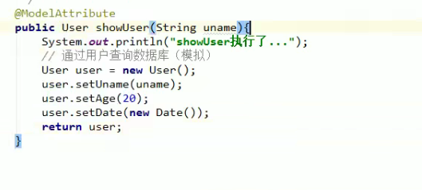
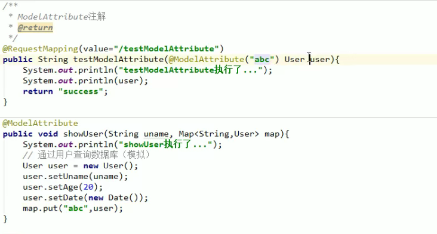

# SpringMVC笔记

[Spring官网-SpringMVC](https://docs.spring.io/spring-framework/docs/current/reference/html/web.html)

[W3Cschool-Spring MVC 4.2.4.RELEASE 中文文档](https://www.w3cschool.cn/spring_mvc_documentation_linesh_translation/)

[JavaGuide-SpringMVC常见面试题总结](https://javaguide.cn/system-design/framework/spring/spring-knowledge-and-questions-summary.html#spring-mvc)

[W3Cschool-Spring MVC](https://www.w3cschool.cn/wkspring/9pf81ha5.html)

[Github-2020Study-SSM](https://github.com/dby321/2020Study-SSM)

## Springmvc和Struts2的区别

1、 **springmvc的入口是一个servlet即前端控制器**，而**struts2入口是一个filter过滤器**。

2、 **springmvc是基于方法开发**(一个url对应一个方法)，请求参数传递到方法的形参，可以设计为**单例**或多例(建议单例)，**struts2是基于类开发，传递参数是通过类的属性**，只能设计为**多例**。

3、 **Struts采用值栈存储请求和响应的数据**，通过OGNL存取数据， **springmvc通过参数解析器是将request请求内容解析**，并给方法形参赋值，将数据和视图封装成ModelAndView对象，最后又将ModelAndView中的模型数据通过request域传输到页面。Jsp视图解析器默认使用jstl。


## SpringMVC处理流程（考点）

### 默认加载的组件

```xml
org.springframework.web.servlet.HandlerMapping=org.springframework.web.servlet.handler.BeanNameUrlHandlerMapping,\org.springframework.web.servlet.mvc.annotation.DefaultAnnotationHandlerMapping
```

```
org.springframework.web.servlet.HandlerAdapter=org.springframework.web.servlet.mvc.HttpRequestHandlerAdapter,\org.springframework.web.servlet.mvc.SimpleControllerHandlerAdapter,\org.springframework.web.servlet.mvc.annotation.AnnotationMethodHandlerAdapter
```

```
org.springframework.web.servlet.ViewResolver=org.springframework.web.servlet.view.InternalResourceViewResolver\
```

### 处理器映射器和适配器

```xml
<!-- 配置处理器映射器 -->
<bean
	class="org.springframework.web.servlet.mvc.method.annotation.RequestMappingHandlerMapping" />
```

````xml
<!-- 配置处理器适配器 -->
<bean
	class="org.springframework.web.servlet.mvc.method.annotation.RequestMappingHandlerAdapter" />
````

以上两行可以变成

```xml
<!-- 注解驱动 -->
<mvc:annotation-driven />
```

###  视图解析器

```xml
<bean class="org.springframework.web.servlet.view.InternalResourceViewResolver">
		<!-- 配置逻辑视图的前缀 -->
		<property name="prefix" value="/WEB-INF/jsp/" />
		<!-- 配置逻辑视图的后缀 -->
		<property name="suffix" value=".jsp" />
	</bean>
```


## 入门程序

>  构建webapp项目，配置键值对 `archetypeCatalog=internal  `

- springmvc.xml

```xml
<?xml version="1.0" encoding="UTF-8"?>
<beans xmlns="http://www.springframework.org/schema/beans"
	xmlns:xsi="http://www.w3.org/2001/XMLSchema-instance" xmlns:p="http://www.springframework.org/schema/p"
	xmlns:context="http://www.springframework.org/schema/context"
	xmlns:mvc="http://www.springframework.org/schema/mvc"
	xsi:schemaLocation="http://www.springframework.org/schema/beans http://www.springframework.org/schema/beans/spring-beans-4.0.xsd
        http://www.springframework.org/schema/mvc http://www.springframework.org/schema/mvc/spring-mvc-4.0.xsd
        http://www.springframework.org/schema/context http://www.springframework.org/schema/context/spring-context-4.0.xsd">

	<!-- 配置@Controller和@Service扫描包 -->
	<context:component-scan base-package="cn.itheima" />

</beans>
```

- web.xml

```xml
<?xml version="1.0" encoding="UTF-8"?>
<web-app xmlns:xsi="http://www.w3.org/2001/XMLSchema-instance"
	xmlns="http://java.sun.com/xml/ns/javaee"
	xsi:schemaLocation="http://java.sun.com/xml/ns/javaee http://java.sun.com/xml/ns/javaee/web-app_2_5.xsd"
	id="WebApp_ID" version="2.5">
	<display-name>springmvc-first</display-name>
	<welcome-file-list>
		<welcome-file>index.html</welcome-file>
		<welcome-file>index.htm</welcome-file>
		<welcome-file>index.jsp</welcome-file>
		<welcome-file>default.html</welcome-file>
		<welcome-file>default.htm</welcome-file>
		<welcome-file>default.jsp</welcome-file>
	</welcome-file-list>

	<!-- 配置SpringMVC前端控制器 -->
	<servlet>
		<servlet-name>springmvc-first</servlet-name>
		<servlet-class>org.springframework.web.servlet.DispatcherServlet</servlet-class>
		<!-- 指定SpringMVC配置文件 -->
		<!-- SpringMVC的配置文件的默认路径是/WEB-INF/${servlet-name}-servlet.xml -->
		<init-param>
			<param-name>contextConfigLocation</param-name>
			<param-value>classpath:springmvc.xml</param-value>
		</init-param>
	</servlet>

	<servlet-mapping>
		<servlet-name>springmvc-first</servlet-name>
		<!-- 
			1. /* 拦截所有 jsp js png .css 真的全拦截 建议不使用
			2. * .action * .do 拦截以do action结尾的请求 肯定能使用 ERP
			3. / 拦截所有路径型，不拦截后缀型  强烈建议使用 前台 /对静态资源放行
		 -->
		<url-pattern>*.action</url-pattern>
	</servlet-mapping>
</web-app>
```

- itemController

```java
@Controller
public class ItemController {

	// @RequestMapping：里面放的是请求的url，和用户请求的url进行匹配
	// action可以写也可以不写
	@RequestMapping("/itemList.action")
	public ModelAndView queryItemList() {
		// 创建页面需要显示的商品数据
		List<Item> list = new ArrayList<>();
		list.add(new Item(1, "1华为 荣耀8", 2399, new Date(), "质量好！1"));
		list.add(new Item(2, "2华为 荣耀8", 2399, new Date(), "质量好！2"));
		list.add(new Item(3, "3华为 荣耀8", 2399, new Date(), "质量好！3"));
		list.add(new Item(4, "4华为 荣耀8", 2399, new Date(), "质量好！4"));
		list.add(new Item(5, "5华为 荣耀8", 2399, new Date(), "质量好！5"));
		list.add(new Item(6, "6华为 荣耀8", 2399, new Date(), "质量好！6"));

		// 创建ModelAndView，用来存放数据和视图
		ModelAndView modelAndView = new ModelAndView();
		// 设置数据到模型中
		modelAndView.addObject("list", list);
		// 设置视图jsp，需要设置视图的物理地址
		modelAndView.setViewName("/WEB-INF/jsp/itemList.jsp");

		return modelAndView;
	}
}
```

## 方法参数绑定

### 默认支持的参数（servlet时代开发方式）

- HttpServletRequest

  - 通过request对象获取请求信息

- HttpServletResponse

  - 通过response处理响应信息

- HttpSession

  - 通过session对象得到session中存放的对象

- Model和ModelMap

  - Model是一个接口，在参数里直接声明model即可

    如果**使用Model**则可以不使用ModelAndView对象，Model对象可以向页面传递数据，**View对象则可以使用String返回值替代**。

```java
public ModelAndView toEdit(Integer id,
			HttpServletRequest request,HttpServletResponse response
			,HttpSession session,Model model){
		
		//Servlet时代开发
	String id = request.getParameter("id");
	//查询一个商品
//		Items items = itemService.selectItemsById(Integer.parseInt(id));
		Items items = itemService.selectItemsById(id);
		ModelAndView mav = new ModelAndView();
		//数据
		mav.addObject("item", items);
		mav.setViewName("editItem");
		return mav;
	}
```

### 绑定简单类型（现在开发方式）

- Integer id

>参数类型推荐使用包装数据类型，因为基础数据类型不可以为null
>
>整形：Integer、int
>
>字符串：String
>
>单精度：Float、float
>
>双精度：Double、double
>
>布尔型：Boolean、boolean

### 绑定pojo类型（现在开发方式）

- Items items

> pojo对象中的属性名和表单中input的name属性一致。

### 解决POST请求下中文乱码

```xml
	<!-- 解决post乱码问题 -->
	<filter>
		<filter-name>encoding</filter-name>
		<filter-class>org.springframework.web.filter.CharacterEncodingFilter</filter-class>
		<!-- 设置编码参是UTF8 -->
		<init-param>
			<param-name>encoding</param-name>
			<param-value>UTF-8</param-value>
		</init-param>
	</filter>
	<filter-mapping>
		<filter-name>encoding</filter-name>
		<url-pattern>/*</url-pattern>
	</filter-mapping>
```

### 自定义参数绑定

> springmvc没法把字符串转成日期格式

DataConveter

```java
/**
 * 转换日期类型的数据
 * S : 页面传递过来的类型
 * T ： 转换后的类型
 * @author lx
 *
 */
public class DateConveter implements Converter<String, Date>{

	public Date convert(String source) {
		try {
			if(null != source){//2016:11-05 11_43-50
				DateFormat df = new SimpleDateFormat("yyyy:MM-dd HH_mm-ss");
				return df.parse(source);
			}
		} catch (Exception e) {
		}
		return null;
	}

}
```

springmvc.xml

```xml
 <mvc:annotation-driven conversion-service="conversionServiceFactoryBean"/>
        
        <!-- 配置Conveter转换器  转换工厂 （日期、去掉前后空格）。。 -->
        <bean id="conversionServiceFactoryBean" class="org.springframework.format.support.FormattingConversionServiceFactoryBean">
        	<!-- 配置 多个转换器-->
        	<property name="converters">
        		<list>
        			<bean class="com.itheima.springmvc.conversion.DateConveter"/>
        		</list>
        	</property>
        </bean>
```


### 绑定数组类型

Integer[] ids

itemList.jsp

```xml
<form action="${pageContext.request.contextPath }/queryItem.action" method="post">
查询条件：
<table width="100%" border=1>
<tr>
<td>商品id<input type="text" name="item.id" /></td>
<td>商品名称<input type="text" name="item.name" /></td>
<td><input type="submit" value="查询"/></td>
</tr>
</table>
商品列表：
<table width="100%" border=1>
<tr>
	<td>选择</td>
	<td>商品名称</td>
	<td>商品价格</td>
	<td>生产日期</td>
	<td>商品描述</td>
	<td>操作</td>
</tr>
<c:forEach items="${itemList }" var="item">
<tr>
	<td><input type="checkbox" name="ids" value="${item.id}"/></td>
	<td>${item.name }</td>
	<td>${item.price }</td>
	<td><fmt:formatDate value="${item.createtime}" pattern="yyyy-MM-dd HH:mm:ss"/></td>
	<td>${item.detail }</td>
	
	<td><a href="${pageContext.request.contextPath }/itemEdit.action?id=${item.id}">修改</a></td>

</tr>
</c:forEach>

</table>
</form>
```

ItemController

```java
/**
 * 包装类型 绑定数组类型，可以使用两种方式，pojo的属性接收，和直接接收
 * 
 * @param queryVo
 * @return
 */
@RequestMapping("queryItem")
public String queryItem(QueryVo queryVo, Integer[] ids) {

	System.out.println(queryVo.getItem().getId());
	System.out.println(queryVo.getItem().getName());

	System.out.println(queryVo.getIds().length);
	System.out.println(ids.length);

	return "success";
}
```


### 绑定集合类型

ItemController

```java
@RequestMapping(value = "/updates.action",method = {RequestMethod.POST,RequestMethod.GET})
	public ModelAndView updates(QueryVo vo){
		
		
		ModelAndView mav = new ModelAndView();
		mav.setViewName("success");
		return mav;
	}
```

jsp

```jsp
<c:forEach items="${itemList }" var="item" varStatus="s">
<tr>
	<td><input type="checkbox" name="ids" value="${item.id}"/></td>
	<td>
		<input type="hidden" name="itemList[${s.index}].id" value="${item.id }"/>
		<input type="text" name="itemList[${s.index}].name" value="${item.name }"/>
	</td>
	<td><input type="text" name="itemList[${s.index}].price" value="${item.price }"/></td>
	<td><input type="text" name="itemList[${s.index}].createtime" value="<fmt:formatDate value="${item.createtime}" pattern="yyyy-MM-dd HH:mm:ss"/>"/></td>
	<td><input type="text" name="itemList[${s.index}].detail" value="${item.detail }"/></td>
	
	<td><a href="${pageContext.request.contextPath }/itemEdit.action?id=${item.id}">修改</a></td>

</tr>
</c:forEach>
```

## 方法返回值绑定

### 返回ModelAndView

> controller方法中定义ModelAndView对象并返回，对象中可添加model数据、指定view。

```java
    @RequestMapping("/testModelAndView")
    public ModelAndView testModelAndView(){
        System.out.println ("testModelAndView执行了");

        User user=new User ();
        user.setUsername ( "董滨雨" );
        user.setPassword ( "123" );
        user.setAge ( 23 );

        ModelAndView modelAndView=new ModelAndView (  );
        modelAndView.addObject ( "user",user );
        modelAndView.setViewName ( "success" );
        return modelAndView;
    }
```


### 返回void

> 在Controller方法形参上可以定义request和response，使用request或response指定响应结果.Ajax请求合适，json格式数据

```java
    @RequestMapping("/testVoid")
    public void testVoid(HttpServletRequest request, HttpServletResponse response) throws ServletException, IOException {
        System.out.println ("testVoid执行了");
        /* 手动写转发不会调用视图解析器 http://localhost:8080/springmvc_demo1_war/user/testVoid */
        request.getRequestDispatcher ( "/WEB-INF/pages/success.jsp" ).forward ( request ,response);

        /* 重定向 http://localhost:8080/springmvc_demo1_war/index.jsp*/
//        response.sendRedirect ( request.getContextPath ()+"/index.jsp" );
        //   /springmvc_demo1_war
//        System.out.println (request.getContextPath ());

        /* 解决中文乱码 */
//        response.setCharacterEncoding ( "UTF-8" );
//        response.setContentType ( "text/html;charset=UTF-8" );
        /* 直接响应 http://localhost:8080/springmvc_demo1_war/user/testVoid */
//        response.getWriter ().print ( "你好" );
        return;
    }

```

### 返回String

> 返回视图路径，model带数据

```java
//指定逻辑视图名，经过视图解析器解析为jsp物理路径：/WEB-INF/jsp/itemList.jsp
return "itemList";
```

#### 关键字Redirect重定向

```java
@RequestMapping("/testRedirect")
    public String testRedirect(){
        System.out.println ("testRedirect执行了...");
        return "redirect:/index.jsp";
    }
```


> 1. 路径变了,地址栏显示新的地址
> 2. 有两次请求
> 3. 根目录：<http://localhost:8080/>  没有项目的名字
> 4. 请求域中的数据会丢失，因为是2次请求

#### 关键字forward内部转发

```java
@RequestMapping("/testForward")
    public String testForward(){
        System.out.println ("testForward执行了...");
        return "forward:/WEB-INF/pages/success.jsp";
    }
```


> 1. 路径不变
>
> 2. 只有一次请求
> 3. 根目录：http://localhost:8080/项目地址/，包含了项目的访问地址
> 4. 请求域中数据不会丢失

[转发和重定向的区别和使用](https://blog.csdn.net/weixin_40001125/article/details/88663468)

## SpringMVC注解

### `@RequestParam`

```html
<a href="user/save1?uname=xxx">save1</a>
```


```java
@RequestMapping("/user/save1")
public String saveAccount(@RequestParam("uname")String username)
```

### `@PathVariable`

```html
<a href="user/save2/10">save2</a>
```


```java
@RequestMapping("/user/save2/{sid}")
public String saveAccount(@PathVariable(name="sid")String id)
```

### `@RequestHeader`

```java
@RequestMapping("/user/save3")
public String saveAccount(@RequestHeader(value="Accept") String header)
```

 当一个客户端(通常是浏览器)向Web服务器发送一个请求是，它要发送一个请求的命令行，一般是GET或POST命令，当发送POST命令时，它还必须向服务器发送一个叫“Content-Length”的请求头(Request  Header)  用以指明请求数据的长度，除了Content-Length之外，它还可以向服务器发送其它一些Headers，如：   

 Accept  浏览器可接受的MIME类型   
 Accept-Charset  浏览器支持的字符编码   
 Accept-Encoding  浏览器知道如何解码的数据编码类型(如  gzip)。Servlets  可以预先检查浏览器是否支持gzip并可以对支持gzip的浏览器返回gzipped的HTML页面，并设置Content-Encoding回应头(response  header)来指出发送的内容是已经gzipped的。在大多数情况下，这样做可以加快网页下载的速度。   
 Accept-Language  浏览器指定的语言，当Server支持多语种时起作用。   
 Authorization  认证信息，一般是对服务器发出的WWW-Authenticate头的回应。   
 Connection  是否使用持续连接。如果servlet发现这个字段的值是Keep-Alive，或者由发出请求的命令行发现浏览器支持  HTTP  1.1  (持续连接是它的默认选项)，使用持续连接可以使保护很多小文件的页面的下载时间减少。   
 Content-Length  (使用POST方法提交时，传递数据的字节数)   
 Cookie  (很重要的一个Header，用来进行和Cookie有关的操作，详细的信息将在后面的教程中介绍)   
 Host  (主机和端口)   
 If-Modified-Since  (只返回比指定日期新的文档，如果没有，将会反回304  "Not  Modified")   
 Referer  (URL)   
 User-Agent  (客户端的类型，一般用来区分不同的浏览器)    

### `@CookieValue`

value是cookie名称，绑定的cookieValue是该cookie真正的值

```java
@RequestMapping("/user/save4")
public String saveAccount(@CookieValue(value="JSESSIONID") String cookieValue)
```

### @RequestMapping

#### URL路径映射`value`和`path`

@RequestMapping(value="item")或@RequestMapping("/item"）

#### 窄化路径（添加在类上面）

在class上添加@RequestMapping(url)指定通用请求前缀， 限制此类下的所有方法请求url必须以请求前缀开头

#### 请求方法限定`method`

- 限定GET方法

```java
@RequestMapping(method = RequestMethod.GET)
```

如果通过POST访问则报错：

HTTP Status 405 - Request method 'POST' not supported

例如：

```java
@RequestMapping(value = "itemList",method = RequestMethod.POST)
```


- 限定POST方法

```java
@RequestMapping(method = RequestMethod.POST)
```

如果通过GET访问则报错：

HTTP Status 405 - Request method 'GET' not supported

- GET和POST都可以

```java
@RequestMapping(method = {RequestMethod.**GET**,RequestMethod.POST})
```


#### 参数`params`

```html
<a href="user/hello?username=hehe">跳转hello页面</a>
```

```java
@RequestMapping(params={"username"})
```

#### 请求头`headers`

```java
@RequestMapping(headers={"Accept"})
```

### `@ModelAttribute`

[CSDN-@SessionAttribute和@ModelAttribute详解](https://blog.csdn.net/qq_35414502/article/details/60575059)

> 加了该注解的方法，优先于控制器Controller下其他方法执行

可以放在参数或者方法上

加在方法上：



加在参数上：



### `@SessionAttributes`

> 将存到model的键值对存入SessionScope中
>
> 取值用ModelMap modelMap.get()
>
> 删值用SessionStatus status.setComplete()

model.addAttribute()会存到RequestScope

HttpServletRequest request.addAttribute会存到RequestScope

### `@RequestBody`和`@ResponseBody`

```json
{
"id": 1,
"name"："测试商品",
"price": 99.9,
"detail": "测试商品描述",
"pic": "123456.jpg"
}
```

> @RequestBody注解实现接收http请求的json数据，将json数据转换为java对象进行

```java
/**
 * 测试json的交互
 * @param item
 * @return
 */
@RequestMapping("testJson")
// @ResponseBody
public @ResponseBody Item testJson(@RequestBody Item item) {
	return item;
}
```

手写json.action


```xml
<script type="text/javascript">
$(function(){
	//alert(1);
	var params = '{"id": 1,"name": "测试商品","price": 99.9,"detail": "测试商品描述","pic": "123456.jpg"}';

// 	$.post(url,params,function(data){
		//回调
// 	},"json");//
	$.ajax({
		url : "${pageContext.request.contextPath }/json.action",
		data : params,
		contentType : "application/json;charset=UTF-8",//发送数据的格式
		type : "post",
		dataType : "json",//回调
		success : function(data){
			alert(data.name);
		}
		
	});
});
</script>
```


## 自定义类型转换器`converter`（不清楚）

https://www.bilibili.com/video/BV1Sb411s7qa?p=15


## 全局异常处理器

[CSDN-SpringMVC实现全局异常处理器](https://blog.csdn.net/hbtj_1216/article/details/81102063)

## 上传文件

> 1. form表单的enctype(表单请求的正文类型)必须是`multipart/form-data`
> 2. method取值必须是`post`
> 3. 提供一个文件选择域`<input type="file"/>`

需要导入两个jar包`commons-fileupload.jar`,`commons-io.jar`


```java
@RequestMapping("updateItem")
public String updateItemById(Item item, MultipartFile pictureFile) throws Exception {
	// 图片上传
	// 设置图片名称，不能重复，可以使用uuid
	String picName = UUID.randomUUID().toString();

	// 获取文件名
	String oriName = pictureFile.getOriginalFilename();
	// 获取图片后缀
	String extName = FilenameUtils.getExtension(pictureFile.getOriginalFilename);

	// 开始上传
	pictureFile.transferTo(new File("C:/upload/image/" + picName +"."+ extName));

	// 设置图片名到商品中
	item.setPic(picName +"."+ extName);
	// ---------------------------------------------
	// 更新商品
	this.itemService.updateItemById(item);

	return "forward:/itemEdit.action";
}
```

```xml
<tr>
				<td>商品图片</td>
				<td>
					<c:if test="${item.pic !=null}">
						
						<br/>
					</c:if>
					<input type="file"  name="pictureFile"/> 
				</td>
			</tr>
```

springmvc.xml

```xml
<!-- 上传图片配置实现类 文件解析器-->
        <bean id="multipartResolver" class="org.springframework.web.multipart.commons.CommonsMultipartResolver">
        	<!-- 上传图片的大小   B   5M  1*1024*1024*5-->
        	<property name="maxUploadSize" value="5000000"/>
        </bean>
```

### 图片服务器（没讲清楚）

用到`jersey.jar`


## Restful风格开发

>  请求地址一样，通过请求方式method不同来调用不同的方法

## 静态资源不拦截配置

### 方式一

**在web.xml中配置映射**

```
 <!-- 对静态资源的配置 -->
    <servlet-mapping>
        <servlet-name>default</servlet-name>
        <url-pattern>*.js</url-pattern>
        <url-pattern>*.css</url-pattern>
        <url-pattern>*.ico</url-pattern>
        <url-pattern>/img/*</url-pattern>
        <url-pattern>/fonts/*</url-pattern>
        <url-pattern>/font/*</url-pattern>
    </servlet-mapping>
12345678910
```

**可以根据自身情况，来配置映射**

```
注意： 请将它放在所有Servlet的最前面（为了让它最先匹配），这样的话性能上应该比较好 
1
```

### 方式二

**在springMVC.xml中添加静态资源的映射**

```
<!--
    通过mvc:resources设置静态资源，这样servlet就会处理这些静态资源，而不通过控制器
    设置不过滤内容，比如:css,js,img 等资源文件
   location指的是本地的真实的物理路径 ，mapping指的是映射到的虚拟路径(比如前端请求的url地址)。-->
    <mvc:resources mapping="/css/**" location="/css/**"/>
    <mvc:resources mapping="/js/**" location="/js/**"/>
    <mvc:resources mapping="/images/**" location="/images/**"/>
1234567
```

**根据实际情况自行配置**

### 方式三

**在springMVC.xml中添加静态资源默认Servlet处理**

```
<mvc:default-servlet-handler/>
1
```

**注意： 这种方式对spring版本必须要求3.0.5及以上**

## 拦截器

### 拦截器的使用

> 过滤器是java中的，不能拦截静态资源。
>
> 拦截器是springmvc中的，可以拦截静态资源。
>
> 过滤器>拦截器

```xml
<!-- 配置拦截器 -->
<mvc:interceptors>
	<mvc:interceptor>
		<!-- 所有的请求都进入拦截器 -->
		<mvc:mapping path="/**" />
		<!-- 配置具体的拦截器 -->
		<bean class="cn.itcast.ssm.interceptor.HandlerInterceptor1" />
	</mvc:interceptor>
	<mvc:interceptor>
		<!-- 所有的请求都进入拦截器 -->
		<mvc:mapping path="/**" />
		<!-- 配置具体的拦截器 -->
		<bean class="cn.itcast.ssm.interceptor.HandlerInterceptor2" />
	</mvc:interceptor>
</mvc:interceptors>
```

```java
public class HandlerInterceptor1 implements HandlerInterceptor {
	// controller执行后且视图返回后调用此方法
	// 这里可得到执行controller时的异常信息
	// 这里可记录操作日志
	@Override
	public void afterCompletion(HttpServletRequest arg0, HttpServletResponse arg1, Object arg2, Exception arg3)
			throws Exception {
		System.out.println("HandlerInterceptor1....afterCompletion");
	}

	// controller执行后但未返回视图前调用此方法
	// 这里可在返回用户前对模型数据进行加工处理，比如这里加入公用信息以便页面显示
	@Override
	public void postHandle(HttpServletRequest arg0, HttpServletResponse arg1, Object arg2, ModelAndView arg3)
			throws Exception {
		System.out.println("HandlerInterceptor1....postHandle");
	}

	// Controller执行前调用此方法
	// 返回true表示继续执行，返回false中止执行
	// 这里可以加入登录校验、权限拦截等
	@Override
	public boolean preHandle(HttpServletRequest arg0, HttpServletResponse arg1, Object arg2) throws Exception {
		System.out.println("HandlerInterceptor1....preHandle");
		// 设置为true，测试使用
		return true;
	}
}
```

### 拦截器执行顺序

HandlerInterceptor1..preHandle..

HandlerInterceptor2..preHandle..

 

HandlerInterceptor2..postHandle..

HandlerInterceptor1..postHandle..

 

HandlerInterceptor2..afterCompletion..

HandlerInterceptor1..afterCompletion..

> preHandle按拦截器定义顺序调用
>
> postHandler按拦截器定义逆序调用
>
> afterCompletion按拦截器定义逆序调用

> postHandler在拦截器链内所有拦截器返成功时调用
>
> afterCompletion只有preHandle返回true才调用

HandlerInterceptor1的preHandler方法返回true，HandlerInterceptor2返回false，运行流程如下：

 

HandlerInterceptor1..preHandle..

HandlerInterceptor2..preHandle..

HandlerInterceptor1..afterCompletion..

### 拦截器的应用

> 登录拦截

```xml
<%@ page language="java" contentType="text/html; charset=UTF-8"
	pageEncoding="UTF-8"%>
<!DOCTYPE html PUBLIC "-//W3C//DTD HTML 4.01 Transitional//EN" "http://www.w3.org/TR/html4/loose.dtd">
<html>
<head>
<meta http-equiv="Content-Type" content="text/html; charset=UTF-8">
<title>Insert title here</title>
</head>
<body>

<form action="${pageContext.request.contextPath }/user/login.action">
<label>用户名：</label>
<br>
<input type="text" name="username">
<br>
<label>密码：</label>
<br>
<input type="password" name="password">
<br>
<input type="submit">

</form>

</body>
</html>
```

```java
//去登陆的页面
	@RequestMapping(value = "/login.action",method = RequestMethod.GET)
	public String login(){
		return "login";
	}
	@RequestMapping(value = "/login.action",method = RequestMethod.POST)
	public String login(String username
			,HttpSession httpSession){
		httpSession.setAttribute("USER_SESSION", username);
		return "redirect:/item/itemlist.action";
	}
	 
```

```java
package com.itheima.springmvc.interceptor;

import javax.servlet.http.HttpServletRequest;
import javax.servlet.http.HttpServletResponse;

import org.springframework.web.servlet.HandlerInterceptor;
import org.springframework.web.servlet.ModelAndView;

public class Interceptor1 implements HandlerInterceptor{

	public boolean preHandle(HttpServletRequest request, HttpServletResponse response, Object arg2) throws Exception {
		System.out.println("方法前 1");
		//判断用户是否登陆  如果没有登陆  重定向到登陆页面   不放行   如果登陆了  就放行了
		// URL  http://localhost:8080/springmvc-mybatis/login.action
		//URI /login.action
		String requestURI = request.getRequestURI();
		if(!requestURI.contains("/login")){
			String username = (String) request.getSession().getAttribute("USER_SESSION");
			if(null == username){
				response.sendRedirect(request.getContextPath() + "/login.action");
				return false;
			}
		}
		return true;
	}
	public void postHandle(HttpServletRequest arg0, HttpServletResponse arg1, Object arg2, ModelAndView arg3)
			throws Exception {
		System.out.println("方法后 1");
		
	}
	public void afterCompletion(HttpServletRequest arg0, HttpServletResponse arg1, Object arg2, Exception arg3)
			throws Exception {
		System.out.println("页面渲染后 1");
		
	}

}

```

