# Swagger 笔记

## 概述

Swagger 是一套围绕 OpenAPI 规范的开源工具集，用于设计、构建、记录和使用 RESTful API。它提供了一个交互式的 API 文档界面，可以自动生成、可视化，并支持在线测试。

## 核心组件

*   **OpenAPI Specification (OAS)**: Swagger 的核心，一个描述 RESTful API 的标准、语言无关的规范（通常以 YAML 或 JSON 格式编写）。
*   **Swagger UI**: 一个可视化工具，将 OpenAPI 定义转换为交互式 HTML 文档，用户可以在浏览器中查看 API 端点、参数、模型，并直接进行测试。
*   **Swagger Editor**: 一个基于浏览器的编辑器，用于编写和设计 OpenAPI 规范，提供实时预览和语法验证。
*   **Swagger Codegen**: 根据 OpenAPI 定义生成服务器端骨架代码和客户端 SDK 的工具。
*   **Swagger Inspector**: 用于测试 API 并生成 OpenAPI 定义的工具。

## 主要优势

*   **自动化文档**: 减少手动编写和维护文档的工作量，文档与代码保持同步。
*   **交互式体验**: 提供 UI 界面，方便开发者和测试人员直接调用 API 进行测试。
*   **设计优先**: 支持先设计 API 接口（使用 Swagger Editor），再生成代码，促进前后端并行开发。
*   **标准化**: 遵循 OpenAPI 规范，便于工具集成和跨团队协作。
*   **客户端生成**: 可以快速生成多种编程语言的客户端库。

## 常用注解 (以 Springfox/Springdoc 为例)

> **注意**: Springfox Swagger 2.x 与 Springdoc OpenAPI 3.x 注解有所不同。以下是 Springdoc OpenAPI 3.x (基于 OpenAPI 3) 的常用注解。

###  控制器/类级别

*   `@Tag(name = "分组名称", description = "分组描述")`: 为 Controller 分组，显示在 UI 的标签页。
*   `@SecurityRequirement(name = "安全方案名称")`: 为整个 Controller 指定所需的安全方案。

### 接口方法级别

*   `@Operation(summary = "简要描述", description = "详细描述")`: 描述单个 API 操作。
*   `@Parameters({@Parameter(...)})`: 定义一组参数（较少用，通常用 `@Parameter` 直接标注在参数上）。
*   `@Parameter(name = "参数名", description = "参数描述", required = true, example = "示例值")`: 描述单个参数（通常用于 `@RequestParam`, `@PathVariable` 等）。
*   `@RequestBody(description = "请求体描述", required = true, content = @Content(schema = @Schema(implementation = YourDTO.class)))`: 描述请求体。
*   `@ApiResponses`: 包含多个 `@ApiResponse`。
*   `@ApiResponse(responseCode = "200", description = "成功响应描述", content = @Content(schema = @Schema(implementation = YourDTO.class)))`: 描述特定 HTTP 状态码的响应。
*   `@Hidden`: 隐藏某个 API 方法，不显示在文档中。

### 模型 (DTO/Entity) 级别

*   `@Schema(description = "模型描述", example = "{ \"id\": 1, \"name\": \"example\" }")`: 描述数据模型。
*   `@Schema(description = "字段描述", example = "John Doe", required = true)`: 描述模型中的字段。
*   `@ArraySchema(schema = @Schema(implementation = YourItem.class))`: 描述数组类型的字段。

## 集成 (以 Spring Boot + Springdoc OpenAPI 为例)

1.  **添加依赖** (Maven):
    ```xml
    <dependency>
        <groupId>org.springdoc</groupId>
        <artifactId>springdoc-openapi-ui</artifactId>
        <version>1.7.0</version> <!-- 请使用最新稳定版本 -->
    </dependency>
    ```

2.  **配置** (可选，`application.yml`):
    ```yaml
    springdoc:
      # 自定义 API 文档路径
      api-docs:
        path: /v3/api-docs
      # 自定义 Swagger UI 路径
      swagger-ui:
        path: /swagger-ui.html
        # 启用或禁用
        enabled: true
      # 包扫描路径
      packages-to-scan: com.example.api
      # 扫描的类路径
      # classes-to-scan: com.example.api.MyController
    ```

3.  **访问**:
    *   JSON/YAML 格式的 OpenAPI 定义: `http://localhost:8080/v3/api-docs`
    *   Swagger UI 界面: `http://localhost:8080/swagger-ui.html`

## 常见配置

*   **API 信息**: 在配置类中使用 `@OpenAPIDefinition` 或通过配置文件设置标题、版本、描述、联系人、许可证等。
*   **服务器配置**: 定义 API 的服务器 URL (`@Server` 或配置 `springdoc.server-url`)。
*   **安全方案**: 配置 JWT、OAuth2 等安全方案 (`@SecurityScheme` 注解或配置)。
*   **分组**: 使用 `GroupedOpenApi` 创建多个文档分组（如按版本、模块）。

## 最佳实践

*   **保持同步**: 确保代码实现与 Swagger 文档描述一致。
*   **详细描述**: 为 API、参数、模型、字段提供清晰、准确的描述。
*   **使用示例**: 为请求/响应提供示例数据，方便理解。
*   **版本管理**: 妥善管理 API 版本，文档也应体现版本。
*   **安全考虑**: 在生产环境中谨慎暴露 Swagger UI，可通过配置禁用或添加访问控制。
*   **利用工具**: 使用 Swagger Editor 设计 API，Swagger Codegen 生成客户端。

## 注意事项

*   **性能**: 大型 API 的文档生成可能消耗资源，注意监控。
*   **敏感信息**: 避免在公开的文档中暴露敏感的内部信息或测试数据。
*   **规范更新**: OpenAPI 规范在演进（如 3.0, 3.1），注意工具和注解的兼容性。
*   **替代方案**: 了解其他 API 文档工具，如 Postman, Apidoc, RapiDoc 等。

## 资源

*   **OpenAPI Specification**: https://spec.openapis.org/
*   **Swagger 官网**: https://swagger.io/
*   **Springdoc OpenAPI**: https://springdoc.org/
*   **Swagger Editor 在线版**: https://editor.swagger.io/


# 网上博客的swagger笔记

  [CSDN-Swagger3.0介绍及springboot整合Swagger3.0](https://blog.csdn.net/qq\_43521797/article/details/115835771)


Swagger
----------------------------------------------------------------------

SpringBoot项目整合swagger2需要用到两个依赖：springfox-swagger2和springfox-swagger-ui，用于自动生成swagger文档。

*   springfox-swagger2：这个组件的功能用于帮助我们自动生成描述API的json文件
*   springfox-swagger-ui：就是将描述API的json文件解析出来，用一种更友好的方式呈现出来。

#### 2、SpringFox 3.0.0 发布

**此版本的亮点：**

*   Spring5，Webflux支持（仅支持请求映射，尚不支持功能端点）。
*   Spring Integration支持。
*   SpringBoot支持springfox Boot starter依赖性（零配置、自动配置支持）。
*   支持OpenApi 3.0.3。
*   零依赖。几乎只需要spring-plugin，swagger-core ，现有的swagger2注释将继续工作并丰富openapi3.0规范。

**兼容性说明：**

*   需要Java 8
*   需要Spring5.x（未在早期版本中测试）
*   需要SpringBoot 2.2+（未在早期版本中测试）

注意：`Swagger2.0`和`Swagger3.0`有很多区别，下面使用的是`Swagger3.0`，有区别的地方会简单说明

### 三、SpringBoot集成Swagger

#### 1、创建springboot WEB项目

项目设置  
  
选择web模块  
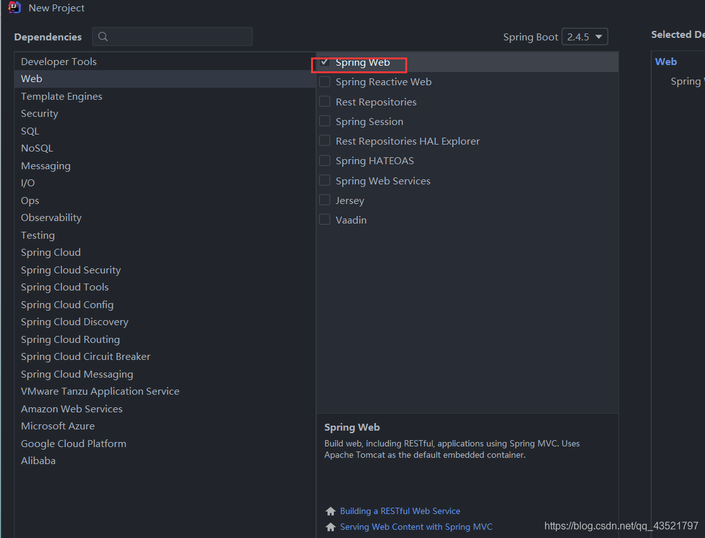

#### 2、导入相关依赖

swagger3.0以下版本导入这两个就可以了

```
<!-- https://mvnrepository.com/artifact/io.springfox/springfox-swagger2 -->
<dependency>
    <groupId>io.springfox</groupId>
    <artifactId>springfox-swagger2</artifactId>
    <version>3.0.0</version>
</dependency>
<!-- https://mvnrepository.com/artifact/io.springfox/springfox-swagger-ui -->
<dependency>
    <groupId>io.springfox</groupId>
    <artifactId>springfox-swagger-ui</artifactId>
    <version>3.0.0</version>
</dependency>

```

swagger3.0以上还需要导入，不然无法进入后台界面

```
<!-- https://mvnrepository.com/artifact/io.springfox/springfox-boot-starter -->
        <dependency>
            <groupId>io.springfox</groupId>
            <artifactId>springfox-boot-starter</artifactId>
            <version>3.0.0</version>
        </dependency>

```

#### 3、编写万能的Hello工程

创建Controller层写一个HelloController  
写一个测试路径hello进行测试，项目是否可以跑起来。  
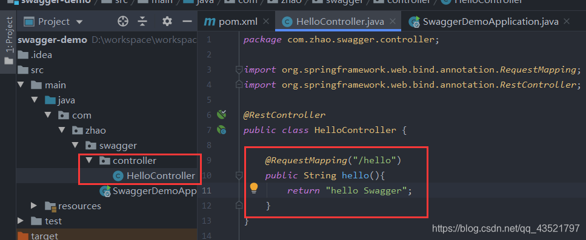  
测试地址：http://localhost:8080/  
出现下面页面就成功了！  
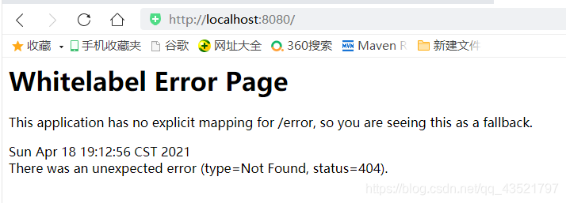  
继续学习吧！！！

#### 4、配置Swagger

创建config层编写Swagger配置  
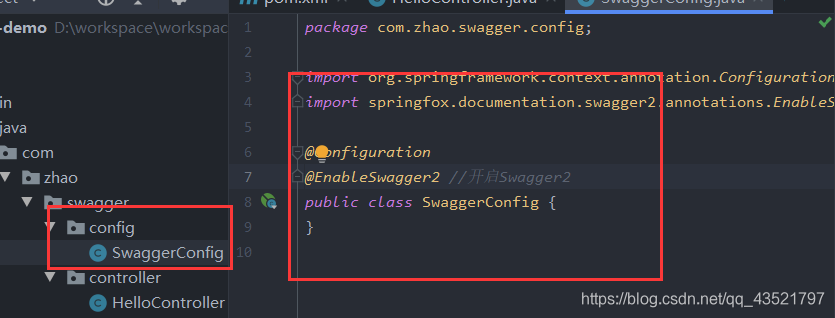

```
package com.zhao.swagger.config;

import org.springframework.context.annotation.Configuration;
import springfox.documentation.swagger2.annotations.EnableSwagger2;

@Configuration
@EnableSwagger2 //开启Swagger2
public class SwaggerConfig {
}


```

#### 5、测试运行

运行程序进行测试  
**注意：版本不同`测试路径`不同**

*   **Swagger3.0**——>测试地址：`http://localhost:8080/swagger-ui/index.html`
*   **Swagger2.0**——>测试地址：`http://localhost:8080/swagger-ui.html`

显示的页面一共分四个部分如下图：  


### 四、配置Swagger

Swagger的bean实例Docket;

#### 1、创建配置类配置Swagger

**注意：版本不同`注解`不同**

*   **Swagger3.0**——>注解：`@EnableOpenApi`
*   **Swagger2.0**——>注解：`@EnableSwagger2`  
    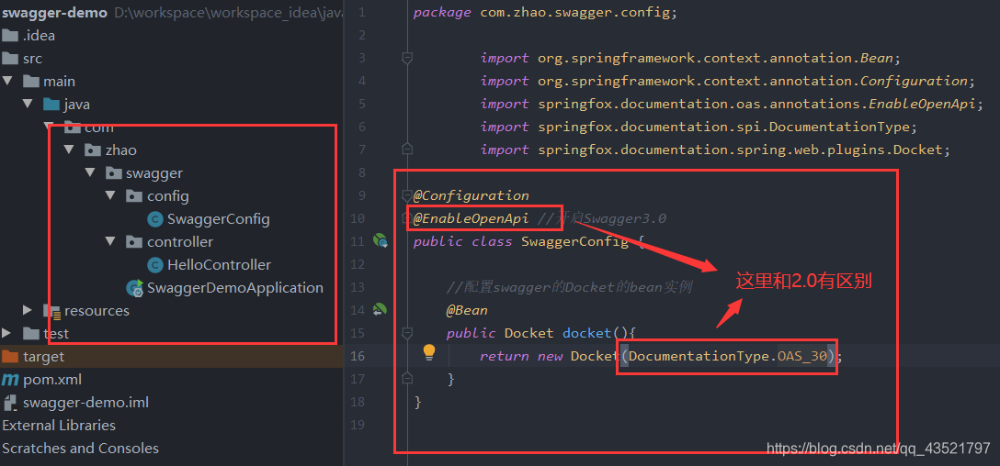

```
package com.zhao.swagger.config;

        import org.springframework.context.annotation.Bean;
        import org.springframework.context.annotation.Configuration;
        import springfox.documentation.oas.annotations.EnableOpenApi;
        import springfox.documentation.spi.DocumentationType;
        import springfox.documentation.spring.web.plugins.Docket;

@Configuration
@EnableOpenApi //开启Swagger3.0
public class SwaggerConfig {

    //配置swagger的Docket的bean实例
    @Bean
    public Docket docket(){
        return new Docket(DocumentationType.OAS_30);
    }
}


```

#### 2、分析源码找参数`DocumentationType.OAS_30`

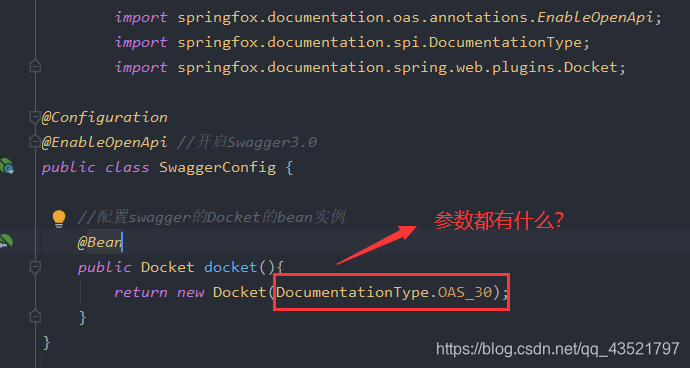

这里需要的是一个`DocumentationType`类型的参数  
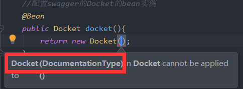

我们看一下`Docket`源码，找到`DocumentationType`去看他的源码  
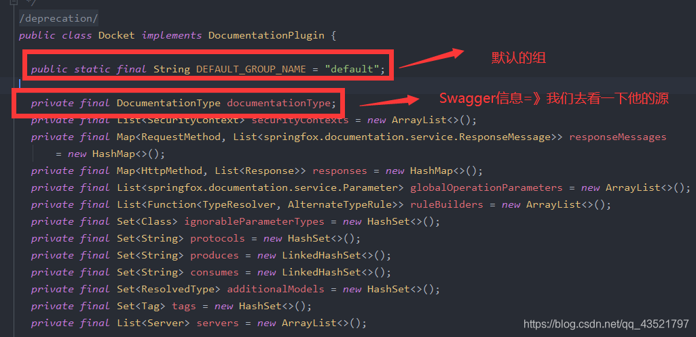  
这里找到了我们需要的参数，选择我们使用的即可  


#### 3、配置Swagger信息ApiInfo

我们去看`ApiInfo`的源码获取我们需要的信息  
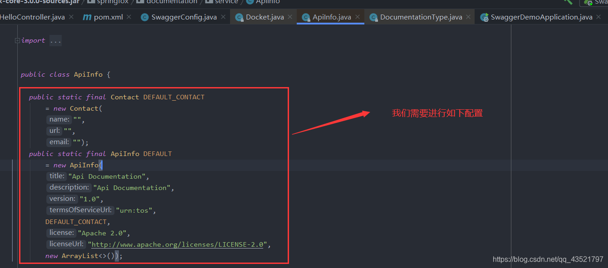  
配置代码如下（他们对应的信息后面有解释）

```
 //配置Swagger信息apiInfo
    private ApiInfo apiInfo() {
        //作者信息
        Contact contact= new Contact(
                "Mr.zhao",
                "https://blog.csdn.net/qq_43521797?spm=1011.2124.3001.5343",
                "1433304356@qq.com");
        return new ApiInfo(
                "Mr.zhao API文档",
                "再小灰尘也能在阳光下起舞",
                "v1.0",
                "https://blog.csdn.net/qq_43521797?spm=1011.2124.3001.5343",
                contact,
                "Apache 2.0",
                "http://www.apache.org/licenses/LICENSE-2.0",
                new ArrayList<>());
    }

```

配置的信息分析如图：  
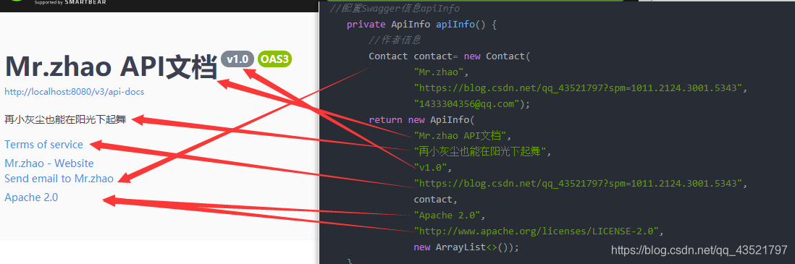

### 五、配置扫描接口及开关

分析一下接口部分显示信息  
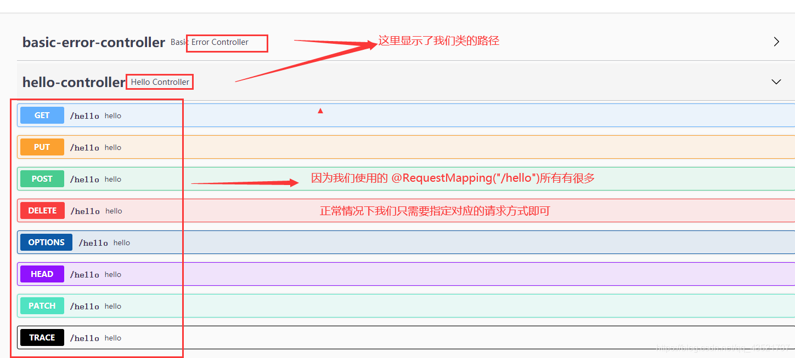  
信息来自于`springfox-swagger-ui-3.0.0.jar`  
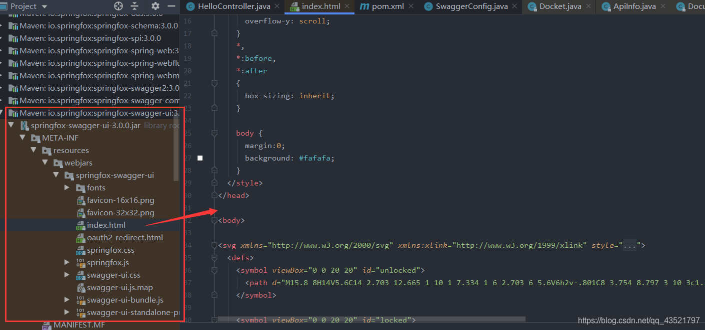

#### 1、设置扫描包及过滤

> Docket下的select()

```
  //配置swagger的Docket的bean实例
    @Bean
    public Docket docket(){
        return new Docket(DocumentationType.OAS_30)
                .apiInfo(apiInfo())
                .select()
                //RequestHandlerSelectors配置要扫播接口的方式
                //basePackage指定要扫描的包
                .apis(RequestHandlerSelectors.basePackage("com.zhao.swagger.controller"))
                //paths()过滤什么路径
                .paths(PathSelectors.ant("/zhao/**"))
                .build();
    }

```

##### 1）RequestHandlerSelectors扫描接口的方式

RequestHandlerSelectors，扫描接口的方式。我们去`RequestHandlerSelectors`的源码看看其他配置方法

*   basePackage指定要扫描的包
*   any();扫描全部
*   none;不扫描
*   withClassAnnotation 扫描类上得注解
*   withMethodAnnotation 扫描方法上得注解  
      
    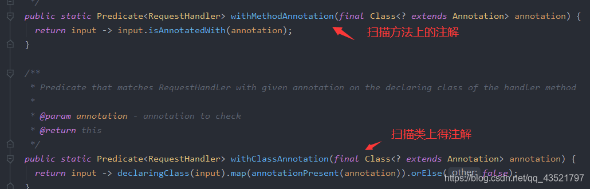

##### 2）PathSelectors过滤方式

和上面一样我们去源码中看他的方法有哪些

*   ant()：过滤路径
*   any()：全部过滤
*   none()：不过滤
*   regex()：正则表达式

我们使用第一种过滤路径测试  


过滤后什么都没有了  


#### 2、设置Swagger启动与关闭

我们在Docket的源码中科院看到`enabled=true`这个属性就是控制启动  
  
我们去改变一下他的值 改成false关闭一下试试  
注意：下面红框的是一个整体不能在吗中间添加其他东西。  


我们在`.apiInfo(apiInfo())`后面进行添加`.enable(false)`

```
 @Bean
    public Docket docket(){
        return new Docket(DocumentationType.OAS_30)
                .apiInfo(apiInfo())
                .enable(false)//关闭Swagger
                .select()
                .apis(RequestHandlerSelectors.basePackage("com.zhao.swagger.controller"))
                .build();
    }

```

测试地址：http://localhost:8080/swagger-ui/index.html#/  
关闭后的效果  


#### 3、设置Swagger在对应的项目环境启动

我们在项目中只在**开发环境**开启Swagger，**生产环境**就要关闭Swagger。  
下面我们进行设置一下

##### 1）创建测试环境

*   application-dev：开发环境
*   application-pro：生产环境  
      
    application.properties内代码：`spring.profiles.active=dev`  
    application-dev.properties内代码：`server.port=8081`  
    application-pro.properties内代码：`server.port=8082`

##### 2）编写配置类获取项目环境

`Profiles.of()`设置要显示的swagger的环境  
通过`environment.acceptsProfiles`判断是否处在自己设定的环境中 获取`boolean`值`flag`  
赋值给`enable（flag）`

```
    //配置swagger的Docket的bean实例
    @Bean
    public Docket docket(Environment environment){

        //设置要显示的swagger的环境
        Profiles profiles =Profiles.of("dev");
        //通过environment.acceptsProfiles判断是否处在自己设定的环境中
        boolean flag = environment.acceptsProfiles(profiles);

        return new Docket(DocumentationType.OAS_30)
                .apiInfo(apiInfo())
                .enable(flag)
                .select()
                .apis(RequestHandlerSelectors.basePackage("com.zhao.swagger.controller"))
                .build();
    }


```

##### 3)测试

我们先测试dev环境  
application.properties中切换环境为dev环境： `spring.profiles.active=dev`

> dev环境===》测试地址：http://localhost:8081/swagger-ui/index.html#/  
> 

这次测试pro环境  
application.properties中切换环境为pro环境： `spring.profiles.active=pro`

> pro环境===》测试地址：http://localhost:8082/swagger-ui/index.html#/  
> 

### 六、分组

#### 1、设置分组

我继续看Docket的源码我们可以看到分组的默认值为default  
  
下面我们进行修改,指需要一行代码

```
 .groupName("Mr.zhao")

```

  


#### 2、多个分组

多个分组就是多人协作开发时每个人分组  
其实就是多个**Docket实例**  
下面我们测试一下  
我们在复制几个**Docket实例**进行测试

```
@Bean
    public Docket docket1(Environment environment){
        return new Docket(DocumentationType.OAS_30).groupName("A");
    }
    @Bean
    public Docket docket2(Environment environment){
        return new Docket(DocumentationType.OAS_30).groupName("B");
    }
    @Bean
    public Docket docket3(Environment environment){
        return new Docket(DocumentationType.OAS_30).groupName("C");
    }

```

运行一下就可以看到多个分组了，选择一个分组信息就会发生变化，以及测试路径。


### 七、接口注释及实体类注释

#### 1、接口注释

接口常用的三个注解

*   `@Api(tags = "helloController层")`：放在控制层类上，描述控制层
*   `@ApiOperation(value = "hello2方法",notes = "方法描述")`：放在方法控制层上，描述控制层方法
*   `@ApiParam("用户名")`：参数描述

```
package com.zhao.swagger.controller;

import io.swagger.annotations.Api;
import io.swagger.annotations.ApiOperation;
import io.swagger.annotations.ApiParam;
import org.springframework.web.bind.annotation.GetMapping;
import org.springframework.web.bind.annotation.PostMapping;
import org.springframework.web.bind.annotation.RestController;

@Api(tags = "helloController层")
@RestController
public class HelloController {

    @ApiOperation("hello方法")
    @PostMapping("/hello")
    public String hello(){
        return "hello Swagger";
    }
    @ApiOperation(value = "hello2方法",notes = "方法描述")
    @GetMapping("/hello2")
    public String hello2(@ApiParam("用户名") String username){
        return username;
    }
}


```


#### 2、实体类注释

我们先创建pojo编写一个User进行测试

```
package com.zhao.swagger.pojo;

public class User {
    private String username;
    private String password;
}


```

我们直接启动项目看看可以扫描我们的实体类吗？答案是不能  
  
方法一（不是用注解，也可以扫描到实体类）  
实体类不使用注释也可以被扫描，只要请求返回类型是实体类即可。我们测试一下  
我写一个方法

```
@ApiOperation(value = "user方法",notes = "测试不使用注解，把实体类作为返回值可以扫描到实体类吗")
    @GetMapping("/user")
    public User user(){
        return new User();
    }

```

实体有了但是这样的没有属性，这是因为没有给属性添加get set方法，  
  
给是实体类添加get set 方法,再次测试

```
package com.zhao.swagger.pojo;

import io.swagger.annotations.ApiModel;
import io.swagger.annotations.ApiModelProperty;

public class User {
    private String username;
    private String password;

    public String getUsername() {
        return username;
    }

    public void setUsername(String username) {
        this.username = username;
    }

    public String getPassword() {
        return password;
    }

    public void setPassword(String password) {
        this.password = password;
    }
}

```

这次就完美了  


方法二（注解）

*   `@ApiModel("用户实体类")`：用于实体类上，描述实体类
*   `@ApiModelProperty(value = "用户名",hidden = false)`：用于属性上描述实体类属性，hidden功能是，是否隐藏该属性

```
package com.zhao.swagger.pojo;

import io.swagger.annotations.ApiModel;
import io.swagger.annotations.ApiModelProperty;

@ApiModel("用户实体类")
public class User {
    @ApiModelProperty(value = "用户名",hidden = false)//hidden是否隐藏
    private String username;
    @ApiModelProperty("密码")
    private String password;

    public String getUsername() {
        return username;
    }

    public void setUsername(String username) {
        this.username = username;
    }

    public String getPassword() {
        return password;
    }

    public void setPassword(String password) {
        this.password = password;
    }

    @Override
    public String toString() {
        return "User{" +
                "username='" + username + '\'' +
                ", password='" + password + '\'' +
                '}';
    }
}


```


### 八、简单的测试


 

  

