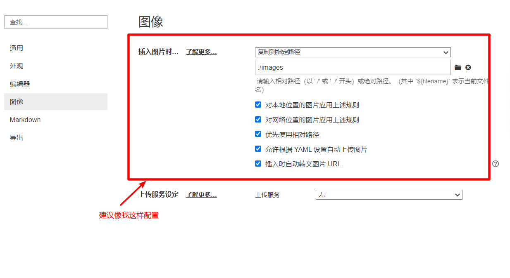
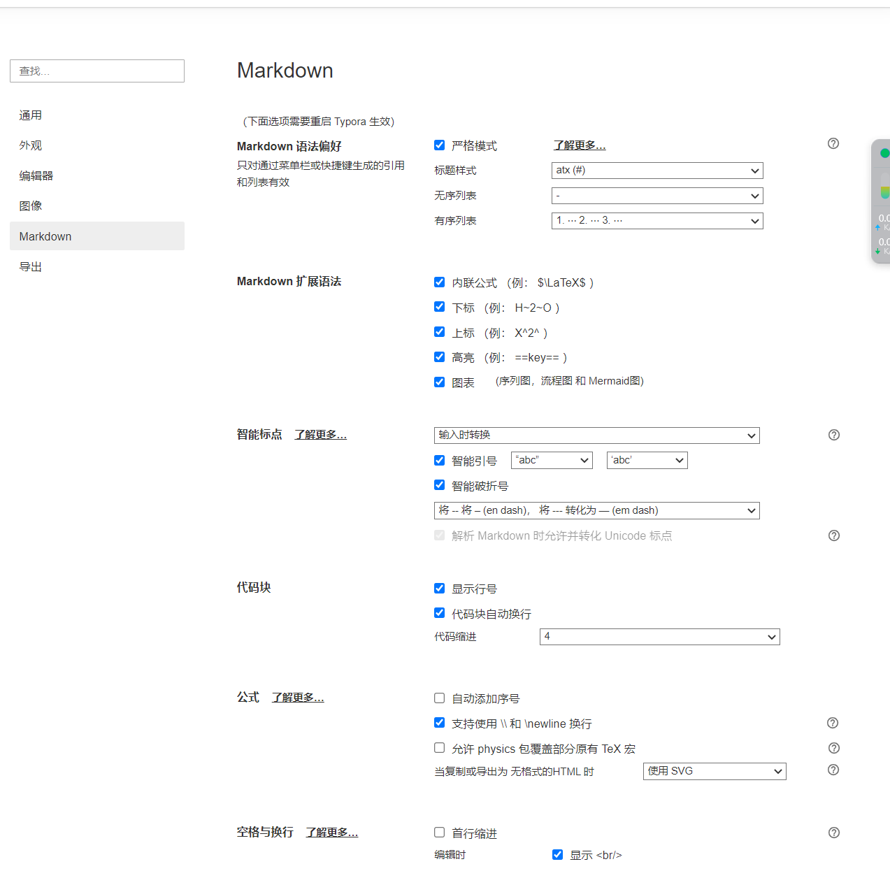

[TOC]


# Typora笔记教学


## 1. 从安装Typora开始

[git笔记链接](https://github.com/dby321/learningNotes.git)

[Typora 官方中文站 (typoraio.cn)](https://typoraio.cn/)

> 激活方法建议自己百度，可能有替换文件和激活码两种方法
>
> 0.11.18 版本以下均为免费版，[免费版下载地址](https://www.ghxi.com/typora.html)


## 2. Markdown语法

> 我是一段引用

**我是加粗** 我是普通字体 ==我是加强== `我是引用` **<font color='red'>红色</font>** *斜体*

[百度超链接](www.baidu.com) 

1. 有序列表
2. 有序列表

- 无序列表
- 无序列表

- [ ] 多选框
- [ ] 多选框

```css
div{
	display:block;
    background-color:red;
}
```

## 3. 配置Typora

### 3.1 给Typora选个好皮肤😀

> 方式一：上[Github](https://www.github.com)搜索**Typora Theme**
>
> 方式二：上([Themes Gallery — Typora (typoraio.cn)](https://theme.typoraio.cn/)官网搜索
>
> 推荐主题：
>
> - vue⭐⭐⭐⭐⭐
> - DrakeTypora⭐⭐⭐⭐⭐[liangjingkanji/DrakeTyporaTheme: 十二种主题风格 - Material Google JetBrains Vue Juejin Purple Ayu Dark (github.com)](https://github.com/liangjingkanji/DrakeTyporaTheme)

### 3.1 目录折叠😎


### 3.2 本地图片存储😁

> 因为所有文件最后会同步到github，所以不使用图床
>
> 同步到github推荐使用[Github Destop](https://desktop.github.com/)来操作



### 3.3 markdown配置😊



## 4. colorful你的笔记

### 4.1 展示效果

**<font color='red'>红色</font>**

**<font color='orange'>橙色</font>**

**<font color='yellow'>黄色</font>**

**<font color='green'>绿色</font>**

**<font color='cornflowerblue'>蓝色</font>**

**<font color='cyan'>青色</font>**

### 4.2 操作原理

> HTML+CSS+JS，没学前端的小伙伴不用太纠结，不影响使用

### 4.3 操作步骤

> 1. 下载[AutoHotKey](https://www.autohotkey.com/)并安装
> 2. 新建一个`xxx.ahk`的文件，将下面的代码复制进去
> 3. 使用AutoHotkey软件运行这个脚本文件

```ahk
; 分号以及分号后的内容代表注释
#IfWinActive ahk_exe Typora.exe
{
    ; alt+0 黑色
    !0::addFontColor("black")
    ; alt+1 红色
    !1::addFontColor("red")
    ; alt+1 橙色
    !2::addFontColor("orange")
    ; alt+3 黄色
    !3::addFontColor("yellow")
    ; alt+4 绿色
    !4::addFontColor("green")
    ; alt+5 浅蓝色
    !5::addFontColor("cornflowerblue")
    ; alt+6 青色
    !6::addFontColor("cyan") 
    ; alt+7 紫色
    !7::addFontColor("purple")
}

; 快捷增加字体颜色
addFontColor(color){
    clipboard := "" ; 清空剪切板
    Send {ctrl down}c{ctrl up} ; 复制
    ; SendInput {Text} ; 解决中文输入法问题
    SendInput {TEXT}**<font color='%color%'>
    SendInput {ctrl down}v{ctrl up} ; 粘贴
    If(clipboard = ""){
        SendInput {TEXT}</font>** ; Typora 在这不会自动补充
    }else{
        SendInput {TEXT}</** ; Typora中自动补全标签
    }
}
```

