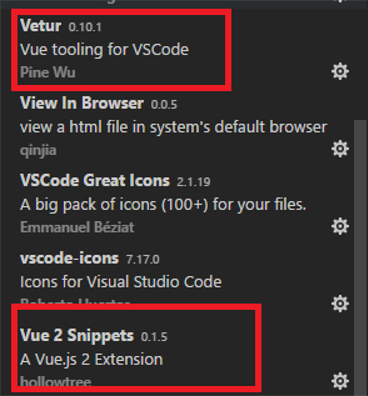
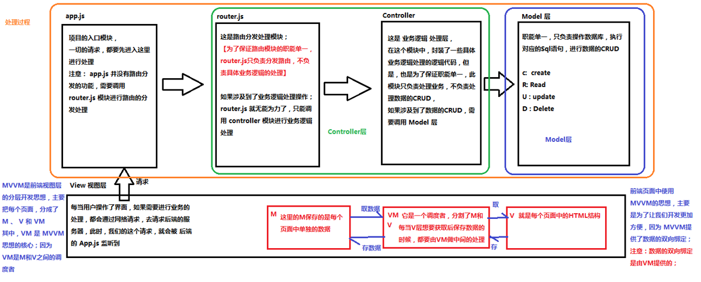
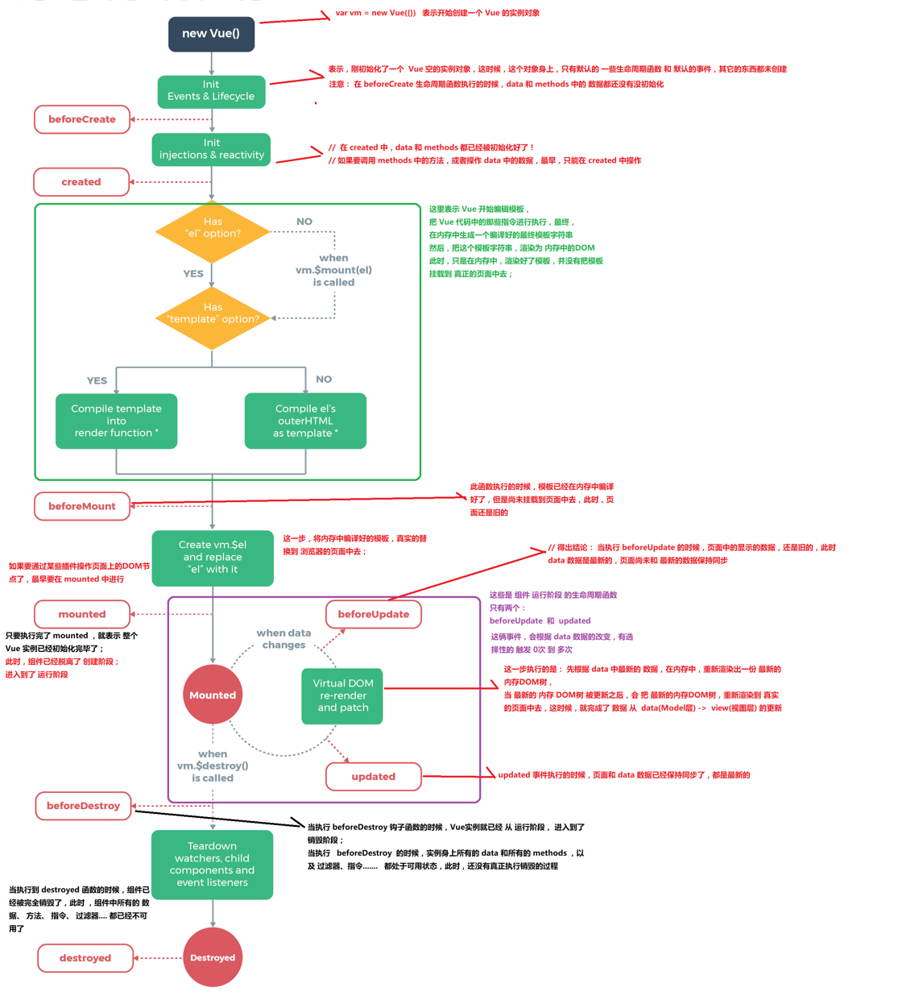

[TOC]


[CNPM安装Vue](https://www.jianshu.com/p/769a46d16b0c)

> `cnpm install --global @vue/cli`



# Vue.js - Day1

[黑马Vue教程](https://www.bilibili.com/video/BV11s411A7h6/?spm_id_from=333.337.search-card.all.click&vd_source=f58f2e2144be4e99a8cf800afeecbbcb)

[尚硅谷张天禹老师笔记+代码](https://github.com/yangxuesong0122/ssg--vue23-)

## 课程介绍与学习须知
前5天： 都在学习Vue基本的语法和概念；打包工具 Webpack , Gulp
后5天： 以项目驱动教学；


### 什么是Vue.js

+ Vue.js 最火的前端框架，React.js最流行前端框架（React除了开发网站，还可以开发手机App， Vue语法也是可以用于进行手机App开发的，需要借助于[Weex](https://weex.apache.org/zh/guide/introduction.html)

  > Weex 是使用流行的 Web 开发体验来开发高性能原生应用的框架

+ Vue.js 是前端的**主流框架之一**，和Angular.js、React.js 一起，并成为前端三大主流框架！

+ Vue.js 是一套构建用户界面的框架，**只关注视图层**，它不仅易于上手，还便于与第三方库或既有项目整合。（Vue有配套的第三方类库，可以整合起来做大型项目的开发）

+ 前端的主要工作？主要负责MVC中的V这一层；主要工作就是和界面打交道，来制作前端页面效果；

### 为什么要学习流行框架
 + 企业中，使用框架，能够提高开发的效率；

 + 提高开发效率的发展历程：原生JS -> Jquery之类的类库 -> 前端模板引擎 -> Angular.js / Vue.js

    > 原生JS【有浏览器的兼容问题】
    >
    > Jquery【屏蔽浏览器兼容性，不方便操作DOM】
    >
    > 前端模板引擎 【方便操作DOM，会渲染整个页面效率低】
    >
    > Angular.js / Vue.js 【减少不必要的DOM操作；提高渲染效率；双向数据绑定】

    

 + Vue的核心概念：用户不再操作DOM，专注于写业务逻辑

### 框架和库的区别

 + 框架：是一套完整的解决方案；对项目的侵入性较大，项目如果需要更换框架，则需要重新架构整个项目。

   + node 中的 express
 + 库（插件）：提供某一个小功能，对项目的侵入性较小，如果某个库无法完成某些需求，可以很容易切换到其它库实现需求。
    - 从Jquery 切换到 Zepto
    - 从 EJS 切换到 art-template

    > node【运行在服务器端的JS】
    >
    > express【是一个简洁而灵活的 node.*js* Web应用框架】
    >
    > Jquery【JS代码库 浏览器兼容好】
    >
    > Zepto【抛弃低级浏览器适配，轻便，用于移动端】
    >
    > EJS【嵌入式JS模板引擎】
    >
    > art-template【另一个简约超快的模板引擎】


### Node（后端）中的 MVC 与 前端中的 MVVM 之间的区别

 + MVC 是后端的分层开发概念；
    + Model：主要处理数据的CRUD
    + View：前端的页面
    + Controller：数据的业务逻辑处理（如登录，注销）
 + MVVM是前端视图层的概念，主要关注于 视图层分离，也就是说：MVVM把前端的视图层，分为了 三部分 Model, View , VM ViewModel
 + 为什么有了MVC还要有MVVM

## Vue.js 基本代码 和 MVVM 之间的对应关系




## Vue之 - `基本的代码结构`和`插值表达式{{}}`、`v-cloak`


## Vue指令之`v-text`和`v-html`


## Vue指令之`v-bind`

1. 直接使用指令`v-bind`

2. 使用简化指令`:`

3. 在绑定的时候，拼接绑定内容：`:title="btnTitle + ', 这是追加的内容'"`


## Vue指令之`v-on`和`跑马灯效果`


### 跑马灯效果

> 浏览器对象window   [廖雪峰-浏览器对象](https://www.liaoxuefeng.com/wiki/1022910821149312/1023022272084160)  [菜鸟教程-window对象](https://www.runoob.com/jsref/obj-window.html)
>
> 浏览器对象(BOM)中window定时器方法[菜鸟教程-Window setInterval() 方法](https://www.runoob.com/jsref/met-win-setinterval.html) [菜鸟教程-Window clearInterval() 方法](https://www.runoob.com/jsref/met-win-clearinterval.html)
>
> setInterval()中使用 箭头函数 解决了访问data()中的数据出现的this的指向问题

1. HTML结构：

```

<div id="app">

    <p>{{info}}</p>

    <input type="button" value="开启" v-on:click="go">

    <input type="button" value="停止" v-on:click="stop">

  </div>

```

2. Vue实例：

```

	// 创建 Vue 实例，得到 ViewModel

    var vm = new Vue({

      el: '#app',

      data: {

        info: '猥琐发育，别浪~！',

        intervalId: null

      },

      methods: {

        go() {

          // 如果当前有定时器在运行，则直接return

          if (this.intervalId != null) {

            return;

          }

          // 开始定时器

          this.intervalId = setInterval(() => {

            this.info = this.info.substring(1) + this.info.substring(0, 1);

          }, 500);

        },

        stop() {

          clearInterval(this.intervalId);

        }

      }

    });

```


## Vue指令之`v-on的缩写`和`事件修饰符`

### 事件修饰符：

> [Vue官网-事件修饰符](https://cn.vuejs.org/v2/guide/events.html#%E4%BA%8B%E4%BB%B6%E4%BF%AE%E9%A5%B0%E7%AC%A6)

+ .stop       阻止冒泡【冒泡是从内向外执行】【彻底阻止冒泡】
+ .prevent    阻止默认事件【<a href="">的默认事件是跳转】
+ .capture    添加事件侦听器时使用事件捕获模式【捕获是从外向内执行】
+ .self       只当事件在该元素本身（比如不是子元素）触发时触发回调【阻止仅仅是自己的冒泡】
+ .once       事件只触发一次  


## Vue指令之`v-model`双向数据绑定

> v-model只能运用在表单元素中
>

## 简易计算器案例

1. HTML 代码结构

```

  <div id="app">

    <input type="text" v-model="n1">

    <select v-model="opt">

      <option value="0">+</option>

      <option value="1">-</option>

      <option value="2">*</option>

      <option value="3">÷</option>

    </select>

    <input type="text" v-model="n2">

    <input type="button" value="=" v-on:click="getResult">

    <input type="text" v-model="result">

  </div>

```

2. Vue实例代码：

```

	// 创建 Vue 实例，得到 ViewModel

    var vm = new Vue({

      el: '#app',

      data: {

        n1: 0,

        n2: 0,

        result: 0,

        opt: '0'

      },

      methods: {

        getResult() {

          switch (this.opt) {

            case '0':

              this.result = parseInt(this.n1) + parseInt(this.n2);

              break;

            case '1':

              this.result = parseInt(this.n1) - parseInt(this.n2);

              break;

            case '2':

              this.result = parseInt(this.n1) * parseInt(this.n2);

              break;

            case '3':

              this.result = parseInt(this.n1) / parseInt(this.n2);

              break;

          }

        }

      }

    });

```


## Vue中使用样式


### 使用class样式

> 绑定样式要加“ ”   使用变量不用加“ ”

1. 数组
```
<h1 :class="['red', 'thin']">这是一个邪恶的H1</h1>
```

2. 数组中使用三元表达式
```
<h1 :class="['red', 'thin', isactive?'active':'']">这是一个邪恶的H1</h1>
```

3. 数组中嵌套对象
```
<h1 :class="['red', 'thin', {'active': isactive}]">这是一个邪恶的H1</h1>
```

4. 直接使用对象【推荐使用】
```
<h1 :class="{red:true, italic:true, active:true, thin:true}">这是一个邪恶的H1</h1>
```


### 使用内联样式

1. 直接在元素上通过 `:style` 的形式，书写样式对象【如果属性名包含 - 则需加上'  '】
```
<h1 :style="{color: 'red', 'font-size': '40px'}">这是一个善良的H1</h1>
```

2. 将样式对象，定义到 `data` 中，并直接引用到 `:style` 中
 + 在data上定义样式：
```
data: {
        h1StyleObj: { color: 'red', 'font-size': '40px', 'font-weight': '200' }
}
```
 + 在元素中，通过属性绑定的形式，将样式对象应用到元素中：
```
<h1 :style="h1StyleObj">这是一个善良的H1</h1>
```

3. 在 `:style` 中通过数组，引用多个 `data` 上的样式对象
 + 在data上定义样式：
```
data: {
        h1StyleObj: { color: 'red', 'font-size': '40px', 'font-weight': '200' },
        h1StyleObj2: { fontStyle: 'italic' }
}
```
 + 在元素中，通过属性绑定的形式，将样式对象应用到元素中：
```
<h1 :style="[h1StyleObj, h1StyleObj2]">这是一个善良的H1</h1>
```


## Vue指令之`v-for`和`key`属性

> [Vue官网-列表渲染](https://cn.vuejs.org/v2/guide/list.html)

1. 迭代数组

```
<ul>
  <li v-for="(item, i) in list">索引：{{i}} --- 姓名：{{item.name}} --- 年龄：{{item.age}}</li>
</ul>
```

2. 迭代对象中的属性

```
	<!-- 循环遍历对象身上的属性 -->

    <div v-for="(val, key, i) in userInfo">{{val}} --- {{key}} --- {{i}}</div>
```

3. 迭代数字

```
<p v-for="i in 10">这是第 {{i}} 个P标签</p>
```


> 2.2.0+ 的版本里，**当在组件中使用** v-for 时，v-bind:key现在是必须的，值为number或者string


当 Vue.js 用 v-for 正在更新已渲染过的元素列表时，它默认用 “**就地复用**” 策略。如果数据项的顺序被改变，Vue将**不是移动 DOM 元素来匹配数据项的顺序**， 而是**简单复用此处每个元素**，并且确保它在特定索引下显示已被渲染过的每个元素。


为了给 Vue 一个提示，**以便它能跟踪每个节点的身份，从而重用和重新排序现有元素**，你需要为每项提供一个唯一 key 属性。


## Vue指令之`v-if`和`v-show`


> 一般来说，v-if 有更高的切换消耗而 v-show 有更高的初始渲染消耗。
>
> v-if会重新删除元素，v-show只是切换了元素的display:none的样式。
>
> 因此，
>
> 如果需要**频繁切换**用 **v-show** 较好，
>
> 如果在**运行时条件不大可能改变** 用**v-if** 较好。


## 品牌管理案例

> 使用了Bootstrap 需要在VScode中安装Bootstrap 3 Snippets
>
> [菜鸟教程-BootStrap教程](https://www.runoob.com/bootstrap/bootstrap-tutorial.html)	
>
> [菜鸟教程-Bootstrap 表格](https://www.runoob.com/bootstrap/bootstrap-tables.html) 	
>
> [菜鸟教程-Bootstrap 面板（Panels）](https://www.runoob.com/bootstrap/bootstrap-panels.html)
>
> [菜鸟教程-JavaScript Array some() 方法](https://www.runoob.com/jsref/jsref-some.html)	 
>
> [菜鸟教程-JavaScript Array splice() 方法](https://www.runoob.com/jsref/jsref-splice.html) 	
>
> [菜鸟教程-JavaScript Array findIndex() 方法](https://www.runoob.com/jsref/jsref-findindex.html)
>
> [菜鸟教程-JavaScript Array forEach() 方法](https://www.runoob.com/jsref/jsref-foreach.html)
>
> [菜鸟教程-JavaScript Array filter() 方法](https://www.runoob.com/jsref/jsref-filter.html)
>
> [菜鸟教程-JavaScript String indexOf() 方法](https://www.runoob.com/jsref/jsref-indexof.html)
>
> [菜鸟教程-JavaScript String includes() 方法](https://www.runoob.com/jsref/jsref-string-includes.html)

> @click="add"和@click="add()"没什么区别，只是在传参上面有区别
>
> 作为参数传递到另一个函数（主函数）的那个函数就叫做 **回调函数**


### 删除品牌


### 根据条件筛选品牌

在2.x版本中[手动实现筛选的方式](https://cn.vuejs.org/v2/guide/list.html#显示过滤-排序结果)：

+ 筛选框绑定到 VM 实例中的 `searchName` 属性：

```

<hr> 输入筛选名称：

<input type="text" v-model="searchName">

```

+ 在使用 `v-for` 指令循环每一行数据的时候，不再直接 `item in list`，而是 `in` 一个 过滤的methods 方法，同时，把过滤条件`searchName`传递进去：

```

<tbody>

      <tr v-for="item in search(searchName)">

        <td>{{item.id}}</td>

        <td>{{item.name}}</td>

        <td>{{item.ctime}}</td>

        <td>

          <a href="#" @click.prevent="del(item.id)">删除</a>

        </td>

      </tr>

    </tbody>

```

+ `search` 过滤方法中，使用 数组的 `filter` 方法进行过滤：

```

search(name) {

  return this.list.filter(x => {

    return x.name.indexOf(name) != -1;

  });

}

```


## Vue调试工具`vue-devtools`的安装步骤和使用

> [Vue.js devtools - 翻墙安装方式 - 推荐](https://chrome.google.com/webstore/detail/vuejs-devtools/nhdogjmejiglipccpnnnanhbledajbpd?hl=zh-CN)
>
> [Vue教程-Vue.js devtools安装](https://www.bilibili.com/video/av27969216/?p=25)


## 过滤器

概念：Vue.js 允许你自定义过滤器，**可被用作一些常见的文本格式化**。过滤器可以用在两个地方：**mustache 插值和 v-bind 表达式**。过滤器应该被添加在 JavaScript 表达式的尾部，由管道符|指示；

> [菜鸟教程-JavaScript String replace() 方法](https://www.runoob.com/jsref/jsref-replace.html)
>
> [菜鸟教程-JavaScript RegExp 对象](https://www.runoob.com/jsref/jsref-obj-regexp.html)
>
> [模板字符串（\` \`）的用途](https://blog.csdn.net/zwt_guiji/article/details/81979299)
>
> [Vue官网-Vue.filter全局过滤器](https://cn.vuejs.org/v2/api/#Vue-filter)
>
> [Vue官网-filters私有过滤器](https://cn.vuejs.org/v2/api/#filters)

### 私有过滤器

1. HTML元素：

```

<td>{{item.ctime | dataFormat('yyyy-mm-dd')}}</td>

```

2. 私有 `filters` 定义方式：

   > [菜鸟教程-ES6 String 字符串补全padStart()和padEnd()](https://www.runoob.com/w3cnote/es6-string.html)

```

filters: { // 私有局部过滤器，只能在 当前 VM 对象所控制的 View 区域进行使用

    dataFormat(input, pattern = "") { // 在参数列表中 通过 pattern="" 来指定形参默认值，防止报错

      var dt = new Date(input);

      // 获取年月日

      var y = dt.getFullYear();

      var m = (dt.getMonth() + 1).toString().padStart(2, '0');

      var d = dt.getDate().toString().padStart(2, '0');


      // 如果 传递进来的字符串类型，转为小写之后，等于 yyyy-mm-dd，那么就返回 年-月-日

      // 否则，就返回  年-月-日 时：分：秒

      if (pattern.toLowerCase() === 'yyyy-mm-dd') {

        return `${y}-${m}-${d}`;

      } else {

        // 获取时分秒
        // 

        var hh = dt.getHours().toString().padStart(2, '0');

        var mm = dt.getMinutes().toString().padStart(2, '0');

        var ss = dt.getSeconds().toString().padStart(2, '0');


        return `${y}-${m}-${d} ${hh}:${mm}:${ss}`;

      }

    }

  }

```


### 全局过滤器

```

// 定义一个全局过滤器

Vue.filter('dataFormat', function (input, pattern = '') {

  var dt = new Date(input);

  // 获取年月日

  var y = dt.getFullYear();

  var m = (dt.getMonth() + 1).toString().padStart(2, '0');

  var d = dt.getDate().toString().padStart(2, '0');


  // 如果 传递进来的字符串类型，转为小写之后，等于 yyyy-mm-dd，那么就返回 年-月-日

  // 否则，就返回  年-月-日 时：分：秒

  if (pattern.toLowerCase() === 'yyyy-mm-dd') {

    return `${y}-${m}-${d}`;

  } else {

    // 获取时分秒

    var hh = dt.getHours().toString().padStart(2, '0');

    var mm = dt.getMinutes().toString().padStart(2, '0');

    var ss = dt.getSeconds().toString().padStart(2, '0');


    return `${y}-${m}-${d} ${hh}:${mm}:${ss}`;

  }

});

```


> 注意：当有局部和全局两个名称相同的过滤器时候，会以就近原则进行调用，即：局部过滤器优先于全局过滤器被调用！


## 键盘修饰符以及自定义键盘修饰符

> [Vue官网-按键修饰符](https://cn.vuejs.org/v2/guide/events.html#%E6%8C%89%E9%94%AE%E4%BF%AE%E9%A5%B0%E7%AC%A6)
>
> [Vue官网-Vue.config.keyCodes](https://cn.vuejs.org/v2/api/#keyCodes)
>
> [js 里面的键盘事件对应的键码](http://www.cnblogs.com/wuhua1/p/6686237.html)

```
@keyup.enter="add"
<input type="text" v-model="name" @keyup.113="add">
```


### 2.x中自定义键盘修饰符


1. 通过`Vue.config.keyCodes.名称 = 按键值`来自定义案件修饰符的别名：

```

Vue.config.keyCodes.f2 = 113;

```

2. 使用自定义的按键修饰符：

```

<input type="text" v-model="name" @keyup.f2="add">

```


## [自定义指令](https://cn.vuejs.org/v2/guide/custom-directive.html)

### 全局自定义指令 和 局部(私有)自定义指令

> 样式相关的在bind里面设置，行为相关的在inserted里面设置
>
> 定义的时候是focus 调用的时候是v-focus
>
> 注意：自定义指令的时候写**‘font-weight’**，而el.style.**fontWeight**
>
> [Vue官网 自定义指令 钩子函数](https://cn.vuejs.org/v2/guide/custom-directive.html#%E9%92%A9%E5%AD%90%E5%87%BD%E6%95%B0)

```

    // 自定义全局指令 v-focus，为绑定的元素自动获取焦点：
  

    Vue.directive('focus', {

      inserted: function (el) { // inserted 表示被绑定元素插入父节点时调用

        el.focus();

      }

    });


    // 自定义局部指令 v-color 和 v-font-weight，为绑定的元素设置指定的字体颜色 和 字体粗细：

      directives: {

        color: { // 为元素设置指定的字体颜色

          bind(el, binding) {

            el.style.color = binding.value;

          },

        },

        'font-weight': function (el, binding2) { // 自定义指令的简写形式，等同于定义了 bind 和 update 两个钩子函数

          el.style.fontWeight = binding2.value;

        }

      }

```

2. 自定义指令的使用方式：

```

<input type="text" v-model="searchName" v-focus v-color="'red'" v-font-weight="900">

```


# Vue.js - Day2

## [vue实例的生命周期](https://cn.vuejs.org/v2/guide/instance.html#实例生命周期)



- 创建期间的生命周期函数：
  - beforeCreate：实例刚在内存中被创建出来，此时，还没有初始化好 data 和 methods 属性
  - **created**：【操作data和methods最早的阶段】实例已经在内存中创建OK，此时 data 和 methods 已经创建OK，此时还没有开始 编译模板
  - beforeMount：模板编译完成，尚未挂载到页面
  - **mounted**：【操作页面DOM最早的阶段 】模板编译完成，也挂载到了页面
- 运行期间的生命周期函数：
  - **beforeUpdate**：【状态更新 data新，页面旧】状态更新之前执行此函数， 此时 data 中的状态值是最新的，但是界面上显示的 数据还是旧的，因为此时还没有开始重新渲染DOM节点
  - updated：【状态更新 data新，页面新】实例更新完毕之后调用此函数，此时 data 中的状态值 和 界面上显示的数据，都已经完成了更新，界面已经被重新渲染好了！
- 销毁期间的生命周期函数：
  - **beforeDestroy**：【Vue实例还可用】实例销毁之前调用。在这一步，实例仍然完全可用。
  - destroyed：【Vue实例已被销毁】Vue 实例销毁后调用。调用后，Vue 实例指示的所有东西都会解绑定，所有的事件监听器会被移除，所有的子实例也会被销毁。

## 发起数据请求( get, post, jsonp)

> [菜鸟教程-AJAX-向服务器发送请求](https://www.w3school.com.cn/ajax/ajax_xmlhttprequest_send.asp)

### 原生Ajax发起数据请求(已废弃)

> [菜鸟教程-Ajax教程](https://www.runoob.com/ajax/ajax-tutorial.html)

### 使用Vue-resource发起数据请求(已废弃)

> [Github-Vue-resource](https://github.com/pagekit/vue-resource)

### 使用axios发起数据请求

> [Github-axios](https://github.com/axios/axios)

## 品牌管理改造

`01.vue-resource改造品牌列表案例.html`

> 1. 调用 发起**数据请求的函数如getProductList()**，最好在**created()时调用**，因为此时data和methods已经初始化完毕。不要在mounted()时调用。
> 2. 发起数据请求的url地址中的 **服务器根地址** 最好进行**全局配置**,以防止服务器地址改变引起的大量代码修改。`Vue.http.options.root='http://www.liulongbin.top:3005/';`
> 3. 使用Vue-resource发送post请求中的 第三个参数 **{emulateJSON：true}**最好进行**全局配置`Vue.http.options.emulateJSON="true";`

> **查看项目文档的目录**：使用Word打开项目文档---视图---导航窗格 
>
> **安装必要插件**：Bootstrap 3 Snippets
>
> **导包**： 
> 因为要向后台发起数据请求，所以需要导入Vue-resource包`<script src="./lib/vue-2.4.0.js"></script>`
>
> 因为要使界面美观等，需要导入Bootstrap包`<link rel="stylesheet" href="./lib/bootstrap-3.3.7.css">`

## Vue中的动画

> [Vue官网-动画](https://cn.vuejs.org/v2/guide/transitions.html)

### 使用v-if和v-show来实现动画

`02.动画-不使用动画.html`

### 使用过渡类名

`03.动画-使用过渡类名实现动画.html`

> [Vue官网-过渡类名](https://cn.vuejs.org/v2/guide/transitions.html#%E8%BF%87%E6%B8%A1%E7%9A%84%E7%B1%BB%E5%90%8D)

### 使用自定义过渡类名

`04.动画-修改v-前缀.html`

> [Vue官网-自定义过渡类名](https://cn.vuejs.org/v2/guide/transitions.html#%E8%87%AA%E5%AE%9A%E4%B9%89%E8%BF%87%E6%B8%A1%E7%9A%84%E7%B1%BB%E5%90%8D)

### 使用第三方 CSS 动画库

`05.动画-使用第三方类实现动画.html`

> [Animate.css官网](https://daneden.github.io/animate.css/)

### 使用动画钩子函数

`06.动画-使用钩子函数模拟小球半场动画.html`

> [Vue官网-JavaScript钩子(动画生命周期函数)](https://cn.vuejs.org/v2/guide/transitions.html#JavaScript-%E9%92%A9%E5%AD%90)

### 使用transition-group实现列表v-for的动画

`07.动画-列表动画.html`

> [Vue官网-列表过渡](https://cn.vuejs.org/v2/guide/transitions.html#%E5%88%97%E8%A1%A8%E8%BF%87%E6%B8%A1)


# Vue.js - Day3

## Vue组件的定义

什么是组件： 组件的出现，就是为了拆分Vue实例的代码量的，能够让我们以不同的组件，来划分不同的功能模块，将来我们需要什么样的功能，就可以去调用对应的组件即可；
组件化和模块化的不同：

- 模块化： 是从代码逻辑的角度进行划分的；方便代码分层开发，保证每个功能模块的职能单一；
- 组件化： 是从UI界面的角度进行划分的；前端的组件化，方便UI组件的重用；

### 全局Vue组件的定义

> 1. 组件注册的时候是驼峰命名的话，使用的时候要改成-；如果组件注册没用使用驼峰命名，则不需要改变 直接引用
> 2. 组件中的DOM结构，有且只能有唯一的根元素（Root Element）来进行包裹！
> 3. 组件中的data必须是方法，并返回对象

#### 使用 Vue.extend 配合 Vue.component

`08.组件-创建组件的方式1.html`


```
var login = Vue.extend({
      template: '<h1>登录</h1>'
    });
    Vue.component('login', login);
```

#### 直接使用 Vue.component

`08.组件-创建组件的方式1.html`

```
Vue.component('register', {
      template: '<h1>注册</h1>'
    });
```

#### 将模板字符串，定义到script标签中

`09.组件-创建组件的方式2.html`

```
<script id="tmpl">
      <div><a href="#">登录</a> | <a href="#">注册</a></div>
</script>
```

同时，需要使用 Vue.component 来定义组件：

```
Vue.component('account', {
      template: '#tmpl'
    });
```

### 私有(局部)Vue组件的定义

`10.组件-创建组件的方式3.html`

1. 组件实例定义方式：

```
<script>
    // 创建 Vue 实例，得到 ViewModel
    var vm = new Vue({
      el: '#app',
      data: {},
      methods: {},
      components: { // 定义子组件
        account: { // account 组件
          template: '<div><h1>这是Account组件{{name}}</h1><login></login></div>', // 在这里使用定义的子组件
          components: { // 定义子组件的子组件
            login: { // login 组件
              template: "<h3>这是登录组件</h3>"
            }
          }
        }
      }
    });
  </script>
```

2. 引用组件：

```
<div id="app">
    <account></account>
  </div>
```

### Vue组件中的data和methods

`11.组件-组件中的data和methods.html`

1. 在组件中，`data`需要被定义为一个方法，例如：

```
Vue.component('account', {
      template: '#tmpl',
      data() {//组件中的data必须是一个方法，返回一个对象
        return {
          msg: '大家好！'
        }
      },
      methods:{
        login(){
          alert('点击了登录按钮');
        }
      }
    });
```

2. 在子组件中，如果将模板字符串，定义到了script标签中，那么，要访问子组件身上的`data`属性中的值，需要使用`this`来访问；

### 为什么组件中的data属性必须定义为一个方法并返回一个对象

`12.组件-why components data must be a function.html`

## Vue组件的切换

### 使用v-if和v-else来实现组件的切换

`13.组件切换-方式1.html`

1. 页面结构：

```
<div id="app">
    <input type="button" value="toggle" @click="flag=!flag">
    <my-com1 v-if="flag"></my-com1>
    <my-com2 v-else="flag"></my-com2>
  </div>
```

2. Vue实例定义：

```
<script>
    Vue.component('myCom1', {
      template: '<h3>奔波霸</h3>'
    })

    Vue.component('myCom2', {
      template: '<h3>霸波奔</h3>'
    })

    // 创建 Vue 实例，得到 ViewModel
    var vm = new Vue({
      el: '#app',
      data: {
        flag: true
      },
      methods: {}
    });
  </script>
```

### 使用`:is`属性来切换不同的子组件,并添加切换动画

`14.组件切换-方式2.html` `15.组件切换-切换动画.html`

1. 组件实例定义方式：

```
  // 登录组件
    const login = Vue.extend({
      template: `<div>
        <h3>登录组件</h3>
      </div>`
    });
    Vue.component('login', login);

    // 注册组件
    const register = Vue.extend({
      template: `<div>
        <h3>注册组件</h3>
      </div>`
    });
    Vue.component('register', register);

    // 创建 Vue 实例，得到 ViewModel
    var vm = new Vue({
      el: '#app',
      data: { comName: 'login' },
      methods: {}
    });
```

2. 使用`component`标签，来引用组件，并通过`:is`属性来指定要加载的组件：

```
  <div id="app">
    <a href="#" @click.prevent="comName='login'">登录</a>
    <a href="#" @click.prevent="comName='register'">注册</a>
    <hr>
    <transition mode="out-in">
      <component :is="comName"></component>
    </transition> 
  </div>
```

3. 添加切换样式：

```
  <style>
    .v-enter,
    .v-leave-to {
      opacity: 0;
      transform: translateX(30px);
    }

    .v-enter-active,
    .v-leave-active {
      position: absolute;
      transition: all 0.3s ease;
    }

    h3{
      margin: 0;
    }
  </style>
```

## Vue组件的传值和传方法

### 父组件向子组件传值

```
<script>
    // 创建 Vue 实例，得到 ViewModel
    var vm = new Vue({
      el: '#app',
      data: {
        msg: '这是父组件中的消息'
      },
      components: {
        son: {
          template: '<h1>这是子组件 --- {{finfo}}</h1>',
          // 2. 在子组件内部，使用props:['xxx']来接收父组件传递过来的数据
          // 3. 之后可以在template中{{xxx}}来进行使用props接收到的数据
          props: ['finfo'] //props里面的数据是只读的，修改会报警告
        }
      }
    });
  </script>
```

```
<div id="app">
	// 1. 可以在引用子组件<son></son>的时候，可以用 属性绑定:xxx="父组件中的data"的形式传递到子组件内部
    <son v-bind:finfo="msg"></son>
  </div>
```

### 父组件向子组件传方法  同时 子组件 通过方法传参 向父组件传值

`04.组件-父组件把方法传递给子组件.html`

```
<script>
	var com2={
		template:'#tmp1',
		// 4.在子组件中的methods中使用 this.$emit来触发父组件传递过来的方法func
		// emit从第二个参数开始就是传参
		data(){
			return{
				sonmsg:{name:'小头儿子'，age:6}
			}
		}
		methods:{
			myclick(){
				this.$emit('func',123,this.sonmsg)
			}
		}
	}

    // 创建 Vue 实例，得到 ViewModel
    var vm = new Vue({
      el: '#app',
      data:{
      	datamsgFromSon:null
      }
      methods:{
      // 1.父组件定义一个方法
      	show(data，data2){
      		console.log("调用了父组件的show方法" + data + data2);
      		// 5.父组件拿到子组件传递过来的值(子组件 通过方法传参 向父组件传值)
      		this.datamsgFromSon=data2;
      	}
      }
      components: {
        com2
    });
</script>
```

```
<template id="tmp1">
	<div>
		<h1>这是子组件</h1>
		// 3.在子组件中定义一个按钮来测试 父组件传递过来的方法
		<input type="button" value="子组件的按钮，点击触发父组件传递过来的方法" 							@click="myclick">
	</div>
</template>


<div id="app">
	// 2.通过 @func="xxx"来传递父组件的方法
	// v-on:简写成@
	<com2 @func="show"></com2>
</div>
```


## 使用 `this.$refs` 来获取DOM元素和组件

```
  <div id="app">
    <div>
      <input type="button" value="获取元素内容" @click="getElement" />
      <!-- 使用 ref 获取元素 -->
      <h1 ref="myh1">这是一个大大的H1</h1>

      <hr>
      <!-- 使用 ref 获取子组件 -->
      <my-com ref="mycom"></my-com>
    </div>
  </div>

  <script>
    Vue.component('my-com', {
      template: '<h5>这是一个子组件</h5>',
      data() {
        return {
          name: '子组件'
        }
      }
    });

    // 创建 Vue 实例，得到 ViewModel
    var vm = new Vue({
      el: '#app',
      data: {},
      methods: {
        getElement() {
          // 通过 this.$refs 来获取元素
          console.log(this.$refs.myh1.innerText);
          // 通过 this.$refs 来获取组件
          console.log(this.$refs.mycom.name);
        }
      }
    });
  </script>
```

## 路由vue-router

### 什么是路由

1. **后端路由**：对于普通的网站，所有的超链接都是URL地址，所有的URL地址都对应服务器上对应的资源；
2. **前端路由**：对于单页面应用程序来说，主要通过URL中的hash(#号)来实现不同页面之间的切换，同时，hash有一个特点：HTTP请求中不会包含hash相关的内容；所以，单页面程序中的页面跳转主要用hash实现；
3. 在单页面应用程序中，这种通过hash改变来切换页面的方式，称作前端路由（区别于后端路由）；

### 在 vue 中使用 vue-router

1. 导入 vue-router 组件类库：

```
<!-- 1. 导入 vue-router 组件类库 -->
  <script src="./lib/vue-router-2.7.0.js"></script>
```

2. 使用 router-link 组件来导航

```
<!-- 2. 使用 router-link 组件来导航 -->
<router-link to="/login">登录</router-link>
<router-link to="/register">注册</router-link>
```

3. 使用 router-view 组件来显示匹配到的组件

```
<!-- 3. 使用 router-view 组件来显示匹配到的组件 -->
<router-view></router-view>
```

4. 创建使用`Vue.extend`创建组件 也可以从其他文件import进来

```
    // 4.1 使用 Vue.extend 来创建登录组件
    var login = Vue.extend({
      template: '<h1>登录组件</h1>'
    });

    // 4.2 使用 Vue.extend 来创建注册组件
    var register = Vue.extend({
      template: '<h1>注册组件</h1>'
    });
    
    const Foo = { template: '<div>foo</div>' }
	const Bar = { template: '<div>bar</div>' }
```

5. 创建一个路由 router 实例，通过 routers 属性来定义路由匹配规则

```
// 5. 创建一个路由 router 实例，通过 routers 属性来定义路由匹配规则
    var router = new VueRouter({
      routes: [
        //路由的重定向
      	{ path:'/',redirect:'/login' }
        { path: '/login', component: login },
        { path: '/register', component: register }
      ]
    });
```

6. 使用 router 属性来使用路由规则

```
// 6. 创建 Vue 实例，得到 ViewModel
    var vm = new Vue({
      el: '#app',
      router: router // 使用 router 属性来使用路由规则，也可简写为router
    });
```

### 设置路由高亮

#### 通过定义 外部样式 router-link-active 来设置路由高亮

```
<style>
    /* 设置路由高亮 */
    .router-link-active,
    .myactive
    {
      color: red;
      font-weight: 800;
      font-style: italic;
      font-size: 80px;
      text-decoration: underline;
      background-color: green;
    }
<style>
```

#### 通过在router实例中设置 linkActiveClass属性(也要定义外部样式) 来设置路由高亮

```
//myactive同样在外部样式中定义

var router=new VueRouter({
routes:[
{...},
{...},
{...}
],
linkActiveClass:"myacive"
})
```


### 设置路由切换动画

```
<style>
	// 设置transition的生命周期函数
    .v-enter,
    .v-leave-to {
      opacity: 0;
      transform: translateX(140px);
    }

    .v-enter-active,
    .v-leave-active {
      transition: all 0.5s ease;
    }
  </style>
```

```
// 给router-view套上transition
<transition mode="out-in">
      <router-view></router-view>
 </transition>
```

### 在路由规则中使用query方式传递路由参数

```
 <!-- 如果在路由中，使用 查询字符串?aaa=bbb&ccc=ddd 给路由传递参数，不需要修改路由规则的path属性 -->
<router-link to="/login?id=10&name=zs">登录</router-link>
```

```
<script>
    // 在template中 访问msg使用{{msg}}省略了this.  
    // 在template中 访问this.$route.query.id使用{{$route.query.id}}也省略了this
    var login = {
      template: '<h1>登录 --- {{ $route.query.id }} --- {{ $route.query.name }}</h1>',
    }
 </script>
```

### 在路由规则中使用params方式传递路由参数

```
<router-link to="/login/12/ls">登录</router-link>
```

```
<script>
    var login = {
      template: '<h1>登录 --- {{ $route.params.id }} --- {{ $route.params.name }}</h1>',
    }

    var router = new VueRouter({
      routes: [
      	//使用:id这种方法需要改变路由匹配规则的path属性
        { path: '/login/:id/:name', component: login }
      ]
    })
  </script>
```

### 使用 `children` 属性实现路由嵌套

> 记得放两个router-view坑

```
  <div id="app">
    <router-link to="/account">Account</router-link>

    <router-view></router-view>
  </div>

  <script>
    // 父路由中的组件
    const account = Vue.extend({
      template: `<div>
        这是account组件
        <router-link to="/account/login">login</router-link> | 
        <router-link to="/account/register">register</router-link>
        <router-view></router-view>
      </div>`
    });

    // 子路由中的 login 组件
    const login = Vue.extend({
      template: '<div>登录组件</div>'
    });

    // 子路由中的 register 组件
    const register = Vue.extend({
      template: '<div>注册组件</div>'
    });

    // 路由实例
    var router = new VueRouter({
      routes: [
        { path: '/', redirect: '/account/login' }, // 使用 redirect 实现路由重定向
        {
          path: '/account',
          component: account,
          children: [ // 通过 children 数组属性，来实现路由的嵌套
         	// 注意，子路由的开头位置，不要加 / 路径符
            { path: 'login', component: login }, 
            { path: 'register', component: register }
          ]
        }
      ]
    });

    // 创建 Vue 实例，得到 ViewModel
    var vm = new Vue({
      el: '#app',
      data: {},
      methods: {},
      components: {
        account
      },
      router: router
    });
  </script>
```

### 命名视图实现经典布局

> [弹性布局](https://www.jianshu.com/p/2bcac1b556d9)

1. 标签代码结构：

```
<div id="app">
    <router-view></router-view>
    <div class="content">
      <router-view name="a"></router-view>
      <router-view name="b"></router-view>
    </div>
  </div>
```

2. JS代码：

```
<script>
    var header = Vue.component('header', {
      template: '<div class="header">header</div>'
    });

    var sidebar = Vue.component('sidebar', {
      template: '<div class="sidebar">sidebar</div>'
    });

    var mainbox = Vue.component('mainbox', {
      template: '<div class="mainbox">mainbox</div>'
    });

    // 创建路由对象
    var router = new VueRouter({
      routes: [
        {
          path: '/', components: {
            'default': header,
            'a': sidebar,
            'b': mainbox
          }
        }
      ]
    });

    // 创建 Vue 实例，得到 ViewModel
    var vm = new Vue({
      el: '#app',
      data: {},
      methods: {},
      router
    });
  </script>
```

3. CSS 样式：

```
  <style>
    .header {
      border: 1px solid red;
    }

    .content{
      display: flex;
    }
    .sidebar {
      flex: 2;
      border: 1px solid green;
      height: 500px;
    }
    .mainbox{
      flex: 8;
      border: 1px solid blue;
      height: 500px;
    }
  </style>
```

## `watch`属性的使用

> 想要实现 `firstname` 和 `lastname` 两个文本框的内容改变，则`fullname`的文本框中的值也跟着改变
>
> 通过监听`@keyup`键盘弹起事件可以实现

> watch可以监听非DOM元素的事件，比如监听路由地址的改变

1. 监听`data`中属性的改变：

```
<div id="app">
    <input type="text" v-model="firstName"> +
    <input type="text" v-model="lastName"> =
    <span>{{fullName}}</span>
  </div>

  <script>
    // 创建 Vue 实例，得到 ViewModel
    var vm = new Vue({
      el: '#app',
      data: {
        firstName: 'jack',
        lastName: 'chen',
        fullName: 'jack - chen'
      },
      methods: {},
      watch: {
        'firstName': function (newVal, oldVal) { // 第一个参数是新数据，第二个参数是旧数据
          this.fullName = newVal + ' - ' + this.lastName;
        },
        'lastName': function (newVal, oldVal) {
          this.fullName = this.firstName + ' - ' + newVal;
        }
      }
    });
  </script>
```

2. 监听路由的改变(只能使用watch来监听)：

```
<div id="app">
    <router-link to="/login">登录</router-link>
    <router-link to="/register">注册</router-link>

    <router-view></router-view>
  </div>

  <script>
    var login = Vue.extend({
      template: '<h1>登录组件</h1>'
    });

    var register = Vue.extend({
      template: '<h1>注册组件</h1>'
    });

    var router = new VueRouter({
      routes: [
        { path: "/login", component: login },
        { path: "/register", component: register }
      ]
    });

    // 创建 Vue 实例，得到 ViewModel
    var vm = new Vue({
      el: '#app',
      data: {},
      methods: {},
      router: router,
      watch: {
        '$route': function (newVal, oldVal) {
          if (newVal.path === '/login') {
            console.log('这是登录组件');
          }
        }
      }
    });
  </script>
```

## `computed`计算属性的使用

1. 默认只有`getter`的计算属性：

```
<div id="app">
    <input type="text" v-model="firstName"> +
    <input type="text" v-model="lastName"> =
    <span>{{fullName}}</span>
  </div>

  <script>
    // 创建 Vue 实例，得到 ViewModel
    var vm = new Vue({
      el: '#app',
      data: {
        firstName: 'jack',
        lastName: 'chen'
      },
      methods: {},
      computed: { 
      // 计算属性； 特点：当计算属性中所以来的任何一个 data 属性改变之后，都会重新触发 本计算属性 的重新计算，	  // 从而更新 fullName 的值，求值完毕后悔缓存起来，避免之后使用的时候再次求值
      // 虽然写的像方法，但是引用的时候就当成 普通属性 去使用就好了
        fullName() {
          return this.firstName + ' - ' + this.lastName;
        }
      }
    });
  </script>
```

2. 定义有`getter`和`setter`的计算属性：

```
<div id="app">
    <input type="text" v-model="firstName">
    <input type="text" v-model="lastName">
    <!-- 点击按钮重新为 计算属性 fullName 赋值 -->
    <input type="button" value="修改fullName" @click="changeName">

    <span>{{fullName}}</span>
  </div>

  <script>
    // 创建 Vue 实例，得到 ViewModel
    var vm = new Vue({
      el: '#app',
      data: {
        firstName: 'jack',
        lastName: 'chen'
      },
      methods: {
        changeName() {
          this.fullName = 'TOM - chen2';
        }
      },
      computed: {
        fullName: {
          get: function () {
            return this.firstName + ' - ' + this.lastName;
          },
          set: function (newVal) {
            var parts = newVal.split(' - ');
            this.firstName = parts[0];
            this.lastName = parts[1];
          }
        }
      }
    });
  </script>
```

## `watch`、`computed`和`methods`之间的对比

1. `computed`进行简单运算和字符串操作，主要当作属性来使用；
2. `methods` 业务逻辑
3. `watch`监听某些特定数据的变化，从而进行某些具体的业务逻辑操作；可以看作是`computed`和`methods`的结合体；

## nrm,npm与cnpm

### nrm简介

nrm是npm源管理工具，可以添加自定义的npm源和切换npm源

### npm简介

> [菜鸟教程-npm使用介绍](https://www.runoob.com/nodejs/nodejs-npm.html)

NPM是随同NodeJS一起安装的包管理工具，能解决NodeJS代码部署上的很多问题，常见的使用场景有以下几种：

- 允许用户从NPM服务器下载别人编写的第三方包到本地使用。 
- 允许用户从NPM服务器下载并安装别人编写的命令行程序到本地使用。 
- 允许用户将自己编写的包或命令行程序上传到NPM服务器供别人使用。

### cnpm简介

淘宝团队做的国内镜像，因为npm的服务器位于国外可能会影响安装。淘宝镜像与官方同步频率目前为 10分钟 一次以保证尽量与官方服务同步。

- 安装：命令提示符执行
  `npm install cnpm -g --registry=https://registry.npm.taobao.org` 
- `cnpm -v` 来测试是否成功安装

### nrm的使用

> 出现 **'nrm' 不是内部或外部命令，也不是可运行的程序 或批处理文件** 这种问题
>
> 一般是要**配置环境变量**
>
> 以本人电脑为例 需要将 C:\Users\千里水草\AppData\Roaming\npm 添加至path

作用：提供了一些最常用的NPM包镜像地址，能够让我们快速的切换安装包时候的服务器地址；
镜像：国外服务器的包在国内服务器的镜像文件，为了更快的下载速度

1. 运行`npm i nrm -g`全局安装`nrm`包；
2. 使用`nrm ls`查看当前所有可用的镜像源地址以及当前所使用的镜像源地址；
3. 使用`nrm use npm`或`nrm use taobao`切换不同的镜像源地址；
4. `npm i jquery`就会从3.中选择的镜像源地址下载相应的包

> 使用`nrm ls`会看到
>
> `npm -------- https://registry.npmjs.org/
> yarn ------- https://registry.yarnpkg.com/
> cnpm ------- http://r.cnpmjs.org/
> taobao ----- https://registry.npm.taobao.org/
> nj --------- https://registry.nodejitsu.com/
> npmMirror -- https://skimdb.npmjs.com/registry/
> edunpm ----- http://registry.enpmjs.org/`

> 使用`nrm use npm`会看到 `Registry has been set to: https://registry.npmjs.org/`
>
> 使用`nrm use taobao` 会看到 ` Registry has been set to: https://registry.npm.taobao.org/`

> 注意：nrm只是单纯的提供了几个常用的下载包的URL地址，能够让我们在这几个地址之间快速切换地址，但是每次我们装包的时候使用的装包工具都是npm

> 如果想用`cnpm装包工具`来装包 一定要`npm i cnpm -g` 来全局安装`cnpm装包工具`
>
> 注意：`cnpm装包工具`和` http://r.cnpmjs.org/`镜像源地址是两个不同的东西，不要混淆！

## 相关文件

1. [URL中的hash（井号）](http://www.cnblogs.com/joyho/articles/4430148.html)

# Vue.js - Day5 - Webpack和Babel

> [webpack官网](http://webpack.github.io/)
>
> [Babel官网](https://www.babeljs.cn/)

## 网页中引用的常见静态资源

- JS

- .js  .jsx(react) .coffee  .ts（TypeScript  类 C# 语言）

- CSS

- .css  .less   .sass(老)  .scss(新)

- Images

- .jpg   .png   .gif   .bmp   .svg

- 字体文件（Fonts）

- .svg   .ttf   .eot   .woff   .woff2

- 模板文件

- .ejs   .jade  .vue【这是在webpack中定义组件的方式，推荐】

## 网页中引入的静态资源多了以后有什么问题？

1. 网页加载速度慢， 因为 我们要发起很多的二次请求；
2. 要处理各个包之间错综复杂的依赖关系

## 如何解决上述两个问题

1. 合并、压缩、精灵图、图片的Base64编码
2. 可以使用之前学过的requireJS、也可以使用webpack可以解决各个包之间的复杂依赖关系；

## 什么是webpack?

webpack 是前端的一个项目构建工具，它是基于 Node.js 开发出来的一个前端工具；

## 如何完美实现上述的2种解决方案

1. 使用Gulp(小巧灵活，类似于多个珠穆朗玛峰)， 是基于 task 任务的；
2. 使用Webpack(类似于卫星)， 是基于整个项目进行构建的；

## webpack安装的两种方法

方式一：运行`npm i webpack -g`和`npm install -g webpack-cli`全局安装webpack，这样就能在全局使用webpack的命令

方式二：在项目根目录中运行`npm i webpack --save-dev`安装到项目依赖中

## 初步使用webpack打包构建列表隔行变色案例【坑很多，主要是webpack版本导致的，已解决】

1. 运行`npm init -y`初始化项目
2. 创建项目基本的目录结构
3. 使用`cnpm i jquery --save`安装jquery类库（或者`cnpm i jquery -S`）
4. 创建`main.js`并书写各行变色的代码逻辑：

```
	// 导入jquery类库
    import $ from 'jquery'

    // 设置偶数行背景色，索引从0开始，0是偶数
    $('#list li:even').css('backgroundColor','lightblue');
    // 设置奇数行背景色
    $('#list li:odd').css('backgroundColor','pink');
```

5. 直接在页面上引用`main.js`会报错，因为浏览器不认识`import`这种高级的JS语法，需要使用webpack进行处理，webpack默认会把这种高级的语法转换为低级的浏览器能识别的语法；
6. 运行`webpack 入口文件路径 输出文件路径`对`main.js`进行处理：

```
webpack .\src\main.js -o .\dist\bundle.js --mode=development
```

## 使用webpack的配置文件简化打包时候的命令

> 最好查看[webpack中文网](https://www.webpackjs.com/)，因为版本问题

1. 在项目根目录中创建`webpack.config.js`
2. 由于运行webpack命令的时候，webpack需要指定入口文件和输出文件的路径，所以，我们需要在`webpack.config.js`中配置这两个路径：

```
    // 导入处理路径的模块
    var path = require('path');

    // 导出一个配置对象，将来webpack在启动的时候，会默认来查找webpack.config.js，并读取这个文件中导出的配置对象，来进行打包处理
    module.exports = {
        entry: path.resolve(__dirname, 'src/js/main.js'), // 项目入口文件
        output: { // 配置输出选项
            path: path.resolve(__dirname, 'dist'), // 配置输出的路径
            filename: 'bundle.js' // 配置输出的文件名
        }
    }
```

## 实现webpack的实时打包构建

1. 由于每次重新修改代码之后，都需要手动运行webpack打包的命令，比较麻烦，所以使用`webpack-dev-server`来实现代码实时打包编译，当修改代码之后，会自动进行打包构建。
2. 运行`cnpm i webpack-dev-server --save-dev`安装到开发依赖
3. 安装完成之后，在命令行直接运行`webpack-dev-server`来进行打包，发现报错，此时需要借助于`package.json`文件中的指令，来进行运行`webpack-dev-server`命令，在`scripts`节点下新增`"dev": "webpack-dev-server"`指令，发现可以进行实时打包，但是dist目录下并没有生成`bundle.js`文件，这是因为`webpack-dev-server`将打包好的文件放在了内存中

- 把`bundle.js`放在内存中的好处是：由于需要实时打包编译，所以放在内存中速度会非常快
- 这个时候访问webpack-dev-server启动的`http://localhost:8080/`网站，发现是一个文件夹的面板，需要点击到src目录下，才能打开我们的index首页，此时引用不到bundle.js文件，需要修改index.html中script的src属性为:`<script src="../bundle.js"></script>`
- 为了能在访问`http://localhost:8080/`的时候直接访问到index首页，可以使用`--contentBase src`指令来修改dev指令，指定启动的根目录：

```
 "dev": "webpack-dev-server --contentBase src"
```

 同时修改index页面中script的src属性为`<script src="bundle.js"></script>`


## 在使用webpack构建的Vue项目中使用模板对象？

1. 在`webpack.config.js`中添加`resolve`属性：

```
resolve: {
    alias: {
      "vue$":"vue/dist/vue.js"
    }
  }
```

## 使用`Babel`处理高级JS语法

> 在webpack中只能处理一部分ES6的新语法，一些更高级的ES6语法(比如面对对象编程相关的新语法)和ES7语法需要第三方的loader来处理这些高级的语法，处理完成后，会把结果交给webpack去打包到bundle.js中
>
> 第三方的loader的代表：Babel 


## 一些重要的问题的说明

1. JSON里面不能写注释

2. 不是内部和外部命令，也不是可运行的程序

   - package.json是用来记录你曾经安装过的包。里面的依赖只代表你**曾经**装过，**不代表现在有这个包**，需要重新安装
   - 也有可能是环境变量配置错误

3. 装包的时候中途终止，然后重新安装的话，之后npm run dev会报一大堆错误。

   - 删除node_modules文件夹，重新装包`cnpm i`或`npm i`

4. npm install moduleName ，则是将模块下载到当前命令行所在目录。 　　

   npm install moduleName -g ，模块将被下载安装到全局目录中，即Node的安装目录下的node_modules下。

5. 争议cnpm应该是指的国内的npm镜像源，npm是使用的国外的镜像源，如果没做别的更改，应该只有这些区别，命令一样用，但是下载速度不一样

6. npm（node package manager）是nodejs的包管理器，用于node插件管理（包括安装、卸载、管理依赖等)

7. npm install -S -D -g 有什么区别?

   - npm install module_name -S    即    npm install module_name –save    写入dependencies
   - npm install module_name -D    即    npm install module_name –save-dev 写入devDependencies
   - npm install module_name -g 全局安装(命令行使用)
   - npm install module_name 本地安装(将安装包放在 ./node_modules 下)

8. dependencies与devDependencies有什么区别呢？

   - devDependencies 里面的插件只用于开发环境，不用于生产环境

   - dependencies 是需要发布到生产环境的

   - 举个例子就好：

     你开发一个前端项目,在项目中你需要使用gulp构建你的开发和本地运行环境,这时你就要放到**devDependencies**里。gulp是你用来压缩代码，打包等需要的工具，**程序实际运行的时候并不需要**，所以放到dev里就ok了。

     你写程序要用element-ui,**生产环境运行项目时肯定要用到element-ui**,这时element-ui就应该安装到**dependencies**中去

     

     

## 01.webpack-mystudy

1. `npm init -y`
2. 创建基础文件
3. ` webpack ./src/main.js -o ./dist/bundle.js --mode=development`
4. 安装相关依赖

```
	"babel-core": "^6.26.0",
    "babel-loader": "^7.1.2",
    "babel-plugin-transform-runtime": "^6.23.0",
    "babel-preset-env": "^1.6.1",
    "babel-preset-stage-0": "^6.24.1",

    "bootstrap": "^4.4.1",
    "css-loader": "^3.5.3",
    "fibers": "^5.0.0",
    "file-loader": "^6.0.0",
    "html-webpack-plugin": "^4.2.0",
    "jquery": "^3.5.0",
    "less": "^3.11.1",
    "less-loader": "^6.0.0",
    "node-sass": "^4.14.0",
    "open-iconic": "^1.1.1",
    "popper.js": "^1.16.1",
    "sass": "^1.26.5",
    "sass-loader": "^8.0.2",
    "style-loader": "^1.2.0",
    "url-loader": "^4.1.0",
    "webpack": "^4.43.0",
    "webpack-dev-server": "^3.10.3"
```

5. webpack.config.js

```
// 由于webpack是基于node构建的
var path=require("path")
// 在内存中，根据指定的模板页面，生成一份内存中的首页。同时自动把打包好的bundle.js注入到页面底部
// 如果要配置插件，需要在导出对象中挂在plugins节点
var htmlWebpackPlugin=require("html-webpack-plugin")


// 定义要打包文件的入口和出口文件
module.exports={
    entry:path.join(__dirname,"./src/main.js"),
    output:{
        path:path.join(__dirname,"./dist"),
        filename:"bundle.js"
    },
    plugins:[//所有webpack的插件配置节点
        new htmlWebpackPlugin({
            template:path.join(__dirname,'./src/index.html'),
            filename:"index.html"//这是设置内存中的页面名称
        })
    ],
    module:{//配置所有第三方loader模块
        rules:[
            {test:/\.css$/,use:['style-loader','css-loader']},           
            {test:/\.less$/,use:['style-loader','css-loader','less-loader']},            
            {test:/\.scss$/,use:['style-loader','css-loader','sass-loader']},
            //limit给定的是图片大小(字节)，如果图片大于给定的值，则不会转换成Base64   
            {test:/\.(jpg|png|jpeg|bmp|gif)$/,use:'url-loader?limit=70000&name=[hash:8]-[name].[ext]'} ,
            {test:/\.(ttf|eot|svg|woff|woff2|otf)$/,use:'url-loader'},
            {test:/\.js$/,use:'babel-loader',exclude:/node_modules/}
        ]
    }
}
```

[Bootstrap4x图标不显示解决](https://blog.csdn.net/hyt941026/article/details/82870805)

> JSON里面不能写注释

## 相关文章

[babel-preset-env：你需要的唯一Babel插件](https://segmentfault.com/p/1210000008466178)
[Runtime transform 运行时编译es6](https://segmentfault.com/a/1190000009065987)

# Vue.js - day6

## export

1. `export default`可以向外暴露对象{...}，然后可以用`import xxx(任意命名) from "yyy"(路径)`
2. 在一个模块中只能`export`一次
3. 在一个模块中，可以同时使用**一个**`export default`和**多个**`export var xxx(指定暴露成员的名称，import的时候只能使用这里指定的名称){...}`向外暴露成员
4. `import xxx,{yyy,zzz} from "yyy"(路径)` 其中 xxx是导入`export default`的对象，yyy和zzz是导入`export var yyy`和`export var zzz`的对象（可以按需导入）
5. 如果就想换个名字`{yyy as yyy123 }`

## 02.webpack-myvue

`scoped`：通过css选择器实现的	


## 使用 饿了么的 MintUI 组件

[Github 仓储地址](https://github.com/ElemeFE/mint-ui)

[Mint-UI官方文档](http://mint-ui.github.io/#!/zh-cn)

1. 导入所有MintUI组件：

```
import MintUI from 'mint-ui'

```

2. 导入样式表：

```
import 'mint-ui/lib/style.css'

```

3. 在 vue 中使用 MintUI：

```
Vue.use(MintUI)

```

4. 使用的例子：

```
<mt-button type="primary" size="large">primary</mt-button>

```


## 使用 MUI 组件

[官网首页](http://dev.dcloud.net.cn/mui/)

[文档地址](http://dev.dcloud.net.cn/mui/ui/)

1. 从github上下载dict文件夹，复制到项目的lib下
2. 导入 MUI 的样式表：

```
import '../lib/mui/css/mui.min.css'

```

2. 在`webpack.config.js`中添加新的loader规则：

```
{ test: /\.(png|jpg|gif|ttf)$/, use: 'url-loader' }

```

3. 根据官方提供的文档和example，尝试使用相关的组件


## 将项目源码托管到oschina中

1. 点击头像 -> 修改资料 -> SSH公钥 [如何生成SSH公钥](http://git.mydoc.io/?t=154712)
2. 创建自己的空仓储，使用 `git config --global user.name "用户名"` 和 `git config --global user.email ***@**.com` 来全局配置提交时用户的名称和邮箱
3. 使用 `git init` 在本地初始化项目
4. 使用 `touch README.md` 和 `touch .gitignore` 来创建项目的说明文件和忽略文件；
5. 使用 `git add .` 将所有文件托管到 git 中
6. 使用 `git commit -m "init project"` 将项目进行本地提交
7. 使用 `git remote add origin 仓储地址`将本地项目和远程仓储连接，并使用origin最为远程仓储的别名
8. 使用 `git push -u origin master` 将本地代码push到仓储中

[开源协议介绍](https://www.runoob.com/w3cnote/open-source-license.html)

## App.vue 组件的基本设置

1. 头部的固定导航栏使用 `Mint-UI` 的 `Header` 组件；
2. 底部的页签使用 `mui` 的 `tabbar`;
3. 购物车的图标，使用 `icons-extra` 中的 `mui-icon-extra mui-icon-extra-cart`，同时，应该把其依赖的字体图标文件 `mui-icons-extra.ttf`，复制到 `fonts` 目录下！
4. 将底部的页签，改造成 `router-link` 来实现单页面的切换；
5. Tab Bar 路由激活时候设置高亮的两种方式：

- 全局设置样式如下：

```
 	.router-link-active{

      	color:#007aff !important;

    }

```

- 或者在 `new VueRouter` 的时候，通过 `linkActiveClass` 来指定高亮的类：

```
 	// 创建路由对象

    var router = new VueRouter({

      routes: [

        { path: '/', redirect: '/home' }

      ],

      linkActiveClass: 'mui-active'

    });

```


## 实现 tabbar 页签不同组件页面的切换

1. 将 tabbar 改造成 `router-link` 形式，并指定每个连接的 `to` 属性；
2. 在入口文件中导入需要展示的组件，并创建路由对象：

```
    // 导入需要展示的组件

    import Home from './components/home/home.vue'

    import Member from './components/member/member.vue'

    import Shopcar from './components/shopcar/shopcar.vue'

    import Search from './components/search/search.vue'


    // 创建路由对象

    var router = new VueRouter({

      routes: [

        { path: '/', redirect: '/home' },

        { path: '/home', component: Home },

        { path: '/member', component: Member },

        { path: '/shopcar', component: Shopcar },

        { path: '/search', component: Search }

      ],

      linkActiveClass: 'mui-active'

    });

```


## 使用 mt-swipe 轮播图组件

1. 假数据：

```
lunbo: [

        'http://www.itcast.cn/images/slidead/BEIJING/2017440109442800.jpg',

        'http://www.itcast.cn/images/slidead/BEIJING/2017511009514700.jpg',

        'http://www.itcast.cn/images/slidead/BEIJING/2017421414422600.jpg'

      ]

```

2. 引入轮播图组件：

```
<!-- Mint-UI 轮播图组件 -->

    <div class="home-swipe">

      <mt-swipe :auto="4000">

        <mt-swipe-item v-for="(item, i) in lunbo" :key="i">

          

        </mt-swipe-item>

      </mt-swipe>

    </div>

  </div>

```


## 在`.vue`组件中使用`vue-resource`获取数据

1. 运行`cnpm i vue-resource -S`安装模块
2. 导入 vue-resource 组件

```
import VueResource from 'vue-resource'

```

3. 在vue中使用 vue-resource 组件

```
Vue.use(VueResource);

```

