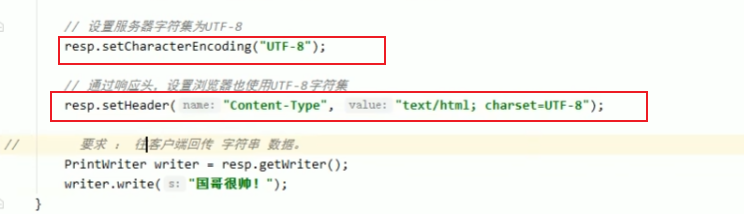
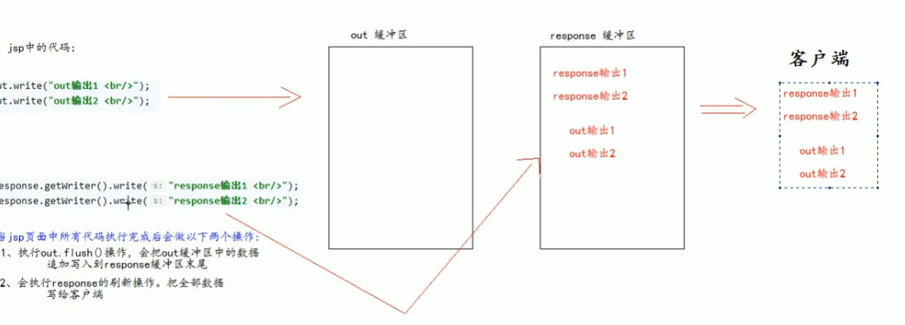
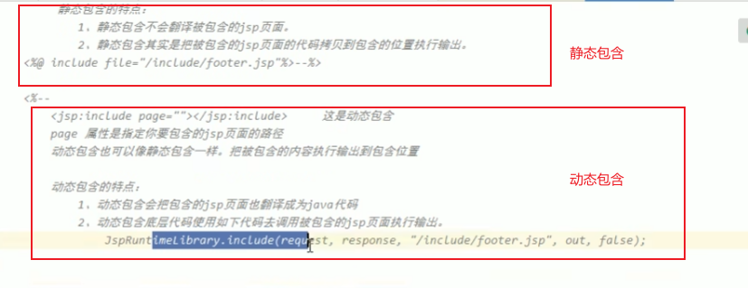
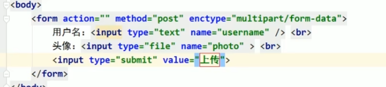

# 2021Study-JavaWeb笔记[deprecated]

## 1. 基本概念

## 2. web服务器

## 3. Tomcat

## 4. Http

## 5. Maven

## 6. Servlet

E:\idea_workspace\2021Study-JavaWeb\servlet1\src\main\java\com\binyu


[CSDN-页面跳转的两种方式(转发和重定向)区别及应用场景分析](https://blog.csdn.net/liubin5620/article/details/79922692)

请求转发不加项目名，重定向要加项目名

## 7. Cookie Session

[cookie和session的详解与区别](https://www.cnblogs.com/l199616j/p/11195667.html)

**会话**：用户打开一个浏览器，点了很多超链接，关闭浏览器，过程是会话

**有状态会话**：一个同学来过教室，下次再来教室，我们会知道这个同学曾经来过，称之为有状态会话

一个网站怎么证明你来过？

1. 服务器给客户端一个信件，客户端下次访问服务端带上信件就可以了；cookie
2. 服务器登记你来过了，下次你来的时候我来匹配你；session

**Cookie**：客户端技术

1. 从请求中拿到cookie信息
2. 服务器响应给客户端cookie

**Session**：服务器技术

1.  服务器会给每一个用户（浏览器）创建一个session对象
2. 一个session独占一个浏览器，只要浏览器没关闭，这个session就存在
3. 用户登录之后，整个相关网站它都可以访问

**编码解码**

```java
URLEncoder.encode()
URLDecoder.decode()
```

## 8. JSP

jsp本质是servlet

**JSP表达式**：

```jsp
<%=new Date ()    %>
<%! %>JSP声明：会被编译到JSP生成的java类中
```

JSP注释不会在客户端中显示，HTML注释会显示

**JSP指令**

```jsp
<%@ page import="java.util.Date" %>
<%@ page contentType="text/html;charset=UTF-8" language="java" isELIgnored="false" %>
<%@ page errorPage="error/500.jsp" %>
```

定制错误页面

```xml
<error-page>
        <error-code></error-code>
        <location></location>
    </error-page>
```

**引入页面**：

会将两个页面合二为一

```jsp
<% @include file=""%>
```

拼接页面

```jsp
<jsp:include page="/"/>
```

**九大内置对象，四大作用域**：

- pageContext：存东西
- Request：存东西
- Response
- Session：存东西
- application[ServletContext]：存东西
- config[ServletConfig]
- out
- page
- exception

**JSP标签**：


**JSTL标签**：

[菜鸟教程-JSP 标准标签库（JSTL）](https://www.runoob.com/jsp/jsp-jstl.html)

功能和java代码一样

## 9. JavaBean

## 10. MVC架构

## 11. 过滤器Filter

1. 实现Filter接口
2. web.xml中编写<filter><filter-mapping>

## 12. 监听器Listener

1. 实现Listener接口
2. web.xml中编写<listener>

## 13. 过滤器、监听器应用

GUI编程中经常使用


# 2022Study-JavaWeb笔记

## Servlet

### Servlet架构


### Servlet表单数据

> Servlet 处理表单数据，这些数据会根据不同的情况使用不同的方法自动解析：
>
> - **getParameter()：**您可以调用 request.getParameter() 方法来获取表单参数的值。
> - **getParameterValues()：**如果参数出现一次以上，则调用该方法，并返回多个值，例如复选框。
> - **getParameterNames()：**如果您想要得到当前请求中的所有参数的完整列表，则调用该方法。

> 注意：如果表单提交的数据中有中文数据则需要转码：
>
> ```
> String name =new String(request.getParameter("name").getBytes("ISO8859-1"),"UTF-8");
> ```

### Servlet客户端HTTP请求&Servlet服务器HTTP响应&ServletHTTP状态码

> - 请求行、请求头、请求体
>
> - 响应行、响应头、响应体

[菜鸟教程-Servlet 客户端 HTTP 请求](https://www.runoob.com/servlet/servlet-client-request.html)

[菜鸟教程-Servlet 服务器 HTTP 响应](https://www.runoob.com/servlet/servlet-server-response.html)

[菜鸟教程-Servlet HTTP 状态码](https://www.runoob.com/servlet/servlet-http-status-codes.html)

> 1. 解决post请求的中文乱码问题,下面这句要在获取请求参数之前调用才有效
>
> `request.setCharacterEncoding(“UTF-8”)；`
>
> 2. 解决响应乱码
>
> 
>
> 3. 一行解决编码问题
>
> 

### 转发和重定向

> 转发Forward：一次请求，共享request域，页面地址不变，能访问WEB/INF下的文件，只能转发到当前工程的资源，不能转发到诸如www.baidu.com的地址
>
> 重定向Redirect:两次请求，不共享request域，页面地址改变，不能访问WEB/INF下的文件，可以访问工程外的资源
>
> 

## JSP

### JSP简介

> JSP主要作用是代替servlet程序回传HTML页面数据
>
> JSP本质就是一个servlet程序

### JSP的内置对象和域对象

[菜鸟教程-JSP 隐式对象](https://www.runoob.com/jsp/jsp-implicit-objects.html)


> out.write()和response.getWriter().write()区别：response.getWriter().write()会先输出



### JSP常用标签

[菜鸟教程-JSP指令](https://www.runoob.com/jsp/jsp-directives.html)

[菜鸟教程-JSP 动作元素](https://www.runoob.com/jsp/jsp-actions.html)



## Listener&Filter


### Listener监听器

> ServletContextListener监听ServletContext创建后和销毁后。

## EL&JSTL

[菜鸟教程-JSP 表达式语言](https://www.runoob.com/jsp/jsp-expression-language.html)

[菜鸟教程-JSP 标准标签库（JSTL）](https://www.runoob.com/jsp/jsp-jstl.html)

> EL(Expression Language)：主要作用是代替jsp页面中的表达式脚本在JSP页面中进行数据的输出

## 文件上传



## Cookie&Session

## Ajax

> ajax是一种浏览器异步发起请求，局部更新页面的技术

