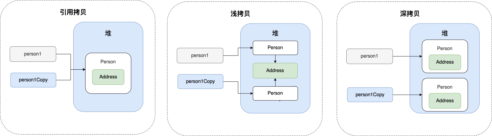

# 【Java总结笔记】

## 0 学习技巧

> - 不要想立刻换岗位，而要做**技术沉淀**
> - 不要妄想通过自学学会编程，而要在**工作中实践**
> - **三分看，七分练**,**多看多练，温故知新**
> - **通过重复对抗遗忘曲线**

## 1 JavaSE基础

### 1.1 人机交互方式

> - **图形化界面（Graphical User Interface,GUI）**
> - **命令行方式（Command Line Interface,CLI）**

### 1.2 一个类中只能有一个公共类

```java
public class HelloJava{
    public static void main(String[] args){
        System.out.println("HelloWorld");
    }
}
class Person{}
class Animal{}
```

### 1.3 API和API文档

> - API:JAVA提供的类库
> - API文档：javadoc生成的类库说明文档

### 1.4 标识符的规范性

> - **所有的标识符都应该以字母（A-Z 或者 a-z）,美元符（$）、或者下划线（_）开始**

### 1.5 变量的分类

> 所有变量:
>
> - 成员变量
>   - 实例变量：不需要显示初始化
>   - 静态变量：不需要显示初始化
> - 局部变量
>   - 形参
>   - 方法局部变量：需要显示初始化
>   - 代码块局部变量：需要显示初始化

### 1.6 强制类型转换

> - 需要使用强转符`()`
> - double强转为int，数值上**截断**而不是四舍五入
> - 可能会导致**精度损失**

### 1.7 自动类型转换

> - **口诀：小+大–>大**
> - 容量小的数据类型变量和容量大的数据类型变量做运算时，结果自动提升为容量大的数据类型变量。
> - 容量大小指的是数的范围的大和小，比如float>long
> - 当byte、char、short三种类型的变量做运算时，结果为int型

### 1.8 进制

```java
public class Test {
    public static void main(String[] args) {
        int a=0123;//八进制
        int b=0x123;//十六进制
        int c=0b110;//二进制
        System.out.println(a);//83
        System.out.println(b);//291
        System.out.println(c);//6
    }
}
```

### 1.9 原码、反码、补码

> 正数：三码合一
>
> 负数：
>
> - 第一步：将原码除了符号位的数各个位取反，得到反码
> - 第二步：反码+1，得到补码

### 1.10 位运算符

*注意：无`<<<`*

| 操作符 | 描述                                                         | 例子                           |
| :----- | :----------------------------------------------------------- | :----------------------------- |
| ＆     | 如果相对应位都是1，则结果为1，否则为0                        | （A＆B），得到12，即0000 1100  |
| \|     | 如果相对应位都是 0，则结果为 0，否则为 1                     | （A \| B）得到61，即 0011 1101 |
| ^      | 如果相对应位值相同，则结果为0，否则为1                       | （A ^ B）得到49，即 0011 0001  |
| 〜     | 按位取反运算符翻转操作数的每一位，即0变成1，1变成0。         | （〜A）得到-61，即1100 0011    |
| <<     | 按位左移运算符。左操作数按位左移右操作数指定的位数。         | A << 2得到240，即 1111 0000    |
| >>     | 按位右移运算符。左操作数按位右移右操作数指定的位数。         | A >> 2得到15即 1111            |
| >>>    | 按位右移补零操作符。左操作数的值按右操作数指定的位数右移，移动得到的空位以零填充。 | A>>>2得到15即0000 1111         |

### 1.11 数组概述

> - 数组是**有序排列**的
> - 数组是**引用类型**的，数组中的元素可以是**任何数据类型（既可以是基本数据类型，也可以是引用数据类型）**
> - 创建数组对象会在内存中开辟**一整块连续**的空间
> - 数组的**长度一旦确定，就不能修改**
> - 多维数组本质还是一维数组

### 1.12 生成随机数的公式

> - 生成[0, 1)的随机数
>   ```
>   Math.random()
>   ```
>
> - 生成[0, Num)
>   ```java
>   Math.random() * Num 
>   ```
>
> - 生成[Min, Max)
>   ```
>   Min + (Math.random() * (Max - Min))
>   ```
>
> - 生成[Min, Max]
>   ```
>   Min + (int)(Math.random() * ((Max - Min) + 1))
>   ```

### 1.13 Arrays工具类的使用

| 序号 | 方法和说明                                                   |
| :--- | :----------------------------------------------------------- |
| 1    | **public static int binarySearch(Object[] a, Object key)** 用二分查找算法在给定数组中搜索给定值的对象(Byte,Int,double等)。数组在调用前必须排序好的。如果查找值包含在数组中，则返回搜索键的索引；否则返回 (-(*插入点*) - 1)。 |
| 2    | **public static boolean equals(long[] a, long[] a2)** 如果两个指定的 long 型数组彼此*相等*，则返回 true。如果两个数组包含相同数量的元素，并且两个数组中的所有相应元素对都是相等的，则认为这两个数组是相等的。换句话说，如果两个数组以相同顺序包含相同的元素，则两个数组是相等的。同样的方法适用于所有的其他基本数据类型（Byte，short，Int等）。 |
| 3    | **public static void fill(int[] a, int val)** 将指定的 int 值分配给指定 int 型数组指定范围中的每个元素。同样的方法适用于所有的其他基本数据类型（Byte，short，Int等）。 |
| 4    | **public static void sort(Object[] a)** 对指定对象数组根据其元素的自然顺序进行升序排列。同样的方法适用于所有的其他基本数据类型（Byte，short，Int等）。 |
| 5    | public static String toString(Object[] a)将数组转换成String格式 |

```java
import java.util.Arrays;

public class ArraysTest {
    static class Person{
        String name;

        @Override
        public String toString() {
            return "Person{" +
                    "name='" + name + '\'' +
                    '}';
        }
    }
    public static void main(String[] args) {
        String[] strs=new String[10];
        for(int i=0;i<strs.length;i++){
            strs[i]=i+"";
        }
        System.out.println(Arrays.toString(strs));
        Person[] pers=new Person[10];
        for(int i=0;i< pers.length;i++){
            pers[i]=new Person();
            pers[i].name=i+"";
        }
        System.out.println(Arrays.toString(pers));
    }
}
//console
[0, 1, 2, 3, 4, 5, 6, 7, 8, 9]
[Person{name='0'}, Person{name='1'}, Person{name='2'}, Person{name='3'}, Person{name='4'}, Person{name='5'}, Person{name='6'}, Person{name='7'}, Person{name='8'}, Person{name='9'}]
```


### 1.14 面向过程和面向对象

> - **面向过程：**强调的是功能行为，以函数为最小单位，考虑怎么做
> - **面向对象：**强调具备了功能的对象，以类/对象为最小单位，考虑谁来做

### 1.15 重载和重写

> - 重载：两同一不同（同一个类，相同方法名；参数列表不同；与返回值无关），为了不让编译时出现二义性
> - 重写：两大一小
>   - 子类重写的方法的方法名和形参列表和父类被重写的相同
>   - **子类重写的方法权限修饰符大于等于父类被重写的方法权限修饰符**（特殊情况：子类不能重写父类中声明为private权限的方法）
>   - 返回值类型：
>     - 父类被重写的方法返回值是void，则子类重写的方法的返回值只能是void
>     - **父类被重写的方法返回值是A类型，则子类重写的方法的返回值类型可以是A类或A类的子类**
>     - 父类被重写的方法返回值类型时基本数据类型（比如double），则子类重写的方法的返回值类型必须是相同的基本数据类型
>   - 子类重写的方法抛出的异常类型大于等于父类被重写的方法抛出的异常类型
>
> **子类和父类中同名同参数的方法要么都声明为非static的（考虑重写），要么都声明为static的（不是重写）**
>
> ```java
> public class Person {
>     protected void test() throws FileSystemException {
>         System.out.println("protected");
>     }
> }
> public class Student extends Person {
>     public void testStudent() throws IOException {
>         super.test();
>     }
> 
>     @Override
>     protected void test() throws FileSystemException, AccessDeniedException {
>         super.test();
>     }
> }
> ```
>
> 

### 1.16 值传递

> 将实际参数值的副本传入方法内，而参数本身不受影响
>
> - 当形参是基本数据类型时，传递的是实际的值
> - 当形参是引用数据类型时，传递的是实际地址值

### 1.17 高内聚，低耦合

> - 高内聚：类的内部数据操作细节自己完成，不允许外部干涉
>
> - 低耦合：仅对外暴露少量的方法用于使用

### 1.18 外部类和内部类

> - 普通类（外部类）：只能用public、default（不写）、abstract、final修饰。
> - （成员）内部类：可理解为外部类的成员，所以修饰类成员的public、protected、default、private、static等关键字都能使用。
> - 局部内部类：出现在方法里的类，不能用上述关键词来修饰。
> - 匿名内部类：给的是直接实现，类名都没有，没有修饰符。
>
> ```java
> public class InternalClassTest {
>     public static class A{
>         public String name;
>         public String id;
>     }
>     public class B{
>         public String name;
>         public String id;
>     }
>     private class C{
>         public String name;
>         public String id;
>     }
>     @Test
>     public void testB(){
>         InternalClassTest.B b=new InternalClassTest.B();
>         System.out.println(b.id);
>         System.out.println(b.name);
>     }
>     @Test
>     public void testC(){
>         InternalClassTest.C c=new InternalClassTest.C();
>         System.out.println(c.id);
>         System.out.println(c.name);
>     }
>     public static void main(String[] args) {
>         InternalClassTest.A a=new InternalClassTest.A();
>         System.out.println(a.name);
>         System.out.println(a.id);
>     }
> }
> ```
>
> 

### 1.19 包修饰符

> - public:完全可访问
> - protected:本包和子类可访问
> - default:本包可访问
> - private:本类可访问

| 修饰符      | 当前类 | 同一包内 | 子孙类(同一包) | 子孙类(不同包) | 其他包 |
| :---------- | :----- | :------- | :------------- | :------------- | :----- |
| `public`    | Y      | Y        | Y              | Y              | Y      |
| `protected` | Y      | Y        | Y              | Y              | N      |
| `default`   | Y      | Y        | Y              | N              | N      |
| `private`   | Y      | N        | N              | N              | N      |

### 1.20 this和super

> - this修饰属性和方法
>   - this可以理解为：**当前对象**
>   - 在类的方法中，**通常都选择省略“this.”，除非成员变量名和形参名冲突**
> - this修饰构造器
>   - `this();`调用空参构造器
>   - `this(age);`调用带参构造器
>   - 构造器不能通过“this(形参列表)”方式调用自己
>   - **如果一个类中有N个构造器，则最多N-1构造器使用了“this(形参列表)”**
>   - **“this(形参列表)”必须声明在当前构造器的首行,且只能声明一个**
>
> ---
>
> super用来是调用父类的属性、方法、构造器
>
> - `super(形参列表)`必须声明在子类构造器的首行
>
> - `super(形参列表)`和`this(形参列表)`只能二选一，不能同时出现。
>
> - 在构造器首行**，没有显式的声明this和super，默认调用的是父类的空参构造器即super()。**
>
> - **在类的多个构造器中，至少有一个类的构造器使用了`super(形参列表)`调用父类中的构造器。**

### 1.21 import 

> - 声明在包的声明和类的声明之间
> - 如果使用的类或接口是本包下定义的，可以省略import
> - 在源文件中，使用了不同包下的同名类，则必须至少有一个类需要以**全类名**的方式显示
> - 如果使用的类或接口是java.lang包下定义的，则可以省略import结构
> - 使用“xxx.*”方式表名可以调用xxx包下的所有结构。但是如果使用的是xxx子包下的结构，则仍需要显式导入
> - import static：导入指定类或接口中的静态结构
>
> ```java
> import static java.lang.System.*;
> import static java.lang.Math.*;
> public class PackageImportTest {
>     public static void main(String[] args) {
>         out.println ("hello");
>         long round = round ( 3.45 );
>         out.println (round);
>     }
> }
> ```
>
> 


### 1.22 继承的好处

> - 减少代码的冗余，提高了代码的复用性
> - 便于功能的拓展
> - **为之后多态性的使用，提供了前提**

### 1.23 多态性的含义

> 父类的引用指向子类的对象
>
> 多态性**只适用于方法，不适用于属性。**属性编译运行都看左边,方法上编译看左边，运行看右边
>
> ```java
> public class Person {
>     public String name="person";
>     public void eat(){
>         System.out.println("person eat");
>     }
> }
> public class Student extends Person {
>     public String name="student";
> 
>     @Override
>     public void eat(){
>         System.out.println("student eat");
>     }
>     public static void main(String[] args) {
>         Person p=new Student();
>         System.out.println(p.name);
>         p.eat();
>     }
> }
> ```
>
> 

### 1.24 早绑定和晚绑定

> - 父类根据赋给它的不同子类对象，动态调用属于子类的该方法。这样的方法调用在编译器是无法确定的。故**多态是运行时行为，这就是晚绑定或动态绑定**。
> - 重载，它们的调用地址在编译时就绑定了，故**重载是早绑定或静态绑定**
> - **不能调用子类特有的方法、属性**，想调用要向下转型
>
> ```java
> if(p2 instanceof Woman){
>             Woman w2=(Woman)p2;
>             w2.goShopping ();
>         }
> ```
>
> 

### 1.25 Object类

| 序号 |                         方法 & 描述                          |
| :--: | :----------------------------------------------------------: |
|  1   | [protected Object clone()](https://www.runoob.com/java/java-object-clone.html)创建并返回一个对象的拷贝 |
|  2   | [boolean equals(Object obj)](https://www.runoob.com/java/java-object-equals.html)比较两个对象是否相等 |
|  3   | [protected void finalize()](https://www.runoob.com/java/java-object-finalize.html)当 GC (垃圾回收器)确定不存在对该对象的有更多引用时，由对象的垃圾回收器调用此方法。 |
|  4   | [Class getClass()](https://www.runoob.com/java/java-object-getclass.html)获取对象的运行时对象的类 |
|  5   | [int hashCode()](https://www.runoob.com/java/java-object-hashcode.html)获取对象的 hash 值 |
|  6   | [void notify()](https://www.runoob.com/java/java-object-notify.html)唤醒在该对象上等待的某个线程 |
|  7   | [void notifyAll()](https://www.runoob.com/java/java-object-notifyall.html)唤醒在该对象上等待的所有线程 |
|  8   | [String toString()](https://www.runoob.com/java/java-object-tostring.html)返回对象的字符串表示形式 |
|  9   | [void wait()](https://www.runoob.com/java/java-object-wait.html)让当前线程进入等待状态。直到其他线程调用此对象的 notify() 方法或 notifyAll() 方法。 |
|  10  | [void wait(long timeout)](https://www.runoob.com/java/java-object-wait-timeout.html)让当前线程处于等待(阻塞)状态，直到其他线程调用此对象的 notify() 方法或 notifyAll() 方法，或者超过参数设置的timeout超时时间。 |
|  11  | [void wait(long timeout, int nanos)](https://www.runoob.com/java/java-object-wait-nanos.html)与 wait(long timeout) 方法类似，多了一个 nanos 参数，这个参数表示额外时间（以纳秒为单位，范围是 0-999999）。 所以超时的时间还需要加上 nanos 纳秒。。 |

### 1.26 equals()和hashcode()

```java
		@Override
    public boolean equals(Object o) {
        if (this == o) return true;
        if (o == null || getClass() != o.getClass()) return false;
        Student student = (Student) o;
        return Objects.equals(name, student.name);
    }

    @Override
    public int hashCode() {
        return Objects.hash(name);
    }
```

#### 如何重写hash()和equals()

> 理想的散列函数应当具有均匀性，即不相等的对象应当均匀分布到所有可能的散列值上。这就要求了散列函数要把所有域的值都考虑进来，可以将每个域都当成 R 进制的某一位，然后组成一个 R 进制的整数。R 一般取 31，因为它是一个奇素数，如果是偶数的话，当出现乘法溢出，信息就会丢失，因为与 2 相乘相当于向左移一位。
>
> 一个数与 31 相乘可以转换成移位和减法: `31*x == (x<<5)-x`，编译器会自动进行这个优化。

```java
// Objects.hash()
public static int hash(Object... values) {
        return Arrays.hashCode(values);
    }
// Arrays.hashCode()
public static int hashCode(Object a[]) {
        if (a == null)
            return 0;

        int result = 1;

        for (Object element : a)
            result = 31 * result + (element == null ? 0 : element.hashCode());

        return result;
    }
```

#### 本地方法hashCode()

> `Object` 的 `hashCode()` 方法是本地方法，也就是用 C 语言或 C++ 实现的，该方法通常用来将对象的内存地址转换为整数之后返回。

#### 为什么要有hashCode()

> 在比较对象是否相等时，可以减少比较次数，越好的散列算法就能越少哈希碰撞

### 1.27 main的理解

> 由于 Java 虚拟机需要调用类的 main() 方法，所以该方法的访问权限必须是public 又 因为 Java 虚拟机在执行 main() 方法时不必创建对象，所以该方法必须是 static 的，该方法接收一个 String 类型的数组参数，该数组中 保存 执行 Java 命令
> 时传递给所运行的类的参数 。

### 1.28 非静态代码块、静态代码块、构造器的执行顺序

```java
public class HelloA {
    public HelloA(){//构造函数
        System.out.println("A的构造函数");
    }
    {//构造代码块
        System.out.println("A的构造代码块");
    }
    static {//静态代码块
        System.out.println("A的静态代码块");
    }
    public static void main(String[] args) {
        HelloA a=new HelloA();
        HelloA b=new HelloA();
    }
}
// console
A的静态代码块
A的构造代码块
A的构造函数
A的构造代码块
A的构造函数
```

```java
public class HelloA {
    public HelloA(){//构造函数
        System.out.println("A的构造函数");    
    }
    {//构造代码块
        System.out.println("A的构造代码块");    
    }
    static {//静态代码块
        System.out.println("A的静态代码块");        
    }
}
public class HelloB extends HelloA{
    public HelloB(){//构造函数
        System.out.println("B的构造函数");    
    }
    {//构造代码块
        System.out.println("B的构造代码块");    
    }
    static {//静态代码块
        System.out.println("B的静态代码块");        
    }
    public static void main(String[] args) {
        HelloB b=new HelloB();        
    }
}
// console
A的静态代码块
B的静态代码块
A的构造代码块
A的构造函数
B的构造代码块
B的构造函数
```

### 1.29 final

> - final修饰属性：可以考虑的赋值位置有：显示初始化、代码块中初始化、构造器中初始化（final的初始化不能逃逸出构造器）
> - final修饰局部变量：尤其是使用final修饰形参时，表名此形参时一个常量。当我们调用此方法时，给常量形参赋一个实参。一旦赋值以后，就只能在方法体内使用此形参，但不能重新赋值。
> - static final用来修饰属性是全局常量

### 1.30 抽象类和抽象方法

> abstract修饰一个类：**抽象类**
>
> - 此类不能实例化
> - 抽象类中一定有构造器，便于子类实例化时调用
> - 开发中，都会提供子类，让子类去实例化
>
> abstract修饰一个方法：**抽象方法**
>
> - 抽象方法只有方法的声明，没有方法体
>
> - 包含抽象方法的类一定是抽象类，反之，抽象类中可以没有抽象方法
>
> - 若子类重写了父类中所有的抽象方法后，此子类方可实例化；若子类没有重写了父类中所有的抽象方法，则子类也是抽象类
>
> **abstract不能用来修饰私有方法、静态方法、final的方法**

### 1.31 接口

> - JDK7及以前：只能定义全局变量和抽象方法
>   - 全局变量：public static final 的，书写时可以省略不写
>   - 抽象方法：public abstract的,书写时可以省略不写
> - JDK8：除了定义全局常量和抽象方法之外，还可以定义静态方法、默认方法
>
> ```java
> public interface MyInterface {
>     public static final int GLOBAL_VARIABLE=0;// public static final可省略
>     public abstract void abstractMethod();// public abstract可省略
>     static void staticMethod(){
>         System.out.println("staticMethod()");
>     }
>     default void defaultMethod(){
>         System.out.println("defaultMethod()");
>     }
> }
> public class MyInterfaceTest {
>     public static void main(String[] args) {
>         MyInterface.staticMethod();
>         System.out.println(MyInterface.GLOBAL_VARIABLE);
>         MyInterface myInterface=new MyInterface() {
>             @Override
>             public void abstractMethod() {
>                 System.out.println("abractMethod()");
>             }
>         };// 创建的匿名类实现了MyInterface接口，myInterface是非匿名对象
>         myInterface.abstractMethod();
>         myInterface.defaultMethod();
>     }
> }
> ```
>
> 

### 1.32 代理模式和动态代理

#### 静态代理

> 通过在代理类中组合要被代理增强的类，达到静态代理的效果。
>
> 缺点：被代理增强的类要实现接口

```java
public interface SmsService {
    String send(String message);
}
public class SmsServiceImpl implements SmsService {
    public String send(String message) {
        System.out.println("send message:" + message);
        return message;
    }
}
public class SmsProxy implements SmsService {

    private final SmsService smsService;

    public SmsProxy(SmsService smsService) {
        this.smsService = smsService;
    }

    @Override
    public String send(String message) {
        //调用方法之前，我们可以添加自己的操作
        System.out.println("before method send()");
        smsService.send(message);
        //调用方法之后，我们同样可以添加自己的操作
        System.out.println("after method send()");
        return null;
    }
}
public class Main {
    public static void main(String[] args) {
        SmsService smsService = new SmsServiceImpl();
        SmsProxy smsProxy = new SmsProxy(smsService);
        smsProxy.send("java");
    }
}
```

#### JDK动态代理

/Users/dongbinyu/IdeaProjects/2021Study-Java/2020Study-JavaSE/09.DongTaiDaiLi/src/main/java/com/demo2

> **从JVM角度来说，动态代理是在运行时动态生成类字节码，并加载到 JVM 中的。**

```java
public interface SmsService {
    String send(String message);
}
public class SmsServiceImpl implements SmsService {
    public String send(String message) {
        System.out.println("send message:" + message);
        return message;
    }
}

import java.lang.reflect.InvocationHandler;
import java.lang.reflect.InvocationTargetException;
import java.lang.reflect.Method;
/**
 * @author shuang.kou
 * @createTime 2020年05月11日 11:23:00
 */
public class DebugInvocationHandler implements InvocationHandler {
    /**
     * 代理类中的真实对象
     */
    private final Object target;

    public DebugInvocationHandler(Object target) {
        this.target = target;
    }


    public Object invoke(Object proxy, Method method, Object[] args) throws InvocationTargetException, IllegalAccessException {
        //调用方法之前，我们可以添加自己的操作
        System.out.println("before method " + method.getName());
        Object result = method.invoke(target, args);
        //调用方法之后，我们同样可以添加自己的操作
        System.out.println("after method " + method.getName());
        return result;
    }
}

import java.lang.reflect.Proxy;
public class JdkProxyFactory {
    public static Object getProxy(Object target) {
        return Proxy.newProxyInstance(
                target.getClass().getClassLoader(), // 目标类的类加载
                target.getClass().getInterfaces(),  // 代理需要实现的接口，可指定多个
                new DebugInvocationHandler(target)   // 代理对象对应的自定义 InvocationHandler
        );
    }
}

public class JdkProxyTest{
		public static void main(String[] args){
      	SmsService smsService = (SmsService) JdkProxyFactory.getProxy(new SmsServiceImpl());
				smsService.send("java");
    }
}
```

####CGLIB动态代理

```java
<dependency>
  <groupId>cglib</groupId>
  <artifactId>cglib</artifactId>
  <version>3.3.0</version>
</dependency>
```

```java
class AmsService {
    public String sendMessage(String msg){
        System.out.println (msg);
        return msg;
    }
}

import net.sf.cglib.proxy.MethodInterceptor;
import net.sf.cglib.proxy.MethodProxy;
import java.lang.reflect.Method;
class MyMethodInterceptor implements MethodInterceptor {

    @Override
    public Object intercept(Object o, Method method, Object[] objects, MethodProxy methodProxy) throws Throwable {
        System.out.println ("before" +method.getName ());
        Object o1 = methodProxy.invokeSuper ( o, objects );
        System.out.println ("after" +method.getName ());
        return o1;
    }
}

import net.sf.cglib.proxy.Enhancer;
class CglibProxyFactory{
    public static Object getProxy(Class<?> clazz){
        Enhancer enhancer=new Enhancer ();
        enhancer.setClassLoader ( clazz.getClassLoader () );
        enhancer.setSuperclass ( clazz );
        enhancer.setCallback (  new MyMethodInterceptor ());
        return enhancer.create ();
    }
}


public class CglibTest{
    public static void main(String[] args) {
        AmsService proxy = (AmsService) CglibProxyFactory.getProxy ( AmsService.class );
        proxy.sendMessage ( "xiaoxi" );
    }
}
```

 #### JDK动态代理和CGLIB动态代理对比

> **JDK 动态代理只能代理实现了接口的类或者直接代理接口，而 CGLIB 可以代理未实现任何接口的类。** 另外， CGLIB 动态代理是通过生成一个被代理类的子类来拦截被代理类的方法调用，因此不能代理声明为 final 类型的类和方法。
>
> 就二者的效率来说，大部分情况都是 JDK 动态代理更优秀，随着 JDK 版本的升级，这个优势更加明显。

#### 静态代理和动态代理的对比

> 1. **灵活性** ：动态代理更加灵活，不需要必须实现接口，可以直接代理实现类，并且可以不需要针对每个目标类都创建一个代理类。另外，静态代理中，接口一旦新增加方法，目标对象和代理对象都要进行修改，这是非常麻烦的！
> 2. **JVM 层面** ：静态代理在编译时就将接口、实现类、代理类这些都变成了一个个实际的 class 文件。而动态代理是在运行时动态生成类字节码，并加载到 JVM 中的。

### 1.33 ClassName.this的使用

> 内部类要使用外部类的属性和方法时,要使用这个语法

```java
public class OuterClass {
    private String name;
    public String getName(){
        return this.name;
    }
    public class InternalClass{
        public void internalMethod(){
            System.out.println(OuterClass.this.name);
            System.out.println(OuterClass.this.getName());
        }
    }
}
```

### 1.34 静态内部类和非静态内部类

```java
public class OuterClass {
    public static class StaticInternalClass{
    }
    public class NotStaticInternalClass{
    }

    public static void main(String[] args) {
        OuterClass.StaticInternalClass staticInternalClass=new OuterClass.StaticInternalClass();
        OuterClass outerClass=new OuterClass();
        OuterClass.NotStaticInternalClass notStaticInternalClass=outerClass.new NotStaticInternalClass();
    }
}
```

### 1.35 异常的体系


### 1.36 包装类的缓存池

> new Integer(123) 与 Integer.valueOf(123) 的区别在于:
>
> - new Integer(123) 每次都会新建一个对象
> - Integer.valueOf(123) 会使用缓存池中的对象，多次调用会取得同一个对象的引用。
> - 编译器会**在缓冲池范围内的基本类型**自动装箱过程调用 valueOf() 方法，因此多个 Integer 实例使用自动装箱来创建并且值相同，那么就会引用相同的对象。
>
> `Byte`,`Short`,`Integer`,`Long` 这 4 种包装类默认创建了数值 **[-128，127]** 的相应类型的缓存数据，`Character` 创建了数值在 **[0,127]** 范围的缓存数据，`Boolean` 直接返回 `True` or `False`。

### 1.37 String的不可变性

> 内部使用 char 数组存储数据，该数组被声明为 final，这意味着 value 数组初始化之后就不能再引用其它数组。并且 String 内部没有改变 value 数组的方法，因此可以保证 String 不可变。
>
> 不可变的好处有：
>
> **1. 可以缓存 hash 值**
>
> 因为 String 的 hash 值经常被使用，例如 String 用做 HashMap 的 key。不可变的特性可以使得 hash 值也不可变，因此只需要进行一次计算。
>
> **2. String Pool 的需要**
>
> 如果一个 String 对象已经被创建过了，那么就会从 String Pool 中取得引用。只有 String 是不可变的，才可能使用 String Pool。
>
> 
>
> **3. 线程安全**
>
> String 不可变性天生具备线程安全，可以在多个线程中安全地使用。

### 1.38 String.intern()

使用 String.intern() 可以保证相同内容的字符串变量引用同一的内存对象。

下面示例中，s1 和 s2 采用 new String() 的方式新建了两个不同对象，而 s3 是通过 s1.intern() 方法取得一个对象引用。intern() 首先把 s1 引用的对象放到 String Pool(字符串常量池)中，然后返回这个对象引用。因此 s3 和 s1 引用的是同一个字符串常量池的对象。

```java
String s1 = new String("aaa");
String s2 = new String("aaa");
System.out.println(s1 == s2);           // false
String s3 = s1.intern();
System.out.println(s1.intern() == s3);  // true
```

如果是采用 "bbb" 这种使用双引号的形式创建字符串实例，会自动地将新建的对象放入 String Pool 中。

```java
String s4 = "bbb";
String s5 = "bbb";
System.out.println(s4 == s5);  // true
```

### 1.39 hotspot虚拟机中的字符串常量池在哪

> - 方法区在1.6是永久代实现；
>
> - 方法区在1.7是永久代（类型信息，字段，方法，常量）和堆区（字符串常量池，静态变量）共同实现；逐步移除永久代
> - 方法区在1.8是由本地内存的元空间（类型信息，字段，方法，常量）和堆（字符串常量池，静态变量）共同实现；完全移除永久代

### 1.40 不能隐式向下转型

```java
public class BaseTypeTest {
    public static void main(String[] args) {
        float f=1.1;// 编译报错，会认为1.1是double，不能进行隐式向下转型为float
        short s=1;
        s=s+1;// 编译报错，s+1是int型，不能进行隐式向下转型为short
        s+=1;// 编译通过，+=会进行隐式类型转换
    }
}
```

### 1.41 java7后支持switch中写String对象

```java
String s = "a";
switch (s) {
    case "a":
        System.out.println("aaa");
        break;
    case "b":
        System.out.println("bbb");
        break;
}
```

### 1.42 抽象类和接口的异同和选择

> **不同点**:
>
> - 从设计层面上看，抽象类提供了一种 IS-A 关系，那么就必须满足**里式替换原则**，即子类对象必须能够替换掉所有父类对象。而接口更像是一种 LIKE-A 关系，它只是提供一种方法实现契约，并不要求接口和实现接口的类具有 IS-A 关系。
> - 一个类可以实现多个接口，但是不能继承多个抽象类。
> - 接口的字段只能是 static 和 final 类型的，而抽象类的字段没有这种限制。
> - 接口的成员只能是 public 的，而抽象类的成员可以有多种访问权限。
> - 
>
> **相同点**：
>
> - 都不能被实例化。
> - 都可以包含抽象方法。
> - 都可以有默认实现的方法（Java 8 可以用 `default` 关键字在接口中定义默认方法）。
>
> **使用选择**:
>
> 使用接口:
>
> - 需要让不相关的类都实现一个方法，例如不相关的类都可以实现 Compareable 接口中的 compareTo() 方法；
> - 需要使用多重继承。
>
> 使用抽象类:
>
> - 需要在几个相关的类中共享代码。
> - 需要能控制继承来的成员的访问权限，而不是都为 public。
> - 需要继承非静态和非常量字段。
>
> 在很多情况下，接口优先于抽象类，因为接口没有抽象类严格的类层次结构要求，可以灵活地为一个类添加行为。并且从 Java 8 开始，接口也可以有默认的方法实现，使得修改接口的成本也变的很低。

### 1.43 clone()

> clone() 是 Object 的 protected 方法，它不是 public，一个类不显式去重写 clone()，其它类就不能直接去调用该类实例的 clone() 方法。
>
> 应该注意的是，clone() 方法并不是 Cloneable 接口的方法，而是 Object 的一个 protected 方法。Cloneable 接口只是规定，如果一个类没有实现 Cloneable 接口又调用了 clone() 方法，就会抛出 CloneNotSupportedException。
>
> ```java
> public class CloneExample implements Cloneable {
>     private int a;
>     private int b;
> 
>     @Override
>     protected Object clone() throws CloneNotSupportedException {
>         return super.clone();
>     }
> }
> ```
>
> 

#### 深拷贝

```java
public class DeepCloneExample implements Cloneable {
    private int[] arr;

    public DeepCloneExample() {
        arr = new int[10];
        for (int i = 0; i < arr.length; i++) {
            arr[i] = i;
        }
    }

    public void set(int index, int value) {
        arr[index] = value;
    }

    public int get(int index) {
        return arr[index];
    }

    @Override
    protected DeepCloneExample clone() throws CloneNotSupportedException {
        DeepCloneExample result = (DeepCloneExample) super.clone();
        result.arr = new int[arr.length];
        for (int i = 0; i < arr.length; i++) {
            result.arr[i] = arr[i];
        }
        return result;
    }
}

```

```java
DeepCloneExample e1 = new DeepCloneExample();
DeepCloneExample e2 = null;
try {
    e2 = e1.clone();
} catch (CloneNotSupportedException e) {
    e.printStackTrace();
}
e1.set(2, 222);
System.out.println(e2.get(2)); // 2

```

#### clone()的替代方案

> 使用 clone() 方法来拷贝一个对象即复杂又有风险，它会抛出异常，并且还需要类型转换。Effective Java 书上讲到，最好不要去使用 clone()，可以使用拷贝构造函数或者拷贝工厂来拷贝一个对象。

```java
public class CloneConstructorExample {
    private int[] arr;

    public CloneConstructorExample() {
        arr = new int[10];
        for (int i = 0; i < arr.length; i++) {
            arr[i] = i;
        }
    }

    public CloneConstructorExample(CloneConstructorExample original) {
        arr = new int[original.arr.length];
        for (int i = 0; i < original.arr.length; i++) {
            arr[i] = original.arr[i];
        }
    }

    public void set(int index, int value) {
        arr[index] = value;
    }

    public int get(int index) {
        return arr[index];
    }
}
```

```java
CloneConstructorExample e1 = new CloneConstructorExample();
CloneConstructorExample e2 = new CloneConstructorExample(e1);
e1.set(2, 222);
System.out.println(e2.get(2)); // 2
```

#### 引用拷贝，浅拷贝，深拷贝的图解



### 1.44 java为什么采用字节码

> 在 Java 中，JVM 可以理解的代码就叫做字节码，它不面向任何特定的处理器，只面向虚拟机。Java 语言通过字节码的方式，在一定程度上解决了传统解释型语言执行效率低的问题，同时又保留了解释型语言可移植的特点。
>
> **编译型** ：[编译型语言open in new window](https://zh.wikipedia.org/wiki/編譯語言) 会通过[编译器open in new window](https://zh.wikipedia.org/wiki/編譯器)将源代码一次性翻译成可被该平台执行的机器码。一般情况下，编译语言的执行速度比较快，开发效率比较低。常见的编译性语言有 C、C++、Go、Rust 等等。
>
> **解释型** ：[解释型语言open in new window](https://zh.wikipedia.org/wiki/直譯語言)会通过[解释器open in new window](https://zh.wikipedia.org/wiki/直譯器)一句一句的将代码解释（interpret）为机器代码后再执行。解释型语言开发效率比较快，执行速度比较慢。常见的解释性语言有 Python、JavaScript、PHP 等等
>
> 

### 1.45 java是编译与解释共存的语言，怎么理解

> java代码先经过前端编译器编译成字节码，然后交给执行引擎中的解释器逐行执行，遇到热点代码还会使用JIT编译器（后端编译器）将字节码编译成机器码并存储起来。
>
> 热点代码的选择基于二八法则，即影响性能的是20%的热点代码。

### 1.46 静态方法为什么不能调用非静态成员?

> 这个需要结合 JVM 的相关知识，主要原因如下：
>
> 1. 静态方法是属于类的，在类加载的时候就会分配内存，可以通过类名直接访问。而非静态成员属于实例对象，只有在对象实例化之后才存在，需要通过类的实例对象去访问。
> 2. 在类的非静态成员不存在的时候静态方法就已经存在了，此时调用在内存中还不存在的非静态成员，属于非法操作。

### 1.47 装箱和拆箱的实质与注意事项

> 从字节码中，我们发现装箱其实就是调用了 包装类的`valueOf()`方法，拆箱其实就是调用了 `xxxValue()`方法。
>
> 因此，
>
> - `Integer i = 10` 等价于 `Integer i = Integer.valueOf(10)`
> - `int n = i` 等价于 `int n = i.intValue()`;
>
> 注意：**如果频繁拆装箱的话，也会严重影响系统的性能。我们应该尽量避免不必要的拆装箱操作。

### 1.48 浮点数计算会有精度丢失的风险，如何解决

> 浮点数运算精度丢失代码演示：
>
> ```java
> float a = 2.0f - 1.9f;
> float b = 1.8f - 1.7f;
> System.out.println(a);// 0.100000024
> System.out.println(b);// 0.099999905
> System.out.println(a == b);// false
> ```
>
> 为什么会出现这个问题呢？
>
> 这个和计算机保存浮点数的机制有很大关系。我们知道计算机是二进制的，而且计算机在表示一个数字时，宽度是有限的，**无限循环的小数存储在计算机时，只能被截断**，所以就会导致小数精度发生损失的情况。这也就是解释了为什么浮点数没有办法用二进制精确表示。
>
> 解决方法就是使用BigDecimal
>
> ```java
> BigDecimal a = new BigDecimal("1.0");
> BigDecimal b = new BigDecimal("0.9");
> BigDecimal c = new BigDecimal("0.8");
> 
> BigDecimal x = a.subtract(b);
> BigDecimal y = b.subtract(c);
> 
> System.out.println(x); /* 0.1 */
> System.out.println(y); /* 0.1 */
> System.out.println(Objects.equals(x, y)); /* true */
> 
> ```
>
> **浮点数之间的等值判断，基本数据类型不能用 == 来比较，包装数据类型不能用 equals 来判断。**

#### BigDecimal的创建

推荐使用它的`BigDecimal(String val)`构造方法或者`BigDecimal.valueOf(double val)` 静态方法来创建对象。

#### BigDecimal的加减乘除

`add` 方法用于将两个 `BigDecimal` 对象相加，`subtract` 方法用于将两个 `BigDecimal` 对象相减。`multiply` 方法用于将两个 `BigDecimal` 对象相乘，`divide` 方法用于将两个 `BigDecimal` 对象相除。

```java
BigDecimal a = new BigDecimal("1.0");
BigDecimal b = new BigDecimal("0.9");
System.out.println(a.add(b));// 1.9
System.out.println(a.subtract(b));// 0.1
System.out.println(a.multiply(b));// 0.90
System.out.println(a.divide(b));// 无法除尽，抛出 ArithmeticException 异常
System.out.println(a.divide(b, 2, RoundingMode.HALF_UP));// 1.11
```

这里需要注意的是，在我们使用 `divide` 方法的时候尽量使用 3 个参数版本，并且`RoundingMode` 不要选择 `UNNECESSARY`，否则很可能会遇到 `ArithmeticException`（无法除尽出现无限循环小数的时候），其中 `scale` 表示要保留几位小数，`roundingMode` 代表保留规则。

```java
public BigDecimal divide(BigDecimal divisor, int scale, RoundingMode roundingMode) {
    return divide(divisor, scale, roundingMode.oldMode);
}
```

保留规则非常多，这里列举几种:

```java
public enum RoundingMode {
   // 2.5 -> 3 , 1.6 -> 2
   // -1.6 -> -2 , -2.5 -> -3
			 UP(BigDecimal.ROUND_UP),
   // 2.5 -> 2 , 1.6 -> 1
   // -1.6 -> -1 , -2.5 -> -2
			 DOWN(BigDecimal.ROUND_DOWN),
			 // 2.5 -> 3 , 1.6 -> 2
   // -1.6 -> -1 , -2.5 -> -2
			 CEILING(BigDecimal.ROUND_CEILING),
			 // 2.5 -> 2 , 1.6 -> 1
   // -1.6 -> -2 , -2.5 -> -3
			 FLOOR(BigDecimal.ROUND_FLOOR),
   	// 2.5 -> 3 , 1.6 -> 2
   // -1.6 -> -2 , -2.5 -> -3
			 HALF_UP(BigDecimal.ROUND_HALF_UP),
   //......
}
```

#### BigDecimal等值比较的问题

`BigDecimal` 使用 `equals()` 方法进行等值比较出现问题的代码示例：

```java
BigDecimal a = new BigDecimal("1");
BigDecimal b = new BigDecimal("1.0");
System.out.println(a.equals(b));//false
```

这是因为 `equals()` 方法不仅仅会比较值的大小（value）还会比较精度（scale），而 `compareTo()` 方法比较的时候会忽略精度。

1.0 的 scale 是 1，1 的 scale 是 0，因此 `a.equals(b)` 的结果是 false。

#### [org.apache.commons.lang3.math.NumberUtils](https://commons.apache.org/proper/commons-lang/apidocs/org/apache/commons/lang3/math/NumberUtils.html)


### 1.49 finally语句块

#### 不要在finally语句块执行return

>  try 语句和 finally 语句中都有 return 语句时，try 语句块中的 return 语句会被忽略。这是因为 try 语句中的 return 返回值会先被暂存在一个本地变量中，当执行到 finally 语句中的 return 之后，这个本地变量的值就变为了 finally 语句中的 return 返回值。

```java
public static void main(String[] args) {
    System.out.println(f(2));
}

public static int f(int value) {
    try {
        return value * value;
    } finally {
        if (value == 2) {
            return 0;
        }
    }
}
// console输出
0
```

#### finally块的代码不一定执行

> 就比如说 finally 之前虚拟机被终止运行的话，finally 中的代码就不会被执行。

```java
try {
    System.out.println("Try to do something");
    throw new RuntimeException("RuntimeException");
} catch (Exception e) {
    System.out.println("Catch Exception -> " + e.getMessage());
    // 终止当前正在运行的Java虚拟机
    System.exit(1);
} finally {
    System.out.println("Finally");
}

```

### 1.50 Unsafe类[有点难哦]

- [Java魔法类：Unsafe 应用解析 - 美团技术团队 -2019open in new window](https://tech.meituan.com/2019/02/14/talk-about-java-magic-class-unsafe.html)
- [Java 双刃剑之 Unsafe 类详解 - 码农参上 - 2021](https://xie.infoq.cn/article/8b6ed4195e475bfb32dacc5cb)

> 赋予了java类似C语言操作内存空间的能力，如图都是native方法。
>
> 对于同一native方法，不同的操作系统可能会有不同的实现，但是对于使用者是透明的。
>
> 

#### 内存操作

> 使用堆外内存的原因：
>
> - 对垃圾回收停顿的改善。由于堆外内存是直接受操作系统管理而不是JVM，所以当我们使用堆外内存时，即可保持较小的堆内内存规模。从而在GC时减少回收停顿对于应用的影响。
> - 提升程序I/O操作的性能。通常在I/O通信过程中，会存在堆内内存到堆外内存的数据拷贝操作，对于需要频繁进行内存间数据拷贝且生命周期较短的暂存数据，都建议存储到堆外内存。
>
> 典型应用：
>
> DirectByteBuffer是Java用于实现堆外内存的一个重要类，通常用在通信过程中做缓冲池，如在Netty、MINA等NIO框架中应用广泛。DirectByteBuffer对于堆外内存的创建、使用、销毁等逻辑均由Unsafe提供的堆外内存API来实现。
>
> 

```java
//分配内存, 相当于C++的malloc函数
public native long allocateMemory(long bytes);
//扩充内存
public native long reallocateMemory(long address, long bytes);
//释放内存
public native void freeMemory(long address);
//在给定的内存块中设置值
public native void setMemory(Object o, long offset, long bytes, byte value);
//内存拷贝
public native void copyMemory(Object srcBase, long srcOffset, Object destBase, long destOffset, long bytes);
//获取给定地址值，忽略修饰限定符的访问限制。与此类似操作还有: getInt，getDouble，getLong，getChar等
public native Object getObject(Object o, long offset);
//为给定地址设置值，忽略修饰限定符的访问限制，与此类似操作还有: putInt,putDouble，putLong，putChar等
public native void putObject(Object o, long offset, Object x);
//获取给定地址的byte类型的值（当且仅当该内存地址为allocateMemory分配时，此方法结果为确定的）
public native byte getByte(long address);
//为给定地址设置byte类型的值（当且仅当该内存地址为allocateMemory分配时，此方法结果才是确定的）
public native void putByte(long address, byte x);
```

#### CAS

> CAS: 即比较并替换，实现并发算法时常用到的一种技术。CAS操作包含三个操作数——内存位置、预期原值及新值。执行CAS操作的时候，将内存位置的值与预期原值比较，如果相匹配，那么处理器会自动将该位置值更新为新值，否则，处理器不做任何操作。我们都知道，CAS是一条CPU的原子指令（cmpxchg指令），不会造成所谓的数据不一致问题，Unsafe提供的CAS方法（如compareAndSwapXXX）底层实现即为CPU指令cmpxchg。
>
> 典型应用：CAS在java.util.concurrent.atomic相关类、Java AQS、CurrentHashMap等实现上有非常广泛的应用。如下图所示，AtomicInteger的实现中，静态字段valueOffset即为字段value的内存偏移地址，valueOffset的值在AtomicInteger初始化时，在静态代码块中通过Unsafe的objectFieldOffset方法获取。在AtomicInteger中提供的线程安全方法中，通过字段valueOffset的值可以定位到AtomicInteger对象中value的内存地址，从而可以根据CAS实现对value字段的原子操作。
>
> 

```java
/**
	*  CAS
  * @param o         包含要修改field的对象
  * @param offset    对象中某field的偏移量
  * @param expected  期望值
  * @param update    更新值
  * @return          true | false
  */
public final native boolean compareAndSwapObject(Object o, long offset,  Object expected, Object update);

public final native boolean compareAndSwapInt(Object o, long offset, int expected,int update);
  
public final native boolean compareAndSwapLong(Object o, long offset, long expected, long update);
```

#### 线程调度

> 方法park、unpark即可实现线程的挂起与恢复，将一个线程进行挂起是通过park方法实现的，调用park方法后，线程将一直阻塞直到超时或者中断等条件出现；unpark可以终止一个挂起的线程，使其恢复正常。
>
> 典型应用：Java锁和同步器框架的核心类AbstractQueuedSynchronizer，就是通过调用`LockSupport.park()`和`LockSupport.unpark()`实现线程的阻塞和唤醒的，而LockSupport的park、unpark方法实际是调用Unsafe的park、unpark方式来实现。

```java
//取消阻塞线程
public native void unpark(Object thread);
//阻塞线程
public native void park(boolean isAbsolute, long time);
//获得对象锁（可重入锁）
@Deprecated
public native void monitorEnter(Object o);
//释放对象锁
@Deprecated
public native void monitorExit(Object o);
//尝试获取对象锁
@Deprecated
public native boolean tryMonitorEnter(Object o);
```

#### Class相关

> 此部分主要提供Class和它的静态字段的操作相关方法，包含静态字段内存定位、定义类、定义匿名类、检验&确保初始化等。
>
> 典型应用：没看懂？？？

```java
//获取给定静态字段的内存地址偏移量，这个值对于给定的字段是唯一且固定不变的
public native long staticFieldOffset(Field f);
//获取一个静态类中给定字段的对象指针
public native Object staticFieldBase(Field f);
//判断是否需要初始化一个类，通常在获取一个类的静态属性的时候（因为一个类如果没初始化，它的静态属性也不会初始化）使用。 当且仅当ensureClassInitialized方法不生效时返回false。
public native boolean shouldBeInitialized(Class<?> c);
//检测给定的类是否已经初始化。通常在获取一个类的静态属性的时候（因为一个类如果没初始化，它的静态属性也不会初始化）使用。
public native void ensureClassInitialized(Class<?> c);
//定义一个类，此方法会跳过JVM的所有安全检查，默认情况下，ClassLoader（类加载器）和ProtectionDomain（保护域）实例来源于调用者
public native Class<?> defineClass(String name, byte[] b, int off, int len, ClassLoader loader, ProtectionDomain protectionDomain);
//定义一个匿名类
public native Class<?> defineAnonymousClass(Class<?> hostClass, byte[] data, Object[] cpPatches);
```

#### 对象操作

> 此部分主要包含对象成员属性相关操作及非常规的对象实例化方式等相关方法。
>
> 典型应用：**非常规的实例化方式**：而Unsafe中提供allocateInstance方法，仅通过Class对象就可以创建此类的实例对象

```java
//返回对象成员属性在内存地址相对于此对象的内存地址的偏移量
public native long objectFieldOffset(Field f);
//获得给定对象的指定地址偏移量的值，与此类似操作还有：getInt，getDouble，getLong，getChar等
public native Object getObject(Object o, long offset);
//给定对象的指定地址偏移量设值，与此类似操作还有：putInt，putDouble，putLong，putChar等
public native void putObject(Object o, long offset, Object x);
//从对象的指定偏移量处获取变量的引用，使用volatile的加载语义
public native Object getObjectVolatile(Object o, long offset);
//存储变量的引用到对象的指定的偏移量处，使用volatile的存储语义
public native void putObjectVolatile(Object o, long offset, Object x);
//有序、延迟版本的putObjectVolatile方法，不保证值的改变被其他线程立即看到。只有在field被volatile修饰符修饰时有效
public native void putOrderedObject(Object o, long offset, Object x);
//绕过构造方法、初始化代码来创建对象
public native Object allocateInstance(Class<?> cls) throws InstantiationException;
```

#### 数组相关

> 这部分主要介绍与数据操作相关的arrayBaseOffset与arrayIndexScale这两个方法，两者配合起来使用，即可定位数组中每个元素在内存中的位置。

```java
//返回数组中第一个元素的偏移地址
public native int arrayBaseOffset(Class<?> arrayClass);
//返回数组中一个元素占用的大小
public native int arrayIndexScale(Class<?> arrayClass);
```

#### 内存屏障

> 在Java 8中引入，用于定义内存屏障（也称内存栅栏，内存栅障，屏障指令等，是一类同步屏障指令，是CPU或编译器在对内存随机访问的操作中的一个**同步点**，使得此点之前的所有读写操作都执行后才可以开始执行此点之后的操作），避免代码重排序。

```java
//内存屏障，禁止load操作重排序。屏障前的load操作不能被重排序到屏障后，屏障后的load操作不能被重排序到屏障前
public native void loadFence();
//内存屏障，禁止store操作重排序。屏障前的store操作不能被重排序到屏障后，屏障后的store操作不能被重排序到屏障前
public native void storeFence();
//内存屏障，禁止load、store操作重排序
public native void fullFence();
```

#### 系统相关

```java
//返回系统指针的大小。返回值为4（32位系统）或 8（64位系统）。
public native int addressSize();  
//内存页的大小，此值为2的幂次方。
public native int pageSize();
```


### 1.51 SPI机制

> JDK内置的一种服务提供发现机制,在META-INF/services下新建一个要实现的接口名的文件，然后在里面写上实现类的类路径。通过ServiceLoader迭代器迭代该文件的内容，然后利用反射实例化对象并缓存到providers这个LinkedHashMap中
>
> 不足：
>
> 1.不能按需加载，需要遍历所有的实现，并实例化，然后在循环中才能找到我们需要的实现。如果不想用某些实现类，或者某些类实例化很耗时，它也被载入并实例化了，这就造成了浪费。
>
> 2.获取某个实现类的方式不够灵活，只能通过 Iterator 形式获取，不能根据某个参数来获取对应的实现类。
>
> 3.多个并发多线程使用 ServiceLoader 类的实例是不安全的。

```java
package demo1;

public interface HelloSPI {
    void sayHello();
}
package demo1;

public class ImageHello implements HelloSPI {
    public void sayHello() {
        System.out.println("Image Hello");
    }
}
package demo1;

public class TextHello implements HelloSPI {
    public void sayHello() {
        System.out.println("Text Hello");
    }
}
package demo1;

import java.util.ServiceLoader;

public class SPIDemo {
    public static void main(String[] args) {
        ServiceLoader<HelloSPI> serviceLoader=ServiceLoader.load(HelloSPI.class);
        for(HelloSPI helloSPI:serviceLoader){
            helloSPI.sayHello();
        }
    }
}
```

```
### META-INF/services/demo1.HelloSPI ###
demo1.ImageHello
demo1.TextHello
```

### 1.52 码点和代码单元

> Length()得到的是代码单元数，一个char是一个代码单元
>
> codePointCount()得到的是码点数，在UTF-16下，一个码点等于一或两个代码单元

```java
public class Madian {
    public static void main(String[] args) {
        String str="😊123";
        System.out.println(str.length());
        System.out.println(str.codePointCount(0, str.length() ));
        for(char c:str.toCharArray()){
            System.out.print(c+" ");
        }
        System.out.println();
        int i=0;
        for (int i1 : str.codePoints().toArray()) {
            System.out.print(String.valueOf(Character.toChars(i1)));
        }

    }
}
//console
5
4
? ? 1 2 3 
😊123
```

#### 1.53 数组拷贝

```java
public class ArrayCopyTest {
    public static void main(String[] args) {
        int[] arr=new int[]{1,2,3};
        int[] newArr = Arrays.copyOf(arr, arr.length);
    }
}
```


## 2 JavaSE高级

### 2.1 多线程的实现

#### 线程创建-继承Thread类

```java
public class MyThread extends Thread {
    @Override
    public void run() {
        for (int i = 0; i < 100 ; i++) {
            if(i%2==0){
                System.out.println (Thread.currentThread ().getName ()+":"+i);
            }
        }
    }
}
```

```java
public class ThreadTest {
    public static void main(String[] args) {
        MyThread thread=new MyThread ();
        // 1.start()启动当前线程，并调用当前线程的run()方法
        thread.start ();
        // 2.如果直接调用run()，并不会启动线程
//        thread.run ();
       // 3.不可以让已经start的线程再次执行，要多个线程，就造多个线程对象
        MyThread thread1=new MyThread ();
        thread1.start ();
        for (int i = 0; i <100 ; i++) {
            if(i%2!=0){
                System.out.println (Thread.currentThread ().getName ()+"***"+i);
            }
        }
    }
   /**
     * 匿名子类的方式实现线程
     */
    @Test
    public void test(){
        new Thread(){
            @Override
            public void run(){
                System.out.println("匿名子类的方式");
            }
        }.start();
    }

    /**
     * 线程的方法
     */
    @Test 
    public void test2(){
        MyThread myThread=new MyThread();
        // 设置线程优先级,只是从概率上讲，高优先级的线程高概率执行
        myThread.setPriority ( Thread.MAX_PRIORITY );
        myThread.setName("myThread");
        System.out.println(myThread.getName());
    }
}
```

#### 线程创建-实现Runnable接口

```java
public class PrimeRun implements Runnable {
    @Override
    public void run() {
        for (int i = 0; i <100; i++) {
            System.out.println (i);
        }
    }
}
public class ThreadTest {
    public static void main(String[] args) {
        PrimeRun primeRun=new PrimeRun ();
        Thread thread = new Thread ( primeRun );
        thread.start ();
    }
}
```

#### 线程创建-实现Callable接口

```java
class NumThread implements Callable<Integer> {
    @Override
    public Integer call() throws Exception {
        int sum = 0;
        for (int i = 0; i <= 100; i++) {
            if (i % 2 == 0) {
                System.out.println ( i );
                sum += i;
            }
        }
        return sum;
    }
}

public class ThreadNew {
    public static void main(String[] args) {
        NumThread numThread = new NumThread ();
        FutureTask<Integer> futureTask = new FutureTask<> ( numThread );
        Thread thread=new Thread ( futureTask );
        thread.start ();

//         get()返回值即为FutureTask构造器参数Callable实现类重写的call()的返回值
        Integer sum = null;
        try {
            sum = futureTask.get ();
            System.out.println ("总和为"+sum);
        } catch (InterruptedException e) {
            e.printStackTrace ();
        } catch (ExecutionException e) {
            e.printStackTrace ();
        }

    }
}
```

### 2.3 synchronized使用：卖票案例

> 用synchronized保证不错票和重票

```java
public class Window1 implements Runnable {
    private int ticket = 100;
    private Object obj=new Object ();

    @Override
    public void run() {
        // 买票
        while (true) {
            synchronized(obj) {
                if (ticket >= 1) {
//                增加了出现重票和错票的概率
//                try {
//                    Thread.sleep ( 100 );
//                } catch (InterruptedException e) {
//                    e.printStackTrace ();
//                }
                    System.out.println ( Thread.currentThread ().getName () + ":" + ticket + "号票被卖出" );
                    ticket--;
                } else {
                    System.out.println ( "票卖完了" );
                    break;
                }
            }

        }
    }
}
public class WindowTest {
    public static void main(String[] args) {
        Window1 window1=new Window1 ();
        Thread t1=new Thread(window1);
        Thread t2=new Thread(window1);
        Thread t3=new Thread(window1);

        t1.setName ( "窗口1" );
        t2.setName ( "窗口2" );
        t3.setName ( "窗口3" );

        t1.start ();
        t2.start ();
        t3.start ();
    }
}
```


### 2.4 双重检查的懒汉式

```java
public class Bank {
    private Bank(){}
    private static Bank instance=null;
    public static  Bank getInstance(){
//        方式一：效率稍差
//        synchronized (Bank.class){
//            if(instance == null){
//                instance=new Bank();
//            }
//            return instance;
//        }
//        方式二：效率稍高
        if(instance==null){
            synchronized (Bank.class){
                if(instance == null){
                    instance=new Bank();
                }

            }
        }
        return instance;

    }
}
```


### 2.6 多线程的生命周期

> - NEW：一个尚未启动的线程的状态。也称之为初始状态、开始状态。
> - RUNNABLE：一个可以运行的线程的状态，可以运行是指这个线程已经在JVM中运行了，但是有可能正在等待其他的系统资源。也称之为就绪状态、可运行状态。
> - BLOCKED：一个线程因为等待监视锁而被阻塞的状态。也称之为阻塞状态。
> - WAITING：一个正在等待的线程的状态。也称之为等待状态。造成线程等待的原因有三种，分别是调用Object.wait()、join()以及LockSupport.park()方法。处于等待状态的线程，正在等待其他线程去执行一个特定的操作。例如：因为wait()而等待的线程正在等待另一个线程去调用notify()或notifyAll()；一个因为join()而等待的线程正在等待另一个线程结束。
> - TIMED_WAITING：一个在限定时间内等待的线程的状态。也称之为限时等待状态。造成线程限时等待状态的原因有五种，分别是：Thread.sleep(long)、Object.wait(long)、join(long)、LockSupport.parkNanos(obj,long)和LockSupport.parkUntil(obj,long)。
>   TERMINATED：一个完全运行完成的线程的状态。也称之为终止状态、结束状态。

### 2.7 死锁的检测和处理

> 待整理

### 2.8 线程的通信:消费者和生产者案例

```java
class Clerk{
    private int productCount=0;
    // 生产产品
    public synchronized void produceProduct() {
        if(productCount<20){
            productCount++;
            System.out.println (Thread.currentThread ().getName ()+"开始生产第"+productCount+"个产品");
            notify ();
        }else{
            // 等待
            try {
                wait ();
            } catch (InterruptedException e) {
                e.printStackTrace ();
            }
        }
    }
    // 消费产品
    public synchronized void consumeProduct() {
        if(productCount>0){
            System.out.println (Thread.currentThread ().getName ()+"开始消费第"+productCount+"个产品");
            productCount--;
            notify ();
        }else{
            // 等待
            try {
                wait ();
            } catch (InterruptedException e) {
                e.printStackTrace ();
            }
        }
    }
}
// 生产者
class Producer extends Thread{
    private Clerk clerk;
    public Producer(Clerk clerk){
        this.clerk=clerk;
    }

    @Override
    public void run() {
        System.out.println (getName ()+"开始生产产品.....");
        while(true){
            clerk.produceProduct();
        }
    }
}
// 消费者
class Consumer extends Thread{
    private Clerk clerk;
    public Consumer(Clerk clerk){
        this.clerk=clerk;
    }

    @Override
    public void run() {
        System.out.println (getName ()+"开始消费产品.....");
        while(true){
            clerk.consumeProduct();
        }
    }
}


public class ProductTest {
    public static void main(String[] args) {
        Clerk clerk=new Clerk ();
        Producer p1=new Producer ( clerk );
        p1.setName ( "生产者1" );

        Consumer c1=new Consumer ( clerk );
        c1.setName ( "消费者1" );

        p1.start ();
        c1.start ();
    }
}
```

### 2.9 Date、Calendar、LocalTime

> Date是用来表示时间点的,尽量不要用date
>
> LocalDate是用来表示日历的,是JDK8的新特性

### 2.10 注解

> ```java
> package java.lang.annotation;
> 
> public enum ElementType {
>     TYPE,               /* 类、接口（包括注释类型）或枚举声明  */
> 
>     FIELD,              /* 字段声明（包括枚举常量）  */
> 
>     METHOD,             /* 方法声明  */
> 
>     PARAMETER,          /* 参数声明  */
> 
>     CONSTRUCTOR,        /* 构造方法声明  */
> 
>     LOCAL_VARIABLE,     /* 局部变量声明  */
> 
>     ANNOTATION_TYPE,    /* 注释类型声明  */
> 
>     PACKAGE             /* 包声明  */
> }
> ```
>
> ```java
> package java.lang.annotation;
> public enum RetentionPolicy {
>     SOURCE,            /* Annotation信息仅存在于编译器处理期间，编译器处理完之后就没有该Annotation信息了  */
> 
>     CLASS,             /* 编译器将Annotation存储于类对应的.class文件中。默认行为  */
> 
>     RUNTIME            /* 编译器将Annotation存储于class文件中，并且可由JVM读入 */
> }
> ```
>
> **(01) @interface**
>
> 使用 @interface 定义注解时，意味着它实现了 java.lang.annotation.Annotation 接口，即该注解就是一个Annotation。
>
> 定义 Annotation 时，@interface 是必须的。
>
> 注意：它和我们通常的 implemented 实现接口的方法不同。Annotation 接口的实现细节都由编译器完成。通过 @interface 定义注解后，该注解不能继承其他的注解或接口。
>
> **(02) @Documented**
>
> 类和方法的 Annotation 在缺省情况下是不出现在 javadoc 中的。如果使用 @Documented 修饰该 Annotation，则表示它可以出现在 javadoc 中。
>
> 定义 Annotation 时，@Documented 可有可无；若没有定义，则 Annotation 不会出现在 javadoc 中。
>
> **(03) @Target(ElementType.TYPE)**
>
> 前面我们说过，ElementType 是 Annotation 的类型属性。而 @Target 的作用，就是来指定 Annotation 的类型属性。
>
> @Target(ElementType.TYPE) 的意思就是指定该 Annotation 的类型是 ElementType.TYPE。这就意味着，MyAnnotation1 是来修饰"类、接口（包括注释类型）或枚举声明"的注解。
>
> 定义 Annotation 时，@Target 可有可无。若有 @Target，则该 Annotation 只能用于它所指定的地方；若没有 @Target，则该 Annotation 可以用于任何地方。
>
> **(04) @Retention(RetentionPolicy.RUNTIME)**
>
> 前面我们说过，RetentionPolicy 是 Annotation 的策略属性，而 @Retention 的作用，就是指定 Annotation 的策略属性。
>
> @Retention(RetentionPolicy.RUNTIME) 的意思就是指定该 Annotation 的策略是 RetentionPolicy.RUNTIME。这就意味着，编译器会将该 Annotation 信息保留在 .class 文件中，并且能被虚拟机读取。
>
> 定义 Annotation 时，@Retention 可有可无。若没有 @Retention，则默认是 RetentionPolicy.CLASS。


### 2.13 使用异常要注意哪些地方

> - 不要把异常定义为静态变量，因为这样会导致异常栈信息错乱。每次手动抛出异常，我们都需要手动 new 一个异常对象抛出。
> - 抛出的异常信息一定要有意义。
> - 建议抛出更加具体的异常比如字符串转换为数字格式错误的时候应该抛出`NumberFormatException`而不是其父类`IllegalArgumentException`。
> - 使用日志打印异常之后就不要再抛出异常了（两者不要同时存在一段代码逻辑中）。

### 2.14 泛型的作用

> 1. 编译期对加入的元素类型进行检查
> 2. 避免了强制类型转换

### 2.15 静态泛型方法

> 注意: `public static < E > void printArray( E[] inputArray )` 一般被称为静态泛型方法;在 java 中泛型只是一个占位符，必须在传递类型后才能使用。类在实例化时才能真正的传递类型参数，由于静态方法的加载先于类的实例化，也就是说类中的泛型还没有传递真正的类型参数，静态的方法的加载就已经完成了，所以静态泛型方法是没有办法使用类上声明的泛型的。只能使用自己声明的 `<E>`

```java
public class StaticGeneric {
    public static <E> void printArray(E[] inputArray){
        for ( E element : inputArray ){
            System.out.printf( "%s ", element );
        }
        System.out.println();
    }

    public static void main(String[] args) {
        Integer[] intArray = { 1, 2, 3 };
        String[] stringArray = { "Hello", "World" };
        printArray( intArray  );
        printArray( stringArray  );
    }
}
```

### 2.16 项目中哪里用到了泛型？

> - 自定义接口通用返回结果 `CommonResult<T>` 通过参数 `T` 可根据具体的返回类型动态指定结果的数据类型
> - 定义 `Excel` 处理类 `ExcelUtil<T>` 用于动态指定 `Excel` 导出的数据类型
> - 构建集合工具类（参考 `Collections` 中的 `sort`, `binarySearch` 方法）。

### 2.17 什么是反射？反射有什么优缺点？

> 优点：反射之所以被称为框架的灵魂，主要是因为它赋予了我们在运行时分析类以及执行类中方法的能力。通过反射你可以获取任意一个类的所有属性和方法，你还可以调用这些方法和属性。注解的实现也用到了反射。
>
> 缺点：增加了安全问题，比如可以无视泛型参数的安全检查（泛型参数的安全检查发生在编译时）。另外，反射的性能也要稍差点，不过，对于框架来说实际是影响不大的。

### 2.18 注解的解析方法有哪几种？

> - **编译期直接扫描** ：编译器在编译 Java 代码的时候扫描对应的注解并处理，比如某个方法使用`@Override` 注解，编译器在编译的时候就会检测当前的方法是否重写了父类对应的方法。
> - **运行期通过反射处理** ：像框架中自带的注解(比如 Spring 框架的 `@Value` 、`@Component`)都是通过反射来进行处理的。

### 2.19 什么是SPI？SPI的优缺点？

> SPI 即 Service Provider Interface ，字面意思就是：“服务提供者的接口”，我的理解是：专门提供给服务提供者或者扩展框架功能的开发者去使用的一个接口。
>
> SPI 将服务接口和具体的服务实现分离开来，将服务调用方和服务实现者解耦，能够提升程序的扩展性、可维护性。修改或者替换服务实现并不需要修改调用方。
>
> 很多框架都使用了 Java 的 SPI 机制，比如：Spring 框架、数据库加载驱动、日志接口、以及 Dubbo 的扩展实现等等。
>
> 通过 SPI 机制能够大大地提高接口设计的灵活性，但是 SPI 机制也存在一些缺点，比如：
>
> - 需要遍历加载所有的实现类，不能做到按需加载，这样效率还是相对较低的。
> - 当多个 `ServiceLoader` 同时 `load` 时，会有并发问题。

### 2.20 序列化和反序列化？

> - **序列化**： 将数据结构或对象转换成二进制字节流的过程
> - **反序列化**：将在序列化过程中所生成的二进制字节流转换成数据结构或者对象的过程
>
> 下面是序列化和反序列化常见应用场景：
>
> - 对象在进行网络传输（比如远程方法调用 RPC 的时候）之前需要先被序列化，接收到序列化的对象之后需要再进行反序列化；
> - 将对象存储到文件之前需要进行序列化，将对象从文件中读取出来需要进行反序列化；
> - 将对象存储到数据库（如 Redis）之前需要用到序列化，将对象从缓存数据库中读取出来需要反序列化；
> - 将对象存储到内存之前需要进行序列化，从内存中读取出来之后需要进行反序列化。
> - 
>
> 常见的序列化协议：JDK 自带的序列化方式一般不会用 ，因为序列化效率低并且存在安全问题。比较常用的序列化协议有 Hessian、Kryo、Protobuf、ProtoStuff，这些都是基于二进制的序列化协议。
>
> 像 JSON 和 XML 这种属于文本类序列化方式。虽然可读性比较好，但是性能较差，一般不会选择。

#### 如何使用序列化协议

##### Kyro

> Github 地址：[https://github.com/EsotericSoftware/kryoopen in new window](https://github.com/EsotericSoftware/kryo) 

```java
/**
 * Kryo serialization class, Kryo serialization efficiency is very high, but only compatible with Java language
 *
 * @author shuang.kou
 * @createTime 2020年05月13日 19:29:00
 */
@Slf4j
public class KryoSerializer implements Serializer {

    /**
     * Because Kryo is not thread safe. So, use ThreadLocal to store Kryo objects
     */
    private final ThreadLocal<Kryo> kryoThreadLocal = ThreadLocal.withInitial(() -> {
        Kryo kryo = new Kryo();
        kryo.register(RpcResponse.class);
        kryo.register(RpcRequest.class);
        return kryo;
    });

    @Override
    public byte[] serialize(Object obj) {
        try (ByteArrayOutputStream byteArrayOutputStream = new ByteArrayOutputStream();
             Output output = new Output(byteArrayOutputStream)) {
            Kryo kryo = kryoThreadLocal.get();
            // Object->byte:将对象序列化为byte数组
            kryo.writeObject(output, obj);
            kryoThreadLocal.remove();
            return output.toBytes();
        } catch (Exception e) {
            throw new SerializeException("Serialization failed");
        }
    }

    @Override
    public <T> T deserialize(byte[] bytes, Class<T> clazz) {
        try (ByteArrayInputStream byteArrayInputStream = new ByteArrayInputStream(bytes);
             Input input = new Input(byteArrayInputStream)) {
            Kryo kryo = kryoThreadLocal.get();
            // byte->Object:从byte数组中反序列化出对象
            Object o = kryo.readObject(input, clazz);
            kryoThreadLocal.remove();
            return clazz.cast(o);
        } catch (Exception e) {
            throw new SerializeException("Deserialization failed");
        }
    }

}
```

##### ProtoStuff

> Github 地址：[https://github.com/protostuff/protostuffopen in new window](https://github.com/protostuff/protostuff)。

##### Hessian

##### 具体怎么选序列化协议

> Kryo 是专门针对 Java 语言序列化方式并且性能非常好，如果你的应用是专门针对 Java 语言的话可以考虑使用，并且 Dubbo 官网的一篇文章中提到说推荐使用 Kryo 作为生产环境的序列化方式。(文章地址：[https://dubbo.apache.org/zh/docs/v2.7/user/references/protocol/rest/open in new window](https://dubbo.apache.org/zh/docs/v2.7/user/references/protocol/rest/))
>
> 
>
> 像 Protobuf、 ProtoStuff、hessian 这类都是跨语言的序列化方式，如果有跨语言需求的话可以考虑使用。
>
> 除了我上面介绍到的序列化方式的话，还有像 Thrift，Avro 这些。

#### 为什么JDK自带的序列化我们不用

#### **serialVersionUID 不是被 static 变量修饰了吗？为什么还会被“序列化”？**

### 2.21 如果某些字段不想序列化？

> 对于不想进行序列化的变量，使用 `transient` 关键字修饰。
>
> `transient` 关键字的作用是：阻止实例中那些用此关键字修饰的的变量序列化；当对象被反序列化时，被 `transient` 修饰的变量值不会被持久化和恢复。
>
> 关于 `transient` 还有几点注意：
>
> - `transient` 只能修饰变量，不能修饰类和方法。
> - `transient` 修饰的变量，在反序列化后变量值将会被置成类型的默认值。例如，如果是修饰 `int` 类型，那么反序列后结果就是 `0`。
> - `static` 变量因为不属于任何对象(Object)，所以无论有没有 `transient` 关键字修饰，均不会被序列化。

### 2.22 IO流为什么要分为字节流和字符流呢？

> - 字符流是由 Java 虚拟机将字节转换得到的，这个过程还算是比较耗时；
> - 如果我们不知道编码类型的话，使用字节流的过程中很容易出现乱码问题。


### 2.23 获取Class对象的四种方式

> **1. 知道具体类的情况下可以使用：**
>
> ```java
> Class alunbarClass = TargetObject.class;
> ```
>
> 但是我们一般是不知道具体类的，基本都是通过遍历包下面的类来获取 Class 对象，通过此方式获取 Class 对象不会进行初始化
>
> **2. 通过 `Class.forName()`传入类的全路径获取：**
>
> ```java
> Class alunbarClass1 = Class.forName("cn.javaguide.TargetObject");
> ```
>
> **3. 通过对象实例`instance.getClass()`获取：**
>
> ```java
> TargetObject o = new TargetObject();
> Class alunbarClass2 = o.getClass();
> ```
>
> **4. 通过类加载器`xxxClassLoader.loadClass()`传入类路径获取:**
>
> ```java
> ClassLoader.getSystemClassLoader().loadClass("cn.javaguide.TargetObject");
> ```
>
> 通过类加载器获取 Class 对象不会进行初始化，意味着不进行包括初始化等一系列步骤，静态代码块和静态对象不会得到执行

### 2.24 反射的案例

> 上面代码运行如果抛出 `ClassNotFoundException` 异常,具体原因是你没有下面把这段代码的包名替换成自己创建的 `TargetObject` 所在的包 。

```java
import java.lang.reflect.Field;
import java.lang.reflect.InvocationTargetException;
import java.lang.reflect.Method;

public class Main {
    public static void main(String[] args) throws ClassNotFoundException, NoSuchMethodException, IllegalAccessException, InstantiationException, InvocationTargetException, NoSuchFieldException {
        /**
         * 获取 TargetObject 类的 Class 对象并且创建 TargetObject 类实例
         */
        Class<?> targetClass = Class.forName("cn.javaguide.TargetObject");
        TargetObject targetObject = (TargetObject) targetClass.newInstance();
        /**
         * 获取 TargetObject 类中定义的所有方法
         */
        Method[] methods = targetClass.getDeclaredMethods();
        for (Method method : methods) {
            System.out.println(method.getName());
        }

        /**
         * 获取指定方法并调用
         */
        Method publicMethod = targetClass.getDeclaredMethod("publicMethod",
                String.class);

        publicMethod.invoke(targetObject, "JavaGuide");

        /**
         * 获取指定参数并对参数进行修改
         */
        Field field = targetClass.getDeclaredField("value");
        //为了对类中的参数进行修改我们取消安全检查
        field.setAccessible(true);
        field.set(targetObject, "JavaGuide");

        /**
         * 调用 private 方法
         */
        Method privateMethod = targetClass.getDeclaredMethod("privateMethod");
        //为了调用private方法我们取消安全检查
        privateMethod.setAccessible(true);
        privateMethod.invoke(targetObject);
    }
}

```

### 2.25 泛型擦除

> 编译器会在编译时擦除泛型类型，如果没有<T extends xxx>或<T super xxx>的限定，会将泛型类型擦除成Object类型；如果有，就擦除成为第一个接口类型。所以通过反射获取运行时类可以向ArrayList里插入不符合泛型约束的值。

### 2.26 ConcurrentHashMap

> Java7 中 `ConcurrentHashMap` 使用的分段锁，也就是每一个 Segment 上同时只有一个线程可以操作，每一个 `Segment` 都是一个类似 `HashMap` 数组的结构，它可以扩容，它的冲突会转化为链表。但是 `Segment` 的个数一但初始化就不能改变。
>
> Java8 中的 `ConcurrentHashMap` 使用的 `Synchronized` 锁加 CAS 的机制。结构也由 Java7 中的 **`Segment` 数组 + `HashEntry` 数组 + 链表** 进化成了 **Node 数组 + 链表 / 红黑树**，Node 是类似于一个 HashEntry 的结构。它的冲突再达到一定大小时会转化成红黑树，在冲突小于一定数量时又退回链表。


## 3. Redis

### 3.1 Redis用来干嘛？

> 常用于缓存、分布式锁、消息队列
>
> **用作消息队列的问题**：
>
> https://www.zhihu.com/question/43688764
>
> - 使用list，需要写while获取，会导致CPU空转，如果延迟一会儿，会导致延迟，鱼和熊掌不能兼得
> - 使用阻塞list，消息不能重复消费，存在消息丢失的问题
> - 使用pubsub，解决了重复消费的问题，在消费者宕机或者redis宕机时会导致消息丢失，也会导致消息堆积问题
>   - list属于拉模型
>   - pub/sub属于推模式
> - 使用stream，redis主从可能丢失数据（感觉这不是最关键的），消息堆积会导致OOM、，专业MQ用硬盘存储比较不怕消息堆积

### 3.2 Redis和Memcached的优劣

> - Redis支持的数据类型更丰富
> - Redis支持数据的持久化
> - Redis支持原生的集群
> - Redis支持发布订阅模型、Lua脚本、事务等功能

### 3.3 String类型内部实现

> SDS简单动态字符串
>
> - 可以保存二进制数据，根据len来确定结束标记
> - 多种结构尽量节省内存
> - 容量不够会自动扩容

### 3.4 List类型内部实现

> - 列表元素个数少时使用压缩列表
> - 列表元素个数多时使用双向链表
>
> > Redis3.2后，使用quicklist，是一个ziplist的双向链表，结合了两种数据结构的优点

### 3.5 Hash类型内部实现

> - 元素少时使用压缩列表
> - 元素多时使用哈希表
>
> > Redis7.0,压缩列表被废弃，由listpack实现

### 3.6 Set类型内部实现

> - 都是整数且元素数量少时使用整数集合
> - 不满足则用哈希表

### 3.7 ZSet类型内部实现

> - 元素少时使用压缩列表
> - 元素多时使用跳表
>
> > 应该来说，用红黑树、AVL树都是行的，作者有他自己的考虑，如效果差不多，代码简单

### 3.8 Redis单线程为什么那么快？

> - Redis并不是单线程的，**Redis 单线程指的是「接收客户端请求->解析请求 ->进行数据读写等操作->发送数据给客户端」这个过程是由一个线程（主线程）来完成的**
> - 但是Redis会启动其他的2-3个后台线程，处理关闭文件、AOF刷盘和释放Redis内存三个任务
> - Redis是基于内存的
> - 单线程避免了多线程之间的竞争
> - 采用IO多路复用[小林coding-IO多路复用](https://www.xiaolincoding.com/os/8_network_system/selete_poll_epoll.html)


## 4. RabbitMQ

### 如何保证消息的可靠投递？

#### 生产者到broker的交换机的可靠投递（publisher-confirm模式）

> - 开启确认模式
> - 设置confirmCallback,rabbitTemplate.setConfirmCallback()，通过参数ack来判断是否发送成功

#### 交换机到队列的可靠投递（return模式）

> - 开启回退模式
> - rabbitTemplate.setMandatory(true)
> - 设置returnCallback
> - 设置交换机处理消息的模式
>   - 如果消息没有路由到队列，则丢弃消息（默认）
>   - 如果消息没有路由到队列，返回给消息发送方（ReturnCallback）

#### 事务机制

> > 性能较差，一般不用
>
> - txSelect()用于将当前channel设置成事务模式
>
> - txCommit()用于提交事务
> - txRollback()用于回滚事务

#### 消费端确认机制

> autoAck为false，进行手动确认/手动拒签（channel.basicAck()/channel.basicNack()），以免在消费端造成不必要的丢失。
>
> 如果拒签，可以重新入队

#### 消息、队列、交换机的持久化

> 参数durable设置为true

#### 保证MQ的高可用性【待补充】

> 集群搭建

#### 消息补偿机制


### 如何对消费者限流？

> - <rabbit:listener-container>中配置prefetch属性设置消费端一次拉取多少消息
> - 消费端的确认模式一定为手动确认，acknowledge="manual"

### 如何设置TTL过期？

> - 可以对消息单独设置过期时间
> - 可以对队列设置过期时间，消息过期后，只有消息在队列顶端，才会判断其是否过期（移除掉）

### 消息丢失了，怎么追踪？

> Firehose,rabbitmq_tracing(GUI插件)。两者功能类似

### 消息幂等性保障？

> 使用乐观锁，版本号机制

### 集群搭建？

> 

### 不公平分发和权重分发

> 两个消费者都Channel.basicQos(1)
>
> 两个消费者设置权重Channel.basicQos(权重值)

### 单个发布确认、批量发布确认、异步发布确认

> 异步发布确认中被拒签的消息，通过ConcurrentSkipListMap来存放（保证线程安全，有序，键值型）**
