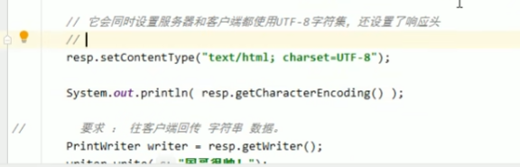
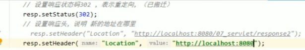
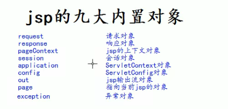

# 2022Study-Servlet笔记

## Servlet架构


## Servlet表单数据

> Servlet 处理表单数据，这些数据会根据不同的情况使用不同的方法自动解析：
>
> - **getParameter()：**您可以调用 request.getParameter() 方法来获取表单参数的值。
> - **getParameterValues()：**如果参数出现一次以上，则调用该方法，并返回多个值，例如复选框。
> - **getParameterNames()：**如果您想要得到当前请求中的所有参数的完整列表，则调用该方法。

> 注意：如果表单提交的数据中有中文数据则需要转码：
>
> ```
> String name =new String(request.getParameter("name").getBytes("ISO8859-1"),"UTF-8");
> ```

## Servlet客户端HTTP请求&Servlet服务器HTTP响应&ServletHTTP状态码

> - 请求行、请求头、请求体
>
> - 响应行、响应头、响应体

[菜鸟教程-Servlet 客户端 HTTP 请求](https://www.runoob.com/servlet/servlet-client-request.html)

[菜鸟教程-Servlet 服务器 HTTP 响应](https://www.runoob.com/servlet/servlet-server-response.html)

[菜鸟教程-Servlet HTTP 状态码](https://www.runoob.com/servlet/servlet-http-status-codes.html)

> 1. 解决post请求的中文乱码问题,下面这句要在获取请求参数之前调用才有效
>
> `request.setCharacterEncoding(“UTF-8”)；`
>
> 2. 解决响应乱码
>
> 
>
> 3. 一行解决编码问题
>
> 

## 转发和重定向

> 转发Forward：一次请求，共享request域，页面地址不变，能访问WEB/INF下的文件，只能转发到当前工程的资源，不能转发到诸如www.baidu.com的地址
>
> 重定向Redirect:两次请求，不共享request域，页面地址改变，不能访问WEB/INF下的文件，可以访问工程外的资源
>
> 

# 2022Study-JSP

## JSP简介

> JSP主要作用是代替servlet程序回传HTML页面数据
>
> JSP本质就是一个servlet程序

## JSP的内置对象和域对象

[菜鸟教程-JSP 隐式对象](https://www.runoob.com/jsp/jsp-implicit-objects.html)




> out.write()和response.getWriter().write()区别：response.getWriter().write()会先输出


## JSP常用标签

[菜鸟教程-JSP指令](https://www.runoob.com/jsp/jsp-directives.html)

[菜鸟教程-JSP 动作元素](https://www.runoob.com/jsp/jsp-actions.html)


# 2022Study-Listener&Filter


## Listener监听器

