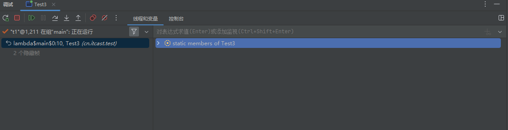

# 并发编程笔记

```markmap
---
markmap:
  zoom: false
  pan: false
  height: 500px
  backgroundColor: "#f8f8f8"
---

# 并发编程笔记
## 1. 概览
### 1.1 为什么学这门课
### 1.2 预备知识
## 2. 进程与线程
### 2.1 异步与同步
### 2.2 多线程提升效率
## 3. Java线程
### 3.1 创建线程
### 3.2 观察线程交替执行
### 3.3 查看进程查看线程的方法
 ### 3.4 原理之线程运行
### 3.5 start和run
### 3.6 sleep和yield
### 应用：防止CPU打满
### 应用：效率join
### 3.9 interrupt
### 模式：两阶段终止
### 3.10 不推荐使用的方法
## 4. 共享模型之管程
### 4.1 变量的线程安全分析
### 4.2 Monitor概念
### 模式：保护性暂停、模式：生产者消费者
### 原理：synchronized原理、synchronized进阶原理
### 4.3 ReentrantLock
## 5. 共享模型之内存
### 5.1 JMM
## 6. 共享模型之无锁
```

## 概览

### 为什么学这门课

你对自己的要求更高，就必须学这门课。

### 预备知识

- slf4j打印日志
- 给线程起名字，是好的工程实践
- lombok
- maven
- java web开发

```xml
<?xml version="1.0" encoding="UTF-8"?>
<project xmlns="http://maven.apache.org/POM/4.0.0"
         xmlns:xsi="http://www.w3.org/2001/XMLSchema-instance"
         xsi:schemaLocation="http://maven.apache.org/POM/4.0.0 http://maven.apache.org/xsd/maven-4.0.0.xsd">
    <modelVersion>4.0.0</modelVersion>

    <groupId>cn.itcast.concurrent</groupId>
    <artifactId>case_java8</artifactId>
    <version>1.0-SNAPSHOT</version>
    <properties>
        <maven.compiler.source>1.8</maven.compiler.source>
        <maven.compiler.target>1.8</maven.compiler.target>
    </properties>
    <dependencies>
        <dependency>
            <groupId>com.fasterxml.jackson.core</groupId>
            <artifactId>jackson-databind</artifactId>
            <version>2.10.0</version>
        </dependency>
        <dependency>
            <groupId>org.projectlombok</groupId>
            <artifactId>lombok</artifactId>
            <version>1.18.10</version>
        </dependency>
        <dependency>
            <groupId>org.springframework</groupId>
            <artifactId>spring-context</artifactId>
            <version>5.2.0.RELEASE</version>
        </dependency>
        <dependency>
            <groupId>org.springframework</groupId>
            <artifactId>spring-webmvc</artifactId>
            <version>5.2.0.RELEASE</version>
        </dependency>
        <dependency>
            <groupId>ch.qos.logback</groupId>
            <artifactId>logback-classic</artifactId>
            <version>1.2.3</version>
        </dependency>
        <dependency>
            <groupId>mysql</groupId>
            <artifactId>mysql-connector-java</artifactId>
            <version>5.1.48</version>
        </dependency>
        <dependency>
            <groupId>org.openjdk.jol</groupId>
            <artifactId>jol-core</artifactId>
            <version>0.10</version>
        </dependency>
    </dependencies>

</project>
```

## 进程与线程

- 线程是最小调度单位
- 进程是最小资源分配单位

### 异步与同步

> 新开一个线程执行，就是异步

```java
/**
 * 同步
 */
@Slf4j(topic = "c.Sync")
public class Sync {

    public static void main(String[] args) {
        FileReader.read(Constants.MP4_FULL_PATH);
        log.debug("do other things ...");
    }

}
```

```java
/**
 * 异步
 */
@Slf4j(topic = "c.Async")
public class Async {

    public static void main(String[] args) {
        new Thread(() -> FileReader.read(Constants.MP4_FULL_PATH)).start();
        log.debug("do other things ...");
    }

}
```

### 多线程提升效率

> 项目：jmh_performance

- 基准测试工具：JMH，它会执行程序预热，执行多次测试取平均
- 限制CPU核数
  - linux是单核
  - windows一般是多核

```java
@Fork(1)
@BenchmarkMode(Mode.AverageTime)
@Warmup(iterations=3)
@Measurement(iterations=5)
public class MyBenchmark {
    static int[] ARRAY = new int[1000_000_00];
    static {
        Arrays.fill(ARRAY, 1);
    }
    @Benchmark
    public int c() throws Exception {
        int[] array = ARRAY;
        FutureTask<Integer> t1 = new FutureTask<>(()->{
            int sum = 0;
            for(int i = 0; i < 250_000_00;i++) {
                sum += array[0+i];
            }
            return sum;
        });
        FutureTask<Integer> t2 = new FutureTask<>(()->{
            int sum = 0;
            for(int i = 0; i < 250_000_00;i++) {
                sum += array[250_000_00+i];
            }
            return sum;
        });
        FutureTask<Integer> t3 = new FutureTask<>(()->{
            int sum = 0;
            for(int i = 0; i < 250_000_00;i++) {
                sum += array[500_000_00+i];
            }
            return sum;
        });
        FutureTask<Integer> t4 = new FutureTask<>(()->{
            int sum = 0;
            for(int i = 0; i < 250_000_00;i++) {
                sum += array[750_000_00+i];
            }
            return sum;
        });
        new Thread(t1).start();
        new Thread(t2).start();
        new Thread(t3).start();
        new Thread(t4).start();
        return t1.get() + t2.get() + t3.get()+ t4.get();
    }
    @Benchmark
    public int d() throws Exception {
        int[] array = ARRAY;
        FutureTask<Integer> t1 = new FutureTask<>(()->{
            int sum = 0;
            for(int i = 0; i < 1000_000_00;i++) {
                sum += array[0+i];
            }
            return sum;
        });
        new Thread(t1).start();
        return t1.get();
    }
}

```

实验结论：

- 多核下多线程效率高
- 单核下单线程效率高，因为多线程有上下文切换

## 3. Java线程

### 3.1 创建线程

```java
@Slf4j(topic = "c.Test1")
public class Test1 {
    public static void main(String[] args) {
        test2();
        log.info("running");
    }

    public static void test2() {

        Thread t = new Thread(()->{ log.debug("running"); }, "t2");

        t.start();
    }
    public static void test1() {
        Thread t = new Thread(){
            @Override
            public void run() {
                log.debug("running");
            }
        };
        t.setName("t1");
        t.start();

    }
}
```

```java
@Slf4j(topic = "c.Test2")
public class Test2 {
    public static void main(String[] args) throws ExecutionException, InterruptedException {
        FutureTask<Integer> task=new FutureTask<>(new Callable<Integer>() {
                @Override
                public Integer call() throws Exception {
                    log.info("running....");
                    Thread.sleep(1000);
                    return 100;
                }
        });
        new Thread(task,"t1").start();
        log.info("{}",task.get());
    }
}
```

### 观察线程交替执行




### 查看进程查看线程的方法

windows

- 任务管理器
- tasklist 查看进程
- taskkill /F /PID <PID> 杀死进程

linux:

- ps -ef 查看所有进程
- ps -ft -p <PID> 查看某个进程的所有线程
- kill <PID> 杀死进程
- top  -H -p <PID> 按大写H切换是否显示线程

java

- jps 列出所有java进程
- jstack <PID> 抓取某个java进程快照
- jconsole 

> jconsole远程监控配置
>
> - 需要以如下方式运行你的 java 类
>
> ```java
> java -Djava.rmi.server.hostname=`ip地址` -Dcom.sun.management.jmxremote -
> Dcom.sun.management.jmxremote.port=`连接端口` -Dcom.sun.management.jmxremote.ssl=是否安全连接 -
> Dcom.sun.management.jmxremote.authenticate=是否认证 java类
> ```
>
> - 修改 /etc/hosts 文件将 127.0.0.1 映射至主机名
>
> 如果要认证访问，还需要做如下步骤
>
> - 复制 jmxremote.password 文件
>
> - 修改 jmxremote.password 和 jmxremote.access 文件的权限为 600 即文件所有者可读写
>
> - 连接时填入 controlRole（用户名），R&D（密码）

### 原理之线程运行

**栈与栈帧**

Java Virtual Machine Stacks （Java 虚拟机栈）

我们都知道 JVM 中由堆、栈、方法区所组成，其中栈内存是给谁用的呢？其实就是线程，每个线程启动后，虚拟

机就会为其分配一块栈内存。

每个栈由多个栈帧（Frame）组成，对应着每次方法调用时所占用的内存

每个线程只能有一个活动栈帧，对应着当前正在执行的那个方法

**线程上下文切换（****Thread Context Switch****）**

因为以下一些原因导致 cpu 不再执行当前的线程，转而执行另一个线程的代码

线程的 cpu 时间片用完

垃圾回收

有更高优先级的线程需要运行

线程自己调用了 sleep、yield、wait、join、park、synchronized、lock 等方法

当 Context Switch 发生时，需要由操作系统保存当前线程的状态，并恢复另一个线程的状态，Java 中对应的概念

就是程序计数器（Program Counter Register），它的作用是记住下一条 jvm 指令的执行地址，是线程私有的

状态包括程序计数器、虚拟机栈中每个栈帧的信息，如局部变量、操作数栈、返回地址等

Context Switch 频繁发生会影响性能


### start和run

直接调用 run 是在主线程中执行了 run，没有启动新的线程

使用 start 是启动新的线程，通过新的线程间接执行 run 中的代码

### sleep和yield

sleep:

1. 调用 sleep 会让当前线程从 *Running* 进入 *Timed Waiting* 状态（阻塞）

2. 其它线程可以使用 interrupt 方法打断正在睡眠的线程，这时 sleep 方法会抛出 InterruptedException
3. 睡眠结束后的线程未必会立刻得到执行
4. 建议用 TimeUnit 的 sleep 代替 Thread 的 sleep 来获得更好的可读性

yield:

1. 调用 yield 会让当前线程从 *Running* 进入 *Runnable* 就绪状态，然后调度执行其它线程

2. 具体的实现依赖于操作系统的任务调度器

线程优先级：

- 线程优先级会提示（hint）调度器优先调度该线程，但它仅仅是一个提示，调度器可以忽略它

- 如果 cpu 比较忙，那么优先级高的线程会获得更多的时间片，但 cpu 闲时，优先级几乎没作用

```java
@Slf4j(topic = "c.Test6")
public class Test6 {

    public static void main(String[] args) {
        Thread t1 = new Thread("t1") {
            @Override
            public void run() {
                try {
                    Thread.sleep(2000);
                } catch (InterruptedException e) {
                    e.printStackTrace();
                }
            }
        };

        t1.start();
        log.debug("t1 state: {}", t1.getState());

        try {
            Thread.sleep(500);
        } catch (InterruptedException e) {
            e.printStackTrace();
        }
        log.debug("t1 state: {}", t1.getState());
    }
}
```

```java
@Slf4j(topic = "c.Test7")
public class Test7 {

    public static void main(String[] args) throws InterruptedException {
        Thread t1 = new Thread("t1") {
            @Override
            public void run() {
                log.debug("enter sleep...");
                try {
                    Thread.sleep(2000);
                } catch (InterruptedException e) {
                    log.debug("wake up...");
                    e.printStackTrace();
                }
            }
        };
        t1.start();

        Thread.sleep(1000);
        log.debug("interrupt...");
        t1.interrupt();
    }
}
```

```java
@Slf4j(topic = "c.Test9")
public class Test9 {

    public static void main(String[] args) {
        Runnable task1 = () -> {
            int count = 0;
            for (;;) {
                System.out.println("---->1 " + count++);
            }
        };
        Runnable task2 = () -> {
            int count = 0;
            for (;;) {
//                Thread.yield();
                System.out.println("              ---->2 " + count++);
            }
        };
        Thread t1 = new Thread(task1, "t1");
        Thread t2 = new Thread(task2, "t2");
//        如果CPU比较忙，t2的优先级会比t1高，导致t2先执行，t1被阻塞，
//        如果CPU比较闲，优先级几乎没有作用
        t1.setPriority(Thread.MIN_PRIORITY);
        t2.setPriority(Thread.MAX_PRIORITY);
        t1.start();
        t2.start();
    }
}
```

### 应用：防止CPU打满

```java
while(true) {
 try {
 Thread.sleep(50);
 } catch (InterruptedException e) {
 e.printStackTrace();
 }
}
```

- 可以用 wait 或 条件变量达到类似的效果

- 不同的是，后两种都需要加锁，并且需要相应的唤醒操作，一般适用于要进行同步的场景

- sleep 适用于无需锁同步的场景

### 应用：效率join

- 有时限等待
- 无时限等待

### interrupt

- sleep，wait,join打断
- 正常运行线程的打断

```java
@Slf4j(topic = "c.Test11")
public class Test11 {

    public static void main(String[] args) throws InterruptedException {
        Thread t1 = new Thread(() -> {
            log.debug("sleep...");
            try {
                Thread.sleep(5000); // wait, join
            } catch (InterruptedException e) {
//                会清除打断标记
                e.printStackTrace();
            }
        },"t1");

        t1.start();
        Thread.sleep(1000);
        log.debug("interrupt");
        t1.interrupt();
        log.debug("打断标记:{}", t1.isInterrupted());
    }
}
```

```java
/**
 * 利用打断标记停止线程
 */
@Slf4j(topic = "c.Test12")
public class Test12 {

    public static void main(String[] args) throws InterruptedException {
        Thread t1 = new Thread(() -> {
            while(true) {
                boolean interrupted = Thread.currentThread().isInterrupted();
                if(interrupted) {
                    log.debug("被打断了, 退出循环");
                    break;
                }
            }
        }, "t1");
        t1.start();

        Thread.sleep(1000);
        log.debug("interrupt");
        t1.interrupt();
    }
}
```

```java
package cn.itcast.test;

import lombok.extern.slf4j.Slf4j;

import java.util.concurrent.locks.LockSupport;

import static cn.itcast.n2.util.Sleeper.sleep;

@Slf4j(topic = "c.Test14")
public class Test14 {

    private static void test4() {
        Thread t1 = new Thread(() -> {
            for (int i = 0; i < 5; i++) {
                log.debug("park...");
                // 打断时，LockSupport.park直接放行
                LockSupport.park();
                log.debug("unpark...");
                log.debug("打断状态：{}", Thread.interrupted());// 清除打断标记
                LockSupport.park();
                log.debug("unpark...");
            }
        });
        t1.start();


        sleep(1);
        t1.interrupt();
    }

    private static void test3() throws InterruptedException {
        Thread t1 = new Thread(() -> {
            log.debug("park...");
            LockSupport.park();
            log.debug("unpark...");
            log.debug("打断状态：{}", Thread.currentThread().isInterrupted());
            LockSupport.park();
            log.debug("unpark...");
        }, "t1");
        t1.start();

        sleep(1);
        t1.interrupt();

    }

    public static void main(String[] args) throws InterruptedException {
        test4();
//        test3();
    }
    
}

```


### 模式：两阶段终止


```java
@Slf4j(topic = "c.TPTInterrupt")
class TPTInterrupt {
    private Thread thread;

    public void start(){
        thread = new Thread(() -> {
            while(true) {
                Thread current = Thread.currentThread();
                if(current.isInterrupted()) {
                    log.debug("料理后事");
                    break;
                }
                try {
                    Thread.sleep(1000);
                    log.debug("将结果保存");
                } catch (InterruptedException e) {
                    current.interrupt();
                }

            }
        },"监控线程");
        thread.start();
    }

    public void stop() {
        thread.interrupt();
    }
```


```java
/**
 * 两阶段停止
 */
@Slf4j(topic = "c.TwoPhaseTermination")
public class Test13 {
    public static void main(String[] args) throws InterruptedException {
        TwoPhaseTermination tpt = new TwoPhaseTermination();
        tpt.start();
        tpt.start();
        tpt.start();

        Thread.sleep(3500);
        log.debug("停止监控");
        tpt.stop();
    }
}

@Slf4j(topic = "c.TwoPhaseTermination")
class TwoPhaseTermination {
    // 监控线程
    private Thread monitorThread;
    // 停止标记
    private volatile boolean stop = false;
    // 判断是否执行过 start 方法
    private boolean starting = false;

    // 启动监控线程
    public void start() {
        synchronized (this) {
            if (starting) { // false
                return;
            }
            starting = true;
        }
        monitorThread = new Thread(() -> {
            while (true) {
                Thread current = Thread.currentThread();
                // 是否被打断
                if (stop) {
                    log.debug("料理后事");
                    break;
                }
                try {
                    Thread.sleep(1000);
                    log.debug("执行监控记录");
                } catch (InterruptedException e) {
                    e.printStackTrace();
                    // 重新设置打断标记 如果不加这个，不会终止监控
                    current.interrupt();
                }
            }
        }, "monitor");
        monitorThread.start();
    }

    // 停止监控线程
    public void stop() {
        stop = true;
        monitorThread.interrupt();
    }
}
```

### 不推荐使用的方法

stop(),suspend(),resume()方法已过时,使用两阶段终止模式停止线程

## 共享模型之管程

### 变量的线程安全分析

**成员变量和静态变量是否线程安全？**

如果它们没有共享，则线程安全

如果它们被共享了，根据它们的状态是否能够改变，又分两种情况

如果只有读操作，则线程安全

如果有读写操作，则这段代码是临界区，需要考虑线程安全

**局部变量是否线程安全？**

局部变量是线程安全的

但局部变量引用的对象则未必

如果该对象没有逃离方法的作用访问，它是线程安全的

如果该对象逃离方法的作用范围，需要考虑线程安全

**常见线程安全类**

String

Integer

StringBuffer

Random

Vector

Hashtable

java.util.concurrent 包下的类

### Monitor概念

普通对象对象头：

```
|--------------------------------------------------------------|
| Object Header (64 bits) |
|------------------------------------|-------------------------|
| Mark Word (32 bits) | Klass Word (32 bits) |
|------------------------------------|-------------------------|
```

数组对象对象头：

```
|---------------------------------------------------------------------------------|
| Object Header (96 bits) |
|--------------------------------|-----------------------|------------------------|
| Mark Word(32bits) | Klass Word(32bits) | array length(32bits) |
|--------------------------------|-----------------------|------------------------|
```

markword结构为：

```
|--------------------------------------------------------------------|--------------------|
| Mark Word (64 bits) | State |
|--------------------------------------------------------------------|--------------------|
| unused:25 | hashcode:31 | unused:1 | age:4 | biased_lock:0 | 01 | Normal |
|--------------------------------------------------------------------|--------------------|
| thread:54 | epoch:2 | unused:1 | age:4 | biased_lock:1 | 01 | Biased |
|--------------------------------------------------------------------|--------------------|
| ptr_to_lock_record:62 | 00 | Lightweight Locked |
|--------------------------------------------------------------------|--------------------|
| ptr_to_heavyweight_monitor:62 | 10 | Heavyweight Locked |
|--------------------------------------------------------------------|--------------------|
| | 11 | Marked for GC |
|--------------------------------------------------------------------|--------------------|
```

Monitor 被翻译为**监视器**或**管程**，每个 Java 对象都可以关联一个 Monitor 对象，如果使用 synchronized 给对象上锁（重量级）之后，该对象头的，Mark Word 中就被设置指向 Monitor 对象的指针


```
public static void main(java.lang.String[]);
 descriptor: ([Ljava/lang/String;)V
 flags: ACC_PUBLIC, ACC_STATIC
  Code:
 stack=2, locals=3, args_size=1
 0: getstatic #2 // <- lock引用 （synchronized开始）
 3: dup
 4: astore_1 // lock引用 -> slot 1
 5: monitorenter // 将 lock对象 MarkWord 置为 Monitor 指针
 6: getstatic #3 // <- i
 9: iconst_1 // 准备常数 1
 10: iadd // +1
 11: putstatic #3 // -> i
 14: aload_1 // <- lock引用
 15: monitorexit // 将 lock对象 MarkWord 重置, 唤醒 EntryList
 16: goto 24
 19: astore_2 // e -> slot 2 
 20: aload_1 // <- lock引用
 21: monitorexit // 将 lock对象 MarkWord 重置, 唤醒 EntryList
 22: aload_2 // <- slot 2 (e)
 23: athrow // throw e
 24: return
 Exception table:
 from to target type
 6 16 19 any
 19 22 19 any
 LineNumberTable:
 line 8: 0
 line 9: 6
 line 10: 14
 line 11: 24
 LocalVariableTable:
 Start Length Slot Name Signature
 0 25 0 args [Ljava/lang/String;
 StackMapTable: number_of_entries = 2
 frame_type = 255 /* full_frame */
 offset_delta = 19
 locals = [ class "[Ljava/lang/String;", class java/lang/Object ]
 stack = [ class java/lang/Throwable ]
 frame_type = 250 /* chop */
 offset_delta = 4
```

### 模式：保护性暂停、模式：生产者消费者

```java
package cn.itcast.test;

import cn.itcast.n2.util.Sleeper;
import lombok.extern.slf4j.Slf4j;

import java.util.Hashtable;
import java.util.Map;
import java.util.Set;

/**
 * 同步模式之保护性暂停，join方法的底层实现
 */
@Slf4j(topic = "c.Test20")
public class Test20 {
    public static void main(String[] args) throws InterruptedException {
        for (int i = 0; i < 3; i++) {
            new People().start();
        }
        Sleeper.sleep(1);
        for (Integer id : Mailboxes.getIds()) {
            new Postman(id, "内容" + id).start();
        }
    }
}

@Slf4j(topic = "c.People")
class People extends Thread{
    @Override
    public void run() {
        // 收信
        GuardedObject guardedObject = Mailboxes.createGuardedObject();
        log.debug("开始收信 id:{}", guardedObject.getId());
        Object mail = guardedObject.get(5000);
        log.debug("收到信 id:{}, 内容:{}", guardedObject.getId(), mail);
    }
}

@Slf4j(topic = "c.Postman")
class Postman extends Thread {
    private int id;
    private String mail;

    public Postman(int id, String mail) {
        this.id = id;
        this.mail = mail;
    }

    @Override
    public void run() {
        GuardedObject guardedObject = Mailboxes.getGuardedObject(id);
        log.debug("送信 id:{}, 内容:{}", id, mail);
        guardedObject.complete(mail);
    }
}

class Mailboxes {
    private static Map<Integer, GuardedObject> boxes = new Hashtable<>();

    private static int id = 1;
    // 产生唯一 id
    private static synchronized int generateId() {
        return id++;
    }

    public static GuardedObject getGuardedObject(int id) {
        return boxes.remove(id);
    }

    public static GuardedObject createGuardedObject() {
        GuardedObject go = new GuardedObject(generateId());
        boxes.put(go.getId(), go);
        return go;
    }

    public static Set<Integer> getIds() {
        return boxes.keySet();
    }
}

// 增加超时效果
class GuardedObject {

    // 标识 Guarded Object
    private int id;

    public GuardedObject(int id) {
        this.id = id;
    }

    public int getId() {
        return id;
    }

    // 结果
    private Object response;

    // 获取结果
    // timeout 表示要等待多久 2000
    public Object get(long timeout) {
        synchronized (this) {
            // 开始时间 15:00:00
            long begin = System.currentTimeMillis();
            // 经历的时间
            long passedTime = 0;
            while (response == null) {
                // 这一轮循环应该等待的时间
                long waitTime = timeout - passedTime;
                // 经历的时间超过了最大等待时间时，退出循环
                if (timeout - passedTime <= 0) {
                    break;
                }
                try {
                    this.wait(waitTime); // 虚假唤醒 15:00:01
                } catch (InterruptedException e) {
                    e.printStackTrace();
                }
                // 求得经历时间
                passedTime = System.currentTimeMillis() - begin; // 15:00:02  1s
            }
            return response;
        }
    }

    // 产生结果
    public void complete(Object response) {
        synchronized (this) {
            // 给结果成员变量赋值
            this.response = response;
            this.notifyAll();
        }
    }
}
```


### 原理：synchronized原理、synchronized进阶原理

> 见PDF《并发编程 原理篇》

### ReentrantLock

相对于 synchronized 它具备如下特点

- 可中断

- 可以设置超时时间

- 可以设置为公平锁

- 支持多个条件变量

与 synchronized 一样，都支持可重入


